# ÁLLAMI   SZÁMVEVŐSZÉK 

## JELENTÉS

Az állami vagyon feletti tulajdonosi joggyakorlással kapcsolatos tevékenységek ellenőrzése

---

# Állami Számvevőszék 

Iktatószám: V-0837-393/2015.
Témaszám: 1871
Vizsgálat-azonosító szám: V0727

## Az ellenőrzést felügyelte:

## Makkai Mária

felügyeleti vezető

## Az ellenőrzést vezette és az ellenőrzés végrehajtásáért felelős:

Dr. Láng Ágnes Krisztina
ellenőrzésvezető
Moder Beatrix
ellenőrzésvezető

## A számvevői munkaanyagok feldolgozásában és a jelentés összeállításában közremüködtek:

| Koczor László   számvevő tanácsos | Pappné dr. Szamosi Éva   számvevő tanácsos | Tamás László   számvevő |
| :-- | :-- | :-- |

## Az ellenőrzést végezték:

| Baritsa Orsolya   számvevő | Dr. Eke-Pekács Tibor   számvevő tanácsos | Farkas László   számvevő tanácsos |
| :-- | :-- | :-- |
| Gölöncsér Péter   számvevő | Hegyes Mária   számvevő tanácsos | Koczor László   számvevő tanácsos |
| Kovács Richárd   számvevő | Dr. Lajos Béla   számvevő főtanácsos | Liziczai Imréné   számvevő |
| Nagy Erika   számvevő | Pappné dr. Szamosi Éva   számvevő tanácsos | Szabó Erzsébet   számvevő tanácsos |
| Tamás László   számvevő | Tóth Richárd   számvevő | Dr. Vincze Ibolya   számvevő |
|  | Vörösné Lakatos   Zsuzsanna   számvevő |  |

A témához kapcsolódó eddig készített számvevőszéki jelentések: címe
sorszáma
Jelentés az állami vagyon feletti tulajdonosi joggyakorlással kap- 14236 csolatos tevékenységek ellenőrzéséről
Jelentés az állami vagyon feletti kontroll - az állami vagyon feletti 13193
tulajdonosi joggyakorlással kapcsolatos tevékenységek ellenőrzéséről
Jelentés az állami vagyon feletti tulajdonosi joggyakorlással kap- 12109 csolatos 2011. évi tevékenységek ellenőrzéséről

---

# TARTALOMJEGYZÉK 

BEVEZETÉS ..... 5
I. ÖSSZEGZŐ MEGÁLLAPÍTÁSOK, KÖVETKEZTETÉSEK, JAVASLATOK ..... 9
II. RÉSZLETES MEGÁLLAPÍTÁSOK ..... 19

1. A tulajdonosi Joggyakorló szervezetek kontrollkörnyezete ..... 19
1.1. A tulajdonosi joggyakorló költségvetési szervek kontrollkörnyezete ..... 19
1.1.1. Gyógyszerészeti és Egészségügyi Minőség- és Szervezetfejlesztési Intézet ..... 19
1.1.2. Emberi Erőforrások Minisztériuma ..... 21
1.1.3. Földmúvelésügyi Minisztérium ..... 23
1.1.4. Nemzeti Fejlesztési Minisztérium ..... 25
1.1.5. Nemzeti Földalapkezelő Szervezet ..... 26
1.2. A tulajdonosi joggyakorló gazdasági társaságok kontrollkörnyezete ..... 28
1.2.1. Magyar Fejlesztési Bank Zrt. ..... 28
1.2.2. Magyar Nemzeti Vagyonkezelő Zrt. ..... 30
2. A tulajdonosi joggyakorló szervezetek ellenőrzési rendszere ..... 33
2.1. A tulajdonosi joggyakorló költségvetési szervek és az MNV Zrt. tulajdonosi joggyakorláshoz kapcsolódó nyomon követési rendszere ..... 33
2.1.1. Gyógyszerészeti és Egészségügyi Minőség- és Szervezetfejlesztési Intézet ..... 33
2.1.2. Emberi Erőforrások Minisztériuma ..... 35
2.1.3. Földmúvelésügyi Minisztérium ..... 36
2.1.4. Nemzeti Fejlesztési Minisztérium ..... 39
2.1.5. Nemzeti Földalapkezelő Szervezet ..... 40
2.1.6. Magyar Nemzeti Vagyonkezelő Zrt. ..... 42
2.2. A tulajdonosi joggyakorló szervezetek tulajdonosi ellenőrzési rendszere ..... 44
2.2.1. Magyar Fejlesztési Bank Zrt. ..... 44
2.2.2. Magyar Nemzeti Vagyonkezelő Zrt. ..... 45
2.2.3. Nemzeti Földalapkezelő Szervezet ..... 46
3. A tulajdonosi joggyakorló szervezetek kontrolltevékenysége az állami tulajdonú ingatlanok vagyonkezelésbe adása, hasznosításra átengedése, illetve ingyenes átruházása tekintetében ..... 47
3.1. Az állami tulajdonú ingatlanok vagyonkezelésbe adása ..... 47
3.1.1. Gyógyszerészeti és Egészségügyi Minőség- és Szervezetfejlesztési Intézet ..... 47

---

3.1.2. Magyar Nemzeti Vagyonkezelő Zrt. ..... 48
3.1.3. Nemzeti Földalapkezelő Szervezet ..... 48
3.2. Az állami tulajdonú ingatlanok hasznosításba adása ..... 50
3.2.1. Gyógyszerészeti és Egészségügyi Minőség- és Szervezetfejlesztési Intézet ..... 50
3.2.2. Magyar Nemzeti Vagyonkezelő Zrt. ..... 51
3.2.3. Nemzeti Földalapkezelő Szervezet ..... 52
3.3. Az állami tulajdonú ingatlanok ingyenes átruházása ..... 54
3.3.1. Gyógyszerészeti és Egészségügyi Minőség- és Szervezetfejlesztési Intézet ..... 54
3.3.2. Magyar Nemzeti Vagyonkezelő Zrt. ..... 54
3.3.3. Nemzeti Földalapkezelő Szervezet ..... 55
4. A rábízott vagyon tekintetében a tulajdonosi joggyakorló szervezetek közötti vagyonátadás-átvétel, a jogszabályokban előírt adatszolgáltatások teljesítése ..... 56
4.1. A tulajdonosi joggyakorló szervezetek közötti vagyonátadás-átvétel ..... 56
4.2. A jogszabályokban előírt adatszolgáltatások teljesítése ..... 59
5. Az Országleltár elkészítése és múködése ..... 60

---

# MELLÉKLETEK 

1. számú Az Emberi Erőforrások Minisztériuma miniszterének észrevétele
2. számú Az Emberi Erőforrások Minisztériuma miniszterének észrevételére adott válasz
3. számú A Nemzeti Fejlesztési Minisztérium miniszterének észrevétele
4. számú A Nemzeti Fejlesztési Minisztérium miniszterének észrevételére adott válasz
5. számú A Magyar Nemzeti Vagyonkezelő Zrt. vezérigazgatójának észrevétele
6. számú A Magyar Nemzeti Vagyonkezelő Zrt. vezérigazgatójának észrevételére adott válasz
7. számú A Magyar Fejlesztési Bank Zrt. vezérigazgatójának észrevétele
8. számú A Magyar Fejlesztési Bank Zrt. vezérigazgatójának észrevételére adott válasz
9. számú A Nemzeti Földalapkezelő Szervezet elnökének észrevétele
10. számú A Nemzeti Földalapkezelő Szervezet elnökének észrevételére adott válasz
11. számú Az Állami Egészségügyi Ellátó Központ főigazgatójának észrevétele
12. számú Az Állami Egészségügyi Ellátó Központ főigazgatójának észrevételére adott válasz

## FÜGGELÉKEK

1. számú Rövidítések jegyzéke
2. számú Fogalomtár

---

$\cdot$
$\cdot$
$\cdot$
$\cdot$
$\cdot$
$\cdot$
$\cdot$
$\cdot$
$\cdot$
$\cdot$
$\cdot$
$\cdot$
$\cdot$
$\cdot$
$\cdot$
$\cdot$
$\cdot$
$\cdot$
$\cdot$
$\cdot$
$\cdot$
$\cdot$
$\cdot$
$\cdot$
$\cdot$
$\cdot$
$\cdot$
$\cdot$
$\cdot$
$\cdot$
$\cdot$
$\cdot$
$\cdot$
$\cdot$
$\cdot$
$\cdot$
$\cdot$
$\cdot$
$\cdot$
$\cdot$
$\cdot$
$\cdot$
$\cdot$
$\cdot$
$\cdot$
$\cdot$
$\cdot$
$\cdot$
$\cdot$
$\cdot$
$\cdot$
$\cdot$
$\cdot$
$\cdot$
$\cdot$
$\cdot$
$\cdot$
$\cdot$
$\cdot$
$\cdot$
$\cdot$
$\cdot$
$\cdot$
$\cdot$
$\cdot$
$\cdot$
$\cdot$
$\cdot$
$\

---

# JELENTÉS 

## az állami vagyon feletti tulajdonosi joggyakorlással kapcsolatos tevékenységek ellenőrzéséről

## BEVEZETÉS

A hazai jogszabályi környezetben az állami vagyonnal való gazdálkodás szabályozása több pilléren nyugszik. Az Alaptörvény 2011-ben bevezette a nemzeti vagyon fogalmát, rendelkezései alapján 2011. december 31-étől hatályba lépett a nemzeti vagyonról szóló 2011. évi CXCVI. törvény (Nvtv.), amely meghatározta a nemzeti vagyon rendeltetését, kategóriáit és a vagyongazdálkodás keretszabályait. Az Nvtv. szerint az állam tulajdonában álló vagyon feletti tulajdonosi joggyakorlás módját, valamint a vagyonnal való gazdálkodás szabályait az állami vagyonról szóló 2007. évi CVI. törvény (Vtv.) állapítja meg. Az állami tulajdonban lévő termőföldvagyon hasznosítására, vagyonkezelésére és nyilvántartására, a - kincstári vagyon részét képező - Nemzeti Földalap feletti tulajdonosi jogok gyakorlására vonatkozó szabályokat a Nemzeti Földalapról szóló 2010. évi LXXXVII. törvény (Nfatv.) határozza meg.

Az állami vagyonnal való gazdálkodásra, az állami vagyon feletti tulajdonosi joggyakorlásra vonatkozó jogszabályi háttér, a tulajdonosi jogok gyakorlásával összefüggő feladatok ellátása, a joggyakorlók köre és szervezetrendszere az elmúlt években folyamatosan, 2014-ben is több alkalommal változott.

A Vtv. 3. § (1) bekezdése 2013. június 28 -ától 2014. július 15 -éig hatályos rendelkezése szerint az állami vagyon felett az államot megillető tulajdonosi jogok és kötelezettségek összességét tulajdonosi joggyakorlóként, ha törvény, vagy miniszteri rendelet eltérően nem rendelkezett, az MNV Zrt., vagy törvényben kijelölt személy, vagy az állami vagyon felügyeletéért felelős miniszter (NFM miniszter) által rendeletben kijelölt személy gyakorolta. 2014. július 15 -élg az MFB Zrt. feletti tulajdonosi jogokat az NFM miniszter, a Magyar Posta Zrt. feletti tulajdonosi jogokat az MNV Zrt. látta el.

A Vtv. 2014. július 16 -ától hatályos 3. § (1) bekezdés és a (2) bekezdés a) pontja szerint a rábízott állami vagyon felett az államot megillető tulajdonosi jogok és kötelezettségek összességét tulajdonosi joggyakorlóként - ha törvény vagy miniszteri rendelet eltérően nem rendelkezik - az MNV Zrt. gyakorolja. Az MFB Zrt. és a Magyar Posta Zrt. felett a tulajdonosi jogok gyakorlója a kormányzati tevékenység összehangolásáért felelős miniszter (Miniszterelnökséget vezető miniszter) lett.

A Magyar Fejlesztési Bank Részvénytársaságról szóló 2001. évi XX. törvény (Mfbtv.), valamint az erdőről, az erdő védelméről és az erdőgazdálkodásról szó-

---

ló 2009. évi XXXVII. törvény (Erdőtv.) 2014. július 16-ától hatályos módosításával az állami tulajdonban álló erdőgazdasági tevékenységet végző gazdasági társaságok kikerültek az MFB Zrt. tulajdonosi joggyakorlása alól, és az Erdőtv. 1. számú mellékletében meghatározott 22 gazdasági társaság felett az FM miniszter lett a tulajdonosi joggyakorló.

Azon állami tulajdonban álló ingatlanok felett, amelyek egy része a Nemzeti Földalapba tartozik, 2011. augusztus 1-je óta az NFM miniszter az FM miniszterrel közösen gyakorolja a tulajdonosi jogokat az Nfatv., valamint az annak végrehajtására kiadott jogszabályban meghatározottak szerint. 2012. január 1jétől az Egészségbiztosítási Alap ellátási vagyona, és a Nyugdíjbiztosítási Alap ellátási vagyona tekintetében az egészségbiztosításért és a nyugdíjpolitikáért felelős miniszter (EMMI miniszter) a Vtv.-ben kijelölt tulajdonosi joggyakorló.

Az államot megillető tulajdonosi jogok és kötelezettségek összességének, illetve azok meghatározott részének gyakorlója meghatározott időtartamra rendeletben kijelölhető. Az NFM miniszter az MNV Zrt. tulajdonosi joggyakorlásába tartozó állami vagyoni kör tekintetében, a Vtv. 2014. július 16-ától hatályos módosítása értelmében a Miniszterelnökséget vezető miniszter az MFB Zrt. és a Magyar Posta Zrt. tekintetében jelölhet ki tulajdonosi joggyakorlót.

A települési önkormányzatok fekvőbeteg-szakellátó intézményeinek átvételéről és az átvételhez kapcsolódó egyes törvények módosításáról szóló 2012. évi XXXVIII. törvény (Ttv.) szerint az államot megillető tulajdonosi jogok és kötelezettségek összességének gyakorlására az egészségügyi feladatellátást szolgáló vagyon tekintetében 2012. május 1-jétől a Gyógyszerészeti és Egészségügyi Mi-nőség- és Szervezetfejlesztési Intézet (GYEMSZI) jogosult ${ }^{1}$. A GYEMSZI - a Vtv. 3. § (1) bekezdésével összhangban - külön törvény rendelkezése alapján gyakorolja tulajdonosi jogait.

A Vtv. 3. § (4) bekezdése szerint az állami vagyon feletti tulajdonosi joggyakorlással kapcsolatos, továbbá az Nfatv. 14. § (1) bekezdése szerint a Nemzeti Földalap feletti tulajdonosi joggyakorlással kapcsolatos tevékenységeket az Állami Számvevőszék évente ellenőrzi.

Az ellenőrzés célja annak megítélése volt, hogy az állam tulajdonosi jogait gyakorló szervezetek intézkedései, kontrollkörnyezete, valamint ellenőrzési és kontrollrendszerei biztosították-e a tulajdonosi joggyakorlási feladatok szabályszerű ellátását.

Mintavétellel ellenőriztük az MNV Zrt.-nél és a GYEMSZI-nél az állami tulajdonú ingatlanok vagyonkezelésbe adásával, az MNV Zrt.-nél és az NFA-nál a hasznosításra történő átadásával, illetve az MNV Zrt.-nél az ingyenes tulajdonba adással kapcsolatos intézkedések szabályszerűségét. A minta alapján a sokaságban előforduló hibaarányt becsültük. „Megfelelőnek" értékeltük az ellenőrzött területet, amennyiben $95 \%$-os megbízhatósággal a sokaságra vonat-

[^0]
[^0]:    ${ }^{1}$ Az Állami Egészségügyi Ellátó Központról szóló 27/2015. (II. 25.) Korm. rendelet 8. § értelmében 2015. március 1-jétől a GYEMSZI elnevezése Állami Egészségügyi Ellátó Központra (ÁEEK) változott.

---

kozó hibaarány legfeljebb 10\% volt, ,,nem teljes körüen megfelelőnek" értékeltük, ha a hibaarány felső határa 10-30\% között volt, ,,nem megfelelőnek" pedig akkor, ha a mintavételi eredmények alapján a sokaságbeli hibaarány felső határa meghaladta a $30 \%$-ot. A tulajdonosi joggyakorló szervezetek közötti va-gyonátadás,- átvétel szabályszerűségét az erdőgazdasági társaságok esetében mintavétellel, a további esetekben tételesen ellenőriztük.

Az ellenőrzés eredményeként az ÁSZ véleményt formál arról, hogy a Magyar Állam tulajdonosi joggyakorlásában érintett szervezetek intézkedései, kontrollkörnyezete, valamint ellenőrzési és kontroll rendszerei biztosították-e a tulajdonosi joggyakorlási feladatok szabályszerű ellátását, azok összhangban voltak-e az állami vagyonra vonatkozó jogszabályok rendelkezéseivel. Az ÁSZ tanácsadó szerepét erősítve az ellenőrzések megállapításaival hozzá kíván járulni az állami vagyon feletti kontrollrendszer erősítéséhez, a szabályozási hiányosságok, feladatelmaradások pótlásához. Ellenőrzésünk megalapozhatja a joggyakorlásban résztvevő szervezetek tevékenységét szabályozó törvényi előírások, belső szabályzatok, eljárási rendek felülvizsgálatát. Az ellenőrzés feltárhatja az esetleges jogszabályi, vagy intézményi szabályozási hiányosságokat, illetve az intézkedések teljes körű szabályosságát korlátozó rendszerszintű, vagy évek óta fennálló hiányosságokat, problémákat, egyben javaslatot tehet az azok megszüntetését, vagy megoldását célzó intézkedésekre. Az esetlegesen feltárt hiányosságok bemutatásával ellenőrzésünk hozzájárul azok kijavításához, támogatva a jó kormányzást, valamint közvetetten az állami vagyonnal való gazdálkodással kapcsolatos közbizalom erősítését. Az ellenőrzés szélesebb összefüggéseket bemutató általános tájékozottságot adhat a társadalom részére az állami vagyon feletti tulajdonosi joggyakorlás helyzetéről, amely hozzájárulhat a civil kontroll erősítéséhez és javíthatja az átláthatóságot.

Az ellenőrzés típusa: szabályszerűségi ellenőrzés.
Az ellenőrzött időszak: 2014. január 1-jétől 2014. december 31-ig terjed.
Az ellenőrzéssel érintett szervezetek: a Magyar Nemzeti Vagyonkezelő Zrt., a Nemzeti Fejlesztési Minisztérium, a Földművelésügyi Minisztérium, az Emberi Erőforrások Minisztériuma, a Magyar Fejlesztési Bank Zrt., a Nemzeti Földalapkezelő Szervezet és a Gyógyszerészeti és Egészségügyi Minőség- és Szervezetfejlesztési Intézet.

Az ellenőrzés szakmai módszertana az ÁSZ hivatalos honlapján (www.asz.hu) közzétett szakmai szabályokon alapult, amely a Legfőbb Ellenőrző Intézmények Nemzetközi Szervezete (INTOSAI) által kiadott nemzetközi standardok (ISSAI) figyelembevételével készült.

Az ellenőrzés jogszabályi alapját az Állami Számvevőszékről szóló 2011. évi LXVI. törvény (ÁSZ tv.) 5. § (4) bekezdés a) pontja, valamint a Vtv. 3. § (4) bekezdése és az Nfatv. 14. § (1) bekezdése képezte.

Az ÁSZ a 2011. évi LXVI. törvény 29. §-a szerint a jelentéstervezetet megküldte az Emberi Erőforrások Minisztériuma miniszterének, a Földművelésügyi Minisztérium miniszterének, a Nemzeti Fejlesztési Minisztérium miniszterének, a Nemzeti Vagyonkezelő Zrt. vezérigazgatójának, a Magyar Fejlesztési Bank Zrt.

---

vezérigazgatójának, a Nemzeti Földalapkezelő Szervezet elnökének és az Állami Egészségügyi Ellátó Központ főigazgatójának. Az Emberi Erőforrások Minisztériuma miniszterének észrevételét és az arra adott választ az 1-2. számú melléklet, a Nemzeti Fejlesztési Minisztérium miniszterének észrevételét és az arra adott választ a 3-4. számú melléklet, a Magyar Nemzeti Vagyonkezelő Zrt. vezérigazgatójának észrevételét és az arra adott választ az 5-6. számú melléklet, a Magyar Fejlesztési Bank Zrt. vezérigazgatója észrevételét és az arra adott választ a 7-8 számú melléklet, a Nemzeti Földalapkezelő Szervezet elnökének észrevételét és az arra adott választ a 9-10. számú melléklet, és az Állami Egészségügyi Ellátó Központ főigazgatójának észrevételét és az arra adott választ a 11-12. számú melléklet tartalmazza. A Földművelésügyi Minisztérium minisztere az ÁSZ tv. 29. § (2) bekezdésében foglalt észrevételezési jogával nem élt, a törvényes határidőn belül észrevételt nem tett.

---

# I. ÖSSZEGZŐ MEGÁLLAPÍTÁSOK, KÖVETKEZTETÉSEK, JAVASLATOK 

Az állami vagyon feletti tulajdonosi joggyakorlással kapcsolatos feladatokat ellátó szervezetek kontrollkörnyezetének és ellenőrzési rendszerének kialakítása szabályozottabbá vált az előző évhez képest, de a kontrolltevékenységekkel együtt nem biztosították teljes körűen a tulajdonosi joggyakorlási feladatok szabályszerú ellátását.

Az FM-nél, az NFM-nél, az NFA-nál, az EMMI-nél, az MFB Zrt.-nél és az MNV Zrt.-nél a tulajdonosi joggyakorláshoz szükséges kontrollkörnyezet kialakítása - kisebb hiányosságok mellett - megfelel t a jogszabályi előírásoknak. Az ellenőrzött szervezetek rendelkeztek az Áht. és az Ávr. előírásainak megfelelő alapító okiratokkal, SZMSZ-ekkel.

Az NFM-nél a tulajdonosi joggyakorlással kapcsolatos feladatokat ellátó főosztályok egy kivételével rendelkeztek az Ávr.-ben foglaltaknak megfelelő ügyrendekkel. Az FM számlarendje és az MNV Zrt. rábízott állami vagyon számlarendje nem támogatta az ellenőrizhetőséget és visszakereshetőséget, mert az Áhsz.-ben előírtak ellenére nem tartalmazta a részletező nyilvántartásoknak a kapcsolódó könyvviteli és nyilvántartási számlákkal való egyeztetésének dokumentálását. Az MNV Zrt.-nél a Számv. tv.-ben foglaltakkal szemben az ingatlanok mennyiségi felvétellel történő leltározásának gyakoriságát négyévenként rögzítették, továbbá a vagyonnyilvántartási szabályzatban a Vhr.-ben előírtak ellenére nem határozták meg az állami vagyon használója és haszonélvezője adatszolgáltatásának részletes tartalmát, formáját.

Az NFA-nál a számviteli politikában nem rögzítették, hogy a számviteli elszámolás és az értékelés szempontjából mit tekintenek jelentősnek, ami kockázatot jelentett a Számv. tv.-ben rögzített számviteli alapelvek megfelelő érvényesülésében. A számlarend nem tartalmazta a részletező nyilvántartások és az egységes rovatrend rovataihoz kapcsolódóan vezetett nyilvántartási számlák adataiból a pénzügyi könyvvezetéshez készült összesítő bizonylatok (feladások) elkészítésének rendjét, továbbá a leltározási és leltárkészítési szabályzatban nem határozták meg a mennyiségi felvétellel történő leltározás gyakoriságát. Az MFB Zrt.-nél az SZMSZ nem az Mfbtv. 2014. július 16-ától hatályos 1. mellékletében foglaltakkal összhangban határozta meg a tulajdonosi joggyakorlása alá tartozó gazdasági társaságokat, továbbá nem a módosított Vtv. szerint rögzítette az MFB Zrt. feletti tulajdonosi joggyakorlót.

A GYEMSZI-nél a tulajdonosi joggyakorláshoz szükséges kontrollkörnyezet kialakítása nem felelt meg teljes körűen a jogszabályi előírásoknak. A számviteli politikában - a Számv. tv.-ben leírtakat figyelmen kívül hagyva nem rögzítették, hogy a számviteli elszámolás és az értékelés szempontjából mit tekintenek lényegesnek, ami kockázatot jelentett a Számv. tv.-ben rögzített számviteli alapelvek megfelelő érvényesülésében. A GYEMSZI a Vhr.-ben előírtak ellenére a vagyonnyilvántartási szabályzatban nem határozta meg az adatszolgáltatás részletes tartalmát és formáját.

---

Az FM, az NFM, az NFA, az MFB Zrt. és az MNV Zrt. ellenőrzési rendszere - kisebb hiányosságok mellett - szabályszerű volt. Az FM, az NFM és az MNV Zrt. a tulajdonosi joggyakorlásra vonatkozó, az operatív tevékenységek keretében megvalósuló monitoring-rendszert a Bkr. alapján kialakította és megfelelően működtette, az NFA nem alakította ki és nem müködtette teljes körűen, az éves beszámolási kötelezettséget elmulasztó önkormányzatokkal szemben az NFA intézkedést nem kezdeményezett. A belső ellenőrzés és a tulajdonosi ellenőrzés kialakítása és múködtetése a szervezeteknél szabályszerű volt. A tervezett tulajdonosi ellenőrzéseket a 2014. évben szabályszerűen végrehajtották.

A GYEMSZI és az EMMI ellenőrzési rendszere nem volt teljes körűen szabályszerű, annak müködése nem támogatta az állami vagyon feletti tulajdonosi joggyakorlás ellenőrzését. A tulajdonosi joggyakorlásra vonatkozó, az operatív tevékenységek keretében megvalósuló monitoringrendszert a Bkr.-ben előírtakkal szemben az EMMI nem alakította ki, a GYEMSZI nem alakította ki és nem működtette teljes körűen. A belső ellenőrzés kialakítása és múködtetése a GYEMSZI-nél és az EMMI-nél szabályszerű volt. A GYEMSZI a tulajdonosi ellenőrzési rendszert nem alakította ki teljes körűen, a Vhr.-ben foglaltak ellenére az ellenőrzött időszakban az állami vagyonnal való gazdálkodást nem ellenőrizte rendszeresen. A GYEMSZI-nél a belső ellenőrzés a tulajdonjog-gyakorlással kapcsolatban egy ellenőrzést folytatott le, a tulajdonosi ellenőrzés során az ellenőrzésre kijelölt négy kórháznál a tervezett ellenőrzéseket megkezdte, de a tárgyévben nem fejezte be. Az EMMI a tulajdonosi ellenőrzési rendszert nem alakította ki teljes körűen, az ellenőrzött időszakban - a Vhr.-ben előírtak ellenére - nem ellenőrizte az állami vagyonnal való gazdálkodást.

A GYEMSZI, az MNV Zrt. és az NFA kontrolltevékenysége nem biztosította teljes körűen a vagyonkezelésbe adott, a hasznosításra átengedett ingatlanok tekintetében a tulajdonosi joggyakorlási feladatok szabályszerű ellátását.

Az állami tulajdonú ingatlanok vagyonkezelésbe adása a GYEMSZI-nél és az NFA-nál nem felelt meg, az MNV Zrt.-nél nem teljes körüen felelt meg a jogszabályok előírásainak.

Az állami tulajdonú ingatlanok vagyonkezelésbe adása a GYEMSZI-nél nem a jogszabályok előírásainak megfelelően történt, a vagyonkezelési szerződések a jogszabályokban előírt tartalmi követelményeknek nem feleltek meg. Az Áhsz.-ben előírtak ellenére a vagyonkezelésbe adott ingatlanok bruttó értékét és elszámolt értékcsökkenését, értékvesztését vagyonkezelésbe adáskor a könyvekből nem vezették ki, és azok bruttó értékét a 0 . számlaosztályban nem tartották nyilván. A vagyonkezelők a Vhr. előírása ellenére az adatszolgáltatást nem teljesítették, veszélyeztetve az állami vagyon nyilvántartásának, esetleges értékváltozásának átláthatóságát.

Az MNV Zrt.-nél az állami tulajdonú ingatlanok vagyonkezelésbe adása nem teljes körűen a jogszabályok előírásainak betartásával történt. A vagyonkezelési szerződések a jogszabályban előírt tartalmi követelményeknek megfeleltek, azonban az Áhsz.-ben előírtak ellenére az MNV Zrt. a vagyonkezelésbe adott ingatlanok bruttó értékét a 0 . számlaosztályban nem teljes körűen tartotta

---

nyilván és a rábízott állami vagyont tartalmazó mérlegében olyan eszközt is kimutatott, amelyre államháztartáson belüli szervezettel vagyonkezelői jogot létesített. Ez akadályozta az állami vagyon nyilvántartásának átláthatóságát.

Az NFA-nál az állami tulajdonú ingatlanok vagyonkezelésbe adása és a megkötött vagyonkezelési szerződések tartalma nem felelt meg a jogszabályok és a belső szabályzatok előírásainak. A vagyonkezelési szerződésekben az Nfatv. vhr.-ben előírtak ellenére nem rögzítették, hogy a használó az NFA va-gyon-nyilvántartási szabályzatát megismerte és magára nézve kötelező érvényűnek ismeri el. Az NFA az Nfatv.-ben foglaltak ellenére nem biztosította a Nemzeti Földalapba tartozó földrészletek naprakész nyilvántartását, államháztartáson kívüli szervezetek részére vagyonkezelésbe adott földrészleteket nem teljes körűen mutattak ki, így a nyilvántartás a Számv. tv.-ben előírtak ellenére nem felelt meg a teljesség alapelvének. Az államháztartáson belüli szervezetekkel kötött vagyonkezelési szerződések esetében az NFA az Áhsz.-ben előírtak ellenére a vagyonkezelésbe adáskor nem vezette ki a könyveiből a vagyonkezelésbe adott eszközök bruttó értékét és azokat a 0 . számlaosztályban nem mutatta ki, valamint egy átadott ingatlant a Számv. tv.-ben meghatározottakkal szemben államháztartáson belül vagyonkezelésbe adott és államháztartáson kívüli szervezetek részére vagyonkezelésbe adott ingatlanként is kimutattak. Mindezek torzították a vagyonkezelésbe adott állami vagyon nyilvántartott értékét.

Az állami tulajdonú ingatlanok hasznosításba adása a GYEMSZI-nél és az NFA-nál nem teljes körűen felelt meg, az MNV Zrt.-nél nem felelt meg a jogszabályi előírásoknak.

A GYEMSZI nem bizonyosodott meg arról, hogy a szerződő felekkel szemben nem állnak fenn a Vtv.-ben meghatározott kizáró okok. A szerződések az Nvtv.ben előírtak ellenére nem tartalmazták a szerződő fél vállalását a beszámolási kötelezettségek teljesítésére és a Vhr.-ben rögzítettekkel szemben azt, hogy a szerződő partner a GYEMSZI vagyonnyilvántartási szabályzatát megismerte és magára nézve kötelező érvényűnek ismeri el.

Az MNV Zrt.-nél az állami tulajdonú ingatlanok hasznosításba adása nem a jogszabályok és a belső szabályzatok előírásainak megfelelően történt. A szerződéskötést megelőzően az MNV Zrt. nem ellenőrizte teljes körűen a Vtv.-ben rögzített kizáró feltételeket. A szerződésekben a Vhr.-ben meghatározottak ellenére nem rögzítették teljes körűen, hogy a szerződő partner az MNV Zrt. vagyonnyilvántartási szabályzatát megismerte, hogy az MNV Zrt. tulajdonosi ellenőrzés eljárásrendjét, a felek jogait, kötelezettségeit a felek a szerződés részének tekintik. Nem rögzítették továbbá teljes körűen az Nvtv.-ben előírtak ellenére a szerződő fél vállalását a vagyon meghatározott hasznosítási célnak megfelelő használatára és az előírt beszámolási kötelezettségek teljesítésére, valamint arra vonatkozóan, hogy a hasznosításban kizárólag természetes személyek vagy átlátható szervezetek vesznek részt.

Az NFA-nál az állami tulajdonú ingatlanok hasznosításba adása nem felelt meg teljes körűen a jogszabályok és a belső szabályzatok előírásainak. A haszonbérbe adásra vonatkozó pályázati eljárások során nem tartották be teljes körűen az Nfatv.-ben és az Nfatv. vhr.-ben rögzített határidőket, hátráltatva

---

a hasznosításba adás folyamatát. A megbízási szerződésekben az Nfatv. vhr.-ben foglaltak ellenére nem rögzítették, hogy az NFA által végzett tulajdonosi ellenőrzés eljárásrendjét, valamint a felek jogait és kötelezettségeit a felek a szerződés részének tekintik.

Az egyes állami ingatlanok ingyenes tulajdonba adása a GYEMSZI-nél, az MNV Zrt.-nél és az NFA-nál összességében a jogszabályok és a belső szabályzatok előírásainak megfelelően történt. Az állami vagyon ingyenes átruházására benyújtott igénylések dokumentumai tartalmazták a tulajdonba adásra vonatkozó igényt, a felhasználási célt, a segítendő feladatot és az azt előíró jogszabályi rendelkezést. A szerződések megkötése előtt megvizsgálták a kezdeményezésben megjelölt feladat, illetve célkitúzés jogszabályokkal való összhangját. Az NFA az Nvtv.-ben rögzítetteket megsértve nem minden esetben kérelmezte az ingyenesen tulajdonba adott ingatlanokra az elidegenítési tilalom ingatlan-nyilvántartásba történő feljegyzését, az ingyenesen tulajdonba adott ingatlan nyilvántartási értékét az Áhsz. előírása ellenére az NFA záró nyilvántartásaiban kimutatta, veszélyeztetve a rábízott állami vagyon nyilvántartásának megbízhatóságát.

A tulajdonosi joggyakorló szervezetek közötti vagyon átadás-átvétel végrehajtásának módjáról, az átadandó vagyon értékét kifejező adatok részletezettségéről, az eljárási határidőkről, és ezek belső szabályozásáról jogszabályok nem rendelkeztek. Az egységes szabályozás hiányában a tulajdonosi joggyakorló szervezetek gyakorlata eltérő volt. A vagyonátadások során az FM, az MFB Zrt. és az MNV Zrt. a gazdasági eseményeket a Számv. tv. előírásaihoz képest késedelmesen rögzítették nyilvántartásaikban. A MÁV Zrt-ben lévő állami tulajdonú részesedés átadása során az MNV. Zrt. téves adatszolgáltatása miatt sérült a Számv. tv.-ben rögzített valódiság elve, az átvevő NFM-nél a részesedés 2014. év végi mérlegértéke nem a valós állapotot tükrözte, akadályozva a kimutatott állami vagyon valós értékű nyilvántartását.

Az NFM miniszter az előírt határidőig nem gondoskodott teljes körűen a Vtv. hatálya alá tartozó vagyonelemeket bemutató Országleltár elkészítéséről, mert a nyilvántartás csak az ingatlanokra és a részesedésekre vonatkozóan készült el. Az adatbázis feltöltését hátráltatta, hogy a megvalósításhoz szükséges, a tulajdonosi joggyakorló szervezetek adatszolgáltatási feladatait a Vtv. csak a 2013. évtől írja elő. Az Országleltár az ellenőrzött időszak végéig sem készült el teljes körűen.

---

Az Állami Számvevőszékről szóló 2011. évi LXVI. törvény 33. § (1) bekezdésében foglaltak értelmében a jelentésben foglalt megállapításokhoz kapcsolódó intézkedési tervet köteles az ellenőrzött szervezet vezetője összeállítani, és azt a jelentés kézhezvételétől számított 30 napon belül az ÁSZ részére megküldeni. Amennyiben az intézkedési tervet határidőben nem küldi meg a szervezet, vagy az nem elfogadható, az ÁSZ elnöke a hivatkozott törvény 33. § (3) bekezdésében foglaltakat érvényesítheti.

Az ellenőrzés intézkedést igénylő megállapításai javaslatai:

# az EMMI miniszternek 

Az EMMI az Egészségbiztosítási Alap és a Nyugdíjbiztosítási Alap ellátási vagyoni körébe tartozó ingatlanvagyonnal kapcsolatos és megállapodásban rögzített vagyonkezelői feladatra vonatkozó tulajdonosi ellenőrzést - a Vhr. 20. § (1) bekezdésében foglaltak ellenére - a 2014. évben nem végzett.

Javaslat:
Intézkedjen az állami vagyonnal való gazdálkodás jogszabályban foglaltak szerinti tulajdonosi ellenőrzéséről.

## az FM miniszternek

A számlarend - az Áhsz. 51. § (3) bekezdésében rögzítettekkel szemben - nem tartalmazta a részletező nyilvántartásoknak a kapcsolódó könyvviteli és nyilvántartási számlákkal való egyeztetésének dokumentálását.

Javaslat:
Intézkedjen a számlarend jogszabályi előírásoknak megfelelő kiegészítéséről.

## az NFM miniszternek

1. A tulajdonosi joggyakorlással kapcsolatos feladatokat ellátó főosztályok - a Vagyongazdálkodási Főosztály kivételével - rendelkeztek az Ávr. 13. § (5) bekezdésének megfelelő ügyrendekkel. Az ügyrendeket az SZMSZ 102. § (1) bekezdése rendelkezéseivel szemben hatályba lépését követő 45 napon belül - az érintett osztály nevének módosítása, az aktualizált SZMSZ rendelkezéseire való hivatkozás pontosítása érdekében - nem aktualizálták, és ezt 2014. december 31-ig sem végezték el.

Javaslat:
Intézkedjen a Vagyongazdálkodási Főosztály ügyrendjének elkészítéséről, valamint a tulajdonosi joggyakorlással kapcsolatos feladatokat ellátó főosztályok ügyrendjeinek SZMSZ-nek megfelelő aktualizálásáról.

---

2. A MÁV Zrt. 2014. január 1-jei hatállyal az NFM tulajdonosi joggyakorlása alá került. Az átadás során az MNV. Zrt. a felek között létrejött, átadás-átvételről szóló megállapodásban nem az átadáskori könyv szerinti értéket ( $91246,0 \mathrm{M}$ Ft-ot) tüntette fel legutolsó nyilvántartási értékként, hanem a 2013. december 6-i tőkeemelés előtti nyilvántartási értéket ( $49388,0 \mathrm{M}$ Ft-ot). Az NFM a megállapodásban rögzített alacsonyabb értéken vette nyilvántartásba a MÁV Zrt.-ben lévő állami tulajdonú részesedést. Az MNV. Zrt. téves adatszolgáltatása miatt sérült a Számv. tv. 15 § (3) bekezdésben rögzített valódiság elve, az NFM-nél a részesedés 2014. év végi mérlegértéke nem a valós állapotot tükrözte.

Javaslat:
Kezdeményezze az MNV Zrt.-vel kötött megállapodás módosítását, és intézkedjen a módosított megállapodás alapján a MÁV Zrt.-ben lévő állami vagyon helyes értékének az NFM számviteli nyilvántartásaiban való rögzítéséről.

# az MNV Zrt. vezérigazgatójának 

1. A számlarendben a részletező nyilvántartásoknak a kapcsolódó könyvviteli és nyilvántartási számlákkal való egyeztetése dokumentálását - az Áhsz. 51. § (3) bekezdésében előírtak ellenére - nem szabályozták.

A leltározási szabályzatban az ingatlanok esetében a mennyiségi felvétellel történő leltározást a Számv. tv. 69. § (3) bekezdésében foglaltakkal szemben négyéves időközönként határozták meg.

A vagyonnyilvántartási szabályzatban - a Vhr. 14. § (3) bekezdésében előírtak ellenére - nem határozták meg az állami vagyon használója és haszonélvezője adatszolgáltatásának részletes tartalmát, formáját.

Javaslat:
Intézkedjen a számlarend, a leltározási szabályzat és a vagyonnyilvántartási szabályzat módosításáról annak érdekében, hogy azok a jogszabályi előírásoknak megfeleljenek.
2. A vagyonkezelésbe adott ingatlanok bruttó értékét a 0 . számlaosztály befektetett eszközei között - az Áhsz. 47. § (3) bekezdésében foglaltakkal szemben - nem teljes körűen tartotta nyilván. Az MNV Zrt. mérlegében - az Áhsz. 10. § (2) bekezdésében és a 47. § (3) bekezdésében előírtak ellenére - olyan eszközt is kimutatott, amelyre államháztartáson belüli szervezettel vagyonkezelői jogot létesített.

Javaslat:
Intézkedjen a vagyonkezelésbe adott ingatlanoknak a 0 . számlaosztály befektetett eszközei között való teljes körű nyilvántartásáról és a vagyonkezelésbe adott ingatlanoknak a mérlegből való kivezetéséről.

---

3. A hasznosítási szerződésekben nem rögzítették - az Nvtv. 11. § (11) bekezdésében előírtak ellenére - a szerződő fél vállalását az előírt beszámolási, nyilvántartási, adatszolgáltatási kötelezettségek teljesítésére, a vagyon meghatározott hasznosítási célnak megfelelő használatára, valamint azt, hogy a hasznosításban - a hasznosítóval közvetlen vagy közvetett módon jogviszonyban álló harmadik félként - kizárólag természetes személyek vagy átlátható szervezetek vesznek részt. A szerződések nem tartalmazták továbbá - a Vhr. 14. § (3) bekezdésében és 20. § (1) bekezdésében foglaltak ellenére - azt, hogy a szerződő partner az MNV Zrt. vagyonnyilvántartási szabályzatát megismerte és magára nézve kötelező érvényűnek ismeri el, és hogy az MNV Zrt. tulajdonosi ellenőrzés eljárásrendjét, a felek jogait, kötelezettségeit a felek a szerződés részének tekintik.

Javaslat:
Intézkedjen a vagyon hasznosítására kötött szerződések jogszabályoknak való megfeleltetéséről.
4. A MÁV Zrt. 2014. január 1-jei hatállyal az NFM tulajdonosi joggyakorlása alá került. Az átadás során az MNV. Zrt. a felek között létrejött, átadás-átvételről szóló megállapodásban nem az átadáskori könyv szerinti értéket ( $91246,0 \mathrm{M}$ Ft-ot) tüntette fel legutolsó nyilvántartási értékként, hanem a 2013. december 6-i tőkeemelés előtti nyilvántartási értéket ( $49388,0 \mathrm{M}$ Ft-ot). Az MNV Zrt a könyveiből a tényleges, 91 246,0 M Ft-os értéket vezette ki, azonban az NFM a megállapodásban rögzített alacsonyabb értéken vette nyilvántartásba a MÁV Zrt.-ben lévő állami tulajdonú részesedést. Az MNV. Zrt. téves adatszolgáltatása miatt sérült a Számv. tv. 15 § (3) bekezdésben rögzített valódiság elve, az NFM-nél a részesedés 2014. év végi mérlegértéke nem a valós állapotot tükrözte.

Javaslat:
a) Intézkedjen a megállapodás módosításáról, annak érdekében, hogy abban az átadáskori helyes könyv szerinti érték szerepeljen.
b) Tegyen intézkedéseket a vagyon átadás-átvételről szóló megállapodással összefüggésben feltárt szabálytalanság tekintetében a felelősség tisztázása érdekében, és szükség szerint intézkedjen a felelősség érvényesítéséről.

---

# az NFA elnökének 

1. A számviteli politikában - a Számv. tv. 14. § (4) bekezdésében előírtak ellenére nem rögzítették, hogy a számviteli elszámolás és az értékelés szempontjából mit tekintenek jelentősnek, nem jelentősnek.

A leltározási és leltárkészítési szabályzatban - a Számv. tv. 69. § (3) bekezdésében előírtak ellenére - nem határozták meg a mennyiségi felvétellel történő leltározás gyakoriságát.

Javaslat:
Intézkedjen a számviteli politika, valamint a leltározási és leltárkészítési szabályzat módosításáról annak érdekében, hogy azok a jogszabályi előírásoknak megfeleljenek.
2. Az államháztartáson belüli szervezetekkel kötött vagyonkezelési szerződések esetében a vagyonkezelésbe adott ingatlanok bruttó értékét és elszámolt értékcsökkenését, értékvesztését - az Áhsz. 47. § (3) bekezdésében meghatározottakkal szemben vagyonkezelésbe adáskor könyveiből nem vezette ki, és azok bruttó értékét a 0 . számlaosztály befektetett eszközei között nem tartotta nyilván.

Az NFA a számviteli nyilvántartásában a Számv. tv. 15. § (2) bekezdésében előírtak ellenére 3310,6 M Ft nyilvántartási értékű államháztartáson kívüli szervezetek részére vagyonkezelésbe adott földrészletet nem mutatott ki.

A 2014. évben- a Számv. tv. 15. § (3) bekezdésében meghatározottakkal szemben egy önkormányzattal kötött vagyonkezelési szerződés keretében átadott ingatlant államháztartáson belül vagyonkezelésbe adott és államháztartáson kívüli szervezetek részére vagyonkezelésbe adott ingatlanként is kimutatta.

Javaslat
a) Intézkedjen az államháztartáson belüli szervezet vagyonkezelésébe adott ingatlanok könyvekből történő kivezetéséről és azok bruttó értékének a 0 . számlaosztály befektetett eszközei között való nyilvántartásáról.
b) Intézkedjen az államháztartáson kívüli szervezetek részére vagyonkezelésbe adott földrészletek számviteli nyilvántartásokban történő kimutatásáról.
c) Intézkedjen az önkormányzat vagyonkezelésébe adott ingatlan jogszabálynak megfelelő nyilvántartásáról.
3. Az ingyenes tulajdonba adás során az elidegenítési tilalomnak az ingatlannyilvántartásba történő feljegyzését - az Nvtv. 13. § (5) bekezdésében rögzítettekkel szemben - nem kérelmezte.

Javaslat:
Intézkedjen az ingyenesen tulajdonba adott ingatlanok esetében az elidegenítési tilalom ingatlan-nyilvántartásba történő feljegyzéséről.

---

# az MFB Zrt. vezérigazgatójának 

Az SZMSZ nem az Mfbtv. 2014. július 16-ától hatályos 1. mellékletében foglaltakkal összhangban határozta meg azon gazdasági társaságokat, amelyekben az MFB Zrt. az állam nevében tulajdonosi jogokat gyakorol, valamint nem a Vtv. 3. § (2) bekezdés a) pontjában foglaltak szerint rögzítette az MFB Zrt. felett 2014. július 16-ától a tulajdonosi jogokat gyakorló minisztert.

Javaslat:
Intézkedjen az SZMSZ-nek a Vtv.-vel és az Mfbtv. 1. mellékletében foglaltakkal való összhangjának megteremtéséről.

## az ÁEEK föigazgatójának

1. A számviteli politikában a Számv. tv. alapján meghatározták, hogy a számviteli elszámolás és az értékelés szempontjából a GYEMSZI mit tekint jelentősnek, nem jelentősnek de - a Számv. tv. 14. § (4) bekezdésében előírtakat figyelmen kívül hagyva - írásban nem rögzítették, hogy mit tekint lényegesnek, nem lényegesnek. A számlarendben - az Áhsz. 51. § (3) bekezdésében előírtak ellenére - a részletező nyilvántartások egyeztetését a kapcsolódó nyilvántartási számlákkal, az egyeztetések dokumentálását, a követelések részletező nyilvántartása vezetésének módját nem szabályozták. A GYEMSZI - a Vhr. 14. § (3) bekezdésében foglaltak ellenére vagyonnyilvántartási szabályzatban nem határozta meg a Vhr. 14. § (1) bekezdésében foglaltakra figyelemmel az adatszolgáltatás részletes tartalmát és formáját.

Javaslat:
Intézkedjen a számviteli politika, a számlarend és a vagyonnyilvántartási szabályzat módosításáról annak érdekében, hogy azok a jogszabályi előírásoknak megfeleljenek.
2. Az állami vagyon használóját megillető jogok gyakorlásának szabályszerűségét, a kötelezettségek teljesítését és a vagyon rendeltetése szerinti használatát - a Vhr. 20. § (1) bekezdésében foglaltak ellenére - a GYEMSZI rendszeresen nem ellenőrizte.

Javaslat:
Intézkedjen az állami vagyonnal való gazdálkodás jogszabály szerinti tulajdonosi ellenőrzésről.
3. A GYEMSZI az államháztartáson belüli szervezet részére vagyonkezelésbe adott ingatlanok bruttó értékét és elszámolt értékcsökkenését, értékvesztését - az Áhsz. 47. § (3) bekezdésében meghatározottakkal szemben - vagyonkezelésbe adáskor könyveiből nem vezette ki, és azok bruttó értékét a 0 . számlaosztály befektetett eszközei között nem tartotta nyilván.

---

Javaslat:
Intézkedjen az államháztartáson belüli szervezet vagyonkezelésébe adott ingatlanok könyvekből történő kivezetéséről és azok bruttó értékének a 0 . számlaosztály befektetett eszközei között való nyilvántartásáról.
4. A vagyon hasznosítására kötött szerződésekben - a Vhr. 14. § (3) bekezdésében rögzítettekkel szemben - nem rögzítették, hogy a szerződő partner a GYEMSZI vagyonnyilvántartási szabályzatát megismerte és magára nézve kötelező érvényűnek ismeri el. A hasznosítási szerződésekben nem rögzítették - az Nvtv. 11. § (11) bekezdés a) pontjában előírtak ellenére - a szerződő fél vállalását az előírt beszámolási, nyilvántartási, adatszolgáltatási kötelezettségek teljesítésére.

Javaslat
Intézkedjen a vagyon hasznosítására kötött szerződések jogszabályoknak való megfeleltetéséről.

---

# II. RÉSZLETES MEGÁLLAPÍTÁSOK 

## 1. A TULAJDONOSI JOGGYAKORLÓ SZERVEZETEK KONTROLLKÖRNYEZETE

### 1.1. A tulajdonosi joggyakorló költségvetési szervek kontrollkörnyezete

### 1.1.1. Gyógyszerészeti és Egészségügyi Minőség- és Szervezetfejlesztési Intézet

A GYEMSZI-nél a tulajdonosi joggyakorláshoz szükséges kontrollkörnyezet kialakítása nem felelt meg teljes körűen a jogszabályi előírásoknak.

A GYEMSZI 2014. december 31-én hatályos alapító okirata ${ }^{2}$ megfelelt az Áht. és az Ávr. előírásainak. A GYEMSZI feladatai ellátásának részletes belső rendjét és módját az Áht. szerint jóváhagyott SZMSZ ${ }^{3}$ szabályozta. Az SZMSZ-ben - az Ávr. előírásainak megfelelően - bemutatták a szervezeti felépítést, a múködés rendjét, a szervezeti egységek megnevezését és feladatait, ezen belül a tulajdonosi joggyakorlással kapcsolatos feladatokat. Az SZMSZ - az Ávr. 13. § (1) bekezdés b), c) és e) pontjaiban előírtak ellenére - nem tartalmazta a hatályos alapító okirat keltét és számát, a kormányzati funkció szerint besorolt alaptevékenységek, valamint az alaptevékenységet szabályozó jogszabályok megjelölését, a szervezeti egységek engedélyezett létszámát. A tulajdonosi joggyakorlással kapcsolatos feladatokat ellátó szervezeti egységek engedélyezett létszámát a szervezeti egységek ügyrendjei tartalmazták.

Az állami vagyon feletti tulajdonosi joggyakorlással kapcsolatos feladatokat az SZMSZ négy főigazgatóság ${ }^{4}$ feladatkörében szabályozta. A Minősítési, Beszerzési, Intézményfelügyeleti és Műszaki Főigazgatóság állami vagyon feletti tulajdonosi joggyakorlással összefüggő feladatait - 2014. január 1je és 2014. december 14-e között - a főigazgató 37/2013. számú utasítása alapján ${ }^{5}$ - az SZMSZ rendelkezéseitől eltérően - a Jogi, Igazgatási és Humánpoliti-

[^0]
[^0]:    ${ }^{2}$ A 21732-5/2014/JOGI számon kiadott alapító okirat.
    ${ }^{3}$ A 2013. március 15-étől hatályos 9/2013. (III. 14.) EMMI utasítás Melléklete a Gyógyszerészeti és Egészségügyi Minőség- és Szervezetfejlesztési Intézet Szervezeti és Müködési Szabályzata.
    ${ }^{4}$ A Minősítési, Beszerzési, Intézményfelügyeleti és Műszaki Főigazgatóság, a Jogi, Igazgatási és Humánpolitikai Főigazgatóság, a Gazdasági Főigazgatóság, a Térségi Menedzsmentért Felelős Főigazgatóság együttmúködött egyes feladatok ellátásában.
    5 37/2013. főigazgatói utasítás a GYEMSZI Minősítési, Beszerzési, Intézményfelügyeleti és Müszaki Igazgatósága, valamint egyes törzskari szervezeti egységek irányításának és ellenőrzésének ideiglenes rendje, hatályos 2014. január 1-jétől, hatályon kívül helyezte a 25/2014. főigazgatói utasítás, hatálytalan 2014. december 15-étől

---

kai Főigazgatóság látta el. A fenntartó által jóváhagyott SZMSZ-el ellentétes főigazgatói rendelkezés a GYEMSZI tulajdonosi joggyakorlását nem akadályozta, a feladatokat a főigazgatói utasításban meghatározott szervezeti egység látta el.

A tulajdonosi joggyakorlással összefüggő feladatokat ellátó főigazgatóságok ügyrendjeiben ${ }^{6}$ szabályozták az érintett főigazgatóság vezetőinek és alkalmazottainak feladat- és hatáskörét. Az állami vagyon ingyenes átruházása, az Nvtv. alapján történő tulajdonosi joggyakorlás átadása feladatok munkafolyamat leírását - az Ávr. 13. § (5) bekezdésében előírtak ellenére - az ügyrendek vagy más szabályozások nem tartalmazták.

A főigazgató a Bkr.-ben előírtakat figyelembe véve a szervezet minden szintjére - ezen belül a tulajdonosi joggyakorlással kapcsolatos feladatokat ellátó szervezeti egység alkalmazottai számára - meghatározta az etikai elvárásokat, melynek megismeréséről a munkavállalók nyilatkozatot tettek. A tulajdonosi joggyakorlással kapcsolatos feladatokat ellátó alkalmazottak rendelkeztek a Kttv. előírása alapján munkaköri leírásokkal, melyekben rögzítették a feladataikat, a munkakör betöltésével kapcsolatos követelményeket. A 2014. évben a főigazgató a 10/2013. (I. 21.) Korm. rendeletben foglalt lehetőséggel nem élt, nem döntött a szervezet sajátosságainak figyelembe vételével a teljesítményértékelés ajánlott elemeinek szervezeti szintű egységes alkalmazásáról. A 2014. évben a tulajdonosi joggyakorlással kapcsolatos feladatot ellátó alkalmazottak teljesítményértékelése - a 10/2013. (I. 21.) Korm. rendeletben rögzített kötelező elemek alapján - egyénenként meghatározott teljesítménycélok kiértékelése alapján történt.

A GYEMSZI rendelkezett - a Bkr.-ben foglaltaknak megfelelő - a tulajdonosi joggyakorlással kapcsolatos folyamatok ellenőrzési nyomvonalával, valamint szabálytalanságkezelési eljárásrenddel.

A főigazgató nem gondoskodott - a Számv. tv. 14. § (11) bekezdésében, az Áhsz. 50. § (1) bekezdésében foglaltak ellenére - a számviteli politika' aktualizálásáról. A számviteli politikában az éves költségvetési beszámoló részeinek meghatározása között nem szerepeltették a 2014. évtől hatályos Áhsz. 6. § (2) bekezdés aa)-ab) pontjaiban előírt költségvetési jelentést, maradványkimutatást, valamint a mérleg és az eredménykimutatás tételeinek tagolását nem az Áhsz. 5. és 6. mellékletei szerinti tagolásban rögzítették, ami kockázatot jelent a beszámoló-készítés szabályszerű végrehajtásában. A számviteli politikában a Számv. tv. alapján meghatározták, hogy a számviteli elszámolás és az értékelés szempontjából a GYEMSZI mit tekint jelentősnek, nem jelentősnek de - a Számv. tv. 14. § (4) bekezdésében előírtakat figyelmen kívül

[^0]
[^0]:    ${ }^{6}$ 1-JIHF/2014. főigazgatói helyettes utasítás a GYEMSZI Jogi, Igazgatási és Humánpolitikai Főigazgatóság ügyrendjéről, hatályos 2014. március 31-étől, 1-GF/2014. főigaza-tó-helyettesi utasítás a GYEMSZI Gazdasági Főigazgatóságának ügyrendje, hatályos 2014. március 31-étől, 1-TMFF/2014. főigazgató-helyettesi utasítás a Térségi Menedzsmentért Felelős Főigazgatóság ügyrendjéről, hatályos 2014. január 27-étől
    7 32/2013. főigazgatói utasítás a GYEMSZI-re bízott vagyon tekintetében készített Számviteli politika, hatályos 2013. október 1-jétől

---

hagyva - írásban nem rögzítették, hogy mit tekint lényegesnek, nem lényegesnek. A főigazgató - a Számv. tv. 161. § (4)-(5) bekezdésében előírtak ellenére nem gondoskodott a számlarend ${ }^{8}$ aktualizálásáról. A számlarend az Áhsz. 51. § (1)-(2) bekezdéseiben előírtak ellenére nem az Áhsz. 16. melléklete szerinti számlakereten alapult, ami a rábízott állami vagyon egységes, szabályszerű könyvviteli nyilvántartásában kockázatot jelent. A számlarendben a részletező nyilvántartások egyeztetését a kapcsolódó nyilvántartási számlákkal, az egyeztetések dokumentálását, a követelések részletező nyilvántartása vezetésének módját, valamint a részletező nyilvántartások és az egységes rovatrend rovataihoz kapcsolódóan vezetett nyilvántartási számlák adataiból a pénzügyi könyvvezetéshez készült összesítő bizonylatok (feladások) elkészítésének rendjét, az összesítő bizonylat tartalmi és formai követelményeit - az Áhsz. 51. § (3) bekezdésében előírtak ellenére - nem szabályozták.

Az eszközök és források értékelési szabályzatát ${ }^{9}$ az Áhsz. 50. § (1) bekezdésében foglaltak ellenére nem aktualizálták, a kísértékű immateriális javak, tárgyi eszközök - százezer forint egyedi érték alatti bekerülési értéke meghatározása nem felelt meg az Áhsz. 1. § (1) bekezdés 4. pontjában rögzített - kétszázezer forint egyedi értéket nem meghaladó bekerülési érték - meghatározásának. Követeléstípusonként a kis összegű követelések év végi meghatározásának elveit, dokumentálását - az Áhsz. 50. § (2) bekezdés b) pontjában foglaltakat figyelmen kívül hagyva - nem határozták meg. Nem határozták meg továbbá az Áhsz. 50. § (2) bekezdés d) pontjában előírtakkal szemben a vagyonkezelésbe adott eszközök vagyonértékelése során alkalmazott értékelési eljárás elveit, módszerét, dokumentálásának szabályait, felelőseit. A leltárkészítési szabályzat ${ }^{10}$ - a Számv. tv. és az Áhsz.-ben előírtaknak megfelelve - rendelkezett a leltárkészítésére, a leltározásra vonatkozó előírásokról, szabályokról. A bizonylati rendet ${ }^{11}$ - a Számv. tv. 161. § (4) bekezdésében foglaltak ellenére nem aktualizálták. Az ellenőrzött időszakban a GYEMSZI - a Vhr. 14. § (3) bekezdésében foglaltak ellenére - vagyonnyilvántartási szabályzatban nem határozta meg a Vhr. 14. § (1) bekezdésében foglaltakra figyelemmel az adatszolgáltatás részletes tartalmát és formáját.

# 1.1.2. Emberi Erőforrások Minisztériuma 

Az EMMI-nél a tulajdonosi joggyakorláshoz szükséges kontrollkörnyezet kialakítása megfelelt a jogszabályi előírásoknak.

[^0]
[^0]:    ${ }^{8}$ 33/2013. főigazgatói utasítás a GYEMSZI-re bízott vagyonra vonatkozó számlarend, hatályos 2013. október 1-jétől
    ${ }^{9}$ 31/2013. főigazgatói utasítás a GYEMSZI-re bízott vagyon eszközeire és forrásaira vonatkozó értékelési szabályzat, hatályos 2013. október 1-jétől
    ${ }^{10}$ 18/2013. főigazgatói utasítás a GYEMSZI leltárkészítési és leltározási szabályzata, hatályos 2013. május 21-étől
    ${ }^{11}$ 15/2013. főigazgatói utasítás a GYEMSZI bizonylati rendje, hatályos 2013. május 21étől

---

Az EMMI 2014. december 31-én hatályos alapító okirata ${ }^{12}$ megfelelt az Áht. és az Ávr. előírásainak. Az EMMI feladatai ellátásának részletes belső rendjét és módját az Áht. előírásának megfelelően jóváhagyott SZMSZ-ben ${ }^{13}$ határozták meg. Az SZMSZ az Ávr.-ben foglaltaknak megfelelve tartalmazta az ellátandó, és a kormányzati funkció szerint besorolt alaptevékenység megjelölését, a szervezeti felépítést, a múködés rendjét, a szervezeti egységek megnevezését és feladatait, ezen belül a tulajdonosi joggyakorlással kapcsolatos feladatokat. Az SZMSZ - az Ávr. 13. § (1) bekezdés e) pontjában előírtak ellenére - nem tartalmazta a szervezeti egységek engedélyezett létszámát. A tulajdonosi joggyakorlással kapcsolatos feladatokat ellátó szervezeti egységek engedélyezett létszámát a szervezeti egységek ügyrendjei tartalmazták.

Az SZMSZ az Egészségbiztosítási Alap és a Nyugdíjbiztosítási Alap ellátási vagyona körébe tartozó ingatlanvagyon feletti tulajdonosi jogok gyakorlásának feladatait - a miniszter feladatkörében meghatározott általános tulajdonosi joggyakorlás feladatán felül - nem rendelte vezetői szinthez, szervezeti egységhez, és erről - az Ávr. 13. § (5) bekezdésében foglaltak ellenére - más, az ellenőrzött időszakban hatályos belső szabályozás sem rendelkezett.

Az SZMSZ rendelkezése alapján a Portfóliókezelő Főosztály végezte az EMMI tulajdonosi joggyakorlása alá - jogszabály és megbízási szerződés alapján - tartozó társaságokkal kapcsolatos feladatokat. A Portfóliókezelő Főosztály kormánytisztviselőinek hatáskörét, helyettesítésük rendjét, az ellátott feladatok tekintetében az Nvtv. alapján történő tulajdonosi joggyakorlás átvétele munkafolyamat leírását - az Ávr. 13. § (5) bekezdésében előírtakat figyelmen kívül hagyva - SZMSZ-ben, ügyrendben, vagy egyéb, az ellenőrzött időszakban hatályos dokumentumban nem szabályozták.

A 4/2013. (I. 31.) EMMI utasítás rendelkezései alapján - a 2014. szeptember 17től hatályos SZMSZ hatályba lépését megelőző időszakban - az EMMI tulajdonosi joggyakorlása alá tartozó társaságokkal kapcsolatban a Költségvetési Főosztály és a Kultúráért Felelős Államtitkári Kabinet látott el feladatokat. A szervezeti egységek rendelkeztek ügyrenddel.

Az EMMI-nél a Bkr.-ben foglaltakat figyelembe véve a minisztérium minden szintjére - ezen belül a tulajdonosi joggyakorlással kapcsolatos feladatokat ellátó szervezeti egység kormánytisztviselői részére - meghatározták az etikai elvárásokat. A tulajdonosi joggyakorlással kapcsolatos feladatokat ellátó kormánytisztviselők rendelkeztek a Kttv. alapján munkaköri leírással. A Portfóliókezelő Főosztály kormánytisztviselőinek munkaköri leírásai az SZMSZszel összhangban, az abban foglaltakat részfeladatokra bontva tartalmazták az ellátandó feladatokat. A 2014. évben a minisztériumban nem döntöttek a teljesítményértékelés ajánlott elemeinek szervezeti szintű egységes alkalmazásról, nem éltek a 10/2013. (I. 21.) Korm. rendeletben foglalt lehetőséggel. A 2014.

[^0]
[^0]:    ${ }^{12}$ A 2014. szeptember 15-én kelt VIII/ID/996/3/2014. iktatószámú alapító okirat módosításokkal egységes szerkezetben, hatályos 2014. június 6-ától.
    ${ }^{13}$ 33/2014. (IX. 16.) EMMI utasítás az Emberi Erőforrások Minisztériuma Szervezeti és Múködési Szabályzatáról 1. melléklet, hatályos 2014. szeptember 17-étől

---

évben a tulajdonosi joggyakorlással kapcsolatos feladatokat ellátó kormánytisztviselők teljesítményértékelése - a 10/2013. (I. 21.) Korm. rendeletben rögzített kötelező elemek alapján - egyénenként meghatározott teljesítménycélok kiértékelése alapján történt.

A 2014. évben - a Bkr. 6. § (3) bekezdésében előírtak ellenére - nem készítették el a gazdasági társaságok feletti, valamint az Egészségbiztosítási Alap és a Nyugdíjbiztosítási Alap ellátási vagyona körébe tartozó ingatlanvagyon feletti tulajdonosi joggyakorlás működési folyamatainak ellenőrzési nyomvonalát. Az EMMI a Bkr. előírásainak megfelelően rendelkezett szabálytalanságkezelési eljárásrenddel ${ }^{14}$, valamint a Számv. tv.-ben előírt, aktualizált számviteli szabályzatokkal. A számlarend ${ }^{15}$ azonban az Áhsz. 51. § (3) bekezdésében rögzítettek ellenére nem tartalmazta az összesítő bizonylat tartalmi és formai követelményeit.

# 1.1.3. Földmúvelésügyi Minisztérium 

Az FM-nél a tulajdonosi joggyakorláshoz szükséges kontrollkörnyezet kialakítása megfelelt a jogszabályi előírásoknak.

Az FM december 31-én hatályos alapító okirata ${ }^{16}$ megfelelt az Áht.-ban és az Ávr.-ben foglaltaknak. Az FM jóváhagyott SZMSZ ${ }^{17}$-ében az Ávr.-ben előírtak alapján rögzítették az ellátandó, és a kormányzati funkció szerint besorolt alaptevékenység megjelölését, a szervezet felépítését és működési rendjét, bemutatták a szervezeti egységek megnevezését és feladatait, ezen belül a tulajdonosi joggyakorlással kapcsolatos feladatokat. Az SZMSZ - az Ávr. 13. § (1) bekezdés d) pontjában előírtak ellenére - nem tartalmazta a tulajdonosi joggyakorlásával érintett gazdasági társaságok felsorolása között a Balatoni Halgazdálkodási Nonprofit Zrt.-t, amely felett az FM az Nvtv. szerint kötött megbízási szerződés alapján 2014. augusztus 21-étől tulajdonosi jogait gyakorolta. Az SZMSZ az Ávr. 13. § (1) bekezdés e) pontjában előírtak ellenére nem tartalmazta továbbá a szervezeti egységek engedélyezett létszámát. A tulajdonosi joggyakorlással kapcsolatos feladatokat ellátó szervezeti egységek engedélyezett létszámát a szervezeti egységek ügyrendjei tartalmazták.

A tulajdonosi joggyakorlással kapcsolatos feladatokat ellátó szervezeti egységek ${ }^{18}$ rendelkeztek az Ávr.-ben előírtaknak megfelelő ügyrendekkel. Az

[^0]
[^0]:    ${ }^{14}$ Szabályzat az EMMI kockázatkezeléséről, a szabálytalanságok kezeléséről és a gazdálkodási tevékenységeinek ellenőrzési nyomvonaláról, hatályos 2012. július 18-ától.
    ${ }^{15}$ 53761-3/2014. iktatószámú EMMI Számlarend
    ${ }^{16}$ VIII/ID/886/3/2014. iktatószámú alapító okirat, hatályos 2014. június 6-ától
    ${ }^{17}$ A 3/2014. (VIII. 01.) számú FM utasítás Melléklete a Földmúvelésügyi Minisztérium Szervezeti és Müködési Szabályzata, hatályos 2014. augusztus 1-jétől.
    ${ }^{18}$ Az Erdészeti és Vadgazdálkodási Főosztály, az Agrárpiaci Főosztály, a Környezetfejlesztési Főosztály, a Mezögazdasági Főosztály, a Gazdálkodási Főosztály, az Intézményfelügyeleti és Perképviseleti Főosztály.

---

ügyrendek ${ }^{19}$ tartalmazták a tulajdonosi joggyakorlással kapcsolatos feladatok munkafolyamatainak leírását, a szervezeti egységek vezetőinek és alkalmazottainak feladat- és hatáskörét, a helyettesítés rendjét, a szervezeti egységek belső és külső kapcsolattartásának módját, szabályait.

Az FM-nél a Bkr.-ben foglaltaknak megfelelve meghatározták az etikai elvárásokat. A tulajdonosi joggyakorlással kapcsolatos feladatokat ellátó alkalmazottak a Kttv.-ben előírtaknak megfelelően rendelkeztek munkaköri leírással. A munkaköri leírásokban rögzítették az alkalmazottak feladatait és a munkakör betöltésével kapcsolatos követelményeket. Az FM-nél a 10/2013. (I. 21.) Korm. rendeletben foglalt lehetőséggel nem éltek, nem döntöttek a szervezet sajátosságainak figyelembevételével a teljesítményértékelés ajánlott elemeinek szervezeti szintű egységes alkalmazásáról. A 2014. évben a tulajdonosi joggyakorlással kapcsolatos feladatokat ellátó kormánytisztviselők teljesítményértékelése - a 10/2013. (I. 21.) Korm. rendeletben rögzített kötelező elemek alapján - egyénenként meghatározott teljesítménycélok kiértékelése alapján történt.

Az FM a Bkr.-ben előírtaknak megfelelően rendelkezett aktualizált ellenőrzési nyomvonallal ${ }^{20}$, valamint szabálytalanságkezelési eljárásrenddel ${ }^{21}$. Az FM rendelkezett a Számv. tv.-ben előírt számviteli szabályzatokkal. A tulajdonosi joggyakorlásra vonatkozó számviteli politikát ${ }^{22}$, a leltározási és leltárkészítési szabályzatot ${ }^{23}$, az önköltség-számítási szabályzatot ${ }^{24}$, valamint eszközök és források értékelési szabályzatát ${ }^{25}$ és a bizonylati szabályzatot ${ }^{26} 2014$. évben aktualizálták. A számlarend ${ }^{27}$ - az Áhsz. 51. § (3) bekezdésében rögzítettekkel szemben - nem tartalmazta a részletező nyilvántartásoknak a kapcsolódó könyvviteli és nyilvántartási számlákkal való egyeztetésének dokumentálását.

[^0]
[^0]:    19 Az EVgF/209/2014. iktatószámú ügyrend hatályos 2014 decemberétől, az MgF/81/2014. iktatószámú ügyrend hatályos 2014. február 21-étől, a KFF-678/2014. iktatószámú ügyrend hatályos 2014. február 5-étől, az APF/63/2011. iktatószámú ügyrend hatályos 2011 januárjától, a GF/29/2014. iktatószámú ügyrend hatályos 2014. augusztus 31 -től és a 2014. augusztus 25 -én jóváhagyott IfPF ügyrend.
    ${ }^{20}$ Az FM Belső Kontrollrendszer Szabályzat, hatályos 2014. augusztus 2-ától, 3. számú függeléke tartalmazta a szervezet ellenőrzési nyomvonalát.
    ${ }^{21}$ Az FM Belső Kontrollrendszer Szabályzat 2. számú függeléke.
    ${ }^{22}$ Az FM Igazgatás GF/16/2014. iktatószámú számviteli politika, hatályos 2014. augusztus 29 -étől.
    ${ }^{23}$ FM Igazgatás Eszközök és források leltározási és leltárkészítési és a feleslegessé vált vagyontárgyak hasznosítási és selejtezési szabályzata hatályos 2014. augusztus 29-étől.
    ${ }^{24}$ FM Igazgatás GF/16/2014. iktatószámú Önköltségszámítási szabályzata, hatályos 2014. augusztus 29 -étől.
    ${ }^{25}$ GF/16/2014. iktatószámú FM Igazgatás Eszközök és források értékelési szabályzata, hatályos 2014. augusztus 2 -ától.
    ${ }^{26}$ FM Igazgatás GF/16/2014. iktatószámú Bizonylati szabályzata, hatályos 2014. augusztus 29 -étől.
    ${ }^{27}$ A számviteli politika részeként 2014. augusztus 29-én aktualizálták.

---

# 1.1.4. Nemzeti Fejlesztési Minisztérium 

Az NFM-nél a tulajdonosi joggyakorláshoz szükséges kontrollkörnyezet kialakítása megfelelt a jogszabályi előírásoknak.

Az NFM 2014. december 31-én hatályos alapító okirata ${ }^{28}$ megfelelt az Áht. és az Ávr. előírásainak. Az NFM szervezeti és működési szabályzatát a 2014. évben végrehajtott átszervezésekkel összhangban aktualizálták. Az NFM jóváhagyott SZMSZ ${ }^{29}$-ében az Ávr.-ben foglaltaknak megfelelve rögzítették az ellátandó, és a kormányzati funkció szerint besorolt alaptevékenység megjelölését, a szervezet felépítését és működési rendjét, bemutatták a szervezeti egységek megnevezését és feladatait, ezen belül a tulajdonosi joggyakorlással kapcsolatos feladatokat. Az SZMSZ - az Ávr. 13. § (1) bekezdés e) pontjában előírtak ellenére - nem tartalmazta a szervezeti egységek engedélyezett létszámát. A tulajdonosi joggyakorlással kapcsolatos feladatokat ellátó szervezeti egységek engedélyezett létszámát a főosztályok ${ }^{30}$ ügyrendjei tartalmazták.

A tulajdonosi joggyakorlással kapcsolatos feladatokat ellátó főosztályok - a Vagyongazdálkodási Főosztály kivételével - rendelkeztek hatályos ügyrendekkel ${ }^{31}$, amelyekben meghatározták a tulajdonosi joggyakorlással kapcsolatos feladatok munkafolyamatainak leírását, a szervezeti egységek vezetőinek és kormánytisztviselőinek feladat- és hatáskörét, a helyettesítés rendjét, a szervezeti egységek belső és külső kapcsolattartásának módját, szabályait. A Vagyongazdálkodási Főosztály által ellátott feladatok munkafolyamatainak leírását, a kormánytisztviselők feladat- és hatáskörét, a helyettesítésük rendjét - az Ávr. 13. § (5) bekezdésében előírtak ellenére - SZMSZ-ben, ügyrendben ${ }^{32}$ nem szabályozták, erről más dokumentum sem rendelkezett. Az ügyrendeket az SZMSZ 102. § (1) bekezdése rendelkezéseivel szemben hatályba lépését követő 45 napon belül - az érintett osztály nevének módosítása ${ }^{33}$, az aktualizált SZMSZ rendelkezéseire való hivatkozás pontosítása érdekében - nem aktualizálták, és ezt 2014. december 31-ig sem végezték el.

Az NFM-nél a Bkr.-ben előírtaknak megfelelve a minisztérium minden szintjére - ezen belül a tulajdonosi joggyakorlással kapcsolatos feladatokat ellátó szervezeti egység kormánytisztviselői részére - meghatározták az etikai elvá-

[^0]
[^0]:    ${ }^{28}$ A VIII/799/3/2014. iktatószámú alapító okirat törzskönyvi nyilvántartásba vétele, hatályba lépésével egyidejűleg hatályát vesztette a 2012. október 27 -én aláírt, VIII/365/28/2012. számú alapító okirat.
    ${ }^{29}$ 33/2014. (X. 10.) számú NFM utasítás 1. melléklete, hatályos 2014. október 11-étől, hatályon kívül helyezte az NFM SZMSZ-éről szóló 24/2013. (VII. 12.) számú NFM utasítást
    ${ }^{30}$ A Vagyongazdálkodási Főosztály, a Kiemelt Gazdasági Társaságok Főosztálya, a Vagyonfelügyeleti Főosztály, a Kiemelt Állami Szerződéseket Vizsgáló Főosztály.
    ${ }^{31}$ Az VFF/20824/2013-NFM iktatószámú ügyrend hatályos 2013. november 1-jétől, a KGTF/20857/2013-NFM iktatószámú ügyrend hatályos 2013. október 30-ától, valamint az NFM/17935/18/2012 iktatószámú ügyrend hatályos 2012. november 5-étől.
    ${ }^{32}$ A Vagyongazdálkodási Főosztály ügyrendjét elkészítették, de nem léptették hatályba.
    ${ }^{33}$ A Vagyonjogi Osztály elnevezése az SZMSZ-ben Jogi Vagyonfelügyeleti Osztály elnevezésre változott.

---

rásokat. A tulajdonosi joggyakorlással kapcsolatos feladatokat ellátó kormánytisztviselők a Kttv.-ben előírtak szerint rendelkeztek munkaköri leírással. A munkaköri leírásokban rögzítették feladataikat és a munkakör betöltésével kapcsolatos követelményeket. Az NFM-nél a 10/2013. (I. 21.) Korm. rendeletben foglalt lehetőséggel nem éltek, nem döntöttek a szervezet sajátosságainak figyelembevételével a teljesítményértékelés ajánlott elemeinek szervezeti szintű egységes alkalmazásáról. A 2014. évben a tulajdonosi joggyakorlással kapcsolatos feladatokat ellátó kormánytisztviselők teljesítményértékelése - a 10/2013. (I. 21.) Korm. rendeletben rögzített kötelező elemek alapján - egyénenként meghatározott teljesítménycélok kiértékelése alapján történt.

A Bkr. előírásainak megfelelő ellenőrzési nyomvonalakat főosztályonként a 2014. évben elkészítették, illetve aktualizálták. Az NFM szabálytalanságkezelési eljárásrendjét ${ }^{34}$ a Bkr.-ben rögzítetteknek megfelelően elkészítették.

Az NFM rendelkezett a Számv. tv.-ben előírt és aktualizált számviteli szabályzatokkal. A számviteli politikában ${ }^{35}$ a Számv. tv. és az Áhsz. előírásainak megfelelően szabályozták, hogy a költségvetési szerv a számviteli elszámolás és az értékelés szempontjából mit tekint lényegesnek, jelentősnek, nem lényegesnek, nem jelentősnek. A számlarend - az Áhsz. 51. § (3) bekezdésében rögzítettekkel szemben - nem tartalmazta az összesítő bizonylat tartalmi és formai követelményeit. Az NFM leltározási és leltárkészítési szabályzata, eszközök és források értékelési szabályzata, önköltség-számítási szabályzata és bizonylati szabályzata megfelelt az Áhsz. előírásainak.

# 1.1.5. Nemzeti Földalapkezelő Szervezet 

Az NFA-nál a tulajdonosi joggyakorláshoz szükséges kontrollkörnyezet kialakítása megfelelt a jogszabályi előírásoknak.

Az NFA 2014. december 31-én hatályos alapító okirata ${ }^{36}$ megfelelt az Áht. és az Ávr. előírásainak. Az aktualizált és az Áht., Ávr. előírásainak megfelelő szervezeti és működési szabályzatot az FM miniszter 2014. november 25-én hagyta jóvá. Az NFA SZMSZ ${ }^{37}$-ében rögzítették az ellátandó, és a kormányzati funkció szerint besorolt alaptevékenységek megjelölését, a szervezet felépítését és múködési rendjét, bemutatták a szervezeti egységek megnevezését, engedélyezett létszámát és feladatait, ezen belül a tulajdonosi joggyakorlással kapcsolatos feladatokat.

[^0]
[^0]:    ${ }^{34}$ 32/2013. (IX. 20.) számú NFM utasítás a szabálytalanságok kezelésének eljárásrendjéről, hatályos 2013. szeptember 21-étől
    ${ }^{35}$ ISZF/8856/2014-NFM. iktatószámú számviteli politika, hatályos 2014. január 1-jétől, a számviteli szabályzatok és a számlarend a számviteli politika mellékletét képezték.
    ${ }^{36}$ IfPF/228/5/2014. iktatószámú alapító okirat
    ${ }^{37}$ Az 1/2014. (XII. 12.) számú elnöki utasítás a Nemzeti Földalapkezelő Szervezet Szervezeti és Müködési Szabályzatáról, hatályos 2014. december 13-ától, hatályon kívül helyezte az 1/2012. (VIII. 14.) számú elnöki utasítást a Nemzeti Földalapkezelő Szervezet Szervezeti és Müködési Szabályzatáról.

---

Az aktualizált SZMSZ hatálybalépéséig - 2014. december 12-éig - a tulajdonosi joggyakorlással kapcsolatos feladatokat ellátó szervezeti egységek ${ }^{38}$ rendelkeztek az Ávr.-ben előírtaknak megfelelő ügyrendekkel ${ }^{39}$. Az aktualizált SZMSZ a hatályba lépését követő 90 napon belüli - 2015. március 12 -ével bezáruló - határidőt írt elő a rendelkezései alapján kialakított szervezeti egységek, ezen belül a tulajdonosi joggyakorlással kapcsolatos feladatokat ellátó szervezeti egységek ügyrendjei elkészítésére. Az érintett szervezeti egységek - a Vagyongazdálkodási Igazgatóság, a Jogi Igazgatóság, valamint a Regionális szervezeti egységek - ügyrendjei 2014. december 31-éig még nem készültek el.

Az NFA-nál a Bkr.-ben előírtakat betartva meghatározták az etikai elvárásokat ${ }^{40}$. A tulajdonosi joggyakorlással kapcsolatos feladatokat ellátó alkalmazottak a Kttv.-ben előírtak szerint rendelkeztek munkaköri leírással. A munkaköri leírásokban rögzítették az alkalmazottak feladatait és a munkakör betöltésével kapcsolatos követelményeket. Az NFA-nál a 10/2013. (I. 21.) Korm. rendeletben foglalt lehetőséggel nem éltek, nem döntöttek a szervezet sajátosságainak figyelembevételével a teljesítményértékelés ajánlott elemeinek szervezeti szintű egységes alkalmazásáról. A 2014. évben az alkalmazottak teljesítményértékelése - a 10/2013. (I. 21.) Korm. rendeletben foglalt kötelező elemek alapján - egyénenként meghatározott teljesítménycélok kiértékelése alapján történt.

A tulajdonosi joggyakorlással kapcsolatos tevékenységek múködési folyamataira elkészített ellenőrzési nyomvonalakat - a Bkr. 6. § (3) bekezdésében előírtak ellenére - rendszeresen nem aktualizálták.

Az NFA elnökének a Folyamatba épített, előzetes és utólagos vezetői ellenőrzésre vonatkozó eljárási rendjéről szóló 16/2012. (V. 24.) számú utasítás VII. fejezete alapján az ellenőrzési nyomvonalak az NFA ügyrendjeinek, belső szabályzatainak mellékletét kell, hogy képezzék. Ellenőrzési nyomvonalat készítettek a 2011. évben a haszonbérleti pályáztatásra, a 2012. évben a belső ellenőrzés folyamatára, a 2013. évben a földrészletek átadás-átvételére, a 2014. évben a vagyonnyilvántartás vezetésére a szerződés nyilvántartásra és a jogi és perképviseleti tevékenységekre.

Az NFA a Bkr.-ben rögzítettek alapján rendelkezett szabálytalanságkezelési eljárásrenddel ${ }^{41}$.

[^0]
[^0]:    ${ }^{38}$ A Jogi Igazgatóság, a Vagyonhasznosítási Igazgatóság, a Vagyonkezelési Igazgatóság, a Területi Koordinációs Igazgatóság.
    ${ }^{39}$ A 16/2011. (V. 2) számú elnöki utasítás a Vagyonhasznosítási Igazgatóság ügyrendjéről; 15/2011. (V. 2.) számú elnöki utasítás a Vagyonkezelési Igazgatóság ügyrendjéről; 12/2014. (VI. 25.) számú elnöki utasítás a Jogi Igazgatóság ügyrendjéről; 17/2012. (VI. 22.) számú elnöki utasítás a Területi Koordinációs Igazgatóság ügyrendjéről.
    ${ }^{40}$ 23/2012. (X. 30.) számú elnökí utasítás a NFA Etikai Kódexéről
    ${ }^{41}$ Az NFA elnökének 15/2013. (V. 13.) számú utasítása a szabálytalanságok kezelésének eljárásrendjéről, hatályos 2013. május 13-ától.

---

Az NFA rendelkezett a Számv. tv.-ben előírt aktualizált számviteli szabályzatokkal. A számviteli politikában ${ }^{42}$ - a Számv. tv. 14. § (4) bekezdésében előirtak ellenére - nem rögzítették, hogy a számviteli elszámolás és az értékelés szempontjából mit tekintenek jelentősnek, nem jelentősnek. A számlarend az Áhsz. 51. § (3) bekezdésében előirtak ellenére - nem tartalmazta a 2014. évi jogszabályi változásokkal összhangban a részletező nyilvántartások és az egységes rovatrend rovataihoz kapcsolódóan vezetett nyilvántartási számlák adataiból a pénzügyi könyvvezetéshez készült összesítő bizonylatok (feladások) elkészítésének rendjét és az összesítő bizonylat tartalmi és formai követelményeit. A leltározási és leltárkészítési szabályzatban - a Számv. tv. 69. § (3) bekezdésében előírtak ellenére - nem határozták meg a mennyiségi felvétellel történő leltározás gyakoriságát. Az eszközök és források értékelési szabályzata - az Áhsz. 50. § (2) bekezdés c) pontjában foglaltakkal szemben - nem tartalmazta az egyszerúsített értékelési eljárás alá vont követelések besorolásának elveit, dokumentálásának szabályait.

Az NFA vagyon-nyilvántartási szabályzatában ${ }^{43}$ meghatározta az Nfatv. vhr. előírásainak megfelelve az adatszolgáltatás gyakoriságát, részletes tartalmát és módját.

# 1.2. A tulajdonosi joggyakorló gazdasági társaságok kontrollkörnyezete 

### 1.2.1. Magyar Fejlesztési Bank Zrt.

Az MFB Zrt.-nél a tulajdonosi joggyakorláshoz szükséges kontrollkörnyezet kialakítása megfelelt a jogszabályi előírásoknak.

Az MFB Zrt. 2014. október 17-étől hatályos alapító okirata ${ }^{44}$ megfelelt a Ptk. előírásainak. Az alapító okiratban rendelkeztek - az Mfbtv.-ben foglaltakkal összhangban - az MFB Zrt. feladatáról, a társaság irányító, döntést hozó, ellenőrző szerveiről, a hatáskörökről, valamint a társaság munkaszervezetének vezetéséről. Az állami vagyon feletti tulajdonosi joggyakorlással kapcsolatos feladatokat, hatásköröket az alapító okirat a tulajdonosi jogok gyakorlója, valamint az Igazgatóság és a vezérigazgató feladat- és hatáskörébe utalta. Az MFB Zrt. rendelkezett - az Mfbtv.-ben és a Hpt.-ben foglaltakra figyelemmel -

[^0]
[^0]:    ${ }^{42}$ A 20/2014. (XI. 05.) számú elnöki utasítás 2. számú melléklete, hatályos 2014. november 5-étől, a számviteli szabályzatok és a számlarend szintén az utasítás mellékletét képezték.
    ${ }^{43}$ A 10/2014. (IV. 08.) számú NFA elnöki utasítás 2. §-a úgy rendelkezett, hogy a szabályozás a honlapon való közzétételt követő naptól lép hatályba.
    ${ }^{44}$ A 7/2014. (10. 17.) számú Alapítói határozattal jóváhagyott alapítói okirat hatályos 2014. október 17-étől, módosította a 27/2013. (V. 30.) számú Alapítói határozattal elfogadott alapító okiratot.

---

SZMSZ-szel ${ }^{45}$. Az SZMSZ rögzítette a szervezeti felépítést és meghatározta a Stratégiai csoporttal, ezen belül az állami vagyon feletti tulajdonosi joggyakorlással érintett társaságokkal kapcsolatban a vezetők feladat- és hatásköreit, felelősségét, valamint az érintett szervezeti egységek feladatait. Az SZMSZ nem az Mfbtv. 2014. július 16-ától hatályos 1. mellékletében foglaltakkal összhangban határozta meg azon gazdasági társaságokat, amelyekben az MFB Zrt. az állam nevében tulajdonosi jogokat gyakorol. Következményeként olyan tulajdonosi joggyakorlással kapcsolatos feladatokat határozott meg az Agrár Vagyonkezelési Igazgatóság feladatkörében, amelyeket - 2014. július 16-ától - ténylegesen már nem látott el. Nem aktualizálták továbbá a Vtv. 3. § (2) bekezdés a) pontjában előírtakkal, amely szerint 2014. július 16-ától az MFB Zrt. felett a tulajdonosi jogokat a kormányzati tevékenység összehangolásáért felelős miniszter gyakorolja.

Az SZMSZ nevesítette a döntéshozó szerveit, a tulajdonosi jogok gyakorlóját, az Igazgatóságot és nyolc döntéshozó testületet, bizottságot. A döntési jogosultságokat, a döntések folyamatát, a bizottságok döntési hatásköreit, feladatait, az előterjesztések, a határozathozatal, valamint a határozatok kiadásának rendjét, továbbá az átruházott döntési hatásköröket az alapító okirattal, az SZMSZ-el, az Igazgatóság ügyrendjével ${ }^{46}$ összhangban a Döntéshozó Testületek ügyrendje ${ }^{47}$ határozta meg. Az Igazgatóság ügyrendje az alapító okiratban foglaltakkal összhangban rendelkezett az Igazgatóság hatásköréről, meghatározta szervezetét és szabályozta működési rendjét. Az állami vagyon feletti tulajdonosi joggyakorlással kapcsolatos feladatokat ellátó szervezeti egységek ${ }^{48}$ rendelkeztek ügyrendekkel, amelyekben meghatározták a szervezeti egység feladat- és hatáskörét, valamint egy kivételével a tulajdonosi joggyakorlással kapcsolatos feladatok munkafolyamatainak leírását. Az SZMSZ I. fejezetében foglalt rendelkezésekkel szemben az állami vagyon feletti tulajdonosi joggyakorlás átadás-átvétele munkafolyamatának leírását az ügyrendek nem tartalmazták, és erről más szabályozás sem rendelkezett. Az ügyrendek az SZMSZ-szel, a munkaköri leírásokkal együttesen szabályozták a helyettesítés rendjét, valamint az érintett szervezeti egységek tulajdonosi joggyakorlással összefüggő belső és külső kapcsolattartása módját és szabályait.

[^0]
[^0]:    ${ }^{45}$ A 22/2014. Vig utasítással jóváhagyott MFB Magyar Fejlesztési Bank Zártkörűen Müködő Részvénytársaság Szervezeti és Működési Szabályzata hatályos 2014. június 10étől, hatályon kívül helyezte a 4/2013. Vig utasítással kiadott a MFB Magyar Fejlesztési Bank Zártkörűen Müködő Részvénytársaság Szervezeti és Müködési Szabályzatát.
    ${ }^{46}$ A 257/2014. IG határozattal elfogadott az MFB Magyar Fejlesztési Bank Zártkörűen Múködő Részvénytársaság Igazgatóságának Úgyrendje hatályos 2014. november 10étől, hatályon kívül helyezte az Igazgatóság 243/2014. IG határozattal elfogadott ügyrendjét.
    ${ }^{47}$ A 40/2014. Vig utasítás a Döntéshozó Testületek ügyrendjéről, hatályos 2014. november 25 -étől, hatályon kívül helyezte a 28/2014. Vig utasítást a Döntéshozó Testületek ügyrendjéről.
    ${ }^{48}$ A tulajdonosi joggyakorlással kapcsolatos feladatokat 11 szervezeti egység látta el, ezek közül kiemelten a Befektetési Vezérigazgatóság szervezeti egységei.

---

Az Agrár Vagyonkezelési Igazgatóság, a Turisztikai Vagyonkezelési és Befektetési Igazgatóság és az Infrastruktúra Igazgatóság ügyrendje1 ${ }^{49}$ a tulajdonosi joggyakorlás során ellátott feladatok és a kezelt társaságok tekintetében az Mfbtv. 1. mellékletének 2014. július 16 -ától hatályos rendelkezéseivel ${ }^{50}$ nem voltak összhangban. Az Agrár Vagyonkezelési Igazgatóság által 2014. július 15 -ig kezelt 24 társaság közül 22 társaság tulajdonosi joggyakorlása az FM, két társaság tulajdonosi joggyakorlása az MNV Zrt. tulajdonosi joggyakorlása alá került, valamint a másik kettő igazgatóság kezeléséből a Magyar Turizmus Zrt., a Nemzeti Infrastruktúra Fejlesztő Zrt. és a Magyar Közút Nonprofit Zrt. tulajdonosi joggyakorlását szintén az MNV Zrt.-nek adták át.

A tulajdonosi joggyakorlással kapcsolatos feladatokat ellátó alkalmazottak rendelkeztek az Mtv. előírásainak megfelelve munkaköri leírásokkal, amelyekben meghatározták a munkakör betöltésének képzettségi és egyéb feltételeit, az állami vagyon feletti tulajdonosi joggyakorlással kapcsolatos ellátandó feladataikat és az azzal összefüggő felelősségeiket.

Az MFB Zrt., mint tulajdonosi joggyakorló rendelkezett a rábízott állami vagyon tekintetében a Számv. tv.-ben előírt aktualizált számviteli politikával ${ }^{51}$, számlarenddel ${ }^{52}$, leltározási szabályzattal ${ }^{53}$, értékelési szabályzattal ${ }^{54}$, valamint a számlarendben foglaltakat alátámasztó bizonylati renddel ${ }^{55}$.

# 1.2.2. Magyar Nemzeti Vagyonkezelő Zrt. 

Az MNV Zrt.-nél a tulajdonosi joggyakorláshoz szükséges kontrollkörnyezet kialakítása megfelelt a jogszabályi előírásoknak.

Az MNV Zrt.-nek az 5/2013. (II. 18.) számú RJGY határozattal módosított alapító okiratában kijelölték tevékenységi körét, szabályozták a Vtv.-ben foglaltakra figyelemmel szervezeti kereteit, rögzítették az irányító és ellenőrző szerveket, valamint meghatározták a részvényesi jogok gyakorlóját és nevesí-

[^0]
[^0]:    ${ }^{49}$ Az 5/2014. ügyviteli utasítás az Agrár Vagyonkezelési Igazgatóság ügyrendje, hatályos 2014. február 13-ától. A 10/2014. ügyviteli utasítás a Turisztikai Vagyonkezelési és Befektetési Igazgatóság ügyrendje, hatályos 2014. március 11-étől. A 7/2014. ügyviteli utasítás az Infrastruktúra Igazgatóság ügyrendje, hatályos 2014. március 6-ától.
    ${ }^{50}$ Módosította az egyes törvényeknek a kormányzati szerkezetalakítással összefüggő módosításáról szóló 2014. évi XXXV. törvény.
    ${ }^{51}$ 15/2014. Vig utasítás az MFB Zrt. rábízott állami vagyonról szóló számviteli politikája, hatályos 2014. március 31-étől.
    ${ }^{52}$ 28/2014. Vig utasítás az MFB Zrt. rábízott állami vagyonról szóló számlarendje, hatályos 2014. március 31-étől.
    ${ }^{53}$ 13/2014. Vig utasítás az MFB Zrt. saját és rábízott vagyonának, valamint a Szövetkezeti Hitelintézetek Integrációs Alapjának leltározási szabályzata, hatályos 2014. március 10 -étől.
    ${ }^{54}$ A 2014. március 31-étől hatályos 15/2014. Vig utasítás - az MFB Zrt. rábízott állami vagyonról szóló számviteli politikája - VII. 3. 1. fejezete.
    ${ }^{55}$ 15/2014. Vig utasítás az MFB rábízott állami vagyonról szóló számviteli politikája, hatályos 2014. március 31-étől a könyvvezetés bizonylati rendje fejezet

---

tették a munkaszervezet vezetőjét. Az MNV Zrt. a Vtv.-ben előírtaknak megfelelően rendelkezett az Igazgatóság határozatával jóváhagyott SZMSZ-szel ${ }^{56}$. Az SZMSZ tartalmazta a szervezeti felépítést, és a társaság múködésének alapvető szabályait, meghatározta az alapító okiratban és a Vtv.-ben foglaltakkal összhangban az állam részvényesi jogait gyakorló miniszter, valamint az Igazgatóság hatásköreit, a vezetési szintekhez tartozó felelősségi és feladatköröket, továbbá a helyettesítés rendjét. Az SZMSZ nem volt összhangban a Vtv. 2014. július 16 -ától hatályos 3. § (1) bekezdésében szabályozottakkal ${ }^{57}$, mely szerint, ha törvény, vagy miniszteri rendelet eltérően nem rendelkezik, a rábízott állami vagyon felett az államot megillető tulajdonosi jogok és kötelezettségek öszszességét az MNV Zrt. gyakorolja. A gyakorlatban a tulajdonosi joggyakorlás a Vtv.-nek megfelelően történt. Az SZMSZ a Vtv. 17. § (1) bekezdés g) pontjában rögzített - az MNV Zrt. „közremüködik a Nemzeti Vagyongazdálkodási Irányelvek és az Éves Nemzeti Vagyongazdálkodási Program előkészitésében" - feladattal kapcsolatban az Igazgatóság hatáskörébe utalta az Éves Nemzeti Vagyongazdálkodási Programra vonatkozó javaslatok kialakítását és megküldését a miniszter részére, valamint az Éves Nemzeti Vagyongazdálkodási Program végrehajtásának szervezését, irányítását.

Az MNV Zrt. a 2014. évi vagyonkezelési tervében ${ }^{58}$ meghatározta a rábízott vagyon 2014. évre szóló vagyongazdálkodási programját. Részletesen bemutatta - a 2013. évben teljesített vagyongazdálkodási feladatokat a 2014. évi jogszabályi környezet, továbbá a 2014. évi bevételek és kiadások nagyságrendjét alakító tényezők elemzésére alapozva - a tervszámokhoz rendelt éves vagyongazdálkodási feladatokat. Ez utóbbiakon belül meghatározta az értékesítésre tervezett ingatlanok körét, számszerúsítette az osztalékfizetési képesség és a társasági fejlesztési, beruházási igények felmérése alapján az osztalékbevételek nagyságrendjét, bemutatta a közvetlen kezelésű portfólió éves koncepcióját, nevesítette a főbb költségvetési kiadásokhoz rendelt részletes feladatokat.

Az MNV Zrt. ügyvezető szerve az Igazgatóság - a Vtv. előírásainak megfelelően - rendelkezett a múködési szabályait tartalmazó ügyrenddel ${ }^{59}$. Az MNV Zrt. munkaszervezetét érintő közös szabályokról, továbbá a szervezeti egységek - ezen belül a tulajdonosi joggyakorlással kapcsolatos feladatokat ellátó, kiemelten az ingó- és ingatlanvagyonért felelős főigazgató, a társaságokért felelős főigazgatók, valamint az irányításuk alá tartozó szervezeti egységek - feladatairól, a tulajdonosi érdekek érvényesítéséről, az egységek vezetőinek döntési hatásköréről, a hatáskörök átruházásáról, az aláírási jog gyakorlásáról az SZMSZ-ben foglaltakat kiegészítve - az 52/2013. számú Vig utasítás ${ }^{60}$

[^0]
[^0]:    ${ }^{56}$ 430/2013. (VI. 17.) IG határozattal jóváhagyott az MNV Zrt. Szervezeti és Müködési Szabályzata hatályos 2013. július 1-jétől
    ${ }^{57}$ A Vtv. 3. § (1) bekezdése hatályos 2014. július 16-ától, ezt megelőzően 2013. június 28 -ától 2014. július 15 -éi a Vtv. 3. § (1) bekezdés a) pontja szabályozta.
    ${ }^{58}$ Jóváhagyta a 15/2014. (III. 21.) RJGY határozat.
    ${ }^{59}$ 160/2011. (IV. 18.) IG határozattal módosított az MNV Zrt. Igazgatóságának ügyrendje, hatályos 2011. április 18-ától.
    ${ }^{60}$ A 381/2014., a 478/2014., valamint az 551/2014. számú Vig utasításokkal módosított 52/2013. számú Vig utasítás az MNV Zrt. szervezeti egységeinek feladatköreiről, a

---

rendelkezett. Szabályozta a szervezeti egységek belső és külső kapcsolattartását, meghatározta a szervezeti egységek közötti és egyes feladatokhoz rendelt kötelező tájékoztatási előírásokat, belső információ- és adatszolgáltatásokat. Az 52/2013. számú Vig utasítás azonban nem felelt meg teljes körűen az SZMSZ 17. § c) pontjában előírt rendelkezésnek, mivel nem tartalmazta az állami vagyon feletti tulajdonosi jogok átadás-átvételének munkafolyamat leírását és erről más szabályozás sem rendelkezett.

A tulajdonosi joggyakorlással kapcsolatos feladatokat ellátó alkalmazottak rendelkeztek az Mtv.-ben előírt munkaköri leírással. A munkaköri leírások részletesen tartalmazták a tulajdonosi jogok gyakorlásával kapcsolatos feladatokat.

Az MNV Zrt., mint tulajdonosi joggyakorló rendelkezett a rábízott állami vagyon tekintetében a Számv. tv.-ben előírt aktualizált szabályzatokkal, de számlarendben ${ }^{61}$ a részletező nyilvántartásoknak a kapcsolódó könyvviteli és nyilvántartási számlákkal való egyeztetése dokumentálását - az Áhsz. 51. § (3) bekezdésében előírtak ellenére - nem szabályozták. A leltározási szabályzatban ${ }^{62}$ az ingatlanok mennyiségi felvétellel történő leltározásának gyakoriságát a Számv. tv. 69. § (3) bekezdésében foglaltakkal szemben négyévenként határozták meg.

A 2014. május 31-étől hatályos vagyonnyilvántartási szabályzatban ${ }^{63}$ - a Vhr. 14. § (3) bekezdésében előírtak ellenére - nem határozták meg az állami vagyon használója és haszonélvezője adatszolgáltatásának részletes tartalmát, formáját. A vagyonnyilvántartási szabályzat a vagyonkezelők részére határozta meg az adatszolgáltatás formanyomtatványait és tételes jelentéstételi kötelezettséget írt elő a bruttó $5,0 \mathrm{M}$ Ft egyedi könyvszerinti értéket meghaladó immateriális javak, építmény, gép, eszköz, berendezés, felszerelés, jármű, valamint az $50 \mathrm{E} \mathrm{Ft} / \mathrm{db}$ egyedi könyv szerinti értéket meghaladó tenyészállatok tekintetében. Az 1. számú melléklet tartalmazta az adatszolgáltatás adatlapjait (összesítő lapot, az adatszolgáltató adatait tartalmazó űrlapot, valamint a va-
hatáskörök átruházásáról, valamint az aláírási jog gyakorlásáról, 2014. évi utolsó módosítása hatályos 2014. december 12-étől.
${ }^{61}$ 19/2014. számú Vig utasítás az MNV Zrt. rábízott vagyon Számviteli politika és Számlatükör IV-XI. fejezete, hatályos 2014. április 28-ától
${ }^{62}$ 24/2011. számú Vig utasítás az MNV Zrt. Saját és Rábízott vagyonának leltározási szabályzata, hatályos 2011. április 12-étől.
${ }^{63}$ 24/2014. számú Vig utasítással egységes szerkezetbe foglalt 12/2014. számú Vig utasítás a Magyar Nemzeti Vagyonkezelő Zrt. állami vagyon vagyonkezelőire, az állami vagyont használókra és a társasági részesedések esetében az MNV Zrt. tulajdonosi joggyakorlását megbízottként ellátókra vonatkozó vagyonnyilvántartási szabályzatáról, hatályos 2014. május 31-étől, megelőzően szabályozta a 8/2009. számú Vig utasítás egységes szerkezetben a 46/2008. számú Vig utasítással az MNV Zrt. vagyonnyilvántartási szabályzata 2014. május 30 -áig.

---

gyonelemként kialakított adatszolgáltatási táblákat, továbbá az adatlapok kitöltési segédletét). A vagyonkezelők részére az adatszolgáltatás gyakoriságát a Vhr.-ben és mellékletében előírtak szerint határozták meg.

Az MNV Zrt.-nek 2014. január 1-jétől a Bkr. előírásai szerint kell a belső kontrollrendszerét, ezen belül kontrollkörnyezetét kialakítania. Az MNV Zrt. a kontrollkörnyezetének kialakítása keretében, a működési folyamataira - például a tervezés, a vagyonhasznosítás, az értékesítés, a vagyonnyilvántartás folyamataira - ellenőrzési nyomvonalakat készített, valamint rendelkezett etikai kódexszel ${ }^{64}$. A 2014. évben azonban még nem alakította ki a Bkr. 6. § (4) bekezdésében előírt szabálytalanságok kezelésének eljárásrendjét.

# 2. A TULAJDONOSI JOGGYAKORLÓ SZERVEZETEK ELLENŐRZÉSI RENDSZERE 

A tulajdonosi joggyakorló szervezetek ellenőrzési rendszere keretében az ÁSZ ellenőrizte a Bkr. szerint kialakítandó, a szervezet tulajdonosi joggyakorlással összefüggő tevékenységének, a célok megvalósításának nyomon követését biztosító rendszert, ezen belül az operatív tevékenységek keretében megvalósuló folyamatos és eseti nyomon követést biztosító monitoring-rendszert, valamint az operatív tevékenységektől függetlenül működő belső ellenőrzést. Ellenőriztük továbbá a Vhr.-ben a tulajdonosi joggyakorló számára előírt ellenőrzések végrehajtása érdekében működtetett tulajdonosi ellenőrzési rendszert.

### 2.1. A tulajdonosi joggyakorló költségvetési szervek és az MNV Zrt. tulajdonosi joggyakorláshoz kapcsolódó nyomon követési rendszere

### 2.1.1. Gyógyszerészeti és Egészségügyi Minőség- és Szervezetfejlesztési Intézet

A GYEMSZI ellenőrzési rendszere nem volt teljes körűen szabályszerű, annak müködése nem támogatta az állami vagyon feletti tulajdonosi joggyakorlás ellenőrzését. Az operatív tevékenységek keretében megvalósuló folyamatos és eseti nyomon követést biztosító monitoring-rendszert a GYEMSZI - a Bkr. 10. §-ában előírtakkal szemben - nem alakította ki és nem működtette teljes körűen.

A GYEMSZI az állami vagyon feletti tulajdonosi joggyakorlása során a rábízott állami vagyonnal ${ }^{65}$ való gazdálkodás folyamatos figyelemmel kíséréséhez belső szabályozásokban ${ }^{66}$, illetve azon gazdasági társaságok esetében, amelyek feletti tulajdonosi jogok gyakorlását a GYEMSZI az Nvtv. 8. § (7) bekezdése alapján megbízással átadta, a megbízási szerződésekben határozta meg a szolgál-

[^0]
[^0]:    ${ }^{64}$ 27/2013. számú Vig utasítás az MNV Zrt. etikai kódexe, hatályos 2013. június 19étől.
    ${ }^{65} 104$ kórház és 26 gazdasági társaság
    ${ }^{66}$ az SZMSZ-ben, ügyrendekben, eljárásrendekben

---

tatandó adatok körét, annak gyakoriságát. Az adatszolgáltatások ütemezéséhez elkészítették az un. adatszolgáltatási naptárt, amelyben határidők megjelölésével rögzítették a költségvetési szervek és a gazdasági társaságok jelentéstételeinek, egyéb adatszolgáltatásainak előírásait. A GYEMSZI az egészségügyi intézmények 2014. évi beszámoló készítésével összefüggő feladatait írásban szabályozta. A költségvetési szervek az előírt adatszolgáltatási kötelezettségüket az adott időszakban teljesítették, és az adatszolgáltatás teljesítését a GYEMSZI folyamatosan nyomon követte. A gazdasági társaságok folyamatos nyomon követését teljes egészében nem müködtették. Az Nvtv. 8. § (7) bekezdése szerint tulajdonosi joggyakorlásba adott gazdasági társaságok üzleti tervét és üzleti jelentését alapítói határozattal a GYEMSZI elfogadta, azonban a megbízási szerződésekben előírt - mérleg és eredmény alakulását bemutató - adatszolgáltatást a tulajdonosi jogokat megbízás alapján gyakorlók nem teljesítették, annak elmulasztása miatt a GYEMSZI nem intézkedett.

A GYEMSZI-nél a tulajdonosi joggyakorlásra vonatkozó tevékenység részeként, az operatív tevékenységektől függetlenül működő belső ellenőrzés kialakítása és müködtetése szabályszerű volt. A Belső Ellenőrzési Főosztály funkcionális függetlenségét biztosították, a belső ellenőrzési tevékenységet a szervezet állományába tartozó köztisztviselőkkel, valamint külső szolgáltatás igénybevételével látták el. A GYEMSZI a 10/2014. (V. 30.) Főigazgatói utasítással jóváhagyott, a Bkr.-ben előírt belső ellenőrzési kézikönyvvel rendelkezett. A 20122015. évekre szóló stratégiai ellenőrzési tervében kiemelten szerepeltették az állami vagyonnal való gazdálkodás, a vagyon megóvása, gyarapítása ellenőrzését. A kockázatelemzéssel alátámasztott 2014. évi ellenőrzési terv, illetve annak módosítása a tulajdonjog-gyakorlással és a tulajdonosi ellenőrzéssel összefüggésben egy-egy ellenőrzést tartalmazott. Tervezték a tulajdonosi joggyakorlással kapcsolatos egyes feladatok végrehajtásában együttműködő Térségi Menedzsmentért Felelős Főigazgatóságnál a belső kontroll rendszer múködésének, négy kórháznál pedig a vagyonkezelés, vagyonvédelem ellenőrzését.

A Térségi Menedzsmentért Felelős Főigazgatóság belső kontrollrendszere működésének ellenőrzéséről szóló jelentésben tett javaslatokra az ellenőrzött intézkedési tervet készített, az előírt feladatokat 2014-ben végrehajtotta.

A Belső Ellenőrzési Főosztály a lefolytatott belső ellenőrzésekről a Bkr. alapján nyilvántartást vezetett és nyomon követte az intézkedési tervekben foglalt feladatok végrehajtását. A 2014. évi ellenőrzési tervet, valamint a 2014. évi ellenőrzésekről készített éves ellenőrzési jelentést a Bkr. 32. § (2), illetve Bkr. 49. § (2) bekezdésében előírt határidőt követően továbbították az EMMI részére.

A GYEMSZI-nél a 2014. évben a Bkr. szerinti külső ellenőrzés keretében az ÁSZ ellenőrizte Magyarország 2013. évi központi költségvetése végrehajtását, az állami vagyon feletti tulajdonosi joggyakorlással kapcsolatos tevékenységet, továbbá az EUTAF ellenőrizte kettő, uniós támogatású projekt elszámolását. Az EUTAF ellenőrzés intézkedést igénylő megállapítást nem tett. Az ÁSZ javaslatainak hasznosítására a GYEMSZI intézkedési terveket készített, amelyekben az egyes intézkedések végrehajtási határideje egyrészt folyamatos volt, másrészt áthúzódott 2015. évre. A Belső Ellenőrzési Főosztály a külső ellenőrzések javas-

---

latai alapján készített intézkedési tervek végrehajtásáról a Bkr.-ben foglaltaknak megfelelve nyilvántartást vezetett.

A GYEMSZI a rábízott állami vagyonra vonatkozó, a Vhr-ben előírt ellenőrzések végrehajtásához a tulajdonosi ellenőrzési rendszert teljes körűen nem alakította ki, és nem múködtette. Az állami vagyon használóját megillető jogok gyakorlásának szabályszerűségét, a kötelezettségek teljesítését és a vagyon rendeltetése szerinti használatát - a Vhr. 20. § (1) bekezdésében foglaltak ellenére - a GYEMSZI rendszeresen nem ellenőrizte. Az SZMSZ szabályozása szerint a Belső Ellenőrzési Főosztály tevékenysége az egészségügyi intézmények minden folyamatának ellenőrzésére, az Intézményfelügyeleti és Műszaki Igazgatóság tevékenysége pedig az egészségügyi intézményeknél az állami vagyon védelme, felelős őrzése és rendeltetésszerű használata ellenőrzésére kiterjedt, de a gazdasági társaságok ellenőrzését - a Vhr. 20. § (1) bekezdésében foglaltakat figyelmen kívül hagyva - nem írták elő, és erről más dokumentum sem rendelkezett. A Belső Ellenőrzési Főosztály a kijelölt négy kórháznál a tervezett ellenőrzéseket megkezdte, de a 2014. évben nem fejezte be.

A GYEMSZI főigazgatója személyében évközben történt változás miatt a távozó, valamint az új vezető is értékelte a Bkr. 11. § (4) bekezdésében foglalt 1. sz. melléklete szerinti nyilatkozatban a szervezet 2014. évi belső kontrollrendszerének minőségét. Mindkét vezető a kontrollkörnyezet fejlesztését tartotta indokoltnak.

# 2.1.2. Emberi Erőforrások Minisztériuma 

Az EMMI ellenőrzési rendszere nem volt teljes körűen szabályszerű, annak múködése nem támogatta az állami vagyon feletti tulajdonosi joggyakorlás ellenőrzését. Az operatív tevékenységek keretében megvalósuló folyamatos és eseti nyomon követést biztosító monitoring-rendszert az EMMI a Bkr. 10. §-ában foglaltak ellenére nem alakította ki.

Az EMMI-nek az Nvtv. 8. § (7) bekezdése alapján tulajdonosi joggyakorlásba adott 18 gazdasági társaságról kontrolling adatszolgáltatási kötelezettsége volt az MNV Zrt. felé. A gazdasági társaságok által kitöltött adatszolgáltatási lapokat az MNV Zrt. részére továbbították.

Az EMMI-nél az operatív tevékenységektől függetlenül működő belső ellenőrzés kialakítása és múködtetése szabályszerű volt. A Belső Ellenőrzési Főosztály funkcionális függetlenségét biztosították, ellenőrzési feladatát kormánytisztviselőkkel látta el. A Belső Ellenőrzési Főosztály rendelkezett aktualizált és az EMMI közigazgatási államtitkára által jóváhagyott belső ellenőrzési kézikönyvvel. A Belső Ellenőrzési Főosztály feladatait a Bkr. előírásainak megfelelve, a közigazgatási államtitkár által jóváhagyott stratégiai- és 2014. évi éves ellenőrzési terv alapján végezte. A Belső Ellenőrzési Főosztály a kockázatelemzéssel alátámasztott stratégiai- és 2014. évi éves ellenőrzési tervében az EMMI tu-lajdonjog-gyakorlásával kapcsolatos ellenőrzést - a kockázatelemzés során felállított prioritások alapján - nem tervezett és nem folytatott le. Az EMMI 2014ben az éves ellenőrzési terve és a soron kívül elrendelt ellenőrzések alapján öszszesen 31 ellenőrzést végzett.

---

A Belső Ellenőrzési Főosztály az EMMI szervezeti egységeinél ellenőrizte az EMMI informatikai kontrollkörnyezetét és kontrolltevékenységét, a beszerzési tevékenységét, az előirányzatokból nyújtott támogatások felhasználásával kapcsolatos folyamatokat és a 2013. évi teljesítési határidejű, külső ellenőrzések megállapításaira vonatkozó intézkedési tervi feladatok végrehajtását. Továbbá a fejezeti kezelésű előirányzatokból nyújtott támogatások felhasználásának ellenőrzései érintették az EMMI egyes szervezeti egységeit.

A Belső Ellenőrzési Főosztály a lefolytatott ellenőrzésekről a Bkr. alapján nyilvántartást vezetett és nyomon követte az intézkedési tervekben foglalt feladatok végrehajtását.

Az EMMI miniszter a Bkr.-ben előírtakat betartva az éves ellenőrzési tervet, valamint a fejezethez tartozó költségvetési szervek tervei alapján összeállított 2014. évi összefoglaló ellenőrzési tervet, továbbá az elkészített éves ellenőrzési jelentést és a fejezethez tartozó költségvetési szervek éves jelentései alapján öszszeállított összefoglaló éves jelentést határidőben megküldte az NGM miniszter részére, a Belső Ellenőrzési főosztályvezető pedig a KEHI részére.

A 2014. évben az EMMI tulajdonosi joggyakorlására vonatkozó külső ellenőrzést az ÁSZ végzett. A külső ellenőrzésről a Belső Ellenőrzési Főosztály a Bkr. előírásaival egyezően nyilvántartást vezetett.

Az EMMI a Vhr.-ben előírt ellenőrzési kötelezettség teljesítése érdekében a tulajdonosi ellenőrzési rendszert nem alakította ki és nem múködtette teljes körüen. Az ellenőrzött időszakban a Belső Ellenőrzési Főosztály az SZMSZ-ben, ügyrendjében meghatározott feladata, valamint a Vhr. 20. § (1) bekezdésében előírtak ellenére nem ellenőrizte az EMMI tulajdonosi joggyakorlása alá tartozó gazdasági társaságokat.

Az EMMI az Egészségbiztosítási Alap és a Nyugdíjbiztosítási Alap ellátási vagyoni körébe tartozó ingatlanvagyonnal kapcsolatos és megállapodásban rögzített vagyonkezelői feladatra vonatkozó tulajdonosi ellenőrzést - a Vhr. 20. § (1) bekezdésében foglaltak ellenére - a 2014. évben nem végzett.

Az EMMI gazdasági ügyekért felelős helyettes államtitkára a Bkr. 1. melléklete B) pontja szerinti nyilatkozatában - indoklás mellett - nem értékelte 2014. évre az EMMI belső kontrollrendszerének minőségét.

# 2.1.3. Földmúvelésügyi Minisztérium 

Az FM ellenőrzési rendszere szabályszerű volt. Az operatív tevékenységek keretében megvalósuló folyamatos és eseti nyomon követést biztosító monitor-ing-rendszert a Bkr. alapján kialakították és megfelelően működtették.

Az FM rendelkezett monitoring stratégiával, amelyben meghatározta a monitoring rendszer kialakításának célját és alapelveit. A gazdasági társaságokat az üzleti tervük teljesítésének nyomon követése érdekében meghatározott szempontok szerinti negyedéves, illetve eseti jellegű adatszolgáltatásra kötelezték. Az éves üzleti tervek elkészítéséhez irányelvekben határozták meg a tervezés szempontrendszerét, a szakmai és gazdasági tevékenységet jellemző muta-

---

tókat. Alapítói határozatokkal fogadták el a gazdasági társaságok éves üzleti terveit és azok teljesítését bemutató üzleti jelentéseket és beszámolókat, valamint döntöttek a gazdasági társaságok múködését érintő szervezeti, szakmai feladatokról.

Az FM-nél az operatív tevékenységektől függetlenül múködő belső ellenőrzés kialakítása és múködtetése szabályszerű volt. Az Ellenőrzési Főosztály funkcionális függetlenségét biztosították. Az Ellenőrzési Főosztály feladatkörében szerepelt az FM tulajdonosi joggyakorlása alá tartozó gazdasági társaságok ellenőrzése. Az Ellenőrzési Főosztály rendelkezett az FM minisztere által 2013. évben jóváhagyott, a Bkr.-ben előírt belső ellenőrzési kézikönyvvel. A 2011-2015. évekre vonatkozó stratégiai ellenőrzési tervében az FM tulajdonosi joggyakorlása alá tartozó társaságok ellenőrzésére kockázatelemzés alapján meghatározott ellenőrzési témákat nem jelenítettek meg, a gazdasági társaságok eseti ellenőrzéséről rendelkeztek. Kockázatelemzés alapján kiemelten a belső kontrollrendszer különböző területeinek ellenőrzését írták elő. A kockázatelemzéssel alátámasztott 2014. évi ellenőrzési terv a tulajdonjog-gyakorlással összefüggésben ellenőrzést nem tartalmazott, de a tulajdonosi ellenőrzéssel kapcsolatban kettő ellenőrzést tervezett. Az Ellenőrzési Főosztály a 2014. évben a kockázatelemzéssel alátámasztott 2014. évi ellenőrzési terve és a soron kívül elrendelt ellenőrzések alapján összesen 91 ellenőrzést folytatott le.

Az FM miniszter a Bkr.-ben előírtaknak megfelelve az éves ellenőrzési tervet, valamint a fejezethez tartozó költségvetési szervek tervei alapján összeállított 2014. évi összefoglaló ellenőrzési tervet, továbbá az elkészített éves ellenőrzési jelentést és a fejezethez tartozó költségvetési szervek éves jelentései alapján öszszeállított összefoglaló éves jelentést határidőben megküldte az NGM miniszter részére, az Ellenőrzési főosztályvezető pedig a KEHI részére.

A 2014. évben külső ellenőrzés során az FM állami vagyon feletti tulajdonosi joggyakorlással kapcsolatos tevékenységét ellenőrizte az ÁSZ, az ellenőrzésről készült jelentés intézkedést igénylő megállapítást, javaslatot nem tartalmazott.

Az FM a Vhr.-ben előírt ellenőrzési kötelezettség teljesítése érdekében a tulajdonosi ellenőrzési rendszert kialakította és szabályszerűen múködtette. A 2014. évi ellenőrzési tervben az FM tulajdonosi joggyakorlása alá tartozó gazdasági társaság, a TIG Kft. utóellenőrzése, valamint az OHÜ Kft. 2012-2013. évi átfogó pénzügyi ellenőrzése szerepelt. A tulajdonosi ellenőrzések céljai a Vhr. 20. § (2) bekezdésének előírásával összhangban voltak. Az ellenőrzésekről készített jelentésekben értékelték a gazdasági társaságok irányítási, végrehajtási, pénzügyi, beszámolási és ellenőrzési rendszerét, valamint költségvetési gazdálkodását. A jelentésekben foglaltakat az FM miniszter elfogadta, a TIG Kft. esetében intézkedési terv készítését rendelte el. A TIG Kft. a jóváhagyott intézkedési tervben szerepeltetett feladatok végrehajtásáról 2014 októberében beszámolt.

Az OHÜ Kft. ellenőrzésénél az ellenőrzés jogszerűtlennek ítélte meg, hogy az FB felhatalmazása túlterjedt a Gt. 37. § (1) bekezdésében foglaltakon. Az alapító az Ügydöntő Felügyelő Bizottság múködését 2014. október 29-én visszavonta. További hiányosságként állapították meg, hogy a 2011. évtől hatályos SZMSZ-t

---

az időközben bekövetkezett jogszabályi, illetve szervezeti változásokra tekintettel nem módosították. A hiányosságok megszüntetését az ellenőrzés az OHÚ Kft. 2014. december 31-ével történő megszüntetése ${ }^{67}$ miatt nem kezdeményezte.

A TIG Kft. utóellenőrzése során - amely a társaságnál 2010-2011. évre vonatkozó átfogó rendszerellenőrzés során feltárt hiányosságokra készített intézkedési terv végrehajtására irányult - az ellenőrzés értékelte a javaslatok hasznosulását és további intézkedést igénylő javaslatot tett a szabályzatok aktualizálására, a honlap tartalmának kiegészítésére, a munkakörökkel és feladatellátással összefüggő összeférhetetlenségi kritériumok megfogalmazására és közzétételére.

Az Ellenőrzési Főosztály a belső és külső ellenőrzésekről a Bkr. előírásainak megfelelő nyilvántartást vezetett és nyomon követte az intézkedési tervekben foglalt feladatok végrehajtását.

A 2014. évben az FM miniszter tulajdonosi joggyakorlásába adott 22 erdőgazdasági társaság jogi, szakmai és pénzügyi átvilágítására került sor annak érdekében, hogy az FM valós képet kapjon a társaságok átvételkori múködéséről. A társaságok a jogi, szakmai és pénzügyi átvilágításukat külső szolgáltató igénybevételével végeztették el a 2014. évben. A jelentésekben foglaltak alapján a tulajdonosi joggyakorló átfogó képet kapott a társaságok működéséről, ami alapul szolgálhat a szükséges tulajdonosi intézkedések megtételéhez.

A mintavétel során ellenőrzött jelentésekben javasolták az SZMSZ-ek aktualizálását a megváltozott jogszabályokra való hivatkozással, végleges vagyonkezelői szerződések megkötésének kezdeményezését és a vagyonkezelésbe adott vagyon egyeztetését az NFA-val. Javasolták továbbá, hogy minden mérlegtétel esetében kerüljön egységesítésre az elszámolandó tételek köre, a kapcsolódó értékelési szabályok, ezzel is biztosítva az erdőgazdasági társaságok egységes értékelhetőségét. Felhívták a figyelmet a számviteli politika és szabályzatai aktualizálására, valamint a kihelyezett készletek nyilvántartására, ellenőrzésére. Javasolták, az erdőszerkezet átalakítás elszámolása módjának, valamint a korábbi évekből származó tárgyi eszközként aktivált erdőszerkezet átalakítás ágazati szintű rendezésének, könyvekből történő kivezetésének módszere egyeztetését a Nemzetgazdasági Minisztérium Számviteli Főosztályával. Javasolták többek között a vagyonkezelésbe vett és hasznosításba vett földterületek rendezését a könyvekben.

Az FM miniszter a Bkr. 11. § (1) bekezdésében foglalt nyilatkozatban értékelte az FM 2014. évi belső kontrollrendszerének minőségét. Nyilatkozatában kiemelt prioritásként szerepeltette a kialakított kontrollrendszer továbbfejlesztését.

[^0]
[^0]:    ${ }^{67}$ A 322/2014. (XII. 13.) Korm. rendeletben foglaltak alapján.

---

# 2.1.4. Nemzeti Fejlesztési Minisztérium 

Az NFM ellenőrzési rendszere szabályszerú volt. Az operatív tevékenységek keretében megvalósuló folyamatos és eseti nyomon követést biztosító mo-nitoring-rendszert a Bkr. alapján kialakította és megfelelően múködtette.

A gazdasági társaságok üzleti terveiben meghatározott bevételek, ráfordítások, eredménycélok teljesítését az NFM a kialakított adatszolgáltatás alapján a gazdasági társaságok negyedéves beszámolóival követte nyomon. A negyedéves beszámolók alapján tulajdonosi intézkedésre nem volt szükség, eseti jelentéstételi kötelezettsége egy gazdasági társaságnak volt. Az NFM a tulajdonosi joggyakorlása alá tartozó és 100\%-ban állami tulajdonú gazdasági társaságok 2014. évi üzleti terveit, az éves üzleti terv teljesítését bemutató üzleti jelentést és beszámolót határozattal hagyta jóvá, továbbá határozattal döntött az érintett gazdasági társaságok múködésével, gazdálkodásával összefüggő feladatokról.

Az NFM-nél az operatív tevékenységektől függetlenül múködő belső ellenőrzés kialakítása és múködtetése szabályszerű volt. Az Ellenőrzési Főosztály funkcionális függetlenségét biztosították, ellenőrzési feladatát kormánytisztviselőkkel látta el. Az Ellenőrzési Főosztály rendelkezett 2014. évben aktualizált, az NFM miniszter által jóváhagyott belső ellenőrzési kézikönyvvel. Az Ellenőrzési Főosztály feladatait a Bkr. előírásainak megfelelően NFM miniszter által jóváhagyott stratégiai- és 2014. évi éves ellenőrzési terv alapján végezte. Az Ellenőrzési Főosztály 2013-2016. évekre szóló stratégiai ellenőrzési tervében az állami vagyon használata, megóvása, gyarapítása, hasznosítása a kiemelten vizsgált területek között szerepelt. A kockázatelemzéssel alátámasztott 2014. évi belső ellenőrzési tervben a tulajdonosi joggyakorlási tevékenységgel kapcsolatos ellenőrzést nem tervezett és nem folytatott le.

Az NFM belső ellenőrzése 2014-ben az éves ellenőrzési tervében tervezett, átütemezett és a soron kívül elrendelt ellenőrzések alapján összesen 30, a szervezet általános múködésével kapcsolatos ellenőrzést végzett.

Az NFM miniszter a Bkr. alapján az éves ellenőrzési terve, valamint a fejezethez tartozó költségvetési szervek tervei alapján összeállított 2014. évi összefoglaló ellenőrzési tervet, továbbá az elkészített éves ellenőrzési jelentés és a fejezethez tartozó költségvetési szervek éves jelentései alapján összeállított összefoglaló éves jelentést határidőben megküldte az NGM miniszter részére, az Ellenőrzési főosztályvezető pedig a KEHI részére.

A 2014. évben külső ellenőrzés során az NFM állami vagyon feletti tulajdonosi joggyakorlással kapcsolatos tevékenységét ellenőrizte az ÁSZ. Jelentésében az ÁSZ intézkedést igénylő megállapítást nem tett. A belső és külső ellenőrzésekről az Ellenőrzési Főosztály a Bkr. előírásaival egyezően nyilvántartást vezetett és nyomon követte az intézkedési tervekben foglalt feladatok végrehajtását.

Az NFM a Vhr.-ben előírt ellenőrzési kötelezettség teljesítése érdekében a tulajdonosi ellenőrzési rendszert kialakította és szabályszerűen múködtette. A 2014. évben az NFM tulajdonosi joggyakorlása alá tartozó gazdasági társaságoknál nyolc ellenőrzést végeztek.

---

Hat ellenőrzés során a gazdasági társaságok belső szabályozottsága került átvilágításra, egy ellenőrzés a megváltozott gazdálkodási környezetre való felkészülés érdekében hozott intézkedések, a korábban azonosított és újonnan keletkező kockázatok kezelését vizsgálta. További egy ellenőrzés során kilenc, az NFM tulajdonosi joggyakorlása alá tartozó gazdasági társaság belső kontrollrendszere és a belső ellenőrzés működése ellenőrzését végezték el.

A tulajdonosi ellenőrzések céljai a Vhr. 20. § (2) bekezdésében rögzített célokkal összhangban voltak. Az ellenőrzésekről készített jelentésekben megfogalmazott javaslatok alapján hat gazdasági társaságnak volt intézkedési terv készítési kötelezettsége, amelynek eleget tettek és annak végrehajtásáról beszámoltak az NFM-nek.

Az NFM közigazgatási államtitkára a Bkr. 11. § (1) bekezdésében foglalt nyilatkozatban értékelte az NFM 2014. évi belső kontrollrendszerének minőségét. Nyilatkozatában a belső kontrollrendszer továbbfejlesztése tekintetében a belső ellenőrzés részére határozott meg feladatot.

# 2.1.5. Nemzeti Földalapkezelő Szervezet 

Az NFA ellenőrzési rendszere összességében szabályszerű volt. Az NFA a tulajdonosi joggyakorlással összefüggő, az operatív tevékenység keretében megvalósuló folyamatos és eseti nyomon követést biztosító monitoringrendszert megfelelően kialakította, azonban - a Bkr. 10. §-ában előírtakkal szemben - nem teljes körűen működtette.

A rábízott állami vagyonnal kapcsolatos adatszolgáltatással összefüggésben az SZMSZ-ben általánosan rögzítették, hogy az egyes szervezeti egységek az elkészített szakmai eljárásrendekben részükre előírt, a szakterületüket érintő adatszolgáltatási kötelezettség teljesítésére kötelezettek. A Nemzeti Földalapba tartozó földvagyon összetétele, értékelése és hasznosítása változásainak figyelemmel kísérése, elemzése, valamint a vagyonhoz kapcsolódó költségvetési folyamatok nyomon követése 2014. december 12-éig az Értékbecslés és Elemzési Osztály ${ }^{68}$ feladata volt.

A folyamatos monitoring nem múködött megfelelően az állami földterületek közfoglalkoztatási célú ingyenes vagyonkezelésbe adása esetén, mivel a 263/2010. (XI. 17.) Korm. rendelet 10. § (3) bekezdésében előírt éves beszámolási kötelezettséget elmulasztó önkormányzatokkal szemben az NFA intézkedést nem kezdeményezett.

Az NFA-nál az operatív tevékenységektől függetlenül működő belső ellenőrzés kialakítása és működtetése szabályszerű volt. A Belső Ellenőrzési Osztály funkcionális függetlenségét biztosították, ellenőrzési feladatait elsősorban kormánytisztviselőkkel látta el, külső szolgáltató igénybevételére az informatikai biztonsági ellenőrzés és a 2014-től alkalmazott vagyon-nyilvántartási informa-

[^0]
[^0]:    ${ }^{68}$ A 2014. december 13-ától aktualizált SZMSZ alapján a feladatokat megosztva az Ellenőrzési és Szervezési Igazgatóság, valamint az Igazgatási és Koordinációs Igazgatóság látta el.

---

tikai rendszer ellenőrzése miatt került sor. Az NFA Elnöke 20/2012. (IX. 12.) utasításával kiadott Belső Ellenőrzési Működési Kézikönyv kettő évenkénti aktualizálását a Bkr. 17. § (4) bekezdésében előírtakkal szemben a 2014. évben nem végezték el. A jóváhagyott 2014-2017. évekre szóló, kockázatelemzéssel alátámasztott stratégiai ellenőrzési terv és a 2014. évi ellenőrzési terv a szervezeti egységek tulajdonjog-gyakorlással összefüggő feladatellátása ellenőrzésére tartalmaztak témaköröket.

A Belső Ellenőrzési Osztály a 2014. évre tervezett, a tulajdonjog-gyakorlással kapcsolatos belső ellenőrzéseket - az Értékbecslési és Elemzési Osztály múködésének ellenőrzését, egyes vagyonkezelési szerződésekkel kapcsolatos feladatok ellátását, a termőföld pályáztatás-, a vagyon-nyilvántartás folyamatának, és vagyonnyilvántartás informatikai támogatottságának ellenőrzését - végrehajtotta. Az ellenőrzésekről készített jelentésekben a megállapítások kockázati minősítését elvégezték és a feltárt hiányosságok megszűntetésére javaslatot tettek.

Az Értékbecslési és Elemzési Osztály feladatellátásával összefüggésben javasolták a szervezeti egység által ellátott feladatok figyelembevételével az SZMSZ módosítását, valamint ellenőrzési nyomvonal elfogadását, amelyeket a 2014. évben végrehajtottak. A vagyonkezelési szerződésekkel kapcsolatos feladatok ellátásának értékelése során javasolták az állami tulajdonú erdőgazdaságok esetén az ellenőrzött ideiglenes vagyonkezelői szerződések véglegesítéséhez a jogszabályi környezet módosításának kezdeményezését, az NFA érintett szervezeti egységei bevonásával az erdők vagyonkezelésére, hasznosítására vonatkozó stratégiai terv kidolgozását, a vagyonkezelői díjak reálviszonyokhoz való igazítását. A szervezeti változtatásokat illetően az erdők tulajdonosi ellenőrzéséhez a tulajdonosi ellenőrzés személyi és tárgyi feltételeinek biztosítását, a tulajdonosi hozzájárulások kiadását szabályozó belső eljárásrend aktualizálását és a kapcsolódó ellenőrzési nyomvonal elkészítését. A jóváhagyott intézkedések egy részét 2014-ben végrehajtották, a még folyamatban lévő intézkedéseknél a végrehajtás határidejét 2015. június 30 -ára módosították.

Az NFA termöföld pályáztatásának gyakorlatát teljesítményellenőrzés keretében értékelték. Az ellenőrzés javasolta a termőföldek haszonbérbe adásának részletes pályázati, bírálati és szerződéskötési szabályairól szóló belső eljárásrend aktualizálását. Az intézkedés végrehajtása az új SZMSZ szerinti változások miatt szükségtelenné vált. A vagyonnyilvántartás-változás folyamatának szabályozottsága témakörben lefolytatott ellenőrzés során javasolták a vagyon-nyilvántartási informatikai rendszernek a főkönyvi, a pénzügyi modulokkal történő összekapcsolását, valamint az új számítástechnikai rendszer alkalmazásához a belső eljárásrend és a kapcsolódó ellenőrzési nyomvonal elkészítését. A jóváhagyott intézkedés végrehajtásának határideje 2015. évre húzódott át. Az NFA informatikai rendszerének biztonsági ellenőrzésénél a hiányosságok megszüntetése érdekében az ellenőrök javasolták egyrészt biztonsági intézkedések megtételét, másrészt a vagyon-nyilvántartási informatikai rendszer üzemeltetőjének és fejlesztőjének különválasztását.

Az ellenőrzött szervezeti egységek vezetői mind az öt jelentéshez kapcsolódóan elkészítették intézkedési terveiket, melyek jóváhagyásáról az NFA elnöke a Bkr.-ben meghatározott határidőt betartva és a belső ellenőrzési vezető véleményét figyelembe véve döntött. A belső ellenőrzés az elvégzett ellenőrzésekről

---

a Bkr.-ben előírt tartalommal nyilvántartást vezetett és nyomon követte a javaslatok hasznosulását. A Belső Ellenőrzési Osztály vezetője a Bkr. előírásait betartva járt el az éves ellenőrzési terv, valamint az éves ellenőrzési jelentés jóváhagyásra történő felterjesztése, valamint a fejezetet irányító minisztérium részére történő továbbítása során.

Az NFA-nál 2014. évben az FM és az ÁSZ végzett külső ellenőrzést. Az FM vizsgálta az NFA 2011. és a 2012. évi elemi költségvetési beszámolóját, az ÁSZ pedig ellenőrizte Magyarország 2013. évi központi költségvetése végrehajtását, az állami vagyon feletti tulajdonosi joggyakorlással kapcsolatos tevékenységet, ellenőrizte továbbá az állami tulajdonban álló erdőgazdasági társaságok vagyongazdálkodási tevékenységét, valamint a 2014. I. félévi előirányzatok teljesítését és az egyensúlyjavító intézkedések végrehajtását. A FM és az ÁSZ intézkedést igénylő megállapításaira készített és jóváhagyott intézkedési tervekben foglalt feladatok végrehajtásának határideje zömében 2015. év végére tevődött. A Belső Ellenőrzési Osztály a külső ellenőrzések javaslatai alapján készített intézkedési tervek végrehajtásáról a Bkr.-ben előírt tartalommal nyilvántartást vezetett.

Az NFA elnöke a Bkr. 11. § (1) bekezdésében foglalt nyilatkozatban értékelte az NFA 2014. évi belső kontrollrendszerének minőségét. Bemutatta a 2014. évben megtett intézkedéseket, illetve a fennálló hiányosságokat. Fejlesztendő területként a kontrollkörnyezetet (a folyamatok teljes körű szabályozását), a kockázatkezelést (szervezeti szintű egységes, rendszeres kockázatelemzést) és a monitoring rendszert (egységes gyakorlat kialakítását a határidők figyelésére, a beszámoltatásra) jelölte meg.

# 2.1.6. Magyar Nemzeti Vagyonkezelő Zrt. 

Az MNV Zrt. ellenőrzési rendszere szabályszerú volt. Az operatív tevékenységek keretében megvalósuló folyamatos és eseti nyomon követést biztosító monitoring-rendszert a Bkr. alapján kialakította és megfelelően múködtette.

Az MNV Zrt. a Társasági monitoring szabályzatban ${ }^{69}$ határozta meg a gazdasági társaságok gazdálkodásának nyomon követéséhez szükséges adatszolgáltatások módját, adattartalmát és gyakoriságát valamint az adatszolgáltatások alapján készítendő jelentések gyakoriságát. A monitoringrendszer továbbfejlesztéseként a többségi állami tulajdonú gazdasági társaságok esetében 2014 szeptemberében bevezették és alkalmazták az adott gazdasági társaság tevékenységére jellemző specifikus mutatószámok szerinti adatbekéréseket. Az MNV Zrt. 2014. évi vagyonkezelési tervében meghatározott célok elérését és a gazdasági társaságok üzleti terveinek időarányos teljesítését, ezen belül a kiemelt mutatószámok alakulását az Igazgatóság és a vezetői értekezlet az elkészített tájékoztatók alapján havi, negyedéves gyakorisággal követte nyomon.

[^0]
[^0]:    ${ }^{69}$ 5/2013. számú Vig utasítás az MNV Zrt. Társasági monitoring szabályzata, hatályos 2013. december 19-étől.

---

Az MNV Zrt. tulajdonosi jogait az Nvtv. 8. § (7) bekezdése szerinti megbízás alapján gyakorlók részére a megbízási szerződésekben előírt folyamatos és eseti adatszolgáltatási, tájékoztatási kötelezettségek teljesítéséhez az MNV Zrt. segédletet készített, és nyomon követte a kötelezettségek teljesítését.

Az MNV Zrt.-nél az operatív tevékenységektől függetlenül működő belső ellenőrzés kialakítása és múködtetése szabályszerű volt. Az Ellenőrzési Igazgatóság látta el a belső ellenőrzés körébe tartozó, valamint az MNV Zrt. rábízott állami vagyonával kapcsolatos tulajdonosi ellenőrzési feladatokat, továbbá közreműködött a Felügyelő Bizottság tevékenységének ellátásában, az Igazgatóság és az MNV Zrt. tevékenységének ellenőrzésében. Az Ellenőrzési Igazgatóság az SZMSZ-ben foglaltak szerint a vezérigazgató közvetlen irányítása alatt látta el a tulajdonosi és a belső ellenőrzési feladatokat, míg a Felügyelő Bizottság múködését támogató feladatait közvetlenül annak szakmai irányítása mellett végezte.

A belső ellenőrzések, ezen belül a jelentés és intézkedési terv készítésének eljárási szabályait a Belső Ellenőrzési Szabályzatban ${ }^{70}$ határozták meg. Az Ellenőrzési Igazgatóság 2014. évben a belső ellenőrzés keretében egy 2013. évről áthúzódó ellenőrzést fejezett be és a vezérigazgató rendelkezései alapján hat ellenőrzést folytatott le, soron kívüli ellenőrzés keretében. A belső ellenőrzés keretében lefolytatott hét ellenőrzésből hat kapcsolódott az MNV Zrt. állami vagyon feletti tulajdonosi joggyakorlással kapcsolatos tevékenységéhez. Az ellenőrzésekről készített jelentésekben az ellenőrzöttek részére ajánlásokat fogalmaztak meg a feltárt hibák, hiányosságok megszűntetésére. A jelentésekben szereplő ajánlások hasznosítására a vezérigazgató a vizsgált szervezeti egység vezetőjét intézkedési terv készítésére nem kötelezte. Az Ellenőrzési Igazgatóság a belső ellenőrzésekről nyilvántartást vezetett.

Az MNV Zrt. állami vagyon feletti tulajdonjog-gyakorlással kapcsolatos tevékenysége ellenőrzései során az ellenőrzés javasolta a kárbejelentéssel kapcsolatos helyreállítási munkák helyszíni műszaki ellenőrzését, káresemény kezelésére vonatkozó eljárásrend kialakítását, a könyvvizsgálók kiválasztására vonatkozó eljárásrend ajánlásként való közzétételét.

Az Ellenőrzési Igazgatóságnak a Felügyelő Bizottság ellenőrzési tevékenységéhez kapcsolódó feladatait annak féléves munkaterveiben határozták meg, az ellenőrzések eljárási rendjét az Ellenőrzési Szabályzatában ${ }^{71}$ rögzítették. Az ellenőrzésekről készített jelentéseket a Felügyelő Bizottság határozattal hagyta jóvá és a javaslatok alapján intézkedési kezdeményezett felelőst és határidőt megjelölő határozat elfogadásával. A határozatok végrehajtását az Ellenőrzési Igazgatóság félévente ellenőrizte, amelyről jelentést készített.

[^0]
[^0]:    ${ }^{70}$ 15/2012. számú Vig utasítás az MNV Zrt. Belső Ellenőrzési Szabályzata egységes szerkezetben a 23/2013. számú Vig utasítás szerinti módosításokkal, hatályos 2013. május 13-ától
    ${ }^{71}$ 7/2010. (VII. 29.) FB határozattal elfogadva, hatályos 2010. július 29-étől

---

Az MNV Zrt.-nél 2014. évben külső ellenőrzést folytatott le az ÁSZ, a KEHI és az NFM. Az MNV Zrt. az ellenőrzést végző szervezetek által tett javaslatok hasznosulása érdekében az intézkedési terveket határidőben elkészítette.

# 2.2. A tulajdonosi joggyakorló szervezetek tulajdonosi ellenőrzési rendszere 

### 2.2.1. Magyar Fejlesztési Bank Zrt.

Az MFB Zrt. ellenőrzési rendszere szabályszerű volt. Az MFB Zrt. a rábízott vagyon tulajdonosi ellenőrzési rendszerét kialakította és szabályszerűen múködtette.

Az MFB Zrt. SZMSZ-ében az állami vagyon feletti tulajdonosi joggyakorlása alá tartozó gazdasági társaságok ellenőrzése az Ellenőrzési Igazgatóság feladatai között szerepelt. Az Ellenőrzési Igazgatóság ellenőrzései során az aktualizált Belső Ellenőrzési Kézikönyv ${ }^{72}$ rendelkezései szerint járt el.

Az Ellenőrzési Igazgatóság 2014. évben a rábízott állami vagyonba tartozó gazdasági társaságok tulajdonosi ellenőrzése keretében egy ellenőrzést a Felügyelő Bizottság által jóváhagyott 2014. évi ellenőrzési munkaterve ${ }^{73}$ alapján és egy 2013. évről áthúzódó ellenőrzést ${ }^{74}$ végzett el.

Az Ellenőrzési Igazgatóság ellenőrizte továbbá - a 2013. évi ellenőrzési munkatervében szerepeltetett - az Infrastruktúra Igazgatóság ${ }^{75}$ tulajdonjoggyakorlással kapcsolatos tevékenységét.

Az ellenőrzésekhez ellenőrzési programok készültek, amelyeket az Ellenőrzési Igazgatóság igazgatója hagyott jóvá. Az ellenőrzésekről jelentések készültek, amelyek tartalmazták a javaslatokat, a végrehajtásért felelősöket, a felelős szervezeti egységeket és végrehajtási határidőket rögzítő feladatkövető táblázatokat. A jelentéseket a Felügyelő Bizottság megtárgyalta és elfogadta.

A javaslatok végrehajtását az Ellenőrzési Igazgatóság folyamatosan nyomon követte és negyedévente tájékoztatta a Felügyelő Bizottságot a lejárt határidejű feladatok végrehajtásának teljesüléséről.

Az ellenőrök javaslatai a Stratégiai csoportba tartozó gazdasági társaságok esetében a belső ellenőrzés működtetésére, a számviteli szabályzatok aktualizálására, a le nem zárt peres ügyekkel kapcsolatos várható kötelezettségek nyilvántartására, a Regionális Fejlesztési Holding Zrt. esetében az SZMSZ-e és egy belső utasítás kiegészítésére, a belső ellenőr feladatára, az Infrastruktúra Igazgatóság

[^0]
[^0]:    ${ }^{72}$ 16/2014. ügyviteli utasítás az MFB Belső Ellenőrzési Kézikönyve, hatályos 2014. május 21-étől, hatályon kívül helyezte a 12/2011. ügyviteli utasítást az MFB Belső Ellenőrzési Kézikönyvéről.
    ${ }^{73}$ A 2014. évi ellenőrzési munkaterv III/30. pontja alapján.
    ${ }^{74}$ A 2013. évi munkaterv II/4. pontja alapján.
    ${ }^{75}$ A 2013. évi munkaterv II/11. pontja alapján.

---

esetében pedig az ügyrendje kiegészítésére, valamint az SZMSZ-ben meghatározott feladatai közül egy feladat törlésének kezdeményezésére irányultak.

# 2.2.2. Magyar Nemzeti Vagyonkezelő Zrt. 

Az MNV Zrt. a Vhr.-ben előírt ellenőrzési kötelezettség teljesítése érdekében a tulajdonosi ellenőrzési rendszert kialakította, és a tervezett ellenőrzéseket szabályszerűen végrehajtotta. A tulajdonosi ellenőrzések részletes szabályait a Vhr.-ben előírtaknak megfelelve a Tulajdonosi ellenőrzési szabályzat ${ }^{76}$ tartalmazta. Az ellenőrzött időszakban az Ellenőrzési Igazgatóság az MNV Zrt. rábízott vagyonával kapcsolatos tulajdonosi ellenőrzéseit - a Vhr.-ben és a Tulajdonosi ellenőrzési szabályzatban foglaltakra figyelemmel - jóváhagyott Tulajdonosi Stratégiai Ellenőrzési Terv ${ }^{77}$ és 2014. évi Tulajdonosi Ellenőrzési Terv $^{78}$ alapján végezte.

A 2014. évben az Ellenőrzési Igazgatóság a Tulajdonosi Ellenőrzési Tervben szereplő ellenőrzések lefolytatása és a rábízott vagyoni kört érintő soron kívüli tulajdonosi ellenőrzések teljesítése érdekében a vagyonkezelők belső ellenőrzési egységeinek bevonásával és külső szakértő, könyvvizsgáló közremúködésével is folytatott le vizsgálatokat. Az ellenőrzött időszakban 37 tulajdonosi ellenőrzést zártak le, hat ellenőrzés befejezése áthúzódott a 2015. évre.

Az ÁSZ mintavételen - 10 mintán - alapuló megállapításai alapján a leellenőrzött tulajdonosi ellenőrzések céljai a Vhr. előírásaival összhangban voltak. A 10 gazdasági társaságnál lefolytatott tulajdonosi ellenőrzésekről jelentések készültek, amelyekben javasolták kiemelten az érintett szabályzatok aktualizálását, egyes tevékenységek szabályszerű végrehajtásához új szabályzatok készítését, a nevesített tevékenységek kapacitáskihasználásának növelését, vagyonkezelői szerződések egyeztetését, valamint a rendszeres és eseti adatszolgáltatások teljesítését. Egy gazdasági társaság részére javasolták továbbá az analitikus és főkönyvi nyilvántartások egyezőségének megteremtését. A jelentésekben szereplő javaslatok alapján az ellenőrzött szervezetek intézkedési tervet készítettek és a megtett intézkedésekről az MNV Zrt.-t tájékoztatták.

Az MNV Zrt. Ellenőrzési Igazgatósága a Vhr.-ben foglaltaknak megfelelően a 2014. évi ellenőrzési tapasztalatokról, az azok nyomán tett intézkedésekről jelentést készített, amelyet a Vhr.-ben előírt határidőig - a tárgyévet követő év május 31-ig - az NFM miniszter részére megküldött.

[^0]
[^0]:    ${ }^{76}$ A 39/2014. számú Vig utasítás az MNV Zrt. Tulajdonosi Ellenőrzési Szabályzata, hatályos 2014. szeptember 10-étől, hatályon kívül helyezte a 7/2013. számú Vig utasítással módosított 46/2011. számú Vig utasítást az MNV Zrt. Tulajdonosi Ellenőrzési Szabályzatáról.
    ${ }^{77}$ A Nemzeti Vagyongazdálkodási Tanács 818/2009. (XI. 11.) számú határozatával fogadta el.
    ${ }^{78}$ A részvényesi jogok gyakorlója a 19/2014. (IV. 3.) RJGY határozatával jóváhagyta.

---

# 2.2.3. Nemzeti Földalapkezelő Szervezet 

Az NFA a Vhr.-ben, Nfatv. vhr.-ben és a 263/2010. (XI. 17.) Korm. rendeletben előírt ellenőrzési kötelezettségei teljesítése érdekében a tulajdonosi ellenőrzési rendszert kialakította, és a tervezett ellenőrzéseket szabályszerűen végrehajtotta. Az NFA tulajdonosi joggyakorlása keretében ellátott ellenőrzési tevékenysége jogalapját a Vhr. 20. § (1) bekezdése, az Nfatv. vhr. 47. § (1) bekezdése és a 263/2010. (XI. 17.) Korm. rendelet 11. § (1) bekezdése biztosította. A 263/2010. (XI. 17.) Korm. rendelet 11. § (3) bekezdésében előírt ellenőrzési terv elkészítésének, valamint az anonimizált jelentés honlapon történő közzétételének határidejét a jogszabályok nem határozták meg, és erre vonatkozó belső szabályozási kötelezettségről sem rendelkeztek.

Az NFA szervezetén belül az állami vagyonnal való gazdálkodás tulajdonosi ellenőrzését a Tulajdonosi Ellenőrzések Osztálya látta el a megyei igazgatóságai és külső közreműködők bevonásával. A szervezeti egység feladatkörét az SZMSZ-ben határozták meg, a tulajdonosi ellenőrzések eljárásrendjét a 7/2013. (IV. 02) ${ }^{79}$, és a $3 / 2012$ (I. 26.) ${ }^{80}$ számú elnöki utasításokban szabályozták. Az Nfatv. vhr.-ben és a 7/2013. (IV. 02.) számú elnöki utasításban foglaltaknak megfelelően elkészítették a 2014. évre szóló tulajdonosi ellenőrzési tervet, amelyet az NFA elnöke 2014. január 27-én hagyott jóvá. Az ellenőrzési terv az ellenőrzésre kijelöltek megnevezését nem tartalmazta, az ellenőrzötteket véletlenszerűen választották ki. A tervben szereplő átfogó- és témaellenőrzéseket, valamint a közfoglalkoztatási program keretében az önkormányzatokkal kötött vagyonkezelési szerződések célellenőrzéseit végrehajtották.

Az ÁSZ mintavételen (16 mintán) alapuló megállapításai alapján a földhasználó és az NFA között, a földrészlet hasznosítására és használatára kötött és leellenőrzött szerződésekben foglalt ingatlanok adatait a vagyonnyilvántartásban szerepeltették. A szerződések 87\%-a (16 mintatételből 14 mintatétel) - az Naftv. vhr. 47. § (1) bekezdésében előírtak ellenére - nem tartalmazta, hogy a tulajdonosi ellenőrzés eljárásrendjét, valamint a felek jogait, kötelezettségeit a szerződő felek a szerződés részének tekintik. A szerződésekben - az Nfatv. vhr. 50/B. §-ában foglaltakkal szemben - nem rögzítették, hogy a használó az NFA vagyon-nyilvántartási szabályzatát megismerte, és magára nézve kötelező érvényűnek ismeri el. Az NFA - az Nfatv. vhr. 56. § (6) bekezdésében foglaltak ellenére - a szerződések módosítását nem kezdeményezte.

A minta 81\%-ában (16 mintatételből 13 mintatételben) szereplő 2014. évet megelőzően kötött haszonbérleti szerződésekben a haszonbérleti díj a Birtokpolitikai Tanács 1/2011. (I. 18.) határozatával megállapított 1250 Ft /aranykorona volt. A haszonbérleti díj mértékét - az Nfatv. vhr. 42. § (7) bekezdésében előírtak ellenére - nem vizsgálták felül, így a hatályos szerződéseket sem módosították. Az ellenőrök a szerződésekben vállalt kötelezettségek teljesítésének el-

[^0]
[^0]:    ${ }^{79}$ A Nemzeti Földalapba tartozó földrészletek hasznosítására vonatkozó tulajdonosi ellenőrzések eljárási rendje, hatályos 2013. április 2-ától.
    ${ }^{80}$ A Nemzeti Földalapba tartozó földrészletek szociális földprogram megvalósítása céljából az önkormányzatok számára történő ingyenes vagyonkezelésbe adásának eljárási rendje, hatályos 2012. január 20-ától.

---

lenőrzése során az ellenőrzöttek egyharmadánál (öt mintatétel esetében) tártak fel eltéréseket, hiányosságokat. Az ellenőrzöttek írásban tájékoztatták az NFA-t az eltérések, hiányosságok megszüntetése érdekében tervezett intézkedéseikről. Az elvégzett tulajdonosi ellenőrzésekről és intézkedésekről, azok hasznosulásáról vezetett nyilvántartás biztosította az ellenőrzött részére javasolt intézkedések végrehajtásának nyomon követését.

Az NFA elnöke az Nfatv. vhr.-ben foglaltaknak megfelelően a 2014. évi ellenőrzési tapasztalatokról, az azok nyomán tett intézkedésekről jelentést készített, amelyet az FM miniszter jóváhagyott. Az anonimizált jelentést az NFA honlapján 2015 szeptemberében közzétették.
3. A TULAJDONOSI JOGGYAKORLÓ SZERVEZETEK KONTROLLTEVÉKENYSÉGE AZ ÁLLAMI TULAJDONÚ INGATLANOK VAGYONKEZELÉSBE ADÁSA, HASZNOSÍTÁSRA ÁTENGEDÉSE, ILLETVE INGYENES ÁTRUHÁZÁSA TEKINTETÉBEN

A GYEMSZI, az MNV Zrt. és az NFA kontrolltevékenysége nem biztosította teljes körüen a vagyonkezelésbe adott, a hasznosításra átengedett ingatlanok tekintetében a tulajdonosi joggyakorlási feladatok szabályszerű ellátását.

# 3.1. Az állami tulajdonú ingatlanok vagyonkezelésbe adása 

### 3.1.1. Gyógyszerészeti és Egészségügyi Minőség- és Szervezetfejlesztési Intézet

A GYEMSZI-nél az állami tulajdonú ingatlanok vagyonkezelésbe adása és a megkötött vagyonkezelési szerződések tartalma nem felelt meg a jogszabályok előírásainak. Az ellenőrzött időszakban az állami tulajdonú ingatlanok vagyonkezelésbe adásáról a GYEMSZI belső szabályzattal nem rendelkezett.

A GYEMSZI a 2014. évben 21 db vagyonkezelési szerződés kötött, amelyek keretében összesen 273 db földterületet adott vagyonkezelésbe. Helyi közfoglalkoztatás céljából egy szerződés keretében összesen 12 földterület vagyonkezelésbe adására került sor. A GYEMSZI-nél ellenőrzött mintatételek alapján az ingatlanok vagyonkezelésbe adása során a következő hiányosságok, szabálytalanságok fordultak elő:

- a vagyonkezelők a Vhr. 14. § (1) bekezdésében előírtak ellenére a vagyonkezelési szerződésekben rögzített adatokról az adatszolgáltatást nem teljesítették;
- a GYEMSZI a vagyonkezelésre kötött szerződésekben - a Vhr. 20. § (1) bekezdésében foglaltak ellenére - nem rögzítette, hogy a tulajdonosi ellenőrzés eljárásrendjét a szerződés részének tekintik, mivel eljárásrendet a GYEMSZI nem készített;

---

- a GYEMSZI az államháztartáson belüli szervezet részére vagyonkezelésbe adott ingatlanok bruttó értékét és elszámolt értékcsökkenését, értékvesztését az Áhsz. 47. § (3) bekezdésében előírtak ellenére vagyonkezelésbe adáskor könyveiből nem vezette ki, és azok bruttó értékét a 0 . számlaosztályon belül a befektetett eszközök között nem tartotta nyilván.

# 3.1.2. Magyar Nemzeti Vagyonkezelő Zrt. 

Az MNV Zrt.-nél az állami tulajdonú ingatlanok vagyonkezelésbe adása nem teljes körűen felelt meg a jogszabályok előírásainak.

Az MNV Zrt. a 2014. évben 393 db vagyonkezelési szerződést kötött. A vagyonkezelési szerződések megkötésére csak átlátható szervezetekkel került sor, amelyekben részletesen előírták a vagyonkezelők jogait és kötelezettségeit. A vagyonkezelők és a tulajdonosi joggyakorló között a kötelező adatszolgáltatás biztosítása érdekében a számviteli politikák egyeztetése megtörtént.

A vagyonkezelők a Vhr. 14. § (1) bekezdésében rögzített adatszolgáltatási kötelezettségüket határidőre nem teljes körűen teljesítették, melynek pótlására az MNV Zrt. felszólító leveleket küldött ki.

Az MNV Zrt.-nél a mintatételek ellenőrzése alapján az ingatlanok vagyonkezelésbe adása során a következő hiányosságok, szabálytalanságok fordultak elő:

- az MNV Zrt. az Áhsz. 47. § (3) bekezdésében előírtak ellenére az államháztartáson belüli szervezetek részére vagyonkezelésbe adott - az ellenőrzött tételek alapján összesen 24755,4 M Ft nyilvántartási értékủ - ingatlanok bruttó értékét a 0 . számlaosztályban nem tartotta nyilván;
- az MNV Zrt. az Áhsz. 10. § (2) bekezdésében és a 47. § (3) bekezdésében előírtak ellenére mérlegében olyan eszközt is kimutatott, amelyre államháztartáson belüli szervezettel vagyonkezelői jogot létesített.

### 3.1.3. Nemzeti Földalapkezelő Szervezet

Az NFA-nál az állami tulajdonú ingatlanok vagyonkezelésbe adása és a megkötött vagyonkezelési szerződések tartalma nem felelt meg a jogszabályok és a belső szabályzatok előírásainak. Az ellenőrzés az alábbi hiányosságokat, szabálytalanságokat tárta fel:

- az NFA-nál a Nemzeti Földalapba tartozó földrészletek naprakész nyilvántartását az Nfatv. 17. § (1) bekezdésében előírtakat megsértve nem biztosították;
- a szerződésekben az Nfatv. vhr. 50/B. §-ban előírtak ellenére nem rögzítették, hogy a vagyonkezelő az NFA vagyonnyilvántartási szabályzatát megismerte, és magára nézve kötelező érvényűnek ismeri el;

---

- az NFA az államháztartáson belüli szervezetekkel kötött vagyonkezelési szerződések esetében a vagyonkezelésbe adott ingatlanok bruttó értékét és elszámolt értékcsökkenését, értékvesztését az Áhsz. 47. § (3) bekezdésében előírtakkal szemben vagyonkezelésbe adáskor könyveiből nem vezette ki, és azok bruttó értékét a 0 . számlaosztályban a befektetett eszközök között nem tartotta nyilván;
- az NFA a számviteli nyilvántartásában a Számv. tv. 15. § (2) bekezdésében előírtakat megsértve 3310,6 M Ft nyilvántartási értékű államháztartáson kívüli szervezetek részére vagyonkezelésbe adott földrészletet nem mutatott ki;
- a vagyonkezelői díjat tartalmazó szerződés esetében a vagyonkezelőt az Nfatv. vhr. 42. § (3) bekezdésében előírtak ellenére a hátralék megfizetésére nem szólították fel;
- a 13/2011. (V. 5.) NFA elnöki utasítás ${ }^{81}$ 10. pontjában meghatározottakkal szemben jogtanácsosi ellenjegyzés nélkül kötöttek vagyonkezelési szerződést.

Az NFA-nál a Nemzeti Földalapba tartozó földrészletek közfoglalkoztatási program megvalósítása céljából az önkormányzatok számára vagyonkezelésbe adása és a megkötött szerződések tartalma nem felelt meg teljes körüen a jogszabályok és a belső szabályzatok előírásainak.

A közfoglalkoztatási program keretében földterületek önkormányzatok részére történő ingyenes vagyonkezelésbe adásáról a Kormány 2014. évben kettő kormányhatározattal ${ }^{82}$ döntött. Az NFA az Nfatv. vhr. és a 263/2010. (XI. 17.) számú Korm. rendelet előírásainak megfelelően a hirdetmény közzétételét megelőzően elvégeztette a vagyonkezelésbe adásra kijelölt földrészletek forgalmi értékbecslését. A földrészletnek a közfoglalkoztatási program céljára történő vagyonkezelésbe adására vonatkozó felhívását az 263/2010. (XI. 17.) számú Korm. rendeletben előírtakat betartva, hirdetmény formájában tette közzé. Az NFA az Nfatv.-ben meghatározott szervezetekkel 41 db vagyonkezelési szerződést kötött 199 db helyrajzi számú ingatlanra vonatkozóan. A 11/2011. (II. 22.) Korm. rendelet előírása szerint a vagyonkezelői joggal kapcsolatos adatokról az NFA vagyonnyilvántartást vezetett.

[^0]
[^0]:    ${ }^{81}$ A Nemzeti Földalapkezelő Szervezet Elnökének 13/2011. (V. 05.) számú utasítása a Nemzeti Földalapkezelő Szervezet szervezeti működésével összefüggő szerződéskötésének rendjéről. Hatályos: 2011. május 5-étől.
    ${ }^{82}$ A 1290/2014. (V. 5.) számú, valamint a 1718/2014. (XII. 5.) számú Kormány határozatokkal.

---

A mintatételek alapján a közfoglalkoztatási program keretében történő ingyenes vagyonkezelésbe adás során az alábbi hiányosságok, szabálytalanságok fordultak elő:

- az NFA által vezetett nyilvántartás a 11/2011. (II. 22.) számú Korm. rendelet 4. § fb) és fd) pontjában előírtak ellenére nem tartalmazta a földrészletek piaci értékét és az ingyenesség tényét;
- az NFA az Nfatv. 17. § (1) bekezdésében foglaltakat megsértve nem biztosította a Nemzeti Földalapba tartozó földrészletek naprakész nyilvántartását;
- az NFA az Áhsz. 47. § (3) bekezdésében előírtak ellenére az államháztartáson belüli szervezetekkel kötött vagyonkezelési szerződések esetében az ellenőrzött tételeknél a vagyonkezelésbe adáskor $87,7 \mathrm{M}$ Ft nyilvántartási értékű vagyonkezelésbe adott eszközök bruttó értékét nem vezette ki könyveiből és azokat a 0 . számlaosztályban nem mutatta ki;
- a 2014. évben közfoglalkoztatás céljából önkormányzattal kötött vagyonkezelési szerződésben átadott $0,5 \mathrm{M}$ Ft nyilvántartási értékủ ingatlant a Számv. tv. 15. § (3) bekezdésében foglaltakat megsértve államháztartáson belül vagyonkezelésbe adott és államháztartáson kívüli szervezetek részére vagyonkezelésbe adott ingatlanként is kimutattak.

Az NFA a 2014. évben a Nemzeti Földalapba tartozó földrészletek szociális földprogram megvalósítása céljából önkormányzatok számára történő vagyonkezelésbe adására nem kötött szerződést.

# 3.2. Az állami tulajdonú ingatlanok hasznosításba adása 

### 3.2.1. Gyógyszerészeti és Egészségügyi Minőség- és Szervezetfejlesztési Intézet

A GYEMSZI-nél az állami tulajdonú ingatlanok hasznosításba adása nem teljes körűen a jogszabályok előírásainak betartásával történt.

A GYEMSZI-nél a hasznosításra átengedett ingatlanok szerződéskötése és a szerződések tartalma nem felelt meg teljes körűen a jogszabályok előírásainak. A 2014. évben a GYEMSZI ingatlanok hasznosítására hat szerződést kötött. A mintatételek ellenőrzése során az alábbi hiányosságok, szabálytalanságok fordultak elő:

- a szerződéskötések során - kivéve az Nvtv. 3. § (1) bekezdés 1. a) pontjában meghatározott szervezetekkel kötött szerződéseket - a GYEMSZI nem bizonyosodott meg dokumentáltan arról, hogy a vagyon hasznosítására vonatkozó szerződést az Nvtv. 11. § (10) bekezdésének megfelelően átlátható szervezettel kötötték;
- a természetes személyekkel kötött állami vagyon hasznosítására irányuló szerződéskötések során a GYEMSZI a Vtv. 25/A. § (1) bekezdésében foglaltakat megsértette. A szerződő felek hatósági bizonyítvánnyal nem igazol-

---

ták, hogy velük szemben nem áll fenn a Vtv. 25. § (1) bekezdés d) pontjában meghatározott kizáró ok;

- a szerződéskötések során a hasznosítók körében a Vtv. 25. § (1) bekezdés e) pontjában rögzítetteket megsértve nem vizsgálták a vezetői tisztség betöltését kizáró foglalkozástól való eltiltást, a bíróság jogerős ítéletében foglalt tevékenységre vonatkozó korlátozásokat;
- a szerződések megkötését megelőzően - a Vtv. 25. § (1) bekezdés c) pontjában előírtakat megsértve - a GYEMSZI nem győződött meg a szerződők hatvan napnál nem régebbi köztartozás mentességéről, és a Vtv. 25. § (1) bekezdés f) pontjában rögzítetteket megsértve arról, hogy a szerződő fél állami vagyon hasznosítására irányuló korábbi - három évnél nem régebben lezárult eljárásban - hamis adatot szolgáltatott és ezért az eljárásból kizárták;
- a vagyon hasznosítására vonatkozó szerződések az Nvtv. 11. § (11) bekezdés a) pontjában foglaltakat megsértve nem tartalmazták a szerződő fél vállalását a beszámolási, nyilvántartási, adatszolgáltatási kötelezettségek teljesítésére;
- a vagyon hasznosítására kötött szerződésekben a Vhr. 14. § (3) bekezdés előírása ellenére nem rögzítették, hogy a szerződő partner a GYEMSZI va-gyon-nyilvántartási szabályzatát megismerte és magára nézve kötelező érvényűnek ismeri el;
- a GYEMSZI a vagyonhasznosítására kötött szerződésekben - a Vhr. 20. § (1) bekezdésében foglaltak ellenére - nem rögzítette, hogy a tulajdonosi ellenőrzés eljárásrendjét a szerződés részének tekintik, mivel eljárásrendet a GYEMSZI nem készített.

# 3.2.2. Magyar Nemzeti Vagyonkezelő Zrt. 

Az MNV Zrt.-nél az állami tulajdonú ingatlanok hasznosításba adása nem a jogszabályok és a belső szabályzatok előírásainak megfelelően történt. Az MNV Zrt.-nél a hasznosításra átengedett ingatlanok pályáztatása, szerződéskötése és a szerződések tartalma nem felelt meg a jogszabályok, valamint a belső szabályzatok előírásainak.

Az MNV Zrt. a tulajdonosi joggyakorlása alá tartozó hasznosításra átengedett ingatlanokra vonatkozóan a 2014. évben 251 db szerződést kötött, illetve módosított. Az MNV Zrt.-nél a hasznosításra átengedett ingatlanok pályáztatására és szerződéskötésére vonatkozó belső szabályzatokat nem aktualizálták. Az állami vagyon hasznosítására irányuló versenyeztetési szabályzatáról szóló 13/2010. számú Vig. utasítás és az Értékelő Bizottság eljárási rendjéről szóló 19/2010. számú Vig. utasításba nem vezették át a jogszabályváltozásokat, nem voltak összhangban az MNV Zrt. 2014. évben hatályos SZMSZ-ével ${ }^{83}$, a döntések előkészítésének és a döntésekkel kapcsolatos iratok kezelésének

[^0]
[^0]:    ${ }^{83}$ 430/2013. (VI. 17.) IG számú határozat, hatályos 2013. július 1-jétől.

---

rendjéről szóló- ${ }^{84}$, valamint a szervezeti egységek feladatköreiről, hatáskörök átruházásáról, valamint az aláírási jog gyakorlásáról szóló ${ }^{85}$ belső szabályzatokkal.

Az ellenőrzött nyilvános versenyeztetéssel kötött hasznosítási szerződés esetében az MNV Zrt. dokumentáltan nem ellenőrizte a Vtv. 25. § (1) bekezdés e-f) pontjaiban rögzített kizáró okokat.

A nem nyilvános versenyeztetéssel kötött állami ingatlan hasznosítására vonatkozó szerződésekben az alábbi szabálytalanságok fordultak elő:

- az MNV Zrt. a Vtv. 25/A. §-ában foglaltakat megsértve anélkül kötött állami vagyon hasznosítására irányuló szerződéseket, hogy a - természetes személy - szerződő felek az MNV Zrt. részére hatósági bizonyítványnyal hitelt érdemlően igazolták volna a szerződéskötést megelőzően, hogy velük szemben nem áll fenn a Vtv. 25. § (1) bekezdés d) pontjában meghatározott kizáró ok;
- a szerződéskötést megelőzően az MNV Zrt. nem ellenőrizte dokumentáltan a Vtv. 25. § (1) bekezdésének a-f) pontjaiban rögzített kizáró feltételeket;
- nem rögzítették a Vhr. 14. § (3) bekezdésében előírtak ellenére, hogy a szerződő partner az MNV Zrt. vagyon-nyilvántartási szabályzatát megismerte és magára nézve kötelező érvényűnek ismeri el;
- nem rögzítették a Vhr. 20. § (1) bekezdésében előírtak ellenére hogy az MNV Zrt. tulajdonosi ellenőrzés eljárásrendjét, a felek jogait, kötelezettségeit a felek a szerződés részének tekintik;
- nem rögzítették az Nvtv. 11. § (11) bekezdésében foglaltakat megsértve a szerződő fél vállalását az előírt beszámolási, nyilvántartási, adatszolgáltatási kötelezettségek teljesítésére, a vagyon meghatározott hasznosítási célnak megfelelő használatára, valamint arra vonatkozóan, hogy a hasznosításban - a hasznosítóval közvetlen vagy közvetett módon jogviszonyban álló harmadik félként - kizárólag természetes személyek vagy átlátható szervezetek vesznek részt.

# 3.2.3. Nemzeti Földalapkezelő Szervezet 

Az NFA-nál az állami tulajdonú ingatlanok hasznosításba adása nem teljes körűen a jogszabályok és a belső szabályzatok előírásainak betartásával történt. Az NFA-nál a hasznosításra átengedett ingatlanok pályáztatása, szerződéskötése és a szerződések tartalma nem felelt meg teljes körüen a jogszabályok, valamint a belső szabályzatok előírásainak.

[^0]
[^0]:    ${ }^{84}$ 44/2013. számú Vig. utasítás hatályos 2013. október 15-től, 18/2014. számú Vig utasítás hatályos 2014. április 22-étől, módosítva a 250/2014. (V. 19.) számú IG határozattal és az 551/2014. (XII. 12.) számú Vig. határozattal.
    ${ }^{85}$ 52/2013. számú Vig. utasítás, hatályos 2013. december 21-étől, módosítva a 478/2014. (X. 22.) számú Vig. határozattal.

---

Az NFA a 2014. évben 6424 db haszonbérleti szerződést kötött, illetve aktualizált a tulajdonosi joggyakorlása alá tartozó ingatlanok átengedésére. A haszonbérbeadás belső szabályozását ${ }^{86}$ nem aktualizálták, az Elnöki utasítás nem tartalmazta a Földforgalmi tv. és a Ptk. előírásait.

A haszonbérbe adásra vonatkozó pályázati eljárás során az ellenőrzött mintatételek alapján az alábbi szabálytalanságok fordultak elő:

- a pályázatok elbírálása az Nfatv. vhr. 18. § (4) bekezdésében és a 37/2011. (XII. 16.) számú NFA elnöki utasítás 19.3 pontjában foglaltak ellenére meghaladta a pályázatok benyújtási határidejének lejártától számított 90 napot;
- az NFA a pályázati eljárások eredményét az Nfatv. vhr. 22. § (1) bekezdésében előírtakkal szemben 5 munkanapon túl közölte írásban a pályázókkal;
- az NFA a nyertes pályázókkal az Nfatv. 26. § (3) bekezdésében előírtakat megsértve a pályázatok elbírálásától számított 30 napon túl kötött szerzödést;
- nem rögzítették a szerződő felek vállalását az Nvtv. 11. § (11) bekezdés c) pontjában előírtakat megsértve, hogy a hasznosításban - a hasznosítóval közvetlen vagy közvetett módon jogviszonyban álló harmadik félként - kizárólag természetes személyek vagy átlátható szervezetek vesznek részt.

Abban az esetben, ha az NFA a Nemzeti Földalapba került földrészletet a törvényben meghatározott módon nem tudja hasznosítani, az NFA tv. szerint köteles a föld hasznosítási kötelezettségének teljesítéséről, valamint a művelés alól kivett területekkel összefüggő gazdálkodási feladatok ellátásáról gondoskodni. E feladatok ellátása érdekében az NFA megbízási szerződést köthet. A megbízási szerződés időtartama meghosszabbítással sem lehet egy gazdasági évnél hosszabb. Az Nfa. tv. és az Nfatv. vhr. nem tartalmaz szabályozást a megbízási szerződéskötés folyamatára, csak a megkötött szerződések tartalmára. Az NFA a 2014. évben 15375 db megbízási szerződést kötött egy 2012ben kiadott belső szabályzat ${ }^{87}$ alapján. A belső eljárásrendet a 2012. gazdasági évre vonatkozóan adták ki. A belső szabályozást nem aktualizálták annak ellenére, hogy hatálya a 2012. évi jogügyletekre terjedt ki, 2014. évben megszüntetett szervezeti egységek részére írt elő feladatokat, valamint a mellékleteiben hatályon kívül helyezett jogszabályi hivatkozások szerepeltek.

[^0]
[^0]:    ${ }^{86}$ A Nemzeti Földalapba tartozó földterületek haszonbérbe adásának részletes pályázati, bírálati és szerződéskötési szabályairól szóló 37/2011. (XII. 16.) NFA elnöki utasítás. Hatályos: 2011. december 16-ától.
    ${ }^{87}$ 11/2012. számú Elnöki utasítás a Nemzeti Földalapba tartozó földrészletek hasznosítási kötelezettségének teljesítéséhez kapcsolódó megbízási szerződésekről és a megbízottak kiválasztási rendjéről szóló eljárásrendről. Hatályos: 2012. március 21-étől.

---

A megbízási szerződéssel hasznosított ingatlanok esetében a szerződések tartalma összességében megfelelt a jogszabályok, valamint a belsö szabályzat előírásainak.

Az ellenőrzött megbízási szerződések mintatételei alapján az alábbi hiányosságok, szabálytalanságok fordultak elő:

- az ingatlan hasznosítására kötött szerződésekben az Nfatv. vhr. 47. § (1) bekezdésében előírtak ellenére nem rögzítették, hogy az NFA által végzett tulajdonosi ellenőrzés eljárásrendjét, valamint a felek jogait és kötelezettségeit a felek a szerződés részének tekintik;
- a 11/2012. számú Elnöki utasítás III. pontjában rögzítettekkel szemben a 2014. évben erdő művelési ágra is kötöttek megbízási szerződéseket.

# 3.3. Az állami tulajdonú ingatlanok ingyenes átruházása 

### 3.3.1. Gyógyszerészeti és Egészségügyi Minőség- és Szervezetfejlesztési Intézet

A GYEMSZI-nél az egyes állami ingatlanok ingyenes tulajdonba adása a jogszabályok előírásainak betartásával történt, az egyes állami tulajdonú ingatlanok ingyenes tulajdonba adásával kapcsolatos intézkedések és a megkötött szerződések megfeleltek a jogszabályok előírásainak.

A 2014. évben három ingatlan ingyenes tulajdonba adására került sor egy szerződés keretében. Az ingyenes vagyonátadás a 1471/2014. (VIII. 27.) Korm. határozat alapján történt.

Az állami vagyon tulajdonjogának ingyenes átruházására benyújtott igénylés dokumentumainak tartalma megfelelt a Vhr. előírásainak. A GYEMSZI megvizsgálta az igénylés feltételeinek Vtv., valamint Vhr. előírásai szerinti megfelelősségét, a kérelmezők által jelzett egészségügyi használati céllal egyetértett. A megkötött megállapodás rögzítette az Nvtv., illetve a 1471/2014. (VIII. 27.) Korm. határozat előírásaiban foglalt feltételeket.

A GYEMSZI, mint a vagyont átruházó szerv az Nvtv. előírásainak megfelelően kezdeményezte a 15 éves elidegenítési tilalom ingatlan-nyilvántartásba történő feljegyzését a tulajdonjog bejegyzése iránti kérelem benyújtásával egyidejűleg. A vagyonátadásokat a GYEMSZI az Áhsz. előírásainak megfelelően a saját vagyontól elkülönítetten mutatta ki nyilvántartásában.

### 3.3.2. Magyar Nemzeti Vagyonkezelő Zrt.

Az MNV Zrt.-nél az egyes állami ingatlanok ingyenes tulajdonba adása a jogszabályok és a belső szabályzatok előírásainak betartásával történt, az egyes állami tulajdonú ingatlanok ingyenes tulajdonba adásával kapcsolatos intézkedések és a megkötött szerződések megfeleltek a jogszabályok és a belső szabályzatok előírásainak.

---

A 2014. évben az MNV Zrt.-nél 177 esetben került sor ingyenes tulajdonba adásra. Az MNV Zrt. a kapcsolódó feladatok irányítási rendjét, a döntési hatásköröket az SZMSZ ${ }^{88}$-ben, valamint belső szabályzatban ${ }^{89}$ határozta meg. Az állami vagyon ingyenes tulajdon átruházását - a társasági részesedéseket kivéve - részletező előírásokat 2014. június 30 -ától az MNV Zrt. belső szabályzata ${ }^{90}$ rögzítette. Az utasítás tartalmazta az ingyenes tulajdon átruházásra vonatkozó jogszabályi előírásokat, a kérelmek feldolgozásának módját, az ezzel kapcsolatos döntések folyamatát, a szerződések előkészítését, megkötését és a birtokba adást.

Az ingyenes tulajdon átruházásokra a Kormány nyilvános határozatai alapján került sor, és azt megelőzte az átvevő kezdeményezése, igénylése. Az állami vagyon ingyenes átruházására benyújtott igénylések dokumentumai a Vhr.-ben előírtaknak megfelelően tartalmazták a tulajdonba adásra vonatkozó igényt, megjelölték a felhasználási célt, valamint a segítendő feladatot és az azt előíró jogszabályi rendelkezést.

Az ingatlanok ingyenes átruházásakor megkötött megállapodások (szerződések) tartalmazták a jogszabályok és a kormányhatározatok előírásait. Az MNV Zrt. kezdeményezte a 15 éves elidegenítési tilalom ingatlan nyilvántartásba történő feljegyzését a tulajdonjog bejegyzése iránti kérelem benyújtásával egyidejúleg.

# 3.3.3. Nemzeti Földalapkezelő Szervezet 

Az NFA-nál az egyes állami ingatlanok ingyenes tulajdonba adása a jogszabályok és a belső szabályzatok előírásainak betartásával történt, az egyes állami tulajdonú ingatlanok ingyenes tulajdonba adásával kapcsolatos intézkedések és a megkötött szerződések - kisebb hiányosságok mellett megfeleltek a jogszabályok és a belső szabályzatok előírásainak. Az NFA a szerződések megkötése előtt megvizsgálta a kezdeményezésben megjelölt feladat, illetve célkitúzés jogszabályokkal való összhangját és azt, hogy nem állt-e fenn a tulajdonjog átruházását, vagy a kérelmező általi megszerzését kizáró, vagy korlátozó feltétel.

[^0]
[^0]:    ${ }^{88}$ A 430/2013. (VI. 17.) IG határozattal módosított SZMSZ, hatályos 2013. július 1-jétől.
    ${ }^{89}$ Az MNV Zrt. szervezeti egységeinek feladatköreiről, a hatáskörök átruházásáról, valamint az aláírási jog gyakorlásáról rendelkező 52/2013. számú Vezérigazgatói utasítás.
    ${ }^{90}$ Az MNV Zrt. állami vagyonelemek ingyenes tulajdonba adásáról rendelkező 33/2014. számú Vezérigazgatói utasítás. Hatályos: 2014. június 30-ától.

---

Az NFA által a 2014. évben - hat szerződés alapján - 18 db ingatlan ingyenes átruházására került sor. Az önkormányzatok részére történő ingyenes tulajdonba adás során az alábbi hiányosságok, szabálytalanságok fordultak elő:

- az NFA az elidegenítési tilalomnak az ingatlan-nyilvántartásba történő feljegyzését az Nvtv. 13. § (5) bekezdésében rögzítetteket megsértve nem kérelmezte;
- a tulajdonjog átruházásához benyújtott dokumentumhoz a Vhr. 50. § (2) bekezdés b) pontjában előírtak ellenére nem csatolták a kezdeményező nyilatkozatát arról, hogy vállalja a tulajdonba adás érdekében felmerülő költségek megtérítését;
- a tulajdonjog átruházásához benyújtott dokumentum Natura 2000 védettség fennállása esetén a Vhr. 50. § (2) d) pontjában előírtakkal szemben nem tartalmazta a védettséghez kapcsolódó kötelezettségek vállalását;
- az ingyenesen tulajdonba adott ingatlan nyilvántartási értékét az Áhsz. 10. § (2) bekezdésében előírtakkal ellentétben az NFA záró nyilvántartásaiban kimutatta.

# 4. A RÁbízOTT VAGYON TEKINTETÉBEN A TULAJDONOSI JOGGYAKORLÓ SZERVEZETEK KÖZÖTTI VAGYONÁTADÁS-ÁTVÉTEL, A JOGSZABÁLYOKBAN ELŐíRT ADATSZOLGÁLTATÁSOK TELJESÍTÉSE 

### 4.1. A tulajdonosi joggyakorló szervezetek közötti vagyonát-adás-átvétel

Az ellenőrzött időszakban a tulajdonosi joggyakorlással kapcsolatos feladatokat rögzítő jogszabályok a tulajdonosi joggyakorló szervezetek közötti vagyon átadás-átvétel végrehajtásának módjáról, az átadandó vagyon értékét kifejező adatok részletezettségéről, az eljárási határidőkről és ennek belső szabályozási kötelezettségéről közvetlenül nem rendelkeztek.

Az egységes szabályozás hiányában az állami vagyon átadás-átvétel végrehajtása során a tulajdonosi joggyakorló szervezetek gyakorlata eltérő volt.

Az ellenőrzött időszakban a Mfbtv. 1. számú mellékletének módosítása alapján a rábízott vagyon tekintetében az MFB Zrt. részéről 2014. évben összesen 95750,8 M Ft értékű tulajdonosi részesedés átadása történt az FM és az MNV Zrt. részére. Az FM részére az Erdőtv. 2014. július 16-ától hatályos 9/A. §-a alapján összesen 22 erdőgazdasági társaság, az állattenyésztésről szóló 1993. évi CXIV. tv. 15. § (2) bekezdése 2014. január 1-jétől hatályos előírásai alapján pedig a Bábolna Nemzeti Ménesbirtok Kft. és a Mezőhegyesi Állami Ménes Ló-tenyésztő- és Értékesítő Kft. került átadásra. Az FM részére átadott társaságok tulajdonosi részesedésének értéke összesen 46 939,0 M Ft volt.

---

Az erdőgazdasági társaságok tekintetében az ellenőrzés öt véletlenszerűen kiválasztott erdőgazdasági társaság vizsgálatára terjedt ki. Az erdőgazdasági társaságok állami részesedése feletti tulajdonosi joggyakorlás átadása-átvétele megállapodás keretében történt, amelyek aláírására 2014. szeptember 9-én került sor. A felek az átadás-átvételi megállapodásban az Erdőtv. módosításának 2014. július 16-i hatálybalépésének napjával rögzítették a könyvekbe történő be- és kivezetés időpontját. Az átadó és az átvevő szervezetek a Számv. tv. és az Áhsz. előírásainak megfelelően jártak el.

A megkötött átadás-átvételi megállapodások tartalmazták a gazdasági társaságok adatait, az állami tulajdonú részesedések bruttó nyilvántartási értékét, az átadásig elszámolt értékvesztés és értékhelyesbítés összegét, valamint a könyvekből történő ki- és bevezetés időpontját. A megállapodások mellékletei, valamint az átadás-átvételről készült jegyzőkönyvek tartalmazták a vezető tisztségviselők munkaszerződéseit, vagyonnyilatkozatait, nyilatkozatot a tulajdonosi intézkedést igénylő ügyekről, alapító okirat és tulajdonosi döntésekről készült okiratok átadását, a gazdasági társaság elfogadott éves beszámolóját, könyvvizsgálói és üzleti jelentését.

A Bábolna Nemzeti Ménesbirtok Kft. és a Mezőhegyesi Állami Ménes Lóte-nyésztő- és Értékesítő Kft. esetében az átadás-átvételi megállapodásokban 2014. január 1-jei fordulónappal határozták meg a részesedések könyvekbe való beés kivezetését. A vagyonátadás-átvétel könyvekben történő rögzítésére - az át-adás-átvételi megállapodás késedelmes, 2014. október 14-én történt megkötése miatt - a Számv. tv. 165. § (3) bekezdés b) pontjában előírtakkal szemben több hónapos késéssel került sor.

Az egyes törvényeknek a kormányzati szerkezetalakítással összefüggő módosításáról szóló 2014. évi XXXV. tv. 1. számú melléklete módosította az Mfbtv.-t. A módosítás alapján öt gazdasági társaság ${ }^{91}$ állami tulajdonú részesedése tekintetében tulajdonosi joggyakorló 2014. július 16. napjától az MFB Zrt. helyett az MNV Zrt. lett. Az átadás-átvételi megállapodást 2014. július 23-án írták alá 48 811,8 M Ft értékben. Az MFB Zrt. az átadott részesedéseket a megállapodást követően, 2014. augusztus 18-án szabályosan kivezette a könyvviteli nyilvántartásából. Az MNV Zrt. a részesedéseket a megállapodásban feltüntetett bruttó értékeket, értékvesztéseket és az értékhelyesbítéseket a Számv. tv. 165. § (3) bekezdésének b) pontjában előírtak ellenére 2014. július 16-ai értéknappal, 2015. február 13-án vezette be a könyvelbe.

Az MNV Zrt. a 2014. évben - a MAG Zrt. megszűnése miatt, a Vtv 3. § (1) bekezdése alapján - két gazdasági társaságban összesen 4,2 M Ft nyilvántartási értékű tulajdonosi részesedést vett át. A Magyar Tranzitgazdasági Iroda Nonprofit Kft.-ben lévő részesedés értéke az átadáskor 3,0 M Ft összegű, míg a Nemzeti Fejlesztési és Forráskoordinációs Ügynökség Zrt.-ben lévő tulajdoni részesedés $1,2 \mathrm{M}$ Ft volt. Utóbbi társasági részesedést az MNV Zrt. a 19/2014. (IV. 14.) NFM rendelet alapján átadta a Széchenyi Programiroda Ta-

[^0]
[^0]:    ${ }^{91}$ A Nemzeti Infrastruktúra Fejlesztő Zrt., a Magyar Közút Nonprofit Zrt., a Magyar Turizmus Zrt., a Magyar Lóversenyfogadást szervező Kft. és a Kincsem Nemzeti Lóverseny és Lovas Stratégiai Kft.

---

nácsadó és Szolgáltató Kft. részére. Az átadás-átvételeket az MNV Zrt. szabályszerűen hajtotta végre.

Az NFM részéről az egyes gazdasági társaságok felett a 80/2013. (XII. 23.) NFM rendelet 1. § (2) bekezdése alapján az NFM miniszternek az ESZA Társadalmi Szolgáltató Nonprofit Kft. felett a tulajdonosi jogai 2014. január 1-jei hatállyal megszűntek. Az MNV Zrt. 83/2013. (XI. 26.) RJGY határozata rendelkezett arról, hogy társaság tekintetében az Nvtv. 8. § (7) bekezdése szerint a társasági részesedés tulajdonosi joggyakorlója nevében és helyett - megbízáson alapuló meghatalmazással - az EMMI miniszter járjon el a tulajdonosi jogok gyakorlása során. Az átadás-átvétel szabályszerűen történt.

Az MNV Zrt. az NFM részére három gazdasági társaság tulajdonosi részesedését adta át az ellenőrzött időszakban a megkötött megállapodások alapján. A 46/2014. (XI. 19.) NFM rendelet 2014. november 21 -étől hatályos előírásai alapján a Nemzeti Reorganizációs Nonprofit Kft. felett az államot megillető tulajdonosi jogok és kötelezettségek összessége gyakorlója az NFM lett. A 34/2014. (VII. 25.) NFM rendelet 1. § a) pontja alapján az Antenna Hungária Zrt. feletti tulajdonosi jogokat és kötelezettségeket 2014. július 25. napjától szintén az NFM gyakorolja. Az átadás-átvételek szabályszerűen történtek.

A 80/2013. (XII. 23.) NFM rendelet előírása alapján a MÁV Zrt. 2014. január 1jei hatállyal az NFM tulajdonosi joggyakorlása alá került az MNV Zrt.-től. Az átadás során az MNV. Zrt. a felek között létrejött, átadás-átvételről szóló megállapodásban nem az átadáskori könyv szerinti értéket ( 91246,0 M Ft-ot) tüntette fel legutolsó nyilvántartási értékként, hanem a 2013. december 6-i tőkeemelés előtti nyilvántartási értéket ( 49388,0 M Ft-ot). Az MNV Zrt a könyveiből a tényleges, 91246,0 M Ft-os értéket vezette ki, azonban az NFM a megállapodásban rögzített alacsonyabb értéken vette nyilvántartásba a MÁV Zrt.-ben lévő állami tulajdonú részesedést. Az MNV. Zrt. téves adatszolgáltatása miatt sérült a Számv. tv. 15 § (3) bekezdésben rögzített valódiság elve, az NFM-nél a részesedés 2014. év végi mérlegértéke nem a valós állapotot tükrözte.

Az egyes törvényeknek a kormányzati szerkezetátalakítással összefüggő módosításáról szóló 2014. évi XXXV. tv. 61. § (1)-(2) bekezdései alapján a Magyar Posta Zrt. törvényben kijelölt tulajdonosi joggyakorlója 2014. július 16-ától a kormányzati tevékenység összehangolásáért felelős miniszter, azaz a Miniszterelnökséget vezető miniszter. Az átadás-átvételi megállapodást a két szervezet 2014. augusztus 1-jén kötötte meg. A társasági részesedés kivezetése a rábízott vagyon nyilvántartásaiból szabályszerűen megtörtént ${ }^{92}$.

A 42/2014. (X. 16.) NFM rendelet 2014. október 16-ától hatályos rendelkezései alapján az MKB Bank Zrt. felett az államot megillető tulajdonosi jogok és kötelezettségek összessége gyakorlójának a Miniszterelnökség került kijelölésre az

[^0]
[^0]:    ${ }^{92}$ A hivatkozott jogszabály alapján az MFB Zrt. felett a tulajdonosi joggyakorló szintén a Miniszterelnökséget vezető miniszter lett, azonban a dokumentált átadásra a 2014. évben nem került sor.

---

MNV Zrt. helyett. Az MNV Zrt. a Miniszterelnökségnek átadott részesedést 71 646,9 M Ft nyilvántartási értéken szabályszerűen vezette ki.

A 2014. szeptember 12-től hatályos 38/2014. (IX. 4.) NFM rendelettel az NFM miniszter által a Magyar Turizmus Zrt. felett a magyar államot megillető tulajdonosi jogok és kötelezettségek összessége gyakorlójának az NGM került kijelölésre. Az MNV Zrt. és az NGM között létrejött átadás-átvételi megállapodást a felek 2014. december 12-én kötötték. Az MNV Zrt. könyveiben 6,3 M Ft bruttó értékben és $110,1 \mathrm{M}$ Ft értékben értékhelyesbítés szerepelt, mely szabályszerűen kivezetésre került.

A GYEMSZI, az EMMI és az NFA esetében jogszabályi előíráson alapuló va-gyonátadás-átvétel nem történt az ellenőrzött időszakban.

# 4.2. A jogszabályokban elôírt adatszolgáltatások teljesítése 

A GYEMSZI, az MNV Zrt. és az NFA 2014. évben - az Ávr. 170. § (1), (10) bekezdéseiben rögzítettek ellenére - nem teljesítette a 2014. évi negyedéves időközi gyorsjelentéssel kapcsolatos kötelezettségét. Az NFM az állami vagyonra vonatkozóan gyorsjelentést nem készített, azt a mérlegjelentéseiben teljesítette. Az MFB Zrt., az FM és az EMMI az időközi adatszolgáltatásaikat a Kincstár KGR rendszerébe való feltöltéssel teljesítették.

Az ellenőrzött tulajdonosi joggyakorló szervezetek közül az Áhsz. 33. § (3) bekezdésében előírt, a 6. § (1) bekezdés e) pontja szerinti éves beszámolót a rábízott vagyon tekintetében a GYEMSZI és az NFA a jogszabályi előírás ellenére 2015. június 30 -ig nem készítette el.

Az EMMI az éves költségvetési beszámolót a 2014. évre elkészítette. Az EMMI a 2014. évi saját vagyont tartalmazó költségvetési beszámolójában szerepeltette a közvetlen tulajdonosi joggyakorlása alá tartozó Városliget Ingatlanfejlesztő Zrt. tulajdonosi részesedését. Az ellenőrzött időszakban jelentős vagyonváltozás, a vagyon szerkezetében jelentős átrendeződés nem történt a rábízott vagyon tekintetében.

Az FM az éves költségvetési beszámolót a 2014. évre elkészítette. A beszámoló adatai jelentős vagyonváltozást mutatnak. A közvetlen kezelésú gazdasági társaságok tulajdonosi részesedései a 2013. év végi egyről 25 -re, értékben 46 939,0 M Ft-ra emelkedtek.

Az MFB Zrt. az éves költségvetési beszámolót a 2014. évre elkészítette. A közvetlenül kezelt eszközök állománya a 2013. december 31-i 195 289,6 M Ft értékről 43 609,4 M Ft-ra csökkent, ami 78\%-os csökkenést jelent. Az MFB Zrt. 37 gazdasági társaságban fennálló tulajdonosi részesedése hét társaságra csökkent.

---

Az NFM az éves költségvetési beszámolót 2014. évre elkészítette. A rábízott vagyoni körbe tartozó részesedések értéke 2014. december 31-re 105 588,0 M Ft-tal nőtt. A legjelentősebb tételei jogszabályi előírások ${ }^{93}$ alapján az Antenna Hungária Zrt. (56 000,0 M Ft), a MÁV Magyar Államvasutak Zrt. (49 388,0 M Ft), illetve a Nemzeti Reorganizációs Nonprofit Kft. (200,0 M Ft) feletti, az államot megillető tulajdonosi jogok és kötelezettségek gyakorlásának NFM-hez kerülése.

Az MNV Zrt. az éves költségvetési beszámolót a rábízott vagyon tekintetében elkészítette. Az adatok alapján a rábízott vagyon a 2013. év végéről a 2014. év végére $4820238,4 \mathrm{M}$ Ft-ról $4734924,0 \mathrm{M}$ Ft-ra, $2 \%$-kal csökkent. A közvetlenül kezelt eszközök is csökkentek, a 2014. január 1-i 2937 766,0 M Ftról 2014. december 31-re 2892 549,0 M Ft-ra ( $2 \%$-kal) változott. A megbízásba nem adott közvetlenül kezelt eszközök esetén átrendeződés történt, a kezelt ingatlanok értéke $27 \%$-kal nőtt. Az ellenőrzött időszakban jelentős vagyonmozgás történt, a beruházásokból mintegy $80000,0 \mathrm{M}$ Ft értékben kerültek eszközök aktiválásra. A tartós állami tulajdonban lévő részesedések értéke 7\%-kal csökkent.

Az ellenőrzött tulajdonosi joggyakorlók nem teljesítették a Vhr. 13. § (5) bekezdésében előírt - a tárgyévet követő év július 31. napjáig történő - adatszolgáltatást.

A Vhr.-ben foglalt határidőt követően az MNV Zrt. a tulajdonosi joggyakorlóktól 2015. augusztus 31-i határnapot megjelölve a tulajdonosi részesedést jelentő gazdasági társaságok és ingatlanok tekintetében kérte az adatszolgáltatás teljesítését. Az ellenőrzött szervezetek közül a beszámolót és az analitikus nyilvántartásokat az MFB Zrt. megküldte, a GYEMSZI, az EMMI és az FM a beszámolót nem, mindössze a részletes adatokat tartalmazó tételes nyilvántartásairól készült adatszolgáltatását küldte meg az MNV Zrt. részére. Az MNV Zrt. általi utólagos adatbekérésnek az NFM és az NFA az új határidőre sem tett eleget.

# 5. Az OrszÁgLEltÁr elkészítÉse És múködÉse 

A 1172/2010. (VIII. 18.) Korm. határozat 4. pontja előírta, hogy az NFM miniszter az FM miniszterrel együttmúködve gondoskodjon az Országleltár, azon belül az egységes, integrált állami vagyon-nyilvántartási rendszer elkészítéséről az MNV Zrt. közreműködésével. Az Országleltár célja egy adattárház létrehozása, melynek szakmai felelőse az MNV Zrt.

A Magyar Köztársaság 2011. évi költségvetéséről szóló 2010. évi CLXIX. tv. XLIII. fejezete tartalmazta az „Állami ingatlanvagyon felmérése" kiemelt költségvetési előirányzatot a feladatok megvalósítására. A KIFÜ-ről szóló 268/2010. (XII. 3.) Korm. rendelet 6. § (5) bekezdésére figyelemmel a létrehozott konzorcium vezetőjeként az NFM miniszter által irányított KIFÜ került kijelölésre. Az adattárházba az MNV Zrt. és az NFA intézményi projektjeiben létreho-

[^0]
[^0]:    ${ }^{93}$ A 34/2014. (VII. 25.) NFM rendelet, a 80/2013. (XII. 23.) NFM rendelet 1. § (2) bekezdésének d) pontja, illetve a 46/2014. (XI. 19.) NFM rendelet 1. § o) pontja alapján.

---

zott adatnyilvántartásokból történik az adatok betöltése, ezek a nyilvántartások az ingatlanok esetében a közhiteles ingatlan-nyilvántartási adatbázisból a FÖMI által végrehajtott adatleválogatás alapján készülnek el.

Az MNV Zrt. intézményi projektje keretében 2011 első negyedévében elkészítette az Országleltár megvalósításához szükséges Projekt Alapító Okiratot (továbbiakban: PAO), mely az MNV Zrt. feladatait, azok megosztását, a létrehozandó alprojekteket, projekt indikátorokat, projekt költségvetést, ütemezést, kockázatkezelést és ellenőrzést, illetve az MNV Zrt. által a feladat elvégzésében résztvevő szereplőket tartalmazza. Az MNV Zrt. Igazgatósága az Országleltárral kapcsolatos feladatok végrehajtása céljából elrendelte az ÁVNY Kft. projektcég megalapítását.

Az Országleltár megvalósításához szükséges együttmúködési megállapodás az FM miniszter és az NFM miniszter által 2011 decemberében került aláírásra. A megállapodás tartalmazza a 1172/2010. (VIII. 18.) Korm. határozat szerinti adatbázis létrehozását, illetve az Országleltár multi-projekt további alprojektjeit és szervezeti ${ }^{94}$ kiterjedését.

Az Országleltár induló, első szakaszában az MNV Zrt. rendszereiben fellelhető és rendelkezésre álló adatok, analitikus nyilvántartások alapján a Magyar Állam tulajdonában lévő ingatlan és társasági portfólió adatait mutatta be. A feladat a Portal2011 néven készült el. Az MNV Zrt. Igazgatósága által elfogadott PAO-ban a projekt ütemtervét kétéves időtartamban határozták meg, melynek második fázisa, illetve az MNV Zrt. által kialakítandó integrált rendszer feladatainak végrehajtása is 2012. évre került ütemezésre és elvégzésre.

A NFM miniszter nem teljes körűen gondoskodott az 1172/2010. (VIII. 18.) Korm. határozat 4. pontjában elöírt - 2011. december 31-ig tartó - határidőig az Országleltár elkészítéséről, mert az előírt határidőre csak az első szakasz került megvalósításra, mely nem az összes tulajdonosi joggyakorló által a Vtv. hatálya alá tartozó vagyoni körre vonatkozó vagyonelemeket tartalmazta. A szükséges adatszolgáltatási előírásokat tartalmazó jogszabályi környezet 2013. évtől támogatja az Országleltár megvalósítását. A tulajdonosi joggyakorló szervezetek adatszolgáltatási kötelezettsége a Vtv. 17. § (3) bekezdése alapján - 2013. január 1-jétől hatályos. Az Országleltár az ellenőrzött időszak végéig sem készült el teljes körűen.

A konzorcium előkészítette, majd megkötésre került 2012. június 7-én a KIFÜ -NFA - FÖMI - MNV Zrt. közötti konzorciumi együttmüködési megállapodás. A törzsanyag és mellékletei az Országleltár teljes tervezett végrehajtását, az intézményi projektek és tagok feladatait, jogait és kötelezettségeit, a múködési rendet és folyamatokat tartalmazta.

Az MNV Zrt. és az ÁVNY Kft. között a PAO és az együttmúködési megállapodásokban foglalt feladatok végrehajtása érdekében több megállapodás is létrejött. A megállapodások tartalma az Országleltár portál és adattárház, az integrált vagyon-nyilvántartási rendszer, adatmigráció előkészítés és üzleti in-

[^0]
[^0]:    ${ }^{94}$ KIFÜ, NFA, MNV Zrt., FÖMI

---

tegráció teljesítésének elvégzésére, továbbá az informatikai biztonságra, az Országleltár program megvalósításához kapcsolódó tevékenységekre és szolgáltatásokra vonatkozott. Az ÁVNY Kft.-vel megkötött megállapodásban a feladatokra vonatkozó megvalósítás véghatárideje 2012. december 31. volt, összhangban a PAO-ban foglalt ütemezéssel. A módosítással egységes szerkezetbe foglalt szerződésekben a megvalósítás véghatárideje a megváltozott feladatokhoz, a folyamatban lévő és még be nem fejezett feladatokhoz igazodva folyamatosan kitolódott. A feladatok elvégzésére véghatáridőként először 2013. majd 2014. év végét írtak elő.

Az Országleltár Portál ${ }^{95}$ publikus nyitása 2013 októberében megtörtént. Az állami vagyon részét képező gazdasági társaságokról és ingatlanokról a 2010-2013. évi adatok bárki számára elérhetőek az interneten.

Az adatok teljes körűségére és megfelelőségére vonatkozóan az adatmigrációk és adattisztítások folyamatosan, ütemezetten valósultak meg. Ezeknek köszönhetően folyamatosan bővült a használható funkciók köre. Az üzemi múködés során feltárt hibák javítása is lezajlott. 2014. március folyamán elkészült a rendszerbe már betöltött adatok további adattisztítására vonatkozó feladatterv, és megkezdődött annak végrehajtása, valamint 2014 májusában elkezdődött a vagyonkezelésben lévő vagyonelemek integrációja, leltár funkciók, beszerzési folyamat továbbfejlesztése, tesztelése.

A 2011. évi állami vagyonról készült számvevőszéki jelentésben az ÁSZ javaslatot fogalmazott meg az NFM miniszternek, hogy rendszeres beszámoltatással kísérje figyelemmel az MNV Zrt. új integrált vagyon-nyilvántartási rendszerének kialakítását, annak érdekében, hogy az biztosítsa a jogszabályokban megfogalmazott követelmények teljesítését. Az NFM miniszter intézkedési tervet készített, amelyben kéthavi rendszerességgel teljesítési jelentés előírása és az Ellenőrzési Főosztály által elvégzendő „az egységes integrált állami vagyonnyilvántartás hitelességének és adatkezelési elvárásainak vizsgálata" című rendszerellenőrzés szerepelt. Az intézkedési tervben megkövetelt kéthavonta elkészítendő teljesítési jelentéseket 2014. évben az MNV Zrt. hiánytalanul megküldte az NFM részére.

Az NFM Ellenőrzési Főosztálya által lefolytatott vizsgálat ${ }^{96}$ főbb megállapításaira intézkedési terv került kidolgozásra. Az Országleltár megbízhatóságának, teljeskörűségének biztosítására vonatkozó feladatokat az NFM miniszter jóváhagyta. Az MNV Zrt. a negyedéves gyakoriságú tájékoztatási kötelezettségét teljesítette, továbbá elkészítette a tulajdonosi joggyakorlással kapcsolatos elemzéseket és a szükséges fejlesztéseket megvalósító kiemelt projektekre vonatkozó előterjesztést.

Az ellenőrzött időszak utolsó elemzésében ${ }^{97}$ megfogalmazott megállapítások, hiányok és korlátok alapján az Országleltár a 2014. év végéig nem teljeskörűen

[^0]
[^0]:    ${ }^{95}$ www.orszagleltar.gov.hu
    ${ }^{96}$ Az ellenőrzési jelentés 2014. február 12-én került kiadásra.
    ${ }^{97}$ 2014. december 19-ei elemzés.

---

készült el. Az MNV Zrt. több javaslatot is megfogalmaz a jogszabályi és szabályozási környezet, a folyamatokkal és múködésekkel, illetve a technológiával és infrastruktúrával kapcsolatos módosításokra vonatkozóan. A dokumentum megküldésre került az NFM miniszter részére.

Az NFM miniszter az 1172/2010. (VIII. 18.) Korm. határozat 5. pontjában elöírtak alapján felügyelte a vagyon-nyilvántartási rendszer müködését, változáskövetését, karbantartását, fejlesztését.

Budapest, 2015. 12 hónap 29. nap

Melléklet: $\quad 12 \mathrm{db}$
Függelék: $\quad 2 \mathrm{db}$
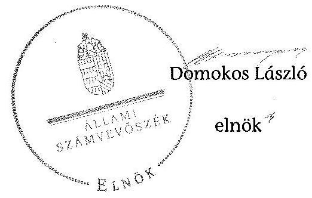

---

.

---

Iktatószám: 20876-24/2015/ELL

Domokos László részére
elnök

Állami Számvevőszék

Budapest
Apáczai Csere János u. 10.
1052

ÁLLAMESZÁMVEVÖSZÉK
1052/2015.
Fikszel: 2015 DEC 1 0.
Iktatőszám: V-0837-351/2015
Melléklet: -
1052-10.70.

Állami Számvevőszék

Budapest
Apáczai Csere János u. 10.
1052

Tárgy: Észrevétel „Az állami vagyon feletti tulajdonosi joggyakorlással kapcsolatos tevékenységek ellenőrzése" című számvevőszéki jelentés tervezetéhez

Tisztelt Elnök Úr!

„Az állami vagyon feletti tulajdonosi joggyakorlással kapcsolatos tevékenységek ellenőrzése" című számvevőszéki jelentés tervezetéhez az alábbi észrevételt teszem.

1) A jelentéstervezet 1.1.2. pont 4. bekezdéséhez:
A Portföliókezelő Főosztály, mint szervezeti egység a 2014. szeptember 17-től hatályos SzMSz előírásai alapján jött létre, az ellenőrzött időszakban a Portföliókezelő Főosztály ügyrendjének elkészítése folyamatban volt, az ügyrend kiadmányozására 2015. január 15-én került sor.
A fentiek alapján indokoltnak tartom a hivatkozott bekezdés módosítását, illetve kiegészítését.

2) A jelentéstervezet 2.1.2. pont 4. bekezdéséhez:
A Belső Ellenőrzési Főosztály 2014-ben nemcsak a jelentéstervezetben hivatkozott ellenőrzéseket végezte el, hanem 6 irányított költségvetési szervnél (Szociális és Gyermekvédelmi Főigazgatóság, Klebelsberg Intézményfenntartó Központ, Magyar Nemzeti Múzeum, Országos Orvosi Rehabilitációs Intézet, Egészségügyi Engedélyezési és Közigazgatási Hivatal, Nemzeti Rehabilitációs és Szociális Hivatal) rendszerellenőrzés keretében értékelte az intézmény működését és gazdálkodását, ezért indokoltnak tartom az ellenőrzések felsorolásának kiegészítését.

3) A jelentéstervezet 2.1.2. pont 10. bekezdéséhez:
A költségvetési szervek belső kontrollrendszeréről és belső ellenőrzéséről szóló 370/2011. (XII. 31.) Korm. rendelet 11. § (1) bekezdése szerint a költségvetési szerv vezetője köteles az 1. sz. melléklet szerinti nyilatkozattan értékelni a belső kontrollrendszer minőségét. Az

---

1. sz. melléklet szerinti nyilatkozat az A) vagy B) pont szerinti változatban tehető meg. A B) pont szerinti, 30965-17/2015/VAGYONKB iktatószámú nyilatkozat 2015. augusztus 3án került benyújtásra.
A fentiek miatt javasolom a jelentéstervezet következők szerinti módosítását: Az EMMI gazdasági ügyekért felelős helyettes államtitkára a Bkr. 11. § (1) bekezdésére figyelemmel megtette az 1. sz. melléklet szerinti nyilatkozatot a B) pont szerinti tartalommal, a nyilatkozatban nem értékelte 2014. évre az EMMI belső kontrollrendszerének minőségét.

Kérem Elnök Urat, hogy szíveskedjen az észrevételt elfogadni.
Budapest, 2015. december „ 15 „.

Üdvözlettel:
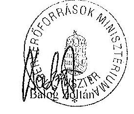

---

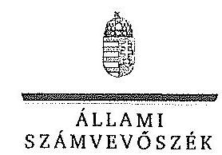

ELHök

Ikt.szám: V-0837-373/2015.

# Balog Zoltán úr 

miniszter
Emberi Eröforrások Minisztériuma

## Budapest

## Tisztelt Miniszter Úr!

„Az állami vagyon feletti tulajdonosi joggyakorlással kapcsolatos tevékenységek ellenörzése" címmel készített számvevőszéki jelentéstervezetre tett észrevételét köszönettel megkaptam.

Az Állami Számvevőszék észrevételre vonatkozó álláspontjáról a felügyeleti vezető által készített részletes tájékoztatást csatoltan megküldöm.

Tájékoztatom Miniszter urat, hogy a számvevőszéki jelentésben - az Állami Számvevőszékről szóló 2011. évi LXVI. törvény 29. § (3) bekezdése alapján - a figyelembe nem vett észrevételeket szerepeltetjük az elutasítás indokának feltüntetésével.

Budapest, 2015. 12
hó 32. nap
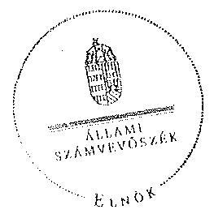

Tisztelettel:

## 002 (1)   Domokos László

Melléklet: Tájékoztatás az elfogadott és el nem fogadott észrevételekről

---

# Tájékoztatás   az elfogadott és el nem fogadott észrevételekről 

„Az állami vagyon feletti tulajdonosi joggyakorlással kapcsolatos tevékenységek ellenörzése" címủ jelentéstervezetre 2015. december 16 -án érkezett észrevételét áttekintettük, annak kezelésével kapcsolatban a következő tájékoztatást adom.

## 1. észrevétel - Jelentéstervezet 1.1.2. pont 4. bekezdéséhez

A Portfóliókezelő Főosztály ügyrendjének 2015. január 15-én történő kiadmányozására vonatkozó tájékoztatásukat köszönetiel vettük. Az ügyrend kiadmányozása az ellenőrzött időszakot (2014. január 1.- 2014. december 31.) követően történt, így nem érinti az ellenőrzött időszakra vonatkozóan megfogalmazott megállapítást, a jelentéstervezet módosítása nem indokolt.

## 2. észrevétel - Jelentéstervezet 2.1.2. pont 4. bekezdéséhez

A 2.1.2. pont 4. bekezdésében az EMMI szervezeti egységeit érintő, a Belső Ellenőrzési Főosztály által végzett belső ellenőrzések kerülnek bemutatásra. Az irányított költségvetési szerveknél végzett ellenőrzések nem tartoznak bele ebbe a körbe, ezért a megállapítás módosítása nem indokolt.

## 3. észrevétel - Jelentéstervezet 2.1.2. pont 10. bekezdéséhez

Az észrevételben leírtak megerősítik azt a megállapításunkat, miszerint az EMMI gazdasági ügyekért felelős államtitkára a Bkr. 1. melléklete szerinti nyilatkozatban a 2014. évre vonatkozóan nem értékelte az EMMI belső kontrollrendszerének minőségét. Az egyértelműség érdekében a jelentéstervezet 2.1.2. pont 10 . bekezdését az alábbiak szerint pontosítjuk:
„Az EMMI gazdasági ügyekért felelős helyettes államtitkára a Bkr. 1. melléklete B) pontja szerinti nyilatkozatában - indoklás mellett - nem értékelte 2014. évre az EMMI belső kontrollrendszerének minőségét."

Budapest, 2015. 17. hó 7. nap

Makkai Mária
felügyeleti vezető

---

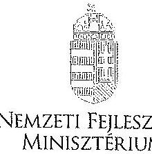

# DR. SESZTÁK MIKLÓS

## 1.1.1.11 SZÁNVEVŐSZÉK

### Iktatószám: EFO/27638-1/2015-NFM

Úgyintéző: Simonné Hábencius Gizella
Telefonszám: 79-54405
E-mail: gizella.habencius.simonne@nfm.gov.hu
Hiv. szám: V-0837-349/2015.

**Domokos László**

elnök
részére

**Állami Számvevőszék**

**Budapest**

Apáczai Csere János u. 10.
1052

**Tárgy:** Jelentéstervezet véleményezése

**Tisztelt Elnök Úr!**

Köszönettel vettem kézhez: „Az állami vagyon feletti tulajdonosi joggyakorlással kapcsolatos tevékenységek ellenőrzése” címmel készített számvevőszéki jelentéstervezetet, melyhez kapcsolódóan a következő tájékoztatást adom:

A Vagyongazdálkodási Főosztály ügyrendjének pótlásával kapcsolatos intézkedést igénylő javaslattal összefüggésben jelzem, hogy a Nemzeti Fejlesztési Minisztérium Szervezeti és Működési Szabályzatának (SZMSZ) 2015. július 22-én hatályba lépett módosítása szerint a Vagyongazdálkodási Főosztály megszűnt, így a Főosztály ügyrendjét utólag nem áll módunkban elkészíteni. Természetesen a vagyongazdálkodási szakterületen létrejött új főosztályok ügyrendje megfelel a módosított SZMSZ-ben meghatározott feladatmegosztásnak.

Postacím: 1440 Budapest, Pf. 1 Telefon: (06 1) 795 1700 Fax: (06 1) 795 0631 E-mail: miniszter@nfm.gov.hu Web: www.nfmm.org.hu

---

Az ÁSZ jelentéstervezet további, NFM-et érintő, a MÁV Zrt. átadás-átvételével összefüggő megállapítását elfogadjuk és meglesszük a szükséges intézkedéseket annak érdekében, hogy a tulajdonosi joggyakorlás átruházásáról szóló megállapodásban a számviteli elvnek megfelelően kerüljön rögzítésre a társaság nyilvántartási értéke.

Kérem tájékoztatásom elfogadását!

Budapest, 2015. december „, $\mathrm{IS} .$,,

# Üdvözlettel: 

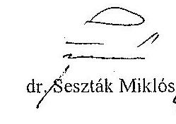

---

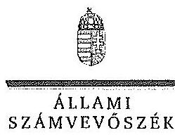

# Dr. Seszták Miklós úr 

miniszter
Nemzeti Fejlesztési Minisztérium

## Budapest

## Tisztelt Miniszter Úr!

„Az állami vagyon feletti tulajdonosi joggyakorlással kapcsolatos tevékenységek ellenőrzése" címmel készített számvevőszéki jelentéstervezetre tett észrevételét köszönettel megkaptam.

Az Állami Számvevőszék észrevételre vonatkozó álláspontjáról a felügyeleti vezető által készített tájékoztatást csatoltan megküldöm.

Tájékoztatom Miniszter urat, hogy a számvevőszéki jelentés mellékleteként szerepeltetjük a jelentéstervezethez tett észrevételét, valamint az arra adott válaszunkat.

Budapest, 2015. 12. hó 25. nap
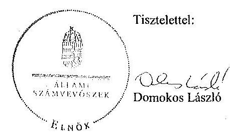

Melléklet: Tájékoztatás az el nem fogadott észrevételről

---

# Tájékoztatás   az el nem fogadott észrevételről 

„Az állami vagyon feletti tulajdonosi joggyakorlással kapcsolatos tevékenységek ellenörzése" címủ jelentéstervezetre 2015. december 17 -én érkezett észrevételét áttekintettük, annak kezelésével kapcsolatban a következő tájékoztatást adom.

A Jelentéstervezetben az NFM miniszternek tett 1. intézkedést igénylö javaslatra tett észrevétel

A dokumentumokat ismételten áttekintettük és az ellenőrzött időszakra vonatkozóan a Vagyongazdálkodási Főosztály ügyrendjének hiányára tett megállapításunk, valamint a kapcsolódó intézkedést igénylő javaslatunk megfelelő. Az észrevételükben leírt, a Vagyongazdálkodási Főosztály megszünésével kapcsolatos információ túlmutat az ellenőrzött időszakon, ezért az intézkedést igénylő javaslatunkat fenntartjuk módosítása nem indokolt.

A Jelentéstervezetben az NFM miniszternek tett 2. intézkedést igénylő megállapításra tett észrevétel

A levelükben megerősítették a MÁV Zrt. átadás-átvételével kapcsolatosan a társaság nyilvántartási értékére vonatkozó megállapítást, ezért annak módosítása nem szükséges.

Budapest, 2015. 12. hó 2.5 .nap

Makkai Mária
felügyeleti vezető

---

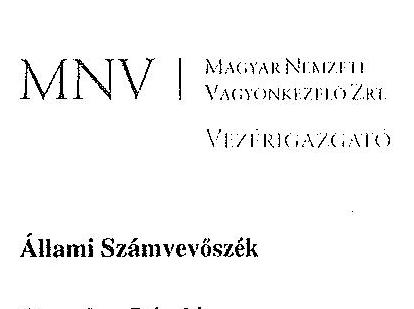

Állami Számvevőszék

Domokos László
elnök

1052 Budapest
Apáczai Cs. J. u. 10.

Ikt. sz.: MNV/01/136/35 /2015.
Hiv. sz.: V-0837-348/2015.

Tisztelt Elnök Úr!
A 2015. november 30. napján ,Az állami vagyon feletti tulajdonosi joggyakorlással kapcsolatos tevékenységek ellenörzése" tárgyában kézhez vett, V-0837-348/2015. ikt. sz. Jelentés-tervezetre az alábbi észrevételeket kívánjuk tenni:

1. fejezet / 6. old. harmadik bekezdés, II.1.2.2. fejezet / 27. old. negyedik bekezdés, 28. old. első bekezdés, valamint I. fejezet / 10. old. 1. Javaslat az MNV Zrt. vezérigazgatójának

A Jelentés-tervezet több alkalommal is rögzíti, hogy a vagyonnyilvántartási szabályzat Állami Számvevőszék álláspontja szerinti hiányossága - többek között - az állami vagyon használója tekintetében áll fenn. Mint ismeretes, az „állami vagyon használója" kifejezés alatt a vagyonkezelőt nem kell érteni, azonban tekintettel arra, hogy a Jelentés a közvélemény tájékoztatását is szolgálja, javasoljuk az egyértelmű különbségtételt, és az idézett szövegrész alábbiak szerinti pontositását, mivel a hétköznapi szóhasználat és értelmezés az állami vagyon használata alatt az állami vagyon használatának bármel; jogcímen történő átengedését érti:
„...a vagyonnyilvántartási szabályzatban a Vhr.-ben elöirtak ellenére nem határozták meg az állami vagyon használója - ide nem értve az állami vagyon kezelöjét és a társasági részesedésekre vonatkozó megbizást -, továbbá haszonélvezője adatszolgáltatásának részletes tartalmát, formáját."

Megjegyezzük továbbá, hogy az MNV Zrt. vagyonnyilvántartási szabályzata az állami vagyon vagyonkezelőire és a társasági részesedések esetében az MNV Zrt. tulajdonosi joggyakorlását megbízottként ellátókra vonatkozik, azok adatszolgáltatási kötelezettségét szabályozza. A bérlet vonatkozásában a bérlő részéről nem áll fenn adatszolgáltatási kötelezettség, tekintettel arra, hogy az állami vagyon nem az ő nyilvántartásában szerepel.

---

# 1. fejezet / 7. old. harmadik bekezdés, valamint II.3. fejezet / 41. oldal harmadik bekezdés 

A Jelentés-tervezet az állami tulajdonú ingatlanok ingyenes átruházásához kapcsolódóan összefoglalóan tesz elmarasztaló megállapítást a GYEMSZI, az MNV Zrt. és az NFA vonatkozásában annak ellenére, hogy e tárgyban az összegző megállapítások között csak az NFA-nál említ hiányosságot, az MNV Zrt. vezérigazgatója részére intézkedési javaslatot nem tesz, és az MNV Zrt. kontrolltevékenysége részletes elemzésénél kifejezetten pozitív megállapításokat tesz, hiányosságot nem említ.
Mivel a Jelentés-tervezet más összegző megállapításoknál - így például az ellenőrzési rendszerre vonatkozóan is - megbontja, és külön említi az egyes szervezeteket, amelyeknél a müködés szabályszerű volt, így indokolt, hogy ez ebben a tárgykörben is történjen meg:

Ennek megfelelően kérjük a Jelentés-tervezetbe beépíteni, hogy az MNV Zrt. kontrolltevékenysége teljes körüen biztosította az állami tulajdonú ingatlanok ingyenes átruházása tekintetében a tulajdonosi joggyakorlási feladatok szabályszerű ellátását.

## 1. fejezet / 7. old. harmadik-negyedik és hatodik bekezdés, valamint II.3.1.2. fejezet / 42. old. negyedikötödik bekezdés

A Jelentés-tervezet összefoglaló jelleggel megállapítja, hogy az állami tulajdonú ingatlanok vagyonkezelésbe adása nem teljes körüen a jogszabályok előírásainak betartásával történt, ugyanakkor mind az összegző, mind a részletes megállapítások között szerepel, hogy magára a vagyonkezelésbe adásra - amely ténylegesen a vagyonkezelési szerződés előkészítését, az arról való döntést és a szerződéskötést jelenti - szabályosan került sor. A Jelentés-tervezet az MNV Zrt. vezérigazgatója részére is csak a 0 . számlaosztályba sorolással, valamint a mérlegből való kivezetéssel kapcsolatosan tesz intézkedési javaslatot.
Fentiek alapján javasoljuk a Jelentés-tervezet pontosítását mind az összegző, mind a részletes megállapításoknál a tekintetben, hogy az előírások nem teljes körű figyelembevételére - az Állami Számvevőszék álláspontja szerint - nem a vagyonkezelésbe adás során, hanem a vagyonkezelési jogviszonnyal összefüggő számviteli-nyilvántartási kérdések tekintetében került sor.

## 1. fejezet / 9. old. harmadik bekezdés, II.4.1. fejezet / 51. old. harmadik bekezdés

Tájékoztatjuk Elnök Urat, hogy a vagyonátadások gazdasági eseményeinek késedelmes rögzítése az elhúzódó SAP-fejlesztés miatt történt. Az értékhelyesbítés nyilvántartásba vétele az Áhsz. 15. § (2) bekezdésének 2014. november 21 -tól hatályos szabályozása szerint nem helytálló, azonban az átadásátvétel ezt megelőző időpontban, 2014. július 18 -án valósult meg, amely időpontban a tulajdonosi joggyakorlók közötti átadás-átvétel nem volt szabályozva. Szabályozás hiányában az MNV Zrt. egyeztetést folytatott az NGM-mel, és az egyeztetett álláspont szerint alakult ki a követett elszámolási mód.

## 1. fejezet / 9. old. harmadik bekezdés, II.4.1. fejezet / 52. old. első bekezdés, valamint 1. fejezet / 11. old. 4. Javaslat az MNV Zrt. vezérigazgatójának

A Jelentés-tervezet MÁV Zrt. NFM-nek történő 2014. január 1-jei átadása kapcsán tett megállapítása szerint az MNV Zrt-nek a nyilvántartási/átadási értékre vonatkozó téves adatszolgáltatása miatt sérült a valódiság elve, az NFM-nél a részesedés 2014. év végi mérlegértéke nem a valós állapotot tükrözte. Az

---

Állami Számvevőszék az átadás-átvételi megállapodás módosítására, és a felelősség tisztázására tesz javaslatot az MNV Zrt. vezérigazgatója részére. (Az MNV Zrt-nél az átadást érték a 2013. december 31-i beszámoló alapján átértékelt értékkel egyezően 91.246 MFt , az NFM - a szerződésben legutolsó nyilvántartási értékként megjelölt és a 2013. december 6-án bejegyzett tőkeemelés előtti állapotot tükrözö - 49.388 MFt-os értéken vezette be könyveibe a részesedést.)

A „Döntés a MÁV Zrt. felett az államot megillető tulajdonosi jogok és kötelezettségek NFM részére történő átadásáról, a 80/2013. (XII.23.) NFM rendelettel módosított 77/2012. (XII. 22.) NFM rendelet végrehajtása érdekében" tárgyban hozott 14/2014. (I.14.) IG számú határozattal jóváhagyott, a MÁV Zrt. társasági részesedésének átadás-átvételéről szóló megállapodás 2.5. pontja a következőkről rendelkezik:
„2.5. Átvevő a tulajdonos általi jóváhagyásától számított 5 napon belül megküldi Átadónak - a Részesedés év végi értékelésének elvégzése érdekében - a Társaság tulajdonos által elfogadott 2013. évi éves beszámolóját.
A Részesedésnek az Átadó könyveiből történő kivezetésére 2013. december 31-i fordulónapi értéken, 2014. január 1. napjával kerül sor. Az Átvevő a vonatkozó jogszabályi rendelkezésekkel összhangban 2014. január 1-jei fordulónaptól vállalja a Részesedés nyilvántartásba vételét."

Átadási értékként tehát a 2013. december 31-i értéket határozta meg a szerződés. A megállapodás 1.1.1. pontjában szereplő érték - „Állami tulajdonú részesedés legutolsó nyilvántartási értéke: 49.388.000.000„$\mathrm{Ft}^{\prime \prime}$ - csak tájékoztató adatnak tekinthető.
Az MNV Zrt. a fentieknek megfelelően, a Társaság 2013. évi beszámolójának adatai és az MNV Zrt. rábízott vagyon eszközeire és forrásaira vonatkozó értékelési szabályzatának (akkor hatályos 17/2013. számú vezérigazgatói utasítás) rendelkezései alapján megállapított 2013. december 31-i értéken vezette ki nyilvántartásából a részesedést.
A megállapodás nem ír elő az MNV Zrt. számára adatszolgáltatási kötelezettséget az NFM felé a részesedés 2013. december 31-i értékére vonatkozóan.
Megjegyezzük, hogy az MNV Zrt. 2014. évi rábízott vagyoni éves beszámolója - melyet a nemzeti fejlesztési miniszter fogadott el - a kiegészítő mellékletben tartalmazza a MÁV Zrt. átadáskori nyilvántartási értékét és a hozzá tartozó értékhelyesbítést, mely együttesen kiteszi az átadási értéket.
A megállapodás módosítását nem tartjuk szükségesnek, ugyanis az Állami Számvevőszék által kitűzött cél - az NFM könyveiben az átadáskori helyes könyv szerinti érték szerepeltetése - véleményünk szerint megvalósítható hivatalos tájékoztatás megküldése útján az NFM részére a Megállapodás 2.5. pontjára való hivatkozással és a pontos átadási érték megjelölésével.

Fentiek alapján kérjük, szíveskedjenek törölni a Jelentés-tervezetből az MNV Zrt. téves adatszolgáltatására vonatkozó megállapítást, továbbá a Jelentés-tervezet 11. oldalán szereplő, az MNV Zrt. vezérigazgatója részére tett, 4. számú, intézkedést igénylö, javaslatot.

# II.3.2.2. fejezet / 46. old. első bekezdés 

A Jelentés-tervezet kifogásolja, hogy a hasznosítási szerződésekben

1. az MNV Zrt. nem ellenőrzi dokumentáltan azt, hogy a szerződő féllel szemben nem állnak fenn a Vtv. 25. § a)-f) pontjaiban foglalt kizáró okok, külön klemelve a d) pont szerinti kizáró okot,
2. nem került rögzítésre, hogy a partner az MNV Zrt. vagyonnyilvántartási szabályzatát megismerte,
3. nem rögzítették a szerződő fél vállalását a Nvt. 11. § (11) bekezdése szerint beszámolási, nyilvántartási adatszolgáltatási kötelezettségre.

Fentiek kapcsán az alábbiakat szeretnénk kiemelni:

---

1. A Vtv. 25. § -ában szereplő kizáró okokról a partner a legtöbb esetben a szerződésben nyilatkozik. A Vtv. 25. § d) és e) pontja ekként rendelkezik:
„d) az alábbi büncselekmények elkövetése miatt büntetett elöéletü:
da) a 2013. június 30-ig hatályban volt, a Büntető Törvénykönyvröl szóló 1978. évi IV. törvény XV. fejezet VI. cömében meghatározott közelet tisztasága elleni vagy XVII. fejezetében meghatározott gazdasági büncselekmény,
db) a Büntető Törvénykönyvröl szóló 2012. évi C. törvény XXVII. Fejezetében meghatározott korrupciós büncselekmény, XXXVIII. Fejezetében meghatározott pénz- és bélyegforgalom biztonsága elleni büncselekmény, XXXIX. Fejezetében meghatározott költségvetést kárositó büncselekmény, XL. Fejezetében meghatározott pénzmosás, XLI. Fejezetében meghatározott gazdálkodás rendjét sértő büncselekmény, XLII. Fejezetében meghatározott fogyasztók érdekeit és a gazdasági verseny tisztaságát sértő büncselekmény vagy XLIII. Fejezetében meghatározott tiltott adatszerzés és az információs rendszer elleni büncselekmény;
e) gazdálkodó szervezetben vagy gazdasági társasághon vezető tisztség betöltését kizáró foglalkozástól eltiltás hatálya alatt áll, illetve akinek tevékenységét a jogi személlyel szemben alkalmazható büntetójogi intézkedésekről szóló 2001. évi CIV. törvény 5. § (2) bekezdése alapján a bíróság jogerős itéletében korlátozta;"

Jogi személyek esetében e rendelkezések nem értelmezhetők, és dokumentáltan nem ellenőrizhetők.
2-3. A hasznosítási szerződések (bérleti, használati szerződés) esetében a partnernek a legtöbb esetben nincsenek az MNV Zrt. vagyonnyilvántartási szabályzatával kapcsolatos feladatai, és nincsen beszámolási, nyilvántartási vagy adatszolgáltatási kötelezettsége sem.

Ezen felül megjegyezzük, hogy a vizsgálat tárgyát képező szerződések több esetben 90 napot el nem érő szerződések voltak, melyek kapcsán a fenti előírások értelmezhetetlenek.

Kérjük a fentiek figyelembe vételével módosítani a Jelentés-tervezet szövegét.

# II.4.2. fejezet / 53. old. nyolcadik bekezdés és 54. oldal első bekezdés 

A Jelentés-tervezetben foglaltakkal kapcsolatban tájékoztatjuk Elnök Urat, hogy az MNV Zrt-hez 2015. szeptember hónapban beérkezett az NFM és az NFA, mint tulajdonosi joggyakorlók adatszolgáltatása is a tulajdonosi részesedést jelentő gazdasági társaságok és ingatlanok tekintetében, így megkezdődhetett az adatok ellenőrzése és feldolgozása.

## II.5. fejezet / 54. old. hetedik, 55. oldal első bekezdés

A 1172/2010. (VIII. 18.) Korm. határozat 4. pontjában a Kormány felkérte a nemzeti fejlesztési minisztert, hogy a vidékfejlesztési miniszterrel együttmüködve gondoskodjon az Országleltár, azon belül az egységes, integrált állami vagyonnyilvántartási rendszer elkészítéséről az MNV Zrt. közremüködésével, a folyamatban lévő fejlesztésekkel összhangban; ennek határideje 2011. december 31. volt.

A Korm. határozatban foglaltak végrehajtása érdekében az alábbi föbb lépések történtek:

---

A költségvetésben 2010. december végén nevesített forrást alapul véve az MNV Zrt. 2011 januárjában elkészítette az Országleltár és Állami Vagyonnyilvántartás projekt gyakorlati megvalósításához szükséges belső Projekt Alapító Okiratot, mely az MNV Zrt-re háruló feladatok megoldását hivatott elindítani.
A szakmai egyeztetések koordinálásáért a KIFÜ lett a felelős. Ennek megfelelően a KIFÜ vezetésével 2011. január-februárban lezajlottak a szakmai egyeztetések, az MNV Zrt. Igazgatósága 2011. március 7én elfogadta az MNV Zrt-n belül megvalósuló projektág Projekt Alapító Okiratát.
A KIFÜ 2011 januárjától kezdve rendszeres szakmai egyeztetést tartott az NFA, a FÖMI és az MNV Zrt. delegált képviselőivel, az NFM Infokommunikációért Felelős Államtitkárságát és a Közigazgatási és Igazságügyi Minisztérium képviselőit is szükség szerint bevonva. A KIFÜ az NFA, a FÖMI és az MNV Zrt. együttműködésével két munkacsoportban előkészítette az Országleltár megvalósításához szükséges, a VM és az NFM miniszterei közti együttmüködési megállapodás tervezetét és az ennek elfogadását követően megkötendő KIFÜ - NFA - FÖMI - MNV konzorciumi együttműködési megállapodás tervezetét. Ez a konzorciumi szerződéstervezet és 8 db szakmai melléklete volt hivatott az Országleltár teljes végrehajtását szabályozni. A megállapodás azonban hosszas egyeztetési folyamatot követően csak 2012. június 7-én került aláírásra.

A Korm. határozatban foglaltak szerint a 2011. december 31. év végi határidőt betartva elkészült az MNV Zrt., MFB Zrt., NFA auditált beszámolóknak és nyilvántartási adataiknak megfelelő, a 2010-es kormányváltás utáni első év végére vonatkozó fordulónapra az induló Országleltár. Ez a feladat a Portal2011 projekt néven valósult meg.
Az Országleltár tartalmazta az összes akkor létező tulajdonosi joggyakorló (MNV, MFB, NFA) vonatkozó adatát.

Megítélésünk szerint megállapítható, hogy a Korm. határozat 4. pontja határidőre teljesült, erre tekintettel a Jelentés-tervezet szövegét az alábbiak szerint javasoljuk módosítani:
„Az NFM miniszter gondoskodott az 1172/2010. (VIII. 18.) Korm. határozat 4. pontjában elöirt - 2011. december 31-ig tartó - határidőig az Országleltár elkészitéséről, azonban a rendelet végrehajtása során beazonosított feladatok végrehajtása az ellenörzött időszak végéig nem fejeződött be teljes körüen."

# II.5. fejezet / 55. old. ötödik bekezdés 

Megjegyezzük, hogy már 2014. szeptemberben felmerült a MNV Zrt. részéről egy javaslat, mely szerint a vagyonkezelésben lévő vagyonelemek integrációjának megvalósítását reálisan 2015. évre kellene átütemezni, tekintettel arra, hogy az ÁHSZ fejlesztések legkorábban 2014. október végéig valósíthatóak meg teljes mértékben. Későbbiekben e feladatrész elhalasztására született döntés.

## II.5. fejezet / 56. old. második bekezdés

Fontosnak tartjuk kiemelni, hogy az említett, az NFM Ellenőrzési Főosztálya által készített utolsó elemzés az egységes integrált állami vagyonnyilvántartás hitelességének és adatkezelési elvárásainak vizsgálata tárgyában készült. Az elemzés a legfontosabb meg nem valósuló célként az államigazgatási szerveknél lévő adatkonzisztenciák hibáit kiszűrni és javítani képes kontrollrendszer hiányát emelte ki. Az MNV Zrt. Országleltár Programjának ugyanakkor nem hatóköre olyan ellenőrző rendszer fejlesztése, melynek segítségével kiszűrhetőek az egyes államigazgatási szerveknél lévő adatkonzisztenciák hibái. Az NFM vizsgálat alapján projekt-előterjesztés készült, amely szerves részét képezi az MNV Zrt. által megvalósítandó, az egységes integrált állami vagyonnyilvántartás közhitelességének és

---

adatkonzisztenciájának ellenőrzéséhez szükséges további fejlesztések tárgyú kiemelt projekt célrendszerének. Ezen kiemelt projekt előkészítési fázisban van.

Kérem Elnök Urat, hogy a Jelentés véglegesítése során jelen észrevételeinket szíveskedjenek figyelembe venni.

Budapest, 2015. december „ ${ }^{15}$,
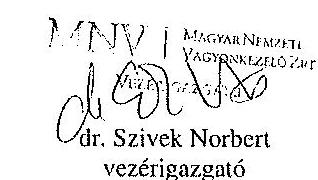

---

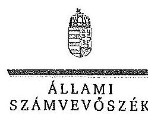

ELNök

Ikt.szám: V-0837-366/2015.

# Dr. Szivek Norbert úr 

vezérigazgató
Magyar Nemzeti Vagyonkezelő Zrt.

## Budapest

## Tisztelt Vezérigazgató Úr!

„Az állami vagyon feletti tulajdonosi joggyakorlással kapcsolatos tevékenységek ellenőrzése" címmel készített számvevőszéki jelentéstervezetre tett észrevételét köszönettel megkaptam.

Az Állami Számvevőszék észrevételre vonatkozó álláspontjáról a felügyeleti vezető által készített részletes tájékoztatást csatoltan megküldöm.

Tájékoztatom Vezérigazgató urat, hogy a számvevőszéki jelentésben - az Állami Számvevőszékről szóló 2011. évi LXVI. törvény 29. § (3) bekezdése alapján - a figyelembe nem vett észrevételeket szerepeltetjük az elutasítás indokának feltüntetésével.

Budapest, 2015. 12. hó 2.5 .nap
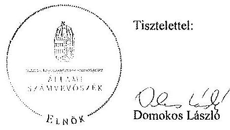

Melléklet: Tájékoztatás az elfogadott és el nem fogadott észrevételekről

---

# Tájékoztatás   az elfogadott és el nem fogadott észrevételekröl 

„Az állami vagyon feletti tulajdonosi joggyakorlással kapcsolatos tevékenységek ellenörzése" című jelentéstervezetre 2015. december 15 -én érkezett észrevételét áttekintettük, annak kezelésével kapcsolatban a következő tájékoztatást adom.

1. észrevétel - I. fejezet 6. oldal harmadik bekezdés, II. 1.2.2. fejezet 27. oldal negyedik bekezdés, 28. oldal első bekezdés, valamint I. fejezet 10. oldal az MNV Zrt. vezérigazgatójának címzett 1. számú intézkedést igénylő megállapítás és javaslat

Az Nvtv. 3. § (1) bekezdése szerint hasznosítás a tulajdonosi joggyakorló vagy a nemzeti vagyon használója által a nemzeti vagyon birtoklásának, használatának, hasznok szedése jogának bármely - a tulajdonjog átruházását nem eredményező - jogcímen történő átengedése, ide nem értve a vagyonkezelésbe adást, valamint a haszonélvezeti jog alapítását. Az Nvtv. 3. § (1) bekezdés 11. pontja határozza meg az állami vagyon használója fogalmát: az a természetes vagy jogi személy, jogi személyiséggel nem rendelkező szervezet, aki, vagy amely törvény vagy szerződés alapján, bármely jogcímen (bérlet, haszonbérlet, használat stb.) állami vagyont birtokol, használ, szedi annak hasznait, hasznosít, ide nem értve a haszonélvezőt, a vagyonkezelőt és a tulajdonosi jogok gyakorlóját. A Vhr. 14. § (3) bekezdése kimondja, hogy az állami vagyon használóját, vagyonkezelőjét, haszonélvezőjét a vagyonnyilvántartás hiteles vezetésének és az állami vagyon hasznosítására, vagyonkezelésére, vagy haszonélvezeti jog alapítására kötött szerződésben meghatározottak szerinti adatszolgáltatási kötelezettség terheli. A Vhr. 14. § (3) bekezdése elöírja, hogy az adatszolgáltatás részletes tartalmát, formáját a tulajdonosi joggyakorlónak vagyonnyilvántartási szabályzatban kell meghatároznia. A jogszabályi rendelkezés az adatszolgáltatási kötelezettség tekintetében a vagyon használójára vonatkozóan kivételeket nem tartalmaz, ezért a megállapítás módosítása, kiegészítése nem indokolt.

## 2. észrevétel - I. fejezet 7. oldal harmadik bekezdés, II. 3. fejezet 41. oldal harmadik bekezdés

Az egyértelműség érdekében a 7. oldal harmadik bekezdéséből és a 41. oldal harmadik bekezdéséből „az állami tulajdonú ingatlanok ingyenes átruházása tekintetében" részt töröljük.

---

# 3. észrevétel - I. fejezet 7. oldal harmadik, negyedik és hatodik bekezdés, II. 3.1.2. fejezet 42. oldal negyedik-ötödik bekezdés 

Az állami tulajdonú ingatlanok szabályszerű vagyonkezelésbe adásának része a folyamatok szabályszerű dokumentálása, a nyilvántartások, könyvek szabályszerű vezetése. Ezért a megállapítás módosítása nem indokolt.

## 4. észrevétel - I. fejezet 9. oldal harmadik bekezdés, II. 4. 1. fejezet 51. oldal harmadik bekezdés

A vagyonátadások gazdasági eseményeinek késedelmes rögzítésével kapcsolatban adott tájékoztatást köszönjük. A dokumentumok ismételt áttekintése alapján a jelentéstervezet 9. oldal 3. bekezdésének 4. mondatát, valamint az 51. oldal 3. bekezdését töröljük.
5. észrevétel - I. fejezet 9. oldal harmadik bekezdés, II. 4. 1. fejezet 52. oldal első bekezdés, I. fejezet 11. oldal MNV Zrt. vezérigazgatójának címzett 4. számú intézkedést igényló megállapítás és javaslatok

A MÁV Zrt. részesedésének átadás-átvételéről szóló megállapodást a felek 2014. januárban írták alá. A megállapodásnak - mivel az értékkel történő átadás-átvételre vonatkozik - a részesedés értékére vonatkozó rendelkezést tartalmaznia kell. A megállapodás 1.1.1. pontja szerint a részesedés legutolsó nyilvántartás szerinti értéke 49388 M Ft. A megállapodás nem tartalmazza, hogy a „legutolsó nyilvántartás szerinti értéket" tájékoztató adatnak kell tekinteni, valamint nem tartalmaz rendelkezést arra vonatkozóan sem, hogy az átadás-átvételkori értéket az átadó a későbbiekben hozza az átvevő tudomására. Emiatt az átvevő nem rendelkezett megfelelő információval arra vonatkozóan, hogy a szerződésben szereplő érték nem egyezik meg a könyvekből történő kivezetési, illetve nyilvántartásba vételi értékkel. A fentiek alapján megállapításunk és a kapcsolódó javaslatok módosítása nem szükséges.

## 6. észrevétel - II. 3.2.2. fejezet 46. oldal első bekezdés

1.A Vtv. 25/A. §-a szerint az állami vagyon hasznosítására irányuló szerződés megkötését megelőzően a szerződő fél azt a tényt, hogy vele szemben nem áll fenn a 25. § (1) bekezdés d) pontjában meghatározott kizáró ok, hatósági bizonyítvánnyal igazolja az a tulajdonosi joggyakorló részére. Ha a szerződő fél nem igazolja, hogy vele szemben nem áll fenn a 25. § (1) bekezdés d) pontjában meghatározott kizáró ok, vele az állami vagyon hasznosítására irányuló szerződés nem köthető. Tehát a szerződés megkötését megelőzően kell a nyilatkozatot megtenni, amennyiben az nem történik meg, a szerződést nem lehet megkötni. A fentiek alapján megállapításunk módosítása nem indokolt.

2-3. A Vhr. 14. § (3) bekezdése, valamint az Nvtv. 11. § (11) bekezdése alapján az azokban előírtak a nemzeti vagyon hasznosítására vonatkozó szerződések kötelező tartalmi elemei. Ezért a megállapítások módosítása nem indokolt.

---

# 7. észrevétel - II. 4. 2. fejezet 53. oldal nyolcadik bekezdés és 54. oldal első bekezdés 

Az NFM és az NFA adatszolgáltatására vonatkozó tájékoztatást köszönjük. Az észrevételben leírtak megerősítik megállapításunkat, mivel az NFM és az NFA is az új határidőt követően teljesítette adatszolgáltatási kötelezettségét, ezért a megállapítás módosítása nem szükséges.

## 8. észrevétel - 54. oldal hetedik bekezdés, 55. oldal első bekezdés

Az Országleltár elkészítésével és müködésével kapcsolatos tájékoztatást köszönjük. Az észrevételben leírtak is megerősítik, hogy 2011. december 31-éig az Országleltárral kapcsolatos, az 1172/2010. (VIII. 18.) Korm. határozat 4. pontjában előírt feladatokat teljes körűen nem hajtották végre. Ezért megállapításunk módosítása nem indokolt.

## 9. észrevétel - II. 5. fejezet 55. oldal ötödik bekezdés

A vagyonelemek integrációja megvalósításának átütemezésére vonatkozó tájékoztatásukat köszönjük. Az észrevétel a megállapítást nem kifogásolja, annak módosítása nem indokolt.

## 10. észrevétel - II. 5. fejezet 56. oldal második bekezdés

Az NFM Ellenőrzési Főosztálya által készített utolsó elemzésre vonatkozó tájékoztatást köszönjük. A tájékoztatás alapján a megállapítás módosítása nem indokolt.

Budapest, 2015. 12. hó 25 .nap

Makkai Mária
felügyeleti vezető

---

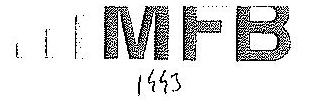
M406774
$9 C 77-2(2015$
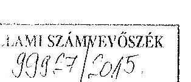

Budapest

Tisztelt Elnök Úr!
2015. november 30-án köszönettel kézhez vettük az állami vagyon feletti tulajdonosi joggyakorlással kapcsolatos tevékenységek ellenőrzéséről készült számvevőszéki jelentéstervezetüket.

Mellékelten küldjük az MFB Zrt. jelentéstervezettel kapcsolatos észrevételeit.

Budapest, 2015. december 15.
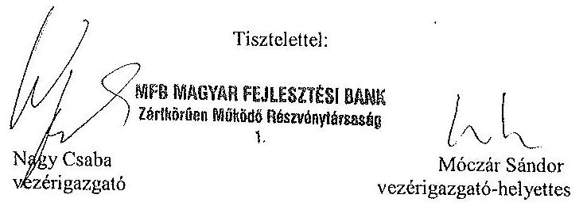

---

# 6. oldal 4. bekezdéséhez, 13. oldal 1., 2. bekezdései és 24. oldal 2. bekezdéséhez 

Az Infrastruktúra Igazgatóság, a Turisztikai Vagyonkezelési és Befektetési Igazgatóság és az Agrár Vagyonkezelési Igazgatóság szervezeti egységek tevékenységét alapvetően megváltoztatta (bizonyos esetekben kiürítette) a Magyar Fejlesztés Bank Részvénytársaságról szóló 2001. évi XX. törvény (továbbiakban: MFB törvény) 2014. július 16-ai módosítása. Részben ennek hatására, részben a Bank vezetése által kezdeményezett hatékonyságjavító kezdeményezésként 2014 augusztusa és novembere között egy átfogó projekt zajlott le, amelynek célja a teljes MFB csoport müködésének felülvizsgálata és egy új irányítási, müködési koncepció kidolgozása volt. Ezen minka lezárultáig az egyes szervezeti egységek tevékenységét leíró szabályzatok módosítása felfüggesztésre került. Így az új, MFB törvénnyel összhangban lévő SZMSZ csak később (2015. február 17.) léphetett hatályba, amely megszüntette az Infrastruktúra Igazgatóság, a Turisztikai Vagyonkezelési és Befektetési Igazgatóság és az Agrár Vagyonkezelési Igazgatóság szervezeti egységeket.

## Kérjük az MFB Zrt. vezérigazgatójának szóló javaslat törlését.

## 6. oldal 4. bekezdéséhez és 50. oldal utolsó bekezdéséhez

A jelentéstervezet ezen bekezdése szerint a Bábolna Nemzeti Ménesbirtok Kft., valamint a Mezőhegyesi Állami Ménes Lótenyésztő- és Értékesítő Kft. esetében az MFB Zrt. által 2014.10.03-án, Dr. Fazekas Sándor által 2014.10.14-én aláírt Átadás-átvételi megállapodás ugyan 2014.01.01-ei fordulónappal határozta meg a részesedések könyvekből történő ki- és bevezetését, de a vagyonátadás-átvétel könyvekben való rögzítésére csak 2014.10.14-én került sor.

Az Állami Számvevőszék ezen megállapításával nem értünk egyet, mivel az Átadás-átvételi megállapodás 2.4 pontja rögzítette, hogy
„Az Átadó a vonatkozó jogszabályi rendelkezésekkel összhangban, 2014. január 1-i fordulónappal, könyv szerinti értéken kivezetette könyveiből a Részesedéseket. Az Átvevő a vonatkozó jogszabályi rendelkezésekkel összhangban, 2014. január 1-i fordulónaptól a Részesedéseket a bruttó nyilvántartási értéken nyilvántartásba vette."

A részesedések könyvekből történő ki- és bevezetésének értéknapja független az Átadásátvételi megállapodás felek általi aláírásának időpontjától, hiszen arra az egyes törvényeknek agrár- és környezetügyi tárgyban történő módosításáról szóló 2013. évi CCL törvény 8. §-a által módosított, az állattenyésztésről szóló 1993. évi CXIV törvény 15 §. (2) bekezdése kötelezte az MFB Zrt.-t és a Vidékfejlesztési Minisztériumot, hiszen ezen jogszabályi rendelkezés alapján a két társaság állami tulajdonú részesedése tekintetében 2014. január 1jével a tulajdonosi jogokat az állam nevében az agrárpolitikáért felelős miniszter gyakorolta.

A Bank valamennyi adatszolgáltatását fentieknek megfelelően teljesítette, lásd a 2014. I. és II. negyedéves kincstári mérlegjelentéseket. (lásd mellékelve)

## Kérjük a megállapítás törlését.

## 9. oldal 2. bekezdéséhez és 26. oldal 1. bekezdéséhez

Az MFB Zrt. rábízott vagyonról szóló számviteli politikájának VII.3.2. Követelések értékelése fejezetben kimondja, hogy minden követelést egyedileg értékel.

Ez azt jelenti, hogy a Bank a kis összegủ követeléseket ugyanolyan elvek mentén értékeli, és dokumentálja, mint a nem kisösszegủ követeléseket.

---

Ennek értelmében a Bank megfelel az államháztartás számviteléröl szóló 4/2013. (XII.31.) Kormányrendelet. 50. § (2) bekezdés b) pontjában elöírtaknak, mert ezt a kormányrendelet nem tiltja meg.

Kérjük a megállapítás törlését.

---

.

---

# ELHök 

## Nagy Csaba úr

vezérigazgató
MFB Magyar Fejlesztési Bank Zrt.

## Budapest

## Tisztelt Vezérigazgató Úr!

„Az állami vagyon feletti tulajdonosi joggyakorlással kapcsolatos tevékenységek ellenőrzése" címmel készített számvevőszéki jelentéstervezetre tett észrevételét köszönettel megkaptam.

Az Állami Számvevőszék észrevételre vonatkozó álláspontjáról a felügyeleti vezető által készített tájékoztatást csatoltan megküldőm.

Tájékoztatom Vezérigazgató urat, hogy az Állami Számvevőszékről szóló 2011. évi LXVI. törvény 29. § (3) bekezdése alapján a számvevőszéki jelentés mellékleteként szerepeltetjük a jelentéstervezethez tett észrevételét, valamint az arra adott válaszunkat.

Budapest, 2015. 1: hó nap
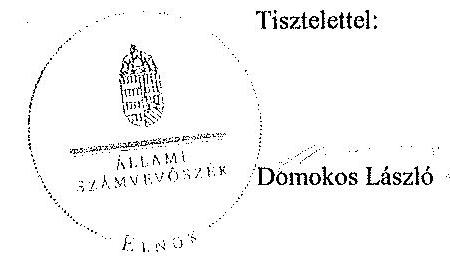

Melléklet: Tájékoztatás az elfogadott és az el nem fogadott észrevételekről

---

# Tájékoztatás   az elfogadott és az el nem fogadott észrevételekröl 

„Az állami vagyon feletti tulajdonosi joggyakorlással kapcsolatos tevékenységek ellenörzése" címủ jelentéstervezetre 2015. december 15 -én érkezett észrevételét áttekintettük, annak kezelésével kapcsolatban a következő tájékoztatást adom.

1. A Jelentéstervezet 6. oldal 4. bekezdéséhez, a 13. oldal 1., 2. bekezdéseihez és a 24. oldal 2. bekezdéséhez tett észrevétel

A dokumentumokat ismételten áttekintettük és az ellenőrzött időszakra vonatkozóan az SZMSZ módosításának elmaradásával kapcsolatos megállapításunk helytálló. Az észrevételükben leírtak megerősítették, hogy a Magyar Fejlesztési Bank Részvénytársaságról szóló 2001. évi XX. törvény (a továbbiakban: MFB tv.) 2014. július 16 -ai módosítását követően, valamint az MFB csoport müködésének felülvizsgálatával kapcsolatos projekt befejezéséig a „szabályzatok módosítása felfüggesztésre került". Mindezek alapján az intézkedést igénylő megállapítás és a javaslat módosítása nem indokolt.

## 2. A Jelentéstervezet 6. oldal 4. bekezdéséhez és az 50. oldal utolsó bekezdéséhez tett észrevétel

Az észrevételükben hivatkozott - az MFB Zrt. és Dr. Fazekas Sándor földművelésügyi miniszter között megkötött - Átadás-átvételi megállapodás 2.4. pontja valóban azt rögzítette, hogy mind az átadó, mind az átvevő a részesedéseket 2014. január 1-i fordulónappal a nyilvántartásából kivezette, illetve nyilvántartásba vette. A dokumentumokat ismételten áttekintettük és a rendelkezésünkre bocsátott - utólagos könyvelési napló - elnevezésű dokumentum tényszerüen alátámasztja a megállapításunkat, mely szerint a részesedések 2014. január 1-jén az MFB Zrt. Rábízott Vagyon elnevezésủ nyilvántartásában szerepelt és a „vagyonátadás-átvétel könyvekben történő rögzitésére - a átadás-átvételi megállapodás késedelmes, 2014. október 14-én történt megkötése miatt - a Számv. tv. 165. § (3) bekezdés b) pontjában elöirtokkal szemben több hónapos késéssel került sor." A megállapításunk helytálló módosítása nem indokolt. Megjegyezzük, hogy a 6. oldal 4. bekezdésében ez a téma nem szerepel.

---

3. A Jelentéstervezet 9. oldal 2. bekezdéséhez és a 26. oldal első bekezdéséhez tett észrevétel

A dokumentumokat ismételten áttekintettük és a jelentéstervezet véglegesitése során a 6. oldal 4. bekezdés utolsó mondatát, valamint a 26. oldal első bekezdés második mondatát töröljük.

Budapest, 2015. 1 - hó 2.8 nap

Makkai Mária
felügyeleti vezető

---

.

---

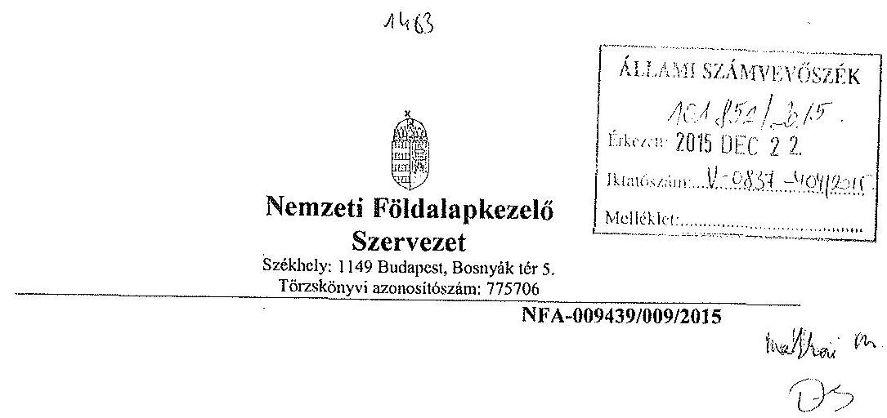

# Domokos László 

## Elnök

## Állami Számvevőszék

## 1052 Budapest

Apáczai Csere János utca 10

Tárgy: Észrevétel megküldése „Az állami vagyon feletti tulajdonosi joggyakorlással kapcsolatos tevékenységek ellenőrzéséről" készített jelentés tervezetre.

## Tisztelt Elnök Úr!

Az ÁSZ által megküldött V-0837-353/2015. iktatószámú „Az állami vagyon feletti tulajdonosi joggyakorlással kapcsolatos tevékenységek ellenőrzéséről" készített ellenőrzés megállapításaihoz az alábbi észrevételeket teszem:
1./ a) Megállapításuk: A jelentéstervezet 23. oldalán az 1.1.5. pont 8. bekezdése:" A számviteli politikában nem rögzítették, hogy a számviteli elszámolás és az értékelés szempontjából mit tekintenek jelentősnek, nem jelentősnek."
Javaslatuk: Intézkedjen a számviteli politika, szabályzat módosításáról annak érdekében, hogy a jogszabályi elöírásoknak megfeleljen."
Intézkedésünk: A Számviteli Politika 2015. március 12-én módosult, amely tartalmazza a jelentéstervezetben kifogásolt számviteli elszámolás és az értékelés szempontjából jelentős, nem jelentős, értékhatárok meghatározását.

---

b) Megállapításuk:A jelentéstervezet 23. oldalán az 1.1.5. pont 8. bekezdése: „A leltárkészitési szabályzatban nem határozták meg, a mennyiségi felvétellel történő leltározás gyakoriságát."
Javaslatuk „Intézkedjen a leltározás és leltárkészitési szabályzat módosításáról annak érdekében, hogy a jogszabályi elöírásoknak megfeleljen."
Intézkedésünk: A leltározási és leltárkészitési szabályzatban a 2015. március 12 -én történt módosítással egyidejüleg meghatározásra került a mennyiségi felvétellel történő leltározás gyakorisága.
c) Megállapításuk: A jelentéstervezet 23. oldalán az 1.1.5. pont 8. bekezdése: „Az eszközök és források értékelési szabályzata nem tartalmazta az egyszerűsített értékelési eljárás alá vont követelések besorolásának elveit, dokumentálásának szabályait."
Intézkedésünk: Az eszközös és források értékelési szabályzata szintén a 2015. március 12 -én történt módosítással szabályozza az egyszerüsített értékelési eljárás alá vont követelések besorolásának elveit, dokumentálásának szabályait.
2./
2. a) pontjához:

Megállapításuk: „A vagyonkezelési szerződésekben nem rögzítették, hogy a vagyonkezelő az NFA vagyon-nyilvántartási szabályzatát megismerte, és magára nézve kötelező érvényünek ismeri el."
Javaslatuk „Intézkedjen a vagyonkezelési szerződések jogszabályoknak való megfeleltetéséről."
Intézkedésünk: A 2626/2010 (XI.17.) Korm. rendelet hivatkozott 50/B §.-át a 285/2015. (X. 5.) Korm. rendelet a Nemzeti Földalapba tartozó földrészletek hasznosításának részletes szabályairól szóló 262/2010. (XI. 17.) Korm. rendelet és a földhivatalok, valamint a Földmérési és Távérzékelési Intézet feladatairól, illetékességi területéről, továbbá egyes földhivatalt eljárások részletes szabályairól szóló 373/2014. (XII. 31.) Korm. rendeletmódosításáról, 2015. október 6. napjával hatályon kívül helyezte.
Így álláspontom szerint a fenti jogszabályhelyre való hivatkozás a vagyonkezelési szerződésekben okafogyottá vált.
Továbbá álláspontom szerint a Nemzeti Földalap vagyon-nyilvántartásának naprakész vezetése és az NFA beszámoló-készitési kötelezettségének megalapozottsága érdekében az 50/A § és az 50/C §-ban rögzítettek kellő képen biztosítatják az NFA részére történő kötelező adatszolgáltatást.
2. b) pontjához:

Megállapításuk:„Az NFA az Áhsz. 47. § 3 bekezdésében elöírtak ellenére az állambáztartáson belüli szervezetekkel kötött vagyonkezelési szerződések esetében az ellenőrzött tételeknél vagyonkezelésbe adáskor $4498,8 \mathrm{M} \mathrm{Ft}$ nyilvántartási értékủ

---

vagyonkezelésbe adott eszközök bruttó értékét nem vezette ki könyveiből és azokat a 0 . számlaosztályban nem mutatta ki."
Javaslatuk: „Intézkedjen az államháztartáson belüli szervezetek vagyonkezelésbe adott ingatlanok könyvekböl történő kivitelezéséről és azok bruttó értékének a 0. számlaosztály befektetési eszközei között való nyilvántartásról."
Intézkedésünk: NFA nyilvántartásaiban nem szerepel ekkora értékủ vagyonkezelésbe adás. Államháztartáson belül a 0 .számlaosztályba könyvelt vagyonmozgás 2014-ben 87,7 M Ft vagyonkezelésbe adás és $110,5 \mathrm{M} \mathrm{Ft}$ vagyonkezelésből visszavétel történt, mely a számviteli nyilvántartásokban rögzitésre is került. A számlakartont erről is mellékeljük.
2. c) ponthoz:

Megállapításuk: A jelentés 43.oldalon a 3.1.3. pont 5. bekezdésben foglaltak szerint „az NFA a számviteli nyilvántartásában az Számv.tv. 15.§ (2) bekezdésében elóírtakat megsértve $3310,6 \mathrm{M} \mathrm{Ft}$ nyilvántartási értékủ államháztartáson kívüli szervezetek részére vagyonkezelésbe adott földrészletet nem mutatott ki."
Javaslatuk: „Intézkedjen az államháztartáson kívüli szervezetek részére vagyonkezelésbe adott földrészletek nyilvántartásában történő kimutatásról."
Intézkedésünk: A mellékelt számlakarton és beszámoló 15/A űrlap tanúsága szerint NFA ezt lekönyvelte és szerepeltette a számviteli nyilvántartásaiban és az elfogadott beszámolóban.
2. d) ponthoz:

Megállapításuk: „2014. évben egy önkormányzattal kötött vagyonkezelési szerződés keretében átadott ingatlant államháztartáson belüli vagyonkezelésbe adott és államháztartáson kívüli szervezetek részére vagyonkezelésbe adott ingatlanként is kimutatta."
Javaslatuk: „Intézkedjen az önkormányzat vagyonkezelésébe adott ingatlan jogszabályoknak megfelelő nyilvántartásáról."
Intézkedésünk: Az Önkormányzatok vagyonkezelésébe adott földrészletek nyilvántartása a jogszabályoknak megfelelően megtörtént, az @vatar vagyon nyilvántartási rendszerében.

# 3./ ponthoz: 

Megállapításuk: „Az ingyenes tulajdonba adás során az elidegenítési tilalomnak az ingatlan-nyilvántartásba történő feljegyzését nem kérelmezte."
Javaslatuk: „Intézkedjen az ingyenes tulajdonba adott ingatlanok esetében az elidegenitési tilalom ingatlan-nyilvántartásba történő feljegyzéséről."
Intézkedésünk: Az ÁSZ vizsgálati jelentésének Összegző megállapítások, következletéseket tartalmazó 12. oldal 3./ pontban szerepeltetett, az ingyenes önkormányzati tulajdonba adással érintett 18 db földrészlet esetében az ingatlannyilvántartásba az elidegenitési tilalom feljegyzése megtörtént.

---

Tulajdoni lapokat tételesen ellenőriztük. /A vizsgálat időszakában a Balotaszállási 037/2 és 047 helyrajzi számú földrészletek esetében kellett pótolnia az ügyvédnek az elidegenitési tilalom feljegyzése iránti kérelmet az ingatlanügyi hatóság felé, amely a tulajdoni lapok tanúsága szerint megtörtént./

Budapest, 2015. december 14.
Tisztelettel:

Mellékletek: beszámoló 15/A űrlap, számlakarton 2db,
7. számú tanúsítvány.
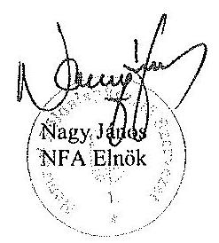

---

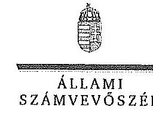

ELKÖK

Ikt.szám: V-0837-363/2015.

Nagy János úr
elnök
Nemzeti Földalapkezelő Szervezet

Budapest

Tisztelt Elnök Úr!
„Az állami vagyon feletti tulajdonosi joggyakorlással kapcsolatos tevékenységek ellenörzése" címmel készített számvevőszéki jelentéstervezetre tett észrevételét köszönettel megkaptam.

Az Állami Számvevőszék észrevételre vonatkozó álláspontjáról a felügyeleti vezető által készített részletes tájékoztatást csatoltan megküldöm.

Tájékoztatom Elnök urat, hogy a számvevőszéki jelentésben - az Állami Számvevőszékről szóló 2011. évi LXVI. törvény 29. § (3) bekezdése alapján - a figyelembe nem vett észrevételeket szerepeltetjük az elutasítás indokának feltüntetésével.

Budapest, 2015. 12. hó 25 nap
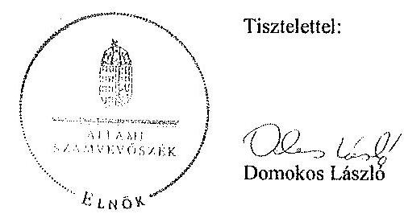

Melléklet: Tájékoztatás az elfogadott és el nem fogadott észrevételekről

---

# Tájékoztatás   az elfogadott és el nem fogadott észrevételekról 

„Az állami vagyon feletti tulajdonosi joggyakorlással kapcsolatos tevékenységek ellenörzése" címủ jelentéstervezetre 2015. december 15 -én érkezett észrevételét áttekintettük, annak kezelésével kapcsolatban a következő tájékoztatást adom.

1. a) észrevétel - jelentéstervezet 23. oldal 1.1.5. pont 8. bekezdés, az NFA elnökének címzett 1. számú intézkedést igényló megállapítás és javaslat
A Számviteli Politika 2015. március 12-i módosítására vonatkozó tájékoztatásukat köszönjük. A Számviteli Politika módosítása az ellenőrzött időszakot (2014. január 1.- 2014. december 31.) követően történt, így nem érinti az ellenőrzött időszakra vonatkozóan megfogalmazott megállapítást, ezért a jelentéstervezet módosítása nem indokolt.
2. b) észrevétel - jelentéstervezet 23. oldal 1.1.5. pont 8. bekezdés, az NFA elnökének címzett 1. számú intézkedést igényló megállapítás és javaslat

A leltározási és leltárkészítési szabályzat 2015. március 12-i módosítására vonatkozó tájékoztatásukat köszönjük. A módosítás az ellenőrzött időszakot követően történt, így nem érinti az ellenőrzött időszakra vonatkozóan megfogalmazott megállapítást, ezért a jelentéstervezet módosítása nem indokolt.

## 1. c) észrevétel - jelentéstervezet 23. oldal 1.1.5. pont 8. bekezdés

Az eszközök és források értékelési szabályzatának 2015. március 12-i módosítására vonatkozó tájékoztatásukat köszönjük. A módosítás az ellenőrzött időszakot követően történt, így nem érinti az ellenőrzött időszakra vonatkozóan megfogalmazott megállapítást, ezért a jelentéstervezet módosítása nem indokolt.

## 2. a) észrevétel - az NFA elnökének címzett 2. számú intézkedést igényló megállapítás és 2. a) javaslat

Az észrevételben leírtak megerősítik, hogy az ellenőrzött időszakban az NFAtv. vhr. 50/B. §ában foglaltak ellenére a vagyonkezelési szerződések nem tartalmazták, hogy a vagyonkezelő az NFA vagyon-nyilvántartási szabályzatát megismerte, és magára nézve kötelező érvényének ismeri el, ezért a jelentéstervezet megállapítása helytálló. A jogszabályi változásra tekintettel a 2. számú intézkedést igényló megállapítás vonatkozó részét és a 2. a) javaslatot a jelentéstervezetből töröljük.

---

# 2. b) észrevétel - jelentéstervezet 3.1.3. pont 13. bekezdés, NFA elnökének címzett 2. számú intézkedést igénylő megállapítás és 2. b) javaslat 

Az ellenőrzés rendelkezésére bocsátott dokumentumok alapján az NFA az államháztartási szervezetekkel kötött vagyonkezelési szerződések esetében a vagyonkezelésbe adáskor - az Áhsz. 47. § (3) bekezdésében foglaltak ellenére - a vagyonkezelésbe adott ingatlanok értékét, értékesőkkenését és értékvesztését könyveiből nem vezette ki, és azok bruttó értékét a 0 . számlaosztály befektetett eszközei között nem tartotta nyilván. Ezt alátámasztja, hogy az ellenőrzés rendelkezésére bocsátott, 2014. évre vonatkozó, 2015. augusztus 18 -án készült fökönyvi kivonat 0 .számlaosztályában ( 0112111 fökönyvi számlán) a vagyonkezelésbe adás könyvelése nem történt meg, valamint az észrevétel mellékleteként beküldött számlakarton szerint is a vagyonkezelésbe adás könyvekben történő rögzítése nem a vagyonkezelésbe adáskor, hanem az év végével (2014. december 31-i dátummal) történt. Ezért megállapításunkat fenntartjuk, azzal, hogy a dokumentumok ismételt áttekintését követően a jelentéstervezet 3.1.3. pont 13. bekezdésében a vagyonkezelésbe adás összegét $87,7 \mathrm{M}$ Ft-ra változtatjuk.
2. c) észrevétel - jelentéstervezet 3.1.3. pont 5. bekezdés, NFA elnökének címzett 2. számú intézkedést igénylő megállapítás és 2. c) javaslat

Az NFA 2014. évi nyitómérlege 3310,6 M Ft államháztartáson kívüli szervezetek részére vagyonkezelésbe adott földrészletet nem tartalmazott. A földrészletek értékét az NFA által az ellenőrzés rendelkezésére bocsátott 2014. évre vonatkozó, 2015. augusztus 18 -án készült fökönyvi kivonat sem tartalmazta, azt csak a 2015. szeptember 7-i keltủ záró fökönyvi kivonatban mutatták be. Ez alátámasztja megállapításunkat, mivel az ellenőrzött időszakban a földrészletek értékét a nyilvántartások nem tartalmazták.. Ezért az intézkedést igénylő megállapítás és javaslat módosítása nem indokolt.

## 2. d) észrevétel - jelentéstervezet 3.1.3. pont 14. bekezdés, az NFA elnökének címzett 2. számú intézkedést igénylő megállapítás és 2. d) javaslat

Az NFA az ellenőrzés rendelkezésére bocsátott dokumentumok alapján a VK2014-795. számú szerződésben szereplő 0231/14 helyrajzi számú földterületet nyilvántartásában a Számv. tv. 15. § (3) bekezdésében előírtak ellenére az államháztartáson belül vagyonkezelésbe adott és államháztartáson kívüli szervezetek részére vagyonkezelésbe adott ingatlanként is kimutatta. Ezért a jelentéstervezet megállapításának módosítása nem indokolt.

---

# 3. észrevétel - jelentéstervezet 3.3.3. pont 3. bekezdés, az NFA elnökének címzett 3. számú intézkedést igénylő megállapítás és javaslat 

Az ellenőrzés rendelkezésére bocsátott dokumentumok alapján két földrészlet esetében az elidegenítési tilalom ingatlan-nyilvántartásba történő feljegyzését a tulajdonjog bejegyzése iránti kérelem benyújtásával egyidejűleg nem kérelmezték. Megállapításunkat az észrevételben leírtak is megerősítik. Ezért a jelentéstervezet megállapításainak módosítása nem indokolt.

Budapest, 2015. 12. hó 23. nap

Makkai Mária
felügyeleti vezető

---

# 11.52ÁMÚ MELLÉKLET A V-0837-393/2015. SZÁMÚ JELENTÉSHEZ 

## 1125 Budapest Diós árok 3

Tel 13561522 , Fax 13757253
1525 Budapest 114 Pf 32

Állami Számvevőszék
Dr. Láng Ágnes Krisztina
Ellenőrzésvezető részére

Iktatószám: V-0837-347/2015
Témaszám: 1871
Vizsgálat-azonosító szám: V 0727
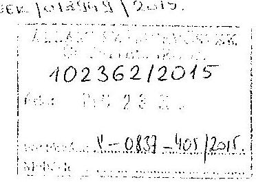

Tárgy: Az Állami Egészségügyi Ellátó Központ (továbbiakban ÁEEK) észrevételezése Az Állami Számvevőszék (továbbiakban ÁSZ) „Az állami vagyon feletti tulajdonosi joggyakorlással kapcsolatos tevékenységek ellenörzése" tárgyban készült ellenőrzési jelentéstervezethez

## Tisztelt Ellenőrzésvezető Asszony!

A tárgyban jelzett jelentés tervezet - Állami Egészségügyi Ellátó Központot érintő összefoglaló megállapításaival, valamint az ÁEEK föigazgatójának tett intézkedést igényló javaslataival kapcsolatosan az alábbi észrevételeket tesszük:

## Az összefoglaló megállapításokhoz kapcsolódóan:

Az összefoglaló megállapítások és javaslatok szerint intézkedési terv készül az ÁSZ által megállapított hiányosságok kiküszöbölése és rendszer szintü kezelése érdekében. Az ÁEEK 2015. évben elkészítette a Tulajdonosi Ellenőrzési Szabályzatát és folyamatban van valamennyi - ellenőrzéssel érintett szabályzat - aktualizálása, valamint az ÁSZ észrevételei alapján történő felülvizsgálata.

## Az egyes intézkedési javaslatokhoz kapcsolódóan:

1./ „Az ÁEEK föigazgatója intézkedjen a számviteli politika, a számlarend és a vagyonnyilvántartási szabályzat módosításáról annak érdekében, hogy azok a jogszabályi elöírásoknak megfeleljenek."

A számviteli politika, a számlarend és a vagyon-nyilvántartási szabályzat áttekintése, jogszabályi megfeleltetésének folyamata elindult hivatalunknál.
2./ „Az ÁEEK föigazgatója intézkedjen az állami vagyonnal való gazdálkodás jogszabály szerinti tulajdonosi ellenőrzésröl."

A tulajdonosi ellenőrzési szabályzat alapján a helyszíni, konkrét ellenőrzések jelenleg is ütemezetten folynak az ellenőrzésre kijelölt állami vagyont használó intézményeknél. Az ÁEEK tulajdonosi joggyakorlása alá tatozó vagyonelemek szabályszerű és rendeltetésszerű használatának kontrolljáról intézkedés történt.

---

# 11.SZÁMÚ MELLÉKLET A V-0837-393/2015. SZÁMÚ JELENTÉSHEZ 

## 1125 Budapest. Olón árok 3

Tel. 13561522 Fax 13757253
1525 Budapest 114 Pf. 32
A.E.F. $1 \leq 450 \mathrm{~L} / 3 \mathrm{c} / \mathrm{c}$
3./ ,,Az ÁEEK föigazgatója intézkedjen az államháztartáson belüli szervezet vagyonkezelésébe adott ingatlanok könyvekböl történő kivezetéséről, és azok bruttó értékének a 0 . számlausztály befektetett eszközei között való nyilvántartásáról. "

Az ÁEEK Gazdasági Föigazgatósága 2015. évben, a 2014. évre elkészített rábízott vagyon beszámoló adatai valódiságának biztosítása érdekében, felülvizsgálta nyilvántartásait, majd ismételt egyeztetéseket hajtott végre - az elmúlt időszakokra visszanyúlóan - az érintett szervezeti egységekkel, és intézményekkel, melynek eredményeképpen az ÁEEK 2014. évi rábízott vagyon beszámolója a feltárt hibák korrekciójával, három oszlopos mérleggel készült el. Az államháztartáson belüli szervezeteknek vagyonkezelésbe adott ingatlanok 0 . számlaosztályba történő átvezetése, nyilvántartásba vétele 2014. december 31-i állapot szerint megtörtént.
4./ ,,Az ÁEEK föigazgatója intézkedjen a vagyon hasznosítására kötött jogszabályoknak való megfeleltetéséről."

Az ÁSZ észrevételei alapján a vagyonhasznosítási szerződésekre vonatkozóan, Intézményünknél új szerződésminta készül, és megkezdődik az egyes szerződések felülvizsgálata, valamint a hatályos jogszabályoknak történő megfelelés érdekében a szükséges egyedi módosítások végrehajtása is.

Az ellenőrzési jelentéstervezet 3.1.1. pontjának 2. bekezdésében leírtak helyesbítését kérjük. A GYEMSZI által 2014. évben kötött vagyonkezelési szerződések száma nem 273 db volt, hanem 21 db , azzal, hogy kizárólag államháztartási körbe tartozó szervezettel kötöttünk vagyonkezelési szerződést.

Az ellenőrzés megállapításainak figyelembe vételével az ÁEEK Föigazgatója - a korábbi hibák és hiányosságok kiküszöbölése, valamint a jövőbeni transzparens müködés biztosítása érdekében - valamennyi érintett szervezeti egység számára kiemelt feladatként jelölte meg az állami vagyon feletti tulajdonosi joggyakorlói feladatok fokozott figyelemmel kísérését. A célok megvalósítása érdekében előirta a szükséges monitoring rendszer kiépítését, a folyamatos és eseti ellenőrzések bevezetését, az adatszolgáltatások határidőben történő teljesítésének számonkérését, a kontrollkörnyezet folyamatos fejlesztését.

Budapest, 2015. december 10.

Tisztelettel:
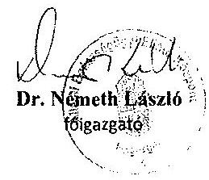

---

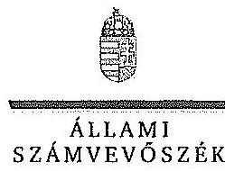

ELNÖK

Ikt.szám: V-0837-360/2015.

Dr. Németh László úr
Főigazgató
Állami Egészségügyi Ellátó Központ

Budapest

Tisztelt Főigazgató Úr!

„Az állami vagyon feletti tulajdonosi joggyakorlással kapcsolatos tevékenységek ellenőrzése"
cimmel készített számvevőszéki jelentéstervezetre tett észrevételét, valamint a jelentéstervezet
intézkedést igénylő megállapításai és javaslatai alapján már megtett és tervezett intézkedéseiről
történő tájékoztatását köszönettel megkaptam.

Az Állami Számvevőszék észrevételre vonatkozó álláspontjáról a felügyeleti vezető által
készített részletes tájékoztatást csatoltan megküldőm.

Tájékoztatom Főigazgató urat, hogy a számvevőszéki jelentés mellékleteként szerepeltetjük a
jelentéstervezethez tett észrevételét, valamint az arra adott válaszunkat.

Budapest, 2015. 17 hó 25. nap

Tisztelettel:

Domokos László

Melléklet: Tájékoztatás az elfogadott észrevételekről

1052 BUDAPEST, AFRICZAI CSZRE JÁNOS UTCA 10. 1364 Budapest 4. Pl. 54 telefon: 484 0101 fax: 484 0101

1

---

# Tájékoztatás   az elfogadott észrevételekröl 

"Az állami vagyon feletti tulajdonosi joggyakorlással kapcsolatos tevékenységek ellenörzése" címủ jelentéstervezetre 2015. december 12 -én érkezett észrevételét áttekintettük, annak kezelésével kapcsolatban a következő tájékoztatást adom.

## Észrevétel - Jelentéstervezet 3.1.1. pont 2. bekezdés

A dokumentumok ismételt áttekintését követően a jelentéstervezet 3.1.1. pontja 2. bekezdésének első mondatát az alábbiak szerint pontosítjuk:
„A GYEMSZI a 2014. évben 21 db vagyonkezelési szerzödés kötött, amelyek keretében összesen 273 db földterületet adott vagyonkezelésbe."

A jelentéstervezet intézkedést igénylő megállapításai és javaslatai alapján már megtett és tervezett intézkedéseiről adott tájékoztatást köszönjük. Az intézkedést igénylő megállapításokat és javaslatokat az észrevétel nem kifogásolja, módosításuk nem szükséges.

Budapest, 2015. 17. hó 2.5 . nap

Makkai Mária
felügyeleti vezető

---

# RÖVIDÍTÉSEK JEGYZÉKE 

## Törvények

Alaptörvény
Áht.
ÁSZ tv.
Erdőtv.
Földforgalmi tv.
Gt.
Kttv.
Mfbtv.
Mtv.
Nfatv.
Nvtv.
Ptk.
Számv. tv.
Ttv.

Vtv.
Hpt.
2013. évi CCXLII. törvény

Magyarország Alaptörvénye
az államháztartásról szóló 2011. évi CXCV. törvény
az Állami Számvevőszékről szóló 2011. évi LXVI. törvény
az erdőről, az erdő védelméről és az erdőgazdálkodásról szóló 2009. évi XXXVII. törvény
a mező- és erdőgazdasági földek forgalmáról szóló 2013. évi CXXII. törvény (hatályos: 2013. december 15-től)
a gazdasági társaságokról szóló 2006. évi IV. törvény (hatálytalan 2014. március 15 -től)
a közszolgálati tisztviselőkről szóló 2011. évi CXCIX. törvény
a Magyar Fejlesztési Bank Részvénytársaságról szóló 2001. évi XX. törvény
a munka törvénykönyvéről szóló 2012. évi I. törvény
a Nemzeti Földalapról szóló 2010. évi LXXXVII. törvény
a nemzeti vagyonról szóló 2011. évi CXCVI. törvény
a Polgári Törvénykönyvről szóló 2013. évi V. törvény (hatályos: 2014. március 15 -től)
a számvitelről szóló 2000 . évi C. törvény
a települési önkormányzatok fekvőbeteg-szakellátó intézményeinek átvételéről és az átvételhez kapcsolódó egyes törvények módosításáról szóló 2012. évi XXXVIII. törvény
az állami vagyonról szóló 2007. évi CVI. törvény
a hitelintézetekről és a pénzügyi vállalkozásokról szóló 2013. évi CCXXXVII. törvény
a Városliget megújításáról és fejlesztéséről szóló 2013. évi CCXLII. törvény

## Rendeletek, határozatok

| Áhsz. | az államháztartás számviteléről szóló |
| :--: | :--: |
| Ávr. | 4/2013. (I. 11.) Korm. rendelet |
| Bkr. | az államháztartásról szóló törvény végrehajtásáról szóló 368/2011. (XII. 31.) Korm. rendelet |
| Nfatv. vhr. | a költségvetési szervek belső kontrollrendszeréről és belső ellenőrzéséről szóló 370/2011. (XII. 31.) Korm. rendelet |
| Vhr. | a Nemzeti Földalapba tartozó földrészletek hasznosításának részletes szabályairól szóló 262/2010. (XI. 17.) Korm. rendelet |
|  | az állami vagyonnal való gazdálkodásról szóló 254/2007. (X. 4.) Korm. rendelet |

---

263/2010. (XI. 17.) Korm. rendelet

11/2011. (II. 22.) Korm. rendelet 10/2013. (I. 21.) Korm. rendelet 152/2014. (VI. 6.) Korm. rendelet 109/1999. (XII. 29.) FVM rendelet 80/2013. (XII. 23.) NFM rendelet

1172/2010. (VIII. 18.) Korm. határozat

## Szórövidítések

|  ÁEEK | Állami Egészségügyi Ellátó Központ  |
| --- | --- |
|  ÁSZ | Állami Számvevőszék  |
|  EMMI | Emberi Erőforrások Minisztériuma  |
|  EMMI miniszter | az emberi erőforrások minisztere  |
|  EUTAF | Európai Támogatásokat Auditáló Főigazgatóság  |
|  FM | Földművelésügyi Minisztérium (2014. június 5-ig: Vidékfejlesztési Minisztérium)  |
|  FM miniszter | földművelésügyi miniszter  |
|  FÖMI | Földmérési és Távérzékelési Intézet  |
|  GYEMSZI | Gyógyszerészeti és Egészségügyi Minőség- és Szervezetfejlesztési Intézet (2015. március 1-jétől Állami Egészségügyi Ellátó Központ)  |
|  KEHI | Kormányzati Ellenőrzési Hivatal  |
|  KIFÜ | Kormányzati Informatikai Fejlesztési Ügynökség  |
|  MÁV Zrt. | MÁV Magyar Államvasutak Zártkörűen Müködő Részvénytársaság  |
|  MFB Zrt. | MFB Magyar Fejlesztési Bank Zártkörűen Müködő Részvénytársaság  |
|  MNV Zrt. | Magyar Nemzeti Vagyonkezelő Zártkörűen Müködő Részvénytársaság  |
|  NFA | Nemzeti Földalapkezelő Szervezet  |
|  NFM | Nemzeti Fejlesztési Minisztérium  |

---

| NFM miniszter | nemzeti fejlesztési miniszter |
| :-- | :-- |
| NGM | Nemzetgazdasági Minisztérium |
| NGM miniszter | nemzetgazdasági miniszter |
| OEP | Országos Egészségbiztosítási Pénztár |
| OHÜ Kft. | Országos Hulladékgazdálkodási Ügynökség Nonprofit Kft. |
| RJGY | Részvényesi Jogok Gyakorlója |
| SZMSZ | Szervezeti és Müködési Szabályzat |
| TIG Kft. | TIG Tartalékgazdálkodási Nonprofit Kft. |
| Vig utasítás | Vezérigazgatói utasítás |
| VM | Vidékfejlesztési Minisztérium |
| VM miniszter | vidékfejlesztési miniszter |

---

.

---

# FOGALOMTÁR 

adattárház
állami vagyon
átlátható szervezet

Olyan speciális adatbázisok, melyek adott szervezet azon adatgyűjtő és szolgáltató részeit foglalják magában, ahol az adatokat újrastrukturálják riportkészítési, jó teljesítményű és egyszerűen kezelhető elemzésekhez. Az adattárházban olyan adatok kerülnek tárolásra, melyek több más rendszerből kerültek kinyerésre.
A Vtv. alkalmazásában állami vagyonnak minősül:
a) az állam tulajdonában lévő dolog, valamint dolog módjára hasznosítható természeti erő;
b) az a) pont hatálya alá tartozó mindazon vagyon, amely vonatkozásában törvény az állam kizárólagos tulajdonjogát nevesíti;
c) az állam tulajdonában lévő tagsági jogviszonyt megtestesítő értékpapír, illetve az államot megillető egyéb társasági részesedés;
d) az államot megillető olyan immateriális, vagyoni értékkel rendelkező jogosultság, amelyet jogszabály vagyoni értékű jogként nevesít;
e) az állam tulajdonában lévő pénzügyi eszközök.
(Forrás: Vtv. 1. § (2) bekezdése)
A nemzeti vagyontörvény szerint:
a) az állam, a költségvetési szerv, a köztestület, a helyi önkormányzat, a nemzetiségi önkormányzat, a társulás, az egyházi jogi személy, az olyan gazdálkodó szervezet, amelyben az állam vagy a helyi önkormányzat különkülön vagy együtt 100\%-os részesedéssel rendelkezik, a nemzetközi szervezet, a külföldi állam, a külföldi helyhatóság, a külföldi állami vagy helyhatósági szerv és az Európai Gazdasági Térségről szóló megállapodásban részes állam szabályozott piacára bevezetett nyilvánosan múködő részvénytársaság,
b) az olyan belföldi vagy külföldi jogi személy vagy jogi személyiséggel nem rendelkező gazdálkodó szervezet, amely megfelel a következő feltételeknek:
ba) tulajdonosi szerkezete, a pénzmosás és a terrorizmus finanszírozása megelőzéséről és megakadályozásáról szóló törvény szerint meghatározott tényleges tulajdonosa megismerhető,
bb) az Európai Unió tagállamában, az Európai Gazdasági Térségről szóló megállapodásban részes államban, a Gazdasági Együttmúködési és Fejlesztési Szervezet tagállamában vagy olyan államban rendelkezik adóilletőséggel, amellyel Magyarországnak a kettős adóztatás elkerüléséről szóló egyezménye van,
bc) nem minősül a társasági adóról és az osztalékadóról szóló törvény szerint meghatározott ellenőrzött külföldi társaságnak,

---

belső kontrollrendszer
információ és kommunikáció
kockázatkezelés
bd) a gazdálkodó szervezetben közvetlenül vagy közvetetten több mint $25 \%$-os tulajdonnal, befolyással vagy szavazati joggal bíró jogi személy, jogi személyiséggel nem rendelkező gazdálkodó szervezet tekintetében a ba), bb) és bc) alpont szerinti feltételek fennállnak;
c) az a civil szervezet és a vízitársulat, amely megfelel a következő feltételeknek:
ca) vezető tisztségviselői megismerhetők,
cb) a civil szervezet és a vízitársulat, valamint ezek vezető tisztségviselői nem átlátható szervezetben nem rendelkeznek $25 \%$-ot meghaladó részesedéssel,
cc) székhelye az Európai Unió tagállamában, az Európai Gazdasági Térségről szóló megállapodásban részes államban, a Gazdasági Együttmúködési és Fejlesztési Szervezet tagállamában vagy olyan államban van, amellyel Magyarországnak a kettős adóztatás elkerüléséről szóló egyezménye van.
(Forrás: Nvtv. 3. § (1) 1. pontja)
A belső kontrollrendszer a kockázatok kezelése és tárgyilagos bizonyosság megszerzése érdekében kialakított folyamatrendszer, amely azt a célt szolgálja, hogy megvalósuljanak a következő célok:
a) a múködés és gazdálkodás során a tevékenységeket szabályszerűen, gazdaságosan, hatékonyan, eredményesen hajtsák végre,
b) az elszámolási kötelezettségeket teljesítsék, és
c) megvédjék az erőforrásokat a veszteségektől, károktól és nem rendeltetésszerú használattól.
(Forrás: Áht. 69. § (1) bekezdése)
A vezetés képességét a megfelelő döntések meghozatalára alapvetően befolyásolja az információ minősége, amely magában hordozza azt a követelményt, hogy az információnak megfelelőnek, időben rendelkezésre állónak, aktuálisnak, pontosnak és elérhetőnek kell lennie.
A hatékony kommunikáció lefelé, horizontálisan és felfelé irányuló információ áramoltatást jelent a szervezetben, annak minden részében és teljes struktúrájában.
A költségvetési szerv vezetője köteles olyan rendszereket kialakítani és múködtetni, melyek biztosítják, hogy a megfelelő információk a megfelelő időben eljutnak az illetékes szervezethez, szervezeti egységhez, illetve személyhez.
(Forrás: Bkr. 3. § d) pont, 9. § (1) bekezdése)
A kockázatkezelés a szervezet céljai elérésével kapcsolatos kockázatok azonosításának és elemzésének, valamint a megfelelő válaszok meghatározásának folyamata. A szervezet vezetője köteles a kockázati tényezők figyelembevételével kockázatelemzést végezni és kockázatkezelési rendszert múködtetni.

---

kontrollkörnyezet
kontrolltevékenységek
meghatározó befolyás

Nemzeti Földalap

Forrás: (Bkr. 3. § b) pont, 7. § (1) bekezdése)
A szervezet vezetője köteles olyan kontrollkörnyezetet kialakítani, amelyben
a) világos a szervezeti struktúra,
b) egyértelműek a felelősségi, hatásköri viszonyok és feladatok,
c) meghatározottak az etikai elvárások a szervezet minden szintjén,
d) átlátható a humánerőforrás-kezelés.
(Forrás: Bkr. 3. § a) pont, 6. § (1) bekezdése)
A kontrolltevékenységek azok az elvek (politikák) és eljárások, amelyeket a kockázatok meghatározása és a szervezet céljainak elérése érdekében alakítanak ki.
A szervezet vezetője köteles a szervezeten belül kontrolltevékenységeket kialakítani, melyek biztosítják a kockázatok kezelését, hozzájárulnak a szervezet céljainak eléréséhez.
(Forrás: Bkr. 3. § c) pont, 8. § (1) bekezdése)
A VM, az MNV Zrt., az MFB Zrt. portfóliójába tartozó gazdasági társaság egy másik gazdasági társaságban a Ptk.2. 8:2 § (2)-(3) bekezdéseiben rögzített meghatározó befolyással rendelkezik. A befolyással rendelkező akkor rendelkezik egy jogi személyben meghatározó befolyással, ha annak tagja, illetve részvényese és jogosult e jogi személy vezető tisztségviselői vagy felügyelőbizottsága tagjai többségének megválasztására, illetve visszahívására, vagy a jogi személy más tagjai, illetve részvényesei a befolyással rendelkezővel kötött megállapodás alapján a befolyással rendelkezővel azonos tartalommal szavaznak, vagy a befolyással rendelkezőn keresztül gyakorolják szavazati jogukat, feltéve, hogy együtt a szavazatok több mint felével rendelkeznek. (Ptk.2. 8:2 § (2) bekezdés). A többségi befolyás akkor is fennáll, ha a befolyással rendelkező számára az (1)-(2) bekezdés szerinti jogosultságok közvetett befolyás útján biztosítottak. (Ptk.2. 8:2 § (3) bekezdése)
(Forrás: Ptk.2. 8:2 § (2)-(3) bekezdései)
A Nemzeti Földalapba a kincstári vagyon része. A Nemzeti Földalapba tartozik az állam tulajdonában lévő, az ingatlan-nyilvántartásban
a) szántó, szőlő, gyümölcsös, kert, rét, legelő (gyep), nádas, erdő, fásított terület vagy halastó művelési ágban nyilvántartott terület,
b) művelés alól kivett területként nyilvántartott olyan terület (ide nem értve az Állami terület I; Állami terület II; és Állami terület III. megnevezésű művelés alóli kivett területet), amelyre az Országos Erdőállomány Adattárban erdőként nyilvántartott terület jogi jelleg ténye van felje-

---

nemzeti vagyon
nyomon követési tevékenység (monitoring)
gyezve, és az Országos Erdőállomány Adattárban foglaltak szerint elsődleges gazdasági rendeltetésű erdőnek minősül;
c) művelés alól kivett területként nyilvántartott olyan terület, amely a Nemzeti Földalapba tartozó földrészlet mező-, erdőgazdasági tevékenységét szolgálja, vagy ahhoz szükséges,
d) művelés alól kivett, honvédelmi célra feleslegessé nyilvánított területként nyilvántartott földrészlet.
(Forrás: Nfatv. 1. § (1) bekezdése)
A nevezeti vagyonba tartozik:
a) az állam vagy a helyi önkormányzat kizárólagos tulajdonában álló dolgok,
b) az a) pont hatálya alá nem tartozó, az állam vagy a helyi önkormányzat tulajdonában lévő dolog,
c) az állam vagy a helyi önkormányzat tulajdonában lévő pénzügyi eszközök, továbbá az államot vagy a helyi önkormányzatot megillető társasági részesedések,
d) az államot vagy a helyi önkormányzatot megillető bármely vagyoni értékkel rendelkező jogosultság, amelyet jogszabály vagyoni értékű jogként nevesít,
e) Magyarország határa által körbezárt terület feletti légtér,
f) az üvegházhatású gázok kibocsátási egységeinek kereskedelméről szóló törvény szerinti kibocsátási egység és légiközlekedési kibocsátási egység, valamint az ENSZ Ég-hajlat-változási Keretegyezménye és annak Kiotói Jegyzőkönyve végrehajtási keretrendszeréről szóló törvény szerinti kiotói egység,
g) állami vagy helyi önkormányzati fenntartású közgyűjtemény (muzeális intézmény, levéltár, közgyűjteményként múködő kép- és hangarchívum, valamint könyvtár) saját gyűjteményében nyilvántartott kulturális javak körébe tartozó dolog, kivéve, ha az állami vagy önkormányzati tulajdon jogszerű létrejötte kétséget kizáró módon nem bizonyítható és a dologra nézve más a tulajdonjogát bizonyítja vagy a kulturális javakra vonatkozó jogszabályokban meghatározott eljárás keretében valószínűsíti, h) a régészeti lelet,
i) a nemzeti adatvagyon körébe tartozó állami nyilvántartások fokozottabb védelméről szóló törvény szerinti nemzeti adatvagyon.
(Forrás: Nvtv. 1. § (2) bekezdése)
A szervezet tevékenységének, a célok megvalósításának nyomon követését biztosító rendszer, amely az operatív tevékenységek keretében megvalósuló folyamatos és eseti nyomon követésből, valamint az operatív tevékenységektől függetlenül múködő belső ellenőrzésből áll.
(Forrás: Bkr. 3. § e) pont, 10. §-a)

---

Országleltár
rábízott állami vagyon
társasági portfólió
többségi tulajdon
tulajdonosi ellenőrzés
tulajdonosi joggyakorlás módja

A Vtv. hatálya alá tartozó vagyoni körre vonatkozó vagyonelem szintű bontásban mennyiségi, leíró és értékadatok ingyenes, vagy térítés ellenében történő biztonságos szolgáltatása webes felületen, valamint az Egységes Kormányzati Gerinchálón (EKG) a különböző jogosultságú felhasználók számára.
Az Mfbtv. 3. § (9) bekezdése szerint az a vagyon, amely felett az Mfbtv. erejénél fogva az állam nevében az MFB Zrt. gyakorolja a tulajdonosi jogokat.
A Nfatv. 1. § (1) bekezdése szerint a Nemzeti Földalapba tartozó földvagyon tekinthető rábízott vagyonnak.
(Forrás:Vtv. 22. § (6) bekezdése; Mfbtv. 3. § (9) bekezdése; Nfatv. 1. § (1) bekezdése)
Az MNV Zrt. és az MFB Zrt. rábízott vagyonába tartozó állami tulajdonú társasági részesedések.
A VM, az MNV Zrt., az MFB Zrt. portfóliójába tartozó gazdasági társaság egy másik gazdasági társaságban a szavazatok több mint ötven százalékával vagy a Ptk.2. 8:2 § (2)-(3) bekezdéseiben rögzített meghatározó befolyással rendelkezik.
(Forrás: Ptk.2. 8:2 § (1) bekezdése)
A Vhr. 20. §. (2) bekezdés alapján a tulajdonosi ellenőrzés célja az állami vagyonnal való gazdálkodás vizsgálata, ennek keretében a rendeltetésellenes, jogszerütlen, szerződésellenes, vagy a tulajdonos érdekeit sértő, illetve a központi költségvetést hátrányosan érintő vagyongazdálkodási intézkedések feltárása és a jogszerú állapot helyreállítása, továbbá a vagyonnyilvántartás hitelességének, teljességének és helyességének biztosítása.
A 262/2010. (XI. 17.) Korm. rendelet 47. § (2) bekezdése szerint a tulajdonosi ellenőrzés célja a földrészlettel való gazdálkodás vizsgálata, ennek keretében a rendeltetésellenes, jogszerütlen, szerződésellenes, vagy a tulajdonos érdekeit sértő intézkedések feltárása és a jogszerú állapot helyreállítása, továbbá a vagyonnyilvántartás hitelességének, teljességének és helyességének biztosítása.
A 263/2010. (XI. 17.) Korm. rendelet 11. § (1) bekezdése szerint a vagyonkezelési szerződésben foglaltak betartását az NFA ellenőrzi.
(Forrás: Vhr. 20. §. (2) bekezdése, 262/2010. (XI. 17.) 47. § (2) bekezdése, 263/2010. (XI. 17.) Korm. rendelet 11. § (1) bekezdése)
2013. június 27 -éig a Vtv. 3. § (1) bekezdése szerint az állami vagyon felett az Magyar Államot megillető tulajdonosi jogoknak (és kötelezettségeknek) az összességét az állami vagyon felügyeletéért felelős miniszter gyakorolja, aki e feladatát az MNV, az MFB, illetve a (2) bekezdés sze-

---

tulajdonosi joggyakorlás és vagyongazdálkodás feladata
rinti tulajdonosi joggyakorló szervezet (pl. központi költségvetési szervek, 100\%-ban állami tulajdonban álló gazdasági társaságok) útján látja el.
2013. június 28 -tól a Vtv. 3. § (1) bekezdése szerint a rábízott állami vagyon felett az államot megillető tulajdonosi jogok és kötelezettségek összességét már tulajdonosi joggyakorlóként, ha törvény vagy miniszteri rendelet eltérően nem rendelkezik, az MNV, vagy törvényben kijelölt személy, vagy az állami vagyon felügyeletéért felelős miniszter által rendeletben kijelölt személy gyakorolja.
Az Egészségbiztosítási Alap ellátási vagyona tekintetében a tulajdonosi jogokat az egészségbiztosításért felelős miniszter, a Nyugdíjbiztosítási Alap ellátási vagyona tekintetében a tulajdonosi jogokat a nyugdíjpolitikáért felelős miniszter gyakorolja.
A települési önkormányzatok fekvőbeteg-szakellátó intézményeinek átvételéről és az átvételhez kapcsolódó egyes törvények módosításáról szóló 2012. évi XXXVIII. törvény szerint a Magyar Államot megillető tulajdonosi jogok és kötelezettségek összességének gyakorlására 2012. május 1-jétől a Gyógyszerészeti és Egészségügyi Minőség- és Szervezetfejlesztési Intézet (GYEMSZI) jogosult. A fekvőbetegszakellátó és egyes fekvőbeteg-szakellátóhoz kapcsolódó egészségügyi háttérszolgáltatást nyújtó, 100\%-os állami tulajdonban lévő, valamint azok 100\%-os tulajdonában lévő gazdasági társaságok által ellátott feladatok központi költségvetési szervek általi átvételéről, valamint az ezzel kapcsolatos eljárási kérdések rendezéséről szóló 2013. évi XXV. törvény szerint a feladat átvételének időpontjától az állam tulajdonába kerülő vagyon tekintetében a tulajdonosi jogok gyakorlására a GYEMSZI jogosult.
Az Nfatv. 3. § (1) bekezdése szerint a Nemzeti Földalap felett a Magyar Állam nevében a tulajdonosi jogokat (és kötelezettségeket) az agrárpolitikáért felelős miniszter a Nemzeti Földalapkezelő Szervezet (NFA) útján gyakorolja. A Nemzeti Földalappal kapcsolatos polgári jogviszonyokban az államot az NFA képviseli. Azon állami tulajdonban álló ingatlanok felett, amelyek egy része a Nemzeti Földalapba tartozik, a tulajdonosi jogokat a miniszter a nemzeti fejlesztési miniszterrel közösen gyakorolja.
(Forrás: Vtv., Nfatv.)
A Vtv. 2. § (1) bekezdése szerint az állami vagyon rendeltetésének megfelelő - az állami feladatok ellátásához, a társadalmi szükségletek kielégítéséhez, valamint a Kormány gazdaságpolitikája megvalósításának elősegítéséhez szükséges, egységes elveken alapuló, önálló ágazatként megjelenő - hatékony, költségtakarékos, értékmegőrző, értéknövelő felhasználásának biztosítása (közvetlen felhasználás), illetve közvetett hasznosítása (beleértve a

---

tulajdonosi joggyakorló
vagyonkezelői jog
vagyoni kör változását eredményező értékesítést), valamint az állami vagyon gyarapítása (ideértve a vagyoni kör bővítését is).
(Forrás: Vtv. 2. § (1) bekezdése)
Nvtv. 3. § (1) bekezdés 17. pontja szerint, aki a nemzeti vagyon felett az államot vagy a helyi önkormányzatot megillető tulajdonosi jogok és kötelezettségek összességének gyakorlására jogosult.
(Forrás: Nvtv. 3. § (1) bekezdés 17. pontja)
A Vtv. alapján a vagyonkezelői jog az állami vagyon hasznosítására az MNV-vel kötött vagyonkezelési szerződéssel jön létre. A vagyonkezelési szerződés alapján a vagyonkezelő̉ jogosult (vagyonkezelői jog) meghatározott, állami tulajdonba tartozó dolog birtoklására, használatára és hasznai szedésére.
Az Nfatv. alapján a vagyonkezelői jog az erre irányuló (NFA-val kötött) szerződéssel jön létre. A vagyonkezelői szerződés alapján a vagyonkezelő jogosult meghatározott földrészlet birtoklására, használatára és hasznai szedésére.
(Forrás: Vtv., Nfatv.)