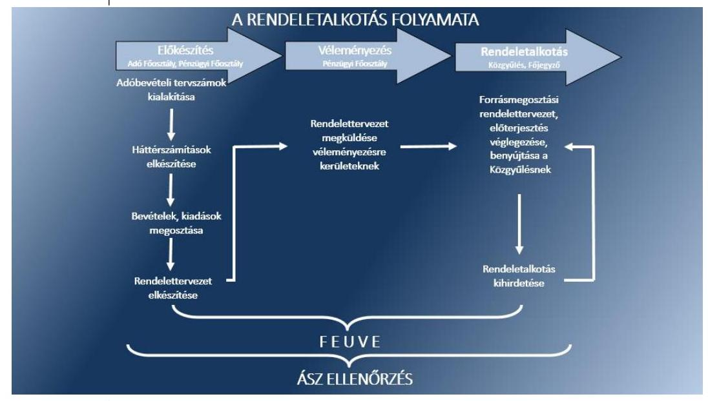
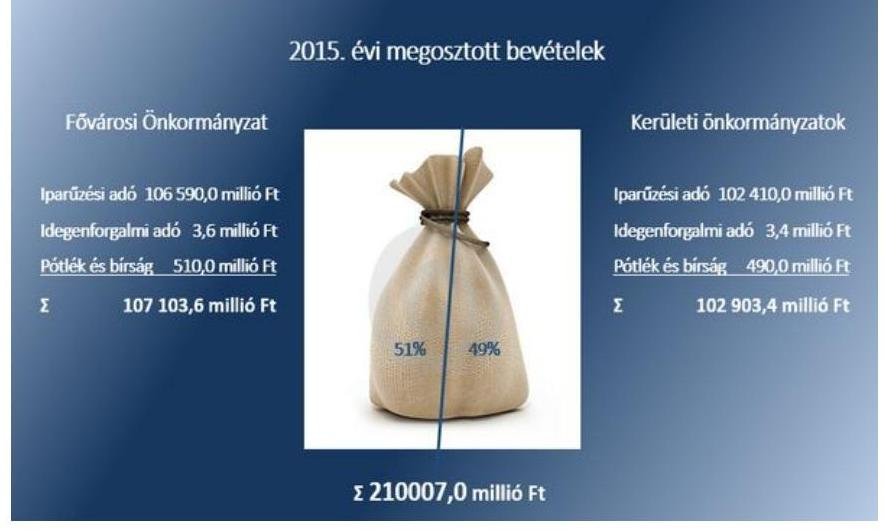
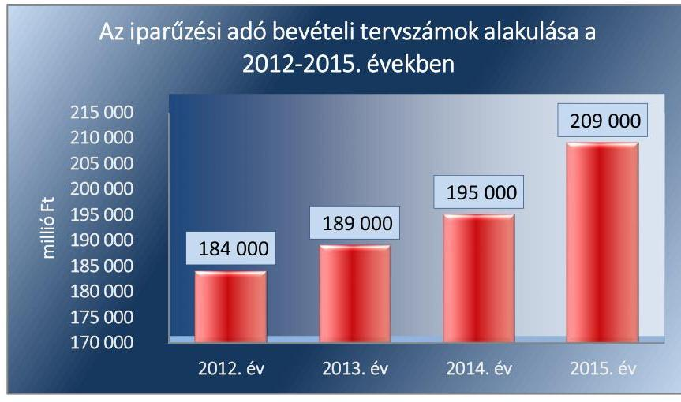
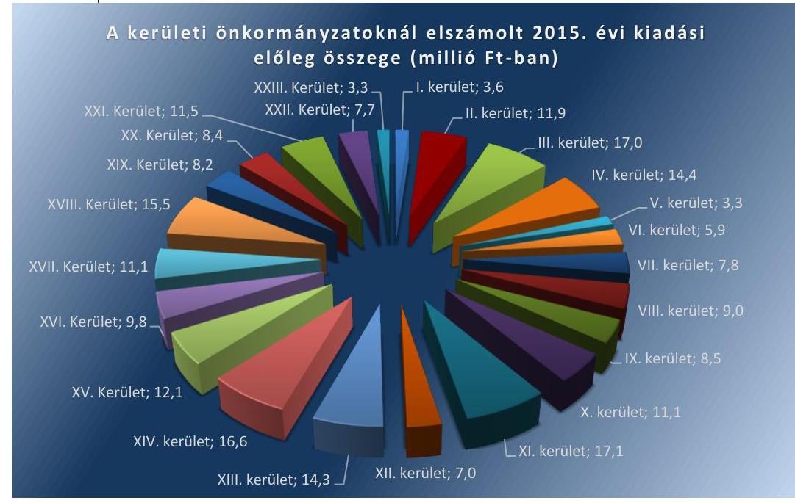

# Jelentés 

## A forrásmegosztás ellenőrzése

A Fővárosi Önkormányzatot és a kerületi önkormányzatokat osztottan megillető bevételek 2015. évi megosztásáról szóló önkormányzati rendelet felülvizsgálata

---

.

---

# Jelentés 

## A forrásmegosztás ellenőrzése

A Fővárosi Önkormányzatot és a kerületi önkormányzatokat osztottan megillető bevételek 2015. évi megosztásáról szóló önkormányzati rendelet felülvizsgálata

15216
www.asz.hu

---

# AZ ELLENŐRZÉST FELÜGYELTE:

- **DR. BENEDEK MÁRIA** felügyeleti vezető
- **AZ ELLENŐRZÉST VEZETTE ÉS A VÉGREHAJTÁSÁÉRT FELELŐS:**
- **MOHL ANNA** ellenőrzésvezető
- **A PROGRAM ÖSSZEÁLLÍTÁSÁÉRT FELELŐS:**
- **JANIK JÓZSEF** osztályvezető
- **A TÉMÁHOZ KAPCSOLÓDÓ KORÁBBI SZÁMVEVŐSZÉKI JELENTÉS:**
  - **címe:** A Fővárosi Önkormányzatot és a kerületi önkormányzatokat osztottan megillető bevételek 2014. évi megosztásáról szóló önkormányzati rendelet felülvizsgálatáról
  - **sorszáma:** 15023

**Jelentéseink az Országgyűlés számítógépes hálózatán és az Interneten a www.asz.hu címen is olvashatóak.**

**IKTATÓSZÁM: V-0871-062/2015.**

**TÉMASZÁM: 35**

**ELLENŐRZÉS-AZONOSÍTÓ SZÁM: V0730**

---

# TARTALOMJEGYZÉK 

■ ÖSSZEGZÉS ..... 5
■ AZ ELLENŐRZÉS CÉLJA ..... 7
■ AZ ELLENŐRZÉS TERÜLETE ..... 8
■ AZ ELLENŐRZÉS HÁTTERE, INDOKOLTSÁGA ..... 9
■ FÓKUSZKÉRDÉSEK ..... 10
■ ELLENŐRZÉS HATÓKÖRE ÉS MÓDSZEREI ..... 11
■ MEGÁLLAPÍTÁSOK ..... 13
■ MELLÉKLETEK ..... 25
I. Sz. melléklet: Értelmező szótár. ..... 25
II. Sz. melléklet: A 2015. évi forrásmegosztási feladatok, számítások meghatározása ..... 27
III. Sz. melléklet: A forrásmegosztásba bevont bevételek és kiadások alakulása a 2015. évi forrásmegosztási rendelet és az ÁSZ megállapításai alapján (adatok millió ft-ban) ..... 28
IV. Sz. melléklet: A kerületi önkormányzatokat megillető iparűzési adó összege a 2015. évi forrásmegosztási rendelet és az ÁSZ megállapítása alapján (adatok millió ft-ban) ..... 29
V. Sz. melléklet: A kerületi önkormányzatokat megillető idegenforgalmi adó összege a 2015. évi forrásmegosztási rendelet és az ÁSZ megállapítása alapján (adatok millió ft-ban) ..... 30
VI. Sz. melléklet: A kerületi önkormányzatokat megillető pótlék és bírság összege a 2015. évi forrásmegosztási rendelet és az ÁSZ megállapítása alapján (adatok millió ft-ban) ..... 31
■ RÖVIDÍTÉSEK JEGYZÉKE ..... 33

---

.

---

# ÖSSZEGZÉS 

## BUDAPEST

Az ÁSZ ${ }^{1}$ a Fővárosi Önkormányzatot² és a kerületi önkormányzatokat osztottan megillető bevételek 2015. évi megosztásának, valamint a helyi adózással kapcsolatos kiadások megállapításának, elszámolásának szabályszerűségét ellenőrizte 2014. szeptember 1-jétől 2015. augusztus 31-éig terjedő időszakra vonatkozóan. Az összesített értékelés alapján a 2015. évi forrásmegosztási rendeletalkotás folyamata, a Fővárosi Önkormányzatot és a kerületi önkormányzatokat osztottan megillető bevételi és kiadási tervszámok megállapítása, a megosztott helyi adóbevételek pénzügyi elszámolása, valamint a helyi adózással kapcsolatos kiadások elszámolása szabályszerű volt. Az ellenőrzés számítási hibákat nem tárt fel, így korrekció végrehajtására a 2016. évi forrásmegosztási eljárás során nincs szükség.

## Az ellenőrzés társadalmi indokoltsága

A demokratikus társadalmakban alapvető igény, hogy a közpénzeket használók tevékenységükről elszámoljanak, ahhoz egyértelmű és érvényesíthető felelősségi szabályok társuljanak. Az ÁSZ stratégiájában hangsúlyos szerepet szán annak, hogy szilárd szakmai alapon álló, értékteremtő ellenőrzéseivel előmozdítsa a közpénzügyek átláthatóságát, rendezettségét és javaslataival a közpénzek szabályos felhasználását segítse.

A fentiek érvényesülését támogatja az ÁSZ-nak a Fővárosi Önkormányzatot és a kerületi önkormányzatokat osztottan megillető bevételek 2015. évi megosztásáról szóló önkormányzati rendelet felülvizsgálata. Az átlátható és elszámoltatható közpénzfelhasználás megteremtését és felhasználásának szabályszerűségét segíti az ellenőrzés.

## Főbb megállapítások, következtetések

A Fővárosi Önkormányzat 2015. évi forrásmegosztási rendeletalkotási folyamata szabályozott volt, a végrehajtás összességében megfelelt a jogszabályokban és belső szabályzatokban foglalt előírásoknak.

A Fővárosi Önkormányzat a forrásmegosztási rendeletalkotással kapcsolatos feladatokról belső szabályzataiban, folyamatleírásaiban, a munkaköri leírásokban - a Pénzügyi Számviteli és Kataszteri Osztály ${ }^{3}$ munkaköri leírásai kivételével - rendelkezett és azok megfeleltek az Áht. ${ }^{4}$, illetve a Bkr. ${ }^{5}$ előírásainak. A belső szabályzatokban előírt rendelkezések megfelelő alapot képeztek a forrásmegosztáshoz kapcsolódó feladatok szabályozott és szabályos végrehajtásához. A forrásmegosztás és a 2015. évi forrásmegosztási rendelettervezet előkészítése során azonban a Pénzügyi Főosztály BMSZ ${ }_{1}{ }^{6}$ előírásai ellenére a Kontrolling Osztály ${ }^{7}$, valamint a Pénzügyi Számviteli és Kataszteri Osztály nem végezte el a részére előírt belső felülvizsgálatot és véleményezést.

A Fővárosi Önkormányzat a 2015. évi forrásmegosztási rendeletének ${ }^{8}$ megalkotása során betartotta a forrásmegosztási tv. ${ }^{9}$-ben előírt eljárási szabályokat. A 2015. évi forrásmegosztási rendeletben foglaltak összhangban voltak a forrásmegosztási tv. előírásaival, és tartalmazta az abban előírt valamennyi tartalmi elemet és eljárási szabályt.

A 2015. évi forrásmegosztási rendeletben a helyi adó, valamint a pótlék és bírság tervszámai megalapozottak voltak. A forrásmegosztási tv.-ben foglaltaknak megfelelő arányban és összegben állapították meg és számolták el a kerületeket megillető bevételeket, és érvényesítették a kiadásokat.

A forrásmegosztásnál figyelembe vett, az adóhatóság ${ }^{10}$ működtetésével összefüggő, helyi adózással kapcsolatos kiadások tekintetében a 2015. évi előlegként meghatározott működési kiadások megállapítása és elszámolása szabályszerű volt.

---

A forrásmegosztás keretében tervezett bevételek és kiadások részesedési arányszámok alapján történő megosztása és elszámolása megfelelt a forrásmegosztási tv. előírásainak, számítási hibákat nem tárt fel az ellenőrzés, így korrekció végrehajtására a 2016. évi forrásmegosztási eljárás során nincs szükség.

Az utóellenőrzés keretében az ÁSZ megállapította, hogy az ÁSZ 2014. évi ellenőrzése alapján tett két javaslata közül a forrásmegosztási rendelet tartalmi módosítására vonatkozó javaslatot az előírt határidőben, a 2015. évi forrásmegosztási rendeletben hasznosította a Fővárosi Önkormányzat. A Pénzügyi Főosztály BMSZ ${ }_{1}$-ének és a munkaköri leírásoknak a módosítására az előírt határidőn túl intézkedtek. A forrásmegosztásban résztvevők körének és feladatainak módosításával biztosították a Pénzügyi Főosztály BMSZ ${ }_{2}{ }^{11}$-jében előírtak és a gyakorlat összhangját.

---

# AZ ELLENŐRZÉS CÉLJA 

## A Fővárosi Önkormányzatot és a kerületi önkormányzatokat osztottan megillető bevételek 2015. évi megosztásáról szóló önkormányzati rendelet felülvizsgálata

Az ellenőrzés célja a Fővárosi Önkormányzatot és a kerületi önkormányzatokat osztottan megillető bevételek 2015. évi forrásmegosztási rendeletben előírt megosztásának, valamint a helyi adózással kapcsolatos kiadások megállapítása, elszámolása szabályszerűségének ellenőrzése volt.

---

# **AZ ELLENŐRZÉS TERÜLETE**

## **A forrásmegosztás ellenőrzése**

A Közgyűlés12 a Fővárosi Önkormányzat 2015. évi költségvetését 323 943,6 millió Ft bevételi és kiadási főösszeggel hagyta jóvá. A költségvetési bevételek tervezett összege 244 852,4 millió Ft, amelyen belül a 107 622,3 millió Ft összegű közhatalmi bevételből 90,0 millió Ft építményadó, 106 835,0 millió Ft iparűzési adó, és 77,0 millió Ft idegenforgalmi adót terveztek a helyi adó tv.13-ben biztosított lehetőségek figyelembe vételével. A Fővárosi Önkormányzat által közvetlenül igazgatott Margitsziget területe tekintetében a Fővárosi Önkormányzat jogosult helyi adókat kivetni.

A Közgyűlés az Alaptörvény14, az Mötv.15 és a forrásmegosztási tv. felhatalmazása alapján minden évben a tárgyévre tervezett helyi adóbevételek megosztásának rendjét forrásmegosztási rendeletben rögzíti. A forrásmegosztási tv. szerint az ÁSZ felülvizsgálja a Fővárosi Önkormányzat tárgyévre vonatkozó forrásmegosztási rendeletét és a forrásmegosztási tv.-ben előírtaknak megfelelően megállapítja a Fővárosi Önkormányzat és a kerületi önkormányzatok közötti helyi adóbevételekhez kapcsolódó elszámolások jogszabályi előírásoknak való megfelelőségét. Eltérések esetén megállapítja a szükséges pénzügyi elszámolási korrekciókat, a belső szabályzatokat érintő esetleges hiányosságokat.

A Közgyűlés a 2015. évi forrásmegosztási rendeletében a Fővárosi Önkormányzat és a kerületi önkormányzatok között összesen 210 007,0 millió Ft megosztásáról rendelkezett, amelyből 209 000,0 millió Ft iparűzési adó, 1 000,0 millió Ft késedelmi pótlékból és bírságból származó bevétel, valamint 7,0 millió Ft idegenforgalmi adóbevétel volt.

A forrásmegosztási tv. alapján a kerületi önkormányzatokat megillető összesen 102 903,4 millió Ft adó, bírság és pótlékbevételt terveztek elosztani. A helyi adóztatással összefüggésben tervezett 500,0 millió Ft kiadásból a kerületi önkormányzatok felé 245,0 millió Ft érvényesítését szerepeltették a 2015. évi forrásmegosztási rendeletben.

---

# **AZ ELLENŐRZÉS HÁTTERE, INDOKOLTSÁGA**

## **A forrásmegosztás ellenőrzése**

A Fővárosi Önkormányzatot és a kerületi önkormányzatokat osztottan megillető helyi adóbevételek körét, az adóbevételekből való részesedések mértékét a forrásmegosztási tv. határozta meg, figyelemmel a helyi adó tv.-ben foglaltakra.

A forrásmegosztási tv. és az annak felhatalmazása alapján készült 2015. évi forrásmegosztási rendelet szerint a Fővárosi Önkormányzat és a kerületi önkormányzatok között a Fővárosi Önkormányzat által kivetett helyi iparűzési adót, a helyi adókhoz kapcsolódó késedelmi pótlékot, bírságokat, a Fővárosi Önkormányzatnak beszedésre átengedett kerületi idegenforgalmi adót, valamint a helyi adóbeszedéssel kapcsolatos kiadásokat osztották meg. A felsorolt tételekből való részesedés mértékét a forrásmegosztási tv. írja elő, mely szerint a Fővárosi Önkormányzatot 51%, a kerületi önkormányzatokat együttesen 49% illette meg, a kerületenkénti elosztási arányokat a forrásmegosztási tv. melléklete határozta meg.

### **AZ ELLENŐRZÉS VÁRHATÓ HASZNOSULÁSÁT**

az ÁSZ négy szinten tervezi:

A törvényalkotás számára tapasztalatok állnak rendelkezésre a forrásmegosztás szabályozásáról, a 2015. évi forrásmegosztási rendelet szabályszerűségéről, következtetés vonható le arra, hogy indokolt-e jogszabályi módosítás kezdeményezése.

Az ellenőrzés az ellenőrzött számára visszajelzést ad a forrásmegosztás végrehajtásának szabályosságáról, javaslataival hozzájárul az esetleges hiányosságok kiküszöböléséhez.

A társadalom számára jelzi, hogy a közpénz e területen sem maradhat ellenőrizetlenül.

Az ÁSZ szervezetén belül lehetőség nyílik arra, hogy az intézmény erősítse hozzáadott értéket teremtő elemző tevékenységét és tanácsadó szerepét.

---

# FÓKUSZKÉRDÉSEK 

1.     - A Fővárosi Önkormányzat 2015. évi forrásmegosztási rendeletalkotási folyamata szabályozott és szabályszerű volt-e?
2.     - A forrásmegosztás bevételi tervszámai megalapozottak voltak, a forrásmegosztás szabályszerű volt-e?
3.     - A forrásmegosztásnál figyelembe vett, a Fővárosi Önkormányzati adóhatóság működtetésével összefüggő, helyi adózással kapcsolatos kiadások megállapítása és elszámolása szabályszerű volt-e?
4.     - A 2016. évi forrásmegosztás során érvényesítendő korrekciók szükségesek-e?

---

# ELLENŐRZÉS HATÓKÖRE ÉS MÓDSZEREI 

## Az ellenőrzés típusa

Szabályszerűségi ellenőrzés

## Az ellenőrzött időszak

2014. szeptember 1-jétől 2015. augusztus 31-ig terjedő időszak (a forrásmegosztási rendelet előkészítésével, elfogadásával és érvényesítésével érintett időszak)

## Az ellenőrzés tárgya

A Fővárosi Önkormányzatot és a kerületi önkormányzatokat osztottan megillető bevételek megosztásáról szóló 2015. évi forrásmegosztási rendelet.

## Az ellenőrzött szervezet

Fővárosi Önkormányzat

## Az ellenőrzés jogalapja

Az ellenőrzés jogszabályi alapját az Alaptörvény 43. cikk (1) bekezdése, a forrásmegosztási tv. 6. § (1) bekezdése, valamint az ÁSZ tv. ${ }^{16}$ 1. § (3) bekezdése és a 3. § (1) bekezdése képezte.

## Az ellenőrzés módszerei

Az ellenőrzés szakmai módszertana az ÁSZ hivatalos honlapján (www.asz.hu) közzétett szakmai szabályokon alapul, amely a Legfőbb Ellenőrző Intézmények Nemzetközi Szervezete (INTOSAI) által kiadott nemzetközi standardok (ISSAI) figyelembevételével készült.

Az ellenőrzési kérdések megválaszolásához szükséges bizonyítékok megszerzése az ellenőrzött által rendelkezésre bocsátott dokumentumok, adatok elemzésével történt, kiegészítve a megfigyelés, kérdésfeltevés (információkérés) módszerével.

Az ellenőrzés lefolytatása során figyelembevételre és értékelésre kerültek az ellenőrzött által biztosított ellenőrzési dokumentumok, és tanúsítványok, továbbá az ellenőrzött időszakban hatályos jogszabályok.

---

Az ellenőrzés kiterjedt minden olyan körülményre és adatra, amely az ÁSZ jogszabályban meghatározott feladataiban, valamint a program végrehajtása folyamán felmerült újabb összefüggések feltárásához szükséges volt.

---

# 1. A Fővárosi Önkormányzat 2015. évi forrásmegosztási rendeletalkotási folyamata szabályozott és szabályszerű volt-e? 

Összegző megállapítás

A Fővárosi Önkormányzat 2015. évi forrásmegosztási rendeletalkotási folyamata összességében szabályozott volt, biztosította a jogszabályi előírásoknak megfelelő, a forrásmegosztás alapját képező bevételek és kiadások szabályszerű tervezését, valamint az elszámolását. A feladatok végrehajtása - kisebb hiányosságok mellett - megfelelt a belső szabályzatokban foglalt rendelkezéseknek.
1.1. számú megállapítás

A Fővárosi Önkormányzat a forrásmegosztási rendeletalkotással kapcsolatos feladatokról az Áht., illetve a Bkr. előírásaival összhangban belső szabályzataiban, folyamatleírásaiban rendelkezett, azonban a munkaköri leírások
 hiányosan tartalmazták a szabályzatokban rögzített feladatokat. A 2014. évi forrásmegosztás ellenőrzése során tett javaslatokat hasznosították.

Az ellenőrzött időszakban a Fővárosi Önkormányzatot és a kerületi önkormányzatokat osztottan megillető bevételekre és kiadásokra vonatkozó 2015. évi forrásmegosztási rendelet előkészítésével és megalkotásával kapcsolatos feladatok eljárásrendjét a Hivatali SZMSZ ${ }_{1,2}{ }^{1718}$ és a feladatellátásban közreműködő osztályok belső működési szabályzatai határozták meg. A Hivatali SZMSZ ${ }_{1,2}$-ben foglaltak szerint az Adó Főosztály ${ }^{19}$ feladatát képezte a szakterületét érintő önkormányzati rendeletek tervezetére és módosítására vonatkozó előterjesztések előkészítése, illetve az adózást érintő rendeletekből adódó feladatok ellátása. A Pénzügyi Főosztály ${ }^{20}$ feladata volt a forrásmegosztási rendelettervezetről szóló előterjesztés és a rendelettervezet módosításának az előkészítése. A belső szabályzatokban foglalt, a forrásmegosztással összefüggő folyamatok összhangban voltak az Áht. előírásaival.

A Fővárosi Önkormányzatnál a forrásmegosztással kapcsolatos belső szabályzatokat a forrásmegosztási tv. 2014. évi módosítását követően munkaszervezési okokból többször módosították.

A HIVATALI SZMSZ ${ }_{1,2}$-BEN a Pénzügyi Főosztály és az Adó Főosztály feladatait a forrásmegosztási tv.-ben, és az Áht.-ban foglaltakkal összhangban alakították ki, a működési és a gazdálkodási tevékenységek szabályszerű végrehajtása érdekében.

A PÉNZÜGYI FŐOSZTÁLY BMSZ ${ }_{1}$-e tartalmazta a forrásmegosztás és rendeletalkotás feladatait, az ellenőrzési nyomvonalat, a működési folyamatok szöveges, táblázatokkal szemléltetett leírását, a felelősségi és információs szinteket és kapcsolatokat, az irányítási és ellenőrzési

---

folyamatokat, lehetővé téve azok nyomon követését és utólagos ellenőrzését.

A Pénzügyi Főosztály BMSZ1-e szerint a Költségvetési Osztály ${ }^{21}$ feladatát képezte a forrásmegosztási javaslat és a rendelettervezet előkészítése. A Kontrolling Osztály feladata volt a forrásmegosztási rendelettervezet adatainak vizsgálata és a Költségvetési Osztállyal a forrásmegosztási rendelet előkészítésében való együttműködés. A Pénzügyi Főosztály BMSZ1-e a Pénzügyi Számviteli és Kataszteri Osztály Önkormányzati Gazdálkodási Csoportja és a Hivatali Gazdálkodási Csoport számára közreműködési kötelezettséget írt elő a forrásmegosztási rendelet előkészítésében.

A Pénzügyi Főosztály BMSZ1-e a Költségvetési Osztály vezetőjének, a költségvetési szabályozási csoport vezetőjének és ügyintézőjének feladataként rögzítette a bevételi tervszámok meghatározását, az adatok bekérését, a megosztás előkészítését, az egyeztetések elvégzését és a rendelettervezet előkészítését. A Kontrolling Osztály vezetője és ügyintézője részére a forrásmegosztási rendelettervezetet megalapozó tervszámok felülvizsgálatát írta elő feladatként a szabályzat. A Pénzügyi Számviteli és Kataszteri Osztály vezetője, csoportvezetője és ügyintézője részére a forrásmegosztási rendelethez adatszolgáltatási és részanyag készítési feladatokat határoztak meg. A Pénzügyi Számviteli és Kataszteri Osztály, valamint a Kontrolling Osztály forrásmegosztáshoz kapcsolódó feladatait 2015. június 16-ától megszűntették.

AZ ADÓ FŐOSZTÁLY BMSZ ${ }^{22}$-e alapján feladatkörükbe tartozott az adóbevételek forrásmegosztás szerinti felosztása, a megosztással kapcsolatos feladatok végrehajtása és az adórészek utalása.

A forrásmegosztással és a rendeletalkotás előkészítésével kapcsolatos feladatokat az Adó Főosztály feladattal érintett dolgozóinak munkaköri leírása az Adó Főosztály BMSZ-ével összhangban tartalmazta.

# A 2014. ÉVI FORRÁSMEGOSZTÁSI RENDELET FELÜLVIZSGÁLATA alapján az ÁSZ két javaslatot tett a főjegyzőnek ${ }^{23}$, amelyeket hasznosítottak. 

Az első javaslat a Pénzügyi Főosztály BMSZ ${ }_{1}$-ének felülvizsgálatára és a forrásmegosztási rendelet elkészítésével összefüggő feladatok tényleges közreműködési kötelezettséggel összhangban történő módosítására vonatkozott.

A Pénzügyi Főosztály 2015. június 16-ától hatályos BMSZ ${ }_{2}$-je a tényleges munkafolyamatoknak megfelelően tartalmazta a forrásmegosztással kapcsolatos feladatokat. A Pénzügyi Főosztály BMSZ ${ }_{1}$-ének a módosítása az intézkedési tervben előírt határidőn túl teljesült, mivel azt az intézkedési tervben meghatározott 2015. március 20-a helyett 2015. március 27-én készítették el. A munkaköri leírások aktualizálása a megszűnt feladatok miatt az intézkedési tervben előírt 2015. március 31-e helyett 2015. június 28-án és június 29-én történt meg.

A második javaslat a Közgyűlés 2014. évi forrásmegosztási rendelete alapján kivetett összes helyi adóhoz kapcsolódóan kiszabott pótlékból és bírságból származó bevételnek a figyelembevételét határozta meg a forrásmegosztásnál. A 2015. évi forrásmegosztási rendeletben a Közgyűlés által kivetett összes helyi adóhoz kapcsolódóan kiszabott pótlékból és bírságból származó bevételt vették figyelembe.

---

A munkaköri leírásokkal kapcsolatos hiányosságokat az 1. táblázat mutatja be.

1. táblázat

| Sorszám | Részmegállapítás | Megjegyzés |
| :--: | :--: | :--: |
| 1. | A Pénzügyi Főosztály forrásmegosztásban érintett dolgozóinak munkaköri leírásai közül a Pénzügyi Számviteli és Kataszteri Osztály dolgozói munkaköri leírásai nem tartalmazták az SZMSZ ${ }_{1,2}$-ben és a Pénzügyi Osztály BMSZ ${ }_{1}$-ében foglalt feladatokat. | A Pénzügyi Főosztály BMSZ ${ }_{2}$-jében a Pénzügyi Számviteli és Kataszteri Osztály forrásmegosztással kapcsolatos feladatai 2015. június 16-ától megszűntek, ezáltal a munkaköri leírások kiegészítése nem volt indokolt. |

1.2. számú megállapítás

A Fővárosi Önkormányzat a forrásmegosztási rendeletalkotás során betartotta a forrásmegosztási tv.-ben foglaltakat, azonban a belső szabályzatokban, a folyamatleírásokban és a munkaköri leírásokban előírt eljárási szabályokat nem teljes körűen hajtották végre.

A Közgyűlés 2015. január 28-án fogadta el a 2015. évi forrásmegosztási rendeletet.

A 2015. évi forrásmegosztási rendelettervezet előkészítése során betartották a forrásmegosztási tv.-ben, a vonatkozó belső szabályzatokban és munkaköri leírásokban előírt véleményeztetési és rendeletalkotási határidőket.

Ennek megfelelően a 2015. évi forrásmegosztási rendelettervezetet:
2015. január 10-ét megelőzően megküldték a kerületi önkormányzatoknak véleményezés céljából;
— biztosították az előírt 15 napos véleményezési lehetőséget a kerületek részére;
—az elfogadott rendeletet 2015. január 31-én hatályba léptették.
A 2015. évi forrásmegosztási rendelettervezet előterjesztésében feltüntették, hogy a kerületi önkormányzatok egyetértettek-e az előterjesztéssel. A kerületi önkormányzatok közül egy kerületi önkormányzat nem támogatta az előterjesztést, azonban a vélemény nem befolyásolta a 2015. évi forrásmegosztási rendelet szabályszerű megalkotását.

---

A következő, 1. ábra szemlélteti a forrásmegosztási rendeletalkotás folyamatát:

1. ábra

Forrás: forrásmegosztási tv.
A forrásmegosztási feladatok és számítások törvényi és rendeleti előírásait a II. számú melléklet mutatja be.

A Fővárosi Önkormányzat forrásmegosztási tv.-ben előírtaknak megfelelően rendelkezett kilenc (XV-XXIII.) kerületi önkormányzat beleegyező nyilatkozatával arra vonatkozóan, hogy az idegenforgalmi adót 2015-ben helyettük a Fővárosi Önkormányzat vesse ki és szedje be.

A forrásmegosztással kapcsolatos feladatellátás során feltárt hiányosságot a következő, 2. táblázat szemlélteti.
2. táblázat

| Sorszám | Részmegállapítás | Megjegyzés |
| :--: | :--: | :--: |
| 1. | Az Adó Főosztály és a Pénzügyi Főosztály a részükre a BMSZ-ekben rögzített határidőkre előírt feladatokat elvégezték, azonban a Kontrolling Osztálynak, valamint a Pénzügyi Számviteli és Kataszteri Osztály a részükre meghatározott feladatokat (rendelettervezet adatainak felülvizsgálatát, illetve a forrásmegosztás előkészítésében az adatszolgáltatást és a részanyag készítést) nem végezték el. | A Pénzügyi Főosztály BMSZ ${ }_{2}$-je a Kontrolling Osztály, illetve a Pénzügyi Számviteli és Kataszteri Osztály forrásmegosztással kapcsolatos feladatait 2015. június 16-ától megszüntette. |

1.3. számú megállapítás

A 2015. évi forrásmegosztási rendelet előírásai összhangban voltak a forrásmegosztási tv.-ben foglaltakkal, és tartalmazta az abban előírt valamennyi tartalmi elemet, eljárási szabályt.

A 2015. évi forrásmegosztási rendeletben a forrásmegosztási tv. előírásának megfelelően határozták meg a várható bevételek és a bevételek beszedésével összefüggésben felmerülő kiadások elszámolásának rendjét. A

---

2015. évi forrásmegosztási rendeletben rögzítették mindazokat a tartalmi szabályokat, amelyeket a forrásmegosztási tv. előírt.

A 2015. évi forrásmegosztási rendelet a forrásmegosztási tv. és a helyi adó tv. előírásainak megfelelően tartalmazta a törvényi követelményeknek megfelelően:
$\longrightarrow$ a megosztásra kerülő forrásokat (iparűzési adó bevétel, idegenforgalmi adó bevétel, a helyi adóhoz kapcsolódóan kiszabott pótlékok és bírságokból származó bevétel);
$\longrightarrow$ a Fővárosi Önkormányzatot megillető 51\%-os és a kerületi önkormányzatokat együttesen megillető 49\%-os részesedési arányt;
$\longrightarrow$ a helyi adó beszedésével kapcsolatos kiadások elszámolásának rendjét a Fővárosi Önkormányzat és a kerületi önkormányzatok között;
$\longrightarrow$ a megosztott forrásokkal szemben elszámolható kiadások mértékét, illetve a kerületi önkormányzatok számára történő átutalás és pénzügyi teljesítés rendjét.
A ténylegesen befolyt, megosztandó forrásoknak a kerületek számára történő átadásának (utalásának) rendje, és a pénzügyi teljesítés rendje összhangban van a forrásmegosztási tv.-ben foglaltakkal. A Fővárosi Önkormányzatnak a kerületi önkormányzatokat megillető osztott, tárgyhónapban befolyt bevételek számított hányadát havi rendszerességgel, a tárgyhót követő hónap 10. napjáig kell átutalnia.

# 1.4. számú megállapítás 

A rendeletalkotás folyamatára vonatkozóan kialakították a FEUVE$\mathbf{t}^{24}$, azonban azt nem működtették az elvégzendő tevékenységek teljes körére vonatkozóan.

A Pénzügyi és az Adó Főosztály BMSZ-eiben a Bkr.-ben előírtakkal összhangban a forrásmegosztásra és a rendeletalkotásra vonatkozóan a kontrolltevékenységeket kialakították. Előírták a folyamatba épített, előzetes, utólagos és vezetői ellenőrzési feladatokat és a pénzügyi döntések dokumentumainak elkészítését, meghatározták az ellenőrzési nyomvonalat, amelyben részletesen rögzítették az elvégzendő feladatokat, a felelősöket, a vonatkozó jogszabályi és belső előírásokat, a keletkező dokumentumokat, az ellenőrzési pontokat a rendeletalkotást érintően.

A 2015. évi forrásmegosztási rendelet előkészítése során a Költségvetési Főosztály koordinálta a tervezéshez szükséges adatok bekérését, határidőben lefolytatta az egyeztetéseket, elkészítette a rendelettervezetet, melyet megküldtek hivatali belső egyeztetésre és a kerületi önkormányzatoknak véleményezésre. Az Adó Főosztály a számára előírt határidőben biztosította a bevételek és kiadások tervezéséhez szükséges adatokat és elemzéseket.

---

A FEUVE működtetésével kapcsolatos hiányosságot a 3. táblázat mutatja be.
3. táblázat

| Sorszám | Részmegállapítás | Megjegyzés |
| :--: | :-- | :--: |
| 1. | A FEUVE rendszert nem működtették az elvégzendő te-   vékenységek teljes körére vonatkozóan, mert a Kont-   rolling Osztály nem végezte el a számára előírt felülvizs-   gálati és együttműködési feladatokat, illetve a Pénzügyi   és Számviteli és Kataszteri Osztály a közreműködési és   adatszolgáltatási feladatokat. | A Pénzügyi Főosztály BMSZ2-je a   Kontrolling Osztály, illetve a Pénz-   ügyi Számviteli és Kataszteri Oszt   tály forrásmegosztással kapcsolat-   tos feladatait 2015. június 16-ától   megszüntette. |

# 2. A forrásmegosztás bevételi tervszámai megalapozottak voltak, a forrásmegosztás szabályszerű volt-e? 

Összegző megállapítás

A 2015. évi forrásmegosztási rendelet iparűzési- és idegenforgalmi adó, valamint a pótlék és bírság bevételi tervszámai megalapozottak voltak. A kerületek részére megállapított és elszámolt részesedések aránya és összege megfelelt a forrásmegosztási tv.-ben foglaltaknak, a forrásmegosztás szabályszerű volt.

### 2.1. számú megállapítás

A 2015. évi forrásmegosztás bevételi tervszámai megalapozottak voltak, azokat számításokkal, elemzésekkel, az adóbevételek időarányos teljesülésének adataival támasztották alá.

A 2015. január 31-én hatályba léptetett 2015. évi forrásmegosztási rendeletben a Közgyűlés az alábbi, 2. ábra szerinti tervezett bevételek megosztásáról rendelkezett:
2. ábra

Forrás: 2015. évi forrásmegosztási rendelet

---

AZ IPARŰZÉSI ADÓBEVÉTEL a forrásmegosztási rendszer 1992. évi bevezetésétől kezdődően a forrásmegosztás részét képezte. A Fővárosi Önkormányzat és a kerületi önkormányzatok között megosztott iparűzési adóbevételek tervezett összege az elmúlt négy évben folyamatosan növekvő tendenciát mutatott.

Az iparűzési adó bevételi tervszámok alakulását a 2012-2015. évek között az alábbi, 3. ábra szemlélteti:
3. ábra

Forrás: ÁSZ jelentések a forrásmegosztási rendeletek felülvizsgálatáról
A 2015. évi iparűzési adóbevétel tervszámait a 2014. évben ténylegesen befolyt összeg figyelembevételével megalapozottan alakították ki.

A kerületi önkormányzatok részére véleményezésre megküldött rendelettervezethez képest a Közgyűlés által elfogadott 2015. évi forrásmegosztási rendeletben a tervezett iparűzési adó összege 207 000,0 millió Ft-ról 209 000,0 millió Ft-ra módosult. A bevételi tervszám növekedését a 2014. december 20-án esedékes adóelőleg-kiegészítés kedvező alakulása indokolta. A bevételek tervezésekor figyelembe vették a külső gazdasági hatásokat, a GDP várható növekedését, az infláció alakulását, továbbá a fővárosra jellemző legjelentősebb ágazat, a pénzügyi szektor kisebb mértékű kockázati tényezőinek hatását.

IDEGENFORGALMI ADÓBEVÉTELKÉNT a
 2015. évi forrásmegosztási rendeletben 7,0 millió Ft összeget hagyott jóvá a Közgyűlés.

A 2015. évi idegenforgalmi adóbevétel tervezett előirányzatát a 2014. évben ténylegesen befolyt 7,0 millió Ft figyelembevételével alakították ki. A 2015. évi forrásmegosztási rendelettervezet előterjesztésében rögzítették, hogy a gazdasági környezetben jelentős változással, a vendégéjszakák számának növekedésével a 2015. évben nem számoltak. A bevétel tervezése megalapozott volt.

ÁLLAMI TÁMOGATÁSRA a 2015. évi Kvtv. ${ }^{25}$ alapján a Fővárosi Önkormányzat és a kerületi önkormányzatok az idegenforgalmi adóbevételek után a 2015. évben nem voltak jogosultak.

PÓTLÉK ÉS BÍRSÁGBÓL a 2015. évre 1000,0 millió Ft bevételt terveztek. A pótlékokból és bírságokból származó bevételek tervezését az előző évi tényadatok figyelembevételével végezték. A zárási összesítőkkel

---

alátámasztott 2014. évi bevétel 907,0 millió Ft volt. A forrásmegosztási számításoknál figyelembe vett pótlék és bírság bevételek tervezése megalapozott volt.

# 2.2. számú megállapítás 

A Fővárosi Önkormányzatot és a kerületi önkormányzatokat együttesen megillető és a megosztott bevételek kerületenkénti megállapítása megfelelt a forrásmegosztási tv. előírásainak.

A 2015. évi forrásmegosztási rendeletben a Fővárosi Önkormányzatot és a kerületi önkormányzatokat osztottan megillető bevételeket a forrásmegosztási tv.-ben foglaltaknak megfelelően állapították meg.

A MEGOSZTOTT, TERVEZETT BEVÉTELEK összege 210 007,0 millió Ft volt, amelyből a Fővárosi Önkormányzatot 107 103,6 millió Ft (51\%), a kerületi önkormányzatokat 102 903,4 millió Ft (49\%) illette meg. A forrásmegosztásba bevont bevételeknek és kiadásoknak a 2015. évi forrásmegosztási rendelet és az ÁSZ ellenőrzése szerinti alakulását a III. számú melléklet mutatja be.

A kivetett helyi iparűzési adóból a kerületeket egyenként megillető részesedési összegeket a forrásmegosztási tv. mellékletében foglalt arányszámok alkalmazásával szabályszerűen határozták meg. A megosztandó tervezett iparűzési adó összege 209 000,0 millió Ft volt, amelyből a Fővárosi Önkormányzat 106 590,0 millió Ft, a kerületek együttesen 102 410,0 millió Ft összegben részesültek.

A tervezett idegenforgalmi adóbevétel kerületi önkormányzatokat együttesen megillető részét az idegenforgalmi adó kivetéséről a Fővárosi Önkormányzat javára előzetesen lemondott kilenc kerületi önkormányzat között osztották meg. A 2015. évi forrásmegosztási rendelet szerint a tervezett 7,0 millió Ft idegenforgalmi adóból 3,6 millió Ft a Fővárosi Önkormányzatot, 3,4 millió Ft a XV-XXIII. kerületi önkormányzatokat illette meg.

Az idegenforgalmi adó kivetését a Fővárosi Önkormányzatnak átengedő kilenc kerületi önkormányzat közötti forrásmegosztás arányszámait a forrásmegosztási tv. mellékletében, ezen kerületek sorában szereplő mértékek arányában határozták meg oly módon, hogy a kilenc kerület összesített arányszámait tekintették 100\%-nak. Ehhez viszonyítva állapították meg a kerületeket megillető részesedések új arányszámait.

A helyi adókhoz kapcsolódóan kiszabott késedelmi pótlék és bírság bevételből a Fővárosi Önkormányzat javára 510,0 millió Ft, a kerületi önkormányzatok részére 490,0 millió Ft került megosztásra a 2015. évi forrásmegosztási rendeletben.

A kerületi önkormányzatokat megillető iparűzési adó, idegenforgalmi adó, valamint a pótlék és bírság összegét a 2015. évi forrásmegosztási rendelet és az ÁSZ megállapítása alapján a IV-VI. számú mellékletek mutatják be.
2.3. számú megállapítás

A Fővárosi Önkormányzat által kivetett helyi adóval kapcsolatosan befolyt bevételek 2015. évi megosztása során a pénzügyi elszámolás szabályszerű volt.

Az Adó Főosztály a tárgyévben befolyt helyi adó bevételek, illetve a helyi adókhoz kapcsolódó pótlék és bírság bevételek alakulásáról havonta kimu-

---

tatást készített, amely a forrásmegosztási tv. és a 2015. évi forrásmegosztási rendelet részesedési arányai szerint, kerületenként tartalmazta a megosztható bevételek összegét.

A Hivatal ${ }^{26}$ a 2015. évi forrásmegosztási rendelet előírásainak megfelelően, a tárgyévben minden hónapban az előírt határidőben, a tárgyhónapot követő hónap 10-éig teljesítette a kerületi önkormányzatok részére a helyi iparűzési adó bevétel, illetve a helyi adókhoz kapcsolódó késedelmi pótlék és bírság bevételek részesedési arányok szerinti átutalását.

Az Idegenforgalmi adó számláról az Ávr. ${ }^{27}$ előírásainak megfelelően visszatérítéseket, átvezetéseket is teljesített a Fővárosi Önkormányzat. A számlára 2015. január-április hónapokban összesen 21,3 millió Ft jóváírás érkezett, amelyből az Ávr. előírásai szerinti teljesítéseket követően a május hónapban beérkezett befizetések kerültek megosztásra és átutalásra a kerületi önkormányzatok részére (a részesedési arányoknak megfelelően), 2015. június 10-én 0,1 millió Ft összegben.

# 3. A forrásmegosztásnál figyelembe vett, a Fővárosi Önkormányzati adóhatóság működtetésével összefüggő, helyi adózással kapcsolatos kiadások megállapítása és elszámolása szabályszerű volt-e? 

Összegző megállapítás

## 3.1. számú megállapítás

A forrásmegosztásnál figyelembevett, az adóhatóság működtetésével összefüggő, helyi adózással kapcsolatos kiadások megállapítása és elszámolása szabályszerű volt.

A forrásmegosztási rendeletben a 2015. évi előlegként meghatározott működési célú kiadások tervszáma megalapozott volt.

A Fővárosi Önkormányzatnál az adóhatóság működtetésével kapcsolatosan 932,6 millió Ft összegű, közvetlenül felmerült működési célú kiadásokat terveztek. Működési célú kiadásként az Adó Főosztály dolgozóinak személyi juttatásával és járulékaival, az adóügyi feladatok ellenőrzését végző dolgozók érdekeltségi rendszerével kapcsolatos személyi juttatással és annak járulékával, valamint az adóigazgatási feladatokhoz kapcsolódó dologi kiadásokkal számoltak, melyet számításokkal, elemzésekkel alátámasztottak. A 2015. évi tervszámok kialakítását a 2014. évi kiadási előlegként elszámolt 907,1 millió Ft összegű kiadás könyvviteli nyilvántartásban kimutatott és elszámolt adataival támasztották alá.

A forrásmegosztási tv.-ben előírtak alapján az elszámolható működési célú kiadás a kiszabott pótlékból és bírságból származó bevételek 50\%-a, melynek figyelembe vételével a tervezett 932,6 millió Ft működési célú kiadásból 500,0 millió Ft összeg volt érvényesíthető.

A működési célú kiadások tervezése során a forrásmegosztási tv. mellékletében előírt, a kerületekre vonatkozó arányokat betartották, a kiadások kerületi önkormányzatonkénti tervezett összegének meghatározása szabályszerűen történt. A 2015. évi forrásmegosztási rendelet szerint a tervezett 500,0 millió Ft összegű helyi adók beszedéséhez kapcsolódó kiadás-

---

ból 255,0 millió Ft a Fővárosi Önkormányzatnál, 245,0 millió Ft pedig a kerületi önkormányzatoknál került figyelembevételre a forrásmegosztási tv. előírásainak megfelelően.

# 3.2. számú megállapítás 

## A 2015-ben elszámolt kiadási előlegek megosztása, érvényesítése szabályszerű volt.

A 2015. évi forrásmegosztási rendelet szerinti az adóztatáshoz kapcsolódó kiadások tervezett összege kerületi önkormányzatonkénti megosztása, a forrásmegosztási tv. mellékletében szereplő részesedési arányoknak megfelelően, szabályszerűen történt. A 2015. évi forrásmegosztási rendeletben a kiadási előleg összegének meghatározása összhangban volt a forrásmegosztási tv.-ben foglaltakkal.

A helyi adókhoz kapcsolódóan kiszabott pótlékból és bírságból befolyt 2014. évi összes bevétel 959,3 millió Ft volt. A bevételek teljesítése miatt az elszámolható kiadások összege a törvényi szabályozásnak megfelelően 479,7 millió Ft-ra csökkent. Így az 51\%-os, illetve 49\%-os megosztási arányra vonatkozó előírás alapján a tervezetthez képest 9,9 millió Ft-tal kevesebbet, 235,1 millió Ft-ot számoltak el a kerületi önkormányzatok felé.

A megállapított 9,9 millió Ft különbözetet - a forrásmegosztási tv. és a 2015. évi forrásmegosztási rendelet előírásainak megfelelően - a 2014. évi zárszámadási rendelet ${ }^{28}$ hatályba lépését követő havi utalásnál érvényesítették.

A kerületi önkormányzatoknál elszámolt 2015. évi kiadási előlegek összegét a következő, 4. ábra mutatja be:
4. ábra

Forrás: A Fővárosi Önkormányzat 4. számú tanúsítványban foglalt adatszolgáltatása

---

### 3.3. számú megállapítás

## 4. táblázat

Az adóhatóság működtetésével kapcsolatos 2014. évi kiadások alakulása (millió Ft-ban)

|  Előirányzat megnevezése | Összesen  |
| --- | --- |
|  Személyi juttatások | 580,7  |
|  Munkaadókat terhelő | 151,3  |
|  járulékok | 175,1  |
|  Dologi kiadások | 907,1  |
|  Kiadások összesen | 175,1  |

Forrás: 2014. évi zárszámadási rendelet
5. táblázat

A Fővárosi Önkormányzat adóbeszedéssel kapcsolatos, az adóhatóság működtetésével összefüggő 2015. évi elszámolt kiadási előleg összegét a beszámolóval egyező főkönyvi kivonattal és analitikus nyilvántartásokkal alátámasztották.

A forrásmegosztási tv. alapján a 2014. évi zárszámadási rendelet elkülönítetten tartalmazta a helyi adóztatással kapcsolatos kiadási előlegként elszámolható 907,1 millió Ft kiadást. Az elkülönítés a Fővárosi Önkormányzat címrendje szerint történt, amelyek az adóügyi feladatok ellátását végző dolgozók érdekeltségi rendszeréhez, az Adó Főosztály dolgozóihoz kapcsolódó személyi juttatások és járulékok és az adóigazgatási feladatok dologi kiadásai voltak.

A 2014. évi zárszámadási rendeletben az adóhatóság működtetésével kapcsolatosan felmerült kiadásokat kiemelt előirányzatonként az 4. táblázat mutatja be.

A 2014. évi elszámolt 907,1 millió Ft összegű közvetlen működési célú kiadást főkönyvi kivonattal és analitikus nyilvántartással alátámasztották.

A számviteli politika és számlarend¹ tartalmával kapcsolatos hiányosságokat a következő, 5. táblázat szemlélteti:
Sorszám Részmegállapítás Megjegyzés

A számviteli politika és számlarend¹ nem felelt meg az Áhsz. 51. § (1) bekezdésében előírt egységes számlakeretnek, mivel 2014. évben az Áhsz. 51. § (2) bekezdése előírása ellenére, a Számv. tv. ${ }^{29}$ 161. §-a szerinti tartalommal a számlarendet nem készítették el. A 2014. évi kiadásokat a főkönyvi könyvelésben az Áhsz. ${ }^{30} 16$. mellékletében előírt egységes számlakeret szerinti könyvviteli számlákon rögzítették.

A számviteli politika és számlarend² ${ }^{31}$ jóváhagyása 2015. március 6-án megtörtént az Áhsz. 51. § (2) bekezdésében előírtakat figyelembe véve, amelyben rögzítették, hogy az utasítás rendelkezéseit a 2014. évi könyvviteli zárlati tevékenység során is alkalmazni kell.

### 3.4. számú megállapítás

A 2014. év során elszámolt kiadási előlegek és a ténylegesen elszámolható kiadások összevetése 2015-ben megtörtént, a megállapított különbözet elszámolása az egyes kerületekkel szabályszerű volt.

A 2014. évi zárszámadási rendelet elfogadását követő hónapban, 2015. év júniusában a 2014. év során elszámolt kiadási előlegeket és a ténylegesen elszámolható kiadásokat összevetették. Az összevetés eredményeként kimutatott 9,9 millió Ft különbözet elszámolása szabályszerű volt, megfelelt a forrásmegosztási tv. és a 2015. évi forrásmegosztási rendelet előírásainak.

A 2014. évi zárszámadási rendeletben elfogadott adóbeszedéssel kapcsolatos kiadások összegét előlegként, egy összegben, a 2014. évi zárszámadási rendelet hatályba lépését követően, 2015. június 10-ei utalásban érvényesítették a kerületi önkormányzatok felé.

---

A 2015. évi forrásmegosztási rendeletben szereplő, az adóhatóság működtetésével összefüggő kiadások, valamint a 2014. évi zárszámadási rendeletben elfogadott adóbeszedéssel kapcsolatos kiadások előlegként történt elszámolása során eltérés nem volt.

# 4. A 2016. évi forrásmegosztás során érvényesítendő korrekciók szükségesek-e? 

Összegző megállapítás

A forrásmegosztásba bevont bevételek és kiadások megfeleltek az előírásoknak, számítási hibát az ÁSZ ellenőrzés nem tárt fel, ezáltal korrekció elvégzése a 2016. évi forrásmegosztási eljárás során nem indokolt.
4.1. számú megállapítás

A bevételek megosztása és elszámolása szabályszerű volt, valamint a kiadási adatok megalapozottak voltak, számítási hibákat az ellenőrzés nem tárt fel, így korrekció végrehajtására a 2016. évi forrásmegosztási eljárás során nincs szükség.

A Fővárosi Önkormányzatot és a kerületi önkormányzatokat együttesen megillető bevételek tervezett főösszegeinek részesedési arányszámok alapján történő megosztása a forrásmegosztási tv. előírásainak megfelelő volt, az ÁSZ ellenőrzés eltérést nem állapított meg.

A 2014. évi zárszámadási rendeletben elfogadott adóbeszedéssel kapcsolatosan elszámolt kiadások alapján az adóhatóság működtetésével összefüggő kiadásoknál számítási hibák miatti módosítás végrehajtására nincs szükség.

A Fővárosi Önkormányzat a jogszabályi előírásoknak megfelelően járt el az ellenőrzött időszakban, ezért a 2016. évi forrásmegosztási eljárás során korrekció nem indokolt.

---

# MELLÉKLETEK 

- I. SZ. MELLÉKLET: ÉRTELMEZŐ SZÓTÁR

Fővárosi Önkormányzat által kivetett helyi adóhoz kapcsolódóan kiszabott pótlék és bírság
helyi adóztatással kapcsolatos kiadás
idegenforgalmi adó
iparűzési adó
kiadási előleg

A fővárost és a kerületeket osztottan illetik meg a Közgyűlés rendelete alapján kivetett, helyi adóhoz kapcsolódóan kiszabott pótlékból és bírságból származó bevételek. (Forrás: A forrásmegosztási tv. 2. § (2) bekezdése alapján meghatározott fogalom.)
A fővárosi önkormányzati helyi adóztatással kapcsolatos - a tárgyévre
 vonatkozóan a Fővárosi Önkormányzatot és a kerületi önkormányzatokat osztottan megillető bevételek (iparűzési adó, kilenc kerületnél befolyt idegenforgalmi adó, a kivetett helyi adóhoz kapcsolódóan kiszabott pótlék és bírság) beszedésével összefüggően felmerült kiadásokat a forrásmegosztási tv. 2. § (1) bekezdés a) pontja szerinti bevételből részesülők viselik részesedésük arányában. Kiadásként a Fővárosi Önkormányzatnál a beszedéssel – az adóhatóság működtetésével – összefüggően felmerült működtetési kiadásokat kell figyelembe venni. A forrásmegosztási tv. 2. § (1) bekezdés a) pontja és a (4) bekezdés szerint figyelembe vehető kiadásokat a (2) bekezdésben felsorolt bevételek legfeljebb 50%-áig terjedő mértékben lehet érvényesíteni. (Forrás: A forrásmegosztási tv. 2. § (4), (6) bekezdése alapján meghatározott fogalom.)
A kommunális jellegű adók közül a kerület döntése alapján átengedett helyi idegenforgalmi adóból beszedett bevétel. A helyi idegenforgalmi adót a kerületi önkormányzat helyett a Fővárosi Önkormányzat rendeletével akkor jogosult bevezetni, ha ahhoz minden adóév tekintetében az érintett kerület önkormányzatának képviselő-testülete előzetes beleegyezését adja. A Fővárosi Önkormányzat által közvetlenül igazgatott terület tekintetében a kerületi önkormányzat által bevezethető adó bevezetésére a Fővárosi Önkormányzat jogosult. (Forrás: A helyi adó tv. III. fejezet Kommunális jellegű adók pontja alapján meghatározott fogalom.)
A helyi adó tv. felhatalmazása alapján a Közgyűlés rendeletével kivetett helyi adónem. A Fővárosi Önkormányzat illetékességi területén vállalkozói tevékenységet (iparűzési tevékenységet) állandó vagy ideiglenes jelleggel végző vállalkozó helyi iparűzési adót köteles fizetni. (Forrás: A helyi adó tv. 1. § (2) bekezdése, valamint a 35. § (1) és (2) bekezdései alapján meghatározott fogalom.)
A tárgyévet megelőző év költségvetési rendeletének végrehajtásáról szóló fővárosi önkormányzati rendeletben elfogadott adóbeszedéssel kapcsolatos kiadásokat

---

tárgyév
részesedés
részesedési arányok
kell előlegként figyelembe venni és a levonását a rendelet hatályba lépését követő havi utalásban kell a kerületi önkormányzatok felé érvényesíteni. Az előleg és a tárgyévi tényleges kiadások különbözetét a tárgyévi költségvetési rendelet végrehajtásáról szóló rendelet hatályba lépését követő havi utalásban kell elszámolni. (Forrás: A forrásmegosztási tv. 2. § (5) bekezdése alapján meghatározott fogalom.)
Azon gazdasági év, amelyhez tartozó megosztandó bevételeknek a Fővárosi Önkormányzat és a kerületi önkormányzatok közötti megosztását a forrásmegosztási rendelet határozza meg. (Forrás: A forrásmegosztási tv. 1. §-a alapján meghatározott fogalom.)

A forrásmegosztásba bevont bevételekből a Fővárosi Önkormányzatot és a kerületi önkormányzatokat együttesen megillető részesedés arányszáma. A Fővárosi Önkormányzatot és a kerületi önkormányzatokat a forrásmegosztási törvény 2. § alapján osztottan megillető bevételekből a Fővárosi Önkormányzatot 51%, a kerületi önkormányzatokat együttesen 49% részesedés illeti meg. (Forrás: A forrásmegosztási tv. 2-3. §-ai alapján meghatározott fogalom.)
A kerületi önkormányzatokat megillető források egyes kerületek közötti megosztásának aránya, amelyet a forrásmegosztási törvény melléklete tartalmaz. (Forrás: A forrásmegosztási tv. 4. § (1) bekezdése alapján meghatározott fogalom.)

---

II. SZ. MELLÉKLET: A 2015. ÉVI FORRÁSMEGOSZTÁSI FELADATOK, SZÁMÍTÁSOK MEGHATÁROZÁSA

| Sorszám | A forrásmegosztási feladat, számítás | Törvényi előírások | forrásmegosztási rendeleti szabályozások |
| :--: | :--: | :--: | :--: |
| 1. | A 2015. évi megosztandó bevételek körének megállapítása | forrásmegosztási tv. 2. § (1)-(2) bekezdések, helyi adó tv. 1. § (1)-(3) 2. § (2) bekezdés a)-c) pontjai bekezdések |  |
| 2. | A Fővárosi Önkormányzatot 51%-ban, a kerületi önkormányzatokat együttesen 49%-ban megillető részarányban a bevételek megosztása | forrásmegosztási tv. 3. § 1. § | 1. § |
| 3. | A Fővárosi Önkormányzatot és a kerületi önkormányzatokat megillető iparűzési adóból származó bevételrész megállapítása | forrásmegosztási tv. 2. § (1) bekezdés a) pont, melléklet 2. § (2) bekezdés a)-b) pontjai, 1. sz. melléklet 3. oszlop |  |
| 4. | A helyi adókhoz kapcsolódóan kiszabott késedelmi pótlékból és bírságból származó tervezett bevétel megosztása | forrásmegosztási tv. 2. § (2), (6) bekezdések, melléklet 2. § (2) bekezdés c) pont, 1. sz. melléklet 4. oszlop |  |
| 5. | Az idegenforgalmi adóból a Fővárosi Önkormányzatot megillető bevételrész és az idegenforgalmi adó beszedését átengedő kerületi önkormányzatokat megillető bevételrész megállapítása | forrásmegosztási tv. 2. § (1) bekezdés b) pont, 3. §, melléklet 2. § (3) bekezdés, 2. sz. melléklet 3. oszlop |  |  |
| 6. | A helyi adózással kapcsolatos kiadások legfeljebb 50%-os mértékű érvényesítése | forrásmegosztási tv. 2. § (1) bekezdés a) pont, (4), (6) bekezdések 2. § d) pont, 1. sz. melléklet 5. oszlop |  |  |
| 7. | A forrásmegosztás végrehajtásából eredő feladatok meghatározása | forrásmegosztási tv. 5. § (2)-(3) bekezdések 4. § | 4. § |
| 8. | Az elszámolási rend meghatározása | forrásmegosztási tv. 7. § 5. § |  |
| 9. | A forrásmegosztási rendelettervezet véleményeztetése az elfogadott rendelet hatályba léptetése | forrásmegosztási tv. 5. § (1) bekezdés | 6. § (1) bekezdés |
| 10. | A ténylegesen befolyt bevételek átadása (utalása) rendjének meghatározása | forrásmegosztási tv. 5. § (3) bekezdés 4. § (2) bekezdés a)-b) pontjai, (4) bekezdés |  |

---

III. SZ. MELLÉKLET: A FORRÁSMEGOSZTÁSBA BEVONT BEVÉTELEK ÉS KIADÁSOK ALAKULÁSA A 2015. ÉVI FORRÁSMEGOSZTÁSI RENDELET ÉS AZ ÁSZ MEGÁLLAPÍTÁSAI ALAPJÁN (ADATOK MILLIÓ FT-BAN)

|  Sorszám | Jogcím | Forrásmegosztási rendelet szerint |  |  | ÁSZ megállapítása szerint |  |  | Eltérés Összesen (5-8)  |
| --- | --- | --- | --- | --- | --- | --- | --- | --- |
|   |  | Főváros | Kerületek | Összesen (3+4) | Főváros | Kerületek | Összesen (6+7) |   |
|  1. | 2. | 3. | 4. | 5. | 6. | 7. | 8. | 9.  |
|  1. | Részesedés (%) | 51% | 49% | 100% | 51% | 49% | 100% | 0%  |
|  2. | Iparűzési adó | 106 590,0 | 102 410,0 | 209 000,0 | 106 590,0 | 102 410,0 | 209 000,0 | 0  |
|  4. | Idegenforgalmi adó | 3,6 | 3,4 | 7,0 | 3,6 | 3,4 | 7,0 | 0  |
|  3. | Pótlék és bírság | 510,0 | 490,0 | 1000,0 | 510,0 | 490,0 | 1000,0 | 0  |
|  5. | Megosztandó összes bevétel (2+3+4) | 107 103,6 | 102 903,4 | 210 007,0 | 107 103,6 | 102 903,4 | 210 007,0 | 0  |
|  6. | Adóhatóság működtetésével összefüggő kiadás | 255,0 | 245,0 | 500,0 | 255,0 | 245,0 | 500,0 | 0  |
|  7. | Összes megosztandó forrás (6-7) | 106 848,6 | 102 658,4 | 209 507,0 | 106 848,6 | 102 658,4 | 209 507,0 | 0  |

Forrás: forrásmegosztási tv., 2015. évi forrásmegosztási rendelet

---

- IV. SZ. MELLÉKLET: A KERÜLETI ÖNKORMÁNYZATOKAT MEGILLETŐ IPARŰZÉSI ADÓ ÖSSZEGE A 2015. ÉVI FORRÁSMEGOSZTÁSI RENDELET ÉS AZ ÁSZ MEGÁLLAPÍTÁSA ALAPJÁN (ADATOK MILLIÓ FT-BAN)

|  Sorszám | Kerületi önkormányzat megnevezése | Részesedési arány a forrásmegosztási tv. szerint (%) | A 2015. évi forrásmegosztási rendelet szerinti összeg | ÁSZ által megállapított összeg | Eltérés (4-5)  |
| --- | --- | --- | --- | --- | --- |
|  1. | 2. | 3. | 4. | 5. | 6.  |
|  1. | I. kerületi önkormányzat | 1,54229750 | 1579,5 | 1579,5 | 0  |
|  2. | II. kerületi önkormányzat | 5,07622909 | 5198,6 | 5198,6 | 0  |
|  3. | III. kerületi önkormányzat | 7,22624018 | 7400,4 | 7400,4 | 0  |
|  4. | IV. kerületi önkormányzat | 6,11004338 | 6257,3 | 6257,3 | 0  |
|  5. | V. kerületi önkormányzat | 1,40816157 | 1442,1 | 1442,1 | 0  |
|  6. | VI. kerületi önkormányzat | 2,51692804 | 2577,6 | 2577,6 | 0  |
|  7. | VII. kerületi önkormányzat | 3,31902329 | 3399,0 | 3399,0 | 0  |
|  8. | VIII. kerületi önkormányzat | 3,80946081 | 3901,3 | 3901,3 | 0  |
|  9. | IX. kerületi önkormányzat | 3,61965731 | 3706,9 | 3706,9 | 0  |
|  10. | X. kerületi önkormányzat | 4,71307384 | 4826,7 | 4826,7 | 0  |
|  11. | XI. kerületi önkormányzat | 7,28511820 | 7460,7 | 7460,7 | 0  |
|  12. | XII. kerületi önkormányzat | 2,98544811 | 3057,4 | 3057,4 | 0  |
|  13. | XIII. kerületi önkormányzat | 6,06949128 | 6215,8 | 6215,8 | 0  |
|  14. | XIV. kerületi önkormányzat | 7,04585324 | 7215,7 | 7215,7 | 0  |
|  15. | XV. kerületi önkormányzat | 5,12986946 | 5253,5 | 5253,5 | 0  |
|  16. | XVI. kerületi önkormányzat | 4,16786632 | 4268,3 | 4268,3 | 0  |
|  17. | XVII. kerületi önkormányzat | 4,73956940 | 4853,8 | 4853,8 | 0  |
|  18. | XVIII. kerületi önkormányzat | 6,59426818 | 6753,2 | 6753,2 | 0  |
|  19. | XIX. kerületi önkormányzat | 3,47808963 | 3561,9 | 3561,9 | 0  |
|  20. | XX. kerületi önkormányzat | 3,58665199 | 3673,1 | 3673,1 | 0  |
|  21. | XXI. kerületi önkormányzat | 4,88600440 | 5003,8 | 5003,8 | 0  |
|  22. | XXII. kerületi önkormányzat | 3,27164242 | 3350,5 | 3350,5 | 0  |
|  23. | XXIII. kerületi önkormányzat | 1,41901236 | 1453,2 | 1453,2 | 0  |
|  24. | Összesen | 100,00000000 | 102410,0 | 102410,0 | 0  |

Forrás: forrásmegosztási tv., 2015. évi forrásmegosztási rendelet

---

- V. SZ. MELLÉKLET: A KERÜLETI ÖNKORMÁNYZATOKAT MEGILLETŐ IDEGENFORGALMI ADÓ ÖSSZEGE A 2015. ÉVI FORRÁSMEGOSZTÁSI RENDELET ÉS AZ ÁSZ MEGÁLLAPÍTÁSA ALAPJÁN (ADATOK MILLIÓ FT-BAN)

|  Sorszám | Kerületi önkormányzat megnevezése | Részesedési arány a forrásmegosztási tv. szerint (%) | Idegenforgalmi adó beszedését a Fővárosi Önkormányzatnak átengedő kerületek részesedési arányának átszámítása 100%-ra (%) | A 2015. évi forrásmegosztási rendelet szerinti összeg | ÁSZ által megállapított összeg | Eltérés (5-6)  |
| --- | --- | --- | --- | --- | --- | --- |
|  1. | 2.

 | 3. | 4. | 5. | 6. | 7.  |
|  1. | I. kerületi önkormányzat | 1,54229750 |  |  |  |   |
|  2. | II. kerületi önkormányzat | 5,07622909 |  |  |  |   |
|  3. | III. kerületi önkormányzat | 7,22624018 |  |  |  |   |
|  4. | IV. kerületi önkormányzat | 6,11004338 |  |  |  |   |
|  5. | V. kerületi önkormányzat | 1,40816157 |  |  |  |   |
|  6. | VI. kerületi önkormányzat | 2,51692804 |  |  |  |   |
|  7. | VII. kerületi önkormányzat | 3,31902329 |  |  |  |   |
|  8. | VIII. kerületi önkormányzat | 3,80946081 |  |  |  |   |
|  9. | IX. kerületi önkormányzat | 3,61965731 |  |  |  |   |
|  10. | X. kerületi önkormányzat | 4,71307384 |  |  |  |   |
|  11. | XI. kerületi önkormányzat | 7,28511820 |  |  |  |   |
|  12. | XII. kerületi önkormányzat | 2,98544811 |  |  |  |   |
|  13. | XIII. kerületi önkormányzat | 6,06949128 |  |  |  |   |
|  14. | XIV. kerületi önkormányzat | 7,04585324 |  |  |  |   |
|  15. | XV. kerületi önkormányzat | 5,12986946 | 13,76297324 | 0,5 | 0,5 | 0  |
|  16. | XVI. kerületi önkormányzat | 4,16786632 | 11,1820063 | 0,4 | 0,4 | 0  |
|  17. | XVII. kerületi önkormányzat | 4,73956940 | 12,71583368 | 0,4 | 0,4 | 0  |
|  18. | XVIII. kerületi önkormányzat | 6,59426818 | 17,69182183 | 0,6 | 0,6 | 0  |
|  19. | XIX. kerületi önkormányzat | 3,47808963 | 9,331398174 | 0,3 | 0,3 | 0  |
|  20. | XX. kerületi önkormányzat | 3,58665199 | 9,622661113 | 0,3 | 0,3 | 0  |
|  21. | XXI. kerületi önkormányzat | 4,88600440 | 13,10870546 | 0,4 | 0,4 | 0  |
|  22. | XXII. kerületi önkormányzat | 3,27164242 | 8,777519084 | 0,3 | 0,3 | 0  |
|  23. | XXIII. kerületi önkormányzat | 1,41901236 | 3,807081114 | 0,1 | 0,1 | 0  |
|  24. | Összesen | 100,00000000 | 100,00000000 | 3,4 | 3,4 | 0  |

---

- VI. SZ. MELLÉKLET: A KERÜLETI ÖNKORMÁNYZATOKAT MEGILLETŐ PÓTLÉK ÉS BÍRSÁG ÖSSZEGE A 2015. ÉVI FORRÁSMEGOSZTÁSI RENDELET ÉS AZ ÁSZ MEGÁLLAPÍTÁSA ALAPJÁN (ADATOK MILLIÓ FT-BAN)

| Sor-
szám | Kerületi önkormányzat megnevezése | Részesedési arány a forrásmegosztási tv. szerinti (\%) | A 2015. évi forrásmegosztási rendelet szerinti összeg | ÁSZ által megállapított összeg | Eltérés (4-5) |
| :--: | :--: | :--: | :--: | :--: | :--: |
| 1. | 2. | 3. | 4. | 5. | 6. |
| 1. | I. kerületi önkormányzat | 1,54229750 | 7,6 | 7,6 | 0 |
| 2. | II. kerületi önkormányzat | 5,07622909 | 24,9 | 24,9 | 0 |
| 3. | III. kerületi önkormányzat | 7,22624018 | 35,4 | 35,4 | 0 |
| 4. | IV. kerületi önkormányzat | 6,11004338 | 29,9 | 29,9 | 0 |
| 5. | V. kerületi önkormányzat | 1,40816157 | 6,9 | 6,9 | 0 |
| 6. | VI. kerületi önkormányzat | 2,51692804 | 12,3 | 12,3 | 0 |
| 7. | VII. kerületi önkormányzat | 3,31902329 | 16,3 | 16,3 | 0 |
| 8. | VIII. kerületi önkormányzat | 3,80946081 | 18,7 | 18,7 | 0 |
| 9. | IX. kerületi önkormányzat | 3,61965731 | 17,7 | 17,7 | 0 |
| 10. | X. kerületi önkormányzat | 4,71307384 | 23,1 | 23,1 | 0 |
| 11. | XI. kerületi önkormányzat | 7,28511820 | 35,7 | 35,7 | 0 |
| 12. | XII. kerületi önkormányzat | 2,98544811 | 14,6 | 14,6 | 0 |
| 13. | XIII. kerületi önkormányzat | 6,06949128 | 29,7 | 29,7 | 0 |
| 14. | XIV. kerületi önkormányzat | 7,04585324 | 34,5 | 34,5 | 0 |
| 15. | XV. kerületi önkormányzat | 5,12986946 | 25,1 | 25,1 | 0 |
| 16. | XVI. kerületi önkormányzat | 4,16786632 | 20,4 | 20,4 | 0 |
| 17. | XVII. kerületi önkormányzat | 4,73956940 | 23,2 | 23,2 | 0 |
| 18. | XVIII. kerületi önkormányzat | 6,59426818 | 32,3 | 32,3 | 0 |
| 19. | XIX. kerületi önkormányzat | 3,47808963 | 17,0 | 17,0 | 0 |
| 20. | XX. kerületi önkormányzat | 3,58665199 | 17,6 | 17,6 | 0 |
| 21. | XXI. kerületi önkormányzat | 4,88600440 | 23,9 | 23,9 | 0 |
| 22. | XXII. kerületi önkormányzat | 3,27164242 | 16,0 | 16,0 | 0 |
| 23. | XXIII. kerületi önkormányzat | 1,41901236 | 7,0 | 7,0 | 0 |
| 24. | Összesen | 100,00000000 | 490,0 | 490,0 | 0 |

---

.

---

# RÖVIDÍTÉSEK JEGYZÉKE 

${ }^{1}$ ÁSZ
${ }^{2}$ Fővárosi Önkormányzat
${ }^{3}$ Pénzügyi Számviteli és Kataszteri Osztály
${ }^{4}$ Áht.
${ }^{5}$ Bkr.
${ }^{6}$ Pénzügyi Főosztály BMSZ ${ }_{1}$

[^0]Állami Számvevőszék
Budapest Főváros Önkormányzata
Budapest Főváros Önkormányzata Főpolgármesteri Hivatala Pénzügyi Főosztályának Pénzügyi Számviteli és Kataszteri Osztálya
2011. évi CXCV. törvény az államháztartásról

370/2011. (XII. 31.) Korm. rendelet a költségvetési szervek belső kontrollrendszeréről és belső ellenőrzéséről
Budapest Főváros Főjegyzője 51/2014. (X. 21.) utasítása a Pénzügyi Főosztály belső működési szabályzatáról (hatályos: 2014. október 22-étől 2015. június 15-éig)
Budapest Főváros Önkormányzata Főpolgármesteri Hivatal Pénzügyi Főosztályának Kontrolling Osztálya
3/2015. (I. 28.) Főv. Kgy. rendelet a Fővárosi Önkormányzatot és a kerületi önkormányzatokat osztottan megillető bevételek 2015. évi megosztásáról
2006. évi CXXXIII. törvény a fővárosi önkormányzat és a kerületi önkormányzatok közötti forrásmegosztásról (2014. január 1-jétől hatályos szövege)
Budapest Főváros Önkormányzata Főjegyzője által átruházott hatáskörben Budapest Főváros Önkormányzata Főpolgármesteri Hivatalának Adó Főosztálya
Budapest Főváros Főjegyzője 53/2015. (VI.15.) utasítása a Pénzügyi Főosztály belső működési szabályzatáról (hatályos: 2015. június 16-ától)
Budapest Főváros Önkormányzatának Közgyűlése
1990. évi C. törvény a helyi adókról

Magyarország Alaptörvénye (kihirdetve: 2011. április 25-én)
2011. évi CXXXVIX. törvény Magyarország helyi önkormányzatairól, hatályos 2012. január 1-jétől
2011. évi LXVI. törvény az Állami Számvevőszékről (hatályos: 2011. július 1-jétől)
A Főpolgármester és a Főjegyző 44/2014. (IX. 30.) együttes utasításával módosított 12/2014. (II. 28.) együttes utasítása a Budapest főváros Főpolgármesteri Hivatal Szervezeti és Működési Szabályzatáról, Ügyrendjéről (hatályos: 2014. március 1-jétől 2015. március 3-áig)
A Főpolgármester és a Főjegyző 30/2015. (IV. 20). együttes utasításával módosított 6/2015. (II. 3.) együttes utasítása a Budapest főváros Főpolgármesteri Hivatal Szervezeti és Működési Szabályzatáról, Ügyrendjéről (hatályos: 2015. március 4-étől)
Budapest Főváros Önkormányzat Polgármesteri Hivatal Adó Főosztálya
Budapest Főváros Önkormányzat Polgármesteri Hivatal Pénzügyi Főosztálya
Budapest Főváros Önkormányzata Főpolgármesteri Hivatal Pénzügyi Főosztályának Költségvetési Osztálya
Budapest Főváros Főjegyzője többször módosított 72/2013. (IX. 17.) utasítása az Adó Főosztály belső működési szabályzatáról (hatályos: 2013. szeptember 17-étől)
Budapest Főváros Önkormányzatának Főjegyzője

[^0]:    ${ }^{1}$ ÁSZ
    ${ }^{2}$ Fővárosi Önkormányzat
    ${ }^{3}$ Pénzügyi Számviteli és Kataszteri Osztály
    ${ }^{4}$ Áht.
    ${ }^{5}$ Bkr.
    ${ }^{6}$ Pénzügyi Főosztály BMSZ ${ }_{1}$

    7 Kontrolling Osztály
    ${ }^{8}$ 2015. évi forrásmegosztási rendelet
    ${ }^{9}$ forrásmegosztási tv.
    ${ }^{10}$ adóhatóság
    ${ }^{11}$ Pénzügyi Főosztály BMSZ ${ }_{2}$
    ${ }^{12}$ Közgyűlés
    ${ }^{13}$ helyi adó tv.
    ${ }^{14}$ Alaptörvény
    ${ }^{15}$ Mötv.
    ${ }^{16}$ ÁSZ tv.
    ${ }^{17}$ Hivatali SZMSZ ${ }_{1}$

    18 Hivatali SZMSZ ${ }_{2}$

    19 Adó Főosztály
    ${ }^{20}$ Pénzügyi Főosztály
    ${ }^{21}$ Költségvetési Osztály
    ${ }^{22}$ Adó Főosztály BMSZ

---

${ }^{24}$ FEUVE
${ }^{25}$ 2015. évi Kvtv.
${ }^{26}$ Hivatal
${ }^{27}$ Ávr.
${ }^{28}$ 2014. évi zárszámadási rendelet
${ }^{29}$ Számv.tv.
${ }^{30}$ Áhsz.
${ }^{31}$ számviteli politika és számlarend

Folyamatba épített előzetes és utólagos vezetői ellenőrzés
2014. évi C. törvény Magyarország 2015. évi központi költségvetéséről

Budapest Főváros Önkormányzata Főpolgármesteri Hivatal
368/2011. (XII. 31.) Korm. rendelet az államháztartásról szóló törvény végrehajtásáról
Budapest Főváros Önkormányzata Közgyűlésének 23/2015. (V. 14.) Főv. Kgy. rendelete a Budapest Főváros Önkormányzata 2014. évi összevont költségvetéséről szóló 11/2014. (III. 14.) Főv. Kgy. rendelet végrehajtásáról
2000. évi C. törvény a számvitelről

4/2013. (I. 11) Korm. rendelet az államháztartás számviteléről (hatályos: 2014. január 1-jétől)
Budapest Főváros Önkormányzata Főpolgármesterének 17/2015. (III. 5.) utasítása Budapest Főváros Önkormányzata számviteli politikájáról és számlarendjéről (hatályos: 2015. március 6-ától)

---

# ÁLLAMI SZÁMVEVŐSZÉK 

1052 Budapest, Apáczai Csere János utca 10.
Levélcím: 1364 Budapest 4. Pf. 54
Telefon: +36 14849100 Telefax: +36 14849200
www.asz.hu
