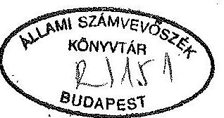
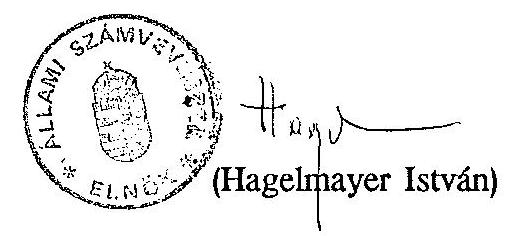

# JELENTÉS 

a helyi önkormányzatok fejlesztéseihez és rekonstrukcióihoz nyújtott címzett támogatások vizsgálatáról

---

# JELENTÉS 

a helyi önkormányzatok fejlesztéseihez és rekonstrukcióihoz nyújtott címzett támogatások vizsgálatáról

A Magyar Köztársaság 1992. évi költségvetéséről és az államháztartás vitelének 1992. évi szabályairól szóló 1991. évi XCI. tv. (1991. XII. 31.) szerint a helyi önkormányzatok kiemelt fontosságú feladataira címzett és céltámogatásként 26.640 millió forint áll rendelkezésre. A helyi önkormányzatok 1992. évi címzett és céltámogatásáról rendelkező XXVI. tv.-ben ( 1992. V. 13.) az 1992. évi címzett támogatásokra a - kötvények tőke és kamatterhe nélkül - 9.847 millió forintot hagytak jóvá.

Ebből a vízgazdálkodás területét érintő 7 feladatra 1.154 millió forintot, az egészségügyi ellátás vonatkozásában 34 intézményi fejlesztésre 7.343 millió forintot, míg az oktatás és kulturális szolgáltatást érintően 1.350 millió forintot biztosítottak.

A vizsgálat célja annak megállapítása volt, hogy

- a címzett támogatások odaítélése és felhasználása során érvényesült-e a törvényesség, valamint a pénzeszközök hatékony és gazdaságos felhasználása;
- a címzett támogatás rendszere hogyan segíti a helyi önkormányzatok nagy költségigényű fejlesztési és rekonstrukciós feladatainak megoldását;
- a címzett támogatással megvalósuló fejlesztések, rekonstrukciók az adott településen, területen milyen hatást gyakorolnak az ellátási színvonalra;

---

- az előző évhez viszonyítva a központi szervek mennyiben korszerűsítették a címzett támogatás rendszerét. Melyek a korszerűsítés további irányai, figyelemmel az Állami Számvevőszék korábbi javaslataira is.

A témavizsgálat keretében az 1992. évi XXVI. tv. 1. sz. melléklete szerinti valamennyi, összesen 49 ágazati feladat, illetve intézmény vizsgálatára sor került. Az ellenőrzés nem terjedt ki a benyújtott, de a tárcák által nem javasolt és így állami támogatásban nem részesülő rekonstrukciókra.

# A vizsgálat megállapításai 

## I. A tárcák tevékenységének vizsgálata

1) Az 1992. évben támogatandó célok és a támogatás feltételrendszerének meghatározása

Az Országgyűlés 1991. évre a helyi önkormányzatok kiemelt fontosságú feladataira 6.662 millió forint támogatást hagyott jóvá. Ebből a vízgazdálkodásban 9 feladatra 496 millió, az egészségügyi ellátás területén 39 intézmény rekonstrukciójára 5.620 millió forintot, az oktatás és kulturális szolgáltatásban 1 gimnáziumi és 3 színházi beruházásra 546 millió forintot biztosítottak.

A címzett támogatások odaítélésével összefüggő, a döntési mechanizmust, a központi szervek szerepét, a források és feladatok összhangjának és a feladatok 1991. évi megvalósításának helyzetét, továbbá a pénzügyi - jogi szabályozás problémáit a V-144-47/1992. (Tsz. 93.) ÁSZ vizsgálati jelentés részletesen tartalmazza.

A vizsgálat rámutatott a döntési, finanszírozási rendszer fogyatékosságaira és azt jelezte, hogy:

- a támogatási rendszer további fenntartása célszerű, ennek érdekében azonban olyan előkészítési, döntési rendszert kell kidolgozni, amely minden igénylő számára azonos követelményeket tartalmaz,

---

- meg kell oldani, hogy a támogatási rendszer éves ütemezést is tartalmazzon,
- a pénzeszközökkel való hatékonyabb gazdálkodás miatt célszerű lenne a támogatott témák esetében az állami pénzeszközök mellett saját forrás igénybevételét is kikötni,
- a döntéshez szükséges szakmai és pénzügyi információk megalapozottsága érdekében - különösen az egészségügyi ellátás területén - szükséges a szakmai programok felülvizsgálata, a térségi feladatellátás követelményeinek a tisztázása, valamint a feladatokhoz szükséges források felmérése.

A vizsgálat javaslatait elfogadva, a Belügyminisztérium jelezte, hogy kormányrendelet készül, amely szabályozza a címzett támogatásokkal kapcsolatos önkormányzati, szakminisztériumi és kormányfeladatokat a szakmailag megalapozottabb döntés érdekében. A beruházás éves támogatási ütemeinek megfelelően a beruházás teljes időszakára hoz döntést az Országgyűlés a címzett támogatásról. A beruházáshoz a címzett támogatás mértéke a beruházás összköltségének a saját és egyéb pénzforrásokból nem fedezett része. Az új típusú szabályozást 1993. évtől javasolták - az Országgyűlés döntésétől függően érvényesíteni.

A helyi önkormányzatok címzett és céltámogatási rendszeréről szóló 1992. évi LXXXIX törvényben (1992. XII. 31.), az említett szabályozás megtörtént. Ezzel megkezdődött a támogatások rendszerének hosszú távú átalakítása. Az önkormányzatoknál folyó rekonstrukciós, fejlesztési feladatok megvalósításának biztonságát segíti, hogy - az eddigi gyakorlattól eltérően - csak egyszer kell támogatási igényt bejelenteni a beruházás egész menete során.

A finanszírozási rendszer változásával megszűnik a fővállalkozói előleg központi támogatásból való nyújtásának lehetősége és a pénzintézetek bevonásával megvalósul a teljesítményarányos finanszírozás.

Pozitívnak ítélhető, hogy a korábbi döntési - finanszírozási szisztéma felszámolását célzó, a folyamat egyes elemei javításának, a feltételrendszer módosításának, szigorításának irányába mutató jelenségek már 1992-ben is érzékelhetők voltak, ezek azonban a címzett támogatási rendszer fogyatékosságainak kiküszöböléséhez nem bizonyultak elégségesnek.

A feladatok és források összhangjának biztosítása érdekében a XXVI-os tv. (1992. május 13.) úgy rendelkezett, hogy a Hollós J. Kórház Kecskemét, Réthy

---

P. Kórház Békéscsaba, Szent György Kórház Székesfehérvár, továbbá a Megyei Kórház- Rendelőintézet Veszprém szakmai tartalmát, beruházási összköltségét - a jelentős költségnövekedésekre tekintettel - felül kell vizsgálni és azt az 1993. évi címzett támogatást jóváhagyó törvényben kell rögzíteni.

Az állami támogatás szabályszerű felhasználásának szigorítása érdekében írta elő az 1991. évi XCI. (1992. XII. 31.) tv. a szabálytalan igénybevétel következményeit, illetve a teljesítés ellenőrzésének követelményeit. A teljesítést meghaladó pénzlehívás szankcionálásának jogi szabályozása azonban továbbra sem történt meg.

A szabályozás csupán arra terjedt ki:

- ha az önkormányzat a címzett támogatást nem a megjelölt feladatra használja fel, illetőleg a törvényben rögzített arányt meghaladó mértékű támogatást vett igénybe, ezt évközben, de legkésőbb az éves költségvetési beszámoló TÁKISZ-hoz történt benyújtást követő 15 napon belül köteles visszatéríteni és ez után az éves átlagos jegybanki alapkamat kétszeresét köteles fizetni a jogtalan pénzhasználat időtartamára a központi költségvetés javára. E szabályozás hiányossága, hogy nem határozza meg milyen időponttól kell a jogtalan igénybevételt számítani és ezt milyen bankszámlára kell befizetni.
- a TÁKISZ-ok szakmailag véleményezik az önkormányzatok támogatási igényeit. A címzett támogatások esetében, a folyósítást megelőzően igazolják a feladat teljesítését.

A helyi önkormányzatok 1992. évi címzett és céltámogatásának feltételrendszerét az Országgyűlés 1/1991. (XII. 31.) OGy Irányelve szabályozza. Ennek indoklása alapján - 1992-ben folytatni kell az 1990. évi CIV. tv. 5. sz. mellékletében elfogadott fejlesztések támogatását. Az indoklási részben és a célok között az 1991-ben vállalt egyes kormányzati kötelezettségek címzett támogatásként való kezelése is megjelenik. Az irányelvek alapján címzett támogatás volt igényelhető 1992. évben - az éves előirányzatra vonatkozóan az önkormányzatok, az ágazati minisztériumok és a Belügyminisztérium egyeztetett javaslata alapján

- a dél alföldi ivóvízminőség javító programnak,
- a megyei, valamint a 300 millió Ft teljes költséget meghaladó városi kórházak rekonstrukciójának,

---

- és a színházrekonstrukcióknak
folytatásához.
A tervezett címzett támogatási előirányzatok egyeztetéséhez szükséges önkormányzati dokumentumokat a törvény előírta, a beadási határidőt viszont nem rögzítette. A törvényi szabályozás következetlenségéből adódott, hogy az önkormányzatok által 1991. október 25-i határidővel beadott igényeket a később jóváhagyott feltételek szerint bírálták el, az előre meghatározott költségvetési előirányzathoz igazították az igényeket és a feladatokat.
A jogi rendezetlenséget jelzi, hogy jogforrásnak nem tekinthető OGY Irányelvben rögzítették az egyébként törvényekben szabályozott folyamat lényeges elemeit.

A 4 kórház rekonstrukciójának szakmai tartalmát 1992. júniusában vizsgálták felül. Ennek költségcsökkentő hatása alig érzékelhető, mert a korábban beadott 1992. évi megnövekedett támogatási igényeket már jóváhagyták, illetve a 2238,3 millió Ft-os teljes összköltség növekedést is elfogadták.

A törvényben megfogalmazott szakmai véleményezés és teljesítés igazolásának követelményét megfogalmazó törvényi előírás nem teljesült - nem teljesülhetett. Az igénybenyújtás időszakában a TÁKISZ-oknak még nem volt törvényi felhatalmazásuk arra, hogy az igénybejelentéseket véleményezzék. A törvényalkotói szándék utólag, visszamenőleges hatállyal nem érvényesülhetett. A teljesítés igazolása tekintetében a TÁKISZ-ok szerepét eljárási rend nem szabályozza. Hatáskör hiányában nem volt lehetőségük az önkormányzatoktól a teljesítést igazoló dokumentumokat bekérni. A TÁKISZ-ok ezirányú tevékenysége abban nyilvánult meg, hogy a formanyomtatványokat, az önkormányzatok által közölt adatok kontrollja nélkül továbbították.
2) A tárcák döntéselőkészítő tevékenységének értékelése

A törvényben és az OGY irányelvben megfogalmazott célokkal és kritériumokkal való összhang biztosítása, a keretek betartatása a kormányzati szervek (Közlekedési, Hírközlési és Vízügyi Minisztérium, Népjóléti Minisztérium, Művelődési és Közoktatási Minisztérium, Belügyminisztérium) feladata volt. Az önkormányzatok címzett támogatási igénybejelentő lapjai a Belügyminisztériumba érkeztek. Ott történt feldolgozásuk, értékelésük és egyeztetésük az

---

érintett önkormányzatokkal és szaktárcákkal. Az egyeztetések döntően a támogatások 1992. évi anyagi kondícióinak meghatározását célozták. A szakmai szempontok érvényesítése háttérbe szorult.

Az egészségügy speciális problémája, hogy a tárcaegyeztetésen túl szükséges a fejlesztések működési többleteinek elfogadtatása az Országos Társadalombiztosítási Főigazgatósággal. A szakmai programok felülvizsgálatának hiánya, illetve a már korábban elhatározott fejlesztések működési költségvonzatának egyeztetésének elmaradása a jövőbeni működtetés fedezetét kérdőjelezi meg.
A lehetőségeket lényegesen meghaladó igények felülvizsgálata során a forrásokhoz igazították a feladatokat, így sok esetben átütemezték a tevékenységet. Egyes feladatokat későbbre halasztottak, a költségnövekedést áthárították. Az évek közötti átütemezéseknél azonban nehezen lelhetők fel (követhetők nyomon) az egységes szakmai, gazdaságossági elvek.

Az átütemezés viszont indokolt volt, a Jászberényi Erzsébet Kórház esetében. A városi önkormányzat a rekonstrukcióhoz összeségében 358 millió forintos címzett támogatást igényelt, amelyből az 1992. évi igény 131 millió forint volt. A XXVI. törvény 1992-re 40 millió forint támogatást hagyott jóvá, növelve az ezt követő évek támogatási összegeit is. Az igénybejelentéshez viszonyított átütemezés indokolt volt, mert a mosodaépítés nem volt műszakilag megfelelően előkészítve.

A döntési javaslat kialakításában domináns szerepet játszott a címzett támogatásra rendelkezésre álló pénzforrás korlátozott nagysága.
Emiatt a beadott igények és források összhangját nem minden esetben sikerült megteremteni.

A szűkös források ellenére új beruházások is bekerültek a támogatott célok közé. Az új induló rekonstrukciók bevonása a címzett támogatási körbe szűkítette az adott forrásból megvalósítandó folyamatban lévő beruházások támogatásának mértékét.
A támogatás kritériumaként megjelölt, a városi kórházakra vonatkozó 300 millió forintos magas értékhatár diszkriminatívnak tekinthető, hiszen ennél lényegesen alacsonyabb összköltségű megyei kórházrekonstrukciók is bekerültek a támogatott körbe. A városi kórházak - ezekhez hasonlóan - szintén ellátnak térségi feladatokat. A városi kórházak rekonstrukciójának ily módon céltámogatás felé való terelése - önkormányzati forrás hiányában - nem jelent megoldást.

A jóváhagyás során a törvényi előírásoknak való megfelelést sem sikerült minden esetben biztosítani.

---

A szabályozatlanságból, a feltételek lazaságából is következik, hogy néhány esetben a pályázati cél és tartalom nem fedi a jóváhagyott, az 1991-ben megfogalmazott folyamatosan végzendő tevékenységet, illetve az 1992. évi feladatokat. Előfordult, hogy a törvénybe hibás adatok kerültek.

A Pándy K. Kórház, Gyula esetében a konyha beruházása 1991. évben befejeződött, az igénybejelentésben élelmezési üzem (konyha + személyzeti étterem) szerepel, az 1992. évi törvényben továbbra is konyha rekonstrukcióra szól a támogatás, miközben 40 millió forintos ráfordítással a személyzeti étterem valósult meg.
Margit Kórház Csorna, a rekonstrukció megnevezése nem megfelelő, ugyanis az 1992. évi feladat a főépület felújítása mellett tartalmazza az ideg-elme átépítését, szövettani részleg bővítését, gyógyszertár átalakítását, konyhaüzem és egyéb kiszolgáló létesítmények elhelyezését. A főépület felújításának költsége a teljes 506 millió forintos ráfordítás 1/3-át teszi ki. A 17. sorszámon megjelölt csornai kórház megnevezése is megtévesztő ugyanis ez nem megyei, hanem városi kórház.
A 33. sorszámon szereplő jászberényi Erzsébet Kórház teljes összege hibás. Helyesen 80 millió forinttal több, azaz 380 millió forint.
A Balassa Kórház, Budapest 1993.
 évi támogatási igényében gépelési hibából adódóan 9 millió forinttal magasabb összeg szerepel.

Az OGY irányelv szerint 1992-ben már nem volt lehetőség a korábbi években felvett hitelek és kamatainak címzett támogatásból való visszafizetésére. A pályázatok jóváhagyása során a döntéshozók egy esetben e szabályozástól eltértek.

Nagykállói Kollégium 300 férőhelyes diákotthonának építése 1989-ben kezdődött és 1992-ben fejeződött be 266,7 millió forintos költséggel. A megvalósításhoz céltámogatást kértek, de a kritériumok hiányában nem kaptak. Az 1991. évi Kormányülés állásfoglalása alapján, saját forrás és 71 millió forint hitel felhasználásával folytatták a munkát. A 71 millió forintos hitelt és annak kamatait ( 13,235 millió forint) az 1992-re kapott 80 millió forint címzett támogatásból fedezték.

A szakmai programok érdemi felülvizsgálata, ennek során a rendelkezésre álló forrásokkal való összhang megteremtése azért is fontos, mert a folyamatban lévő beruházások költségigénye jelentősen megnövekedett. Az 1992. évre elfogadott igény szerint a költségnövekedés az előző évi igénybejelentéshez képest az egészségügyi ellátásban és az oktatás - kulturális szolgáltatásban jelentős - együttesen 4.338,3 millió forint. Ez mintegy $15 \%$-os emelkedést jelent.

---

Ebből a felülvizsgálatra kötelezett kórházak esetében a növekedés 2.238,3 millió forintot tesz ki.
A költségelőirányzatok változását a 2/a., 2/b., 2/c mellékletek tartalmazzák. (A sorszámozás megfelel a törvény 1. sz. mellékletének).

A költségnövekedés okaként általában
— rosszul megbecsült inflációs rátát,

- előre nem látható pótmunkákat,
- a korábbi évekről forráshiány miatt elhúzódó és költségnövelő tevékenységeket,
- a tervezés során kellően figyelembe nem vett Áfa hatást
jeleznek.
A megnövekedett költségigények mögött azonban esetenként tartalmi, szakmai igény változások is meghúzódnak.

A Veszprém megyei Kórháznál az aktualitását vesztett gép-műszer és berendezés igényeknél a korszerűsítések és felülvizsgálat miatt 657 millió Ft összegigény növekedés jelentkezett.
Budapest Főváros Szent János kórház konyha rekonstrukciójánál a korszerűbb tálalási rendszer közel 100 millió Ft többletköltséget jelentett.
A Hollós J. Kórház, Kecskemét Onkológlai Alközpont építésének költségigénye szintén megnőtt. Az 1992. évi növekmény 20 millió Ft. A növekedés oka, hogy az előző előirányzatot becslés alapján állították össze, részletes számítások nélkül, továbbá a sugárforrás a korábban betervezett kobaltágyú helyett csak részecske gyorsítóval oldható meg.

A támogatásra javasolt körbe olyan új fejlesztések is bekerültek, amelyek az önkormányzatok és a szaktárcák által jóváhagyott szakmai programmal nem voltak megalapozva és a támogatásból megvalósításra tervezett tevékenységeket kellőképpen nem készítették elő.

Jókai Színház, Békéscsaba, az Egyesített Gyógyító- Megelőző Intézet, Orosháza; dr. Kenessey A. Kórház- Rendelőintézet, Balassagyarmat; Erzsébet Kórház, Jászberény, Margit Kórház, Csorna; Kisvárda, Városi Kórház; Szakkórház és Szanatórium, Miskolc; Markusovszky Kórház-Rendelőintézet, Szombathely; Markhot F. Kórház, Eger.

---

A gazdasági és szakmai szempontból kellően meg nem alapozott igények azonban megbontják a források és feladatok összhangját és megkérdőjelezik az állami források központi céloknak megfelelő hatékony felhasználását.
1992. tavaszától tapasztalható, hogy az egyensúly megteremtése érdekében a Népjóléti Minisztérium elkezdte és folyamatosan felülvizsgálja a szakmai programok tartalmát. Ennek érzékelhető hatása 1993-tól várható.

A szakmai, pénzügyi megalapozatlanság a megvalósítást több esetben kedvezőtlenül érintette, amihez a döntési folyamat elhúzódása is hozzájárult, növelve a bizonytalanságot és a megvalósítás időbeli csúszását. Az átütemezések legtöbbször a költségek emelkedésével is jártak, amelyek fedezete újabb támogatási igényeket támaszt a központi költségvetéssel szemben.

A Keszthelyi Városi Kórház az igénybejelentő lapon az érvényes beruházási program adataival egyezően a rekonstrukció II. ütemének teljes forrásszükségletét 920 millió forintban jelölte meg, ezen belül az 1992. évre tervezett ütemet 180 millió forint összegben rögzítették. A XXVI. tv. a teljes forrásszükséglet változatlanul hagyásával az 1992. évi előirányzatot 80 millió forintban állapította meg, arányosan 100 millió forinttal megnövelve az 1992. utáni évek előirányzatát. A benyújtott támogatási igény szakmailag átgondolt és megalapozott volt az átütemezés a teljesíthetőség szempontjából kedvezőtlen.
A Fejér megye Szent György Kórház, Székesfehérvár esetében a pénzügyi fedezet oldaláról bizonytalanságot okozott, hogy az igényléskor 1992. évre 932 millió forint forrással számoltak, ezzel szemben, csökkentett 800 millió forintos előirányzatot kaptak, mellyel az eredetileg tervezettnél kevesebb feladatot oldottak meg.
A Réthy P. Kórház, Békéscsaba rekonstrukciójának 1992. évi feladataihoz 973 millió támogatást igényelt a megyei önkormányzat. A jóváhagyott támogatás ezzel szemben 800 millió forint, a csökkentés részben a kivitelezés ütemének mérséklését, részben a műszer beszerzés késleltetését jelentette.
Bugát P. Kórház, Gyöngyös rekonstrukciójához az érvényben lévő szerződéseknek megfelelően 1992. évre 632 millió forintot, az 1993. évi befejezéshez 326 millió forintot kértek. Ettől eltérően 1992. évre 500 millió, 1993. évre 356 millió forintot és 1993. utánra 102 millió forintot hagytak jóvá. Ezzel azonban nem biztosítható az 1993. év végi üzembehelyezés.
A Megyei Kórház- Rendelőintézet, Veszprém rekonstrukciójának II. ütemére a módosított engedélyokiratnak megfelelően 1.233 millió forint igényt jelentettek be. Ezzel szemben 800 millió forintot hagytak jóvá, amely a tervezetthez képest kevesebb teljesítést jelentett.
A Petőfi Színház, Sopron rekonstrukcióhoz 100 millió forintot igényeltek 1992. évre. A törvény csak 50 millió forintot biztosított, a másik részt

---

1993. évre irányozta elő. Megállapítható, hogy a megosztás műszakilag nem volt indokolt.

A bizonytalanságot fokozta, hogy a változtatásokról, vagy az elutasítás indokairól a pályázókat nem értesítették, az önkormányzatok a májusban megjelent törvényből szereztek tudomást az elfogadott támogatás mértékéről.

Azokban az esetekben, amikor az ÁFA törvény szerint visszaigényelhető az ÁFA, (külső megrendelők részére végzett szolgáltatás miatt adóalanyiság, közmű beruházás, kulturális szolgáltatás) a címzett támogatással megvalósuló rekonstrukcióknál, fejlesztéseknél ez többletforrásként jelenik meg.
A beruházás tervezése során sok esetben nem határozható meg előre egzaktan a visszaigényelhető ÁFA nagysága.
A többlet forrás figyelembevétele törvényi szinten nem szabályozott, amely lehetőséget adhat állami pénzeszköz kétszeres igénybevételére. Az érintett önkormányzatok egy része (Főváros, Miskolc Megyei Jogú Város) saját maga szabályozta, oly módon, hogy a visszaigényelt ÁFA kizárólag az adott beruházásra fordítható, míg másik része (Tolna megyei önkormányzat) nem foglalkozott a problémával.
Az egységes gyakorlat és az állami pénz kétszeres igénybevételének megakadályozása érdekében a kérdés törvényi szintű szabályozását tartjuk indokoltnak.

#### Abstract

A Vígszínház, Budapest rekonstrukciójához szükséges pénzeszközt 2.000 millió forint Áfa nélküli összegben határozták meg. A fővárosi önkormányzat rendelkezése szerint a színház az érvényben levő adórendeletek értelmében, havonta visszaigényli az Áfa-t és a visszaigényelt összegeket azonnal visszaforgatja a következő havi számlák kifizetésére. A visszaigényelt Áfa-t nem gyűjtheti, nem kamatoztathatja. A Miskolci Nemzeti Színház 1992. évi forrásait 61,1 millió forinttal növelte a visszaigényelt ÁFA, amelyet a tárgyévi munkák fedezeteire fordítottak, végeredményben ennyivel kevesebb állami támogatást igényeltek le. Megyei Kórház- Rendelőintézet, Szekszárd mosoda beruházása forrásigényének a tervezésénél nem volt egyértelműen tisztázott, hogy az Áfa levonható-e. Az igénylésnél még Áfa-val számoltak, viszont a beruházást terhelő Áfa-t teljes egészében visszaigénylik. Ezzel a beruházás összes költsége, mintegy 40 millió forinttal kevesebb.

---

# II. A helyi önkormányzatoknál végzett helyszíni ellenőrzések tapasztalatai 

## 1) A címzett támogatásból megvalósuló 1992. évi feladatok előkészítettsége

A vízgazdálkodás területére kapott támogatások szakmai indokoltsága, társadalmi szükségessége megalapozott volt. Az 1992. évi feladatok a megelőző években folyamatosan megvalósult hosszabb távú koncepció ütemezése alapján végzett tevékenységekre alapozódnak. A koncepciót 1992. évre Békés megyében bővítették Szarvas Város (és környező települései) orosházi kistérségi vízműhöz való csatlakozása érdekében ( 30 millió forint).

Az egészségügyi ellátásban folyamatban lévő beruházások vonatkozásában az 1992. évi címzett támogatásra szóló pályázat, illetve az ez alapján elnyert támogatás az esetek többségében összhangban van a korábbi szakmai programokkal, az 1991. évi támogatással megvalósított fejlesztésekkel.

Az 1992. évben induló új fejlesztések közül azonban csak néhány rekonstrukció tekinthető a megvalósítás szempontjából szakmailag körültekintő módon előkészítettnek, megfelelő szakmai programmal alátámasztottnak. (Debreceni Vértranszfúziós Állomás, Vígszínház Budapest).

Az ebbe a csoportba tartozó fejlesztések többségénél az 1/1991. (XII. 31.) OGY irányelvben előírt jóváhagyott beruházási programmal nem rendelkeztek.

A Jókai Színház, Békéscsaba, Margit Kórház, Csorna, Szakkórház, Szanatórium Miskolc esetében elfogadott szakmai program az igénybenyújtás időszakában nem volt. A közgyűlés a felterjesztést utólag hagyta jóvá. A feladatokkal való kitöltés a törvény elfogadása után történt meg. Nógrád megyében a kihelyezett kormányülés kapcsán erősödött fel a dr. Kenessey A. Kórház- Rendelőintézet rekonstrukciójának igénye. A 800 millió forint támogatási igényből 160 millió forintot igényeltek 1992. évre. Az 1992. évi befejezéssel pályázott szemészeti pavilonhoz felülvizsgálatra kötelezett kiviteli terveik voltak, a további évekre ütemezett feladatokhoz azonban az előkészítettség megítéléséhez szükséges dokumentumokkal az igény benyújtása idején nem rendelkeztek.
Az Erzsébet Kórház, Jászberény rekonstrukciójához az igényléskor teljes körű szakmai program nem állt rendelkezésre csak program előkészítő tanulmányterv.

---

# 2) A fejlesztési, rekonstrukciós feladatok megvalósítása 

Az 1992. évi címzett támogatásokra vonatkozó XXVI. törvény 1992. május 13-án került kihirdetésre. A döntés elhúzódása kedvezőtlenül befolyásolta a rekonstrukciókat. A folyamatban lévő munkákat pénzhiány miatt esetenként szüneteltetni kellett. A késés miatt az új induló fejlesztéseknél az érdemi intézkedések megtétele eltolódott. Mindezek együttes következményeként időbeli csúszások és költségnövekedések következtek be.

A Kenézy Gy. Kórház- Rendelőintézet, Debrecen szervezetében működő Vértranszfúziós Állomás rekonstrukciója érdekében az érdemi intézkedések késtek. Ennek következtében az 1992. évre jóváhagyott 100 millió forintból a felhasználás 8,4 millió forint volt. Ezért a tervezett feladatok töredékét tudták csak elvégezni.

A dr. Kenessey A. Kórház, Balassagyarmat beruházásának kivitelezése augusztus végén indulhatott a versenytárgyalások meghirdetése miatt. A kivitelezőnek így is követelményként írták elő, hogy a tervmódosításokat a kivitelezés közben fogadja el. A szerződés szerint a beruházás 10 hónap alatt elkészül, az előző évi döntés szerint a munkálatok 1992-ben megvalósulhattak volna.
A Markusovszky Kórház, Szombathely esetében a címzett támogatási döntés elhúzódása miatt a gépi technológiát 5 hónappal később tudták megrendelni. A közben történt áremelkedés (mintegy $8 \%$ ), valamint ennek Áfa, Vám és Vámilleték vonzata 11 millió forint többletkiadást okozott.
A Vígszínház, Budapest rekonstrukciós munkáinak tényleges indítása is késett. Igaz, hogy az előmunkálatok időközben folytak, de a munkák teljes körű beindítására csak a törvény kihirdetését követően került sor. A beruházás késedelmes kezdése ellenére a generál kivitelező BÁCSÉPSZER RT. vállalta, hogy a beruházást az eredeti 1994. május hóra kivitelezi.

A döntés előkészítés elhúzódása, a feladatok helyi előkészítetlensége és egyéb okokból bekövetkező időbeli csúszások káros következményeit az önkormányzatok egy része megkísérelte enyhíteni, eredetileg későbbre tervezett feladatok előrehozásával. A legtöbb esetben azonban ez nem sikerült, ezért az 1992. évre jóváhagyott címzett támogatást nem tudták teljes egészében igénybe venni, illetve felhasználni.

Az Erzsébet Kórház, Jászberény mosoda rekonstrukciójának a kivitelezése a munkák előkészítetlensége miatt $1 / 2$ éves késéssel indulhat. Emiatt előbbre hozták a későbbre ütemezett, de kisebb volumenű, gyorsabban előkészíthető munkákat, orvosi eszközöket szereztek be. A mosoda építésének az előkészítését kezdték meg. A források és feladatok összhangja csak így volt

---

megteremthető.
A szolnoki Hetényi G. Kórház- Rendelőintézetnél a feladatok jellegéből adódóan a műszaki megalapozottság eltérő volt. A kivitelező csődbe jutása 1 év késést okozott, emiatt a következő ütem indítása is csúszik. A rekonstrukció műszaki előkészítését a címzett támogatás jóváhagyása után a II. félévben kezdték meg.
Hollós
 J. Kórház Kecskemét Onkológiai Alközpont építéséhez kapott címzett támogatás egy részét feladatokkal nem tudták kitölteni, a műszaki gazdasági előkészítés késett. A 120 millió Ft támogatásról 78,4 millió Ft-ot hívtak le.

A vízgazdálkodásban az eredetileg jóváhagyott műszaki elképzeléssel összefüggésben az 1992. évi megvalósítás során szakmai megfontolásokból több helyen változás történt:

- Kisújszállás Város As-mentesítési programját felülvizsgálták és módosították. Az eredeti tervek As-mentesítő technológiát tartalmaztak, ehelyett alacsony As koncentrációjú kutakat fúrtak és állítottak rendszerbe.
Örményes térségében 4 db kút fúrásával (napi $5000 \mathrm{~m}^{3}$ kapacitás) a jó minőségű ivóvizet 9 km-es vezetékkel viszik a Kisújszállási vízműbe. Így elhagyhatóvá vált a nagy üzemeltetési költségű tisztítási technológia. A változtatás nem igényelt többlet támogatást.
- Tiszacsege Nagyközségben a szűréssel történő arzén mentesítés a határérték alatti arzént tartalmazó vízadó réteg felhasználásával, 2 db kút ( $2.500 \mathrm{~m}^{3}$ kapacitás) fúrásával és rendszerbe állításával egészült ki. A megoldás nem igényelt többlet támogatást.
- Békés megyében Telekgerendás és Kétsoprony Községeknél az egyedileg tervezett víztisztítás helyett jó minőségű ivóvíz átvezetéssel oldották meg a lakosság ellátását. Ez szintén a víztisztítás magas üzemeltetési költségei ellen hatott.

A vízgazdálkodás 1992. évi feladatainak teljesítése és eredménye a következőkkel jellemezhető.

- Békés megye: az ivóvíz As koncentrációja a kétszeres határérték alá került, a program I.-es ütemének megfelelően, megkezdődött a program II. üteme. Az 1992. évi célkitűzések teljesítése nem volt teljes körű. Több esetben lemaradás, vagy túllépés volt tapasztalható. A megvalósítás a tervezett költségkereteken belül történt. Vésztő, Okány települések rákötése nem történt meg, Tarhos és Bélmegyer települések (2.643 lakos) megtörtént.

---

Orosháza, Nagyszénás, Gádoros (11.222 lakos) egészséges ivóvízzel való ellátását megoldották. Pusztaföldvár, Csanádapáca kisebb lemaradást, Orosháza, Gyopáros, Szentetornya kisebb túlteljesítést mutat. Szeghalmon lényeges túlteljesítés jelentkezik, Gyula ivóvízellátása előkészítési munkái megtörténtek. Körösladánynál lemaradás tapasztalható, míg Vandhát és Kevermesnél nem valósult meg az 1992. évi feladat. Összeségében a megvalósult és üzembehelyezett beruházások eredményeként 43.794 fm ivóvízvezeték és $2000 \mathrm{~m}^{3}$ /nap ivóvíztermelő kapacitás épült meg, 4 település közel 14.000 lakosa jutott egészséges ivóvízhez. Itt megszűnt a tasakos ivóvízellátás.

- Jász-Nagykun-Szolnok megye: Kisújszállás Városban az arzénmentesítés megvalósításra került. Elkészült 4 db kút, $5000 \mathrm{~m}^{3}$ napi kapacitással, kiépült 9000 fm ivóvízvezeték. A város 13.000 lakosának a határérték alatti As tartalmú ivóvíz szolgáltatható. Hátralévő feladat a magas vastartalom miatt a vastalanítási munkálatok mielőbbi elvégzése.
- Hajdú-Bihar megyében hat település: Hajdúnánás, Tiszacsege, Darvas, Sárrétudvari, Szerep és Biharnagybajom települések As-mentes ivóvízellátása megoldást nyert, s ezzel az eredeti program célkitűzései nagyrészt befejezettnek tekinthetők.
Hajdúnánáson ( 19.200 lakos) az üzembehelyezett szűrők (napi $3080 \mathrm{~m}^{3}$ ) a jelenleg rávezetett vízmennyiséget megfelelően, határérték alattira (O,O42 $\mathrm{mg} / \mathrm{l}$ ) arzénmentesítik.
Tiszacsegén ( 5500 lakos) az 1992. évben igénybe vett címzett támogatással az As mentesítés megoldásra került, a szűrők beépítésével, 2 db új kút fúrásával és üzembehelyezésével az ivóvíz As tartalma $0,027 \mathrm{mg} / \mathrm{l}$ értékre alakult. Tiszacsege Nagyközségben az eredeti As-mentesítési program befejezést nyert.
Darvas ( 732 lakos) Községben a szűrők beépítésével az ivóvíz As-tartalma $0,035 \mathrm{mg} / \mathrm{l}$ értékre alakult, s napi $554 \mathrm{~m}^{3}$ egészséges ivóvíz áll a lakosság rendelkezésére. Így Darvas Község As-mentesítési feladatai 1992. évben befejezést nyertek.
Sárrétudvari - (Szerep - Biharnagybajom) települések (8300 lakos) As mentesítés programjába tartozó létesítmények: szűrési technológia, $200 \mathrm{~m}^{3}$ és víztároló medence, kút $900 \mathrm{~m}^{3}$-es napi kapacitással befejezést nyertek. Jelenleg a próbaüzemelés van folyamatban.
- Nógrád megyében az 1992. évi fejlesztések eredményeként 11 eddigi ellátatlan település egészséges ivóvízellátása és egy ellátott településen az ivóvízpótlás biztosítható. Négy településen az ivóvízellátó rendszer üzembe-

---

helyezése is megtörtént és mintegy 2000 lakos juthatott egészséges ivóvízhez. Hét település mintegy 6000 lakosának teremtődött meg a rákötés lehetősége. Megépült 50 km ivóvíztávvezeték, amelyből $18,6 \mathrm{~km}$ üzembehelyezése is megtörtént.

A befejezett tevékenységek mellett két újabb, a programban nem szereplő probléma vár mielőbbi megoldást. Az egyik a víztisztítás melléktermékeként keletkezett veszélyes hulladéknak minősülő arzéntartalmú vashidroxid iszap környezetkímélő kezelése, ártalmatlanítása. A másik, a Békés megye több településén a WHO ajánlását ( $100 \mathrm{mg} / \mathrm{l}$ ) 20-25-szörösen meghaladó jodid koncentráció megoldása.

Az egészségügyi ellátás, valamint az oktatási, kultúrális szolgáltatás terén befejeződött a Móricz Zs. Gimnázium, Budapest kiváltására épített új épület, a Tetőfedő Szakmunkásképző Intézet, Veszprém beruházása, a miskolci Megyei Kórház fűtéstrekonstrukciója. Pándy K. Kórház, Gyula konyharekonstrukciója, Petz A. Kórház, Győr rekonstrukciója, berettyóújfalui Városi Kórház, rekonstrukciója, Megyei Kórház, Tatabánya beruházása, Madzsar J. Kórház, Salgótarján rekonstrukciója, valamint a Szt. János és Szt. István Kórházak, Budapest konyharekonstrukciója.

A szakaszolt munkavégzésnek megfelelően részteljesítések is történtek. Általában gondként jelentkezett az aktiválási kötelezettség teljesítéséhez szükséges adatok szolgáltatása.

Móricz Zs. Gimnázium, Budapest kiváltására épített épület aktiválásához szükséges adatokat összeségében megkapta az intézmény, azonban az aktiválandó érték felülvizsgálatra és kiegészítésre szorul.
Meg kell becsülni és aktiválni kell az önkormányzat által rendelkezésre bocsátott földingatlan értékét is.
Tételesen átvizsgálandó az átadott - beárazott - berendezések jegyzéke, mivel azok értéke nem szerepel az aktiválandó összegben.
A fővállalkozói szerződés átalányáras volt, s így utólag nem különíthetők el értékben a különböző tárgyi eszközök.

A Veszprémi Tetőfedő Szakmunkásképző Intézetnél a műszaki átadás-átvételi eljárások 1992. májusától megkezdődtek.
Az üzembehelyezési jegyzőkönyvet a lebonyolító elkészítette, a pénzügyi aktiválás azonban a rendezetlen finanszírozási viszonyokból adódó BRAMAC tulajdoni részesedés vitatása miatt az ellenőrzés időtartama alatt sem történt meg. A Veszprém Megyei Kórház rekonstrukciójának II. üteme során 1992-ben a kazánházi beruházások befejeződtek, a műszaki átadás-átvétel

---

megtörtént. A lebonyolító az üzembehelyezési jegyzőkönyvet május 14-én elkészítette. Ennek ellenére a beruházás pénzügyi aktiválása - az ellenőrzés időpontjáig - nem történt meg.
A Bugát Pál Kórház, Gyöngyös rekonstrukciója során nem kapott kellő figyelmet a számviteli előírások betartása, ugyanis a már leszállított műszerek aktiválásához szükséges okmányokkal sem a finanszírozó önkormányzat, sem az üzemeltető nem rendelkezett.
A Soproni Petőfi Színház rekonstrukciójánál a bonyolítóval kötött megbízási szerződés nem tartalmazza a megbízottnak az aktiválási kötelezettség teljesítéséhez szükséges adatszolgáltatás kötelezettségét.
A debreceni Vértranszfúziós Állomás, Debrecen vonatkozásában a létesítmény - majdani - aktiválásának, üzembehelyezésének megkönnyítése érdekében - tekintettel arra, hogy a kivitelezői szerződés átalányáras célszerű a bonyolítóval kötött szerződést felülvizsgálni. Indokolt a szerződésben konkrétan meghatározni, hogy a beruházás számviteli nyilvántartásba vételéhez a bonyolító milyen részletezettségű adatokat köteles szolgáltatni a beruházó részére.

A folyamatban lévő beruházásoknál az esetek többségében az 1991-ben megbízott kivitelező folytatta a munkákat.

Egyes kivitelezőknél előfordultak pénzügyi nehézségek, az is megtörtént, hogy a kivitelezőt felszámolták. Ez határidő csúszásokkal, illetve többletköltségekkel járt.

A nyíregyházi Jósa A. Kórház- Rendelőintézetnél a forráshiány mellett gondokat okozott, hogy a fővállalkozónál (KEMÉV) felmerült likviditási gondok miatt már május hónapban lassították a munkákat. A II. Rákóczi F. Kórház, Mátészalka esetében a korábbi kivitelezőt felszámolták. Jelenleg a rekonstrukciós munkák további folytatásához az új kivitelező beléptetése megoldatlan.
A Megyei Kórház, Miskolc izótóp diagnosztikai laboratóriumának rekonstrukciója során nem a korábbi kivitelező - mert az felszámolásra került folytatta a kivitelezést. Ebben a vállalkozói díj változatlan, viszont a befejezési határidő 6 hónapot késik.

Az új kivitelezők beléptetésénél az önkormányzatok általában figyelembe vették a versenykiírási kötelezettségről szóló törvényi rendelkezéseket, azaz a 10 millió forint feletti szerződések versenytárgyalási kötelezettség útján történő megkötését. Néhány önkormányzat azonban szabálytalanul járt el.

A Margit Kórház, Csorna rekonstrukciója kapcsán nem tettek eleget a versenytárgyalási kiírási kötelezettségnek a tervezővel kapcsolatban, a kiválasztott új bonyolító $1,8 \%$-os bonyolítási díjat kötött ki.

---

A Bugát P. Kórház, Gyöngyös a kórházi bútorokra vonatkozó vállalkozási szerződés ügyében pályázatot nem írtak ki. A két ajánlattevő közül egy ad-hoc bizottság választott.
A Megyei Kórház, Tatabánya (művese állomás) esetében a tervezett 10 millió forint bekerülési előirányzat miatt nem került sor versenytárgyalási kiírásra. A beruházás előkészítettsége alapján azonban ez az előirányzat csupán $25-30 \%$-os készültséget jelent, a várható összes bekerülési költség 45 millió forint lesz. Ennek ismeretében a versenytárgyalás kiírása szükséges lett volna.
3) A finanszírozási rendszer működése

A címzett támogatások 1992-ben működő finanszírozási rendszere lehetőséget adott a rekonstrukció megvalósulási üteménél nagyobb arányú címzett támogatás igénylésére.

A TÁKISZ-ok a címzett támogatások igénylésekor a feladat teljesítését nem vizsgálták. A BM részéről nem történt külön intézkedés arra, hogyan kell meggyőződniük a feladatok teljesítéséről, milyen formában kell igazolniuk. Az év második felétől a BM által szerkesztett formanyomtatványon igényelhették az önkormányzatok a támogatásokat, azonban a formanyomtatványon sem volt igazolási záradék, illetve arra utaló szándék, hogy a TÁKISZ-nak nyilatkoznia kellett volna a folyósítás megalapozottságát illetően.
A törvénynek a feladat teljesítését igazoló okmányra vonatkozó előírása az igénylési rendszerrel nem volt összhangban, ez utóbbi ugyanis a várható teljesítésre vállalta a finanszírozást. Az érintett önkormányzatok támogatási igényeiket a BM által készített formanyomtatványon nyújthatták be a TÁKISZokhoz a várható költségek fedezetére. A következő havi várható költségek fedezeteként igényelt címzett támogatás nagyságát az önkormányzat polgármestere által aláírt nyilatkozat igazolta. Az 1992-ben működő finanszírozási gyakorlat nem felelt meg a teljesítményarányos finanszírozási követelményének.

Békés megyében áprilistól - novemberig 80 -tól 125 millió forint, Nógrád megyében 30 -tól 34 millió forint közötti havi támogatási többletek voltak a vízgazdálkodásban.
Orosháza Városi Kórház rekonstrukcióhoz az 1992. évi címzett támogatást március hónaptól vette igénybe. Ettől kezdődően az igénybe vett állami támogatás átlagosan 41 millió Ft-tal volt magasabb, mint az a számlázott teljesítés finanszírozása miatt indokolt lett volna.
Az önkormányzat igénybe vette az 1992. évre jóváhagyott címzett támogatás

---

teljes összegét, 300 millió Ft-ot, ugyanakkor a számlával igazolható teljesítések értéke csak 281 millió Ft.
A Vas megyei Önkormányzat az 1992. évre jóváhagyott 250 millió Ft-os címzett támogatást 5 részletben teljes egészében igénybe vette. A megkapott támogatást 9-10 napon belül a megyei kórház rendelkezésére bocsátotta. Ezen időre számlapénzként - mintegy 0,8 millió forint kamatbevételt jelentett az önkormányzat számára. A támogatás igénylése és a tényleges kifizetések üteme időnként jelentősen eltért. Az ütemkülönbségek miatt a kórház 1,5 millió forint kamatbevételre tett szert.
A Békés megyei Önkormányzat, a Réthy Pál Kórház rekonstrukciójához éves szinten jogosan vette igénybe az 1992. évre jóváhagyott 800 millió Ft-os címzett támogatást. Ugyanakkor évközben 1992. április hótól kezdődően, a leszámlázott teljesítményértéket jelentősen meghaladó összegű támogatást vettek igénybe. 1992. április hótól - novemberig havi átlagban több mint 70 millió forinttal volt magasabb az igénybe vett támogatás, mint a megvalósított címzett feladatok teljesítményértéke. A február-márciusi teljesítmények finanszírozására 46 millió forintot, illetve 0,5 millió forintot az önkormányzat saját pénzeszközéből megelőlegezett.
A Mátészalkai II. Rákóczi Ferenc Kórház rekonstrukciójánál a városi önkormányzat a címzett támogatást a rekonstrukció megvalósulási üteménél nagyobb arányban igényelte.
Az önkormányzat 1992. július 15 -én 84 millió forintot, augusztus 13 -án 18,2 millió forintot igényelt, a felhasználás azonban július hónapban 3,7 millió forint, augusztus hónapban 28 millió forint, szeptember hónapban 19,2 millió forint, összesen tehát a
 3 hónap alatt 50,9 millió forint volt.
Hasonló nagy összegű lehívás történt október 13-án 198 millió forint összegben, azonban a tényleges kifizetés október hónapban csak 128,9 millió forint volt.
A Vígszínház rekonstrukciója kapcsán a megvalósulási ütemnél nagyobb arányú címzett támogatási igénylés történt, ezért a Fővárosi Önkormányzatnál 29.808 ezer forint, a Vígszínháznál pedig 8.469 ezer forint címzett támogatási pénzmaradvány képződött.
A Borsod-Abaúj-Zemplén megyei Önkormányzat a Szakkórház és a Szanatórium rekonstrukciójának megvalósulási üteménél nagyobb mértékű címzett támogatást igényelt. Az 1991. évi címzett támogatási maradványt is figyelembe véve 8.869 ezer forintos többlet igénylés történt.
A Heves megyei Önkormányzathoz tartozó egri Markhót Ferenc Kórház- Rendelőintézet vonatkozásában a rekonstrukciót finanszírozó állami támogatás igénybevétele az év folyamán a műszaki-pénzügyi teljesítésektől rendszeresen eltért. Ez a késői támogatási döntéssel magyarázható az év első felében. A második félévben tapasztalható támogatástöbblet - október kivételével - a szerződésekben foglaltak figyelmen kívül hagyásának a támogatás több áttételen keresztül történő finanszírozásának (intézmény-önkormányzat-TÁKISZ-BM-önkormányzat-intézmény) esetenként indokolatlan elhúzódásának tudható be.

---

Év végén az intézmény számláján 15.178 ezer forint fel nem használt címzett támogatás maradvány volt.
A Veszprém megyei Önkormányzat a Megyei Kórház rekonstrukciójával összefüggésben a megvalósulási ütemnél nagyobb mértékű címzett támogatási részleteket igényelt le. A májusi fedezetigény megérkezésétől az önkormányzatnál folyamatosan többletigénybevétel jelentkezik 21-75 millió Ft-os összegben.

A vizsgálat tapasztalatai azt mutatják, hogy a kamatmentes előleg fizetés nagyon sok beruházásnál gyakorlattá vált, amely a munkák gyorsabb kivitelezését segíti és csökkenti a beruházási költségeket. Ugyanakkor a teljesítményarányos címzett támogatás követelményének nem felelt meg az előlegfizetési gyakorlat.

Móricz Zsigmond Gimnázium, Budapest épületének kiváltása kapcsán a prognosztizált átalányáras szerződés magas előlegfizetést kötött ki, ezzel jelentős árnövelő tényezőket lehetett kiküszöbölni. Az 1992. évi 270 millió forintos előlegfizetéssel az önkormányzat megelőlegezte a tárgyévi 250 millió forintos címzett támogatást.
A Fővárosi beruházások bonyolításánál általános gyakorlattá vált a nagyösszegű, gyakran a bekerülési ár $90 \%$-át kitevő előlegfizetés, melyet előre szerződésben rögzítenek. A szerződéses kötelezettségnek ez év elején forráshiány miatt nem mindig tudtak eleget tenni.

Az 1991. évben címzett támogatásban részesült, 1992. évben folyamatban lévő - a törvényjavaslatban támogatásra jelölt - fejlesztésekhez a törvény elfogadásáig, a kivitelezői számlák kiegyenlítéséhez az érintett önkormányzatok egy része a támogatási előirányzatra támogatási előleget kért és kapott a kormányzati szervektől. Ezeknél az önkormányzatoknál az előleg biztosítás lehetősége egyenletesebbé tette a munkavégzést és a gazdálkodást. Az önkormányzatok másik része nem tudott az előleg igénylési lehetőségéről, ugyanis a kormányzati szervek erről nem adtak tájékoztatást.

A Móricz Zsigmond Gimnázium, Budapest kiváltására épített új épülethez 250 millió forint, a Szakkórház és Szanatórium, Miskolc központi fűtés rekonstrukciójához 7,5 millió forint, Berettyóújfalu, Városi Kórház rekonstrukciójához 11,2 millió forint és a Kenézy Gy. Kórház, Debrecen beruházáshoz 10 millió forint, Kaposi M. Kórház, Kaposvár rekonstrukciójához 137 millió forint, a Madzsar J. Kórház, Salgótarján gépészet rekonstrukciójához az első negyedévben kétszer, Szt. István Kórház, Budapest rekonstrukciójához 326,7 millió forint, a Megyei Kórház, Veszprém 196,2 millió forint, a Bugát P. Kórház rekostrukcóhoz 200 millió forint,

---

a Jósa A. Kórház, Nyíregyháza esetében 256 millió forint előleget vettek igénybe.

A Markusovszky Kórház, Szombathely esetében az önkormányzat a támogatás első részletének megérkezéséig saját forrásból 20 millió forintot előlegezett meg. A központi szervektől 30 millió forint előleget kért, melyet azonban nem kapott meg.
A Jókai Színház, Békéscsaba esetében az elvégzett munkák ellenértékét ( 18 millió forint) az első negyedévben a megyei önkormányzat előlegezte meg.

A címzett és céltámogatások 1992. IV. negyedévi előzetes igénylési lehetősége elősegítette az 1992. évi feladatok megvalósítását és ilyen szempontból egyértelműen pozitívan értékelendő, viszont intézményes lehetőséget teremt a teljesítéstől eltérő pénzlehívásokra és az állami forgóalap szükségesnél nagyobb mértékű leterhelésére, hiszen a várhatónál kisebb műszaki teljesítéseket és számlázásokat meg lehet magyarázni.

Az 1992. évi címzett támogatások igénybevétele és felhasználása összességében pozitívan értékelhető. Az érintett önkormányzatok a jóváhagyott támogatást $92,6 \%$-os mértékben igénybe vették, ennek $96,8 \%$-át felhasználták év végéig. A jóváhagyott címzett támogatások igénybevételét 3/ a-c., az 1992. december 31-ig történt felhasználásokat a 4/ a-c. számú Mellékletek mutatják.
4) Az állami pénzeszközök felhasználásának cél- és szabályszerűsége

Az érintett önkormányzatok a címzett támogatást általában a megjelölt célnak megfelelően használták fel.
Ettől eltérő szabálytalan felhasználást is tapasztaltunk.
Három esetben nem tervezett, az eredeti fejlesztési feladathoz szorosan nem kapcsolódó tevékenységek ellenértékét egyenlítették ki.
Ezek részben a létesítmények kiszolgálásához, működésük biztonságának növeléséhez, illetve jövőbeni rekonstrukciós feladatokhoz kapcsolódtak. (5. sz. melléklet)

A jóváhagyott címzett támogatást négy esetben nem a megjelölt feladatra használták fel, el nem végzett munkákat és indokolatlan többletköltségeket finanszíroztak belőle. Az ilyen esetekre a címzett támogatás összegének visszafizetése mellett a törvény kamatfizetési kötelezettséget is előír. Mindezek következtében az ellenőrzés összesen 58,4 millió forint jogtalanul igénybe vett

---

támogatást tárt fel, amelyek nem feleltek meg a törvényi előírásoknak, ezért ezek visszavonását javasoljuk a 6. sz. melléklet szerinti részletezésben.

# Összefoglalás, javaslatok 

Összességében megállapítható, hogy a vízgazdálkodási, az egészségügyi és az oktatási és kultúrális ágazatban folyó fejlesztési és rekonstrukciós munkákhoz az 1992. évi XXVI. törvényben biztosított 9.847 millió forint megfelelő anyagi hátteret biztosított.
A címzett támogatás rendszere nélkül a helyi önkormányzatok nagy költségigényű fejlesztési rekonstrukciós feladataikat nem tudnák megoldani.

A címzett támogatás a vízgazdálkodási ágazatban a dél-alföldi ivóvízminőség-javító program megvalósításával és a Nógrád megyei fejlesztéssel jelentős javulást eredményez a vízellátásban. Az egészségügy ágazatban lényegesen kedvezőbbé teszi a betegellátás feltételeit. Az oktatási és kultúrális szolgáltatásnál pedig elsősorban a színházrekonstrukciókra koncentrálva a pénzeket a lakosság színvonalas kultúrális ellátásának feltételeiben teremtett előrelépést 1992-ben.
Ugyanakkor a folyamat szabályozásában, a döntéselőkészítésben még számos hiányosság tapasztalható, amely a források optimális felhasználását gátolja.
Súlyos jogi problémaként vetjük fel, hogy a címzett támogatásokra vonatkozó igény benyújtásának határideje több, mint két hónappal megelőzte a pályázat feltételeit meghatározó országgyűlési irányelv kihirdetését. Ugyanezen ok miatt nem tudtak megfelelni a TÁKISZ-ok az 1991. évi XCI. törvényben a címzett támogatással összefüggésben megjelölt feladataiknak.

Rendszeridegen elemként került a címzett támogatások feltételét rögzítő 1/1992. (XII. 31.) Országgyűlési irányelvbe, hogy a címzett támogatások között kell figyelembe venni az 1991. évben vállalt egyes kormányzati kötelezettségek teljesítésének fedezetét. Ez csökkentette az egyébként a feltételeknek megfelelő pályázatok változatlan tartalommal történő befogadásának lehetőségét.

Az ágazati minisztériumok nem minden esetben követelték meg a megalapozott szakmai programokat, mely lehetőséget teremtett arra, hogy az állami pénzek ne az ágazati célkitűzéseket szolgálják.

---

A címzett támogatásra vonatkozó döntési javaslat előkészítése során a központi szervek az önkormányzati igénybejelentéseket felülbírálták, az egyes évek közti támogatási igényeket átütemezték, szűkítve az 1992. évi támogatást, amely sok esetben nem volt indokolt és kedvezőtlenül érintette a fejlesztést, illetve rekonstrukciót.
A címzett támogatásra vonatkozó országgyűlési döntés elhúzódása negatívan befolyásolta az 1992. évi feladatok végrehajtását.

Az önkormányzatok nem kaptak visszajelzést az elutasított pályázatoknál az elutasítás okairól, illetve a támogatási igények átütemezésének, 1992. évi csökkentésének indokairól.

A címzett támogatás célszerű felhasználása alapjában véve biztosított volt. Néhány esetben az állami pénz felhasználása szabálytalanul történt. Ez részben összefüggésben volt a címzett és céltámogatási rendszer kapcsolódási pontjaival, melyek közül kiemelendő, hogy ugyanazon beruházás különböző részeihez lehetőség nyílott mindkét állami támogatási forma igénybevételére.
A címzett támogatás műszaki teljesítéssel arányos igénybevételénél előrelépés történt az 1991. évihez képest. Csak kevés esetben és viszonylagos a többletigénybevétel. A központi költségvetésből az állami forgóalap terhére igénybe vett pénz felhasználása év végéig jórészt megtörtént, illetve rendkívül csekély maradvány képződött az önkormányzatoknál és intézményeknél.

A címzett támogatás, mint állami pénz felhasználását néhány kivételtől eltekintve hatékonynak ítéljük meg.

A vizsgálat tapasztalatai alapján az Állami Számvevőszék a következőket ajánlja A központi szerveknek:

- A szakminisztériumok (Közlekedési- Hírközlési- és Vízügyi Minisztérium, Népjóléti Minisztérium, Művelődési- és Közoktatási Minisztérium) továbbra is végezzék a szakmai programok felülvizsgálatát.
- A Népjóléti Minisztérium az egészségügyi ágazatban a szakmai programok felülvizsgálata során hosszabb távra egyeztessen a működési-fenntartási költségek tekintetében a Társadalombiztosítással, figyelembe véve a társadalombiztosítási rendszer átalakulásával összefüggésben várhatóan növekvő tervezési időt.

---

- A Belügyminisztérium és a szaktárcák a döntéselőkészítő egyeztetés során a szakmai programok figyelembevételével teremtsék meg a feladatok és források összhangját.

# - A Belügyminisztérium 

- szervezze meg, hogy az önkormányzatok gazdálkodásának biztonsága, a címzett támogatási rendszer stabilitása érdekében a címzett támogatási igények felmérése és jóváhagyása olyan időszakban történjen, hogy azokat az önkormányzatok az éves költségvetésükben megtervezhessék, a feladatok végrehajtásához szükséges intézkedéseket időben megtehessék.
- a címzett támogatással megvalósuló fejlesztések, rekonstrukciók egyértelmű megjelölése, a feladat pontos körülhatárolása a törvényjavaslatban, illetve a törvényben történjen meg az állami pénzeszköz célszerű felhasználása, illetve annak ellenőrizhetősége érdekében.
- a tárca a számvevőszéki ellenőrzések által feltárt, jogtalanul igénybe vett címzett támogatások utólagos visszafizetésének kezdeményezéséről gondoskodjon.
A nem a megjelölt feladatokra, illetve a többlettámogatásként felhasznált támogatásokat a 6. sz. melléklet tartalmazza.
- A Pénzügyminisztérium rendezze a levonható (visszaigényelhető) ÁFA figyelembevételének törvényi szintű szabályozását, oly módon, hogy a visszaigényelt ÁFA-t a címzett támogatással megvalósuló rekonstrukcióra lehessen kizárólagosan felhasználni. Amennyiben ez dokumentáltan nem bizonyítható, a visszaigényelt ÁFA-val csökkenteni kell a címzett támogatás összegét, illetve a jogtalan igénybevétellel kapcsolatos szankciókat kell alkalmazni.

Budapest, 1993. május

Melléklet:

---

A vizsgálatot vezette és a jelentést összeállította Farkas László régióvezető főtanácsos.

A jelentés összeállításában közreműködött dr. Ernst László számvevő tanácsos.

A helyszíni vizsgálatot végezték:

1. Baranya megye:
dr. Ernst László számvevő tanácsos
2. Bács-Kiskun megye:

Tréfás Antal számvevő tanácsos
3. Békés megye:

Baji Ferencné számvevő tanácsos
4. Borsod-Abaúj-Zemplén megye:
dr. Takács András számvevő tanácsos
Kocsis István számvevő tanácsos
5. Fejér megye:

Ébner Vilmosné számvevő tanácsos
6. Győr-Moson-Sopron megye:

Kalmár István számvevő tanácsos
7. Hajdú-Bihar megye:

Kóródi József számvevő tanácsos
8. Heves megye:

Nagy Sándorné számvevő tanácsos
9. Jász-Nagykun-Szolnok megye:

Csomán Mihály számvevő tanácsos
10. Komárom-Esztergom megye:
dr. Fátrainé
Zsebedics Katalin számvevő
11. Nógrád megye:

Zeke József számvevő

---

12. Somogy megye:
dr. Szigeti István számvevő
13. Szabolcs-Szatmár-Bereg megye:

László András számvevő tanácsos
14. Tolna megye:
Csekei Gyula számvevő tanácsos
15. Vas megye:
dr. Gyuk József számvevő tanácsos
16. Veszprém megye:

Szikszainé Király Mária számvevő
17. Zala megye:

Angyalosi Dániel számvevő tanácsos
18. Főváros és Pest megye
dr. Molnár Klára számvevő tanácsos
Turnheimné Lakos Zsuzsa számvevő
Tímár József számvevő

A vízügyi beruházások vizsgálatát a helyszínen végezte és a vízügyi részösszefoglalót dr. Szirota István szakértő készítette.

Budapest, 1993. május

---

A címzett támogatással megvalósuló folyamatban lévő fejlesztések rekonstrukciók költségelőirányzatának 1/ változása (millió Ft-ban)

Vízgazdálkodás

|  | Önkormányzat | Megnevezés | 1991. évre 1992.   b e a d o t t   igénybejelentő lap szerint |  |  |  |
| :--: | :--: | :--: | :--: | :--: | :--: | :--: |
| 1. | Békés megye | Dél-alföldi ivóvízminőség-javító program (szarvasi ág 30 millió Ft-os többletköltség figyelembevételével) |  |  |  |  |
| 2. | Biharnagybajom   - Szerep -   Sárrétudvari | Dél-alföldi ivóvíz-   minőség-javító program | 43 | 47 |  | 4 |
| 3. | Hajdúnánás | Dél-alföldi ivóvízminőség-javító program
 | 50 | 50 |  | - |
| 4. | Tiszacsege | Dél-alföldi ivóvízminőség-javító program | 24 | 24 |  | - |
| 5. | Darvas | Dél-alföldi ivóvízminőség-javító program | 14 | 14 |  | - |
| 6. | Jász-NagykunSzolnok megye | Dél-alföldi ivóvízminőség-javító program (Karcag, Kisújszállás) | 143 | 143 |  |  |
| 7. | Nógrád megye | Dunai vízátvezetés, vízfogadási feltételek kialakítása, Nyugatnógrádi távvezeték | 1.310 | 1.379 |  | 69 |
| 0 s s z e s e n: |  |  | 5.407 | 5.510 |  | 103 |

Megjegyzés: 1/ teljes költség le nem vonható AFA-val;

---

A címzett támogatással megvalósuló folyamatban lévő fejlesztések, rekonstrukciók költségelőirányzatának/1/ változása (millió Ft-ban)

# Egészségügyi ellátás 

| Onkormányzat | Megnevezés | 1991. évre 1992. évre 1992. évre 1992. évre 1992. évre 1992. évre 1992. év |  |  |  |
| :--: | :--: | :--: | :--: | :--: | :--: |
|  |  | $\begin{gathered} \text { b e a d } \\ \text { igénybejelentő } \end{gathered}$ | lap | szerint |  |
| 9. Bács-Kiskun M. | Megyei Kórház Onkológiai Központ I. ütem | 343 | 699,3 |  | 356,3 |
| 10. Orosháza | E.gyógyító m.intézet rekonstrukció I. ütem | 1.504 | 1.504 |  | - |
| 11. Békés M. | Réthy Pál Kórház rek.diagn.hotel | 2.286 | 3.511 |  | 1.225 |
| 12. Békés M. | Pándy K. K.konyha rek. | 209 | 249 |  | 40 |
| 13. Borsod-Abaúj Zemplén M. | Megyei Kórház-R.fűtés rek.izotóp labor | 233,8 | 233,8 |  | - |
| 14. Borsod-Abaúj Zemplén M. | Szakkórház és szanatórium rek. II. ütem | 56 | 285 |  | 229 |
| 15. Fejér M. | Szent György K. III. ütem diagn. hotel | 5.610 | 5.610 |  | - |
| 16. Győr-Moson-   Sopron M. | Petz Aladár Megyei Kórház rek. | 326 | 399 |  | 73 |
| 18. Hajdú-Bihar M. | Kenézy György Kórház-R. rekonstrukció | 209 | 260 |  | 51 |
| 20. Berettyóújfalu | Városi Kórház-R. rek. I.-II. ütem | 477 | 490 |  | 13 |
| 21. Heves M. | Markhot Ferenc Megyei Kórház rekonstrukció | 662 | 866 |  | 204 |

---

| Önkormányzat | Megnevezés | 1991. évre 1992. évre 1992. évre beadott igénybejelentő lap szerint |  |  |
| :--: | :--: | :--: | :--: | :--: |
| 22. Gyöngyös | Bugát Pál Kórház rek. I. ütem diagn. hotel | 1.603 | 1.928 | 325 |
| 23. KomáromEsztergom M. | Megyei Kórház-R. rek. III./A. ütem | 336 | 346 | 10 |
| 24. Nógrád M. | Madzsar József Megyei Kórház rekonstrukció | 163 | 185 | 22 |
| 26. Pest M. | Szent Rákus (Semmelweis) Kórház rek. V. ütem | 682 | 712 | 30 |
| 27. Somogy M. | Kaposi Mór M.Kórház | 871 | 1.061 | 190 |
| 28. Marcali | Kórház rekonstrukció | 367 | 741 | 374 |
| 29. Szabolcs-Szatmár Bereg M. | Jósa Aladár Kórház-R. rek. III. ütem | 2.969 | 2.969 | - |
| 31. Mátészalka | II. Rákóczi Ferenc Kórház rek. | 1.577 | 1.577 | - |
| 32. Jász-Nagykun Szolnok M. | Hetényi Gábor Kórház-R. rekonstrukció | 682 | 682 | - |
| 35. Vas M. | Markusovszky M. Kórház R. rekonstrukció | 440 | 572 | 132 |
| 36. Veszprém M. | Megyei Kórház-R. rek. | 2.630 | 3.287 | 657 |
| 37. Zala M. | Megyei Kórház-R. rek. | 1.190 | 1.295 | 105 |
| 39. Budapest | János Kórház konyha | 668 | 668 | - |
| 40. Budapest | István Kórház konyha | 731 | 731 | - |
| 41. Budapest | Balassa Kórház rek. | 338 | 338 | - |
| 0 s s z e s e n : |  | 27.162,8 | 31.199,1 | 4.036,3 |

Megjegyzés: 1/ teljes költség le nem vonható AFA-val

---

A címzett támogatással megvalósuló folyamatban lévő fejlesztések, 1/ rekonstrukciók költségelőirányzatának változása (millió Ft-ban)

Oktatás és kulturális szolgáltatás

| Onkormányzat | Megnevezés | 1991. évre 1992. évre be ad ot t igénybejelentő lap szerint |  |  |
| :--: | :--: | :--: | :--: | :--: |
| 42. Budapest | Móricz Zsigmond Gimnázium | 879,4 | 879,4 | - |
| 45. Miskolc | Nemzeti Színház rekonstrukció | 732,0 | $1.014,0$ | 282 |
| 46. Jász-Nagykun Szolnok megye | Szolnoki Szigligeti Színház rekonstrukció | 540,0 | 560,0 | 20 |
| Összesen |  | 2.151,4 | 2.453,4 | 302 |

Megjegyzés: 1/ teljes költség le nem vonható AFA-val

---

Az 1992. évre jóváhagyott címzett támogatások igénybevétele
(millió Ft-ban)

| Onkormányzat | Megnevezés | 1992. évre 1992. évben   jóváhagyott igénybe vett   címzett támogatás |  | 1992. évi   maradvány   a központi   költségvetésnél |
| :--: | :--: | :--: | :--: | :--: |
| 1. Békés m. | Dél-alföldi ivóvízminőség-   javító program (szar-   vasi ág 30 millió Ft-os 720,0 720,0   többletköltség figyelembe-   vételével) |  |  |  |
| 2. Biharnagy- | Dél-alföldi ivóvízminőség   bajom javító program 24,0 20.9 |  |  | 3.1 |
| - Szerep - |  |  |  |  |
| Sárrétudvari |  |  |  |  |
| 3. Hajdúnánás | Dél-alföldi ivóvízminőség   javító program 10,0 1.3 |  |  | 8.7 |
| 4.Tiszacsege | Dél-alföldi ivóvízminőség   javító program 13.0 13.0 |  |  | - |
| 5. Darvas | Dél-alföldi ivóvízminőség   javító program 8,0 7,0 |  |  | 1,0 |
| 6. Jász-Nagy- | Dél-alföldi ivóvízminőség   kun-Sz. m. javító program (Karcag,   Kisújszállás) 79,0 |  |  |  |
| 7. Nógrád m. | Dunai vízátvezetés, víz-   fogadási feltételek ki-   alakítása, Nyugat-nógrádi távvezeték 300,0 |  |  |  |
| Összesen: |  | 1.154,0 | 1.141,2 | 12,8 |

---

Az 1992. évre jóváhagyott címzett támogatások igénybevétele (millió Ft-ban)

# Egészségügyi ellátás 

| Onkormányzat | Megnevezés | 1992. évre jóváhagyott címzett   1992. évben igénybevett   támogatás | 1992. évben   1992. maradvány   a központi   költségvetésnél |  |
| :--: | :--: | :--: | :--: | :--: |
| 8. Baranya M. | Megyei Gyermekkórház főépület rekonstrukció | 80 | 80 | - |
| 9. Bács-Kiskun M. | Hollós J. Megyei K. Onk. Központ I. ütem | 120 | 78,4 | 41,6 |
| 10. Orosháza | E. gyógyító-m.int.rek.   I. ütem | 300 | 300 | - |
| 11. Békés M. | Réthy Pál Kórház rek. diagn. hotel | 800 | 800 | - |
| 12. Békés M. | Pándy K. Kórház konyha rek. | 40 | 40 | - |
| 13. Borsod-Abaúj Zemplén M. | Megyei Kórház-Rendelőint. fűtés rek. izotóp l. | 102 | 84,7 | 17,3 |
| 14. Borsod-Abaúj Zemplén M. | Szakkórház és szanatórium rek. II. ütem | 70 | 33 | 37 |
| 15. Fejér M. | Szent György Kórház III. ütem diagn. hotel | 800 | 800 | - |
| 16. Győr-Moson Sopron M. | Petz A. Megyei Kórház rek. | 98 | 98 | - |
| 17. Csorna | Margit Kórház rek. főépület felújítása | 60 | 60 | - |
| 18. Hajdú-Bihar M. | Kenézy Gy. Kórház Debrecen | 65 | 65 | - |

---

| Önkormányzat | Megnevezés | 1992. évre jóváhagyott cimzett | 1992. évben igénybevett támogatás | 1992. évi maradvány a központi költségvetésnél |
| :--: | :--: | :--: | :--: | :--: |
| 19. Hajdú-Bihar M. | Megyei Kórház vértranszfúziós állomás | 100 | 9,6 | 90,4 |
| 20. Berettyóújfalu | Városi Kórház-R. rek. I-II.ü. szül.nőgyógy., vérell., urol., sterilező | 47 | 47 | - |
| 21. Heves M. | Markhot Ferenc M.Kór.rek. gépészet, közmű, szemészet | 200 | 200 | - |
| 22. Gyöngyös | Bugát Pál Kórház rek.   I. ütem diagn. hotel | 500 | 500 | - |
| 23. Komárom-   Esztergom M. | Megyei Kórház-R. rek. III/A.ü. proszekt, művese energia ell. | 10 | 10 |  |
| 24. Nógrád M. | Madzsar J. Megyei Kórház rek. gépészet, művese | 48 | 48 | - |
| 25. Balassagyarmat | Dr.Kenessey A. Kórház-R.   I. ütem szemészet | 110 | 34,5 | 75,5 |
| 26. Pest M. | Szent Rókus (Semmelweis) K. rekonstrukció V. ütem | 48 | 31,8 | 16,2 |
| 27. Somogy M. | Kaposi Mór Megyei Kórház-R. rek. közmű, művese, seb. neurológia | 240 | 197,2 | 42,8 |
| 28. Marcali | Kórház rek. diagn., műtők, közmű | 61 | 61 | - |
| 29. Szabolcs-   Szatmár-B.M. | Jósa A. Kórház-R. rek.   III. ütem szülészet-nőgyógy. orr-fül-gége, sugárterápia | 539 | 539 | - |
| 30. Kisvárda | Kórház rekonstrukció | 80 | 80 | - |
| 31. Mátészalka | II. Rákóczi F. Kórház rek. diagn. hotel, konyha, kazán | 459 | 385,2 | 73,8 |
| 32. Jász -Nagykun   Szolnok M. | Hetényi G. Kórház-R. rek. közmű, gépészet | 188 | 188 | - |

---

| Onkormányzat | Megnevezés | 1992. évre 1992. évben 1992. évben   jóváhagyott igénybevett   címzett támogatás | 1992. évi   maradvány   a központi   költségvetésnél |
| :-- | :-- | :--: | :--: | :--: |
| 33. Jászberény | Erzsébet Kórház. rek.   I. ütem mosoda | 40 | 40 |
| 34. Tolna M. | Megyei Kórház-R. "A" ép.   rek. mosoda | 65 | 65 |
| 35. Vas M. | Markusovszky Megyei Kórház-R.   rek. kazán, mosoda, konyha | 250 | 250 |
| 36. Veszprém M. | Megyei Kórház-R. rek. II.
ütem "E" ép. kazánház | 800 | 800 |
| 37. Zala M. | Megyei Kórház-R. rek.
műtőblokk, mosoda, kazán | 321 | 321 |
| 38. Keszthely | Városi Kórház rek. II. ütem | 80 | 66,8 |
| 39. Budapest | János Kórház konyha | 202 | 198,8 |
| 40. Budapest | István Kórház konyha | 347 | 347 |
| 41. Budapest | Balassa Kórház rek. | 73 | 73 |
| Összesen: | | 7.343 | 6.932 |

$\qquad$

---

Az 1992. évre jóváhagyott címzett támogatások igénybevétele (millió Ft-ban)

Oktatás és kulturális szolgáltatás

| Önkormányzat | Megnevezés | 1992. évre jóváhagyott címzett   1992. évben igénybevett támogatás | | 1992. évi maradvány a központi költségvetésnél |
| :--: | :--: | :--: | :--: | :--: |
| 42. Budapest | Móricz Zsigmond   Gimnázium | 250 | 250 | - |
| 43. Budapest | Vígszínház rek. | 300 | 128,7 | 171,3 |
| 44. Békés M. | Jókai Színház rek. | 100 | 100 | - |
| 45. Miskolc | Nemzeti Színház rek. | 400 | 285 | 115 |
| 46. Jász-Nagykun   Szolnok M. | Szolnoki Szigligeti   Színház rekonstr. | 120 | 120 | - |
| 47. Sopron | Petőfi Színház rek. | 50 | 100 | $-50$ |
| 48. Szabolcs-   Szatmár-B.M. | Nagykállói Kollé-   gium | 80 | 80 | - |
| 49. Veszprém M. | Tetőfedő Szakmunkásképző Intézet | 50 | 50 | - |
| Összesen: | | 1.350 | 1.113,7 | 236,3 |

---

Az 1992. évre jóváhagyott címzett támogatások felhasználása 1992. december 31-ig (millió Ft-ban)

# Vízgazdálkodás

| Önkormány-   zat | Megnevezés | 1992. évben igénybe vett felhasznált | 1992. évi maradvány |
| :--: | :--: | :--: | :--: |
| | | | az önkormányzatnál, intézménynél |
| 1. Békés m. | Dél-alföldi ivóvíz-minőség-javító program (szarvasi ág 30 millió Ft-os többlet- | | |
| | | | |
| | - Szerep -   Sárrétudvari | 20,8 | 20,8 |
| 3. Hajdúnánás | Dél-alföldi ivóvíz-minőség-javító program | 20,8 | 20,8 |
| 4. Tiszacsege | Dél-alföldi ivóvíz-minőség-jav. prog. | 13,0 | 13,0 |
| 5. Darvas | Dél-alföldi ivóvíz-minőség-jav. prog. | 7,3 | 7,3 |
| 6. Jász-N.   Sz. m. | Dél-alföldi ivóvíz-minőség-jav. prog. (Karcag, Kisújszállás) | 79,0 | 79,0 |
| 7. Nógrád m. | Dunai vízátvezetés, víz-   fogadási feltételek kialakítása, Nyugat-nógrádi távvezeték | 300,0 | 300,0 |
| Összesen: | | 1.141,4 | 1.141,4 |

---

Az 1992. évre jóváhagyott címzett támogatások felhasználása 1992. december 31-ig (millió Ft-ban)

# Egészségügyi ellátás

| Önkormányzat | Megnevezés | 1992. évben igénybevett címzett | 1992. évben   felhasznált   támogatás | 1992. évi maradvány önkormányzatnál, intézménynél |
| :--: | :--: | :--: | :--: | :--: |
| 8. Baranya M. | Megyei Gyermekkórház főépület rekonstrukció | 80 | 79,8 | 0,2 |
| 9. Bács-Kiskun M. | Hollós J. Megyei K. Onk. Központ I. ütem | 78,4 | 78,4 | - |
| 10. Orosháza | E. gyógyító-m. int. rek.   I. ütem | 300 | 300 | - |
| 11. Békés M. | Réthy Pál Kórház rek. diagn. hotel | 800 | 800 | - |
| 12. Békés M. | Pándy K. Kórház konyha rek. | 40 | 40 | - |
| 13. Borsod-Abaúj Zemplén M. | Megyei Kórház-Rendelőint. fűtés rek. izotóp l. | 84,7 | 84,7 | - |
| 14. Borsod-Abaúj Zemplén M. | Szakkórház és szanatórium rek. II. ütem | 33 | 24,1 | 8,9 |
| 15. Fejér M. | Szent György Kórház III. ütem diagn. hotel | 800 | 800 | - |
| 16. Győr-Moson Sopron M. | Petz A. Megyei Kórház rek. | 98 | 91,1 | 6,9 |
| 17. Csorna | Margit Kórház rek. főépület felújítása | 60 | 60 | - |
| 18. Hajdú-Bihar M. | Kenézy Gy. Kórház Debrecen | 65 | 65 | - |

---

| Önkormányzat | Megnevezés | 1992. évre igénybevett címzett támogatás | 1992. évben felhasznált   1992. évben   1992. évben   1992. évben   1992. évben   1992. évben   1992. évben   1992. évben   1992. évben   1992. évben   1992. évben   1992. évben   1992. évben   1992. évben   1992. évben   1992. évben   1992. évben   1992. évben   1992. évben   1992. évben   1992. évben   1992. évben   1992. évben   1992. évben   1992. évben   1992. évben   1992. évben   1992. évben   1992. évben   1992. évben   1992. évben   1992. évben   1992. évben   1992. évben   1992. évben   1992. évben   1992. évben   1992. évben   1992. évben   1992. évben   1992. évben   1992. évben   1992. évben   1992.
 évben
1992. évben
1992. évben
1992. évben
1992. évben
1992. évben
1992. évben
1992. évben
1992. évben
1992. évben
1992. évben
1992. évben
1992. évben
1992. évben
1992. évben
1992. évben
1992. évben
1992. évben
1992. évben
1992. évben
1992. évben
1992. évben
1992. évben
1992. évben
1992. évben
1992. évben
1992. évben
1992. évben
1992. évben
1992. évben
1992. évben
1992. évben
1992. évben
1992. évben
1992. évben
1992. évben
1992. évben
1992. évben
1992. évben
1992. évben
1992. évben
1992. évben
1992. évben
1992. évben
1992. évben
1992. évben
1992. évben
1992. évben
1992. évben
1992. évben
1992. évben
1992. évben
1992. évben
1992. évben
1992. évben
1992. évben
1992. évben
1992. évben
1992. évben
1992. évben
1992. évben
1992. évben
1992. évben
1992. évben
1992. évben
1992. évben
1992. évben
1992. évben
 1992. évben
1992. évben
1992. évben
1992. évben
1992. évben
1992. évben
1992. évben
1992. évben
1992. évben
1992. évben
1992. évben
1992. évben
1992. évben
1992. évben
1992. évben
1992. évben
1992. évben
1992. évben
1992. évben
1992. évben
1992. évben
1992. évben
1992. évben
1992. évben
1992. évben
1992. évben
1992. évben
1992. évben
1992. évben
1992. évben
1992. évben
1992. évben
1992. évben
1992. évben
1992. évben
1992. évben
1992. évben
1992. évben
1992. évben
1992. évben
1992. évben
1992. évben
1992. évben
1992. évben
1992. évben
1992. évben
1992. évben
1992. évben
1992. évben
1992. évben
1992. évben
1992. évben
1992. évben
1992. évben
1992. évben
1992. évben
1992. évben
1992. évben
1992. évben
1992. évben
1992. évben
1992. évben
1992. évben
1992. évben
1992. évben
1992. évben
1992. évben
1992. évben
 1992. évben
1992. évben
1992. évben
1992. évben
1992. évben
1992. évben
1992. évben
1992. évben
1992. évben
1992. évben
1992. évben
1992. évben
1992. évben
1992. évben
1992. évben
1992. évben
1992. évben
1992. évben
1992. évben
1992. évben
1992. évben
1992. évben
1992. évben
1992. évben
1992. évben
1992. évben
1992. évben
1992. évben
1992. évben
1992. évben
1992. évben
1992. évben
1992. évben
1992. évben
1992. évben
1992. évben
1992. évben
1992. évben
1992. évben
1992. évben
1992. évben
1992. évben
1992. évben
1992. évben
1992. évben
1992. évben
1992. évben
1992. évben
1992. évben
1992. évben
1992. évben
1992. évben
1992. évben
1992. évben
1992. évben
1992. évben
1992. évben
1992. évben
1992. évben
1992. évben
1992. évben
1992. évben
1992. évben
1992. évben
1992. évben
1992. évben
1992. évben
1992. évben
1992. évben
1992. évben
1992. évben
1992. évben
1992. évben
1992. évben
1992. évben
1992. évben
1992. évben
1992. évben
1992. évben
1992. évben
1992. évben
1992. évben
1992. évben
1992. évben
1992. évben
1992. évben
1992. évben
1992. évben
1992. évben
1992. évben
1992. évben
1992. évben
1992. évben
1992. évben
1992. évben
1992. évben
1992. évben
1992. évben
1992. évben
1992. évben
1992. évben
1992. évben
1992. évben
1992. évben
1992. évben
1992. évben
1992. évben
1992. évben
1992. évben
1992. évben
1992. évben
1992. évben
1992. évben
1992. évben
1992. évben
1992. évben
1992. évben
1992. évben
1992. évben
1992. évben
1992. évben
1992. évben
1992. évben
1992. évben
1992. évben
1992. évben
1992. évben
1992. évben
1992. évben
1992. évben
1992. évben
1992. évben
1992. évben
1992. évben
1992. évben
1992. évben
1992. évben
1992. évben
1992. évben
1992. évben
1992. évben
1992. évben
1992. évben
1992. évben
1992. évben
1992. évben
1992. évben
1992. évben
1992. évben
1992. évben
1992. évben
1992. évben
1992. évben
1992. évben
1992. évben
1992. évben
1992. évben
1992. évben
1992. évben
1992. évben
1992. évben
1992. évben
1992. évben
1992. évben
1992. évben
1992. évben
1992. évben
1992. évben
1992. évben
1992. évben
1992. évben
1992. évben
1992. évben
1992.
1992.
1992.
1992.
1992.
1992.
1992.
1992.
1992.
1992.
1992.
1992.
1992.
1992.
1992.
1992.
1992.
1992.
1992.
1992.
1992.
1992.
1992.
1992.
1992.
1992.
1992.
1992.
1992.
1992.
1992.
1992.
1992.
1992.
1992.
1992.
1992.
1992.
1992.
1992.
1992.
1992.
1992.
1992.
1992.
1992.
1992.
1992.
1992.
1992.
1992.
1992.
1992.
1992.
1992.
1992.
1992.
1992.
1992.
1992.
1992.
1992.
1992.
1992.
1992.
1992.
1992.
1992.
1992.
1992.
1992.
1992.
1992.
1992.
1992.
1992.
1992.
1992.
1992.
1992.
1992.
1992.
1992.
1992.
1992.
1992.
1992.
1992.
1992.
1992.
1992.
1992.
1992.
1992.
1992.
 1992. 1992. 1992. 1992. 1992. 1992. 1992. 1992. 1992. 1992. 1992. 1992. 1992. 1992. 1992. 1992. 1992. 1992. 1992. 1992. 1992. 1992. 1992. 1992. 1992. 1992. 1992. 1992. 1992. 1992. 1992. 1992. 1992. 1992. 1992. 1992. 1992. 1992. 1992. 1992. 1992. 1992. 1992. 1992. 1992. 1992. 1992. 1992. 1992. 1992. 1992. 1992. 1992. 1992. 1992. 1992. 1992. 1992. 1992. 1992. 1992. 1992. 1992. 1992. 1992. 1992. 1992. 1992. 1992. 1992. 1992. 1992. 1992. 1992. 1992. 1992. 1992. 1992. 1992. 1992. 1992. 1992. 1992. 1992. 1992. 1992. 1992. 1992. 1992. 1992. 1992. 1992. 1992. 1992. 1992. 1992. 1992. 1992. 1992. 1992. 1992. 1992. 1992. 1992. 1992. 1992. 1992. 1992. 1992. 1992. 1992. 1992. 1992. 1992. 1992. 1992. 1992. 1992. 1992. 1992. 1992. 1992. 1992. 1992. 1992. 1992. 1992. 1992. 1992. 1992. 1992. 1992. 1992. 1992. 1992. 1992. 1992. 1992. 1992. 1992. 1992. 1992. 1992. 1992. 1992. 1992. 1992. 1992. 1992. 1992. 1992. 1992. 1992. 1992. 1992. 1992. 1992. 1992. 1992. 1992. 1992. 1992. 1992. 1992. 1992. 1992. 1992. 1992. 1992. 1992. 1992. 1992. 1992. 1992. 1992. 1992. 1992. 1992. 1992. 1992. 1992. 1992. 1992. 1992. 1992. 1992. 1992. 1992. 1992. 1992. 1992. 1992. 1992. 1992. 1992. 1992. 1992. 1992. 1992. 1992. 1992. 1992. 1992. 1992. 1992. 1992. 1992. 1992. 1992. 1992. 1992. 1992. 1992. 1992. 1992. 1992. 1992. 1992. 1992. 1992. 1992. 1992. 1992. 1992. 1992. 1992. 1992. 1992. 1992. 1992. 1992. 1992. 1992. 1992. 1992. 1992. 1992. 1992. 1992. 1992. 1992. 1992. 1992. 1992. 1992. 1992. 1992. 1992. 1992. 1992. 1992. 1992. 1992. 1992. 1992. 1992. 1992. 1992. 1992. 1992. 1992. 1992. 1992. 1992. 1992. 1992. 1992. 1992. 1992. 1992. 1992. 1992. 1992. 1992. 1992. 1992. 1992. 1992. 1992. 1992. 1992. 1992. 1992. 1992. 1992. 1992. 1992. 1992. 1992. 1992. 1992. 1992. 1992. 1992. 1992. 1992. 1992. 1992. 1992. 1992. 1992. 1992. 1992. 1992. 1992. 1992. 1992. 1992. 1992. 1992. 1992. 1992. 1992. 1992. 1992. 1992. 1992. 1992. 1992. 1992. 1992. 1992. 1992. 1992. 1992. 1992. 1992. 1992. 1992. 1992. 1992. 1992. 1992. 1992. 1992. 1992. 1992. 1992. 1992. 1992. 1992. 1992. 1992. 1992. 1992. 1992. 1992. 1992. 1992. 1992. 1992. 1992. 1992. 1992. 1992. 1992. 1992. 1992. 1992. 1992. 1992. 1992. 1992. 1992. 1992. 1992. 1992. 1992. 1992. 1992. 1992. 1992. 1992. 1992. 1992. 1992. 1992. 1992. 1992. 1992. 1992. 1992. 1992. 1992. 1992. 1992. 1992. 1992. 1992. 1992. 1992. 1992. 1992. 1992. 1992. 1992. 1992. 1992. 1992. 1992. 1992. 1992. 1992. 1992. 1992. 1992. 1992. 1992. 1992. 1992. 1992. 1992. 1992. 1992. 1992. 1992. 1992. 1992. 1992. 1992. 1992. 1992. 1992. 1992. 1992. 1992. 1992. 1992. 1992. 1992. 1992. 1992. 1992. 1992. 1992. 1992. 1992. 1992. 1992. 1992. 1992. 1992. 1992. 1992. 1992. 1992. 1992. 1992. 1992. 1992. 1992. 1992. 1992. 1992. 1992. 1992. 1992. 1992. 1992. 1992. 1992. 1992. 1992. 1992. 1992. 1992. 1992. 1992. 1992. 1992. 1992. 1992. 1992. 1992. 1992. 1992. 1992. 1992. 1992. 1992. 1992. 1992. 1992. 1992. 1992. 1992. 1992. 1992. 1992. 1992. 1992. 1992. 1992. 1992. 1992. 1992. 1992. 1992. 1992. 1992. 1992. 1992. 1992. 1992. 1992. 1992. 1992. 1992. 1992. 1992. 1992. 1992. 1992. 1992. 1992. 1992. 1992. 1992. 1992. 1992. 1992. 1992. 1992. 1992. 1992. 1992. 1992. 1992. 1992. 1992. 1992. 1992. 1992. 1992. 1992. 1992. 1992. 1992. 1992. 1992. 1992. 1992. 1992. 1992. 1992. 1992. 1992. 1992. 1992. 1992. 1992. 1992. 1992. 1992. 1992. 1992. 1992. 1992. 1992. 1992. 1992. 1992. 1992. 1992. 1992. 1992. 1992. 1992. 1992. 1992. 1992. 1992. 1992. 1992. 1992. 1992. 1992. 1992. 1992. 1992. 1992. 1992. 1992. 1992. 1992. 1992. 1992. 1992. 1992. 1992. 1992. 1992. 1992. 1992. 1992. 1992. 1992. 1992. 1992. 1992. 1992. 1992. 1992. 1992. 1992. 1992. 1992. 1992. 1992. 1992. 1992. 1992. 1992. 1992. 1992. 1992. 1992. 1992. 1992. 1992. 1992. 1992. 1992. 1992. 1992. 1992. 1992. 1992. 1992. 1992. 1992. 1992. 1992. 1992. 1992. 1992. 1992. 1992. 1992. 1992. 1992. 1992. 1992. 1992. 1992. 1992. 1992. 1992. 1992. 1992. 1992. 1992. 1992. 1992. 1992. 1992. 1992. 1992. 1992. 1992. 1992. 1992. 1992. 1992. 1992. 1992. 1992. 1992. 1992. 1992. 1992. 1992. 1992. 1992. 1992. 1992. 1992. 1992. 1992. 1992. 1992. 1992. 1992. 1992. 1992. 1992. 1992. 1992. 1992. 1992. 1992. 1992. 1992. 1992. 1992. 1992. 1992. 1992. 1992. 1992. 1992. 1992. 1992. 1992. 1992. 1992. 1992. 1992. 1992. 1992. 1992. 1992. 1992. 1992. 1992. 1992. 1992. 1992. 1992. 1992. 1992. 1992. 1992. 1992. 1992. 1992. 1992. 1992. 1992. 1992. 1992. 1992. 1992. 1992. 1992. 1992. 1992. 1992. 1992. 1992. 1992. 1992. 1992. 1992. 1992. 1992. 1992. 1992. 1992. 1992. 1992. 1992. 1992. 1992. 1992. 1992. 1992. 1992. 1992. 1992. 1992. 1992. 1992. 1992. 1992. 1992. 1992. 1992. 1992. 1992. 1992. 1992. 1992. 1992. 1992. 1992. 1992. 1992. 1992. 1992. 1992. 1992. 1992. 1992. 1992. 1992. 1992. 1992. 1992. 1992. 1992. 1992. 1992. 1992. 1992. 1992. 1992. 1992. 1992. 1992. 1992. 1992. 1992. 1992. 1992. 1992. 1992. 1992. 1992. 1992. 1992. 1992. 1992. 1992. 1992. 1992. 1992. 1992. 1992. 1992. 1992. 1992. 1992. 1992. 1992. 1992. 1992. 1992. 1992. 1992. 1992. 1992. 1992. 1992. 1992. 1992. 1992. 1992. 1992. 1992. 1992. 1992. 1992. 1992. 1992. 1992. 1992. 1992. 1992. 1992. 1992. 1992. 1992. 1992. 1992. 1992. 1992. 1992. 1992. 1992. 1992. 1992. 1992. 1992. 1992. 1992. 1992. 1992. 1992. 1992. 1992. 1992. 192. 192. 192. 192. 192. 192. 192. 192. 192. 192. 192. 192. 192. 192. 192. 192. 192. 192. 192. 192. 192. 192. 192. 192. 192. 192. 192. 192. 192. 192. 192. 192. 192. 192. 192. 192. 192. 192. 192. 19

| Önkormányzat | Megnevezés | 1992. évre igénybevett címzett | 1992. évben   felhasznált   támogatás | 1992. évi   maradvány   önkormányzatnál   intézménynél |
| :--: | :--: | :--: | :--: | :--: |
| 32. Jász-Nagykun Szolnok M. | Hetényi G. Kórház-R. rek. közmű, gépészet | 188 | 128,5 | 59,5 |
| 33. Jászberény | Erzsébet Kórház rek.   I. ütem mosoda | 40 | 40 | - |
| 34. Tolna M. | Megyei Kórház-R. "A" ép. rek. mosoda | 65 | 65 | - |
| 35. Vas M. | Markusovszky Megyei Kórház-R. rek. kazán, mosoda, konyha | 250 | 250 | - |
| 36. Veszprém | M. | Megyei Kórház-R. rek. II. ütem "E" ép. kazánház | 800 | 799,6 | 0,4 |
| 37. Zala M. | Megyei Kórház-R. rek. műtőblokk, mosoda, kazán | 321 | 314,2 | 6,8 |
| 38. Keszthely | Városi Kórház rek. II. ütem | 66,8 | 66,8 | - |
| 39. Budapest | János Kórház konyha | 198,8 | 198,8 | - |
| 40. Budapest | István Kórház konyha | 347 | 346,4 | 0,6 |
| 41. Budapest | Balassa Kórház rek. | 73 | 73 | - |
| Ö s s z e s e n : |  | 6.932 | 6.792,5 | 139,5 |

---

Az 1992. évre jóváhagyott címzett támogatások felhasználása 1992. december 31-ig (millió Ft-ban)

Oktatási és kultúrális szolgáltatás

| Önkormányzat | Megnevezés | 1992. évben igénybevett címzett | 1992. évben felhasznált támogatás | 1992. évi maradvány az önkormányzatnál, intézménynél |
| :--: | :--: | :--: | :--: | :--: |
| 42. Budapest | Móricz Zsigmond Gimnázium | 250 | 250 | - |
| 43. Budapest | Vígszínház rekonstrukció | 128,7 | 90,4 | 38,3 |
| 44. Békés M. | Jókai Színház rekonstrukció | 100 | 100 | - |
| 45. Miskolc | Nemzeti Színház rekonstr. | 285 | 285 | - |
| 46. Jász-Nagykun Szolnok M. | Szolnoki Szigligeti Színház rekonstrukció | 120 | 119,8 | 0,2 |
| 47. Sopron | Petőfi Színház rekonstrukció | 100 | 73,1 | 26,9 |
| 48. Szabolcs-   Szatmár-B.M. | Nagykállói Kollégium | 80 | 80 | - |
| 49. Veszprém M. | Tetőfedő Szakmunkásképző Int. | 50 | 50 | - |
| Ö s s z e s e n : |  | $1.113,7$ | $1.049,3$ | 65,4 |

---

# Az 1992. évi helyszíni vizsgálat során feltárt jogtalanul igénybe vett 1992. évi címzett támogatások 

Békés megyében a vízgazdálkodás területén a címzett támogatásból 37 millió forint olyan kifizetést teljesítettek, amelyet elsősorban a megyei víz- és csatornamű vállalatnak kellene finanszíroznia (üzemviteli épület, hibaelhárítás tervezése, üzemirányítási épület).

A Petz A. Kórház, Győr, a 98 millió forintos 1992. évi támogatásból 20,5 millió forintot szabálytalanul használt fel. A "Laktanya" épületre fordította, amely az eredeti címzett támogatási igénylésben megfogalmazott feladatok között nem szerepel. Valójában az 1993-95. évekre benyújtott támogatási igény feladatainak előkészítését szolgálta.

A Hetényi G. Kórház- Rendelőintézetnél 24,7 millió forint értékű olyan kifizetés történt, amely mögött ilyen értékű teljesítmény nem állt. Mindez a személyes felelősség kérdését is felveti. Ugyanitt a rendelőintézeti rekonstrukció 1992. évi felhasználásai között közel 25 millió forint értékben vásároltak 5 db fogászati kezelőegységet. A kiviteli terv csak három kezelőegység beépítését tartalmazza, a beérkezettek közül kettőt nem helyeztek üzembe.

---

# J A V A S L A T 

a jogtalanul igénybe vett 1992. évi címzett támogatások visszavonására

A kisvárdai Kórházrekonstrukció esetében az igénybejelentő lapon olyan feladatot is megjelöltek, amely nem valósult meg. Az október és novemberi pénzigénylésen raktárépítés címén 4 millió, illetve 0,5 millió forint összeg szerepel, a munkát nem végezték el.
Sopron Város Önkormányzata elmaradt lakóházfelújítási problémáinak megoldására 127 millió forint központi támogatást kért. Két 50 millió forintos jóváírás érkezett az önkormányzat számlájára az egyik esetben címzett, a másik esetben céltámogatás megjelöléssel. Az önkormányzat számára 1992-ben 70,1 millió forint céltámogatás került jóváhagyásra. A céltámogatás 1992. évi igénylése során figyelmen kívül hagyva az 50 millió Ft-os előleget további 64,1 millió forintot igényeltek le.
Az 50-50 millió forintos címzett és céltámogatási előleget teljes egészében a színház rekonstrukciójára használta fel. Csak az 1992. évi beszámoló elkészülte után állapítható meg, hogy az 50 millió forint többlet leutalást a cél vagy címzett támogatás forrásai között fogják-e szerepeltetni. Az utalások és igénylések alapján a többlet a céltámogatásnál jelentkezik, a felhasználást illetően pedig a címzett támogatásnál. A két támogatási forma együttes összegét figyelembe véve az önkormányzat 50 millió forint többlettámogatást vett igénybe.

A nyíregyházi Jósa A. Kórház- Rendelőintézet rekonstrukciója során indokolatlanul kértek a SIEMENS Kft-től fizetési halasztást, vállalva 3,9 millió forint kamatköltséget a címzett támogatás terhére. Ez a kiadás indokolatlan és szükségtelen volt.