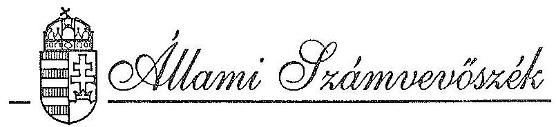
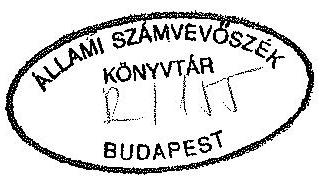
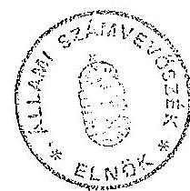
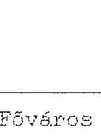
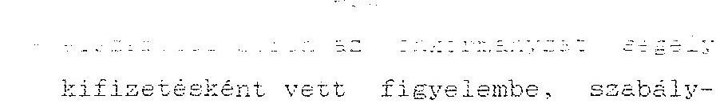

#  

## JELENTÉS

az önkormányzatok pénzügyi-gazdasági tevékenységének törvényességi ellenőrzéseiről

---

# JELENTÉS 

## az önkormányzatok pénzügyi-gazdasági tevékenységének törvényességi ellenőrzéseiről

Az önkormányzatok pénzügyi-gazdasági tevékenységének törvényességi ellenőrzése a helyi önkormányzatokról szóló 1990. évi LXV. törvény 92. paragrafusán alapul, mely szerint
"a helyi önkormányzatok gazdálkodását az
Állami Számvevőszék ellenőrzi".

A törvényességi ellenőrzések annak megállapítására irányultak, hogy az önkormányzatok gazdálkodása megfelel-e a hatályos törvényeknek és az egyéb jogszabályi rendelkezéseknek. Az ÁSZ 1992. évi ellenőrzési terve alapján folytatott ellenőrzések tapasztalatairól e jelentésben számolunk be.

Az 1991-1992. évet felölelő vizsgálatoknak az egységes központi programban megfogalmazottak alapján arról kellett meggyőződniük, hogy az önkormányzatok:

- a gazdálkodásra vonatkozó törvényeket és központi rendelkezéseket betartják-e,
- a belső szabályzataik és azok végrehajtási gyakorlata összhangban van-e a magasabb szintű jogszabályokkal,
- az állami pénzeszközök igénybevételének és felhasználásának a törvényessége megfelelő-e,
- az önkormányzati tulajdon és annak hasznosítása hogyan segíti elő a településen élő lakosság igényeinek kielégítését.

---

1992-ben 111 önkormányzatnál vizsgáltuk átfogó jelleggel a gazdálkodás törvényességét, amely az év elején meglévő 3145 települési önkormányzat 3,5%-át reprezentálja. (1. sz. melléklet) Ugyanakkor az ÁSZ témavizsgálatai 1992-ben összességében közel 1000 önkormányzatot érintettek.

Főként a magas állami hozzájárulás szerinti kiválasztásnak megfelelően, a megyei jogú városok és városok 24%-át, a nagyközségek 4,8%-át és a községek 1,9%-át vizsgáltuk. Ebből eredően, az önkormányzatok összesített költségvetésének a számaránynál lényegesen nagyobb részét fogták át az ellenőrzések.

A gazdálkodás átfogó törvényességi ellenőrzése az önkormányzatok 1991. évi módosított előirányzatának 12,9%-át, (53 Mrd Ft) érintette.

#### Abstract

A megyei jogú városok és városok vizsgálata képezte az összes ellenőrzés közel felét (42,3%), melyek választását egyértelműen a magas állami hozzájárulás ellenőrzésének igénye motiválta, mivel az említett település típusok az összes önkormányzatnak csak 6,2%-át reprezentálják.

Természetesen az ország egyes térségeiben, így főként aprófalvas megyékben, pl. Baranya és Somogy, de Tolna megyében is ellenőriztünk városokat, de előtérbe kerültek a községi önkormányzatok vizsgálatai. Ennek eredményeként 14 nagyközség és 51 község önkormányzatának ellenőrzésére is sor került.

Érzékeltetésül, az ellenőrzéseink 46%-át községekben végeztük, mégis csak a községek 1,9%-át tudtuk 1992-ben ebben a témakörben ellenőrizni.

# I. Következtetések, javaslatok 

A törvényességi ellenőrzéseknek különleges jelentőséget ad az, hogy ezen keresztül "átvilágítható" az önkormányzatok működésének rendje, szabályozottsága, valamint az alapvető elvek és eljárási szabályok gyakorlati érvényesülése. A számvevőszéki ellenőrzések a gazdálkodás törvényességére vonatkozóan átfogó értékelést adnak, amelyeket közvetlenül a település polgármesterénél és az önkormányzat képviselőtestületénél realizálunk.

Megítélésünk szerint az önkormányzatok törvényességi ellenőrzésére szükség van, mivel az önkormányzatok pénzügyi-gazdasági tevékenysége átfogóan csak ilyen formában értékelhető.

---

A vizsgálataink alapján megállapítható, hogy a jogszabály alkalmazási, pénzügyi és számviteli hiányosságok döntő többsége a pénzügyi és gazdasági folyamatok helyi szabályozatlanságára, valamint a belső irányítás és ellenőrzés nem eléggé hatékony működésére vezethető vissza. A szabályozás hiánya ellenére fegyelmezetlenséget, súlyos visszaélést csak egy esetben - Nyírtelek Nagyközség Önkormányzatánál - tapasztaltunk.
A szabályozás terén mutatkozó hiányosságokra szinte minden önkormányzat figyelmét felhívtuk.

A törvényességi ellenőrzések során, évközben feltárt, jogtalanul igénybe vett támogatások, illetve az önkormányzatokat megillető többlet állami hozzájárulások visszafizettetésének, illetve folyósításának rendje 1990 óta megoldatlan, így a feltárt összegek pénzügyi rendezése is elmaradt.

A vizsgálatokra készített, képviselő-testületek által megtárgyalt intézkedési tervek arról tanúskodnak, hogy a polgármesterek elfogadták javaslatainkat.

Az elkészített intézkedési tervek - a feltárt hiányosságok kijavítására - jellemzően az alábbiakat tartalmazták:

- a polgármester, a jegyző és a bizottságok feladat- és hatáskörét meghatározzák;
- a polgármesteri hivatal működését részletesen szabályozó ügyrendet készítenek, amely tartalmazza az egyes belső szervezeti egységek részletes feladat- és hatáskörét;
- a törzsvagyon körébe tartozó forgalomképes és korlátozottan forgalomképes vagyonról az önkormányzat rendeletet alkot és a törzsvagyont a nyilvántartásokba elkülönítetten kezeli;
- az éves zárszámadáshoz a vagyoni állapotot alátámasztó leltárt elkészítik, annak érdekében, hogy a mérlegben teljeskörűen és hitelesen szerepeljenek az eszközök és a források;
- az önkormányzat tulajdonába lévő vagyontárgyakkal történő gazdálkodás hatékonyságának fokozása érdekében, javaslatokat dolgoznak ki a képviselő-testület számára pl. Vagyonkezelő Iroda létrehozására;
- Az önkormányzat számlarendjében rögzítik:
a főkönyvi számlák és az analitikus nyilvántartások kapcsolatát, valamint;

---

az analitikus nyilvántartások formáját, tartalmát és vezetésének módját, továbbá;
a leltározás és a selejtezés részletes szabályait;

- Az ellenőrzés rendjéről ellenőrzési szabályzatot dolgoznak ki.

Az intézkedések végrehajtására reális határidőket jelöltek meg. A kisebb településeken az apparátusok létszáma nem teszi lehetővé a feladatok gyors végrehajtását és a törvényes előírások maradéktalan betartását. (Kötelezettségvállalás, utalványozás, ellenjegyzés esetén az összeférhetetlenség megszüntetését.)

Az érdekelt önkormányzati képviselők és polgármesterek véleménye szerint, az ÁSZ ellenőrzéseinek megállapításai és javaslatai minden esetben jelentős segítséget nyújtottak a hiányosságok megszüntetéséhez, illetve további munkájukhoz. Különösen kedvező volt az ellenőrzések fogadtatása a községi önkormányzatok esetében, ahol a további segítségnyújtás igénye is megfogalmazódott az Állami Számvevőszékkel szemben.

A vizsgálati jelentéseinket a realizálást követően tájékoztatás és hasznosítás céljából megküldtük az illetékes belügyminisztériumi és pénzügyminisztériumi szervekhez valamint a Köztársasági Megbízotti Hivatalhoz.

Az ellenőrzéseink alapján az Állami Számvevőszék javasolja:
a Pénzügyminisztérium

- kezdeményezze a 2/a-b. sz. mellékletben foglalt jogtalanul igénybe vett normatív támogatások visszafizettetését, illetve az önkormányzatokat megillető támogatások folyósítását;
- kezdeményezze a 2/d. sz. mellékletben foglalt jogosulatlanul igényelt önhibáján kívüli kiegészítő támogatás elvonását.

# A Belügyminisztérium 

- kezdeményezze a 2/c. sz. mellékletben foglalt, jogtalanul igénybe vett céltámogatások visszafizettetését.

## A Népjóléti Minisztérium

- kezdeményezze a 2/e. sz. mellékletben foglalt, jogtalanul igénybe vett nevelési segély visszafizettetését.

---

Az Országgyűlés

- utasítsa a Pénzügyminisztériumot az 1992. évi XXXVIII. tv. módosítására. Az államháztartásról szóló törvény egészüljön ki az Állami Számvevőszék ellenőrzései által feltárt és bizonyított jogtalanul igénybe vett állami hozzájárulások (normatív, cél- és címzett támogatások) utólagos visszafizettetésének, illetve az önkormányzatokat megillető többlettámogatások folyósításának törvényi szintű szabályozásával.

# II. A vizsgálat főbb megállapításai 

1. Az önkormányzatok gazdálkodásának szabályozottsága

Az önkormányzatoknak megalakulásukat követően fontos feladatot jelentett a működésük szabályait rögzítő Szervezeti és Működési Szabályzat (SZMSZ) elkészítése. Az SZMSZ-eket a törvényességi vizsgálati körbe bevont önkormányzatok az 1990. évi LXV. a helyi önkormányzatokról szóló törvényben foglaltak szerint - néhány esetet kivéve - elkészítették.

Zámoly Községi Önkormányzatnál a vizsgálat idején (1992. szeptember) még nem hagyta jóvá a testület az SZMSZ-t. A feladatokat így a hatályos törvények alapján végezték.

Fülöpháza Községi Önkormányzat esetében a Köztársasági Megbízotti Hivatal törvényességi észrevétele miatt csak 1992-ben került sor az SZMSZ elfogadására. Késett az SZMSZ elkészítése pl. Katymár és Szabadkígyós Községeknél is.

Az önkormányzatoknak a megalakuláskor elfogadott SZMSZ-eket az elmúlt két év folyamán több alkalommal módosítaniuk kellett. A változtatást, egyrészt a működés során szerzett tapasztalatok, másrészt a helyi önkormányzatok feladatairól és hatásköréről intézkedő 1991. évi XX. törvény hatályba lépése tette szükségessé. Lényegében 1992-ben alakult ki az a szabályozás és gyakorlat, amely a különböző törvények végrehajtásának megfelelt.

Az SZMSZ-ek tartalma önkormányzatonként igen eltérő, főként a testületek működésének szabályait rögzítik. Az "eljárási szabályok" rendezése mellett a szabályzatok többsége csak érinti a polgármester (alpolgármester) és jegyző feladat- és hatáskörét, annak részletes szabályait sok esetben nem tartalmazza.

---

PI. Hosszúhetény, Nagykanizsa, Gyöngyös, Nyékládháza, Kisvárda, Sárospatak.

Az önkormányzati rendelettel történő szabályozás hiányában a polgármesterek és jegyzők a gazdálkodással összefüggő feladataikat az esetek többségében az 1991. évi XX. hatásköri törvény "Pénzügyigazgatás" fejezetében foglaltak szerint látták el. Ennek következtében nem készültek el az SZMSZ-ek mellékletei sem, melyek az operatív gazdálkodás szabályozottságának biztosítását jelentették volna.

Több esetben, a hivatali ügyrendek és belső szabályzatok hiánya miatt, a polgármesteri hivatalok szervezeti egységei között az egyes pénzügyi és gazdálkodási feladatok megosztása és az együttműködés módja rendezetlen volt.
Általános jelenség, hogy a munkaköri leírások hiányoznak. Nem szabályozták a pénzügyi gazdálkodás ügymenetét, az információ áramlást. Az SZMSZ-ek több esetben nem tartalmazzák az egyes bizottságok konkrét feladatait. A szabályozás nem terjed ki a pénzügyi ellenőrző bizottságra, valamint a hivatal ide vonatkozó tevékenységére.

A gazdálkodás biztonságát és törvényességét szolgálja a kötelezettségvállalás, utalványozás és ellenjegyzés szabályozása. Számos hiányosságot, illetve törvénytelen gyakorlatot mutat. A szabályozás és a végrehajtás eltér az 1991. évi XX. hatásköri törvényben foglaltaktól.

Nagyobb településeken (városok, fővárosi kerületek) a hiányosságok olyan formában jelentkeztek, hogy az egyes vezetők feladatai és felelőssége nem, vagy helytelenül került elhatárolásra. Kisebb településeken (községekben, körjegyzőségeknél) viszont a gazdálkodás néhány személyhez (polgármester, jegyző) kötődik, így - a szabályozásban meglévő hiányosságok ellenére - a gyakorlat megfelelően működött.

A Főváros VI. kerületében olyan személyek is kötelezettséget vállaltak - a kötvénykibocsátást az alpolgármesterek írták alá -, akiknek erre nem volt hatáskörük.

Bátonymegyer Község Önkormányzata SZMSZ-ének pénzgazdálkodásra vonatkozó része alapvetően hibás, lehetővé teszi ugyanis, hogy az utalványozásnál a polgármestert a jegyző, ellenjegyzésnél a jegyzőt a polgármester és viszont helyettesíthesse.

---

Karcag Város Önkormányzata esetében a kötelezettségvállalás egy sajátos gyakorlata érvényesült, melyben a polgármester helytelenül a kiadmányozási rendhez kapcsolta az utalványozási és ellenjegyzési jogkörök gyakorlását. Ennek összekapcsolása helytelen, mert a kiadmányozás jogköre az államigazgatási eljáráshoz és nem a pénzgazdálkodáshoz kapcsolódó fogalom.

Az önkormányzati feladatok ellátása, illetve a működés és finanszírozás költségvetési befizetéseket is érintő szabályozottságának biztosítására, a polgármesteri hivataloknak - az 1991. évi XCI. tv. alapján - költségvetési szerveik alapító okiratait 1992. június 30-ig felül kellett vizsgálniok, elkészítve az új besorolásokat, meghatározva az alaptevékenység körét.

A Főváros vizsgált kerületeiben egy kivétellel az önkormányzatok felügyelete alá tartozó intézmények besorolása, alaptevékenységük meghatározása nem történt meg.
A vizsgált vidéki önkormányzatok jelentős része nem tekintette át intézményeinek besorolását, illetve nem határozta meg az alap és kiegészítő tevékenységet. (Zalaszentgrót, Nagykanizsa, Egervár, Gyönk).
Kánya Község Önkormányzata az intézményi gazdálkodás felülvizsgálatát nem végezte el, mivel - véleménye szerint - nem rendelkezik intézménnyel. A számvevőszéki vizsgálat viszont - a hatályos oktatási törvény alapján - az önkormányzatnál 2 intézmény meglétét állapította meg.
2. Az önkormányzatok pénzügyi-igazgatási és gazdálkodási tevékenységének törvényessége

# 2.1. Az 1991. évi önkormányzati költségvetés törvényessége 

Az önkormányzatok létrejöttük után első alkalommal költségvetést 1991. évre készítettek. A költségvetések előkészítése, a döntések meghozatala helyenként kiélezett vitákat eredményezett. A hosszadalmas tárgyalások ellenére, a törvények előírásainak betartására mégsem fordítottak mindenhol kellő figyelmet. A hatáskörök tisztázatlanok voltak és a bizonytalanságot fokozta, hogy a költségvetési törvény késve jelent meg.

A testületek saját működési rendjük kialakításával voltak elfoglalva, így a gazdasági program elkészítésével csak kevés helyen foglalkoztak, annak ellenére, hogy az önkormányzatok gazdasági programjának képviselő-testület elé terjesztését a polgármesterek feladatává tették az 1991. évi XX. hatásköri törvény 138-140 paragrafusai. Meg kell jegyeznünk, hogy a

---

gazdasági program formájára, tartalmára és mélységére nincs kötelező előírás. A számvevőink ritkán találkoztak gazdasági programmal Bács-Kiskun megyét kivéve, ahol mindegyik vizsgált önkormányzat elkészítette a programot.

Fővárosban a vizsgált kerületek sem 1991-ben, sem 1992-ben nem készítettek gazdasági programot.
Dunántúlon 54 vizsgált önkormányzat közül mindössze 10 készített gazdasági programot.

Tapasztalataink szerint, több önkormányzatnál a gazdasági program fontosságát ugyan a költségvetés elkészítése során felismerték, de főként a stabil gazdasági környezet hiánya miatt később sem határozták meg. Helyenként a program

 csak a fejlesztési célokat határozta meg és a fedezeti oldallal nem foglalkozott.

PI. Sopron Város Önkormányzata egységes programot nem fogadott el, de a gazdálkodás egyes részterületeire, közszolgálati feladataira hosszabb távú irányelveket, illetve követelményrendszert határozott meg.

Összességében megállapítottuk, hogy az 1991. évi költségvetések összeállítását a gazdasági programok megléte, illetve hiánya - tartalmi kérdéseket illetően - alapjában véve nem befolyásolta.

Kalocsa Város Önkormányzata gazdasági programja ellenére éves költségvetésében a korábbi fejlesztéseinek, felújításainak tárgyévet terhelő kifizetéseire fedezetet nem tervezett mintegy 137 millió forint értékben.

A vizsgált önkormányzatok többsége a költségvetést két fordulóban tárgyalta, illetve fogadta el. Az első testületi ülésen lényegében a koncepciót vitatták meg, ha azt nem is nevezték annak. Általában ekkor döntöttek a működtetés-fejlesztés arányáról, az egyes konkrét beruházásokról.

Legtöbb esetben ezt követte a költségvetési javaslat részletes kidolgozása, a községekben és kisebb városokban közmeghallgatáson való ismertetése. Nagyobb városokban pedig közzé tették és városrészi fórumokon vitatták meg. Az itt elhangzottak alapján került sor a javaslat véglegesítésére és testület előtti megvitatására, a költségvetési rendelet elfogadására.

A településen élők véleményének, igényének jobb megismerése érdekében pl. Bercel Községi Önkormányzat a költségvetési rendelet elfogadása előtt közmeghallgatást tartott. Ezzel is elősegítve az önkormányzat pénzügyi lehetőségeinek és a lakosság igényeinek egymáshoz való közelítését.

---

Vizsgálataink szerint az 1991. évi előirányzatok kialakításánál az önkormányzatok döntő többsége a bázisszemléletű tervezési gyakorlatot folytatta, annak ellenére, hogy a jogalkotók szándéka a bevételorientált tervezésre való áttérést igényelte volna.
A költségvetés összeállításakor a helyi önkormányzatok önállóságát természetesen a forrásokon túlmenően befolyásolta a kötelező feladatok ellátásának "kényszere" is. Itt ugyanis csak az ellátás módjában dönthettek az önkormányzatok. Csak ezen feladatok fedezetének biztosítása után volt módjuk az önkormányzatoknak fejlesztésekről és újabb - önként vállalt - intézmények fenntartásáról dönteni.

Megállapítottuk, hogy az önkormányzatok az éves automatizmusok figyelembevételével a meglévő intézményhálózat működtetésének rendelték alá a költségvetési előirányzatokat.

Az önkormányzatok által összeállított részletes költségvetések szerkezete, tartalma nem minden esetben felelt meg az 1990. évi CIV. törvényben foglalt előírásoknak.
Esetenként az önkormányzat költségvetési rendeletében és költségvetési alapokmányában (kölségvetési nyomtatványgarnitúra) szereplő előirányzatok szabálytalanul eltértek egymástól.

Érsekvadkert és Darvas Községi Önkormányzatok működési, fenntartási előirányzatokat önálló költségvetési szervenként nem mutatták ki.

Érsekvadkert Községi Önkormányzat költségvetési alapokmányában a kiadások és bevételek előirányzata 282 EFt-tal kevesebb az önkormányzati rendeletben elfogadott összegtől.

Darvas Községi Önkormányzat költségvetési alapokmányában a kiadások és bevételek előirányzata 4.150 EFt-tal több, mint az önkormányzati rendeletben elfogadott összeg.

Debrecen Megyei Jogú Városi Önkormányzat költségvetési alapokmányában a kiadások és bevételek előirányzata 80.897 EFt-tal kevesebb az önkormányzati rendeletben elfogadott összegnél.

A költségvetés összeállításánál a vizsgált önkormányzatok nem mindegyike biztosította a bevételek és kiadások összhangját. A tervezett kiadások összege néhány önkormányzatnál meghaladta a bevételek összegét.

---

Eger Megyei Jogú Városi Önkormányzat 103.968 EFt hiányt mutatott ki, mivel ezt az összeget - amely az intézmények saját forrását képezte - mind az önkormányzat, mind az intézmények figyelembe vették kiadásként.
(Az állambáztartás információs rendszerébe a helyesbített költségvetés került és a költségvetésről szóló önkormányzati rendelet módosítása májusban megtörtént).
Felsőzsolca Nagyközségi Önkormányzat 121.883 EFt bevételhez 132.883 EFt kiadást "rendelt". A 11.000 EFt "hiányt" az okozta, hogy 1990. évben az önkormányzat nem kapta meg a Vízügyi Alapból az előzetesen vállalt támogatást, és beruházásának folytatása érdekében felvett hitel 1991. évben esedékes törlesztő részletét, valamint a kamatot hiányként szerepeltette költségvetési rendeletében.

Az önkormányzatok képviselő-testületei - az 1991. évi állami költségvetésről és az államháztartás vitelének 1991. évi szabályairól szóló 1990. évi CIV. törvényben foglaltaknak megfelelően - a helyi önkormányzat költségvetéséről szinte kivétel nélkül rendeletet alkottak. Az 1991. évi költségvetésre vonatkozó rendeletet általában 1991. február és március hónapokban fogadták el.

A gősfai képviselő-testület az 1991. évi költségvetést ugyan 2 alkalommal is tárgyalta, de annak rendeleti úton, vagy egyéb módon történő jóváhagyása nem történt meg. A testületi ülések jegyzőkönyveiből nem ismerhető meg az előterjesztések tartalma, miután írásos anyag nem készült, a szóban elhangzottakat viszont nem rögzítették.

A fővárosi kerületek az 1991. évre vonatkozó költségvetési rendeleteiket ugyan megalkották, de a rendeletek - az I. kerület kivételével - nem felelnek meg az 1990. évi CIV. tv. 36. paragrafusában foglaltaknak. Pl. nem határozták meg a fejlesztési kiadásokat feladatonként és a felújítási előirányzatokat célonként.

Dunántúli kisebb településeken kifogásoltuk, hogy a költségvetési előterjesztések részletes indokolást nem tartalmaztak, csak táblázatokat készítettek. Az indoklás szóban hangzott el a testületi üléseken.

Gyakran nem a polgármester volt az előterjesztő, hanem a pénzügyi feladatot ellátó szervezet vezetője.

A költségvetés végrehajtásával kapcsolatos kérdéseket, az előirányzat módosítás és felhasználás feltételeit több önkormányzat nem szabályozta költségvetési rendeletében. Szabályozás hiányában a költségvetés végrehajtása, részben a hatásköri törvény, részben a korábban kialakult gyakorlat alapján történt.

---

A költségvetési év során több esetben került sor a költségvetések módosítására. A testületek által elfogadott költségvetési rendeletek korrekciója azonban gyakran nem rendeleti úton történt. (Pl. Bercel Községi és Sárospatak Városi Önkormányzat).

# 2.2. Az 1992. évi önkormányzati költségvetés törvényessége 

1992-ben az önkormányzatok már nagyobb tapasztalattal rendelkeztek, így a költségvetések a törvényeknek megfelelően, időben elkészültek és lényegesen megalapozottabbak voltak.

A költségvetés elkészítésének időbeni elhúzódására kivételként megemlítjük a Bács-Kiskun megyei Fülöpháza önkormányzatát, ahol az éves költségvetésről szóló rendelet csak május végén került meghirdetésre.

Általában a költségvetések szerkezeti tagolása megfelelő volt, mivel az intézményekhez és feladatokhoz kapcsolódó működési előirányzatok részletezésre kerültek.

Kiemelten kezelték a tervezés során a bér- és társadalombiztosítási járulék összegét. Az 1992. évi költségvetésről alkotott törvény már részletesebben határozta meg az önkormányzati rendelet tartalmát, ennek ellenére tapasztaltunk hiányosságokat is.

A bevételeket nem részletezte rendeletében a Várpalota Városi Önkormányzat.

A felújításokat, fejlesztéseket nem célonként határozta meg Balassagyarmat és Várpalota Városi Önkormányzat és Bercel Községi Önkormányzat.

Önálló költségvetési szervenként nem határozta meg a működési, fenntartási előirányzatokat Érsekvadkert és Darvas Községi Önkormányzatok.

Intézményeinek működési bevételeit ismételten nem tartalmazta Herend Nagyközség Önkormányzatának költségvetése és a költségvetési szervek kiadási előirányzatán belül a bért és a TB járulékot sem hagyták jóvá.

A költségvetés összeállítását segítő koncepciók, valamint tervezési irányelvek megléte 1992-ben már jellemzőbb volt, mint az előző évben.

---

A koncepciók kialakításában a testületek és bizottságok jelentősen közreműködtek, míg az irányelvek tekintetében a polgármesteri hivatalok főként szóbeli tájékoztatást nyújtottak intézményeik részére.

Az 1992. évi költségvetés tervezésére változatlanul a bázisszemlélet volt a jellemző. Egyes önkormányzatok viszont megkíséreltek ezen a tervezési módszeren változtatni.

Az 1992. évi költségvetési előirányzatokat általában az előző évi tényadatokból kiindulva a tényleges lehetőségek figyelembevételével tervezték az önkormányzatok. A működési előirányzatoknál az önkormányzatok döntően a központilag javasolt 5%-os bér és 10%-os dologi automatizmussal számoltak.

Néhány vizsgált önkormányzat a központi irányzámtól eltérően pl. Pákozd 30%-os, Gárdony, Enying 25%-os, Hortobágy, Nyékládháza, Lábatlan, Lovasberény 20%-os bérautomatizmussal tervezett.

Több önkormányzat megkezdte intézményeinek úgynevezett átvilágítását. Az elemzések eredményeként egyes helyeken néhány intézményt pl. óvodát megszüntettek, illetve összevontak. Máshol az intézményektől kért adatok viszont többletigényt mutattak, melyek kielégítésére forráshiány miatt nem volt lehetőség. Így maradt a bázis alapú tervezés.

Szolnok Megyei Jogú Város újszerű tervezési módszert próbált bevezetni az alsófokú intézmények esetében.
A pénzügyi keret főösszegének megállapításán túl intézményi bontásban két szinten, az általuk kialakított oktatási elvekben megfogalmazott és a kihasználtsági szinteket is figyelembe vevő állandó és változó kiadások függvényében határozták meg az előirányzatokat.

Összességében megállapítható tehát, hogy 1992-ben sem történt lényeges elmozdulás a bevétel-orientáltság, illetve a helyi normatívák kialakításának irányába, a tervezést továbbra is a bázis-szemlélet jellemezte.

# 2.3. Az önkormányzatok forrásszabályozásának törvényessége 

Az önkormányzati törvény döntően az adóbevételekből finanszírozott önkormányzati közszolgáltatási rendszer mellett döntött, de nem zárta ki - a kötelező

---

feladatok ellátásán túl - a "vállalkozó" jellegű önkormányzati gazdálkodás lehetőségét sem.

Az önkormányzatok hosszabb távú elképzeléseinek kialakítását, megvalósítását különösen az állami feladat-elhatárolás hiánya és a jelenlegi forrásszabályozás évenkénti módosítása kiszámíthatatlanná és bizonytalanná teszi.
Részben ennek következtében, a saját bevételek tervezésénél az önkormányzatok jelentős részénél a túlzott óvatosság volt jellemző. Emiatt is, több önkormányzatnál az éves költségvetés összeállításakor nem, vagy csak részben vettek figyelembe olyan saját bevételeket, amelyek meghatározásánál egyáltalán nem, vagy csak kis mértékű volt a bizonytalansági tényező.

Balassagyarmat Városi Önkormányzat 1991. évben nem tervezett bevételt a lakásépítési hitel megtérüléséből, holott az évenként, közel azonos összegben realizálódik. Nem szerepel a város 1991. évi költségvetésében a munkahelyteremtő beruházással kapcsolatos 1.300 EFt összegű hitelvisszatérülés, ugyanakkor e tétel a kiadások között megjelenik. Nem került az 1991. évi tervbe a vagyonértékesítés és bérbeadás bevétele sem, annak ellenére, hogy ilyen címen már a költségvetés elfogadása előtt tényleges bevétele keletkezett.

Sümeg Városban az ár- és díjbevételek 1992. évi tervszáma az előző évi tényszámnak csak 54,4%-a.

Várpalota Városi Önkormányzat a saját bevételi tervét 1991. évben 182%-ra teljesítette. 1992. évben az ár- és díjbevétel tervszámát 8.165 EFt-ban határozták meg, az 1991. évi tény 25.890 EFt ellenére.

Lábatlan Nagyközség Önkormányzata 1992. évi költségvetésében nem szerepeltette a tulajdonába került több mint 100 lakással összefüggő bérleti díjat.

A fenti példákból külön kiemelendő Balassagyarmat Városi Önkormányzat tervezésének gyakorlata. Az önkormányzat ugyanis bevételeinek nagyvonalú, realitást mellőző tervezése mellett, 1991. évben az önhibájukon kívül hátrányos pénzügyi helyzetbe került önkormányzatok működőképességének megőrzését szolgáló kiegészítő támogatást kért.

A saját bevételeket különböző mértékben alultervező önkormányzatok mellett az ellenkezőjére is találtunk példát. A tervben szereplő irreálisan magas bevételnél kevesebbet tudtak egyes önkormányzatok realizálni.

---

Nyíregyháza Megyei Jogú Városi Önkormányzat a nem lakás céljára szolgáló helyiségek bérleti díjára 1991-re 150.000 EFt-ot tervezett, ugyanakkor ebből bevételt nem realizált, így likviditási gondjai keletkeztek, melyet 80.000 EFt éven belüli hitel felvételével hidalt át. 1992-ben 100.000 EFt-ot tervezett ilyen címen, melyből június 30-ig 5.800 EFt-ot realizált.

Az ellenőrzéssel érintett önkormányzatok egy része élt a helyi adó bevezetésének lehetőségével. Jellemzően az iparűzési adó, valamint a magánszemélyek és vállalkozások kommunális adójáról alkottak helyi rendeletet. A három legjellemzőbb adónemen kívül, egy-egy önkormányzatnál az idegenforgalmi, az építmény és a telekadó bevezetésére is sor került.

Az önkormányzatok szerint a helyi adók bevezetése csak az állampolgárok többségének egyetértése alapján realizálódhat. Így az adók bevezetésének szándékától függetlenül, minden önkormányzatnál sor került annak mérlegelésére, hogy milyen lesz annak várható, lakosságot érintő hatása.

Országosan az önkormányzatok mintegy 40%-a bevezette 1992-ben a helyi adók valamelyikét, melynek megoszlása - vizsgálataink tükrében - országrészenként igen eltérő.

Észak-Magyarországon - Bírna Község kivételével - az ellenőrzéssel érintett önkormányzatok mindegyike, az Alföldön kétharmada vezetett be valamilyen helyi adót. Jellemzően az iparűzési, valamint a magánszemélyek és vállalkozások kommunális adójának bevezetésére került sor.

A Dunántúl déli részén viszont 1992-tól csupán egy-egy önkormányzat vezetett be helyi adót.

Néhány önkormányzatnál került csak sor a lakosság teljes körét érintő vagyontípusú adónemek kivetésére, mivel - a képviselő-testületek tagjai inkább a vállalkozással összefüggő adókat szavazták meg.

A helyi adó kivetését, a várható
 bevételek összegének meghatározását nehezítette, hogy a legtöbb esetben hiányos alapinformációk álltak az önkormányzatok rendelkezésére.

Pl. Gyöngyös Város Önkormányzatnál csak az iparűzési adóval kapcsolatos értesítés kiküldése után derült ki, hogy 110 vállalkozó 1-2 éve megszüntette tevékenységét.

A helyi adókat bevezető önkormányzatok aránya azt mutatja, hogy az önkormányzatok a helyi adók bevezetésénél, illetve annak kivetésénél kellően

---

nem vették figyelembe, hogy az adóalanyok kiadásait a központi költségvetés részben ellentételezi. A vállalkozók, illetve a magánszemélyek az ilyen irányú kiadásaikat költségként elszámolhatják, illetve az éves adóalapjukat a befizetett adókkal csökkenthetik. Ezáltal az önkormányzatok saját bevételei részben a központi költségvetés terhére növelhetők, csökkentve a személyi jövedelemadó bevétel megosztásánál, az önkormányzatok terhére bekövetkezett arányromlást.

Az átengedett bevételek közül, az 1992. évtől bevezetett gépjárműadó várható összegét az önkormányzatok nagy bizonytalansággal tervezték. A gépjárművek darabszámára vonatkozóan nem állt megbízható, pontos információ az önkormányzatok rendelkezésére.

Eger Megyei Jogú Városi Önkormányzat részére a Belügyminisztérium 27 ezer, a TÁKISZ 17 ezer db gépjárműről adott információt. Ugyanakkor a benyújtott bevallások alapján 13.500 db határozatot adtak ki.

Gyöngyös Város Önkormányzata a tervezés során a központilag rendelkezésre bocsátott információ alapján 16.332 e Ft gépjármű bevétellel számolt, amellyel szemben, a tényleges kivetés összege 24.080 e Ft volt.

A kapott adatok pontatlansága abból keletkezett, hogy a nyilvántartásokon nem vezették át az adás-vételekből és forgalomból való kivonásból adódó változásokat. A helyi önkormányzatok a központi költségvetés és az önkormányzatok között megosztott személyi jövedelemadó bevételek mértékét és az SZJA kiegészítést a törvényben meghatározottak szerint szerepeltették a költségvetéseikben.

Az állami hozzájárulások elszámolásánál viszont gyakran jogtalan igénybevételt tapasztaltunk.

A normatív állami hozzájárulások tervezésének és elszámolásának megalapozottságát biztosító mutatószám-nyilvántartás rendszere az önkormányzatok jelentős részénél nem került kialakításra. Ennek hiányát, szükség szerint, eseti felméréssel, adatgyűjtéssel pótolták, ami gyakran azzal a következménnyel járt, hogy az adatszolgáltatás pontatlanná vált.
Az állami támogatás alapjául szolgáló naturális mutatók nyilvántartását központi előírás nem szabályozza. Ennek hiányában az önkormányzatoknál nem alakulhatott ki egységes dokumentációs rendszer. Legtöbbször ugyanis az elszámolásnál figyelembe vett mutatószámok eltértek a tényleges adatoktól. A

---

hiányos, alacsony színvonalú, nehezen ellenőrízhető mutatószám-nyilvántartás javulása országosan egységes rendszertől várható.

A jogtalanul igénybe vett céltámogatások részben a támogatási feltételeknek nem feleltek meg, de elfogadott igénybejelentésekhez kapcsolódtak, részben a megjelölt feladattól tértek el, illetve az igénybevétel a törvényben rögzített arányt meghaladóan történt.

Az önhibáján kívüli kiegészítő támogatásoknál főként a források irreálisan alacsony tervezése, a nevelési segélyeknél a céltól eltérő felhasználás képezte a jogtalan igénybevétel alapját.

Az állami hozzájárulások tekintetében a törvényességi vizsgálatok összesített eredményeként /2. sz. melléklet/ az önkormányzatoknál 97,7 millió Ft indokolatlan többletigénybevétel, illetve 35,7 millió Ft, további jogos igény megállapítására került sor.

A törvényességi ellenőrzések során, évközben feltárt, jogtalanul igénybe vett támogatások, illetve az önkormányzatokat megillető többlet állami hozzájárulások visszafizettetésének, illetve folyósításának szabályozott rendje 1990 óta megoldatlan, így a fenti összegek pénzügyi rendezése is elmaradt. Természetesen, az egyes támogatási fajták témavizsgálatainak realizálásánál is találkoztunk ezekkel a problémákkal.

Az érintett törvények, így az államháztartási törvény, a számvevőszéki törvény, az egyes évek állami költségvetéséről és az államháztartás viteléről hozott jogszabályok csak az önkormányzatok költségvetési évet követő elszámolási kötelezettségeit rögzítik. Az önkormányzatok törvényi elszámolási kötelezettsége kiterjed, a normatív állami hozzájárulásokra, valamint a címzett és céltámogatásokra is, ugyanakkor mindezt csak az általuk önként feltárt indokolatlan többlet támogatásokra vonatkoztatja.

A megállapításoknak a vizsgálati jelentésekben történő rögzítésén kívül az Állami Számvevőszéknek semmilyen realizálási lehetősége nincs.

Egyedül, az önhibáján kívül hátrányos helyzetbe került települési önkormányzatok kiegészítő támogatásáról hozott 1992. évi XXIX. törvény 4. paragrafus (1) bekezdésében történik említés a külső ellenőrző szerv - az Állami Számvevőszék megállapítása esetén követendő eljárásról, illetve szankcionálásról.

---

"Amennyiben a települési önkormányzat a kiegészítő támogatási kérelemben valótlan adatot szolgáltat, s ezt az Állami Számvevőszék utólagos ellenőrzése megállapítja, a kiegészítő támogatás teljes összegét vissza kell fizetnie az állami költségvetésbe".

A többi támogatási forma tekintetében egyértelmű törvényi rendelkezés hiányában megállapításaink realizálása esetleges, mivel az ellenőrzött önkormányzat képviselő-testületének döntésétől függ, hogy az elismert, jogtalanul igénybe vett állami hozzájárulást - az ellenőrzés utólagosságából adódóan - a PM előző évi költségvetési maradványok számlájára befizeti-e vagy sem. Az 1992. évi törvényességi ellenőrzéseknél egyetlen ilyen esetet tapasztaltunk. Hasonlóan teljességgel megoldatlan az önkormányzatokat megillető többlet állami hozzájárulás folyósításának kérdése is.

Nyíregyháza Megyei Jogú Város Önkormányzata különösen jelentős összegű, 18,2 millió forint többlet állami hozzájárulástól esik el a fentiek következtében.
2.4. Kiadások tervezésének törvényessége

A vizsgált önkormányzatok kiadási előirányzataik megtervezésénél a kötelező és az önként vállalt feladatok egységes kezelésére törekedtek. Az ellenőrzések olyan helyzetet nem tártak fel, ahol a kötelező feladatok ellátását nem tervezték.

Néhány városban ugyanakkor olyan törekvést tapasztaltunk, hogy a körzeti feladatokat ellátó intézményeket - a normatív állami támogatást meghaladó költségigényük miatt - a megyei önkormányzatoknak átadták.

Várpalota Város Önkormányzata két középfokú intézményt már 1991. január 1-tól átadott a megyei önkormányzatnak.
Zirc város a Szakmunkásképző Intézet fenntartását adta át a megyei önkormányzatnak.

A költségvetés kiadásainak tervezésénél az intézmények és hivatalok működőképességének biztosítása kapott általában prioritást. A több évre vonatkozó hitelek visszafizetéséhez, törlesztéséhez a források biztosítva voltak. A tervezett kiadásokon belül mintegy 70-85%-ot képviseltek a fenntartási-működési

---

kiadások.
A kötelező feladatokra tervezett előirányzatok nem veszélyeztették az egyéb feladatellátást.

A működés feltételeinek megteremtése mellett kiemelt hangsúlyt kapott a folyamatban levő beruházások finanszírozásának biztosítása. A fejlesztési kiadások között meghatározó arányt képviselt a korábbi években vállalt kötelezettségek teljesítése.

Eger Megyei Jogú Városi Önkormányzat 1992. évi fejlesztési kiadásain belül a folyamatban levő beruházások kiadási előirányzata 78%.

Sárospatak Városi Önkormányzat költségvetésében ez az arány 1992-ben 80%-ot, 1992-ben pedig 50%-ot képvisel.

Sátoraljaújhely Városi Önkormányzat 1991. évi fejlesztési célú kiadásainak 38%-át a korábban felvett hitelek, kibocsátott kötvények törlesztésére és kamatainak visszafizetésére fordította.

A működési és fejlesztési előirányzatok arányát vizsgálva, az ellenőrzés a fejlesztések irányába történő elmozdulás tendenciáját állapította meg, amellett, hogy az áthúzódó kötelezettségek alapvetően a központi támogatások miatt nem okoztak finanszírozási problémákat az önkormányzatoknak.
A vizsgálattal érintett önkormányzatok egy részének különböző összegű hitel-, illetve kötvénytartozása van.

Pl. Jelentős összegű a tartozás Balassagyarmat Városi Önkormányzatnál, ahol 13 féle konstrukcióban összesen 243.000 e Ft-ot tartanak nyilván.

Az éves költségvetések összeállítása során, az 1990. évi CIV. és az 1991. évi XCI. törvény előírásai szerint, az önkormányzatok döntő része képzett általános és céltartalékot a kiadások között. Kivételt képez néhány önkormányzat, pl. Sátoraljaújhely Városi Önkormányzat, mivel egyik évben sem képzett tartalékot.

A vizsgált önkormányzatoknál, a kiadási előirányzaton belül a tartalékok aránya két év viszonylatában csökkent. Egyrészt, a feladatok fokozottabb teljesítése, másrészt a tartalékok maradványelv alapján történő képzése következtében.

Karcag Város Önkormányzati szintű költségvetésében a tartalékok aránya az 1991. évi 5%-ról 1,2%-ra csökkent.

---

Ásotthalom Község Önkormányzatánál hasonló időszakban 4,3%-ról 1,5%-ra csökkent a tartalékok aránya.

Ez a tendencia azt eredményezheti, hogy esetleg a váratlan kiadások fedezete csak részben, vagy egyáltalán nem biztosított.
3. Az önkormányzatok pénzellátásának törvényessége

A normatív állami hozzájárulás és a személyi jövedelemadó helyi önkormányzatok részére történő átutalása a vizsgált időszakban zökkenőmentes volt. Az éves keretösszegek havonkénti folyósítása likviditási gondot nem okozott. Intézményeiket, az éves pénzellátási tervtől eltérően, a tényleges szükségleteknek megfelelően finanszírozhatták.

A vizsgált önkormányzatok többsége saját bevételeinek beszedéséről az önkormányzati törvényben foglaltak szerint gondoskodott. A saját bevételek analitikus nyilvántartásának rendjét általában kialakították.

Az önkormányzatoknál rendszeresített nyilvántartások elsősorban a hagyományos bevételi nemekhez (bírság, gondozási díj, bérleti díj, térítési díj) kapcsolódnak.
Az új típusú bevételek (lakások értékesítéséből, vállalkozásokból, pénzügyi befektetésekből származó bevétel) nyilvántartásának módját fokozatosan alakítják ki az önkormányzatok.

Helyenként viszont megfelelő analitikus nyilvántartások hiányában nem tudták a bevételek teljesülését nyomon követni, s a behajtás érdekében szükséges intézkedéseket megtenni.

Darvas Község Önkormányzatánál, - a lakossági és a helyi adó kivételével - nem alakítottak ki olyan nyilvántartási rendszert, amely alkalmas lenne a bevételek dokumentált kimutatására, az előírások és befizetések egybevetésével a hátralékok és túlfizetések névszerinti megállapítására.

Kapuvár Városi Önkormányzatnál nem biztosított a bevételek analitikus nyilvántartása, így a bevételi előírás, a befolyt bevétel és a behajtási intézkedés nem követhető nyomon.

Egyes városi önkormányzatoknál előfordult, hogy a feladatok, hatáskörök megosztottsága miatt esetenként nem ugyanaz a belső szervezeti egység

---

állapította meg a befizetési kötelezettséget, mint amelyik azokat nyilvántartotta. Szervezeti egységek közötti együttműködési rend kialakításának hiányában a nyilvántartás pontatlanná vált.

Gyöngyös Város Önkormányzatánál az érdekeltségi bevételekről a Pénzügyi és Költségvetési Iroda nem rendelkezik teljeskörű információval, mert a bevételek egy részét a szakmai irodák tartják nyilván.

Debrecen Megyei Jogú Város Önkormányzatánál a befizetések alapjául szolgáló határozatokról, szerződésekről a Gazdasági és Költségvetési Iroda nem kap rendszeres értesítést, így nem történik meg a bevételek előírása és emiatt nem állapíthatók meg a hátralékos tételek.

Az önkormányzatok többségénél a pályázat útján elnyert céltámogatás, valamint a címzett támogatások igénybevétele a beruházási, rekonstrukciós munkák megvalósulási ütemével összhangban, valamint a kapcsolódó saját forrásokkal arányosan történt.

Kivételt képez többek között Sopron Város Önkormányzata, amely a címzett támogatás egy részét, 260 millió forintot jogosulatlanul - nem teljesítményarányosan - vett igénybe. A támogatási összeget több, mint öt hónapig tartós betétként helyezték el, amely ellentétes az önkormányzati törvénnyel. Vizsgálatunk nyomán a betét 19,8 millió forint kamatát az önkormányzat a központi költségvetésbe befizette.

Eger Megyei Jogú Városi Önkormányzat 1992. évben több célhoz kapcsolódóan összesen 44,7 millió forint összegű céltámogatást vett igénybe úgy, hogy a pályázatban megjelölt fejlesztések még el sem kezdődtek.
4. A számviteli, könyvvezetési kötelezettség teljesítése

A vizsgált időszakban az önkormányzatok számviteli, könyvvezetési kötelezettségében alapvető változást hozott a számviteli törvény, majd ezt követően a költségvetési szervek tekintetében a végrehajtást szabályozó kormányrendelet elfogadása.

Az 1991. év végéig érvényes szabályozásnak az önkormányzatok többsége eleget tett, bár a bizonylati szabályzatok hiányosságai miatt több elmarasztaló megállapítást rögzítettek a számvevők. Általános hiba volt

- az analitikus és főkönyvi számlák egyeztetésének elmulasztása;

---

- a zárlati munkálatok szabályozásának, valamint,
- az időközi változások átvezetésének hiánya.

Az 1992-től hatályos számviteli törvény alapján kiadásra került 179/1991. (XII.30.) Korm. sz. rendelet végrehajtása az önkormányzatoknál megkésett, egyrészt a rendelet hatálybalépését megelőzően került közvetlenül jóváhagyásra, másrészt közzététele is késett. Az alkalmazó apparátus felkészítése akkor kezdődött, amikorra a rendelet már a számlarend elkészítését követelte. A központi előkészítés elhúzódása miatt az év első felében lefolytatott vizsgálatok csak a feladat végrehajtásának megkezdését állapíthatták meg.

A második félévben végzett vizsgálatok szerint az új számlarendeket alapvetően a számviteli törvény előírásaival összhangban alakították ki. Ennek ellenére, több esetben előfordult, hogy a számlarendek nem tartalmazták

- teljeskörűen az analitikus nyilvántartások formáját, tartalmát, vezetésének módját,
- a főkönyvi számlák és az analitikus nyilvántartás kapcsolatát,
- a leltározás és selejtezés részletes szabályait.

A vizsgálatok az új számlarend és a hozzá kapcsolódó analitikák hiányát elsősorban a községi önkormányzatoknál rögzítették.

Pl. Fülöpháza Községi Önkormányzatnál a számlarend hiánya következtében 1992-ben a vizsgálat időpontjáig (VI. 1.)
 nem került sor a gazdasági műveletek könyvelésére.

1992-ben, az önkormányzatok jelentős részénél további problémaként jelentkezett, hogy az 1991. évi mérleg átfordítását - az új előírásoknak megfelelően - nem végezték el az eszközök teljes körű átsorolásával együtt.

A számviteli rend kialakításának elmaradása, illetve elhúzódása kihatással volt az önkormányzatok készpénzkezelési szabályzatának elkészítésére is. Több vizsgált önkormányzatnál csak a korábbi szabályzatok voltak fellelhetők. Az előző irányítási rendszer óta bekövetkezett szervezeti és személyi változások átvezetését még nem végezték el.

---

Szabályozatlanságból adódó visszaélést egy esetben tapasztaltunk.
Nyírtelek Nagyközségi Önkormányzatnál a visszaélést lehetővé tette, hogy a pénzkezelési szabályzatot csak 1992. VII. 1-től léptették életbe.
A vizsgálat időtartama alatt a Nagyközség Polgármestere a pénzügyi előadó ellen a nyíregyházi Városi Rendőrkapitányság vezetőjénél feljelentést tett, az elindított eljárás jelenleg folyamatban van.

# 5. Az önkormányzati vagyonnal történő gazdálkodás 

A helyi önkormányzatoknak közszolgáltatási feladataik ellátása érdekében vagyonnal kell rendelkezniük. A közszolgáltató típusú önkormányzat vagyona elsődlegesen nem pótlólagos forrást (hozadékot, hasznot), hanem a lakossági szolgáltatás ellátásához szükséges intézmények és egyéb létesítmények (pl. közművek) ún. "passzív" vagyonát jelenti.

Az önkormányzatoknál elvégzett ellenőrzések fő irányát a vagyonnal kapcsolatos felmérések, a vagyonrendeletek megalkotása, illetve a vagyonnal való gazdálkodás szabályszerűsége jelentette.
Az önkormányzati feladatok elvégzését, szabályszerűségét több jogszabályi követelmény határozta meg.
Az önkormányzatok vagyonának átadásával kapcsolatos feladatokról, eljárási kérdésekről a helyi önkormányzatokról szóló 1990. évi LXV. törvény és az egyes állami tulajdonban lévő vagyontárgyak önkormányzati tulajdonba adásáról szóló 1991. évi XXXIII. törvény rendelkezik.

Az önkormányzati törvény alapvetően a tanácsok és szerveik, valamint intézményeik kezelésében lévő állami ingatlanok, erdők, vizek, pénz és értékpapír állomány önkormányzati tulajdonba adásáról döntött. A tulajdonjog ingatlan nyilvántartásba jegyzése a polgármester kérésére történhetett. A másik önkormányzati tulajdoni kört, a nem tanácsi kezelésű állami tulajdonból elsősorban a belterületi földek, az állami bérlakások, a település belterületén lévő (vizi) közművek, a volt tanácsi közüzemi vállalatok vagyona és a középületek képezték. Ezen vagyoni kör azonban az előzőtől eltérően nem került automatikusan az önkormányzat tulajdonába, hanem a vagyonátadó bizottságok (VÁB) döntöttek a tulajdonba adásról.

A vizsgált önkormányzatok megkezdték az önkormányzati törvény alapján tulajdonukba került vagyontárgyak felmérését, számbavételét. A nyilvántartásokban, leltárakban a korábbi években is értékkel szereplő vagyontárgyak

---

könyvszerinti értéken, míg az érték nélkül vezetett vagyontárgyak (utak, utcák, parkok, parkolóhelyek) naturáliákban szerepeltek az új nyilvántartásokban. Valamennyi önkormányzat kezdeményezte - az önkormányzati törvény erejénél fogva - a tulajdonába kerülő ingatlanok tulajdonváltozásának átvezetését a földhivatalnál. A tulajdonjog telekkönyvi nyilvántartásokban történő teljes körű átvezetését lassította, illetve nehezítette:

- a földhivatalok kárpótlási ügyekkel kapcsolatos teendői, illetve
- a telekkönyvi nyilvántartások esetenkénti rendezetlensége.

Az ingatlanokkal kapcsolatos feladatok teljes körű végrehajtása ennek következtében - elsősorban a nagyobb városokban - csak a későbbiekben várható. Az önkormányzati törvény szerint az önkormányzati vagyon külön része a törzsvagyon, melyet a többi vagyontárgytól elkülönítve kell nyilvántartani. A törvényben rögzített előírást az önkormányzatok jelentős része azonban nem hajtotta végre, mivel nem határozta meg helyileg, hogy milyen ingatlanokat és ingóságokat kíván besorolni a forgalomképtelen, illetőleg a korlátozottan forgalomképes törzsvagyon részekhez. Ezen túlmenően, a vagyonkezeléssel megbízottak kijelölését, jogait és kötelezettségeit tartalmazó helyi rendelet megalkotásának hiánya érzékelhető volt a gazdálkodás részfolyamatainak vizsgálata során is.
A vagyonállapot leltárral történő bemutatása az éves zárszámadás keretében nem történt meg.

A vizsgált Fővárosi kerületi önkormányzatok az előírt vagyonleltárt nem készítették el és nem csatolták a zárszámadásokhoz. Nem határozták meg a törzsvagyont, ezen belül a forgalomképtelen és korlátozottan forgalomképes állományt.

Szolnok Megyei Jogú Városnál 1991. év elején elkezdték az önkormányzati vagyon felmérését, amely a vizsgálat időpontjában (1992. november) még folyamatban volt. Dunántúli községi önkormányzatok jelentős részénél, a képviselő-testületi döntés ellenére is elmaradt a vagyontárgyak teljes körű felmérése. Így leltár sem készült. Az ingatlanokról, földekről, erdőkról stb. analitikus nyilvántartásokkal sem rendelkeznek. A törzsvagyon forgalomképtelen és korlátozottan forgalomképes vagyonrészekre való megosztása és elkülönítése is több helyen elmaradt.

Vasváron az ingatlanvagyon felmérése és a földhivatali bejegyzés 1991. elején megtörtént. Az ingatlanon kívüli vagyonnal kapcsolatban intézkedést nem tettek, leltározást nem végeztek.

---

Sárvár Város Önkormányzatánál a vagyon felmérése nem volt teljes körű, mivel vagyonkimutatásuk 57 ingatlant nem tartalmazott, melyre a földhivatal hívta fel a figyelmüket.

Az egyes állami tulajdonban lévő vagyontárgyak önkormányzati tulajdonba adásáról rendelkező 1991. XXXIII. törvény végrehajtásának folyamata szintén elkezdődött. A törvény hatálya alá tartozó vagyon átadása - különösen a térségi feladatot is ellátó közüzemi vállalatok ügye - azonban nagyon sok időt vesz igénybe, ezért a vizsgált időszakban csak részben történt meg ezeknek a vagyonrészeknek az átadása.
Az önkormányzati törvény és a vagyontörvény megjelenése között lényegében egy év telt el, s ezalatt az önkormányzatok - mivel a vagyonszerzésüket érintő más jogszabályok is késtek és egyrészükét a működtetési feltételek megteremtése kötötte le - vagyonszerzésükre a szükségesnél kevesebb gondot fordítottak.

A vagyonrendezés elhúzódásához hozzájárult, hogy a vagyontörvény megjelenését követően is sok értelmezési probléma vetődött fel, melyet a Belügyminisztérium a VÁB-ok részére kiadott, jogszabálynak nem minősülő útmutatókkal igyekezett feloldani. Mindezek mellett, számos egyedi állásfoglalásra is sor került. Összeségében a jogszabályalkotó munka nem volt kellően előkészítve, átgondolva.
A megyei VÁB-ok ennek következtében különböző időpontokban hozták meg határozataikat. Az időközben elkezdett peres eljárások is meghosszabbítják a vagyonrendezés időszakát.

Kalocsa Város polgármestere 1992. szeptemberében 17 VÁB határozatot fellebbezett meg, a kezelői, illetve a tulajdonjog megszüntetése miatt.

Főváros Kerületi Önkormányzatainál az 1991. évi XXXIII. tv. alapján az önkormányzati tulajdonba adás folyamata mindenütt megkezdődött, de az ügyek egy része még nem zárult le.

Leányfalu Községi Önkormányzata a területén lévő minden állami ingatlanra benyújtotta igényét, függetlenül attól, hogy annak ki a kezelője, ezért igényét a Földhivatal csak részben jegyezte be.

Pákozdon az 1948-as emlékmű és környéke területének önkormányzati tulajdonba adása elhúzódott. A Földhivatal először a bejegyzést megtagadta azzal, hogy a terület műemlékileg védett. Hosszas levelezés után kiderült, hogy nem áll védettség alatt, így az önkormányzati tulajdon bejegyzésének nincs akadálya.

---

Az önkormányzatok a rendelkezésükre álló szabad- vagy időszakosan felszabaduló pénzeszközeikkel tevékenyen és hatékonyan vettek részt pénzpiaci műveletekben. Lehetőségekhez képest, az önkormányzatok a különböző időre szóló betét elhelyezésekkel olyan többlet pénzeszközökhöz jutottak, amelyekkel a finanszírozási lehetőségeiket bővítették. Különösen a betét elhelyezéseket részesítették előnyben, a részvények, kötvények, értékpapírok vásárlásával szemben.

Szolnok Város 1991. évben halmozottan 986,9 millió forintot, 1992. év első félévében pedig 590 millió forintot helyezett el néhány héttől kezdve a többhónapos időtartamig 17-35 % kamat ellenében, amelynek következtében 14,2 millió forint kamathoz jutott. A pénzügyi művelet kritikáját jelenti, hogy a bevont körben állami támogatás, illetve hozzájárulás is szerepelt.

A Főváros VI. kerület Önkormányzata 400 millió forint értékben kötvényt bocsátott ki, mely nem felel meg a kötvényről szóló 1982. évi 28. tvr.-ben foglaltaknak. A képviselő-testület nem hozott döntést a tőkerész és a kamatteher 1997. évi történő visszafizetési forrására vonatkozóan.

Az önkormányzatok a vagyon átgondolt, hosszabb távú hasznosítását célzó gazdálkodási tevékenységet általában nem folytattak és a vagyonellenőrzés rendszerét sem alakították ki. A vagyonnal való gazdálkodás jelei főként a nagyobb településeken lelhetők fel, bár még csak kezdetleges formában. Az önkormányzatok teljes körűen nem ismerik, hogy a vállalati átalakulások révén összesen hány gazdasági társaságban szereztek tulajdoni hányadot. A felsorolt hiányosságok miatt a befektetett eszközök mérlegbeszámolóban való megjelenítése nem felelt meg a mérlegvalódiság elvének.

PI. Nyíregyháza Megyei Jogú Városi Önkormányzat mérlegében nem jelennek meg a befektetett eszközök.
Kazincbarcika Városi Önkormányzat mérlegében nem szerepel a befektetett eszközök között az általa alapított Kft-k törzstőkéje.

A vagyontörvény gyakorlati végrehajtása során gondot okozott, hogy az átalakuló vállalatok nem küldték meg az önkormányzatoknak a belterületi beépített föld értékéről szóló tájékoztatást. Az önkormányzatok a nem tanácsi alapítású állami vállalatok értékesítéséről, gazdasági társasággá alakulásáról az Állami Vagyonügynökségtől (ÁVÜ) csak esetlegesen, az esemény bekövetkezte után kaptak tájékoztatást. Az önkormányzati és az ÁVÜ földértékelés nagyságrendileg szinte minden esetben eltért egymástól.

---

Az önkormányzatok vállalkozási tevékenysége, gazdasági társaságokban való részvétele lényegében kétirányú volt. A részvétel elsősorban az önkormányzati földterületek apportként való bevitelében, továbbá egyéb üzletrészek vásárlásában jelentkezett. A vállalkozási tevékenység az adottságokból adódóan a városi önkormányzatokra jellemző.

Szolnok Megyei Város 14 nem tanácsi alapítású gazdasági társaságban érdekelt, 402 millió forint üzletrésszel. Problémát jelentett, hogy a belterületi föld apport értéke és az ÁVÜ által képviselt érték között jelentős a különbség. A TITÁSZ RT esetében 32 millió forinttal szemben az ÁVÜ pl. csak 9 millió forintot fogadott el.

A társaságokban való részvétel szabályszerűségével kapcsolatosan az ellenőrzés néhány esetben szabálytalanságokat is feltárt.

Martfü Város képviselő-testülete által elfogadott, a TISZAMIX Kft-ben jegyzett 9,1 millió forintos tőkerészesedést a polgármester döntése alapján 13,2 millió forintos apportra, illetve 1,1 millió forintos pénzbeli betétre módosították. Ezen kívül hozzájárult a Kft igazgatója törzstőke-részének részbeni kivonásához, kamat és jutalék kifizetéséhez, ellentétben a többször módosított 1988. évi VI. törvény szabályozásával, amely szerint a polgármester jogsértő eljárást gyakorolt.

Herend Nagyközség Önkormányzatának befektetései a mérlegben nem szerepelnek. Két Kft-ben bevitt összesen 500 ezer forintot részben függő kiadásként, részben átadott pénzeszközként számolták el.

Komárom Város Önkormányzata három Kft-nek és egy Rt-nek tagja, a bevitt vagyon értéke 25.260 ezer forint. Ezzel szemben a mérlegben befektetett eszközként 950 ezer forint szerepel.

A vagyon elidegenítése tekintetében, az önkormányzatok a volt állami bérlakásokat és építési telkeket értékesítették elsősorban a lakosságnak. A vagyon elidegenítéséről intézkedő képviselő-testületi határozatok szabályszerűek voltak. Itt azonban meg kell jegyezni, hogy egyes önkormányzatok még a vagyongazdálkodással kapcsolatos rendeleteiket az ellenőrzési időpontjában nem alkották meg (pl. Kalocsa, Kiskunhalas, Törökszentmiklós, Karcag).

---

6. A költségvetési beszámoló törvényessége

Az önkormányzati képviselő-testület a gazdálkodás biztonságával kapcsolatos kötelezettségének úgy tesz eleget, ha a költségvetés jóváhagyása mellett, az előző évi gazdálkodás végrehajtásának tapasztalatait is megtárgyalja.

Az önkormányzatok az 1991. évi beszámolókat az éves költségvetési törvényben foglalt határidőre, szinte kivétel nélkül elkészítették, és a pénzügyi információs rendszer szerkezetének megfelelő formában továbbították a TÁKISZokhoz.

A beszámolók tartalmukat tekintve, - az önkormányzatok jelentős részénél - azonban nem feleltek meg a mérlegvalódiság elvének, nincsenek összhangban az érvényes számviteli előírásokkal. Az önkormányzatok mérlegei nem minden esetben tükrözik a tényleges vagyoni és pénzügyi helyzetet.

A mérlegvalódiság elvének megsértése főként számviteli-könyvvezetési szabálytalanságokra, illetve - az előző fejezetben leírtakra - a vagyon teljes körű leltározásának hiányára vezethető vissza.

Gyöngyös Városi Önkormányzatnál elmaradt az állóeszközök és a befejezetlen beruházások leltározása. Emiatt a mérlegben szabálytalanul csak a nyilvántartásba vett állóeszközök szerepelnek.
Debrecen Megyei Jogú Város Önkormányzatánál az állóeszközök teljes körű számbavétele nem történt meg, az anyagok, fogyóeszközök mérlegben kimutatott értéke nem felel meg a valóságnak.
Törökbálint Nagyközségi Önkormányzatnál a képviselő-testület által elfogadott pénzforgalmi teljesítés adatai nem egyeznek meg a könyvelés adataival; Valkó Nagyközség Önkormányzatnál a beszámoló és az előterjesztés egyezik, de a beszámoló adatai a könyvelési helyesbítések miatt nem megbízhatóak.
Szolnok Város
 Önkormányzata esetében az ellenőrzés hiányosnak minősítette az 1991. évi leltárt és alkalmatlannak találta a mérleg bizonylati alátámasztására. Hasonló megállapítást tettünk Fülöpháza Községi Önkormányzatnál is, ahol a leltározás teljes hiánya miatt a mérlegadatokat nem fogadta el a vizsgálat.

Az önkormányzatok zárszámadása tartalmazta az intézmények beszámolóját is. A testületek által jóváhagyott zárszámadásokban szereplő adatok azonban

---

nem minden esetben egyeztek meg a TÁKISZ-hoz küldött beszámoló füzetek adatával. Az eltérések alapvetően két okra vezethetők vissza:

- egyrészt, a testület elé terjesztett zárszámadás összeállítása esetenként már januárban, február elején megtörténik, amikor a könyvelési adatok még nem véglegesek,
- másrészt a központi szabályozás szintjén nem teremtették meg a TÁKISZ beszámolójának és a testületi zárszámadás tartalmának összhangját. Az 1991. évi zárszámadás tartalmával, szerkezetével kapcsolatban ugyanis az 1990. évi CIV. törvény nem tartalmazott semmiféle kötelező előírást.

A zárszámadással egyidejűleg minden vizsgált önkormányzat formailag eleget tett az állami közpénzekkel való elszámolási kötelezettségének. Az állami hozzájárulások - saját maguk által megállapított - elszámolási különbözetét a központi költségvetésbe határidőre visszafizették.
Az önkormányzatok által teljesített elszámolásokat azonban a vizsgált 111 önkormányzat közül 52 önkormányzatnál a 2. sz. mellékletben foglalt indokok miatt nem lehetett hitelesnek minősíteni.
A testületek által elfogadott zárszámadások az önkormányzatok döntő többségénél bemutatták és indokolták a költségvetéshez képest bekövetkezett főbb évközi változásokat, eltéréseket.

Kivételt képez Darvas Községi Önkormányzat, ahol nem került sor a költségvetéshez képest bekövetkezett változások, eltérések bemutatására.
Kisvárda Városi Önkormányzat által alkotott rendelet, összesen egy paragrafusból áll, és csak az összes bevétel, kiadás és a számla-maradvány összegét tartalmazza.

Az említett önkormányzatok zárszámadásával ellentétben pl. Sárospatak Városi Önkormányzat a testületi tagok alapos tájékoztatása és a zárszámadás megalapozottsága érdekében, az előterjesztés külön mellékletében felsorolta az évközi módosítások testületi döntéseinek időpontját és számát is.

Debrecen Megyei Jogú Városi Önkormányzatnál azonban néhány esetben előfordult előirányzat-változtatás, úgy, hogy a közgyűlés egyetlen esetben sem módosította a költségvetési rendeletet.

Az ellenőrzések pozitív megállapítása volt, hogy az érintett önkormányzatok képviselő-testületei az 1990. évi CIV. törvényben foglaltaknak megfelelően - rendeletet alkottak az éves zárszámadásaikról.

---

7. Az önkormányzatok ellenőrzési tevékenysége

Az önkormányzati törvény értelmében: "A saját intézmények pénzügyi ellenőrzését a helyi önkormányzat látja el".
A feladat hatékony ellátása megköveteli, hogy az önkormányzat az intézmények ellenőrzési rendjét, gyakoriságát, módszereit kialakítsa és szabályozza. Az önkormányzatoknál - néhány kivételtől eltekintve - tapasztalhatók törekvések az ellenőrzési rendszer kialakítására, működtetésére. A tevékenység teljes körű szabályozására - az ellenőrzés időpontjáig - azonban csak néhány önkormányzatnál került sor.

Annak ellenére, hogy a szabályozás nem teljes körű, a belső ellenőrzés és a felügyeleti jellegű pénzügyi-gazdasági ellenőrzés a gyakorlatban - különböző módon és eltérő hatékonysággal - funkcionál.

A vizsgálati megállapítások szerint, az ellenőrzési rendszer legkevésbé kialakított eleme a polgármesteri hivatalok belső ellenőrzése. A belső gazdálkodás ellenőrzése többségében csak a vezetői és munkafolyamatba épített ellenőrzés keretében valósulhatott meg. A belső ellenőrzés ezen két ágának szabályozása, kiemelt jelentősége ellenére az önkormányzatok többségénél még nem történt meg.

A vezetői feladat- és hatáskörök szabályozása általában nem teljes körű. A munkafolyamatba épített ellenőrzés - a különböző belső szabályzatok, ügyviteli utasítások hiánya miatt - nem biztosítja az egyes folyamatok megszakítás nélküli ellenőrzését.

Az önkormányzatok saját intézményeik pénzügyi-gazdasági ellenőrzésének gyakoriságát általában nem szabályozták. Az ellenőrzések lefolytatására a tanácsok gyakorlatának megfelelően két évenként került sor.
Az önkormányzatok által alapított és fenntartott költségvetési szervek pénzügyi-gazdasági ellenőrzése során előfordult, hogy az ellenőrzéssel kapcsolatos hatásköröket - az 1991. évi XX. hatásköri törvényben foglaltakkal ellentétben - nem a jegyző gyakorolta.

Az ellenőrzési programot Balassagyarmat Városi Önkormányzatnál a polgármester, Kazincbarcika Városi Önkormányzatnál pedig a Pénzügyi és Városfejlesztési Osztály vezetője hagyta jóvá.

---

Az önkormányzatok által elvégzett vizsgálatok elsősorban a szabályszerűségi követelmények betartására irányultak.
A képviselő-testületek a nagyobb településeken, 2000 lélekszám felett a Pénzügyi Ellenőrző Bizottságok útján ellenőrzik az önkormányzatok gazdálkodását. A bizottságok feladatait túlnyomó többségében, ennek ellenére csak általánosságban rögzítették az SZMSZ-ben.

A vizsgálati tapasztalatok szerint a bizottságok elsősorban a gazdálkodással kapcsolatos döntési előterjesztéseket véleményezték, konkrét ellenőrzéseket még kevés esetben végeztek.

A nagyobb települési önkormányzatok nem mindegyike tett eleget a hatásköri törvény azon előírásának, mely szerint a testület meghatározott időszakonként áttekinti az ellenőrzési munka tapasztalatait.

Pl. Salgótarján Város Önkormányzatánál ilyen testületi napirend tárgyalására 1991-1992. évben az ellenőrzés befejezéséig nem került sor.

Budapest, 1993. június

Melléklet:

(Hagelmayer István)

---

Az 1992. évi törvényességi vizsgálatok megoszlása

| ASZ kirendelt- | Vizsgált | Megyei Jogú | Nagy- | Község |
| :--: | :--: | :--: | :--: | :--: |
| ségek | önkorm. | város és   város | község |  |

| Baranya megye | 6 | 1. Siklós | 1. Hosszúhetény   2. Kölked   3. Baranyajenő   4. Gödre   5. Ibafa |
| :--: | :--: | :--: | :--: |
| Bács-Kiskun megye | 5 | 1. Kiskunhalas   2. Kalocsa   2. Baja | 1. Katymár   2. Fülöpháza |
| Békés m. | 3 | - | 1. Elek 2. Tarhos   2. Esztadkigyis |
| Borsod-Abaúj-Z. m. | 6 | 1. Kazincbarcika   2. Sárospatak   3. Sátoraljaújhely   4. Győr | 1. Nyékládháza   2. Felsőzsolca |
| Csongrád | 7 | 1. Csongrád   2. Makó | 1. Forráskút   2. Deszk   3. Fábiánsebestyén   4. Asotthalom   5. Tiszasziget |
| Fejér m. | 6 | 1. Enying   2. Gárdony   3. Mór | 1. Lovasberény   2. Pákozd   3. Zámoly |
| Győr-Moson-Sopron | 4 | 1. Kapuvár   2. Mosonmagyaróvár   3. Sopron | 1. Rajka |

---

| Hajdú-B. m. 7 | 1. Debrecen   2. Hajdúnánás   3. Hajdúhadház | 1. Komádi | 1. Darvas   2. Hortobágy   3. Monostorpályi |
| :--: | :--: | :--: | :--: |
| Heves megye 4 | 1. Eger   2. Gyöngyös   3. Hatvan   4. Heves |  |  |
| Jász- 4   Nagykun-   Sz. m.    1. Törökszent-   miklós   2. Karcag   3. Martfű   4. Szolnok |  |  |  |
| Komárom m. 5 | 1. Komárom   2. Oroszlány | 1. Lábatlan | 1. Réde   2. Tarján |
| Nógrád 7 | 1. Salgótarján   2. Balassagyarmat |  | 1. Bárna   2. Bercel   3. Szécsény   4. Karancsalja;   5. Kishartyán |
| Somogy m. 12 | 1. Tab |  | 1. Lulla   2. Seregelyes   3. Torvaj   4. Zala   5. Bátonyterenye   6. Kánya   7. Somogyegres   8. Kapoly   9. Somogymeggyes   10. Tengőd   11. Bedegkér |
| Szabolcs-   Sz.-B. m. 7 | 1. Nyíregyháza   2. Kisvárda   3. Mátészalka | 1. Baktalórántháza   2. Dombrád   3. Nyírtelek | 1. Ör |

---

| Tolna m. | 4 |  | 1. Gyönk | 1. Cikó   2. Sárszentlőrinc   3. Dunaszentgyörgy |
| :--: | :--: | :--: | :--: | :--: |
| Vas m. | 4 | 1. Sárvár   2. Szentgotthárd   3. Vasvár |  | 1. Sitke |
| Veszprém m. | 4 | 1. Sümeg   2. Várpalota   3. Zirci | 1. Herend |  |
| Zala m. | 9 | 1. Zalaszentgrót   2. Nagykanizsa |  | 1. Salomvár   2. Keménfa   3. Egervár   4. Gősfa   5. Lakhegy   6. Vasboldogasszony   7. Alsónemesapáti |
|  |  |  | 1. Isaszeg   2. Valkó   3. Vecsés   4. Leányfalu |  |
| Főváros | 3 | 1. I. ker.   2. VI. ker.   3. XVII. ker. |  |  |
| Összesen: | 111 | 46 város | 14 Nagyközség | 51 község |

---

Törvényességi vizsgálatok keretében elvonásra javasolt 1991. évi állami hozzájárulások
millió Ft
normatív támogatás 57,0
céltámogatás 11,0
önhibáján kívüli tám. 2,6
összesen: 70,6
nevelési segély 27,1
összesen nevelési
segéllyel 97,7

Törvényességi vizsgálat keretében 1991. évre vonatkozó
támogatási javaslat
millió Ft
Normatív támogatás 35,7

---

A törvényességi ellenőrzés alapján az önkormányzatoktól elvonásra javasolt 1991. évi normatív támogatási összegek, valamint azok indoklása

Főváros
I. kerület 168 eFt
Az idősek napközi otthoni ellátása 168 eFt
VI. kerület 1.815 eFt

- ált. isk. oktatásnál 750 eFt
- alsófokú zenei képzésnél 57 eFt
- idősek napközi otthoni
ellátásánál
1.005 eFt

Pest megye
Törökbálint 1.579 eFt

- ált. isk. okt. 450 eFt
- ált. isk. fogyatékos
oktatás
112 eFt
- gimnáziumi okt. 528 eFt
- szakközépisk.
oktatás
324 eFt
- óvodai ellátás 165 eFt

Valkó 930 eFt

- ált. isk. fogyatékos gyermekek okt. 930 eFt

Fejér megye
Mór Város 1.818 eFt

- szakközépiskolai
oktatás
378 eFt
- alsó és középfokú
nemz. oktatás

---

- idősek napközi otthona ..... 316 eFt
Győr-Moson-Sopron megye
Kapuvár Város ..... 1.739 eFt
- ált. isk. oktatás ..... 780 eFt
- alsófokú zenei
képzés ..... 38 eFt
- gimnáziumi okt. ..... 220 eFt
- szakmunkásiskolai
tanműhely ..... 540 eFt
- diákotthoni ellát. ..... 53 eFt
- óvodai ellátás ..... 60 eFt
- idősek és fogyat. napközi otth. ellát. ..... 45 eFt
Komárom-Esztergom megye
Komárom Város ..... 2.350 eFt
- óvodai ellátás ..... 2.5 eFt
- alsófokú zenei
képzés ..... 144 eFt
Oroszlány Város ..... 360 eFt
- idősek napközi otthoni ellátása ..... 360 eFt
Lábatlan Nagyközség ..... 636 eFt
- ált. isk. okt. ..... 300 eFt
- idősek napközi otthoni
ellátásánál ..... 336 eFt
Tarján Község ..... 96 eFt
Az idősek napközi otthoni ellátása ..... 96 eFt
Vas megye
Sárvár Város ..... 606 eFt
- óvodai ellátás ..... 180 eFt
- szakközépisk. okt. ..... 54 eFt
- szakmunkásképző tanműhely ..... 108 eFt

---

- idősek és fogyatékosok napközi otth. ellátás
264 eFt
Szentgotthárd város 143 eFt
- ált. isk. oktatás
30 eFt
- óvodai ellátás
45 eFt
- nemzetiségi óvodai
ellátás
15 eFt
- középiskolai kollé-
gium
33 eFt
Vasvár város ..... 115 eFt
- óvodai ellátás ..... 15 eFt
- zeneiskolai okt. ..... 76 eFt
- idősek és fogyaté-
kosok napközi. ell. ..... 24 eFt
Veszprém megye
Várpalota város 600 eFt
- óvodai ellátás ..... 600 eFt
Bács-Kiskun megye
Kiskunhalas város 300 eFt
- óvodai ellátás ..... 300 eFt
Kalocsa város 1.080 eFt
- ált. isk. okt. ..... 1.080 eFt
Békés megye
Elek nagyközség 1.611 eFt
- kollégiumi ellátás ..... 795 eFt
- idősek napközi otth. ell. ..... 816 eFt
Csongrád megye
Makó város 3.234 eFt
- szociális otthoni ell. ..... 3.234 eFt
Fábiánsebestyén Község 520 eFt
- ált. isk. oktatás ..... 520 eFt

---

Jász-Nagykun-Szolnok megye
Martfű város 753 eFt

- ált. isk. fogyatékos
gyermekek oktatása 168 eFt
- szakközépisk. és
szakiskolai oktatás 540 eFt
- óvodai ellátás 45 eFt

Hajdú-Bihar megye
Debrecen megyei jogú város 11.142 eFt

- ált. isk. oktatás 2.610 eFt
- szakmunkásisk.
tanműhely 5.940 eFt
- diákotthoni ellátás 848 eFt
- vidéki színház 1.744 eFt

Komádi község 15 eFt

- óvodai ellátás 15 eFt

Hortobágy község 1.060 eFt

- ált. iskolai diákotthon 1.060 eFt

Hajdúhadház város 216 eFt

- idősek napközi otthoni ellátás 216 eFt

Monostorpályi község 30 eFt

- ált. isk. oktatás 30 eFt

Szabolcs-Szatmár-Bereg
 megye
Dombrád község 180 eFt

- idősek napköziotthoni ellátás 120 eFt
- idősek szállás bizt. intézeti
ellátása 60 eFt
Kisvárda város 4.307 eFt
- gimnáziumi oktatás 3.608 eFt
- szakmai tanműhely oktatás 108 eFt
- diákotthoni ellátás 106 eFt
- zeneiskola 437 eFt

---

- idősek és fogyatékosok napközi otthoni ellátása
$48 \mathrm{eFt}$
Nógrád megye
Salgótarján város 2.604 eFt
- óvodai ellátás
- szakközépisk. ellátás
- etnikai ellátás
Balassagyarmat város 1.408 eFt
-- ált. iskolai oktatás
- óvodai ellátás
- zeneiskolai ellátás
Bárna község
300 eFt
- ált. iskolai oktatás
Bercel község
45 eFt
- ált. iskolai
Ersekvadkert község 120 eFt
- óvodai ellátás

Borsod-Abaúj-Z. megye
Felsőzsolca község 735 eFt.

- ált. iskolai oktatás
- óvodai ellátás

Sátoraljaújhely város 5.674 eFt

- gimnáziumi oktatás
- szakközépisk. oktatás
- szakmunkásisk. tanműhely
- idősek napköziotthoni ellátása

Baranya megye
Gödre község
28 eFt

- ált. és középisk. kéttannyelvű oktatás

28 eFt

---

Hosszúhetény község $330 \mathrm{eFt}^{X}$

- ált. isk. oktatás 330 eFt

Kölked község 1.866 eFt

- óvodai ellátás 120 eFt
- ált. iskolai oktatás 1.410 eFt
- ált. isk. fogyatékos gyermek oktatás 336 eFt
Siklós város 544 eFt
- ált. iskolai fogyatékos gyermekek oktatása 56 eFt
- óvodai ellátás 210 eFt
- nemzetiségi, etnikai óvodai ellátás 230 eFt
- idősek napk. 45 eFt
Atrenutert község
- ált. iskolai oktatás
- alsó és középfokú nemzetiségi okt. 588 eFt
- óvodai ellátás 210 eFt

Tolna megye
Dunaszentgyörgy község 77 eFt

- diákotthoni ellátás 53 eFt
- idősek napköziotthoni ellátása 24 eFt

Gyönk község 90 eFt

- ált. iskolai oktatás 30 eFt
- óvodai ellátás 45 eFt
- nemzetiségi óvodai ellátás 15 eFt

Zala megye
Egervár község 60 eFt

- ált. isk. oktatás 60 eFt

---

Nagykanizsa város 2.528 eFt

- gimnáziumi oktatás 44 eFt
- szakközépisk. és szakiskola 2.484 eFt
X Visszafizette az elvonásra, illetve további folyósításra javasolt összeg különbségét (330eFt - 75eFt) 255 eFt-ot.

---

A törvényességi ellenőrzések alapján az önkormányzatoknak folyósításra javasolt 1991. évi normatív támogatási összegek

Főváros
VI. kerületi 378 eFt

- nemzetiségi, etnikai
kéttannyelvű oktatás 378 eFt

Pest megye
Törökbálint község 714 eFt

- nemzetiségi, etnikai
kéttannyelvű oktatás 714 eFt

Vecsés község
$\because \because \because \because \because \because \because \because \because \because \because \because \because \because \because \because \because \because \because \because \because \mathrm{~F}: \mathrm{Ft}$
Győr-Moson-Sopron
Kapuvár

- ált. iskolai fogyatékos
gyermekek oktatása 112 eFt
- szakmunkásisk. oktatás 594 eFt

Fejér megye
Mór város 53 eFt

- diákotthoni ellátás 53 eFt

Enying város 48 eFt

- idősek napközi otthoni ellátása 48 eFt

Komárom-Esztergom megye
Réde község 60 eFt

- ált. iskolai oktatás 60 eFt

Komárom város 198 eFt

- szakmunkás isk. oktatás 198 eFt

Lábatlan község

- óvodai ellátás 30 eFt

---

Vas megye
Sárvár város ..... 1.159 eFt

- ált. iskolai oktatás ..... 180 eFt
- szakmunkásisk. oktatás ..... 891 eFt
- gimnáziumi oktatás ..... 88 eFt
Szentgotthárd város 378 eFt
- szakmunkásisk. oktatás ..... 330 eFt
- idősek, fogyatékosok napközi-otthoni ellátása ..... 48 eFt
Veszprém megye
Zirc város ..... 56 eFt
- ált. iskolai fogyatékos gyermekek oktatása ..... 56 eFt
Bács-Kiskun megye
Kalocsa város
Jász-Nagykun-Szolnok megye
Martfü város ..... 172 eFt
- szakmunkásisk. oktatás ..... 66 eFt
- diákotthoni ellátás ..... 106 eFt
Hajdú-Bihar megye
Debrecen megyei ..... 1.474 eFt
Jogú város
- gyermek és ifjúságvédelem ..... 630 eFt
- fiatalkorúak eü-i gyermek-otthoni ellátása ..... 172 eFt
- idősek napköziotthoni ellátása ..... 672 eFt
Komádi nagyközség ..... 216 eFt
- idősek napköziotthoni ellátása ..... 216 eFt
Darvas község ..... 48 eFt
- idősek napköziotthoni ellátása ..... 48 eFt

---

Szabolcs-Szatmár-Bereg megye
Dombrád község 30 eFt

- óvodai ellátás 30 eFt

Nyíregyháza város 18.180 eFt

- szakmunkásiskolai
tanműhely
Kisvárda
6.115 eFt
- szakközépisk. oktatás
- szakmunkásképzés
- vidéki színház
- óvodai ellátás
- ált. isk. fogyatékos
gyermek oktatás
Nógrád megye
Salgótarján város
- gimnáziumi oktatás
- öregek napközi otthona és
fogyatékos napközi
Bárna község
87 eFt
- nemzetiségi óvodai ellátás 45 eFt
- nemzetiségi iskolai oktatás 42 eFt

Bercel község 266 eFt

- nemzetiségi óvodai ellátás 70 eFt
- nemzetiségi isk. oktatás 196 eFt
Ersekvadkert 24 eFt
- öregek és fogyatékosok nap-
közi otthona
Borsod-Abaúj-Zemplén megye
Sátoraljaújhely város 2.275 eFt
- ált. iskolai oktatás 1.890 eFt
- ált. isk. fogyatékos
gyermekek oktatása

---

- szakmunkásiskolai oktatás ..... 66 eFt
- nemzetiségi oktatás ..... 42 eFt
- diákotthoni ellátás ..... 53 eFt
Baranya megye
Gödre község ..... 50 eFt
- óvodai ellátás ..... 15 eFt
- nemzetiségi, etnikai óvodai ellátás ..... 5 eFt
- ált. iskolai oktatás ..... 30 eFt
Ibafa község ..... 45 eFt
- óvodai ellátás ..... 45 eFt
Hosszúhetény község ..... 75 eFtX
- óvodai ellátás ..... 75 eFt
Siklós város ..... 1.253 eFt
- gimnáziumi oktatás ..... 132 eFt
- alsó- és középfokú nemz., etnikai oktatás ..... 252 eFt
- diákotthoni ellátás ..... 424 eFt
Tolna megye
Sárszentlőrinc község 120 eFt
- idősek napközi otthona ..... 120 eFt
Gyönk község ..... 140 eFt
- alsó- és középfokú kéttannyelvű oktatás ..... 140 eFt
Zala megye
Nagykanizsa város 60 eFt
- ált. iskolai oktatás ..... 60 eFt
X Levonásra került az önkormányzattól elvonásra javasolt összegből.

---

A törvényességi ellenőrzések alapján jogtalanul igénybe vett 1991. évi céltámogatások

Bács-Kiskun megye
Katymár község
2.981 eFt

- szoc. otthon kialakítására igényelt céltámogatás pénzügyileg nem volt megalapozva, és 1991. év 2.981 eFt összeget lehívtak, holott teljesítés nem történt.
Kiskunhalas város
3.438 eFt
- az önkormányzat 1991-ben szilárd hulladék-
- az önkormányzat 1991-ben szilárd hulladék-
- az az önkormányzat 1991-ben szilárd
igénybe vett 3.438 eFt jogtalan.

Vas megye
Sárvár város

# 1.420 eFt 

- az önkormányzat 1991-ben a Hegyközség városrészi szilárd hulladéklerakó telep építésénél saját erő igénybevételével nem számolt, ezt beszámolójában sem korrigálta, maradványként nem mutatta ki. (Megjegyezzük, hogy 1992-ben - a cél továbbra is támogatott lévén - a munka folytatásához az önkormányzat újabb pályázat benyújtására lett volna jogosult, erre azonban nem került sor).

Veszprém megye
Zirc város
378 eFt

- Az 1991. évi céltámogatásból a nagyesztergári városrészben megvalósuló ivóvízhálózat fejlesztés tényleges pénzügyi teljesítésének figyelembevételével 378 eFt jogtalan céltámogatás igénybevétel történt.
Herend nagyközség
1.201 eFt

- A jogtalan céltámogatás igénybevétel egyrészt az általános iskolai beruházásnál 1.144 eFt, másrészt az egészségügyi gép-műszer beszerzésnél 57 eFt-ból tevődik ki.

Zala megye
Nagykanizsa
1.597 eFt

- Az egészségügyi gép-műszer beszerzésnél jogtalanul igénybe vett céltámogatás 1.597 eFt.

---

A törvényességi ellenőrzések alapján elvonásra javasolt 1991. évi önhibáján kívüli kiegészítő támogatások

Bács-Kiskun megye
Fülöpháza község
1.514 eFt

- Az önkormányzat becslés következtében 1.541 eFt-tal nagyobb kiadási szintet állított be az indokoltnál. Ezen kívül szánszaki hibák, pontatlanságok

1.094 eFt

- Az önkormányzat 1991. évi forrásait irreálisan alacsony szinten tervezte meg és mutatta ki. Forráshiányt reálisan tervezett bevételek esetén nem lehetett volna kimutatni. Az önkormányzat a kapott kiegészítő támogatással, bevételi többlettel rendelkezett, így annak igénybevétele jogtalannak minősül.

---

# A törvényességi ellenőrzések alapján jogtalanul igénybe vett 1991. évi nevelési segélyek 

Fővárosi
XVII. kerületi 16.958 eFt

- A Népjóléti Minisztérium által kiírt pályázaton nyert 16.958 eFt nevelési segélyt nem a megjelölt célra használták
Bács-Kiskun megye
Katymár Község 60 eFt
- 60 eFt nevelési segély kifizetését az önkormányzat bizonylattal nem tudta alátá-
Kiskunhalas
2.460 eFt
- Az önkormányzat a kapott nevelési segély elszámolásában a teljes összeg felhasználását tüntette fel, azonban 2.460 eFt-ot ténylegesen nem használt fel és annak visszafizetéséről sem gondoskodott.

---

Veszprém megye
Sümeg város
600 eFt

- Az önkormányzat képviselő-testülete a pályázati feltételekkel ellentétesen döntött a nevelési segélykeret felhasználásáról.

Zala megye
Nagykanizsa város
6.856 eFt

kifizetésként vett figyelembe, szabálytalanul könyvelt összegeket is.

