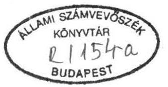
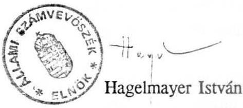

10814. szám

# Állami Számvevőszék 

## VÉLEMÉNY

a Magyar Köztársaság 1993. évi pótköltségvetéséről

1993. június

---

Az államháztartásról szóló törvény alapján a Kormány az Országgyűlés elé terjesztette az 1993. évi pótköltségvetést.

A Számvevőszék költségvetéssel kapcsolatos ellenőrzési feladatait az Állami Számvevőszékről szóló törvény szabályozza, így az állami költségvetési (pótköltségvetési) javaslat megalapozottságának ellenőrzését is. Az ellenőrzésről a Számvevőszék elnöke jelentésben tájékoztatja az Országgyűlést, összhangban az államháztartásról szóló törvény központi költségvetéssel kapcsolatos hatásköri és eljárási szabályaival.

Az eljárási szabályok nem kellő részletezettsége is hozzájárult ahhoz, hogy a Számvevőszéknek igen rövid idő állt rendelkezésére a pótköltségvetési törvénytervezet véleményezéséhez. Ezalatt a benyújtott pótköltségvetési javaslat megalapozottságát ellenőrizni nem tudta, a törvénytervezetet alapvetően a törvényesség szempontjából tekintette át. Korábbi vizsgálatok és elemzések alapján a bevételek és kiadások főbb tételeinek megalapozottságára is tett észrevételt.

# I. A pótköltségvetés törvényessége 

1) A Kormány által benyújtott pótköltségvetési javaslat szerkezetében és formájában megfelel az államháztartási törvény rendelkezéseinek, mert a pótelőirányzatokkal összhangban módosítja a költségvetési törvényt.

Az 1993. évi pótköltségvetés összeállításánál figyelembe vették az Állami Számvevőszék 1992. évi pótköltségvetéssel kapcsolatos formai és szerkezeti megjegyzéseit.
2) Az ÁHT két feltétel egyidejű bekövetkezése esetén kötelezi a Kormányt a pótköltségvetés benyújtására: "A Kormány pótköltségvetési javaslatot köteles az Országgyűlés elé terjeszteni, ha a költségvetésben előirányzott általános tartalékot felhasználták és a költségvetési törvényben megállapított források nem elégségesek a kiadási előirányzatok fedezetére."

---

Az általános tartalék felhasználásában további követelmény (ÁHT 38.§), hogy a Kormány az első félévben annak csak 40 %-át használhatja fel.

A jelenlegi esetben a Kormány a 13,5 Mrd forint tartalékot csak részben (7,5 Mrd Ft), használta fel, illetve kötötte le. A még le nem kötött 6 Mrd Ft-ot a pótköltségvetési törvénytervezet szerint zárolta. Az indoklás alapján nem állapítható meg, hogy a 7,5 Mrd Ft kötelezettségvállalásból mennyit teljesítettek.

A pótköltségvetési javaslat kötelező beterjesztésének másik feltételére vonatkozóan megállapítható, hogy a törvényjavaslat 1. számú mellékletében 96 költségvetési címnél összesen 20,7 Mrd Ft-tal növelni, 9 címnél 17,7 Mrd Ft-tal pedig csökkenteni javasolják a kiadási előirányzatokat. Ezek egyenlege 3,0 Mrd Ft-tal növeli a költségvetési törvényben jóváhagyott kiadási főösszeget. (A csökkentés összegéből jelentős a tartalék 6 Mrd Ft-os zárolása, valamint a belföldi államadósság kamatterheinél kimutatott 9,9 Mrd Ft megtakarítás.) A bevételi előirányzatokat 26,3 Mrd Ft-tal csökkentették.

Mindezek következtében a hiány összege a pótköltségvetésben a következőképpen alakul:

|  A költségvetésben elfogadott hiány összege | 185.367 mill.Ft  |
| --- | --- |
|  Bevételek csökkentése miatt | + 26.338 mill.Ft  |
|  Kiadások növekedése miatt | + 3.012 mill.Ft  |
|  A pótköltségvetésben elfogadni javasolt hiány | 214.717 mill.Ft  |

## II. A pótköltségvetési javaslat megalapozottságával kapcsolatos észrevételek

Az Állami Számvevőszék az 1993. évi költségvetés véleményezése során (6929 számon benyújtott jelentés) felhívta a figyelmet több bevételelem bizonytalanságára, megalapozatlanságára. Ezekből azokat emeljük ki, amelyeket a Kormány a pótköltségvetésben kimutatott hiány okaiként tüntetett fel.

- Így a pénzintézetek társasági adó és osztalék előirányzatára, amely a kötelező kockázati céltartalékképzés, valamint az eredmény bizonytalansága miatt nem volt megalapozott.

---

- Az Állami Vagyonkezelő Rt.-hez tartozó gazdálkodók 14 Mrd Ft osztalék befizetési előirányzatát szintén nem támasztotta alá a vállalkozások eredményének várható alakulása.

1) A pótköltségvetési törvényjavaslatban a bevételek jelentős csökkenése alapvetően az Állami Számvevőszék által az 1993. évi költségvetés véleményezése során már jelzett területeken következett be.

Az Állami Számvevőszék a rendelkezésre álló információk alapján a pénzintézetek befizetési előirányzatának csökkentését reálisnak tekinti. A forgóalap számla IV. 30-i adata szerint az előirányzott 25 Mrd Ft-ból mindössze 2,7 Mrd Ft realizálódott.
2) A pótköltségvetés tervezett megalapozottságát lényegesen befolyásolja az Általános forgalmi adó és fogyasztási adó módosításából származó többletbevétel ( 12 Mrd Ft ). Természetesen ha ezeket a törvénymódosításokat az Országgyűlés nem hagyja jóvá, akkor a pótköltségvetésben előirányzott bevétel teljesítése irreálissá válik. A pótköltségvetési javaslat megalapozottsága szempontjából szükségesnek tartanánk, - ÁHT 38.§. a) pontja alapján - hogy az adótörvény tervezetek is egyidejűleg benyújtásra kerüljenek.
3) A privatizációs bevételek az eredeti előirányzathoz képest jelentős mértékben, 19,3 Mrd Ft-tal csökkennek. A módosított előirányzatok közül az ÁV Rt. 5 Mrd Ft-os osztalék fizetése nem valósulhat meg, mivel a tartósan állami tulajdonban lévő társaságok 1992. évben osztalék befizetése várhatóan 3,3 Mrd Ft, és ezt az ÁV Rt. már más célra lekötötte.
4) A pótköltségvetésben a XXXI. Belföldi Államadósság fejezet bevételi oldalán a 3. Kamatadó címnél a törvényjavaslat az eredetileg jóváhagyott 10 Mrd Ft-tal szemben 18,8 Mrd Ft-ot javasol. Az általános, illetve részletes indoklás e növekedést nem támasztja alá. Az általános indoklás a főbb nemzetgazdasági folyamatok bemutatásánál éppen a lakossági megtakarítások csökkenését prognosztizálja (1-2 \%) az 1992. évi előzetes tényhez, illetve az 1993. évi programhoz viszonyítva.

---

5) A törvényjavaslat részletes indoklásából, de a Számvevőszék rendelkezésére álló kormányhatározatokból is megállapítható, hogy néhány költségvetési címnél (Pl. a Magyar Rádió 519 M Ft, az IM Büntetés-végrehajtás 1 Mrd Ft) a többletelőirányzatként szereplő összegeket a Kormány döntése szerint az általános tartalékból kellett volna fedezni. A pótköltségvetésben azonban ezek miatt az általános tartalék előirányzatát nem csökkentették.

A pótköltségvetési javaslat indoklása szerint az általános tartalékból az év első felében 7,0 Mrd Ft-ra vállaltak kötelezettséget. Az indoklásból az nem állapítható meg, hogy a kötelezettségvállalások alapján az első félévben a tartalék előirányzatát módosították-e, s mekkora összeggel. A törvényjavaslat 1. sz. mellékletében a VII. fejezet 29. címnél szereplő összegek szerint a költségvetés általános tartalékát az I. félévi kötelezettségvállalások miatt nem csökkentették, csak a pótköltségvetésben zárolni javasolt 6,0 Mrd Ft-tal módosították. Ez azt jelenti, hogy az 1993. évi új előirányzat oszlopában szereplő 7,5 Mrd Ft az év második felében korlátozás nélkül felhasználható.
6) A költségvetés kiadási oldalán több tétel módosításával az eredetileg tervezett előirányzatok átrendezését javasolják.

A törvényjavaslat általános indoklása nem foglalkozik ezek szükségességével és indokoltságával.

A mellékletek tanúsága szerint a következő jogcímeken várhatók megtakarítások:

- költségvetési tartalék zárolása
- belföldi államadósság kamatterhei
- több kisebb összegű megtakarítás

Megtakarítás összesen:
6,0 Mrd Ft
9,9 Mrd Ft
1,8 Mrd Ft
17.7 Mrd Ft

A pótköltségvetési javaslat a megtakarítások teljes összegének felhasználását javasolja. A részletes indoklás szerint azt a felsorolt, új 20,7 Mrd Ft-os kiadási tételek nagyobb részének fedezetére használják fel.

---

7) A VII. Miniszterelnökség fejezet 32. cím: Magyar Televízió dologi előirányzatait a pótköltségvetésben 1.200 M Ft összegű támogatással tervezik növelni.

#### Abstract

1992-93. évi helyszíni ellenőrzésünk tapasztalatai alapján megállapítható, hogy a számviteli törvény előírásait az intézmény nem teljesítette maradéktalanul, így a pénzügyi- és számviteli nyilvántartások nem nyújtanak megbízható információt a gazdasági helyzetről, az adósságállományról. Hiteles mérlegadatok hiányában utóellenőrzésünk nem tudta megalapozottan megállapítani az MTV 1992. év végi, illetve 1993. év eleji pénzügyi helyzetét.

A fentiek alapján az 1,2 Mrd Ft támogatási többlet célszerű és takarékos felhasználásának feltételeit nem látjuk biztosítottnak, összegszerűségét megalapozottnak.
8) A XVII. Pénzügyminisztérium fejezet egyes előirányzatai megalapozottságáról az alábbi állapítható meg.
— Az újonnan alapított Állami Értékpapír-kibocsátást Szervező Irodát, valamint az önkéntes Kölcsönös Biztosító Pénztárak Felügyeletét célszerűtlen állami támogatásból működtetni. Működési kiadásaik az értékpapír kibocsátások, illetve a biztosító pénztárak által fizetendő, illeték jellegű igazgatás-szolgáltatási díjból fedezhetők. Ezáltal 130 M Ft megtakarítható.
— A pótköltségvetésben előirányzott 146,8 M Ft többlet béralaphoz mindössze 11,8 M Ft társadalombiztosítási járulékot terveztek (ez arányosan 64,6 M Ft lenne), ami az előirányzat bizonytalanságát jelzi.
—A 17. cím, Fejezeti kezelésű előirányzatok 6. Előirányzatcsoportnál - a Költségvetési törvénnyel egyezően - 700 M Ft a vagyonnyilatkozatok feldolgozásának fedezeteként szerepel. Az Alkotmánybíróság döntése miatt nem került sor a vagyonnyilatkozatok beadására és feldolgozására. 1993. I. negyedévben a 700 M Ft terhére 150 MFt finanszírozására került sor, de az 550 M Ft felhasználása semmiképpen sem indokolt. Ez kiadási előirányzati megtakarításként, így a költségvetési deficitet csökkentő tételként kezelhető.

---

9) A pótköltségvetési törvényjavaslat a hiányt az eredeti előirányzathoz képest 30 milliárd forinttal több egy évnél hosszabb lejáratú államkötvény kibocsátásával tervezi finanszírozni, amely növeli a belföldi államadósságot. Ezáltal tovább emelkedik a kötvénypiacon az állami papírok volumene (488 milliárd Ft).

Véleményünkben szereplő kérdéseket a képviselők figyelmébe ajánljuk törvényalkotó munkájukban történő hasznosítás céljából.

Budapest, 1993. június 9.

