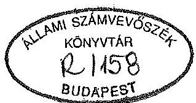
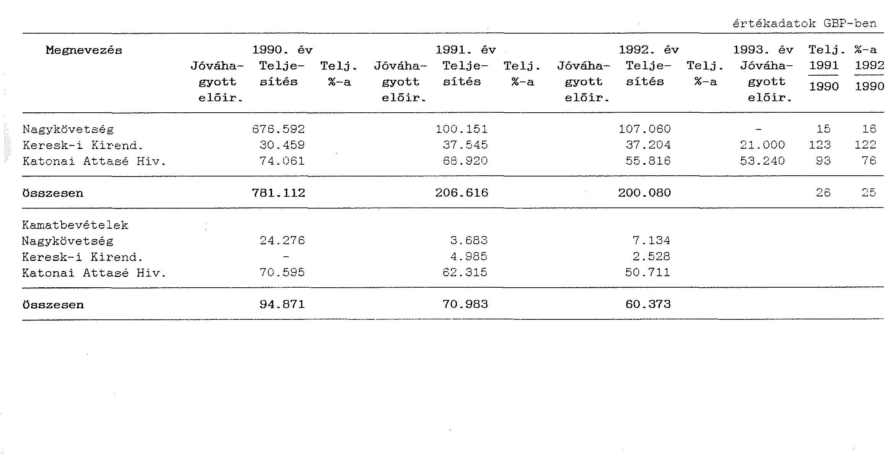

# JELENTÉS 

a Magyar Köztársaság Nagy-Britanniában müködő külképviseleteinek pénzügyi-gazdasági ellenőrzéséről

---

Az ellenőrzést vezette:

Bihary Zsigmond
számvevô-igazgató

Az ellenőrzést végezték:

Balázs Andrásné
Sáamvevô-tanácsos
Nagy Ákosné
számvevô-fôtanácsos
Simon Akosné
számvevô-tanácsos

---

# JELENTÉS 

a Magyar Köztársaság Nagy-Britanniában múködő külképviseleteinek pénzügyi-gazdasági ellenőrzéséről

A Nagy-Britanniában működő és helyszínen ellenőrzött három diplomáciai és konzuli képviselet 1992-ben összesen több mint 870 e GBP kiadási előirányzattal gazdálkodott. A foglalkoztatottak létszáma 37 fő, a kezelésükre bízott vagyon értéke mintegy 260 millió Ft volt.

Ellenőrzésünk célja a külképviseletek költségvetési előirányzatai tervezésének és felhasználásának, a relációban ellátandó feladataik és erőforrásaik összehangolásának, illetve összhangjának biztosítása és ezen keresztül a fejezetek irányító tevékenységének értékelése volt.

Az ellenőrzés az 1990. január 1. - 1993. február 28. közötti időszakra irányult és a londoni Nagykövetség, konzulátus, a Katonai és Légügyi Attasé Hivatala, a Kereskedelmi Kirendeltség gazdálkodására, gazdasági pénzügyi tevékenységére - és ezzel összefüggésben - a Külügyminisztérium (KÜM), a Honvédelmi Minisztérium (HM) és a Nemzetközi Gazdasági Kapcsolatok Minisztériuma (NGKM) elszámolásaira, nyilvántartására, stb. terjedt ki.

A vizsgált időszakban a 9/1993. (I.15.) Korm. rendelettel hirdették ki a nemzetközi egyezményt a Magyar Kulturális Intézet felállításáról.
A kulturális képviselet létrehozása a vizsgálat idején még a szervezés kezdeti stádiumában volt, gazdálkodása ezért nem képezte az ellenőrzés tárgyát.

---

# 1. 

## Az ellenőrzés megállapításai

A vizsgált külképviseletek múködését, gazdálkodását alapvetően a következő körülmények, tényezők határozták meg:

- Nagy-Britannia - a világpolitikában és -gazdaságban, a nemzetközi szervezetekben betöltött súlya, a pénzpiaci és tőkekihelyezési szerepe alapján - Magyarország nemzetközi kapcsolataiban növekvő jelentőségű és kiemelt reláció.
- A hazai társadalmi-gazdasági átalakulás e külképviseletek tevékenységében is a súlypontok átrendeződését eredményezte.

A vízumkényszer megszünésével a hagyományos konzuli tevékenységek (az utóbbi időszakra a kárpótlási ügyek is) kerültek előtérbe.
A Kereskedelmi Kirendeltség feladatellátásában a gazdaságpolitikai, külkereskedelmi érdekek képviselete, védelme, a magyar export elősegítése mellett a tőkeimport, továbbá a privatizációba a brit részvétel fokozott bevonása kapott nagyobb hangsúlyt.

- Ugyanazon relációban működő külképviseletek tevékenységének összehangolásában, célszerű munkamegosztásában vállalt modell értékű szerep. Ez elsődlegesen a gazdasági és kereskedelmi feladatok kereskedelmi kirendeltséghez való koncentrálásában valósult meg.
- A működéshez szükséges erőforrások folyamatosan - esetenként az aktuális szükségleteket meghaladó mértékben - rendelkezésre álltak.
- A külképviseletek gazdasági felelősi beosztásaiban személyi változás a vizsgált időszakban nem volt, a munkakört betöltők nagy tapasztalattal rendelkeztek.

## 1. A gazdálkodás szabályozottsága

A költségvetési tervezési, gazdálkodási rend jogszabályváltozása, a számviteli, államháztartási törvény hatálybalépése a külképviseletek gazdasági-pénzügyi tevékenységének újraszabályozását tette szükségessé. Ezt indokolták a korábbi külképviseleti vizsgálataink megállapításai is. Ennek a követelménynek az irányító

---

fejezetek különböző mértékben és módon - többször a jogszabályi előírásokhoz mérten késéssel - tettek eleget. Előfordult, hogy egyes tevékenységek, folyamatok indokolt szabályozása elmaradt.

A Katonai, Légügyi Attasé Hivatala költségvetési tervezésének, gazdálkodásának, elszámolásának szabályozása megfelel a vonatkozó pénzügyi, számviteli és egyéb jogszabályoknak.
1992. VI. 30 -ával adták ki a számviteli törvény alapján kidolgozott "Kézikönyv a véderő, katonai és légügyi attasé hivatalok anyagellátásának és gazdálkodásának szabályozásához" c. kiadványt.
1993. márciusában "Gyüjtemény"-ben foglalták össze és bocsátották az érdekeltek rendelkezésére a katonai és légügyi (véderő) attasé hivatalok pénzügyi tárgyú jogszabályait.

A KÜM a külképviseletei gazdálkodási rendjét átfogóan az 1/1992. január 10-én kiadott - és 1992. február 1-től hatályos - külügyminiszteri utasitással szabályozta.
E miniszteri utasítás hiányossága, hogy a leltározással kapcsolatos - a 179/1991. (XII.30.) Korm. rendelet 25. § (4) bekezdése szerinti - részletes feladatokat nem tartalmazza. Ezt csak a - később és az előírásokhoz képest késve, 1992. VIII. 6-án aláirt - 15/1992. számú külügyminiszteri utasítás határozta meg.
Ugyanakkor az anyaggazdálkodásról és nyilvántartásról, valamint a készletmozgások bizonylatolásának rendjéről csak KÜM szinten készült utasítás. A külképviseletek ezirányú tevékenysége szabályozatlan maradt annak ellenére, hogy azok is rendelkeznek önálló reprezentációs és ajándék raktárral.
A tájékoztatási keret felhasználását (melynek jogcímei: vendéglátás, kiadványbeszerzés, stb.) továbbra sem a gazdálkodási szabályzat részeként, illetve döntési körében, hanem külön sajtó főosztályi leiratban, körlevélben határozták meg.

A Kereskedelmi Kirendeltség költségvetési tervezésének, gazdálkodásának és elszámolásának csak egyes részterületére vonatkozóan rendelkezett korszerü, a hatályos pénzügyi és számviteli előírásoknak megfelelő szabályzatokkal. Ezek egy része is késéssel követte a jogszabályi változást (pl. a leltározási utasítást 1992. szeptemberében adta ki az NGKM). A kirendeltségek müködését, gazdálkodását átfogóan meghatározó az NGKM Külkereskedelmi Szolgálat Gazdálkodási Szabályzata a vizsgálat idején a 2/1993. sz. miniszteri utasitással február 1-jén hatályba lépett, de a Kereskedelmi Kirendeltségre a helyszíni ellenőrzés befejezéséig nem érkezett ki.

A vizsgált külképviseletek rendelkeztek a hatályos központi szabályzatokkal, ugyanakkor az általános szabályozások keretei között a feladatmegosztást, a pénzügyi jogköröket esetenként nem, nem megfelelően, illetve hiányosan rögzítették.

A Kereskedelmi Kirendeltség tevékenységét a kirendeltségvezető kereskedelmi fótanácsos ügyrendben szabályozta (1991/92). Ennek hiányossága, hogy nem rendelkezett a pénzügyi jogkörök gyakorlásáról, továbbá nem egységes rendező

---

elv szerint határozta meg a munkaköri leírásokat.
A gazdasági felelős-pénztáros munkaköri feladatainak NGKM szabályozása elavult.

A Nagykövetségen a gazdálkodási jogköröket nem az általános szabályok szerint gyakorolják, ugyanakkor e hatáskörök belső rendjét nem rögzítették (pl. folyamatos pénztárellenőrzés, kötelezettségvállalás rendje, utólagos utalványozás mellett történő kiadás-felhasználási hatáskörök megosztása az első beosztott és a gazdasági vezető között).

Sajnálatosan az irányító minisztériumok közötti együttműködés a szabályozási tevékenységre nem terjedt ki. Ezért tapasztalható volt, hogy indokolatlanul, illetve célszerűtlenül eltérő módon határozták meg a gazdálkodási, elszámolási követelményeket, térítési kötelezettségeket.

# 2. A költségvetési előirányzatok tervezése 

A külképviseletek gazdálkodására szolgáló - részben eltérő jogcímtartalmú - kiadási keretek összességükben 1990-ről 1992-re 17 \%-kal, 1993-ra $3 \%$-kal csökkentek.

A költségvetési előirányzat mérséklődésében a reprezentációs célú (Kereskedelmi Kirendeltség, Katonai Légügyi Attasé Hivatala) az utazási, kiküldetési költségek (Kereskedelmi Kirendeltség), külföldi állampolgárok foglalkoztatása (Nagykövetség), bérleti díjak kereteinek csökkenése játszott jelentősebb szerepet.

A külképviseletek költségvetési javaslatukat a kötelezettségek és igények számbavételével az infláció várható alakulását, az ismert áremelkedéseket kalkulálva - esetenként, egyes kiadási jogcímeknél túlzott biztonságra törekvően, de többségében reálisan állították össze. A költségvetési keretjóváhagyás nem mindig és mindenütt történt kellő mérlegeléssel és elemzés alapján. A mechanikus bázisszemlélet miatt előfordult, hogy az igényelt, illetve a szükségleteket meghaladó összegű kiadási előirányzatot bocsátottak a külképviseletek rendelkezésére.

A Kereskedelmi Kirendeltség 1991-ben nem készített költségvetési javaslatot erre központi utasítást nem kapott. A kiadások fedezetére eredetileg jóváhagyott költségvetési keret ( 299.390 GBP ) a korábbi évek tényleges felhasználásához igazodott. A módosított előirányzatot az 1990. évi - más, meghatározóan a bagdadi kirendeltséget terhelő (bérlet), de itt eszközölt kifizetéseket is tartalmazó - költségvetési teljesítés ( 370.090 GBP ) alapján, a kirendeltség általános gazdálkodási szükségletét meghaladó összegben állapították meg ( 374.240 GBP).

---

A Katonai Légügyi Attasé Hivatalánál - az egyes években - a tényleges orvosi kiadásokat két-háromszorosan, a lakással kapcsolatos szolgáltatásokat 20-40 \%-ot meghaladó mértékủ volt a javasolt előirányzat. A kiadási keretet ugyanakkor általában a felterjesztett javaslatot - 1991-ben $9 \%$-kal, 1993-ban $3 \%$-kal - meghaladó összegben hagyták jóvá. Így a gazdálkodás pénzügyi feltételeit indokolatlanul túlbiztosították.

A Nagykövetség az előirányzat teljesítés és módosítások alakulása alapján nem mindig élt a kötött keretből a szabad felhasználású globálkeretbe átcsoportosítás lehetőségével, hanem pótelőirányzatot igényelt. 1991-ben a fogyóeszköz beszerzésre februárban igényelt pótelőirányzat - az éves megtakarítást figyelembe véve - nem volt szükséges.

A külképviseletek részére meghatározott költségvetési keretek nem teljeskörűek és eltérő jogcím tartalommal ölelik fel a működésükhöz, fenntartásukhoz szükséges közvetlen ráfordításokat. Emiatt reális költségigényük, a relációban folytatott gazdálkodásuk színvonala, célszerű takarékossága nem, illetve csak korlátozottan értékelhető.

A Nagykövetség és a Kereskedelmi Kirendeltség gazdálkodási kerete csak a külföldi foglalkoztatottak illetményét veszi számításba a hazai állományúakét nem.

Olyan közvetlen kiadások, mint a kiküldöttek haza- és visszautazásának költsége, illetményjárulékok, stb. sem képezik a külképviseletek gazdálkodási keretének részét.

A relációban működő valamennyi külképviseleten különböző jogcímeken és mértékben folyamatosan képződött bevétel. Ennek ellenére 1991-ig egyáltalán nem, majd fokozatosan bővülően, de még mindig nem teljeskörűen határoztak meg részükre bevételi előirányzatot.

A Kereskedelmi Kirendeltségnek 1991. évig nem írtak elő̉ bevételi keretet függetlenül attól, hogy összkiadásainak 10-12 \%-át kitevő arányban rendszeresen képződtek saját forrásai.

A Katonai Légügyi Attasé Hivatala részére bevételi előirányzatot csak 1993. évtől kezdődően határoztak meg, holott annak várható összegét a tervjavaslat készítésénél számításba vették és felterjesztették.

A Nagykövetség részére bevételi tervet a vizsgált időszakban nem írtak elő.
A bevételek, kiadások reális számbavételét néhol a bruttó elv megsértésének - a korábbi külképviseleti vizsgálatainknál már kifogásolt, de változatlanul tapasztalt gyakorlata is akadályozta.

---

A Kereskedelmi Kirendeltségen az 1992. évi kiadási elöirányzat alátervezését a bevételi lehetőségek részbeni - csak a vállalati térítésekre kiterjedő - számbevétele okozta.

A pénzellátási terv megalapozásához szükséges lett volna a bevételek és a kiadások teljeskörű megtervezése és elszámolása.

# 3. A külképviseletek bevételeinek, pénzellátásának alakulása 

A külképviseletek relációban elért bevételének összege az 1990-92. évek viszonylatában mintegy negyedére csökkent. Ebben a teljeskörű vízummentesség - az 1991-1992. években fokozatos - bevezetése miatti vízumdíj kiesés volt a meghatározó.

Jellemzően a Nagykövetség vízumdíj és konzuli illeték címen realizált forrása a korábbiakhoz képest $82 \%$-kal, illetve $85 \%$-kal csökkent.

A Kereskedelmi Kirendeltség bevételeinek jelentős, de fokozatosan csökkenő (1990-ben $99 \%$, 1992-ben $45 \%$ ) részét a kirendeltségen elhelyezett magyar vállalatok térítési díjai képezték. A vállalatoktól származó árbevétel évről-évre kevesebb. Ennek oka a megváltozott gazdasági körülményekhez (eredménycsökkenés, privatizáció, vegyes vállalati konstrukció), alkalmazkodó vállalati magatartás, mely a magasnak ítélt térítési díjat az állandó képviselet gazdasági előnyével összevetve, a szerződés felbontására, a képviseleti óraszám csökkentésére irányult.

A vállalati szerződések szerint a térítési díj alapját képező képviseleti idő az 1990. évi (6 vállalat) összesen 30 óra/napról, 1992-ben (4 vállalat) összesen 15 óra/napra esett vissza.

Az 1988. évi tényleges kiadások figyelembevételével megállapított térítési díj 1991. évi - a költségváltozásokhoz igazodó - emelése, a kitűzött céllal ellentétesen, az árbevétel csökkenését eredményezte. Ezért az állandó kiadások (bérleti díj, adó, fűtés, stb.) magas aránya miatt a költségvetést terhelő kiadások relatíve nőttek.

A tartós vállalati képviseletből származó bevétel csökkenést a kirendeltség rendezvények alkalmankénti szervezésével igyekezett kompenzálni, de ezek gazdasági eredménye egyenlőre szerény volt.

1991-ben 3 rendezvény 320 GBP, 1992-ben 1 rendezvény 150 GBP bevételt eredményezett. Az 1993. évi rendezvény bevételi terv 900 GBP.

---

A kiküldötteket különböző jogcímen terhelő térítések mértéke külképviseletenként még mindig eltérő, összehangolásuk nem volt érzékelhető. A tényleges ráfordítás egy részét esetenként indokolatlanul a költségvetés finanszírozza.

A Katonai Légügyi Attasé Hivatalánál a kiküldöttek a lakás közüzemi díjak után az alap devizaellátmányuk $10 \%$-át, 1993. január 1-től $15 \%$-át fizetik. A Kereskedelmi Kirendeltségen a kiküldöttek a villanyáram díjat a tényleges fogyasztás, az el nem különithető közüzemi díjakat (központi fütés) a bruttó devizailletmény meghatározott \%-ában, gázfütésnél fix értékben meghatározott átalány szerint fizetik.

A Nagykövetségen a kiküldöttek által fizetett közüzemi díjak térítményezése eltért az 1/1992. T. 10. KÜM utasítástól. A villanyáram térítési díja előirásánál az 1980-as években kialakult gyakorlatot követték, miszerint az 1989. évben megállapított térítési díj összegét ( 36,75 GBP) évenként a dolgozók járandóságának emelkedésével arányosan korrigálták. Ennek összege jelenleg 45.25 GBP. Ezen felül fütési térítési díj címen a dolgozók a bruttó járandóságuk $3 \%$-át térítik.

Hozzájárul ehhez az is, hogy egyes átalánytérítések felülvizsgálata és a helyi költségszinthez igazítása elmaradt.

A Kereskedelmi Kirendeltségnél a lakásbérletektől nem elkülönithető fütési díj után 1977. óta egységesen a bruttó devizailletmény $3 \%$-át fizetik. Felülvizsgálat hiányában a térítési díj csak a bruttó devizailletmény növeléssel egyidőben emelkedett.

A gázfogyasztás után fizetett térítési átalány - mely két kiküldöttet érint hozzávetőlegesen a ténylegesen számlázott fogyasztás egyharmadát tette ki. Az átalányt a Kereskedelmi Kirendeltség 1992. negyedik negyedévben 20-30 \%-kal emelte.

Az átalánytérítések felülvizsgálata és szükség szerinti mértékű - a relációban összehangolt - emelése indokolt.

A helyi forgalmi adó (VAT) kizárólag az üzemanyag és fútőolaj vásárlás után igényelhető vissza. A VAT visszatérítésre a felterjesztési kötelezettségnek a külképviseletek rendszeresen eleget tettek. A visszatérítés azonban esetenként elhúzódott.

A külképviseletek bevételi forrása között növekvő szerepet kapott a pénzeszközeik rövidebb, tartósabb lekötéséből származó kamatbevétel.

A relációban elért kamatbevétel 1991-92. között összesen 226.227 GBP volt.

---

Ez részben az irányító fejezetek tudatos pénzügypolitikájának (forint leértékelés kivédése, kedvezőbb kamatfeltételek, stb.), részben a külképviseletek átgondolt gazdálkodásának eredménye volt.
A devizaeszközök betéti lekötéséhez a devizagazdálkodásról szóló 1974. évi 1. törvényerejű rendelet szerint devizahatósági engedély szükséges. Ezt bemutatni nem tudták.

A Katonai Légügyi Attasé Hivatala a lekötött és tartós betétei után a vizsgált időszakban több mint 183 e GBP kamatra tett szert. A HM engedélyével és utasítására a Hungarian International Bank Limited-nél 6 hónapos tartós (és folyamatosan meghosszabbított) lekötésre 270 e GBP-t, valamint futárpostával kiküldött 200 e USD-t (116.686 GBP) helyeztek el 1990. júniusában.

Az 1990. III. 22. - III. 28. időszakban a felügyeleti témaellenőrzés jegyzőkönyvében rögzítették, hogy a kedvezőbb kamat miatt tartós betétet külföldi banknál célszerű elhelyezni.
1992. XII. 31 -én a lekötött betét (a tőkésített kamatokkal) meghaladta a 480 e GBP-t, a tartós betétszámla pedig a 10 e GBP-t, a pénzeszközök záró készlete az 1992. évi teljesített kiadás több mint $460 \%$-a volt.

A külképviseletek pénzellátását 1,5-2 havi kiadási szükséglet figyelembevételével finanszírozták, így lehetőségük volt - és ezzel éltek is - hogy átmenetileg szabad pénzeszközeiket bankszámlán kamatoztassák.

Az NGKM annak érdekében, hogy a kereskedelmi kirendeltségek között a pénzeszközeiket szükség szerint átcsoportosíthassa, 1992-ben úgy rendelkezett, hogy a kirendeltség pénzeszközei egy hónapnál hosszabb időre ne kerüljenek lekötésre. (1991-ben még ezzel ellentétes pénzügypolitikát érvényesitett.)

A Kereskedelmi Kirendeltség kamatozó betétszámlán 1991-ben negyedéves átlagban 44.500 GBP, 1992-ben 50.000 GBP, míg a vizsgálat időpontjában 18.000 GBP helyezett el.

A Nagykövetség a rezidencia vételárát az átutalástól a kifizetésig terjedő időszakra ( 1,5 hónap) bankszámlán kamatoztatta és azután 19.011 GBP kamatjövedelmet realizált.

A relációban a külképviseletek működését szolgáló pénzellátás kiegyensúlyozott volt, ugyanakkor esetenként, illetve időszakonként ingadozó mértékű pénzbőség is mutatkozott.

A Kereskedelmi Kirendeltségen viszonylag magas pénzbőség 1992. II. negyedévében, 1991. és 1992. III. negyedévében volt tapasztalható. Ezt igazolja, hogy a

---

negyedéves záró pénzkészlet az adott negyedév nettó kifizetését $26 \%$-kal, $115 \%$-kal, illetve $35 \%$-kal haladta meg.

A Katonai Légügyi Attasé Hivatala finanszirozásánál az 1992. évet kivéve figyelembe vették a jelentős kamatbevételt, ugyanis a lekötött betét elhelyezését követően 1991-ben nem, 1992-ben pedig két alkalommal utaltak számukra ellátmányt. (1992-ben 40.000 GBP és 8.000 GBP utalása történt, részben a hivatal költségvetésében nem tervezett ösztöndíjasokkal kapcsolatos kiadások fedezetéül.)

Az ellenőrzött képviseleteknél a különféle térítések kiszabása, árbevételek szerződéses rendje megfelelő volt. Az esedékességet folyamatosan figyelemmel kisérték és érvényesítették. Hátralék a vizsgált időszakban nem képződött.

# 4. Kiadási előirányzatok felhasználása 

A külképviseletek gazdálkodása általában kiegyensúlyozott és mértéktartó volt. A jóváhagyott költségvetési kereteken belül többnyire a kötöttségek megtartásával gazdálkodtak.
A gazdálkodási keret igénybevétele az 1990-92. években a reláció szintjén 87-95 \% között mozgott. Ez is bizonyítja, hogy a feladatok ellátásához a pénzügyi feltételek lényegében maradéktalanul - esetenként a szükségleteket meghaladó mértékben rendelkezésre álltak.

A kiadások között dinamikusan nőttek a távhő-, gőz-, villamosenergia, postaköltségek, a díjtétel emelkedések miatt. Lényegesebb megtakarítás általában a lakásbérleteknél mutatkozott. Ebben a bérlemények számának csökkenése, a bérletet terhelő adók beszedésének időbeli eltolódása, illetve az ebből képződő hátralékok jelentették a fő okot.

A keretgazdálkodás kötöttségeinek oldása (Nagykövetség, Katonai Légügyi Attasé Hivatala), illetve megszüntetése (Kereskedelmi Kirendeltség) rugalmasabbá és kezdeményezőbbé tette a gazdálkodást.
A költségvetési keretekkel való gazdálkodás szabadságfoka - a fejezetek különböző előírásai miatt - külképviseletenként eltérő volt.

A Nagykövetség kiadásainak szerkezetén belül továbbra is a kötött gazdálkodású jogcímek (illetmény, reprezentációs, tájékoztatási, bérleti díj, külföldi magyarok közötti propaganda kiadások) voltak a meghatározók, bár súlyuk a vizsgált időszakban $74 \%$-ról $68 \%$-ra csökkent.

---

A Katonai Légügyi Attasé Hivatala részére csak a reprezentációs célú kiadások összegét maximálták, ami a gazdálkodási keret mintegy $4 \%$-a volt.
A Kereskedelmi Kirendeltséget érintően a gazdálkodás liberalizálása évenként változó volt, 1991-92-ben lehetőséget kapott a rovatokon belül teljes átcsoportosításra.

A kiadások elemzését, összehasonlítását ugyanakkor nehezítik a fejezetek és a külképviseletek adateltérései, illetve azok okának tisztázatlanságai, az elszámolásbeli szabálytalanságok, stb.

A Katonai Légügyi Attasé Hivatala 1991-ben a központ engedélyével vásárolt új gépkocsi beszerzési árába ( 8.743 GBP ) a szállító autószalon a részére eladott régi gépkocsiért felszámított 2.900 GBP-t beszámította. A Hivatal pénzforgalmilag tévesen a nettó beszerzési árat számolta el, ezáltal mind a bevétel, mind a kiadás a valóságosnál kisebb mértékben került kimutatásra.

# 4.1. A tárgyi feltételek 

A Nagy-Britanniában működő külképviseletek elhelyezése - hosszú távra bérelt ingatlanokban - megfelelő színvonalú. Területi közelségük feladataik célszerű integrálásához, együttműködésükhöz kedvező feltételül szolgál.

Az NGKM a Kereskedelmi Kirendeltség részére 2034-ig szóló bérleti szerződéssel bérli az Eaton Place 46. sz. alatti irodaépületet, valamint az Eaton Mews North 20. sz. alatti gondnoki lakást és garázst.

A bérleti szerződés megkötésekor (1980-ban) kifizették az 55 évre szóló bérleti dij 2/3-ának tőkésített összegét, 170.000 GBP-t. A fennmaradó $1 / 3$ részt negyedéves esedékességgel, 5 évenként a szabadpiaci bérleti díjak inflációs emelkedésével korrigálva fizeti a kirendeltség.

Az épületben rendelkezésre álló 16 irodahelyiség és 5 tárgyaló - a vállalati képviseletek csökkenése miatt - meghaladja a kirendeltség reális szükségletét. Ezért a helyiségek megfelelő hasznosításáról - a bérleti szerződés korlátai között - további érdemi intézkedések szükségesek.

A KÜM a Nagykövetség részére az Eaton Place 35. sz. alatti épület bérletét 1976-ban 300 e GBP összegért 2050 -ig szólóan megváltotta.
A követségi épületben kapott helyet a konzulátus és a Katonai Légügyi Attasé Hivatala, továbbá 6 lakás tartozik hozzá.

---

A fejezetek között a kiadások feladatarányos viselése még nem kellően megoldott.

A KÜM és a HM közötti megállapodás alapján a HM-nek meg kell téríteni az attaséhivatalok helyiségeinek fenntartásával, felújitásával összefüggő arányos költségeket. A fizetés helyéről, időpontjáról, mértékéről, pénzneméről való konkrét megállapodásig a hivatalok a HM intézkedése szerint térítést nem fizethetnek.
A Katonai Légügyi Attasé Hivatala ezért csak az igénybevett szolgáltatások egy részéért (telefon, fax) fizet térítést.

A képviseleteket terheli az épületek külső és belső karbantartása, biztosítása és adója. Háromévente kötelező az épületek külső festése. E kötelezettségeknek rendre eleget tettek.

A lakásgazdálkodás a relációban összességében hatékonynak minősíthető. A kiküldöttek részére nagyobb hányadban bútorozott, kisebb hányadban bútorozatlan - a képviseletek által berendezett - lakást bérelnek. A megtekintett lakások színvonala a helyi követelményeknek, szokásoknak megfelelő, a diplomaták esetében vendégfogadásra alkalmas.

A Kereskedelmi Kirendeltség bérelt lakásai általában egy-egy szobával meghaladják az NGKM által lakószám alapján meghatározott normát. Figyelembe véve azonban a lakbérek nagyságát meghatározó egyéb tényezőket, a fizetett bérleti díj nagysága összességében elfogadható. Kisebbre cserélés az új bérlemények magasabb díjtétele miatt nem célszerű.

A szerződések kötése, felmondása a létszámmozgáshoz igazodóan átgondolt, így üres lakásért lakbért - egy kivétellel - nem fizettek.

A Nagykövetség által Ebary Street 55. szám alatt bútorozottan bérelt lakás 4 hónapig, 1992. IX. 1-től 1993. I. 9-ig üresen állt. Majd ideköltözés miatt a Flat 20, Lake Viewcourt 31. Bressenden Place címen bérelt 3,5 szobás $82 \mathrm{~m}^{2}$ alapterületű lakás vált üressé. (Az üresen fenntartott lakások után a vizsgálatunkig 10.086 GBP volt a bérleti díj fizetési kötelezettség.)

Ezt jelenleg vendéglakásként tartják fenn, de vizsgálatunkig még erre a célra nem vették igénybe. Hasznosítását, illetve fenntartását - a létszámigényre vonatkozó döntésre figyelemmel - indokolt átértékelni.

A lakásszerződések kötése, nyilvántartása, állapotfelmérése és annak dokumentálása kisebb hiányosságokkal a központi előírásoknak megfelelő volt.

---

A szerződések magyar nyelvű fordítása a Nagykövetségnél a bérelt lakások teljes körére nem volt megtalálható. A Kereskedelmi Kirendeltségnél hiányzott a bútorozottan bérelt lakások leltárjegyzéke.

A megkötött bérleti szerződések kevés kivétellel (pl. Katonai Légügyi Attasé Hivatala bérelt lakásai) depozit fizetési kötelezettséget tartalmaznak, az 1989. július 1-e után kötött szerződéseknél - helyesen - kamatfizetés kikötésével. A lakásdepozitokat az ingatlan ügynökségek kezelik, s azt a szerződés megszűnésekor kamatokkal együtt általában visszatérítik.

A lakásdepozitok nyilvántartása pontos, áttekinthető, esetenként azonban hiányosságok voltak tapasztalhatók.

Szabálytalan, hogy a Kereskedelmi Kirendeltség a visszafizetett lakásdepozitokat - a takarítási díjjal és egyéb visszatartott tételekkel csökkentve - nettó összegben számolta el bevételként.

A lakástakarítási díjak elszámolása során ugyanakkor általános hiba, hogy ezek dokumentált felülvizsgálata és utalványozása hiányzik, így nem kerül egyértelműen rögzítésre a kiküldött esetleges anyagi felelőssége. Eseti kifogás volt, hogy a lakástakarítás díját - a kiküldött másik lakásba költözése miatt - a kirendeltség kétszer vállalta át.

Kedvező adottságú bérlemény eredménytelen felkutatása, illetve a reláció relatíve magas bérleti díja miatt döntött 1990-ben a KÜM a nagykövetségi rezidencia bérleti jogának megváltásáról hosszú távra.

A nagyköveti rezidencia 1983. évben kötött bérleti szerződése 1990. szeptember 28-án lejárt, és felajánlották a hosszú bérlet megváltást 69 évre.
Az eljárás során a KÜM műszaki szakértőjének véleményét kikérték. A szerződést a KÜM felülvizsgálat és engedélyezés után kötötték meg.

A hosszú bérleti jogot - mely az angol jog szerint biztosítja a bérleti jog adás-vételét 1.503.034,60 GBP-ért megvásárolták.

A vagyoni értékű jogot 178.025.985 Ft értékben 1991. január 15-én aktiválták, mely megfelelt a tárgyév első napján érvényes GBP árfolyamon számított értéknek.

A nagyköveti rezidencia felújítása 1990-ben indokolt volt. A berendezési tárgyak állapota jó színvonalú, folyamatos karbantartásukat, felújításukat biztosították, vendégfogadásra alkalmas.

A Katonai Légügyi Attasé Hivatala - arra hivatkozva, hogy a jelenlegi attasé lakás műszaki problémák és beosztása miatt alkalmatlan vendégfogadásra - 1991. I.

---

félévétől foglalkozik lakásingatlan vásárlással, melynek forrásául szolgálna a már említett felhalmozott és lekötött betét.

A megvásárolni szándékozott Chelsea Harbour London SW 10 OXF sz. alatti lakás öt éve épült, a Harbour Estates Limited cég tulajdona, a Hivataltól 4,1 km-re van. A lakást megtekintve beosztását vendégfogadásra nem tartjuk alkalmasnak, így megvásárlása célszerütlen.
A központtól kapott tájékoztatás szerint vizsgálatunk nyomán időközben e lakás megvásárlásától elálltak. Ugyanakkor jelezték, hogy a jelenlegi lakás műszaki problémái miatt bírósági eljárás van folyamatban, s e bizonytalanság miatt az 1993-ban lejáró bérleti szerződést nem hosszabbítják meg. Ezért indokolt a jelenlegihez hasonló színvonalú bérlakásban elhelyezni az attasét.

A londoni külképviseletek a vizsgálat időpontjában összesen 10 hivatali használatú gépkocsival rendelkeztek, melyből 2 kisbusz.

A gépkocsik műszaki állapotát rendszeresen felülvizsgálták. Az egyes gépkocsik igénybevételéről a nyilvántartás naprakész, az átlagfogyasztás ellenőrzése rendszeres volt.

A Nagykövetségen takarékossági és gazdasági megfontolásból a saját gépkocsi használat került előtérbe, mely a hivatali célú gépkocsik számának, illetve futás teljesítményének csökkenésében is érzékelhető.

A Nagykövetségen KÜM engedéllyel 6 diplomata és 2 adminisztratív technikai dolgozó részére saját gépkocsi hivatalos használata után fizetnek költségtérítést, mely reális.
Az egy km-re jutó költségtérítés 1992. június 30-ig 0,07 GBP volt, majd 1992. július 1-től 0,09 GBP-re emelkedett. A korábban $200 \mathrm{~km} /$ hóra engedélyezett futáskilométert 300 km -re növelték a 10/43-42/1992. sz. KÜM engedély alapján.

A Kereskedelmi Kirendeltségen és a Katonai Légügyi Attasé Hivatalában saját gépkocsikat hivatalos célra nem használnak. A hivatali gépkocsik magáncélú használata szabályozott.

A Kereskedelmi Kirendeltségen hivatali gépkocsi magáncélú használatáért - a Nagykövetséggel is egyeztetve - 1992. I. félévéig 0,07 GBP/km, 1992. II. félévétől $0,09 \mathrm{GBP} / \mathrm{km}$ térítést fizetnek a kiküldöttek. A kalkuláció reális. A magáncélú kocsihasználatot helyi közlekedésre havi 100 km -ről 120 km -re emelték átalányjelleggel, míg a vidéki utaknál a ténylegesen megtett km távolság a térítési díj vetítési alapja.

---

A Katonai Légügyi Attasé Hivatalánál a szabályozás szerint az attasé évi 4.000 km , az attaséhelyettes évi 2.000 km mértékig használhatja magáncélra a gépkocsit, térítésmentesen. A km kereteket a kimutatás szerint betartották.

A londoni közlekedési viszonyokat és utazási távolságokat figyelembe véve mind a havi km keret nagysága, mind az egy km-re megállapított - VAT-tal csökkentett üzemanyagköltség elfogadható.

A gépkocsihasználat vezetése, engedélyezése, elszámolása naprakész és pontos.
A külképviseletek bútorral, irodagépekkel való felszereltsége a kulturált munkavégzés követelményét kielégíti. A Nagykövetségen a számítógépes elszámolás technikai feltételei megvannak, de még nem alkalmazzák.

# 4.2. Létszámfeltételek 

A külképviseletek tevékenységének összefogására, a feladatok ésszerű integrálására a nagykövet irányításával a relációban példaértékű intézkedések születtek.

A gazdasági diplomáciai feladatok a Kereskedelmi Kirendeltséghez integrálódtak. Az együttműködés további formája a közösen adott ügyeleti szolgálat, illetve Kereskedelmi Kirendeltség és Katonai Légügyi Attasé Hivatala vendégfogadásainak lebonyolítása a Nagykövetségen dolgozók közreműködésével.

A reláció diplomata státuszú kiküldöttei részére a nagykövet heti rendszerességgel tart értekezleteket. Ezek jól szolgálják a feladatellátást.

A Nagykövetség diplomatáinak ugyanakkor nincs munkaköri leírása. A feladatok rögzítésének hiánya egyes esetekben (sajtóattasé, kultúrattasé) a munkavégzésben nem megfelelő rangsorolással, súlypontozással is járt.

A külképviseletek tevékenységének összehangolása, a létszámgazdálkodás hatékonyságának javulásában tükröződött.
A relációban foglalkoztatott hazai állampolgárok létszáma összességében csökkent, elsődlegesen a diplomata beosztások körében.

A Nagykövetség létszámkerete az 1990. évi 22,5 fơről ( 9 fó diplomata, 13,5 fó adminisztrátor, technikai munkatárs) 1992-ben 20 fơre csökkent ( 7 fó diplomata, 13 fő adminisztrátor, technikai munkatárs).

---

A Kereskedelmi Kirendeltségen foglalkoztatottak száma 1 kereskedelmi titkári státusszal csökkent.

A Katonai Légügyi Attasé Hivatala állományi létszáma a vizsgált időszakban nem változott. Szerződéssel részmunkaidőben 1990-ig 1 főt, ezt követően változatlan óraszámmal 2 főt foglalkoztatnak. Megfontolandónak tartjuk a titkári beosztás visszaállítását.

A relációban a helyi állampolgárok igénybevétele a Nagykövetségen végrehajtott ideiglenes zárolás, illetve a redukált óraszám miatt csökkent.

A Nagykövetségen a vizsgált időszakban külföldi alkalmazottat a sajtó és tájékoztatási feladatokhoz kapcsolódóan adminisztrátori munkakörben foglalkoztatnak. Az 1 fő teljes munkaidős státuszt a KÜM 1990. II. 15-től 1991. IV. 30 -ig zárolta, majd 1991. V. 1-től kezdődően 4 órás részfoglalkozású állást engedélyezett. Ennek betöltése kisebb-nagyobb megszakítással folyamatos.

A Kereskedelmi Kirendeltségen a vizsgált időszakban a helyi állampolgárok alkalmazásában nem volt változás ( 2 fő gépíró-levelező, 1 fő részfoglalkozású takarító).

A Nagykövetségre jellemzően kedvező volt, hogy a technikai adminisztratív munkakörökben csökkent a főfoglalkozású kiküldöttek száma a szerződéses fő- és részfoglalkozásúak javára.

A feladatok, munkakörök célszerű szervezésének, a racionális létszámgazdálkodásnak még vannak további lehetőségei.

Egyes beosztások feladatai között relációs viszonylatban előfordulnak párhuzamosságok, melyek megszüntetése indokolt (pl. a sajtó tanácsos feladata a sajtófigyelő jelentés is, holott az MTI-nek van kiküldött tudósítója).

A Kereskedelmi Kirendeltségen az elhelyezett vállalatok számának, illetve az irodahelyiségek kihasználtságának csökkenése függvényében a takarító, gépíró-levelező kapacitás felülvizsgálata (tekintettel az angol állampolgár foglalkoztatására is), szükség szerinti mérséklése indokolt.

A relációban az irányító fejezetek eltérő szabályozása miatt csak a Nagykövetségen végzik a hazai kiküldöttek illetményszámfejtését.

A Nagykövetségen a magyar kiküldöttek személyi nyilvántartó és illetményközlő lapját a KÜM által előirt alaki és tartalmi rend szerint naprakészen vezetik.

A próbaszerű ellenőrzés szerint az illetményeket, egyéb járandóságokat az előírt határidőben és kifogástalanul számfejtették.

---

A külföldi állampolgárságú munkavállalók iratgyűjteménye tartalmazza mindazon adatokat, melyek a fogadó ország munkajogi előírásai szerint szükségesek.

# 4.3. Reprezentációs kiadások 

A reprezentációs célú ráfordítások angol viszonylatban - meghatározóan a Katonai Légügyi Attasé Hivatala és a Kereskedelmi Kirendeltség e jogcímű keretének és felhasználásának csökkenése miatt - mérséklődtek. A vendéglátással összefüggő pénzfelhasználások alakulására ugyanakkor kedvező hatással volt a külképviseletek közötti együttműködés és koordináció, a kedvezményes beszerzési források feltárása, a célszerú szervezés és takarékosság, illetve az előírások megtartása is.

A vendéglátásban súlyponti szerepet betöltő Nagykövetségen - a korábbi időszak gyakorlatától eltérően - 1991-től évente két összevont nagy rendezvényt tartanak (március 15. és október 23.), mely takarékosabb pénzfelhasználást eredményezett.
A fogadások létszámának reális meghatározásához a kiküldött meghívón a részvételre vonatkozóan visszajelzést kérnek. Ez a jó és bevált gyakorlat elősegítette a vendéglétszám pontosabb meghatározását, a költségfelhasználás szükséges szintre csökkentését.

A Kereskedelmi Kirendeltség reprezentációs költségeinek csökkenése részben elhalasztott kiadásokat takar (elfogadott meghívások viszonzása eltolódott).

A reprezentációs célú kiadásokkal való gazdálkodás - a kétféle keret lehetőség és felhasználásuk eltérő központi szabályozásával összefüggésben - nem egységes a Nagykövetségen.

A kötött felhasználású reprezentációs kiadási előirányzat mellett a tájékoztatási keretből is megengedett - és kereten belül nem korlátozott - a vendéglátás a sajtó-kapcsolatok ápolására. Jellemzően a tájékoztatási kereten belül a vendéglátásra fordított kiadás részaránya $28-48 \%$ - a követség reprezentációs előirányzatának $8-10 \%$-a volt.

Indokolt, hogy az azonos jogcímű pénzügyi keretek ne elkülönítetten, hanem a Nagykövetség költségvetési gazdálkodás részeként nyerjenek felhasználást.

A helyi beszerzési lehetőségek felmérése és igénybevétele nem mindenütt egységes megítélésű. Ezt támasztja alá a reprezentációs célú italkészlet beszerzésének eltérő gyakorlata.

---

A Katonai Légügyi Attasé Hivatala részére a magyar italféleségeket hazulról évente egy alkalommal - más kiszállítandó szakmai eszközökkel együtt - küldik ki.

A Kereskedelmi Kirendeltségen 1991. évtől - takarékossági megfontolásból megszűnt az otthonról történő reprezentációs célú italszállítás.

A reprezentációs elszámolások szúrópróbaszerű vizsgálata szabálytalanságot nem tárt fel.

# 4.4. Tájékoztató eszközök 

A tájékoztatási munkában az érintett szervek között a pénz- és munkaráfordításokat kímélő együttműködés még nem volt érzékelhető.

A külképviseletek rendelkezésére bocsátott - főként az újabb keltezésű - kiadványok, tájékoztató anyagok kivitelezése, tartalmi színvonala javult. Ugyanakkor a különböző forrásból származó propaganda anyagok tárgyára, példányszámára, stb. kevés a ráhatásuk. Ez is közrejátszott abban, hogy azok nem mindenben felelnek meg a külképviseleti, illetve helyi igényeknek.

A Kereskedelmi Kirendeltség tájékoztató anyagainak többsége egy-egy vállalatra, termékre vonatkozó ismertetés vagy cégjegyzék. Ugyanakkor az átfogó, az egész ország gazdaságát, kereskedelmét bemutató, propagáló kiadványok hiányoznak, illetve kis példányszámban jutnak el hozzájuk. Ezek szükségességét pedig a Nagykövetség és a Kereskedelmi Kirendeltség között a kereskedelmi, gazdasági munkában kialakult munkamegosztás is indokolja.

A Nagykövetség sajtóinformációs tevékenységében egyes - egyébként tartalmas és színvonalas - tájékoztatók hasznosítását késésük (Current Policy) vagy ki- és elmaradásuk gyengíti (Fact Shelt újabb számai).

A Nagykövetségen még találhatók aktualitásokat veszített (vállalati reklám célú) videokazetták, melyek selejtezése indokolt.

Az ismeretterjesztő, illetve kulturális anyagokat elsősorban kölcsönzéssel hasznosították, tekintettel arra, hogy a bemutatáshoz szükséges ideális helyiséggel nem, eszközzel csak részben rendelkeznek.

---

# 5. Vagyon, értékvédelem, számviteli fegyelem 

A vagyon és értékvédelem - kisebb hiányosságoktól eltekintve - a követelményeknek megfelelő, biztonságos.
A pénztárellenőrzések során a készpénz és bankszámla, valamint a pénztári napló egyenlegei között az egyezőség fennállt.
A váratlan pénztárellenőrzési kötelezettségnek az előírt gyakorisággal eleget tettek.
Észrevétel, hogy a szigorú számadású nyomtatványokról nyilvántartást nem vezetnek (pl. Konzuli Osztályon a személyi tömbök, Katonai Légügyi Attasé Hivatala "beszolgáltatási jegy"). Nem volt hitelesített a vízumdíj elszámolási napló.

A hazai általános előírások szerinti szabványnyomtatványokat esetenként nem alkalmazzák (pl. Kereskedelmi Kirendeltségen a raktári készletek, illetve a készletmozgások bizonylata, a Nagykövetségen bevételi, kiadási pénztárbizonylat).

A külképviseletek számviteli nyilvántartási rendje összességében megfelelt az irányító fejezetek által kialakított szabályozásnak.

Az irányító minisztériumok rendelkezései alapján a külképviseletek elvégezték a tárgyi eszközök átértékelését és leltározását. Erre azonban a számviteli törvényben előírt határidőt követően került sor, az irányító fejezetek késedelmes intézkedése, szabályozása miatt. Ezért, illetve a korábbi évek kialakult szabálytalan gyakorlata miatt a külképviseletek vagyonadatai a vizsgált évek éves zárómérlegében - 1992-ben a rendezőmérlegben - nem a valós állapot, illetve érték szerint szerepelnek.
A tárgyi eszközök átértékelése összességében az előírások szerint helyesen történt, néhány kivétellel.

A Kereskedelmi Kirendeltség korábban - helytelenül - anyagjellegủ készletként, csak mennyiségben tartotta nyilván a márkás porcelán készleteket. Az átértékelés során a kirendeltségen található herendi tárgyakat tárgyi eszközként, de érték nélkül vették nyilvántartásba, a kereskedelmi fótanácsos lakásán található herendi készleteket pedig kisértékủ tárgyi eszközként.
Pótlólag szükséges a márkás készletek beszerzési árának megkérése, a tárgyi eszközök beárazása, illetve a kisértékủ tárgyi eszközökből a tárgyi eszközök közé történő átsorolása.
Több tárgyi eszköz (kisebb berendezési tárgyak) érték nélkül szerepel a nyilvántartásban, ezek beszerzési árát tisztázni és a nyilvántartást kiegészíteni szükséges.

A leltározást a központi utasításoknak megfelelően végezték és szabályszerűen dokumentálták. KÜM utasítás hiányában a Nagykövetségen lévő film és műsoros

---

videokazetta anyagról egységes nyilvántartást nem vezetnek, az a követségi leltárnak nem része. Hiányosság, hogy a Kereskedelmi Kirendeltségen elmaradt és végrehajtandó feladat a tárgyi eszközökre a leltári számok elhelyezése.
A leltárak szúrópróbaszerű ellenőrzése során eltérést nem tapasztaltunk.
A Nagykövetségen a művészeti alkotásokról vezetett fényképes nyilvántartás jól szolgálja e tárgyak azonosíthatóságát.

A külképviseletek a reprezentációs készleteket (ital, ajándék, stb.) önálló raktárban tárolják. A készletekről a nyilvántartások naprakészek, pontosak. A szúrópróbaszerű ellenőrzés a nyilvántartott és tényleges készletek között eltérést nem tárt fel.
A készletelszámolások mérlegvalódiságot érintő hibája, hogy a raktárkészletekről kizárólag mennyiségi nyilvántartást vezetnek és az évvégi készleteket nem értékelik.

A külképviseletek által végzett selejtezések indokoltak voltak, dokumentálásuk szabályszerű volt.

A katonai attasé hivatalok elszámolásainak a központ költségvetési könyvviteli rendszerébe illesztése a mérlegvalódiságot - s így az 1991. évi XVIII. törvényt sértette.
A költségvetési beszámolóban a vizsgált években ugyanis csak a katonai attasé hivatalok céljára szolgáló, az MNB célelszámolási számlán szereplő át nem utalt pénzeszközöket mutatták ki. A katonai attasé hivatalok - köztük a londoni Katonai Légügyi Attasé Hivatala - devizaeszközeinek év végi záróegyenlege ezért hiányzott a mérlegből, így kikerült a költségvetés ellenőrzése alól.

A londoni Katonai Légügyi Attasé Hivatala viszonylatában 1990-ben 64.097 e Ft, 1991-ben 70.856 e Ft, 1992-ben 64.229 e Ft, az attasé hivatalok tekintetében összesen 1990-ben 257.700 e Ft, 1991-ben 219.753 e Ft, 1992-ben 195.044 e Ft folyószámla záróegyenleg hiányzott a mérlegből, s ezzel összefüggésben a pénzmaradvány elszámolásból.

A katonai attasé hivataloknál kintlévő pénzeszközök állománya így nem szerepelt a fejezet 1991. évi pénzmaradvány elszámolásában sem, s ezáltal kivonták a 3490/92. kormányhatározat szerinti zárolás alól.

---

# II. 

## Következtetések, javaslatok

A külképviseletek tevékenységének reláción belüli összehangolására a vizsgált időszakban születtek együttmúködési döntések egyes fejezetek között. Ezek azonban nem voltak teljeskörűek, s elmaradt a szükséges végrehajtási rendelkezés is. A reláción belül tapasztalt koordinációt a jó személyes kapcsolat és az együttmúködési készség tette lehetővé. Eredménye szakmai szempontból a gazdasági diplomáciában, gazdasági vonatkozásban a létszámgazdálkodásban és a kapcsolódó költségmegtakarításban volt.

A külképviseletek gazdálkodása szabályozottabbá vált annak ellenére, hogy némely terület feladatszabályozása még hiányzik.
A szabályozási hiányosságok és késedelmek miatt ugyanakkor több vonatkozásában a mérlegvalódiság nem érvényesült.

A fejezetek közötti szabályozásbeli koordinálatlanság tükröződik abban, hogy - az előző külképviseleti ellenőrzések megállapításai ellenére - a kiküldöttek juttatásai, térítései indokolatlan eltéréseinek megszüntetésére nem történt intézkedés, s összehangolatlan maradt a külképviseletek gazdálkodási, pénzügyi és elszámolási rendje.

A külképviseletek gazdálkodási keretei és felhasználása nem tükrözi a valós ráfordítás szükségletét, jogcímében annál szűkebb. A kiadási előirányzatok tervezése, jóváhagyása esetenként a reális igényeket meghaladta. A bevételek számbavétele és tervezése a vizsgált időszak végére jellemzően szélesebb, de még nem teljeskörű. Mindezek közrejátszottak abban, hogy nem készült a külképviseletek pénzellátására megalapozott finanszírozási terv, illetve esetenként és időnként pénzbőség volt tapasztalható.

A vízummentesség bevezetése miatti vízumdíj kiesés hatására a külképviseletek által realizált bevételek összege jelentősen csökkent, s ezért nőtt a reláció költségvetési támogatási igénye.

A külképviseletek gazdálkodása általában kiegyensúlyozott volt. A kiadások összege nem, vagy csak mérsékelten emelkedett és jellemzően a jóváhagyott költségvetési kereteken belül maradt. A gazdálkodási kötöttségek oldása ösztönzőleg hatott a

---

takarékosságra, a kedvezőbb beszerzési források felkutatására és igénybevételére. A célszerűen szervezett és összehangolt fogadások eredményeként is csökkentek a reprezentációs kiadások.

A külképviseletek elhelyezése, tárgyi eszköz felszereltsége - az adott viszonylatbeli követelményeket is figyelembe véve - megfelelő színvonalú. A feladatváltozással összefüggésben a Kereskedelmi Kirendeltségen iroda-, a Nagykövetségnél lakáskapacitás szabadult fel, melyek hasznosítására tett intézkedések még nem kellően voltak eredményesek.

A külképviseletekre eljuttatott kiadványok, egyéb tájékoztató eszközök készítését, kiadását nem hangolták össze. Ezért azok nem mindig igazodtak a feladatok által meghatározott helyi szükségletekhez.

A külképviseleteken a pénz-, érték- és vagyonvédelem megfelelő volt. A gazdálkodás - eseti és kisebb jelentőségű munkahibáktól eltekintve - szabályszerű, az elszámolások, nyilvántartások naprakészek voltak.
Az évvégi vagyonértékben a külképviseletek készletállománya a számbavétel hiánya miatt nem szerepelt, a fejezetek ezt nem írták elő (kivétel HM).

Pénzbefektetés eredményeként a Katonai Légügyi Attasé Hivatalnál jelentős pénzeszköz halmozódott fel. Ez a központ törvénysértő számviteli gyakorlata miatt költségvetési beszámolóban nem szerepelt és így kivonták a pénzmaradvány elszámolás alól.

# Ellenőrzésünk alapján a következőket javasoljuk 

## 1. A Kormány részére:

a) A külképviseletek feladatrendszerének, valamint a működési feltételek összehangolása, a költségvetési források hatékonyabb felhasználása érdekében gondoskodjon

- arról, hogy a Nagy-Britanniában működő külképviseletek együttműködésének tapasztalatai általánosan, más relációban is hasznosuljanak;
- a külképviseletek feladatainak célszerű integrálódása feltételéül is szolgáló egységes szabályozásról, különös tekintettel a külképviseletek elszámolási nyilvántartási rendjére, a kiküldöttek térítésére, juttatására, az ingatlangazdálkodásra.

---

b) A költségvetésen kívül kezelt pénzeszközöket vonja be a központi költségvetésbe.

# 2. A külképviseletek felügyeletét ellátó minisztériumok részére: 

Irányító, szabályozó tevékenységük keretében gondoskodjanak arról, hogy

- a külképviseletek költségvetési gazdálkodási kerete tartalmazza a közvetlen ráfordítások teljes körét;
- az éves külképviseleti költségvetési tervekhez kapcsolódóan készüljön pénzellátási terv;
- a külképviseleteken alkalmazzák a szabványnyomtatványokat és vezessék a szigorú számadású nyomtatványok nyilvántartását.

3. A Külügyminisztérium részére:

- Az anyag- és készletgazdálkodás szabályozását terjessze ki a külképviseletek reprezentációs és ajándékraktárára, illetve azok készleteire.
- A film és músoros videokazetták nyilvántartási elszámolási rendjét szabályozza.
- Szüntesse meg a tájékoztatási keret (és a külföldön élő magyarok propaganda keretének) elkülönített kezelését, szabályozását, azt építse be a külképviseletek költségvetési gazdálkodásának rendjébe.
- Hangolja össze a Nemzetközi Gazdasági Kapcsolatok Minisztériumával a külképviseletek tájékoztatási és propagandaanyag ellátását.
- Az üresen álló bérelt lakás szükségességét, rendeltetését a Nagykövetség létszámalakulásának függvényében tekintse át és döntsön a hasznosításáról vagy a bérlet felmondásáról.

4. A Nemzetközi Gazdasági Kapcsolatok Minisztériuma részére:

- Gondoskodjon a Kereskedelmi Kirendeltség épületének kihasználásáról a külképviseleteket irányító minisztériumokkal koordinálva, azok esetleges igényei figyelembevételével;

---

- A Kereskedelmi Kirendeltségen tárgyi eszköz átértékelést pontosítani (herendi porcelán készletek) és annak megfelelően a tárgyi eszközök értékellátmányát módosítani szükséges.
- A mérlegvalódiság érdekében biztosítsa, hogy a reprezentációs készletek állományát év végén értékeljék.
- Intézkedjen a lakásdepozitok bruttó módon és átfutó tételként történő elszámolásáról.
- Hangolja össze a Külügyminisztériummal a külképviseletek tájékoztatási és propaganda anyagellátását.

5. A Honvédelmi Minisztérium részére:

- Számviteli rendjében az 1991. XVIII. törvény előírásait maradéktalanul érvényesítse, különös tekintettel arra, hogy a katonai attasé hivatalok pénzeszközei a költségvetési beszámoló részeként a valóságnak megfelelően kimutatásra kerüljenek.
- Vizsgálja meg a feltárt tényállás alapján terhel-e valakit felelősség a mérlegvalódiság követelményének megsértéséért.
- Vizsgálja meg a devizaeszközök betéti lekötésének engedélyezéséhez a vonatkozó jogszabályokban előírt feltételek fennálltak-e, valamint ezek hiánya esetén a személyi felelősséget.

Budapest, 1993. június

Melléklet: 2 lap

Hagelmayer István

---

# K I M U T A T A S 

a Nagy-Britanniában müködő külképviseletek kiadási előirányzatáról, azok teljesítéséről
értékadatok GBP-ben

| Megnevezés | Jóváha- gyott elöir. | 1990. év   Telje-   sítés | Telj. $\%-a$ | Jóváha- gyott elöir. | 1991. év   Telje-   sítés | Telj. $\%-a$ | Jóváha- gyott elöir. | 1992. év   Telje-   sítés | Telj. $\%-a$ | 1993. év   Jóváha-   gyott   elöir. | Telj. $\%-a$ |  |
| :--: | :--: | :--: | :--: | :--: | :--: | :--: | :--: | :--: | :--: | :--: | :--: | :--: |
| Nagykövetség | 448.415 | 409.945 | 91 | 447.802 | 386.367 | 86 | 424.608 | 410.522 | 97 | 481.235 | 94 | 100 |
| Keresk-i Kirend. | 370.900 | 370.090 | 99 | 374.240 | 336.902 | 90 | 325.000 | 318.300 | 98 | 320.000 | 91 | 86 |
| Katonai Attasé Hiv. | 141.825 | 134.532 | 95 | 127.850 | 118.602 | 93 | 120.930 | 95.247 | 79 | 135.500 | 88 | 71 |
| Osszesen | 961.140 | 914.567 | 95 | 949.892 | 841.871 | 87 | 870.538 | 794.069 | 91 | 936.735 | 92 | 87 |
| Hazai alkalmazottak illetménye -Nagyköv. |  | 214.571 |  |  | 235.608 |  |  | 178.804 |  |  | 110 | 76 |
| -Ker. Kir. |  | 89.884 |  |  | 90.798 |  |  | 118.696 |  |  | 101 | 131 |
| Mindösszesen |  | 1.219 .022 |  |  | 1.168 .277 |  |  | 1.091 .569 |  |  | 96 | 93 |

---

# K I M U T A T A S 

a Nagy-Britanniában müködő külképviseletek bevételi előirányzatáról, azok teljesítéséről
