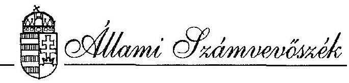
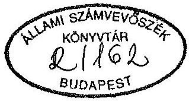
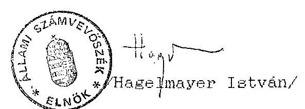

#  

## JELENTÉS

a Magyar Szocialista Párt
1991. évi gazdálkodása törvényességének ellenőrzéséről

---

# Az ellenőrzést vezette: 

Dr. Elek János
osztályvezető főtanácsos

## Az ellenőrzést végezték:

Dr. Dotterweich Antal
Hoffmann István
Sörös István
Várlaki Pál
számvevő tanácsos
számvevő
szakértő
szakértő

---

# JELENTÉS 

a Magyar Szocialista Párt 1991. évi gazdálkodása törvényességének ellenőrzéséről

I.

A vizsgálat célja, módszere, időszaka, körülményei

A pártok működéséről és gazdálkodásáról szóló - többször módosított - 1989. évi XXXIII. tv. (továbbiakban: párttörvény) 10. § (1) bekezdése, valamint az 1989. évi XXXVIII. tv. 5. §-a alapján a pártok gazdálkodása törvényességének ellenőrzésére az Állami Számvevőszék jogosult. A törvényi felhatalmazás alapján került sor a Magyar Szocialista Párt (továbbiakban: MSZP) gazdálkodása törvényességének ellenőrzésére.

Az ellenőrzés célja annak megállapítása volt, hogy a párt működéséhez szabályszerűen igénybevehető forrásokat használt-e fel, a párttörvényben előírt gazdálkodó tevékenységet folytatott-e, valamint betartotta-e a gazdálkodással összefüggő pénzügyi-számviteli szabályokat.

A vizsgálati jelentés az MSZP Budapest III. és XIV. kerületi, Erd városi, Százhalombatta városi Szervezeténél, valamint Fejér, Hajdú, Heves, Tolna, Vas, Veszprém megyei Szövetségénél és az Országos Központban végzett vizsgálatok jelentései alapján készült.

---

Az ellenőrzött időszak az 1991. január 1 - 1991. december 31-ig tartó gazdasági év volt. A helyszíni ellenőrzések 1993. március 22 - május 5. között történtek.

Az ellenőrzés módszere szúrópróbaszerű vizsgálat volt, a helyszíneken rendelkezésre bocsátott iratok, dokumentumok alapján, figyelemmel a Magyar Közlöny 1991. évi 28. számában közzétett vizsgálati programra.

# II. 

A vizsgálat megállapításai

## 1. Az 1991. évi pénzügyi zárómérleg pontossága és teljessége

Az MSZP a párttörvény 9. § (2) bekezdése előírásainak megfelelően határidőben, 1991. március 31-én közzétette pénzügyi zárómérlegét a Magyar Közlöny 33. számában /1. sz. melléklet/.

### 1.1. Általános megállapítások

A mérleg összeállítása a 19 megyei Szövetség, a Budapesti Elnökség, a Politikatörténeti Intézet és az Országos Központ adatszolgáltatásai alapján felvezetett országos kézi bevételi és kiadási összesítők alapján történt. A megyei adatszolgáltatások tartalmazzák a hozzájuk tartozó szervezetek adatait is.

A vizsgálat megállapítása szerint az MSZP által közzétett pénzügyi zárómérleg bevételi és kiadási sorai többségükben kontírozási hibák és az adatszolgáltatások pontatlanságai következtében nem a helyes összegeket tartalmazzák. A fő összegek részben a halmozódások ki nem szűrése,

---

részben helytelen jogszabály értelmezés (a párttörvény 1. sz. melléklete és a számvitel rendjéről szóló akkor hatályos 52/1988.(XII.24.)PM rendelet) miatt pontatlanok.

# 1.2. A pénzügyi zárómérleg bevételi oldalát érintő megállapítások 

A tagdijak mérlegsoron közölt összeg pontatlan, a vizsgálat megállapítása szerint az Országos Központ gépi főkönyvi kivonatában és számlasoros listájában magasabb összeg (111 E Ft) szerepel, mint a közzétett mérleg alapjául szolgáló országos kézi bevételi összesítőben feltüntetett 107 E Ft összeg. A Fejér megyei Szövetség esetében a gépi főkönyvi kivonatban, a Szövetség pénzügyi zárómérlegében és az országos kézi bevételi összesítőben más-más összegek találhatók. A Budapest XIV. kerületi Szervezeténél a tagdijak között szerepel helytelenül magánszemélyektől származó hozzájárulás is.

Az állami költségvetésből származó támogatás mérlegsoron csak a párttörvény 5. § (2) bekezdése alapján kapott állami költségvetésből származó támogatás található. A parlamenti frakció szakértői díjaira utalt; valamint az időközi országgyűlési képviselői választásokra jelölt arányosan az Országos Központ bankszámlájára utalt összegek nem szerepelnek a pénzügyi zárómérlegben.

Az egyéb hozzájárulások jogi személyektől mérlegsoron feltüntetett összeg helytelen, a vizsgálat megállapítása szerint a Budapest III. kerületi Szervezet esetében kft-től származó 363 E Ft összegű hozzájárulást nem megfelelő számlára könyveltek, így az egyéb hozzájárulások jogi személyeknek nem minősülő gazdasági társaságoktól mérlegsoron jelenik meg. A Tolna megyei Szövetség esetében helytelenül hozzájárulásként mutatták ki az egyik városi szervezet részére gazdálkodó szervezet részéről visszautalt összeget is.

---

Az egyéb hozzájárulások jogi személyeknek nem minősülő gazdasági társaságoktól mérlegsor adata az előző bekezdésben említett okból pontatlan.

Az egyéb hozzájárulások magánszemélyektől mérlegsor adata az idetartozó összegek egy része tagdíjként történt kimutatása miatt, továbbá az Országos központ esetében az országos kézi bevételi összesítőben a gépi főkönyvi kivonattól eltérő összeg szerepeltetése következtében pontatlan (kézi bevételi összesítő 5 E Ft, gépi főkönyvi kivonat 1 E Ft).

A párt propaganda tevékenységéből származó bevétel mérlegsoron feltüntetett összeg egy része valójában nem bevétel, mivel az Országos Központ pártszervezetek részére értékesítette a propaganda anyagok egy részét, így az MSZP tényleges bevételre nem tett szert, csak párton belüli pénzmozgások történtek. Ez a kiadásokat is torzítja, mivel a vásárló szervezetek az ellenértéket költségként mutatták ki. A szervezetek egy része a propaganda anyagokat tovább értékesítette, így a bevétel halmozódott. A Fejér megyei Szövetség esetében az országos kézi bevételi összesítő nem tartalmaz ilyen címen adatot, pedig a vizsgálat megállapítása szerint történt propaganda anyag értékesítés. A Budapest XIV. kerületi Szervezetnél a propaganda tevékenység bevételének egy része az egyéb bevételek között szerepel. A Hajdú megyei Szövetség adatszolgáltatásában helytelenül az egyéb hozzájárulások összegét propaganda tevékenység bevételeként is feltüntették.

A párt gazdálkodó tevékenységéből származó bérbevétel mérlegsoron feltüntetett összeg pontatlan, a vizsgálat megállapítása szerint a Fejér megyei Szövetség és szervezetei esetében sor került tulajdonukban álló ingók bérbeadására, az országos kézi bevételi összesítőben azonban a Fejér megyei Szövetség esetében ilyen címen összeg nem szerepel. A gazdálkodó tevékenységből származó értékpapír bevétel adat a vizsgálat megállapítása szerint azért

---

pontatlan, mert a Vas megyei Szövetség adatszolgáltatásában ilyen címen szerepeltetett 1403 E Ft összeg az országos kézi bevételi összesítőben egyéb bevételként lett rögzítve.

A párt által alapított vállalat és korlátolt felelősségű társaság nyereségéből származó bevételt a párttörvény akkor hatályos előírása ellenére nem bontották meg vállalatonként és korlátolt felelősségű társaságonként külön-külön.

Az egyéb bevétel összege a már ismertetett megállapításokon túlmenően azért is pontatlan, mert a lapeladásokból befolyt összegeket nem árbevételként, hanem az "Egyéb pénzügyi elszámolások" elnevezésű, a 3. számlaosztályban megnyitott számlaosztály számláira könyvelték.

Az összes pénzbevétel a gazdasági évben mérlegsor az előzőekben felsoroltak miatt nem a helyes összeget rögzíti. A vizsgálat mintavételes jellege következtében minden egyes eltérés tételes kiszűrésére, a helyes összeg megállapítására nem volt lehetőség.

# 1.3. A pénzügyi zárómérleg kiadási oldalát érintő megállapítások 

A hozzájárulások juttatása a párt országgyűlési csoportja részére mérlegsoron ténylegesen nem hozzájárulás juttatása szerepel, hanem az Országos Központ által a képviselő csoport részére kifizetett számlák összegeinek egy része.

Szükséges jelezni, hogy a mérleg kiadási oldalán - hasonlóan a bevételi oldalhoz - nem jelenik meg a parlamenti frakció szakértői díjaira utalt keret felhasznált összege.

A hozzájárulások juttatása a párt helyi szervei számára mérlegsoron adat azért nem szerepel, mert a hozzájárulások felhasználásáról a megyei szerveze-

---

tek a megfelelő költség soron számoltak el, így e soron adat feltüntetése halmozódást okozott volna.

A hozzájárulások juttatása a párt által fenntartott vagy támogatott intézmények számára, valamint a más társadalmi szervezetek számára mérlegsorok összegei keverednek, mindkét soron, mindkét jogcímen szerepelnek összegek.

A pénzügyi zárómérleg költség sorainak tartalmával összefüggésben jelezni szükséges, hogy a párttörvény 1. sz. mellékletéhez országosan egységes kitöltési útmutató nem készült, így pártonként eltérő gyakorlat alakult ki, amely a vizsgálat részéről nem kifogásolható. Így a vizsgálat csak jelzi, hogy az MSZP esetében a munkabérek mérlegsor bruttó összeget tartalmaz.

A vizsgálat megállapítása szerint azonban az MSZP esetében az egyes költségsorok tartalma szervezeti egységenként és szervezeti egységeken belül sem egyértelmű. A gazdasági események kijelöléséhez ugyanis csak számlatükör állt rendelkezésre, számlarendet nem készítettek. Ennek következtében pl. az Országos Központ esetében szakkönyvek beszerzésének költsége található az adminisztrációs és postaköltségek, a különféle egyéb költségek és a sajtó és propaganda költségek soron is; vagy hirdetési díjak, reklámköltség található a sajtó és propaganda költségek, a választásokkal kapcsolatos költségek és az egyéb tevékenységekkel kapcsolatos költségek mérlegsoron is. Egyéb megfelelő eligazítást nyújtó belső szabályzat sem készült, amely rögzítette volna, hogy mely feltételek megléte esetén lehet valamely mérlegsorban adatot rögzíteni. E hiányosságot a vizsgálat időpontjáig megszüntették.

Az összes kiadás a gazdasági évben mérlegsor adata az 1.2. pontban a párt propaganda tevékenységéből származó bevétellel összefüggésben említett probléma következtében nem pontos.

---

# 1.4. A tényleges pénzügyi helyzet ellenőrzése 

A tényleges pénzügyi helyzet adatát illetően a vizsgálat megállapítása szerint az MSZP a bevételeket a 9. számlaosztály, a kiadásokat az 5. és 8. számlaosztály számláiból állította össze, erre és az 1.2. és 1.3. pontban említett hibákra figyelemmel az összes bevétel és kiadás különbözeteként kimutatott 104.845 E Ft hiány a gazdasági évben adat nem a tényleges bevételek és kiadások különbözetét mutatja.

## 2. A pénzügyi zárómérleg megalapozottságát szolgáló könyvvizsgálati megállapítások

Az MSZP a lehetséges könyvvezetési módok közül 1991. évben az egyszerűsített kettős könyvvitelt alkalmazta. Az Országos Központ gazdasági eseményeit a párt által alapított egyik egyszemélyes kft. kontirozta és rögzítette számítógépes feldolgozás keretében, míg a megyei Szövetségek és a hozzájuk tartozó szervezetek adatait a megyei Szövetségek dolgozták fel. Mint már említésre került, az egyszerűsített számlakeret alapján számlarend nem készült, a számlatükör azonban a kontirozáshoz nem minden esetben nyújtott megfelelő eligazítást. A számlakijelölések több esetben azonban az előírások be nem tartásából adódóan is hibásak voltak.

Az 1991. év gazdasági eseményeinek könyvelése nem folyamatosan történt, a Szövetségek egy része és az Országos Központ az I. negyedévet követően kezdte meg az adatok feldolgozását, esetenként nem az idősorrend betartásával.

Az utólagos könyvelések következtében a legalább negyedévenkénti főkönyvi kivonat készítési kötelezettségnek időben nem tettek eleget.

---

3. Az analitikus nyilvántartások és a bizonylati rend ellenőrzése

A leltározást a hatályos jogszabályok és belső előírások alapján végezték az Országos Központban és a megyei Szövetségeknél. Hiba azonban, hogy egyes esetekben a leltárfelvételi ívet aláíró személyek aláírói minősége (leltározó, leltárellenőr, felelős megőrző) nem állapítható meg. Az Országos Központban egyes fogyóeszköz-csoportok, valamint az egyéb eszközök és források egyes csoportjai leltározását elmulasztották. Az elvégzett leltározásokról készült iratok egy részén aláírás nincs, néhány esetben a végösszesen sem szerepel.

A főkönyvi számlák és az analitikus nyilvántartások kapcsolata számlarend hiányában átfogóan nem volt rögzítve, mindazonáltal az állóeszköz nyilvántartó kartonokat állóeszközféleségenként csoportosítva tárolják, a számlatükör bontásával egyezően.

A fogyóeszközökről 1991. évben fogyóeszközféleségenként rendezett nyilvántartás nem készült az Országos Központban.

A szigorú számadású nyomtatványok kijelölése a vizsgált szervezeteknél - a Százhalombattai Városi Szervezet kivételével - megtörtént, nyilvántartásukra megfelelő nyilvántartó lapokat használnak, ezek vezetése, tárolása előírás szerű.

A bizonylati rendet illetően a vizsgálat megállapítása szerint a pénztári be- és kifizetések bevételi, illetve kiadási pénztárbizonylatok alapján történtek. A Budapest XIV. kerületi Szervezet esetében a tagdíjbefizetésekhez, bérfizetéshez, költséghozzájárulás befizetéshez nem minden esetben kapcsolódott alapbizonylat a pénztárbizonylathoz. Az Országos Központban a kiadási pénztárbizonylatok mellé csatolt kiküldetési rendelvények alapján a saját gépjármű hivatalos célú használatáért költségtérítést számoltak el. A 

---

kiküldetési rendelvényeken azonban csak a megtett km szerepel, a kifizetett költségtérítési összegének meghatározásához belső utasításban rögzített Ft/km szorzót alkalmaztak. A folytatott gyakorlat nem volt összhangban sem a május 15-ig hatályos 6/1990.(XI.17.)KHVM, sem a május 16-tól hatályos 9/1991.(V.16.)KHVM rendelet előírásaival.

A külföldi utazási devizakeret
 felhasználása nem volt mindenben összhangban a jogszabályi előírásokkal, mert az év I. félévében nem előírás szerű nyomtatványokat használtak, továbbá a nyomtatványok vezetése sem minden esetben volt megfelelő. Előfordult, hogy bizonylat nélkül számoltak el dologi kiadásokat, szállodaköltséget.
4. Az MSZP által a párttörvény 6. $\beta$-a alapján végzett gazdálkodó tevékenység szabályszerűségének ellenőrzése

Az MSZP tulajdonában álló ingókat hasznosított díj ellenében, továbbá értékpapírok kamataiból és az eladott kötvények árfolyamkülönbözetéből is származott bevétele. Sor került propaganda anyagok és kiadványok értékesítésére is. Tiltott pénzforrást az átvizsgált dokumentumok és a vizsgált szervezetek nyilatkozatai alapján nem vett igénybe a párt.

Vállalat alapításra nem került sor, 1991. évben két egyszemélyes korlátolt felelősségű társaságot hoztak létre.

A vizsgálat megállapítása szerint az MSZP két területen nem tartotta be a gazdálkodó tevékenységre vonatkozó előírásokat:

- az egyik városi szervezet a nem tulajdonában álló egyes helyiségeket bérbe adta, a törvényellenes tevékenységet az év végével megszüntették;

---

- az Országos Központ részéről több esetben történt hitelnyújtás a párt által alapított egyszemélyes kft-k részére, továbbá adtak hitelt más társadalmi szervezetnek is. Figyelemmel arra, hogy a hitelnyújtásokra 1991. évben került sor, azok 1992-ben megszüntek, a törvényes állapot helyreállítására felhívás nem indokolt.

# III. 

A korábbi vizsgálat alapján tett intézkedések ellenőrzése

Az 1990. évi gazdálkodás törvényességét ellenőrző vizsgálat felhívta a párt elnökét a pontosított pénzügyi zárómérleg közzétételére, a felhívásnak eleget tettek.

## IV.

Felhívás a törvényes állapot helyreállítására

A párttörvény 10. 8 (4) bekezdése alapján az Állami Számvevőszék felhívja a párt elnökét, hogy intézkedjen az 1991. évi pénzügyi zárómérleg helyesbített adatainak a Magyar Közlönyben történő közzététele iránt.

Budapest, 1993. augusztus 4.

Melléklet: 1 db

---

## A Magyar Szocialista Párt 1991. évi pénzügyi zárómérlege

## A) Tényleges bevételek

## Forintban

1. Tagdijak

19855000
2. Állami költségvetésből származó támogatás
a) alapösszeg
$84000000$
b) a pártra adott szavazatok arányában kapott összeg
3. Egyéb hozzájárulások
a) jogi személyektől

6152000

- ebből 500000 forint feletti hozzájárulás a következő belföldiektől:
- ebből 100000 forint feletti értéknek megfelelő összeg a következő külföldiektől:
b) jogi személynek nem minősülő gazdasági társaságoktól
3177000
- ebből 500000 forint feletti hozzájárulás a következő belföldiektől:
- ebből 100000 forint feletti értéknek megfelelő összeg a következő külföldiektől:
c) magánszemélyektől
- ebből 500000 forint feletti hozzájárulás a következő belföldiektől:
- ebből 100000 forint feletti értéknek megfelelő összeg a következő külföldiektől:

11647000
4. A párt propagandatevékenységéből

1506000
5. A párt gazdálkodó tevékenységéből
a) bérbevétel (ingók bérleti díja)

10824000
b) értékpapírból származó bevétel

20219000
31043000
6. A párt által alapított vállalat és korlátolt felelősségű társaság nyereségéből származó bevétel:

4629000
7. Egyéb bevétel

98569000
kezelési költség
224000
kamatbevétel
41918000
fogyóeszköz-értékesítés
14553000
kártérítés és előző éveket érintő tartozások rendezéséből
4764000
közösen üzemeltetett épület számlázott fenntartási költség térítése 33150000
egyéb
3936000
örökség
24000
Összes pénzbevétel a gazdasági évben

251249000

1. sz. melléklet
B) Tényleges kiadások
2. Hozzájárulások juttatása
a) a párt országgyűlési csoportja számára

87000
b) a párt helyi szervei számára
c) a párt által fenntartott vagy támogatott intézmények számára

1343000
d) más társadalmi szervezetek számára

3053000
e) külföldi intézmények, szervezetek, személyek számára

143000
4626000
2. Személyzeti költségek
a) munkabérek

94470000
b) költségtérítések, napidíjak

27893000
c) társadalombiztosítási hozzájárulások

36405000
d) szociális, üdülési stb. támogatások

2613000
161381000
3. Általános költségek
a) adók, illetékek

18213000
b) épületek fenntartása, karbantartása, közüzemi díjai

40941000
c) helyiségek bérlete

2639000
d) adminisztrációs és postaköltségek

35103000
e) különféle egyéb költségek

65427000
162323000
4. Sajtó- és propagandaköltségek

11790000
5. A választásokkal kapcsolatos költségek

1660000
6. Egyéb tevékenységgel kapcsolatos költségek

14314000
Összes kiadás a gazdasági évben

356094000
C) Tényleges pénzügyi helyzet a gazdasági év zárásakor

Bevételek a gazdasági évben 251249000
Kiadások a gazdasági évben 356094000

Többlet (hiány) a gazdasági évben —104845000
Halmozott többlet (hiány) az előző gazdasági évből

90770000
Halmozott többlet (hiány)
a gazdasági év végén
$-14075000$

Szekeres Imre s. k.,

Máté László s. k., ügyvezető alelnök pénztárnok
