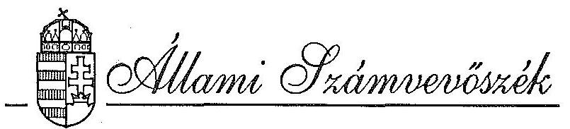
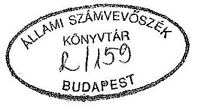
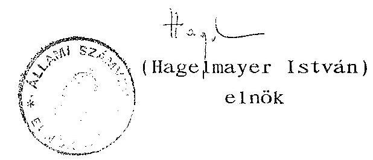
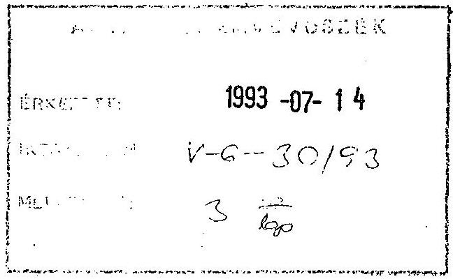
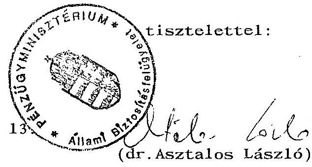
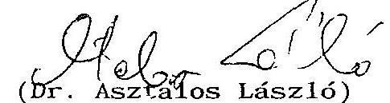
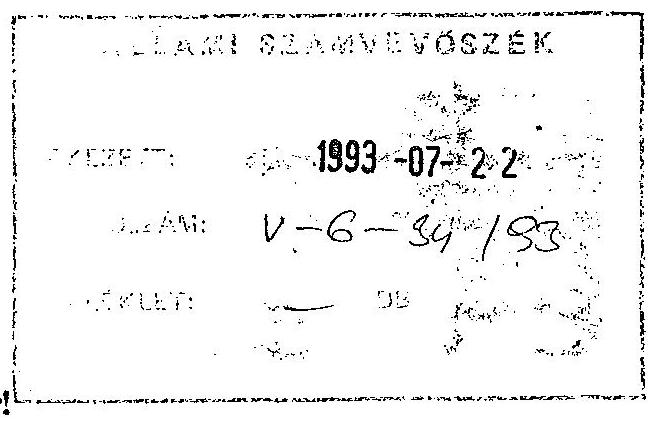
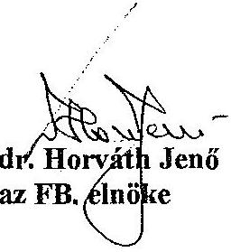
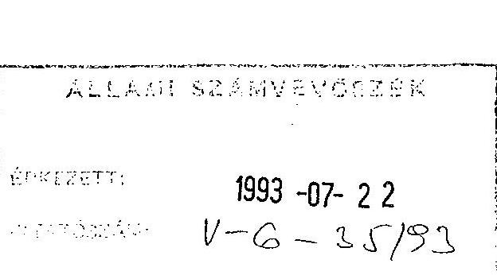
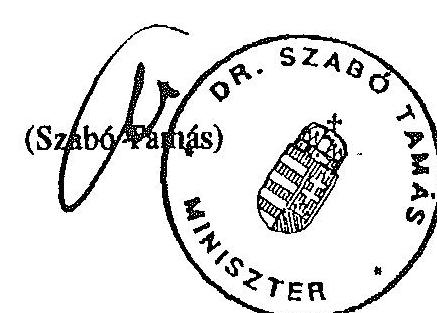

# JELENTÉS 

az Állami Vagyonkezelő Részvénytársaság
tevékenységének ellenőrzéséről

---

A vizsgálatot vezette:

Harsányi Sándor osztályvezető főtanácsos

A vizsgálatot végezték:

Lőrinc Alajos
Németh Béláné
Dr. Szöllősi Géza
számvevő tanácsos
számvevő tanácsos
számvevő tanácsos

---

# TARTALOMJEGYZÉK 

## OLDAL

I. .BEVEZETÉS ..... $1-3$
II. ÖSSZEFOGLALÓ KÖVETKEZTETÉSEK, JAVASLATOK ..... $3-9$
III. RÉSZLETES MEGÁLLAPÍTÁSOK

1. Az ÁV Rt. létesítéséhez kapcsolódó feladatok végrehajtása ..... $9-15$
2. Állami vállalatokról szóló, 1977. évi VI. törvény hatálya alá tartozó állami vállalatok gazdasági társasággá alakítása ..... $15-23$
3. Tulajdonosi jogok gyakorlása ..... $23-34$
4. Szervezet és múködés szabályozásának, valamint az információs rendszer kialakításának helyzete ..... $34-41$
MELLÉKLET

---

IV. VAGYONELLENÖRZÉSI IGAZGATÓSÁG
$\mathrm{V}-6-27 / 1993$.
Témaszám: 164

# J E L E N T É S 

## az Állami Vagyonkezelö Részvénytársaság tevékenységének ellenörzéséröl

A tartósan állami tulajdonban maradó vállalkozói vagyon kezeléséről és hasznosításáról szóló 1992. évi LIII. törvény elöirja, hogy "a Vagyonkezelö Részvénytársaság tevékenységét az Állami Számvevőszék ellenőrzi". Az ellenőrzés végrehajtása után e jelentés és a Kormány beszámolója egyidejüleg kerül az Országgyülés elé, az előző évi állami költségvetés végrehajtásáról szóló törvényjavaslat előterjesztéséhez kapcsolódóan.

Az ellenőrzés célja: annak megállapítása, hogy az Állami Vagyonkezelö Részvénytársaság (továbbiakban: ÁV Rt.) az 1992. október 29-ei megalapítása utáni időszakban megfelelően fel-készült-e az 1992. évi LIII. törvényben rögzített feladatok végrehajtására, valamint az ÁV Rt. 1992. évi tevékenységének értékelése.

A gazdálkodásra vonatkozó ellenőrzött időszak a törvényi kötelezettségnek megfelelően 1992. év. Az 1992. október 29-ei megalakulástól nem választható el, ahhoz szervesen hozzátartozik az ÁV Rt.-nek szervezete kiépítésére, a hosszabb távú müködésének megalapozására, valamint az 1993. évi feladatokra való felkészülésre tett erőfeszítései, ezért a vizsgálatot kiterjesztettük 1993. május 31-ig.

---

A helyszíni ellenőrzések a V-6-6/1993. ellenőrzési program alapján az ÁV Rt. szervezeti egységeinél végzett felmérések, valamint a vezetőkné lefolytatott konzultációk formájában 1993. március 16. - május 31 -ig tartottak.

Az ellenőrzés az ÁV Rt. létesítéséről és feladatköréről szóló törvényl kötelezettségekre irányult, - amelyeket az 1992. évi LIII. törvény 3-5., a 11-21. és a 26-30. §-ok rögzítenek - ennek megfelelően az ellenőrzés főbb területei:

- 1992. évben az ÁV Rt. létesítéséhez kapcsolódó feladatok végrehajtása;
- az ÁV Rt.-hez tartozó és a 126/1992. (VIII.28.) Kormányrendeletben meghatározott állami vállalatok, állami gazdaságok gazdasági társasággá alakítása;
- az ÁV Rt-nek gazdasági társaságokban fennmaradó tagsági (részvényesi) joga alapján a tulajdonosi jogok gyakorlása;
- gazdasági társaság alapítása;
- az ÁV Rt.-hez tartozó vagyon törvényes és eredményes müködtetéséhez szükséges nyilvántartási és értékelési rendszer kialakítása.
A szervezet és müködés szabályozottsága.

Az ellenőrzés során együttmüködve konzultáltunk az ÁV Rt. Felügyelő Bizottságával, és hasznosítottuk a Felügyelő Bizottság által lefolytatott igazgatósági beszámoltatások tapasztalatait is.

---

Az ÁV Rt. tevékenységéről szóló Kormánybeszámoló teljesitésének határideje a költségvetési zárszámadás Országgyüléshez való benyújtásához kapcsolódik. Ez a tárgyévet követő nyolcadik hónap vége. A vizsgálatról készült jelentés aláírásának időpontjában a Kormány véleményét tükrözö dokumentum nem állt rendelkezése. Ugyancsak törvényi előirás, hogy az ÁV Rt. félévenként tájékoztatja az Állami Számvevőszéket a hozzá tartozó állami vagyon változásáról, hasznosításáról. E féléves beszámoló a jelentés aláírása időpontjáig nem készült el.

# II. 

## ÖSSZEFOGLALÓ KÖVETKEZTETÉSEK, JAVASLATOK

Az állam vállalkozói vagyona döntő részénél jelenleg két szervezet gyakorolja a tulajdonosi jogokat.

Az időlegesen állami tulajdonban levő vagyont a költségvetési rend szerint müködő Állami Vagyonügynökség keze1i, hasznosítja. A tartós - részleges vagy teljes - állami tulajdonú vagyon pedig az Állami Vagyonkezelö Részvénytársaság hatáskörébe tartozik. Az ÁV Rt-hez tartozó vagyon az állam vállalkozói vagyona közel felét teszi ki, amelyböl a privatizálható rész a jelenlegi vagyonszerkezet - nyitómérleg adata - alapján megközelitően $50 \%$.

Az ÁV Rt. müködése megalapozásához rendkívül kevés idő, csupán félév állt rendelkezésére. A kezdeti időszakot az átalakulások gyors lebonyolítása, valamint a napi tulajdonosi feladatokhoz kapcsolódó krízisszerű döntési kényszerhelyzetek jellemezték,

---

amely rendkívüli feladatot jelentett az ÁV Rt. részére. Ennek csak részben volt képes eleget tenni, amiben a magyar információs rendszer általános gyengeségei, a koncepcióalkotást nehezítő viták, az irányítási rendszerbe való kapcsolódás napi megoldásaiban kialakult felfogásbeli különbségek is akadályozták. A rendszerező, türelmet kívánó szervezetépítés feladatai még hátra vannak.

Az 1992. évi LIII. törvényben rögzített feladatok ellenőrzése során az ÁV Rt. tevékenységének főbb jellemzői a következők:

A társaság a tulajdonosi irányításhoz nélkülözhetetlen, jóváhagyott üzleti tervvel nem rendelkezik, ennek csak részleteit dolgozták ki, így nem állapítható meg, hogy a költségvetési törvényben előirt bevétel realizálódik-e. Privatizációs stratégia sem készült el, de ehhez az is hozzájárult, hogy az 1993. évi Vagyonpolitikai Irányelveket az Országgyűlés még nem hagyta jóvá.

Nem alakították ki pénzügyi, likviditási tervüket, holott a várható, és az ellenőrzés során feltárt kiadások meghaladják a rendelkezésükre álló pénzügyi keretet (a garanciavállalások miatt 6 milliárd Ft, a Hungária Biztosító Rt. részére vállalt kötelezettség 2,9 milliárd Ft, a tanácsadói kiadásokra tervezett 5 milliárd Ft ).

A likviditási nehézségeket növeli, ha az ÁV Rt-hez nem kellö ütemezésben jut el a készpénzbeni alaptöke kiegészítés.

Számviteli gyakorlatuk nem megfelelö, mivel sem számviteli politikájuk, sem számlarendjük nem tartalmazza az ÁV Rt. speciális feladatait a bevételekre és kiadásokra, valamint a vagyonelemek bemutatására, változására vonatkozóan.

---

1992. éves beszámolójukat (mérleg, eredmény kimutatás, kiegészítő melléklet, üzleti jelentés) határidőre nem készítették el.

Az ÁV Rt. 1992. október 29-ei nyitómérlege "korlátozottan hiteles", nem tartalmazza az 1992. évi LIV. törvény 84. paragrafusában rögzített - az állami vállalatok tulajdonában álló, és az ÁV Rt. tulajdonába kerülő - a pénzintézetekben tagsági jogokat biztosító részvények értékét. (Ennek értékét a vizsgálat befejezéséig nem dokumentálták.)

Az ÁV Rt.-nek 1992. évben bevétele nem származott a privatizációból, és a vagyontárgyak értékesítéséből. Osztalékból bevétele 3186 millió Ft volt; ez a költségvetési törvényben elöirányzott 14.000 millió Ft csupán $22,7 \%$-a. A javasolt pótköltségvetésben rögzített 5.000 millió Ft-tal szemben pedig annak $63 \%$-a. (Nem auditált adat)

A társaság a tulajdonába utalt, pénzintézetekben tagsági jogot megtestesítő részvények - vállalati banki részvények - után járó osztalékot csak 2/12-ed részben szedte be, holott a költségvetési törvényben rögzítetteknek megfelelően, valamint az 1992. évi LIII. törvényben foglalt $10 \%$ eredménytartalék képzése figyelembevételével a teljes összeg a költségvetést illeti.

Az ÁV Rt. nem tudta az alapító okiratban elöirt 60 napos - irreálisan feszített - határidőn belül elkészíteni a Szervezeti és Müködési Szabályzatot (a továbbiakban: SzMSz). Az SzMSz bevezetése a jelentés lezárásakor azonban már napirenden volt.

A szervezetépítés, a müködés-szabályozás, az informatikai rendszerfejlesztés feladatai vontatottan és szétforgácsol-

---

tan valósulnak meg és jelentős elmaradás tapasztalható egyes területeken a törvényi határidős kötelezettségekhez mérten is. Az elmaradást jórészt a fogyatékos koncepcionális megalapozás, a megvalósitás tartalmi és határidős koordinációjának a hiánya idézi elő. Nem hasznosítják az azonos tevékenységet ellátó szervezetek módszertani tapasztalatait.

Az ÁvÜ-töl átvett dokumentumok nem teljeskörüek, ezért több esetben hiányzik a teljességi nyilatkozat, ez bizonytalansági tényezőt idéz elő a tulajdonosi jogok gyakorlásánál. A hiányzó dokumentumokat igyekeztek más forrásból beszerezni. Elöfordult, hogy az átadó szervtől nem kapták meg a kulcsdokumentumokat, mivel ezzel az átadó sem rendelkezett (ÁB-AEGON).

Ezideig nem alakult ki egy egységes álláspont a felszámolás alatt lévő vállalatok esetében a kötelező állami tulajdoni hányad biztosítására, a "speciális" vagyonkezelés módszerére. Gátolja az egységes álláspont kialakítását az is, hogy nem ismert, hogy az alapító a készpénzbeli hozzájárulás további részét milyen ütemben utalja át az Áv Rt. részére.

Az ÁV Rt. a tulajdonosi jogainak gyakorlására e társaságok testületeibe igazgatóságának tagjait és alkalmazottait delegálja, mely gyakorlatot az elmúlt időszakban - az összeférhetetlenségre vonatkozó szigorú szabályok értelmezésével - nem szabályozta.

Nem rendelkeznek a Határozatok Könyvével, így a határozatok nyomon követése nem dokumentált, ellenőrzése nehézségekbe ütközik.

---

A vállalatok társasági átalakításának információkkal történö megalapozása általában megfelelö. A nélkülözhető vagyonelemek felszabadítására azonban csak decentralizált privatizáció formájában került sor, mely esetben a bevételekkel nem az ÁV Rt., hanem az átalakuló vállalatok rendelkeznek.

A társasági átalakulások nagy volumenũ humán eröforrás szükségletének biztosítása nehézségekbe ütközik. A közel 100 vállalat átalakítása várhatóan 1993. 1. félévének végéig lezárul, azonban az átalakítások csak a cégbírósági-bejegyzési, minimális kötelezettségeknek tesznek eleget, és a társasági testületek személyi állományának feltöltése a cégbejegyzést követő időszakra tolódik át.

Az vizsgálati tapasztalatok alapján az Állami Számvevőszék javasolja, hogy
a Kormány

- utalja át a Társaság részére az ÁV Rt. gazdálkodásának és pénzügyi helyzetének stabilitása érdekében az alaptőke készpénzbeli hozzájárulás fennmaradó hányadát,
- tekintse át az 1993. évi pótköltségvetésben tervezett 3 milliárd Ft privatizációs bevétel és 5 milliárd Ft-os osztalékbevétel realitását. (A várható 1992. évi osztalék kb. 3,2 milliárd Ft lesz.)
- kísérje figyelemmel a központi költségvetés bevételét képező pénzintézeti tagsági jogokat megtestesítő részvények - vállalati banki részvények - utáni osztalék teljes egészében a költségvetést illeti, ezért az ÁV Rt. a pótbefizetéseket teljesítse;

---

- átfogóan rendezze az ÁV Rt. holding képviselöinek és alkalmazottainak a hatáskörébe tartozó társaságok vezető tisztségeire történő delegálását.

# az ÁV Rt. Igazgatósága 

- készítse el haladéktalanul üzleti tervét a számviteli rend, számviteli politika kialakításával és az információs rendszer összhangjának biztosításával is;
- gondoskodjon az éves beszámoló előirt határidőre történő teljesítéséről;
- dolgozza ki az 1993. évi Vagyonpolitikai Irányelvek elfogadása után a tulajdonosi jogok gyakorlásához nélkülözhetetlen stratégiákat az értékesítés, az átadás elősegítése érdekében. A privatizációs stratégiát támassza alá olyan hatásvizsgálatokkal, amelyek alapján eldönthető, hogy a mielőbbi vagy a reorganizáció utáni értékesítés a követendő cél;
- véglegesítse illetve készítse el a hiányzó szabályozásokat a társterületi szervezési és módszertani tapasztalatok adaptálásával javítsa a müködés szabályozottságát;
- építse ki a belsö ellenőrzés komplex rendszerét, amely beépül mind a döntése1őkészités, mind a végrehajtás folyamatába;
- alakítson ki egységes álláspontot a felszámolás alatt álló vállalatoknál a kötelező állami tulajdonhányad biztosítására, a speciális vagyonkezelés módszerére;

---

- szervezze meg a hatáskörébe tartozó gazdasági társaságokról a teljeskörü és tulajdonosi szempontok szerinti információs rendszert. Az ügyvezetés gondoskodjon részletes információs rendszer szervezéséről, ame ly vagyonmozgásokról, azok szerkezetéről, összetételéről, értékéről, a ráfordításokról, a költségeiről - a saját specialitásaít figyelembe véve - a bevételek szerkezetéről átfogó képet ad. Ez elégitse ki a számviteli, vezetői információs igényeket és az ellenőrzés adatszolgáltatási követelményeit. Számlarendjét is ennek megfelelően készítse el;
- gondoskodjon arról, hogy a társaságokról, vállalatokról átvett dokumentáció teljeskörü és hiteles legyen.

111 .

# RÉSZLETES MEGÁLLAPÍTÁSOK 

Az Állami Vagyonkezelö Részvénytársaság tevékenysége

1. Az ÁV Rt. létesítéséhez kapcsolódó feladatok végrehajtása

### 1.1. Alapítás

A tartósan állami tulajdonban maradó vállalkozói vagyon kezeléséről és hasznosításáról szóló 1992. évi L111. tv. az ÁV Rt. létesítéséröl rendelkezett, majd a 126/1992. (VIII.28.) Korm. rendelet 1. sz. mellékletében meghatározták azoknak a gazdálkodó szervezeteknek a körét, amelyek az ÁV Rt.-hez kerülnek. A Kormányrendelet rögzítette azt is, hogy a gazdálkodó szervezetekben a tartós állami tulajdonhányad többségi vagy kisebbségi legyen-e.

---

Az ÁV Rt. 1992. október 29-ei hatállyal jött létre; Alapító Okíratát ekkor írta alá a Magyar Köztársaság Miniszterelnöke. A Fövárosi Bíróság, mint Cégbíróság 1993. február 10-én, 01-10-042051/05. sorszámon a cégjegyzékbe bejegyezte.

# 1.2. Az ÁV Rt. alaptökéje 

Az ÁV Rt. 1993. február 15-én elkészítette az 1992. október 29-ei nyitómérlegét. Ez tartalmazza a már átalakult társaságok 1992. évi LIII. törvény által megfogalmazott adatait, mégpedig

- a tartós állami tulajdon hányad és alapító által rendelkezésre bocsátott pénzbeli hozzájárulás, - 9.698.000 EFt - az ÁV Rt. jegyzett tőkéjét képezi, ez 289.151 .000 EFt.

A részvényesi jogok gyakorlója (a Kormány által kinevezett miniszter) a pénzbeli hozzájárulás $30 \%$-át, azaz 2.909.000 E Ft összeget a Társaság rendelkezésére bocsátotta, míg a pénzbeli hozzájárulás ezutáni fennmaradó részét folyamatosan a cégnyilvántartásba történő bejegyzéstöl (1993. február 10.) számított egy éven belül köteles a Társaság rendelkezésére bocsátani olyan ütemezésben, hogy müködését ne hátráltassa.

Az ÁV Rt. tőketartalékába pedig a részvények azon hányada került, amely a Kormány meghatározása alapján nem került tartós állami tulajdonba. Ezen részvények értéke: 312.331 .568 E Ft.

---

Az ÁV Rt 1992. október 29-ei idópontú nyitómérlege - a könyvszakértői vélemény alapján - "korlátozottan hiteles, mivel a saját tőke összegének ellenőrzését a cégbírósági adatok hiányában nem lehetett elvégezni". Megállapitható azonban az, hogy a saját töke összegéböl hiányzik a pénzintézeti tagsági jogokat biztosító részvények értéke is (vállalati banki részvények). Az ehhez kapcsolódó tulajdonjogot az 1992. évi LIV. törvény 84. §-a rögzíti, és mint ilyen a társaság saját tökéjének részét kell hogy képezze, már a nyitómérleg adataiban is.

# 1.3. Az ÁV Rt. feladataihoz kapcsolódó számviteli előkészítés 

Az ÁV Rt jó müködésének egyik alapfeltétele és a Számviteli törvényből adódó kötelezettsége a társaság számviteli politikájának kialakítása, amely a számviteli elvek, értékelési módszerek, eljárások alkalmazását tartalmazza.

A számviteli politikájukat, valamint a számlatükröt és számlarendet tervezet szinten elkészitették, ez azonban nem tekinthető hivatalosnak, mivel azt - Alapító Okiratban előirt feltétel szerint - az Igazgatóság nem hagyta jóvá. A Számviteli Törvény 79. § (4) bekezdése alapján ezt az alapítástól számított 90 napon belül kell elkészíteni és az Igazgatóság jóváhagyásával hatályba léptetni.

A számviteli politikájuk, számlarendjük nem teljeskörü, hiányos, mivel

- nem tartalmazza az összhangot a társaság be1só információs rendszerével, a számviteli és elszámoltatási rendszerrel,

---

- az ÁV Rt. speciális tevékenységéhez kapcsolódó eljárások körét a bevételek és költségek oldaláról sem rögziti és nem tükrözi a megvalósítás módját. Mint pld. a privatizációs bevétel:
$=$ milyen tranzakcióból, részvények vagy üzletrészek értékesítéséből származik,
$=$ hazai befektetők me1y rétegéból, milyen forrásból származik (készpénz, hitel, MRP stb.),
$=$ a külföldi befektetők által teljesített értékesítés iránya (DM, USD stb.),
- az osztalékbevétel is külön megbontást igényel pl. a tulajdonosi hányad szerint vagy a társaságoktól származó illetve a pénzintézetben tagsági jogokat biztosító részvények osztaléka.

Ez utóbbi elkülönítése azért is lényeges, mert a költségvetési törvény szerint azt a költségvetésnek be kell fizetni - nem említik meg a számviteli politikában, a számlarendben a társaság garanciális kiadásait, a reorganizációs, restruktúrális ráfordításokat, az alaptöke emelésre vonatkozó kötelezettségeket stb.

A számviteli politikát, a számlarendet, a számvitelben kialakított feltételrendszert külsó szakértő is felülvizsgálta, javaslatot adott a realizációs intézkedésre, amelyben a számviteli politika és a kapcsolódó egyéb szabályzatok újbóli elkészítését határozta meg. A realizációs intézkedésre vonatkozó javaslatot a vizsgálat befejezésének időpontjáig még nem hagyták jóvá.

---

A számviteli előkészitettség hiánya a vezetői és tulajdonosi információs rendszer kialakítása területét is gátolja.
1.4. A portfólió csomagok alapdokumentumainak átadás-átvétele

A 126/1992.(VIII.28.) Korm. rendelet által meghatározott vagyoni kör egy részét az ÁV Rt.-nek az ÁvÜ-töl kellett átvenni. Az ÁVÜ és az ÁV Rt. megállapodás-tervezetet készitett az átadás-átvétel lebonyol itására, szabályozták az átadás tartalmát, módját, ütemezését stb., azonban a megállapodás nem került aláírásra.

Vizsgálatunk során az ÁV Rt. az átvett dokumentációs anyagról teljeskörü kimutatást adni nem tudott.

Ennek okai:

- az anyagok átvételét nem koordinálták megfelelően sem az Rt. apparátusán belül, sem az átadó szervekkel, ahol a dokumentumok nem álltak teljeskörüen rendelkezésre (pl. ÁB-Aegon kulcsdokumentumai);
- az átadások több fázisban, zajlottak;
- az átadó-átvevö személyek idöközben változtak.

Lényegében ugyanez a folyamat zajlott le a minisztériumoktól történő anyagátvételek során is.

Az Rt. apparátusa a munkájához szükséges adatbázist, dokumentációt, stb. elsősorban a hozzájuk került vállalatoktól, illetve gazdasági társaságoktól kérte be. Az információgyüjtés során előfordult, hogy az igazgatóságok közötti összehangolt kooperáció hiánya miatt ÁV Rt. különböző igazgatóságai csaknem azonos adatok szolgáltatására kérték a vállalatokat.

---

1.5. Az ÁV Rt. létesítésének jogi előkészítése, illetve a müködéshez szükséges jogi szabályzatok elkészítése
1.5.1. Az okirat 6.1. pontjának 7. bekezdésében kötelezi a társaság igazgatóságát, hogy az okirat elfogadásának napjától (1992. október 29.) számított 60 napon belül készíttesse el a társaság Szervezeti és Müködési Szabályzatát. Ez azonban teljesíthetetlen volt, a vizsgálat időtartama alatt még nem rendelkeztek jóváhagyott Szervezeti és Müködési Szabályzattal. (Az SzMSz bevezetésének folyamatát a 4.1. pont mutatja be részletesebben.)
1.5.2. Az okirat 3.3.3.1/f. pontja az Igazgatóság feladatául jelöli az ún. "Határozatok Könyvének" vezetését is, melyben az Igazgatóság, az ügyvezetés által hozott határozatokon kivül köteles folyamatosan nyilvántartani az alapító, illetve a részvényesi jogok gyakorlójának határozatait is.
Nem rendelkeznek "Határozatok Könyvével", s így ezen alapvetö dokumentumok nyilvántartása megoldatlan. Bár a határozatok egyedileg hozzáférhetők, a részvényesi jogok gyakorlója írásbeli határozatairól nincs dokumentum.
1.6. Személyi és tárgyi feltételek biztosítása

Az ÁV Rt.-nél 1992. december 31-én 41 fő dolgozott, és ez a létszám a fokozatos felvételek következtében 1993. május 31 -ére 84 fôre nőtt, ebből adminisztratív alkalmazott 32 fő, ügyintéző 8 fő, kiemelt munkatárs 21 fő, az igazgatói státuszban 20 fő szerepel.
Jövedelmük - hasonlóan az ÁVÜ-höz - kiemelten jónak értéke1hető, az adminisztratív alkalmazottakhoz viszonyítva az ügyvezetői bérek 5x-ös szorzószámot adnak, míg az igazgatók azok $4 x$-ét kapják.

---

Az ÁV Rt. elhelyezése: Az alapító okirat a Társaság székhelyének a Bp. XIII. Pozsonyi út 56. sz. épületet jelölte ki.

Ez az elhelyezés az ÁV Rt. növekvő létszámszükségletének nem felelt meg, ezért a részvényesi jogokat gyakor1ó engedélye alapján az F-1 Vagyonkezelö, Beruházó és Fejlesztö Rt-vel 1993. március 8-án határozatlan idöre szóló bérleti szerződést kötöttek a Bp. XI. Bánk bán út 17/b. sz. alatti irodaház 4019 négyzetméter alapterületü iroda és kiszolgáló helyiségére, továbbá 8 db garázsra.

Az Rt. apparátusa 1993. április 1-jével birtokba vette az új székhelyét, amely megfelel a korszerü irodaépület kritériumainak. A székhelyváltozást az elöirt 30 napon belül a cégbíróságnak nem jelentették.
2. Állami vállalatokról szóló 1977. évi VI. tv. hatálya alá tartozó állami vállalatok gazdasági társasággá alakításának helyzete

Az ÁV Rt. létesítésekor a hozzárendelt 163 gazdálkodó egységböl kb. 40 társasági formában müködött, ill. az ÁVÜ által előkészítetten bejegyzése már folyamatban volt. A kisebb egységszám mellett azonban a társasági formában müködö egységek a vagyonértéket, illetve gazdasági súlyt tekintve az ÁV Rt. hatáskörébe tartozó gazdálkodó szervezeteknek több mint a felét képezik.

A fennmaradó közel 120 egység állami vállalati, illetve állami gazdasági formában müködött és átalakulásra kötelezett. Ez utóbbiaknál a pontos szám nem határozható meg, mivel az átadás-átvétel időszakában már több vállalat ellen

---

felszámolás volt folyamatban - mely esetben a tulajdonosi jogok már nem értelmezhetöek, illetve több vállalat fizetésképtelen - így az átmeneti időszakban csőd, illetve felszámolási eljárás indulhat ellene. (Pozitív tényként megjegyezhető, hogy az ÁV Rt-nek az elmúlt müködési idöszakában - ismereteink szerint - a hitelezökkel sikerült egyezségekre jutni, így új felszámolási eljárásról nincs tudomásunk.)

A 40 társaságból és köze1 120 állami vállalatból álló vagyont az ÁV Rt a következő 10 szakmai csoportosítású portfolió igazgatósági szervezetben kezel1: - energia-, infrastruktúra, vizművek, - ipari I. és II. márkavéde1mi és speciális érdekeltségek -, mezőgazdasági, - erdőgazdasági, - K+F intézmények, - humán infrastruktúra, - bankok és pénzintézetek.
2.1. A vállalatok átalakításához rendelkezésre álló információkhoz az ÁV Rt. (és portfolió igazgatóságai) az alábbi felmérések során jutott:

- számítógépes nyilvántartásban rendelkezésre áll a vállalatok és társaságok 1991. évi rendezö mérleg adatai, valamint a gazdálkodó szervezetek február 28-i adóbevallásának adatai (jelenleg már az 1992. évi hitelesített mérleg és eredménykimutatás adatai is);
- az 1992. júliusi kérdőíves felmérés alapján az egységek közép és rövidtávú piaci stratégiája, az átalakulás és privatizáció akkori helyzete és középtávú terve, a gazdálkodó szervezet felépítése és jelentős többségi tulajdonú érdekeltségei, vezetési séma és a testületek személyi összetétele, az ügyvezetés első három tisztségviselőjének szakmai önéletrajza stb.;

---

- a gazdálkodó szervezetekről begyűjtött - közelmúltban végzett - átvilágítások, felmérő tanulmányok (melyek nem csak az átalakulással, piacszerzéssel és privatizációval foglalkoznak, hanem menedzsment átvilágítási és minősitési kérdéseket is érintenek);
- a számlavezető bankoktól begyűjtött információk;
- 1993. február 28-ával lezárt és minden állami gazdálkodási formában működő egységtől bekért átalakulási tervek;
- 1992. októberétől folyamatosan szervezett, portfolió csoportonként és egyedi helyszíni tájékozódások során lefolytatott konzultációk információi, melyeket főként a rendelkezésre álló információk aktualizálása érdekében folytatnak.

2.2. A portfolió csoportok egységösszetétele szakmailag heterogén. Egyes portfolió csoportokhoz tartozó egységek részint a jelentős vagyonérték, részint az eltérő szakmai és gazdálkodási paraméterek miatt csak egyedileg kezelhetőek (pld. energia, infrastruktúra, ipar, márkavédelmi, stb.). A mezőgazdasági és erdőgazdasági portfolióknál, valamint a K+F intézmények átalakítása esetében az ellenőrzés feltárt jó irányú standardizációs törekvéseket is.

A mezőgazdasági és erdőgazdasági portfoliókba tartozó egységek átalakítását kezdetben lassította az 1991. évi XVIII. (számviteli) tv., valamint az 1992. LIV. tv. átalakulási vagyonmérlegre vonatkozó szabályozásainak értelmezése. Az értelmezési problémákat a tőkeszerkezet, különösen a tőketartalékba helyezés, a föld és erdő forgalomképtelensége, a decentralizált privatizáció hatásai, a hitelek, jelzálogok, garanciák kezelése jelentette.

---

Az ÁV Rt. auditor igazgatósága több oldalú konzultációt követően február végén kiadott egy segédletet az átalakulási vagyonmérlegek értékeléséhez, ame1y egységes szemléletet képviselve a folyamatban lévő átalakulásokat gyorsította. Jelenleg egy-két kivételtől eltekintve a csoportokhoz tartozó állami gazdaságok, erdőgazdaságok, tangazdaságok átalakulási dokumentációi elkészültek és napjainkban folyik ezeknek az ÁV Rt. ügyvezetőségi testülete által a jóváhagyásuk.

A K+F intézmények közül két intézetet az ÁV Rt. már átalakított, továbbá hét intézet társasági átalakulása folyamatban van.

Az ÁV Rt. Igazgatósága a kutatás-fejlesztési stratégiájának kialakításához a 48/93. sz. határozatában elrendelte a K+F intézmények külső tanácsadó általi átvilágítását, a szervezetek, tevékenységek és a vagyon átstrukturálását, az átalakítások, leválasztások, megszüntetések és összevonások ez év végéig történő meghatározását.

A viszonylag homogén szerkezetü $\mathrm{K}+\mathrm{F}$ portfolió csoport kivételt képez azon szempontból, hogy az ÁV Rt. tevékenységében csak itt jelenik meg a vállalati átalakítások kapcsán egy átfogó átvilágítással a vállalati reorganizációs szükségletek felmérésre irányuló igény. Az átalakítás előtt álló "államigazgatási felügyeletü" vállalatok átstruktúrálása viszonylag könnyebben kivitelezhető a már társasági formában müködő egységek tevékenységi szerkezetének átalakításához képest. A K+F intézmények esetében is várhatóan problémát fog jelenteni az átalakulások, valamint a szerkezeti átalakítások időbeli összehangolása.

---

Az átalakítási tevékenységek relativ tipizálására az előzőektől eltérően kevésbé adódott mód a humán infrastruktúra, a márkavédelmi és speciális érdekeltségek portfoliókban.

Ezeket a vállalatokat eltérő szakmai tevékenységek, méretek, gazdálkodási pozíciók, vállalati és banki kapcsolatok jellemzik.
(A súlyosan eladósodott, esetenként csődben lévő vállalatok vagyonát jelentős jelzálogok terhe1ik, a bankok nehezen teljesíthető feltételeket támasztanak az átalakuláshoz adandó hozzájárulásukhoz, stb.)
2.3. A portfolió csoporthoz több olyan vállalat tartozik, amely - esetenként több éve elhúzódó - felszámolás alatt áll. A felszámolás alatt álló vállalatok kezelésének kérdésében ezideig az ÁV Rt-n belül nem alakult ki egységes álláspont. Az egyik nézet abból kiindulva, hogy a felszámolás beindítását követően a vállalat vagyona már a hitelezóké - és az eredeti tulajdonos jogai megszűntek - azt az álláspontot képviseli, hogy az ÁV Rt-nek a felszámolásnál kivásárlási kötelezettsége nem áll fenn, a felszámolás lezárásával a vállalat jogutód nélkül megszünik.

A másik nézet a rendeletalkotók szándékából indul ki és véleményük szerint abból a profilból, ami miatt a vállalat a tartós vagyoni körbe került besorolásra, az elöirányzott tulajdoni hányadot ki, illetve vissza kell vásárolni. A 9.680 millió Ft alaptőke hozzájárulás részét képezi az 1.700 millió Ft e célra való elkülönítése. A készpénz hozzájárulás ezidáig csak 2.900 millió Ft volt és így a pénzátutalás további ütemétől függ az ÁV Rt. ezirányú teljesítésének lehetősége.

---

Az időtényezőt is figyelembe véve a felszámolás alatt álló vállalatok kezelésére vonatkozó egységes ÁV Rt álláspont és tranzakciós módszer kialakítása sürgős feladat.
2.4. A nagy számú állami gazdálkodók társasági formára történő átalakítása igen jelentős terhelést eredményez a portfolió, a jogi és az auditori területeken. Az átalakításokkal párhuzamosan a portfolió és jogi terület igen jelentős számú vagyonvédelmi ügyet is rendezett. Az elbírált több mint 300 vagyonvédelmi ügy túlsúlyban a mezőés erdőgazdasági, valamint a K+F portfolió csoportban, decentralizált privatizáció formájában bonyolódott.
(A mezőgazdasági és erdőgazdasági portfolióban a decentralizált privatizációval kapcsolatos tárcaközi bizottsági döntés, a K+F portfolióban pedig kormánydöntés engedélyezte - meghatározott vagyontárgyak körében - a vagyonelemek értékesítését a vállalati terhek csökkentése, hitelek és adósságok csökkentése céljával. A decentralizált privatizációnál a bevételeket a vállalat a saját gazdálkodásába forgatja vissza és ez az ÁV Rt-nél nem jelenik meg.)

A portfolió igazgatóságoknál a munkáltatói jog gyakorlása kapcsán további feladatként jelentkezett a vállalati igazgatók 1992. évi célprémium kitüzéseik teljesitésének a felmérése, az esetleges éves fizetésemelések rendezése. Általános elv, hogy a vállalatok vezetőinek bérét csak az átalakulást követően emelik.
(Egyes esetben az átalakulást követően a társaságok igazgatóinak bérét és éves prémium kitüzésének mértékét is igen jelentősen emelték, pld. regionális gázszolgáltatók.)

---

Az ÁV Rt. hatáskörébe tartozó vállalatok tömeges átalakításának időbeli lefolyását számtalan külsỏ és belsỏ tényező befolyásolja. Ezideig (máj. 11.) a közel 120 állami gazdálkodó egységböl az ÁV Rt átalakított 17 egységet, jogi véleményezési fázisban tart 24 egység átalakulása, a többi átalakulási dokumentáció a portfolió igazgatóságokon egyeztetés, kiegészítés alatt áll.

A portfolió igazgatók ütemezése szerint az ÁV Rt. az állami gazdálkodó egységek zömének átalakítása befejezéshez közeledik. Az átalakult társaságok irányító-e1lenőrző testületei személyi állományának feltöltése azonban idöben elhúzódhat.

A tartalmi vonatkozásokat elemezve megállapítható, hogy az állami vállalatok társasági átalakítása - a mezőgazdasági és erdőgazdasági portfoliók és K+F. intézmények kivételével - több esetben nem járt együtt a profil, a tevékenység és vagyoni szerkezet módosításával, hanem nagyobbrészt a kialakult struktúrákat rögzíti.
(A kivételeket a meghatározott körben engedélyezett decentralizált privatizáció, illetve a $\mathrm{K}+\mathrm{F}$ intézmények most induló szakértői átvilágitása és átstruktúrálása eredményezik).

Az egyes átalakult társaságok tőkeszerkezete az egyedi tulajdonosi megfontolások és törvényi szabályok miatt szélsőséges értékeket mutat. A tartaléktőke a saját va-gyon \%-ában a Szerencsi MgRt.-nél 47,7 \%, Agroprodukt MgRt.-nél 62,2 \%. A csőd miatt meghiúsult BHV átalakulás esetében az átalakulási terv szerint a tartaléktőke 90 \%-os lett volna.

---

2.5. Az ÁV Rt. által a tulajdonosi jogai gyakorlására a társaságokba delegált alkalmazottai és igazgatósági tagjai státusza ezideig az ÁV Rt.-nél szabályozatlan és sok rendezetlen kérdés merül fel.

Az összeférhetetlenséggel kapcsolatos szabályok, valamint az ÁV Rt. igazgatósági tagjaival kapcsolatban az Alapító okirat a hatáskörbe tartozó társaságoknál a vezetői tisztségviselést csak mint az ÁV Rt. jogi képviseletének ellátását engedélyezi. Ebből következik, hogy az alaptevékenységének részét képező jogi képviselöi feladatok ellátásáért az anyagi-vagyoni kockázat tel jes egészében az ÁV Rt.-t terheli, így a tiszteletdijak is nem a személyt, hanem a vagyonkezelö szervezetet illetik meg.

A kezdeti átalakításoknál az ÁV Rt. munkatársait néhány esetben a társaságok igazgatóságába személyre szólóan delegálták, ez a gyakorlat azonban már módosult.
(Az ismertetett ellenőri álláspontot az ÁV Rt. vezető munkatársai általában nem vitatják, azonban az egységes szabályozás ezideig hiányzik. A tel jeskörüség érdekében az is megemlithető, hogy az ellenőrzés birtokában van olyan hiteles nyilatkozat, mely szerint az ÁV Rt. munkatársak a holdinghoz tartozó társaságok igazgatósági tagságáért ezideig tiszteletdijat nem vettek fel.)

Az elmúlt időszakban - ugyan csak szórványosan - az is elöfordult, hogy az ÁV Rt. jogi képviseletében a társaság igazgatóságába delegált személ yt megválasztották a testület elnőkének. Ez utóbbi eset kapcsán megfontolásra és egységes álláspont kialakítására javasoljuk a jogi képviseletet ellátók testületi irányító funkcióra történő megválaszthatóságának kérdését. (Megitélésünk szerint a testületi irányító funkció csak természetes személy esetében értelmezhető.)

---

2.6. A közel 100 vállalat tömeges átalakítása jelentős számú egyszemélyi felelös vezető beállitását, valamint megközelitően 1000 fó testületi tag delegálását igényli. Ilyen volumenú "humán erőforrás bankkal" az ÁV Rt értelemszerüen nem rendelkezhet.

A portfolió igazgatóság összeállitott a társasági testületek szakmai összetételére, valamint a képviselt (delegáló) területekre vonatkozó rendezöelveket és a konkrét testületek személyi javaslatait az alapító minisztériummal, szakmai felügyeletekkel és tudományos szervezetekkel együttmüködve (mező- és erdőgazdasági portfoliók, regionális gázszolgáltatók átalakítása stb.).

Míg az átalakulások zömét a delegált hatáskörök alapján az Ügyvezetőség hagyja jóvá, a személyi javaslatok körüli viták hatására az ÁV Rt. Igazgatósága az április 24-i ülésén hozott határozataival tagjaiból egy öt fős ad hoc bizottságot hozott létre és az átalakuló vállalatok testületeinek személyi összetételét, annak elfogadását saját hatáskörbe vonta.
(A humánpolitikai igazgatóság jelenleg fôként az ÁV Rt. apparátusának létszámbiztosításával foglalkozik, azonban a humánerőforrás bank folyamatos építésével a társasági testületek további természetes létszámcserélődéséhez az utánpótlás biztosítása már az igazgatóság feladata.)

# 3. Tulajdonosi jogok gyakorlása 

Az 1992. évi LIII. tv. 5. § b) pontja az ÁV Rt. feladatkörébe utalja a gazdasági társaságokban a tulajdonosi jogok gyakorlását, amelyet részletez a törvény III. fejezete is; megbontva a tulajdonosi jogokat a vagyoni értékesítésre, gazdasági társaság alapítására, és a vagyon kezelésére.

---

3.1. Értékesítés csak az ÁVÜ által elindított tranzakció befejezését jelentette (MALÉV), ebből az 1992. évben bevétele nem származott.
Az ÁV Rt 1992. évben nem alapitott gazdasági társaságot.
3.2. Az ÁV Rt működésének első tört évében csupán felkészült ezekre a feladatokra, tevékenységében dominált a tulajdonosi irányítás, illetve a vagyonkezelés.
Az Alapító Okírat az 1.6.1. pontja részletesen szabályozza e tevékenységek keretében végzendó feladatokat.
3.2.1. Az Állami Vagyonkezeló Rt. üzletpolitikát és ehhez szükséges prognózisokat készít, mindezt az okirat 3.3. pontja alapján az Igazgatóság feladatkörébe utalja.
1993. május 31-ig a vizsgálat befejezéséig 1993. évre vonatkozó üzleti tervet nem, csak ennek üzletpolitika részelemelt tudták bemutatni, mint például:

- tanácsadói költségvetést, amely az információs rendszer, a vállalati stratégiák, a vállalati reorganizáció, a privatizáció, az üzleti tervek és modellekre vonatkozik, amelyet a tanácsadói szerződések db-száma és várható átlagos költségének szorzataiból alakitották ki. Ez 1993. évre 5 milliárd Ft várható kiadást jelent;
- a várható garanciális kötelezettségek összege 6.6 mi111 iárd Ft;
- befektetési költségvetés összege 85 milliárd Ft;
- az ÁVÜ-tól átvett tanácsadói szerződések költségvonzatát nem összegezték.

---

A társaság feladatköréhez kapcsolódó tevékenységekhez a konkrét pénzügyi fedezetét hogyan, mi módon lehet elöteremteni - tehát az 1993. évi üzleti prognózist még nem alakitották ki. Nincs irformációjuk az alaptöke hozzá járulás rendelkezésre bocsájtás ütemezéséról a részvényesi jogok gyakorlójától.

Gyakorlatilag a bevétel, annak várható szerkezete (privatizációs bevétel, osztalék, egyéb) valamint a kiadások (privatizációval összefüggö, reorganizáció, a szervezet müködési kiadásai stb.) felmérése nem készült el és ennek alapján a pénzügyi likviditási tervvel sem rendelkeznek.

Ez az információs rendszer kialakítását is hátráltatja, mivel az üzleti tervnek és a kialakítandó megfigyelési rendszernek, a számviteli rendnek szoros összhangja szükséges, mind a társaság belsö, mind a gazdálkodó szervezetek közötti információs rendszerekben.
3.2.2. A Társaság tulajdonosi jogainak gyakorlását az Igazgatóság a 30/1992. (XII.16.) határozatában rendezte, és a döntési hatáskört:

- a vagyonkezelés és értékesítés körében 10 milliárd Ft, illetve a jegyzett tőke $50 \%$-a felett az Igazgatóság, ez alatt a vezérigazgató gyakorol ja;
- vagyonvédelmi ügyekben pedig a vezérigazgatóra delegálta a döntési hatáskört a vállalati vagyon $10 \%$ alatti értéknél, az e feletti ügyekben pedig az Igazgatóság dönt.

A vagyonkezeléshez kapcsolódó tulajdonosi jogok gyakorlását alapvetően meghatározza, hogy az ÁV Rt-hez tartozó társaságok a gazdasági élet különböző területét képvise-

---

lik. Egy-egy iparágon belül különböző eljárást igényel a tartós tulajdoni hányad ( $5 \%$ - $25 \%$ - $50 \%$ - $100 \%$ ) kezelése, hiszen nem mindegy, hogy az Áv Rt többségi vagy kisebbségi részesedéssel rendelkezik, továbbá a társaságokban levő állami vagyon a vagyonrészek értékesítésre való előkészítése különösen hosszú időt igényel, vagy viszonylag gyorsan értékesíthető vagyonrészről van szó.

Az ÁV Rt. kulcscheladata ezért az átmeneti és az Ávü-höz képest hosszabb időt igénylő vagyonkezelés, vagyonelemzés és az értékesítésre való előkészítés.

Az ÁV Rt szervezete feladatra orientált, s így e tevékenységét a Portfólió Vagyonkezelési Igazgatóság végzi.

Az Igazgatóság belsó szervezete azonban célszerũen szakmai sajátosságok szerint épült ki (energia-, infrastruktúra termeló ipari, K+F cégek, állami gazdaságok, stb.), hiszen a szakmai specifikumok ismerete nélkül aligha képzelhető el a tulajdonosi jogok gyakorlása.

Az ÁV Rt. e szervezete az alapításkor rögtön megkezdte munkáját a tulajdonosi jog gyakorlásához szükséges alapdokumentumokat, információkat az ÁvÜ-töl, a minisztériumoktól átvették, bár ez nem volt kezdetben teljeskörü és egyes esetekben a kulcsdokumentumon hiányoznak (ÁB-AEGON).

A társaságokról az 1993. február 28-ai adóbevallások alapján első felmérésként az 1992. évi várható gazdálkodási adatokkal is rendelkeztek. A vagyonkezelők a Társaságok igazgatóságainak munkáját az ott hozott döntéseket kisérik figyelemmel, a jogi személy képviseletében a legfontosabb társaságok Igazgatóságaiban jelen vannak.

---

A tulajdonosi jogok gyakorlásának lényeges területe a társaságok éves közgyülésein való részvétel és mint tulajdonos, a döntési kompetencia körültekintő végrehajtása.

Az ÁV Rt. e tevékenységét megfelelően elökészítette. A társaságok közgyüléseire a meghirdetett napirendi pontoknak megfelelően a vagyonkezelési igazgatóság előterjesztést készít az ÁV Rt. ügyvezetése felé meghatározva a döntése1őkészítés folyamatát, a javasolt döntések indokolását (alapszabály módosítás, alaptőke emelés, honoráriumok, mérleg megállapítása, az éves nyereség felosztása stb.).

Ezen előterjesztés alapján az ügyvezetés hozza meg döntését, amelyet a társaságok közgyülésein képviselni kell, ezt mandátumnak tekintik, amelytöl eltérni nem lehet.

Az Alapító Okirat 3.3.3.1. pontja az osztalékpolitika kidolgozását az Igazgatóság hatáskörébe utalta.

A rendelkezésre bocsátott osztalékpolitikát nem hagyta jóvá az Igazgatóság, így az csak információs jelleggel bír. Ebben az 1992. évi osztalékra vonatkozóan a maximális osztalék bevonás politikáját fogalmazták meg, a minimum elvárás pedig a társaságok adózott eredményének $35 \%$-a.

Áz ÁV Rt. ügyvezetése társaságonként egyedileg határozta meg az alkalmazható osztalék mértékét.

Az ÁV Rt. az 1992. év adózás utáni nyereségéből a költségvetési törvény szerint 14 milliárd Ft, pótköltségvetés javaslata szerint 5 milliárd Ft osztalékot köteles befizetni a központi költségvetésbe, amelyet növel a pénzintézeti részvények utáni osztalékbefizetési kötelezettség teljesítése (1992. évi LXXX. tv. 6. § (2) és (6) bekezdés alapján).

---

Az ÁV Rt. 1993. április 22-én körlevelet adott ki a vállalatok részére a pénzintézetekben tagsági jogokat biztosító részvények begyűjtésére vonatkozóan. A vizsgálat befejezéséig nem tudták felmérni teljeskörűen e részvények értékét, így az a Társasági nyitómérlegében és 1992. évi mérlegében sem szerepel. Kifogásolható továbbá az, hogy a vagyonelvonással érintett részvények után esedékes osztalékot időarányosan (az éves osztalék 2/12-ed része) kérték átutalni a vállalatoktól. A részvények tulajdonjoga alapján az osztalék - az ÁV Rt. közbeiktatásával - a költségvetési törvény alapján a költségvetés bevételét képezi.

Az osztalék bevétel összetételéről az osztalék politika megvalósításáról csak az auditált mérleg adatok birtokában lehet tájékoztatást adni.

# 3.2.3. Vagyonvédelem 

Az állami vállalatokról szóló 1977. évi VI. törvény hatálya alá - és az ÁV Rt-hez - tartozó állami vállalatoknál a vagyontárgyak elidegenítésére vonatkozóan határozottan intézkedtek. A vagyonvédelmi ügyekkel a vagyonkezelő igazgatóság foglalkozik.

Minden vagyontárgy értékesítéséhez kapcsolódó dokumentumot az ÁV Rt-nek be kell küldeni (a vagyontárgy értékesítésének meghirdetése, a vagyonértékelés, a verseny, az adás-vételi szerződés tervezete) s mindezek birtokában dönti el az ÁV Rt. a szerződés jóváhagyását.

A mezőgazdasági és erdőgazdaság területén az 1992. évi tárcaközi bizottsági döntés alapján a vagyontárgyak értékesítésének ellenértéke a gazdálkodó szervezeteket illeti meg az adósságok, hitelek törlesztése érdekében.

---

A Kutatás + Fejlesztés-hez tartozó gazdálkodó szervezetek pedig az 1992. május 27 -ei Kormányhatározat alapján a decentralizált privatizációs értékesités során keletkezett bevételüket az infrastruktúra korszerűsitésére használhatják fel.

A felesleges - nem az alaptevékenységhez kapcsolódó - vagyontárgyak értékesitéséböl az Áv Rt.-nek bevétele nem származott.

Az értékesítést csak versenyeztetési eljárással engedélyezték.
1993. január 1-jével elkészítették a szabályzatukat a pályázati el járások rendjéről és ezt alkalmazzák is.
1992. évben az ÁV Rt. vagyonából ingyenes vagyonátadás nem történt. Ügyvezetői értekezlet 1993. február 15-én tárgyalta az ezzel kapcsolatos elképzeléseket, feladatokat. "Az ÁV Rt. portfólió analízise", amely a kárpótlási jegyek, Társadalombiztosítási Alap és egyéb portfóliós tranzakciók lebonyolithatóságának elôtanulmánya, valamint az "Alapvető gazdasági tevékenységhez nem szükséges vagyontárgyak ideig1enes hasznosítása közcélú alapítványok és egyesületek számára".

Az ügyvezetés határozatai mellett több folyamatos feladatmeghatározás és jogi tisztázás feladata szerepel.

# 3.2.4. Egyéb vagyonkezelői feladatok 

Az ÁV Rt.-hez tartozó gazdálkodó szervezetek közül több financlális gondokkal küzd, ezért jelentős feladat a tulajdonosi jogok gyakorlása keretében a garanciavállalások feltételrendszerének meghatározása.

---

A feltételrendszert átmenetileg szabályozták, a garanciavállalásokra vonatkozó előterjesztéseket jogi és üzleti szempontból is megalapozzák, csak így kerülhet sor annak elfogadására.

Az ÁV Rt.-nek jelenleg aláirt, szerződésen alapuló garanciavállalásainak összege 6,658 millió Ft, ame1y az alaptöke készpénzben biztosított részének több mint 2/3-a.

A garanciavállalások egy része az Állami Vagyonügynökségtöl átvett gazdálkodó szervezetekre - ÁVÜ által vállalt garanciális kötelezettségek, amelyekre az ÁVÜ pénzügyi keretet nem adott át - vonatkozó kötelezettségek. Ezeket az ÁVÜ hitelfelvételhez, vagy le járt hitelek megújitásához adta (Tokajhegyaljai Állami Gazdaság 149,9 millió Ft, Richter Gedeon Rt. 2,550 millió Ft, Budapesti Húsipari Vállalat 150 millió Ft stb.).

A garanciák másik része már az ÁV Rt. vállalta garanciák. Ennek indokai között szerepel, hogy garancia hiányában csődbe jelentés vagy felszámolás indul a gazdálkodó szervezet ellen, vagy egy társaság alapvető fontosságú rendelésének teljesíthetőségéhez kötődik (pl. MALÉV Rt.).

A harmadik része pedig az, amikor a Kormány hoz olyan iparpolitikai jelentőségű határozatot, ame1y kötelezi az ÁV Rt.-t a garanciák vállalására.

Az eddigi kötelezettségek teljesítését az ÁV Rt. pénzügyi lehetőségei behatárolják, hiszen a 9.698 millió Ft-os készpénzben juttatandó alaptökén kívül csak - a költségvetési befizetési kötelezettségén felüli - privatizációs és osztalékbevételek felett rendelkezhet.

---

Tovább növeli a vállalt kötelezettség összegét 2.905 mi1116 Ft-tal a Hungária Biztosító Rt.-nek az 1992. évi veszteség fedezetére és a szavatoló töke feltöltésére - az Áv Rt. töketartaléka terhére - juttatott összeg, amely részletes értékelését a melléklet adja.
3.2.5. Az Alapító Okirat 1.6.1. f) pontja kimondja, hogy a Társaság alaptőkén felülí vagyonából a privatizálható vagyoni részt jogosult az értékesítésre megfelelően elökészíteni (reorganizáció, pénzügyi-gazdasági struktúrálás, opciós jogot biztosító vagyonkezelés) majd értékesíteni. 1992. évben értékesítés nem történt az ÁV Rt-nél.
1993. évben az értékesítés megfelelö elökészítése érdekében alapvető fontosságú privatizációs stratégiával nem rendelkeznek, a társaságok átvilágítása csak most kezdődött meg, így azt sem lehet eldönteni, mely társaságoknál alkalmaznak reorganizációt, tökeemelést stb.
1993. évi Vagyonpolitikai Irányelvek hiánya is hozzájárul a privatizációs stratégia kialakulat1anságához.

Az ÁV Rt. 1993. évi munkaterve "E" pontjában a privatizációhoz kapcsolódó feladatok csupán a helyzetfelméréshez elegendőek, mint a

- követelményrendszer felállítása,
- tanácsadók kiválasztása,
- tenderkiírás a tanácsadók részére,
- ajánlatok kiértékelése.

A privatizációs stratégia hiánya gátolja a szervezet megfelelő, tudatos, tervszerű működését. A privatizációs bevételek növelésének időbelileg sürgető kényszere, valamint

---

a későbbi nagyobb bevétel reményében végrehajtott reorganizációs törekvések ellentmondása miatt az ÁV Rt. irányításában nem alakult ki egységes álláspont. Nincs dokumentumokba foglalva, hogy a mielőbbi, vagy a reorganizáció utáni értékesítés a cél, és a különbözö lépések megtételének milyen feltételei és következményei vannak. Így a befektetések várható haszna arányban áll-e a ráfordításokkal.

Az ÁV Rt. 1992. évi értékesítési tevékenységét a törvény értelmében a folyamatban lévő, az ÁVÜ által már elindított privatizációs ügyletek átvétele jelentette:

- a MALÉV Rt. privatizálása, 1992. decemberi parafálással (ez azonban - mivel tőkeemeléses privatizáció volt - nem jelentett bevéte1t az ÁV Rt. számára),
- a MATÁV Rt. privatizációja jelenleg is folyamatban van,
- részben felfüggesztve - az ismert okok miatt - a Gázszolgáltató Vállalatok privatizációja,
- a Herendi Porcelánmanufaktúra MRP jellegủ privatizációját tovább vitték,
- megindultak és az idei évben tovább zajlottak a Chinoin Rt. kapcsán a $11 \%$-os üzletrész átruházások a SANOFI felé, ami részvénye1adást fog jelenteni,
- az idei évben az elmúlt évi előkészítési tevékenység után megindultak az OKHB, MKB, BB, MHB privatizációs folyamatai, melyek közül az MKB-é az elképzelések szerint az idén be is fejeződik,

---

- folyamatban vannak a mezőgazdasági és erdőgazdasági szervezetekhez kapcsolódó decentralizációs értékesítések, ame1yek azonban a cégek számára jelentenek bevéte1t,
- részben folyamatban van egyes szervezeteknél bizonyos tevékenységekre korábban alakult vállalkozásoknak (befektetéseknek) privatizálása, ame1yek azonban szintén a cégek bevételei,
- az idei évre átnyúlva lezárásra kerültek a Richter, a BIOGÁL, az Alkaloida és az EGIS Rt. privatizációs pályázatainak átvételei, mégpedig eredménytelenül.

Mindezekkel párhuzamosan folynak a már beinditott privatizációs programok, amelyek azonban a tőkeemeléses formájú privatizációt jelentik elsősorban, mivel cégeikre alapvetően az alúltőkésitettség jellemző. Források hiányát jelenti elsősorban beruházások, fejlesztések területén, de részben likviditás működés területén is.

Az ÁV Rt. mint többségi tulajdonos jelenleg még nem rendelkezik olyan akkumulált forrásokkal, ame1yeket biztosítani tudna ezen cégek számára, ezért szinte rákényszerül tőkeemeléses megoldások követésére, ame1y viszont nem eredményez bevéte1t, adott esetben a költségvetés számára sem.

# 3.2.6. ÁV Rt gazdálkodása 

Az ÁV Rt. a Pénzügyminisztériumtól engedélyt kért arra 1993. május 24-én -, hogy 1992. éves beszámolóját 1993. június 30-ra adhassa le, ellentétben a Számviteli Törvény-

---

ben rögzített május 31-ei határidövel szemben. A gazdálkodás értékelését auditált adatok hiányában nem lehetett elvégezni.
A törvény alkalmazása alól a PM-nek nincs joga a felmentést megadni.

Áz 1992 éves beszámoló határidőre történő teljesítését speciális és objektív okok befolyásolták. Az ÁV Rt.-nek nem volt lehetősége befolyásolni a hozzá tartozó társaságoknál az 1992. évi éves beszámoló készítést és a közgyülés már korábban kialakult határidőit. A Társaságok egyébként törvényi kötelezettségeiknek megfelelően jártak el. Így állt elő az a helyzet, hogy az ÁV Rt. társaságai közül az utolsó közgyűlés V. 30-án volt, ennek következtében az ÁV Rt. éves beszámolója nem készülhetett el idöre. (Az 1993. év zárásakor ez az objektív helyzet nem jöhet létre.)
4. A szervezet és müködés szabályozásának, valamint az információs rendszer kialakításának helyzete

# 4.1. Szervezeti és Müködési Szabályzat 

Az Alapító Okírat VI. fejezete tartalmazza azt, hogy a Társaság Igazgatósága köteles gondoskodni arról, hogy az Alapító Okírat elfogadásának napjától számított 60 napon belül a Társaság Szervezeti és Müködési Szabályzata elkészüljön. Az SzMSz az Alapító Okíratban elöirányzott - meglehetősen irreális - 60 nappal szemben csak igen jelentős késedelemmel kerül bevezetésre. Továbbá a részvényesi jogok gyakorlójának kizárólagos hatásköre a Társaság szervezetének fő vonalait meghatározni. E dokumentummal a Társaság nem rendelkezett és a Szervezeti és Müködési Szabályzat tervezete készült el a helyszini vizsgálat befejezéséig.

---

A késedelem kialakulásában részben szerepe van annak a körülménynek is, hogy a társaságok müködtetése során keletkező egyedi ügyek, valamint kampány-feladatok (átalakulás, pénzintézeti befektetések begyűjtése, éves közgyülések mandátum ügyeinek rendezése stb.) óhatatlanul elterelték az Ugyvezetés figyelmét a szervezet építési-szabályozási feladatairól.

Az Igazgatóság a múlt évben két ülést tartott (nov. 26. és dec. 15-16.) és az ezeken hozott 38 határozata közül 9 határozat a szervezet építést és müködés szabályozást elősegitő és megalapozó döntéseket tartalmaz.

A novemberi ülésen az Igazgatóság a munkavállalói jogok delegálása mellett kinevezte a társaság vezérigazgatóját és három vezérigazgató helyettesét, elfogadott egy szervezeti felépítési sémát és megbízást adott az adminisztratív vezérigazgató helyettesnek az SzMSz tervezetének összeállítására.

A decemberi ülésen több határozat született a hatáskörök delegálása tárgyában, a decentralizált döntési-hatásköri mechanizmus kialakítására, és elfogadták az elveket megvalósító Igazgatósági ügyrendet.

Az ÁV Rt. vezérigazgatója az 1/1992. sz. utasításában intézkedett a müködéshez szükséges idöleges szabályok kialakítása tárgyában. Ebben az SzMSz tervezetének január 31-re történő elkészítése mellett további 12 szakmai szabályzat tervezet összeállítását irányozta elő. A határidők - egy kivétellel - január hó végére estek. Arról, hogy a vezérigazgatói utasítás a szabályzatok készültségét csak "tervezet" fázisáig kezelte és határidő ütemezése feszítettnek itélhető - jelentős határidő csúszások keletkeztek, illetve egyes szabályozási-szervezési munka megrekedt a szabályzat tervezet szintjén.

---

Az Igazgatóság a készülö SzMSz alapelveiröl 1993. februari ülésén (febr. 4.) számoltatta be az illetékes vezérigazgató helyettest és egy szerkesztő bizottság felállításáról döntött. A 10 tagú szerkesztő bizottság, melyből 4 fő igazgatósági tag március 19-vel kezdte meg munkáját.

Az Ügyvezetés e szerkesztő bizottsági munka befejezése után az SzMSz tervezetet ügyvezetőségi vitára bocsátotta és azt ideig1enes jelleggel bevezette. (Az SzMSz-t jóváhagyásra az Igazgatóság elé július hónap folyamán terjesztették. $\rangle$

# 4.2. Belsö utasítások, szabályzatok 

Az előzőekben tárgyalt dokumentumok; a hatáskörök delegálását tartalmazó Igazgatósági Ügyrend, valamint az ideig1enes jellegge1 alkalmazásba vett SzMSz-en túlmenően az alábbi szabályozások készültek el és léptek hatályba:

- A pályázati eljárások rendje; a bevezetést az Igazgatóság 9/1993. (I.12.) határozata rendelte el;
- Munkaügyi Szabályzat; a bevezetést az Ügyvezetőség 20/1993. (III.12.) határozata rendelte el;
- Ügyviteli (és TÜK ügyiratkezelési) Szabályzat; a bevezetésre az adminisztrativ vezérigazgató helyettes ápr. 29-i körlevele intézkedik;
- Az Igazgatóság és Ügyvezetés részére készítendő elöterjesztések rendje. Nódosítással jóváhagyta a 13/1993. (II.16.) Ügyvezetési határozat. (A különböző forrásokból beszerzett dokumentumok mindegyike ügyvezetési elö-

---

terjesztési formát visel, igy valószinűsithető, hogy a módosítás nem történt meg és nem is tekinthető a dokumentum "hatályosnak").

Az elmúlt időszakban összesen 4 db vezérigazgatói utasítás jelent meg, a következők:
1/92. Vig. utasítás: Az ÁV Rt. müködéséhez szükséges időleges szabályok kialakítása
2/92. Vig. utasítás: Közgyülési mandátum kiadása
3/92. Vig. utasítás: Az ÁV Rt. munkavállalóinak etikai magatartása
4/92. Vig. utasítás: Az ÁV Rt-hez tartozó társaságok közgyűlésének elökészítése során követendő el járásról.

Az eddig elkészített szabályzatok bevezetése több formában történt, közvetlenül testületi határozat alapján, vagy kísérő körlevéllel, vagy vezérigazgatói utasítás formában. Az előterjesztések rendje szabályzat esetében a relative kis számú szabályzat ellenére - már keveredés is tapasztalható. Ezért javasolható, hogy a különböző szinten elrendelt belsó szabályozások bevezetésére egységes gyakorlatot alakítsanak ki. (Ez feltétele a hatályos utasítások egységes nyilvántartásának, ezek folyamatos aktualizálásának is, mely az évek során felhalmozódó nagyobb állomány kezeléséhez már szükséges.)

Az ÁV Rt. müködésének további (manuális) szervezésére az etikai szabályzat kialakítását, továbbá az értékesítés rendjének és az ÁV Rt. stratégiai elveinek összeállítását tüzték ki célul (1/93. Vig. utasítás).

Az Etikai Szabályzat készítése az Etikai Igazgatóság gondozásában folyamatban van, ennek során javasolható a társasági testületi vezetői tisztségek ellátásával kapcsolatos szabályok kialakítása és rendezése.

---

A be1sõ e11enõrzés komplex rendszerének kiépítése a vizsgálat befejezéséig még nem kezdödöt t meg.

Az értékesítés rendjének és az Áv Rt. stratégiai elveinek meghatározására irányuló munka az elmúlt idöszakban a közelítési módban jelentösen módosult. Legalább is erre utal a 12/93. ügyvezetői, valamint a 47/93. igazgatósági határozat, me1y az Áv Rt. stratégia kialakításának munkatervét fogadta e1, illetve a 48/93. igazgatósági határozat, me1y a K+F intézmények külsõ tanácsadó általi átvilágítását, a középtávú $\mathrm{K}+\mathrm{F}$ stratégia kialakítását, a tevékenység csoport átstrukturálását indítja. A munkaterv formájában kimunkált koncepció az Áv Rt. üzleti tervét alulról építkezve az egyes társaságok és homogén portfo1ió csoportok felméréssel és átvilágítással kialakított vállalati stratégiáira építi fel.
(Az Áv Rt. tulajdonosi müködésének megalapozására irányuló kezdeményezés kezdeti fogadtatása kedvező volt az irányító testületek részéről, de sok függ a $\mathrm{K}+\mathrm{F}$ portfolió csoportnál beinditott felmérés és átvilágítás eredményességétől. A társaságok szakértői átvilágítására és finanszirozási stratégiájának meghatározására irányuló kezdeményezés csak ez esetben válhat az Áv Rt. müködését hosszabb távon alakító tényezővé. A jelentős költségráfordítással végrehajtható vállalati felmérések esetén figyelemmel kell lenni az idötényezőre is, mivel várhatóan ez csak egy középtávú ciklusban dolgozhatja fel a jelentősebb vállalati kört, így az ÁV Rt üzleti tervek megalapozásához is csak fokozatosan tud hozzájárulni.)

A szervezési tevékenységek az ÁV Rt.-nél területileg megosztottak és föleg a manuális szervezési-szabályozási feladatok az érintett szakmai igazgatóságok tekintetében esetiek és kiegészítő jellegű tevékenységek. Az eredmé-

---

nyesség javítására a jövöben biztosítani szükséges a megosztott szervezési tevékenységek vezetöi összefogását, a szervezési feladatok koncepcionális megalapozásával azok tervezését és a teljesítés tartalmi és határidös koordinációját. A koordinált tevékenységi körbe célszerű bevonni az informatika fejlesztési feladatokat, valamint az ÁV Rt.-hez tartozó társaságok adatszolgáltatási kapcsolatait.

# 4.3. Információs rendszer szervezése 

Az ellenőrzés időszakában már kialakították az Informatikai Igazgatóságot 4 fővel, melyből jelenleg 2 státusz már betöltött, a másik 2 fő felvétele folyamatban van.

Az új székházba való költőzés megadja a lehetőséget a komplett - hálózatban müködtetett - informatikai rendszer 1993. évben történő kiépítésére. Az információs technológiára kb. 50 millió Ft-ot fordít ezévben az Rt.

A következő, alkalmazó szoftverek megvalósítását és bevezetését tervezik:

- Céginformációs rendszer, melynek tartalmaznia kell az ÁV Rt. által kezelt, mintegy 160 cég legfontosabb adatait (a részletes adatszerkezet meghatározása jelenleg folyamatban van).
- Iroda-automatizálási rendszer, mely iktatási, archiválási funkciót, továbbá elektronikus levelezési szolgáltatást biztosít.

---

- Jogszabálynyilvántartási rendszer, me1y biztosítja a jogi adatbázis elérését és a hatályos jogszabályok lekérdezését.

A fejlesztési koncepció kidolgozásához több külföldi tanácsadó cég munkáját is igénybe veszik, me1y cégek egyrészt meghívásos tenderben, másrészt nyilvános pályáztatás útján érték el a megbizást.

A szervezet irodai eszközökkel való ellátottsága, valamint az informatikai eszköze11átottsága jó. Jelenleg 62 db COMPAQ típusú 386 SX-DX nagyságú személyi számítógéppel rendelkeznek. Ez egyúttal azt eredményezi, hogy minden vezető és érdemi munkatárs, titkárok és adminisztrátorok rendelkeznek közepes, illetve nagyobb kapacitású szemé1yi számítógéppel.

Az ÁV Rt. müködése szempontjából alapvető softver a "Céginformációs" rendszer. Ennek a rendszernek meg kell felelnie az állami vállalkozói vagyon nyilvántartási funkcióinak és szolgáltatnia kell az ÁV Rt. vagyonkezelöi tevékenységéhez szükséges vállalati információkat. A céginformációs alrendszer kialakítása kezdeti és egyben döntő fázisban tart, mivel most történik az adatbázis és részletes adatszerkezetek összeállitása. Ebben a munkafázisban a rendszerfejlesztés még nem értékelhető.

Az állam vállalkozói vagyonának változásaihoz és a hasznosításához kapcsolódó információs rendszer igényli a számviteli rendszerrel való összehangoltság biztosítását, ennek érdekében alapvető fontosságú az ÁV Rt. számlarend-

---

jének kialakítása, mivel az 1992. évi L111. törvény 25. § (3) bekezdése az állam vállalkozói vagyonának változásáról és hasznosításáról félévenkénti információ teljesítését írja elő. Ezekben a kérdésekben a vizsgálat lezárásáig érdemi elmozdulás nem tapasztalható.

Budapest, 1993. július 22.

---

# HUNGÁRIA BIZTOSÍTÓ Rt. -vel kapcsolatos 1992. december 8-ai megállapodás értékelése 

A Hungária Biztosító Rt. jegyzett tőkéje 4,266 millió Ft, ebből $65 \%$ Allianz AG és $35 \%$ a magyar állam tulajdona. 1993. október 28-tól a tulajdonosi jogokat a $35 \%$-os részarány felett az ÁV Rt. gyakorol ja.

A Hungária Biztosító Rt.-nek az 1991-es üzleti évbő1 14,500 millió Ft-os vesztesége keletkezett, ezt részben a felhalmozott vagyon, részben az állam tulajdonosi jogainak átengedése, részben költségvetési és Allianz AG befizetéssel rendeződött.

Az 1992-es üzleti év is feltételezte a veszteség további növekedését, ame1yet 6,300 millió Ft-ban prognosztizáltak.

Az Állami Biztosításfelügyelet elnöke 1992. augusztus 31-én az ÁvÜ ügyvezető igazgatóját írásbeli garancia kérésére szólította fel a veszteség rendezésére - 6,300 millió Ft - és a szo1vencia hiány miatt a minimális 2,000 millió Ft biztonsági alap pótlására.

Ez a magyar állam, illetve a tulajdonosi jogokat gyakorló ÁvÜ-re eső $35 \%$ tulajdonosi részarány miatt 2,700 millió Ft terhet jelentett.

Az ÁvÜ Igazgatótanácsa ezt elutasította és a Gazdasági Kabinet felé terjesztette döntésre, ahol végleges álláspont nem született.

Az Állami Biztosításfelügyelet a tulajdonos ÁvÜ intézkedéseiről is tájékoztatást kért, mint

- milyen intézkedést valósít meg az ÁvÜ a jelenlegi igazgatósági és felügyeló bizottsági tagok beszámoltatására

---

- az üzletpolitika, üzleti terv módosítására,
- a szavatoló tőke szükséglet megteremtése érdekében.

Az ÁVÜ érdemi beavatkozást nem valósitott meg. Időközben a tartós állami tulajdonban maradó vagyon kezeléséről és hasznosításáról szóló törvény a Hungária Biztosító Rt. -ben meglévő $35 \%$-os tulajdonhányadot az ÁV Rt. hatáskörébe utalta. Így a döntés - e nagyvolumenü kifizetést illetően az új tulajdonosi jogokat gyakorló szervezetre hárult.
1992. december 8-án az Allianz AG és az ÁV Rt. megállapodást kötött, hogy 1992. december 31-éig a tulajdonosok a Hungária Rt. hiányának finanszirozására 6,300 millió Ft-ot, a szavatoló tőkére pedig 2,000 millió Ft-ot a Hungária Biztosító Rt. tőketartalékába fizetnek be: Ez a Hungária Biztosió Rt. 1992. évi mérlegében szerepel, mint tőketartalék-növekedés.

Ez az ÁV Rt. részére 2,905 millió Ft befizetési kötelezettséget jelent. A megállapodás viszonylag egyenlő részletekben 1993. június 30.- szeptember 30.- december 31. és 1994. március 31-ei határidőt ír elő, de oly módon, hogy az 1992. december 31-től esedékes be nem fizetett összeg után $17 \%$-os kamat terheli a tulajdonost, amely további jelentős kamatterhet jelent (1993. I. félévére 247 millió Ft-ot).

Az ÁV Rt. 1992. évi mérlegében a 2.905 E Ft nem szerepel, mivel pénzügyi teljesítés csak 100 E Ft volt. Könyvvizsgáló által aláirt hiteles ÁV Rt. megállapítás alapján az ÁV Rt. 1993-1994. évi tőketartaléka biztosítja a pénzügyileg esedékes befizetési kötelezettségeket.

A megállapodás gazdasági célszerűsége nem vitatható, azonban hiányolható, hogy a megállapodást részletes gazdasági felülvizsgálat a veszteség okainak feltárása nem előzte meg.

---

# ÁLLAMI BIZTOSÍTÁSFELÜGYELET ELNÖKE 

1051 Budapest, Nádor utca 11.
Postacim: 1369 Budapest, Pf. 481.
Telefon: 269-0985
Telefax: 269-0986
$92 \cdot 630 / 93$

Hagelmayer István úrnak
az Állami Számvevőszék elnöke

## Budapest

Tisztelt Elnök Ưr !

Köszönettel vettem az Állami Vagyonkezelő RT ellenőrzéséról szóló, 12.143 számú jelentésüket. Az előterjesztés számunkra (sajnos) nagyon is fontos és időszerũ ügyeket érintett.

Az Állami Biztosításfelügyelet vezetôjeként kizárólag a Hungária Biztosító ügyét érintő oldalakhoz (4. és 3o.oldalakhoz, ill. l.sz.melléklethez) való hozzászólásra érzem magam feljogosítva. Álláspontomat azonban vitathatatlanul befolyásolta a jelentés korábbi tervezete (V-6-12/1993), illetve az ÁV Rt-ről írott anyag egésze.

A hozzánk eljuttatott ismeretek alapján a Hungária Biztosító és az ÁV RT közötti, 1992. december 8-i megállapodás lényegében megegyezik a jelentésben leírtakkal. Ismereteink szerint ugyanis a megállapodás valóban ilyen "vagy fizet az Áv, vagy nem, de ezen esetben akkor majd kamatot is számolunk (f)el" - felfogást tükrözött.

A HB esetében azonban sajnos a biztosítottak pénzét megtestesítő tartalékok hiányáról van szó. Emiatt ez a megoldás ha egyáltalán megkérdezték volna elốre az ÁBIF-ot - számunkra így elfogadhatatlan lett volna. A matematikai, ill. az egyéb biztosítástechnikai tartalékok akár csak időleges

---

hiánya ugyanis egy biztosítónál a legsúlyosabb felmerülő gondot jelenti. Egyáltalán nem véletlen, hogy a HB tulajdonosait már az 1992.szeptember 2-án küldött levelemben az "azonnali pótlásra" szólítottam fel.

Különösen súlyossá teszi a problémát az, hogy az ÁV RT. 1992.december 31 -ig nem is teljesítette a tartalék-feltöltési kötelezettségét. (A magyar viszonyokat jól jellemzi, hogy az ÁV Rt "nem-fizetésére" hivatkozva azután az Allianz AG sem fizette be 1992 végéig az őt terhelő részt.) A megállapodás pontos szövege ismeretének hiányában így kénytelenek vagyunk azt feltételezni, hogy a legnagyobb magyar biztosítóban a biztosítottak pénze egy ÁV Rt-, ill. Allianz -AG-igéretben testesül meg, ill. abba lett befektetve, "betéve", "bent-tartva". A biztosítók befektetését szabályozó, az 50/1989(XII.28.) PM rendelettel és a 19/1991(VII.31.) PM rendelettel módosított 14/1987./IV.13./ PM rendelet 4.§.(1) bekezdése azonban nem ismer el olyan formát, hogy "követelés a tulajdonosokkal szemben", azaz a tulajdonosoknak nyújtott rendkívüli, burkolt hitel-nyújtás. (Ezt alátámasztja a 17 \%-os kamatigény szó nélküli elismerése is.) A tartalékhiányt tehát azonnal (1992.december 31 -ig) be kellett volna fizetni, illetve a jogszabályoknak megfelelően kellett volna befektetni.

Kötelességem továbbá az Elnök úr arra vonatkozó tájékoztatása, hogy a Hungária Biztosító vezetője 1993 április 29-én levélben fordult az ÁBIF vezetőjéhez (Ld. 1.sz.melléklet.). Ebből kiderül, hogy a nem egyértelmú megállapodásnak és a "be nem fizetésnek" súlyos tartalék-hiány, ill. jogszabálysértés lett a tényleges következménye.

Felismervén a probéma súlyát, a HB által 1993 július 1-én átvett válaszlevelemben - ld. a 2.sz. mellékletet - külön vizsgálatot rendeltem el. A megbízott Forgács Zoltán fóosztályvezető úr 1993. július 7-én adta le első jelentését. Annak főbb megállapításai, ill. az Önök által az ÁV helyzetére vonatkozó leírás alapján az 1993. július 12-i munkaértekezleten az engedélykérelem elbírálásának felfüggeszté-

---

se, a vizsgálat kiterjesztése, s egyéb, a biztosítottak érdekében szükségesnek látszó intézkedések megtétele mellett döntöttem. (Az erre vonatkozó írásos dokumentumot az érintettek napokon belül megkapják.)

Összefoglalva: az Önök által elemzett megállapodás jó irányba mutató, ám nem egyértelmũen megfogalmazott szerződésnek tekinthetó. Ebből adódóan szükségszerũen a HB jogszabályban elốrt tartalékainak hiányához, ill. azok jogszabálysértó befektetéséhez vezetett. Az Állami Biztosításfelügyelet így "hivatalból" köteles a HB tartalékainak - jogi és tartalmi szempontból egyaránt - megfelelố mértékũ és minőségũ feltöltését tovább erôltetni.

Megköszönve az eddigi gyümölcsözô együttmúködést, az említett ügy késôbbi fejleményeiről tájékoztatást adva,

---

Uzonyi Tamás vezérigazgató úrnak, Hungária Biztosító Rt.

# B ud a p e s t 

## Tisztelt Vezérigazgató Úr!

Köszönettel vettem levelét, amelyben a biztosítástechnikai tartalékaik jogszabályban meghatározott mértékektől eltéró arányú befektetésének engedélyezését kéri.

A matematikai tartalék esetében az ingatlanok $15 \%$-os befektetési arányát elfogadhatónak tartom, tekintettel arra, hogy a biztosítási törvény tervezete az ingatlanokra és ingatlan befektetési jegyekre együttesen $15 \%$-os maximális, befektetési részarányt tesz majd lehetővé.

Sokkal súlyosabb problémának tartom az alapítókkal szembeni követelések $59,2 \%$-os befektetési arányát, ami a vonatkozó rendeletek által a matematikai tartalékra engdélyezett mérték közel háromszorosa.

Az egyéb tartalékoknál még rosszabb a helyzet. A biztosító messzemenôen nem teljesíti a rendelet által elôirt $80 \%$-os mértéket, amely szerint az egyéb tartalékok legalább $80 \%$-át kellene készpénzben, illetve betétben tartani. Ez az arány a függő károk tartalékánál az elốrt $80 \%$ helyett mindössze $4,5 \%$.

---

Ahhoz, hogy ebben a kérdésben felelősséggel állást foglalhassak, szükségesnek tartom a körülmények részletesebb vizsgálatát. Ezért az 56/1986. (XII. 10.) MT rendelet 8. §-ában foglaltaknak megfelelően kijelölöm Forgács Zoltánt, a Közgazdasági Ellenőrzési Főosztály vezetőjét, hogy munkatársaival ezt a problémát részletesen megvizsgálja, továbbá, hogy közremúködjön egy olyan pénzügyi terv kidolgozásában, ame1y lehetővé teszi a jogszabályoktól való eltérés mielőbbi megszüntetését.

Kérem, hogy részére a szükséges tájékoztatást megadni szíveskedjenek.

Budapest, 1993. május 13.

Tisztelette1:

az Állami Biztosításfelügyelet elnöke

---

# ÁLLAMI VAGYONKEZELÓ RÉSZVÉNYTÁRSASÁG 

1115 Budapest, Bánk bán u. 17/B. Tel.: 267-6696 Fax: 267-6698
Levélcím: 1519 Budapest, Pf. 409. Központi telefon: 267-6600
Elnőkhelyettes-vezérigazgató
Budapest, 1993. július 16.
$15 / 129 / 1993$

Dr. Hagelmayer István úrnak
elnök

Állami Számvevőszék
BUDAPEST

Tisztelt Elnők Úr!
Köszönettel kézhez vettem az ÁV Rt. 1992. évi tevékenységének vizsgálatáról szóló véglegezett jelentéstüket. Orvendetesnek tartom, hogy elözetes egyeztetéseink eredményeképpen észrevételeink többségét az aláirt jelentésen átvezették.

Tájékoztatom arról, hogy az Igazgatóság az 1993. június 28-29-én megtartott ülésén az 58/1993. (VI. 28) számú határozatával az ÁV Rt. Szervezeti és Müködési Szabályzatát elfogadta. Az Igazgatóság ugyanezen az ülésen megtárgyalta és a 63/1993. (VI. 29.) számú határozatával elfogadta az ÁV Rt. privatizációs tervét, ezzel egyidejűleg utasította az Ügyvezetést, hogy a privatizációs tervet előterjesztésként a részvényesi jogokat gyakorló miniszteren keresztül a Kormány elé terjessze.

Az Állami Számvevőszék jelentése kitér a felszámolás alatt lévő vállalatokkal kapcsolatban felmerült problémákra. Ki kell emelnem, hogy e vállalatok tevékenységének biztosítása a felszámolási eljárás lefolytatását követôen, a likvid eszközöket terhelő kiadás miatt az ÁV Rtnek súlyos terhet jelent. Tekintettel azonban arra, hogy az ÁV Rt. portfoliójában igen kevés gazdálkodó szervezet áll felszámolás alatt, és ezek gazdálkodása, szerepe és gazdasági súlya nagyon különbözö, nehéz lesz általános álláspont kialakítása az eljárások lefolytatására és a gazdálkodó szervezetek tevékenységének későbbi biztosítására. Álláspontom szerint minden esetben a gazdasági helyzet teljes feltárására van szükség ahhoz, hogy a konkrét ügyben az ÁV Rt. a legmegfelelőbben tudjon eljárni.

Az Állami Számvevőszék kifogásolta az ÁV Rt. számviteli gyakorlatát. Az egységes gyakorlat kialakítása érdekében tanácsadói pályázatot hirdettünk meg, amelynek eredményeként az említett hiányosságot rövid határidőn belül megszüntetjük. Az ÁV Rt. információs rendszerének müködése véleményünk szerint nincs szoros kapcsolatban a számviteli rendszertel, ennél fogva ez utóbbinak a müködését az információs hálózat folyamatos kiépítése eddig nem hátráltatta.

---

Dr. Hagelmayer István úrnak
1993. július 16.
2. oldal

Tájékoztatom egyúttal, hogy információs rendszerünk kiépitése nagyon jól halad. Jelentős késést okozott ebben a körben az, hogy a PHARE program hosszú idón keresztül finanszirozási lehetóséget igért nekünk, ez azonban mind a mai napig nem vált realitássá. A tragikus mértékben elnuzódó döntési folyamatot látva, saját pénzforrásokra támaszkodva beinditottuk a rendszer tervezését, kiépítését és most már a beúzumelés szakaszában vagyunk.

A jelentés témái közot felmerült a Chinoin privatizációja. Tájékoztatom, hogy a vállalat privatizációjában jelentős elórelépésként további $11 \%$-os részvény-értékesítésröl irtunk alá szerzödést a közelmúltban.

Megköszönöm Elnök úrnak az Állami Számvevőszék részéről az ellenőrzés során mindvégig tanúsított segitőkészséget és további jó együttmüködésünk reményében köszöntöm Ont.

# Odvozlettel 

## Szekeres Szabolcs

---

# ÁLLAMI VAGYONKEZELŐ RÉSZVÉNYTÁRSASÁG FELÜGYELŐ BIZOTTSÁGA   1115 Budapest, Bánk bán u 17/B tel.: 267-6662 Fax: 267-6663 

## Dr. Hágelmayer István úrnak az Állami Számvevőszék Elnökének

## Budapest

Köszönettel megkaptam az Állami Számvevőszéknek az Állami Vagyonkezelő Rt.-nél lefolytatott vizsgálatáról szóló jelentését.
ár a jelentés-tervezet tárgyalása során jelezte a Felügyelő Bizottság, hogy a jelentésben foglaltakkal egészében egyetért, miután a maga tevékenysége során szerzett tapasztalatai is több tekintetben azzal megegyeznek.
Az akkor közölt észrevételeinket a véglegesítésnél figyelembe vették. Mindezek alapján a Felügyelő Bizottság számba vette, hogy milyen feladatai vannak a vizsgálat megállapításaiból és javaslataiból eredően és azokat az 1993. évi II. félévi munkatervébe be is építette.

A munkaterve szerint fontos feladatnak tekinti a Felügyelő Bizottság, hogy a maga eszközeivel segítse

- a társaság müködésének szervezettségét, a Szervezeti és Müködési Szabályzat véglegesítését, a számviteli rend és a számvitel politika kialakítását, a hiányzó belső szabályzatok kidolgozását;
- a tulajdonjogok és kötelezettségek gyakorlati érvényesülését biztosító tulajdonosi irányítás körébe tartozó tevékenységek, együttmüködési formák, felelősségi követelmények kialakítását; ennek keretében az Igazgatóság tagjainak az irányított, ellenőrzött társaságok Igazgatóságába való delegálásának filozófiáját, gyakorlati szabályozását;
- a belső ellenőrzés szervezetének létrehozását és hatékony működtetését.

Szorgalmazni fogja a Felügyelő Bizottság, hogy készüljön - a pénzügyek megfelelő kézbentartása és a likviditás folyamatos megőrzése céljából - egy 2-3 évet átfogó, legalább 3 alternatívában kidolgozott stratégiai terv, amely megszabja a tevékenység fő irányait.

---

- A tervváltozatok egyik megoldásaként kerüljön kidolgozásra egy olyan változat, amely annak a filozófiának felel meg, hogy az ÁV Rt.-hez tartozó vállalkozásokat elöbb fel kell javítani, s azután szabad azokat eladni. Ez a változat végeredményben egy lassú privatizációnak felel meg. Előnye, hogy ezúton értékesíthető várhatólag magasabb értéken a jelenleg meglévő állami vagyon. Hátránya ugyanakkor, hogy az eredmény realizálásáig magas tőkebefektetéssel, ill. tőkeforgatással kell számolni.
- Készüljön egy olyan tervváltozat továbbá, amely gyorsabb privatizálást tűz célul, bemutatva annak előnyeit és hátrányait.
- Végül kerüljön kidolgozásra egy olyan viszonylag gyors privatizálási változat, amelynek előnye a piaci viszonyoknak megfelelő vállalkozói tulajdonosi struktúra mielőbbi létrehozása. Hátránya, hogy várhatólag ezúton értékesíthető legalacsonyabb áron az állami vagyon.

E tervváltozatok megfelelő alapot adhatnak arra, hogy konszenzus alakuljon ki a Kormány Állami Vagyonkezelő Rt-t érintő gazdaságpolitikai döntései és az ÁV Rt. tevékenységének fő irányai között. Erre az összhangra épülhet az ÁV Rt.-nek törvényben körülhatárolt tevékenysége, amelyet a tartósan állami tulajdonban maradó vállalkozói vagyon kezeléséről és hasznosításáról szóló 1992. évi LIII. tv. 5. § 1. bek. b. pontja a következők szerint ír elő:
" az ÁV Rt. a gazdasági társaságokban tartósan fennmaradó tagsági (részvényesi) joga alapján - a Kormány gazdaságpolitikai döntéseinek érvényesítésével -gyakorolja a Gt.-ben meghatározott tulajdonosi jogait ".

A fentiekben tájékoztattam Elnök Urat az ÁV Rt. Felügyelő Bizottságának Állami Számvevőszék vizsgálata alapján kialakított döntéséről.

Budapest, 1993. július 12.

Tisztelettel:

---

# A MAGYAR KÖZTÁRSASÁG KORMÁNYA 

SZABÓ TAMÁS
TÁRCA NÉLKÜLI MINISZTER

Budapest, 1993. július 19.
SzT-1513/1993.
dr. Hagelmayer István úr, az Állami Számvevőszék
elnöke részére

## Budapest

Tisztelt Elnök Úr!

Az Állami Számvevőszék által az Állami Vagyonkezelő Részvénytársaság tevékenységének ellenőrzéséről készített vizsgálati jelentésével alapjaiban egyetértek, ugyanakkor megjegyzem, hogy a jelentés 7. oldalán hivatkozott 1993. évi pótköltségvetést a Parlament elfogadta, így az itt felsorolt felvetések nem vizsgálhatók a pótköltségvetéssel összefüggésben.

Üdvözlettel:

