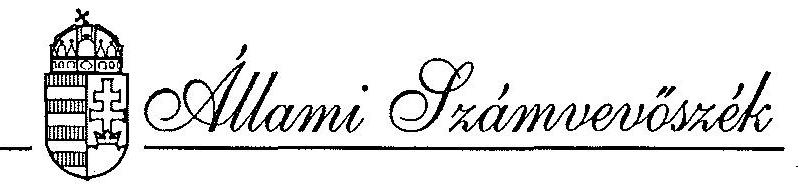

# JELENTÉS 

az Állami Vagyonügynökség 1992. évi tevékenységének ellenőrzéséről
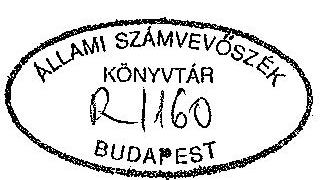

---

# A vizsgálatot vezette: 

Harsányi Sándor osztályvezető főtanácsos

## A vizsgálatot végezték:

| Dr. Borisz József | számvevő tanácsos |
| :-- | :-- |
| Lőrinc Alajos | számvevő tanácsos |
| Majorosné dr. Locskai Noémi | számvevő tanácsos |
| Makkai Mária | számvevő tanácsos |
| Dr. Molnár Barnabás | számvevő tanácsos |
| Németh Béláné | számvevő tanácsos |
| Rundik János | számvevő tanácsos |
| Dr. Szöllősi Géza | számvevő tanácsos |

Az ÁVÜ vizsgálathoz kapcsolódó, a PHARE források felhasználására vonatkozó ellenőrzést végezték:
a vizsgálatot vezette:

Halász Géza
számvevő igazgató-helyettes
a vizsgálatot végezte:

Hajagos Józsefné
Vasas Sándorné dr.
Réthelyi Jenő
Tardos József
számvevő tanácsos
számvevő tanácsos
számvevő
szakértő

---

# TARTALOMJEGYZÉK 

1. BEVEZETÉS ..... 1-4
2. ÖSSZEFOGLALÓ MEGÁLLAPÍTÁSOK, KÖVETKEZTETÉSEK, AJÁNLÁSOK ..... 4

1. Összefoglaló megállapítások, következtetések ..... 5-16
2. Ajánlások ..... 12-15
III. RÉSZLETES MEGÁLLAPÍTÁSOK ..... 15
3. Az ÁVÜ tulajdonában lévő állami vagyon alakulása ..... 15-20
4. 1992. évi bevételek alakulása ..... 20-23
5. Az 1992. évi kiadások ..... 23-37
6. Az ÁVÜ-höz tartozó vagyon értékelése ..... 37-44
7. Az állami tulajdonhoz kapcsolódó tulajdonosi jogok gyakorlása ..... 44-45
8. Az ÁVÜ-höz tartozó vagyon kezelése ..... 45-54
9. A munkavállalói tulajdonszerzés szabályainak érvényesülése ..... 54-55
10. A vagyonvédelmi előírások teljesítése ..... 55-57
11. A belső irányítási és ellenőrzési rendszer működése ..... 57-63
12. A PHARE forrásból nyújtott pénzügyi támogatások felhasználása ..... 63-66
MELLÉKLETEK FÜGGELÉK ..... 1-10 szám
1-42 old.

---

IV. VAGYONELLENŐRZÉSI IGAZGATÓSÁG
V-7-17/1993.
Témaszám: 165 .

# JELENTÉS 

az Állami Vagyonügynökség 1992. évi tevékenységének ellenőrzéséről

## I.

## BEVEZETÉS

Az Állami Vagyonügynökség (a továbbiakban: ÁVÜ) 1992. évi tevékenységének jogszabályi hátterét az a sajátos helyzet jellemezte, hogy a gazdasági év egy részében tevékenységét a hozzá tartozó vagyon kezeléséről és hasznosításáról szóló 1990. évi VII. törvény, a másik részében pedig az időlegesen állami tulajdonban lévő vagyon értékesítéséről, hasznosításáról és védelméről szóló 1992. évi LIV. törvény szabályozta, amely 1992. augusztus 28-án lépett életbe.

Mindkét törvény rögzíti, hogy az Állami Vagyonügynökség éves tevékenységét az Állami Számvevőszék ellenőrzi.

Az ÁVÜ 1992. évi feladatainak aktuális súlypontjait konkrét meghatározását jelentő - a törvényekben előírt - "Vagyonpolitikai Irányelvek"-et (a továbbiakban: VPI) tartalmazó Országgyűlési Határozatot (71/1992. XI.6.) 1992. október 27-én visszamenőleges hatállyal fogadta el az Országgyűlés.

---

A vizsgálat célja az volt, hogy átfogó képet biztosítson az Állami Vagyonügynökség 1992. évi tevékenységéről. Az ellenőrzés kiterjedt az ÁVÜ legfontosabb, kiemelt feladataiban - privatizáció üteme, vagyonvédelem, vagyonhasznosítás, vállalatok átalakítása, stb. - tapasztalható tendenciák feltárására. Cél volt annak megállapítása is, hogy tevékenysége folytatása során a törvényesség és szabályszerűség, a célszerűség, a nyilvánosság milyen mértékben érvényesült, továbbá hogyan működnek az ÁVÜ belső ellenőrzési rendszerei.

A vizsgálat kiterjedt arra is, hogy az 1992. évi VPI-ben foglaltak hogyan hatottak az ÁVÜ tevékenységére, a bevételi-kiadási előirányzatok teljesültek-e.

Tekintettel arra, hogy az Állami Számvevőszék harmadszor vizsgálja az ÁVÜ éves tevékenységét, a jelen ellenőrzés során az eddig tett ajánlások érvényesülését is áttekintettük. Az ÁVÜ általában törekedett az ÁSZ ajánlásai megvalósítására.

A vizsgálat - tekintve a privatizációs tranzakciók rendkívül nagy számát, a privatizációs folyamat bonyolultságát és összetettségét -, nem alkalmazhatott más módszert, csak a mintavételes eljárást.

További sajátossága volt az 1992. évi tevékenységet átfogó ÁSZ vizsgálatnak az is, hogy részletesen és önállóan átfogta az ÁVÜ részére juttatott PHARE forrásból nyújtott pénzügyi támogatások hasznosítását.

A PHARE források hasznosítása ellenőrzésének célja annak megállapítása volt, hogy az ÁVÜ hogyan érvényesítette az Európai Közösségek Bizottsága és a magyar Kormány között megkötött Keretmegállapodásban, illetve az ÁVÜ-re vonatkozó két finanszírozási megállapodásban foglaltakat.

---

E fő célkitűzésekhez kapcsolódva a vizsgálat során választ kellett kapni arra is, hogy milyen módon szervezik és segítik a támogatásban részesülő egyes projektek megvalósítását, valamint hogyan ellenőrzik az odaítélt pénzek felhasználását és a projektek eredményeinek hasznosítását. E jelentés keretei között e vizsgálat megállapításait és a megfelelő ajánlásokat összefoglaljuk. A teljes körű jelentést pedig a Függelék tartalmazza.

Az ÁVÜ a Miniszterelnökség költségvetési fejezetbe tartozik. A költségvetési intézményi gazdálkodást a jelen ellenőrzés csak annyiban érintette, amennyiben az az ÁVÜ privatizációs tevékenységéhez közvetlenül kapcsolódott, vagy azt átfedte, kiegészítette, beleértve a PHARE források felhasználását. A költségvetési intézményi gazdálkodás ellenőrzését az Állami Számvevőszék külön vizsgálat keretében tervezi.

Az ellenőrzött időszak:
az Állami Vagyonügynökség tevékenysége tekintetében: 1992. év,
a PHARE forrásból nyújtott támogatást illetően pedig: 1991-1992. év.

Az ellenőrzött szervezet: az Állami Vagyonügynökség

A helyszíni ellenőrzés ideje:
1993. március 8. - május 24.

---

A jelentés figyelembe veszi, hogy az ÁVÜ tevékenységéről készült kormánybeszámoló ÁSZ rendelkezésére bocsátott tervezete részletes táblázatokat tartalmaz - az ÁVÜ rendelkezésére álló adatbázis korlátai között - a privatizációról, vagyonkezelésről stb. Így a jelentés adatokat csak az elemzés érdekében, megállapításai alátámasztására szerepeltet. Itt említjük meg, hogy a törvényi előírások szerint az ÁVÜ tevékenységéről készült Kormánybeszámolót költségvetési zárszámadással egyidejűleg - 1993. augusztus 31-ig - kell benyújtani. Az ÁSZ jelentés aláírásakor a végleges kormány dokumentum még nem állt rendelkezésre.
II.

# ÖSSZEFOGLALÓ MEGÁLLAPÍTÁSOK, KÖVETKEZTETÉSEK, AJÁNLÁSOK 

## 1. Összefoglaló megállapítások és következtetések

1.1. A vizsgált időszak jellemzője volt - s ennyiben hasonlított az előző évekhez -, hogy az ÁVÜ-nek tevékenységét 1992-ben is, a folyamatosan fejlődő szervezet mellett a korábbiaknál lényegesebben változó törvényi szabályozáshoz kellett igazítani. Az Állami Vagyonkezelő Részvénytársaság (a továbbiakban: ÁV Rt.) létrejöttével alapvetően megváltozott a hozzá tartozó vállalatok összetétele (nagyság, jövedelemtermelő képesség stb.). A privatizáció a magyar gazdaság jellemzőjévé vált, a tényleges privatizációk száma jelentősen nőtt.

---

1.2. A kialakult helyzetet bonyolította és az ÁSZ számára nehezítette a tevékenység összehasonlítását, hogy a törvényi szabályozás ellenére - amely előírja, hogy a VPI-t a következő évi költségvetéssel egyidejűleg kell benyújtani és jóváhagyni az Országgyűlésnek - az vált gyakorlattá, hogy azt az Országgyűlés utólag lényegében az adott év végén hagyja jóvá.
1.3. Az ÁVÜ hatáskörébe került állami vállalkozói vagyon felmérése és privatizációra való alkalmasságának minősítése még ma is csak folyamatban van. A privatizációs folyamatok, valamint az információszervezés időbeli lefolyását figyelembe véve azonban felmerül annak a veszélye, hogy a privatizációs információs rendszer fejlesztése fáziskésésben lesz. Ez esetben csak utólagos statisztikai elemzéséhez fog adatokat szolgáltatni.

Az ÁVÜ nem tudja kimutatni és követni a tulajdonában lévő állami vagyon alakulását, annak változását. Emiatt a privatizációs folyamat előrehaladásának teljes pontosságú minősítésére továbbra sincs mód. Az ÁVÜ ugyanis csak a hozzá tartozó gazdálkodó szervezetek azon csoportjának saját tőke adatbázisával rendelkezik, amelyek közreműködésével alakultak át gazdasági társasággá és még nem teljesen privatizálták őket. Így azon törvényi követelménynek, amely az eddigi előírt vagyonkimutatás helyett az állami vagyon alakulására mérlegkészítési kötelezettséget ír elő, nem tudott megfelelni.

Mint azt már az Állami Számvevőszék az állam vállalkozói vagyona nyilvántartási és információs rendszerének ellenőrzésénél feltárta az ÁVÜ-nek nem volt kitől átvenni a

---

megfelelő teljeskörű vagyonregisztert, mert azzal az országban egyetlen szervezet sem rendelkezett. Az 1993. február-március hóban a vállalatoktól, gazdasági társaságoktól bekért vagyoni helyzetre vonatkozó részletes kimutatások feldolgozása sem hozhat hiteles, pontos eredményt. Egyrészt hiteles céglista híján az információba bevontak teljesség sem biztosított, másrészt a gazdálkodó szervezetek - törvényi kötelezettség hiányában - teljeskörűen nem válaszoltak, harmadrészt pedig a beküldött adatok az időpont miatt nem véglegesek.

A privatizációs folyamat belső struktúrájának átláthatóságát, összefüggéseit és ellenőrzését lehetővé tevő nemzetközi közreműködéssel megvalósuló számítógépes információs rendszer adatbázisának kiépítése elmaradt a szükségesektől.
1.4. Az ÁVÜ az 1992. évi LIII. tv. és a 126/1992.(VIII.28.) Kormányrendeletben foglalt portfólió átadáson túl további 3,4 milliárd Ft-nyi olyan portfóliót adott át, amelyről nem törvényben és nem a VPI-ben határozott a Parlament.

Az ÁVÜ szakemberei részt vettek a törvényelőkészítő szakmai munkában. Ez egy oldalról könnyítette az ÁVÜ tevékenységét, hiszen mint szakmai résztvevő tisztában volt annak irányultságával. Más oldalról az intézmény munkatársai közvetlenül érzékelték a meglévő törvényi szabályozás ideiglenességét, s ez a működésre is kihatott. A munka 1992-ben is, hasonlóan a működés korábbi két évéhez - a Kormány által nem jóváhagyott - ideiglenes Szervezeti és Működési Szabályzat alapján folyt. A Kormány az SZMSZ-t 1993-ban, a vizsgálat lezárása időszakában fogadta el.

---

Az ÁVÜ 1992-re Egzisztencia hitel (a továbbiakban: E-hitel) nélkül 70 milliárd Ft bevételt tervezett. Összes bevétele 72,2 milliárd Ft lett, ebből az E-hitelre történő értékesítés 9,1 milliárd Ft volt. A bevételeket a törvényi előírásoknak megfelelően a költségvetési szervezet bevételeitől elkülönítve, az MNB-nél a megfelelő számlákon tartották.

A tranzakciók lezárását jelentő szerződések fizetésre vonatkozó előírásainak reprezentatív vizsgálata azt mutatja - a reprezentáció, az 1992. évi E-hitel nélküli privatizációs bevétel 51%-a -, hogy a tényleges átutalások a szerződésekben rögzített fizetési határidőknek és összegeknek megfeleltek.

1992-ben a szerződések nyilvántartása, a vevő kötelezettségeinek figyelemmel kísérése, a szerződéstől eltérő esetekben követendő eljárás nem volt szabályozott. Ezt az 1993. május 3-i 12/1993. sz. ügyvezetői utasítás azonban már kielégítően megoldotta. Továbbra sem gondoskodnak következetesen arról - bár erre van ügyvezető-igazgatói utasítás -, hogy a szerződéseknek legyen hiteles magyar fordítása (11 db kiválasztott szerződésből 4 csak angol nyelven állt rendelkezésre).
1.5. Az ÁVÜ kiadásának előirányzott mértékéről és felhasználásáról az 1992. évi LIV. törvény szerint az Országgyűlés a VPI-ben dönt. Az 1992. évi VPI tételesen meghatározta a privatizációs bevételek felhasználását. Ehhez képest - országgyűlési felhatalmazás nélkül - Kormány és ÁVÜ vezetői döntések következtében -, a VPI-ben meghatározotthoz képest pozitív és negatív irányban halmozottan 32,0 milliárd Ft - a teljes privatizációs bevétel 44%-ának megfelelő - az eltérés.

---

Ez a helyzet annak ellenére jött létre, hogy a VPI-t az Országgyűlés 1992. október 27-i ülésén fogadta el, azaz az előterjesztőnek módja lett volna az addig kialakult helyzet és a meghatározottság bemutatására. Ez egyes tételeknél, a privatizációs költségeknél megtörtént, és azokat az Országgyűlés el is fogadta.

A privatizációs költségek vonatkozásában kialakult helyzet azonban rendkívül ellentmondásos. A Magyar Köztársaság 1992. évi költségvetéséről és az államháztartás vitelének 1992. évi szabályzatáról szóló 1991. évi XCI. törvény ugyanis az ÁVÜ vagyonkezeléssel és privatizáció előkészítésével összefüggő kiadásokra 2.125 millió Ft-ot irányzott elő és úgy rendelkezett, hogy a Kormány saját hatáskörében ezt az előirányzatot legfeljebb 30%-kal lépheti túl. Ennél nagyobb túllépés esetén az Országgyűlés előzetes engedélye szükséges. Ezzel szemben - mert a VPI-t nem a törvényes előírásnak megfelelően a következő évi költségvetéssel együtt hagyta jóvá az Országgyűlés - a VPI-re vonatkozó országgyűlési határozat a költségvetési törvényben előirányzott összeg csaknem háromszorosát, 5,9 milliárd Ft-ot engedélyezett e címen felhasználni. Így ez utólagos országgyűlési jóváhagyásnak is tekinthető.

Az értékesítéssel és vagyonkezeléssel összefüggő közvetlen költség végül 5,7 milliárd Ft volt. E költségek összetétele azt igazolja, hogy takarékosabb gazdálkodásra lenne szükség, mert az éves bevétel 8%-a e címen került felhasználásra. Különösen szembetűnő, hogy a tanácsadói díjak két- és félszeres növekedése a privatizációs bevételek emelkedését messze
 meghaladja.

---

1.6. Az ÁVÚ a hozzá tartozó vagyonból 67,6 milliárd Ft-ot értékesített. Azt, hogy ennek az értékesítésnek a belső struktúrája a törvényi követelményeknek hogyan felel meg, nem lehet kimutatni. Nem szintetizálható az ÁVÚ szintjén pl. a vállalatok társasági átalakulás előtti könyv szerinti érték, a vagyonértékelés szerinti és az átalakulás utáni érték, valamint az értékesítési ár összefüggése. Továbbá a zárt és nyílt pályázatok száma, a munkavállalói tulajdonlás, kivásárlás névértéke és összetétele. Ugyanis a meglévő tranzakciós számítástechnikai rendszer miatt (továbbiakban: PIR) a számvitel által kimutatott értékesítés nem teljes körét kezeli.

A kialakult helyzetben az ÁVÚ értékesítési politikájának összefüggései nagyon korlátozottan elemezhetők és vizsgálhatók.
1.7. Az ÁVÚ közvetlen vagyonkezelői tevékenysége javult. Az igazgatókkal, vállalati biztosokkal és vezető tisztségviselőkkel szemben a tranzakciós igazgatóságok által ellenőrzött követelményrendszer működik. Szabályozott a többségi tulajdonban lévő társaságoknál a közgyűlések előkészítése. Az üzleti tervek követelményeit meghatározták.

Közvetett vagyonkezelési tevékenység gyakorlatilag nem folyt.  $S$ db, több cég együttes vagyonkezelésére kiírt nyilvános pályázat egyike sem volt sikeres. Az egyetlen zárt kiírású pályázatot a Co-Nexus Rt. nyerte. Az ÁVÚ nem intézkedett a pályázat nyertesénél a portfólióba tartozó cégek 1991. évi - államot illető - osztalékának behajtására, mely helyzet annak következménye, hogy a vagyonkezelői szerződés e kérdésről egyáltalán nem rendelkezett.

---

Esedékessé 1993-ban vált, hogy a portfólió vagyonkezelési szerződés teljesítéséről a Co-Nexus Rt. a beszámolóját az ÁVÚ-nek benyújtsa. Erre a vizsgálat lezárását követően került sor. Elemzésére nem volt mód. Így a vagyonkezelési szerződés teljesítését nem ítélhetjük meg és így szerződést sem minősítjük.
1.8. Az ÁVÚ gyakorlata a vagyonvédelmi ügyek elbírálása tekintetében megfelelt a törvényes előírásoknak.
1.9. Az ÁVÚ-nél a vizsgált időszakban lényegi szervezeti és feladat-átcsoportosítási változások történtek. Az irányítási szintek újrarendezése, egyszerűsítése, a megvalósított munkamegosztás, egyenletesebb munkaterhelést és rendezettebb hatásköröket eredményezett. Jelentős standardizációs feladatokat oldottak meg, új szabályozásokat vezettek be. A vizsgált időszak második felére kiépült és ma már mind nagyobb intenzitással működik a belső ellenőrzési rendszer. A részletes megállapításokban ismertetett problémákat is figyelembevéve a közel három éve alapított ÁVÚ-nél az utóbbi egy év jelentős munkaráfordítása a szervezettség javulásában érzékelhetők.
1.10. Az Állami Vagyonügynökség részére juttatott PHARE forrásból nyújtott pénzügyi támogatások teljes összege 1991-ben 499.557 ECU volt (az árfolyam változás miatt csak becslés alapján nagyságrendje mintegy 50 millió Ft), amely az ÁVÚ működési költségeihez járult hozzá.

Ez az összeg 1992-ben 271.535 ECU volt. Ezért az ÁVÚ működési ráfordításainak meghatározásánál ezt az összeget figyelembe kellett volna venni, amikor meghatározták, hogy a privatizációs bevételeknek milyen hányadát csoportosítsák át az ÁVÚ működési kiadásaihoz.

---

A tapasztalatok alapján valószínűsíthető, hogy az 1991. évi (II. ütem) segély 1994. évi lejártakor a támogatásra rendelkezésre álló összeg jelentős része felhasználatlan marad.

Az Állami Számvevőszék az ÁVÚ tevékenységet 1990. óta évenként - a törvényi kötelezettségnek eleget téve - ismétlődően ellenőrzi. Módja és kötelezettsége rámutatni a kialakult tendenciákra.

A tapasztalatok ellentmondásosak.

Az egyik oldalon érzékelhető, hogy az ÁVÚ tevékenysége kiteljesedett, az irányítási, végrehajtási folyamatok szabályozottsága és legutóbbi időben ellenőrzési tevékenysége is fejlődött. Ebben az adott keretek és lehetőségek között az ÁSZ ajánlásainak figyelembevételére irányuló törekvés is tapasztalható.

A másik oldalon lényegi kérdésekben a feszültségek fennmaradtak, mélyültek és az új feladatok jelentkezésekor a reagálás lassú, esetenként elmarad a válaszadás.

A gondok közül a privatizációs folyamat vezénylési kérdései, és a még mindig nem kielégítő átláthatóság a leghangsúlyosabb.

A privatizációs lépések során előfordult a belső előírások megsértése és az ÁVÚ a kormányzati szintű döntések végrehajtásakor sem mindig a vonatkozó törvény szigorú betartásával járt el. Ez utóbbiak azonban nem minden esetben az ÁVÚ felelősségi körébe tartozó okokra, hanem olyanokra vezethetők vissza, amelyek összkormányzati felelősségi körbe tartoznak.

---

Annak ellenére, hogy ma már az egyes tranzakciók többé-kevésbé követhetők, a nyilvánosság, a lehetőségek megismertetése fokozatosan javult, a privatizációs folyamat egészéről ez nem mondható el. Az ÁVÚ ma sem tud a hozzátartozó teljes körű vagyonról, az értékesítés struktúrájáról kellő differenciáltságú makró-gazdasági összefüggésekbe illeszthető és ellenőrizhető képet adni. Következésképpen még nem tudja teljesíteni azt a törvényi követelményt sem, amely a vagyonmérleg elkészítésére kötelezi. A kialakult helyzet lényegében kizárja a privatizációs folyamat minősítésének lehetőségét. Fenntartja, sőt növeli az azzal kapcsolatos bizalmatlanságot.

# 2. Ajánlások 

## Kormánynak:

- szigorúan tartsa be az 1992. évi LIV. törvény 18. § (2) bekezdésében foglaltakat, mely szerint a VPI-t az éves költségvetéssel egyidejűleg kell az Országgyűlés elé elfogadásra beterjeszteni. Gondoskodjon arról is, hogy az ÁVÚ munkájáról szóló kormánybeszámoló a törvény előírása szerinti időszakban kerüljön benyújtásra;
- segítse elő az ÁVÚ-vel kapcsolatban lévő más kormányszervek utasításával is, hogy az 1992. évi LIV. tv. előírásainak megfelelően az ÁVÚ képes legyen a törvényi előírásoknak megfelelő vagyonmérleg elkészítésére, s terjessze be azt az ÁVÚ tevékenységéről szóló beszámolóval együtt az Országgyűlés elé;
- gondoskodjon arról, hogy a VPI-ek rögzítsék - a költségvetési törvénnyel összhangban - a privatizációs bevételek címszerinti felhasználási előirányzatát, sorrendiségét és egyértelműen szabják meg, hogy mennyiben térhet el a Kormány saját hatáskörben ezen szabályozástól és mikor kell

---

országgyűlési felhatalmazást kapnia az eltérésekhez. Célszerű felszámolni azt a helyzetet, hogy az ÁVÚ ügyvezetése saját szempontjai szerint változtasson a felhasználási címeken és címenként jóváhagyott összegeken;

- rendezze a VPI-ben a portfólió átadással kapcsolatos hatásköröket, egyértelműsíteni kell, hogy meddig adhat át portfóliót az ÁVÚ saját hatáskörben és mikor és milyen országgyűlési felhatalmazással kell rendelkeznie az átadáshoz;
- határozza meg régiónként a VPI-ben - a nagymértékben eltérő munkanélküli arányra figyelemmel - a privatizációs bevételek ilyen célú felhasználását;
- tekintse át a pénzügyminiszter és a privatizációért felelős tárca nélküli miniszter garanciavállalásáról szóló 1993. március 19-ei megállapodását, állítsa helyre a törvényi szabályozásnak megfelelő helyzetet, vagy kezdeményezze a törvényhely olyan módosítását, amely az ÁVÚ részére rugalmasabb garanciavállalási lehetőséget biztosít.
- számoljon az Állami Vagyonügynökség költségvetésének, működési kiadásainak tervezésekor a külföldi segélyek, a PHARE támogatás révén rendelkezésre álló forrásokkal. Ezek fokozott igénybevételének szorgalmazásával mérsékelje az állami vagyon értékesítéséből származó bevételek működési célú felhasználását;
- gondoskodjon arról, hogy - az NGKM és a PM - rendezzék a PHARE támogatások igénybevételével kapcsolatosan az ÁFA folyó évi visszatérítése szabályozását, illetve vizsgáltassa felül az APEH-al a korábban kiadott kapcsolódó állásfoglalását és ennek alapján utasítsa a szükséges eljárási gyakorlatra;

---

Az ÁVÚ Igazgatótanácsának és ügyvezetésének:

- haladéktalanul teremtse meg és gondoskodjon a vagyonmérleg elkészítésének feltételeiről, és a törvényeknek megfelelő előterjesztéséről, annak érdekében, hogy a Kormány kapcsolódó kötelezettségének eleget tehessen;
- vizsgálja felül a tranzakciós tevékenységét tükröző információs rendszerét. A számítógépes rendszert - természetesen adatbázisával együtt - úgy célszerű kialakítani, hogy nyomon lehessen követni az ÁVÚ-re vonatkozó törvényi szabályozás követelményeit, ezzel is biztosítva a privatizációs folyamat átláthatóságát;
- kezdeményezze a Co-Nexus Rt.-vel kötött vagyonkezelői szerződés következtében függőben lévő 1991. évi utáni osztalék ügyének az állam javára történő rendezését és vizsgálja meg a felelősség kérdését;
- szabályozza a hozzátartozó társaságoknál az osztalékfizetés, illetve átengedés rendjét és gondoskodjon e folyamatokat nyomonkövető információk megszervezéséről;
- vizsgálja meg az értékesítéssel kapcsolatos tanácsadói szerződéskötések körülményeit, a díjak megállapításának alapjait, továbbá a privatizációs költségek - ezen belül kiemelten a tanácsadói díjak - mérséklésének lehetőségét és tegye meg a szükséges intézkedéseket;
- szabályozza a Belvárosi Irodaház Kft. és az ÁVÚ közötti átutalások, elszámolások rendjét;

---

- alakítsa ki a Szervezeti és Működési Szabályzatában a Programirodával a kapcsolattartás rendjét, jelölje ki a szakértő magyar ÁVÚ partnereket, s építse be eljárási rendjébe a PHARE források felhasználásának szabályozását;
- tartsa be az Állami Vagyonügynökség Programiroda az EK PHARE előírásoknak megfelelő munkaprogram és jelentés készítési feladatokat;
- biztosítsa a belső ellenőrzés fokozásával is a szabályok következetes betartását.

111.

# RÉSZLETES MEGÁLLAPÍTÁSOK 

1. Az ÁVÚ tulajdonában lévő állami vagyon alakulása
1.1. Az 1992. évi LIV. törvény szerint az ÁVÚ-hoz tartozó állami vagyon a következőkből áll:

- az állami vállalatok vagyona,
- az állami vállalat által létesített leányvállalat vagyona,
- a gazdasági társasággá átalakult állami vállalatok külső vállalkozók tulajdonába nem került üzletrésze, részvénye,
- valamint egyéb vagyoni értékű jogok és kötelezettségek,
- az államigazgatási felügyelet alatt álló állami vállalattól a rábízott vagyont elvonhatja, az elvont vagyon erejéig azonban az ÁVÚ kezesként felel,
- az ÁVÚ által alapított társaságokba befektetett eszköz-

---

Az ÁVÚ 1993. február-március hónapokban bekérte levélben a vállalatoktól és a gazdasági társaságoktól a vagyoni helyzetükre vonatkozó részletes kimutatásaikat. Nyilatkozatot kértek arról is, hogy a gazdálkodó szervezetek adózásával kapcsolatos adatokat az APEH nyilvántartásából az ÁVÚ bekérhesse.

A beérkezett adatlapok feldolgozása folyamatban van. Teljeskörűsége azonban nem biztosított egyrészt azért, mert nincs hiteles céglista, valamint azért, mert a gazdálkodó szervezetek - törvényi kötelezettség hiányában - az ÁVÚ megkeresésére teljeskörűen nem válaszoltak.

A bekért és beérkezett adatok sem végleges adatok, hiszen a számviteli törvény szerint az éves beszámolót május 31-ig kell elkészíteniük a gazdálkodó szervezeteknek. A letéti mérleget az ÁVÚ 1993. június 15-ig kérte be, feldolgozását ezt követően tudja elvégezni.

Az ÁVÚ-nek a gazdálkodó szervezetektől a számviteli törvény 1. sz. melléklete szerinti mérlegben kimutatott saját tőke, illetve annak az állami tulajdoni hányaddal arányos részét kell nyilvántartania. Az ÁVÚ azonban a hozzá tartozó gazdálkodó szervezetek csak azon csoportjának saját tőke adataival rendelkezik, amelyek az ÁVÚ közreműködésével már átalakultak gazdasági társasággá és még nem privatizálták őket. Ezek száma 1992. december 31-i állapot szerint 291. A saját tőke értéke 806,9 milliárd Ft, ebből az ÁVÚ tulajdonában van 54,65 %, azaz 441,0 milliárd Ft - jegyzett tőkében számítva 411,3 milliárd Ft - értékű részvény vagy üzletrész. Ezek az adatok is csak tájékoztató jellegűek, mert a hiteles adatokat csak a letéti mérlegek összesítésekor lehet meghatározni.

---

Az ÁVÚ a hozzá tartozó állami vagyonról értékelhető, ellenőrizhető adatokkal, vagyonmérleggel nem rendelkezik. Annak ellenére nem, hogy a Vagyonügynökségről szóló törvények (1990. évi VII. tv. és az 1992. évi LIV. tv.) 19. §-ai előírták, hogy a Kormány évente köteles a Vagyonügynökséghez tartozó állami vagyon alakulásáról, hasznosításának eredményéről az Országgyűlésnek beszámolni, továbbá a vagyonkimutatás helyett az állami vagyon alakulásáról mérlegkészítési kötelezettsége van. Így az ÁVÚ-hoz tartozó állami vagyont, annak 1992. évi alakulását, hasznosításának eredményét ellenőrizni nem lehetett.

# 1.2. Vagyonátruházás, portfólió átadás 

Az ÁV Rt.-nek történő portfólió átadásáról a tartósan állami tulajdonban maradó vállalkozói vagyon kezeléséről és hasznosításáról szóló 1992. évi LIII. törvény intézkedik.

Az ÁVÚ - a törvényben rögzített vagyont - az ÁV Rt.-nek átadta, azonban a kapcsolódó dokumentumokat csak hiányosan szolgáltatta; nem adtak ki minden társaságra vonatkozóan teljeskörűségi nyilatkozatot.

Jelenleg sem rendelkeznek a vagyonátadás módszerét rögzítő és mindkét fél által aláírt megállapodással.
1992. április 9-én, majd május 22-én megállapodás jött létre az ÁVÚ és a Kincstári Vagyonkezelő Szervezet között - az MDF-FIDESZ tulajdonába
 került ingatlanokon felül, kormányhatározatban rögzített ingyenes vagyonátadásra. Az ÁVÜ az Állami Számvevőszék részére átadta az eljárást alátámasztó dokumentumot.

---

A Magyar Befektetési és Fejlesztési Bank Részvénytársaságot (a továbbiakban: MBFB Rt.) döntően saját társaságaként alapította az ÁVÜ még 1991-ben. A portfólió átadása azonban 1992. évre áthúzódott. (A társaság alapítás apportját az 1. sz. melléklet tartalmazza.)

Az ÁVÜ-nek az MBFB Rt.-vel szemben még kb. 1,1 milliárd Ft kötelezettsége van. Az MBFB Rt. és az ÁVÜ közötti megállapodás alapján az Ácsi Cukorgyár Rt. részvényeinek ellentételezésére további 282 millió Ft értékű portfóliót kell az ÁVÜ-nek biztosítania.

A minisztériumoknak történő vagyonátadás a 126/1992. (VIII. 28.) Kormányrendelet alapján megtörtént.

Egyéb vagyonátadás 1992. évben 633 millió Ft értékben történt. (Részletezését a 2. sz. melléklet tartalmazza.)

Az egyéb vagyonátadások között szerepel 187 millió Ft értékű KERSZI Rt. részvényátadás a Hungária Biztosító Rt. részére. A 3283/1992.(VI.26.) Korm. határozat intézkedett arról, hogy az ÁVÜ 70 millió DEM értékű részvény, értékpapír átadást teljesítsen.

Az MHB részére összesen 199 millió Ft értékű portfólió átadásra került sor 1992. évben. Ennek oka, hogy a Ganz Danubius Hajó- és Darugyártól az óbudai hajógyári szigeten lévő ingatlanok kezelői jogát elvonta. Az elvont ingatlanok jelzáloggal terheltek, amely az MHB Rt. javára van bejegyezve. A jelzálog törléséről az ÁVÜ és az MHB Rt. 1991. december 20-án állapodott meg. A megállapodásban az ÁVÜ kötelezettséget vállalt arra, hogy az MHB Rt. tulajdonába ad 438 millió Ft értékű részvényt, valamint 250 millió Ft értékű részvényt óvadékba ad a bankgaranciák biztosítékaként.

---

Az ÁVÜ a 3008/1992.(I.9.) Korm. határozat alapján - az Esztergomi Érsekség kártalanítása miatt - 100 millió Ft értékű Promontorvin Borgazdaság Rt. részvényt adott vissza a részvénytársaságnak. (Az erről szóló megállapodást a 3. sz. melléklet tartalmazza.)
1992. évben - a törvényi kötelezettség ellenére - a Társadalombiztosítás részére vagyonátadás nem történt.

Összegezve a vagyonátruházásokat megállapítható, hogy az 1992. évi LIII. törvényben és a 126/1992.(VIII.28.) Kormányrendeletben foglalt portfólió átadáson túl 3,4 milliárd Ft portfólió átadása történt meg úgy, hogy arról nem törvényben és nem a VPI-ben határozott a Parlament.

# 1.3. Vagyonelvonás 

1992. évben az ÁVÜ Igazgatótanácsa döntése alapján könyvszerinti nettó értéken 33,2 milliárd Ft értékű vagyonelvonás történt az állami vállalatoktól. Ebből értékesítettek 4,6 milliárd Ft-ot, de egyidejűleg az ÁVÜ 3,3 milliárd Ft kötelezettséget is vállalt.

Az elvont vagyon jelentősége részben az irodaház elvonások - értékesítések miatt, részben pedig az ÁVÜ elvont vagyonnal arányban álló kötelezettségeinek törvényi előírások szerinti átvállalása miatt nőtt meg.

---

2. 1992. évi bevételek alakulása

# 2.1. Bevételek 

Az Állami Vagyonügynökség bevételi forrásai - a többször módosított 1990. évi VII. törvény, az 1992. évi LIV. törvény és a VPI szerint - a Vagyonügynökségnél nyilvántartott vagyon értékesítéséből származó bevételek és a szervezetnél nyilvántartott vagyon osztaléka, részesedése.

Az Állami Vagyonügynökség 1992-re vagyonhozadékból 4 milliárd, E-hitel nélküli értékesítésből 66 milliárd, összesen 70 milliárd Ft bevételt tervezett. A VPI szerint ha E-hitelre történik értékesítés, akkor azt a bevételt az államadósság törlesztésére kell fordítani.

Az 1992. január 1. - december 31. között ténylegesen befolyt (pénzforgalmilag teljesült) bevétel:

- vagyonhozadékból 4.581 millió
- értékesítésből 58.495 millió
- E-hitelből történő értékesítésből 9.074 millió
összesen:
72.150 millió Ft.

Az E-hitel nélküli 58.495 millió Ft struktúrája: 40.982 millió Ft értékű deviza, a többi 17.513 millió Ft bevétel.

A devizáért történő értékesítési bevétel 75%-a 11 db tranzakcióhoz kapcsolódik. Ezek főleg élelmiszeripari, ill. építőipari gazdálkodó szervezetek privatizációjából keletkeztek.

---

A vagyonhozadék 65%-át 4 cég osztalékfizetése jelentette. (Országos Takarékpénztár, Magyar Külkereskedelmi Bank Rt., Magyar Olajipari Rt. és a Szerencsejáték Rt.) Ezek 1992. aug. 28-tól azonban már az ÁV Rt-hez tartoznak, így 1993-ban hasonló nagyságrendű hozadékkal az ÁVÜ-nél nem lehet számolni.

Az E-hitelt kiskereskedelmi, vendéglátóipari vállalatok értékesítéséhez az ún. előprivatizációhoz, ill. az önprivatizációhoz vették igénybe.

A készpénzes, illetve hitelből történő értékesítésen túl 2.263 millió Ft értékben kárpótlási jegy ellenében bonyolított értékesítés is volt.

A bevételek az MNB-nél vezetett megfelelő számlákon jelentek meg. Az ÁVÜ a törvényi előírásoknak megfelelően ezeket a bevételeket teljesen elkülönítette.
2.2. A szerződések pénzügyi teljesítésre vonatkozó előírásai, és nyilvántartása

Az 1992-ben befolyt bevételek közül 11 db tranzakció lezárását jelentő szerződés fizetésre vonatkozó előírásait és teljesítésüket vizsgálta az ellenőrzés. A kiválasztott szerződések mindegyike 1 milliárd Ft-on felüli vételárat rögzített. A szerződések teljesítéséből származó bevételek az E-hitel nélküli teljes 1992. évi privatizációs bevételeknek 51%-át képviselték. A kiválasztott szerződések közül 2 db-ot még 1991-ben írtak alá.

A szerződésekben rögzített fizetési határidők változóak. Az átnézettek többségénél a szerződés aláírását követő 90 napon belül volt esedékes a vételár kiegyenlítése. A mintavételben olyan szerződés is szerepelt, ahol a vételár

---

kifizetését két részletben határozták meg. A második részlet teljesítésére több mint 1 éves határidőt szabtak, de erre az időszakra kamatfizetési kötelezettséget írtak elő a vevő számára.

A tényleges átutalások a szerződésekben rögzített fizetési határidőknek és összegeknek megfeleltek.

A szerződések szerint általában a vevő a vételár átutalását követően kapja meg a vásárolt részvényt, azaz csak ezután válik rész- illetve többségi tulajdonossá. Ebből következően a kikötött fizetési feltételek teljesítése saját érdeke is.
2.3. A szerződések nyilvántartása, kötelezettségek figyelemmel kísérése

1992-ben a szerződések nyilvántartása, a vevő kötelezettségeinek figyelemmel kísérése, a szerződéstől eltérő esetekben követendő eljárás nem volt szabályozott az ÁVÜ-nél. Ügyvezetői igazgatói utasítás sem rendezte ezt a kérdést.

A vizsgált időszakot követően, 1993. május 3-tól pozitív változás történt. A 12/1993. sz. ügyvezető igazgatói utasítás a szerződéstár működési szabályzatáról, a vevői kötelezettségek nyilvántartásáról és figyeléséről rendelkezik. Az utasítás gyakorlati megvalósítása, illetve korábbi szerződésekkel való feltöltése, folyamatos. A szerződéstár feladata:

- teljeskörűen gyűjteni, tárolni és nyilvántartani az alapító okiratokat, társasági szerződéseket, valamennyi szerződést, amelyben az ÁVÜ az egyik szerződő fél;

---

- teljeskörűen és naprakészen köteles nyilvántartani a szerződéses partnerek által vállalt kötelezettségeket, figyelemmel kísérni a kötelezettségek határidejét, és azokról a felelős igazgatóságokat tájékoztatni.

Ez az utasítás azt is rögzíti, hogy ha az eredeti szerződés nem magyar nyelvű, hitelesített magyar nyelvű változatát is mellékelni kell.

Az Állami Számvevőszék már többször kifogásolta, mint az átláthatósági, ellenőrizhetőségi, egyértelműségi gondot, hogy a szerződések és a dokumentumok hiteles magyar fordítása - az erre vonatkozó ügyvezetői igazgatói utasítás ellenére - több esetben nem áll rendelkezésre az ÁVÜ-nél, mely a folyamatok áttekintését rendkívül megnehezíti. A vizsgálathoz kiválasztott szerződések közül 4 szerződés csak angol nyelven található a szerződéstárban.
3. Az 1992. évi kiadások

A Vagyonügynökség kiadásainak előirányzott mértékéről és felhasználásáról az 1992. évi LIV. törvény 16. §-a alapján az Országgyűlés a VPI-ben dönt. A 71/1992. (XI.6.) OGy. határozat az 1992. évi VPI-ről tételesen meghatározta a privatizációs bevételek felhasználását.

Az ÁVÜ kimutatását a VPI szerinti előírásokról és azok teljesítéséről a 4. sz. melléklet tartalmazza.

---

# 3. 1. Vagyonkezeléssel összefüggő kérdések 

A VPI a vagyonkezelők részére fizetendő díjra, illetve a vagyonkezeléssel összefüggésben felmerülő költségekre 300 millió Ft-ot engedélyezett. E címen az ÁVÜ kerekítve 500 millió Ft-ot számolt el, amelynek túlnyomó része (458 millió Ft) az ÁVÜ által elvont ingatlanok működtetésének költségei. Itt számolta el az ÁVÜ a részvények őrzéséért, forgatásáért, szelvényvágásért kifizetett 28,3 millió Ft-ot is.

### 3.2. Reorganizáció költségei

VPI szerint: ÁVÜ tényleges:

- MBFB Rt. alaptőke emelésére 8,0 Mrd Ft 4,0 Mrd Ft
- Értékesítés előkészítéséhez 1,8 Mrd Ft 5,8 Mrd Ft

Összesen:
9,8 Mrd Ft 9,8 Mrd Ft

Az MBFB Rt. alaptőke emelésére előirányzott 8,0 milliárd Ft-ot az ÁVÜ nem teljesítette.

Az értékesítés előkészítéséhez szükséges reorganizáció költségei címen az ÁVÜ az alábbi kifizetéseket teljesítette:

DIMAG Rt. további működtetéséhez, veszteség finanszírozásához 1992. év során a 3360/1992. (VIII.6.) kormányhatározat alapján 2,4 milliárd Ft pénzügyi támogatást adott.

A December 4. Drótművek külső befektetők számára alkalmassá tétele érdekében az ÁVÜ Igazgatótanácsának döntései alapján (E-43/8 és E-50/18/1992. sz.) összesen 0,4 milliárd Ft átutalás történt meg.

---

A KÖFÉM-Hungalu vegyesvállalat létrehozása előfeltételeként az ÁVÜ IT döntése alapján (E-41/4/ÁVÜ/1992. sz. IT határozat) a KÖFÉM hitelmentesítéséhez 2,5 milliárd Ft összeget biztosított. Az IT határozat 1992. október 14., az átutalás dátuma 1992. december 18.

A Hungalu a 126/1992. (VIII.28.) Korm. rendelet alapján 1992. augusztus 28-tól az ÁV Rt. tulajdonába került át, az IT döntés és átutalás akkor történt, amikor a cég már nem tartozott az ÁVÜ-höz.

Az Általános Vállalkozási Bank (továbbiakban: ÁVB) részére 1992. évben az ÁVÜ két ízben teljesített átutalást:

1992. 08. 11-én
1992. 12. 28-án
596,5 millió Ft
500,0 millió Ft összegben.

Ennek indoka az ÁVB, az ÁVÜ, a Westdeutsche Landesbank AG, az MNB és az ÁVB nagyhitelezői között 1992. július 24-én létrejött szerződés 11. pontja.

Amennyiben az ÁVB megmentése reorganizációs kiadásként elismerhető, akkor annak összege: 1096,5 millió Ft és 596,5 millió Ft-tal az ÁVÜ túllépte a VPI szerinti előirányzatot annak ellenére, hogy az MBFB Rt. részére 4,0 milliárd Ft-tal kevesebb összeget biztosított.

Az ÁVÜ más bankok és gazdálkodó szervezetek felé is teljesített az ÁVB miatt kifizetéseket. Az ÁVÜ ezen kiadásokat más-más főkönyvi számlákra könyvelte el, például a társaságok részére átadott bevételek közé, így az ÁVB miatti ÁVÜ kötelezettségvállalás teljeskörűen nem a reorganizációs költségek között került kimutatásra.

---

A Gazdasági Kabinet július 22-i ülésén elismerte az ÁVÜ megegyezést eredményező erőfeszítéseit, és megerősítette az ÁVÜ kötelezettségvállalásait.

Az ÁVÜ Igazgatótanácsa 1992. augusztus 12-ei ülésén úgy határozott, hogy a PM és Szabó Tamás privatizációért felelős tárca nélküli miniszter készítsen kormányelőterjesztést az ÁVB megmentéséhez szükséges 1,1 milliárd Ft kötelezettségvállalás utólagos jóváhagyásáról, ebben azonban az előterjesztők nem szerepeltették a 62 millió Ft-os Ikarusz Rt., és az 57,8 millió Ft-os UNICBANK Rt. felé vállalt kötelezettségeket.

# 3.3. Értékesítéssel összefüggő, privatizációs költségek 

A VPI 5,6 milliárd Ft-ot irányzott elő az értékesítéssel összefüggő közvetlen költségek (tanácsadói díj, vagyonértékelés, stb.) finanszírozására: a tényleges teljesítés 5,24 milliárd Ft volt.

A Magyar Köztársaság 1992. évi költségvetéséről és az állambáztartás vitelének 1992. évi szabályozásáról szóló 1991. évi XCI. tv. az ÁVÜ vagyonkezeléssel és a privatizáció előkészítésével összefüggő kiadásokra 2.125 millió Ft-ot irányzott elő 1992. évre. E törvény úgy rendelkezett, hogy a Kormány hatáskörében ez az előirányzat legfeljebb 30%-kal léphető túl. A 30%-nál nagyobb mértékű túllépéshez az Országgyűlés előzetes engedélye szükséges. A törvényi előírás azt a célt szolgálta, hogy a privatizációs költségek növekedését korlátozza.

---

Ezzel szemben a 71/1992. (XI.6.) OGY határozat az 1992. évi VPI-ről 5,9 milliárd Ft privatizációs költséget ismert el (5,6+0,3). A költségvetési törvényben előirányzott összeg csaknem háromszorosát engedélyezte e címen felhasználni.

|  | VPI | ÁVÜ tényleges |
| :-- | :--: | :--: |
| Privatizációs költség összesen | 5,9 | 5,7 |
| ebből: |  |  |
| - értékesítéssel összefüggő | 5,6 | 5,2 |
| - vagyonkezeléssel összefüggő | 0,3 | 0,5 |

(Részletezve az 5. sz.
 mellékletben)

A privatizációs költségek a következő kiadásokat foglalják magukba:

Tanácsadói díjak

A tanácsadói díjak az előző évhez képest két és félszeresre emelkedtek, a privatizációs költségek 34%-át teszi ki. Messze meghaladják a tényleges privatizációs bevételek növekedési ütemét. A tanácsadók részére kifizetett 1.705,4 millió Ft 88 tanácsadó cég között oszlik meg. Ezen belül igen nagy eltérések vannak. Írásos elemzések hiányában nem minősíthető és értékelhető az, hogy egy külföldi tanácsadó cég 5 db megbízási díjaként munkája értékének arányában részesült-e csaknem 400 millió Ft értékű megbízási díjban. Így az összes tanácsadói díjkifizetés 23%-át kapta.

Egy másik külföldi cég egyetlen megbízásért 100 millió Ft feletti bevételhez jutott 1992. évben.
Egyedi vizsgálat során is megállapítható volt, hogy írásbeli szerződés nélkül, szóbeli megállapodás alapján,

---

munkateljesítési igazolás nélkül is fizetett az ÁvÜ 21,5 millió Ft-ot.
(A felelősség megállapítását az ÁSZ a vonatkozó egyedi vizsgálat alapján kezdeményezte.)

Itt számolta el az ÁvÜ az Első Privatizációs Programhoz kapott világbanki hitel törlesztésére fordított 300 millió Ft-ot is.

# Ingatlan reorganizáció 

Ingatlan reorganizáció címszó alatt az ÁvÜ a tulajdonába került (elvont) ingatlanok, elsősorban irodaházak jelentős költséggel történő felújítását, másrészt az ingatlanok értékesítéséig felmerült üzemeltetési költségeket, valamint a cégek kártalanítását számolta el.

Ezeket az ügyleteket az ÁvÜ és OTP Értékpapírügynökség Rt. által 1991. évben 1 MFt törzstőkével alapított Belvárosi Irodaház Kft.-vel bonyolíttatja le. E címen 1440,1 millió Ft kiadás merült fel, ami a privatizációs költségek 25%-át teszi ki. A Belvárosi Irodaház Kft. és az ÁvÜ közötti átutalások, elszámolások rendje nem szabályozott.

## Részvényértékesítési költség

A privatizációs kiadások 18%-át a Danubius részvények értékesítésének költségei tették ki.

Public relation és marketing

Az ÁVÜ PR és marketing tevékenységét, valamint az önprivatizációt segítő cégek (ÉTK, Tulajdon Alapítvány, PRI-MAN Kft., stb.) megbízásai a költségek 4%-át jelentették.

---

# 3.4. Garanciális kötelezettség 

A VPI 6 milliárd Ft-ot irányzott elő az ÁvÜ kötelezettségvállalásaira. Ténylegesen 5,8 milliárd Ft teljesült.

Az ÁvÜ által szerződésszerűen vállalt anyagi kihatással járó kötelezettségvállalásokat már 1991-ben és 1992-ben is ügyvezető igazgatói utasítás szabályozta. A 8/1992. sz. ügyvezető igazgatói utasítás a garanciális kötelezettségek nyilvántartását is elrendelte számítógépes feldolgozás keretében.

A nyilvántartási rendszer létrejött, működik, az adatok lehívhatók. Tartalmazza a kötelezettségvállalás keltét, érvényesíthetőségi idejét, típusát, alsó és felső határát, a kifizetett összeget, az átutalás keltét, a megszűnt fizetési kötelezettséget, és a még fennálló fizetési kötelezettséget.

A nyilvántartás szerint 1992-ben vállalt kötelezettségek felső határa összesen 23,9 milliárd Ft volt, mely 45 gazdálkodó szervezetet érintett.
1991. és 1992-ben összesen 42,8 milliárd kötelezettségvállalás történt.

A már hivatkozott ügyvezető igazgatói utasítás szerint három típusú garanciát vállal az ÁvÜ:

- részvény, vagy üzletrész értékesítése során előre nem látható, egy meghatározott időn belül bekövetkező kötelezettséget, melynek az összege pontosan ismert (pl. a foglalkoztatottak elbocsátásával járó költségek);

---

- olyan kötelezettségek, amelyek pontos mértéke előre nem ismert, és bizonytalan annak bekövetkezése is. Ez esetben mind az idő, mind az összeg tekintetében egy maximumot kötnek ki (pl. környezetvédelmi károk, vállalattal szemben fennálló peres követelések);
- a privatizáció elősegítése érdekében az eladástól függetlenül (eladás előtt) vállalnak a vállalat hitelezői felé garanciát bizonyos követelések (hitelek) visszafizetésére.

Az 1992-ben vállalt garanciáknál a felsorolt típusok mindegyike megtalálható. A fő típusokon belül 47 jogcímen történik garanciavállalás, ezek azonban az ügyvezető igazgatói utasításban nincsenek meghatározva. A gyakorlatban alkalmazott garanciák (kötelezettségvállalás fajtáit a 6. sz. melléklet tartalmazza.

Az 1992. dec. 31-ig összesen vállalt (1991. és 1992-ben) 42,8 milliárd Ft kötelezettségből:

- 5,8 milliárd Ft-ot 1992-ben kifizettek,
- 2,7 milliárd Ft-ot átruháztak az ÁV Rt-re, azon vállalatok miatt, amelyeknél a tulajdonosi jogokat az ÁV Rt. gyakorolja,
- 2,8 milliárd Ft kötelezettség pedig megszűnt.

Így 1992. december 31-én a szerződésben vállalt kötelezettségek felső határa 31,5 milliárd Ft volt.

Az 1992. augusztus 28-án hatályba lépett 1992. évi LIV. törvény szerint "A Vagyonügynökség a kezességvállalást vagy jótállási, illetve szavatossági felelősségét eredményező döntéseit megelőzően köteles a pénzügyminiszter egyetértését megszerezni."

---

A törvény hatálybalépését követően 1992-ben több mint 20 esetben vállalt az ÁVÜ garanciát, ezekhez azonban a törvény által előírt pénzügyminiszteri előzetes egyetértést nem kérték, így nem is rendelkeznek vele.

A Pénzügyminisztérium közigazgatási államtitkárához 1993. január 5-én, utólag megküldték az 1992. szeptember-december hónapban vállalt kötelezettségek listáját, egyetértés végett. E helyett azonban 1993. március 19-én a pénzügyminiszter és a privatizációért felelős tárca nélküli miniszter megállapodást írtak alá a már idézett törvényhely végrehajtásáról. (A megállapodást a 7. sz. melléklet tartalmazza.) A megállapodás a) pontjában rögzítik, hogy 500 millió Ft-ig ügyletenként az Állami Vagyonügynökség saját hatáskörben, szabadon dönt. Ilyen megállapodásra a törvény nem ad felhatalmazást.

# 3. 5. Önkormányzatokat megillető ellenérték 

A VPI összesen 2,3 milliárd Ft ellenérték átutalását irányozta elő az önkormányzatok részére. Ténylegesen 2,0 milliárd Ft átutalása történt meg a belterületi föld ellenértékeként, illetve alapítói jogon az önkormányzatokat megillető bevétel miatt.

### 3.6. Gazdasági társaság alapítás

Az LIV. törvény 16. § (2) bekezdésének e) pontjában foglaltak szerint az ÁVÜ bevételeit gazdasági társaságok alapítására is fordíthatja. 1992-ben erre a célra 11 milliárd Ft-ot irányzott elő a VPI:

---

|  | VPI szerint | ÁVÜ ténylegesen <br> milliárd Ft-ban |
| :-- | :--: | :--: |
| Ebből: |  |  |
| ÁV Rt. létrehozására | 7 | 2,9 |
| Hitelgarancia Rt. megalapításához | 4 | 2,0 |
| Összesen: | 11 | 4,9 |

Az ÁVÜ indoklása szerint elegendő bevétel hiányában sem az ÁV Rt., sem a Hitelgarancia Rt. igényét nem tudta kiegyenlíteni. Ugyanakkor az ÁVÜ vezetők döntése alapján egyéb befektetéseket eszközölt az ÁVÜ 2 milliárd Ft értékben (8. sz. mellékletben részletezve). Ebben saját társaság alapítása (Prudent Invest), részvény és ingatlanvásárlások szerepelnek.

A törvényi szabályozás nem fogalmaz egyértelműen a gazdasági társaságok létrehozása vonatkozásában. A VPI azonban egyértelműsíti, hogy a társaságok alapító jogát az ÁVÜ által alapított saját társaságokra nem lehet kiterjeszteni. Így az ÁVÜ vezetői által egyéb befektetésekre eszközölt 2 milliárd Ft kifizetése nem jogszerű.

A VPI nem legalizálta utólag sem ezen jogcímen a privatizációs bevételek felhasználását, hiszen a VPI elfogadása később történt meg.

# 3.7. Költségvetés részére történő átutalások 

A Magyar Köztársaság 1992. évi költségvetéséről és az államháztartás vitelének 1992. évi szabályairól szóló 1991. évi XCI. tv. rendelkezik a privatizációs bevételek felhasználásáról. Ezeket az ÁVÜ törvényi kötelezettségének megfelelően teljesítette az előirányzott összegben:

---

```
Költségvetési bevétel
    (KT. 27. § (1) bek.) 20,0 milliárd Ft
TB részére átutalás
    (KT. 17. § (1) bek.) 2,722 milliárd Ft
Állami vagyon utáni részesedés
    (KT. 25. § (VPI 4 Mrd) 4,5 milliárd Ft
```


# 3. 8. Gazdasági társaságokat megillető bevétel 

Előirányzat a VPI szerint 3,3 milliárd Ft, ténylegesen 2,3 milliárd Ft illette meg a társaságokat. Itt számolta el az ÁVÜ az Általános Vállalkozási Bank miatti kötelezettségvállalásai egy részét is, ami belső szabályzatával ellentétes volt.

### 3.9. Világkiállítási alap támogatása

A VPI 4 milliárd Ft támogatást irányzott elő, ebből az ÁVÜ 1,5 milliárd Ft-ot teljesített.

### 3. 10. Államadósság törlesztése

Ha az ÁVÜ az E-Hitel konstrukció keretében értékesít vagyont, az innen befolyó bevétel az államadósságot csökkenti. Ennek összértéke 1992. évben 8,6 milliárd Ft volt.

A privatizációs bevételek felhasználásaként az ÁVÜ három olyan jogcímen is teljesített kifizetést, amelyeket a VPI nem jelölt meg.

| Kisvállalkozási Garancia Alapba | 2,0 milliárd Ft |
| :-- | :-- |
| Kárrendezési Alapba | 1,0 " |
| ÁVÜ szervezetfejlesztésére | 0,4 " |
| Összesen | 3,4 milliárd Ft |

Ezek kifizetése kormányrendeleten és határozatokon alapult.

---

# 3.11. ÁVÜ szervezetfejlesztése 

A 3064/1992.(II.6.) sz. Kormány határozat az ÁVÜ személyi és anyagi feltételeinek és működési kiadásainak biztosítására éves szinten - a költségvetési törvényben előirányzott kerettel együtt - 566 millió Ft felhasználását engedélyezte. A költségvetésben előirányzott keret 271 millió Ft volt, így ehhez képest a Kormányhatározat az ÁVÜ részére 295 millió Ft-os többletfelhasználási lehetőséget biztosított. A Kormányhatározat 2. pontja azonban, amely a többletkiadás ütemezését írja elő összesen 263,5 millió Ft felhasználást engedélyez. A Kormányhatározatból nem állapítható meg, hogy az ÁVÜ szervezetfejlesztés címén mekkora többletlehetőséghez jutott.

Az ÁVÜ 1992. évben az engedélyezettnél többet, 358,6 millió Ft-ot utalt át a privatizációs bevételekből egy külön bevételi számlára, onnan a PM visszautalta az összegeket az ÁVÜ MNB egyszámlájára.

Mindez azért megfontolandó, mert az ÁVÜ privatizációhoz szükséges tevékenységét döntő részben nem a költségvetés finanszírozta, hanem alapvetően - adott céloknál a PHARE program - a privatizációs kiadások fedezték. Az 1992. évben értékesítéssel összefüggő költségek 5,7 milliárd Ft-os összege mögött is az ÁVÜ munkáját segítő tanácsadói, vagyonértékelői díjak, belföldi-külföldi kiküldetési díjak, PR és marketing munka bonyolítási díja, tanulmányok, kutatások, ellenőrzések díjai jelentek meg.
A privatizáció megnövekedett költségei 1992-ben a privatizációs bevétel 8-10%-át érték el.
Például:
A PRI-MAN Kft., amely a vállalati kezdeményezésű egyszerűsített privatizációs program lebonyolítója 1992. évre 127 millió Ft + 25% ÁFA keretszerződést kötött az ÁVÜ-vel.

---

A Piacfejlesztési Alapítvány és az ÁvÜ között létrejött szerződés szerint 50 millió Ft-ot bocsátott az ÁvÜ a Paraszti Jogsegélyszolgálat megvalósítására.

Az Építésügyi Tájékoztatási Központtal az ÁvÜ több megállapodást és szerződést kötött ügyfélszolgálati tevékenység, információs rendszer létesítése és üzemeltetése, valamint kiadványok megjelentetésére. 1992. évben az ÉTK részére 32,1 millió Ft kifizetés történt.

A Tulajdon Alapítvány/Privatizációs Kutatóintézet 19,3 millió Ft-ért végzett kutatásokat, tanulmányokat.

A Stádium Kft. (Fodor - Lövey - Nyilas - Smaroglay Diagnosztikai Társaság) 1992. évben 16,9 millió Ft-ért végzett a megbízó által kijelölt szervezetek humán erőforrás állapotáról összefoglaló értékelést. A megbízási keretszerződés azért sajátos, mert havi készenléti díj folyósításában állapodtak meg, amely készenléti díjat a megbízó akkor is folyósítja, ha nem ad megbízást diagnózis készítésére.

Szerződést kötött az ÁvÜ a Magyar Fórum Kiadói Kft-vel filmkészítésre 28,8 millió Ft-ért.

Az ÁvÜ privatizációs tevékenységét elősegítő információ ellátás érdekében a PRIVINFO szakfolyóirat éves előfizetéséért 11,6 millió Ft-ot fizettek ki a PRIVINFO Kft. részére.

Ezek a példák azt mutatják, hogy a privatizációs költségek egy része megtakarítható lenne.

A kárpótlási jegyek felhasználásával kapcsolatos feladatokról szóló 3163/1992. Kormányhatározat alapján az

---

ÁvÜ-nél elszámolt kárpótlással összefüggő költségek meghaladták a 70 millió Ft-ot.

A VPI kiadási előirányzatainak teljesítéséről összegzés

A VPI a privatizációs bevételek felhasználásáról tételesen intézkedik. A tervezettől eltérően összességében 4,2 milliárd Ft-tal több kiadást teljesített az ÁvÜ, részleteiben jelentős nagyságrendűek az eltérések.

Az eltéréseket részben kormányhatározatok alapján bekerült jogcímekre történő kifizetések okozták (pl. Kisvállalkozási Garancia Alap, Kárrendezési Alap, ÁvÜ szervezetfejlesztés) (+6,2 Mrd Ft).

A VPI-től való eltérések nagyobb volumene az ÁvÜ ügyvezetésének döntései alapján keletkezett. (+5,6 illetve -12,6 Mrd Ft).

Összefoglalva az ÁvÜ-nek a VPI kiadási előirányzataitól való lényegesebb eltéréseket, a következő kép alakul ki.
milliárd Ft-ban
Kormányhatározat alapján ÁVÜ vezetői döntés alapján

| DIMAG Rt | +2,4 | MBFB

 Rt. alaptőke em. | $-0,4$ |
| :--: | :--: | :--: | :--: |
| December 4. Drótművek | $+0,4$ | KÖFÉM-HUNGALU | $+2,5$ |
| Kisvállalkozási |  | Általános Váll. Bank | $+1,1$ |
| Garancia Alap | $+2,0$ |  |  |
| Kárrendezési Alap | $+1,0$ | Áv Rt. létrehozása | $-4,1$ |
| ÁVÜ Szervezetfejlesztés | $+0,4$ | Hitelgarancia Rt. | $-2,0$ |
|  |  | Egyéb gazdasági társ. alapján | $+2,0$ |
|  |  | Világkiállítási Alap | $-2,5$ |
| Összesen | $+6,2$ |  | $\begin{aligned} & -12,6 \\ & +5,6 \end{aligned}$ |
| Nem pontosan tervezhető kiadások miatti eltérés: |  |  | $+7,5$ |

---

Halmozottan tehát a VPI-től a Kormány és ÁVÜ vezetői döntésektől az eltérés 24,4 milliárd Ft-ot érint, amely az összes ÁVÜ bevétel 34%-a.

Az ilyen mértékű eltérés annak ellenére jött létre, hogy az Országgyűlés csak 1992. október 27-i ülésén fogadta el a VPI-t. Így az előterjesztőknek módjuk volt a tényhelyzet tendenciáinak elfogadtatására. Ez a privatizációs költségek jelentős nagyságrendű többletének elismertetésében, elfogadtatásában meg is valósult.
4. Az ÁVÜ-höz tartozó vagyon értékesítése
4.1. Az értékesítés

Az ÁVÜ a hozzá tartozó vagyonból 1992-ben 67.569 millió Ft-ot értékesített. Az értékesítés struktúrája az alábbi:

| Értékesítés %-ban |  |
| :-- | --: |
| Ft értékesítés | 26,0 |
| Deviza értékesítés | 60,6 |
| Értékesítés hitelből | 13,4 |
| Összesen | 100,0 |

Az értékesítés túlnyomó többségét, 79,3%-át - az aktív igazgatóságok végezték, az önprivatizáció és az előprivatizáció együttesen az összértékesítés 6,8%-át adta. Jelentősebb a hitelben történő értékesítés, amely az összes értékesítés 13,4%-a.

Az értékesítés átláthatósága a rendelkezésre álló adatokból nem biztosítható. Az ÁVÜ ún. "Tranzakciós információsrendszere" alkalmatlan a törvényi követelmények nyomon követésére.

---

Így az ÁVÜ szintjén nem szintetizálható a vállalatok társasági átalakulás előtti könyvszerinti értéke a vagyonértékelés szerinti és az átalakulás utáni érték, valamint az értékesítési ár összefüggése, továbbá a zárt és nyílt pályázatok számának alakulása, a munkavállalói tulajdonlás, kivásárlás - köztük az MRP - névértéke és összetétele.

Nem lehet kimutatni, hogy az összes tranzakciónál hogyan alakult a nyilvános és zárt pályázatok száma, a munkavállalói (dolgozói) tulajdonlás és az MRP. Nem lehet megállapítani a reorganizáció, a privatizációs hitel, a privatizációs lízing nagyságát, tőzsdei és tőzsdén kívüli részvényértékesítést.

Mindezek hiányában nem lehetséges a privatizációs folyamat alakulásának - a törvényben is szabályozott struktúrában való pontos - áttekintése, következésképpen teljeskörű ellenőrzése sem.
4.2. A döntési szintek (IT, vezetői értekezlet, igazgatók) szabályozása és érvényesítése az állami tulajdon értékesítésénél

Az ÁVÜ-nek 1992-re érvényes, a Kormány által jóváhagyott szervezeti és működési szabályzata nem volt. Az állami tulajdon értékesítése egyes értékhatárainak döntési szintjei, a jogosultság az ideiglenes, az IT által elfogadott szervezeti szabályzat szerint 500 millió Ft felett az IT, 100-500 millió Ft között a vezetői értekezlet, 100 millió

---

alatt az illetékes igazgató döntött. Nem mutatható ki azonban a tranzakció informatikai rendszer hiányossága miatt az, hogy 1992-évben milyen megoszlás alakult ki a döntési szintek között, vagy az, hogy az értékesítést az ÁVÜ közvetlenül vagy más szerv/személy közreműködésével végezte-e.

A tranzakciók nagy száma miatt (több ezer) a tételes vizsgálat nem járható út, csak megfelelő számítógépes információs rendszer lehet az alap.
4.3. A versenyeztetés szabályozása az állami tulajdon értékesítése során

Az állami tulajdon értékesítése versenyeztetési eljárásainak szabályaira (zárt, vagy nyilvános pályáztatás) az ÁvÜ Igazgató Tanácsa 1992. június 3-i 12. számú határozata kimondja:
"Az Igazgatótanács a pályázati eljárások rendjéről szóló szabályzatot elfogadja és elrendeli annak ajánlásként történő kihirdetését."

A fenti határozat alapján kiadásra került "Az Állami Vagyonügynökség szabályzata a pályázati eljárások rendjéről" (versenyeztetésről). Ennek "Záró rendelkezések" c. része szerint a jelen belső eljárási rend 1992. június 22-én lép hatályba. Rendelkezéseit a hatályba lépést követően meghirdetett pályázatokra kell alkalmazni.

A szabályzatot az ÁvÜ IT az 1992. évi LIV. törvényt követően 1992. október 28-án vizsgálta felül.

---

4.4. Munkahelyteremtés, munkavállalói érdekképviseleti szervekkel való kapcsolat (vélemények cseréje, érdekképviseleti szervek véleményének kikérése)

Kiemelten munkahelyteremtésre a Diósgyőri Nemesacél Művek Kft. 1992. évi veszteségének finanszirozásával 1 milliárd forintot költött az ÁvÜ.
(Ennek alapja a 3360/1992. VIII.6.) Korm. határozat).

Ezen túlmenően az értékesítés általános privatizációs költségei számviteli adatai között munkahelyteremtésre és foglalkoztatáspolitikára irányuló kifizetés nem volt.

Az ÁvÜ az 1992. évben privatizáció elősegítése érdekében adott alkalmazottakkal kapcsolatos foglalkoztatáspolitikai kötelezettségvállalásai az alábbiak:
millió Ft-ban

- EGÁZ/KÖZGÁZ privatizáció 560,00
- Pest megyei Vendéglátó V. végkielégítése 7,73
- Telefongyár Siemens korai nyugdíjazás, végkielégítés 160,00 Összesen 727,73

Mindösszesen tehát 1,7 milliárd Ft az ÁvÜ 1992. évi összes munkahelyteremtéssel, foglalkoztatáspolitikával kapcsolatos kiadása. Ez az ÁvÜ összes értékesítési bevételének csak 2,5%-a.

A foglalkoztatáspolitikát szolgálják az értékesítési szerződésekben a munkavállalók elbocsátásának gátlását szolgáló megállapodások. Erre hiteles összesített adatokat a tranzakció információs rendszere nem tud szolgáltatni.

---

# 4. 5. Privatizáció és a tőzsdei részvényforgalom 

Az ÁVÜ eddig összesen öt céget bocsátott tőzsdére. Ezek száma lényegesen kisebb, mint a privatizációs tranzakciók nagyságrendjéből elvárható lenne.

Az ÁVÜ-től 1992-ben két cég került bevezetésre, a Danubius Szálloda és Gyógyüdülő Rt., valamint a Pick Szeged Szalámigyár Rt.

A Danubius tőzsdén keresztüli privatizációja volt az eddigi legnagyobb nyilvános ajánlattétel. A 8 milliárd forintnyi jegyzett tőkéből értékesíteni kívánt 2 milliárdos csomagot öt nap alatt lejegyezték. A részvényár 40%-át kitevő kamatmentes kölcsön, a három évig el nem adott értékpapír utáni jövedelemadó-kedvezmény, továbbá a forgalmi jutalékos részvény tette kedvezővé az ajánlatot a kisbefektetők számára.

A Danubius 2 milliárdos részvényértékesítése az ÁVÜ 1992. évi értékesítési bevételének 3,0 százaléka.

A Pick részvényeknél a kárpótlási jegyes és készpénzes jegyzés együtt indult. Kedvezmények: 1 éves letétnél 10 %, kárpótlási jegynél nem kellett kifizetni a készpénzrészt 1 éves letétnél (egy részvény ára egy kárpótlási jegy +120 Ft volt). Az ÁVÜ igen nagy súlyt helyezett az árfolyam karbantartására. A Pick részvényeit az ÁVÜ külföldön nem vezette be.
1992. végén ugyancsak tőzsdei bevezetésre került a kárpótlási jegyek "A" és "B" sorozata, összesen 20 milliárd forint értékben. A jegyek tőzsdei és tőzsdén kívüli forgalma élénk.

---

A kárpótlási jegyek fenti sorozatainak forgalomba tartása feltételeként az ÁvÜ három hónapra előre meghatározta a nyilvános kárpótlási jegy részvénycserébe bevont társaságokat és a részvények mennyiségét.

A tőzsdei értékesítés szabályai fejlett értékpapír piacot tételeznek fel. Általában megállapítható, hogy a stratégiai befektető számára előnytelen a cég nyilvánossá tétele. A kockázatot, egyrészt a részvénypiac, másrészt az üzleti döntések nyilvánossága jelenti. Az ÁvÜ tapasztalatai szerint lényegesen jobb ár érhető el egyébként ugyanolyan feltételek mellett olyan esetben, ha az értékesítés nem nyilvános ajánlattétel keretében valósul meg.

# 4.6. Privatizációs lízing 

Az ÁvÜ 1992. tavaszán kezdte el kidolgozni a privatizációs lízing technikát. Törvényi hátterét az 1992. évi LIV. tv. 68. szakasza teremtette meg, míg a kapcsolódó személyi jövedelemadó, társasági adó és általános forgalmi adó kedvezményeket az 1992. évi LV. tv. tartalmazza.

A törvény alapján 1992. szeptemberére elkészült a technika bevezetéséhez szükséges jogi iratminta csomag, amelyet az ÁvÜ IT a társminisztériumokkal történő egyeztetések után elfogadott.

IT döntés született arról is, hogy a technika 1993. évi széles körű kiterjesztését egy 8-10 társaságot érintő kísérleti lizingprivatizáció előzze meg.

Az 1992. decemberében meghirdetett kísérleti szakaszban olyan társaságok kerültek bevonásra, amelyek készpénzes jellegű privatizálása előzőleg sikertelennek bizonyult.

---

A hét meghirdetett 30 és 850 millió Ft közötti jegyzett tőkéjű vállalatra 15 ajánlat érkezett, amelyekből egy készpénzes, 14 pedig lízing ajánlat volt.

A pályázatok tapasztalatait felhasználva a privatizációs lízingtechnika 1993. évi széles körű kiterjesztését tervezi az ÁvÜ.
4.7. Az előprivatizációs törvény (1990. évi LXXIV. tv.) végrehajtásának 1992. évi helyzete

Az 1990. évi LXXIV. törvény szerint a kiskereskedelmi, a vendéglátóipari és fogyasztási szolgáltatásokat végzők vagyonának értékesítését az ÁvÜ-nek az 1990. szeptember 25-ét követő két éven belül kellett kezdeményezni.

Az ÁVÜ az 1990. évi LXXIV. törvény követelményeinek eleget tett, mert az 1992. december 31-ig bejelentett 10.529 üzletből 10.289 (98%) privatizációját kezdeményezte.

Az előprivatizáció ténylegesen nem befejezett. Összesen 2.892 üzlet értékesítése 1992. december 31-ét követően vár megoldásra.
1992. december 31-i állapot szerint - 1990. szeptember 25 óta - az ÁvÜ összesen 7.637 üzletet értékesített, ebből 1992-ben 3.571-et, vagyis 46,8%-ot.

Az eladási árak bruttó összege 1992 évben 6,1 milliárd Ft volt. Ebből az ÁvÜ 1992. évi értékesítési bevétele számviteli adatok szerint csak 3,7 milliárd Ft-ot tett ki. A különbség, 2,3 milliárd Ft, amelyből 2,0 milliárd Ft-ot az ÁvÜ az önkormányzatoknak fizetett ki, az 1992. évre vonatkozó költségvetési törvény alapján.

---

Az eladott üzletek kikiáltási ára 1992-ben 3,9 milliárd Ft volt. Az eladási árak ezt jóval meghaladták és 6,1 milliárd Ft-ot - 154,8%-ot tettek ki.
5. Az állami tulajdonhoz kapcsolódó tulajdonosi jogok gyakorlása

A vállalatok államigazgatási irányítás alá vonása 1992. évben jelentősen megnövekedett; 1990. évben 24, 1991. évben 58, 1992. évben pedig 126 vállalatot vontak ÁVÜ hatáskörbe.

A VPI-nek megfelelően az indokok megoszlása a következő volt:

- eredményes privatizáció elősegítése érdekében 75 vállalatot,
- vállalati székház elvonás miatt 2 vállalatot,
- nyílt vagy sejtett vagyonfelélés elkerülése miatt 26 vállalatot,
- megszüntetés miatt 14 vállalatot,
- a gazdálkodás törvényes rendjének helyreállítása miatt 9 vállalatot

vontak államigazgatási irányítás alá. Ebből 52 esetben az igazgatót nevezték ki, 74 esetben pedig új vállalati biztos került a vállalat élére.

A vállalati biztosok tevékenysége javuló tendenciát mutat a korábbi időszakhoz viszonyítva. A 126 vállalat közül 14 vállalat átalakítása befejeződött, 13 vállalat felszámolás és végelszámolás alatt áll.

---

# Vállalati biztosok beszámoltatása 

1992. évben a vállalati biztosok személyi anyaga - kinevezés, munkaszerződés, pályázat -, Igazgatótanács határozata rendezetten, áttekinthetően, ellenőrizhetően megtalálható. Ez a korábbi ellenőrzéshez képest pozitív változás.

Az ÁVÜ - az ÁSZ korábbi javaslatait is figyelembevéve - megfelelően szabályozta a vállalati biztosok feladatmeghatározási rendjét, érdekeltségi rendszerüket.

A vállalati biztos kinevezése után 30 nappal helyzetfelmérő, válságmenedzselési tervet köteles készíteni. Ennek alapján határozza meg a tranzakciós igazgató - munkáltatói jogon - a vállalati biztos részletes feladatait, majd ennek teljesítése után hagyja jóvá díjazásukat.

Az ellenőrzés során kiválasztott 10 vállalatnál vizsgálva a munkafolyamatot megállapítható, hogy az a korábbi időszakhoz viszonyítva szabályozott, egységesített és objektív minősítési rendszer végrehajtását mutatja.

A vállalati biztosok rendszeres, írásbeli beszámolóra kötelezettek. A 6 hónapra kinevezettek 2 havonként, az egy évre kinevezettek pedig negyedévenként készítenek írásos beszámolót. A tranzakciós igazgató folyamatosan tájékozódik ezáltal a vállalatról és a problémákat jelezni tudja a felsőbb vezetők felé.
6. Az ÁVÜ-höz tartozó vagyon kezelése

Az ÁvÜ-höz tartozó állami vagyon ideiglenes kezeléséről a módosított 1990. évi VII. tv., az 1992. évi LIV. tv., az 1992. évi LV. tv., az Országgyűlés 20/1990. (III.12.) Ogy.

---

határozata az 1990. évi ideiglenes VPI-ről (1991. szeptember 30-ig meghosszabbítva), az Országgyűlés 71/1992. (XII.6.) Ogy. határozata az 1992. évi VPI-ről, valamint közvetve a 126/1992.
 (VII.28.) Korm. rendelet intézkedik.

Ezek a mindenkori VPI figyelembevételével az ÁVÜ számára megszabják a vagyonkezelés során követendő elveket, így az állami vagyon után járó osztalék meghatározását, az állami tulajdonhoz kapcsolódó tulajdonosi jogok gyakorlását, a vagyonkezelésbe adás feltételeit, pályáztatását, technikáit, vagyonértékelését.

Az ÁVÜ számára az 1992. évi LIV. tv. 32. paragrafusa az ÁVÜ feladataként írja elő a vállalati törvény szerinti tulajdonosi jogok gyakorlását.

A tulajdonosi jogok gyakorlása során az ÁVÜ - előírás szerint - kikérte a szakmailag illetékes tárcák véleményét. Szaktanácsadó és szakértő cégeket alkalmazott a vállalati vagyon regisztrálására, a cégek privatizációja célszerű irányainak - feljavítás, reorganizáció, részenként vagy egyben való átalakítás, vagyonkezelés stb. - meghatározására, a privatizáció lebonyolítására.

A vagyonkezelési tevékenység majd kizárólag a cégek illetve a cégrészek társasággá való átalakítására, privatizációra való előkészítésére irányult. A vagyon kezelésbe adása elenyésző és összességében sikertelennek minősíthető, mivel az eddig meghirdetett összesen öt portfólió vagyonkezelői pályázatból csak egy - a második - volt eredményes, s ezen túl évenként is csak egy-egy céget adtak vagyonkezelésbe.

Az ÁVÜ szinte mindig egy konkrét cég esetében dönt az esetleges feljavítás, reorganizáció, késleltetett osztalékbefizetés, garanciavállalások kérdésében. Nem vagy alig

---

készülnek előzetes szakmai tanulmányok e kérdéskörökben egy-egy teljes ágazatra, egy szakmára, régióra, amely az előzetes problémákat jelezné, s intézményesen javaslatot adna a problémák jelenlétére, annak súlyára és kezelésére.

# 6.1. Közvetlen vagyonkezelés 

Az ÁVÜ az állam tulajdonosi jogainak képviseletével összefüggő - 1992. évben kibővült - vagyonkezelési feladatait alapvetően közvetlenül látta el.

A közvetlen vagyonkezelés - a cégek tevékenységének figyelemmel kísérésére, közgyűlésein, egyéb tanácskozásain történő részvételre, társasággá való átalakításukra, eseti ellenőrzésükre, 126 állami vállalat államigazgatási felügyelet alá vonására, a szükséges vezetőcserék megvalósítására, a cégek vezetői érdekeltségi rendszerének kialakítására, a hatáskörébe tartozó mintegy 5000 igazgatótanácsi és felügyelőbizottsági tisztségviselő kijelölésére - irányult. Követelményrendszert dolgoztak ki az igazgatók, vállalati biztosok és vezető tisztségviselők részére, amelyek érvényesülését az egyes tranzakciós igazgatóságok ellenőrzik.

Ügyvezetői igazgatói utasítás intézkedik a társaságok 1992. évi közgyűléseinek előkészítése során követendő eljárásról, valamint a Vagyonügynökség többségi tulajdonában álló társaságok 1991. évi beszámolóinak és az 1992. évi üzleti tervük követelményeinek meghatározásáról. Előzetes ÁVÜ ügyvezetői jóváhagyást írtak elő - megadott kérdésekben - a társaságok közgyűlésein az ÁVÜ megbízottja által követendő konkrét álláspont képviselete kérdésében.

A társaságok számára negyedéves beszámolási kötelezettséget írtak elő, szerepeltetve benne a társaság szerződésállományát, költségeinek alakulását és fontosabb, a pénzügyi

---

egyensúlyra választ adó mutatókat. A feladat ellátásának elősegítése érdekében a társaságok közgyűlésein, igazgatósági ülésein résztvevő munkatársak részére felkészítő értekezletet tartottak. Az 1991. évi beszámoló és az 1992. évi üzleti terv meghatározására vonatkozóan előírt követelményeket adtak ki a társaságok számára. Az 1991. évi beszámoló számot kellett adjon a társaság piaci eredményeiről, tevékenységei bevételéről, a vagyoni struktúra alakulásáról, jövedelmezőségéről, pénzügyi helyzetéről, létszám és bérgazdálkodásáról, költségei alakulásáról.

Bemutatott követelményrendszerének alkalmazását az 50% alatti ÁVÜ tulajdonrészű társaságoknál is törekvési célként írták elő.

Osztalékpolitikájában változatlanul további elsődleges szempont a gazdálkodó egység piaci, fejlesztési lehetőségeinek bővítése, a vagyonérték esetleges gyarapítása, a privatizáció előkészítése volt.

Az ÁVÜ a hozzá tartozó cégektől - 1991. év után járó és 1992. évben befizetett - 4,581 milliárd Ft vagyonhozadékot kapott. Ebben a bankoktól származó bevételek is szerepelnek: (OTP 1,725, MKB Rt 401,8, Postabank Rt. 15,3, Budapest Bank Rt. 7,2 millió Ft.)

Késleltetett osztalék befizetésre azon cégeknél adtak engedélyt, ahol a cég likviditási helyzete ezt indokolja. Az ÁVÜ vezetői értekezlete a cégek osztalékfizetésével kapcsolatosan úgy döntött, hogy "Abban az esetben, ha valamelyik társaságnak az osztalék fizetésére nincs likvid pénzeszköze, akkor erre a célra nem vehet fel hitelt a cég. Ezt a határozatot a közgyűléseken mindenkor érvényesíteni kell."

---

Arról, hogy mely cégek nem fizettek osztalékot, ahol az kötelező lett volna, illetve kinek a számára engedtek át osztalékot, illetve kit milyen címen és mértékben mentesítettek az osztalékfizetés alól, nincs kimutatás.

Ügyvezetői utasítása intézkedik az Állami Vagyonügynökség által szerződésszerűen vállalt anyagi kihatással járó kötelezettségvállalások szabályairól.

Cégek feljavítására nem adnak pénzügyi támogatást. Reorganizációra 1992. évben 9.751.973 Ft-ot fizettek ki.

Hitelgaranciát több esetben adtak (pl: Szegedi Nyomda 120 millió Ft-ot. Az Iparműszergyár Rt. 220 millió Ft).

# 6.2. Közvetett vagyonkezelés 

Az ÁVÜ ezidáig 5 db, több cég együttes vagyonkezelésére kiírt - portfólió vagyonkezelési pályázata közül csak egy - a második - volt sikeres. Az 1992. évben kiírt 3, 4, 5. sz. portfólió vagyonkezelői pályázatok mindegyike sikertelen volt. Az 5 db vagyonkezelői pályázatból 4 db nyílt pályázati kiírású, a 2-es számú volt zárt (meghívásos) pályázat.

Az 5. számú portfólióba tartozó valamennyi cégre a pályázat ideje alatt befektetői szándéknyilatkozatok is érkeztek. Mindegyik pályázatot kiértékelték és az ÁVÜ Igazgatótanácsa elé vitték döntésre.

Az eddigi sikertelenségek után és a befektetői szándéknyilatkozatok ismeretében az ÁVÜ Igazgatótanácsa a portfolióban meghirdetett cégek vonatkozásában úgy foglalt állást, hogy a cégeket nem portfólióban kell vagyonkezelésbe adni. A teljes

---

portfólióba tartozó vagyont nem egyben kell eladni, hanem a cégeket egyenként és ahol lehet, ott cégen belül is még tovább decentralizáltan kell értékesíteni.
1992. június 3-án a Zakó Rt-ben lévő állami vagyon kezelésére meghirdetett zártkörű pályázatot az ÁVÜ Igazgatótanácsa eredményesnek minősítette és részletesen megtárgyalta a nyertes - a Zakó Rt. munkavállalói által a társaságban lévő állami vagyon kezelésére alapított - Bonus Vagyonkezelő és Szolgáltató Kft-vel kötendő vagyonkezelési szerződés feltételeit.

A 2. vagyonkezelési pályázata nyertesével a Co-Nexus Rt-vel a vagyonkezelési szerződést 1991. december 20-án kötötte meg. Ez az ÁVÜ a portfóliójába tartozó 3952,6 millió Ft értékű vagyonértéknek 1992. január 1-től 1997. december 31-ig történő vagyonkezelésére és a szerződés lejártával 4.000 millió Ft-on történő megvásárlására vonatkozik. Mint már az 1991. évi ÁSZ vizsgálat is bemutatta a vagyonkezelési szerződés nem tér ki arra, hogy mi történjék a portfólióban lévő társaságok 1991. évi gazdálkodása után fizetendő 292,5 millió Ft osztalékból az ÁVÜ-t illető összességében mintegy 67-68%-ával, vagyis 200 millió Ft körüli összeggel. Az ÁVÜ annak ellenére nem intézkedett a pályázat nyertesénél a portfólióba tartozó cégek 1991. évi - államot illető - osztalék behajtására, hogy erre az Állami Számvevőszék a figyelmet az 1991. évi vizsgálat alapján felhívta.

Az ÁVÜ feladata a vagyonkezelési szerződésekben a vagyonkezelők részéről vállaltak betartásának ellenőrzése is. Az ÁVÜ ilyen értékelést nem készített. A vagyonkezelésben lévő nyolc vállalatról a Co-Nexus Rt. év közben készíttetett egy beszámolót a vagyonkezelést végző Co-Nexus Holding Kft-vel, amelyet az ÁVÜ is megkapott.

---

Regionális fejlesztési társaságok

Az ÁVÜ Igazgatótanácsa 1992. december 18-án E-50/1/ÁVÜ/92. sz. határozatával elvi hozzájárulását adta a regionális társaságok létrehozásához. E társaságok megszervezésével és létrehozásával az MBFB Rt-t bízták meg. A regionális társaságok az ország egyes régióiban az induló vállalkozások létrejöttének, támogatásának, az új munkahelyek létrehozásának érdekében szerveződnek. Az előzetes stratégiai koncepciók szerint kizárólag csak az adott régiókban és kizárólag üzleti alapon segítik elő a megfogalmazott célkitűzések megvalósulását. A társaságok jegyzett tőkéje készpénzhányadának forrását az ÁVÜ privatizációs bevételtöbblete hivatott biztosítani, közvetett módon. A regionális társaságok alapvetően kockázati tőkebefektetésekkel fognak foglalkozni. Elsősorban a jövőbeni haszon reményében finanszírozzák az induló vállalkozási projekteket, tőkekihelyezéseik során nem az aktuális kölcsönfedezetet vizsgálják.

Az ÁVÜ Igazgatótanácsa döntése értelmében az ÁVÜ az egyes társaságokban alapítóként is részt vesz úgy, hogy az adott régióba tartozó és nyereséget termelő egyes társaságok részvényeit, üzletrészeit a regionális társaságokba apportálja. Az apportálás révén egyrészt egy biztosnak tekinthető osztalékjövedelmet szándékszik biztosítani a regionális fejlesztési társaságoknak, másrészt elősegíti a többi, ÁVÜ tulajdonban maradt részvény, üzletrész értékesítését. Az ÁVÜ a regionális fejlesztési társaságok alapítása során 25% plusz egy szavazatnak megfelelő tulajdoni hányadot jegyez le. A jegyzett tőke minimálisan 10%-át a helyi önkormányzatok jegyeznék. Az MBFB 50% feletti tulajdoni hányaddal rendelkezne, társaságonként kb. 1 milliárd Ft készpénztőke bevitelével. Arról, hogy az ÁVÜ meddig akarja fenntartani tulajdono-

---

si érdekeltségét e regionális társaságokban, még nincs döntés. Egy hosszabb időszakot felölelő érdekeltség fenntartása jelenleg nem egyeztethető össze az ÁVÜ ideiglenes vagyonkezelési feladataival.
1992. második félévében három regionális fejlesztési társaság szervezése kezdődött meg. Az első, a Dél-Alföldi Regionális Fejlesztési Társaság Alapítói Megállapodását 1992. december 22-én írták alá az alapítók, így az MBFB, ÁVÜ és 23 önkormányzat. Az MBFB 51-55%-os részesedést kíván elérni. Ennek 90%-a készpénz és 10%-a apport. A társaság kft-ként alakul meg, amelyben az ÁVÜ 25%+1 szavazatot jelentő tulajdoni hányadát az MBFB-vel történő egyeztetés során apportálással biztosítja. A Kft-t 1993. június 30-ig Rt-vé kívánják átalakítani, a társaság törzstőkéjének 1 milliárd Ft-ra való megemelésével.

Az 1993. május 5-i kelű, még csak az ÁVÜ és az MBFB által aláírt - az ÁVÜ Igazgatótanácsa által 9/55/9/ÁVÜ/93. sz. engedélyezett - társasági szerződés szerint 34 egyéb alapító is - döntő részben önkormányzatok - tagja a Kft-nek. A Kft alaptőkéje 440 millió Ft, ebből az MBFB 250 millió Ft készpénzzel, az ÁVÜ 110,63 millió Ft apporttal részesedik. Jelzett időpontban az ÁVÜ és az MBFB Rt egy külön szerződést is kötöttek az alaptőke felemelésére vonatkozóan. A Kft többi alapítója itt nem írt alá még. Ebben az ÁVÜ arra vállal kötelezettséget, hogy Kft törzstőkéjének felemeléséhez az MBFB Rt. által történő törzstőkeemeléssel egyidejűleg legkésőbb 1993. szeptember 1-ig apportot biztosít a Kft-ben 25%+1 szavazatot megtestesítő ÁVÜ-t illető tulajdoni hányad erejéig, de legfeljebb 250 millió Ft apportérték erejéig.

---

A Kelet-Magyarországi Regionális Fejlesztési Társaság alapítását 1993. év közepére tervezik, a Balatoni Regionális Fejlesztési Társaság alapítását később. Az ÁVÜ már kijelölte és tartalékolja azokat a részvényeket, üzletrészeket, amelyeket e társaságokba apportálni fog.
1992. I. félévében Borsod-Abaúj-Zemplén és Heves megyék körzetével is létrehoztak egy regionális fejlesztési társaságot. A társaságot Rákóczi Bank Rt-ként hozták létre 500 millió Ft jegyzett tőkével. Alapításkori tulajdonosok 50%-ban az MBFB Rt és az OTP Bank Rt és 50%-ban a helyi önkormányzatok. A részvénytársaság is banki tevékenységet végez, kockázati tőkebefektetéssel nem foglalkozik.

A regionális befektetési társaságok végleges üzleti stratégiai koncepciójának kidolgozása jelenleg is folyik, azt az ÁVÜ és az MBFB Rt közösen végzi. További hat régiót is - Centrális régió (Pest és Nógrád megye), Dél-Dunántúli régió (Baranya, Somogy és Tolna megye), Nyugat-Dunántúli régió (Zala és Vas megye), Dunántúl-Centrum régió (Fejér és Veszprém megye), Észak-Dunántúli régió (Győr-Sopron és Komárom megye), Budapest és agglomerációs övezete régió - kijelöltek. A régiók alapítási sorrendjének kialakításakor alapvető szempontként veszik figyelembe a legmagasabb munkanélküli arányt. A régiónként a munkanélküli arány nagymértékben eltér.

# Díjazás 

A közvetlen vagyonkezelési tevékenység során az ÁVÜ befolyást gyakorol a társaságok, vállalatok ügyvezetése, felügyelő bizottsága, igazgatósága, könyvvizsgálója díjazásának megállapításánál. Erre különösen azoknál a társaságoknál, vállalatoknál van módja, ahol többségi
 állami tulajdon-

---

résszel rendelkezik. A kisebbségi állami tulajdonrésszel bíró cégek esetében is törekszik ugyanezen érdekek érvényesítésére.

Az ÁVÜ a többségi (állami) tulajdonban lévő társaságok vezetőinek alapbérét, prémiumát a társaságok Igazgatósága vagy a taggyűlés határozzák meg az ÁVÜ által meghatározott keretek között. (Ezek részletezését a 9. sz. melléklet tartalmazza.)
7. A munkavállalói tulajdonszerzés szabályainak érvényesülése

Az Országgyűlés 1992. június 9-én a privatizáció gyorsítása és annak előmozdítása érdekében, hogy a munkavállalók - a tulajdonhoz jutás eddigi formáin túlmenően - elhatározásuktól függően, az őket foglalkoztató gazdasági társaságban szervezett formában és kedvezményes módon tulajdonosi részesedést szerezhessenek, megalkotta a Munkavállalói Résztulajdonosi Programról (MRP) szóló 1992. évi XLIV. törvényt.

Az 1992. évi VPI-ről szóló 71/1992. (XI.6.) országgyűlési határozat rögzíti a Kormány tulajdonosi és privatizációs stratégiájával összhangban, az 1992. évre érvényes privatizációs célkitűzéseket, - melyek között szerepel a munkavállalók tulajdonszerzésének kedvezménynyújtásával történő támogatása is -, és a főbb eljárási szabályokat.

A végrehajtás a Kormány feladata, melyet az állami tulajdonosi jogosítványokat gyakorló szervezetek által lát el (Állami Vagyonügynökség, Állami Vagyonkezelő Rt.).

Az ÁVÜ vezetői értekezlete 1992. évben hat alkalommal, legutóbb december 8-án - foglalkozott az MRP törvényből fakadó feladatok ellátásával.

---

1992. december 22-én - annak ellenére, hogy nem volt az ÁVÜ kötelezettsége - elkészült az ún. "Segédlet az MRP törvény alkalmazásához az ÁVÜ dolgozói részére" tárgyú anyag. A segédlet szakmailag megalapozott, jól használható.

Az MRP szervezetek részére segédletet adtak ki az alapszabályuk megalkotásához.

A vezetői értekezletek és az elkészült anyagok időpontjából megállapítható, hogy vezetői szinten a reagálás gyors volt, de az ÁVÜ apparátusának 4-5 hónapra volt szüksége az MRP programból eredő feladatok beindítására, a problémák kezelésére.

Az 1993. év januárjában bevezette az ÁVÜ az ún. "PIR II." számítógépes nyilvántartási rendszert. Ez már tartalmazza az MRP szervezetek által történő kivásárlás adatai szolgáltatásának elvi lehetőségét is. A rendszer még nincs feltöltve, így az MRP-ről hiteles adatokkal nem rendelkeznek. Annyi a közvetett információk alapján megállapítható, hogy 1992. évben kb. 25-30 db MRP-vel kapcsolatos ügylettel foglalkozott az ÁVÜ.

Az év végére ezek az ügyletek a legkülönbözőbb stádiumokban voltak. Ténylegesen befejezett ügylet, ahol a vételár is befolyt az ÁVÜ-höz, 2 db volt (Aranypók Kereskedelmi Rt., METRIMPEX Rt.).

Az ÁVÜ által visszautasított MRP kezdeményezések száma 6-8 volt.

# 8. A vagyonvédelmi előírások teljesítése 

Az ÁVÜ 1992. évi tevékenységét az 1990. évi VIII. vagyonvédelmi törvény és az 1992. évi LIV. törvény egyaránt, időben egymást követően szabályozta. Az 1990. évi VIII. tör-

---

vény után az 1992. évi LIV. törvény 1992. augusztus 28-án lépett hatályba. A két törvény előírásai eltérnek egymástól, így a vagyonvédelem megítélésénél ezt figyelembe kellett venni. (A változások lényegét 10. sz. melléklet tartalmazza.)

A törvények végrehajtása érdekében belső ügyrendi szabályozást készített az ÁVÜ a vagyonvédelem egységes mederben történő bonyolítására, mivel külön szervezetet ezekre a feladatokra nem hoztak létre. Az egyes vagyonvédelmi ügyek az "ágazati" hovatartozás függvényében kerültek a szakmai igazgatóságok feladatkörébe.

Az ÁVÜ-nél az 1992. évi LIV. törvény vagyonvédelmi előírásainak hatálya alá tartozó szerződések elbírálásával közel 60 fő érdemi privatizációs ügyintéző foglalkozik. Ezek ugyanazok, akik az egyes gazdálkodó szervezetek átalakulását és privatizációját, valamint a törvényekben előírt alapítói jogok gyakorlásával kapcsolatos ügyeket intézik.

A törvények az ügyintézésre 30 napos határidőt írnak elő. Ennek betartását a következő adatok illusztrálják.

| Megnevezés | 1990 | 1991 | 1992 |
| :-- | --: | --: | --: |
| Harminc napon belüli elintézés | 62 db | 162 db | 145 db |
| Harminc napon túli elintézés | 33 db | 92 db | 112 db |
| Nem értékelhető ügyek | 8 db | 14 db | 1 db |
| Összesen: | 103 db | 268 db | 258 db |

A vagyonvédelmi ügyek száma 1991-ben lényegesen megemelkedett, 1992-ben az állami gazdaságok vagyonvédelmi ügyeinek együtt a bonyolított ügyek száma pedig tovább növekedett, 449 volt.

---

Az egyes privatizációs igazgatóságokhoz beérkezett vagyonvédelmi ügyek dokumentumait - az ÁVÜ belső rendjének megfelelően - az iktatást követően a Jogi Igazgatóság és a Vagyonértékelő Iroda áttekinti. Szakvéleményük alapján a privatizációs igazgatóságok hiánypótlásra szólítják fel a vállalatokat, illetve az ÁVÜ SzMSz szerinti megfelelő döntési fórumai határoznak a törvény szerint lehetséges intézkedések megtételéről.

Az ÁVÜ gyakorlata a vizsgált időszakban a vagyonvédelmi ügyek elbírálása tekintetében megfelelt a törvényes előírásoknak. A harminc napon túli intézés alapvető oka nem az ÁVÜ tevékenységétől függött, mert a hiányos vállalati adatszolgáltatás miatt pótlólagos információkat kellett kérnie.
9. A belső irányítási és ellenőrzési rendszer működése

Az ÁVÜ jelentős szervezeti módosításokat, tevékenység és információ szervezési feladatokat, módszertani szabályozási munkákat végzett el 1992-ben. Eredményeként a közel 2,5-3 éve működő szervezet belső mechanizmusa és szervezettsége a korábbi időszakhoz képest javult.

# 9.1. Szervezeti változások az irányításban 

A Szervezeti és Működési Szabályzat elkészült. A Kormány 1993-ban jóváhagyta. A kapcsolódó szervezeti átalakítások és feladat átcsoportosítások lezajlottak.

Az új szervezeti struktúrában egyszerűsödött az ügyvezetőségi irányítási szint. A korábbi négy helyettes helyett az ügyvezető igazgató egy-egy ügyvezető igazgató helyettesen keresztül látja el a tranzakciós, illetve funkcionális igazgatóságok felügyeletét.

---

A korábbi túlterhelt tranzakciós szervezet tevékenységét öt szakmai-ágazati igazgatóság folytatja. Továbbá egy-egy funkcionális tevékenység és törzskari feladat is szervezetileg meg lett erősítve (humánpolitikai, informatikai, ellenőrzési igazgatóságok létrehozása).

Az új szervezeti struktúra - a jelentősen megnövekedett vagyonügynökségi feladatok mellett - a megvalósított munkamegosztás egyenletesebb terheléseket és rendezettebb hatásköröket eredményez.

Tapasztalat volt, hogy az ÁVÜ munkáját és az ellenőrzést is nehezítette és akadályozta, hogy a tranzakciót lebonyolító személy már nem volt az ÁVÜ állományában, adat és dokumentum szolgáltatásokkal nem állt rendelkezésre. A jelentős létszámcserélődés, valamint a szervezet módosítása kapcsán eszközölt tranzakciós feladat átcsoportosítások miatt a helyzet súlyosbodott.

A közérdeklődést és negatív kritikákat kiváltó tranzakciók felelősei jelentős számban már nincsenek az ÁVÜ állományában. Ez az adatfelméréseket - és az esetleges felelősségre vonásokat is - megnehezíti, sok esetben lehetetlenné teszi.

Az ÁVÜ szervezési munkájának súlypontjában jelenleg egy integrált tranzakciós adatbázis létrehozása és az adatbeviteli fegyelem javítása, valamint szigorított dokumentáció tárolási rend bevezetése szerepel.

# 9.2. Működés szabályozása 

Az ÁVÜ a munkaszervezés keretében jelentős standardizációs feladatokat oldott meg és új szabályozásokat vezetett be. Az ügynökségi tranzakciós tevékenységek standardizá-

---

lását kikényszerítette az a körülmény, hogy a kilépők pótlására, valamint az intézményi létszám megduplázásához több mint 100 fő érdemi ügyintézőt kellett betanítani és rövid úton a vagyonügynökségi tevékenységbe bevezetni.

A kidolgozott ügyintézési segédletek az ÁVÜ-re vonatkozó rendelkezéseket, az ügyintézés folyamatát és eljárásrendjét szabályozó állásfoglalásokat tartalmaznak, jelentős minta szerződés és okirat állománnyal felszerelve.

Az ügyintézési segédletek gyűjteménye kihat az ÁVÜ egységes arculatának alakítására, az ügyintézés szakszerűségének javítására. Ennek gyenge pontja azonban az, hogy az időszaki módosítások átvezetése, a segédlet gyűjtemény folyamatos karbantartása és aktualizálása nélkül nem éri el a célját.

A tárgyidőszakban elkészített és bevezetett új működési szabályozások a következő tevékenységekre, ill. területekre irányultak:

- iratkezelés és szerződéstár működésének újra szabályozása,
- a vevői kötelezettségek nyilvántartása és figyelése,
- tulajdonosi jogok gyakorlása az éves társasági közgyűlések lefolytatása kapcsán,
- az ÁVÜ szerződésszerűen vállalt anyagi kihatással járó kötelezettségvállalások szabályai,
- a vagyonelevonás eljárási rendje,
- a privatizációs költségek elszámolási és utalványozási rendje,
- az ÁVÜ számítógépes Privatizációs Információs Rendszere (továbbiakban: PIR) továbbfejlesztése, a PIR II. bevezetése.

---

Míg a felsorolt komplex szabályozások számozott ügyvezető igazgatói utasítások formájában jelentek meg, azok a további - szintén alapvető szabályozások, melyek főként a vagyonügynök tevékenységét érintik - módszertani segédlet formájában nyertek bevezetést. Ilyenek a versenyeztetésre vonatkozó árverési és pályázati eljárás szabályzatai, az átalakulással, tulajdonosi jogok gyakorlásával, az államigazgatási felügyelet alá vonás eljárási rendjével és dokumentálásával kapcsolatos szabályzatok, stb.

A közel három éve alapított vagyonügynökségi szervezet az utóbbi egy év jelentős munkaráfordításai következtében érzékelhetően javította tevékenységének általános szervezettségét.

# 9.3. Tranzakciós információs rendszer 

Az ÁVÜ, a privatizációs információs rendszerét, a PIR-t nemzetközi anyagi műszaki támogatással alakította ki és vezette be 1991. november 15-ével. A rendszer a vagyonvédelmi, átalakulási törvények hatálya alá eső ügyletek, valamint az ÁVÜ vagyon változásával (értékesítés, apportálás, átadás) kapcsolatos; követő jellegű statisztikai nyilvántartását látta el.

A rendszer a tranzakciós felelősök által manuálisan kitöltött kísérő adatlapokra épült. Jellemzőek voltak az adatkitöltési hiányosságok, és a rendszer az új privatizációs és finanszírozási technikákat (pl. MRP., E-hitel stb.) és megnövekedett volumenű vagyonnyilvántartási feladatokat már nem tudta kezelni.

A rendszer korlátait felismerve 1992. nov. 2-án egy új II. generációs PIR-t indítottak be, mely összehangolt fejlesztések eredményeként integrált adatbázis alapján

---

szolgáltatni fogja a privatizációs technikák szerinti tranzakciós nyilvántartásokat, valamint hosszabb távon az ÁVÜ hatáskörébe tartozó vállalkozói vagyon szakágazati katasztereit, a különböző privatizációs formák kínálati választékát.

Az új privatizációs technikák szerinti tranzakciók statisztikai adatszolgáltatásainak jelenleg tapasztalható zavarait a rendszer szervezők és üzemeltetők várhatóan elhárítják és megoldják. Az ÁVÜ hatáskörébe tartozó állami vagyon naprakész nyilvántartását és a különböző privatizációs technikák kínálati választékát kezelő integrált információs rendszer kiépítéséig azonban még hosszabb átfutású, igen jelentős szervezési feladatokat kell ellátni.

Az 1992. évi LIV. törvény alapján az ÁVÜ felügyelete alá került vállalatokat is figyelembe véve 1993. márciusában az Ügynökség hatáskörébe tartozott 891 átalakulásra váró minisztériumi vagy önkormányzati alapítású állami vállalat. Ebből 53 végelszámolás és 231 felszámolás alatt állt. Az állami vagyonhányaddal működő társaságok felmérése egyedi módszerekkel szintén megtörtént, a vonatkozó adatok pontosítása jelenleg folyik a Cégbíróságok információs rendszerével.

Az ÁVÜ cégjegyzékbe szereplő vállalatok és társaságok 1991. évi mérlegadatainak géprevitele megtörtént és 1993. II. félévétől tervezik a hatáskörbe tartozó vállalatok és a mintegy 110 ÁVÜ többségi tulajdonnal működő társaságnak éves terveit és teljesítéseit negyedéves gyakorisággal figyelő controlling rendszert bevezetni. A gépre vitt adatok a PIR kiegészítéseként, annak hálózatán keresztül lesz elérhető.

---

A szervezés másik területe a hatáskörbe került és átalakulásra váró vállalatok külső tanácsadókkal történő átvilágítása és privatizációra való alkalmasságának előminősítése. A metodikailag részletesen kimunkált előminősítési tevékenység 1993. márciusától indult és az átvilágítás eredményeként információt szolgáltat a profil függő és leválasztható vagyonelemek kataszterére, a reorganizációs ill. tranzakciós szükségletekre, a célszerű (esetenként decentralizált) privatizációs technikára.

# 9.4. Belső ellenőrzés 

A vagyonkezelési és privatizációs tranzakciókkal kapcsolatos sokasodó bejelentések és az Állami Számvevőszék ismétlődő ajánlásai miatt az ÁVÜ vezetése megerősítette ellenőrzési szervezetét. Közvetlenül az ügyvezető igazgatóhoz rendelt Ellenőrzési Igazgatóságot hoztak létre, mely 1992. I. félévében 4 fővel, II. félévében már 12 fővel működött.

Az év során több mint 200 vizsgálatot indítottak, melyből 142 vizsgálatot be is fejeztek.

Az ellenőrzések nagyobb részt vezetői magatartással, vagyonkezeléssel, valamint privatizációs tranzakciók visszásságaival kapcsolatos bejelentéseken alapultak és célvizsgálatokat képeztek. Összesen 17 esetben végeztek átfogó téma, illetve tranzakció ellenőrzést.

A beindított vizsgálatok 45%-át magánszemélyek és dolgozói csoportok kezdeményezték, közel harmadát az ÁVÜ vezetése, illetve társszervek igényelték, megközelítőleg 10-10
 %-át pedig parlamenti képviselők és minisztériumok indították.

---

A lezárt 142 vizsgálat alapján 12 esetben kezdeményeztek büntetőeljárást vállalati vezetők ellen. A lefolytatott ellenőrzések alapján 14 vállalat került államigazgatási felügyelet alá. Továbbá 3 privatizációs céget a tevékenységük negatív minősítése alapján kizártak a tanácsadói körből. A feltárt mulasztások alapján 3 vagyonügynökségi tranzakció felelős ellen fegyelmi eljárást indítottak és egy esetben büntetőeljárást is kezdeményeztek.

A befejezett vizsgálatok közül 40 ellenőrzést külső szakértők folytatták le, melyeknek a költsége 20,4 millió Ft volt. A bevont szakértőket zárt körű pályázaton választották ki.

Az Ellenőrzési Igazgatóságnak két helyen, a Pannonia és a HungarHotels szálloda és üzletláncolatnál van állandó külső képviselője, akik a vagyoni változásokat és leltárokat ellenőrzik.

A hagyományos belső ellenőrzési feladatok mellett az Ellenőrzési Igazgatóság látja el negyedévenként az Igazgatósági határozatok végrehajtásának ellenőrzését. További speciális feladata az ÁVÜ PIR adatkészlet helyessége, aktualitása és intenzitása feletti őrködés. Ennek érdekében havonta szúrópróbaszerűen ellenőrzi 5-10 felhasználó összesen 20 tranzakciójának adatbevitelét.
10. A PHARE forrásból nyújtott pénzügyi támogatások felhasználása

A PHARE program keretében az Állami Vagyonügynökséget illetően jelenleg két programot valósítanak meg:

- a PHARE 90 (H9005) /I. ütem/ program célja az ÁVÜ működési feltételeinek kialakításának és a szakszerű privatizációs folyamatokhoz szükséges feladatok támogatása technikai segítség, képzés, technikai eszközök és szaktanácsadás formájában. Mindezekre a könyvvizsgálat költségeivel együtt 5,0 millió ECU-t (500 millió Ft-ot) irányoztak elő;

- a PHARE 91/H9106) /II. ütem/ program célja a tulajdonreform, a privatizáció és a gazdasági szerkezetátalakítás két kulcsintézményének (az ÁVÜ és az IKM - akkor még nem létezett az ÁV Rt.) nyújtott technikai és pénzügyi támogatás segítségével. Az ÁVÜ-t illető programrész elemei általános támogatást (szaktanácsadás, technikai eszközök beszerzése), az aktív privatizációs programhoz támogatást (a jogi, értékelési és privatizációs tevékenységek költségeihez), a spontán privatizációs stratégia kidolgozására és végrehajtásának finanszírozására támogatást, valamint a befektetési társaságok alapításához tanácsadást foglalnak magukba. A finanszírozási megállapodásban összesen 21,4 millió ECU-t (2140 millió Ft-ot) irányoztak elő az ÁVÜ programrész teljesítéséhez.

A Magyar Köztársaság Kormányának az EK Bizottságával aláírt 1992. évi indikatív program keretében az ÁVÜ javaslatát a PHARE III. ütemére nem támogatták, mivel a megítélt támogatások felhasználásában nagy lemaradás mutatkozik.

A PHARE 90. (I. ütem) program tekintetében az ÁVÜ nem rendelkezik mindkét részről aláírt finanszírozási megállapodással. Az 1990. december 1. - 1992. november 30. közötti időszakra három munkaprogram készült, amelyből csak az elsőt hagyták írásban jóvá. A program befejezési határideje eredetileg 1991. december 31. volt. Ezt 1993. december 31-ig meghosszabbította az EK. A munkaprogramokban szereplő adatok nem összehasonlíthatók az ÁVÜ PHARE Programiroda

---

nyilvántartásaival, mivel abban a korábbi tényleges kifizetéseket szerepeltetik. E program végrehajtásában 1993. március 31-ig a támogatás 87%-ra volt szerződés és addig a keretösszeg 42%-át fizették ki.

A PHARE 91. (II. ütem) támogatásból az ÁVÜ-höz előleget nem utaltak. A forrásokból 10 millió ECU-t (1000 millió Ft-ot) újra felosztottak, bár a finanszírozási megállapodást nem módosították. Az EK Delegáció az átcsoportosításhoz hozzájárult. A program végrehajtása vontatottan halad, 1993. március 31-én a támogatás összegének csak 8,6%-ra volt szerződés, több mint egy évvel a jóváhagyás után. Ugyanakkor az első ütem terhére, de ennek a programnak a megvalósítására 255.771 ECU-t (26 millió Ft-ot) fizettek ki és 500.000 ECU (50 millió Ft) kölcsönt adtak az IKM PHARE Iroda részére.

A PHARE program által nyújtott segítség felhasználása csekély mértékben integrálódott az ÁVÜ tevékenységébe. Az 1993 januárjában elfogadott Szervezeti és Működési Szabályzat nem tesz említést a PHARE Programirodával történő kapcsolattartás mikéntjéről. Nem alakítottak ki eljárási rendet a segély igénybevételének módjáról, bizonyos esetekben kötelezettségéről. A PHARE 90. program végrehajtásának első időszakában minimális mértékű intézkedést tettek a program ütemes és hatékony végrehajtása érdekében. A pénzügyi adminisztrátor kötelezettségei között előírt kézikönyv - amely az eljárási rendet is tartalmazná - nem készült el.

Az első időszakban a személyi feltételek nem voltak kielégítők, az ügyek vitele, a pénzügyi-számviteli fegyelem rendkívül alacsony színvonalon állt, amit az EK Delegációja (képviselete) többször is kifogásolt. A PHARE Programiroda 1992 márciusában kezdte el működését. Működési feltételei nem szolgálják a támogatások hatékony felhasználását, mivel csak

---

felkérésre tudnak az egyes tranzakciókba bekapcsolódni. Az ÁVÜ tranzakciós tisztségviselői viszont a bürokratikus szabályok és a nyelvi nehézségek miatt mindaddig nem fordulnak PHARE támogatásért, amíg más források rendelkezésre állnak. A Programiroda működésében bár szabálytalanságok előfordultak, a számviteli rend, az átláthatóság és a kifizetések engedélyezése megfelelő. Jelentéstételi kötelezettségeiknek azonban nem tesznek mindenben eleget. Kedvező fejlemény, hogy megfelelő kapcsolat alakult ki az ÁVÜ és az EK Delegáció között.

Az ÁVÜ működését segítő tanácsadó cégek igénybevétele a PHARE programhoz indokolt volt. Közülük azonban egyesek, mind az ÁVÜ-höz, mind annak PHARE programjához delegáltak tanácsadókat, amely ellentétes a tanácsadók alkalmazását rögzítő összeférhetetlenségi feltételekkel. Az EK felkérésére a PHARE program auditálását végző cég a PHARE programban mint privatizációs tanácsadó is részt vesz.

A hazai privatizáció elősegítésére a Világbank és az USAID szervezetek részéről juttatott összeg 15,8 millió US dollár (1453 millió Ft), amiből 1992. végéig 8,9 millió dollárt (818 millió Ft-ot) használtak fel. Ezek nem kapcsolódtak a PHARE segély felhasználásához.

Budapest, 1993. július 22.
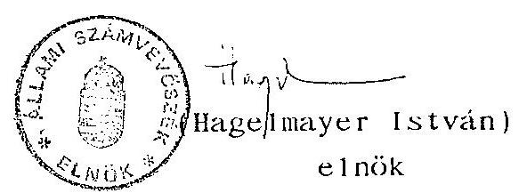

---

ÁLLAMI SZÁMVÉVŐSZÉK

MELLEKLETEK
a V-7-11/1993. sz. jelentéshez
1993. június

---

Társaság alapítás apportja (Magyar Befektetési és Fejlesztési Rt.)
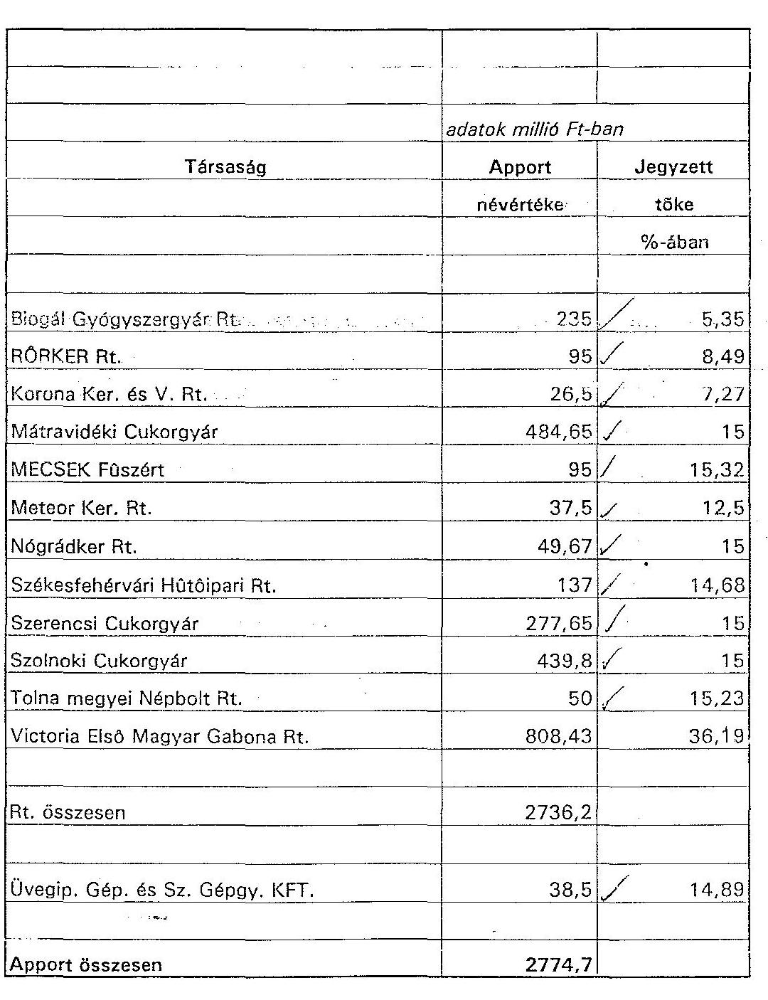

---

Vagyonátadás egyéb célra

|  |  |  |
| :--: | :--: | :--: |
|  | adatok millió Ft-ban |  |
|  | Vagyonátadás |  |
| Társaság | névértéken | Megnevezés |
|  |  |  |
|  |  |  |
|  | 82 |  |
| Investor Rt. | 65 | Csere |
| KERSZI Rt. | 187 | HB |
| Szerencsi Cukorgyár Rt. | 50 | MHB |
| Szolnoki Cukorgyár Rt. | 100 | MHB |
| Székesfehérvári Hűtőipari Rt. | 49 | MHB |
| Promontorvin Borgazd. Rt. | 100 | Promontorvin Rt. |
| Összesen | 633 |  |

---

# MEGÁLLAPODÁS

az Állami Vagyonügynökség és a Promontorvin Borgazdasági részvénytársaság között az Esztergomi Érsekség kártalanításának keretében átadandó részvénycsomagról

1./ A Kormány 3008/1992 számú határozatával, az igazságügyi politikai államtitkár előterjesztésében foglaltaknak megfelelően elrendelte az Esztergomi Érsekség kártalanítását, a Promontorvin Rt. apportját képező esztergomi úti Sötétkapu és pincerendszer tekintetében. A tulajdoni helyzetet rendező szerződést a felek 1992. január 15-én aláírták.

2./ Az Állami Vagyonügynökség 1991. november 28-i nyilatkozatában vállalta, hogy a 180 millió forintra értékelt ingatlanokkal kapcsolatos kártalanítás költségeiből 80 millió forint forgalmi értéket képviselő részvénycsomagot a tulajdonát képező Promontorvin Rt. részvényekből átad a társaságnak.

3./ Az Állami Vagyonügynökség e megállapodásban foglaltak alapján, a megállapodás aláírását követő 15 napon belül a Promontorvin Borgazdasági részvénytársaságnak térítésmentesen átadja a saját tulajdonát képező, 10.000 darab, névre szóló, 10.000 forint címletű, összesen 100 millió forint névértékű részvényt 60%-os árfolyamon, 60 millió forint értékben.

4./ Az Állami Vagyonügynökség, ugyancsak e megállapodásban foglaltak szerint, a Promontorvin Rt-nél, az alapítástól számított három évig, azaz 1992. december 29-ig értékesítésre visszahagyott, 265,4 millió forint névértékű részvénycsomagból 40 millió forint névértékű részvény három éven túli értékesítési jogáról lemond a társaság javára 50%-os árfolyamértéken 20 millió forint értékben. Amennyiben a társaság a nála visszahagyott részvénycsomagot három éven belül értékesíti, a bevétel törvény szerint járó adója mellett 20 millió forint többletvisszatérítésre jogosult.

5./ E megállapodás aláírásával, és e megállapodás 3./ pontja szerinti részvénycsomag átadásával az Állami Vagyonügynökség teljesítette az Esztergomi Érsekség kártalanításával kapcsolatos kötelezettségét, vele szemben a Promontorvin Rt. ezen a címen semmiféle további kompenzációs igényt nem támaszt.
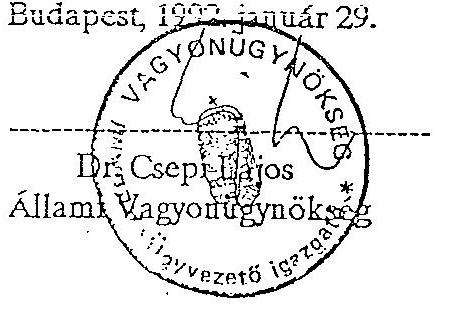

PROMONTOVIN
Borgazdasági részvénytársaság
Dr. Gégény Tibor
Promontorvin Rt.

Cím: 1051 Budapest, Vínló u. 6. - Levelezési cím: 1399 Budapest, Pf: 708
Telefon: 118-5044 - Telefax: 118-7115 - Telex: 22-5182

---

VPI szerinti 1992. évi bevételek és kiadások alakulása ***

|  |  | Mrd Ft |
| :--: | :--: | :--: |
|  |  | tény |
| 1.) Bevételek |  |  |
| - Vagyonhozadék | 4 | 4.6 |
| - Ft értékesítés |  | 17.5 |
|  | 66,0 |  |
| - Deviza értékesítés |  | 40,9 |
| - Hitel |  | 9,1 |
| Összesen | 70 | 72,1 |
| 2.) Kiadások |  |  |
| - Vagyonkezeléssel összefüggő | 0,3 | 0.5 |
| - Reorganizáció |  |  |
| - MBF Rt. | 8,0 | 4.0 |
| - egyéb célra | 1,8 | 5.3 |
| - Értékesítéssel összefüggő | 5,6 | 5,3 |
| - Garanciális kötelezettség | 6,0 | 5,3 |
| - Önkorm. |  |  |
| - - beit. föld. után | 0,3 |  |
| - alapítói jogon | 2,0 | 2.3 |
| - Gazd.társ. alapítás |  |  |
| - ÁV Rt. | 7,0 | 2.9 |
| - Hitelgar.Rt. | 4,0 | 2,0 |
| - - egyéb |  | 2,0 |
|  | 11,0 | 6,9 |
| - Munkahelyteremtés | 1,0 | 1,0 |
| - Költségvetésnek | 24,0 | 24.5 |
| - Kivállalk. Garanc. Alapba |  | 2,0 |
| - Kárrendezési Alapba |  | 1,0 |
| - ÁVÜ szervezetfejlesztés |  | 0.4 |
| - Társ.bizt. | 2,7 | 2.7 |
| - Társ.-ot megillető bev. | 3,3 | 2,3 |
| - Világkiállítási alap | 4,0 | 1.5 |
| - Államadósság törl. |  | 8.6 |
| Összesen | 70,0 | **74.2** |

Megjegyzés:
VPI számszakilag nem határozta meg.
Az 1992. évi bevételnél több a kiadás, melyet az 1991. évi pénzmaradvány (4,7 Mrd Ft) fedez.
A kimutatás nem tartalmazza a kárpótlási jegyért történt 2,2 Mrd Ft-os értékesítést.

---

Az 1992. évi privatizációs költségek részletezése

|  Költségfajta | e Ft  |
| --- | --- |
|  - tanácsadói díj | 1.705.368  |
|  - ingatlan reorganizáció | 1.440.091  |
|  - Danubius részv.ért.költségei | 1.007.200  |
|  - értékesítés bony.díja | 215.649  |
|  - vagyonértékelés | 108.155  |
|  - hirdetési díj | 101.761  |
|  - PR és marketing munkát |   |
|  segítő vállalk. díj | 137.518  |
|  - önpriv. szervezési ktg. | 99.000  |
|  - részv.őrz.,átruh.,szelv.vág. | 28.254  |
|  - bankköltség | 17.975  |
|  - tőzsdei bev. költsége | 12.000  |
|  - megbízási díj | 6.512  |
|  - társ.bizt. | 1.699  |
| 

 - belf. kik. | 2.238  |
|  - külf. kik. | 104  |
|  - postaköltség | 1.134  |
|  - egyéb (ügyvédi, ford. stb.) | 438.614  |
|  - AFA | 412.009  |
|  Összesen | 5.735.281  |

---

# 6. sz. melléklet 

Kötelezettségvállalás/garancia fajtái:

1. JOGI
2. PÉNZÜGYI
3. MÉRLEG
4. KÖRNYEZETVÉDELMI
5. ÁLTALÁNOS
6. HITEL
7. Működésre vonatk.
8. TEHERMENTESSÉG
9. Vagyon, szellemi, anyagi tulaj.
10. Adótartozások, társ. bizt.
11. Előleg visszafizetés
12. Jóteljesítés
13. Permentesség
14. Bizonytalan követelések
15. Kintlévőségek
16. Jogutód és érdekeltség
17. Alkalmazottak (létszám)
18. Számlák
19. Biztosítás
20. Hatósági engedélyek
21. Nettó érték
22. Szerződések (korábbi)
23. Szellemi alk. füz. jogok
24. Tartozások
25. Önkormányzatok

---

26. Hitelezők túlszerz. megakadályozása
27. Épületrészekre vonatk.
28. Ingatlankimutatás teljes
29. Tevékenység törvényes
30. EGYÉB
31. Termék szabványossága
32. Leányvállalatok
33. Részvénytart. opcióhoz
34. Bank
35. Jelzálog mentesség
36. Munkaügy probl. nélküli
37. Rövidlejáratú hitelfedezet
38. VAGYON elvonás
39. KÉSZPÉNZFIZETŐ KEZESSÉG Kormánygarancia
40. Pervesztés
41. Külső köv. átváll.
42. Tulajdonosi/részvény
43. Részvények tehermentesek
44. Konfliktus mentesség
45. Feltétel nélküli
46. Feltételekhez kötött
47. KEZESSÉG

---

a privatizációért felelős tárca nélküli miniszter és a pénzügyminiszter között az 1992. évi LIV. törvény 17. paragrafus (1) bekezdésében foglalt rendelkezés végrehajtásáról.

A felek a privatizáció gyors lebonyolítása érdekében az időlegesen állami tulajdonban levő vagyon értékesítéséről, hasznosításáról és védelméről szóló 1992. évi LIV. törvény 17. paragrafus (1) bekezdés előírásait 1994. december 31-ig az alábbiak szerint hajtják végre:
a) 500 millió forintig ügyletenként minden garanciavállalásról, amely a Vagyonügynökséghez tartozó állami vagyon terhére történik, illetőleg, amely a Vagyonügynökséget készpénzfizetésre kötelezi, az Állami Vagyonügynökség esetileg, saját hatáskörében, szabadon dönt.
b) 500 millió forint és 1 milliárd forint közötti a) pont szerinti kötelezettségvállalást megelőzően a pénzügyminisztérium közigazgatási államtitkára írásbeli nyilatkozatát kell a kötelezettségvállalással kapcsolatban a döntés előtt írásban beszerezni.
c) 1 milliárd forintnál magasabb ügyletenkénti kötelezettségvállalás esetén a pénzügyminiszter jogosult az előzetes írásbeli egyetértő nyilatkozat megtételére.
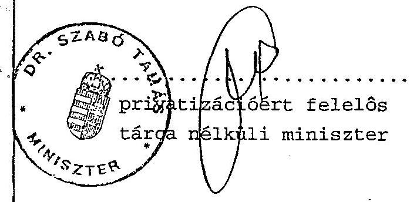

Budapest, 1993. március 19.
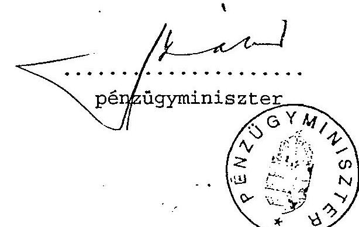

---

# ÁVÜ vezetők döntése alapján végrehajtott 1992. évi egyéb befektetések részletezése 

| Megnevezés | e Ft |
| :--: | :--: |
| Prudent Invest megalakítása | 30.500 |
| Vasedény alvó részvény | 138.200 |
| Agárdi Mgi Kombinát | 10.000 |
| Ottonucci Kft. | 2.909 |
| Dorottya Kft. megalakítása | 1.000 |
| Hegyeshalmi Kavicsbánya Kft. | 50.000 |
| HÉsZ Kft. (Heves mi Ép.Ip.) | 30.000 |
| Bp.IX. Mester u. 7. III. szint. | 267.926 |
| Bp.V. Tüköry u. 3. | 885.000 |
| Dambius részv. | 546.900 |
| Összesen | 1.976.714 |

---

# Az ÁVÜ többségi tulajdonában lévő társaságok vezetői jövedelmének szabályozása 

Az ÁVÜ a többségi (állami) tulajdonban lévő társaságok vezetőinek alapbérét, prémiumát a társaságok igazgatósága vagy a taggyűlés határozza meg az ÁVÜ által meghatározott keretek között. Ezek az irány számok a jegyzett tőkével arányosak és 1992. évre vonatkozóan a következők voltak:
a) Igazgatók, vezérigazgatók, vállalati biztosok:

Társasági alaptőke Fizetés/hó
$200-400 \mathrm{MFt} \quad 80-90 \mathrm{eFt}$
$400-1000 \mathrm{MFt} \quad 90-110 \mathrm{eFt}$
$1000-2000 \mathrm{MFt} \quad 110-130 \mathrm{eFt}$
$2000-5000 \mathrm{MFt} \quad 130-160 \mathrm{eFt}$

5000 MFt-nál nagyobb cégek vezetőinek díjazását közvetlenül Slosár Gábor ügyvezető igazgatóhelyettes úr állapítja meg 140-250 eFt között. A bankvezetők díjazását az IT-ben döntik el. Nullszaldós és veszteséges cégek esetében 1992. évre béremelést nem hagytak jóvá. 3 éven keresztül veszteséges gazdálkodás esetén felmondanak a vezetőknek, kivéve ha évről évre csökken a veszteség összege.

---

b) Igazgatósági tagok díjazása:

| Alaptőke | Díjazás/hó |
| :--: | :--: |
| $200-400 \mathrm{MFt}$ | $15-20$ eFt |
| $400-1000 \mathrm{MFt}$ | $20-25$ eFt |
| $1000-2000 \mathrm{MFt}$ | $25-30$ eFt |
| $2000-5000 \mathrm{MFt}$ | $30-35$ eFt |

Az elnök díjazása a tagokétól általában 5 eFt-tal több.
c) Felügyelő Bizottsági tagok díjazása:

| Alaptőke | Díjazás/hó |
| :--: | :--: |
| $200-400 \mathrm{MFt}$ | $10-15 \mathrm{eFt}$ |
| $400-1000 \mathrm{MFt}$ | $15-20 \mathrm{eFt}$ |
| $1000-2000 \mathrm{MFt}$ | $20-25 \mathrm{eFt}$ |
| $2000-5000 \mathrm{MFt}$ | $25-30 \mathrm{eFt}$ |

Az elnök díjazása itt is 5 eFt-tal több mint a tagoké.

A kiemelt vállalatok (10-15 milliárd alaptőke) és a bankok vezetőségének díjazása nem tartozik a Humánpolitikai Igazgatóság hatáskörébe. Közölt számoktól a vállalatok csak lefelé térhetnek el.

A Felügyelő Bizottsági tagok díját havonta fizetik, míg az igazgatósági tagok díjazását 1992. április 2-től nyereségfüggővé tették, így ők a társaság első számú vezetőjéhez hasonlóan csak a tervezett nyereség elérése után, az évadzáró közgyűlés határozata alapján kaphatják meg járandóságukat.

---

A társaságok első számú vezetőinek prémizálásánál korábban megvolt anomáliákat kiküszöbölték. Pl. az 1991-es év prémium feltételei még úgy szóltak, hogy "a vállalat nyereséges működéséért 150 % prémium kifizethető". Ezt a túlzott általánosságot megszüntetve, a prémiumot hármas feltétellel 120 %-ban limitálták. A maximum 120 %-os prémiumot a következő feltételekhez kötötték:
a) 40 % valamilyen, a társaság adottságaihoz szabott privatizációs feladat teljesítése esetére, pl. 100 %-os kivásárlás, 50 %-os kivásárlás, exakt határidőre.
b) 40 % az alapnyereség elérése esetére, természetesen nem a bázisévet, hanem az alaptőkét, forgalmat figyelembe véve határozták meg az elérendő célt.
c) További 40 % minden további nyereség elérése után, lépcsőzetesen tagolva a feladatot a vállalat méretéhez és lehetőségeihez képest, pl. minden további 2 millió Ft nyereség után 2 % többletprémium kapható.

- Kizáró ok vagy erős csökkenést von maga után az adó-, TB-, vám- és szolidaritási alap tartozás.
- Abszolút kizáró ok a veszteséges gazdálkodás. Ez természetesen más konzekvenciákat is vont maga után, úgy gazdasági, mint humánpolitikai oldalról (pl. menedzsment csere).

---

- A vezetői fizetésemeléseknél az 1992. évre maximum 20 %-ot fogadtak el, kivéve a vállalati biztosi kinevezéseket, ahol nagyobb emelést is szükségesnek ítéltek. Az igazgatósági és a felügyelő bizottsági tagok díjazását csak igen alacsony szinten emelték, általában maradt az 1991. évi szinten.

---

# A vagyonvédelem jogszabályi változásainak összefoglalása 

Az 1992. évi LIV. törvényben és annak végrehajtásában a hatályba lépés után a következő változások érvényesültek.

1. Az 1990. évi VIII. törvény hatálya az állami vállalatoknak, ezek leányvállalatainak és az egyéb állami gazdálkodó szervezeteknek a szerződéseire terjed ki. Az 1992. évi LIV. tv. hatálya a Vagyonügynökséghez tartozó vagyonnal gazdálkodó állami vállalatoknak, ezek leányvállalatainak és az egyéb állami gazdálkodó szerveknek a szerződéseire terjed ki.
2. Az 1990. évi VIII. törvényben és az 1992. évi LIV. törvényben meghatározott értékhatárok szerint alacsonyabbak lettek, illetve százalékosan kerültek meghatározásra, valamint a viszonyítási alap is megváltozott az alábbiak szerint:
a) apportálásnál a vállalat éves beszámoló szerinti saját tőke 10 %-át vagy 20.000.000 Ft-ot meghaladó szerződését kell bejelenteni, korábban a vállalat könyvviteli mérleg szerinti összes eszköz értékéhez kellett viszonyítani és nem vagylagos hanem konjunktív volt az összeghatár.
b) vagyonértékű jog és tulajdonérdekeltség elidegenítése esetén a korábbi 30.000.000 Ft-os értékhatár vagylagosan 20.000.000 Ft-ra illetve az éves beszámoló szerinti saját tőke 30 %-ára változott.

---

c) ingatlan elidegenítés vagy ingatlanra lízingszerződés kötése esetén ha a szerződés értéke 30.000.000 Ft-ot meghaladta, akkor kellett bejelenteni a szerződést, míg a jelenleg hatályos törvény szerint a vetítési alap az ingatlan vállalati könyvviteli nyilvántartások szerinti értéke, az összeghatár pedig 20.000.000 Ft.
d) állóeszköz elidegenítés esetén korábban az állóeszköz könyvviteli mérleg szerinti értéke 50.000.000 Ft-ot meghaladta, akkor bejelentési kötelezettség állt fenn, míg jelenleg azon szerződést kell bejelenteni, amelyet elidegenít a vállalat, olyan tárgyi eszközt, amelynek szerződés szerinti együttes értéke az éves beszámoló szerinti saját tőke 30 %-át vagy 50.000.000 Ft-ot meghaladja.
3. A vállalat köteles a fenti tárgyi hatály alá tartozó szerződések tárgyául szolgáló vagyon értékét vagyonértékelésre feljogosított szervezettel vagy személlyel megállapítattatni, sőt a hatályos törvény szerint ez a kötelezettsége a fent felsorolt értékhatárt el nem érő ingatlan elidegenítését megelőzően is fennáll.
4. Az 1992. évi LIV. tv. kiveszi a törvény tárgyi hatálya alól a vállalatnak állami költségvetési szervvel kötött szerződését, míg korábban ezeket a szerződések is be kellett jelenteni az ÁvÜ-nek.
5. Az új törvény szerint a fenti szerződések megkötésétől számított 15 napon belül kell bejelenteni az ÁvÜ-nek, korábban a szerződéskötési szándék esett bejelentési kötelezettség alá.

---

6. Az új törvény a munkavállalói érdekképviseleti szervek egyetértését köti jóléti vagy szociális célokat szolgáló vagyontárgyakról fenti értékhatárokat elérő szerződésekkel történő rendelkezést, az értékhatár alatt a munkavállalói érdekképviseleti szerveknek véleményezési joguk van. Sportcélokat szolgáló vagyontárgyról való rendelkezés esetén - értékhatárra tekintet nélkül - az OTSH véleményét köteles a vállalat kikérni.
7. Az új törvény szerint az értékhatárokat el nem érő, de ingatlan elidegenítésére irányuló az ingatlan értékét tekintve 1.000.000 Ft-ot meghaladó szerződés esetén a vállalat a szerződéskötési szándékot is köteles a szerződés megkötése előtt 30 nappal az ÁvÜ-höz bejelenteni. Az ÁvÜ ebben az esetben nem engedélyező szerv.
8. Az új törvény szélesebb lehetőséget kínál az ÁvÜ részére akkor, amikor az ÁvÜ által az engedélyezés során megtehető intézkedéseket a jóváhagyás feltételhez kötésével bővíti.
9. Az új törvény szerint az ÁvÜ a pályázati kiírás feltételeit is engedélyezi, korábban a pályázati kiírást nem bírálhatta el az ÁvÜ a meghirdetés előtt.
10. A korábbi szabályozás szerint a nyilvános pályázat meghirdetése és a pályázatok benyújtására megállapított kezdő időpont között legalább 7 napnak kellett eltelnie, az új törvény ezt 15 napra emelte.
11. A bejelentés elmulasztása az 1992. évi LIV. tv. szerint az 1990. évi VIII. tv-ben foglaltakkal szemben nem a szerződés semmisségét eredményezi, hanem a bejelentés elmulasztása esetén a szerződés nem jön létre.

---

a V-7-17/1993. sz. jelentéshez

FÜGGELÉK

---

TARTALOMJEGYZÉK
1. BEVEZETÉS ..... 1
2. MEGÁLLAPÍTÁSOK ..... 3

1. A H9005 program (PHARE I. Ütem) előkészítése, végrehajtása ..... 3
1.1. A program előkészítése ..... 3
1.2. A program végrehajtása, a támogatási célok teljesítése ..... 5
1.3. A támogatási összeg rendelkezésre állása ..... 7
1.4. A pénzügyi felhasználás alakulása ..... 8
2. A H9106 program (PHARE II. ütem) előkészítése, végrehajtása ..... 9
2.1. A program előkészítése ..... 9
2.2. A program végrehajtása, a támogatási célok teljesítése ..... 10
2.3. A támogatási összeg rendelkezésre állása ..... 13
2.4. A pénzügyi felhasználás alakulása ..... 13
3. A PHARE III. ütem előkészítése ..... 15
4. A H9005 és a H9106 programok előkészítésére, végrehajtására egyaránt vonatkozó megállapítások ..... 15
4.1. Szerződések előkészítése, szerződéskötések ..... 15
4.2. Az ajánlatok értékelése ..... 20
4.3. Jelentés (Progress Report) készítése a támogatás felhasználásának alakulásáról ..... 22
4.4. A PHARE programok illeszkedése az ÁvÜ szervezeti rendszerébe ..... 23
5. A PHARE támogatások felhasználásának irányítása, a pénzügyi adminisztrátor, ill. a Programiroda tevékenysége ..... 24
5.1. A PHARE H9005 program irányítása ..... 24
5.2. A PHARE H9106 program irányítása, a Programiroda létrehozása ..... 26
6. A külföldi tanácsadók szerepe ..... 29
7. A PHARE forrásokból támogatott projektekhez igénybe vett egyéb források ..... 31
8. Korábbi ellenőrzések megállapításaira tett intézkedések ..... 31

---

9. Az EK Bizottsága által jóváhagyott támogatási keretek pénzügyi
 felhasználásával kapcsolatos tevékenység ..... 32
9.1. A PHARE források kezelésére megnyitott bankszámlák, előleg utalások az EK részéről ..... 33
9.2. A PHARE segély nyilvántartására kialakított rendszer ..... 34
9.3. A forrás felhasználások, a kifizetések ellenőrzése ..... 35
9.4. Egyéb, a kifizetésekre vonatkozó megállapítások ..... 36
9.5. A forrás felhasználások és a kifizetések kapcsolata az ÁVÜ gazdálkodásával, a felhasználás célszerűsége
10. A Keretmegállapodás "Általános feltételek" mellék- ..... 39
letében előírt adózási, vám- és illetékszabályok érvényesülése
III. ÖSSZEFOGLALÓ KÖVETKEZTETÉSEK, JAVASLATOK ..... 42
TÁBLÁZATOK, MELLÉKLETEK

---

# ÁLLAMI SZÁMVEVŐSZÉK 

IV. Vagyonellenőrzési Igazgatóság
$\mathrm{V}-8 / 13 / 93$.
Tsz: 169

## J E L E N T É S

Az Állami Vagyonügynökség részére juttatott PHARE forrásból nyújtott pénzügyi támogatások felhasználásának vizsgálatáról

## I.

## BEVEZETÉS

A PHARE program általános céljait és szabályozási kereteit az EK Miniszteri Tanácsának előírásai határozzák meg.
Fő célja a közép- és kelet-európai országok piacgazdaságra történő áttérésének az elősegítése.

A PHARE programokról az EK Brüsszeli Bizottsága (továbbiakban Bizottság) és a kedvezményezett állam kormánya keretmegállapodást köt.
Ez alapján az EK nevében a Bizottság, a fogadó állam részéről egy általa kijelölt és meghatalmazott hatóság (vizsgálati területünk esetében az Állami Vagyonügynökség) írja alá a részprogramra vonatkozó Finanszírozási Megállapodást.

A program megvalósításáért az erre a célra létrehozott PHARE Programiroda, illetve a PHARE program engedélyező tisztségviselője (ebben az esetben az ÁvÜ ügyvezető igazgatója) a felelős.

Az Állami Vagyonügynökséget illetően két program van jelenleg megvalósítás alatt:

- a PHARE(90)I. ütem; H9005 program, melynek keretében szakmai és technikai segítséget kap az ÁvÜ saját tevékenységéhez,
- a PHARE(91)II. ütem; H9106 program ÁvÜ részére folyósított része, amely a privatizáció és az ipar szerkezetátalakítási céljait szolgálja.

Az Állami Számvevőszék 1993. I. félévi ellenőrzési terve irányozta elő az Állami Vagyonügynökség részére a PHARE programból nyújtott támogatások felhasználásának ellenőrzését a V-8-1/1993. számon jóváhagyott ellenőrzési program alapján. Az ellenőrzési feladat végrehajtását az Állami Vagyonügynökség 1992. évi tevékenységének vizsgálatára elfogadott V-7-4/1993. számú vizsgálattal egyidejűleg szerveztük.

---

Az ellenőrzés célja annak megállapítása, hogy a PHARE programok előkészítéséért és megvalósításáért felelős ÁVÜ intézkedései hogyan segítették elő a kapott támogatások eredményes és gazdaságos felhasználását. A programok végrehajtásának folyamatában hogyan érvényesítették az EK és a Magyar Köztársaság Kormánya között megkötött Keretmegállapodásban és a Finanszírozási Megállapodásban foglaltakat, miképpen tartják be a hazai jogszabályokban és az EK által megszabott feltételekben előírtakat.

Az Állami Vagyonügynökséget a magyarországi privatizáció elősegítésében külföldi szervezetek is részesítik támogatásban. Vizsgálatunk ezek hatékonyságának elemzésére, a PHARE támogatások és e támogatások összhangjára nem terjed ki.

Az ellenőrzés módszere a pénzügyi-gazdasági ellenőrzés Állami Számvevőszéken belül kialakított módszertanának eljárási szabályait, annak célszerűségi és szabályszerűségi szempontjait követte. A forrásfelhasználás jellegéből következően a vizsgálati program kidolgozásánál tekintettel voltunk arra, hogy az megfeleljen az EK által közreadott Pénzügyi Ellenőrzési Útmutató (DG XX. Financial Control - The PHARE Audit Trail) terminológiája szerint a "posteriori control" helyszíni ellenőrzés feladatainak is.

A helyszíni ellenőrzés végrehajtásának körülményeit meghatározó módon alakította, hogy

- a rendelkezésre bocsátott dokumentációk nem voltak teljes körűek. Számos esetben csupán a vizsgált szerv szóbeli tájékoztatására tudott az ellenőrzés támaszkodni;
- a dokumentációk - jellemzően a Programirodában dolgozó külföldi tanácsadók működése előtt - rendezetlenek, nem irattározottak. Ez nehezítette az ellenőrzés egyes pontjainak beláthatóságát;
- az átadott dokumentációk jelentős részénél hiányzott a dátum és az aláírás;
- a dokumentáció zöme angol nyelvű;
- a PHARE forrásból nyújtott támogatások felhasználásához kapcsolódó feladatokat és eljárási rendet az ÁVÜ Szervezeti- és Működési Szabályzata nem tárgyalja átfogóan.

A körülményekből adódóan a helyszíni ellenőrzés során meghatározóvá vált a megbízható információ (a program előkészítésére, végrehajtására, igazgatására) összegyűjtése. Ennek legfőbb eszköze a különféle - döntő többségében angol nyelvű - interjúk lefolytatása volt.

---

Ellenőrzött időszak: Az ellenőrzés a PHARE 9005., illetve 9106. számú Finanszírozási Megállapodás aláírásának időpontjától az 1992. december 31. közötti időszak eseményeire terjedt ki. Az áthúzódó ügyletek, illetve az egyes folyamatok tendencia jellegének megállapítása érdekében felhasználtunk 1993. I. negyedévi adatokat is.

A helyszíni ellenőrzés kezdete: 1993. március 8.
befejezése: 1993. május 17.
Ellenőrzött szervezetek: Állami Vagyonügynökség Budapest, XIII., Pozsonyi út 54-56.
ezen belül: Nemzetközi Kapcsolatok Igazgatósága
PHARE Programiroda
Költségvetési és Gazdálkodási Igazgatóság
Konzultációs céllal megkerestük a Nemzetközi Gazdasági Kapcsolatok Minisztériumában az OECD Segélykoordinációs Titkárságát. Tájékozódási céllal megkerestük az Európai Közösségek budapesti Képviseletét (továbbiakban Képviselet).

A vizsgálatot vezette: Halász Gejza igazgató helyettes
A vizsgálatot végezték: Hajagos Józsefné tanácsos
Réthelyi Jenő számvevő
Tardos József számvevő
Vasas Sándorné dr. tanácsos, aki a koordinációs feladatokat is ellátta

A vizsgálat megállapításai a rendelkezésre bocsátott dokumentumok és a vizsgált szervek szóbeli tájékoztatására épülnek. A dokumentumok az Állami Számvevőszék Vagyonellenőrzési Igazgatóságánál rendelkezésre állnak, megtekinthetők.
II.

# M E G Á L L A P Í T Á S O K 

1. A H9005 program (PHARE 1. ütem) előkészítése, végrehajtása

### 1.1. A program előkészítése

A "PHARE 1990" programból Magyarország 100 millió ECU támogatást kapott. Az ÁVÜ támogatására elkülönített 5 millió ECU célja a magyarországi szerkezetátalakítási folyamat egyik kulcsintézményének, az 1990-ben létrehozott ÁVÜ, működési feltételeinek megteremtése, a szakszerű privatizációs eljárások kialakítása, azok végrehajtásának segítése.

---

Ennek megfelelően a program elemei:

- technikai segítségnyújtás; a privatizáció területeire specializált szakértők, illetve a magyar gazdasági igazgató támogatására egy pénzügyi szakember igénybevétele,
- képzés; 1-4 hetes tanfolyamok, rövid távú külföldi gyakorlatok, szakképzés Magyarországon külföldi oktatókkal, posztgraduális képzés az ÁVÜ dolgozói részére,
- technikai eszközök; számítógépek (munkahelyi és központi), szoftverek, nyomtatók, távközlési berendezések,
- szaktanácsadás; a vállalatok privatizációjához speciális tanulmányok elkészítése, tanácsadás.

Az egyes támogatási elemek költségelőirányzatait a Finanszírozási Megállapodás rögzíti (lásd 1. sz. Táblázat 1. oszlopa).

Előkészítéséről az ÁvÜ csak egy javaslatot tudott a vizsgálatnak bemutatni. A javaslat készítésének időpontja egybeesik az ÁVÜ megalakulásával. Készítője, s hogy intézkedésre hova továbbították, a dokumentációból nem állapítható meg.

Az ÁVÜ szóbeli tájékoztatása szerint a javaslatot az EK állította össze a rendelkezésre álló dokumentációk alapján, az ÁVÜ létrehozásában közreműködő külföldi tanácsadók segítségével.

Az ÁVÜ nem rendelkezik szabályosan aláírt Finanszírozási Megállapodással; mivel az érvényesnek tekintett példányról hiányzik a Bizottság aláírása és a dátum.

Az előbbiek alapján nehéz arra a kérdésre pontos választ adni, hogy a program előkészítése mennyi időt vett igénybe, de a rendelkezésre álló hiányos dokumentumokból közel egy évre becsülhető. Az időszak indokolatlanul hosszúnak minősíthető, ha azt vesszük számításba, hogy a programelemek és előirányzatuk 1990. júliustól végleges formában elhatározottak voltak.

---

1.2. A program végrehajtása, a támogatási célok teljesülése

A program végrehajtásának segítésére három Munkaprogram készült:

|  | időszak | jóváhagyás időpontja |
| :--: | :--: | :--: |
| I. Munkaprogram | 90.12.01.-91.12.31. | 91.11.04 |
| II. Munkaprogram | 91.11.01.-92.06.30. | nincs jóváhagyva |
| III. Munkaprogram | 92.06.01.-92.11.30. | aláírt dokumentum <br> nem állt rendelke- |
|  |  | zésre |

Az első és a harmadik Munkaprogramot - tájékoztatásuk szerint - az EK jóváhagyta. (A harmadik Munkaprogramot illetően mindkét részről aláírt dokumentumot nem tudtak a rendelkezésünkre bocsátani.)

A második Munkaprogramot (amelynek elkészítési időpontja egybeesett a pénzügyi szakember tevékenysége körüli problémák megjelenésével) az EK sohasem hagyta jóvá. A két időszak között a megvalósítás eseti jóváhagyásokkal folytatódott.

Az első munkaprogramban a részletesen meghatározott technikai segítségnyújtásra és az eszközök biztosítására irányultak a versenyfelhívások és a szerződéskötések. A privatizációs tanácsadás programelemeknél konkrét projekteket nem, csak annak jellegét határozták meg.

A harmadik munkaprogram projekt szinten jelzi a folyamatban lévő szerződéskötéseket (MÁV, MATÁV, értékelési keretszerződés), meghatározza a további technikai eszközigényeket, az erre irányuló szerződéskötések ütemezését.

Tájékoztatásuk szerint ez a program is aláírásra került, de mindkét részről aláírt dokumentum nem állt rendelkezésre. Indoklásuk szerint az aláírást, illetve jóváhagyást a zavartalan előlegfolyósítás is alátámasztja.

A helyszíni vizsgálat során megállapítottuk, hogy a rendelkezésünkre bocsátott első két munkaprogram számai nem egyeznek meg a Programirodán ezen a címen nyilvántartott adatokkal.

Erre, azt az elfogadható és általunk tudomásul vett magyarázatot kaptuk, hogy ők nyilvántartásukban az első két Munkaprogram számaiként a tevékenységüket megelőző időszak tényleges kifizetéseit szerepeltetik. Ezzel is azt kívánták elérni, hogy a Programiroda e tekintetben is tiszta lappal induljon.

A program kiemelt jelentőséget tulajdonít a képzési feladatoknak.
A képzési program keretében állandó szemináriumokat, hazai és külföldi tanfolyami részvételt irányoztak elő.
A továbbképzésben az ÁVÜ dolgozói részesülnek, a részvételnek különleges jelentkezési feltételei nincsenek, az indokoltságot az illetékes vezető bírálja el.
Továbbképzésben 1991-ben 74 fő vett részt, költsége összesen 133,3 ezer ECU, 1992-ben 539 fő, költsége 168,7 ezer ECU. Az 539 fős létszám magában foglalja az ÁVÜ által szervezett belső vezetői értekezleten (manrézán) résztvevők számát is (330 fő).
A továbbképzések során szerzett ismeretek közvetlen hasznosulását felmérni nagyon nehéz. A külföldi és hazai privatizációs technikák és tapasztalatok tanulmányozása, az új irányzatok megismerése, a folyamatos idegennyelvi és egyéb szakmai képzés közvetve bizonyára segítette a hazai privatizációt.

A program a Finanszírozási Megállapodás szerint 375 ezer ECU-t irányzott elő technikai felszerelések beszerzésére a 60 fő létszámot figyelembe véve.

Tekintettel arra, hogy az ÁVÜ létszáma 1991. végén mintegy 100 fő, 1992. végén pedig mintegy 300 fő volt, a technikai felszerelések - számítógépek, irodafelszerelések, telefonok, stb. - iránti igény az előirányzatnál lényegesen nagyobb volt.

Az igények növekedését, és ehhez a pénzügyi keretek átcsoportosítását az EK utólag tudomásul vette.

1991-ben összesen 235 ezer ECU-t, 1992-ben 51 ezer ECU-t használtak fel erre a célra. (Az ÁVÜ jelentős mértékben kapott más segélyprogramok keretén belül is eszközöket.) A gépek, berendezések üzembehelyezése, tárgyi eszközök közé való felvétele megtörtént.

A PHARE keretében igénybe vett tanácsadók, szakértők segítségét elsősorban a privatizáció előkészítéséhez, helyzetelemzéshez és a stratégia meghatározásához kérték (lásd 3. sz. táblázat!).

---

# 1.3. A támogatási összeg rendelkezésre állása 

1990 novemberében a Brüsszeli Iroda 2742 ezer ECU-t utalt át, vagyis a program első előlegeként az előirányzott összeg 55 %-át folyósította.
A második folyósítás 1992 decemberében érkezett 1531 ezer ECU.

Tehát 1992 végéig átutaltak 4273 ezer ECU-t, a támogatás 85,5 %-át.

### 1.4. A pénzügyi felhasználás alakulása

A program megvalósítása a tervezettnél lényegesen lassúbb ütemben halad. 1991. év végéig a támogatás ütemes felhasználása szerint előirányzott összegnek csak mintegy 18 %-ára volt elkötelezettségük, s 499557 ECU (támogatás 10 %-a) kifizetést teljesítettek.

A program megvalósítás lassan haladt, az ÁVÜ által kiválasztott pénzügyi szakember munkájával szemben több kifogás merült fel, s végül is alkalmazását megszüntették. A támogatás felhasználásának irányítása mintegy új alapokról indult a Programiroda létrehozásával.
1992. december 31-ig, a vizsgálati periódus végéig a támogatás kamattal növelt összegének 83 %-ára van megkötött szerződés, illetve 25 %-át fizették ki.
1993. március 31-ig - ez a rendelkezésünkre álló legfrissebb adat - a kamattal növelt támogatás 87 %-ára van szerződés, s 42 %-a van kifizetve.

A harmadik Munkaprogram előírta, hogy a rendelkezésre álló forrás egészét leterheljék kötelezettségvállalással 1992. július végéig. Ez a célkitűzés azonban nem teljesült.
A megkötött szerződések, a kifizetések összetételét vizsgálva, a Finanszírozási Megállapodáshoz viszonyítva jelentős arányeltolódást állapíthatunk meg:

Az "ÁVÜ dolgozói
 képzése" címen előirányzott érték aránya kétszeresére, a "technikai beszerzés" címen előirányzott összeg aránya háromszorosára nőtt. Az ezen a két jogcímen kifizetett összeg abszolút értelemben is meghaladja a FM szerinti értékeket; 1992. december 31-én a szerződéssel lekötött összeg:

- a képzés soron: 524 ezer ECU (FM: 325 ezer ECU);
- a technikai eszköz beszerzés soron: 832 ezer ECU (FM: 375
ezer ECU)

---

A "külső szakértők alkalmazása az egyes privatizációs eljárásokhoz" címen elkülönített összeg a megkötött szerződéseket tekintve is elmarad a tervezetttől, de a kifizetés is itt a legalacsonyabb; az előirányzat 1%-a.

Mindazonáltal az így felhasznált összegek mind arányaikban, mind az egyes címeket tekintve tükrözik a harmadik Munkaprogramban foglaltakat.

A Programiroda működése óta a kötelezettségvállalás mérhetően felgyorsult, a kifizetések szabályozottak.

Az EK segély rendelkezésre állása nem volt, s ma sem akadálya a források terv szerinti felhasználásának.

A támogatás felhasználás gyorsítása érdekében az utóbbi időben számos intézkedést tettek:

A Vagyonügynökség 1993. februárjában tartott szakmai értekezletén külön is felszólították az ÁVÜ munkatársait a PHARE támogatás adta lehetőségek kihasználására.
A közreadott eljárási tájékoztatót kommentálva elismerik, hogy a PHARE támogatások igénybevétele többletmunkával jár, de hangsúlyozzák, hogy ez a feltétele a támogatás felhasználása átláthatóságának, a versenyeztetési szabályok, a szerződéskötési fegyelem betarthatóságának.
Az ÁVÜ vezetése egy speciális ösztönzési rendszert jelent be, amely szerint a PHARE források felhasználói kiemelt jutalomban részesülnek. Indoklásuk szerint igen kedvezőtlen fényt vetne az ÁVÜ-re, ha nem tudnák a forrásokat 1994 végéig "elkölteni", az EK visszavonná a támogatást.

A H9005 program szerint a befejezési határidő 1991. december 31. volt. A Bizottság kötelezettségvállalása szerint a befejezési határidő módosítható a magyar fél által megfelelően alátámasztott kérés alapján.
A vizsgálat során ilyen előterjesztést nem tudtak bemutatni.
A Képviselet, a Programiroda és az ÁVÜ képviselőinek részvételével havonta megtartásra kerülő megbeszéléseken elhangzottak, illetve az EK Képviselet 1991. november 14-i levele szerint a befejezési határidőt 1993. december 31-ig meghosszabbították.

Az 1993. március 31-i pénzügyi kifizetést figyelembe véve rendkívüli erőfeszítéseket kell az ÁVÜ-nek tenni, hogy a PHARE segély az év végéig eredményesen felhasználásra kerüljön.

---

2. A H9106 program (PHARE 11. ütem) előkészítése, végrehajtása

# 2.1. A program előkészítése 

Az 1991. évi PHARE támogatásból Magyarországnak juttatott összeg 108 millió ECU.

Az ezt megalapozó 1991. évi Indikatív Program előkészítése 1990. év utolsó hónapjaiban megkezdődött, az OECD segítséget koordináló tárcaközi bizottság irányítása mellett. Elsősorban meg kellett határozni a PHARE makrogazdasági prioritásait és ezek arányait a segélycsomagban. Már akkor vezető helyen szerepelt a gazdaság szerkezetátalakítása, a piacgazdaság háttér eszközrendszerének megteremtése program, az Ipari és Kereskedelmi Minisztérium (továbbiakban IKM) koordinálásával. Az EK támogatási elgondolásában fő szempont volt, hogy az adománynak koncepcionális elképzeléseket kell szolgálnia, nem "ad hoc" jellegű megoldásokat. A szerkezetátalakítási folyamat elősegítése és a privatizáció ezen elvárásnak megfelelt. Az előirányzatként meghatározott 40 millió ECU összeget elfogadták, de a program végrehajtásában a vezető szerepet az ÁVÜ kapta.

A támogatásról rendelkező Finanszírozási Megállapodást 1991. október 15-én írták alá. Az FM szerinti 40 millió ECU-ből a privatizáció támogatására az ÁVÜ hatáskörébe utalva - 21,4 millió ECU-t irányoztak elő, a létrehozandó Programiroda finanszírozására elkülönítettek 1,9 millió ECU-t, s az IKM részére az ipari szerkezetátalakítási program támogatására juttattak 16,7 millió ECU-t.

Vizsgálatunk az ÁVÜ által kezelt programra és az ennek kezelésére létrehozott PHARE Programiroda tevékenységére terjed ki.

A privatizáció támogatására elfogadott program elemei:

- általános támogatás; rövid, hosszú távú szaktanácsadás a vagyonkezelés és befektetők által kezdeményezett privatizáció területeire, illetve technikai eszközök beszerzése az ÁVÜ újonnan létrehozott osztályai számára;
- az aktív privatizációs programhoz jogi, értékelési és privatizációs tevékenységek költségeire támogatás 34 esetben. A program egy tranzakció költségét 500 ezer ECU-re becsüli, mely összeget a sikeres végrehajtásból vissza kell nyerni és egy speciális "forgó alap"-ba kell helyezni, s az egy másik tranzakció forrása lehet;

---

- spontán privatizáció esetében a privatizációs stratégia kidolgozására és végrehajtására tanácsadás finanszírozása kb. 25 vállalatnál;
- befektetési társaságok alapításához tanácsadás a kezdeti tervek elkészítéséhez és a társaságok igazgatását végző cég versenyeztetésére.

Az egyes támogatási elemek költségelőirányzatait a Finanszírozási Megállapodás rögzíti (lásd 2. sz. Táblázat 1. oszlopa).

Az ÁVÜ-nél hiányosan rendelkezésre álló dokumentumokból a program elemeinek tervezése, a közel végleges javaslat összeállítása 1991. január-március hónapra tehető.

Az EK-val folytatott egyeztetéseket és az NGKM szerepét a dokumentációból nyomon kísérni nem lehet, de az megállapítható, hogy: nem nyert támogatást az ÁVÜ igénye ellenére a képzés, mert a H9005 képzési keretét megemelték, illetve az eredeti javaslathoz képest csökkentett támogatást biztosítottak a technikai eszközökre (a H9005 ezen előirányzata szintén növekedett), s a befektetési társaságok alapításának segítésére.

Az egyeztetésekre, a módosítások előkészítésére, a módosításokra vonatkozóan az ÁVÜ dokumentációval nem rendelkezik. Magyarázatként közölték, hogy a H9005 sz. megállapodás szerint alkalmazott pénzügyi szakember önállóan végezte ezeket, s dokumentációt távozásakor nem hagyott hátra.

A program végrehajtására egy Munkaprogram készült az 1992. június 1. - 1992. november 31-i időszakra, amelyet az EK 1992. áprilisában jóváhagyott.

# 2.2. A program végrehajtása, a támogatási célok teljesítése 

A program keretében privatizációs tanácsadók bevonására került sor többek között a Várda és Miskolci Szeszipari Vállalat, Express Utazási Iroda, Vas megyei Tejipari Vállalat privatizációjába.
A program keretében igénybe vett szakértők, tanácsadók hozzájárultak a tranzakciók megalapozottságához, előkészítettségéhez.

Hasonló módon kívánnak tanácsadókat, szakértőket bevonni a Pápai Húskombinát, a Savaria és Tisza Cipőgyárak, Nagykörösi Konzervgyár, stb. privatizációjához.

---

A programban előirányzott befektetési társaságot nem hozták létre. Létrehozására vonatkozóan 1993. áprilisában megvalósíthatósági tanulmányt készíttettek, s felvették a kapcsolatot az EBRD-vel.

A Finanszírozási Megállapodás szerint az ÁVÜ részére folyósítandó segély 80%-át az ÁVÜ által kezdeményezett, ún. aktív privatizáció, 13%-át a spontán privatizáció támogatására, s 7%-át ún. általános támogatás címén (rövid, hosszú távú konzultáció, eszközbeszerzés) irányozták elő.

Az aktív privatizációra elkülönített 17 millió ECU felhasználását tekintve a Megállapodás rögzíti az ún. forgó alap létrehozását ("Revolving fund" koncepció):
"Az a szándék, hogy ezen szolgáltatások költségeit a sikeres tranzakciók eladási bevételeiből visszanyerik és átutalják egy különleges forgóalapba, amelyet a további tranzakciók finanszírozására fognak felhasználni."

Ezek szerint az EK egyszeri támogatást nyújt az aktív privatizáció előkészítéséhez szükséges szakértői, konzultánsi költségekhez. E döntés logikája, hogy a vételárnak fedeznie kell az előkészítési költségeket is.

A Megállapodás aláírását követő egy év után a Vagyonügynökség kezdeményezte az EK Képviseleténél a koncepció elvetését, s az aktív privatizáció címén elhatárolt összegből 10 millió ECU más célokra történő átcsoportosítását.
1992. december 9-i levelében Csepi úr kérte az EK hozzájárulását a program módosításához és a 17 millió ECU-ból 10 millió tekintetében javaslatot is tesz annak mikéntjére. Ugyanakkor kijelenti, hogy amennyiben az EK nem ejti el a forgóalap gondolatát, kéri "a hozzájárulást a 7 millió ECU teljes összegének más célokra történő átcsoportosításához".

Javaslatukat azzal indokolták, hogy számos más területen új és fontos igények merültek fel; 1992-ben a privatizációs, az állami vagyon kezelésével kapcsolatos törvények, a prioritások jelentősen módosultak.

A Képviselet 1993. január 11-i levelében a 10 millió átcsoportosításához elvileg hozzájárult és részletesebb magyarázatot kért, miért elfogadhatatlan a forgóalap gondolata az ÁVÜ számára.

---

A Vagyonügynökség azzal érvelt, hogy - az aktív privatizáció már nem része a privatizációs politikának, új prioritások vannak, az ÁVÜ által külső konzultánsokra fordítható összeg szintjét a Költségvetési törvény részeként az Országgyűléssel kell jóváhagyatni.

Így a forgóalap feltöltési kötelezettségük esetén csak ezen a módon (az Országgyűlés által jóváhagyatva) tudják növelni a külső konzultánsokra fordítható forrást.

Megítélésünk szerint az EK "revolving fund" elképzelése (amelynek teljesítését az ÁVÜ a Finanszírozási Megállapodás aláírásakor vállalta), azt a Magyarországon is gyakorta hangoztatott koncepciót tükrözi, hogy a privatizációs bevételeket (azok meghatározott részét) vissza kell forgatni a gazdaságba, gazdaságélénkítésre kell használni.

Tehát az ÁVÜ által kieszközölt módosítás e tekintetben ilyen irányú koncepcióváltást is jelent, amelyet nem tartunk szerencsésnek. Különösen nem arra, a nem is titkolt indokra támaszkodva, amely a költségvetési források szűkösségére hivatkozik. (Ha az aktív privatizációra előirányzott összeget átcsoportosítják, ez a segélyprogram 80%-át érinti. Minderrre akkor kerül sor, amikor érdemben még felhasználás nem történt, s a Megállapodás aláírásától eltelt 14 hónap.)

Többszöri levélváltást követően az 1993. március 31-i állapotot bemutató pénzügyi jelentés már elfogadott tényként jeleníti meg a 10 millió ECU ÁVÜ által javasolt, más célokra történő áthelyezését (lásd 2. sz. Táblázat!).
A felallokáció mellett javasolták a program jogcímek megváltoztatását is, amit az EK a Képviselet tájékoztatása szerint jóváhagyott. Az ÁVÜ jelenleg is dolgozik az egyes új jogcímek tartalommal történő kitöltésén, a részletek kidolgozásán.

Az ÁVÜ munkatársainak további képzésére 1,6 millió ECU-t, a nehézségekkel küzdő vállalatok válságmenedzselése, s tanácsadói projektek működtetése kiemelt tulajdonpolitikai célokra, az újonnan kinevezett felügyelő bizottsági tagok és vállalati vezetők képzésére előirányoztak összesen 3,4 millió ECU-t, s a keresletélénkítő politika kialakítás területére 2,0 millió ECU-t. További jelentős összeget különítettek el az ÁV Rt. részére.

Így, a támogatási források újra allokálását bemutató pénzügyi nyilvántartás szerint az ÁVÜ-nek nyújtandó támogatás előirányzott összege 21,4 millió ECU-ről 18,8 millió ECU-re csökkent, a különbözetet az időközben létrejött ÁV Rt. kapta meg.

---

A Finanszírozási Megállapodás módosítására ezúttal sem került sor, mivel a támogatási célok és a támogatás működési formái nem módosultak.

Megállapíthatjuk, hogy a Programiroda működésének megkezdése óta a Képviselet és az ÁVÜ programirányítói között a kapcsolat javult, a Képviselet közvetlen irányító, befolyásoló szerepe meghatározóbb, erősebb lett.

Ennek tudható be, hogy ilyen, a támogatás szerkezetét alapvetően befolyásoló döntéseket is, a Képviselet egyetértésével végrehajtanak.

Mindazonáltal a program teljesítése - vélhetően a sorozatos koncepcionális váltások, s az ehhez kapcsolódó levelezések következtében - az ÁVÜ-nél igen nehezen halad.

A szerződéses elkötelezettség aránya 1992. december 31-én (több, mint egy évvel a Megállapodás aláírását követően) a támogatás 4,2%-a; 1993. március 31-én 8,6%-a.

Arra vonatkozóan, hogy az EK a revolving fund koncepciójának elvetését a támogatási összeg teljes egészére vonatkozóan jóváhagyta, a helyszíni vizsgálat lezárásáig nem mutattak be dokumentumot. (E tárgyban általunk megismert levelezés dátuma: EK Képviselet 1993. január 11-i levele, illetve az ÁVÜ 1993. január 27-i válaszlevele.)
2.3. A támogatási összeg rendelkezésre állása

A 40 millió ECU támogatás terhére 1992. december 31-ig 4640 ezer ECU előleget utaltak át. Ez teljes egészében az IKM-nél megnyitott UNICbanknál vezetett számlára került.
A Vagyonügynökségnek a H9106 támogatásból előleget nem folyósítottak.

Az előlegnyújtás egy helyre telepítése helyi döntés volt - a Programiroda tájékoztatása szerint -, a folyósítás az ÁVÜ és az IKM által közösen kezelt program részére történt.

# 2.4. A pénzügyi felhasználás alakulása 

1991-ben a támogatás terhére kifizetés nem történt.
1992. évben (december 31-ig) brüsszeli kifizetést teljesítettek 89840 ECU értékben a Programiroda működésére.

---

Annak ellenére, hogy az ÁVÜ-nél bankszámlát nem nyitottak, s így előleget az ÁVÜ-höz nem utaltak, részben a Programiroda által készített
 nyilvántartás, részben a könyvelési adatok áttekintése alapján megállapítható volt, hogy teljesítettek kifizetéseket e támogatás terhére, de a H9005 megállapodás alapján rendelkezésre álló forrásból;

- a PHARE Programiroda kimutatásában szerepel;
$=$ Debevoise \& Plimpton - Danubius 119704 ECU
$=$ CIB - Várda 62074 ECU
= Hemingway Financial Ltd.-Miskolc 22068 ECU
- a helyszíni ellenőrzés során feltárt, s a Programiroda által elismert, a PHARE 91-et érintő, de a PHARE 90 terhére eszközölt kifizetések;
= Price Waterhouse - Békéscsaba 43125 ECU
= Allen Overy - Marriott 8800 ECU
összesen:
255771 ECU
Ebből a megállapításból értelemszerűen következett, hogy a H9005 program tekintetében a könyvelésen ellenőrzött, s a folyószámla könyveléssel egyező bankszámla egyenleg
- nem az adott program tekintetében ténylegesen rendelkezésre álló összeget, hanem annál a fenti kifizetésekkel kisebb összeget mutatta, s
- nem egyezett meg a Programiroda által használt MARIAB91.XLS pénzügyi nyilvántartás szerinti bankszámlaegyenleggel.

A Programiroda pénzügyi szakembere a helyszíni vizsgálat záró megbeszélésén megállapodtak szerint írásban nyilatkozott - lásd 1. sz. melléklet - a tekintetben, hogy miután az ehhez a programhoz tartozó (H9106) bankszámlát is megnyitják az ÁVÜ részére, a problémát haladéktalanul rendezik.

Az ÁVÜ Programiroda az észrevételezésre rendelkezésre álló 8 nap alatt gondoskodott az ÁVÜ-höz tartozó bankszámla megnyitásáról, a H9005 program terhére teljesített kifizetések visszautalásáról, az azt igazoló dokumentumokat bemutatta (lásd 2. sz. melléklet).
A kifogásolt kifizetéseket megnyugtató módon rendezte.
A PHARE segély felhasználása iránti megnövekedett érdeklődés, valamint a hatékony felvilágosítási és tájékoztatási munka eredményeként a szerződéses lekötöttség javulást mutat, a felhasználás üteme felgyorsult.

---

# 3. PHARE III. ütem előkészítése 

Az ÁVÜ 1991. év második felében adott az NGKM OECD Segélykoordinációs Titkárságának javaslatot az 1992. évi Indikatív Program összeállításához. A javaslat főbb elemei:

- általános intézményi támogatásra 3,5 millió ECU; technikai eszközök beszerzése, újabb szakképzési keret és az azóta megoldódott elhelyezési probléma rendezésére,
- az aktív privatizáció további támogatására 12 millió ECU;
- befektetési társaságok létrehozásához további 0,5 millió ECU az előző támogatás keretében biztosított forrás (0,1 millió ECU) elégtelensége miatt,
- az önprivatizációs program felgyorsítására, privatizálására, decentralizálására (tanácsadó cégek bevonásával) 10 millió ECU.

Az EK-val aláírt 1992. évi Indikatív Program keretében az ÁVÜ javaslata nem kapott újabb támogatást, úgy döntöttek, hogy az ÁVÜ igényeit a korábbi keretek terhére elégítik ki.
4. A H9005 és a H9106 programok előkészítésére, végrehajtására egyaránt vonatkozó megállapítások

### 4.1. Szerződések előkészítése, szerződéskötések

A támogatások felhasználására irányuló szerződéskötésekre szigorú EK PHARE eljárási szabályok vonatkoznak. Ezek a szabályok a szerződés jellegétől (beszerzés, szolgáltatás, kivitelezés) függően különbözőek, de mindkét program tekintetében azonosak.

A két támogatás felhasználásához 1992. december 31-ig kötött szerződések számát, jellegük és értékhatáruk szerinti bontásban a 4. sz. táblázat tartalmazza. Az 1000 ECU alatti kifizetéseknél nem beszélnek egyedi szerződésről, a felhasználást értékben tartalmazza a melléklet.
(A szerződéskötés szabályai betartásának ellenőrzésénél az Ernst & Young 1991. évi könyvvizsgálatát követő időszakot, az 1992. évet vizsgáltuk.)

1991-ben a beszerzési-, 1992-ben mindkét program esetében a szolgáltatási szerződéskötés volt a jellemző értékben és darabszámban is.

---

A szerződéskötések előkészítésének vizsgálatakor a prekvalifikációs rendet, a rövid listák összeállítását, a feladatmeghatározás mikéntjét, a tenderdokumentációk elkészítését és a jóváhagyások rendjét vizsgáltuk.

# 4.1.1. Szolgáltatási szerződések 

A szolgáltatási szerződések előkészítésénél az ÁVÜ gyakorlata eltér az EK PHARE szabályok előírásaitól.
Az EK szabályai szerint 50 ezer ECU alatt közvetlen megegyezéssel (legalább 3 ajánlat bekérése alapján), 50000 ECU felett rövid listás versenyeztetéssel köthetők szerződések.
Az ÁVÜ által alkalmazott szigorúbb eljárás nyílt versenyeztetést ír elő és csak speciális esetekben, külön engedélyezéssel lehetséges a zártkörű pályáztatás.

Az 50 ezer ECU feletti szerződések speciális fajtája a keretszerződés egy adott típusú tanácsadás szolgáltatására.

A keretszerződés jellemzői:

- meghatározott időn belül (általában egy év) rögzített díj fejében vehető igénybe a tanácsadási szolgáltatás, A Tokaj Borkombinát privatizációjához alkalmazott szakértő nem a keretszerződésben aláírt feltételekkel vállalkozott, amiből hosszadalmas elszámolási vita támadt;
- a megkötött keretösszeget az adott területen felmerülő igény alapján töltik meg tartalommal, A PR és az értékelési keretszerződésnél a szerződés összegét szerepeltetik kötelezettségként, holott ez az összeg ténylegesen még nincs lekötve szerződésekkel. Ez a támogatások felhasználásának értékelésénél hamis képet ad;
- az igény felmerülése után a tanácsadó rendelkezésre állása viszonylag rövid időn belül biztosítható, Azonban a Magyar Kábel Művek projektnél a feladatmeghatározás felülvizsgálata miatt az 1991. október 16-i igényre a szerződéskötés csak 1992 januárjában realizálódott;
- egyfajta tanácsadásra adott keretösszegre több céggel is lehet szerződést kötni,

---

- a keretösszeg nagyságát és azoknak a cégeknek a számát, melyekkel szerződést kívánnak kötni a kitölthető tartalom figyelembe vételével kell meghatározni,

Ipari tanácsadásra új keretszerződést írtak alá, amikor a korábbit sem töltötték még ki tartalommal, sőt az egyik tanácsadó cégnek még megbízást sem tudtak adni.

- lehetőséget biztosít a szerződés tartalmának jelentős módosítására, egy újabb versenyeztetési eljárás lefolytatása nélkül,

A Danubius privatizációjához igénybe vett jogi tanácsadás időigényét az eredeti több mint kétszeresére növelték;

- belekerülhet olyan megbízás is, amiben nem volt egyetértés az ÁVÜ-n belül.

Az ÁVÜ érdekeltsége a MÁV étkezőkocsi ellátásra vonatkozó ipari tanácsadásra nem volt egyértelmű, ezért a szerződés teljesítésének igazolása és a számla kifizetése nehézségekbe ütközött.

A keretszerződéseken kívül még egy szolgáltatási szerződést kötöttek jogi tanácsadásra a MATÁV privatizációjához 1 millió ECU feletti értékben.

A szolgáltatási szerződések előkészítéséhez, a rövid lista összeállításához a H9005 számú megállapodás aláírását megelőzően a Bizottság végzett egy prekvalifikációt. A feladatmeghatározásban olyan kikötést tettek, hogy a pályázók a különféle tanácsadási területekből legalább háromban tudjanak segítséget nyújtani. A feltétel miatt a pályáztatás nem volt igazán sikeres, az így kapott "hosszú lista" az egyes szakterületeken nem volt megfelelő, illetve nem mindig a legjobbak kerültek fel a listára.

A Programiroda privatizációs szakértője és az ÁVÜ illetékesei folyamatosan korszerűsítik az adatbázist. A korszerűsítés szempontjai:

- van-e magyar szakértője a cégnek,
- rendelkezik-e a cég budapesti irodával, és
- figyelembe veszik az esetleges előző teljesítés színvonalát.

Az így rendelkezésre álló adatbázisból a Programiroda privatizációs szakértője szükség esetén segít a rövid lista összeállításában, de a döntés az ÁVÜ feladata. A rövid listát a Képviselettel jóvá kell hagyatni a versenyfelhívási dokumentáció elküldése előtt.

---

A lista összeállításánál nem veszik figyelembe, hogy azt a tanácsadó céget ne kérjék fel egy újabb feladatra, amelyik érvényes szerződés alapján egy konkurens cégnél, azonos területen tanácsadóként működik.

A versenyeztetéshez a PHARE szolgáltatási versenyfelhívási dokumentumokat használták, amelyeket az előírásnak megfelelően a kiküldés előtt a Képviselettel minden esetben jóváhagyattak. A Programiroda létrehozását követően a Képviselet általában 5-10 nap alatt jóváhagyta a dokumentációt. Kivétel ez alól az ipari tanácsadás keretszerződés, ahol a jóváhagyás egy hónapot vett igénybe.

Az 50 ezer ECU alatti szerződéskötéskor készült egy általános szerződésforma, melyet a Képviselet jóváhagyott. Ezután az igény felmerülésekor már csak a feladatmeghatározást és a szerződéskötés ezen formáját kell jóváhagyatni a Képviselettel.

Ezt a formát főleg privatizációs szakértők megbízására alkalmazták, ahol a szakértő díját finanszírozzák a PHARE támogatásból és a sikerdíj az egyéb járulékos költségekkel együtt az ÁVÜ-t terheli.

Az ajánlati felhívást minimum három cégnek kell megküldeni. A gyakorlatban 3-7 céget kértek fel ajánlattételre.

Több esetben előfordult, hogy a felkért 3 cégből csak kettő tett ajánlatot, így a választás lehetősége leszűkült.

Az ajánlatkéréstől a szerződéskötésig az egyszerűsített EK jóváhagyás mellett is legalább 1 hónap telik el. A gyorsabb szerződéskötés előnyét ez utóbbi esetben nem használták ki.

# 4.1.2. Beszerzési szerződések 

1992. évben a technikai eszközök beszerzésére két 50 ezer ECU feletti szerződést írtak alá, a számítástechnikáit és a telefonbeszerzést. Mindkét beszerzést megtervezték a munkaprogramban.

A számítástechnikai beszerzést, mint második programcsomagot (az elsőben 139,8 ezer ECU-ért szereztek be számítógépeket) 256 ezer ECU értékben irányozták elő a harmadik munkapogramban. A PHARE előírások szerint 200 ezer ECU feletti beszerzéseknél nemzetközi versenyfelhívást kell közzétenni. Feltételezhetően a nemzetközi versenyeztetéssel járó ne-

---

hézségek és az eszközök későbbi rendelkezésre állása miatt az előirányzatot 187 ezer ECU-re módosították.

A Programiroda elkészítette az EK előírásának megfelelő versenyfelhívási dokumentációt.

A Képviselet jóváhagyását a vonatkozó dokumentáció nem tartalmazta.
Összesen 17 cég nyújtott be pályázatot.
A kiírásnak megfelelő elfogadott ajánlatot három cég pályázatából válogatták össze, együttesen 107361 ECU értékben. Tekintettel a versenyeztetéssel elért megtakarításra további számítástechnikai beszerzésekre nyílt lehetőség.

A telefonközpont és a kapcsolódó berendezések beszerzése program első lépcsőjében az IKM-mel közösen tervezték a telefonellátás korszerűsítését, ehhez három ajánlatot szereztek be.

A projekt várható költségei alapján ajánlatok közvetlen bekérése helyett, versenyeztetésre lett volna szükség.
A három felkért cég közül kettő esetében a termékek eredetére vonatkozó előírások betarthatósága nem volt egyértelmű. A feltételeknek maradéktalanul a Siemens felelt meg.

Miután a Vagyonügynökség új székházba költözött a telefonközpont beruházását önállóan valósította meg. Az ügy halaszthatatlansága miatt az új feltételekre nem kértek be ajánlatokat, nem tettek közzé új versenyfelhívást, hanem a Siemens ajánlatot korszerűsítették.
A külső hálózatfejlesztés szükségességének igazolását követően a Képviselet megadta a jóváhagyást a már átdolgozott projekt folytatására.
Habár a szerződéskötés előkészítése nem az EK PHARE előírásoknak megfelelően folyt, az 1992. szeptember 4-én aláírt szerződés már kielégítette ezen követelményeket.
A Siemens szállítású berendezések ára szállítással és szereléssel együtt 5% engedmény mellett 295104 ECU, a hálózat bővítés költsége 63,9 ezer ECU.
Az ÁVÜ 1993 januárjában további telefonkészülékekre jelentette be igényét megközelítőleg 50 ezer ECU értékben. A készülékek szállítójaként továbbra is a Siemens céget választotta, s nem kért ajánlatot más szállítótól.
Ezt a megoldást a Képviselet csak azután hagyta jóvá, amikor igazolták, hogy ezek a készülékek nem válthatók ki más gyártmányokkal.

Az ÁVÜ igényének körültekintőbb felmérése esetén az alapszerződésbe lehetett volna belevenni egy kiegészítő szerződés helyett, az 5%-os kedvezmény lehetőségét kihasználva.
Mindösszesen tehát az ÁVÜ igényeinek megfelelő telefonhálózata kiépítése 409000 ECU-be, mintegy 41 millió Ft-ba került.

Irodai berendezéseket 1992. évben 34 ezer ECU feletti értékben szereztek be. A szerződéskötésre vonatkozó dokumentumokat sem az ÁVÜ, sem a Programiroda nem tudta bemutatni. Szoftver beszerzések: az 1000 ECU feletti tételeket is közvetlenül szerezték be, árajánlatok bekérése nélkül. (A Programiroda tájékoztatása szerint ezt csak abban az esetben követték, ha szakmai okokból egy szállítót feltételeztek.)

# 4.2. Az ajánlatok értékelése 

A versenyeztetési kötelezettség alá eső szerződéskötésnél az EK PHARE szabályok előírják az ajánlatok átadásának módját, pályázatoknál az értékelés mechanizmusát (ajánlatok bontása), nem szabályozzák azonban az értékelő bizottság összeállításának rendjét és a munka menetét.

A szolgáltatási pályázatok értékelési módszerét és keretszerződés esetében a szerződéskötésre tervezett cégek számát már a versenyfelhívási dokumentumokban meg kell adni.

Az első jogi keretszerződés versenyfelhívási dokumentációja - melyet 1991-ben a pénzügyi szakember állított össze - nem tartalmazza ezeket az adatokat.

A MATÁV jogi tanácsadására kiírt versenyfelhívás az értékelésre az előírásoktól eltérő mechanizmust tartalmaz. A technikai ajánlat értékelése után felbontották a pénzügyi ajánlatot is és annak figyelembevételével hívták meg szóbeli megbeszélésre a cégeket. Ezzel a módszerrel nem hívták
 meg olyan céget a tárgyalásra, mely a technikai értékelés alapján elérte a szükséges pontszámot.

A technikai értékelésre felkért személyeknek a pályázatok bontásakor meghatározott és jegyzőkönyven rögzített szempontok alapján önállóan kell az értékelést elvégeznie. Az ÁVÜ ettől eltérő gyakorlatot folytat.

A MATÁV jogi tanácsadási pályázatának értékelésekor az egyedi értékelés eredményét megvitatták és a végső technikai sorrendet az ellentmondások feloldása alapján határozták meg.
Az új jogi keretszerződés tenderének értékelésekor eligazítást tartottak a bíráló bizottságnak az egyes pályázóval

---

kapcsolatos tapasztalataikról, a magyar partnerek gyakorlatáról. Ennek az eligazításnak, ha negatív a tapasztalat a rövid lista összeállításánál van helye, egyébként csak befolyásolja a bírálókat.

Az értékelést végző bizottságot az ÁVÜ jelöli ki. A bizottság összetétele a pályázat jelentőségétől függően változó, EK PHARE előírás nem szabályozza. Általában 3-5 fő végzi az értékelést, továbbá jelen vannak még megfigyelők a Képviselet, a Programiroda és egyéb szakmai fórum részéről. Az értékelést végzők közül minimálisan 50% szavazati joggal rendelkezik az ÁVÜ.

A különösen jelentős pályázat (MATÁV jogi tanácsadás) esetében az EK előírta a szakmailag hozzáértő független bíráló részvételét is.

Több nagyösszegű keretszerződésnél az értékelést csupán két főből álló bizottság végezte, amely nem biztosította kellőképpen a döntés megalapozottságát.

A technikai értékelést követően szükség esetén a megfelelő pontszámot elért pályázókat szóbeli kiegészítésre meghívhatják. Ezen a megbeszélésen a technikai értékelést végzőknek indokolt a jelenléte.

A 350 ezer ECU értékű új jogi keretszerződés megbeszélésén az értékelő bizottság tagjaiból csupán két fő vett részt és döntött a technikai értékelés végső sorrendjéről.

Az 50 ezer ECU alatti szerződéseknél az értékelési eljárás egyszerűbb. Az értékelést 2 fő végzi; egy az ÁVÜ-, egy a Programiroda részéről. A technikai és pénzügyi értékelést egyszerre végzik, a technikai ajánlatot nem pontozzák, csupán az ajánlat pozitívumait és negatívumait rögzítik a jegyzőkönyvben. Az ajánlat elfogadása mellett és ellene szóló érvek alapján választják ki a tanácsadó céget. A választásban így több szubjektív elem is szerepet kaphat.

Az alábbi értékeléseken készült jegyzőkönyv nem támasztotta alá a választást:

- a Békécsabai Hűtőipari Vállalat projekt esetében a tanácsadó cégnek az ajánlat átadási határidejét két nappal meghosszabbították, mert a levelezés szerint az eredeti felhívást nem kapták meg;
- a Kisvárdai Szeszipari Vállalat projektnél, ahol a jegyzőkönyv két céget ajánl, amelyből ÁVÜ döntés alapján a CIB Bankot választják, holott a sikerdíja magasabb, a tanácsadó díja azonos;

---

- a Budapesti Tejipari Vállalat esetében az ajánlatok értékelését rögzítő jegyzőkönyv szerint az Ernst & Young ajánlat nem volt kielégítő, a Szimultán Kft. ára pedig túl magas volt. A megbeszélés eredményeként az ár alapján az Ernst & Young-ot választják.

Az értékelési jegyzőkönyvet minden esetben meg kell küldeni a Képviseletnek a választás jóváhagyására. A Képviselet a választást döntő többségében elfogadta.

Az ipari tanácsadás keretszerződését az 1. és 4. helyezettel kellett megkötni, a Képviselet döntése alapján. A 2. és 3. helyezett elutasításának indoka a kiemelkedően magas ár, illetve a javasolt szakértők sem nem EK tagországbeli, sem nem PHARE kedvezményezett országbeli nemzetiségűek voltak.

Az ÁVÜ-n belüli döntés az előkészítés és értékelés minden fázisában az ÁVÜ joga és felelőssége, a Programiroda feladata az EK PHARE szabályok betartatása, a nyújtott támogatás felhasználásának elősegítése.

Az előbbieknek megfelelően a szerződések teljesítését az ÁVÜ-nek kell igazolnia a Programiroda felé. Ez az igazolás leginkább egy aláírás vagy egy feljegyzés volt, a szakértők munkáját nem minősítették.

# 4.3. Jelentés (Progress Report) készítés a támogatás felhasználásának alakulásáról 

A jelentések elkészítése a Programiroda feladata. Az EK PHARE szabályok szerinti hat hónapos munkaprogramokon kívül el kell készíteniük a havi és negyedéves jelentéseket is. Az ellenőrzés rendelkezésére bocsátott hiányos dokumentációból is megállapítható; havi jelentések készülnek. Ebben beszámolnak az elmúlt időszak tevékenységéről, (bemutatva a szerződések teljesítését, az új kötelezettségvállalásokat), részletezik a következő hónap feladatait projekt mélységig, valamint jelzik a program végrehajtás során felmerült problémákat.

Negyedéves jelentéseket a helyszíni vizsgálat során nem bocsájtottak rendelkezésünkre, azokat a 8 napos észrevételezési időszak folyamán juttatták el. Féléves közbenső jelentéseket nem készítenek. Az első éves jelentés készítése folyamatban van.

A Képviselet részvételével megtartott havi értekezleteket előkészítő havi jelentések alapján a tájékoztatás az egyes

---

projektek előrehaladásáról, a végrehajtók és a támogatást nyújtó EK tekintetében is megfelelő.
Megállapítható, hogy a nyilvántartásokban szereplő felhasználások megfelelnek a havi előrehaladási jelentésben foglaltaknak.

Meglepetéssel vettük tudomásul, hogy a Programiroda a megkötött szerződés "A" melléklet 6. pontja szerint éves, féléves jelentést készít az Állami Számvevőszék részére "it will prepare ... annual or semi-annual reports for the Hungarian Court of Auditors".
Jelentés a Vagyonügynökségtől a helyszíni vizsgálat lezárásáig az Állami Számvevőszékhez nem érkezett.
4.4. A PHARE programok illeszkedése az ÁVÜ szervezeti rendszerébe

A PHARE programban nyújtott segítség felhasználása nem képezte az ÁVÜ tevékenységének integráns részét; nem számoltak a segély nyújtotta lehetőségek kihasználásával, a "gyorsabb" költségvetési pénzek felhasználását részesítették előnyben.

Az ÁVÜ Igazgatótanácsa által 1993 januárjában elfogadott Szervezeti és Működési Szabályzat nem tesz említést a PHARE Programirodáról, pedig működési költségeinek egy részét az ÁVÜ fedezi és négy év alatt mintegy 3 milliárd forint értékű felhasználható segélyt kezel. Az SZMSZ kizárólag a PHARE számlák pénzügyi rendezése és a beszerzett eszközök üzembehelyezésének ügyében rendelkezik, az Irodával a partneri kapcsolatot biztosító magyar szakértők ügyében nem intézkedik.

A PHARE felhasználására vonatkozóan két tájékoztatót adtak ki (1991. február és 1992. november), de jelenleg az ügyintézők dönthetnek, hogy igénybe veszik-e a PHARE segítségét, (amelynek eljárási szabályai a magyar gyakorlatnál valamivel szigorúbbak és ennek következtében több időt igényelnek), vagy magyar forrásokra támaszkodnak.

A Vagyonügynökség nem rendelkezik belső eljárási utasítással a segély igénybevételének kötelezőségéről, annak rendjéről. A pénzügyi szakember kötelezettségeként előírt kézikönyvet, amely az eljárási rendet tartalmazza, nem készítette el. A programok ütemes és hatékony végrehajtására minimális intézkedés történt.

A PHARE programot az EK kötött eljárási rendje szerint lehet és kell megvalósítani, melynek során a pénzügyi kérdések a Programiroda, a technikai kérdések a támogatott intézmény, az

---

ÁVÜ hatáskörébe tartoznak. A program sikere, a szakértők hatékony igénybevétele érdekében a támogatott intézmény részéről felelős szakmai partnereket kell kijelölni. A H9005, a H9106 PHARE programokhoz az ÁVÜ részéről nem jelöltek ki ilyen magyar összekötőket. E körülmények is közrejátszhattak abban, hogy a PHARE keret felhasználása eseti jellegű volt, az illetékes ügyintéző egyéni kezdeményezésén múlt.
Az 1993 márciusi vezetői továbbképzés szöveggyűjteményében közreadták a PHARE keret felhasználásához szükséges útmutatót, de kötelező belső utasítással az ÁVÜ ma sem rendelkezik.

Erről, a közelmúlt intézkedéseinek hatásosságáról a vizsgálat lezártakor még nincsenek tapasztalatok.
5. A PHARE támogatások felhasználásának irányítása, a pénzügyi szakember, illetve a Programiroda tevékenysége

A H9005, illetve a H9106 programokhoz tartozó Megállapodás a programok irányításáról eltérően rendelkezett:

A H9005 Finanszirozási Megállapodás szerint a program irányítója és végrehajtója az Állami Vagyonügynökség: a pénzügyi igazgatásáért napról-napra az ÁVÜ Pénzügyi és Gazdasági Igazgatóságának igazgatója a felelős, akinek a munkáját a program terhére finanszirozott, megfelelően képzett pénzügyi szakember segíti. Programiroda létrehozását nem irányozták elő.

A H9106 támogatásnál az ÁVÜ és az IKM irányítja a programot az ÁVÜ-n belül felállított Programiroda segítségével. A teljes program végrehajtásáért mint Végrehajtó Hatóság az ÁVÜ a felelős, az IKM szervezetén belül kinevezi a Helyettes Engedélyező Tisztségviselőt. A Programiroda független szervezet, mely az ÁVÜ-n belül nyert elhelyezést, de van kihelyezett irodája az IKM-ben is, a szerkezetátalakítási programrész irányítására.

# 5.1. A H9005 program irányítása 

A program irányítását segítő pénzügyi szakember kiválasztásának előkészítése 1990. utolsó hónapjaiban kezdődött. Az álláshirdetések, az EK és egyéb nemzetközi szervezetek ajánlásai alapján rendelkezésre álló jelöltek közül 9 pályázót értékeltek meghatározott kritériumok szerint. A Vagyonügynökség a második helyen álló pályázót választotta, a Képviselet jóváhagyásával.

---

A pénzügyi szakember az ÁVÜ alkalmazásában állt, munkaszerződését az ÁVÜ ügyvezető igazgatója, mint a Program Engedélyező Tisztségviselője, munkaadóként írta alá.

A munkaszerződésben rögzítették a tartamát (18 hónap), fizetés nagyságát (8333 ECU egy hónapra), a kötelezettségeit, a felelősségét.

A pénzügyi szakember kötelezettsége volt az okmányok elkészítése, felülvizsgálata, elosztása és ellenőrzése, felelős volt a PHARE programmal kapcsolatos eljárási szabályok megfelelő betartásáért; azok közzétételéért, s a könyveléshez az útmutatások megadásáért.

A munkaszerződés a pénzügyi szakember vonatkozásában minden lényeges elemet tartalmaz, nem tartalmazza azonban az ÁVÜ hozzá kapcsolódó kötelezettségeit, a munkavégzés feltételeinek biztosítására vonatkozó kitételeket. Nem készült belső utasítás sem, hogy a pénzügyi szakember hogyan épül be az ÁVÜ szervezetébe, kik és hogyan segítik a munkáját. Ez azért is alapvető követelmény lett volna, mivel a program igazgatására nem hoztak létre Programirodát, nem neveztek ki projekt menedzsereket.
A megfelelő partner kinevezéséről, a PHARE titkárság felállításáról is - közel egy éves késedelemmel, 1991 decemberében - akkor intézkedik az ÁVÜ, amikor nyilvánvalóvá vált, hogy a gyakorlat nem kielégítő.

A munkaszerződés megfelelő útmutatók készítését és közzétételét is a pénzügyi szakember kötelességévé teszi.

A rendelkezésre álló közvetett dokumentációból megállapítható, hogy kezdetben néhány tájékoztató elkészült (1991 februárjában), de közzétételük formája és eredményessége már nem igazolható.

Nem volt szabályozva az sem, hogy a PHARE támogatások felhasználásának folyamatába az ÁVÜ munkatársai hogyan kapcsolódhatnak, illetve hogyan kell kapcsolódniuk, ehhez mit kell tenniük és mit tesz a pénzügyi szakember. A szabályozatlanságból kialakult rendezetlen állapot mindkét fél hibájául felróható.

A hiányosan rendelkezésre álló dokumentációkból is megállapítható, hogy a támogatás felhasználása során engedélyeztek a szabályoktól eltérő módon, s pótigényeket is finanszíroztak EK jóváhagyás nélkül.
Meg kell azonban jegyezni, hogy az eljárási hiányosságok ismeretének tudatában, az előirányzatok túllépése ellenére is a

---

a pénzügyi szakember által igazolt számlákat mindig befogadták a PHARE terhére és kifizették.

A pénzügyi szakember nem őrködött megfelelően a PHARE eljárási szabályok betartásán, mellyel kapcsolatban a Képviselet is több alkalommal szóban és írásban észrevételt tett.

Az ÁVÜ szervezeti és személyi változásai, laza iratkezelési gyakorlata miatt nem állapítható meg, hogy az eljárási szabályok be nem tartása milyen mértékben róható fel a pénzügyi szakember munkamódszerének.

Az EK Számvevőszéke, valamint az EK által megbízott Ernst and Young cég könyvvizsgálatának negatív megállapításai alapján az ÁVÜ Ügyvezető Igazgatójának 359/13/ÁVÜ/92. sz. levele, illetve az EK Képviselet tárgybani telefaxa alapján a pénzügyi szakember munkaszerződését 14 hónapos alkalmazás után megszüntették.

A hiányosságok a program szervezése és a PHARE szabályok betartása terén a megvalósításban komoly lemaradást okoztak.

A H9106 előkészítésénél tervbe vettek egy független Programiroda felállítását, elsősorban a pénzügyi volumen miatt, de a H9005 program tapasztalatain is okulva. A Programiroda feladatai között számításba vették a H9005 program irányítását is.

# 5.2. A H9106 program irányítása, a Programiroda létrehozása 

A program elkülönítetten 1,9 millió ECU-t irányoz elő a független Programiroda működésére; a program végrehajtásának teljes idejére három külföldi tanácsadó alkalmazásának, és öt hazai munkatárs, továbbá rövid távra foglalkoztatott tanácsadók igénybevételének költségeire.

A Programiroda feladatainak ellátására az EK az ÁVÜ-vel egyeztetett
 versenytárgyalási felhívást tett közzé.

Az EK az ÁVÜ egyetértésével 1991. december 6-án a francia Intergroup céggel kötött szerződést, a Megállapodástól eltérő tartalommal és összegre. A szerződés összege 2573,8 ezer ECU az előirányzat szerinti 1,9 millió ECU-val szemben.

A megkötött szerződés már nem rendelkezik magyar szakemberek finanszírozásáról, s a külföldi tanácsadók számát háromról ötre emelték.

---

A Vagyonügynökség a többletköltségből rájutó hányadot az "általános támogatás" program elemében számolja el.

A Programiroda a támogatás felhasználásának időtartama alatt tevékenykedik. Feladatmeghatározása szerint

- átveszi a jelenlegi pénzügyi szakember tevékenységét (vagyis a H9005 támogatás további irányítását is),
- valamennyi külföldi szakemberhez megfelelő szinten rendelnek hozzá szakmai partnereket, hogy biztosítsák a Programiroda akadálymentes beépülését.

A szokásos hivatali működés feltételeinek megteremtése a kedvezményezett, tehát az ÁVÜ feladata.

# 5.2.1. A Programiroda beszámolási kötelezettsége 

A Programiroda beszámolási kötelezettségét a szerződés szabályozza.

Feladata a hat hónapos munkaprogramok összeállítása mellett a havi, negyedéves, féléves, éves jelentések elkészítése.

A Programiroda nem tesz eleget maradéktalanul valamennyi kötelezettségének. Munkaprogramból programonként egyet-egyet, havi jelentéseket rendszeresen készített.

### 5.2.2. A Programiroda felépítése, személyi összetétele

A Programiroda felépítését és személyi összetételét mind a külföldi szakértők, mind a magyar partnerek és segítők tekintetében a szerződés szabályozza.

A Vagyonügynökségnél a Programirodát lényegében három külföldi szakértő alkotja, akik elsősorban tanácsot adnak, elősegítik a programok végrehajtását, elvégzik a külső-belső koordinálást és a programok igazgatását, a tervezés, az elszámolás, a monitoring tevékenységét, de az egyes elemek megvalósításában a döntés felelőssége az ÁVÜ-é.

A Programiroda működéséhez meg kellett határozni a programban tevékenesen résztvevő helyettes Program Engedélyező Tisztségviselőt, a Programiroda és az ÁVÜ közötti összekötőket.

Ezeket a munkaköröket azonban átmenetileg és több személyi váltással töltötték be.

---

A Vagyonügynökség a folyamatos partneri kapcsolat biztosításáról nem gondoskodott, a funkciók valójában nem működtek.

Ez a szervezeti munkamegosztás nem szolgálta a támogatások intenzív felhasználását, mert

- a tranzakciós ügyintézők leterheltségük miatt nem választották a PHARE pénzek felhasználását a bonyolult szabályok és nyelvi nehézségek miatt, ha más forrás rendelkezésre állt;
- a Programiroda szervezeti helyzete révén nem indíthatja a projekteket, csak felkérésre tudnak az egyes tranzakciókba bekapcsolódni és a továbbiakban közösen menedzselni a feladatot a témafelelőssel;
- az összekötőt más munkakör betöltése miatt az ÁVÜ egyoldalúan felmentette (1992. július), helyébe csak több hónapos késedelemmel nevezett ki új munkatársat (1993. február).
Előrelépést jelent a PHARE források igénybevételét szolgáló útmutató 1992. novemberi közzététele, s 1993. márciusi megvitatása.


# 5.2.3. A Programiroda működésének finanszírozása 

A H9005 és 9106 számú támogatások keretében a programok igazgatásához tervezett és ténylegesen felhasznált kereteket az 5. sz. táblázat mutatja be.

A H9005 számú támogatás a program igazgatásához csak a pénzügyi szakember alkalmazására különített el 200 ezer ECU-t.
Egyéb kiadásokat nem terveztek sem a technikai segítség, sem a képzés program elemhez. A feladatok végrehajtásához szükséges igazgatási költségeket ugyanúgy nem tervezték meg, mint a pénzügyi szakember segítő munkatársának kiadásait.
A program igazgatásához 123250 ECU-t, az összes kifizetés 10%-át használták fel.

A H9106 számú támogatás a Programiroda költségvetésében a külföldi tanácsadók és a hazai szakemberek finanszírozásán kívül titkárságot, hivatali berendezéseket, havi igazgatási-, telefon-, utazási- és egyéb költségeket irányzott elő az 1,9 millió ECU-n belül.

---

A Programiroda költségeit és díjait közvetlenül az EK finanszírozza.

A Programiroda saját jóváhagyásával a H9005 számú támogatás terhére közel 1000 ECU-t használt fel iroda helyiségei festésére, továbbá a saját telefonhálózatának bérleti díjára havonta 188 ECU-t. Ezek a kiadások jellegüket tekintve nem technikai segítség, illetve eszközök program elem, mint ahogy elszámolták, hanem közvetlenül a Programiroda működési költségét kellene terhelniük (s így a szerződés szerint a szerződéses ár részét képezik).

# 6. A külföldi tanácsadók szerepe 

Az ÁVÜ munkáját segíti a német (Treuhand), az angol (Know How Fund), az amerikai (USAID), a kanadai és a francia kormány, valamint az EK a PHARE segélyen keresztül tanácsadók, szakértők küldésével, akiknek a bérköltségeit fedezik. Ugyanakkor az ÁVÜ biztosítja a kisegítő személyzetet (titkárnők, tolmácsok) és a szükséges infrastruktúrát (iroda, telefon, irodafelszerelés, stb.), és finanszírozza azok költségeit.

A külföldi tanácsadók száma 1990-ben 5 fő, 1991-ben 13 fő, 1992-ben 20 fő.
Az alkalmazásukhoz kapcsolódó ÁVÜ költségek 1990-ben 343 ezer Ft, 1991-ben 1802 ezer Ft, s 1992-ben 2354 ezer Ft (lásd 6. sz. táblázat).
A tanácsadó szervezetek jogállásának, feladatának, kapcsolódó költségeinek ellenőrzésére vizsgálatunk nem terjedt ki, kizárólag a PHARE programból finanszírozott tanácsadók szerepére teszünk megállapításokat.

A tanácsadó szervezetek felkérése, igénybevétele történhet:

- meghatározott szakterületre keretszerződés formájában, hosszabb időre; mint jogi szolgáltatás, ipari tanácsadás, vagyonértékelés
- meghatározott feladatra, meghatározott időre, szerződéssel; mint pénzügyi tanácsadás, jogi tanácsadás.

A tanácsadó irodákkal a szerződést a Programiroda és az ÁVÜ készíti elő és az ÁVÜ írja alá az EK jóváhagyás alapján. A szerződés tartalmazza a feladatot, a határidőt és a díjazást, melynek forrása a PHARE program. Az átlagos szakértői napidíj 1000-1600 ECU/nap/fő között kerül elfogadásra.

A PHARE programok jelentős ilyen irányú segítséget irányoztak elő az ÁVÜ részére. Az 1991. évi lehetőségeket minimális mértékben használták ki. 1992-ben a felhasználás mértéke javult. 1992. január 2-án írták alá a szerződést az Agrar Consulting (német) céggel tréning program menedzser igénybevételéről, 1992. októberében írták alá a szerződést a CIFPB (Francia) céggel a technikai, pénzügyi és számviteli képzési program megtartására.

Amíg az 1991. évi szerződéseknél állapítottunk meg szabálytalanságokat, addig az 1992. évben kötött szerződések előkészítésénél az EK előírásait betartották.

A PHARE programok keretében igénybe vett tanácsadásokat, szolgáltatásokat, a tanácsadást végző cégek felsorolását és az azokat igénybe vevő hazai vállalatokat a 3. sz. táblázat mutatja be. A megkötött szerződések összege szerint a segélyt 55%-ban jogi, 20%-ban ipari, 10%-ban vagyonértékelési, 8%-ban képzési és 7%-ban privatizációs tanácsadásra fordították. A szolgáltatás, tanácsadás jellege szerint a privatizációba bevont vállalatok főleg jogi (35%) és privatizációs (30%) tanácsadást igényeltek. A tanácsadást külföldön is elismert cégek végezték.

Az ÁVÜ működését segítő tanácsadók igénybevétele, a szakmai- és nyelvtanfolyamok szervezése indokolt volt. Annak hatékonyságát, figyelembe véve a tanfolyamok időigényességét, csak hosszabb távon lehet lemérni. A hatékonyságot csökkenti a jelentős fluktuáció.

Az ÁVÜ-nél alkalmazott külföldi szakértők feladatmeghatározását (Terms of reference: TOR) írásban rögzítik. Ennek IV. fejezete szerint a kiválasztott tanácsadóknak függetlennek kell lenniük az összes intézménytől, mely részt vesz a magyar privatizációban. Az ÁVÜ-nél foglalkoztatott külföldi tanácsadókat alkalmazó külföldi cégek azonban a PHARE programokban is részt vesznek. Ez ellentétes a rájuk vonatkozó TOR IV. fejezet függetlenségi feltételével.

Az angol és az amerikai kormány alapítványokon keresztül kér fel tanácsadó céget szakemberek kiküldésére az ÁVÜ-höz. Ilyen felkérés alapján delegál szakértőt a Coopers and Lybrand, Baker and McKenzie, Deloitte and Touche.

A 7. sz. táblázaton bemutatjuk, hogy mely cégeket kérték fel az egyes segélyszervezetek, s hogy ezek közül mely cég vesz részt a PHARE forrásból finanszírozott privatizációs folyamatokban is.

Megjegyezzük, hogy hasonló módon összeférhetetlennek tartjuk, hogy az Ernst & Young cég az EK felkérésére végzi a PHARE

---

program auditálását, ugyanakkor a programban mint privatizációs tanácsadó is részt vesz.
7. A PHARE forrásokból támogatott projektekhez igénybe vett egyéb források

A hazai privatizációt a PHARE programon kívül más, külföldi támogatás is segíti; USAID, Világbank.
A Világbank által szerződés szerint megítélt összeg 10,5 millió $, az USAID által juttatott összeg 5,3 millió $.
Ebből 1992. december 31-ig felhasználtak 4,8, illetve 4,1 millió $-t; összesen 8,9 millió $-t.
Felhasználásuk nem kapcsolódott a PHARE forrásokhoz.
A PHARE Programiroda és a Nemzetközi Kapcsolatok Igazgatósága - tájékoztatásuk szerint - egyeztet az egyes projektek kettős finanszírozásának elkerülése céljából.

Az USAID segély keretében a PHARE támogatáshoz igen közelálló célokra adományoztak; tanácsadók finanszírozása, technikai eszközök - irodafelszerelések - vásárlása, képzési programok támogatása, privatizációs információs rendszer kialakítása.

A Világbank által nyújtott támogatást közvetlenül vállalatok privatizációjához vették igénybe:
P1.: a Danubius Szálloda és Gyógyüdülő Rt. 1991-ben megkezdett privatizációjának költségeit világbanki és az ÁVÚ saját forrásaiból fedezték, az 1992. évi részvénykibocsátáshoz a pénzügyi javaslat elkészítését PHARE forrásból finanszírozták:
Felhasználtak 390559 GBP és 350000 USD Világbanki forrást, 119704 ECU PHARE támogatást és az ÁVÚ saját forrásaiból mintegy 53 milliót.
Megítélésünk szerint a saját forrás felhasználás elkerülhető lett volna, hiszen a PHARE támogatás tekintetében felhasználási gondokkal küzd az ÁVÚ.
8. Korábbi ellenőrzések megállapításaira tett intézkedések

A PHARE források Állami Vagyonügynökségen belüli felhasználását illetően az Állami Számvevőszék jelenlegi vizsgálatát megelőzően három vizsgálatot végeztek:

- 1991. novemberében az EK Számvevőszéke (Court of Auditors) a magánvállalkozásokkal kapcsolatos PHARE program teljesítésének vizsgálata keretében látogatott Magyarországra;

---

- 1991. decemberében az ÁVÜ Pénzügyi Főosztálya külső szakértőkkel vizsgáltatta a PHARE kifizetéseket;
- a Képviselet megbízásából 1992. januárjában az Ernst & Young cég könyvvizsgálói nézték meg a PHARE program tevékenységét az 1990. december 1. - 1991. november 30. közötti időszakra vonatkozóan.

Az ÁVÜ belső vizsgálata a kifizetések és a könyvelés kapcsolatát ellenőrizte, nem tért ki a kifizetések szabályszerűségére, szabálytalanságot nem állapított meg.

Az EK Számvevőszéke jelentése (amelyet gyakorlatuknak megfelelően a Vagyonügynökségnek nem küldtek meg észrevételezésre) megállapítja, hogy a program legfontosabb része - konzultánsi tanulmányok a privatizáció területén - nem indult be, bár adminisztratív tételekre költöttek a támogatásból.

Az Ernst & Young jelentése több pénzügyi szabálytalanság feltárása mellett megállapítja "az ÁVÜ infrastruktúrájának feljavításán túl nehéz a program hatékonyságát kiértékelni a tekintetben, hogy segítette-e a magyarországi privatizációs folyamatot, vagy javította-e az ÁVÜ tevékenységét".

Az auditorok számos ajánlást tettek; eljárási szabályok, hatásköri rendszer, űrlapok kidolgozására, a nyilvántartási rendszer javítására.
Az Ellenőrzési Igazgatóság tájékoztatása szerint ez a jelentés sem szerepelt az ÁVÜ vezetői értekezletén. A feltárt hiányosságok kijavítására közvetlen utasítás nem született. Közvetett intézkedésként értékelhető a pénzügyi szakember munkaviszonyának megszüntetése, a Programiroda létrehozása.
9. Az EK Bizottsága által jóváhagyott támogatási keretek pénzügyi felhasználásával kapcsolatos tevékenység

Az ÁVÜ 1993. júniusában elfogadott Szervezeti és Működési Szabályzata szerint a Nemzetközi Kapcsolatok Igazgatósága alakítja és fejleszti a nemzetközi és egyéb külföldi szervezetekkel a kapcsolatokat, koordinálja a nemzetközi donorszervezetekkel összefüggő pénzügyi kérdéseket.
A PHARE számlák pénzügyi rendezését, s azok könyvelését a Költségvetési és Gazdasági Igazgatóság végzi.

---

9.1. A PHARE források kezelésére megnyitott bankszámlák, előlegutalások az EK részéről

A PHARE 90 támogatás fogadására 1991. február 4-én nyitottak bankszámlát ECU-ban a Magyar Nemzeti Banknál.
A Bank minden pénzmozgásról küld értesítőt a Vagyonügynökségnek.

A PHARE 91 fogadására az ÁVÜ-nél a helyszíni vizsgálat lezárásáig bankszámlát nem nyitottak, bár kifizetések történtek ennek terhére is. (Ezzel összefüggő megállapításainkat a 2.4. pont tartalmazza.)

Az EK részéről előleg átutalás csak a H9005 tekintetében érkezett összesen: 4273000 ECU, az 5000000 ECU terhére.

A magyar fél részére megnyitott számla ECU-ben kamatozik.
Kamat jóváírás negyedévenként történik. Lekötés az 500000 USD feletti, ezer egységre kerekített összegre lehetséges.
Az MNB a kamat mértékét egyoldalúan módosította, erről a Vagyonügynökséget kizárólag az elszámoláson keresztül - tehát utólag
 - értesítette.
Ettől eltérő a gyakorlat 1992-ben; az MNB egységesítette a PHARE program keretében nyitott ECU számlák kezelését, s közölte, hogy annak követel egyenlege után a mindenkori folyószámla kamatot fizeti. (4,5%).

1991-ben a kamat - ahogy az az értesítőkből megállapítható - kezdetben 5%, később 9,5% volt.

Az előlegként átutalt összeg egy meghatározott hányadát tartós lekötésbe helyezik, mert így magasabb kamatbevételhez jutnak.
A lekötött legmagasabb összeg 1 millió ECU volt, az 1992. december 31-én lekötött érték 800000 ECU.

A folyószámla kamata és a lekötés utáni kamatbevétel értéke összesen 1992. december 31-én: 302869,2 ECU.
A PHARE általános eljárási szabályainak megfelelően a kamat felett a kedvezményezett rendelkezik.
A ténylegesen rendelkezésre álló összeget csökkenti a bank által érvényesített banki jutalék. Így az ezen a címen rendelkezésre álló forrás összesen: 302846,3 ECU. (Megjegyezzük, hogy a Programiroda kimutatásában 302845,3 ECU szerepel.)

---

A PHARE Programiroda 1992. július 6-i, Csepi úrhoz intézett megkeresése alapján a H9005 ÁVÜ részére biztosított támogatás terhére, visszafizetési határidő pontos meghatározása és a kamatkondíciók megjelölése nélkül 500 ezer ECU kölcsönt adtak az IKM PHARE Iroda részére.
A visszafizetés dátumaként megjelölt időpont: az IKM PHARE Iroda kap egy újabb előleget a PHARE 91 terhére 1992 szeptemberében.
A helyszíni vizsgálat lezárásának időpontjáig a kölcsön visszafizetésére nem került sor.

A Csepi úrhoz intézett megkereső levél szól az EK egyetértéséről; a havonta tartott megbeszélések egyikén adta egyetértését az EK Képviselet szakértője ehhez a lépéshez.

A 2.4. pontban megállapítottuk, hogy a H9005 program terhére 255771 ECU kifizetést teljesítettek a H9106 programhoz tartozó feladatokra.

Így e két tétel figyelembe vételével az ÁVÜ részére megnyitott ECU bankszámla egyenlege, tehát az ÁVÜ részére rendelkezésre álló forrás 755771 ECU - azaz mintegy 76 millió Ft összeggel magasabb, mint az a nyilvántartásokban kimutatott.

Készpénzforgalom ECU-ban nincs, illetve ezeket az ÁVÜ forintban megelőlegezi, s havonta elszámolnak a Programirodával, s a különbözetet átutalással rendezik.

# 9.2. A PHARE segély nyilvántartására kialakított rendszer 

A PHARE támogatásának, a támogatás felhasználásának nyilvántartási rendszerét 1990-ben az ÁVÜ Pénzügyi Igazgatósága által megadott szempontok szerint a DRT Hungary készítette el. A program 1991. I. negyedévétől működik.
A támogatás (előleg) átutalását, a felhasználásokat a PHARE program indulásától kezdődően rögzíti.
A számítógépes program elkészítését az USAID finanszírozta. A kidolgozáskor az ÁVÜ Pénzügyi Igazgatóság adta meg a nyilvántartási rendszer főbb paramétereit. A rendszer folyamatos karbantartása megoldott, bár részben informális módon.
(Módosítási igény, illetve probléma felmerülése esetén az USAID ÁVÜ épületében dolgozó alkalmazottját értesítik.)

Az egyszerű, alapjaiban egy táblázatkezelő rendszer szolgáltatásait nyújtó nyilvántartási rendszer biztosítja a kapcsolatot az ÁVÜ számviteli rendszerével.
Számítástechnikai megoldása erősen redundáns, leegyszerűsített. (A pénzforgalmi adatokat az egyes rovatrendi tételekhez

---

történő besoroláshoz minden esetben teljes körűen, a konkrét érték előfordulásától függetlenül lelistázza.)

A működő rendszerről - azzal konform - leírással nem rendelkeznek. Kezelése az adott területen dolgozók - egyébként megfelelő - ismeretén alapul.

A rendszert bemutató dokumentációként egy 1991 szeptemberében készült leírást tudtak rendelkezésünkre bocsátani.
Ez azonban - a folyamatos szóbeliségen alapuló módosítások következtében - már nem a ma működő rendszer leírása.

A PHARE források érkeztetése, nyilvántartása az elkülönítetten használt és már ismertetett nyilvántartási rendszeren keresztül elkülönül az ÁVÜ rendelkezésére álló más forrásoktól.
A Költségvetési és Gazdasági Igazgatóságon az elkülönített ügykezelés megoldott.

A számítógépes nyilvántartás mellett a szükséges analitikus nyilvántartások rendre feltalálhatók, az egyeztethetőség biztosított.
A PHARE támogatások nyilvántartásával megbízott ügyintéző felkészültsége, tájékozottsága megfelelő.

A nyilvántartási rendszer a megbízhatósági, átláthatósági és teljességi követelményeknek megfelel.

# 9.3. A forrás felhasználások, a kifizetések ellenőrzése 

E tekintetben két jól elhatárolható időszak különíthető el; a Programiroda létrehozása előtti, illetve az azt követő időszak. Kezdetben, a pénzügyi szakember működési idején a PHARE szigorú eljárási szabályait nem tartották be.

A Programiroda 1992 márciusában kezdte meg működését.
Az első jóváhagyás a kifizetéseken a Programiroda vezetője részéről 1992. március 23-án található.
A két időpont (az Ernst & Young vizsgálat lezárása és a Programiroda létrehozása) között további olyan, 1000 ECU feletti kifizetéseket teljesítettek, amelyeknél hiányzik a Képviselet jóváhagyása. A 8. sz. táblázaton bemutatjuk azokat az 1000 ECU feletti kifizetéseket, amelyeket a Képviselet jóváhagyása nélkül, a pénzügyi adminisztrátor engedélyezése alapján fizettek ki.
A táblázaton szereplő kifizetések döntő hányada az ÁVÜ dolgozók külföldi kiutazásait fedezte, illetve két esetben a Miniszterelnöki Hivatal munkatársa a kiutazó. Ezenkívül könyvbeszerzés és angol tanfolyamok szerepelnek a kifizetések között.

A kifizetések ellenőrzése, a PHARE előírások betartása a Programiroda működésének megkezdését követően jelentősen javult.A Programiroda működése alatt a kifizetések engedélyezése szabályszerű.
A Programirodán dolgozó pénzügyi szakember minden számlát ellenőriz, s minden kifizetést jóváhagy, kézjegye a számlákon megtalálható. Az 1000 ECU feletti kifizetésekhez a Képviselet jóváhagyását megszerzik, kifizetés csak ennek alapján lehetséges. A könyvelési nyilvántartást havonta egyeztetik a Programiroda által vezetett (MARIA B) nyilvántartással.

Az egyeztetést; az analitikus nyilvántartások és a könyvelési adatok összevetését az 1992. december 31-i és az 1993. március 31-i adatok tekintetében elvégeztük.
Az adategyezést mind a bankszámla egyenlege, mind a kifizetések tekintetében megtaláltuk.
A H9005 bankszámla egyenlege 1991. december 31-én: 2421180,65 ECU
A H9005 bankszámla egyenlege 1992. december 31-én: 966221,94 ECU.

Problémát jelent a jóváhagyások megítélésénél, hogy a Képviselet jóváhagyásai sok esetben, és elsősorban a belső továbbképzések tekintetében olyan általános tartalmú felhatalmazások, amelyeket többször is, több kifizetéshez is hozzácsatolnak.

Az engedélyezés azonban nem vitatható, mivel tartalmában olyan általános, hogy újbóli alkalmazása nem vonható kétségbe.

# 9.4. Egyéb, a kifizetésekre vonatkozó megállapítások 

9.4.1. A kifizetéseket ECU-ban, illetve a számlát adó valuta nemében teljesítik. Egy esetben találkoztunk ECU-ban történő számlázással, illetve kifizetéssel magyarországi vállalkozó teljesítésének elszámolásakor, 8800 ECU értékben.

Az 1974. évi tvr a devizagazdálkodásról, a végrehajtására kiadott 1/1974 PM rendelet (Tvr. 8. paragrafus, R 10. paragrafus.) szerint a kifizetés azonban csak forintban lett volna teljesíthető.
Javasoljuk a kifizetés felülvizsgálatát.

---

9.4.2. Megállapítottuk, hogy Squire, Sanders és Dempsey cég részére két esetben kifizettek fordítási díjat;
1992. 11. 9-én 1510,48 ECU
1993. 04. 02-én 583,97 ECU

A kifizetéseket a PHARE Programiroda pénzügyi szakembere engedélyezte.
Megítélésünk szerint azonban a tanácsadóval kötött keretszerződésben a vállalási ár erre is - címzetten - tartalmaz előkalkulált összeget, így ennek az ÁVÜ-re történő hárítását nem látjuk indokoltnak.
Javasoljuk a kifizetések felülvizsgálatát.
("Szerződés 36. cikkely: Nyelv
Valamennyi jelentés és dokumentáció angolul készül, azonban a végső jelentést angolul és magyarul kell elkészíteni.
Árfelbontás:
A: dijak: 940640 ECU
B: közvetlen költségek: 40425 ECU
követlen költségek: .....
fordítás: 3820 ECU.")
9.4.3. 1991 májusában szerződést kötött az ÁVÜ egy szakértővel szoftver készítésére 150 ezer Ft értékben. A munkáért szerzői jogdíjat fizettek anélkül, hogy az előírás szerinti árajánlatokat beszerezték volna.
9.4.4. 1991 májusában rendelte meg az ÁVÜ az angol nyelvoktatás tartását 8 csoport részére az ALFA-LINGUA Nyelviskolától. A szerződéskötés előkészítését, a versenyeztetés szabályosságát, nem lehet elbírálni, mivel az ehhez szükséges dokumentációt az ÁVÜ nem tudta bemutatni.
9.4.5. A H9106 támogatáshoz kapcsolódóan, de a H9005 terhére kifizették

- a Programiroda festés: 976,58 ECU
- a telefonrendszer bérleti díja: 1132,67 ECU
számlákat, összesen 2112,25 ECU értékben.
Javasoljuk a kifizetések felülvizsgálatát.
9.4.6. Megállapítottuk, hogy a vizsgált periódusban két belső vezető értekezlet (manréza) költségeit is fedezték a PHARE források terhére

92.06.18. CLUB TIHANY
9274,5 ECU
92.12.17. GOLDENGATE
12799,84 ECU

---

A Programirodával történt megállapodás szerint az első felhasználás felét visszautalták a PHARE javára, mivel az Iroda az ilyen természetű kifizetéseket túl magasnak találta.
Ez az állásfoglalás megegyezik az EK Képviselet véleményével: "megértjük az ilyen szeminárium iránti igényt. Miután a szeminárium teljesen belső jellegű, az normálisan az ÁVÜ működési költségvetésből fedezendő".

Az EK állásfoglalásával egyetértünk. Különös tekintettel arra a következő pontban tárgyalt összefüggésre, hogy ezek a típusú támogatások többletforrásként szolgálnak az ÁVÜ működési költségvetése, valamint a privatizációs bevételekből átcsoportosított források mellett.
9.5. A forrás felhasználások és kifizetések kapcsolata az ÁVÜ gazdálkodásával, a felhasználás célszerűsége

A Vagyonügynökség, költségvetési beszámolójának tanúsága szerint, 1992-ben 635 millió Ft-tal gazdálkodott. Ennek 56,6%-át a privatizációs bevételekből - Kormányhatározatok alapján - csoportosították át.

Ugyanakkor a Vagyonügynökség által összeállított tájékoztató szerint az 1992. évben felhasznált PHARE támogatásból 271534 ECU-t, azaz mintegy 28 millió Ft-ot az ÁVÜ működési költségeinek finanszírozására használták fel.

Összességében tehát megállapításaink szerint az ÁVÜ működési ráfordítása helyesen, ezzel a PHARE forrásokkal növelt érték. Ezért annak meghatározásakor, hogy a privatizációs bevételek milyen hányadát csoportosítják át az ÁVÜ működési költségvetésébe, erre is (és a más támogatásokból juttatott összegekre is) figyelemmel kellene lenni.

1991-ben a PHARE támogatás teljes 499556 ECU összege az ÁVÜ működési költségeihez járult hozzá. Így 1991-ben és 1992-ben összesen 771091 ECU (77 millió Ft) állami költségvetésen kívüli PHARE forrás segítette az ÁVÜ működését. (Vizsgálatunk nem terjedt ki más, külföldi támogatásokra.)

Ezzel összefüggésben figyelemre méltó, hogy a Vagyonügynökségnél 1992-ben a vagyonkezeléssel és privatizációs előkészítéssel kapcsolatos kiadások összege a Költségvetési törvényben előirányzott 2125 millió Ft-tal szemben ténylegesen 5735 millió Ft.

---

Így az ÁVÜ részére működés finanszírozásra rendelkezésre álló források reális számbavétele valóságos költségvetési megtakarítást eredményezhet.

Megállapítottuk, hogy az Állami Vagyonügynökség az állami vagyon értékesítéséből egyre növekvő arányban épít be működési költségvetésébe, ugyanakkor az ezekre a célokra rendelkezésre álló PHARE támogatás felhasználása igen lassan halad.

A H9005 programból eltelt 27 hónap, az összidő 75%-a, a tényleges kifizetések 41,5%-át teszik ki a rendelkezésre álló pénznek.
A H9106 programból eltelt 17 hónap, az összidő 47%-a, a tényleges kifizetések aránya 2,9%.
Az EK Bizottság vélhetően a lassú ütemű felhasználás miatt a H9106 javára előleget nem utalt át, így csökken a programok kereteinek kamatbevételekből történő növelésének lehetősége.
Az 1990. évi programban előirányzottnál lényegesen magasabb összeget, az előirányzott majdnem háromszorosát kötelezték el irodai berendezések vásárlására.
A Programiroda - tekintettel a források vontatott és alacsony felhasználására - jelentős erőfeszítéseket tesz a H9005 támogatás 1993 végi lejárta előtt elkötelezésére és, ha lehet, elköltésére. Ez a magyarázata a szakképzésnél a 90-es programban mutatkozó túlköltésre.
A vontatott felhasználással magyarázható, hogy a PHARE 1992-es programjából az ÁVÜ-t nem részesítették.

A két évre előirányzott segélyprogramokból ténylegesen csak 2,8 millió ECU-t használtak fel. A hátralévő időben az ÁVÜ-nek komoly erőfeszítéseket kell tenni, hogy az előirányzott kereteket hatékonyan felhasználja. Úgy ítéljük, hogy nem elegendő, s nem is megfelelő jutalmazással szorgalmazni a segély felhasználását, kötelező belső szabályok kialakítását látjuk célszerűnek.
10. A Keretmegállapodás "Általános feltételek" mellékletében előírt adózási, vám- és illeték szabályok érvényesülése

A Keretmegállapodás "Általános feltételek" 13. cikk 1. pontja kimondja, hogy "adók, vámok és importilletékek nem finanszírozhatók az EK segélyből".

Ugyanezen cikk 2. pontja szerint "Amennyiben az EK segélyből finanszírozott szállítási szerződés magyarországi eredetű terméket is magában foglal, a szerződés a szóban forgó termék

---

gyári ára alapján kötendő meg, amelyhez hozzáadandók az adott termékre Magyarországon érvényes belső adó és díjtételek."

A megállapodásban foglaltak végrehajtása az ÁFA elszámolás tekintetében folyamatosan gondot okozott a PHARE forrás
 felhasználói számára.

A hatályos ÁFA törvény szerint a magyar beszállítók ÁFA-t tartalmazó számlával számláztak (számláznak).
A Keretmegállapodásban foglaltak végrehajthatósága (tehát, hogy "adók nem finanszirozhatók a segélyből") érdekében hosszas levélváltás alakult ki az egyes kedvezményezettek, illetve az APEH, a PM, az NGKM között.
Végül a Képviselet vezetőjének személyes megkeresése alapján a PM 1992-ben állásfoglalásban intézkedett az ÁFA visszaigényelhetőségét illetően, amellyel teljesítik a Keretmegállapodás feltételét is.
Ez alapján az NGKM OECD Segélykoordinációs Titkársága 1992. november 4-én körlevélben (csatolva a visszaigénylés rendjét ismertető útmutatót) értesítette a PHARE források felhasználóit a visszaigénylés egyedi lehetőségéről.

Az Állami Vagyonügynökség ezt követően három hónap múlva - s így átcsúszva a következő évre - 1993. február 4-i levelében kezdeményezte az 1991. évi, s az 1992. évi PHARE forrásból kifizetett ÁFA visszaigénylését 6975 ezer Ft értékben. (Az ÁVÜ 1992. április 10. bejelentkezett az ÁFA körbe, mégpedig az általános szabályok szerinti visszaigénylésként. Tehát, az ÁFA köteles tevékenységének arányában egyébként is visszaigénylésre jogosult.)

Az APEH 1993. április 6-án, az ÁVÜ sürgetésére kiadott válaszában elutasítja az ÁVÜ kérését "az ÁFA törvény 1992. évi módosításával a ... rendelkezést hatályon kívül helyezték. ... a levonást már nem engedélyezhetjük...".

Megítélésünk szerint az APEH az elutasító állásfoglalás kiadásával nem járt el kellő körültekintéssel.
Az adózás rendjéről szóló 1990. évi XCI. törvény 95. "Elévülésről" intézkedő paragrafusa szerint "az adó megállapításához való jog 5 év alatt évül el".
Ugyanezen jogszabály 17. "Adómegállapítás" paragrafusa szerint az adót (a fizetendőt és a visszaigényelhetőt is) az adózó önadózással állapítja meg.
Mindazonáltal az 1992. évi adófizetési kötelezettségek tekintetében az akkor hatályos, tehát 1992. évi szabályok szerint kell eljárni.

---

Megállapításunk alapján szükségesnek látjuk, hogy az APEH vizsgálja felül hivatkozott állásfoglalását.

Az adóvisszaigénylés hazai rendezésére az NGKM OECD Segélykoordinációs Titkársága nem látott lehetőséget, mivel ezirányú többszöri megkeresésüket a PM elutasította. Felhatalmazást kért a Kormánytól a Keretmegállapodás ezt segítő módosításának kezdeményezésére.
A Kormány ehhez a felhatalmazást megadta.
A Kormányhatározat a Keretmegállapodás módosítására ad felhatalmazást abból a célból, hogy "a hazai beszállítások azonos elbírálás alá essenek az importból származó beszerzésekkel..." (Amely 1992-ben a hazai szabályozással is megteremthető volt.)

Az NGKM más, a PHARE támogatással összefüggő témákat is tárgyaló, valamint a módosításra vonatkozó kezdeményezést is tartalmazó levelét 1993. március 25-én megküldték az EK-nak. A javasolt módosítás lényegileg törli a Keretmegállapodás már hivatkozott 2. bekezdését.

Ezzel a Keretmegállapodás hatálya kiterjedne a magyar szállítók számlázási rendjére, így ismételten külön, egyedi szabályozással kell rendezni, hogy a magyar szállítók, ha a vevő PHARE forrásból fizet, az általános eljárási rendtől, a hatályos ÁFA törvénytől eltérő módon számlázhassanak.

Ezzel a megoldással tehát az a gond, ami eddig a PHARE forrásból fizető vevő oldalán, az ÁFA visszaigénylése tekintetében keletkezett, most a szállító, a számlát kibocsátó vonatkozásában jelenik majd meg.

Jelentéstervezetünkben megfontolásra ajánlottuk a visszaigénylési lehetőség belső, magyarországi szabályozásának kialakítását az 1992. évi eljárási rendhez hasonlóan.

Az NGKM részéről eljuttatott PM-NGKM levelezés alapján tudomásul vesszük az általa kezdeményezett megoldást: "Az NGKM kiad egy igazolást a szállítónak (a megrendelő bizonyító levele, vagy szerződés másolata alapján), hogy a PHARE Program keretében történik a szállítás, így az ÁFÁ-tól, vámoktól, stb. mentes."

---

# 111. 

## ÖSSZEFOGLALÓ MEGÁLLAPÍTÁSOK, KÖVETKEZTETÉSEK, JAVASLATOK

## 1. Összefoglaló megállapítások, következtetések

Az Állami Vagyonügynökséget illetően két támogatási program megvalósítása van folyamatban:

- a H9005 keretében szakmai és technikai segítséget kap az ÁVÜ saját tevékenységéhez
- a H9106 program a privatizáció segítését szolgálja.
1.1. A H9005 program 5 millió ECU támogatást nyújt az ÁVÜ működési feltételeinek megteremtésére, szakszerű privatizációs eljárások kialakítására, azok végrehajtásának segítésére (technikai segítségnyújtás a privatizáció területeire, képzés az ÁVÜ dolgozói részére, segítség technikai eszközök beszerzéséhez, illetve szaktanácsadás a vállalati privatizációkhoz).
1.1.1. A program tekintetében az ÁVÜ nem rendelkezik szabályosan aláírt Finanszirozási Megállapodással.
A végrehajtásra három munkaprogram készült, de csak az első jóváhagyása dokumentált. A másodikat az EK - az ezzel egyidőben keletkezett személyi, végrehajtási problémák miatt sohasem hagyta jóvá. A harmadik tekintetében mindkét részről aláírt dokumentumot nem tudtak bemutatni.

Jelentések az EK PHARE eljárási szabályainak megfelelően nem készültek. A Programiroda működése óta havi jelentéseket rendszeresen készítenek, s a Képviselet részvételével megtartott havi értekezleteken megtárgyalják.
Negyedéves, féléves, éves jelentés rendszeresen nem készült.
1.1.2. Az EK 1992. december 31-ig két előleget folyósított, összesen 4273 ezer ECU értékben. Tehát a támogatás 85%-át átutalta.
1.1.3. A program megvalósítása a tervezettnél lényegesen lassúbb ütemben halad; 1992. december 31-ig a támogatás kamattal növelt összegének 83%-ára van megkötött szerződés, illetve 25%-át fizették ki.
1.1.4. A megkötött szerződések, a kifizetések összetételét vizsgálva a Finanszirozási Megállapodáshoz viszonyítva jelentős arányeltolódás állapítható meg:

---

A képzésekre felhasznált összeg az előirányzat kétszeresére, a technikai beszerzés címén előirányzott összeg a háromszorosára nőtt.
Az egyes privatizációs eljárásokhoz szakértők alkalmazására elkülönített összeg a szerződéseket tekintve is elmarad a tervezettől, de a kifizetés is itt a legalacsonyabb; az előirányzat 1%-a.
1.1.5. A támogatás felhasználása érdekében az ÁVÜ speciális ösztönzési rendszert vezetett be, mely szerint a PHARE források felhasználói kiemelt jutalomban részesülnek.
1.2. A H9106 program 40 millió ECU támogatást irányoz elő az ipar szerkezetátalakítására, a privatizáció elősegítésére.

A programnak két kedvezményezettje van az IKM és az ÁVÜ, de a program végrehajtásában a vezető szerep a Vagyonügynökségé.

A privatizáció elősegítésére, az ÁVÜ hatáskörébe utalva, 21,4 millió ECU-t irányoztak elő, a létrehozandó Programiroda finanszirozására elkülönítettek 1,9 millió ECU-t, és az IKM részére az ipari szerkezetátalakítási program támogatására juttattak 16,7 millió ECU-t.

A privatizáció segítéséhez előirányoztak

- általános támogatási keretet szakértők, tanácsadók igénybevételére, technikai eszközök beszerzésére,
- az aktív privatizációs programhoz jogi, értékelési és privatizációs költségekre,
- a spontán privatizációhoz tanácsadók igénybevételére, valamint
- befektetési társaságok alapításához tanácsadók foglalkoztatására.

A támogatásról intézkedő Finanszirozási Megállapodást 1991. október 15-én írták alá.
A végrehajtásra egy munkaprogram készült; az 1992. júniusi - 1992. november 31-i időszakra, amelyet az EK jóváhagyott. A program előrehaladásáról a H9005 programmal közös havi jelentések készülnek.
1.2.2. Az EK a 40 millió ECU támogatásból az IKM-nél nyitott bankszámlára átutalt 4620 ezer ECU-t.
1.2.3. A program teljesítése - vélhetően a sorozatos koncepcióváltás következtében is - igen nehezen halad; 1992. december 31-én a szerződéses elkötelezettség aránya 4,2%.

---

Az ÁVÜ-nél bankszámlát a támogatás kezelésére nem nyitottak, az előleg az IKM-nél kezelt számlára érkezett, ennek ellenére kifizetéseket teljesítettek e támogatás terhére, a H9005 program címén rendelkezésre álló összegből 255771 ECU (mintegy 26 millió Ft) értékben.
1.2.4. A Finanszirozási Megállapodás előkészítésekor az EK a megítélt támogatás 80%-át, 17 millió ECU-t, az ún. "aktív" (ÁVÜ által kezdeményezett) privatizáció céljaira irányozta elő.
Rögzítették, hogy ennek a támogatásnak a felhasználási bevételeit egy forgó alapba kell helyezni, újabb privatizációk támogatására.
Egy évvel a Megállapodás aláírását követően az ÁVÜ kezdeményezte az ezen a címen rendelkezésre álló forrás egy részének átcsoportosítását, és az eredeti koncepció elvetését. Az EK Képviselet által "tudomásul vett" változtatás újabb forrásokat különít el az ÁVÜ dolgozók képzésére (1,6 millió ECU), illetve eszközbeszerzésekre.

A támogatásból egyre nagyobb hányad került az ÁV Rt.-hez, így az ÁVÜ részére ma elkülönített támogatás összege 18,8 millió ECU.
1.3. A szerződés előkészítés és az értékelés minden fázisában a döntéshozatal az ÁVÜ joga és felelőssége. A Programiroda feladata, hogy ügyeljen az EK PHARE szabályok betartására, és hogy elősegítse a nyújtott támogatások felhasználását.
A szerződéskötésekre vonatkozó PHARE előírásokat összességében betartották. Néhány projektnél azonban az előírásoktól eltérő gyakorlatot találtunk.
(A számítástechnikai versenyfelhívást nem egyszerre - több csomagban - tették közzé, hanem az alapbeszerzésen kívül több pótigényre egyenként kértek be ajánlatokat 3-3 cégtől. A telefonközpont beszerzésénél - nyílt nemzetközi versenyfelhívás helyett - 3 cégtől közvetlenül kértek ajánlatot.

A cégek közül kettő a származás igazolásának feltételeit sem elégítette ki maradéktalanul.)

A keretszerződés és az egyszerűsített szerződések előnyeit nem használták ki maradéktalanul, a szabályozatlanságból adódó helyzet lehetőségeivel pedig éltek.

A Magyar Kábelművek projektnél a feladatmeghatározáshoz képest a szerződéskötés csak 4 hónap múlva realizálódott.
A Danubius privatizációjához a tanácsadás időszükségletét többszöri módosítással több mint kétszeresére növelték.

---

Az ajánlatok értékelésére - az ajánlatok beadására és az értékelés mechanizmusára és jóváhagyására - vonatkozó PHARE előírásokat a legtöbb projektnél betartották.

Nem, vagy helytelen előírást tartalmazott a versenyfelhívási dokumentáció az értékelés mechanizmusára a MATÁV jogi tanácsadói és az első jogi tanácsadási keretszerződés esetében.

Nem végezték egymástól függetlenül a technikai értékelést a bírálok (MATÁV privatizációjához jogi tanácsadás, új jogi tanácsadási keretszerződés).

A bíráló bizottság létszám és szakmai összetétele nem kielégítő. (Jelentős versenyfelhívásoknál is csak 2 fő végzi az értékelést.)

Az értékelést végző bizottság kijelöléséről és az értékelés lefolytatásáról a PHARE előírások nem rendelkeznek teljeskörűen.
1.4. A PHARE programokban nyújtott segítség felhasználása nem képezi az ÁVÜ tevékenységének integráns részét: Az ÁVÜ Szervezeti és Működési Szabályzata nem tesz említést a kapcsolattartás rendjéről a PHARE Programiroda tekintetében.
1.5. A PHARE program végrehajtásáért az Állami Vagyonügynökség a felelős.

A H9005 program irányítását végző pénzügyi szakember és a végrehajtásért felelős ÁVÜ feladatait és kötelességeit nem határozták meg teljeskörűen, kapcsolatukat nem szabályozták. Az EK Képviselet és az ÁVÜ pénzügyi szakembere közötti kapcsolat nem volt kielégítő. Mindez a program megvalósításában nagyfokú lemaradást okozott. A Programiroda létrehozásával a korábban fennálló problémák döntő többségében rendeződtek.

A pénzügyi szakember munkaszerződését a Képviselet által is észrevételezett eljárási hiányosságok, keret túllépések miatt megszüntették.
Az ÁVÜ kapcsolódó kötelezettségeinek szabályozatlanságából adódóan a kialakult rendezetlen állapot mindkét fél hibájául felróható.

A H9106 program segítésére önálló Programirodát hoztak létre. Finanszirozását egy technikai együttműködési szerződés alapján közvetlenül Brüsszelből végzik.

---

Feladatmeghatározásuk szerint valamennyi külföldi szakemberhez megfelelő hazai szakmai partnert kell biztosítani a Programiroda akadálytalan beépülése érdekében.

A Vagyonügynökség a folyamatos partneri kapcsolat biztosításáról nem gondoskodott, a funkciómegosztás valójában nem működött.
1.6. Az ÁVÜ-nél alkalmazott külföldi tanácsadó cégek a PHARE programokban is részt vesznek. Ez ellentétes a szakértők alkalmazását előíró szabályozás összeférhetetlenségi feltételével.
1.7. A hazai privatizációt a PHARE forrásokon kívül más, külföldi támogatás is segíti.
Felhasználásuk azonban nem kapcsolódik a PHARE forrásokhoz, ezt koordináló intézkedéseket nem hoztak.
1.8. A PHARE források felhasználását ellenőrző korábbi vizsgálatok jelentései nem szerepeltek az ÁVÜ vezetői értekezletein, a feltárt hiányosságok kijavítására utasítások nem születtek.
1.9. A PHARE források kezelésére bankszámlát a H9005 programhoz nyitottak, a H9106 kezeléséhez nem.
A PHARE támogatás nyilvántartására kialakított rendszer a megbízhatósági, átláthatósági és teljességi követelményeknek megfelel.
A Programiroda működése alatt a kifizetések engedélyezése szabályszerű.
A könyvelésen az adategyeztetést az 1992. december 31-i és az 1993. március 31-i adatok tekintetében elvégeztük, az egyezőséget megállapítottuk.
1.10. A H9005 program bankszámlájáról a H9106 programhoz tartozó kifizetések, illetve az IKM részére nyújtott kölcsön együttes összege alapján az ÁVÜ részére ténylegesen rendelkezésre álló forrás 756 ezer ECU-vel magasabb, mint a bankszámlán kimutatott összeg. Ebből következően
 a tényleges bankszámla egyenleg nem egyezik meg a Programiroda által használt kimutatás bankszámlaegyenlegével.
1.11. A Vagyonügynökség 1992-ben 635 millió Ft-tal gazdálkodott. Ennek 56,6%-át a privatizációs bevételekből csoportosították át.
Az 1992. évben felhasznált PHARE támogatásból mintegy 28 millió Ft-ot az ÁVÜ működési költségeinek finanszírozására használta fel.

---

A Vagyonügynökség az állami vagyon értékesítéséből egyre növekvő hányadot épít be költségvetésébe, ugyanakkor a PHARE támogatás felhasználása igen vontatottan halad.
1.12. A Keretmegállapodás "Általános feltételek" adózási, vám és illeték szabályainak végrehajtása az ÁFA elszámolás tekintetében folyamatosan gondot okozott.

Az ÁFA visszaigénylés lehetőségének 1992. évi egyedi szabályozása megfelelő megoldásnak bizonyult.
Az ÁFA törvény 1993. évi hatálybalépését követően az NGKM kormányfelhatalmazás alapján az EK-nál kezdeményezte a Keretmegállapodás módosítását annak érdekében, hogy a magyar szállítók ne kerüljenek hátrányos helyzetbe.

# 2. Javaslatok 

A vizsgálat megállapításai alapján a következő javaslatokat, ajánlásokat tesszük, illetve intézkedéseket írjuk elő:

1. Az Állami Vagyonügynökség

- költségvetésének, működési kiadásainak meghatározásakor számoljon a külföldi segélyek, a PHARE támogatás révén rendelkezésre álló forrásokkal.
Ezek fokozott igénybevételének szorgalmazásával mérsékelje az állami vagyon értékesítéséből származó bevételek működési célú felhasználását.
- Vizsgálja felül a H9106 Finanszirozási Megállapodás "forgó alap" koncepciója tekintetében képviselt megváltozott álláspontját.
Fontolja meg az így rendelkezésre álló összeg Vagyonügynökségen belüli, elkülönített kezelését.
- Szervezeti és Működési Szabályzatában alakítsa ki a Programirodával a kapcsolattartás rendjét, építse be eljárási rendjébe a PHARE források felhasználásának szabályozását.
- Tegyen intézkedéseket, hogy az ÁVÜ-nél dolgozó külföldi tanácsadók tekintetében a szerződésükben foglalt összeférhetetlenségi előírásokat betartsák.
- Intézkedjen érdemi ügyintézői szinten a Programiroda szerződése szerinti magyar partnerkapcsolat mielőbbi biztosításáról.

---

2. Állami Vagyonügynökség Programiroda

- tartsa be az EK PHARE előírásoknak megfelelő munkaprogram és jelentéskészítési feladatokat,
- A Jelentés II. Megállapítások 9.4. pontjában tételesen felsorolt egyéb kifizetéseket vizsgálja felül.

Az ÁVÜ Programiroda annak az ajánlásunknak, hogy gondoskodjon a H9106 programhoz tartozó bankszámla megnyitásáról, illetve a H9005 program terhére teljesített kifizetések visszautalásáról, az észrevételezésre rendelkezésre álló 8 nap alatt eleget tett, az ezt igazoló dokumentumokat bemutatta (2. sz. melléklet).
3. Az NGKM gondoskodjon a Keretmegállapodásban foglaltak hazai szabályozási környezetének megteremtéséről.
4. Az APEH vizsgálja felül a tárgyban 34.067/1/1993. számon kiadott állásfoglalását, s az adóigazgatási jogszabályban előírtak szerinti intézkedéseket tegye meg.

Budapest, 1993. július " ".

---

Táblázatok, mellékletek tartalomjegyzéke

1. sz. táblázat: PHARE I. ütem; H9005 program
2. sz. táblázat: PHARE II. ütem; H9106 program
3. sz. táblázat: A PHARE programból finanszirozott tanácsadók, szakértők
4. sz. táblázat: A H9005, és a H9106 program keretében megkötött szerződések száma, jellege
5. sz. táblázat: A Programiroda létrehozására, működésére jóváhagyott keretek, azok felhasználásának helyzete
6. sz. táblázat: Külföldi tanácsadók alkalmazása és az ÁVÜ által fizetett költségek
7. sz. táblázat: Az Állami Vagyonügynökség külföldi tanácsadói és kapcsolatuk a PHARE programmal
8. sz. táblázat: 1000 ECU-n feletti kifizetések az EK Képviselet engedélye nélkül
9. sz. melléklet: Állami Vagyonügynökség PHARE PMU Office levele 1993. május 14.
10. sz. melléklet: Állami Vagyonügynökség PHARE PMU Office levele 1993. május 20.

---

# 1. sz. táblázat

## PHARE I. ütem: H9005 program

|  Ionos | Finanszírozási |  | 1. Munka- |  | 2. Munka- |  | 3. Munka- |  | 4. Munka- |  | Pénzügyi kötelezettségvállalás és kifizetések |  |  |  |   |
| --- | --- | --- | --- | --- | --- | --- | --- | --- | --- | --- | --- | --- | --- | --- | --- |
|   |  |  | program |  | program |  | program |  | program |  |  | 92.12.31. |  | 92.02.31. |   |
|   |  |  | eECU | % | eECU | % | eECU | % | eECU | % | eECU | % | eECU | % | eECU  |
|  1. Technikai segítségnyújtás: |  |  |  |  |  |  |  |  |  |  |  |  |  |  |   |
|  - tanácsadók | 500 |  | 500 |  |  |  |  |  |  |  |  |  |  |  |   |
|  - pénzügyi menedzser | 200 |  | 200 |  |  |  |  |  |  |  |  |  |  |  |   |
|  - PR menedzser |  |  |  |  | 250 |  |  |  |  |  |  |  |  |  |   |
|  Összesen: | 700 | 14 | 700 | 14 | 250 |  |  |  |  |  | 700 | 14 | 500 | 7 | 624  |
|  2. Tréning ÁVÜ dolgozók részére: |  |  |  |  |  |  |  |  |  |  |  |  |  |  |   |
|  - rendszeres képzés |  |  | 293 |  |  |  |  |  |  |  |  |  |  |  |   |
|  - külf. tanácsadók által tartott |  |  | 50 |  |  |  |  |  |  |  |  |  |  |  |   |
|  - posztgraduális képzés |  |  | 175 |  |  |  |  |  |  |  |  |  |  |  |   |
|  - magyar tanácsadók által tartott |  |  | 28 |  |  |  |  |  |  |  |  |  |  |  |   |
|  Összesen: | 325 | 8 | 546 | 11 | 546 |  |  |  |  |  | 546 | 11 | 337 | 6 | 445  |
|  3. Technikai eszköz beszerzés |  |  |  |  |  |  |  |  |  |  |  |  |  |  |   |
|  Összesen: | 275 | 7 | 329 | 6 | 329 |  |  |  |  |  | 329 | 6 | 439 | 8 | 795  |
|  4. Külső szakértők a privatizációhoz: |  |  |  |  |  |  |  |  |  |  |  |  |  |  |   |
|  a) projektirányultságú: |  |  |  |  |  |  |  |  |  |  |  |  |  |  |   |
|  - spontán pr. (2-4 eset) |  |  | 200 |  |  |  |  |  |  |  |  |  |  |  |   |
|  - aktív pr. (3-6 eset) |  |  | 300 |  |  |  |  |  |  |  |  |  |  |  |   |
|  - vagyonértékesítés (6-10 eset) |  |  | 500 |  |  |  |  |  |  |  |  |  |  |  |   |
|  - jogi tanácsadás (2-6 projekt) |  |  | 150 |  |  |  |  |  |  |  |  |  |  |  |   |
|  4/a. Összesen: |  |  | 1150 |  |  |  |  |  |  |  |  |  |  |  |   |
|  b) tranzakció irányultságú: |  |  |  |  |  |  |  |  |  |  |  |  |  |  |   |
|  - spontán privatizáció |  |  | 120 |  |  |  |  |  |  |  |  |  |  |  |   |
|  - aktív privatizáció |  |  | 1555 |  |  |  |  |  |  |  |  |  |  |  |   |
|  4/b. Összesen: |  |  | 1675 |  |  |  |  |  |  |  |  |  |  |  |   |
|  Tanácsadás Összesen: | 2825 | 56 | 2825 | 56 | 2825 |  |  |  |  |  | 2825 | 56 | 1209 | 24 | 348  |
|  5. Külső könyvvizsgálat |  |  |  |  |  |  |  |  |  |  |  |  |  |  |   |
|  Összesen: | 150 | 3 | 150 | 3 |  |  |  |  |  |  | 150 | 3 | 10 |  | 10  |
|  6. Tartalékkeret | 450 | 9 | 450 | 9 | 418 |  |  |  |  |  |  |  |  |  |   |
|  Egyéb |  |

  |  |  |  |  |  |  |  |  |  |  |  |  |   |
|  Mind Összesen: | 50000 | 100 | 5000 | 100 | 5000 | 5248 |  | 5248 | 100 | 4358 | 108 | 1210 | 4561 | 120 | 3225  |
|  Megjegyzések: | az aláírás |  | 92.12.01- |  | 91.11.01- | 92.06.01- |  |  |  | 83 %-ra van szerződés. |  |  | 87 %-ra van szerződés: 4% van kifizetve |  |   |
|   | időpontja |  | 91.12.31. |  | 92.06.30. | 92.11.30. |  |  |  | 25 % van kifizetve |  |  |  |  |   |
|   | szerepel |  | jóváhagyva |  | nincs jóváhagyva |  |  |  |  |  |  |  |  |  |   |
|   |  |  | 91.11.04. |  |  |  |  |  |  |  |  |  |  |  |   |

1. „kiztat”

---

# PHARE II. ütem: H9106 program 

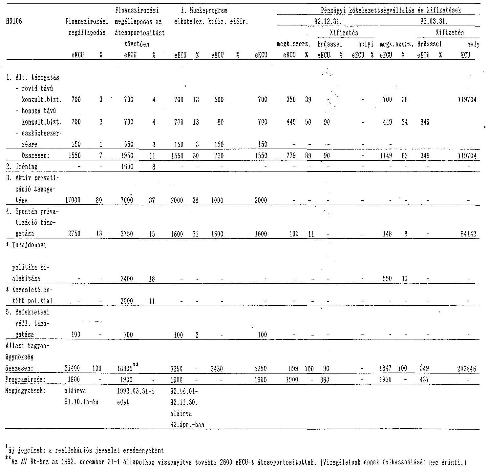
${ }^{\text {a }}$ új jogcímek; a reallokációs javaslat eredményéként
${ }^{23} \mathrm{~K}_{2}$ AV Rt-hez az 1992. december 31-i állapothoz visszavezetve további 2000 eECU-t átcsoportítottak. (Vizsgálatunk ennek felhasználását nem érinti.)

---

A PHARE programból finanszírozott tanácsadások, szakértők

| PHARE programba bevont vállalat | A szolgáltatás, tanácsadás jellege | A szerződés összege eRCU | A szolgáltatást végző |
| :--: | :--: | :--: | :--: |
| 1. PHARE H9005 |  |  |  |
| 1.1. Magyar Kábel Müvek | jogi | 125,0 | White and Case |
| 1.2. Tokaj Borkombinát | jogi | 125,0 | Gide Layrette Novel |
| 1.3. MAV nem főtevékenység | ipari | 250,0 | PA Consulting |
| 1.4. Gáz Koncessziós törvény | jogi | 18,0 | Baker and McKenzie |
| 1.5. Telecom Koncessziós törvény | jogi | 28,9 | Stroock and |
|  |  |  | Stroock and Lavan |
| 1.6. MATAV | jogi | 1016,7 | Squire Sanders and Dempsey |
| 1.7. Budapesti Tejipari V. | privatizáció | 37,5 | Ernst and Young |
| 1.8. Békéscsabai | privatizáció | 50,0 | Price Waterhouse |
| 1.9. Budaflax | vagyonértékelés | 70,8 | Deloitte and Touche |
| 1.10. MUART | vagyonértékelés | 227,9 | Coopers and Lybrand |
| 1.11.AVU | képzés | 41.9 | Agrar Consulting |
| 1.12.AVU | képzés | 50,5 | British Council |
| 1.13.AVU | képzés | 153,2 | CIFB |
| 2. PHARE H9106 |  |  |  |
| 2.1. Danubius | jogi | 175,0 | Debevoise and Plimpton |
| 2.2. Várda | privatizáció | 62,5 | CIB/Soc. Gen. |
| 2.3. Miskolc Szeszipar | privatizáció | 22,1 | Hemingway Financial Ltd. |
| 2.4. Express Utazási Iroda | privatizáció | 49,0 | CDC Participations |
| 2.5. Vas megyei Tejipari Vállalat | privatizáció | 15,0 | Indosuez |
| 2.6. Gabonaipar | ipari | 350,0 | A.D. Little |
| 2.7. Marriott | jogi | 175,0 | Déri and Co. |
| 3. Összesen | jogi | H9005 1313,6 |  |
|  |  | H9106 350,0 |  |
|  | ipari | H9005 250,0 |  |
|  |  | H9106 350,0 |  |
|  | privatizációs | H9005 87,5 |  |
|  |  | H9106 148,6 |  |
|  | vagyonértékelés | H9005 298,7 |  |
|  |  | H9106 | - |

---

A H9005, és a H9106 program keretében megkötött szerződések száma, jellege (az 1000 ECU alatti szerződéseknél érték összesen szerepel)

| Program elemek | 50000 ECU |  |  | 50000 ECU |
| :--: | :--: | :--: | :--: | :--: |
|  | alatt |  |  | felett |
|  | 1000 ECU | 1000-50000 | 50 | 200000 |
|  | alatti ért. | ECU | 200000 | ECU ECU felett |
|  | ECU összesen: | db | db | db |

# PHARE 9005 

| - Technikai segítség | 70626 | - | 5 | - |
| :-- | --: | --: | --: | --: |
| - Képzés | $89393^{*}$ | 6 | 1 | - |
| - Technikai eszközök | $67189^{*}$ | 4 | 3 | 1 |
| - Tanácsadás | - | 7 | - | 2 |
| - Összesen: | 227208 | 17 | 9 | 3 |

PHARE 9106 (csak AVU)

| - általános támogatás | - | - | - | 1 |
| :-- | :-- | :-- | :-- | :-- |
| rövid távú tanácsadás | - | - | - | 1 |
| hosszú távú tanácsadás | - | - | - | - |
| eszközök | - | - | - | - |
| - Aktív privatizáció | - | - | - | - |
| - Spontán privatizáció | - | 2 | - | - |
| - Befektetési társaságok | - | - | - | - |
| Összesen: | - | 2 | - | 2 |

*Valamennyi egyedi képzést és beszédet magában foglal, amelyeket Magyarországon vagy külföldön bonyolítottak, és amelyeket nem tekintenek egyedi szerződéseknek.

---

# A Programiroda létrehozására, működésére jóváhagyott keretek, azok felhasználásának helyzete 

1992. év december hó 31.

| Jóváhagyott támogatás | Első | ...-ik | Tényleges |
| :--: | :--: | :--: | :--: |
| felhasználási címenként | jóváhagyott munkaprogram szerinti keret |  | kifizetések |
| ECU | ECU | ECU | ECU |

## PHARE 9005

1. Technikai segítség:
a) pénzügyi szakember
200000
116662
b) pénzügyi szakember
segítő munkatárs - 6442
c) reprezentáció
- 146
Összesen:
123250

## PHARE 9106

1. Programiroda
1900000
330000
2. Általános támogatás

- hosszútávú
tanácsadó
700000
89840
Összesen:
469840
*A PHARE 9106 támogatáshoz, de a PHARE 9005 terhére további költség

PHARE iroda festés
979.58

Telefonrendszer bérleti díja
1132.67

Összesen:
2112.25 ECU

---

KÜLFÖLDI TANÁCSADÓK ALKALMAZÁSA ÉS
AVU ÁLTAL FIZETETT KÖLTSÉGEI

|  | 1990 |  | 1991 |  | 1992 |  |
| :--: | :--: | :--: | :--: | :--: | :--: | :--: |
|  | fő | eFt | fő | eFt | fő | eFt |
| Treuhand | - | - | - | - | 1 | - |
| Know-How Fund | 2 | - | 3 | - | 3 | - |
| PHARE | - | - | 1 | 150 | 3 | - |
| USAID | 1 | - | 2 | - | 3 | - |
| Egyéb | 1 | 343 | 3 | 1538 | 5 | 1670 |
| Külf. tanácsadókat segítő személyzet: |  |  |  |  |  |  |
| ebből: |  |  |  |  |  |  |
| AVU fizeti | - | - | 3 | 114 | 3 | 1184 |
| Külf. | 1 | - | 1 | - | 2 | - |
| ÖSSZESEN | 5 | 343 | 13 | 1802 | 20 | 2854 |

---

AVU külföldi tanácsadók és a PHARE program kapcsolata
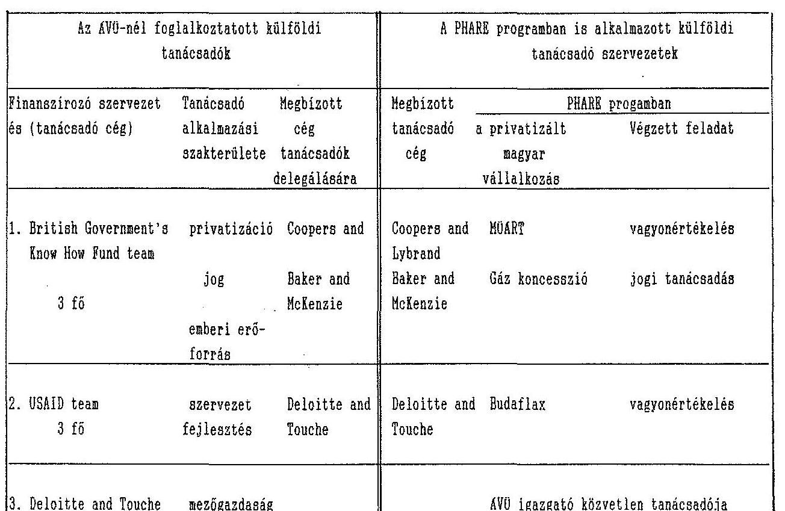

Az AVU-nál dolgozó külföldi tanácsadók név szerinti jegyzéke az Állami Számvevőszéknél megtekinthető

---

| Külföldi tanácsadó | Mely szervezet finanszírozza az AVU-nál végzett munkáját | Melyik igazgatóság számára dolgozik |
| :--: | :--: | :--: |
| A. Fleischer | Treuhand | Marketing, ipar |
| M. Metzel | Treuhand | SZIV |
| F. Faiz | Know How Fund | ipar, infrastruktúra |
| A. Mc.Donald | Know How Fund | jogi |
| B. Bartlett | Know How Fund | Belső Személyzeti Iroda |
| Ch. Stamm | USAID | Rácz Ernő |
| B.D.Young | AVU | jogi |
| G. Holló | Kanadai kormány | sajtó, nközi kapcsolatok |
| Y. Kieken | Francia kormány | tranzakciós |
| O. Hieronymi |  | Miniszteri Titkárság |
| W.M.Dewey | USA kormány | Miniszteri Titkárság |
| E. Hagen | FGG / osztrák / | ipar |
| K. Roty | EK | PHARE Iroda |
| D. Fort | EK | PHARE Iroda |
| J. Purce | EK | PHARE Iroda |
| Ch. Twyman | USA kormány | USAID Iroda |
| L. Corwin | USA kormány | USAID Iroda |
| P. Kurz | USA kormány | USAID Iroda |

---

To: Ms. Erzsébet Lukács
From: Fred Faiz
30th March, 1993

Technical Assistance from
the British Government's Know How Fund

As requested in your memorandum of 26th March, 1993, I have
summarised below details of the Know How Fund's current
technical assistance projects to the SPA:

(a) Provision of Full-Time Consultants

Name Duration Task
Fred Faiz 1.9.90 to Privatisation adviser, with
31.8.94 focus on corporate finance
work, currently working on the
accelerated privatisation
programme (see below)
Aileen Legal adviser, with focus on
McDonald 31.10.93 negotiating sale and purchase
agreements
Brian 12.10.92 to Development of human resources
Bartlett 31.10.93 and training policy

(b) Accelerated Privatisation Programme

Conceptual design stage: The Know How Fund is financing an
advisory team, comprising J. Henry Schroder Wagg & Co.
Limited, Coopers & Lybrand and Baker & McKenzie, which have
been engaged to develop a concept for accelerated
privatisation, including a scheme for facilitating wider
participation by Hungarian citizens in the privatisation
process. The project commenced in late February 1993 and is
expected to be largely completed by the end of April 1993.
The advisory team's report and recommendations have just
been submitted to the Government for decisions.

Implementation stage: Once the Government has made a formal
decision to proceed with the above report's recommendations,
the Know How Fund will be requested to finance a large part
of the advisory work for implementing the programme,
including on project management, public relations and
marketing, systems and logistics, and on the creation of a
model holding company and a residual shareholding company.

Please let me know, if I can be of further assistance.

Fred Faiz

---

Technikai segítség a brit kormány
Know How Fund-jától
Az 1993. március 26-i feljegyzésben
 kérteknek megfelelően az alábbiakban összegeztem a Know How Fund által az ÁVO-nek nyújtott technikai segély projektjeinek részleteit:
a.Teljes munkaidőben foglalkoztatott konzultánsok

| név | időtartam | feladat |
| :-- | :-- | :-- |
| Fred Faiz | 90.09.01-től 94.08.31-ig | privatizációs tanácsadó, |
|  |  | a vállalati pénzügyekre |
|  |  | koncentrálva. Jelenleg a |
|  |  | gyorsított privatizációs |
| Aileen McDonald | 91.10.01-től 93.10.31-ig | programon dolgozik (lásd |
|  |  | lent) |
|  |  | jogi tanácsadó, az érté- |
|  |  | kesítési és vételi szer- |
| Brian Bartlett | 92.10.12-től 93.10.31-ig | ződések tárgyalására kon- |
|  |  | centrálva |

b. Gyorsított privatizációs program

Koncepcionális tervezési szakasz: A Know How Fund egy tanácsadó csoportot finanszíroz, amely J. Henry Schroder Wagg. and Co. Limited, Coopers and Lybrand és Baker and McKenzie cégekből áll, amelynek feladata kifejleszteni egy koncepciót a gyorsított privatizációra, beleértve egy olyan eljárást is, amely megkönnyítené a magyar állampolgárok szélesebb részvételét a privatizációs folyamatban. A projekt 1993. február végén kezdődött és úgy tervezik, hogy április végére nagyjából be is fejeződik. A tanácsadó csoport jelentését és ajánlásait most terjesztették a kormány elé döntés végett.
Megvalósítási szakasz: Amint a kormány hivatalos döntést hozott a fenti jelentés ajánlásainak megvalósítására, a Know How Fund-ot fel fogják kérni, hogy finanszírozza a program megvalósításához szükséges tanácsadó munka nagy részét, beleértve a projekt irányítását, public relations és marketing munkáját, egy modell holding vállalat és egy maradvány részvény-kezelő vállalat létrehozását.

Kérem közölje, további segítségemre szüksége van-e

---

# 1000 KCU-n feletti kifizetések az EK Képviselet engedélye nélkül 

## 1991 december

| 1991.12.27 | ÁVU kiutazás | 4275.38 |
| :--: | :--: | :--: |
| 1991.12.19 | ÁVU kiutazás | 2812.49 |
| 1991.12.23 | ÁVU alk. munkabére | 1113.92 |
| 1991.12.20 | PM Inf. I. | 2517.62 |
| 1991.12.20 | angol tanf. | 3977.85 |
| 1991.12.10 | könyvbeszerzés | 7344.85 |
| 1991.12.04 | ÁVU utaztatás | 2441.79 |

1992
1992.01.09
1992.01.09
1992.01.15
1992.01.20
1992.01.21
1992.02.20
1992.02.21
1992.03.23
1992.04.06
1992.04.09
1992.05.12
angol tanf.
utazás
angol tanf.
angol tanf.
Miniszterelnöki Hiv. kiutazás
m. tanácsadó tanf.
Miniszterelnöki Hiv. utazás
jogi továbbképzés
vegyes ÁVU felhasználás
ÁVU kiutazások
ÁVU kiutazás
1708.32
1207.18
1008.21
1942.29
2177.79
1410.89
1948.45
3116.81
2301.57
4667.50
3048.13

---

# Phare PMU office 

## ÁLLAMI SZÁMVÉVŐSZÉK

Magyar Állami Számvevőszék
Vasas Sándorné dr. részére
Fax: 138-4710

ERKEZETT:
IKTATÓSZÁM: V-8-2193
MELLÉKLET: - db
May 14, 1993
Re: Bank Accounts and other audit-questions

Further to our discussions of 12th May, 1993, I would like to confirm the following points:

## Bank Accounts

a) For management simplicity and to optimize interest income, the advance payment for HU 9106 of ECU 4.640.000 was kept in one bank account under the name of the MIT. This account will be divided between the two Ministries on 20th May, 1993 as funds are actually deposited for one month up to that date.

I note that there was no obligation under the Financing Memorandum to keep separate bank accounts for the SPA and MIT. (This is simply an request by the two related Ministries.)
b) The advance of SPA Phare 1990 (HU 9005) of 500.000 ECU to MIT Phare 1991 (HU 9106) was made as MIT required funds prior to reception of the advance payment noted a) above.

This amount will also be repaid to SPA on 20th May at the same time as funds noted above.
c) By May 20th 1993, the SPA Phare 1990 (HU 9005) will have been paid the following funds for the SPA (HU 9106) program.

Price Waterhouse - Békéscsaba
ECU
(I note that this project is for HU 9106
not HU 9005 as in our reporting - this will
also be rectified in May)
Allen & Overy - Marriott
8.800

CIB - Várda
62.074

Hemingway - Miskolc
22.068

Debevoise & Plimpton - Danubius
119.704

ECU 255.771
A transfer from SPA 1990 (HU 9106) to SPA 1990 (HU 9005) will be made as soon as the funds noted in (a) above have been received by the SPA.

The above transfers will be made including all interest as earned by the MIT on both time and current accounts.
I will forward to you copies of the bank transfer instructions as soon as these are issued (May 20th).

---

1990 Work Program
Please find enclosed a signed copy of HU 9005 Work Program as from 1/5/1991.

# ÁFA 

Please find enclosed a copy of the memo from Hungarian Tax Authorities concerning repayment of VAT (ÁFA) paid by Phare and now recoverable.

We are following up on this subject with the MIER and SPA Accounting Department.

## Statisztikák a Programról

Your schedule completed.
If you have any further questions, do not hesitate to contact me.

Yours truly,

---

# For dit á s 

## ÁVO PHARE Programiroda

Magyar Állami Számvevőszék
Vasas Sándorné dr. részére

Tárgy: Bankszámlák és más auditálási kérdések
1993. május 12-i megbeszélésünkre való hivatkozással szeretném megerősíteni az alábbi pontokat:

## Bankszámlák

a) Ügykezelési egyszerűsítés és a kamat optimalizálása érdekében a 4640000 ECU előleget, amelyet a HU 9106-ra utaltak át, az IKM neve alatti számlán tartottuk. Ezt a számlát 1993. május 20-án megosztjuk a két minisztérium között, miután az összeg egy hónapos lekötése akkor jár le.

Megjegyzem, hogy a Finanszírozási Memorandum nem írja elő, hogy az ÁVU és az IKM részére külön bankszámlát tartsunk fenn. (Ez egyszerűen a két minisztérium kérése.)
b) Az 500000 ECU-s előleg az ÁVU PHARE 1990-ből az IKM PHARE 1991-hez (HU 9106) azért történt, mert az IKM-nek pénzre volt szüksége az a) pontban jelzett átutalás beérkezése előtt.

Ezen összeget május 20-án szintén visszafizetik az ÁVU-nek a fent jelzett alapokkal egy időben.
c) 1993. május 20-ig az ÁVO PHARE 1990 (HU 9005) az alábbiakat fizette az ÁVU (HU 9106) programnak:

ECU
Price Waterhouse - Békéscsaba
43.125
(Megjegyzem ez - jelentésünktől eltérően -
a HU 9106 és nem a HU 9005 projektje - májusban
ezt is kiigazítjuk)
Allen and Overy - Marriott
8.800

CIB - Várda
62.074

Hemingway - Miskolc
22.068

Debevoise & Plimpton - Danubius
119.704

ECU
255.771

---

Az átutalást az ÁVU HU 9106 számláról az ÁVU 9005-re megtesszük, amint az a) pontban jelzett pénz beérkezik az ÁVU-hoz.

A fenti átutalások magukba fogják foglalni az IKM által a lekötött és a folyamatos ügyek számláin nyert kamatokat is. Továbbítani fogom Önökhöz a bank átutalási utasítások másolatait, amint azokat kiadjuk (május 20.).

# 1990. évi munkaprogram 

Mellékelem a HU 9005 1991. május 1-től kezdődő aláírt munkaprogramját.

## ÁFA

Mellékelem az APEH memorandumát másolatban - ÁFA visszafizetése tárgyában -, amelyet a PHARE fizetett és most visszanyerhető.

Ezt a témát megtárgyaljuk az NGKM-mel és az ÁVU Könyvelési főosztályával.

Program statisztika
Az Ön táblázatai teljesekek.
Ha bármilyen további kérdése lenne, kérem, lépjen kapcsolatba velem.

Tisztelettel,
Jeremy J. Purce

---

# MEMO 

To: SPA Phare Accounting
From: Jeremy J. Purce - Phare PMU

May 20, 1993

Re: Bank Account Transfers

In view of the start of 1991 HU 9106 SPA Bank payments, we should now clarify the position of our bank accounts.

1) Transfer of SPA funds advanced to MIT ECU 3.176.100 per memo attached. Instructions given to MIT to make this transfer to SPA HU 9106 account with Unic Bank today.
2) Funds paid by SPA HU 9005 for HU 9106 as follows, now to be regularized.

ECU
Price Waterhouse - Békéscsaba including ÁFA 43.125*
Allen & Overy - Marriott 8.800
CIB Várda 62.074
Hemingway - Miskolc 22.068
Debevoise & Plimpton - Danubius 119.704
255.771

* If we don't pay VAT of ECU 8.625. This transfer will be adjusted later.

3) Loan from HU 9005 to HU 9106 now to be regularized:

ECU
500.000

Interest
29.350
5.87 % (see 1 above) ・

ECU 529.350

---

4) A transfer as from 22/5/95 will thus be made from SPA Phare (HU 9106) Unic Bank No 124519 to SPA Phare (HU 9005) NHB for ECU 785121 (ECU 255.771 + ECU 529.350 - See 2 and 3 above).
5) Instructions will be given to Unic Bank to deposit for one month ECU 2.200.000 as soon as transfer (1) above is made.
6) Instructions should be given to NHB to deposit an additional 1.000.000 ECU for one month as soon as transfer (4) above is made ie. after this additional deposit we will have a total of 2.000.000 ECU on deposit.

Sincerely,

Jeremy J. Purce
cc: Pécsi Éva

---

# MEMO 

To: MIT Phare Accounting SPA Phare Accounting
From: SPA MIT PMU

May 17, 1993

Re: Transfers from MIT to SPA Bank Accounts

Due to late receipt of advance payment funds from Brussels the SPA Phare Account has lent on a temporary basis 500.000 ECU to MIT Phare Account. Also for practical reasons, the HU 9106 - SPA/MIT Advance payment of ECU 4.640.000 was held 100% in MIT accounts. The following transfer is made to regularize this position as from 20/5/93 as calculated below, together with interest as earned on this account.

Funds in the two accounts should now be sufficient till end Sept 1993 when new advance payments are due from Brussels.

Advance payment SPA portion held by MIT
2.500.000,00

Loan 4 August 1992 from SPA to MIT
500.000,00

TOTAL
ECU 3.000.000,00

Interest to 21/5/93
176.100.00
transfer from MIT account 118744 to
SPA account 124519
3.176.100.00

Sincerely,

Jeremy J. Purce

Note: Calculation of interest rates
total cash into account
5.164.000
total interest earned to 21/5/94
303.127

Interest rate
5,87 %

---

# Where PMU Office

Unic Bank
Attn: Mrs Judit Scharbert
Fax: 266-2846

May 20, 1993

Re: Account Phare SPA No 124 519

One Month Deposit Account

I would be obliged if you would deposit for one month ECU
2.200.000 as from 22nd May, 1993*.

Sincerely,

Jeremy J. Purce

* This deposit should be made as soon as the transfer to be passed to you today of 3.176.000
ECU from Unic Bank MIT Phare to Unic Bank SPA Phare has been transacted.

Address: H-1133 Budapest, Pozsonyi út 56. · Letter: H-1399 Budapest, Pf.: 708
Phone: (36-1) 1294-650, 1294-800 · Fax: (36-1) 1402-723 · Telex: 22-5471

---

UNICBANK RT.

UNICBANK SC 25MAY83
VACI UTCA 16-21, H-1012 BUDAPEST
BANK-COZE NO. 213 - 63364
S.V.I.S.C. : MENTHUMB
TELEPHONE 200 2018
TELEFAX 2040
TELEV 20 2102/2123
COUNTRY COPY BUDAPEST 36
AREA COPY BUDAPEST 1
YOUR ACCOUNT OFFICER:

S T A E H N E N T

SFA FRAZE UNIC
ATTN: J.J. PURCE
RF. 708.
ACCOUNT TYPES : 3100-124815-002
ACCOUNT TYPE : CURRENT ACCOUNT NONDA
CURRENCY : ECU
STATEMENT DATE : 26MAY93
STATEMENT NO : 1

PLEASE NOTE INSTRUCTIONS ON REVERSE

POSTDATE VALUE NURSATIVE EVALUATION
BROUGHT FORWARD 0.00CH
26MAY93
Elevated 3.176.100.00CH
0805
ATVEZ.

 118519-002-BEL
25MAY93
Atot.magbiz.jótalékkel 786.298.68DR
CMP13661
MEU 786.121,00

CREDIT BALANCE 2.389.801.32CH

---

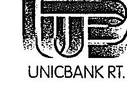

UNICBANK RT.

GPA PHARE UNIT
ATTN. J.J. PURCE
BUDAPEST 115
PF.708. 1399

VACI UTCA 19-21, H-1052 BUDAPEST.
FANSFORGALMI JEL.: 219 - 98564
S.W.I.F.T. : UBRTHUHD
TELEFON : 266 - 2088
TELEFAX : 266 - 2836
TELEX : 223172/123
IRSCAGSEAM : MAGYARORSZÁG 33
KERZETI SZÁM : BUDAPEST 1

FIZETÉSI FORGALOM
Terhelési értesítés
Kégerénciaszám: IMP13461

Budapest, 24/05/93

Az ön 0100-124519-002 számú
számla terhére átutaltunk
XEU 785.121,00
Budapest.
Árfolyam: 106,07/105,57 (24/03/93)
A számla terhelése:
XEU 785.121,00
az alábbi jutalékokkal
Konverzió XEU
Kezel.kte XEU 1.177,50
XEU
XEU
bascason XEU 785.298,68

Valutaap 25/05/93

UNICBANK Rt.
Fizetési forgalom

Kedvezményezett 488-5194-955-01
NATIONAL BANK OF HUNGARY
SPA PHARE 1990

Kedvezményezett bankja
Magyar Nemzeti Bank

Budapest 1650 To be
Hungary
Fizetés indoka
ECU 20 -
per ouo
agreements
with UNIC
BANK attached

Közvetítő bank
Cera Spaarbank C.V. Bank attached

Leuven 3000

(Kérjük a hátoldali tájékoztatót elolvasni)

---

P.1/1

MAI '92 14:12 UNICBANK RT. BPEST.

# UNICBANK

## FACSIMILE TRANSMISSION

Message number: ....Fax number: ....1180447

Date: ....28. Mai 1992 ....Number of pages: ....1

To: ........ State Property Agency

To the urgent attention of: Mr. Thomas Georg Murphy

From: ... UG. Priyad. Ranjitam Corp.

Subject: ........

Comments:

Dear Mr. Murphy,

Following our phone call today we herewith confirm, that the condition for payment transactions will be

ECU 20,00 and FRF 130,00.

Other conditions of our offer remain unchanged.

We are looking forward to receive the details for account opening.

Kind regards

Scharbert

UNICBANK RT.

Transmission authorized by:

Any query, please call: 136-1/ 118-2088

Our machines: 136-1/ 138-2836 or 136-1/ 138-8130

When requesting repetition, please refer to the date, number and page number of our message.

---

# Fordítás 

## FELJEGYZÉS

Jeremy J. Purce-tól Phare Programiroda
AVU Phare könyvelésnek
1993. május 20.

Tárgy: Bankszámla átutalások

Tekintettel az 1991-es HU 9106 AVU bank fizetések beindulásához tisztáznunk kell most a bankszámlák helyzetét.

1. Átutalando az AVU IKM-nek adott előlegből 3.176.100 ECU a csatolt feljegyzés szerint. Utasítás lett adva az IKM-nek, hogy ezen átutalást helyezze az AVU Unic Banknál vezetett HU 9106 számlájára.
2. Az AVU HU 9005 számláról a HU 9106 részére történt fizetéseket az alábbiak szerint most rendbe kell hozni.

ECU

| Price Waterhouse - Békéscsaba AFA-val | 43.125 * |
| :-- | --: |
| Allen and Overy - Marriott | 8.800 |
| CIB Várda | 62.074 |
| Hemingway - Miskolc | 22.068 |
| Debevoise and Plimpton - Danubius | 119.704 |
|  | 255.771 |

* Ha nem fizetünk 8.625 ECU AFA-t ezt az átutalást később korrigálni fogjuk

3. A HU 9005-től a HU 9106-nak adott kölcsönt most rendezzük.

| ECU | 500.000 |
| :-- | --: |
| Kamat | 29.350 |
| 5.87% (lásd 1) |  |
|  | 529.350 ECU |

---

4. Május 22-i kelettel így átutalást kell eszközölni az AVU Phare (HU 9106) Unic Banknál vezetett 124.519 számú számláról az AVU Phare (HU 9005) MNB-nél vezetett számlára 785.121 ECU-t (ECU 255.771 + ECU 529.350 lásd 2. 3. pont).
5. Utasítást kell adni az Unic Banknak, hogy kössön le egy hónapra ECU 2.200.000, amint az 1-es pontban említett átutalás megtörténik.
6. Utasítást kell adni az MNB-nek, hogy további 1.000.000 ECU-t kössön le 1 hónapra, amint a 4. pontban említett átutalás megtörtént, vagyis ezután a letét után 2.000.000 ECU lesz a lekötésünk.

Üdvözlettel
(aláírva)
Jeremy J. Purce
cc: Pécsi Éva

---

# 33/362/14.17/93. 

Hagelmayer István úr
elnök

Állami Számvevőszék

## Budapest

Tisztelt Hagelmayer úr!
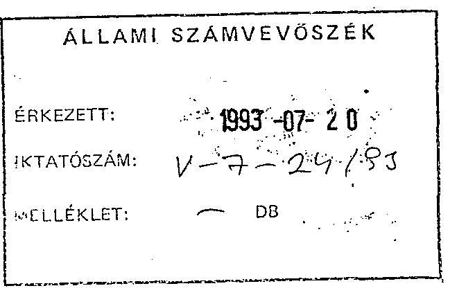

Az Állami Számvevőszék ellenőrzési munkája során megvizsgálta az Állami Vagyonügynökség 1992. évi tevékenységét. A sokoldalú és részletes vizsgálat alapján elkészült jelentést, korrektnek és tárgyszerűnek, a problémákra, gondokra rávilágító elemzésnek tartjuk. A vizsgálati jelentés nagy erényének véljük, hogy az mentes a mai magyar közéletben gyakran elharapózó túlzásoktól, hangulatkeltő elemektől.

Jelen válaszlevelünkben elsősorban a korrekt tárgyszerű hangvételért kívánunk köszönetet mondani, s konkrét megjegyzéseink is döntően a törvényi szabályozás pontatlanságából adódó véleménykülönbségeket takarnak. Magunk részéről természetesnek tartjuk, hogy átalakuló gazdaságunk, társadalmunk egyik legkritikusabb területén, két állami szervezet között, egyes jogi kérdések megítélésében eltérő álláspontok alakulhattak ki.

A fentiekkel összefüggésben az Állami Számvevőszék jelentését összességében elfogadjuk. A feltárt hiányosságok orvoslására, az ajánlások megvalósítására részben az ügyvezetés saját hatáskörében teszi meg a szükséges intézkedéseket, részben kéri a megoldáshoz az Igazgatótanács és a felügyelő miniszter segítő közreműködését. A jelentésben megfogalmazottakhoz az alábbi konkrét észrevételt tesszük.

---

- Álláspontunk szerint a versenyeztetés terén az ÁVÜ a törvényi előírásoknak megfelelően működött. Az Állami Vagyonügynökség működését 1992. augusztus 27-ig az 1990. évi VII. tv. szabályozta. E törvény részletes pályáztatási szabályokat tartalmazott. A privatizációval kapcsolatos pályázatok lebonyolítása a törvényben megfogalmazott szabályok szerint történt. E törvény nem tartalmazott az ÁVÜ-re nézve olyan kötelezettséget, amely alapján pályázati eljárási rendet, vagy szabályzatot kellett volna készíteni. Az 1992. augusztus 27-én hatályba lépett 1992. évi LIV. tv. 79. paragrafusa írja elő ezt a kötelezettséget. E szabályzat - az új törvény tervezett rendelkezéseinek ismeretében - annak hatályba lépését megelőzően elkészült és azt az Igazgatótanács elfogadta.
- Kétségtelen, hogy a munkavállalók és munkanélküliek számának figyelemmel kísérése rendkívül fontos a gazdaság és a költségvetés szempontjából. Véleményünk szerint azonban ezen folyamatok figyelemmel kísérése és a munkanélküliek számának nyilvántartása nem az ÁVÜ feladata. Ezen probléma kezelésére a Munkaügyi Központokból felépülő országos hálózat működik, melyek a Munkaügyi Minisztérium szakmai felügyelete alá tartoznak.
Az ÁVÜ által kötött szerződések több esetben tartalmaznak rendelkezéseket a munkavállalók továbbfoglalkoztatására vonatkozóan. E szerződéses kötelezettségek végrehajtását, betartását az ÁVÜ rendszeresen figyelemmel kíséri, az azok megsértéséhez fűződő jogkövetkezményeket érvényesíti.
- Részletesen tárgyalja a jelentés a CO-NEXUS-sal létrejött vagyonkezelési szerződést. Elismerjük, hogy a szerződés megkötését az ÁVÜ szakértőinek alaposabb munkával kellett volna előkészíteni. Véleményünk azonban továbbra is az, hogy a szerződés nem sért törvényi előírást. A hivatkozott 1991. évi XCI. tv. előírásaihoz képest ugyanis a szerződés megkötésekor hatályos 1990. évi VII. tv. vagyonkezelésre vonatkozó szabálya speciális rendelkezést tartalmazott, amely megengedte az állami vagyon hozadékának vagyonkezelő részére való átengedését (e tekintetben a törvényi szabályozás egyébként az 1992. évi LIV. tv. szerint jelenleg is hasonló). A Ptk. értékpapírokra vonatkozó részének előírása továbbá az, hogy az értékpapírhoz fűződő jogokat, így részvény esetén többek között az osztalékhoz való jogot, annak birtokosa, jelen esetben a vagyonkezelő gyakorolhatja. A kifogásolt kérdés tekintetében természetesen a

---

későbbiekben az ÁSZ ajánlásainak megfelelően kívánunk eljárni, ám egy jogszerűen létrejött szerződést az ÁVŰ nem támadhat meg.

Tisztelt Elnök úr!

Engedje meg, hogy az előzőekben megfogalmazott néhány konkrét észrevételünk ellenére ismételten aláhúzzam az Állami Számvevőszék számvevőinek korrekt, tényfeltáró, az Állami Vagyonügynökség munkáját segítő, jobbító munkáját, melyért ismételten köszönetünket fejezzük ki.

Kérem, hogy a Számvevőszék a jövőben is segítse a privatizáció nehéz vitákkal, panaszokkal terhelt folyamatának sikeres, korrekt bonyolítását, a visszásságok feltárását.

Budapest, 1993. július 16.
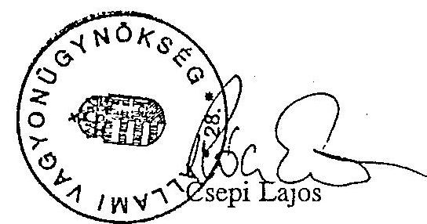

---

Budapest, 1993. július 20. V-7-22/1993.

Dr. Csepi Lajos úrnak
az Állami Vagyonügynökség
ügyvezető igazgatója

# BUDAPEST 

Tisztelt Csepi Úr!

Köszönettel vettem 1993. július 16-án hozzám írt levelét, amely az Állami Vagyonügynökség 1992. évi tevékenységének vizsgálatáról készült ÁSZ jelentésre tett észrevételeit tartalmazza.

Észrevételeit - mint arról tájékoztattam - az Országgyűlés részére benyújtandó végleges ÁSZ jelentéshez mellékelem.

A Co-Nexus és az ÁvÜ között létrejött vagyonkezelési szerződéssel kapcsolatos véleménykülönbség továbbra is fennmaradt. Álláspontomat fenntartom. Szükségesnek látom, hogy az 1991. év tevékenysége után képződő osztalék állam javára történő újrarendezését az Állami Vagyonügynökség - az Ön által előzetesen tett részletes észrevételekre adott válaszban kifejtett indokok alapján - kísérelje meg.

---

Kérem, hogy a későbbiekben a Számvevőszék által tett ajánlások megvalósítására készített intézkedési tervéről - a törvényi előírásoknak megfelelően - 30 napon belül tájékoztatni szíveskedjék.

Ezúton is megköszönöm Önnek és munkatársainak azt a korrekt együttműködést, amely lehetővé tette az Állami Számvevőszék számára az ellenőrzésnek a vizsgálati program szerinti végrehajtását.

Tisztelettel!
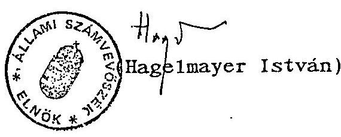

---

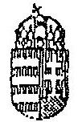

PÉNZÜGYMINISZTER

87.088/1993.

Dr. Hagelmayer István úr, elnök

Állami Számvevőszék

Budapest

Tisztelt Elnök úr!

| ÁLLAMI SZÁMVEVŐSZÉK |  |
| :--: | :--: |
| ÉRKEZETT: | 1993-07-22 |
| IKTATÓSZÁM: | V-7-25/93 |
| MELLÉKLET: | - DB |

Az Állami Számvevőszék vizsgálati jelentését az Állami Vagyonügynökség 1992. évi tevékenységének ellenőrzéséről áttanulmányoztam.

Az anyagot alapos és korrekt munkának tartom. Az ÁSZ-jelentés ajánlásai közül a Pénzügyminisztérium számára tett megállapítást tudomásul vettem és az ÁvÜ felé kezdeményezem, hogy az 1993. évi március 19-i Megállapodás helyett a törvényi szabályozásnak megfelelő helyzet álljon vissza, az ÁvÜ garanciavállalásaihoz szükséges PM-egyetértés kikérése kapcsán.

Budapest, 1993. július 15.
Üdvözlettel:
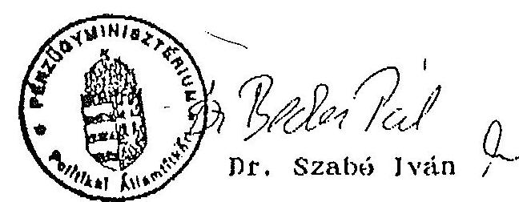

---

# A MAGYAR KÖZTÁRSASÁG TÁRCA NÉLKÜLI MINISZTERE 

Budapest, 1993. július 24. SZT-1539/1993.

Hagelmayer István úr, elnök
Állami Számvevőszék
Budapest

| ÁLLAMI SZÁMVEVŐSZÉK |  |
| :--: | :--: |
| ÉRKEZETT: | 1993-07-22 |
| IKTATÓSZÁM: | V-7-26/92 |
| MELLÉKLET: | - DB |

Tisztelt Elnök Úr!

Az Állami Vagyonügynökség 1992. évi tevékenységének ellenőrzéséről készített jelentést köszönettel megkaptam. Az azzal kapcsolatos véleményeket az alábbiak szerint részletezem.

A jelentés megállapításaival alapvetően egyetértek. A Vagyonügynökség 1992-ben minőségileg más környezetben, a korábbi időszakhoz képest jelentősen megváltozott törvényi szabályozás közepette végezte tevékenységét. Az ÁVÜ a működésével kapcsolatban feltárt hibákat és hiányosságokat kezdeményezésemre folyamatosan korrigálja. Ennek során nagy súlyt fektet a jelentés által joggal kifogásolt személyzeti munka javítására és kiemelten foglalkozik a szervezetfejlesztés kérdéseivel.

A privatizációs folyamat nem kellő átláthatóságát jelenleg is az egyik fő problémaként említi a jelentés. E téren a további erőfeszítéseket indokoltnak tartom, bár meg kell jegyeznem, 1992. II. felében a tájékoztatási tevékenység folyamatosan javult, s ez év első felében érzékelhető, gyors előrelépés következett be (Privinfo tájékoztató füzetek, információs hálózat kiépítése, konferenciák, stb.). Ebben az évben kiemelt feladat a kárpótlás PR, marketingjének javítása.

---

# Tisztelt Elnök Úr! 

Ezúton szeretném köszönetemet kifejezni az Állami Számvevőszék jelen vizsgálatban részt vevő munkatársainak a feltárt hibákért, a reális helyzetkép bemutatásáért, valamint azért a konstruktív hozzáállásért, amellyel munkájukat végezték.

A magam részéről a jövőben is elő kívánom segíteni az eddig kialakult korrekt munkakapcsolat megtartását, hiszen közös érdekünk az állami vagyonnal való racionális gazdálkodás, a privatizáció felgyorsítása, magának a folyamatnak nyomon követhetősége és ellenőrizhetősége, a piacgazdaság kiépítése, valamint működésének biztosítása.

Budapest, 1993. július " "

Üdvözlettel:
/Szabó Tamás/

---

# MAGYAR KÖZTÁRSASÁG 

NEMZETKÖZI GAZDASÁGI KAPCSOLATOK MINISZTÉRIUMA

MINISZTER M-4611

Dr.Hagelmayer István úrnak elnök
Állami Számvevőszék

Budapest

Tisztelt Elnök Úr !

| ÁLLAMI SZÁMVEVŐSZÉK |  |
| :--: | :--: |
| ÉRKEZETT: | 1993-07-16 |
| IKTATÓSZÁM: | V-8-16/95 |
| MELLÉKLET: |  |

Köszönettel megkaptam az Állami Vagyonügynökség 1992. évi tevékenységének ellenőrzéséről készített vizsgálati jelentést, illetve annak függelékét az Állami Vagyonügynökségnek juttatott PHARE-támogatás felhasználásáról.

A dokumentumot körültekintően elkészített, tényszerű jelentésnek tartom.

A PHARE-támogatással kapcsolatban megjegyzem, hogy a privatizációs (és vállalatátalakítási) segítségnyújtás a PHARE Program egyik legjelentősebb területe. Az 1990. és 1991. évi PHARE keretből juttatott támogatás felhasználása a várakozásokhoz képest valóban lassabban történik. Ennek egyrészt - a jelentésben foglaltakon túlmenően - az is oka, hogy az Európai Közösségek Bizottsága által megállapított PHARE eljárási szabályok önmagukban is hosszadalmasak (például az 1991. évi keretből jóváhagyott valamennyi projektum csak 1992-ben indult). Másrészt a Finanszírozási Szerződések
 rendszere általában kevés módot ad a változó gazdasági-társadalmi körülményekhez való gyors alkalmazkodásra. Ez tükröződik például a támogatás belső szerkezetének megváltoztatását jelentős forrás-újraelosztás nehézségeiben.

---

Az ÁFA kérdéskört illetően örömmel nyugtázom, hogy a jelentés helyt ad a Nemzetközi Gazdasági Kapcsolatok Minisztériuma korábbi észrevételeinek. Tájékoztatom, hogy időközben megszületett a Keretegyezmény - a kezdeményezésünknek megfelelő - változtatásának tervezete. Javaslom ugyanakkor, hogy a minden bizonnyal szükséges hazai lépések megtételével kapcsolatban a Függelék III. része "Javaslatok" című fejezetének 3. pontja a Pénzügyminisztérium és a Nemzetközi Gazdasági Kapcsolatok Minisztériuma együttes gondoskodásának igényét fogalmazza meg, minthogy az ÁFA kérdéskör elsősorban a pénzügyi tárca hatáskörébe tartozik.

Budapest, 1993. július 15.
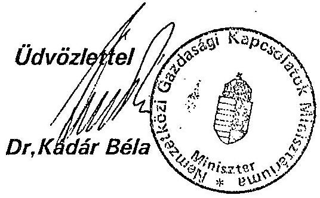
