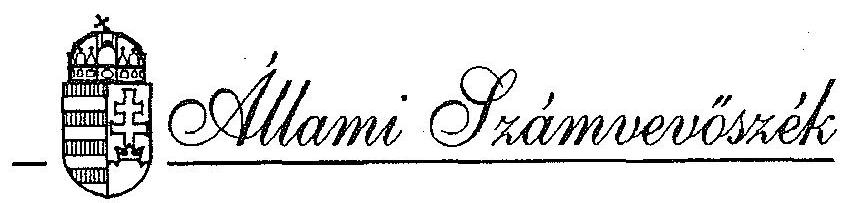

# JELENTÉS 

az Állami Biztosító Rt. privatizációjának ellenőrzéséről
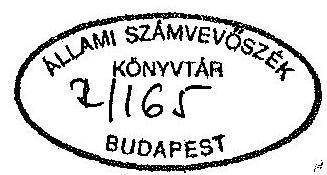

---

# A vizsgálatot vezette: 

Harsányi Sándor osztályvezető főtanácsos

A vizsgálatot végezték:

Makkai Mária
dr. Molnár Barnabás
Rundik János
számvevő tanácsos
számvevő tanácsos
számvevő tanácsos

---

IV. VAGYONELLENŐRZÉSI IGAZGATÓSÁG
$\mathrm{V}-9-30 / 1993$.
Témaszám: 170 .

# JELENTÉS   az Állami Biztosító Rt. privatizációjának ellenőrzéséről ・ 

I.

## BEVEZETÉS

Az Állami Biztosító 1990. július 1-jével alakult át egyszemélyes, 100%-os állami tulajdonú részvénytársasággá. A részvénytársaság alaptőkéje 2.000 millió Ft készpénz, felhalmozott vagyona 1.183 millió Ft, egyéb vagyona - amely ingatlanok, bérlemények, fogyóeszközök, befektetések stb. voltak - az életbiztosítási díjtartalék 27.293 millió Ft, és nem életbiztosítási díjtartalék 2.278 millió Ft volt.

Az átalakulás során az ingatlanokat és bérleményeket átértékeltek (felértékelték), a többi vagyonelemet könyv szerinti értéken szerepeltették a Részvénytársaság nyitó mérlegében.

A privatizáció célja az volt, hogy új tulajdonos bevonásával erősödjön az Állami Biztosító Részvénytársaság piaci pozíciója, váljék hatékonyabbá, rugalmasabbá a biztosítói tevékenység, mivel az ÁB Rt. állami tulajdonban tartása a veszteségek pótlására költségvetési forrásokat igényelne, s a tartós veszteségesség miatt a piac leépülését eredményezte volna.

---

Az 1992. március 12-én lezárult privatizáció során az 1990. július 1-jével egyszemélyes, 100%-os állami tulajdonú részvénytársasággá átalakult Állami Biztosító 2 milliárd Ft alaptőkéjéből ÁVÜ eladott 1.020 millió Ft névértékű részvényt szakmai befektetőnek. Az eladással egyidőben 1.920 millió Ft névértékű új, zártkörű részvénykibocsátással lebonyolított alaptőke emelés is volt. Az ÁVÜ által eladott és az újonnan kibocsátott részvények tulajdonosa azonos, az AEGON Holland Biztosító Társaság egyik 100%-os leányvállalata, az AEGON BV szakmai befektető.

A vizsgálat célja annak megállapítása volt, hogy az Állami Biztosító Rt. privatizációja a gazdasági társaságokról, valamint az Állami Vagyonügynökségről és a hozzá tartozó vagyon kezeléséről és hasznosításáról szóló törvényekben és a Vagyonpolitikai Irányelvekben rögzítetteknek megfelelően, szabályszerűen történt-e.

Az ellenőrzött szervek

Állami Vagyonügynökség (továbbiakban: ÁVÜ), mint a privatizáció lebonyolítója.

Állami Vagyonkezelő Részvénytársaság (továbbiakban: ÁV Rt.), mely 1992. augusztus 28-tól az ÁB-AEGON Rt.-nél lévő állami tulajdonrész feletti tulajdonosi jogokat gyakorló szervezet.

Állami Biztosító Rt. (továbbiakban: ÁB Rt.), mint a privatizáció alanya. Privatizáció után ÁB-AEGON Általános Biztosító Rt. (továbbiakban: ÁB-AEGON Rt).

A helyszíni ellenőrzés ideje: 1993. március 8. - május 31.

Ellenőrzött időszak: 1990. október - 1992. április

---

Az ÁB-AEGON Rt. minden, rendelkezésére álló dokumentumot átadott. Tájékoztatása szerint a privatizáció konkrét lebonyolítását dokumentáló anyagokkal nem rendelkezett. A törvényi előírások szerint azokkal nem is az ÁB-AEGON Rt.-nek kell rendelkeznie, hanem a tulajdonosi jogokat ellátónak. A privatizáció alanyaként kiszolgálta az értékesítést törvény szerint végző Állami Vagyonügynökséget, illetve annak tanácsadóját.

Az 1992. évi LXI. törvény és ahhoz kapcsolódó 126/1992. (VIII.28.) Korm. rendelet 1992. aug. 28-tól az Állami Biztosító Rt. állami tulajdoni része feletti tulajdonosi jog gyakorlására az ÁV Rt.-t jelölte ki. A Kormányrendelet 1. sz. melléklete a tartós állami üzletrész minimális arányát (a rendelet megjelölése szerint: társaság jegyzett tőkéjének és tartós állami üzletrészének aránya, legalacsonyabb mértéke) 20%-ban határozta meg. E törvény hatályba lépését megelőzően az ÁB Rt. privatizációja már befejeződött, így annak lebonyolításában az addig még meg sem alakult - az ÁV Rt.-nek szerepe nem lehetett.

A tulajdonosi jogokat gyakorló ÁV Rt. 1993. április 1-jei jegyzőkönyvi nyilatkozata szerint, a nyilatkozattétel időpontjáig semmilyen biztosítóra vonatkozó anyagot nem vett át, így az Állami Biztosító Rt.-ét sem. Az ÁB Rt. privatizációjára vonatkozó dokumentumoknak az ÁVÜ-nél, mint a privatizáció tényleges lebonyolítójánál kellett lenni.

Az ÁVÜ adott dokumentumokat. A privatizáció konkrét lebonyolítására vonatkozóan az átadott dokumentumok hiányosak voltak.

- Az ÁVÜ 1993. május 12-i ÁSZ-hoz címzett telefaxja szerint a kért és még hiányzó dokumentumok az ÁVÜ e privatizációval megbízott tanácsadójának, Morgan Grenfell-nek londoni irattárában találhatók. A már

---

korábban átadott dokumentumok közül is többet csak a tanácsadó londoni irattárából tudott beszerezni a Vagyonügynökség.

- Emiatt 1993. május 14-én az Állami Számvevőszék elnöke írásban sürgette az ÁVÜ ügyvezető igazgatóját a hiányzó dokumentumok soron kívüli rendelkezésre bocsátására. Ezek hiánya - mivel az ÁVÜ a hiányzó dokumentumokat már 1993. március 18-a óta nem tudta rendelkezésre bocsátani - az ÁSZ vizsgálat határidejének betartását, illetve az ellenőrzés céljának áttekintését veszélyeztette.
- 1993. máj. 26-án az ÁVÜ ügyvezető igazgatója angol nyelvi anyagokat küldött. Ezek magyar nyelvi - de nem hitelesített - változatait 1993. június 1-jén adták át a Számvevőszék részére.

Az ellenőrzést nehezítette, hogy a privatizációt végző ügyintézők már nem voltak az ÁVÜ alkalmazottai.

Az ellenőrzésről készült jelentés-tervezetet észrevételezés céljából az ellenőrzött szervek megkapták. Az ÁV Rt. és az ÁB-AEGON Rt. a megállapításokkal összességében egyetértett. Pontosító javaslataikat a jelentés már tartalmazza. Az ÁVÜ észrevételei döntően magyarázó jellegűek, azok alapján a megállapítások nem változtak.

# KÖVETKEZTETÉSEK, AJÁNLÁSOK 

## 1. Következtetések

Magyarországon 1990-ben két biztosító társaság dominált a biztosítási piacon. Az egyik a Hungária Biztosító volt, mely már 1990. január 1-jével átalakult részvénytársasággá.

---

Az átalakulással egyidőben sor került privatizációjára is, az Allianz Aktiengesellschaft Holding részére, mely 1990. január 1-jén 49% tulajdoni hányaddal rendelkezett. (Ma ez az arány - újabb tulajdonrész vásárlása révén - többségi tulajdont jelent.)

Az átalakulást a pénzügyminiszter 1989. december 18-án, a külföldi részvételt a Minisztertanács az 1155/1989. (XII.20.) határozatával engedélyezte. Így az Állami Biztosító privatizálása nem az első volt a biztosítási piacon. A magyar biztosítási piac elkövetkező időbeni működésére, illetve privatizációjára vonatkozó koncepcionális anyagokat a vizsgálat részére nem adtak át. Emiatt az ellenőrzéskor nem volt mód annak értékelésére, hogy az Állami Biztosító privatizációja megfelelt-e a biztosítókra vonatkozó privatizációs elképzeléseknek. Az ÁB Rt. privatizációja önállóan bonyolódott, figyelmen kívül hagyva azt a körülményt, hogy a Hungária Biztosító már külföldi többségi tulajdonba - korábbi döntés alapján - került. Így az ÁB Rt. többségi tulajdoni hányadának külföldi cég részére történő eladása után a magyar biztosítási ágazatot többségi tulajdonban lévő külföldi társaságok uralják. Ennek előnyét vagy hátrányát a privatizációt követő évek tapasztalatai adják meg. Az ÁB Rt. hazai piacon való részesedése 1989-ben az összes díjbevételt figyelembe véve 55% volt. Ennél magasabb piaci részesedéssel bírt az egyéni biztosításnál (85%), életbiztosításnál (86%), háztartási biztosításnál (87%) és a mezőgazdasági biztosítás esetében (79%).

Az ÁB Rt. privatizációjával kapcsolatos dokumentumok többsége nem az ÁVÜ irattárában, hanem a privatizáció során igénybe vett tanácsadó cég londoni irattárában volt. Az anyagok angol nyelven készültek, hiteles magyar fordításuk nem volt. Ez az iratkezelés megengedhetetlen és egyben sér-

---

ti a 7/1991. sz. ÁVÜ ügyvezető igazgatói utasítás előírásait. Az utasítás előírja az idegen nyelven kötött szerződések magyar nyelvre történő fordítási és hitelesítési kötelezettségét, valamint a tanácsadónál meglévő, az üggyel kapcsolatos összes dokumentum - ÁVÜ-től kapott, tanácsadó által készített - ÁVÜ részére történő átadását (bekérését), legkésőbb a tanácsadóval kötött szerződés lejáratakor. A tapasztalt körülmények a privatizáció folyamatának áttekintését és az ellenőrzést is megnehezítették és ÁVÜ iktatás hiányában megkérdőjelezik a dokumentáció teljességét.

A privatizáció tanácsadó igénybevételével bonyolódott. A tanácsadót zártkörű pályázat útján választotta az ÁVÜ. Ugyanakkor e privatizáció során nem az értékelő bizottság többségi szavazatával győztesnek minősített Paribas SA. céggel kötötték meg a tanácsadói szerződést, hanem a második helyezett Morgan Grenfell-lel. Az Igazgatótanács a második helyezettet a nemzetközi biztosítási és privatizációs tapasztalatokban felkészültebbnek tartotta. Az Igazgatótanács döntése nem felelt meg a pályázati kiírásnak, mivel abban az nem szerepelt, hogy a bíráló bizottság értékelése nem végeredmény, azt az ÁVÜ Igazgatótanácsa még módosíthatja.

Nem lehet olyan versenyeztetési gyakorlatot elfogadni, ahol a pályázat feltételei között - ha meghirdetik - nem nyer egyértelműen megfogalmazást annak elbírálási rendje. Ilyen esetekben a meghozott döntés a pályázók részéről megtámadható.

A tanácsadóval kötött szerződés egyértelműen a tanácsadó cég erőfölényére utal az ÁVÜ-vel szemben. Alapvető határidőket, valamint dokumentumok elkészítését és átadását, ÁVÜ-vel való egyeztetéseit nem írta elő a szerződés.

---

Az ÁB Rt. privatizációja pályázat útján történt. A zártkörű versenyeztetés során

- az Állami Biztosító Rt. tartalékaira, összesen 31.953 millió Ft-ra - mely a vagyon részét képezte - megfelelési szintje nem volt minősítve; vagyis nem történt meg a tartalékok vagyonértékelése;
- a pályázat elbírálásának a kiírásban szerepelt szempontjai nem voltak teljeskörűek;
- a döntéshozók részére készített előterjesztésekben nem nyert egyértelműen megfogalmazást az, hogy kizárólag egyetlen egy pályázó volt;
- a pályázat értékelésében az ÁVÜ-nek, mint döntéshozónak dokumentált közreműködése nem lehetséges fel.

A privatizáció során 21,5 millió Ft-ot kifizettek a Stroock & Stroock és Lavan cég részére. A kifizetést sem szerződés, sem munkateljesítést igazoló dokumentum, sem számla nem támasztja alá. A kifizetés ezért szabálytalan és jogtalan.

# 2. Ajánlások 

## Az Állami Vagyonügynökség

- tevékenysége során gondoskodjon a szerződések és teljeskörű dokumentumok hiteles magyar nyelvű fordításáról és azok iktatott irattári elhelyezéséről. Az ÁB Rt. privatizációjával kapcsolatos dokumentumok szabálytalan - külföldi - tárolása, iktatás hiánya, hivatalos magyar nyelvű

---

fordítás hiánya és a 7/1991. sz. ÁVÜ ügyvezető igazgatói utasítás be nem tartása miatt a szükséges személyi felelősségre vonást tegye meg.

- egyértelműen fogalmazza meg a tanácsadókkal kötendő szerződéseiben, hogy mit és milyen határidőre kér a tanácsadótól.
- vizsgáltassa ki a belső ellenőrzés keretében a Stroock & Stroock Lavan cégnek történt 21,5 millió Ft-os jogtalan kifizetés körülményeit. A szabálytalan kifizetésben közreműködőknél a személyi felelősségre vonásokat tegye meg.

# Az Állami Vagyonkezelő Rt. 

- kövesse nyomon a részvényvásárlási megállapodásban rögzített 2,5 millió $-nak megfelelő oktatási alap felhasználását, illetve a vállalt garanciákat;
- ellenőrizze tulajdonosként a kötelező felelősség biztosítási üzletág 1992. évi veszteségét. A Biztosító Társaság biztonságos működése érdekében mind az életbiztosítási, mind az egyéb biztosítási díjtartalékok meglétét és megfelelőségét folyamatosan kísérje figyelemmel.
- mérje fel, hogy a - tartós állami tulajdon minimális arányát előíró 126/1992. (VIII.28.) Korm. rendelet szerint hozzá tartozó gazdálkodó szervezetek közül melyeknél érte már el a minimumként meghatározott állami tulajdoni arányt. Ez alapján alakítsa ki az alaptőke emelés okozta feszültség feloldására eljárási rendjét.

---

# III. 

## RÉSZLETES MEGÁLLAPÍTÁSOK

## 1. ÁB Rt. privatizálásának elképzelései

Az ÁB Rt. igazgatósága 1990. október 25-én állást foglalt a részvénytársaság privatizációs elképzeléseiről. Erről tájékoztatta a Vagyonügynökséget és a Pénzügyminisztériumot, mint tulajdonost. Ezt követően, 1990. dec. 3-án az Állami Vagyonügynökségnél ÁVÜ-PM-ÁB Rt. részvétellel megbeszélést tartottak, melynek témája az ÁB Rt. privatizációja volt. A megbeszélés során a következő megállapodás született:
1.1. A privatizációt egyidejű részvénykibocsátással és alaptőke emeléssel valósítják meg. Ennek indoka az ÁB Rt. 1990. november 1-jei privatizációs tervezete szerint az volt, hogy "... az ÁB csak olyan stratégia mellett maradhat talpon, ahol a külső tőkebevonás legalább 8 milliárd Ft-tal növelné az intézet jelenlegi tőkeerejét". A kívánt tőkebevonást döntő részben a folyó kiadások fedezetére szánták (bérfejlesztés, oktatás, korszerűsítés, reklám propaganda, image formáló tevékenység kialakítása, új konstrukciók kidolgozása),

 kisebb mértékben 1-1,5 milliárd Ft-ot tartaléknövelésre, 0,5 milliárd Ft-ot beruházásra (gépesítés).
1.2. Külföldi tőke bevonását támogatják. Célja, hogy növelje az állam bevételeit, az ÁB Rt. piaci pozícióját erősítse, és javítsa a Biztosító tevékenységének továbbfejlesztését (számitástechnika, know-how, új termékek, szakmai tudás).

---

1.3. A privatizáció zártkörű, külföldi biztosítók körében meghirdetett pályázat útján bonyolódjon.
1.4. A részvények tulajdonosi arányát véglegesen a konkrét tárgyalások során kell eldönteni, azonban szükséges jelentős külföldi tőke bevonása. Az állam továbbra is mint tulajdonos jelenjen meg, és a dolgozói részvények vásárlása is támogatott.
1.5. A privatizáció szervezéséhez szükséges vagyonértékelést az Arthur-Andersen cég készíti el.
1.6. A privatizáció lefolytatásához külföldi tanácsadó céget vonnak be. A tanácsadó kiválasztása pályázat alapján történik. A pályázati felhívás tervezetét és a javasolt tanácsadó szervezetek listáját ÁB Rt. megküldi az ÁvÜ-nek.

Az ÁVÜ állást foglal a pályázatra felkérendő cégek kérdésében, majd a pályázat - a tanácsadó kiválasztására - meghirdetésre kerül.
1.7. A privatizáció koordinálására az ÁvÜ-nél és az ÁB Rt-nél a személyeket kijelölték.

A privatizáció tervezet programja megfelelt a hatályos jogszabályi előírásoknak.
2. Tanácsadói pályázat
2.1. Pályázati kiírás

Az ÁB Rt. privatizációjának megvalósításához, a tanácsadó közreműködésének kiválasztására 1990. december 19-én zártkörű pályázatot hirdettek meg. Nyolc külföldi céget

---

hívták meg a pályázatra (ezek listáját az 1. sz. melléklet tartalmazza). A tanácsadók kiválasztására kiírt pályázati felhívást, a tanácsadók listáját, az ÁvÜ és az ÁB Rt. közösen állította össze, a munkát az ÁB Rt. koordinálta.

A pályázati kiírás megfelelt az akkor érvényes 1990. évi VII. törvényben és Vagyonpolitikai Irányelvekben foglaltaknak. Tartalmazta a pályázat

- célját, azon belül a privatizáció célját és módját,
- követelményeit,
- elbírálását,
- nyelvét, melyet magyar és angol nyelvben határoztak meg,
- a határidőt, mely 1991. február 15. volt,
- az értékelés határidejét, mely 1991. március 15. volt.

A pályázatban rögzítették a majd megbízást kapó tanácsadó feladatait is, melyek az alábbiak voltak:

- a privatizációs program - ÁB Rt., PM, ÁvÜ egyetértésével történő - véglegesítése,
- a privatizációs program lebonyolításában való részvétel,
- a szükséges dokumentációk elkészítése,
- a befektetők pályáztatása,
- a tárgyalások lefolytatásában való részvétel,
- az ÁB Rt. vagyonértékelésének auditáltatása.

# 2.2. A tanácsadói pályázat elbírálása 

A tanácsadói feladatok vállalására meghívott 8 külföldi szervezet közül hat nyújtott be pályázatot a megadott határidőre. A pályázók mindegyike megfelelt az előírt formai követelményeknek.

---

Az ÁB Rt-PM-ÁvÜ képviseletében eljáró 9 fős bíráló bizottság két ütemben értékelte a beérkezett pályázatokat, a kiírt szempontok alapján. Az első ütemben szakmailag minősítette és rangsorolta az írásos anyagokat. E rangsor első négy helyezettjét - a pályázati kiírásnak megfelelően - szóbeli meghallgatás útján minősítették a második bizottsági ülésen. A két értékelés után kialakult rangsor az alábbi volt:

1. Paribas SA
2. Morgan Grenfell
3. C.S.F. Boston
4. Credit Commercial de France

A bizottság ÁvÜ képviselői nem fogadták el a többségi szavazás előbbiekben részletezett eredményét, így a bizottság nem hozott döntést, hanem az ÁvÜ ügyvezetősége állásfoglalását kérte 1991. március 11-én.

Az ügyvezetés az ÁvÜ Igazgatótanácsa elé terjesztette a kérdést. Az Igazgatótanács 1991. március 20-án a pályázat második helyezettjét jelölte meg az Állami Vagyonügynökség tanácsadójaként. Az Igazgatótanács E-2/9/ÁvÜ/91. sz. határozata az alábbiakat tartalmazta: "Az Állami Biztosító Rt. privatizációja során az Állami Vagyonügynökség tanácsadója a Morgan Grenfell, ugyanakkor az Igazgatótanács tudomásul veszi, hogy az ÁB Rt. tanácsadójaként működik közre a Paribas. Megbízza a Vagyonügynökséget, hogy a két tanácsadó közötti együttműködés formáját és a tanácsadó cégek közötti munkamegosztást a szerződések megkötésével egyidejűleg rögzítse".

Az ÁvÜ Igazgatótanácsának döntése ellentétes a pályázati kiírással. A meghirdetett pályázatban ugyanis nem szerepelt az a kitétel, hogy a két fordulós értékelést az ÁvÜ

---

Igazgatótanácsa még felülbírálhatja, illetve a bíráló bizottság szakmai rangsorát megváltoztathatja. A pályázati kiírás alapján a pályázók joggal feltételezték, hogy - az 1990. évi VII. tv. 23. § (1) bekezdése alapján, mely szerint: "A Vagyonügynökség csak azzal a pályázóval köthet szerződést, aki a pályázatot megnyerte." - a bíráló bizottság értékelése szerinti első helyezett lesz a pályázat nyertese. Mivel a döntés nem így történt a végeredményt a pályázók megtámadhatták volna.

A döntésnél figyelembe vették, hogy mind a Paribas SA., mind a Morgan Grenfell külső tanácsadókat von be a tranzakció lebonyolításába.

A Paribas SA.-nál kiemelték, hogy elsősorban Európában rendelkezik széles kapcsolatokkal. Számos pénzintézet, biztosító társaság kötvénykibocsátásában és pénzügyi tanácsadásában vett részt. Ezen túl magyar képviseleti irodával is rendelkezik. Egyik vezető munkatársa egy évtizedet meghaladóan foglalkozik a biztosító intézetek privatizációjával.

A Morgan Grenfell-nek magyarországi tapasztalata szerény, magyar képviselete nem volt. A Morgan Grenfell a tanácsadást a biztosító szakmához értő Hoare Govett Investment Research Limited bevonásával pályázta. Az ÁVÜ Igazgatótanácsa a Morgan Grenfell-t a nemzetközi biztosítási és privatizációs tapasztalatokban a Paribast meghaladó ismeretekkel rendelkezőnek tekintette.

A Paribas 1991. március 25-i, az ÁB Rt. vezérigazgatójához címzett levelében nem vállalta a "másod" tanácsadói szerepet az ÁB Rt. részére. Ezzel megegyező álláspontot képviselt az ÁB Rt. vezérigazgatója is az 1991. április

---

11-i levelében, melyet a Paribas-nak írt. Indoka szerint - s ezt a vizsgálat is megerősíti - a pályázat kiírása nem ezzel a feltétellel történt. A kettős tanácsadói munka során számos tisztázatlan körülmény miatt nem vállalták a konfliktushelyzeteket, hiszen vitás kérdések esetén csekély valószínűséget láttak arra, hogy az ÁvÜ saját tanácsadója ellen hozzon állásfoglalást.
2.3. ÁVÜ és Morgan Grenfell között létrejött tanácsadói szerződés

Az ÁvÜ tanácsadójával 1991. június 19-én angol nyelvű szerződést kötött, pénzügyi-tanácsadói feladatok ellátására. A szerződésnek a vizsgálat időpontjában hivatalos magyar nyelvű változata nem volt, csak az Állami Számvevőszék kérésére fordították le, de nem hitelesítették.

A szerződés szerint Morgan Grenfell 1991. november 30-ig tartozik olyan potenciális, külföldi, szakmai biztosítási befektetők ajánlatait megszerezni, amelyek a privatizáció során az ÁB Rt-be több, pótlólagos tőkebevonást is biztosítanak.

A szerződésben szereplő munkaprogramban nincs részletezve valamennyi elvégzendő feladat, azok ütemezése és határideje. A szerződés csak pénzügyi tanácsadásra vonatkozik. Következésképpen a privatizációban döntési joga csak az ÁvÜ-nek van. A szerződésben a tanácsadó részére az ÁvÜ nem rögzítette, hogy a magyar törvényi előírásoknak megfelelően a kötelező pályáztatásnak mik a részletes feltételei, és az ÁvÜ döntéseihez a tanácsadótól milyen határidőben és milyen anyagot kér. Határidőt kizárólag az elvégzendő munka díjazására kötöttek ki. A kifizetés szinte

---

a végzett munkától függetlenül történik. Az ÁVÜ kötelezettséget vállalt, hogy a szerződés tartalma alatt más pénzügyi tanácsadót nem alkalmaz.

Az 1991. június 19-én megkötött szerződés szerint Morgan Grenfell 1991. április 1-jével kezdte el a privatizációval kapcsolatos tevékenységét. A szerződés hatálya 1992. június 30-ig terjedt.
3. A privatizáció lebonyolítása
3.1. ÁB Rt. részesedése az ÁB-Generali Biztosító Rt-ben
1989. májusában az Állami Biztosító és a Generali Csoport vegyesvállalatot, az ÁB Generali Budapest Biztosító Részvénytársaságot alapította. Az ÁB részesedése ebben 600 millió Ft apporttal 60% volt.
1991. április 4-én a Generali levélben megkereste az ÁVÜ ügyvezető igazgatóját. Ebben bejelentette, hogy az ÁB Rt. privatizációja során a Generali Csoport vevőként jelentkezik. Amennyiben a Generali Csoport nem kap jelentős részesedést a privatizált ÁB Rt-ben, úgy elengedhetetlen az ÁB-Generali Rt. felülvizsgálata, melynek két módja van. Az egyik, hogy a Generali az ÁB biztosító részesedését megvásárolja, a másik az, hogy a saját részesedését eladja.

A Generali ajánlatát az ÁvÜ privatizációs tanácsadója, Morgan Grenfell, valamint az ÁvÜ által felkért Shearman és Sterling jogi tanácsadó cég megvizsgálták és javaslatukat elkészítették. Ez alapján az ÁvÜ ügyvezetése úgy döntött, hogy az ÁB-Generali Rt-ben lévő Állami Biztosító részvényeinek Generali számára történő értékesítésére a privatizációt megelőzően kerüljön sor.

---

Az ÁB Rt. igazgatósága 1991. október 1-jével hozzájárult a részvények eladásához. Az eladási ár 700 millió Ft volt, mely az ÁB Rt. bevételét jelentette.

# 3.2. Az ÁB Rt. privatizációja, a zártkörű pályáztatás 

1991. október 9-én az ÁVÜ Igazgatótanácsa elfogadta az ÁB Rt. privatizációs stratégiáját, melyet a tanácsadó cég készített. A stratégiai célok megfogalmazásakor a tanácsadó felhasználta az ÁB Rt. által foglalkoztatott Coopers és Lybrand Kft. és Tillinghast Rt. által készített jelentéseket.

A Coopers és Lybrand Kft. az ÁB Rt. 1990. évi mérlegének nemzetközi normák szerinti auditálását végezte el, melynek eredményét a 2. sz. melléklet tartalmazza.

A Tillinghast Rt. az ÁB Rt. életdíj tartalékának helyzetéről készített matematikai értékelést.
-A Coopers és Lybrand Kft. szerint az ÁB Rt. 1990. december 31-i nettó vagyonértéke a nemzetközi szabványok szerint 1.652 millió Ft. Az Arthur Andersen magyar szabványok szerinti értékelése alapján a nettó vagyonérték 1.231 millió Ft. Az auditáló cég által a nemzetközi számviteli előírások alapján kimutatott 1990. évi eredmény 1.158 millió Ft veszteség, szemben a magyar előírások szerint ténylegesen elért 315 millió Ft nyereséggel.

Az auditáló cég 1991. okt. 18-i keltu szöveges jelentésében jelezte, hogy a Tillinghast cég tényfeltáró elemzést végzett az ÁB Rt. életbiztosítás jellegű üzletágai között egyes biztosítási fajták nyereségessége és a tartalékok szempontjából. A Tillinghast jelentésében azonban nem fejtik ki véleményüket a magyar és a nemzetközi normák szerinti életbiztosítási tartalékok megfelelő voltáról. Így az auditáló cég sem tudta megállapítani a tartalékok megfelelő nagyságát és ezt jelentésében kihangsúlyozta.

---

- A Tillinghast Rt-t az 1991. május 15-én kelt megbízási szerződés szerint az ÁB Rt. életbiztosítási tevékenységének biztosítási matematikai értékelésével bízták meg. Az 1991. október 9-i keltu jelentése szerint a cég nem kapott megbízást az ÁB Rt. életbiztosítási tartalékának ellenőrzésére vagy újra kalkulálására. Ezzel együtt kísérletet tettek az előrejelzéses becslés hatásának felmérésére. Azonban a jelentésben is rögzítették, hogy az adatok teljességével és pontosságával kapcsolatos problémák bizonytalanná teszik a feltüntetett számokat. Így azokat nem lehet hitelesnek minősíteni. Az egyéb díjtartalékok minősítése sem történt meg. 1990. december 31-én az ÁB Rt. összesen 31.953 millió Ft tartalékkal rendelkezett, ennek hiteles minősítése nem történt meg, pedig a vagyonnak jelentős részét képezte.

A Vagyonügynökség Igazgatótanácsa az előterjesztés alapján - mely tartalmazta annak tényét is, hogy a tartalékok hiteles minősítését - vagyis vagyonértékelését - a szakértők egyike sem tudta elvégezni - az ÁB Rt. privatizációs stratégiájáról 1991. október 9-én az E-26/3/ÁVÜ/91. sz. határozatával az alábbi döntést hozta: "Az Igazgatótanács hozzájárul az Állami Biztosító Rt. részvényei 51%-ának zártkörű ajánlatkérés formájában, külföldi biztosító intézmények részére történő értékesítéséhez. A részvényértékesítéssel egyidejűleg új részvények kibocsátására is kerüljön sor. A külföldi fél részesedése a felemelt alaptökében maximum 75%-ig terjedhet. Az Igazgatótanács egyetért azzal, hogy az ÁVÜ részére speciális tagsági jogot biztosító részvény kibocsátására kerüljön sor. Az Állami Biztosító alkalmazottai részvényvásárlási lehetőségének biztosítása érdekében az Igazgatótanács egyetért azzal, hogy az alkalmazottak a felemelt alaptöke maximum 5%-áig terjedő részvénycsomag megvételére kapjanak lehetőséget a Vagyonpolitikai Irányelvekben meghatározott kedvezmények mellett. Az Igazgatótanács nem járul hozzá

---

ahhoz, hogy az ÁVÜ garanciát nyújtson a meglévő életbiztosítási tartalékok értékeinek megfelelőségéhez. Az ÁB
 Rt. értékesítése során az ÁVU csak az általa alkalmazott szokásos garanciákat nyújthatja."

Az ÁVU Igazgatótanács döntése elfogadta a tanácsadó által írásban rögzített tulajdonosi szerkezetet, valamint a részvényeladás és egyidejűleg új részvény kibocsátás útján történő alaptőke emelést. Eltérés a javaslatától a garanciavállalásra vonatkozik.

Az ÁVU Igazgatótanácsának döntését követően a tanácsadó cég 14 potenciális külföldi befektetőt, a zártkörű pályázatnak megfelelően, írásban megkeresett. Előzetesen tájékoztatta őket, hogy sor kerül az ÁB Rt. privatizációjára, melyben mint leendő befektetővel számolnak. Egyben azt is kérte, hogy titkossági nyilatkozatot írjanak alá ahhoz, hogy a részletes pályázati felhívást megkaphassák. (A pályázatra meghívott cégek listáját a 3. sz. melléklet tartalmazza). A titkossági nyilatkozatot valamennyi felkért cég aláírta, így mindegyikük megkapta az Állami Biztosítóról - mint privatizálandó cégről - a következő anyagokat:

- a Morgan Grenfell által az ÁB akkori tulajdonosának, az Állami Vagyonügynökségnek megbízásából elkészített tájékoztató memorandumot,
- az 1990. december 31-ével záruló évre szóló nemzetközi könyvvizsgálati jelentést, melyet a Coopers és Lybrand Kft. készített, valamint
- az ÁB Rt. életbiztosítási üzletágáról Tillinghast Rt. által készített jelentést.

---

A leendő befektetőknek 1991. december 16-ig kellett ajánlatukat megküldeniük a tanácsadó cég, Morgan Grenfell londoni irodája címére.

A tanácsadó által készített és a potenciális befektetőknek megküldött tájékoztató anyag tartalmazza az ÁVU Igazgatótanácsa által elvárt stratégiai szempontokat.

Az ajánlatok elbírálásának tételes szempontjai, határideje nem lett rögzítve és kihírdetve. Mindössze egy mondat szerepel az anyagban: "A kiválasztott jövőbeni vásárlóval folytatandó tárgyalások ezt követően (1991. dec. 16. után) lehető leghamarabb elkezdődnek majd." Az azonban nem szerepel az anyagban, hogy a jövőbeni vásárlót milyen szempontok alapján választják ki.

Az 1993. június 1-én magyar nyelven rendelkezésünkre bocsátott, de nem hitelesített dokumentumokból megállapítható, hogy az ajánlattételre meghirdetett határidő lejárta előtt a 14 felkért pályázó közül 9, - köztük a Generali Csoport - lemondta a privatizációban való részvételét.

A pályázók által készített ajánlatokat, mint dokumentumokat a vizsgálathoz az ÁSZ bekérte. Egyedül az AEGON cég ajánlatát kapta meg, így azt kell megállapítani, hogy a zártkörű pályázatra csak a holland illetőségű AEGON cég tett ajánlatot, 1991. december 16-án.

A határidőt követő negyedik napon (1991. dec. 20-án) a Morgan Grenfell AEGON-nak levelet írt, melyben közli, hogy "A Magyar Köztársaság Állami Vagyonügynöksége (ÁVU) nevében örömmel értesítjük, hogy 1991. december 16-án kelt ajánlata alapján a pályázók közül az AEGON-t részesítjük előnyben az ÁB 75 %-os részvénytulajdonának megszerzésére."

---

E levélben az ÁVU nevében a pályázónak egy 1992. január 20-ig terjedő kizárólagossági periódust biztosítanak az ügylet megkötésére. Ezt csak akkor hosszabbítják meg, ha a tanácsadóval együtt az ÁVU is meggyőződött arról, hogy valamennyi kérdésben megegyezés született, vagy születik rövidesen. A kizárólagossági időszak feltétele, hogy ezt szigorúan titokban tartsák.

A tanácsadó cég az ÁVU-t vagy annak Igazgatótanácsát a pályázatról nem tájékoztatta. Így arról sem, hogy hány pályázat érkezett, hányan mondták le a részvételt, és hány pályázat felelt meg a kiírásnak. Egyetlen egy dokumentum sincs arról, hogy csak egy pályázat érkezett, és azt az ÁVU hogyan minősítette, illetve mikor és mire hatalmazta fel a tanácsadó céget ahhoz, hogy a végleges szerződési feltételek tárgyalások során kialakításra kerüljenek.
3.3. ÁVU-AEGON közötti szerződés a részvényeladásról és az alaptőke emeléséről

Az ÁVU privatizációs főosztálya 1992. február 26-án előterjesztést készített az Igazgatótanács részére az Állami Biztosító Rt. privatizációjára az értékesítés feltételeiről. A Vagyonügynökség ténykedését dokumentáltan ez időponttól lehet kimutatni. Az Igazgatótanács 1992. március 4-én az E-10/3/ÁVU/1992. sz. határozatával az alábbi feltételekkel hozzájárult az Állami Biztosító Rt. privatizációjához:
"Az IT hozzájárul ahhoz, hogy:

1. A Vagyonügynökség értékesítse az Állami Biztosítóban levő részvényeinek 51 %-át 15,75 millió USD garantált áron.

---

2. Az Állami Biztosító 1,92 Mrd Ft névértékű új részvénycsomagot bocsásson ki, amelynek értékesítésére 29,25 millió USD garantált áron kerül sor.
3. Az ÁVU a társaság számára névértéken értékesítsen összesen 196 millió Ft névértékű részvénycsomagot az alkalmazottak számára történő további értékesítés céljából. Ez a részvénycsomag a felemelt alaptőke 5 %-a.
4. A társaság az ÁVU számára olyan speciális részvényt bocsásson ki, amelynek birtokában a tulajdonos hozzájárulása szükséges az alábbiakhoz:

- az alapszabály módosítása,
- bármilyen tőkeemelés (kivéve a szavazati joggal nem rendelkező részvényekkel történő tőke emelés),
- bármilyen a részvények szavazati vagy osztalék jogosultságának megváltoztatása,
- a társaság egyesítésével vagy beolvasztásával kapcsolatos döntés,
- az ÁB megszüntetésével, felszámolásával kapcsolatos javaslat.

Egy-egy tagot az IT-be és a felügyelő bizottságba kinevezhet a részvény tulajdonosa.

A Speciális Részvényhez kapcsolódó jogosítványok 5 év elteltével (1997-ben) vagy korábban az ÁVU és ÁB előzetes beleegyezésével megszünnek. A Speciális Részvény birtoklása az ÁVU-re, vagy a minisztériumra, illetve a Magyar Köztársaság nevében tevékenykedő ügynökségekre korlátozódik.
5. A jövőben felmerülő, az 1991. január 1-jén meglévő és az ezelőtt az ipari és mezőgazdasági szövetkezetek számára kibocsátott ÁB biztosítási kötvényekkel kapcsolatban környezeti károkból származó az Állami Biztosító felé érvényesített kárigényekre az ÁVU maximum 15 éves időtartamra garanciát vállal, amennyiben az egyedi kárkifizetések meghaladják a 700.000 USD-t. Az ÁVU fizetési kötelezettsége akkor áll be, ha az említett nagyságrendű kárkifizetések

---

összesített összege meghaladja a 7 millió USD-t. A fizetési kötelezettség kizárólag a 7 millió USD feletti összegre vonatkozik."

Szembetűnő, hogy a határozat a feltételeket rendezi, azonban nem rögzíti a vevő nevét.

A határozatnak megfelelően a részvénytulajdonosi arányok a következőképpen alakultak:

| AEGON | 75 % |
| :-- | --: |
| ÁVU | 20 % |
| Dolgozók | 5 % |

A határozatban rögzített feltételek mellett a részvényvásárlási megállapodást az ÁVU, AEGON International BV és az Állami Biztosító Rt. között az Állami Biztosító Rt. vonatkozásában 1992. március 12-én kötötték meg.

A pénzügyminiszter 1992. február 28-án egyetértését adta az ÁVU 15 évre szóló garanciavállalásához.

Az Állami Biztosításfelügyelet 1992. március 20-án hozzájárult az ÁB Rt. közgyűlése által elfogadott alapszabály módosításhoz.

Az alapszabály módosítást a Cégbíróság 1992. ápr. 14-én bejegyezte.
1992. március 30-án az ÁVU ügyvezető igazgatója részletes előterjesztést készített a Magyar Köztársaság Kormánya részére az Állami Biztosító Rt. privatizációjáról.

A megkötött szerződés szerint, ha az abban foglalt minden feltétel teljesül, az ÁB Rt. privatizációjából maximálisan 50 millió USA dollárnak megfelelő Ft ellenérték származhat. A maximálisan fizetendő ellenérték a következőkből áll:

- 45 millió USD alapösszeg, melyből 15,75 millió USD az ÁVU-t, 29,25 millió USD az ÁB Rt-t illeti meg;
- 2,5 millió USD, ha 1992-ben az ÁB-AEGON Rt-nél a kötelező gépjármű felelősség biztosítási üzletág nem veszteséges. Ebből 0,875 millió USD az ÁVU, 1,625 millió USD az ÁB-AEGON részére fizetendő;
- 2,5 millió USD értékű alapnak az ÁB-AEGON Rt. részére történő rendelkezésre bocsátása, ami Magyarországon kívüli képzési és public relation célokat szolgál.

Összességében az ÁVU 1.020 millió Ft névértékű részvényeinek AEGON-nak történő eladásából maximálisan 16,625 millió USD bevétele keletkezhet. Az államnak az ÁB Rt. privatizálásából ennyi bevétele származhat. A többi bevétel, vagyis 33,375 millió USD összeg az ÁB-AEGON Rt. alaptőke emelése, illetve bevétele.

A szerződés szerinti alapösszeg, 45 millió USD átutalása megtörtént. Ebből az ÁVU bevétele 1992. május 21-én 1.237,95 millió Ft volt.

A gépjármű felelősség biztosításhoz kapcsolódó 2,5 millió USD befizetésére 1993-ban kerülhetne sor. A vizsgálat időpontjában az ÁB-AEGON Rt-től szerzett információ szerint az üzletág 1992-ben veszteséges volt. Így az ebből származó 2,5 millió USD bevételtől mind az ÁVU, mind az ÁB-AEGON Rt. elesik.

---

Az oktatási célú 2,5 millió USD alapot nem az ÁB-AEGON Rt-nél kezelik, hanem a többségi tulajdonos AEGON hollandiai számláján. Az ÁB-AEGON Rt. 1993. június 16-i írásos tájékoztatása szerint az alap terhére 1992-ben 115.000 USD-t használtak fel.

A dolgozók számára történő részvény kibocsátás céljára az ÁVU további 196 millió Ft értékű részvényt az ÁB Rt-nek névértéken eladott, melynek ellenértékét az ÁVU-nek átutalták.

# 3.4. A privatizációhoz kapcsolódó egyéb kérdések 

3.4.1. Az AEGON BV. kérte, hogy a meglévő hosszúlejáratú, fix kamatozású kötelezettségek fedezetéül az ÁB Rt. vásárolhasson hosszúlejáratú, fix kamatozású állami értékpapírt. Ezt azért kérte, mivel - megítélése szerint - Magyarországon nem állnak rendelkezésre hosszútávú befektetési lehetőségek.

A Pénzügyminisztérium 1992. február 27-én előszerződést kötött az ÁB Rt-vel 5 milliárd Ft értékű, 10 éves futamidejű, névre szóló kötvény 1992. dec. 1-ei határidővel ÁB-AEGON Rt. részére történő kibocsátására. A kötvény éves kamata 19 % + 0,5 % hozamkiegészítés. A kötvénykibocsátás megtörtént.
3.4.2. Az ÁB-AEGON Rt. 1993. májusában alaptőke emelést hirdetett meg. Ugyanakkor az állami tulajdonosi jogokat gyakorló ÁV Rt-nél az állami tulajdon részaránya már elérte a 126/1992.(VII.28.) Korm. rendeletben előírt legalacsonyabb mértéket. Ahhoz, hogy az ÁV Rt. az alaptőke-

---

emelés után is az előírt állami részarányt tartani tudja, pótlólagos részvényvásárlásra kényszerül, melyhez fedezetet kell biztosítania.
3.5. A privatizáció lebonyolításánál felmerült - összességében 143,7 millió Ft - tanácsadói költségek

# 3.5.1. ÁVU által fizetett díjak 

- Morgan Grenfellnek, mint az ÁVU privatizációs tanácsadójának, az ÁVU összesen 75,7 millió Ft-ot fizetett ki. Ebből az összegből 15,4 millió Ft-ot az ÁB Rt-vel az ÁVU megtéríttetett az ÁB Rt-nek az ÁB-Generaliban lévő részvényei eladása miatt.
- Shearman & Sterling cégnek az ÁB-Generali részvények eladásánál kifejtett jogi tanácsadás címén az ÁVU kifizetett 5,2 millió Ft-ot.
- Stroock & Stroock és Lavan cégnek az ÁVU 21,5 millió Ft-ot fizetett ki. E céggel megkötött szerződés nem volt és a végzett munkáról teljesítményigazolás, valamint számla sem található. Így a kifizetés szabálytalan és jogtalan volt. Az ÁVU-nek a jelentés tervezetre e témához adott észrevétele és annak melléklete szerint sem volt írásos szerződés. Munkateljesítést igazoló dokumentumot, illetve számlát az ÁVU változatlanul nem mutatott be.
3.5.2. ÁB Rt. által kifizetett díjak
- Cooper Lybrant részére nemzetközi auditálás miatt kifizetett összeg 36,8 millió Ft.

---

- Tillinghast Részvénytársaság részére az életbiztosítási tevékenység értékeléséért kifizetett összeg 4,5 millió Ft.
- ÁVU-nek átutalt a Morgan Grenfell-nek fizetendő összeg Ft fedezetéül 15,6 millió Ft-ot.

Budapest, 1993. augusztus
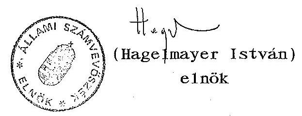

---

MELLÉKLETEK

---

1. sz. melléklet: A zártkörű versenytárgyalásra meghívottak névsora
2. sz. melléklet: Állami Biztosító Rt. konszolidált mérleg 1990. dec. 31. évvel záródó gazdasági évre
3. sz. melléklet: Az Állami Biztosító Rt. privatizációjára felkért lehetséges befektetők jegyzéke
4. sz. melléklet: Beérkezett válasz-levelek

---

1. sz. melléklet

A zártkörű versenytárgyalásra meghívottak
névsora
1./ KPMG Peat Warwick McLintock
POB 486
1 Puddle Dock
Blackfrias
London EC4V 3Pd
Tel.: 071-2368000
Fac: 071-248-6552 (Group 3)
2./ Morgan Grenfell and Co.Ltd

23 Great Winchester Street
London FC2P 2AX
Tel.: 015884545
Fax: 018267130
3./ James Capel and Co.

6 Bevis Market
London EC3A 7 JQ
Tel.: 071-621 0011
Fax: 071-929-2581
4./ Dr.Benölken + Partner GmbH

D-4000 Düsseldorf 1.
Willi-Becker-Allee 11.
Tel.: 0211/772013
Fax: 773622
5./ Magyar Paribas SA.

1015 Budapest
Ostrom u. 23-25.
6./ Credit Commercial de France

Mme Bérard
conseiller
103, avenue des Champs-Elysées
75008 Paris
France
Tel.: 40.707040
Fax: 47-20-3878 elnök
Fax: 40-70-7142 Mme Bérard
7./ Baring Brothers a.Co.Limitc

8 Bishopsgate, London EC2N
Tel: 71/2801000
Fax:

8/ Stefan M.Ottrubay
Director - Corporate Finance
Credit Suisse First Boston Limit
1013 Budapest
Ybl Miklós tér 8.
Tel: 1-175 9002
Telex:

 224533

---

# Kapják: a pályázatra felkért tanácsadók 

Tisztelt Uram!

Az Állami Biztosító Rt. a Pénzügyminisztériummal és az Állami Vagyonügynökséggel egyetértésben állást foglalt az ÁB Rt. privatizációjában.
A privatizáció megvalósításához tanácsadó szervezet közreműködését kívánjuk igénybe venni.

A privatizációban érdekelt intézmények megbízásából felkérem, hogy az Ön által irányított szervezet (tanácsadó) - a mellékelt pályázati felhívás alapján - tegye meg ajánlatát a tanácsadói szolgáltatás vállalására.

Érdeklődését és közreműködését várom és köszönöm.

Budapest, 1990. december
/ dr. Kepecs Gábor /

---

ÁLLAMI BIZTOSÍTÓ Rt. (korábban: Állami Biztosító) KONSZOLIDÁLT MÉRLEG AZ 1990. DECEMBER 31-ÉVEL ZÁRÓDÓ GAZDASÁGI ÉVRE Életbiztosítások és egyéb biztosítások

| ESZKÖZÖK | Megj. | 1990   m Ft | Nem auditált 1989   m Ft |
| :--: | :--: | :--: | :--: |
| Befektetések és készpénz | 7 |  |  |
| Ingatlanok |  | 3,793 | 3,079 |
| Kötvények és értékpapirok |  | 16,193 | 12,339 |
| Részvények társvállalatban |  | 1,630 | 647 |
| Hitelek |  | 1,790 | 1,711 |
| Bankbetétek és készpénz |  | 7,244 | 9,393 |
|  |  | 30,650 | 27,169 |
| Kintlevőségek | 8 | 1,966 | 3,035 |
| Ingóságok | 9 | 1,895 | 1,761 |
| ESZKÖZÖK ÖSSZESEN |  | 34,511 | 31,965 |
| FORRÁSOK |  |  |  |
| Biztosítási elkülönítések |  |  |  |
| Életbiztosítás | 11 | 30,160 | 27,072 |
| Egyéb biztosítás | 10 | 1,793 | 1,729 |
|  |  | 31,953 | 28,801 |
| Tartozások | 12 | 906 | 943 |
| FORRÁSOK ÖSSZESEN |  | 32,859 | 29,744 |
| Részvénytőke és tartalékok |  |  |  |
| Alapító tőke | 13 | - | 2,000 |
| Részvénytőke | 14 | 2,000 |  |
| Átértékelési tartalék | 15 | 2,909 | 2,909 |
| Visszatartott eredmény | 16 | $(3,257)$ | $(2,688)$ |
| VAGYON ÖSSZESEN |  | 1,652 | 2,221 |
| FORRÁSOK ÉS VAGYON ÖSSZESEN |  | 34,511 | 31,965 |

---

ÁLLAMI BIZTOSÍTÓ Rt.
(korábban: Állami Biztosító)

# JÖVEDELEM KIMUTATÁS 

AZ 1990. DECEMBER 31-ÉVEL ZÁRÓDÓ GAZDASÁGI ÉVRE
Életbiztosítások és egyéb biztosítások

| Megj. | Életb   mFt | Egyéb   mFt | Össz.   mFt |
| :-- | :--: | :--: | :--: |

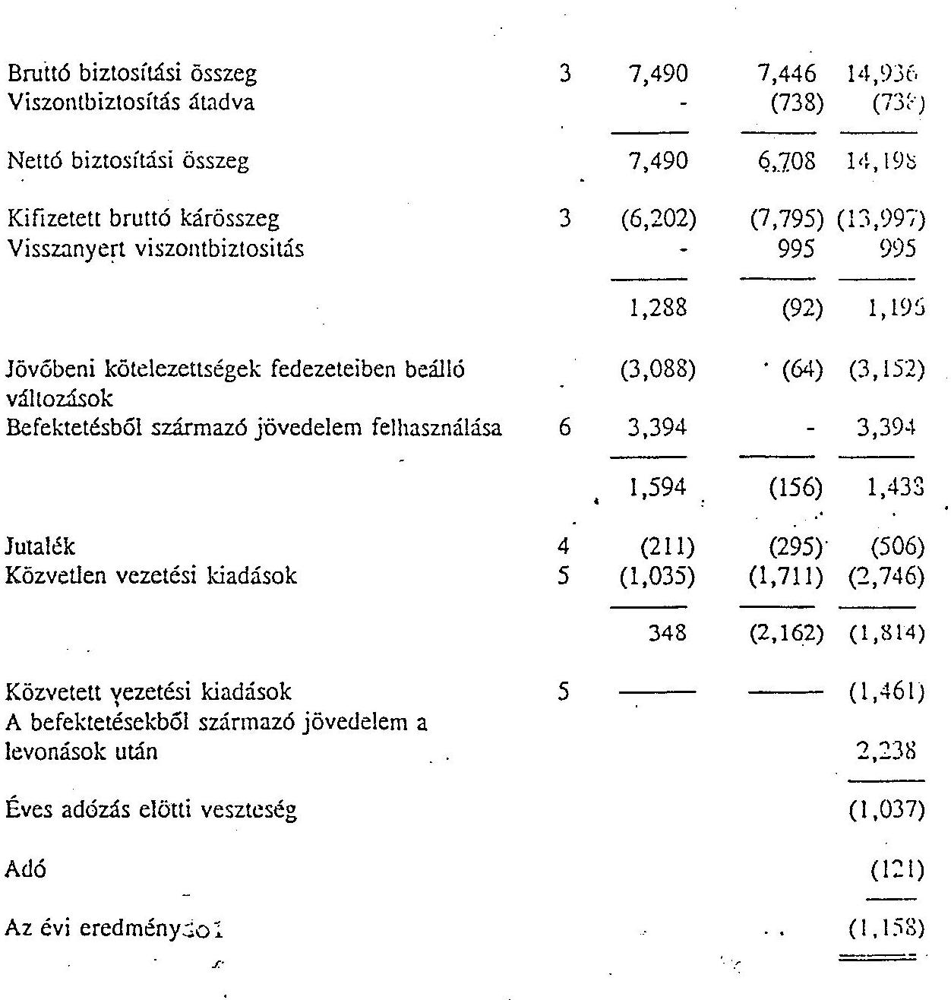

---

# Az Állami Biztosító Rt. privatizációjára felkért lehetséges befektetők jegyzéke 

1. Winterthur Insurance Co. (Svájc)
2. Commercial Union (Nagy-Britannia)
3. Baltica International (Dánia)
4. Skandia (Svédország)
5. Eurosafe (EEIG, Franciaország)
6. BAT Industries (Nagy-Britannia)
7. Guardian Royal Exchange (Nagy-Britannia)
8. AVCB-Naarden (Hollandia)
9. AGF International (Franciaország)
10. GROUPAMA Assurances (Franciaország)
11. EA-Generali AG (Ausztria)
12. Norwich Union Group (Nagy-Britannia)
13. UAP (Franciaország)
14. AEGON International bv. (Hollandia)

---

# Hagelmayer István úrnak, 

Állami Számvevőszék elnöke

Budapest

## Tisztelt Elnök Úr!

Az ÁB-AEGON Általános Biztosító Rt. igazgatósága nevében köszönöm az ÁB Rt. privatizációjának ellenőrzéséről készült, véleményezésre megküldött, végleges jelentésüket.

A jelentés tartalmazza a korábbi tervezethez küldött észrevételeimet. A végleges jelentésben foglalt megállapításokat tudomásul veszem, azokkal egyetértek.

A leírtakhoz az alábbi két kiegészítő megjegyzést teszem.

1. Elfogadom azt a megállapítást, hogy a privatizáció során az ÁB Rt. tartalékainak nemzetközi normáknak megfelelő "hiteles" minősítése auditor által ellenjegyezve nem történt meg. Ugyanakkor a tartalékhelyzet pontos megítélésére a privatizációban résztvevő tanácsadók és a társaság jelentős erőfeszítéseket tettek, amelynek révén az egyik legnevesebb angol tartalékelemzéseket végző cég, a Tillinghaust Ltd., tanulmányában megállapította, hogy az ÁB Rt. meglévő díjtartaléka 30,1 milliárd Ft, a szükséges díjtartalék 42,1 milliárd Ft, azaz a potenciális tartalékhiány 12 milliárd Ft.
A vagyonbiztosítási módozatokra a társaság tartalékokkal nem rendelkezett, amely az éves mérlegbeszámolók alapján egyértelműen megállapítható, sőt itt is jelentős hiánya volt a társaságnak. Ennyiben a tartalékhelyzetet a privatizációkor szakmailag elégtelennek kellett minősíteni.

---

2. Tájékoztatom, hogy a privatizációnál tervezett tőkebevonásból (5-8 milliárd Ft) a magyar állam és az ÁB-AEGON a részvényeladással és kibocsátással, valamint az 1993. évi alaptőke-emeléssel 7,1 milliárd Ft bevételhez jutott.

Ezúton is köszönöm az Állami Számvevőszék társaságunknál végzett munkáját.

Budapest, 1993. július 19.

Tisztelettel
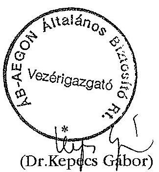

---

# ÁLLAMI BIZTOSÍTÁSFELÜGYELET ELNÖKE 

1051 Budapest, Nádor utca 11.
Postacím: 1369 Budapest, Pf. 481.
Telefon: 269-0985
Telefax: 269-0986
$72 \cdot 572 / 93$

Dr. Hagelmayer István úrnak
Az Állami Számvevőszék elnöke

Budapest

Tisztelt Elnök Úr!

Köszönettel vettem az 1993. július 13-i keltezésű, V-9-31/93. számú, az Állami Biztosító privatizációjának ellenőrzéséről készített vizsgálati jelentésüket.

Az elemzés számunkra is igen tanulságos volt, s munkánkban jól tudjuk majd hasznosítani. A jelentés nem tartalmaz olyan állítást, amely ellentmondana az eddigi ismereteinknek.

Mindezek alapján az Állami Biztosításfelügyelet megjegyzés nélkül elfogadja az Állami Számvevőszék említett jelentését.

Budapest, 1993. július 16.
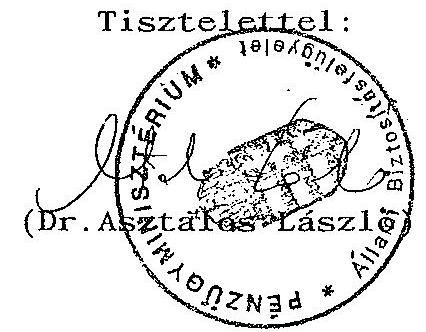

---

# Dr. Hagelmayer István elnök úr részére   Állami Számvevőszék 

Budapest

Tisztelt Hagelmayer Úr!
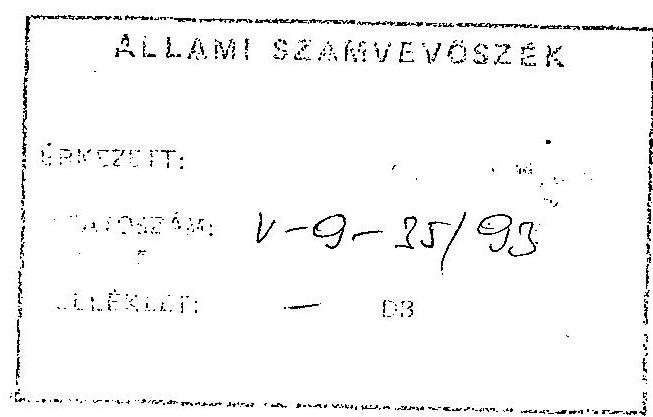

Köszönettel vettem az Állami Biztosító privatizációjáról készült Számvevőszéki jelentést. A jelentésben foglalt megállapítások, következtetések és ajánlások mindenképpen hasznosak az ÁVÜ további munkájának javítására. Tekintettel arra, hogy az Állami Biztosító privatizációja és annak következményei nemzetgazdaságilag is jelentősek, így e tranzakció hibái - véleményem szerint - kiemelten kezelendők. A Számvevőszéki jelentés megállapításait és ajánlásait hamarosan az Állami Vagyonügynökség Igazgatótanácsa meg fogja tárgyalni.

A megállapított tényeket elfogadva engedje meg a T. Elnök úr, hogy néhány megjegyzést fűzzek az anyaghoz.

Magyarországon a hivatalos nyelv a magyar, így a tranzakciók leglényegesebb dokumentumait, főként szerződéseket, mindenképpen hitelesített magyar nyelvű fordításban is el kell készíteni. Tudom, hogy ennek jelentős költségvonzata van, de ezeket a költségeket (a fordításokat) nem tartom megspórolhatónak.

A Strook Strook & Lavan céggel kötött megbízási szerződéssel kapcsolatban az a véleményem, hogy jogszerű ugyan a megbízási szerződés szóbeli megkötése (ezt a Polgári Törvénykönyv lehetővé teszi), azonban a jelen esetben a Ptk. vonatkozó szabályaira történő utalás nem szerencsés, tekintettel arra, hogy a szakértő cég devizakülföldi, részére a díjazás

---

devizában kiutalásra került. Nehezen érthető számomra, hogy hogyan lehetett szóban megkötni egy olyan megbízási szerződést, amely több mint 20 millió Ft-os munkadíjat tartalmazott, külföldi szakértő céggel és egy ilyen fajsúlyú privatizációs tranzakcióban.

Az Igazgatótanács e Jelentés alapján a szükséges lépéseket meg fogja tenni a hibák korrigálására és a szükséges személyi konzekvenciák levonására.

Erről a T. Elnök urat tájékoztatni fogom.

Budapest, 1993. július 22.
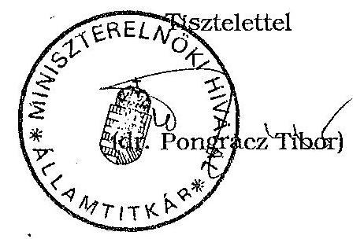

---

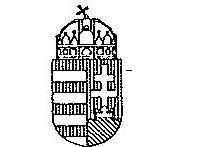

476/ee/83

Lizzn: Menniz: /úr
Muhar 21
Vulz 199

Dr. Hagelmayer István úr, elnök

Állami Számvevőszék

Budapest

Tisztelt Hagelmayer úr!

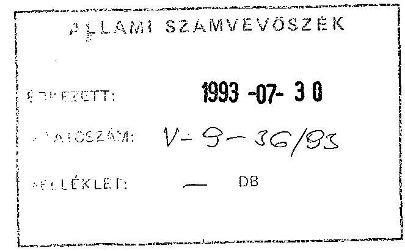

Az Állami Számvevőszék jelentését az Állami Biztosító privatizációjának vizsgálatáról áttanulmányoztam, ahhoz a Pénzügyminisztériummal kapcsolatos kiegészítést nem fűzök.

Budapest, 1993. július 20.

Üdvözlettel:

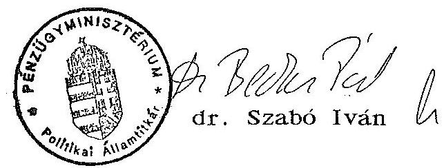

---

Dr. Hagelmayer István elnök úr részére

Állami Számvevőszék
Budapest

Tisztelt Hagelmayer Úr!
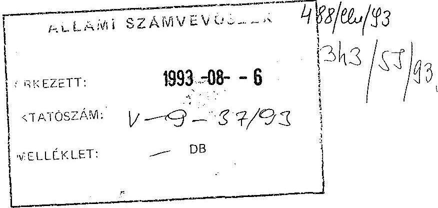

Köszönettel vettem kézhez az Állami Biztosító privatizációjáról készült - 1993. július 15-én beérkezett - legutóbbi számvevőszéki jelentést, amelyet észrevételezés céljából küldtek meg. Ezeket az alábbiak szerint teszem meg:

1. A V-9-13/1993. sz. jelentés 3. oldalának utolsó bekezdése azt tartalmazza, hogy az ÁVÜ az ÁV Rt. közreműködésével adott át dokumentumokat, míg a legutóbbi V-9-30/1993. jelentés úgy szól, hogy az ÁV Rt. nyilatkozata szerint az ÁV Rt. semmilyen biztosítóra vonatkozó anyagot nem vett át. Az ÁVÜ az ÁB Rt. privatizációjával kapcsolatos anyagot - minthogy arra az elsőként hivatkozott jelentés utal - az ÁV Rt-nek átadta.
2. Kifogásolja a jelentés azt is, hogy a tanácsadói szerződést nem a pályázat első helyezettjével, a Paribas SA-val, hanem a második helyre sorolt Morgan Grenfellel kötötte meg az ÁVÜ. Megítélésünk szerint egyrészt a pályázatok értékelésével megbízott bizottságnak - amelyben az ÁVÜ-t képviselő tisztviselők kisebbségben vannak - nincs joga az ÁVÜ nevében döntést hozni, csupán javaslatot tenni.

Másrészt a jelentés nem elemzi kellőképpen azon fontos tényt, hogy a tanácsadói pályázatot az ÁVÜ az Állami Biztosítóval együtt hirdette meg közös tanácsadó megbízására. A pályázatra beadott ajánlatok értékeléséig azonban kiderült, hogy nem szerencsés az, ha az eladónak, az ÁVÜ-nek és az eladás tárgyának, az ÁB-nek ugyanaz a tanácsadója, mert világossá vált időközben, hogy a privatizáció egyes részkérdéseiben érdekellentét állhat elő az ÁVÜ és az ÁB között. Ezért döntött úgy az ÁVÜ, hogy saját önálló tanácsadót bíz meg; az ÁB-vel közösen kiírt pályázaton az ÁVÜ-t nem kötő bizottság által kihozott első helyezettet pedig udvariasságból átengedi az ÁB-nek. Az idő sürgetésére tekintettel az ÁVÜ nem írt ki újabb tanácsadói pályázatot, hanem a korábbi tanácsadói pályázat eredménye alapján kötötte meg a szerződést Morgan Grenfell-el.

---

Mindezek miatt az, hogy az ÁB és a Paribas SA. között létrejött-e szerződéses kapcsolat és milyen tartalommal, a továbbiakban az ÁVÜ-t nem érintette. Mindenesetre az ÁVÜ kívánatosnak tartotta, hogy az ÁB-nek is legyen önálló tanácsadója.

Fentiekre tekintettel nem tudjuk elfogadni a jelentés azon megállapításait, miszerint - általában nem lehet olyan versenyeztetési gyakorlatot elfogadni, amelyben az ÁVÜ saját versenyszabályzatának gyakorlatát követi, de nincs jogi kényszer annak betartatására. Így az ÁVÜ a versenyeredmény ellenére hozhat tulajdonosi döntéseket. Gyakorlatilag akkor vizsgálja felül a versenyben kialakult döntéseket, amikor akarja, a versenyeztetési formaális.

Az ÁVÜ a versenyszabályokat betartotta. A Legfelsőbb Bíróság által a pályáztatásra vonatkozóan kialakított ítélkezési gyakorlat az, hogy a bíróság előtt egyértelműen számonkérhető az ÁVÜ saját maga által megállapított versenyszabályainak betartása, mégpedig semmisségi és kártérítési jogkövetkezmények terhével. E súlyos felelősséggel számolva az ÁVÜ precízen ügyel arra, hogy ilyen esetek ne forduljanak elő. Ha kívánom mutatni, hogy senki sem támadta meg az ÁVÜ versenyeztetési szabályait bíróság előtt.
3. A tanácsadó cég erőfölényére utaló vizsgálati megállapítást a továbbiakban sem tudjuk elfogadni.
Meg kívánom jegyezni, hogy az ÁVÜ általában a nyugaton szokásosnál kedvezőbb jogi feltételeket ér el a tanácsadói szerződésekben a megbízó javára; ez történt a konkrét esetben is. Ennek tükrében érthetetlen az ÁVÜ sérelmére fennálló erőfölényre történő utalás a jelentésben.

A szerződés 5. pontja a megbízó javára szóló olyan rendelkezés, amelyet a nagy investment bankok általában nem szoktak aláírni. A 10/A pont szerinti kártalanítási kötelezettség elől pedig elzárkóznak a tanácsadó cégek oly módon, hogy kifejezetten kizárják a kártérítési felelősségüket; az ÁVÜ viszont a Morgan Grenfellel elfogadtatta ezt a kötelezettséget, amely a nemzetközi standardok szerint mérve is rendkívül kedvezőnek minősül. Mindezek miatt a tanácsadói szerződések minősítésére utaló megjegyzéseket a jelentésben megalapozatlannak tartom.
4. A pályázat kiírható és lebonyolítható volt anélkül is, hogy az ÁB tartalékok megfelelési szintjét minősítették volna; ezt a privatizáció ténye önmagában is bizonyítja. A pályázaton biztosított információ megfelelő volt a pályázó számára ahhoz, hogy ajánlatot tehessen és annak alapján a felek szerződést köthessenek, amely a mai napig is megfelelően rendezi ezeket a kérdéseket.

---

Nincs olyan jogi kötelezettség, amely előírná azt, hogy biztosító intézetet csak a tartalékok minősítése után lehet eladni. A privatizálható vagyon értékét a piac ítéli meg. A Pénzügyminisztérium szakembereinek ezt ismernie kellett, mivel az anyagot látták.
5. A pályázat elbírálási szempontjainak az akkor hatályos törvény szerint nem kellett szerepelnie a pályázatban. Az ÁVÜ az egyes szempontok közzétételével a törvényi előírásokhoz képest többletet
 nyújtott. Ugyanakkor a pályázati kiírásnak a 3. pontban kifejtett jogi kötőereje miatt jogilag kockázatos lett volna részletesebb értékelési szempontrendszert meghatározni, illetve az már jelentősen korlátozta volna a privatizációs mérlegelési szempontokat a döntéshozatalnál, ideértve esetleges több jelentkező esetén a piaci versenyhelyzetre gyakorolt hatás figyelembe vételét, amely ugyancsak az ÁVU kötelessége. Mindezek olyan tulajdonosi mérlegelési körbe tartoznak, amelyek egy normatív alapú vizsgálat során nem kérhetőek számon.
6. A döntéshozók egyértelműen tisztában voltak azzal a ténnyel, hogy egyetlen pályázó adott ajánlatot. Ezt az IT számára 1992. február 26-i kelettel benyújtott előterjesztés 3. oldalának 1.3. pontja kétséget kizáróan igazolja. Ugyancsak tudott az IT a pályázó kilétéről is, hiszen az előterjesztés mellékleteként több oldalas bemutató anyagot csatoltunk az AEGON cégről. Az AEGON az előterjesztés szöveges részében "Befektető" megjelöléssel szerepel az üzleti titokvédelemhez fűződő speciális indokok miatt.

Szükséges megjegyezni, hogy a pályázat kiírása előtt az Állami Vagyonügynökséghez az Állami Biztosítóval kapcsolatos vételi ajánlat nem érkezett, befektetői érdeklődés nem volt.
7. A pályázat értékelésében az ÁVU tranzakciós ügyintézője, igazgatósága, Vezetői értekezlete és Igazgatótanácsa működött közre az ajánlatok értékelésével, a döntési javaslatok megfogalmazásával és a döntések meghozatalával. Más pályázatok elbírálása is ugyanígy folyik, itt sem volt ettől eltérés.
8. A Stroock & Stroock & Lavan céggel az ÁVU szóban szerződést kötött. A nemzetközi magánjogi kódex kimondja, hogy a megbízási szerződésekre irányadó jog annak az államnak a joga, amelyben a megbízott székhelye van. Megbízási szerződés érvényesen megköthető akár írásban, akár szóban is. Az irányadó jog szerint tehát a szerződés érvényesen létrejött. Ezt eddig sem az ÁVU, sem az ügyvédi iroda nem vitatta.

---

A munkateljesítést az AB privatizációjáról megkötött szerződés igazolja, amelynek első tervezetét is ez az ügyvédi iroda készítette és amelyet a Számvevőszék ismert. A munkateljesítés megtörtént.

Az ügyvédi iroda által írt, az ASZ-nak korábban átadott levél a közöttünk létrejött szerződést írásban is megerősíti.

Mindezek megalapozatlanná teszik azt a megállapítást a jelentésben, hogy az ügyvédi díj kifizetése jogellenes volt.

Kérem, hogy a fentiekben ismételten kifejtett érveimet megfontolni, továbbá azokat a jelentésében szerepeltetni szíveskedjék.

Budapest, 1993. július 26.
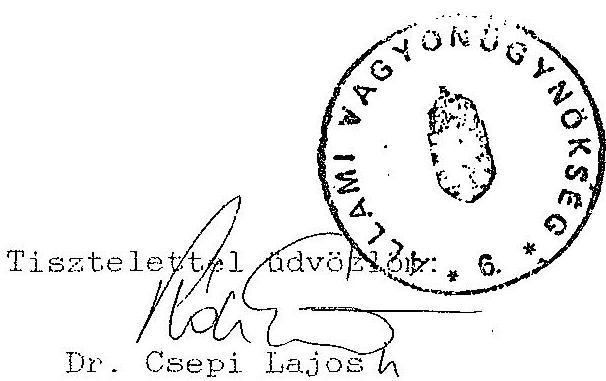

---

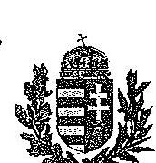

# A MAGYAR KÖZTÁRSASÁG KORMÁNYA

SZABÓ TAMÁS
TÁRCA NÉLKÜLI MINISZTER

Budapest, 1993. július 28.
SZT-1617/93.

Dr. Hagelmayer István úr, elnök
Állami Számvevőszék

Budapest

Tisztelt Elnök Úr!

Az Állami Biztosító Rt. privatizációjának ellenőrzéséről készített vizsgálati jelentésüket köszönettel megkaptam. Az abban foglaltakkal kapcsolatos észrevételeimet az alábbiak szerint részletezem.

A jelentés az Állami Biztosító Rt. privatizációjának folyamatát számos kritikai észrevétellel illeti.

A vizsgálat által feltárt, a 7/1991. sz. ügyvezetői utasítás vonatkozó rendelkezéseinek be nem tartásából adódó dokumentálási, iratkezelési hiányosságok észrevételezését jogosnak tartom abból a szempontból, hogy a Számvevőszék által kért dokumentumokat az ÁVÚ nem teljes körűen tudta a vizsgálatot végzők rendelkezésére bocsátani. Ez részben annak tudható be, hogy az ÁB Rt. iratanyagainak az ÁV Rt. részére történő átadása nem kellő körültekintéssel zajlott le, így a vizsgálat időtartama alatti feltalálásuk nem minden esetben volt biztosított.

A tanácsadó kiválasztásának eljárását kifogásoló megállapítással kapcsolatos álláspontom az, hogy a bíráló bizottság a pályázati kiírás szempontjai alapján a szakmai értékelést és a pályázatok rangsorolását végzi, amelyet javaslat formájában terjeszt a döntéshozó elé. A döntést mindenkor a megbízónak, jelen esetben az ÁVÚ-nak illetve annak Igazgató Tanácsának joga és felelőssége volt meghozni. Megjegyzem, hogy a szóvá tett pályázat még a 7/1991. sz. ügyvezető igazgatói utasítás 1991. július 1-i hatályba lépését megelőzően került kiírásra. Azóta a privatizációs tanácsadói szerződésekkel kapcsolatos kérdéseket az említett utasítás megnyugtatóan rendezi.

Az ÁVÚ által az ÁB privatizációja során kifizetett díjakról szólva a jelentés jogtalannak minősíti az egyik tanácsadó részére teljesített 21,5 mFt kifizetést.

1133 Budapest, Pozsonyi u. 56.
Telefon: 149-5307, 149-5308,
Telefax: 149-5903

---

annak alapján, hogy írásos szerződést, munkateljesítést igazoló dokumentumot, illetve számlát az ÁVU nem tudott bemutatni.

A konkrét eset kapcsán le kell szögeznem, hogy teljesen elfogadhatatlannak tartom azt a gyakorlatot, amely nem teszi lehetővé a tranzakciók nyomon követhetőségét, a kifizetések megalapozottságának ellenőrizhetőségét.

Összegezve a jelentés megállapításaival kapcsolatos véleményemet úgy ítélem meg, hogy az Állami Biztosító Rt. privatizációja - figyelembe véve azt a tényt, hogy a pályázat kiírása előtt az Állami Vagyonügynökséghez az Állami Biztosítóval kapcsolatos vételi ajánlat nem érkezett, befektetői érdeklődés nem volt - sikeresen bonyolódott le.

A privatizációs eljárás során elkövetett szabálytalanságok, amelyek a vizsgálatnak köszönhetően kerültek a napvilágra, megerősítenek abban, hogy a privatizációs munkát folyamatosan javítva, a tapasztalatokat hasznosítva, a személyes felelősséget erősítve végezzük tevékenységünket.

Tisztelt Elnök Úr!
Értékes munkájukat ezúton is megköszönve tájékoztatom, hogy a jelentés megállapításai alapján, valamint a megfogalmazott ajánlásokat fontolóra véve kezdeményezem az ÁVU ügyvezetésénél a jelentés által kifogásolt 21,5 mFt összegű kifizetés körülményeinek, valamint a személyi felelősség kérdésének kivizsgálását. Egyben felkérem az ügyvezetést, hogy gondoskodjon a privatizációs munka során a törvényi előírások, kötelezettségek, valamint a vonatkozó ÁVU utasítások maradéktalan betartatásáról.
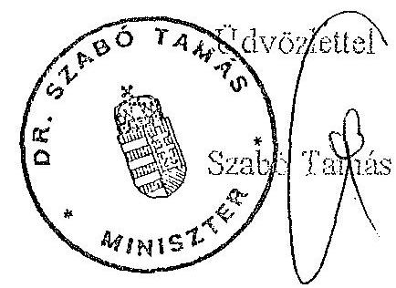
