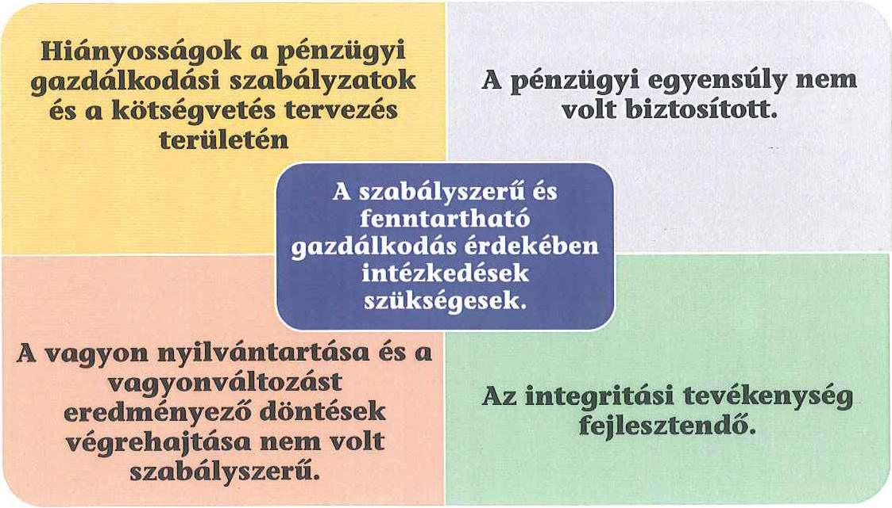
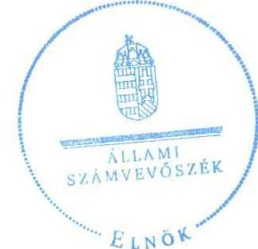
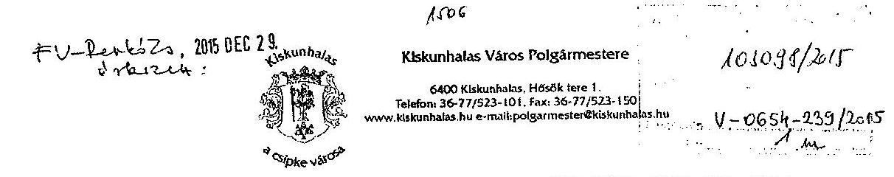
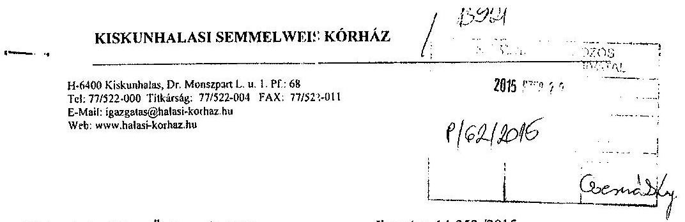
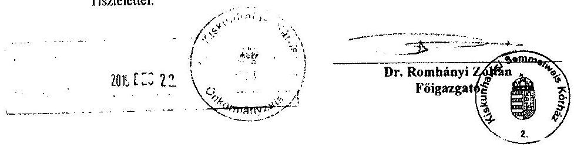
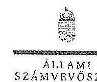
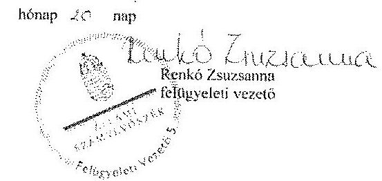

# ÁLLAMI   SZÁMVEVŐSZÉK 

## JELENTÉS

az önkormányzatok pénzügyi és vagyongazdálkodása szabályszerűségének ellenőrzéséről

Kiskunhalas

---

# Állami Számvevőszék 

Iktatószám: V-0654-248/2016.
Témaszám: 1688
Vizsgálat-azonosító szám: V069106

## Az ellenőrzést felügyelte:

## Renkó Zsuzsanna

felügyeleti vezető
Az ellenőrzés végrehajtásáért felelős és az ellenőrzést vezette:
Dér Lívia
ellenőrzésvezető
A számvevőszéki jelentés összeállításában közreműködött:
Szudi Ferencné
számvevő vezető főtanácsos
Az ellenőrzést végezték:

| Kersmájer Ágota | Bajnai Zsuzsanna | Herczku Olívia |
| :-- | :-- | :-- |
| számvevő főtanácsos | számvevő | számvevő |
| Fülöppné Nagy | dr. Korbuly Andrea |  |
| Marianna | számvevő tanácsos |  |
| számvevő főtanácsos |  |  |

---

# TARTALOMJEGYZÉK 

BEVEZETÉS ..... 3
I. ÖSSZEGZŐ MEGÁLLAPÍTÁSOK, KÖVETKEZTETÉSEK, JAVASLATOK ..... 6
II. RÉSZLETES MEGÁLLAPÍTÁSOK ..... 13

1. Az erőforrásokkal való szabályszerű és hatékony gazdálkodáshoz szükséges követelmények kialakítása, számonkérése, ellenőrzése ..... 13
1.1. Az előirányzatokkal, a létszámmal, a vagyonnal való gazdálkodás szabályainak, követelményeinek kialakítása ..... 13
1.2. Az erőforrásokkal való szabályszerű, hatékony gazdálkodás követelményeinek számonkérése, ellenőrzése ..... 14
2. A pénzügyi gazdálkodás szabályszerűsége, a pénzügyi egyensúly biztosítottsága ..... 14
2.1. A költségvetési tervezés, az éves költségvetési beszámolás szabályossága ..... 14
2.2. Az önkormányzat fizetőképességének folyamatos fenntartása, a pénzügyi egyensúly biztosítása ..... 16
3. A vagyongazdálkodási tevékenység szabályossága ..... 19
3.1. A vagyongazdálkodási tevékenység kereteinek kialakítása ..... 19
3.2. A vagyonnyilvántartás szabályszerűsége ..... 21
3.3. A vagyon leltározása ..... 21
3.4. A vagyonváltozásokat eredményező döntések szabályszerűsége ..... 23
3.5. A tartós részesedésekkel való gazdálkodás, az önkormányzat tulajdonosi jog gyakorlása ..... 26
4. Integritás érvényesülése ..... 29
MELLÉKLETEK
5. számú Kiskunhalas Város Önkormányzata feladatellátásában résztvevő intézmények és azok változása az ellenőrzött időszakban
6. számú Kiskunhalas Város Önkormányzata bevételei, kiadásai, valamint adósságszolgálata a 2011-2013. években
7. számú Kiskunhalas Város Önkormányzata mérlegadatai a 2011-2013. években
8. számú Kiskunhalas Város Önkormányzata 2013. évi beszámolójának 38. A befektetett eszközök (kivéve befektetett pénzügyi eszközök) állományának alakulása űrlapja szerinti adatok, a főkönyvi nyilvántartás szerinti adatok, valamint az analitika adatai közötti eltérésekről

---

5. számú Kiskunhalas Város Önkormányzata tartós részesedéseinek portfóliója a 2011-2013. években
6. számú Kiskunhalas Város Önkormányzata polgármesterének a jelentéstervezet megállapításaira tett észrevétele
7. számú Az ÁSZ válasza Kiskunhalas Város Önkormányzata polgármesterének a jelentéstervezet megállapításaira tett észrevételére

# FÜGGELÉKEK 

1. számú Fogalomtár
2. számú Rövidítések jegyzéke

---

# JELENTÉS 

## az önkormányzatok pénzügyi és vagyongazdálkodása szabályszerűségének ellenőrzéséről Kiskunhalas

## BEVEZETÉS

Az ÁSZ stratégiai célkitűzése, hogy ellenőrzéseivel mind jobban segítse az átláthatóságot, az elszámoltathatóságot és elszámoltatást a közpénzekkel és a közvagyonnal való gazdálkodásban. Magyarország Alaptörvénye rögzíti, hogy az állam és a helyi önkormányzat tulajdona a nemzeti vagyon része. Az önkormányzati vagyon alapvető funkciója, hogy a közérdeket és egyúttal az önkormányzati célok - elsősorban a kötelezően ellátandó feladatok, és emellett a lehetőségek mértékéig az önként vállalt feladatok - megvalósítását szolgálja.

Az államháztartás önkormányzati alrendszerének közpénz felhasználása, az önkormányzatok által ellátott közfeladatok és önként vállalt feladatok sokrétűsége, valamint a feladatellátásához rendelt vagyon nagyságrendje indokolja, hogy az ÁSZ ellenőrzéseket folytasson a pénzügyi és vagyongazdálkodás területén. Az ÁSZ az önkormányzatok ellenőrzését a pénzügyi helyzet megítélésével indította el 2011-ben és a nagy vagyonnal rendelkező, magas kockázatú önkormányzatok esetében a vagyongazdálkodás ellenőrzésével folytatta. Az elmúlt három év ellenőrzéseinek tapasztalatai megmutatták, hogy indokolt az egyrészt elemző, értékelő, a pénzügyi helyzet kockázatát is minősítő, másrészt a pénzügyi és vagyongazdálkodási tevékenység szabályszerűségét komplexen értékelő ÁSZ ellenőrzések folytatása.

Az ellenőrzés célja annak megállapítása volt, hogy kialakított-e az önkormányzat az erőforrásokkal való szabályszerű és hatékony gazdálkodáshoz szükséges követelményeket, megvalósította-e azok számon kérését, ellenőrzését; az önkormányzat pénzügyi és vagyoni helyzetének, a gazdálkodás szabályosságának megítélése a költségvetési tervezés, a pénzügyi egyensúly megteremtése, az éves költségvetési beszámolás, a vagyongazdálkodás, a vagyon számbavétele, és a gazdasági események elszámolása és a pénzgazdálkodás szabályszerűsége alapján.

Ennek keretében értékeltük, hogy az önkormányzat:

- pénzügyi gazdálkodása megfelelt-e a jogszabályokban és a belső szabályzataiban meghatározottaknak, biztosított volt-e a pénzügyi egyensúly;
- biztosította-e a vagyongazdálkodás szabályszerűségét, a vagyonváltozást eredményező döntéseket szabályszerűen hajtotta-e végre, gondoskodott-e a tulajdonosi jogok gyakorlásáról;

---

- a gazdálkodása során biztosította-e az átláthatóság és az integritás érvényesülését.

Az ellenőrzés várható hasznosulása: az ellenőrzés várhatóan hozzájárul az önkormányzatok pénzügyi helyzetének pontosabb megítéléséhez azáltal, hogy a pénzügyi és vagyoni helyzetet együtt értékeli. Bemutatja az adósságkonszolidáció önkormányzat általi végrehajtásának szabályszerűségét. Feltárja az önkormányzati gazdálkodást meghatározó szabályozások összhangjának esetleges hiányosságait, a szabályozással nem érintett gazdálkodási területeket, és a vagyongazdálkodási tevékenység gyakorlásának szabálytalanságait. A jó gyakorlat kialakításán és terjesztésén keresztül az ellenőrzések elősegíthetik az önkormányzati gazdálkodás szabályszerűségének javítását.

Az ellenőrzés típusa: szabályszerűségi ellenőrzés
Az ellenőrzött időszak: 2011. január 1-jétől 2013. december 31-ig. A pénzintézetekkel szembeni kötelezettségek állományának vizsgálatakor az ellenőrzött időszakban fennálló kötelezettségeket vettük figyelembe. A vagyonnyilvántartások egyezőségét, a leltározás, selejtezés folyamatát a 2013. évre vonatkozóan értékeltük.

# Ellenőrzött szervezet: Kiskunhalas Város Önkormányzata 

Az ellenőrzés végrehajtásának jogszabályi alapját az ÁSZ tv. 1. § (3) bekezdése, az S. § (2)-(6) bekezdései, valamint az Áht. 2 61. § (2) bekezdésének előírásai képezik.

Az ellenőrzés szakmai módszertana az ÁSZ hivatalos honlapján közzétett szakmai szabályokon alapult, amely a Legfőbb Ellenőrző Intézmények Nemzetközi Szervezete (INTOSAI) által kiadott nemzetközi standardok (ISSAI) figyelembevételével készült.

Az ellenőrzést az ÁSZ hatályos szervezeti szabályai és az ellenőrzési programban foglalt értékelési szempontok szerint folytattuk le. Megállapításainkat a helyszíni ellenőrzés tapasztalataira, az ellenőrzött szervezettől bekért dokumentumokra, a kitöltött tanúsítványok elemzésére, az adott időszakban hatályos jogszabályok és belső szabályzatok előírásaira alapoztuk.

Az Önkormányzat vagyonváltozását eredményező döntések és azok végrehajtásának ellenőrzése, szabályszerűségének megítélése kockázatalapú mintavételen, valamint tételes ellenőrzés alapján történt. Tételesen ellenőriztük a részesedések értékelését, a térítés nélküli tulajdonjog átruházását, a behajthatatlan követelések leírását. Kockázatalapú mintavétel alapján (évente a 2-4 legnagyobb értékű tételek kerültek kiválasztásra) ellenőriztük a vagyonkezelői jog alapítását és a vagyon üzemeltetésére történő átadását, a beruházásokat, felújításokat, a vagyonértékesítéseket, a vagyonhasznosítást.

A rövidítésjegyzéket az 1. számú, a fogalomtárat a 2. számú függelék tartalmazza.

---

Kiskunhalas város lakosainak száma 2013. január 1-jén 29305 fő volt. A tizenöt tagú Képviselő-testület munkáját három állandó bizottság segítette. A polgármester a 2010. évi önkormányzati választás óta töltötte be tisztségét. A jegyző 2000. április 1-jétől látja el feladatait. A Hivatal négy osztályra ezen belül hét csoportra tagolódott, elkülönített gazdasági szervezettel nem rendelkezett. A pénzügyi-gazdálkodási feladatokat 2011. október 1-jétől a Pénzügyi és Gazdálkodási Osztály látta el. A foglalkoztatott köztisztviselők száma 2013. december 31-én 76 fő volt.

Az ellenőrzött időszakban az Önkormányzat által ellátott feladatok, valamint a feladatellátásban résztvevő intézmények és gazdasági társaságok körében jelentős mértékű változások történtek. A 2011. év elején négy önállóan működő és gazdálkodó költségvetési szerven kívül tizenegy önállóan működő költségvetési szerv, az Önkormányzat többségi tulajdonában lévő nyolc gazdasági társaság és két társulás vett részt a feladatellátásban. Az intézmények száma 2013. év végén nyolcra változott, a többségi tulajdonban lévő gazdasági társaságok száma négyre csökkent. A Tűzoltóságot 2012. január 1-jével a Katasztrófavédelmi Főigazgatóság vette át. Az Önkormányzat egy középiskolát és egy általános iskolát 2012. augusztus 31-ével egyházi szervezetek fenntartásába adott, öt köznevelési intézményt - az intézmények önkormányzati működtetése mellett - 2013. január 1-jén a KLIK részére ingyenes használatba adott. 2013. január 1-jétől önkormányzati fenntartásba került a mindaddig megyei fenntartású Thorma János Múzeum. Az ellenőrzött időszakban az Önkormányzat feladatellátásában résztvevő intézményeket az 1. számú melléklet mutatja be.

A járási hivatalok 2013. évi megalakulásával a - támogatások és járadékok nyújtásával kapcsolatos - hatósági feladatok csökkentek.

Az Önkormányzat könyvviteli mérleg szerinti vagyona 2013. december 31-én 28 107,7 millió Ft volt, 4562,5 millió Ft-tal, 19,4%-kal - döntően a beruházások és felújítások miatt - emelkedett az ellenőrzött időszakban. A pénzintézetekkel szembeni kötelezettségek összege 2011. január 1-jén 4517,7 millió Ft volt. A Magyar Állam az Önkormányzat hitelből és kötvénykibocsátásból származó 4053,6 millió Ft-os adósságállományát átvállalta. Az adósságkonszolidáció két ütemben történt, II. üteme a 2014. évben volt. Az I. ütemet követően a 2652,2 millió Ft összegű tőketartozás átvállalása eredményeként 2013. december 31-én 1409,3 millió Ft-ra - az átvállalás időpontjában 1401,4 millió Ft-ra - csökkent. Az Önkormányzat a 2013. évi költségvetési beszámolója szerint 8061,8 millió Ft költségvetési bevételt ért el és 7155,8 millió Ft költségvetési kiadást teljesített. A felhalmozási célú kiadások összege 2013-ban 3756,9 millió Ft volt, melyből felújításokra és beruházásokra 3703,8 millió Ft-ot fordítottak.

Az ÁSZ tv. 29. § (1) bekezdése szerint a jelentéstervezetet megküldtük a polgármester részére, aki az ÁSZ tv. 29. § (2) bekezdésében foglalt észrevételezési jogával élt, a jelentéstervezet megállapításaira észrevételt tett.

---

# I. ÖSSZEGZŐ MEGÁLLAPÍTÁSOK, KÖVETKEZTETÉSEK, JAVASLATOK 

Az Önkormányzat folyó költségvetése a 2011. évben a működőképesség megőrzését szolgáló kiegészítő támogatásokkal volt egyensúlyban. A pénzügyi helyzet a feladatváltozások, másrészt a saját hatáskörben tett bevételnövelő és kiadáscsökkentő intézkedések, továbbá az adósságkonszolidáció következtében az ellenőrzött időszak végére javult. A működési jövedelem a 2011-2013. években az adósságszolgálat finanszírozását nem biztosította. A fizetőképességet munkabérmegelőlegezési és folyószámlahitel rendszeres igénybevételével, valamint a kötelezettségek határidőn túli teljesítésével tudták fenntartani. Az Önkormányzat vagyona a három év alatt 4562,5 millió Ft-tal (19,4%-kal) nőtt döntően az EU-s támogatásokkal megvalósult fejlesztések következtében. Az Önkormányzat nem biztosította teljes körűen a vagyongazdálkodás szabályszerűségét, a vagyonváltozást eredményező döntéseket nem minden esetben hajtotta végre szabályszerűen.

## Az ÁSZ ellenőrzés megállapításainak összegzése:

Az erőforrásokkal való szabályszerű gazdálkodás kereteit kialakították. A közfeladatok ellátása és a létszámokkal való hatékony gazdálkodás érdekében a Képviselő-testület követelményeket határozott meg. Az éves költségvetéseket megalapozó tervezési folyamatban általános célkitűzésként a kiadások csökkentését, a pénzeszközök felhasználása hatékonyságának növelését, a bevételek növelését, a racionális, hatékony, eredményes gazdálkodás és feladatellátás megvalósítását írták elő. Az erőforrásokkal való gazdálkodás követelményeinek és irányelveinek teljesítéséről a költségvetési rendeletek féléves és háromnegyed éves végrehajtásáról, továbbá a zárszámadási rendeletek előkészítéséhez kapcsolódó előterjesztésekben számoltak be. A belső ellenőrzés a jogszabályi előírások

---

ellenére a 2011-2013. években nem ellenőrizte a rendelkezésre álló erőforrásokkal való gazdálkodást, a vagyon megóvása keretében a vagyonkimutatás szabályszerűségét.

A 2013. évi költségvetés előkészítése során a jogszabályi előírásokat nem tartották be teljes körűen, mivel külső finanszírozású működési hiányt terveztek. A költségvetési beszámolókat a 2013. évi beszámolóban feltárt hiba kivételével az ellenőrzött években a jogszabályokban meghatározott tartalommal és határidőig elkészítették.

Az Önkormányzat pénzügyi egyensúlya a 2011-2013. években nem volt biztosított. Fizetőképességét folyószámlahitel és munkabér-megelőlegezési hitel igénybe vételével biztosította. A működőképességének megőrzésére 2011-2013 között összesen 398,0 millió Ft vissza nem térítendő támogatásban részesült, amely nélkül 2011-ben a működési jövedelme negatív lett volna. A feladatellátásban bekövetkezett változások, továbbá a saját hatáskörben megtett intézkedések javították a pénzügyi egyensúlyi helyzetet. Az Önkormányzatnál a kockázatkezelési rendszer nem terjedt ki a gazdálkodással összefüggő, pénzügyi egyensúlyt befolyásoló kockázatok felmérésére és azok mérséklésére.

A vagyongazdálkodás szabályozási kereteinek kialakítása a jogszabályi előírásoknak részben felelt meg. Az Önkormányzat vagyonával való gazdálkodásra vonatkozó előírásokat, feladat- és hatásköröket vagyonrendelet ${
 }_{1,2}-ben szabályozták. Nem határozták meg azonban a vagyonkezelői jog ellenértékének és az ingyenes átengedés részletes szabályait. A számviteli nyilvántartás szerinti ingatlanvagyon, az ingatlanvagyon-kataszter ingatlan adatlapjainak, valamint a földhivatali ingatlan-nyilvántartás adatainak egyezőségét nem biztosították. A könyvviteli mérlegben kimutatott eszközök és források leltárral való alátámasztása az ellenőrzött években nem szabályszerűen történt, az eszközöket mennyiségi felvétellel a 2011-2012. években nem leltározták, továbbá az üzemeltetésre, használatba adott eszközökről az üzemeltetők által készített leltárakkal az Önkormányzat nem rendelkezett. Ezáltal az elszámoltathatóság feltételeit nem biztosították. A vagyon összetételének és nagyságának változását eredményező döntések végrehajtása részben felelt meg az előírásoknak, a mintatételekben szereplő két értékesített ingatlan esetében nem a vagyonrendelet ${ }_{1,2}$-ben meghatározott értékbecslés alapján határozták meg az eladási árat.

Az Önkormányzat a gazdasági társaságai tulajdonosi felügyeletét részben biztosította. Gondoskodott többségében a vezető tisztségviselők megválasztásáról, a beszámolók elfogadásáról, de a vagyonrendelet ${ }_{1,2}$-ben meghatározott követelmények betartását gazdasági társaságaitól nem kérte számon. A tartós részesedések értékelését a 2011-2013. években nem végezték el teljes körűen.

Az Önkormányzat a jogszabályi előírás ellenére közzétételi kötelezettségének részben tett eleget, mivel a vagyonkezelési és üzemeltetési szerződések, a térítésmentes vagyonátadások, továbbá a fejlesztési célú beszerzések ellenőrzött tételei esetében elmulasztotta a nettó ötmillió forintot meghaladó értékű szerződései közzétételét.

Az Önkormányzat a gazdálkodása során nem biztosította maradéktalanul az átláthatóság és az integritás érvényesülését.

---

Az ÁSZ tv. 33. § (1) bekezdésében foglaltak értelmében az ellenőrzött szervezet vezetője köteles a jelentésben foglalt megállapításokhoz kapcsolódó intézkedési tervet összeállítani, és azt a jelentés kézhezvételétől számított harminc napon belül az ÁSZ részére megküldeni. Amennyiben az intézkedési tervet határidőn belül nem küldi meg a szervezet vezetője, vagy az továbbra sem elfogadható, az ÁSZ elnöke a hivatkozott törvény 33. § (3) bekezdés a-b) pontjaiban foglaltakat érvényesítheti.

# Az ellenőrzés intézkedést igénylő megállapításai és javaslatai: 

## a polgármesternek

1. Az Önkormányzat a tulajdonában lévő, a nemzeti vagyon körébe tartozó eszközök hasznosítására a vagyonrendelet 8. § (6) bekezdésében, a vagyonrendelet 2. 9. § (7) bekezdésében, továbbá 2012-2013. évektől az Nvtv. 3. § 10. és 11. pontjában, valamint a 11. § (10)-(11) bekezdéseiben előírtak ellenére nem kötött írásbeli szerződést, ennek hiányában adott át üzemeltetésre eszközöket a kizárólagos önkormányzati tulajdonban lévő Halasi Városgazda Zrt. részére.

Javaslat:
Intézkedjen a hasznosításra átadott vagyon használójával a jogszabályi előírásoknak megfelelő szerződés megkötéséről.
2. A 2012-2013. években a Mötv. 109. § (4) bekezdésének előírása ellenére a Képviselőtestület rendeletében nem határozták meg a vagyonkezelői jog ellenértékét, az ingyenes átengedés részletes szabályait.

Javaslat:
Intézkedjen a vagyongazdálkodással kapcsolatos szabályok meghatározása érdekében a jogszabályi előírásoknak megfelelő rendelettervezet Képviselő-testület elé terjesztéséről.
3. Az ellenőrzött időszakban a Halas-T Kft. saját tőkéje folyamatosan csökkent, a 2013. évre már negatívá vált, ennek ellenére a Gt. 143. § (3) bekezdésében előírt intézkedések megtételéről (különösen a pótbefizetés előírásáról vagy - ha ennek lehetőségét a társasági szerződés nem tartalmazza - a törzstőke más módon való biztosításáról, illetve a törzstőke leszállításáról, mindezek hiányában a társaságnak más társasággá történő átalakulásáról, illetve jogutód nélküli megszüntetéséről) nem gondoskodtak.

Javaslat:
Rendezze a jogszabályi előírásoknak megfelelően az Önkormányzat gazdasági társaságainak pénzügyi-vagyoni helyzetét, ennek hiányában a helyzet rendezése érdekében intézkedjen a társaságnak más társasággá történő átalakításáról, vagy jogutód nélküli megszüntetéséről.
4. Az ÁSZ ellenőrzés a számviteli nyilvántartások vezetése, a költségvetési tervezés, a kockázatkezelési rendszer és a belső ellenőrzés működése, a vagyongazdálkodás szabályszerűsége, az ingatlanvagyon-kataszter vezetése tekintetében hiányosságokat tárt fel. Az ellenőrzés ezen túl megállapította, hogy a többségi tulajdonban lévő HALAS-T Kft.

---

több éven keresztül a távhőszolgáltatáshoz kapcsolódó üzemeltetési szerződés szerinti díj felét nem számlázta ki a HALAS-Távhő Kft. felé, amely hozzájárult a gazdasági társaság vagyoni, pénzügyi helyzetének romlásához. Az Önkormányzat továbbá írásbeli szerződés nélkül adott át üzemeltetésre gazdasági társasága részére nemzeti vagyonba tartozó eszközöket.

Javaslat:
Intézkedjen az ÁSZ által feltárt szabálytalanságok tekintetében a munkajogi felelősség tisztázására irányuló eljárás megindítása iránt és ennek eredménye ismeretében tegye meg a szükséges intézkedéseket.

# a jegyzőnek 

1. A 2012-2013. években a Mötv. 109. § (4) bekezdésének előírása ellenére a Képviselőtestület által elfogadott rendelet nem tartalmazta a vagyonkezelői jog ellenértékét, az ingyenes átengedés részletes szabályait.

Javaslat:
Intézkedjen a vagyongazdálkodással kapcsolatos szabályok meghatározása érdekében a jogszabályi előírásoknak megfelelő rendelettervezet előkészítéséről.
2. A 2011. évben az Ámr. 201. § (1) bekezdésében, a 2012-2013. években az Áht. ${ }_{2}78$. § (2) bekezdésében, valamint az Ávr. 122. § (1)-(3) bekezdéseiben foglaltak ellenére nem készítettek likviditási tervet.

Javaslat:
Intézkedjen a likviditási terv jogszabályi előírásoknak megfelelő elkészítéséről, aktualizálásáról.
3. A 2013. évi költségvetési rendeletben a Mötv. 111. § (4) bekezdésében foglaltakkal ellentétben - az Áht. ${ }_{2}$ 23. § (4) bekezdése szerinti külső finanszírozású - működési hiányt terveztek.

Javaslat:
Intézkedjen a jogszabályi előírásoknak megfelelő költségvetési rendelettervezetek előkészítéséről.
4. A kiemelt kiadási előirányzatok közül a beruházások 2013. évi 2332,6 millió Ft módosított előirányzatát 298,9 millió Ft-tal (12,8%-kal) túllépték, amellyel nem tartották be az Áht. ${ }_{2}$ 36. § (1) bekezdésében előírtakat.

Javaslat:
Intézkedjen, hogy a költségvetési kiadásokat a költségvetésben megállapított kiemelt kiadási előirányzatok mértékéig teljesítsék.

---

5. Az Áht. 2 91. § (2) bekezdés d) pontjában előírtak ellenére a 2013. évi zárszámadási rendelettervezet előterjesztésekor a Képviselő-testület részére nem mutatták be az Önkormányzat tulajdonában álló gazdálkodó szervezetek működéséből származó kötelezettségeket.

Javaslat:
Intézkedjen a jogszabályi előírásoknak megfelelő zárszámadási rendelettervezet előkészítéséről.
6. A Hivatal az eszközöket a 2011. és a 2012. években egyeztetéssel leltározta annak ellenére, hogy a számviteli nyilvántartások hiányosságai miatt a kétévenkénti leltározás feltételei nem voltak adottak. Az eszközök egyeztetéssel történő leltározása nem felelt meg az Áhsz. 37. § (3) és (7) bekezdéseiben és a vagyonrendelet 8. § (3) bekezdésében foglaltaknak. A 2011-2013. években az üzemeltetésre átadott, illetve vagyonkezelésbe adott eszközök mérlegben kimutatott értékét nem az üzemeltetők és a vagyonkezelők által elkészített, hitelesített leltárakkal támasztották alá, amely ellentétes volt az Áhsz. 37. § (4) bekezdésében foglalt előírásokkal.

Javaslat:
Intézkedjen az éves költségvetési beszámoló mérlegének a jogszabályi előírásoknak megfelelő alátámasztásáról.
7. Az Önkormányzat a Kórházat a vagyonkezelésbe adott eszközökön végrehajtott felújításokra és beruházásokra vonatkozó adatszolgáltatási kötelezettségére felszólította, azonban az adatszolgáltatási kötelezettségét a Kórház a vagyonkezelői szerződés megszűnéséig nem teljesítette. Az adatszolgáltatás hiányában az Önkormányzat a vagyonkezelésbe adott eszközök értékcsökkenésének összegét 137,9 millió Ft-ban állapította meg és a Számv. tv. 29. § (1) bekezdésében, valamint az Áhsz. 22. § (1) bekezdés a) pontjában foglaltakat figyelmen kívül hagyva követelésként számolta el annak ellenére, hogy a követelés összegének a Kórház részéről való dokumentált elfogadása, elismerése nem történt meg a követelések év végi egyeztetése keretében.

Javaslat:
Intézkedjen, hogy az éves beszámoló mérlegében kizárólag elismert követelést mutassanak ki.
8. A 2011-2013. években a gazdasági társaságokban lévő tulajdoni részesedést jelentő befektetéseknél a könyv szerinti érték és a piaci érték közötti tartós és jelentős összegű, veszteségjellegű különbözetet - a Számv. tv. 54. § (1) bekezdésében, valamint az Áhsz. 31. § (1) és (4) bekezdéseiben foglalt előírások, illetve az értékelési szabályzatban foglaltak ellenére - a költségvetési év mérleg fordulónapjára vonatkozó értékelés keretében egy eset kivételével értékvesztésként nem számolták el. A könyvviteli mérlegben a befektetett eszközök között kimutatott tartós részesedések bekerülési értékét nem csökkentették az értékvesztés összegével, ezáltal ezen eszközök értékelése nem felelt meg az Áhsz. 32. § (1) bekezdésében foglalt előírásnak.

Javaslat:
Intézkedjen az eszközök értékelésének jogszabályoknak megfelelő elvégzéséről.

---

9. A 2011-2013. évek költségvetési beszámolóinak kiegészítő melléklete szöveges értékelésében nem mutatták be a részesedések mennyiségét, valamint az Önkormányzat gazdasági társaságaiban meglévő tulajdoni részesedésének arányát, ami nem felelt meg az Áhsz. 40. § (9) bekezdésében előírtaknak.

Javaslat:
Intézkedjen az éves költségvetési beszámoló jogszabályi előírásoknak megfelelő előkészítéséről.
10. Az Önkormányzat a Halas-T Kft.-nél 35,4 millió Ft-tal, a Vakáció Kft.-nél 0,9 millió Ft-tal - összesen 36,3 millió Ft értékben növelte az üzletrészét, amelyet megfelelő dokumentummal nem támasztott alá. A bizonylat a Számv. tv. 167. § (1) bekezdés a), c), és i) pontjaiban előírt bizonylati rendre vonatkozó előírásoknak nem felelt meg.

Javaslat:
Intézkedjen, hogy minden gazdasági műveletről, amely az eszközök, illetve az eszközök forrásának állományát vagy összetételét megváltoztatja a jogszabályi előírásoknak megfelelő bizonylat készüljön.
11. A 2011-2013. években a vagyonkimutatás Áhsz. 44/A.§ (3) bekezdésében előírtak ellenére nem tartalmazta a nullára leírt, de használatban lévő, illetve használaton kívüli eszközök állományát, illetve a mérlegben értékkel nem szereplő kötelezettségeket, ideértve a kezességvállalással kapcsolatos függő kötelezettségeket. A vagyonkimutatásokban a 2012. június 30-tól hatályos Nvtv. 5. § (5) bekezdés c) pontjában foglaltak ellenére nem mutatták ki a korlátozottan forgalomképes törzsvagyonként az Önkormányzat többségi tulajdonában lévő, gazdasági társaságaiban fennálló társasági részesedéseket.

Javaslat:
Intézkedjen a jogszabályi előírásoknak megfelelő vagyonkimutatás elkészítéséről.
12. A 2013. évben az ingatlanvagyon-kataszter nyilvántartás adatai a 147/1992. (XI. 6) Kormány rendelet 1. § (2) bekezdésében foglalt előírással ellentétben nem egyeztek meg a földhivatal ingatlan-nyilvántartásának azonos tartalmú adataival. Az ingatlanvagyonban bekövetkezett változások kataszterben történt átvezetése a 147/1992. (XI. 6) Kormány rendelet 4. § (1) bekezdésében foglaltaktól eltérően a változás bekövetkezésétől számított 90 napon belül nem történt meg.

Javaslat:
Intézkedjen az ingatlanvagyon-kataszter és a földhivatal ingatlan-nyilvántartás adatainak egyezőségéről, továbbá az ingatlanvagyonban bekövetkezett változásnak a jogszabályban előírt határidőig az ingatlanvagyon-kataszteren történő átvezetéséről.
13. A kockázatkezelési rendszer keretében - a 2011. évben az Áht. 121. § (2) bekezdés b) pontjában, az Ámr. 157. § (1)-(3) bekezdéseiben, a 2012-2013. években a Bkr. 7. § (1)-(2) bekezdéseiben foglaltak ellenére - a pénzügyi egyensúlyt befolyásoló kockázatok beazonosítása, felmérése elmaradt, ezen túl a kockázatok mérséklése érdekében nem határozták meg a szükséges intézkedéseket.

---

Javaslat:
Intézkedjen a pénzügyi egyensúlyt befolyásoló kockázatok felméréséről és az ezen kockázatok jogszabályi előírásoknak megfelelő kockázatkezelési rendszerben történő kezeléséről.
14. Az ellenőrzött időszakban a vagyonkezelési és üzemeltetési szerződések, a térítésnélküli átadások, valamint a fejlesztési célú beszerzésekhez kapcsolódó szerződések tekintetében a közzétételi kötelezettséget a 2011. évben az Eisztv. 6. § (1) bekezdésben és az Eisztv. mellékletének III/4. pontjában foglaltak ellenére, valamint a 2012-2013. években az Info tv. 37. § (1) bekezdésében és az 1. számú melléklet III/4. pontjában foglaltak ellenére nem teljesítették.

Javaslat:
Intézkedjen a közérdekű adatok jogszabályi előírásoknak megfelelő közzétételéről.

---

# II. RÉSZLETES MEGÁLLAPÍTÁSOK 

## 1. AZ ERŐFORRÁSOKKAL VALÓ SZABÁLYSZERŰ ÉS HATÉKONY GAZDÁLKODÁSHOZ SZÜKSÉGES KÖVETELMÉNYEK KIALAKÍTÁSA, SZÁMONKÉRÉSE, ELLENŐRZÉSE

### 1.1. Az előirányzatokkal, a létszámmal, a vagyonnal való gazdálkodás szabályainak, követelményeinek kialakítása

Az Önkormányzat a 2011-2013. években az erőforrásokkal való szabályszerű és hatékony gazdálkodáshoz szükséges követelményeket - három kivétellel - a jogszabályokkal összhangban, a sajátosságok figyelembevételével kialakított belső szabályzatokban rögzítette. A 2011. évben belső szabályzatban nem rendezték a beszerzések lebonyolításával kapcsolatos eljárásrendet az Ámr. 20. § (3) bekezdésének b) pontja, a reprezentációs kiadások felosztását, azok teljesítésének és elszámolásának szabályait az Ámr. 20. § (3) bekezdésének f) pontja,
 valamint a vezetékes és rádiótelefonok használatát az Ámr. 20. § (3) bekezdésének h) pontja ellenére.

A Hivatal és az Önkormányzat 2012. január 1-jétől külön-külön rendelkezett számviteli politikával. A jegyző a 2013. évben a Hivatal számviteli politikáját kiterjesztette az Önkormányzatra. Az újonnan hatályba lépett szabályzatok nem rendelkeztek a korábban hatályba lépett számviteli politikák időbeli hatályáról, így azok szabályozása párhuzamos volt az Önkormányzat tekintetében, ezáltal az elszámoltathatóság feltételeit nem biztosította.

A Képviselő-testület és a Hivatal az ellenőrzött időszakban rendelkezett a feladataik ellátásának részletes belső rendjét és módját meghatározó szervezeti és működési szabályzattal. A hivatali SZMSZ${ }_{1-3}$-ban az ellenőrzött időszakban a Hivatalban elkülönített gazdasági szervezetet nem hoztak létre.

A közfeladatok ellátása és a létszámokkal való hatékony gazdálkodás érdekében az Önkormányzat követelményeket határozott meg. Az éves költségvetési koncepciókban és rendeletekben általános jellegű célkitűzésként az önkormányzati kiadások csökkentését, a pénzeszközök felhasználása hatékonyságának növelését, a bevételek növelését, a racionális, hatékony, eredményes gazdálkodás és feladatellátás megvalósítását írták elő.
2011. június 27-én, felelős és határidő megjelölésével, intézkedési tervet fogadtak el az Önkormányzat valamennyi költségvetési szervére kiterjedően, a hatékony létszámgazdálkodásra, a kiadások csökkentésére és a bevételek növelésére, valamint az Önkormányzat többségi tulajdonában lévő gazdasági társaságok által ellátott feladatokhoz kapcsolódó kiadáscsökkentés és bevételnövelés lehetőségeinek vizsgálatára vonatkozóan. Az intézkedési tervet elfogadó határozatában a Képviselő-testület meghatározta, hogy 2011. november 1-jétől „reorganizációs

---

program” végrehajtását kell megkezdeni, de végrehajtásáról tájékoztatás nem készült.

# 1.2. Az erőforrásokkal való szabályszerű, hatékony gazdálkodás követelményeinek számonkérése, ellenőrzése 

Az Önkormányzatnál a 2011-2013. évi költségvetési koncepciókban meghatározott, a hatékony gazdálkodásra vonatkozó főbb célkitűzéseket a tárgyévi költségvetési rendeletekbe beépítették.

A Képviselő-testület a 2011. évben a Hivatal létszámának és a közalkalmazotti létszámkeretnek a csökkentéséről, valamint a 2012. évet érintően a közoktatási intézmények engedélyezett létszámkeretének módosításáról hozott határozatot, azonban az előterjesztések a létszámleépítések hatásaira és az Önkormányzat pénzügyi és vagyoni helyzetének változására vonatkozó számításokat, előrejelzéseket nem tartalmaztak. A 2013. évben a kiskunhalasi kulturális és közgyűjteményi intézmények átszervezéséről, illetve a Művelődési Központ Halasmédia Kft.-be való beolvadásáról döntöttek.

Az erőforrásokkal való gazdálkodás követelményeinek és irányelveinek teljesítéséről a költségvetési rendeletek féléves és háromnegyed éves végrehajtásáról, továbbá a zárszámadási rendeletek előkészítéséhez kapcsolódó előterjesztésekben számoltak be.

A belső ellenőrzés a 2011-2013. években nem ellenőrizte a rendelkezésre álló erőforrásokkal való gazdálkodást, a vagyon megóvása keretében a vagyonkimutatás szabályszerűségét. A jegyző nem működtette megfelelően az ellenőrzési rendszert, illetve a belső kontrollrendszer részét képező belső ellenőrzést, ezáltal nem biztosította az Ötv. 92. § (3)-(5) bekezdéseiben, az Mötv. 119. § (3)-(4) bekezdéseiben, illetve a Bkr. 15. § (1) bekezdésében foglaltaknak megfelelő eljárást.

## 2. A PÉNZÜGYI GAZDÁLKODÁS SZABÁLYSZERŰSÉGE, A PÉNZÜGYI EGYENSÚLY BIZTOSÍTOTTSÁGA

### 2.1. A költségvetési tervezés, az éves költségvetési beszámolás szabályossága

Az Önkormányzat a 2011-2013. évek költségvetési tervezése és a beszámolás során részben tartotta be a jogszabályokban és a belső szabályzatokban foglalt előírásokat.

A 2011-2013. évi költségvetési rendelettervezetek jogszabályban előírt egyeztetési kötelezettségének a jegyző eleget tett. A 2011-2013. évi költségvetési rendelettervezetek megfelelő szerkezetben készültek, előterjesztésekor a Képviselő-testület részére bemutatták a költségvetési mérleget, az előirányzat-felhasználási tervet, a többéves kihatással járó döntések számszerűsítését, valamint a közvetett támogatásokat tartalmazó kimutatást. A 2011-2013. évi elemi költségvetéseket a Kincstárnak határidőben megküldték.

---

A Képviselő-testület a 2011-2013. évek költségvetéseit - a 2011. évben működési és felhalmozási, a 2012-2013. évben működési - hiánnyal fogadta el. A tervezett 2011. évi hiány 1350,1 millió Ft, a 2012. évi 11,6 millió Ft, a 2013. évi 2,6 millió Ft volt. A 2011-2013. években a hiány finanszírozására hitelfelvétellel számoltak. A 2013. évi költségvetési rendeletben azonban az Áht. 2 23. § (4) bekezdés és az Mötv. 111. § (4) bekezdés ellenére külső finanszírozású működési hiányt terveztek.

A Képviselő-testület a 2011. évben három, a 2012. évben négy, a 2013. évben öt alkalommal módosította a költségvetési rendeletét. A költségvetési rendeletek módosítására irányuló előterjesztéseket a könyvvizsgáló véleményezte. A bevételi és kiadási előirányzatok módosítása során a jogszabályokban előírt hatásköri szabályokat, a kiemelt előirányzatok között az átcsoportosításra vonatkozó előírásokat betartották. Az éves költségvetési beszámolókban szereplő előirányzat-változások megegyeztek a főkönyvi nyilvántartásban szereplő adatokkal. Az ügyrend${ }_{1,2,3}$ 3. pont negyedik bekezdés szabályozása ellenére 2013. június 30-áig nem vezettek analitikus nyilvántartást az Önkormányzat és a Hivatal előirányzatainak módosításáról.

Az Önkormányzatnál a költségvetési kiadásokat - a 2013. évi felhalmozási célú kiadások kivételével - a költségvetésben megállapított kiemelt kiadási előirányzatok mértékéig teljesítették. A kiemelt kiadási előirányzatok közül a beruházások 2013. évi 2332,6 millió Ft módosított előirányzatát 298,9 millió Ft-tal (12,8 %-kal) túllépték, így nem tartották be az Áht. 2 36. § (1) bekezdésében előírtakat.

A Képviselő-testület által engedélyezett létszámkeretet betartották. A 2011-2013. évi zárszámadási rendeletek szerint az engedélyezett létszám 817,5 - 790 - 519,8 fő, a tényleges létszám 809 - 775 - 492,5 fő volt. A 2011. évben a Hivatal, a könyvtár, valamint a KIGSZ átszervezése eredményeként az engedélyezett létszám 14 fővel csökkent. A 2012. augusztusban két intézmény és egy tagóvoda egyházi fenntartásba adása 130,5 fő álláshely megszüntetését jelentette. Négy köznevelési intézmény és egy kollégium 2013. január 1-jétől állami fenntartásba került, ami további 206 álláshely megszüntetésével járt.

A polgármester a 2011-2013. években az Önkormányzat gazdálkodásának I. félévi helyzetéről szeptember 15-éig, a háromnegyed éves gazdálkodás helyzetéről a költségvetési koncepció előterjesztésekor határidőben, írásban tájékoztatta a Képviselő-testületet. Az Önkormányzat és az általa irányított költségvetési szervek a 2011-2013. évi elemi költségvetési beszámolókat határidőre elkészítették. Az elemi költségvetési beszámolók tartalmazták a jogszabályban előírtakat. A polgármester a jegyző által készített 2011-2013. évi zárszámadási rendelettervezeteket április 30-áig a Képviselő-testület elé terjesztette. A 2011. és a 2012. évi zárszámadási rendelet tartalma megfelelt az Áht.${ }_{1}$, az Áht.${ }_{2}$ és az Áhsz.${ }_{1}$ előírásainak. A 2013. évi zárszámadási rendelettervezet előterjesztésekor az Áht. 2 91. § (2) bekezdés d) pontjában előírtak ellenére a Képviselő-testület részére nem mutatták be az Önkormányzat tulajdonában álló gazdálkodó szervezetek működéséből származó kötelezettségeket. A zárszámadási rendelet az év utolsó napján érvényes szervezeti, besorolási rendnek megfelelően, az elfogadott költségvetéssel összehasonlítható módon készült.

---

# 2.2. Az önkormányzat fizetőképességének folyamatos fenntartása, a pénzügyi egyensúly biztosítása 

Az Önkormányzat 2011-2013. évi költségvetésének elemzését a CLF módszer alapján végeztük el, amelynek adatait a 2. számú melléklet tartalmazza. A 2013. évi valós jövedelemtermelő képesség bemutatása érdekében az elemzés során nem vettük figyelembe az adósságkonszolidációhoz kapcsolódó bevételeket és kiadásokat. Az adósságkonszolidációra vonatkozóan az Önkormányzat 2013. évi beszámolója 194,9 millió Ft felhalmozási támogatást, 2652,2 millió Ft hiteltörlesztést és 1,6 millió Ft felhalmozási kamatkiadást tartalmazott. A CLF módszer alapján a 2011-2013. évi korrigált főbb önkormányzati adatokat az alábbi, 1 számú táblázat mutatja be:

1 számú táblázat
Az Önkormányzat pénzügyi egyensúlyi helyzetének főbb adatai 2011-2013. években

Adatok millió Ft-ban

| Megnevezés | 2011. év | 2012. év | 2013. év |
| :--: | :--: | :--: | :--: |
| Folyó bevételek | 4882,8 | 4847,5 | 4040,8 |
| Folyó kiadások | 4871,9 | 4464,4 | 3398,9 |
| Folyó költségvetés egyenlege, működési jövedelem | 10,9 | 383,1 | 641,9 |
| Folyó költségvetés egyenlege működőképesség megőrzését szolgáló kiegészítő támogatások nélkül | $-32,1$ | 190,4 | 522,6 |
| Felhalmozási bevételek | 409,9 | 2231,5 | 3824,5 |
| Felhalmozási kiadások | 372,6 | 2077,8 | 3755,3 |
| Felhalmozási költségvetés egyenlege | 37,3 | 153,7 | 69,2 |
| Finanszírozási műveletek nélküli (GFS) pozíció | 48,2 | 536,8 | 711,1 |
| Hitelfelvétel, forgatási és befektetési célú értékpapír kibocsátása, egyéb finanszírozási bevételek | 387,5 | 430,6 | 18,5 |
| Hiteltörlesztés, értékpapír beváltás, egyéb finanszírozási kiadások | 532,7 | 681,0 | 650,4 |
| Finanszírozási műveletek egyenlege | $-145,2$ | $-250,4$ | $-631,2$ |
| Tárgyévi pénzügyi pozíció | $-97,0$ | 286,4 | 79,2 |
| Nettó működési jövedelem | $-576,9$ | $-267,8$ | $-21,5$ |

Forrás: Az Önkormányzat 2011., 2012. és 2013. évi zárszámadása alapján az ÁSZ által készített CLF táblázat

---

A folyó költségvetés egyenlege az ellenőrzött időszakban - a működőképesség megőrzését szolgáló kiegészítő támogatásokkal és a hiteltörlesztésre fordítható költségvetési támogatással együtt - minden évben pozitív volt, a 2011-2013. években együttesen 1035,9 millió Ft többletet mutatott. A feladatváltozások, másrészt a saját hatáskörben tett kiadáscsökkentő és bevételnövelő intézkedések miatt az egyenleg 2011-ről 2013-ra közel hatvanszorosára nőtt.

Az Önkormányzat a 2011-2013. években működőképességének megőrzésére összesen 355,0 millió Ft vissza nem térítendő támogatásban részesült, ezen túl a 2011. évben a 60/2011. (XII. 23.) BM rendelet alapján 43,0 millió Ft hiteltörlesztésre folyósított támogatást kapott. A folyó költségvetés 2011. évi egyensúlyát a rövid lejáratú hiteltörlesztésre fordítható költségvetési támogatás biztosította, amely nélkül a működési jövedelem a 2011. évben negatív egyenleget mutatott volna. Az Önkormányzat a 2013. évben a működőképesség megőrzését szolgáló kiegészítő támogatáson felül a szerkezetátalakítási tartalék terhére összesen 99,2 millió Ft támogatásban részesült.

A felhalmozási költségvetés egyenlege a 2011-2013. években pozitív volt, a felhalmozási bevételek fedezték a felhalmozási kiadásokat, az ellenőrzött években összesen 455,2 millió Ft felhalmozási többlet keletkezett. A beruházásokra (döntően a szennyvízberuházás és a szilárd hulladéklerakó telep működése okozta károk helyreállítása projektekre), illetve a felújításokra teljesített kiadások, valamint a hozzájuk kapcsolódó, döntően EU-s források növekedése eredményezte a felhalmozási bevételek és kiadások 2012. évi több mint ötszörös, és a 2013. évben pedig a több mint 1,5-szeres növekedését.

A nettó működési jövedelem (a pénzügyi kapacitás) az ellenőrzött időszakban negatív volt, nem nyújtott fedezetet a tőketörlesztési kötelezettségre. A 2013. évben a hitelek törlesztésére és az értékpapír beváltására fordított kiadások 207,4 millió Ft-tal nőttek, mert az öt év türelmi idő lejártával megkezdődött a 2008. évben kibocsátott Kötvény II., illetve a szennyvízberuházáshoz igénybe vett 135,7 millió Ft hitel egyösszegű törlesztése.

Az Önkormányzat pénzügyi egyensúlya nem volt biztosított, a likviditását a 2011. január 1. és 2013. június 30. között folyamatosan igénybevett folyószámlahitellel és munkabér-megelőlegezési hitellel tudta biztosítani, amely banki kitettséget jelentett. A 2013. évet kivéve folyószámlahitellel zárták az évet, az év végi állomány a 2011. évben 405,8 millió Ft, a 2012. évben 293,8 millió Ft volt. Az Önkormányzat a 2011-2012. években minden hónapban, a 2013. évben három hónapban munkabér-megelőlegezési hitelt is igénybe vett, amelynek napi átlagos állománya a 2011. évben 76,9 millió Ft-ot, a 2012. évben 52,5 millió Ft-ot, a 2013. évben 5,0 millió Ft volt. Az ellenőrzött években december 31-én nem állt fenn munkabér-megelőlegezési hitel miatti kötelezettség. Az ellenőrzött időszakban ezen túl egy alkalommal került sor hitelfelvételre, a 2010. december 3-án öt fejlesztési pályázathoz szükséges önrész biztosítására
 kötött kölcsönszerződés alapján 135,7 millió Ft hitelt vettek igénybe, amelyet 2013. október 14-én visszafizettek.

A jegyző az Önkormányzat pénzállományának alakulásáról - a 2011. évben az Ámr. 201. § (1) bekezdésében, a 2012-2013. években az Ávr. 122. § (1)-(3) bekezdésében előírt tartalommal az Áht. 278. § (2) bekezdésében előírtak ellenére nem készített likviditási tervet.

---

Az Önkormányzat a 2011-2013. években a rövid és hosszú lejáratú pénzintézeti kötelezettségeit határidőben kiegyenlítette. A szállítókkal szembeni kötelezettségeit az ellenőrzött időszakban azonban határidőre nem tudta teljesíteni. A 2012. évben volt 60 napon túl lejárt 7,2 millió Ft összegű szállítói tartozása is. Az adósságkonszolidáció jelentősen hozzájárult, hogy a lejárt szállítói tartozások állománya - a 2011. év végi 84,0 millió Ft-ról a 2013. év végére 5,0 millió Ft-ra - csökkent. A késedelmes teljesítés miatt a 2011. évben 0,3 millió Ft, a 2012. évben 0,4 millió Ft, a 2013. évben 0,04 millió Ft késedelmi kamatfizetési kötelezettség keletkezett. A jogszabályon alapuló fizetési kötelezettségeiknek határidőben eleget tettek.

A mérleg szerinti követelésállomány folyamatosan - a 2011. évi nyitó 197,5 millió Ft-ról a 2013. év végére 675,6 millió Ft-ra - nőtt. A 2013. év végi 675,6 millió Ft összegű követelésállományból 27,5%-ot (185,5 millió Ft-ot) a Semmelweis Kórházzal szemben fennálló lejárt követelés, 13,8%-ot (93,0 millió Ft-ot) a Halas-T Kft.-nek nyújtott tagi kölcsön tett ki. A fennmaradó részt a helyi adókból származó követelések és az adók módjára behajtandó köztartozások adták. A Semmelweis Kórházzal szemben fennálló követelés egy TIOP pályázat előkészítési költségeihez biztosított visszatérítendő kölcsön volt, valamint a kórháznak a vagyonkezelésébe adott önkormányzati vagyon után elszámolt értékcsökkenés felhasználásával volt kapcsolatos. A Halas-T Kft.-nek nyújtott tagi kölcsön a társaság átmeneti likviditási nehézségeinek megszüntetését (a fennálló gáz és vízdítartozásai teljesíthetőségét) biztosította. A követeléseken belül az adósok (helyi adókból származó követelések és az adók módjára behajtandó köztartozások) állománya volt a meghatározó. Az adósok év végi állománya és a követeléseken belüli aránya a 2011. évben 308,1 millió Ft (89,7%), a 2003. évben 316,5 millió Ft (46,8%) volt. Az áruszállításból és szolgáltatásnyújtásból származó követelések állománya az összes követelésből a 2011-2013. években nem volt jelentős, a 2013. év végén fennálló 23,5 millió Ft az összes követelés 3,5%-át jelentette.

Az Önkormányzatnál a kockázatkezelési rendszer a 2011. évben az Áht. 121. § (2) bekezdés b) pontjában és az Ámr. 157. § (1)-(3) bekezdéseiben és a 2012-2013. években a Bkr. 7. § (1)-(2) bekezdésében foglalt előírások ellenére nem terjedt ki a gazdálkodással összefüggő, pénzügyi egyensúlyt befolyásoló kockázatok felmérésére és azok mérséklésére. Az ellenőrzött időszakban nem mérték fel a bevételi kitettséggel, a banki kitettséggel, a kezességvállalásokkal, valamint a minősített többséget biztosító befolyás alatt álló gazdasági társaságokkal kapcsolatos kockázatokat.

Az Önkormányzat gazdálkodását érintően a helyi adóbevételek szerepe az ellenőrzött időszakban folyamatosan növekedett, arányuk a folyó bevételeken belül a 2011. évi 18,1%-ról, a 2012. évben 19,8%-ra, a 2013. évben 27,2%-ra változott. Az Önkormányzat számára a helyi adóbevételek nem jelentettek bevételi kitettséget. Az Önkormányzat az ellenőrzött időszakban a helyi iparűzési adót, a magánszemélyek kommunális adóját, az építményadót és az idegenforgalmi adót, valamint a 2012. évtől a telekadót vetette ki. A 2012. évben bevezetett telekadóból a 2012. évben 7,6 millió Ft, a 2013. évben 7,5 millió Ft bevétel realizálódott. A magánszemélyek kommunális adója mértékét a 2012. évben egyes mentességek eltörlése mellett - 7000 Ft-ról 5000 Ft-ra csökkentették, a többi

---

adónem mértékét az ellenőrzött időszakban nem módosították. A bevezetett helyi adók mértéke - az iparűzési adó kivételével - nem érte el a törvényi maximumot.

Az Önkormányzatnak 2011. január 1-jén négy hitelfelvételhez kapcsolódóan összesen 469,1 millió Ft kezességvállalása volt, amelyből 300,0 millió Ft a Semmelweis Kórház hiteleihez kapcsolódott. Az ellenőrzött időszakban a kezességvállalás további 5,8 millió Ft-tal emelkedett. A kezességvállalásokhoz kapcsolódó hitelek visszafizetésével az Önkormányzat kezességvállalása a 2013. évben megszűnt, kezesség beváltása miatt fizetési kötelezettsége nem keletkezett.

Az Önkormányzat minősített többséget biztosító befolyása alatt álló gazdasági társaságok kötelezettsége 2011. január 1-jén 1817,1 millió Ft, a 2011. év végén 2127,3 millió Ft, a 2012. év végén 458,5 millió Ft volt, a csökkenést a Semmelweis Kórház állami tulajdonba adása eredményezte. A 2013. december 31-én fennálló 354,6 millió Ft kötelezettségből a szállítói tartozás 194,4 millió Ft-ot, a kölcsön tartozás 94,6 millió Ft-ot, az egyéb kötelezettség 65,6 millió Ft-ot tett ki. Az Önkormányzat számára a minősített többséget biztosító befolyása alatt álló gazdasági társaságok kötelezettsége mérlegen kívüli tételhez kapcsolódó kockázatot jelentett.

Az ellenőrzött időszakban az Önkormányzat a minősített többséget biztosító befolyása alatt álló gazdasági társaságok feladatainak ellátására 446,6 millió Ft pénzeszközt adott át.

Az Önkormányzat adósságának konszolidációja a jogszabályi előírásoknak megfelelően történt. Az Önkormányzat 2012. december 31-én fennálló adósságállománya 4420,7 millió Ft volt, amelynek 20,3%-a fejlesztési hitel, 6,6%-a folyószámlahitel, 10,2%-a működési hitel, valamint 62,9%-a kötvénykibocsátásból származó tartozás volt. Az adósságkonszolidáció - a 2013. február 27-én kötött megállapodás alapján - a 2012. év végén fennálló pénzintézeti kötelezettségállomány 60%-át érintette. A Magyar Állam a 2013. évben (kerekítésből eredő eltérés miatt) 2652,2 millió Ft tőketartozást és a 2013. évi Kvtv.-ben meghatározott járulékait vállalta át. Az Önkormányzat pénzintézeti kötelezettsége a 2013. év végére 1409,3 millió Ft-ra csökkent. Az adósságkonszolidáció II. ütemében a Magyar Állam teljes mértékben átvállalta az Önkormányzat 2013. év december 31-ei, az átvállalás időpontjában fennálló 1401,4 millió Ft adósságát és kamatfizetési kötelezettségét. A Magyar Állam az Önkormányzattól összesen 4053,6 millió Ft adósságot vállalt át.

# 3. A VAGYONGAZDÁLKODÁSI TEVÉKENYSÉG SZABÁLYOSSÁGA 

### 3.1. A vagyongazdálkodási tevékenység kereteinek kialakítása

A vagyongazdálkodás kereteinek kialakítása részben felelt meg a szabályszerűségi követelményeknek.

A Képviselő-testület a 2007-2013. évekre vonatkozó gazdasági programot a jogszabályi kötelezettségének eleget téve felülvizsgálta. A 2011-2014. évi gazdasági programot 2011. június 27-én fogadták el, amelyben nem határozták meg az

---

egyes közszolgáltatások biztosítására, színvonalának javítására vonatkozó feladatokat, emiatt a program teljes körűen nem felelt meg az Ötv. 91. § (6) bekezdésében foglalt előírásoknak.

Az Önkormányzat rendelkezett a 2013-2018. évekre vonatkozó közép- és hosszú távú vagyongazdálkodási tervvel.

A vagyonrendeletben nem teljes körűen határozták meg a vagyonnal való gazdálkodás szabályait. Az Mötv 109. § (4) bekezdésének előírása ellenére a 2012-2013. években nem rögzítették a vagyonkezelői jog ellenértékét és az ingyenes átengedés részletes szabályait. A vagyonrendelet tartalmazta a hasznosításra szánt vagyon értékbecslés készítésének kötelezettségét.

A Képviselő-testület a tulajdonosi jogkörök és vagyongazdálkodási hatáskörök gyakorlása tekintetében a polgármesterre és a Pénzügyi Bizottságra ruházott át döntési hatásköröket, beszámolási kötelezettséggel. A Pénzügyi Bizottság hatáskörébe tartozott többek között az ingó vagyontárgy vagy a vagyonkezelő - kivéve az önkormányzat tulajdonosi irányítása alatt működő gazdasági társaságok - használatában, kezelésében lévő tárgyi eszköz értékesítéséről szóló döntés meghozatala. A polgármester hatáskörébe tartozott a vagyonhasznosítási jogügyletek, bérleti szerződések és az önkormányzati vagyon biztosítási szerződésének megkötése. A vagyongazdálkodási rendeletekben az átruházott hatáskörökhöz értékhatárokat nem határoztak meg.

Az Önkormányzat az Nvtv. 18. § (1) bekezdésben rögzített határidőt 26 nappal túllépve határozta meg a vagyonrendeletben azokat a tulajdonában álló vagyonelemeket, amelyeket az Nvtv. szerint nemzetgazdasági szempontból kiemelt jelentőségű nemzeti vagyonként forgalomképtelen törzsvagyonnak minősít. Ezek a városi szeméttelep és a Kassai utcai véderdő voltak.

A jegyző a 2011-2013. években a Htv. 140. § (1) bekezdés c) pontja előírása alapján kialakította a saját, valamint intézményei számviteli rendjét a költségvetési szervekre vonatkozó előírások alapján.

Az Önkormányzat vagyongazdálkodására vonatkozó belső szabályzatok a jogszabályi előírásoknak részben feleltek meg. A vagyonrendelet - az Áhsz. 37. § (7) bekezdés előírásai érvényesülése esetén - a Hivatal és intézményei részére a kétévenkénti leltározást írta elő. Az értékelési szabályzatban meghatározták a terven felüli értékcsökkenés elszámolásának, valamint az értékvesztés és az értékvesztés visszaírásának eszközcsoportonként részletezett rendjét, de az Áhsz. 8/A §-a ellenére nem rögzítették a vagyonkezelésbe adott eszközök vagyonértékelése dokumentálásának szabályait, felelőseit. A jegyző gondoskodott a selejtezés szabályainak a kialakításáról.

[^0]
[^0]:    ${ }^{1}$ 2014. január 1-jétől az Áhsz 50. § (2) bekezdés d) pontja

---

# 3.2. A vagyonnyilvántartás szabályszerűsége 

Az Önkormányzat a 2011-2013. években elkészítette a vagyonkimutatásait. A vagyonkimutatásokat a polgármester a zárszámadási rendelettervezet részeként a Képviselő-testület részére tájékoztatásul bemutatta. A vagyonkimutatások a 2011-2013. években az Áhsz. 44/A. § (3) bekezdésétől eltérően, nem tartalmazták a 0-ra leírt, de használatban lévő, illetve használaton kívüli eszközök állományát, az érték nélkül nyilvántartott eszközök állományát, valamint a mérlegben értékkel nem szereplő kötelezettségeket, ideértve a kezességvállalással kapcsolatos függő kötelezettségeket. A vagyonkimutatásokban a 2012. június 30-ától hatályos Nvtv. 5. § (5) bekezdés c) pontjában foglaltak ellenére az Önkormányzat a többségi tulajdonában lévő gazdasági társaságaiban fennálló társasági részesedéseket nem mutatta ki a korlátozottan forgalomképes törzsvagyona között, hanem azokat üzleti vagyonként szerepeltette.

Az Önkormányzat számlarendjében meghatározta az egyes főkönyvi számlákhoz kapcsolódó analitikus nyilvántartások vezetésének szükségességét, a főkönyvi számlákkal történő egyeztetés módját és időpontjait, azonban az Önkormányzatnál vezetett nyilvántartások tartalmukban nem feleltek meg az Áhsz-ben az analitikus nyilvántartással szemben támasztott követelményeknek. Az Áhsz. 9. számú melléklet 2. ca) pontjában rögzítettek ellenére a követelések analitikus nyilvántartásai nem tartalmazták a követelések változásának jogcímeit, ami miatt nem volt megállapítható kapcsolat és egyezőség a könyvviteli számlák és az analitikus nyilvántartások között.

Az Önkormányzat tulajdonában lévő ingatlanvagyonról az ingatlanvagyon-katasztert elkészítették és vezették, abban a törzsvagyont és az egyéb vagyont elkülönítették. A jegyző az ingatlanvagyon-kataszter, a kataszter ingatlan adatlapjainak, valamint a földhivatali ingatlan-nyilvántartás adatainak egyezőségét a 147/1992. (XI. 6.) Korm. rendelet 1. § (2) bekezdés előírása ellenére - a 2012-2013. években nem biztosította. A felszámolási eljárást követően megszűnt Vörös Október mezőgazdasági termelőszövetkezet ingatlanainak térítésmentes átvétele esetében az ingatlanok tulajdonjogát a földhivatali nyilvántartásba 2004. évben jegyezték be, míg az Önkormányzat kataszteri és főkönyvi nyilvántartásában való rögzítésére 2013. december 11-én került sor, továbbá két önkormányzati tulajdonban lévő ingatlan egy-egy részének 2011. évi értékesítését követően az önkormányzati földterület nagyságának csökkenését a kataszteri nyilvántartáson nem vezették át, amely ellentétes volt a 147/1992. (XI. 6.) Korm. rendelet 4. § (1) bekezdésében foglaltakkal.

### 3.3. A vagyon leltározása

A könyvviteli mérlegben kimutatott eszközök és források leltárral való alátámasztása az ellenőrzött években nem szabályszerűen történt, ezáltal a jegyző nem tett eleget a Számv. tv. 69. § (1) bekezdés, az Áhsz. 37. § (2)-

[^0]
[^0]:   
 ${ }^{2}$ 2014. január 1-jétől az Áhsz. ${ }_{2}$ 30. § (3) bekezdése
    ${ }^{3}$ 2014. január 1-jétől az Áhsz. ${ }_{2}$ 14. melléklet 4. g) pont
    ${ }^{4}$ 2014. január 1-jétől az Áhsz. ${ }_{2}$ 22. §

---

(4) és (7) bekezdések, a vagyonrendelet ${ }_{1}$ 7. § (3) bekezdés, a vagyonrendelet ${ }_{2}$ 8. § (2)-(3) bekezdések, továbbá a leltározási szabályzat ${ }_{1}$ 2.1. pontja, a leltározási szabályzat ${ }_{2}$ II. Fejezet 1. pontja, a leltározási szabályzat ${ }_{3}$ II. Fejezet 1. pontja és a IV. 2.1.2. pontja előírásainak.

A Hivatal az eszközöket a 2011. és a 2012. évek vonatkozásában egyeztetéssel leltározta annak ellenére, hogy a számviteli nyilvántartások hiányosságai miatt a kétévenkénti leltározás feltételei nem voltak adottak. Az eszközökre vonatkozó mennyiségi felvétel a 2011. és a 2012. évben nem történt, ami nem felelt meg az Áhsz. ${ }_{1}$ 37. § (3) és (7) bekezdéseiben és a vagyonrendelet ${ }_{1}$ 7. § (3) bekezdés, a vagyonrendelet ${ }_{2}$ 8. § (3) bekezdésében foglaltaknak.

A Hivatalban az eszközöket a 2013. évben mennyiségi felvétellel leltározták. A leltározási szabályzat ${ }_{3}$ IV. 2.1.2. pontjában foglaltak ellenére az ingatlanok Hivatal részéről végrehajtott leltározása során nem történt meg a könyvviteli nyilvántartások adatainak és a vagyonkataszter adatainak a földhivatali nyilvántartásokkal történő egyeztetése. Az Önkormányzat az összevont könyvviteli mérlegében a Számv. tv. 15. § (3) bekezdésében foglalt mérleg valódiság elvét megsértve 2013. december 31-én összesen 19017,5 millió Ft értékű ingatlan állományt mutatott ki, azonban az analitikus nyilvántartásokban 19038,2 millió Ft volt az ingatlanok nettó értéke. Az ÁSZ megállapításai mellett a Pénzügyi és gazdálkodási osztályvezetői munkakört 2013. szeptember 1-jétől betöltő személy az év végi zárlati feladatok elvégzése során az előző évekre visszanyúló problémákat - analitikus nyilvántartó program használatából eredő hibákat, egyeztetések (közel 4000-5000 vagyonkataszteri tétel földhivatali nyilvántartásokkal történő egyeztetésének) elmaradását, a 2012. évi záró állomány és a 2013. évi nyitó állomány egyezőségének a hiányát - tárta fel. A 2013. évi beszámoló 38. befektetett eszközök állományának alakulása űrlapja és a főkönyvi nyilvántartás szerinti adatok, valamint az analitika adatai közötti eltéréseket a jelentés 4. számú melléklete mutatja be.

A Semmelweis Kórház az Áht. ${ }_{1}$ 105/B. § (3) bekezdés szerinti, a kezelt vagyonra vonatkozó 2011. évi adatszolgáltatási kötelezettségét nem teljesítette, az Áhsz. ${ }_{1}$ 37. § (4) bekezdésben meghatározott leltározás alapján elkészített és hitelesített leltárt az Önkormányzat részére nem küldte meg. A 2011-2013. években a Halasi Városgazda Zrt., a Halasthermál Kft., a Megyei Önkormányzat, a HTKT SZSZK az üzemeltetésre, illetve használatba adott eszközökről az Önkormányzat részére, az Áhsz. ${ }_{1}$ 37. § (4) bekezdésében foglaltak ellenére a leltárt nem küldték meg. Leltár hiányában az Önkormányzat részéről valós egyeztetés a főkönyv és az analitika között a 2011., 2012. és a 2013. évek vonatkozásában nem történt, a mérlegben az eszközök valódiságát nem támasztották alá, ezáltal nem tartották be az Áhsz. ${ }_{1}$ 37. § (2) bekezdésének előírását.

Az ÁSZ megállapításait támasztja alá, hogy a könyvvizsgáló a 2012-2013. évek beszámolóira korlátozott záradékokat adott, aminek részben oka volt a leltározások teljes körű szabályszerűségének a hiánya is. A 2012. évben a mérlegadatok leltárral való alátámasztottságában a könyvvizsgáló hiányolta a tényleges mennyiségi leltárral történő leltározást az egyeztetéses leltárral szemben, a vevői

[^0]
[^0]:    ${ }^{5}$ 2014. január 1-jétől az Áhsz. ${ }_{2}$ 22. §
    ${ }^{6}$ 2014. január 1-jétől az Áhsz. ${ }_{2}$ 22. § (2) bekezdés a) pontja

---

követelések vevőkkel való egyeztetését és értékelését, a részesedések ellenőrzésének elmaradását és értékelését, valamint a vagyonváltozás egyeztetését. A 2013. évben a leltár és a mérlegtételek vonatkozásában hiányolta, hogy a vevői és az egyéb követelések értékelés nélkül szerepelnek a mérlegben. A könyvvizsgáló mindkét évben megállapította, hogy az ingatlan-kataszter és az Önkormányzat könyveiben szereplő bruttó adatok egyezősége nem volt biztosított. A könyvvizsgáló a véleményekben javasolta a jelzett hiányosságok önellenőrzéssel való helyesbítését is, azonban a 2012. évre vonatkozóan intézkedési tervkészítés és önellenőrzés nem történt, a 2013. évi hiányosságok elhárítására az Önkormányzat intézkedési tervet készített, annak végrehajtását megkezdte, azonban az a helyszíni ellenőrzés befejezéséig nem zárult le.

Az Önkormányzat költségvetési szervei az ellenőrzött időszakban szabályosan hajtották végre a leltározásokat.

Az Önkormányzat és a költségvetési szervei a 2013. évben betartották a selejtezési szabályzat ${ }_{1,2,3}$ előírásait. Minden esetben selejtezési bizottság vizsgálta az eszközök selejtté válásának okait, a hasznosítás lehetőségét és javaslatot tett a hasznosítás módjára. Indokolt esetben arra jogosult szakértő megvizsgálta az eszközök állapotát és véleményt adott azok használhatóságáról.

A Hivatal az eredmény szemléletű számvitel bevezetésével kapcsolatos 2013. év végi feladatokat nem hajtotta végre szabályszerűen - nem végezte el az üzemeltetésre, illetve használatba adott eszközök teljes körű, továbbá a kötelezettségvállalások leltározását -, ezzel nem tett eleget a 36/2013. (IX. 13.) NGM rendelet 2. § (1) és (2) bekezdésében meghatározott előírásoknak. A rendező mérleg elkészítése - a leltározásra vonatkozó alátámasztottságra tekintettel - nem felelt meg a jogszabályi előírásoknak. A 36/2013. (IX. 13.) NGM rendelet 1. § és 8. § (2) bekezdés a) pontjában előírt rendező mérleget 2014. január 1-jei fordulónappal elkészítették, a Kincstár részére számítógépes felületen feltöltötték.

# 3.4. A vagyonváltozásokat eredményező döntések szabályszerűsége 

Az Önkormányzat az ellenőrzött időszakban öt hatályos vagyonkezelői szerződéssel rendelkezett. Ebből a három ellenőrzött vagyonkezelői szerződés esetében a vagyonkezelői jog létesítése megfelelt a jogszabályok előírásainak. A vagyonrendelet ${ }_{1,2}$ előírásának megfelelően a vagyonkezelői jog létesítéséről és a vagyonkezelési szerződések megkötéséről a Képviselő-testület döntött. A Képviselő-testület az Mötv. alapján rendeletben határozta meg a vagyonkezelői jog alapításának feltételeit, a vagyonkezelői szerződések a rendelet előírásainak megfeleltek. A vagyonkezelők az Nvtv. alapján átlátható szervezetek voltak.

A vagyonkezelő Semmelweis Kórház az Nvtv. 11. § (11) bekezdés a) pontban előírt adatszolgáltatási kötelezettségének 2011. január 1. és 2012. április 30. között nem tett eleget, emiatt az Önkormányzat előtt ebben az időszakban nem volt ismert, hogy a Kórház milyen összegben hajtott végre beruházást, felújítást. Az Önkormányzat a Kórházat a vagyonkezelésbe adott eszközökön végrehajtott felújításokra és beruházásokra vonatkozó adatszolgáltatási kötelezettségére felszólította, azonban az adatszolgáltatási kötelezettségét a Kórház a vagyonkezelői

---

szerződés megszűnéséig nem teljesítette. Az adatszolgáltatás hiányában az Önkormányzat a vagyonkezelésbe adott eszközök értékcsökkenésének összegét 137,9 millió Ft-ban állapította meg és a Számv. tv. 29. § (1) bekezdésében, valamint az Áhsz. ${ }_{1}$ 22. § (1) bekezdés a) pontjában ${ }^{7}$ foglaltakat figyelmen kívül hagyva követelésként számolta el, annak ellenére, hogy a követelés összegének a Kórház részéről való dokumentált elfogadása, elismerése nem történt meg a követelések év végi egyeztetése keretében.

Az Önkormányzat a 2011-2013. évek közötti időszakban tizenegy hatályos üzemeltetési szerződéssel rendelkezett. Az ellenőrzött hat szerződés közül egy esetben fordult elő, hogy 2011-2013. között az Önkormányzat az üzemeltetésre átadott eszközök között mutatott ki olyan vagyonelemeket is, amelyek átadásakor a jogokat és kötelezettségeket, valamint a közfeladatok és az egyéb feladatok meghatározását írásban nem rögzítette. Az Önkormányzat és a kizárólagos tulajdonában álló Halasi Városgazda Zrt. között, a korlátozottan forgalomképes vagyon (ingatlanok, lakások, helyiségek, nem lakás célú helyiségek) Zrt. részére üzemeltetésre történt átadáskor szerződés nem készült. A szerződés hiánya ellentétes a vagyonrendelet ${ }_{1}$ 8. § (6) bekezdésében, a vagyonrendelet ${ }_{2}$ 9. § (7) bekezdésében, továbbá a 2012-2013. évekre irányadó Nvtv. 3. § 10. és 11. pontjában és a 11. § (10)-(11) bekezdésében foglaltakkal.

Az ellenőrzött időszakban az Önkormányzat két esetben adott át vagyont térítésmentesen. A legnagyobb értékű (bruttó 2407,2 millió Ft) a GYEMSZI részére 2012. május 1-jén átadott Semmelweis Kórház volt, amelyre az Átvételi tv. ${ }_{1}$ rendelkezései alapján került sor. Ugyancsak az Átvételi tv. ${ }_{3}$ alapján került átadásra a Tűzoltóság is 2012. január 1-jén a BM Országos Katasztrófavédelmi Főigazgatóságnak, bruttó 411,9 millió Ft értéken. Az átadott vagyonelemeket az Önkormányzat a nyilvántartásaiból törölte.

Az Önkormányzat által 2011-2013 között teljesített beruházások és felújítások az elfogadott gazdasági programban, illetve az integrált városfejlesztési stratégiában szerepeltek, azzal összhangban voltak és a közfeladatok ellátását szolgálták. Az éves költségvetési rendeletek elfogadásakor a beruházások finanszírozhatóságáról a Képviselő-testület döntött, a működtetéshez és az üzemeltetéshez szükséges forrásokat biztosították. Az Önkormányzat az ellenőrzött beruházások, felújítások előkészítése és a döntéshozatal során - figyelembe véve a kapcsolódó közbeszerzési eljárásokat is - szabályszerűen járt el. A 90%-ban uniós forrásból megvalósult Városi Bölcsőde, a Bajza utcai és a Bóbita óvoda felújítási és beruházási feladatainak testületi döntéseit műszaki és pénzügyi tanulmányok alapozták meg. A szerződéskötések a döntéseknek megfelelően történtek, az Önkormányzat érdekeit védő garanciális elemeket a szerződésekben rögzítették. A megvalósult beruházások és felújítások műszaki átadás-átvételt követő üzembe helyezése, aktiválása a jogszabályokban és a belső szabályzatokban előírtaknak megfelelően történt. A tárgyi eszközök elhasználódási foka 2011-ről 2013-ra 37,3%-ról 40,6%-ra emelkedett, ennek ellenére az Önkormányzat nem képzett tartalékot az elhasználódott eszközök pótlására.

[^0]
[^0]:    ${ }^{7}$ 2014. január 1-jétől az Áhsz. ${ }_{2}$ 1. § 6. pont

---

A fejlesztésekhez kapcsolódó kifizetéseknél a teljesítésigazolás, az érvényesítés és a pénzügyi ellenjegyzés szabályszerűsége nem volt megállapítható, mivel a gazdálkodási szabályzat ${ }_{2}$ az Ámr. 20. § (3) bekezdésének a) pontjában, illetve az Ávr. 13. § (2) bekezdésének a) pontjában foglaltak ellenére nem szabályozta a gazdálkodási jogkörök gyakorlását végző személyek kijelölésének rendjét.

PPP konstrukcióban megvalósuló fejlesztés az ellenőrzött időszakban az Önkormányzatnál nem volt.

Az Önkormányzat a közzétételi kötelezettségének részben tett eleget, mivel a vagyonkezelési és üzemeltetési szerződések, a térítésmentes vagyonátadások, továbbá a fejlesztési célú beszerzések ellenőrzött tételei esetében elmulasztotta az Eisztv. 6. § (1) bekezdésében, Eisztv. melléklete III/4. pontjában, az Info tv. 37. § (1) bekezdésében és az 1. számú melléklete III/4. pontjában előírt, a nettó ötmillió forintot meghaladó értékű szerződései közzétételét.

Az Önkormányzat a 2011-2013. években 23 db ingatlant értékesített mindösszesen 117,2 millió Ft-ért, az ingatlanok könyv szerinti értéke 94,4 millió Ft volt. Az ellenőrzött értékesítések hat mintatétele esetében a vagyonrendelet ${ }_{1,2}$ előírásainak megfelelően a döntést az arra jogosult Képviselő-testület hozta meg. A Képviselő-testület a vagyonrendelet ${ }_{1,2}$-ben határozta meg azt az értékhatárt, amely értékhatár felett csak nyilvános pályázat útján lehet a vagyont értékesíteni, kezelésbe adni, a használat jogát átadni. Ez az értékhatár ingatlan esetén a vagyonrendelet ${ }_{1}$ szerint 5,0 millió Ft, a vagyonrendelet ${ }_{2}$ alapján 15,0 millió Ft volt. A vevőt a vagyonrendelet ${ }_{1,2}$-ben foglalt eljárásokban választották
 ki, azonban az ellenőrzött mintatételekből kettőnél, összesen 20,7 millió Ft összegben a vagyonrendelet 10. § (2) bekezdés b) pontja és a vagyonrendelet 13. § (2) bekezdésének b) pontja ellenére az értékesítéshez nem készült értékbecslés. A 2011. szeptember 21-én és december 19-én, valamint a 2012. október 2-án megkötött három ingatlan adásvételi szerződés alapján történt értékesítéseknél az eladási árat három hónapnál régebbi értékbecslés alapján határozták meg, ami ellentétes volt a vagyonrendelet 10. § (2) bekezdés b), és a vagyonrendelet 13. § (2) bekezdés b) pontjaival.

A forgalomképtelen és a korlátozottan forgalomképes törzsvagyon elidegenítésére vonatkozó korlátokat az ellenőrzött mintatételek esetében betartották. Az értékesített tárgyi eszközök számviteli nyilvántartásból való törlése a tárgyi eszközökre szabályszerűen kiállított állomány-csökkenési bizonylat alapján történt.

Az Önkormányzatnál a vagyon bérbeadás útján történő hasznosítása az ellenőrzött mintatételek esetében szabályszerű volt. Az ellenőrzött bérbeadások megfelelő döntésekkel alátámasztottan történtek, a hasznosításról, a vagyonrendelet előírásainak megfelelően a Képviselő-testület döntött. A bérleti díjakat a szerződések alapján kiszámlázták, és a befizetések a megfelelő összegben realizálódtak.

2011-2013 között egy esetben, 0,4 millió Ft értékben került sor az Áhsz. 5. § (3) bekezdés d) pontjában rögzített behajthatatlan követelés leírására a Semmelweis Kórház kapcsán. A követelést a Képviselő-testület a 294/2012. (XII. 20.) számú határozatában minősítette behajthatatlannak, és rendelte el annak a számviteli nyilvántartásból való kivezetését. A döntést megelőző előterjesztés alapján a követelés döntően külföldi betegek ápolásának a

---

meg nem fizetett díja volt, amit az Önkormányzat beszedni nem tudott, az OEP pedig nem támogatta az ellátást.

# 3.5. A tartós részesedésekkel való gazdálkodás, az önkormányzat tulajdonosi jog gyakorlása 

Az Önkormányzat tulajdonában álló tartós részesedések könyv szerinti értéke 2011. január 1-jén 776,7 millió Ft volt, ami 2013. december 31-re - 461,1 millió Ft-tal - 315,3 millió Ft-ra csökkent. A változást az üzletrész vásárlás mellett döntő részben a vízi közművek 2013. január 1-jével történő önkormányzati tulajdonba adásának törvényi kötelezettsége okozta. A Halasvíz Kft. 515,0 millió Ft nettó értékű vagyont adott át az Önkormányzatnak, és a Képviselő-testület 2013. március 28-án döntött az átvett vagyonértékének megfelelő mértékű jegyzett tőke csökkentés végrehajtásáról.

Az Önkormányzat tulajdonában lévő tartós részesedések portfóliójába a 2011. évben öt kizárólagos, három többségi, valamint öt kisebbségi tulajdonosi részesedést képező gazdasági társaság tartozott. Az Önkormányzat gazdasági társaságokban meglévő részesedéseinek portfóliója a 2011-2013 között jelentősen változott. A változások eredményeként 2013. december 31-én az Önkormányzatnak három kizárólagos, egy többségi, továbbá öt kisebbségi tulajdonosi részesedést biztosító gazdasági társasága volt.

A többségi tulajdonban lévő Halas-T Kft. - a távhőszolgáltató Halas Távhő Kft. tulajdonában lévő üzletrészek megvásárlását követően - 100%-ban önkormányzati tulajdonná vált, a Semmelweis Kórház részesedése állami tulajdonba került, a Művelődési Központ Kft. beolvadt a Halasmédia Kft.-be és ezt követően új néven folytatta tevékenységét. A Pann Term Kft. megszűnt, a Halasvíz Kft. jogutódja - a Halasvíz Kft., a Kőrösvíz Kft. és a Kalocsavíz Kft. összeolvadással történő egyesülését követően - a Kiskunsági Víziközmű Kft. lett, amelyben az Önkormányzat tulajdoni részaránya 31,3 %.

Az Önkormányzat gazdasági társaságokban meglévő tartós részesedéseinek portfólióját az 5. számú melléklet mutatja be. Emellett az Önkormányzat összesen 0,3 millió Ft könyv szerinti értékű részvénnyel rendelkezett a 2012-2013. évben három (OTP Bank Nyrt., Bácska Kereskedelmi Zrt. és Novotrade Zrt.) társaságban.

Az Önkormányzat a 2011-2013. évi éves költségvetési beszámoló kiegészítő melléklete szöveges értékelésében - a gazdasági társaság nevének és a részesedés értékének feltüntetésén kívül - nem mutatta be a részesedések mennyiségét, valamint az Önkormányzat gazdasági társaságaiban meglévő tulajdoni részesedésének arányát, ami nem felelt meg az Áhsz. 40. § (9) bekezdésében előírtaknak.

Az Önkormányzat könyvviteli mérlegében a tartós részesedések kimutatott értéke 2011-2013. években nem felelt meg a Számv. tv. 15. § (3) bekezdésében megfogalmazott valódiság elve követelményének. Az Önkormányzat a Halas-T Kft.-nél 35,4 millió Ft-tal, a Vakáció Kft.-nél 0,9 millió Ft-tal - összesen 36,3 millió Ft értékben növelte az üzletrészét, amelyet megfelelő dokumentummal nem támasztott alá. Ezáltal a bizonylat a Számv. tv. 167. § (1) bekezdése a), c), és i) pontjaiban előírt bizonylati rendre vonatkozó előírásoknak nem felelt meg.

---

Az Önkormányzatnál a 2011-2013. években egy eset kivételével elmaradt a tartós részesedések év végi egyeztetése és értékelése. A gazdasági társaságokban lévő tulajdoni részesedést jelentő befektetéseknél a könyv szerinti érték és a piaci érték közötti tartós és jelentős összegű, veszteségjellegű különbözetet Halas-T Kft.-nél és a Termál Projektház Halas Kft.-nél - a Számv. tv. 54. § (1) bekezdése, valamint az Áhsz. 31. § (1) és (4) bekezdéseiben foglalt előírások, illetve az értékelési szabályzatban foglaltak ellenére - a költségvetési év mérleg fordulónapjára vonatkozó értékelés keretében értékvesztésként nem számolták el. A könyvviteli mérlegben a befektetett eszközök között kimutatott tartós részesedések bekerülési értékét nem csökkentették az értékvesztés összegével, ezáltal ezen eszközök értékelése nem felelt meg az Áhsz. 32. § (1) bekezdésében foglalt előírásnak. A Halas-T Kft. saját tőkéje a 2011. január 1-jei 61,6 millió Ftról 2012. év végére 12,8 millió Ft-ra csökkent, a 2013. év végére elvesztette jegyzett tőkéjét. A Termál Projektház Halas Kft. saját tőkéje a veszteséges gazdálkodás következtében a 2011. év végére 3,0 millió Ft-ról 2,0 millió Ft-ra csökkent, a Képviselő-testület kezdeményezte a társaság végelszámolását.

Az Önkormányzat a tartós részesedései vonatkozásában nem élt a piaci értékelés és ezen alapuló értékhelyesbítés elszámolásának lehetőségével.

Az Önkormányzat a gazdasági társaságainál a tulajdonosi jogokat nem gyakorolta teljes körűen, mert a vagyonrendeletben meghatározott követelmények - jelentősebb összegű szerződéses kötelezettségvállalások, hitelállomány alakulásának ismertetése, fejlesztési terv, üzleti jelentés, vezetői összefoglaló készítés - betartását nem kérte számon a gazdasági társaságoktól. A Gt. előírásának megfelelően gondoskodott a gazdasági társaságok beszámoltatásáról a számviteli törvény szerinti beszámolók elfogadásáról, többségében a társaságok vezető tisztségviselőinek megválasztásáról. Az Önkormányzat a kizárólagos és a többségi tulajdonában lévő gazdasági társaságainak feladatait és fő tevékenységi körét társasági szerződésekben, illetve alapító okiratokban határozta meg, továbbá - a Halasi Városgazda Zrt. kivételével - közfeladat ellátásra megállapodásokat kötött. A Képviselő-testület meghatározta a gazdasági társaságoknál az igazgatóságban és a felügyelő bizottságban való képviseletet. Az Önkormányzat többségi tulajdonú gazdasági társaságai a vagyonrendeletben előírt üzleti terv koncepciót nem készítették el. A vagyonrendeletben előírt üzleti terveket elkészítették a 2011-2013. években, azokat a Képviselő-testület, valamint a Pénzügyi Bizottság elfogadta.

A gazdasági társaságok vezető tisztségviselőinek beszámoltatásáról jogszabály keretei között az alapító okiratok és a társasági szerződések rendelkeztek, amelyet az Önkormányzat vagyonrendelet egészített ki. Az Önkormányzat kizárólagos és többségi tulajdonú gazdasági társaságai beszámolóikat a 2011-2013. évekről a jogszabályban meghatározott formában elkészítették, az Önkormányzathoz elfogadásra benyújtották. A Képviselő-testület a benyújtott 2011-

[^0]
[^0]:    ${ }^{8}$ Az Önkormányzat a 2013. évben a Novotrade Nyrt. részvény értéke után 0,05 millió Ft értékben számolt el értékvesztést, ami az előírásoknak megfelelt.
    ${ }^{9}$ 2014. január 1-jétől az Áhsz. 18. §-a
    ${ }^{10}$ 2014. január 1-jétől az Áhsz. 21. §-(3) bekezdés

---

2013. évi beszámolókról elfogadó határozatot hozott. A 2011. évben az Önkormányzat többségi tulajdonában lévő Halas-T Kft. 2011. évi beszámolóját a Pénzügyi Bizottság és a társaság FB-je a taggyűlésnek nem javasolta elfogadásra. A többségi tulajdonú nonprofit társaságok közhasznúsági jelentéseit a 2011-2013. években az éves beszámolók tárgyalásával egyidejűleg elfogadták.

Az Önkormányzat gazdasági társaságai - a Homokhátsági Regionális Hulladékgazdálkodási Zrt. kivételével - pozitív adózott eredményt nem mutattak ki, így osztalék kivételére az ellenőrzött időszakban nem volt lehetőség. Az Önkormányzat 2012-ben az OTP részvények után vett fel 0,2 millió Ft osztalékot.

Az Önkormányzat a 2011. évben Intézkedési tervet fogadott el gazdasági társaságai hatékonyságának növelése, takarékosabb működtetése érdekében. A bevételek növelésére, a kiadások csökkentésére hozott döntések megvalósítását az üzleti tervek tárgyalásakor, az éves beszámolók elfogadásakor vizsgálta. A Képviselő-testület az ellenőrzött időszakban két átalakulásról (Halas Média Kft., Halasvíz Kft.), egy átszervezésről (Halas-T Kft.) és egy végelszámolásról (Termál Projektház Halas Kft.) döntött.

Az Önkormányzatnak 2011. január 1-jén három gazdasági társasága hiteléhez kapcsolódóan volt kezességvállalása. Kezességet vállalt a Semmelweis Kórház TIOP pályázata önerejét biztosító 300,0 millió Ft összegű hiteléhez, a Vakáció Kht. évente megújított 2,0 millió Ft folyószámla hiteléhez és annak járulékaira, továbbá a Halasthermál Kft. fejlesztési hiteléhez. A hitelek visszafizetésével az Önkormányzat kezességvállalása a 2013. évben megszűnt.

Az Önkormányzat a 2011-2013. közötti időszakban a távhőszolgáltatáshoz szükséges energia előállítását végző Halas-T Kft.-nek a Képviselő-testület három határozata alapján nyújtott működési célú tagi kölcsönt összesen 123,0 millió Ft összegben. A Képviselő-testület a 179/2012. (VII.24.) számú határozatában 30,0 millió Ft-ot, 2012. december 31-i visszafizetési határidővel, a 293/2012. (XII.20.) számú határozatában újabb 30,0 millió Ft-ot hagyott jóvá 2013. június 30-i visszafizetési határidővel. A Képviselő-testület a 22/2013. (I.31.) számú határozatában további 63,0 millió Ft tagi kölcsön nyújtásáról döntött, a visszafizetés határidejét az utolsó részlet folyósítását követő hat hónapban állapította meg. A kölcsönszerződésben az Önkormányzat kikötötte, hogy a kölcsönt a Halas-T Kft. kizárólag a GDF SUEZ Zrt. és a Halasvíz Kft. felé fennálló pénzügyi tartozásainak kiegyenlítésére használhatja fel. A tagi kölcsönből a 2013. évben 30,0 millió Ft visszafizetésére került sor. A szerződésekben az Önkormányzat meghatározta a felhasználás célját, a visszafizetés határidejét, rögzítette a szerződést biztosító mellékkötelezettséget. A Halas-T Kft. a 2013. évben esedékes összesen 93,0 millió Ft tagi kölcsön tartozását, valamint annak járulékait nem fizette meg. A Képviselő-testület 2013. szeptember 26-án intézkedési tervet fogadott el a 93,0 millió Ft tagi kölcsön visszafizetésének biztosítására, a kölcsön visszafizetése 2013. december 31-éig nem történt meg. A megállapított tényállás miatt az ÁSZ értesítette az illetékes nyomozó hatóságot. A nyomozó hatóság határozata szerint bűncselekmény elkövetése nem volt megállapítható.

Az Önkormányzat a távhőszolgáltatásról szóló 2005. évi XVIII. törvény 6. § (1) bekezdése szerint köteles biztosítani a távhőellátást. Az Önkormányzat ellátási kötelezettségének 2012. augusztus 31-éig a Halas Távhő Kft. útján tett eleget. A

---

Halas-T Kft. rendelkezett a távhő előállításához szükséges eszközökkel, melynek üzemeltetési jogát értékesítette a Halas Távhő Kft.-nek.

A Halas Távhő Kft. a GDF SUEZ felé 118,0 millió Ft - földgázszolgáltatással összefüggő - tartozást halmozott fel, ezért a szolgáltató felfüggesztette a gázszolgáltatást és feltételeket szabott az újraindításhoz.

A polgármester a 2012. július 24-i előterjesztésében ismertette, hogy a HALAS-T Kft. közte és a HALAS-TÁVHŐ kft. között 1999-ben létrejött üzemeltetési szerződés alapján a neki járó üzemeltetési díjnak öt éven keresztül csak a felét számlázta le a HALAS-TÁVHŐ
 kft. felé, aminek következtében a HALAS-TÁVHŐ Kft. öt éven keresztül csupán a megállapított díj felét fizette meg a HALAS-T Kft.-nek. A megállapított tényállás miatt az ÁSZ értesítette az illetékes nyomozó hatóságot. A nyomozó hatóság határozata szerint a cselekmény büntethetősége elévülés miatt megszűnt.

A HALAS-T Kft. a 2012. augusztus 6-án hozott képviselő-testületi döntést követően - a HALAS-TÁVHŐ Kft. 37,4 millió Ft üzletrészének megvásárlásával - az Önkormányzat 100%-os tulajdonába került.

A városi távfűtési rendszer üzemeltetésével összefüggésben, illetve az átvállalt gáztartozás miatt a HALAS-T Kft.-nél tőkevesztés keletkezett. A HALAS-T Kft. saját tőkéje veszteség folytán a törzstőke 17%-ára csökkent 2012. december 31-ére, a következő év végére saját tőkéje -1,8 millió Ft lett, azonban az Önkormányzat nem tette meg a Gt. ${ }^{11}$ 143. § (3) bekezdésében előírt - a törzstőke biztosítására, leszállítására, vagy a társaság működésére vonatkozó - intézkedéseket.

A távhőszolgáltatásról szóló 2005. évi XVIII. törvény 6. § (1) bekezdése szerint az Önkormányzat engedélyes útján köteles biztosítani a távhőszolgáltatással ellátott létesítmények távhőellátását. A távhőszolgáltató tevékenységet 2012. augusztus 5-éig ellátó HALAS-TÁVHŐ Kft. tevékenységét az üzletszabályzatban foglaltak betartása szempontjából a távhőszolgáltatásról szóló törvény 7. § (1) bekezdése c) pontjában foglaltak ellenére a jegyző nem ellenőrizte.

Az Önkormányzat 2012. december 31-éig - az Nvtv. 18. § (4) bekezdésében előírtakat figyelmen kívül hagyva - nem intézkedett, hogy a nem kizárólagos tulajdonában lévő gazdasági társaságok társasági szerződéseit felülvizsgálja annak megállapítása érdekében, hogy azok az Nvtv. 3. § (1) bekezdés 1. pontja szerint átlátható szervezetnek minősülnek-e.

# 4. INTEGRITÁS ÉRVÉNYESÜLÉSE 

Az Önkormányzat a 2013. évben önkéntesen csatlakozott az ÁSZ integritás projektjéhez és kitöltötte a felmérés kérdőívét, ezért az integritás szemlélet érvényesüléséhez jelen ellenőrzés keretében az egyszerűsített tanúsítványon szolgáltatott adatokat.

[^0]
[^0]:    ${ }^{11}$ 2014. március 15-től a Ptk. 3:189. § (1) bekezdésében foglaltakat kell figyelembe venni a szükséges intézkedések megtétele céljából.

---

A kérdőív kiértékelése alapján összességében az Önkormányzatnál jelenlévő eredendő korrupciós kockázatok és az azokat növelő tényezők szintje meghaladta a kezelésükre kiépült és alkalmazott kontrollok szintjét, ezért az Önkormányzat integritása fejlesztendő.

Az Önkormányzat nem határozta meg a különféle ajándékok, meghívások, utaztatás elfogadásának feltételeit. Nem rögzítették az összeférhetetlenség fennállása esetén követendő eljárásrendet, valamint a munkavégzésre vonatkozó etikai elvárásokat. A humánerőforrás-gazdálkodással kapcsolatban nem szabályozták a humánpolitikai tevékenységet, nem minden esetben írtak ki álláspályázatot, a kiválasztás nem szabályozott eljárás szerint történt, nem alkalmaztak az objektív megítélést lehetővé tevő módszert a megfelelő felkészültségű szakember kiválasztásához, de minden alkalmazott rendelkezett munkaköri leírással. A szervezet vagyonának megvédésére tett intézkedések keretében meghatározták a munkáltató tulajdonában lévő egyes eszközök használatának szabályait, intézkedtek a dokumentumok, pénzeszközök és kulcsok biztonságos tárolása, valamint történtek intézkedések az információ biztonsága érdekében. A pénzügyi gazdálkodást érintő folyamatok vonatkozásában nem alkalmazták a „négy szem elvét”, és nem szabályozták a külső személyekkel való kapcsolattartás módját. Az Önkormányzat nem rendelkezett a nemkívánatos dolgozói magatartás kezelésére vonatkozó eljárásrenddel. Nem határozták meg a szervezeten belülről érkező közérdekű bejelentések eljárásrendjét, nem alakították ki a bejelentést tévő személyek megfelelő védelmének szabályait, nem működtettek a szervezeten kívülről érkező panaszokat és közérdekű bejelentéseket kezelő rendszert. Gondoskodtak a belső ellenőrzési terveket megalapozó kockázatelemzésről, de nem hívták fel a korrupciós szempontból veszélyeztetett beosztásokban dolgozók figyelmét a jellemző kockázatokra és a kockázatokat megelőző intézkedésekre, továbbá nem végeztek rendszeres korrupciós kockázatelemzést.

Budapest, 2016. 04. hónap 26. nap

Domokos László
elnök

Melléklet: $\quad 7 \mathrm{db}$
Függelék: $\quad 2 \mathrm{db}$

---

1. SZÁMÚ MELLÉKLET A V-0654-248/2016 SZÁMÚ JELENTÉSHEZ

Kiskunhalas Város Önkormányzata feladatellátásában résztvevő intézmények és azok változása az ellenőrzött időszakban

|   | 2011. év | Változás | 2013. év  |
| --- | --- | --- | --- |
|   | Polgármesteri Hivatal ÖMG | 2013. február 28. Kiskunhalas, Pirtó, Harkakötöny | Közös Önkormányzati Hivatal ÖMG  |
|   | Költségvetési Intézmények Gazdasági Szervezete ÖMG |  | Költségvetési Intézmények Gazdasági Szervezete ÖMG  |
|  Bölcsődei ellátás és Óvodai nevelés | Bóbita Óvoda |  | Bóbita Óvoda  |
|   | Napsugár Óvodák |  | Napsugár Óvodák  |
|   | Százszorszép Óvodák |  | Százszorszép Óvodák  |
|   | Városi Bölcsődék |  | Városi Bölcsődék  |
|  Közművelődés | Martonosi Pál Városi Könyvtár | 2013. évben átvétel | Martonosi Pál Városi Könyvtár  |
|   | Fazekas Gőbes utcai Általános Iskola |  | Thorma János Múzeum  |
|  Alapfokú oktatás | Felsővárosi Általános Iskola |  |   |
|   | Kertvárosi Általános Iskola |  |   |
|   | Bernáth Lajos kollégium |  |   |
|   | Szűts József Általános Iskola | 2013. január 1-jén átadás a KLIK-nek |   |
|  Középfokú oktatás | Bibó István Gimnázium ÖMG | 2012. augusztus 31-én átadás egyház fenntartásba |   |
|   | II. Rákóczi Ferenc Szakközépiskola ÖMG |  |   |
|  Tűzvédelem | Hivatásos Önkormányzati Tűzoltóság | 2012. január 1-jén átadás a Katasztrófavédelemnek |   |

---

.

---

# Kiskunhalas Város Önkormányzata bevételei, kiadásai, valamint adósságszolgálata a 2011-2013. években (Az önkormányzat pénzügyi egyensúlyi helyzetének CLF módszer szerinti levezetése)

|  MEGNEVEZÉS | Adatok millió Ft-ban |  |  |   |
| --- | --- | --- | --- | --- |
|   | 2011. év | 2012. év | 2013. év | adósság konszolidációs támogatás nélkül* 2013. év  |
|  1.1.1. Saját működési bevételek** | 1 283,3 | 1 302,8 | 1 228,0 | 1 228,0  |
|  1.1.2. Költségvetési támogatások a működőképesség megőrzését szolgáló kiegészítő támogatások nélkül | 2 112,9 | 1 866,4 | 1 682,3 | 1 682,3  |
|  1.1.3. Alengedett bevételek | 924,5 | 877,5 | 87,9 | 87,9  |
|  1.1.4. Államháztartáson belülről kapott támogatások | 340,7 | 327,1 | 628,5 | 628,5  |
|  1.1.5. Fő-tól és külföldről kapott bevételek | 0,0 | 0,0 | 0,4 | 0,4  |
|  1.1.6. Államháztartáson kívülről kapott bevételek | 14,5 | 0,7 | 0,3 | 0,3  |
|  1.1.7. Hozam- és kamatbevételek | 3,7 | 4,0 | 4,0 | 4,0  |
|  1.1.8. Kölcsönök visszatérülése, igénybevétele | 0,0 | 0,0 | 32,0 | 32,0  |
|  1.1.9. Előző évi pénzmaradvány átvétel | 154,2 | 273,7 | 258,1 | 258,1  |
|  1.1.10. A működőképesség megőrzését szolgáló kiegészítő támogatások | 43,0 | 192,7 | 119,3 | 119,3  |
|  1.1. Folyó bevételek | 4 882,8 | 4 847,5 | 4 040,8 | 4 040,8  |
|  1.2.1. Működési kiadások kamatkiadások nélkül | 3 835,2 | 3 113,2 | 2 066,1 | 2 066,1  |
|  1.2.2. Államháztartáson belülre átadott pénzeszközök | 188,8 | 192,7 | 337,1 | 337,1  |
|  1.2.3. Transzferkiadások | 836,9 | 795,7 | 827,2 | 827,2  |
|  1.2.4. Kamatkiadások | 57,1 | 59,0 | 13,4 | 13,4  |
|  1.2.5. Kölcsönök nyújtása, törlesztése | 0,0 | 30,0 | 97,0 | 97,0  |
|  1.2.6. Előző évi pénzmaradvány átadás | 103,0 | 273,6 | 256,1 | 256,1  |
|  1.3. Folyó kiadások | 4 871,9 | 4 464,4 | 3 398,9 | 3 398,9  |
|  1.3. Folyó költségvetés egyenlege, működési jövedelem (1.1. - 1.2.) | 10,9 | 383,1 | 641,9 | 641,9  |
|  2. FEJLESZTÉSI KÖLTŐGYETÉS |  |  |  |   |
|  2.1.1. Saját bevételek** | 141,6 | 535,6 | 702,8 | 702,8  |
|  2.1.2. Költségvetési támogatások | 14,4 | 116,9 | 200,8 | 4,3  |
|  2.1.3. Államháztartáson belülről kapott támogatások | 228,9 | 1 300,1 | 2 933,4 | 2 933,4  |
|  2.1.4. Fő-tól és külföldről kapott támogatások | 0,0 | 0,0 | 0,0 | 0,0  |
|  2.1.5. Államháztartáson kívülről kapott bevételek | 19,0 | 214,1 | 180,8 | 180,8  |
|  2.1.6. Hozam- és kamatbevételek | 0,3 | 0,3 | 0,0 | 0,0  |
|  2.1.7. Kölcsönök visszatérülése, igénybevétele | 5,0 | 4,5 | 3,4 | 3,4  |
|  2.1.8. Előző évi pénzmaradvány átvétel | 1,7 | 0,0 | 0,0 | 0,0  |
|  2.1. Fejlesztési bevételek | 409,9 | 2 231,5 | 4 021,0 | 3 824,5  |
|  2.2.1. Saját beruházási kiadás áfával | 96,0 | 1 919,1 | 2 831,5 | 2 631,5  |
|  2.2.2. Saját felújítási kiadás áfával | 184,2 | 72,2 | 1 072,3 | 1 072,3  |
|  2.2.3. Államháztartáson belülre átadott pénzeszközök | 0,8 | 0,0 | 0,0 | 0,0  |
|  2.2.4. Fő-szak és külföldnek adott pénzeszközök | 0,0 | 0,0 | 0,0 | 0,0  |
|  2.2.5. Államháztartáson kívülre adott pénzeszközök | 5,7 | 7,5 | 2,0 | 2,0  |
|  2.2.6. Befektetési célú részesedések vásárlása | 0,0 | 2,2 | 1,0 | 1,0  |
|  2.2.7. Kamatkiadások | 67,1 | 60,6 | 39,4 | 37,8  |
|  2.2.8. Kölcsönök nyújtása, törlesztése | 0,9 | 16,3 | 10,7 | 10,7  |
|  2.2.9. Előző évi pénzmaradvány átadás | 1,9 | 0,0 | 0,0 | 0,0  |
|  2.2.10. ÁFA befizetések | 0,0 | 0,0 | 0,0 | 0,0  |
|  2.3. Fejlesztési kiadások | 372,6 | 2 077,9 | 3 756,9 | 3 755,3  |
|  2.3. Fejlesztési költségvetés egyenlege (2.1. - 2.2.) | 37,3 | 153,7 | 264,1 | 89,2  |
|  3. FINANSÍROZÁSI MŰVELETEK NÉLKÜLI (GFS) POZÍCIÓ(1.3.+2.3.) | 48,2 | 536,8 | 906,0 | 711,1  |
|  4. FINANSÍROZÁSI MŰVELETEK |  |  |  |   |
|  4.1. Hitelfelvétel | 405,8 | 429,5 | 0,0 | 0,0  |
|  4.2. Hiteltörlesztés | 465,2 | 517,6 | 703,1 | 508,2  |
|  4.3. Forgatási és befektetési célú értékpapírok kibocsátása | 0,0 | 0,0 | 0,0 | 0,0  |
|  4.4. Forgatási és befektetési célú értékpapírok beváltása | 122,6 | 133,1 | 155,2 |

 155,2  |
|  4.5. Forgatási és befektetési célú értékpapírok értékesítése | 0,0 | 0,0 | 0,0 | 0,0  |
|  4.6. Forgatási és befektetési célú értékpapírok vásárlása | 0,0 | 0,0 | 0,0 | 0,0  |
|  4.7. Egyéb finanszírozási bevételek (függő, átfutó, kiegészítő) | -18,3 | 1,1 | 18,5 | 18,5  |
|  4.8. Egyéb finanszírozási kiadások (függő, átfutó, kiegészítő) | -55,1 | 30,1 | -13,0 | -13,0  |
|  4.9. Finanszírozási műveletek egyenlege | -145,2 | -250,4 | -826,8 | -831,9  |
|  5. TÁRGYÉVI PÉNZÜGYI POZÍCIÓ (1.3.+ 2.3.+4.9.) | -97,0 | 286,4 | 79,2 | 79,2  |
|  6. NETTŐ MŰKÖDÉSI JÖVEDELEM=működési jövedelem (1.3.) - tőketörlesztés (4.2+4.4) | -576,9 | -267,8 | -216,4 | -21,5  |
|  TÁRGYÉKOZÓ ÁRAK |  |  |  |   |
|  Összes kötelezettség | 5 238,3 | 5 673,8 | 1 760,9 | 1 760,9  |
|  ebből rövid lejáratú | 964,4 | 1 906,0 | 474,1 | 474,1  |
|  Összes szállítói kötelezettség | 121,0 | 963,4 | 197,3 | 197,3  |
|  ebből lejárt (bankhitelből) | 84,0 | 25,3 | 5,0 | 5,0  |
|  Pénz és tőkepiaci kötelezettség (adósság) | 4 888,0 | 4 420,7 | 1 409,3 | 1 409,3  |
|  ebből rövid lejáratú | 665,0 | 671,2 | 122,4 | 122,4  |
|  ebből hosszú lejáratú kötelezettségek következő évet behaló törlesztő részletei | 259,1 | 377,4 | 122,4 | 122,4  |
|  Folyószámla-, takarék- és munkabérkötvény átlagos állománya (bankhitelből) | 440,1 | 435,3 | 127,8 | 127,8  |
|  Kezességvállalások (bankhitelből) | 327,9 | 327,9 | 0,0 | 0,0  |
|  Finanszírozásba bevonható eszközök: | 29,6 | 311,4 | 388,6 | 388,6  |
|  Tartós kötelezettséget megalapozó értékpapírok | 0,3 | 0,0 | 0,0 | 0,0  |
|  Hosszú lejáratú bankbetétek | 0,0 | 0,0 | 0,0 | 0,0  |
|  Tőkepapírok | 0,0 | 0,0 | 0,0 | 0,0  |
|  Pénzeszközök (idegen nélkül) | 29,5 | 311,4 | 388,6 | 388,6  |
|  Forgóeszközök összesen |  |  |  |   |
|  Megjegyzés: *Az állam által közvetlenül átvállalt adósságrész a pénzforgalmi könyvviteli adatok között nem került kimutatásra, így a korrigált adatok és az adósságkonszolidációval érintett tartozás-állomány eltérést mutat. |  |  |  |   |
|  **A 2012-2013. években a felhalmozási kiadásokhoz kapcsolódó fordított ÁFA bevételek tévesen a működési kiadásokhoz kapcsolódó ÁFA bevételek között konstáltak.** |  |  |  |   |

---

.

---

### 3. SZÁMÚ MELLÉKLET A V-0654-248/2016. SZÁMÚ JELENTÉSHEZ

|  Megnevezés | 2011. év
nyitó | 2011. év | 2012. év | 2013. év | (2013/2011.
nyitó)  |
| --- | --- | --- | --- | --- | --- |
|  IMMATERIÁLIS JAVAK | 28,4 | 45,8 | 17,7 | 7,7 | 27,1%  |
|  Vagyonértékű jogok | 1,3 | 8,8 | 5,9 | 2,3 | 176,9%  |
|  Szellemi termékek | 27,1 | 37,0 | 11,8 | 5,4 | 19,9%  |
|  TÁRGYI ESZKÖZÖK | 19 324,2 | 18 996,1 | 21 769,5 | 24 019,9 | 124,3%  |
|  Ingatlanok és kapcsolódó vagyonértékű jogok | 18 774,4 | 18 439,4 | 19 800,3 | 19 017,5 | 101,3%  |
|  Gépek, berendezések, felszerelések | 192,7 | 221,4 | 211,1 | 162,7 | 84,4%  |
|  Járművek | 122,2 | 83,2 | 12,6 | 10,0 | 8,2%  |
|  Beruházások, felújítások | 234,4 | 252,0 | 1 745,5 | 4 829,7 | 2060,0%  |
|  Beruházásra adott előlegek | 0,5 | 0,0 | 0,0 | 0,0 | 0,0  |
|  BEFEKTETETT PÉNZÜGYI ESZKÖZÖK | 800,6 | 786,1 | 785,4 | 317,9 | 39,7%  |
|  Tőke részesedés | 776,7 | 776,7 | 779,7 | 315,6 | 40,6%  |
|  Tőkére adott kölcsön | 0,5 | 0,5 | 5,7 | 2,3 | 721,4%  |
|  Egyéb hosszú lejáratú követelés | 23,6 | 9,1 | 0,0 | 0,0 | 0,0  |
|  ÜZEMELTETÉSRE, KEZELÉSRE ÁTADOTT, VAGYONKEZELÉSRE VETT ESZKÖZÖK | 2 984,1 | 3 534,8 | 2 190,2 | 2 658,6 | 89,1%  |
|  BEFEKTETETT ESZKÖZÖK ÖSSZESEN | 23 137,3 | 23 362,8 | 24 762,8 | 27 004,1 | 116,7%  |
|  KÉSZLETEK | 4,0 | 4,5 | 4,0 | 8,5 | 213,5%  |
|  Anyagok | 3,9 | 3,4 | 4,0 | 3,3 | 83,0%  |
|  Áruk, félkésztermékek, közvetített szolgáltatások | 0,0 | 0,0 | 0,0 | 5,2 | 0,0%  |
|  KÖVETELÉSEK | 197,5 | 343,5 | 485,4 | 675,6 | 342,1%  |
|  Követelések áruszállításból és szolgáltatásból | 5,2 | 14,0 | 27,8 | 23,5 | 430,4%  |
|  Adósok | 178,8 | 308,1 | 325,8 | 316,5 | 177,0%  |
|  Rövid lejáratú adott kölcsönök | 0,0 | 0,0 | 49,2 | 113,8 | 113,8  |
|  Egyéb követelések | 13,4 | 21,4 | 82,5 | 221,7 | 1651,4%  |
|  PÉNZESZKÖZÖK | 127,9 | 30,7 | 313,0 | 389,9 | 304,9%  |
|  Pénztárak, csekkfüzetek, betétkönyvek | 2,0 | 2,1 | 1,5 | 1,3 | 62,9%  |
|  Költségvetési pénzforgalmi számlák | 124,5 | 27,4 | 309,9 | 387,4 | 311,0%  |
|  Idegen pénzeszközök | 1,3 | 1,2 | 1,7 | 1,2 | 95,9%  |
|  EGYÉB AKTÍV PÉNZÜGYI ELSZÁMOLÁSOK | 78,7 | 23,7 | 52,6 | 29,7 | 37,7%  |
|  FORGÓESZKÖZÖK ÖSSZESEN | 408,0 | 402,1 | 855,1 | 1 103,6 | 270,5%  |
|  ESZKÖZÖK ÖSSZESEN | 23 545,2 | 23 764,9 | 25 617,9 | 28 107,7 | 119,4%  |
|  SAJÁT TÖKE | 18 774,5 | 18 474,3 | 19 872,2 | 25 927,2 | 138,1%  |
|  Tartós tőke | 17 706,3 | 18 344,7 | 18 196,5 | 17 648,1 | 99,7%  |
|  Tőkeváltozások | 1 068,2 | 129,6 | 1 675,7 | 8 279,1 | 775,1%  |
|  TARTALÉKOK | -177,9 | 46,7 | 62,6 | 415,5 | -233,5%  |
|  Költségvetési tartalékok | -177,9 | 46,7 | 62,6 | 415,5 | -233,5%  |
|  KÖTELEZETTSÉGEK | 4 922,6 | 5 236,3 | 5 673,8 | 1 760,9 | 35,8%  |
|  Hosszú lejáratú kötelezettségek | 3 953,4 | 4 271,9 | 3 767,2 | 1 286,8 | 32,5%  |
|  ebből kötvény | 2 692,2 | 2 952,2 | 2 557,0 | 888,2 | 33,0%  |
|  Rövid lejáratú kötelezettségek | 1 236,3 | 1 271,5 | 1 192,5 | 398,7 | 32,2%  |
|  Rövid lejáratú kötelezettségek | 967,3 | 964,4 | 1 906,6 | 474,1 | 49,0%  |
|  Kötelezettségek áruszállításból, szolgáltatásból (szállítók) | 52,9 | 121,0 | 963,4 | 197,3 | 372,8%  |
|  Egyéb kötelezettségek | 914,2 | 843,4 | 943,2 | 276,8 | 30,3%  |
|  EGYÉB PASSZÍV PÉNZÜGYI ELSZÁMOLÁSOK | 26,1 | 7,6 | 9,3 | 4,0 | 15,5%  |
|  FORRÁSOK ÖSSZESEN | 23 545,2 | 23 764,9 | 25 617,9 | 28 107,7 | 119,4%  |

---

.

---

|  Eszközcsoportok |  |  |  |  |  |  |  |  |  |  |   |
| --- | --- | --- | --- | --- | --- | --- | --- | --- | --- | --- | --- |
|   |  |  |  |  |  |  |  |  |  | Eltérések |   |
|   |  |  |  |  |  |  |  |  |  | Bruttó érték
összesen |   |
|   |  |  |  |  |  |  |  |  |  | Összesen |   |
|   |  |  |  |  |  |  |  |  |  |  |   |
|   |  |  |  |  |  |  |  |  |  |  | 0,5  |
|   |  |  |  |  |  |  |  |  |  |  | 20,7  |
|   |  |  |  |  |  |  |  |  |  |  | 0,9  |
|   |  |  |  |  |  |  |  |  |  |  | 0,0  |
|   |  |  |  |  |  |  |  |  |  |  | 177,9  |
|   |  |  |  |  |  |  |  |  |  |  | 89,2  |
|   |  |  |  |  |  |  |  |  |  |  | 65,6  |
|   |  |  |  |  |  |  |  |  |  |  | 87,7  |
|   |  |  |  |  |  |  |  |  |  |  | 131,6  |

 |  |  |  |  |  |  |  |  |  |  | 87,7  |
|   |  |  |  |  |  |  |  |  |  |  | 131,6  |
|   |  |  |  |  |  |  |  |  |  |  | 87,7  |
|   |  |  |  |  |  |  |  |  |  |  | 131,6  |
|   |  |  |  |  |  |  |  |  |  |  | 87,7  |
|   |  |  |  |  |  |  |  |  |  |  | 131,6  |
|   |  |  |  |  |  |  |  |  |  |  | 87,7  |
|   |  |  |  |  |  |  |  |  |  |  | 131,6  |
|   |  |  |  |  |  |  |  |  |  |  | 87,7  |
|   |  |  |  |  |  |  |  |  |  |  | 131,6  |
|   |  |  |  |  |  |  |  |  |  |  | 87,7  |
|   |  |  |  |  |  |  |  |  |  |  | 131,6  |
|   |  |  |  |  |  |  |  |  |  |  | 87,7  |
|   |  |  |  |  |  |  |  |  |  |  | 131,6  |
|   |  |  |  |  |  |  |  |  |  |  | 87,7  |
|   |  |  |  |  |  |  |  |  |  |  | 131,6  |
|   |  |  |  |  |  |  |  |  |  |  | 87,7  |
|   |  |  |  |  |  |  |  |  |  |  | 131,6  |
|   |  |  |  |  |  |  |  |  |  |  | 87,7  |
|   |  |  |  |  |  |  |  |  |  |  | 131,6  |
|   |  |  |  |  |  |  |  |  |  |  | 87,7  |
|   |  |  |  |  |  |  |  |  |  |  | 131,6  |
|   |  |  |  |  |  |  |  |  |  |  | 87,7  |
|   |  |  |  |  |  |  |  |  |  |  | 131,6  |
|   |  |  |  |  |  |  |  |  |  |  | 87,7  |
|   |  |  |  |  |  |  |  |  |  |  | 131,6  |
|   |  |  |  |  |  |  |  |  |  |  | 87,7  |
|   |  |  |  |  |  |  |  |  |  |  | 131,6  |
|   |  |  |  |  |  |  |  |  |  |  | 87,7  |
|   |  |  |  |  |  |  |  |  |  |  | 131,6  |
|   |  |  |  |  |  |  |  |  |  |  | 87,7  |
|   |  |  |  |  |  |  |  |  |  |  | 131,6  |
|   |  |  |  |  |  |  |  |  |  |  | 87,7  |
|   |  |  |  |  |  |  |  |  |  |  | 131,6  |
|   |  |  |  |  |  |  |  |  |  |  | 87,7  |
|   |  |  |  |  |  |  |  |  |  |  | 131,6  |
|   |  |  |  |  |  |  |  |  |  |  | 87,7  |
|   |  |  |  |  |  |  |  |  |  |  | 131,6  |
|   |  |  |  |  |  |  |  |  |  |  | 87,7  |
|   |  |  |  |  |  |  |  |  |  |  | 131,6  |
|   |  |  |  |  |  |  |  |  |  |  | 87,7  |
|   |  |  |  |  |  |  |  |  |  |  | 131,6  |
|   |  |  |  |  |  |  |  |  |  |  | 87,7  |
|   |  |  |  |  |  |  |  |  |  |  | 131,6  |
|   |  |  |  |  |  |  |  |  |  |  | 87,7  |
|   |  |  |  |  |  |  |  |  |  |  | 131,6  |
|   |  |  |  |  |  |  |  |  |  |  | 87,7  |
|   |  |  |  |  |  |  |  |  |  |  | 131,6  |
|   |  |  |  |  |  |  |  |  |  |  | 87,7  |
|   |  |  |  |  |  |  |  |  |  |  | 131,6  |
|   |  |  |  |  |  |  |  |  |  |  | 87,7  |
|   |  |  |  |  |  |  |  |  |  |  | 131,6  |
|   |  |  |  |  |  |  |  |  |  |  | 87,7  |
|   |  |  |  |  |  |  |  |  |  |  | 131,6  |
|   |  |  |  |  |  |  |  |  |  |  | 87,7  |
|   |  |  |  |  |  |  |  |  |  |  | 131,6  |
|   |  |  |  |  |  |  |  |  |  |  | 87,7  |
|   |  |  |  |  |  |  |  |  |  |  | 131,6  |
|   |  |  |  |  |  |  |  |  |  |  | 87,7  |
|   |  |  |  |  |  |  |  |  |  |  | 131,6  |
|   |  |  |  |  |  |  |  |  |  |  | 87,7  |
|   |  |  |  |  |  |  |  |  |  |  | 131,6  |
|   |  |  |  |  |  |  |  |  |  |  | 87,7  |
|   |  |  |  |  |  |  |  |  |  |  | 131,6  |
|   |  |  |  |  |  |  |  |  |  |  | 87,7  |
|   |  |  |  |  |  |  |  |  |  |  | 131,6  |

 |  |  |  | 131,6  |
|   |  |  |  |  |  |  |  |  |  |  | 87,7  |
|   |  |  |  |  |  |  |  |  |  |  | 131,6  |
|   |  |  |  |  |  |  |  |  |  |  | 87,7  |
|   |  |  |  |  |  |  |  |  |  |  | 131,6  |
|   |  |  |  |  |  |  |  |  |  |  | 131,6  |
|   |  |  |  |  |  |  |  |  |  |  | 131,6  |
|   |  |  |  |  |  |  |  |  |  |  | 131,6  |
|   |  |  |  |  |  |  |  |  |  |  | 131,6  |
|   |  |  |  |  |  |  |  |  |  |  | 131,6  |
|   |  |  |  |  |  |  |  |  |  |  | 131,6  |
|   |  |  |  |  |  |  |  |  |  |  | 131,6  |
|   |  |  |  |  |  |  |  |  |  |  | 131,6  |
|   |  |  |  |  |  |  |  |  |  |  | 131,6  |
|   |  |  |  |  |  |  |  |  |  |  | 131,6  |
|   |  |  |  |  |  |  |  |  |  |  | 131,6  |
|   |  |  |  |  |  |  |  |  |  |  | 131,6  |
|   |  |  |  |  |  |  |  |  |  |  | 131,6  |
|   |  |  |  |  |  |  |  |  |  |  | 131,6  |
|   |  |  |  |  |  |  |  |  |  |  | 131,6  |
|   |  |  |  |  |  |  |  |  |  |  | 131,6  |
|   |  |  |  |  |  |  |  |  |  |  | 131,6  |
|   |  |  |  |  |  |  |  |  |  |  | 131,6  |
|   |  |  |  |  |  |  |  |  |  |  | 131,6  |
|   |  |  |  |  |  |  |  |  |  |  | 131,6  |
|   |  |  |  |  |  |  |  |  |  |  | 131,6  |
|   |  |  |  |  |  |  |  |  |  |  | 131,6  |
|   |  |  |  |  |  |  |  |  |  |  | 131,6  |
|   |  |  |  |  |  |  |  |  |  |  | 131,6  |
|   |  |  |  |  |  |  |  |  |  |  | 131,6  |
|   |  |  |  |  |  |  |  |  |  |  | 131,6  |
|   |  |  |  |  |  |  |  |  |  |  | 131,6  |
|   |  |  |  |  |  |  |  |  |  |  | 131,6  |
|   |  |  |  |  |  |  |  |  |  |  | 131,6  |
|   |  |  |  |  |  |  |  |  |  |  | 131,6  |

---

.

---

|   |  |  |  |  |  |  |  |  |  |  |  |  |  |  |  |  |  |  |  |  |  |  |  |  |  |  |  |  |  |  |  |  |  |   |
| --- | --- | --- | --- | --- | --- | --- | --- | --- | --- | --- | --- | --- | --- | --- | --- | --- | --- | --- | --- | --- | --- | --- | --- | --- | --- | --- | --- | --- | --- | --- | --- | --- | --- | --- |
|   |  |  |  |  |  |  |  |  |  |  |  |  |  |  |  |  |  |  |  |  |  |  |  |  |  |  |  |  |  |  |  |  |  |   |
|   |  |  |  |  |  |  |  |  |  |  |  |  |  |  |  |  |  |  |  |  |  |  |  |  |  |  |  |  |  |  |  |  |  |   |
|   |  |  |  |  |  |  |  |  |  |  |  |  |  |  |  |  |  |  |  |  |  |  |  |  |  |  |  |  |  |  |  |  |  |   |
|   |  |  |  |  |  |  |  |  |  |  |  |  |  |  |  |  |  |  |  |  |  |  |  |  |  |  |  |  |  |  |  |  |  |   |
|   |  |  |  |  |  |  |  |  |  |  |  |  |  |  |  |  |  |  |  |  |  |  |  |  |  |  |  |  |  |  |  |  |  |   |
|   |  |  |  |  |  |  |  |  |  |  |  |  |  |  |  |  |  |  |  |  |  |  |  |  |  |  |  |  |  |  |  |  |  |   |
|   |  |  |  |  |  |  |  |  |  |  |  |  |  |  |  |  |  |  |  |  |  |  |  |  |  |  |  |  |  |  |  |  |  |   |
|   |  |  |  |  |  |  |  |  |  |  |  |  |  |  |  |  |  |  |  |  |  |  |  |  |  |  |  |  |  |  |  |  |  |   |

 |  |  |  |  |   |
|---|---|---|---|---|
|   |  |  |  |  |  |  |  |  |  |  |  |  |  |  |  |  |  |  |  |  |  |  |  |  |  |  |  |  |  |  |  |  |  |   |
|   |  |  |  |  |  |  |  |  |  |  |  |  |  |  |  |  |  |  |  |  |  |  |  |  |  |  |  |  |  |  |  |  |  |   |
|   |  |  |  |  |  |  |  |  |  |  |  |  |  |  |  |  |  |  |  |  |  |  |  |  |  |  |  |  |  |  |  |  |  |   |
|   |  |  |  |  |  |  |  |  |  |  |  |  |  |  |  |  |  |  |  |  |  |  |  |  |  |  |  |  |  |  |  |  |  |   |
|   |  |  |  |  |  |  |  |  |  |  |  |  |  |  |  |  |  |  |  |  |  |  |  |  |  |  |  |  |  |  |  |  |  |   |
|   |  |  |  |  |  |  |  |  |  |  |  |  |  |  |  |  |  |  |  |  |  |  |  |  |  |  |  |  |  |  |  |  |  |   |
|   |  |  |  |  |  |  |  |  |  |  |  |  |  |  |  |  |  |  |  |  |  |  |  |  |  |  |  |  |  |  |  |  |  |   |
|   |  |  |  |  |  |  |  |  |  |  |  |  |  |  |  |  |  |  |  |  |  |  |  |  |  |  |  |  |  |  |  |  |  |   |
|   |  |  |  |  |  |  |  |  |  |  |  |  |  |  |  |  |  |  |  |  |  |  |  |  |  |  |  |  |  |  |  |  |  |   |
|   |  |  |  |  |  |  |  |  |  |  |  |  |  |  |  |  |  |  |  |  |  |  |  |  |  |  |  |  |  |  |  |  |  |   |
|   |  |  |  |  |  |  |  |  |  |  |  |  |  |  |  |  |  |  |  |  |  |  |  |  |  |  |  |  |  |  |  |  |  |   |
|   |  |  |  |  |  |  |  |  |  |  |  |  |  |  |  |  |  |  |  |  |  |  |  |  |  |  |  |  |  |  |  |  |  |   |
|   |  |  |  |  |  |  |  |  |  |  |  |  |  |  |  |  |  |  |  |  |  |  |  |  |  |  |  |  |  |  |  |  |  |   |
|   |  |  |  |  |  |  |  |  |  |  |  |  |  |  |  |  |  |  |  |  |  |  |  |  |  |  |  |  |  |  |  |  |  |   |
|   |  |  |  |  |  |  |  |  |  |  |  |  |  |  |  |  |  |  |  |  |  |  |  |  |  |  |  |  |  |  |  |  |  |   |
|   |  |  |  |  |  |  |  |  |  |  |  |  |  |  |  |  |  |  |  |  |  |  |  |  |  |  |  |  |  |  |  |  |  |   |
|   |  |  |  |  |  |  |  |  |  |  |  |  |  |  |  |  |  |  |  |  |  |  |  |  |  |  |  |  |  |  |  |  |  |   |
|   |  |  |  |  |  |  |  |  |  |  |  |  |  |  |  |  |  |  |  |  |  |  |  |  |  |  |  |  |  |  |  |  |  |   |
|   |  |  |  |  |  |  |  |  |  |  |  |  |  |  |  |  |  |  |  |  |  |  |  |  |  |  |  |  |  |  |  |  |  |   |
|   |  |  |  |  |  |  |  |  |  |  |  |  |  |  |  |  |  |  |  |  |  |  |  |  |  |  |  |  |  |  |  |  |  |   |
|   |  |  |  |  |  |  |  |  |  |  |  |  |  |  |  |  |  |  |  |  |  |  |  |  |  |  |  |  |  |  |  |  |  |   |
|   |  |  |  |  |  |  |  |  |  |  |  |  |  |  |  |  |  |  |  |  |  |  |  |  |  |  |  |  |  |  |  |  |  |   |
|   | 

 |  |  |  |  |  |  |  |  |  |  |  |  |  |  |  |  |  |  |  |  |  |  |  |  |  |  |  |  |  |  |  |  |   |
|   |

---

.

---

Iktatószám: S/1441-2/2015.
Ügyintéző: Kristóf Andrea

Állami Számvevőszék
1052 Budapest, Apáczai Csere János utca 10.

Domokos László
részére

Tárgy: írásbeli észrevétel az Állami Számvevőszék ellenőrzési megállapításaira

Rezhi Zermene
Dey

Tisztelt Elnök Úr!

Hivatkozva a V-0654-235/2015. iktatószámú levelében foglaltakra Kiskunhalas Város Önkormányzata részéről a következő észrevételeket kívánom tenni az Állami Számvevőszék által elkészített „Az önkormányzatok pénzügyi és vagyongazdálkodása szabályszerűségének ellenőrzéséről – Kiskunhalas” című jelentéstervezettel kapcsolatban.

1. Jelentéstervezet 10. oldal 7. pont:

Kiskunhalas Város Önkormányzatának a Semmelweis Halasi Kórház Nonprofit Kft. (továbbiakban: Kórház) felé fennálló 137.890.868 Ft összegű – értékcsökkenés visszapótlás elmaradása miatti – követelését a Kórház elismeri, de a vizsgálat által meghatározott időintervallumban még nem szolgáltatott megfelelő dokumentációt arra vonatkozóan, hogy azt felújítással, illetve beruházással pótolta volna. A Kórház ezt a kötelezettségét a könyveiben a hosszú lejáratú kötelezettségek között tartja nyilván (ld. mellékelt dokumentum).

Véleményem szerint a vizsgálat során félreértelmezés történt, ugyanis a Kórház soha nem tagadta a fenti kötelezettségét, ezért ezt a tételt Kiskunhalas Város Önkormányzata jogosan tartja nyilván a követelései között.

Kérem, szíveskedjen a következő mondat jelentéstervezetbe foglalásával kapcsolatos intézkedéseket megtenni: Kiskunhalas Város Önkormányzata a Semmelweis Halasi Kórház Nonprofit Kft.-vel szemben fennálló 137.890.868 Ft összegű – értékcsökkenés visszapótlás elmaradása miatti – követelését a rendelkezésre álló dokumentumok alapján elismertnek tartja, ezért szerepelteti azt az éves beszámoló mérlegében.

Mellékletek:

- Semmelweis Halasi Kórház Nonprofit Kft. „Kötelezettség elengedés” tárgyú levél hitelesített másolata

Kiskunhalas, 2015. december 22.

---

# Kiskunhalas Város Önkormányzata 

Ikt.szám: 14-353/2015
Tárgy: Kötelezettség elengedés

## Kiskunhalas

Hősök tere 1.
6400
Tisztelt Fülöp Róbert Polgármester Úr!
A Kiskunhalas Város Önkormányzata 100%-os tulajdonában lévő Semmelweis Halasi Kórház Nonprofit Kft. részére 2009. augusztus 27-én kelt Vagyonkezelési Szerződés alapján vagyonkezelésbe adott eszközök elszámolt értékcsökkenése 2012. április 30-ig 137.890.868,- Ft.

A vagyonkezelésbe kapott eszközök visszakerültek „A települési önkormányzatok fekvőbeteg-szakellátó intézményeinek átvételéről és az átvételhez kapcsolódó egyes törvények módosításáról” szóló 2012. évi XXXVIII. törvény alapján.

Az elszámolt 137.890.868,- Ft értékcsökkenés a visszaadott eszközök kivezetése után hosszú lejáratú kötelezettségként jelenik meg.

Több esetben jeleztük az Önkormányzat felé is az összeg törlésére vonatkozó kérésünket, melyre nem kaptunk visszajelzést.

Legutóbb az Ön javaslatára a Gazdasági és Pénzügyi Bizottság előtt számoltam be a fenti összeg valós tartalmáról, kimutatva, hogy ezen kötelezettségnek – eszköz pótlási kötelezettség – intézményünk jócskán meghaladóan eleget tett.

Tájékoztatásom után azt a biztatást kaptam Öntől, hogy beszámolómat a fenti bizottság elfogadta – amit ott egyhangú szavazással jeleztek is – így az általam bemutatott jogszabálynak megfelelően az Önkormányzat ezen pótlási kötelezettséget elengedi.

Kérem tisztelettel fentiek megerősítését, és annak írásbeli megküldését.
Kiskunhalas, 2015. március 18.

Tisztelettel:

---

Ikt.szám: V-0654-248/2016.

Fülöp Róbert úr
polgármester

Kiskunhalas Város Önkormányzata

Kiskunhalas

Tisztelt Polgármester Úr!

Köszönettel megkaptam „Az önkormányzatok pénzügyi és vagyongazdálkodása szabályszerűségének ellenőrzéséről – Kiskunhalas” című jelentéstervezet megállapításaira tett észrevételeket.

Az ellenőrzési megállapításokra vonatkozó észrevételek az Állami Számvevőszékről szóló 2011. évi LXVI. törvény 29. § (2) bekezdésében meghatározott tizenöt napos határidőn belül küldte meg. Az Állami Számvevőszék észrevételeihez kapcsolódó álláspontját a mellékletként csatolt, a felügyeleti vezető által készített indokolás tartalmazza.

Budapest, 2016. 01. hó 20. nap

Melléklet: Észrevételekhez adott válasz

Tisztelettel:

Dorokos László

OSZ RENFEST, KISZÁNCSÉN, JÁRÓS 2016. 1201 Budapest 1. Pl. 54 telefon. 484 0181 fax. 484 0201

---

# 7. SZÁMÚ MELLÉKLET 

A V-0654-248/2016. SZÁMÚ JELENTÉSHEZ
L. számú melléklet
a V-0654-248/2016. számú levélhez
„Az önkormányzatok pénzügyi és vagyongazdálkodása szabályszerűségének ellenőrzéséről-Kiskunhalas” című jelentéstervezetre tett észrevételre adott válasz

| Észrevétel: | Az észrevétel a jelentéstervezetben a jegyzőkönyv címzett 7. számú intézkedést igénylő megállapítást és javaslatot érintette. Az észrevétel szerint Kiskunhalas Város Önkormányzatának a Semmelweis Halasi Kórház Nonprofit Kft.(továbbiakban Kórház) felé fennálló 137.890.868 Ft összegű - értékcsökkenés visszapótlás elmaradása miatti - követelését a Kórház elismeri, de a vizsgálat által meghatározott időintervallumban még nem szolgáltatott megfelelő dokumentációt arra vonatkozóan, hogy azt felújítással, illetve beruházással pótolta volna. Az észrevételhez csatolt dokumentum alapján a Kórház ezt a kötelezettségét a könyveiben a hosszú lejáratú kötelezettségek között tartja nyilván.   Álláspontjuk szerint a vizsgálat során félreértelmezés történt, ugyanis a Kórház soha nem tagadta a fenti kötelezettségét, ezért ezt a tételt Kiskunhalas Város Önkormányzata jogosan tartja nyilván a követelései között. |
| :--: | :--: |
| Válasz: | Az Állami Számvevőszék az észrevételt nem fogadja el. |
| Indoklás: | A számvitelről szóló 2000. évi C. törvény 29. § (1) bekezdésében foglaltak alapján követelésként a másik fél által elfogadott, elismert fizetési igények mutathatók ki. A számvevőszéki ellenőrzés során és jelen észrevételhez sem került olyan dokumentum átadásra, illetve csatolásra, amely az ellenőrzési időszak vonatkozásában dokumentálta volna a követelés összegének a Kórház részéről való elfogadását, elismerését. Az észrevételhez csatolt, a Kórház Kiskunhalas Város Önkormányzata Polgármesterének címzett, „Kötelezettség elengedés” tárgyú levelét sem lehet a követelés év végi egyeztetéseként elfogadni, tekintettel annak 2015. március 18-i keltezésére. |

Tájékoztatom Polgármester urat, hogy az Állami Számvevőszékről szóló 2011. évi LXVI. törvény 29. § (3) bekezdése alapján az Állami Számvevőszék a figyelembe nem vett észrevételeket köteles a jelentésben feltüntetni, és megindokolni, hogy azokat miért nem fogadta el.

Budapest, 2016.

---

# FOGALOMTÁR 

adósságszolgálat
átlátható szervezet
banki kitettség
beruházás
bevételi kitettség
CLF módszer
felújítás
hasznosítás
integritás

Az adósság tőkerészének és az esedékes kamat együttes összegének törlesztése.
Államigazgatási, egyházi, köztestületi, önkormányzati, nemzetközi szervezet vagy gazdálkodó szervezet, amely a törvényben meghatározott feltételek szerinti tulajdonosi szerkezettel rendelkezik, illetve azon civil szervezet vagy vízi társulat, amelynek a törvényben meghatározott feltételek szerint vezető tisztségviselői megismerhetők. (Forrás: Nvtv. 3. § (1) bekezdés 1. pontja)

Banki kitettséget jelent például, ha egy szervezet a fizetőképességét hitel igénybevételével képes biztosítani.
A tárgyi eszköz beszerzése, létesítése, saját vállalkozásban történő előállítása, a beszerzett tárgyi eszköz üzembe helyezése. A beruházás a meglévő tárgyi eszköz bővítését, rendeltetésének megváltoztatását, átalakítását, élettartamának, teljesítőképességének közvetlen növelését eredményező tevékenység (Forrás: Számv. tv. 3. § (4) bekezdés 7. pontja).
Olyan függőségi viszony, ahol egy szervezet pénzügyi helyzetét meghatározó bevételek nagysága külső körülmények hatására azonnal és kedvezőtlen irányba változhat.
Az önkormányzatok költségvetése elemzésének módszere, amely a pénzügyi kapacitás (nettó működési jövedelem) fogalmát helyezi a középpontba. A módszer következetesen elkülöníti a folyó és a felhalmozási költségvetés bevételeit és kiadásait, azok költségvetési egyenlegeit. Bizonyos mértékig a vállalati gazdálkodás logikai elemeit érvényesíti az önkormányzatok pénzügyi, jövedelmi helyzetének vizsgálata során.
Alapvetően felhalmozási kiadásokban megtestesülő tevékenység, amely új, vagy a korábbinál műszaki, technikai szempontból korszerűbb tárgyi eszköz létrehozására irányul, illetve meglévő tárgyi eszköz műszaki, technikai paramétereinek korszerűsítését valósítja meg (Forrás: Ávr. 1. § b) pontja).
A elhasználódott tárgyi eszköz eredeti állaga (kapacitása, pontossága) helyreállítását szolgáló időszakonként visszatérő olyan tevékenység, melynek során az eszköz élettartama megnövekszik, minősége, használata jelentősen javul, így a pótlólagos ráfordításból a jövőben gazdasági előnyök származnak (Forrás: Számv. tv. 3. § (4) bekezdés 8. pontja).
Az nemzeti vagyon birtoklásának, használatának, hasznok szedése jogának bármely - a tulajdonjog átruházását nem eredményező - jogcímen történő átengedése, ide nem értve a vagyonkezelésbe adást, valamint a haszonélvezeti jog alapítását (Forrás: Nvtv. 3. § (1) bekezdés 4. pontja).
Az „integritás” - egyik gyakran használt jelentése szerint - az elvek, értékek, cselekvések, módszerek, intézkedések konzisztenciáját jelenti, vagyis olyan magatartásmódot, amely meghatározott értékeknek megfelel. Integritás-irányítási rendszer bevezetése a szervezetben a szervezethez rendelt közfeladatok integritás szempontú ellátását, az érték alapú működéssel (integritással) összefüggő szervezeti követelmények következetes érvényesítését jelenti (Forrás: „Magyarországi államháztartási belső kontroll standardok Útmutató”, kiadta az NGM 2012 decemberében). |
| :--: | :--: |
| kezességvállalás | Szerződésben vállalt olyan kötelezettség, amelyben a kezes arra vállal kötelezettséget, hogy ha a szerződés kötelezettje nem teljesít a kezes maga fog helyette teljesíteni a jogosultnak. (Forrás: Ptk. 272. §). |
| kezességvállalás   kockázata | Annak kockázata, hogy a szerződés kötelezettje a szerződésben vállalt kötelezettségeit nem teljesíti a jogosultnak, azokért a kezes köteles helytállni. A kezes kötelezettsége nem válhat terhesebbé, mint amit a szerződés megkötésekor elvállalt. Nem köteles helytállni a kezes a kötelezettségért, amíg a teljesítés a kötelezettől vagy olyan kezesektől behajtható, akik őt megelőzően, reá tekintet nélkül vállaltak kezességet. A kezes, amennyiben teljesíteni köteles, mintegy az eredeti kötelezett helyébe lép, érvényesítheti azokat a kifogásokat, amelyeket a kötelezett érvényesíthet a jogosulttal szemben. Amennyiben teljesít, a kezességgel biztosított jogok (ideértve a kezességvállalást megelőzően keletkezett jogokat és a végrehajtási jogot is) átszállnak a kezesre. |
| kötelező közszolgáltatás (az önkormányzati feladatokat érintően) | Az önkormányzat kötelezően vállalt feladatkörébe tartozó, a köztisztasággal és a településtisztasággal, valamint az élet- és vagyonbiztonsággal összefüggő egyes - közszolgáltatás útján megvalósuló - közfeladatok ellátása, amelyeket külön jogszabály (törvény, helyi önkormányzati rendelet) határoz meg. |
| kötvény | Hosszabb lejáratra szóló, hitelviszonyt megtestesítő kamatozó értékpapír. A kötvényben a kibocsátó arra kötelezi magát, hogy a kötvényben megjelölt pénzösszegnek az előre meghatározott kamatát vagy egyéb jutalékait, továbbá az adott pénzösszeget a kötvény mindenkori tulajdonosának, illetve jogosultjának a megjelölt időben és módon megfizeti. |
| közfeladat | Jogszabályban meghatározott állami vagy önkormányzati feladat, amit az arra kötelezett közérdekből, a jogszabályban meghatározott követelményeknek és feltételeknek megfelelve végez, ideértve a lakossági közszolgáltatásokkal való ellátását, továbbá az állam nemzetközi szerződésekben vállalt kötelezettségeiből adódó közérdekű feladatokkal, valamint e feladatok ellátásakor szükséges infrastruktúra biztosítását is (Forrás: Nvtv. 3. § (1) bekezdés 7. pontja). |
| likviditás   mérlegen kívüli tétel | Fizetőképesség   A mérlegen kívüli tétel olyan, szerződés alapján fennálló mérlegen kívüli [függő vagy biztos (jövőbeni)] kötelezettség, illetve követelés, amely pénzeszköz vagy egyéb eszköz átadására, illetve átvételére vonatkozik, a mérleg fordulónapján már fennáll, de mérlegtétel szerinti szerepeltetése egy jövőbeni esemény bekövetkezésétől vagy a szerződés teljesítésétől függ [Forrás: Számv. tv. 3. § (7) bekezdés 16. pontja]. |

---

 tárgyévi felhalmozási célú költségvetési kiadásai.
Az önkormányzatok tárgyévi működési célú költségvetési bevételei.
Az önkormányzatok tárgyévi működési célú költségvetési kiadásai.
A folyó költségvetés egyenlege, azaz a működési jövedelem megmutatja, hogy az Önkormányzat éves folyó bevétele fedezetet biztosít-e a kötelező és önként vállalt feladatellátáshoz kapcsolódó éves folyó kiadásaira. A működési jövedelem negatív értéke pénzügyileg fenntarthatatlan helyzetet jelez. A mutató pozitív értéke megtakarítást mutat, amely forrásul szolgálhat az Önkormányzat fennálló kötelezettségei megfizetéséhez, valamint fejlesztéseihez.
Az önkormányzat gazdasági társaságának kedvezőtlen pénzügyi döntései következtében az önkormányzat pénzügyi egyensúlyi helyzetét veszélyeztető tényezők:
az önkormányzat az önként vállalt és/vagy a kötelező feladatot ellátó társaságának a tevékenység ellátásához pénzeszközt ad át;
az önkormányzat nem vizsgálja a feladatellátás választott szervezeti megoldásának hatékonyságát;
a kötelező feladatellátást biztosító gazdasági társaság tevékenységének ágazati szabályozása változik (vízi közművagyon üzemeltetése);
a kizárólagos vagy többségi tulajdonú társaságok pénzügyi helyzete nem stabil, amely az alapítóra kötelezettségeket háríthat;

---

önkormányzat többségi tulajdonában lévő gazdasági társaságok
pénzügyi kapacitás
pénzügyi kockázat
törzsvagyon
az önkormányzat a társaságok tevékenységét nem kísérte figyelemmel, nem élt az alapítói (irányítói) jogok gyakorlásával, a társaságok gazdálkodásának önkormányzati szintű konszolidálása nem biztosított;
az önkormányzat garanciát, vagy kezességet vállal a gazdasági társaság kötelezettségeire;
a társaságoknak átadott pénzeszköz uniós elvárásoknak megfelelő kezelése.
Azok a gazdasági társaságok, amelyekben az önkormányzat a szavazatok több mint ötven százalékával vagy a Ptk. 685/B. § (2)-(3) bekezdéseiben rögzített meghatározó befolyással rendelkezik. A befolyással rendelkező akkor rendelkezik egy jogi személyben meghatározó befolyással, ha annak tagja, illetve részvényese és jogosult e jogi személy vezető tisztségviselőinek vagy felügyelő-bizottsága tagjainak többségének megválasztására, illetve visszahívására, vagy a jogi személy más tagjaival, illetve részvényeseivel kötött megállapodás alapján egyedül rendelkezik a szavazatok több mint ötven százalékával. A meghatározó befolyás akkor is fennáll, ha a befolyással rendelkező számára e jogosultságok közvetett módon (köztes vállalkozásain keresztül) biztosítottak [Forrás: Ptk. 685/B. § (2)-(4) bekezdései].
A pénzügyi kapacitás az adósok hitelfelvételi képességének azon mértéke, ahol még növelni tudják az adósságot anélkül, hogy a fizetőképtelenség elkerülése érdekében csökkenteniük kellene akár az aktuális, akár a jövőben esedékes kiadásaikat. A pénzügyi kockázat magában foglalja mindazon kockázatokat, amelyek a szervezet pénzügyi helyzetére hatással vannak. Pl.: az adósságszolgálat miatti kockázatot, árfolyamkockázatot, felhalmozási kockázatot, fizetőképességi kockázatot, jövőbeni kötelezettségek kifizethetőségének kockázatát, kamatkockázatot, kezességvállalás kockázatát, likviditási kockázat, mérlegen kívüli tételek kockázata, nemfizetési kockázat stb.
A törzsvagyon körébe tartozó tulajdon vagy forgalomképtelen, vagy korlátozottan forgalomképes (Forrás: Ötv. 78. § és 79. §-ai).
A helyi önkormányzat tulajdonában lévő azon vagyon, amely közvetlenül a kötelező önkormányzati feladatkör ellátását vagy hatáskör gyakorlását szolgálja, és amelyet
a) az Nvtv. kizárólagos önkormányzati tulajdonban álló vagyonnak minősít;
b) törvény vagy a helyi önkormányzat rendelete nemzetgazdasági szempontból kiemelt jelentőségű nemzeti vagyonnak minősít;
c) törvény vagy a helyi önkormányzat rendelete korlátozottan forgalomképes vagyonelemként állapít meg (Forrás: Nvtv. 5. § (2) bekezdése).

---

üzemeltetésre átadott eszközök az önkormányzatnál
üzleti vagyon
vagyongazdálkodás

Az önkormányzat tulajdonában lévő azon eszközök, amelyeket nem saját maga, vagy felügyelete alatt álló költségvetési szervei üzemeltetnek, hanem az üzemeltetését, működtetését más szervekre bízta. Az önkormányzat számviteli nyilvántartásában elkülönítetten kell nyilvántartani ezen eszközök bruttó értékét és értékcsökkenését.
A nemzeti vagyon azon része, amely nem tartozik az önkormányzati vagyon esetén a törzsvagyonba (Forrás: Nvtv. 3. § (1) bekezdés 18. pontja).
A nemzeti vagyongazdálkodás feladata a nemzeti vagyon rendeltetésének megfelelő, az állam, az önkormányzat mindenkori teherbíró képességéhez igazodó, elsődlegesen a közfeladatok ellátásához és a mindenkori társadalmi szükségletek kielégítéséhez szükséges, egységes elveken alapuló, átlátható, hatékony és költségtakarékos működtetése, értékének megőrzése, állagának védelme, értéknövelő használata, hasznosítása, gyarapítása, továbbá az állam vagy a helyi önkormányzat feladatának ellátása szempontjából feleslegessé váló vagyontárgyak elidegenítése (Forrás: Nvtv. 7. § (2) bekezdése).

---

.

---

# RÖVIDÍTÉSEK JEGYZÉKE 

| Törvények |  |
| :--: | :--: |
| Áht. 1 | 1992. évi XXXVIII. törvény az államháztartásról |
| Áht. 2 | 2011. évi CXCV. törvény az államháztartásról |
| ÁSZ tv. | 2011. évi LXVI. törvény az Állami Számvevőszékről |
| Átvételi tv. ${ }_{1}$ | 2012. évi XXXVIII. törvény a települési önkormányzatok fekvőbeteg-szakellátó intézményeinek átvételéről és az átvételhez kapcsolódó egyes törvények módosításáról |
| Átvételi tv. ${ }_{3}$ | 2011. évi CXXVIII. törvény a katasztrófavédelemről és a hozzá kapcsolódó egyes törvények módosításáról szóló |
| Eisztv. | az elektronikus információszabadságról szóló 2005. évi XC. törvény (hatálytalan: 2012. január 1-jétől) |
| Gt. | 2006. évi IV. törvény a gazdasági társaságokról (hatálytalan 2014. március 15-étől) |
| Htv. | a helyi önkormányzatok és szerveik, a köztársasági megbízottak, valamint egyes centrális alárendeltségű szervek feladat- és hatásköreiről szóló 1991. évi XX. törvény |
| Info tv. | az információs önrendelkezési jogról és az információszabadságról szóló 2011. évi CXII. törvény (hatályos 2012. január 1-jétől) |
| Mötv. | Magyarország helyi önkormányzatairól szóló 2011. évi CLXXXIX. törvény |
| Nvtv. | 2011. évi CXCVI. törvény a nemzeti vagyonról |
| Ötv. | a helyi önkormányzatokról szóló 1990. évi LXV. törvény |
| Ptk. | 2013. évi V. törvény a Polgári Törvénykönyvről |
| Számv. tv. | 2000. évi C. törvény a számvitelről |
| Rendeletek és határozatok |  |
| Áhsz. 1 | 249/2000. (XII. 24.) Korm. rendelet az államháztartás szervezetei beszámolási és könyvvezetési kötelezettségének sajátosságairól (hatálytalan 2014. január 1-jétől) |
| Áhsz. 2 | 4/2013. (I. 11.) Korm. rendelet az államháztartás számviteléről (hatályos 2014. január 1-jétől) |
| Ámr. | 292/2009. (XII. 19.) Korm. rendelet az államháztartás működési rendjéről (hatálytalan: 2012. január 1-jétől) |
| Ávr. | 368/2011. (XII. 31.) Korm. rendelet az államháztartásról szóló törvény végrehajtásáról (hatályos 2012. január 1-jétől) |
| Bkr. | a költségvetési szervek belső kontrollrendszeréről és belső ellenőrzéséről szóló 370/2011. (XII. 31.) Korm. rendelet (hatályos 2012. január 1-jétől) |
| önkormányzati $S Z M S Z_{1}$ | Kiskunhalas Város Önkormányzata Képviselő-testületének 17/2010. (XII.1.) számú rendelete az Önkormányzat Szervezeti és Működési Szabályzatáról (hatályos 2010. december 1-jétől 2013. március 1-jéig) |

---

önkormányzati SZMSZ ${ }_{2}$

147/1992. (XI. 6.) Korm. rendelet

60/2011. (XII. 23.) BM rendelet
36/2013. (IX. 13.) NGM rendelet

2011. évi költségvetési rendelet

2011. évi zárszámadási rendelet

2012. évi költségvetési rendelet

2012. évi zárszámadási rendelet

2013. évi zárszámadási rendelet
vagyonrendelet ${ }_{1}$

## Egyéb rövidítések

ÁSZ
BM
CDF SUEZ Zrt.
EU

Kiskunhalas Város Önkormányzata Képviselő-testületének 6/2013. (III.1.) számú rendelete az Önkormányzat Szervezeti és Működési Szabályzatáról (hatályos 2013. március 1-jétől)
az önkormányzatok tulajdonában lévő ingatlanvagyon nyilvántartási és adatszolgáltatási rendjéről szóló 147/1992. (XI. 6.) Korm. rendelet
a helyi önkormányzatok rövid lejáratú hiteltörlesztési támogatásáról szóló 60/2011. (XII. 23.) BM rendelet
az államháztartás számvitelének 2014. évi megváltozásával kapcsolatos feladatokról szóló 36/2013. (IX. 13.) NGM rendelet
Kiskunhalas Város Önkormányzat Képviselő-testületének 6/2011.(III. 2.) önkormányzati rendelete Kiskunhalas Város Önkormányzatának 2011. évi költségvetéséről
Kiskunhalas Város Önkormányzat Képviselő-testületének 18/2013.(V. 3.) önkormányzati rendelete Kiskunhalas Város Önkormányzatának 2011. évi zárszámadásáról
Kiskunhalas Város Önkormányzat Képviselő-testületének 7/2012.(II. 29.) önkormányzati rendelete Kiskunhalas Város Önkormányzatának 2012. évi költségvetéséről
Kiskunhalas Város Önkormányzat Képviselő-testületének 11/2013. (IV. 26.) önkormányzati rendelete Kiskunhalas Város Önkormányzatának 2013. évi zárszámadásáról
Kiskunhalas Város Önkormányzat Képviselő-testületének 5/2013.(III. 1.) önkormányzati rendelete Kiskunhalas Város Önkormányzatának 2013. évi költségvetéséről
Kiskunhalas Város Önkormányzat Képviselő-testületének 9/2014. (IV. 25.) önkormányzati rendelete Kiskunhalas Város Önkormányzata 2013. évi költségvetésének végrehajtásáról és a 2013. évi pénzmaradvány megállapításáról
Kiskunhalas Város Önkormányzata Képviselő-testületének 6/2000. (II.29.) számú rendelete az Önkormányzat vagyonáról és a vagyongazdálkodás szabályairól. (hatályos 2000. február 29-étől 2012.március 28-áig)
Kiskunhalas Város Önkormányzata Képviselő-testületének 13/2012. (III.28.) számú rendelete az Önkormányzat vagyonáról és a vagyongazdálkodás szabályairól (hatályos 2012. március 29-étől)

Állami Számvevőszék
Belügyminisztérium
CDF SUEZ Energia Magyarország Zrt.
Európai Unió

---

értékelési szabályzat ${ }_{1} \quad$ Kiskunhalas Város Polgármesteri Hivatal eszközök és források értékelési szabályzata (hatályos 2011. január 1-jétől 2011. december 31-éig)
értékelési szabályzat ${ }_{2} \quad$ Kiskunhalas Város Önkormányzata eszközök és források értékelési szabályzata (hatályos 2012. január 01-től 2013. február 28-áig)
értékelési szabályzat ${ }_{3} \quad$ Kiskunhalas Város Közös Önkormányzati Hivatala eszközök és források értékelési szabályzata (hatályos 2013. március 1-jétől)
FB Felügyelő Bizottság
gazdasági program
gazdálkodási szabályzat ${ }_{1} \quad$ 1/2010. számú polgármesteri-jegyzői utasítás a Polgármesteri Hivatal kötelezettségvállalási, szakmai teljesítés igazolási, ellenjegyzési és utalványozási valamint érvényesítés rendjéről (hatályos 2010. január 5-étől 2011. március 2-áig)
gazdálkodási szabályzat ${ }_{2} \quad$ Kiskunhalasi Polgármesteri Hivatala gazdálkodási szabályzata (hatályos 2011. március 3-ától)
GYEMSZI Gyógyszerészeti és Egészségügyi Minőség- és Szervezetfejlesztési Intézet
Halasi Városgazda Zrt. Halasi Városgazda Beruházó, Szolgáltató és Vagyonkezelő Zártkörűen Működő Részvénytársaság
Halasmédia Kft. Halasmédia Non-profit Szolgáltató Korlátolt Felelősségű Társaság, 2013.03.28-tól Halasi Média és Kultúra Nonprofit Szolgáltató Korlátolt Felelősségű Társaság
Halas-T Kft. Halas-T Vagyonhasznosító Korlátolt Felelősségű Társaság
Halasthermál Kft. Halasthermál Fürdő és Idegenforgalmi Kft.
Halasvíz Kft. Halasvíz Korlátolt Felelősségű Társaság
Halas Távhő Távhőszolgáltató Korlátolt Felelősségű Társaság
Hivatal
hivatali SZMSZ $_{1} \quad$ Kiskunhalasi Város Önkormányzatának Polgármesteri hivatala 2013. február 28-áig
Kiskunhalasi Közös Önkormányzati Hivatal 2013. március 1-jétől
hivatali SZMSZ $_{1} \quad$ Kiskunhalasi Polgármesteri Hivatal Szervezeti és Működési Szabályzata, melyet a Képviselő-testület a 271/2004. (IX. 30.) számú határozatával fogadott el (hatályos 2004. október 1-től 2011. október 1-ig)
hivatali SZMSZ $_{2} \quad$ Kiskunhalasi Polgármesteri Hivatal Szervezeti és Működési Szabályzata, melyet a Képviselő-testület a 190/2011. (IX. 26.) számú határozatával fogadott el (hatályos 2011. október 2-től 2013. március 28-ig)

---

hivatali SZMSZ $_{3}$

Homokhátsági Regionális Hulladékgazdálkodási Zrt.
HTKT SZSZK
intézkedési terv
jegyző
Képviselő-testület

KICSZ
KLIK
Kft.
Kincstár
Kiskunsági Víziközmű Kft.
leltározási szabályzat ${ }_{1}$
leltározási szabályzat ${ }_{2}$
leltározási szabályzat ${ }_{3}$

Megyei Önkormányzat
Művelődési Központ

OEP
OTP
Önkormányzat
önkormányzati számlarend $_{1}$
önkormányzati számlarend $_{2}$
pénzkezelési szabályzat

Pann Term Kft.
Pénzügyi Bizottság
polgármester

Kiskunhalasi Polgármesteri Hivatal Szervezeti és Működési Szabályzata, melyet a Képviselő-testület a 77/2013. (III. 28.) számú határozatával fogadott el (hatályos 2013. március 28-tól)
Homokhátsági Regionális Hulladékgazdálkodási Vagyonkezelő és Közszolgáltató Zártkörűen Működő Részvénytársaság
Halasi Többcélú Kistérségi Társulás Szociális Szolgáltató Központ
A képviselő-testület által a 148/2011. (06.27.) határozattal elfogadott intézkedési terv
Kiskunhalas Város Önkormányzatának jegyzője
Kiskunhalas Város Önkormányzatának Képviselő-testülete
Költségvetési Intézmények Gazdasági Szervezete
Klebelsberg Intézményfenntartó Központ
Korlátolt Felelősségű Társaság
Magyar Államkincstár
Kiskunsági Víziközmű Szolgáltató Kft.
Kiskunhalas Város Polgármesteri Hivatala leltárkészítési és leltározási szabályzata (hatályos 2011. január 1-jétől)
Kiskunhalas Város Polgármesteri Hivatala eszközök és források leltárkészítési és leltározási szabályzata (hatályos 2012. január 1-jétől)
Kiskunhalasi Közös Önkormányzati Hivatala eszközök és források leltárkészítési és leltározási szabályzata (hatályos 2013. március 1-jétől)
Bács-Kiskun Megyei Önkormányzat
Kiskunhalasi Művelődési Központ Kulturális és Közművelődési Non-profit Korlátolt Felelősségű Társaság, 2013.03.28-tól Halasi Média és Kultúra Nonprofit Szolgáltató Korlátolt Felelősségű Társaság
Országos Egészségbiztosítási Pénztár
OTP Bank Nyrt.
Kiskunhalas Város Önkormányzata
Kiskunhalas Város Önkormányzata számlarendje (hatályos 2012. február 15-tól 2013. március 17-ig)
Kiskunhalas Város Önkormányzata számlarendje (hatályos 2013. március 18-tól)
Kiskunhalas Város Önkormányzata pénzkezelési szabályzata (hatályos 2013. január 1-jétől)
Kiskunhalasi Pann Term Korlátolt Felelősségű Társaság
A 2011-2013. években Pénzügyi, Költségvetési, Gazdasági és Településfejlesztési Bizottság
Kiskunhalas Város Önkormányzatának polgármestere

---

selejtezési szabályzat ${ }_{1} \quad$ Kiskunhalas Város Önkormányzatának felesleges vagyontárgyak hasznosításának és selejtezésének szabályzata (hatályos 2011. január 10-től 2011. december 31-ig)
selejtezési szabályzat ${ }_{2} \quad$ Kiskunhalas Város Polgármesteri Hivatala felesleges vagyontárgyak hasznosításának és selejtezésének szabályzata (hatályos 2012. január 1-jétől 2013. február 28-ig)
selejtezési szabályzat ${ }_{3} \quad$ Kiskunhalasi Közös Önkormányzati Hivatal felesleges vagyontárgyak hasznosításának és selejtezésének szabályzata (hatályos 2013. március 1-jétől)
Semmelweis Kórház Semmelweis Halasi Kórház Nonprofit Korlátolt Felelősségű
 Társaság
számlarend $_{1} \quad$ Kiskunhalas Város Polgármesteri Hivatala számlarendje (hatályos 2011. február 13-tól 2012. február 12-ig)
számlarend $_{2} \quad$ Kiskunhalas Város Polgármesteri Hivatala számlarendje (hatályos 2012. február 13-tól)
TIOP Társadalmi Infrastruktúra Operatív Program
Termál Projektház Halas TERMÁL PROJEKTHÁZ HALAS Beruházó, Ingatlanfejlesztő Szolgáltató Korlátolt Felelősségű Társaság
ügyrend $_{1} \quad$ Kiskunhalas Önkormányzat Polgármesteri Hivatal gazdasági szervezetének ügyrendje (hatályos 2010. március 31-től 2012. március 28-ig)
ügyrend $_{2} \quad$ Kiskunhalas Önkormányzat Polgármesteri Hivatal gazdasági szervezetének ügyrendje (hatályos 2012. március 29-től 2013. február 28-ig)
ügyrend $_{3} \quad$ Kiskunhalasi Közös Önkormányzati Hivatal gazdasági szervezetének ügyrendje (hatályos 2013. március 1-től)
vagyongazdálkodási terv Kiskunhalas Város Önkormányzatának a 108/2013. (IV.25.) számú képviselő-testületi határozattal elfogadott 2013-2018. évekre vonatkozó közép- és hosszú távú vagyongazdálkodási terve
Vakáció Kft. VAKÁCIÓ - Táborozási és Üdültetési Nonprofit Korlátolt Felelősségű Társaság
2011. évi költségvetési 220/2010 számú képviselő-testületi határozat Kiskunhalas koncepció
2012. évi költségvetési 242/2011. számú képviselő-testületi határozat Kiskunhalas koncepció
2013. évi költségvetési koncepció
2012. évi költségvetési koncepció
242/2011. számú képviselő-testületi határozat Kiskunhalas Város Önkormányzatának 2012. évi Költségvetési Koncepciója
241/2012. számú képviselő-testületi határozat Kiskunhalas Város Önkormányzatának 2013. évi Költségvetési Koncepciója

