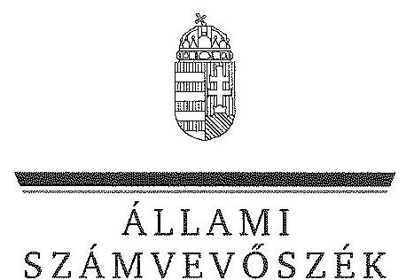
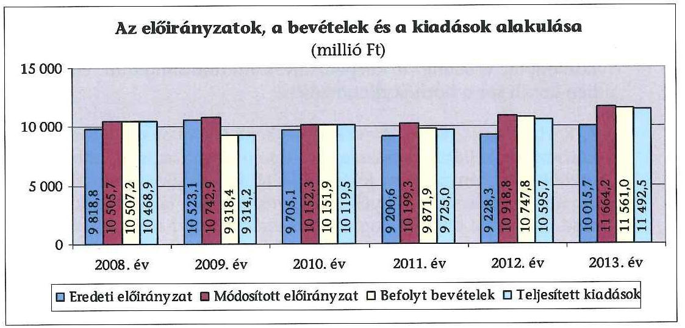
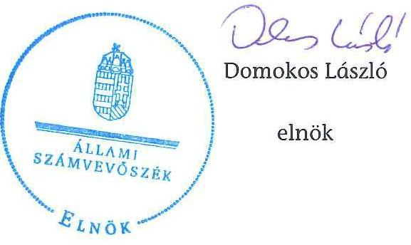

ÁLLAMI
SZÁMVEVŐSZÉK

# JELENTÉS 

a központi alrendszer egyes intézményei pénzügyi és vagyongazdálkodásának ellenőrzéséről Zala Megyei Kórház

---

# Állami Számvevőszék 

Iktatószám: V-0741-229/2016.
Témaszám: 1775
Vizsgálat-azonosító szám: V067906

## Az ellenőrzést felügyelte:

## Kisgergely István

felügyeleti vezető

## Az ellenőrzés végrehajtásáért felelősök:

Keresztes Tamás
ellenőrzésvezető

## Korsósné Vigh Andrea ellenőrzésvezető

## Pats Regina ellenőrzésvezető

A számvevői munkaanyagok feldolgozását és a Jelentéstervezet összeállítását végezték:

Bocsi Sándor
számvevő tanácsos
Korsósné Vigh Andrea
ellenőrzésvezető
Takaró Rita
számvevő asszisztens
Weltherné Szolnoki Dóra
számvevő tanácsos

## Az ellenőrzést végezték:

Buús Zoltánné Hütter Erzsébet
számvevő tanácsos
Pályi Katalin Ágnes
számvevő
Varga József
számvevő tanácsos

## Kersmájer Ágota

számvevő főtanácsos
Pats Regina
ellenőrzésvezető
Temesváry Miklós
számvevő tanácsos

## A témához kapcsolódó eddig készített számvevőszéki jelentés:

## címe

Jelentés a sürgősségi betegellátó rendszer kialakítására, fejlesztésére fordított pénzeszközök felhasználásának ellenőrzéséről
sorszáma
0924

---

# TARTALOMJEGYZÉK 

BEVEZETÉS ..... 3
I. ÖSSZEGZŐ MEGÁLLAPÍTÁSOK, KÖVETKEZTETÉSEK, JAVASLATOK ..... 8
II. RÉSZLETES MEGÁLLAPÍTÁSOK ..... 14

1. Az alapítói jogosultságok és az irányító szervi hatáskörök gyakorlása ..... 14
2. A Kórház átszervezése ..... 16
3. A belső kontrollrendszer és az integritás kontrollok értékelése ..... 17
4. A Kórház pénzügyi gazdálkodása ..... 22
4.1. Az előirányzatok megállapítása és módosítása ..... 22
4.2. A kiadási előirányzatok felhasználása és a bevételi előirányzatok teljesítése ..... 23
4.3. A pénzmaradványok, előirányzat-maradványok kezelése ..... 25
4.4. A fizetőképesség alakulása ..... 25
5. A Kórház vagyongazdálkodása ..... 28
5.1. A Kórház vagyonának változása ..... 28
5.2. A vagyongazdálkodás szabályszerűsége ..... 29
5.3. Az eredményszemléletű számvitel bevezetésével kapcsolatos feladatok végrehajtása ..... 31
MELLÉKLETEK
6. számú A belső kontrollrendszer kialakítása és működtetése szabályszerűségének alakulása a Kórháznál
7. számú A Kórház kiadásainak, bevételeinek és létszámának alakulása
8. számú A Kórház fizetőképességét és vagyoni helyzetét jellemző mutatók
9. számú A Kórház eszközeinek és forrásainak alakulása
10. számú A Kórház tárgyi eszközeivel kapcsolatos mutatószámok alakulása
FÜGGELÉKEK
11. számú A gazdaságossági, hatékonysági és eredményességi követelmények kialakítása és működtetése, a vezetői nyilatkozat helytállósága
12. számú Rövidítések jegyzéke
13. számú Értelmező szótár

---

.

---

# JELENTÉS 

## a központi alrendszer egyes intézményei pénzügyi és vagyongazdálkodásának ellenőrzéséről Zala Megyei Kórház

## BEVEZETÉS

A közpénzek felhasználásában és az állami vagyonnal való gazdálkodásban a központi alrendszer egyes intézményei meghatározó súlyt képviselnek. Pénzügyi- és vagyongazdálkodásuk rendszeres ellenőrzésével az ÁSZ hozzájárul a hatékony közigazgatás megteremtéséhez. Az ÁSZ Stratégiával összhangban a közvagyon védelme, a közpénzügyek átláthatóságának előmozdítása érdekében került sor a Kórház ellenőrzésére.

A Kórház feladatköre főtevékenységként fekvőbeteg-ellátás (aktív és krónikus kórházi szakellátás, egészségügyi ápolás bentlakással, rehabilitációs ellátás), további tevékenységként járóbeteg-ellátás (szakorvosi ellátás, gondozás-szürés, egynapos sebészeti és egyéb szakorvosi ellátás, járóbetegek rehabilitációs ellátása, fogorvosi ellátás), foglalkozás-egészségügyi alap- és szakellátás, egészségügyi laboratóriumi és képalkotó diagnosztikai szolgáltatások, betegszállítás, egyéb szálláshely szolgáltatás, valamint család- és nővédelmi egészségügyi gondozás. A Kórház Zala megye legnagyobb egészségügyi szolgáltatója, a térség egyik legnagyobb kapacitású egészségügyi intézménye. Feladata több mint 300 ezer lakos folyamatos, ezen túl számos szakterületen a III. progresszivitási szinten mintegy 630 ezer fő legmagasabb szintű ellátása. Feladata továbbá a Nyugat-dunántúli régió lakosai ellátásának biztosítása a szívsebészet, a gyermek-rehabilitáció, az intenzív és a sürgősségi szakterületeken. Ehhez az aktív fekvőbeteg-szakellátásban 2013. december 31-én 707, a krónikus fekvőbetegszakellátásban 350 működő kórházi ággyal rendelkezett. A fekvőbeteg-ellátás 22 osztályra, a járóbeteg-szakellátás 157 szakrendelésre, szakambulanciára és gondozóra tagozódott. A Kórház éves szinten közel 40 ezer fekvőbeteget és mintegy 800 ezer járóbeteget látott el. Évente 260 ezer esetben végeztek a fekvőbetegeknek vizsgálatokat (diagnosztika és egyéb konzílium) és mintegy 12 ezer műtéti beavatkozást hajtottak végre.

A Kórház az ellenőrzött időszakban önálló jogi személyiséggel rendelkező, önállóan működő és gazdálkodó, az előirányzatok felett teljes jogkörrel rendelkező költségvetési szerv volt. A Kórházat érintően az irányító szervi hatásköröket 2011. december 31-éig a Közgyűlés gyakorolta. A Kórház államháztartás önkormányzati alrendszeréből a központi alrendszerbe történt átsorolását követően, 2012. január 1-jétől az irányító szervi hatásköröket a Minisztérium, az egyes fenntartói, valamint az irányítási, középirányítói jogokat a Gyógyszerészeti és Egészségügyi Minőség- és Szervezetfejlesztési Intézet (GYEMSZI) gyakor-

---

rolta. A GYEMSZI elnevezése 2015. március 1-jétől Állami Egészségügyi Ellátó Központra (ÁEEK-ra) változott.

Az ellenőrzött időszakban a Kórház feladataiban, illetve szervezeti felépítésében a hematológiai fekvőbeteg szakellátás 2009-ben történt átadása, a Sürgősségi Betegellátó Osztály 2011. évi, valamint a Központi Gyógyszertár 2012. évi kialakítása jelentett változást. A Kórházat 2008-2013 között főigazgató vezette, munkáját gazdasági igazgató, orvos- és minőségirányítási igazgató, stratégiai igazgató, és ápolási igazgató segítette. Az ellenőrzött időszakban a Kórház főigazgatójának személyében nem történt változás, a gazdasági igazgató személye 2012. szeptemberében változott. A Kórházat 2015. február hónaptól új főigazgató irányítja.

A Kórház előirányzatainak és azok teljesítésének alakulását a következő diagram szemlélteti (az adatok a kiegyenlítő, függő és átfutó tételeket nem tartalmazzák):

A Kórház könyvviteli mérleg szerinti vagyona a 2008. év eleji 6345,0 millió Ftról 2013. év végére 22,4%-kal, 4924,5 millió Ft-ra, a befektetett eszközök mérlegértéke 6167,7 millió Ft-ról 23,8%-kal, 4698,6 millió Ft-ra csökkent az ellenőrzött időszakban. A saját tőke 2008-2013 között 5260,5 millió Ft-ról 2441,0 millió Ft-ra csökkent, miközben a tartalékok értéke 59,9 millió Ft-ról 68,6 millió Ft-ra, a kötelezettségek összege a passzív pénzügyi elszámolások nélkül 988,1 millió Ft-ról 1426,4 millió Ft-ra emelkedett.

A Kórház engedélyezett létszámkerete a 2008. évi 1630 főről a 2013. évre 4,5%-kal, 1703 főre növekedett, meghatározóan a feladatokban bekövetkezett változások hatására.

Az ellenőrzés célja annak megállapítása volt, hogy a Kórházra vonatkozó irányító szervi feladatellátás a jogszabályi előírások betartásával történt-e; a Kórháznál a belső kontrollrendszer kialakítása és működtetése szabályszerű volt-e; kialakították-e az erőforrásokkal való szabályszerű és hatékony gazdálkodáshoz szükséges követelményeket, megvalósították-e azok számon kérését, ellenőrzését; a Kórház pénzügyi és vagyongazdálkodása megfelelt-e a jogszabályi előírásoknak és belső szabályzatainak; a Kórház átalakításának, át-

---

szervezésének lebonyolítása szabályszerűen történt-e; az integritási kontrollokat kialakították-e, szabályszerűen működtették-e.

Az ÁSZ a Kórházat a 2009. évben ellenőrizte, melyről készült 0924 számú, „Jelentés a sürgősségi betegellátó rendszer kialakítására, fejlesztésére fordított pénzeszközök felhasználásának ellenőrzéséről" című számvevőszéki jelentés a Kórház főigazgatója részére intézkedést igénylő megállapításokat, javaslatokat nem fogalmazott meg, ezért jelen ellenőrzésnél utóellenőrzésre nem került sor.

Az ellenőrzés várható hasznosulása: a központi alrendszerbe tartozó intézmények jelentős hatást gyakorolhatnak a költségvetés egyensúlyának fenntartására, az állami vagyonnal való gazdálkodás minőségére, a kormányzati (szak)politikák végrehajtására, illetve közfeladat ellátásuk vonatkozásában az állampolgárok életminőségére, jogaik és kötelezettségeik gyakorlására. Az ellenőrzés a Kórház pénzügyi és vagyongazdálkodása szabályosságának javításával előmozdítja a közpénzügyek átláthatóságát, rendezettségét. Eredményeként átfogó képet kaphatunk a Kórház gazdálkodásának hiányosságairól és a jó gyakorlatokról is.

A közintézmények integritás alapú kultúrája meghatározó a belső kontrollrendszer működése szempontjából. Hozzájárulhat az elszámoltathatóság és átláthatóság érvényesítéséhez, egyben támogathatja a szervezet védettségét a korrupciós kitettséggel szemben. Az integritási kontrollok ellenőrzése az integritási szemlélet terjedését, az integritás kultúra erősítését támogatja.

A belső kontrollrendszer államháztartási törvényben rögzített célja a működés és gazdálkodás során a tevékenységek szabályszerű, gazdaságos, hatékony és eredményes végrehajtása. Az ÁSZ a központi alrendszer intézményeinek ellenőrzését teljesítményellenőrzési modullal egészítette ki.

A Kórház teljesítményellenőrzésének célja annak értékelése volt, hogy a gazdálkodás folyamatában a gazdaságossági, hatékonysági és eredményességi követelmények kialakítása megtörtént-e és azokat működtették-e; a költségvetési szerv belső kontrollrendszerének minőségéről kiadott vezetői nyilatkozatban a Kórház tevékenységében a hatékonyság, eredményesség, gazdaságosság követelményeinek érvényesítése helytálló volt-e. A teljesítményellenőrzés a gazdálkodási feladatokra terjedt ki, a szakmai feladatellátást nem értékelte. A gazdaságossági, hatékonysági és eredményességi követelmények kialakítására és működtetésére, a vezetői nyilatkozat helytállóságára vonatkozó megállapításokat az 1. sz. függelék tartalmazza.

A teljesítményellenőrzés várható hasznosulása: a törvényalkotás számára támogatást nyújt a nemzeti kulcsindikátorok rendszerének kialakításához. A döntéshozók, ellenőrzöttek, irányító szervek, a társadalom számára objektív visszajelzést ad a közfeladat-ellátásnak keretet adó pénzügyi és vagyongazdálkodásban mérhető teljesítménykövetelmények kialakításáról. Az ÁSZ értékteremtő elemzéseivel, tanácsadó szerepét erősítve támogatja a szervezetek önértékelő, alkalmazkodó (öntanuló) tevékenységét. Irányt mutat az ellenőrzött intézmények gazdálkodási és kapcsolódó adminisztratív folyamatainak optimalizációjához. Segíti a központi költségvetési szervek átláthatóságát, felügyelhetőségét, a „jó gyakorlatok" elterjesztésével támogatja a „jó kormányzást".

---

Az ellenőrzés típusa szabályszerűségi ellenőrzés, amelyet a Kórházra vonatkozó teljesítményellenőrzés egészített ki.

Az ellenőrzött időszak: 2008. január 1. - 2013. december 31.
Az ellenőrzésre a szabályszerűségi ellenőrzés tekintetében a Kórháznál, a Kórház irányító szervi feladatait ellátó Önkormányzatnál és Minisztériumnál, valamint az egyes fenntartói, valamint az irányítási, középirányítói jogokat gyakorló GYEMSZI-nél, a teljesítményellenőrzésre a Kórháznál került sor.

Az ellenőrzés jogszabályi alapját az ÁSZ tv. 1. § (3) bekezdés, 5. § (2)(6) bekezdései, valamint Áht. 2 61. § (2) bekezdésének előírásai képezték.

Az ÁSZ a 2011. évi LXVI. törvény 29. §-a szerint a jelentéstervezetet megküldte az emberi erőforrások miniszterének, az Állami Egészségügyi Ellátó Központ főigazgatójának, a Zala Megyei Közgyűlés elnökének és a Zala Megyei Kórház főigazgatójának, amely szervezetek vezetői a megküldött jelentéstervezetre észrevételt nem tettek.

A központi alrendszer intézményeinek ellenőrzése során a belső kontrollrendszer tekintetében a hangsúlyt az egyes kontrollterületek (kontrollkörnyezet, kockázatkezelési rendszer, kontrolltevékenységek, információs és kommunikációs rendszer, monitoring rendszer) kialakításának és az intézmény működési folyamataiba való beépülésének szabályszerűségére helyeztük, amelyet kizárólag jogszabályokból és intézményi belső szabályozásokból levezethető kritériumrendszer alapján ítéltünk meg.

A belső kontrollrendszer jogszabályi előírások szerinti kialakításának és működtetésének szabályszerűségét az erre irányuló ellenőrzési kérdésekre adott válaszok összesítése alapján kontrollterületenként egyedileg és összesítetten is értékeltük. A belső kontrollrendszer egyes kontrollterületei kialakítása és működtetése „szabályszerű volt", tehát a feltárt hiányosságok nem gyakoroltak lényeges hatást a kontrollok kialakítására és működtetésére, amennyiben az értékelt területen az elért és elérhető pontok százalékban kifejezett hányadosa elérte a 85%-ot, „nem volt szabályszerű", ha nem haladta meg a 60%-ot, és „részben szabályszerű volt", ha 61-84% között volt.

A belső kontrollrendszer összesített értékelése megegyezett a kontrollterületenként alkalmazott %-os értékelésekkel, a következő kiegészítéssel. A kontrollrendszer egésze esetében a „szabályszerű" értékelésnek a %-os értéken felül további feltétele volt, hogy egyik kontrollterületen sem kaphatott „nem volt szabályszerű" értékelést. A „részben szabályszerű" értékelés további feltétele volt, hogy legfeljebb egy ellenőrzött kontrollterület lehetett „nem volt szabályszerű" értékelésű. Az összesített értékelés a %-os kiértékelés eredményétől függetlenül „nem volt szabályszerű", ha az ellenőrzött kontrollterületek közül több mint egynek „nem volt szabályszerű" az értékelése.

A Kórház a 2013. évben részt vett az ÁSZ integritás felmérésében, ezért az integritás kontrollrendszerének értékelése egyszerűsített kérdőív alapján történt. Ennek során 5 részterületet vizsgáltunk (összeférhetetlenség és etikai elvárások, humánerőforrás-gazdálkodás, a szervezet vagyonának megvédésére tett intéz-

---

kedések, a nemkívánatos dolgozói magatartással szembeni intézkedések és azok érvényesülése, az integritás erősítése, annak tudatosítása, valamint a kockázatelemzések alkalmazása). Az integritási kérdőívre adott válaszok alapján "kiváló" értékelést (3 pont) kapott egy részterületet, amennyiben a szervezet legalább 5 állítást jelölt meg igazként, "megfelelő"-t (2 pont), ha 3 vagy 4 állítást, "nem megfelelő"-t (1 pont) pedig akkor, ha 3 állításnál kevesebbet. Az összesített értékelés során az egyes részterületek pontszámainak összesített értékét vetettük össze a lehetséges maximális pontértékkel. "Kiváló" minősítést eredményez, ha az elért pontszámok aránya 80%-nál magasabb, "megfelelő"-t, ha 80 és 61% között volt, és "fejlesztendő"-t, ha legfeljebb 60%-ot ért
 el.

A dologi kiadások és dologi jellegű (egyéb folyó) kiadások, a támogatásértékű kiadások, az átadott pénzeszközök, a kölcsönök nyújtása és a felhalmozási kiadások előirányzatai felhasználásának, valamint a vagyonhasznosítási bevételi előirányzatok teljesítésének szabályszerűségét, és e területekhez kapcsolódva a gazdálkodási jogkörök gyakorlása megfelelőségét is mintavétellel ellenőriztük. A gazdálkodási jogkörök gyakorlásának ellenőrzése a személyi juttatásokra is kiterjedt.

A jogszabályoknak és a belső előírásoknak megfelelőnek, azaz szabályszerűnek tekintettük az ellenőrzött kiadási előirányzatok felhasználását, illetve bevételi előirányzatok teljesítését, amennyiben a minta ellenőrzésének eredménye alapján 95%-os bizonyossággal a teljes sokaságban a hibaarány kisebb volt, mint 10%, nem megfelelőnek értékeltük, ha a hibaarány a 10%-ot meghaladta.

Kockázatot, illetve magas kockázatot jeleztünk amennyiben egy adott terület vonatkozásában a minta alapján a sokaságban nem volt teljes körűen biztosított a jogszabályoknak és a belső szabályzatoknak megfelelő működés.

A gazdálkodási jogkörök gyakorlásának ellenőrzése keretében a 2008-2011. éveket érintően a szakmai teljesítésigazolás és az utalvány ellenjegyzése kulcskontrollok, a 2012-2013. éveket érintően a teljesítésigazolás és az érvényesítés kulcskontrollok működését értékeltük. Megfelelőnek értékeltük a gazdálkodási jogkörök gyakorlását, amennyiben 95%-os bizonyossággal a teljes sokaságban a hibaarány legfeljebb 10% volt, részben megfelelőnek, ha a hibaarány felső határa legfeljebb 30% volt, nem megfelelőnek, ha a sokaságbeli hibaarány felső határa meghaladta a 30%-ot.

Az ellenőrzés az INTOSAI által kiadott nemzetközi standardok (ISSAI) figyelembe vételével, az ellenőrzési programban foglalt értékelési szempontok szerint történt.

A jelentéstervezetben alkalmazott rövidítések jegyzékét a 2. sz. függelék, az egyes fogalmak magyarázatát a 3. sz. függelék tartalmazza.

---

# I. ÖSSZEGZŐ MEGÁLLAPÍTÁSOK, KÖVETKEZTETÉSEK, JAVASLATOK 

#### Abstract

A Kórházra vonatkozó irányító szervi feladatellátás során a jogszabályi előírások hiányosan érvényesültek. A belső kontrollrendszer kialakítása a Kórháznál részben volt szabályszerű. A Kórház pénzügyi és vagyongazdálkodása részben felelt meg a jogszabályi előírásoknak. A pénzügyi gazdálkodást folyamatosan fennálló és az ellenőrzött időszakban fokozódó likviditási nehézségek jellemezték, a fizetőképesség nem volt biztosított.

Az irányító szervi hatásköröket a 2008-2011. években a Közgyűlés szabályszerűen gyakorolta, a 2012-2013. években a GYEMSZI az egyes fenntartói, irányítási, középirányítói jogok gyakorlására vonatkozó jogszabályi előírásokat hiányosan érvényesítette. Az SZMSZ jóváhagyására vonatkozó jogkört - annak indokoltsága ellenére - a GYEMSZI nem gyakorolta, melynek elmulasztásával nem járult hozzá a Kórház szabályszerű működéséhez. A Kórház fekvőbeteg szakellátása tekintetében egyes eszközcsoportokban a GYEMSZI nem gondoskodott a közbeszerzések központosított lefolytatásáról, melynek következtében elmaradt a központosított közbeszerzésekből fakadó előnyök kihasználása. A Közgyűlés, a Minisztérium és a GYEMSZI a Kórházat érintően az erőforrásokkal való szabályszerű gazdálkodáshoz szükséges követelményeket kialakította és megvalósította a számonkérést. A hatékony gazdálkodáshoz a Közgyűlés és a GYEMSZI nem alakított ki mérhető teljesítmény-követelményeket. Az ellenőrzési jogosultságait a Minisztérium és a GYEMSZI szabályszerűen gyakorolta, a Közgyűlés részben gyakorolta az előírásoknak megfelelően, mivel nem ellenőrizte az erőforrásokkal való hatékony gazdálkodást és a nyilvános adatok kötelező közzétételét.

A belső kontrollrendszer kialakítása és működtetése az ellenőrzött időszakban részben volt szabályszerű, nem biztosította maradéktalanul a szabálytalanságok megelőzését, feltárását. A kontrollrendszer részterületei közül a kontrollkörnyezet szabályszerű, a kockázatkezelési rendszer nem szabályszerű, a kontrolltevékenységek, az információs és kommunikációs rendszer, valamint a monitoring rendszer részben szabályszerű értékelést kapott.

A Kórház által kialakított és működtetett kontrollrendszer nem biztosított megfelelő feltételeket a szervezet integritását veszélyeztető kockázatokkal szemben, ezért e kontrollok szintje fejlesztendő.

A Kórház pénzügyi gazdálkodásának szabályszerűsége - a bevételi előirányzatok módosítása és teljesítése, valamint a kiadási előirányzatok felhasználása terén feltárt hiányosságok miatt - a jogszabályi előírásoknak részben megfelelő volt. A Kórház a 2011-2013. évi bevételi elmaradás ellenére nem tett eleget az előirányzat csökkentési kötelezettségének. A vagyonhasznosítási bevételeknél a 2009-2011. években a bérleti díjak kiszámlázása, a 2012-2013. években a szerződő felek átlátható szervezet feltételeinek megfelelőségéről szóló nyilatkozatok terén a jogszabályi előírások maradéktalanul nem érvényesültek. A kiadási előirányzatok felhasználásánál a közbeszerzési eljárás lefolytatása, a bekerülési érték megállapítása, továbbá a 2008-2011. éveket érintően a szakmai teljesítés igazolása és az utalvány ellenjegyzése kulcskontrollok működésében tárt fel hiányosságokat az ellenőrzés.

A ellenőrzött időszakban a forgóeszközök, illetve a pénzeszközök állománya nem nyújtott fedezetet a rövid lejáratú kötelezettségekre. A fizetőképesség nem volt biztosított, a szállítói és egyéb kötelezettségek egy részét a Kórház határidőn túl tudta kiegyenlíteni. A Kórház mérleg szerinti szállítói állománya az ellenőrzött időszakban 1503,2 millió Ft-ra (102,3%-kal) emelkedett annak ellenére, hogy a 2009-2013. években a szállítói kötelezettségek csökkentésére összesen 1426,5 millió Ft önkormányzati, illetve konszolidációs támogatást kapott, továbbá a Kórház a likviditás javítása érdekében intézkedéseket tett. A lejárt szállítói tartozásállomány újratermelődött, a késedelem mértéke az ellenőrzött időszak végére emelkedett.

A Kórház vagyona 2008-2013 között 1420,4 millió Ft-tal (22,4%-kal) csökkent. Az ellenőrzött időszak költségvetéseiben a működtetés volt a meghatározó, az eszközök visszapótlásához szükséges előirányzat keret, illetve fedezet nem állt rendelkezésre. A végrehajtott beruházások nem ellensúlyozták az eszközök elszámolt amortizációjában megjelenő avulást, az eszközök használhatósági foka minden eszközcsoportnál csökkent. A mérlegben kimutatott eszközök és források értékének a megállapítása és nyilvántartása - a bekerülési érték megállapításánál, valamint a 2012. évi leltározás módja tekintetében feltárt hibák miatt - nem minden esetben volt a jogszabályi előírásoknak megfelelő. E hibák lényegesen nem befolyásolták a mérlegben kimutatott eszközöket és forrásokat érintően a megbízható és valós kép kialakítását. Az eredményszemléletű számvitel bevezetésével kapcsolatos feladatokat - a közvetített szolgáltatások főkönyvből történő kivezetése kivételével - végrehajtották.

A Kórház 2009. évi átszervezése - a hematológiai fekvőbeteg szakellátás átadása - szabályszerű volt. 2012. január 1-jétől a Kórház, annak vagyona és vagyoni értékű jogai állami tulajdonba kerültek. A tulajdonosi és fenntartói jogutódlás tekintetében a jogszabályi előírások hiányosan érvényesültek, mivel az Önkormányzat és a GYEMSZI között megkötött átadás-átvételi megállapodás tartalmában nem volt teljes körű. A megállapodás tartalmi hiányosságai ellenére a tulajdonosi és fenntartói jogutódlás a konszolidációs törvény rendelkezései erejénél fogva a Kórház vagyona tekintetében megtörtént. A Kórház vagyonkezelői joga 2012. január 1-jétől megszűnt, egyidejűleg a jogszabály által vagyonkezelésre kijelölt GYEMSZI az átvett vagyont a Kórházzal megkötött intézményi megállapodásban használatba, hasznosításba adta. A 2012. május 1-jétől hatályba lépett jogszabályi változások alapján a GYEMSZI vagyonkezelői joga megszűnt, tulajdonosi jogkörre változott, amely alapján az átvett vagyont - a Kórházzal 2013. április hónapban megkötött, 2012. május 1-jére visszamenőleges hatállyal érvényes vagyonkezelési szerződéssel - a Kórház vagyonkezelésébe adta. Ez a jogi megoldás (visszamenőleges hatályú vagyonkezelési szerződés) magas kockázatot hordozott az állami vagyon védelme és a felelős gazdálkodás terén.

Az ÁSZ tv. 33. § (1) bekezdésében foglaltak értelmében a jelentésben foglalt megállapításokhoz kapcsolódó intézkedési tervet köteles az ellenőrzött szervezet vezetője összeállítani, és azt a jelentés kézhezvételétől számított 30 napon belül az ÁSZ részére megküldeni. Amennyiben az intézkedési tervet határidőben nem küldi meg a szervezet, vagy az nem elfogadható, az ÁSZ elnöke a hivatkozott törvény 33. § (3) bekezdés a)-b) pontjaiban foglaltakat érvényesítheti.

A helyszíni ellenőrzés megállapításainak hasznosítása mellett javasoljuk:

# az ÁEEK főigazgatójának 

1. A GYEMSZI a közbeszerzések összevont lefolytatására vonatkozó 59/2011. (IV. 12.) Korm. rendelet 2012. január 1-jétől hatályos 2/A. § m) pont szerinti jogosultságát részben gyakorolta, mert a 46/2012. (III.28.) Korm. rendelet 1. § (1) bekezdésének és 2. § 3. pontjának előírása ellenére a 2013. december 31-éig terjedő időszakban nem gondoskodott a Kórház fekvőbeteg szakellátása tekintetében teljes körűen a gyógyszerek, az orvostechnikai eszközök és a fertőtlenítőszerek vonatkozásában a közbeszerzések összevont központosított lefolytatásáról, mivel keret-megállapodás megkötésére 2013. második félévétől és csak a gyógyszereket érintően került sor.

Javaslat
Intézkedjen a központi beszerző szervezet feladatkörében eljárva a központosított közbeszerzési rendszer keretén belül megvalósuló közbeszerzések lefolytatásáról.
2. A 2012-2013 közötti időszakban a GYEMSZI nem tudta érvényesíteni a Kórháznál az előirányzatokkal, létszámokkal és vagyonnal való hatékony gazdálkodás követelményeit, mert a Kórház részére mérhető teljesítménykövetelményeket nem határozott meg, ezért az 59/2011. (IV. 12.) Korm. rendelet 2/A. § a) pontjában és az Áht. 2 9. § (1) bekezdés f) pontjában foglalt előírásoknak nem tett eleget.

Javaslat
Intézkedjen a Kórház esetében az erőforrásokkal való szabályszerű és hatékony gazdálkodás mérhető teljesítménykövetelmények kialakításáról, valamint arról, hogy a közfeladatok ellátása és az erőforrásokkal való hatékony gazdálkodás követelményei érvényesüljenek.
3. A 2012-2013 közötti időszakban a GYEMSZI az egyes fenntartói, valamint az irányítási, középirányítói jogok gyakorlására vonatkozó jogszabályi előírásokat hiányosan érvényesítette, mivel nem hagyta jóvá a Kórház 2012. április 16-án megküldött SZMSZ³-ét az ellenőrzött időszakban az Eü. tv 155. § (1) bekezdés 2012. június 30-áig hatályos d), illetve 2012. július 1-jétől hatályos f) pontjában, valamint az 59/2011. (IV. 12.) Korm. rendelet 2/A. § 2013. július 6-ától hatályos n) pontjában foglaltak ellenére. Így a Kórház a központi alrendszerbe történt átsorolásától, 2012. január 1-jétől 2013. december 31-éig jóváhagyott SZMSZ-szel nem rendelkezett.

Javaslat
Intézkedjen a jogszabályban biztosított hatáskörében eljárva a Kórház SZMSZ³-ének jóváhagyásáról.

---

# a Kórház főigazgatójának 

1. A belső kontrollrendszer kialakítása és működtetése - az ellenőrzött időszakban évenként értékelve és összesítve is - részben volt szabályszerű.

A kontrollkörnyezet kialakítása és működtetése az ellenőrzött időszakban összességében szabályszerű volt, azonban az Ávr. 53.§ (2) bekezdésében foglaltak ellenére az előzetes írásbeli kötelezettségvállalást nem igénylő kifizetések rendjét belső szabályzatban nem rögzítették. A Kórház a közérdekű adatokkal kapcsolatos szabályozási kötelezettségeinek nem tett eleget, mert az Ávr. 13. § (2) bekezdés h) pontjában foglaltak ellenére a közérdekű adatok megismerésére irányuló kérelmek intézésének, továbbá a kötelezően közzéteendő adatok nyilvánosságra hozatalának rendjét nem szabályozta. A közérdekű adatok megismerésére irányuló igények teljesítésének rendjét rögzítő szabályzat hiánya miatt a Kórház az Info tv. 2012. január 1-jétől hatályba lépett 30. § (6) bekezdésében foglaltaknak nem tett eleget.

A kockázatkezelési rendszer kialakítása és működtetése az ellenőrzött időszakban összességében nem volt szabályszerű. A Kórház az ellenőrzött időszak egészében nem működtetett kockázatkezelési rendszert, figyelmen kívül hagyva az Ámr. 1 145/C. § (1)-(3) bekezdéseiben, az Ámr. 2 157. § (1)-(3) bekezdéseiben, valamint a Bkr. 7. §-ában foglalt előírásokat. Így nem végzett kockázatelemzést, nem mérte fel és nem állapította meg a Kórház tevékenységében és gazdálkodásában rejlő kockázatokat, nem határozta meg az egyes kockázatokkal kapcsolatban szükséges intézkedéseket, azok teljesítése folyamatos nyomon követésének módját.

A kontrolltevékenység kialakítása és működtetése az ellenőrzött időszak egészére részben volt szabályszerű, mivel a 2009-2013. években a belső szabályozásokban a felelősségi körök meghatározása során az információkhoz való hozzáférés szintjeit az Ámr. 1 145/B. § (1) bekezdésében, az Ámr. 2 156. § (2) bekezdésében, illetve a Bkr. 8. § (4) bekezdés b) pontjában foglaltak ellenére - nem határozták meg.

Az információs és kommunikációs rendszer kialakítása és működtetése - az ellenőrzött időszakban összességében, és az egyes években is - részben volt szabályszerű, mivel a Kórháznál a 2009-2013 közötti
 időszakban - ellentétben az Ámr. 1 145/F. § (2) bekezdésével, az Ámr. 2 159. § (2) bekezdésével és a Bkr. 9. § (2) bekezdésével - részben működtettek hatékony, megbízható és pontos beszámolási rendszereket, mert a beszámolási szinteket, határidőket és módokat nem szabályozták; továbbá a Kórház az ellenőrzött időszakban az Info tv. 37. § (1) bekezdésében és 1. mellékletében, valamint az Ávr. 173. § (3) bekezdésében és 8. mellékletének 13. és 14. pontjaiban előírt közérdekű adatok közzétételi kötelezettségét hiányosan teljesítette. E jogszabályokban meghatározott - szervezetére, tevékenységére és működésére vonatkozó - információk a honlapján a helyszíni ellenőrzés időszakában nem voltak teljes körűen fellelhetők.

A monitoring rendszer kialakítása és működtetése - az ellenőrzött időszakban összességében, és az egyes években is - részben volt szabályszerű, mivel az ellenőrzött szervezeti egységek vezetői intézkedési terveket az ellenőrzött években a Ber. 29. § (1) bekezdésében, valamint a Bkr. 28. § c) pontjában foglaltak ellenére nem készítettek.

---

# Javaslat 

Intézkedjen a jogszabályoknak megfelelő belső kontrollrendszer kialakítása és működtetése érdekében a kontrollkörnyezet, a kockázatkezelési rendszer, a kontrolltevékenységek, az információs és kommunikációs rendszer, továbbá a monitoring rendszer az ÁSZ ellenőrzés által feltárt hiányosságainak megszüntetéséről.
2. A Kórház likviditási terveinek tartalma nem felelt meg teljes körűen a jogszabályi előírásoknak, mert a 2012-2013 években az Ávr. 122. § (1) bekezdésében foglaltak ellenére a tárgyhónap vonatkozásában dekádonkénti ütemezést nem tartalmazott

Javaslat
Intézkedjen a jogszabályi előírásoknak megfelelő likviditási terv elkészítéséről.
3. A 2012. évben a Kórház nem tartotta be az Áhsz. 37. § (3) bekezdésében az eszközök leltározási módjára vonatkozó előírásait a korlátozottan forgalomképes ingatlanok, gépek, berendezések, felszerelések esetében, mivel ezeket az eszközöket mennyiségi felvétel helyett egyeztetéssel leltározta.

Javaslat
Intézkedjen a leltározás jogszabályi előírásoknak megfelelő elvégzéséről.
4. A vagyongazdálkodás területén kettő, részletre vásárolt eszköznél a Kórház a bekerülési érték megállapítása során az évközi törlesztő részletekhez kapcsolódó realizált ár-folyam-különbözetet a beszerzési értékre rendszeresen ráaktiválta, mely a bruttó érték folyamatos emelkedését okozta. A Kórház ezzel megsértette a Számv. tv. 47. § (4) bekezdés c) pontban foglaltakat, mely szerint a bekerülési értéknek csak az aktiválásig elszámolt árfolyam-különbözet a része.

Javaslat
Intézkedjen az árfolyam-különbözetek jogszabálynak megfelelő elszámolásáról.
5. A Kórház főigazgatója az ellenőrzött időszakban részben gondoskodott arról, hogy a Kórház tevékenységében és céljaiban a gazdaságosság, a hatékonyság és az eredményesség követelményei érvényesüljenek. A Kórház teljesítménycélokat és követelményeket az Áht. 94. § (1) bekezdés b) pontjában, az Áht. 2 61. § (1) bekezdésében, az Áht. 2 69. § (1) bekezdés a) pontjában és a Bkr. 4. § a) pontjában foglaltak ellenére a 2008-2009 közötti időszakban és a 2013. évben nem alakított ki.

Javaslat:
Intézkedjen a Kórház tevékenységére és céljára vonatkozó hatékonysági, eredményességi és gazdaságossági mérhető követelmények kialakítására és érvényesítésére.
6. A Kórház a 2009. január 1. és 2011. december 31. közötti időszakban nem folytatta le a közbeszerzési eljárást a Kbt. ${ }_{1}$ hatálya alá tartozó beszerzéseknél 1501,6 millió Ft összeget érintően (gyógyszerek, gyógyászati segédeszközök, takarító- és tisztítószerek, közműszolgáltatások). A 2012. január 1. és 2013. december 31. közötti idő-

---

szakban a Kbt. 2 hatálya alá tartozó egyes beszerzéseknél sem történt meg az eljárások lefolytatása.

A 2008. február 8. és 2011. március 1. közötti időszakban a Kbt. 1 303. § (1) bekezdésében foglalt előírásokat megsértve hosszabbították meg a korábban közbeszerzési eljárás alapján kötött szerződések időtartamát.

Javaslat:
a) Intézkedjen a jogszabályban meghatározott esetekben a közbeszerzési eljárás lefolytatásáról;
b) Tegyen intézkedéseket a feltárt szabálytalanságok tekintetében a felelősség tisztázása érdekében, és szükség szerint intézkedjen a felelősség érvényesítéséről.
7. A Kórház a 2012. és 2013. években megkötött vagyonhasznosítási szerződései kapcsán - ellentétben az Nvtv. 3. § (2) bekezdésében foglaltakkal - nem rendelkezett a szerződő felek átlátható szervezet feltételeinek való megfeleléséről szóló nyilatkozatokkal.

Javaslat:
Érvényesítse a vagyon bérbeadással történő hasznosítása során az átláthatóság követelményét, a szerződő felektől megkövetelve a jogszabályban előírt nyilatkozat megtételét.

---

# II. RÉSZLETES MEGÁLLAPÍTÁSOK 

## 1. Az alapítói jogosultságok És az irányító szervi hatáskörök gyakorlása

A Közgyűlés és a Miniszter a Kórházzal kapcsolatos alapítói jogosultságait a jogszabályi előírásoknak megfelelően gyakorolta. Az ellenőrzött időszakban az alapító okiratok tartalma megfelelt a rendelkezéseknek ${ }^{1}$ és azokban a változásokat átvezették. Az alapító okiratokat - szabályszerűen - 2008-2011. között a Közgyűlés határozattal fogadta el, a 2012-2013. években a Miniszter adta ki.

Az irányító szervi hatásköröket a 2008-2011 közötti időszakban a Közgyűlés szabályszerűen gyakorolta. A Közgyűlés az ellenőrzött időszak minden egyes évében beszámoló készítésre kötelezte a Kórházat és meghatározta annak határidejét. A Kórház a 2008-2011. közötti időszakban minden évben rendelkezett jóváhagyott SZMSZ-szel, amelyek megfeleltek az Ámr. ${ }_{1,2}$ által előírt követelményeknek és az alapító okiratokban foglaltaknak. Az alapító okirat változásaira tekintettel a Kórház SZMSZ-ének aktualizálása folyamatosan megtörtént. A Kórház SZMSZ ${ }_{14}$-ének jóváhagyása szabályos volt. A Kórház főigazgatóját és gazdasági igazgatóját a Közgyűlés az ellenőrzött időszakot megelőzően nevezte ki, a 2008-2011. években személycseréről nem döntött. A 2012-2013 közötti időszakban a Miniszter az irányítói hatásköröket szabályszerűen gyakorolta. Az ellenőrzött időszak minden egyes évében beszámoló készítésre kötelezte a Kórházat és meghatározta annak határidejét. A Kórház főigazgatóját és gazdasági igazgatóját - a GYEMSZI főigazgatójának javaslatára - szabályszerűen ${ }^{2}$ a Miniszter bízta meg, illetve nevezte ki. A 2012-2013 közötti időszakban a GYEMSZI az egyes fenntartói, valamint az irányítási, középirányítói jogok ${ }^{3}$ gyakorlására vonatkozó jogszabályi előírásokat hiányosan érvényesítette:

- nem hagyta jóvá a Kórház 2012. április 16-án megküldött SZMSZ ${ }_{5}$-ét az ellenőrzött időszakban az Eü. tv 155. § (1) bekezdés 2012. június 30 -áig hatályos d), illetve 2012. július 1-jétől hatályos f) pontjában, valamint az 59/2011. (IV. 12.) Korm. rendelet 2/A. § 2013. július 6-ától hatályos n) pontjában foglaltak ellenére. Így a Kórház a központi alrendszerbe történt átsorolásától, 2012. január 1-jétől 2013. december 31-éig jóváhagyott

[^0]
[^0]:    ${ }^{1}$ A 2008. évben az Áht. 1 88. § (3) bekezdés, 2009. január 1-jétől 2010. augusztus 14-ig a Kt. 4. § (1) bekezdés, 2010. augusztus 15-től 2011. december 31-ig az Áht. 1 90. § (1) bekezdés, továbbá 2012. január 1-jétől az Ávr. 5. § (1) bekezdés.
    ${ }^{2}$ A Konszolidációs törvény 14. § (2) bekezdésben szabályozott átmeneti időszakot követően (a főigazgatót 2012. július, a gazdasági igazgatót 2012. augusztus hónapban), az Eü. tv. 2012. július 1-jétől hatályos 155. § (4) bekezdés d) pontja alapján, az alapító okiratban rögzített fenntartói jogokkal és kinevezési renddel összhangban.
    ${ }^{3}$ Az 59/2011. (IV. 12.) Korm. rendelet 2/A. §.

---

SZMSZ-szel nem rendelkezett. E jogkör gyakorlásának elmulasztásával a GYEMSZI nem járult hozzá a Kórház szabályszerű működéséhez.

- a közbeszerzések összevont lefolytatására vonatkozó, az 59/2011. (IV. 12.) Korm. rendelet 2012. január 1-jétől hatályos 2/A. § m) pont szerinti jogosultságát részben gyakorolta. A 46/2012. (III. 28.) Korm. rendelet 1. § (1) bekezdésének és a 2. § 3. pontjának előírása ellenére a 2013. december 31-éig terjedő időszakban nem gondoskodott a Kórház fekvőbeteg szakellátása tekintetében teljes körűen a gyógyszerek, az orvostechnikai eszközök és a fertőtlenítőszerek vonatkozásában a közbeszerzések központosított lefolytatásáról, mivel keretmegállapodás megkötésére 2013. második félévétől és csak a gyógyszereket érintően került sor. E jogkör gyakorlásának elmulasztásával a GYEMSZI nem tette lehetővé a Kórház fekvőbeteg szakellátása orvostechnikai eszköz és fertőtlenítőszerek beszerzése tekintetében a központosított közbeszerzésből fakadó előnyök kihasználását.

A Közgyűlés, a Minisztérium és a GYEMSZI a Kórházat érintően az erőforrásokkal való szabályszerű gazdálkodáshoz szükséges követelményeket kialakította és megvalósította a számonkérést. A szabályszerű gazdálkodáshoz szükséges követelmények kialakítása és számonkérése a költségvetés tervezésének és a beszámoltatás rendjének biztosításával valósult meg. A Közgyűlés, illetve a GYEMSZI a pénzügyi helyzetről rendszeres beszámolási kötelezettséget írt elő a Kórház főigazgatójának.

A hatékony gazdálkodáshoz a Közgyűlés és a GYEMSZI nem alakított ki mérhető teljesítmény-követelményeket. A 2009-2011 közötti időszakban ${ }^{4}$ a Közgyűlés, a 2012-2013 közötti időszakban a GYEMSZI nem érvényesítette a Kórháznál az előirányzatokkal, létszámokkal és vagyonnal való hatékony gazdálkodás követelményeit, mert a Kórház részére mérhető teljesítménykövetelményeket nem határozott meg. Ennek hiányában a Közgyűlés az Áht.; 2009-2011 között hatályos 49. § (7) bekezdése alapján az (5) bekezdés f) pontjában foglalt, a GYEMSZI az 59/2011. (IV. 12.) Korm. rendelet 2/A. § a) pontjában és az Áht. 2 9. § (1) bekezdés f) pontjában foglalt előírásoknak nem tudott eleget tenni.

# Az ellenőrzési jogosultságait a Közgyűlés részben gyakorolta a jogszabályi előírásoknak megfelelően, a Minisztérium és a GYEMSZI szabályszerűen gyakorolta azokat. 

Az ellenőrzési jogosultságok keretében a jóváhagyási jogkörök gyakorlása az ellenőrzött időszakban szabályszerű volt. A Kórház költségvetését és beszámolóját a Közgyűlés, illetve a Minisztérium jóváhagyta. A jóváhagyási jogkörök gyakorlására, továbbá a pénzmaradvány, előirányzat-maradvány, az engedélyezett létszám feletti foglalkoztatáshoz történő hozzájárulás, illetve a többletbevétel felhasználása vonatkozásában került sor.

[^0]
[^0]:    ${ }^{4}$ A 2008. évet érintően nem volt a Közgyűlésre vonatkozó jogszabályi előírás.

---

Az egyéb ellenőrzési jogosultságok tekintetében a Közgyűlés a jogszabályi előírásokat hiányosan érvényesítette, mivel a 2009-2011 közötti időszakban a Kórháznál nem ellenőrizte ${ }^{5}$ az Áht. ${ }_{1} 49$ § (7) bekezdés alapján az (5) bekezdés f) pontjában foglalt előírások ellenére az erőforrásokkal (így különösen az előirányzatokkal, a létszámokkal és a vagyonnal) való hatékony gazdálkodásra irányuló követelmények érvényre juttatását. Nem ellenőrizte továbbá az Áht. ${ }_{1} 49 . \S$ (5) bekezdés e) pontjában foglalt előírás ellenére az államháztartással összefüggő közérdekű és közérdekből nyilvános adatok kötelező közzétételét, illetve igényre történő szolgáltatásának végrehajtását.

A Közgyűlés elemezte a Kórház tevékenységének kockázatait, melyet az Önkormányzat éves belső ellenőrzési tervének összeállításakor figyelembe vett. A Kórháznál a Közgyűlés a 2010. évben végzett szabályszerűségi ellenőrzést, melynek során a korábbi ellenőrzés utóvizsgálata mellett a bizonylati rendet és okmányfegyelmet, a pályázati pénzek igénybevételét, a beruházások és az önkormányzati vagyontárgyak kezelését és hasznosítását ellenőrizték. Az intézkedési terv végrehajtásáról beszámolót kértek, melynek utóellenőrzését 2011-ben végezték el.

A GYEMSZI a Kórház szabályzatainak meglétét ellenőrizte a 2013. évben adatbekéréssel. A GYEMSZI a 2012-2013. években nem végzett az 59/2011. (IV. 12.) Korm. rendelet 2/A. § m) pontja alapján folyamatba épített, illetve utóellenőrzést a Kórház közbeszerzési eljárásaival kapcsolatban; illetve az Áht. ${ }_{2} 9 . \S$ (1) bekezdés f) pontjában foglalt előírás alapján az erőforrásokkal való hatékony gazdálkodásra irányuló ellenőrzést.

A Kórházat érintő, irányító szervi hatáskörben történt előirányzatmódosítások szabályszerűek voltak. A módosítások a központi bérintézkedésekhez, a dologi kiadások előirányzatainak kiegészítéséhez, a többletbevételek felhasználásához, valamint a pénzmaradványokhoz kapcsolódtak.

# 2. A Kórház átszervezése 

A hematológiai fekvőbeteg szakellátás 2009. évben történt átadását szabályszerűen hajtották végre. A 2009. évben
 a Kórház a hematológiai osztályán nem tudta ellátni feladatát, ezért a Kórház kezdeményezésére a Közgyűlés határozatot hozott a feladat más kórházzal történő ellátására. A feladatot a Közgyűlés és a Vas Megyei Önkormányzat között létrejött megállapodás szerint a továbbiakban a Markusovszky Lajos Kórház látta el. A feladat átadásához vagyon átadás-átvétel nem kapcsolódott.

A konszolidációs törvény előírásai ${ }^{6}$ alapján 2012. január 1-jétől a Kórház, annak vagyona és vagyoni értékű jogai állami tulajdonba kerültek, továbbá a vagyonnal és az intézménnyel kapcsolatos alapítói, fenntartói jogok és kötelezettségek az e törvényben meghatározott szervekre e törvény erejénél fogva átszálltak. Az Önkormányzat helyébe - a Kórház vagyona, vagyoni érté-

[^0]
[^0]:    ${ }^{5}$ A 2008. évet érintően nem voltak kapcsolódó jogszabályi előírások.
    ${ }^{6}$ Konszolidációs törvény 2. § (1) bekezdése, valamint 6. § (4) bekezdése.

---

kű jogai és a Kórházzal kapcsolatos jogviszonyok tekintetében általános és egyetemleges jogutódként - az állam, illetőleg az e törvényben meghatározott szervek léptek. ${ }^{7}$ A Kórház alapító, irányító szerve a Minisztérium lett ${ }^{8}$, az egyes fenntartói, irányító/középirányítói jogok, valamint a vagyonkezelői jog gyakorlására ${ }^{9}$ a jogszabályok a GYEMSZI-t jelölték ki.

A Kórház tulajdonosi és fenntartói jogutódlása feladatainak végrehajtására vonatkozó jogszabályi előírások hiányosan érvényesültek. A Közgyűlés elnöke és a GYEMSZI főigazgatója 2012. december 30-án aláírta a tulajdonosi és fenntartói jogutódláshoz kapcsolódó feladatok végrehajtásának részletkérdéseiről az átadás-átvételi megállapodást. Az átadás-átvételi megállapodás tartalma annak ellenére nem volt teljes körű, hogy szövegezése a konszolidációs törvény végrehajtási rendelet 3. § (3) pontjában hivatkozott (1. sz. melléklet szerinti) megállapodás-mintán alapult. Azt nem írta alá az MNV Zrt. vezérigazgatója és az NFA elnöke a konszolidációs törvény 2. § (4) bekezdés előírása ellenére, továbbá ahhoz - egy kivétellel - nem csatolták a megállapodásban hivatkozott mellékleteket. Az átadás-átvételi megállapodás tartalmi hiányosságai ellenére, a tulajdonosi és fenntartói jogutódlás a konszolidációs törvény rendelkezései erejénél fogva a Kórház vagyona tekintetében megtörtént. A jogszabályok ${ }^{10}$ egyértelműen meghatározták azt a vagyoni kört és annak bekerülési értékét, amely a Kórházat érintően 2012. január 1-jével az Önkormányzattól - fő szabályként - az állam által átvételre került.

A GYEMSZI 2012. január 1-jétől az átvett ingatlan és intézményi ingó vagyont a Kórházzal megkötött intézményi megállapodásban használatba, hasznosításba adta. A 2012. május 1-jétől hatályba lépett jogszabályi változások ${ }^{11}$ alapján a GYEMSZI vagyonkezelői joga megszűnt, tulajdonosi jogkörre változott. A GYEMSZI, mint tulajdonosi joggyakorló az eszközöket 2012. május 1. napjával - 2013. márciusban visszamenőleges hatállyal megkötött vagyonkezelési szerződéssel - a Kórház vagyonkezelésébe adta. Ez a jogi megoldás (visszamenőleges hatályú vagyonkezelési szerződés) magas kockázatot hordozott az állami vagyon védelme és a felelős gazdálkodás terén.

# 3. A BELSŐ KONTROLLRENDSZER ÉS AZ INTEGRITÁS KONTROLLOK ÉRTÉKELÉSE 

A belső kontrollrendszer kialakítása és működtetése - az ellenőrzött időszakban évenként értékelve és összesítve is - részben szabályszerű volt. Az évenkénti értékelést a következő táblázat szemlélteti.

[^0]
[^0]:    ${ }^{7}$ Konszolidációs törvény 2. § (4) bekezdése.
    ${ }^{8}$ A 2012. január 1-jén hatályos Eü. tv. 155. § (3)-(4) bekezdései.
    ${ }^{9}$ Az 59/2011. (IV. 12.) Korm. rendelet 2. § m) pontja és 2/A §. A vagyonkezelői jog tekintetében a konszolidációs törvény 3. § (1) bekezdés a) pontja alapján az 59/2011. (IV. 12.) Korm. rendelet 2. § o) pont (hatályos 2012. január 1-április 28.).
    ${ }^{10}$ A konszolidációs törvény 1. § 3. pontja, 2. § (1)-(2) és (4) bekezdései, valamint a 6. § (4) bekezdés, továbbá a konszolidációs törvény végrehajtási rendelet 1. § (1)-(2) bekezdések előírásai együttesen.
    ${ }^{11}$ A 2012. évi XXXVIII. törvény 13. § (1) bekezdés a) pont előírása alapján.

---

| Belső kontrollrendszer | 2008. év | 2009. év | 2010. év | 2011. év | 2012. év | 2013. év |
| :--: | :--: | :--: | :--: | :--: | :--: | :--: |
| összevont értékelése | önkormányzati alrendszer |  |  |  | központi alrendszer |  |
| szabályszerű |  |  |  |  |  |  |
| részben szabályszerű |  |  |  |  |  |  |
| nem szabályszerű |  |  |  |  |  |  |

A 2012. évben a belső kontrollrendszer annak két területén - a kockázatkezelési rendszernél és a kontrolltevékenységeknél - feltárt hiányosságok miatt nem volt szabályszerű. A belső kontrollrendszer kialakításának és működtetésének szabályszerűségével kapcsolatos, területenkénti és évenkénti értékelések összefoglaló bemutatását az 1. számú melléklet tartalmazza.

A Kórház főigazgatója évente, a jogszabályi előírások szerinti nyilatkozatban értékelte a belső kontrollrendszer kialakítását és működését. A 2008-2013 közötti időszakot érintő nyilatkozatok szerint gondoskodott a belső kontrollrendszer kialakításáról, valamint annak szabályszerű, gazdaságos, hatékony és eredményes működtetéséről.

A kontrollkörnyezet kialakítása és működtetése az ellenőrzött időszakban, összességében szabályszerű volt. Az évenkénti értékelést a következő táblázat szemlélteti.

| Kontrollkörnyezet | 2008. év | 2009. év | 2010. év | 2011. év | 2012. év | 2013. év |
| :--: | :--: | :--: | :--: | :--: | :--: | :--: |
|  | önkormányzati alrendszer |  |  |  | központi alrendszer |  |
| szabályszerű |  |  |  |  |  |  |
| részben szabályszerű |  |  |  |  |  |  |
| nem szabályszerű |  |  |  |  |  |  |

A feladatköröket, valamint az azokhoz tartozó felelősségi- és hatásköröket, az SZMSZ$_{1-4}$-ben, a munkaköri leírásokban az Ámr. $_{1,2}$ és a Bkr. előírásainak megfelelően szabályozták. A Kórház a 2008-2011. években a jogszabályi előírások szerinti belső szabályzatokkal rendelkezett, azokon a központi alrendszerbe történt átsorolásakor a szükséges változásokat átvezették. A kontrollkörnyezet kialakításának értékelése a 2012-2013. években az alábbi hiányosságok miatt romlott:

- a Kórház az Áht. $_{2}$ 10. § (5) bekezdés előírása ellenére nem rendelkezett érvényes SZMSZ-el, továbbá a Bkr. 6. § (3)-(4) bekezdések előírása ellenére ellenőrzési nyomvonallal és szabálytalanságok kezelésének eljárásrendjével, mert azokat az SZMSZ$_{5}$ mellékleteként szerepeltették, az SZMSZ$_{5}$ jóváhagyása azonban a GYEMSZI által nem történt meg;
- a gazdálkodási szabályzat$_{2}$ lehetővé tette a százezer Ft-ot el nem érő kötelezettségvállalás esetén az írásba foglalás mellőzését, azonban az Ávr. 53.§ (2) bekezdésében foglaltak ellenére az előzetes írásbeli kötelezettségvállalást nem igénylő kifizetések rendjét belső szabályzatban nem rögzítették;
- a Kórház a közérdekű adatokkal kapcsolatos szabályozási kötelezettségeinek nem tett eleget, mert az Ávr. 13. § (2) bekezdés h) pontjában foglaltak ellenére a közérdekű adatok megismerésére irányuló kérelmek intézésének, továbbá a kötelezően közzéteendő adatok nyilvánosságra hozatalának rendjét nem szabályozta. A közérdekű adatok megismerésére irányuló igények telje-

---

sítésének rendjét rögzítő szabályzat hiánya miatt a Kórház az Info tv. 2012. január 1-jétől hatályba lépett 30. § (6) bekezdésében foglaltaknak sem tett eleget.

A kockázatkezelési rendszer kialakítása és működtetése az ellenőrzött időszakban, összességében nem volt szabályszerű. Az évenkénti értékelést a következő táblázatban mutatjuk be.

| Kockázatkezelési rendszer | 2008. év | 2009. év | 2010. év | 2011. év | 2012. év | 2013. év |
| :--: | :--: | :--: | :--: | :--: | :--: | :--: |
|  | önkormányzati alrendszer |  |  |  | központi alrendszer |  |
| szabályszerű |  |  |  |  |  |  |
| részben szabályszerű |  |  |  |  |  |  |
| nem szabályszerű |  |  |  |  |  |  |

A Kórház 2013. októbertől rendelkezett kockázatkezelési szabályzattal, ezt megelőzően a Kórház főigazgatója a jogszabályi előírások ${ }^{12}$ ellenére a kockázatkezelési rendszer kialakításáról nem gondoskodott.

A Kórház az ellenőrzött időszak egészében nem működtetett kockázatkezelési rendszert, figyelmen kívül hagyva az Ámr. $_{1}$ 145/C. § (1)-(3) bekezdéseiben, az Ámr. $_{2}$ 157. § (1)-(3) bekezdéseiben, valamint a Bkr. 7. §-ában foglalt előírásokat. Így nem végzett kockázatelemzést, nem mérte fel és nem állapította meg a Kórház tevékenységében és gazdálkodásában rejlő kockázatokat, nem határozta meg az egyes kockázatokkal kapcsolatban szükséges intézkedéseket, azok teljesítése folyamatos nyomon követésének módját.

A kontrolltevékenységek kialakítását és működtetését az ellenőrzött időszak egészére részben szabályszerűnek értékeltük. Az évenkénti értékelést szemlélteti a következő táblázat.

| Kontrolltevékenységek | 2008. év | 2009. év | 2010. év | 2011. év | 2012. év | 2013. év |
| :--: | :--: | :--: | :--: | :--: | :--: | :--: |
|  | önkormányzati alrendszer |  |  |  | központi alrendszer |  |
| szabályszerű |  |  |  |  |  |  |
| részben szabályszerű |  |  |  |  |  |  |
| nem szabályszerű |  |  |  |  |  |  |

A főigazgató és a gazdasági igazgató közösen kiadott gazdálkodási szabályzat$_{1,2}$-ben meghatározta a kötelezettségvállalás, a kötelezettségvállalás ellenjegyzése, a teljesítésigazolás, az érvényesítés, az utalványozás és az utalványozás ellenjegyzése gyakorlásának módjával, eljárási és dokumentációs részletszabályaival, valamint az ezeket végző személyek kijelölésének rendjével kapcsolatos belső előírásokat. Az operatív gazdálkodási jogkörökre a kijelöléseket, felhatalmazásokat az arra jogosultak írásban adták ki. A kontrolltevékenységek

- kialakítása hiányos volt, mivel a 2009-2013. években a belső szabályozásokban a felelősségi körök meghatározása során az információkhoz való

[^0]
[^0]:    ${ }^{12}$ 2009. január 1-jétől az Áht. $_{1}$ 120/B. § (2) bekezdés b) pont, 2011. január 1-jétől a 121. § 2. bekezdés b) pont, 2012. január 1-jétől a Bkr. 3. § b) pont.

---

hozzáférés szintjeit - az Ámr. $_{1}$ 145/B. § (1) bekezdésében, az Ámr. $_{2}$ 156. § (2) bekezdésében, illetve a Bkr. 8. § (4) bekezdés b) pontjában foglaltak ellenére - nem határozták meg;

- részeként a folyamatba épített előzetes, utólagos és vezetői ellenőrzés az Áht. $_{1}$ 121/A. § (4)$^{13}$ és a Bkr. 8. § (2) bekezdés előírása ellenére a 2008-2011. években nem volt biztosított minden tevékenységre vonatkozóan, mivel a kontrollok megfelelő működését a Kórház pénzügyi gazdálkodása és vagyongazdálkodása szabályszerűségének ellenőrzése során feltárt hiányosságok nem támasztották
 alá. A kontrollok működésében az ellenőrzés a 2012-2013. években javulást tapasztalt.

Az információs és kommunikációs rendszer kialakítása és működtetése - az ellenőrzött időszakban összességében, és az egyes években is - részben volt szabályszerű.

Az ellenőrzött időszakban a Kórháznál a jogosultságra, adatmentésre, károk elleni védekezésre, vírusvédelemre vonatkozó szabályokat az adatvédelmi szabályzat ${ }_{1,2}$ tartalmazta. A kialakított rendszerek biztosították a megfelelő információknak a megfelelő időben az illetékes szervekhez, szervezeti egységekhez, illetve személyekhez történő eljutását. Az információs és kommunikációs rendszer kialakítása és működtetése terén feltárt hiányosság volt, hogy:

- a Kórháznál a 2009-2013 ${ }^{14}$ közötti időszakban - ellentétben az Ámr. ${ }_{1} 145/$F. § (2) bekezdésével, az Ámr. 2 159. § (2) bekezdésével és a Bkr. 9. § (2) bekezdésével - részben működtettek hatékony, megbízható és pontos beszámolási rendszereket, mert a beszámolási szinteket, határidőket és módokat nem szabályozták;
- a Kórház az ellenőrzött időszakban az Info tv. 37. § (1) bekezdésében és 1. mellékletében, valamint az Ávr. 173. § (3) bekezdésében és 8. mellékletének 13. és 14. pontjaiban előírt közérdekű adatok közzétételi kötelezettségét hiányosan teljesítette. E jogszabályokban meghatározott - szervezetére, tevékenységére és működésére vonatkozó - információk a honlapján ${ }^{15}$ a helyszíni ellenőrzés időszakában nem voltak teljes körűen fellelhetők.

A monitoring-rendszer kialakítása és működtetése az ellenőrzött időszakban összességében, és az egyes években is részben volt szabályszerű.

A monitoring rendszer keretében:

- a Kórház a belső ellenőrzési rendszer kialakítása során a jogszabályi előírásokat betartotta. A Kórház főigazgatója az Áht. ${ }_{1,2}$-ben foglaltaknak megfelelően gondoskodott a belső ellenőrzés szervezeti kialakításáról, az ellenőrzött időszakban megfelelő képesítéssel rendelkező külső szakemberrel kötött szerződéssel biztosította a függetlenített belső ellenőrzést. A belső ellenőrzés helye a szervezeti struktúrában a Ber. és a Bkr. előírásaival

[^0]
[^0]:    ${ }^{13}$ 2010. december 31-ig az Áht. ${ }_{1} 120 . \S$.
    ${ }^{14}$ A 2008. évet érintően jogszabályi előírás nem volt.
    ${ }^{15} \mathrm{http}: / / w w w . z m k o r h a z . h u$

---

összhangban állt, a belső ellenőrzés az SZMSZ ${ }_{14}$-ben előírtak szerint a Kórház főigazgatójának közvetlenül alárendelve működött. A belső ellenőri megbízásoknál a Ber., valamint a Bkr. szerinti összeférhetetlenségi előírásokat betartották;

- a belső ellenőrzési rendszer működtetése során a jogszabályi előírások hiányosan érvényesültek. Az elvégzett belső ellenőrzésekről 2009-2010 között - a Ber. 32. § (1)-(2) bekezdéseiben foglalt előírásokkal ellentétben - nem vezettek teljes körű nyilvántartást. A 2009. és 2010. évi nyilvántartás nem tartalmazott minden ellenőrzést, nem tartalmazta az ellenőrzés kezdetének és lezárásának, valamint az ellenőrzést végző személynek a nevét. Az ellenőrzött szervezeti egységek vezetői intézkedési terveket az ellenőrzött években a Ber. 29. § (1) bekezdésében, valamint a Bkr. 28. § c) pontjában foglaltak ellenére nem készítettek. Az ellenőrzésekről a Ber. 31. § (1) bekezdésében előírt éves összefoglaló jelentés a 2008-2010. évekről nem állt rendelkezésre, a 2011-2013 években elkészített éves összefoglaló jelentést a Ber. valamint a Bkr. előírásának megfelelően megküldték az irányító szerv részére. A külső ellenőrzésekről az előírásoknak megfelelő nyilvántartást vezettek.

A Kórház főigazgatója az ellenőrzött időszakban részben gondoskodott arról, hogy a Kórház tevékenységében és céljaiban a gazdaságosság, a hatékonyság és az eredményesség követelményei érvényesüljenek. A Kórház teljesítménycélokat és követelményeket az Áht. ${ }_{1} 94 . \S$ (1) bekezdés b) pontjában, az Áht. ${ }_{2} 61 . \S$ (1) bekezdésében, az Áht. ${ }_{2} 69 . \S$ (1) bekezdés a) pontjában és a Bkr. 4. § a) pontjában foglaltak ellenére a 2008-2009 közötti időszakban és a 2013. évben nem alakított ki. A 2010-2012 közötti időszakban teljesítménykövetelményeket a járó- és fekvőbetegellátás, valamint a 2010. évben az ingatlanüzemeltetés, karbantartás, hibabejelentés területen alakított ki és alkalmazott, az alábbi mutatószámok szerint:

- a szakmai feladatellátásnál: járóbeteg-ellátás esetén a naponta ellátott betegek átlagos száma és az egy esetre jutó átlagos idő; a fekvőbeteg-ellátásnál az ágykihasználtság és az átlagos ápolási idő;
- a gazdálkodásban: a járó- és fekvőbeteg-ellátásnál az egy betegre jutó átlagos költség és az egy betegre jutó átlagos bevétel; a járóbeteg-ellátásnál továbbá az egy német pontra jutó költség; a fekvőbeteg-ellátásnál továbbá az egy HBCs-re jutó költség; az épület- és ingatlanüzemeltetés, karbantartás, hibabejelentés területén a műhelyek kapacitás-kihasználtsága és az anyagbeszerzéssel kapcsolatos gépjármű-használat.

A Kórháznál a belső ellenőrzés az ellenőrzött időszakban a Ber. 2. § c)d) pontja, illetve a Bkr. 21. § (2) bekezdés a) pontja, valamint (3) bekezdés d) pontja szerinti, hatékonyságra irányuló ellenőrzéseket nem végzett.

A Kórház által kialakított és működtetett kontrollrendszer nem biztosított megfelelő feltételeket a szervezet integritását veszélyeztető kockázatokkal szemben, ezért e kontrollok szintje összességében fejlesztendő. A Kórháznál az összeférhetetlenségi és etikai elvárások, a humánerőforrás-gazdálkodás, a vagyon megvédésére tett intézkedések és a nemkívánatos dolgozói magatartással szembeni intézkedések és azok érvényesülése területek értékelése megfelelő. Az integritás erősítése, annak tudatosítása, valamint a kockázatelemzések alkalmazása terület értékelése fejlesztendő.

# 4. A Kórház pénzügyi gazdálkodása 

Az ellenőrzött időszakban a Kórház pénzügyi gazdálkodásának szabályszerűsége - a bevételi előirányzatok módosítása és teljesítése, valamint a kiadási előirányzatok felhasználása terén feltárt hiányosságok miatt - részben megfelelő volt.

### 4.1. Az előirányzatok megállapítása és módosítása

A Kórház elemi költségvetésének, az előirányzatok megállapításának szabályszerűsége - a terület belső szabályozottsága terén feltárt hiányosságok ellenére - biztosított volt.

A Kórház a költségvetés tervezésével kapcsolatos feladatokat az SZMSZ ${ }_{1}$-ben az Ámr. 1 2008. évben hatályos 10. § (5) bekezdés i) pontjában, illetve a 2009. évben hatályos 13/A. § (3) bekezdés j) pontjában foglaltak ellenére - nem határozta meg. Az SZMSZ ${ }_{24}$-ben és a szervezeti egységek kapcsolódó ügyrendjeiben a szabályozást biztosították. A költségvetés tervezésének ellenőrzési nyomvonala az SZMSZ ${ }_{14}$ mellékleteként kialakításra került. A 2012-2013. években a Kórház jóváhagyott SZMSZ ${ }_{5}$ hiányában a költségvetés tervezésére vonatkozóan hatályos ellenőrzési nyomvonallal nem rendelkezett. A munkaköri leírásokban a tervezéssel kapcsolatos feladatok rögzítésre kerültek.

A Kórház a költségvetés tervezése során az OEP támogatást a várható teljesítmények alapján vette számba. A kiadások tervezésénél figyelembe vették a betegellátó osztályok, részlegek igényeit, működési feltételeit, a bérpolitikai intézkedéseket, valamint a feladatok változásából adódó szerkezeti változások és szintre hozások hatásait. A 2008-2011. években a Kórház az éves költségvetését az Önkormányzat által kiküldött tervezési felhívásban foglaltak szerint, a tervezési felhívás mellékletét képező kimutatások elkészítésével állította össze. A Közgyűlés által elfogadott 2008-2011. évi költségvetési rendeletek vonatkozó adatai, valamint a Kórház elemi költségvetése kiemelt előirányzati szinten megegyeztek. A 2012-2013. években a Kórház az éves költségvetését az NGM költségvetési törvényjavaslat összeállításához szükséges feltételekről és az érvényesítendő követelményekről szóló, az adott évre vonatkozó tervezési körirata, valamint a GYEMSZI által meghatározott tervezési szempontok figyelembevételével készítette el, melyet az előírt határidőre megküldött a GYEMSZI-nek és a Kincstárnak. A 2012. és 2013. években a kincstári és az elemi költségvetések adatai közötti egyezőség biztosított volt.

A Kórház bevételi és kiadási előirányzatai módosításának szabályszerűsége megfelelő volt. A Kórház az ellenőrzött időszakban saját hatáskörű előirányzat-módosítást meghatározóan az OEP támogatás többlete (adósságkonszolidáció, maradvány felosztásából származó forrás), valamint a 2012. évtől kezdődően az előző évi előirányzat-maradvány előirányzatosítása miatt hajtott végre. A Kórház előirányzat-módosításaihoz kapcsolódó intézkedései alátámasztottak voltak. A 2008-2011 években a saját hatáskörű előirányzat-módosítások az Önkormányzat költségvetési rendeletében átvezetésre kerültek. A saját hatáskörű előirányzat-módosításról a Kórház a 2012-2013 közötti időszakban a Kincstárt és az irányító szervet a jogszabályban előírt határidőben értesítette. Országgyűlési hatáskörben végrehajtott előirányzatmódosításra az ellenőrzött időszakban nem került sor. A Kormány hatáskörben történt előirányzat-módosításokat elrendelő kormányhatározatok egyedi elszámolási kötelezettséget nem írtak elő. A Kórház az ellenőrzött időszak minden egyes évét érintően rendelkezett előirányzat-nyilvántartással. Az előirányzat-módosítás alapját képező dokumentumok, az előirányzat-nyilvántartás és az éves költségvetési beszámolók adatai megegyeztek, az előirányzatváltoztatások átvezetése a számviteli nyilvántartásokon megtörtént. A kiemelt kiadási előirányzatokat ${ }^{16}$ a Kórház nem lépte túl. A jogszabályokban foglaltak azonban nem érvényesültek maradéktalanul, mert a Kórház a 2012-2013. években történt bevételi elmaradás ${ }^{17}$ miatt - az Áht. ${ }_{2} 30 . \S$ (3) bekezdés előírása ellenére - nem csökkentette a bevételi és a kiadási előirányzatokat.

# 4.2. A kiadási előirányzatok felhasználása és a bevételi előirányzatok teljesítése 

A Kórház a kiadási előirányzatok felhasználása során a jogszabályi előírásokat részben tartotta be. A személyi juttatások, dologi kiadások és dologi jellegű (egyéb folyó) kiadások, támogatásértékű kiadások, átadott pénzeszközök és felhalmozási kiadások előirányzatai felhasználásának szabályszerűsége a 2008. és a 2012. évben kockázatos, 2009-ben magas kockázatú, 2010-ben és 2013-ban nem megfelelő, 2011-ben megfelelő volt. Az ellenőrzés az alábbi hibákat tárta fel:

- a dologi kiadások és dologi jellegű (egyéb folyó) kiadások előirányzatának felhasználása során a Kórház nem folytatta le a közbeszerzési eljárást a 2009. január 1. és 2011. december 31. közötti időszakban a Kbt. ${ }_{1}$ hatálya alá tartozó beszerzéseknél 1501,6 millió Ft összeget érintően (gyógyszerek, gyógyászati segédeszközök, takarító- és tisztítószerek, közműszolgáltatások). A 2012. január 1. és 2013. december 31. közötti időszakban a Kbt. ${ }_{2}$ hatálya alá tartozó egyes beszerzéseknél (műtéti szettek, kötszerek) sem történt meg az eljárások lefolytatása. A 2008. február 8. és 2011. március 1. közötti időszakban a Kbt. ${ }_{1}$ 303. § (1) bekezdésében foglalt előírásokat megsértve hosszabbították meg a korábban közbeszerzési eljárás alapján kötött szerződések időtartamát;
- a felhalmozási kiadások egyes mintatételeinél a bekerülési érték meghatározása és így az értékcsökkenés elszámolása szabálytalan volt, a kapcsolódó megállapításokat az 5.2. pont tartalmazza.

[^0]
[^0]:    ${ }^{16}$ Az Áht. ${ }_{1}$ 24. § (2) bekezdés, Áht. 2 6. § (3) bekezdés.
    ${ }^{17}$ Függő, kiegyenlítő, átfutó tételek nélkül számított bevételek. Bevételi elmaradás 2009-2011-ben is volt, azonban ebben az időszakban az önkormányzati alrendszerre nem vonatkozott a bevételi előirányzatok csökkentési kötelezettsége.

---

A beruházások, felújítások esetén az üzembe helyezés megtörtént. A dologi, illetve felhalmozási előirányzatok terhére beszerzett tárgyi eszközök a leltárakban megtalálhatóak voltak. A pénzeszközátadásoknál és a támogatásértékű kiadásoknál megállapodásban rögzítették a támogatás célját, előírták a beszámolási kötelezettséget, a beszámolás megtörtént, a felhasználás a megállapodásban rögzített jogcímeken valósult meg.

A kiadási előirányzatok felhasználásához kapcsolódó kulcskontrollok működésének szabályszerűsége a 2008-2011 közötti időszakban részben megfelelő, a 2012. és a 2013. években megfelelő volt. A jogszabályi előírások nem érvényesültek maradéktalanul, mert:

- a 2008-2011. években a személyi juttatásoknál a szakmai teljesítés igazolója a kiadás teljesítése alapjául szolgáló bizonylat (munkaidő-igazoló lap, költségtérítés alapjául szolgáló bizonylat) hiánya miatt az Ámr. ${ }_{1} 135 . \S$ (1) bekezdésében, az Ámr. ${ }_{2}$
 76. § (1) bekezdésében, valamint a gazdálkodási szabályzat 1,2-ben foglaltakat figyelmen kívül hagyva végezte el a kiadás teljesítése jogosságának és összegszerűségének ellenőrzését;
- az utalvány ellenjegyzője a dologi kiadások tekintetében nem tudta az Ámr. 1 137. § (3), illetve az Ámr. 2 79. § (2) bekezdésében előírtak szerint ellátni a feladatát, a kifizetés időpontjában a fedezet rendelkezésre állásának ellenőrzését, mivel az azt megalapozó kötelezettségvállalási nyilvántartás az Ámr. 1 134. § (13) bekezdésében és az Ámr. 2 75. § (1) bekezdésében meghatározott szabályoknak nem volt megfelelő. A kötelezettségvállalás nyilvántartása a 2008-2011 közötti időszakban nem volt teljes körű, mert nem tartalmazta a kötelezettségvállalási és teljesítési adatokat az összes beszerzést érintően.

A vagyonhasznosítási bevételi előirányzatok teljesítésének szabályszerűsége magas kockázatú, a kapcsolódó pénzgazdálkodási belső kontrollok működésének szabályszerűsége megfelelő volt. A Kórház az ellenőrzött időszakban az összes bevétele (62 409,9 millió Ft) 0,3%-át kitevő, 176,5 millió Ft összegű vagyonhasznosítási bevételt realizált18. A megkötött ingatlan bérleti szerződésekben a bérleti díjakat - az ÁFA tv. 86. § (1) bekezdésének I) pontjában rögzített adómentességgel ellentétben - ÁFA-val növelten jelölték meg, de a számlázás szabályszerű volt, mert a Kórház ÁFA-t nem számított fel. A garázs bérbeadás a 2009-2011. években nem volt szabályszerű, mert a Kórház a garázs bérleti díjat - az ÁFA tv. 86. § (2) bekezdés b) pontjában foglaltakat megsértve - ÁFA mentesen számlázta ki. A Kórház a 2012. és 2013. években megkötött vagyonhasznosítási szerződései kapcsán - ellentétben az Nvtv. 3. § (2) bekezdésében foglaltakkal - nem rendelkezett a szerződő felek átlátható szervezet feltételeinek való megfeleléséről szóló nyilatkozatokkal.

A 2013. évi költségvetési törvényben meghatározott befizetési kötelezettségének a Kórház eleget tett. A 2013. évi szociális hozzájárulási adó változása miatt a kiadási megtakarításból eredő 26,4 millió Ft-ot visszafizették.

[^0]
[^0]:    18 A részletes adatokat a 2. számú melléklet tartalmazza.

---

# 4.3. A pénzmaradványok, előirányzat-maradványok kezelése 

A Kórház a tárgyévi pénzmaradvány, előirányzat-maradvány megállapítása és az előző évi maradvány felhasználása során a jogszabályi előírásokat betartotta. A 2008-2013 közötti időszakban a Kórháznál kimutatott pénz-, illetve előirányzat-maradvány összesen 442,5 millió Ft volt, ebből szabad előirányzat-maradvány a 2013. évben keletkezett 3,8 millió Ft összegben, amelyet az irányító szerv elvont. Az elvont maradvány befizetési kötelezettségének a Kórház eleget tett. Az ellenőrzött időszakban a kötelezettségvállalással terhelt maradvány, illetve a központi költségvetést megillető, elvonandó előirányzat-maradvány megállapítása megfelelt az Ámr. 1,2, illetve az Ávr. előírásainak. A főkönyvi számlák, az analitikus nyilvántartások és az éves beszámolók között az adategyezőség fennállt. A Kórház az előirányzat-maradványáról az előírt határidőben és tartalommal teljesítette az irányító szerv felé az adatszolgáltatási kötelezettségét.

A 2008-2011. évi pénzmaradványt a Közgyűlés, a 2012-2013. évi előirányzat-maradványt a GYEMSZI hagyta jóvá. A Kórház rendelkezett az előirányzat-maradvány jóváhagyásáról kapott engedélyekkel. A 2008-2011. évi pénzmaradványt a Kórház a jogszabályok és a Közgyűlés döntésének megfelelően használta fel. A 2012-2013. évi előirányzat-maradvány felhasználása megfelelt az Ávr. előírásainak, a kötelezettségvállalás a tárgyévben megtörtént, a számlák kifizetése a következő év június 30-áig megvalósult. A tárgyévet követő év június 30-áig pénzügyileg nem teljesült, továbbá meghiúsult kötelezettségvállalás miatt szabaddá váló előirányzat-maradványa a Kórháznak a 2012-2013. években nem volt.

### 4.4. A fizetőképesség alakulása

A Kórház a bevételek beérkezésének és a kiadások teljesítésének ütemezésére előirányzat-felhasználási tervet és 2012. évtől kezdődően likviditási tervet készített. A likviditási terv tartalma a 2012-2013. években nem felelt meg teljes körűen a jogszabályi előírásoknak, mert az Ávr. 122. § (1) bekezdésében foglaltak ellenére a tárgyhónap vonatkozásában dekádonkénti ütemezést nem tartalmazott.

A Kórház központi költségvetésből származó bevétele a teljesítmény finanszírozásából és egyéb eseti jellegű forrásokból tevődött össze. A szakmai teljesítmény finanszírozása az egészségügyi tevékenységek beazonosítási rendszerében a lejelentett teljesítmények alapján történt. Azokon a területeken, ahol az elszámolható teljesítmény mennyiségét korlátozták (TVK), az OEP a központilag megállapított TVK alatti teljesítményeket az adott egészségügyi szolgáltatásra kihirdetett díj 100%-ában, a TVK feletti teljesítményeket 2008-2010. között nem, ezt követően egy határig degresszív módon19, a határ felett pedig nem finanszírozta.

[^0]
[^0]:    19 2011-2012. években az aktív fekvőbeteg-szakellátásnál a TVK 10%-os túllépéséig az alapdíj 30%-át, 2013-ban a TVK 4%-os túllépéséig az alapdíj 25%-át utalványozták. A járóbeteg-szakellátásnál 2011-2012-ben a TVK 10%-os túllépéséig az alapdíj 30%-át, 10-20% közötti TVK túllépésig az alapdíj 20%-át számolta el az OEP, 2013-ban 8%-os TVK túllépésig 20% alapdíjat utalványoztak.

---

A Kórház az előirányzat-felhasználási, illetve a likviditási tervben az utólagos finanszírozás miatt a tárgyhónapot követő harmadik, illetve második hónapig tudta nagy pontossággal megtervezni a szakmai teljesítmény ellenértékeként várható bevétel összegét. A további hónapok bevételeit és kiadásait a korábbi évek tapasztalati adatai alapján becsülték meg. A Kórház 2008-2013. évi bevételeinek meghatározó részét, 92-94%-át tették ki, így a likviditás és fizetőképesség szempontjából is alapvető befolyással bírtak az OEP-től származó bevételek.

Az ellenőrzött időszakban a fekvő-, és járóbeteg-ellátás finanszírozási díja20 2,7%-kal növekedtek, a krónikus fekvőbeteg-ellátás finanszírozási díja21 nem változott. A szakmai teljesítmények alapján elszámolt bevételeken kívül a Kórháznak eseti jelleggel irányító szervi támogatásból - bérkiegészítésből, konszolidációs támogatásból, valamint az OEP-nél képződött maradvány egészségügyi intézmények közötti év végi kiosztásából - származott a központi költségvetésből bevétele.

A Kórház kötelezettség-állománya 2008-2013 között 135,7%-kal, 1390,3 millió Ft-tal emelkedett. Ebből a Kórház likviditása és fizetőképessége szempontjából meghatározó rövid lejáratú kötelezettségek növekedése 675,3 millió Ft-ot tett ki, amely e mérlegsoron 74,2%-os növekedést jelentett. A rövid lejáratú kötelezettségeken belül - a 2008-2013. év végi mérleg adatok alapján - a szállítói kötelezettségek átlagosan 90% részarányt képviseltek, a fennmaradó 10%-ot az egyéb kötelezettségek tették ki.

Az ellenőrzött időszakban - az év végi adatok alapján - a forgóeszközök, illetve a pénzeszközök állománya nem nyújtott fedezetet a rövid lejáratú kötelezettségekre. A forgóeszközök 9-46% közötti, a pénzeszközök 2-18% közötti mértékben biztosítottak forrást a rövid lejáratú kötelezettségekre.22 A fizetőképesség nem volt biztosított, a szállítói és egyéb kötelezettségek egy részét a Kórház határidőn túl tudta kiegyenlíteni. A jellemzően év végén folyósított konszolidációs támogatás és OEP maradványból kapott támogatás javította a Kórház év végi likviditási helyzetét, mutatóit.

A Kórház mérleg szerinti szállítói kötelezettség-állománya az ellenőrzött időszakban folyamatosan - a 2008. január 1-jei 743,1 millió Ft-ról 760,1 millió Ft-tal (102,3%-kal), 1503,2 millió Ft-ra növekedett. Ez annak ellenére következett be, hogy a szállítói kötelezettségek csökkentésére a Kórház összesen 1426,6 millió Ft önkormányzati, illetve konszolidációs támogatást23 kapott. E támogatások ellenére a lejárt szállítói tartozásállomány újratermelődött, a késedelem mértéke az ellenőrzött időszak végére emelkedett. A Kórház mérleg szerinti szállítói tartozásállománya lejárat szerinti változását, és abban a fenn-

[^0]
[^0]:    20 2008-ban 146 ezer Ft/súlyszám, 2013-ban 150 ezer Ft/súlyszám, 2008-ban 1,46 Ft/német pont, 2013-ban 1,5 Ft/német pont.
    21 5600 Ft/súlyozott krónikus nap.
    22 A likviditási mutatók évenkénti adatait, változását a 3. számú melléklet tartalmazza.
    23 A 269/2010. (XII. 3.) Kormányrendelet, a 337/2011. (XII. 29.) Kormányrendelet és a 438/2013. (XI. 29.) Kormányrendelet alapján a szállítói kötelezettségek csökkentésére kapott támogatás.

---

tartói és a konszolidációs támogatások hatását szemlélteti a következő táblázat.

A Kórház mérleg szerinti szállítói tartozásának alakulása 2008-2013. években

| Megnevezés | 2008. év | 2009. év | 2010. év | 2011. év | 2012. év | 2013. év |
| :--: | :--: | :--: | :--: | :--: | :--: | :--: |
|  | millió Ft |  |  |  |  |  |
| Összes szállítói kötelezettség | 834,5 | 1515,8 | 1101,1 | 869,7 | 1022,8 | 1503,2 |
| Ebből átütemezési megállapodással érintett | 0 | 0 | 68,1 | 0 | 218,9 | 22,2 |
| Lejárt szállítói kötelezettség | 0,2 | 766,3 | 337,3 | 225,7 | 129,2 | 749,9 |
| 1-30 nap | 0,2 | 293,3 | 310,4 | 213,6 | 126,5 | 352,1 |
| 31-60 nap | 0 | 278,8 | 26,9 | 12,1 | 1,6 | 295,1 |
| 61-180 nap | 0 | 190,4 | 0 | 0 | 1,1 | 102,7 |
| 181-365 nap | 0 | 3,8 | 0 | 0 | 0 | 0 |
| Szállítói állomány csökkentésére kapott fenntartói, illetve konszolidációs támogatás | 0 | 0 | 417,3 | 312,624 | 360,4 (203,5)25 | 336,3 |
| Számított adat: lejárt szállítói kötelezettség konszolidációs támogatás nélkül | 0,2 | 766,3 | 754,6 | 538,3 | 489,6 (332,7) | 1086,2 |

Forrás: Kórház adatszolgáltatása
A szállítói számlák késedelmes teljesítése miatt - a szállítókkal történt megegyezés eredményeként - 2008-2012. években késedelmi kamat fizetésére nem került sor, a 2013. évben 17,8 millió Ft késedelmi kamatot fizettek. A Kórház a likviditás javítása érdekében gazdálkodási operatív tervet és intézkedési tervet dolgozott ki a 2011. évtől kezdődően. Havi gazdálkodási elemzéseket készített és értékelt ki. A 2011. évtől a gyógyító osztályok részére pénzügyi keretet határozott meg, melynek havonkénti nyomon követését is elvégezte, szükség szerint egyeztetéseket folytatott a szakterületekkel. A térítési díjról szóló szabályzat felülvizsgálata keretében a 2012. évben megemelte a díjtételeket. A 2012. évben bevezette az elektronikus osztályos anyagigénylést, amellyel a felhasználások átláthatóbbak lettek. Fizetés átütemezésére megállapodásokat kötött. A szállítói számlák kiegyenlítését egyedi rangsorolás alapján teljesítette. Az OEP-től előrehozott támogatást munkabér kifizetéshez 2009 decemberében 288,9 millió Ft, 2011 decemberében 284,8 millió Ft összegben vett igénybe.

[^0]
[^0]:    24 Az Önkormányzat által a lejárt szállítói kötelezettségek kiegyenlítésére adott támogatás.
    25 A 337/2011. (XII. 29.) Kormányrendelet alapján megítélt 360,4 millió Ft konszolidációs támogatást pénzforgalmilag 2012. évben kapta meg a Kórház. E támogatás felhasználhatóságát hibásan értelmezte a Kórház, ebből adódóan 156,9 millió Ft összegben - a KEHI ellenőrzés alapján - visszafizetési és kamatfizetési kötelezettség terhelte, ezek levonása után fennmaradó felhasznált támogatás 203,5 millió Ft volt.

---

A Kórház hosszú lejáratú kötelezettség-állománya a 2008. évi 78,4 millió Ft-ról 2013-ra 829,2 millió Ft-ra 750,8 millió Ft-tal emelkedett. A 2013. évi hosszú lejáratú kötelezettség-állomány teljes összege az Önkormányzat felé az építési beruházások és az eszközbeszerzések kapcsán keletkezett és azokból még fennálló kötelezettségek (kórház-rekonstrukció 87,9 millió Ft, sürgősségi centrum kialakítása 74,5 millió Ft, digitális röntgenpark, digitális archiváló rendszer és DSA
 készülék 666,8 millió Ft).

A Kórház a hosszú lejáratú kötelezettségeihez kapcsolódó tárgyévi esedékes fizetési kötelezettségeknek a címzett támogatással megvalósuló beruházásokkal összefüggésben a 2008-2011. években likviditási nehézségek miatt nem tudott határidőben eleget tenni.

A Kórház követelésállománya 2008. január 1-jéről 2013. december 31-ére 15,6 millió Ft-tal, 48,6 millió Ft-ra emelkedett. Ebből meghatározó részt, 47,8 millió Ft-ot a vevőkkel szemben fennálló követelések jelentettek. A Kórház a fennálló követeléseinek behajtására a vevői tartozások csökkentése érdekében fizetési felszólításokat küldött a nem fizető ügyfeleknek. Behajthatatlanság címén 2008-ban 5,6 millió Ft, 2009-ben 2,1 millió Ft, 2010-ben 1,8 millió Ft, 2011-ben 2,2 millió Ft, 2012-ben 0,02 millió Ft, 2013-ban 0,5 millió Ft követelést írtak le.

# 5. A Kórház VAGYONGAZDÁLKODÁSA 

### 5.1. A Kórház vagyonának változása

A Kórház vagyona 2008. január 1-jén 6345,0 millió Ft volt, amely 2013. december 31-re 1420,4 millió Ft-tal (22,4%-kal) 4923,4 millió Ft-ra csökkent.

Az eszközöknél e negatív irányú változás elsődlegesen a tárgyi eszközök állományi értékének 1502,2 millió Ft-os (24,7%-os) visszaesése miatt következett be, a forgóeszközök állományi értéke 48,6 millió Ft-os (27,4%-os) emelkedése mellett. A tárgyi eszközök csökkenésében szerepet játszó okok és a vagyonmérlegben mutatkozó tendenciák a következők.

- A Kórház 2008-2013. évi költségvetéseiben a felújításokra és intézményi beruházásokra rendelkezésre álló módosított előirányzat az összes kiadási előirányzat 0,7-3,5%-os mértékéig, összesen 954,2 millió Ft összegben biztosított felhasználható előirányzat keretet. Az évente teljesített felújítási és beruházási kiadás a likviditási nehézségek miatt ennél alacsonyabb - az összes kiadáshoz viszonyítva - 0,3-2,0% közötti volt. Az ellenőrzött időszak költségvetéseiben tehát a működtetésé volt a meghatározó prioritás, az eszközök visszapótlásához szükséges előirányzat keret, illetve fedezet nem állt rendelkezésre.
- A tárgyi eszközök állományi értékének a folyamatos, évenkénti 3-6% közötti (összesen 24,7%-os) visszaesése azt mutatja, hogy az ellenőrzött időszakban végrehajtott beruházások nem ellensúlyozzák az eszközök elszámolt amortizációjában megjelenő avulást. Az eszközök használhatósági foka minden eszközcsoportban csökkent (ezzel párhuzamosan az elhasználódási szint és az átlagos életkor emelkedett). Az eszközökön belül a (még nullára le nem írt) gépek, berendezések, felszerelések használhatósági foka az ellenőrzött időszak végén mindössze 6,4% volt, a nullára leírt gépek, berendezések, felszerelések aránya az eszközcsoporton belül 71,7%-ra emelkedett. A járműveknél a használhatósági fok a 2010. évtől 0%, valamennyi nullára leírt. A Kórház vagyoni helyzetét jellemző mutatók a 3. számú, a tárgyi eszközei elhasználódási szintjével kapcsolatos mutatók alakulását az 5. számú melléklet szemlélteti.

- A Kórház vagyonmérlege forrás oldalán a vagyon a saját tőkét érintően csökkent. A forrás oldal szerkezete kedvezőtlenül változott, mivel a saját tőke 53,6%-os visszaesése mellett a kötelezettségek 135,7%-kal nőttek. A mérlegen belül a saját tőke és a tartalékok aránya a 2008. évi 84%-ról 51%-ra csökkent, kötelezettségek aránya 16%-ról 49%-ra emelkedett.

# 5.2. A vagyongazdálkodás szabályszerűsége 

A Kórház vagyongazdálkodása az ellenőrzött időszakban részben volt a jogszabályi előírásoknak megfelelő.

A Kórház a vagyongazdálkodással kapcsolatos szabályzatokat elkészítette. Az eszközök és ingatlanok bérbeadásáról szóló szabályzatban a Közgyűlés rendeletének ²⁶ figyelembe vételével határozta meg a bérbeadás rendjét.

A mérlegben kimutatott eszközök és források értékének megállapítása, nyilvántartása - a bekerülési érték meghatározásánál feltárt hibák miatt részben felelt meg az előírásoknak. Az immateriális javakat, tárgyi eszközöket a bekerülési érték és az elszámolt értékcsökkenés különbözeteként megállapított könyv szerinti értéken mutatták ki. A bekerülési érték meghatározása három kivétellel szabályos volt.

- Egy kiadást épület felújításként - a Számv. tv. 48. § (1) bekezdésében foglalt előírás ellenére - nem valamely meglévő épület bekerülési értékét növelve, hanem önállóan aktiváltak. A gazdasági esemény könyvekben való rögzítése hiányos számviteli bizonylatok alapján történt, mert a rendelkezésre álló dokumentumokból nem volt megállapítható, hogy a felújítási kiadás melyik épületet érintette. Ez nem felelt meg a Számv. tv. 20. § (1) bekezdésében, valamint a Számv. tv. 165. § (1)-(2) bekezdéseiben foglaltaknak, továbbá így a Számv. tv. 47. §-ban foglaltaknak megfelelően a bekerülési érték meghatározása sem volt igazolható.
- Kettő, részletre vásárolt eszköznél a Kórház a bekerülési érték megállapítása során az évközi törlesztő részletekhez kapcsolódó realizált árfolyamkülönbözetet a beszerzési értékre rendszeresen ráaktiválta, mely a bruttó érték folyamatos emelkedését okozta. A Kórház ezzel nem a Számv. tv. 47. § (4) bekezdés c) pontban foglaltak szerint járt el, mely szerint

[^0]
[^0]:    ²⁶ A Közgyűlés a 14/2004. (VI. 30.) számú rendelete az Önkormányzat vagyonáról és a vagyongazdálkodás szabályairól.

a bekerülési értéknek csak az aktiválásig elszámolt árfolyam-különbözet a része.

A feltárt hibák együttes összege az Áhsz. 5. § 8. pontja alapján nem minősül jelentős összegűnek. A tárgyi eszközök állományba vétele és év végi értékelése szabályos volt. Az analitikus nyilvántartásokban az eszközöket a jogszabályi előírások szerinti eszközcsoportokba sorolták be. Az eszközök üzembe helyezésének ügymenete, nyilvántartásba vételük módja, annak dokumentálása, az állomány növekedések elszámolása megfelelt az előírásoknak. A belső kontrollok az előírásoknak megfelelően működtek. A mérleggel kapcsolatos részletes adatokat a 4. számú melléklet tartalmazza.

A beszámolóban és a számviteli nyilvántartásokban kimutatott eszközök és források állományának valódiságát mennyiségben és értékben kimutatott leltárral támasztották alá. A leltározás végrehajtása a 2008-2011. és a 2013. években szabályszerűen, a 2012. évben a leltározás módja tekintetében részben szabályszerűen történt. A Kórház - élve az Áhsz. 37. § (7) bekezdésében foglalt lehetőséggel - eszközeit és forrásait teljes körűen, az eszközök (a csak értékben nyilvántartott eszközök kivételével) tényleges mennyiségi felvételével az ellenőrzött időszakban kétévente - a 2008., 2010., 2011. és 2013. években - leltározta. A 2009. és 2012. években a mérleg alátámasztásáról a részletező nyilvántartások és a főkönyv egyeztetésével gondoskodtak. A kétévenkénti leltározási gyakorlat folytatásához:

- a 2008-2011. évek között a Kórház rendelkezett a tulajdonosi jogokat és irányítói szervi hatásköröket gyakorló Önkormányzat hozzájárulásával, azzal a kitétellel, hogy a forgalomképes ingatlanokat minden évben tényleges mennyiségi felvétellel leltároznia szükséges. Ezen kitételnek a Kórház rendre eleget tett. A konszolidációs törvény előírása alapján az irányító szervben bekövetkezett változás miatt a leltározást a Kórház 2011. december 31-i fordulónappal végrehajtotta.
- a 2012. évben a Kórház levélben kérte a GYEMSZI jóváhagyását, amely az ellenőrzött időszak végéig a Kórházhoz nem érkezett meg. A 2012. évben a Kórház nem tartotta be az Áhsz. 37. § (3) bekezdésében az eszközök leltározási módjára vonatkozó előírásait a korlátozottan forgalomképes ingatlanok, gépek, berendezések, felszerelések esetében, mivel ezeket az eszközöket mennyiségi felvétel helyett egyeztetéssel leltározta.

A leltározást az ellenőrzött időszakban a Kórház a hatályos leltározási szabályzat¹⁻³ alapján, leltározási utasítások és ütemtervek szerint végezte el, az összeférhetetlenségi szabályokat betartották. A leltározás és a könyvviteli adatok egyeztetése, a kiértékelés megfelelt a belső szabályozásoknak, az eltérések könyvviteli rendezése a mérlegkészítés időpontjáig - vezetői hozzájárulás alapján - megtörtént.

A selejtezés végrehajtása a jogszabályoknak és a belső szabályzatok előírásainak megfelelően történt. A Kórház a 2008-2013. években a felesleges, vagy rendeltetésszerű használatra alkalmatlan vagyontárgyak, készletek folyamatos feltárása, kezelése, selejtezése, hasznosítása, dokumentálása és ellenőrzése során a selejtezési szabályzat¹⁻³ rendelkezései szerint járt el.

A vagyonelemek tulajdonjogának térítésmentes átvétele megfelelt a jogszabályoknak, és a közfeladatok ellátásának változásával összhangban történt. A Kórház minden ellenőrzött évben kapott térítésmentesen vagyoni eszközöket, az ellenőrzött időszakban összesen 176,2 millió Ft összegben, melyeket az alapfeladatának ellátásához használt fel. Az adományozók alapítványok, egyházak, illetve cégek voltak. Az eszközök átvétele dokumentáltan történt, azok bekerülési értékét az Áhsz. 32. § (3) bekezdésének megfelelően állapították meg, vették nyilvántartásba és mutatták be az éves beszámolókban. A könyvvizsgáló a Kórház éves költségvetési beszámolóit korlátozás nélküli elfogadó záradékkal látta el.

# 5.3. Az eredményszemléletű számvitel bevezetésével kapcsolatos feladatok végrehajtása 

Az eredményszemléletű számvitel bevezetésével kapcsolatos feladatokat nem hajtották végre teljes körűen. A Kórház az eszközeit és forrásait 2013. december 31-ei fordulónappal felleltározta. A kötelezettségvállalásokat a leltárban a költségvetési évben esedékes és költségvetési évet követő években esedékes bontásban szerepeltették. Befejezetlen beruházás nem volt, a raktáron lévő elfekvő készletek beazonosítását, feltárását elvégezték. A pénzügyileg nem rendezett függő, átfutó tételeket bevételként elszámolták és az egyéb rövid lejáratú kötelezettségek között kimutatták. Kiadással kapcsolatos azonosítatlan tétel nem volt. A közvetített szolgáltatásokat azonban a 36/2013. (IX. 13.) NGM rendelet 5. § (1) bekezdés d) pontjában foglalt előírás ellenére nem vezették ki a főkönyvből. A rendező mérleget elkészítették és a Kincstár felé a kapcsolódó elektronikus adatszolgáltatást határidőben (a 36/2013. (IX. 13.) NGM rendelet 8. § (2) bekezdés b) pontban foglaltak szerint 2014. március 31-éig) teljesítették. A rendező mérleg készítésekor kimutatták azokat a követeléseket, kötelezettségeket (kártérítések), amelyeket a 2014. évtől hatályos számviteli szabályok alapján a mérlegben szerepeltetni kell. Elvégezték az átvezetéseket az egyéb mérlegrendezési számlára.

Budapest, 2016.
⊙ 4 hónap 43 nap

Melléklet: 5 db
Függelék: 3 db

A belső kontrollrendszer kialakítása és működtetése szabályszerűségének alakulása a Kórháznál

|  Ssz. | Megnevezés | 2008. év | 2009. év | 2010. év | 2011. év | 2012. év | 2013. év | 2008-2013. évek együttesen  |
| --- | --- | --- | --- | --- | --- | --- | --- | --- |
|  1. | Kontrollkörnyezet | szabályszerű volt | szabályszerű volt | szabályszerű volt | szabályszerű volt | részben volt szabályszerű | részben volt szabályszerű | szabályszerű volt  |
|  2. | Kockázatkezelési rendszer | nem volt szabályszerű | nem volt szabályszerű | nem volt szabályszerű | nem volt szabályszerű | nem volt szabályszerű | szabályszerű volt | nem volt szabályszerű  |
|  3. | Kontrolltevékenységek | részben volt szabályszerű | részben volt szabályszerű | részben volt szabályszerű | részben volt szabályszerű | szabályszerű volt | szabályszerű volt | részben volt szabályszerű  |
|  4. | Információs és kommunikációs rendszer | részben volt szabályszerű | részben volt szabályszerű | részben volt szabályszerű | részben volt szabályszerű | részben volt szabályszerű | részben volt szabályszerű | részben volt szabályszerű  |
|  5. | Monitoring rendszer | részben volt szabályszerű | részben volt szabályszerű | részben volt szabályszerű | részben volt szabályszerű | részben volt szabályszerű | részben volt szabályszerű | részben volt szabályszerű  |
|  A belső kontrollrendszer összevont értékelése |  | részben volt szabályszerű | részben volt szabályszerű | részben volt szabályszerű | részben volt szabályszerű | részben volt szabályszerű | részben volt szabályszerű | részben volt szabályszerű  |

A Kórház kiadásainak, bevételeinek és létszámának alakulása

|  |   |   |   |   |   |   |   |   |   |   |   |   |   |   |   |   | 

 |   |   |   |   |   |   |   |
|---|---|---|---|---|---|---|
|   |  |  |  |  |  |  |  |  |  |  |  |  |  |  |  |  |  |  |  |  |  |  |  | 2013. december |
|   |  |  |  |  |  |  |  |  |  |  |  |  |  |  |  |  |  |  |  |  |  |  |  | 2013. december |
|  Szám. | Megnevezés |  |  |  |  |  |  |  |  |  |  |  |  |  |  |  |  |  |  |  |  |  |  | Változási dátum: 2000.  |
|   |  |  |  |  |  |  |  |  |  |  |  |  |  |  |  |  |  |  |  |  |  |  |  | Bevétel a 2013. decemberi |
|   |  |  |  |  |  |  |  |  |  |  |  |  |  |  |  |  |  |  |  |  |  |  |  | Árbevétel a 2013. decemberi |
|   |  |  |  |  |  |  |  |  |  |  |  |  |  |  |  |  |  |  |  |  |  |  |  | Árbevétel a 2013. decemberi |
|   |  |  |  |  |  |  |  |  |  |  |  |  |  |  |  |  |  |  |  |  |  |  |  | Árbevétel a 2013. decemberi |
|   |  |  |  |  |  |  |  |  |  |  |  |  |  |  |  |  |  |  |  |  |  |  |  | Árbevétel a 2013. decemberi |
|   |  |  |  |  |  |  |  |  |  |  |  |  |  |  |  |  |  |  |  |  |  |  |  | Árbevétel a 2013. decemberi |
|   |  |  |  |  |  |  |  |  |  |  |  |  |  |  |  |  |  |  |  |  |  |  |  | Árbevétel a 2013. decemberi |
|   |  |  |  |  |  |  |  |  |  |  |  |  |  |  |  |  |  |  |  |  |  |  |  | Árbevétel a 2013. decemberi |
|   |  |  |  |  |  |  |  |  |  |  |  |  |  |  |  |  |  |  |  |  |  |  |  | Árbevétel a 2013. decemberi |
|   |  |  |  |  |  |  |  |  |  |  |  |  |  |  |  |  |  |  |  |  |  |  |  | Árbevétel a 2013. decemberi |
|   |  |  |  |  |  |  |  |  |  |  |  |  |  |  |  |  |  |  |  |  |  |  |  | Árbevétel a 2013. decemberi |
|   |  |  |  |  |  |  |  |  |  |  |  |  |  |  |  |  |  |  |  |  |  |  |  | Árbevétel a 2013. decemberi |
|   |  |  |  |  |  |  |  |  |  |  |  |  |  |  |  |  |  |  |  |  |  |  |  | Árbevétel a 2013. decemberi |
|   |  |  |  |  |  |  |  |  |  |  |  |  |  |  |  |  |  |  |  |  |  |  |  | Árbevétel a 2013. decemberi |
|   |  |  |  |  |  |  |  |  |  |  |  |  |  |  |  |  |  |  |  |  |  |  |  | Árbevétel a 2013. decemberi |
|   |  |  |  |  |  |  |  |  |  |  |  |  |  |  |  |  |  |  |  |  |  |  |  | Árbevétel a 2013. decemberi |
|   |  |  |  |  |  |  |  |  |  |  |  |  |  |  |  |  |  |  |  |  |  |  |  | Árbevétel a 2013. decemberi |
|   |  |  |  |  |  |  |  |  |  |  |  |  |  |  |  |  |  |  |  |  |  |  |  | Árbevétel a 2013. decemberi |
|   |  |  |  |  |  |  |  |  |  |  |  |  |  |  |  |  |  |  |  |  |  |  |  | Árbevétel a 2013. decemberi |
|   |  |  |  |  |  |  |  |  |  |  |  |  |  |  |  |  |  |  |  |  |  |  |  | Árbevétel a 2013. decemberi |
|   |  |  |  |  |  |  |  |  |  |  |  |  |  |  |  |  |  |  |  |  |  |  |  | Árbevétel a 2013. decemberi |
|   |  |  |  |  |  |  |  |  |  |  |  |  |  |  |  |  |  |  |  |  |  |  |  | Árbevétel a 2013. decemberi |
|   |  |  |  |  |  |  |  |  |  |  |  |  |  |  |  |  |  |  |  |  |  |  |  | Árbevétel a 2013. decemberi |

 |  |  |  |  |  |  |  |  |  |  |  |  | Árbevétel a 2013. évben  |
|   |  |  |  |  |  |  |  |  |  |  |  |  |  |  |  |  |  |  |  |  |  |  |  | Árbevétel a 2013. évben  |
|   |  |  |  |  |  |  |  |  |  |  |  |  |  |  |  |  |  |  |  |  |  |  |  | Árbevétel a 2013. évben  |
|   |  |  |  |  |  |  |  |  |  |  |  |  |  |  |  |  |  |  |  |  |  |  |  | Árbevétel a 2013. évben  |
|   |  |  |  |  |  |  |  |  |  |  |  |  |  |  |  |  |  |  |  |  |  |  |  | Árbevétel a 2013. évben  |
|   |  |  |  |  |  |  |  |  |  |  |  |  |  |  |  |  |  |  |  |  |  |  |  | Árbevétel a 2013. évben  |
|   |  |  |  |  |  |  |  |  |  |  |  |  |  |  |  |  |  |  |  |  |  |  |  | Árbevétel a 2013. évben  |
|   |  |  |  |  |  |  |  |  |  |  |  |  |  |  |  |  |  |  |  |  |  |  |  | Árbevétel a 2013. évben  |

---

.

---

A Kórház fizetőképességét és vagyoni helyzetét jellemző mutatók

|  Fizetőképesség |  |  |  |  |  |  |  |  |   |
| --- | --- | --- | --- | --- | --- | --- | --- | --- | --- |
|  A mutató |  |  |  |  |  |  |  |  |   |
|  megnevezése | számítási módja |  | értéke |  |  |  |  |  | változása 2008. december 31-éről 2013. december 31-ére  |
|   |  |  | 2008. XII. 31. | 2009. XII. 31. | 2010. XII. 31. | 2011. XII. 31. | 2012. XII. 31. | 2013. XII. 31. |   |
|  Likviditási mutató | Forgóeszközök összesen/Rövid lejáratú kötelezettségek összesen |  | 0,1 | 0,2 | 0,1 | 0,5 | 0,3 | 0,1 | 0,0  |
|  Pénzeszköz likviditási mutató | Pénzeszközök összesen/Rövid lejáratú kötelezettségek összesen |  | 0,04 | 0,2 | 0,03 | 0,2 | 0,1 | 0,03 | -0,01  |
|  Vagyoni helyzet |  |  |  |  |  |  |  |  |   |
|  A mutató |  |  |  |  |  |  |  |  |   |
|  megnevezése | számítási módja |  | értéke |  |  |  |  |  | változása 2008. I. 1.-ről 2013. XII. 31-re (százalékpont)  |
|   |  |  | 2008. I. 1. | 2008. XII. 31. | 2009. XII. 31. | 2010. XII. 31. | 2011. XII. 31. | 2012. XII. 31. |   |
|  Befektetett eszközök aránya | Befektetett eszközök aránya=(Befektetett eszközök összesen/Források mindösszesen)*100 |  | 97,2% | 98,0% | 93,5% | 98,0% | 91,1% | 94,0% | 95,4%  |
|  Saját tőke aránya | Saját tőke aránya=(Saját tőke összesen/Források mindösszesen)*100 |  | 82,9% | 82,1% | 67,6% | 65,6% | 61,4% | 61,5% | 49,6%  |
|  Ingatlanok aránya | Ingatlanok aránya=(Ingatlanok/Befektetett eszközök összesen)*100 |  | 79,2% | 82,3% | 84,1% | 84,6% | 85,8% | 88,7% | 92,1%  |
|  Vagyonfedezeti mutató | Vagyonfedezeti mutató=(Saját tőke összesen/Befektetett eszközök összesen)*100 |  | 85,3% | 83,9% | 72,2% | 67,0% | 67,4% | 65,4% | 52,0%  |

---

.

---

A Kórház eszközeinek és forrásainak alakulása

|  Megnevezés | Állományi érték |  |  |  |  |  |  |  | Változás 2008. I. 1-ről 2013. XII. 31. | 2013. XII. 31-re  |
| --- | --- | --- | --- | --- | --- | --- | --- | --- | --- | --- |
|   | 2008. | 2008. | 2009. | 2010. | 2011. | 2012. | 2013. |  |  |   |
|   | I. 1. | XII. 31. | XII. 31. | XII. 31. | XII. 31. | XII. 31. | XII. 31. |  |  |   |
|   | (millió Ft) |  |  |  |  |  |  |  |  | %  |
|  I. Immateriális javak összesen | 0,9 | 6,3 | 6,1 | 14,4 | 15,2 | 9,5 | 4,9 |  | 4,0 | 444,4%  |
|  II. Tárgyi eszközök összesen | 6 152,2 | 5 803,5 | 5 623,7 | 5 449,9 | 5 205,2 | 4 904,8 | 4 632,0 |  | -1 520,2 | -24,7%  |
|  III. Befektetett pénzügyi eszközök összesen | 14,6 | 14,9 | 14,7 | 14,9 | 52,2 | 63,2 | 61,7 |  | 47,1 | 322,6%  |
|  IV. Üzemeltetésre, kezelésre átadott, koncesszióba, vagyonkezelésbe adott, illetve vagyonkezelésbe vett eszközök | 0,0 | 0,0 | 0,0 | 0,0 | 0,0 | 0,0 | 0,0 |  | 0,0 | -  |
|  Befektetett eszközök összesen | 6 167,7 | 5 824,7 | 5 644,5 | 5 479,2 | 5 272,6 | 4 977,5 | 4 698,6 |  | -1 469,1 | -23,8%  |
|  I. Készletek összesen | 47,8 | 50,3 | 41,1 | 40,9 | 45,1 | 134,7 | 108,1 |  | 60,3 | 126,1%  |
|  II. Követelések összesen | 33,0 | 29,8 | 50,9 | 33,9 | 35,1 | 28,8 | 48,6 |  | 15,6 | 47,3%  |
|  III. Értékpapírok összesen | 0,0 | 0,0 | 0,0 | 0,0 | 0,0 | 0,0 | 0,0 |  | 0,0 | -  |
|  IV. Pénzeszközök összesen | 76,1 | 39,3 | 295,9 | 33,0 | 170,3 | 76,4 | 50,7 |  | -25,4 | -33,4%  |
|  V. Egyéb aktív pénzügyi elszámolások összesen | 20,4 | 2,2 | 1,7 | 2,5 | 263,6 | 76,6 | 18,5 |  | -1,9 | -9,3%  |
|  Forgóeszközök összesen | 177,3 | 121,6 | 389,6 | 110,3 | 514,1 | 316,5 | 225,9 |  | 48,6 | 27,4%  |
|  ESZKÖZÖK ÖSSZESEN | 6 345,0 | 5 946,3 | 6 034,1 | 5 589,5 | 5 786,7 | 5 294,0 | 4 924,5 |  | -1 420,5 | -22,4%  |
|  I. Saját tőke | 1 355,8 | 1 355,7 | 1 355,8 | 4 077,6 | 3 669,0 | 4 077,6 | 4 077,6 |  | 2 721,8 | 200,8%  |
|  II. Tőkeváltozások | 3 904,7 | 3 529,0 | 2 721,9 | -408,6 | -116,0 | -821,8 | -1 636,6 |  | -5 541,3 | -141,9%  |
|  III. Értékelési tartalék | 0,0 | 0,0 | 0,0 | 0,0 | 0,0 | 0,0 | 0,0 |  | 0,0 | -  |
|  Saját tőke összesen | 5 260,5 | 4 884,7 | 4 077,7 | 3 669,0 | 3 553,0 | 3 255,8 | 2 441,0 |  | -2 819,5 | -53,6%  |
|  I. Költségvetési tartalékok összesen | 59,9 | 38,3 | 4,1 | 32,4 | 148,1 | 152,2 | 68,6 |  | 8,7 | 14,5%  |
|  II. Vállalkozási tartalékok összesen | 0,0 | 0,0 | 0,0 | 0,0 | 0,0 | 0,0 | 0,0 |  | 0,0 | -  |
|  Tartalékok összesen | 59,9 | 38,3 | 4,1 | 32,4 | 148,1 | 152,2 | 68,6 |  | 8,7 | 14,5%  |
|  I. Hosszú lejáratú kötelezettségek összesen | 78,4 | 16,3 | 22,2 | 662,2 | 682,3 | 829,3 | 829,2 |  | 750,8 | 957,7%  |
|  II. Rövid lejáratú kötelezettségek összesen | 909,7 | 1 003,8 | 1 636,6 | 1 222,8 | 1 117,5 | 1 055,8 | 1 585,0 |  | 675,3 | 74,2%  |
|  III. Egyéb passzív pénzügyi elszámolások összesen | 36,5 | 3,2 | 293,5 | 3,1 | 285,8 | 0,9 | 0,7 |  | -35,8 | -98,1%  |
|  Kötelezettségek összesen | 1 024,6 | 1 023,3 | 1 962,3 | 1 888,1 | 2 085,6 | 1 886,0 | 2 414,9 |  | 1 390,3 | 135,5%  |

 952,3 | 1 888,1 | 2 085,6 | 1 886,0 | 2 414,9 |  | 1 390,3 | 135,7%  |
|  FORRÁSOK ÖSSZESEN | 6 345,0 | 5 946,3 | 6 034,1 | 5 589,5 | 5 786,7 | 5 294,0 | 4 924,5 |  | -1 420,5 | -22,4%  |

---

.

---

# A Kórház tárgyi eszközeivel kapcsolatos mutatószámok alakulása

|  Ssz. | Megnevezés | Számítási mód | A mutató értéke |  |  |  |  |  |  | Változás 2008. 1. 1-ről 2013. XII. 31-re (százalékpont, év)  |
| --- | --- | --- | --- | --- | --- | --- | --- | --- | --- | --- |
|   |  |  | 2008.
1. 1. | 2008.
XII. 31. | 2009.
XII. 31. | 2010.
XII. 31. | 2011.
XII. 31. | 2012.
XII. 31. | 2013.
XII. 31. |   |
|  1. | Eszközök használhatósági foka |  |  |  |  |  |  |  |  |   |
|  2. | - immateriális javak | (Nettó érték / Bruttó érték) *100 | 52,9% | 29,2% | 26,9% | 42,4% | 40,7% | 25,8% | 13,2% | -39,7  |
|  3. | - ingatlanok és kapcsolódó vagyoni értékű jogok |  | 80,4% | 80,4% | 78,8% | 77,0% | 75,1% | 73,3% | 71,6% | -8,8  |
|  4. | - gépek, berendezések, felszerelések |  | 23,1% | 22,6% | 19,5% | 17,4% | 14,4% | 10,3% | 6,4% | -16,7  |
|  5. | - járművek |  | 5,0% | 5,0% | 1,9% | 0,0% | 0,0% | 0,0% | 0,0% | -5,0  |
|  6. | Eszközök elhasználódási szintje |  |  |  |  |  |  |  |  |   |
|  7. | - immateriális javak | 100% - Elhasználódási fok %-a | 47,1% | 70,8% | 73,1% | 57,6% | 59,3% | 74,2% | 86,8% | 39,7  |
|  8. | - ingatlanok és kapcsolódó vagyoni értékű jogok |  | 19,6% | 19,6% | 21,2% | 25,0% | 24,9% | 26,7% | 28,4% | 8,8  |
|  9. | - gépek, berendezések, felszerelések |  | 76,9% | 77,4% | 80,5% | 82,6% | 85,6% | 89,7% | 93,6% | 16,7  |
|  10. | - járművek |  | 95,0% | 95,0% | 98,1% | 100,0% | 100,0% | 100,0% | 100,0% | 5,0  |
|  11. | 0-ra leért eszközök aránya | (0-ra leért immateriális javak és tárgyi eszközök bruttó értéke / Immateriális javak és tárgyi eszközök bruttó értéke) * 100 | 65,0% | 65,0% | 61,5% | 41,1% | 31,0% | 34,8% | 40,0% | -25,0  |
|  12. | - immateriális javak |  | 0,2% | 0,2% | 0,2% | 0,2% | 0,2% | 0,2% | 0,2% | 0,0  |
|  13. | - ingatlanok és kapcsolódó vagyoni értékű jogok |  | 57,1% | 57,1% | 56,4% | 58,0% | 69,0% | 70,6% | 71,7% | 14,6  |
|  14. | - gépek, berendezések, felszerelések |  | 84,4% | 84,4% | 84,4% | 100,0% | 100,0% | 100,0% | 100,0% | 15,6  |
|  15. | - járművek |  |  |  |  |  |  |  |  |   |
|  16. | Átlagos életkor (év) | Eszközök elhasználódási szintje (%) / Értékcsökkenési leírási kulcs (%) | 9,8 | 9,8 | 10,6 | 11,5 | 12,4 | 13,3 | 14,2 | 4,4  |
|  17. | - ingatlanok és kapcsolódó vagyoni értékű jogok |  | 5,3 | 5,3 | 5,6 | 5,7 | 5,9 | 6,2 | 6,5 | 1,2  |
|  18. | - gépek, berendezések, felszerelések |  | 4,8 | 4,8 | 4,9 | 5,0 | 5,0 | 5,0 | 5,0 | 0,2  |

---

.

---

# A gazdaságossági, hatékonysági és eredményességi követelmények kialakítása és működtetése, a vezetői nyilatkozat helytállósága 

## 1. A GAZDÁLKODÁSI FELADATOK ÉRTÉKELÉSÉNEK TERÜLETEI

A teljesítményellenőrzés az alábbi területekre terjedt ki:

- pénzügyi gazdálkodási (nem szakmai, adminisztratív) feladatok: költségvetés-készítés, beszámoló-készítés, könyvvezetés, adatszolgáltatások, előirányzatgazdálkodás, kötelezettségvállalások nyilvántartása, kezelése, bevételkezelés, bér- és illetményszámfejtés;
- vagyongazdálkodási (logisztikai) feladatok: közbeszerzések és közbeszerzési értékhatárt el nem érő beszerzések, készletgazdálkodás, nyomtatók, fénymásolók üzemeltetése, épület- és ingatlanüzemeltetés, karbantartás, hibabejelentés, gépjármű és flottamenedzsment.

## 2. A GAZDASÁGOSSÁGI, HATÉKONYSÁGI ÉS EREDMÉNYESSÉGI KÖVETELMÉNYEK KIALAKÍTÁSA ÉS MŰKÖDTETÉSE

A Kórház a pénzügyi gazdálkodás folyamatában az ellenőrzött időszak egészében, valamint a vagyongazdálkodás folyamatában a 2008-2009 és a 2011-2013 közötti időszakban - dokumentumokkal igazoltan - teljesítményméréssel kapcsolatos célokat nem tűzött ki, teljesítménymérésre alkalmas gazdaságossági, hatékonysági és eredményességi követelményeket nem határozott meg. A vagyongazdálkodás folyamatában a 2010. évben a karbantartás, hibabejelentés területen:

- tűztek ki teljesítményméréssel kapcsolatos célokat, határoztak meg teljesítménymérésre alkalmas gazdaságossági és hatékonysági követelményeket, mérőszámokat és mutatószámokat (kapacitás-kihasználtság javítása műhelyenként, melynek keretében kitűzött cél volt az egy bejelentésre fordított munkaidő indexének javítása 1%-kal minden műhelynél; az anyagbeszerzés gazdaságosságának javítása érdekében az igénybe vehető gépkocsi használat 25%-kal való mérséklése);
- gondoskodtak a mutatószámok számításához szükséges adatok gyűjtési rendszerének kialakításáról;
- munkaköri feladatként előírták a teljesítmény-követelményekkel kapcsolatos alapadatok gyűjtését, a mutatószámok számítását;
- a kialakított mérő- és mutatószámokat folyamatosan alkalmazták;
- kialakították és működtették a nyomon követéshez kapcsolódó monitoring és beszámolási (visszacsatolási) rendszert.

---

# 3. A VEZETŐI NYILATKOZAT HELYTÁLLÓSÁGA 

A Kórház pénzügyi folyamatai tekintetében az ellenőrzött időszak egészében, a vagyongazdálkodási folyamatai tekintetében a 2008-2009, valamint a 2011-2013. években a gazdaságosság, hatékonyság és eredményesség követelményeinek érvényesítéséről kiadott vezetői nyilatkozat nem volt helytálló, a 2010. évben a Kórház vagyongazdálkodási folyamatai tekintetében részben helytálló volt.

A Kórház főigazgatója minden ellenőrzött évben tett vezetői nyilatkozatot a gazdaságosság, hatékonyság és eredményesség követelményeinek érvényesítéséről. A Kórház gazdaságossági, hatékonysági és eredményességi teljesítménycélokat és teljesítmény-követelményeket a pénzügyi és vagyongazdálkodás minden egyes ellenőrzött területét érintően nem határozott meg, mutatószámokat, indikátorokat nem alakított ki, ezek számításához szükséges nyilvántartásokkal nem rendelkezett. E kritériumoknak a vagyongazdálkodási folyamatok egy részterületén - a karbantartás és hibabejelentés területen - a 2010. évben felelt meg.

Az ellenőrzött időszakban a pénzügyi és vagyongazdálkodás folyamatában a Kórház által tett (takarékossági) intézkedések nem támasztották alá a vezetői nyilatkozatban foglaltakat.

---

# RÖVIDÍTÉSEK JEGYZÉKE 

## Törvények

ÁFA tv.
Az általános forgalmi adóról szóló 2007. évi CXXVII. törvény
Áht. 1
Az államháztartásról szóló 1992. évi XXXVIII. törvény (hatálytalan 2012. január 1-jétől)
Áht. 2
Az államháztartásról szóló 2011. évi CXCV. törvény (hatályos 2012. január 1-jétől)
ÁSZ tv.
Az Állami Számvevőszékről szóló 2011. évi LXVI. törvény (hatályos 2011. július 1-jétől)
Eü. tv.
Az egészségügyről szóló 1997. évi CLIV. törvény
Info tv.
Az információs önrendelkezési jogról és az információszabadságról szóló 2011. évi CXII. törvény (hatályos 2011. július 27-étől)

Kbt. 1
A közbeszerzésekről szóló 2003. évi CXXIX. törvény (hatálytalan 2012. január 1-jétől)
Kbt. 2
A közbeszerzésekről szóló 2011. évi CVIII. törvény (hatályos 2012. január 1-jétől)
konszolidációs törvény
A megyei önkormányzatok konszolidációjáról, a megyei önkormányzati intézmények és a Fővárosi Önkormányzat egyes egészségügyi intézményeinek átvételéről szóló 2011. évi CLIV. törvény (hatályos 2011. november 26-ától)

Kt.
A költségvetési szervek jogállásáról és gazdálkodásáról szóló 2008. évi CV. törvény (hatályos 2009. január 1-jétől, hatálytalan 2010. augusztus 15-étől)
Nvtv.
A nemzeti vagyonról szóló 2011. évi CXCVI. törvény (hatályos 2012. január 1-jétől)
Számv. tv
A számvitelről szóló 2000. évi C. törvény
2012. évi XXXVIII. törvény
A települési önkormányzatok fekvőbeteg-szakellátó intézményeinek átvételéről és az átvételhez kapcsolódó egyes törvények módosításáról szóló 2012. évi XXXVIII. törvény (hatályos 2012. április 28-ától)

## Kormányrendeletek

Áhsz.
Az államháztartás szervezetei beszámolási és könyvvezetési kötelezettségének sajátosságairól szóló 249/2000. (XII. 24.) Korm. rendelet (hatálytalan 2014. január 1-jétől)
Ámr. 1
Az államháztartás működési rendjéről szóló 217/1998. (XII. 30.) Korm. rendelet (hatálytalan 2010. január 1-jétől)

---

Ámr. 2
Az államháztartás működési rendjéről szóló 292/2009. (XII. 19.) Korm. rendelet (hatályos 2010. január 1-jétől 2011. december 31-éig)
Ávr.
Az államháztartásról szóló törvény végrehajtásáról szóló 368/2011. (XII. 31.) Korm. rendelet (hatályos 2012. január 1-jétől)
Ber.
A költségvetési szervek belső ellenőrzéséről szóló 193/2003. (XI. 26.) Korm. rendelet (hatálytalan 2012. január 1-jétől)
Bkr.
A költségvetési szervek belső kontrollrendszeréről és belső ellenőrzésről szóló 370/2011. (XII. 31.) Korm. rendelet (hatályos 2012. január 1-jétől)
konszolidációs törvény végrehajtási rendelete
372/2011. (XII. 31.) Korm. rendelet
269/2010. (XII. 3.) Korm. rendelet
59/2011. (IV. 12.) Korm. rendelet
337/2011. (XII. 29.) Korm. rendelet
46/2012. (III. 28.) Korm. rendelet
A megyei önkormányzat egészségügyi intézményei és a Fővárosi Önkormányzat egészségügyi intézményei átvételének részletes szabályairól szóló 372/2011. (XII. 31.) Korm. rendelet (hatályos 2011. december 31-étől, hatálytalan 2014. szeptember 5-étől)
A Gyógyító-megelőző ellátás jogcím-csoportból finanszírozott egészségügyi szolgáltatók korábbi évekből felhalmozott adósságának rendezésére fordítható konszolidációs támogatásról szóló 269/2010. (XII. 3.) Korm. rendelet (hatálytalan 2011. január 1-jétől)
A Gyógyszerészeti és Egészségügyi Minőség- és szervezetfejlesztési Intézetről szóló 59/2011. (IV. 12.) Korm. rendelet (hatályos 2011. április 13-ától, hatálytalan 2015. március 1-jétől)
A Gyógyító-megelőző ellátás jogcím-csoportból finanszírozott egészségügyi szolgáltatók adósságának rendezésére fordítható konszolidációs támogatásról és az egészségügyi szolgáltatások Egészségbiztosítási Alapból történő finanszírozásának részletes szabályairól szóló 43/1999. (III. 3.) Korm. rendelet módosításáról (hatálytalan 2013. január 1-jétől)
A fekvőbeteg szakellátást nyújtó intézmények részére történő gyógyszer-, orvostechnikai eszköz és fertőtlenítőszer beszerzések országos központosított rendszeréről szóló 46/2012. (III. 28.) Korm. rendelet (hatályos 2012. március 29-étől, hatálytalan 2015. március 1-jétől)
A finanszírozott egészségügyi szakellátást nyújtó egészségügyi szolgáltatók adósságának rendezésére fordítható konszolidációs támogatásról szóló 438/2013. (XI. 29.) Korm. rendelet

---

# Miniszteri rendeletek 

72/2011. (XII. 27.) NEFMI rendelet
36/2013. (IX. 13.) NGM rendelet

## Egyéb rövidítések

adatvédelmi szabályzat1
adatvédelmi szabályzat2
ÁEEK
ÁFA
ÁSZ
eszközök és ingatlanok bérbeadásáról szóló szabályzat
gazdálkodási szabályzat1
gazdálkodási szabályzat2
GYEMSZI
INTOSAI
Kincstár
KEHI
kockázatkezelési szabályzat
Kórház
Közgyűlés
leltározási szabályzat1
leltározási szabályzat2
leltározási szabályzat3
Az állam tulajdonába és fenntartásába került egészségügyi intézmények tekintetében vagyonkezelői joggal rendelkező államigazgatási szerv kijelöléséről szóló 72/2011. (XII. 27.) NEFMI rendelet (hatályos 2012. január 1-jétől, hatálytalan 2012. május 1-jétől)
Az államháztartás számvitelének 2014. évi megváltozásával kapcsolatos feladatokról szóló 36/2013. (IX. 13.) NGM rendelet (hatályos 2013. szeptember 14-étől, hatálytalan 2015. március 1-jétől)

Zala Megyei Kórház Adatvédelmi Szabályzata (hatályos 2005. október 5-étől 2012. július 29-éig)
Zala Megyei Kórház Adatvédelmi Szabályzata (hatályos 2012. július 30-ától)
Állami Egészségügyi Ellátó Központ (2015. március 1-jétől)
általános forgalmi adó
Állami Számvevőszék
Szabályzat az Eszközök és ingatlanok bérbeadásáról (hatályos 2005. december 1-jétől)

A Zala Megyei Kórház Gazdálkodási Szabályzata (hatályos 2008. január 1-jétől)
A Zala Megyei Kórház Gazdálkodási Szabályzata (hatályos 2010. július 15-étől)
Gyógyszerészeti és Egészségügyi Minőség- és Szervezetfejlesztési Intézet (2015. február)

 28-áig)
Állami Egészségügyi Ellátó Központ (2015. március 1-jétől)
Legfőbb Ellenőrző Intézmények Nemzetközi Szakmai Szervezete
Magyar Államkincstár
Kormányzati Ellenőrzési Hivatal
Zala Megyei Kórház Kockázatkezelési Szabályzata (hatályos 2013. október 1-jétől)
Zala Megyei Kórház
Zala Megyei Önkormányzat Közgyűlése
Zala Megyei Kórház Leltározási Szabályzata (hatályos 2004. június 1-jétől 2009. május 24-éig)
Zala Megyei Kórház Leltározási Szabályzata (hatályos: 2009. május 25-étől 2012. május 24-éig)
Zala Megyei Kórház Leltározási Szabályzata (hatályos

---

2. SZÁMÚ FÜGGELÉK

A V-0741-210/2015. SZÁMÚ JELENTÉSHEZ

|  | 2012. május 25-étől) |
| :--: | :--: |
| Markusovszky Lajos | Vas Megyei Markusovszky Lajos Általános, Rehabilitációs és Gyógyfürdő Kórház, Egyetemi Oktató Kórház, Zártkörűen Működő Nonprofit Részvénytársaság |
| Kórház |  |
| Miniszter | nemzeti erőforrás miniszter (2012. május 13-áig) |
|  | emberi erőforrás miniszter (2012. május 14-étől) |
| Minisztérium | Nemzeti Erőforrás Minisztérium (2012. május 13-áig) |
|  | Emberi Erőforrások Minisztériuma (2012. május 14-étől) |
| MNV Zrt. | Magyar Nemzeti Vagyonkezelő Zártkörűen Működő Részvénytársaság |
| NGM | Nemzetgazdasági Minisztérium |
| OEP | Országos Egészségbiztosítási Pénztár |
| Önkormányzat | Zala Megyei Önkormányzat |
| selejtezési szabályzat ${ }_{1}$ | Zala Megyei Kórház Selejtezési Szabályzata (hatályos 2010. május 31-éig) |
| selejtezési szabályzat ${ }_{2}$ | Zala Megyei Kórház Selejtezési Szabályzata (hatályos: 2010. június 1-jétől 2012. május 31-éig) |
| selejtezési szabályzat ${ }_{3}$ | Zala Megyei Kórház Selejtezési Szabályzata (hatályos 2012. június 1-jétől) |
| SZMSZ | Szervezeti és Működési Szabályzat |
| SZMSZ $_{1}$ | Zala Megyei Kórház Szervezeti és Működési Szabályzata (hatályos 2007. november 7-étől 2009. szeptember 30-áig) |
| SZMSZ $_{2}$ | Zala Megyei Kórház Szervezeti és Működési Szabályzata (hatályos 2009. október 1-jétől 2011. április 28-áig) |
| SZMSZ $_{3}$ | Zala Megyei Kórház Szervezeti és Működési Szabályzata (hatályos 2011. április 29-étől 2011. december 8-áig) |
| SZMSZ $_{4}$ | Zala Megyei Kórház Szervezeti és Működési Szabályzata (hatályos 2011. december 9-étől 2011. december 31-éig) |
| SZMSZ $_{5}$ | Zala Megyei Kórház Szervezeti és Működési Szabályzata (nem lépett hatályba) |
| térítési díjról szóló szabályzat | Zala Megyei Kórház Egészségügyi és az egészségügyi ellátáshoz kapcsolódó egyéb szolgáltatások díjszabályzata (2007. szeptember 14-étől hatályos, melyet az ellenőrzött időszakban hat alkalommal módosítottak) |
| TVK | teljesítményvolumen keret |

---

# ÉRTELMEZŐ SZÓTÁR 

aktív fekvőbeteg-ellátás

átlátható szervezet
elemi költségvetés
előirányzat-maradvány

A fekvőbeteg-ellátó intézményben történő gyógyító, megelőző, rehabilitáló tevékenység, amelyben az ápolási idő előre tervezhető, többnyire rövid időtartamú. Az ellátásban az orvos-szakmai tevékenység a meghatározó, az ellátás célja az egészségi állapot mielőbbi helyreállítása. A besorolásban nem játszik szerepet, hogy az ellátás akut vagy krónikus betegség miatt következik-e be.
(Forrás: Egészségpolitikai fogalomtár.)
Költségvetési szervek egyesítése (beolvadás, illetve összeolvadás) vagy különválása.
(Forrás: Kt. 11. § (1) bekezdés, Áht. 95. § (1) bekezdés, Áht. 2 11. § (2) bekezdés.)
Az állam, a költségvetési szerv, a köztestület, a helyi önkormányzat, a nemzetiségi önkormányzat, a társulás, az egyházi jogi személy, az olyan gazdálkodó szervezet, amelyben az állam vagy a helyi önkormányzat különkülön vagy együtt 100%-os részesedéssel rendelkezik, a nemzetközi szervezet, a külföldi állam, a külföldi helyhatóság, a külföldi állami vagy helyhatósági szerv és az Európai Gazdasági Térségről szóló megállapodásban részes állam szabályozott piacára bevezetett nyilvánosan működő részvénytársaság, továbbá az olyan belföldi vagy külföldi jogi személy vagy jogi személyiséggel nem rendelkező gazdálkodó szervezet, civil szervezet és vízitársulat, amely megfelel az Nvtv.-ben foglalt feltételeknek.
(Forrás: Nvtv. 3. § (l) bekezdés 1. pont.)
Az államháztartás központi alrendszerébe tartozó költségvetési szervek, a fejezeti kezelésű előirányzatok, az elkülönített állami pénzalapok, a társadalombiztosítás pénzügyi alapjai kincstári költségvetésben, a helyi önkormányzatok, nemzetiségi önkormányzatok, társulások, térségi fejlesztési tanácsok, valamint az általuk irányított költségvetési szervek költségvetési rendeletben, határozatban megállapított bevételei és kiadásai közgazdasági tartalom szerinti további részletezéséről készülő dokumentum.
(Forrás: Áht. 2 28. § (3) bekezdés.)
A módosított bevételi és kiadási előirányzatok és azok teljesítésének a Kormány rendeletében meghatározott tételekkel korrigált különbözete, az államháztartás központi alrendszerében.
(Forrás: Áht. 2 2. § (1) bekezdés m) pont.)

---

előirányzat-módosítás
eredményesség
fekvőbeteg-szakellátás
gazdaságosság
hatékonyság
homogén betegségcsoportok (HBCs)
integritás
irányító szerv

A megállapított kiadási előirányzat növelése vagy csökkentése, a bevételi előirányzatok egyidejű növelése vagy csökkentése mellett.
(Forrás: Áht. 2 2. § (1) bekezdés f) pont.)
Annak követelménye, hogy a kitűzött célok - az elfogadott módosításokat, változó körülményeket figyelembe véve - megvalósuljanak, a tevékenység tervezett és tényleges hatása közötti különbség a lehető legkisebb mértékű legyen, vagy a tényleges hatás a tervezettnél kedvezőbb legyen.
(Forrás: Áht. 1 91. § (1) bekezdés c) pont, Bkr. 2. § g) pont.)
A betegnek a lakóhelye közelében, fekvőbeteggyógyintézeti keretek között végzett egészségügyi ellátása. Ennek igénybevétele a beteg folyamatos ellátását végző orvos, a kezelőorvos vagy az arra feljogosított más személy beutalása, valamint a beteg jelentkezése alapján történik.
(Forrás: Eü. tv. 91. § (1) bekezdés.)
Annak követelménye, hogy az erőforrások felhasználásához kapcsolódó kiadás vagy ráfordítás az elérhető legkisebb legyen, a jogszabályban meghatározott vagy általánosan elvárható minőség mellett.
(Forrás: Áht. 1 91. § (1) bekezdés a) pont, Bkr. 2. § i) pont.)
Az előállított termékek, nyújtott szolgáltatások, az ellátott feladat más eredményének értéke, vagy az azokból származó bevétel a lehető legnagyobb mértékben haladja meg a felhasznált erőforrásokhoz kapcsolódó kiadásokat vagy ráfordításokat.
(Forrás: Áht. 1 91. § (1) bekezdés b) pont, Bkr. 2. § j) pont.)
A fekvőbeteg-ellátás finanszírozásában használt betegosztályozási rendszer. Azokat az aktív kórházi ellátási eseteket sorolja egy finanszírozási csoportba, amelyek nagyságrendileg azonos teljesítményértékkel rendelkeznek, azaz közel azonos a szakmai-technikai ráfordítás igénye, és a csoportba sorolás orvosi szempontból is elfogadható. A besorolást elsődlegesen az ellátást indokló betegségek, a besoroláshoz kiemelt orvosi beavatkozások határozzák meg.
(Forrás: Egészségpolitikai fogalomtár.)
Az államigazgatási szerv működésére vonatkozó szabályoknak, valamint a hivatali szervezet vezetője és az irányító szerv által meghatározott célkitűzéseknek, értékeknek és elveknek megfelelő működés.
(Forrás: integritásirányítási rendelet 2. § a) pont.)
Felügyeleti szerv (2008. évben hatályos Áht. ${ }_{1}$ alapján),

---

irányító szervi hatáskör
járóbeteg-szakellátás
krónikus fekvőbetegellátás
közfeladat
monitoring
monitoring-rendszer
német pontrendszer
irányító szerv (2009. január 1-jétől 2011. december 31-éig hatályos Áht., valamint a Kt. és az Áht. ${ }_{2}$ alapján).
Az Áht. 1 2008. évben hatályos 49. §-ában, 2009. január 1-jétől 2011. december 31-éig hatályos 49. § (5) bekezdésében, a Kt. 8. § (2) bekezdésében és az Áht. 9. § (1) bekezdésében meghatározott hatáskörök a Kt. 8. § (3) bekezdése, valamint az Áht. ${ }_{2} 9. \S$ (7) bekezdése szerinti hatásköröket is beleértve.
A beteg folyamatos ellátását, gondozását végző orvos beutalása vagy a beteg jelentkezése alapján, szakorvos által végzett egyszeri, illetve alkalomszerű egészségügyi ellátás, továbbá fekvőbeteg-ellátást nem igénylő krónikus betegség esetén a folyamatos szakorvosi gondozás. (Forrás: Eü. tv. 89. § (1) bekezdés.)
A finanszírozás módja szerint krónikus ellátásnak minősül az, amelynek célja az egészségi állapot stabilizálása, fenntartása, illetve helyreállítása. Az ellátás időtartama, illetve befejezése általában nem tervezhető, és jellemzően hosszú időtartamú, emiatt napi finanszírozási díjtétel az alapja.
(Forrás: Egészségpolitikai fogalomtár.)
Az a feladat, amit az arra kötelezett közérdekből, jogszabályban meghatározott követelményeknek és feltételeknek megfelelve végez.
(Forrás: Nvtv. 3. § (1) bekezdés 7. pont.)
A különböző szintű szervezeti célok megvalósítása folyamatának figyelemmel kísérése, melynek célja a szervezet vezetőinek információhoz juttatása.
(Forrás: NGM Útmutató a költségvetési szervek monitoring rendszeréhez 2011. november.)
A szervezet tevékenységének, a célok megvalósításának nyomon követését lehetővé tevő rendszer, mely a folyamatos és eseti nyomon követésből, valamint a belső ellenőrzésből áll.
(Forrás: Ámr. ${ }_{1}$ 145/G. §, Ámr. ${ }_{2}$ 160. §, Bkr. 10. §.)
A tevékenységek klasszifikációs (besorolási, beazonosítási) rendszere, a WHO ICPM rendszerének fordításán alapuló OENO (Orvosi Eljárások Nemzetközi Osztályozási Rendszere) kódrendszer, de a beavatkozások díjtétele (illetve az azok meghatározásához szükséges pontértéke) az 1990-es évek elején a német egészségbiztosítás ponttáblázata alapulvételével került meghatározásra.
(Forrás: Egészségpolitikai fogalomtár.)

---

pénzmaradvány
progresszivitási szint
súlyszám
teljesítményvolumenkeret (TVK)
teljesítménydíj
teljesítményellenőrzés
vagyonhasznosítási bevételek
vezetői nyilatkozat

A teljesített bevételeknek és kiadásoknak a Kormány rendeletében meghatározott tételekkel korrigált különbözete, az államháztartás önkormányzati alrendszerében.
(Forrás: Áht. 2 2. § (1) bekezdés m) pont.)
A betegség gyakorisági eloszlásából fakadó ellátórendszeri sajátosság, miszerint a gyakoribb - és többnyire egyszerűbb - eseteket az ellátórendszer alacsonyabb szinten szervezett (a beteg lakóhelyéhez közeli) egységekben látják el. A ritkább és bonyolultabb eseteket viszont központosított (területi, megyei, regionális, országos) intézményekbe irányítják. Magyarországon a legalsó (I.) szintet az alapellátás, a legfelsőbb (III.) szintet az országos intézetek és egyetemi klinikák jelentik.
(Forrás: Egészségpolitikai fogalomtár.)
Egy homogén betegségcsoport (HBCs) súlyszáma az adott betegségcsoport költségigényének és az átlagos költségigénynek a hányadosa. Magyarországon ez a díj az ellátás teljes (átlagos) költségét fedezi a tőkeköltségek (amortizáció, beruházás) kivételével.
(Forrás: Egészségpolitikai fogalomtár.)
A járóbeteg-szakellátásra és az aktív fekvőbetegszakellátásra vonatkozóan szolgáltatónként, éves szinten, havi bontásban meghatározott, elszámolható teljesítmény mennyiség.
(Forrás: Egészségpolitikai fogalomtár.)
Az alapdíj és a teljesítmény szorzata.
(Forrás: 43/1999. (III. 3.) Korm. rendelet 2. § h) pont.)
Annak megállapítása, hogy az adott szervezet által végzett tevékenységek, programok egy jól körülhatárolható területén a működés, illetve a forrásfelhasználás gazdaságosan, hatékonyan és eredményesen valósul-e meg.
(Forrás: Ber. 2. § d) pont, Bkr. 21. § (3) bekezdés d) pont.)
A bérleti és lízingdíj bevételek, valamint a tárgyi eszközök és immateriális javak értékesítéséből származó bevételek együttes összege, ÁFA-val.
A költségvetési szerv vezetője által a költségvetési szerv belső kontrollrendszere minőségének nyilatkozatban történő értékelése.
(Forrás: Ámr. 149. § (2) bekezdés c) pont, (11) bekezdés, 23. számú melléklet; Ámr. 2 217. § c) pont, 226. § (3) bekezdés, 21. számú melléklet; Bkr. 11. § (1)-(2) és (4) bekezdés, 1. számú melléklet.)
