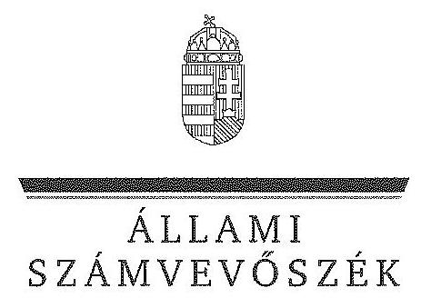
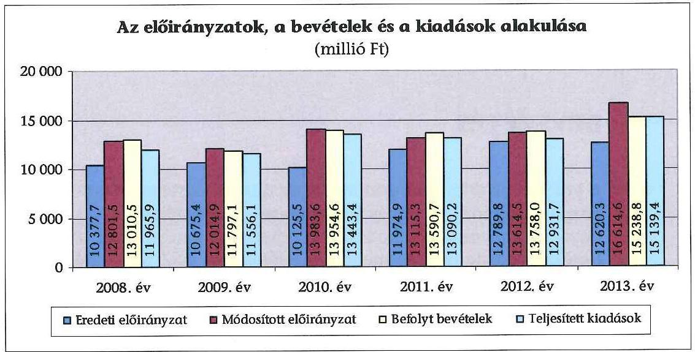
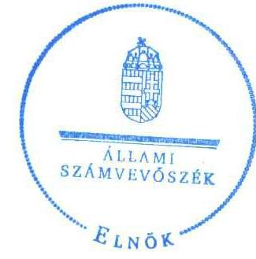
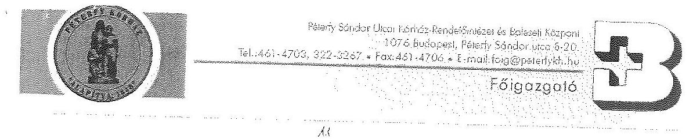
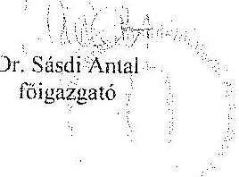
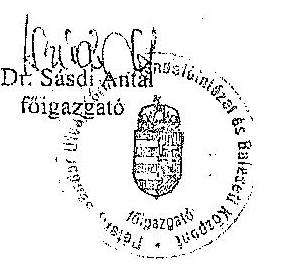
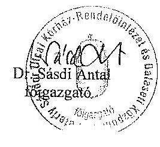
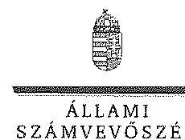
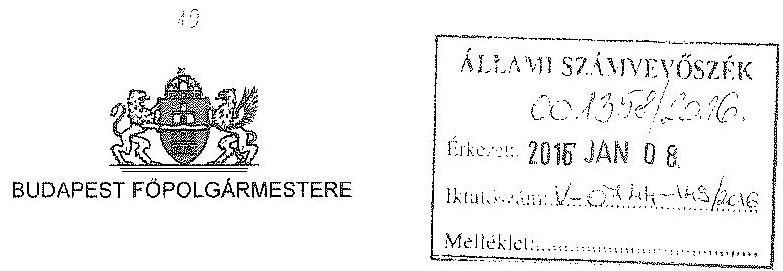
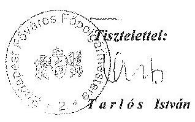

# JELENTÉS 

a központi alrendszer egyes intézményei pénzügyi és vagyongazdálkodásának ellenőrzéséről
Péterfy Sándor Utcai Kórház-Rendelőintézet és Baleseti Központ 16003

---

# Állami Számvevőszék 

Iktatószám: V-0744-162/2016.
Témaszám: 1778
Vizsgálat-azonosító szám: V067909

## Az ellenőrzést felügyelte:

## Kisgergely István

felügyeleti vezető

## Az ellenőrzés végrehajtásáért felelősök:

Keresztes Tamás ellenőrzésvezető Pats Regina ellenőrzésvezető Korsósné Vigh Andrea ellenőrzésvezető

A számvevői munkaanyagok feldolgozását és a Jelentéstervezet összeállítását végezték:

Gyarmati István számvevő tanácsos Pats Regina ellenőrzésvezető Takaró Rita számvevő asszisztens Kersmájer Ágota számvevő főtanácsos Schósz Attila Ferencné számvevő főtanácsos Weltherné Szolnoki Dóra számvevő tanácsos

Az ellenőrzést végezték:

## Gyarmati István

számvevő tanácsos
Madár Sándor
számvevő tanácsos
Zachár Péterné
számvevő tanácsos

## Kersmájer Ágota

számvevő főtanácsos
Právitzné Pejkó Noémi
számvevő
Zaroba Szilvia
számvevő tanácsos

## A témához kapcsolódó eddig készített számvevőszéki jelentés:

## címe

Jelentés az önkormányzati kórházak és bentlakásos szociális intézmények ápolásra, gondozásra fordított pénzeszközei felhasználásának ellenőrzéséről
Jelentés az egyes kórházi tevékenységek kiszervezésének ellenőrzéséről 0921

---

# TARTALOMJEGYZÉK 

BEVEZETÉS ..... 3
I. ÖSSZEGZŐ MEGÁLLAPÍTÁSOK, KÖVETKEZTETÉSEK, JAVASLATOK ..... 8
II. RÉSZLETES MEGÁLLAPÍTÁSOK ..... 14

1. Az alapítói jogosultságok és az irányító szervi hatáskörök gyakorlása ..... 14
2. A Kórház átszervezése ..... 16
3. A belső kontrollrendszer és az integritás kontrollok értékelése ..... 17
4. A Kórház pénzügyi gazdálkodása ..... 21
4.1. Az előirányzatok megállapítása és módosítása ..... 21
4.2. A kiadási előirányzatok felhasználása és a bevételi előirányzatok teljesítése ..... 23
4.3. A pénzmaradványok, előirányzat-maradványok kezelése ..... 24
4.4. A fizetőképesség alakulása ..... 25
5. A Kórház vagyongazdálkodása ..... 27
5.1. A Kórház vagyonának változása ..... 27
5.2. A vagyongazdálkodás szabályszerűsége ..... 28
5.3. Az eredményszemléletű számvitel bevezetésével kapcsolatos feladatok végrehajtása ..... 30
MELLÉKLETEK
6. számú A belső kontrollrendszer kialakítása és múködtetése szabályszerűségének alakulása a Kórháznál
7. számú A Kórház kiadásainak, bevételeinek és létszámának alakulása
8. számú A Kórház fizetőképességét és vagyoni helyzetét jellemző mutatók
9. számú A Kórház eszközeinek és forrásainak alakulása
10. számú A Kórház tárgyi eszközeivel kapcsolatos mutatószámok alakulása
11. számú A Kórház észrevétele
12. számú A Kórház észrevételére adott válasz
13. számú Budapest Főpolgármesterének levele észrevétel hiányában
FÜGGELÉKEK
14. számú A gazdaságossági, hatékonysági és eredményességi követelmények kiala- kítása és múködtetése, a vezetői nyilatkozat helytállósága
15. számú Rövidítések jegyzéke
16. számú Értelmező szótár

---

.

---

# JELENTÉS 

## a központi alrendszer egyes intézményei pénzügyi és vagyongazdálkodásának ellenőrzéséről Péterfy Sándor Utcai Kórház-Rendelőintézet és Baleseti Központ

## BEVEZETÉS

A közpénzek felhasználásában és az állami vagyonnal való gazdálkodásban a központi alrendszer egyes intézményei meghatározó súlyt képviselnek. Pénz-ügyi- és vagyongazdálkodásuk rendszeres ellenőrzésével az ÁSZ hozzájárul a hatékony közigazgatás megteremtéséhez. Az ÁSZ Stratégiával összhangban a közvagyon védelme, a közpénzügyek átláthatóságának előmozdítása érdekében került sor a Kórház ellenőrzésére.

A Kórház tevékenységi köre főtevékenységként fekvőbeteg-ellátás (aktív és krónikus kórházi szakellátás, rehabilitációs ellátás), további tevékenységként járóbeteg-ellátás (szakorvosi ellátás, gondozás-szűrés, járóbetegek rehabilitációs ellátása) foglalkozás-egészségügyi alap- és szakellátás, egészségügyi laboratóriumi és képalkotó diagnosztikai szolgáltatások, betegszállítás, egyéb szálláshely szolgáltatás, valamint iskolarendszeren kívüli szakmai oktatás. A Kórház Közép-magyarországi régió egyik legnagyobb egészségügyi szolgáltatója, a térség egyik legnagyobb kapacitású egészségügyi intézménye. Feladata közel 450 ezer budapesti lakos folyamatos, ezen túl számos stratégiai jelentőségű szakterületen a III. progresszivitási szinten a Nyugat-dunántúli régió lakosainak, 1,3 millió főnek a legmagasabb szintű folyamatos, 24 órás ellátása. Ehhez az aktív fekvőbeteg-szakellátásban 2013-ban 847, a krónikus fekvőbetegszakellátásban 710 múködő kórházi ággyal rendelkezett. Az ellátás 37 aktív és 11 krónikus osztályon folyt, 42 klinikai profil együttes müködésével. A járóbeteg-szakellátás 102 szakrendelésre, szakambulanciára és gondozóra tagozódott, 17 diagnosztikai tevékenységet végzett.

A Kórház az ellenőrzött időszakban önálló jogi személyiséggel rendelkező, önállóan működő és gazdálkodó, az előirányzatok felett teljes jogkörrel rendelkező költségvetési szerv volt. A Kórházat érintően az irányító szervi hatásköröket 2011. december 31-éig a Közgyűlés gyakorolta. A Kórház államháztartás önkormányzati alrendszeréből a központi alrendszerbe történt átsorolását követően, 2012. január 1-jétől az irányító szervi hatásköröket a Minisztérium, az egyes fenntartói, valamint az irányítási, középirányítói jogokat a Gyógyszerészeti és Egészségügyi Minőség- és Szervezetfejlesztési Intézet (GYEMSZI) gyakorolta. A GYEMSZI elnevezése 2015. március 1-jétől Állami Egészségügyi Ellátó Központra (ÁEEK-ra) változott. A Kórházat 2008-2013. között főigazgató vezet-

---

te, munkáját főigazgató-helyettesek - orvos igazgató, ápolási igazgató és gazdasági igazgató - segítették. Az ellenőrzött időszakban a főigazgató személyében 2010. december hónapban történt változás, a gazdasági igazgató személye nem változott.

A Kórház előirányzatainak és azok teljesítésének alakulását a következő diagram szemlélteti (az adatok a kiegyenlítő, függő és átfutó tételeket nem tartalmazzák):

A Kórház könyvviteli mérleg szerinti vagyona a 2008. év eleji 5800,8 millió Ftról 2013. év végére $43,9 \%$-kal, 8346,2 millió Ft-ra, a befektetett eszközök mérlegértéke a 2008. évi eleji 4815,4 millió Ft-ról $55,5 \%$-kal, 7487,9 millió Ft-ra emelkedett az ellenőrzött időszakban. A 2008. év eleji értékről a 2013. év végére a saját tőke 4394,2 millió Ft-ról 4582,7 millió Ft-ra, a kötelezettségek összege a passzív pénzügyi elszámolások nélkül 634,9 millió Ft-ról 3261,7 millió Ft-ra nőtt, a tartalékok 477,9 millió Ft-ról 99,2 millió Ft-ra csökkentek.

A Kórház engedélyezett létszámkerete a 2008. évi 2230 fơről a 2013. évre 4,5\%$\mathrm{kal}, 2130$ före csökkent.

Az ellenőrzés célja annak megállapítása volt, hogy a Kórházra vonatkozó irányító szervi feladatellátás a jogszabályi előírások betartásával történte; a Kórháznál a belső kontrollrendszer kialakítása és múködtetése szabályszerű volt-e; kialakították-e az erőforrásokkal való szabályszerű és hatékony gazdálkodáshoz szükséges követelményeket, megvalósították-e azok számon kérését, ellenőrzését; a Kórház pénzügyi és vagyongazdálkodása megfelelt-e a jogszabályi előírásoknak és belső szabályzatainak; a Kórház átalakításának, átszervezésének lebonyolítása szabályszerűen történt-e; az integritási kontrollokat kialakították-e, szabályszerűen működtették-e.

Az ÁSZ a Kórházat a 2008. és a 2009. évben ellenőrizte. Az ellenőrzésekről készült 0820 számú, „Jelentés az önkormányzati kórházak és bentlakásos szociális intézmények ápolásra, gondozásra fordított pénzeszközei felhasználásának ellenőrzéséről" című, illetve a 0921 számú, „Jelentés az egyes kórházi tevékenységek kiszervezésének ellenőrzéséről" című számvevőszéki jelentések a Kórház főigazgatója ré-

---

szére intézkedést igénylő megállapításokat, javaslatokat nem fogalmaztak meg, ezért jelen ellenőrzésnél utóellenőrzésre nem került sor.

Az ellenőrzés várható hasznosulása: a központi alrendszerbe tartozó intézmények jelentős hatást gyakorolhatnak a költségvetés egyensúlyának fenntartására, az állami vagyonnal való gazdálkodás minőségére, a kormányzati (szak)politikák végrehajtására, illetve közfeladat ellátásuk vonatkozásában az állampolgárok életminőségére, jogaik és kötelezettségeik gyakorlására. Az ellenőrzés a Kórház pénzügyi és vagyongazdálkodása szabályosságának javításával előmozdítja a közpénzügyek átláthatóságát, rendezettségét. Eredményeként átfogó képet kaphatunk a Kórház gazdálkodásának hiányosságairól és a jó gyakorlatokról is.

A közintézmények integritás alapú kultúrája meghatározó a belső kontrollrendszer működése szempontjából. Hozzájárulhat az elszámoltathatóság és átláthatóság érvényesítéséhez, egyben támogathatja a szervezet védettségét a korrupciós kitettséggel szemben. Az integritási kontrollok ellenőrzése az integritási szemlélet terjedését, az integritás kultúra erősítését támogatja.

A belső kontrollrendszer államháztartási törvényben rögzített célja a működés és gazdálkodás során a tevékenységek szabályszerű, gazdaságos, hatékony és eredményes végrehajtása. Az ÁSZ a központi alrendszer intézményeinek ellenőrzését teljesítményellenőrzési modullal egészítette ki.

A Kórház teljesítményellenőrzésének célja annak értékelése volt, hogy a gazdálkodás folyamatában a gazdaságossági, hatékonysági és eredményességi követelmények kialakítása megtörtént-e és azokat működtették-e; a költségvetési szerv belső kontrollrendszerének minőségéről kiadott vezetői nyilatkozatban a Kórház tevékenységében a hatékonyság, eredményesség, gazdaságosság követelményeinek érvényesítése helytálló volt-e. A teljesítményellenőrzés a gazdálkodási feladatokra terjedt ki, a szakmai feladatellátást nem értékelte. A gazdaságossági, hatékonysági és eredményességi követelmények kialakítására és működtetésére, a vezetői nyilatkozat helytállóságára vonatkozó megállapításokat az 1. sz. függelék tartalmazza.

A teljesítményellenőrzés várható hasznosulása: a törvényalkotás számára támogatást nyújt a nemzeti kulcsindikátorok rendszerének kialakításához. A döntéshozók, ellenőrzöttek, irányító szervek, a társadalom számára objektív visszajelzést ad a közfeladat-ellátásnak keretet adó pénzügyi és vagyongazdálkodásban mérhető teljesítménykövetelmények kialakításáról. Az ÁSZ értékteremtő elemzéseivel, tanácsadó szerepét erősítve támogatja a szervezetek önértékelő, alkalmazkodó (öntanuló) tevékenységét. Irányt mutat az ellenőrzött intézmények gazdálkodási és kapcsolódó adminisztratív folyamatainak optimalizációjához. Segíti a központi költségvetési szervek átláthatóságát, felügyelhetőségét, a „jó gyakorlatok" elterjesztésével támogatja a „jó kormányzást".

Az ellenőrzés típusa szabályszerűségi ellenőrzés, amelyet a Kórházra vonatkozó teljesítményellenőrzés egészített ki.

Az ellenőrzött időszak: 2008. január 1. - 2013. december 31.

---

Az ellenőrzésre a szabályszerűségi ellenőrzés tekintetében a Kórháznál, a Kórház irányító szervi feladatait ellátó Önkormányzatnál és Minisztériumnál, valamint az egyes fenntartói, valamint az irányítási, középirányítói jogokat gyakorló GYEMSZI-nél, a teljesítményellenőrzésre a Kórháznál került sor.

Az ellenőrzés jogszabályi alapját az ÁSZ tv. 1. § (3) bekezdés, 5. § (2)(6) bekezdései, valamint Áht. 61. § (2) bekezdésének előírásai képezték.

Az ÁSZ a 2011. évi LXVI. törvény 29. §-a szerint a jelentéstervezetet megküldte az emberi erőforrások miniszterének, az Állami Egészségügyi Ellátó Központ főigazgatójának, Budapest Főváros Önkormányzata főpolgármesterének és a Péterfy Sándor Utcai Kórház-Rendelőintézet és Baleseti Központ főigazgatójának. A beérkezett észrevételt és az arra adott választ a jelentés 6-7. sz. mellékletei tartalmazzák.

A központi alrendszer intézményeinek ellenőrzése során a belső kontrollrendszer tekintetében a hangsúlyt az egyes kontrollterületek (kontrollkörnyezet, kockázatkezelési rendszer, kontrolltevékenységek, információs és kommunikációs rendszer, monitoring rendszer) kialakításának és az intézmény működési folyamataiba való beépülésének szabályszerűségére helyeztük, amelyet kizárólag jogszabályokból és intézményi belső szabályozásokból levezethető kritériumrendszer alapján ítéltünk meg.

A belső kontrollrendszer jogszabályi előírások szerinti kialakításának és működtetésének szabályszerűségét az erre irányuló ellenőrzési kérdésekre adott válaszok összesítése alapján kontrollterületenként egyedileg és összesítetten is értékeltük. A belső kontrollrendszer egyes kontrollterületei kialakítása és müködtetése „szabályszerü volt", tehát a feltárt hiányosságok nem gyakoroltak lényeges hatást a kontrollok kialakítására és múködtetésére, amennyiben az értékelt területen az elért és elérhető pontok százalékban kifejezett hányadosa elérte a $85 \%$-ot, „nem volt szabályszerü", ha nem haladta meg a $60 \%$-ot, és „részben szabályszerü volt", ha $61-84 \%$ között volt.

A belső kontrollrendszer összesített értékelése megegyezett a kontrollterületenként alkalmazott \%-os értékelésekkel, a következő kiegészítéssel. A kontrollrendszer egésze esetében a „szabályszerü" értékelésnek a \%-os értéken felül további feltétele volt, hogy egyik kontrollterületen sem kaphatott „nem volt szabályszerü" értékelést. A „részben szabályszerű" értékelés további feltétele volt, hogy legfeljebb egy ellenőrzött kontrollterület lehetett „nem volt szabályszerü" értékelésű. Az összesített értékelés a \%-os kiértékelés eredményétől függetlenül „nem volt szabályszerű", ha az ellenőrzött kontrollterületek közül több mint egynek „nem volt szabályszerü" az értékelése.

A Kórház a 2013. évben nem vett részt az ÁSZ integritás felmérésében, ezért az integritás értékelése a tanúsítvány kérdéseire a Kórház által adott válaszok alapján történt. A minősítés két elemből tevődik össze. Az egyik elem a 3 releváns mutatószám (Eredendő Veszélyeztetettség Tényező - EVT, Korrupciós Veszélyeztetettséget Növelő Tényező - KVNT, Kockázatokat Mérséklő Kontrollok Tényező - KMKT) szervezetre vonatkozó értéke. A mutató minősítése az intézménycsoporti átlagos értéktől való eltérésen alapul. A minősítés "magas", ha az eltérés több mint 5 százalékpont pozitív irányban, "közepes", ha a pozitív, vagy

---

negatív irányú eltérés kevesebb, mint 5 százalékpont, illetve "alacsony", ha az eltérés több mint 5 százalékpont negatív irányban. Az értékelés másik összetevőjeként a kontrollok (KMKT) szintje összevetésre kerül a kockázati mutatókkal (EVT és KVNT). Ha a kontrollok mutatójának a minősítése mindkét kockázati mutató minősítésénél jobb, "kiváló" minősítést kapott az ellenőrzött szervezet. Ha ez nem teljesül, de a kontrollok minősítése nem rosszabb egyik kockázati mutatószám minősítésénél sem, akkor "megfelelő", ellenkező esetben pedig "fejlesztendő" minősítés az értékelés eredménye.

A dologi kiadások és dologi jellegű (egyéb folyó) kiadások, a támogatásértékű kiadások, az átadott pénzeszközök, a kölcsönök nyújtása és a felhalmozási kiadások előirányzatai felhasználásának, valamint a vagyonhasznosítási bevételi előirányzatok teljesítésének szabályszerűségét, és e területekhez kapcsolódva a gazdálkodási jogkörök gyakorlása megfelelőségét is mintavétellel ellenőriztük. A gazdálkodási jogkörök gyakorlásának ellenőrzése a személyi juttatásokra is kiterjedt. A jogszabályoknak és a belső előírásoknak megfelelőnek, azaz szabályszerűnek tekintettük a bevételi előirányzatok teljesítését, amennyiben a minta ellenőrzésének eredménye alapján $95 \%$-os bizonyossággal a teljes sokaságban a hibaarány kisebb volt, mint $10 \%$, nem megfelelőnek értékeltük, ha a hibaarány a $10 \%$-ot meghaladta. A kiadási előirányzatok felhasználásának szabályszerűségét az ellenőrzött mintatételek vonatkozásában értékeltük.

A gazdálkodási jogkörök gyakorlásának ellenőrzése keretében a 20082011. éveket érintően a szakmai teljesítésigazolás és az utalvány ellenjegyzése kulcskontrollok, a 2012-2013. éveket érintően a teljesítésigazolás és az érvényesítés kulcskontrollok működését értékeltük. A kiadási előirányzatok felhasználásánál megfelelőnek értékeltük a gazdálkodási jogkörök gyakorlását, amenynyiben $95 \%$-os bizonyossággal a teljes sokaságban a hibaarány legfeljebb $10 \%$ volt, részben megfelelőnek, ha a hibaarány felső határa legfeljebb $30 \%$ volt, nem megfelelőnek, ha a sokaságbeli hibaarány felső határa meghaladta a $30 \%$-ot. A vagyonhasznosítási bevételek esetében a gazdálkodási jogkörök gyakorlásának megfelelőségét az ellenőrzött mintatételek vonatkozásában értékeltük.

Az ellenőrzés az INTOSAI által kiadott nemzetközi standardok (ISSAI) figyelembe vételével, az ellenőrzési programban foglalt értékelési szempontok szerint történt.

A jelentéstervezetben alkalmazott rövidítések jegyzékét a 2. sz. függelék, az egyes fogalmak magyarázatát a 3. sz. függelék tartalmazza.

---

# I. ÖSSZEGZŐ MEGÁLLAPÍTÁSOK, KÖVETKEZTETÉSEK, JAVASLATOK 

#### Abstract

A Kórházra vonatkozó irányító szervi feladatellátás részben felelt meg a jogszabályi előirásoknak. A belső kontrollrendszer kialakítása és müködtetése összességében nem volt szabályszerű. A Kórház pénzügyi és vagyongazdálkodásának szabályszerűsége részben volt megfelelő. A pénzügyi gazdálkodást folyamatosan fennálló és az ellenőrzött időszakban fokozódó likviditási nehézségek jellemezték, a fizetőképesség nem volt biztositott.

Az alapítói jogosultságokat a Közgyűlés és a Miniszter megfelelően gyakorolta. A GYEMSZI a fenntartói, irányítási, középirányítói jogok gyakorlására vonatkozó közbeszerzéssel kapcsolatos jogszabályi előírásokat hiányosan érvényesítette a Kórház tekintetében, melynek következtében elmaradt a központosított közbeszerzésekből fakadó előnyök kihasználása. A szabályszerű gazdálkodáshoz szükséges követelmények kialakítása és számonkérése a költségvetés tervezésének és a beszámoltatás rendjének biztosításával valósult meg. A Közgyűlés és a GYEMSZI nem érvényesítette azonban az előirányzatokkal, létszámokkal és vagyonnal való hatékony gazdálkodás követelményeit, mivel a Kórház részére mérhető teljesítménykövetelményeket nem határozott meg. Az ellenőrzési jogosultságait a Minisztérium és a GYEMSZI szabályszerűen gyakorolta, a Közgyűlés részben gyakorolta az előírásoknak megfelelően, mivel nem ellenőrizte az erőforrásokkal való hatékony gazdálkodást és a nyilvános adatok kötelező közzétételét.

A belső kontrollrendszer kialakítása és működtetése összességében annak két területén - a kockázatkezelési és monitoring rendszernél - feltárt hiányosságok miatt nem volt szabályszerű, nem biztosította a szabálytalanságok megelőzését, feltárását. A Kórház kockázatkezelési rendszerét nem alakították ki és nem végeztek kockázatelemzést, valamint nem gondoskodtak a belső ellenőrzés megfelelő működtetéséről. A kontrollkörnyezetet, a kontrolltevékenységeket, az információs és kommunikációs rendszert szabályszerűen alakították ki és működtették.

A Kórház által kialakított kontrollrendszer nem biztosít megfelelő feltételeket a szervezet integritását veszélyeztető kockázatokkal szemben, ezért e kontrollok szintje fejlesztendő.

A Kórház pénzügyi gazdálkodásának szabályszerűsége a jogszabályi előírásoknak részben megfelelő volt. A Kórház a 2013. évi bevételi elmaradás ellenére nem tett eleget az előirányzat csökkentési kötelezettségének. Az ellenőrzött kiadási előirányzatok felhasználása során a jogszabályi előírásokat részben tartotta be a közbeszerzési eljárás lefolytatása és a tárgyévi fizetési kötelezettségek vállalása múködésében feltárt hiányosságok miatt. A kiadásokhoz kapcsolódóan a teljesítés igazolása és az érvényesítés kulcskontrollok múködésében tárt fel hiányosságokat az ellenőrzés.

---

A forgóeszközök állománya a 2009-2013. években, míg a pénzeszközök állománya a teljes ellenőrzött időszakban nem nyújtott fedezetet a rövid lejáratú kötelezettségekre. A fizetőképesség nem volt biztosított, mivel a Kórház a szállítói és egyéb kötelezettségeknek határidőn túl tudott eleget tenni. A Kórház mérleg szerinti szállítói kötelezettség állománya a 2008. január 1-jei 599,0 millió Ft-ról a 2013. év végére 2631,5 millió Ft-tal (439,3\%-kal) növekedett annak ellenére, hogy a szállítói kötelezettségek csökkentésére a Kórház öszszesen 3187,5 millió Ft fenntartói, illetve konszolidációs támogatást kapott. E támogatások mellett a lejárt szállítói tartozásállomány újratermelődött, a késedelem mértéke az ellenőrzött időszak végére emelkedett.

A Kórház vagyona a 2008. január 1-jei 5800,8 millió Ft-ról év végére 9438,4 millió Ft-ra növekedett egy szakellátási feladathoz átvett vagyonelemek miatt. Ezt követően azonban a 2013. év végére 8346,2 millió Ft-ra csökkent a vagyon. A Kórház költségvetéseiben a múködtetés volt a meghatározó. A végrehajtott beruházások nem ellensúlyozták az eszközök elszámolt amortizációjában megjelentő avulást, az eszközök használhatósági foka minden eszközcsoportnál csökkent. A mérlegben kimutatott eszközök és források értékének megállapítása és nyilvántartása szabályszerű volt, míg a leltározás részben felelt meg az előírásoknak. A befektetett eszközök kétévenkénti mennyiségi felvétellel történő leltározása a 2011. év végéig szabályos volt, mivel rendelkeztek az Önkormányzat hozzájárulásával. A 2012. évtől kezdődően ez a gyakorlat - a GYEMSZI egyetértésének hiányában - nem felelt meg az előírásoknak. A költségvetési aktív pénzügyi elszámolásokat a 2011. év kivételével nem támasztották alá teljes körűen leltárral, mely miatt ezen mérlegsor esetében sérült a valódiság elve. A vagyonelemek üzemeltetésre történt átadása, illetve a térítésmentes átadás-átvétel, valamit az eredményszemléletű számvitel bevezetésével kapcsolatos feladatok végrehajtása megfelelt a jogszabályoknak.
2012. január 1-jétől a Kórház, annak vagyona és vagyoni értékű jogai állami tulajdonba kerültek. A tulajdonosi és fenntartói jogutódlás tekintetében a jogszabályi előírások hiányosan érvényesültek, mivel az ellenőrzött időszak végéig nem született meg a konszolidációs törvény előírása ellenére a jogutódlás alapfeltételeire vonatkozó, az Önkormányzat és a Kormány közötti megállapodás, valamint a végrehajtás részletkérdéseire irányuló - az Önkormányzat és a GYEMSZI közötti - átadás-átvételi megállapodás. E megállapodások hiányának ellenére, a tulajdonosi és fenntartói jogutódlás a konszolidációs törvény rendelkezései erejénél fogva a Kórház vagyona tekintetében megtörtént. A Kórház vagyonkezelői joga 2012. január 1-jétől megszűnt, egyidejűleg a jogszabály által vagyonkezelésre kijelölt GYEMSZI az átvett vagyont a Kórházzal megkötött intézményi megállapodásban használatba, hasznosításba adta. A 2012. május 1-jétől hatályba lépett jogszabályi változások alapján a GYEMSZI vagyonkezelői joga megszűnt, tulajdonosi jogkörre változott, amely alapján az átvett vagyont - a Kórházzal 2013. február hónapban megkötött, 2012. május 1-jére visszamenőleges hatállyal érvényes vagyonkezelési szerződéssel - a Kórház vagyonkezelésébe adta. Ez a jogi megoldás (visszamenőleges hatályú vagyonkezelési szerződés) magas kockázatot hordozott az állami vagyon védelme és a felelős gazdálkodás terén.

Az ÁSZ tv. 33. § (1) bekezdésében foglaltak értelmében a jelentésben foglalt megállapításokhoz kapcsolódó intézkedési tervet köteles az ellenőrzött szervezet

---

vezetője összeállítani, és azt a jelentés kézhezvételétől számított 30 napon belül az ÁSZ részére megküldeni. Amennyiben az intézkedési tervet határidőben nem küldi meg a szervezet, vagy az nem elfogadható, az ÁSZ elnöke a hivatkozott törvény 33. § (3) bekezdés a)-b) pontjaiban foglaltakat érvényesítheti.

A helyszíni ellenőrzés megállapításainak hasznosítása mellett javasoljuk:

# az ÁEEK föigazgatójának 

1. A GYEMSZI a közbeszerzések összevont lefolytatására vonatkozó, az 59/2011. (IV. 12.) Korm. rendelet 2012. január 1-jétől hatályos 2/A. § m) pont szerinti jogosultságát részben gyakorolta. A 46/2012. (III. 28.) Korm. rendelet 1. § (1) bekezdésének és 2. § 3. pontjának előirása ellenére a 2013. december 31-éig terjedő időszakban nem gondoskodott a Kórház fekvőbeteg szakellátása tekintetében teljes körűen a gyógyszerek, az orvostechnikai eszközök és a fertőtlenítőszerek vonatkozásában a közbeszerzések központosított lefolytatásáról, mivel keret-megállapodás megkötésére 2013. második félévétől és csak a gyógyszereket érintően került sor.

Javaslat
Intézkedjen a központi beszerző szervezet feladatkörében eljárva a központosított közbeszerzési rendszer keretén belül megvalósuló közbeszerzések lefolytatásáról.
2. A 2012-2013 közötti időszakban a GYEMSZI nem tudta érvényesíteni a Kórháznál az előirányzatokkal, létszámokkal és vagyonnal való hatékony gazdálkodás követelményeit, mert a Kórház részére mérhető teljesítménykövetelményeket nem határozott meg, ezért az 59/2011. (IV. 12.) Korm. rendelet 2/A. § a) pontjában és az Áht. 2 9. § (1) bekezdés f) pontjában foglalt előírásoknak nem tett eleget.

Javaslat
Intézkedjen a Kórház esetében az erőforrásokkal való szabályszerű és hatékony gazdálkodás mérhető teljesítménykövetelmények kialakításáról, valamint arról, hogy a közfeladatok ellátása és az erőforrásokkal való hatékony gazdálkodás követelményei érvényesüljenek.

## a Kórház föigazgatójának

1. A belső kontrollrendszer kialakítása és müködtetése az ellenőrzött időszakban összességében nem volt szabályszerű.

A kontrollkörnyezet kialakítása és működtetése az ellenőrzött időszakban összességében szabályszerű volt, azonban a Kórház nem rendelkezett az Ámr. 145/B. §ában, az Ámr. 2 156. § (2) bekezdésében, valamint a Bkr. 6. § (3) bekezdésében előírtak ellenére 2009. november 21. és 2013. december 31. között ellenőrzési nyomvonallal; az Ámr. 1 2009. január 1-jétől hatályba lépő 145/D. § c) pontjában, az Ámr. 2 156. § (1) bekezdés c) pontjában, valamint a Bkr. 6. § (1) bekezdés c) pontjában foglaltakat figyelmen kívül hagyva a 2009-2013 közötti időszakban nem határozta meg az etikai elvárásokat a szervezet minden szintjén. A leltározási szabályzat eszközök és források leltározásának gyakoriságára vonatkozó előírásai nem feleltek

---

meg az Áhsz. 37. § (7) bekezdésében foglaltaknak, mivel a járművekre négyévenkénti, az ingatlanokra pedig ötévenkénti mennyiségi felvételt írtak elő. A leltározási szabályzat az üzemeltetésre, kezelésre átadott eszközök tekintetében nem a 2010. január 1-jétől hatályos Áhsz. 37. § (4) bekezdésében foglalt előírással összhangban tartalmazta ezen eszközcsoport leltározására vonatkozó szabályokat, mivel e szabályzat jogszabályi változásokkal történő aktualizálását annak indokoltsága ellenére nem végezték el. A Kórház nem rendelkezett - az Ámr. 2 20. § (3) bekezdés i) pontjában, illetve az Ávr. 13. § (2) bekezdés h) pontjában előírtak ellenére - az ellenőrzött időszak egészében a közérdekű adatok megismerésére irányuló kérelmek intézésére vonatkozó szabályzattal. A 2013. január 1-jétől hatályos számlarend a Számv. tv. 161. § (2) bekezdés d) pontjában előírtak ellenére nem tartalmazta a bizonylati rendet.

A kockázatkezelési rendszer kialakítása és működtetése - az ellenőrzött időszakban összességében - nem volt szabályszerű. A Kórház főigazgatója az ellenőrzött időszakban nem működtetett - az Ámr. ${ }_{1} 145 /$ C. § (1)-(3) bekezdéseiben, az Ámr. ${ }_{2} 157 . \S$ (1)-(3) bekezdéseiben, valamint a Bkr. 7. §-ában foglaltakkal ellentétben - kockázatkezelési rendszert. Nem végzett kockázatelemzést, nem mérte fel és nem állapította meg a Kórház tevékenységében és gazdálkodásában rejlő kockázatokat, nem határozta meg az egyes kockázatokkal kapcsolatban szükséges intézkedéseket és megtételük módját, valamint (2012-től) azok teljesítésének folyamatos nyomon követési módját.

Az információs és kommunikációs rendszer kialakítása és működtetése - az ellenőrzött időszakban összességében, és az egyes években is - szabályszerű volt, azonban a Kórház az Info tv. 37. § (1) bekezdésében és 1. mellékletében, valamint az Ávr. 173. § (3) bekezdésében és 8. mellékletének 13. és 14. pontjaiban előírt közérdekű adatok általános közzétételi kötelezettségét hiányosan teljesítette, mivel a jogszabályokban meghatározott - a szervezetére, tevékenységére és müködésére vonatkozó - információk a honlapján a helyszíni ellenőrzés ideje alatt nem voltak teljes körűen fellelhetőek.

A monitoring-rendszer kialakítása és működése az ellenőrzött időszakban összességében nem volt szabályszerű. Az elvégzett belső ellenőrzésekről a Ber. 32. § (1)(2) bekezdéseiben, a Bkr. 50. § (1)-(2) bekezdéseiben foglalt előírásokkal ellentétben nem vezettek nyilvántartást. Az ellenőrzött szervezeti egységek vezetői intézkedési terveket az ellenőrzött években a Ber. 29. § (1) bekezdésében, valamint a Bkr. 28. § c) pontjában foglaltak ellenére nem készítettek. A Kórház főigazgatója az ellenőrzött időszakban nem gondoskodott - az Áht. ${ }_{1}$ 94. § (1) bekezdés b) pontjában, az Áht. 2 61. § (1) bekezdésében, az Áht. 2 69. § (1) bekezdés a) pontjában és a Bkr. 4. § a) pontjában foglaltak ellenére - arról, hogy a Kórház tevékenységében és céljaiban a gazdaságosság, a hatékonyság és az eredményesség követelményei érvényesüljenek, mivel teljesítménycélokat és követelményeket nem alakított ki és nem alkalmazott.

Javaslat
a) Intézkedjen a jogszabályoknak megfelelő belső kontrollrendszer kialakítása és működtetése érdekében a kontrollkörnyezet, a kockázatkezelési rendszer, az információs és kommunikációs rendszer, továbbá a monitoring rendszer ÁSZ ellenőrzés által feltárt hiányosságainak megszüntetéséről.

---

b) Intézkedjen a Kórház tevékenységére és céljára vonatkozó hatékonysági, eredményességi és gazdaságossági mérhető követelmények kialakítására és érvényesítésére.
2. A Kórház nem végezte el a 2013. évi bevételi előirányzatoknak az Áht. 2 30. § (3) bekezdésben előírt csökkentését annak ellenére, hogy a költségvetési bevételek a tervezettől 1375,8 millió Ft-tal ( $8,3 \%$-kal) elmaradó mértékben teljesültek, elsősorban a működési célú támogatásértékű bevételek alulteljesítéséből adódóan. A Kórház - az Áht. 2 36. § (1) bekezdésében előírtak ellenére - a 2012. évben a személyi juttatások, és a felújítások, a 2013. évben a személyi juttatások, felújítások és az intézményi beruházások kiemelt előirányzatai esetében a jóváhagyott (szabad) kiadási előirányzatok mértékén túl vállalt tárgyévi fizetési kötelezettséget A személyi juttatások teljesítése a 2012. évben 31,4 millió Ft-tal ( $0,6 \%$-kal), a 2013. évben 119,8 millió Ft-tal ( $2,0 \%$-kal), a felújítások teljesítése a 2012. évben 49,4 millió Ft-tal ( $164,7 \%$-kal), a 2013. évben 13,1 millió Ft-tal ( $18,2 \%$-kal), míg a beruházások teljesítése 46,1 millió Ft-tal ( $180,0 \%$-kal) haladta meg a módosított előirányzatot.

Javaslat
a) Intézkedjen, hogy a költségvetési bevételek tervezettől történő elmaradása esetén a bevételi előirányzatok csökkentése megtörténjen.
b) Intézkedjen, hogy a költségvetési év kiadási előirányzatai terhére kötelezettségvállalásra az azokat terhelő korábbi kötelezettségvállalásokkal és más fizetési kötelezettségekkel csökkentett összegű eredeti vagy a módosított kiadási előirányzatok (szabad előirányzat) mértékéig kerüljön sor.
3. A kiadási előirányzatok felhasználásához kapcsolódó kulcskontrollok működésének szabályszerűsége a 2008-2011 közötti időszakban részben megfelelő volt, a 2012. és a 2013. évben nem volt megfelelő. A teljes ellenőrzött időszakban nem történt meg minden esetben a (szakmai) teljesítés igazolása a személyi juttatások kifizetései során, illetve ellenőrizhető okmányok (kinevezési okiratok, valamint megbízási szerződések) hiányában a teljesítés igazoló aláírása ellenére nem látta el - az Ámr. 1 135. § (1) bekezdésben, az Ámr. 2 76. § (1) bekezdésben, és az Ávr. 57. § (1) bekezdésben foglalt - ellenőrzési feladatát a kiadások teljesítésének jogosságára, összegszerűségére vonatkozóan. A 2012-2013. években a teljesítésigazolást - az Ávr. 57. § (4) bekezdésben előírtak ellenére - a személyi juttatások, illetve a dologi kiadások egyes eseteiben kijelöléssel nem rendelkező személy jogosulatlanul végezte. A 2012-2013 közötti időszakot érintően a teljesítésigazolás elmaradását, illetve a jogosulatlan teljesítés igazolását az érvényesítő - az Ávr. 58. § (2) bekezdésében foglaltak ellenére - az utalványozónak nem jelezte. Egyes kifizetések (személyi juttatások) esetében az érvényesítést az Ávr. 58. § (4) bekezdésében előírtak ellenére kijelöléssel nem rendelkező személy jogosulatlanul látta el.

Javaslat
Intézkedjen a gazdálkodási jogkörök szabályszerű gyakorlásának érvényesítéséről.
4. A leltározás végrehajtása az előírásoknak részben megfelelően történt. A befektetett eszközöket kétévenként leltározták mennyiségi felvétellel, melyen belül a járművek és az ingatlanok leltározásának gyakorisága - a feltárt szabályozási hiányosság ellenére is - megfelelő volt 2011-ig, mivel a kétévenkénti mennyiségi leltárfelvételhez

---

rendelkeztek az Önkormányzat rendeleti szabályozásával. A 2012. évtől kezdődően ez a gyakorlat nem felelt meg az Áhsz. 37. § (7) bekezdésében foglaltaknak, mivel nem rendelkeztek a GYEMSZI egyetértésével. A költségvetési aktív pénzügyi elszámolások esetében - az Áhsz. 37. § (1)-(2) bekezdéseiben foglaltak ellenére - a 2008. évben 163,2 millió Ft-ot, a 2009. évben 221,8 millió Ft-ot, a 2010. évben 219,3 millió Ft-ot, a 2012. évben 20,6 millió Ft-ot, a 2013. évben 24,7 millió Ft-ot nem támasztottak alá leltárral. A könyvviteli mérlegadatok valódisága ezen mérlegsor esetében nem volt igazolható, sérült a Számv. tv. 15. § (3) bekezdése alapján megkövetelt valódiság elve.

Javaslat
a) Intézkedjen a leltározási gyakorlat szabályszerűségéről.
b) Tegyen intézkedéseket a feltárt szabálytalanságok tekintetében a felelősség tisztázása érdekében, és szükség szerint intézkedjen a felelősség érvényesítéséről.
5. A Kórház nem folytatta le a közbeszerzési eljárást a Kbt. ${ }_{1}$ hatálya alá tartozó (gyógyszer és élelmiszer beszerzés, informatikai eszközök bérlése, takarítási szolgáltatás) beszerzéseknél a mintatételek alapján 499,3 millió Ft összeget érintően. A Kbt. ${ }_{2}$ hatálya alá tartozó egyes beszerzéseknél (élelmiszer, számítástechnikai anyagok beszerzése, takarítási, illetve szervíz szolgáltatás) sem történt meg az eljárások lefolytatása. A 2008. február 8. és 2011. március 1. közötti időszakban a Kbt. ${ }_{1}$ 303. § (1) bekezdésében foglalt előírásokat megsértve hosszabbították meg a korábban közbeszerzési eljárás alapján kötött szerződések időtartamát.

Javaslat:
a) Intézkedjen a jövőben a jogszabályban meghatározott esetekben a közbeszerzési eljárás lefolytatásáról.
b) Tegyen intézkedéseket a feltárt szabálytalanságok tekintetében a felelősség tisztázása érdekében, és szükség szerint intézkedjen a felelősség érvényesítéséről.

---

# II. RÉSZLETES MEGÁLLAPÍTÁSOK 

## 1. Az alapítói jogosultságoK és az irányító szERVI hatáskÖRÖK GYAKORLÁSA

A Közgyűlés és a Miniszter a Kórházzal kapcsolatos alapítói jogosultságait a jogszabályi előírásoknak megfelelően gyakorolta. Az ellenőrzött időszakban az alapító okiratok tartalma megfelelt a jogszabályi rendelkezéseknek ${ }^{1}$ és azokban a változásokat átvezették. Az alapító okiratokat - szabályszerűen - 2008-2011 között a Közgyűlés határozattal fogadta el, a 20122013. években a Miniszter adta ki.

Az irányító szervi hatásköröket a 2008-2011 közötti időszakban a Közgyűlés részben gyakorolta szabályszerűen. A Közgyűlés minden egyes évben beszámoló készítésre kötelezte a Kórházat és meghatározta annak határidejét. A Kórház az ellenőrzött időszakban rendelkezett jóváhagyott SZMSZ-szel. Az SZMSZ ${ }_{1.4}$ megfelelt az alapító okiratokban foglaltaknak és az SZMSZ ${ }_{1,3,4}$ az Ámr. ${ }_{1,2}$ által előírt követelményeknek. Az SZMSZ ${ }_{2}$ - az Ámr. ${ }_{3}$ 13/A. § (3) bekezdés e) pontjában, illetve az Ámr. ${ }_{2}$ 20. § (2) bekezdés e) pontjában foglalt előírások ellenére - nem tartalmazta a szervezeti egységek engedélyezett létszámát. Az alapító okirat változásaira tekintettel a Kórház SZMSZ-ének aktualizálása folyamatosan megtörtént. Az SZMSZ ${ }_{1.4}$ jóváhagyása szabályos volt. A Kórház főigazgatóját a jogszabályi előírásoknak² megfelelően a Közgyűlés nevezte ki, a 2008-2011. évek között a gazdasági igazgató személye nem változott.

A 2012-2013. években a Miniszter az irányítói hatásköröket szabályszerűen gyakorolta. Mindkét évben beszámoló készítésre kötelezte a Kórházat és meghatározta annak határidejét. A Kórház kinevezett főigazgatóját és gazdasági igazgatóját - beosztásában megerősítve - a GYEMSZI főigazgatójának javaslatára szabályszerűen ${ }^{3}$ a Miniszter bízta meg, illetve nevezte ki. A 2012-2013 közötti időszakban a GYEMSZI az egyes fenntartói, valamint az irányítási, középirányítói jogok ${ }^{4}$ gyakorlására vonatkozó jogszabályi előírásokat hiányosan érvényesítette, mivel a közbeszerzések összevont lefolytatására vonatkozó, az 59/2011. (IV. 12.) Korm. rendelet 2012. január 1-jétől hatályos 2/A. § m) pont szerinti jogosultságát részben gya-

[^0]
[^0]:    ${ }^{1}$ A 2008. évben az Áht. ${ }_{1}$ 88. § (3) bekezdés, 2009. január 1-jétől 2010. augusztus 14-ig a Kt. 4. § (1) bekezdés, 2010. augusztus 15-től 2011. december 31-ig az Áht. ${ }_{1}$ 90. § (1) bekezdés, továbbá 2012. január 1-jétől az Ávr. 5. § (1) bekezdés.
    ${ }^{2}$ Eü. tv. 2012. június 30 -áig hatályos 155 . § (1) bekezdés c) pont.
    ${ }^{3}$ A Konszolidációs törvény 14. § (2) bekezdésben szabályozott átmeneti időszakot követően (a főigazgatót 2012. július, a gazdasági igazgatót 2012. augusztus hónapban), az Eü. tv. 2012. július 1-jétől hatályos 155. § (4) bekezdés d) pontja alapján, az alapító okiratban rögzített fenntartói jogokkal és kinevezési renddel összhangban.
    ${ }^{4}$ Az 59/2011. (IV. 12.) Korm. rendelet 2/A. §.

---

korolta. A 46/2012. (III. 28.) Korm. rendelet 1. § (1) bekezdésének és 2. § 3. pontjának előírása ellenére a 2013. december 31-éig terjedő időszakban nem gondoskodott a Kórház fekvőbeteg szakellátása tekintetében teljes körűen a gyógyszerek, az orvostechnikai eszközök és a fertőtlenítőszerek vonatkozásában a közbeszerzések központosított lefolytatásáról, mivel keret-megállapodás megkötésére 2013. második félévétől és csak a gyógyszereket érintően került sor. E jogkör gyakorlásának elmulasztásával a GYEMSZI nem tette lehetővé a Kórház fekvőbeteg szakellátása orvostechnikai eszköz és fertőtlenítőszerek beszerzése tekintetében a központosított közbeszerzésekből fakadó előnyök kihasználását. A GYEMSZI a Kórház főigazgatója által megküldött SZMSZ-1 2012. július 26-án jóváhagyta, hozzájárulva a Kórház szabályszerű működéséhez.

A Közgyűlés, a Minisztérium és a GYEMSZI a Kórházat érintően az erőforrásokkal való szabályszerű gazdálkodáshoz szükséges követelményeket kialakította és megvalósította a számonkérést. A szabályszerű gazdálkodáshoz szükséges követelmények kialakítása és számonkérése a költségvetés tervezésének és a beszámoltatás rendjének biztosításával valósult meg. A Közgyűlés ezen túl évente beszámoltatta a Kórház főigazgatóját az intézmény működéséről. A beszámolók kiterjedtek a belső szabályozottságra, a pénzügyi, likviditási helyzetre, a gyógyító ellátás kapacitásokra és teljesítményre, a belső ellenőrzés helyzetére, a panaszos ügyek, a közbeszerzések, a fejlesztések, beruházások, a létszámok és bérek alakulására.

A hatékony gazdálkodáshoz a Közgyűlés és a GYEMSZI nem alakított ki mérhető teljesítmény-követelményeket. A 2009-2011 közötti időszakban ${ }^{5}$ a Közgyűlés, a 2012-2013 közötti időszakban a GYEMSZI nem érvényesítette a Kórháznál az előirányzatokkal, létszámokkal és vagyonnal való hatékony gazdálkodás követelményeit, mert a Kórház részére mérhető teljesítménykövetelményeket nem határozott meg. Ennek hiányában a Közgyűlés az Áht. 1 2009-2011 között hatályos 49. § (7) bekezdése alapján az (5) bekezdés f) pontjában foglalt, a GYEMSZI az 59/2011. (IV. 12.) Korm. rendelet 2/A. § a) pontjában és az Áht. 2 9. § (1) bekezdés f) pontjában foglalt előírásoknak nem tudott eleget tenni.

# Az ellenőrzési jogosultságait a Közgyűlés részben gyakorolta a jogszabályi előírásoknak megfelelően, a Minisztérium és a GYEMSZI szabályszerűen gyakorolta azokat. 

Az ellenőrzési jogosultságok keretében a jóváhagyási jogkörök gyakorlása az ellenőrzött időszakban szabályszerű volt. A Kórház költségvetését és beszámolóját a Közgyűlés, illetve a Miniszter jóváhagyta. A jóváhagyási jogkörök gyakorlására a pénzmaradvány, az előirányzat-maradvány, illetve a többletbevétel felhasználása vonatkozásában került sor.

Az egyéb ellenőrzési jogosultságok tekintetében a Közgyűlés a jogszabályi előírásokat hiányosan érvényesítette, mivel a 2009-2011 közötti időszakban a Kórháznál nem ellenőrizte ${ }^{6}$ az Áht. 1 49. § (7) bekezdése alapján az

[^0]
[^0]:    ${ }^{5}$ A 2008. évet érintően nem volt a Közgyűlésre vonatkozó jogszabályi előírás.
    ${ }^{6}$ A 2008. évet érintően nem voltak kapcsolódó jogszabályi előírások.

---

(5) bekezdés f) pontjában foglalt előírások ellenére az erőforrásokkal (így különösen az előirányzatokkal, a létszámokkal és a vagyonnal) való hatékony gazdálkodásra irányuló követelmények érvényre juttatását. Nem ellenőrizte továbbá az Áht. 1 49. § (5) bekezdés e) pontjában foglalt előírás ellenére az államháztartással összefüggő közérdekű és közérdekből nyilvános adatok kötelező közzétételét, illetve igényre történő szolgáltatásának végrehajtását.

A Kórháznál a Közgyűlés a 2010. évben végzett rendszerellenőrzést. Az ellenőrzés keretében kitértek a Kórház pénzügyi irányítási, végrehajtási, lebonyolítási rendszerére, a beszámolási és ellenőrzési folyamatok elemzésére, a szabályozások megléte, és azok gyakorlati alkalmazásának szabályszerűségére, a költségvetési előirányzatokkal való gazdálkodás, az elszámolás, valamint a pénzügyiés számviteli nyilvántartások vezetésének szabályszerűségére. Az ellenőrzés a közbeszerzés és a belső ellenőrzés területén állapított meg hiányosságokat, valamint rögzítette a jelentésben, hogy a Kórház eladósodással, likviditási gondokkal küzd, műszaki szempontból korszerűsítésre szorul.

A GYEMSZI a Kórház szabályzatainak meglétét a 2013. évben adatbekéréssel ellenőrizte. A GYEMSZI a 2012-2013. években nem végzett az 59/2011. (IV. 12.) Korm. rendelet $2 / \mathrm{A} . \S \mathrm{m}$ ) pontja alapján folyamatba épített, illetve utóellenőrzést a Kórház közbeszerzési eljárásaival kapcsolatban, illetve az Áht. 2 9. § (1) bekezdés f) pontjában foglalt előírás alapján az erőforrásokkal való hatékony gazdálkodásra irányuló ellenőrzést.

A Kórházat érintő, irányító szervi hatáskörben történt előirányzatmódosítások szabályszerúek voltak. A módosítások a központi bérintézkedésekhez, a dologi kiadások előirányzatainak kiegészítéséhez, felújításra, beruházásra, egészségügyi műszer javítására, pótlására, illetve cseréjére adott irányító szervi támogatásokhoz, a többletbevétel felhasználásához, valamint a pénzmaradványokhoz kapcsolódtak.

# 2. A KórhíZ ÁtsZerveZÉse 

A konszolidációs törvény előírásai ${ }^{7}$ alapján 2012. január 1-jétől a Kórház, annak vagyona és vagyoni értékú jogai állami tulajdonba kerültek, továbbá a vagyonnal és az intézménnyel kapcsolatos alapítói, fenntartói jogok és kötelezettségek az e törvényben meghatározott szervekre e törvény erejénél fogva átszálltak. Az Önkormányzat helyébe - a Kórház vagyona, vagyoni értékú jogai és a Kórházzal kapcsolatos jogviszonyok tekintetében általános és egyetemleges jogutódként - az állam, illetőleg az e törvényben meghatározott szervek léptek. ${ }^{8}$ A Kórház alapító, irányító szerve a Minisztérium lett ${ }^{9}$, az egyes

[^0]
[^0]:    ${ }^{7}$ Konszolidációs törvény 2. § (1) bekezdése, valamint 6. § (4) bekezdése.
    ${ }^{8}$ Konszolidációs törvény 2. § (4) bekezdése.
    ${ }^{9}$ A 2012. január 1-jén hatályos Eü. tv. 155. § (3)-(4) bekezdései.

---

fenntartói, irányító/középirányítói jogok, valamint a vagyonkezelői jog gyakorlására ${ }^{10}$ a jogszabályok a GYEMSZI-t jelölték ki.

A Kórház tulajdonosi és fenntartói jogutódlása feladatainak végrehajtására vonatkozó jogszabályi előírások hiányosan érvényesültek.

Az ellenőrzött időszak végéig nem született meg a jogutódlás alapvető feltételeire irányuló, az Önkormányzat és a Kormány közötti megállapodás, továbbá a végrehajtás részletkérdései rögzítésére irányuló háromoldalú - a főpolgármester, a GYEMSZI főigazgatója és az MNV Zrt. vezérigazgatója közötti - átadás-átvételi megállapodás, a konszolidációs törvény 2. § (4) bekezdés előírása ellenére. A feleknek az átadás-átvételi megállapodást 2011. december 31-ig kellett megkötniük azzal, hogy e határidő elmulasztása a Kórház átvételét nem akadályozza. ${ }^{11}$ A megállapodások hiányának ellenére, a tulajdonosi és fenntartói jogutódlás a konszolidációs törvény rendelkezései erejénél fogva a Kórház vagyona tekintetében megtörtént.

A GYEMSZI 2012. január 1-jétől az átvett ingatlan és intézményi ingó vagyont a Kórházzal megkötött intézményi megállapodásban használatba, hasznosításba adta. A 2012. május 1-jétől hatályba lépett jogszabályi változások ${ }^{12}$ alapján a GYEMSZI vagyonkezelői joga megszűnt, tulajdonosi jogkörre változott. A GYEMSZI, mint tulajdonosi joggyakorló az eszközöket 2012. május 1. napjával - 2013. februárban visszamenőleges hatállyal megkötött vagyonkezelési szerződéssel - a Kórház vagyonkezelésébe adta. Ez a jogi megoldás (visszamenőleges hatályú vagyonkezelési szerződés) magas kockázatot hordozott az állami vagyon védelme és a felelős gazdálkodás terén.

# 3. A BELSŐ KONTROLLRENDSZER ÉS AZ INTEGRITÁS KONTROLLOK ÉRTÉKELÉSE 

A belső kontrollrendszer kialakítása és múködtetése az ellenőrzött időszakban összességében nem volt szabályszerű. Az évenkénti értékelést a következő táblázat szemlélteti.

| Belső kontrolirendszer | 2008. év | 2009. év | 2010. év | 2011. év | 2012. év | 2013. év |
| :--: | :--: | :--: | :--: | :--: | :--: | :--: |
| összevont értékelése | önkormányzati alrendszer |  |  |  | központi alrendszer |  |
| szabályszerű |  |  |  |  |  |  |
| részben szabályszerű |  |  |  |  |  |  |
| nem szabályszerű |  |  |  |  |  |  |

A belső kontrollrendszer annak két területén - a kockázatkezelési rendszernél és a monitoring rendszernél - feltárt hiányosságok miatt nem volt szabályszerű.

[^0]
[^0]:    ${ }^{10}$ Az 59/2011. (IV. 12.) Korm. rendelet 2. § m) pontja és 2/A §. A vagyonkezelői jog tekintetében a konszolidációs törvény 3. § (1) bekezdés a) pontja alapján az 59/2011. (IV. 12.) Korm. rendelet 2. § o) pont (hatályos 2012. január 1 - április 28.).
    ${ }^{11}$ A konszolidációs törvény 6. § (3) bekezdés szerint.
    ${ }^{12}$ A 2012. évi XXXVIII. törvény 13. § (1) bekezdés a) pont előírása alapján.

---

A Kórház föigazgatója évente, a jogszabályi előírások szerinti nyilatkozatban értékelte a belső kontrollrendszer kialakítását és múködését. A 2008-2013 közötti időszakot érintő nyilatkozatok szerint gondoskodott a belső kontrollrendszer kialakításáról, valamint annak szabályszerű, gazdaságos, hatékony és eredményes múködtetéséről. A belső kontrollrendszer kialakításának és múködtetésének szabályszerűségével kapcsolatos, területenkénti és évenkénti értékelések összefoglaló bemutatását az 1. számú melléklet tartalmazza.

A kontrollkörnyezet kialakítása és müködtetése az ellenőrzött időszakban összességében szabályszerú volt. Az évenkénti értékelést a következő táblázat szemlélteti.

| Kontrollkörnyezet | 2008. év | 2009. év | 2010. év | 2011. év | 2012. év | 2013. év |
| :--: | :--: | :--: | :--: | :--: | :--: | :--: |
|  | önkormányzati alrendszer |  |  |  | központi alrendszer |  |
| szabályszerű |  |  |  |  |  |  |
| részben szabályszerű |  |  |  |  |  |  |
| nem szabályszerű |  |  |  |  |  |  |

A Kórház gazdasági szervezete rendelkezett a jogszabályi előírásoknak megfelelő ügyrenddel és a dolgozók munkaköri leírással. A kontrollkörnyezet kialakítása és múködtetése a 2008-2012. évek között annak ellenére szabályszerű volt, hogy a Kórház a jogszabályokban előírt szabályzatokkal - az azokban meghatározott tartalmi követelményeknek megfelelően - az alábbi kivételekkel rendelkezett:

- a Kórház nem rendelkezett - az Ámr. ${ }_{1}$ 145/B. §-ában, az Ámr. ${ }_{2} 156 . \S$ (2) bekezdésében, valamint a Bkr. 6. § (3) bekezdésében előírtak ellenére 2009. november 21. és 2013. december 31. között ellenőrzési nyomvonallal;
- a leltározási szabályzat eszközök és források leltározásának gyakoriságára vonatkozó előírásai nem feleltek meg az Áhsz. 37. § (7) bekezdésében foglaltaknak, mivel a járművekre négyévenkénti, az ingatlanokra pedig ötévenkénti mennyiségi felvételt írtak elő. A leltározási szabályzat az üzemeltetésre, kezelésre átadott eszközök tekintetében nem a 2010. január 1-jétől hatályos Áhsz. 37. § (4) bekezdésében foglalt előírással összhangban tartalmazta ezen eszközcsoport leltározására vonatkozó szabályokat, mivel e szabályzat jogszabályi változásokkal történő aktualizálását annak indokoltsága ellenére nem végezték el;
- a Kórház nem vette figyelembe az Ámr. ${ }_{1}$ 2009. január 1-jétől hatályba lépő 145/D. § c) pontjában, az Ámr. ${ }_{2}$ 156. § (1) bekezdés c) pontjában, valamint a Bkr. 6. § (1) bekezdés c) pontjában foglaltakat, mert a 2009-2013 közötti időszakban nem határozta meg az etikai elvárásokat a szervezet minden szintjén;
- a Kórház nem rendelkezett - az Ámr. ${ }_{2}$ 20. § (3) bekezdés i) pontjában, illetve az Ávr. 13. § (2) bekezdés h) pontjában előírtak ellenére - az ellenőrzött időszak egészében a közérdekú adatok megismerésére irányuló kérelmek intézésére vonatkozó szabályzattal.

A kontrollkörnyezet értékelése a 2013. évben romlott, mivel a 2013. január 1jétől hatályos számlarend a Számv. tv. 161. § (2) bekezdés d) pontjában előírtak ellenére nem tartalmazta a bizonylati rendet.

---

A kockázatkezelési rendszer kialakítása és müködtetése - az ellenőrzött időszakban összességében - nem volt szabályszerű. Az évenkénti értékelést a következő táblázat mutatja be:

| Kockázatkezelési rendszer | 2008. év | 2009. év | 2010. év | 2011. év | 2012. év | 2013. év |
| :--: | :--: | :--: | :--: | :--: | :--: | :--: |
|  | önkormányzati alrendszer |  |  |  | központi alrendszer |  |
| szabályszerű |  |  |  |  |  |  |
| részben szabályszerű |  |  |  |  |  |  |
| nem szabályszerú |  |  |  |  |  |  |

A Kórház főigazgatója a 2008 évtől 2009. november 20-ig kialakította a kockázatkezelési rendszert, az SZMSZ ${ }_{1}$ mellékletét képező FEUVE szabályzatban meghatározta a kockázatkezelési szabályokat. Ezt követően azonban a belső kontrollrendszer részeként - az Áht. ${ }_{1} 120 /$ B. § (2) bekezdés b) pontjában ${ }^{13}$, illetve a Bkr. 3. § b) pontjában foglalt előírás ellenére - a Kórház kockázatkezelési rendszerét nem alakította ki. ${ }^{14}$ A Kórház főigazgatója az ellenőrzött időszakban az Ámr. ${ }_{1} 145 /$ C. § (1)-(3) bekezdéseiben, az Ámr. ${ }_{2} 157 . \S$ (1)-(3) bekezdéseiben, valamint a Bkr. 7. §-ában foglaltakkal ellentétben - nem működtetett kockázatkezelési rendszert. Nem végzett kockázatelemzést, nem mérte fel és nem állapította meg a Kórház tevékenységében és gazdálkodásában rejlő kockázatokat, nem határozta meg az egyes kockázatokkal kapcsolatban szükséges intézkedéseket és megtételük módját, valamint (2012-től) azok teljesítésének folyamatos nyomon követési módját.

A kontrolltevékenységek kialakítását és müködtetését az ellenőrzött időszak egészére összességében szabályszerűnek értékeltük. Az évenkénti értékelést a következő táblázat szemlélteti.

| Kontrolltevékenységek | 2008. év | 2009. év | 2010. év | 2011. év | 2012. év | 2013. év |
| :--: | :--: | :--: | :--: | :--: | :--: | :--: |
|  | önkormányzati alrendszer |  |  |  | központi alrendszer |  |
| szabályszerű |  |  |  |  |  |  |
| részben szabályszerű |  |  |  |  |  |  |
| nem szabályszerű |  |  |  |  |  |  |

A Kórház belső szabályzatban meghatározta a kötelezettségvállalás és ellenjegyzése, a teljesítésigazolás, az érvényesítés, az utalványozás és ellenjegyzése gyakorlásának módjával, eljárási és dokumentációs részletszabályaival, valamint az ezeket végző személyek felhatalmazásának rendjével kapcsolatos belső előírásokat. Belső szabályzatban rögzítették - a felelősségi körök meghatározásával - az engedélyezési, jóváhagyási és kontroll-, valamint beszámolási eljárásokat. Az operatív gazdálkodási jogkörökre a kijelöléseket, felhatalmazásokat az arra jogosultak írásban adták ki. A kontrolltevékenységek részeként a folyamatba épített előzetes, utólagos és vezetői ellenőrzés - a Bkr. 8. § (2) bekezdés előírása ellenére - a 2012-2013. években nem volt biztosított minden tevéken

[^0]
[^0]:    ${ }^{13}$ 2011. január 1.-december 31. között Áht. ${ }_{1} 121 . \S$ (2) bekezdés b) pontja szabályozta.
    ${ }^{14}$ Az SZMSZ ${ }_{1}$ hatályon kívül helyezésével az annak mellékletét képező FEUVE szabályzatzatban meghatározott kockázatkezelési szabályzatot is hagályon kívül helyezték, mely a további SZMSZ-eknek nem volt melléklete és a szabályzatot önállóan sem adták ki.

---

kenységre, mivel a kontrollok megfelelő múködését a Kórház pénzügyi gazdálkodása és vagyongazdálkodása szabályszerűségének ellenőrzése során feltárt hiányosságok nem támasztották alá.

Az információs és kommunikációs rendszer kialakítása és múködtetése - az ellenőrzött időszakban összességében, és az egyes években is - szabályszerű volt.

A belső szabályzatokban az Ámr.1.2-ben valamint a Bkr.-ben foglaltaknak megfelelően az információ átadás formáit meghatározták, a dolgozók részére a szabályzatok elektronikus formában rendelkezésre álltak belső információs hálózaton (intranet) keresztül. A vezetői döntésekhez szükséges információk a beszámoltatások, illetve a rendszeres vezetői megbeszélések alapján időben rendelkezésre álltak. Az ellenőrzött időszakban a Kórház rendelkezett informatikai biztonsági szabályzattal, mely kitért az adatvédelmi előírásokra is. Az információs és kommunikációs rendszer kialakítása és múködtetése annak ellenére szabályszerű volt, hogy a Kórház az Info tv. 37. § (1) bekezdésében és 1. mellékletében, valamint az Av̌r. 173. § (3) bekezdésében és 8. mellékletének 13. és 14. pontjaiban előírt közérdekú adatok általános közzétételi kötelezettségét hiányosan teljesítette, mivel a jogszabályokban meghatározott - a szervezetére, tevékenységére és múködésére vonatkozó - információk a honlapján ${ }^{15}$ a helyszíni ellenőrzés ideje alatt nem voltak teljes körűen fellelhetőek.

A monitoring-rendszer kialakítása és múködése az ellenőrzött időszakban összességében nem volt szabályszerú. Az évenkénti értékelést a következő táblázat szemlélteti.

| Monitoring rendszer | 2008. év | 2009. év | 2010. év | 2011. év | 2012. év | 2013. év |
| :--: | :--: | :--: | :--: | :--: | :--: | :--: |
|  | önkormányzati alrendszer |  |  |  | központi alrendszer |  |
| szabályszerű |  |  |  |  |  |  |
| részben szabályszerú |  |  |  |  |  |  |
| nem szabályszerú |  |  |  |  |  |  |

# A monitoring rendszer keretében: 

- a Kórház a belső ellenőrzési rendszer kialakítása során a jogszabályi előírásokat betartotta. A belső ellenőrzés helye a szervezeti struktúrában a Ber. és a Bkr. előírásaival összhangban állt, a belső ellenőrzés a Kórház főigazgatójának közvetlenül alárendelve működött.
- a Kórház főigazgatója - figyelmen kívül hagyva az Áht. ${ }_{1}$ 121/A. § (3) bekezdésében, illetve az Áht. 2 70. § (1) bekezdésében foglalt előírásokat - nem gondoskodott a belső ellenőrzés megfelelő múködtetéséről. A Ber. 18. §-ában, valamint a Bkr. 29. § (1) bekezdésében foglalt előírás ellenére a 2008-2010. és a 2012. évekre nem volt éves ellenőrzési terv, míg a 2011. és a 2013. évekre elkészült;

[^0]
[^0]:    ${ }^{15} \mathrm{http}: / / w w w . p e t e r f y k h . h u$

---

A Kórház a 2008-2010 közötti időszakot érintően nem adott át hiteles dokumentumokat a belső ellenőrzési feladatok elvégzéséről. Belső ellenőr által aláírt ellenőrzési jelentés a 2011-2013. éveket érintően állt rendelkezésre.

- az elvégzett belső ellenőrzésekről a Ber. 32. § (1)-(2) bekezdéseiben, a Bkr. 50. § (1)-(2) bekezdéseiben foglalt előírásokkal ellentétben nem vezettek nyilvántartást. Az ellenőrzött szervezeti egységek vezetői intézkedési terveket az ellenőrzött években a Ber. 29. § (1) bekezdésében, valamint a Bkr. 28. § c) pontjában foglaltak ellenére nem készítettek. A 2010. és a 2013. évekről elkészült az éves ellenőrzési jelentés, míg a 2009. és a 2011. évről a Ber. 12. § h) pontjában, illetve a 2012. évre vonatkozóan a Bkr. 22. § (1) bekezdés g) pontjában foglaltak ellenére a belső ellenőrzési vezető éves ellenőrzési jelentést nem állított össze. A külső ellenőrzésekről az előírásoknak megfelelő nyilvántartást vezettek.

A Kórház föigazgatója az ellenőrzött időszakban nem gondoskodott - az Áht. ${ }_{1} 94 . \S$ (1) bekezdés b) pontjában, az Áht. 2 61. § (1) bekezdésében, az Áht. 2 69. § (1) bekezdés a) pontjában és a Bkr. 4. § a) pontjában foglaltak ellenére - arról, hogy a Kórház tevékenységében és céljaiban a gazdaságosság, a hatékonyság és az eredményesség követelményei érvényesüljenek, mivel teljesítménycélokat és követelményeket nem alakított ki és nem alkalmazott.

A Kórháznál a belső ellenőrzés az ellenőrzött időszakban a Ber. 2. § c)-d) pontjai, illetve a Bkr. 21. § (2) bekezdés a) pontja, valamint a (3) bekezdés d) pontja szerinti, hatékonyságra irányuló ellenőrzéseket nem végzett.

Az integritás szemlélet érvényesülésének ellenőrzéséhez a Kórház tanúsítványon szolgáltatott adatot. Az adatok értékelése alapján az eredendő veszélyeztetettségi szint közepes, míg a kockázatokat növelő tényező szintje magas. Emellett a Kórháznál kiépült kockázatok kezelésére hivatott kontrollok szintje is közepes. A kockázatok és a kontrollok szintje alapján megállapítható, hogy a Kórháznál jelenlévő kockázatokat növelő tényező szintje meghaladja azok kezelésére kiépült kontrollok szintjét. A Kórház által kialakított kontrollrendszer nem biztosított megfelelő feltételeket a szervezet integritását veszélyeztető kockázatokkal szemben, ezért a kontrollok szintje fejlesztendő.

# 4. A KórHÁz PÉNZÜGYI GAZDÁLKODÁSA 

A Kórház pénzügyi gazdálkodásának szabályszerűsége részben volt megfelelő.

### 4.1. Az előirányzatok megállapítása és módosítása

A Kórház elemi költségvetésének, az előirányzatok megállapításának szabályszerűsége - az ellenőrzött időszakban - biztosított volt. Az éves elemi költségvetés elkészítését, az előirányzatok megállapítását az SZMSZ1-s-ben szabályozták. A költségvetés tervezésével kapcsolatos feladatok számon kérhetősége biztosított volt, mert a munkaköri leírások a tervezéssel kapcsolatos feladatokat tartalmazták.

---

A Kórház a költségvetés tervezése során az OEP támogatást a várható teljesítmények alapján vette számba. A kiadások tervezésénél figyelembe vették a betegellátó osztályok, részlegek igényeit, múködési feltételeit, valamint a bérpolitikai intézkedéseket. A 2008-2011. években a Kórház az éves költségvetését az Önkormányzat által kiküldött tervezési felhívásban foglaltak szerint, a tervezési felhívás mellékletét képező kimutatások elkészítésével állította össze. A Közgyűlés által elfogadott 2008-2011. évi költségvetési rendeletek vonatkozó adatai, valamint a Kórház elemi költségvetése kiemelt előirányzati szinten megegyeztek. A 2012-2013. években a Kórház az éves költségvetés javaslatát az NGM költségvetési törvényjavaslat összeállításához szükséges feltételekről és az érvényesítendő követelményekről szóló, az adott évre vonatkozó tervezési körirata, valamint a GYEMSZI által meghatározott tervezési szempontok figyelembevételével készítette el. A 2012. és 2013. években a kincstári és az elemi költségvetések adatai közötti egyezőség biztosított volt.

# A Kórház bevételi és kiadási elöirányzatainak módosítása szabály- 

szerű volt. A Kórház - az ellenőrzött időszakban - saját hatáskörű előirány-zat-módosítást az OEP támogatás többlete (adósságkonszolidáció, OEP maradványból származó bevétel), valamint a 2012. évtől kezdődően az előző évi elő-irányzat-maradvány előirányzatosítása miatt hajtott végre. A Kórház előirány-zat-módosításokhoz kapcsolódó intézkedései alátámasztottak voltak. A 20082011. években a saját hatáskörű előirányzat-módosítások az Önkormányzat költségvetési rendeletében átvezetésre kerültek. A saját hatáskörű előirányzatmódosításról a Kórház a 2012-2013 közötti időszakban a Kincstárt és az irányító szervet a jogszabályban előírt határidőben ${ }^{16}$ értesítette. Országgyűlési hatáskörben végrehajtott előirányzat-módosításra az ellenőrzött időszakban nem került sor. A Kormány hatáskörben történt előirányzat-módosításokat elrendelő kormányhatározatok egyedi elszámolási kötelezettséget nem írtak elő.

A Kórház az ellenőrzött időszak minden egyes évét érintően rendelkezett elő-irányzat-nyilvántartással. Az előirányzat-módosítás alapját képező dokumentumok, az előirányzat-nyilvántartás és az éves költségvetési beszámolók adatai megegyeztek, az előirányzat-változtatások átvezetése a számviteli nyilvántartásokon megtörtént.

A Kórház nem végezte el a 2013. évi bevételi előirányzatoknak az Áht. 2 30. § (3) bekezdésében előírt csökkentését annak ellenére, hogy a költségvetési bevételek a tervezettől 1375,8 millió Ft-tal ( $8,3 \%$-kal) elmaradó ${ }^{17}$ mértékben teljesültek elsősorban a múködési célú támogatásértékủ bevételek alulteljesítéséből adódóan.

[^0]
[^0]:    ${ }^{16}$ Az Ávr. 167. § (4) bekezdése alapján az intézkedés meghozatalát követő öt munkanapon belül.
    ${ }^{17}$ Függő, kiegyenlítő, átfutó tételek nélkül számított bevételek. Bevételi elmaradás 2009-2010-ben is volt, azonban ebben az időszakban az önkormányzati alrendszerre nem vonatkozott a bevételi előirányzatok csökkentési kötelezettsége.

---

# 4.2. A kiadási előirányzatok felhasználása és a bevételi előirányzatok teljesítése 

A Kórház a kiadási előirányzatok felhasználása során a jogszabályi előírásokat részben tartotta be. Az ellenőrzött személyi juttatások, dologi kiadások és dologi jellegű (egyéb folyó) kiadások, támogatásértékű kiadások, átadott pénzeszközök és felhalmozási kiadások előirányzatai felhasználásánál az ellenőrzés a dologi kiadások és dologi jellegű (egyéb folyó) kiadásoknál tárt fel közbeszerzéssel kapcsolatos szabálytalanságokat. A Kórház nem folytatta le a közbeszerzési eljárást a Kbt. ${ }_{1}$ hatálya alá tartozó (gyógyszer és élelmiszer beszerzés, informatikai eszközök bérlése, takarítási szolgáltatás) beszerzéseknél a mintatételek alapján 499,3 millió Ft összeget érintően. A Kbt. ${ }_{2}$ hatálya alá tartozó egyes beszerzéseknél (élelmiszer, számítástechnikai anyagok beszerzése, takarítási, illetve szervíz szolgáltatás) sem történt meg az eljárások lefolytatása. A 2008. február 8. és 2011. március 1. közötti időszakban a Kbt. 1 303. § (1) bekezdésében foglalt előírásokat megsértve hosszabbították meg a korábban közbeszerzési eljárás alapján kötött szerződések időtartamát.

Az ellenőrzött beruházások, felújítások esetén az üzembe helyezés megtörtént, a bekerülési érték meghatározása és így az értékcsökkenés elszámolása szabályos volt. A dologi, illetve felhalmozási előirányzatok terhére beszerzett ellenőrzött tárgyi eszközök a leltárakban megtalálhatóak voltak. Az ellenőrzött pénzeszközátadásoknál és a támogatásértékủ kiadásoknál megállapodásban rögzítették a támogatás célját, előírták a beszámolási kötelezettséget. A beszámolás megtörtént, a felhasználás a megállapodásban rögzített jogcímeken valósult meg.

A kiadási előirányzatok felhasználásához kapcsolódó kulcskontrollok múködésének szabályszerűsége a 2008-2011 közötti időszakban részben megfelelő volt, a 2012. és a 2013. évben nem volt megfelelő, az alábbiak miatt:

- a teljes ellenőrzött időszakban nem történt meg minden esetben a (szakmai) teljesítés igazolása a személyi juttatások kifizetései során, illetve ellenőrizhető okmányok (kinevezési okiratok, valamint megbízási szerződések) hiányában a teljesítés igazoló aláírása ellenére nem látta el - az Ámr. ${ }_{1}$ 135. § (1) bekezdésben, az Ámr. ${ }_{2} 76 . \S$ (1) bekezdésben, és az Ávr. 57. § (1) bekezdésben foglalt - ellenőrzési feladatát a kiadások teljesítésének jogosságára, összegszerűségére vonatkozóan. A 2012-2013. években a teljesítésigazolást - az Ávr. 57. § (4) bekezdésben előírtak ellenére - a személyi juttatások, illetve a dologi kiadások egyes esetében kijelöléssel nem rendelkező személy jogosulatlanul végezte;
- a 2008-2011 közötti időszakban (a teljesítésigazolás elmaradásainak esetében) az utalvány ellenjegyzője az Ámr. ${ }_{1}$ 137. § (3) bekezdésében, illetve az Ámr. ${ }_{2}$ 79. § (2) bekezdésében foglaltak ellenére nem győződött meg a szakmai teljesítésigazolás megtörténtéről;
- a 2012-2013. években a teljesítésigazolás elmaradását, illetve a jogosulatlan tejesítés igazolását az érvényesítő - az Ávr. 58. § (2) bekezdésében foglaltak ellenére - az utalványozónak nem jelezte. Egyes kifizetések (személyi juttatá-

---

sok) esetében az érvényesítést az Ávr. 58. § (4) bekezdésében előírtak ellenére kijelöléssel nem rendelkező személy jogosulatlanul látta el.

A Kórház a 2011. évben - az Áht. ${ }_{1}$ 12/A. § (1) bekezdésében foglalt előírás ellenére - a dologi kiadások és dologi jellegű (egyéb folyó) kiadások kiemelt előirányzata esetében a jóváhagyott (szabad) kiadási előirányzat mértékén túl vállalt tárgyévi fizetési kötelezettséget. A teljesítés 7,0 millió Ft-tal ( $0,1 \%-\mathrm{kal}$ ) haladta meg a módosított előirányzatot. A Kórház - az Áht. ${ }_{2} 36 . \S$ (1) bekezdésében előírtak ellenére - a 2012. évben a személyi juttatások, és a felújítások, a 2013. évben a személyi juttatások, felújítások és az intézményi beruházások kiemelt előirányzatai esetében a jóváhagyott (szabad) kiadási előirányzatok mértékén túl vállalt tárgyévi fizetési kötelezettséget. A személyi juttatások teljesítése a 2012. évben 31,4 millió Ft-tal ( $0,6 \%-\mathrm{kal}$ ), a 2013. évben 119,8 millió Ft-tal ( $2,0 \%-\mathrm{kal}$ ), a felújítások teljesítése a 2012. évben 49,4 millió Ft-tal ( $164,7 \%-\mathrm{kal}$ ), a 2013. évben 13,1 millió Ft-tal ( $18,2 \%-\mathrm{kal}$ ), míg a beruházások teljesítése 46,1 millió Ft-tal ( $180,0 \%-\mathrm{kal}$ ) haladta meg a módosított előirányzatot.

A vagyonhasznosítási bevételi elöirányzatok teljesítésének szabályszerűsége annak ellenére megfelelő volt, hogy a Kórház a 2012. és 2013. években megkötött vagyonhasznosítási szerződései kapcsán - ellentétben az Nvtv. 3. § (2) bekezdésében foglaltakkal - nem rendelkezett a szerződő felek átlátható szervezet feltételeinek való megfeleléséről szóló nyilatkozatokkal. A vagyonhasznosítási bevételeket az előírásoknak megfelelően kiszámlázták, a befolyt összeget nyilvántartásba vették. A Kórház az ellenőrzött időszakban az összes bevétele ( 81349,7 millió Ft) $0,8 \%$-át kitevő, 658,4 millió Ft összegű vagyonhasznosítási bevételt realizált. A részletes adatokat a 2 . számú melléklet tartalmazza.

Az ellenőrzött vagyonhasznosítási bevételek esetén a pénzgazdálkodási belső kontrollok működése során - az Ámr. ${ }_{1} 135 . \S$ (2) bekezdésében előírtak ellenére - a 2008. és a 2009. évben az ellenőrzött mintatételek esetében nem történt meg a szakmai teljesítés igazolása.

# 4.3. A pénzmaradványok, előirányzat-maradványok kezelése 

A Kórháznál a tárgyévi pénzmaradvány, előirányzat-maradvány megállapításának és az előző évi maradvány felhasználásának szabályszerűsége megfelelő volt. A 2008-2013 közötti időszakban a Kórháznál összesen 2742,5 millió Ft pénz-, illetve előirányzat-maradvány keletkezett, mely teljes összegében kötelezettségvállalással terhelt volt. A főkönyvi számlák, az analitikus nyilvántartások és az éves beszámolók között az adategyezőség fennállt. A Kórház az előirányzat-maradványáról az előírt határidőben és tartalommal teljesítette az irányító szerv felé az adatszolgáltatási kötelezettségét. A 2008-2011. évi pénzmaradványt a Közgyűlés, a 2012-2013. évi előirányzatmaradványt a GYEMSZI hagyta jóvá. A Kórház rendelkezett az előirányzatmaradvány jóváhagyásáról az irányító szervtől kapott értesítésekkel. A pénz-, illetve előirányzat-maradványok felhasználása szabályos volt, a kötelezettségvállalás a tárgyévben megtörtént, a számlák kifizetése a következő év június 30 -áig megvalósult. A tárgyévet követő év június 30 -áig pénzügyileg nem telje-

---

sült, továbbá meghiúsult kötelezettségvállalás miatt szabaddá váló előirány-zat-maradványa a Kórháznak a 2012-2013. években nem volt.

# 4.4. A fizetőképesség alakulása 

A Kórház a bevételek beérkezésének és a kiadások teljesítésének ütemezésére a 2008. január 1. és 2010. augusztus 14. közötti időszakban - a jogszabályi előírások ellenére ${ }^{18}$ - nem készített előirányzat-felhasználási tervet. A 2012-2013 közötti időszakban - az előírásoknak megfelelő tartalmú - likviditási tervvel rendelkeztek ${ }^{19}$.

A Kórház központi költségvetésből származó bevétele a teljesítmény finanszírozásából és egyéb eseti jellegű forrásokból tevődött össze. A szakmai teljesítmény finanszírozása az egészségügyi tevékenységek beazonosítási rendszerében a lejelentett teljesítmények alapján történt. Azokon a területeken, ahol az elszámolható teljesítmény mennyiséget korlátozták (TVK), az OEP a központilag megállapított TVK alatti teljesítményeket az adott egészségügyi szolgáltatásra kihirdetett díj 100\%-ában, a TVK feletti teljesítményeket 2008-2010. között nem, ezt követően egy határig degresszív módon ${ }^{20}$, a határ felett pedig nem finanszírozta.

A Kórház a likviditási tervben az utólagos finanszírozás miatt a tárgyhót követő harmadik, illetve második hónapig tudta nagy pontossággal megtervezni a szakmai teljesítmény ellenértékeként várható bevétel összegét. A további hónapok bevételeit és kiadásait a korábbi évek tapasztalati adatai alapján becsülték meg.

A 2008-2013. években a Kórház bevételének 79,1\%-92,2\%-a OEP támogatásból származott, így a likviditás és fizetőképesség szempontjából is alapvető befolyással bírtak ezen bevételek. Az ellenőrzött időszakban a fekvő-, és járóbeteg-ellátás finanszírozási díjai ${ }^{21} 2,7 \%$-kal növekedtek, a krónikus fekvőbeteg-ellátás finanszírozási díja ${ }^{22}$ nem változott. A szakmai teljesítmények alapján elszámolt bevételeken kívül a Kórháznak eseti jelleggel irányító szervi támogatásból - bérkiegészítésből, konszolidációs támogatásból, valamint az OEP-nél képződött maradvány egészségügyi intézmények közötti év végi kiosztásából - származott a központi költségvetésből bevétele.

[^0]
[^0]:    ${ }^{18}$ Az Ámr. 134. § (7) bekezdésében, 2008. január 1.-december 31. között az Áht. 1 98. § (2) bekezdésében, illetve 2009. január 1.-2010. augusztus 14. között az Áht. ${ }_{1} 100 /$ B. § (1) bekezdésében foglaltak.
    ${ }^{19}$ A 2010. augusztus 15. és 2011. december 31. közötti időszakot érintően előirányzatfelhasználási terv, illetve likviditási terv készítési kötelezettséget jogszabály nem írt elő.
    ${ }^{20}$ 2011-2012. években az aktív fekvőbeteg-szakellátásnál a TVK 10\%-os túllépéséig az alapdíj $30 \%$-át, 2013-ban a TVK $4 \%$-os túllépéséig az alapdíj $25 \%$-át utalványozták. A járóbeteg-szakellátásnál 2011-2012-ben a TVK 10\%-os túllépéséig az alapdíj 30\%-át, 10-20\% közötti TVK túllépésig az alapdíj 20\%-át számolta el az OEP, 2013-ban 8\%-os TVK túllépésig 20\% alapdíjat utalványoztak.
    21 2008-ban 146 ezer Ft/súlyszám, 2013-ban 150 ezer Ft/súlyszám, 2008-ban $1,46 \mathrm{Ft} /$ német pont, 2013-ban $1,5 \mathrm{Ft} /$ német pont.
    ${ }^{22} 5600 \mathrm{Ft} /$ súlyozott krónikus nap.

---

Az év végi adatok alapján a forgóeszközök állománya a 2009-2013. években, a pénzeszközök állománya a teljes ellenőrzött időszakban nem nyújtott fedezetet a rövid lejáratú kötelezettségekre. A forgóeszközök 26,3-54,2\% közötti, a pénzeszközök 1,3-57,9\% közötti mértékben biztosítottak forrást a rövid lejáratú kötelezettségekre ${ }^{23}$. A fizetőképesség nem volt biztosított, mivel a szállítói és egyéb kötelezettségeknek a Kórház határidőn túl tudott eleget tenni. A jellemzően év végén folyósított konszolidációs támogatás és OEP maradványból kapott támogatás javította a Kórház év végi likviditási helyzetét, mutatóit.

A Kórház mérleg szerinti szállítói kötelezettség állománya a 2008. január 1-jei 599,0 millió Ft-ról 2631,5 millió Ft-tal (439,3\%-kal) 3203,5 millió Ft-ra növekedett. Ez annak ellenére következett be, hogy a szállítói kötelezettségek csökkentésére a Kórház összesen 3187,5 millió Ft fenntartói, illetve konszolidációs támogatást kapott. E támogatások ellenére a lejárt szállítói tartozásállomány újratermelődött, a késedelem mértéke az ellenőrzött időszak végére emelkedett.

A Kórház mérleg szerinti szállítói tartozásállománya lejárat szerinti változását, és abban a fenntartói, illetve konszolidációs támogatás hatását szemlélteti a következő táblázat.

A Kórház mérleg szerinti szállítói tartozásának alakulása 2008-2013. években

| Megnevezés | 2008. év | 2009. év | 2010. év   2011. év   millió Ft | 2012. év | 2013. év |  |
| :-- | :--: | :--: | :--: | :--: | :--: | :--: |
| Összes szállitói kötelezettség | 1448,7 | 2488,8 | 1965,7 | 2262,8 | 3634,0 | 3230,5 |
| Ebből átütemezési megállapodással érintett | 0 | 0 | 10,2 | 0 | 0 | 0 |
| Lejárt szállitói kötelezettség | 362,6 | 1579,0 | 1095,5 | 1065,8 | 2437,0 | 2234,7 |
| 1-30 nap | 362,6 | 467,7 | 497,4 | 405,8 | 440,0 | 518,3 |
| 31-60 nap | 0 | 365,5 | 365,7 | 349,5 | 450,0 | 369,9 |
| 61-180 nap | 0 | 745,8 | 232,4 | 310,5 | 1547,0 | 1115,1 |
| 181-365 nap | 0 | 0 | 0 | 0 | 0 | 231,4 |
| Szállitói állomány csökkentésére kapott fenntartói, illetve konszolidációs támoaotás ${ }^{24}$ | 0 | 0 | 686,0 | 0 | 510,7 | 1990,8 |
| Számított adat: lejárt szállítói kötelezettség konszolidációs támogatás nélkül | 362,6 | 1579,0 | 1781,5 | 1065,8 | 2947,7 | 4225,5 |

Forrás: Kórház adatszolgáltatása

[^0]
[^0]:    ${ }^{23}$ A likviditási mutatók évenkénti adatait, változását a 3. számú melléklet tartalmazza.
    ${ }^{24}$ A konszolidációs támogatás a 269/2010. (XII. 3.) Korm. rendelet, 337/2011. (XII. 29.) Korm. rendelet és a 438/2013. (XI. 29.) Korm. rendelet alapján. A Kórház az Önkormányzattól a 2010. évben 115,0 millió Ft-ot, a GYEMSZI-től a 2012. évben 23,7 millió Ft-ot, a 2013. évben 40 millió Ft-ot kapott lejárt szállítói kötelezettségek kiegyenlítésére.

---

A 2008-2013. évi költségvetési beszámolók könyvvizsgálatáról készült jelentésekben a könyvvizsgáló figyelemfelhívással élt a rövid lejáratú kötelezettség állomány növekedése, valamint a finanszírozási, likviditási problémák miatt. A Kórház a likviditás javítása érdekében gazdálkodási operatív tervet és intézkedési tervet dolgozott ki a 2011. évtől kezdődően. Havi gazdálkodási elemzéseket készített és értékelt ki. A gyógyító osztályok részére pénzügyi keretet határozott meg, melynek havonkénti nyomon követését is elvégezte, szükség szerint egyeztetéseket folytatott a szakterületekkel. A Kórház rendszeresen kezdeményezte a szállítóknál a késedelmi kamatok elengedését, illetve csökkentését. A számlák kiegyenlítésének sorrendjét - a szállítókkal történő folyamatos egyeztetéseket követően - egyedileg határozták meg a fizetési határidők, illetve a partner által nyújtott ajánlatok minősítése (pl. késedelmi kamat elengedése) alapján. A Kórház az OEP-től a 2013. év elején kért és kapott finanszírozási előleget, 291,2 millió Ft összegben az év hátralévő hónapjaiban történő visszafizetéssel.

A Kórház hosszú lejáratú kötelezettségállománya a 2008. év eleji 35,5 millió Ft-ról a 2013. év végére 1,0 millió Ft-ra csökkent az egyéb hosszú lejáratú kötelezettségek között nyilvántartott kártérítési igények teljesítése következtében.

A Kórház követelésállománya 2008. január 1-jéről 2013. december 31-ére 23,5 millió Ft-tal emelkedett. A 2013. december 31-i 88,6 millió Ft összegű (a mérlegfőösszeg 1\%-át kitevő) követelésállomány meghatározó részét, 76,8 millió Ft-ot a vevőkkel szemben fennálló követelések jelentették.

A Kórház a fennálló követeléseinek behajtására a vevői tartozások csökkentése érdekében fizetési felszólításokat küldött a nem fizető ügyfeleknek és élt a nagyobb követelések esetében az igényeinek jogi úton történő érvényesítésével. A Kórház a követelések behajtása érdekében követeléskezelő vállalkozás szolgáltatásait is igénybe vette. Behajthatatlanság címén 2008-ban 2,4 millió Ft, 2009-ben 0,7 millió Ft követelést írtak le.

# 5. A Kórház VAGYONGAZDÁlKODÁSA 

### 5.1. A Kórház vagyonának változása

A Kórház vagyona 2008. január 1-jén 5800,8 millió Ft volt, mely év végére 9438,4 millió Ft-ra növekedett, majd a 2013. év végére 8346,2 millió Ft-ra csökkent. A 2008. évi változásban az eszközöknél elsődlegesen a tárgyi eszközök állományi értékének 3083,2 millió Ft-os emelkedése volt a meghatározó az Országos Baleseti és Sürgősségi Intézet fekvő- és járóbeteg szakellátási feladataihoz átvett vagyonelemek miatt. A Kórház vagyonmérlege forrás oldalán mindez hozzájárult a saját tőke $52,7 \%$-os és a kötelezettségek $94,9 \%$-os növekedéséhez.

A 2008. év végétől a 2013. év végére bekövetkezett negatív irányú változás az eszközöknél elsősorban a tárgyi eszközök állományi értékének 467,3 millió Ft-os ( $6 \%$-os), az egyéb aktív pénzügyi elszámolások 404,1 millió Ft-os ( $94,1 \%$-os), valamint a pénzeszközök 329,8 millió Ft-os

---

(39,3\%-os) visszaesése miatt következett be. A tárgyi eszközök csökkenésében szerepet játszó okok és a vagyonmérlegben mutatkozó tendenciák a következők:

- a tárgyi eszközök 2008. év végi állományi értékének a 2013. év végére történő visszaesése azt mutatja, hogy a végrehajtott beruházások nem ellensúlyozták az eszközök elszámolt amortizációjában megjelenő́ avulást. Az évente teljesített felújítási és beruházási kiadás az összes kiadáshoz viszonyítva - a 2009. év kivételével ${ }^{25}-1,0-3,2 \%$ közötti volt. Az ellenőrzött időszak költségvetéseiben tehát a működtetésé volt a meghatározó prioritás;
- az eszközök használhatósági foka minden eszközcsoportban csökkent (ezzel párhuzamosan az elhasználódási szint és az átlagos életkor emelkedett). Az eszközökön belül (a még nullára le nem írt) gépek, berendezések, felszerelések használhatósági foka az ellenőrzött időszak végén mindössze $12,1 \%$ volt, a nullára leírt gépek, berendezések, felszerelések aránya az eszközcsoporton belül 73,4\%-ra emelkedett. A járműveknél a használhatósági fok a 2013. év végére $0 \%$ volt, valamennyi nullára leírt. A Kórház vagyoni helyzetét jellemző mutatókat a 3. számú, a tárgyi eszközei elhasználódási szintjével kapcsolatos mutatók alakulását az 5. számú melléklet szemlélteti;
- a Kórház vagyonmérlege forrás oldalán a vagyon - a 2008. év végi állományi értékhez képest - a saját tőkét és a tartalékokat érintően csökkent. A forrásoldal szerkezete kedvezőtlenül változott, mivel a saját tőke $31,7 \%$-os, valamint a tartalékok $823,8 \%$-os visszaesése mellett a kötelezettségek $102,4 \%$ kal nőttek. A mérlegen belül a saját tőke és a tartalékok aránya a 2008. év végi $80,8 \%$-ról $56,1 \%$-ra csökkent, a kötelezettségek aránya $19,2 \%$-ról $43,9 \%$-ra emelkedett.

# 5.2. A vagyongazdálkodás szabályszerűsége 

A Kórház vagyongazdálkodásának szabályszerűsége - a leltározással és leltárral kapcsolatos hiányosságok miatt - részben volt megfelelő.

A Kórház könyvviteli mérlegében ${ }^{26}$ kimutatott eszközök és források értéke megállapításának, nyilvántartásának szabályszerűsége megfelelő volt. A beszerzett, létesített immateriális javak és tárgyi eszközök bekerülési értékének meghatározása, besorolása, állományba vétele szabályos volt. Az állománynövekedések elszámolása, dokumentálása megfelelt az előírásoknak. A vagyonelemek értékelése, a mérlegértékek megállapítása, az értékcsökkenések elszámolása a jogszabályoknak és a belső szabályzatoknak megfelelően történt. A belső kontrollok a jogszabályi előírásoknak és a belső szabályzatoknak megfelelően múködtek.

[^0]
[^0]:    ${ }^{25}$ A 2009. évben a felújításokra és intézményi beruházásokra a kiadás 7,0\%-át fordították a Baleseti Központ pályázati forrásból megvalósított beruházása miatt.
    ${ }^{26}$ A részletes adatokat a 4. számú melléklet tartalmazza.

---

A beszámolóban és a számviteli nyilvántartásokban kimutatott eszközök és források állományának valódiságát mennyiségben és értékben kimutatott leltárral részben támasztották alá. A leltározás végrehajtása az előírásoknak részben megfelelően történt.

A leltározást az ellenőrzött időszakban a Kórház a hatályos leltározási szabályzat alapján, leltározási utasítások és ütemtervek szerint végezte el, az összeférhetetlenségi szabályokat betartották. A leltározás és a könyvviteli adatok egyeztetése, a kiértékelés megfelelt a belső szabályozásoknak, az eltérések könyvviteli rendezése a mérlegkészítés időpontjáig - vezetői hozzájárulás alapján - megtörtént. A befektetett eszközöket kétévenként leltározták mennyiségi felvétellel, melyen belül a járművek és az ingatlanok leltározásának gyakorisága - a feltárt szabályozási hiányosság ellenére is - megfelelő volt 2011-ig, mivel a kétévenkénti mennyiségi leltárfelvételhez rendelkeztek az Önkormányzat rendeleti szabályozásával. A 2012. évtől kezdődően ez a gyakorlat nem felelt meg az Áhsz. 37. § (7) bekezdésében foglaltaknak, mivel nem rendelkeztek a GYEMSZI egyetértésével.

A költségvetési aktív pénzügyi elszámolások esetében - az Áhsz. 37. § (1)(2) bekezdéseiben foglaltak ellenére - a 2008. évben 163,2 millió Ft-ot, a 2009. évben 221,8 millió Ft-ot, a 2010. évben 219,3 millió Ft-ot, a 2012. évben 20,6 millió Ft-ot, a 2013. évben 24,7 millió Ft-ot nem támasztottak alá leltárral. A könyvviteli mérlegadatok valódisága ezen mérlegsor esetében nem volt igazolható, sérült a Számv. tv. 15. § (3) bekezdése alapján megkövetelt valódiság elve. A 2008-2010. években a költségvetési aktív pénzügyi elszámolások egy része leltárral való alátámasztottságának hiánya miatt a Kórház könyvvizsgálója korlátozó záradékkal látta el a beszámolókat. A 2011-2013. évi költségvetési beszámolót a könyvvizsgáló hitelesítő záradékkal látta el.

A selejtezés végrehajtása a jogszabályoknak és a belső szabályzatok előírásainak megfelelően történt. A Kórház a 2008-2013. években a felesleges, vagy rendeltetésszerű használatra alkalmatlan vagyontárgyak, készletek folyamatos feltárása, kezelése, selejtezése, hasznosítása, dokumentálása és ellenőrzése során a selejtezési szabályzat rendelkezései szerint járt el.

# A vagyonelemek üzemeltetésre történt átadása, valamint a térítés- 

mentes átadás-átvétel megfelelt a jogszabályoknak, és a közfeladatok ellátásának változásával összhangban történt:

- a Kórház 2009-ben 686,7 millió Ft, 2010-ben 17,5 millió Ft, 2012-ben 26,7 millió Ft bruttó értékben adott át eszközöket üzemeltetésre a képalkotói diagnosztikai eljárásokat közreműködői szerződés keretében biztosító gazdasági társaság részére;
- a Kórház a 2009. évben 3,4 millió Ft bruttó értékben adott át térítésmentesen tárgyi eszközöket két államháztartáson belüli szervezet részére átszervezéshez kapcsolódóan;
- a korszerű betegellátás biztosítása érdekében alapítványoktól, egyesületektől, gazdasági társaságoktól, magánszemélyektől összesen 110,9 millió Ft bruttó értékben vettek át térítésmentesen eszközöket a 2008-2013. években.

---

Az eszközök átvétele dokumentáltan történt, azok bekerülési értékét az Áhsz. 32. § (3) bekezdésének megfelelően állapították meg, vették nyilvántartásba és mutatták be az éves beszámolókban.

# 5.3. Az eredményszemléletú számvitel bevezetésével kapcsolatos feladatok végrehajtása 

Az eredményszemléletú számvitel bevezetésével kapcsolatos feladatokat a Kórház - a kötelezettségvállalások megfelelő bontásban történő leltározása kivételével - végrehajtotta. A Kórház az eszközeit és forrásait 2013. december 31-ei fordulónappal felleltározta. A 36/2013. (IX. 13.) NGM rendelet 2. § (2) bekezdés c) pontjában előírtak ellenére a kötelezettségvállalások leltárában az egyes tételeket nem szerepeltette költségvetési évben esedékes és költségvetési évet követő években esedékes bontásban. A rendező mérleget elkészítették és a Kincstár felé a kapcsolódó elektronikus adatszolgáltatást határidőben ${ }^{27}$ teljesítették. A raktáron lévő elfekvő készletek beazonosítását, feltárását elvégezték.

A függő, átfutó kiadásokat és bevételeket azonosították. Azokat a függő, átfutó kiadásokat és bevételeket, amelyek a keletkezésük pillanatában végleges jogcímen nem kerülhettek elszámolásra, vagy az azonosításhoz szükséges feltételek nem álltak fenn, vagy jogcíme ismeretlen volt - az előírásoknak megfelelően - végleges bevételként, illetve kiadásként elszámolták. Az idegen pénzeszközök közül átvezették a költségvetési pénzeszközök könyvviteli számláira azon pénzeszközöket, amelyeknek 2013. december 31-én volt egyenlegük, azonban 2014. január 1-jétől idegen pénzeszközként nem tarthatók nyilván. A rendező mérleg készítésekor kimutatták azokat a követeléseket, amelyeket a 2014. évtől hatályos számviteli szabályok alapján a mérlegben szerepeltetni kell. Elvégezték az átvezetéseket az egyéb mérlegrendezési számlára.

Budapest, 2016.
C2. hó 05. nap

Domokos László
elnök

Melléklet: $\quad 8 \mathrm{db}$
Függelék: $\quad 3 \mathrm{db}$

[^0]
[^0]:    ${ }^{27}$ A 36/2013. (IX. 13.) NGM rendelet 8. § (2) bekezdés a) pontban foglaltak szerint 2014. március 31 -élig.

---

A belső kontrollrendszer kialakítása és működtetése szabályszerűségének alakulása a Kórháznál

|  Ssz. | Megnevezés | 2008. év | 2009. év | 2010. év | 2011. év | 2012. év | 2013. év | 2008-2013. évek együttesen  |
| --- | --- | --- | --- | --- | --- | --- | --- | --- |
|  1. | Kontrollkörnyezet | szabályszerű volt | szabályszerű volt | szabályszerű volt | szabályszerű volt | szabályszerű volt | részben volt
szabályszerű | szabályszerű volt  |
|  2. | Kockázatkezelési rendszer | részben volt
szabályszerű | nem volt
szabályszerű | nem volt
szabályszerű | nem volt
szabályszerű | nem volt
szabályszerű | nem volt
szabályszerű | nem volt
szabályszerű  |
|  3. | Kontrolltevékenységek | szabályszerű volt | szabályszerű volt | szabályszerű volt | szabályszerű volt | részben volt
szabályszerű | részben volt
szabályszerű | részben volt
szabályszerű  |
|  4. | Információs és kommunikációs rendszer | szabályszerű volt | szabályszerű volt | szabályszerű volt | szabályszerű volt | szabályszerű volt | szabályszerű volt | szabályszerű volt  |
|  5. | Monitoring rendszer | nem volt
szabályszerű | nem volt
szabályszerű | nem volt
szabályszerű | nem volt
szabályszerű | nem volt
szabályszerű | részben volt
szabályszerű | nem volt
szabályszerű  |
|  A belső kontrollrendszer összevont értékelése |  | részben volt
szabályszerű | nem volt
szabályszerű | nem volt
szabályszerű | nem volt
szabályszerű | nem volt
szabályszerű | részben volt
szabályszerű | nem volt
szabályszerű  |

---

.

---

A Kórház kiadásainak, bevételsínek és létszámának alakulása

|  No. | Megnevezés | 2000. év |  | 2005. év |  | 2010. év |  | 2011. év |  | 2012. év |  | 2013. év |  | 2015. év |  | Válhatók a 2015. évre (kivétlenül és bevételsünk a valposba változása)  |
| --- | --- | --- | --- | --- | --- | --- | --- | --- | --- | --- | --- | --- | --- | --- | --- | --- |
|   |  | Etilbányrad |  | Etilbányrad |  | Etilbányrad |  | Etilbányrad |  | Etilbányrad |  | Etilbányrad |  | Etilbányrad |  |   |
|   |  |  |  |  |  |  |  |  |  |  |  |  |  |  |  | Válhatók a 2015. évre (kivétlenül és bevételsünk a valposba változása)  |
|   |  |  |  |  |  |  |  |  |  |  |  |  |  |  |  |   |
|  1. Istenélyt juttatások |  | 4 882,4 | 3 472,7 | 3 600,4 | 4 062,0 | 3 211,7 | 3 211,7 | 4 766,2 | 3 011,1 | 3 033,7 | 3 106,2 | 4 096,2 | 4 030,0 | 3 126,2 | 3 018,7 | 3 689,1  |
|  2. Mindkettőkkel lezhető juttatások és azoldalai benyújtásával adó |  | 1 389,6 | 1 762,9 | 1 762,3 | 1 482,7 | 1 572,0 | 1 572,0 | 1 372,6 | 1 339,4 | 1 359,4 | 1 379,7 | 1 366,3 | 1 202,2 | 1 379,7 | 1 513,2 | 1 459,9  |
|  3. Üzlégít kiadások és dzíngít jellegét segítés |  | 2 838,2 | 4 322,1 | 4 253,4 | 4 463,7 | 4 090,4 | 3 908,9 | 3 675,2 | 7 123,0 | 6 753,0 | 3 221,3 | 6 366,9 | 6 252,9 | 6 191,4 | 6 162,2 | 3 322,2  |
|  4. Vállásakor és feltételezzést vélet |  | 0,0 | 38,4 | 84,3 | 18,0 | 20,0 | 20,0 | 21,5 | 20,9 | 20,9 | 21,6 | 22,2 | 22,2 | 160,5 | 21,6 | 21,6  |
|  5. Előjét sor sóbánnyal maradvány átadás |  | 0,0 | 0,0 | 0,0 | 0,0 | 0,0 | 0,0 | 0,0 | 166,4 | 0,0 | 0,0 | 166,4 | 0,0 | 0,0 | 0,0 | 0,0  |
|  6. Vállásakor és feltételezzést vélet |  | 0,0 | 17,5 | 17,5 | 0,0 | 0,0 | 0,0 | 0,0 | 0,0 | 0,0 | 0,0 | 0,0 | 0,0 | 0,0 | 0,0 | 0,0  |
|  7. Kétszárak nyújtása állandásárcszerű átvére |  | 0,0 | 0,0 | 0,0 | 8,9 | 17,3 | 14,1 | 9,9 | 16,7 | 12,9 | 0,0 | 10,6 | 10,6 | 0,0 | 0,0 | 0,0  |
|  8. Felújítások |  | 70,0 | 132,1 | 132,3 | 70,0 | 104,2 | 0,0 | 80,0 | 180,0 | 18,3 | 70,0 | 231,1 | 230,0 | 0,0 | 30,0 | 79,4  |
|  9. Számasnyi bevidésleínek |  | 997,5 | 1 098,4 | 254,7 | 70,0 | 167,3 | 805,2 | 201,9 | 290,6 | 121,2 | 138,3 | 165,8 | 158,3 | 0,0 | 283,8 | 158,4  |
|  10. Költségvetést kiadások összesen |  | 19 577,7 | 13 801,5 | 11 942,9 | 10 473,4 | 12 014,9 | 11 536,1 | 10 139,3 | 15 903,7 | 13 463,4 | 11 974,9 | 13 113,2 | 12 090,2 | 12 709,8 | 13 614,5 | 13 991,7  |
|  11. Főggh. bőgysváltó, átbait kiadások |  | 0,0 | 0,0 | 4,3 | 0,0 | 0,0 | 42,6 | 0,0 | 0,0 | 4,3 | 0,0 | 0,0 | 83,9 | 0,0 | 0,0 | 21,7  |
|  12. Kiadások másférezesen |  | 19 577,7 | 13 801,5 | 11 959,6 | 10 473,4 | 12 014,9 | 11 508,7 | 10 125,5 | 13 903,7 | 13 459,4 | 11 974,9 | 13 113,2 | 13 174,1 | 12 709,8 | 13 614,5 | 13 991,8  |
|  13. Számasnyi vallásokat kevesebb |  | 300,0 | 676,9 | 323,1 | 830,0 | 743,9 | 743,1 | 590,0 | 622,9 | 623,2 | 635,0 | 625,5 | 635,8 | 769,8 | 740,8 | 626,3  |
|  14. Felbukozatok és ülke jellegét bevételők |  | 0,0 | 0,0 | 0,0 | 0,0 | 1,3 | 1,3 | 1,0 | 22,0 | 21,7 | 1,0 | 1,0 | 2,0 | 0,0 | 0,0 | 0,0  |
|  15. Vállásakor váló támogatásokkal bevétel (típusfelvettősszám, pénzegy) alagvétel |  | 9 156,6 | 15 294,2 | 10 396,2 | 10 190,3 | 9 892,9 | 9 892,9 | 9 214,3 | 12 528,7 | 12 538,7 | 11 136,9 | 11 693,5 | 11 693,5 | 12 030,0 | 12 568,3 | 12 683,3  |
|  16. Főggh. vallásokat és feltételezzést vélet (típusfelvettősszám, pénzegy) alagvétel |  | 808,0 | 826,7 | 825,7 | 0,0 | 0,2 | 0,2 | 0,0 | 4,6 | 4,6 | 4,6 | 5,9 | 8,4 | 0,0 | 23,7 | 23,7  |
|  17. Előjét sor prózisszámlány, célbánysor- és mindszágy átvétel |  | 0,0 | 0,0 | 125,6 | 0,0 | 0,0 | 0,0 | 0,0 | 0,0 | 160,5 | 0,0 | 0,0 | 324,3 | 0,0 | 31,0 | 209,7  |
|  18. Vállásakor és feltételezzést vélet (típusfelvettősszám, bevételt) |  | 0,0 | 13,7 | 13,7 | 0,0 | 26,0 | 26,0 | 0,0 | 8,7 | 8,7 | 0,0 | 7,6 | 7,3 | 0,0 | 7,3 | 7,3  |
|  19. Típusfelvettősszám, pénzegy, elégít bevételt |  | 0,0 | 9,6 | 9,6 | 0,0 | 12,9 | 12,9 | 0,0 | 12,4 | 12,3 | 0,0 | 10,6 | 10,7 | 0,0 | 0,0 | 0,0  |
|  20. Költségvetést bevételők összesen |  | 10 261,4 | 11 630,6 | 11 791,8 | 10 680,4 | 10 677,3 | 10 680,8 | 9 074,3 | 13 229,3 | 13 560,7 | 11 886,2 | 12 373,4 | 12 684,2 | 12 789,8 | 13 420,8 | 13 563,4  |
|  21. Bánysok, bányító arcsol tömegetés |  | 136,3 | 624,0 | 615,4 | 30,0 | 420,5 | 195,5 | 251,0 | 462,7 | 196,3 | 168,3 | 230,8 | 230,0 | 0,0 | 194,5 | 194,5  |
|  22. Előjét sor prózisszámlány, célbánysor- és mindszágy kölcsönölés |  | 0,0 | 337,1 | 403,3 | 0,0 | 538,3 | 925,5 | 0,0 | 311,6 | 397,6 | 0,0 | 311,1 | 472,5 | 0,0 | 0,0 | 0,0  |
|  23. Főggh. bőgysváltó, átbait kiadások |  | 0,0 | 0,0 | 34,6 | 0,0 | 0,0 | 0,0 | 0,0 | 0,0 | 0,0 | 0,0 | 26,6 | 0,0 | 0,0 | 0,0 | 0,0  |
|  24. Bevételők másférezesen |  | 19 577,7 | 13 801,5 | 11 961,8 | 10 473,4 | 13 914,9 | 11 793,5 | 10 125,5 | 13 903,6 | 14 000,8 | 11 974,9 | 13 113,2 | 12 516,2 | 13 709,8 | 13 614,5 | 14 177,6  |
|  25. Ajtaküregvesbontvásak bevételők |  | 63,4 | 65,3 | 74,1 | 65,0 | 183,1 | 183,1 | 100,0 | 100,0 | 83,3 | 134,1 | 134,1 | 109,7 | 109,7 | 109,7 | 116,8  |
|  26. Költségvetést engedélyezett létesítésként |  | 2 239 |  |  | 2 230 |  |  | 2 136 |  |  | 2 136 |  |  | 2 130 |  |   |
|  27. Állagos státaltikai állandóajt létszám |  | 2 138 |  |  | 2 154 |  |  | 1 858 |  |  | 1 843 |  |  | 1 738 |  |   |

---

.

---

# A Kórház fizetőképességét és vagyoni helyzetét jellemző mutatók

|  Fizetőképesség |  |  |  |  |  |  |  |  |   |
| --- | --- | --- | --- | --- | --- | --- | --- | --- | --- |
|  A mutató |  |  |  |  |  |  |  |  |   |
|  megnevezése | számítási módja | értéke |  |  |  |  |  |  | változása
2008. XII. 31-ről
2013. XII. 31-re  |
|   |  | 2008.
XII. 31. | 2009.
XII. 31. | 2010.
XII. 31. | 2011.
XII. 31. | 2012.
XII. 31. | 2013.
XII. 31. | 2013.
XII. 31. |   |
|  Likviditási mutató | Forgóeszközök/Rövid lejáratú kötelezettségek | 1,0 | 0,4 | 0,5 | 0,4 | 0,4 | 0,3 |  | $-0,7$  |
|  Pénzeszköz likviditási mutató | Pénzeszközök/Rövid lejáratú kötelezettségek | 0,6 | 0,1 | 0,2 | 0,01 | 0,3 | 0,2 |  | $-0,4$  |
|  Vagyoni helyzet |  |  |  |  |  |  |  |  |   |
|  A mutató |  |  |  |  |  |  |  |  |   |
|  megnevezése | számítási módja | értéke |  |  |  |  |  |  | változása
2008. I. 1.-ről
2013. XII. 31-re
(százałékpont)  |
|   |  | 2008.
I. 1. | 2008.
XII. 31. | 2009.
XII. 31. | 2010.
XII. 31. | 2011.
XII. 31. | 2012.
XII. 31. | 2013.
XII. 31. |   |
|  Befektetett eszközök aránya | Befektetett eszközök aránya=(Befektetett eszközök összesen/Eszközök mindösszesen)*100 | $83,0 \%$ | $84,1 \%$ | $89,5 \%$ | $87,8 \%$ | $89,9 \%$ | $82,7 \%$ | $89,7 \%$ | 6,7  |
|  Saját tőke aránya | Saját tőke aránya=(Saját tőke összesen/Források mindösszesen)*100 | $75,8 \%$ | $71,1 \%$ | $65,2 \%$ | $68,5 \%$ | $66,8 \%$ | $46,9 \%$ | $54,9 \%$ | $-20,9$  |
|  Ingatlanok aránya | Ingatlanok aránya=(Ingatlanok/Befektetett eszközök összesen)*100 | $80,5 \%$ | $80,6 \%$ | $86,9 \%$ | $88,7 \%$ | $89,9 \%$ | $92,0 \%$ | $92,5 \%$ | 12,0  |
|  Vagyonfedezett mutató | Vagyonfedezett mutató=(Saját tőke összesen/Befektetett eszközök összesen)*100 | $91,3 \%$ | $84,5 \%$ | $72,9 \%$ | $78,0 \%$ | $74,3 \%$ | $56,7 \%$ | $61,2 \%$ | $-30,1$  |

---

.

---

A Kórház eszközeinek és forrásainak alakulása

|  Megnevezés | Állományi érték |  |  |  |  |  |  |  | Változás 2008. 1. 1-ről 2013. XII. 31-re  |
| --- | --- | --- | --- | --- | --- | --- | --- | --- | --- |
|   | $\begin{gathered} 2008 . \ \text { I. I. } \end{gathered}$ | $\begin{gathered} 2008 . \ \text { XII. 31. } \end{gathered}$ | $\begin{gathered} 2009 . \ \text { XII. 31. } \end{gathered}$ | $\begin{gathered} 2010 . \ \text { XII. 31. } \end{gathered}$ | $\begin{gathered} 2011 . \ \text { XII. 31. } \end{gathered}$ | $\begin{gathered} 2012 . \ \text { XII. 31. } \end{gathered}$ | $\begin{gathered} 2013 . \ \text { XII. 31. } \end{gathered}$ | $\begin{gathered} 2013 . \ \text { XII. 31. } \end{gathered}$ |   |
|   | (millió Ft) |  |  |  |  |  |  |  | \%  |
|  I. Immateriális javak összesen | 6,9 | 41,1 | 38,0 | 35,3 | 30,3 | 22,4 | 15,3 | 8,4 | 121,74\%  |
|  II. Tárgyi eszközök összesen | 4763,8 | 7847,0 | 7629,6 | 7411,0 | 7518,0 | 7467,1 | 7379,7 | 2615,9 | 54,9\%  |
|  III. Befektetett pénzügyi eszközök összesen | 44,7 | 51,1 | 51,4 | 53,3 | 52,3 | 54,3 | 47,0 | 2,3 | 5,1\%  |
|  IV. Üzemeltetésre, kezelésre átadott, koncesszióba, vagyonkezelésbe adott, illetve vagyonkezelésbe vett eszközök | 0,0 | 0,0 | 226,7 | 164,5 | 102,9 | 67,1 | 45,9 | 45,9 | -  |
|  Befektetett eszközök összesen | 4815,4 | 7939,2 | 7945,7 | 7664,1 | 7703,5 | 7610,9 | 7487,9 | 2672,5 | 55,5\%  |
|  I. Készletek összesen | 148,7 | 174,5 | 276,4 | 199,6 | 218,2 | 233,7 | 235,1 | 86,4 | 58,1\%  |
|  II. Követelések összesen | 65,1 | 56,2 | 58,4 | 86,7 | 67,2 | 78,9 | 88,6 | 23,5 | 36,1\%  |
|  III. Értékpapírok összesen | 0,0 | 0,0 | 0,0 | 0,0 | 0,0 | 0,0 | 0,0 | 0,0 | -  |
|  IV. Pénzeszközök összesen | 335,6 | 838,9 | 124,8 | 316,8 | 28,4 | 1254,4 | 509,1 | 173,5 | 51,7\%  |
|  V. Egyéb aktív pénzügyi elszámolások összesen | 436,0 | 429,6 | 472,1 | 464,1 | 548,2 | 21,7 | 25,5 | $-410,5$ | $-94,2 \%$  |
|  Forgóeszközök összesen | 985,4 | 1499,2 | 931,7 | 1067,2 | 862,0 | 1588,7 | 858,3 | $-127,1$ | $-12,9 \%$  |
|  ESZKÖZÖK ÖSSZESEN | 5800,8 | 9438,4 | 8877,4 | 8731,3 | 8565,5 | 9199,6 | 8346,2 | 2545,4 | 43,9\%  |
|  I. Tartós tőke | 819,6 | 819,6 | 819,6 | 5790,3 | 819,6 | 7435,5 | 7435,4 | 6615,8 | 807,2\%  |
|  II. Tőkeváltozások | 3574,6 | 5889,5 | 4970,7 | 188,9 | 4905,1 | $-3119,7$ | $-2852,7$ | $-6427,3$ | $-179,8 \%$  |
|  III. Értékelési tartalék | 0,0 | 0,0 | 0,0 | 0,0 | 0,0 | 0,0 | 0,0 | 0,0 | -  |
|  Saját tőke összesen | 4394,2 | 6709,1 | 5790,3 | 5979,2 | 5724,7 | 4315,8 | 4582,7 | 188,5 | 4,3\%  |
|  I. Kültségvetési tartalékok összesen | 477,9 | 919,2 | 237,1 | 350,1 | 174,1 | 826,1 | 99,5 | $-378,4$ | $-79,2 \%$  |
|  II. Vállalkozási tartalékok összesen | 0,0 | 0,0 | 0,0 | 0,0 | 0,0 | 0,0 | 0,0 | 0,0 | -  |
|  Tartalékok összesen | 477,9 | 919,2 | 237,1 | 350,1 | 174,1 | 826,1 | 99,5 | $-378,4$ | $-79,2 \%$  |
|  I. Hosszú lejáratú kötelezettségek összesen | 35,5 | 11,7 | 0,9 | 0,9 | 1,0 | 1,0 | 1,0 | $-34,5$ | $-97,2 \%$  |
|  II. Rövid lejáratú kötelezettségek összesen | 599,4 | 1449,2 | 2489,2 | 1970,2 | 2263,3 | 3634,4 | 3260,7 | 2661,3 | 444,0\%  |
|  III. Egyéb passzív pénzügyi elszámolások összesen | 293,8 | 349,2 | 359,9 | 430,9 | 402,4 | 422,3 | 402,3 | 108,5 | 36,9\%  |
|  Kötelezettségek összesen | 928,7 | 1810,1 | 2850,0 | 2402,0 | 2666,7 | 4057,7 | 3664,0 | 2735,3 | 294,5\%  |
|  FORRÁSOK ÖSSZESEN | 5800,8 | 9438,4 | 8877,4 | 8731,3 | 8565,5 | 9199,6 | 8346,2 | 2545,4 | 43,9\%  |

---

.

---

A Kórház tárgyi eszközeivel kapcsolatos mutatószámok alakulása

|  Sz. | Megnevezés | Számítási mód | A mutató értéke | Váltusás 2008. I. 1-ről 2013. XII. 31. | 2013. XII. 31. | 2013. XII. 31. | 2013. XII. 31. | 2013. XII. 31. | 2013. XII. 31-re (számlákpont. év)  |
| --- | --- | --- | --- | --- | --- | --- | --- | --- | --- |
|   |  |  | 2008. I. 1. | 2008. XII. 31. | 2009. XII. 31. | 2010. XII. 31. | 2011. XII. 31. | 2012. XII. 31. | 2013. XII. 31.  |
|  1. | Eszközök használhatósági foka |  |  |  |  |  |  |  |   |
|  2. | - immateriális javak |  | 9,2% | 28,9% | 27,0% | 24,6% | 28,2% | 20,9% | 15,8%  |
|  3. | - ingatlanok és kapcsolódó vagyoni értékű jogok | (Netzi érték / Bruttó érték) *100 | 84,2% | 79,8% | 80,0% | 78,6% | 77,8% | 76,9% | 75,8%  |
|  4. | - gépek, berendezések, felszerelések |  | 29,0% | 18,3% | 17,9% | 15,3% | 14,4% | 12,9% | 12,1%  |
|  5. | - járművek |  | 28,9% | 17,1% | 7,2% | 2,9% | 1,6% | 0,7% | 0,0%  |
|  6. | - üzemeltetésre, kezelésre átadott, konceszióba, vagyonkezelésbe adott, illetve vagyonkezelésbe vett eszközök |  | 0,0% | 0,0% | 33,0% | 26,0% | 16,9% | 10,9% | 7,5%  |
|  7. | Eszközök elhasználódási szintje |  |  |  |  |  |  |  |   |
|  8. | - immateriális javak |  | 90,8% | 71,1% | 73,0% | 75,4% | 71,8% | 79,1% | 84,2%  |
|  9. | - ingatlanok és kapcsolódó vagyoni értékű jogok | 100% - | 15,8% | 20,2% | 20,0% | 21,4% | 22,2% | 23,1% | 24,2%  |
|  10. | - gépek, berendezések, felszerelések |  | 71,0% | 81,7% | 82,1% | 84,7% | 85,6% | 87,1% | 87,9%  |
|  11. | - járművek |  | 71,1% | 82,9% | 92,8% | 97,1% | 98,4% | 99,3% | 100,0%  |
|  12. | - üzemeltetésre, kezelésre átadott, konceszióba, vagyonkezelésbe adott, illetve vagyonkezelésbe vett eszközök |  | - | - | 67,0% | 74,0% | 83,1% | 89,1% | 92,5%  |
|  13. | 0-ra leírt eszközök aránya |  |  |  |  |  |  |  |   |
|  14. | - immateriális javak | (0-ra leírt immateriális javak és tárgyi eszközök bruttó értéke) | 87,7% | 65,4% | 66,1% | 65,8% | 51,6% | 57,8% | 58,4%  |
|  15. | - ingatlanok és kapcsolódó vagyoni értékű jogok |  | 0,2% | 0,1% | 0,1% | 0,1% | 0,0% | 0,0% | 0,0%  |
|  16. | - gépek, berendezések, felszerelések |  | 43,8% | 58,2% | 60,2% | 64,5% | 66,8% | 69,8% | 73,4%  |
|  17. | - járművek |  | 31,1% | 27,2% | 74,5% | 92,4% | 95,0% | 95,0% | 100,0%  |
|  18. | - üzemeltetésre, kezelésre átadott, konceszióba, vagyonkezelésbe adott, illetve vagyonkezelésbe vett eszközök | (bruttó érték) * 100 | 0,0% | 0,0% | 37,1% | 31,6% | 36,7% | 76,1% | 76,3%  |
|  19. | Átlagos életkor (év) | Eszközök elhasználódási szintje (%) / |  |  |  |  |  |  |   |
|  20. | - ingatlanok és kapcsolódó vagyoni értékű jogok | Ertékcsökkentés leírási kulcs (%) | 7,9 | 10,1 | 10,0 | 10,7 | 11,1 | 11,6 | 12,1  |
|  21. | - gépek, berendezések, felszerelések |  | 4,7 | 5,4 | 5,5 | 5,6 | 5,7 | 5,8 | 5,9  |
|  22. | - járművek |  | 3,6 | 4,1 | 4,6 | 4,9 | 4,9 | 5,0 | 5,0  |

---

.

---

Állami Számvevőszék
Domokos László
Élnök úr
részére

# BUDAPEST 

Apáczai Csere János utca 10. Pf. 54
1052

Tisztelt Elnök Úr!
Tisztelt Elnök Úr!
V-0744-138/2015. iktatószámon megkaptam a" A központi alrendszer egyes intézményei pénzügyi és vagyongazdálkodásának ellenôrzéséról Péterfy Sándor utcai KórházRendelőintézet és Baleseti Központ 2015., címmel készített jelentéstervezetet, amellyel kapcsolatos észrevételeimröl a következöekben tájékoztatom és kérem - a kiemelt észrevételek súlyára figyelemmel - egy soron kivüli egyeztetést biztosítani számunkra.

## Kiemelt észrevételeim:

A tervezett megállapításokkal kapcsolatban a számvevői megállapítások tervezetének záró egyeztetése az érintettekkel elmaradt, emiatt számos megállapítás félreértésen, pontatlan értelmezésen alapul, esetenként nem az átadott dokumentumoknak megfelelő.
Az összegző és részletes megállapítások, valamint az 1. számú függetlenáta tartalmazóan közzi összhang hiánya jelentősen negatív irányba mozdította a következtetéseket. A föigazgató által kitöltött nyilatkozat a tervezetben nem helytálló minősítést kapott annak ellenére, hogy a kilógázolt pontok a nyilatkozatban fejlesztendő területként lettek megjelölve. Az eredményesség és hatékonyság érdekében 2009. évben is készült intézkedési terv. Az intézményi hatáskörben végrehajtható intézkedések megtörténtek.
5. oldal 3. bekezdése értelmében „Az ÁSZ a központi intézmények ellenőrzését teljesítményellenőrzési modullal egészítette ki." Intézményünk a hatályos Alapító Okirata értelmében költségvetési szerv, nem központi költségvetési szerv, így ezen modullal történő kiegészítés eredménye intézményünk vonatkozásában kérdéses. Az ellenőrzés megkezdésekor intézményünk munkatársai felvetésére a számvevők jelezték, hogy az egészségügyi intézmények vonatkozásában hasonló tartalommal standardok kidolgozására nem került sor. Az alkalmazott módszer nem volt figyelemmel az eredményességet, gazdaságosságot, hatékonyságot befolyásoló külső - az intézményvezetés által kizárólag adottságként kezelhető - tényezőkre (jogszabályok változása, a finanszírozásban bevezetett új „EMAFT" rendszer hatása, szerkezett átalakítás - integráció, stb). A következtetések levonásakor a specialitások nem jelennek meg, ezáltal a jelentés megállapításait negatív irányba befolyásolta a számos pozitív megállapítást nem megfelelő súllyal értékelve.
13. oldal, 5. pont közbeszerzésekkel kapcsolatos összegző megállapításokat érintően ismételten jelzem, hogy a mindenkori fenntartó jelentősen korlátozta az intézmények közbeszerzési lehetőségeit. A 2007-tól hatályos Alapító Okirat tartalmazza azt a kitételt, amely szerint „Az intézmény ... az előirányzata feletti rendelkezési jogosultság

---

szempontjából teljes jogkörrel rendelkezik, azzal, hogy az általa tervezett, a nemzeti értékhatár $50 \%$-át elérő, vagy meghaladó értékủ - nem gyógyító jellegủ kiszolgáló funkciók és müködési célú-beszerzések bonyolítását a Fövárosi Önkormányzat kizárólagos tulajdonában álló, kifejezetten erre a célra alapított... társaság végzi."
A témához kapcsolódó - a jelentés tervezetben is jelzett 0921 sorszámú jelentéshez mellékelt V-2017-27/2008. számú számvevői jelentés nem tartalmaz sem az intézmény közbeszerzési, sem a gazdálkodási gyakorlatával kapcsolatos negatív megállapításokat. Kiemelendő, hogy 2009. évi, valamint a 2015. évben lefolytatott ellenőrzés a vizsgálat időszakára és tárgyára vonatkozóan részleges átfedést mutat, azonban az azonos idöszakra vonatkozó (2008. év) jelentés eltérő tartalmú megállapítást tartalmaz, hiszen a jelenlegi tervezetben kifogásolt közbeszerzési gyakorlatot a korábbi ellenőrzés jogszerünek minősítette, figyelemmel a hatályos jogszabályokra és a fenntartó által kibocsátott szabályozókra.
A 2012. január elsejével megvalósult tulajdonos váltás következtében a FEBESZ helyébe az GYEMSZI, majd annak jogutódaként az ÁEEK lépett. Azzal, hogy a GYEMSZI a közbeszerzésekkel kapcsolatos előirásokat hiányosan érvényesitette a kórház tekintetében, nemcsak az ebből fakadó előny kihasználása maradt el (Összegző megállapítás 8. oldal 2. bekezdés), hanem kifejezett kárt okozott az ÁSZ be(fel)jelentése nyomán a Közbeszerzési Hatóság Közbeszerzési Döntőbizottság 6 ügyben kiszabott 3,2 MFt bírságoló határozata. Ezen túlmenően a Döntőbizottság valamennyi ügyben a szolgáltatásokra kötött, illetve ezek módosítása érvénytelensége iránt pert indított, amely credményeként a bíróság a teljes szolgáltatási időszakra teljesített ellenérték $10-15 \%$-ának megfelelő bírságot szabhat ki- a szankció alkalmazásától nem tekinthet el. Ez a hat közül csak egy perben 62923 474- ill. 94 385211 - Ft lehet ! Mindez súlyosan megterheli a kórház anyagi erőforrását és a betegellátástól von el jelentős összegeket.
A 4.2. pontban a közbeszerzési eljárások lefolytatásával kapcsolatban tett megállapítások több ponton történő pontosítás szükséges.
A jelentés nem tartalmaz arra vonatkozó utalást, hogy intézményünkben 2010. szeptember 1 2011. augusztus 31. időszakban a Fövárosi Önkormányzat által kirendelt önkormányzati biztos irányította a gazdálkodási folyamatokat.
A leltározással kapcsolatos megállapítások nem teljes körűek, ugyanis mind a járművek, mind az ingatlanok esetében évente történik leltározás, csupán a vonatkozó szabályzat aktualizálása maradt el.
A következőkben a megállapítások sorrendjében - a teljesség igénye nélkül - teszek néhány észrevételt.
A 3. oldalon található „Bevezetés,, c. fejezet 2. bekezdésében tévesen szerepel a Kórház tevékenységi köre felsorolásban az „egészségügyi ápolás bentlakással" címszó. Ugyanebben a bekezdésben a fogorvosi ellátás is feltüntetésre került, de ezt a tevékenységet a vizsgálati periódus alatt már nem végezte Kórházunk.
„A Kórház Pest megye legnagyobb egészségügyi szolgáltatója" rész helyett helyesen annak kellene szerepelnie, hogy a „Közép-magyarországi régió egyik legnagyobb szolgáltatója."
A fekvőbeteg-szakellátási ágyak száma nem helytálló, 2008-ban 920, 2013-ban 847 aktív ágy és 710 krónikus ágy kapacitásra vonatkozóan rendelkezett intézményünk finanszírozási szerződéssel.
„ A föigazgató személyében 2008. augusztus hónapban és 2010. december hónapban történt változás" helytelen megállapítás. 2008-ban semmiféle változás nem történt a föigazgató személyében.

---

Az Összegző megállapítások, következtetések, javaslatok fejezetre vonatkozóan a következő észrevételeket fogalmazom meg:
A belső kontrollrendszer kialakítása és müködtetésével kapcsolatos kockázatkezelés és monitoring rendszernél tapasztalható hiányosságok miatt „nem volt szabályszerű" minősítéssel nem teljes mértékben értek egyet. A monitoring rendszer az értékelés szerint nem volt szabályszerű, holott a gyakorlatban múködött a feladatok kiosztása, felelősök kijelölése, határidő figyelés és beszámoltatás rendszere. A szabályszerű működéshez a szükséges kiegészítő intézkedéseket már megtettem.
A kontrollkörnyezet kialakítása és müködtetése az ellenőrzött időszakban „összességében szabályszerű volt" megállapítást elfogadom és az ellenőrzési nyomvonalak és etikai elvárások ügyében szükséges lépéseket is már megtettem, (2014.január 1.) ill. teljes körű kialakításuk folyamatban van, ahogy az a számvevők részére átadott - módosított - tanúsítványban is szerepel.
A részletes megállapítások fejezet 20. oldala utolsó bekezdése megállapítását, miszerint a 2008-2010. és a 2012. évre nem volt éves ellenőrzési terv, viszont kifogásolom, mivel ezeket a terveket minden évben le kellett adnunk felügyeleti szervünknek és a vizsgálati idő második felére írattárunkban felleltük és át is adtuk a számvevőnek. (2009-re azonban valóban nem készült ellenőrzési terv, mint ahogy azt az éves beszámolóban is jeleztük fenntartónknak, mivel a 2008-ban nyugdíjba vonuló belső ellenőr helyett az előírásoknak megfelelő kompetenciákkal rendelkező új belső ellenőrt csak 2009. közepén tudtunk alkalmazni a folyamatos álláshirdetés ellenére. Ezen időszakban - a jelzés alapján - a fenntartónak kellett biztosítani a feladatellátást.)
12. oldal 2. pont jelzi, hogy „a kiemelt előirányzatok esetében a jóváhagyott kiadási előirányzatok mértékén túl vállalt tárgyévi fizetési kötelezettséget", amely a központi bérintézkedések fedezet nélküli kötelező végrehajtásából adódik. A beszámoló mellékletét képező dokumentumok átadásra kerültek a számvevőknek, azonban ez a jelentésben nem jelenik meg, ami az intézmény negatív megítélését erősíti. A dokumentumokat jelen levelemhez is csatolom.

Segítő együttműködését köszönöm.

Budapest, 2016. január 4.

Tisztelettel:

---

Péterfy Sándor utcal Kórház - Rendelőintézet és
Baleseti Központ

# INDOKI. Á S 

A 2012. évi „Személyi juttatás" előirányzatának teljesítéséhez

Intézetünk 2012-ben a „Személyi juttatások „jogcímen 31463 E Ft-tal lépte túl a rendelkezésre álló módositott elöirányzatot.

## Személyi juttatások

- Fredeti előirányzat
5124200 E Ft
- Módositott elöirányzat
5618662 E Ft
- Teljesítés
5650115 E Ft
- Túliépés
31463 E Ft
- \%-os teljesités a módositott
előirányzathoz
$100,55 \%$
- Kórházunk a 2012 évi költségvetési keretszám igénylésénél - változatlan létszám mellett - 5210000 E Ft elöirányzatot igényelt, melynek tervezése a 2011. decemberben ismert besorolási bérek figyelembe vételével történt. ( 78000 Ft minimálbér, és 94000 Ft garantált bérminimum)
A keretszám visszaigazolásánál 85800 E Ft-tal kevesebb keretet biztosítottak, melyet tovább növeit az előttünk akkor még nem ismert, alábbi jogszabályváltozások kihatása, melyre központi ellenételezést nem kaptunk:

## Alapilletmények változása 2012.01.01-től:

Kjt. 65. § (1) bekezdése alapján, 3 évenkénti kötelező fizetési fokozat emelkedés miatt 354 fő dolgozó részére jelent ténylegesen 1.684 E Ft/hó

Bérminimum eléréséhez 449 fő részére (minimálbér 78.000 Ft -ról 93.000 Ft -ra változik) 4.848 E Ft/hó

Garantált bérminimum változása 120 fő részére ( 94.000 Ft -ról 108.000 Ft -ra) 3.836 E Ft/hó

Alapilletmény változása összesen:
$10.368 \mathrm{E} \mathrm{Ft} / \mathrm{h} 6$
Alapbér változás vonzataként ügyelet, túlmunka, Müszakpótlék emelkedése miatt kb. alap $30 \%$-a 3.110 E Ft/hó

Bérnövekedés összesen:
$13.478 \mathrm{E} \mathrm{Ft} / \mathrm{h} 6$

---

Szociális hozzájárulási adó ( $27 \%$ ) 3.639 E Ft/hó

Haví bérnövekedés járulékokkal: $\quad 17.117 \mathrm{E} \mathrm{Ft} / \mathrm{hó}$
A 17117 E Ft havi többletkiadása éves szinten - 11 hónapra vetitve - 188287 E Ft.

- Személyi juttatás: $\quad 148258 \mathrm{E} \mathrm{Ft}$
- Szociális hozzájárulási adó: $\quad 40029 \mathrm{E} \mathrm{Ft}$

Az elmúlt években a nagymértékủ lejárt szállítói tartozásaink miatt a dologj elöirányzatból álcsoportosítani elöirányzatot nem tudtunk, és kizárólag a folyamatos megazoriló intézkedések tették lehetővé, hogy a fenti hiány összege a 148258 E Ft helyett 31453 E Ft .ra mérséklődjön.

Összeállitotta: Tóth Gabriella munkaügyi osztályvezető

Budapest, 2013. április 8.

Zsamay István gazdasági igazgató

---

Péterfy Sándor utcai Kórház - Rendelőintézet és
Baleseti Központ

# INDOKLÁS 

A 2013. évi „Személyi juttatás" előirányzatának teljesítéséhez

Intézetünk 2013-ban a „Személyi juttatások „jogcímen 119741 E Ft-tal lépte túl a rendelkezésre álló módosított előirányzatot.

## Személyi juttatások

- Eredeti előirányzat
5124200 E Ft
- Módosított előirányzat
5989838 E Ft
- Teljesítés
6109579 E Ft
- Tüllépés
119741 E Ft
- \%os teljesítés a módosított előirányzathoz
$101,99 \%$
- Kórházunk a 2013 évi költségvetési keretszám igénylésénél - változatlan létszám mellett - 5124200 E Ft előirányzatot igényelt, melynek tervezése a 2012. decemberben ismert besorolási bérek figyelembe vételével történt. ( 93000 Ft minimálbér, és 108000 Ft garantált bérminimum)
- 2013. évi jogszabályváltozások kihatása, melyre központi ellenételezést nem kaptunk:

## Alapilletmények változása 2013.01.01-től:

Kjt. 65. § (1) bekezdése alapján, 3 évenkénti kötelező fizetési fokozat emelkedés miatt 259 fő dolgozó részére jelent ténylegesen 1575 E Ft/hó

Bérminimum eléréséhez 305 fő részére (minimálbér 93.000 Ft-ról 98.000 Ft-ra változik) 1518 E Ft/hó

Garantált bérminimum változása 829 fő részére ( 108000 Ft -ról 114000 Ft -ra)

Alapilletmény változása összesen:
Alapbér változás vonzataként ügyelet, túlmunka, Műszakpótlék emelkedése miatt kb. alap $30 \%$-a

10519 E Ft/hó

Bérnövekedés összesen:
$3156 \mathrm{E} \mathrm{Ft} / \mathrm{hó}$

13675 E Ft/hó

---

Szociális hozzájárulási adó ( $27 \%$ ) 3692 E Ft/hó

Havi bérnövekedés járulékokkal: 17367 E Ft/hó

A 17367 E Ft havi többletkiadása éves szinten - 11 hónapra vetítve - 191037 E Ft.

- Személyi juttatás: 150425 E Ft
- Szociális hozzájárulási adó: 40612 E Ft

Az elmúlt években a nagymértékủ lejárt szállítói tartozásaink miatt a dologi előirányzatból átcsoportosítani előirányzatot nem tudtunk, és kizárólag a folyamatos megszorító intézkedések tették lehetővé, hogy a fenti hiány összege a 150425 E Ft helyett 119741 E Ft ra mérséklődjön.

Összeállította: Tóth Gabriella munkaügyi osztályvezető

Budapest, 2014. március 31.

Zsarnay István gazdaság igazgató

---

.

---

ELRÉK

Ikt.szám: V-0744-151/2016.

Dr. Sásdi Antal
Főigazgató
Péterfy Sándor utcai Kórház-Rendelőintézet és Baleseti Központ

Budapest

Tisztelt Főigazgató Úr!

A Péterfy Sándor Utcai Kórház-Rendelőintézet és Baleseti Központ pénzügyi és vagyongazdálkodásának ellenőrzéséről készített jelentéstervezetre tett észrevételeit köszönettel megkaptam.

Az Állami Számvevőszék észrevételekre vonatkozó álláspontjáról a felügyeleti vezető által készített részletes tájékoztatást csatoltan megküldöm.

Tájékoztatom Főigazgató urat, hogy az Állami Számvevőszékről szóló 2011. évi LXVI. tv. 29. § (3) bekezdése alapján a számvevőszékij jelentés mellékleteként szerepelhetjük a jelentéstervezethez tett figyelembe nem vett észrevételeket az elutasítás indokainak feltüntetésével.

Budapest, 2016. év 01. hó 22. nap

Tisztelettel:

Domokos László

Melléklet: Tájékoztatás az elfogadott és figyelembe nem vett észrevételekről

1202 BUDAPEST, AFÁKZAI CSERI, JÁNOS UTCA 10. 1304 Budapest, 4. Pl. 14 telefon: 484 5151 fax: 484 5201

---

# Tájékoztatás   az elfogadott és a figyelembe nem vett észrevételekröl 

A Péterfy Sándor Utcai Kórház-Rendelőintézet és Baleseti Központ pénzügyi és vagyongazdálkodásának ellenőrzéséről készült számvevőszéki jelentéstervezethez a 7/2016/kpi/24. iktatószámú levélben tett észrevételeit köszönettel megkaptuk.

A jelentéstervezetre tett észrevételeket áttekintettük, azok kezeléséről a következő tájékoztatást adom:

1. sz. észrevétel:

Az Állami Számvevőszékről szóló 2011. évi LXVI. törvény (a továbbiakban: ÁSZ tv.) 29. § (1) bekezdésének előírása szerint küldtük meg Főigazgató úr részére a nem nyilvános jelentéstervezetet, hogy Ön arra az észrevételeit megtehesse. Az írásban megtett észrevételeinek kezelésén túl az ÁSZ tv. 32. § (5) bekezdése szerinti záró megbeszélés lehetőségével nem kívántunk élni. Az ÁSZ tv. 29. § (3) bekezdése értelmében jelen levelünkben tájékoztatást adunk a figyelembe vett észrevételeinek alapján tett módosításokról, illetve az el nem fogadott észrevételek indoklásáról.
2. sz. észrevétel:

Az összegző és részletes megállapítások, valamint az 1. számú függelék tartalma közti összhang hiányára vonatkozó észrevételét a pontos szövegrész megjelölése hiányában nem áll módunkban figyelembe venni. Véleményünk szerint nevezett részek közötti összhang fennáll.
3. sz. észrevétel, jelentéstervezet 5. oldal 4. bekezdése:

Véleményük alapján „Az ÁSZ a központi intézmények ellenőrzését teljesítményellenőrzési moduillal egészítette ki." mondat módosításra került az alábbi szerint: „Az ÁSZ a központi alrendszer intézményeinek ellenőrzését teljesitményellenőrzési moduilal egészitette ki." Az ÁSZ a Kórházat, mint központi alrendszer intézményét ellenőrizte. Az ellenőrzési program kiegészítő modulja rögzítette, hogy az ellenőrzés nem a szakmai feladatellátást értékeli, hanem annak megállapítására irányul, hogy a költségvetési szerv vezetője a pénzügyi és vagyongazdálkodás folyamatában kialakította-e a gazdaságossági, hatékonysági és eredményességi követelményeket és müködletette-e azokat.
4. sz. észrevétel, jelentéstervezet 13. oldal 5. pont:

A közbeszerzésre vonatkozó megállapításunkra tett észrevételeivel kapcsolatban tájékoztatjuk, hogy azok alapján módosítást nem végeztünk. A hivatkozott 0921. számú ÁSZ jelentés egy teljesítményellenőrzés módszereivel végrehajtott ellenőrzés volt. Az ellenőrzés célja annak érté-

---

kelése volt, hogy a kórházak háttér- és alaptevékenységében milyen formájú és milyen mértékủ a magánszférával létesített partnerségi kapcsolat; mi indokolta, mi alapozta meg a funkciók kiszervezését; a kiszervezett tevékenységek, a müködésiforma-váltás; a közremüködők alkalmazása hogyan befolyásolta az egészségügyi ellátás minőségét, illetve költséghatékonyak voltak-e ezek a döntések. Jelen ellenőrzésünk szabályszerűségi ellenőrzés volt, az előző ellenőrzéstől eltérő módszertannal, amelynek végső megállapítását tartalmazza az 5. számú megállapításunk. Mindkét ellenőrzés érintette ugyan a 2008. évet, de eltérő módszertanon alapult, a korábbi ellenőrzésünk során a közbeszerzést nem ellenőriztük, mint jelen ellenőrzésünkkor. Mindezek alapján nem tudjuk figyelembe venni, hogy a 0921. számú ÁSZ jelentés nem tartalmazott elmarasztaló megállapítást a Kórház közbeszerzési gyakorlata vonatkozásában. Megjegyezzük, hogy a közbeszerzési gyakorlat értékelése során figyelembe vettük, hogy nem csak a kórház járt el szabálytalanul, az ÁSZ megállapította az ÁEEK felelősségét is, amelyet az ÁEEK föigazgatójának címzett 1. számú megállapításban rögzítettünk.

A Fővárosi Önkormányzat által létrehozott FEBESZ majd BEK Zrt. közbeszerzési gyakorlatát nem ellenőriztük. A helyszíni ellenőrzés ideje alatt adott nyilatkozat szerint azonban a Kórház, amikor a FEBESZ, vagy a BEK Zrt. eredménytelen eljárást folytatott le akkor a Kórház új közbeszerzést írt ki és saját hatáskörben bonyolította a közbeszerzéseket. Többször előfordult az is, hogy lejárt szerződések esetében nem időben indították el a közbeszerzési eljárást ezért került sor a szerződések meghosszabbitására közbeszerzési eljárás mellőzésével. Ezért megállapításunkat fenntartjuk, mert a Kórház az ellenőrzött időszakban nem csak azért mulasztotta el a közbeszerzési eljárásokat, mert a Fővárosi Önkormányzat társasági nem végezték el a feladatukat, hanem a Kórház a nem határidőben elindított beszerzéseivel, valamint a saját hatáskörben lebonyolítható közbeszerzések mellőzésével is megsértette a Kbt. előírásait.
5. sz. észrevétel:

Az ÁSZ ellenőrzési programja nem tartalmazott arra vonatkozó kérdést, hogy az intézmény esetében került-e sor önkormányzati biztos kinevezésére, ennek okán nem szerepel a tény a jelentéstervezetben.
6. sz. észrevétel, jelentéstervezet 18. oldal:

A leltározással kapcsolatos észrevételét nem áll módunkban figyelembe venni, mivel a kontrollkörnyezet kialakítása és müködtetése megítélésének részét képezte a leltározásra vonatkozó a leltározási szabályzatok jogszabályoknak való megfelelése és a fenntartói hozzájárulás megléte a leltározás gyakoriságához.
7. sz. észrevétel, jelentéstervezet Bevezetés 3. oldal 2. bekezdés:

Észrevétele alapján a jelentéstervezet bevezetőjében található: „A Kórház tevékenységi köre fötevékenységként fekvöbeteg-ellátás (aktív és krónikus kórházi szakellátás, egészségügyi ápolás bentlakással, rehabilitációs ellátás), további tevékenységként járóbeteg-ellátás (szakorvosi ellátás, gondozás-szürés, járóbetegek rehabilitációs ellátása, fogorvosi ellátás)" szövegrész pontositásra került a következő szerint:

---

# 7. SZÁMÚ MELLÉKLET 

A V-0744-162/2016. SZÁMÚ JELENTÉSTERVEZETHEZ
,A Kórház tevékenységi köre fötevékenységként fekvöbeteg-ellátás (aktív és krónikus kórházi szakellátás, rehabilitációs ellátás), további tevékenységként járóbeteg-ellátás (szakorvosi ellátás, gondozás-szürés, járóbetegek rehabilitációs ellátása)"
8. sz. észrevétel, jelentéstervezet Bevezetés 3. oldal 2. bekezdés:

Észrevétele alapján a jelentéstervezet bevezetőjében található: „A Kórház Pest megye legnagyobb egészségügyi szolgáltatója" mondatrészt az alábbi szerint módosítottuk:
,A Kórház Közép-magyarországi régió egyik legnagyobb egészségügyi szolgáltatója"
9. sz. észrevétel, jelentéstervezet Bevezetés 3. oldal 2. bekezdés:

Észrevétele alapján a jelentéstervezet bevezetójében található: „Ehhez az aktív fekvőbetegszakellátásban 2013-ban átlagosan 1039, a krónikus fekvőbeteg-szakellátásban 402 müködő kórházi ággyal rendelkezett." mondatot az alábbi szerint módosítottuk:

Ehhez az aktív fekvőbeteg-szakellátásban 2013-ban 847, a krónikus fekvőbeteg-szakellátásban 710 müködő kórházi ággyal rendelkezett.
10. sz. észrevétel, jelentéstervezet Bevezetés 4. oldal:

Észrevétele alapján a jelentéstervezet bevezetójében található: „Az ellenőrzött időszakban a föigazgató személyében 2008. augusztus hónapban és 2010. december hónapban történt változás, a gazdasági igazgató személye nem változott." mondatot az alábbi szerint módosítottuk:
„Az ellenőrzött időszakban a föigazgató személyében 2010. december hónapban történt változás, a gazdasági igazgató személye nem változott."
11. sz. észrevétel, jelentéstervezet 20. oldal:

A Kórház belső kontrolljának minősitéséhez tett észrevételeit nem áll módunkban elfogadni, ugyanis a minősítést az ellenőrzés során a számvevők által kitöltött munkalapok értékelései alapján tettük. Az értékelési szempontokat az ellenőrzési program rögzítette, amelyek monitoring rendszerre és kockázatkezelési rendszerre vonatkozó kérdéseit az ellenőrzési időszakban hatályos államháztartási törvény és annak végrehajtási rendeletei alapján lettek megválaszolva. A Kórház föigazgatója az ellenőrzött időszakban -többek között - nem müködtetett kockázatkezelési rendszert. Nem végzett kockázatelemzést, nem mórte fel és nem állapította meg a Kórház tevékenységében és gazdálkodásában rejlő kockázatokat, nem határozta meg az egyes kockázatokkal kapcsolatban szükséges intézkedéseket és megtételük módját. A monitoring rendszer hiányosságként állapítottuk meg, hogy az elvégzett belső ellenőrzésekről nem vezettek nyilvántartást, valamint az ellenőrzés részére hiteles dokumentumokat nem tudtak átadni a 2008-2010. évek belső ellenőrzési tevékenységéről.

---

A minősités az ellenőrzési időszakra vonatkozik, az azon túli időszakban megtett intézkedéseket nem áll módunkban figyelembe venni, azokat majd a jelentésre készített intézkedési tervben szükséges rögzíteni a megtett intézkedések között.

Az ellenőrzési tervekre vonatkozó észrevétele alapján sem végeztünk módosítást, mivel az ellenőrzés részére - a jelentéstervezetben rögzítettekkel összhangban - csak a 2011. és a 2013. évekre vonatkozó ellenőrzési terv került átadásra. Ezt a tényt Ön is igazolta az ellenőrzés végén aláírt teljességi nyilatkozatban. A nyilatkozathoz átadott dokumentációs jegyzék 22. oldalán is csak a fenti évekre vonatkozó tervek kerültek feltüntetésre.
12. sz. észrevétel, jelentéstervezet 12. oldal:

A kiemelt előirányzatok kezelésére vonatkozó megállapításunkra tett észrevételét nem áll módunkban elfogadni, ugyanis az államháztartásról szóló 2011. évi CXCV. törvény (Áht.2) 36. § (1) bekezdésében előírtak ellenére történt az előirányzat túllépés. A jogszabályi előírások be nem tartásának nem lehet indoka az, hogy a túllépés a központi bérintézkedések fedezet nélküli kötelező végrehajtásából adódott, részünkre az ellenőrzés során átadott tárgybani dokumentumok e miatt nem jelentek meg a jelentéstervezetben. Megjegyezzük, hogy nemcsak a személyi jellegű kiadásoknál, hanem 2012-2013. években a felújításoknál és 2013. évben az intézményi beruházásoknál is előirányzat túllépés történt.

Budapest, 2016. év (1). hó 22. nap

Kisgergely ${ }^{2}$ István
felügyeleti vezető

---

.

---

Ikl.sz.: 70/33-4/2016.
Targy: V-0744-131/2015. számú
vizsgálati jelentés észrevételszése
kiz̧eszési tetsz

Állami Számvevőszék
Domokos László Elnök úr részére

# Tisztelt Elnök Úr! 

Köszönettel megkaptam a fenti iktatószámú, „A központi alrendszer egyes intézményei pénzügyi és vagyongazdálkodásának ellenörzéséről - Péterfy Sándor utcai Kórház Rendelöintézet és Baleseti Központ" jelentésük tervezetét.

A jelentés-tervezetre észrevételt nem teszünk, a főváros számára intézkedést igénylő javaslatot nem fogalmaz meg.

Munkájukat megköszönöm.

Budapest, 2016. január " ""

---

.

---

# A gazdaságossági, hatékonysági és eredményességi követelmények kialakítása és müködtetése, a vezetői nyilatkozat helytállósága 

## 1. A GAZDÁLKODÁSI FELADATOK ÉRTÉKELÉSÉNEK TERÜLETEI

A teljesítményellenőrzés az alábbi területekre terjedt ki:

- pénzügyi gazdálkodási (nem szakmai, adminisztratív) feladatok: költségve-tés-, beszámoló-készítés, könyvvezetés, adatszolgáltatások, előirányzatgazdálkodás, kötelezettségvállalások nyilvántartása, kezelése, bevételkezelés, bér- és illetményszámfejtés;
- vagyongazdálkodási (logisztikai) feladatok: közbeszerzések és közbeszerzési értékhatárt el nem érő beszerzések, készletgazdálkodás, nyomtatók, fénymásolók üzemeltetése, épület- és ingatlanüzemeltetés, karbantartás, hibabejelentés, gépjármú és flottamenedzsment.

## 2. A GAZDASÁGOSSÁGI, HATÉKONYSÁGI ÉS EREDMÉNYESSÉGI KÖVETELMÉNYEK KIALAKÍTÁSA ÉS MÜKÖDTETÉSE

A Kórháznál a pénzügyi és vagyongazdálkodás folyamatában az 1. pont szerinti területeken - dokumentumokkal igazoltan - teljesítményméréssel kapcsolatos célokat nem tüztek ki, teljesítménymérésre alkalmas gazdaságossági, hatékonysági és eredményességi követelményeket nem határoztak meg.

## 3. A VEZETŐI NYILATKOZAT HELYTÁLLÓSÁGA

A Kórház pénzügyi és vagyongazdálkodási folyamatai tekintetében a gazdaságosság, hatékonyság és eredményesség követelményeinek érvényesítéséről kiadott vezetői nyilatkozat nem volt helytálló.

A Kórház főigazgatója minden ellenőrzött évben tett vezetői nyilatkozatot a gazdaságosság, hatékonyság és eredményesség követelményeinek érvényesítéséről. A Kórház azonban gazdaságossági, hatékonysági és eredményességi teljesítménycélokat és teljesítmény-követelményeket nem határozott meg, mutatószámokat, indikátorokat nem alakított ki, ezek számításához szükséges nyilvántartásokkal nem rendelkezett.

Az ellenőrzött időszakban a pénzügyi és vagyongazdálkodás folyamatában a Kórház által tett (takarékossági) intézkedések nem támasztották alá a vezetői nyilatkozatban foglaltakat.

---

.

---

# RÖVIDÍTÉSEK JEGYZÉKE 

## Törvények

Áht. 1
Áht. 2
ÁSZ tv.
Eü. tv.
Info tv.

Kbt. 1
Kbt. 2
konszolidációs törvény

Kt.

Nvtv.

Számv. tv
2012. évi XXXVIII. törvény

## Kormányrendeletek

Áhsz.

Ámr. 1
Ámr. 2
Ávr.

Az államháztartásról szóló 1992. évi XXXVIII. törvény (hatálytalan 2012. január 1-jétől)
Az államháztartásról szóló 2011. évi CXCV. törvény (hatályos 2012. január 1-jétől)
Az Állami Számvevőszékről szóló 2011. évi LXVI. törvény (hatályos 2011. július 1-jétől)
Az egészségügyről szóló 1997. évi CLIV. törvény
Az információs önrendelkezési jogról és az információszabadságról szóló 2011. évi CXII. törvény (hatályos 2011. július 27-étől)

A közbeszerzésekről szóló 2003. évi CXXIX. törvény (hatálytalan 2012. január 1-jétől)
A közbeszerzésekről szóló 2011. évi CVIII. törvény (hatályos 2012. január 1-jétől)
A megyei önkormányzatok konszolidációjáról, a megyei önkormányzati intézmények és a Fővárosi Önkormányzat egyes egészségügyi intézményeinek átvételéről szóló 2011. évi CLIV. törvény (hatályos 2011. november 26ától)
A költségvetési szervek jogállásáról és gazdálkodásáról szóló 2008. évi CV. törvény (hatályos 2009. január 1jétől, hatálytalan 2010. augusztus 15-étől)
A nemzeti vagyonról szóló 2011. évi CXCVI. törvény (hatályos 2012. január 1-jétől)
A számvitelről szóló 2000. évi C. törvény
A települési önkormányzatok fekvőbeteg-szakellátó intézményeinek átvételéről és az átvételhez kapcsolódó egyes törvények módosításáról szóló 2012. évi XXXVIII. törvény (hatályos 2012. április 28ától, hatálytalan 2015. március 1-jétől)

Az államháztartás szervezetei beszámolási és könyvvezetési kötelezettségének sajátosságairól szóló 249/2000. (XII. 24.) Korm. rendelet (hatálytalan 2014. január 1-jétől)

Az államháztartás múködési rendjéről szóló 217/1998. (XII. 30.) Korm. rendelet (hatálytalan 2010. január 1-jétől)

Az államháztartás múködési rendjéről szóló 292/2009. (XII. 19.) Korm. rendelet (hatályos 2010. január 1-jétől, hatálytalan 2012. január 1-jétől)
Az államháztartásról szóló törvény végrehajtásáról szóló 368/2011. (XII. 31.) Korm. rendelet (hatályos

---

2. SZÁMÚ FÜGGELÉK

A V-0744-131/2015. SZÁMÚ JELENTÉSTERVEZETHEZ

|  | 2012. január 1-jétől) |
| :--: | :--: |
| Ber. | A költségvetési szervek belső ellenőrzéséről szóló 193/2003. (XI. 26.) Korm. rendelet (hatálytalan 2012. január 1-jétől) |
| Bkr. | A költségvetési szervek belső kontrollrendszeréről és belső ellenőrzésről szóló 370/2011. (XII. 31.) Korm. rendelet (hatályos 2012. január 1-jétől) |
| konszolidációs törvény végrehajtási rendelete | A megyei önkormányzat egészségügyi intézményei és a Fővárosi Önkormányzat egészségügyi intézményei átvételének részletes szabályairól szóló 372/2011. (XII. 31.) Korm. rendelet (hatályos 2011. december 31-étől, hatálytalan 2014. szeptember 5-étől) |
| 269/2010. (XII. 3.)   Korm. rendelet | A Gyógyító-megelőző ellátás jogcím csoportból finanszírozott egészségügyi szolgáltatók korábbi évekből felhalmozott adósságának, rendezésére fordítható konszolidációs támogatásról szóló 269/2010. (XII. 3.) Korm. rendelet (hatálytalan 2011. január 1-től) |
| 59/2011. (IV. 12.) Korm. rendelet | A Gyógyszerészeti és Egészségügyi Minőség- és szervezetfejlesztési Intézetről szóló 59/2011. (IV. 12.) Korm. rendelet (hatályos 2011. április 13-ától, hatálytalan 2015. március 1-jétől) |
| 337/2011. (XII. 29.)   Korm. rendelet | A Gyógyító-megelőző ellátás jogcím csoportból finanszírozott egészségügyi szolgáltatók adósságának rendezésére fordítható konszolidációs támogatásról és az egészségügyi szolgáltatások Egészségbiztosítási Alapból történő finanszírozásának részletes szabályairól szóló 43/1999. (III. 3.) Korm. rendelet módosításáról (hatálytalan 2013. január 1-jétől) |
| 46/2012. (III. 28.) Korm. rendelet | A fekvőbeteg szakellátást nyújtó intézmények részére történő gyógyszer-, orvostechnikai eszköz és fertőtlenítőszer beszerzések országos központosított rendszeréről szóló 46/2012. (III. 28.) Korm. rendelet (hatályos 2012. március 29-étől, hatálytalan 2015. március 1-jétől) |
| 438/2013. (XI. 29.)   Korm. rendelet | A finanszírozott egészségügyi szakellátást nyújtó egészségügyi szolgáltatók adósságának rendezésére fordítható konszolidációs támogatásról szóló 438/2013. (XI. 29.) Korm. rendelet |

Miniszteri rendeletek
72/2011. (XII. 27.) NEFMI rendelet

Az állam tulajdonába és fenntartásába került egészségügyi intézmények tekintetében vagyonkezelői joggal rendelkező államigazgatási szerv kijelöléséről szóló 72/2011. (XII. 27.) NEFMI rendelet (hatályos 2012. január 1-jétől, hatálytalan 2012. május 1-jétől)
36/2013. (IX. 13.) NGM rendelet

Az államháztartás számvitelének 2014. évi megváltozásával kapcsolatos feladatokról szóló 36/2013. (IX. 13.) NGM rendelet (hatályos 2013. szeptember 14-étől, hatálytalan 2015. március 1-jétől)

---

# Szórövidítések 

| ÁEEK | Állami Egészségügyi Ellátó Központ (2015. március 1-   jétől) |
| :--: | :--: |
| ÁSZ | Állami Számvevőszék |
| FEUVE szabályzat | Péterfy Sándor utcai Kórház - Rendelőintézet és Baleseti   Központ ellenőrzési nyomvonal, folyamatba épített elő-   zetes és utólagos vezetői ellenőrzés (FEUVE) rendszer sza-   bályzata (hatályos a 2008. április 16-ától 2009. novem-   ber 21 -éig) |
| Főpolgármester | Budapest Főváros főpolgármestere |
| GYEMSZI | Gyógyszerészeti és Egészségügyi Minőség- és Szervezetfej-   lesztési Intézet (2015. február 28-áig)   Állami Egészségügyi Ellátó Központ (2015. március 1-   jétől) |
| INTOSAI | Legfőbb Ellenőrző Intézmények Nemzetközi Szakmai   szervezete |
| informatikai biztonsági   szabályzat | Péterfy Sándor utcai Kórház - Rendelőintézet és Baleseti   Központ Számítástechnikai védelmi szabályzata (hatá-   lyos 2006. szeptember 1-jétől) |
| Kincstár | Magyar Államkincstár |
| Kórház | Péterfy Sándor utcai Kórház-Rendelőintézet és Baleseti   Központ |
| Közgyűlés | Budapest Főváros Önkormányzatának Közgyűlése |
| leltározási szabályzat | Péterfy Sándor utcai Kórház - Rendelőintézet és Baleseti   Központ leltározási szabályzata (hatályos 2005. március   18-ától) |
| Miniszter | nemzeti erőforrás miniszter (2012. május 13-áig)   emberi erőforrás miniszter (2012. május 14-étől) |
| Minisztérium | Nemzeti Erőforrás Minisztérium (2012. május 13-áig)   Emberi Erőforrások Minisztériuma (2012. május 14-étől) |
| NGM | Nemzetgazdasági Minisztérium |
| OEP | Országos Egészségbiztosítási Pénztár |
| Önkormányzat | Budapest Főváros Önkormányzata |
| PM | Pénzügyminisztérium |
| selejtezési szabályzat | Péterfy Sándor utcai Kórház - Rendelőintézet és Baleseti   Központ selejtezési szabályzata (hatályos 2008. novem-   ber 1-jétől) |
| SZMSZ | Szervezeti és Működési Szabályzat |
| SZMSZ $_{1}$ | Péterfy Sándor utcai Kórház - Rendelőintézet és Baleseti   Központ szervezeti és müködési szabályzata (hatályos   2008. április 16-ától) |
| SZMSZ $_{2}$ | Péterfy Sándor utcai Kórház - Rendelőintézet és Baleseti   Központ szervezeti és müködési szabályzata (hatályos   2009. november 21-étől) |
| SZMSZ $_{3}$ | Péterfy Sándor utcai Kórház - Rendelőintézet és Baleseti   Központ szervezeti és müködési szabályzata (hatályos |

---

2. SZÁMÚ FÜGGELÉK

A V-0744-131/2015. SZÁMÚ JELENTÉSTERVEZETHEZ
2010. október 23-ától)
SZMSZ $_{4} \quad$ Péterfy Sándor utcai Kórház - Rendelőintézet és Baleseti Központ szervezeti és működési szabályzata (hatályos 2011. szeptember 26-ától)

SZMSZ $_{5} \quad$ Péterfy Sándor utcai Kórház - Rendelőintézet és Baleseti Központ szervezeti és működési szabályzata (hatályos 2012. július 31-étől)
TVK teljesítményvolumen keret

---

# ÉRTELMEZŐ SZÓTÁR 

aktív fekvőbeteg-ellátás
átlátható szervezet
elemi költségvetés
előirányzat-
átcsoportosítás
előirányzat-maradvány

A fekvőbeteg-ellátó intézményben történő gyógyító, megelőző, rehabilitáló tevékenység, amelyben az ápolási idő előre tervezhető, többnyire rövid időtartamú. Az ellátásban az orvos-szakmai tevékenység a meghatározó, az ellátás célja az egészségi állapot mielőbbi helyreállítása. A besorolásban nem játszik szerepet, hogy az ellátás akut vagy krónikus betegség miatt következik-e be.
(Forrás: Egészségpolitikai fogalomtár.)
Költségvetési szervek egyesítése (beolvadás, illetve összeolvadás) vagy különválása.
(Forrás: Kt. 11. § (1) bekezdés, Áht.; 95. § (1) bekezdés, Áht. 2 11. § (2) bekezdés.)
Az állam, a költségvetési szerv, a köztestület, a helyi önkormányzat, a nemzetiségi önkormányzat, a társulás, az egyházi jogi személy, az olyan gazdálkodó szervezet, amelyben az állam vagy a helyi önkormányzat különkülön vagy együtt $100 \%$-os részesedéssel rendelkezik, a nemzetközi szervezet, a külföldi állam, a külföldi helyhatóság, a külföldi állami vagy helyhatósági szerv és az Európai Gazdasági Térségről szóló megállapodásban részes állam szabályozott piacára bevezetett nyilvánosan múködő részvénytársaság, továbbá az olyan belföldi vagy külföldi jogi személy vagy jogi személyiséggel nem rendelkező gazdálkodó szervezet, civil szervezet és vízitársulat, amely megfelel az Nvtv.-ben foglalt feltételeknek.
(Forrás: Nvtv. 3. § (l) bekezdés 1. pont.)
Az államháztartás központi alrendszerébe tartozó költségvetési szervek, a fejezeti kezelésű előirányzatok, az elkülönített állami pénzalapok, a társadalombiztosítás pénzügyi alapjai kincstári költségvetésben, a helyi önkormányzatok, nemzetiségi önkormányzatok, társulások, térségi fejlesztési tanácsok, valamint az általuk irányított költségvetési szervek költségvetési rendeletben, határozatban megállapított bevételei és kiadásai közgazdasági tartalom szerinti további részletezéséről készülő dokumentum.
(Forrás: Áht. 2 28. § (3) bekezdés.)
A kiadási előirányzatok főösszegének változatlansága mellett, a kiadási előirányzatok egyidejú csökkentésével és növelésével végrehajtott előirányzat módosítás.
(Forrás: Áht. 2 2. § (1) bekezdés e) pont.)
A módosított bevételi és kiadási előirányzatok és azok teljesítésének a Kormány rendeletében meghatározott tételekkel korrigált különbözete, az államháztartás köz-

---

előirányzat-módosítás
előirányzat-változás
eredményesség
fekvőbeteg-szakellátás
gazdaságosság
hatékonyság
homogén betegségcsoportok (HBCs)
ponti alrendszerében.
(Forrás: Áht. 2 2. § (1) bekezdés m) pont.)
A megállapított kiadási előirányzat növelése vagy csökkentése, a bevételi előirányzatok egyidejű növelése vagy csökkentése mellett.
(Forrás: Áht. 2 2. § (1) bekezdés f) pont.)
Az előirányzat-módosítás és az előirányzatátcsoportosítás együttvéve.
Annak követelménye, hogy a kitűzött célok - az elfogadott módosításokat, változó körülményeket figyelembe véve - megvalósuljanak, a tevékenység tervezett és tényleges hatása közötti különbség a lehető legkisebb mértékủ legyen, vagy a tényleges hatás a tervezettnél kedvezőbb legyen.
(Forrás: Áht. 1 91. § (1) bekezdés c) pont, Bkr. 2. § g) pont.)
A betegnek a lakóhelye közelében, fekvőbeteggyógyintézeti keretek között végzett egészségügyi ellátása. Ennek igénybevétele a beteg folyamatos ellátását végző orvos, a kezelőorvos vagy az arra feljogosított más személy beutalása, valamint a beteg jelentkezése alapján történik.
(Forrás: Eü. tv. 91. § (1) bekezdés.)
Annak követelménye, hogy az erőforrások felhasználásához kapcsolódó kiadás vagy ráfordítás az elérhető legkisebb legyen, a jogszabályban meghatározott vagy általánosan elvárható minőség mellett.
(Forrás: Áht. 1 91. § (1) bekezdés a) pont, Bkr. 2. § i) pont.)
Az előállított termékek, nyújtott szolgáltatások, az ellátott feladat más eredményének értéke, vagy az azokból származó bevétel a lehető legnagyobb mértékben haladja meg a felhasznált erőforrásokhoz kapcsolódó kiadásokat vagy ráfordításokat.
(Forrás: Áht. 1 91. § (1) bekezdés b) pont, Bkr. 2. § j) pont.)
A fekvőbeteg-ellátás finanszírozásában használt betegosztályozási rendszer. Azokat az aktív kórházi ellátási eseteket sorolja egy finanszírozási csoportba, amelyek nagyságrendileg azonos teljesítményértékkel rendelkeznek, azaz közel azonos a szakmai-technikai ráfordítás igénye, és a csoportba sorolás orvosi szempontból is elfogadható. A besorolást elsődlegesen az ellátást indokló betegségek, a besoroláshoz kiemelt orvosi beavatkozások határozzák meg.
(Forrás: Egészségpolitikai fogalomtár.)
Az államigazgatási szerv múködésére vonatkozó szabályoknak, valamint $a$ hivatali szervezet vezetője és az irányító szerv által meghatározott célkitűzéseknek, értékeknek és elveknek megfelelő múködés.

---

integritási kockázat
irányító szerv
irányító szervi hatáskör
járóbeteg-szakellátás
kincstári költségvetés
korrupciós kockázat
krónikus fekvőbetegellátás
közfeladat
monitoring
(Forrás: integritásirányítási rendelet 2. § a) pont.)
Az államigazgatási szerv integritása sérülésének lehetősége.
(Forrás: integritásirányítási rendelet 2. § c) pont.)
Felügyeleti szerv (2008. évben hatályos Áht. ${ }_{1}$ alapján), irányító szerv (2009. január 1-jétől 2011. december 31éig hatályos Áht., valamint a Kt. és az Áht. ${ }_{2}$ alapján).
Az Áht. 1 2008. évben hatályos 49. §-ában, 2009. január 1-jétől 2011. december 31-éig hatályos 49. § (5) bekezdésében, a Kt. 8. § (2) bekezdésében és az Áht. 2 9. § (1) bekezdésében meghatározott hatáskörök a Kt. 8. § (3) bekezdése, valamint az Áht. 2 9. § (7) bekezdése szerinti hatásköröket is beleértve.
A beteg folyamatos ellátását, gondozását végző orvos beutalása vagy a beteg jelentkezése alapján, szakorvos által végzett egyszeri, illetve alkalomszerú egészségügyi ellátás, továbbá fekvőbeteg-ellátást nem igénylő krónikus betegség esetén a folyamatos szakorvosi gondozás. (Forrás: Eü. tv. 89. § (1) bekezdés.)
Az államháztartás központi alrendszerébe tartozó költségvetési szerv jogszabályi előirás szerinti bevételeit és kiadásait tartalmazó költségvetés, melyet a központi költségvetésről szóló törvény elfogadását követően a fejezetet irányító szerv ad ki.
(Forrás: Áht. ${ }_{1}$ 24. § (3) bekezdés, Áht. ${ }_{2}$ 28. § (2) bekezdés.)
A jogtalan előny nyújtásának vagy megszerzésének lehetősége.
(Forrás: integritásirányítási rendelet 2. § d) pont.)
A finanszírozás módja szerint krónikus ellátásnak minősül az, amelynek célja az egészségi állapot stabilizálása, fenntartása, illetve helyreállítása. Az ellátás időtartama, illetve befejezése általában nem tervezhető, és jellemzően hosszú időtartamú, emiatt napi finanszírozási díjtétel az alapja.
(Forrás: Egészségpolitikai fogalomtár.)
Az a feladat, amit az arra kötelezett közérdekből, jogszabályban meghatározott követelményeknek és feltételeknek megfelelve végez.
(Forrás: Nvtv. 3. § (1) bekezdés 7. pont.)
A különböző szintű szervezeti célok megvalósítása folyamatának figyelemmel kísérése, melynek célja a szervezet vezetőinek információhoz juttatása.
(Forrás: NGM Útmutató a költségvetési szervek monitoring rendszeréhez 2011. november.)
A szervezet tevékenységének, a célok megvalósításának nyomon követését lehetővé tevő rendszer, mely a folyamatos és eseti nyomon követésből, valamint a belső el-

---

|  | lenőrzésből áll.   (Forrás: Ámr. 1 145/G. §, Ámr. ${ }_{2}$ 160. §, Bkr. 10. §.) |
| :--: | :--: |
| német pontrendszer | A tevékenységek klasszifikációs (besorolási, beazonosítási) rendszere, a WHO ICPM rendszerének fordításán alapuló OENO (Orvosi Eljárások Nemzetközi Osztályozási Rendszere) kódrendszer, de a beavatkozások díjtétele (illetve az azok meghatározásához szükséges pontértéke) az 1990-es évek elején a német egészségbiztosítás ponttáblázata alapulvételével került meghatározásra.   (Forrás: Egészségpolitikai fogalomtár.) |
| pénzmaradvány | A teljesített bevételeknek és kiadásoknak a Kormány rendeletében meghatározott tételekkel korrigált különbözete, az államháztartás önkormányzati alrendszerében.   (Forrás: Áht. 2 2. § (1) bekezdés m) pont.) |
| progresszivitási szint | A betegségek gyakorisági eloszlásából fakadó ellátórendszeri sajátosság, miszerint a gyakoribb - és többnyire egyszerübb - eseteket az ellátórendszer alacsonyabb szinten szervezett (a beteg lakóhelyéhez közeli) egységekben látják el. A ritkább és többnyire bonyolultabb eseteket viszont központosított (területi, megyei, regionális, országos) intézményekbe irányítják. Magyarországon a legalsó (I.) szintet az alapellátás, a legfelsőbb (III.) szintet az országos intézetek és egyetemi klinikák jelentik.   (Forrás: Egészségpolitikai fogalomtár.) |
| súlyszám | Egy homogén betegségcsoport (HBCs) súlyszáma az adott betegségcsoport költségigényének és az átlagos költségigénynek a hányadosa. Magyarországon ez a díj az ellátás teljes (átlagos) költségét fedezi a tőkeköltségek (amortizáció, beruházás) kivételével.   (Forrás: Egészségpolitikai fogalomtár.) |
| teljesítményvolumenkeret (TVK) | A járóbeteg-szakellátásra és az aktív fekvőbetegszakellátásra vonatkozóan szolgáltatónként, éves szinten, havi bontásban meghatározott, elszámolható teljesítmény mennyiség.   (Forrás: Egészségpolitikai fogalomtár.) |
| teljesítményellenőrzés | Annak megállapítása, hogy az adott szervezet által végzett tevékenységek, programok egy jól körülhatárolható területén a múködés, illetve a forrásfelhasználás gazdaságosan, hatékonyan és eredményesen valósul-e meg.   (Forrás: Ber. 2. § d) pont, Bkr. 21. § (3) bekezdés d) pont.) |
| vagyonhasznosítási bevételek | A bérleti és lízingdíj bevételek, valamint a tárgyi eszközök és immateriális javak értékesítéséből származó bevételek együttes összege, ÁFA-val. |
| vezetői nyilatkozat | A költségvetési szerv vezetője által a költségvetési szerv belső kontrollrendszere minőségének nyilatkozatban történő értékelése. |

---

(Forrás: Ámr. ${ }_{1}$ 149. § (2) bekezdés c) pont, (11) bekezdés, 23. számú melléklet; Ámr. ${ }_{2} 217 . \S$ c) pont, 226. § (3) bekezdés, 21. számú melléklet; Bkr. 11. § (1)-(2) és (4) bekezdés, 1. számú melléklet.)

---

.