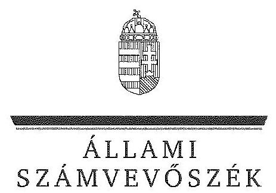

# JELENTÉS 

a központi alrendszer egyes intézményei pénzügyi és vagyongazdálkodásának ellenőrzéséről
Jahn Ferenc Dél-pesti Kórház és Rendelőintézet

---

# Állami Számvevőszék 

Iktatószám: V-0743-276/2016.
Témaszám: 1777
Vizsgálat-azonosító szám: V067908

## Az ellenőrzést felügyelte:

## Kisgergely István

felügyeleti vezető

## Az ellenőrzés végrehajtásáért felelősök:

Keresztes Tamás ellenőrzésvezető Pats Regina ellenőrzésvezető Korsósné Vigh Andrea ellenőrzésvezető

A számvevői munkaanyagok feldolgozását és a Jelentéstervezet összeállítását végezték:

Bocsi Sándor számvevő tanácsos Kersmájer Ágota számvevő főtanácsos Takaró Rita számvevő asszisztens Weltherné Szolnoki Dóra számvevő tanácsos

## Az ellenőrzést végezték:

Bocsi Sándor számvevő tanácsos Kriston-Vizi János számvevő tanácsos Dr. Podonyi László számvevő főtanácsos

Dr. Győri Gabriella Márta számvevő osztályvezető- főtanácsos Pats Regina ellenőrzésvezető Temesváry Miklós számvevő tanácsos

## Az ellenőrzést végezték:

Bocsi Sándor
számvevő tanácsos
Kriston-Vizi János
számvevő tanácsos
Dr. Podonyi László
számvevő főtanácsos

## Kersmájer Ágota

számvevő főtanácsos
Molcsánné Márta Tünde
számvevő tanácsos
Dr. Vincze Ibolya
számvevő

A témához kapcsolódó eddig készített számvevőszéki jelentés:
címe
sorszáma
Jelentés a sürgősségi betegellátó rendszer kialakítására, fejlesztésére fordított pénzeszközök felhasználásának ellenőrzéséről

---

# TARTALOMJEGYZÉK 

BEVEZETÉS ..... 3
I. ÖSSZEGZŐ MEGÁLLAPÍTÁSOK, KÖVETKEZTETÉSEK, JAVASLATOK ..... 8
II. RÉSZLETES MEGÁLLAPÍTÁSOK ..... 14

1. Az alapítói jogosultságok és az irányító szervi hatáskörök gyakorlása ..... 14
2. A Kórház átszervezése ..... 16
3. A belső kontrollrendszer és az integritás kontrollok értékelése ..... 18
4. A Kórház pénzügyi gazdálkodása ..... 23
4.1. Az előirányzatok megállapítása és módosítása ..... 23
4.2. A kiadási előirányzatok felhasználása és a bevételi előirányzatok teljesítése ..... 24
4.3. A pénzmaradványok, előirányzat-maradványok kezelése ..... 26
4.4. A fizetőképesség alakulása ..... 27
5. A Kórház vagyongazdálkodása ..... 30
5.1. A Kórház vagyonának változása ..... 30
5.2. A vagyongazdálkodás szabályszerűsége ..... 31
5.3. Az eredményszemléletű számvitel bevezetésével kapcsolatos feladatok végrehajtása ..... 32

---

# MELLÉKLETEK 

1. számú A belső kontrollrendszer kialakítása és működtetése szabályszerűségének alakulása a Kórháznál
2. számú A Kórház kiadásainak, bevételeinek és létszámának alakulása
3. számú A Kórház fizetőképességét és vagyoni helyzetét jellemző mutatók
4. számú A Kórház eszközeinek és forrásainak alakulása
5. számú A Kórház tárgyi eszközeivel kapcsolatos mutatószámok alakulása
6. számú A Kórház észrevétele
7. számú A Kórház észrevételére adott válasz
8. számú Budapest Főpolgármesterének levele észrevétel hiányában
9. számú Állami Egészségügyi Ellátó Központ főigazgatójának levele észrevétel hiányában

## FÜGGELÉKEK

1. számú A gazdaságossági, hatékonysági és eredményességi követelmények kialakítása és működtetése, a vezetői nyilatkozat helytállósága
2. számú Rövidítések jegyzéke
3. számú Értelmező szótár

---

# JELENTÉS 

## A központi alrendszer egyes intézményei pénzügyi és vagyongazdálkodásának ellenőrzéséről Jahn Ferenc Dél-pesti Kórház és Rendelőintézet

## BEVEZETÉS

A közpénzek felhasználásában és az állami vagyonnal való gazdálkodásban a központi alrendszer egyes intézményei meghatározó súlyt képviselnek. Pénzügyi és vagyongazdálkodásuk rendszeres ellenőrzésével az ÁSZ hozzájárul a hatékony közigazgatás megteremtéséhez. Az ÁSZ Stratégiával összhangban a közvagyon védelme, a közpénzügyek átláthatóságának előmozdítása érdekében került sor a Kórház ellenőrzésére.

A Kórház a főváros dél-pesti kerületeinek, valamint a hozzá kapcsolódó agglomeráció településeinek fekvő- és járóbeteg-szakellátási tevékenységét végezte. Aktív osztályain az ellátási területén élő közel 400 ezer fő egészségügyi ellátásáért felelt. A sebészeti, szülészeti, nőgyógyászati, fül-orr-gége, fejnyaksebészeti, neurológiai, urológiai, valamint az aneszteziológiai és intenzív betegellátó osztályai III. progresszivitási szintű besorolást kaptak. A Kórház négy telephelyen, 14 aktív, négy krónikus és hat rehabilitációs osztállyal, 1278 ággyal működött. Az aktív fekvőbeteg-szakellátás keretében ellátott személyek száma évente 33 ezer fő. Járóbeteg kapacitása 2013-ban 3393 órában, négy helyszínen közel 100 ambulanciával, szakrendeléssel és gondozóval fogadta a betegeket.

A Kórház az ellenőrzött időszakban önálló jogi személyiséggel rendelkező, önállóan működő és gazdálkodó, az előirányzatok felett teljes jogkörrel rendelkező költségvetési szerv volt. A Kórházat érintően az irányító szervi hatásköröket 2011. december 31-éig a Közgyűlés gyakorolta. A Kórház államháztartás önkormányzati alrendszeréből a központi alrendszerbe történt átsorolását követően, 2012. január 1-jétől az irányító szervi hatásköröket a Minisztérium, az egyes fenntartói, valamint az irányítási, középirányítói jogokat a Gyógyszerészeti és Egészségügyi Minőség- és Szervezetfejlesztési Intézet (GYEMSZI) gyakorolta. A GYEMSZI elnevezése 2015. március 1-jétől Állami Egészségügyi Ellátó Központra (ÁEEK-ra) változott.

Az ellenőrzött időszakban, a Kórház feladataiban és szervezeti felépítésében a 2009. évi járóbeteg-szakellátási kapacitás átadása jelentett változást. A Kórházat az ellenőrzéssel érintett időszakban főigazgató vezette, munkáját gazdasági igazgató, orvos- és minőségirányítási igazgató, stratégiai igazgató, és ápolási igazgató segítette. A Kórház főigazgatójának személyében 2011. július hónapban, 2012. augusztus hónapban, a gazdasági igazgató személyében 2011. július hónapban és 2012. szeptember hónapban történt változás.

A Kórház előirányzatainak és azok teljesítésének alakulását a következő diagram szemlélteti (az adatok a kiegyenlítő, függő és átfutó tételeket nem tartalmazzák):
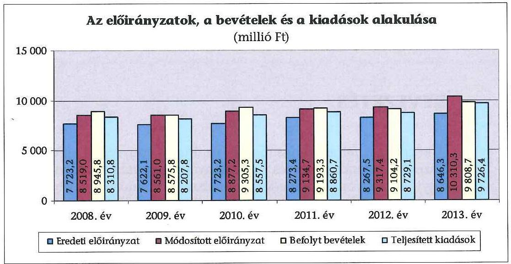

A Kórház könyvviteli mérleg szerinti vagyona a 2008. év eleji 7358,3 millió Ft-ról 2013. év végére 0,8%-kal, 7418,8 millió Ft-ra, a befektetett eszközök mérlegértéke a 2008. év eleji 6805,7 millió Ft-ról 0,7%-kal, 6855,9 millió Ft-ra emelkedett az ellenőrzött időszakban. A 2008. év eleji értékről a 2013. év végére a saját tőke 6322,4 millió Ft-ról 6087,5 millió Ft-ra, a tartalékok 207,1 millió Ft-ról 82,3 millió Ft-ra csökkentek, míg a kötelezettségek összege a passzív pénzügyi elszámolások nélkül 584,0 millió Ft-ról 953,9 millió Ft-ra növekedett.

A Kórház engedélyezett létszámkerete az ellenőrzött időszakban nem változott, 1912 fő volt.

Az ellenőrzés célja annak megállapítása volt, hogy a Kórházra vonatkozó irányító szervi feladatellátás a jogszabályi előírások betartásával történt-e; a Kórháznál a belső kontrollrendszer kialakítása és működtetése szabályszerű volt-e; kialakították-e az erőforrásokkal való szabályszerű és hatékony gazdálkodáshoz szükséges követelményeket, megvalósították-e azok számonkérését, ellenőrzését; a Kórház pénzügyi és vagyongazdálkodása megfelelt-e a jogszabályi előírásoknak és belső szabályzatainak; a Kórház átalakításának, átszervezésének lebonyolítása szabályszerűen történt-e; az integritási kontrollokat kialakították-e, szabályszerűen működtették-e.

Az ÁSZ a Kórházat a 2009. évben ellenőrizte, melyről készült 0924 számú, „Jelentés a sürgősségi betegellátó rendszer kialakítására, fejlesztésére fordított pénzeszközök felhasználásának ellenőrzéséről" című számvevőszéki jelentés a Kórház főigazgatója részére intézkedést igénylő megállapításokat, javaslatokat nem fogalmazott meg, ezért jelen ellenőrzésnél utóellenőrzésre nem került sor.

---

Az ellenőrzés várható hasznosulása: a központi alrendszerbe tartozó intézmények jelentős hatást gyakorolhatnak a költségvetés egyensúlyának fenntartására, az állami vagyonnal való gazdálkodás minőségére, a kormányzati (szak)politikák végrehajtására, illetve közfeladat-ellátásuk vonatkozásában az állampolgárok életminőségére, jogaik és kötelezettségeik gyakorlására. Az ellenőrzés a Kórház pénzügyi és vagyongazdálkodása szabályosságának javításával előmozdítja a közpénzügyek átláthatóságát, rendezettségét. Eredményeként átfogó képet kaphatunk a Kórház gazdálkodásának hiányosságairól és a jó gyakorlatokról is.

A közintézmények integritás alapú kultúrája meghatározó a belső kontrollrendszer működése szempontjából. Hozzájárulhat az elszámoltathatóság és átláthatóság érvényesítéséhez, egyben támogathatja a szervezet védettségét a korrupciós kitettséggel szemben. Az integritási kontrollok ellenőrzése az integritási szemlélet terjedését, az integritás kultúra erősítését támogatja.

A belső kontrollrendszer államháztartási törvényben rögzített célja a működés és gazdálkodás során a tevékenységek szabályszerű, gazdaságos, hatékony és eredményes végrehajtása. Az ÁSZ a központi alrendszer intézményeinek ellenőrzését teljesítményellenőrzési modullal egészítette ki.

A Kórház teljesítményellenőrzésének célja annak értékelése volt, hogy a gazdálkodás folyamatában a gazdaságossági, hatékonysági és eredményességi követelmények kialakítása megtörtént-e és azokat működtették-e; a költségvetési szerv belső kontrollrendszerének minőségéről kiadott vezetői nyilatkozatban a Kórház tevékenységében a hatékonyság, eredményesség, gazdaságosság követelményeinek érvényesítése helytálló volt-e. A teljesítményellenőrzés a gazdálkodási feladatokra terjedt ki, a szakmai feladatellátást nem értékelte. A gazdaságossági, hatékonysági és eredményességi követelmények kialakítására és működtetésére, a vezetői nyilatkozat helytállóságára vonatkozó megállapításokat az 1. sz. függelék tartalmazza.

A teljesítményellenőrzés várható hasznosulása: a törvényalkotás számára támogatást nyújt a nemzeti kulcsindikátorok rendszerének kialakításához. A döntéshozók, ellenőrzöttek, irányító szervek, a társadalom számára objektív visszajelzést ad a közfeladat-ellátásnak keretet adó pénzügyi és vagyongazdálkodásban mérhető teljesítménykövetelmények kialakításáról. Az ÁSZ értékteremtő elemzéseivel, tanácsadó szerepét erősítve támogatja a szervezetek önértékelő, alkalmazkodó (öntanuló) tevékenységét. Irányt mutat az ellenőrzött intézmények gazdálkodási és kapcsolódó adminisztratív folyamatainak optimalizációjához. Segíti a központi költségvetési szervek átláthatóságát, felügyelhetőségét, a „jó gyakorlatok" elterjesztésével támogatja a „jó kormányzást".

Az ellenőrzés típusa szabályszerűségi ellenőrzés, amelyet a Kórházra vonatkozó teljesítményellenőrzés egészített ki.

Az ellenőrzött időszak: 2008. január 1. - 2013. december 31.
Az ellenőrzésre a szabályszerűségi ellenőrzés tekintetében a Kórháznál, a Kórház irányító szervi feladatait ellátó Önkormányzatnál és Minisztériumnál,

---

valamint az egyes fenntartói, valamint az irányítási, középirányítói jogokat gyakorló GYEMSZI-nél, a teljesítményellenőrzésre a Kórháznál került sor.

Az ellenőrzés jogszabályi alapját az ÁSZ tv. 1. § (3) bekezdés, 5. § (2)(6) bekezdései, valamint Áht. 2 61. § (2) bekezdésének előírásai képezték.

Az ÁSZ a 2011. évi LXVI. törvény 29. §-a szerint a jelentéstervezetet megküldte az emberi erőforrások miniszterének, az Állami Egészségügyi Ellátó Központ főigazgatójának, a Budapest Főváros Önkormányzata főpolgármesterének és a Jahn Ferenc Dél-pesti Kórház és Rendelőintézet főigazgatójának. A megküldött jelentéstervezetre a Kórház főigazgatója tett észrevételt. Az észrevétel és az arra adott választ a jelentés 6-7. sz. mellékletei tartalmazzák.

A központi alrendszer intézményeinek ellenőrzése során a belső kontrollrendszer tekintetében a hangsúlyt az egyes kontrollterületek (kontrollkörnyezet, kockázatkezelési rendszer, kontrolltevékenységek, információs és kommunikációs rendszer, monitoring rendszer) kialakításának és az intézmény működési folyamataiba való beépülésének szabályszerűségére helyeztük, amelyet kizárólag jogszabályokból és intézményi belső szabályozásokból levezethető kritériumrendszer alapján ítéltünk meg.

A belső kontrollrendszer jogszabályi előírások szerinti kialakításának és működtetésének szabályszerűségét az erre irányuló ellenőrzési kérdésekre adott válaszok összesítése alapján kontrollterületenként egyedileg és összesítetten is értékeltük. A belső kontrollrendszer egyes kontrollterületei kialakítása és működtetése „szabályszerű volt", tehát a feltárt hiányosságok nem gyakoroltak lényeges hatást a kontrollok kialakítására és működtetésére, amennyiben az értékelt területen az elért és elérhető pontok százalékban kifejezett hányadosa elérte a 85%-ot, „nem volt szabályszerű", ha nem haladta meg a 60%-ot, és „részben szabályszerű volt", ha 61-84% között volt.

A belső kontrollrendszer összesített értékelése megegyezett a kontrollterületenként alkalmazott %-os értékelésekkel, a következő kiegészítéssel. A kontrollrendszer egésze esetében a „szabályszerű" értékelésnek a %-os értéken felül további feltétele volt, hogy egyik kontrollterületen sem kaphatott „nem volt szabályszerű" értékelést. A „részben szabályszerű" értékelés további feltétele volt, hogy legfeljebb egy ellenőrzött kontrollterület lehetett „nem volt szabályszerű" értékelésű. Az összesített értékelés a %-os kiértékelés eredményétől függetlenül „nem volt szabályszerű", ha az ellenőrzött kontrollterületek közül több mint egynek „nem volt szabályszerű" az értékelése.

A Kórház a 2013. évben nem vett részt az ÁSZ integritás felmérésében, ezért az integritás értékelése a tanúsítvány kérdéseire a Kórház által adott válaszok alapján történt. A minősítés két elemből tevődik össze. Az egyik elem a 3 releváns mutatószám (Eredendő Veszélyeztetettség Tényező - EVT, Korrupciós Veszélyeztetettséget Növelő Tényező - KVNT, Kockázatokat Mérséklő Kontrollok Tényező - KMKT) szervezetre vonatkozó értéke. A mutató minősítése az intézménycsoporti átlagos értéktől való eltérésen alapul. A minősítés "magas", ha az eltérés több mint 5 százalékpont pozitív irányban, "közepes", ha a pozitív, vagy negatív irányú eltérés kevesebb, mint 5 százalékpont, illetve "alacsony", ha az eltérés több mint 5 százalékpont negatív irányban. Az értékelés másik összetevőjeként a kontrollok (KMKT) szintje összevetésre kerül a kockázati mutatókkal (EVT és KVNT). Ha a kontrollok mutatójának a minősítése mindkét kockázati mutató minősítésénél jobb, "kiváló" minősítést kapott az ellenőrzött szervezet. Ha ez nem teljesül, de a kontrollok minősítése nem rosszabb egyik kockázati mutatószám minősítésénél sem, akkor "megfelelő", ellenkező esetben pedig "fejlesztendő" minősítés az értékelés eredménye.

A dologi kiadások és dologi jellegű (egyéb folyó)
 kiadások, a támogatásértékű kiadások, az átadott pénzeszközök, a kölcsönök nyújtása és a felhalmozási kiadások előirányzatai felhasználásának, valamint a vagyonhasznosítási bevételi előirányzatok teljesítésének szabályszerűségét, és e területekhez kapcsolódva a gazdálkodási jogkörök gyakorlása megfelelőségét is mintavétellel ellenőriztük. A gazdálkodási jogkörök gyakorlásának ellenőrzése a személyi juttatásokra is kiterjedt.

A jogszabályoknak és a belső előírásoknak megfelelőnek, azaz szabályszerűnek tekintettük a bevételi előirányzatok teljesítését, amennyiben a minta ellenőrzésének eredménye alapján 95%-os bizonyossággal a teljes sokaságban a hibaarány kisebb volt, mint 10%, nem megfelelőnek értékeltük, ha a hibaarány a 10%-ot meghaladta. A kiadási előirányzatok felhasználásának szabályszerűségét az ellenőrzött mintatételek vonatkozásában értékeltük.

A gazdálkodási jogkörök gyakorlásának ellenőrzése keretében a 2008-2011. éveket érintően a szakmai teljesítésigazolás és az utalvány ellenjegyzése kulcskontrollok, a 2012-2013. éveket érintően a teljesítésigazolás és az érvényesítés kulcskontrollok működését értékeltük. A kiadási előirányzatok felhasználásánál megfelelőnek értékeltük a gazdálkodási jogkörök gyakorlását, amennyiben 95%-os bizonyossággal a teljes sokaságban a hibaarány legfeljebb 10% volt, részben megfelelőnek, ha a hibaarány felső határa legfeljebb 30% volt, nem megfelelőnek, ha a sokaságbeli hibaarány felső határa meghaladta a 30%-ot. A vagyonhasznosítási bevételek esetében a gazdálkodási jogkörök gyakorlásának megfelelőségét az ellenőrzött mintatételek vonatkozásában értékeltük.

Az ellenőrzés az INTOSAI által kiadott nemzetközi standardok (ISSAI) figyelembevételével, az ellenőrzési programban foglalt értékelési szempontok szerint történt. A jelentéstervezetben alkalmazott rövidítések jegyzékét a 2. sz. függelék, az egyes fogalmak magyarázatát a 3. sz. függelék tartalmazza.

---

# I. ÖSSZEGZŐ MEGÁLLAPÍTÁSOK, KÖVETKEZTETÉSEK, JAVASLATOK 

A Kórházra vonatkozó irányító szervi feladatellátás során a jogszabályi előírások hiányosan érvényesültek. A belső kontrollrendszer kialakítása és működtetése a Kórháznál részben volt szabályszerű. A Kórház pénzügyi és vagyongazdálkodása nem volt a jogszabályok és a belső szabályzatok előírásainak megfelelő. A pénzügyi gazdálkodást 2011-től fokozódó likviditási nehézségek jellemezték, a fizetőképesség 2008-2010 között biztosított volt, a 2011-2013. években nem volt biztosított.

Az alapítói jogosultságokat a Közgyűlés és a Miniszter megfelelően gyakorolta. A GYEMSZI a fenntartói, irányítási, középirányítói jogok gyakorlására vonatkozó, közbeszerzéssel kapcsolatos jogszabályi előírásokat hiányosan érvényesítette a Kórház tekintetében, melynek következtében elmaradt a központosított közbeszerzésekből fakadó előnyök kihasználása. A Közgyűlés, a Minisztérium és a GYEMSZI a Kórházat érintően az erőforrásokkal való szabályszerű gazdálkodáshoz szükséges követelményeket kialakította és megvalósította a számonkérést. A hatékony gazdálkodáshoz a Közgyűlés és a GYEMSZI nem alakított ki mérhető teljesítmény-követelményeket. Az ellenőrzési jogosultságait a Minisztérium és a GYEMSZI szabályszerűen gyakorolta, a Közgyűlés részben gyakorolta az előírásoknak megfelelően, mivel nem ellenőrizte az erőforrásokkal való hatékony gazdálkodást és a nyilvános adatok kötelező közzétételét.

A belső kontrollrendszer kialakítása és működtetése az ellenőrzött időszakban részben volt szabályszerű, nem biztosította maradéktalanul a szabálytalanságok megelőzését, feltárását. A kontrollrendszer részterületei közül a kontrollkörnyezet, a kockázatkezelési rendszer, a monitoring rendszer szabályszerű, az információs és kommunikációs rendszer részben szabályszerű, a kontrolltevékenységek nem szabályszerű értékelést kapott.

A Kórház kialakította a kontrollrendszert a szervezet integritását veszélyeztető kockázatokkal szemben, azonban annak megfelelő működését az ellenőrzés tapasztalatai nem támasztották alá.

A Kórház pénzügyi gazdálkodásának szabályszerűsége összességében nem felelt meg a jogszabályi előírásoknak. A 2010-2013. években végrehajtott saját hatáskörű előirányzat-módosítások nem voltak teljes körűen alátámasztva előirányzat-módosítást elrendelő okiratokkal. Az ellenőrzött kiadási előirányzatok felhasználásánál a közbeszerzési eljárást több esetben nem folytatták le. A beruházások, felújítások terén egyes esetekben az üzembe helyezés dokumentálása, a bekerülési érték meghatározása nem felelt meg a jogszabályi előírásoknak. A 2008-2013. években a kiadási előirányzatok felhasználásához kapcsolódó kulcskontrollok (szakmai teljesítés igazolása, utalvány ellenjegyzése/teljesítésigazolás, érvényesítés) működésének szabályszerűsége nem volt megfelelő. A vagyonhasznosítási bevételi előirányzatok teljesítésének szabályszerűsége nem megfelelő, a tárgyévi pénzmaradvány, előirányzat-maradvány

---

megállapításának, az előző évi maradvány felhasználásának szabályszerűsége részben megfelelő volt.

A forgóeszközök, illetve pénzeszközök állománya 2008-2010 között fedezetet nyújtott, 2011-2013 között részben nyújtott fedezetet a rövid lejáratú kötelezettségekre. A fizetőképesség 2011-től nem volt biztosított, mivel a szállítói kötelezettségeinek a Kórház részben határidőn túl tudott eleget tenni. A Kórház mérleg szerinti szállítói állománya az ellenőrzött időszakban 451,8 millió Ft-tal (93,7%-kal) emelkedett annak ellenére, hogy a 2010-2013. években a szállítói kötelezettségek csökkentésére összesen 780,3 millió Ft konszolidációs támogatást kapott, továbbá a Kórház a likviditás javítása érdekében intézkedéseket tett. A lejárt szállítói tartozásállomány és a késedelem mértéke az ellenőrzött időszak végére emelkedett.

A Kórház vagyona 2008-2013. között 60,5 millió Ft-tal (0,8%-kal) növekedett. A végrehajtott beruházások nem ellensúlyozták az eszközök elszámolt amortizációjában megjelenő avulás, a tárgyi eszközök használhatósági foka csökkent. A mérlegben kimutatott eszközök és források értékének megállapítása, nyilvántartása nem felelt meg az előírásoknak. A leltározás végrehajtásának szabályszerűsége nem volt megfelelő. 2008-2011. között az ingatlanokat mennyiségi felvétellel, a követeléseket, az aktív pénzügyi elszámolásokat és a forrásokat egyeztetéssel nem leltározták, továbbá az értékvesztéssel, követelés-elengedéssel, el nem ismert követeléssel kapcsolatos dokumentumok nem álltak rendelkezésre. A 2010-2013. években a könyvviteli mérlegben kimutatott üzemeltetésre átadott eszközöket az üzemeltetők által készített hitelesített leltárral nem támasztották alá. A selejtezés végrehajtása a jogszabályoknak és a belső szabályozásnak megfelelően történt. A vagyonelemek tulajdonjogának térítésmentes átadás-átvétele megfelelt a jogszabályi előírásoknak. Az eredményszemléletű számvitel bevezetésével kapcsolatos feladatokat végrehajtották.

A Kórház 2009. évi átszervezését - a járóbeteg-szakellátási kapacitás átadását - szabályszerűen hajtották végre. 2012. január 1-jétől a Kórház, annak vagyona és vagyoni értékű jogai állami tulajdonba kerültek. A tulajdonosi és fenntartói jogutódlás tekintetében a jogszabályi előírások hiányosan érvényesültek, mivel az ellenőrzött időszak végéig nem született meg a konszolidációs törvény előírása ellenére a jogutódlás alapfeltételeire vonatkozó, az Önkormányzat és a Kormány közötti megállapodás, valamint a végrehajtás részletkérdéseire irányuló - az Önkormányzat és a GYEMSZI közötti - átadás-átvételi megállapodás. E megállapodások hiánya ellenére, a tulajdonosi és fenntartói jogutódlás a konszolidációs törvény rendelkezései erejénél fogva a Kórház vagyona tekintetében megtörtént. A Kórház vagyonkezelői joga 2012. január 1-jétől megszűnt, egyidejűleg a jogszabály által vagyonkezelésre kijelölt GYEMSZI az átvett vagyont a Kórházzal megkötött intézményi megállapodásban használatba, hasznosításba adta. A 2012. május 1-jétől hatályba lépett jogszabályi változások alapján a GYEMSZI vagyonkezelői joga megszűnt, tulajdonosi jogkörre változott, amely alapján az átvett vagyont - a Kórházzal 2013. február hónapban megkötött, 2012. május 1-jére visszamenőleges hatállyal érvényes vagyonkezelési szerződéssel - a Kórház vagyonkezelésébe adta. Ez a jogi megoldás (visszamenőleges hatályú vagyonkezelési szerződés) magas kockázatot hordozott az állami vagyon védelme és a felelős gazdálkodás terén.

---

Az ÁSZ tv. 33. § (1) bekezdésében foglaltak értelmében a jelentésben foglalt megállapításokhoz kapcsolódó intézkedési tervet köteles az ellenőrzött szervezet vezetője összeállítani, és azt a jelentés kézhezvételétől számított 30 napon belül az ÁSZ részére megküldeni. Amennyiben az intézkedési tervet határidőben nem küldi meg a szervezet, vagy az nem elfogadható, az ÁSZ elnöke a hivatkozott törvény 33. § (3) bekezdés a)-b) pontjaiban foglaltakat érvényesítheti.

A helyszíni ellenőrzés megállapításainak hasznosítása mellett javasoljuk:

# az ÁEEK főigazgatójának 

1. A GYEMSZI a közbeszerzések összevont lefolytatására vonatkozó, az 59/2011. (IV. 12.) Korm. rendelet 2012. január 1-jétől hatályos 2/A. § m) pont szerinti jogosultságát részben gyakorolta. A 46/2012. (III. 28.) Korm. rendelet 1. § (1) bekezdésének és 2. § 3. pontjának előírása ellenére a 2013. december 31-éig terjedő időszakban nem gondoskodott a Kórház fekvőbeteg szakellátása tekintetében teljes körűen a gyógyszerek, az orvostechnikai eszközök és a fertőtlenítőszerek vonatkozásában a közbeszerzések központosított lefolytatásáról, mivel keret-megállapodás megkötésére 2013. második félévétől és csak a gyógyszereket érintően került sor.

Javaslat
Intézkedjen a központi beszerző szervezet feladatkörében eljárva a központosított közbeszerzési rendszer keretén belül megvalósuló közbeszerzések lefolytatásáról.
2. A 2012-2013 közötti időszakban a GYEMSZI nem tudta érvényesíteni a Kórháznál az előirányzatokkal, létszámokkal és vagyonnal való hatékony gazdálkodás követelményeit, mert a Kórház részére mérhető teljesítménykövetelményeket nem határozott meg, ezért az 59/2011. (IV. 12.) Korm. rendelet 2/A. § a) pontjában és az Áht. 2 9. § (1) bekezdés f) pontjában foglalt előírásoknak nem tett eleget.

Javaslat
Intézkedjen a Kórház esetében az erőforrásokkal való szabályszerű és hatékony gazdálkodás mérhető teljesítménykövetelmények kialakításáról, valamint arról, hogy a közfeladatok ellátása és az erőforrásokkal való hatékony gazdálkodás követelményei érvényesüljenek.

## a Kórház főigazgatójának

1. A belső kontrollrendszer kialakítása és működtetése az ellenőrzött időszak tekintetében részben volt szabályszerű.

A kontrollkörnyezet kialakítása és működtetése összességében szabályszerű volt, annak ellenére, hogy Kórház kötelezettségvállalási szabályzata 2,3 vagy egyéb más belső szabályozása az Ámr. 2 2010. január 1-jétől hatályos 80. § (3) bekezdése és az Ávr. 60. § (3) bekezdése ellenére nem tartalmazta a kötelezettségvállalásra, ellenjegyzésre, utalványozásra jogosult személyek naprakész nyilvántartását és aláírásmintáját, valamint a kötelezettségvállalási szabályzat 3 nem tartalmazta a teljesítés

---

igazolására és az érvényesítésre jogosult személyek naprakész nyilvántartását és aláírás-mintáját.

A kontrolltevékenységek kialakítása és működtetése nem volt szabályszerű. Az operatív gazdálkodási jogköröket gyakorlók a feladatukat jogszerű kijelölés, illetve felhatalmazás hiányában 1 látták el, mert a 2008. január 1-je és 2012. október 10-e között érvényesítésre, 2008. január 1-je és 2013. március 31-e között teljesítésigazolásra, 2008. január 1-je és 2012. október 14-e között utalványozásra, az ellenőrzött időszak egészében kötelezettségvállalásra és ellenjegyzésre vonatkozó jogszerű kijelölések, illetve felhatalmazások nem készültek.

Az információs és kommunikációs rendszer kialakítása és működtetése az ellenőrzött időszakban összességében - részben volt szabályszerű. A Kórház az Info tv. 37. § (1) bekezdésében és 1. sz. mellékletében, valamint az Ávr. 173. § (3) bekezdésében és 8. mellékletének 13. és 14. pontjaiban előírt közérdekű adatok közzétételi kötelezettségét hiányosan teljesítette, mivel a jogszabályokban meghatározott - szervezetére, tevékenységére és működésére vonatkozó - információk a honlapján a helyszíni ellenőrzés időszakában nem voltak teljes körűen fellelhetők.

A monitoring-rendszer kialakítása és működtetése - az ellenőrzött időszakban összességében - szabályszerű volt, azonban a Kórház főigazgatója az ellenőrzött időszakban nem gondoskodott teljes körűen - a jogszabályi előírások ellenére - arról, hogy a Kórház valamennyi tevékenységében és céljaiban a gazdaságosság, a hatékonyság és az eredményesség követelményei érvényesüljenek, mivel teljesítménycélokat és követelményeket nem alakított ki és nem alkalmazott a gazdálkodás minden (így pl. a pénzügyi és vagyongazdálkodási feladatok) területén.

Javaslat
a) Intézkedjen a jogszabályoknak megfelelő belső kontrollrendszer kialakítása és működtetése érdekében a kontrollkörnyezet, a kontrolltevékenységek, továbbá az információs és kommunikációs rendszer, a monitoring rendszer ÁSZ ellenőrzés által feltárt hiányosságainak megszüntetéséről.
b) Intézkedjen a Kórház tevékenységére és céljára vonatkozó hatékonysági, eredményességi és gazdaságossági mérhető követelmények kialakításáról és érvényesítéséről.
2. A Kórház előirányzat-módosításokhoz kapcsolódó intézkedései nem voltak teljes körűen alátámasztottak, mert a 2012-2013. években a kiemelt előirányzatok közötti átcsoportosítások esetében az Ávr. 44. § (2) bekezdésében foglaltak ellenére nem készült az előirányzat-módosítást elrendelő okirat, amelyen az Ávr. 55. §-ban elrendelt szabályoknak megfelelően a kijelölt pénzügyi ellenjegyző az ellenjegyzést elvégezhette volna.

[^0]
[^0]:    ¹ Ámr.; 134.
 § (1) bekezdése, 135. § (2) és (4) bekezdése, 136. § (1) bekezdése, 137. § (1) bekezdése; az Ámr.; 74. (1) bekezdése, (2) bekezdés a) pontja, 76. § (5) bekezdése, 77. § (4) bekezdése, 78. § (1) bekezdése, 79. § (1) bekezdése, 80. § (3) bekezdése; az Ávr. 52. § (1) bekezdés a) pontja, 55. § (2) bekezdés a) pontja, 57. § (4) bekezdése, 58. § (4) bekezdése, 59. § (1) bekezdése és 60. § (3) bekezdése.

---

# Javaslat 

Intézkedjen az előirányzat-módosításokhoz kapcsolódó szabályszerű elrendelésről.
3. A Kórháznál a kiadási előirányzatoknál, a dologi kiadások teljesítésénél - a Számv. tv. 165. § (1)-(2) bekezdésben foglaltak ellenére - esetenként hiányoztak a kifizetést megalapozó dokumentumok, melyek hiánya miatt a kiadások szabályszerűsége nem volt ellenőrizhető. Az immateriális javak, tárgyi eszközök üzembe helyezése, a bekerülési érték meghatározása, az értékcsökkenés elszámolása egyes esetekben nem volt megítélhető, mivel a Számv. tv. 165. § (1)-(2) bekezdésének előírásai ellenére a Kórház a kifizetést alátámasztó dokumentumokkal nem rendelkezett. Az immateriális javak, a tárgyi eszközök üzembe helyezését az Áhsz. 30. § (1) bekezdésében előírtak ellenére nem dokumentálták teljes körűen, mert a számviteli politika ${ }_{1-}$ ${ }_{3}$-ban, valamint az értékelési szabályzat ${ }_{1}$-ben előírt üzembe helyezési jegyzőkönyveket, üzembe helyezési okmányokat a 2009-2013. években teljes körűen nem készítették el.

Javaslat
Intézkedjen a bizonylati elv és a bizonylati fegyelem érvényesítéséről, valamint a bizonylatok megőrzéséről.
4. A Kórház likviditási terveinek tartalma nem felelt meg teljes körűen a jogszabályi előírásoknak, mert az Ávr. 122. § (1) bekezdésében foglaltak ellenére a tárgyhónap vonatkozásában dekádonkénti ütemezést nem tartalmazott.

Javaslat
Intézkedjen a jogszabályi előírásoknak megfelelő likviditási terv elkészítéséről.
5. A Kórház vagyongazdálkodási tevékenységének szabályozottsága részben felelt meg az előírásoknak. A leltározási szabályzat az Áhsz. 37. § (6) bekezdésében foglalt előírást figyelmen kívül hagyva nem tartalmazta a kis értékű immateriális javak leltározásának szabályait. A mérlegben kimutatott eszközök és források értéke megállapítása, nyilvántartása nem felelt meg az előírásoknak. Az immateriális javak, a tárgyi eszközök üzembe helyezését az Áhsz. 30. § (1) bekezdésében előírtak ellenére nem dokumentálták teljes körűen, mert a számviteli politika ${ }_{1-3}$-ban, valamint az értékelési szabályzat ${ }_{1}$-ben előírt üzembe helyezési jegyzőkönyveket, üzembe helyezési okmányokat a 2009-2013. években teljes körűen nem készítették el. Az immateriális javak, tárgyi eszközök mérleg szerinti értékének megállapításánál a 2009-2013. években az üzembe helyezés pontos időpontjának hiánya miatt - nem érvényesültek a Számv. tv. 52. § (2) és a Áhsz. 30. § (1) bekezdésében foglalt előírások. Az Áhsz. 2010. január 1-jétől hatályos 37. § (2) és (4) bekezdésének előírása ellenére a 2010-2013. években az üzemeltetésre átadott eszközöket az üzemeltetők által készített hitelesített leltárral nem támasztották alá.

Javaslat
a) Intézkedjen a leltározási szabályzat kiegészítéséről;
b) Intézkedjen a jövőben az immateriális javak, a tárgyi eszközök üzembe helyezésekor az üzembe helyezési okmányok elkészítéséről;

---

c) Intézkedjen az üzemeltetésre átadott eszközök jogszabálynak megfelelő leltározásáról.
6. A Kórház nem folytatta le a közbeszerzési eljárást a Kbt. 1 hatálya alá tartozó beszerzéseknél (a dologi kiadások és a dologi jellegű - egyéb folyó - kiadások előirányzatának felhasználása során) a mintatételek alapján 16,7 millió Ft összeget érintően. A Kbt. 2 hatálya alá tartozó egyes beszerzéseknél (laboranyagok szállítása, orvostechnikai eszközök, gyógyászati anyagok, élelmezési anyagok beszerzése vonatkozásában) sem történt meg az eljárások lefolytatása. A 2009. január 13-a és 2011. március 31-e közötti időszakban a Kbt. 1 303. § (1) bekezdésében foglalt előírásokat megsértve hosszabbították meg - takarítási szolgáltatásra, urológiai kezelésre, mosószer, labor diagnosztikumok, varróanyagok, katéterek, szondák beszerzésére vonatkozóan - a korábban közbeszerzési eljárás alapján kötött szerződések időtartamát.

Javaslat:
a) Intézkedjen a jogszabályban meghatározott esetekben a közbeszerzési eljárás lefolytatásáról;
b) Tegyen intézkedéseket a feltárt szabálytalanságok tekintetében a felelősség tisztázása érdekében, és szükség szerint intézkedjen a felelősség érvényesítéséről.

---

# II. RÉSZLETES MEGÁLLAPÍTÁSOK 

## 1. Az alapítói jogosultságok És az irányító szervi hatáskörök gyakorlása

A Közgyűlés és a Miniszter a Kórházzal kapcsolatos alapítói jogosultságait a jogszabályi előírásoknak megfelelően gyakorolta. Az ellenőrzött időszakban az alapító okiratok tartalma megfelelt a jogszabályi rendelkezéseknek ${ }^{2}$ és azokban a változásokat átvezették. Az alapító okiratokat szabályszerűen - 2008-2011. között a Közgyűlés határozattal fogadta el, a 2012-2013. években a Miniszter adta ki.

Az irányító szervi hatásköröket a 2008-2011. közötti időszakban a Közgyűlés részben gyakorolta szabályszerűen. A Közgyűlés minden egyes évben beszámoló készítésre kötelezte a Kórházat és meghatározta annak határidejét. A Kórház az ellenőrzött időszakban rendelkezett jóváhagyott SZMSZ-szel, amelyek az alapító okiratban foglaltaknak megfeleltek, a jogszabályokban előírt követelményeknek részben feleltek meg. Az SZMSZ ${ }_{1}$ - az Ámr. ${ }_{1} 10 . \S(5)$ bekezdés b) ${ }^{3}$ és az Ámr. ${ }_{1} 13/$A. § (3) bekezdés c) ${ }^{4}$ pontjaiban foglaltak ellenére - nem tartalmazta az állami feladatként ellátott alaptevékenységet és a kiegészítő, kisegítő tevékenységeket meghatározó jogszabályok megjelölését. Az SZMSZ ${ }_{1,2}$ - az Ámr. ${ }_{1} 13/$A. § (3) bekezdés e) pontjában, illetve az Ámr. ${ }_{2} 20 . \S$ (2) bekezdés e) pontjában foglalt rendelkezéseket figyelmen kívül hagyva - 2009. január 1-jétől nem mutatta be a Kórház szervezeti egységeinek engedélyezett létszámát. Az SZMSZ ${ }_{1,2}$ jóváhagyása szabályos volt. A Kórház főigazgatóját és gazdasági igazgatóját a jogszabályi előírásoknak ${ }^{5}$ megfelelően a Közgyűlés nevezte ki, illetve bízta meg. A 2012-2013. években a Miniszter az irányítási hatásköröket szabályszerűen gyakorolta. Mindkét évben beszámoló készítésre kötelezte a Kórházat és meghatározta annak határidejét. A Kórház főigazgatóját és gazdasági igazgatóját - a GYEMSZI főigazgatójának javaslatára - szabályszerűen ${ }^{6}$ a Miniszter bízta meg, illetve nevezte ki.

## A 2012-2013. közötti időszakban a GYEMSZI az egyes fenntartói, valamint az irányítási, középirányítói jogok ${ }^{7}$ gyakorlására vonatkozó

[^0]
[^0]:    ${ }^{2}$ A 2008. évben az Áht ${ }_{1}$ 88. § (3) bekezdés, 2009. január 1-jétől 2010. augusztus 14-ig a Kt. 4. § (1) bekezdés, 2010. augusztus 15-től 2011. december 31-ig az Áht. 90. § (1) bekezdés, továbbá 2012. január 1-jétől az Ávr. 5. § (1) bekezdés.
    ${ }^{3}$ Hatályát vesztette 2008. december 31-én.
    ${ }^{4}$ Hatályos 2009. január 1-jétől.
    ${ }^{5}$ Eü. tv. 2012. június 30-ig hatályos 155. § (1) bekezdés c) pont.
    ${ }^{6}$ A konszolidációs tv. 14. § (2) bekezdésében szabályozott átmeneti időszakot követően (a főigazgatót 2012. július, a gazdasági igazgatót 2012. augusztus hónapban) az Eü. tv. 2012. július 1-jétől hatályos 155. § (4) bekezdés d) pontja alapján, az alapító okiratban rögzített fenntartói jogokkal és kinevezési renddel összhangban.
    ${ }^{7}$ 59/2011. (IV. 12.) Korm. rendelet 2/A. §.

---

jogszabályi előírásokat hiányosan érvényesítette. A GYEMSZI a Kórház 2013. május 27-én megküldött $\mathrm{SZMSZ}_{3}$-ét 2013. június 12-én jóváhagyta, az $\mathrm{SZMSZ}_{3}$ azonban az Ávr. 13. § (1) bekezdés e) pontjában foglaltakkal ellentétben nem tartalmazta a szervezeti egységek engedélyezett létszámát. A GYEMSZI az 59/2011. (IV. 12.) Korm. rendelet 2012. január 1-jétől hatályos 2/A. § m) pontja szerinti - a közbeszerzések összevont lefolytatására vonatkozó - jogosultságait részben gyakorolta. A 46/2012. (III. 28.) Korm. rendelet 1. § (1) bekezdés és 2. § (3) pontja előírása ellenére a 2013. december 31-éig terjedő időszakban a Kórházat érintően nem gondoskodott teljes körűen a fekvőbeteg szakellátáshoz kapcsolódó gyógyszerek, az orvostechnikai eszközök és a fertőtlenítőszerek vonatkozásában a közbeszerzések központosított lefolytatásáról, mivel keret-megállapodás megkötésére 2013. második félévétől és csak a gyógyszereket érintően került sor. Ezen mulasztásával a GYEMSZI nem tette lehetővé a Kórház fekvőbeteg szakellátása orvostechnikai eszköz és fertőtlenítőszerek beszerzése tekintetében a központosított közbeszerzésből fakadó előnyök kihasználását.

A Közgyűlés, a Minisztérium és a GYEMSZI a Kórházat érintően az erőforrásokkal való szabályszerű gazdálkodáshoz szükséges követelményeket kialakította és megvalósította a számonkérést. A szabályszerű gazdálkodáshoz szükséges követelmények kialakítása és számonkérése a költségvetés tervezésének és a beszámoltatás rendjének biztosításával valósult meg. Az ellenőrzött időszakban a Közgyűlés, illetve a GYEMSZI a bevételi és kiadási előirányzatokkal való gazdálkodást figyelemmel kísérte, a pénzügyi helyzetről rendszeres beszámolási kötelezettséget írt elő a Kórház főigazgatójának. A beszámolók kiterjedtek a belső szabályozottságra, a pénzügyi, likviditási helyzetre, a gyógyító ellátás kapacitásokra és teljesítményre, a belső ellenőrzés helyzetére, a panaszos ügyekre, a közbeszerzésekre, a fejlesztésekre, beruházásokra, a létszámokra és bérekre. A Közgyűlés és a GYEMSZI azonban a hatékony gazdálkodáshoz nem alakított ki mérhető teljesítménykövetelményeket. A 2009-2011. közötti időszakban ${ }^{8}$ a Közgyűlés, a 2012-2013. közötti időszakban a GYEMSZI nem érvényesítette a Kórháznál az előirányzatokkal, létszámokkal és vagyonnal való hatékony gazdálkodás követelményeit, mert a Kórház részére mérhető teljesítménykövetelményeket nem határozott meg. Ennek hiányában a Közgyűlés az Áht. 1 2009-2011. között hatályos 49. § (7) bekezdése alapján az (5) bekezdés f) pontjában foglalt, a GYEMSZI az 59/2011. (IV. 12.) Korm. rendelet 2/A. § a) pontjában és az Áht. 2 9. § (1) bekezdés f) pontjában foglalt előírásoknak nem tudott eleget tenni.

Az ellenőrzési jogosultságait a Közgyűlés részben gyakorolta a jogszabályi előírásoknak megfelelően, a Minisztérium és a GYEMSZI szabályszerűen gyakorolta azokat. Az ellenőrzési jogosultságok keretében a jóváhagyási jogkörök gyakorlása az ellenőrzött időszakban szabályszerű volt. A Kórház költségvetését és beszámolóját a Közgyűlés, illetve a Miniszter jóváhagyta. A jóváhagyási jogkörök gyakorlására, továbbá a pénzmaradvány, előirányzat-maradvány, az engedélyezett létszám feletti foglalkoztatáshoz történő hozzájárulás, illetve a többletbevétel felhasználása vonatkozásában került sor.

[^0]
[^0]:    ${ }^{8}$ A 2008. évet érintően nem volt a Közgyűlésre vonatkozó jogszabályi előírás.

---

Az egyéb ellenőrzési jogosultságok tekintetében a Közgyűlés a jogszabályi előírásokat hiányosan érvényesítette, mivel a 2009-2011. közötti időszakban a Kórháznál nem végzett ${ }^{9}$ az Áht. 1 49. § (7) bekezdése alapján az (5) bekezdés f) pontjában foglalt előírás ellenére, az erőforrásokkal (így különösen az előirányzatokkal, a létszámokkal és a vagyonnal) való hatékony gazdálkodásra irányuló ellenőrzést. Nem végzett továbbá az Áht. 1 49. § (5) bekezdés e) pontjában foglaltak ellenére az államháztartással összefüggő közérdekű és közérdekből nyilvános adatok kötelező közzétételének, illetve igényre történő szolgáltatásának végrehajtásával kapcsolatos ellenőrzést. A Kórháznál a Közgyűlés a 2010. évben végzett szabályszerűségi ellenőrzést, melynek keretében a belső kontrollok működését értékelték.

A GYEMSZI a Kórháznál a szabályzatok meglétét ellenőrizte a 2013. évben, adatbekéréssel. A GYEMSZI nem végzett az 59/2011. (IV. 12.) Korm. rendelet 2/A. § m) pontja alapján folyamatba épített, illetve utóellenőrzést a Kórház közbeszerzési eljárásaival kapcsolatban, illetve az Áht. 2 9. § (1) bekezdés f) pontjában foglalt előírás alapján az erőforrásokkal való
 hatékony gazdálkodásra irányuló ellenőrzést.

A Kórházat érintő, irányító szervi hatáskörben történt előirányzat-módosítások szabályszerűek voltak. Az Önkormányzat a 2008-2011. évek között a központi bérintézkedésekhez, intézményi beruházásokhoz, a detoxikáló fenntartásának támogatásához, valamint az OEP által nem finanszírozott egészségügyi feladatok ellátásához biztosított a Kórháznak forrásokat. A GYEMSZI előirányzat-módosításai a 2012-2013. években a rezidensek képzési költségeinek megtérítéséhez, valamint a Kórház többletbevételeinek felhasználásához kapcsolódtak.

# 2. A KÓRHÁZ ÁTSZERVEZÉSE 

A járóbeteg-szakellátási kapacitás 2009. évben történt átadását szabályszerűen hajtották végre. A Közgyűlés határozata alapján a Kórház 2009. február 1-jétől heti 85 szakorvosi óra és 90 nem szakorvosi óra kapacitást adott át Budapest Főváros XXIII. kerület Soroksár Önkormányzata Egészségügyi és Szociális Intézménye részére. Az Önkormányzat, a Kórház, a XXIII. kerületi Önkormányzat, valamint a XXIII. kerület Soroksár Önkormányzata Egészségügyi és Szociális Intézménye képviselői által aláírt megállapodás alapján a feladathoz kapcsolódó tárgyi eszközök térítésmentes átadás-átvétele szabályszerűen megtörtént.

A konszolidációs törvény előírásai ${ }^{10}$ alapján 2012. január 1-jétől a Kórház, annak vagyona és vagyoni értékű jogai állami tulajdonba kerültek, továbbá a vagyonnal és az intézménnyel kapcsolatos alapítói, fenntartói jogok és kötelezettségek az e törvényben meghatározott szervekre e törvény erejénél fogva átszálltak. Az Önkormányzat helyébe - a Kórház vagyona, vagyoni értékű jogai és a Kórházzal kapcsolatos jogviszonyok tekintetében általános és

[^0]
[^0]:    ${ }^{9}$ A 2008. évet érintően nem voltak kapcsolódó jogszabályi előírások.
    ${ }^{10}$ Konszolidációs törvény 2. § (1) bekezdése, valamint 6. § (4) bekezdése.

---

egyetemleges jogutódként - az állam, illetőleg az e törvényben meghatározott szervek léptek. ${ }^{11}$ A Kórház alapító, irányító szerve a Minisztérium lett ${ }^{12}$, az egyes fenntartói, irányító/középirányítói jogok, valamint a vagyonkezelői jog gyakorlására ${ }^{13}$ a jogszabályok a GYEMSZI-t jelölték ki.

A Kórház tulajdonosi és fenntartói jogutódlása feladatainak végrehajtására vonatkozó jogszabályi előírások hiányosan érvényesültek.

Az ellenőrzött időszak végéig nem született meg a jogutódlás alapvető feltételeire irányuló, az Önkormányzat és a Kormány közötti megállapodás, továbbá a végrehajtás részletkérdései rögzítésére irányuló háromoldalú - a főpolgármester, a GYEMSZI főigazgatója és az MNV Zrt. vezérigazgatója közötti - átadás-átvételi megállapodás, a konszolidációs törvény 2. § (4) bekezdés előírása ellenére. A feleknek az átadás-átvételi megállapodást 2011. december 31-ig kellett megkötniük azzal, hogy e határidő elmulasztása a Kórház átvételét nem akadályozza. ${ }^{14}$ A megállapodás és az átadás-átvételi megállapodás hiánya ellenére, a tulajdonosi és fenntartói jogutódlás a konszolidációs törvény rendelkezései erejénél fogva a Kórház vagyona tekintetében megtörtént. A jogszabályok ${ }^{15}$ egyértelműen meghatározták azt a vagyoni kört és annak bekerülési értékét, amely a Kórházat érintően 2012. január 1-jével a Fővárosi Önkormányzattól - fő szabályként - az állam által átvételre került.

A GYEMSZI 2012. január 1-jétől az átvett ingatlan és intézményi ingó vagyont a Kórházzal megkötött intézményi megállapodásban használatba, hasznosításba adta. A 2012. május 1-jétől hatályba lépett jogszabályi változások ${ }^{16}$ alapján a GYEMSZI vagyonkezelői joga megszűnt, tulajdonosi jogkörre változott. A GYEMSZI, mint tulajdonosi joggyakorló az eszközöket 2012. május 1. napjával - 2013. februárban visszamenőleges hatállyal megkötött vagyonkezelési szerződéssel - a Kórház vagyonkezelésébe adta. Ez a jogi megoldás (visszamenőleges hatályú vagyonkezelési szerződés) magas kockázatot hordozott az állami vagyon védelme és a felelős gazdálkodás terén.

[^0]
[^0]:    ${ }^{11}$ Konszolidációs törvény 2. § (4) bekezdése.
    ${ }^{12}$ A 2012. január 1-jén hatályos Eü. tv. 155. § (3)-(4) bekezdései.
    ${ }^{13}$ Az 59/2011. (IV. 12.) Korm. rendelet 2. § m) pontja és 2/A §. A vagyonkezelői jog tekintetében a konszolidációs törvény 3. § (1) bekezdés a) pontja alapján az 59/2011. (IV. 12.) Korm. rendelet 2. § o) pont (hatályos 2012. január 1 - április 28.).
    ${ }^{14}$ A konszolidációs törvény 6. § (3) bekezdés szerint.
    ${ }^{15}$ A konszolidációs törvény 1. § 3. pontja, 2. § (1)-(2) és (4) bekezdései, valamint a 6. § (4) bekezdés, továbbá a konszolidációs törvény végrehajtási rendelet 1. § (1)-(2) bekezdések előírásai együttesen.
    ${ }^{16}$ A 2012. évi XXXVIII. törvény 13. § (1) bekezdés a) pont előírása alapján.

---

# 3. A BELSŐ KONTROLLRENDSZER ÉS AZ INTEGRITÁS KONTROLLOK ÉRTÉKELÉSE 

A belső kontrollrendszer kialakítását és működtetését az ellenőrzött időszak egészére részben szabályszerűnek értékeltük. Az évenkénti értékelést a következő táblázat szemlélteti.

| Belső kontrollrendszer összevont értékelése | 2008. év | 2009. év | 2010. év | 2011. év | 2012. év | 2013. év |
| :--: | :--: | :--: | :--: | :--: | :--: | :--: |
|  | önkormányzati alrendszer |  |  |  | központi alrendszer |  |
| szabályszerű |  |  |  |  |  |  |
| részben szabályszerű |  |  |  |  |  |  |
| nem szabályszerű |  |  |  |  |  |  |

A 2008. évben a belső kontrollrendszer annak két területén - a kontrolltevékenységeknél, valamint az információs és kommunikációs rendszernél - feltárt hiányosságok miatt nem volt szabályszerű.

A Kórház főigazgatója a 2008., a 2012. és a 2013. évet érintően a jogszabályi előírások szerinti nyilatkozatban értékelte a belső kontrollrendszer kialakítását és működését. A nyilatkozatok szerint gondoskodott a belső kontrollrendszer kialakításáról, valamint annak szabályszerű, gazdaságos, hatékony és eredményes működtetéséről. A Kórháznál a 2009. és a 2010. évre vonatkozóan az Ámr. ${ }_{2}$ 21. számú melléklete szerinti, a 2011. évre vonatkozóan a Bkr. 1. számú melléklete szerinti vezetői nyilatkozatok - az Ámr. ${ }_{2}$ 217. § c) pontja, 226. § (3) bekezdése és a Bkr. 11. § (1) és (4) bekezdése ellenére - nem készültek. A 2011. évben és a 2012. évben történt évközi vezetőváltáskor a Kórház távozó vezetői az Ámr. ${ }_{2}$ 226. § (3) bekezdése és a Bkr. 11. § (4) bekezdésében előírtak ellenére nem tettek nyilatkozatot a belső kontrollrendszer működéséről. A belső kontrollrendszer kialakításának és működtetésének szabályszerűségével kapcsolatos, területenkénti és évenkénti értékelések összefoglaló bemutatását az 1. számú melléklet tartalmazza.

A kontrollkörnyezet kialakítása és működtetése - az ellenőrzött időszakban összességében - szabályszerű volt. Az évenkénti értékelést a következő táblázat szemlélteti.

| Kontrollkörnyezet | 2008. év | 2009. év | 2010. év | 2011. év | 2012. év | 2013. év |
| :--: | :--: | :--: | :--: | :--: | :--: | :--: |
|  | önkormányzati alrendszer |  |  |  | központi alrendszer |  |
| szabályszerű |  |  |  |  |  |  |
| részben szabályszerű |  |  |  |  |  |  |
| nem szabályszerű |  |  |  |  |  |  |

A feladatköröket, valamint az azokhoz tartozó felelősségi- és hatásköröket az ügyrendben, a munkaköri leírásokban az Ámr. ${ }_{1,2}$ és a Bkr. előírásainak megfelelően szabályozták. A Kórház 2012. január 1-jei állami tulajdonba és fenntartásba vétele, egyidejűleg a központi alrendszerbe történt átsorolása kapcsán, a belső szabályzatokon a szükséges változásokat átvezették.

A kontrollkörnyezet kialakításának 2008. évi értékelését rontotta, hogy a Kórház ebben az évben a Számv. tv. 161. § (1) bekezdésében, illetve az Áhsz. 4849. §-aiban foglalt előírás ellenére nem rendelkezett számlarenddel és számla-

---

kerettel. A kontrollkörnyezet kialakítása és működtetése 2009-2013 között a következő hiányosságok mellett összességében szabályszerű volt:

- a leltározási szabályzat az üzemeltetésre, kezelésre átadott eszközök tekintetében nem a 2010. január 1-jétől hatályos Áhsz. 37. § (4) bekezdésében foglalt előírásokkal összhangban tartalmazta ezen eszközcsoport leltározására vonatkozó szabályokat, mivel e szabályzat jogszabályi változásokkal történő aktualizálását annak indokoltsága ellenére nem végezték el;
- a Kórház kötelezettségvállalási szabályzata ${ }_{2,3}$ vagy egyéb más belső szabályozása az Ámr. ${ }_{2}$ 2010. január 1-jétől hatályos 80. § (3) bekezdése és az Ávr. 2012. január 1-től hatályos 60. § (3) bekezdése ellenére nem tartalmazta a kötelezettségvállalásra, ellenjegyzésre, utalványozásra jogosult személyek naprakész nyilvántartását és aláírás-mintáját, valamint a kötelezettségvállalási szabályzat ${ }_{3}$ nem tartalmazta a teljesítés igazolására és az érvényesítésre jogosult személyek naprakész nyilvántartását és aláírás-mintáját;
- a 2010. január 1-je és 2013. augusztus 1-je közötti időszakban az Ámr. ${ }_{2}$ 20. § (3) bekezdés i) pontjában, illetve az Ávr. 13. § (2) bekezdés h) pontjában foglalt előírás ellenére a Kórház nem rendelkezett a közérdekű adatok megismerésére irányuló kérelmek intézésének, továbbá a kötelezően közzéteendő adatok nyilvánosságra hozatalának rendjét tartalmazó szabályzattal. A közérdekű adatok megismerésére irányuló igények teljesítésének rendjét rögzítő szabályzat hiánya miatt a Kórház az Info tv. 2012. január 1-jétől hatályba lépett 30. § (6) bekezdésében foglaltaknak sem tett eleget.

A kockázatkezelési rendszer kialakítása és működtetése - az ellenőrzött időszakban összességében - szabályszerű volt. Az évenkénti értékelést a következő táblázat mutatja be.

| Kockázatkezelési rendszer | 2008. év | 2009. év | 2010. év | 2011. év | 2012. év | 2013. év |
| :--: | :--: | :--: | :--: | :--: | :--: | :--: |
|  | önkormányzati alrendszer |  |  |  | központi alrendszer |  |
| szabályszerű |  |  |  |  |  |  |
| részben szabályszerű |  |  |  |  |  |  |
| nem szabályszerű |  |  |  |  |  |  |

A Kórház az ellenőrzött időszakban kialakította a kockázatkezelési rendszerét, rendelkezett kockázatkezelési szabályzattal. A kockázatkezelési rendszer működtetése a 2008-2009. években hiányos, a 2010-2013. években az előírásoknak megfelelő volt. A Kórház évente végzett kockázatelemzést, azonban a 2008-2009. években az Ámr. ${ }_{1} 145/$C. § (3) bekezdésében foglaltakkal ellentétesen nem határozták meg azon intézkedéseket és azok megtételének módját, melyek csökkentik, illetve megszüntetik a kockázatokat.

A kontrolltevékenység kialakítása és működtetése - az ellenőrzött időszakban összességében - nem volt szabályszerű. Az évenkénti értékelést a következő táblázat szemlélteti.

---

| Kontrolltevékenységek | 2008. év | 2009. év | 2010. év | 2011. év | 2012. év | 2013. év |
| :-- | :--: | :--: | :--: | :--: | :--: | :--: |
|  | önkormányzati alrendszer |  |  |  | központi alrendszer |  |
| szabályszerű |  |  |  |  |  |  |
| részben szabályszerű |  |  |

  |  |  |  |
| nem szabályszerű |  |  |  |  |  |  |

A kontrolltevékenységek kialakítása és működtetése során az ellenőrzés az alábbi hiányosságokat tárta fel:

- az operatív gazdálkodási jogköröket gyakorlók a feladatukat jogszerű kijelölés hiányában ${ }^{17}$ látták el, mert a 2008. január 1-je és 2012. október 10-e között érvényesítésre, 2008. január 1-je és 2013. március 31-e között teljesítésigazolásra, 2008. január 1-je és 2012. október 14-e között utalványozásra, az ellenőrzött időszak egészében kötelezettségvállalásra és ellenjegyzésre vonatkozó jogszerű kijelölések, illetve felhatalmazások nem készültek;
- a Kórház a 2008-2013. közötti időszakban rendelkezett FEUVE szabályzattal. A FEUVE szabályzat ${ }_{1}$ megfelelt az előírásoknak. A FEUVE szabályzat ${ }_{2}$ részben felelt meg a jogszabályi előírásoknak ${ }^{18}$, mert a kontrolltevékenység részeként nem biztosították a folyamatba épített, előzetes, utólagos és vezetői ellenőrzést a pénzügyi kihatású döntések célszerűségi, gazdaságossági, hatékonysági és eredményességi szempontú megalapozottsága vonatkozásában. A kontrollok megfelelő működését a Kórház pénzügyi gazdálkodása és vagyongazdálkodása szabályszerűségének ellenőrzése során feltárt hiányosságok nem támasztották alá.

Az információs és kommunikációs rendszer kialakítása és működtetése - az ellenőrzött időszakban összességében - részben volt szabályszerű. Az évenkénti értékelést a következő táblázat szemlélteti.

| Információs és   kommunikációs   rendszer | 2008. év | 2009. év | 2010. év | 2011. év | 2012. év | 2013. év |
| :--: | :--: | :--: | :--: | :--: | :--: | :--: |
|  | önkormányzati alrendszer |  |  |  | központi alrendszer |  |
| szabályszerű |  |  |  |  |  |  |
| részben szabályszerű |  |  |  |  |  |  |
| nem szabályszerű |  |  |  |  |  |  |

A Kórház 2009. évtől kezdődően rendelkezett informatikai biztonsági szabályzattal, mely kitért az adatvédelmi előírásokra is. A belső szabályzatok az Ámr. ${ }_{1,2}$-ben, valamint a Bkr.-ben foglaltaknak megfelelően az információ átadás formáit meghatározták, a dolgozók részére a szabályzatok elektronikus formában rendelkezésre álltak a belső információs hálózaton (intranet) keresztül.

[^0]
[^0]:    ${ }^{17}$ Ámr. ${ }_{1} 134 . \S$ (1) bekezdése, 135. § (2) és (4) bekezdése, 136. § (1) bekezdése, 137. § (1) bekezdése; az Ámr. ${ }_{2}$ 74. (1) bekezdése, (2) bekezdés a) pontja, 76. § (5) bekezdése, 77. § (4) bekezdése, 78. § (1) bekezdése, 79. § (1) bekezdése, 80. § (3) bekezdése; az Ávr. 52. § (1) bekezdés a) pontja, 55. § (2) bekezdés a) pontja, 57. § (4) bekezdése, 58. § (4) bekezdése, 59. § (1) bekezdése és 60. § (3) bekezdése.
    ${ }^{18}$ Áht. ${ }_{1}$ 2011. január 1-jétől hatályos 121/A. § (4) bekezdés b) pontja, a 2012-2013. közötti időszakban a Bkr. 8. § (2) bekezdés b) pontja.

---

Az információs és kommunikációs rendszer kialakítása és működtetése terén feltárt hiányosság volt, hogy:

- a Kórháznál a 2009-2013 közötti időszakban ${ }^{19}$ - ellentétben az Ámr. ${ }_{1}$ 145/F. § (2) bekezdésével, az Ámr. ${ }_{2}$ 159. § (2) bekezdésével és a Bkr. 9. § (2) bekezdésével - részben működtettek hatékony, megbízható és pontos beszámolási rendszereket, mert a beszámolási szinteket, határidőket és módokat nem szabályozták;
- a Kórház az Info tv. 37. § (1) bekezdésében és 1. sz. mellékletében, valamint az Ávr. 173. § (3) bekezdésében és 8. mellékletének 13. pontjában előírt közérdekű adatok közzétételi kötelezettségét hiányosan teljesítette, mivel a jogszabályokban meghatározott - szervezetére, tevékenységére, működésére és gazdálkodására vonatkozó - információk a honlapján ${ }^{20}$ a helyszíni ellenőrzés időszakában nem voltak teljes körűen fellelhetők.

A monitoring-rendszer kialakítása és működtetése - az ellenőrzött időszakban összességében - szabályszerű volt. Az évenkénti értékelést a következő táblázat szemlélteti.

| Monitoring rendszer | 2008. év | 2009. év | 2010. év | 2011. év | 2012. év | 2013. év |
| :-- | :--: | :--: | :--: | :--: | :--: | :--: |
|  | önkormányzati alrendszer |  |  |  | központi alrendszer |  |
| szabályszerű |  |  |  |  |  |  |
| részben szabályszerű |  |  |  |  |  |  |
| nem szabályszerű |  |  |  |  |  |  |

A monitoring rendszer keretében

- a Kórház a belső ellenőrzési rendszer kialakítása és működtetése során a jogszabályi előírásokat betartotta. A Kórház főigazgatója az Áht. ${ }_{1,2}$-ben foglaltaknak megfelelően gondoskodott a belső ellenőrzés szervezeti kialakításáról. Az ellenőrzött időszakban közalkalmazotti jogviszonyban foglalkoztatott belső ellenőrrel biztosította a függetlenített belső ellenőrzést. A belső ellenőri megbízásoknál a Ber., valamint a Bkr. előírásainak megfelelően érvényesültek az összeférhetetlenségi előírások. A belső ellenőröket megillető betekintési és hozzáférési jogosultságokat a Ber. és a Bkr. előírásainak megfelelően a 2008-2011. közötti időszakban és 2013. évben biztosították. A belső ellenőrzésnek 2012. évben egy informatikai rendszerbe nem volt betekintési joga a Bkr. 25. § b) pontjában foglaltakkal ellentétben;
- a Kórház a belső és külső ellenőrzések által tett megállapításokra és javaslatokra készült intézkedési terveket, azok realizálódását és hasznosulását nyomon követte. A Kórház a belső ellenőrzésekről a jogszabályi előírásoknak megfelelő nyilvántartást vezetett. A belső ellenőrzések során megállapított hiányosságok alapján tett intézkedések megvalósításáról az érintett szervezeti egység vezetője írásos beszámolót készített. Az éves belső ellenőrzési jelentésekben értékelték az intézkedések megvalósulását. A külső ellenőrzésekről az előírásoknak megfelelő nyilvántartást vezettek.

[^0]
[^0]:    ${ }^{19}$ A 2008. évet érintően nem volt jogszabályi előírás.
    ${ }^{20} \mathrm{http}: / / w w w . d e l p e s t i k o r h a z . h u$

---

A Kórház főigazgatója az ellenőrzött időszakban nem gondoskodott teljes körűen - a jogszabályi ${ }^{21}$ előírások ellenére - arról, hogy a Kórház valamennyi tevékenységében és céljaiban a gazdaságosság, a hatékonyság és az eredményesség követelményei érvényesüljenek, mivel teljesítménycélokat és követelményeket nem alakított ki és nem alkalmazott a gazdálkodás minden (így pl. a pénzügyi és vagyongazdálkodási feladatok) területén. A vezetői információs rendszer keretében meghatározták a gyógyító szervezeti egységek elérendő évenkénti, teljesítménymutatókkal, indikátorokkal leírt céljait és értékelték azok elérését. Az egészségügyi szakmai működési teljesítményt rendszeresen, havonta, meghatározott elvárt teljesítményekhez hasonlítva elemezték, értékelték, külön vizsgálták a járóbeteg-ellátás, az aktív fekvőbeteg-ellátás és a krónikus fekvőbeteg-ellátás teljesítményét. Az információs rendszer keretében folyamatosan tájékoztatták a Kórház vezetőit az elvárt súlyszámhoz, ápolási naphoz, járóbeteg német ponthoz képest a tényadatokról. A 2008-2013. években a főigazgató és az osztályvezető főorvosok között megkötött tervmegállapodásokban határozták meg az egyes osztályoktól elvárt teljesítménykövetelményeket az alábbi mutatószámok alapján:

- a szakmai feladatellátásnál: a fekvőbeteg-ellátás esetén az ágykihasználtság, átlagos ápolási idő, egy ágyra jutó esetszám, case-mix index;
- a gazdálkodásban: a járóbeteg-ellátásnál a tárgyévben elszámolt német pont/előző évben elszámolt német pont, a fekvőbeteg-ellátásnál a tárgyévben teljesített súlyszám/előző évben teljesített súlyszám.

A Kórháznál a belső ellenőrzés az ellenőrzött időszakban a Ber. 2. § c)-d) pontjai, illetve a Bkr. 21. § (2) bekezdés a) pontja, valamint (3) bekezdés d) pontja szerinti, hatékonyságra irányuló ellenőrzéseket nem végzett.

Az integritás szemlélet érvényesülésének ellenőrzéséhez a Kórház tanúsítványon szolgáltatott adatot. Az adatok értékelése alapján az eredendő veszélyeztetettségi szint közepes, míg a kockázatokat növelő tényező szintje magas. Emellett a Kórháznál kiépült, a kockázatok kezelésére hivatott kontrollok szintje is magas. A kockázatok és a kontrollok szintje alapján megállapítható, hogy a Kórháznál jelenlévő kockázatok, és az azok kezelésére kiépült kontrollok szintje között egyensúly van. A Kórház kialakította a kontrollrendszert a szervezet integritását veszélyeztető kockázatokkal szemben, azonban annak megfelelő működését az ellenőrzés tapasztalatai nem támasztották alá.

[^0]
[^0]:    ${ }^{21}$ Az Áht. 1 94. § (1) bekezdés b) pontjában, az Áht. 2 61. § (1) bekezdésében, az Áht. 2 69. § (1) bekezdés a) pontjában és a Bkr. 4. § a) pontjában foglalt előírások.

---

# 4. A Kórház pénzügyi gazdálkodása 

A Kórház pénzügyi gazdálkodásának szabályszerűsége - összességében - nem volt megfelelő.

### 4.1. Az előirányzatok megállapítása és módosítása

## A Kórház elemi költségvetésének, az előirányzatok megállapításának szabályszerűsége részben volt megfelelő.

A Kórház a költségvetés tervezésével kapcsolatos feladatokat az SZMSZ ${ }_{1-3}$-ban és a szervezeti egységek ügyrendjeiben meghatározta. A munkaköri leírásokban a tervezéssel kapcsolatos feladatok rögzítésre kerültek. A Kórház a 2008. január 1-je és 2010. szeptember 6-a közötti időszakban - az Ámr. ${ }_{1}$ 145/B. § (1) és Ámr. ${ }_{2}$ 156. § (2) bekezdéseinek előírása ellenére - nem rendelkezett az előirányzatok tervezésének működési folyamatát tartalmazó ellenőrzési nyomvonallal. A 2010. szeptember 7-én jóváhagyott ellenőrzési nyomvonal megfelelő részletezettséggel, a felelősök és határidők megjelölésével határozta meg a költségvetés tervezésének folyamatát.

A 2008-2011. években a Kórház az éves költségvetését az Önkormányzat által kiküldött tervezési felhívás alapján állította össze. A Közgyűlés által elfogadott 2008-2011. évi költségvetési rendeletek vonatkozó adatai, valamint a Kórház elemi költségvetése kiemelt előirányzati szinten megegyeztek. A 2012-2013. években a Kórház az éves költségvetési javaslatát az NGM költségvetési törvényjavaslat összeállításához szükséges feltételekről és az érvényesítendő követelményekről szóló, az adott évre vonatkozó tervezési körirata, valamint a GYEMSZI által meghatározott tervezési szempontok figyelembevételével készítette el.

A költségvetés tervezését számításokkal megalapozó dokumentumokkal azonban a Kórház - a jogszabályi előírások ellenére ${ }^{22}$ - a 2008-2012. közötti időszakot érintően nem rendelkezett. A Kórház minden egyes évben határidőre megküldte az elemi költségvetést az irányító szervnek és a Kincstárnak. A 2012. és 2013. években a kincstári és az elemi költségvetések adatai közötti egyezőség biztosított volt.

A Kórház bevételi és kiadási előirányzatainak módosítása részben volt szabályszerű. Országgyűlési hatáskörben végrehajtott előirányzatmódosításra az ellenőrzött időszakban nem került sor. A Kormány hatáskörében történt előirányzat-módosításokat elrendelő kormányhatározatok egyedi elszámolási kötelezettséget nem írtak elő. A 2013. évi költségvetési beszámolóban - az Áhsz. 10. § (3) bekezdésében hivatkozott Módszertani útmutatóban és űrlapgarnitúrában foglaltak ellenére - 14,0 millió Ft összegű rezidensi képzési támogatást tévesen a Kormány hatáskörű előirányzat-módosítások között szerepeltettek.

[^0]
[^0]:    ${ }^{22}$ Áht. ${ }_{1}$ 121. § (1) bekezdés a) pontja (hatályos 2010. december 31-éig), az Áht. ${ }_{1} 90 . \S$ (6) bekezdése (hatályos 2009. január 1-jétől), illetve az Áht. ${ }_{2}$ 12. § (1) bekezdése.

---

A Kórház az ellenőrzött időszakban saját hatáskörű előirányzat-módosítást meghatározóan az OEP támogatás
 többlete (adósságkonszolidáció, év végi szabad források terhére terven felüli támogatás), adomány és támogatás, pénzmaradvány, valamint a 2012. évtől kezdődően az előző évi előirányzatmaradvány előirányzatosítása miatt hajtott végre.

A Kórház előirányzat-módosításokhoz kapcsolódó intézkedései nem voltak teljes körűen alátámasztottak. A 2008-2009. években a Kórház - a főigazgató és gazdasági igazgató által aláírt - előirányzat módosítást elrendelő okiratot készített. A 2010-2011. években azonban a saját hatáskörben végrehajtott előirányzat módosítások elrendelésére és azok ellenjegyzésére nem került sor az Ámr. 260. § (6) bekezdésében foglaltak ellenére. A 2012-2013. években a kiemelt előirányzatok közötti átcsoportosítások esetében az Ávr. 44. § (2) bekezdésében foglaltak ellenére nem készült az előirányzat módosítást elrendelő okirat, amelyen az Ávr. 55. §-ban elrendelt szabályoknak megfelelően a kijelölt pénzügyi ellenjegyző az ellenjegyzést elvégezhette volna. Az átcsoportosítás bejelentése a 2013. évben csak a Kincstár részére történt meg, a Kórház - az Ávr. 167. § (4) bekezdésének előírása ellenére - elmulasztotta a GYEMSZI tájékoztatását.

A 2008-2011. években a saját hatáskörű előirányzat-módosítások az Önkormányzat költségvetési rendeletében átvezetésre kerültek. A Kórház az ellenőrzött időszak minden egyes évét érintően rendelkezett előirányzatnyilvántartással. A költségvetési beszámolókban szereplő előirányzatmódosítások - a rezidensi támogatás kivételével - összegszerűen megegyeztek a főkönyvi könyvelés szerinti előirányzat-változásokkal, valamint az analitikus nyilvántartás adataival.

# 4.2. A kiadási előirányzatok felhasználása és a bevételi előirányzatok teljesítése 

Az ellenőrzött személyi juttatások, dologi kiadások és dologi jellegű (egyéb folyó) kiadások, támogatásértékű kiadások, átadott pénzeszközök és felhalmozási kiadások előirányzatai felhasználásánál a jogszabályi előírások hiányosan érvényesültek, az ellenőrzés az alábbi hibákat tárta fel:

- a dologi kiadások és a dologi jellegű (egyéb folyó) kiadások előirányzatának felhasználása során a Kórház nem folytatta le a közbeszerzési eljárást a Kbt. ${ }_{1}$ hatálya alá tartozó szolgáltatás beszerzésnél a mintatételek alapján 16,7 millió Ft összeget érintően. A Kbt. ${ }_{2}$ hatálya alá tartozó egyes beszerzéseknél - laboranyagok szállítása, orvostechnikai eszközök, gyógyászati anyagok, élelmezési anyagok beszerzése vonatkozásában - sem történt meg a közbeszerzési eljárások lefolytatása. A 2009. január 13-a és 2011. március 31-e közötti időszakban a Kbt. ${ }_{1}$ 303. § (1) bekezdésében foglalt előírásokat megsértve hosszabbították meg - takarítási szolgáltatásra, urológiai kezelésre, mosószer, labor diagnosztikumok, varróanyagok, katéterek, szondák beszerzésére vonatkozóan - a korábban közbeszerzési eljárás alapján kötött szerződések időtartamát;
- a dologi kiadások teljesítésénél esetenként hiányoztak a kifizetést megalapozó dokumentumok (kötelezettségvállalás, megrendelés, számla, utalványrendelet), melyek hiánya miatt a kiadások szabályszerűsége nem volt ellenőrizhető, a Kórház bizonylatok kiállításával és számviteli nyilvántartásba való rögzítésével kapcsolatos eljárása ellentétes volt a Számv. tv. 165. § (1)(2) bekezdésének előírásaival;

---

- egyes beruházások, felújítások esetén az üzembe helyezés dokumentálása, a bekerülési érték meghatározása, így az értékcsökkenés elszámolása nem felelt meg a Számv. tv. 52. § (2) és az Áhsz. 30. § (1) bekezdésében foglaltaknak. Egy beszerzett tárgyi eszköz a leltárban nem volt fellelhető. A kapcsolódó megállapításokat az 5.2. pont tartalmazza.

Az ellenőrzött pénzeszköz átadásoknál és a támogatásértékű kiadásoknál megállapodásban rögzítették a támogatás célját, előírták a beszámolási kötelezettséget, a felhasználás a megállapodásban rögzített jogcímeken valósult meg.

A kiadási előirányzatok felhasználásához kapcsolódó kulcskontrollok működésének szabályszerűsége a 2008-2013. közötti időszakban az alábbi hiányosságok miatt nem volt megfelelő:

- az ellenőrzött időszak egészében a dologi kiadások, a felhalmozási kiadások valamint a személyi juttatások kifizetései során nem történt meg minden esetben a (szakmai) teljesítés igazolása, továbbá esetenként hiányoztak a kifizetést megalapozó dokumentumok ${ }^{23}$, ezért a teljesítésigazoló aláírása ellenére nem látta el - az Ámr. ${ }_{1}$ 135. § (1) bekezdésében, az Ámr. ${ }_{2}$ 76. § (1) bekezdésében és az Ávr. 57. § (1) bekezdésében foglalt - ellenőrzési feladatát a kiadások teljesítésének jogosságára, összegszerűségére vonatkozóan. A (szakmai) teljesítésigazoló feladatát egyes esetekben nem az Ámr. 135. § (2) bekezdésében, az Ámr. ${ }_{2}$ 76. § (3) bekezdésében, továbbá az Ávr. 57. § (3) bekezdésében foglaltaknak megfelelően látta el, mert a teljesítés igazolás nem tartalmazta annak dátumát. A 2008. január 1-jétől 2013. március 31-ig terjedő időszakban a teljesítésigazolást - az Ámr. ${ }_{1}$ 135. § (2) bekezdésében, az Ámr. ${ }_{2}$ 76. § (5) bekezdésében és az Ávr. 57. § (4) bekezdésében előírtak ellenére - kijelöléssel nem rendelkező személy jogosulatlanul végezte;
- a dologi kiadások, a felhalmozási kiadások valamint a személyi juttatások kifizetései során a 2008-2011. közötti időszakban a teljesítésigazolás elmaradásának eseteiben az utalvány ellenjegyzője - az Ámr. ${ }_{1}$ 137. § (3) bekezdésének, az Ámr. ${ }_{2}$ 79. § (2) bekezdésének rendelkezései ellenére - nem győződött meg a szakmai teljesítésigazolás megtörténtéről;
- a 2008-2011. években a pénzeszközátadások, támogatásértékű kiadások teljesítése során szakmai teljesítésigazolást az Ámr. 135. § (1) bekezdésében és az Ámr. ${ }_{2}$ 76. § (1) bekezdésében előírtak ellenére nem végeztek, a kiadások teljesítésének jogosságát, összegszerűségét nem igazolták. Az utalvány ellenjegyzését az Ámr. ${ }_{1}$ 137. § (1) bekezdésében és az Ámr. ${ }_{2}$ 79. § (1) bekezdésében előírtak ellenére nem végezték el, melynek hiányában nem ellenőrizték az Ámr. ${ }_{1}$ 137. § (3) bekezdésében és az Ámr. ${ }_{2}$ 79. § (2) bekezdésében előírt szakmai teljesítésigazolás és érvényesítés megtörténtét;

[^0]
[^0]:    ${ }^{23}$ Megrendelés, szerződés, személyi anyag, átsorolási okirat, kilépő lap, jelenléti ív, adóelőleg nyilatkozat.

---

- a 2012-2013. közötti időszakot érintően a teljesítésigazolás elmaradását, illetve annak jogosulatlan elvégzését az érvényesítő - az Ávr. 58. § (2) bekezdésében foglaltak ellenére - az utalványozónak nem jelezte. Az érvényesítést 2012. január 1-je és 2012. október 10. között - az Ávr. 58. § (4) bekezdésében előírtak ellenére - kijelöléssel nem rendelkező személy végezte.

A Kórház a 2011. évben - az Áht. ${ }_{1}$ 12/A. § (1) bekezdésében foglalt előírás ellenére - a személyi juttatások és az intézményi beruházások kiemelt előirányzata esetében a jóváhagyott (szabad) kiadási előirányzat mértékén túl vállalt tárgyévi fizetési kötelezettséget. A személyi juttatások teljesítése 20,5 millió Ft-tal (0,5%-kal), az intézményi beruházások teljesítése 26,5 millió Ft-tal (7%-kal) haladta meg a módosított előirányzatot. A Kórház a 2012. évben - az Áht. ${ }_{2}$ 36. § (1) bekezdésében foglalt rendelkezés ellenére - a személyi juttatások kiemelt előirányzata esetében a jóváhagyott (szabad) kiadási előirányzat mértékén túl vállalt tárgyévi fizetési kötelezettséget. A személyi juttatások teljesítése 197,7 millió Ft-tal (5%-kal) haladta meg a módosított előirányzatot.

A vagyonhasznosítási bevételi előirányzatok teljesítésének szabályszerűsége nem volt megfelelő. A Kórház az ellenőrzött időszakban az összes bevétele (55 240,2 millió Ft) 0,9%-át kitevő, 472,5 millió Ft összegű vagyonhasznosítási bevételt realizált ${ }^{24}$.

A Kórház a 2012-2013. években megkötött vagyonhasznosítási szerződései kapcsán - ellentétben az Nvtv. 3. § (2) bekezdésében foglaltakkal - nem rendelkezett a szerződő felek átlátható szervezet feltételeinek való megfeleléséről szóló nyilatkozatokkal. A Kórház a GYEMSZI által kiadott iránymutatás ${ }^{25}$ ellenére a tárgyi eszközök bérbeadása során az inflációkövetést nem érvényesítette. A mintatételekhez kapcsolódó, befolyt bevételeknél a Kórház által kibocsátott számlák rendelkezésre álltak.

Az ellenőrzött vagyonhasznosítási bevételek esetében a 2008-2009. években az Ámr. ${ }_{1}$ 135. (2) bekezdése ellenére nem történt meg a teljesítés igazolása és az Ámr. ${ }_{1}$ 137. § (3) bekezdése ellenére az utalvány ellenjegyzése. A bevételek könyvviteli elszámolását alátámasztó bizonylatok esetenként hiányoztak, mely ellentétes volt a Számv. tv. 165. § (1)-(2) bekezdéseinek előírásaival.

A 2013. évi költségvetési törvényben meghatározott befizetési kötelezettségének a Kórház eleget tett. A 2013. évi szociális hozzájárulási adó változása miatt a kiadási megtakarításból eredő 26,5 millió Ft-ot visszafizette.

# 4.3. A pénzmaradványok, előirányzat-maradványok kezelése 

A Kórháznál a tárgyévi pénzmaradvány, előirányzat-maradvány megállapításának és az előző évi maradvány felhasználásának szabályszerűsége részben volt megfelelő. A 2008-2013. közötti időszakban a Kórháznál kimutatott pénz-, illetve előirányzat-maradvány összesen

[^0]
[^0]:    ${ }^{24}$ A részletes adatokat a 2. számú melléklet tartalmazza.
    ${ }^{25}$ A 3818-2/2012. számú 2012. április 21-én aláírt „Iránymutatás az egészségügyi intézmények használatában lévő ingatlanok bérbeadásáról”.

---

2330,3 millió Ft volt, ebből szabad előirányzat-maradvány a 2013. évben keletkezett 1,9 millió Ft összegben, amelyet az irányító szerv elvont. Az elvont maradványt érintő befizetési kötelezettségének a Kórház eleget tett.

A 2008-2011. évi pénzmaradványt a Közgyűlés, a 2012-2013. évi előirányzatmaradványt a GYEMSZI hagyta jóvá. A Kórház rendelkezett a pénzmaradvány, előirányzat-maradvány jóváhagyásáról irányító szervi engedéllyel.

A Kórháznál - a Számv. tv. 165. § (1)-(2) bekezdéseiben foglalt rendelkezések ellenére - a 2009-2010. éveket érintően a maradvány levezetését, a 2008-2012. közötti időszakra a maradvány terhére történt kifizetések kimutatását tartalmazó dokumentumok nem készültek. A 2013. I. félévre a kincstári kötelezettségvállalás bejelentő dokumentumok az Ávr. 167/A. § (1) bekezdése és 7. mellékletének 16. pontja, illetve a kötelezettségvállalási szabályzat ${ }_{3}$ VIII. pontjának előírásai ellenére egyes esetekben a fedezetét tekintve a tárgyévi költségvetés terhére, és nem az előző évi maradvány terhére kerültek kitöltésre. A főkönyvi számlák, az analitikus nyilvántartások és az éves beszámolók között az adategyezőség fennállt. A Kórház az előirányzat-maradványáról az adatszolgáltatási kötelezettségét 2012-ben és 2013-ban késedelmesen teljesítette, mert az éves elemi költségvetési beszámolóját az Áhsz. 10. § (1) bekezdésben előírt február 28-i határidő helyett 2012-ben április 18-án, 2013-ban április 15-én küldte meg a Minisztérium részére.

# 4.4. A fizetőképesség alakulása 

A Kórház a bevételek beérkezésének és a kiadások teljesítésének ütemezésére 2008. január 1. és 2010. augusztus 14. közötti időszakban ${ }^{26}$ - a jogszabályi előírások ${ }^{27}$ ellenére - nem készített előirányzat-felhasználási tervet. A 2012. január-február hónapokra az Áht. ${ }_{2}$ 78. § (2) bekezdésében foglalt előírás ellenére likviditási tervet nem készítettek. Likviditási tervvel 2012. március hónaptól kezdődően rendelkeztek. A likviditási terv tartalma nem felelt meg teljes körűen a jogszabályi előírásoknak, mert az Ávr. 122. § (1) bekezdésében foglaltak ellenére a tárgyhónap vonatkozásában dekádonkénti ütemezést nem tartalmazott.

A Kórház központi költségvetésből származó bevétele a teljesítmény finanszírozásából és egyéb eseti jellegű forrásokból tevődött össze. A szakmai teljesítmény finanszírozása az egészségügyi tevékenységek beazonosítási rendszerében a lejelentett teljesítmények alapján történt. Azokon a területeken, ahol az elszámolható teljesítmény mennyiséget korlátozták (TVK), az OEP a központilag megállapított TVK alatti teljesítményeket az adott egészségügyi szolgáltatásra kihirdetett díj

[^0]
[^0]:    ${ }^{26}$ A 2010. augusztus 15. és 2011. december 31. közötti időszakot érintően előirányzatfelhasználási terv, illetve likviditási terv készítési kötelezettséget jogszabály nem írt elő.
    ${ }^{27}$ Az Ámr. ${ }_{1}$ 134. § (7) bekezdésében, 2008. január 1. és december 31. között az Áht. ${ }_{1}$ 98. § (2) bekezdésében, illetve 2009. január 1. és 2010.
 augusztus 14. között az Áht. ${ }_{1}$. 100/B. § (1) bekezdésében foglaltak.

---

100\%-ában, a TVK feletti teljesítményeket 2008-2010 között nem, ezt követően egy határig degresszív módon ${ }^{28}$, a határ felett pedig nem finanszírozta.

A Kórház a likviditási tervben az utólagos finanszírozás miatt a tárgyhót követő harmadik, illetve második hónapig tudta nagy pontossággal megtervezni a szakmai teljesítmény ellenértékeként várható bevétel összegét. A további hónapok bevételeit és kiadásait a korábbi évek tapasztalati adatai alapján becsülték meg. A Kórház 2008-2013. évi költségvetési bevételeinek meghatározó részét, 92-95\%-át tették ki, így a likviditás és fizetőképesség szempontjából is alapvető befolyással bírtak az OEP-től származó bevételek.

Az ellenőrzött időszakban a fekvő- és járóbeteg-ellátás finanszírozási díjai ${ }^{29}$ 2,7\%-kal növekedtek, a krónikus fekvőbeteg-ellátás finanszírozási díja ${ }^{30}$ nem változott.

A szakmai teljesítmények alapján elszámolt bevételeken kívül a Kórháznak eseti jelleggel irányító szervi támogatásból - bérkiegészítésből, konszolidációs támogatásból, valamint az OEP-nél képződött maradvány egészségügyi intézmények közötti év végi kiosztásából - származott a központi költségvetésből bevétele.

Az év végi adatok alapján a forgóeszközök állománya a 2012-2013. években, illetve a pénzeszközök állománya a 2011-2013. években nem nyújtott fedezetet a rövid lejáratú kötelezettségekre ${ }^{31}$. A fizetőképesség 2008-2010. években biztosított volt, 2011-től nem volt biztosított, mivel a szállítói kötelezettségeknek a Kórház határidőn túl tudott eleget tenni. A jellemzően év végén folyósított konszolidációs támogatás és OEP maradványból kapott támogatás javította a Kórház év végi likviditási helyzetét, mutatóit.

A Kórház mérleg szerinti szállítói kötelezettség állománya az ellenőrzött időszakban - a 2011. évet kivéve - folyamatosan növekedett, a 2008. január 1-jei 482 millió Ft-ról 451,8 millió Ft-tal (93,7\%-kal), 933,8 millió Ft-ra. Ez annak ellenére következett be, hogy a szállítói kötelezettségek csökkentésére a Kórház összesen 780,3 millió Ft konszolidációs támogatást kapott. A támogatás ellenére lejárt szállítói tartozásállomány képződött, a késedelem mértéke az ellenőrzött időszak végére emelkedett. A Kórház mérleg szerinti szállítói tartozásállománya lejárat szerinti változását és abban a konszolidációs támogatás hatását szemlélteti a következő táblázat.

[^0]
[^0]:    ${ }^{28}$ 2011-2012-ben az aktív fekvőbeteg szakellátásnál a TVK 10\%-os túllépéséig az alapdíj 30\%-át, 2013-ban a TVK 4\%-os túllépéséig az alapdíj 25\%-át utalványozták. A járóbeteg-szakellátásnál 2011-2012-ben a TVK 10\%-os túllépéséig az alapdíj 30\%-át, 10-20\% közötti TVK túllépésig az alapdíj 20\%-át számolta el az OEP, 2013-ban 8\%-os TVK túllépésig 20\% alapdíjat utalványoztak.
    ${ }^{29}$ 2008-ban 146 ezer Ft/súlyszám, 2013-ban 150 ezer Ft/súlyszám, 2008-ban 1,46 Ft/német pont, 2013-ban 1,5 Ft/német pont.
    ${ }^{30}$ 5600 Ft/súlyozott krónikus nap.
    ${ }^{31}$ A likviditási mutatók évenkénti adatait, változásait a 3. számú melléklet tartalmazza.

---

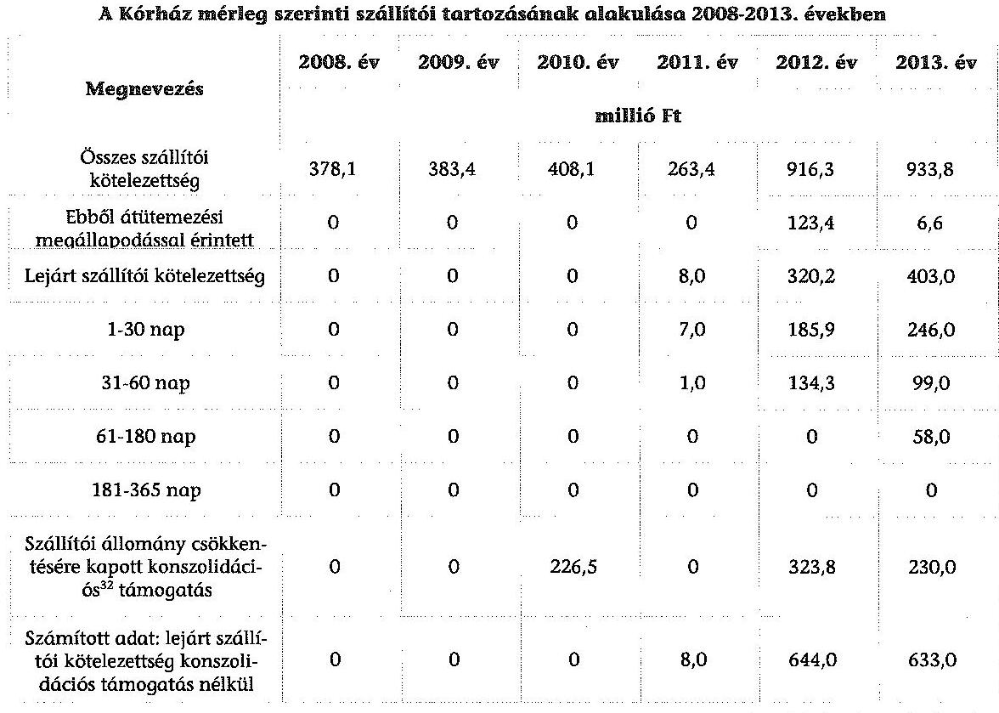

Forrás: Kórház adatszolgáltatása
A Kórház a likviditás javítása érdekében havi gazdálkodási elemzéseket készített és értékelt ki. A gyógyító osztályok havi teljesítményeit folyamatosan monitorozta, a gyógyszer elszámolás követésére informatikai rendszert vezetett be. A bevétel optimalizáció érdekében a betegellátó egységekkel éves teljesítmény megállapodásokat kötött. A 2012-2013. években patika bérleti szerződéseket, informatikai szoftverek bérleti szerződéseit, ügyvédi feladatok ellátására és egészségügyi szolgáltatásra vonatkozó szerződéseket vizsgált felül. Fizetés átütemezésére megállapodásokat kötött. A szállítói számlák kiegyenlítését egyedi rangsorolás alapján teljesítette.

A 2012. és 2013. évi költségvetési hiánycél biztosításához szükséges további intézkedésekről szóló 1036/2012. (II. 21.) Korm. határozatban elrendelt egyes eszközcsoportokra vonatkozó beszerzési tilalom előírásait a Kórház az informatikai eszközök vonatkozásában 2012-ben nem tartotta be. Összesen négy alkalommal, 756,0 ezer Ft értékben hét informatikai eszköz beszerzésére került sor 2012. március 21-e és 2012. május 14-e között a beszerzési korlátozás alóli felmentés nélkül.

A Kórház kötelezettségállománya a 2008. január 1-jei 828,8 millió Ft-ról 2013. december 31-ére 1249,0 millió Ft-ra, 420,2 millió Ft-tal emelkedett. Ebben meghatározó szerepet játszott a szállítói állomány 451,8 millió Ft-os emelkedése. A hosszú lejáratú kötelezettségállomány a 2008. január 1-jei 101,9 millió Ft-ról 2013. december 31-re 17,6 millió Ft-ra csökkent, az esedékes összegnek a rö-

[^0]
[^0]:    ${ }^{32}$ A 269/2010. (XII. 3.) Korm. rendelet, 337/2011. (XII. 29.) Korm. rendelet és a 438/2013. (XI. 29.) Korm. rendelet.

---

vid lejáratú kötelezettségek közé történt átvezetése miatt. Így ez is negatív hatást gyakorolt a Kórház likviditási helyzetére.

A Kórház követelésállománya 2008. január 1-jéről 2013. december 31-ére 12,2 millió Ft-tal 60,0 millió Ft-ra emelkedett. Ebből meghatározó részt, 46,2 millió Ft-ot a vevőkkel szemben fennálló követelések jelentettek.

A Kórház a fizetőképességének fenntartása érdekében a fennálló követeléseinek behajtására a vevői tartozások csökkentése érdekében fizetési felszólításokat küldött a nem fizető ügyfeleknek. Behajthatatlanság címén 2008-ban 11,8 millió Ft, 2009-ben 6,8 millió Ft, 2010-ben 14,2 millió Ft, 2011-ben 14,7 millió Ft, 2013-ban 26,2 millió Ft követelést írtak le.

# 5. A Kórház VAGYONGAZDÁLKODÁSA 

### 5.1. A Kórház vagyonának változása

A Kórház vagyona 2008. január 1-jén 7358,3 millió Ft volt, amely 2013. december 31-re 60,5 millió Ft-tal (0,8\%-kal) 7418,8 millió Ft-ra növekedett.

Az eszközöknél e pozitív irányú változás az immateriális javak állományi értékének 3,7 millió Ft-os (52,1\%-os) és a tárgyi eszközök 68,4 millió Ft-os (1,0\%-os) emelkedése miatt következett be, a forgóeszközök állományi értéke 10,3 millió Ft-os (1,9\%-os) emelkedése mellett. A tárgyi eszközök növekedésében szerepet játszó okok és a vagyonmérlegben mutatkozó tendenciák a következők:

- a Kórház 2008-2013. évi költségvetéseiben a felújításokra és intézményi beruházásokra rendelkezésre álló módosított előirányzat az összes kiadási előirányzat 2,4-6,2\%-os mértékéig, összesen 2295,7 millió Ft összegben biztosított felhasználható előirányzat keretet. Az évente teljesített felújítási és beruházási kiadás a likviditási nehézségek miatt ennél alacsonyabb - az összes kiadáshoz viszonyítva - 0,8-5,1\% között volt;
- a tárgyi eszközök állományi értéke a 2008-2009. években bekövetkezett csökkenés ellenére 1,0\%-kal növekedett az ellenőrzött időszak végére. Az eszközök használhatósági foka - az immateriális javak kivételével - minden eszközcsoportban csökkent (ezzel párhuzamosan az elhasználódási szint és az átlagos életkor emelkedett). Az eszközökön belül (a még nullára le nem írt) gépek, berendezések, felszerelések használhatósági foka az ellenőrzött időszak végén mindössze 17,9\% volt, a nullára leírt gépek, berendezések, felszerelések aránya az eszközcsoporton belül 63,1\%-ra emelkedett. A járművek használhatósági foka 2013. év végére 8,3\%-ra csökkent, a nullára leírt járművek eszközcsoporton belüli aránya 69,5\%-ra emelkedett. A Kórház vagyoni helyzetét jellemző mutatókat a 3. számú, a tárgyi eszközei elhasználódási szintjével kapcsolatos mutatók alakulását az 5. számú melléklet szemlélteti;
- a Kórház vagyonmérlege forrás oldalán a vagyon a saját tőkét és a tartalékokat érintően csökkent. A forrás oldal szerkezete kedvezőtlenül változott, mivel a saját tőke 3,7\%-os és a tartalékok 60,3\%-os visszaesése mellett a kötelezettségek 50,7\%-kal nőttek. A mérlegen belül a saját tőke és a tartalékok

---

aránya a 2008. évi 88,8\%-ról 83,2\%-ra csökkent, a kötelezettségek aránya 11,3\%-ról 16,8\%-ra emelkedett.

# 5.2. A vagyongazdálkodás szabályszerűsége 

A Kórház a vagyongazdálkodással kapcsolatos szabályozási kötelezettségének részben tett eleget. A Kórház 2010-2013 között az Ámr. 20. § (3) bekezdés e) pontjában, illetve az Ávr. 13. § (2) bekezdés d) pontjában foglaltak ellenére nem határozta meg a helyiségek és berendezések használatára, továbbá 2010. január 1-je és 2012. szeptember 2. között az Ámr. ${ }_{2} 20 . \S$ (3) bekezdés h), illetve az Ávr. 13. § (2) bekezdés g) pontjában előírtak ellenére a vezetékes és rádiótelefonok használatára vonatkozó előírásokat. A leltározási szabályzat az Áhsz. 37. § (6) bekezdésében foglalt előírást figyelmen kívül hagyva nem tartalmazta a kis értékű immateriális javak leltározásának módját.

A mérlegben kimutatott eszközök és források értékének megállapítása, nyilvántartása nem felelt meg az előírásoknak.

Az immateriális javak, tárgyi eszközök üzembe helyezése, a bekerülési érték meghatározása, az értékcsökkenés elszámolása egyes esetekben nem volt megítélhető, mivel a Számv. tv. 165. § (1)-(2) bekezdéseinek előírásai ellenére a Kórház a kifizetést alátámasztó dokumentumokkal nem rendelkezett. Az immateriális javak, a tárgyi eszközök üzembe helyezését az Áhsz. 30. § (1) bekezdésében előírtak ellenére nem dokumentálták teljes körűen, mert a számviteli politika ${ }_{1-3}$-ban, valamint az értékelési szabályzat ${ }_{1}$-ben előírt üzembe helyezési jegyzőkönyveket, üzembe helyezési okmányokat a 2009-2013. években teljes körűen nem készítették el. Az immateriális javak, tárgyi eszközök mérleg szerinti értékének megállapításánál a 2009-2013. években - az üzembe helyezés pontos időpontjának hiánya miatt - nem érvényesültek a Számv. tv. 52. § (2) és az Áhsz. 30. § (1) bekezdésében foglalt előírások.

Egyes eszközök bekerülési értékének meghatározása során figyelmen kívül hagyták a Számv. tv. 15. § (3) bekezdésében foglalt valódiság és a Számv. tv. 16. § (1) bekezdésében foglalt egyedi értékelés elvét, valamint az értékelési szabályzat ${ }_{1}$ IV.2. pontjában leírtakat, mert azokat az eszközöket, melyek több külön-külön működtethető, de egymással cserélhető, össze nem épített darabból álltak, együttesen aktiválták és nem egyedileg minősítették tárgyi eszközzé. A 2013. évben vásárolt szoftver értékét az értékelési szabályzat 2.1.1. pontjában előírtak - mely szerint a 100 ezer Ft alatti egyedi beszerzési értékű immateriális javakat a beszerzéskor egy összegben dologi kiadásként kell elszámolni - ellenére nem számolták el beszerzéskor a dologi kiadások között. A Számv. tv. 15. § (3) bekezdésében foglaltak ellenére a 2013. november 20-án beszerzett klímaberendezés a Kórház 2013. évi leltárában nem szerepelt. A hibák és hibahatások együttes összege az Áhsz. 5. § 8. pontja alapján nem minősül jelentős összegűnek. A mérleggel kapcsolatos részletes adatokat a 4. számú melléklet tartalmazza.

A beszámolóban és a számviteli nyilvántartásokban kimutatott eszközök és források állományának valódiságát mennyiségben és értékben kimutatott leltárral részben támasztották alá. Az ellenőrzött időszakban a leltározás végrehajtásának szabályszerűsége nem volt megfelelő. A Kórház az Áhsz. 37. § (3) bekezdésében előírt eszközcsoportokra a mennyiségi felvétellel történő leltározási kötelezettségének nem teljes körűen tett eleget, mert az ingatlanokat 2008-2012. években mennyiségi felvétellel nem leltározta. A főkönyvi kivonat és a mérleg egyezőségét biztosították. Az Áhsz. 2010. január 1-jétől hatályos 37. § (2) és (4) bekezdéseinek előírásai ellenére a 2010-2013. években a könyvviteli mérlegben kimutatott üzemeltetésre átadott eszközöket az üzemeltetők által készített hitelesített leltárral nem támasztották alá.

A Kórház a Számv. tv. 165. § (1)-(2) bekezdéseinek előírásait figyelmen kívül hagyva a 2008-2011. években a követelések, az aktív pénzügyi elszámolások és a források egyeztetéssel történő leltározását dokumentumokkal alátámasztani nem tudta, az aktív és a passzív pénzügyi elszámolások nyilvántartására, értékelésére vonatkozó hiteles dokumentáció nem készült. A 2008-2011. években az értékvesztéssel, követelés elengedéssel, el nem ismert követeléssel kapcsolatos dokumentumok nem álltak rendelkezésre, emiatt a Számv. tv. 169. § (2) bekezdésében előírt bizonylat megőrzési kötelezettség
 nem teljesült. A Kórház 2012. évi el nem ismert követeléseit szabályszerűen vették nyilvántartásba, a 2013. évben el nem ismert követelés nem volt. A 2008-2013. években a kétes, illetve behajthatatlan követeléseket kivezették a számviteli nyilvántartásokból. Az érték nélkül nyilvántartott eszközök 2012. évi részletező nyilvántartás szerinti kiértékelése a leltározási szabályzat 13. pontjában foglaltak ellenére elmaradt. Az ellenőrzött időszakban a Kórház éves költségvetési beszámolóit a könyvvizsgálók minden évben minősítés nélküli véleménnyel fogadták el.

A selejtezés végrehajtása a jogszabályoknak és a belső szabályzat előírásainak megfelelően történt. A Kórház a 2008-2013. években a felesleges, vagy rendeltetésszerű használatra alkalmatlan vagyontárgyak, készletek folyamatos feltárása, kezelése, selejtezése, hasznosítása, dokumentálása és ellenőrzése során a selejtezési szabályzat rendelkezései szerint járt el.

A vagyonelemek tulajdonjogának térítésmentes átadása, átvétele megfelelt a jogszabályoknak, és a közfeladatok ellátásának változásával összhangban történt. A Kórház az ellenőrzött időszakban térítésmentesen a 2009. évben adott át eszközöket önkormányzatoknak, önkormányzati intézményeknek, összesen 157,4 millió Ft értékben. A Kórház minden ellenőrzött évben kapott térítésmentesen vagyoni eszközöket, összesen 223,6 millió Ft értékben. Az átvett eszközök között gyógyászati, informatikai, ügyviteli eszközök, továbbá bútorok és híradástechnikai eszközök szerepeltek. Az adományozók alapítványok, magánszemélyek, illetve gazdasági társaságok voltak. Az átvett eszközök állományba vétele üzembe helyezési jegyzőkönyv nélkül történt, mely nem felelt meg a számviteli politika ¹⁻³ előírásainak, a bekerülési értéket az Áhsz. 32. § (3) bekezdésének megfelelően állapították meg, vették nyilvántartásba és mutatták be az éves beszámolókban.

# 5.3. Az eredményszemléletű számvitel bevezetésével kapcsolatos feladatok végrehajtása 

Az eredményszemléletű számvitel bevezetésével kapcsolatos feladatokat végrehajtották. A Kórház az eszközeit és forrásait 2013. december 31-i

---

fordulónappal leltározta. A kötelezettségvállalásokat a leltárban a költségvetési évben esedékes és költségvetési évet követő években esedékes bontásban szerepeltették. Befejezetlen beruházás, valamint a raktáron lévő elfekvő készlet nem volt. A függő és átfutó kiadásokat és bevételeket azonosították. Elvégezték a rendező mérleg elkészítését megelőző feladatokat, elszámolták a rendező, technikai tételeket. Kiadással kapcsolatos azonosítatlan tétel nem volt. A pénzügyileg nem rendezett függő bevételeket átvezették a kötelezettség jellegű sajátos elszámolások közé. A rendező mérleget 2013. december 31-i mérlegfordulónappal - a 36/2013. (IX. 13.) NGM rendelet 8. § (2) bekezdés a) pontjában előírt 2014. március 31-i határidővel szemben - késedelmesen, 2014. április 16-ára készítették el. Nem volt olyan követelésük, illetve kötelezettségük, amelyeket a 2014. évtől hatályos számviteli szabályok alapján a mérlegben szerepeltetni kell.

Budapest, 2016.
D2. hónap 05. nap
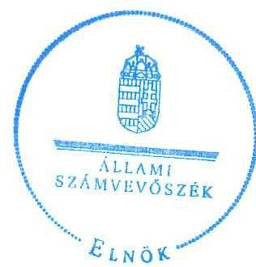

Domokos László
elnök

Melléklet: $\quad 9 \mathrm{db}$
Függelék: $\quad 3 \mathrm{db}$

---

.

---

A belső kontrollrendszer kialakítása és működtetése szabályszerűségének alakulása a Kórháznál

|  Ssz. | Megnevezés | 2008. év | 2009. év | 2010. év | 2011. év | 2012. év | 2013. év | 2008-2013. évek együttesen  |
| --- | --- | --- | --- | --- | --- | --- | --- | --- |
|  1. | Kontrollkörnyezet | részben volt szabályszerű | szabályszerű volt | szabályszerű volt | szabályszerű volt | szabályszerű volt | szabályszerű volt | szabályszerű volt  |
|  2. | Keckázatkezelési rendszer | részben volt szabályszerű | részben volt szabályszerű | szabályszerű volt | szabályszerű volt | szabályszerű volt | szabályszerű volt | szabályszerű volt  |
|  3. | Kontrolltevékenységek | nem volt szabályszerű | részben volt szabályszerű | nem volt szabályszerű | nem volt szabályszerű | nem volt szabályszerű | nem volt szabályszerű | szabályszerű volt  |
|  4. | Információs és kommunikációs rendszer | nem volt szabályszerű | szabályszerű volt | szabályszerű volt | szabályszerű volt | szabályszerű volt | szabályszerű volt | szabályszerű volt  |
|  5. | Monitoring rendszer | részben volt szabályszerű | részben volt szabályszerű | szabályszerű volt | szabályszerű volt | részben volt szabályszerű | szabályszerű volt | szabályszerű volt  |
|  A belső kontrollrendszer összevont értékelése |  | nem volt szabályszerű | szabályszerű volt | részben volt szabályszerű | részben volt szabályszerű | részben volt szabályszerű | részben volt szabályszerű | részben volt szabályszerű  |

---

.

---

|   |  |  |  |  |  |  |  |  |  |  |  |  |  |  |  |  |  |  |  |  |  |  |  |  |  |  |  |  |  |  |  |  |  |  |  |  |  |  |  |  |  |  |  |  |  |  |  |  |  |  |  |  |  |  |  |  |  |  |  |  |  |  |  |  |  |  |  |  |  |  |  |  |  |  |  |  |  |  |  |  |  |  |  |  |  |  |  |  |  |  |  |  |  |  |  |  |  |  |  |  |  |  | 

---

.

---

A Kórház fizetőképességét és vagyoni helyzetét jellemző mutatók

|  Fizetőképesség |  |  |  |  |  |  |  |  |   |
| --- | --- | --- | --- | --- | --- | --- | --- | --- | --- |
|  A mutató |  |  |  |  |  |  |  |  |   |
|  megnevezése | számítási módja | 2008. XII. 31. | 2009. XII. 31. | 2010. XII. 31. | 2011. XII. 31. | 2012. XII. 31. | 2013. XII. 31. | 2013. XII. 31. |   |
|  Likviditási mutató | Forgóeszközök összesen/Rövid lejáratú kötelezettségek összesen | 2,3 | 1,8 | 2,6 | 2,5 | 0,9 | 0,6 |  | -1,7  |
|  Pénzeszköz likviditási mutató | Pénzeszközök összesen/Rövid lejáratú kötelezettségek összesen | 1,6 | 1,0 | 1,8 | 0,1 | 0,8 | 0,2 |  | -1,4  |
|  Vagyoni helyzet |  |  |  |  |  |  |  |  |   |
|  A mutató |  |  |  |  |  |  |  |  |   |
|  megnevezése | számítási módja | 2008. I. 1. | 2008. XII. 31. | 2009. XII. 31. | 2010. XII. 31. | 2011. XII. 31. | 2012. XII. 31. | 2013. XII. 31. |   |
|  Befektetett eszközök aránya | Befektetett eszközök aránya=(Befektetett eszközök összesen/Eszközök mindösszesen)*100 | 92,5% | 88,5% | 90,5% | 86,5% | 91,5% | 89,1% | 92,4% |   |
|  Saját tőke aránya | Saját tőke aránya=(Saját tőke összesen/Források mindösszesen)*100 | 85,9% | 84,7% | 86,9% | 83,1% | 89,3% | 77,6% | 82,1% |   |
|  Ingatlanok aránya | Ingatlanok aránya=(Ingatlanok/Befektetett eszközök összesen)*100 | 89,3% | 90,2% | 90,7% | 90,4% | 87,9% | 89,9% | 90,6% |   |
|  Vagyonfedezeti mutató | Vagyonfedezeti mutató=(Saját tőke összesen/Befektetett eszközök összesen)*100 | 92,9% | 95,7% | 95,9% | 96,0% | 97,6% | 87,1% | 88,8% |   |

---

.

---

A Kórház eszközeinek és forrásainak alakulása

|  Megnevezés | Állományi érték |  |  |  |  |  |  |  | Változás  |
| --- | --- | --- | --- | --- | --- | --- | --- | --- | --- |
|   | 2008. | 2008. | 2009. | 2010. | 2011. | 2012. | 2013. | 2013. | 2013. XII. 31-re  |
|   | I. 1. | XII. 31. | XII. 31. | XII. 31. | XII. 31. | XII. 31. | XII. 31. | XII. 31. | %  |
|   | (millió Ft) |  |  |  |  |  |  |  |   |
|  I. Immateriális javak összesen | 7,1 | 3,7 | 3,0 | 7,1 | 21,2 | 12,8 | 10,8 | 3,7 | 52,1%  |
|  II. Tárgyi eszközök összesen | 6730,1 | 6669,4 | 6652,8 | 6871,3 | 7010,6 | 6817,4 | 6798,5 | 68,4 | 1,0%  |
|  III. Befektetett pénzügyi eszközök összesen | 60,9 | 64,2 | 62,7 | 69,1 | 65,2 | 51,6 | 40,6 | -20,5 | -33,3%  |
|  IV. Üzemeltetésre, kezelésre átadott, koncesszióba, vagyonkezelésbe adott, illetve vagyonkezelésbe vett eszközök | 7,6 | 7,3 | 7,0 | 6,8 | 6,5 | 6,2 | 6,0 | -1,6 | -21,1%  |
|  Befektetett eszközök összesen | 6805,7 | 6744,6 | 6725,5 | 6954,3 | 7103,5 | 6888,0 | 6855,9 | 50,2 | 0,7%  |
|  I. Későletek összesen | 52,9 | 39,5 | 62,4 | 68,5 | 60,8 | 53,7 | 71,6 | 18,7 | 35,3%  |
|  II. Követelések összesen | 47,8 | 47,9 | 48,5 | 60,3 | 73,8 | 49,0 | 60,0 | 12,2 | 25,5%  |
|  III. Értékpapírok összesen | 0,0 | 0,0 | 0,0 | 0,0 | 0,0 | 0,0 | 0,0 | 0,0 | -  |
|  IV. Pénzeszközök összesen | 263,0 | 601,9 | 396,7 | 720,9 | 32,6 | 736,9 | 176,1 | -86,9 | -33,0%  |
|  V. Egyéb aktív pénzügyi elszámolások összesen | 188,9 | 186,9 | 195,2 | 231,1 | 490,1 | 0,2 | 255,2 | 66,3 | 35,1%  |
|  Forgóeszközök összesen | 552,6 | 876,2 | 702,8 | 1080,8 | 657,3 | 839,8 | 562,9 | 10,3 | 1,9%  |
|  ESZKÖZÖK ÖSSZESEN | 7358,3 | 7620,8 | 7428,3 | 8035,1 | 7760,8 | 7727,8 | 7418,8 | 60,5 | 0,8%  |
|  I. Tartós tőke | 1704,6 | 1704,6 | 1704,6 | 6452,9 |

 6452,9 | 6452,9 | 6452,9 | 4748,3 | 278,6\%  |
|  II. Tőkeváltások | 4617,8 | 4749,2 | 4748,3 | 222,0 | 477,8 | $-456,6$ | $-365,4$ | $-4983,2$ | $-107,9 \%$  |
|  III. Értékelési tartalék | 0,0 | 0,0 | 0,0 | 0,0 | 0,0 | 0,0 | 0,0 | 0,0 | -  |
|  Saját tőke összesen | 6322,4 | 6453,8 | 6452,9 | 6674,9 | 6930,7 | 5996,3 | 6087,5 | $-234,9$ | $-3,7 \%$  |
|  I. Költségvetési tartalékok összesen | 207,1 | 529,4 | 320,6 | 672,6 | 259,7 | 375,1 | 82,3 | $-124,8$ | $-60,3 \%$  |
|  II. Vállalkozási tartalékok összesen | 0,0 | 0,0 | 0,0 | 0,0 | 0,0 | 0,0 | 0,0 | 0,0 | -  |
|  Tartalékok összesen | 207,1 | 529,4 | 320,6 | 672,6 | 259,7 | 375,1 | 82,3 | $-124,8$ | $-60,3 \%$  |
|  I. Hosszú lejáratú kötelezettségek összesen | 101,9 | 0,0 | 0,0 | 0,0 | 44,0 | 85,4 | 17,6 | $-84,3$ | -  |
|  II. Rövid lejáratú kötelezettségek összesen | 482,1 | 378,2 | 383,4 | 408,1 | 263,5 | 946,0 | 936,3 | 454,2 | 94,2\%  |
|  III. Egyéb passzív pénzügyi elszámolások összesen | 244,8 | 259,4 | 271,4 | 279,5 | 262,9 | 325,0 | 295,1 | 50,3 | 20,5\%  |
|  Kötelezettségek összesen | 828,8 | 637,6 | 654,8 | 687,6 | 570,4 | 1356,4 | 1249,0 | 420,2 | 50,7\%  |
|  FORRÁSOK ÖSSZESEN | 7358,3 | 7620,8 | 7428,3 | 8035,1 | 7760,8 | 7727,8 | 7418,8 | 60,5 | 0,8\%  |

---

.

---

A Kórház tárgyi eszközeivel kapcsolatos mutatószámok alakulása

|  Ssz. | Megnevezés | Számítási mód | A mutató értéke |  |  |  |  |  |  | Változás 2008. 1. 1-ről 2013. XII. 31-re (százalékpont, év)  |
| --- | --- | --- | --- | --- | --- | --- | --- | --- | --- | --- |
|   |  |  | 2008. 1. 1. | 2008. XII. 31. | 2009. XII. 31. | 2010. XII. 31. | 2011. XII. 31. | 2012. XII. 31. | 2013. XII. 31. |   |
|  1. | Eszközök használhatósági foka |  |  |  |  |  |  |  |  |   |
|  2. | - immateriális javak | (Nettó érték / Bruttó érték) *100 | 9,1% | 4,4% | 3,6% | 7,9% | 18,9% | 11,3% | 9,3% | 0,2  |
|  3. | - ingatlanok és kapcsolódó vagyoni értékű jogok |  | 84,9% | 83,2% | 82,9% | 82,3% | 81,2% | 80,0% | 79,4% | -5,5  |
|  4. | - gépek, berendezések, felszerelések |  | 25,0% | 22,4% | 20,7% | 20,4% | 24,0% | 19,5% | 17,9% | -7,1  |
|  5. | - járművek |  | 25,1% | 15,6% | 5,5% | 32,5% | 24,1% | 16,4% | 8,3% | -16,8  |
|  6. | - üzemeltetésre, kezelésre átadott, koncesszióba, vagyonkezelésbe adott, illetve vagyonkezelésbe vett eszközök |  | 54,7% | 52,7% | 50,7% | 48,7% | 46,7% | 44,7% | 42,7% | -12,0  |
|  7. | Eszközök elhasználódási szintje |  |  |  |  |  |  |  |  |   |
|  8. | - immateriális javak |  | 90,9% | 95,6% | 96,4% | 92,1% | 81,1% | 88,7% | 90,7% | -0,2  |
|  9. | - ingatlanok és kapcsolódó vagyoni értékű jogok |  | 15,1% | 16,8% | 17,1% | 17,7% | 18,8% | 20,0% | 20,6% | 5,5  |
|  10. | - gépek, berendezések, felszerelések |  | 75,0% | 77,6% | 79,3% | 79,6% | 76,0% | 80,5% | 82,1% | 7,1  |
|  11. | - járművek |  | 74,9% | 84,4% | 94,5% | 67,5% | 75,9% | 83,6% | 91,7% | 16,8  |
|  12. | - üzemeltetésre, kezelésre átadott, koncesszióba, vagyonkezelésbe adott, illetve vagyonkezelésbe vett eszközök |  | 45,3% | 47,3% | 49,3% | 51,3% | 53,3% | 55,3% | 57,3% | 12,0  |
|  13. | 0-ra leírt eszközök aránya | (0-ra leírt immateriális javak és tárgyi eszközök | 96,2% | 91,6% | 89,7% | 88,2% | 73,5% | 74,2% | 72,4% | -23,8  |
|  14. | - immateriális javak |  | 0,0% | 0,0% | 0,0% | 0,0% | 0,2% | 0,2% | 0,0% | 0,0  |
|  15. | - ingatlanok és kapcsolódó vagyoni értékű jogok |  | 41,8% | 41,7% | 46,1% | 53,5% | 58,8% | 64,9% | 63,1% | 21,3  |
|  16. | - gépek, berendezések, felszerelések |  | 41,8% | 41,7% | 46,1% | 53,5% | 58,8% | 64,9% | 63,1% | 21,3  |
|  17. | - járművek |  | 45,9% | 47,6% | 21,5% | 59,8% | 60,3% | 64,4% | 69,5% | 23,6  |
|  18. | Átlagos életkor (év) | Eszközök elhasználódási szintje (%) / | 7,6 | 8,4 | 8,6 | 8,9 | 9,4 | 10,0 | 10,3 | 2,7  |
|  19. | - ingatlanok és kapcsolódó vagyoni értékű jogok | Értékcsökkensési leírási kulcs (%) | 5,2 | 5,4 | 5,5 | 5,5 | 5,2 | 5,6 | 5,7 | 0,5  |
|  20. | - gépek, berendezések, felszerelések |  | 3,7 | 4,2 | 4,7 | 3,4 | 3,8 | 4,2 | 4,6 | 0,9  |

---

.

---

# 6. SZÁMÚ MELLÉKLET A V-0743-276/2016. SZÁMÚ JELENTÉSTERVEZETHEZ

U-6743-276/2016.

FŐIGAZGATÓSÁG

DR. RALOVICH ZSOLT
Főigazgató

3 FEB-10-2017 2:27:05

## ÁLLAMI SZÁMVEVŐSZÉK

**Domokos László elnök**
**részére**

1052. Budapest,
Apáczai Csere János u. 10
Levelezési cím:
1364. Budapest 4. Pf. 54.

**Tárgy:** ÁSZ jelentés tervezettel összefüggő észrevételek

## Tisztelt Elnök Úr!

Köszönettel vettük kézhez az Állami Számvevőszék „A központi alrendszer egyes intézményei pénzügyi és vagyongazdálkodásának ellenőrzéséről - Jahn Ferenc Dél-pesti Kórház és Rendelőintézet” címen folytatott ellenőrzése tárgyában 2015. december 22.-i keltezésű és a Jahn Ferenc Dél-pesti Kórház és Rendelőintézet főigazgatója számára 2015. december 28.-án kézbesített jelentés tervezetét (továbbiakban: ÁSZ jelentés tervezet), mellyel összefüggésben az Állami Számvevőszékről szóló 2011. évi LXVI. törvény (ÁSZ tv.) 29. § (2) bekezdése alapján, az előírt tizenöt napos határidő betartásával, az alábbiak szerint továbbítjuk észrevételeinket és kérjük azoknak a végleges jelentés összeállítása keretében történő figyelembe vételét.

A Jahn Ferenc Dél-pesti Kórház és Rendelőintézet - mint költségvetési szerv - vezetése elkötelezett a működési kereteit képező és a fenntartói jogokat gyakorló szerv által rendelkezésére, illetve vagyonkezelésébe bocsátott közvagyon védelme, a közpénzügyek átláthatóságának biztosítása és a hatékony pénzügyi- és vagyongazdálkodás megvalósításában és érvényesítésében, a gazdaságossági, hatékonysági és eredményességi követelmények kialakításával és működtetésével, az intézet alapító okiratában foglalt közfeladat teljesítésével összhangban, azaz a járó- és fekvőbetegek korszerű követelményeknek megfelelő diagnosztikus és terápiás szakorvosi ellátásának biztosításával.

## Az ÁSZ jelentés tervezettel összefüggő észrevételeink:

1. ÁSZ jelentés tervezet „I. összegző megállapítások, következtetések, javaslatok” című fejezet 11. oldal harmadik bekezdésében, továbbá a „Részletes megállapítások” II. fejezet 3. pont, 22. oldal első bekezdésében, a „monitoring-rendszer kialakítása és működtetése” tárgyában eszközölt megállapítások, illetve javaslatok megfogalmazása álláspontunk szerint helytelen értelmezésre adhatnak alapot, illetve a az intézmény valós működésével, valamint a rendelkezésre álló dokumentumokkal, továbbá a tárgyra vonatkozó ÁSZ jelentés további megállapításaival nem állnak összhangban, az alábbiakra tekintettel:

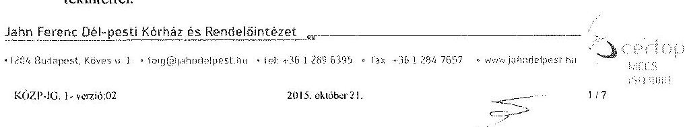

---

# - FŐIGAZGATÓSÁG   - DR. RALOVICH ZSOLT   Főigazgató 

Az ÁSZ jelentés tervezet fentiekben hivatkozott részei az alábbi téves megállapítást tartalmazzák:
„A Kórház főigazgatója az ellenőrzött időszakban nem gondoskodott teljes körűen - a jogszabályi előírások ellenére - arról, hogy a Kórház valamennyi tevékenységében és céljában a gazdaságosság, a hatékonyság és az eredményesség követelményei érvényesüljenek, mivel teljesítményeiket és követelményeket nem alakított ki és nem alkalmazott a gazdálkodás minden (így pl. a pénzügyi és vagyongazdálkodási feladatok) területén."

A vizsgált időszakra vonatkozóan az ÁSZ jelentés „A fizetőképesség alakulása” 4.4. pont 28. oldal második bekezdésében ugyanakkor - helyesen és a valós működéssel összhangban - megállapításra kerül, miszerint
„A Kórház 2008-2013. évi költségvetési bevételeinek meghatározó részét (92-95\%-át) tették ki..... az OEP-től származó bevételek".

Az ÁSZ jelentés (22. oldal első bekezdés második és azt követő mondatok) az alábbi, a valós működéssel és a szolgáltatott adatokkal összhangban lévő megállapítást tartalmazza: „A vezetői információs rendszer keretében meghatározóak a gyógyító szervezeti egységek elérendő évenkénti, teljesítménymutatókkal, indikátorokkal leírt céljait és értékelték azok elérését. Az egészségügyi szakmai működési teljesítményt rendszeresen, havonta, meghatározott elvárt teljesítményekhez hasonlítva elemezték, értékelték, külön vizsgálták a járóbeteg-ellátás, aktív fekvőbeteg-ellátás és a krónikus fekvőbeteg-ellátás teljesítményét. ... A 2008-2013. években a főigazgató és az osztályvezető főorvosok között megkötött tervmegállapodásokban határozták meg az egyes osztályoktól elvárt teljesítménykövetelményeket az alábbi mutatószámok alapján ..."

Az ÁSZ jelentés fentiekben hivatkozott és az intézet valós működésével összhangban lévő megállapításai is alátámasztják az alábbi, szabályozott és ellenőrzött intézeti működési elveket:
a) a Kórház főigazgatója - különösen 2012. augusztus 01.-tól kezdődően - a lehetőségekhez mérten megfelelően kialakította és működtette a gazdaságossági, hatékonysági és eredményességi követelményeknek megfelelő teljesítmény monitoring rendszert, ennek keretében az intézet alaptevékenységeit ellátó és a bevételeinek túlnyomó többségét termelő minden szervezeti egységgel teljesítményközpontú éves tervmegállapodások kerültek aláírásra és megtörtént a realizált teljesítmények folyamatos ellenőrzése, elemzése és értékelése is.
Álláspontunk szerint a Kórház gazdálkodása szempontjából meghatározó fő tevékenység, az egészségügyi szakellátás tevékenységeivel, az abban közvetlenül részt vevő szervezeti egységekkel, gyógyító osztályokkal szemben az intézmény vezetése teljesítménycélokat és eredményességi követelményeket minden vizsgált évben, jól dokumentált módon állított, azok teljesülését hónapról-hónapra monitorizálta, a megfelelő visszacsatolásokról gondoskodott, nagyobb eltérések esetén intézkedett, illetve a megfelelő kiértékeléseket is elvégezte. Ezen kontroll rendszer keretében sor került a gyógyító osztályok elvárt betegellátási teljesítményeinek, forgalmának
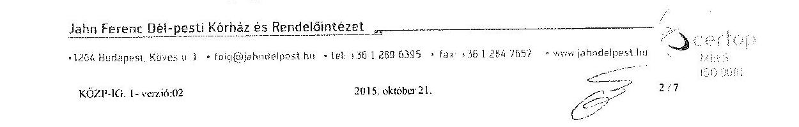

---

# FŐIGAZGATÓSÁG   DR. RALOVICH ZSOLT   Főigazgató 

előírására, a betegellátás jellemző mutatószámainak minősítésére és monitorizálására, a költségkeretek
 kialakítására és működtetésére, illetve a teljes kórházi működésre vonatkozó kontrolling elszámolások elkészítésére és kiértékelésére. Ezáltal, megítélésünk szerint, a fő tevékenységek esetében, melyek a teljesítményfinanszírozáson keresztül a bevételek meghatározó részét, illetve a létszám- és bérgazdálkodáson, illetve a keretrendszereken keresztül a kiadások döntő hányadát is befolyásolják, a gazdaságosság, hatékonyság és eredményesség követelményei megfelelő módon érvényesültek. A fő tevékenység a bevételek 97%-áért felelős és a költségek 86%-át teszi ki.
b) a Kórház főigazgatója az intézet minden szervezeti egységére kiterjedő és folyamatosan monitorizált, heti rendszerességgel ellenőrzött és értékelt, szigorú havi keretgazdálkodási rendet kialakított és működtet, a gazdaságossági, hatékonysági és eredményességi követelmények érvényre juttatása céljából.

A valós működési rendet, valamint a fentiekben hivatkozottakat figyelembe véve, az ÁSZ jelentés tervezet „I. Összegzö megállapítások, következtetések, javaslatok" című fejezet 11. oldal harmadik bekezdésében, továbbá a „Részletes megállapítások" II. fejezet 3. pont, 22. oldal első bekezdésében, a „monitoring-rendszer kialakítása és működtetése" tárgyában eszközölt, fentiekben megjelölt megállapításai, álláspontunk szerint az alábbi megfogalmazásban helytállóak:
„A Kórház főigazgatója az ellenőrzött időszakban a lehetőségekhez mérten megfelelően gondoskodott - a jogszabályi előírásokkal összhangban - arról, hogy a Kórház valamennyi tevékenységében és céljában a gazdaságosság, a hatékonyság és az eredményesség követelményei érvényesüljenek, mivel a kórház alaptevékenységével összefüggő feladatot ellátó és a bevételek túlnyomó többségét realizáló szervezeti egységekkel történt tervmegállapodások megkötésével, folyamatos elemzésével és értékelésével, valamint minden szervezeti egységre, így a gazdálkodás minden (így pl. a pénzügyi és vagyongazdálkodási feladatok) területére is kiterjedő keretgazdálkodási rendszer kialakításával és működtetésével megfelelő teljesítménycélokat és követelményeket kialakított és alkalmazott."
2. Az ÁSZ jelentés "I. Összegzö megállapítások, következtetések, javaslatok" című fejezet kiegészítéseként az alábbi észrevételt, illetve nyilatkozatot terjesztjük elő és kérjük megfelelő feltüntetését:
„Kiemelendő, hogy az intézet jelenlegi menedzsmentje 2012. augusztus 01. napjától vette át a Kórház irányítását. Ezen időpontig a Kórház keretében nem volt ténylegesen alkalmazott folyamatba épített előzetes és utólagos vezetői ellenőrző rendszer (FEUVE). 2012. október 26.-i keltezéssel a gyakorlatban működtethető új FEUVE került bevezetésre belső ellenőri javaslatok figyelembe vételével, továbbá lényegi elemei beépítésre kerültek a Kórház új, 2013. június 12.-i keltezésű Szervezeti és Működési Szabályzatába. 2012. augusztus 01.-ét követően az új menedzsment 73 új szabályzatot dolgozott ki és léptetett

[^0]
[^0]:    Jahn Ferenc Dél-pesti Kórház és Rendelőintézet
    +1201 Budapest. Köves út 1 - fog@juhnagelpest.hu - tel. +3012855393 - Fax. +3012842053 - www.juhnagelpest.hu
    KÓZP-RJ. 1-verzió 02
    2015. október 21.

---

hatályba a hatályos jogszabályoknak megfelelő működtetés és a vezetői kontrollok érvényesülése céljából. A Kórház belső szabályozási rendjét, ezen belül a FEUVE rendszert folyamatosan vizsgálja felül és dolgozza át a napi működés során esetlegesen észlelt hiányosságok kiküszöbölése céljából, illetve az éves ütemezett belső ellenőrzések javaslatait figyelembe véve, továbbá a folyamatos külső tanúsítás útján megerősített minőségirányítási (ISO, MES) és a fenntartói jogokat gyakorló szerv (ÁEEK) által előírt követelmények, valamint a hatályos jogszabályi előírásoknak történő megfelelés érdekében."
3. Az ÁSZ jelentés "I. Összegzö megállapítások, következtetések, javaslatok" című fejezet 11. oldal 3. bekezdéséhez, illetve a "3. A belső kontrollrendszer és az integritás kontrollok értékelése" című fejezet 20. oldal 3. bekezdéséhez az alábbi észrevételt kívánjuk tenni.
„A 2012. augusztus 01.-ét követő keretgazdálkodási rend bevezetésével és működtetésével az intézetnél jelentősen változott a folyamatba épített vezetői ellenőrzés, mely alapvetően változtatta meg a döntések gazdaságossági, hatékonysági és eredményességi szempontú megalapozottságát. A kötelezettségvállalási rendszer fejlesztésével, állandó kiegészítésével és javításával folytonosságot biztosít a törvényi szabályozásoknak megfelelően."
4. Az ÁSZ jelentés „I. Összegzö megállapítások, következtetések, javaslatok" című fejezet 11. oldal második bekezdésében, továbbá a „Részletes megállapítások" II. fejezet 3. pont, 20. oldalán az „információs és kommunikációs rendszer kialakítása és működtetése" tárgyában eszközölt megállapításokat, kérjük az alábbiakban megjelölt észrevételünkkel kiegészíteni:
„Az intézet 2012. október 24.-én léptette hatályba az „Adatvédelmi és adatkezelési szabályzatát", illetve 2013. június 04.-én az „Informatikai Biztonsági Szabályzatát, továbbá 2013. augusztus 01.-én a „Közérdekű és a közérdekből nyilvános adatok közzétételének szabályzatát", mely belső szabályozók a hatályos jogszabályi előírásoknak megfelelően részletesen tartalmazzák az intézet információs és kommunikációs rendszerének működtetését és a közérdekű adatok közzétételi kötelezettségeket és módokat. Ezt meghaladóan, az információs és kommunikációs rendszer jogszerű működtetése céljából, belső ellenőri vizsgálatot folytatott le 2014. évben. A belső ellenőri jelentést figyelembe véve a szükséges intézkedések megtörténtek."
5. Az ÁSZ jelentés „3. A belső kontrollrendszer és az integritás kontrollok értékelése" című fejezet 19. oldal 1. bekezdésében, a „leltározási szabályzattal" összefüggésben foglaltakat az alábbiakban megjelölt észrevételünkkel kérjük kiegészíteni:
„A leltározási szabályzat 2014.11.01.-jével aktualizálásra került a 2014. január 1-jétől érvényes jogszabályi előírások alapján."
6. Az ÁSZ jelentés „3. A belső kontrollrendszer és az integritás kontrollok értékelése" című fejezet 19. oldal 2. bekezdésében, a „kötelezettségvállalással" kapcsolatos megállapításokat, az alábbiakban megjelölt észrevételeink figyelembe vételével kérjük

---

megfogalmazni:
„A teljesítésigazolásra jogosultak aláírás mintáját a gazdasági igazgatóság 2013. április 1-jén elkészítette, az erről készült dokumentum a gazdasági igazgatóságon rendelkezésre állt és az ÁSZ munkatársai részére a vizsgálat során bemutatásra került. A kötelezettségvállalásra, ellenjegyzésre, utalványozásra jogosult személyek egyedi meghatalmazás alapján látták el feladataikat, az egyedi meghatalmazások a gazdasági igazgatóságon rendelkezésre álltak/állnak."
7. Az ÁSZ jelentés „3. A belső kontrollrendszer és az integritás kontrollok értékelése" című fejezet 21. oldal 1. bekezdése, „beszámolási rendszerek" működtetésével összefüggésben leírtakat, az alábbi észrevétellel kívánjuk kiegészíteni:
„A fenntartói jogokat gyakorló szerv minden év elején adatszolgáltatási naptárat küld a fenntartásában működő intézményeknek, amely kötelező erővel tartalmazza az elkészítendő adatszolgáltatások módját, valamint azok határidejét. A Jahn Ferenc Dél-pesti Kórház és Rendelőintézet a fenntartói követelményeknek megfelelő adatszolgáltatásokat teljesítette."
8. Az ÁSZ jelentés „3. A belső kontrollrendszer és az integritás kontrollok értékelése" című fejezet 21. oldal 4. bekezdése, a belső ellenőrzési rendszer" működtetésével összefüggő megállapítások vonatkozásában, az alábbi észrevételt kívánjuk tenni:
„A belső ellenőrnek kizárólag a Ct-Ecostat informatikai programhoz nem volt az ellenőrzés időpontjában hozzáférése, a betekintési jog hatékony biztosítása érdekében a szükséges intézkedés megtörtént."
9. Az ÁSZ jelentés „4. A Kórház pénzügyi gazdálkodása" című fejezet 24. oldal 5. bekezdésében, a „közbeszerzési eljárások lefolytatása" tárgyában történt megállapítások vonatkozásában, valamint ezzel összhangban az „1. Összegzö megállapítások, következtetések, javaslatok" 6. pontjában (13. oldal) foglalt javaslathoz kapcsolódóan is, az alábbi észrevételt kívánjuk tenni:
„Az eszközölt beszerzésekkel és ennek keretében a közbeszerzési eljárásokkal összefüggésben 2015. március 19.-én írásbeli észrevételt, illetve nyilatkozatot tettünk az ÁSZ részére, amely részletesen tartalmazza a közbeszerzési eljárásokkal kapcsolatosan lefolytatott belső vizsgálat eredményét és megállapításainkat."
10. Az ÁSZ jelentés „4. A Kórház pénzügyi gazdálkodása" című fejezet 24. oldal 2. bekezdésében, az „előirányzat módosítások" tárgyában megfogalmazottakat, az alábbiakban megjelölt észrevételünkkel kérjük kiegészíteni:
„Az ÁSZ helyszíni ellenőrzése megállapításai alapján az előirányzat módosítás elrendelő okiratai 2015. évben elkészültek, a GYEMSZI (ÁEEK) tájékoztatása érdekében intézkedés történt."
11. Az ÁSZ jelentés „4. A Kórház pénzügyi gazdálkodása" című fejezet 24. oldal utolsó bekezdésben, valamint a 25. oldal 1. bekezdésében foglalt, a „dologi kiadások teljesítésével" kapcsolatos megállapítások vonatkozásában, az alábbi észrevételt tesszük:

---

# - FŐIGAZGATÓSÁG   - DR. RALOVICH ZSOLT   Főigazgató 

„A dologi kiadások kifizetését megalapozó dokumentumok hiányának aránya, valamint a beruházások, felújítások üzembe helyezése dokumentálása hiányosságainak mértéke a jelentésből nem állapítható meg. Álláspontunk szerint a 2012. augusztusát megelőző időszakban a hiányosságok nagyobb arányúak voltak, 2012. augusztus 01.-ét követően a dokumentációs fegyelem jelentős javulása volt tapasztalható."
12. Az ÁSZ jelentés „4. A Kórház pénzügyi gazdálkodása" című fejezet 25. oldal 4. bekezdése, a „kulcskontrollok működésének szabályszerűségével" összefüggésben megfogalmazottakkal kapcsolatosan, az alábbi észrevételt kívánjuk tenni:
„A szakmai teljesítés igazolások hiányának aránya a jelentés tervezetből nem állapítható meg egyértelműen. Álláspontunk szerint 2012. augusztus 1-jét követően teljesítés igazolások megfelelőségének aránya jelentős javuló tendenciát mutatott. 2013. április 1-jével a teljesítés igazolásra jogosult személyek kijelölése szabályszerűen megtörtént."
13. Az ÁSZ jelentés „4. A Kórház pénzügyi gazdálkodása" című fejezet 26. oldal 4. bekezdésében, a „vagyonhasznosítási szerződésekkel összefüggő átláthatósági nyilatkozatok" vonatkozásában, az alábbi észrevételt kívánjuk tenni:
„Az átláthatósági nyilatkozatok 2014. évben maradéktalanul kiállításra és alkalmazásra kerültek."
14. Az ÁSZ jelentés „4. A Kórház pénzügyi gazdálkodása" című fejezet 27. oldal utolsó bekezdésében, „a likviditási terv tartalma" vonatkozásában eszközölt megállapítással összefüggésben, az alábbi észrevételt kívánjuk tenni:
„A Kórház likviditási tervét a fenntartó által meghatározott tartalommal, illetve adatstruktúrában, a fenntartó által működtetett web-es felületen készíti el. A likviditási terv tartalmát módosítani nincs lehetősége az Intézménynek."
15. Az ÁSZ jelentés „5. A Kórház vagyongazdálkodása" című fejezet 31. oldal 1. bekezdésében, a „leltározási szabályzat" vonatkozásában megfogalmazottakhoz kapcsolódóan, az alábbi észrevételt kívánjuk tenni:
„A leltározási szabályzat 2014.11.01.-jével aktualizálásra került, a 2014. január 1-jétől érvényes jogszabályi előírások figyelembe vételével és alkalmazásával."
16. Az ÁSZ jelentés „5. A Kórház vagyongazdálkodása" című fejezet 31. oldal 3. bekezdésében, „az immateriális javak, tárgyi eszközök üzembe helyezésének dokumentálása" tárgyában eszközölt megállapításokkal összefüggésben, az alábbi észrevételt kívánjuk tenni:
„Az immateriális javak, tárgyi eszközök üzembe helyezése dokumentálása hiányosságainak mértéke a jelentésből nem állapítható meg. Álláspontunk szerint a 2012. augusztusát megelőző időszakban a hiányosságok nagyobb arányúak voltak, 2012. augusztus 01.-ét követően a dokumentációs fegyelem jelentős javulása állapítható meg."
17. Az ÁSZ jelentés „5. A Kórház vagyongazdálkodása" című fejezet 31. oldal 4. bekezdésében, „a klímaberendezés beszerzésére" vonatkozó megállapítással összefüggésben, az alábbi észrevételt kívánjuk tenni:
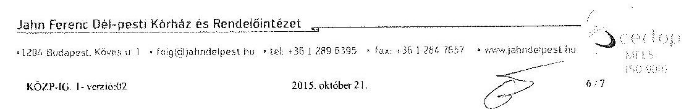

---

# - FŐIGAZGATÓSÁG   DR. RALOVICH ZSOLT   Főigazgató 

„A 2013. november 20.-án beszerzett klíma leltározása 2015. februárjában az ÁSZ helyszíni ellenőrzésének észrevételei alapján, a helyszíni ellenőrzés időtartama alatt célfeltárás során megtörtént. A leltározásról készült nyilatkozatot 2015. február 20.-án az ÁSZ részére továbbítottuk."

Tájékoztatom továbbá Tisztelt Elnök Urat, hogy figyelemmel az Állami Számvevőszék jelentés tervezetében foglalt konstruktív javaslatokra, a fenntartó által a Jahn Ferenc Dél-pesti Kórház és Rendelőintézet vagyonkezelésébe bocsátott közvagyon védelme, a közpénzügyek átláthatóságának biztosítása és a hatékony pénzügyi- és vagyongazdálkodás - mint alapvető vezetői cél maradéktalan érvényre juttatása érdekében, az alábbiakban megjelölt tárgykörökre vonatkozó belső szabályozók felülvizsgálatát, illetve kiegészítését, valamint fegyelmezett működtetését rendeltem el 2016. január 05.-i keltezésű, 1/2016. számú főigazgatói intézkedés keretében:
I. a Gyógyintézet keretében jelenleg működtetett belső kontrollrendszer felülvizsgálata és kiegészítése a jogszabályoknak, átláthatósági kritériumoknak és költséghatékonysági elveknek megfelelő, teljes-körű belső kontrollrendszer kialakítása és működtetése céljából;
II. az erőforrásokkal történő szabályszerű és hatékony gazdálkodás biztosítása érdekében szükséges belső követelményrendszer felülvizsgálata és átdolgozása, az ellenőrizhető és számon kérhető követelmények maradéktalan alkalmazása céljából;
III. a jelenleg hatályos belső szabályzatok felülvizsgálata és a hatályos jogszabályi előírásoknak megfelelő belső szabályozási környezet kialakítása és működtetése, kiemelten a pénzügyi- és vagyongazdálkodás területén;
IV. a Gyógyintézet keretében jelenleg működtetett kontroll- és monitoring rendszer felülvizsgálata és kiegészítése annak érdekében, hogy a gyógyintézet gazdálkodásának teljes folyamatában a gazdaságossági, hatékonysági és eredményességi követelmények teljes-körűen érvényesüljenek megfelelő

 minőségű, teljesítmény-ellenőrzési szempontokat alkalmazó kontroll- és monitoring rendszer útján;
V. a dokumentációs fegyelem megerősítése érdekében szükséges belső kontroll- és monitoring rendszer felülvizsgálata és kiegészítése.

Az Állami Számvevőszék jelentésében megfogalmazott javaslataikat megköszönve és észrevételeink méltányos értékelését és elfogadását, illetve a jelentésbe történő beépítését kérve

Budapest, 2016. január 08.
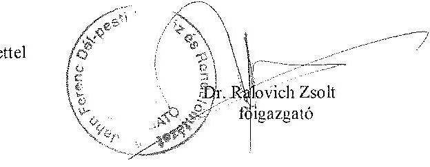

Jahn Ferenc Dél-pesti Kórház és Rendelőintézet
+36 1 576 6666 Budapest, Köves u. 1. + fong@jahnotelpest.hu +36 3 386 5999 + (or. +36 3 386 7697 + www.jahnkórház.hu
KÖZP. 3G. 1. vevő 07
2015. október 21.

---

.

---

# Dr. Ralovich Zsolt 

főigazgató
Jahn Ferenc Dél-pesti Kórház és Rendelőintézet

## Budapest

## Tisztelt Főigazgató Úr!

A Jahn Ferenc Dél-pesti Kórház és Rendelőintézet pénzügyi és vagyongazdálkodásának ellenőrzéséről készített jelentéstervezetre tett észrevételeit köszönettel megkaptam.
Az Állami Számvevőszék észrevételekre vonatkozó álláspontjáról a felügyeleti vezető által készített részletes tájékoztatást csatoltan megküldöm.

Tájékoztatom Főigazgató urat, hogy az Állami Számvevőszékről szóló 2011. évi LXVI. tv. 29. § (3) bekezdése alapján a számvevőszéki jelentés mellékleteként szerepeltetjük a jelentéstervezethez tett figyelembe nem vett észrevételeket az elutasítás indokainak feltüntetésével.

Budapest, 2016. év
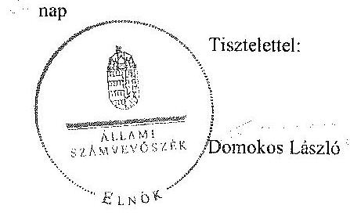

Melléklet: Tájékoztatás az elfogadott és figyelembe nem vett észrevételekről

---

# Tájékoztatás   az elfogadott és a figyelembe nem vett észrevételekről 

A Jahn Ferenc Dél-pesti Kórház és Rendelőintézet pénzügyi és vagyongazdálkodásának ellenőrzéséről készült számvevőszéki jelentéstervezethez az JFKM-12578-2/2015. iktatószámú levélben tett észrevételeit köszönettel megkaptuk.

A jelentéstervezetre tett észrevételeket áttekintettük, azok kezeléséről a következő tájékoztatást adom:

## 1. sz. észrevétel, 11. oldal 3. bekezdése, 22. oldal 1. bekezdése:

A Kórház belső kontroll rendszerének minősítéséhez tett észrevételét nem áll módunkban elfogadni, ugyanis a 11. oldal 3. bekezdésben szereplő minősítést (megállapítást) az ellenőrzés során a számvevők által kitöltött munkalapok értékelései alapján tettük. Az intézkedést igénylő megállapítások 11. oldal 3. bekezdése a Részletes megállapítások 22. oldal 1. bekezdés 1. mondatán alapulnak. A javaslatunkat a fent hivatkozott mondat megállapítása alapján tettük. Az ellenőrzési program kiegészítő modulja rögzítette, hogy az ellenőrzés nem a szakmai feladatellátást értékeli, hanem annak megállapítására irányul, hogy a költségvetési szerv vezetője a pénzügyi és vagyongazdálkodás folyamatában kialakította-e a gazdaságossági, hatékonysági és eredményességi követelményeket és azokat működtette-e. Ön tanúsítvány aláírásával igazolta, hogy a Kórház pénzügyi és vagyongazdálkodási folyamatai tekintetében a gazdaságossági, hatékonysági és eredményességi feltételek, követelmények, azok monitoring- és beszámolási rendszerével nem rendelkeztek, erre való hivatkozással levelének 1/b) pontjában szereplő észrevételét nem áll módunkban figyelembe venni.

Levelének 1/a) pontjában szereplő észrevételével kapcsolatban tájékoztatjuk, hogy a jelentéstervezet 11. oldal 3. bekezdésben szereplő megállapítás a gazdálkodási terület teljesítmény-ellenőrzésére vonatkozott. A jelentéstervezet 22. oldal 1. bekezdés 2-5. mondatai a szakmai - gyógyító - tevékenységre vonatkozóan kialakított teljesítménycélokat mutatja be, amit az ÁSZ ellenőrzése nem érintett: "A vezetői információs rendszer keretében meghatározták a gyógyító szervezeti egységek elérendő évenkénti, teljesítménymutatókkal, indikátorokkal leírt céljait és értékelték azok elérését. Az egészségügyi szakmai működési teljesítményt rendszeresen, havonta, meghatározott elvárt teljesítményekhez hasonlítva elemezték, értékelték, külön vizsgálták a járóbeteg-ellátás, az aktív fekvőbeteg-ellátás és a krónikus fekvőbeteg-ellátás teljesítményét." Tehát a 22. oldal 1. bekezdésének 2-5. mondataiban részletezett szakmai tevékenységhez köthető monitoring tevékenység leírása nem függ össze a Kórház pénzügyi és vagyongazdálkodási folyamatai kapcsolatban tett megállapításunkkal, amely a jelentéstervezet 11. oldal 3. bekezdésben szerepel.

---

A Főigazgató úr észrevételének 2. oldal 2. bekezdésében foglalt megállapítások nem kifogásolják a jelentés megállapításait, csak beidézik azokat. Így ezen észrevételét megerősítésként kezeljük a jelentésben leírtak alátámasztására.
2., 3. sz. észrevétel:

Az „Összegző megállapítások, következtetések, javaslatok" című fejezethez írt észrevételeit nem tudjuk figyelembe venni, mivel a Kórház belső kontroll rendszerének minősítése (a jelentéstervezet 11. oldal 3. bekezdése) az ellenőrzési programban rögzített értékelési szempontok szerint történt. A belső kontroll rendszer egyes elemeinek évenkénti minősítését (a jelentéstervezet 18-22. oldal) tartalmazza a jelentéstervezet. Azokból egyértelműen megállapítható, hogy melyik évben, milyen minősítést kapott a rendszer, amely alapján az összevont értékelés elkészült.

# 4. sz. észrevétel, 11. oldal 2. bekezdése, Részletes megállapítások 20. oldal: 

Az információs és kommunikációs rendszer értékelésére vonatkozó észrevételében három szabályzat hatálybaléptetését közli. Megjegyezzük, hogy az információs és kommunikációs rendszert részben szabályszerűnek minősítettük, azonban részletes értékelés 2009-től már szabályosnak minősítette az információs és kommunikációs rendszert. A hiányosság az volt, hogy részben működtettek hatékony, megbízható és pontos beszámolási rendszereket, mert a beszámolási szinteket, határidőket és módokat nem szabályozták. Ezeket a megállapításokat nem cáfolja főigazgató úr sem, ezért megállapításunkat fenntartjuk.

## 5. sz. észrevétel, 19. oldal 1. bekezdése:

Észrevétele az ellenőrzési időszakon túli időpontra vonatkozik, amelyet így nem tudunk figyelembe venni, ezért megállapításunkat fenntartjuk.

## 6. sz. észrevétel, 19. oldal 2. bekezdése:

A kötelezettségvállalásra vonatkozó kiegészítést a miatt nem áll módunkban figyelembe venni, mert a helyszíni ellenőrzés időszakában az ÁSZ részére bemutatásra került dokumentum azt rögzíti, hogy 2013. április 1-ig nem álltak rendelkezésre a teljesítésigazolásra jogosultak jegyzéke és ezt a 2015. február 18-án - a gazdasági igazgató által - aláírt nyilatkozatban is elismerték. Ez a megállapításunk nincs ellentmondásban az Ön által leírtakkal, csak azt rögzítjük, hogy meddig nem álltak rendelkezésre a nyilvántartások - ez az ellenőrzött időszak nagy része - míg Főigazgató Úr azt rögzíti, hogy mikortól van.

## 7. sz. észrevétel, 21. oldal 1. bekezdése:

A beszámolási rendszerekre vonatkozó kiegészítését a jelentéstervezetben nem szerepeltetjük, mivel az ellenőrzés során megállapítottuk, hogy Kórház részben működtetett hatékony, megbízható és pontos beszámolási rendszereket, és ezt a megállapítást azért tettük, mert azt kifogásoltuk, hogy a beszámolási szinteket, határidőket és módokat nem szabályozták.
8. sz. észrevétel, 21. oldal 4. bekezdése:

---

Észrevétele alapján a jelentéstervezetben található: „A belső ellenőrzésnek 2012. évben egyes informatikai rendszerekbe nem volt betekintési joga a Bkr. 25. § b) pontjában foglaltakkal ellentétben;" szövegrész pontosításra került a következő szerint:
„A belső ellenőrzésnek 2012. évben egy informatikai rendszerbe nem volt betekintési joga a Bkr. 25. § b) pontjában foglaltakkal ellentétben:"
9. sz. észrevétel, 13. oldal 6. pontja, 24. oldal 5. bekezdése:

A közbeszerzésre vonatkozó észrevétele, valamint az ellenőrzés során átadott nyilatkozatok tartalma nem befolyásolja a közbeszerzési gyakorlattal kapcsolatos megállapításainkat, azok a nyilatkozatok is azt támasztják alá, hogy mikor mely esetekben nem folytattak le közbeszerzést, ezért a megállapítást fenntartjuk.
10. sz. észrevétel, 24. oldal 2. bekezdése:

Az előirányzat-módosításokkal kapcsolatos megállapításunkra tett észrevétele nem az ellenőrzött időszakra vonatkozik, így azt nem áll módunkban figyelembe venni, azokat majd a jelentésre készített intézkedési tervben szükséges rögzíteni a megtett intézkedések között.
11. sz. észrevétel, 24. oldal utolsó bekezdése, 25. oldal 1. bekezdése:

A dologi kiadásoknál nem csak dokumentumok hiánya indokolta minősítést, hanem az is, hogy 2008. január 1-jétől 2013. március 31-ig terjedő időszakban a teljesítésigazolást - az Ámr. 135. § (2) bekezdésében, az Ámr. 76. § (5) bekezdésében és az Ávr. 57. § (4) bekezdésében előírtak ellenére - kijelöléssel nem rendelkező személy jogosulatlanul végezte, ezért a megállapításunkat fenntartjuk.
12. sz. észrevétel, 25. oldal 4. bekezdése:

A kulcskontrollok működésének szabályszerűségét - az ellenőrzési programban rögzített módszertan szerint - mintatételek ellenőrzésének összesített eredménye alapján állapítottuk meg, amelynek során nem a szabálytalanságok számának időbeli alakulására fókuszáltunk. Ennek alapján megállapításunkat fenntartjuk.
13. sz. észrevétel, 26. oldal 4. bekezdése:

A vagyonhasznosítási szerződésekre vonatkozó észrevétele szintén ellenőrzött időszakon túli időszakra vonatkozik, így azt nem áll módunkban figyelembe venni.
14. sz. észrevétel, 27. oldal 4. bekezdése:

A likviditási tervvel kapcsolatos észrevétele alapján módosítást nem végeztünk, mivel a jelentéstervezetben szereplő megállapítás kizárólag azt kifogásolta, hogy a likviditási terv nem dekádonkénti ütemezésű, egyéb - tartalomra vonatkozó - megállapításunk nem volt.

---

# 15. sz. észrevétel, 31. oldal 1. bekezdése: 

A leltározási szabályzatra vonatkozó észrevétele szintén ellenőrzött időszakon túli időszakra vonatkozik, így azt nem áll módunkban figyelembe venni.

## 16. sz. észrevétel, 31. oldal 3. bekezdése:

Az immateriális javak, tárgyi eszközök üzembe helyezésének dokumentálását az ellenőrzési programban rögzített módszertan szerint ellenőriztük és tettünk megállapítást, amelynek során nem a szabálytalanságok számának időbeli alakulására fókuszáltunk. Továbbá a jelentéstervezet 31. oldal negyedik bekezdésében kifejezetten a 2013. év vagyongazdálkodásával kapcsolatos hiányosságokat soroljuk fel. Ennek alapján megállapításunkat fenntartjuk.

## 17. sz. észrevétel, 31. oldal 4. bekezdése:

A klímaberendezés leltározására vonatkozó észrevételében az ellenőrzött időszakon túli időpontban végrehajtott intézkedésről tájékoztatott, amit a jelentéstervezetben nem áll módunkban figyelembe venni.

Az észrevételében részletezett, ellenőrzött időszakon túl elrendelt intézkedéseiről szóló tájékoztatást köszönettel megkaptam, azonban az ellenőrzés jelen állapotában a megtett intézkedéseket nem áll módunkban értékelni. A kiadmányozott jelentés megküldését követően az ÁSZ. tv. 33. § (1) bekezdése értelmében Önnek a jelentésben foglalt megállapításokhoz kapcsolódó intézkedési terv összeállítási kötelezettsége van. Az intézkedési tervet a jelentés kézhezvételétől számított harminc napon belül kell megküldenie az Állami Számvevőszék részére. Az intézkedési tervben lesz lehetősége leírni az ellenőrzött időszakon túl megtett intézkedéseit. Az ÁSZ tv. 33. § (7) bekezdése szerint az ÁSZ az intézkedési tervben foglaltak megvalósítását utóellenőrzés keretében ellenőrizheti.

Budapest, 2016. év 1. hó 26. nap

Kisgergely István
felügyeleti vezető

---

.

---

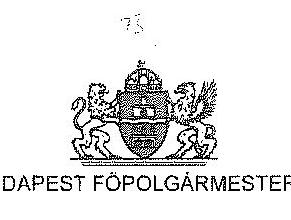

Állami Számvevőszék
Domokos László Elnök úr részére

# Tisztelt Elnök Úr! 

Köszönettel megkaptam a fenti iktatószámú, „A központi alrendszer egyes intézményei pénzügyi és vagyongazdálkodásának ellenőrzéséről - Jahn Ferenc Dél-pesti Kórház és Rendelőintézet" jelentésük tervezetét.

A jelentéstervezetre észrevételt nem teszünk, a főváros számára intézkedést igénylő javaslatot nem fogalmaz meg.

Munkájukat megköszönöm.

Budapest, 2016. január
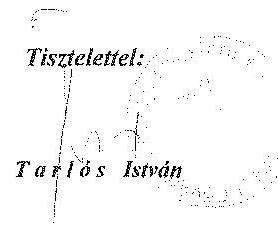

---

.

---

# 9. SZÁMÚ MELLÉKLET A V-0743-276/2016. SZÁMÚ JELENTÉSTERVEZETHEZ 

## 46

Állami Egészségügyi Ellátó Központ

1125 Budapest, Diós árok 3
Tel: +36 1 396 1532, Fax: +36 1 375 7253
1528 Budapest, Pf. 32

Domokos László
Elnök
Állami Számvevőszék

Budapest
Apáczai Csere János u. 10
1051

Iktatószám:
ÁEEK/000095/2016

## ÁLLAMI SZÁMVEVŐSZÉK   00126112016

Érke: 2016. JAN. 08.
Iktat: 2016. JAN. 08. 152/2016
Melléklet:
számprintnyomtatvány

Tisztelt Elnök Úr!

Az Állami Számvevőszék által „A központi alrendszer egyes intézményei pénzügyi és vagyongazdálkodásának ellenőrzéséről" készített számvevőszéki jelentés tervezeteit a Szent János és Észak-budai Egyesített Kórházról, a Zala Megyei Kórházról, a Péterfy Sándor utcai Kórház-Rendelőintézet és Baleseti Központról valamint a Jahn Ferenc Dél-pesti Kórház és Rendelőintézetről megkaptam.

A jelentés tervezetek megállapításaival kapcsolatban észrevételt nem kívánok tenni.

Budapest, 2016. január 4.

Tisztelettel:
Dr. Németh László
főigazgató

---

.

---

# A gazdaságossági, hatékonysági és eredményességi követelmények kialakítása és működtetése, a vezetői nyilatkozat helytállósága 

## 1. A GAZDÁLKODÁSI FELADATOK ÉRTÉKELÉSÉNEK TERÜLETEI

A teljesítményellenőrzés az alábbi területekre terjedt ki:

- pénzügyi gazdálkodási (nem szakmai, adminisztratív) feladatok: költségvetés-készítés, beszámoló-készítés, könyvvezetés, adatszolgáltatások, előirányzatgazdálkodás, kötelezettségvállalások nyilvántartása, kezelése, bevételkezelés, bér- és illetményszámfejtés;
- vagyongazdálkodási (logisztikai) feladatok: közbeszerzések és közbeszerzési értékhatárt el nem érő beszerzések, készletgazdálkodás, nyomtatók, fénymásolók üzemeltetése, épület- és ingatlanüzemeltetés, karbantartás, hibabejelentés, gépjármű- és flottamenedzsment.

## 2. A GAZDASÁGOSSÁGI, HATÉKONYSÁGI ÉS EREDMÉNYESSÉGI KÖVETELMÉNYEK KIALAKÍTÁSA ÉS MŰKÖDTETÉSE

A Kórháznál a pénzügyi és vagyongazdálkodás folyamatában - dokumentumokkal igazoltan - teljesítményméréssel kapcsolatos célokat nem tűztek ki, teljesítménymérésre alkalmas gazdaságossági, hatékonysági és eredményességi követelményeket nem határoztak meg.

## 3. A VEZETŐI NYILATKOZAT HELYTÁLLÓSÁGA

A Kórháznál a 2009. és a 2010. évre vonatkozóan az Ámr. 21. számú melléklete szerinti, a 2011. évre, valamint a 2012. január 1. - július 31. közötti időszakra vonatkozóan a
 Bkr. 1. számú melléklete szerinti vezetői nyilatkozatok nem álltak rendelkezésre.

A Kórház pénzügyi és vagyongazdálkodási folyamatai tekintetében a gazdaságosság, hatékonyság és eredményesség követelményeinek érvényesítéséről kiadott, a 2008. évre, a 2012. évben az augusztus 1. december 31. közötti időszakra, valamint a 2013. évre vonatkozó vezetői nyilatkozat nem volt helytálló.

A Kórház gazdaságossági, hatékonysági és eredményességi teljesítménycélokat és teljesítmény-követelményeket nem határozott meg, mutatószámokat, indikátorokat nem alakított ki, ezek számításához szükséges nyilvántartásokkal nem rendelkezett.

---

Az ellenőrzött időszakban a pénzügyi és vagyongazdálkodás folyamatában a Kórház által tett (takarékossági) intézkedések nem támasztották alá a vezetői nyilatkozatban foglaltakat.

---

# RÖVIDÍTÉSEK JEGYZÉKE 

## Törvények

Áht. 1
Áht. 2
ÁSZ tv.
Eü. tv.
Info tv.

Kbt. 1
Kbt. 2
Kjt.
konszolidációs törvény

Kt.

Nvtv.
Számv. tv
2012. évi XXXVIII. törvény

## Kormányrendeletek

Áhsz.

Ámr. 1
Ámr. 2

Az államháztartásról szóló 1992. évi XXXVIII. törvény (hatálytalan 2012. január 1-jétől)
Az államháztartásról szóló 2011. évi CXCV. törvény (hatályos 2012. január 1-jétől)
Az Állami Számvevőszékről szóló 2011. évi LXVI. törvény (hatályos 2011. július 1-jétől)
Az egészségügyről szóló 1997. évi CLIV. törvény
Az információs önrendelkezési jogról és az információszabadságról szóló 2011. évi CXII. törvény (hatályos 2011. július 27-étől)
A közbeszerzésekről szóló 2003. évi CXXIX. törvény (hatálytalan 2012. január 1-jétől)
A közbeszerzésekről szóló 2011. évi CVIII. törvény (hatályos 2012. január 1-jétől)
A közalkalmazottak jogállásáról szóló 1992. évi XXXIII. törvény
A megyei önkormányzatok konszolidációjáról, a megyei önkormányzati intézmények és a Fővárosi Önkormányzat egyes egészségügyi intézményeinek átvételéről szóló 2011. évi CLIV. törvény (hatályos 2011. november 26-ától)
A költségvetési szervek jogállásáról és gazdálkodásáról szóló 2008. évi CV. törvény (hatályos 2009. január 1-jétől, hatálytalan 2010. augusztus 15-étől)
A nemzeti vagyonról szóló 2011. évi CXCVI. törvény (hatályos 2012. január 1-jétől)
A számvitelről szóló 2000. évi C. törvény
a települési önkormányzatok fekvőbeteg-szakellátó intézményeinek átvételéről és az átvételhez kapcsolódó egyes törvények módosításáról szóló 2012. évi XXXVIII. törvény

Az államháztartás szervezetei beszámolási és könyvvezetési kötelezettségének sajátosságairól szóló 249/2000. (XII. 24.) Korm. rendelet (hatálytalan 2014. január 1-jétől)
Az államháztartás működési rendjéről szóló 217/1998. (XII. 30.) Korm. rendelet (hatálytalan 2010. január 1-jétől)
Az államháztartás működési rendjéről szóló 292/2009. (XII. 19.) Korm. rendelet (hatályos 2010. január 1-jétől 2011. december 31-éig)

---

Ávr. Az államháztartásról szóló törvény végrehajtásáról szóló 368/2011. (XII. 31.) Korm. rendelet (hatályos 2012. január 1-jétől)
Ber. A költségvetési szervek belső ellenőrzéséről szóló 193/2003. (XI. 26.) Korm. rendelet (hatálytalan 2012. január 1-jétől)
Bkr. A költségvetési szervek belső kontrollrendszeréről és belső ellenőrzésről szóló 370/2011. (XII. 31.) Korm. rendelet (hatályos 2012. január 1-jétől)
konszolidációs törvény végrehajtási rendelete

269/2010. (XII. 3.)
Korm. rendelet

A megyei önkormányzat egészségügyi intézményei és a Fővárosi Önkormányzat egészségügyi intézményei átvételének részletes szabályairól szóló 372/2011. (XII. 31.) Korm. rendelet (hatályos 2011. december 31-étől, hatálytalan 2014. szeptember 5-étől)
A Gyógyító-megelőző ellátás jogcím-csoportból finanszírozott egészségügyi szolgáltatók korábbi évekből felhalmozott adósságának rendezésére fordítható konszolidációs támogatásról szóló 269/2010. (XII. 3.) Korm. rendelet (hatálytalan 2011. január 1-jétől)
59/2011. (IV. 12.) Korm. A Gyógyszerészeti és Egészségügyi Minőség- és szervezetfejlesztőről szóló 59/2011. (IV. 12.) Korm. rendelet (hatályos 2011. április 13-ától, hatálytalan 2015. március 1-jétől)
337/2011. (XII. 29.)
Korm. rendelet

A Gyógyító-megelőző ellátás jogcím-csoportból finanszírozott egészségügyi szolgáltatók adósságának rendezésére fordítható konszolidációs támogatásról és az egészségügyi szolgáltatások Egészségbiztosítási Alapból történő finanszírozásának részletes szabályairól szóló 43/1999. (III. 3.) Korm. rendelet módosításáról (hatálytalan 2013. január 1-jétől)
46/2012. (III. 28.) Korm. A fekvőbeteg szakellátást nyújtó intézmények részére történő gyógyszer-, orvostechnikai eszköz és fertőtlenítőszer beszerzések országos központosított rendszeréről szóló 46/2012. (III. 28.) Korm. rendelet (hatályos 2012. március 29-étől, hatálytalan 2015. március 1-jétől)
438/2013. (XI. 29.)
Korm. rendelet

A finanszírozott egészségügyi szakellátást nyújtó egészségügyi szolgáltatók adósságának rendezésére fordítható konszolidációs támogatásról szóló 438/2013. (XI. 29.) Korm. rendelet

# Miniszteri rendeletek 

72/2011. (XII. 27.)
NEFMI rendelet

36/2013. (IX. 13.) NGM rendelet

Az állam tulajdonába és fenntartásába került egészségügyi intézmények tekintetében vagyonkezelői joggal rendelkező államigazgatási szerv kijelöléséről szóló 72/2011. (XII. 27.) NEFMI rendelet (hatályos 2012. január 1-jétől, hatálytalan 2012. május 1-jétől)
Az államháztartás számvitelének 2014. évi megváltozásával kapcsolatos feladatokról szóló 36/2013. (IX. 13.) NGM rendelet (hatályos 2013. szeptember 14-étől, hatálytalan 2015. március 1-jétől)

---

## Egyéb rövidítések

ÁEEK
ÁSZ
értékelési szabályzat $_{1}$
értékelési szabályzat $_{2}$

FEUVE szabályzat $_{1}$

FEUVE szabályzat $_{2}$

Főpolgármester
GYEMSZI

INTOSAI
informatikai biztonsági szabályzat $_{1}$
informatikai biztonsági szabályzat $_{2}$
Kincstár
kockázatkezelési szabályzat $_{1}$
kockázatkezelési szabályzat $_{2}$

Kórház
kötelezettségvállalási szabályzat $_{1}$
kötelezettségvállalási szabályzat $_{2}$
kötelezettségvállalási szabályzat $_{3}$

Közgyűlés
leltározási szabályzat

Állami Egészségügyi Ellátó Központ (2015. március 1-jétől)
Állami Számvevőszék
Jahn Ferenc Dél-pesti Kórház és Rendelőintézet Eszközök és források értékelési szabályzata (hatályos 2009. március 30-ától)
Jahn Ferenc Dél-pesti Kórház és Rendelőintézet Eszközök és források értékelési szabályzata (hatályos 2013. március 31-étől)
Jahn Ferenc Dél-pesti Kórház és Rendelőintézet A folyamatba épített, előzetes és utólagos vezetői ellenőrzés (FEUVE) szabályzata (hatályos 2006. március 1-jétől)
Jahn Ferenc Dél-pesti Kórház és Rendelőintézet A folyamatba épített, előzetes és utólagos vezetői ellenőrzés (FEUVE) szabályzata (hatályos 2010. szeptember 7-étől)
Budapest Főváros főpolgármestere
Gyógyszerészeti és Egészségügyi Minőség- és Szervezetfejlesztési Intézet (2015. február 28-áig)
Legfőbb Ellenőrző Intézmények Nemzetközi Szakmai szervezete
Jahn Ferenc Dél-pesti Kórház és Rendelőintézet Informatikai biztonsági szabályzata (hatályos 2009. március 26-ától)
Jahn Ferenc Dél-pesti Kórház és Rendelőintézet Informatikai biztonsági szabályzata (2013. június 4-étől)
Magyar Államkincstár
Jahn Ferenc Dél-pesti Kórház és Rendelőintézet Kockázatkezelési Szabályzata (hatályos 2008. május 1-jétől)
Jahn Ferenc Dél-pesti Kórház és Rendelőintézet Kockázatkezelési Szabályzata (hatályos 2010. szeptember 7-étől)
Jahn Ferenc Dél-pesti Kórház és Rendelőintézet
Jahn Ferenc Dél-pesti Kórház és Rendelőintézet kötelezettségvállalási szabályzata (hatályos 2008. június 30-ától)
Jahn Ferenc Dél-pesti Kórház és Rendelőintézet kötelezettségvállalási szabályzata (hatályos 2009. március 30-ától)
Jahn Ferenc Dél-pesti Kórház és Rendelőintézet kötelezettségvállalási szabályzata (hatályos 2013. június 15-étől)
Budapest Főváros Önkormányzatának Közgyűlése
Jahn Ferenc Dél-pesti Kórház és Rendelőintézet Leltározási Szabályzata (hatályos 2008. július 1-jétől)

---

| Miniszter | nemzeti erőforrás miniszter (2012. május 13-áig)   emberi erőforrás miniszter (2012. május 14-étől) |
| :--: | :--: |
| Minisztérium | Nemzeti Erőforrás Minisztérium (2012. május 13-áig)   Emberi Erőforrások Minisztériuma (2012. május 14-től) |
| NGM | Nemzetgazdasági Minisztérium |
| OEP | Országos Egészségbiztosítási Pénztár |
| Önkormányzat | Budapest Főváros Önkormányzata |
| selejtezési szabályzat | Jahn Ferenc Dél-pesti Kórház és Rendelőintézet Feleslegessé vált vagyontárgyak hasznosításának és selejtezésének szabályzata (hatályos 2007. szeptember 1-jétől) |
| számviteli politika $_{1}$ | Jahn Ferenc Dél-pesti Kórház és Rendelőintézet számviteli politikája (hatályos 2006. május 10-étől) |
| számviteli politika $_{2}$ | Jahn Ferenc Dél-pesti Kórház és Rendelőintézet számviteli politikája (hatályos 2009. augusztus 3-ától) |
| számviteli politika $_{3}$ | Jahn Ferenc Dél-pesti Kórház és Rendelőintézet számviteli politikája (hatályos 2013. március 31-étől) |
| SZMSZ | Szervezeti és Működési Szabályzat |
| SZMSZ $_{1}$ | Jahn Ferenc Dél-pesti Kórház és Rendelőintézet szervezeti és működési szabályzata (hatályos a 2005. évtől) |
| SZMSZ $_{2}$ | Jahn Ferenc Dél-pesti Kórház és Rendelőintézet szervezeti és működési szabályzata (hatályos 2009. november 21-étől) |
| SZMSZ3 | Jahn Ferenc Dél-pesti Kórház és Rendelőintézet szervezeti és működési szabályzata (hatályos 2013. június 12-étől) |
| TVK | teljesítményvolumen keret |

---

# ÉRTELMEZŐ SZÓTÁR 

aktív fekvőbeteg-ellátás

átalakítás
átlátható szervezet
case-mix index
elemi költségvetés

A fekvőbeteg-ellátó intézményben történő gyógyító, megelőző, rehabilitáló tevékenység, amelyben az ápolási idő előre tervezhető, többnyire rövid időtartamú. Az ellátásban az orvos-szakmai tevékenység a meghatározó, az ellátás célja az egészségi állapot mielőbbi helyreállítása. A besorolásban nem játszik szerepet, hogy az ellátás akut vagy krónikus betegség miatt következik-e be.
(Forrás: Egészségpolitikai fogalomtár.)
Költségvetési szervek egyesítése (beolvadás, illetve összeolvadás) vagy különválása.
(Forrás: Kt. 11. § (1) bekezdés, Áht. 95. § (1) bekezdés, Áht. 2 11. § (2) bekezdés.)
Az állam, a költségvetési szerv, a köztestület, a helyi önkormányzat, a nemzetiségi önkormányzat, a társulás, az egyházi jogi személy, az olyan gazdálkodó szervezet, amelyben az állam vagy a helyi önkormányzat különkülön vagy együtt 100%-os részesedéssel rendelkezik, a nemzetközi szervezet, a külföldi állam, a külföldi helyhatóság, a külföldi állami vagy helyhatósági szerv és az Európai Gazdasági Térségről szóló megállapodásban részes állam szabályozott piacára bevezetett nyilvánosan működő részvénytársaság, továbbá az olyan belföldi vagy külföldi jogi személy vagy jogi személyiséggel nem rendelkező gazdálkodó szervezet, civil szervezet és vízitársulat, amely megfelel az Nvtv.-ben foglalt feltételeknek.
(Forrás: Nvtv. 3. § (1) bekezdés 1. pont.)
Az aktív fekvőbeteg-ellátás finanszírozási rendszere szerint elszámolható, adott időszak alatt ellátott finanszírozási esetek összetételét költségigényesség szempontjából jellemző mutató, amely az elszámolt súlyszám és az elszámolt finanszírozási esetszám hányadosa. Értéke átlagos szakmai igényességű ellátások esetén 1. Az ennél magasabb szám azt jelzi, hogy az intézmény az átlagosnál magasabb szakmai színvonalú vagy nagyobb bonyolultságú eseteket kezel.
(Forrás: 43/1999. (III. 3.) Korm. rendelet 2. § 1) pont; Egészségpolitikai fogalomtár.)
Az államháztartás központi alrendszerébe tartozó költségvetési szervek, a fejezeti kezelésű előirányzatok, az elkülönített állami pénzalapok, a társadalombiztosítás pénzügyi alapjai kincstári költségvetésben, a helyi önkormányzatok, nemzetiségi önkormányzatok, társulások, térségi fejlesztési tanácsok, valamint az általuk irányított költségvetési szervek költségvetési rendeletben, határozatban megállapított bevételei és kiadásai köz-

---

előirányzat-
átcsoportosítás
előirányzat-maradvány
előirányzat-módosítás
előirányzat-módosítás
előirányzat-változás
eredményesség
fekvőbeteg-szakellátás
gazdaságosság
hatékonyság
homogén betegségcsoportok (HBCs)
gazdasági tartalom szerinti további részletezéséről készülő dokumentum.
(Forrás: Áht. $_{2}$ 28. § (3) bekezdés.)
A kiadási előirányzatok főösszegének változatlansága mellett, a kiadási előirányzatok egyidejű csökkentésével és növelésével végrehajtott előirányzat módosítás.
(Forrás: Áht. $_{2}$ 2. § (1) bekezdés e) pont.)
A módosított bevételi és kiadási előirányzatok és azok teljesítésének a Kormány rendeletében meghatározott tételekkel korrigált különbözete, az államháztartás központi alrendszerében.
(Forrás: Áht. $_{2}$ 2. § (1) bekezdés m) pont.)
A megállapított kiadási előirányzat növelése vagy csökkentése, a bevételi előirányzatok egyidejű növelése vagy csökkentése mellett.
(Forrás: Áht. $_{2}$ 2. § (1) bekezdés f) pont.)
Az előirányzat-módosítás és az előirányzat-átcsoportosítás együttvéve.
Annak követelménye, hogy a kitűzött célok - az elfogadott módosításokat, változó körülményeket figyelembe véve - megvalósuljanak, a tevékenység tervezett és tényleges hatása közötti különbség a lehető legkisebb mértékű legyen, vagy a tényleges hatás a tervezettnél kedvezőbb legyen.
(Forrás: Áht. 91. § (1) bekezdés c) pont, Bkr. 2. § g) pont.)
A betegnek a lakóhelye közelében, fekvőbeteggyógyintézeti keretek között végzett egészségügyi ellátása. Ennek igénybevétele a beteg folyamatos ellátását végző orvos, a kezelőorvos vagy az arra feljogosított más személy beutalása, valamint a beteg jelentkezése alapján történik.
(Forrás: Eü. tv. 91. § (1) bekezdés.)
Annak követelménye, hogy az erőforrások felhasználásához kapcsolódó kiadás vagy ráfordítás az elérhető legkisebb legyen, a jogszabályban meghatározott vagy általánosan elvárható minőség mellett.
(Forrás: Áht. 91. § (1) bekezdés a) pont, Bkr. 2. § i) pont.)
Az előállított termékek, nyújtott szolgáltatások, az ellátott feladat más eredményének értéke, vagy az azokból származó bevétel a lehető legnagyobb mértékben haladja meg a felhasznált erőforrásokhoz kapcsolódó kiadásokat vagy ráfordításokat.
(Forrás: Áht. 91. § (1) bekezdés b) pont, Bkr. 2. § j) pont.)
A fekvőbeteg-ellátás finanszírozásában használt betegosztályozási rendszer. Azokat az aktív kórházi ellátási eseteket sorolja egy finanszírozási csoportba, amelyek

---

|  | nagyságrendileg azonos teljesítményértékkel rendelkeznek, azaz közel azonos a szakmai-technikai ráfordítás igénye, és a csoportba sorolás orvosi szempontból is elfogadható. A besorolást elsődlegesen az ellátást indokló betegségek, a besoroláshoz kiemelt orvosi beavatkozások határozzák meg.   (Forrás: Egészségpolitikai fogalomtár.) |

 |
| :--: | :--: |
| integritás | Az államigazgatási szerv működésére vonatkozó szabályoknak, valamint a hivatali szervezet vezetője és az irányító szerv által meghatározott célkitűzéseknek, értékeknek és elveknek megfelelő működés.   (Forrás: integritásirányítási rendelet 2. § a) pont.) |
| integritási kockázat | Az államigazgatási szerv integritása sérülésének lehetősége.   (Forrás: integritásirányítási rendelet 2. § c) pont.) |
| irányító szerv | Felügyeleti szerv (2008. évben hatályos Áht. ${ }_{1}$ alapján), irányító szerv (2009. január 1-jétől 2011. december 31-éig hatályos Áht., valamint a Kt. és az Áht. ${ }_{2}$ alapján). |
| irányító szervi hatáskör | Az Áht. 1 2008. évben hatályos 49. §-ában, 2009. január 1-jétől 2011. december 31-éig hatályos 49. § (5) bekezdésében, a Kt. 8. § (2) bekezdésében és az Áht. 2 . § (1) bekezdésében meghatározott hatáskörök a Kt. 8. § (3) bekezdése, valamint az Áht. 2 . § (7) bekezdése szerinti hatásköröket is beleértve. |
| járóbeteg-szakellátás | A beteg folyamatos ellátását, gondozását végző orvos beutalása vagy a beteg jelentkezése alapján, szakorvos által végzett egyszeri, illetve alkalomszerű egészségügyi ellátás, továbbá fekvőbeteg-ellátást nem igénylő krónikus betegség esetén a folyamatos szakorvosi gondozás. (Forrás: Eü. tv. 89. § (1) bekezdés.) |
| kincstári költségvetés | Az államháztartás központi alrendszerébe tartozó költségvetési szerv jogszabályi előírás szerinti bevételeit és kiadásait tartalmazó költségvetés, melyet a központi költségvetésről szóló törvény elfogadását követően a fejezetet irányító szerv ad ki.   (Forrás: Áht. 124. § (3) bekezdés, Áht. 2 28. § (2) bekezdés.) |
| korrupciós kockázat | A jogtalan előny nyújtásának vagy megszerzésének lehetősége.   (Forrás: integritásirányítási rendelet 2. § d) pont.) |
| krónikus fekvőbetegellátás | A finanszírozás módja szerint krónikus ellátásnak minősül az, amelynek célja az egészségi állapot stabilizálása, fenntartása, illetve helyreállítása. Az ellátás időtartama, illetve befejezése általában nem tervezhető, és jellemzően hosszú időtartamú, emiatt napi finanszírozási díjtétel az alapja.   (Forrás: Egészségpolitikai fogalomtár.) |
| közfeladat | Az a feladat, amit az arra kötelezett közérdekből, jogszabályban meghatározott követelményeknek és feltételeknek megfelelve végez.   (Forrás: Nvtv. 3. § (1) bekezdés 7. pont.) |

---

monitoring
monitoring-rendszer
német pontrendszer
pénzmaradvány
progresszivitási szint
súlyszám
teljesítményvolumenkeret (TVK)
A különböző szintű szervezeti célok megvalósítása folyamatának figyelemmel kísérése, melynek célja a szervezet vezetőinek információhoz juttatása.
(Forrás: NGM Útmutató a költségvetési szervek monitoring rendszeréhez 2011. november.)
A szervezet tevékenységének, a célok megvalósításának nyomon követését lehetővé tevő rendszer, mely a folyamatos és eseti nyomon követésből, valamint a belső ellenőrzésből áll.
(Forrás: Ámr. ${ }_{1}$ 145/G. §, Ámr. ${ }_{2}$ 160. §, Bkr. 10. §.)
A tevékenységek klasszifikációs (besorolási, beazonosítási) rendszere, a WHO ICPM rendszerének fordításán alapuló OENO (Orvosi Eljárások Nemzetközi Osztályozási Rendszere) kódrendszer, de a beavatkozások díjtétele (illetve az azok meghatározásához szükséges pontértéke) az 1990-es évek elején a német egészségbiztosítás ponttáblázata alapulvételével került meghatározásra.
(Forrás: Egészségpolitikai fogalomtár.)
A teljesített bevételeknek és kiadásoknak a Kormány rendeletében meghatározott tételekkel korrigált különbözete, az államháztartás önkormányzati alrendszerében.
(Forrás: Áht. ${ }_{2}$ 2. § (1) bekezdés m) pont.)
A betegségek gyakorisági eloszlásából fakadó ellátórendszeri sajátosság, miszerint a gyakoribb - és többnyire egyszerűbb - eseteket az ellátórendszer alacsonyabb szinten szervezett (a beteg lakóhelyéhez közeli) egységekben látják el. A ritkább és többnyire bonyolultabb eseteket viszont központosított (területi, megyei, regionális, országos) intézményekbe irányítják. Magyarországon a legalsó (I.) szintet az alapellátás, a legfelsőbb (III.) szintet az országos intézetek és egyetemi klinikák jelentik.
(Forrás: Egészségpolitikai fogalomtár.)
Egy HBCS súlyszáma az adott betegségcsoport költségigényének és az átlagos költségigénynek a hányadosa. Magyarországon ez a díj az ellátás teljes (átlagos) költségét fedezi a tőkeköltségek (amortizáció, beruházás) kivételével.
(Forrás: Egészségpolitikai fogalomtár.)
A járóbeteg-szakellátásra és az aktív fekvőbetegszakellátásra vonatkozóan szolgáltatónként, éves szinten, havi bontásban meghatározott, elszámolható teljesítmény mennyiség.
(Forrás: Egészségpolitikai fogalomtár.)

---

teljesítményellenőrzés
vagyonhasznosítási bevételek
vezetői nyilatkozat

Annak megállapítása, hogy az adott szervezet által végzett tevékenységek, programok egy jól körülhatárolható területén a működés, illetve a forrásfelhasználás gazdaságosan, hatékonyan és eredményesen valósul-e meg.
(Forrás: Ber. 2. § d) pont, Bkr. 21. § (3) bekezdés d) pont.)
A bérleti és lízingdíj bevételek, valamint a tárgyi eszközök és immateriális javak értékesítéséből származó bevételek együttes összege, ÁFA-val.
A költségvetési szerv vezetője által a költségvetési szerv belső kontrollrendszere minőségének nyilatkozatban történő értékelése.
(Forrás: Ámr. 149. § (2) bekezdés c) pont, (11) bekezdés, 23. számú melléklet; Ámr. 2 217. § c) pont, 226. § (3) bekezdés, 21. számú melléklet; Bkr. 11. § (1)-(2) és (4) bekezdés, 1. számú melléklet.)

---

.
