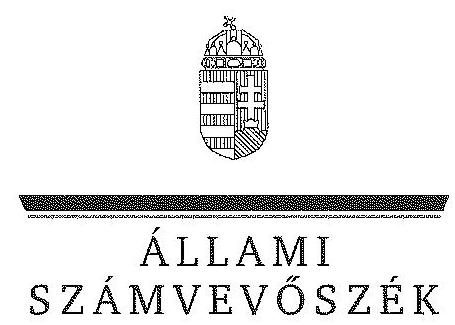
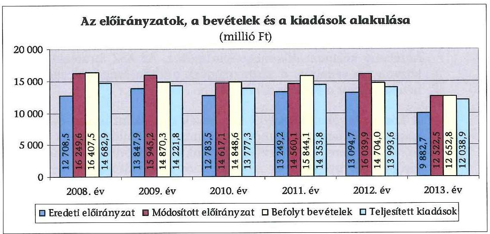
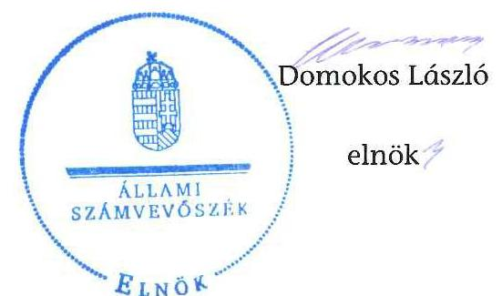
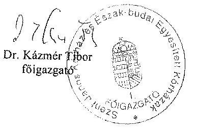
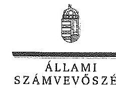
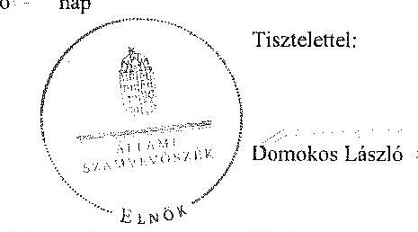
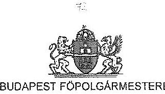
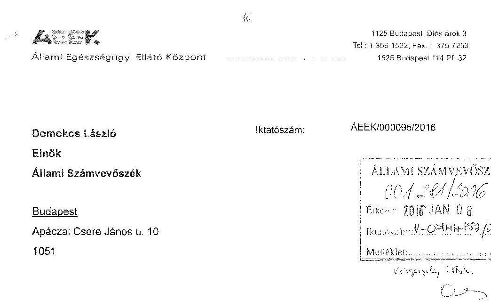

# JELENTÉS 

a központi alrendszer egyes intézményei pénzügyi és vagyongazdálkodásának ellenőrzéséről
Szent János Kórház és Észak-budai Egyesített Kórházak

---

# Állami Számvevőszék 

Iktatószám: V-0742-566/2016.
Témaszám: 1776
Vizsgálat-azonosító szám: V067907
Az ellenőrzést felügyelte:
Kisgergely István
felügyeleti vezető

## Az ellenőrzés végrehajtásáért felelősök:

Keresztes Tamás
ellenőrzésvezető

## Pats Regina

ellenőrzésvezető

## A számvevői munkaanyagok feldolgozását és a Jelentéstervezet összeállítását végezték:

## Csordás Péterné

számvevő
Kersmájer Ágota
számvevő főtanácsos
Takaró Rita
számvevő asszisztens

## Az ellenőrzést végezték:

## Csordás Péterné

számvevő
Fekete Anikó Gyöngyi
számvevő
Varga Sándor
számvevő

## Or. Jakab Kornél

számvevő vezető főtanácsos
Pats Regina
ellenőrzésvezető
Weltherné Szolnoki Dóra
számvevő tanácsos

## Deák Tamásné

számvevő tanácsos
Jakus Attila
számvevő tanácsos
Weltherné Szolnoki Dóra
számvevő tanácsos

A témához kapcsolódó eddig készített számvevőszéki jelentés:
címe
sorszáma
Jelentés a pszichiátriai betegellátás átalakításának ellenőrzéséről 1286

---

# TARTALOMJEGYZÉK 

BEVEZETÉS ..... 3
I. ÖSSZEGZŐ MEGÁLLAPÍTÁSOK, KÖVETKEZTETÉSEK, JAVASLATOK ..... 8
II. RÉSZLETES MEGÁLLAPÍTÁSOK ..... 14

1. Az alapítói jogosultságok és az irányító szervi hatáskörök gyakorlása ..... 14
2. A Kórház átalakítása, átszervezése ..... 17
3. belső kontrollrendszer és az integritás kontrollok értékelése ..... 18
4. A Kórház pénzügyi gazdálkodása ..... 23
4.1. Az előirányzatok megállapítása és módosítása ..... 23
4.2. A kiadási előirányzatok felhasználása és a bevételi előirányzatok teljesítése ..... 24
4.3. A pénzmaradványok, előirányzat-maradványok kezelése ..... 26
4.4. A fizetőképesség alakulása ..... 27
5. A Kórház vagyongazdálkodása ..... 29
5.1. A Kórház vagyonának változása ..... 29
5.2. A vagyongazdálkodás szabályszerűsége ..... 30
5.3. Az eredményszemléletű számvitel bevezetésével kapcsolatos feladatok végrehajtása ..... 32

---

# MELLÉKLETEK 

1. számú A belső kontrollrendszer kialakítása és múködtetése szabályszerűségének alakulása a Kórháznál
2. számú A Kórház kiadásainak, bevételeinek és létszámának alakulása
3. számú A Kórház fizetőképességét és vagyoni helyzetét jellemző mutatók
4. számú A Kórház eszközeinek és forrásainak alakulása
5. számú A Kórház tárgyi eszközeivel kapcsolatos mutatószámok alakulása
6. számú A Kórház észrevétele
7. számú A Kórház észrevételére adott válasz
8. számú Budapest Főpolgármesterének levele észrevétel hiányában
9. számú Állami Egészségügyi Ellátó Központ főigazgatójának levele észrevétel hiányában

## FÜGGELÉKEK

1. számú A gazdaságossági, hatékonysági és eredményességi követelmények kialakítása és múködtetése, a vezetői nyilatkozat helytállósága
2. számú Rövidítések jegyzéke
3. számú Értelmező szótár

---

# JELENTÉS 

## a központi alrendszer egyes intézményei pénzügyi és vagyongazdálkodásának ellenőrzéséről   Szent János Kórház és Észak-budai Egyesített Kórházak

## BEVEZETÉS

A közpénzek felhasználásában és az állami vagyonnal való gazdálkodásban a központi alrendszer egyes intézményei meghatározó súlyt képviselnek. Pénz-ügyi- és vagyongazdálkodásuk rendszeres ellenőrzésével az ÁSZ hozzájárul a hatékony közigazgatás megteremtéséhez. Az ÁSZ Stratégiával összhangban a közvagyon védelme, a közpénzügyek átláthatóságának előmozdítása érdekében került sor a Kórház ellenőrzésére.

A Kórház tevékenységi köre alaptevékenységként a járó és fekvőbetegek diagnosztikus és terápiás szakorvosi ellátása, rehabilitációja és követéses gondozása, ennek keretében fekvőbetegek aktív és krónikus ellátása, rehabilitációja, járóbetegek gyógyító és rehabilitációs szakellátása és egynapos ellátása, az egyén gyógykezelése, életveszély elhárítása, a megbetegedés következtében kialakult állapot javítása, vagy a további állapotromlás megelőzése céljából.

A Kórház feladatstruktúrája, illetve szervezeti felépítése az ellenőrzött időszakban két alkalommal változott, 2008. január 1-jétől a Szent Margit Kórház és a Budai Gyermekkórház a Szent János Kórházba integrálódott, majd 2013. január 1-jével a Szent Margit Kórház kivált a Kórházból. Tekintettel a kiválásra a Kórház 2013. évi múködésére vonatkozó megállapítások nem vonatkoznak a Szent Margit Kórház 2013. évi tevékenységére. A Szent Margit Kórház önálló intézményként nem volt jelen ellenőrzés tárgya.

A Kórház 2013. évi beszámolója alapján az ellátási területén élő közel 630 ezer fő egészségügyi ellátásáért felelt. A Kórház a feladatait összesen 15 telephelyen látta el 13 szakma keretében, a fekvőbeteg szakellátásban 1171 ágy múködtetésével. Ezen belül az aktív ellátás 744 ágyon folyt, a krónikus ellátás pedig 427 ágyon. A járóbeteg-szakellátáson belül 105 járóbeteg egység múködött, ebből 38 szakambulancia, 51 szakrendelés 7 gondozó és 9 diagnosztikus egység.

A Kórház az ellenőrzött időszakban önálló jogi személyiséggel rendelkező, önállóan múködő és gazdálkodó, az előirányzatok felett teljes jogkörrel rendelkező költségvetési szerv volt. A Kórházat érintően az irányító szervi hatásköröket 2011. december 31-éig a Közgyűlés gyakorolta. A Kórház államháztartás önkormányzati alrendszeréből a központi alrendszerbe történt átsorolását követő-

---

en, 2012. január 1-jétől az irányító szervi hatásköröket a Minisztérium, az egyes fenntartói, valamint az irányítási, középirányítói jogokat a Gyógyszerészeti és Egészségügyi Minőség- és Szervezetfejlesztési Intézet (GYEMSZI) gyakorolta. A GYEMSZI elnevezése 2015. március 1-jétől Állami Egészségügyi Ellátó Központra (ÁEEK-ra) változott.

A Kórházat 2008-2013 között főigazgató vezette, munkáját gazdasági igazgató, orvos igazgató, járóbeteg-igazgató, valamint ápolási igazgató segítette. A Kórház főigazgatójának személyében 2008. március hónapban, 2008. június hónapban és 2012. augusztus hónapban, a gazdasági igazgató személyében 2008. március hónapban, 2009. augusztus hónapban és 2012. augusztus hónapban történt változás.

A Kórház előirányzatainak és azok teljesítésének alakulását a következő diagram szemlélteti (az adatok a kiegyenlítő, függő és átfutó tételeket nem tartalmazzák):

A Kórház könyvviteli mérleg szerinti vagyona a 2008. év eleji 16333,5 millió Ft-ról $5,9 \%$-kal, 17290,9 millió Ft-ra, a befektetett eszközök mérlegértéke 14826,1 millió Ft-ról 10,2\%-kal, 16 338,5 millió Ft-ra emelkedett az ellenőrzött időszakban. A 2008. év eleji értékről a 2013. év végére a saját tőke 14259,2 millió Ft-ról 15387,9 millió Ft-ra, a kötelezettségek összege a passzív pénzügyi elszámolások nélkül 787,2 millió Ft-ról 1288,5 millió Ft-ra növekedtek, míg a tartalékok 1220,5 millió Ft-ról 613,8 millió Ft-ra csökkentek.

A Kórház engedélyezett létszámkerete a 2008. évi 2097 fơről a 2013. évre $28,5 \%$-kal, 1500 főre csökkent az átszervezések hatására.

Az ellenőrzés célja annak megállapítása volt, hogy a Kórházra vonatkozó irányító szervi feladatellátás a jogszabályi előírások betartásával történte; a Kórháznál a belső kontrollrendszer kialakítása és múködtetése szabályszerű volt-e; kialakították-e az erőforrásokkal való szabályszerű és hatékony gazdálkodáshoz szükséges követelményeket, megvalósították-e azok számon kérését, ellenőrzését; a Kórház pénzügyi és vagyongazdálkodása megfelelt-e a jogszabályi előírásoknak és belső szabályzatainak; a Kórház átalakításának, át-

---

szervezésének lebonyolítása szabályszerűen történt-e; az integritási kontrollokat kialakították-e, szabályszerűen működtették-e.

Az ÁSZ a Kórházat a 2012. évben ellenőrizte, melyről készült 1286 számú, „Jelentés a pszichiátriai betegellátás átalakitásának ellenőrzésérőll" című számvevőszéki jelentés a Kórház főigazgatója részére intézkedést igénylő megállapításokat, javaslatokat nem fogalmazott meg, ezért jelen ellenőrzésnél utóellenőrzésre nem került sor.

Az ellenőrzés várható hasznosulása: a központi alrendszerbe tartozó intézmények jelentős hatást gyakorolhatnak a költségvetés egyensúlyának fenntartására, az állami vagyonnal való gazdálkodás minőségére, a kormányzati (szak)politikák végrehajtására, illetve közfeladat ellátásuk vonatkozásában az állampolgárok életminőségére, jogalk és kötelezettségeik gyakorlására. Az ellenőrzés a Kórház pénzügyi és vagyongazdálkodása szabályosságának javításával előmozdítja a közpénzügyek átláthatóságát, rendezettségét. Eredményeként átfogó képet kaphatunk a Kórház gazdálkodásának hiányosságairól és a jó gyakorlatokról is.

A közintézmények integritás alapú kultúrája meghatározó a belső kontrollrendszer múködése szempontjából. Hozzájárulhat az elszámoltathatóság és átláthatóság érvényesítéséhez, egyben támogathatja a szervezet védettségét a korrupciós kitettséggel szemben. Az integritási kontrollok ellenőrzése az integritási szemlélet terjedését, az integritás kultúra erősítését támogatja.

A belső kontrollrendszer államháztartási törvényben rögzített célja a múködés és gazdálkodás során a tevékenységek szabályszerű, gazdaságos, hatékony és eredményes végrehajtása. Az ÁSZ a központi alrendszer intézményeinek ellenőrzését teljesítményellenőrzési modullal egészítette ki.

A Kórház teljesítményellenőrzésének célja annak értékelése volt, hogy a gazdálkodás folyamatában a gazdaságossági, hatékonysági és eredményességi követelmények kialakítása megtörtént-e és azokat működtették-e; a költségvetési szerv belső kontrollrendszerének minőségéről kiadott vezetői nyilatkozatban a Kórház tevékenységében a hatékonyság, eredményesség, gazdaságosság követelményeinek érvényesítése helytálló volt-e. A teljesítményellenőrzés a gazdálkodási feladatokra terjedt ki, a szakmai feladatellátást nem értékelte. A gazdaságossági, hatékonysági és eredményességi követelmények kialakítására és múködtetésére, a vezetői nyilatkozat helytállóságára vonatkozó megállapításokat az 1. sz. függelék tartalmazza.

A teljesítményellenőrzés várható hasznosulása: a törvényalkotás számára támogatást nyújt a nemzeti kulcsindikátorok rendszerének kialakításához. A döntéshozók, ellenőrzöttek, irányító szervek, a társadalom számára objektív visszajelzést ad a közfeladat-ellátásnak keretet adó pénzügyi és vagyongazdálkodásban mérhető teljesítménykövetelmények kialakításáról. Az ÁSZ értékteremtő elemzéseivel, tanácsadó szerepét erősítve támogatja a szervezetek önértékelő, alkalmazkodó (öntanuló) tevékenységét. Irányt mutat az ellenőrzött intézmények gazdálkodási és kapcsolódó adminisztratív folyamatainak optimalizációjához. Segíti a központi költségvetési szervek átláthatóságát, felügyelhetőségét, a „jó gyakorlatok" elterjesztésével támogatja a „jó kormányzást".

---

Az ellenőrzés típusa szabályszerűségi ellenőrzés, amelyet a Kórházra vonatkozó teljesítményellenőrzés egészített ki.

Az ellenőrzött időszak: 2008. január 1. - 2013. december 31.
Az ellenőrzésre a szabályszerűségi ellenőrzés tekintetében a Kórháznál, a Kórház irányító szervi feladatait ellátó Önkormányzatnál és Minisztériumnál, valamint az egyes fenntartói, valamint az irányítási, középirányítói jogokat gyakorló GYEMSZI-nél, a teljesítményellenőrzésre a Kórháznál került sor.

Az ellenőrzés jogszabályi alapját az ÁSZ tv. 1. § (3) bekezdés, 5. § (2)(6) bekezdései, valamint Áht. 2 61. § (2) bekezdésének előírásai képezték.

Az ÁSZ a 2011. évi LXVI. törvény 29. §-a szerint a jelentéstervezetet megküldte az emberi erőforrások miniszterének, az Állami Egészségügyi Ellátó Központ főigazgatójának, a Budapest Főváros Önkormányzata főpolgármesterének és a Szent János Kórház és Észak-budai Egyesített Kórházak főigazgatójának. A megküldött jelentéstervezetre a Kórház főigazgatója tett észrevételt. Az észrevétel és az arra adott választ a jelentés 6-7. sz. mellékletei tartalmazzák.

A központi alrendszer intézményeinek ellenőrzése során a belső kontrollrendszer tekintetében a hangsúlyt az egyes kontrollterületek (kontrollkörnyezet, kockázatkezelési rendszer, kontrolltevékenységek, információs és kommunikációs rendszer, monitoring rendszer) kialakításának és az intézmény működési folyamataiba való beépülésének szabályszerűségére helyeztük, amelyet kizárólag jogszabályokból és intézményi belső szabályozásokból levezethető kritériumrendszer alapján ítéltünk meg.

A belső kontrollrendszer jogszabályi előírások szerinti kialakításának és működtetésének szabályszerűségét az erre irányuló ellenőrzési kérdésekre adott válaszok összesítése alapján kontrollterületenként egyedileg és összesítetten is értékeltük. A belső kontrollrendszer egyes kontrollterületei kialakítása és működtetése „szabályszerü volt", tehát a feltárt hiányosságok nem gyakoroltak lényeges hatást a kontrollok kialakítására és működtetésére, amennyiben az értékelt területen az elért és elérhető pontok százalékban kifejezett hányadosa elérte a $85 \%$-ot, „nem volt szabályszerü", ha nem haladta meg a $60 \%$-ot, és „részben szabályszerü volt", ha 61-84\% között volt.

A belső kontrollrendszer összesített értékelése megegyezett a kontrollterületenként alkalmazott \%-os értékelésekkel, a következő kiegészítéssel. A kontrollrendszer egésze esetében a „szabályszerü" értékelésnek a \%-os értéken felül további feltétele volt, hogy egyik kontrollterületen sem kaphatott „nem volt szabályszerü" értékelést. A „részben szabályszerü" értékelés további feltétele volt, hogy legfeljebb egy ellenőrzött kontrollterület lehetett „nem volt szabályszerü" értékelésű. Az összesített értékelés a \%-os kiértékelés eredményétől függetlenül „nem volt szabályszerű", ha az ellenőrzött kontrollterületek közül több mint egynek „nem volt szabályszerü" az értékelése.

A Kórház a 2013-as évben nem vett részt az ÁSZ integritás felmérésében, ezért az integritás értékelése a tanúsítvány kérdéseire a Kórház által adott válaszok alapján történt. A minősítés két elemből tevődik össze. Az egyik elem a 3 rele-

---

váns mutatószám (Eredendő Veszélyeztetettség Tényező - EVT, Korrupciós Veszélyeztetettséget Növelő Tényező - KVNT, Kockázatokat Mérséklő Kontrollok Tényező - KMKT) szervezetre vonatkozó értéke. A mutató minősítése az intézménycsoporti átlagos értéktől való eltérésen alapul. A minősítés "magas", ha az eltérés több mint 5 százalékpont pozitív irányban, "közepes", ha a pozitív, vagy negatív irányú eltérés kevesebb, mint 5 százalékpont, illetve "alacsony", ha az eltérés több mint 5 százalékpont negatív irányban. Az értékelés másik összetevőjeként a kontrollok (KMKT) szintje összevetésre kerül a kockázati mutatókkal (EVT és KVNT). Ha a kontrollok mutatójának a minősítése mindkét kockázati mutató minősítésénél jobb, "kiváló" minősítést kap az ellenőrzött szervezet. Ha ez nem teljesül, de a kontrollok minősítése nem rosszabb egyik kockázati mutatószám minősítésénél sem, akkor "megfelelő", ellenkező esetben pedig "fejlesztendő" minősítés az értékelés eredménye.

A dologi kiadások és dologi jellegű (egyéb folyó) kiadások, a támogatásértékű kiadások, az átadott pénzeszközök, a kölcsönök nyújtása és a felhalmozási kiadások előirányzatai felhasználásának, valamint a vagyonhasznosítási bevételi előirányzatok teljesítésének szabályszerűségét, és e területekhez kapcsolódva a gazdálkodási jogkörök gyakorlása megfelelőségét is mintavétellel ellenőriztük. A gazdálkodási jogkörök gyakorlásának ellenőrzése a személyi juttatásokra is kiterjedt.

A jogszabályoknak és belső előírásoknak megfelelőnek, azaz szabályszerűnek tekintettük a bevételi előirányzatok teljesítését, amennyiben a minta ellenőrzésének eredménye alapján $95 \%$-os bizonyossággal a teljes sokaságban a hibaarány kisebb volt, mint $10 \%$, nem megfelelőnek értékeltük, ha a hibaarány a $10 \%$-ot meghaladta. A kiadási előirányzatok felhasználásának szabályszerűségét az ellenőrzött mintatételek vonatkozásában értékeltük.

A gazdálkodási jogkörök gyakorlásának ellenőrzése keretében a 20082011. éveket érintően a szakmai teljesítésigazolás és az utalvány ellenjegyzése kulcskontrollok, a 2012-2013. éveket érintően a teljesítésigazolás és az érvényesítés kulcskontrollok működését értékeltük. Megfelelőnek értékeltük a gazdálkodási jogkörök gyakorlását, amennyiben $95 \%$-os bizonyossággal a teljes sokaságban a hibaarány legfeljebb $10 \%$ volt, részben megfelelőnek, ha a hibaarány felső határa legfeljebb $30 \%$ volt, nem megfelelőnek, ha a sokaságbeli hibaarány felső határa meghaladta a $30 \%$-ot. A vagyonhasznosítási bevételek esetében a gazdálkodási jogkörök gyakorlásának megfelelőségét az ellenőrzött mintatételek vonatkozásában értékeltük.

Az ellenőrzés az INTOSAI által kiadott nemzetközi standardok (ISSAI) figyelembe vételével, az ellenőrzési programban foglalt értékelési szempontok szerint történt.

A jelentéstervezetben alkalmazott rövidítések jegyzékét a 2. sz. függelék, az egyes fogalmak magyarázatát a 3. sz. függelék tartalmazza.

---

# I. ÖSSZEGZŐ MEGÁLLAPÍTÁSOK, KÖVETKEZTETÉSEK, JAVASLATOK 

#### Abstract

A Kórházra vonatkozó irányító szervi feladatellátás részben felelt meg a jogszabályi előirásoknak. A belső kontrollrendszer kialakítása és müködtetése összességében szabályszerű volt. A Kórház pénzügyi gazdálkodásának szabályszerűsége részben volt megfelelő. A pénzügyi gazdálkodást az ellenőrzött időszakban fokozódó likviditási nehézségek jellemezték, a fizetőképesség 2012-től nem volt biztositott. A Kórház vagyongazdálkodása terén a jogszabályi előirások maradéktalanul nem érvényesültek.

Az alapítói jogosultságokat a Közgyűlés és a Miniszter megfelelően gyakorolta. A GYEMSZI a fenntartói, irányítási, középirányítói jogok gyakorlására vonatkozó, közbeszerzéssel kapcsolatos jogszabályi előírásokat hiányosan érvényesítette, melynek következtében elmaradt a központosított közbeszerzésekből fakadó előnyök kihasználása. A szabályszerű gazdálkodáshoz szükséges követelmények kialakítása és számonkérése a költségvetés tervezésének és a beszámoltatás rendjének biztosításával valósult meg. A Közgyűlés és a GYEMSZI nem érvényesítette azonban az előirányzatokkal, létszámokkal és vagyonnal való hatékony gazdálkodás követelményeit, mivel a Kórház részére mérhető teljesítménykövetelményeket nem határozott meg. Az ellenőrzési jogosultságait a Minisztérium és a GYEMSZI szabályszerűen gyakorolta, a Közgyűlés részben gyakorolta az előírásoknak megfelelően, mivel nem ellenőrizte az erőforrásokkal való hatékony gazdálkodást és a nyilvános adatok kötelező közzétételét.

A belső kontrollrendszer kialakítása és múködtetése összességében szabályszerű volt. A kontrollrendszer részterületei közül a kontrollkörnyezet, az információs és kommunikációs rendszer, valamint a monitoring rendszer szabályszerű, a kockázatkezelési rendszer és a kontrolltevékenységek kialakítása és működtetése részben szabályszerű értékelést kapott.

A Kórház tevékenységében jelenlévő kockázatok és az azok kezelésére kiépült kontrollok szintje között egyensúly van. A Kórház által kialakított kontrollrendszer megfelelő feltételeket biztosít a szervezet integritását veszélyeztető kockázatok kezelésére.

A Kórház pénzügyi gazdálkodásának szabályszerűsége részben volt megfelelő. A Kórház a 2012. évi bevételi elmaradás ellenére nem tett eleget az előirányzat csökkentési kötelezettségének. Az ellenőrzött kiadási előirányzatok felhasználása során a jogszabályi előírásokat részben tartotta be a közbeszerzési eljárás lefolytatása, valamint a tárgyévi fizetési kötelezettségvállalás múködésében feltárt hiányosságok miatt. A kiadásokhoz kapcsolódóan az utalvány ellenjegyzése, a (szakmai) teljesítés igazolása és az érvényesítés kulcskontrollok múködésében tárt fel hiányosságokat az ellenőrzés. A vagyonhasznosítási bevételi előirányzatok teljesítése és a pénzmaradványok, előirányzatmaradványok kezelése a jogszabályi előírásoknak megfelelő volt.

A forgóeszközök állománya a 2013. évben, a pénzeszközök állománya a 2009. és a 2011-2013. években nem nyújtott fedezetet a rövid lejáratú kötelezettsé-

---

gekre. A Kórház fizetőképessége 2008-2011 között biztosított volt, 2012-től nem volt biztosított, mivel a 2012-2013. években a szállítói kötelezettségeknek részben határidőn túl tudtak eleget tenni. A Kórház mérleg szerinti szállítói kötelezettség állománya a 2008. január 1-jei 787,1 millió Ft-ról 426,2 millió Ft-tal, ( $54,1 \%$-kal) 1213,3 millió Ft-ra növekedett az ellenőrzött időszak végére.

A Kórház vagyona 2008. január 1-jei 16333,5 millió Ft-ról év végére 20333,1 millió Ft-ra növekedett a Szent Margit Kórház és a Budai Gyerekkórház integrálódásával átvett eszközállomány miatt. Ezt követően azonban a 2013. év végére 17290,9 millió Ft-ra csökkent a vagyon, amit meghatározó részben a Szent Margit Kórház 2013. január 1-jei kiválása okozott. A Kórház által végrehajtott beruházások nem ellensúlyozták az eszközök elszámolt amortizációjában megjelenő avulást, a tárgyi eszközök használhatósági foka minden eszközcsoportnál csökkent. A mérlegben kimutatott eszközök és források értékének megállapítása és nyilvántartása megfelelt az előírásoknak. Az eszközök leltárral történő alátámasztása azonban két mérlegsornál a 2008-2010. években (elhanyagolható összegben) nem volt teljes körű, 2012-2013-ban pedig a tárgyi eszközöknél a kétévenkénti leltározási gyakorlat folytatásához nem rendelkeztek a GYEMSZI egyetértésével. E hiányosságok azonban lényegesen nem befolyásolták a mérlegben kimutatott eszközöket és forrásokat érintően a megbízható és valós kép kialakítását. A vagyonelemek térítésmentes átadásaátvétele, valamint az eredményszemléletű számvitel bevezetésével kapcsolatos feladatok végrehajtása megfelelt a jogszabályoknak.
2012. január 1-jétől a Kórház, annak vagyona és vagyoni értékű jogai állami tulajdonba kerültek. A tulajdonosi és fenntartói jogutódlás tekintetében a jogszabályi előírások hiányosan érvényesültek, mivel az ellenőrzött időszak végéig nem született meg a konszolidációs törvény előírása ellenére a jogutódlás alapfeltételeire vonatkozó, az Önkormányzat és a Kormány közötti megállapodás, valamint a végrehajtás részletkérdéseire irányuló - az Önkormányzat és a GYEMSZI közötti - átadás-átvételi megállapodás. E megállapodások hiánya ellenére, a tulajdonosi és fenntartói jogutódlás a konszolidációs törvény rendelkezései erejénél fogva a Kórház vagyona tekintetében megtörtént. A Kórház vagyonkezelői joga 2012. január 1-jétől megszűnt, egyidejűleg a jogszabály által vagyonkezelésre kijelölt GYEMSZI az átvett vagyont a Kórházzal megkötött intézményi megállapodásban használatba, hasznosításba adta. A 2012. május 1-jétől hatályba lépett jogszabályi változások alapján a GYEMSZI vagyonkezelői joga megszűnt, tulajdonosi jogkörre változott, amely alapján az átvett vagyont - a Kórházzal 2013. március hónapban megkötött, 2012. május 1-jére visszamenőleges hatállyal érvényes vagyonkezelési szerződéssel - a Kórház vagyonkezelésébe adta. Ez a jogi megoldás (visszamenőleges hatályú vagyonkezelési szerződés) magas kockázatot hordozott az állami vagyon védelme és a felelős gazdálkodás terén.

A Szent Margit Kórház 2013. január 1-jével történt kiválása a jogszabályi előírásoknak megfelelő volt. A GYEMSZI fenntartói határozatban rendelkezett a jogutódlás alapvető kérdéseiről, feladatairól. A GYEMSZI által a Szent Margit Kórház használatába adott vagyont a Kórház az átadás-átvételi jegyzőkönyvben foglalt eszközleltár szerint a könyveiből szabályszerűen kivezette.

---

Az ÁSZ tv. 33. § (1) bekezdésében foglaltak értelmében a jelentésben foglalt megállapításokhoz kapcsolódó intézkedési tervet köteles az ellenőrzött szervezet vezetője összeállítani, és azt a jelentés kézhezvételétől számított 30 napon belül az ÁSZ részére megküldeni. Amennyiben az intézkedési tervet határidőben nem küldi meg a szervezet, vagy az nem elfogadható, az ÁSZ elnöke a hivatkozott törvény 33. § (3) bekezdés a)-b) pontjaiban foglaltakat érvényesítheti.

A helyszíni ellenőrzés megállapításainak hasznosítása mellett javasoljuk:

# az ÁEEK föigazgatójának 

1. A GYEMSZI a közbeszerzések összevont lefolytatására vonatkozó, az 59/2011. (IV. 12.) Korm. rendelet 2012. január 1-jétől hatályos 2/A. § m) pont szerinti jogosultságait részben gyakorolta. A 46/2012. (III. 28.) Korm. rendelet 1. § (1) és 2. § (3) bekezdésének előírása ellenére a 2013. december 31-éig terjedő időszakban nem gondoskodott a Kórház fekvőbeteg szakellátása tekintetében teljes körűen a gyógyszerek, az orvostechnikai eszközök és a fertőtlenítőszerek vonatkozásában a közbeszerzések központosított lefolytatásáról, mivel keret-megállapodás megkötésére 2013. második félévétől és csak a gyógyszereket érintően került sor.

Javaslat
Intézkedjen a központi beszerző szervezet feladatkörében eljárva a központosított közbeszerzési rendszer keretén belül megvalósuló közbeszerzések lefolytatásáról.
2. A 2012-2013 közötti időszakban a GYEMSZI nem tudta érvényesíteni a Kórháznál az előirányzatokkal, létszámokkal és vagyonnal való hatékony gazdálkodás követelményeit, mert a Kórház részére mérhető teljesítménykövetelményeket nem határozott meg, ezért az 59/2011. (IV. 12.) Korm. rendelet 2/A. § a) pontjában és az Áht. 2 9. § (1) bekezdés f) pontjában foglalt előírásoknak nem tett eleget.

Javaslat
Intézkedjen a Kórház esetében az erőforrásokkal való szabályszerű és hatékony gazdálkodás mérhető teljesítménykövetelmények kialakításáról, valamint arról, hogy a közfeladatok ellátása és az erőforrásokkal való hatékony gazdálkodás követelményei érvényesüljenek.

## a Kórház föigazgatójának

1. A kontrollkörnyezet kialakítása és müködtetése az ellenőrzött időszakban összességében szabályszerű volt, azonban a Kórház nem vette figyelembe az Ámr. 1 2009. január 1-jétől hatályba lépő 145/D. § c) pontjában, az Ámr. 2 156. § (1) bekezdés c) pontjában, valamint a Bkr. 6. § (1) bekezdés c) pontjában foglaltakat, mert a 2009-2013 közötti időszakban nem határozta meg az etikai elvárásokat a szervezet minden szintjén; az ellenőrzött időszakban a leltározási szabályzat ${ }_{1-4}$ nem tartalmazta a kis értékű immateriális javak leltározási módját, valamint az üzemeltetésre, kezelésre átadott eszközök leltározására vonatkozó szabályokat, mellyel figyelmen kívül hagyta az Áhsz. 37. § (6) bekezdésében előírtakat; a Kórház a közérdekű adatokkal kapcsolatos szabályozási kötelezettségeinek nem tett eleget az ellenőrzött időszak-

---

ban, mert az Ávr. 13. § (2) bekezdés h) pontjában foglaltak ellenére a közérdekű adatok megismerésére irányuló kérelmek intézésének, továbbá a kötelezően közzéteendő adatok nyilvánosságra hozatalának rendjét nem szabályozta. A közérdekű adatok megismerésére irányuló igények teljesítésének rendjét rögzítő szabályzat hiánya miatt a Kórház az Info tv. 2012. január 1-jétől hatályba lépett 30. § (6) bekezdésében foglaltaknak sem tett eleget.

A kontrolltevékenységek kialakítása és müködtetése az ellenőrzött időszak egészében és annak valamennyi évében részben volt szabályszerű. A szakmai teljesítésigazolás, illetve a teljesítésigazolás szabályozása nem felelt meg a jogszabályi előírásoknak, mivel a 2010-2013. években a kontroll elvégzésére kijelölt és jogosult személyekről és aláírás mintájukról az Ámr. 2 80. § (3) bekezdésében és az Ávr. 60. § (3) bekezdésében foglalt előírásokat figyelmen kívül hagyva nem vezettek nyilvántartást.

Az információs és kommunikációs rendszer kialakítása és müködtetése az ellenőrzött időszakban összességében és az egyes években is szabályszerű volt, azonban a Kórház az Info. tv. 37. § (1) bekezdésében és 1. mellékletben, valamint az Ávr. 173. § (3) bekezdésében és 8. mellékletének 13. és 14. pontjaiban előírt közérdekű adatok közzétételi kötelezettségét hiányosan teljesítette, mivel e jogszabályokban meghatározott - a szervezetére, tevékenységére és müködésére vonatkozó - információk a honlapján a helyszíni ellenőrzés időszakában nem voltak teljes körűen felleltetők.

A monitoring-rendszer kialakítása és müködtetése az ellenőrzött időszakban, összességében szabályszerű volt, azonban a Kórház főigazgatója az ellenőrzött időszakban nem gondoskodott arról, hogy a Kórház tevékenységében és céljaiban a gazdaságosság, a hatékonyság és az eredményesség követelményei érvényesüljenek, az Áht. 1 94. § (1) bekezdés b) pontjában, az Áht. 2 61. § (1) bekezdésében, az Áht. 2 69. § (1) bekezdés a) pontjában és a Bkr. 4. § a) pontjában foglaltak ellenére, mivel teljesítménycélokat és követelményeket az ellenőrzött időszakban nem alakított ki és nem alkalmazott.

Javaslat
a) Intézkedjen a jogszabályoknak megfelelő belső kontrollrendszer kialakítása és működtetése érdekében a kontrollkörnyezet, a kontrolltevékenységek, továbbá az információs és kommunikációs rendszernek az ÁSZ ellenőrzés által feltárt hiányosságainak megszüntetéséről;
b) Tegyen intézkedéseket a teljesítésigazolásra elvégzésére kijelölt és jogosult személyek és aláírás mintájuk nyilvántartásával kapcsolatosan feltárt szabálytalanságok tekintetében a felelősség tisztázása érdekében, és szükség szerint intézkedjen a felelősség érvényesítéséről;
c) Intézkedjen a Kórház tevékenységére és céljára vonatkozó hatékonysági, eredményességi és gazdaságossági mérhető követelmények kialakítására és érvényesítésére.
2. A Kórház bevételi és kiadási előirányzatai módosításának szabályszerűsége részben volt megfelelő. A kiemelt előirányzatok közötti átcsoportosítások a 2012-2013.

---

években nem voltak szabályszerűek, az Ávr. 44. § (2) bekezdésében előírt elrendelés és pénzügyi ellenjegyzés hiányában.

Javaslat
Intézkedjen, hogy a kiemelt előirányzatok közötti átcsoportosítások elrendelésére és a pénzügyi ellenjegyzésre a jogszabályi előírásoknak megfelelően történjen.
3. A Kórház a kiadási előirányzatok felhasználása során a jogszabályi előírásokat részben tartotta be, mivel a rendszeres személyi juttatásoknál a teljes ellenőrzött időszakban egyes esetekben a (szakmai) teljesítés igazolás során nem tettek eleget az Ámr. 135. § (1), az Ámr. 2 76. § (1), valamint az Ávr. 57. § (1) bekezdésben foglalt előírásoknak, nem ellenőrizték a kiadás teljesítésének összegszerűségét. Az 50\%-os mértékű éjszakai műszakpótlék összege esetenként nem volt megalapozott. A Kórházban többműszakosként foglalkoztatott dolgozók részére a megszakítás nélküli munkarendben dolgozók műszakpótlékát számolták el, amely nem felelt meg az Mt. 146. § (3) bekezdésében, illetve az Eütev. tv. 14/B. § (1) bekezdés b) és c) pontjaiban foglaltaknak. Az érvényesítő a 2012-2013. években a rendszeres és a külső személyi juttatásoknál, valamint a felhalmozási kiadásoknál esetenként nem végezte el az Ávr. 58. § (1) bekezdésben meghatározott feladatai közül az összegszerűség ellenőrzését. Nem végezte el továbbá a megelőző ügymenetben az Ávr. és a belső szabályzatokban foglalt előírások betartásának ellenőrzését a teljesítésigazolás, a kötelezettségvállalás és annak ellenjegyzése szabályszerűsége tekintetében. Ezen ellenőrzések elvégzése hiányában az Ávr. 58. § (2) bekezdés előírásaiban foglalt érvényesítői feladat ellátása - a szabálytalanságok utalványozó felé történő jelzése - sem történt meg. A 2008. és a 2012. évben a külső személyi juttatások egyes eseteiben a (szakmai) teljesítés igazolás során nem tettek eleget az Ámr. 135. § (1), valamint az Ávr. 57. § (1) bekezdésében foglalt előírásoknak, nem ellenőrizték a kiadás teljesítésének jogosultságát és összegszerűségét, mert a szerződésben meghatározott maximum óraszámnál a teljesítésigazoláson több órát igazoltak le.

A kötelezettségvállalásra és annak ellenjegyzésére vonatkozó jogszabályi előírások hiányosan érvényesültek a 2009., a 2010. és a 2013. évi felhalmozási kiadásoknál, valamint a 2008., 2009. és 2012. évi rendszeres és nem rendszeres személyi juttatások kiadásánál egyes esetekben. A kötelezettségvállalási dokumentum kiállítására és annak ellenjegyzésére utólag, a szállítói számla kiállítását követően került sor, illetve a kötelezettségvállalás ellenjegyzése nem történt meg. Ezzel figyelmen kívül hagyták az Ámr. 134. § (8), az Ámr. 274 § (1) bekezdéseiben és az Ávr. 52. § (1) bekezdése a) pontjában, valamint a kötelezettségvállalási szabályzat ${ }_{2,3,5}$,-ban foglalt előírásokat.

Javaslat
a) Intézkedjen a gazdálkodási jogkörök szabályszerű gyakorlásának érvényesítéséről;
b) Tegyen intézkedéseket az 50\%-os mértékű éjszakai műszakpótlék összege megállapításánál feltárt szabálytalanságok tekintetében a felelősség tisztázása érdekében, és szükség szerint intézkedjen a felelősség érvényesítéséről.
4. A Kórház vagyongazdálkodásának szabályszerűsége az ellenőrzött időszakban részben volt megfelelő. A leltározás végrehajtása a 2008-2011. években az előírásoknak megfelelően, a 2012-2013. években részben megfelelően történt. A kétévenkénti leltározási gyakorlat 2008-2011-ben az Ámr. 37. § (7) bekezdés előírásának megfelelően

---

lő volt az Önkormányzat rendeleti szabályozása alapján. A 2012-2013. években azonban a tárgyi eszközök kétévenkénti leltározásához az Áhsz. 37. § (7) bekezdésében foglalt előírás ellenére nem rendelkeztek a GYEMSZI egyetértésével.

A tárgyévet terhelő, illetve a tárgyévet követő évet terhelő szállítói kötelezettség elkülönítéséhez az Áhsz. 18. számú melléklete szerinti adattartalommal nem vezettek külön nyilvántartást, így a mérlegben tárgyévre, illetve a tárgyévet követő évre beállított szállítói kötelezettségek értékének megfelelősége nem volt megállapítható.

Javaslat
a) Intézkedjen a leltározási gyakorlat szabályszerűségéről;
b) Intézkedjen a jogszabályoknak megfelelő nyilvántartások kialakításáról.
c) Tegyen intézkedéseket a leltározási gyakorlattal, valamint a nyilvántartások vezetésével kapcsolatban feltárt szabálytalanságok tekintetében a felelősség tisztázása érdekében, és szükség szerint intézkedjen a felelősség érvényesítéséről.

---

# II. RÉSZLETES MEGÁLLAPÍTÁSOK 

## 1. Az alapítói jogosultságoK És az irányító szERVI hatáskÖRÖK GYAKORLÁSA

A Közgyűlés és a Miniszter a Kórházzal kapcsolatos alapítói jogosultságait a jogszabályi előírásoknak megfelelően gyakorolta. Az ellenőrzött időszakban az alapító okiratok tartalma megfelelt a jogszabályi rendelkezéseknek ${ }^{1}$ és azokban a változásokat átvezették. Az alapító okiratokat - szabályszerűen - 2008-2011 között a Közgyűlés határozattal fogadta el, a 2012-2013. években a Miniszter adta ki.

Az irányító szervi hatásköröket a 2008-2011 közötti időszakban a Közgyűlés részben gyakorolta szabályszerűen. A Közgyűlés 2008-2011 között minden egyes évben beszámoló készítésre kötelezte a Kórházat és meghatározta annak határidejét. A Kórház 2008 és 2011 között rendelkezett érvényes SZMSZ-szel, azonban annak az alapító okirat változásaira tekintettel való aktualizálása nem történt meg folyamatosan, így az SZMSZ ${ }_{2}$ az előírt tartalmi követelményeknek nem felelt meg, mivel az:

- nem az alapító okirat ${ }_{2}$-ben foglaltakkal összhangban tartalmazta a Kórház tevékenységeit az Ámr. ${ }_{1} 10 . \S$ (5) bekezdés b) pontjában foglalt előírások ellenére; illetve nem az alapító okirat ${ }_{3,4}$-ben foglaltakkal összhangban tartalmazta a Kórház tevékenységeit és szakfeladatait az Ámr. ${ }_{1} 13 /$ A. § (3) bekezdés c) pontjában foglaltak ellenére;
- nem az alapító okirat ${ }_{3}$-al összhangban tartalmazta a Kórház szervezeti felépítését, szervezeti egységeit (telephelyeit), továbbá nem tartalmazta a szervezeti egységek engedélyezett létszámát az Ámr. ${ }_{1} 13 /$ A. § (3) bekezdés e) pontjának előírása ellenére.

Az SZMSZ ${ }_{1-3}$ jóváhagyása szabályszerű volt. A Kórház főigazgatóinak és gazdasági igazgatóinak kinevezése megfelelt a jogszabályi ${ }^{2}$ előírásoknak.

A 2012-2013 közötti időszakban a Miniszter az irányítói hatásköröket szabályszerűen gyakorolta. A 2012. és a 2013. években beszámoló készítésre kötelezte a Kórházat és meghatározta annak határidejét.

[^0]
[^0]:    ${ }^{1}$ A 2008. évben az Áht. ${ }_{1}$ 88. § (3) bekezdés, 2009. január 1-jétől 2010. augusztus 14-ig a Kt. 4. § (1) bekezdés, 2010. augusztus 15-től 2011. december 31-ig az Áht. ${ }_{1} 90 . \S$ (1) bekezdés, továbbá 2012. január 1-jétől az Ávr. 5. § (1) bekezdés.
    ${ }^{2}$ Az Eü. tv. 2012. június 30 -álg hatályos 155. § (1) bekezdés c) pont.

---

A Kórház főigazgatóját és gazdasági igazgatóját - a GYEMSZI főigazgatójának javaslatára - szabályszerűen ${ }^{3}$ a Miniszter bízta meg, illetve nevezte ki. A 20122013. közötti időszakban a GYEMSZI az egyes fenntartói, valamint az irányítási, középirányítói jogok ${ }^{4}$ gyakorlására vonatkozó jogszabályi előírásokat hiányosan érvényesítette.

A Kórház a Miniszter által 2012. január 25-én kiadott alapító okirat ${ }_{7}$, illetve 2012. augusztus 7-én kiadott alapító okirat ${ }_{8}$ és az Áht ${ }_{2} 10 . \S$ (5) bekezdésében foglaltak alapján elkészített SZMSZ4-ét 2012. december 19-én küldte meg a GYEMSZI-nek, melyet a GYEMSZI főigazgatója 2013. április 22-én hagyott jóvá. Az SZMSZ4 az Ávr. 13. § (1) bekezdés e) pontjában foglaltakkal ellentétben nem tartalmazta a szervezeti egységek engedélyezett létszámadatait.

A GYEMSZI a közbeszerzések összevont lefolytatására vonatkozó, az 59/2011. (IV. 12.) Korm. rendelet 2012. január 1-jétől hatályos 2/A. § m) pont szerinti jogosultságait részben gyakorolta. A 46/2012. (III. 28.) Korm. rendelet 1. § (1) és 2. § (3) bekezdésének előírása ellenére a 2013. december 31-éig terjedő időszakban nem gondoskodott a Kórház fekvőbeteg szakellátása tekintetében teljes körűen a gyógyszerek, az orvostechnikai eszközök és a fertőtlenítőszerek vonatkozásában a közbeszerzések központosított lefolytatásáról, mivel ke-ret-megállapodás megkötésére 2013. második félévétől és csak a gyógyszereket érintően került sor. E jogkör gyakorlásának elmulasztásával a GYEMSZI nem tette lehetővé a Kórház fekvőbeteg szakellátása orvostechnikai eszköz és fertőtlenítőszerek beszerzése tekintetében a központosított közbeszerzésekből fakadó előnyök kihasználását.

A Közgyűlés, a Minisztérium és a GYEMSZI a Kórházat érintően az erőforrásokkal való szabályszerű gazdálkodáshoz szükséges követelményeket kialakította és megvalósította a számonkérést. A szabályszerű gazdálkodáshoz szükséges követelmények kialakítása és számonkérése a költségvetés tervezésének és a beszámoltatás rendjének biztosításával valósult meg. Az ellenőrzött időszakban a Közgyűlés, illetve a GYEMSZI a bevételi és kiadási előirányzatokkal való gazdálkodást figyelemmel kísérte, a pénzügyi helyzetről rendszeres beszámolási kötelezettséget írt elő a Kórház főigazgatójának. A beszámolók kiterjedtek a belső szabályozottságra, a pénzügyi, likviditási helyzetre, a gyógyító ellátás kapacitásokra és teljesítményre, a belső ellenőrzés helyzetére, a panaszos ügyek, a közbeszerzések, a fejlesztések, beruházások, a létszámok és bérek alakulására.

A hatékony gazdálkodáshoz a Közgyűlés és a GYEMSZI nem alakított ki mérhető teljesítmény-követelményeket. A 2009-2011. közötti időszakban ${ }^{5}$ a Közgyűlés, a 2012-2013. közötti időszakban a GYEMSZI nem érvé-

[^0]
[^0]:    ${ }^{3}$ A Konszolidációs törvény 14. § (2) bekezdésben szabályozott átmeneti időszakot követően (a főigazgatót 2012. augusztus, a gazdasági igazgatót 2012. szeptember hónapban), az Eü. tv. 2012. július 1-jétől hatályos 155. § (4) bekezdés d) pontja alapján, az alapító okiratban rögzített fenntartói jogokkal és kinevezési renddel összhangban.
    ${ }^{4}$ Az 59/2011. (IV. 12.) Korm. rendelet 2/A. §.
    ${ }^{5}$ A 2008. évet érintően nem volt a Közgyűlésre vonatkozó jogszabályi előírás.

---

nyesítette a Kórháznál az előirányzatokkal, létszámokkal és vagyonnal való hatékony gazdálkodás követelményeit, mert a Kórház részére mérhető teljesítménykövetelményeket nem határozott meg. Ennek hiányában a Közgyűlés az Áht. 1 2009-2011 között hatályos 49. § (7) bekezdése alapján az (5) bekezdés f) pontjában foglalt, a GYEMSZI az 59/2011. (IV. 12.) Korm. rendelet 2/A. § a) pontjában és az Áht. 2 9. § (1) bekezdés f) pontjában foglalt előírásoknak nem tudott eleget tenni.

# Az ellenőrzési jogosultságait a Közgyűlés részben gyakorolta a jogszabályi előírásoknak megfelelően, a Minisztérium és a GYEMSZI szabályszerűen gyakorolta azokat. 

Az ellenőrzési jogosultságok keretében a jóváhagyási jogkörök gyakorlása az ellenőrzött időszakban szabályszerű volt. A Kórház költségvetését és beszámolóját a Közgyűlés, illetve a Miniszter jóváhagyta. A jóváhagyási jogkörök gyakorlására továbbá a pénzmaradvány, előirányzat-maradvány, az engedélyezett létszám feletti foglalkoztatáshoz történő hozzájárulás, illetve a többletbevétel felhasználása vonatkozásában került sor.

Az egyéb ellenőrzési jogosultságok tekintetében a Közgyűlés a jogszabályi előírásokat hiányosan érvényesítette, mivel a 2009-2011 közötti időszakban a Kórháznál nem ellenőrizte ${ }^{6}$ az Áht. 1 49. § (7) bekezdése alapján az (5) bekezdés f) pontjában foglalt előírások ellenére az erőforrásokkal (így különösen az előirányzatokkal, a létszámokkal és a vagyonnal) való hatékony gazdálkodásra irányuló követelmények érvényre juttatását. Nem ellenőrizte továbbá az Áht. 1 49. § (5) bekezdés e) pontjában foglalt előírás ellenére az államháztartással összefüggő közérdekű és közérdekből nyilvános adatok kötelező közzétételét, illetve igényre történő szolgáltatásának végrehajtását.

A Közgyűlés a Kórháznál a 2008. évben két alkalommal, 2010-ben és 2011-ben egy-egy alkalommal végzett ellenőrzést, az intézkedési terv végrehajtásáról valamennyi ellenőrzés esetében beszámolót kértek a Kórháztól. 2008-ban célvizsgálat keretében ellenőrizték a kórházi orvosi gázrendszer karbantartását és a 2007. évi 13. havi illetményhez és a 2008. évi bérpolitikai intézkedésekhez benyújtott támogatásigényléseket. 2010-ben az intézményi tevékenység szabályozottságát, az előirányzat teljesülés szabályszerűségét, a pénzügyi, számviteli nyilvántartások kezelését, a belső ellenőrzés működését, valamint a korábbi ellenőrzési javaslatok hasznosulását ellenőrizték. 2011-ben célvizsgálatot folytattak az építési beruházásokhoz kapcsolódó szerződéseket, a BKV bérletjuttatás szabályszerűségét, valamint bejelentésben kifogásolt szakértői megbízási szerződéseket érintően. Valamennyi jelentés tartalmazott javaslatokat.

A GYEMSZI a Kórháznál a szabályzatok meglétét ellenőrizte a 2013. évben adatbekéréssel. A GYEMSZI a 2012-2013. években nem végzett az 59/2011. (IV. 12.) Korm. rendelet 2/A. § m) pontja alapján folyamatba épített, illetve utóellenőrzést a Kórház közbeszerzési eljárásaival kapcsolatban; illetve az Áht. 2 9. § (1) bekezdés f) pontjában foglalt előírás alapján az erőforrásokkal való hatékony gazdálkodásra irányuló ellenőrzést.

[^0]
[^0]:    ${ }^{6}$ A 2008. évet érintően nem voltak kapcsolódó jogszabályi előírások.

---

A Kórházat érintő, irányító szervi hatáskörben történt előirányzatmódosítások szabályszerúek voltak. A módosítások a központi bérintézkedésekhez, a dologi kiadások előirányzatainak kiegészítéséhez, a többletbevételek felhasználásához, valamint a pénzmaradványokhoz kapcsolódtak.

# 2. A KórHÁz ÁTALAKÍTÁSA, ÁTSZERVEZÉSE 

A konszolidációs törvény előírásai ${ }^{7}$ alapján 2012. január 1-jétől a Kórház, annak vagyona és vagyoni értékú jogai állami tulajdonba kerültek, továbbá a vagyonnal és az intézménnyel kapcsolatos alapítói, fenntartói jogok és kötelezettségek az e törvényben meghatározott szervekre e törvény erejénél fogva átszálltak. Az Önkormányzat helyébe - a Kórház vagyona, vagyoni értékủ jogai és a Kórházzal kapcsolatos jogviszonyok tekintetében általános és egyetemleges jogutódként - az állam, illetőleg az e törvényben meghatározott szervek léptek. ${ }^{8}$ A Kórház alapító, irányító szerve a Minisztérium lett ${ }^{9}$, az egyes fenntartói, irányító/középirányítói jogok, valamint a vagyonkezelői jog gyakorlására ${ }^{10}$ a jogszabályok a GYEMSZI-t jelölték ki.

A Kórház tulajdonosi és fenntartói jogutódlása feladatainak végrehajtására vonatkozó jogszabályi előírások hiányosan érvényesültek.

Az ellenőrzött időszak végéig nem született meg a jogutódlás alapvető feltételeire irányuló, az Önkormányzat és a Kormány közötti megállapodás, továbbá a végrehajtás részletkérdései rögzítésére irányuló háromoldalú - a főpolgármester, a GYEMSZI főigazgatója és az MNV Zrt. vezérigazgatója közötti - átadás-átvételi megállapodás, a konszolidációs törvény 2. § (4) bekezdés előírása ellenére. A feleknek az átadás-átvételi megállapodást 2011. december 31-ig kellett megkötniük azzal, hogy e határidő elmulasztása a Kórház átvételét nem akadályozza. ${ }^{11}$ A megállapodás és az átadás-átvételi megállapodás hiánya ellenére, a tulajdonosi és fenntartói jogutódlás a konszolidációs törvény rendelkezései erejénél fogva a Kórház vagyona tekintetében megtörtént. A jogszabályok ${ }^{12}$ egyértelműen meghatározták azt a vagyoni kört és annak bekerülési értékét, amely a Kórházat érintően 2012. január 1-jével az Fővárosi Önkormányzattól - fő szabályként - az állam által átvételre került.

A GYEMSZI 2012. január 1-jétől az átvett ingatlan és intézményi ingó vagyont a Kórházzal megkötött intézményi megállapodásban használatba, hasznosí-

[^0]
[^0]:    ${ }^{7}$ Konszolidációs törvény 2. § (1) bekezdése, valamint 6. § (4) bekezdése.
    ${ }^{8}$ Konszolidációs törvény 2. § (4) bekezdése.
    ${ }^{9}$ A 2012. január 1-jén hatályos Eü. tv. 155. § (3)-(4) bekezdései.
    ${ }^{10}$ Az 59/2011. (IV. 12.) Korm. rendelet 2. § m) pontja és 2/A §. A vagyonkezelői jog tekintetében a konszolidációs törvény 3. § (1) bekezdés a) pontja alapján az 59/2011. (IV. 12.) Korm. rendelet 2. § o) pont (hatályos 2012. január 1 - április 28.).
    ${ }^{11}$ A konszolidációs törvény 6. § (3) bekezdés szerint.
    ${ }^{12}$ A konszolidációs törvény 1. § 3. pontja, 2. § (1)-(2) és (4) bekezdései, valamint a 6. § (4) bekezdés, továbbá a konszolidációs törvény végrehajtási rendelet 1. § (1)-(2) bekezdések előírásai együttesen.

---

tásba adta. A 2012. május 1-jétől hatályba lépett jogszabályi változások ${ }^{13}$ alapján a GYEMSZI vagyonkezelői joga megszűnt, tulajdonosi jogkörre változott. A GYEMSZI, mint tulajdonosi joggyakorló az eszközöket 2012. május 1. napjával - 2013. márciusban visszamenőleges hatállyal megkötött vagyonkezelési szerződéssel - a Kórház vagyonkezelésébe adta. Ez a jogi megoldás (visszamenőleges hatályú vagyonkezelési szerződés) magas kockázatot hordozott az állami vagyon védelme és a felelős gazdálkodás terén.

A Szent Margit Kórház 2013. január 1-jével történt kiválása a jogszabályi előírásoknak megfelelő volt. A Miniszter 2012. október 4-én jóváhagyta a Kórház alapító okiratának módosítását, és 2012. október 15-i hatállyal kiadta a kiválással létrejövő Szent Margit Kórház alapító okiratát. Az alapító okiratok az Ávr. 5. §-a szerinti tartalmi elemeket teljes körűen tartalmazták.

A GYEMSZI az 59/2011. (IV. 12.) Korm. rendelet 2. § m) pontjában foglalt jogkörében eljárva kiadott 1/2012. számú, 2012. december 10-én kelt fenntartói határozatában a Szent Margit Kórház alaptevékenységének zavartalan biztosítása érdekében rendelkezett a jogutódlás alapvető kérdéseiről, ennek keretében a finanszírozás, a múködési bevételek, a foglalkoztatottak és a vagyon megosztásáról, az átadás-átvételhez kapcsolódó feladatokról. Ennek részeként:

- a kiválást követően a 2150 fő foglalkoztatott létszám felosztását a Kórházat érintően 1500 főben, a Szent Margit Kórházra vonatkozóan 650 főben határozta meg;
- a vagyon megosztása tekintetében rendelkezett, hogy a Szent Margit Kórház székhelyén és telephelyein található ingó és ingatlan vagyont, valamint a kapcsolódó vagyoni értékű jogokat a Szent Margit Kórház jogosult használni 2013. január 1. napjától.

A Szent Margit Kórház kiválásával kapcsolatos dokumentumok átadásáról, így különösen a dolgozók személyi anyagairól, a szerződéses jogokról és kötelezettségekről, az eszköz- és vagyonleltárról, az átszámlázásra kerülő tételek iratairól, a műszaki dokumentációkról a Kórház és a Szent Margit Kórház átadásátvételi jegyzőkönyv útján rendelkeztek, a fenntartói határozat előírásainak megfelelően. A Kórház 2013. január 1-jétől a GYEMSZI által a fenntartói határozatban a Szent Margit Kórház részére használtba adott vagyont - az átadásátvételi jegyzőkönyv mellékletét képező eszköz és vagyonleltár szerint - a könyveiből kivezette.

# 3. BELSŐ KONTROLLRENDSZER ÉS AZ INTEGRITÁS KONTROLLOK ÉRTÉKELÉSE 

A belső kontrollrendszer kialakítása és múködtetése - az ellenőrzött időszakban évenként értékelve és összesítve is - szabályszerű volt. Az évenkénti értékelést a következő táblázat szemlélteti.

[^0]
[^0]:    ${ }^{13}$ A 2012. évi XXXVIII. törvény 13. § (1) bekezdés a) pont előírása alapján.

---

| Belső kontrollrendszer | 2008. év | 2009. év | 2010. év | 2011. év | 2012. év | 2013. év |
| :--: | :--: | :--: | :--: | :--: | :--: | :--: |
| összevont értékelése | önkormányzati alrendszer |  |  |  | központi alrendszer |  |
| szabályszerű |  |  |  |  |  |  |
| részben szabályszerű |  |  |  |  |  |  |
| nem szabályszerű |  |  |  |  |  |  |

A 2008. évben a belső kontrollrendszer egy területén - a kockázatkezelési rendszernél - feltárt hiányosságok miatt volt részben szabályszerű.

A Kórház főigazgatója évente a jogszabályi előírások szerinti nyilatkozatban értékelte a belső kontrollrendszer kialakítását és múködését. A nyilatkozatok szerint gondoskodott a belső kontrollrendszer kialakításáról, valamint annak szabályszerű, gazdaságos, hatékony és eredményes működtetéséről. A belső kontrollrendszer kialakításának és működtetésének szabályszerűségével kapcsolatos, területenkénti és évenkénti értékelések összefoglaló bemutatását az 1. számú melléklet tartalmazza.

A kontrollkörnyezet kialakítása és müködtetése az ellenőrzött időszakban összességében szabályszerű volt. Az évenkénti értékelést a következő táblázat szemlélteti.

| Kontrollkörnyezet | 2008. év | 2009. év | 2010. év | 2011. év | 2012. év | 2013. év |
| :--: | :--: | :--: | :--: | :--: | :--: | :--: |
|  | önkormányzati alrendszer |  |  |  | központi alrendszer |  |
| szabályszerű |  |  |  |  |  |  |
| részben szabályszerű |  |  |  |  |  |  |
| nem szabályszerű |  |  |  |  |  |  |

A 2008. évi részben szabályszerű értékelés a számlarend, hiányosságaira, az értékelési szabályzat, a bizonylati rend, valamint a gazdasági szervezet ügyrendjének hiányára vezethető vissza.

A számlarend, nem tartalmazta a Számv. tv. 161. § (2) bekezdés b) pontjában előírtak ellenére a könyvviteli számla értéke növekedésének, csökkenésének jogcímeit. A Kórház - a Számv. tv. 14. § (5) bekezdés b) pont, illetve az Áhsz. 8. § (4) bekezdés b) pont előírásaival ellentétben - 2008. január 1-je és 2008. október 15-e között nem rendelkezett értékelési szabályzattal. A Kórház 2008. január 1-jétől 2010. június 14-éig a Számv. tv. 161. § (2) bekezdés d) pontja szerinti előírás ellenére bizonylati renddel nem rendelkezett. A Kórház gazdasági szervezete - az Ámr. ${ }_{1} 17 . \S$ (5) bekezdésében, valamint az Ámr. ${ }_{2} 15 . \S$ (6) bekezdésében előírtak ellenére - 2008. február 21-étől 2010 júniusáig nem rendelkezett ügyrenddel.

A kontrollkörnyezet kialakítása és működtetése a 2009-2013. évek között annak ellenére szabályszerű volt, hogy a Kórház a jogszabályokban előírt szabályzatokkal - az azokban meghatározott tartalmi követelményeknek megfelelően - az alábbi kivételekkel rendelkezett:

- a Kórház nem vette figyelembe az Ámr. ${ }_{1}$ 2009. január 1-jétől hatályba lépő 145/D. § c) pontjában, az Ámr. ${ }_{2}$ 156. § (1) bekezdés c) pontjában, valamint a Bkr. 6. § (1) bekezdés c) pontjában foglaltakat, mert a 2009-2013 közötti időszakban nem határozta meg az etikai elvárásokat a szervezet minden szintjén;

---

- az ellenőrzött időszakban a leltározási szabályzat ${ }_{1-4}$ nem tartalmazta a kis értékű immateriális javak leltározási módját, valamint az üzemeltetésre, kezelésre átadott eszközök leltározására vonatkozó szabályokat, mellyel figyelmen kívül hagyta az Áhsz. 37. § (6) bekezdésében előírtakat;
- a Kórház a közérdekű adatokkal kapcsolatos szabályozási kötelezettségeinek nem tett eleget az ellenőrzött időszakban, mert az Ávr. 13. § (2) bekezdés h) pontjában foglaltak ellenére a közérdekú adatok megismerésére irányuló kérelmek intézésének, továbbá a kötelezően közzéteendő adatok nyilvánosságra hozatalának rendjét nem szabályozta. A közérdekú adatok megismerésére irányuló igények teljesítésének rendjét rögzítő szabályzat hiánya miatt a Kórház az Info tv. 2012. január 1-jétől hatályba lépett 30. § (6) bekezdésében foglaltaknak sem tett eleget.

A kockázatkezelési rendszer kialakítása és múködtetése az ellenőrzött időszakban, összességében részben volt szabályszerű. Az évenkénti értékelést a következő ábra szemlélteti.

| Kockázatkezelési rendszer | 2008. év | 2009. év | 2010. év | 2011. év | 2012. év | 2013. év |
| :--: | :--: | :--: | :--: | :--: | :--: | :--: |
|  | önkormányzati alrendszer |  |  |  | központi alrendszer |  |
| szabályszerű |  |  |  |  |  |  |
| részben szabályszerű |  |  |  |  |  |  |
| nem szabályszerű |  |  |  |  |  |  |

A Kórház a kockázatkezelési rendszere kialakításáról a 2009. évtől gondoskodott, 2009. augusztus 26 -tól rendelkezett kockázatkezelési szabályzattal. A Kórház föigazgatója 2012 decemberét megelőzően nem működtetett kockázatkezelési rendszert az Ámr. ${ }_{1}$ 145/C. § (1)-(3) bekezdéseiben, az Ámr. ${ }_{2}$ 157. § (1)-(3) bekezdéseiben, valamint a Bkr. 7. §-ában foglalt előírások ellenére. Nem végzett kockázatelemzést, nem mérte fel és nem állapította meg a Kórház tevékenységében és gazdálkodásában rejlő kockázatokat, nem határozta meg az egyes kockázatok kezelésével kapcsolatban szükséges intézkedéseket, azok megtételének és a teljesítésük folyamatos nyomon követésének módját. A kockázatkezelési rendszer múködtetése az előbbi hiányosságok megszüntetésével 2012. decembertől volt biztosított.

# A kontrolltevékenységek kialakítását és múködtetését az ellenőrzött idôszak egészére és annak valamennyi évében részben szabályszerűnek értékeltük. 

A Kórház az ellenőrzött időszakban rendelkezett ellenőrzési nyomvonallal, melyben rögzítették az egyes folyamatok végrehajtásának és ellenőrzésének előírásait.

A kötelezettségvállalás, a kötelezettségvállalás ellenjegyzése, a teljesítésigazolás, az érvényesítés, az utalványozás, és az utalványozás ellenjegyzése gyakorlásával kapcsolatos szabályokat a kötelezettségvállalási szabályzat ${ }_{1-5}$-ben határozták meg. A szakmai teljesítésigazolás, illetve a teljesítésigazolás szabályozása nem felelt meg a jogszabályi előírásoknak, mivel:

2008. február és 2008. augusztus között a Kórház főigazgatója az Ámr. ${ }_{1}$ 135. § (2) bekezdésben foglaltak ellenére belső szabályzatban nem

---

rendelkezett a szakmai teljesítésigazolás módjáról, ezért a külső személyi juttatásoknál a szakmai teljesítésigazoló szerződésekben történt kijelölése nem volt megfelelő;

- a 2010-2013. években a kontroll elvégzésére kijelölt és jogosult személyekről és aláírás mintájukról az Ámr. ${ }_{2} 80 . \S$ (3) bekezdésében és az Ávr. 60. § (3) bekezdésében foglalt előírásokat figyelmen kívül hagyva nem vezettek naprakész nyilvántartást.

Az érvényesítésre, illetve az utalvány ellenjegyzésére jogosult személyeket 2008. január 1. és 2010. december 14. között az Ámr. 135. § (4) és a 137. § (1) bekezdéseiben, valamint az Ámr. ${ }_{2} 77 . \S(4)^{14}$ és a 79. § (1) bekezdéseiben előírtak ellenére a főigazgató, és nem a gazdasági vezető jelölte ki.

# Az információs és kommunikációs rendszer kialakítása és müködtetése az ellenőrzött időszakban összességében és az egyes években is szabályzzerű volt. 

A belső szabályzatok az Ámr. ${ }_{1-2}$-ben, valamint a Bkr.-ben foglaltaknak megfelelően az információ átadás formáit meghatározták, a dolgozók részére a szabályzatok elektronikus formában rendelkezésre álltak belső információs hálózaton (intranet) keresztül. Az ellenőrzött időszakban a Kórház rendelkezett informatikai biztonsági szabályzattal, mely kitért az adatvédelmi előírásokra, a hozzáférési jogosultságokra is. A kialakított és müködtetett információs és kommunikációs rendszer biztosította a megfelelő információknak a megfelelő időben, az illetékes szervezetekhez, szervezeti egységekhez, személyekhez történt eljutását.

A Kórház az Info. tv. 37. § (1) bekezdésében és 1. mellékletében, valamint az Ávr. 173. § (3) bekezdésében és 8. mellékletének 13. és 14. pontjaiban előírt közérdekű adatok közzétételi kötelezettségét hiányosan teljesítette, mivel e jogszabályokban meghatározott - a szervezetére, tevékenységére és múködésére vonatkozó - információk a honlapján ${ }^{15}$ a helyszíni ellenőrzés időszakában nem voltak teljes körűen fellelhetők.

A monitoring-rendszer kialakítása és müködtetése az ellenőrzött időszakban, összességében szabályszerű volt. Az évenkénti értékelést a következő táblázat szemlélteti.

| Monitoring rendszer | 2008. év | 2009. év | 2010. év | 2011. év | 2012. év | 2013. év |
| :--: | :--: | :--: | :--: | :--: | :--: | :--: |
|  | önkormányzati alrendszer |  |  |  | központi alrendszer |  |
| szabályszerű |  |  |  |  |  |  |
| részben szabályszerű |  |  |  |  |  |  |
| nem szabályszerű |  |  |  |  |  |  |

A Kórháznál a belső ellenőrzési rendszer kialakításának és múködtetésének szabályszerűsége megfelelő volt. A Kórház főigazgatója az Áht. ${ }_{1,2}$-ben foglaltaknak megfelelően gondoskodott a belső ellenőrzés szervezeti

[^0]
[^0]:    ${ }^{14}$ Az ott hivatkozott Ámr. ${ }_{2}$ 74. § (2) bekezdés a) pontjában.
    ${ }^{15} \mathrm{http}: / / w w w . j a n o s k o r h a z . h u /$

---

kialakításáról. Az ellenőrzött időszakban közalkalmazotti jogviszonyban foglalkoztatott belső ellenőrök látták el a belső ellenőrzést. A belső ellenőrzés helye a szervezeti struktúrában a Ber. és a Bkr. előírásaival összhangban állt, a belső ellenőrzés az SZMSZ ${ }_{1.4}$-ben előírtak szerint közvetlenül a Kórház főigazgatójának alárendelve múködött. A belső ellenőri megbízásoknál a Ber. és a Bkr. öszszeférhetetlenségi előírásait érvényesítették. A Bkr. 28. § b) pontjában előírtak ellenére azonban belső ellenőröket megillető betekintési és hozzáférési jogosultságokat a 2012. évben nem biztosították maradéktalanul, mert esetenként a dokumentumok átadása jelentős késedelemmel, vagy nem teljes körűen történt meg. Az ellenőrzöttek a 2011. és a 2012. évben a belső ellenőrzéssel kapcsolatos együttműködési kötelezettségüket a Ber. 17. § (1) bekezdés a) pontjában, és a Bkr. 28. § a) pontjában előírtak ellenére esetenként nem teljesítették.

A Kórház a belső és külső ellenőrzések által tett megállapításokra és javaslatokra készült intézkedési terveket, azok realizálódását és hasznosulását részben követte nyomon. A Kórháznál az ellenőrzött időszakban elvégzett belső ellenőrzésekről a Ber. 32. § (1) bekezdésében, illetve a Bkr. 50. § (1) bekezdésében előírt nyilvántartást vezették. A 2008-2011. évek belső ellenőrzéseiről vezetett nyilvántartások azonban - a Ber. 32. § (2) bekezdés e) pontjában előírtak ellenére - nem tartalmazták a jelentősebb megállapításokat, javaslatokat. A Kórháznál a belső és külső ellenőrzések által tett javaslatokra az intézkedési terveket elkészítették, a végrehajtásuk nyomon követésére a Ber. 29/A. § (1) bekezdése, valamint a Bkr. 14. § (1) bekezdése és 47. § (1) bekezdése szerinti nyilvántartást vezették. A nyilvántartásokban a Ber. 29/A. § (2) bekezdésében, valamint a Bkr. 47. § (2) bekezdésében előírtak ellenére nem minden esetben tüntették fel a végrehajtott intézkedéseket. A belső ellenőrzésekről készített éves ellenőrzési jelentést a Ber., valamint a Bkr. előírásainak megfelelően megküldték az irányító szerv részére.

# A Kórház főigazgatója az ellenőrzött időszakban nem gondoskodott 

arról, hogy a Kórház tevékenységében és céljaiban a gazdaságosság, a hatékonyság és az eredményesség követelményei érvényesüljenek, az Áht. 1 94. § (1) bekezdés b) pontjában, az Áht. 2 61. § (1) bekezdésében, az Áht. 2 69. § (1) bekezdés a) pontjában és a Bkr. 4. § a) pontjában foglaltak ellenére, mivel teljesítménycélokat és követelményeket az ellenőrzött időszakban nem alakított ki és nem alkalmazott.

A Kórháznál a belső ellenőrzés az ellenőrzött időszakban a Ber. 2. § c)d) pontja, illetve a Bkr. 21. § (2) bekezdés a) pontja, valamint (3) bekezdés d) pontja szerinti, hatékonyságra vonatkozó ellenőrzéseket nem végzett.

Az integritás szemlélet érvényesülésének ellenőrzéséhez a Kórház tanúsítványon szolgáltatott adatot. Az adatok értékelése alapján az eredendő veszélyeztetettségi szint közepes, míg a kockázatokat növelő tényező szintje magas. Emellett a Kórháznál kiépült, a kockázatok kezelésére hivatott kontrollok szintje is magas. A kockázatok és a kontrollok szintje alapján megállapítható, hogy a Kórháznál jelenlévő kockázatok és az azok kezelésére kiépült kontrollok szintje között egyensúly van. A Kórház által kialakított kontrollrendszer megfelelő feltételeket biztosított a szervezet integritását veszélyeztető kockázatok kezelésére.

---

# 4. A KÓRHÁZ PÉNZÜGYI GAZDÁLKODÁSA 

Az ellenőrzött időszakban a Kórház pénzügyi gazdálkodásának szabályszerűsége - a bevételi és kiadási előirányzatai módosítása a kiadási előirányzatok felhasználása terén feltárt hiányosságok miatt - részben megfelelő volt.

### 4.1. Az előirányzatok megállapítása és módosítása

A Kórház elemi költségvetésének, az előirányzatok megállapításának szabályszerűsége - a terület belső szabályozottsága terén feltárt hiányosságok ellenére - biztosított volt. A Kórház a költségvetés tervezésével kapcsolatos feladatokat az SZMSZ ${ }_{14}$-ben és a szervezeti egységek ügyrendjeiben meghatározta. A 2008. január 1-jétől február 29-éig tartó időszakot érintően azonban a Kórház SZMSZ ${ }_{1}$-ének mellékletét képező ellenőrzési nyomvonal az Ámr. ${ }_{1} 145 /$ B. § (1) bekezdése ellenére a tervezési folyamatok leírását nem tartalmazta. Az ellenőrzött időszak további részében a Kórház ellenőrzési nyomvonala megfelelő volt, a tervezési feladatok folyamatainak ellenőrzési nyomvonalát kialakították, a tervezéssel kapcsolatos feladatok felelőseinek megjelölésével. A munkaköri leírásokban a tervezéssel kapcsolatos feladatok rögzítésre kerültek. A Kórház a költségvetési bevételek tervezését a várható teljesítmények és finanszírozási kondíciók alapján készített finanszírozási bevételi tervek elkészítésével alapozta meg. A 2013. évi költségvetési javaslat elkészítése során az előirányzatok megállapításakor a Szent Margit Kórház 2013. január 1-jei kiválásának és az átadásra kerülő kapacitás és TVK hatását figyelembe vették. A Kórház 2008-2011 között az éves költségvetéseit az Önkormányzat által kiküldött tervezési felhívásban foglaltak szerint, a tervezési felhívás mellékletét képező kimutatások elkészítésével állította össze, azt az Áht. ${ }_{1} 65$. § (1) bekezdésének megfelelően a Közgyűlés rendeletben fogadta el. A Közgyűlés által elfogadott 2008-2011. évi költségvetési rendeletek vonatkozó adatai, valamint a Kórház elemi költségvetése kiemelt előirányzati szinten megegyeztek. A 2012-2013. években a Kórház az éves költségvetési javaslatát a GYEMSZI által meghatározott tervezési szempontok figyelembevételével készítette el. A 2012. és 2013. években a kincstári és az elemi költségvetések adatai közötti egyezőség biztosított volt.

A Kórház bevételi és kiadási előirányzatai módosításának szabályszerűsége a 2008-2011. években megfelelő volt, a 2012-2013. években részben volt megfelelő. Saját hatáskörű előirányzat-módosításokra a 2008-2011. években meghatározóan az előző évi pénzmaradvány felhasználása, valamint támogatásértékű bevételek elszámolása miatt szabályszerűen került sor. A 2008-2011. években végrehajtott előirányzat-módosításokat a Közgyűlés rendeletekkel elfogadta. A 2012-2013. években saját hatáskörű előirányzat módosításra pénzmaradvány átvétel, egészségügyi dolgozók bértámogatása, illetve saját patika támogatása, az OEP-nél képződött maradvány egészségügyi intézmények közötti év végi kiosztásából származó forrás, TÁMOP projekt, struktúra átalakításhoz kapcsolódó múködési bevétel, rezidensek képzési költségének támogatása, előző évi előirányzat-maradvány felhasználása, adósságkonszolidáció, valamint különféle támogatások miatt került sor. A végrehajtott előirányzat módosítások szabályosak voltak. A kiemelt előirányzatok közötti átcsopor-

---

tosítások a 2012-2013. években nem voltak szabályszerűek, az Ávr. 44. § (2) bekezdésében előírt elrendelés és pénzügyi ellenjegyzés hiányában. Az intézményi hatáskörben történő előirányzat módosításokról, átcsoportosításokról a Kincstár értesítése megtörtént, az irányító szerv 5 munkanapon belüli tájékoztatását - az Ávr. 167. § (4) bekezdés előírása ellenére - a Kórház elmulasztotta. Országgyűlési hatáskörben végrehajtott előirányzat-módosításra az ellenőrzött időszakban nem került sor. A Kormány hatáskörében történt előirányzatmódosításokat elrendelő kormányhatározatok egyedi elszámolási kötelezettséget nem írtak elő. Az irányító szervi hatáskörben történt módosítások szabályszerűek voltak.

A Kórház az ellenőrzött időszak minden egyes évét érintően rendelkezett elő-irányzat-nyilvántartással. Az előirányzat-módosítás alapját képező dokumentumok, az előirányzat-nyilvántartás és az éves költségvetési beszámolók adatai megegyeztek; az előirányzat-módosítások átvezetése a számviteli nyilvántartásokon megtörtént. A Kórház számviteli politikája ${ }_{3,4}$ a kiemelt előirányzatok közötti átcsoportosításra jogosultként a GYEMSZI-t jelölte meg, ez azonban nem volt összhangban az Ávr. 43. § (2) és a 44. § (2) bekezdéseiben foglaltakkal, mivel a kiemelt előirányzatok közötti átcsoportosításra a költségvetési szerv vezetője, vagy az általa írásban felhatalmazott személy jogosult (pénzügyi ellenjegyzö ellenjegyzésével). A Kórház a 2012. évben történt bevételi elmaradás ${ }^{16}$ miatt - az Áht. ${ }_{2} 30 . \S$ (3) bekezdésében foglalt előírás ellenére - nem csökkentette a bevételi és a kiadási előirányzatokat.

# 4.2. A kiadási előirányzatok felhasználása és a bevételi előirányzatok teljesítése 

A Kórház a kiadási előirányzatok felhasználása során a jogszabályi előírásokat részben tartotta be. A személyi juttatások, dologi kiadások és dologi jellegű (egyéb folyó) kiadások, támogatásértékű kiadások, átadott pénzeszközök és felhalmozási kiadások előirányzatai felhasználásának szabályszerűsége esetében az ellenőrzött mintatételeket értékeltük.

A dologi kiadások, a dologi jellegű (egyéb folyó) kiadások és felhalmozási kiadások előirányzatának felhasználása során a Kórház a 2008-2011. közötti időszakban nem folyatatott le a Kbt. ${ }_{1}$ hatálya alá tartozó - élelmezési szolgáltatásra, épület valamint hőközpont felújításra, gyógyszer, gyógyászati segédeszköz beszerzésre vonatkozó - közbeszerzési eljárást. A 2008-2011. közötti időszakban 33,0 millió Ft szerződés szerinti értéket érintően a Kbt. ${ }_{1} 303 . \S$ (1) bekezdésében foglalt előírásokat megsértve hosszabbították meg - takarítási, mosodai, élelmezési szolgáltatásra, betegszállításra, vegyszer, gyógyszer, gyógyászati segédeszköz vásárlásra vonatkozóan - a korábban közbeszerzési eljárás alapján kötött szerződések időtartamát.

A kötelezettségvállalásra és annak ellenjegyzésére vonatkozó jogszabályi előírások hiányosan érvényesültek a 2009., a 2010. és a 2013. évi felhalmozási kiadásoknál, valamint a 2008., 2009. és 2012. évi rendszeres és nem rendszeres

[^0]
[^0]:    ${ }^{16}$ Függő, kiegyenlítő, átfutó tételek nélkül számított bevételek.

---

személyi juttatások kiadásainál egyes esetekben. A kötelezettségvállalási dokumentum kiállítására és annak ellenjegyzésére utólag, a szállítói számla kiállítását követően került sor, illetve a kötelezettségvállalás ellenjegyzése nem történt meg. Ezzel figyelmen kívül hagyták az Ámr. ${ }_{1}$ 134. § (8), az Ámr. ${ }_{2} 74$ § (1), illetve az Áht. 2 37. § (1) bekezdéseiben és az Ávr. 52. § (1) bekezdése c) pontjában, valamint a kötelezettségvállalási szabályzat ${ }_{2,3,5}$-ban foglalt előírásokat. A közbeszerzési értékhatár alatti kötelezettségvállalások előkészítése 2009-2010-ben esetenként nem felelet meg a kötelezettségvállalási szabályzat ${ }_{2}$ 2.3 pontjában foglaltaknak, mert legalább három egymástól független szállítótól való ajánlat bekérésre nem került sor. A beruházások, felújítások esetén az üzembe helyezés megtörtént, a bekerülési érték meghatározása szabályos volt. A dologi, illetve felhalmozási előirányzatok terhére beszerzett tárgyi eszközök a leltárakban megtalálhatóak voltak. A pénzeszközátadásoknál - lakásépítési kölcsön - a megállapodás minden esetben tartalmazta a kölcsön összegét és a visszafizetés ütemezését.

A Kórház 2008-ban 107,3 millió Ft-tal túllépte a múködési és felhalmozási célú támogatásértékű kiadások előirányzaton, illetve 2009-ben 8,6 millió Ft-tal és 2011-ben 9,8 millió Ft-tal a kölcsönök nyújtása államháztartáson kívülre kiemelt kiadási előirányzaton a módosított előirányzatot, ezzel nem tett eleget az Áht. 1 12. § (6) és a 12/A. § (1) bekezdéseiben, az Áht. 2 6. § (1) és 36. § (1) bekezdéseiben foglalt előírásoknak.

A kiadási előirányzatok felhasználásához kapcsolódó kulcskontrollok múködésének szabályszerűsége a 2008. és a 2009. évben nem volt megfelelő, a 20102013 közötti időszakban részben megfelelő volt. Az ellenőrzés az alábbi hiányosságokat tárta fel:

- az utalvány ellenjegyzése - valamennyi ellenőrzött kiadási előirányzat esetében - a 2008. január 1. - 2010. december 14. közötti időszakban - az Ámr. 1 134. § (8) bekezdés előírásait figyelmen kívül hagyva - jogszerű kijelölés hiányában jogosulatlanul történt, a kapcsolódó megállapításokat a 3. pont tartalmazza;
- a rendszeres és nem rendszeres személyi juttatások esetében a 2008. évben a szakmai teljesítésigazolást nem az írásbeli kijelöléssel rendelkező személy végezte az Ámr. 1 135. § (1)-(2) bekezdésében foglalt előírások ellenére;
- a rendszeres személyi juttatásoknál a teljes ellenőrzött időszakban, egyes esetekben a (szakmai) teljesítés igazolás során nem tettek eleget az Ámr. 1 135. § (1), az Ámr. 2 76. § (1), valamint az Ávr. 57. § (1) bekezdésben foglalt előírásoknak, nem ellenőrizték a kiadás teljesítésének összegszerűségét. Az 50\%-os mértékű éjszakai műszakpótlék összege esetenként nem volt megalapozott. A Kórházban többműszakosként foglalkoztatott dolgozók részére a megszakítás nélküli munkarendben dolgozók műszakpótlékát számolták el, amely nem felelt meg az Mt. 1 146. (3) bekezdésében, illetve az Eütev. tv. 14/B. § (1) bekezdés b) és c) pontjaiban foglaltaknak.
- a 2008. és a 2012. évben a külső személyi juttatások egyes eseteiben a (szakmai) teljesítés igazolás során nem tettek eleget az Ámr. 1 135. § (1), valamint az Ávr. 57. § (1) bekezdésében foglalt előírásoknak, nem ellenőrizték a kiadás teljesítésének jogosultságát és összegszerűségét, mert a szerződésben

---

meghatározott maximum óraszámnál a teljesítésigazoláson több órát igazoltak le;

- az érvényesítő a 2012-2013. években a rendszeres és a külső személyi juttatásoknál, valamint a felhalmozási kiadásoknál esetenként nem végezte el az Ávr. 58. § (1) bekezdésben meghatározott feladatai közül az összegszerűség ellenőrzését. Nem végezte el továbbá a megelőző ügymenetben az Ávr. és a belső szabályzatokban foglalt előírások betartásának ellenőrzését a teljesítésigazolás, a kötelezettségvállalás és annak ellenjegyzése szabályszerűsége tekintetében. Ezen ellenőrzések elvégzése hiányában az Ávr. 58. § (2) bekezdés előírásaiban foglalt érvényesítői feladat ellátása - a szabálytalanságok utalványozó felé történő jelzése - sem történt meg.

A vagyonhasznosítási bevételi előirányzatok teljesítésének szabályszerűsége megfelelő volt. A Kórház az ellenőrzött időszakban az összes bevétele ( 89633,1 millió Ft) 0,8\%-át kitevő, 757,0 millió Ft összegű vagyonhasznosítási bevételt realizált ${ }^{17}$. A Kórház a bérleti díjakról és az eszközértékesítésről a szerződésekben foglaltaknak megfelelően állított ki számlát. A bevételek a szerződések és a számlák szerinti összegekben realizálódtak, a befolyt bevételek nyilvántartásba vétele megtörtént. A megállapított bérleti díjak fedezték a bérbe adott eszközök fenntartására fordított kiadásokat, továbbá a bérleti díjak biztosították a bérbe adott eszközök amortizációjának időarányos részét. A Kórház azonban a 2012-2013. években megkötött vagyonhasznosítási szerződései kapcsán - ellentétben az Nvtv. 3. § (2) bekezdésében foglaltakkal - nem rendelkezett a szerződő felek átlátható szervezet feltételeinek való megfeleléséről szóló nyilatkozatokkal.

A vagyonhasznosítási bevételekhez kapcsolódó pénzgazdálkodási belső kontrollok működésének megfelelőségét az ellenőrzött mintatételek esetében értékeltük. Hiányosságként állapítottuk meg a 2008-2009. éveket érintően, hogy a bevételek beszedésének elrendelése előtt a teljesítésigazolás elmaradt, figyelmen kívül hagyva ezzel az Ámr. 135. § (1) bekezdésének és a kötelezettségvállalás szabályzat ${ }_{1,2}$ előírásait.

# 4.3. A pénzmaradványok, előirányzat-maradványok kezelése 

A Kórház a tárgyévi pénzmaradvány, előirányzat-maradvány megállapítása és az előző évi maradvány felhasználása során a jogszabályi előirásokat betartotta. A Kórház 2008-2011. évi pénzmaradványát a Közgyűlés, a 2012-2013. évi előirányzat-maradványát a GYEMSZI jóváhagyta. A 2008-2013 közötti időszakban a Kórháznál kimutatott pénz-, illetve előirány-zat-maradvány összesen 5369,4 millió Ft volt, ebből szabad maradványt a Kórház a 2008. évben mutatott ki 1630,8 millió Ft összegben, amelyet a Közgyűlés a Kórháztól nem vont el. A főkönyvi számlák, a mérleg és az éves beszámoló űrlapjai között az adategyezőség fennállt.

[^0]
[^0]:    ${ }^{17}$ A részletes adatokat a 2. számú melléklet tartalmazza.

---

# 4.4. A fizetőképesség alakulása 

A Kórház a bevételek beérkezésének és a kiadások teljesítésének ütemezésére a 2008. január 1. és 2010. augusztus 14. közötti időszakban - az Áht. 98. § (2) bekezdésben, az Ámr. 134. § (7) bekezdésben, illetve 2009. január 1. - 2010. augusztus 14. között az Áht. 100/B. § (1) bekezdésében foglaltak ellenére - nem készített előirányzat-felhasználási tervet. A 2012-2013 közötti időszakban - az előírásoknak megfelelő tartalmú - likviditási tervvel rendelkeztek ${ }^{18}$.

A Kórház központi költségvetésből származó bevétele a teljesítmény finanszírozásából és egyéb eseti jellegű forrásokból tevődött össze. A szakmai teljesítmény finanszírozása az egészségügyi tevékenységek beazonosítási rendszerében a lejelentett teljesítmények alapján történt. Azokon a területeken, ahol az elszámolható teljesítmény mennyiséget korlátozták (TVK), az OEP a központilag megállapított TVK alatti teljesítményeket az adott egészségügyi szolgáltatásra kihirdetett díj 100\%-ában, a TVK feletti teljesítményeket 2008-2010. között nem, ezt követően egy határig degresszív módon ${ }^{19}$, a határ felett pedig nem finanszírozta.

A Kórház az előirányzat-felhasználási, illetve a likviditási tervben az utólagos finanszírozás miatt a tárgyhót követő harmadik, illetve második hónapig tudta nagy pontossággal megtervezni a szakmai teljesítmény ellenértékeként várható bevétel összegét. A további hónapok bevételeit és kiadásait a korábbi évek tapasztalati adatai alapján becsülték meg.

A 2008-2013. években a Kórház bevételeinek 72,7\%-85,6\%-a OEP támogatásból származott. Az ellenőrzött időszakban a fekvő-, és járóbeteg-ellátás finanszírozási díjai ${ }^{20} 2,7 \%$-kal növekedtek, a krónikus fekvőbeteg-ellátás finanszírozási díja ${ }^{21}$ nem változott. A szakmai teljesítmények alapján elszámolt bevételeken kívül a Kórháznak eseti jelleggel irányító szervi támogatásból - bérklegészítésből, konszolidációs támogatásból, valamint az OEP-nél képződött maradvány egészségügyi intézmények közötti év végi kiosztásából - származott a központi költségvetésből bevétele.

A Kórház likviditása az ellenőrzött időszakban romlott az év végi adatok alapján. A forgóeszközök állománya a 2013. évben, a pénzeszközök állománya a 2009. és a 2011-2013. években nem nyújtott fedezetet a rövid lejáratú kötelezettségekre. A fizetőképesség 2008-2011 között biztosított volt, 2012-től nem volt biztosított, mivel a 2012-2013. években a szállítói kötelezettségeknek a Kórház részben határidőn túl tudott eleget tenni.

[^0]
[^0]:    ${ }^{18}$ A 2010. augusztus 15. és 2011. december 31. közötti időszakot érintően előirányzatfelhasználási terv, illetve likviditási terv készítési kötelezettséget jogszabály nem ír elő.
    ${ }^{19}$ 2011-2012. években az aktív fekvőbeteg ellátásnál a TVK 10\%-os túllépéséig az alapdíj $30 \%$-át, 2013-ban a TVK $4 \%$-os túllépéséig az alapdíj $25 \%$-utalványozták. A járóbeteg-szakellátásnál 2011-2012-ben a TVK 10\%-os túllépéséig az alapdíj 30\%-át, 10-20\% közötti TVK túllépésig az alapdíj 20\%-át számolta el az OEP, 2013-ban 8\%-os TVK túllépésig 20\% alapdíjat utalványoztak.
    20 2008-ban 146 ezer Ft/súlyszám, 2013-ban 150 ezer Ft/súlyszám, 2008-ban 1,46 Ft/német pont, 2013-ban 1,5 Ft/német pont.
    ${ }^{21} 5600 \mathrm{Ft} /$ súlyozott krónikus nap.

---

A Kórház mérleg szerinti szállítói kötelezettség állománya a 2008. január 1-jei 787,1 millió Ft-ról 426,2 millió Ft-tal, (54,1\%-kal) 1213,3 millió Ft-ra növekedett. A Kórháznak a 2008-2011. közötti időszakban az év végén lejárt szállítói kötelezettsége nem volt, ezért a 2011 decemberében kapott 442,1 millió Ft értékủ konszolidációs támogatást 2012-ben a Kincstárnak visszafizették. A Kórház szállítói tartozásainak növekedéséhez hozzájárult, hogy az Önkormányzat az általa engedélyokiratok formájában vállalt felújítási és beruházási célú kötelezettségeinek 2012. évre fennmaradt részét - 150 millió Ft-ot - nem rendezte a Kórház felé a Kórház központi alrendszerbe történt átsorolására való hivatkozással. Fizetési átütemezéssel érintett szállítói kötelezettségállománya a Kórháznak nem volt. A Kórház a szállítói kötelezettségek csökkentésére a 2013. évben 465,0 millió Ft támogatást kapott.

A Kórház mérleg szerinti szállítói tartozásának alakulása a 2008-2013. években

| Megnevezés | 2008. év | 2009. év | 2010. év | 2011. év | 2012. év | 2013. év |
| :--: | :--: | :--: | :--: | :--: | :--: | :--: |
|  | millió Ft |  |  |  |  |  |
| Összes szállítói kötelezettség | 1033,1 | 948,5 | 804,4 | 888,8 | 1373,6 | 1213,3 |
| Ebből átütemezési megállapodással érintett | 0 | 0 | 0 | 0 | 0 | 0 |
| Lejárt szállítói kötelezettség | 0 | 0 | 0 | 0 | 373,4 | 470,4 |
| 1-30 nap | 0 | 0 | 0 | 0 | 253,7 | 235,2 |
| 31-60 nap | 0 | 0 | 0 | 0 | 7,0 | 80,6 |
| 61-180 nap | 0 | 0 | 0 | 0 | 0 | 154,6 |
| 181-365 nap | 0 | 0 | 0 | 0 | 112,7 | 0 |
| Szállítói állomány csökkentésére kapott fenntartói, illetve konszolidációs támogatás ${ }^{22}$ | 0 | 0 | 0 | 0 | 0 | 465,0 |
| Számított adat: lejárt szállítói kötelezettség konszolidációs támogatás nélkül | 0 | 0 | 0 | 0 | 373,4 | 935,4 |

A Kórház a likviditás javítása érdekében havonta beszerzési keretgazdálkodási értekezletet tartott, a saját bevételek növelése érdekében a zártforgalmú patikák kínálatát növelte, továbbá VIP szobákat alakítottak ki. Havi gazdálkodási elemzéseket készítettek és értékeltek ki, valamint a gyógyító osztályok havi teljesítményeit folyamatosan monitorozták.

A 2012. és 2013. évi költségvetési hiánycél biztosításához szükséges további intézkedésekről szóló 1036/2012. (II. 21.) Korm. határozatban elrendelt egyes eszközcsoportokra vonatkozó beszerzési tilalom elöírásait a Kórház nem

[^0]
[^0]:    ${ }^{22}$ A konszolidációs támogatás a 269/2010. (XII. 3.) Korm. rendelet, 337/2011. (XII. 29.) Korm. rendelet és a 438/2013. (XI. 29.) Korm. rendelet alapján.

---

tartotta be, mert a 2013. évi bútor és eszközbeszerzéseihez nem kérte a beszerzési tilalom feloldását. A beszerzések az újonnan kialakított Mozgásszervi Rehabilitációs Osztály múködtetéséhez voltak szükségesek.

A Kórház követelésállománya a 2008. január 1-jei 92,3 millió Ft-ról 2013. december 31-ére 124,6 millió Ft-ra emelkedett. A követelésállomány meghatározó részét 106,7 millió Ft-ot a vevőkkel szemben fennálló követelések jelentették.

A Kórház a fennálló követeléseinek behajtására felszólításokat küldött a nem fizető ügyfeleknek és élt a nagyobb követelések esetében az igényeinek jogi úton történő érvényesítésével. A Kórház a követelések behajtása érdekében követeléskezelő vállalkozás szolgáltatásait is igénybe vette. Behajthatatlanság címen 2008-ban 4,5 millió Ft, 2009-ben 1,2 millió Ft, 2010-ben 0,7 millió Ft, 2011-ben 2,8 millió Ft, 2012-ben 0,5 millió Ft, 2013-ban 5,6 millió Ft értékben írtak le követeléseket.

# 5. A Kórház VAGYONGAZDÁlKODÁSA 

A Kórház vagyongazdálkodásának szabályszerűsége az ellenőrzött időszakban részben volt megfelelő.

### 5.1. A Kórház vagyonának változása

A Kórház könyvviteli mérleg szerinti vagyona 2008. január 1-jén 16333,5 millió Ft volt, mely év végére 20333,1 millió Ft-ra növekedett, majd a 2013. év végére 17290,9 millió Ft-ra csökkent. A 2008. évi változásban az eszközöknél elsődlegesen a tárgyi eszközök állományi értékének 3215,0 millió Ftos emelkedése volt a meghatározó a Szent Margit Kórház és a Budai Gyerekkórház integrálódásával átvett eszközállomány miatt. A Kórház vagyonmérlege forrás oldalán mindez hozzájárult a saját tőke $21,9 \%$-os és a kötelezettségek $68,4 \%$-os növekedéséhez.

A 2008. év végétől a 2013. év végére bekövetkezett negatív irányú változás - 3040,2 millió Ft-os vagyoncsökkenés - az eszközöknél elsősorban a tárgyi eszközök állományi értékének 1737,7 millió Ft-os ( $9,7 \%$-os), a pénzeszközök 763,1 millió Ft-os ( $54,1 \%$-os), valamint az egyéb aktív pénzügyi elszámolások 503,0 millió Ft-os ( $99,9 \%$-os) visszaesése miatt következett be. Az eszközállomány csökkenésében szerepet játszó okok és a vagyonmérlegben mutatkozó tendenciák a következők:

- az eszközállomány visszaesésében meghatározó szerepet játszott a Szent Margit Kórház 2013. január 1-jei kiválása, az ehhez kapcsolódó 1999,6 millió Ft (nettó) értékű eszközátadás;
- az évente teljesített felújítási és beruházási kiadás az összes kiadáshoz viszonyítva $0,4-4,6 \%$ közötti volt. Az ellenőrzött időszak költségvetéseiben a működtetésé volt a meghatározó prioritás, az eszközök visszapótlásához szükséges fedezet nem állt rendelkezdésre, a végrehajtott beruházások nem ellensúlyozták az eszközök elszámolt amortizációjában megjelenő avulást;

---

- a beruházások és felújítások elmaradása a használhatósági fok alakulását kedvezőtlenül befolyásolta. A tárgyi eszközök használhatósági foka minden eszközcsoportban csökkent (ezzel párhuzamosan az elhasználódási szint és az átlagos életkor emelkedett). Az eszközökön belül (a még nullára le nem írt) gépek, berendezések, felszerelések használhatósági foka az ellenőrzött időszak végén mindössze $7,1 \%$ volt, a nullára leírt gépek, berendezések, felszerelések aránya az eszközcsoporton belül 81,3\%-ra emelkedett. A jármüveknél a használhatósági fok a 2013. év végére $1,8 \%$ volt. A Kórház vagyoni helyzetét jellemző mutatókat a 3. számú, a tárgyi eszközei elhasználódási szintjével kapcsolatos mutatók alakulását az 5. számú melléklet szemlélteti;
- a forrás oldal szerkezete nem változott jelentősen az ellenőrzött időszakban, a saját tőke $11,5 \%$-os visszaesése mellett a kötelezettségek $10,4 \%$-kal csökkentek. A mérlegen belül a saját tőke és a tartalékok aránya a 2008. év végi $92,9 \%$-ról $92,5 \%$-ra mérséklődött, a kötelezettségek aránya $7,1 \%$-ról $7,5 \%$-ra emelkedett.

# 5.2. A vagyongazdálkodás szabályszerűsége 

A Kórház vagyongazdálkodása terén a jogszabályi előírások maradéktalanul nem érvényesültek a leltározásnál megállapított hiányosságok miatt, azonban az ÁSZ ellenőrzés a vagyon nyilvántartásában jelentős, a megbízható és valós képet befolyásoló hibát nem tárt fel.

A Kórház könyvviteli mérlegben ${ }^{23}$ kimutatott eszközök és források értékének megállapítása, nyilvántartása megfelelt az előírásoknak. A mérlegtételek értékelése az Áhsz. 32-36. §-aiban foglaltaknak, valamint az eszközök és források értékelési szabályzata ${ }_{1-3}$-ban foglalt előírásoknak megfelelt. A befektetett eszközöket, a forgóeszközöket a mérlegben a bekerülési érték és az elszámolt értékcsökkenés különbözeteként megállapított könyv szerinti értéken mutatták ki. A beszerzett, létesített immateriális javak és tárgyi eszközök bekerülési értékének meghatározása, besorolása, állományba vétele szabályos volt. Az állománynövekedések elszámolása, dokumentálása megfelelt az előírásoknak. A vagyonelemek értékelése, a mérlegértékek megállapítása, az értékcsökkenések elszámolása a jogszabályoknak és a belső szabályzatoknak megfelelően történt. Az el nem ismert követeléseket átvezették a nullás számlaosztályba az Áhsz. 9. számú mellékletének figyelembevételével. A 2008-2013. években a behajthatatlan követeléseket a nyilvántartásokból a Kórház az Áhsz. 34. § (10)(11) bekezdésének megfelelően a tőkeváltozással szemben kivezette. A követelések állományát rögzítő számlák vezetése, a negyedévenkénti összegző kimutatás elkészítése, főkönyvi feladása a jogszabályi előírásoknak megfelelően történt.

A beszámolóban és a számviteli nyilvántartásokban kimutatott eszközök és források állományának valódiságát mennyiségben és értékben kimutatott leltárral a 2008-2010. években részben támasztották alá, a 2011-2013. években megfelelően alátámasztották. A leltározás végre-

[^0]
[^0]:    ${ }^{23}$ A részletes adatokat a 4. számú melléklet tartalmazza.

---

hajtása a 2008-2011. években az előírásoknak megfelelően, a 20122013. években részben megfelelően történt.

A leltározást az ellenőrzött időszakban a Kórház a hatályos leltározási szabályzat ${ }_{1-4}$ alapján és az ütemtervek szerint végezte el, az összeférhetetlenségi szabályokat betartották. A leltározás és a könyvviteli adatok egyeztetése a belső szabályozásoknak megfelelt, az eltérések könyvviteli rendezése a mérlegkészítés időpontjáig - vezetői hozzájárulás alapján - megtörtént. A Kórház a leltárkörzeteiben lévő tárgyi eszközöket kétévente, az egyéb vagyonelemeket évente leltározta. A kétévenkénti leltározási gyakorlat 2008-2011-ben az Ámr. 37. § (7) bekezdés előírásának megfelelő volt az Önkormányzat rendeleti szabályozása ${ }^{24}$ alapján. A 2012-2013. években azonban a tárgyi eszközök kétévenkénti leltározásához az Áhsz. 37. § (7) bekezdésében foglalt előírás ellenére nem rendelkeztek a GYEMSZI egyetértésével. A kötelezettségeket analitikus nyilvántartásokkal alátámasztották. A Kórház beszámolójának 75. űrlapján elkülönítve mutatták ki a tárgyévi költségvetést terhelő előző évi és folyó évi, valamint a tárgyévet követő évi költségvetést terhelő beruházási és egyéb szállítói kötelezettségeket. A tárgyévet terhelő, illetve a tárgyévet követő évet terhelő szállítói kötelezettség elkülönítéséhez az Áhsz. 18. számú melléklete szerinti adattartalommal nem vezettek külön nyilvántartást, így a mérlegben tárgyévre, illetve a tárgyévet követő évre beállított szállítói kötelezettségek értékének megfelelősége nem volt megállapítható.

A könyvviteli mérlegben kimutatott, üzemeltetésre, kezelésre átadott eszközök esetében 2008. évben 1,7 millió Ft, 2009. évben 0,05 millió Ft, 2010. évben 0,04 millió Ft, valamint a passzív függő elszámolásoknál a 2010. évben 0,03 millió Ft leltárral történő alátámasztása nem történt meg, ami nem felelt meg az Áhsz. 37. § (1)-(2) és (4) bekezdéseiben foglalt előírásoknak. A könyvviteli mérlegadatok valódisága ezen mérlegsorok esetében nem volt teljes körűen igazolható, sérült a Számv. tv. 15. § (3) bekezdés alapján megkövetelt valódiság elve. E hiányosságok azonban lényegesen nem befolyásolták a mérlegben kimutatott eszközöket és forrásokat érintően a megbízható és valós kép kialakítását.

A selejtezés végrehajtása a jogszabályoknak és a belső szabályzatok előírásainak megfelelően történt. A Kórház a 2008-2013. években a felesleges, vagy rendeltetésszerú használatra alkalmatlan vagyontárgyak, készletek folyamatos feltárása, kezelése, selejtezése, hasznosítása, dokumentálása és ellenőrzése során a selejtezési szabályzat ${ }_{1-3}$ rendelkezései szerint járt el.

# A vagyonelemek tulajdonjogának térítésmentes átadása és átvétele 

megfelelt a jogszabályoknak, és a közfeladatok ellátásának változásával összhangban történt:

- a Kórház az ellenőrzött időszakban térítésmentesen adott át a 2012. évben a Sziklakórház Múzeum részére 0,8 millió Ft (bruttó) értékben gyógyítási célt már nem szolgáló, nullára leírt tárgyi eszközöket;

[^0]
[^0]:    ${ }^{24}$ A Fővárosi Önkormányzat 75/2007. (XII. 28.) számú rendelete a Fővárosi Önkormányzat vagyonáról, a vagyontárgyak feletti tulajdonosi jogok gyakorlásáról.

---

- a 2013. évben a Szent Margit Kórház részére adott át 3518,4 millió Ft (bruttó) értékben alaptevékenységének ellátásához kapcsolódó ingó és ingatlan vagyont annak megalapításához kapcsolódóan;
- a Kórház a 2008. évben 4251,2 millió Ft (bruttó) értékben vett át térítésmentesen immateriális javakat és tárgyi eszközöket, mivel a Fővárosi Közgyűlés 2008. január 1-jével három budai egészségügyi intézmény tevékenységét egy új néven működő költségvetési szervbe vonta össze. A Kórház 20092013. években további 338,9 millió Ft (bruttó) értékű tárgyi eszközt kapott térítésmentesen. Az adományozók gazdasági társaságok, alapítványok, közhasznú szervezetek voltak.

A térítésmentes eszközátadás megfelelt a jogszabályi előírásoknak, az eszköz átadással egyidejűleg az eszköz bruttó értékét és elszámolt értékcsökkenését a Kórház a könyveiből szabályszerűen kivezette. Az átvett eszközöket szabályszerűen, az átadó könyveiben szereplő bruttó értéken, az addig elszámolt értékcsökkenés összegének figyelembevételével vették nyilvántartásba.

# 5.3. Az eredményszemléletű számvitel bevezetésével kapcsolatos feladatok végrehajtása 

Az eredményszemléletű számvitel bevezetésével kapcsolatos feladatokat végrehajtották. A Kórház az eszközeit és forrásait 2013. december 31ei fordulónappal felleltározta. A kötelezettségvállalásokat a leltárban a költségvetési évben esedékes és költségvetési évet követő években esedékes bontásban szerepeltették. Befejezetlen beruházással, raktáron lévő elfekvő készlettel a Kórház a fordulónapon nem rendelkezett. A függő, átfutó kiadásokat és bevételeket azonosították. Azokat a függő kiadásokat, melyek pénzügyi rendezése nem volt lehetséges, kiadásként elszámolták és a követelések közé felvették. A rendező technikai tételek során az előírásoknak megfelelően kivezetésre kerültek a közvetített szolgáltatások értékét tartalmazó főkönyvi számlák. A rendező mérleget elkészítették. A rendező mérleg készítésekor kimutatták azokat a követeléseket, kötelezettségeket (kártérítések), amelyeket a 2014. évtől hatályos számviteli szabályok alapján a mérlegben szerepeltetni kell. A 36/2013. (IX. 13.) NGM rendelet 6. § szerint az idegen pénzeszközök közül átvezetésre kerültek a költségvetési pénzeszközök könyvviteli számláira azok a pénzeszközök, amelyeknek 2013. december 31-én volt egyenlegük, azonban az Áhsz. ${ }_{2}$ szerint 2014. január 1-jétől idegen pénzeszközként nem tarthatók nyilván. Elvégezték az átvezetéseket az egyéb mérlegrendezési számlára.

Budapest, 2016.
C2 hónap C3. nap

Melléklet: 9 db
Függelék: 3 db

---

A belső kontrollrendszer kialakítása és müködtetése szabályszerűségének alakulása a Kórháznál

|  Ssz. | Megnevezés | 2008. év | 2009. év | 2010. év | 2011. év | 2012. év | 2013. év | 2008-2013. évek együttesen  |
| --- | --- | --- | --- | --- | --- | --- | --- | --- |
|  1. | Kontrollkörnyezet | részben volt szabályszerű | szabályszerű volt | szabályszerű volt | szabályszerű volt | szabályszerű volt | szabályszerű volt | szabályszerű volt  |
|  2. | Kockázatkezelési rendszer | nem volt szabályszerű | részben volt szabályszerű | részben volt szabályszerű | részben volt szabályszerű | részben volt szabályszerű | szabályszerű volt | részben volt szabályszerű  |
|  3. | Kontrolltevékenységek | részben volt szabályszerű | részben volt szabályszerű | részben volt szabályszerű | részben volt szabályszerű | részben volt szabályszerű | részben volt szabályszerű | részben volt szabályszerű  |
|  4. | Információs és kommunikációs rendszer | szabályszerű volt | szabályszerű volt | szabályszerű volt | szabályszerű volt | szabályszerű volt | szabályszerű volt | szabályszerű volt  |
|  5. | Monitoring rendszer | szabályszerű volt | szabályszerű volt | szabályszerű volt | részben volt szabályszerű | részben volt szabályszerű | szabályszerű volt | szabályszerű volt  |
|  A belső kontrollrendszer összevont értékelése |  | részben volt szabályszerű | szabályszerű volt | szabályszerű volt | szabályszerű volt | szabályszerű volt | szabályszerű volt | szabályszerű volt  |

---

.

---

A Kórház kiadásainak, bevételeinek és létszámának alakulása

|  |   |   |   |   |   |   |   |   |   |   |   |   |   |   |   |   |   |   |   |   |   |   |   |   |
| --- | --- | --- | --- | --- | --- | --- | --- | --- | --- | --- | --- | --- | --- | --- | --- | --- | --- | --- | --- | --- | --- | --- | --- | --- |
|   |  |  |  |  |  |  |  |  |  |  |  |  |  |  |  |  |  |  |  |  |  | 2012. év |  |  | 2013. év  |
|   |  |  |  |  |  |  |  |  |  |  |  |  |  |  |  |  |  |  |  |  |  |  |  |  |   |
|  Int | Megnevezés |  |  |  |  |  |  |  |  |  |  |  |  |  |  |  |  |  |  |  |  |  |  |  |   |
|   |  |  |  |  |  |  |  |  |  |  |  |  |  |  |  |  |  |  |  |  |  |  |  |  |   |
|   |  |  |  |  |  |  |  |  |  |  |  |  |  |  |  |  |  |  |  |  |  |  |  |  |   |
|   |  |  |  |  |  |  |  |  |  |  |  |  |  |  |  |  |  |  |  |  |  |  |  |  |   |
|   |  |  |  |  |  |  |  |  |  |  |  |  |  |  |  |  |  |  |  |  |  |  |  |  |   |
|   |  |  |  |  |  |  |  |  |  |  |  |  |  |  |  |  |  |  |  |  |  |  |  |  |   |
|   |  |  |  |  |  |  |  |  |  |  |  |  |  |  |  |  |  |  |  |  |  |  |  |  |   |
|   |  |  |  |  |  |  |  |  |  |  |  |  |  |  |  |  |  |  |  |  |  |  |  |  |   |
|   |  |  |  |  |  |  |  |  |  |  |  |  |  |  |  |  |  |  |  |  |  |  |  |  |   |
|   |  |  |  |  |  |  |  |  |  |  |  |  |  |  |  |  |  |  |  |  |  |  |  |  |   |
|   |  |  |  |  |  |  |  |  |  |  |  |  |  |  |  |  |  |  |  |  |  |  |  |  |   |
|   |  |  |  |  |  |  |  |  |  |  |  |  |  |  |  |  |  |  |  |  |  |  |  |  |   |
|   |  |  |  |  |  |  |  |  |  |  |  |  |  |  |  |  |  |  |  |  |  |  |  |  |   |
|   |  |  |  |  |  |  |  |  |  |  |  |  |  |  |  |  |  |  |  |  |  |  |  |  |   |
|   |  |  |  |  |  |  |  |  |  |  |  |  |  |  |  |  |  |  |  |  |  |  |  |  |   |
|   |  |  |  |  |  |  |  |  |  |  |  |  |  |  |  |  |  |  |  |  |  |  |  |  |   |
|   |  |  |  |  |  |  |  |  |  |  |  |  |  |  |  |  |  |  |  |  |  |  |  |  |   |
|   |  |  |  |  |  |  |  |  |  |  |  |  |  |  |  |  |  |  |  |  |  |  |  |  |   |
|   |  |  |  |  |  |  |  |  |  |  |  |  |  |  |  |  |  |  |  |  |  |  |  |  |   |
|   |  |  |  |  |  |  |  |  |  |  |  |  |  |  |  |  |  |  |  |  |  |  |  |  |   |
|   |  |  |  |  |  |  |  |  |  |  |  |  |  |  |  |  |  |  |  |  |  |  |  |  |   |
|   |  |  |  |  |  |  |  |  |  |  |  |  |  |  |  |  |  |  |  |  |  |  |  |  |   |
|   |  |  |  |  |  |  |  |  |  |  |  |  |  |  |  |  |  |  |  |  |  |  |  |  |   |
|   |  |  |  |  |  |  |  |  |  |  |  |  |  |  |  |  |  |  |  |  |  |  |  |  |   |
|   |  |  |  |  |  |  |  |  |  |  |  |  |  |  |  |  |  |  |  |  |  |  |  |  |   |
|   |  |  |  |  |  |  |  |  |  |  |  |  |  |  |  |  |  |  |  |  |  |  |  |  |   |
|   |  |  |  |  |  |  |  |  |  |  |  |  |  |  |  |  |  |  |  |  |  |  |  |  |   |
|   |  |  |  |  |  |  |  |  |  |  |  |  |  |  |  |  |  |  |  |  |  |  |  |  |   |
|   |  |  |  |  |  |  |  |  |  |  |  |  |  |  |  |  |  |  |  |  |  |  |  |  |   |
|   |  |  |  |  |  |  |  |  |  |  |  |  |  |  |  |  |  |  |  |  |  |  |  |  |   |
|   |  |  |  |  |  |  |  |  |  |  |  |  |  |  |  |  |  |  |  |  |  |  |  |  |   |
|   |  |  |  |  |  |  |  |  |  |  |  |  |  |  |  |  |  |  |  |  |  |  |  |  |   |
|   |

---

.

---

A Kórház fizetőképességét és vagyoni helyzetét jellemző mutatók

|  Fizetőképesség |  |  |  |  |  |  |  |  |   |
| --- | --- | --- | --- | --- | --- | --- | --- | --- | --- |
|  A mutató |  |  |  |  |  |  |  |  |   |
|  megnevezése | számítási módja |  |  | értéke |  |  |  |  | változása
2008. XII. 31.-ről
2013. XII. 31-re  |
|   |  |  | 2008.
XII. 31. | 2009.
XII. 31. | 2010.
XII. 31. | 2011.
XII. 31. | 2012.
XII. 31. | 2013.
XII. 31. |   |
|  Likviditási mutató | Forgóeszközök összesen/Rövid lejáratú
kötelezettségek összesen |  | 2,2 | 1,2 | 2,1 | 1,8 | 1,0 | 0,8 | -1,4  |
|  Pénzeszköz likviditási
mutató | Pénzeszközök összesen/Rövid lejáratú
kötelezettségek összesen |  | 1,4 | 0,6 | 1,4 | 0,02 | 0,8 | 0,5 | -0,9  |
|  Vagyoni helyzet |  |  |  |  |  |  |  |  |   |
|  A mutató |  |  |  |  |  |  |  |  |   |
|  megnevezése | számítási módja |  |  | értéke |  |  |  |  | változása
2008. I. 1.-ről
2013. XII. 31-re
(száplékpont)  |
|   |  |  | 2008.
I. 1. | 2008.
XII. 31. | 2009.
XII. 31. | 2010.
XII. 31. | 2011.
XII. 31. | 2012.
XII. 31. |   |
|  Befektetett eszközök
aránya | Befektetett eszközök aránya=(Befektetett
eszközök összesen/Eszközök
mindösszesen)*100 |  | 90,8% | 88,9% | 94,0% | 91,2% | 91,9% | 92,7% | 94,5%  |
|  Saját tőke aránya | Saját tőke aránya=(Saját tőke
összesen/Források mindösszesen)*100 |  | 87,3% | 85,5% | 90,7% | 88,7% | 88,7% | 87,1% | 89,0%  |
|  Ingatlanok aránya | Ingatlanok
aránya=(Ingatlanok/Befektetett eszközök
összesen)*100 |  | 94,9% | 94,2% | 95,2% | 95,7% | 96,6% | 97,6% | 97,8%  |
|  Vagyonfedezett mutató | Vagyonfedezett mutató=(Saját tőke
összesen/Befektetett eszközök
összesen)*100 |  | 96,2% | 96,2% | 96,5% | 97,2% | 96,5% | 94,0% | 94,2%  |

---

.

---

A Kórház eszközeinek és forrásainak alakulása

|  Megnevezés | Állományi érték |  |  |  |  |  |  |  | Változás 2008. I. 1-ről 2013. XII. 31. | 2008. I. 1-ről 2013. XII. 31-re  |
| --- | --- | --- | --- | --- | --- | --- | --- | --- | --- | --- |
|   | 2008. | 2008. | 2009. | 2010. | 2011. | 2012. | 2013. |  |  |   |
|   | I. 1. | XII. 31. | XII. 31. | XII. 31. | XII. 31. | XII. 31. | XII. 31. | (milliö Ft) |  | %  |
|  I. Immateriális javak összesen | 0,1 | 8,0 | 7,1 | 10,2 | 7,8 | 5,8 | 8,9 | 8,8 | 8800,0% |   |
|  II. Tárgyi eszközök összesen | 14 784,0 | 17 999,0 | 18 120,6 | 18 319,0 | 18 406,0 | 18 253,0 | 16 261,3 | 1 477,3 | 10,0% |   |
|  III. Befektetett pénzügyi eszközök összesen | 36,5 | 72,0 | 76,5 | 83,7 | 82,7 | 62,3 | 68,3 | 31,8 | 87,1% |   |
|  IV. Üzemeltetésre, kezelésre átadott, koncesszióba, vagyonkezelésbe adott, illetve vagyonkezelésbe vett eszközök | 5,5 | 1,7 | 0,1 | 0,0 | 0,0 | 0,0 | 0,0 | -5,5 | -100,0% |   |
|  Befektetett eszközök összesen | 14 826,1 | 18 080,7 | 18 204,3 | 18 412,9 | 18 496,5 | 18 321,1 | 16 338,5 | 1 512,4 | 10,2% |   |
|  I. Készletek összesen | 127,9 | 222,6 | 210,3 | 199,3 | 213,2 | 194,0 | 179,7 | 51,8 | 40,5% |   |
|  II. Követelések összesen | 92,3 | 115,6 | 98,8 | 124,8 | 109,9 | 115,8 | 124,6 | 32,3 | 35,0% |   |
|  III. Értékpapírok összesen | 0,0 | 0,0 | 0,0 | 0,0 | 0,0 | 0,0 | 0,0 | 0,0 | - |   |
|  IV. Pénzeszközök összesen | 1 264,7 | 1 410,2 | 572,2 | 1 154,5 | 18,5 | 1 135,3 | 647,1 | -617,6 | -48,8% |   |
|  V. Egyéb aktív pénzügyi elszámolások összesen | 22,5 | 504,0 | 276,4 | 293,0 | 1 287,0 | 5,9 | 1,0 | -21,5 | -95,6% |   |
|  Forgóeszközök összesen | 1 507,4 | 2 252,4 | 1 157,7 | 1 771,6 | 1 628,6 | 1 451,0 | 952,4 | -555,0 | -36,8% |   |
|  ESZKÖZÖK ÖSSZESEN | 16 333,5 | 20 333,1 | 19 362,0 | 20 184,5 | 20 125,1 | 19 772,1 | 17 290,9 | 957,4 | 5,9% |   |
|  I. Tartós tőke | 1 449,4 | 2 467,9 | 2 467,9 | 17 565,0 | 17 565,0 | 17 565,0 | 17 565,0 | 16 115,6 | 1111,9% |   |
|  II. Tőkeváltozások | 12 809,8 | 14 917,9 | 15 097,1 | 331,7 | 284,1 | -351,2 | -2 177,1 | -14 986,9 | -117,0% |   |
|  III. Értékelési tartalék | 0,0 | 0,0 | 0,0 | 0,0 | 0,0 | 0,0 | 0,0 | 0,0 | - |   |
|  Saját tőke összesen | 14 259,2 | 17 385,8 | 17 565,0 | 17 896,7 | 17 849,1 | 17 213,8 | 15 387,9 | 1 128,7 | 7,9% |   |
|  I. Költségvetési tartalékok összesen | 1 220,5 | 1 509,1 | 441,7 | 1 009,5 | 906,9 | 710,5 | 613,8 | -606,7 | -49,7% |   |
|  II. Vállalkozási tartalékok összesen | 0,0 | 0,0 | 0,0 | 0,0 | 0,0 | 0,0 | 0,0 | 0,0 | - |   |
|  Tartalékok összesen | 1 220,5 | 1 509,1 | 441,7 | 1 009,5 | 906,9 | 710,5 | 613,8 | -606,7 | -49,7% |   |
|  I. Hosszú lejáratú kötelezettségek összesen | 0,0 | 0,0 | 0,0 | 0,0 | 49,1 | 47,9 | 46,6 | 46,6 | - |   |
|  II. Rövid lejáratú kötelezettségek összesen | 787,2 | 1 033,1 | 948,5 | 840,4 | 921,4 | 1 405,1 | 1 241,9 | 454,7 | 57,8% |   |
|  III. Egyéb passzív pénzügyi elszámolások összesen | 66,6 | 405,1 | 406,8 | 437,9 | 398,6 | 394,8 | 0,7 | -65,9 | -98,9% |   |
|  Kötelezettségek összesen | 853,8 | 1 438,2 | 1 355,3 | 1 278,3 | 1 369,1 | 1 847,8 | 1 289,2 | 435,4 | 51,0% |   |
|  FORRÁSOK ÖSSZESEN | 16 333,5 | 20 333,1 | 19 362,0 | 20 184,5 | 20 125,1 | 19 772,1 | 17 290,9 | 957,4 | 5,9% |   |

---

.

---

# A Kórház tárgyi eszközeivel kapcsolatos mutatószámok alakulása

|  Ssz. | Megnevezés | Számitási mód | A mutató értéke |  |  |  |  |  |  | Változás 2008. I. 1-ről 2013. XII. 31-re (százalékpont, év)  |
| --- | --- | --- | --- | --- | --- | --- | --- | --- | --- | --- |
|   |  |  | 2008.
I. 1. | 2008.
XII. 31. | 2009.
XII. 31. | 2010.
XII. 31. | 2011.
XII. 31. | 2012.
XII. 31. | 2013.
XII. 31. |   |
|  1. | Eszközök használhatósági foka |  |  |  |  |  |  |  |  |   |
|  2. | - immateriális javak |  | 0,1% | 7,9% | 6,6% | 8,8% | 6,7% | 5,0% | 8,5% | 8,4  |
|  3. | - ingatlanok és kapcsolódó vagyoni értékű jogok |  | 93,4% | 91,6% | 91,1% | 90,6% | 90,1% | 89,4% | 90,0% | -3,4  |
|  4. | - gépek, berendezések, felszerelések | (Vértó érték / Bruttó érték) * 100 | 20,7% | 20,0% | 15,8% | 13,8% | 10,9% | 7,4% | 7,1% | -13,6  |
|  5. | - járművek |  | 4,2% | 73,2% | 16,4% | 15,3% | 10,3% | 5,4% | 1,8% | -2,4  |
|  6. | - üzemeltetésre, kezelésre átadott, koncesszióba, vagyonkezelésbe adott, illetve vagyonkezelésbe vett eszközök |  | 5,8% | 2,2% | 0,1% | 0,0% | 0,0% | 0,0% | 0,0% | -5,8  |
|  7. | Eszközök elhasználódási szintje |  |  |  |  |  |  |  |  |   |
|  8. | - immateriális javak |  | 99,9% | 92,1% | 93,4% | 91,2% | 93,3% | 95,0% | 91,5% | -8,4  |
|  9. | - ingatlanok és kapcsolódó vagyoni értékű jogok |  | 6,6% | 8,4% | 8,9% | 9,4% | 9,9% | 10,6% | 10,0% | 3,4  |
|  10. | - gépek, berendezések, felszerelések |  | 79,3% | 80,0% | 84,2% | 86,2% | 89,1% | 92,6% | 92,9% | 13,6  |
|  11. | - járművek |  | 95,8% | 26,8% | 83,6% | 84,7% | 89,7% | 94,6% | 98,2% | 2,4  |
|  12. | - üzemeltetésre, kezelésre átadott, koncesszióba, vagyonkezelésbe adott, illetve vagyonkezelésbe vett eszközök |  | 94,2% | 97,8% | 99,9% | 100,0% | 100,0% | 100,0% | 100,0% | 5,8  |
|  13. | 0-ra leírt eszközök aránya | (0-ra leírt immateriális javak és tárgyi eszközök bruttó értéke) | 93,8% | 88,4% | 87,3% | 81,6% | 82,2% | 87,3% | 81,8% | -12,0  |
|  14. | - immateriális javak |  | 52,3% | 51,8% | 63,1% | 67,3% | 71,2% | 76,3% | 81,3% | 29,0  |
|  15. | - gépek, berendezések, felszerelések |  | 66,0% | 73,2% | 76,3% | 75,1% | 75,1% | 75,1% | 93,9% | 27,9  |
|  16. | - járművek |  | 79,9% | 75,8% | 99,9% | 99,8% | 100,0% | 100,0% | 100,0% | 20,1  |
|  17. | - üzemeltetésre, kezelésre átadott, koncesszióba, vagyonkezelésbe adott, illetve vagyonkezelésbe vett eszközök |  |  |  |  |  |  |  |  |   |
|  18. | Átlagos életkor (év) | Eszközök elhasználódási szintje (%) / | 3,3 | 4,2 | 4,5 | 4,7 | 5,0 | 5,3 | 5,0 | 1,7  |
|  19. | - ingatlanok és kapcsolódó vagyoni értékű jogok |  | 5,3 | 5,3 | 5,6 | 5,7 | 5,9 | 6,2 | 6,2 | 0,9  |
|  20. | - gépek, berendezések, felszerelések | Értékcsökkenési leírási kulcs (%) | 4,8 | 1,3 | 4,2 | 4,2 | 4,5 | 4,7 | 4,9 | 0,1  |

---

.

---

# Szent János Kórház és Észak-budai Egyesített Kórházak FÓIGAZGATÓSÁG   1125 Budapest, Diós árok 1-3.   Telefon: 458-4510 Fax: 458-4656 Internet: www.jancskorhaz.hu 

Állami Számvevőszék
Domokos László
einök

Iktatószám: 58-1/2016
Tárgy: Jelentéstervezetben szereplő
javaslatokra tett észrevételek
Hiv. szám: V-0742-554/2015

1052 Budapest
Apáczai Csere János utca 10.

## Tisztelt Elnök Úr!

A V-0742-554/2015 iktatószámon megküldött jelentéstervezetben szereplő javaslatokra vonatkozóan az alábbi észrevételeket teszem:

1. 1.1. Jelentés 10. oldal utolsó bekezdés valamint a 20. oldal második bekezdésében részletesen kifejtett megállapítás: „a Kórház a közérdekủ adatokkal kapcsolatos szabályozási kötelezettségének nem tett eleget az ellenőrzött időszakban",

Észrevétel: A Kórház 2009.02.12.-től rendelkezett a 40-1. számú Adatvédelmi szabályzattal, amely szabályzat meghatározza a „közérdekủ adat", „közérdekből nyilvános adat" valamint az „adatkezelés" és a „nyilvánosságra hozatal" fogalmait.
A szabályzat valóban nem terjedt ki a közérdekủ adatok megismerésére irányuló kérelmek intézésének, valamint a nyilvánosságra hozatal rendjére, ezért 2014-én külön szabályzatban került szabályozásra.
Javasolom a tervezet szövegét olyan értelemben módosítani, hogy a Kórház részben nem tett eleget szabályozási kötelezettségének, de ezt 2014. évben pótolta. Ennek következtében a vonatkozó javaslat törlése is indokolt, mivel a szabályozás már 2014. évben megtörtént.
1.2. A Jelentés 11. oldal harmadik bekezdésében, valamint a részletes megállapítások 22. oldal harmadik bekezdésében valamint az 1. sz. függelék 3. pontjában a következő szöveg található:
... a Kórház főigazgatója nem gondoskodott arról, hogy a Kórház tevékenységében és céljaiban a gazdaságosság, hatékonyság és az eredményesség követelményei érvényesüljenek....valamint a teljesítménycélokat és követelményeket az ellenőrzött időszakban nem alakított ki és nem alkalmazott...

## Észrevétel:

A Kórház vezetése a vizsgált időszakban és jelenleg is folyamatosan meghatározza az egyes gyógyító egységek teljesítmény követelményeit, ezt havonta dekádonként értékeli, monitoring jelentés alapján, és ehhez harmonizálja a keret felhasználás számait ezzel biztosítva a gazdaságosság, hatékonyság, eredményesség feltételeit az ellátási feladat végrehajtása során. Ennek érdekében a Kórház az SZMSZ-ben meghatározottak szerint működtet Finanszírozási és Módszertani Osztályt, melynek feladatkörébe tartozik a teljesítmény követelmények megfogalmazásának előkészítése, melyre vonatkozóan (2008évtől kezdődően) havonta tervet készítenek és ezt a főigazgató és felsővezetés közösen

---

hagyja jóvá. Jóváhagyást követően a szervezeti egységek részére megküldésre kerülnek a teljesítmény követelmények. Az így felállított követelmények teljesülését a Finanszírozási és Módszertani Osztály követi nyomon, amikor is „dekád jelentés"-ként 10 napos intervallumok kerülnek figyelésre, és azokról jelentés készül. A dekád jelentéseket megküldik az osztályok részére. A teljesítmény követelmények és a keretek szoros kapcsolatban vannak. A Logisztikai Osztály Utalványozási keret dokumentumot készít az osztályok keretsíól, melyek a felsővezetés által kerülnek jóváhagyásra. A fentieket igazoló dokumentumok szúrópróbaszerủ kiválasztása alapján becsatolásra kerülnek, igény esetén a teljes időszakra vonatkozó dokumentáció bemutatható, mivel az ellenőrzés során nem kérték tőlünk.
A Kórház Kontrolling tevékenység keretében folyamatosan nyomon követi az osztályok és így az egész szervezet eredményességét. Ezt három fedezet szinten határozzák meg, és ezeket az adatokat minden szervezeti egység rendszeresen megkapja tevékenységének értékelése, fejlesztése a szükséges korrekciók elvégzése érdekében. A kontrolling adatokról főigazgatói, főorvosi, és főnövéri értekezleteken beszámoló készül, a vezetés folyamatosan értékeli a szervezeti egységek és a szervezet működésének gazdaságosságát, hatékonyságát, eredményességét.
Egy Kórház eredményességét érdemben értékelni csak a szakmai teljesítmények és a pénzügyi eredmények együttes vizsgálatával lehet. Fontos hangsúlyozni, hogy egy Kórház a költségvetési egyensúlyhoz, illetve a nemzetgazdasági teljesítményhez nem elsősorban pénzügyi eredménye, hanem gyógyító-megelőző tevékenységének a lakosság egészségi állapotára gyakorolt hatásával járul hozzá. Kórházunk szakmai vezetése e hatás - az eredményesség - minél magasabb színvonalának elérése érdekében, minőségirányítási rendszert működtet, illetve a hagyományos orvosi szakmai referáló és egyéb értékelő fórumokon folyamatosan értékeli a szakmai munka színvonalát, eredményességét.
Elvitathatatlan, hogy a költségvetési szerveknél a gazdaságosság, hatékonyság és eredményesség értékelésének hazai módszertana, integrációja-különösen az egészségügyben - még kiforratlan, ezért a Kórház vezetése is érzi, hogy e terület még tovább fejleszthető. A fentiekre tekintettel azonban szeretném kérni, hogy az arra vonatkozó észrevételt, hogy a Kórház főigazgatója e feladatát nem teljesítette szíveskedjenek törölni, mind az összefoglaló részből, illetve a részletes megállapításokból és a függelékből, mivel a teljesítménykövetelmények kitűzése és azok teljesítésének értékelése folyamatos és az ahhoz szükséges számviteli, finanszírozási és kontrolling nyilvántartások is rendelkezésre állnak.
2. A Kórház bevételi és kiadási előirányzatai módosításának elvégzésére 2009-ben az akkori Föigazgató adott megbízást a mindenkori Pénzgazdálkodási Osztályvezető részére (ez a megbízás a vizsgálat alatt átadásra került). 2016. január 4-én aláírásra került a felhatalmazás előirányzat módosítások tárgyban az Ávr. 44§ alapján az elrendelő kijelölésére, valamint ezzel egy időben előirányzat módosítások tárgyban az Ávr. 55§ alapján a pénzügyi ellenjegyző kijelölésére.
3. Utólagos kötelezettségvállalási dokumentum kiállítására, illetve annak utólagos ellenjegyzésére a vizsgálat időszakra vonatkozóan a NAV által inkasszált járulékok kifizetése esetében történt, mivel ezek nem kórházunk által kerültek átutalásra, pontos összegük csak a leemelést követően válik ismertté.
Az intézet pótolta a teljesítésigazolások ellenőrzésére vonatkozó kötelezettségét, melyet bizonyít, hogy rendelkezésre állnak az Intézetben az aláírási minták szervezeti egységenként. Ezek alapján a teljesítésigazolások ellenőrzése és vizsgálata folyamatos. Az $50 \%$-os műszakpótlék esetenkénti alkalmazása jogszabályellenesnek nem tekinthető, mivel az Intézet nem a dolgozók hátrányára tért el a jogszabályt minimum mértékétől. Ettől függetlenül az Intézet munkáltatói intézkedés alapján visszaállt arra a gyakorlatra, hogy csak és kizárólag $40 \%$-osműszakpótlékot számol el minden érintett számára.

---

Az, hogy több óra került elszámolásra, mint amennyi a szerződésben megállapított maximális óraszám volt, arra csakis kivételesen betegellátási érdekköl és a területi ellátási kötelezettség teljesítése érdekében került sor. Az ilyen kivételes esetek vizsgálata során amennyiben az szükségesnek mutatkozott, úgy szerződésmódosítás végrehajtására került sor.
Az összegszerűség ellenőrzésének esetenkénti elmaradása a rendszeres és külső személyi juttatásoknál nem jelenti feltétlenül azt, hogy maga az összegszerűség megállapítása tévesen történt volna meg. A teljesítésigazolás a kötelezettségvállalás és annak ellenjegyzése során az Intézet jogszabályoknak megfelelő ellenőrzési gyakorlatot alakított ki, amely alkalmas a szabálytalanságok észlelésére és annak jelzésére.
4. 4.1. A beszámoló alátámasztásául szolgáló leltárak elkészítése a vizsgált időszakban megfelel a 2000. évi C. törvény (Számviteli Törvény) előírásainak, Leltározási Szabályzatunk is ennek alapján készült. Külön írásbeli jóváhagyással nem rendelkeztünk Fenntartó irányából. A hatályos 4/2013. (I. 11.) Korm. rendelet az államháztartás számviteléről, csak és kizárólag a Számviteli Törvény 69 §-ra hivatkozik vissza, egyéb időbeli megkötés nélkül.
4.2. A szállítói kötelezettségek egy, teles körű nyilvántartásban szerepelt. Az idei évtől elkülönített állományban tartjuk nyilván.
5. 24. oldal közbeszerzések vonatkozásában tett megállapításokkal nem értünk egyet. Indokaink:

- Postai szolgáltatás: A szolgáltatás a Kbt. szerinti kivételi körbe tartozik, mivel a szolgáltatást Kbt. bekezdésében meghatározott ajánlatkérők valamelyike vagy általuk létrehozott társulás jogszabály alapján fennálló kizárólagaa jog alapján nyújtja.
- Közműszolgáltatás: A megállapítás feltételezhetően földgáz és villamos energia beszerzésre irányul. A beszerzés a 46/2009 (X.9) Főv. Kgy. rendelet majd a GYEMSZI / ÁEEK központosítási rendelete alapján központosított beszerzés keretében történik.
- Épület valamint hő központ felújítás: a Budapest Főváros Önkormányzata Főpolgármesteri Hivatal Belső Ellenőrzési Osztálya által lefolytatott FPH006/121-512011 iktatószámú 2011.augusztus 11. napján kelt építési beruházásokra vonatkozó célvizsgálat (vizsgálatsorán átadásra került) megállapította, hogy Kórház 2008-2009 évi építési beruházásai során a Kbt. nem került megsértésre.
A kifejezetten idézett hő központ felújítás esetében a beszerzés értéke nem érte el a közbeszerzési értékhatárt, mely az érintett időszakban nettó 15000000 Ft volt, a beszerzés értéke pedig bruttó 16500000 Ft . Nem állt fenn továbbá egybeszámítási kötelezettség sem, mivel az abban az időben alkalmazandó iránymutatások szerint az egy épületen belüli építéseket kellett egybeszámítani ajánlatkérőnek.

Kérem észrevételeimet figyelembe venni a véglegesített jegyzőkönyv elkészítésekor.

Budapest, 2016. január 5.
Tisztelettel:

---

.

---

ELHÖK

Ikt.szám: V-0742-561/2016.

Dr. Kázmér Tibor
Föigazgató
Szent János Kórház és Észak-budai Egyesített Kórházak

Budapest

Tisztelt Föigazgató Úr!

A Szent János Kórház és Észak-budai Egyesített Kórházak pénzügyi és vagyongazdálkodásának ellenőrzéséről készített jelentéstervezetre tett észrevételeit köszönettel megkaptam.

Az Állami Számvevőszék észrevételekre vonatkozó álláspontjáról a felügyeleti vezető által készített részletes tájékoztatást csatoltan megküldöm.

Tájékoztatom Főigazgató urat, hogy az Állami Számvevőszékről szóló 2011. évi LXVI. tv. 29. § (3) bekezdése alapján a számvevőszék jelenetés mellékleteként szerepeltetjük a jelentéstervezethez tett figyelembe nem vett észrevételeket az elutasítás indokainak feltüntetésével.

Budapest, 2016. év

Melléklet: Tájékoztatás az elfogadott és figyelembe nem vett észrevételekről

3102 BUDAPEST, AFRICZKI CZEZKI JÁNOS STELA 16, 1304 Budapest 4. Pf. 54 telefon: 494 9191 fax: 494 9201

---

# Tájékoztatás   az elfogadott és a figyelembe nem vett észrevételekről 

A Szent János Kórház és Észak-budai Egyesitett Kórházak pénzügyi és vagyongazdálkodásának ellenörzéséről készült számvevőszéki jelentéstervezethez az 581-1/2016. iktatószámú levélben tett észrevételeit köszönettel megkaptuk.

A jelentéstervezetre tett észrevételeket áttekintettük, azok kezeléséről a következő tájékoztatást adom:

## 1. 1 sz. észrevétel, 10. oldal utolsó bekezdése, 20. oldal 2. bekezdése:

A Kórház kontroll környezetének minösitéséhez tett észrevételét nem áll módunkban elfogadni, ugyanis a minősítést az ellenőrzés során a számvevők által kitöltött munkalapok értékelései alapján tettük, továbbá Főigazgató úr sem vitatta ellenőrzésünk megállapításait. Az 368/2011. (XII. 31.) Korm. rendelet az államháztartásról szóló törvény végrehajtásáról 13. § (2) bekezdés h) pontjában foglaltak ellenére a közérdekủ adatok megismerésére irányuló kérelmek intézésének, továbbá a kötelezően közzéteendő adatok nyilvánosságra hozatalának rendjét nem szabályozták, ezért a megállapításunkat fenntartjuk. A minősités az ellenőrzési időszakra vonatkozik, az azon túli időszakban megtett intézkedéseket nem áll módunkban értékelni. A kiadmányozott jelentés megküldését követően az Állami Számvevőszékről szóló 2011. évi LXVI. törvény (továbbiakban: ÁSZ. tv.) 33. § (1) bekezdése értelmében Önnek a jelentésben foglalt megállapításokhoz kapcsolódó intézkedési terv összeállitási kötelezettsége van. Az intézkedési tervet a jelentés kézhezvételétől számított harminc napon belül kell megküldenie az Állami Számvevőszék részére. Az intézkedési tervben lesz lehetősége leírni az ellenőrzött időszakon túl megtett intézkedéseit. Az ÁSZ tv. 33. § (7) bekezdése szerint az ÁSZ az intézkedési tervben foglaltak megvalósitását utóellenőzés keretében ellenőrizheti.

1. 2. sz. észrevétel, jelentéstervezet 11. oldal 3. bekezdése, 22. oldal 3. bekezdése, 1. sz. függelék 3. pontja:

Az ellenőrzési program kiegészítő modulja rögzítette, hogy az ellenőrzés nem a szakmai feladatellátást értékelte, hanem annak megállapítására irányul, hogy a költségvetési szerv vezetője a pénzügyi és vagyongazdálkodás folyamatában kialakította-e a gazdaságossági, hatékonysági és eredményességi követelményeket és azokat müködtetette-e azokat. Föigazgató úr észrevételében szintén azt közölte, hogy gyógyító egységek teljesítménykövetelményeit határozta meg és ezt havonta dekádonként értékelte. A Finanszírozási és Módszertani Osztály által javasolt feladat bontások szintén a gyógyító tevékenységek ellátására irányultak nem a gazdasági szervezet teljesítménycéljainak a rögzítésre. Ezért a megállapítást fenntartjuk.

---

# 2. sz. észrevétel: 

Főigazgató úr nem jelölte meg az észrevételezett szöveg pontos helyét a jelentéstervezetben, ezért csak a téma alapján jelezzük, hogy a 2009. évet nem kifogásoltuk a jelentéstervezetben az előirányzat módosítás szempontjából, hanem 2008-2011. éveket szabályszerűnek minősítettük. A 2016. január 4-én hozott főigazgatói döntések és megtett intézkedések az ellenőrzött időszakot nem érintik, ezért megállapításunkat fenntartjuk.

## 3. sz. észrevétel:

A kötelezettségvállalásra és ellenjegyzésére vonatkozó jogszabályi előírások hiányos betartását a felhalmozási kiadások és személyi jellegű kiadások esetében kifogásoltuk, továbbá a teljesítésigazolásra vonatkozó hiánypótlásra szintén ellenőrzött időszakot követően került sor, valamint az aláírás minták megléte nem jelenti azt, hogy az ellenőrzött időszakban szabályosan megtörténtek a teljesítésigazolások, ezért megállapításunkat fenntartjuk.

Az $50 \%$-os műszakpótlékkal kapcsolatosan nem állítottuk, hogy dolgozókat hátrányosan érintette a munkáltatói intézkedés, azonban észrevételében Főigazgató úr is elismeri, hogy szabálytalanul jártak el, mert a Kórházban többműszakosként foglalkoztatott dolgozók részére a megszakítás nélküli munkarendben dolgozók műszakpótlékát számolták el, amely nem felelt meg az Munka Törvénykönyvéről szóló 1992. évi XXII. törvény a 146. § (3) bekezdésében, illetve az az egészségügyi tevékenység végzésének egyes kérdéseiről szóló 2003. évi LXXXIV. törvény 14/B. § (1) bekezdés b) és c) pontjaiban foglaltaknak, ezért a megállapításunkat fenntartjuk.

Az összegszerűség ellenőrzésének esetenkénti elmaradását nem vitatja, továbbá azt rögzíti, hogy ennek elmaradása az összegszerűséget nem érintette. A jelentéstervezet azonban ennek az ellenkezőjét rögzíti: „nem ellenőrizték a kiadás teljesitésének jogosultságát és összegszerűségét, mert a szerződésben meghatározott maximum óraszámnál a teljesitésigazoláson több órát igazoltak le"ezért a megállapításunkat fenntartjuk.

## 4. 1 sz. észrevétel:

A beszámoló alátámasztására szolgáló leltározással kapcsolatosan megjegyzi, hogy írásbeli engedéllyel nem rendelkeztek a fenntartótól. A jelentéstervezet is ezt a tényt rögzítette „A kétévenkénti leltározási gyakorlat 2008-2011-ben az Ámr. 37. § (7) bekezdés elöirásának megfelelő volt az Önkormányzat rendeleti szabályozása alapján. A 2012-2013. években azonban a tárgyi eszközök kétévenkénti leltározásához az Ábsz. 37. § (7) bekezdésében foglalt elöírás ellenére nem rendelkeztek a GYEMSZI egyetértésével" ezért ezt a megállapításunkat mivel Főigazgató úr sem cáfolta - fenntartjuk.

## 4.2. sz. észrevétel:

A szállítói kötelezettség nyilvántartással kapcsolatos észrevételét sem áll módunkban elfogadni, mivel nyilatkozata alapján a nyilvántartás szabályos vezetését az ellenőrzött időszakon túl kezdték meg, ezért megállapításunkat fenntartjuk.

---

# 5. sz. észrevétel, 24. oldal: 

A közbeszerzésre vonatkozó észrevételei közül a postai szolgáltatásra és a közműszolgáltatásra vonatkozó észrevételét elfogadtuk. A hőközpontra vonatkozó észrevétele alapján, viszont módosítani nem áll módunkban, mivel a beszerzés időpontjában hatályos a közbeszerzésekről szóló 2011. évi CVIII. törvény (továbbiakban: Kbt.) 40. §-ának (5) bekezdésében szereplő rendelkezés - mely szerint az építkezési beruházásoknál a különböző építményekre vonatkozó beszerzéseket nem kell egybeszámítani, amennyiben azok nem általános javítási munkákra vonatkoznak - 2010. szeptember 15 -től hatályos, így az a beszerzés vonatkozásában kivételként nem volt alkalmazható.

Mindezek alapján a jelentéstervezet 24. oldalán található: „A dologi kiadások, a dologi jellegü (egyéb folyó) kiadások és felhalmozási kiadások előirányzatának felhasználása során a Kórház a 2008-2011. közötti időszakban nem folyatatott le a Kbt.: hatálya alá tartozó - postai, közmü-, élelmezési szolgáltatásra, épület valamint hőközpont felújításra, gyógyszer, gyógyászati segédeszköz beszerzésre vonatkozó - közbeszerzési eljárást, amelyek esetében a mintatételek szerződés szerinti értéke 133,8 millió Ft volt. A 20082011. közötti időszakban 33,0 millió Ft szerződés szerinti értéket érintően a Kbt.: 303. § (1) bekezdésében foglalt előirásokat megsértve hosszabbították meg - takarítási, mosodai, élelmezési szolgáltatásra, betegszállításra, vegyszer, gyógyszer, gyógyászati segédeszköz vásárlásra vonatkozóan - a korábban közbeszerzési eljárás alapján kötött szerződések időtartamát." szöveget az alábbi szerint módosítottuk:
„A dologi kiadások, a dologi jellegü (egyéb folyó) kiadások és felhalmozási kiadások elöirányzatának felhasználása során a Kórház a 2008-2011. közötti idöszakban nem folyatatott le a Kbt.; hatálya alá tartozó - élelmezési szolgáltatásra, épület valamint hőközpont felújitásra, gyógyszer, gyógyászati segédeszköz beszerzésre vonatkozó - közbeszerzési eljárást. A 2008-2011. közötti időszakban 33,0 millió Ft szerződés szerinti értéket érintően a Kbt.; 303. § (1) bekezdésében foglalt elöirásokat megsértve hosszabbították meg - takarítási, mosodai, élelmezési szolgáltatásra, betegszállitásra, vegyszer, gyógyszer, gyógyászati segédeszköz vásárlásra vonatkozóan - a korábban közbeszerzési eljárás alapján kötött szerzödések idötartamát."

Budapest, 2016. év 01 hó 26 nap

Kisgergelyiistván
felügyeleti vezető

---

Állami Számvevőszék
Domokos László Elnök úr részére

# Tisztelt Elnök Úr! 

Köszönettel megkaptam a fenti iktatószámú, „A központi alrendszer egyes intézményei pénzügyi és vagyongazdálkodásának ellenörzéséről - Szent János Kórház és Észak-budai Egyesitett Kórbázak" jelentésük tervezetét.

A jelentés-tervezetre észrevételt nem teszünk, a föváros számára intézkedést igénylő javaslatot nem fogalmaz meg.

Munkájukat megköszönöm.

Budapest, 2016. január „i. „

Tisztelettel:
Tarlós István

---

.

---

Tisztelt Elnök Úr!

Az Állami Számvevőszék által ,A központi alrendszer egyes intézményei pénzügyi és vagyongazdálkodásának ellenőrzéséről késztett számvevőszéki jelentés tervezeteket a Szent János és Észak-budai Egyesített Kórházról, a Zala Megyei Kórházról, a Péterfy Sándor utcai Kórház- Rendelőintézet és Baleseti Központról valamint a Jahn Ferenc Délpesti Kórház és Rendelőintézetről megkaptam.

A jelentés tervezetek megállapításaival kapcsolatban észrevételt nem kivánok tenni.

Budapest, 2016. január ${ }^{\text {b }}$

Tisztelettel:
Dr. Némely, ászto
fölgazgató

---

.

---

# A gazdaságossági, hatékonysági és eredményességi követelmények kialakítása és müködtetése, a vezetői nyilatkozat helytállósága 

## 1. A GAZDÁLKODÁSI FELADATOK ÉRTÉKELÉSÉNEK TERÜLETEI

A teljesítményellenőrzés az alábbi területekre terjedt ki:

- pénzügyi gazdálkodási (nem szakmai, adminisztratív) feladatok: költségve-tés-, beszámoló-készítés, könyvvezetés, adatszolgáltatások, előirányzatgazdálkodás, kötelezettségvállalások nyilvántartása, kezelése, bevételkezelés, bér- és illetményszámfejtés;
- vagyongazdálkodási (logisztikai) feladatok: közbeszerzések és közbeszerzési értékhatárt el nem érő beszerzések, készletgazdálkodás, nyomtatók, fénymásolók üzemeltetése, épület- és ingatlanüzemeltetés, karbantartás, hibabejelentés, gépjármú és flottamenedzsment.

## 2. A GAZDASÁGOSSÁGI, HATÉKONYSÁGI ÉS EREDMÉNYESSÉGI KÖVETELMÉNYEK KIALAKÍTÁSA ÉS MÜKÖDTETÉSE

A Kórháznál a pénzügyi és vagyongazdálkodás folyamatában az 1. pontban jelzett területeken - dokumentumokkal igazoltan - teljesítményméréssel kapcsolatos célokat nem tüztek ki, teljesítménymérésre alkalmas gazdaságossági, hatékonysági és eredményességi követelményeket nem határoztak meg.

## 3. A VEZETŐI NYILATKOZAT HELYTÁLLÓSÁGA

A Kórház pénzügyi és vagyongazdálkodási folyamatai tekintetében a gazdaságosság, hatékonyság és eredményesség követelményeinek érvényesítéséröl kiadott vezetői nyilatkozat nem volt helytálló.

A Kórház főigazgatója minden ellenőrzött évben tett vezetői nyilatkozatot a gazdaságosság, hatékonyság és eredményesség követelményeinek érvényesítéséről. A Kórház azonban gazdaságossági, hatékonysági és eredményességi teljesítménycélokat és teljesítmény-követelményeket nem határozott meg, mutatószámokat, indikátorokat nem alakított ki, ezek számításához szükséges nyilvántartásokkal nem rendelkezett.

Az ellenőrzött időszakban a pénzügyi és vagyongazdálkodás folyamatában a Kórház által tett (takarékossági) intézkedések nem támasztották alá a vezetői nyilatkozatban foglaltakat.

---

.

---

# RÖVIDÍTÉSEK JEGYZÉKE 

## Törvények

Áht. 1
Áht. 2
ÁSZ tv.
Eü.tv.
Eütev. tv.
Info tv.

Kbt. $_{1}$
konszolidációs törvény

Kt.

Mt.

Nvtv.

Számv. tv
2012. évi XXXVIII. törvény

## Kormányrendeletek

Áhsz.

Áhsz. 2
Ámr. 1

Ámr. 2

Az államháztartásról szóló 1992. évi XXXVIII. törvény (hatálytalan 2012. január 1-jétől)
Az államháztartásról szóló 2011. évi CXCV. törvény (hatályos 2012. január 1-jétől)
Az Állami Számvevőszékről szóló 2011. évi LXVI. törvény (hatályos 2011. július 1-jétől)
Az egészségügyről szóló 1997. évi CLIV. törvény
Az egészségügyi tevékenység végzésének egyes kérdéseiről szóló 2003. évi LXXXIV. törvény
Az információs önrendelkezési jogról és az információszabadságról szóló 2011. évi CXII. törvény (hatályos 2011. július 27-étől)

A közbeszerzésekről szóló 2003. évi CXXIX. törvény (hatálytalan 2012. január 1-jétől)
A megyei önkormányzatok konszolidációjáról, a megyei önkormányzati intézmények és a Fővárosi Önkormányzat egyes egészségügyi intézményeinek átvételéről szóló 2011. évi CLIV. törvény (hatályos 2011. november 26ától)
A költségvetési szervek jogállásáról és gazdálkodásáról szóló 2008. évi CV. törvény (hatályos 2009. január 1jétől, hatálytalan 2010. augusztus 15-étől)
A Munka Törvénykönyvéről szóló 1992. évi XXII. törvény (hatálytalan 2012. július 1-jétől)
A nemzeti vagyonról szóló 2011. évi CXCVI. törvény (hatályos 2012. január 1-jétől)
A számvitelről szóló 2000 . évi C. törvény
A települési önkormányzatok fekvőbeteg-szakellátó intézményeinek átvételéről és az átvételhez kapcsolódó egyes törvények módosításáról szóló 2012. évi XXXVIII. törvény (hatályos 2012. április 28-ától, hatálytalan 2015. március 1-jétől)

Az államháztartás szervezetei beszámolási és könyvvezetési kötelezettségének sajátosságairól szóló 249/2000. (XII. 24.) Korm. rendelet (hatálytalan 2014. január 1jétől)
Az államháztartás számviteléről szóló 4/2013. (I. 11) Korm. rendelet
Az államháztartás működési rendjéről szóló 217/1998. (XII. 30.) Korm. rendelet (hatálytalan 2010. január 1-jétől)
Az államháztartás működési rendjéről szóló

---

Ávr.

Ber.

Bkr.
konszolidációs törvény végrehajtási rendelete

269/2010. (XII. 3.) Korm. rendelet

59/2011. (IV. 12.) Korm. rendelet

337/2011. (XII. 29.)
Korm. rendelet

46/2012. (III. 28.) Korm. rendelet

438/2013. (XI. 29.)
Korm. rendelet

292/2009. (XII. 19.) Korm. rendelet (hatályos 2010. január 1-jétől 2011. december 31-éig)
Az államháztartásról szóló törvény végrehajtásáról szóló 368/2011. (XII. 31.) Korm. rendelet (hatályos 2012. január 1-jétől)
A költségvetési szervek belső ellenőrzéséről szóló 193/2003. (XI. 26.) Korm. rendelet (hatálytalan 2012. január 1-jétől)
A költségvetési szervek belső kontrollrendszeréről és belső ellenőrzésről szóló 370/2011. (XII. 31.) Korm. rendelet (hatályos 2012. január 1-jétől)
A megyei önkormányzat egészségügyi intézményei és a Fővárosi Önkormányzat egészségügyi intézményei átvételének részletes szabályairól szóló 372/2011. (XII. 31.) Korm. rendelet (hatályos 2011. december 31-étől, hatálytalan 2014. szeptember 5-étől)
A Gyógyító-megelőző ellátás jogcím csoportból finanszírozott egészségügyi szolgáltatók korábbi évekből felhalmozott adósságának, rendezésére fordítható konszolidációs támogatásról szóló 269/2010. (XII. 3.) Korm. rendelet (hatálytalan 2011. január 1-től)
A Gyógyszerészeti és Egészségügyi Minőség- és szervezetfejlesztési Intézetről szóló 59/2011. (IV. 12.) Korm. rendelet (hatályos 2011. április 13-ától, hatálytalan 2015. március 1-jétől)
A Gyógyító-megelőző ellátás jogcím csoportból finanszírozott egészségügyi szolgáltatók adósságának rendezésére fordítható konszolidációs támogatásról és az egészségügyi szolgáltatások Egészségbiztosítási Alapból történő finanszírozásának részletes szabályairól szóló 43/1999. (III. 3.) Korm. rendelet módosításáról (hatálytalan 2013. január 1-jétől)
A fekvőbeteg szakellátást nyújtó intézmények részére történő gyógyszer-, orvostechnikai eszköz és fertőtlenítőszer beszerzések országos központosított rendszeréről szóló 46/2012. (III. 28.) Korm. rendelet (hatályos 2012. március 29-étől, hatálytalan 2015. március 1-jétől)
A finanszírozott egészségügyi szakellátást nyújtó egészségügyi szolgáltatók adósságának rendezésére fordítható konszolidációs támogatásról szóló 438/2013. (XI. 29.) Korm. rendelet

# Miniszteri rendeletek 

72/2011. (XII. 27.)
NEFMI rendelet

Az állam tulajdonába és fenntartásába került egészségügyi intézmények tekintetében vagyonkezelői joggal rendelkező államigazgatási szerv kijelöléséről szóló 72/2011. (XII. 27.) NEFMI rendelet (hatályos 2012. január 1-jétől, hatálytalan 2012. május 1-jétől)

---

36/2013. (IX. 13.) NGM rendelet

## Szórövidítések

alapító okirat $_{1}$
alapító okirat $_{2}$
alapító okirat $_{3}$
alapító okirat $_{4}$
alapító okirat $_{5}$
alapító okirat $_{5}$
alapító okirat $_{6}$
alapító okirat $_{7}$
alapító okirat $_{8}$
alapító okirat $_{9}$
ÁEEK
ÁSZ
bizonylati szabályzat $_{1}$
bizonylati szabályzat $_{2}$
értékelési szabályzat $_{1}$
értékelési szabályzat $_{2}$
értékelési szabályzat $_{3}$
Főpolgármester
GYEMSZI

Az államháztartás számvitelének 2014. évi megváltozásával kapcsolatos feladatokról szóló 36/2013. (IX. 13.) NGM rendelet (hatályos 2013. szeptember 14-étől, hatálytalan 2015. március 1-jétől)

A Közgyűlés 1255/2007. (VIII. 30.) számú határozatával elfogadott alapító okirat (hatályos 2008. január 1-jétől, hatálytalan 2008. április 22-étől)
A Közgyűlés 183/2008. (II. 28.) számú határozatával elfogadott alapító okirat (hatályos 2008. április 22-étől, hatálytalan 2009. január 22-étől)
A Közgyűlés 2119/2008. (XII. 18.) számú határozatával elfogadott alapító okirat (hatályos 2009. január 22-étől, hatálytalan 2009. május 18-ától)
A Közgyűlés 553/2009. (IV. 30.) számú határozatával elfogadott alapító okirat (hatályos 2009. május 18-ától, hatálytalan 2009. július 1-jétől)
A Közgyűlés 1268/2009. (VIII. 27.) számú határozatával elfogadott alapító okirat (hatályos 2009. július 1-jétől, hatálytalan 2010. február 15-étől)
A Közgyűlés 37/2010. (I. 28.) számú határozatával elfogadott alapító okirat (hatályos 2010. február 15-étől, hatálytalan 2012. január 1-jétől)
A Miniszter által kiadott alapító okirat (hatályos 2012. január 1-jétől, hatálytalan 2012. szeptember 1-jétől)
A Miniszter által kiadott alapító okirat (hatályos 2012. szeptember 1-jétől, hatálytalan 2012. október 15-étől)
A Miniszter által kiadott alapító okirat (hatályos 2012. október 15-étől)
Állami Egészségügyi Ellátó Központ (2015. március 1jétől)
Állami Számvevőszék
Bizonylati szabályzat és album (hatályos 2010. június 15-étől, hatálytalan 2013. február 27-étől)
Bizonylati szabályzat és album (hatályos 2013. február 27-étől)
Eszközök és források értékelési szabályzata (hatályos 2008. október 16. - 2010. február 4.)
Eszközök és források értékelési szabályzata (hatályos 2010. február 5. - 2012. december 5.)

Eszközök és források értékelési szabályzata (hatályos 2012. december 6-ától)
Budapest Főváros főpolgármestere
Gyógyszerészeti és Egészségügyi Minőség- és Szervezetfejlesztési Intézet (2015. február 28-áig)
Állami Egészségügyi Ellátó Központ (2015. március 1jétől)

---

INTOSAI
informatikai biztonsági szabályzat ${ }_{1}$
informatikai biztonsági szabályzat ${ }_{2}$
informatikai biztonsági szabályzat ${ }_{3}$
Kincstár
kockázatkezelési szabályzat
Kórház
kötelezettségvállalási szabályzat ${ }_{3}$
kötelezettségvállalási szabályzat ${ }_{4}$
kötelezettségvállalási szabályzat ${ }_{5}$
Közgyülés
leltározási szabályzat ${ }_{1}$
leltározási szabályzat ${ }_{2}$
leltározási szabályzat ${ }_{3}$
leltározási szabályzat ${ }_{4}$
Miniszter
Minisztérium

MNV Zrt.
NEFMI
NGM

Legfőbb Ellenőrző Intézmények Nemzetközi Szakmai szervezete
Informatikai Biztonsági Szabályzat (hatályos 2007. március 26 -ától, hatálytalan 2008. október 15-étől)
Informatikai Biztonsági Szabályzat (hatályos 2008. október 15-étől, 2012. február 16-tól hatálytalan)
Informatikai Biztonsági Szabályzat (hatályos 2012. február 16 -tól
Magyar Államkincstár
Kockázatkezelés-értékelés szabályzata (hatályos 2009. augusztus 26 -ától)
Szent János Kórház és Észak-Budai Egyesített Kórház, a 2013. január 1-el kiváló Szent Margit Kórház kivételével Szabályzat a kötelezettségvállalás, érvényesítés és utalványozás rendjéről (hatályos 2006. február 28-ától, hatálytalan 2008. augusztus 12-étől)
Szabályzat a kötelezettségvállalás, érvényesítés és utalványozás rendjéről (hatályos 2008. augusztus 12-étől, hatálytalan 2010. február 5-étől)
Kötelezettségvállalás, ellenjegyzés, utalványozás, érvényesítés szabályzata (hatályos 2010. február 5-étől, hatálytalan 2011. december 13-ától)
Kötelezettségvállalás, ellenjegyzés, utalványozás, érvényesítés szabályzata (hatályos 2011. december 13-ától, hatálytalan 2013. március 7-étől)
Kötelezettségvállalás, ellenjegyzés, utalványozás, érvényesítés szabályzata (hatályos 2013. március 7-étől)
Budapest Főváros Közgyűlése
Leltározási szabályzat (hatályos 2007. február 1-jétől, hatálytalan 2009. február 20-ától)
Leltárkészítési és leltározási szabályzat (hatályos 2009. február 20-ától, hatálytalan 2010. szeptember 13-ától)
Leltárkészítési és leltározási szabályzat (hatályos 2010. szeptember 13-ától, hatálytalan 2013. január 28-ától)
Leltárkészítési és leltározási szabályzat (hatályos 2013. január 28-ától)
nemzeti erőforrás miniszter (2012. május 13 -áig)
emberi erőforrás miniszter (2012. május 14-étől)
Nemzeti Erőforrás Minisztérium, NEFMI (2012. május 13áig)
Emberi Erőforrások Minisztériuma, EMMI (2012. május 14-étől)
Magyar Nemzeti Vagyonkezelő Zártkörűen Müködő Részvénytársaság
Nemzeti Erőforrás Minisztérium
Nemzetgazdasági Minisztérium

---

| OEP | Országos Egészségbiztosítási Pénztár |
| :--: | :--: |
| Önkormányzat | Budapest Főváros Önkormányzata |
| selejtezési szabályzat ${ }_{1}$ | A Kórház selejtezési szabályzata (hatályos 2007. február 13-tól, hatálytalan 2009. szeptember 30-tól) |
| selejtezési szabályzat ${ }_{2}$ | A Kórház selejtezési szabályzata (hatályos 2009. szeptember 30-tól, hatálytalan 2013. február 4-től) |
| selejtezési szabályzat ${ }_{3}$ | A Kórház selejtezési szabályzata (hatályos 2013. február 4-től) |
| számlarend $_{1}$ | A Kórház számviteli politikát is tartalmazó számlarendje (hatályos 2002. január 1-jétől, hatálytalan 2009. január 1-jétől) |
| számviteli politika ${ }_{1}$ | Számviteli politika és számlarend (hatályos 2009. január 1-jétől, hatálytalan 2010. január 28-ától) |
| számviteli politika $_{2}$ | Számviteli politika és számlarend (hatályos 2010. január 28-ától, hatálytalan 2012. november 28-ától) |
| számviteli politika $_{3}$ | Számviteli politika (hatályos 2012. november 28-ától, hatálytalan 2013. április 18-ától) |
| számviteli politika $_{4}$ | Számviteli politika és számlarend (hatályos 2013. április 18-ától) |
| SZMSZ | Szervezeti és Müködési Szabályzat |
| SZMSZ $_{1}$ | A Kórház SZMSZ-e (hatályos: 2006. február 16-étől, hatálytalan 2008. február 21-jétől) |
| SZMSZ $_{2}$ | A Kórház SZMSZ-e (hatályos: 2008. február 21-jétől, hatálytalan 2010. február 20-ától) |
| SZMSZ $_{3}$ | A Kórház SZMSZ-e (hatályos 2010. február 20-ától, hatálytalan 2013. május 22-étől) |
| SZMSZ $_{4}$ | A Kórház SZMSZ-e (hatályos 2013. május 22-étől) |
| TÁMOP | Társadalmi megújulás operatív program |
| TVK | teljesítményvolumen keret |

---

.

---

# ÉRTELMEZŐ SZÓTÁR 

aktív fekvőbeteg-ellátás
átalakítás
átlátható szervezet
elemi költségvetés
előirányzat-
átcsoportosítás
előirányzat-maradvány

A fekvőbeteg-ellátó intézményben történő gyógyító, megelőző, rehabilitáló tevékenység, amelyben az ápolási idő előre tervezhető, többnyire rövid időtartamú. Az ellátásban az orvos-szakmai tevékenység a meghatározó, az ellátás célja az egészségi állapot mielőbbi helyreállítása. A besorolásban nem játszik szerepet, hogy az ellátás akut vagy krónikus betegség miatt következik-e be.
(Forrás: Egészségpolitikai fogalomtár.)
Költségvetési szervek egyesítése (beolvadás, illetve összeolvadás) vagy különválása.
(Forrás: Kt. 11. § (1) bekezdés, Áht. 95. § (1) bekezdés, Áht. 2 11. § (2) bekezdés.)
Az állam, a költségvetési szerv, a köztestület, a helyi önkormányzat, a nemzetiségi önkormányzat, a társulás, az egyházi jogi személy, az olyan gazdálkodó szervezet, amelyben az állam vagy a helyi önkormányzat különkülön vagy együtt $100 \%$-os részesedéssel rendelkezik, a nemzetközi szervezet, a külföldi állam, a külföldi helyhatóság, a külföldi állami vagy helyhatósági szerv és az Európai Gazdasági Térségről szóló megállapodásban részes állam szabályozott piacára bevezetett nyilvánosan múködő részvénytársaság, továbbá az olyan belföldi vagy külföldi jogi személy vagy jogi személyiséggel nem rendelkező gazdálkodó szervezet, civil szervezet és vízitársulat, amely megfelel az Nvtv.-ben foglalt feltételeknek.
(Forrás: Nvtv. 3. § (1) bekezdés 1. pont.)
Az államháztartás központi alrendszerébe tartozó költségvetési szervek, a fejezeti kezelésű előirányzatok, az elkülönített állami pénzalapok, a társadalombiztosítás pénzügyi alapjai kincstári költségvetésben, a helyi önkormányzatok, nemzetiségi önkormányzatok, társulások, térségi fejlesztési tanácsok, valamint az általuk irányított költségvetési szervek költségvetési rendeletben, határozatban megállapított bevételei és kiadásai közgazdasági tartalom szerinti további részletezéséről készülő dokumentum.
(Forrás: Áht. 2 28. § (3) bekezdés.)
A kiadási előirányzatok főösszegének változatlansága mellett, a kiadási előirányzatok egyidejű csökkentésével és növelésével végrehajtott előirányzat módosítás.
(Forrás: Áht. 2 2. § (1) bekezdés e) pont.)
A módosított bevételi és kiadási előirányzatok és azok teljesítésének a Kormány rendeletében meghatározott tételekkel korrigált különbözete, az államháztartás köz-

---

előirányzat-módosítás
előirányzat-változás
eredményesség
fekvőbeteg-szakellátás
gazdaságosság
hatékonyság
homogén betegségcsoportok (HBCs)
ponti alrendszerében.
(Forrás: Áht. 2 . § (1) bekezdés m) pont.)
A megállapított kiadási előirányzat növelése vagy csökkentése, a bevételi előirányzatok egyidejú növelése vagy csökkentése mellett.
(Forrás: Áht. 2 . § (1) bekezdés f) pont.)
Az előirányzat-módosítás és az előirányzatátcsoportosítás együttvéve.
Annak követelménye, hogy a kitűzött célok - az elfogadott módosításokat, változó körülményeket figyelembe véve - megvalósuljanak, a tevékenység tervezett és tényleges hatása közötti különbség a lehető legkisebb mértékủ legyen, vagy a tényleges hatás a tervezettnél kedvezőbb legyen.
(Forrás: Áht. 1 91. § (1) bekezdés c) pont, Bkr. 2. § g) pont.)
A betegnek a lakóhelye közelében, fekvőbeteggyógyintézeti keretek között végzett egészségügyi ellátása. Ennek igénybevétele a beteg folyamatos ellátását végző orvos, a kezelőorvos vagy az arra feljogosított más személy beutalása, valamint a beteg jelentkezése alapján történik.
(Forrás: Eü. tv. 91. § (1) bekezdés.)
Annak követelménye, hogy az erőforrások felhasználásához kapcsolódó kiadás vagy ráfordítás az elérhető legkisebb legyen, a jogszabályban meghatározott vagy általánosan elvárható minőség mellett.
(Forrás: Áht. 1 91. § (1) bekezdés a) pont, Bkr. 2. § i) pont.)
Az előállított termékek, nyújtott szolgáltatások, az ellátott feladat más eredményének értéke, vagy az azokból származó bevétel a lehető legnagyobb mértékben haladja meg a felhasznált erőforrásokhoz kapcsolódó kiadásokat vagy ráfordításokat.
(Forrás: Áht. 1 91. § (1) bekezdés b) pont, Bkr. 2. § j) pont.)
A fekvőbeteg-ellátás finanszírozásában használt betegosztályozási rendszer. Azokat az aktív kórházi ellátási eseteket sorolja egy finanszírozási csoportba, amelyek nagyságrendileg azonos teljesítményértékkel rendelkeznek, azaz közel azonos a szakmai-technikai ráfordítás igénye, és a csoportba sorolás orvosi szempontból is elfogadható. A besorolást elsődlegesen az ellátást indokló betegségek, a besoroláshoz kiemelt orvosi beavatkozások határozzák meg.
(Forrás: Egészségpolitikai fogalomtár.)
Az államigazgatási szerv múködésére vonatkozó szabályoknak, valamint a hivatali szervezet vezetője és az irányító szerv által meghatározott célkitűzéseknek, értékeknek és elveknek megfelelő múködés.

---

integritási kockázat
irányító szerv
irányító szervi hatáskör
járóbeteg-szakellátás
kincstári költségvetés
korrupciós kockázat
krónikus fekvőbetegellátás
közfeladat
monitoring
monitoring-rendszer
(Forrás: integritásirányítási rendelet 2. § a) pont.)
Az államigazgatási szerv integritása sérülésének lehetősége.
(Forrás: integritásirányítási rendelet 2. § c) pont.)
Felügyeleti szerv (2008. évben hatályos Áht. ${ }_{1}$ alapján), irányító szerv (2009. január 1-jétől 2011. december 31éig hatályos Áht.,, valamint a Kt. és az Áht. ${ }_{2}$ alapján).
Az Áht. 1 2008. évben hatályos 49. §-ában, 2009. január 1-jétől 2011. december 31-éig hatályos 49. § (5) bekezdésében, a Kt. 8. § (2) bekezdésében és az Áht. 2 9. § (1) bekezdésében meghatározott hatáskörök a Kt. 8. § (3) bekezdése, valamint az Áht. 2 9. § (7) bekezdése szerinti hatásköröket is beleértve.
A beteg folyamatos ellátását, gondozását végző orvos beutalása vagy a beteg jelentkezése alapján, szakorvos által végzett egyszeri, illetve alkalomszerú egészségügyi ellátás, továbbá fekvőbeteg-ellátást nem igénylő krónikus betegség esetén a folyamatos szakorvosi gondozás. (Forrás: Eü. tv. 89. § (1) bekezdés.)
Az államháztartás központi alrendszerébe tartozó költségvetési szerv jogszabályi előirás szerinti bevételeit és kiadásait tartalmazó költségvetés, melyet a központi költségvetésről szóló törvény elfogadását követően a fejezetet irányító szerv ad ki.
(Forrás: Áht. 1 24. § (3) bekezdés, Áht. 2 28. § (2) bekezdés.)
A jogtalan előny nyújtásának vagy megszerzésének lehetősége.
(Forrás: integritásirányítási rendelet 2. § d) pont.)
A finanszírozás módja szerint krónikus ellátásnak minősül az, amelynek célja az egészségi állapot stabilizálása, fenntartása, illetve helyreállítása. Az ellátás időtartama, illetve befejezése általában nem tervezhető, és jellemzően hosszú időtartamú, emiatt napi finanszírozási díjtétel az alapja.
(Forrás: Egészségpolitikai fogalomtár.)
Az a feladat, amit az arra kötelezett közérdekből, jogszabályban meghatározott követelményeknek és feltételeknek megfelelve végez.
(Forrás: Nvtv. 3. § (1) bekezdés 7. pont.)
A különböző szintű szervezeti célok megvalósítása folyamatának figyelemmel kísérése, melynek célja a szervezet vezetőinek információhoz juttatása.
(Forrás: NGM Útmutató a költségvetési szervek monitoring rendszeréhez 2011. november.)
A szervezet tevékenységének, a célok megvalósításának nyomon követését lehetővé tevő rendszer, mely a folyamatos és eseti nyomon követésből, valamint a belső el-

---

|  | lenőrzésből áll.   (Forrás: Ámr. 1 145/G. §, Ámr. 2 160. §, Bkr. 10. §.) |
| :--: | :--: |
| német pontrendszer | A tevékenységek klasszifikációs (besorolási, beazonosítási) rendszere, a WHO ICPM rendszerének fordításán alapuló OENO (Orvosi Eljárások Nemzetközi Osztályozási Rendszere) kódrendszer, de a beavatkozások díjtétele (illetve az azok meghatározásához szükséges pontértéke) az 1990-es évek elején a német egészségbiztosítás ponttáblázata alapulvételével került meghatározásra.   (Forrás: Egészségpolitikai fogalomtár.) |
| pénzmaradvány | A teljesített bevételeknek és kiadásoknak a Kormány rendeletében meghatározott tételekkel korrigált különbözete, az államháztartás önkormányzati alrendszerében.   (Forrás: Áht. 2 2. § (1) bekezdés m) pont.) |
| súlyszám | Egy homogén csoport (HBCs) súlyszáma az adott betegségcsoport költségigényének és az átlagos költségigénynek a hányadosa. Magyarországon ez a díj az ellátás teljes (átlagos) költségét fedezi a tőkeköltségek (amortizáció, beruházás) kivételével.   (Forrás: Egészségpolitikai fogalomtár.) |
| teljesítményvolumen-   keret (TVK) | A járóbeteg-szakellátásra és az aktív fekvőbetegszakellátásra vonatkozóan szolgáltatónként, éves szinten, havi bontásban meghatározott, elszámolható teljesítmény mennyiség.   (Forrás: Egészségpolitikai fogalomtár.) |
| teljesítményellenőrzés | Annak megállapítása, hogy az adott szervezet által végzett tevékenységek, programok egy jól körülhatárolható területén a múködés, illetve a forrásfelhasználás gazdaságosan, hatékonyan és eredményesen valósul-e meg.   (Forrás: Ber. 2. § d) pont, Bkr. 21. § (3) bekezdés d) pont.) |
| vagyonhasznosítási bevételek | A bérleti és lízingdíj bevételek, valamint a tárgyi eszközök és immateriális javak értékesítéséből származó bevételek együttes összege, ÁFA-val. |
| vezetői nyilatkozat | A költségvetési szerv vezetője által a költségvetési szerv belső kontrollrendszere minőségének nyilatkozatban történő értékelése.   (Forrás: Ámr. 1 149. § (2) bekezdés c) pont, (11) bekezdés, 23. számú melléklet; Ámr. 2 217. § c) pont, 226. § (3) bekezdés, 21. számú melléklet; Bkr. 11. § (1)-(2) és (4) bekezdés, 1. számú melléklet.) |