# Jelentés 

## A turizmusfejlesztési intézkedések ellenőrzése

A turizmusfejlesztési intézkedések ellenőrzése (párhuzamos ellenőrzés a horvát és a macedón számvevőszékkel)

---

.

---

# Jelentés 

## A turizmusfejlesztési intézkedések ellenőrzése

A turizmusfejlesztési intézkedések ellenőrzése (párhuzamos ellenőrzés a horvát és a macedón számvevőszékkel)
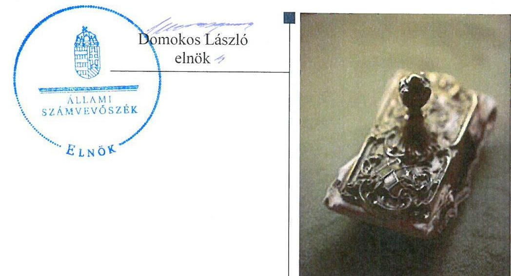

---

# AZ ELLENŐRZÉST FELÜGYELTE:

- **SALAMON ILDIKÓ** felügyeleti vezető

- **AZ ELLENŐRZÉST VEZETTE ÉS A VÉGREHAJTÁSÁÉRT FELELŐS:**

  - **DANKÓ PÉTER** ellenőrzésvezető

- **A PROGRAM ÖSSZEÁLLÍTÁSÁÉRT FELELŐS:**

  - **JANIK JÓZSEF** osztályvezető

- **A TÉMÁHOZ KAPCSOLÓDÓ KORÁBBI SZÁMVEVŐSZÉKI JELENTÉSEK:**

  - **címe:** Jelentés a 2007-től uniós finanszírozással megvalósuló, kormányzati döntésen alapuló beruházási projektek pályáztatási, tervezési és előkészítési tapasztalatainak értékelése ellenőrzéséről
  - **sorszáma:** 1281

  - **címe:** Jelentés a kerékpárút hálózat fejlesztésére fordított pénzeszközök felhasználásának ellenőrzéséről (párhuzamos ellenőrzés a Szlovák Számvevőszékkel)
  - **sorszáma:** 13006

**IKTATÓSZÁM:** V-0912-179/2016.

**TÉMASZÁM:** 28

**ELLENŐRZÉS-AZONOSÍTÓ SZÁM:** V0740

---

# TARTALOMJEGYZÉK 

■ ÖSSZEGZÉS ..... 5
■ AZ ELLENŐRZÉS CÉLJA ..... 7
■ AZ ELLENŐRZÉS TERÜLETE ..... 8
■ AZ ELLENŐRZÉS HÁTTERE, INDOKOLTSÁGA ..... 9
■ FÓKUSZKÉRDÉSEK ..... 10
■ ELLENŐRZÉS HATÓKÖRE ÉS MÓDSZEREI ..... 11
■ MEGÁLLAPÍTÁSOK ..... 13
■ JAVASLATOK ..... 22
■ MELLÉKLETEK ..... 23
I. SZ. MELLÉKLET: Értelmező szótár ..... 23
■ FÜGGELÉK: ÉSZREVÉTELEK ..... 25
■ RÖVIDÍTÉSEK JEGYZÉKE ..... 45

---

.

---

# ÖSSZEGZÉS 

Az Állami Számvevőszék a hazai turizmusfejlesztési intézkedéseket ellenőrizte a 2013. január és 2015. augusztus közötti időszakra vonatkozóan eredményességi szempontból. A turizmusfejlesztés jogi, intézményi rendszerét alapvetően kialakították. A turizmusfejlesztési intézkedések hatása a stratégiai célok megvalósulására nem volt kimutatható, mivel a célok teljesülése nyomon követésének feltételeit teljes körüen nem biztositották.
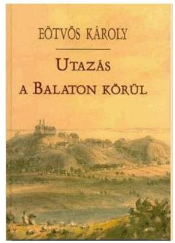
„A Balaton ábránd és költészet, történelem és hagyomány, édes-bús mesék gyüjteménye, különös magyar emberek ösi fészke, büszkeség a múltból s ragyogó reménység a jövőre. Se mérnök, se tudós, se állatbúvár azt igazán felismerni sohase lesz képes."
¿Eötvös Károly: „Utazás a Balaton körül" - 1900., Révai kiadó/

## Az ellenőrzés társadalmi indokoltsága

A turizmus olyan sajátos gazdasági ágazat, amely egyszerre több gazdaságstratégiai cél elérését - mindenekelőtt a fizetési mérleg javítását, a munkahelyteremtést, a területfejlesztést, valamint a természeti és kulturális örökség hasznosítással egybekötött megőrzését is - elősegíti.

## Főbb megállapítások, következtetések, javaslatok

A hazai turizmusfejlesztési célok megvalósításához a jogi kereteket és az intézményi rendszert alapvetően létrehozták, azonban a célkitűzésekhez közvetlenül kapcsolódó intézkedési terveket nem fogadtak el, amelyek alapján biztosítható lenne a célok teljesítésének nyomon követése és a teljesítés számon kérése. Továbbá a Turisztikai Desztináció Menedzsment szervezetek múködési kereteit, finanszírozásukat meghatározó jogszabályok 2015-től nem voltak hatályban.

Az országos turisztikai stratégiai célok megvalósulása, az országos stratégiai dokumentumokban szereplő turisztikai célkitűzések kapcsán tett intézkedések hatása nem volt kimutatható a célértékek és teljesítmény-indikátorok meghatározásának, az indikátorok alapján való mérések hiányában. A Balaton Kiemelt Üdülőkörzetre és az egészségturizmusra, mint ágazati prioritásra vonatkozó stratégiai célok teljesülését is csak egy-egy indikátor esetében lehetett nyomon követni. Ezen egyedi indikátorok vonatkozásában a Balaton Kiemelt Üdülőkörzetre vonatkozó célok nem teljesültek, az egészségturizmusra vonatkozó cél teljesült. A 2014-2020 közötti időszak országos turisztikai és egészségturizmus ágazati stratégiai célkitűzései megvalósításához szükséges intézkedéseket teljes körűen nem tették meg, mivel a célok lebontására intézkedési tervet nem készítettek, illetve a célok teljesítését nyomon követő indikátorrendszert nem alakították ki. A Balaton Kiemelt Üdülőkörzet 2014-2020 közötti turisztikai stratégiai céljai megvalósítására tettek intézkedéseket.

Az országos, az egészségügyi ágazati turizmusfejlesztési stratégiai célok teljesülésének, az intézkedések hatásának nyomon követése, a cél szerinti teljesítés értékelése nem valósult meg, ugyanakkor a regionális operatív programok esetében megvalósult. A Balaton Kiemelt Üdülőkörzetre vonatkozó turizmusfejlesztési célkitűzések esetében korlátozottan, egy koncepció teljesítésének közbülső értékelésével valósult meg az intézkedések hatásának nyomon követése.

---

A jelentésben szereplő javaslatok alapján a nemzetgazdasági miniszternek és a Balaton Fejlesztési Tanács elnökének 30 napon belül intézkedési tervet kell készíteniük, a turizmusfejlesztési stratégiai célkitűzések megvalósításának, mérésének és nyomon követésének előmozdítása érdekében.

---

# **AZ ELLENŐRZÉS CÉLJA**

## **A turizmus fejlesztése érdekében tett intézkedések értékelése**

**AZ ELLENŐRZÉS CÉLJA** annak értékelése, hogy a turizmus fejlesztése érdekében tett intézkedések hozzájárultak-e a célok megvalósulásához.

---

# **AZ ELLENŐRZÉS TERÜLETE**

## **A turizmus jogi és intézményi keretrendszere, a turizmusfejlesztési célkitűzések megvalósítása**

Az ellenőrzés a turizmus kormányzati irányításáért felelős Nemzetgazdasági Minisztériumra, a fejlesztéspolitikáért felelős Nemzeti Fejlesztési Minisztériumra, a nemzeti turisztikai marketingért felelős Magyar Turizmus Zrt.-re, és a Balaton, mint kiemelt turisztikai desztináció fejlesztési irányáért felelős Balaton Fejlesztési Tanácsra terjedt ki. A jogszabályi keretek kialakítását a turizmusra vonatkozó jogszabályok, koncepciók és stratégiai dokumentumok, valamint az ezekhez kapcsolódó intézkedési tervek alapján ellenőrizte az ÁSZ: Az intézményi keretek kialakításának ellenőrzésére az ellenőrzött állami szervezetek esetében került sor, mely kiterjedt a feladatellátás belső szabályozására, az NGM¹ esetében TDM² szervezetek létrehozásának ösztönzésére, az MT ZRt³.-nél a Nemzeti Desztináció Menedzsment Szervezet (ndmsz⁴) működésére, az NFM⁵ esetében a Bakony-Balaton térség miniszteri biztosának feladatellátására, valamint az NGM-NFM együttműködésére is. A turizmusfejlesztési célok megvalósulását az ÁSZ a kitűzött célértékek teljesülésének, illetve a stratégiai dokumentumok turizmusfejlesztési célkitűzések mérésére szolgáló indikátorok trendszerű, célérték irányába történő elmozdulásának ellenőrzésével, valamint két kiemelt turisztikai terület, a BKÜ⁶ és az egészségturizmus intézkedései végrehajtásának ellenőrzésével végezte el. Az ellenőrzés a 2007-2013. programozási időszak célkitűzéseinek megvalósulása mellett arra is kiterjedt, hogy az OFTK⁷, a BKÜ, valamint az egészségturizmus esetében a 2014-2020. tervezési időszakban kitűzött célok megvalósítása érdekében hoztak-e már intézkedéseket. Az ellenőrzés keretében az ÁSZ azt is ellenőrizte, hogy a stratégiai dokumentumokban foglalt célkitűzések teljesülésének nyomon követése és az intézkedések ütemterv szerinti megvalósításának monitoringja az NGM-nél és a BFT⁸-nél megtörtént-e.

---

# **AZ ELLENŐRZÉS HÁTTERE, INDOKOLTSÁGA**

## **A turizmus jelentősége**

Az ellenőrzés indokoltságát támasztja alá, hogy a turizmus a nemzetgazdaság egyik hangsúlyos ágazata, fejlesztéspolitikai szempontból kiemelt jelentőségű. Magyarország hosszú távú versenyképessége a turisztikai szektor által nyújtott szolgáltatásokban is rejlik, a turizmus hozzájárul továbbá az ország gazdasági növekedéséhez. Az országos és regionális szintű, valamint ágazati koncepcionális és stratégiai tervezési dokumentumok rögzítik a turizmus fejlesztése által elérni kívánt célokat, a fejlesztés fő irányait, valamint a célkitűzések teljesítéséhez szükséges eszközök körét. A turisztikai szektort érintő tendenciák alakulása szükségessé teszi a turizmust érintő jogi környezet, a turizmus intézményrendszere összehangolt fejlesztését, a marketing tevékenységet érintően aktív eszközök alkalmazását. Az ÁSZ ellenőrzése a jogalkotás számára támogatást nyújt a turisztikai célkitűzések és intézkedések teljesülésére, végrehajtására vonatkozó információn keresztül a turizmus jogszabályi környezetének továbbfejlesztésére irányuló jogalkotói munkához. Az ellenőrzés alapján a társadalom képet kaphat a turizmus fejlesztését célzó intézkedésekről, a turizmust támogató intézményrendszer működéséről. Az ÁSZ nemzetközi jelenléte elősegíti a tapasztalatok megosztását és hasznosítását, amely elsősorban a más számvevőszékekkel való együttműködés révén valósulhat meg.

---

# FÓKUSZKÉRDÉSEK 

1.     - A jogalkotási és intézményi keretek eredményesen támogatják-e a hazai turizmusfejlesztési célok gyakorlati megvalósitását?
2.     - Megvalósultak-e a kitüzött célok, kimutatható-e az országos stratégiai dokumentumokban szereplő turisztikai célkitüzések kapcsán tett intézkedések hatása, tettek-e a stratégiai célkitüzések megvalósitásához szükséges intézkedéseket?
3.     - A stratégiai célok teljesülését, az intézkedések hatását nyomon követték-e, értékelték-e azok összhangját a kitüzött célokkal?

---

# ELLENŐRZÉS HATÓKÖRE ÉS MÓDSZEREI 

## Az ellenőrzés típusa

Teljesítmény-ellenőrzés

## Az ellenőrzött időszak

2013.01.01-2015.08.31., tekintettel a 2007-2013. és 2014-2020. közötti uniós programozási időszakra.

## Az ellenőrzés tárgya

Az ellenőrzött területre vonatkozó turizmusfejlesztési célok, intézkedések kialakításában, végrehajtásában és nyomon követésében érintett szervezetek teljesítménye (eredményességi szempontból). Az ellenőrzés kiterjedt minden olyan körülményre és adatra, amely az ÁSZ jogszabályban meghatározott feladatainak teljesítéséhez, valamint a program végrehajtása folyamán felmerült újabb összefüggések feltárásához szükséges.

## Az ellenőrzött szervezet

Nemzeti Fejlesztési Minisztérium, Nemzetgazdasági Minisztérium, Magyar Turizmus Zrt., Balaton Fejlesztési Tanács.

## Az ellenőrzés jogalapja

Az Állami Számvevőszékről szóló 2011. évi LXVI. törvény 1. § (3) bekezdése, valamint az 5. § (2)-(3) bekezdései.

## Az ellenőrzés módszerei

Az ellenőrzést az ÁSZ az ellenőrzési program szempontjai, az ellenőrzött időszakban hatályos jogszabályok, az ellenőrzés szakmai szabályai, az egyes ellenőrzési típusokhoz kapcsolódó ÁSZ módszertanok és nemzetközi standardok figyelembe vételével végezte. Az ellenőrzés ideje alatt az ellenőrzött szervezettel történő kapcsolattartást az ÁSZ SZMSZ9-ének vonatkozó előírásai alapján biztosította. Az ellenőrzési kérdések megválaszolásához szükséges bizonyítékok megszerzése a következő ellenőrzési eljárások alkalmazásával történt: megfigyelés, szemle (szemrevételezés), kérdésfelte-

---

vés (információkérés), valamint elemző eljárás. Az ellenőrzési bizonyítékként felhasználható adatforrások közé tartoztak egyrészt a szakmai program részletes szempontjainál felsorolt adatforrások, másrészt adatforrás minden egyéb - az ellenőrzés folyamán feltárt, az ellenőrzés szempontjából releváns információt tartalmazó - dokumentum. Az ellenőrzés lefolytatásához az ellenőrzött szervezet a tanúsítványok kitöltésével, valamint az ÁSZ által kért dokumentumok elektronikus megküldésével szolgáltattak adatokat. A rendelkezésre bocsátott adatok, információk kontrollja az ellenőrzés keretében történt.

---

# MEGÁLLAPÍTÁSOK 

## 1. A jogalkotási és intézményi keretek eredményesen támogat-ják-e a hazai turizmusfejlesztési célok gyakorlati megvalósítását?

Összegző megállapítás

A hazai turizmusfejlesztés jogi kereteit és intézményi rendszerét alapvetően létrehozták, azonban a célkitűzésekhez közvetlenül kapcsolódó intézkedési terveket nem fogadtak el, valamint 2015-től a TDM szervezetek múködési kereteit, finanszírozásukat meghatározó jogszabály nem volt hatályban.
1.1. számú megállapítás

A turizmusfejlesztés jogszabályi kereteit, stratégiai céljait meghatározták. A hazai turizmusfejlesztési célok megvalósítását eredményesen támogató szabályozási keretek közül azonban hiányzott a célkitűzésekhez közvetlenül kapcsolódó intézkedési tervek elfogadása és a célértékek eléréséhez szükséges döntési rendszer kialakítása, valamint 2015-től a TDM szervezetek múködési kereteit, finanszírozásukat meghatározó jogszabály nem volt hatályban.

A TURIZMUSFEJLESZTÉS CÉLJAIRA, SZABÁLYOZÁSÁRA VONATKOZÓAN TÖBB JOGSZABÁLY, illetve a közjogi szervezetszabályozó eszközök (azaz országgyűlési határozatok és kormányhatározatok) tartalmaztak rendelkezéseket:

- a turizmus alapdefinícióit a kereskedelemről szóló törvény ${ }^{10}$ határozta meg;
- a turizmus feladatellátása érdekében a Kormány tagjai közötti fel-adat- és hatáskör-meghatározást Kormányrendeletek ${ }^{11}$ állapították meg;
- az intézményi kereteket Rendeletek ${ }^{12}$ határozták meg;

## A TURIZMUS FEJLESZTÉSÉNEK STRATÉGIÁJÁT

közjogi szervezetszabályozó eszközökben rögzítették:

1. országos szinten:

- A 2014. január 3-ig hatályos $\mathrm{OFK}^{13}$ és $\mathrm{OTK}^{14}$ - mint országos szintű fejlesztési koncepciók - nem turizmus-specifikus stratégiák, azonban a turizmushoz kapcsolódó célokat is meghatároztak;
- a kormányhatározatban elfogadott NTS ${ }^{15}$ a turizmusfejlesztésről és a kapcsolódó intézkedésekről szóló országos, turisztikai ágazati célokat határozta meg a 2005 és 2013 közötti időszakra vonatkozóan;
2014. január 4-től az OFTK volt az országos szintű, meghatározó stratégiai dokumentum a turizmusfejlesztés vonatkozásában, amelynek célkitűzéseit az Országgyűlés hagyta jóvá. Az OFTK a tíz, nemzetgaz-

---

dasági szempontból kiemelkedő iparág között nevesítette a turizmust. Kitörési pontként azonosította az öko- és egészségturizmust és számos konkrét turizmusfejlesztés-politikai célkitűzést, beavatkozási területet határozott meg. Megállapította többek között, hogy a magyar turisztikai intézményrendszer átalakulását a jövőben a kormányzat által is támogatott TDM-eknek kell elősegíteniük, biztosítani kell ezek pontos jogi, törvényi szabályozásának megteremtését, nemzeti-regionális-térségi-helyi szintű kiépítését;
2. az egészségturizmus és a BKÜ területén:
$\longrightarrow$ 2007-2015 között az OEFS ${ }^{16}$ határozta meg az egészségturizmus ágazati fejlesztési stratégiáját;
$\longrightarrow$ az Egészséges Magyarország 2014-2020 stratégia a 2014-2020. évek közötti időszakra határozott meg az egészségturizmus fellendítése érdekében stratégiai célokat;
$\longrightarrow$ a 2007-2013. évekre kidolgozott BRFS ${ }^{17}$ a BKÜ tekintetében határozott meg turizmusfejlesztési prioritásokat;
$\longrightarrow$ a BKÜ Hosszútávú Területfejlesztési Koncepció 2020 (valamint ennek a koncepciónak a 2014-2030 évekre felülvizsgált változata) határozott meg turizmusfejlesztési célokat;
$\longrightarrow$ a 2014-től kezdődő uniós tervezési ciklushoz igazodva a BFT elkészítette, majd 2014. október 30-án elfogadta a Balaton Kiemelt Térség Fejlesztési Programját, mely koncepcionális, stratégiai és operatív szinten is meghatározza a fejlesztési célkitűzéseket.
A BKÜ-re és az egészségturizmusra vonatkozó stratégiák céljai összhangban álltak a fenti 1. pontban részletezett országos szintű stratégiák célkitűzéseivel.
3. egyéb szakpolitikai stratégiákban:
$\longrightarrow$ az NVS ${ }^{18}$ a vidéki turizmus, falusi vendéglátás program területén határozta meg a stratégiai irányokat, teendőket;
$\longrightarrow$ az NKP ${ }^{19}$ ókoturisztikai célkitűzéseket tartalmazott;
$\longrightarrow$ az OFP ${ }^{20}$ a fogyatékos emberek számára kínált turisztikai lehetőségek fejlesztésével kapcsolatban fogalmazott meg célkitűzéseket.
Az ellenőrzött időszak végén tervezés alatt állt a Nemzeti Turizmusfejlesztési Koncepció.

# A TURIZMUSFEJLESZTÉS IRÁNYÍTÁSÁNAK ESZ- 

KÖZRENDSZERÉT hiányosan alakították ki, mivel a fent felsorolt stratégiai dokumentumokban szereplő turizmusfejlesztési célkitűzésekhez közvetlenül nem határoztak meg célértékeket, a célértékek eléréséhez szükséges döntési rendszert nem alakították ki, nem alakítottak ki teljesít-mény-indikátorokat, felelősöket és határidőket tartalmazó - az ellenőrzött időszakban hatályos - intézkedési terveket, amelyek alapján biztosítható lenne a célok teljesítésének nyomon követése és a teljesítés számon kérése.

Ugyanakkor az uniós fejlesztési programok (a 2007-2013 közötti tervezési időszakban a regionális operatív programok, a 2014-2020 közötti tervezési időszakban a GINOP ${ }^{21 .}$ VEKOP ${ }^{22 .}$ TOP ${ }^{23)}$, illetve a BKÜ-re és egészségturizmusra vonatkozó stratégiák meghatároztak a fejlesztési prioritásokon belül turisztikai célokat célértékkel/céliránnyal és indikátorokkal. A BKÜ és

---

egészségturizmus turisztikai stratégiai céljaihoz azonban nem volt teljes körű a cél- és bázisérték meghatározás.

A TDM SZERVEZETEK olyan önkéntesen alakuló egyesületek vagy non-profit Kft-k, amelyek lokális turisztikai, turizmusfejlesztési feladatokat láttak el, és amelyek létrehozása az NTS-ben is szerepelt. A TDM szervezetek a versenyszféra és az önkormányzatok alulról építkező szervezetei. Az idegenforgalmi adó differenciált kiegészítéséről szóló 31/2011. (VIII. 24.) NGM rendelet határozta meg a TDM szervezet fogalmát, valamint költségvetési támogatással is ösztönözte a helyi önkormányzatok TDM szervezeti tagságát és a TDM-ek pályázati tevékenységét. Ez a jogszabály azonban 2014. december 24-től hatályát vesztette. A TDM-ek múködési kereteit meghatározó egyéb jogszabályt nem alkottak. A turizmus fejlesztési stratégiákban meghatározott célok helyi megvalósítására a TDM szervezetek alkalmas keretet biztosítanak.

# 1.2. számú megállapítás 

A hazai turizmusfejlesztési célok megvalósításához az állami intézményrendszer felállítása eredményes volt.

A turizmusfejlesztés intézményrendszere az alábbiak szerint állt fel.
A NEMZETGAZDASÁGI MINISZTÉRIUM volt a turizmus területéért felelős tárca. Felelősségét a 2014. június 6-án kiadott Kormányrendelet ${ }^{24}$ bővítette ki a turizmus fejlesztésének feladataival. A fenti jogszabályváltozásokból eredő feladatokat az NGM adaptálta, a nemzetgazdasági miniszter az NGM SZMSZ ${ }^{25}$-ében kijelölte a feladatok elvégzésért felelős szervezeti egységeket és személyeket.

A NEMZETI FEJLESZTÉSI Miniszter 2014. június 6-ig látott el a turizmusfejlesztési támogatásokkal és tevékenységekkel kapcsolatos feladatokat. A feladatok a hatályos jogszabályoknak megfelelően szerepeltek az NFM belső szabályzataiban. ${ }^{26}$ A turizmussal kapcsolatos feladatok ellátásáért felelős szervezeti egységeket és felelősöket az NFM SZMSZ ${ }^{27}$-ében kijelölték.

A MAGYAR TURIZMUS ZRT. nemzeti turisztikai marketingszervezet a Magyar Állam kizárólagos tulajdonában állt, felette a tulajdonosi jogokat az MFB ZRt. ${ }^{28}$ majd az NFM Rendelete ${ }^{29}$ alapján az NGM gyakorolta.

A feladatok a hatályos jogszabályoknak megfelelően szerepeltek az MT ZRt. SZMSZ ${ }^{30}$-ében. Az MT ZRt. vezérigazgatója további belső irányítási eszközökkel adott ki szabályzatot a feladatellátásról.

A BALATON FEJLESZTÉSI TANÁCS létrehozásáról a 1059/1997. (V. 28.) Korm. határozat rendelkezett. A területfejlesztési törvény ${ }^{31}$ a BFT-t kiemelt térségi fejlesztési tanácsként definiálta, feladata a regionális (nem kizárólagosan turizmussal kapcsolatos) területfejlesztés ellátása volt.

Magyarország területén 79 helyi és 7 térségi - NGM által - regisztrált TDM SZERVEZET múködött az ellenőrzött időszakban.

---

# A BAKONY-BALATON TÉRSÉG MINISZTERI BIZ- 

TOSA 2014. szeptember 15-től 2015. március 14-ig látta el feladatát, melynek során kapcsolatot tartott kormányzati és civil szervezetekkel a turizmusfejlesztési célok megvalósítása érdekében. A Bakony-Balaton térség miniszteri biztosa megbízatásának lejártával, feladatellátásáról beszámolt a NFM miniszternek. A beszámolót a miniszter elfogadta.

Az NGM ÉS AZ NFM KÖZÖTT a turisztikai fejlesztések érdekében az európai uniós fejlesztési források tervezése és a pályázati rendszer kialakítása során az együttműködés megvalósult.

## 2. Megvalósultak-e a kitűzött célok, kimutatható-e az országos stratégiai dokumentumokban szereplő turisztikai célkitűzések kapcsán tett intézkedések hatása, tettek-e a stratégiai célkitűzések megvalósításához szükséges intézkedéseket?

Összegző megállapítás

Az 2.1. számú megállapítás

Az országos turisztikai stratégiai célok megvalósulása, a stratégiai dokumentumokban szereplő turisztikai célkitűzések kapcsán tett intézkedések hatása nem volt kimutatható a célértékek és teljesítmény-indikátorok meghatározásának, az indikátorok alapján való mérések hiányában. A 2014-2020 közötti időszak országos turisztikai és egészségturizmus ágazati stratégiai célkitűzései megvalósításához szükséges intézkedéseket teljes körűen nem tették meg, mivel a célok lebontására intézkedési tervet nem készítettek, illetve a célok teljesítését nyomon követő indikátorrendszert nem alakították ki.

Az országos stratégiai dokumentumokban szereplő turisztikai célkitűzések hatása nem mutatható ki, mivel ezen célokhoz célértékeket, a célokhoz kapcsolt teljesítmény-indikátorokat nem határoztak meg, indikátorok alapján nem követték a célok teljesítését. A célértékek eléréséhez szükséges komplex intézkedési rendszert nem alakítottak ki. A 2014-2020 közötti időszakra vonatkozó stratégiai turisztikai célkitűzések megvalósításához szükséges intézkedéseket teljes körűen nem tették meg az OFTK kapcsán, mivel a célok lebontására intézkedési tervet nem készítettek, illetve a célok teljesítését nyomon követő indikátorrendszert nem alakították ki.

AZ OFK, OTK, OFTK TURIZMUSFEJLESZTÉSI CÉLJAIHOZ nem határoztak meg célértékeket és nem nevesítettek a célok teljesítésének alakulását nyomon követő indikátorokat. A célértékek eléréséhez szükséges komplex intézkedési rendszert (intézkedési tervek, feladat-meghatározások, végrehajtás) nem alakítottak ki. Az ellenőrzés egy olyan, az OFK és OTK turisztikai célkitűzéseihez közvetetten kapcsolható indikátort azonosított az ellenőrzöttek adatszolgáltatása alapján, amelynek értékeit folyamatosan mérték összehasonlítható adatok alapján, valamint cél- és bázisértékét is meghatározták.

---

A „vendégéjszakák számának alakulása a kereskedelmi szálláshelyeken" indikátort az NTS tartalmazta, célértékként 24 millió vendégéjszakát határoztak meg 2013-ra a 2003. évi 18 milliós bázisértékhez képest. A 2013. évben 23 millió volt a vendégéjszakák száma, de a 2014. évben elérte a 24 milliós célt ( 24,4 millió volt a vendégéjszakák száma 2014-ben).

Az említett indikátor sem alkalmazható azonban egyértelműen az OFK és OTK turisztikai céljainak mérésére, mivel az OFK és OTK turisztikai céljainak célértékeit és a kapcsolódó indikátorokat nem határozták meg. Az NTS-ben meghatározott indikátor és célérték az OFK és OTK turisztikai céljai egy részéhez kapcsolódik csak és azokat nem pontosan fedi le.

Az OFK ÉS OTK turizmusfejlesztési célkitűzései teljesülése nem volt nyomon követhető a célértékek, a célokhoz kapcsolt teljesítmény-indikátorok meghatározása és azok értékeinek mérése hiányában. Ez alapján nem voltak biztosítottak annak a feltételei, hogy az ÁSZ a teljesítmény-ellenőrzés módszerével ellenőrizze a turizmusfejlesztési célkitűzések teljesülését.

Az OFTK előírta az OFTK céljai megvalósítását mérő indikátorrendszer kialakítását, „összhangban a Partnerségi Megállapodás és az operatív programok, valamint a nemzeti szakpolitikai stratégiák indikátorkészletével". Az ellenőrzött időszak végén tervezés alatt álló Nemzeti Turizmusfejlesztési Koncepció tartalmazta az indikátorokat, de a koncepció jóváhagyása még nem történt meg. Továbbá az OFTK céljai lebontására nem készítettek intézkedési tervet.
2.2. számú megállapítás

A BKÜ-re vonatkozó, a 2007-2013. évek közötti tervezési időszakra kitűzött turisztikai fejlesztési célok megvalósulása - a bázis és célértékek/célirányok meghatározása, valamint a mérések hiányában - csak két indikátor esetében volt nyomon követhető. Ezen indikátorok alapján a kitűzött célok nem teljesültek. A BKÜ 2014-2020. évek közötti időszakra vonatkozó stratégiai turisztikai fejlesztési célkitűzéseinek megvalósításához tettek intézkedéseket. Az egészségturizmusra vonatkozóan, a 2007-2015. évek között kitűzött stratégiai céloknál csak egy indikátor esetében volt mérhető a célok megvalósulása, amely mért cél teljesült. Az egészségturizmus 20142020 közötti céljai megvalósításához nem tették meg teljes körűen a szükséges intézkedéseket, mivel a célok lebontására intézkedési tervet nem készítettek, illetve a célok teljesítését nyomon követő indikátorrendszert nem alakították ki.

# A BKÜ VONATKOZÁSÁBAN: 

A BRFS-ben a turizmusfejlesztési prioritáshoz számos indikátort meghatároztak, ezekből hét esetben határoztak meg bázisértéket és célirányt. Ezen indikátorok:
$\longrightarrow$ a régiót érintő 3 megyében a szálláshely szolgáltatás és vendéglátás nettó eredménye országos átlaghoz viszonyított aránya;
$\longrightarrow$ az átlagos tartózkodási napok száma;
$\longrightarrow$ külföldiek átlagos tartózkodási napjainak száma;

---

$\longrightarrow$ az egy belföldi turistára jutó átlagos napi költés;
$\longrightarrow$ az egy külföldi turistára jutó átlagos napi költés;
$\longrightarrow$ a balatoni külföldi turisták átlagos napi költésének a külföldi turisták hazai költésének átlagához viszonyított aránya;
$\longrightarrow$ a legalább négy csillagos szállodák száma.
Az indikátorokhoz célirányként a mutató növekedését, konkrét célérték nélkül határozták meg. A felsorolt indikátorok közül az összes vendég és a külföldiek átlagos tartózkodási napjai számának alakulását mérték folyamatosan, azonban a célt, ezen napok számának növelését a bázishoz képest, nem érték el (a BRFS-ben a 2002. év volt a bázis). Az összes vendég átlagos tartózkodási napjai a 2002. évi 4,9-es átlaggal szemben 2007-2013 között 3,6 és 3,4 nap között alakultak, a külföldiek átlagos tartózkodási napjai 5,4-ről 5,0-re csökkentek 2013-ra.

A BKÜ 2014-2020. ÉVEK KÖZÖTTI IDŐSZAKRA vonatkozó stratégiai turisztikai fejlesztési célkitűzéseinek megvalósításához projektterveket, megvalósíthatósági tanulmányokat, pályázati kiírásokat készítettek.

# AZ EGÉSZSÉGTURIZMUS VONATKOZÁSÁBAN: 

AZ OEFS-ben szereplő eredményességi indikátorok a 2015. évre vonatkozóan fogalmazták meg a célértékeket. Az ÁSZ csoportosítása alapján az alábbi 5 kategóriába oszthatók az OEFS indikátorai ( 13 db ). A 13 indikátorból mindösszesen egy indikátor (az alábbiakban 8. indikátorként jelölt) esetében lehetett mérni a célok megvalósulását. Az egyes indikátorok alakulását az alábbi öt kategóriában foglaltuk össze:
$\longrightarrow$ Az Emberközpontú és hosszútávon jövedelmező fejlődés kategórián belül azon cél teljesülését, miszerint a (gyógy-) vendégéjszakák (1. indikátor) növekedése töretlen és 1 millióval magasabb legyen, mint a bázis (2006) évben, nem lehetett megállapítani, mivel módszertani változás miatt az adatok nem voltak összehasonlíthatók. A wellness szállodákban a vendégéjszakák számát (2. indikátor) 2015. év végére 4 milliót meghaladóra kívánták növelni. A 2006. évi 1201 ezerről 2012-re már 3476 ezerre nőtt ezen éjszakák száma, de 2013-tól az ilyen jellegű adatgyűjtés megszűnt. A gyógyturisztikai bevételek (3. indikátor) megkétszerezésére vonatkozó cél teljesülését megbízható adatok hiányában nem tudták nyomon követni.
$\longrightarrow$ Attrakciófejlesztés keretében egyrészt a nemzetközi jelentőségű fürdők látogatottságának (4. indikátor) 50\%-os emelkedését, az egy főre jutó bevételeik (5. indikátor) megduplázódását célozta a stratégia, azonban bázisérték meghatározásának hiányában ezek teljesülését nem lehetett értékelni. A hazai lakosság részéről a fürdőlátogatottság (6. indikátor) 50\%-os növelését célozták, de a belföldi látogatókra vonatkozóan nem álltak rendelkezésre adatok. Az európai piacon a magyar egészségturizmus domináns helyzetére, ezzel öszszefüggésben az egészségturisztikai céllal utazók számának (7. indikátor) növelésére vonatkozó célt adatgyűjtés hiányában nem lehetett értékelni.

---

- A turistafogadás feltételeinek javítása keretében egyrészt a wellness szállodák szobakapacitásának (8. indikátor) megkétszereződését tervezték. A wellness szállodák szobaszáma a 2006. évi 3628 -ról 2011re 11076 -ra emelkedett. Ennek alapján a cél teljesülése már a 2011. évre megállapítható. 2012-től az NGM nem rendelkezik ilyen adatokkal, a szálláshelyek múködési engedélyezési rendszere megváltozása miatt. Továbbá a gyógyszállók számának (9. indikátor) 30\%-kal való növelése szerepelt a tervben. E cél teljesülése nem volt megállapítható a nem összehasonlítható adatok miatt, mert a gyógyszállók száma bázisadatánál az OEFS a KSH szerinti adattal számol, az NGM mérései viszont az ÁNTSZ törzskönyvi nyilvántartásában szereplő adatokat tartalmazták, mivel jogszabályi változás miatt változott a gyógyszállók minősítése.
- Emberi erőforrás fejlesztés keretében a terv szerint 2015-re a szakképzett munkaerő kibocsátás fedezi a szükségletet (10. indikátor), megszúnik a legkeresettebb szakmákban is a munkaerőhiány. A cél teljesítése nem volt megállapítható, mivel célzott munkaerő piaci felmérésre nem került sor. Az egészségturisztikai fejlesztések közvetlen és közvetett eredményeképpen az új munkahelyek számának (11. indikátor) 10000 fős növekedését célozták, e cél teljesülésére vonatkozóan azonban nem álltak rendelkezésre adatok.
- A Hatékony múködési rendszer kialakításának keretében a vízre alapozott gyógyítás módszereinek fejlesztésére országos kutatóközpont létrehozását (12. indikátor) célozta a stratégia. Mivel több ilyen tevékenységet is végző intézmény van, ezért az egészségügyi tárca nem támogatta új intézmény létesítését. Célként határozták meg továbbá, hogy az egészségturisztikai hálózatok lefedjék az egész országot (13. indikátor), a hálózati szerveződés országos szinten is megvalósuljon. Nyugat-Dunántúl mellett Észak- és Dél-Alföldön, ÉszakMagyarországon is megalakultak az egészség-, gyógyturisztikai hálózatok, de ezek múködéséről nem rendelkeztek információval.

Az OFTK a 2014-2020. időszakra vonatkozóan fejlesztéspolitikai feladatként határozta meg a természeti gyógy tényezőkre és orvosi szolgáltatásokra épülő egészségturizmus fejlesztését, az egészség-turizmushoz kapcsolódó minőségi (komplex) turisztikai kínálatfejlesztést, mindemellett célul tűzte ki az egészség-turizmust generáló, koordináló turisztikai intézményrendszer és a gyógyhelyi TDM szervezetek fejlesztését is. Az OFTK turisztikai céljai megvalósítását mérő indikátorrendszert még nem fogadták el. A kis-és középvállalkozások által múködtetett turisztikai szolgáltatások támogatására szolgáló pénzügyi eszközök (hitel, garancia) kidolgozása folyamatban volt az ellenőrzött időszak végén.

Az Egészséges Magyarország 2014-2020 stratégia turisztikai céljai megvalósítása érdekében nem hoztak intézkedéseket, intézkedési tervet nem készítettek.

---

# 3. A stratégiai célok teljesülését, az intézkedések hatását nyomon követték-e, értékelték-e azok összhangját a kitűzött célokkal? 

Összegző megállapítás

Az országos, az egészségügyi ágazati turizmusfejlesztési stratégiai célok teljesülését, az intézkedések hatását nem követték nyomon, a cél szerinti teljesítést nem értékelték, ugyanakkor a regionális operatív programok esetében nyomon követték a célok teljesülését. A BKÜ-re vonatkozó turizmusfejlesztési célkitűzések esetében korlátozottan, egy koncepció teljesítésének közbülső értékelésével valósult meg az intézkedések hatásának nyomon követése.
3.1. számú megállapítás

A stratégiai dokumentumokban (OFK, OTK, BRFS, OEFS) foglalt célkitűzések teljesülését, az intézkedések megvalósítását nem követték nyomon. Az éves monitoring tevékenység a regionális operatív programok akcióterveiben meghatározott turizmusfejlesztési célok teljesítésére vonatkozóan megvalósult. A BFT monitoring tevékenysége a BKÜ Hosszútávú Területfejlesztési Koncepció vonatkozásában eredményes volt a koncepció teljesítésének közbülső értékelése tekintetében, azonban a jogszabályban előírt tájékoztatási kötelezettség nem valósult meg. A BFT monitoring tevékenysége a BRFS céljai megvalósítása tekintetében nem volt eredményes.

A turisztikai célkitűzések teljesülésének nyomon követése az ORSZÁGOS STRATÉGIÁK esetében nem valósult meg.

Az OFK és OTK turizmusfejlesztést érintő területeiről nem készítettek beszámolót, értékelést az ellenőrzött időszakban (az OTK felülvizsgálatáról a 2012. évben készített az NGM jelentést).

Az NTS végrehajtására vonatkozó monitoring jelentések csak 2010-ig készültek.

Az OFTK előírta a szakmai teljesítmények folyamatos értékelését, a megvalósítás időszakonkénti felülvizsgálatát. Ennek alapjaként határozta meg az egységes fejlesztéspolitikai monitoring és értékelési rendszert, amely a nyomon követést, az értékelést és a visszacsatolást biztosítja. Az OFTK turisztikai célkitűzéseihez kapcsolódó indikátorrendszert még nem fogadták el, ezért a megvalósításért felelős szervezet (NGM) még nem végzett nyomon követési tevékenységet.

REGIONÁLIS SZINTEN az egyes regionális operatív programok akcióterveiben határozták meg az NTS-ből levezethető turizmusfejlesztési cél- és eszközrendszert. Az ezen operatív programok megvalósítására vonatkozó éves végrehajtási jelentések operatív programonként, 2013 és 2014 évekre álltak rendelkezésre, 2015-re még nem készült monitoring jelentés. Ezek alapján megállapítható, hogy az indikátorok teljesülését nyomon követték.

---

A BFT a Balaton 2007-2020 közötti időszakra szóló, Hosszútávú Területfejlesztési Koncepciója elfogadásával egy időben (2009) döntött arról, hogy az üdülőkörzetre vonatkozóan a legfontosabb gazdasági, társadalmi, környezeti és infrastruktúra indikátorok alapján rendszeres fejlesztési monitoring elemzéseket készít. A BKÜ-re vonatkozó turizmusfejlesztési intézkedések nyomon követése a 2007-2013 időszakra döntő többségben nem a BRFS-ben, hanem a „BKÜ Hosszútávú Területfejlesztési Koncepció 2020"ban megjelölt indikátorok mentén történt. A BKÜ 2014. évi területi monitoringjáról készített jelentést a BFT 2015-ben megtárgyalta és elfogadta. A monitoring jelentés a Hosszútávú Területfejlesztési Koncepció indikátorainak alakulását elemezte, és javaslatot tett az alkalmazott indikátori kör módosítására is. A területi monitoring rendszerről szóló 37/2010. (II. 26.) Korm. rendelet 4. § d) pontja alapján a BFT-nek évente tájékoztatást kell adnia a területfejlesztés stratégiai tervezéséért, valamint a területfejlesztésért felelős miniszter, a területileg érintett megyei önkormányzatok részére a kiemelt térségi területi monitoring rendszer múködéséről és a kiemelt térségi értékelési jelentésekről. A BFT a tájékoztatás tényét igazoló dokumentumot nem adott át az ellenőrzés részére.

A „BKÜ Hosszútávú Területfejlesztési Koncepció 2020" felülvizsgálata 2014-ben készült el. A felülvizsgált dokumentum 2014-2030 évekre tartalmazza a BKÜ hosszú távú területfejlesztési koncepcióját, stratégiáját. Az azokban szereplő indikátorok nyomon követése még nem kezdődött meg.

Az OEFS-ben megjelölt turizmusfejlesztési indikátorok nyomon követése az esetek többségében megbízható és összehasonlítható adatok hiányában nem volt biztosított, az adatok kiértékelése nem történt meg, monitoring jelentés az ellenőrzött időszakban az OEFS megvalósulása vonatkozásában nem készült.

---

# JAVASLATOK 

Az ÁSZ tv. ${ }^{32}$ 33. § (1) bekezdésében foglaltak értelmében az ellenőrzött szervezet vezetője köteles a jelentésben foglalt megállapításokhoz kapcsolódó intézkedési tervet összeállítani és azt a jelentés kézhezvételétől számított 30 napon belül az ÁSZ részére megküldeni.
Az ÁSZ tv. 33. § (3) bekezdése szerint amennyiben az ellenőrzött szervezet vezetője nem küldi meg határidőben az intézkedési tervet vagy továbbra sem elfogadható intézkedési tervet küld, az ÁSZ elnöke
a) az ellenőrzött szervezet vezetőjével szemben büntető- vagy fegyelmi eljárás megindítását kezdeményezheti;
b) kezdeményezheti az illetékes hatóságnál, illetve szervezetnél az ellenőrzött szervezetet megillető, az államháztartás valamelyik alrendszeréből származó támogatások vagy egyéb juttatások folyósításának, illetve a személyi jövedelemadó 1\%-ából történő felajánlásokból való részesedés lehetőségének felfüggesztését.

## a nemzetgazdasági miniszternek

1. . Intézkedjen a 2014-2020 közötti időszak országos turisztikai és egészségturizmus ágazati stratégiai célkitüzések megvalósításához szükséges strukturált intézkedések kialakítására.
(2.1. számú megállapítás és az 1. bekezdése alapján)
2. Intézkedjen
a. mérhető célok és teljesítmény mutatók meghatározására az országos turisztikai stratégiai célok megvalósulásának, a stratégiai dokumentumokban szereplő célkitüzések kapcsán tett intézkedések hatásának méréséhez;
b. a mérések elvégzése érdekében, az elfogadott célok és teljesítménymutatók meghatározása alapján.
(2. és 2.1. számú megállapítás alapján)

## a Balaton Fejlesztési Tanács elnökének

1. Intézkedjen a Balaton Régió Fejlesztési Stratégiában foglalt célok teljesülésének monitoringjára a Stratégiában foglalt indikátorok teljesítésének mérésével és értékelésével.
(3.1. számú megállapítás és a 6. bekezdése alapján)

---

# MELLÉKLETEK 

- I. SZ. MELLÉKLET: ÉRTELMEZŐ SZÓTÁR
Balaton Kiemelt Üdülőkörzet
nemzetgazdasági bruttó hozzáadott érték
desztináció
egészségturizmus
eredményesség
monitoring
turisztikai desztináció menedzsment szervezet
a 2000. évi CXII. törvény 2. §-ban definiált terület a bruttó kibocsátás és a termelő fogyasztás különbsége
fogadóhely
Az egészségturizmusban a látogatók alapvető motivációja az egészségi állapot megőrzése, a betegségek megelőzése (wellness turizmus), illetve annak javítása, gyógyítása (gyógyturizmus).
Az eredményesség elve a kitűzött célok és a szándékolt eredmények (hatások) elérését jelenti. A gazdálkodás, feladatellátás eredményességét mutatja a tényleges és a tervezett eredmények (hatások) összevetése. (Forrás: A telje-sítmény-ellenőrzés alapelvei 2.1. pont, Állami Számvevőszék)
A monitoring a különböző szintű szervezeti célok megvalósításának folyamatát kíséri figyelemmel, melynek során a releváns eseményekről és tevékenységekről (együtt: folyamatokról) rendszeres jelleggel, strukturált, döntéstámogató információkhoz jutnak a szervezet vezetői. (NGM útmutató a költségvetési szervek monitoring rendszeréhez 3. oldal, 2011. november)
önkéntes módon alulról építkező, adott célterület turisztikai feladatait (kutatás, tervezés, termékfejlesztés, információszolgáltatás, marketing, monitoring) tagjai számára komplexen ellátó, a gazdasági társaságokról szóló törvény szerinti nonprofit korlátolt felelősségű társaságként vagy egyesületként működő szervezet, amely feladatait a vállalkozások, önkormányzatok, szakmai és civil szervezetek közvetlen, vagy képviselt együttműködésében és közös finanszírozásával valósítja meg (31/2011. (VIII. 24.) NGM rendelet 1. §)

---

.

---

# FÜGGELÉK: ÉSZREVÉTELEK 

Az Állami Számvevőszék a jelentéstervezetet 15 napos észrevételezésre megküldte az ellenőrzött szervezetek vezetőinek az ÁSZ tv. 29. §* (1) bekezdése előírásainak megfelelően.

A Nemzetgazdasági Minisztérium minisztere, valamint a Balaton Fejlesztési Tanács elnöke az ellenőrzés megállapításaira írásban észrevételt tett. A Nemzeti Fejlesztési Minisztérium minisztere írásban jelezte, hogy nem tesz észrevételt. A Magyar Turizmus Zrt. vezérigazgatója az ÁSZ tv. 29. § (2) bekezdésében foglalt észrevételezési jogával nem élt, a törvényes határidőn belül észrevételt nem tett.
Az elfogadott észrevételek alapján az Állami Számvevőszék módosította a jelentést.
A függelék tartalmazza az ellenőrzött szervezetek vezetőinek az észrevételeit és az azokra adott válaszokat, az elfogadott és az el nem fogadott észrevételekről, azok indokairól szóló tájékoztatásokat.

[^0]
[^0]:    * 29. § (1) Az Állami Számvevőszék az ellenőrzési megállapításait megküldi az ellenőrzött szervezet vezetőjének vagy az általa megbízott személynek, és annak, akinek személyes felelősségét állapította meg.
    (2) Az ellenőrzött szervezet vezetője és a felelősként megjelölt személy az ellenőrzés megállapításaira tizenöt napon belül írásban észrevételt tehet.
    (3) Az Állami Számvevőszék az észrevételre a beérkezésétől számított harminc napon belül írásban válaszol. A figyelembe nem vett észrevételeket köteles a jelentésben feltüntetni, és megindokolni, hogy azokat miért nem fogadta el.

---

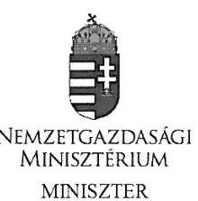

Domokos László úr részére
elnök

# Állami Számvevőszék 

Budapest
Apáczai Csere János utca 10. 1052

Ikt. sz.: NGM / 1444 - 2/2016. Hiv.szám: V-0912-151/2015. Tárgy: A turizmusfejlesztési intézkedések ellenőrzéséről szóló jelentéstervezet véleményezése

## Tisztelt Elnök Úr!

A turizmusfejlesztési intézkedések ellenőrzéséről a horvát és macedón számvevőszékkel párhuzamosan végzett V0740 azonosító számú számvevőszéki jelentés tervezetét köszönettel megkaptam. Élve az írásos véleményezés lehetőségével, a dokumentumot áttekintve szükségesnek tartok néhány általános észrevételt megfogalmazni, amelyek álláspontom szerint befolyásolják a megállapítások szakmai hátterét.
A jelentés számba veszi a turizmust is tartalmazó, átfogó stratégiai dokumentumokat (Országos Fejlesztéspolitikai Koncepció - OFK, Országos Területfejlesztési Koncepció OTK, Országos Fejlesztési és Területfejlesztési Koncepció - OFTK), ugyanakkor nem jelzi az adott koncepció tervezésének és megvalósításának felelősét. Így nem egyértelmű, hogy az indikátorok, célértékek mely szervezetek tervezését követően hiányoznak. Felhívom szíves figyelmét arra, hogy a turizmus fejlődését legjobban mutató és folyamatosan nyomon követhető indikátorok a turizmusból származó bevételek, valamint a vendégéjszakák számának alakulása. E mutatók figyelemmel kísérése a tárca turisztikai szakterületének részéről folyamatosan megvalósult. A jelentés megállapításainak alátámasztásaként ezt a körülményt is célszerű figyelembe venni.
A szakpolitikai stratégiák (Nemzeti Turizmusfejlesztési Stratégia - NTS és Országos Egészségturizmus Fejlesztési Stratégia - OEFS) középtávú (7-8 év) célokat határoztak meg, megvalósításuk a finanszírozási források biztosítása mellett a jogszabályi és intézményi környezet változtatását is feltételezte, amely több tárca kompetenciáját is érintette. Az NTS tervezése a jelenlegitől markánsan eltérő kormányzati szervezeti keretek között készült, így annak teljes körű megvalósításához és monitorozásához is az akkor rendelkezésre álló humánerőforrás lett volna szükséges.

---

A jelentésben vizsgált időszakban (2013. január - 2015. augusztus) a stratégiák által meghatározott célok közül a fejlesztések megvalósítása élvezett prioritást, tekintettel arra, hogy a turisták számának növelésében és a turisztikai bevételek alakulásában e terület bír a legnagyobb jelentőséggel. A beruházási jellegű feladatok eredményességének mérése az uniós programok keretében történt meg az operatív programok szintjén (ROP-ok), valamint az egyes projektekre meghatározott indikátorok figyelemmel kísérésével. A nem beruházási jellegủ célokhoz kapcsolódó feladatok végrehajtása - tekintettel a szélesebb felelősségi körre, az érintettek számára -, másodlagos szemponttá vált, ez a folyamatos nyomon követési rendszerben is érezhető volt.
A tervezet többször hivatkozik arra, hogy a 2014-2020 közötti időszak országos turisztikai és egészségturizmus ágazati stratégiai célkitűzései megvalósításához szükséges intézkedéseket teljes körűen nem tette meg a tárca, ugyanakkor a jelentésben vizsgált időszak 2013. január 2015. augusztusig tartott, s jelenleg is folyamatban van a 2014-20 uniós költségvetési időszakhoz kapcsolódó programok megvalósítása. Így szükségesnek tartjuk ezen megállapítások pontositását.
A turizmusra vonatkozó jogszabályokat - így pl. a TDM rendszer szabályozását (feladatok, finanszírozás stb.) - a szakterület szakmai szervezetekkel egyeztetett javaslata alapján a turizmusról szóló törvényben tervezzük kezelni. A törvény tervezetének Kormány elé terjesztésére 2012. év májusában került sor, amikor azt a feladatot kapta a szaktárca, hogy a jogszabályt az ágazati fejlesztési koncepció elkészítését követően terjessze elő. A nemzeti turizmusfejlesztési koncepció véglegesítése, mint ahogyan a jelentés is ismerteti, folyamatban van.

A jelentéstervezet konkrét megállapításaihoz a következő észrevételeket tesszük:

# 1.1. megállapítás 

A 12. oldalon a „Turizmus fejlesztésének stratégiájaként" ismertetett dokumentumok esetében pontos a megfogalmazás, amely szerint az OFK és OTK nem turizmus specifikus stratégiák, ugyanakkor e dokumentumok indikátor rendszerének elemzése során („hiányosak a turizmusra vonatkozó mérőszámok, célértékek és azok monitorozása sem megfelelő"), nem jelzik azt a tényt, hogy a turizmus itt többnyire alcélként jelent meg, és az indikátorok a dokumentum egészére lettek meghatározva. Javasoljuk az OFK-OTK-OFTK, valamint az NTS-OEFS közötti hierarchikus kapcsolatot bemutatni. Az első három dokumentum nemzetgazdasági szintű fejlesztési koncepció, az NTS országos ágazati stratégia, amely a kormányzati beavatkozások cél- és eszközrendszerét határozta meg, az OEFS pedig egy turisztikai kínálati szegmensre vonatkozóan jelölte ki a fejlesztés fő irányait. Az utóbbi két dokumentum tartalmazta a szakpolitikai célokhoz kapcsolódó indikátorokat is.
Indokoltnak tartanánk bemutatni azt, hogy az NTS-ben meghatározott attrakció- és szolgáltatásfejlesztések az uniós fejlesztési programok ( 7 ROP) keretében valósultak meg. Ezeknek a programoknak a monitorozása folyamatos volt, a releváns indikátorok mérése megvalósult. (Erre utal a 3.1. megállapítás 5. bekezdése).
A TDM szervezetekről szóló bekezdés nem említi az NGM Turisztikai és Vendéglátóipari Főosztálya által végzett regisztrációt, amely ugyan nem jogszabályon nyugvó eljárás, de folyamatosan aktualizált, nyilvános adatbázis, és a TDM szervezetek müködésének széles körű szakmai egyetértéssel kialakított alapelveinek érvényesülését vizsgálja.

---

Megjegyezzük, hogy a tervezet által hivatkozott 31/2011. (VIII. 24.) NGM rendelet sem a TDM rendszer szabályozását, müködési kereteit, finanszírozását tartalmazta, hanem a szervezet definícióját ismertette egy költségvetési tárgyú jogszabályban. Az a megállapítás helytálló, hogy 2015-ben ilyen jogszabály nem volt hatályban, de ezt megelőzően sem volt (indokát az általános megállapítások között jeleztük).

# 1.2. megállapítás 

A TDM szervezetekre vonatkozó mondatban kérjük feltüntetni, hogy az NGM által regisztrált szervezetekre vonatkozik a közölt adat. (A regisztráció nem kötelező, több olyan szervezetről tudunk, amely müködik, de nem kezdeményezte a regisztrációt. Az uniós támogatási igény benyújtásának azonban alapfeltétele a regisztráció.) A regisztráció feltételrendszere tükrözi azokat a szervezeti struktúrára, feladatellátásra és gazdálkodásra vonatkozó elvárásokat, amelyeket szakmai álláspontunk szerint jogszabályi szinten is rögzíteni indokolt a koncepció elfogadását követően.

### 2.1. megállapítás

Az OFK, OTK, OFTK dokumentumokkal kapcsolatban leírtakat javasoljuk az 1.1. megállapításhoz füzött észrevételünk alapján kiegészíteni. Az egészségturizmus vonatkozásában a jelen tervezet megfogalmazása szerint egyetlen (8. sz.) indikátor volt mérhető, jóllehet több indikátorra vonatkozóan is tartalmaznak az NGM TVF által átadott tanúsítványok részadatokat (1-2, 9, 13.).

A fenti kiegészítésekre tekintettel kérjük az összegző megállapításokat is felülvizsgálni (5. oldal).

## Javaslatok

A nemzetgazdasági miniszternek címzett javaslatok között az 1. pontban a 2014-2020 közötti időszakra vonatkozó turisztikai és egészségturisztikai ágazati koncepció/stratégia kidolgozását és a megvalósításhoz szükséges intézkedések végrehajtását lenne indokolt megemlíteni.
A 2.b javaslatban pedig az 1. pont szerint elfogadott koncepcióban/stratégiában megjelölt célokra és teljesítménymutatókra vonatkozó rendszeres monitoring tevékenység elvégzését tartjuk szükségesnek.

Budapest, 2016. január „..."

Üdvözlettel:
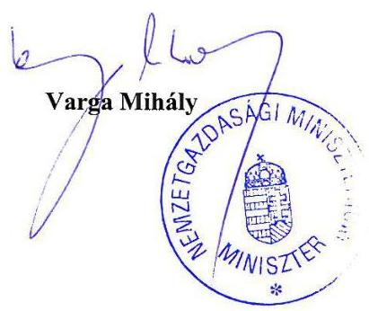

---

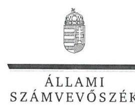

# Ikt. szám: V-0912-162/2016. 

## Varga Mihály úr

nemzetgazdasági miniszter
Nemzetgazdasági Minisztérium

## Budapest

## Tisztelt Miniszter Úr!

Köszönettel megkaptam a 2016. január 22. napján az Állami Számvevőszékhez érkezett „I turizmusfejlesztési intézkedések ellcnőrzése" címú számvevőszéki jelentéstervezetben foglalt megállapításokra, javaslatokra tett észrevételeit.

Tájékoztatom Miniszter urat, hogy a jelentésben - az Állami Számvevőszékről szóló 2011. évi LXVI. törvény 29. § (3) bekezdése alapján - az el nem fogadott észrevételeket szerepelhetjük az elutasítás indokainak feltüntetésével együtt.

Az Állami Számvevőszék észrevételekre vonatkozó álláspontjáról a felügyeleti vezető által készített részletes tájékoztatást csatoltan megküldőm.

Budapest, 2016.
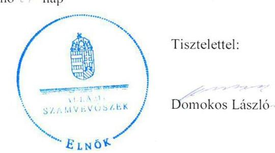

Melléklet: Tájékoztatás az elfogadott és az el nem fogadott észrevételekről, azok indokairól

---

# Tájékoztatás 

## az elfogadott és az el nem fogadott észrevételekről, azok indokairól

| 1. | Észrevétel: | 1.1. megállapítás   „A 12. oldalon a „Turizmus fejlesztésének stratégiájaként" ismertetett dokumentumok esetében pontos a megfogalmazás, amely szerint az OFK és OTK nem turizmus specifikus stratégiák, ugyanakkor e dokumentumok indikátor rendszerének elemzése során („hiányosak a turizmusra vonatkozó mérőszámok, célértékek és azok monitorozása sem megfelelő"), nem jelzik azt a tényt, hogy a turizmus itt többnyire alcélként jelent meg, és az indikátorok a dokumentum egészére lettek meghatározva. Javasoljuk az OFK-OTKOFTK, valamint az NTS-OEFS közötti hierarchikus kapcsolatot bemutatni. Az első három dokumentum nemzetgazdasági szintü fejlesztési koncepció, az NTS országos ágazati stratégia, amely a kormányzati beavatkozások cél- és eszközrendszerét határosta meg, az OEFS pedig egy turisztikai kínálati szegmensre vonatkozóan jelölte ki a fejlesztés fö irányait. Az utóbbi két dokumentum tartalmazta a szakpolitikai célokhoz kapcsolódó indikátorokat is." |
| :--: | :--: | :--: |
|  | Válasz: | Az Állami Számvevőszék az észrevételt részben - a dokumentumok szintjének a meghatározására vonatkozóan elfogadja, a koncepciók, stratégiák indikátoraira vonatkozóan nem fogadja el. |
|  | Indoklás: | Az 1.1. számú megállapítást alátámasztó, a „Turizmus fejlesztésének stratégiáját" ismertető 2. bekezdés kiegészítésre került az egyes dokumentumok szintjének a meghatározásával (kiegészítés aláhúzással jelölve).   „ A 2014. január 3-ig hatályos OFK és OTK - mint országos szintü fejlesztési koncepciók - nem turizmus-specifikus stratégiák, azonban a turizmushoz kapcsolódó célokat is meghatároztak;   a kormányhatározatban elfogadott NTS a turizmusfejlesztésről és a kapcsolódó intézkedésekről szóló országos, turisztikai ágazati célokat határozta meg a 2005 és 2013 közötti idöszakra vonatkozóan;   2014. január 4-től az OFTK volt az országos szintü, meghatározó stratégiai dokumentum a turizmusfejlesztés vonatkozásában, amelynek célkitüzéseit az Országgyülés hagyta jóvá. Az OFTK a tíz, nemzetgazdasági szempontból kiemelkedő iparág között nevesítette a turizmust."   A koncepciók, stratégiák indikátoraira vonatkozó észrevétel az ellenőrzés megállapításait nem módosítja, mivel álláspontunk szerint |

---

|   |  | - a turizmus alcélként történő megjelenése esetén is - az indikátorok meghatározása esetén szükséges a vonatkozó mérőszámok, célértékek meghatározása, és azok monitorozása.  |
| --- | --- | --- |
|  2. | Észrevétel: | 1.1. megállapítás
„Indokoltnak tartanánk bemutatni azt, hogy az NTS-ben meghatározott attrakció- és szolgáltatásféjlesztések az uniós fejlesztési programok ( 7 ROP) keretében valósultak meg. Ezeknek a programoknak a monitorozása folyamatos volt, a releváns indikátorok mérése megvalósult. (Érre utal a 3.1. megállapítás 5. bekezdése)."  |
|   | Válasz: | Az Állami Számvevőszék az észrevételt nem fogadja el.  |
|   | Indoklás: | A turizmusfejlesztési intézkedések ellenőrzése az uniós fejlesztési programokra, így a ROP-ok keretében megvalósult fejlesztésekre nem terjedt ki.
„Az ellenőrzés területe" fejezetben leírtak szerint „A turizmusfejlesztési célok megvalósulását az ÁSZ a kitüzött célértékek teljesülésének, illetve a stratégiai dokumentumok turizmusfejlesztési célkitűzések mérésére szolgáló indikátorok trendszerü, célérték irányába történő elmozdulásának ellenőrzésével, valamint két kiemelt turisztikai terület, a BKÜ és az egészségturizmus intézkedései végrehajtásának ellenőrzésével végezte el. ".  |
|  3. | Észrevétel: | 1.1. megállapítás
„A TDM szervezetekröl szóló bekezdés nem említi az NGM Turisztikai és Vendéglátótpari Főosztálya által végzett regisztrációt, amely ugyan nem jogszabályon nyugvó eljárás, de folyamatosan aktualizált, nyilvános adatházis, és a TDM szervezetek müködésének széles körü szakmai egyetértéssel kialakított alapelveinek érvényesülését vizsgálja. "  |
|   |  | 1.2. megállapítás
„A TDM szervezetekre vonatkozó mondatban kérjük feltüntetni, hogy az NGM által regisztrált szervezetekre vonatkozik a közölt adat. (A regisztráció nem kötelezö, több olyan szervezetröl tudunk, amely müködik, de nem kezdeményezte a regisztrációt. Az uniós támogatási igény benyújtásának azonban alapfeltétele a regisztráció.) A regisztráció feltételrendszere tükrözi azokat a szervezeti struktúrára, feladatellátásra és gazdálkodásra vonatkozó elvárásokat, amelyeket szakmai álláspontunk szerint jogszabályi szinten is rögzíteni indokolt a koncepció elfogadását követően. "  |
|   | Válasz: | Az Állami Számvevőszék az észrevételt részben fogadja el.  |

---

|   | Indoklás: | Az 1.2. számú megállapítást alátámasztó 7. bekezdés kiegészítésre került az NGM általi regisztrációra utalással (kiegészítés aláhúzással jelölve).
„Magyarország területén 79 helyi és 7 térségi - NGM által regisztrált TDM szervezet müködött az ellenőrzött időszakban."
A regisztrációval kapcsolatos további részletezést nem indokolt szerepeltetni, mivel az ellenőrzés megállapításait nem módosítja.  |
| --- | --- | --- |
|  4. | Észrevétel: | 1.1. megállapítás
Megjegyezzük, hogy a tervezet által hivatkozott 31/2011. (VIII. 24.) NGM rendelet sem a TDM rendszer szabályozását, müködési kereteit, finanszírozását tartalmazza, hanem a szervezet definícióját ismertette egy költségvetési tárgyú jogszabályban. Az a megállapítás helytálló, hogy 2015-ben ilyen jogszabály nem volt hatályban, de ezt megelőzően sem volt (indokát az általános megállapítások között jeleztük)."  |
|   | Válasz: | Az Állami Számvevőszék az észrevételt nem fogadja el.  |
|   | Indoklás: | Az ellenőrzés nem tett arra vonatkozó megállapítást, hogy a 31/2011. (VIII. 24.) NGM rendelet tartalmazza a TDM rendszer szabályozását, müködési kereteit, finanszírozását.
Az 1.1. számú megállapítást alátámasztó 7. bekezdés szerint „Az idegenforgalmi adó differenciált kiegészítéséről szóló 31/2011. (VIII. 24.) NGM rendelet határozta meg a TDM szervezet fogalmát, valamint költségvetési támogatással is ösztönözte a helyi önkormányzatok TDM szervezeti tagságát és a TDM-ek pályázati tevékenységét. Ez a jogszabály azonban 2014. december 24-től hatályát vesztette. A TDM-ek müködési kereteit meghatározó egyéb jogszabályt nem alkottak."  |
|  5. | Észrevétel: | 2.1. megállapítás
„Az OFK, OTK, OFTK dokumentumokkal kapcsolatban leírtakat javasoljuk az 1.1. megállapításhoz fázott észrevételünk alapján kiegészíteni. Az egészségturizmus vonatkozásában a jelen tervezet megfogalmazása szerint egyetlen (8. sz.) indikátor volt mérhető, jóllehet több indikátorra vonatkozóan is tartalmaznak az NGM TVF által átadott tanúsítványok részadatokat (1-2, 9, 13.).
A fenti kiegészítésekre tekintettel kérjük az összegző megállapításokat is felülvizsgálni (5. oldal)."  |
|   | Válasz: | Az Állami Számvevőszék az észrevételt nem fogadja el.  |

---

|  | Indoklás: | A koncepciókkal, stratégiákkal kapcsolatban nem indokolt az 1.1. számú megállapításban leírtak ismétlése a 2.1. számú megállapításban.   A 2.2 számú megállapítást alátámasztó 6. bekezdésben az egészségturizmus vonatkozásában, az OEFS-ben szereplő eredményességi indikátorok alapján az ellenőrzés nem az indikátorok mérhetőségére, hanem az indikátoroknak a célok megvalósulása mérésében betöltött szerepére, vagyis e funkció betöltésére való alkalmasságára tett megállapítást, amikor rögzítette: „A 13 indikátorból mindösszesen egy indikátor (az alábbiakban 8. indikátorként jelölt) esetében lehetett mérni a célok megvalósulását." A további indikátorok esetében a 2.2 számú megállapítást alátámasztó 6. bekezdés 1-5. pontjai részletesen tartalmazzák, hogy a rendelkezésre álló adatok ellenére, miért nem lehetett mérni az adott cél teljesítését. |
| :--: | :--: | :--: |
| 6. | Észrevétel: | Javaslatok   „A nemzetgazdasági miniszternek címzett javaslatok között az 1. pontban a 2014-2020 közötti idöszakra vonatkozó turisztikai és egészségturisztikai ágazati koncepció/stratégia kidolgozását és a megvalósitáshoz szükséges intézkedések végrehajtását lenne indokolt megemlíteni.   A 2.b javaslatban pedig az 1. pont szerint elfogadott koncepcióban/stratégiában megjelölt célokra és teljesitménymutatókra vonatkozó rendszeres monitoring tevékenység elvégzését tartjuk szükségesnek." |
|  | Válasz: | Az Állami Számvevőszék az észrevételt nem fogadja el. |
|  | Indoklás: | Az Állami Számvevőszék javaslatait az ellenőrzés megállapításai alapján fogalmazta meg. A javaslat végrehajtásának részletes tartalmát az ellenőrzött szervezet határozza meg, a javaslatok alapján összeállításra kerülő intézkedési terv keretében. |

Budapest, 2016. jaus, hó 27 nap

Salamon Ildikó
felügyeleti vezető

---

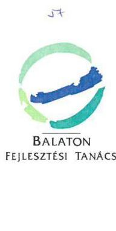

Iktatószám: 1012016...K
Úgyintéző: Fekete-P.J.
Tárgy: ÁSZ jelentés tervezet
észrevételezése
Mell.: észrevétel

# Domonkos László elnök úr részére Állami Számvevőszék 

Budapest
Apáczai Csere János u. 10.
1052

## Tisztelt Elnök Úr!

Csatoltan küldöm az Állami Számvevőszék által készített, „A turizmusfejlesztési intézkedések ellenőrzése" című számvevőszéki jelentéstervezetre vonatkozó észrevételünket. Kérem, hogy észrevételeinek elfogadni és ennek megfelelően a jelentés tervezetet módosítani szíveskedjenek.

Siófok, 2016. január 13.
Tisztelettel:
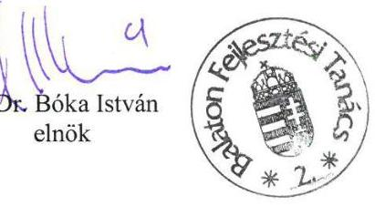

---

# Észrevétel „A turizmusfejlesztési intézkedések ellenőrzése" címmel készített számvevőszéki jelentés tervezethez 

Készítette: Balaton Fejlesztési Tanács

A jelzett ÁSZ jelentés BFT-t is érintő pontjaihoz, megállapításaihoz az alábbi észrevételeket kívánjuk tenni:

## 2.2 számú ÁSZ megállapítás:

A BKÜ-re vonatkozó, a 2007-2013. évek közötti tervezési időszakra kitűzött turisztikai fejlesztési célok megvalósulása - a bázis és célértékek/célirányok meghatározása, valamint a mérések hiányában - csak két indikátor esetében volt nyomon követhető. Ezen indikátorok alapján a kitüzött célok nem teljesültek. A BKÜ 2014-2020. évek közötti időszakra vonatkozó stratégiai turisztikai fejlesztési célkitűzéseinek megvalósításához tettek intézkedéseket. Az egészségturizmusra vonatkozóan, a 2007-2015. évek között kitüzött stratégiai céloknál csak egy indikátor esetében volt mérhető a célok megvalósulása, amely mért cél teljesült. Az egészségturizmus 20142020 közötti céljai megvalósításához nem tették meg teljes körűen a szükséges intézkedéseket, mivel a célok lebontására intézkedési tervet nem készítettek, illetve a célok teljesítését nyomon követő indikátorrendszert nem alakították ki.

BFT észrevétel a 2.2 sz. ÁSZ megállapításhoz:
A vizsgálati időszakra vonatkozik a Balaton Régió Fejlesztési Stratégiája (BRFS) mellett a Balaton Hosszútávú Területfejlesztési Koncepció (BHTK) is.
A BHTK és a BRFS indikátorainak vizsgálata együttesen mutatja a régió turisztikai folyamatait.
A fenti ÁSZ megállapítás csak a BRFS indikátorok vizsgálatát vette figyelembe annak ellenére, hogy a BHTK adatai is megküldésre kerültek, valamint a 3.1. számú megállapításánál a jelentés is írja, hogy „A BKÜ-re vonatkozó turizmusfejlesztési intézkedések nyomon követése a2007-12 időszakra döntő többségében nem a BRFS-ben, hanem a BKÜ Hosszútávú Területfejlesztési Koncepció 2020-ban megjelölt indikátorok mentén történt."

A 2007- 13-as időszakra a 15 indikátor került meghatározásra a fejlesztés dokumentumokban:

- 8 db a BHTK-ban - időtáv 2020.
- 7 db a BRFS-ben - időtáv 2013.

A 15 indikátorból 4 esetében nem tudtuk mérni a megvalósulást, mivel a KSH ezen adatokat nem készíti el, egyéb forrásból pedig nem állíthatóak elő, illetve költséges, egyedi survey módszert igényelnének, mely forrásainak a vizsgált időszakban nem voltunk a birtokában. Érintett indikátorok:

- egy belföldi turistára jutó átlagos költés (BRFS),
- egy külföldi turistára jutó átlagos költés (BRFS),
- a balatoni külföldi turisták átlagos költésének aránya a külföldi turisták hazai költésének arányában (BRFS),
- a régiót érintő 3 megyében összesen a turizmus ágazat (szálláshely és vendéglátás) nettó eredményének aránya az országos átlaghoz képest (BRFS).

---

A többi ( 11 db ) indikátor esetén folyamatosan végezzük a vizsgálatot, azonban az adatgazdák (KSH, Magyar Turizmus Zrt.) adatszolgáltatás késedelme miatt a 2013 és 2014-es adatok még nem álltak rendelkezésre.
Azonban ez nem jelenti azt, hogy csak két indikátor volt nyomon követhető.
A fentiek alapján kérjük a megállapítás átfogalmazását.
3. pont: A stratégia célok teljesülését, az intézkedések hatását nyomon követték-e, értékelték-e azok összhangját a kitűzött célokkal?
Az országos, az egészségügyi ágazati turizmusfejlesztési stratégiai célok teljesülését, az intézkedések hatását nem követték nyomon, a cél szerinti teljesítést nem értékelték, ugyanakkor a regionális operatív programok esetében nyomon követték a célok teljesülését. A BKÜ-re vonatkozó turizmusfejlesztési célkitűzések esetében korlátozottan, egy koncepció teljesítésének közbülső értékelésével valósult meg az intézkedések hatásának nyomon követése.

# BFT észrevétel a 3 sz. összegző ÁSZ megállapításhoz: 

Az összegző megállapításban a BFT-re vonatkozó megállapítással nem értünk egyet.
A BFT folyamatosan vizsgálja, és évenként végzi az indikátorok vizsgálatát. A vizsgálat időszakában

- a 2013-as vizsgálat a 2014-ben elfogadott koncepció közbülső értékelése keretében elkészített helyzetértékelés keretében,
- a 2014. évi adatok vizsgálata a BFT által 2015. májusában elfogadott monitoring jelentés keretében valósult meg.
Tájékoztatjuk Önöket továbbá, hogy a BFT 2003-tól folytat a BKÜ térségére vonatkozó területi és időbeli összehasonlító elemzéseket tartalmazó területi monitoring tevékenységet. Ennek keretében az üdülőkörzetet jellemző meghatározó adatokat összehasonlítottuk az országos egyéb területi (régiók, megyék, adott esetben kistérségek, járások) megegyező adataival is. E program eredményeképpen közel száz kutatási projekt zárótanulmánya készült el, melyek beépültek a térség fejlődési folyamatainak értékelésébe, monitoring tevékenységébe.

## 3.1 számú ÁSZ megállapítás:

A stratégiai dokumentumokban (ÖFK, OTK, BRFS, OEFS) foglalt célkitűzések teljesülését, az intézkedések megvalósítását nem követték nyomon. Az éves monitoring tevékenység a regionális operatív programok akcióterveiben meghatározott turizmusfejlesztési célok teljesítésére vonatkozóan megvalósult. A BFT monitoring tevékenysége a BKÜ Hosszútávú Területfejlesztési Koncepció vonatkozásában eredményes volt a koncepció teljesítésének közbülső értékelése tekintetében, azonban a jogszabályban előírt tájékoztatási kötelezettség nem valósult meg. A BFT monitoring tevékenysége a BRFS céllai megvalósítása tekintetében nem volt eredménves.

## BFT észrevétel a 3.1. számú ÁSZ megállapításhoz:

A BFT tájékoztatási tevékenységét az alábbiakban teljesítette:
A BFT az ülésén fogadta el az érintett időszakra vonatkozó monitoring jelentéseket.
A BFT tagjai valamennyi, a 37/2010. (II.26.) Korm rendelet 4.§.d) pontjában meghatározott szervezet, azaz:

- a területfejlesztés stratégiai tervezéséért, valamint a területfejlesztésért felelős miniszter képviselője,

---

- a területileg érintett 3 megyei önkormányzat elnöke és egy-egy képviselője.

A fentiek alapján valamennyi, tájékoztatási kötelezettséggel érintett szervezet számára - a BFT előterjesztés keretében - megküldésre került a monitoring rendszerről szóló jelentés.

Kérjük a jelentés megállapításának átfogalmazását, mivel a tájékoztatási kötelezettségének a BFT eleget tett.

# ÁSZ 3.1. pont jelentés tervezet megállapítása: 

A „BKÜ Hosszútávú Területfejlesztési Koncepció 2020" felülvizsgálata 2014-ben készült el. A felülvizsgált dokumentum 2014-2030 évekre tartalmazza a BKÜ hosszú távú területfejlesztési koncepcióját, stratégiáját. Az azokban szereplő indikátorok nyomon követése még nem kezdődött meg."

## BFT észrevétel a 3.1. pont jelentés tervezet megállapításhoz:

A 2014-30 időszakra szóló fejlesztési dokumentumok indikátorainak nyomon követése esetén a munka folyamatban van. Azonban tény, hogy az adatok nagy része az adatszolgáltatási késedelem miatt (KSH) még nem áll rendelkezésre.
Kérjük a megállapítás módosítását.

## Az ÁSZ jelentéssel kapcsolatos további észrevételek:

## Megállapításokhoz kapcsolódó észrevételek:

Bár a BFT-nek konkrét érintettsége a következő megállapításokban nincs, azonban az ÁSZ jelentés álláspontunk szerint az alábbiakban lenne gazdagítható:

- Az ellenőrzés indokoltságát javasoljuk kiegészíteni az ország nemzetközi megítélésének javításával és a nemzeti, a regionális identitásra gyakorolt pozitív hatások említésével.
- Az 1.1 számú megállapításhoz kapcsolódóan jelezzük, hogy a TDM szervezetek tevékenységi területük alapján tagozódtak, azaz vannak helyi, lokális feladatokat ellátó szervezetek mellett térségi, regionális és országos hatókörű szervezetek is (MTDMSZ, BRTDMSZ)
- Az 1.1 számú megállapításhoz kapcsolódóan fontosnak tartanánk megemlíteni, a célértékek eléréséhez szükséges lett volna továbbá
- a turizmus törvény megalkotására,
- a források nagyobb mértékű hasznosulásához a valós decentralizált döntéshozatal megvalósítására.

## Javaslatokhoz kapcsolódó észrevételek:

BFT monitoring és értékelési tevékenységének állandó problémája, hogy a KSH, TEIR adatok 1 -2 éves késéssel érhetőek csak el a felhasználók számára. Ezért javasoljuk, hogy az ÁSZ jelentés fogalmazza meg javaslatai között a fejlesztési monitoring feladatok kötelezettségeinek és a KSH adatszolgáltatási rendjének szinkronba hozását.

Siófok, 2015. január 13.
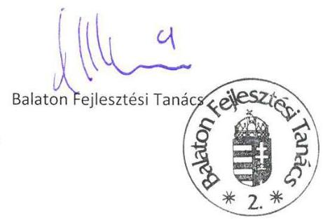

---

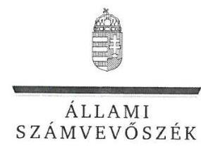

# Dr. Bóka István úr 

elnök
Balaton Fejlesztési Tanács

## Siófok

## Tisztelt Elnök Úr!

Köszönettel megkaptam a 2016. január 13. napján az Állami Számvevőszékhez érkezett „A turizmussfeflesztési intézkedések eltemürzése" címú számvevőszéki jelentéstervezetben foglalt megállapításokra, javaslatokra tett észrevételeit.

Tájékoztatom Elnök urat, hogy a jelentésben - az Állami Számvevőszékről szóló 2011. évi LXVI. törvény 29. § (3) bekezdése alapján - az el nem fogadott észrevételeket szerepeltetjük az elutasítás indokainak feltüntetésével együtt.

Az Állami Számvevőszék észrevételekre vonatkozó álláspontjáról a felügyeleti vezető által készített részletes tájékoztatást csatoltan megküldőm.

Budapest, 2016.
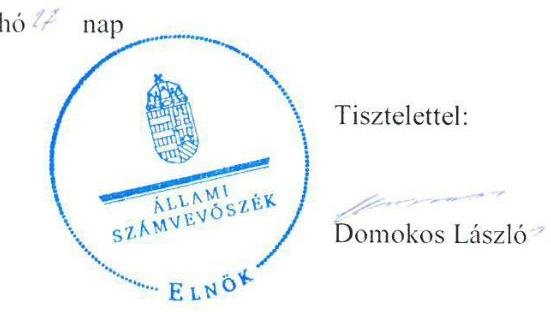

Melléklet: Tájékoztatás az elfogadott és az el nem fogadott észrevételekről, azok indokairól

---

# Tájékoztatás 

az elfogadott és az el nem fogadott észrevételekról, azok indokairól

| 1. | Észrevétel: | 2.2. számú ÁSZ megállapításhoz:   „A vizsgálati időszakra vonatkozik a Balaton Régió Fejlesztési Stratégiája (BRFS) mellett a Balaton Hosszútávú Területfejlesztési Koncepció (BHTK) is.   A BHTK és a BRFS indikátorainak vizsgálata együttesen mutatja a régió turisztikai folyamatait.   A fenti ÁSZ megállapítás csak a BRFS indikátorok vizsgálatát vette figyelembe annak ellenére, hogy a BHTK adatai is megküldésre kerültek, valamint a 3.1. számú megállapításnál a jelentés is írja, hogy „A BKÜ-re vonatkozó turizmusfejlesztési intézkedések nyomon követése a 2007-12 időszakra döntő többségében nem a BRFS-ben, hanem a BKÜ Hosszútávú Területfejlesztési Koncepció 2020-ban megjelölt indikátorok mentén történt."   „A 2007-13-as időszakra a 15 indikátor került meghatározásra a fejlesztés dokumentumokban:   - 8 db a BHTK-ban - időtáv 2020.   - 7 db a BRFS-ben - időtáv 2013.   A 15 indikátorból 4 esetében nem tudtuk mérni a megvalósulást, mivel a KSH ezen adatokat nem készíti el, egyéb forrásból pedig nem állíthatóak elő, illetve költséges, egyedi survey módszert igényelnének, mely forrásainak a vizsgált időszakban nem voltunk a birtokában. Érintett indikátorok:   - egy belföldi turistára jutó átlagos költés (BRFS).   - egy külföldi turistára jutó átlagos költés (BRFS).   - a balatoni külföldi turisták átlagos költésének aránya a külföldi turisták hazai költésének arányában (BRFS).   - a régiót érintő 3 megyében összesen a turizmus ágazat (szálláshely és vendéglátás) nettó eredményének aránya az országos átlaghoz képest (BRFS).   A többi (11 db) indikátor esetén folyamatosan végezzük a vizsgálatot, azonban az adatgazdák (KSH, Magyar Turizmus Zrt.) adatszolgáltatás késedelme miatt a 2013 és 2014-es adatok még nem álltak rendelkezésre.   Azonban ez nem jelenti azt, hogy csak két indikátor volt nyomon követhető.   A fentiek alapján kérjük a megállapítás átfogalmazását." |
| :--: | :--: | :--: |
| Válasz: | Az Állami Számvevőszék az észrevételt nem fogadja el. |

---

|  | Indoklás: | A jelentéstervezet 2. pontja az ellenőrzési program 2.   fókuszkérdésével összhangban - arra vonatkozóan tartalmaz   megállapításokat, hogy a kitűzött célok megvalósultak-e.   A Balaton Fejlesztési Tanács - az 5. számú tanúsítványban - a   Balaton Hosszúávú Területfejlesztési Koncepcióhoz (BHTK)   kapcsolódóan feltüntetett indikátoroknál nem szerepeltetett konkrét   célokat, célértékeket.   Konkrét célok, célértékek meghatározása hiányában a fejlesztési   célok megvalósulása nem volt nyomon követhető, a célok teljesülése   nem volt megállapítható. Ennek következtében az észrevételben   foglaltak az ellenőrzés megállapításait nem módosítják. |
| :--: | :--: | :--: |
|  | Észrevétel: | a 3. számú összegzö megállapításhoz:   „Az összegzö megállapításban a BFT-re vonatkozó megállapítással   nem értünk egyet.   A BFT folyamatosan vizsgálja, és évenként végzi az indikátorok   vizsgálatát. A vizsgálat idöszakában   - a 2013-as vizsgálat a 2014-ben elfogadott koncepció   közbülsö értékelése keretében elkészitett helyzetértékelés   keretében,   - a 2014. évi adatok vizsgálata a BFT által 2015. májusában   elfogadott monitoring jelentés keretében valósult meg.   Täjékoztatjuk Önöket továbbá, hogy a BFT 2003-tól folytat a BKÜ   térségre vonatkozó területi és idöbeli összehasonlitó elemzéseket   tartalmazó terïleti monitoring tevékenységet. Ennek keretében az   idülökörzetet jellemző meghatározó adatokat összehasonlitottuk az   országos egyéb területi trégiók, megyék, adott esetben kistérségek,   járások) megegyezö adataival is. E program eredményeképpen közel   száz kutatási projekt zárótanulmánya készült el, melyek beépültek a   térség fejlődési folyamatainak értékelésébe, monitoring   tevékenységébe." |
|  | Válasz: | Az Állami Számvevőszék az észrevételt nem fogadja el. |
|  | Indoklás: | Az ellenőrzés részére átadott „A Balaton Kiemelt Üslülökörzet   terïleti monitoringja 2014" címú dokumentumot, valamint ehhez   kapcsolódóan a Balaton 2020-ig tartó Hosszúávú Területfejlesztési   Koncepciója megvalósulásáról, monitoring feladatai teljesítéséről   szóló, a BFT 2015. május 15-i ülésére készített előterjesztést az   ellenőrzés a megállapítások során figyelembe vette.   A célkitűzések teljesülésére vonatkozóan a monitoring rendszer   folyamatos müködését az ellenőrzés részére átadott további   dokumentumok, valamint tanúsítvány adatok nem támasztották alá. |

---

|  |   |   |
| --- | --- | --- |
|   |  | a 3.1 számú ÁSZ megállapításhoz:  |
|   | Észrevétel: | „A BFT tájékoztatási tevékenységét az alábbiakban teljesítette.
A BFT az ülésén fogadta el az érintett időszakra vonatkozó monitoring jelentéseket.
A BFT tagjai valamennyi, a 37/2010. (II.26.) Korm. rendelet 4. § d) pontjában meghatározott szervezet, azaz:  |
|   |  | - a terïletfejlesztés stratégiai tervezéséért, valamint a terïletfejlesztéséért felelős miniszter képviselöje,  |
|   |  | - a területileg érintett 3 megyei önkormányzat elnöke és egyegy képviselője.
A fentiek alapján valamennyi, tájékoztatási kötelezettséggel érintett szervezet számára - a BFT előterjesztés keretében - megküldésre került a monitoring rendszerről szóló jelentés.
Kérjük a jelentés megállapításának átfogalmazását, mivel a tájékoztatási kötelezettségének a BFT eleget tett."  |
|   | Válasz: | Az Állami Számvevőszék az észrevételt nem fogadja el.  |
|  3. | Indoklás: | A 37/2010. (II.26.) Korm. rendelet 4. § d) pontja szerint a BFT „évente tájékoztatást ad a terïletfejlesztés stratégiai tervezéséért, valamint a terïletfejlesztésért felelős miniszter, a területileg érintett megyei önkormányzatok részére a kiemelt térségi területi monitoring rendszer müködéséről és a kiemelt térségi értékelési jelentésekről a tárgyévet követő március 31-ig".  |
|   |  | Az észrevételben hivatkozott, a BFT tagjai részére „a BFT előterjesztés keretében" a dokumentumok megküldése nem tekinthető „a kiemelt társégi monitoring rendszer müködéséről és a kiemelt térségi értékelési jelentésekről" történő, a jogszabályban külön előírt tájékoztatás megtörténtének.  |
|   |  | Az ellenőrzés részére átadott dokumentumokból nem állapítható meg, hogy a BFT a kiemelt térségi területi monitoring rendszer müködéséről és a kiemelt térségi értékelési jelentésekről, a jogszabályi előírásnak megfelelő tartalommal, éves gyakorisággal, a tárgyévet követő március 31-ig bezárólag tájékoztatta a területi monitoring rendszerről szóló jogszabályban megnevezetteket.  |
|   | Észrevétel: | a 3.1 pont jelentéstervezet megállapításhoz:
„A 2014-30 időszakra szóló fejlesztési dokumentumok indikátorainak nyomon követése esetén a munka folyamatban van. Azonban tény, hogy az adatok nagy része az adatszolgáltatási késedelem miatt (KSH) még nem áll rendelkezésre.
Kérjük a megállapítás módosítását."  |
|  4. | Válasz: | Az Állami Számvevőszék az észrevételt nem fogadja el.  |
|   | Indoklás: | A BFT az ellenőrzés részére nem adott át az indikátorok nyomon követését igazoló dokumentumot. A BFT által kitöltött 5. számú tanúsítvány a 2014-tól kezdődően - a TDM szervezetek számára vonatkozó, évek óta azonos adaton túl - nem tartalmazza az indikátorok tényértékére vonatkozó adatokat. Mindemellett az észrevételben is szerepel annak ténye, hogy „az adatok nagy része az adatszolgáltatási késedelem miatt (KSH) még nem áll rendelkezésre."  |

---

|  |  | Az ÁSZ jelentéssel kapcsolatos további észrevételek |
| :--: | :--: | :--: |
|  | Észrevétel: | Megállapításokhoz kapcsolódó észrevételek:   „Bár a BFT-nek konkrét érintettsége a következő megállapításokban   nincs, azonban az ÁSZ jelentés álláspontunk szerint az alábbiakban   lenne gazdagítható:   - Az ellenörzés indokoltságát javasoljuk kiegészíteni az ország   nemzetközi megítélésének javításával és a nemzeti, a   regionális identitásra gyakorolt pozitív hatások említésével.   - Az 1.1 számú megállapításhoz kapcsolódóan jelezzük, hogy a   TDM szervezetek tevékenységi területhik alapján tagozódtak,   azaz vannak helyi, lokális feladatokat ellátó szervezetek   mellett térségi, regionális és országos hatókörü szervezetek is   (MTDMSZ, BRTDMSZ).   - Az 1.1 számú megállapításhoz kapcsolódóan fontosnak   tartanánk megemlíteni, a célértékek eléréséhez szükséges lett   volna továbbá   - a turizmus törvény megalkotására,   - a források nagyobb mértékü hasznosulásához a valós   decentralizált döntéshozatal megvalósitására." |
|  | Válasz: | Az Állami Számvevószék az észrevételt nem fogadja el. |
|  | Indoklás: | Az ÁSZ jelentéstervezet megállapításaihoz kapcsolódó további - az   ellenőrzés indokoltságának kiegészítésére, a TDM szervezetek   tagozódására, a turizmus törvény megalkotására, a valós   decentralizált döntéshozatal megvalósítására vonatkozó -   észrevételeit megköszönöm. Az észrevételben foglaltak az   ellenőrzésnek - az ellenőrzési program által meghatározott   ellenőrzési területen tett - megállapításait nem módosítják. |
|  | Észrevétel: | Javaslatokhoz kapcsolódó észrevételek:   „BFT monitoring és értékelési tevékenységének állandó problémája,   hogy a KSH, TEIR adatok 1-2 éves késéssel érhetöek csak el a   felhasználok számára. Ezért javasoljuk, hogy az ÁSZ jelentés   fogalmazza meg javaslatai között a fejlesztési monitoring feladatok   kötelezettségeinek és a KSH adatszolgáltatási rendjének szinkronba   hozását." |
| 6. | Válasz: | Az Állami Számvevószék az észrevételt nem fogadja el. |
|  | Indoklás: | Az Állami Számvevőszék a javaslatait az ellenőrzés megállapításai   alapján fogalmazta meg.   A javaslatokhoz kapcsolódó észrevételben jelzett, „a KSH, TEIR   adatok 1-2 éves késéssel" való elérhetősége, illetve a „KSH   adatszolgáltatási rendje" nem tartozott jelen ellenőrzés keretébe, így   az a megtett javaslatokat nem módosítja. |

Budapest, 2016. 140. hó 17 nap

Salamon Ildikó
felügyeleti vezető

---

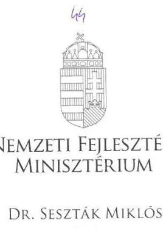

# Iktatószám: EFO/60-2/2016-NFM 

Ügyintéző: Simonné Hábencius Gizella
Telefonszám: 79-54405
E-mail:gizella.habencius.simonne@nfm.gov.hu
Hiv. szám: V-0912-150/2015.

## Domokos László

elnök
részére
Állami Számvevöszék

## Budapest

Apáczai Csere János u. 10.
1052

Tárgy: Jelentéstervezet véleményezése

## Tisztelt Elnök Úr!

Köszönettel vettem kézhez „A turizmusfejlesztési intézkedések ellenőrzése" címmel készített számvevőszéki jelentéstervezetet.

A jelentéstervezetre észrevételt nem teszek.
Budapest, 2016. január , 15. ,

Üdvözlettel:
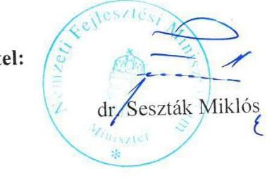

---

.

---

# RÖVIDÍTÉSEK JEGYZÉKE 

${ }^{1}$ NGM
${ }^{2}$ TDM
${ }^{3}$ MT Zrt.
${ }^{4}$ ndmsz
${ }^{5}$ NFM
${ }^{6}$ BKÜ
${ }^{7}$ OFTK
${ }^{8}$ BFT
${ }^{9}$ ÁSZ SZMSZ
${ }^{10}$ kereskedelemről szóló törvény
${ }^{11}$ Kormányrendeletek
${ }^{12}$ Rendeletek
${ }^{13}$ OFK
${ }^{14}$ OTK
${ }^{15}$ NTS
${ }^{16}$ OEFS
${ }^{17}$ BRFS
${ }^{18}$ NVS
${ }^{19} \mathrm{NKP}$
${ }^{20}$ OFP
${ }^{21}$ GINOP

Nemzetgazdasági Minisztérium
Turisztikai Desztináció Menedzsment
Magyar Turizmus Zártkörűen működő részvénytársaság
Nemzeti Desztináció Menedzsment Szervezet
Nemzeti Fejlesztési Minisztérium
Balaton Kiemelt Üdülőkörzet
Országos Fejlesztési és Területfejlesztési Koncepció (1/2014. (I. 3.) OGY határozat a Nemzeti Fejlesztés 2030 - Országos Fejlesztési és Területfejlesztési Koncepcióról)
Balaton Fejlesztési Tanács
Állami Számvevőszék Szervezeti és Működési Szabályzata
2005. évi CLXIV. tv. a kereskedelemről
152/2014.(VI.6.) Korm. rend. a Kormány tagjainak feladat- és hatásköréről 212/2010. (VII. 1.) Korm. rendelet az egyes miniszterek, valamint a Miniszterelnökséget vezető államtitkár feladat- és hatásköréről
55/2011. (IV. 12.) Korm. rendelet a Széchenyi Pihenő Kártya kibocsátásának és felhasználásának szabályairól
103/2012. (V. 25.) Korm. rendelet a Magyar Turizmus Zrt. közösségi agrármarketing tevékenységgel kapcsolatos feladatainak meghatározásáról és egyes jogszabályok módosításáról
57/2012. (IX. 18.) NFM rendelet az Agrármarketing Célelóirányzat felhasználásának és kezelésének részletes szabályairól
8/2013. (II. 28.) NFM rendelet a Turisztikai Célelóirányzat felhasználásának és kezelésének részletes szabályairól
31/2011. (VIII. 24.) NGM rendelet az idegenforgalmi adó differenciált kiegészítéséről
52/2014. (XII. 31.) NGM rendelet a Turisztikai céleIóirányzat felhasználásának és kezelésének részletes szabályairól
Országos Fejlesztéspolitikai Koncepció (96/2005. (XII. 25.) OGY határozat az Országos Fejlesztéspolitikai Koncepcióról)
Országos Területfejlesztési Koncepció (97/2005. (XII. 25.) OGY határozat az Országos Területfejlesztési Koncepcióról)
Nemzeti Turizmusfejlesztési Stratégia (1100/2005. (X. 7.) Korm. határozat a Nemzeti Turizmusfejlesztési Stratégiáról)
Országos Egészségturizmus Fejlesztési Stratégia (a 2007-2015 közötti célokat határozta meg)
Balaton Régió Fejlesztési Stratégia (100/2005.(XII.07.) BFT határozat)
Nemzeti Vidékstratégia 2012-2020 (1074/2012. (III.28.) Korm. határozat a Nemzeti Vidékstratégia végrehajtásával összefüggő feladatokról)
Nemzeti Környezetvédelmi Program 2015-2020 (27/2015. (VI. 17.) OGY határozat a 2015-2020 közötti időszakra szóló Nemzeti Környezetvédelmi Programról)
Országos Fogyatékosságügyi Program (2015-2025) (15/2015. (IV.7.) OGY határozat az Országos Fogyatékosságügyi Programról (2015-2025))
Gazdaságfejlesztési és Innovációs Operatív Program

---

${ }^{22}$ VEKOP
${ }^{23}$ TOP
${ }^{24}$ Kormányrendelet
${ }^{25}$ NGM SZMSZ
${ }^{26}$ NFM belső szabályzatai
${ }^{27}$ NFM SZMSZ
${ }^{28}$ MFB Zrt.
${ }^{29}$ NFM Rendelete
${ }^{30}$ MT ZRt. SZMSZ
${ }^{31}$ területfejlesztési törvény
${ }^{32}$ ÁSZ tv.

Versenyképes Közép-Magyarország Operatív Program
Terület és Településfejlesztési Operatív Program
152/2014.(VI.6.) Korm. rend. a Kormány tagjainak feladat- és hatásköréről
11/2013.(VI.3.) NGM utasítás, 22/2014.(VIII.29.) NGM utasítás, 1/2015.(I.21.) NGM utasítás a Nemzetgazdasági Minisztérium Szervezeti és Működési Szabályzatáról
NFM SZMSZ, Fejlesztési Források Főosztály Ügyrendje
25/2012.(IX.17.) számú NFM utasítás, 24/2013.(VII.12.) számú NFM utasítás, 33/2014.(X.10.) számú NFM utasítás a Nemzeti Fejlesztési Minisztérium Szervezeti és Müködési Szabályzatáról
Magyar Fejlesztési Bank Zártkörűen működő részvénytársaság
38/2014. (IX. 4) NFM rendelet a Magyar Turizmus Zártkörűen Működő Részvénytársaság felett az államot megillető tulajdonosi jogok és kötelezettségek összességét gyakorló szervezet kijelöléséről
Magyar Turizmus Zártkörűen Működő Részvénytársaság Szervezeti és Működési Szabályzata
1996. évi XXI. tv. a területfejlesztésről és a területrendezésről
2011. évi LXVI. törvény az Állami Számvevőszékről (hatályos 2011. VII. 1-jétől)

---

.

---

ÁLLAMI SZÁMVEVŐSZÉK
1052 Budapest, Apáczai Csere János utca 10.
Levélcím: 1364 Budapest 4. Pf. 54
Telefon: +36 14849100 Telefax: +36 14849200
www.asz.hu