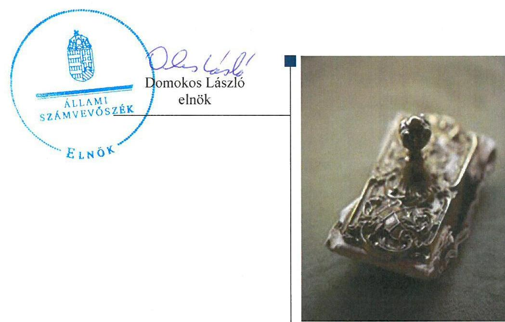
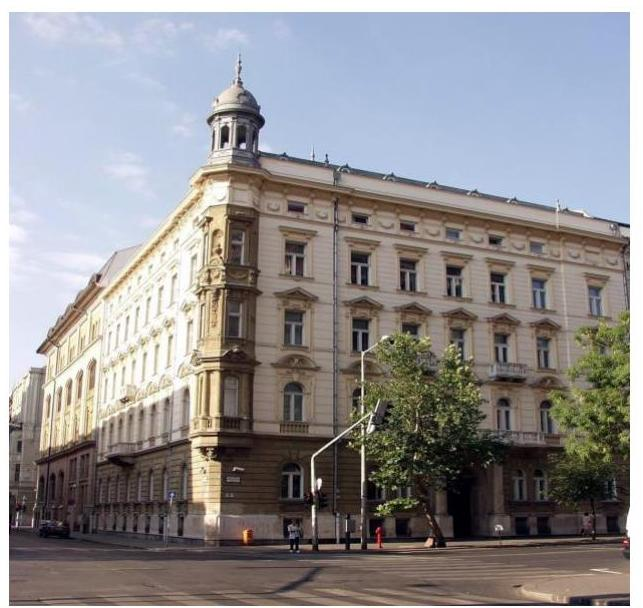
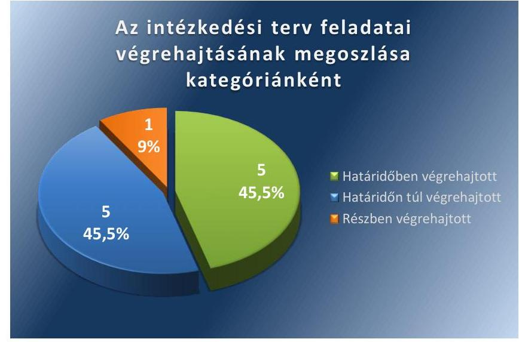
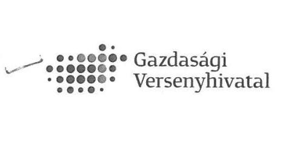
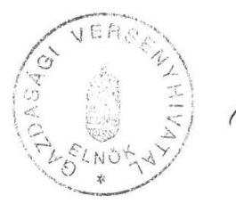

# Jelentés 

## Utóellenőrzések

A Gazdasági Versenyhivatal múködésének és gazdálkodásának utóellenőrzése
2016.

---

.

---

# Jelentés 

## Utóellenőrzések

A Gazdasági Versenyhivatal múködésének és gazdálkodásának utóellenőrzése
2016. O3 hónap 05 nap

---

# AZ ELLENŐRZÉST FELÜGYELTE:

- **SALAMON ILDIKÓ** felügyeleti vezető

- **AZ ELLENŐRZÉST VEZETTE ÉS A VÉGREHAJTÁSÁÉRT FELELŐS:**
  - BÍRÓ ZSOLT ellenőrzésvezető
  - A PROGRAM ÖSSZEÁLLÍTÁSÁÉRT FELELŐS:
    - **JANIK JÓZSEF** osztályvezető BÖRÖCZ IMRE projektfelelős
  - A TÉMÁHOZ KAPCSOLÓDÓ KORÁBBI SZÁMVEVŐSZÉKI JELENTÉS:
    - **címe:** Jelentés a Gazdasági Versenyhivatal működésének és gazdálkodásának ellenőrzéséről
    - **sorszáma:** 14001

Jelentéseink az Országgyűlés számítógépes hálózatán és az Interneten a www.asz.hu címen is olvashatóak.

|  IKTATÓSZÁM: V-0878-045/2015 | |
| --- | --- |
|  TÉMASZÁM: 35 | |
|  ELLENŐRZÉS-AZONOSÍTÓ SZÁM: V071708 | |

---

# TARTALOMJEGYZÉK 

■ ÖSSZEGZÉS ..... 5
■ AZ ELLENŐRZÉS CÉLJA ..... 6
■ AZ ELLENŐRZÉS TERÜLETE ..... 7
■ AZ ELLENŐRZÉS HÁTTERE, INDOKOLTSÁGA ..... 8
■ FÓKUSZKÉRDÉSEK ..... 9
■ ELLENŐRZÉS HATÓKÖRE ÉS MÓDSZEREI ..... 10
■ MEGÁLLAPÍTÁSOK ..... 12
■ MELLÉKLETEK ..... 15
I. SZ. MELLÉKLET: Az ÁSZ 14001 számú jelentéséhez kapcsolódó intézkedési terv végrehajtása ..... 15
■ FÜGGELÉK: ÉSZREVÉTELEK ..... 19
■ RÖVIDÍTÉSEK JEGYZÉKE ..... 21

---

.

---

# ÖSSZEGZÉS 

Az Állami Számvevőszék a Gazdasági Versenyhivatal müködésének és gazdálkodásának utóellenőrzését 2014. január 14. és 2015. június 17. közötti időszak tekintetében végezte el. A GVH az intézkedési tervben foglaltak végrehajtásáról az előírt határidőben nem teljes körüen gondoskodott.

Gazdasági
Versenyhivatal

## Az ellenőrzés társadalmi indokoltsága

Az Állami Számvevőszék stratégiájában célul tűzte ki a számvevőszéki munka hasznosulásának javítását. Ezzel összhangban ellenőrzi, hogy az ellenőrzött szervezetek megvalósították-e a korábbi ellenőrzései által feltárt hibák, hiányosságok és szabálytalanságok megszüntetése céljából kialakított intézkedési terveikben foglaltakat. A rendszeres utóellenőrzések hozzájárulnak a szükséges intézkedések tényleges végrehajtásához, ezáltal a közpénzügyek rendezettségének javulásához.

## Főbb megállapítások, következtetések, javaslatok

A GVH az intézkedési tervet határidőben megküldte az ÁSZ részére.
A GVH az ÁSZ javaslatainak hasznosítására előírt 11 intézkedésből ötöt határidőben, ötöt határidőn túl és egyet részben hajtott végre.

A GVH az intézkedési tervben rögzített feladatok végrehajtásáról a jogszabályban előírt nyilvántartást vezetett.

---

# AZ ELLENŐRZÉS CÉLJA 

## A Gazdasági Versenyhivatal múködésének és gazdálkodásának utóellenőrzése

Az ellenőrzés célja annak értékelése, hogy a számvevőszéki jelentésben foglalt intézkedést igénylő megállapításokkal és javaslatokkal összhangban készített intézkedési tervben meghatározott feladatokat az ellenőrzött szervezet végrehajtotta-e.

---

# AZ ELLENŐRZÉS TERÜLETE 

## Gazdasági Versenyhivatal

A GVH¹-t az Országgyűlés a piaci verseny fenntartásához fűződő közérdek, továbbá az üzleti tisztesség követelményeit betartó vállalkozások és a fogyasztók érdekeinek védelmére hozta létre. ${ }^{1}$ A GVH feladata, hogy a versenyfelügyeleti eljárásaival, az állami döntéseket befolyásoló versenypártolással, valamint a versenykultúra fejlesztése érdekében kifejtett tevékenységével hozzájáruljon a piaci verseny szabadságának és tisztaságának védelméhez.

Az utóellenőrzés - a 2014. január 14-től 2015. június 17-ig végrehajtott intézkedéseket figyelembe véve - a GVH múködésének és gazdálkodásának szabályszerűségi ellenőrzéséről közzétett ÁSZ jelentés ${ }^{2}$ intézkedést igénylő megállapításai és javaslatai hasznosítására készült intézkedési terv végrehajtására irányult. Az ÁSZ a jelentését ${ }^{3} 14001$ számon 2014. január 14-én hozta nyilvánosságra. A GVH az intézkedési tervet határidőben megküldte az ÁSZ részére.

[^0]
[^0]:    ${ }^{1}$ 1996. évi LVII. törvény a tisztességtelen piaci magatartás és a versenykorlátozás tilalmáról
    ${ }^{2}$ Az elkészített jelentés az interneten, a www.asz.hu címen olvasható.

---

# AZ ELLENŐRZÉS HÁTTERE, INDOKOLTSÁGA 

Az ÁSZ tv. ${ }^{3}$ 33. § (1) bekezdése értelmében a számvevőszéki jelentések intézkedést igénylő megállapításaihoz és javaslataihoz kapcsolódóan az ellenőrzött szervezet vezetője intézkedési tervet köteles összeállítani, és az Állami Számvevőszék részére megküldeni. Az intézkedési tervben foglaltak megvalósítását - az ÁSZ tv. 33. § (7) bekezdésében foglaltak alapján - az Állami Számvevőszék utóellenőrzés keretében ellenőrizheti. Az intézkedések megvalósulásának értékelése során az Állami Számvevőszék figyelembe veszi az ellenőrzött szervezetek működési feltételeiben, valamint a jogszabályi előírásokban bekövetkezett változásokat.

Az intézkedési tervekben foglalt feladatok hiányos, illetve késedelmes végrehajtása, valamint megvalósításának elmaradása azt mutatja, hogy az ellenőrzések során feltárt hibák, hiányosságok és szabálytalanságok megszüntetése nem kapott kellő hangsúlyt. Ez a szabályszerű működés és a felelős vezetői magatartás vonatkozásában kockázatot hordoz. E kockázatok feltárásával az Állami Számvevőszék utóellenőrzési rendszere fokozza a fegyelmet, és igazolja, hogy a közpénzzel való szabályos gazdálkodás felelőssége elől nem lehet kitérni.

## AZ UTÓELLENŐRZÉS NÉGY SZINTEN HASZNOSULHAT:

- A társadalom szintjén az utóellenőrzés jelzi, hogy a számvevőszéki ellenőrzés megállapításainak van következménye: a hiányosságok megszüntetésére az ellenőrzött szervezet által meghatározott intézkedések végrehajtását is számon kéri az ÁSZ.
- Az ellenőrzött terület szintjén az utóellenőrzés tájékoztatást nyújt a terület döntéshozóinak a hiányosságok kiküszöbölésének jó gyakorlatairól, ezzel lehetőséget biztosítva arra, hogy az ÁSZ ellenőrzési megállapításai, javaslatai a terület nem ellenőrzött szervezeteinek a működése során is hasznosuljanak.
- Az ellenőrzött szervezet szintjén az utóellenőrzés feltárja, hogy a szervezet az intézkedések végrehajtásával hasznosította-e a korábbi ellenőrzési jelentésben a hiányosságok megszüntetése, illetve a kockázatok kezelése érdekében megfogalmazott javaslatokat.
- Az ÁSZ szintjén az utóellenőrzés visszacsatolást ad az ellenőrzési jelentések hasznosulásáról, az intézkedések elmaradása vagy részleges megvalósulása a további ellenőrzésekhez kockázati jelzésként szolgál.

---

# FÓKUSZKÉRDÉSEK 

Az ellenőrzött szervezet az intézkedési tervben foglaltakat - az elöirt határidőben - végrehajtotta-e?

---

# ELLENŐRZÉS HATÓKÖRE ÉS MÓDSZEREI 

## Az ellenőrzés típusa

Szabályszerüségi ellenőrzés

## Az ellenőrzött időszak

A számvevőszéki jelentés közzétételének napjától (2014. január 14.) az utóellenőrzés megkezdésének napjáig (2015. június 17.) tartó időszak volt.

## Az ellenőrzés tárgya

Az ÁSZ tv. alapján az ÁSZ jelentésben megfogalmazott javaslatokra az ellenőrzött által megküldött intézkedési tervben foglaltak végrehajtása.

## Az ellenőrzött szervezet

Gazdasági Versenyhivatal

## Az ellenőrzés jogalapja

Az ellenőrzés végrehajtásának jogszabályi alapját az ÁSZ tv. 1. § (3) bekezdése, a 33. § (1)-(2), (7) bekezdései, valamint az Áht. ${ }^{4}$ 61. § (2) bekezdésének előírásai képezték.

## Az ellenőrzés módszerei

Az utóellenőrzést a nemzetközi standardokat irányadónak tekintve az ellenőrzési program ellenőrzési kérdései, az ellenőrzött időszakban hatályos jogszabályok, az ellenőrzés szakmai szabályok és módszertanok figyelembevételével, önállóan végeztük.

Az utóellenőrzés megállapításait elsősorban az ÁSZ rendelkezésére álló, valamint az ellenőrzött szervezet által elektronikusan beküldött dokumentumok alapozták meg.

Az ellenőrzési bizonyítékként felhasználható adatforrások közé tartoznak egyrészt a szakmai programban felsorolt adatforrások, másrészt minden - az ellenőrzés folyamán feltárt, az ellenőrzés szempontjából releváns információt tartalmazó - dokumentum.

---

Az ellenőrzés során értékeltük, hogy az ÁSZ jelentésben foglalt javaslatokra az elkészített intézkedési terveket határidőben megküldték-e, az ÁSZ által befogadott intézkedési tervben foglaltakat végrehajtották-e.

Az intézkedési tervben előírt feladatok végrehajtásának ellenőrzését értékelési kritériumok alapján végeztük. Figyelembe vettük a hatályba lépett jogszabályi előírások változásából következő események, továbbá a fel-adat-ellátási és finanszírozási rendszer esetleges változásának hatásait. Az intézkedési tervben előírt feladatokat azok végrehajthatósága, illetve végrehajtása szempontjából az alábbiak szerint értékeltük:
—okafogyottá vált az előírt feladat, ha végrehajtására - meghatározott esemény bekövetkezése, továbbá külső körülmény, a működést érintő feltétel változása miatt - már nincs szükség, illetve lehetőség, és egyértelműen megállapítható, hogy az intézkedést szükségessé tevő körülmény a jövőben nem fordulhat elő;
— nem időszerű az a feladat, amelynek ellenőrzési időszakon belüli végrehajtására azért nem került (kerülhetett) sor, mert az intézkedés alapjául szolgáló esemény nem következett be, de annak jövőbeni előfordulása lehetséges, a végrehajtása nem volt esedékes, vagy a végrehajtás határideje még nem járt le;
—határidőben végrehajtott a feladat, ha a teljesítés dokumentáltan az intézkedési tervben előírt határidőben és tartalommal megtörtént;
—határidőn túl végrehajtott a feladat, ha annak teljesítése az intézkedési tervben meghatározott módon, de az előírt határidőn túl történt meg;
—részben végrehajtott az a feladat, amelynek végrehajtása teljes körűen az intézkedési tervben előírt módon nem történt meg;
—nem végrehajtott a feladat, ha a végrehajtás nem történt meg, vagy amennyiben a teljesítést nem dokumentálták.
Az ellenőrzés lefolytatásához az ellenőrzött szervezet a tanúsítványok kitöltésével, valamint az ÁSZ által kért dokumentumok elektronikus megküldésével szolgáltatott adatokat, amelyek valódiságát és teljes körűségét az ellenőrzött szervezet vezetője által tett teljességi és hitelességi nyilatkozat igazolta. Az így rendelkezésre bocsátott adatok, információk kontrollja az ellenőrzés keretében történt.

---

# MEGÁLLAPÍTÁSOK 

## 1. Az ellenőrzött szervezet az intézkedési tervben foglaltakat - az előírt határidőben - végrehajtotta-e?

Összegző megállapítás

### 1.1. számú megállapítás

A GVH az intézkedési tervben foglaltak végrehajtásáról az előírt határidőben nem teljes körűen gondoskodott.

A GVH az ÁSZ javaslatainak hasznosítására előírt 11 intézkedésből ötöt határidőben, ötöt határidőn túl és egyet részben hajtott végre.

Az ÁSZ jelentés a GVH elnöke részére tíz javaslatot fogalmazott meg, amelynek hasznosítására a GVH az intézkedési tervében tizenegy feladatot határozott meg, a feladatok elvégzésének felelőseként a GVH elnökét, a főtitkárt ${ }^{5}$, a jogi iroda vezetőjét ${ }^{6}$ és a belső ellenőrt ${ }^{7}$ jelölték meg.

Az intézkedési tervben meghatározott feladatokat, határidőket, az ÁSZ jelentés javaslatainak címzettjét és a feladatok végrehajtását az I. számú melléklet mutatja be.

Az intézkedések végrehajtási kategóriánkénti megoszlását az 1. számú ábra szemlélteti.

1. számú ábra

Fonrás: ÁSZ

## HATÁRIDŐBEN VÉGREHAJTOTT feladatok:

$\qquad$ 1. A célokat, tevékenységeket és a határidőket tartalmazó hivatali stratégiát elkészítették.
$\qquad$ 2. A pályáztatási tevékenység ellenőrzéséhez külső cégektől ajánlatokat kértek be, és a 2008-2012. évek valamennyi támogatási szerződését teljes körűen ellenőrizték.

---

3. Az OECD-vel ${ }^{8}$ kötött együttműködési megállapodásból származó hasznok, előnyök illetve terhek, költségek elemzése megtörtént és a felülvizsgálat szükségességét megvizsgálták.
4. A határidőn túli követelés-bejelentés tárgyában a belső ellenőrzést elvégezték, a jelentést elkészítették.
5. A megbízási szerződések megkötése körülményeinek tárgyában a belső ellenőrzést elvégezték, a jelentést elkészítették.

# HATÁRIDŐN TÚL VÉGREHAJTOTT feladatok: 

6. A vállalt 2014. június 30 -ai határidőhöz képest az aktualizált SZMSZ ${ }^{9}$-t 2014. október 15-én, az alapító okiratot ${ }^{10}$ 2014. július 16án hagyta jóvá a GVH elnöke. Az SZMSZ-t 2014. november 1-jével, az alapító okiratot 2014. július 18-ával léptették hatályba.
7. A versenykultúra és a tudatos fogyasztói döntéshozatal kultúrájának fejlesztésére irányuló tevékenységek támogatására és az ezzel összefüggő pályázatokra, egyedi támogatási kérelmekre vonatkozó belső eljárásrend kiadására és ennek keretében a megfelelő kontrollok előírására a vállalt 2014. május 31-i határidőhöz képest 2014. október 27-én került sor.
8. Az ellenőrzött időszak teljes körű pályáztatási tevékenységének felülvizsgálatát követően, a felelősséget vizsgáló belső ellenőrzési jelentés a vállalt 2014. július 31-ei határidőhöz képest 2014. december 11 -ével készült el.
9. A munkatervek készítésére kötelezett szakmai területek és a munkatervek formai előírásainak SZMSZ-ben történő meghatározása a vállalt 2014. június 30 -ai határidőhöz képest 2014. november 1jével lépett hatályba.
10. A VKK ${ }^{11}$ éves munkaterve felelős, határidő és összeg megjelölésével a vállalt 2014. március 31-ei határidőhöz képest 2014. április 7i dátummal készült el.

## RÉSZBEN VÉGREHAJTOTT feladat:

11. A követeléskezeléshez kapcsolódó szabályzatok felülvizsgálatára, a szükséges intézkedések végrehajtására, a folyamat-modellben kontrollpontok meghatározására, folyamatba épített kontrollok működtetésére a vállalt 2014. szeptember 30-át követően került sor, informatikai fejlesztés felülvizsgálata az ellenőrzött időszakban nem fejeződött be.

### 1.2. számú megállapítás

A GVH az intézkedési tervben rögzített feladatok végrehajtásáról vezetett nyilvántartást.

A GVH elnöke a Bkr. 12 14. § (1) bekezdésének megfelelően gondoskodott az intézkedési tervben foglalt feladatok végrehajtásáról készített nyilvántartás vezetéséről, a Bkr. 47. § (2) bekezdése szerinti adattartalommal.

---

.

---

# MELLÉKLETEK

I. SZ. MELLÉKLET: AZ ÁSZ 14001 SZÁMÚ JELENTÉSÉHEZ KAPCSOLÓDÓ INTÉZKEDÉSI TERV VÉGREHAJTÁSA

|  Sorszám | Intézkedési terv alapján elvégzendő feladat | Az intézkedési tervben meghatározott határidő | Az ÁSZ 14001 sz. jelentése javaslatának címzettje | A feladat végrehajtása  |
| --- | --- | --- | --- | --- |
|   | 1. | 2. | 3. | 4.  |
|  Határidőben végrehajtott feladat |  |  |  |   |
|  1. | Hivatali stratégia elkészítése célok, tevékenységek és határidők meghatározásával. | 2014.12.31 | GVH elnöke | A GVH az intézkedési tervben rögzített határidőn belül a hivatali stratégiát - 2014. augusztus - november időszakban - elkészítette, amelynek jóváhagyásáról a GVH elnöke az SZMSZ 5. § (2) bekezdés a) pontjában foglaltaknak megfelelően 2014. december 11-én döntött.  |
|  2. | 1. Külső cégektől árajánlat kérése a teljes körű pályáztatási tevékenység ellenőrzéséhez. | 2014.03.15 | GVH elnöke | A GVH a pályáztatási tevékenység ellenőrzésére vonatkozóan három külső cégtől árajánlatot kért be 2014. március 3-án, az intézkedési tervben rögzített határidőn belül. Az ajánlatok beérkezését követően 2014. március 28-án a legkedvezőbb ajánlatot adó céggel a GVH megbízási szerződést kötött a GVH által korábban megkötött, a belső ellenőrzés által még nem ellenőrzött támogatási szerződések teljes körű ellenőrzésével kapcsolatos feladatok végrehajtására. A megbízott külső cég az ellenőrzést a megbízásnak megfelelően elvégezte és az ellenőrzés megállapításairól elkészített átvilágítási jelentést az intézkedési tervben rögzített határidőn belül, 2014. április 28-án elkészítette.  |
|  3. | Együttműködési megállapodásból származó hasznok, előnyök illetve terhek, költségek elemzése, a felülvizsgálat szükségességének megvizsgálása. | 2014.09.30 | GVH elnöke | A GVH - az intézkedési tervben foglalt határidőnek megfelelően - megvizsgálta az OECDvel kötött együttműködési megállapodás felülvizsgálatának szükségességét, és 2014. április 1-jei keltezésű levelében arról tájékoztatta az ÁSZ elnökét, hogy az OECD-vel kötött együttműködési megállapodás módosítása nem szükséges, a Regionális Oktatási Központ működését a jelenlegi keretek között érdemes fenntartani.  |
|  4. | Belső ellenőrzés a határidőn túli követelés-bejelentés tárgyában. | 2014.06.30 | GVH elnöke | „A határidőn túli követelés-bejelentések körülményeinek vizsgálata" című belső ellenőrzési jelentés 2014. június 30. napjával határidőben elkészült. A belső ellenőrzési jelentés munkajogi intézkedések meghozatalára vonatkozóan nem tartalmaz javaslatot.  |
|  5. | Belső ellenőrzés a megbízási szerződések megkötése körülményeinek tárgyában. | 2014.04.30 | GVH elnöke | „A megbízási szerződések ellenőrzése" című ellenőrzésről készített belső ellenőrzési jelentés 2014. április 28. napjával határidőben elkészült, amelyben a belső ellenőr java-  |

---

|  Sorszám | Intézkedési terv alapján elvégzendő feladat | Az intézkedési tervben meghatározott határidő | Az ÁSZ 14001 sz. jelentése javaslatának címzettje | A feladat végrehajtása  |
| --- | --- | --- | --- | --- |
|   | 1. | 2. | 3. | 4.  |
|   |  |  |  | solta a magánszemélyekkel kötött szerződések áttekintését és felülvizsgálatát. A GVH elnöke a belső ellenőr javaslata alapján elrendelte a megbízási szerződések felülvizsgálatát, valamint felhívta a GVH Humánerőforrás Iroda vezetőjének figyelmet a jövőbeni szerződéskötések előkészítése során a jogszabályokkal való összhang és a gazdaságossági szempontok figyelembe vételére. A magánszemélyekkel kötött megbízási szerződések felülvizsgálata megtörtént, ez összesen hat személlyel kötött szerződést jelentett. Öt esetben megállapították, hogy a szerződés megfelel a jogszabályi feltételeknek, azonban ezek közül egy esetben a szerződés tárgya szerinti feladatok pontosítása érdekében a magánszeméllyel új szerződést kötöttek. A hatodik esetben javasolták a feladat köztisztviselő személlyel történő ellátását.  |
|   |  |  | Határidőn túl végrehajtott feladat |   |
|  6. | SZMSZ és az Alapító okirat aktualizálása. | 2014.06.30 | GVH elnöke | A GVH feladatait tartalmazó egységes szerkezetű alapító okiratot a GVH elnöke 2014. július 16-án – az elfogadott intézkedési tervben rögzített határidőn túl – hagyta jóvá, az alapító okirat 2014. július 18-án lépett hatályba.  |
|  7. | VKK pályáztatási tevékenységre vonatkozóan belső eljárásrend kiadása, ennek keretében megfelelő kontrollok előírása. | 2014.05.31 | GVH elnöke | A GVH feladatait, valamint a feladatok ellátásának rendjét tartalmazó SZMSZ a 14/2014. (X. 15.) számú GVH utasítás keretében – az elfogadott intézkedési tervben rögzített határidőn túl – került kiadásra, ami 2014. november 1-jén lépett hatályba.  |
|  8. | Az ellenőrzött időszak teljes körű pályáztatási tevékenységének felülvizsgálatát követően, a felelősséget vizsgáló belső ellenőrzés | 2014.07.31 | GVH elnöke | A GVH elnöke az elfogadott intézkedési tervben rögzített határidőn túl, 2014. október 27-én a 17/2014. (X. 27.) számú GVH utasítás keretében adta ki a versenykultúra és a tudatos fogyasztói döntéshozatal kultúrájának fejlesztésére irányuló tevékenységek támogatására és az ezzel összefüggő pályázatokra, egyedi támogatási kérelmekre vonatkozó belső eljárásrendet, ami 2014. október 31-én lépett hatályba.  |
|   |  |  |  | A GVH belső ellenőre az intézkedési tervben rögzített határidőn túl, 2014. december 11-én készítette el a GVH pályáztatási tevékenységével kapcsolatban feltárt szabálytalanságok körülményeinek vizsgálatáról szóló ellenőrzési jelentést. A belső ellenőrzés célja a feltárt szabálytalanságok körülményeinek vizsgálata volt a személyi felelősségre vonás megállapítása érdekében. A belső ellenőrzés megállapította, hogy a feltárt szabálytalanságok gondatlanságra, a vezetői ellenőrzés hiányára és a dokumentálási munka elhanyagolására vezethetők vissza. Az ellenőrzési jelentés szerint az érintett munkavállalók munkaviszonya felmentéssel megszűnt.  |

---

|  9. | 1. | 2. | 3. | 4.  |
| --- | --- | --- | --- | --- |
|  9. | SZMSZ-ben meghatározásra kerülnek a munkatervek készítésére kötelezett szakmai területek és a munkatervek formai előírásai. | 2014.06.30 | GVH elnöke | Az intézkedési tervben vállalt feladatok az elfogadott intézkedési tervben rögzített határidőn túl, a 2014. november 1-jétől hatályos SZMSZ 44-45. §-aiban kerültek szabályozásra. A szabályozás rögzíti a munkatervek készítésére kötelezett szakmai területeket és a munkatervek formai előírásait.  |
|  10. | Versenykultúra Központ éves munkatervének elkészítése: felelős, határidő és összeg megjelölésével. | 2014.03.31 | GVH elnöke | A GVH 2014. évi versenykultúra-fejlesztési munkaterve az előírt tartalommal – határidőn túl – 2014. április 7-i dátummal készült el.  |
|   |  |  | Részben végrehajtott feladat |   |
|  11. | Kapcsolódó szabályzatok felülvizsgálata, szükséges intézkedések végrehajtása. Folyamat-modellben kontrollpontok meghatározása, folyamatba épített kontrollok működtetése. Informatikai fejlesztés felülvizsgálata. | 2014.09.30 | GVH elnöke | A megfogalmazott feladatok végrehajtására sem határidőben sem teljes körűen nem került sor. Az intézkedési tervben vállalt határidőn túl történt a versenyfelügyeleti bírság nyilvántartása és végrehajtása folyamatmodell elkészítése, a folyamat-modellben kontrollpontok meghatározása, a folyamatba épített kontrollok működtetésének megkezdése, a Gazdasági Versenyhivatal eljárásai során alkalmazandó belső ügyintézési rendről szóló 16/2014. (X. 15.) GVH utasítás, valamint az igazgatási szolgáltatási díjból származó, valamint a perköltség-bevételek felhasználásának rendjéről szóló 5/2015. (III. 12.) GVH utasítás kiadása. A kapcsolódó szabályzatok felülvizsgálata keretében 2015. március 15-i hatállyal módosításra került a Gazdasági Versenyhivatal eljárásai során alkalmazandó belső ügyintézési rendről szóló 16/2014. (X. 15.) GVH utasítás, valamint a GVH elnökének 7/Eln./2011. utasítása a Gazdasági Versenyhivatal eljárásaival összefüggésben keletkező követelések és az ezekkel kapcsolatban felmerülő fizetési kötelezettségek nyilvántartásának, teljesítésének, illetve végrehajtásának rendjéről.  |
|   |  |  | Az ellenőrzött időszak végéig (2015. június 17.) nem került sor az informatikai fejlesztés felülvizsgálatának befejezésére. |   |

*Forrás: ÁSZ által készített táblázat*

---

.

---

# FÜGGELÉK: ÉSZREVÉTELEK 

Az Állami Számvevőszék a jelentéstervezetet 15 napos észrevételezésre megküldte az ellenőrzött szervezet vezetőjének az ÁSZ tv. 29. §̊ (1) bekezdése előírásának megfelelően.
A Gazdasági Versenyhivatal elnöke írásban jelezte, hogy nem tesz észrevételt.

[^0]
[^0]:    ${ }^{5}$ 29. § (1) Az Állami Számvevőszék az ellenőrzési megállapításait megküldi az ellenőrzött szervezet vezetőjének vagy az általa megbízott személynek, és annak, akinek személyes felelősségét állapította meg.
    (2) Az ellenőrzött szervezet vezetője és a felelősként megjelölt személy az ellenőrzés megállapításaira tizenöt napon belül írásban észrevételt tehet.
    (3) Az Állami Számvevőszék az észrevételre a beérkezésétől számított harminc napon belül írásban válaszol. A figyelembe nem vett észrevételeket köteles a jelentésben feltüntetni, és megindokolni, hogy azokat miért nem fogadta el.

---

Domokos László úr
elnök

Állami Számvevőszék
Budapest
Apáczai Csere János utca 10.
1052

Tisztelt Elnök Úr !

Köszönettel megkaptam „A Gazdasági Versenyhivatal müködésének és gazdálkodásának utóellenörzése" címủ jelentés tervezetét.

A jelentéstervezetben foglaltakkal kapcsolatban észrevételt nem kívánok tenni.

Köszönöm Elnök Úrnak és munkatársainak a munkánkat segitő megállapításokat és javaslatokat.

Budapest, 2016.01.11.

Tisztelettel:
dr. Juhasz Miklos
elnök

---

# RÖVIDÍTÉSEK JEGYZÉKE 

${ }^{1}$ GVH
${ }^{2}$ ÁSZ jelentés
${ }^{3}$ ÁSZ tv.
${ }^{4}$ Áht.
${ }^{5}$ főtitkár
${ }^{6}$ jogi iroda vezető
${ }^{7}$ belső ellenőr
${ }^{8}$ OECD
${ }^{9}$ SZMSZ
${ }^{10}$ alapító okirat
${ }^{11}$ VKK
${ }^{12}$ Bkr.

Gazdasági Versenyhivatal
14001 számú ÁSZ jelentés a Gazdasági Versenyhivatal múködésének és gazdálkodásának ellenőrzéséről
2011. évi LXVI. törvény az Állami Számvevőszékről (hatályos 2011. július 1-jétől)
2011. évi CXCV. törvény az államháztartásról (hatályos 2012. január 1-jétől)
a Gazdasági Versenyhivatal főtitkára
a Gazdasági Versenyhivatal jogi irodájának vezetője
a Gazdasági Versenyhivatal belső ellenőre
Gazdasági Együttmúködési és Fejlesztési Szervezet (Organisation for Economic Co-operation and Development)
a Gazdasági Versenyhivatal elnökének 14/2014. (X. 15.) számú GVH utasítása a Gazdasági Versenyhivatal szervezeti és múködési szabályzatáról
a Gazdasági Versenyhivatal alapító okirata (hatályos 2014. július 18-tól)
Gazdasági Versenyhivatal Verseny Kultúra Központ
a költségvetési szervek belső kontrollrendszeréről és a belső ellenőrzésről szóló 370/2011. (XII. 31.) Korm. rendelet (hatályos 2012. január 1-jétől)

---

.

---

.

---

# ÁLLAMI SZÁMVEVŐSZÉK 

1052 Budapest, Apáczai Csere János utca 10.
Levélcím: 1364 Budapest 4. Pf. 54
Telefon: +36 14849100 Telefax: +36 14849200
www.asz.hu