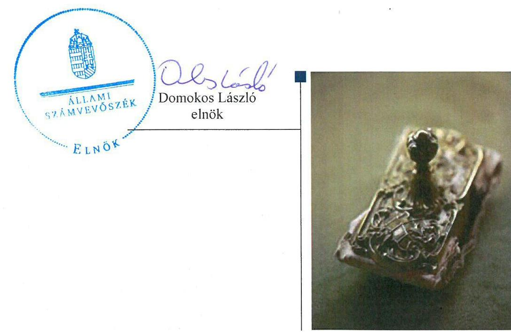
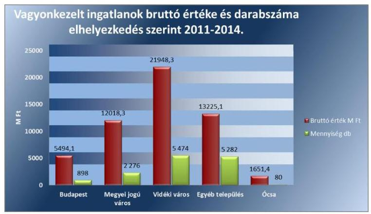
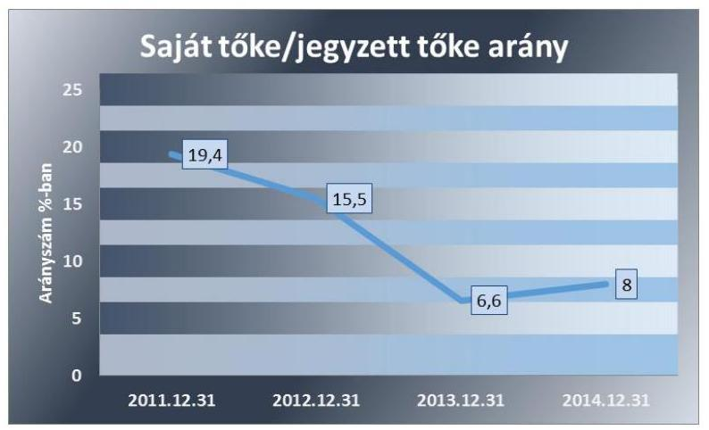
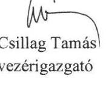
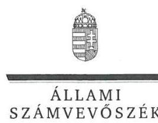
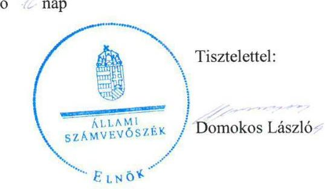
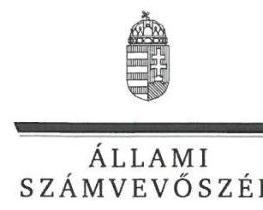
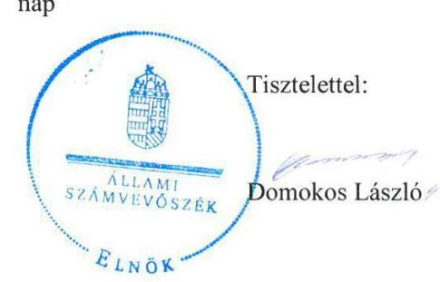

# Jelentés 

## Nemzeti Eszközkezelő Zrt.

Az állami tulajdonban (résztulajdonban) lévő gazdálkodó szervezetek vagyonmegőrzési és gazdálkodási tevékenységének ellenőrzése 2016.

16008
www.asz.hu

---

.

---

# Jelentés 

## Nemzeti Eszközkezelő Zrt.

Az állami tulajdonban (résztulajdonban) lévő gazdálkodó szervezetek vagyonmegőrzési és gazdálkodási tevékenységének ellenőrzése
2016. február 13. nap

---

# AZ ELLENŐRZÉST FELÜGYELTE: 

SALAMON ILDIKÓ felügyeleti vezető

## AZ ELLENŐRZÉST VEZETTE ÉS A VÉGREHAJTÁSÁÉRT FELELŐS:

DR. SCHREIBER JUDIT ellenőrzésvezető

## A PROGRAM ÖSSZEÁLLÍTÁSÁÉRT FELELŐS:

LAJTERNÉ HUDÁK MAGDOLNA osztályvezető

IKTATÓSZÁM: V-0851-269/2015.
TÉMASZÁM: 14.
ELLENŐRZÉS-AZONOSÍTÓ SZÁM: V070903

---

# TARTALOMJEGYZÉK 

ÖSSZEGZÉS ..... 5
AZ ELLENŐRZÉS CÉLJA ..... 7
AZ ELLENŐRZÉS TERÜLETE ..... 8
AZ ELLENŐRZÉS HÁTTERE, INDOKOLTSÁGA ..... 9
FÓKUSZKÉRDÉSEK ..... 11
ELLENŐRZÉS HATÓKÖRE ÉS MÓDSZEREI ..... 12
MEGÁLLAPÍTÁSOK ..... 14
JAVASLAT ..... 28
MELLÉKLETEK ..... 29
I. Sz. melléklet: Értelmező szótár. ..... 29
II. Sz. melléklet: Az Eszközkezelő vagyonának megoszlása 2011-2014. években (adatok M Ft-ban) ..... 33
III. Sz. melléklet: Az Eszközkezelő eredményének alakulása 2011-2014. években (adatok M Ft-ban) ..... 34
IV. Sz. melléklet: Tartozások miatti felmondások ..... 35
FÜGGELÉK: ÉSZREVÉTELEK ..... 37
RÖVIDÍTÉSEK JEGYZÉKE ..... 47

---

.

---

# ÖSSZEGZÉS 

Az Állami Számvevőszék a Nemzeti Eszközkezelő Zrt. vagyonmegőrzési és gazdálkodási tevékenységét 2011. január 1. és 2014. december 31. közötti időszakra vonatkozóan ellenőrizte. Az Eszközkezelőnél az ellátott közfeladat bevételeinek és ráfordításainak elszámolása szabályszerű volt. Az önköltségszámítás feltételeit kialakították, költségszámítást végeztek. A közfeladatok átláthatóságát, a szabályszerű vagyongazdálkodási tevékenységet biztosító szabályzatokat - a 2011-2012. évekre vonatkozó Számlarend kivételével - elkészítették. A vagyonnal való gazdálkodás, valamint a vagyonváltozást eredményező döntések szabályszerűek voltak. Az információs rendszer kiépítése keretében a 2011-2013. évek között a kötelező szabályzatokat nem készítették el. Az adatszolgáltatási és beszámolási kötelezettségeknek eleget tettek, az információs rendszert működtették. A kormányzati szektor hiányára befolyást gyakorló gazdasági esemény nem történt, nem kötöttek adósságot keletkeztető ügyletet, osztalékfizetésre nem került sor.
Az Eszközkezelő feletti tulajdonosi jogokat gyakorló MNV Zrt. tulajdonosi joggyakorlása összességében szabályszerű volt, kialakították az Eszközkezelő kezelésében lévő vagyon értékének megőrzését és gyarapítását biztosító vagyongazdálkodási feltételeket, a vagyonváltozást eredményező döntések szabályosak voltak, hozzájárultak az állami vagyon értékének megőrzéséhez, növekedéséhez.

## Az ellenőrzés társadalmi indokoltsága

Az állami tulajdonú gazdálkodó szervezetek a nemzeti vagyon részét képezik. Magyarországon az intézmény-centrikus közfeladat-ellátás, közvagyon gazdálkodás jellemző a költségvetésen kívüli feladatellátás térnyerése mellett. Ennek szereplői a nonprofit szervezetek, az önkormányzati tulajdonú gazdasági társaságok és az állami tulajdonú gazdálkodó szervezetek is. A tulajdonosi joggyakorlás és a vagyongazdálkodás feladata az állami vagyon rendeltetésének megfelelő, az állam mindenkori teherbíró képességéhez igazodó, elsődlegesen az állami feladatok ellátásához és a mindenkori társadalmi szükségletek kielégítéséhez, valamint a Kormány gazdaságpolitikája megvalósításának elősegítéséhez szükséges, egységes elveken alapuló, önálló ágazatként megjelenő - átlátható, hatékony és költségtakarékos működtetése, értékének megőrzése, állagának védelme, értéknövelő használata, hasznosítása és gyarapítása, továbbá az állam feladatának ellátása szempontjából feleslegessé váló vagyon-tárgyak elidegenítése. Az állami vagyonnal való gazdálkodást illetően a tulajdonosi joggyakorlás és a vagyongazdálkodás feladata az állami vagyon átlátható, rendeltetésszerű és felelős felhasználásának biztosítása. Az állam meghatározza az ellátandó közszolgáltatásokkal kapcsolatos feladatokat, amelyhez a vagyonnal kapcsolatos döntéseknek igazodniuk kell.

## Főbb megállapítások, következtetések, javaslatok

Az MNV Zrt. - mint a tulajdonosi jogok gyakorlója - az Eszközkezelő saját és a kezelésében lévő állami vagyonnal való gazdálkodása feltételeit kialakította, a vagyon értékének megőrzéséhez, gyarapításához, valamint a felelős gazdálkodáshoz szükséges követelményeket előírta, meghatározta a tulajdonos számára fenntartott, vagyongazdálkodásra vonatkozó jogokat. Az állami vagyon nyilvántartására vonatkozó Vagyon-nyilvántartási Szabályzat megfelelt a Vtv. és az Nvtv. előírásainak. Az állami vagyon hasznosítására kötött Vagyonkezelési Szerződések szabályszerűek voltak. A vagyonváltozást eredményező döntések megfeleltek a Vtv. és az Nvtv. előírásainak, valamint hozzájárultak a vagyon értékének megőrzéséhez, gyarapításához. Az MNV Zrt. tulajdonosi joggyakorlása összességében szabályszerű volt,

---

azonban a 2012. évben a könyvvizsgáló jelentése nélkül döntöttek a beszámoló elfogadásáról, amely nem volt összhangban az Eszközkezelő Alapító Okiratában foglaltakkal.

Az Eszközkezelő a tulajdonos előírásainak megfelelően végezte vagyongazdálkodási tevékenységét. A szabályszerű vagyongazdálkodás feltételeit kialakították, a gazdálkodáshoz előírt belső szabályzatokat - a 2011-2012. évekre vonatkozó Számlarend kivételével - elkészítették, aktualizálták. Az állami vagyon nyilvántartása szabályszerű volt, megfelelt az MNV Zrt. Vagyon-nyilvántartási Szabályzatának, a Vagyonkezelési Szerződéseknek és a Vhr. előírásának. Az ingatlanok mennyiségi felvétellel történő leltározása a Számv. tv. és a Leltárkészítési és leltározási Szabályzat előírásai ellenére 2014-ben nem történt meg. A közfeladatok bevételei és ráfordításai elkülönítésének, elszámolásának rendjét szabályozták, az elszámolás szabályszerű volt. Az önköltségszámítás feltételeit kialakították, az Eszközkezelő sajátosságainak figyelembevételével költségszámítást végeztek. A vagyongazdálkodási tevékenység szabályos volt, megfelelt a jogszabályi és a belső előírásoknak. A vagyonváltozást eredményező döntések előkészítése és megalapozottsága megfelelő volt, a döntések összességében hozzájárultak a vagyon értékének megőrzéséhez, gyarapításához. Az éves beszámolási és adatszolgáltatási kötelezettségnek az előírásoknak megfelelően, határidőben eleget tettek. A könyvvizsgáló és az FB működése szabályszerű volt. A közérdekű adatok nyilvánosságra hozatalát és az adatok védelmét biztosító szabályzatokat a 2011-2013. évekre vonatkozóan az Info. tv. és az Ltv. előírása ellenére nem készítették el. A közérdekű adatok nyilvánosságra hozatala, illetve az adatok védelmének szabályozása biztosított volt. A szabályszerű vagyongazdálkodás érdekében kialakított és működtetett belső, és az MNV Zrt.-vel fenntartott információs rendszer megfelelő volt. Adósságot keletkeztető ügyletet nem kötöttek, a kormányzati szektor hiányára befolyást gyakorló gazdasági esemény nem történt, osztalékfizetésre nem került sor.

Az ÁSZ a Nemzeti Eszközkezelő Zrt. vezérigazgatójának fogalmazott meg javaslatot az ingatlanok leltározásához kapcsolódóan, amelyre 30 napon belül intézkedési tervet kell készítenie.

---

# AZ ELLENŐRZÉS CÉLJA 

## A Nemzeti Eszközkezelő Zrt. vagyonmegőrzési és gazdálkodási tevékenysége szabályszerűségének ellenőrzése

Jelen ellenőrzés célja annak értékelése volt, hogy a tulajdonosi jogok gyakorlása szabályszerű volt-e, az Eszközkezelő által ellátott feladat bevételei, ráfordításai elszámolásának, és vagyongazdálkodási tevékenységének szabályozása megfelelt-e a jogszabályi és a tulajdonosi előírásoknak, azok végrehajtása szabályszerű volt-e. Biztosítva volt-e a közfeladatok átláthatósága és elszámoltathatósága érdekében a közszolgáltatás dijának megalapozottsága szabályszerű önköltségszámítással. Az ellenőrzés kiterjedt továbbá arra, hogy a vagyonváltozást eredményező döntések esetében a tulajdonosi jogok gyakorlója és az Eszközkezelő szabályszerűen járt-e el, továbbá, hogy az Eszközkezelő kiépített-e és működtetett-e információs rendszert a szabályszerű vagyongazdálkodás érdekében. Az Eszközkezelőnek, mint kormányzati szektorba sorolt egyéb szervezet gazdálkodásának a kormányzati szektor hiányára és az államadósságra befolyással bíró elemei a jogszabályi előírásoknak megfeleltek-e.

---

# **AZ ELLENŐRZÉS TERÜLETE**

## **Nemzeti Eszközkezelő Zrt.**

A Nemzeti Eszközkezelő Zrt.-t 2011. augusztus 30-án az MNV Zrt. a Magyar Állam nevében, mint alapító és egyedüli részvényes hozta létre. Az Eszközkezelő felett az alapítói jogokat az állami vagyon felügyeletéért felelős miniszter a MNV Zrt. útján gyakorolta.

Az Eszközkezelő fő tevékenysége, hogy a hitelező pénzintézetektől az állam nevében és javára megvásárolja azon rászoruló személyek felajánlott lakóingatlanát, akiknek lakóingatlana jelzáloghitel-szerződésből fakadó tartozás miatt kényszerértékesítésre kerülne. Az Eszközkezelő, mint vagyonkezelő az általa megvásárolt lakóingatlanok tekintetében gondoskodik azok kezeléséről, valamint hasznosításukról bérleti jogviszony létesítésével. A 2013. évtől az Eszközkezelő vagyonkezelésébe került az Ócsán megvalósult Szociális Családház-építési Program alapján felépült 80 db lakóingatlan 1651,4 M Ft értékben, amely ingatlanok tekintetében hasznosítási és üzemeltetési feladatokat látnak el.

Az Eszközkezelőhöz összesen 24 263 db ingatlan-felajánlás érkezett, amelyből a 13 930 db ingatlant vásárolták meg 2014. év végéig 52 686,9 M Ft értékben, és amely ingatlanok hasznosítására a hiteladósokkal határozatlan idejű bérleti szerződést kötöttek. Az ócsai ingatlanok közül mind a 80 db hasznosításra került, amelyből 79 db ingatlan esetében magánszemély lett a bérlő. Az Eszközkezelő 2014. évben 13 db tartalékingatlant vett át vagyonkezelésbe 52,7 M Ft értékben, amelynek célja a Kormány szociálpolitikai céljainak megvalósítása. A 13 tartalékingatlan tekintetében 2014. év végéig nem került sor bérbeadásra.

Az Eszközkezelő 2014. december 31-ei mérlegfőösszege 64 297,8 M Ft volt és 127 főt foglalkoztatott.

---

# AZ ELLENŐRZÉS HÁTTERE, INDOKOLTSÁGA 

## Az Otthonvédelmi Akcióterv programjának végrehajtására megalakult a Nemzeti Eszközkezelő Zrt.

A Kormány 2011-ben döntött az Otthonvédelmi Akcióterv indításáról, és annak végrehajtására létrehozta a Nemzeti Eszközkezelő Zrt.-t. A programmal a jelzáloghitel-törlesztés miatt súlyosan eladósodott családok lakhatását kívánták hosszú távon biztosítani. Ennek keretében az Eszközkezelő Zrt. a hiteladósok ingatlanát az állam javára megvásárolta és egyben biztosította a bérlés lehetőségét. 2014. év végéig maximum 25000 db megvásárlásra felkínált szándéknyilatkozat befogadása volt előirányozva. Az ÁSZ középtávra szóló stratégiájában megfogalmazta, hogy az államháztartáson kívülre nyújtott költségvetési támogatások és ingyenes vagyonjuttatások, valamint az államháztartáson kívül működő közfeladat-ellátó rendszerek ellenőrzéseivel hozzájárul ahhoz, hogy a közpénzeket az államháztartáson kívül működő szervezetek is átlátható, rendezett módon használják fel a közfeladatok szerződésben vállalt ellátása, továbbá a közvagyon szerződésben vállalt átlátható, hatékony, költségtakarékos működtetése, értékének megőrzése, állagának védelme, értéknövelő használata, hasznosítása és gyarapítása érdekében. A téma kiemelt közérdeklődésére tekintettel, az ÁSZ stratégiájában meghatározott célokkal összhangban, az ellenőrzésünkkel a hatékony és átlátható, szabályszerű vagyongazdálkodást értékeltük.

Az Áht. 2. § I) pontja, az Európai Közösséget létrehozó szerződéshez csatolt, a túlzott hiány esetén követendő eljárásról szóló jegyzőkönyv alkalmazásáról szóló 2009. május 25-i 479/2009/EK rendelet szerint, illetve a nemzeti számlák nemzetközi statisztikai módszertana alapján a kormányzati szektorba tartoznak a "központi kormányzat alszektorba besorolt társaságok és egyéb szervezetek" is, amelyekkel szemben alapvető követelmény, hogy gazdálkodásuk, működésük szabályszerű, az általuk szolgáltatott adatok megbízhatóak legyenek. A nemzeti számlák nemzetközi és hazai statisztikai módszertana és szabványai elveket határoznak meg a statisztikai értelemben vett kormányzati szektorba tartozó szervezetek körére és besorolásuk módjára. A nemzetgazdasági miniszter közzététele alapján az Eszközkezelő is a kormányzati szektorba tartozó egyéb szervezetnek minősül.

Az Eszközkezelő, mint a kormányzati szektorba sorolt egyéb szervezet többek között köteles adatszolgáltatást teljesíteni a központi költségvetésről szóló törvény elkészítéséhez, továbbá adósságot keletkeztető ügyletet csak az államháztartásért felelős miniszter előzetes egyetértésével köthet. Az Eszközkezelő kormányzati szektoron kívüli féllel kötött adósságot keletkeztető ügylete, gazdálkodásának eredménye befolyásolja a kormányzati szektor konszolidált adósságmutatóját, illetve a kormányzati hiányt. Az ellenőrzés keretében értékeltük továbbá az Eszközkezelő adósságot keletkeztető ügyleteit is.

---

A törvényalkotás számára - az észlelt problémák, szabálytalanságok, vagy egyéb nem kívánatos jelenségek felszínre kerülésével - az ellenőrzés megállapításai segítséget nyújthatnak az államháztartáson kívüli közfeladat-ellátás, közvagyonnal való gazdálkodás értékeléséhez, jogszabályi keretei pontosításához, átláthatóságot, költségtakarékos működtetést, értékének megőrzését, állagának védelmét, értéknövelő használatát, hasznosítását és gyarapítását biztosító szabályozásához. Meghatározhatóvá válnak a költségvetési hiányt befolyásoló szervezetek kockázatai, lehetővé válik ezen kockázatok csökkentése. Az ellenőrzés rámutathat az állami tulajdonú közszolgáltatást végző gazdálkodó szervezetek gazdálkodási tevékenységével, valamint az államháztartásból származó források felhasználásával kapcsolatos jó gyakorlatokra és szabálytalanságokra. Felhívhatja a figyelmet a jogszabályi követelmények teljesítéséhez szükséges feltételek hiányosságaira, hozzájárulhat az államháztartáson kívüli, de (közvetlenül vagy közvetve) állami vagyont használó gazdálkodó szervezetek tevékenységének átláthatóságához. Feltárjuk, hogy a kormányzati szektorba sorolt egyéb szervezetek milyen mértékben befolyásolják a költségvetési hiányt és az államadósságot. Az ÁSZ értékteremtő rend kialakításához és megőrzéséhez hozzájáruló tevékenysége pozitív hatással van a szervezetről kialakított összkép formálására is.

---

# FÓKUSZKÉRDÉSEK 

1.- A tulajdonosi joggyakorló az Eszközkezelő tulajdonában,
 illetve kezelésében lévő vagyonnal való gazdálkodás feltételeit szabályszerűen alakította-e ki?
2.- Az Eszközkezelő vagyongazdálkodási tevékenységének szabályozása, kialakítása, a vagyon nyilvántartása megfelelt-e az előírásoknak?
3.- Az Eszközkezelő által ellátott közfeladatok bevételeinek és ráfordításainak elszámolása és szabályozása, valamint az önköltségszámítás szabályszerű volt-e?
4.- A vagyonnal való gazdálkodás, valamint a vagyonváltozást eredményező döntések megfeleltek-e a jogszabályi és a belső előírásoknak?
5.- Az Eszközkezelő a szabályszerű vagyongazdálkodás érdekében az adatszolgáltatási és beszámolási kötelezettséget teljesítette-e, kiépített-e és működtetett-e információs rendszert?
6.- A kormányzati szektorba sorolt egyéb szervezetek gazdálkodásának a kormányzati szektor hiányára és az államadósságra befolyással bíró elemei a jogszabályi előírásoknak megfeleltek-e?

---

# ELLENŐRZÉS HATÓKÖRE ÉS MÓDSZEREI 

## Az ellenőrzés típusa

Szabályszerűségi ellenőrzés

## Az ellenőrzött időszak

2011. január 1 - 2014. december 31. közötti időszak

## Az ellenőrzés tárgya

Az állami tulajdonban (résztulajdonban) lévő gazdálkodó szervezetek vagyonmegőrzési és gazdálkodási tevékenységének, valamint a kormányzati szektor hiányára és adósságállományára hatást gyakorló elemek ellenőrzése

## Az ellenőrzött szervezet

Nemzeti Eszközkezelő Zrt., Magyar Nemzeti Vagyonkezelő Zrt.

## Az ellenőrzés jogalapja

Az ellenőrzés alapját az Állami Számvevőszékről szóló 2011. évi LXVI. törvény 5. § (3)-(5) bekezdése, valamint az állami vagyonról szóló 2007. évi CVI. törvény 3. § (4) bekezdése képezte.

## Az ellenőrzés módszerei

Az ellenőrzés az INTOSAI által kiadott nemzetközi standardok figyelembevételével, az ÁSZ ellenőrzés szakmai szabályait tartalmazó belső szabályzatokban foglaltak, valamint az ellenőrzési programokban foglalt értékelési szempontok szerint történt. A bevételek és ráfordítások elszámolása, valamint a vagyonnyilvántartás terén a szabályszerű működést mintavétellel ellenőriztük. A kormányzati szektorba sorolt gazdálkodó szervezetek esetében a személyi jellegű ráfordítások elszámolása mellett az egyéb ráfordítások, pénzügyi műveletek ráfordításai, rendkívüli ráfordítások, illetve az egyéb bevételek, pénzügyi műveletek bevételei, rendkívüli bevételek elszámolásának szabályszerűségét szintén mintatételeken keresztül ellenőriztük. A véletlen mintavétellel (évenkénti elemszámmal arányos rétegezéssel) ellenőrzött területek esetében minden egyes tétel vonatkozásában

---

a szabályszerűségre vonatkozó kérdéseket tettünk fel, amelyek eredménye összesítésre került. A jogszabályoknak és a belső előírásoknak megfelelőnek tekintettük az adott területet, amennyiben a minta ellenőrzésének eredménye alapján 95%-os bizonyossággal a teljes sokaságban a hibaarány kisebb volt, mint 10%, nem megfelelőnek értékeltük, ha a hibaarány a 10%-ot meghaladta. A személyi jellegű ráfordítások esetében az ellenőrzött mintatételeket értékeltük. A ráfordítások elszámolására és a vagyon-nyilvántartásra vonatkozó véletlen mintavételt kockázati alapú kiválasztással egészítettük ki, amelynek során évente a három legnagyobb összegű tételt választottuk ki.

---

# 1. A tulajdonosi joggyakorló az Eszközkezelő tulajdonában, illetve kezelésében lévő vagyonnal való gazdálkodás feltételeit szabályszerűen alakította-e ki? 

Összegző megállapítás

Az MNV Zrt. ${ }^{1}$ - mint a tulajdonosi jogok gyakorlója - szabályszerűen alakította ki az Eszközkezelő ${ }^{2}$ kezelésében lévő vagyonnal való gazdálkodás feltételeit. A 2012. évben az MNV Zrt. a könyvvizsgálói jelentés ismerete nélkül döntött az Eszközkezelő éves beszámolójának elfogadásáról.
1.1. számú megállapítás

Az MNV Zrt. az Eszközkezelő saját vagyona és a kezelésében lévő állami vagyon értékének megőrzéséhez, gyarapításához, valamint a felelős gazdálkodáshoz szükséges követelményeket kialakította, meghatározta a tulajdonos számára fenntartott, vagyongazdálkodásra vonatkozó jogokat. Az MNV Zrt. tulajdonosi joggyakorlása körében azonban a 2012. évben a könyvvizsgálói jelentés ismerete nélkül döntött az Eszközkezelő éves beszámolójának elfogadásáról, amely nem volt összhangban az Eszközkezelő Alapító Okiratában foglaltakkal.

Az MNV Zrt. 2014. március 15-ig a Gt. ${ }^{3}$ szerinti Alapító Okiratban ${ }^{4}$, ezt követően a Ptk. ${ }^{5}$ szerinti Alapszabályban, a Gt. 231. §-a, valamint a Ptk. 3:109. § előírásainak megfelelően részletesen szabályozta az alapító kizárólagos hatáskörébe tartozó jogokat. A vagyongazdálkodásra közvetlenül vagy közvetve hatást gyakorló jogok közül a tulajdonos számára fenntartotta az FB${ }^{6}$ és a könyvvizsgáló ${ }^{7}$ megválasztásának, a Számv. tv. ${ }^{8}$ szerinti beszámoló jóváhagyásának, a pénzügyi befektetés, részesedés, vagyoni értékű jog megvásárlásának jogát. Az MNV Zrt. fenntartotta továbbá az ingatlanok elidegenítésére, hasznosítására, megterhelésére, és a kölcsön, hitel felvételének engedélyezésére vonatkozó jogát, ha annak értéke meghaladta a 100 M Ft-ot. Az MNV Zrt. hatáskörében maradt továbbá a Befektetési Szabályzat, a Stratégiai Terv és az éves üzleti tervek jóváhagyásának, az FB ügyrendje meghatározásának, osztalékelőleg kifizetésének, illetve részesedés szerzésének joga.

Az Eszközkezelő az MNV Zrt.-vel az állami vagyon hasznosítására három Vagyonkezelési Szerződést ${ }^{9}$ kötött. Vagyonkezelési Szerződés ${ }_{1}$-t a hitelszerződésekből eredő kötelezettségeinek eleget tenni nem tudó rászorult természetes személyek lakhatási problémáinak megoldása érdekében megvásárolt ingatlanok vagyonkezelésére, a Vagyonkezelési Szerződés ${ }_{2}$-t a Szociális Családiház-építési Program keretében a hitelszerződésekből eredő kötelezettségeinek eleget tenni nem tudó rászorult természetes sze-

---

mélyek lakhatásának biztosítására Ócsán megépülő 80 db lakóingatlan vagyonkezelésére, a Vagyonkezelési Szerződés ${ }_{1}$-t a Net. tv. ${ }^{10}$ 1. § n) pontja szerinti tartalék ingatlanok vagyonkezelésére kötötték.

1. táblázat

# A VAGYONKEZELT INGATLANOK VÁSÁRLÁSKORI ÉRTÉKE ÉS TERÜLETI ELHELYEZKEDÉSE 

| Elhelyezkedés | 2012-2013. |  | 2014. |  | Összesen |  |
| :--: | :--: | :--: | :--: | :--: | :--: | :--: |
|  | érték   ezer Ft | Mennyiség db | érték   ezer Ft | Mennyiség db | érték   ezer Ft | Mennyiség db |
| Budapest | 1464,7 | 252 | 4029,4 | 646 | 5494,1 | 898 |
| Megyei jogú város | 3849,5 | 778 | 8168,8 | 1498 | 12018,3 | 2276 |
| Vidéki város | 6730,6 | 1866 | 15217,8 | 3608 | 21948,4 | 5474 |
| Egyéb település | 4411,8 | 1918 | 8813,3 | 3364 | 13225,1 | 5282 |
| Összesen | 16456,6 | 4814 | 36229,3 | 9116 | 52685,9 | 13930 |
| Ócsa | 943,7 | 44 | 707,7 | 36 | 1651,4 | 80 |
| Tartalék ingatlan | 0 | 0 | 52,7 | 13 | 52,7 | 13 |
| Összesen | 17400,3 | 4858 | 36989,7 | 9165 | 54390,0 | 14023 |

Forrás: Eszközkezelő 2011-2014. évi beszámolói

Az MNV Zrt. a Vagyonkezelési Szerződés ${ }_{1-3}$-ben a Vtv. ${ }^{11}$ 23. § (2)-(3) bekezdései, valamint a Vhr. ${ }^{12}$ 9. § (3)-(5) és (9) bekezdés előírásaival összhangban rögzítette a vagyongazdálkodásra vonatkozó jogokat, a vagyon értékének megőrzéséhez, gyarapításához és a gazdálkodáshoz szükséges követelményeket, valamint az Alapító Okiratnak megfelelően meghatározta a tulajdonos számára fenntartott jogokat. Rögzítették továbbá, hogy a vagyonkezelt vagyon nyilvántartása során az MNV Zrt. Vagyon-nyilvántartási Szabályzatában ${ }^{13}$ foglaltak szerint kell eljárni a rendelkezésre biztosított nyilvántartó szoftver alkalmazásával.

Az Eszközkezelő a Net. tv. 3. § (1) bekezdés a) pontja alapján, az állam nevében és javára szerzett tulajdonjogot. A tulajdonszerzés szabályait az MNV Zrt. a Vagyonkezelési Szerződés ${ }_{1-3}$-ben a Net. tv.-vel összhangban rögzítette. A Vagyonkezelési Szerződés ${ }_{1-3}$-ek szerint - a Net. tv. 7. § (1) bekezdése előírásának megfelelően - az Eszközkezelőt vagyonkezelési díjfizetési kötelezettség nem terhelte.

Az MNV Zrt., eleget téve a Vtv. 2. § (1) bekezdésében és a Vtv. 30. § (1) bekezdésében foglaltaknak, a 247/2011. (VIII. 29.) sz. Alapítói Határozatában előírt az Eszközkezelő részére üzleti terv, valamint az Alapítói Okiratban megfogalmazott elvárásokkal összhangban lévő éves vagyongazdálkodási stratégia, Befektetési Szabályzat és Javadalmazási Szabályzat készítési kötelezettséget.

Az MNV Zrt. - a 2012. évi beszámoló elfogadását kivéve - minden évben a könyvvizsgáló írásos jelentésének ismeretében határozott az éves

---

beszámoló elfogadásáról. A 2012. évi éves beszámoló elfogadásához kapcsolódó MNV Zrt. Alapítói Határozat korábbi dátumú (2013.05.22), mint a könyvvizsgálói jelentés dátuma (2013.05.28.), így nem teljesült az Alapító Okirat 10.5. pontjában foglalt előírás, hogy az MNV Zrt. csak a könyvvizsgáló írásos jelentésének ismeretében határozhat az éves beszámoló elfogadásáról.

Az MNV Zrt. a Vhr. 20. § által meghatározott tulajdonosi ellenőrzési feladatait a Vagyonkezelési Szerződés1-3-ben írta elő.

# 1.2. számú megállapítás 

Az MNV Zrt. és az Eszközkezelő által az állami vagyon hasznosítására kötött Vagyonkezelési Szerződés ${ }_{1-3}$ szabályszerű volt.

Az MNV Zrt. és az Eszközkezelő által, az állami vagyon kezelésére megkötött Vagyonkezelési Szerződés ${ }_{1-3}$ megfelelt a Vtv. 2. § (1) bekezdése és a Vtv. 23. §, a 27. §, a Vhr. 3. §, 20. § és az Nvtv. ${ }^{14}$ 7. § (2) bekezdése előírásainak.

A Vagyonkezelési Szerződés ${ }_{1-3}$ 2. pontjában az MNV Zrt. meghatározta az ellátandó feladatokat. A Vagyonkezelési Szerződés ${ }_{1}$ a Net. tv. 3. § (1) bekezdés a) és d) pontjával összhangban rendelkezett az ingatlanok megvásárlásáról és azok vagyonkezelésbe vételéről. A Vagyonkezelési Szerződés $_{2-3}$ esetében a szerződések mellékletében tételesen meghatározásra került az átadott Ócsai Lakópark és a tartalék ingatlanok köre.

A Vagyonkezelési Szerződés ${ }_{1-3}$ 7. pontjában rögzítették az állami vagyon hatékony működtetésének, állaga védelmének, értéke megőrzésének, illetve gyarapításának szabályait. A tulajdonosi joggyakorlás és vagyongazdálkodási feladatok szabályozott és átlátható módon történő végrehajtásának érdekében a Vhr. 20. § előírásának és az MNV Zrt. ellenőrzési szabályzatának megfelelően szabályozták a vagyon használatának ellenőrzését.

### 1.3. számú megállapítás

Az MNV Zrt. Vagyon-nyilvántartási Szabályzata megfelelt a Vtv. és az Nvtv. előírásainak.

Az MNV Zrt. Vagyon-nyilvántartási Szabályzata megfelelt a Vtv. 17. § (1) bekezdés b) pontja, valamint a Vhr. 14. § (1) és (3) bekezdései és a Nvtv. 10. § (1) bekezdés rendelkezéseinek.

A szabályzat meghatározta a vagyonkezelt eszközökre vonatkozó adatszolgáltatás és nyilvántartás részletes tartalmát, formáját, a teljesítés érdekében vagyon-nyilvántartási szoftvert bocsátott rendelkezésre és az informatikai alkalmazáshoz hozzáférést biztosított az Eszközkezelő részére.

Az Eszközkezelő saját vagyon-nyilvántartási szabályzat készítésére nem volt kötelezett, mert az MNV Zrt. Vagyon-nyilvántartási Szabályzata vonatkozott rá, amelynek megismerését és kötelező érvényű elfogadását a Vagyonkezelési Szerződés ${ }_{1-3}$-ben rögzítették.

---

# 2. Az Eszközkezelő vagyongazdálkodási tevékenységének szabályozása, kialakítása, a vagyon nyilvántartása megfelelt-e az előírásoknak? 

Összegző megállapítás

Az Eszközkezelő az állami vagyon értékének megőrzését és gyarapítását biztosító vagyongazdálkodási feltételeit - a 2011-2012. évekre vonatkozó számlarend elkészítésének kivételével - kialakította, a gazdálkodási tevékenységét szabályozta. Az állami vagyon nyilvántartása megfelelő volt, azonban az ingatlanok mennyiségi felvétellel történő leltározását a Számv. tv. és a Leltárkészítési és Leltározási Szabályzat előírásától eltérően a 2014. évben nem végezték el.
2.1. számú megállapítás

Az Eszközkezelő a szabályszerű vagyongazdálkodás feltételeit - a 2011-2012. évekre vonatkozó számlarend elkészítésének kivételével - kialakította, a gazdálkodási tevékenységét szabályozta, a szabályzatokat aktualizálta.

Az Eszközkezelő az MNV Zrt. által előírt, a szabályszerű vagyongazdálkodás feltételeinek megteremtése érdekében elkészítette a Stratégiai Tervet és az éves üzleti terveket. Az éves üzleti tervek tartalmazták az Eszközkezelő alaptevékenységének a tervét, erőforrásigényét, finanszírozását. Az éves üzleti tervekben bemutatták a várható előrejelzéseket, a fő feladatokat, a fejlesztéseket, a működési költségek terveit. Az éves üzleti terveket az Alapítói Okirat 9.5. pontjának megfelelően az FB által elkészített írásos beszámolóval együtt az Alapító elé terjesztették elfogadásra. Az Eszközkezelő rendelkezett az Alapítói Okiratban megfogalmazott elvárásokkal összhangban lévő éves vagyongazdálkodási tervvel, valamint az Alapítói Okirat 7.2. pontjában
 előírt Befektetési Szabályzattal és Javadalmazási Szabályzattal, amelyeket az MNV Zrt. Alapítói Határozattal jóváhagyott.

Az Eszközkezelő a vagyonnal történő gazdálkodás kereteit, a hatásköröket, az azokhoz tartozó értékhatárokat és az eljárási szabályokat a belső szabályzataiban meghatározta.

Az Eszközkezelő rendelkezett a Számv. tv. 14. § (3) bekezdés előírásának megfelelően Számviteli Politikával, amely megfelelt a Számv. tv. 14. § (3)-(4) bekezdéseiben foglalt előírásoknak. Az Eszközkezelő a Vhr. 17. § (1) bekezdésében foglaltaknak megfelelően, a Számviteli Politikában és annak mellékletét képező szabályzatokban előírta a kezelésbe vett vagyon elkülönített nyilvántartását, a közfeladat bevételei és ráfordításai elszámolásának elkülönítési módját.

Az Eszközkezelő a Számv. tv. 161. § előírása ellenére a 2011. és 2012. évekre vonatkozóan nem rendelkezett Számlarenddel. A 2013-2014. évekre hatályos Számlarend megfelelt a Számv. tv. 161. §-ában és a 161/A. $\S$-ában foglaltaknak.

Az Eszközkezelő a Számv. tv. 14. § (5) bekezdés a) pontjában előírt Leltárkészítési és leltározási Szabályzatát ${ }^{15}$ elkészítette, amely megfelelt a Számv. tv. 46. § (3) bekezdésében, valamint a 69. § (1)-(5) bekezdéseiben foglalt előírásoknak. Rendelkeztek továbbá a Számv. tv. 14. § (5) bekezdés

---

b) pontjában előírt Eszközök és források értékelési Szabályzatával, amely a Számv. tv. 52-54. § vonatkozó előírásaiban foglaltakkal összhangban tartalmazta az eszközök és források értékelésére, értékhelyesbítésére, az értékvesztés elszámolására vonatkozó szabályozást.

Az Eszközkezelő a Számv. tv. 14. § (5) bekezdés d) pontjában foglalt előírásnak eleget téve elkészítette a Pénzkezelési Szabályzatot, amely megfelelt a Számv. tv. 14. § (8) bekezdésében foglaltaknak.

Az SZMSZ ${ }^{16}$ az Alapító Okiratban foglaltakkal összhangban tartalmazta a vagyongazdálkodással kapcsolatos feladat- és hatásköröket, felelősségi viszonyokat. Ennek keretében az SZMSZ többek között rögzítette az MNV Zrt., mint alapító kizárólagos hatáskörébe tartozó döntések körét, a vezérigazgató feladatait, döntési hatáskörét, továbbá az FB és a könyvvizsgáló feladatait.

# 2.2. számú megállapítás 

Az Eszközkezelő vagyonnyilvántartása szabályszerű volt, megfelelt az MNV Zrt. Vagyonnyilvántartási Szabályzatának és a Vhr. előírásának. Az ingatlanok mennyiségi felvétellel történő leltározása 2014-ben nem történt meg.

Az Eszközkezelő, mint a Vhr. 1. § (7) bekezdés b) pont szerinti vagyonkezelő a Net. tv. 3. § (1) bekezdés c) pontja alapján gyakorolta a vagyonkezelői jogokat az állami vagyon felett. Az Eszközkezelő a saját és a kezelésében lévő vagyon elkülönített nyilvántartását biztosította. A vagyonkezelt állami vagyon nyilvántartásáról és az MNV Zrt. felé történő adatszolgáltatásról a Vagyonkezelési Szerződés ${ }_{1-3} 7$. pontja rendelkezett. A vagyonkezelt vagyont a Vhr. 9. § (9) bekezdés a) pontjának és a Vagyonkezelési Szerződés ${ }_{1-3}$-nek megfelelően a hosszúlejáratú kötelezettséggel szemben vették állományba. Az adatszolgáltatás teljesítése megfelelt a Vhr. 14. § (1) bekezdésében és a Vagyonkezelési Szerződés ${ }_{1-3}$-ben foglaltaknak. Az MNV Zrt. és az Eszközkezelő vagyonnyilvántartásának egyezősége biztosított volt. A Vagyonkezelési Szerződés ${ }_{1}$ alapján kezelt vagyonról az MNV Zrt. nyilvántartása az Eszközkezelő adatszolgáltatásán alapult. A Vagyonkezelési Szerződés ${ }_{2-3}$ alapján kezelt vagyon egyeztetése minden év végén megtörtént.

Az Eszközkezelő a Számv. tv. 69. § (1)-(2) bekezdésében foglaltaknak megfelelően a mérlegtételek alátámasztásához olyan leltárt állított össze, amely alapján tételesen ellenőrizhetőek voltak a mérleg fordulónapján meglévő eszközök és források mennyiségben és értékben. Az Eszközkezelő a Számv. tv. 69. § (3) bekezdésében és a Leltárkészítési és leltározási Szabályzat 3.1.1.2. pontjában foglalt előírások ellenére 2014-ben a vagyonkezelésbe vett ingatlanok műszaki bejárással történő mennyiségi leltározását nem végezte el, a leltározás csak értékben történt.

---

# 3. Az Eszközkezelő által ellátott közfeladatok bevételeinek és ráfordításainak elszámolása és szabályozása, valamint az önköltségszámítás szabályszerű volt-e? 

Összegző megállapítás

A közfeladatok bevételeinek és ráfordításainak szabályozása és elszámolása megfelelő volt, az önköltségszámítás feltételeit kialakították, az Eszközkezelő sajátosságainak figyelembevételével költségszámítást végeztek.
3.1. számú megállapítás

Az Eszközkezelő a közfeladatok bevételei és ráfordításai elkülönítésének, elszámolásának rendjét szabályozta, az elszámolás a Net. tv.-nek és a Számv. tv.-nek megfelelt.

Az Eszközkezelő közfeladatainak bevételei és ráfordításai a Net. tv. alapján a Magyar Állam nevében megvásárolt és bérbe adott ingatlanok vagyonkezeléséhez és hasznosításához kapcsolódtak. A vagyonkezelés során az Eszközkezelő a hiteladósok lakásait megvásárolta, majd az ingatlanra vonatkozóan határozatlan idejű bérleti szerződést kötöttek a hiteladósokkal. Az Öcsai Lakópark 80 lakását bérbeadás útján hasznosította.

1. ábra

Forrás: Eszközkezelő 2011-2014. évi beszámolói

Az Eszközkezelő a bevételei és ráfordításai elkülönítését és elszámolását a Számviteli Politikában ${ }^{17}$, az Értékelési szabályzatban ${ }^{18}$, továbbá 2013. évtől hatályos Számlarendben ${ }^{19}$ szabályozta a Vagyonkezelési Szerződés ${ }_{1-3}$ 7. és 12. pontjainak megfelelően. A bevételek és a ráfordítások elszámolása az előírásoknak megfelelően történt, az ingatlanonkénti elkülönítésük szabályos volt, megfelelt a Vagyonkezelési Szerződés ${ }_{1-3}$-nek és a belső szabályzatoknak.

A bevételek könyvviteli nyilvántartása és elszámolása megfelelt a Számv. tv. és a Vagyonkezelési Szerződés ${ }_{1-3}$ előírásának. A kiszámlázott bevételek a Net. tv. 25. § b) pontja alapján a Net. rend. ${ }^{20}$ 5. § (1)-(2) bekezdései szerinti árakat tartalmaztak.

Az elszámolt egyéb bevételek elszámolása szabályszerű volt, megfelelt a Számv. tv. előírásainak.

A költségek megfelelő költségnemekre történő elszámolása a belső előírásoknak megfelelt, az alátámasztó dokumentumok rendelkezésre álltak.

---

Az egyéb ráfordítások elszámolása szabályszerű volt, megfelelt a Számv. tv. előírásainak.

A személyi jellegű ráfordításokat a Számv. tv. 79. §-ban foglalt előírásokat betartva számolták el. A személyi juttatások dokumentumokkal megfelelő módon alátámasztottak. A bruttó bér számfejtése megfelelt a munkaszerződésben foglaltaknak. A személyi jellegű kifizetések adó és járulék terheit az Eszközkezelő szabályszerűen állapította meg.

Az Eszközkezelőt a Net. tv. 7. § (1) bekezdése alapján a vagyonkezelésében lévő állami tulajdonú ingatlanok után visszapótlási kötelezettség nem terhelte.

Az Eszközkezelő 2014. december 31-én 52 354,4 M Ft tárgyi eszközt mutatott ki, amelynek 99,9\%-a vagyonkezelt eszköz volt.

A feladat ellátásához szükséges eszközök állományba vételi, nyilvántartási és elszámolási kötelezettségének teljesítése során a felújítási, beruházási kiadások elszámolása megfelelt a Számv. tv. 47. § (1)-(4) bekezdéseinek és az 51. § (1) bekezdésének, a Számviteli politika 6.1. pontjának, valamint a 2013. évtől hatályos Számlarend 2.3. pontjának. A bekerülési érték meghatározása szabályos volt, az eszközök megtalálhatóak voltak a leltárakban.

Az értékcsökkenés elszámolása a Net. tv. 7. § (1) bekezdése, a Számv. tv. 52. § (1)-(2) bekezdései és a 80. § (1)-(2) bekezdés előírásának, valamint a Számviteli Politika 6.2.1. pontja, Értékelési Szabályzat 8.1. pontja előírásának megfelelően történt, a terven felüli értékcsökkenés elszámolása megfelelt a Számv. tv. 53. § (1) bekezdés a) pontja előírásának.

Az Eszközkezelő a követelésekre értékvesztést nem számolt el, mert azok nem érték el a Számviteli Politikában és az Értékelési Szabályzatban meghatározott jelentős értékhatárt.

Az Eszközkezelő a Net. rend. 8-10. §-ban foglaltakkal összhangban szabályozta a lejárt követelések behajtását, továbbá vezette a befolyt és hátralékos bérleti díjak, közös költségek folyamatos, naprakész nyilvántartását.

A Net. rend. 8. § (2) és a 9. § (3) bekezdése díjhátralék esetére előírta a szerződések felmondásának kötelezettségét. A 2013-2014. évek között az Eszközkezelő a közel 14 ezer ingatlanhoz kapcsolódóan összesen 866 felmondást küldött ki, amelyből 707 bérleti díjtartozás és 159 közös költség tartozás miatt kezdeményezett.

Az Eszközkezelő a Net. rend. 8. § (1)-(2) bekezdései és a 9. § (1)-(3) bekezdéseiben foglalt, a késedelmes fizetés esetére vonatkozó előírásoknak megfelelően fizetési felszólítások kiküldésével intézkedett a követelés állománycsökkentésére, azonban 2013. évben 48 esetben nem tett eleget a Net. rend. 8. § (2) bekezdés szerinti felmondási kötelezettségének és nem mondta fel a bérleti szerződéseket.

A Net. rend. 10/A. §-a a felmondásra került határozatlan idejű bérleti szerződések esetében 2013 októberétől egy éves határozott idejű szerződés megkötésének lehetőségét biztosította az Eszközkezelő és a díjhátralékos bérlők között, amely alapján a felmondást követően 391 bérlővel kötöttek határozott idejű bérleti szerződést.

A követelésállomány 2014. évben növekedett, amelynek oka a bérbe adott ingatlanok számának növekedése volt. Az adott évben kiszámlázott

---

díjakhoz viszonyított tartozások, 2012-ről 2013-ra 7,4 százalékpontos növekedést, 2013-ról 2014-re 3,3 százalékpontos csökkenést mutattak. 2014. év végén a vevőkövetelés 199,4 M Ft volt, amely a kiszámlázott bérleti díj 18,4\%-ának felelt meg.

# 3.2. számú megállapítás 

Az Eszközkezelő az önköltségszámítás feltételeit kialakította, a sajátosságainak figyelembevételével költségszámítást végzett.

A 2013. évben az Eszközkezelő költségnemek szerinti költségeinek együttes összege meghaladta az 500 M Ft-ot, ezért 2014. évtől kezdődően a Számv. tv. 14. § (7) bekezdése alapján Önköltségszámítás rendjére vonatkozó szabályzatkészítési kötelezettsége keletkezett. Az Eszközkezelő specifikus működésére figyelemmel 2014. évtől az önköltségszámítás rendjét és szabályait a Költséghelyezési Koncepció tartalmazta a Net. tv. 9-10. §-aiban, a Net. rend. 5. §-ában foglaltakkal, valamint a Vagyonkezelői szerződésekkel összhangban. Az Eszközkezelő a feladatai sajátosságait figyelembe véve költségszámítást végzett az ingatlanokra eső költségek szétosztása tekintetében.

## 4. A vagyonnal való gazdálkodás, valamint a vagyonváltozást eredményező döntések megfeleltek-e a jogszabályi és a belső előírásoknak?

Összegző megállapítás

## 4.1. számú megállapítás

2. táblázat

| BÉRLETI DÍJAK (Adatok M Ft-ban) |  |  |
| :--: | :--: | :--: |
|  | Kiszámlázott bérleti díjak | Kifizetett bérleti díjak |
| 2011. év | 0 | 0 |
| 2012. év | 6,3 | 2,6 |
| 2013. év | 243,0 | 191,0 |
| 2014. év | 1351,0 | 1166,0 |

Forrás: Eszközkezelő 2011-2014. évi beszámolói

Az Eszközkezelő vagyonnal való gazdálkodása, valamint a vagyonváltozást eredményező döntések szabályszerűek voltak.

## Az Eszközkezelő vagyongazdálkodási tevékenysége szabályszerű volt, megfelelt a jogszabályi és belső előírásoknak.

Az Eszközkezelő vagyona a 2011. évről 2014. évre jelentősen növekedett. A vagyonváltozás fő oka a tárgyi eszközök állományának, ezen belül a vagyonkezelt ingatlanok számának emelkedése volt.

Az eszközök értéke a 2011. évi 1981,1 M Ft-ról 2014. évre 64 297,8 M Ft-ra emelkedett. Ezen belül a befektetett eszközök értéke 52 404,8 M Ft-tal nőtt 2011. évről 2014. évre, 2014. év végén 52 409,7 M Ft volt. A változást a tárgyi eszközök növekedése okozta, amelyek az Eszközkezelő ingatlanvásárlásához kapcsolódtak.

A befektetett eszközökből 2012-ben 99,1\%, 2013-ban 99,7\%, 2014-ben 99,8\% volt a kezelt vagyon összege. A kezelt vagyon összege 2012-ről 2013-ra 15 933,5 M Ft-tal, 2013-ról 2014-re 34 512,9 M Ft-tal növekedett.

A követelések összege 2014. év végén 201,7 M Ft, amelyből a bérlői tartozások összege 199,0 M Ft-ot tett ki.

A 2013-ban kiszámlázott 243,0 M Ft bérleti díjból 191,0 M Ft-ot, a 2014-ben kiszámlázott 1351,0 M Ft-ból 1166,0 M Ft-ot fizettek meg a bérlők. A 2013. évben a bérlők 29\%-a, 2014. évben 38\%-a volt harminc nap feletti késedelemben. 2014. év végén 525 bérlő öt havi, 265 bérlő hat havi, 716 bérlő hét vagy annál több havi bérleti díjjal tartozott.

---

3. táblázat

A SAJÁT TÖKE, JEGYZETT TÖKE ALAKULÁSA AZ ELLENŐRZÖTT IDŐSZAKBAN (Adatok M Ft-ban)

|  | Saját tőke | Jegyzett tőke |
| :--: | :--: | :--: |
| 2011 | 1940 | 100 |
| 2012 | 1554 | 100 |
| 2013 | 659 | 100 |

 | 100 |
| 2014 | 797 | 101 |

Forrás: Eszközkezelő 2011-2014. évi beszámolói

A kötelezettségek állománya 2014. év végén 62 786,6 M Ft volt, amelyből az MNV Zrt.-vel szembeni, a vagyonkezeléshez kapcsolódó hosszúlejáratú kötelezettség 61 919,7 M Ft-ot tett ki.

Az Eszközkezelő a Net. tv. 7. § (2) bekezdés a) pontja alapján a kezelésében lévő vagyon hasznosítására bérleti szerződéseket kötött a hiteladósokkal. A lakásbérleti szerződések megfeleltek a Lhb. ${ }^{21}$-ben, illetve a Net. tv. 23. §-ában előírt tartalmi követelményeknek. A bérleti díjak számítása a Net. rend. 5. § előírásainak megfelelt.

Az Eszközkezelő a Vtv. 27. § (2) bekezdése, valamint a Vhr. 9. § (6) bekezdése előírásának, valamint a Vagyonkezelési Szerződés ${ }_{1}$ 7.2., a Vagyonkezelési Szerződés ${ }_{2-3}$ 8. pontjainak megfelelően gondoskodott a vagyonkezelt ingatlanok rendszeres időközönkénti karbantartásáról, állagmegóvásáról.

Az Eszközkezelő a Net. tv. 4. § (2) bekezdése szerinti ingatlankezelési feladatok ellátására 2012. évtől a Net. rend. 11. §-ban foglalt kijelölés alapján a MÁV IK Kft. ${ }^{22}$-vel, a 2014. év áprilisától az ócsai ingatlanok tekintetében a Net. rend. 11/A. § (1) bekezdése alapján az Ócsa Városüzemeltetési Nkft.-vel kötött Megbízási Szerződést. A Megbízási Szerződések a vagyonkezelt ingatlanokhoz kapcsolódó hibaelhárításra, javításra, üzemeltetésre, műszaki állapotfelmérésre, valamint a Net. tv. szerinti, kötelező ingatlan ellenőrzésre szóltak. A karbantartási és hibalehárítási munkákat a Megbízási Szerződések mellékletét képező műszaki állapotfelmérés rendjében, a munkák díjazását a díjtáblázatban határozták meg. A díjak felülvizsgálata minden év decemberében megtörtént. Az Eszközkezelő az elvégzett karbantartási munkák teljesítésigazolását havonta végezte, az ingatlanok állapotfelmérésére, karbantartására kötött szerződések végrehajtását a belső ellenőrzése útján ellenőrizte.

Az Eszközkezelő az ingatlanok fenntartására 2011-2014. évek között összesen 286,3 M Ft-ot fordított.

A fenntartási költségek közül a karbantartási költségek folyamatosan emelkedtek, 2013-ban 6,2 M Ft, 2014-ben pedig 34,7 M Ft-ot tettek ki.

A fenntartási költségeken belül a legnagyobb arányt a szakértői díjak tették ki, amelyek a Net. rend. 2. számú melléklet 1.) pontja alapján az ingatlanok megvásárlásához szükséges műszaki állapotfelméréséhez, a Net. tv. 18/A. szerinti műszaki átadás-átvételéhez, valamint a Net. tv. 23. § j) pontjában előírt évenkénti kötelező állapotfelméréshez kapcsolódtak. Az ingatlanok állapotának folyamatos felmérésével kapcsolatos kiadás összege 2013. és 2014. években összesen 197,4 M Ft volt.

Az ingatlanok üzemeltetésére a 2011-2014. években összesen 47,9 M Ft-ot költöttek.

Az Eszközkezelő a Vagyonkezelési Szerződés ${ }_{1-3}$ 7. pontjait betartva a vagyonkezelt ingatlanokat nem terhelte meg. Vagyonkezelt ingatlan értékesítésére 2014. évben, öt esetben került sor a Net. tv. 10. § (1) bekezdésében előírtaknak megfelelően, a Vagyonkezelési Szerződés ${ }_{1}$ 7.15. pontjával egyezően, a visszavásárlási joggal élő bérlők részére. A visszavásárlási vételárakat a Net. tv. 10. § (4) bekezdésében foglaltak szerint állapították meg.

---

Az Eszközkezelő működési költségeinek finanszírozása 2014. szeptemberéig a saját tőke terhére történt. Ennek következtében a saját tőke értéke 1143,0 M Ft-tal csökkent, 2014. év végén 797,0 M Ft volt. A saját tőke jegyzett tőke aránya 2011-2013. években 12,8%-kal csökkent.

A 2014. december 16-tól az Eszközkezelő működésének finanszírozását támogatási megállapodás alapján biztosította az MNV Zrt., amelynek keretében 500,0 M Ft működési támogatást, továbbá az addigi tőke csökkenés pótlásaként 900,0 M Ft-ot biztosítottak az Eszközkezelő részére.
2. ábra

Forrás: Eszközkezelő 2011-2014. évi beszámolói
4.2. számú megállapítás

A vagyonváltozást eredményező döntések előkészítése és megalapozása szabályszerű volt, megfelelt az Net. tv., a Net. rend., az Nvtv. és az MNV Zrt. előírásainak.

Az MNV Zrt. az Alapítói Okiratban meghatározta a vagyonkezelési döntések előterjesztésének szabályait. Az Eszközkezelő szabályszerűen, tartalmi és formai szempontból az Alapító Okirat előírásainak megfelelve terjesztette az MNV Zrt. elé az éves üzleti terveket, az éves beszámolókat, a közbeszerzési terveket, a tulajdonosi döntést igénylő közbeszerzéseket, valamint a vezető tisztségviselők díjazására vonatkozó javaslatokat. Az MNV Zrt. az előterjesztéseket - amennyiben a hatáskörébe tartozott - Alapítói Határozattal elfogadta.

Az Eszközkezelőnek a vagyonkezelt eszközökhöz kapcsolódó vagyonváltozást eredményező döntései a hiteladósok által felajánlott ingatlanok Net. tv. 8. § szerinti megvásárlásához kapcsolódtak. Az ingatlanok megvásárlására vonatkozó döntések előkészítése és megalapozása megfelelt a Net. rend. 2-4. §-ban foglalt előírásainak. Az ingatlanok megvételéhez kapcsolódó döntésekhez az Eszközkezelőnek a Net. tv. alapján nem volt szüksége az MNV Zrt. felé történő előzetes írásbeli engedély kérésére.

Az Eszközkezelőnek a vagyonváltozást eredményező döntései megfeleltek a Nvtv. 7. § (1)-(2) bekezdésben foglalt, a vagyon védelmére vonatkozó követelményeknek, valamint az MNV Zrt. által a Vagyonkezelési Szerző-dés ${ }_{1-3}$-ban megfogalmazott követelményeknek.

Az Eszközkezelő a Kbt. ${ }^{23}$ 6. § (1) bekezdése szerint ajánlatkérőnek minősült, a közbeszerzési értékhatárt elérő beszerzéseit a Kbt. szabályozta. Az Eszközkezelő a Kbt. rendelkezéseinek megfelelően bonyolította le a közbeszerzési eljárásokat. A közbeszerzési eljárások rendjét a Kbt. vonatkozó

---

előírásainak megfelelően szabályozták, évente elkészítették a közbeszerzési terveket, amelyek Alapítói Határozattal elfogadásra kerültek.

Az Eszközkezelő az ellenőrzött időszakban öt esetben kötött a Kbt. értékhatárt elérő szerződést. A közbeszerzési eljárásokat lefolytatta a Kbt. 122. § (7) bekezdés a) pontja szerinti hirdetmény nélküli tárgyalásos eljárással a könyvvizsgálói feladatok ellátására, a Net. Call Center szolgáltatásra, a Kbt. 122/A. § alapján hirdetmény nélküli eljárással a bérszámfejtési, számviteli és kontrolling szolgáltatások nyújtására vonatkozó pályázatoknál. A Kbt. 89. § (2) bekezdés d) pontja szerinti, hirdetmény közzétételével induló tárgyalásos eljárást folytattak le a biztosításokra vonatkozóan.

Az Eszközkezelő által megvásárolandó ingatlanok műszaki állapotfelmérése, valamint a vagyonkezelésében álló ingatlanok üzemeltetésére és a kapcsolódó adminisztratív feladatok ellátására az Eszközkezelő ajánlattételre kizárólag a MÁV IK Kft.-t kérte fel, tekintettel arra, hogy a közbeszerzés tárgya szerinti szolgáltatás ellátására a Net. rend. a MÁV IK Kft.-t jelölte ki. A Mentorálási szolgáltatásra vonatkozó eljárásban az Eszközkezelő ajánlattételre kizárólag a Magyar Máltai Szeretetszolgálat Egyesület és Magyar Református Szeretetszolgálat Alapítvány által létrehozott konzorciumot kérte fel, tekintettel arra, hogy a közbeszerzés tárgya szerinti szolgáltatás ellátására a Net. rend. ezen konzorciumot jelölte ki. Mindkét közbeszerzés hirdetmény nélküli tárgyalásos eljárás keretében a Kbt. 94. §-a szerint történt.
4.3. számú megállapítás

Az Eszközkezelőnél vagyonváltozást eredményező, MNV Zrt. által hozott döntések a Vtv. előírásainak megfeleltek, valamint hozzájárultak a vagyon értékének megőrzéséhez, gyarapításához.

Az Eszközkezelőnél a vagyonváltozást eredményező, MNV Zrt. által hozott döntések megfeleltek a Vtv. 23. § (2)-(3) bekezdésében előírt, az állami vagyon hatékony működtetésére, állagának védelmére, értékének megőrzésére, illetve gyarapítására, a közfeladatok ellátásának elősegítésére vonatkozó rendelkezéseknek. A vagyongazdálkodással kapcsolatos döntések követelményeit az Alapítói Okirat 7.2., és 8.5. pontjaiban, valamint a Vagyonkezelési Szerződés ${ }_{1-3}$-ben rögzítették. Az MNV Zrt. az Eszközkezelő Alapító Okiratában részletesen szabályozta az alapító kizárólagos hatáskörébe tartozó jogokat, valamint a vagyongazdálkodásra hatást gyakorló jogokat.

Az Eszközkezelő által vagyonkezelt eszközökkel való gazdálkodás feltételeit, feladatait az éves üzleti tervekben, a végrehajtással kapcsolatos beszámolásokat az éves beszámolókban és az adatszolgáltatásokban szerepeltetését előírták, ezeket az MNV Zrt. Alapítói Határozatokkal elfogadta. Az ingatlanok megvásárlását szolgáló, a költségvetési előirányzatok felhasználását és elszámolásának részletes szabályait az MNV Zrt. és az Eszközkezelő között létrejött megállapodásokban szabályozták.

Az MNV Zrt. nem hozott vagyon apportjára vonatkozó döntést.

---

# 5. Az Eszközkezelő a szabályszerű vagyongazdálkodás érdekében az adatszolgáltatási és beszámolási kötelezettséget teljesítette-e, kiépített-e és működtetett-e információs rendszert? 

Összegző megállapítás

Az Eszközkezelő a szabályszerű vagyongazdálkodás érdekében az adatszolgáltatási és a beszámolási kötelezettségét teljesítette. Az információs rendszer kiépítése keretében a 2011-2013. évek között a kötelező szabályzatokat nem készítették el, azonban az információs rendszert működtették.
5.1. számú megállapítás

Az Eszközkezelő a Számv. tv. szerinti és az MNV Zrt. által előírt éves beszámolási és adatszolgáltatási kötelezettségének eleget tett. A könyvvizsgáló és az FB működése szabályszerű volt. A közérdekű adatok nyilvánosságra hozatalát és az adatok védelmét biztosító szabályzatokat a 2011-2013. évekre vonatkozóan az Info. tv. és az Ltv. ${ }^{24}$ előírása ellenére nem készítették el. A közérdekű adatok nyilvánosságra hozatala, illetve az adatok védelmének szabályozása biztosított volt.

Az Eszközkezelő a Számv. tv. 4. § előírásainak megfelelően elkészítette éves beszámolóit, valamint eleget tett a Számv. tv. 153. § (1) bekezdés és a 154. § (1) bekezdés előírásának, amely szerint az éves beszámolókat, a könyvvizsgálói záradékot tartalmazó független könyvvizsgálói jelentéssel együtt, az adott üzleti év mérlegforduló napját követő ötödik hónap utolsó napjáig letétbe helyezte és közzétette.

Az FB a Gt. 35. § (3) bekezdése és a Ptk. 3:120. § (2) bekezdése szerint elkészítette az Eszközkezelő éves beszámolójához kapcsolódó jelentéseit, melyekben javasolta az MNV Zrt.-nek a beszámolók elfogadását. Az MNV Zrt. az FB írásbeli jelentésének birtokában hagyta jóvá a beszámolókat.

A megválasztott könyvvizsgáló a Gt. 40. §-ában, valamint a Ptk. 3:129. § (1) bekezdésben foglalt feladatait ellátta. Az Eszközkezelő éves beszámolóiról hitelesítő záradékkal ellátott könyvvizsgálói jelentést bocsátott ki.

Az FB és a könyvvizsgáló nem tettek olyan megállapítást, miszerint az ügyvezetés tevékenysége jogszabályba, illetve a legfőbb szerv határozataiba ütközött volna, ezért nem volt szükség a legfőbb döntést hozó szerv rendkívüli összehívásának kezdeményezésére.

Az Eszközkezelő 2011-2013. évek között nem rendelkezett az Info. tv. ${ }^{25}$ 24. § (3) bekezdés előírása ellenére adatvédelmi és adatbiztonsági szabályzattal, valamint nem készítették el az Info. tv. 30. § (6) bekezdésben foglalt, a közérdekű adatok megismerésére irányuló igények teljesítésének rendjét rögzítő szabályzatot, továbbá az Ltv. 9. § (4) bekezdés és a 10. § (1) bekezdés a) pontja ellenére nem készítették el az Iratkezelési Szabályzatot. A 2014. évtől a hiányzó szabályzatokat elkészítették, amelyek megfeleltek az Info. tv. és az Ltv. előírásainak.

A közérdekű adatokat az Eszközkezelő a honlapján közzétette. Az adatok védelméről 2011-2013. évek között az SZMSZ-ben, 2014. évtől az Iratkezelési Szabályzatban rendelkeztek.

---

Az Eszközkezelő, mint a kormányzati szektorba sorolt egyéb szervezet, adatszolgáltatási kötelezettségét az Áht ${ }^{26}$ 107. § (1) bekezdésében foglaltak alapján teljesítette. Az adatszolgáltatás minden esetben az MNV Zrt.-én keresztül történt.

# 5.2. számú megállapítás 

A szabályszerű vagyongazdálkodás érdekében kialakított és működtetett belső, és az MNV Zrt.-vel fenntartott információs rendszer megfelelő volt.

Az MNV Zrt. a Vhr. 14. § (3) bekezdésében előírtaknak megfelelően a Vagyonnyilvántartási Szabályzatában meghatározta a vagyonnyilvántartás vezetéséhez szükséges adatszolgáltatás tartalmának és formájának részletes szabályait, valamint olyan belső szabályozási kötelezettséget írt elő, amely biztosította a vagyonnyilvántartás pontosságát és ellenőrizhetőségét.

Az Eszközkezelő által kialakított számviteli és nyilvántartási rendszer megfelelt az MNV Zrt. Vagyonnyilvántartási Szabályzatában foglalt előírásoknak, továbbá az Alapító Okiratban és a Vagyonkezelési Szerződés ${ }_{1-3}$-ben meghatározott rendelkezéseknek, amely alapján az Eszközkezelő a saját és a kezelt vagyonnal kapcsolatos adatszolgáltatásokat határidőben és az előírt adattartalommal teljesítette. Az Eszközkezelő biztosította a vagyon kezelését, hasznosítását érintő, szerződésszerű kapcsolattartást, adatszolgáltatást és elszámolást.

Az Eszközkezelőnél a belső információs rendszer keretében az SZMSZ-ben meghatározták a döntések meghozatalához szükséges adatszolgáltatás folyamatát és a felelősségi szinteket. A belső jelentésekben és beszámolókban, a vezetői értekezletekre készített előterjesztésekben tettek eleget
 a beszámolási kötelezettségnek, így biztosították a vezetői döntésekhez szükséges információk rendelkezésre állását és a döntések nyomon követését.

Az MNV Zrt. nem élt a Vhr. 20. § (1) bekezdése szerinti ellenőrzési jogával, sem a belső ellenőrzése, sem külső szakértő által nem végzett helyszíni ellenőrzést az Eszközkezelőnél. Az MNV Zrt. a beszámolókon, az adatszolgáltatáson, az FB-én, a könyvvizsgálón és a vezető tisztségviselők beszámoltatásán keresztül végzett ellenőrzést.

Az Eszközkezelő belső ellenőrzése a vagyongazdálkodás szabályozottságával, szabályszerűségével, a vagyonnyilvántartással kapcsolatban 2013-ban és 2014-ben is végzett ellenőrzést. A belső ellenőrzés által tett javaslatokra az intézkedéseket meghozták. Az MNV Zrt. Ellenőrzési Szabályzatnak megfelelően az Eszközkezelő belső ellenőrzése megküldte a belső ellenőrzésről szóló éves beszámolóit az MNV Zrt. Ellenőrzési Igazgatósága számára, akik észrevételt nem tettek.

### 5.3. számú megállapítás

Az Eszközkezelő nem rendelkezett tulajdonosi részesedéssel.
Az Eszközkezelő nem rendelkezett tulajdonosi részesedéssel sem gazdasági társaságban, sem egyéb szervezetben, ezért ezzel kapcsolatosan kötelezettsége nem volt.

---

# 6. A kormányzati szektorba sorolt egyéb szervezetek gazdálkodásának a kormányzati szektor hiányára és az államadósságra befolyással bíró elemei a jogszabályi előírásoknak megfeleltek-e? 

Összegző megállapítás Az Eszközkezelő nem kötött adósságot keletkeztető ügyletet. Osztalékfizetésre nem került sor.
6.1. számú megállapítás Az Eszközkezelő nem kötött adósságot keletkeztető ügyletet.
6.2. számú megállapítás Az Eszközkezelő nem kötött a Stabilitás tv. ${ }^{27}$ 3. § (1) bekezdése szerinti adósságot keletkeztető ügyletet.
Az Eszközkezelőnél osztalék kifizetése nem történt.
Az Eszközkezelőnél osztalékfizetésre a Gt. és a Civil tv. ${ }^{28}$, valamint az Alapító Okiratban rögzített osztalékfizetési tilalomnak megfelelően nem került sor.

---

# JAVASLAT 

Az ÁSZ tv. ${ }^{29}$ 33. § (1) bekezdésében foglaltak értelmében az ellenőrzött szervezet vezetője köteles a jelentésben foglalt megállapításokhoz kapcsolódó intézkedési tervet összeállítani és azt a jelentés kézhezvételétől számított 30 napon belül az ÁSZ részére megküldeni.
Az ÁSZ tv. 33. § (3) bekezdése szerint amennyiben az ellenőrzött szervezet vezetője nem küldi meg határidőben az intézkedési tervet vagy továbbra sem elfogadható intézkedési tervet küld, az ÁSZ elnöke
a) az ellenőrzött szervezet vezetőjével szemben büntető- vagy fegyelmi eljárás megindítását kezdeményezheti;
b) kezdeményezheti az illetékes hatóságnál, illetve szervezetnél az ellenőrzött szervezetet megillető, az államháztartás valamelyik alrendszeréből származó támogatások vagy egyéb juttatások folyósításának, illetve a személyi jövedelemadó 1\%-ából történő felajánlásokból való részesedés lehetőségének felfüggesztését.

## Nemzeti Eszközkezelő Zrt. vezérigazgatójának

1. Intézkedjen a vagyonkezelésbe vett ingatlanok jogszabályi előírásoknak és belső szabályozásnak megfelelő gyakoriságú, műszaki bejárással történő mennyiségi leltározásáról.
(2.2. számú megállapítás 2. bekezdése alapján)

---

# MELLÉKLETEK 

I. SZ. MELLÉKLET: ÉRTELMEZŐ SZÓTÁR

| Állami vagyon | 2010. június 17-től   a) Az állam tulajdonában lévő dolog, valamint a dolog módjára hasznosítható természeti erő,   b) az a) pont hatálya alá nem tartozó mindazon vagyon, amely vonatkozásában törvény az állam kizárólagos tulajdonjogát nevesíti,   c) az állam tulajdonában lévő tagsági jogviszonyt megtestesítő értékpapír, illetve az államot megillető egyéb társasági részesedés,   d) az államot megillető olyan immateriális, vagyoni értékkel rendelkező jogosultság, amelyet jogszabály vagyoni értékű jogként nevesít.   Forrás: Vtv. 1. § (2) bekezdése   2012. november 10-től az állami vagyon fogalma kiegészül a következő ponttal:   e) az állam tulajdonában lévő pénzügyi eszközök   Forrás: Vtv. 1. § (2) bekezdése |
| :--: | :--: |
| Állami vagyon kezelője /vagyonkezelő | 2010. január 01 - 2011. december 31. között:   Az állami vagyont az MNV Zrt. maga kezeli, vagy szerződés - így különösen bérlet, haszonbérlet, szerződésen alapuló haszonélvezet, vagyonkezelés, megbízás alapján központi költségvetési szervnek, természetes vagy jogi személynek, illetőleg jogi személyiséggel nem rendelkező gazdasági társaságnak hasznosításra átengedi.   Vtv. 23. § (1) bekezdése   2012. január 1-jétől:   Az állami vagyont az MNV Zrt. maga kezeli, vagy szerződés - így különösen bérlet, haszonbérlet, megbízás - alapján központi költségvetési szervnek, természetes vagy jogi személynek, vagy jogi személyiséggel nem rendelkező gazdálkodó szervezetnek hasznosításra átengedi. Az állami vagyonra vonatkozóan az MNV Zrt. kizárólag az Nvtv.-ben meghatározott személyekkel köthet vagyonkezelési szerződést.   Forrás: Vtv. 23. § (1), 27. § (1)   2013. június 28-ától:   Az állami vagyonnal az MNV Zrt. maga gazdálkodik, vagy szerződés - így különösen bérlet, haszonbérlet, megbízás - alapján központi költségvetési szervnek, természetes vagy jogi személynek, vagy jogi személyiséggel nem rendelkező gazdálkodó szervezetnek hasznosításra átengedi, illetőleg vagyonkezelésbe, haszonélvezetbe adja. Az állami vagyonra vonatkozóan az MNV Zrt. kizárólag az Nvtv.-ben meghatározott személyekkel köthet vagyonkezelési szerződést.   Forrás: Vtv. 23. § (1), 27. § (1) |
| Állami vagyon értékesítése | Állami vagyon tulajdonjogának bármely jogcímen történő, visszterhes átruházása.   Forrás: Vhr. 1. § (7) d) pont) |
| INTOSAI által kiadott nemzetközi standardok | ISSAI 100: A számvevőszéki ellenőrzés általános alapelvei; ISSAI 200: A pénzügyi ellenőrzés alapelvei; ISSAI 300: A teljesítményellenőrzés alapelvei; ISSAI 400: A megfelelőségi ellenőrzés alapelvei |

---

| Kormányzati szektorba sorolt egyéb szervezet | Az a szervezet, amely az Áht. alapján nem része az államháztartásnak, azonban az Európai Közösséget létrehozó szerződéshez csatolt, a túlzott hiány esetén követendő eljárásról szóló jegyzőkönyv alkalmazásáról szóló 2009. május 25-i 479/2009/EK rendelet szerint a kormányzati szektorba tartozik. A nemzetgazdasági miniszter 2013. június 26-án megjelent Közleményben tette közé ezen szervezetek listáját. |
| :--: | :--: |
| Nemzeti vagyon | 2012. január 1-jétől nemzeti vagyon:   a) az állam vagy a helyi önkormányzat kizárólagos tulajdonában álló dolgok,   b) az a) pont hatálya alá nem tartozó, állam vagy a helyi önkormányzat tulajdonában lévő dolog,   c) az állam vagy a helyi önkormányzat tulajdonában lévő pénzügyi eszközök, továbbá az államot vagy a helyi önkormányzatot megillető társasági részesedések,   d) az államot vagy a helyi önkormányzatot megillető bármely vagyoni értékkel rendelkező jogosultság, amelyet jogszabály vagyoni értékű jogként nevesít,   e) Magyarország határa által körbezárt terület feletti légtér,   f) az üvegházhatású gázok kibocsátási egységeinek kereskedelméről szóló törvény szerint kibocsátási egység és légiközlekedési kibocsátási egység, valamint az ENSZ Éghajlatváltozási Keretegyezménye és annak Kiotói Jegyzőkönyve végrehajtási keretrendszeréről szóló törvény szerinti kiotói egység,   g) állami vagy helyi önkormányzati fenntartású közgyűjtemény (muzeális intézmény, levéltár, közgyűjteményként működő kép- és hangarchívum, valamint könyvtár) saját gyűjteményében nyilvántartott kulturális javak körébe tartozó dolog,   h) a régészeti lelet,   i) a nemzeti adatvagyon körébe tartozó állami nyilvántartások fokozottabb védelméről szóló törvény szerinti nemzeti adatvagyon.   Forrás: Nvtv. 1. § (2) |
| Mentorálási szolgáltatás | A Segítő Szervezet által ellátandó feladatok:   1. rendszeres személyes kapcsolattartás az érintett bérlőkkel és az együttköltöző háztartás tagjaival,   2. a bérlő vagy az együttköltöző háztartás tagja mint ellátást igénybe vevő megfelelő tájékoztatása érdekében szociális és egyéb információs adatok gyűjtése,   3. ügyintézésben való közreműködés,   4. családi költségvetési terv készítése,   5. szociális, életvezetési, adósságkezelési és mentálhigiénés tanácsadás a bérlők számára,   6. az anyagi nehézségekkel küzdők számára a pénzbeli, természetbeni ellátások közvetítése, tanácsadás,   7. egyéni és csoportos programok szervezése,   8. a bérlők, illetve az együttköltöző háztartástagok kapcsolatteremtési készségének javítása érdekében a családokon belüli kapcsolaterősítést szolgáló közösségépítő, konfliktuskezelő programok és szolgáltatások szervezése,   9. közvetítés a bérbeadó, a közüzemi szolgáltatók, a közjegyzők, végrehajtók, hatóságok, egyéb érintett szervek és a bérlő mint díjhátralékos ügyfél között,   10. munkanélküli bérlők elhelyezkedésének elősegítése (álláskeresési tanácsadás, önéletrajz készítése, továbbképzés/átképzés keresése),   11. adósságkezelési program működtetése,   12. indokolással ellátott javaslat készítése arra vonatkozóan, hogy a bérlő 10/C. § (1) bekezdés b) pontja alapján a bérlő ingatlanban maradása indokolt.   Forrás: Net. rend. 6. számú melléklet |

---

| Segítő Szervezet | A Segítő Szervezet részére meghatározott feladatokat a Magyar Máltai Szeretetszolgálat Egyesület és a Magyar Református Szeretetszolgálat Közhasznú Alapítvány által létrehozott konzorcium a Nemzeti Eszközkezelővel kötött szerződés alapján látja el.   Forrás: Net. rend. 11/B. § |
| :--: | :--: |
| Tulajdonosi ellenőrzés | 2010. június 17-től:   Az MNV Zrt. „rendszeresen ellenőrzi a vele szerződéses jogviszonyban lévő személyek, szervezetek vagy más használók állami vagyonnal való gazdálkodását, megállapításairól az MNV Zrt. Felügyelő Bizottságát, az ellenőrzött szervet, szükség esetén a minisztert és az Állami Számvevőszéket tájékoztatja".   Forrás: Vtv. 17. § d.   A Vhr. alapján „a tulajdonosi ellenőrzés célja az állami vagyonnal való gazdálkodás vizsgálata, ennek keretében a rendeltetésellenes, jogszerűtlen, szerződésellenes, vagy a tulajdonos érdekeit sértő, illetve a központi költségvetést hátrányosan érintő vagyongazdálkodási intézkedések feltárása és a jogszerű állapot helyreállítása, továbbá a vagyonnyilvántartás hitelességének, teljességének és helyességének biztosítása". Forrás: Vhr. 20. § (2)   2011. december 31-ig   Az állami vagyon kezelőjét, használóját megillető jogok gyakorlását, annak szabályszerűségét, célszerűségét az MNV Zrt. - szükség szerint területi szervei útján - ellenőrzi.   Forrás: Vhr. 20. § (1)   2012. január 1-jétől:   Az állami vagyon kezelőjét, haszonélvezőjét, használóját megillető jogok gyakorlását, annak szabályszerűségét, célszerűségét az MNV Zrt. - szükség szerint területi szervei útján - ellenőrzi.   Forrás: Vhr. 20. § (1) |
| Tulajdonosi jogok gyakorlója | 2010. június 17-től:   Az állami vagyon felett a Magyar Államot megillető tulajdonosi jogok és kötelezettségek összességét - ha törvény eltérően nem rendelkezik - az állami vagyon felügyeletéért felelős miniszter (a továbbiakban: miniszter) gyakorolja, aki e feladatát a Magyar Nemzeti Vagyonkezelő Zártkörűen Működő Részvénytársaság (a továbbiakban: MNV Zrt.), a Magyar Fejlesztési Bank, illetve a tulajdonosi joggyakorló szervezet útján látja el. A miniszter miniszteri rendeletben, a törvényben meghatározott állami vagyoni kör tekintetében, meghatározott időtartamra, a joggyakorlás egyes szabályainak meghatározásával - az őt megillető tulajdonosi jogok és kötelezettségek összességének, illetve azok meghatározott részének gyakorlóját az Áht. szerinti központi költségvetési szervek, ezek intézménye, továbbá a 100%-ban állami tulajdonban álló gazdasági társaságok közül kijelölheti. Forrás: Vtv. 3. § (1) és (2)   2013. június 28-ától:   A rábízott állami vagyon felett az államot megillető tulajdonosi jogok és kötelezettségek összességét tulajdonosi joggyakorlóként:   a) ha törvény vagy miniszteri rendelet eltérően nem rendelkezik, a Magyar Nemzeti Vagyonkezelő Zártkörűen Működő Részvénytársaság (a továbbiakban: MNV Zrt.),   b) törvényben kijelölt személy vagy   c) az állami vagyon felügyeletéért felelős miniszter (a továbbiakban: miniszter) által rendeletben kijelölt személy gyakorolja.   [...] A miniszter e törvény felhatalmazása alapján - a meghatározott célok hatékonyabb elérése érdekében, miniszteri rendeletben, az ott meghatározott állami vagyoni kör tekintetében, meghatározott időtartamra - e törvény keretei |

 tulajdonban álló gazdasági társaságok közül kijelölheti.   Forrás: Vtv. 3. § (1) és (2) |
| :--: | :--: |
| A tulajdonosi joggyakorlás és a vagyongazdálkodás feladata | 2010. június 17-től:   Az állami vagyon rendeltetésének megfelelő - az állami feladatok ellátásához, a társadalmi szükségletek kielégítéséhez, valamint a Kormány gazdaságpolitikája megvalósításának elősegítéséhez szükséges, egységes elveken alapuló, önálló ágazatként megjelenő - hatékony, költségtakarékos, értékmegőrző, értéknövelő felhasználásának biztosítása (közvetlen felhasználás), illetve közvetett hasznosítása (beleértve a vagyoni kör változását eredményező értékesítést), valamint az állami vagyon gyarapítása (ideértve a vagyoni kör bővítését is).   Forrás: Vtv. 2. § (1) |
| Vagyonkezelői jog | 2011. december 31-ig:   A vagyonkezelési szerződés alapján a vagyonkezelő jogosult meghatározott állami tulajdonba tartozó dolog birtoklására, használatára és hasznai szedésére. A vagyonkezelő köteles a vagyontárgy értékét megőrizni, állagának megóvásáról, jó karban tartásáról, működtetéséről gondoskodni, továbbá - a központi költségvetési szervek kivételével - díjat fizetni vagy a szerződésben előírt más kötelezettséget teljesíteni. A vagyonkezelői jog az erre irányuló szerződéssel - kivételesen törvény alapján - jön létre.   Forrás: Vtv. 27. § (2) és (4)   2012. január 1-jétől:   A vagyonkezelő köteles a vagyontárgy értékét megőrizni, állagának megóvásáról, jó karban tartásáról, működtetéséről gondoskodni, továbbá - a központi költségvetési szervek kivételével - díjat fizetni vagy a szerződésben előírt más kötelezettséget teljesíteni.   Forrás: Vtv. 27. § (2)   2013. június 28-ától:   A vagyonkezelő köteles a vagyontárgy állagának megóvásáról, jó karbantartásáról, működtetéséről gondoskodni, továbbá - a központi költségvetési szervek kivételével - díjat fizetni, jogszabályban és szerződésben előírt más kötelezettségét teljesíteni, valamint a vagyontárgyat jogszabályban vagy szerződésben meghatározott célnak megfelelően használni. Amennyiben a vagyonkezelő ezen kötelezettségének nem tesz eleget, a tulajdonosi joggyakorló jogosult a szerződést azonnali hatállyal felmondani.   Forrás: Vtv. 27. § (2) |

---

II. SZ. MELLÉKLET: AZ ESZKÖZKEZELŐ VAGYONÁNAK MEGOSZLÁSA 2011-2014. ÉVEKBEN (Adatok M Ft-ban)

|  ㄷ | Megnevezés | 2011.12.31. | 2012.12.31. | 2013.12.31. | 2014.12.31.  |
| --- | --- | --- | --- | --- | --- |
|   |  | 1. | 2. | 3. | 4.  |
|  1. | Befektetett eszközök | 4,9 | 1892,5 | 17864,4 | 52409,7  |
|  2. | Immateriális javak | 0 | 6,5 | 19,7 | 27,4  |
|  3. | Tárgyi eszközök | 4,9 | 1886,1 | 17823,0 | 52354,4  |
|  4. | Befektetett pénzügyi eszközök | 0 | 0 | 21,8 | 27,8  |
|  5. | Forgóeszközök | 1972,3 | 1852,5 | 10124,6 | 11883,0  |
|  6. | Készletek | 0 | 0 | 0,0 | 4,7  |
|  7. | Követelések | 0,2 | 1,4 | 57,5 | 201,7  |
|  8. | Értékpapírok | 0 | 1611,2 | 685,0 | 300,0  |
|  9. | Pénzeszközök | 1972,1 | 239,9 | 9382,1 | 11376,6  |
|  10. | Aktív időbeli elhatárolások | 3,9 | 30,4 | 5,0 | 5,1  |
|  11. | ESZKÖZÖK ÖSSZESEN | 1981,1 | 3775,5 | 27994,0 | 64297,8  |
|  12. | Saját tőke | 1939,7 | 1554,4 | 659,0 | 797,0  |
|  13. | Jegyzett tőke | 100,0 | 100,0 | 100,0 | 101,0  |
|  14. | Tőketartalék | 1900,0 | 1900,0 | 1900,0 | 2799,0  |
|  15. | Eredménytartalék | $-4,2$ | $-60,3$ | $-445,6$ | $-1341,0$  |
|  16. | Mérleg szerinti eredmény | $-56,1$ | $-385,3$ | $-895,5$ | $-761,9$  |
|  17. | Kötelezettségek | 23,5 | 2096,0 | 27146,3 | 62786,6  |
|  18. | Hosszú lejáratú kötelezettségek | 0 | 2015,2 | 26848,1 | 61919,6  |
|  19 | Rövid lejáratú kötelezettségek | 23,5 | 80,7 | 298,2 | 867,0  |
|  20. | Passzív időbeli elhatárolások | 18,0 | 125,1 | 188,7 | 714,1  |
|  21. | FORRÁSOK ÖSSZESEN | 1981,1 | 3775,5 | 27994,0 | 64297,8  |

Forrás: Eszközkezelő 2011-2014. évi beszámolói

---

III. SZ. MELLÉKLET: AZ ESZKÖZKEZELŐ EREDMÉNYÉNEK ALAKULÁSA 2011-2014. ÉVEKBEN (ADATOK M FT-BAN)

|  ㄷ | Megnevezés | 2011.12.31. | 2012.12.31. | 2013.12.31. | 2014.12.31.  |
| --- | --- | --- | --- | --- | --- |
|   |  | 1. | 2. | 3. | 4.  |
|  1. | Értékesítés nettó árbevétele | 0 | 0,1 | 0,3 | 0,1  |
|  2. | Aktivált saját teljesítmények értéke | 0 | 0 | 0 | 0  |
|  3. | Egyéb bevételek | 0,0 | 0,0 | 64,0 | 717,3  |
|  4. | Anyagjellegű ráfordítások | 28,2 | 158,2 | 386,9 | 729,0  |
|  5. | Személyi jellegű ráfordítások | 56,5 | 333,0 | 613,5 | 741,3  |
|  6. | Értékcsökkenési leírás | 0,9 | 7,8 | 8,7 | 11,8  |
|  7. | Egyéb ráfordítások | 0,0 | 0,7 | 1,1 | 11,9  |
|  8. | Üzemi (üzleti) tevékenység eredménye | $-85,6$ | $-499,5$ | $-945,8$ | $-776,8$  |
|  9. | Pénzügyi műveletek bevételei | 29,5 | 114,2 | 50,3 | 14,8  |
|  10. | Pénzügyi műveletek ráfordításai | 0 | 0 | 0 | 0  |
|  11. | Pénzügyi műveletek eredménye | 29,5 | 114,2 | 50,3 | 14,8  |
|  12. | Szokásos vállalkozási eredmény | $-56,1$ | $-385,3$ | $-895,5$ | $-761,9$  |
|  13. | Rendkívüli bevételek | 0 | 0 | 0 | 0,0  |
|  14. | Rendkívüli ráfordítások | 0 | 0 | 0 | 0  |
|  15. | Rendkívüli eredmény | 0 | 0 | 0 | 0,0  |
|  16. | Adózás előtti eredmény | $-56,1$ | $-385,3$ | $-895,5$ | $-761,9$  |
|  17. | Adófizetési kötelezettség | 0 | 0 | 0 | 0  |
|  18. | Adózott eredmény | $-56,1$ | $-385,3$ | $-895,5$ | $-761,9$  |
|  19 | Eredménytartalék igénybevétel osztalékra | 0 | 0 | 0 | 0  |
|  20. | Jóváhagyott osztalék, részesedés | 0 | 0 | 0 | 0  |
|  21. | Mérleg szerinti eredmény | $-56,1$ | $-385,3$ | $-895,5$ | $-761,9$  |

---

|  Bérleti díj/Közös költség | Utolsó felszólító |  | Felmondás |  | Határozott idejű bérleti szerződés |  | Statisztika  |
| --- | --- | --- | --- | --- | --- | --- | --- |
|  Év | Kiküldve | Kiküldve | Hatályba lépett | Elfogadta | Megkötve | elfogadta/ hatályos | HBSZ/ hatályos  |
|  2012. bérleti díj | - | - | - | - | - | - | -  |
|  2013. bérleti díj | 53 | 2 | 2 | - | - | - | -  |
|  2014. bérleti díj | 943 | 705 | 455 | 353 | 312 | 77,58\% | 68,57\%  |
|  2014. közös költség | 192 | 159 | 105 | 86 | 79 | 81,90\% | 75,24\%  |
|  Végösszeg | 1188 | 866 | 562 | 439 | 391 | 78,11\% | 69,57\%  |

Forrás: Eszközkezelő 2011-2014. évi beszámolói

---

.

---

# FÜGGELÉK: ÉSZREVÉTELEK 

Az Állami Számvevőszék a jelentéstervezetet 15 napos észrevételezésre megküldte az ellenőrzött szervezetek vezetőinek az ÁSZ tv. 29. §⁷ (1) bekezdése előírásának megfelelően.
A Nemzeti Eszközkezelő Zrt. vezérigazgatója, valamint a Magyar Nemzeti Vagyonkezelő Zrt. vezérigazgatója az ellenőrzés megállapításaira írásban észrevételt tett.
A függelék tartalmazza az ellenőrzött szervezetek vezetőinek az észrevételeit és az azokra adott válaszokat, az el nem fogadott észrevételekről, azok indokairól szóló tájékoztatásokat.

[^0]
[^0]:    ${ }^{7}$ 29. § (1) Az Állami Számvevőszék az ellenőrzési megállapításait megküldi az ellenőrzött szervezet vezetőjének vagy az általa megbízott személynek, és annak, akinek személyes felelősségét állapította meg.
    (2) Az ellenőrzött szervezet vezetője és a felelősként megjelölt személy az ellenőrzés megállapításaira tizenöt napon belül írásban észrevételt tehet.
    (3) Az Állami Számvevőszék az észrevételre a beérkezésétől számított harminc napon belül írásban válaszol. A figyelembe nem vett észrevételeket köteles a jelentésben feltüntetni, és megindokolni, hogy azokat miért nem fogadta el.

---

# Állami Számvevőszék 

Domokos László
elnök úr részére

## Budapest

Apáczai Csere János u. 10.
1052

## Tisztelt Elnök Úr!

Köszönettel megkaptam „Az állami tulajdonban levő gazdálkodó szervezetek vagyonmegőrzési és gazdálkodási tevékenységének ellenőrzése - Nemzeti Eszközkezelő Zrt." címmel készített számvevőszéki jelentéstervezetet, amelyre vonatkozóan az alábbi pontosító jellegű észrevételt tesszük:

## 1. 2.2. számú megállapításhoz:

A Számv. tv. 69.§-ának (3) bekezdése értelmében „ha a vállalkozó a számviteli alapelveknek megfelelő folyamatos mennyiségi nyilvántartást vezet, a leltárba bekerülő adatok valódiságáról - a leltár összeállítását megelőzően - leltározással köteles meggyőződni, és azt az eszközök és a források leltárkészítési és leltározási szabályzatában meghatározott időszakonként, de legalább háromévente mennyiségi felvétellel, illetve minden üzleti év mérlegfordulónapjára vonatkozóan a csak értékben kimutatott eszközöknél és kötelezettségeknél, valamint az idegen helyen tárolt, letétbe helyezett, portfolió-kezelésben, vagyonkezelésben lévő értékpapíroknál és egyéb, a pénzeszközök közé nem tartozó eszközöknél, továbbá a dematerializált értékpapíroknál egyeztetéssel kell elvégeznie".

Társaságunk a Számviteli törvénynek a fenti rendelkezésében foglalt hároméves gyakoriságot nem a Társaság alapításának évéhez (2011), hanem az első ingatlanok vagyonkezelésbe kerülésének, azaz a tárgyi eszközök aktiválásának első évéhez (2012) viszonyította. Ezt a leltározási értelmezést a 2014. évi beszámoló auditálása során a könyvvizsgáló sem kifogásolta, arra vonatkozó észrevételt nem tett. Így első alkalommal 2015-ben valósul meg a Társaság által vagyonkezelt ingatlanoknak a Számviteli törvény szerinti leltározása a 2012-ben aktivált ingatlanok vonatkozásában.

## 2. A jelentés 20. oldalának 10. bekezdéséhez:

A jelentéstervezet szerint 2013-ban „a Nemzeti Eszközkezelő Zrt. 48 esetben nem tett eleget a Net. rendelet 8. § (2) bekezdés szerinti felmondási kötelezettségének, és nem mondta fel a bérleti szerződéseket".

---

A Nemzeti Eszközkezelő Zrt.-nél a bérleti szerződések felmondásának rendjét a Nemzeti Eszközkezelő Zrt. működésével kapcsolatos egyes szabályokról szóló
 128/2012. (VI.16.) Korm.rendelet szabályozza. A Kormányrendelet 2012. április 26-a óta hatályos szövegezése értelmében a Nemzeti Eszközkezelőnek fel kell mondania a bérleti szerződést, amennyiben a bérleti díjtartozás a hat havi mértéket meghaladja.

Figyelemmel azonban az Otthonvédelmi Akciótervben foglalt célkitűzésekre, a bérlők nehéz szociális helyzetére, és lakhatási problémáik kezelésére, a Kormány 2013. első negyedévében a fizetési nehézségekkel küzdő, a Nemzeti Eszközkezelő Zrt. felé fennálló, illetve egyéb fizetési kötelezettségeiket nem teljesítő bérlőkkel kapcsolatos problémák megoldása érdekében szükséges intézkedésekről szóló 1131/2013. (III.14.) Korm.határozat intézkedési javaslat kidolgozását rendelte el az érintett miniszterek számára. A Kormányhatározatban meghatározott intézkedési terv eredményeképpen jelent meg a 2013. október 27-én a Kormányrendelet módosítása, amelyben a 10/A § beiktatásával lehetővé vált, hogy azok a bérlők, akiknek a Nemzeti Eszközkezelő Zrt. felmondja bérleti szerződését, élhessenek a határozott idejű szerződés megkötésének lehetőségével, és a mentorszolgáltatás igénybevételével. Ezzel a kormányzati intézkedéssel lehetővé vált, hogy véglegesen elveszítsék a lakhatásukat és utcára kerüljenek.

2013-ban a jogszabály-módosítás hatályba lépéséig a határozott idejű szerződések rendszerének kialakításáig korlátozottan el a Nemzeti Eszközkezelő Zrt. a bérleti szerződések felmondásával, azt követően kezdte meg azoknak a szerződéseknek a felmondását, ahol a bérleti díj vagy közös költségtartozás a 6 havi tartozást meghaladta. Véleményünk szerint ezért a pontosabb megfogalmazás, hogy a Nemzeti Eszközkezelő Zrt. ebben a 48 esetben a jogszabályi határidőn túl, késve élt a felmondás jogával.

Egyéb tekintetben a jelentéstervezetben foglaltakkal egyetértek.

Budapest, 2016. január 18.

Tisztelettel:

Csillag Tamás
vezérigazgató

---

ELNÖK

Ikt. szám: V-0851-259/2016.

# Csillag Tamás úr 

vezérigazgató
Nemzeti Eszközkezelő Zrt.

## Budapest

## Tisztelt Vezérigazgató Úr!

Köszönettel megkaptam a 2016. január 19. napján az Állami Számvevőszékhez érkezett „Az állami tulajdonban (résztulajdonban) lévő gazdálkodó szervezetek vagyonmegőrzési és gazdálkodási tevékenységének ellenőrzése - Nemzeti Eszközkezelő Zrt. " című számvevőszéki jelentéstervezetben foglalt megállapításokra, javaslatokra tett észrevételeit.

Tájékoztatom Vezérigazgató urat, hogy a jelentésben - az Állami Számvevőszékről szóló 2011. évi LXVI. törvény 29. § (3) bekezdése alapján - az el nem fogadott észrevételeket szerepeltetjük az elutasítás indokainak feltüntetésével együtt.

Az Állami Számvevőszék észrevételekre vonatkozó álláspontjáról a felügyeleti vezető által készített részletes tájékoztatást csatoltan megküldöm.

Budapest, 2016.

Melléklet: Tájékoztatás az el nem fogadott észrevételekről, azok indokairól

---

# Tájékoztatás 

## az el nem fogadott észrevételekről, azok indokairól

| 1. | Észrevétel: | 2.2. számú megállapításhoz:   „A Számv. tv. 69. §-ának (3) bekezdése értelmében „ha a vállalkozó a számviteli alapelveknek megfelelő folyamatos mennyiségi nyilvántartást vezet, a leltárba bekerülő adatok valódiságáról - a leltár összeállítását megelőzően - leltározással köteles meggyőződni, és azt az eszközök és a források leltárkészítési és leltározási szabályzatában meghatározott időszakonként, de legalább háromévente mennyiségi felvétellel, illetve minden üzleti év mérlegfordulónapjára vonatkozóan a csak értékben kimutatott eszközöknél és kötelezettségeknél, valamint az idegen helyen tárolt - letétbe helyezett, portfolió-kezelésben, vagyonkezelésben lévő értékpapíroknál és egyéb, a pénzeszközök közé nem tartozó eszközöknél, továbbá a dematerializált értékpapíroknál egyeztetéssel kell elvégeznie".   Társaságunk a Számviteli törvénynek a fenti rendelkezésében foglalt hároméves gyakoriságot nem a Társaság alapításának évéhez (2011), hanem az első ingatlanok vagyonkezelésbe kerülésének, azaz a tárgyi eszközök aktiválásának első évéhez (2012) viszonyította. Ezt a leltározási értelmezést a 2014. évi beszámoló auditálása során a könyvvizsgáló sem kifogásolta, arra vonatkozó észrevételt nem tett.   Így első alkalommal 2015-ben valósul meg a Társaság által vagyonkezelt ingatlanoknak a Számviteli törvény szerinti leltározása a 2012-ben aktivált ingatlanok vonatkozásában." |
| :--: | :--: | :--: |
|  | Válasz: | Az Állami Számvevőszék az észrevételt nem fogadja el. |
| 1. | Indoklás: | Az Állami Számvevőszék a megállapítást - az ellenőrzés szabályszerűségi típusának megfelelően - a jogszabályi és az azzal összhangban álló belső szabályzat előírásai alapján tette meg.   A vonatkozó jogszabályi előírás a Számvitelről szóló 2000. évi C. törvény (Számv. tv.) 69. §-a, amelyet a 2.2. számú megállapításra tett észrevételükben idéztek.   A Számv. tv. (Átmeneti rendelkezések) 177. § 23. pontja szerint többek között - az előzőekben hivatkozott 69. §-t először a 2012. évben induló üzleti évről készített beszámolóra kellett alkalmazni. Ennek alapján a hároméves leltározási kötelezettség első éve a 2012., a harmadik éve a 2014. év volt, és így a 2014. évben a vagyonkezelésbe vett ingatlanok műszaki bejárással történő leltározási kötelezettsége már fennállt.   Az előzőek alapján az észrevételben foglaltak az ellenőrzés megállapításait nem módosítják. |

---

|  | a jelentéstervezet 20. oldalának 10. bekezdéséhez:   „A jelentéstervezet szerint 2013-ban „a Nemzeti Eszközkezelő Zrt. 48 esetben nem tett eleget a Net. rend. 8. § (2) bekezdés szerinti felmondási kötelezettségének és nem mondta fel a bérleti szerződéseket".   A Nemzeti Eszközkezelő Zrt.-nél a bérleti szerződések felmondásának rendjét a Nemzeti Eszközkezelő Zrt. működésével kapcsolatos egyes szabályokról szóló 128/2012. (VI. 16.) Korm.rendelet szabályozza. A Kormányrendelet 2012. április 26-a óta hatályos szövegezése értelmében a Nemzeti Eszközkezelőnek fel kell mondania a bérleti szerződést, amennyiben a bérleti díjtartozás a hat havi mértéket meghaladja.   Figyelemmel azonban az Otthonvédelmi Akciótervben foglalt célkitűzésekre, a bérlők nehéz szociális helyzetére, és lakhatási problémáik kezelésére, a Kormány 2013. első negyedévében a fizetési nehézségekkel küzdő, a Nemzeti Eszközkezelő Zrt. felé fennálló, illetve egyéb fizetési kötelezettségeiket nem teljesítő bérlőkkel kapcsolatos problémák megoldása érdekében szükséges intézkedésekről szóló 1131/2013. (III.14.) Korm.határozat intézkedési javaslat kidolgozását rendelte el az érintett miniszterek számára. A Kormányhatározatban meghatározott intézkedési terv eredményeképpen jelent meg a 2013. október 27-én a Kormányrendelet módosítása, amelyben a 10/A § beiktatásával lehetővé vált, hogy azok a bérlők, akiknek a Nemzeti Eszközkezelő Zrt. felmondja bérleti szerződését, élhessenek a határozott idejű szerződés megkötésének lehetőségével, és a mentorszolgáltatás igénybevételével. Ezzel a kormányzati intézkedéssel lehetővé vált, hogy véglegesen elveszítsék a lakhatásukat és utcára kerüljenek.   2013-ban a jogszabály-módosítás hatályba lépéséig a határozott idejű szerződések rendszerének kialakításáig korlátozottan el a Nemzeti Eszközkezelő Zrt. a bérleti szerződések felmondásával, azt követően kezdte meg azoknak a szerződéseknek a felmondását, ahol a bérleti díj vagy közös költségtartozás a 6 havi tartozást meghaladta. Véleményünk szerint ezért a pontosabb megfogalmazás, hogy a Nemzeti Eszközkezelő Zrt. ebben a 48 esetben a jogszabályi határidőn túl, késve élt a felmondás jogával."   Válasz: Az Állami Számvevőszék az észrevételt nem fogadja el.   Indoklás: Az Állami Számvevőszék a Vezérigazgató úr által a megállapításhoz tett kiegészítő tájékoztatást köszönettel vette, de az az ellenőrzés megállapítását nem módosítja, mivel a jogszabályban előírt határidőben nem történt meg a bérleti szerződések felmondása.   Az előzőek alapján az észrevételben foglaltak az ellenőrzés megállapításait nem módosítják. |
| :--: | :--: |

Budapest, 2016. 02. hó nap
Salamon Ildikó
felügyeleti vezető

---

# MNV | Magyar Nemzeti Vagyonkezelő Zrt. Vezérigazgató

Állami Számvevőszék

Domokos László
elnök

1052 Budapest
Apáczai Cs. J. u. 10.

ÁLLAMI SZÁMVEVŐSZÉK
002852/2016.
Érkezett: 2015. JAN. 14.
Iktatóra: 100 V-0851-250/2015.
Melléklet:

Domokos László
elnök

1052 Budapest
Apáczai Cs. J. u. 10.

Ikt. sz.: MNV/01/3/27 / 0 /2016.
Hiv. sz.: V-0851-250/2015.

Tisztelt Elnök Úr!

A 2015. december 31. napján „Az állami tulajdonban (résztulajdonban) lévő gazdálkodó szervezetek vagyonmegőrzési és gazdálkodási tevékenységének ellenőrzése – Nemzeti Eszközkezelő Zrt.” tárgyában kézhez vett, V-0851-250/2015. ikt. sz. Jelentés-tervezetre az alábbi észrevételeket kívánjuk tenni:

Megállapítások / 14. old. 1.1. számú megállapítás

Az 1.1. számú megállapítás szerint az MNV Zrt. a NET Zrt. 2012. évi beszámolóját a könyvvizsgálói jelentés kiadását megelőzően fogadta el, az Alapító Okirat rendelkezésével ellentétben.

Ezzel kapcsolatban megjegyezzük, hogy az Alapítónak rendelkezésére állt a könyvvizsgálói jelentés tervezete a beszámoló elfogadásának idején, azonban a könyvvizsgáló a végleges jelentését csak az Alapítói Határozat kiadását követően kívánta kiadni. A könyvvizsgálói jelentés tervezete a beszámoló elfogadására javaslatot tevő MNV Zrt. igazgatósági előterjesztés mellékletét képezi.

Megállapítások / 18. old. 2.2. számú megállapítás

A 2.2. számú megállapítás szerint a NET Zrt. Leltárkészítési és Leltározási Szabályzatában foglaltak ellenére, a 2014. évben a NET Zrt. nem készítette el a vagyonkezelésbe vett ingatlanok műszaki bejárással történő leltározását.

Ezzel kapcsolatban rögzítjük, hogy a NET Zrt. Leltárkészítési és Leltározási Szabályzata szerint az ingatlanok bejárással történő leltározását háromévenként kell elvégezni. A NET Zrt. a könyvvizsgálóval egyeztetetten a három éves ciklus számítását 2012. évtől kezdte, így első alkalommal a leltározást 2015. évben végezte el. A 2011.09.13-án alapított NET Zrt. 2011. évben a mérleg fordulónapján még nem rendelkezett ingatlanokkal, így ekkor a leltározás elvégzése okafogyott lett volna.

Kérem Elnök Urat, hogy a Jelentés véglegesítése során jelen észrevételeinket szíveskedjenek figyelembe venni.

Budapest, 2016. január ...

Üdvözlettel:

MNV | Magyar Nemzeti Vagyonkezelő Zrt.
002852/2016.
Érkezett: 2015. JAN. 14.
Iktatóra: 100 V-0851-250/2015.
dr. Szívek Norbert
vezérigazgató

Cím: 1133 Budapest, Pázmányi út 56. 17. évf. 13. 1999 Budapest, Pf. 708.
Telefon: +36 1 237 4400 Fax: +36 1 237 4100 Web: mindazf.rosali info@nus.hu

43

---

Ikt. szám: V-0851-258/2016.

# dr. Szívek Norbert úr 

vezérigazgató
Magyar Nemzeti Vagyonkezelő Zrt.

## Budapest

## Tisztelt Vezérigazgató Úr!

Köszönettel megkaptam a 2016. január 14. napján az Állami Számvevőszékhez érkezett „Az állami tulajdonban (résztulajdonban) lévő gazdálkodó szervezetek vagyonmegőrzési és gazdálkodási tevékenységének ellenőrzése - Nemzeti Eszközkezelő Zrt. " című számvevőszéki jelentéstervezetben foglalt megállapításokra, javaslatokra tett észrevételeit.

Tájékoztatom Vezérigazgató urat, hogy a jelentésben - az Állami Számvevőszékről szóló 2011. évi LXVI. törvény 29. § (3) bekezdése alapján - az el nem fogadott észrevételeket szerepeltetjük az elutasítás indokainak feltüntetésével együtt.

Az Állami Számvevőszék észrevételekre vonatkozó álláspontjáról a felügyeleti vezető által készített részletes tájékoztatást csatoltan megküldöm.

Budapest, 2016.

Melléklet: Tájékoztatás az el nem fogadott észrevételekről, azok indokairól

---

# Tájékoztatás 

## az el nem fogadott észrevételekről, azok indokairól

|  | Észrevétel: | 1.1. számú ÁSZ megállapításhoz:   „Az 1.1. számú megállapítás szerint az MNV Zrt. a NET Zrt. 2012.   évi beszámolóját a könyvvizsgálói jelentés kiadását megelőzően   fogadta el, az Alapító Okirat rendelkezésével ellentétben. |
| :--: | :--: | :--: |
|  |  | Ezzel kapcsolatban megjegyezzük, hogy az Alapítónak rendelkezésére   állt a könyvvizsgálói jelentés tervezete a beszámoló elfogadásának   idején, azonban a könyvvizsgáló a végleges jelentését csak az   Alapító Határozat kiadását követően kívánta kiadni. A   könyvvizsgálói jelentés tervezete a beszámoló elfogadására javaslatot   tevő MNV Zrt. igazgatósági előterjesztés mellékletét képezi." |
|  | Válasz: | Az Állami Számvevőszék az észrevételt nem fogadja el. |
| 1. | Indoklás: | Az ellenőrzés megállapította, hogy a Nemzeti Eszközkezelő Zrt.   Alapító Okiratának 10.5. pontja - a vonatkozó jogszabályi előírással   összhangban - kimondja, hogy az MNV Zrt. csak a könyvvizsgáló   írásos jelentésének ismeretében határozhat az éves beszámoló   elfogadásáról.   A vonatkozó jogszabályi előírás a Számvitelről szóló 2000. évi C.   törvény (Számv. tv.) 158. § (6) bekezdése, amely szerint „Kötelező   könyvvizsgálat esetén a könyvvizsgáló által ellenőrzött éves   beszámoló, egyszerűsített éves beszámoló, összevont (konszolidált)   éves

 beszámoló a független könyvvizsgálói jelentéssel együtt   terjeszthető a legfőbb szerv (a részvénytársaság közgyűlése, a   korlátolt felelősségű társaság taggyűlése) elé."   Az előzőek alapján az észrevételben foglaltak az ellenőrzés   megállapításait nem módosítják. |

---

|  | a 2.2. számú megállapításhoz:   „A 2.2. számú megállapítás szerint a NET Zrt. Leltárkészítési és Leltározási Szabályzatában foglaltak ellenére, a 2014. évben a NET Zrt. nem készítette el a vagyonkezelésbe vett ingatlanok műszaki bejárással történő leltározását.   Ezzel kapcsolatban rögzítjük, hogy a NET Zrt. Leltárkészítési és Leltározási Szabályzata szerint az ingatlanok bejárással történő leltározását háromévenként kell elvégezni. A NET Zrt. a könyvvizsgálóval egyeztetetten a három éves ciklus számítását 2012. évtől kezdte, így első alkalommal a leltározást 2015. évben végezte el. A 2011.09.13-án alapított NET Zrt. 2011. évben a mérleg fordulónapján még nem rendelkezett ingatlanokkal, így ekkor a leltározás elvégzése okafogyott lett volna." |   |
| --- | --- | --- |
|   | Válasz: | Az Állami Számvevőszék az észrevételt nem fogadja el.  |
|  2. | Indoklás: | Az Állami Számvevőszék a megállapítást - az ellenőrzés szabályszerűségi típusának megfelelően - a jogszabályi és az azzal összhangban álló belső szabályzat előírásai alapján tette meg. A Számv. tv. 69. § (3) bekezdése szerint, 2012. január 1-jétől, „Ha a vállalkozó a számviteli alapelveknek megfelelő folyamatos mennyiségi nyilvántartást vezet, a leltárba bekerülő adatok valódiságáról - a leltár összeállítását megelőzően - leltározással köteles meggyőződni, és azt az eszközök és a források leltárkészítési és leltározási szabályzatában meghatározott időszakonként, de legalább háromévente mennyiségi felvétellel, illetve minden üzleti év mérlegfordulónapjára vonatkozóan a csak értékben kimutatott eszközöknél és kötelezettségeknél, valamint az idegen helyen tárolt letétbe helyezett, portfolió-kezelésben, vagyonkezelésben lévő értékpapíroknál és egyéb, a pénzeszközök közé nem tartozó eszközöknél, továbbá a dematerializált értékpapíroknál egyeztetéssel kell elvégeznie."   A Számv. tv. (Átmeneti rendelkezések) 177. § 23. pontja szerint többek között - az előzőekben hivatkozott 69. §-t először a 2012. évben induló üzleti évről készített beszámolóra kellett alkalmazni. Ennek alapján a hároméves leltározási kötelezettség első éve a 2012., a harmadik éve a 2014. év volt, és így a 2014. évben a vagyonkezelésbe vett ingatlanok műszaki bejárással történő leltározási kötelezettsége már fennállt.   Az előzőek alapján az észrevételben foglaltak az ellenőrzés megállapításait nem módosítják.  |

Budapest, 2016. 02 hó 60 .nap

Salamon Ildikó felügyeleti vezető

---

# RÖVIDÍTÉSEK JEGYZÉKE 

${ }^{1}$ MNV Zrt.
${ }^{2}$ Eszközkezelő
${ }^{3} \mathrm{Gt}$.
${ }^{4}$ Alapító Okirat
${ }^{5}$ Ptk.
${ }^{6} \mathrm{FB}$
${ }^{7}$ Könyvvizsgáló
${ }^{8}$ Számv. tv.
${ }^{9}$ Vagyonkezelési Szerződés1-3
${ }^{10}$ Net.tv.
${ }^{11}$ Vtv.
${ }^{12}$ Vhr.
${ }^{13}$ Vagyon-nyilvántartási Szabályzat
${ }^{14}$ Nvtv.
${ }^{15}$ Leltárkészítési és leltározási Szabályzat
${ }^{16}$ SZMSZ
${ }^{17}$ Számviteli Politika
${ }^{18}$ Értékelési Szabályzat
${ }^{19}$ Számlarend
${ }^{20}$ Net. rend.
${ }^{21}$ Lhb.
${ }^{22}$ MÁV IK. Kft.
${ }^{23} \mathrm{Kbt}$.
${ }^{24}$ Ltv.
${ }^{25}$ Info. tv.
${ }^{26}$ Áht.
${ }^{27}$ Stabilitás tv.
${ }^{28}$ Civil tv
${ }^{29}$ ÁSZ tv.

Magyar Nemzeti Vagyonkezelő Zrt.
Nemzeti Eszközkezelő Zrt.
A gazdasági társaságokról szóló 2006. évi IV. törvény
Magyar Nemzeti Eszközkezelő Alapító Okirata
A Polgári Törvénykönyvről szóló 2013. évi V. törvény (hatályos 2014. III. 15-től)
A Magyar Nemzeti Eszközkezelő Zrt. Felügyelő Bizottsága
A Magyar Nemzeti Eszközkezelő Zrt. könyvvizsgálója
A számvitelről szóló 2000. évi C. törvény
SZT-37931 Vagyonkezelői Szerződés1 és módosítása, SZT-39868 Vagyonkezelői Szerződés2 és módosítása, SZT100379 Vagyonkezelői Szerződés3
2011. évi CLXX. törvény a hitelszerződésből eredő kötelezettségeiknek eleget tenni nem tudó természetes személyek lakhatásának biztosításáról (hatályos 2011.XII.15-től)

Az állami vagyonról szóló 2007. évi CVI. törvény
Az állami vagyonnal való gazdálkodásról szóló 254/2007. (X. 4.) Korm. rendelet
MNV Zrt. Vagyon-nyilvántartási Szabályzata
A nemzeti vagyonról szóló 2011. évi CXCVI. törvény (hatályos 2011. XII. 31-től)
A Nemzeti Eszközkezelő Zrt. Leltárkészítési és leltározási Szabályzata
A Nemzeti Eszközkezelő Zrt. Szervezeti és Működési Szabályzata
A Nemzeti Eszközkezelő Zrt. Számviteli Politikája
A Nemzeti Eszközkezelő Zrt. Értékelési Szabályzata
A Nemzeti Eszközkezelő Zrt. Számlarendje
128/2012. (VI. 26.) Korm. rendelet a Nemzeti Eszközkezelő Zrt. működésével kapcsolatos egyes szabályokról
1993. évi LXXVIII. törvény a lakások és helyiségek bérletére, valamint az elidegenítésükre vonatkozó egyes szabályokról
MÁV Ingatlankezelő Korlátolt Felelősségű Társaság
A közbeszerzésekről szóló 2011. évi CVIII. törvény (hatályos 2011. VIII. 21-től)
A köziratokról, a közlevéltárakról és a magánlevéltári anyag védelméről szóló 1995. évi LXVI. törvény

Az információs önrendelkezési jogról és az információ-szabadságról szóló 2011. évi CXII. törvény
Az államháztartásról szóló 2011. évi CXCV. törvény (hatályos 2011. XII. 31-től)
2011. évi CXCIV. törvény Magyarország gazdasági stabilitásáról
2011. évi CLXXV. törvény az egyesülési jogról, a közhasznú jogállásról, valamint a civil szervezetek működéséről és támogatásáról
2011. évi LXVI. törvény az Állami Számvevőszékről (hatályos 2011. VII. 1-jétől)

---

.

---

.

---

# ÁLLAMI SZÁMVEVŐSZÉK 

1052 Budapest, Apáczai Csere János utca 10.
Levélcím: 1364 Budapest 4. Pf. 54
Telefon: +36 14849100 Telefax: +36 14849200
www.asz.hu
