ÁLLAMI
SZÁMVEVŐSZÉK

# Jelentés 

## Utóellenőrzések

A DMRV Duna Menti Regionális Vízmű Zártkörűen Működő Részvénytársaság vagyonérték megőrző és gyarapító tevékenységének utóellenőrzése 2016.

---

# Jelentés 

## Utóellenőrzések

A DMRV Duna Menti Regionális Vízmű Zártkörűen Működő Részvénytársaság vagyonérték megőrző és gyarapító tevékenységének utóellenőrzése 2016. február 22.
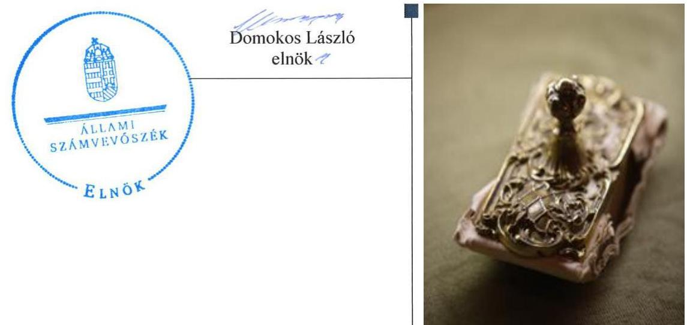

---

# AZ ELLENŐRZÉST FELÜGYELTE:

DR. BENEDEK MÁRIA felügyeleti vezető

## AZ ELLENŐRZÉST VEZETTE ÉS A VÉGREHAJTÁSÁÉRT FELELŐS:

**BÍRÓ ZSOLT** ellenőrzésvezető

**A PROGRAM ÖSSZEÁLLÍTÁSÁÉRT FELELŐS:**

**JANIK JÓZSEF LÁSZLÓ** osztályvezető

**A TÉMÁHOZ KAPCSOLÓDÓ KORÁBBI SZÁMVEVŐSZÉKI JELENTÉS:**

|  címe: | Jelentés az állami tulajdonban (résztulajdonban) lévő gazdálkodó szervezetek vagyonérték megőrző és gyarapító tevékenységének ellenőrzéséről egyes kiemelt közszolgáltató társaságoknál vagy hasonló tevékenységet végző társaságcsoportoknál - DMRV Duna Menti Regionális Vízmű Zrt.  |
| --- | --- |
|  sorszáma: | 14049  |

**IKTATÓSZÁM:** V-0875-068/2016.

**TÉMASZÁM:** 1909

**ELLENŐRZÉS-AZONOSÍTÓ SZÁM:** V071709

---

# TARTALOMJEGYZÉK 

■ ÖSSZEGZÉS ..... 5
■ AZ ELLENŐRZÉS CÉLJA ..... 6
■ AZ ELLENŐRZÉS TERÜLETE ..... 7
■ AZ ELLENŐRZÉS HÁTTERE, INDOKOLTSÁGA ..... 8
■ FÓKUSZKÉRDÉSEK ..... 9
■ ELLENŐRZÉS HATÓKÖRE ÉS MÓDSZEREI ..... 10
■ MEGÁLLAPÍTÁSOK ..... 12
■ MELLÉKLETEK ..... 17
I. SZ. MELLÉKLET: Az ÁSZ 14049 számú jelentéséhez kapcsolódó DMRV Zrt. intézkedési terv végrehajtása ..... 17
II.SZ. MELLÉKLET: Az ÁSZ 14049 számú jelentéséhez kapcsolódó MNV Zrt. intézkedési terv végrehajtása ..... 20
■ FÜGGELÉK: ÉSZREVÉTELEK ..... 23
■ RÖVIDÍTÉSEK JEGYZÉKE ..... 37

---

.

---

# ÖSSZEGZÉS 

Az ÁSZ ${ }^{1}$ a DMRV² Zrt. vagyonérték megőrző és gyarapító tevékenységének utóellenőrzését 2014. április 14. és 2015. június 17. közötti időszakra végezte el. Megállapította, hogy a DMRV Zrt. az ÁSZ javaslatainak hasznosítására előírt intézkedéseket részben hajtotta végre, az MNV Zrt.-nél, - mint a tulajdonosi jog gyakorlójánál - az intézkedési tervben meghatározott feladatok részben határidőn túl kerültek végrehajtásra.
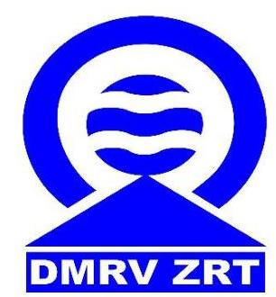

## Az ellenőrzés társadalmi indokoltsága

Az Állami Számvevőszék stratégiájában célul tűzte ki a számvevőszéki munka hasznosulásának javítását. Ezzel összhangban ellenőrzi, hogy az ellenőrzött szervezetek megvalósították-e a korábbi ellenőrzései által feltárt hibák, hiányosságok és szabálytalanságok megszüntetése céljából kialakított intézkedési terveikben foglaltakat. A rendszeres utóellenőrzések hozzájárulnak a szükséges intézkedések tényleges végrehajtásához, ezáltal a közpénzügyek rendezettségének javulásához.

## Főbb megállapítások, következtetések, javaslatok

A DMRV Zrt. és az MNV Zrt. - mint tulajdonosi joggyakorló - az intézkedési terveket határidőben megküldték az ÁSZ részére.

A DMRV Zrt. az intézkedési tervében meghatározott 12 feladatból egyet részben, hetet határidőben teljesített, négyet nem hajtott végre. Az MNV Zrt. az intézkedési tervében foglalt feladatok közül kettőt határidőben, egyet az előírt határidőn túl hajtott végre és három nem volt időszerű.

---

# AZ ELLENŐRZÉS CÉLJA 

## A DMRV Zrt. vagyonérték megőrző és gyarapító tevékenységének utóellenőrzése

Az ellenőrzés célja annak értékelése, hogy a számvevőszéki jelentésben foglalt intézkedést igénylő megállapításokkal és javaslatokkal összhangban készített intézkedési tervben meghatározott feladatokat az ellenőrzött szervezet végrehajtotta-e.

---

# **AZ ELLENŐRZÉS TERÜLETE**

## **DMRV Zrt.**

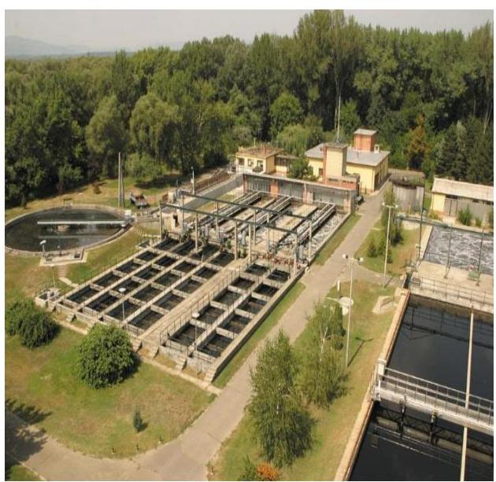

A DMRV Zrt. a több évtizedes szakmai múltjával a Duna menti térség meghatározó víziközmű szolgáltatója. Fő tevékenysége a víztermelés, -kezelés, -ellátás és a szennyvíz gyűjtése, kezelése, együttesen víziközmű szolgáltatás. Összességében 631 ezer ember egészséges ivóvízzel történő ellátásáról gondoskodik Pest, Nógrád és Komárom-Esztergom megye 121 településén. Szolgáltatási feladatait állami és önkormányzati tulajdonú víziközművek üzemeltetésével látja el, az állami víziközművek vonatkozásában vagyonkezelői feladatokat is végez.

Az MNV Zrt. közel 16 ezermilliárd forint értékű állami vagyon feletti tulajdonosi jogokat gyakorolja. Feladatai a kormányzati irányelveknek és a hatályos jogszabályoknak megfelelően a stratégiai szemléletű, felelős vagyongazdálkodás, a portfólió-racionalizálás, a korszerű ingatlangazdálkodás, a nemzeti társaságok eredményességének növelése, valamint a nemzeti vagyon megőrzése és gyarapítása. Az MNV Zrt. a rábízott vagyonnal történő gazdálkodás során stratégiai szempontok szerint gyakorolja az állami tulajdonban lévő társaságok tulajdonosi jogait. A DMRV Zrt.-ben a Magyar Állam nevében 91 %-os részesedéssel gyakorolja a tulajdonosi jogokat.

Az utóellenőrzés – a 2014. április 14-étől a 2015. június 17-éig végrehajtott intézkedéseket figyelembe véve – az állami résztulajdonban lévő DMRV Zrt. vagyonérték megőrző és gyarapító tevékenységének ellenőrzéséről közzétett ÁSZ jelentés intézkedést igénylő megállapításai és javaslatai hasznosítására készült intézkedési tervekben foglalt feladatok végrehajtására irányult. Az ÁSZ a jelentését 14049 számon 2014. április 14-én hozta nyilvánosságra. A DMRV Zrt. és az MNV Zrt. – mint tulajdonosi joggyakorló – az intézkedési terveket határidőben megküldték az ÁSZ részére.

---

# AZ ELLENŐRZÉS HÁTTERE, INDOKOLTSÁGA 

Az ÁSZ törvény 33. § (1) bekezdése értelmében a számvevőszéki jelentések intézkedést igénylő megállapításaihoz és javaslataihoz kapcsolódóan az ellenőrzött szervezet vezetője intézkedési tervet köteles összeállítani, és az Állami Számvevőszék részére megküldeni. Az intézkedési tervben foglaltak megvalósítását - az ÁSZ törvény 33. § (7) bekezdésében foglaltak alapján - az Állami Számvevőszék utóellenőrzés keretében ellenőrizheti. Az intézkedések megvalósulásának értékelése során az Állami Számvevőszék figyelembe veszi az ellenőrzött szervezetek működési feltételeiben, valamint a jogszabályi előírásokban bekövetkezett változásokat.

Az intézkedési tervekben foglalt feladatok hiányos, illetve késedelmes végrehajtása, valamint megvalósításának elmaradása azt mutatja, hogy az ellenőrzések során feltárt hibák, hiányosságok és szabálytalanságok megszüntetése nem kapott kellő hangsúlyt. Ez a szabályszerű működés és a felelős vezetői magatartás vonatkozásában kockázatot hordoz. E kockázatok feltárásával az Állami Számvevőszék utóellenőrzési rendszere fokozza a fegyelmet, és igazolja, hogy a közpénzzel való szabályos gazdálkodás felelőssége elől nem lehet kitérni.

## AZ ELLENŐRZÉS VÁRHATÓ HASZNOSULÁSA

Az utóellenőrzés négy szinten hasznosulhat:

- A társadalom szintjén az utóellenőrzés jelzi, hogy a számvevőszéki ellenőrzés megállapításainak van következménye: a hiányosságok megszüntetésére az ellenőrzött szervezet által meghatározott intézkedések végrehajtását is számon kéri az ÁSZ.
- Az ellenőrzött terület szintjén az utóellenőrzés tájékoztatást nyújt a terület döntéshozóinak a hiányosságok kiküszöbölésének jó gyakorlatairól, ezzel lehetőséget biztosítva arra, hogy az ÁSZ ellenőrzési megállapításai, javaslatai a terület nem ellenőrzött szervezeteinek a működése során is hasznosuljanak.
- Az ellenőrzött szervezet szintjén az utóellenőrzés feltárja, hogy a szervezet az intézkedések végrehajtásával hasznosította-e a korábbi ellenőrzési jelentésben a hiányosságok megszüntetése, illetve a kockázatok kezelése érdekében megfogalmazott javaslatokat.
- Az ÁSZ szintjén az utóellenőrzés visszacsatolást ad az ellenőrzési jelentések hasznosulásáról, az intézkedések elmaradása vagy részleges megvalósulása a további ellenőrzésekhez kockázati jelzésként szolgál.

---

# FÓKUSZKÉRDÉSEK 

Az ellenőrzött szervezetek az intézkedési tervekben foglaltakat az előírt határidőben végrehajtották-e?

---

# ELLENŐRZÉS HATÓKÖRE ÉS MÓDSZEREI 

## Az ellenőrzés típusa

Szabályszerűségi ellenőrzés

## Az ellenőrzött időszak

A számvevőszéki jelentés közzétételének napjától (2014. április 14.) az utóellenőrzés megkezdésének napjáig (2015. június 17.) tartó időszak.

## Az ellenőrzés tárgya

Az ÁSZ tv. alapján az ÁSZ jelentésben megfogalmazott javaslatokra készített, az ellenőrzött szervezetek által megküldött intézkedési tervekben foglaltak hasznosulása.

## Az ellenőrzött szervezet

A DMRV Zrt. és az MNV Zrt.

## Az ellenőrzés jogalapja

Az ellenőrzés végrehajtásának jogszabályi alapját az ÁSZ tv. 1. § (3) bekezdése, a 33. § (1)-(2), (7) bekezdései, valamint az Áht. ${ }^{5}$ 61. § (2) bekezdésének előírásai képezték.

## Az ellenőrzés módszerei

Az ellenőrzést a nemzetközi standardokat irányadónak tekintve az ellenőrzési program ellenőrzési kérdései, az ellenőrzött időszakban hatályos jogszabályok, az ellenőrzés szakmai szabályok és módszertanok figyelembevételével, az utóellenőrzéseket önállóan vagy ellenőrzéshez kapcsolódóan végeztük.

Az utóellenőrzés megállapításait elsősorban az ÁSZ rendelkezésére álló, valamint az ellenőrzött szervezetektől elektronikusan bekért dokumentumok alapozták meg. Az ÁSZ az ellenőrzés keretében egyes esetekben teljesítményellenőrzés tervezéséhez is kért adatokat.

---

Az ellenőrzési bizonyítékként felhasználható adatforrások közé tartoznak egyrészt a szakmai programban felsorolt adatforrások, másrészt minden - az ellenőrzés folyamán feltárt, az ellenőrzés szempontjából releváns információt tartalmazó - dokumentum.

Az ellenőrzés során értékeltük, hogy az ÁSZ jelentésben foglalt javaslatokra az elkészített intézkedési terveket határidőben megküldték-e, az ÁSZ által befogadott intézkedési tervben foglaltakat végrehajtották-e.

Az intézkedési tervben előírt feladatok végrehajtásának ellenőrzését értékelési kritériumok alapján végeztük. Figyelembe vettük az intézkedési terv jóváhagyását követően hatályba lépett jogszabályi előírások változásából következő események, továbbá a feladat-ellátási és finanszírozási rendszer esetleges változásának hatásait. Az intézkedési tervekben előírt feladatokat azok végrehajtása szempontjából az alábbiak szerint értékeltük:
$\longrightarrow$ okafogyottá vált az előírt feladat, ha végrehajtására - meghatározott esemény bekövetkezése, továbbá külső körülmény, a működést érintő feltétel változása miatt - már nincs szükség, illetve lehetőség, és egyértelműen megállapítható, hogy az intézkedést szükségessé tevő körülmény a jövőben nem fordulhat elő;
$\longrightarrow$ nem időszerű az a feladat, amelynek ellenőrzési időszakon belüli végrehajtására azért nem került (kerülhetett) sor, mert az intézkedés alapjául szolgáló esemény nem következett be, de annak jövőbeni előfordulása lehetséges, a végrehajtása nem volt esedékes, vagy a végrehajtás határideje még nem járt le;
$\longrightarrow$ határidőben végrehajtott a feladat, ha a teljesítés dokumentáltan az intézkedési tervben előírt határidőben és tartalommal megtörtént;
$\longrightarrow$ határidőn túl végrehajtott a feladat, ha annak teljesítése az intézkedési tervben meghatározott módon, de az előírt határidőn túl történt meg;
$\longrightarrow$ részben végrehajtott az a feladat, amelynek végrehajtása teljes körűen az intézkedési tervben előírt módon nem történt meg;
$\longrightarrow$ nem végrehajtott a feladat, ha a végrehajtás nem történt meg, vagy amennyiben a végrehajtását nem dokumentálták.
Az ellenőrzés lefolytatásához az ellenőrzött szervezetek a tanúsítványok kitöltésével, valamint az ÁSZ által kért dokumentumok elektronikus megküldésével szolgáltattak adatokat, amelyek valódiságát és teljes körűségét az ellenőrzött szervezetek vezetői által tett teljességi és hitelességi nyilatkozatok igazolták. Az így rendelkezésre bocsátott adatok, információk kontrollja az ellenőrzés keretében történt.

---

# MEGÁLLAPÍTÁSOK 

## Az ellenőrzött szervezetek az intézkedési tervekben foglaltakat - az előírt határidőben - végrehajtották-e?

Összegző megállapítás

A DMRV Zrt. az intézkedési tervében meghatározott 12 feladatból egyet részben, hetet határidőben teljesített, négyet nem hajtott végre. Az MNV Zrt. az intézkedési tervében foglalt feladatok közül kettőt határidőben, egyet az előírt határidőn túl hajtott végre és három nem volt időszerű.

Az intézkedési tervben meghatározott feladatokat, határidőket, az ÁSZ jelentés javaslatainak címzettjét és a feladatok végrehajtását az I. és II. számú melléklet mutatja be.

Az ÁSZ a jelentésében a DMRV ZRT. vezérigazgatója ${ }^{6}$ részére hét javaslatot fogalmazott meg, melynek hasznosítására a DMRV Zrt. az intézkedési tervében tizenkét feladatot határozott meg. A feladatok elvégzésének felelőseként a DMRV Zrt. vezérigazgatóját, a gazdasági igazgatót ${ }^{7}$, a műszaki fejlesztési osztályvezetőt ${ }^{8}$, a vagyongazdálkodási csoportvezetőt ${ }^{9}$, a belső ellenőrt ${ }^{10}$, és a beszerzési csoportvezetőt ${ }^{11}$ jelölték meg.

A DMRV Zrt. intézkedési tervében vállalt intézkedések végrehajtásának kategóriánkénti megoszlását az 1. számú ábra szemlélteti.

1. számú ábra
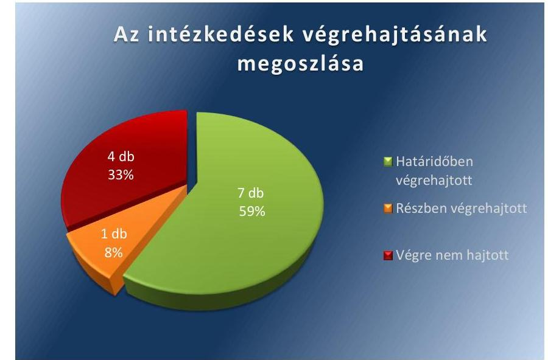

Forrás: ÁSZ

---

# HATÁRIDŐBEN VÉGREHAJTOTT feladat: 

1. Az egységes nyilvántartás érdekében az MNV Zrt. által kért formában a vagyonkezelt eszközökre vonatkozóan az adatszolgáltatásokat teljesítették, az utólagos adategyeztetéseket végrehajtották.
2. A „Megrendelőként történő szerződéskötés folyamata"12 című, valamint az „Aláirási, utalványozási, teljesítésigazolási jog gyakorlása"13 című eljárási utasításban foglaltak szerint a szerződések teljes körű ellenjegyzésének meglétét ellenőrizték, erről jelentést készítettek.
3. A DMRV Zrt. a beruházásokat szabályozó „Műszaki Fejlesztések kivitelezésének általános szabályai"14 címen új eljárási utasítást adott ki. Az utasításban rögzítették az egyes beruházások keretében létrejött eszközök egyedi bekerülési értékének számítását, mint az aktiválási dokumentáció kötelező részét. Meghatározták a számításra vonatkozó szükséges formai, tartalmi követelményeket.
4. Az aktiválások végrehajtását megelőzően ellenőrizték az

 eszközök egyedi bekerülési értéke számítását alátámasztó dokumentáció meglétét.
5. A kincstári tulajdonú eszközök selejtezési eljárását a Selejtezési szabályzatban ${ }^{15}$ foglaltaknak, valamint az MNV Zrt. által kiadott előírásoknak megfelelően lefolytatták és a kiváltásra kerülő eszközökre vonatkozóan a selejtezési jegyzőkönyveket elkészítették.
6. A Belső ellenőrzési szabályzatot ${ }^{16}$ kiegészítették az ellenőrzések megalapozott tervezésének és végrehajtásának, valamint a belső ellenőrzések és a javaslatok nyomon követésének előírásaival. A Belső Ellenőrzési Kézikönyvben ${ }^{17}$ rögzítették az intézkedési tervben foglalt intézkedések végrehajtásának nyomon követését.
7. A 2014. és a 2015. éves belső ellenőrzési munkatervekbe beépítették a költséggazdálkodásban rejlő tartalékok feltárására és a költségmegtérülés elvének vizsgálatára irányuló ellenőrzéseket.

## RÉSZBEN VÉGREHAJTOTT feladat:

8. A 2010-2013. első félév közötti időszakban megvalósult beruházások visszaellenőrzésére vonatkozó intézkedés részben történt meg. Az ellenőrzésről a műszaki fejlesztési osztályvezető összefoglaló jelentést készített, azonban a beruházásokat megalapozó körülményeket, a beruházások indokoltságát és eredményességét nem ellenőrizték.

## VÉGRE NEM HAJTOTT feladat:

9. A DMRV Zrt.-nél a beruházási szabályzatot nem egészítették ki az állami beruházások, felújítások aktuális előírásoknak megfelelő MNV Zrt.-nél történő engedélyeztetési rendjével, valamint azok teljesítéséről, végrehajtásáról készült beszámolók körével és tartalmával.
10. Az MNV Zrt. engedélye nélkül végzett beruházásokról készült összefoglaló jelentés nem tartalmazott a felelősség megállapítására vonatkozó információt, felelősségre vonási eljárás lefolytatására nem került sor.
11. A 2010-2011. évi állami vagyonkezelt vagyonból történő selejtezések esetleges szabálytalanságainak feltárására irányuló ellenőrzést nem végezték el, a vezérigazgató felé nem készült jelentés.
12. A végrehajtott selejtezések szabálytalanságainak feltárására a gazdasági igazgató ellenőrzést nem folytatott le, jelentés nem készült, felelősség megállapítása és felelősségre vonás nem történt.

Az MNV ZRT. vezérigazgatója részére az ÁSZ jelentés négy javaslatot fogalmazott meg, amelynek hasznosítására az MNV Zrt. intézkedési tervében hat feladatot határozott meg. Az intézkedési tervben felelősként a vezérigazgatót ${ }^{18}$, a gazdasági igazgatót ${ }^{19}$, az ingó- és ingatlanvagyonért felelős főigazgatót ${ }^{20}$, illetve az ellenőrzési igazgatót ${ }^{21}$ nevezték meg.

Az MNV Zrt. intézkedési tervében vállalt intézkedések végrehajtásának kategóriánkénti megoszlását az 2. számú ábra szemlélteti.
2. számú ábra
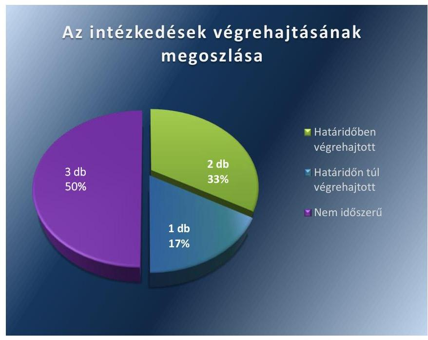

Forrás: ÁSZ

# NEM IDŐSZERŰ feladat: 

1. A Visegrád - Nagymaros települések között a Duna medre alatt húzódó közműalagút, valamint a hozzátartozó bejáratokat képező ingatlanok vagyonkezelői jogviszonyának rendezése, összesen 51 ingatlant érint. Az intézkedési terv szerint a telekalakítás átvezetésére vonatkozó jogerős határozat kézhezvételét követő 30 napon belül kerülhet sor a közműalagút vagyonkezelői jogának rendezésére. A telekalakítási eljárás az illetékes földhivatalnál 2014. november 4-én megkezdődött, azonban lezárására az ellenőrzött időszakban nem került sor.
2. A DMRV Zrt.-nél a közműalagút rendezetlen vagyonkezelői joga körülményeinek kivizsgálását az MNV Zrt. intézkedési terve 2015. június 30-ai határidővel - az ellenőrzött időszakon túli időponttal - tartalmazta.
3. A rendezetlen vagyonkezelői jog miatti felelősségre vonási eljárás megindítására nem kerülhetett sor, mivel az ezt megalapozó tulajdonosi ellenőrzés az intézkedési terv szerint az ellenőrzött időszakban még nem fejeződött be.

# HATÁRIDŐBEN VÉGREHAJTOTT feladat: 

4. Az MNV Zrt. 2014. szeptember 2-án elkészítette jelentését a DMRV Zrt. 2012-2013. évi beruházásai megvalósítása és a vagyonkezelési szerződésnek való megfelelősége tárgyában végzett ellenőrzésről. Az ellenőrzés során az MNV Zrt. megállapította, hogy a rendelkezésre álló dokumentumok alapján a 2012-2013. évi beruházások szükségesnek és indokoltnak tekinthetők, személyi felelősségre vonást nem kezdeményezett. A jelentésben rögzítésre került az MNV Zrt. egységes álláspontja a beruházások bejelentési/engedélyeztetési kötelezettsége teljesítésével kapcsolatban, amely szerint a vagyonkezelő üzleti/fejlesztési tervében szereplő beruházások esetében az MNV Zrt. hozzájárulása megadottnak tekinthető, amennyiben a tervekhez az előzetesen már hozzájárult. Az MNV Zrt. a beruházások engedélyeztetésének és elszámolásának egységes eljárásrendjét vezérigazgató utasítással ${ }^{22}$ szabályozta.
5. Az MNV Zrt. határidőben kiadta az egységes Vagyonnyilvántartási Szabályzatát ${ }^{23}$, amelyet a DMRV Zrt. működése során alkalmazott és 2015. április 23-án a vagyonkezelési szerződés módosításának aláírásával elfogadott.

## HATÁRIDŐN TÚL VÉGREHAJTOTT feladat:

6. A DMRV Zrt. és az MNV Zrt. között fennálló vagyonkezelői jogviszonya újraszabályozását tartalmazó egységes szerkezetbe foglalt vagyonkezelési szerződésmódosítás ${ }^{24}$ 2015. április 23-án került aláírásra az intézkedési tervben tervezett 2014. december 31-e helyett.

A DMRV ZRT.-nél az intézkedési tervben meghatározott feladatok végrehajtásáról a gazdasági és a műszaki igazgató együttes körlevélben beszámolási kötelezettséget írt elő. A beszámolásra kötelezettek az előírt határidőben írásban jelentést tettek.

Az MNV ZRT. vezérigazgatói határozattal ${ }^{25}$ hagyta jóvá az intézkedési tervet, melyben egyúttal elrendelte az illetékes szakterületek beszámolási kötelezettségét a kabinetfőnök ${ }^{26}$ részére, amelynek a felelősök határidőben eleget tettek.

# MELLÉKLETEK

I. SZ. MELLÉKLET: AZ ÁSZ 14049 SZÁMÚ JELENTÉSÉHEZ KAPCSOLÓDÓ DMRV ZRT. INTÉZKEDÉSI TERV VÉGREHAJTÁSA

|  Sorszám | Intézkedési terv alapján elvégzendő feladat | Az intézkedési tervben meghatározott határidő | Az ÁSZ 14049
sz. jelentése
javaslatának
címzettje | A feladat végrehajtása  |
| --- | --- | --- | --- | --- |
|   | 1. | 2. | 3. | 4.  |
|   | Határidőben végrehajtott feladat |  |  |   |
|  1. | Az egységes nyilvántartás érdekében az MNV
Zrt. által kért formában a vagyonkezelt eszközökre vonatkozó adatszolgáltatások teljesítése, az utólagos adategyeztetés végrehajtása. | folyamatos | DMRV Zrt.
vezérigazgató | A DMRV Zrt. az MNV Zrt. által a Beruházási és elszámolási eljárásrendben ${ }^{27}$ előírt formában az adatszolgáltatásokat és adategyeztetéseket határidőben teljesítette. A DMRV Zrt. a vagyon nyilvántartási adatokról az adatszolgáltatást a Vhr. ${ }^{28} 14 . \S$ (3) bekezdése és a melléklete előírásainak megfelelően megküldte az MNV Zrt.-nek, melynek visszaigazolása a 2014. évre vonatkozóan megtörtént. A DMRV Zrt. az ellenőrzött időszakban a beruházások, felújítások engedélyeztetésénél és elszámolásánál a Beruházási és elszámolási eljárásrend alapján járt el.  |
|  2. | Ellenőrizni kell az EU7404 Megrendelőként történő szerződéskötés folyamata c., valamint az EU5504 Aláírási, utalványozási, teljesítésigazolási jog gyakorlása c. eljárási utasításokban foglaltak szerint a szerződések teljes körű ellenjegyzésének meglétét. | folyamatos | DMRV Zrt.
vezérigazgató | A szerződéseknek az Aláírási, utalványozási, teljesítésigazolási jog gyakorlása és Megrendelőként történő szerződéskötés folyamata utasításokban foglaltaknak megfelelő teljes körű ellenjegyzésének ellenőrzése megtörtént. A beszerzési csoportvezető által elfogadott DMRV/128921/2014/BES számú jelentés szerint a 2014. június 4 - 2014. december 15. között megkötött szerződések ellenjegyzését a jogosultak a belső utasításnak megfelelően elvégezték. A vezérigazgató utasításban előírta a szerződéskötésnél és a kötelezettségvállalásnál a vezérigazgatói ellenőrzést és aláírást.  |
|  3. | A beruházásokat szabályozó eljárási utasítás módosítása, a melléklet 3. pontjának megfelelően. Rögzíteni szükséges, hogy az egyes beruházások keretében létrejött eszközök egyedi bekerülésének számítását, mint az aktiválási dokumentáció kötelező részét képezi. Meg kell határozni a számításra vonatkozó szükséges formai, tartalmi követelményeket. | 2014. június 30. | DMRV Zrt.
vezérigazgató | A feladat végrehajtására a DMRV Zrt. 2014. június 12-én kiadta a Műszaki fejlesztések kivitelezésének általános szabályai utasítást. Az utasítás 6.9. pontjában tartalmi követelményként rögzítették az egyes eszközök egyedi bekerülési értékének számítását. A bekerülési érték számítási alapja a Számviteli politika ${ }^{29} 3$. számú mellékletében meghatározott használati idők, az árajánlatban, költségvetésben szereplő eszközönkénti anyag, díj és darab számok és a műszaki fejlesztés aktiválandó összköltsége. (Eszközönkénti aktiválandó összeg: az aktiválandó összköltségből le kell vonni az eszközönkénti anyag, díjtételeket, a maradék összeg a rendszer közös költsége. Ezt az eszközönkénti anyag, díj arányában rá kell osztani az eszközökre.) A számításra vonatkozóan formai követelményként előírták, hogy írásban, dokumentáltan kell előkészíteni, és az aktiválási jegyzőkönyv mellékleteként kell szerepeltetni.  |

---

|  4. | A bekerülési érték számítását alátámasztó dokumentáció meglétének ellenőrzéséről az aktiválások végrehajtását megelőzően. |  |  | A DMRV Zrt. ellenőrzési időszakban végzett aktiválásaiból véletlenszerűen kiválasztott 30 mintatétel került ellenőrzésre. Az összes ellenőrzött mintatétel esetében a Tárgyi eszköz gazdálkodási szabályzat ${ }^{30}$ 6.1.9. pontja alapján a Tárgyi Eszköz Gazdálkodási csoport elkészítette az aktiválási jegyzőkönyvet, amely a Műszaki fejlesztések kivitelezésének általános szabályai utasítás 6.9. pontjában előírtaknak megfelelően a bekerülési érték számítását megalapozó dokumentumok felsorolását tartalmazta. Az aktiválási jegyzőkönyveken a készítő, az ellenőrző és a jóváhagyó aláírásukkal igazolták a dokumentumok meglétének ellenőrzését és a megalapozó dokumentumok a jegyzőkönyvek mellékleteit képezték.  |
| --- | --- | --- | --- | --- |
|  5. | A kincstári tulajdonú eszközök selejtezési eljárásának lefolytatása, a jegyzőkönyvek elkészítése a kiváltásra kerülő eszközökre vonatkozóan is, az EU6103 Selejtezési szabályzat, valamint az MNV Zrt. által kiadott előírásoknak megfelelően. |  |  | A DMRV Zrt.-nél az ellenőrzött időszakban kincstári vagyonkörben három esetben került sor selejtezési eljárásra. A selejtezési eljárások lefolytatása a Selejtezési szabályzatban foglaltaknak, valamint az MNV Zrt.-vel 2014. június 5-én kötött vagyonkezelésben levő eszközök selejtezése és hulladékok kezelése tárgyú megbízási szerződés előírásainak megfelelő. Mindhárom selejtezési eljárásban a selejtezési javaslat után az egyeztetéseket követően a Selejtezési szabályzatban előírt jegyzőkönyvet elkészítették (jegyzőkönyvek kelte: 2015.02.05., 2015.04.23., 2015.05.20.). A selejtezési jegyzőkönyvek a megbízási szerződés előírásainak megfelelő tartalmi elemeket és a mellékleteket tartalmazták.  |
|  6. | A belső ellenőrzési szabályzatnak az ellenőrzések megalapozott tervezését és végrehajtását, valamint a belső ellenőrzésekről és a bennük foglalt javaslatok nyomon követését biztosító nyilvántartás vezetését illető előírásokkal történő kiegészítése. |  |  | A DMRV Zrt. az ellenőrzött időszakban hatályos Belső ellenőrzési szabályzata a 6.7.9. pontjában tartalmazta a belső ellenőrzésekről és a bennük foglalt javaslatok nyomon követését biztosító nyilvántartás vezetésére vonatkozó előírásokat. A DMRV Zrt. által 2014. augusztus 28-án kiadott, 2014. szeptember 1-jétől hatályos Belső Ellenőrzési Kézikönyv IX. fejezet 1. pontjában rögzítették az intézkedési terv végrehajtásának nyomon követését (7. számú mellékletben szereplő U82025, U82026 iratminta).  |
|  7. | Az éves belső ellenőrzési munkatervek összeállítása során kerüljön beépítésre - mint ellenőrzési feladat - a költséggazdálkodásban rejlő tartalékok feltárása és a költségmegtérülés elvének vizsgálata. |  |  | Az ellenőrzött szervezetnél a 2014. évi és 2015. évi belső ellenőrzési munkatervekbe beépítették a költséggazdálkodásban rejlő tartalékok feltárása és a költségmegtérülés elvének vizsgálatát. A vezérigazgató által jóváhagyott 2014. évi belső ellenőrzési munkatervben a 2. sorszám alatt szerepelt „a költséggazdálkodási szempontjainak hatékony érvényesülése az anyagfelhasználás folyamatain belül" ellenőrzés. A 2014. évi belső ellenőrzési munkákról készült beszámolót (DMRV/2691-0/15/BE) az FB ${ }^{31}$ a DMRV/10216-0/15/JOG iktatószámú, 1/2015. (02. 25.) FB határozattal elfogadta. A 2015. évi módosított belső ellenőrzési munkatervben költséghatékonysági, szabályszerűségi ellenőrzésként a 3. sorszám alatti," a fenntartási munkák alatt keletkezett hulladékok tárolására és kezelésére vonatkozó előírások betartatásának ellenőrzése", az 5. sorszámú.  |

---

|  8. | A 2010-2013. első félévében megvalósult beruházások visszaellenőrzése, azok körülményeinek, indokoltságának és eredményességének vizsgálata, erről összefoglaló jelentés készítése. | 2014. augusztus 31. | DMRV Zrt. vezérigazgató | A 2010-2013.
 első félév közötti időszakban megvalósult beruházások visszaellenőrzése részben történt meg. Az ellenőrzésről a műszaki fejlesztési osztályvezető 2014. augusztus 28-án a DMRV/11576-1/2014/MF számon összefoglaló jelentést készített.  |
| --- | --- | --- | --- | --- |
|   |  |  |  | A beruházásokat megalapozó körülményeket, a beruházások indokoltságát és eredményességét nem ellenőrizték.  |
|   |  |  | Végre nem hajtott feladat |   |
|  9. | A DMRV Zrt.-nek kiadás előtt álló beruházási szabályzat kiegészítése. Rögzíteni kell az állami beruházások, felújítások MNV Zrt.-nél történő engedélyeztetési rendjét, valamint azok teljesítéséről, végrehajtásáról készült beszámolók körét és tartalmát az aktuális előírásoknak megfelelően. | 2014. június 30. | DMRV Zrt. vezérigazgató | A DMRV Zrt. a beruházási tárgyú Műszaki fejlesztések kivitelezésének általános szabályai, illetve a Műszaki fejlesztési szabályzatait³² nem egészítette ki az aktuális előírásoknak megfelelően az állami beruházások, felújítások MNV Zrt.-nél történő engedélyeztetési rendjével, a teljesítésről, végrehajtásáról készült beszámolók körével és tartalmával.  |
|  10. | Az MNV Zrt. engedélye nélkül végzett beruházásokról készült jelentés alapján a felelősség megállapítása, amennyiben szükséges, a személyes felelősségre vonás megtétele. | 2014. szeptember 15. | DMRV Zrt. vezérigazgató | Az MNV Zrt. engedélye nélkül végzett beruházásokról 2014. augusztus 28-án készült DMRV/11576-1/2014/MF számú összefoglaló jelentés a felelősség megállapítását nem vizsgálta azzal kapcsolatosan észrevételt, javaslatot, megállapítást nem tartalmazott. Az ellenőrzött szervezetnél az utóellenőrzés megkezdéséig felelősségre vonási eljárás lefolytatására nem került sor.  |
|  11. | A 2010-2011. évi állami vagyonkezelt vagyonból történő selejtezések esetleges szabálytalanságainak feltárása, jelentés készítése a Vezérigazgató felé. | 2014. augusztus 31. | DMRV Zrt. vezérigazgató | A DMRV Zrt.-nél a 2010-2011. évi állami vagyonkezelt vagyonból történő selejtezések esetleges szabálytalanságainak feltárására irányuló ellenőrzést nem végezték el, a vezérigazgató felé nem készült jelentés.  |
|  12. | Az elvégzett selejtezésekről Gazdasági igazgatói jelentés alapján felelősség megállapítása, amennyiben szükséges személyi felelősségre vonás megtétele. | 2014. szeptember 15. | DMRV Zrt. vezérigazgató | A DMRV Zrt.-nél a végrehajtott selejtezések szabálytalanságainak feltárására a gazdasági igazgató ellenőrzést nem folytatott le, jelentés nem készült, felelősség megállapítása és felelősségre vonás nem történt.  |

*Fővízás: ÁSZ által készített táblázat*

---

|  1. | Intézkedési terv alapján elvégzendő feladat | Az intézkedési tervben meghatározott határidő | Az ÁSZ 14049
sz. jelentése javaslatának címzettje | A feladat végrehajtása  |
| --- | --- | --- | --- | --- |
|   | 1. | 2. | 3. | 4.  |
|  Nem időszerű feladat |  |  |  |   |
|  1. | A vagyonkezelési szerződés módosítása; a KDVVIZIG ³³ vagyonkezelői jogának megszüntetéséről és a DMRV Zrt. részére történő vagyonkezelésbe adásról szóló megállapodások elkészítése. | az illetékes földhivatal telekalakítási átvezetésére vonatkozó jogerős határozatának kézhezvételét követő 30 nap | vezérigazgató | 2014. 04. 09-én az MNV Zrt. egyeztető tárgyaláson intézkedési tervben állapodott meg a területrendezési eljárás feladatairól a Visegrád Város Önkormányzatával. Az MNV Zrt. elkészítette a telekalakítási helyszínrajzot. A változással érintett ingatlanok egy része természetvédelmi terület, az eljáráshoz a Közép-Dunavölgyi Környezetvédelmi és Természetvédelmi Felügyelőség előzetes szakhatósági állásfoglalását megadta. Az MNV Zrt. 2014. október 15-én telekalakítási engedélyezési kérelmet nyújtott be az illetékes földhivatalhoz. Az eljárás 2014. november 4-én a földhivatal 800286-3/2014. sz. Végzésével elindult, az ellenőrzött időszakban nem zárult le. A KDVVIZIG-nek a közműalagútra vonatkozó vagyonkezelői jogának megszüntetéséről, és a DMRV Zrt. vagyonkezelésbe adásáról szóló megállapodás tervezeteket az MNV Zrt. elkészítette.  |
|  2. | A tulajdonosi ellenőrzés lefolytatása a DMRV Zrt.-nél a közműalagút vagyonkezelői joga rendezetlenségének körülményeiről, és a kialakult helyzethez kapcsolódó esetleges felelősség megállapítása. /Eredménytermék: elfogadott tulajdonosi ellenőrzési jelentés./ | 2015.06.30. | vezérigazgató | A DMRV Zrt.-nél a közműalagút rendezetlen vagyonkezelői joga körülményeinek kivizsgálását az MNV Zrt. intézkedési terve 2015. június 30-ai határidővel - az ellenőrzött időszakon túli időponttal - tartalmazta. Az MNV Zrt. a 16/2015. (III.13.) RJGY sz. határozatával jóváhagyott 2015. évi tulajdonosi ellenőrzési tervében az ellenőrzés a 12. sorszámon szerepel.  |
|  3. | Felelősségre vonási eljárás megindítása, amennyiben a vizsgálat megállapításai szükségessé teszik. | a tulajdonosi ellenőrzési jelentés elfogadását követő 10 munkanapon belül | vezérigazgató | A rendezetlen vagyonkezelői jog miatti felelősségre vonási eljárás megindítására nem kerülhetett sor, mivel az ezt megalapozó tulajdonosi ellenőrzés az intézkedési terv szerint az ellenőrzött időszakban még nem fejeződött be.  |
|  Határidőben végrehajtott feladat |  |  |  |   |
|  4. | Tulajdonosi ellenőrzés lefolytatása a társaságnál a 2012-2013. évi beruházások megvalósítása, és vagyonkezelési szerződésnek való megfelelősége tárgyában. MNV Zrt. 219/2014. (IV.03.) RJGY határozattal jóváhagyott 2014. évi tulajdonosi ellenőrzési terve a DMRV Zrt. vonatkozásában tartalmazza a vizsgálatot. | 2014.09.30. | vezérigazgató | Az MNV Zrt. 2014. szeptember 2-án elkészítette "DMRV Zrt. beruházásai és azok megfelelősége a vagyonkezelési szerződésben foglaltaknak" tárgyú ellenőrzési jelentését. A jelentésben javaslatok kerültek megfogalmazásra az MNV Zrt. részére a vagyonkezelési szerződés aktualizálására vonatkozólag, a Társaság részére pedig, hogy kövesse az MNV Zrt. előírásait a beruházások előzetes engedélyezésére, illetve elszámolására vonatkozóan, továbbá, hogy fokozza a nyilvántartások áttekinthetőségét. Megfontolásra javasolta, belső ellenőrzési vizsgálat lefolytatását a vagyonkezelési szerződésből fakadó kötelezettségek teljesítésének ellenőrzésére. A jelentés megállapította, hogy a 2012-2013. évi beruházások a rendelkezésre  |

---

|  1. | Intézkedési terv alapján elvégzendő feladat | Az intézkedési tervben meghatározott határidő | Az Asz 14049
sz. jelentése javaslatának címzettje | A feladat végrehajtása  |
| --- | --- | --- | --- | --- |
|   | 1. | 2. | 3. | 4.  |
|   |  |  |  | bocsátott dokumentumok alapján szükségesnek és indokoltnak tekinthetők, személyi felelősségre vonást nem kezdeményezett. Az MNV Zrt. 35/2014. (X.16.) vezérigazgató utasítással kiadta az állami tulajdonon, egyéb vagyonkezelők által vagyonkezelt eszközön megvalósítandó beruházások, felújítások előzetes engedélyeztetésének és elszámolásának eljárásrendjéről szóló szabályzatát. A jelentés az ellenőrzött részére megküldött MNV/01//24814/16/2014. vezérigazgató által aláírt realizáló levéllel lezárásra került. A DMRV Zrt. a jelentés javaslatait elfogadta, melyek végrehajtására 2014. szeptember 17-én intézkedési tervet készített és megküldött az MNV Zrt. részére.  |
|  5. | Az állami vagyon nyilvántartására vonatkozó - a Vhr. 13. és 14. §-ban foglalt hatályos szabályozások érvényesítése mellett egységes szabályzat kiadása, és annak víziközmű-szolgáltató társaság általi elfogadása, a vagyonkezelési szerződés módosítását megelőzően. | 2014.06.30. | vezérigazgató | Az MNV Zrt. határidőben kiadta egységes Vagyonnyilvántartási Szabályzatát. A szabályzat 2014. május 31-én lépett hatályba, a DMRV Zrt. működése során alkalmazta és 2015. április 23-án a vagyonkezelési szerződés módosítás aláírásával fogadta el.  |
|   | Határidőt követően végrehajtott feladat |  |  |   |
|  6. | A hatályos vagyonkezelési szerződés és az az alapján fennálló vagyonkezelői jogviszony újraszabályozása, valamint a vagyonkezelési szerződésmódosítással történő egységes szerkezetbe foglalása, amely tartalmazza az alábbi szövegrészt. „Felek rögzítik, hogy az MNV Zrt. vagyon-nyilvántartási szabályzata a víziközmű-szolgáltató társaságok által elfogadott, az MNV Zrt. jogelődje által 1998-ban jóváhagyott „a Kincstári vagyoni körbe tartozó víziközmű vagyonkezelési, gazdálkodási és nyilvántartási szabályzata" helyébe lépett." | 2014.12.31. | vezérigazgató | A vagyonkezelési szerződést az MNV Zrt. az intézkedési tervében meghatározott szövegrész beemelésével, és a fennálló vagyonkezelő jogviszony újraszabályozásával 2015. április 23-án, SZT-104292 számon módosította.  |

---

.

---

# FÜGGELÉK: ÉSZREVÉTELEK 

A jelentéstervezetet az ÁSZ 15 napos észrevételezésre megküldte az ellenőrzött szervezetek vezetői részére az ÁSZ tv. 29. § (1) bekezdése előírásának megfelelően.
A DMRV Zrt. vezérigazgatója, mint az ellenőrzött szervezet vezetője az ÁSZ tv. 29. § (2) bekezdésében foglalt észrevételezési jogával élt, a jelentéstervezetre

észrevételt tett.

Az elfogadott észrevétel alapján az ÁSZ módosította a jelentést.
A függelék tartalmazza az ellenőrzött szervezet észrevételeit és az ÁSZ tv. 29. § (3) bekezdésében előírtaknak megfelelően a figyelembe nem vett észrevételeket és azok indokairól szóló tájékoztatást.

[^0]
[^0]:    * 29. § (1) Az Állami Számvevőszék az ellenőrzési megállapításait megküldi az ellenőrzött szervezet vezetőjének vagy az általa megbízott személynek, és annak, akinek személyes felelősségét állapította meg.
    (2) Az ellenőrzött szervezet vezetője és a felelősként megjelölt személy az ellenőrzés megállapításaira tizenöt napon belül írásban észrevételt tehet.
    (3) Az Állami Számvevőszék az észrevételre a beérkezésétől számított harminc napon belül írásban válaszol. A figyelembe nem vett észrevételeket köteles a jelentésben feltüntetni, és megindokolni, hogy azokat miért nem fogadta el.

---

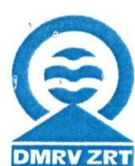

**DMRV DUNA MENTI REGIONÁLIS VÍZMŰ ZÁRTKÖRŰEN MŰKÖDŐ RÉSZVÉNYTÁRSASÁG**
2600 Vác, Kodály Zoltán út 3.

**ÁLLAMI SZÁMVEVŐSZÉK**
Domokos László úr
elnök

**Budapest**
Apáczai Csere János u. 10.

1052

**Tárgy:** a V-0875-062/2015. számú levél mellékletét képező jelentéstervezet véleményezése

Tisztelt Elnök Úr!

**Kelt:** 2016.01.20.
**Ügyintéző:** Komlósi B.
**Íkt.sz/grtk.h/6.16.16/116**
**Melléklet:**

**ÁLLAMI SZÁMVEVŐSZÉK**
005863/2016.

**Érkezett:** 2016 JAN 2 5.

**Iktatószám:** U-0875-062/2015

**Melléklet:**

**Tárgy:** a V-0875-062/2015. számú levél mellékletét képező jelentéstervezet véleményezése

Tisztelt Elnök Úr!

Az Állami Számvevőszék (továbbiakban: az ÁSZ) által lefolytatott "A Duna Menti Regionális Vízmű Zrt. vagyonérték megőrző és gyarapító tevékenységének utóellenőrzése" tárgyú 2015.01.08-án érkeztetett jelentéstervezetet (továbbiakban: a Tervezet) a vizsgálat során közreműködő kollégáimmal közösen elemeztük, melynek eredményeként az alábbi észrevételeket fogalmazzuk meg:

1. **A DMRV Zrt. teljes hivatalos megnevezése** DMRV Duna Menti Regionális Vízmű Zártkörűen Működő Részvénytársaság. (Röviden: DMRV Zrt.) Kérjük a Tervezetben szükségszerűen javítani.

2. **Részben végrehajtott feladat (Tervezet 13. o. és 1. sz. melléklet 8. pont)**

8.) Az utóellenőrzés szükségét megalapozó 14049. számú ÁSZ jelentésben foglalt intézkedést igénylő megállapítások és javaslatok 5. pontja szerint a DMRV Zrt-nek (továbbiakban: a Társaság) feladata volt az MNV Zrt. engedélye nélkül megvalósított beruházások körülményeinek kivizsgálása. A DMRV Zrt. ezen javaslat alapján Intézkedési Tervben írta elő a megvalósult beruházások ez irányú ellenőrzését. Az intézkedés végrehajtását megelőzően azonban az MNV Zrt 2014. április 11-én megkezdte vizsgálatát a 2012-13. évi beruházások ellenőrzése céljából, melyhez a Társaság az MNV Zrt által bekért – beruházások indokoltságát és megvalósulását alátámasztó - dokumentumok rendelkezésre állását biztosította és a vizsgálatban aktívan részt vett. Ebből kifolyólag az Intézkedési Tervben előírt ellenőrzés párhuzamos – külön eljárás keretében történő - lefolytatását a DMRV Zrt. nem tartotta indokoltnak.

Az MNV Zrt által végzett ellenőrzés eredményeként 2014.08.07-én megküldött jelentéstervezet – majd 2014.09.04-én megküldött véglegesített jelentés – alapján az MNV Zrt. az adott időszakban megvalósított beruházások szükségességét és indokoltságát megalapozottnak vélte. Erre jelen

Levétül: 2601 Vác, Pf. 96. Telefon: 27-511-500 Fax: 27-316-199 Adószám: 10863877-2-44 www.dmrvzrt.hu

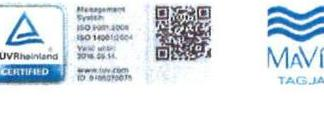

---

Tervezet 15. oldalán az MNV Zrt. által határidőben végrehajtott

 feladat 4. pontja, és a II. sz. melléklet 4. pontja is utal.

Fentiek alapján a Tervezet ezen pontjában rögzített feladatot kérjük „HATÁRIDŐBEN VÉGREHAJTOTT FELADAT"-ként, vagy - tekintettel arra, hogy annak végrehajtása külső szervezet közreműködése által valósult meg - az ÁSZ értékelési módszere szerint kérjük „OKAFOGYOTTÁ VÁLT ELŐÍRT FELADAT"-ként besorolni.

# 3. VÉGRE NEM HAJTOTT feladat (Tervezet 13. o. és I. sz. melléklet 9. pont) 

9.) A Tervezet szerint a „DMRV Zrt-nél a beruházási szabályzatot nem egészítették ki az állami beruházások, felújítások aktuális előírásoknak megfelelő MNV Zrt-nél történő engedélyeztetés rendjével... ${ }^{7}$
Az utóellenőrzés során történt adatszolgáltatás útján az 1. számú Tanúsítvány 1. pontjához csatolva a DMRV Zrt. beküldte az EU6301_v1_10 számú, 2014.06.12-én kiadott, 2014.08.04-től hatályos Műszaki fejlesztési szabályzatot. E szabályzat megjelenésével egy időben az EU6301-es számú Beruházási szabályzat 5. kiadása a hatályát vesztette. Az új szabályzat, a kapcsolódó MU6304 és MU6305-ös számú munkautasításokkal együtt - továbbá a 2014.07.01-től szintén hatályos (utóellenőrzés során az 1. számú Tanúsítvány 2. pontjához csatolt) EU6116 Vagyonnyilvántartási szabályzat is - tartalmaz az MNV Zrt. által történő engedélyezési eljárás lefolytatására vonatkozó kikötéseket.
Mindezt kiegészítve a DMRV Zrt. vezérigazgatója külön nyilatkozatban rögzítette, hogy a Társaság alkalmazza az MNV Zrt honlapján közzétett „Az állami tulajdonon, egyéb vagyonkezelők által vagyonkezelt eszközön megvalósítandó beruházások, felújítások előzetes engedélyezésének és elszámolásának menetéről szóló tájékoztatóban" foglalt előírásokat, az eljárásrend belső szabályzatokban történő véglegesítése azonban a Vagyonkezelési Szerződés módosítás érvénybe lépéséhez kötött, melyre az EU6301 Műszaki fejlesztési szabályzat is utal. A tisztán állami tulajdonban lévő közműves szennyvízelvezetés -és tisztítás céljára szolgáló víziközmű rendszer üzemeltetésére vonatkozó módosított Vagyonkezelési Szerződés aláírására 2015.04.23-án, míg a vegyes tulajdonú víziközmű rendszerek üzemeltetésére vonatkozó Vagyonkezelési Szerződés aláírására 2015. december 8-án került sor.

Fentiek alapján kérjük az 1. számú Tanúsítvány 1. pontjához megírt Nyilatkozat és a hatályos belső szabályozók tartalmára tekintettel a Tervezet ezen pontjában rögzített feladatot az ÁSZ értékelési módszere szerint kérjük „HATÁRIDŐBEN VÉGREHAJTOTT FELADAT"-ként, vagy a Vagyonkezelési szerződés érvénybe lépésére tekintettel „NEM IDŐSZERŰ FELADAT"-ként besorolni.

## 4. VÉGRE NEM HAJTOTT feladat (Tervezet 13. o. és I. sz. melléklet 10. pont)

10) A Tervezet alapján az „MNV Zrt. engedélye nélkül végzett beruházásokról készült összefoglaló jelentés nem tartalmazott a felelősség megállapítására vonatkozó információt, melynek hátterét a DMRV Zrt által kiadott, 1. számú Tanúsítvány 4.2. pontjához kapcsolódó Nyilatkozat tartalmazza, miszerint felelősségi eljárás lefolytatására azért nem került sor, mert akivel szemben az eljárás érvényesíthető lenne, már nem áll a Társaságnál munkaviszonyban.

---

Ezen nyilatkozatát a Társaság továbbra is fenntartja. Az Intézkedési Terv feladata szerint felelősségre vonási eljárás lefolytatására annak szüksége szerint kellett sort keríteni, melynek szüksége így okafogyottá vált, az MNV Zrt. által lefolytatott ellenőrzés alapján pedig indokolt sem volt.

Fentiek alapján kérjük az 1. számú Tanúsítvány 4.2. pontjához megírt Nyilatkozat és a Tervezetben hivatkozott összefoglaló jelentés tartalmára tekintettel a Tervezet ezen pontjában rögzített feladatot az ÁSZ értékelési módszere szerint kérjük „OKAFOGYOTTÁ VÁLT ELŐÍRT FELADAT"-ként besorolni.

# 5. VÉGRE NEM HAJTOTT feladat (Tervezet 14. o. és 1. sz. melléklet 11. pont) 

11) A Tervezet szerint a DMRV Zrt. nem végzett a 2010-2011. évi állami vagyonkezelt vagyonból történő selejtezés szabálytalanságainak feltárására irányuló ellenőrzést, mellyel kapcsolatban a DMRV Zrt. az utóellenőrzés során nyilatkozta (az 1. számú Tanúsítvány 5.1. pontjához), hogy ezt a feladatot az MNV Zrt. jóval tágabb - 15. évre visszamenőlegesen történt időintervallumra - vonatkozóan egy független könyvvizsgálóval elvégeztette. A Társaság - az MNV Zrt. által - a vizsgálathoz bekért dokumentumokat a könyvvizsgáló rendelkezésre bocsátotta és a vizsgálatban aktívan részt vett.
Az ellenőrzés eredményeként 2014.06.05-én selejtezésre vonatkozó megállapodás került aláírásra (az utóellenőrzés dokumentumaként az 1. számú Tanúsítvány 5.1. pontjához 1_10 Megbizási szerződés selejtezésekkel összefüggésben fájlnéven csatolva), melyben az MNV Zrt. a selejtezések elszámolását „a vagyonkezelési jogviszony kezdetététől 2013. december 31-ig jóváhagyta. A DMRV Zrt. ezzel a kiírt intézkedést végrehajtottnak tekintette.

Fentiek alapján az ÁSZ értékelési módszere szerint kérjük a feladatot „HATÁRIDŐBEN VÉGREHAJTOTT FELADAT"-ként besorolni, vagy a DMRV Zrt. intézkedései tekintetében figyelembe véve az 1. számú Tanúsítvány 5.2. pontjához megírt Nyilatkozat tartalmát, és azt a tényt, hogy a feladat külső szervezet közreműködése által valósult meg - kérjük a feladatot „OKAFOGYOTTÁ VÁLT ELŐÍRT FELADAT"-ként besorolni.

## 6. VÉGRE NEM HAJTOTT feladat (Tervezet 14. o. és 1. sz. melléklet 12. pont)

12) A Tervezet szerinti felelősségre vonási eljárás hiánya - az előző pontban részletezettek szerint - nem az ellenőrzés végrehajtásának hiányából fakadt. A külső szervezet által végrehajtott ellenőrzés során elmarasztaló megállapítás nem született, így személyi felelősségre vonás sem vált indokolttá. Az Intézkedési Terv a felelősségre vonás lefolytatását annak szükségszerűségéhez kötötte, mely feladat végrehajtása jelen esetben tehát nem bizonyult megalapozottnak. Erről a DMRV Zrt. az 1. számú tanúsítvány 5.2. pontja kapcsán szintén nyilatkozott.

Fentiek alapján a Tervezet ezen pontjában rögzített feladatot az ÁSZ értékelési módszere szerint kérjük „OKAFOGYOTTÁ VÁLT ELŐÍRT FELADAT"-ként besorolni.

---

# 7. AZ ELLENŐRZÉS HÁTTERE, INDOKOLTSÁGA (8. oldal 2. bekezdés) 

A DMRV Zrt. az ÁSZ által kiadott 14049. számú Jelentésben foglalt megállapítások és javaslatok alapján mindent megtett annak érdekében, hogy a felmerült hibákat és hiányokat a kiadott intézkedések végrehajtásával javítsa, illetve pótolja, melynek megfelelően az Intézkedési Tervben foglaltakat a fentiekben leírtakkal megerősítve teljesítettnek véli.
Ennek tükrében a DMRV Zrt. nem tekinti megalapozottnak azon sorokat, miszerint a feladatok hiányosan, késedelmesen kerültek végrehajtásra, vagy megvalósításuk elmaradt, ezért kérjük ezen sorok javítását.

A Társaság - az adott működési feltételek mellett - az előírt határidőben teljesítette feladatát a feltárt hibák, hiányosságok és szabálytalanságok megszüntetése érdekében, melyek elvégzését - az ÁSZ részéről felmerülő különösebb formai és tartalmi elvárás kifejezett igénye nélkül - a DMRV Zrt. a legjobb tudása szerint dokumentálta, nem feltételezve azt, hogy egy esetleges utóellenőrzés során a feladatok elvégzésének leírására és nem azok teljesülésének eredményre helyeződik a hangsúly.
A folyamatok rendszeres ellenőrzése, az esetleges hibák, hiányosságok és szabálytalanságok megszüntetése elsődleges feladata a Társaságnak a minél eredményesebb, hatékonyabb és gazdaságosabb tevékenység biztosítása céljából. A Társaság tehát kellő hangsúlyt fektet ezen feladatok ellátására, melynek eredményét az intézkedések végrehajtása is alátámasztja.

Kérjük tehát, hogy a fentiekben részletezett észrevételeinket szíveskedjenek a Tervezet véglegesítése során figyelembe venni, és megállapításaikat ezen információk tükrében módosítani.

Vác, 2016. január 20.
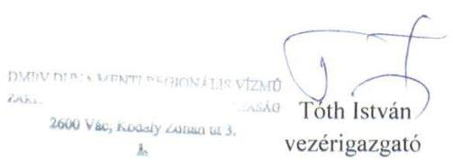

---

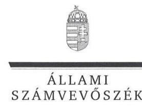

Ikt. szám: V-0875-073/2016.

# Tóth István úr 

vezérigazgató
DMRV Duna Menti Regionális Vízmű
Zártkörűen Működő Részvénytársaság

Vác

Tisztelt Vezérigazgató Úr!

Köszönettel megkaptam a 2016. január 20 napján az Állami Számvevőszékhez érkezett "A DMRV Duna Menti Regionális Vízmű Zártkörűen Működő Részvénytársaság vagyonérték megőrző és gyarapító tevékenységének utóellenőrzése" című számvevőszéki jelentéstervezetben foglalt megállapításokra tett észrevételeit.

Tájékoztatom Vezérigazgató urat, hogy a jelentésben az elfogadott észrevétel átvezetésre került, az el nem fogadott észrevételeket - az Állami Számvevőszékről szóló 2011. évi LXVI. törvény 29. § (3) bekezdése alapján - szerepeltetjük az elutasítás indokainak feltüntetésével együtt.

Az Állami Számvevőszék észrevételekre vonatkozó álláspontjáról a felügyeleti vezető által készített részletes tájékoztatást csatoltan megküldöm.

Budapest, 2016. 06. hó 17. nap
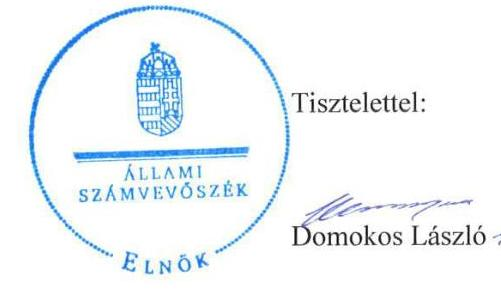

Melléklet: Tájékoztatás az elfogadott és az el nem fogadott észrevételekről, azok indokairól

---

# Tájékoztatás 

az elfogadott és az el nem fogadott észrevételekről, azok indokairól

| 1. | Észrevétel: | „1. A DMRV Zrt. teljes hivatalos megnevezése DMRV Duna Menti Regionális Vízmű Zártkörűen Működő Részvénytársaság. (Röviden: DMRV Zrt.)" |
| :--: | :--: | :--: |
|  | Válasz: | Az Állami Számvevőszék (ÁSZ) az észrevételt elfogadja. |
|  | Indoklás: | Az észrevétel megalapozott, az ellenőrzött szervezet megnevezése a jelentéstervezetben pontosításra került. |
| 2. | Észrevétel: | „8. pont. Részben végrehajtott feladat (Tervezet 13. o.l. sz. melléklet 8. pont)   8.) Az utóellenőrzés szükségét megalapozó 14049. számú ÁSZ jelentésben foglalt intézkedést igénylő megállapítások és javaslatok 5. pontja szerint a DMRV Zrt-nek (továbbiakban: a Társaság) feladata volt az MNV Zrt. engedélye nélkül megvalósított beruházások körülményeinek kivizsgálása. A DMRV Zrt. ezen javaslat alapján Intézkedési Tervben írta elő a megvalósult beruházások ez irányú ellenőrzését. Az intézkedés végrehajtását megelőzően azonban az MNV Zrt 2014. április 11-én megkezdte vizsgálatát a 2012-13. évi beruházások ellenőrzése céljából, melyhez a Társaság az MNV Zrt. által bekért - beruházások indokoltságát és megvalósulását alátámasztó - dokumentumok rendelkezésre állását biztosította és a vizsgálatban aktívan részt vett. Ebből kifolyólag az Intézkedési Tervben előírt ellenőrzés párhuzamos - külön eljárás keretében történő - lefolytatását a DMRV Zrt. nem tartotta indokoltnak.   Az MNV Zrt által végzett ellenőrzés eredményeként 2014. 08.07-én megküldött jelentéstervezet - majd 2014. 09. 04-én megküldött véglegesített jelentés - alapján az MNV Zrt. az adott időszakban megvalósított beruházások szükségességét és indokoltságát megalapozottnak vélte. Erre jelen Tervezet 15. oldalán az MNV Zrt. által határidőben végrehajtott feladat 4. pontja, és az II. sz. melléklet 4. pontja is utal.   Fentiek alapján a Tervezet ezen pontjában rögzített feladatot kérjük HATÁRIDŐBEN VÉGREHAJTOTT FEL-ADAT-ként, vagy tekintettel arra, hogy annak végrehajtása külső szervezet közreműködése által valósult meg - |

---

|  |  | az ÁSZ értékelési módszere szerint kérjük OKAFOGYOTTÁ VÁLT ELŐÍRT FELADAT-ként besorolni. ${ }^{11}$ |
| :--: | :--: | :--: |
|  | Válasz: | Az Állami Számvevőszék az észrevételt nem fogadja el. |
|  | Indoklás: | Az észrevétel nem megalapozott. Az intézkedési tervben tervezett intézkedés végrehajtásához a DMRV Zrt. által az ÁSZ rendelkezésére bocsátott dokumentumok szerint a DMRV Zrt. műszaki és fejlesztési igazgatója által lefolytatott ellenőrzés a beruházások körülményeit, indokoltságát és eredményességét nem ellenőrizte. Az észrevételben hivatkozott, az MNV Zrt. által lefolytatott külső, tulajdonosi ellenőrzés pedig csak a beruházások megvalósításának indokoltságát ellenőrizte. Az intézkedési tervben vállalt feladat szerinti, a beruházások körülményeinek és az eredményességének vizsgálatát a rendelkezésre bocsátott dokumentumok figyelembe vételével sem az MNV Zrt., sem a DMRV Zrt. nem végezte el, így az intézkedési tervben vállalt feladatot a DMRV Zrt. részben hajtotta végre. A jelentéstervezetben ezen intézkedés végrehajtása a rendelkezésre bocsátott dokumentumokkal alátámasztottan a részben végrehajtott feladatok között szerepel.   A fent leírtak alapján az ÁSZ fenntartja a jelentéstervezetben szereplő, a fentiekre vonatkozó azon megállapítását, hogy a 2010-2013. első félévében megvalósult beruházások visszaellenőrzése, azok körülményeinek, indokoltságának és eredményességének vizsgálata, erről összefoglaló jelentés készítése részben valósult meg, mivel a beruházások körülményeinek és az eredményességének vizsgálatát a DMRV Zrt. nem végezte el. |
| 3. | Észrevétel: | „3. VÉGRE NEM HAJTOTT feladat (Tervezet 13. o. és I. sz. melléklet 9. pont)   9.) A Tervezet szerint a DMRV Zrt-nél a beruházási szabályzatot nem egészítették ki az állami beruházások, felújítások aktuális előírásoknak megfelelő MNV Zrt-nél történő engedélyeztetés rendjével....

   Az utóellenőrzés során történt adatszolgáltatás útján az 1. számú Tanúsítvány 1. pontjához csatolva a DMRV Zrt. beküldte az EU6301 v1.10 számú, 2014. 06. 12-én kiadott, 2014. 08. 04-től hatályos Műszaki fejlesztési szabályzatot. E szabályzat megjelenésével egyidőben az EU6301-es számú Beruházási szabályzat 5. kiadása a hatályát vesztette. Az új szabályzat, a kapcsolódó MU6304 és MU6305-ös számú munkautasításokkal együtt - továbbá a 2014. 07. 01-től szintén hatályos (utóellenőrzés során az 1. számú Tanúsítvány 2. pontjához csatolt) EU6116 Vagyonnyilvántartási szabályzat is - |

---

|  | tartalmaz az MNV Zrt. által történő engedélyezési eljárás lefolytatására vonatkozó kikötéseket.   Mindezt kiegészítve a DMRV Zrt. vezérigazgatója külön nyilatkozatban rögzítette, hogy a Társaság alkalmazza az MNV Zrt. honlapján közzétett „Az állami tulajdon, egyéb vagyonkezelők által vagyonkezelt eszközön megvalósítandó beruházások, felújítások előzetes engedélyezésének és elszámolásának menetéről szóló tájékoztatóban" foglalt előírásokat, az eljárásrend belső szabályzatokban történő véglegesítése azonban a Vagyonkezelési szerződés módosítás érvénybe lépéséhez kötött, melyre az EU6301 Műszaki fejlesztési szabályzat is utal. A tisztán állami tulajdonban lévő közműves szennyvízelvezetés- és -tisztítás céljára szolgáló víziközmű rendszer üzemeltetésére vonatkozó módosított Vagyonkezelési Szerződés aláírására 2015. 04. 23-án, míg a vegyes tulajdonú víziközmű rendszerek üzemeltetésére vonatkozó Vagyonkezelési szerződés aláírására 2015. december 8-án került sor.   A fentiek alapján kérjük az 1. számú Tanúsítvány 1. pontjához megírt Nyilatkozat és a hatályos belső szabályozók tartalmára tekintettel a Tervezet ezen pontjában rögzített feladatot az ÁSZ értékelési módszere szerint kérjük HATÁRIDŐBEN VÉGREHAJTOTT FELADAT-ként, vagy a Vagyonkezelési szerződés érvénybe lépésére tekintettel NEM IDŐSZERŰ FELADAT-ként besorolni. |
| :--: | :--: |
| Válasz: | Az Állami Számvevőszék az észrevételt nem fogadja el. |
| Indoklás: | Az észrevétel nem megalapozott. Az intézkedési tervben meghatározottak szerint a DMRV Zrt. a belső szabályzatában az aktuális előírásoknak megfelelően nem szabályozta az állami beruházások, felújítások MNV Zrt.-nél történő engedélyeztetési rendjét, valamint azok teljesítéséről, végrehajtásáról készült beszámolók körét és tartalmát. Ezt támasztja alá a DMRV Zrt. vezérigazgatója által 2015. június 24-én kelt nyilatkozata, amelyben a vezérigazgató nyilatkozott arról, hogy az MNV Zrt.-vel megkötött vagyonkezelési szerződésmódosítás jogerőre emelkedéséig annak X. Beruházások elszámolása fejezetben előírt szabályokat belső szabályzatukban nem teszik kötelezővé, továbbá arról, hogy a vagyonkezelési szerződés még nem emelkedett jogerőre. Ennek következtében a belső szabályzatok módosítása nem készült el, így ezen intézkedési tervben előírt feladat nem teljesült, amely a jelentéstervezetben a végre nem hajtott feladatok között szerepel.   A fent leírtak alapján az ÁSZ fenntartja a jelentéstervezetben tett megállapítását, mely szerint a DMRV Zrt. az |

---

|  |  | aktuális előírásoknak megfelelően a belső szabályzatában nem szabályozta az állami beruházások, felújítások MNV Zrt.-nél történő engedélyeztetési rendjét, valamint azok teljesítéséről, végrehajtásáról készült beszámolók körét és tartalmát. |
| :--: | :--: | :--: |
|  | Észrevétel: | ,, 4. VÉGRE NEM HAJTOTT feladat (Tervezet 13. o. és   I. sz. melléklet 10. pont)   10) A tervezet alapján az MNV Zrt. engedélye nélkül végzett beruházásokról készült összefoglaló jelentés nem tartalmazott a felelősség megállapítására vonatkozó információt, melynek hátterét a DMRV Zrt. által kiadott, 1. számú Tanúsítvány 4.2. pontjához kapcsolódó Nyilatkozat tartalmazza, miszerint felelősségi eljárás lefolytatására azért nem került sor, mert akivel szemben az eljárás érvényesíthető lenne, már nem áll a Társaságnál munkaviszonyban.   Ezen nyilatkozatát a Társaság továbbra is fenntartja. Az Intézkedési Terv feladata szerint felelősségre vonási eljárás lefolytatására annak szükség szerint kellett sort keríteni, melynek szüksége így okafogyottá vált, az MNV Zrt. által lefolytatott ellenőrzés alapján pedig indokolt sem volt." |
|  | Válasz: | Az Állami Számvevőszék az észrevételt nem fogadja el. |
| 4. | Indoklás: | Az észrevétel nem megalapozott. Az ÁSZ rendelkezésére bocsátott dokumentumok alapján az intézkedési tervben a felelősség megállapítására vonatkozó tervezett intézkedés végrehajtása nem történt meg. Ugyanis az intézkedési tervben foglaltak szerinti, a 2010-2013. évek közötti időszakban az MNV Zrt. engedélye nélkül végzett beruházásokra vonatkozóan a DMRV Zrt. műszaki és fejlesztési osztályvezetője végzett ellenőrzést, aki a csatolt dokumentumok tanúsága szerint a felelősséget nem vizsgálta. Az MNV Zrt. vezérigazgatója által 2014. április 11-én elrendelt tulajdonosi ellenőrzés is csak a 2012-2013. évben végzett beruházásokra irányult, a felelősségre vonatkozó megállapítása is csak a 2012. évre vonatkozott. Sem az ÁSZ javaslata, sem az intézkedési tervben foglalt intézkedés nem az MNV Zrt. általi külső, tulajdonosi ellenőrzésre vonatkozott. A DMRV Zrt. által az ÁSZ rendelkezésére bocsátott dokumentumok (2015. június 23-i vezérigazgatói nyilatkozat) is azt támasztják alá, hogy a DMRV Zrt.-nél az intézkedési tervben vállalt feladatot - az engedély nélküli beruházások miatti felelősség megállapítására vonatkozó ellenőrzés - nem hajtották végre, ezért ezen intézkedés végrehajtásával kapcsolatos megállapítás a jelentéstervezetben a végre nem hajtott intézkedések között szerepel. |

---

|  |  | A fent leírtak alapján az ÁSZ fenntartja a jelentéstervezetben tett, az engedély nélküli beruházásokkal összefüggő felelősség kivizsgálásához kapcsolódó ellenőrzési megállapítását. |
| :--: | :--: | :--: |
| 5. | Észrevétel: | „5. VÉGRE NEM HAJTOTT feladat (Tervezet 14. o. és I. sz. melléklet 11. pont)   11) A Tervezet szerint a DMRV Zrt. nem végzett a 2010-2011. évi állami vagyonkezelt vagyonból történő selejtezés szabálytalanságainak feltárására irányuló ellenőrzést, mellyel kapcsolatban a DMRV Zrt. az utóellenőrzés során nyilatkozta (az I. számú Tanúsítvány 5.2. pontjához), hogy ezt a feladatot az MNV Zrt. jóval tágabb - 15 évre visszamenőlegesen történt időintervallumra - vonatkozóan egy független könyvvizsgálóval elvégeztette. A Társaság - az MNV Zrt. által - a vizsgálathoz bekért dokumentumokat a könyvvizsgáló rendelkezésére bocsátott és a vizsgálatban is aktívan részt vett.   Az ellenőrzés eredményeként 2014. 06. 05-én selejtezésre vonatkozó megállapodás került aláírásra (az utóellenőrzés dokumentumaként az 1. számú Tanúsítvány 5.1. pontjához 1_10 Megbizási szerződés selejtezésekkel összefüggésben fájlnéven csatolva), melyben az MNV Zrt. a selejtezések elszámolását a vagyonkezelési jogviszony kezdetétől 2013. december 31-ig jóváhagyta. A DMRV Zrt. ezzel a kiírt intézkedést végrehajtottnak tekintette.   A fentiek alapján az ÁSZ értékelési módszere szerint kérjük a feladatot HATÁRIDŐBEN VÉGREHAJTOTT FELADAT-ként besorolni, vagy a DMRV Zrt. intézkedései tekintetében - figyelembe véve az 1. számú tanúsítvány 5.2. pontjához megírt Nyilatkozat tartalmát, és azt a tényt, hogy a feladat külső szervezet közreműködése által valósult meg - kérjük a feladatot OKAFOGYOTTÁ VÁLT ELŐÍRT FELADAT-ként besorolni." |
|  | Válasz: | Az Állami Számvevőszék az észrevételt nem fogadja el. |
|  | Indoklás: | Az észrevétel nem megalapozott. A DMRV Zrt. az intézkedési tervében foglalt feladatot nem hajtotta végre, amelyet a vezérigazgató a 2014. június 24-i nyilatkozatában is megerősített. A vezérigazgató nyilatkozatában arra hivatkozott, hogy „... Ennek hátterében az állhat, hogy egyrészt 2012. évtől a selejtezés az MNV felé történő engedélykérelmek beküldésével történt. Másrészt az MNV Zrt. a 15 évre visszamenőleg történő elszámoltatás során a teljes selejtezési anyagot bekérte, általa megbízott független könyvvizsgálóval megvizsgáltatta..." Az ÁSZ álláspontja szerint azonban ez nem jelentette a DMRV Zrt. részére tett ÁSZ javaslat hasznosítására készített intézkedési tervben meghatározott intézkedés végrehajtását, mivel az állami vagyonkezelt vagyonból történt selejtezésekkel kapcsolatos esetleges szabálytalanságok feltárására, jelentés készítésére a Vezérigazgató felé nem történt intézkedés. A DMRV Zrt. vezérigazgatója által hivatkozott megbízási szerződés ugyan tartalmaz arra utalást, hogy az MNV Zrt. elvégeztette a DMRV Zrt.-nél végrehajtott selejtezések számviteli megfelelőségét külső szakértővel, aki a selejtezések számviteli elszámolását rendben találta. Ugyanakkor a 14049. sorszámú jelentésben a selejtezéssel kapcsolatban hiányosságokat tárt fel az ÁSZ, azonban a DMRV Zrt. nem bocsátott az ÁSZ rendelkezésre sem a helyszíni ellenőrzés ideje alatt, sem a jelen észrevételhez kapcsolódóan olyan dokumentumot, amelyből megállapítható lett volna, hogy a konkrét hiányosságok megszüntetésére az intézkedési tervben tervezett intézkedéseket a DMRV Zrt.-nél végrehajtották, a feltárt hibákat, szabálytalanságokat kijavították. Ennek alapján a DMRV Zrt. a selejtezésekhez kapcsolódóan a feltárt hiányosságok megszüntetésére készített intézkedési tervben meghatározott feladatot nem hajtotta végre.   A fent leírtak alapján az ÁSZ fenntartja jelentéstervezetben foglalt, a selejtezésekkel kapcsolatban tett megállapítását. |
| 6. | Észrevétel: | „6. VÉGRE NEM HAJTOTT feladat (tervezet 14. o. és 1. sz. melléklet 12. pont)   12) A Tervezet szerinti felelősségre vonási eljárás hiánya - az előző pontban részletezettek szerint - nem az ellenőrzés végrehajtásának hiányából fakadt. A külső szervezet által végrehajtott ellenőrzés során elmarasztaló megállapítás nem született, így személyi felelősségre vonás nem vált indokolttá. Az Intézkedési Terv a felelősségre vonás lefolytatását annak szükségszerűségéhez kötötte, mely feladat végrehajtása jelen esetben tehát nem bizonyult megalapozottnak. Erről a DMRV Zrt. az 1. számú tanúsítvány 5.2. pontja kapcsán szintén nyilatkozott.   Fentiek alapján a Tervezet ezen pontjában rögzített feladatot az ÁSZ értékelési módszere szerint kérjük OKAFOGYOTTÁ VÁLT ELŐÍRT FELADAT-ként besorolni." |
|  | Válasz: | Az Állami Számvevőszék az észrevételt nem fogadja el. |
|  | Indoklás: | Az észrevétel nem megalapozott. Az előző pontban (5. pont) foglaltak figyelembe vételével a DMRV Zrt. a selejtezésekkel kapcsolatos esetleges szabálytalanságok feltárására, jelentés készítésére nem intézkedett. Sem a helyszíni ellenőrzés ideje alatt, sem jelen észrevételhez |

---

|  | nem bocsátottak az ÁSZ rendelkezésre olyan dokumentumot, amelyből megállapítható lett volna, hogy az ÁSZ által feltárt szabálytalanságok miatt szükségessé vált-e a felelősség megállapítása. Így az intézkedési tervben meghatározott, a selejtezések során feltárt szabálytalanságokkal kapcsolatos felelősség megállapítására sem került sor, ugyanis azt az intézkedést, amely alapján a felelősség megállapítható lett volna el sem végezték.   A fent leírtak alapján az ÁSZ fenntartja a jelentéstervezetben a selejtezések felelősségével kapcsolatos megállapítását. |
| :--: | :--: |

Budapest, 2016. 02. hó 44. nap
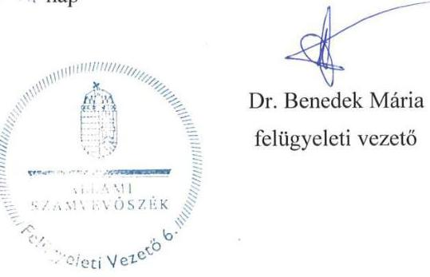

---

.

---

# RÖVIDÍTÉSEK JEGYZÉKE 

${ }^{1}$ ÁSZ
${ }^{2}$ DMRV Zrt.
${ }^{3}$ MNV Zrt.
${ }^{4}$ ÁSZ jelentés
${ }^{5}$ Áht.
${ }^{6}$ DMRV Zrt. vezérigazgató/VIG
${ }^{7}$ gazdasági igazgató
${ }^{8}$ műszaki fejlesztési osztályvezető
${ }^{9}$ vagyongazdálkodási csoportvezető
${ }^{10}$ belső ellenőr
${ }^{11}$ beszerzési csoportvezető
${ }^{12}$ Megrendelőként történő szerződéskötés folyamata utasítás
${ }^{13}$ Aláírási, utalványozási, teljesítésigazolási jog gyakorlása utasítás
${ }^{14}$ Műszaki fejlesztések kivitelezésének általános szabályai szabályzat
${ }^{15}$ Selejtezési szabályzat
${ }^{16}$ Belső ellenőrzési szabályzat
${ }^{17}$ Belső Ellenőrzési Kézikönyv
${ }^{18}$ vezérigazgató
${ }^{19}$ gazdasági igazgató
${ }^{20}$ ingó- és ingatlanokért felelős főigazgató
${ }^{21}$ ellenőrzési igazgató
${ }^{22}$ vezérigazgatói utasítás
${ }^{23}$ Vagyonnyilvántartási Szabályzat

Állami Számvevőszék
DMRV Duna Menti Regionális Vízmű Zártkörűen Működő Részvénytársaság Magyar Nemzeti Vagyonkezelő Zártkörűen Működő Részvénytársaság Az ÁSZ 14049 számú jelentése. (Közzététel dátuma: 2014. április 14.). Az elkészített jelentés az interneten, a www.asz.hu címen olvasható. Az államháztartásról szóló 2011. évi CXCV. törvény
a DMRV Duna Menti Regionális Vízmű

 Zrt. vezérigazgatója 2012. június 01-től
a DMRV Duna Menti Regionális Vízmű Zrt. gazdasági igazgatója
a DMRV Duna Menti Regionális Vízmű Zártkörűen Működő Részvénytársaság műszaki fejlesztési osztályvezetője
a DMRV Duna Menti Regionális Vízmű Zrt. vagyongazdálkodási csoportvezetője
a DMRV Duna Menti Regionális Vízmű Zrt. belső ellenőre
a DMRV Duna Menti Regionális Vízmű Zrt. beszerzési csoportvezetője
a DMRV Duna Menti Regionális Vízmű Zártkörűen Működő Részvénytársaság EU7404 Megrendelőként történő szerződéskötés folyamata utasítása (hatályos: 2012. június 4-től)
a DMRV Duna Menti Regionális Vízmű Zártkörűen Működő Részvénytársaság EU5504 Aláírási, utalványozási, teljesítésigazolási jog gyakorlása utasítás (hatályos: 2013. március 11-től)
a DMRV Duna Menti Regionális Vízmű Zártkörűen Működő Részvénytársaság MU6305 Műszaki fejlesztések kivitelezésének általános szabályairól szóló utasítás (hatályos: 2014. július 1-jétől)
a DMRV Duna Menti Regionális Vízmű Zártkörűen Működő Részvénytársaság EU6103 Selejtezési szabályzata (hatályos: 2013. január 1-jétől)
a DMRV Duna Menti Regionális Vízmű Zártkörűen Működő Részvénytársaság EU8203 Belső ellenőrzési szabályzata (hatályos: 2014. szeptember 1-jétől)
a DMRV Duna Menti Regionális Vízmű Zártkörűen Működő Részvénytársaság Belső Ellenőrzési kézikönyve (hatályos: 2014. szeptember 1-jétől)
Magyar Nemzeti Vagyonkezelő Zrt. vezérigazgatója
Magyar Nemzeti Vagyonkezelő Zrt. gazdasági igazgatója
Magyar Nemzeti Vagyonkezelő Zrt. ingó- és ingatlanokért felelős főigazgatója
Magyar Nemzeti Vagyonkezelő Zrt. ellenőrzési igazgatója
a Magyar Nemzeti Vagyonkezelő Zártkörűen Működő Részvénytársaság 35/2014. (X. 16.) számú vezérigazgatói utasítása „Az állami tulajdonon, egyéb vagyonkezelők által vagyonkezelt eszközön megvalósítandó beruházások, felújítások előzetes engedélyezésének és elszámolásának eljárásrendjéről"
a Magyar Nemzeti Vagyonkezelő Zártkörűen Működő Részvénytársaság 12/2014. (V. 31.) számú vezérigazgatói utasítása „A Magyar Nemzeti Vagyonkezelő Zrt. állami vagyon vagyonkezelőire, az állami vagyont használókra és a társasági

---

24 vagyonkezelői szerződés módosítás
${ }^{25}$ vezérigazgatói határozat
${ }^{26}$ kabinetfőnök
${ }^{27}$ Beruházási és elszámolási eljárásrend
${ }^{28}$ Vhr.
${ }^{29}$ Számviteli politika
${ }^{30}$ Tárgyi eszköz gazdálkodási szabályzat
${ }^{31}$ FB
${ }^{32}$ Műszaki fejlesztési szabályzat
${ }^{33}$ KDVVIZIG
részesedések esetében az MNV Zrt. tulajdonosi joggyakorlását megbízottként ellátókra vonatkozó Vagyonnyilvántartási Szabályzatáról"
DMRV Zrt. SZT-104292 számú vagyonkezelési szerződés módosítása
a 402/2014. (VIII. 29.) számú Magyar Nemzeti Vagyonkezelő Zártkörűen Működő Részvénytársaság vezérigazgatójának határozata az intézkedési terv végrehajtásáról
a Magyar Nemzeti Vagyonkezelő Zrt. kabinet vezetője
a Magyar Nemzeti Vagyonkezelő Zártkörűen Működő Részvénytársaság 35/2014. Vezérigazgatói utasítása a 41/2014. számú utasítással egységes szerkezetben Az állami tulajdonon, egyéb vagyonkezelők által vagyonkezelt eszközön megvalósítandó beruházások, felújítások előzetes engedélyezésének és elszámolásának eljárásrendjéről (hatályos: 2014. október 11-től)
az állami vagyonnal való gazdálkodásról szóló 254/2007. (X. 4.) Korm. rendelet (hatályos: 2007. október 4-től)
a DMRV Duna Menti Regionális Vízmű Zártkörűen Működő Részvénytársaság EU6104 Számviteli Politika (hatályos: 2014. január 1-jétől)
a DMRV Duna Menti Regionális Vízmű Zártkörűen Működő Részvénytársaság MU6309 Tárgyi eszköz gazdálkodási szabályzata (hatályos: 2014. október 14-től)
DMRV Duna Menti Regionális Vízmű Zártkörűen Működő Részvénytársaság Felügyelő Bizottság
a DMRV Duna Menti Regionális Vízmű Zártkörűen Működő Részvénytársaság EU6301 Műszaki fejlesztések kivitelezésének általános szabályairól szóló utasítás (hatályos: 2014. augusztus 4-től)
Közép-Duna-völgyi Vízügyi Igazgatóság

---

# ÁLLAMI SZÁMVEVŐSZÉK 

1052 Budapest, Apáczai Csere János utca 10.
Levélcím: 1364 Budapest 4. Pf. 54
Telefon: +36 14849100 Telefax: +36 14849200
www.asz.hu
