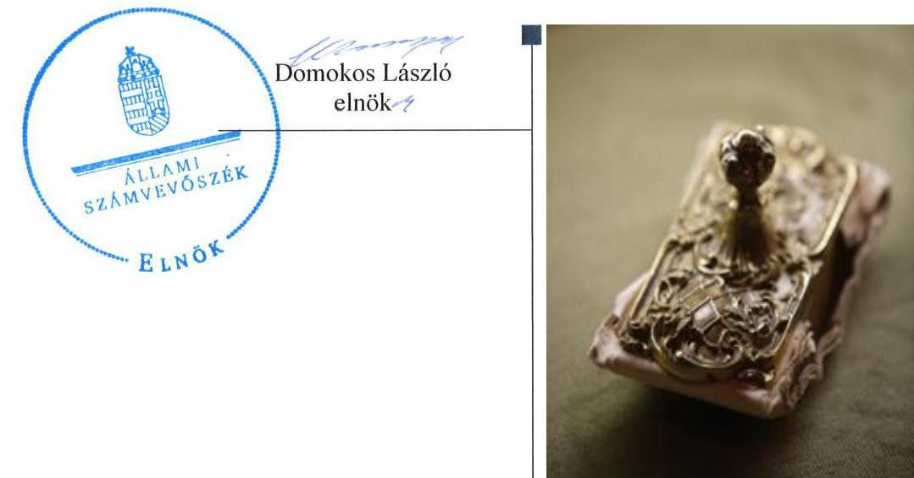
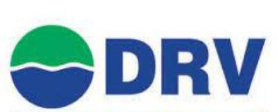
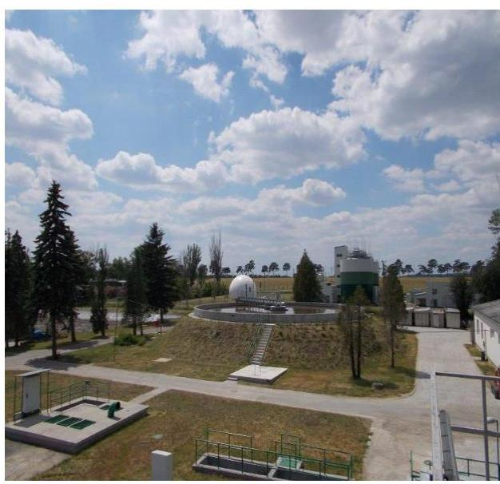
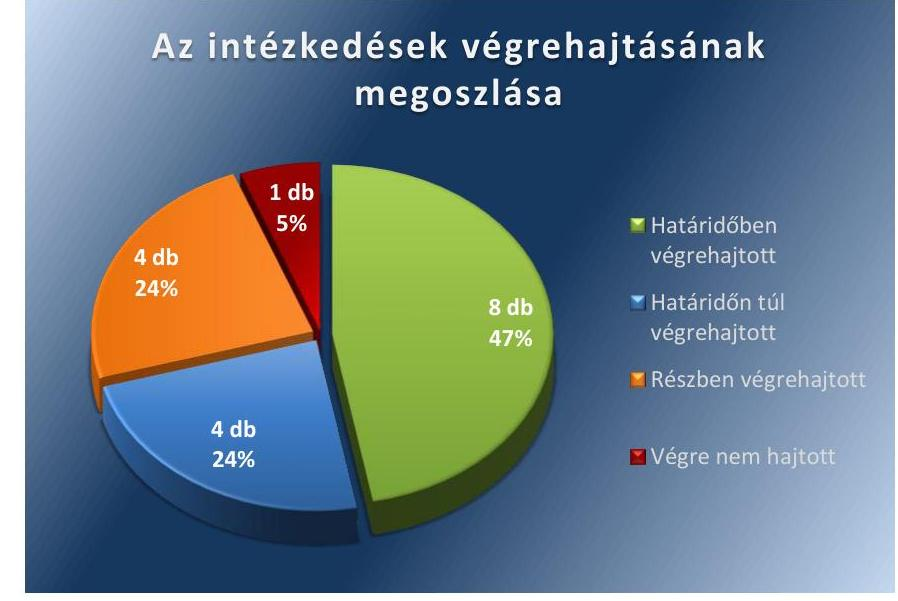
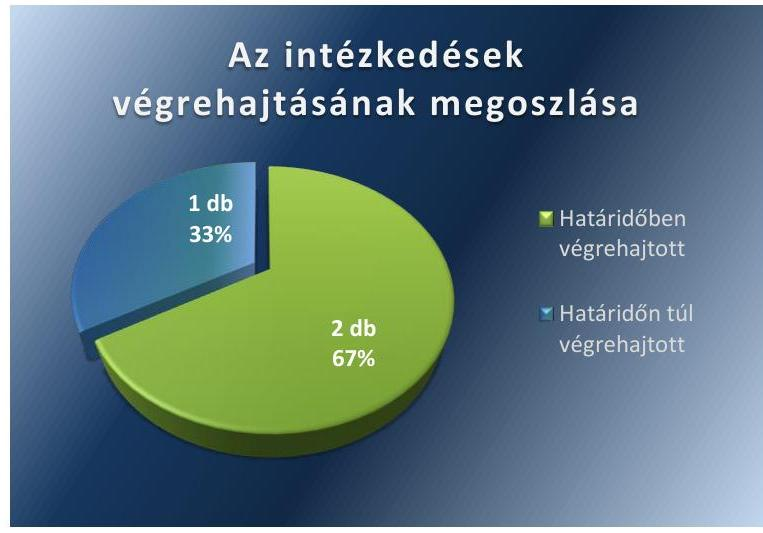

ÁLLAMI SZÁMVEVŐSZÉK

# Jelentés 

## Utóellenőrzések

A Dunántúli Regionális Vízmű Zártkörűen Működő Részvénytársaság vagyonérték megőrző és gyarapító tevékenységének utóellenőrzése 2016.

---

# Jelentés 

## Utóellenőrzések

A Dunántúli Regionális Vízmű Zártkörűen Működő Részvénytársaság vagyonérték megőrző és gyarapító tevékenységének utóellenőrzése 2016. február 22.

---

# AZ ELLENŐRZÉST FELÜGYELTE:

DR. BENEDEK MÁRIA felügyeleti vezető

## AZ ELLENŐRZÉST VEZETTE ÉS A VÉGREHAJTÁSÁÉRT FELELŐS:

**BÍRÓ ZSOLT** ellenőrzésvezető

**A PROGRAM ÖSSZEÁLLÍTÁSÁÉRT FELELŐS:**

**JANIK JÓZSEF LÁSZLÓ** osztályvezető

**A TÉMÁHOZ KAPCSOLÓDÓ KORÁBBI SZÁMVEVŐSZÉKI JELENTÉS:**

|  címe: | Jelentés az állami tulajdonban (résztulajdonban) lévő gazdálkodó szervezetek vagyonérték megőrző és gyarapító tevékenységének ellenőrzéséről egyes kiemelt közszolgáltató társaságoknál vagy hasonló tevékenységet végző társaságcsoportoknál – Dunántúli Regionális Vízmű Zrt.  |
| --- | --- |
|  sorszáma: | 14052  |

**IKTATÓSZÁM:** V-0876-031/2016.

**TÉMASZÁM:** 1910

**ELLENŐRZÉS-AZONOSÍTÓ SZÁM:** V071709

---

# TARTALOMJEGYZÉK 

■ ÖSSZEGZÉS ..... 5
■ AZ ELLENŐRZÉS CÉLJA ..... 6
■ AZ ELLENŐRZÉS TERÜLETE ..... 7
■ AZ ELLENŐRZÉS HÁTTERE, INDOKOLTSÁGA ..... 8
■ FÓKUSZKÉRDÉSEK ..... 9
■ ELLENŐRZÉS HATÓKÖRE ÉS MÓDSZEREI ..... 10
■ MEGÁLLAPÍTÁSOK ..... 12
■ MELLÉKLETEK ..... 17
I. SZ. MELLÉKLET: Az ÁSZ 14052 számú jelentéséhez kapcsolódó DRV Zrt. intézkedési terv végrehajtása ..... 17
II. SZ. MELLÉKLET: Az ÁSZ 14052 számú jelentéséhez kapcsolódó MNV Zrt. intézkedési terv végrehajtása ..... 21
■ FÜGGELÉK: ÉSZREVÉTELEK ..... 23
■ RÖVIDÍTÉSEK JEGYZÉKE ..... 25

---

.

---

# ÖSSZEGZÉS 

Az ÁSZ ${ }^{1}$ a DRV Zrt. ${ }^{2}$ vagyonérték megőrző és gyarapító tevékenységének utóellenőrzését 2014. április 14. és 2015. június 17. közötti időszakra végezte el. Megállapította, hogy a DRV Zrt. az ÁSZ javaslatainak hasznosítására előírt intézkedéseket

részben hajtotta végre, az MNV Zrt.-nél - mint a tulajdonosi jogok gyakorlójánál - az intézkedési tervben meghatározott feladatok részben határidőn túl kerültek végrehajtásra.

## Az ellenőrzés társadalmi indokoltsága

Az Állami Számvevőszék stratégiájában célul tűzte ki a számvevőszéki munka hasznosulásának javítását. Ezzel összhangban ellenőrzi, hogy az ellenőrzött szervezetek megvalósították-e a korábbi ellenőrzései által feltárt hibák, hiányosságok és szabálytalanságok megszüntetése céljából kialakított intézkedési terveikben foglaltakat. A rendszeres utóellenőrzések hozzájárulnak a szükséges intézkedések tényleges végrehajtásához, ezáltal a közpénzügyek rendezettségének javulásához.

## Főbb megállapítások, következtetések, javaslatok

A DRV Zrt. és az MNV Zrt. - mint tulajdonosi joggyakorló - az intézkedési terveket határidőben megküldték az ÁSZ részére.

A DRV Zrt. az intézkedési tervben meghatározott 17 feladatból nyolcat határidőben, négyet részben, négyet határidőn túl teljesített. Az MNV Zrt. az intézkedési tervében foglalt feladatok közül kettőt határidőben, egyet az előírt határidőn túl teljesített.

---

# AZ ELLENŐRZÉS CÉLJA 

## A DRV Zrt. vagyonérték megőrző és gyarapító tevékenységének utóellenőrzése

Az ellenőrzés célja annak értékelése, hogy a számvevőszéki jelentésben foglalt intézkedést igénylő megállapításokkal és javaslatokkal összhangban készített intézkedési tervben meghatározott feladatokat az ellenőrzött szervezet végrehajtotta-e.

---

# **AZ ELLENŐRZÉS TERÜLETE**

### **DRV Zrt.**

A DRV Zrt., több mint 100 éves szakmai múltjával a délnyugat-magyarországi régió meghatározó víziközmű szolgáltatója. Fő tevékenysége a víztermelés, -kezelés, -ellátás és szennyvíz gyűjtése, kezelése, együttesen víziközmű szolgáltatás. Összességében 810 ezer ember egészséges ivóvízzel történő ellátásáról gondoskodik Baranya, Fejér, Somogy, Tolna, Veszprém és Zala megye 383 településén. Szolgáltatási feladatait állami, önkormányzati és vegyes tulajdonú víziközművek üzemeltetésével (vagyonkezelési, üzemeltetési, koncessziós szerződések keretében) látja el, az állami víziközművek vonatkozásában vagyonkezelői feladatokat is végez.

Az MNV Zrt. közel 16 ezermilliárd forint értékű állami vagyon feletti tulajdonosi jogokat gyakorolja. Feladatai a kormányzati irányelveknek és a hatályos jogszabályoknak megfelelően a stratégiai szemléletű, felelős vagyongazdálkodás, a portfólió-racionalizálás, a korszerű ingatlangazdálkodás, a nemzeti társaságok eredményességének növelése, valamint a nemzeti vagyon megőrzése és gyarapítása. Az MNV Zrt. a rábízott vagyonnal történő gazdálkodás során stratégiai szempontok szerint gyakorolja az állami tulajdonban lévő társaságok tulajdonosi jogait. A DRV Zrt.-ben a Magyar Állam nevében 90 %-os részesedéssel gyakorolja a tulajdonosi jogokat.

Az utóellenőrzés – a 2014. április 14-től a 2015. június 17-ig végrehajtott intézkedéseket figyelembe véve – az állami tulajdonban (résztulajdonban) lévő DRV Zrt. vagyonérték megőrző és gyarapító tevékenységének ellenőrzéséről közzétett ÁSZ jelentés intézkedést igénylő megállapításai és javaslatai hasznosítására készült intézkedési tervekben foglalt feladatok végrehajtására irányult. Az ÁSZ jelentését 14052 számon 2014. április 14-én hozta nyilvánosságra. A DRV Zrt. és az MNV Zrt. – mint tulajdonosi joggyakorló – az intézkedési terveket határidőben megküldték az ÁSZ részére.

---

# AZ ELLENŐRZÉS HÁTTERE, INDOKOLTSÁGA 

Az ÁSZ törvény 33. § (1) bekezdése értelmében a számvevőszéki jelentések intézkedést igénylő megállapításaihoz és javaslataihoz kapcsolódóan az ellenőrzött szervezet vezetője intézkedési tervet köteles összeállítani, és az Állami Számvevőszék részére megküldeni. Az intézkedési tervben foglaltak megvalósítását - az ÁSZ törvény 33. § (7) bekezdésében foglaltak alapján - az Állami Számvevőszék utóellenőrzés keretében ellenőrizheti. Az intézkedések megvalósulásának értékelése során az Állami Számvevőszék figyelembe veszi az ellenőrzött szervezetek működési feltételeiben, valamint a jogszabályi előírásokban bekövetkezett változásokat.

Az intézkedési tervekben foglalt feladatok hiányos, illetve késedelmes végrehajtása, valamint megvalósításának elmaradása azt mutatja, hogy az ellenőrzések során feltárt hibák, hiányosságok és szabálytalanságok megszüntetése nem kapott kellő hangsúlyt. Ez a szabályszerű működés és a felelős vezetői magatartás vonatkozásában kockázatot hordoz. E kockázatok feltárásával az Állami Számvevőszék utóellenőrzési rendszere fokozza a fegyelmet, és igazolja, hogy a közpénzzel való szabályos gazdálkodás felelőssége elől nem lehet kitérni.

## AZ ELLENŐRZÉS VÁRHATÓ HASZNOSULÁSA

Az utóellenőrzés négy szinten hasznosulhat:

- A társadalom szintjén az utóellenőrzés jelzi, hogy a számvevőszéki ellenőrzés megállapításainak van következménye: a hiányosságok megszüntetésére az ellenőrzött szervezet által meghatározott intézkedések végrehajtását is számon kéri az ÁSZ.
- Az ellenőrzött terület szintjén az utóellenőrzés tájékoztatást nyújt a terület döntéshozóinak a hiányosságok kiküszöbölésének jó gyakorlatairól, ezzel lehetőséget biztosítva arra, hogy az ÁSZ ellenőrzési megállapításai, javaslatai a terület nem ellenőrzött szervezeteinek a működése során is hasznosuljanak.
- Az ellenőrzött szervezet szintjén az utóellenőrzés feltárja, hogy a szervezet az intézkedések végrehajtásával hasznosította-e a korábbi ellenőrzési jelentésben a hiányosságok megszüntetése, illetve a kockázatok kezelése érdekében megfogalmazott javaslatokat.
- Az ÁSZ szintjén az utóellenőrzés visszacsatolást ad az ellenőrzési jelentések hasznosulásáról, az intézkedések elmaradása vagy részleges megvalósulása a további ellenőrzésekhez kockázati jelzésként szolgál.

---

# FÓKUSZKÉRDÉSEK 

Az ellenőrzött szervezetek az intézkedési tervekben foglaltakat az előírt határidőben - végrehajtották-e?

---

# ELLENŐRZÉS HATÓKÖRE ÉS MÓDSZEREI 

## Az ellenőrzés típusa

Szabályszerűségi ellenőrzés

## Az ellenőrzött időszak

A számvevőszéki jelentés közzétételének napjától (2014. április 14.) az utóellenőrzés megkezdésének napjáig (2015. június 17.) tartó időszak.

## Az ellenőrzés tárgya

Az ÁSZ tv. alapján az ÁSZ jelentésben megfogalmazott javaslatokra készített, az ellenőrzött szervezetek által megküldött intézkedési tervekben foglaltak hasznosulása.

## Az ellenőrzött szervezet

A DRV Zrt. és az MNV Zrt.

## Az ellenőrzés jogalapja

Az ellenőrzés végrehajtásának jogszabályi alapját az ÁSZ tv. 1. § (3) bekezdése, a 33. § (1)-(2), (7) bekezdései, valamint az Áht. ${ }^{5}$ 61. § (2) bekezdésének előírásai képezték.

## Az ellenőrzés módszerei

Az ellenőrzést a nemzetközi standardokat irányadónak tekintve az ellenőrzési program ellenőrzési kérdései, az ellenőrzött időszakban hatályos jogszabályok, az ellenőrzés szakmai szabályok és módszertanok figyelembe vételével, az utóellenőrzéseket önállóan vagy ellenőrzéshez kapcsolódóan végeztük.

Az utóellenőrzés megállapításait elsősorban az ÁSZ rendelkezésére álló, valamint az ellenőrzött szervezetektől elektronikusan bekért dokumentumok alapozták meg. Az ÁSZ az ellenőrzés keretében egyes esetekben teljesítményellenőrzés tervezéséhez is kért adatokat.

---

Az ellenőrzési bizonyítékként felhasználható adatforrások közé tartoznak egyrészt a szakmai programban felsorolt adatforrások, másrészt minden - az ellenőrzés folyamán feltárt, az ellenőrzés szempontjából releváns információt tartalmazó - dokumentum.

Az ellenőrzés során értékeltük, hogy az ÁSZ jelentésben foglalt javaslatokra az elkészített intézkedési terveket határidőben megküldték-e, az ÁSZ által befogadott intézkedési tervekben foglaltakat végrehajtották-e.

Az intézkedési tervben előírt feladatok végrehajtásának ellenőrzését értékelési kritériumok alapján végeztük. Figyelembe vettük az intézkedési terv jóváhagyását követően hatályba lépett jogszabályi előírások változásából következő események, továbbá a feladat-ellátási és finanszírozási rendszer esetleges változásának hatásait. Az intézkedési tervekben előírt feladatokat azok végrehajthatósága, illetve végrehajtása szempontjából az alábbiak szerint értékeltük:
$\longrightarrow$ okafogyottá vált az előírt feladat, ha végrehajtására - meghatározott esemény bekövetkezése, továbbá külső körülmény, a működést érintő feltétel változása miatt - már nincs szükség, illetve lehetőség, és egyértelműen megállapítható, hogy az intézkedést szükségessé tevő körülmény a jövőben nem fordulhat elő;
$\longrightarrow$ nem időszerű az a feladat, amelynek ellenőrzési időszakon belüli végrehajtására azért nem került (kerülhetett) sor, mert az intézkedés alapjául szolgáló esemény nem következett be, de annak jövőbeni előfordulása lehetséges, a végrehajtása nem volt esedékes, vagy a végrehajtás határideje még nem járt le;
$\longrightarrow$ határidőben végrehajtott a feladat, ha a teljesítés dokumentáltan az intézkedési tervben előírt határidőben és tartalommal megtörtént;
$\longrightarrow$ határidőn túl végrehajtott a feladat, ha annak teljesítése az intézkedési tervben meghatározott módon, de az előírt határidőn túl történt meg;
$\longrightarrow$ részben végrehajtott az a feladat, amelynek végrehajtása teljes körűen az intézkedési tervben előírt módon nem történt meg;
$\longrightarrow$ nem végrehajtott a feladat, ha a végrehajtás nem történt meg, vagy amennyiben a végrehajtását nem dokumentálták.
Az ellenőrzés lefolytatásához az ellenőrzött szervezetek a tanúsítványok kitöltésével, valamint az ÁSZ által kért dokumentumok elektronikus megküldésével szolgáltattak adatokat, amelyek valódiságát és teljes körűségét az ellenőrzött szervezetek vezetői által tett teljességi és hitelességi nyilatkozatok igazolták. Az így rendelkezésre bocsátott adatok, információk kontrollja az ellenőrzés keretében történt.

---

# MEGÁLLAPÍTÁSOK 

## Az ellenőrzött szervezetek az intézkedési tervekben foglaltakat - az előírt határidőben - végrehajtották-e?

Összegző megállapítás

A DRV Zrt. az intézkedési tervben meghatározott 17 feladatból nyolcat határidőben, négyet részben, négyet határidőn túl teljesített és egyet nem hajtott végre. Az MNV Zrt. az intézkedési tervében foglalt feladatok közül kettőt határidőben, egyet az előírt határidőn túl teljesített.

Az intézkedési tervben meghatározott feladatokat, határidőket, az ÁSZ jelentés javaslatainak címzettjét és a feladatok végrehajtását az I. és II. számú melléklet mutatja be.

Az ÁSZ a jelentésben a DRV ZRT. vezérigazgatója részére kilenc javaslatot fogalmazott meg, amelynek hasznosítására a DRV Zrt. az intézkedési tervében tizenhét feladatot határozott meg. A feladatok elvégzésének felelőseként a vezérigazgatót ${ }^{6}$, a beruházási osztályvezetőt ${ }^{7}$, a belső ellenőrt ${ }^{8}$, a vagyongazdálkodási osztályvezetőt ${ }^{9}$ és a fejlesztési főmérnököt ${ }^{10}$ jelölték meg.

A DRV Zrt. intézkedési tervében vállalt intézkedések végrehajtásának kategóriánkénti megoszlását az 1. számú ábra szemlélteti.

1. számú ábra

HATÁRIDŐBEN VÉGREHAJTOTT feladat:

1. Az ellenőrzött időszakban a beruházási terveket előzetesen engedélyeztették.

---

2. A beruházásokkal, felújításokkal kapcsolatos elszámolási kötelezettségüket az MNV Zrt. tájékoztatójában meghatározott módon teljesítették.
3. Az állami vagyon azonosítására alkalmas egységes nyilvántartást, a vagyonnyilvántartás vezetéséhez szükséges adatszolgáltatás tartalmának és formájának részletes szabályozását az ellenőrzött időszakban az MNV Zrt. meghatározta.
4. Az állami vagyonon végzett beruházások, értéknövelő felújítások bekerülési értékének aktiválása az üzembe helyezés időpontjával egyidejűleg történt.
5. A vagyonértékelés és a strukturált leltár a szerződésben rögzített határidőre és műszaki tartalommal elkészült.
6. A DRV Zrt. a selejtezési szabályozás keretében megbízási szerződést kötött a vagyonkezelésében lévő eszközök selejtezésére és hulladékok kezelésére az MNV Zrt.-vel.
7. A DRV Zrt. az MNV Zrt.-vel a vagyonkezelésében lévő eszközök selejtezésére

 és hulladékok kezelésére kötött megbízási szerződésben foglaltakkal összhangban 2014. június 26-án hatályba helyezte a selejtezési ügyviteli rendet, majd 2015. április 30-ától hatályba léptette az aktualizált selejtezési szabályzatát ${ }^{11}$.
8. A DRV Zrt. belső ellenőrzése kivizsgálta az MNV Zrt. engedélye nélkül megvalósított beruházásokkal kapcsolatos körülményeket, felelősség megállapítására nem került sor.

# HATÁRIDŐN TÚL VÉGREHAJTOTT feladat: 

9. A DRV Zrt. az üzemeltetett víziközmű vagyonra vonatkozó részletes vagyonleltárak szakmai teljesítését és azok átvételét az intézkedési tervben foglalt 2014. május 31-ei határidőt meghaladóan 2014. június 30-ai keltezésű dokumentumok alapján igazolta.
10. A módosított vagyonkezelési szerződést a tervezett határidőn 2014. szeptember 30. után az MNV Zrt. 2015. április 16-án, a DRV Zrt. 2015. április 27-én írta alá.
11. A DRV Zrt. a tervezett határidőn – 2014. május 15. – túl 2015. május 20-án léptette hatályba a módosított leltározási ügyviteli rendet $^{12}$.
12. A módosított vagyonkezelési szerződést a tervezett határidőn túl írták alá.

## RÉSZBEN VÉGREHAJTOTT feladat:

13. A DRV Zrt. a vagyonértékelés eredményeként létrejött vagyonleltár az alkalmazott adatbázisba történő betöltésének előkészítő munkáit elvégezte, a vagyonértékelés a vagyonkezelési szerződés jóváhagyását követően 2015. január 1-jei időponttal kerül a DRV Zrt. könyveiben átvezetésre.
14. A DRV Zrt. a 2013. évtől a használaton kívüli tárgyi eszközökre terv szerinti értékcsökkenést nem számolt el. A DRV Zrt. belső ellenőrzési szervezete felülvizsgálta a 2012. és a 2013. évi tárgyi eszköz

---

átsorolásokat, jelentése az átsorolások szabályszerűségére vonatkozóan megállapítást nem tartalmazott. A használaton kívüli eszközök a DRV Zrt. könyveiből történő kivezetésére nem került sor.
15. A DRV Zrt. a rendezetlen tulajdonjogú ingatlanok közül 20 ingatlan tulajdonjogát rendezte, a tulajdonjog rendezést igénylő további ingatlanok esetében a vagyonkezelés megszüntetésére vonatkozó megállapodás még nem készült el.
16. A DRV Zrt. több alkalommal kezdeményezett egyeztetést az MNV Zrt.-vel a beruházások, felújítások előzetes engedélyezésének és elszámolásának rendjével kapcsolatos nyitott kérdések tisztázása érdekében. Az elszámolással kapcsolatos nyitott kérdéseket, egyeztetéseket teljes körűen nem zárták le, azok továbbra is folyamatban vannak.

# VÉGRE NEM HAJTOTT feladat: 

17. A DRV Zrt.-nél hatályban lévő, a beruházások elszámolásával és forrásaival kapcsolatos belső szabályozását az MNV Zrt.-vel fennálló tisztázatlan kérdések miatt nem módosították, az egyeztetés jelenleg is folyamatban van.

Az MNV ZRT. vezérigazgatója részére az ÁSZ jelentés kettő javaslatot fogalmazott meg, amelyek hasznosítására az MNV Zrt. intézkedési tervében három feladatot határozott meg. Az intézkedési tervben felelősként a gazdasági főigazgatót ${ }^{13}$, az ingó- és ingatlanvagyonért felelős főigazgatót ${ }^{14}$, illetve az ellenőrzési igazgatót ${ }^{15}$ nevezték meg.

Az MNV Zrt. intézkedési tervében vállalt intézkedések végrehajtásának kategóriánkénti megoszlását az 2. számú ábra szemlélteti.
2. számú ábra

Fonrás: ÁSZ

## HATÁRIDŐBEN VÉGREHAJTOTT feladat:

1. Az MNV Zrt. 2015. május 13-án elkészítette a jelentését a DRV Zrt.-nél a 2012–2013. évi beruházások megvalósítása és a vagyonkezelési szerződés megfelelőségéről végzett vizsgálatról. A jelentés megállapította, hogy a 2012–2013. évi beruházások szükségesnek és indokoltnak tekinthetők. A jelentés személyi felelősségre vonást

---

nem kezdeményezett. A jelentésben rögzítésre került az MNV Zrt. egységes álláspontja a beruházások bejelentési/engedélyeztetési kötelezettsége teljesítésével kapcsolatban, amely szerint a vagyonkezelő üzleti/fejlesztési tervében szereplő beruházások esetében az MNV Zrt. hozzájárulása megadottnak tekinthető azzal, hogy a tervekhez hozzájárult. Az MNV Zrt. a beruházások engedélyeztetésének és elszámolásának egységes eljárásrendjét vezérigazgatói utasítással szabályozta.
2. Az MNV Zrt. egységes Vagyonnyilvántartási szabályzata ${ }^{16}$ határidőben kiadásra került, amelyet a DRV Zrt. működése során alkalmazott és 2015. április 27-én a vagyonkezelési szerződésmódosítás aláírásával fogadott el.

# HATÁRIDŐN TÚL VÉGREHAJTOTT feladat: 

3. Az MNV Zrt.-nek a DRV Zrt.-vel fennálló vagyonkezelői jogviszonya újraszabályozásával az egységes szerkezetbe foglalt Vagyonkezelési szerződésmódosítás ${ }^{17}$ aláírására 2015. április 27-én került sor az intézkedési tervben tervezett 2014. december 31-e helyett.

A DRV Zrt. az intézkedési tervben meghatározott feladatok végrehajtásáról beszámolási kötelezettséget nem írt elő.

Az MNV ZRT. vezérigazgatói határozattal ${ }^{18}$ hagyta jóvá az intézkedési tervet, melyben egyúttal elrendelte az illetékes szakterületek beszámolási kötelezettségét a kabinetfőnök részére, ennek a felelősök határidőben eleget tettek.

---

.

---

# MELLÉKLETEK

I. SZ. MELLÉKLET: AZ ÁSZ 14052 SZÁMÚ JELENTÉSÉHEZ KAPCSOLÓDÓ DRV ZRT. INTÉZKEDÉSI TERV VÉGREHAJTÁSA

|  Sorszám | Intézkedési terv alapján elvégzendő feladat | Az intézkedési tervben meghatározott határidő | Az ÁSZ 14052 sz. jelentése javaslatának címzettje | A feladat végrehajtása  |
| --- | --- | --- | --- | --- |
|   | 1. | 2. | 3. | 4.  |
|  Határidőben végrehajtott feladat |  |  |  |   |
|  1. | Beruházási tervek előzetes engedélyezése. | 2014. április 09., 2015. március 15. | vezérigazgató | A Vhr. ${ }^{19}$ 9. § (6) bekezdésnek megfelelően beruházásaihoz előzetes írásbeli engedélyt kért az MNV Zrt.-től. Az intézkedési terv végrehajtásaként a Velence-tavi Regionális Vízmű rendszer távvezeték építése és a Badacsonylábdihely Orgona utca fejlesztés engedély kérése megtörtént. A DRV Zrt. az állami vagyonon végzett beruházásaihoz, felújításaihoz a 2014. évi és a 2015. évi gördülő fejlesztési tervek keretein belül kért előzetes írásbeli engedélyt az MNV Zrt.-től. A DRV Zrt. a 2015. évi előzetes engedélyezésre megküldött fejlesztési tervére az utóellenőrzés időszakában választ még nem kapott. A DRV Zrt. további jóváhagyási határozat céljából elküldte a 15 éves gördülő fejlesztési tervét felújítási, pótlási és beruházási elképzeléseit 2014. szeptember 8-án MEKH ${ }^{20}$-nek.  |
|  2. | Beruházások, felújítások elszámolási kötelezettségének teljesítése. | 2014. április 09., 2015. március 15. | vezérigazgató | A DRV Zrt. a Vhr. 16. §-ában előírtaknak és a vagyonkezelési szerződés megállapodás elszámolásának megfelelően, az MNV Zrt. tájékoztatójában meghatározott módon tett eleget beszámolási kötelezettségének. A DRV Zrt. elszámolt a 2008–2013. december 31-éig terjedő időszak visszapótlási kötelezettségéről. A 2014. I–III. és IV. negyedévi beruházásainak elszámolásairól a beruházási számlák könyvvizsgálói ellenjegyzésével együtt tett eleget. Az MNV Zrt. részére adatszolgáltatást és Kincstári összesítő jelentést készített a beruházásairól, felújításairól. A DRV Zrt. az MNV Zrt. 2014. és 2015. évi elszámolási tájékoztatói alapján végezte az adatszolgáltatást.  |
|  3. | Nyilvántartás egységessége, adatellenőrzések biztosítása. | 2014. november 20. | vezérigazgató | A DRV Zrt. adatszolgáltatási kötelezettségének eleget tett a 2013. és a 2014. évi kincstári vagyoni körbe tartozó tárgyi eszközöket tartalmazó Vagyonkataszteri jelentésével, amelyet az MNV Zrt. központi nyilvántartásba elektronikusan betöltöttek. Az MNV Zrt. részére az éves adatszolgáltatási kötelezettségüknek eleget tettek. A DRV Zrt. az ellenőrzés alá vont időszakban évenként elkészítette az üzleti tervét, éves beszámolóját, eredmény kimutatását és kiegészítő mellékletét.  |
|  4. | Állami vagyonon végzett beruházások aktiválása. | 2015. február 20. | vezérigazgató | A DRV Zrt. a 2014. évi aktivált beruházás mintatételeinél az állami vagyonon végzett beruházások, értéknövelő felújítások bekerülési értékének aktiválása az üzembe helyezés időpontjával egyidejűleg, szabályszerűen történt. Az eszközmozgások nyilvántartásának dátuma megegyezett az üzembe helyezési okmány dátumával.  |

---

|  5. | Vagyonértékelési szakvélemény elkészítése. | 2014. augusztus 31. | vezérigazgató | A vagyonértékelést végző konzorcium a vagyonértékelési szakvéleményt a vállalkozási szerződés szerinti határidőt betartva elkészítette. A vagyonértékelés és a strukturált leltár a DRV Zrt. által – 2014. június 30-án kiállított – teljesítésigazolás szerint a szerződésben rögzített I. osztályú minőségben, határidőre, szerződés szerinti műszaki tartalommal készült el. A DRV Zrt. 2014. június 30-án a szakértői anyagokat átadás-átvételi jegyzőkönyvben rögzítetteknek megfelelően átvette.  |
| --- | --- | --- | --- | --- |
|  6. | Az MNV Zrt. selejtezési szabályozás kiadása a vagyonkezelési szerződéssel egyidejűleg. | 2014. szeptember 30. | vezérigazgató | A DRV Zrt. 2014. június 16-án megbízási szerződést kötött a vagyonkezelésében lévő eszközök selejtezésére és hulladékok kezelésére a vagyonkezelt eszközök tekintetében tulajdonosi joggyakorló MNV Zrt.-vel. Az MNV Zrt. a szerződés aláírásával hozzájárult a vagyonkezelt vagyon körében szükségessé váló selejtezések DRV Zrt. által történő elvégzéséhez, így az egyes selejtezésekhez – értékhatártól függetlenül – nem szükséges az MNV Zrt. külön hozzájárulása. A szerződésben rögzítették, hogy „az MNV Zrt. a DRV Zrt. által 1998. január 1. és 2013. december 31. közötti időszak alatt elvégzett selejtezések számviteli megfelelőségét független szakértő, tanácsadó bevonásával vizsgálta. Az MNV Zrt. tudomásul veszi a független szakértő megállapítását és javaslatait, aki az elvégzett selejtezések számviteli megfelelőségét rendben találta".  |
|  7. | A DRV Zrt. belső szabályzatának módosítása. | 2014. október 31. | vezérigazgató | A DRV Zrt. az MNV Zrt.-vel a vagyonkezelésében lévő eszközök selejtezésére és hulladékok kezelésére kötött megbízási szerződésben foglaltakkal összhangban 2014. június 26-án hatályba helyezte a selejtezési ügyviteli rendet, majd 2015. április 30-ától hatályba léptette az aktualizált selejtezési szabályzatát. A szabályzatban előírtak szerint – hivatkozással az MNV Zrt.-vel kötött megbízási szerződésben foglaltakra – a DRV Zrt. megfelelő garanciális biztosítékok beépítése mellett – általános megbízást kapott a vagyonkezelésében lévő eszközök selejtezésére.  |
|  8. | Az MNV Zrt. engedélye nélkül megvalósított beruházások kivizsgálása, annak eredményétől függően a felelősség megállapításáról történő intézkedés. | 2014. április 29. | vezérigazgató | A DRV Zrt. belső ellenőrzése a vezérigazgató megbízása alapján 2014. április 22–29. között ellenőrizte az ÁSZ 14052. számú jelentésének megállapításaira a DRV Zrt. által tett intézkedéseket. Az MNV Zrt. engedélye nélkül megvalósított beruházások engedélyezése és adatszolgáltatása tekintetében rögzítették, hogy „a DRV Zrt. az MNV Zrt.-t tájékoztatta az elkövetkező évek beruházásainak összegéről, amely ennél részletesebb adattartalmat nem kért. A megadott beruházási adatokra vonatkozóan visszajelzés nem érkezett, így a beruházások kivitelezésére a megadott keretösszeg erejéig a hozzájárulás megadottnak tekinthető. Ebből következően a DRV Zrt.-nél az engedély nélkül megvalósított beruházások esetében felelősség nem állapítható meg". Az intézkedési terv 3.7. pontjában foglaltak egyben a DRV Zrt. álláspontját is jelentik, mely szerint „A Belső ellenőri jelentés a vizsgálat során nem tapasztalt olyan tudatos és szándékos szabálysértést, amely alapján felelősségre vonási eljárást javasolna a DRV Zrt. bármely munkavállalója ellen."  |
|  9. | Strukturált, tételes vagyonleltár összeállítása. | 2014. május 31. | vezérigazgató | A DRV Zrt. az általa üzemeltetett, állami tulajdonú víziközmű-vagyonra vonatkozó vagyonértékelés elkészítésére és strukturált vagyonleltár felállítására 2014. január 27-én – közbeszerzési eljárás eredményeként vállalkozási szerződést kötött az Állami Regionális Vízművek közművagyon Értékelő Konzorciumával. A strukturált, tételes vagyonleltár összeállításához és a vagyonértékelés végrehajtásához szükséges alapadatokat a DRV Zrt. a szerződésben foglalt határidőre feltöltötte a vagyonértékelést végző konzorcium tulajdonában lévő és általa működtetett TIKA adatbázisba. A DRV Zrt. az üzemeltetett víziközmű vagyonra vonatkozó részletes vagyonleltárak szakmai teljesítését és azok átvételét 2014. június 30-ai keltezésű dokumentumok alapján igazolta, ezért a

 feladat végrehajtására az intézkedési tervben rögzített határidőt meghaladóan került sor.  |

---

|  10. | Az állami tulajdonú víziközmű rendszerekre vonatkozó vagyonkezelési szerződés aláírása. | 2014. szeptember 30. | vezérigazgató | A módosított vagyonkezelési szerződést a tervezett határidőn - 2014. szeptember 30. - túl az MNV Zrt. 2015. április 16-án, a DRV Zrt. 2015. április 27-én írta alá. A DRV Zrt. nyilatkozata szerint a tervezett határidő túllépése a DRV Zrt. kezelésében lévő állami vagyon vagyonértékelésének MNV Zrt. általi elfogadásának késedelme miatt következett be. Az új, hatályos vagyonkezelési szerződésben szabályozottak alapján alakítható ki a DRV Zrt.-nél a vagyonértékelésre alapozott, számviteli követelményeknek megfelelő vagyonnyilvántartás. A feladat az intézkedési tervben foglalt határidőn túl teljesült.  |
| --- | --- | --- | --- | --- |
|  11. | Leltározási szabályzat módosítása. | 2014. május 15. | vezérigazgató | A DRV Zrt. a tervezett határidőn - 2014. május 15. - túl 2015. május 20-án léptette hatályba a módosított leltározási ügyviteli rendet. A leltározási ügyviteli rend 9.2 és 9.3 pontjában szabályozták az eszközök és források leltározásának időrendjét. Az ingatlanok és a lealapozott tárgyi eszközök leltározásának mennyiségi felvétellel történő végrehajtását - a Számv. tv. ${ }^{21}$-ben foglalt előírásokkal összhangban - három évenkénti gyakorisággal határozták meg.  |
|  12. | Vagyonkezelési szerződés véglegesítése és aláírása. | 2014. szeptember 30. | vezérigazgató | A tervezett intézkedésben foglalt feladat az intézkedési tervben foglalt határidőn túl teljesült. A módosított vagyonkezelési szerződést a tervezett határidőt - 2014. szeptember 30. - meghaladóan az MNV Zrt. 2015. április 16-án, a DRV Zrt. 2015. április 27-én írta alá.  |
|  Részben végrehajtott feladat |  |  |  |   |
|  13. | Az új vagyonkezelési szerződés és vagyonértékelés alapján az állami tulajdonú eszközök nyilvántartásának módosítása. | 2014. október 31. | vezérigazgató | Az intézkedési tervben tervezett feladat végrehajtása a szabályozási feltételek hiánya (jóváhagyott, hatályos vagyonkezelési szerződés) miatt részben teljesült. Az aláírt vagyonkezelési szerződést a Vksztv. ${ }^{22} 22$ §. (1) bekezdésében előírtak alapján a DRV Zrt. 2015. május 15-én küldte meg jóváhagyásra a MEKH-nek. A törvényi előírás betartása érdekében a vagyonkezelési szerződés 17.4. pontja úgy rendelkezik, hogy a szerződés a MEKH jóváhagyásának napján lép hatályba. A DRV Zrt. az utóellenőrzés időszakában még nem rendelkezett a szerződés jóváhagyásának dokumentumával. A DRV Zrt. a vagyonértékelés eredményeként létrejött vagyonleltár betöltésének előkészítő munkáit végezte: a TIKA adatbázisból megtörtént a vagyonleltárak és a vagyonértékek exportálása, az egyedi értékelések alapján meghatározták az értékcsökkenési leírási kulcsokat, a vagyonleltárakat kiegészítették a szükséges törzsadatokkal, azonosították a kivezetendő eszközök körét.
A vagyonértékelés a vagyonkezelési szerződés MEKH részéről történő jóváhagyását követően, 2015. január 1-jei időponttal kerül a DRV Zrt. könyveiben átvezetésre.  |
|  14. | Tárgyi eszközök készletté való átsorolásának kezelése. | 2014. október 31. | vezérigazgató | A tervezett intézkedésben foglalt feladatok végrehajtására részben került sor. A DRV Zrt. - a 2012-2014. évek számviteli nyilvántartásaiból megállapíthatóan - 2013. január 1-jétől a használaton kívüli tárgyi eszközökre terv szerinti értékcsökkenést nem számolt el. A DRV Zrt. belső ellenőrzési szervezete felülvizsgálta a 2012. és a 2013. évi tárgyi eszköz átsorolásokat, jelentése az átsorolások szabályszerűségére vonatkozóan megállapítást nem tartalmazott. A DRV Zrt. az intézkedési tervében a használaton kívüli tárgyi eszközökkel kapcsolatos feladatok közt tervezte ezen eszközök DRV Zrt. könyveiből történő kivezetését, mivel a Vksztv.ben előírtak szerint nem minősülnek víziközműnek. Az intézkedés végrehajtását az új vagyonkezelési szerződésben meghatározottak szerint tervezte megvalósítani.
Az eszközök kivezetésére nem került sor, mert az MNV Zrt. által 2015. április 16-án, a DRV Zrt. által 2015. április 27-én aláírt új vagyonkezelési szerződés MEKH részéről történő jóváhagyása nem történt meg.  |

---

|  15 | A közhiteles ingatlan-nyilvántartásban szereplő adatok módosítása. | Vagyonkezelési szerződés aláírása, illetve az MNV Zrt.-től kapott szükséges felhatalmazásokat követő 60 napon belül. | vezérigazgató | A tervezett intézkedésben foglalt feladat végrehajtására részben került sor. A DRV Zrt. a rendezetlen tulajdonjogú ingatlanok közül az MNV Zrt.-vel 2014. február 18-án kötött megállapodás alapján 20 ingatlan tulajdonjogát rendezte, melyekre vonatkozóan a földhivatal átvezette a közhiteles ingatlan-nyilvántartásban a változásokat. Ezen ingatlanok a Magyar Állam tulajdonába és a DRV Zrt. vagyonkezelésébe kerültek. A tulajdonjog rendezést igénylő további ingatlanok a DRV Zrt. közfeladatainak ellátásához nem szükségesek, amelyről tájékoztatták az MNV Zrt.-t és kezdeményezték a vagyonkezelés megszüntetését.
A vagyonkezelés megszüntetésére vonatkozó megállapodás még nem készült el.  |
| --- | --- | --- | --- | --- |
|  16. | A beruházások és felújítások előzetes engedélyezésének és elszámolásának szabályozása MNV általi kiadását követően a nyitott kérdések egyeztetése, tisztázása. | 2014. szeptember 15. | vezérigazgató | A tervezett intézkedésben foglalt feladat végrehajtására részben került sor. Az MNV Zrt. 2014. augusztus 11-én tájékoztatta a DRV Zrt.-t arról, hogy az „Állami tulajdonon az egyéb vagyonkezelők által vagyonkezelt eszközökön megvalósítandó beruházások, felújítások előzetes engedélyezésének és elszámolásának eljárásrendjéről" szóló MNV Zrt. vezérigazgatói utasítás hatályba lépett. A DRV Zrt. több alkalommal kezdeményezett egyeztetést az MNV Zrt.-vel az elszámolási renddel kapcsolatos nyitott kérdések tisztázása érdekében. Az elszámolással kapcsolatos nyitott kérdéseket, egyeztetéseket teljes körűen nem zárták le, azok továbbra is folyamatban vannak. Az általános forgalmi adó vonatkozásában nyitott kérdés továbbra is a teljesítési időpont meghatározása, amelynek NGM-mel való egyeztetését az MNV Zrt. koordinálja.
További egyeztetetés van folyamatban a víziközmű szolgáltatás biztonságát meghatározó felújítások, pótlások és rekonstrukciók forrásaival összefüggésben.  |
|  17. | A beruházások és felújítások előzetes engedélyezésének és elszámolásának szabályozásával kapcsolatos egyeztetések elvégzése után a DRV Zrt. szabályozó rendszerébe történő beillesztése, szükség szerint a további feladatokról intézkedési terv összeállítása. | 2014. október 15. | vezérigazgató | A tervezett intézkedésben foglalt feladat nem került végrehajtásra. A DRV Zrt. szabályozását a beruházások elszámolásával és forrásaival kapcsolatos kérdések jelenleg is folyamatban lévő egyeztetése, tisztázása miatt nem módosították.  |

Fonrás: ASZ által készített táblázat

---

#### II. SZ. MELLÉKLET: AZ ÁSZ 14052 SZÁMÚ JELENTÉSÉHEZ KAPCSOLÓDÓ MNV ZRT. INTÉZKEDÉSI TERV VÉGREHAJTÁSA

|  1. | Intézkedési
terv alapján
elvégzendő feladat | Az intézkedési
tervben meg-
határozott ha-
táridő | Az ÁSZ 14052 sz.
jelentése javasla-
tának címzettje | A feladat végrehajtása  |
| --- | --- | --- | --- | --- |
|   | 1. | 2. | 3. | 4.  |
|   |  |  | Határidőben végrehajtott feladat |   |
|  1. | Tulajdonosi ellenőrzés lefolytatása a társaságnál a 2012-2013.
évi beruházások megvalósítása,
és vagyonkezelési szerződésnek
való megfelelősége tárgyában. Az
MNV Zrt. 219/2014. (IV.03.) RIGY
határozattal jóváhagyott 2014.
évi tulajdonosi ellenőrzési terve a
DRV Zrt. vonatkozásában lefolytatandó vizsgálatot nem tartalmazza, ezért a 2015. évi tulajdonosi ellenőrzési tervbe kerül felvételre. | 2015.06.30. | vezérigazgató | 2015. május 13-án a „A Dunántúli Regionális Vízmű Zrt. beruházásai és azok megfelelősége a vagyonkezelési
szerződésnek” tárgyú ellenőrzési jelentés elkészült. A jelentést a vezérigazgató elfogadta és realizáló levelet
küldött a DRV Zrt. vezérigazgatójának és megküldte az MNV Zrt. érintett főigazgatója részére (Feljegyzés Vezérigazgatónak MNV/01/95/9/2015. Realizáló levél a DRV Zrt.-nek MNV/01/95/10/2015). A jelentésben megállapításra került, hogy a rendelkezésre álló dokumentumok alapján a 2012 – 2013 évi beruházások szükségesnek és indokoltnak tekinthetők. Az ellenőrzési jelentés, a vezérigazgatói előterjesztés és a döntés nem tartalmazott személyes felelősségre vonásra javaslatot. A realizáló levélben az MNV Zrt. javasolta, hogy a DRV Zrt. a
beruházási terveit a jövőben is az állami tulajdon, egyéb vagyonkezelők által vagyonkezelt eszközökön megvalósítandó beruházások, felújítások előzetes engedélyezésének és elszámolásának rendjéről szóló 35/2014. Vezérigazgatói utasítás figyelembevételével dolgozza ki és fontolja meg, hogy lehetőségek és kapacitás figyelembevételével a DRV Zrt. belső ellenőrzése folytasson le vizsgálatokat, a vagyonkezelési szerződésből fakadó kötelezettségek teljesítésének ellenőrzése céljából. A realizáló levélre a DRV Zrt. intézkedési tervet (425547-15-7/2015.) készített a jelentés javaslatainak megfelelően felelősök és határidők megjelölésével és 2015. május 29-én megküldte az MNV Zrt.-nek.  |
|  2. | Az állami vagyon nyilvántartására
vonatkozó Vhr. 13. és 14. §-ban
foglalt hatályos szabályozások érvényesítése mellett egységes szabályzat kiadása, és annak
víziközmű-szolgáltató társaság által
elfogadása, a vagyonkezelési
szerződés módosítását megelőzően. | 2014.06.30. | vezérigazgató | Az MNV Zrt. határidőben kiadta egységes Vagyonnyilvántartási szabályzatát. A szabályzat 2014. május 31-én
lépett hatályba, a DRV Zrt. működése során alkalmazta és 2015. április 27-én a vagyonkezelési szerződés módosítás aláírásával fogadta el.  |
|   |  |  | Határidőn túl végrehajtott feladat |   |
|  3. | A hatályos vagyonkezelési szerződés és az az alapján fennálló vagyonkezelői jogviszony újraszabályozása, valamint a vagyonkezelési szerződésmódosítással történő egységes szerkezetbe foglalása, | 2014.12.31. | vezérigazgató | A vagyonkezelési szerződést az MNV Zrt. az intézkedési tervében meghatározott szövegrész beemelésével, és
a fennálló vagyonkezelői jogviszony újraszabályozásával 2015. április 27-én SZT-104291 számon módosította.  |

---

# Mellékletek 

mely tartalmazza az alábbi szövegrészt: „Felek rögzítik,hogy az MNV Zrt. vagyonnyilvántartási szabályzata a víziközmű-szolgáltató társaságok által elfogadott, az MNV Zrt. jogelődje által 1998-ban jóváhagyott „a Kincstári vagyoni körbe tartozó víziközmű vagyonkezelési, gazdálkodási és nyilvántartási szabályzata" helyébe lépett."

---

# FÜGGELÉK: ÉSZREVÉTELEK 

A jelentéstervezetet az ÁSZ 15 napos észrevételezésre megküldte az ellenőrzött szervezetek vezetői részére az ÁSZ tv. 29. §* (1) bekezdése előírásának megfelelően.
Az ellenőrzött szervezetek vezetői az ÁSZ tv. 29. § (2) bekezdésében foglalt észrevételezési jogukkal nem éltek, a jelentéstervezetre észrevételt nem tettek.

[^0]
[^0]:    * 29. § (1) Az Állami Számvevőszék az ellenőrzési megállapításait megküldi az ellenőrzött szervezet vezetőjének vagy az általa megbízott személynek, és annak, akinek személyes felelősségét állapította meg.
    (2) Az ellenőrzött szervezet vezetője és a felelősként megjelölt személy az ellenőrzés megállapításaira tizenöt napon belül írásban észrevételt tehet.
    (3) Az Állami Számvevőszék az észrevételre a beérkezésétől számított harminc napon belül írásban válaszol. A figyelembe nem vett észrevételeket köteles a jelentésben feltüntetni, és megindokolni, hogy azokat miért nem fogadta el.

---

.

---

# RÖVIDÍTÉSEK JEGYZÉKE 

${ }^{1}$ ÁSZ
${ }^{2}$ DRV Zrt.
${ }^{3}$ MNV Zrt.
${ }^{4}$ ÁSZ jelentés
${ }^{5}$ Áht.
${ }^{6}$ vezérigazgató
${ }^{7}$ beruházási osztályvezető
${ }^{8}$ belső ellenőr
${ }^{9}$ vagyongazdálkodási osztályvezető
${ }^{10}$ fejlesztési mérnök
${ }^{11}$ selejtezési szabályzat
${ }^{12}$ leltározási ügyviteli rend
${ }^{13}$ gazdasági főigazgató
${ }^{14}$ ingó- és ingatlanokért felelős főigazgató
${ }^{15}$ ellenőrzési igazgató
${ }^{16}$ Vagyonnyilvántartási szabályzat
${ }^{17}$ Vagyonkezelési szerződésmódosítás
${ }^{18}$ vezérigazgatói határozat
${ }^{19}$ Vhr.
${ }^{20}$ MEKH
${ }^{21}$ Számv. tv.
${ }^{22}$ Vksztv.

Állami Számvevőszék
Dunántúli Regionális Vízmű Zártkörűen Működő Részvénytársaság
Magyar Nemzeti Vagyonkezelő Zártkörűen Működő Részvénytársaság
az ÁSZ 14052 számú jelentése (közzététel dátuma: 2014.
 április 14.) A jelentés az interneten, a www.asz.hu címen olvasható.
Az államháztartásról szóló 2011. évi CXCV. törvény
a Dunántúli Regionális Vízmű Zártkörűen Működő Részvénytársaság vezérigazgatója
a Dunántúli Regionális Vízmű Zártkörűen Működő Részvénytársaság beruházási osztályvezetője
a Dunántúli Regionális Vízmű Zártkörűen Működő Részvénytársaság belső ellenőre
a Dunántúli Regionális Vízmű Zártkörűen Működő Részvénytársaság vagyongazdálkodási osztályvezetője
a Dunántúli Regionális Vízmű Zártkörűen Működő Részvénytársaság fejlesztési mérnöke
a Dunántúli Regionális Vízmű Zártkörűen Működő Részvénytársaság selejtezési szabályzata (hatályos 2015. április 30-tól)
a Dunántúli Regionális Vízmű Zártkörűen Működő Részvénytársaság leltározási ügyviteli rendje (hatályos 2014. május 20-tól)
a Magyar Nemzeti Vagyonkezelő Zrt. gazdasági főigazgatója
a Magyar Nemzeti Vagyonkezelő Zrt. ingó- és ingatlanokért felelős főigazgatója
a Magyar Nemzeti Vagyonkezelő Zrt. ellenőrzési igazgatója
a 12/2014. (V. 31.) számú vezérigazgatói utasítás „A Magyar Nemzeti Vagyonkezelő Zrt. állami vagyon vagyonkezelőire, az állami vagyont használókra és a társasági részesedések esetében az MNV Zrt. tulajdonosi joggyakorlását megbízottként ellátókra vonatkozó Vagyonnyilvántartási Szabályzatáról"
SZT-104291 számon iktatott vagyonkezelési szerződésmódosítás
a 402/2014. (VIII. 29.) számú Magyar Nemzeti Vagyonkezelő Zártkörűen Működő Részvénytársaság vezérigazgatójának határozata az intézkedési terv végrehajtásáról
az állami vagyonnal való gazdálkodásról szóló 254/2007. (X. 4.) Korm. rendelet (hatályos: 2007. október 4-től)
Magyar Energetikai és Közműszabályozási Hivatal
a számvitelről szóló 2000. évi C. törvény (hatályos: 2001. január 1-től)
a víziközmű szolgáltatásról szóló 2011. évi CCIX. törvény (hatályos: 2011. december 31-től)

---

# ÁLLAMI SZÁMVEVŐSZÉK 

1052 Budapest, Apáczai Csere János utca 10.
Levélcím: 1364 Budapest 4. Pf. 54
Telefon: +36 14849100 Telefax: +36 14849200
www.asz.hu
