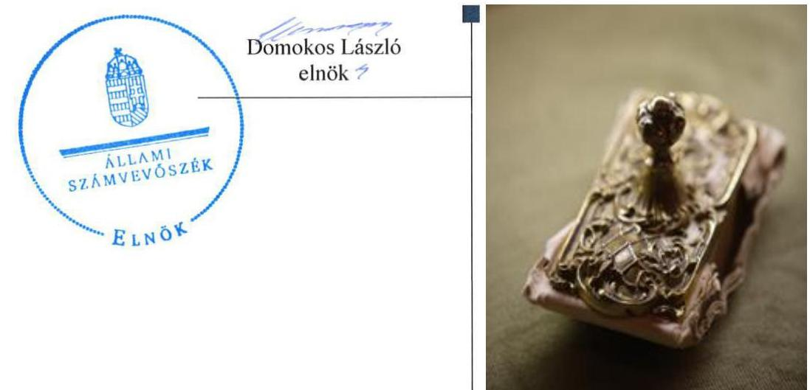
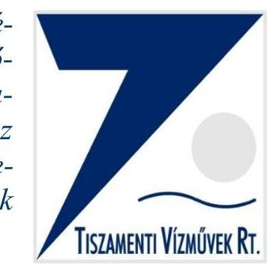
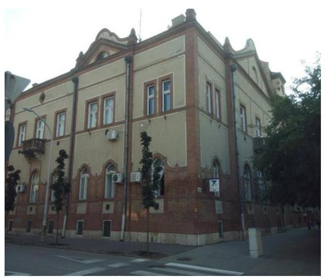
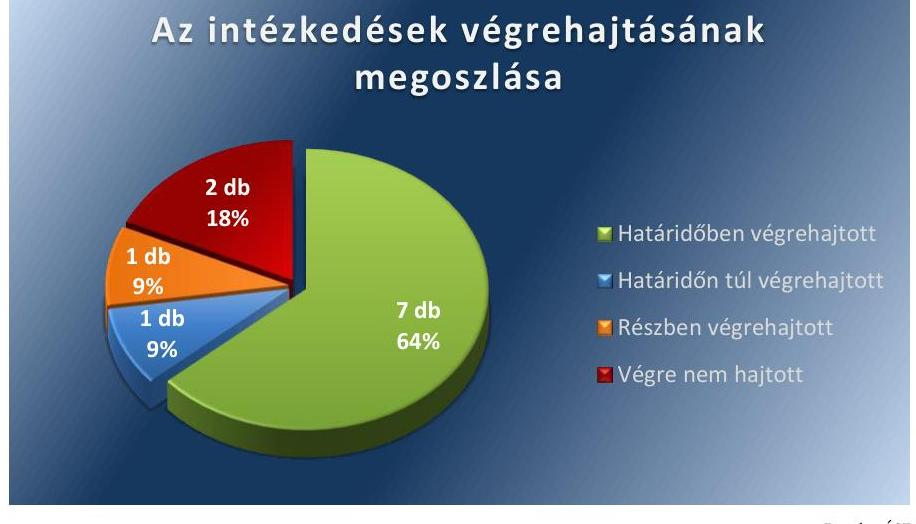
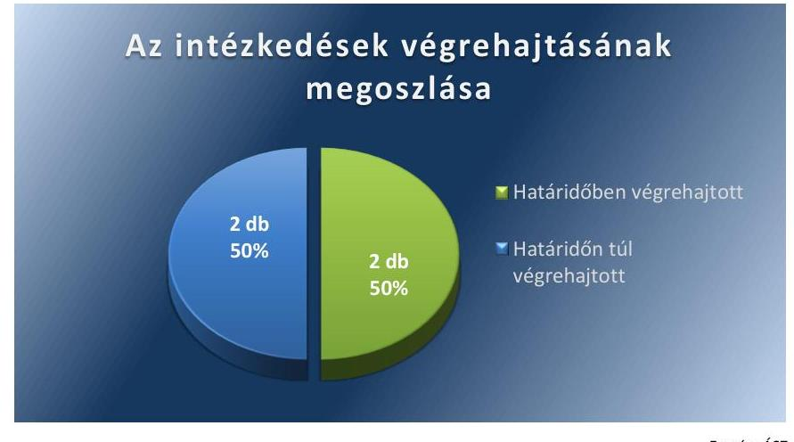

ÁLLAMI SZÁMVEVŐSZÉK

# Jelentés 

## Utóellenőrzések

A Tiszamenti Regionális Vízmúvek Zártkörűen Müködő Részvénytársaság vagyonérték megőrző és gyarapító tevékenységének utóellenőrzése 2016.

---

# Jelentés 

## Utóellenőrzések

A Tiszamenti Regionális Vízmúvek Zártkörűen Múködő Részvénytársaság vagyonérték megőrző és gyarapító tevékenységének utóellenőrzése 2016. február 22.

---

# AZ ELLENŐRZÉST FELÜGYELTE:

DR. BENEDEK MÁRIA felügyeleti vezető

## AZ ELLENŐRZÉST VEZETTE ÉS A VÉGREHAJTÁSÁÉRT FELELŐS:

**BÍRÓ ZSOLT** ellenőrzésvezető

**A PROGRAM ÖSSZEÁLLÍTÁSÁÉRT FELELŐS:**

**JANIK JÓZSEF LÁSZLÓ** osztályvezető

**A TÉMÁHOZ KAPCSOLÓDÓ KORÁBBI SZÁMVEVŐSZÉKI JELENTÉS:**

|  címe: | Jelentés az állami tulajdonban (résztulajdonban) lévő gazdálkodó szervezetek vagyonérték megőrző és gyarapító tevékenységének ellenőrzéséről egyes kiemelt közszolgáltató társaságoknál vagy hasonló tevékenységet végző társaságcsoportoknál - Tiszamenti Regionális Vízművek Zrt.  |
| --- | --- |
|  sorszáma: | 14050  |

**IKTATÓSZÁM:** V-0882-027/2016.

**TÉMASZÁM:** 1916

**ELLENŐRZÉS-AZONOSÍTÓ SZÁM:** V071709

---

# TARTALOMJEGYZÉK 

■ ÖSSZEGZÉS ..... 5
■ AZ ELLENŐRZÉS CÉLJA ..... 6
■ AZ ELLENŐRZÉS TERÜLETE ..... 7
■ AZ ELLENŐRZÉS HÁTTERE, INDOKOLTSÁGA ..... 8
■ FÓKUSZKÉRDÉSEK ..... 9
■ ELLENŐRZÉS HATÓKÖRE ÉS MÓDSZEREI ..... 10
■ MEGÁLLAPÍTÁSOK ..... 12
■ MELLÉKLETEK ..... 17
I. SZ. MELLÉKLET: Az ÁSZ 14050 számú jelentéséhez kapcsolódó TRV Zrt. intézkedési terv végrehajtása ..... 17
II. SZ. MELLÉKLET: Az ÁSZ 14050 számú jelentéséhez kapcsolódó MNV Zrt. intézkedési terv végrehajtása ..... 20
■ FÜGGELÉK: ÉSZREVÉTELEK ..... 23
■ RÖVIDÍTÉSEK JEGYZÉKE ..... 25

---

.

---

# ÖSSZEGZÉS 

Az ÁSZ ${ }^{1}$ a TRV Zrt. ${ }^{2}$ vagyonérték megőrző és gyarapító tevékenységének utóellenőrzését 2014. április 14. és 2015. június 17. közötti időszakra végezte el. Megállapította, hogy a TRV Zrt. az ÁSZ javaslatainak hasznosítására előírt intézkedéseket részben hajtotta végre, az MNV Zrt.-nél, - mint a tulajdonosi jogok gyakorlójánál - az intézkedési tervben meghatározott feladatok részben határidőn túl kerültek végrehajtásra.

## Az ellenőrzés társadalmi indokoltsága

Az Állami Számvevőszék stratégiájában célul tűzte ki a számvevőszéki munka hasznosulásának javítását. Ezzel összhangban ellenőrzi, hogy az ellenőrzött szervezetek megvalósították-e a korábbi ellenőrzései által feltárt hibák, hiányosságok és szabálytalanságok megszüntetése céljából kialakított intézkedési terveikben foglaltakat. A rendszeres utóellenőrzések hozzájárulnak a szükséges intézkedések tényleges végrehajtáshoz, ezáltal a közpénzügyek rendezettségének javulásához.

## Főbb megállapítások, következtetések, javaslatok

A TRV Zrt. és az MNV Zrt. - mint tulajdonosi joggyakorló - az intézkedési terveket határidőben megküldték az ÁSZ részére.

A TRV Zrt. az intézkedési tervében meghatározott 11 intézkedésből hetet határidőben, egyet részben, egyet határidőn túl teljesített, illetve kettőt nem hajtott végre. Az MNV Zrt. az intézkedési tervében foglalt feladatok közül kettőt határidőben, kettőt határidőn túl hajtott végre.

---

# AZ ELLENŐRZÉS CÉLJA 

## A TRV Zrt. vagyonérték megőrző és gyarapító tevékenységének utóellenőrzése

Az ellenőrzés célja annak értékelése, hogy a számvevőszéki jelentésben foglalt intézkedést igénylő megállapításokkal és javaslatokkal összhangban készített intézkedési tervben meghatározott feladatokat az ellenőrzött szervezet végrehajtotta-e.

---

# AZ ELLENŐRZÉS TERÜLETE 

## TRV Zrt.

A TRV Zrt. fél évszádos szakmai múltjával a Tiszamenti régió meghatározó víziközmű szolgáltatója. Fő tevékenysége a víztermelés, - kezelés, - ellátás és a szennyvíz gyűjtése, kezelése, együttesen víziközmű szolgáltatás. Összességében mintegy 600 ezer ember egészséges ivóvízzel történő ellátásáról gondoskodik Jász-Nagykun-Szolnok, Szabolcs-Szatmár-Bereg, Hajdú-Bihar, Heves, Csongrád és Pest megye területén. Szolgáltatási feladatait állami és önkormányzati tulajdonú víziközművek üzemeltetésével látja el, az állami víziközművek vonatkozásában vagyonkezelői feladatokat is végez.

Az MNV Zrt. ${ }^{3}$ közel 16 ezermilliárd forint értékű állami vagyon feletti tulajdonosi jogokat gyakorolja. Feladatai a kormányzati irányelveknek és a hatályos jogszabályoknak megfelelően a stratégiai szemléletű, felelős vagyongazdálkodás, a portfólió-racionalizálás, a korszerű ingatlangazdálkodás, a nemzeti társaságok eredményességének növelése, valamint a nemzeti vagyon megőrzése és gyarapítása. Az MNV Zrt. a rábízott vagyonnal történő gazdálkodás során stratégiai szempontok szerint gyakorolja az állami tulajdonban lévő társaságok tulajdonosi jogait. A TRV Zrt.-ben a Magyar Állam nevében 99,8\%-os részesedéssel gyakorolja a tulajdonosi jogokat.

Az utóellenőrzés - a 2014. április 14-től a 2015. június 17-ig végrehajtott intézkedéseket figyelembe véve - az állami résztulajdonban lévő TRV Zrt. vagyonérték megőrző és gyarapító tevékenységének ellenőrzéséről közzétett ÁSZ jelentés ${ }^{4}$ javaslatai hasznosítása érdekében készült intézkedési terv végrehajtására irányult. Az ÁSZ a jelentését 14050 számon 2014. április 14-én hozta nyilvánosságra. A TRV Zrt. és az MNV Zrt. - mint tulajdonosi joggyakorló - az intézkedési terveket határidőben megküldték az ÁSZ részére.

---

# AZ ELLENŐRZÉS HÁTTERE, INDOKOLTSÁGA 

Az ÁSZ törvény 33. § (1) bekezdése értelmében a számvevőszéki jelentések intézkedést igénylő megállapításaihoz és javaslataihoz kapcsolódóan az ellenőrzött szervezet vezetője intézkedési tervet köteles összeállítani, és az Állami Számvevőszék részére megküldeni. Az intézkedési tervben foglaltak megvalósítását - az ÁSZ törvény 33. § (7) bekezdésében foglaltak alapján - az Állami Számvevőszék utóellenőrzés keretében ellenőrizheti. Az intézkedések megvalósulásának értékelése során az Állami Számvevőszék figyelembe veszi az ellenőrzött szervezetek működési feltételeiben, valamint a jogszabályi előírásokban bekövetkezett változásokat.

Az intézkedési tervekben foglalt feladatok hiányos, illetve késedelmes végrehajtása, valamint megvalósításának elmaradása azt mutatja, hogy az ellenőrzések során feltárt hibák, hiányosságok és szabálytalanságok megszüntetése nem kapott kellő hangsúlyt. Ez a szabályszerű működés és a felelős vezetői magatartás vonatkozásában kockázatot hordoz. E kockázatok feltárásával az Állami Számvevőszék utóellenőrzési rendszere fokozza a fegyelmet, és igazolja, hogy a közpénzzel való szabályos gazdálkodás felelőssége elől nem lehet kitérni.

## AZ ELLENŐRZÉS VÁRHATÓ HASZNOSULÁSA

Az utóellenőrzés négy szinten hasznosulhat:

- A társadalom szintjén az utóellenőrzés jelzi, hogy a számvevőszéki ellenőrzés megállapításainak van következménye: a hiányosságok megszüntetésére az ellenőrzött szervezet által meghatározott intézkedések végrehajtását is számon kéri az ÁSZ.
- Az ellenőrzött terület szintjén az utóellenőrzés tájékoztatást nyújt a terület döntéshozóinak a hiányosságok kiküszöbölésének jó gyakorlatairól, ezzel lehetőséget biztosítva arra, hogy az ÁSZ ellenőrzési megállapításai, javaslatai a terület nem ellenőrzött szervezeteinek a működése során is hasznosuljanak.
- Az ellenőrzött szervezet szintjén az utóellenőrzés feltárja, hogy a szervezet az intézkedések végrehajtásával hasznosította-e a korábbi ellenőrzési jelentésben a hiányosságok megszüntetése, illetve a kockázatok kezelése érdekében megfogalmazott javaslatokat.
- Az ÁSZ szintjén az utóellenőrzés visszacsatolást ad az ellenőrzési jelentések hasznosulásáról, az intézkedések elmaradása vagy részleges megvalósulása a további ellenőrzésekhez kockázati jelzésként szolgál.

---

# FÓKUSZKÉRDÉSEK 

Az ellenőrzött szervezetek az intézkedési tervekben foglaltakat az elöirt határidőben - végrehajtották-e?

---

# ELLENŐRZÉS HATÓKÖRE ÉS MÓDSZEREI 

## Az ellenőrzés típusa

Szabályszerüségi ellenőrzés

## Az ellenőrzött időszak

A számvevőszéki jelentés közzétételének napjától (2014. április 14.) az utóellenőrzés megkezdésének napjáig (2015. június 17.) tartó időszak.

## Az ellenőrzés tárgya

Az ÁSZ tv. alapján az ÁSZ jelentésben megfogalmazott javaslatokra készített, az ellenőrzött szervezetek által megküldött intézkedési tervekben foglaltak hasznosulása.

## Az ellenőrzött szervezet

A TRV Zrt. és az MNV Zrt.

## Az ellenőrzés jogalapja

Az ellenőrzés végrehajtásának jogszabályi alapját az ÁSZ tv. 1. § (3) bekezdése, a 33. § (1)-(2), (7) bekezdései, valamint az Áht. ${ }^{5}$ 61. § (2) bekezdésének előírásai képezték.

## Az ellenőrzés módszerei

Az ellenőrzést a nemzetközi standardokat irányadónak tekintve az ellenőrzési program ellenőrzési kérdései, az ellenőrzött időszakban hatályos jogszabályok, az ellenőrzés szakmai szabályok és módszertanok figyelembevételével, az utóellenőrzéseket önállóan vagy ellenőrzéshez kapcsolódóan végeztük.

Az utóellenőrzés megállapításait elsősorban az ÁSZ rendelkezésére álló, valamint az ellenőrzött szervezetektől elektronikusan bekért dokumentumok alapozták meg. Az ÁSZ az ellenőrzés keretében egyes esetekben teljesítményellenőrzés tervezéséhez is kért adatokat.

---

Az ellenőrzési bizonyítékként felhasználható adatforrások közé tartoznak egyrészt a szakmai programban felsorolt adatforrások, másrészt minden - az ellenőrzés folyamán feltárt, az ellenőrzés szempontjából releváns információt tartalmazó - dokumentum.

Az ellenőrzés során értékeltük, hogy az ÁSZ jelentésben foglalt javaslatokra az elkészített intézkedési terveket határidőben megküldték-e, az ÁSZ által befogadott intézkedési tervekben foglaltakat végrehajtották-e.

Az intézkedési tervben előírt feladatok végrehajtásának ellenőrzését értékelési kritériumok alapján végeztük. Figyelembe vettük az intézkedési terv jóváhagyását követően hatályba lépett jogszabályi előírások változásából következő események, továbbá a feladat-ellátási és finanszírozási rendszer esetleges változásának hatásait. Az intézkedési tervekben előírt feladatokat azok végrehajthatósága, illetve végrehajtása szempontjából az alábbiak szerint értékeltük:
$\longrightarrow$ okafogyottá vált az előírt feladat, ha végrehajtására - meghatározott esemény bekövetkezése, továbbá külső körülmény, a múködést érintő feltétel változása miatt - már nincs szükség, illetve lehetőség, és egyértelműen megállapítható, hogy az intézkedést szükségessé tevő körülmény a jövőben nem fordulhat elő;
$\longrightarrow$ nem időszerű az a feladat, amelynek ellenőrzési időszakon belüli végrehajtására azért nem került (kerülhetett) sor, mert az intézkedés alapjául szolgáló esemény nem következett be, de annak jövőbeni előfordulása lehetséges, a végrehajtása nem volt esedékes, vagy a végrehajtás határideje még nem járt le;
$\longrightarrow$ határidőben végrehajtott a feladat, ha a teljesítés dokumentáltan az intézkedési tervben előírt határidőben és tartalommal megtörtént;
$\longrightarrow$ határidőn túl végrehajtott a feladat, ha annak teljesítése az intézkedési tervben meghatározott módon, de az előírt határidőn túl történt meg;
$\longrightarrow$ részben végrehajtott az a feladat, amelynek végrehajtása teljes körűen az intézkedési tervben előírt módon nem történt meg;
$\longrightarrow$ nem végrehajtott a feladat, ha a végrehajtás nem történt meg, vagy amennyiben a végrehajtását nem dokumentálták.
Az ellenőrzés lefolytatásához az ellenőrzött szervezetek a tanúsítványok kitöltésével, valamint az ÁSZ által kért dokumentumok elektronikus megküldésével szolgáltattak adatokat, amelyek valódiságát és teljes körűségét az ellenőrzött szervezetek vezetői által tett teljességi és hitelességi nyilatkozatok igazolták. Az így rendelkezésre bocsátott adatok, információk kontrollja az ellenőrzés keretében történt.

---

# MEGÁLLAPÍTÁSOK 

## Az ellenőrzött szervezetek az intézkedési tervekben foglaltakat - az előírt határidőben - végrehajtották-e?

Összegző megállapítás

A TRV Zrt. az intézkedési tervében meghatározott 11 intézkedésből hetet határidőben, egyet részben, egyet határidőn túl, illetve kettőt nem hajtott végre. Az MNV Zrt. az intézkedési tervében foglalt feladatok közül kettőt határidőben, kettőt határidőn túl hajtott végre.

Az intézkedési tervben meghatározott feladatokat, határidőket, az ÁSZ jelentés javaslatainak címzettjét és a feladatok végrehajtását az I. és II. számú melléklet mutatja be.

Az ÁSZ a jelentésében a TRV ZRT. vezérigazgatója részére hét javaslatot fogalmazott meg, melynek hasznosítására a TRV Zrt. az intézkedési tervében tizenegy feladatot határozott meg. A feladatok elvégzésének felelőseként a gazdasági igazgatót ${ }^{6}$, a jogi osztályvezetőt ${ }^{7}$, a kontrolling osztályvezetőt ${ }^{8}$, a pénzügyi- és számviteli osztályvezetőt ${ }^{9}$, a belső ellenőrt ${ }^{10}$ és a humánerőforrás osztályvezetőt ${ }^{11}$ jelölték meg.

A TRV Zrt. intézkedési tervében vállalt intézkedések végrehajtási kategóriánkénti megoszlását az 1. számú ábra szemlélteti.

1. számú ábra

## Az intézkedések végrehajtásának megoszlása

HATÁRIDŐBEN VÉGREHAJTOTT feladat:

1. A TRV Zrt. az ellenőrzött időszakban a beruházások lebonyolításával, karbantartásával kapcsolatos rendszert kialakította azzal, hogy elkészítette és hatályba léptette „A Tiszamenti Regionális Vizmüvek Zrt. beruházási, karbantartási, felújításról szóló szabályzat"-ot.

---

2. A TRV Zrt. elkészítette „Az amortizációs kulcsok felülvizsgálata, eredményre gyakorolt hatása a Tiszamenti Regionális Vizmüvek Zrt.-nél" és „Az alkalmazott amortizációs kulcsok eredményre gyakorolt hatás elemzése 2010-2013 évben" megnevezésű dokumentumokat, elemzéseket.
3. A TRV Zrt. elkészítette az „MNV Zrt. engedélye nélkül megvalósult beruházások körülményeinek vizsgálata, felelősség megállapítása" tárgyú belső ellenőrzési jelentést, amelyet a TRV Zrt. vezérigazgatója elfogadott. A jelentésben rögzítettek szerint személyi felelősség nem merült felül.
4. Az ellenőrzött időszakban a TRV Zrt. a Vhr.-ben12 foglaltak szerint előzetesen, írásban folyamatosan megkérte a beruházásokhoz a tulajdonos joggyakorlótól a beruházási, felújítási munkálatok elvégzésére a tulajdonosi hozzájárulást. Az MNV Zrt. a munkálatok elvégzésére a tulajdonosi hozzájárulást megadta. Az ellenőrzési időszak végén két beruházás, felújítás esetében a tulajdonosi hozzájárulás folyamatban volt.
5. A TRV Zrt. az állami vagyonra aktivált értéknövelő beruházások kapcsán 2014. június 27 -étől alkalmazta az MNV Zrt. Vagyonnyilvántartási szabályzatában13 foglalt előírásokat. A TRV Zrt. az ellenőrzött időszakban folyamatosan, az alkalmazott szabályzat szerint szolgáltatta az adatokat az MNV Zrt. részére.
6. Az MNV Zrt. Vagyonnyilvántartási szabályzatában előírt, a TRV Zrt. kezelésében lévő állami vagyonnal kapcsolatos adatszolgáltatások biztosították a vagyon nyilvántartásának egységességét és az adatellenőrzéseket.
7. A TRV Zrt. elkészítette a „Szabályzat a vezetői és a munkafolyamatba épített ellenőrzések és azok dokumentálásának rendjéről a Tiszamenti Regionális Vizmüvek Zrt.-nél" megnevezésű szabályzatot, amelyhez elkészítették a különböző szakellenőrzéseket tartalmazó ellenőrzések ütemtervét is.

# HATÁRIDŐN TÚL VÉGREHAJTOTT feladat: 

8. A vezérigazgató által elfogadott „A költséggazdálkodásban rejlő tartalékok feltárásának, a költségmegtérülés elve érvényesítésének dokumentumai" című belső ellenőrzési jelentés az intézkedési tervben foglalt határidőt követően - 2014. augusztus 31-e helyett 2014. szeptember 12-re - készült el.

## RÉSZBEN VÉGREHAJTOTT feladat:

9. A TRV Zrt. saját és vagyonkezelésbe vett ingatlanjainak nyilvántartása nem teljes körűen egyezett meg az MNV Zrt. és a földhivatali nyilvántartással. A TRV Zrt. a nyilvántartások egyezőségének megteremtésére a saját és vagyonkezelésbe vett ingatlanjainak földhivatali nyilvántartással való egyeztetését 2013. februárban megkezdte, azonban az intézkedési tervben vállalt 2014. június 30 -áig az egyeztetést nem fejezte be. Az ingatlanok földhivatali egyeztetése az ellenőrzött időszakban is folyamatban volt.

---

# VÉGRE NEM HAJTOTT feladat: 

10. A TRV Zrt. a vagyonnyilvántartási rendszerét áttekintette és az MNV Zrt. Vagyonnyilvántartási szabályzatát 2014. június végétől alkalmazta. A TRV Zrt. a „Tiszamenti Regionális Vizmüvek Zrt. Vagyongazdálkodási stratégia" című dokumentumot határidőben elkészítette, valamint a stratégia részeként a gördülő fejlesztési terveket véleményezésre benyújtotta az MNV Zrt.-nek. A TRV Zrt. azonban nem terjesztette be a Vagyongazdálkodási stratégiát a TRV Zrt. közgyűlésének jóváhagyásra, a stratégia jóváhagyása nem történt meg.
11. Az ellenőrzési időszakban a TRV Zrt. belső ellenőrzési munkatervének jóváhagyását az aktuális SZMSZ változatlanul a TRV Zrt. Felügyelő bizottsága, a Belső ellenőrzési szabályzat és kézikönyv pedig a TRV Zrt. vezérigazgatója hatáskörébe utalja. A TRV Zrt. a belső szabályzatok között az összhangot továbbra sem teremtette meg.

Az MNV ZRT. vezérigazgatója részére az ÁSZ jelentés három javaslatot fogalmazott meg, amelynek hasznosítására az MNV Zrt. intézkedési tervében négy feladatot határozott meg. Az intézkedési tervben felelősként az ellenőrzési igazgatót ${ }^{14}$, az gazdasági igazgatót ${ }^{15}$ és az ingó- és ingatlanvagyonért felelős főigazgatót ${ }^{16}$ nevezték meg.

Az MNV Zrt. intézkedési tervében a TRV Zrt.-re vonatkozóan vállalt intézkedések végrehajtási kategóriánkénti megoszlását a 2. számú ábra szemlélteti.
2. számú ábra

Fonás: ÁSZ

## HATÁRIDŐBEN VÉGREHAJTOTT feladat:

1. Az MNV Zrt. 2014. július 17-én elkészítette a TRV Zrt.-nél a belső ellenőrzés több éves elmaradásának tulajdonosi joggyakorlással összefüggő körülményei kivizsgálását tartalmazó összefoglaló jelentését. Az ellenőrzés megállapítása szerint a belső ellenőrzés működésének elmaradása miatt a tulajdonosi jogok gyakorlóját nem terheli felelősség, mert a TRV Zrt. SZMSZ-ének elfogadása 2011. április 5-éig tartozott az MNV Zrt. hatáskörébe, az addig hatályos SZMSZ tartalmazta is a belső ellenőrzés létrehozására vonatkozó szabályozást. Ezt követően a TRV Zrt. SZMSZ-ének elfogadása

---

a vezérigazgató hatáskörébe került. A jelentés személyi felelősségre vonást nem kezdeményezett, mivel 2013. január 1-jétől a TRV Zrt.-nél múködött független belső ellenőrzés.
2. Az MNV Zrt. Vagyonnyilvántartási szabályzata határidőben kiadásra került, amelyet a TRV Zrt. múködése során alkalmazott és 2015. június 30 -án a vagyonkezelési szerződés módosításának aláírásával elfogadott.

# HATÁRIDŐN TÚL VÉGREHAJTOTT feladat: 

3. Az MNV Zrt. a TRV Zrt.-vel az ivóvíz ágazatra ${ }^{17}$ és a szennyvíz ágazatra ${ }^{18}$ vonatkozóan fennálló vagyonkezelői jogviszony újraszabályozását tartalmazó, az egységes szerkezetbe foglalt vagyonkezelési szerződésmódosításokat az intézkedési tervben foglalt 2014. december 31-ei határidőn túl 2015. június 30 -án írta alá.
4. MNV Zrt.-nél „A Tiszamenti Regionális Vizmüvek Zrt. beruházásai és azok megfelelősége a vagyonkezelési szerződésnek" megnevezésű jelentés 2014. szeptember 30-ai határidőn túl 2014. október 20-án készült el. A jelentésben megállapították, hogy a rendelkezésre álló dokumentumok alapján a 2012-2013. évi beruházások szükségesnek és indokoltnak tekinthetők, személyi felelősségre vonást nem kezdeményeztek. A jelentés rögzítette az MNV Zrt. egységes álláspontját a beruházások bejelentési/engedélyeztetési kötelezettsége teljesítésével kapcsolatban, amely szerint a vagyonkezelő üzleti/fejlesztési tervében szereplő beruházások esetében az MNV Zrt. hozzájárulása megadottnak tekinthető azzal, hogy a tervekhez az MNV Zrt. hozzájárult. Az MNV Zrt. a beruházások engedélyeztetésének és elszámolásának egységes eljárásrendjét vezérigazgató utasítással szabályozta.

A TRV ZRT. vezérigazgatója az intézkedési tervben megfogalmazott feladatok végrehajtásáról a felelős vezetőknek személyre szóló beszámolási kötelezettséget írt elő. A felelős vezetők a feladatok végrehajtásáról írásban, valamint személyes egyeztetés keretében beszámoltak a vezérigazgatónak.

Az MNV ZRT. vezérigazgatói határozattal ${ }^{19}$ hagyta jóvá az intézkedési tervet, amelyben egyúttal elrendelte az illetékes szakterületek beszámolási kötelezettségét a kabinetfőnök ${ }^{20}$ részére, ennek a felelősök határidőben eleget tettek.

---

.

---

# MELLÉKLETEK

I. SZ. MELLÉKLET: AZ ÁSZ 14050 SZÁMÚ JELENTÉSÉHEZ KAPCSOLÓDÓ TRV ZRT. INTÉZKEDÉSI TERV VÉGREHAJTÁSA

|  Sorszám | Intézkedési terv alapján elvégzendő feladat
1. | Az intézkedési tervben meghatározott határidő
2. | Az ÁSZ 14050-es számú jelentés javaslatának címzettje
3. | A feladat végrehajtása
4.  |
| --- | --- | --- | --- | --- |
|  Határidőben végrehajtott feladat |  |  |  |   |
|  1. | Beruházások lebonyolításával, karbantartásával kapcsolatos rendszer kialakítása. | 2014. június 30. | vezérigazgató | A TRV Zrt. az ellenőrzött időszakban a beruházások lebonyolításával, karbantartásával kapcsolatos rendszer kialakítására elkészítette „A Tiszamenti Regionális Vizmüvek Zrt. beruházási, karbantartási, felújításról szóló szabályzat"-ot, amelyet 2014. június 25-én hatályba léptetett. A szabályzat rögzíti az eszközállomány folyamatos rekonstrukciója, felújítása, fenntartása érdekében a tárgyi eszközök és azok létrehozásával, müködtetésével, az eszközökkel történő vállalkozással kapcsolatos tevékenységek egyértelmű fogalmi meghatározását, a tárgyi eszközök eszközgazdálkodási, számviteli szempontú csoportosítását, a müködtetésével kapcsolatban felmerülő költségek kimutatását, elhatárolását a vonatkozó jogszabályoknak, a közüzemi szolgáltatók szakmai gyakorlatának megfelelően.  |
|  2. | Amortizációs kulcsok felülvizsgálata eredményre gyakorolt hatásának elemzése. | 2014. augusztus 31. | vezérigazgató | A TRV Zrt. Kontrolling osztályvezetője 2014. augusztus 31-ére elkészítette „Az amortizációs kulcsok felülvizsgálata, eredményre gyakorolt hatása a Tiszamenti Regionális Vizmüvek Zrt.-nél" és „Az alkalmazott amortizációs kulcsok eredményre gyakorolt hatás elemzése 2010-2013 évben" megnevezésű dokumentumokat, elemzéseket. Az amortizációs kulcsok a TRV Zrt. Számviteli politikájában rögzített értékekkel összhangban kerültek kialakításra.  |
|  3. | MNV Zrt. engedélye nélkül megvalósult beruházások körülményeinek vizsgálata, felelősség megállapítása. | 2014. szeptember 30. | vezérigazgató | A TRV Zrt. belső ellenőre 2014. szeptember 2-án elkészítette az „MNV Zrt. engedélye nélkül megvalósult beruházások körülményeinek vizsgálata, felelősség megállapítása" tárgyú belső ellenőrzési jelentést, amelyet a vezérigazgató elfogadott. A belső ellenőrzési jelentés vezetői összefoglalója azt rögzítette, hogy a beruházások szakmailag indokoltak voltak, a megvalósított beruházások szerepeltek az üzleti tervben, a szükséges tájékoztatás az MNV Zrt. részére megtörtént, személyi felelősség nem merült fel.  |

---

|  E
SZ
A | Intézkedési terv alapján elvég-
zendő feladat | Az intézkedési terv-
ben meghatározott
határidő | Az ÁSZ 14060-es
számú jelentés já-
vaslatának cím-
zettje | A feladat végrehajtása  |
| --- | --- | --- | --- | --- |
|   | 1. | 2. | 3. | 4.  |
|  4. | A vagyonkezelt eszközökön tervezett beruházási, felújítási tevékenység előzetes engedélyeztetése a vagyon tulajdonosával. | folyamatos | vezérigazgató | A TRV Zrt. az ellenőrzött időszakban a Vhr. 9. § (6) bekezdésében foglaltak szerint előzetesen, írásban nyolc db beruházáshoz kérte meg folyamatosan a tulajdonos joggyakorlótól (MNV Zrt.) a beruházási, felújítási munkálatok elvégzésére a tulajdonosi hozzájárulást. Az MNV Zrt. két db beruházás, felújítás kivételével, a munkálatok elvégzésére a tulajdonosi hozzájárulást megadta. Az ellenőrzési időszak végén a két beruházás, felújítás esetében a tulajdonosi hozzájárulás folyamatban volt.  |
|  5. | Az állami vagyonra aktivált értéknövelő beruházások kapcsán a 12/2014. számú vezérigazgatói utasításban foglalt adatszolgáltatások biztosítása. | folyamatos | vezérigazgató | A TRV Zrt. 2014. június 27-étől alkalmazta a MNV Zrt. állami vagyon vagyonkezelőire, az állami vagyont használókra és a társasági részesedések esetében az MNV Zrt. tulajdonosi joggyakorlását megbízottként ellátókra vonatkozó Vagyonnyilvántartási szabályzatáról szóló 12/2014. számú MNV Zrt. vezérigazgatói utasítást. A szabályzat a Vhr. 14. § (3) bekezdésében előírtaknak megfelelően a vagyonnyilvántartás vezetéséhez szükséges adatszolgáltatás tartalmát és formáját, az adatszolgáltatás gyakoriságát, a felügyeleti, ellenőrzési rendet meghatározta. A TRV Zrt. az ellenőrzött időszakban az alkalmazott szabályzat szerint folyamatosan szolgáltatta az MNV Zrt.-nek az állami vagyonra aktivált értéknövelő beruházások kapcsán az adatokat.  |
|  6. | Az állami vagyon nyilvántartásának olyan kialakítása, mely biztosítja a 12/2014. számú vezérigazgatói utasításban rögzített adatszolgáltatások teljesítését. | 2014. szeptember 30. | vezérigazgató | A TRV Zrt. az MNV Zrt. 12/2014. vezérigazgatói utasítását 2014. június 27-étől alkalmazta. Ezen időponttól a TRV Zrt. a kezelésében lévő állami vagyonnal kapcsolatos adatokat, jelentéstételi kötelezettségeket, információkat az MNV Zrt. Vagyonnyilvántartási szabályzatában előírtaknak megfelelően szolgáltatta az MNV Zrt.-nek, ez biztosította az MNV Zrt.-vel a nyilvántartás egységességét, az adatellenőrzéseket.  |
|  7. | A vezetői és a munkafolyamatba épített ellenőrzések dokumentálásának kidolgozása. | 2014. december 31. | vezérigazgató | A TRV Zrt. elkészítette a „Szabályzat a vezetői és a munkafolyamatba épített ellenőrzések és azok dokumentálásának rendjéről a Tiszamenti Regionális Vizmüvek Zrt.-nél" megnevezésű szabályzatot, amelyet a vezérigazgató 2014. december 1-jétől hatályba léptetett. A szabályzathoz elkészítették a különböző szakellenőrzéseket tartalmazó ellenőrzések ütemtervét is. Az ellenőrzési tevékenységek dokumentálása a hatályos iratkezelési szabályzat szerint történik.  |
|   |  |  | Határidőn túl végrehajtott feladat |   |
|  8. | Költséggazdálkodás hatékonyságának vizsgálata az esetleges tartalékok feltárása. | 2014. augusztus 31. | vezérigazgató | A TRV Zrt. belső ellenőre a feladatellátáshoz kapcsolódóan „A költséggazdálkodásban rejlő tartalékok feltárásának, a költségmegtérülés elve érvényesítésének dokumentumai" tárgyú jelentést az intézkedési tervben foglalt 2014. augusztus 31-ei határidőt követően 2014. szeptember 12-ére készítette el, amelyet a vezérigazgató 2014. szeptember 12-én hagyott jóvá.  |

---

|  É
T
A
S
A | Intézkedési terv alapján elvég-
zendő feladat | Az intézkedési terv-
ben meghatározott
határidő | Az ÁSZ 14060-es
számú jelentés ja-
vaslatának cím-
zettje | A feladat végrehajtása  |
| --- | --- | --- | --- | --- |
|   | 1. | 2. | 3. | 4.  |
|   |  |  | Részben végrehajtott feladat |   |
|  9. | Saját és vagyonkezelésbe vett ingatlanok
egyeztetése a földhivatali nyilvántartással. | 2014. június 30. | vezérigazgató | A TRV Zrt. saját és vagyonkezelésbe vett ingatlanok nyilvántartásában pontatlanságok vol-
tak, az ingatlanok nyilvántartásai az MNV Zrt. és a földhivatali nyilvántartással nem teljes
körűen egyeztek meg. A TRV Zrt. a nyilvántartások egyezőségének megteremtésére a sa-
ját és vagyonkezelésbe vett ingatlanok földhivatali nyilvántartással való egyeztetését
2013. februárban megkezdte, azonban 2014. június 30-áig az egyeztetést nem fejezte be.
Ezen ingatlanok földhivatali egyeztetése az ellenőrzött időszakban is folyamatban volt.  |
|   |  |  | Végre nem hajtott feladat |   |
|  10. | Vagyonnyilvántartási rendszer áttekintése,
vagyonstratégia kialakítása az MNV Zrt.
vagyonnyilvántartási szabályzatának a
rendszerbe történő beillesztése. | 2014. szeptember 30. | vezérigazgató | A TRV Zrt. a vagyonnyilvántartási rendszer áttekintése eredményeként az MNV Zrt.
12/2014. vezérigazgatói utasításnak megfelelően az MNV Zrt. Vagyonnyilvántartási sza-
bályzatát 2014. június 27-étől alkalmazta. A „Tiszamenti Regionális Vízmüvek Zrt. Vagyon-
gazdálkodási stratégia" című dokumentumot a TRV Zrt. 2014. szeptember 30-ára elkészí-
tette. A stratégia részeként elkészítették az állami vagyonra vonatkozó stratégiai terv ré-
szeket, a gördülő fejlesztési terveket, amelyeket véleményezésre az MNV Zrt.-nek benyújtottak. A TRV Zrt. alapszabálya21 7.2. n) pontja ellenére nem terjesztette be a Vagyongaz-
dálkodási stratégiát jóváhagyásra a közgyűlésnek, ezért a stratégia elfogadása, jóváha-
gyása nem történt meg.  |
|  11. | Az SZMSZ és a Belső ellenőrzési szabályzat
alapján készített tárgy évi ellenőrzési terv
jóváhagyására jogosultak körének vizsgá-
lata, a szabályzatok közötti összhang meg-
teremtése. | 2014. szeptember 30. | vezérigazgató | Az ellenőrzési időszakban a TRV Zrt. belső ellenőrzési munkatervének jóváhagyását az ak-
tuális SZMSZ változatlanul a TRV Zrt. Felügyelő bizottsága, a Belső ellenőrzési szabályzat
és kézikönyv pedig a TRV Zrt. vezérigazgatója hatáskörébe utalja. A TRV Zrt. a belső sza-
bályzatok között az összhangot továbbra sem teremtette meg.  |

Forrás: ÁSZ által készített táblázat

---

#### II. SZ. MELLÉKLET: AZ ÁSZ 14050 SZÁMÚ JELENTÉSÉHEZ KAPCSOLÓDÓ MNV ZRT. INTÉZKEDÉSI TERV VÉGREHAJTÁSA

|  Sorszám | Intézkedési terv alapján elvégzendő feladat: | Az intézkedési tervben meghatározott határidő | Az ÁSZ 14050-es számú jelentés javaslatának címzettje | A feladat végrehajtása  |
| --- | --- | --- | --- | --- |
|   | 1. | 2. | 3. | 4.  |
|   |  | **Határidőben végrehajtott feladat** |  |   |
|  1. | Belső vizsgálat lefolytatása a TRV Zrt. belső ellenőrzése több éven át tartó hiányának a tulajdonosi joggyakorlással összefüggő körülményei tárgyában. | 2014.10.31. | vezérigazgató | Az MNV Zrt. 2014. július 17-én elkészítette a TRV Zrt.-nél a belső ellenőrzés több éves elmaradásának tulajdonosi joggyakorlással összefüggő körülményei kivizsgálását tartalmazó összefoglaló jelentését. Az ellenőrzés megállapítása szerint a belső ellenőrzés működésének elmaradása miatt a tulajdonosi jogok gyakorlóját nem terheli felelősség, mert a TRV Zrt. SZMSZ-ének elfogadása 2011. április 5-éig tartozott az MNV Zrt. hatáskörébe, az addig hatályos SZMSZ tartalmazta is a belső ellenőrzés létrehozására vonatkozó szabályozást. Ezt követően a TRV Zrt. SZMSZ-ének elfogadása a vezérigazgató hatáskörébe került. A jelentés személyi felelősségre vonást nem kezdeményezett, mivel 2013. január 1-jétől a TRV Zrt.-nél működött független belső ellenőrzés.  |
|  2. | Az állami vagyon nyilvántartására vonatkozó Vhr. 13. és 14. 5-ban foglalt hatályos szabályozások érvényesítése mellett egységes szabályzat kiadása, és annak vázkózmű-szolgáltató társaság általi elfogadása, a vagyonkezelési szerződés módosítását megelőzően. | 2014.06.30. | vezérigazgató | A 12/2014. számú vezérigazgatói utasítás a Magyar Nemzeti Vagyonkezelő Zrt. állami vagyon vagyonkezelőire, az állami vagyont használókra és a társasági részesedések esetében az MNV Zrt. tulajdonosi joggyakorlását megbízottként ellátókra vonatkozó Vagyonnyilvántartási szabályzatáról. A szabályzat 2014. május 31-én lépett hatályba, a TRV Zrt. működése során alkalmazta és 2015. június 30-án a vagyonkezelési szerződés módosítás aláírásával fogadta el.  |
|   |  | **Határidőn túl végrehajtott feladat** |  |   |
|  3. | A hatályos vagyonkezelési szerződés és az alapján fennálló vagyonkezelői jogviszony újraszabályozása, valamint a vagyonkezelési szerződésmódosítással történő egységes szerkezetbe foglalása, mely tartalmazza az alábbi szövegrészt: „Felek rögzítik, hogy az MNV Zrt. vagyon-nyilvántartási szabályzata a vázkózmű-szolgáltató társaságok által elfogadott, az MNV Zrt. jogelődje által 1998-ban jóváhagyott „a | 2014.12.31. | vezérigazgató | A vagyonkezelési szerződést az MNV Zrt. az intézkedési tervében meghatározott szövegrész beemelésével, és a fennálló vagyonkezelő jogviszony újraszabályozásával 2015. június 30-án az ivóvíz ágazatra SZT-104854 számon, a szennyvíz ágazatra pedig SZT-104855 számon módosította.  |

---

|  Sorszám | Intézkedési terv alapján elvégzendő feladat | Az intézkedési tervben meghatározott határidő | Az ÁSZ 14050-es számú jelentés javaslatának címzettje | A feladat végrehajtása  |
| --- | --- | --- | --- | --- |
|   | 1. | 2. | 3. | 4.  |
|   | Kincstári vagyoni körbe tartozó viziközmű vagyonkezelési, gazdálkodási és nyilvántartási szabályzata" helyébe lépett." |  |  |   |
|  4. | Tulajdonosi ellenőrzés lefolytatása a társaságnál a 2012-2013. évi beruházások megvalósítása, és vagyonkezelési szerződésnek való megfelelősége tárgyában Az MNV Zrt. 219/2014. (IV.03.) RJGY határozattal jóváhagyott 2014. évi tulajdonosi ellenőrzési terve a TRV Zrt. vonatkozásában tartalmazza a vizsgálatot. | 2014.09.30. | vezérigazgató | Az MNV Zrt.-nél 2014. október 20-án készült el „A Tiszamenti Regionális Vizmüvek Zrt. beruházásai és azok megfelelősége a vagyonkezelési szerződésnek" tárgyú jelentés. Az ellenőrzés eredményről az MNV Zrt. vezérigazgatót az MNV/01/24810/13/2014 ikt. számú feljegyzésben tájékoztatták 2014. október 20-án. A jelentésben megállapították, hogy a rendelkezésre álló dokumentumok alapján a 2012-2013. évi beruházások szükségesnek és indokoltnak tekinthetők, személyi felelősségre vonást nem kezdeményeztek. A jelentésben rögzítésre került az MNV Zrt egységes álláspontja a beruházások bejelentési/engedélyeztetési kötelezettsége teljesítésével kapcsolatban, amely szerint a vagyonkezelő üzleti/fejlesztési tervében szereplő beruházások esetében az MNV Zrt. hozzájárulása megadottnak tekinthető azzal, hogy a tervekhez az MNV Zrt. hozzájárult. Az MNV Zrt. a beruházások engedélyeztetésének és elszámolásának egységes eljárásrendjét vezérigazgató utasítással szabályozta.
Az MNV Zrt. a TRV Zrt.-t az MNV/01/24810/17/2014 ikt. számú feljegyzésben tájékoztatta a jelentés eredményéről, a feltártak rendezésére az MNV Zrt. intézkedési terv készítésére kötelezte TRV Zrt.-t. A TRV Zrt. az intézkedési tervet a Vez-29-8/2014 ikt. számú levélben megküldte az MNV Zrt.-nek.  |

---

.

---

# FÜGGELÉK: ÉSZREVÉTELEK 

A jelentéstervezetet az ÁSZ 15 napos észrevételezésre megküldte az ellenőrzött szervezetek vezetői részére az ÁSZ tv. 29. §* (1) bekezdése előírásának megfelelően.
Az ellenőrzött szervezetek vezetői az ÁSZ tv. 29. § (2) bekezdésében foglalt észrevételezési jogukkal nem éltek, a jelentéstervezetre észrevételt nem tettek.

[^0]
[^0]:    * 29. § (1) Az Állami Számvevőszék az ellenőrzési megállapításait megküldi az ellenőrzött szervezet vezetőjének vagy az általa megbízott személynek, és annak, akinek személyes felelősségét állapította meg.
    (2) Az ellenőrzött szervezet vezetője és a felelősként megjelölt személy az ellenőrzés megállapításaira tizenöt napon belül írásban észrevételt tehet.
    (3) Az Állami Számvevőszék az észrevételre a beérkezésétől számított harminc napon belül írásban válaszol. A figyelembe nem vett észrevételeket köteles a jelentésben feltüntetni, és megindokolni, hogy azokat miért nem fogadta el.

---

.

---

# RÖVIDÍTÉSEK JEGYZÉKE 

${ }^{1}$ ÁSZ
${ }^{2}$ TRV Zrt.
${ }^{3}$ MNV Zrt.
${ }^{4}$ ÁSZ jelentés
${ }^{5}$ Áht.
${ }^{6}$ gazdasági igazgató
${ }^{7}$ jogi osztályvezető
${ }^{8}$ kontrolling osztályvezető
${ }^{9}$ pénzügyi- és számviteli osztályvezető
${ }^{10}$ belső ellenőr
${ }^{11}$ humánerőforrás osztályvezető
${ }^{12}$ Vhr.
${ }^{13}$ Vagyonnyilvántartási szabályzat
${ }^{14}$ ellenőrzési igazgató
${ }^{15}$ gazdasági főigazgató
${ }^{16}$ ingó- és ingatlanokért felelős főigazgató
${ }^{17}$ vagyonkezelési szerződésmódosítás ivóvízágazatra
${ }^{18}$ vagyonkezelési szerződésmódosítás szennyvízágazatra
${ }^{19}$ vezérigazgatói határozat
${ }^{20}$ kabinetfőnök
${ }^{21}$ alapszabály

Állami Számvevőszék
Tiszamenti Regionális Vízmúvek Zártkörűen Működő Részvénytársaság Magyar Nemzeti Vagyonkezelő Zártkörűen Működő Részvénytársaság az Állami Számvevőszék 14050-es számú jelentése. Az elkészített jelentés az interneten, a www.asz.hu címen olvasható.
Az államháztartásról szóló 2011. évi CXCV. törvény
a Tiszamenti Regionális Vízmúvek Zártkörűen Működő Részvénytársaság gazdasági igazgatója
a Tiszamenti Regionális Vízmúvek Zártkörűen Működő Részvénytársaság jogi osztályvetetője
a Tiszamenti Regionális Vízmúvek Zártkörűen Működő Részvénytársaság kontrolling osztályvezetője
a Tiszamenti Regionális Vízmúvek Zártkörűen Működő Részvénytársaság pénzügyi- és számviteli osztályvezetője
a Tiszamenti Regionális Vízmúvek Zártkörűen Működő Részvénytársaság belső ellenőre
a Tiszamenti Regionális Vízmúvek Zártkörűen Működő Részvénytársaság humánerőforrás osztályvezetője
az állami vagyonnal való gazdálkodásról szóló 254/2007. (X. 4.) Korm. rendelet (hatályos: 2007. október 4-től)
a 12/2014. számú vezérigazgatói utasítás a Magyar Nemzeti Vagyonkezelő Zrt. állami vagyon vagyonkezelőire, az állami vagyont használókra vonatkozó vagyonnyilvántartási szabályzatáról
a Magyar Nemzeti Vagyonkezelő Zrt. ellenőrzési igazgatója
a Magyar Nemzeti Vagyonkezelő Zrt. gazdasági főigazgatója
a Magyar Nemzeti Vagyonkezelő Zrt. ingó- és ingatlanokért felelős főigazgatója

SZT-104854 számon nyilvántartva a vagyonkezelési szerződésmódosítás

SZT-104855 számon nyilvántartva a vagyonkezelési szerződésmódosítás
a 402/2014. (VIII.29.) számú Magyar Nemzeti Vagyonkezelő Zártkörűen Működő Részvénytársaság vezérigazgatójának határozata az intézkedési terv végrehajtásáról
a Magyar Nemzeti Vagyonkezelő Zrt. kabinet vezetője
Tiszamenti Regionális Vízmúvek Zártkörűen múködő részvénytársaság egységes szerkezetbe foglalt alapszabálya (hatályos:2014. május 29-étől)

---

# ÁLLAMI SZÁMVEVŐSZÉK 

1052 Budapest, Apáczai Csere János utca 10.
Levélcím: 1364 Budapest 4. Pf. 54
Telefon: +36 14849100 Telefax: +36 14849200
www.asz.hu