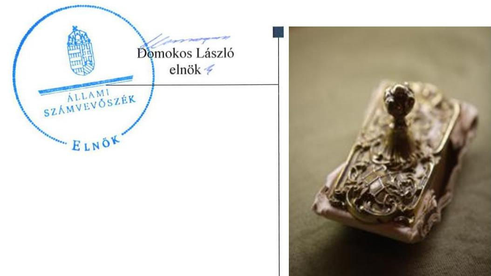
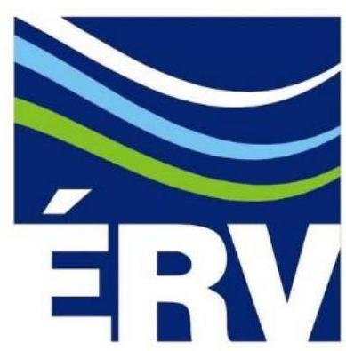
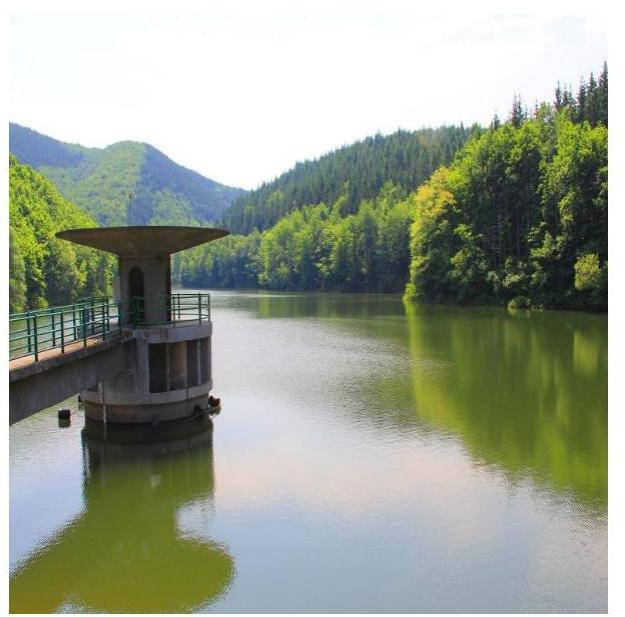
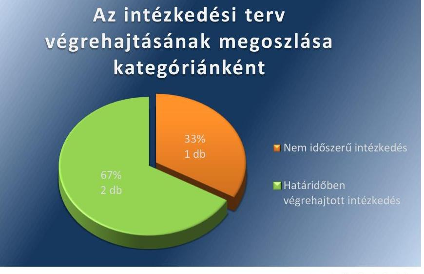
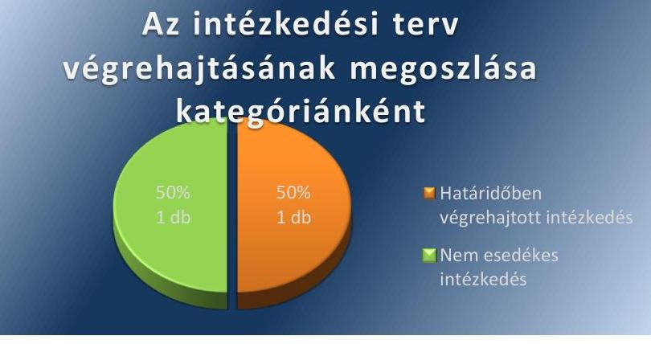

# Jelentés 

## Utóellenőrzések

Az Északmagyarországi Regionális Vízművek Zártkörűen Működő Részvénytársaság vagyonérték megőrző és gyarapító tevékenységének utóellenőrzése 2016. február 22.

---

# AZ ELLENŐRZÉST FELÜGYELTE:

DR. BENEDEK MÁRIA felügyeleti vezető

## AZ ELLENŐRZÉST VEZETTE ÉS A VÉGREHAJTÁSÁÉRT FELELŐS:

VIDA KATALIN ellenőrzésvezető

## A PROGRAM ÖSSZEÁLLÍTÁSÁÉRT FELELŐS:

JANIK JÓZSEF LÁSZLÓ osztályvezető

## A TÉMÁHOZ KAPCSOLÓDÓ KORÁBBI SZÁMVEVŐSZÉKI JELENTÉSEK:

|  • címe: | Jelentés az állami tulajdonban (résztulajdonban) lévő gazdálkodó szervezetek vagyonérték megőrző és gyarapító tevékenységének ellenőrzéséről egyes kiemelt közszolgáltató társaságoknál vagy hasonló tevékenységet végző társaságcsoportoknál Északmagyarországi Regionális Vízművek Zrt.  |
| --- | --- |
|  • sorszáma: | 14051  |

IKTATÓSZÁM: V-0881-043/2016.

TÉMASZÁM: 1915

ELLENŐRZÉS-AZONOSÍTÓ SZÁM: V071709

---

# TARTALOMJEGYZÉK 

■ ÖSSZEGZÉS ..... 5
■ AZ ELLENŐRZÉS CÉLJA ..... 6
■ AZ ELLENŐRZÉS TERÜLETE ..... 7
■ AZ ELLENŐRZÉS HÁTTERE, INDOKOLTSÁGA ..... 8
■ FÓKUSZKÉRDÉSEK ..... 9
■ ELLENŐRZÉS HATÓKÖRE ÉS MÓDSZEREI ..... 10
■ MEGÁLLAPÍTÁSOK ..... 12
■ MELLÉKLETEK ..... 15
I. SZ. MELLÉKLET: Az ÁSZ 14051 számú jelentéséhez kapcsolódó ÉRV Zrt. intézkedési terv végrehajtása ..... 15
II. SZ. MELLÉKLET: Az ÁSZ 14051 számú jelentéséhez kapcsolódó MNV Zrt. intézkedési terv végrehajtása ..... 16
■ FÜGGELÉK: ÉSZREVÉTELEK ..... 17
■ RÖVIDÍTÉSEK JEGYZÉKE ..... 19

---

.

---

# ÖSSZEGZÉS 

Az ÁSZ ${ }^{1}$ elvégezte az ÉRV Zrt. ${ }^{2}$ vagyonérték megőrző és gyarapító tevékenységének utóellenőrzését a 2014. április 14-én nyilvánosságra hozott 14051 számú ÁSZ jelentés megállapításai alapján készített intézkedési tervek, ellenőrzött időszakban (2014. április 14.- 2015. június 8.) közötti időszakban történő végrehajtására vonatkozóan. Megállapította, hogy az ÉRV Zrt. és az MNV Zrt. ${ }^{3}$ - mint a tulajdonosi jog gyakorlója - vezérigazgatói által elkészített intézkedési terveket ${ }^{4}$ határidőben megküldték az ÁSZ részére. Az ÁSZ megállapításainak hasznosítására

előírt intézkedéseket az ÉRV Zrt. határidőre végrehajtotta, illetve egy intézkedés végrehajtási határideje az ellenőrzött időszakon túli (2015. december 31.) volt. Az MNV Zrt. intézkedési tervében meghatározott feladatok közül egy intézkedés határidőben, egy feladat határidőn túl került végrehajtásra.

## Az ellenőrzés társadalmi indokoltsága

Az Állami Számvevőszék stratégiájában célul tűzte ki a számvevőszéki munka hasznosulásának javítását. Ezzel összhangban ellenőrzi, hogy az ellenőrzött szervezetek megvalósították-e a korábbi ellenőrzései által feltárt hibák, hiányosságok és szabálytalanságok megszüntetése céljából kialakított intézkedési terveikben foglaltakat. A rendszeres utóellenőrzések hozzájárulnak a szükséges intézkedések tényleges végrehajtásához, ezáltal a közpénzügyek rendezettségének javulásához.

## Főbb megállapítások, következtetések, javaslatok

Az ÉRV Zrt. és a MNV Zrt. - mint tulajdonosi joggyakorló - az intézkedési terveket határidőben megküldték az ÁSZ részére.

Az ÁSZ jelentésben ${ }^{5}$ foglalt megállapításokhoz kapcsolódó intézkedési tervben előírt feladatokat határidőben végrehajtották az ÉRV Zrt.-nél. Az MNV Zrt. az intézkedési tervben foglalt két intézkedés közül egy feladatot határidőben, egy intézkedés végrehajtásáról határidőn túl gondoskodott.

---

# AZ ELLENŐRZÉS CÉLJA 

## Az ÉRV Zrt. vagyonérték megőrző és gyarapító tevékenységének utóellenőrzése

Az ellenőrzés célja annak értékelése, hogy a számvevőszéki jelentésben foglalt intézkedést igénylő megállapításokkal és javaslatokkal összhangban készített intézkedési tervben meghatározott feladatokat az ellenőrzött szervezet végrehajtotta-e.

---

# AZ ELLENŐRZÉS TERÜLETE 

## ÉRV Zrt.

Az ÉRV Zrt. fél évszádos szakmai múltjával az északkelet-magyarországi régió meghatározó vízi-közmű szolgáltatója, a 25,1 milliárd forint értékű vagyon, 99,8%-os állami résztulajdonú vagyonkezelője. Fő tevékenysége a víztermelés, -kezelés, -ellátás és a szennyvíz gyűjtése, kezelése, együttesen vízi-közmű szolgáltatás. Összességében 700 ezer ember egészséges ivóvízzel történő ellátásáról gondoskodnak Heves-, Nógrád és Borsod-Abaúj-Zemplén megye területén. Szolgáltatási feladataikat állami és önkormányzati tulajdonú vízi-közművek üzemeltetésével látják el, az állami vízi-közművek vonatkozásában vagyonkezelői feladatokat is végeznek. ${ }^{6}$

Az MNV Zrt. a Nemzeti Fejlesztési Minisztérium egyik legfontosabb szerveként közel 16 ezermilliárd forint értékű állami vagyon feletti tulajdonosi jogokat gyakorolja. Feladatai a kormányzati irányelveknek és a hatályos jogszabályoknak megfelelően a stratégiai szemléletű, felelős vagyongazdálkodás, a portfólió-racionalizálás, a korszerű ingatlangazdálkodás, a nemzeti társaságok eredményességének növelése, valamint a nemzeti vagyon megőrzése és gyarapítása. Az MNV Zrt. a rábízott vagyonnal történő gazdálkodás során stratégiai szempontok szerint gyakorolja az állami résztulajdonban lévő társaságok tulajdonosi jogait, ${ }^{7}$ így az ÉRV Zrt. feletti állami tulajdonosi jogokat is.

Az utóellenőrzés ${ }^{8}$ az állami résztulajdonban lévő gazdálkodó szervezetek vagyonérték megőrző és gyarapító tevékenységének ellenőrzéséről 2014. április 14-én nyilvánosságra hozott, 14051 számú ÁSZ jelentés megállapításai, javaslatai hasznosítása érdekében az ÉRV Zrt. és az MNV Zrt. által készített, az ÁSZ részére megküldött intézkedési tervek végrehajtására irányult.

Az ÉRV Zrt. és az MNV Zrt. vezetői az elkészített intézkedési terveket határidőben megküldték az ÁSZ részére.

---

# AZ ELLENŐRZÉS HÁTTERE, INDOKOLTSÁGA 

Az ÁSZ törvény 33. § (1) bekezdése értelmében a számvevőszéki jelentések intézkedést igénylő megállapításaihoz és javaslataihoz kapcsolódóan az ellenőrzött szervezet vezetője intézkedési tervet köteles összeállítani, és az Állami Számvevőszék részére megküldeni. Az intézkedési tervben foglaltak megvalósítását - az ÁSZ törvény 33. § (7) bekezdésében foglaltak alapján - az Állami Számvevőszék utóellenőrzés keretében ellenőrizheti. Az intézkedések megvalósulásának értékelése során az Állami Számvevőszék figyelembe veszi az ellenőrzött szervezetek működési feltételeiben, valamint a jogszabályi előírásokban bekövetkezett változásokat.

Az intézkedési tervekben foglalt feladatok hiányos, illetve késedelmes végrehajtása, valamint megvalósításának elmaradása azt mutatja, hogy az ellenőrzések során feltárt hibák, hiányosságok és szabálytalanságok megszüntetése nem kapott kellő hangsúlyt. Ez a szabályszerű működés és a felelős vezetői magatartás vonatkozásában kockázatot hordoz. E kockázatok feltárásával az Állami Számvevőszék utóellenőrzési rendszere fokozza a fegyelmet, és igazolja, hogy a közpénzzel való szabályos gazdálkodás felelőssége elől nem lehet kitérni.

## AZ ELLENŐRZÉS VÁRHATÓ HASZNOSULÁSA

Az utóellenőrzés négy szinten hasznosulhat:

- A társadalom szintjén az utóellenőrzés jelzi, hogy a számvevőszéki ellenőrzés megállapításainak van következménye: a hiányosságok megszüntetésére az ellenőrzött szervezet által meghatározott intézkedések végrehajtását is számon kéri az ÁSZ.
- Az ellenőrzött terület szintjén az utóellenőrzés tájékoztatást nyújt a terület döntéshozóinak a hiányosságok kiküszöbölésének jó gyakorlatairól, ezzel lehetőséget biztosítva arra, hogy az ÁSZ ellenőrzési megállapításai, javaslatai a terület nem ellenőrzött szervezeteinek a működése során is hasznosuljanak.
- Az ellenőrzött szervezet szintjén az utóellenőrzés feltárja, hogy a szervezet az intézkedések végrehajtásával hasznosította-e a korábbi ellenőrzési jelentésben a hiányosságok megszüntetése, illetve a kockázatok kezelése érdekében megfogalmazott javaslatokat.
- Az ÁSZ szintjén az utóellenőrzés visszacsatolást ad az ellenőrzési jelentések hasznosulásáról, az intézkedések elmaradása vagy részleges megvalósulása a további ellenőrzésekhez kockázati jelzésként szolgál.

---

# FÓKUSZKÉRDÉSEK 

Az ellenőrzött szervezetek az intézkedési tervekben foglaltakat az előírt határidőben végrehajtották-e?

---

# ELLENŐRZÉS HATÓKÖRE ÉS MÓDSZEREI 

## Az ellenőrzés típusa

Szabályszerűségi ellenőrzés

## Az ellenőrzött időszak

A számvevőszéki jelentés közzétételének napjától (2014. április 14.) az utóellenőrzés megkezdésének napjáig (2015. június 8.) tartó időszak.

## Az ellenőrzés tárgya

Az ÁSZ tv. ${ }^{9}$ alapján az ÁSZ jelentésekben foglalt megállapításokhoz kapcsolódó javaslatokra az ellenőrzöttek által az ÁSZ részére megküldött intézkedési tervekben előírtak hasznosulása.

## Az ellenőrzött szervezet

Az ÉRV Zrt. és az MNV Zrt.

## Az ellenőrzés jogalapja

Az ellenőrzés végrehajtásának jogszabályi alapját az ÁSZ tv. 1. § (3) bekezdése, a 33. § (1)-(2), (6)-(7) bekezdései, valamint az Áht. ${ }^{10} 61. § (2) bekezdésének előírásai képezték.

## Az ellenőrzés módszerei

Az ellenőrzést a nemzetközi standardokat irányadónak tekintve az ellenőrzési program ellenőrzési kérdései, az ellenőrzött időszakban hatályos jogszabályok, az ellenőrzés szakmai szabályok és módszertanok figyelembe vételével, az utóellenőrzéseket önállóan végeztük.

Az utóellenőrzés megállapításait elsősorban az ÁSZ rendelkezésére álló, valamint az ellenőrzött szervezetektől elektronikusan bekért dokumentumok alapozták meg. Az ÁSZ az ellenőrzés keretében teljesítményellenőrzés tervezéséhez is kért adatokat.

Az ellenőrzési bizonyítékként felhasználható adatforrások közé tartoztak egyrészt a szakmai programban felsorolt adatforrások, másrészt minden - az ellenőrzés folyamán feltárt, az ellenőrzés szempontjából releváns információt tartalmazó - dokumentum.

---

Az ellenőrzés során értékeltük, hogy az ÁSZ jelentésben foglalt megállapításokhoz kapcsolódó intézkedési terveket határidőben megküldték-e az ÁSZ részére, az intézkedési tervekben foglaltakat végrehajtották-e.

A megküldött intézkedési tervekben előírt feladatok végrehajtásának ellenőrzését értékelési kritériumok alapján végeztük. Figyelembe vettük az intézkedési tervek készítését követően hatályba lépett jogszabályi előírások változásából következő események, továbbá a feladat-ellátási és finanszírozási rendszer esetleges változásának hatásait. Az intézkedési tervekben előírt feladatokat azok végrehajthatósága, illetve végrehajtása szempontjából az alábbiak szerint értékeltük:
—okafogyottá vált az előírt feladat, ha végrehajtására - meghatározott esemény bekövetkezése, továbbá külső körülmény, a működést érintő feltétel változása miatt - már nincs szükség, illetve lehetőség, és egyértelműen megállapítható, hogy az intézkedést szükségessé tevő körülmény a jövőben nem fordulhat elő;
— nem időszerű az a feladat, amelynek ellenőrzési időszakon belüli végrehajtására azért nem került (kerülhetett) sor, mert az intézkedés alapjául szolgáló esemény nem következett be, de annak jövőbeni előfordulása lehetséges, a végrehajtása nem volt esedékes, vagy a végrehajtás határideje még nem járt le;
—határidőben végrehajtott a feladat, ha a teljesítés dokumentáltan az intézkedési tervben előírt határidőben és tartalommal megtörtént;
—határidőn túl végrehajtott a feladat, ha annak teljesítése az intézkedési tervben meghatározott módon, de az előírt határidőn túl történt meg;
—részben végrehajtott az a feladat, amelynek végrehajtása teljes körűen az intézkedési tervben előírt módon nem történt meg;
—nem végrehajtott a feladat, ha a végrehajtás nem történt meg, vagy amennyiben a végrehajtást nem dokumentálták.
Az ellenőrzés lefolytatásához az ellenőrzött szervezetek a tanúsítványok kitöltésével, valamint az ÁSZ által kért dokumentumok elektronikus megküldésével szolgáltattak adatokat, amelyek valódiságát és teljes körűségét az ellenőrzött szervezetek vezetői által tett teljességi és hitelességi nyilatkozatok igazolták. Az így rendelkezésre bocsátott adatok, információk kontrollja az ellenőrzés keretében megtörtént.

---

# MEGÁLLAPÍTÁSOK 

## Az ellenőrzött szervezetek az intézkedési tervekben foglaltakat - az előírt határidőben - végrehajtották-e?

Összegző megállapítás

Az ÉRV Zrt. az intézkedési tervében foglalt feladatok végrehajtásáról az előírt határidőben gondoskodott. Az MNV Zrt. az intézkedési tervében szereplő két intézkedés közül az egy feladatot határidőben, egy feladatot határidőn túl teljesített.

Az intézkedési tervekben meghatározott feladatokat, az ÁSZ jelentés javaslatainak címzettjét és a feladatok végrehajtását az I. és a II. számú mellékletek tartalmazzák.

AZ ÉRV ZRT.-nél az utóellenőrzés megállapításai alapján az intézkedési tervében előírt három feladatból kettőt határidőben végrehajtottak. Egy feladat teljesítése az utóellenőrzés időpontjában nem volt időszerű, mivel a végrehajtás határideje az utóellenőrzés időpontjában még nem járt le. A feladatok elvégzésének felelőseként a pénzügyi és számviteli osztályvezetőt ${ }^{11}$, a beruházási és beszerzési osztályvezetőt ${ }^{12}$, illetve a belső ellenőrt ${ }^{13}$ jelölték meg.

A végrehajtott intézkedések kategóriánkénti bemutatását az 1. számú ábra szemlélteti.

1. számú ábra

## Az intézkedési terv végrehajtásának megoszlása kategóriánként

Forrás: ÁSZ által felmérés

## HATÁRIDŐBEN VÉGREHAJTOTT feladat:

1. A Vhr. ${ }^{14}$ 9. § (6) bekezdésében foglaltak alapján a vagyonkezelési szerződés szerinti beruházásokkal és felújításokkal kapcsolatos beszámolási kötelezettségeket teljesítették. Az ÉRV Zrt. az MNV Zrt.

---

által kiadott Eljárásrend ${ }^{15}$ és a 2014. május 31-étől hatályos Vagyon-nyilvántartási Szabályzat ${ }^{16}$ alapján a beruházások elszámolására vonatkozó tárgynegyedévi kimutatásokat és nyilatkozatokat az előírt tartalommal és határidőre teljesítette a tulajdonosi joggyakorló MNV Zrt. részére.
2. Az
 ÉRV Zrt. a Vhr. 14 § (1) bekezdésében foglaltaknak megfelelő együttműködést tartott fenn a nyilvántartás egységességének, pontosságának és az adategyezőségének biztosítása érdekében az MNV Zrt.-vel. Az ÉRV Zrt. és az MNV Zrt. képviselői folyamatosan egyeztetést végeztek az Emlékeztető ${ }^{17}$ és a Vhr. 2013. november 30-ától hatályos módosítását követően a számviteli elszámolások, a beruházások engedélyezésének biztosítása érdekében.

# NEM IDŐSZERŰ feladat: 

3. Az ÉRV Zrt.-nek a költséggazdálkodásban rejlő tartalékok feltárása, a költségmegtérülés elvének érvényesülésének vizsgálatát az intézkedési terv szerint 2015. december 31-éig kell végrehajtani. Az éves ellenőrzési terven felüli feladat végrehajtására a megbízólevelet a vezérigazgató 2015. április 27-én adta ki.

Az intézkedési tervben okafogyottá vált, illetve határidőn túl- és részben végrehajtott, valamint végre nem hajtott feladat nem volt.

Az ÉRV Zrt. az intézkedési tervében meghatározott feladatok végrehajtásával kapcsolatosan nem írt elő beszámolási kötelezettséget. A beszámolási kötelezettség általános előírását az SZMSZ ${ }^{18} 9$. pontja tartalmazza, melynek szabályszerűen eleget tettek.

Az MNV ZRT. intézkedési terve két feladatot tartalmazott, melyet határidőben, illetve határidőn túl hajtottak végre. Az intézkedési tervben felelősként a gazdasági főigazgatót ${ }^{19}$, illetve az ingó- és ingatlanvagyonért felelős főigazgatót ${ }^{20}$ nevezték meg.

A végrehajtott intézkedések kategóriánkénti bemutatását a 2. számú ábra szemlélteti.
2. számú ábra

## Az intézkedési terv végrehajtásának megoszlása kategóriánként

Fonrás: ÁSZ által felmérés

## HATÁRIDŐBEN VÉGREHAJTOTT feladat:

1. Az egységes Vagyon-nyilvántartási Szabályzatot az MNV Zrt. 2014. május 31-én hatályba léptette és erről írásban értesítette az ÉRV Zrt.-t, annak az ÉRV Zrt. általi elfogadására 2015. június 17-én a

---

vagyonkezelési szerződés módosításának aláírásával került sor. Az ÉRV Zrt. a Vagyonkezelési Szabályzat rendelkezései szerint járt el az ellenőrzött időszakban.

# HATÁRIDŐN TÚL VÉGREHAJTOTT feladat: 

2. Az ÉRV Zrt. esetében az ivóvíz ágazatra és a szennyvíz ágazatra - a fennálló vagyonkezelői jogviszony újraszabályozását - az egységes szerkezetbe foglalt vagyonkezelési szerződésmódosításokat az intézkedési tervben meghatározott 2014. december 31-e helyett 2015. június 15-én írta alá az MNV Zrt.

Az MNV Zrt.-nél az intézkedési tervben meghatározott feladatok végrehajtásával kapcsolatosan az MNV Zrt. vezérigazgatója elrendelte az illetékes szakterületek számára a beszámolási kötelezettséget, melyet a kabinetfőnök ${ }^{21}$ részére előírtaknak megfelelően teljesítettek.

---

# MELLÉKLETEK

I. SZ. MELLÉKLET: AZ ÁSZ 14051 SZÁMÚ JELENTÉSÉHEZ KAPCSOLÓDÓ ÉRV ZRT. INTÉZKEDÉSI TERV VÉGREHAJTÁSA

|  Sorszám | Intézkedési terv alapján elvégzendő feladat | Az intézkedési tervben meghatározott határidő | Az ÁSZ 14051 sz. jelentése javaslatának címzettje | Az intézkedés végrehajtása  |
| --- | --- | --- | --- | --- |
|   | 1. | 2. | 3. | 4. |
|  1. | A Vhr. 9. § (6) bekezdésében foglaltak alapján a vagyonkezelési szerződés szerinti beruházásokkal és felújításokkal kapcsolatos beszámolási kötelezettség teljesítése. | 2014. december 31. | ÉRV ZRT. vezérigazgató | Az MNV Zrt. 2014. augusztus 11-én kelt levelében tájékoztatta az ÉRV Zrt.-t „Az állami tulajdonon, egyéb vagyonkezelők által vagyonkezelt eszközön megvalósítandó beruházások, felújítások előzetes engedélyezésének és elszámolásának menetéről szóló eljárásrend" elfogadásáról. Az Eljárásrend a 2015. június 15-én aláírt Vagyonkezelési Szerződés 11. számú elválaszthatatlan melléklete. Az Eljárásrendben rögzítésre kerültek a beruházások elszámolásához szükséges tartalmi és formai előírások. A Vhr. 9. § (6) bekezdésében foglaltak alapján a vagyonkezelési szerződés szerinti beruházásokkal és felújításokkal kapcsolatos beszámolási kötelezettségeket teljesítették. Az ÉRV Zrt. az MNV Zrt. által kiadott Eljárásrend és a 2014. május 31-étől hatályos Vagyon-nyilvántartási Szabályzat alapján a beruházások elszámolására vonatkozó tárgynegyedési kimutatásokat és nyilatkozatokat az előírt tartalommal és határidőre teljesítette a tulajdonosi joggyakorló MNV Zrt. részére. Az ÉRV Zrt. a Vhr. 14 § (1) bekezdésében foglaltaknak megfelelő együttműködést tartott fenn a nyilvántartás egységességének, pontosságának és az adategyezőségének biztosítása érdekében az MNV Zrt.-vel. Az ÉRV Zrt. és az MNV Zrt. képviselői folyamatosan egyeztetést végeztek az Emlékeztető és a Vhr. 2013. november 30-ától hatályos módosítását követően a számviteli el-számolások, a beruházások engedélyezésének biztosítása érdekében. |
|   |  |  | Nem időszerű intézkedés |   |
|  3. | A költséggazdálkodásban rejlő tartalékok feltárása, a költségmegtérülés elvének érvényesülése. | 2015. december 31. | ÉRV ZRT. vezérigazgató | Az ÉRV Zrt.-nek a költséggazdálkodásban rejlő tartalékok feltárása, a költségmegtérülés elvének érvényesülésének vizsgálatát az intézkedési terv szerint 2015. december 31-éig kell végrehajtani. Az éves ellenőrzési terven felüli feladat végrehajtására a megbízólevelet a vezérigazgató 2015. április 27-én adta ki.  |

Forrás: ÁSZ által készített táblázat

---

#### *Mellékletek*

#### ▪ II. SZ. MELLÉKLET: AZ ÁSZ 14051 SZÁMÚ JELENTÉSÉHEZ KAPCSOLÓDÓ MNV ZRT. INTÉZKEDÉSI TERV VÉGREHAJTÁSA

|  Sorszám | Intézkedési terv alapján elvégzendő feladat | Az intézkedési tervben meghatározott határidő | Az ÁSZ 14051 sz. jelentése javaslatának címzettje | Az intézkedés végrehajtása  |
| --- | --- | --- | --- | --- |
|   | 1. | 2. Határidőben végrehajtott intézkedés | 3. | 4.  |
|  1. | Az állami vagyon nyilvántartására vonatkozó Vhr. 13. és 14. §-aiban foglalt hatályos szabályozások érvényesítése mellett egységes szabályzat kiadása, és annak vízi-közműszolgáltató társaság általi elfogadása, a vagyonkezelési szerződés módosítását megelőzően. | 2014. június 30. | MNV Zrt. vezérigazgatója | A 12/2014. számú vezérigazgatói utasítással 2014. május 31-én adta ki az MNV Zrt. állami vagyon vagyonkezelőire, az állami vagyont használókra és a társasági részesedések esetében az MNV Zrt. tulajdonosi joggyakorlását megbízottként ellátókra vonatkozó Vagyon-nyilvántartási Szabályzatát. A szabályzat ÉRV Zrt. általi elfogadására 2015. június 17-én a vagyonkezelési szerződés módosításának aláírásával került sor. Az ÉRV Zrt. a Vagyonkezelési Szabályzat rendelkezései szerint járt el az ellenőrzött időszakban.  |
|   |  | Határidőn túl végrehajtott intézkedés |  |   |
|  2. | A hatályos vagyonkezelési szerződés és az az alapján fennálló vagyonkezelői jogviszony újraszabályozása, valamint a vagyonkezelési szerződésmódosítással történő egységes szerkezetbe foglalása, mely tartalmazza az alábbi szövegrészt: "Felek rögzítik, hogy az MNV Zrt. vagyon-nyilvántartási szabályzata a vízi-közműszolgáltató társaságok által befogadott, az MNV Zrt. jogelődje által 1998-ban jóváhagyott "a Kincstári vagyoni körbe tartozó víziközmű vagyonkezelési, gazdálkodási és nyilvántartási szabályzata" helyébe lépett." | 2014. december 31. | MNV Zrt. vezérigazgatója | Az ÉRV Zrt. esetében az ivóvíz ágazatra és a szennyvíz ágazatra – a fennálló vagyonkezelői jogviszony újraszabályozását – az egységes szerkezetbe foglalt vagyonkezelési szerződésmódosításokat az intézkedési tervben meghatározott 2014. december 31-e helyett 2015. június 15-én írta alá az MNV Zrt.  |

---

# FÜGGELÉK: ÉSZREVÉTELEK 

A jelentéstervezetet az ÁSZ 15 napos észrevételezésre megküldte az ellenőrzött szervezetek vezetői részére az ÁSZ tv. 29. § (1) bekezdése előírásának megfelelően.
Az ellenőrzött szervezetek vezetői az ÁSZ tv. 29. § (2) bekezdésében foglalt észrevételezési jogukkal nem éltek, a jelentéstervezetre észrevételt nem tettek.

[^0]
[^0]:    * 29. § (1) Az Állami Számvevőszék az ellenőrzési megállapításait megküldi az ellenőrzött szervezet vezetőjének vagy az általa megbízott személynek, és annak, akinek személyes felelősségét állapította meg.
    (2) Az ellenőrzött szervezet vezetője és a felelősként megjelölt személy az ellenőrzés megállapításaira tizenöt napon belül írásban észrevételt tehet.
    (3) Az Állami Számvevőszék az észrevételre a beérkezésétől számított harminc napon belül írásban válaszol. A figyelembe nem vett észrevételeket köteles a jelentésben feltüntetni, és megindokolni, hogy azokat miért nem fogadta el.

---

.

---

# RÖVIDÍTÉSEK JEGYZÉKE 

${ }^{1}$ ÁSZ
${ }^{2}$ ÉRV Zrt.
${ }^{3}$ MNV Zrt.
${ }^{4}$ Intézkedési tervek
${ }^{5}$ ÁSZ jelentés
${ }^{6}$ Forrás:
${ }^{7}$ Forrás:
${ }^{8}$ Utóellenőrzés
${ }^{9}$ ÁSZ tv.
${ }^{10}$ Áht.
${ }^{11}$ Pénzügyi és számviteli osztályvezető
${ }^{12}$ Beruházási és beszerzési osztályvezető
${ }^{13}$ Belső ellenőr
${ }^{14} \mathrm{Vhr}$.
${ }^{15}$ Eljárásrend
${ }^{16}$ Vagyon-nyilvántartási Szabályzat
${ }^{17}$ Emlékeztető
${ }^{18}$ SZMSZ
${ }^{19}$ Gazdasági főigazgató
${ }^{20}$ Ingó- és ingatlanvagyonért felelős főigazgató
${ }^{21}$ Kabinetfőnök

Állami Számvevőszék
Északmagyarországi Regionális Vízművek Zártkörűen Működő Részvénytársaság
Magyar Nemzeti Vagyonkezelő Zártkörűen Működő Részvénytársaság
Az ÉRV Zrt. 2014. augusztus 11-én kelt, az ÁSZ által a V-0123-602/2014. iktatószámon érkeztetett intézkedési terv (ÉRV 5443/1-2014. iktatószám) és az MNV/01/25925/6/2014. iktatószámú, 2014. augusztus 29-én megküldött intézkedési tervek az ÁSZ jelentés alapján.
A 2014. április 14-én nyilvánosságra hozott, 14053 sorszámú ÁSZ ellenőrzési jelentés az ÉDV Zrt. ellenőrzéséről
Az ÉRV Zrt. honlapja:
http://www.ervzrt.hu/cegunkrol/cegismertetes/cegismerteto/
Az MNV Zrt. honlapja: http://mnvzrt.hu/mnv/bemutatkozas
A 14051 sorszámú ÁSZ ellenőrzési jelentés megállapításai alapján készített intézkedési tervek teljesítésének ellenőrzése.
Az Állami Számvevőszékről szóló 2011. évi LXVI. törvény (hatályos 2011. július 1-jétől)
Az államháztartásról szóló 2011. évi CXCV. törvény
Északmagyarországi Regionális Vízművek Zártkörűen Működő Részvénytársaság pénzügyi és számviteli osztályvezetője
ÉRV Zrt. beruházási és beszerzési osztály vezetője
Északmagyarországi Regionális Vízművek Zártkörűen Működő Részvénytársaság Belső ellenőre
Az állami vagyonnal való gazdálkodásról szóló 254/2007. (X.4.) Korm. rendelet.
Az állami tulajdonon, egyéb vagyonkezelők által vagyonkezelt eszközökön megvalósítandó beruházások, felújítások előzetes engedélyezésének és elszámolásának menetéről szóló tájékoztató (hatályos: 2014. július 9-től)
MNV Zrt. 12/2014. számú vezérigazgatói utasítás (egységes szerkezetben a 20/2014. számú Vezérigazgatói utasítással) a Magyar Nemzeti Vagyonkezelő Zrt. állami vagyon vagyonkezelőire, az állami vagyont használókra és a társasági részesedések esetében az MNV Zrt. tulajdonosi joggyakorlását megbízottként ellátókra vonatkozó Vagyon-nyilvántartási Szabályzatáról (hatályos 2014. május 31-től)
A vízi-közmű társaságok és az MNV Zrt. 2014. április 30-i megbeszélésén készült emlékeztető
Az Északmagyarországi Regionális Vízművek Zrt. 2013. május 5-én kiadott 2013-14 sorszámú Szervezeti és Működési Szabályzata
Magyar Nemzeti Vagyonkezelő Zrt. gazdasági főigazgatója
Magyar Nemzeti Vagyonkezelő Zrt. ingó- és ingatlanvagyonért felelős főigazgatója
MNV Zrt. Kabinet Vezetője

---

# ÁLLAMI SZÁMVEVŐSZÉK 

1052 Budapest, Apáczai Csere János utca 10.
Levélcím: 1364 Budapest 4. Pf. 54
Telefon: +36 14849100 Telefax: +36 14849200
www.asz.hu
