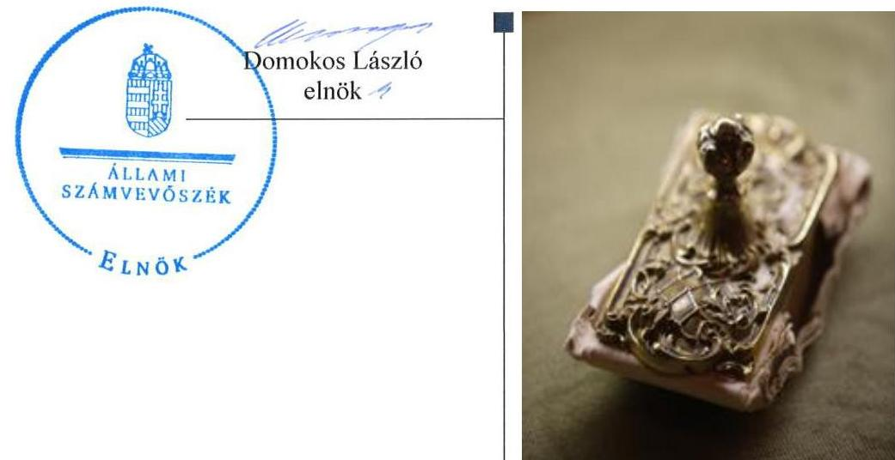
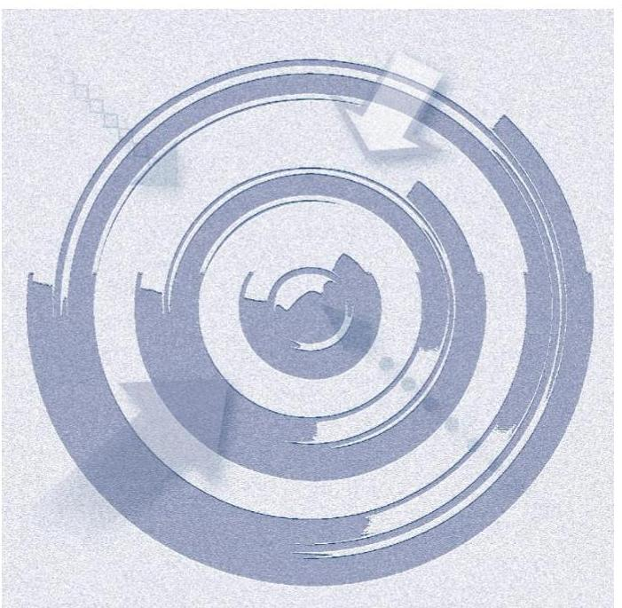
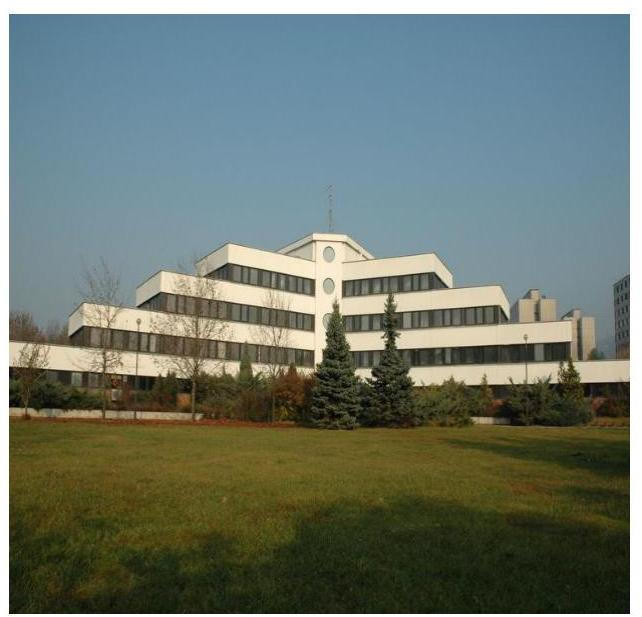
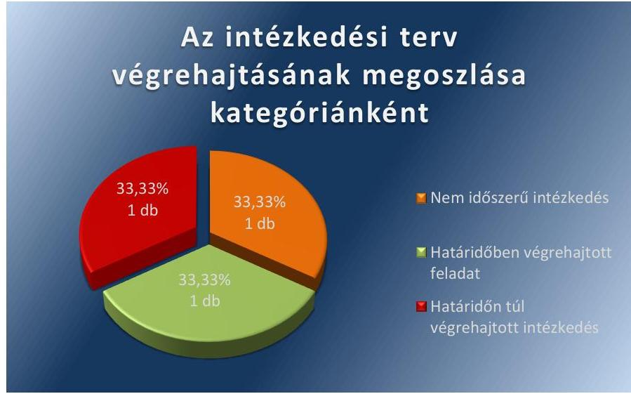
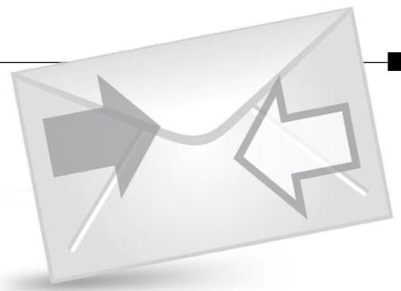

# Jelentés 

## Utóellenőrzések

Az Északdunántúli Vízmú Zártkörűen Múködő Részvénytársaság vagyonérték megőrző és gyarapító tevékenységének utóellenőrzése 2016.

---

# Jelentés 

## Utóellenőrzések

Az Északdunántúli Vízmú Zártkörűen Múködő Részvénytársaság vagyonérték megőrző és gyarapító tevékenységének utóellenőrzése 2016. február 22.

---

# AZ ELLENŐRZÉST FELÜGYELTE:

**DR. BENEDEK MÁRIA** felügyeleti vezető

## AZ ELLENŐRZÉST VEZETTE ÉS A VÉGREHAJTÁSÁÉRT FELELŐS:

**VIDA KATALIN** ellenőrzésvezető

## A PROGRAM ÖSSZEÁLLÍTÁSÁÉRT FELELŐS:

**JANIK JÓZSEF LÁSZLÓ** osztályvezető

## A TÉMÁHOZ KAPCSOLÓDÓ KORÁBBI SZÁMVEVŐSZÉKI JELENTÉSEK:

|  címe: | Jelentés az állami tulajdonban (résztulajdonban) lévő gazdálkodó szervezetek vagyonérték megőrző és gyarapító tevékenységének ellenőrzéséről egyes kiemelt közszolgáltató társaságoknál vagy hasonló tevékenységet végző társaságcsoportoknál Északdunántúli Vízmű Zrt.  |
| --- | --- |
|  sorszáma: | 14053  |

**IKTATÓSZÁM:** V-0877-035/2016.

**TÉMASZÁM:** 1911

**ELLENŐRZÉS-AZONOSÍTÓ SZÁM:** V071709

---

# TARTALOMJEGYZÉK 

■ ÖSSZEGZÉS ..... 5
■ AZ ELLENŐRZÉS CÉLJA ..... 6
■ AZ ELLENŐRZÉS TERÜLETE ..... 7
■ AZ ELLENŐRZÉS HÁTTERE, INDOKOLTSÁGA ..... 8
■ FÓKUSZKÉRDÉSEK ..... 9
■ ELLENŐRZÉS HATÓKÖRE ÉS MÓDSZEREI ..... 10
■ MEGÁLLAPÍTÁSOK ..... 12
■ MELLÉKLETEK ..... 15
I. SZ. MELLÉKLET: Az ÁSZ 14053 számú jelentéséhez kapcsolódó ÉDV Zrt. intézkedési terv végrehajtása ..... 15
II. SZ. MELLÉKLET: Az ÁSZ 14053 számú jelentéséhez kapcsolódó MNV Zrt. intézkedési terv végrehajtása ..... 16
■ FÜGGELÉK: ÉSZREVÉTELEK ..... 19
■ RÖVIDÍTÉSEK JEGYZÉKE ..... 21

---

.

---

# ÖSSZEGZÉS 

Az ÁSZ ${ }^{1}$ elvégezte az ÉDV Zrt. ${ }^{2}$ vagyonérték megőrző és gyarapitó tevékenységének utóellenőrzését a 2014. április 14. - 2015. június 8-a közötti időszakra vonatkozóan. Megállapította, hogy az ÉDV Zrt. és az MNV Zrt. ${ }^{3}$ - mint a tulajdonosi jog gyakorlója - vezérigazgatói az elkészített intézkedési terveket ${ }^{4}$ határidőben, megküldték az ellenőrzést végző szervnek. Az ÉDV Zrt. az ÁSZ megállapításainak hasznosítására előirt valamennyi tervezett intézkedést végrehajtotta. Az MNV Zrt. intézkedési tervében meghatározott feladatok végrehajtásra kerültek, illetve egy intézkedés végrehajtási határideje az ellenőrzött időszakon túli (2015. december 31.) volt.

## Az ellenőrzés társadalmi indokoltsága

Az Állami Számvevőszék stratégiájában célul tűzte ki a számvevőszéki munka hasznosulásának javítását. Ezzel összhangban ellenőrzi, hogy az ellenőrzött szervezetek megvalósították-e a korábbi ellenőrzései által feltárt hibák, hiányosságok és szabálytalanságok megszüntetése céljából kialakított intézkedési terveikben foglaltakat. A rendszeres utóellenőrzések hozzájárulnak a szükséges intézkedések tényleges végrehajtáshoz, ezáltal a közpénzügyek rendezettségének javulásához.

## Főbb megállapítások, következtetések, javaslatok

Az ÉDV Zrt. és a MNV Zrt. - mint tulajdonosi joggyakorló - az intézkedési terveket határidőben megküldték az ÁSZ részére.

Az ÁSZ jelentésben ${ }^{5}$ foglalt megállapításokhoz kapcsolódó intézkedési tervben előírt feladatokat határidőben végrehajtották az ÉDV Zrt.-nél. Az MNV Zrt. az intézkedési tervben foglalt három intézkedés közül egy feladatot határidőben, egy intézkedés végrehajtásáról határidőn túl gondoskodott, illetve egy intézkedés nem volt időszerű, mert annak végrehajtási határideje az intézkedési terv szerint az ellenőrzött időszakon túli volt.

---

# AZ ELLENŐRZÉS CÉLJA 

## Az ÉDV Zrt. vagyonérték megőrző és gyarapító tevékenységének utóellenőrzése

Az ellenőrzés célja annak értékelése, hogy a számvevőszéki jelentésben foglalt intézkedést igénylő megállapításokkal és javaslatokkal összhangban készített intézkedési tervben meghatározott feladatokat az ellenőrzött szervezet végrehajtotta-e.

---

# AZ ELLENŐRZÉS TERÜLETE 

## ÉDV Zrt.

A 91,68\%-ban állami résztulajdonban lévő ÉDV Zrt. tevékenysége a rábízott 29,2 milliárd forint értékú közösségi vagyon hatékony kezelésével a fogyasztói igényeknek megfelelő minőségú vízi-közmú szolgáltatás nyújtása, ivóvízellátási-, szennyvízelvezetési- és tisztítási feladatok végzése. Müködési területén Komárom-Esztergom, Fejér és Pest megyékben 85 településen 290 ezer fő részére biztosítja az ivóvízellátást és 66 településen mintegy 260 ezer ember veszi igénybe a szennyvízszolgáltatást. A vízellátást döntően a karsztvízre telepített tatabányai, dorogi és bicskei regionális rendszerek, kisebb részben dunai parti szűrésű vízbázisok, illetve egyedi kutak biztosítják. Az ÉDV Zrt. kötelezettsége a szolgáltatás minőségének biztosítása, a vásárlói igények teljes körű kielégítése, valamint ezek műszaki, gazdasági és szervezeti feltételeinek biztosítása. ${ }^{6}$

Az MNV Zrt. a Nemzeti Fejlesztési Minisztérium egyik legfontosabb szerveként közel 16 ezermilliárd forint értékú állami vagyon felett gyakorolja a tulajdonosi jogokat. ${ }^{7}$ Feladatai a kormányzati irányelveknek és a hatályos jogszabályoknak megfelelően a stratégiai szemléletű, felelős vagyongazdálkodás, a portfólió-racionalizálás, a korszerű ingatlangazdálkodás, a nemzeti társaságok eredményességének növelése, valamint a nemzeti vagyon megőrzése és gyarapítása. Az MNV Zrt. a rábízott vagyonnal történő gazdálkodás során stratégiai szempontok szerint gyakorolja az állami résztulajdon felett - köztük az ÉDV Zrt. felett is - a tulajdonosi jogokat.

Az utóellenőrzés az állami tulajdonban (résztulajdonban) lévő gazdálkodó szervezetek vagyonérték megőrző és gyarapító tevékenységének ellenőrzéséről 2014. április 14-én nyilvánosságra hozott, 14053 számú ÁSZ jelentés megállapításai, javaslatai hasznosítása érdekében az ÉDV Zrt. és az MNV Zrt. által készített intézkedési tervek végrehajtására irányult.

Az ÁSZ jelentés az ÉDV Zrt. vezérigazgatója részére három, az MNV Zrt. vezérigazgatója részére két javaslatot tartalmazott.

Az ÉDV Zrt. és az MNV Zrt. vezérigazgatói az elkészített intézkedési terveket határidőben megküldték az ÁSZ részére.

---

# AZ ELLENŐRZÉS HÁTTERE, INDOKOLTSÁGA 

Az ÁSZ törvény 33. § (1) bekezdése értelmében a számvevőszéki jelentések intézkedést igénylő megállapításaihoz és javaslataihoz kapcsolódóan az ellenőrzött szervezet vezetője intézkedési tervet köteles összeállítani, és az Állami Számvevőszék részére megküldeni. Az intézkedési tervben foglaltak megvalósítását - az ÁSZ törvény 33. § (7) bekezdésében foglaltak alapján - az Állami Számvevőszék utóellenőrzés keretében ellenőrizheti. Az intézkedések megvalósulásának értékelése során az Állami Számvevőszék figyelembe veszi az ellenőrzött szervezetek működési feltételeiben, valamint a jogszabályi előírásokban bekövetkezett változásokat.

Az intézkedési tervekben foglalt feladatok hiányos, illetve késedelmes végrehajtása, valamint megvalósításának elmaradása azt mutatja, hogy az ellenőrzések során feltárt hibák, hiányosságok és szabálytalanságok megszüntetése nem kapott kellő hangsúlyt. Ez a szabályszerű működés és a felelős vezetői magatartás vonatkozásában kockázatot hordoz. E kockázatok feltárásával az Állami Számvevőszék utóellenőrzési rendszere fokozza a fegyelmet, és igazolja, hogy a közpénzzel való szabályos gazdálkodás felelőssége elől nem lehet kitérni.

## AZ ELLENŐRZÉS VÁRHATÓ HASZNOSULÁSA

Az utóellenőrzés négy szinten hasznosulhat:

- A társadalom szintjén az utóellenőrzés jelzi, hogy a számvevőszéki ellenőrzés megállapításainak van következménye: a hiányosságok megszüntetésére az ellenőrzött szervezet által meghatározott intézkedések végrehajtását is számon kéri az ÁSZ.
- Az ellenőrzött terület szintjén az utóellenőrzés tájékoztatást nyújt a terület döntéshozóinak a hiányosságok kiküszöbölésének jó gyakorlatairól, ezzel lehetőséget biztosítva arra, hogy az ÁSZ ellenőrzési megállapításai, javaslatai a terület nem ellenőrzött szervezeteinek a működése során is hasznosuljanak.
- Az ellenőrzött szervezet szintjén az utóellenőrzés feltárja, hogy a szervezet az intézkedések végrehajtásával hasznosította-e a korábbi ellenőrzési jelentésben a hiányosságok megszüntetése, illetve a kockázatok kezelése érdekében megfogalmazott javaslatokat.
- Az ÁSZ szintjén az utóellenőrzés visszacsatolást ad az ellenőrzési jelentések hasznosulásáról, az intézkedések elmaradása vagy részleges megvalósulása a további ellenőrzésekhez kockázati jelzésként szolgál.

---

# FÓKUSZKÉRDÉSEK 

1. Az ellenőrzött szervezetek az intézkedési tervekben foglaltakat az előírt határidőben - végrehajtották-e?

---

# ELLENŐRZÉS HATÓKÖRE ÉS MÓDSZEREI 

## Az ellenőrzés típusa

Szabályszerűségi ellenőrzés

## Az ellenőrzött időszak

A számvevőszéki jelentés közzétételének napjától (2014. április 14.) az utóellenőrzés megkezdésének napjáig (2015. június 8.) tartó időszak.

## Az ellenőrzés tárgya

Az ÁSZ tv. ${ }^{8}$ alapján az ÁSZ jelentésekben foglalt megállapításokhoz kapcsolódó javaslatokra az ellenőrzöttek által az ÁSZ részére megküldött intézkedési tervekben előírtak hasznosulása.

## Az ellenőrzött szervezet

Az ÉDV Zrt. és az MNV Zrt.

## Az ellenőrzés jogalapja

Az ellenőrzés végrehajtásának jogszabályi alapját az ÁSZ tv. 1 §. (3) bekezdése, a 33. § (1)-(2), (6)-(7) bekezdései, valamint az Áht. ${ }^{9} 61 . \S$ (2) bekezdésének előírásai képezték.

## Az ellenőrzés módszerei

Az ellenőrzést a nemzetközi standardokat irányadónak tekintve az ellenőrzési program ellenőrzési kérdései, az ellenőrzött időszakban hatályos jogszabályok, az ellenőrzés szakmai szabályok és módszertanok figyelembe vételével, az utóellenőrzéseket önállóan végeztük.

Az utóellenőrzés megállapításait elsősorban az ÁSZ rendelkezésére álló, valamint az ellenőrzött szervezetektől elektronikusan bekért dokumentumok alapozták meg. Az ÁSZ az ellenőrzés keretében teljesítményellenőrzés tervezéséhez is kért adatokat.

Az ellenőrzési bizonyítékként felhasználható adatforrások közé tartoztak egyrészt a szakmai programban felsorolt adatforrások, másrészt minden - az ellenőrzés folyamán feltárt, az ellenőrzés szempontjából releváns információt tartalmazó - dokumentum.

---

Az ellenőrzés során értékeltük, hogy az ÁSZ jelentésben foglalt megállapításokhoz kapcsolódó intézkedési terveket határidőben megküldték-e az ÁSZ részére, az intézkedési tervekben foglaltakat végrehajtották-e.

A megküldött intézkedési tervekben előírt feladatok végrehajtásának ellenőrzését értékelési kritériumok alapján végeztük. Figyelembe vettük az intézkedési tervek készítését követően hatályba lépett jogszabályi előírások változásából következő események, továbbá a feladat-ellátási és finanszírozási rendszer esetleges változásának hatásait. Az intézkedési tervekben előírt feladatokat azok végrehajthatósága, illetve végrehajtása szempontjából az alábbiak szerint értékeltük:
—okafogyottá vált az előírt feladat, ha végrehajtására - meghatározott esemény bekövetkezése, továbbá külső körülmény, a működést érintő feltétel változása miatt - már nincs szükség, illetve lehetőség, és egyértelműen megállapítható, hogy az intézkedést szükségessé tevő körülmény a jövőben nem fordulhat elő;
— nem időszerű az a feladat, amelynek ellenőrzési időszakon belüli végrehajtására azért nem került (kerülhetett) sor, mert az intézkedés alapjául szolgáló esemény nem következett be, de annak jövőbeni előfordulása lehetséges, a végrehajtása nem volt esedékes, vagy a végrehajtás határideje még nem járt le;
—határidőben végrehajtott a feladat, ha a teljesítés dokumentáltan az intézkedési tervben előírt határidőben és tartalommal megtörtént;
—határidőn túl végrehajtott a feladat, ha annak teljesítése az intézkedési tervben meghatározott módon, de az előírt határidőn túl történt meg;
— részben végrehajtott az a feladat, amelynek végrehajtása teljes körűen az intézkedési tervben előírt módon nem történt meg;
— nem végrehajtott a feladat, ha a végrehajtás nem történt meg, vagy amennyiben a végrehajtást nem dokumentálták.
Az ellenőrzés lefolytatásához az ellenőrzött szervezetek a tanúsítványok kitöltésével, valamint az ÁSZ által kért dokumentumok elektronikus megküldésével szolgáltatattak adatokat, amelyek valódiságát és teljes körűségét az ellenőrzött szervezetek vezetői által tett teljességi és hitelességi nyilatkozatok igazolták. Az így rendelkezésre bocsátott adatok, információk kontrollja az ellenőrzés keretében megtörtént.

---

# MEGÁLLAPÍTÁSOK 

## Az ellenőrzött szervezetek az intézkedési tervekben foglaltakat - az előírt határidőben - végrehajtották-e?

Összegző megállapítás

Az ÉDV Zrt. az intézkedési tervében foglaltakat az előírt határidőben végrehajtotta. Az MNV Zrt. három intézkedés közül egy feladatot határidőben, egy intézkedést határidőn túl teljesített, illetve egy feladat teljesítése nem volt időszerű, mivel a végrehajtás határideje az utóellenőrzés időpontjában még nem járt le.

Az intézkedési tervekben meghatározott feladatokat, az ÁSZ jelentés javaslatainak címzettjét és a feladatok végrehajtását az I. és a II. számú mellékletek tartalmazzák.

Az ÉDV ZRT.-nél az intézkedési tervben előírt négy feladatot határidőben végrehajtották.

Az ÁSZ jelentés a vezérigazgató részére három javaslatot fogalmazott meg, melynek hasznosítására az ÉDV Zrt. négy feladatot határozott meg. A vezérigazgató az intézkedési tervben felelősként a beruházás-fejlesztésvezetőt ${ }^{10}$, az ellenőrzési vezetőt ${ }^{11}$, az általános és műszaki ${ }^{12}$, illetve a gazdasági vezérigazgató-helyettest ${ }^{13}$ jelölte meg.

## HATÁRIDŐBEN VÉGREHAJTOTT feladat:

1. A beruházások tervezési és megvalósítási eljárásrendjét kiegészítették, a beruházások, felújítások megkezdése előtti, az MNV Zrt. írásbeli engedélye bekérésének előírásával. Az engedélyköteles beruházások esetében a kivitelezés megkezdését követően az MNV Zrt.-t tájékoztatták.
2. A vagyonkezelt eszközökről adatszolgáltatást készítettek az MNV Zrt. által szabályozott formában. Az ÉDV Zrt. a beruházások elszámolására vonatkozóan előírt adatszolgáltatási kötelezettségét teljesítette, az MNV Zrt. által kiadott Eljárásrend ${ }^{14}$ alapján a tárgynegyedévi kimutatásokat és nyilatkozatokat az előírt tartalommal és határidőre megküldte az MNV Zrt. részére.
3. Az ÉDV Zrt. belső ellenőrzési szervezeti egysége - a FB15 által jóváhagyott Ellenőrzési Feladatterve ${ }^{16}$ alapján - megvizsgálta a vagyonmegóvást, visszapótlást az ÉDV Zrt.-nél. Az erről szóló ellenőrzési jelentés 2014. november 15-én elkészült, amelyet határidőben megküldtek a vezérigazgató részére.
4. Az ÉDV Zrt. vezérigazgatója a 2014. május 15-én kelt levelében intézkedett bizottság létrehozásáról, amelynek feladata az MNV Zrt.

---

engedélye nélkül megvalósított beruházások körülményeinek a kivizsgálása, továbbá az esetleges személyi felelősség megállapítása volt. A bizottság határidőben, 2014. június 27-én elkészítette a jelentést a vezérigazgató részére.

Az intézkedési tervben nem időszerű és okafogyottá vált, illetve határidőn túl- és részben végrehajtott, valamint végre nem hajtott feladat nem volt.

Az ÉDV Zrt.-nél az intézkedési tervben, illetve egyéb szabályzatban az intézkedések végrehajtásával kapcsolatosan nem írtak elő beszámolási kötelezettséget.

Az ÁSZ jelentés két javaslatára az MNV ZRT. az intézkedési tervében három intézkedési feladatot határozott meg. Egy intézkedést határidőben, egy intézkedést határidőn túl hajtottak végre, egy intézkedés nem volt időszerű ${ }^{17}$ az utóellenőrzés időpontjában. Az intézkedési tervben felelősként a gazdasági főigazgatót, az ingó- és ingatlanvagyonért felelős főigazgatót, illetve az ellenőrzési igazgatót nevezték meg. A feladatok kategóriánkénti megoszlását az 1. számú ábra mutatja be.

1. számú ábra

Fonrás: ÁSZ által felmérés
NEM IDŐSZERŰ feladat:

1. Az intézkedési tervben megfogalmazott tervezett intézkedés alapján - az MNV Zrt. 16/2015. (III. 13.) RJGY ${ }^{18}$ számú határozatának megfelelően - a tulajdonosi ellenőrzést elvégezték az ÉDV Zrt.-nél. A jelentés-tervezet elkészült, azt megküldték az ellenőrzött szerv vezetőjének. Az ellenőrzés lezárására még nem került sor. A feladat végrehajtása nem volt időszerű, mivel az intézkedési terv szerint az ellenőrzés végrehajtásának határideje 2015. június 30.-a volt, ami az ellenőrzött időszakban még nem járt le.

# HATÁRIDŐBEN VÉGREHAJTOTT feladat: 

2. Az MNV Zrt. szabályozta az állami tulajdonon, egyéb vagyonkezelők által vagyonkezelt eszközön megvalósítandó beruházások, felújítások előzetes engedélyezésének és elszámolásának rendjét,

---

melyet Eljárásrend címen határidőben adott ki. Az MNV Zrt. az Eljárásrend hatálybalépéséről 2014. augusztus 11-én írásban tájékoztatta az ÉDV Zrt.-t. Az egységes Vagyon-nyilvántartási Szabályzatot ${ }^{19}$ az ÉDV Zrt. 2015. június 30-án, a vagyonkezelési szerződés módosításának aláírásával fogadta el. Az ÉDV Zrt. a 2014. május 31-én hatályba léptetett Vagyonkezelési Szabályzat és Eljárásrend rendelkezései szerint járt el az ellenőrzött időszakban.

# HATÁRIDŐN TÚL VÉGREHAJTOTT feladat: 

3. A vagyonkezelési szerződés alapján fennálló vagyonkezelői jogviszony újraszabályozását a vagyonkezelési szerződésmódosítással történő egységes szerkezetbe foglalását 2014. december 31-e helyett 2015. június 29-én hajtották végre.
Az MNV Zrt. intézkedési tervét a vezérigazgató határozattal ${ }^{20}$ hagyta jóvá, és elrendelte az illetékes szakterületek számára a beszámolási kötelezettséget, melyet az előírtaknak megfelelően a kabinetfőnök ${ }^{21}$ részére teljesítettek.

---

# MELLÉKLETEK

I. SZ. MELLÉKLET: AZ ÁSZ 14053 SZÁMÚ JELENTÉSÉHEZ KAPCSOLÓDÓ ÉDV ZRT. INTÉZKEDÉSI TERV VÉGREHAJTÁSA

|  Sorszám | Intézkedési terv alapján elvégzendő feladat | Az intézkedési tervben mezbatározott határidő 2 | Az ÁSZ 14053 sz. jelentés javaslatának címzettje 3 | Az intézkedés végrehajtása  |
| --- | --- | --- | --- | --- |
|   | 1. | 2. | 3. | 4.  |
|  Határidőben végrehajtott intézkedések |  |  |  |   |
|  1. | A 6.3.-1. Beruházások tervezése és megvalósítása című eljárás kiegészítése azzal, hogy a beruházások, felújítások megkezdése előtt az MNV Zrt. írásbeli engedélyét kell kérni, egyéb esetekben pedig 30 napon belül a kivitelezés megkezdését követően az MNV Zrt.-t tájékoztatni kell. | 2014. május
31.
folyamatos | ÉDV Zrt.
vezérigazgató | A beruházások tervezési és megvalósítási eljárásrendjét kiegészítették, a beruházások, felújítások megkezdése előtti, az MNV Zrt. írásbeli engedélye bekérésének előírásával. Az engedélyköteles beruházások esetében a kivitelezés megkezdését követően az MNV Zrt.-ét tájékoztatták.  |
|  2. | A vagyonkezelt eszközökkel kapcsolatosan adatszolgáltatás az MNV Zrt. által előírtak alapján. | folyamatos | ÉDV Zrt.
vezérigazgató | Az MNV Zrt. 2014. augusztus 11-én kelt levelében tájékoztatta az ÉDV Zrt.-t, hogy elfogadásra került az állami tulajdonon, egyéb vagyonkezelők által vagyonkezelt eszközön megvalósítandó beruházások, felújítások előzetes engedélyezésének és elszámolásának menetéről szóló Eljárásrend. Az ÉDV Zrt. a beruházások elszámolására vonatkozó tárgynegyedévi kimutatásokat és nyilatkozatokat az előírt tartalommal és határidőre megküldte az MNV Zrt. részére, így az előírt adatszolgáltatási kötelezettségét teljesítette. (A 2014. I-III. negyedévi elszámolás 2014. november 20-án, a 2014. IV. negyedévi elszámolás 2015. február 20-án, míg a 2015. I. negyedévi elszámolás 2015. május 20-án megtörtént.)  |
|  3. | A belső ellenőrzési szervezeti egység - a Felügyelőbizottság által FB5/2014.(IV.10.) határozatával jóváhagyott Ellenőrzési Feladatterve alapján - vizsgálja meg a vagyonmegóvást, a visszapótlást a Társaságnál. | 2014. december 31. | ÉDV Zrt.
vezérigazgató | Az ÉDV Zrt. belső ellenőrzési szervezeti egysége - a FB által jóváhagyott Ellenőrzési Feladatterve alapján - megvizsgálta a vagyonmegóvást, visszapótlást az ÉDV Zrt.-nél. Az erről szóló ellenőrzési jelentés 2014. november 15-én elkészült, amelyet határidőben megküldtek a vezérigazgató részére.  |
|  4. | A vezérigazgató által létrehozott bizottság vizsgálja ki az MNV Zrt. engedélye nélkül megvalósított beruházások körülményeit, továbbá azt, hogy személyi felelősség megállapítható-e. | 2014. június
30. | ÉDV Zrt.
vezérigazgató | Az ÉDV Zrt. vezérigazgatója a 2014. május 15-én kelt levelében intézkedett bizottság létrehozásáról, amelynek feladata az MNV Zrt. engedélye nélkül megvalósított beruházások körülményeinek a kivizsgálása, továbbá az esetleges személyi felelősség megállapítása volt. A bizottság határidőben, 2014. június 27-én elkészítette a jelentést a vezérigazgató részére.  |

Fonrás: ÁSZ által készített táblázat

---

#### II. SZ. MELLÉKLET: AZ ÁSZ 14053 SZÁMÚ JELENTÉSÉHEZ KAPCSOLÓDÓ MNV ZRT. INTÉZKEDÉSI TERV VÉGREHAJTÁSA

|  SZÁMÚ | Intézkedési terv alapján elvégzendő feladat | Az intézkedési tervben meghatározott határidő | Az ÁSZ 14053 sz. jelentés javaslatának címzettje 3. | Az intézkedés végrehajtása  |
| --- | --- | --- | --- | --- |
|   | 1. | 2. | 3. | 4.  |
|  Nem időszerű intézkedések |  |  |  |   |
|  1. | Tulajdonosi ellenőrzés lefolytatása a társaságnál a 2012-2013. évi beruházások megvalósítása, és vagyonkezelési szerződésnek való megfelelősége tárgyában. Az MNV Zrt. 219/2014. (IV.03.) RJGY határozattal jóváhagyott 2014. évi tulajdonosi ellenőrzési terve az ÉDV Zrt. vonatkozásában lefolytatandó vizsgálatot nem tartalmazza, ezért a 2015. évi tulajdonosi ellenőrzési tervbe kerül felvételre. | 2015. június 30. | MNV Zrt. vezérigazgatója | Az intézkedési tervben megfogalmazott tervezett intézkedés alapján, az MNV Zrt. 16/2015. (III. 13.) RJGY számú határozatának megfelelően tulajdonosi ellenőrzést elvégezték az ÉDV Zrt.-nél. A jelentés-tervezet elkészült, azt megküldték az ellenőrzött szerv vezetőjének. Az ellenőrzés lezárására még nem került sor. A feladat végrehajtása nem volt időszerü, mivel az intézkedési terv szerint az ellenőrzés végrehajtásának határideje 2015. június 30.-a volt, ami az ellenőrzött időszakban még nem járt le.  |
|  Határidőben végrehajtott intézkedések |  |  |  |   |
|  2. | Az állami vagyon nyilvántartására vonatkozó Vhr. 13. és 14. §-ában foglalt hatályos szabályozások érvényesítése mellett egységes szabályzat kiadása, és annak vízi-közműszolgáltató társaság általi elfogadása, a vagyonkezelési szerződés módosítását megelőzően. | 2014. június 30. | MNV Zrt. vezérigazgatója | Az MNV Zrt. szabályozta az állami tulajdonon, egyéb vagyonkezelők által vagyonkezelt eszközön megvalósítandó beruházások, felújítások előzetes engedélyezésének és elszámolásának rendjét, melyet Eljárásrend címen határidőben adott ki. Az MNV Zrt. az Eljárásrend hatálybalépéséről ugyan 2014. augusztus 11-én írásban tájékoztatta az ÉDV Zrt.-t. Az egységes Vagyon-nyilvántartási Szabályzatot az ÉDV Zrt. 2015. június 30-án a vagyonkezelési szerződés módosításának aláírásával fogadta el. Az ÉDV Zrt. a 2014. május 31-én hatályba léptetett Vagyonkezelési Szabályzat és Eljárásrend rendelkezései szerint járt el az ellenőrzött időszakban.  |
|  Határidőn túl végrehajtott intézkedések |  |  |  |   |
|  3. | A hatályos vagyonkezelési szerződés és az az alapján fennálló vagyonkezelői jogviszony újraszabályozása, valamint a vagyonkezelési szerződésmódosítással történő egységes szerkezetbe foglalása, mely tartalmazza az alábbi szövegrészt: „Felek rögzítik, hogy az MNV Zrt. vagyon-nyilvántartási szabályzata a vízi-közműszolgáltató társaságok által befogadott, az MNV Zrt. jogelődje által 1998-ban jóváhagyott „a Kincstári vagyoni” 2014. december 31. | 2014. december 31. | MNV Zrt. vezérigazgatója | A vagyonkezelési szerződés alapján fennálló vagyonkezelői jogviszony újraszabályozását a vagyonkezelési szerződésmódosítással történő egységes szerkezetbe foglalását 2014. december 31-e helyett 2015. június 29-én hajtották végre.  |

---

|  ㅅ | Intézkedési terv alapján elvégzendő feladat | Az intézkedési tervben meghatározott határidő | Az ÁSZ 14053 sz. jelentés javaslatának címzettje | Az intézkedés végrehajtása  |
| --- | --- | --- | --- | --- |
|  1. |  | 2. | 3. | 4.  |
|  körbe tartozó vízi-közmű vagyonkezelési, gazdálkodási és nyilvántartási szabályzata" helyébe lépett." |  |  |  |   |

Forrás: ÁSZ által készített táblázat

---

.

---

# FÜGGELÉK: ÉSZREVÉTELEK 

A jelentéstervezetet az ÁSZ 15 napos észrevételezésre megküldte az ellenőrzött szervezetek vezetői részére az ÁSZ tv. 29. §* (1) bekezdése előírásának megfelelően.
Az ellenőrzött szervezetek vezetői az ÁSZ tv. 29. § (2) bekezdésében foglalt észrevételezési jogukkal nem éltek, a jelentéstervezetre észrevételt nem tettek.

[^0]
[^0]:    * 29. § (1) Az Állami Számvevőszék az ellenőrzési megállapításait megküldi az ellenőrzött szervezet vezetőjének vagy az általa megbízott személynek, és annak, akinek személyes felelősségét állapította meg.
    (2) Az ellenőrzött szervezet vezetője és a felelősként megjelölt személy az ellenőrzés megállapításaira tizenöt napon belül írásban észrevételt tehet.
    (3) Az Állami Számvevőszék az észrevételre a beérkezésétől számított harminc napon belül írásban válaszol. A figyelembe nem vett észrevételeket köteles a jelentésben feltüntetni, és megindokolni, hogy azokat miért nem fogadta el.

---

.

---

# RÖVIDÍTÉSEK JEGYZÉKE 

${ }^{1}$ ÁSZ
${ }^{2}$ ÉDV Zrt.
${ }^{3}$ MNV Zrt.
${ }^{4}$ Intézkedési tervek
${ }^{5}$ ÁSZ jelentés
${ }^{6}$ Forrás:
${ }^{7}$ Forrás:
${ }^{8}$ ÁSZ tv.
${ }^{9}$ Áht.
${ }^{10}$ Beruházás-fejlesztésvezető
${ }^{11}$ Ellenőrzési vezető
${ }^{12}$ Általános és műszaki vezérigazgató-helyettes
${ }^{13}$ Gazdasági vezérigazgató-helyettes
${ }^{14}$ Eljárásrend
${ }^{15} \mathrm{FB}$
${ }^{16}$ Ellenőrzési Feladatterv
${ }^{17}$ nem időszerű
${ }^{18}$ RJGY
${ }^{19}$ Vagyon-nyilvántartási Szabályzat
${ }^{20}$ Vezérigazgató határozata
${ }^{21}$ Kabinetfőnök

Állami Számvevőszék
Északdunántúli Vízmú Zártkörűen Müködő Részvénytársaság
Magyar Nemzeti Vagyonkezelő Zártkörűen Müködő Részvénytársaság
Az ÁSZ részére 2014. augusztus 7-én megküldött EDV-7281-7/2014. iktatószámú, és az MNV/01/25925/6/2014. iktatószámú, 2014. augusztus 29-én megküldött intézkedési tervek az ÁSZ jelentés alapján.
A 2014. április 14-én nyilvánosságra hozott, 14053 sorszámú ÁSZ ellenőrzési jelentés az ÉDV Zrt. ellenőrzéséről
Az ÉDV Zrt. honlapja: http://www.edv.hu/tarsasagunkrol/
A MNV Zrt. honlapja: http://mnvzrt.hu/mnv/bemutatkozas
Az Állami Számvevőszékről szóló 2011. évi LXVI. törvény (hatályos 2011. július 1-jétől)
Az államháztartásról szóló 2011. évi CXCV. törvény
Északdunántúli Vízmú Zrt. beruházás-fejlesztésvezetője
Északdunántúli Vízmú Zrt. ellenőrzési vezetője
Északdunántúli Vízmú Zrt. általános és műszaki vezérigazgató-helyettese
Északdunántúli Vízmú Zrt. gazdasági vezérigazgató-helyettese
Az állami tulajdonon, egyéb vagyonkezelők által vagyonkezelt eszközökön a beruházások, felújítások előzetes engedélyezésének és elszámolásának menetéről szóló tájékoztató
MNV Zrt. Felügyelőbizottság
Az ÉDV Zrt.FB-5/2014. (IV.10.) határozatával jóváhagyott ellenőrzési feladatterv
Az intézkedés nem lejárt végrehajtási határidejú (2015. december 31.) az utóellenőrzés időpontjában.
MNV Zrt. Részvényesi Jogok Gyakorlója
MNV Zrt. 12/2014. számú vezérigazgatói utasítás (egységes szerkezetben a 20/2014. számú Vezérigazgatói utasítással) a Magyar Nemzeti Vagyonkezelő Zrt. állami vagyon kezelőire, az állami vagyont használókra és a társasági részesedések esetében az MNV Zrt. tulajdonosi joggyakorlását megbízottként ellátókra vonatkozó Vagyon-nyilvántartási Szabályzatról (hatályos 2014. május 31-től)
MNV Zrt. vezérigazgatójának a 402/2014. (VIII. 29.) Vig. számú határozata MNV Zrt. Kabinet Vezetője

---

# ÁLLAMI SZÁMVEVŐSZÉK 

1052 Budapest, Apáczai Csere János utca 10.
Levélcím: 1364 Budapest 4. Pf. 54
Telefon: +36 14849100 Telefax: +36 14849200
www.asz.hu