# Jelenetés 

## FŐKEFE Közhasznú Nonprofit Kft.

Az állami tulajdonban (résztulajdonban) lévő gazdálkodó szervezetek vagyonmegőrzési és gazdálkodási tevékenységének ellenőrzése
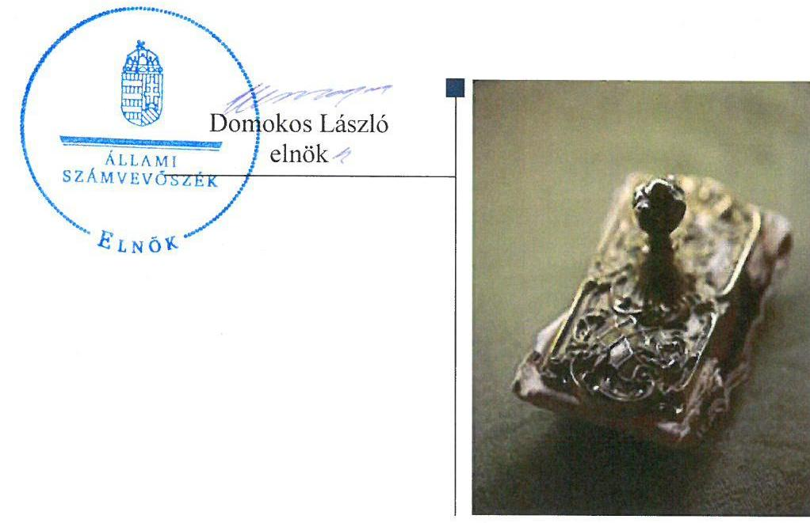

---

# AZ ELLENŐRZÉST FELÜGYELTE:

## MAKKAI MÁRIA felügyeleti vezető

## AZ ELLENŐRZÉST VEZETTE ÉS A VÉGREHAJTÁSÁÉRT FELELŐS:

### PONGRÁCZ ÉVA ellenőrzésvezető

## A PROGRAM ÖSSZEÁLLÍTÁSÁÉRT FELELŐS:

### LAJTERNÉ HUDÁK MAGDOLNA osztályvezető

---

**IKTATÓSZÁM:** V-0854-406/2016.

**TÉMASZÁM:** 1888

**ELLENŐRZÉS-AZONOSÍTÓ SZÁM:** V070902

---

Jelentéseink az Országgyűlés számítógépes hálózatán és az Interneten a www.asz.hu címen is olvashatóak.

---

# TARTALOMJEGYZÉK 

■ ÖSSZEGZÉS ..... 5
■ AZ ELLENŐRZÉS CÉLJA ..... 7
■ AZ ELLENŐRZÉS TERÜLETE ..... 8
■ AZ ELLENŐRZÉS HÁTTERE, INDOKOLTSÁGA ..... 9
■ FÓKUSZKÉRDÉSEK ..... 10
■ ELLENŐRZÉS HATÓKÖRE ÉS MÓDSZEREI ..... 11
■ MEGÁLLAPÍTÁSOK ..... 13
■ JAVASLATOK ..... 24
■ MELLÉKLETEK ..... 25
I. Sz. melléklet: Értelmező szótár ..... 25
■ FÜGGELÉK: ÉSZREVÉTELEK ..... 31
■ RÖVIDÍTÉSEK JEGYZÉKE ..... 49

---

.

---

# ÖSSZEGZÉS 

Az Állami Számvevőszék a FŐKEFE NKft.-t a 2011. január 1- 2014. december 31. közötti időszakra vonatkozóan ellenőrizte. Az ellenőrzés fő célja volt, hogy értékelje a gazdálkodási feltételek kialakításának, a tulajdonosi jogok gyakorlásának, az elszámolásoknak, a vagyonváltozást eredményező döntéseknek és az információk átadásának szabályszerűségét. Az ÁSZ megállapította, hogy a feltételek kialakítása megtörtént, a tulajdonosi joggyakorlás szabályszerű volt. A bevételeket és ráfordításokat az előírásoknak megfelelően számolták el. A vagyongazdálkodás és a döntések az előírásoknak megfelelően történtek. A beszámolási kötelezettség teljesítése során azonban jelentkeztek szabálytalanságok, hiányosságok, amelyek megtévesztő adatszolgáltatást okoztak.

## Az ellenőrzés társadalmi indokoltsága

Magyarországon az intézmény-centrikus közfeladat-ellátás, közvagyon-gazdálkodás jellemző a költségvetésen kívüli feladatellátás térnyerése mellett. Ennek szereplői a nonprofit szervezetek, az önkormányzati tulajdonú gazdasági társaságok és az állami tulajdonú gazdálkodó szervezetek is.

Az Áht. 2. § (1) bekezdésének I) pontja, az Európai Közösséget létrehozó szerződéshez csatolt, a túlzott hiány esetén követendő eljárásról szóló jegyzőkönyv alkalmazásáról szóló 2009. május 25-i 479/2009/EK rendelet szerint, illetve az ESA95 statisztikai módszertana alapján a kormányzati szektorba tartoznak "központi kormányzat alszektorba besorolt társaságok és egyéb szervezetek" is, amelyekkel szemben alapvető követelmény, hogy gazdálkodásuk, működésük szabályszerű, az általuk szolgáltatott adatok megbízhatóak legyenek.

Az állami tulajdonú gazdálkodó szervezetek a nemzeti vagyon részét képezik. Az állami vagyonnal való gazdálkodást illetően a tulajdonosi joggyakorlás és a vagyongazdálkodás feladata az állami vagyon átlátható, rendeltetésszerű és felelős felhasználásának biztosítása. Az állam meghatározza az ellátandó közszolgáltatással kapcsolatos feladatokat, amelyhez a vagyonnal kapcsolatos döntéseknek igazodniuk kell. A nemzetgazdasági szempontból kiemelt jelentőségű nemzeti vagyonban tartandó állami tulajdonban álló társasági részesedést a nemzeti vagyonról szóló törvény határozza meg.

Minden közpénzt, közvagyont használó szervezettel szemben társadalmi igény, hogy tevékenységükről elszámoljanak. Ezt figyelembe véve és az Állami Számvevőszék stratégiájával összhangban került sor a FŐKEFE NKft. ellenőrzésére.

## Főbb megállapítások, következtetések, javaslatok

A FŐKEFE NKft. feladatait saját tulajdonában lévő eszközökkel látta el. A tulajdonosi jogokat gyakorló MNV Zrt. a jogszabályi előírásoknak megfelelően alakította ki a vagyonnal való gazdálkodás feltételeit és azt szabályszerűen gyakorolta.

A bevételek és ráfordítások elszámolása, valamint az önköltségszámítás szabályszerű volt.
A Társaság a vagyongazdálkodási tevékenységének feltételeit az előírások szerint alakította ki. A társaság vagyongazdálkodása során teljesítette a jogszabályi és tulajdonosi elvárásokat.

A vagyonváltozást eredményező döntések megfeleltek a jogszabályi előírásoknak.
A FŐKEFE NKft. beszámolási kötelezettségének eleget tett, de a közzététel, illetve a letétbe helyezett beszámoló nem felelt meg a szabályoknak. A 2011. és 2013. évben nem a jóváhagyásra jogosult testület által elfogadott beszámolókat tették közzé. A tulajdonosi joggyakorló által elfogadott és a közzétett adatok ezekben az években eltértek egymástól. A 2012. és 2014. évi beszámolót elfogadó FB határozat nem tartalmazta a beszámoló fő számait. Ezekben

---

az években az FB határozattal elfogadott beszámoló nem egyezett meg a letétbe helyezett, illetve a tulajdonosi joggyakorló elé jóváhagyásra előterjesztett beszámolóval. A közzétett beszámolók megtévesztőek.

A Társaság nem tette közzé a honlapján a jogszabályban meghatározott adatokat, ami ellentétes a vonatkozó jogszabályi előírásokkal.

A FŐKEFE NKft. szervezetén belül a kialakított információs rendszer megfelelően működött.

---

# AZ ELLENŐRZÉS CÉLJA 

## Az állami tulajdonban (résztulajdonban) lévő gazdálkodó szervezetek vagyonmegőrzési és gazdálkodási tevékenységének ellenőrzése a FŐKEFE NKft.-nél

Az ellenőrzés célja annak értékelése volt, hogy a tulajdonosi jogok gyakorlása szabályszerű volt-e; a gazdálkodó szervezet által ellátott feladat bevételei, ráfordításai elszámolásának, és vagyongazdálkodási tevékenységének szabályozása megfelelt-e a jogszabályi és a tulajdonosi előírásoknak és azok végrehajtása szabályszerű volt-e; biztosítva volt-e a közfeladatok átláthatósága és elszámoltathatósága érdekében a közszolgáltatás díjának megalapozottsága szabályszerű önköltségszámítással; a vagyonváltozást eredményező döntések esetében a tulajdonosi jogok gyakorlója és a gazdálkodó szervezet szabályszerűen jártak-e el; a gazdálkodó szervezet kiépített-e és működtetett-e információs rendszert a szabályszerű vagyongazdálkodás érdekében.

---

# AZ ELLENŐRZÉS TERÜLETE

## A FŐKEFE NKft.

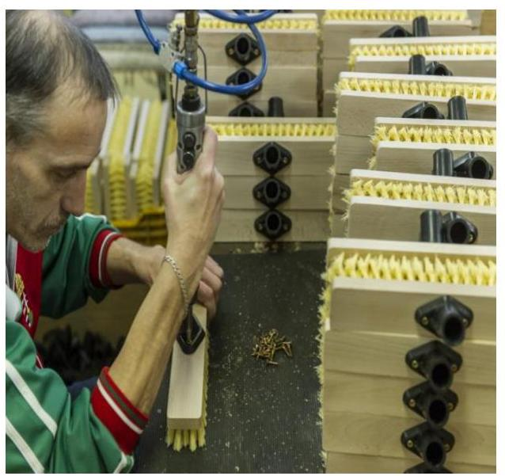

A FŐKEFE NKft. az 1949-ben alapított Kefe és Seprűgyártó Vállalat jogutódja, amely 1994. január 1-től kft-ként, 2006. március 9-től kht-ként működött. A Társaság 2008. december 9-ével átalakult nonprofit kft-vé, és az ellenőrzött időszakban is ebben a társasági formában látta el feladatait.

2012. szeptember 30-tól beolvadt a Társaságba a Savaria Nett-Pack Nonprofit Kft. A Társaság 100%-os leányvállalata a Cégbíróság által 2014. május 19-én bejegyzett Agro-Rehab Nonprofit Kft. A FŐKEFE NKft. 100 ezer Ft névértékű részvénnyel rendelkezik a Mecsek Fűszért Zrt-ben. A Társaság a felsoroltakon túl nem rendelkezik egyéb jelentős, többségi irányítást biztosító és közvetlen irányítást biztosító befolyással más gazdasági társaságban.

A FŐKEFE NKft. az Alapító korábbi szándékának megfelelően továbbra is fő feladatának tekinti a megváltozott munkaképességű munkavállalók – országos lefedettséggel történő – rehabilitációs foglalkoztatását. A Társaság 100%-os állami tulajdonban van. Fő tevékenységi területe az élőmunka-igényes kefe- és seprűtermékek, finommechanikai cikkek, karton- és papíralapú irodaszerek gyártása, világítástechnikai eszközök gyártása és összeszerelése, fűzvessző alapú kosarak, textil alapú háztartási kiegészítő termékek, kézműves termékek gyártása, bérmunkában pedig különböző csomagolási, nyomdai kikészítési, kötészeti, címkézési feladatokat lát el hazai és nemzetközi partnerei megbízásából.

A FŐKEFE NKft. mérlegében a 2014. év végén szereplő összes eszközvagyon 2842,8 M Ft2 volt, vagyonkezelésbe nem vett át vagyont. A saját tőkéje a 2014. év végén -189,4 M Ft, a jegyzett tőke 163,5 M Ft volt. A FŐKEFE NKft. összes bevétele a 2014. évben 5832,8 M Ft, ezen belül az értékesítés nettó árbevétele 1330,4 M Ft volt. A Társaság az ellenőrzött időszakban minden eredménykategóriában – a rendkívüli eredmény kivételével – veszteséget termelt, a 2014. évben a veszteség 604,3 M Ft volt. Az alkalmazottak létszáma 2014-ben 3992 fő, amelynek 85,9%-a megváltozott munkaképességű munkavállaló volt.

A FŐKEFE NKft. a Nemzetgazdasági Minisztérium kormányzati szektorba sorolt egyéb szervezetekről szóló közleményében foglaltak alapján nem kormányzati szektorba sorolt szervezet, így ezzel összefüggésben adatszolgáltatási kötelezettsége nem keletkezett.

---

# AZ ELLENŐRZÉS HÁTTERE, INDOKOLTSÁGA 

Az ÁSZ ${ }^{3}$ alapvető célkitűzése, hogy az államháztartáson kívülre nyújtott költségvetési támogatások és ingyenes vagyonjuttatások ellenőrzésével hozzájáruljon ahhoz, hogy a közpénzeket az államháztartáson kívül működő szervezetek is átlátható módon használják fel a közfeladatok szerződésben vállalt ellátása érdekében. Az államháztartásról szóló törvény értelmében a közfeladatok ellátása elsősorban költségvetési szervek alapításával és működtetésével történik. Az államháztartáson kívüli szervezetek a közfeladatok ellátásában, jogszabályban meghatározott feltételekkel, közreműködhetnek.*

A Vtv. 3. § (1) 2013. június 27-ig hatályos szabályozása értelmében a tulajdonosi jogok és kötelezettségek összességét az állami vagyon tekintetében az állami vagyon felügyeletéért felelős miniszter gyakorolja, aki e feladatát az MNV Zrt., az MFB Zrt., illetve a jogszabályban rögzített egyéb tulajdonosi joggyakorló szervezetek útján látja el, míg 2014. július 15-ig tulajdonosi joggyakorlóként, ha törvény vagy miniszteri rendelet eltérően nem rendelkezik, az MNV. Zrt., a törvényben, vagy a miniszter által rendeletben kijelölt személy gyakorolja. 2014. július 15-t követően a rábízott állami vagyon felett az államot megillető tulajdonosi jogok és kötelezettségek összességét tulajdonosi joggyakorlóként - ha törvény vagy miniszteri rendelet eltérően nem rendelkezik - az MNV Zrt. gyakorolja.

Az ellenőrzés várható hasznosulásaként az ellenőrzés megállapításai a jogalkotás számára segítséget nyújthatnak az államháztartáson kívüli közfeladat-ellátás, közvagyonnal való gazdálkodás értékeléséhez, jogszabályi keretei pontosításához, az átláthatóságot biztosító szabályozáshoz. Az ellenőrzöttek számára visszajelzést ad a gazdálkodási tevékenységgel, az állami vagyon felhasználásával, a közszolgáltatási árképzés megalapozottságával és az éves elszámolással kapcsolatos szabálytalanságokról és kockázatokról. Az ellenőrzés tapasztalatai segítik és erősítik az ÁSZ hozzáadott értéket teremtő elemző tevékenységét és tanácsadó szerepét.

[^0]
[^0]:    * Áht. 1. § (2)-(3) bekezdés

---

# FÓKUSZKÉRDÉSEK 

1.     - A tulajdonosi joggyakorló a vagyonnal való gazdálkodás feltételeit szabályszerűen alakította-e ki?
2.     - A Társaság vagyongazdálkodási tevékenységének szabályozása, kialakítása, a vagyon nyilvántartása megfelelt-e az előírásoknak?
3.     - A bevételek és ráfordítások elszámolásának szabályozása és végrehajtása, valamint az önköltségszámítás szabályszerű volt-e?
4.     - A vagyonnal való gazdálkodás, valamint a változást eredményező döntések megfeleltek-e a jogszabályi és a belső előírásoknak?
5.     - A gazdálkodó szervezet a szabályszerű vagyongazdálkodás érdekében teljesítette-e beszámolási kötelezettségét, kiépített-e és működtetett-e információs rendszert?

---

# ELLENŐRZÉS HATÓKÖRE ÉS MÓDSZEREI 

## Az ellenőrzés típusa

Szabályszerűségi ellenőrzés

## Az ellenőrzött időszak

2011. január 1-jétől 2014. december 31-ig.

## Az ellenőrzés tárgya

Állami tulajdonban (résztulajdonban) lévő gazdálkodó szervezetek vagyonmegőrzési és gazdálkodási tevékenysége

## Az ellenőrzött szervezet

FŐKEFE NKft., MNV Zrt

## Az ellenőrzés jogalapja

Az Állami Számvevőszékről szóló 2011. évi LXVI. törvény 5. § (3)-(5) bekezdése, valamint az állami vagyonról szóló 2007. évi CVI. törvény 3. § (4) bekezdése képezi.

## Az ellenőrzés módszerei

Az ellenőrzést a számvevőszéki ellenőrzés szakmai szabályai szerint, a szabályszerűségi ellenőrzés módszerével, a vonatkozó nemzetközi standardok figyelembevételével végeztük.

Az ellenőrzés lefolytatásához a FŐKEFE NKft. tanúsítványok kitöltésével, valamint az ÁSZ által kért dokumentumok megküldésével szolgáltatott adatokat. A rendelkezésre bocsátott adatok, információk kontrollja és a munkalapok kitöltése a helyszíni ellenőrzés keretében történt.

A bevételek és ráfordítások elszámolása, valamint a vagyonnyilvántartás terén a szabályszerű működést véletlen mintavétellel ellenőriztük. A mintavétellel ellenőrzött területek esetében minden egyes tétel vonatkozásában a szabályszerűségre vonatkozó kérdéseket tettünk fel, amelyek eredménye összesítésre került. A jogszabályoknak és a belső előírásoknak megfelelőnek tekintettük az adott területet, amennyiben a minta ellenőrzésének eredménye alapján 95%-os bizonyossággal a teljes sokaságban a

---

hibaarány kisebb volt, mint 10%, nem megfelelőnek értékeltük, ha a hibaarány a 10%-ot meghaladta. Kockázatot, illetve magas kockázatot jeleztünk, amennyiben egy adott terület vonatkozásában a minta alapján a teljes sokaságban nem volt egyértelműen biztosított a jogszabályoknak és a belső szabályzatoknak megfelelő működés. A ráfordítások elszámolására és a vagyonnyilvántartásra vonatkozó véletlen mintavételt kockázati alapú kiválasztással egészítettük ki, amelynek során évente a három legnagyobb összegű tételt választottuk ki.

---

# 1. A tulajdonosi joggyakorló a vagyonnal való gazdálkodás feltételeit szabályszerűen alakította-e ki? 

Összegző megállapítás

1.1. számú megállapítás

A tulajdonosi joggyakorló a vagyonnal való gazdálkodás feltételeit szabályszerűen alakította ki.

A tulajdonosi joggyakorló MNV Zrt. ${ }^{4}$ Alapítói határozatokban és az évente kiadott tervezési irányelvekben fogalmazta meg a saját vagyon értékének megőrzésével, annak gyarapításával kapcsolatos felelős gazdálkodáshoz
 szükséges kritériumrendszert.

Az MNV Zrt. a tulajdonos számára fenntartott, vagyongazdálkodásra vonatkozó jogokat Alapító okiratban szabályozta, illetve Alapítói határozatokban rögzítette, amely megfelelt a Gt. ${ }^{5}$ 19. § (5) bekezdésében, illetve a $\mathrm{Ptk}_{2}{ }^{6}$ 3:109. § (4) bekezdésében foglaltaknak. Az ellenőrzött időszakban hatályos Alapító okirat tartalmazott minden olyan tartalmi elemet, amit a Gt. 12. § (1) bekezdés, a Gt. 113. § (1) bekezdés, a $\mathrm{Ptk}_{3}{ }^{7}$ 54. §, illetve a $\mathrm{Ptk}_{2}$ 3:5. § az Alapító okirat kötelező tartalmára vonatkozóan előírt. Az Alapító okirat meghatározta a tulajdonosi joggyakorló számára fenntartott, vagyongazdálkodásra vonatkozó jogokat.

Az Alapító a Gt. 33. § (1) bekezdés előírásainak megfelelően Alapító okiratban rögzítette az FB létrehozását a köztulajdon védelme érdekében, illetve a FŐKEFE NKft. által folytatott tevékenységre tekintettel. Az Alapító okirat meghatározta azokat a döntési jogosultságokat, ahol az $\mathrm{FB}^{8}$ ügydöntő FB-ként működik, ezáltal a tulajdonosi joggyakorló egyes jogosítványait az FB felé delegálta. A Gt. 37. § (1) bekezdésében leírtak szerint a tulajdonosi joggyakorló egyes ügydöntő határozatok meghozatalát az FBre átruházhatta. A tulajdonosi joggyakorló meghatározta az FB és az ügyvezető jogköreit - a döntési jogosultságokat, hatásköröket - az Alapító okiratban. Az Alapító okirat 2014. március 10-én kelt módosításában a tulajdonosi joggyakorló a vagyongazdálkodásra vonatkozó értékhatárok változásával az FB-re ruházott át többlet jogokat.

A tulajdonosi joggyakorló az ellenőrzött időszakban az alapító okirattal, az alapítói határozatokkal és a FŐKEFE NKft. részére továbbított igazgatósági, vezérigazgatói határozatokkal érvényesítette a FŐKEFE NKft. alapítói szabályozását. Az MNV Zrt. minden évben Igazgatósági határozatban kiadott tervezési irányelvekben szabályozta a Vtv. 2. §-ában megfogalmazott, a FŐKEFE NKft.-re, mint állami tulajdonú gazdasági társaságra vonatkozó vagyongazdálkodás alapelveit, az alapelveknek való megfelelést, továbbá a saját vagyon értékének megőrzésével, annak gyarapításával kapcsolatos felelős gazdálkodáshoz szükséges kritériumrendszert, amely megfelelt a Vtv. 30. § (1) bekezdésében foglaltaknak.

Az Alapító okirat - a vagyont érintő döntési hatáskörök szabályozásán túl - a FŐKEFE NKft. első számú vezetője, az ügyvezető részére a felelős

---

gazdálkodásra vonatkozó általános előírást tartalmazott, amely összhangban volt a Gt. 30. § (2) bekezdésében foglaltakkal. A tulajdonosi joggyakorló az Alapító okiratban meghatározta az ügyvezető felelősségi körébe tartozó, az alapító által elvárt feladatokat.

A tulajdonosi joggyakorló minden év utolsó negyedévében meghatározta azon tervezési irányelveket és mutatószámokat, melyeket a társaságoknak az üzleti terv elkészítésekor figyelembe kellett venniük. Előírta számukra a beruházási, közbeszerzési terv, a felelős vállalatirányítás erősítése érdekében tervezett intézkedések bemutatását, középtávú kitekintést a társaság gazdálkodására, érzékenységvizsgálatot a premisszák, illetve a bevételekre és költségekre ható tényezők változásairól, alaptevékenység és beruházások finanszírozhatóságának kockázatát.

Az ügyvezető prémiumkitűzését a Javadalmazási szabályzat 1.2.1. pontja értelmében az FB előterjesztése alapján az Alapító hagyta jóvá. A prémiumfeladatokra kitűzött célok többek közt a költségtakarékos gazdálkodásra, a veszteség csökkentésére, a megváltozott munkaképességű foglalkoztatotti létszám megtartására vonatkoztak.

A MNV Zrt. tulajdonosi joggyakorlóként kontrolling adatszolgáltatást írt elő a FŐKEFE NKft. részére. Az adatszolgáltatás kiterjedt a mérleg- és eredmény kimutatás, a beruházási keret, beruházási állomány, vevő-szállító állomány, munkaügyi, létszám és keresettömeg terv- és tényadataira.

# 2. A Társaság vagyongazdálkodási tevékenységének szabályozása, kialakítása, a vagyon nyilvántartása megfelelt-e az előírásoknak? 

Összegző megállapítás

A FŐKEFE NKft. szabályozta és kialakította a vagyongazdálkodás feltételeit. Vagyonnyilvántartása az előírásoknak megfelelő volt.
2.1. számú megállapítás

A FŐKEFE NKft. kialakította a vagyon értékének megőrzését, gyarapítását szolgáló, szabályszerű vagyongazdálkodás feltételeit, szabályozta tevékenységét.

A tulajdonosi joggyakorló MNV Zrt. előírta az éves üzleti tervkészítési kötelezettséget, melynek része volt a FŐKEFE NKft.-re vonatkozó vagyongazdálkodási terv és stratégia.

A FŐKEFE NKft. kezelt állami vagyonnal nem rendelkezett, a saját vagyonával való gazdálkodásának belső szabályozási rendszerét kialakította, szabályzatait elkészítette, ami összhangban volt a tulajdonosi joggyakorló által Alapítói határozatokban az állami vagyon megőrzésének és gyarapításának céljából megfogalmazott követelményekkel.

A FŐKEFE NKft. az Alapító okiratában foglaltak szerint belső szabályzataiban részletezte a vagyongazdálkodással kapcsolatos feladat- és hatásköröket. Az SZMSZ9-ben megjelenítették a vagyongazdálkodási feladatokat, hatásköri és felelősségi jogköröket az Alapító okiratban foglaltaknak megfelelően.

---

A FŐKEFE NKft. elkészítette a Számv. tv. ${ }^{10}$ 14. §-a alapján a Számviteli politikáját ${ }^{11}$, melynek keretén belül meghatározta és elkészítette a gazdálkodásra vonatkozó alapvető szabályzatokat (az eszközök és a források leltárkészítési és leltározási szabályzatát, az eszközök és a források értékelési szabályzatát, az önköltségszámítás rendjére vonatkozó belső szabályzatát, a pénzkezelési szabályzatát) és a Számv. tv. 161. §-a alapján a Számlarendet. Szabályzataikban a jogszabályi változásokat átvezették.

A szabályszerű vagyongazdálkodás feltételeinek teljesítéséhez és az éves beszámoló alátámasztására a FŐKEFE NKft. a Számv. tv. 14. § (5) bekezdés a) pontjában foglaltak alapján elkészítette a Leltározási szabályzatát ${ }^{12}$. A szabályzat megfelelt a Számv. tv. 69. § (1) bekezdésében foglaltaknak. A FŐKEFE NKft. Leltározási szabályzatának 2. számú melléklete tartalmazta a leltárazás módszereit, gyakoriságát és időpontját.

A Társaság igazgatói utasításokkal - leltárutasításban - évente meghatározta a Leltározási szabályzatnak megfelelően a leltározási ütemterveket, különös tekintettel a készletek, tárgyi eszközök és az immateriális javak éves leltárral való alátámasztására.
2.2. számú megállapítás

A FŐKEFE NKft. előírások szerint tartotta nyilván a szervezet saját vagyonát.

A FŐKEFE NKft. teljesítette az állami vagyon állományba vételi, nyilvántartási és elszámolási kötelezettségét. A saját vagyon nyilvántartásának vezetése és elszámolása a számviteli előírásoknak megfelelt.

A FŐKEFE NKft. a részesedéseket és egyéb pénzügyi eszközök értékelését a Társaság Számviteli politikájában és az Értékelési szabályzatában megfogalmazott előírások alapján számolta el, tartotta nyilván, amely összhangban volt a Számv. tv. 54. és 57. §-aiban foglaltakkal.

A FŐKEFE NKft. éves beszámolójában és a számviteli nyilvántartásaiban kimutatott vagyontárgyak állományát szabályszerűen - a Leltározási szabályzatban foglaltak alapján -a Számv. tv. 69. §-a szerint elkészített leltárral alátámasztotta.

A FŐKEFE NKft. a vagyontárgyakat a Számv. tv. 69. § (3) bekezdése és a belső szabályzata szerinti leltárazással vette számba.

# 3. A bevételek és ráfordítások elszámolásának szabályozása és végrehajtása, valamint az önköltségszámítás szabályszerű volte? 

Összegző megállapítás

## 3.1. számú megállapítás

A bevételek és ráfordítások szabályozása, elszámolása és az önköltségszámítás megfelelt az előírásoknak.

Az ellátott közfeladat bevételeinek és ráfordításainak elszámolása, valamint az önköltségszámítás szabályszerű volt.

A FŐKEFE NKft. a Számlarendjét úgy határozta meg, hogy abban egyértelműen elkülönítésre kerüljenek az egyes tevékenységek bevételei és ráfordításai, ezzel eleget tett a Civil tv. ${ }^{13}$ 19-21. §-ában előírt bevételek és költ-

---

ségek nyilvántartására vonatkozó rendelkezéseknek is és annak megfelelően járt el. A FŐKEFE NKft. közfeladata a rehabilitációs foglalkoztatás. A Számlarend a közfeladat teljesítésével felmerülő bevételeinek és költségeinek besorolását tartalmazta.

A bevételek, valamint a költségek és a ráfordítások elszámolása a Számv. tv. 72-74. §, 77. §, 78-79. §, 81-82. § előírásai szerint szabályszerű volt, azok a közfeladat-ellátással kapcsolatosan merültek fel. A ráfordítások és az eredmény alakulását az 1. számú ábra mutatja.

1. ábra
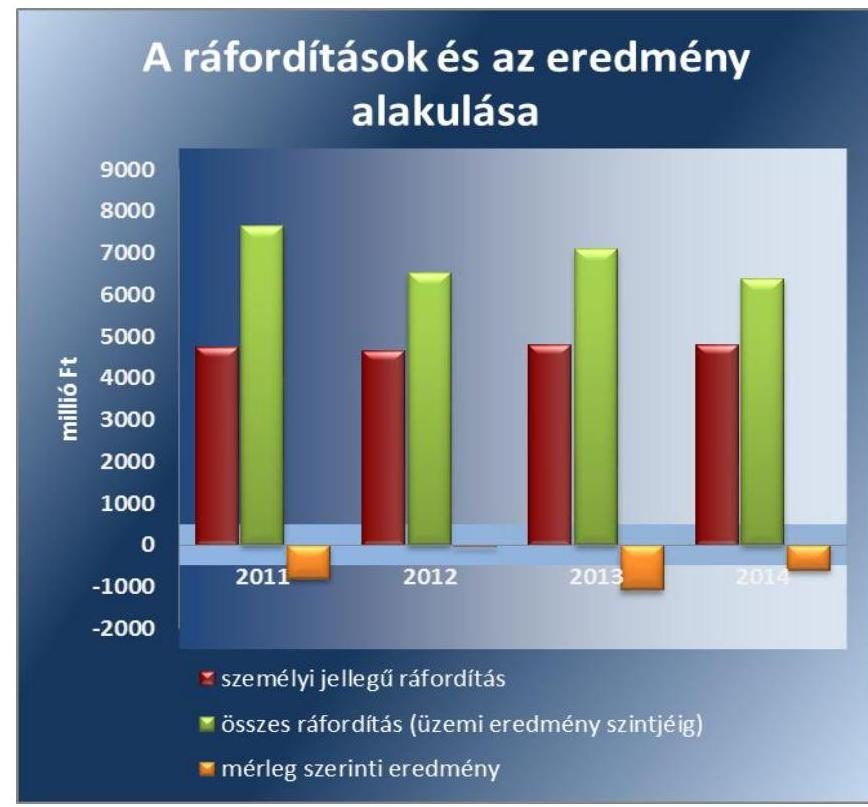

Forrás: Tanúsítvány adatszolgáltatása
Az eszközök értékcsökkenését a jogszabályi előírások figyelembevételével határozták meg. A maradványérték megállapítása a Társaság Számviteli politikának előírásai alapján történt. Az értékcsökkenési leírás elszámolását a belső szabályozásnak megfelelően végezték el.

Az elszámolt értékcsökkenést a Számv. tv. 52-53. §-a alapján határozták meg. Az ebből képződött beruházási forrást a 2011. és 2012. években nem használták fel teljes egészében az eszközök pótlására. A 2013. és 2014. években a beruházások értéke jelentősen meghaladta az adott évi értékcsökkenés összegét, amelyet az 1. számú táblázat szemléltet.

1. táblázat

| ÉRTÉKCSÖKKENÉSI ÉS BERUHÁZÁSI ADATOK (M FT) |  |  |  |  |
| :-- | --: | --: | --: | --: |
| Megnevezés | 2011 | 2012 | 2013 | 2014 |
| Terv szerinti érték-   csökkenés | $-53,8$ | $-53,7$ | $-74,2$ | $-83,3$ |
| Tervszerinti beru-   házás | 24,8 | 22,2 | 168,1 | 293,0 |
| Egyenleg | -29 | $-31,5$ | 93,9 | 209,7 |

Forrás: Tanúsítvány adatszolgáltatás

---

A Társaság a követelések összegét a Számv. tv. 29. § (1) és (2) bekezdései és a Számviteli politikájában rögzített elvek és módszerek alapján az ott rögzített mértékeknek megfelelően vette nyilvántartásba.

A határidőn túli vevőállomány, illetve a 0-90 nap között tartozók aránya az ellenőrzött időszakban a vevőállományon belül csökkent. A felszámolással érintett vevői követelések kivezetése a szabályozásnak megfelelő volt. A vevők értékvesztéssel korrigált állománya 2011-ről 2014-re 51,2\%-kal, azaz 164,5 M Ft-tal csökkent az ellenőrzött időszakban. Ugyanezen időszakban a vevők után képzett értékvesztés összege 67,4\%-kal, 35,1 M Ft-tal csökkent. A vevői követelések nagyságrendjének alakulására az értékesítésből származó csökkenő árbevétel is hatással volt. Az értékesítés nettó árbevétele a 2011. évhez viszonyítva 2014-re 41,8\%-kal csökkent, annak ellenére, hogy a 2013. évhez képest 8,3\%-kal emelkedett.

A vevőkövetelések és a nettó árbevétel alakulását a 2. számú táblázat mutatja be.
2. táblázat

VEVŐI KÖVETELÉS ÉS NETTÓ ÁRBEVÉTEL ALAKULÁSA (M FT)

| Megnevezés | 2011 | 2012 | 2013 | 2014 |
| :-- | --: | --: | --: | --: |
| értékvesztéssel korri- | 321,1 | 173,8 | 195,6 | 156,5 |
| gált vevői követelés |  |  |  |  |
| nettó árbevétel | 2284,6 | 1490,7 | 1228,2 | 1330,4 |

3.2. számú megállapítás

A gazdálkodó szervezet kialakította a szabályszerű önköltségszámítás feltételeit és azt megfelelően alkalmazta.

A FŐKEFE NKft. a Számv. tv. 14. § (5) bekezdés c) pontja, a 14. § (7) bekezdése és az 51. § előírásaival összhangban készítette el az Önköltség-számítási szabályzatát. Ennek keretében meghatározták a közvetlen és közvetett költségeket, a felosztó kulcsokat és ezek esetleges változtatásának rendszerét, valamint rendelkeztek a felosztandó költségek vetítési alapjáról.

A FŐKEFE NKft. szabályszerűen számolta el és mutatta ki az önköltséget.

---

# 4. A vagyonnal való gazdálkodás, valamint a változást eredményező döntések megfeleltek-e a jogszabályi és a belső előírásoknak? 

Összegző megállapítás

A FŐKEFE NKft. a jogszabályi rendelkezések és a saját belső szabályzataiban megfogalmazott előírások betartásával végezte a vagyongazdálkodási tevékenységét. A döntések megfeleltek az előírásoknak.
4.1. számú megállapítás

A FŐKEFE NKft. az éves üzleti tervben foglaltaknak és a tulajdonosi jogkört gyakorló elvárásainak megfelelően végezte vagyongazdálkodási tevékenységét.

A FŐKEFE NKft. saját vagyonnal való gazdálkodása a jogszabályok és a belső szabályok által kialakított rendszer keretei között történt, az elkészült stratégiákban és éves tervekben foglaltak alapján, amelyeket a tulajdonos jóváhagyott.

A FŐKEFE NKft. eszköz vagyona - a saját és pályázati forrásból megvalósított beruházások által - a 2011. évhez képest 2014. évre 32,5\%-kal növekedett. Az eszközértéken belül a 2011. évről a 2014. évre a befektetett eszközök aránya 30,7\%-ról 45,1\% -ra nőtt, a követelések aránya a 2011. évi 51,4\%-ról 10,0\%-ra csökkent, míg a pénzeszközök aránya 4,5\%-ról 31, 4\%ra emelkedett. A vagyon összetételében bekövetkezett változást egyrészt a 2012. szeptember 30-i dátummal beolvadt Savaria Nett-Pack NKft. vagyona, másrészt az alapító által a saját tőke negatív értékének rendezése érdekében a 2014. évben két részletben teljesített 860 M Ft összegű alapítói
 pótbefizetés okozta. A Savaria Nett-Pack NKft. beolvadása során az átvett eszközök könyv szerinti értéken kerültek az átvevő FŐKEFE NKft. nyilvántartásába a Számv. tv. 136. § (4) bekezdése előírásaival összhangban. A saját vagyon szerkezetének alakulását a 2. számú ábra szemlélteti.
2. ábra
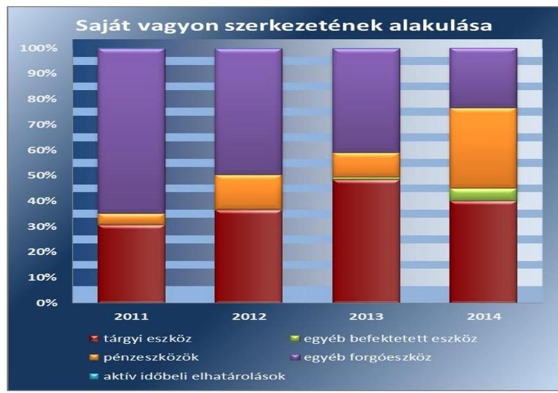

Fonrás: Tanúsítvány adatszolgáltatása

---

Az üzleti tervben szereplő karbantartási, felújítási előírásokat végrehajtották. Az éves üzleti beszámolókhoz tartozó üzleti jelentés tartalmazta a tervek megvalósulásáról szóló beszámolót az ellenőrzött időszakban. A FŐKEFE NKft. gondoskodott a tárgyi eszközök időközönkénti megfelelő mértékű karbantartásáról és állagmegóvásáról.

A Társaság biztosította a tulajdonában levő állami vagyon értékének megőrzését. A saját tulajdonú eszközök értékmegőrzése érdekében az elszámolt értékcsökkenést meghaladó összegeket fordított visszapótlásra. 2011-ben a visszapótlás még 29 M Ft-tal volt kevesebb, mint az elszámolt értékcsökkenés értéke. 2012-ben már 324 M Ft-tal, 2013-ban 84 M Ft-tal, 2014-ben 210 M Ft-tal meghaladta azt. Az eszközök elhasználódásának és értékcsökkenésének megfelelő mértékű, az élettartamot növelő felújítások történtek az ellenőrzött időszakban.

A FŐKEFE NKft.-nél vagyon elidegenítésére, ingyenes átadására nem került sor.

A FŐKEFE NKft. vagyonának megterheléséhez az alapító hozzájárult. Ennek megfelelően döntött a 360 M Ft értékű kölcsön biztosítékául szolgáló ingatlanon alapított jelzálogról szóló, illetve vételi jogot biztosító szerződés megkötéséről.

A FŐKEFE NKft. az ellenőrzött időszakban rendelkezett a Budapest Bankkal 2010-ben megkötött rulírozó hitelszerződéssel, amelyet az ellenőrzött időszakban többször módosítottak a tulajdonosi joggyakorló egyetértésével.

A döntések szabályosak voltak.
A FŐKEFE NKft.-nél a saját tőke és jegyzett tőke aránya (2011-ben 182,7%, 2013-ban -257,3%, 2014-ben -115,9%) az ellenőrzött időszakban a 2012. év kivételével negatív volt. Ennek oka a veszteséges gazdálkodás. A saját tőke összetételét az egyes években a 3. számú ábra mutatja.
3. ábra
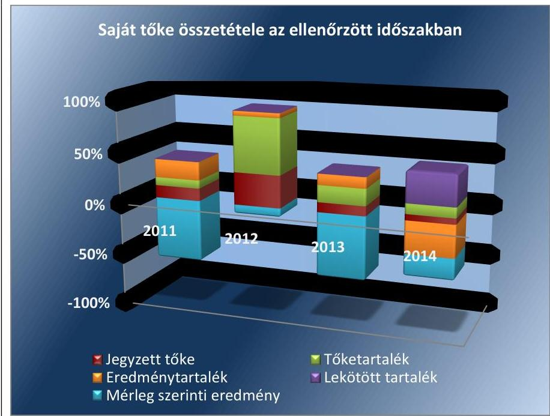

Forrás: FŐKEFE NKft. mérlegadatai

---

# 4.2. számú megállapítás 

## A FŐKEFE NKft.-nél a vagyonváltozást eredményező döntések előkészítése, megalapozása megfelelt az előírásoknak.

A FŐKEFE NKft.-nél a vagyonváltozást eredményező döntések előkészítése és megalapozása megfelelt a jogszabályi és a belső előírásoknak. A tulajdonosi jogok gyakorlója számára a vagyongazdálkodás keretében szükséges, a vagyon változását eredményező döntések előkészítése előterjesztések formájában valósult meg.

A Kbt. ${ }^{14}$ által előírt esetekben a közbeszerzési eljárást a Társaság lefolytatta.

### 4.3. számú megállapítás

## A tulajdonosi joggyakorló döntései megfeleltek az előírásoknak.

A tulajdonosi joggyakorló Alapítói határozatokban hozott döntéseken keresztül gyakorolta a tulajdonosi jogait. Az Alapító okiratban meghatározott vagyongazdálkodásra vonatkozó jogokat a tulajdonosi joggyakorló szabályszerűen gyakorolta.

Az MNV Zrt. Alapítói határozatban döntött a Savaria Nett Pack Kft. FŐKEFE NKft.-be történő beolvadásáról. Az alapítói jogok gyakorlója a beolvadást részletes számítás, vagyonleltár és független könyvvizsgálói vélemény alapján a 34/2013 (II. 11.) számú Alapítói határozatával jóváhagyta.

A FŐKEFE NKft. az ellenőrzött időszakban a tulajdonosi joggyakorló döntési jogkörébe tartozó beruházásokkal kapcsolatban, egy alkalommal ingatlan vásárlás (Füzér utcai ingatlan vásárlása bérleti díj csökkentés céljából 2013-ban) miatt kérte a tulajdonosi joggyakorló beleegyezését, valamint az üzleti terv részét képező beruházási terveket hagyatott jóvá. A tulajdonosi joggyakorló Alapítói határozatokban megadta hozzájárulását.

A FŐKEFE NKft. negatív saját tőkéjének rendezése érdekében 2014-ben az alapítói jogokat gyakorló Alapítói határozatokban pótbefizetésekről döntött 590 M Ft és 270 M Ft értékben.

Ingyenes vagyonátruházásra vonatkozó kérelem, előterjesztés, vagyonátruházásról szóló szerződés, térítésmentes átadás az ellenőrzött időszakban nem történt.

A tulajdonosi jogok gyakorlója nem hozott vagyonértékesítésére vonatkozó döntést, vagyonértékesítés nem történt.

---

# 5. A gazdálkodó szervezet a szabályszerű vagyongazdálkodás érdekében teljesítette-e beszámolási kötelezettségét, kiépített-e és működtetett-e információs rendszert? 

Összegző megállapítás

A FŐKEFE NKft. eleget tett beszámolási kötelezettségének. Letétbe helyezési, közzétételi kötelezettségét azonban nem szabályszerűen teljesítette. A FŐKEFE NKft. szervezetén belül kialakított információs rendszer megfelelően működött.
5.1. számú megállapítás

A FŐKEFE NKft. teljesítette a Számv. tv. szerinti beszámoló készítési kötelezettségét. Nem egyeztek meg azonban a közzétett 2011. évi beszámoló egyes adatai az Alapítói határozatban, a 2013. évi beszámoló egyes adatai pedig az FB által és az Alapítói határozatban elfogadott beszámoló adataival. A 2012. évi és a 2014. évi éves beszámoló esetében az FB határozattal elfogadott beszámoló nem egyezett meg a letétbe helyezett, illetve a tulajdonosi joggyakorló elé jóváhagyásra előterjesztett beszámolóval. A 2014. évi beszámoló téves dátumot tartalmazott. Így a közzétett beszámolók megtévesztőek. A Társaság nem tette közzé a honlapján a jogszabályban meghatározott összes adatot.

A FŐKEFE NKft. az ellenőrzött időszakban eleget tett a Számv. tv. 9. § (1) bekezdésében előírt beszámoló készítési kötelezettségének. A Számv. tv. 153. § (1) bekezdésében rögzített letétbe helyezési és a 154. § (1) bekezdése szerinti közzétételi kötelezettségét a Társaság nem teljesítette szabályszerűen, mert a 2011. és a 2013. évi beszámolóknál nem a tulajdonosi joggyakorló által elfogadott beszámolókat tették közzé.

A tulajdonosi joggyakorló által elfogadott és a közzétett adatokban eltérések voltak. A 2011. évben az eredménytartalék és az MSZE ${ }^{15}$ összegében, a 2013. évben a MSZE és a céltartalék összegében volt eltérés. A 2013. évi beszámolót elfogadó határozat szövege és a határozatba rögzített főbb mérleg elemeket bemutató táblázat adatai között is ellentmondás volt.

A 2011. évi beszámolónál a 226/2012. (V. 29.) sz. Alapítói határozat szerint az eredménytartalék összege $426,1 \mathrm{M} \mathrm{Ft}$, míg a beszámoló szerint 239,2 M Ft volt, az MSZE -994,6 M Ft, míg a beszámoló adata -807,7 M Ft volt. A 2013. évi beszámolónál az 270/2014. (V. 29.) sz. Alapítói határozatban szerepeltetett mérlegadatok közül az MSZE értéke -1062,1 M Ft, míg a beszámolóban -1074,3 M Ft volt.

A FŐKEFE NKft. éves beszámolóinak tulajdonosi joggyakorló általi jóváhagyásakor az éves beszámolókra vonatkozó könyvvizsgálói jelentések rendelkezésre álltak.

Az ellenőrzött időszakban a könyvvizsgáló a 2011. és 2013. évi az éves beszámolókat véleményező könyvvizsgálói jelentésekben hívta fel a tulajdonosi joggyakorló figyelmét a saját tőke csökkenésére, amely megfelelt a Gt. 44. § (2) bekezdésében, illetve a $\mathrm{Ptk}_{2}$ 3:129. § (1) bekezdésében foglaltaknak. A könyvvizsgáló a 2011. és 2013. üzleti évek éves beszámolóját véleményező könyvvizsgálói jelentésében mondott véleményt a tulajdonosi joggyakorló részére a saját forrás csökkenéséről, illetve arról, hogy a saját

---

tőke csökkenése a Számv. tv. 15. § (1) bekezdése szerinti vállalkozás folytatása számviteli alapelvet sérti. A 2013. üzleti évről szóló könyvvizsgálói jelentésben rögzítette, hogy a 2013. üzleti év fordulónapját követő, tulajdonosi joggyakorló általi pótbefizetés mértéke nem érte el a saját tőke jegyzett tőke arányának megfelelő rendezését.

A 2011. évi és a 2013. évi beszámolót, annak utólagos módosítása miatt az FB két alkalommal tárgyalta meg és hagyta jóvá FB határozatban†. A 2013. évi beszámolót illetően sem a 19/2014. (04. 10.), sem a 31/2014. (04. 27.) FB határozatokban szereplő MSZE és Céltartalék adatok nem egyeztek meg a letétbe helyezett éves beszámoló adataival.

A 2012. évi és a 2014. évi éves beszámoló esetében az FB határozattal elfogadott beszámoló nem egyezett meg a letétbe helyezett, illetve a tulajdonosi joggyakorló elé jóváhagyásra előterjesztett beszámolóval.

A 2014. évi beszámoló kiegészítő mellékletének IV. 8. pontjában az alapító által teljesített pótbefizetés időpontjára vonatkozó tájékoztatásba téves dátum került be, mivel a szövegezés szerint a 2014. év folyamán juttatott 590 M Ft és 270 M Ft a bankszámlán 2015. április 30-án, illetve 2015. november 26-án került jóváírásra.

A közhasznú jogállásra való tekintettel a FŐKEFE NKft. elkészítette a 2011. üzleti évre a Kszt. ${ }^{16}$ 19. § (1) bekezdésének megfelelően a közhasznúsági jelentést, illetve a 2012-2014. üzleti évekre a Civil tv. 29. és a 46. § (1) bekezdése szerint a közhasznúsági mellékletet.

A FŐKEFE NKft. nem teljes körűen tette közzé a honlapján a 2012. január 1-től hatályos Inf. tv. ${ }^{17}$ 35. § (1) bekezdésében meghatározott adatokat, ez által nem tett eleget a Közzétételi rendelet ${ }^{18}$ 3. § (2) bekezdésében, az Avtv. ${ }^{19}$ 20. § (8) bekezdésében, az Inf. tv. 30. § (6) bekezdésében és az Inf. tv. 35. § (1) és (3) bekezdésében foglaltaknak. A honlapon nem tették közzé többek között a FŐKEFE NKft. szervezeti felépítését, a többségi tulajdonában álló, illetve részvételével működő gazdálkodó szervezet adatait, az NKft. feladatát, hatáskörét és alaptevékenységét meghatározó, a FŐKEFE NKft.-re vonatkozó alapvető jogszabályokat, közjogi szervezetszabályozó eszközöket, valamint a szervezeti és működési szabályzatot, az adatvédelmi és adatbiztonsági szabályzat hatályos és teljes szövegét.

# 5.2. számú megállapítás 

## A FŐKEFE NKft. szervezetén belül kialakították az információs rendszert és az megfelelően működött.

Az alapítói szabályozás keretében az Alapító okirat tartalmazta a vagyongazdálkodást érintő számviteli és feladatellátásról szóló információs követelményeket. A tulajdonosi joggyakorló - FŐKEFE NKft. szervezetén belül működő információs rendszerrel kapcsolatos - elvárásait a tulajdonosi joggyakorló által elfogadott, a FŐKEFE NKft. ellenőrzött időszakban hatályos SZMSZ-ében rögzítették.

A vagyongazdálkodás szabályozottságával, szabályszerűségével, a vagyonnyilvántartással kapcsolatban sem a gazdálkodó szervezet, sem a tulajdonosi joggyakorló nem végeztetett belső ellenőrzést, vagy külső szakértő által történő ellenőrzéseket.

[^0]
[^0]:    ${ }^{\dagger}$ 19/2014. (04.10.) sz. határozat, 31/2014 (04.27.) sz. határozat

---

# 5.3. számú megállapítás 

A kapcsolt társaság számára a FŐKEFE NKft. meghatározta a vagyongazdálkodás követelményeit.

A FŐKEFE NKft. az MNV Zrt. tulajdonosi joggyakorló (124/2014 (IV.23.) IG sz.) határozata alapján az Agro Rehab NKft.-t 2014. április 24-én alapította. A hatályos Alapító okiratában rögzítette a felelős gazdálkodás általános követelményét.

Az Agro-Rehab NKft. az ellenőrzött időszakban, az alapítás óta eltelt hónapokban gazdasági tevékenységet nem végzett.

---

.

---

# JAVASLATOK 

Az ÁSZ tv. ${ }^{20}$ 33. § (1) bekezdésében foglaltak értelmében az ellenőrzött szervezet vezetője köteles a jelentésben foglalt megállapításokhoz kapcsolódó intézkedési tervet összeállítani és azt a jelentés kézhezvételétől számított 30 napon belül az ÁSZ részére megküldeni.
Az ÁSZ tv. 33. § (3) bekezdése szerint, amennyiben az ellenőrzött szervezet vezetője nem küldi meg határidőben az intézkedési tervet, vagy továbbra sem elfogadható intézkedési tervet küld, az ÁSZ elnöke
a) az ellenőrzött szervezet vezetőjével szemben büntető- vagy fegyelmi eljárás megindítását kezdeményezheti;
b) kezdeményezheti az illetékes hatóságnál, illetve szervezetnél az ellenőrzött szervezetet megillető, az államháztartás valamelyik alrendszeréből származó támogatások, vagy egyéb juttatások folyósításának, illetve a személyi jövedelemadó 1\%-ából történő felajánlásokból való részesedés lehetőségének felfüggesztését.

## a Magyar Nemzeti Vagyonkezelő Zrt. vezérigazgatójának

1. Tegyen intézkedéseket - munkáltatói jogkörében eljárva - a beszámolók közzétételével összefüggésben feltárt szabálytalanságok tekintetében a felelősség tisztázása érdekében, és szükség szerint intézkedjen a felelősség érvényesítéséről.
(5.1. sz. megállapítás 1. bekezdése alapján)

## a FŐKEFE Közhasznú Nonprofit Kft. ügyvezető igazgatójának

1. Intézkedjen a jövőben a jogszabályoknak megfelelő, a jóváhagyásra jogosult által elfogadott éves beszámolók letétbe helyezéséről, közzétételéről.
(5.1. sz. megállapítás 1. bekezdése alapján)

---

.

---

# MELLÉKLETEK 

I. SZ. MELLÉKLET: ÉRTELMEZŐ SZÓTÁR

| Állami vagyon | 2010. június 17-től   a) Az állam tulajdonában lévő dolog, valamint a dolog módjára hasznosítható természeti erő,   b) az a) pont hatálya alá nem tartozó mindazon vagyon, amely vonatkozásában törvény az állam kizárólagos tulajdonjogát nevesíti,   c) az állam tulajdonában lévő tagsági jogviszonyt megtestesítő
 értékpapír, illetve az államot megillető egyéb társasági részesedés,   d) az államot megillető olyan immateriális, vagyoni értékkel rendelkező jogosultság, amelyet jogszabály vagyoni értékű jogként nevesít.   Forrás: Vtv. 1. § (2) bekezdése   2012. november 10-től az állami vagyon fogalma kiegészül a következő ponttal: e) az állam tulajdonában lévő pénzügyi eszközök   Forrás: Vtv. 1. § (2) bekezdése |
| :--: | :--: |
| Állami vagyon hasznosítása | 2011. december 31-ig:   Az állami vagyont az MNV Zrt. maga kezeli, vagy szerződés - így különösen bérlet, haszonbérlet, szerződésen alapuló haszonélvezet, vagyonkezelés, megbízás - alapján központi költségvetési szervnek, természetes vagy jogi személynek, vagy jogi személyiséggel nem rendelkező gazdálkodó szervezetnek hasznosításra átengedi. Forrás: Vtv. 23. § (1) bekezdése   2012. január 1-jétől:   Az állami vagyont az MNV Zrt. maga kezeli, vagy szerződés - így különösen bérlet, haszonbérlet, megbízás - alapján központi költségvetési szervnek, természetes vagy jogi személynek, vagy jogi személyiséggel nem rendelkező gazdálkodó szervezetnek hasznosításra átengedi. Forrás: Vtv. 23. § (1) bekezdése   2013. június 28-ától:   Az állami vagyonnal az MNV Zrt. maga gazdálkodik, vagy szerződés - így különösen bérlet, haszonbérlet, megbízás - alapján központi költségvetési szervnek, természetes vagy jogi személynek, vagy jogi személyiséggel nem rendelkező gazdálkodó szervezetnek hasznosításra átengedi, illetőleg vagyonkezelésbe, haszonélvezetbe adja.   Forrás: Vtv. 23. § (1) bekezdése |
| Állami vagyon hasznosítására kötött szerződés | Az állami vagyonnal az MNV Zrt. maga gazdálkodik, vagy szerződés - így különösen bérlet, haszonbérlet, megbízás - alapján központi költségvetési szervnek, természetes vagy jogi személynek, vagy jogi személyiséggel nem rendelkező gazdálkodó szervezetnek hasznosításra átengedi, illetőleg vagyonkezelésbe, haszonélvezetbe adja.   Forrás: Vtv. 23. § (1) bekezdése   Az állami vagyon hasznosítására kötött szerződések elsődleges célja az állami vagyon hatékony működtetése, állagának védelme, értékének megőrzése, illetve gyarapítása, az állami és közfeladatok ellátásának elősegítése. Forrás: Vtv. 23. § (2) bekezdése |
| Állami vagyon használója | 2011. január 1-2011. december 31-ig:   Az a természetes személy, jogi személy, illetve jogi személyiséggel nem rendelkező szervezet, amely, illetve aki törvény vagy szerződés alapján, bármely jogcímen (pl. bérlet, haszonbérlet, vagyonkezelési szerződés, használat stb.) állami vagyont birtokol, használ, szedi annak hasznait, hasznosít, ide nem értve a tulajdonosi jogok gyakorlóját. Forrás: Vhr. 1. § (7) bekezdés a) pontja   2012. január 1-jétől: |

---

|  | Az a természetes vagy jogi személy, jogi személyiséggel nem rendelkező szervezet, aki, vagy amely törvény vagy szerződés alapján, bármely jogcímen (bérlet, haszonbérlet, használat stb.) állami vagyont birtokol, használ, szedi annak hasznait, hasznosít, ide nem értve a haszonélvezőt, a vagyonkezelőt és a tulajdonosi jogok gyakorlóját.   Forrás: Vhr. 1. § (7) bekezdés a) pontja |
| :--: | :--: |
| Állami vagyon kezelője /vagyonkezelő | 2010. január 01.-2011. december 31. között:   Az állami vagyont az MNV Zrt. maga kezeli, vagy szerződés - így különösen bérlet, haszonbérlet, szerződésen alapuló haszonélvezet, vagyonkezelés, megbízás - alapján központi költségvetési szervnek, természetes vagy jogi személynek, illetőleg jogi személyiséggel nem rendelkező gazdasági társaságnak hasznosításra átengedi. Vtv. 23. § (1) bekezdése   2012. január 1-jétől:   Az állami vagyont az MNV Zrt. maga kezeli, vagy szerződés - így különösen bérlet, haszonbérlet, megbízás - alapján központi költségvetési szervnek, természetes vagy jogi személynek, vagy jogi személyiséggel nem rendelkező gazdálkodó szervezetnek hasznosításra átengedi. Az állami vagyonra vonatkozóan az MNV Zrt. kizárólag az Nvtv ${ }^{21}$-ben meghatározott személyekkel köthet vagyonkezelési szerződést. Forrás: Vtv. 23. § (1) bekezdés, 27. § (1) bekezdés   2013. június 28-ától:   Az állami vagyonnal az MNV Zrt. maga gazdálkodik, vagy szerződés - így különösen bérlet, haszonbérlet, megbízás - alapján központi költségvetési szervnek, természetes vagy jogi személynek, vagy jogi személyiséggel nem rendelkező gazdálkodó szervezetnek hasznosításra átengedi, illetőleg vagyonkezelésbe, haszonélvezetbe adja. Az állami vagyonra vonatkozóan az MNV Zrt. kizárólag az Nvtv-ben meghatározott személyekkel köthet vagyonkezelési szerződést.   Forrás: Vtv. 23. § (1) bekezdés, 27. § (1) bekezdés |
|  | Állami vagyon értékesítése |
|  | 2013. június 30-ig gazdálkodó szervezet:   Az állami vállalat, az egyéb állami gazdálkodó szerv, a szövetkezet, a lakásszövetkezet, az európai szövetkezet, a gazdasági társaság, az európai részvénytársaság, az egyesülés, az európai gazdasági egyesülés, az európai területi együttműködési csoportosulás, az egyes jogi személyek vállalata, a leányvállalat, a vízgazdálkodási társulat, az erdő birtokossági társulat, a végrehajtói iroda, az egyéni cég, továbbá az egyéni vállalkozó. Forrás: Ptk1. 685. § c) pontja   2013. július 1-jétől gazdálkodó szervezet:   Az állami vállalat, az egyéb állami gazdálkodó szerv, a szövetkezet, a lakásszövetkezet, az európai szövetkezet, a gazdasági társaság, az európai részvénytársaság, az egyesülés, az európai gazdasági egyesülés, az európai területi együttműködési csoportosulás, az egyes jogi személyek vállalata, a leányvállalat, a vízgazdálkodási társulat, az erdő birtokossági társulat, a végrehajtói iroda, az egyéni cég, továbbá az egyéni vállalkozó. Az állam, a helyi önkormányzat, a költségvetési szerv, az egyesület, a köztestület, valamint az alapítvány gazdálkodó tevékenységével összefüggő polgári jogi kapcsolataira is a gazdálkodó szervezetre vonatkozó rendelkezéseket kell alkalmazni, kivéve, ha a törvény e jogi személyekre eltérő rendelkezést tartalmaz; a 292/A-292/B. §, 301/A-301/B. §, 405. § (1) bekezdés, valamint a 407/A. § (1) bekezdés tekintetében nem minősül gazdálkodó szervezetnek az, aki a közbeszerzésekről szóló törvény értelmében ajánlatkérő (szerződő hatóság).Forrás: Ptk. 685. § c) pontja   2014. március 15-től gazdálkodó szervezet:   A gazdasági társaság, az európai részvénytársaság, az egyesülés, az európai gazdasági egyesülés, az európai területi együttműködési csoportosulás, a szövetkezet, a |

---

|  | lakásszövetkezet, az európai szövetkezet, a vízgazdálkodási társulat, az erdő birtokossági társulat, az állami vállalat, az egyéb állami gazdálkodó szerv, az egyes jogi személyek vállalata, a közös vállalat, a végrehajtói iroda, a közjegyzői iroda, az ügyvédi iroda, a szabadalmi ügyvivői iroda, az önkéntes kölcsönös biztosító pénztár, a magánnyugdíjpénztár, az egyéni cég, továbbá az egyéni vállalkozó. Az állam, a helyi önkormányzat, a költségvetési szerv, az egyesület, a köztestület, valamint az alapítvány gazdálkodó tevékenységével összefüggő polgári jogi kapcsolataira is a gazdálkodó szervezetre vonatkozó rendelkezéseket kell alkalmazni. Forrás: Ppt. 396. § |
| :--: | :--: |
| Kormányzati szektorba sorolt egyéb szervezet | Az a szervezet, amely az Áht. alapján nem része az államháztartásnak, azonban az Európai Közösséget létrehozó szerződéshez csatolt, a túlzott hiány esetén követendő eljárásról szóló jegyzőkönyv alkalmazásáról szóló 2009. május 25-i 479/2009/EK rendelet szerint a kormányzati szektorba tartozik. A nemzetgazdasági miniszter 2013. június 26-án megjelent Közleményben tette közé ezen szervezetek listáját. |
| Korosító lista | Kintlévőségek lejárat szerint csoportosított kimutatása |
| MNV Zrt. | Az állami vagyon felett, a Magyar Államot megillető tulajdonosi jogok és kötelezettségek összességét - a hatályos szabályozás szerint - az állami vagyon felügyeletéért felelős miniszter (jelenleg a nemzeti fejlesztési miniszter) gyakorolja. A miniszter feladatát nagy részben az MNV Zrt., mint tulajdonosi joggyakorló szervezet útján látja el. |
| Nemzetgazdasági szempontból kiemelt jelentőségű nemzeti vagyon körébe tartozó társaságok | Az ÁSZ ellenőrzés szempontjából az Nvtv. 2. sz. mellékletében felsorolt társasági részesedések. |
| Nemzeti vagyon | 2012. január 1-jétől, g. pont módosult 2012. június 30-tól nemzeti vagyon:   a) az állam vagy a helyi önkormányzat kizárólagos tulajdonában álló dolgok,   b) az a) pont hatálya alá nem tartozó, állam vagy a helyi önkormányzat tulajdonában lévő dolog,   c) az állam vagy a helyi önkormányzat tulajdonában lévő pénzügyi eszközök, továbbá az államot vagy a helyi önkormányzatot megillető társasági részesedések,   d) az államot vagy a helyi önkormányzatot megillető bármely vagyoni értékkel rendelkező jogosultság, amelyet jogszabály vagyoni értékű jogként nevesít,   e) Magyarország határa által körbezárt terület feletti légtér,   f) az üvegházhatású gázok kibocsátási egységeinek kereskedelméről szóló törvény szerint kibocsátási egység és légiközlekedési kibocsátási egység, valamint az ENSZ Éghajlatváltozási Keretegyezménye és annak Kiotói Jegyzőkönyve végrehajtási keretrendszeréről szóló törvény szerinti kiotói egység,   g) állami vagy helyi önkormányzati fenntartású közgyűjtemény (muzeális intézmény, levéltár, közgyűjteményként működő kép- és hangarchívum, valamint könyvtár) saját gyűjteményében nyilvántartott kulturális javak körébe tartozó dolog,   h) a régészeti lelet,   i) a nemzeti adatvagyon körébe tartozó állami nyilvántartások fokozottabb védelméről szóló törvény szerinti nemzeti adatvagyon.   Forrás: Nvtv. 1. § (2) bekezdés |
| Tulajdonosi ellenőrzés | 2010. június 17-től:   Az MNV Zrt. „rendszeresen ellenőrzi a vele szerződéses jogviszonyban lévő személyek, szervezetek vagy más használók állami vagyonnal való gazdálkodását, megállapításairól az MNV Zrt. Felügyelő Bizottságát, az ellenőrzött szervet, szükség esetén a minisztert és az Állami Számvevőszéket tájékoztatja". Forrás: Vtv. 17. § d) pont   A Vhr. alapján „a tulajdonosi ellenőrzés célja az állami vagyonnal való gazdálkodás vizsgálata, ennek keretében a rendeltetésellenes, jogszerűtlen, szerződésellenes, vagy a tulajdonos érdekeit sértő, illetve a központi költségvetést hátrányosan |

---

|  | érintő vagyon-gazdálkodási intézkedések feltárása és a jogszerű állapot helyreállítása, továbbá a vagyonnyilvántartás hitelességének, teljességének és helyességének biztosítása". Forrás: Vhr. 20. § (2) bekezdés   2011. december 31-ig   Az állami vagyon kezelőjét, használóját megillető jogok gyakorlását, annak szabályszerűségét, célszerűségét az MNV Zrt. - szükség szerint területi szervei útján - ellenőrzi.   Forrás: Vhr. 20. § (1) bekezdés   2012. január 1-jétől:   Az állami vagyon kezelőjét, haszonélvezőjét, használóját megillető jogok gyakorlását, annak szabályszerűségét, célszerűségét az MNV Zrt. - szükség szerint területi szervei útján - ellenőrzi. Forrás: Vhr. 20. § (1) bekezdés |
| :--: | :--: |
| Tulajdonosi jogok gyakorlója | 2010. június 17-től:   Az állami vagyon felett a Magyar Államot megillető tulajdonosi jogok és kötelezettségek összességét - ha törvény eltérően nem rendelkezik - az állami vagyon felügyeletéért felelős miniszter (a továbbiakban: miniszter) gyakorolja, aki e feladatát a Magyar Nemzeti Vagyonkezelő Zártkörűen Működő Részvénytársaság (a továbbiakban: MNV Zrt.), a Magyar Fejlesztési Bank, illetve a tulajdonosi joggyakorló szervezet útján látja el. A miniszter miniszteri rendeletben, a törvényben meghatározott állami vagyoni kör tekintetében, meghatározott időtartamra, a joggyakorlás egyes szabályainak meghatározásával - az őt megillető tulajdonosi jogok és kötelezettségek összességének, illetve azok meghatározott részének gyakorlóját az Áht. szerinti központi költségvetési szervek, ezek intézménye, továbbá a 100%-ban állami tulajdonban álló gazdasági társaságok közül kijelölheti.   Forrás: Vtv. 3. § (1) bekezdés és (2) bekezdés   2013. június 28-ától:   A rábízott állami vagyon felett az államot megillető tulajdonosi jogok és kötelezettségek összességét tulajdonosi joggyakorlóként:   a) ha törvény vagy miniszteri rendelet eltérően

 nem rendelkezik, a Magyar Nemzeti Vagyonkezelő Zártkörűen Működő Részvénytársaság (a továbbiakban: MNV Zrt.),   b) törvényben kijelölt személy vagy   c) az állami vagyon felügyeletéért felelős miniszter (a továbbiakban: miniszter) által rendeletben kijelölt személy gyakorolja.   [...] A miniszter e törvény felhatalmazása alapján - a meghatározott célok hatékonyabb elérése érdekében, miniszteri rendeletben, az ott meghatározott állami vagyoni kör tekintetében, meghatározott időtartamra - e törvény keretei között, a joggyakorlás egyes szabályainak meghatározásával - az államot megillető tulajdonosi jogok és kötelezettségek összességének, illetve azok meghatározott részének gyakorlóját az Áht. szerinti központi költségvetési szervek, ezek intézménye, továbbá a 100%-ban állami tulajdonban álló gazdasági társaságok közül kijelölheti. Forrás: Vtv. 3. § (1) bekezdés és (2) bekezdés |
|  | A tulajdonosi joggyakorlás és a vagyongazdálkodás feladata   2010. június 17-től:   Az állami vagyon rendeltetésének megfelelő - az állami feladatok ellátásához, a társadalmi szükségletek kielégítéséhez, valamint a Kormány gazdaságpolitikája megvalósításának elősegítéséhez szükséges, egységes elveken alapuló, önálló ágazatként megjelenő - hatékony, költségtakarékos, értékmegőrző, értéknövelő felhasználásának biztosítása (közvetlen felhasználás), illetve közvetett hasznosítása (beleértve a vagyoni kör változását eredményező értékesítést), valamint az állami vagyon gyarapítása (ideértve a vagyoni kör bővítését is). Forrás: Vtv. 2. § (1) bekezdés |
|  | Vagyonkezelői jog   2011. december 31-ig:   A vagyonkezelési szerződés alapján a vagyonkezelő jogosult meghatározott állami tulajdonba tartozó dolog birtoklására, használatára és hasznai szedésére. A va- |

---

gyonkezelő köteles a vagyontárgy értékét megőrizni, állagának megóvásáról, jó karbantartásáról, működtetéséről gondoskodni, továbbá - a központi költségvetési szervek kivételével - díjat fizetni vagy a szerződésben előírt más kötelezettséget teljesíteni. A vagyonkezelői jog az erre irányuló szerződéssel - kivételesen törvény alapján - jön létre.
Forrás: Vtv. 27. § (2) bekezdés és (4) bekezdés
2012. január 1-jétől:

A vagyonkezelő köteles a vagyontárgy értékét megőrizni, állagának megóvásáról, jó karbantartásáról, működtetéséről gondoskodni, továbbá - a központi költségvetési szervek kivételével - díjat fizetni vagy a szerződésben előírt más kötelezettséget teljesíteni. Forrás: Vtv. 27. § (2) bekezdés
2013. június 28-ától:

A vagyonkezelő köteles a vagyontárgy állagának megóvásáról, jó karbantartásáról, működtetéséről gondoskodni, továbbá - a központi költségvetési szervek kivételével - díjat fizetni, jogszabályban és szerződésben előírt más kötelezettségét teljesíteni, valamint a vagyontárgyat jogszabályban vagy szerződésben meghatározott célnak megfelelően használni. Amennyiben a vagyonkezelő ezen kötelezettségének nem tesz eleget, a tulajdonosi joggyakorló jogosult a szerződést azonnali hatállyal felmondani.
Forrás: Vtv. 27. § (2) bekezdés

---

.

---

# FÜGGELÉK: ÉSZREVÉTELEK 

A jelentéstervezetet a Számvevőszék 15 napos észrevételezésre megküldte az ellenőrzött szervezet vezetőjének az ÁSZ tv. 29. § (1) bekezdése előírásának megfelelően.
Az elfogadott észrevételek alapján a Számvevőszék módosította a jelentést.

A függelék tartalmazza az ellenőrzött észrevételeit, illetve az el nem fogadott észrevételek elutasításának indoklását.

[^0]
[^0]:    ${ }^{5}$ 29. § (1) Az Állami Számvevőszék az ellenőrzési megállapításait megküldi az ellenőrzött szervezet vezetőjének vagy az általa megbízott személynek, és annak, akinek személyes felelősségét állapította meg.
    (2) Az ellenőrzött szervezet vezetője és a felelősként megjelölt személy az ellenőrzés megállapításaira tizenöt napon belül írásban észrevételt tehet.
    (3) Az Állami Számvevőszék az észrevételre a beérkezésétől számított harminc napon belül írásban válaszol. A figyelembe nem vett észrevételeket köteles a jelentésben feltüntetni, és megindokolni, hogy azokat miért nem fogadta el.

---

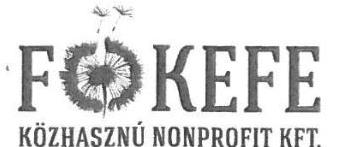

Főkefe Rehabilitációs Foglalkoztató Ipani Közhasznú Nonprofit Korlátolt Felelősségű Társaság

Cím: 1145 Budapest, Laky Adolf u. 41-49.
Levélcím: 1443 Budapest, Pf. 169.
Fővárosi Bíróság: Cg. 01-09-908769
Telefon: +36 1 251-3288
Fax: +36 1 251-4355
Email: info@fokefe.hu
Web: www.fokefe.hu

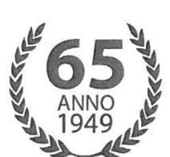

ÁLLAMI SZÁMVEVŐSZÉK
Apáczai Csere János utca 10.

# Budapest 

1052
Ikt.szám: V-0854-396/2015.

## Domokos László

## Elnök Úr részére

Tisztelt Elnök Úr!
ikt.sz.: K! 2016 JAN 15/237
Tárgya: jelentéstervezétre észrevétel

## ÁLLAMI SZÁMVEVŐSZÉK

004601/2016
Érkezet: 2016 JAN 20.
Iktalószám: K- 0854- 1145/2015
Melléklet:
Kadota: 6022
„Az állami tulajdonban (résztulajdonban) lévő gazdálkodó szervezetek vagyonmegőrzési és gazdálkodási tevékenységének ellenőrzése - Főkefe Közhasznú Nonprofit Kft" címmel készített számvevőszéki jelentéstervezetre az alábbi észrevételeket tesszük az 5.1. számú megállapításokra.

## ÁSZ jelentés tervezetben szereplő megállapítás:

„A közzétett 2011. és 2013. évi beszámoló egyes adatai azonban nem egyeztek meg az FB által és az Alapítói határozatokban elfogadott beszámolók adataival. A 2011. évben az eredménytartalék és az MSZE összegében, a 2013. évben a MSZE és a céltartalék összegében volt eltérés."

## Észrevétel:

2011 év.
Nem értünk egyet a megállapítással, mert az FB 14/2012 (05.22) számú határozatában szereplő Mérleg szerinti eredmény (MSZE -807.696 e Ft) és Eredménytartalék (239.193 e Ft) megegyezett a letétbe helyezett beszámoló adataival.
Az alapító által elfogadott 226/2012. (V.29) Alapítói határozatban szereplő Eredménykimutatás szerinti MSZE szintén egyezik a letétbe helyezett beszámoló eredményével. Az Alapítói határozat Mérlegében van technikai elírás, amit az alábbi táblázat szemléltet.

---

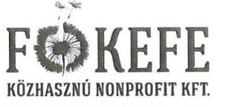

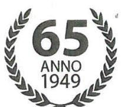

Főkefe Rehabilitációs Foglalkoztató Ipan Közhasznú Nonprofit Korlátolt Felelősségű Társaság

Cím: 1145 Budapest, Laky Adolf u. 41-49. Levélcím: 1443 Budapest, Pf. 169. Fővárosi Bíróság: Cg. 01-09-908769 Telefon: +36 1 251-3288 Fax: +36 1 251-4355 Email: info@fokefe.hu Web: www.fokefe.hu

2011. évi beszámoló

|  Megnevezés | FB határozat (14/2012 (05.22.)) | Alapítói határozat szerint (226/2012. (V.29.)) | Letétbe helyezett beszámoló szerint  |
| --- | --- | --- | --- |
|  **Eredménykimutatás** |  |  |   |
|  Mérleg szerinti eredmény | -807 696 | -807 696 | -807 696  |
|  **Mérleg** |  |  |   |
|  Mérleg szerinti eredmény | -807 696 | -994 558 | -807 696  |
|  **Eredménytartalék** | 239 193 | 426 055 | 239 193  |

A közzétett 2011. évi beszámoló megegyezik a könyvvizsgáló által elfogadott beszámolóval, melyet az aláírásával hitelesített és közzétett könyvvizsgálói jelentés is igazol.

2013 év.

Az FB által és az Alapítói határozatban szereplő értékek, a közzétett 2013. évi beszámoló egyes adataitól technikai elírás miatt tér el.

Az alapító által elfogadott 270/2014.(V.29) Alapítói határozatban szereplő Eredménykimutatás szerinti MSZE szintén egyezik a letétbe helyezett beszámoló eredményével. Az Alapítói határozat Mérlegében technikai elírás található, amit az alábbi táblázat szemléltet.

2013. évi beszámoló

|  Megnevezés | FB határozat (31/2014 (05.27.)) | Alapítói határozat szerint (270/2014. (V.29)) | Letétbe helyezett beszámoló szerint  |
| --- | --- | --- | --- |
|  **Eredménykimutatás** |  |  |   |
|  Mérleg szerinti eredmény | nem került kiemelésre | -1 074 283 | -1 074 283  |
|  **Mérleg** |  |  |   |
|  Mérleg szerinti eredmény | -1 062 057 | -1 062 057 | -1 074 283  |
|  **Céltartalék** | 624 829 | 624 829 | 660 915  |

A közzétett 2013. évi beszámoló megegyezik a könyvvizsgáló által elfogadott beszámolóval, melyet az aláírásával hitelesített és közzétett könyvvizsgálói jelentés is igazol.

---

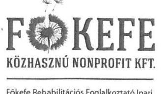

Főkefe Rehabilitációs Foglalkoztató Ipani Közhasznú Nonprofit Korlátolt Felelősségű Társaság

Cím: 1145 Budapest, Laky Adolf u. 41-49.
Levélcím: 1443 Budapest, Pf. 169.
Fővárosi Bíróság: Cg. 01-09-908769
Telefon: +36 1 251-3288
Fax: +36 1 251-4355
Email: info@fokefe.hu
Web: www.fokefe.hu
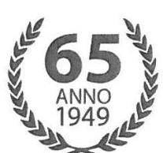

ÁSZ jelentés tervezetben szereplő megállapítás:
„A 2012. évi és a 2014. évi éves beszámoló esetében az FB határozattal elfogadott beszámoló nem egyezett meg a letétbe helyezett, illetve a tulajdonosi joggyakorló elé jóváhagyásra előterjesztett beszámolóval."

# Észrevétel: 

2012 év.
Nem értünk egyet a megállapítással, mert az FB 2013.04.15-én 12/2013.(04.15) számú határozatában elfogadta a Társaság 2012. évi beszámolóját. A felügyelő bizottsági ülés után a tulajdonos elektronikus formában kiegészítést, illetve technikai javítást kért a kiegészítő mellékletben és az üzleti jelentésben, melyet Társaságunk végrehajtott. Ezt követően 2013.04.29-én kelt kísérőlevéllel megküldte a teljes végleges beszámolót, üzleti jelentést a könyvvizsgálói jelentéssel együtt, melyben az Eredménykimutatás és mérleg adatai az FB által elfogadottal egyező értékkel kerültek megküldésre a tulajdonos MNV részére. A közzétett beszámoló, a kiegészítő melléklet, a könyvvizsgálói jelentés és az alapító határozat szövegezése is a helyes, egyező értékeket tartalmazza.

## 2014 év.

Nem értünk egyet a megállapítással, mert az FB két időpontban tárgyalta az éves beszámoló elfogadását, s a második, a 2015.05.04-i üléséről készült jegyzőkönyv 3. oldala számszaki hivatkozás nélkül utal arra (21/2015.(05.04), hogy elfogadta a beszámolót, ami alapján továbbításra került a tulajdonosi joggyakorló felé az elfogadottaknak megfelelően.

## ÁSZ jelentés tervezetben szereplő megállapítás:

„A 2014. évi beszámoló kiegészítő mellékletének IV. 8 pontjában az alapító által teljesített pótbefizetés időpontjára vonatkozó tájékoztatásba téves dátum került be, mivel a szövegezés szerint a 2014 év folyamán juttatott 590 m Ft és 270 m Ft a bankszámlán 2015. április 30-án, illetve 2015. november 26-án került jóváírásra."

## Észrevétel:

Társaságunk a megállapítást nem fogadja el, mert a beszámolóban szereplő évszám technikai elírás eredménye. A jelentés tervezetben foglalt 2015.április 30. és 2015. november 26. dátumok nem lehetnek valós időpontok, mivel 2014. évi beszámolóról beszélünk, és a tárgyévi beszámoló jövőbeni eseményt nem tartalmazhat. Helyesen: 2014.04.30 illetve 2014.11.26.

## ÁSZ jelentés tervezetben szereplő megállapítás:

„A Főkefe NKft. nem teljeskörűen tette közzé a honlapján a 2012. január 01-től hatályos Info tv. 35.§. (1) bekezdésében meghatározott adatokat ezáltal nem tett eleget a közzétételi rendelet 3.".(2) bekezdésében, az Avtv. 20.§.(8) bekezdésében és az Info tv. 30.§. (6) bekezdésében és az Info tv. 35.§. (1) és (3) bekezdésében foglaltaknak."
„A honlapon nem tették közzé többek között a Főkefe NKft. szervezeti felépítését, a többségi tulajdonában álló, illetve részvételével működő gazdálkodó szervezet adatait, az Nkft feladatát, hatáskörét és alaptevékenységét meghatározó, a Főkefe NKft-re vonatkozó alapvető jogszabályokat, közjogi szervezetszabályozó eszközöket, valamint a szervezeti és működési szabályzatot, az adatvédelmi és adatbiztonsági szabályzat hatályos és teljes szövegét."

---

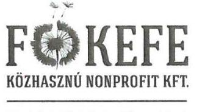

Főkefe Rehabilitációs Foglalkoztató Ijzati Közhasznú Nonprofit Korlátolt Felelősségű Társaság

Cím: 1145 Budapest, Laky Adolf u. 41-49.
Levélcím: 1443 Budapest, Pf. 169.
Fővárosi Bíróság: Cg. 01-09-908769
Telefon: +36 1 251-3288
Fax: +36 1 251-4355
Email: info@fokefe.hu
Web: www.fokefe.hu
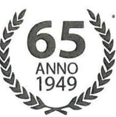

# Észrevétel: 

Társaságunk működése, gazdálkodása során a jogszabályok maradéktalan betartására törekszik, ennek megfelelően a jelentés tervezetben szereplő közzétételi kötelezettséggel kapcsolatos hiányosságokat jelen észrevétel megküldéséig teljesítettük. Az adatvédelmi és adatbiztonsági honlapon történő megjelenésének időpontja 2016.03.01.

## ÁSZ jelentés tervezetben szereplő megállapítás:

„A kapcsolt társaság számára a Főkefe NKft. meghatározta a vagyongazdálkodás követelményeit, az adatszolgáltatási kötelezettséget. A kapcsolt társaság adatszolgáltatást nem teljesített."

## Észrevétel:

A Társaság 2014. április 23-val megalapította 100%-os leányvállalatát Agro Rehab Nonprofit Kft. néven, az MNV Zrt. 124/2014. (IV.23) számú határozata alapján, azonban ténylegesen 2015. február 1-vel adta át a Főkefe mezőgazdasági tevékenységét, a karácsondi telephellyel és az ott dolgozó 39 fővel együtt. Így a leányvállalat megkezdte tényleges működését csak 2015. február 01. után kezdte meg. A fentieket a FŐKEFE és az AGRO Rehab NKft 2015. évi beszámolójában fogja bemutatni.
A tevékenység megkezdését követően a leányvállalat eleget tett az Alapító Okiratában szabályozott adatszolgáltatási kötelezettségnek.
Az Agro Rehab Nonprofit Kft 2014. évi

 beszámolóját a tulajdonosi jogokat képviselő FŐKEFE Közhasznú Nonprofit Kft. tagi határozattal elfogadta, mely a közzétett 2014. évi éves beszámoló mellékletét képezi.
Az Agro Rehab Nonprofit Kft. üzleti jelentését elkészítette a Számvitelről szóló 2000. évi C. törvény előírásainak, illetve a tulajdonos, Főkefe Közhasznú Nonprofit Kft. követelményeinek megfelelően.
A beszámoló a Társaság Felügyelő Bizottsága és a tulajdonos által történő elfogadást követően a számviteli törvény szerinti beszámoló elektronikus úton történő letétbe helyezéséről és közzétételéről szóló 11/2009. (IV. 28.) IRM-MeHVM-PM együttes rendelet szerint 2015. május 28-án közzétette.

## ÁSZ jelentés tervezetben szereplő intézkedési feladat:

„Intézkedjen a jogszabályoknak megfelelő, a jóváhagyásra jogosult által elfogadott éves beszámolók letétbehelyezéséről, közzétételéről."

## Észrevétel:

Társaságunk a jelentés tervezetben szereplő javaslattal nem ért egyet, mivel az utólagos közzététel szabályai a következőket tartalmazza: 1/2009. (IV. 28.) IRM-MeHVM-PM együttes rendelet a számviteli törvény szerinti beszámoló elektronikus úton történő letétbe helyezéséről és közzétételéről § 3 (6) illetve (7) pontja alapján nincs mód a beszámoló újbóli közzétételére, miszerint:

---

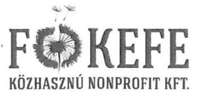

Cím: 1145 Budapest, Láky Adolf u. 41-49.
Levélcím: 1443 Budapest, Pf. 169.
Fővárosi Bíróság: Cg. 01-09-908769
Telefon: +36 1 251-3288
Fax: +36 1 251-4355
Email: info@fokefe.hu
Web: www.fokefe.hu
„(6) A cég kérelmére a már közzétett beszámoló - a (7) és (8) bekezdésben foglalt kivétellel - a céginformációs szolgálat honlapjáról nem távolítható el.";
„(7) Ha nem a legfőbb szerv által elfogadott beszámoló került benyújtásra és közzétételre, a cég erről szóló nyilatkozata alapján a céginformációs szolgálat a beszámolót passzív státuszba helyezi. A legfőbb szerv által elfogadott beszámoló közzétételének lehetőségét a céginformációs szolgálat a beszámoló benyújtását követő egy éven belül, kizárólag egy alkalommal biztosítja, feltüntetve az utólagos közzététel napját és a változás tényét is. A passzív státuszú beszámoló a céginformáció";
„(9) A (7) és (8) bekezdéstől eltérő esetekben a beszámoló vagy annak melléklete ismételt benyújtásának nincs helye. A céginformációs szolgálat a megküldött dokumentumokat ezen esetekben nem fogadja be, ennek tényéről elektronikus értesítést küld a beküldő személy részére."

# Összefoglalás: 

A Főkefe Közhasznú Nonprofit Kft. a jelentés tervezet 5.1. és 5.3. pontjában tett megállapításokat nem fogadja el, azokkal nem ért egyet. 2011. és 2013. évi beszámolók tekintetében a közzétett beszámolók Eredménykimutatásban szereplő mérlegszerinti eredménye, illetve a mérleg főösszege nem mutat eltérést az Alapítói határozatban szereplő értékektől. Ezen két időszak esetében a jelentés tervezetben jelzett eltérés technikai elírás, melyet alátámaszt a közzétett könyvvizsgálói jelentés, illetve a folytonosságot követve a következő évek beszámolóiban bázis adatok közzétett beszámolóval való egyezősége.
A leírtak alapján nem helytálló a jelentés tervezett azon megállapítása, miszerint a közzétett beszámolók megtévesztőek, nem a valós állapotot tükröznek.
2012. és 2014. évi beszámolók esetében az előzőekben részletezettek alapján nem fogadja el a Társaság a jelentés tervezetben tett megállapítást.
A Társaság honlapján közzétett adatok az ÁSZ ellenőrzéshez képest bővítésre kerültek az észrevételben foglaltakkal.
A jelentés tervezet 5.3. számú megállapítást a Főkefe NKft. nem fogadja el, miszerint a Főkefe leányvállalata nem teljesített adatszolgáltatást. Válaszunkban részletezve bemutatásra került a teljesített adatszolgáltatás.

Kérjük válaszaink elfogadását.
Köszönjük az együttműködésüket.

Budapest, 2016. január 15.
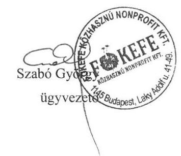

---

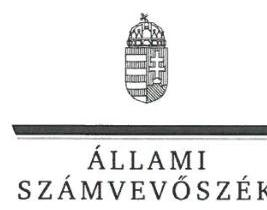

ELNÖK

Ikt.szám: V-0854-402/2016.

# Szabó György úr 

ügyvezető igazgató
FŐKEFE Közhasznú Nonprofit Kft.

## Budapest

## Tisztelt Ügyvezető igazgató Úr!

A „Jelentéstervezet az állami tulajdonban (résztulajdonban) lévő gazdálkodó szervezetek vagyonmegőrzési és gazdálkodási tevékenységének ellenőrzése - FŐKEFE Közhasznú Nonprofit Kft. " címmel készített számvevőszéki jelentéstervezetre tett észrevételeit köszönettel megkaptam.

Az Állami Számvevőszék észrevételekre vonatkozó álláspontjáról a felügyeleti vezető által készített részletes tájékoztatást csatoltan megküldöm.

Tájékoztatom ügyvezető igazgató urat, hogy a számvevőszéki jelentésben - az Állami Számvevőszékről szóló 2011. évi LXVI. törvény 29. § (3) bekezdése alapján - a figyelembe nem vett észrevételeket szerepeltetjük az elutasítás indokának feltüntetésével.

Budapest, 2016. 02. hó 02. nap
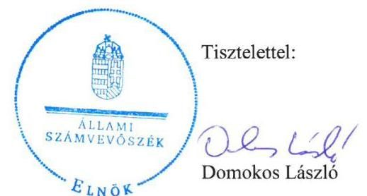

Melléklet: Tájékoztatás az elfogadott és el nem fogadott észrevételekről

---

# Tájékoztatás   az elfogadott és az el nem fogadott észrevételekről 

A „Jelentéstervezet az állami tulajdonban (résztulajdonban) lévő gazdálkodó szervezetek vagyonmegőrzési és gazdálkodási tevékenységének ellenőrzése - FŐKEFE Közhasznú Nonprofit Kft." című jelentéstervezetre 2016. január 20-án érkezett észrevételeit áttekintettük, azok kezelésével kapcsolatban a következő tájékoztatást adom.

## 1. A jelentéstervezet 5.1. számú megállapításokra tett észrevételek

A közzétett éves beszámolók, az FB és az Alapítói határozatok egyes adatainak egyezőségével kapcsolatos megállapításainkat alátámasztó dokumentumokat ismételten áttekintettük és azok alapján

- a jelentéstervezet 20. oldal 5.1. számú megállapítás 2. mondatát az egyértelműség érdekében pontosítjuk, mely szerint „Nem egyeztek meg azonban a közzétett 2011. évi beszámoló egyes adatai az Alapítói határozatban, a 2013. évi beszámoló egyes adatai pedig az FB által és az Alapítói határozatban elfogadott beszámoló adataival."
- a jelentéstervezet 21. oldal 4. bekezdésére - amely a 2012. és a 2014. évi beszámolók, az FB, és a tulajdonosi joggyakorló elé terjesztett beszámolók adatai egyezőségének hiányát állapította meg - tett kiegészítő információkat köszönjük. Az észrevételek a megállapítás módosítását nem teszik indokolttá, tekintettel arra, hogy a 2012. évi beszámolót elfogadó FB 12/2013. (IV.15.) számú határozat és a 2014. évi beszámolót elfogadó FB 21/2015 (05.04.) számú határozat a beszámoló adatainak azonosítására adatokat nem tartalmazott.
- a jelentéstervezet 21. oldal 5. bekezdésére - amely a 2014. évi beszámoló kiegészítő mellékletének IV. 8. pontjára vonatkozik - tett észrevétel a megállapítás helytállóságát támasztja alá, mivel megerősítik, hogy az alapító által teljesített pótbefizetéseknél a kiegészítő mellékletben téves évszámok szerepelnek.
- a jelentéstervezet 21. oldal 7. bekezdésére - amely a társaság jogszabályokban előírt adatok közzétételére vonatkoznak - tett észrevétel a megállapítás helytállóságát támasztja alá és tájékoztatást adnak a hiányosságok megszüntetéséről.

## 2. A jelentéstervezet 5.3. számú megállapításra tett észrevétel

Az Agro-Rehab NKft. kapcsolt vállalkozás adatszolgáltatási kötelezettség teljesítéséhez kapcsolódó dokumentumokat ismételten áttekintettük. Ennek alapján az 5.3. számú megállapítás 1. mondat második részét, valamint a 2. mondatát és ezzel összefüggésben a jelentéstervezet 22. oldalán a megállapítás alatti szövegrész 2. és 3. bekezdéseit, valamint a 4. bekezdés második tagmondatát a jelentéstervezet véglegesítése során töröljük.

---

# 3. A jelentéstervezetben szereplő - a FŐKEFE Közhasznú Nonprofit Kft. ügyvezető igazgatójának szóló - intézkedési feladatra (javaslatra) tett észrevétel 

Az Állami Számvevőszék által is ismert, hogy a FŐKEFE által a 2011. - 2014. évekre összeállított és közzétett éves beszámolók ismételt közzétételére - figyelemmel a számvitelről szóló 2000. évi C. törvény 2013. január 1-jétől hatályos módosítására - nincs lehetőség. Az éves beszámolók letétbe helyezésével és közzétételével kapcsolatos megállapítások helytállók. Ezért e területen megállapított hiányosságok indokolják a javaslatot, amelyet az egyértelműség érdekében ,,a jövőben" kifejezéssel egészítjük ki, a következőképpen: „Intézkedjen a jövőben a jogszabályoknak megfelelő, a jóváhagyásra jogosult által elfogadott éves beszámolók letétbehelyezéséről, közzétételéről."
4. A jelentéstervezet „Főbb megállapítások, következtetések, javaslatok" címú rész 4. oldal 5. bekezdésére (áthúzódik 5. oldalra) tett észrevétel
A közzétett beszámolók, az FB és a tulajdonosi joggyakorló elé jóváhagyásra előterjesztett egyes adatok egyezőségének hiányára vonatkozó megállapítással kapcsolatos dokumentumokat ismételten áttekintettük és a jelentéstervezet 5. bekezdésének (áthúzódik az 5. oldalra) utolsó mondatát pontosítjuk, mely szerint „a közzétett beszámolók megtévesztőek." Ezzel összefüggésben a jelentéstervezet 20. oldal 5.1. számú megállapítás 5. mondat második tagmondatát is töröljük.

Budapest, 2016. 0. hó 0. nap

Makkai Mária
felügyeleti vezető

---

# Állami Számvevőszék 

## Domokos László

elnök

1052 Budapest
Apáczai Cs. J. u. 10.

Ikt. sz.: MNV/01/218/i/2016.
Hiv. sz.: V-0854-397/2015.

Tisztelt Elnök Úr!
A 2016. január 04. napján „Az állami tulajdonban (résztulajdonban) lévő gazdálkodó szervezetek vagyonmegőrzési és gazdálkodási tevékenységének ellenőrzése - FŐKEFE Közhasznú Nonprofit Kft." tárgyában kézhez vett, V-0854-397/2015. ikt. sz. Jelentés-tervezetre az alábbi észrevételeket tesszük:

Összegzés / 4. old. 5-6. bekezdése, Megállapítások / 20-21. old. Összegző megállapítás, 5.1. számú megállapítás 19. bekezdései:

Tájékoztatjuk Elnök Urat, hogy a FŐKEFE Közhasznú Nonprofit Kft. (a továbbiakban: FŐKEFE vagy Társaság) az éves beszámoló készítési kötelezettségének teljesítéséhez az alapító okirat szerint évente alapítói döntést kért az MNV Zrt.-től.
Az Alapító elé terjesztett beszámolókat a Társaság Felügyelő Bizottsága (a továbbiakban: FB vagy Felügyelő Bizottság) megtárgyalta, arról határozati jegyzőkönyvek születettek.

Az Alapítónak a Társaság éves beszámolójának elfogadása során joga van módosítást kérnie. Az Alapítót döntéshozatala során - a Felügyelő Bizottság véleménye nem köti, a jogszabályi előírás csupán annyi, hogy a legfőbb szerv (Alapító) a Felügyelő Bizottság véleményének, írásbeli jelentésének birtokában határozhat a beszámoló elfogadásáról. A Felügyelő Bizottság minden évben megtárgyalta az éves beszámolót és az arról készített jelentését is eljuttatta az Alapító felé.
A FŐKEFE Felügyelő Bizottsága az alapítói határozatok végrehajtásának rendszeres (félévente esedékes) ellenőrzése során, az éves beszámolók közzétételét megvizsgálta.

A vizsgált időszakban a Társaság által közzétett beszámolókat minden évben független könyvvizsgáló vizsgálta meg. A közzétett beszámolók, a kiegészítő mellékletek, és a könyvvizsgálói jelentések alapján nem értünk egyet az ÁSZ Jelentés-tervezetének azon megállapításával, hogy a beszámolók megtévesztőek, és nem a valós állapotot tükrözik.
A FŐKEFE által közzétett 2011. évi, 2012. évi, 2013. évi és a 2014. évi éves beszámolók a Társaság pénzügyi adatai folytonosságát mutatják, ezért azoknak az újbóli közzétételét indokolatlannak tartjuk.

Az egyes éves beszámolókkal kapcsolatban az alábbiakat fontosnak tartjuk rögzíteni:

## - 2011. évi éves beszámoló

A Társaság által az MNV Zrt. részére beterjesztett 2011. évi éves beszámoló az MNV Zrt. Igazgatóságának döntését megalapozó előterjesztés mellékletét képezte, amely megegyezik a FŐKEFE által közzétett 2011. évi éves beszámolóval.

---

Az MNV Zrt. a 226/2012. (V.29.) számú alapítói határozatával elfogadta a Társaság 2011. évi éves beszámolóját. A kiadott 226/2012. (V.29.) számú alapítói határozatban adminisztratív hiba folytán számelírás történt, amit technikai jellegű hibának tekintünk.

A Társaság a beszámoló közzétételi kötelezettségét teljesítette, amely a B és Társa Könyvvizsgáló Iroda Kft. éves könyvvizsgálói jelentése alapján a Társaság 2011. üzleti évének valós állapotát tükrözi. A közzétett beszámoló a Társaság 2011. üzleti évének valós állapotát tükrözi, mely alapján látható, hogy a FŐKEFE 2011. évi éves mérleg szerinti eredménye -807.696 E Ft, mérlegfőösszege 2.145.142 E Ft.

# - 2012. évi éves beszámoló 

Az MNV Zrt. a 215/2013. (V.27.) számú alapítói határozatával elfogadta a Társaság 2012. évi éves beszámolóját, mely a közzétett 2012. évi éves beszámolóval azonos.
A Társaság a beszámoló közzétételi kötelezettségét teljesítette, ami a B és Társa Könyvvizsgáló Iroda Kft. éves könyvvizsgálói jelentése alapján a Társaság 2012. üzleti évének valós állapotát tükrözi.
A közzétett beszámoló alapján látható, hogy a FŐKEFE 2012. évi mérleg szerinti eredménye -47.006 E Ft, mérlegfőösszege 2.680.453 E Ft.

## - 2013. évi éves beszámoló

A Társaság által az MNV Zrt. részére beterjesztett 2013. évi éves beszámoló az MNV Zrt. Igazgatóságának döntését megalapozó előterjesztés mellékletét képezte, ami megegyezik a FŐKEFE által közzétett 2013. évi éves beszámolóval.
Az MNV Zrt. a 270/2014. (V.29). számú alapítói határozatával elfogadta a Társaság 2013. évi éves beszámolóját. A kiadott 270/2014. (V.29.) számú alapítói határozatban adminisztratív hiba folytán számelírás történt, amit technikai jellegű hibának tekintünk.
A Társaság a beszámoló közzétételi

 kötelezettségét teljesítette, ami a B és Társa Könyvvizsgáló Iroda Kft. éves könyvvizsgálói jelentés alapján a Társaság 2013. üzleti évének valós állapotát tükrözi.
A közzétett beszámoló a Társaság 2013. üzleti évének valós állapotát tükrözi, mely alapján világosan látható, hogy a FÖKEFE 2013. évi éves mérleg szerinti eredménye -1.074.283 E Ft, mérlegfőösszege 2.174.286 E Ft.

## - 2014. évi éves beszámoló

Az MNV Zrt. a 139/2015. (V.18.) számú alapító határozatával elfogadta a Társaság 2014. évi éves beszámolóját.
A kiegészítő melléklet IV.8. pontjában, a pótbefizetések teljesítésének dátumelírását az MNV Zrt. technikai jellegű számelírásnak tekinti.
A kiegészítő melléklet IV.8. pontjában, a teljesítés dátuma előtti bekezdésben a Társaság megjelölte, hogy 2014. éves pótbefizetésekről beszél.
A kiegészítő melléklet I. pontjában szintén egy múltbéli, 2014-ben már megtörtént eseményként jelöli a Társaság a pótbefizetések teljesítését, illetve beszámol az 590 M Ft összegű pótbefizetés 2014. évi éves felhasználásáról.
A 2014. évi éves beszámoló mellékletében a 270 M Ft összegű pótbefizetés 2015. november 26.-i (a beszámoló elkészítésekor még jövőbeni dátumú) pótbefizetés teljesítés számelírás, véleményünk szerint nem megtévesztő információ, számelírásként értelmezhető.
Az 590 M Ft összegű és a 270 M Ft összegű (összességében 860 M Ft összegű) pótbefizetések összegszerűen, mind a Társaság 2014. évi mérlegében, mind a cash flow kimutatásában is pénzügyileg bemutatott információk.
A Társaság a beszámoló közzétételi kötelezettségét teljesítette, ami a Jerkó és Társa Kft. éves könyvvizsgálói jelentése alapján a Társaság 2014. üzleti évének valós állapotát tükrözi.
A közzétett beszámoló a Társaság 2014. üzleti évének valós állapotát tükrözi, mely alapján világosan látható, hogy a FÖKEFE 2014. évi éves mérleg szerinti eredménye -604.302 E Ft, mérlegfőösszege 2.842.817 E Ft.

Megjegyezzük továbbá, hogy a számviteli törvény 2013. január 1-től hatályos módosításával a „lényeges hiba" hatályon kívül helyezésével egyidejűleg a „beszámolók ismételt közzététele" törlésre került.
A Társaság részéről a közzétett beszámoló módosítására egy éven belül lenne lehetőség, a beszámoló közzétételének módosítását a cégbíróság kérheti, abban az esetben, ha a Társaság az elektronikus adatközlés során a Társaságról rossz adatot adott közzé, vagy rosszul paraméterezte be az elektronikus űrlapon a Társaság státuszát. Jelen esetben ezek nem merülnek fel.

---

Mindezek alapján a Jelentés-tervezet 5. pontjának 1-9-ig tartó bekezdései vonatkozásában a fent előadottak értelmében a szöveg módosítását kérjük, amelyre az alábbi szövegszerű javaslatot tesszük, amelyet a Jelentéstervezet 4. oldalának 5-6. bekezdése vonatkozásában is kérjük, szíveskedjenek figyelembe venni:

# Összegző megállapítás 

„A FÖKEFE NKft. eleget tett beszámolási kötelezettségének. Letétbe helyezési, közzétételi kötelezettsége során technikai adatpontatlanság merült fel. A FÖKEFE NKft. szervezetén belül kialakított információs rendszer megfelelően működött.

## 5. 1. számú megállapítás 1-9. bekezdései

„A FÖKEFE NKft. teljesítette a Számv. tv. szerinti beszámoló készítési kötelezettségét. A közzétett 2011., 2012., 2013. és 2014. évi beszámoló egyes adatai azonban nem egyeztek meg az FB által elfogadott beszámolók adataival, tekintettel arra, hogy a tulajdonosi jogokat képviselő MNV Zrt. az éves beszámoló elfogadásának folyamata alatt módosítást kért. A 2011. és 2013. évi beszámoló mellékletét képező alapító határozatban technikai jellegű számelírás található, ugyanakkor a tulajdonos által elfogadott mérleg szerinti eredmény és a mérleg főösszeg megegyezik a közzétett beszámoló adataival. A 2014. évi beszámoló adminisztratív hiba folytán téves dátumot tartalmazott. Az elektronikus úton közzétett beszámolók az éves könyvvizsgálat alapján a Társaság gazdasági helyzetének valós állapotát tükrözik.

A FÖKEFE NKft. az ellenőrzött időszakban eleget tett a Számv. tv. 9. § (1) bekezdésében előírt beszámoló készítési kötelezettségének.

A tulajdonosi joggyakorló által elfogadott és a közzétett alapítói határozatok adataiban technikai jellegű elírások találhatóak. A 2011. évben az eredménytartalék és az MSZE összegében, a 2013. évben az MSZE és a céltartalék összegében volt eltérés. A 2013. évi beszámolót elfogadó határozat szövege és a határozatban rögzített főbb mérleg elemeket bemutató táblázat adatai között adminisztratív jellegű számelírás található - a Társaság a végleges és valós adatokat tartalmazó beszámolót az Alapító számára bemutatta -, az Alapító a döntés során az alapítói határozatot technikai számelírással adta ki.

A 2011. évi beszámolónál a 226/2012. (V. 29.) sz. alapítói határozat szerint az eredménytartalék összege 426,1 M Ft, míg a beszámoló szerint 239,2 M Ft volt, az MSZE -994,6 M Ft, míg a beszámoló adata -807,7 M Ft volt, a Társaság a végleges és valós adatokat tartalmazó beszámolót az Alapító számára bemutatta. A 2013. évi beszámolónál a 270/2014. (V. 29.) sz. alapítói határozatban szerepeltetett mérlegadatok belső soraiban technikai számelírás történt, a beszámolóban szereplő éves mérleg szerinti eredmény -1074,3 M Ft volt, amely megegyezik a határozat szövegében elfogadott -1074,3 M Ft összegű mérleg szerinti veszteség összegével.

A FÖKEFE NKft. éves beszámolóinak tulajdonosi joggyakorló általi jóváhagyásakor az éves beszámolókra vonatkozó könyvvizsgálói jelentések rendelkezésre álltak. A könyvvizsgálói jelentések értelmében az éves mérleg szerinti eredmény megegyezik a közzétett beszámoló szerinti mérleg szerinti eredménnyel. A könyvvizsgáló által elfogadott, közzétett beszámolók a Társaság gazdasági helyzetének valós állapotát tükrözik.
Az ellenőrzött időszakban a könyvvizsgáló a 2011. és 2013. évi, az éves beszámolókat véleményező könyvvizsgálói jelentésekben hívta fel a tulajdonosi joggyakorló figyelmét a saját tőke csökkenésére, amely megfelelt a Gt. 44. § (2) bekezdésében, illetve a Ptk. 3:129. § (1) bekezdésében foglaltaknak. A könyvvizsgáló a 2011. és 2013. üzleti évek éves beszámolóját véleményező könyvvizsgálói jelentésében mondott véleményt a tulajdonosi joggyakorló részére a saját forrás csökkenéséről, illetve arról, hogy a saját tőke csökkenése a Számv. tv. 15. § (1) bekezdése szerinti vállalkozás folytatása számviteli alapelvet sérti. A 2013. üzleti év fordulónapját követően a tulajdonosi joggyakorló általi 590 M Ft összegű pótbefizetést teljesített a FÖKEFE részére, így a Társaság saját tőke szintjét rendezte a számviteli törvény szerinti saját tőke/jegyzett tőke arányának szintjére. A 2013. üzleti évről szóló könyvvizsgálói jelentés rögzítette, hogy a 2013. üzleti év fordulónapját követő, tulajdonosi joggyakorló általi 590 M Ft összegű pótbefizetés mértéke ugyanakkor nem érte el a Társaság saját tőke összegét.

A 2011. évi és a 2013. évi beszámolót, annak utólagos módosítása miatt az FB két alkalommal tárgyalta meg, és véleményezte FB határozatban. A 2013. évi beszámolót illetően sem a 19/2014. (04. 10.), sem a 31/2014. (04.

---

27.) számú FB határozatokban szereplő MSZE és Céltartalék adatok nem egyeztek meg a letétbe helyezett éves beszámoló adataival.
A 31/2014. (04.27.) számú FB határozatszám esetében technikai jellegű számelírás történt, tekintve, hogy a Felügyelő Bizottság ülése 2015. május 27-én valósult meg, ezért a helyes FB határozatszám 31/2014. (05.27.) számú FB határozat.

A 2012. évi és a 2014. évi éves beszámoló esetében az FB határozattal elfogadott beszámoló nem egyezett meg a letétbe helyezett, illetve a tulajdonosi joggyakorló elé jóváhagyásra előterjesztett beszámolóval.
Az Alapítót - döntéshozatala során - a Felügyelő Bizottság véleménye nem köti, a jogszabályi előírás csupán annyi, hogy a legfőbb szerv (Alapító) a Felügyelő Bizottság véleményének, írásbeli jelentésének birtokában határozhat a beszámoló elfogadásáról. A Felügyelő Bizottság minden évben megtárgyalta az éves beszámolót és az arról készített jelentését is eljuttatta az Alapító felé.
A FÖKEFE Felügyelő Bizottsága az alapító határozatok végrehajtásának rendszeres (félévente esedékes) ellenőrzése során, az éves beszámolók közzétételét megvizsgálta.
A 2014. évi beszámoló kiegészítő mellékletének IV. 8. pontjában az Alapító által teljesített pótbefizetés időpontjára vonatkozó tájékoztatásba technikai jellegű számelírás miatt téves dátum került be, mivel a szövegezés szerint a 2014. év folyamán juttatott 590 M Ft és 270 M Ft a bankszámlán 2015. április 30-án, illetve 2015. november 26-án került jóváírásra, a helyes adat ugyanakkor 2014. április 30., illetve 2014. november 26. Az elírástól függetlenül a pótbefizetés teljesítése 2014. évre értendő, tekintettel arra, hogy az éves beszámoló a 2014. évre vonatkozik, és nem a 2015. évi eseményeket mutatja be, illetve a Társaság a 2014. évi éves pénzügyi adatszolgáltatásában is a 2014. évben megtörtént eseményként szerepeltette."

Megállapítások / 22. old. 5.2. számú megállapítás 2. bekezdése
A vizsgált időszak tekintetében az MNV Zrt. a Társaság 2013. évi leltárkészlet átértékeléssel kapcsolatban folytatott le tulajdonosi ellenőrzési vizsgálatot a 2015. évben, melynek folyományaként a Jelentés-tervezetben foglalt javaslatokkal kapcsolatos intézkedési terv elkészítésére, illetve annak teljesülése vonatkozásában beszámolásra kötelezte a Társaságot.

Ennek megfelelően a Jelentés-tervezetben szereplő, hivatkozott bekezdést törölni javasoljuk, és helyette a fenti szöveg szerepeltetését kérjük.

Megállapítások / 22. old. 5.3. számú megállapítás 4. bekezdése
A hivatkozott bekezdést az alábbi mondattal javasoljuk kiegészíteni.
„Az Agro Rehab NKft. a 2014. évi éves, számviteli törvény szerinti közzétételi kötelezettségének eleget tett."

Javaslatok / 23. old. 5.3. számú megállapítás 5-6. bekezdése
A Jelen levélben előadottak alapján, a hivatkozott bekezdéseket az alábbiak szerint kérjük módosítani:
„A Magyar Nemzeti Vagyonkezelő Zrt. vezérigazgatójának
Gondoskodjon arról, hogy az éves beszámolók elfogadásáról szóló alapító határozatokban található technikai jellegű hibák kijavításra kerüljenek. (5.1. sz. megállapítás 1. bekezdése alapján)"

# „A FÖKEFE Közhasznú Nonprofit Kft. ügyvezető igazgatójának 

Intézkedjen az éves beszámolók összeállításának, elfogadásra előterjesztésével és közzétételével kapcsolatos folyamatok megfelelő szabályozásáról.
Intézkedjen a jogszabályoknak megfelelő, a 2012. január 01-től hatályos Inf.tv. 35.§ (1) bekezdésében meghatározott hatályos adatok és információk - úgymint a Társaság szervezeti felépítése, a gazdálkodó szervezet

---

adatai, a Társaság feladatát, hatáskörét és alaptevékenységét meghatározó alapvető jogszabályok, szervezetszabályozó eszközök, a Társaság hatályos SZMSZ-e, illetve adatvédelmi és adatbiztonsági szabályzata közzétételéről a FÖKEFE honlapján.(5.1. sz. megállapítás 1. bekezdése alapján)"

Kérem Elnök Urat, hogy a Jelentés véglegesítése során jelen észrevételeinket szíveskedjenek figyelembe venni.
Budapest, 2016. január ,, /9,

Üdvözlettel:
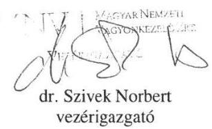

---

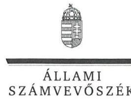

ELNÖK

Ikt.szám: V-0854-404/2016.

# Dr. Szívek Norbert úr 

vezérigazgató
Magyar Nemzeti Vagyonkezelő Zrt.

## Budapest

## Tisztelt Vezérigazgató Úr!

A „Jelentéstervezet az állami tulajdonban (résztulajdonban) lévő gazdálkodó szervezetek vagyonmegőrzési és gazdálkodási tevékenységének ellenőrzése - FÖKEFE Közhasznú Nonprofit Kft." címmel készített számvevőszéki jelentéstervezetre tett észrevételeit köszönettel megkaptam.

Az Állami Számvevőszék észrevételekre vonatkozó álláspontjáról a felügyeleti vezető által készített részletes tájékoztatást csatoltan megküldöm.

Tájékoztatom Vezérigazgató urat, hogy a számvevőszéki jelentésben - az Állami Számvevőszékről szóló 2011. évi LXVI. törvény 29. § (3) bekezdése alapján - a figyelembe nem vett észrevételeket szerepeltetjük az elutasítás indokának feltüntetésével.

Budapest, 2016. 02 hó 02 nap
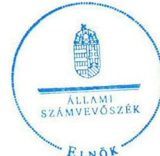

Tisztelettel:

Domokos László

Melléklet: Tájékoztatás az elfogadott és az el nem fogadott észrevételekről

---

# Tájékoztatás   az elfogadott és az el nem fogadott észrevételekről 

A „Jelentéstervezet az állami tulajdonban (résztulajdonban) lévő gazdálkodó szervezetek vagyonmegőrzési és gazdálkodási tevékenységének ellenőrzése - FÖKEFE Közhasznú Nonprofit Kft." című jelentéstervezetre 2016. január 20-án érkezett észrevételeit áttekintettük, azok kezelésével kapcsolatban a következő tájékoztatást adom.

1. Összegzés/4. old. 5-6. bekezdése, Megállapítások/20-21. old. Összegző megállapítás, 5.1. számú megállapítás 1-9. bekezdéseire tett észrevételek

A FÖKEFE Közhasznú Nonprofit Kft. (a továbbiakban: FÖKEFE) éves beszámoló készítési kötelezettség teljesítéséhez, az alapítói döntéssel kapcsolatos kiegészítő információkat, magyarázatokat köszönjük.

Az Állami Számvevőszék által is ismert, hogy a FÖKEFE által a 2011. - 2014. évekre összeállított és közzétett éves beszámolók ismételt közzétételére -
 figyelemmel a számvitelről szóló 2000. évi C. törvény (a továbbiakban: Számv. tv.) 2013. január 1-jétől hatályos módosítására - nincs lehetőség. Az éves beszámolók adategyezőségének hiányára tett megállapításainkat alátámasztó dokumentumokat ismételten áttekintettük és a jelentéstervezet 4. oldal 5. bekezdésének (áthúzódik az 5. oldalra) utolsó mondatát pontosítjuk, mely szerint „a közzétett beszámolók megtévesztők”. Ezzel összefüggésben a jelentéstervezet 20. oldal 5.1. számú megállapítás 5. mondat második tagmondatát is töröljük.

A 2011. évi éves beszámolót elfogadó 226/2012. (V. 29.) alapító határozattal kapcsolatban, mely szerint adminisztratív hiba folytán számelírás történt - megerősítik a megállapítást, ezért annak módosítása nem indokolt.

A 2012. évi éves beszámolóra tett észrevétel nem kapcsolódik az ÁSZ megállapításához, mivel a jelentéstervezet az éves beszámoló és az alapítói határozat adataival összefüggésben hiányosságot nem fogalmazott meg.

A 2013. évi éves beszámolót elfogadó 270/2014. (V. 29.) alapítói határozattal kapcsolatban, mely szerint adminisztratív hiba folytán számelírás történt - megerősítik a megállapítást, ezért a megállapítás helytálló, módosítása nem indokolt.

A 2014. évi beszámoló kiegészítő mellékletének IV. 8. pontjára tett észrevétel a megállapítás helytállóságát támasztja alá, mivel megerősítik az alapító által teljesített pótbefizetéseknél a dátum elírását. A megállapítás helytálló, módosítása nem indokolt.

## 2. Megállapítások/22. old. 5.2. számú megállapítás 2. bekezdésére tett észrevétel

A tulajdonosi ellenőrzéssel kapcsolatos dokumentumokat ismételten áttekintettük és a társaság 2013. évi leltárkészlet átértékeléssel kapcsolatban valóban végzett ellenőrzést, azonban az

---

ellenőrzés lezárása túlnyúlik az ellenőrzött időszakon. Ezért a megállapítás helytálló, módosítása nem indokolt.

# 3. Megállapítások/22. old. 5.3. számú megállapítás 4. bekezdésére tett észrevétel 

Az Agro-Rehab NKft. kapcsolt vállalkozás adatszolgáltatási kötelezettség teljesítéséhez kapcsolódó dokumentumokat ismételten áttekintettük. Ennek alapján az 5.3. számú megállapítás 1. mondat második részét, valamint a 2. mondatát és ezzel összefüggésben a jelentéstervezet 22. oldalán a megállapítás alatti szövegrész 2. és 3. bekezdéseit, valamint a 4. bekezdés második tagmondatát a jelentéstervezet véglegesítése során töröljük.

## 4. Javaslatok/23. old. 5.3. számú megállapítás 5-6. bekezdéseire tett észrevétel

Az ÁSZ ellenőrzés alapján a letétbe helyezett éves beszámolók és alapítói döntések egyes adatainak egyezősége hiányára tett megállapítást fenntartjuk, mert a Számv. tv. 153. § (1) bekezdése alapján a letétbe helyezett beszámolóval azonos tartalmúnak kell lenni a jóváhagyásra jogosult által elfogadott beszámolónak. Ezért az Magyar Nemzeti Vagyonkezelő Zrt. vezérigazgatójának tett javaslat helytálló, módosítása nem indokolt.

Budapest, 2016. 0. hó 0. nap

Makkai Mária
felügyeleti vezető

---

.

---

# RÖVIDÍTÉSEK JEGYZÉKE 

${ }^{1}$ FŐKEFE NKft.
${ }^{2} \mathrm{M} F \mathrm{~F}$
${ }^{3}$ ÁSZ
${ }^{4}$ MNV Zrt.
${ }^{5}$ Gt.
${ }^{6}$ Ptk. 2
${ }^{7}$ Ptk. 1
${ }^{8} \mathrm{FB}$
${ }^{9}$ SZMSZ
${ }^{10}$ Számv. tv.
${ }^{11}$ Számviteli politika
${ }^{12}$ Leltározási szabályzat
${ }^{13}$ Civil tv.
${ }^{14} \mathrm{Kbt}$.
${ }^{15}$ MSZE
${ }^{16}$ Kszt.
${ }^{17}$ Inf. tv.
${ }^{18}$ Közzétételi rendelet
${ }^{19}$ Avtv.
${ }^{20}$ ÁSZ tv.
${ }^{21}$ Nvtv

A FŐKEFE Rehabilitációs Foglalkoztató Ipari Közhasznú Nonprofit Kft. millió forint
Állami Számvevőszék
Magyar Nemzeti Vagyonkezelő Zrt.
A gazdasági társaságokról szóló 2006. évi IV. törvény
A Polgári Törvénykönyvről szóló 2013. évi V. törvény (hatályos 2014. III. 15.-től)
A Polgári Törvénykönyvről szóló 1959. évi IV. törvény (hatálytalan 2014. III. 15-től)
Felügyelő bizottság
A FŐKEFE Rehabilitációs Foglalkoztató Ipari Közhasznú Nonprofit Kft. Szervezeti és Működési Szabályzata
A számvitelről szóló 2000. évi C. törvény
A FŐKEFE Rehabilitációs Foglalkoztató Ipari Közhasznú Nonprofit Kft. Számviteli politikája
A FŐKEFE Rehabilitációs Foglalkoztató Ipari Közhasznú Nonprofit Kft. Leltározási szabályzata
Az egyesülési jogról, a közhasznú jogállásról, valamint a civil szervezetek működéséről és támogatásáról szóló 2011. évi CLXXV. törvény (hatályos 2012. I. 1.-től)

A közbeszerzésekről szóló 2011. évi CVIII. törvény (hatályos 2011. VIII. 21.-től)
Mérleg szerinti eredmény
A közhasznú szervezetekről szóló 1997. évi CLVI. törvény (hatálytalan 2012. I. 1-től)
Az információs önrendelkezési jogról és az információszabadságról szóló 2011. évi CXII. törvény (hatályos 2011. VII. 27.-től)
18/2005. (XII.27.) IHM rendelet a közzétételi listákon szereplő adatok közzétételéhez szükséges közzétételi mintákról
A személyes adatok védelméről és a közérdekű adatok nyilvánosságáról szóló 1992. évi LXIII. törvény
2011. évi LXVI. törvény az Állami Számvevőszékről, hatályos 2011. július 1-jétől A nemzeti vagyonról szóló 2011. évi CXCVI. törvény (hatályos 2011. XII. 31.-től)
