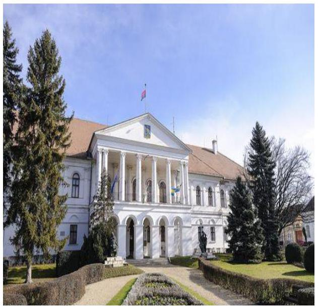
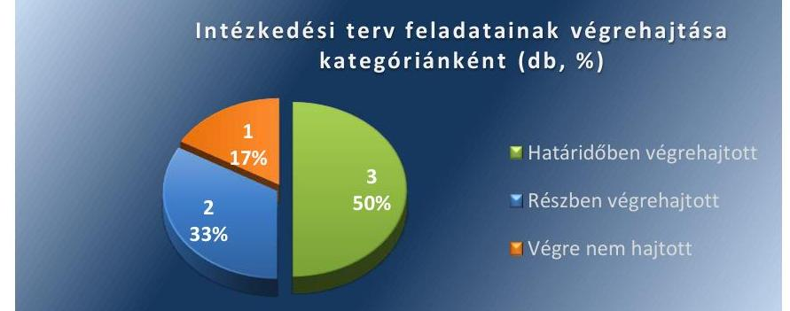

# Jelenetés 

## Utóellenőrzések

Az önkormányzatok vagyongazdálkodása szabályszerűségének ellenőrzéséről szóló jelentések utóellenőrzése - Makó Város Önkormányzata

---

# Jelenetés 

## Utóellenőrzések

Az önkormányzatok vagyongazdálkodása szabályszerűségének ellenőrzéséről szóló jelentések utóellenőrzése - Makó Város Önkormányzata

---

# AZ ELLENŐRZÉST FELÜGYELTE: 

RENKÓ ZSUZSANNA felügyeleti vezető

## AZ ELLENŐRZÉST VEZETTE ÉS A VÉGREHAJTÁSÁÉRT FELELŐS:

HORVÁTH JÓZSEF ellenőrzésvezető
DR. JAKAB KORNÉL ellenőrzésvezető

## A PROGRAM ÖSSZEÁLLÍTÁSÁÉRT FELELŐS:

JANIK JÓZSEF LÁSZLÓ osztályvezető

## A TÉMÁHOZ KAPCSOLÓDÓ KORÁBBI SZÁMVEVŐSZÉKI JELENTÉSEK:

- címe: Jelentés az önkormányzati vagyongazdálkodás szabályszerűségi ellenőrzéséről - Makó
- sorszáma: 13075

IKTATÓSZÁM: V-0897-058/2016.
TÉMASZÁM: 1931.
ELLENŐRZÉS-AZONOSÍTÓ SZÁM: V07170607

---

# TARTALOMJEGYZÉK 

■ ÖSSZEGZÉS ..... 5
■ AZ ELLENŐRZÉS CÉLJA ..... 6
■ AZ ELLENŐRZÉS TERÜLETE ..... 7
■ AZ ELLENŐRZÉS HÁTTERE, INDOKOLTSÁGA ..... 8
■ FÓKUSZKÉRDÉSEK ..... 9
■ ELLENŐRZÉS HATÓKÖRE ÉS MÓDSZEREI ..... 10
■ MEGÁLLAPÍTÁSOK ..... 12
■ MELLÉKLETEK ..... 15
I. Sz. melléklet: Értelmező szótár. ..... 15
II. Sz. melléklet: Az ÁSZ 13075. számú jelentéséhez kapcsolódó intézkedési terv végrehajtása ..... 16
■ FÜGGELÉK: ÉSZREVÉTELEK ..... 19
■ RÖVIDÍTÉSEK JEGYZÉKE ..... 21

---

.

---

# ÖSSZEGZÉS 

Az ÁSZ jelentésben* foglalt javaslatokra elkészített, Képviselő-testület ${ }^{1}$ által elfogadott intézkedési terv ${ }_{1,2}$-t az ÁSZ részére határidőben megküldték. Az ÁSZ jelentésben² ${ }^{2}$ foglalt megállapításokhoz kapcsolódóan az Önkormányzat ${ }^{3}$ által összeállított intézkedési terv ${ }_{1,2}$ feladatainak megvalósítását utóellenőrzés keretében értékeltük és megállapítottuk, hogy a Képviselő-testület által elfogadott intézkedési terv ${ }_{1,2}$-ben foglalt hat feladatot az Önkormányzat nem hajtotta végre teljes körűen. Az intézkedési terv ${ }_{1,2}$-ben előírt feladatok közül három feladat határidőre teljesült, két feladat részben teljesült, egy feladat - az ingatlanvagyon kataszter rendszer adatainak a földhivatali ingatlan-nyilvántartással történt dokumentált egyeztetése - végrehajtása nem történt meg. A megtett intézkedések a szabályszerű vagyongazdálkodási, vagyon-nyilvántartási folyamatok biztosítása érdekében történtek. Az intézkedési terv ${ }_{1,2}$-ben foglalt feladatok végrehajtásáról a jogszabály szerinti nyilvántartást vezették.

## Az ellenőrzés társadalmi indokoltsága

Az Állami Számvevőszék stratégiájában célul tűzte ki a számvevőszéki munka hasznosulásának javítását. Ezzel összhangban ellenőrzi, hogy az ellenőrzött szervezetek megvalósították-e a korábbi ellenőrzései által feltárt hibák, hiányosságok és szabálytalanságok megszüntetése céljából kialakított intézkedési terveikben foglaltakat. A rendszeres utóellenőrzések hozzájárulnak a szükséges intézkedések tényleges végrehajtásához, ezáltal a közpénzügyek rendezettségének javulásához.

## Főbb megállapítások, következtetések, javaslatok

Makó Város Önkormányzat Képviselő-testülete megtárgyalta és tudomásul vette az önkormányzati vagyongazdálkodás szabályszerűségi ellenőrzésről készített ÁSZ ${ }^{4}$ jelentés megállapításait és annak javaslatai végrehajtására intézkedési terv ${ }_{1,2}$-t fogadott el, amelyeket határidőben megküldött az ÁSZ részére.

A Képviselő-testület által kijelölt felelősök nem intézkedtek teljes körűen az intézkedési terv ${ }_{1,2}$-ben foglalt hat intézkedési feladat végrehajtásáról.

A Képviselő-testület nem írt elő beszámolási kötelezettséget az intézkedési terv ${ }_{1,2}$ feladatainak megvalósításáról. Az intézkedési terv ${ }_{1,2}$-ben előírt feladatok közül három feladat határidőre teljesült, két feladat részben teljesült, egy feladat - az ingatlanvagyon kataszter rendszer adatainak a földhivatali ingatlan-nyilvántartással történt dokumentált egyeztetése - végrehajtása nem történt meg.

Az intézkedési tervekben rögzített intézkedési feladatok végrehajtásáról a $\mathrm{Bkr}^{5}$. által előírt nyilvántartást vezették.

[^0]
[^0]:    * Az ÁSZ 13075 számú jelentése: Jelentés az önkormányzati vagyongazdálkodás szabályszerűségi ellenőrzéséről - Makó (elérhetősége: www.asz.hu)

---

# **AZ ELLENŐRZÉS CÉLJA**

**Makó Város Önkormányzatának vagyongazdálkodása szabályszerűségének ellenőrzéséről szóló jelentés utóellenőrzése**

Az ellenőrzés célja annak értékelése, hogy a számvevőszéki jelentésben foglalt intézkedést igénylő megállapításokkal és javaslatokkal összhangban készített intézkedési tervben meghatározott feladatokat az ellenőrzött szervezet végrehajtotta-e.

---

# **AZ ELLENŐRZÉS TERÜLETE**

## **Makó Város Önkormányzata**

Makó város Csongrád-megyében fekszik és állandó lakosainak száma 24 993 fő¹. Az utóellenőrzés idején hivatalban lévő polgármester² a 2014. évi önkormányzati választások óta tölti be tisztségét, a jegyző⁷ 2015. január 1-jétől látja el közszolgálati feladatait.

Az Önkormányzat 2014. december 31-ei beszámoló alapján 42,4 milliárd Ft értékű eszközvagyonnal rendelkezett, amelyből a nemzeti vagyonba tartozó befektetett eszközvagyon 41,1 milliárd Ft volt.

Az Önkormányzat vagyongazdálkodása szabályszerűségének ellenőrzését az ÁSZ a 2007. január 1. – 2011. december 31. közötti időszakra végezte el. Az utóellenőrzés – a 2015. július 9-ig végrehajtott intézkedéseket figyelembe véve – az ÁSZ jelentésnek az intézkedést igénylő megállapításai és javaslatai hasznosítására elfogadott³ intézkedési tervek végrehajtására irányult.

Az ÁSZ jelentés a polgármesternek egy, a jegyzőnek öt javaslatot tartalmazott, amelyek végrehajtására a Képviselő-testület által megtárgyalt és jóváhagyott intézkedési tervek készültek.

1 2015. július 9-én.

2 A Képviselő-testület az intézkedési terveket a 434/2013. (X. 30.) MÖKT., a 435/2013. (X. 30.) MÖKT. határozatával fogadta el.

---

# AZ ELLENŐRZÉS HÁTTERE, INDOKOLTSÁGA 

Az ÁSZ törvény 33. § (1) bekezdése értelmében a számvevőszéki jelentések intézkedést igénylő megállapításaihoz és javaslataihoz kapcsolódóan az ellenőrzött szervezet vezetője intézkedési tervet köteles összeállítani, és az Állami Számvevőszék részére megküldeni. Az intézkedési tervben foglaltak megvalósítását - az ÁSZ törvény 33. § (7) bekezdésében foglaltak alapján - az Állami Számvevőszék utóellenőrzés keretében ellenőrizheti. Az intézkedések megvalósulásának értékelése során az Állami Számvevőszék figyelembe veszi az ellenőrzött szervezetek működési feltételeiben, valamint a jogszabályi előírásokban bekövetkezett változásokat.

Az intézkedési tervekben foglalt feladatok hiányos, illetve késedelmes végrehajtása, valamint megvalósításának elmaradása azt mutatja, hogy az ellenőrzések során feltárt hibák, hiányosságok és szabálytalanságok megszüntetése nem kapott kellő hangsúlyt. Ez a szabályszerű működés és a felelős vezetői magatartás vonatkozásában kockázatot hordoz. E kockázatok feltárásával az Állami Számvevőszék utóellenőrzési rendszere fokozza a fegyelmet, és igazolja, hogy a közpénzzel való szabályos gazdálkodás felelőssége elől nem lehet kitérni.

## AZ ELLENŐRZÉS VÁRHATÓ HASZNOSULÁSA:

Az utóellenőrzés négy szinten hasznosulhat:
$\longrightarrow$ A társadalom szintjén az utóellenőrzés jelzi, hogy a számvevőszéki ellenőrzés megállapításainak van következménye: a hiányosságok megszüntetésére az ellenőrzött szervezet által meghatározott intézkedések végrehajtását is számon kéri az ÁSZ.
$\longrightarrow$ Az ellenőrzött terület szintjén az utóellenőrzés tájékoztatást nyújt a terület döntéshozóinak a hiányosságok kiküszöbölésének jó gyakorlatairól, ezzel lehetőséget biztosítva arra, hogy az ÁSZ ellenőrzési megállapításai, javaslatai a terület nem ellenőrzött szervezeteinek a működése során is hasznosuljanak.
$\longrightarrow$ Az ellenőrzött szervezetek szintjén az utóellenőrzés feltárja, hogy a szervezet az intézkedések végrehajtásával hasznosította-e a korábbi ellenőrzési jelentésben a hiányosságok megszüntetése, illetve a kockázatok kezelése érdekében megfogalmazott javaslatokat.
$\longrightarrow$ Az ÁSZ szintjén az utóellenőrzés visszacsatolást ad az ellenőrzési jelentések hasznosulásáról, az intézkedések elmaradása vagy részleges megvalósulása a további ellenőrzésekhez kockázati jelzésként szolgál.

---

# FÓKUSZKÉRDÉSEK 

1. Az ellenőrzött szervezet az intézkedési tervben foglalt feladatokat - az előírt határidőben - végrehajtotta-e?

---

# ELLENŐRZÉS HATÓKÖRE ÉS MÓDSZEREI 

## Az ellenőrzés típusa

Szabályszerűségi ellenőrzés ${ }^{5}$

## Az ellenőrzött időszak

A számvevőszéki jelentés 2013. október 2-ai közzétételének napjától az utóellenőrzés 2015. július 9-ei megkezdésének napjáig tartó időszak.

## Az ellenőrzés tárgya

Az Önkormányzat intézkedési tervében foglaltak végrehajtásának ellenőrzése.

## Az ellenőrzött szervezet

Makó Város Önkormányzata

## Az ellenőrzés jogalapja

Magyarország Alaptörvénye ${ }^{6}$ 43. cikk (1) bekezdése alapján az ÁSZ az Országgyűlés pénzügyi és gazdasági ellenőrző szerve. Az ÁSZ törvényben meghatározott feladatkörében ellenőrzi a központi költségvetés végrehajtását, az államháztartás gazdálkodását, az államháztartásból származó források felhasználását és a nemzeti vagyon kezelését.

Az ÁSZ törvény 1. § (3) bekezdése szerint az ÁSZ általános hatáskörrel végzi a közpénzekkel és az állami és önkormányzati vagyonnal való felelős gazdálkodás ellenőrzését.

Az ÁSZ törvény 33. § (7) bekezdése alapján az ÁSZ jelentésben foglalt megállapításokhoz kapcsolódóan összeállított intézkedési tervben foglaltak megvalósítását az ÁSZ utóellenőrzés keretében ellenőrizheti.

Az államháztartásról szóló 2011. évi CXCV. törvény 61. § (2) bekezdése szerint az államháztartás külső ellenőrzésével kapcsolatos feladatokat az ÁSZ látja el.

[^0]
[^0]:    ${ }^{5}$ lásd: I. számú melléklet szerint

---

# Az ellenőrzés módszerei 

Az ellenőrzést az ellenőrzési program kérdései, az ellenőrzött időszakban hatályos jogszabályok, az ellenőrzés szakmai szabályok és módszertanok figyelembe vételével végeztük.

AZ UTÓELLENŐRZÉST a jóváhagyott intézkedési tervekben előírt feladatok végrehajtása alapján végeztük. Figyelembe vettük az intézkedési terv jóváhagyását követően hatályba lépett jogszabályi előírások változásából következő események, továbbá a feladat-ellátási és finanszírozási rendszer esetleges változásának hatásait. Az intézkedési tervekben előírt feladatokat azok végrehajthatósága, illetve végrehajtása szempontjából az alábbiak szerint értékeltük:
—okafogyottá vált az előírt feladat, ha végrehajtására - meghatározott esemény bekövetkezése, továbbá külső körülmény, a működést érintő feltétel változása miatt - már nincs szükség, illetve lehetőség és egyértelműen megállapítható, hogy az intézkedést szükségessé tevő körülmény a jövőben nem fordulhat elő;
—nem időszerű az a feladat, amelynek ellenőrzési időszakon belüli végrehajtására azért nem került (kerülhetett) sor, mert az intézkedés alapjául szolgáló esemény nem következett be, de annak jövőbeni előfordulása lehetséges, a végrehajtása nem volt esedékes, vagy a végrehajtás határideje még nem járt le;
—határidőben végrehajtott a feladat, ha a teljesítés dokumentáltan az intézkedési tervben előírt határidőben és tartalommal megtörtént;
—határidőn túl végrehajtott a feladat, ha annak teljesítése az intézkedési tervben meghatározott módon, de az előírt határidőn túl történt meg;
—részben végrehajtott az a feladat, amelynek a végrehajtása teljes körűen az intézkedési tervben előírt módon nem történt meg;
—nem végrehajtott a feladat, ha a végrehajtás nem történt meg, vagy amennyiben a teljesítést nem dokumentálták.
Az ellenőrzés lefolytatásához az ellenőrzött szervezet a tanúsítványok elektronikus kitöltésével, valamint az ÁSZ által kért dokumentumok elektronikus megküldésével szolgáltat adatokat, amelyek valódiságát és teljes körűségét az ellenőrzött szervezet vezetője által tett teljességi és hitelességi nyilatkozat igazolja. A rendelkezésre bocsátott adatok, információk kontrollja az ellenőrzés keretében történt meg.

---

# MEGÁLLAPÍTÁSOK 

## 1. Az ellenőrzött szervezet az intézkedési tervben foglalt feladatokat - az előírt határidőben - végrehajtotta-e?

Összegző megállapítás

Az intézkedési terv ${ }_{1,2}$-t nem hajtották végre maradéktalanul. Hat feladatból hármat határidőben teljesítettek, kettő teljes körű végrehajtásáról, illetve egy végrehajtásáról nem gondoskodtak, amellyel nem biztosították az Önkormányzat vagyongazdálkodásának szabályszerű működését. A Képviselő-testület az intézkedési terv ${ }_{1,2}$ intézkedési feladatainak végrehajtásáról beszámolási kötelezettséget nem írt elő. Az intézkedési terv ${ }_{1,2}$-ben rögzített feladatokról a jogszabályi előírás szerint nyilvántartást vezettek.

A polgármester és a jegyző egy-egy feladatot (a vagyon alakulásának figyelemmel kísérése, illetve az önkormányzati honlapon közzétett adatok felülvizsgálata) részben teljesített, további egy - az ingatlanvagyon kataszter rendszer adatainak a földhivatali ingatlan-nyilvántartással történt dokumentált egyeztetése - feladatot a jegyző nem hajtott végre. (lásd: részletesen a II. számú mellékletben)

A Képviselő-testület által jóváhagyott Intézkedési terv ${ }_{1}$-ben a polgármester részére előírt egy intézkedési feladat részben végrehajtott, a jegyző felelősségi körébe tartozó Intézkedési terv ${ }_{2}$-ben meghatározott öt feladatból az ellenőrzött dokumentumok alapján két feladat végrehajtása az Intézkedési terv ${ }_{2}$-ben előírt tartalommal és határidőben végrehajtott, egy feladat részben végrehajtott, egy feladat végre nem hajtott volt. Az Intézkedési terv ${ }_{1,2}$ feladatainak 50%-a határidőben végrehajtott, 33%-a részben végrehajtott, míg 17%-a végre nem hajtott feladat volt. Az Intézkedési terv ${ }_{1,2}$ feladatai végrehajtásának megoszlását kategóriánként az 1. számú ábra szemlélteti.

1. számú ábra

---

# HATÁRIDŐBEN VÉGREHAJTOTT feladat volt: 

- Az Intézkedési terv ${ }_{2} 1$. számú tervezett intézkedési feladata a Leltározási, Leltárkészítési és Selejtezési Szabályzata ${ }^{9}$ felülvizsgálatát határozta meg annak érdekében, hogy az Áhsz ${ }^{10}$ 37. § (4) bekezdésében foglaltaknak megfelelően tartalmazza a vagyonkezelésbe adott eszközök leltározására
 vonatkozó rendelkezéseket. A módosított Leltározási, leltárkészítési és selejtezési szabályzat megfelelt a jogszabály követelményeinek.
- Az Intézkedési terv ${ }_{2} 3$. számú tervezett intézkedési feladata az Önkormányzat Polgármesteri Hivatalának Számviteli Politikája ${ }^{11}$, Pénzkezelési ${ }^{12}$-, valamint a Kötelezettségvállalási ${ }^{13}$ szabályzatok felülvizsgálatát írta elő. A módosított szabályzatok hatálya már nem terjedt ki a megszüntetett intézményre.
- Az Intézkedési terv ${ }_{2} 5$. számú tervezett intézkedési feladata az Önkormányzat tulajdonában lévő vagyon használójának - a gazdasági társaságoknak - a vagyonnal való gazdálkodása ellenőrzését határozta meg. Az Önkormányzat 2014. évi Belső Ellenőrzési terv szöveges beszámoló II/1. pontja tartalmazta a céljelleggel nyújtott támogatások szabályszerűségi ellenőrzését, II/2. pontja a gazdasági társaságok leltározási és selejtezési tevékenységének ellenőrzését. Az Önkormányzat belső ellenőrzése az elvégzett ellenőrzésekről nyilvántartást vezetett.

## RÉSZBEN VÉGREHAJTOTT feladatok voltak:

- Az Intézkedési terv ${ }_{1} 1$. számú intézkedési feladata alapján a pénzügyi feladatokat ellátó bizottság az önkormányzati vagyon változását figyelemmel kísérte és erről tájékoztatta a Képviselő-testület. A polgármester az Intézkedési terv ${ }_{1} 1$. számú feladatában megfogalmazottakkal ellentétben nem gondoskodott a Képviselő-testület 2014. évi és 2015. évi munkatervében a szakbizottság beszámolási kötelezettségének rögzítéséről. A Képviselő-testület illetékes bizottsága 2014. évben az Ügyrendi, Pénzügyi, Közbeszerzési és Tulajdonosi Bizottság és 2015-évben az Ügyrendi és Pénzügyi Bizottság ${ }^{\dagger \dagger}$ az Mötv. ${ }^{14}$ 120. § (1) bekezdés b) pontjának megfelelően figyelemmel kísérte a település vagyonának alakulását és az Mötv. 120. § (2) bekezdésének megfelelően beszámolt a Képviselő-testületnek.
- Az Intézkedési terv ${ }_{2} 4$. számú tervezett intézkedési feladata előírta, hogy az önkormányzati honlapon közzétett adatokat felül kell vizsgálni és a feltárt hiányos adattartalom pótlásáról gondoskodni kell, különösen az önkormányzati gazdasági társaságok részére átadott működési és fejlesztési célú támogatások, a nettó 5,0 millió forint értékhatárt meghaladó vagyonkezelési szerződések adatainak, a

[^0]
[^0]:    ** 2014. április 23-án tárgyalta „2013. évi zárszámadási rendelet megalkotása, pénzügyi bizottság beszámolója a vagyon alakulásáról" című előterjesztést, melyet 111-113/2014. (IV. 23.) ÜPKTB. sz. határozatival elfogadott.
    $\dagger \dagger$ 2015. április 20-i ülésén tárgyalta „Beszámoló Makó Város Önkormányzata 2014. évi költségvetésének végrehajtásáról. Rendelettervezet Makó Város Önkormányzat 2014. évi zárszámadásáról" című előterjesztést, melyet 95/2015. ÜPG. határozattal elfogadott.

---

tárgyévi elemi költségvetések, számviteli beszámolók és a zárszámadási rendelet közzétételére vonatkozóan. Az Önkormányzat az Info. tv. ${ }^{15}$ 33. § (3) bekezdésének megfelelően a közzétételi kötelezettségének saját honlap működtetésével és korábbi honlapján tárolt adatok archiválásával tett eleget. Az Önkormányzat az intézkedési tervben foglalt feladatokat részben hajtotta végre, és az Info. tv. 37. § (1) bekezdése által előírt általános közzétételi listában meghatározott adatoknak az Infó. tv. 1. sz. mellékletben foglaltak szerinti közzétételi kötelezettségének részben tett eleget. Az önkormányzat „1. szervezeti, személyzeti adatai, a szervezeten belül illetékes ügyfélkapcsolati vezető neve és az ügyfélfogadási rend" hivatkozáson belül a város 2014. évben megválasztott új polgármesterének neve nem került közzétételre annak ellenére, hogy 2014. évben az új polgármestert megválasztották, aki ugyanazon évben hivatalba is lépett.

# NEM VÉGREHAJTOTT feladat volt: 

- Az Intézkedési terv ${ }_{2}$ 2. számú intézkedési feladata előírta, hogy az Önkormányzatnál biztosítani kell a földhivatali ingatlan-nyilvántartás és az ingatlanvagyon kataszter azonos tartalmú adatai közötti egyezőséget az azt alátámasztó dokumentumokkal. Az Önkormányzat a teljes ingatlan állományára kiterjedően nem hajtotta végre az Intézkedési terv ${ }_{2}$ 2. számú intézkedési feladatát. Az Önkormányzat nem hajtotta végre az Intézkedési terv ${ }_{2}$ 2. számú feladatát, nem tett eleget a tulajdonában lévő ingatlanvagyon nyilvántartási és adatszolgáltatási rendjéről szóló, 147/1992. (XI. 6.) Korm. rendelet ${ }^{16}$ 1. § (2) bekezdésében foglalt előírásnak.
A Képviselő-testület az ÁSZ ellenőrzés javaslatainak végrehajtására az Intézkedési terv ${ }_{1,2}$-t jóváhagyó 434/2013. (X. 30.) MÖKT. számú és a 435/2013. (X. 30.) MÖKT számú határozataiban azok végrehajtásáról tájékoztatást nem kért.

### 1.2. számú megállapítás

Az Intézkedési tervben ${ }_{1,2}$ rögzített feladatokról a Bkr. által előírt nyilvántartást vezettek.

Az ÁSZ jelentés megállapításai alapján tett javaslatok végrehajtására készített és a Képviselő-testület által határozatokkal jóváhagyott Intézkedési terv ${ }_{1,2}$ feladatainak végrehajtásáról a Bkr. 14. § (1) bekezdésében foglaltak szerint, a Bkr. 47. § (2) bekezdésében előírt követelményeknek megfelelő nyilvántartást vezettek.

---

# MELLÉKLETEK 

- I. SZ. MELLÉKLET: ÉRTELMEZŐ SZÓTÁR
kockázat
szabályszerűségi ellenőrzés
ingatlanvagyon kataszter nyilvántartási rendszer

A kockázat annak valószínűségét jelenti, hogy egy vagy több esemény vagy működés nem kívánt módon befolyásolja a rendszer működését, céljainak megvalósulását. (Forrás: Javaslatok a korrupciós kockázatok kezelésére - Kockázatkezelési és ellenőrzési módszertan, ÁSZ)
A szabályszerűségi ellenőrzés a megfelelőségi ellenőrzés általánosan alkalmazott altípusa. A szabályszerűségi ellenőrzés az egyes kritériumok-jogszabályi előírások, egyéb szabályok és megállapodások-teljesülésének ellenőrzését foglalja magában, ide értve a költségvetéssel kapcsolatos jogszabályokban foglaltak teljesülésének ellenőrzését is. (Forrás: ÁSZ Ellenőrzési Alapelvek, A megfelelőségi ellenőrzés alapelvei 2.4.1. Szabályszerűségi ellenőrzés)
Az önkormányzatok tulajdonában lévő ingatlanvagyonról vezetett nyilvántartás, amely tartalmazza az ingatlan adatlapjának, valamint a földre, az épületre, a közműre és az egyéb építményre vonatkozó betétlapjainak az adatait. Az ingatlanvagyon kataszterben rögzített ingatlanok adatainak meg kell egyezni a fővárosi és megyei kormányhivatal ingatlanügyi hatóságaként eljáró járási (fővárosi kerületi) hivatal (a továbbiakban járási hivatal) ingatlan-nyilvántartásának azonos tartalmú adataival, illetve a közmű üzemeltetőjének nyilvántartásával. A kataszter elkülönítetten tartalmazza - törzsvagyon és egyéb vagyon szerinti bontásban - az ingatlanra vonatkozó főbb adatokat, továbbá, ha rendelkezésre áll, az ingatlan számviteli nyilvántartás szerinti bruttó értékét, értékbecslés esetén a becsült értékét az ennek szabályozására kiadott 147/1992. (XI.12.) Korm. rendelet 1-5. számú melléklete szerinti ingatlanvagyon-katasztert (a továbbiakban: katasztert) kell felfektetni és folyamatosan vezetni. (Forrás: 147/1992. (XI.12.) Korm. rendelet)

---

|  1. | A Makói Polgármesteri Hivatal Leltározási, Leltárkészítési és Selejtezési Szabályzata felülvizsgálatra kerül, hogy az tartalmazza az Áhsz. 37. § (4) bekezdésében foglaltaknak megfelelően a vagyonkezelésbe adott eszközök leltározására vonatkozó rendelkezéseket | azonnal | jegyző | Makó Polgármesteri Hivatal jegyzője hatáskörében gondoskodott 2013. január 1-től a Polgármesteri Hivatal Leltározási, Leltárkészítési és Selejtezési Szabályzatának módosításáról. A szabályzat 5.1. Eszközök és források leltározása pontja rendelkezett a leltározás módjáról (egyeztetéses vagy mennyiségi felvételes), az A/IV. Üzemeltetésre, vagyonkezelésre átadott eszközök leltározása pontja pedig rendelkezett a leltározás Áhsz. 37. § (4) bekezdésében foglalt előírások érvényesítéséről, az üzemeltetésre átadott eszközök leltározásának eredményeként a leltárdokumentumoknak az üzemeltető által történő beküldésének határidejéről.  |
| --- | --- | --- | --- | --- |
|  2. | A Makói Polgármesteri Hivatal Számviteli Politikája, Pénzkezelési-, valamint a Kötelezettségvállalási szabályzata felülvizsgálatra kerül, hogy azokból kerüljön kivezetésre a megszüntetett Termál és Gyógyfürdő intézménye. | 2012. január 1. | jegyző | A Számviteli Politikát és a Kötelezettségvállalás, utalványozás, pénzügyi ellenjegyzés, teljesítés igazolása, érvényesítés rendjének szabályzatát - az intézkedési terv készítését megelőzően - 2012. január 1-jétől, a Pénzkezelési szabályzatot 2012. március 1-től módosították. A módosított szabályzatok hatálya már nem terjed ki az intézményként megszüntetett szervezetre.  |
|  3. | Az önkormányzat tulajdonában lévő vagyon használójának - gazdasági társaságoknak - a vagyonnal való gazdálkodás ellenőrzése szerepel a 2014. évi Belső ellenőrzési terv szöveges beszámoló II/1. pontjában, mint céljelleggel nyújtott támogatások szabályszerűségi ellenőrzése és a II/2. pontjában a leltározási és selejtezési tevékenység ellenőrzése a gazdasági társaságoknál. | 2014. IV. negyedév | jegyző | Az elfogadott Intézkedési tervben a megtett intézkedések között 2012. év IV. negyedévében a Makói Gyógyfürdő Kft.-nél a vagyon és a vagyonvédelemre vonatkozó szabályzatok és a szabályzatokban előírtak betartására, valamint a leltározási tevékenység végrehajtása tárgyában soron kívüli ellenőrzés elvégzéséről számolt be. Az ellenőrzések végrehajtásának időpontjait 2012. november 13 és 2012. december 13-ában jelölte meg. Az Önkormányzat Belső Ellenőrzése 2013 évben utóellenőrzést végzett a Makói Gyógyfürdő Kft-nél a vagyon és a vagyonvédelemre vonatkozó szabályzatok és a leltározás végrehajtása, leltáreltérések rendezése tárgyában 1/823/2013/I. számon. Az elvégzett vizsgálatokról ellenőrzési jelentések készültek. Az elvégzett ellenőrzésről nyilvántartást vezettek. Az Önkormányzat belső ellenőrzése a vizsgálatok keretében készült ellenőrzési jelentésben lévő intézkedést igénylő megállapításokra az ellenőrzött gazdasági társaság részére intézkedési tervek készítését előírta, amelyek  |

---

|  Mellékletek |  |  |  |   |
| --- | --- | --- | --- | --- |
|  Sorszám | Intézkedési terv alapján elvégzendő feladat | Az intézkedési tervben meghatározott határidő | Az 452/2005 sz. jelentése javaslatának címzettje | Az intézkedés végrehajtása  |
|   | 1. | 2. | 3. | 4.  |
|   |  |  |  | elkészültek és az intézkedési tervek végrehajtásáról szóló realizáló leveleket a gazdasági társaságok a belső ellenőrzés részére megküldték. A Képviselő-testület az Éves Belső Ellenőrzési Jelentések elfogadásakor határozataiban jóváhagyta az elvégzett vizsgálatokról szóló beszámolót.  |
|  Határidőt követően végrehajtott intézkedés |  |  |  |   |
|  1. | NEM VOLT |  |  |   |
|  Részben végrehajtott intézkedés |  |  |  |   |
|  1. | Makó Város képviselő-testülete pénzügyi feladatot ellátó bizottságának az Mótv. 120. § (1) b) pontja értelmében Makó város Önkormányzata vagyonának alakulását figyelemmel kell kísérnie és erről első ízben be kell számolni a 2013. évi december havi rendes ülésen, majd azt követően a képviselő-testület éves munkatervében rögzítettni kell a beszámolási kötelezettséget. | 2013. december havi rendes képviselő-testületi ülés és ezt követően a munkatervben foglaltak szerint | polgármester | Nem végrehajtott feladat:
A polgármester a Képviselő-testület által 434/2013. (X.30.) MÖKT. számú határozatával és az intézkedési terv rendelkezésével ellentétben nem teljes körűen hajtotta végre a tervezett intézkedést, mivel a Képviselő-testület által 522/2013. (XII. 18) és 468/2014. (XII. 17.) MÖKT. számú határozatokban elfogadott a 2014. és a 2015. évi munkatervek a pénzügyi feladatokat ellátó bizottság vagyonváltozással kapcsolatos beszámolási kötelezettségét nem rögzítették.  |
|   |  |  |  | Határidőben végrehajtott feladat:
A Képviselő-testület az Intézkedési tervben foglalt feladatnak megfelelően 2013. évben Makó Város Önkormányzatának vagyonváltozása alakulásáról szóló, az Ügyrendi, Pénzügyi, Közbeszerzési és Tulajdonosi Bizottság által előterjesztett tájékoztatót megtárgyalta és 523/2013. (XII. 18.) MÖKT. számú határozatával, majd 2014-évben 145/2014. (IV. 30.) MÖKT. számú, 2015-évben a 119/2015. (IV. 22.) MÖKT. számú határozataival elfogadta. A Képviselő-testület illetékes bizottsága 2014. évben az Ügyrendi, Pénzügyi, Közbeszerzési és Tulajdonosi Bizottság és 2015-évben az Ügyrendi és Pénzügyi Bizottság az Mótv. 120. § (1) bekezdés b) pontjának megfelelően figyelemmel kísérte a település vagyonának alakulását és az Mótv. 120. § (2) bekezdésének megfelelően beszámolt a Képviselő-testületnek.  |
|  2. | Az önkormányzati honlapon közzétett
 adatokat felül kell vizsgálni, a hiányos adattartalmakat - különösen az önkormányzati gazdasági társaságok részére működési és fejlesztési célú támogatások, | 2013. december 31. és azt követően folyamatos | jegyző | Nem végrehajtott feladat:
Az önkormányzati gazdasági társaságok részére működési és fejlesztési célú támogatások, a nettó öt millió forintot meghaladó vagyonkezelési szerződések adatait nem teljes körűen tették közzé, és az Önkormányzat hivatalos honlapján szereplő adatok folyamatos frissítése elmaradt.  |

---

|  Mellékletek |  |  |  |   |
| --- | --- | --- | --- | --- |
|  Sorszám | Intézkedési terv alapján elvégzendő feladat | Az intézkedési tervben meghatározott határidő | Az ÁSZ 15075 sz. jelentése javaslatának címzettje | Az intézkedés végrehajtása  |
|   | 1. | 2. | 3. | 4.  |
|   | a nettó öt millió forintot meghaladó vagyonkezelési szerződések adatai, az elemi költségvetések, számviteli beszámolók, zárszámadási rendelet - fel kell tárni és azok pótlásáról gondoskodni kell. |  |  | Határidőben végrehajtott feladat:
Az önkormányzat az elemi költségvetések, számviteli beszámolók, zárszámadási rendeletek adatait a honlapján közzétette.  |
|   |  |  | Végre nem hajtott intézkedés |   |
|  1. | Makó Város önkormányzatánál biztosítani kell a földhivatali ingatlan nyilvántartás és az ingatlanvagyon kataszter azonos tartalmú adatai közötti egyezőséget az azt alátámasztó dokumentumokkal. | 2013. évi költségvetési beszámoló elkészítésének időpontja | jegyző | Az ingatlanvagyon kataszter rendszer és a földhivatali ingatlan-nyilvántartás azonos tartalmú adatainak dokumentált egyezősége biztosítását az Intézkedési tervben vállalt határidőre és az Önkormányzat teljes ingatlan állományra kiterjedően nem hajtották végre. Az Önkormányzat teljes ingatlanállományára vonatkozóan az Ingatlanvagyon-kataszter és a földhivatali nyilvántartás adatainak egyezőségét dokumentáltan nem támasztották alá. A Jegyző adatszolgáltatása (1/877-8/2015/I. sz. nyilatkozat) szerint a vagyonkataszter nyilvántartás és a földhivatali nyilvántartás azonos tartalmú adatai közötti egyeztetés, felülvizsgálat az utóellenőrzés időszaka alatt folyamatban volt. A vagyonkataszter nyilvántartásból az utóellenőrzéssel érintett 2013-2014. évekre visszamenőleges időállapotú lista lekérdezése technikailag nem volt lehetséges, melynek következtében az utóellenőrzéshez az ÁSZ V-0898-001/2015. iktatószámú dokumentum bekérő levelének 2. sz. melléklete 1.5. pontjára vonatkozóan az adatszolgáltatást listával alátámasztott módon nem teljesítették.  |

---

# FÜGGELÉK: ÉSZREVÉTELEK 

A jelentéstervezetet a Számvevőszék 15 napos észrevételezésre megküldte az ellenőrzött szervezet vezetőjének az ÁSZ tv. 29. § 5. (1) bekezdése előírásának megfelelően.
A polgármester az ÁSZ tv. 29. § (2) bekezdésében foglalt észrevételezési jogával nem élt, a jelentéstervezetre észrevételt nem tett.

${ }^{55}$ 29. § (1) Az Állami Számvevőszék az ellenőrzési megállapításait megküldi az ellenőrzött szervezet vezetőjének vagy az általa megbízott személynek, és annak, akinek személyes felelősségét állapította meg.
(2) Az ellenőrzött szervezet vezetője és a felelősként megjelölt személy az ellenőrzés megállapításaira tizenöt napon belül írásban észrevételt tehet.
(3) Az Állami Számvevőszék az észrevételre a beérkezésétől számított harminc napon belül írásban válaszol. A figyelembe nem vett észrevételeket köteles a jelentésben feltüntetni, és megindokolni, hogy azokat miért nem fogadta el.

---

.

---

# RÖVIDÍTÉSEK JEGYZÉKE 

${ }^{1}$ Képviselő-testület
${ }^{2}$ ÁSZ jelentés
${ }^{3}$ Önkormányzat
${ }^{4}$ ÁSZ
${ }^{5}$ Bkr.
${ }^{6}$ polgármester
${ }^{7}$ jegyző
${ }^{8}$ Alaptörvény
${ }^{9}$ Leltározási, Leltárkészítési és Selejtezési Szabályzata
${ }^{10}$ Áhsz.
${ }^{11}$ Számviteli Politika
${ }^{12}$ Pénzkezelési Szabályzat
${ }^{13}$ Kötelezettségvállalási szabályzat
${ }^{14}$ Mötv.
${ }^{15}$ Info tv.
${ }^{16}$ 147/1992. (XI.6.) Korm. rendelet

Makó Város Önkormányzat Képviselő-testülete
ÁSZ 13075. számú, Jelentés az önkormányzati vagyongazdálkodás szabályszerűségi ellenőrzéséről - Makó
Makó Város Önkormányzata
Állami Számvevőszék
370/2011. (XII. 31.) Korm. rendelet a költségvetési szervek belső
kontrollrendszeréről és belső ellenőrzéséről
Makó Város Önkormányzatának polgármestere
Makó Város Önkormányzatának jegyzője
Magyarország Alaptörvénye; (kihirdetve 2011.április 25-én, hatályos 2012.január 1-jétől)
Makó Polgármesteri Hivatal Leltározási, Leltárkészítési és Selejtezési szabályzata (hatályos: 2013. január 1-jétől 2013. december 31-ig)
249/2000. (XII. 24.) Korm. rendelet az államháztartás szervezetei beszámolási és könyvvezetési kötelezettségének sajátosságairól (hatálytalan 2014. január 1-jétől)
Makó Város Önkormányzati Képviselő-testület Polgármesteri Hivatala Számviteli Politikája (hatályos: 2012. január 1-jétől 2013. december 31-ig)
Makó Város Önkormányzati Képviselő-testület Polgármesteri Hivatala Pénzkezelési szabályzata (hatályos: 2012. március 1-jétől 2013. december 31-ig)
Makó Város Önkormányzati Képviselő-testület Polgármesteri Hivatala Kötelezettségvállalás, utalványozás, pénzügyi ellenjegyzés, teljesítés igazolása, érvényesítés rendjének szabályzata (hatályos: 2012. január 1-jétől)
2011. évi CLXXXIX. törvény Magyarország önkormányzatairól
2011. évi CXII. törvény az információs önrendelkezési jogról és az információszabadságról
147/1992. (XI.6.) Korm. rendelet az önkormányzatok tulajdonában lévő ingatlanvagyon nyilvántartási és adatszolgáltatási rendjéről

---

# ÁLLAMI SZÁMVEVŐSZÉK 

1052 Budapest, Apáczai Csere János utca 10.
Levélcím: 1364 Budapest 4. Pf. 54
Telefon: +36 14849100 Telefax: +36 14849200
www.asz.hu
