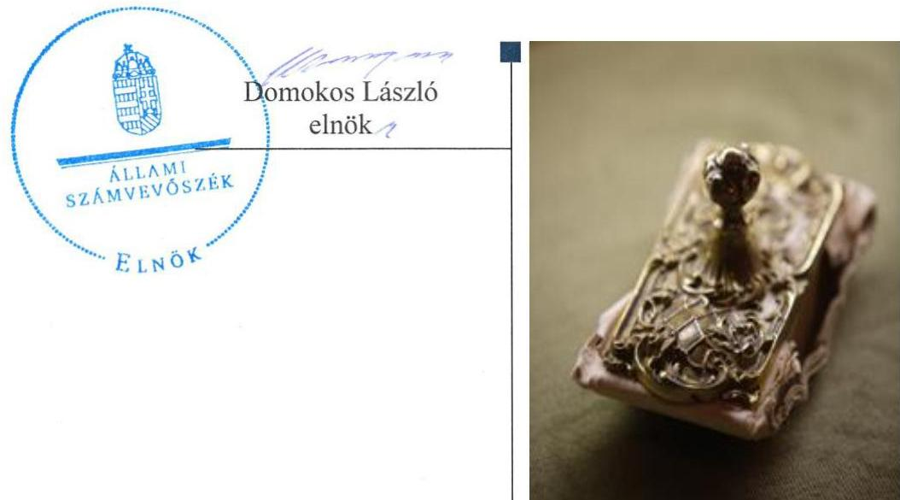

# Jelenetés 

## Új Nemzedék Központ Nonprofit Közhasznú Kft.

Az állami tulajdonban (résztulajdonban) lévő gazdálkodó szervezetek vagyonmegőrzési és gazdálkodási tevékenységének ellenőrzése 2016.

---

# Jelentés 

## Új Nemzedék Központ Nonprofit Közhasznú Kft.

Az állami tulajdonban (résztulajdonban) lévő gazdálkodó szervezetek vagyonmegőrzési és gazdálkodási tevékenységének ellenőrzése 2016. 03. hónap 01. nap

---

# AZ ELLENŐRZÉST FELÜGYELTE:

- BÖRÖCZ IMRE felügyeleti vezető

- AZ ELLENŐRZÉST VEZETTE ÉS A VÉGREHAJTÁSÁÉRT FELELŐS:
  - PONGRÁCZ ÉVA ellenőrzésvezető
  - A PROGRAM ÖSSZEÁLLÍTÁSÁÉRT FELELŐS:
    - LAJTERNÉ HUDÁK MAGDOLNA osztályvezető

- IKTATÓSZÁM: V-0933-207/2016.
- TÉMASZÁM: 1706.
- ELLENŐRZÉS-AZONOSÍTÓ SZÁM: V070910

Jelentéseink az Országgyűlés számítógépes hálózatán és az Interneta a www.asz.hu címen is olvashatóak.

---

# TARTALOMJEGYZÉK 

■ ÖSSZEGZÉS ..... 5
■ AZ ELLENŐRZÉS CÉLJA ..... 6
■ AZ ELLENŐRZÉS TERÜLETE ..... 7
■ AZ ELLENŐRZÉS HÁTTERE, INDOKOLTSÁGA ..... 8
■ ELLENŐRZÉS HATÓKÖRE ..... 9
■ RÖVIDÍTÉSEK JEGYZÉKE ..... 11

---

.

---

# ÖSSZEGZÉS 

Az Állami Számvevőszék Új Nemzedék Központ Nonprofit Közhasznú Kft.-re vonatkozó ellenőrzésének célja az volt, hogy értékelje a gazdálkodási feltételek kialakításának, a tulajdonosi jogok gyakorlásának, az elszámolásoknak, a vagyonváltozást eredményező döntéseknek és az információk átadásának szabályszerűségét. Az ellenőrzéshez szükséges dokumentumok hiánya miatt a Társaságnál az ellenőrzési program nem volt végrehajtható.

## Az ellenőrzés társadalmi indokoltsága

Magyarországon az intézmény-centrikus közfeladat ellátás, közvagyon gazdálkodás jellemző a költségvetésen kívüli feladatellátás térnyerése mellett. Ennek szereplői a nonprofit szervezetek, az önkormányzati tulajdonú gazdasági társaságok és az állami tulajdonú gazdálkodó szervezetek is.

Az Áht ${ }_{2}{ }^{1}$ 2. § I) pontja, az Európai Közösséget létrehozó szerződéshez csatolt, a túlzott hiány esetén követendő eljárásról szóló jegyzőkönyv alkalmazásáról szóló 2009. május 25-i 479/2009/EK rendelet szerint, illetve az ESA95 statisztikai módszertana alapján a kormányzati szektorba tartoznak"központi kormányzat alszektorba besorolt társaságok és egyéb szervezetek" is, amelyekkel szemben alapvető követelmény, hogy gazdálkodásuk, múködésük szabályszerű, az általuk szolgáltatott adatok megbízhatóak legyenek.

Az állami tulajdonú gazdálkodó szervezetek a nemzeti vagyon részét képezik. Az állami vagyonnal való gazdálkodást illetően a tulajdonosi joggyakorlás és a vagyongazdálkodás feladata az állami vagyon átlátható, rendeltetésszerű és felelős felhasználásának biztosítása. Az állam meghatározza az ellátandó közszolgáltatással kapcsolatos feladatokat, amelyhez a vagyonnal kapcsolatos döntéseknek igazodniuk kell. A nemzetgazdasági szempontból kiemelt jelentőségű, nemzeti vagyonnak minősülő, gazdasági társasági részesedés feletti tulajdonosi joggyakorlót a nemzeti vagyonról szóló törvény határozza meg.

Minden közpénzt, közvagyont használó szervezettel szemben társadalmi igény, hogy tevékenységükről elszámoljanak.

## Fő következtetés

A Társaság 2011-2014. évi vagyonmegőrzési és gazdálkodási tevékenységének ellenőrzése során a számvevőszéki ellenőrzés ellenőrzési program szerinti lefolytatásához szükséges dokumentumokat nem bocsátotta az ÁSZ rendelkezésére. Az ellenőrzési program nem volt végrehajtható, az ellenőrzés céljaként meghatározottak a dokumentumok hiánya miatt nem voltak ellenőrizhetők, megválaszolhatók.

---

# AZ ELLENŐRZÉS CÉLJA 

## Az állami tulajdonban (résztulajdonban) lévő gazdálkodó szervezetek vagyonmegőrzési és gazdálkodási tevékenységének ellenőrzése az Új Nemzedék Központ Nonprofit Közhasznú Kft.-nél

Az ellenőrzés célja annak értékelése volt, hogy a tulajdonosi jogok gyakorlása szabályszerű volt-e; a gazdálkodó szervezet által ellátott feladat bevételei, ráfordításai elszámolásának, és vagyongazdálkodási tevékenységének szabályozása megfelelt-e a jogszabályi és a tulajdonosi előírásoknak és azok végrehajtása szabályszerű volt-e; biztosítva volt-e a közfeladatok átláthatósága és elszámoltathatósága érdekében a közszolgáltatás díjának megalapozottsága szabályszerű önköltségszámítással; a vagyonváltozást eredményező döntések esetében a tulajdonosi jogok gyakorlója és a gazdálkodó szervezet szabályszerűen jártak-e el; a gazdálkodó szervezet épített-e ki és működtetett-e információs rendszert a szabályszerű vagyongazdálkodás érdekében.

Az ellenőrzés célja annak értékelése is, hogy a kormányzati szektorba sorolt egyéb szervezetek gazdálkodásának a kormányzati szektor hiányára és az államadósságra befolyással bíró elemei a jogszabályi előírásoknak megfelelnek-e.

---

# AZ ELLENŐRZÉS TERÜLETE 

## Új Nemzedék Központ Nonprofit Közhasznú Kft.

Az Új Nemzedék Központ Nonprofit Közhasznú Kft. elődje a Zánkai Gyermek és Ifjúsági Centrum, Oktatási és Üdültetési Kht. (későbbi nevén Zánka - Új Nemzedék Központ Nonprofit Kft.) néven 1996. szeptember 1-jén alakult költségvetési intézményből közhasznú társasággá. Tevékenysége során közhasznú szervezetként gyermek- és ifjúsági oktatási, közművelődési, kulturális, sport feladatokat látott el. 2009. április 21-én a közhasznú társaság nonprofit, közhasznú korlátolt felelősségű társasággá alakult át.

A kizárólagosan állami tulajdonú társaságban a tulajdonosi jogok gyakorlását - az állami vagyonról szóló 2007. évi CVI. törvény alapján - az állami vagyon felügyeletéért felelős miniszter az MNV Zrt. ${ }^{2}$ útján látta el. A tulajdonosi jogok gyakorlása 2012. április 1-től a Közigazgatási és Igazságügyi Minisztériumhoz került. 2012. június 1-jétől a társaság elnevezése Zánka - Új Nemzedék Központ Nonprofit Közhasznú Kft-re változott. Célul tűzte ki a Zánka Gyermek- és Ifjúsági Tábor stratégiai irányelveinek és célrendszerének újragondolását. A közfeladatokon túl a vállalkozási tevékenység bevételei is segítették a vagyon fejlesztését, működőképes állapotban tartását. A társaság alaptevékenysége volt az ifjúsági turizmus, szabadidős programszolgáltatás; oktatás, szak- és felnőttképzéshez kapcsolódó szolgáltatások; egészségturisztikai-rehabilitációs, sport, rekreációs programszolgáltatások. Közhasznú tevékenységében célkitúzés volt a társadalmi megújulás, részvétel és befogadás, az esélyegyenlőségi politika horizontális céljainak megvalósítása, valamint az oktatási és képzési rendszerek szerepének erősítése az innovációs potenciál fejlesztésében.

Az Erzsébet-programról szóló 2012. évi CIII. törvény módosításáról szóló 2013. évi CCXIV. törvény értelmében 2014. január 1-jétől a zánkai központ vagyonkezelői joga átszállt az Erzsébet Vagyonkezelő Kft-re. A törvény hatálya szerint 2014. január 1. napján szűnt meg a vagyonkezelői jog.

A zánkai székhelyen korábban végzett üdültetési, vendéglátási tevékenység megszűnt. Vagyonkezelői jogállásváltozása és ennek következtében feladatainak átstrukturálódása miatt a zánkai székhely átkerült Budapestre, a Bajza utcai irodaházba, ahol addig a Társaság projektközpontja működött.

A cég elnevezése 2014. május 13-i hatállyal megváltozott, és mint Új Nemzedék Központ Nonprofit Közhasznú Korlátolt Felelősségű Társaság működött tovább, illetve ugyanebben az évben, 2014. október 28-tól az Emberi Erőforrások Minisztériuma vált a tulajdonosi joggyakorlóvá. A társaság a Kormány tagjainak feladat- és hatásköréről szóló 154/2014. (VI. 6.) Korm. rendelet alapján közreműködik az Új Nemzedék Jövőjéért ifjúságpolitikai keretprogramból fakadó feladatok ellátásában és az ifjúsági szolgáltatások szervezetrendszerének működtetésében.

---

# AZ ELLENŐRZÉS HÁTTERE, INDOKOLTSÁGA 

Az ÁSZ ${ }^{3}$ alapvető célkitűzése, hogy az államháztartáson kívülre nyújtott költségvetési támogatások és ingyenes vagyonjuttatások ellenőrzésével hozzájáruljon ahhoz, hogy a közpénzeket az államháztartáson kívül múködő szervezetek is átlátható módon használják fel a közfeladatok szerződésben vállalt ellátása érdekében. A közfeladatok ellátása elsősorban költségvetési szervek alapításával és működtetésével történik. Az államháztartáson kívüli szervezetek a közfeladatok ellátásában, jogszabályban meghatározott feltételekkel, közreműködhetnek.*

Az ellenőrzés feladata a közvagyonnal biztosított közfeladat ellátással kapcsolatban a közpénzek átláthatósága, nyilvánossága érdekében a jogszabályokban, belső szabályzatokban megfogalmazott előírások érvényesülésének az állami tulajdonban (résztulajdonban) lévő gazdálkodó szervezetek vagyonérték megőrzési és gazdálkodási tevékenységének értékelése.

A nemzeti számlák nemzetközi és hazai statisztikai módszertana és szabványai elveket határoznak meg a statisztikai értelemben vett kormányzati szektorba tartozó szervezetek körére és besorolásuk módjára. A szervezetek megnevezését a nemzetgazdasági miniszter teszi közzé.

A Vtv ${ }^{4}$. 3. § (1) bekezdésének 2013. június 27-ig hatályos szabályozása értelmében a tulajdonosi jogok és kötelezettségek összességét az állami vagyon tekintetében az állami vagyon felügyeletéért felelős miniszter gyakorolja, aki e feladatát az MNV Zrt., az MFB Zrt. ${ }^{5}$, illetve a jogszabályban rögzített egyéb tulajdonosi joggyakorló szervezetek útján látja el, míg 2014. július 15-ig tulajdonosi joggyakorlóként - ha törvény vagy miniszteri rendelet eltérően nem rendelkezik - az MNV. Zrt., a törvényben, vagy a miniszter által rendeletben kijelölt személy gyakorolja. 2014. július 15-ét követően a rábízott állami vagyon felett az államot megillető tulajdonosi jogok és kötelezettségek összességét tulajdonosi joggyakorlóként - ha törvény vagy miniszteri rendelet eltérően nem rendelkezik - az MNV Zrt. gyakorolja.

Az ellenőrzés várható hasznosulásaként az ellenőrzés megállapításai a jogalkotás számára segítséget nyújthatnak az államháztartáson kívüli közfeladat ellátás, közvagyonnal való gazdálkodás értékeléséhez, jogszabályi keretei pontosításához, az átláthatóságot biztosító szabályozáshoz. Az ellenőrzöttek számára visszajelzést ad a gazdálkodási tevékenységgel, az állami vagyon felhasználásával, a közszolgáltatási árképzés megalapozottságával és az éves elszámolással kapcsolatos szabálytalanságokról és kockázatokról. Az ellenőrzés tapasztalatai segítik és erősítik az ÁSZ hozzáadott értéket teremtő elemző tevékenységét és tanácsadó szerepét. Feltárjuk, hogy a kormányzati szektorba sorolt egyéb szervezetek milyen mértékben befolyásolják a költségvetési hiányt és az államadósságot. A kormányzati szektorba sorolt, költségvetési tervezésbe is bevont gazdálkodó szervezetek ellenőrzése fokozza a legfőbb ellenőrző szerv iránti figyelmet és közbizalmat.

[^0]
[^0]:    * Áht2. 1. § (2)-(3) bekezdés

---

# ELLENŐRZÉS HATÓKÖRE 

## Az ellenőrzés típusa

Szabályszerúségi ellenőrzés

## Az ellenőrzött időszak

2011. január 1-jétől 2014. december 31-ig.

## Az ellenőrzés tárgya

Állami tulajdonban (résztulajdonban) lévő gazdálkodó szervezetek vagyonmegőrzési és gazdálkodási tevékenysége és a kormányzati szektor hiányára és adósságállományára hatást gyakorló elemek ellenőrzése.

## Az ellenőrzött szervezet

Új Nemzedék Központ Nonprofit Közhasznú Kft.

## Az ellenőrzés jogalapja

Az Állami Számvevőszékről szóló 2011. évi LXVI. törvény 5. § (3)(5) bekezdése, valamint az állami vagyonról szóló 2007. évi CVI. törvény 3. § (4) bekezdése képezi.

---

.

---

# RÖVIDÍTÉSEK JEGYZÉKE 

${ }^{1}$ Áht $_{2}$
${ }^{2}$ MNV Zrt.
${ }^{3}$ ÁSZ
${ }^{4}$ Vtv.
${ }^{5}$ MFB Zrt.

Az államháztartásról szóló 2011. évi CXCV. törvény
Magyar Nemzeti Vagyonkezelő Zrt.
Állami Számvevőszék
Állami vagyonról szóló 2007. évi CVI. törvény
Magyar Fejlesztési Bank

---

# ÁLLAMI SZÁMVEVŐSZÉK 

1052 Budapest, Apáczai Csere János utca 10.
Levélcím: 1364 Budapest 4. Pf. 54
Telefon: +36 14849100 Telefax: +36 14849200
www.asz.hu