# Jelentés 

## Az önkormányzatok gazdasági társaságai

Az önkormányzatok többségi tulajdonában lévő gazdasági társaságok közfeladat ellátását érintő gazdálkodási tevékenysége szabályszerűségének ellenőrzése Kecskeméti Termostar Hőszolgáltató Kft.

2016
„A közfeladat ellátás szinvonala, költségeinek, ráfordításainak alakulása hatással van a szolgáltatást igénybe vevő lakosság elégedettségére."

---

# Jelentés 

## Az önkormányzatok gazdasági társaságai

Az önkormányzatok többségi tulajdonában lévő gazdasági társaságok közfeladat ellátását érintő gazdálkodási tevékenysége szabályszerűségének ellenőrzése - Kecskeméti Termostar Hőszolgáltató Kft.

2016. 2017. 2018. hónap 3. nap
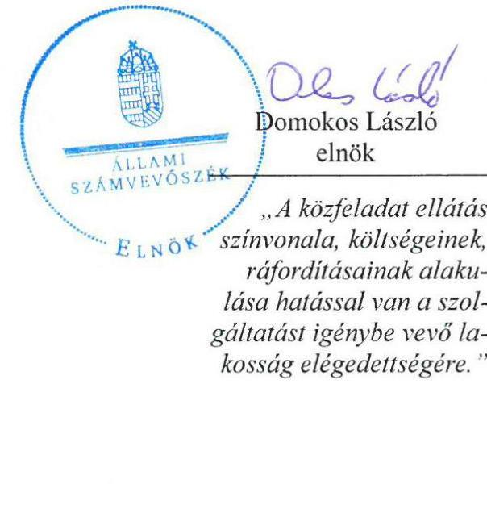

---

# AZ ELLENŐRZÉST FELÜGYELTE:

BÖRÖCZ IMRE felügyeleti vezető

## AZ ELLENŐRZÉST VEZETTE ÉS A VÉGREHAJTÁSÁÉRT FELELŐS:

SALAMIN VIKTOR ellenőrzésvezető

## A PROGRAM ÖSSZEÁLLÍTÁSÁÉRT FELELŐS:

JANIK JÓZSEF LÁSZLÓ osztályvezető

## A TÉMÁHOZ KAPCSOLÓDÓ KORÁBBI SZÁMVEVŐSZÉKI JELENTÉSEK:

|  - címe: | Jelentés Kecskemét Megyei Jogú Város Önkormányzata pénzügyi helyzetének ellenőrzéséről  |
| --- | --- |
|  - sorszáma: | 1138  |

Jelentéseink az Országgyűlés számítógépes hálózatán és az Interneten a www.asz.hu címen is olvashatóak.

IKTATÓSZÁM: V-0842-136/2016

TÉMASZÁM: 1857

ELLENŐRZÉS-AZONOSÍTÓ SZÁM: V-070703

---

# TARTALOMJEGYZÉK 

■ ÖSSZEGZÉS ..... 5
■ AZ ELLENŐRZÉS CÉLJA ..... 7
■ AZ ELLENŐRZÉS TERÜLETE ..... 8
■ AZ ELLENŐRZÉS HÁTTERE, INDOKOLTSÁGA ..... 10
■ FÓKUSZKÉRDÉSEK ..... 11
■ ELLENŐRZÉS HATÓKÖRE ÉS MÓDSZEREI ..... 12
■ MEGÁLLAPÍTÁSOK ..... 14
■ JAVASLATOK ..... 26
■ MELLÉKLETEK ..... 29
I. Sz. melléklet: Értelmező szótár ..... 29
II. Sz. melléklet: Múködés főbb jellemzői ..... 31
■ FÜGGELÉK: ÉSZREVÉTELEK ..... 33
■ RÖVIDÍTÉSEK JEGYZÉKE ..... 41

---

.

---

# ÖSSZEGZÉS 

Az Állami Számvevőszék ellenőrzése a távhőszolgáltatás közfeladatának ellátását értékelte a többségi önkormányzati tulajdonú Kecskeméti Termostar Hőszolgáltató Kft.-nél 2011-2014. évekre vonatkozóan. Kecskemét Megyei Jogú Város Önkormányzata a közfeladat ellátását biztosította, a tulajdonosi jogokat szabályszerűen gyakorolta. A Társaság vagyongazdálkodási, beszámolási, árképzési és számviteli-elszámolási feladatait a jogszabályoknak és belső szabályzatoknak megfelelően látta el.
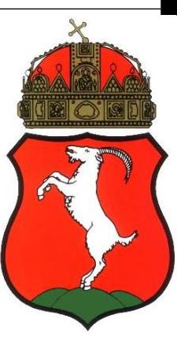

## Az ellenőrzés társadalmi indokoltsága

Magyarországon az intézmény-centrikus közfeladat-ellátás jellemző, de egyre jelentősebb a költségvetésen kívüli feladatellátás térnyerése. Ennek legfontosabb szereplői - a nonprofit szervezetek mellett - az önkormányzati tulajdonú gazdasági társaságok. A közfeladatot ellátó gazdasági társaságok ellenőrzése kiemelten fontos a vagyon megőrzése, megóvása érdekében, valamint a kormányzati szektor elszámolásaiban megjelenő önkormányzati tulajdonú gazdálkodó szervezetek esetében, amelyekkel szemben alapvető követelmény, hogy gazdálkodásuk, működésük szabályszerű, az általuk szolgáltatott adatok minél megbízhatóbbak legyenek. A közfeladat ellátás költségeinek, ráfordításainak alakulása, színvonala hatással van a lakosság elégedettségére.

A jelentés feltárja, hogy az önkormányzat közfeladat-ellátási kötelezettségének szabályszerűen tett-e eleget, a feladatellátáshoz rendelt közvagyon múködtetését szabályszerűen szervezte-e meg és a tulajdonosi felügyelete hozzájárult-e a közfeladat-ellátásához. A feladatot ellátó gazdasági társaság a közszolgáltatási szerződésben foglaltak betartásával, a közvagyon használatával biztosította-e a szolgáltatás folytatásának feltételeit.

A törvényalkotás számára - az észlelt problémák, szabálytalanságok, vagy egyéb nem kívánatos jelenségek felszínre kerülésével - az ellenőrzés megállapításai segítséget nyújthatnak az államháztartáson kívüli közfeladat-ellátás értékeléséhez, jogszabályi keretei pontosításához, átláthatóságot biztosító szabályozásához.

Fokozza a fegyelmet, igazolja, hogy lejárt a következmények nélküli ellenőrzések időszaka. Az ÁSZ értékteremtő rend kialakításához és megőrzéséhez hozzájáruló tevékenysége pozitív hatással van a szervezetről kialakított összkép formálására is.

## Főbb megállapítások, következtetések, javaslatok

A távhőszolgáltatás közfeladatának megszervezéséről az Önkormányzat a jogszabályokban foglaltaknak megfelelően döntött. A tulajdonosi jogok gyakorlása szabályszerű volt.

A Közszolgáltatási szerződésben szabályozott követelmények betartását a tulajdonosok figyelemmel kísérték, a teljesítésről beszámoltatták a Társaságot, a szerződés aktualizálása azonban elmaradt. A Társaság a gazdálkodásról a féléves és éves beszámolók keretében valamint a havi operatív jelentésekben adott számot. A taggyűlés minden évben elfogadta a Társaság által elkészített, a felügyelőbizottság által előzetesen megtárgyalt, könyvvizsgáló és a Költségvetési és a Vagyongazdálkodási Bizottság, vagy Városstratégiai és Pénzügyi Bizottság véleményével ellátott üzleti terveket és beszámolókat.

A tulajdonosi jogok gyakorlója minden évben a mérleg szerinti nyereség osztalékként történő kifizetéséről taggyűlési határozatban döntött a mérleg elfogadásával egyidejűleg. Az ellenőrzött időszakban a kifizetett osztalék 345,2 M Ft volt. Ebből az Önkormányzat 239,9 M Ft osztalékban részesült, ami a befektetett tőke közel egyharmada.

A Társaság vagyongazdálkodása szabályszerű volt, kötelezettség állománya nem jelentett kockázatot a múködésre és a közfeladat ellátására.

---

A Társaság rendelkezett a számviteli, az ágazati jogszabályokban és a társasági szerződésben meghatározott szabályzatokkal, ezek aktualizálása az SZMSZ, az Üzletszabályzat és a Bizonylati szabályzat kivételével megtörtént, továbbá a bevételek, a ráfordítások és a vagyonelemek elkülönített nyilvántartása megfelelt a jogszerű múködés követelményének.

A Társaság vagyongazdálkodási tevékenysége a jogszabályi rendelkezéseknek és a belső előírásoknak megfelelt. A közfeladat ellátása során a vagyonérték-megőrzése, gyarapítása, hasznosítása a jogszabályi előírások, illetve a köz-feladat-ellátási szerződésben megfogalmazott követelmények szerint történt. A Társaság a közvagyont érintő fejlesztéseket minden esetben tulajdonosi hozzájárulással valósította meg.

A Társaság beszámolási és tájékoztatási kötelezettségét a jogszabályi előírásoknak és a tulajdonosi elvárásoknak megfelelően szabályozta és teljesítette. A közvagyonnal kapcsolatos adatok védelmére és nyilvánosságra hozatalára vonatkozó előírásoknak megfelelt.

A mintavételes ellenőrzés tapasztalatai alapján a Társaság bevételeinek elszámolását megfelelőnek, az anyagjellegú ráfordítások elszámolását, valamint a beruházások, felújítások elszámolását kockázatosnak értékeltük.

Az eszközpótlás - köszönhetően a 2013. évi távvezeték beruházásnak - összességében megfelelő volt, összegük 19,3 \%-kal meghaladta a tárgyévekben elszámolt értékcsökkenések összegét. A hátralékos állomány kezelésének szabályozása és gyakorlata megfelelő volt.

Az önköltségszámítás és az árképzés megfelelt a jogszabályoknak és a belső előírásoknak. Az önköltségszámítás és szétválasztás szabályozása megfelelő volt. A távhőszolgáltatási árak meghatározása összhangban volt az előírásokkal, a Társaság a díjtételek alkalmazása során betartotta ezeket.

A gazdálkodás szabályszerűségének javítása érdekében a társaság ügyvezető igazgatójának három, az Önkormányzat szabályszerű működésének elősegítése, továbbá az önkormányzati tulajdonosi joggyakorlás kontrolljainak erősítésére Kecskemét Megyei Jogú Város polgármesterének egy javaslatot tett az ÁSZ.

A jelentésben szereplő javaslatok alapján a társaság ügyvezető igazgatója, valamint Kecskemét Megyei Jogú Város polgármestere kötelesek intézkedési terveket összeállítani és azokat a jelentés kézhezvételétől számított 30 napon belül az ÁSZ részére megküldeni.

---

# AZ ELLENŐRZÉS CÉLJA 

## A Társaság közfeladat-ellátását érintő gazdálkodási tevékenysége szabályszerűségének értékelése

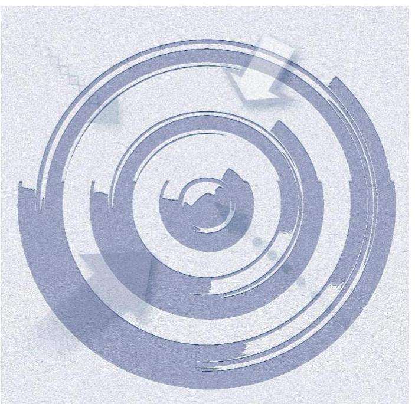

Az önkormányzat a jogszabályi előírások figyelembevételével döntött-e az ellenőrzésre kerülő közfeladat megszervezéséről; az önkormányzat/tulajdonosi joggyakorló szabályszerűen gyakorolta-e a tulajdonosi jogokat. A gazdasági társaság közfeladat-ellátása bevételeinek, ráfordításainak elszámolása, és vagyongazdálkodási tevékenysége megfelelt-e a jogszabályi, illetve a közszolgáltatási/vagyonkezelési szerződésben foglalt tulajdonosi előírásoknak, azok végrehajtása szabályszerű volt-e; a gazdasági társaság kötelezettségállománya jelent-e kockázatot a múködésre, illetve a közfeladat ellátására; a közfeladatok átláthatósága és elszámoltathatósága érdekében biztosítva volt-e a közszolgáltatás díjának megalapozottsága szabályszerű önköltségszámítással.

---

# AZ ELLENŐRZÉS TERÜLETE 

## Kecskemét Megyei Jogú Város Önkormányzata és a többségi tulajdonában lévő Kecskeméti Termostar Höszolgáltató Kft.

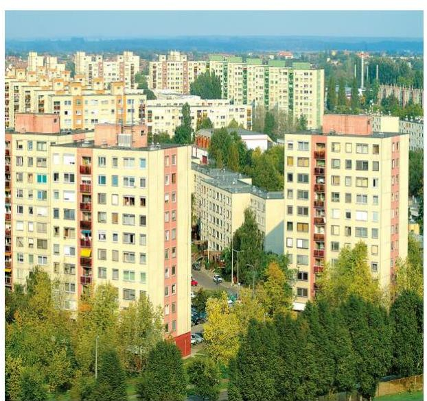

Kecskemét a Duna-Tisza közi Homokhátság közepén, Budapest és Szeged között, a Kelet-Nyugat, illetve az Észak-Dél irányú fő közlekedési utak kereszteződésében helyezkedik el. Területe 321,4 km² a 2010. évi népszámlálási adatok alapján a város lakossága 111.679 fő, a lakások száma 45.320 volt.

A Termostar Kft. 1993-ban alakult a Kecskeméti Ingatlankezelő és Távfűtő Vállalat távfűtési üzeméből, amely 1995-ben egyesült a Délmagyarországi Áramszolgáltató Részvénytársaság tulajdonában álló Kecskeméti Hőszolgáltató Kft.-vel. A cég neve 2005. október 1-jétől Kecskeméti Termostar Hőszolgáltató Kft. ${ }^{1}$ A megalakulás óta változatlan a jegyzett tőke (1.114,1 M Ft), valamint a 69,5 \%-os meghatározó befolyást biztosító Önkormányzati² és a 30,5 \%-os mértékadó befolyást jelentő EDF DÉMÁSZ Zrt. tulajdoni arány. A Termostar Kft. kizárólagos tulajdonosa volt a Hírös Zöld Energia Kft.-nek.

A Társaság rendelkezik a hőtermelés és szolgáltatás végzéséhez szükséges hatósági engedélyekkel, főtevékenysége TEÁOR besorolás szerint gőzellátás, légkondicionálás. A Kft. a szolgáltatott hőt 100\%-ban saját berendezésekkel állítja elő és továbbítja, 84\%-át lakossági fogyasztóknak, 10\%-át állami vagy önkormányzati intézményeknek, $6 \%$-át egyéb közületi felhasználóknak értékesíti. A távfűtésnél és háztartási meleg víz ellátásnál 56\%-ban biztosított a fogyasztónkénti egyedi mérés.

A Társaság tulajdonában álló műszaki berendezések biztosítják a város 1/3-ának környezetbarát távfűtéssel és használati meleg vízzel való ellátását, továbbá képes a város villamos energia szükséglete 1/5-e kielégítésére.

A Társaság 2014-ben 354. 343 GJ $^{3}$ hőt, 14.134 MWh $^{4}$ villamos energiát és $301.203 \mathrm{~m}^{3}$ használati meleg vizet értékesített, ezzel 11.645 lakossági, 213 egyéb felhasználó fűtését és 10.418 fogyasztó használati meleg vizét biztosította. 2014-ben az összes bevétel 2.977,9 M Ft volt, 54,4\%-a alaptevékenységből, 9,9\%-a villamos energia értékesítésből származott.

A Társaság minden évben nyereséges volt, ezt osztalékként kifizetette a tulajdonosoknak. Az eszközpótlás összességében meghaladta az elszámolt értékcsökkenést.

A Társaság múködésének főbb jellemzőit a II. melléklet mutatja be.
Az ügyvezető igazgató és a gazdasági igazgató személye nem változott az ellenőrzött időszakban. Az ügyvezető igazgató 2008. október 15. óta, a gazdasági igazgató 1993. október 1. óta tölti be tisztségét. A polgármester és a jegyző személye egy alkalommal változott. A jelenlegi polgármester a 2014. évi helyi önkormányzati választások óta tölti be tisztségét, a helyszíni

---

ellenőrzés időszakában a munkakört betöltő jegyző 2013. február 7-től látja el feladatait.

A jelentésben használt fogalmak meghatározását a I. melléklet tartalmazza.

---

# AZ ELLENŐRZÉS HÁTTERE, INDOKOLTSÁGA 

Objektív vélemény kialakítása Kecskemét Megyei Jogú Város távhőszolgáltatási tevékenységét ellátó Kecskeméti Termostar Hőszolgáltató Kft. vagyongazdálkodása a bevételek és ráforditások elszámolása, az önköltségszámitás valamint a meghatározó befolyással biró Önkormányzat tulajdonosi joggyakorlása szabályszerűségéről.

## A távhő szolgáltatás költségvetésen kívüli közfeladat ellátás

AZ ÁSZ STRATÉGIÁJÁBAN megfogalmazta, hogy a helyi önkormányzatok gazdálkodásában rejlő pénzügyi kockázatok feltárásával, az államháztartáson kívülre nyújtott költségvetési támogatások és ingyenes vagyonjuttatások, valamint az államháztartáson kívül múködő közfeladatellátó rendszerek ellenőrzéseivel hozzájárul ahhoz, hogy a közpénzeket az államháztartáson kívül múködő szervezetek is átlátható, rendezett módon használják fel a közfeladatok szerződésben vállalt ellátása érdekében.

Az Áht. 1. § (3) bekezdése értelmében az államháztartáson kívüli szervezetek a közfeladatok ellátásában - jogszabályban meghatározott feltételekkel - közremúködhetnek. Az önkormányzati tulajdonú gazdasági társaságok teljes körű ellenőrzésének lehetőségét az Állami Számvevőszékről szóló 1989. évi XXXVIII. törvény 2011. január 1-jétől hatályos módosítása teremtette meg. A gazdasági társaságok közfeladat ellátását érintő gazdálkodási tevékenysége szabályszerűségére irányuló ellenőrzéseket erre tekintettel a 2011. évtől végezzük.

## AZ ELLENŐRZÉS VÁRHATÓ HASZNOSULÁSA-

KÉNT az ÁSZ a megállapításaival segítséget nyújthat az államháztartáson kívüli közfeladat-ellátás értékeléséhez, jogszabályi keretei pontosításához, átláthatóságot biztosító szabályozásához. Meghatározhatóvá válnak a közfeladat ellátásban részt vevő államháztartáson kívüli szervezeteknek az önkormányzat költségvetését, pénzügyi helyzetét is befolyásoló - kockázatai, lehetővé válik ezen kockázatok csökkentése.

Értékelhetővé válik, hogy a feladatot ellátó gazdasági társaság a közszolgáltatási szerződésben foglaltak betartásával, a közvagyon használatával biztosította-e a szolgáltatás folytatásának feltételeit. Ezzel az ellenőrzöttek és a helyi döntéshozók számára az ÁSZ visszajelzést ad feladatszervezési, feladat-ellátási kockázataikról, alapot ad a meglévő hibák megszüntetéséhez, a jobb közfeladat-ellátás biztosításához. Mindezeken keresztül az ÁSZ hozzájárul Magyarország közpénzügyi helyzetének javításához, a közpénzek mérhető módon történő, a döntéshozók által meghatározott célok szerinti felhasználásához.

---

# FÓKUSZKÉRDÉSEK 

1. Az önkormányzat közfeladat megszervezéséről szóló döntése, valamint tulajdonosi joggyakorlása szabályszerű volt-e?
2. A gazdasági társaság vagyongazdálkodása szabályszerű volt-e, kötelezettségállománya jelentett-e kockázatot a müködésre illetve a közfeladat ellátására?
3. A gazdasági társaságnál az ellátott közfeladat bevételei és ráfordításai elszámolása, valamint az önköltségszámítás és árképzés szabályszerű volt-e?

---

# ELLENŐRZÉS HATÓKÖRE ÉS MÓDSZEREI 

## Az ellenőrzés típusa

Megfelelőségi ellenőrzés

## Az ellenőrzött időszak

2011 - 2014. évek

## Az ellenőrzés tárgya

Az ellenőrzés tárgya annak megállapítása, hogy az önkormányzat közfel-adat-ellátási kötelezettségének szabályszerűen tett-e eleget, a feladatellátáshoz rendelt közvagyon múködtetését szabályszerűen szervezte-e meg és a tulajdonosi felügyelete hozzájárult-e a közfeladat-ellátásához. A feladatot ellátó gazdasági társaság a közszolgáltatási szerződésben foglaltak betartásával, biztosította-e a szolgáltatást valamint vagyongazdálkodása bevételeinek és ráfordításainak elszámolása szabályszerű és átlátható volte.

## Az ellenőrzött szervezet

Az ellenőrzött szervezetek:
$\longrightarrow$ Kecskemét Megyei Jogú Város Önkormányzata
$\longrightarrow$ Kecskeméti Termostar Hőszolgáltató Kft.

## Az ellenőrzés jogalapja

az Állami Számvevőszékről szóló 2011. évi LXVI. törvény 5. § (3)-(4)-(5) bekezdései

## Az ellenőrzés módszerei

Az ellenőrzést a nemzetközi standardokat irányadónak tekintve az ellenőrzési program ellenőrzési kérdései, az ellenőrzött időszakban hatályos jogszabályok, az ellenőrzés szakmai szabályok és módszertanok figyelembe vételével végezzük.

Az ellenőrzés ideje alatt az ellenőrzött szervezettel történő kapcsolattartást az ÁSZ Szervezeti és Múködési Szabályzatának vonatkozó előírásai alapján biztosítjuk.

---

Az ellenőrzés a kiválasztott, többségi tulajdonosi jogokat gyakorló önkormányzatra, illetve az ellenőrzésre kijelölt közfeladatot ellátó gazdasági társaság felett tulajdonosi jogokat gyakorló szervezetre és az ellenőrzött közfeladatot ellátó gazdasági társaságra terjed ki. Amennyiben a gazdasági társaságban több önkormányzat együttesen többségi tulajdonos, úgy az ellenőrzést a többségi tulajdonosi jogokat gyakorló önkormányzatnál kell lefolytatni. Az ellenőrzött gazdasági társaságnál, amennyiben az több közfeladatot is ellát, akkor az ellenőrzésre kiválasztott közfeladat-ellátást ellenőrizzük.

Az ellenőrzést a kérdésekre adott válaszok kiértékelésével, valamint a megjelölt adatforrások, a csatolt tanúsítványok felhasználásával, továbbá az adott időszakban hatályos jogszabályok figyelembe vételével kell lefolytatni. Az ellenőrzési kérdések megválaszolásához szükséges bizonyítékok megszerzése a következő ellenőrzési eljárások alkalmazásával történik: megfigyelés, kérdésfeltevés (információkérés), összehasonlítás, valamint elemző eljárás.

A bevételek és ráfordítások elszámolása, valamint a vagyonnyilvántartás terén a szabályszerű működést mintavétellel ellenőriztük, ez alapján a sokaságokban előforduló hibás tételek arányát becsültük. A jogszabályoknak és a belső előírásoknak megfelelőnek tekintettük az adott területet, amennyiben a minta ellenőrzésének eredménye alapján 95\%-os bizonyossággal a teljes sokaságban a hibaarány kisebb volt, mint 10\%, nem megfelelőnek értékeltük, ha a hibaarány a 10\%-ot meghaladta. Kockázatot, illetve magas kockázatot jeleztünk, amennyiben egy adott terület vonatkozásában a minta alapján a teljes sokaságban nem volt teljes körűen biztosított a jogszabályoknak és a belső szabályzatoknak megfelelő működés.

---

# 1. Az önkormányzat közfeladat megszervezéséről szóló döntése, valamint tulajdonosi joggyakorlása szabályszerű volt-e? 

Összegző megállapítás

A közfeladat-ellátás megszervezéséről szóló önkormányzati döntés és a tulajdonosi jogok gyakorlása szabályszerű volt.

### 1.1. számú megállapítás

A közfeladat-ellátás megszervezésére vonatkozó önkormányzati döntés és annak előkészítése szabályszerű volt.

## AZ ÖNKORMÁNYZAT GAZDASÁGI PROGRAMJÁT

és vagyongazdálkodási tervét elkészítette. Az Ötv. ${ }^{5}$ 91. § (6) bekezdésben és az Mötv. ${ }^{6} 116$ § (1) bekezdésben előírtaknak megfelelően megalkotta a 2007-2013. valamint 2013-2014. évekre vonatkozó gazdasági programját, amely programok tartalmazták a Társaság távhőszolgáltatásával kapcsolatos fejlesztési elképzeléseket, terveket. Az Önkormányzat Közgyűlése a 462/2006. (VI.28.) KH. ${ }^{7}$-val elfogadta Kecskemét város Gazdasági programját a 2007-2013-as évekre. Az Ötv. 91. § (6)-(7) bekezdéseiben foglaltak szerint a gazdasági programot felülvizsgálták, és a 363/2012. (XII.13.) KH.val elfogadták a 2013-2014. évre vonatkozó módosított Gazdasági Programot. A Közgyűlés 271/2008. (VI.24.) KH.-val fogadta el Kecskemét Megyei Jogú Város Integrált Városfejlesztési Stratégiáját, melyet az 533/2008. (XII.18.) KH.-val, majd 364/2012. (XII.13.) KH.-val módosított. A dokumentum kitért a távhőszolgáltatás megfelelő színvonalú biztosítására a területre vonatkozó fejlesztési elképzelésekre.

Az Önkormányzat a Vagyon tv. ${ }^{8}$ 9. § (1) bekezdés szerint megalkotta és a 151/2013. (VI.27.) KH-val elfogadta Közép- és hosszú távú vagyongazdálkodási tervét.

## A TÁRSASÁGI FORMÁBAN TÖRTÉNŐ KÖZFEL-

ADAT-ELLÁTÁS megszervezése szabályszerű volt. A közfeladat-ellátás megszervezéséről szóló döntés előkészítése és a döntés megfelelt az Ötv. 9. § (4) bekezdésében, illetve az Mötv. 41. § (6) bekezdésében foglalt előírásoknak. A közfeladat ellátása és annak választott módja szerepel az Önkormányzat SZMSZ ${ }_{1,2}{ }^{910}$-ében.

A Közszolgáltatási szerződés előkészítése, jóváhagyása és megkötése szabályszerű volt. A Közgyűlés 113/2010. (III.25.) KH.-val a közszolgáltatási szerződést elfogadta és felhatalmazta a polgármestert annak aláírására. Az Önkormányzat és a Társaság - mint közszolgáltató - képviselői megkötötték a közszolgáltatási szerződést 2010. április 1. napjától 2018. december 31. napjáig terjedő határozott időtartamra.

A Közszolgáltatási szerződést az abban hivatkozott jogszabályok (Tszt., miniszteri rendeletek) változásának megfelelően az ellenőrzött időszakban nem módosították, aktualizálták.

---

A Társaság a távhőszolgáltatási tevékenység ellátásához szükséges, a Tszt. 14. - 18. §-okban meghatározott engedélyekkel rendelkezett. Az Önkormányzat az ellátandó közfeladatot és követelményeit a Közszolgáltatási szerződésben és a Távhőrendeletben ${ }^{11}$ szabályozta, figyelemmel a tevékenységgel kapcsolatos a Tszt. ${ }^{12}$-ben és a Tszt. Vhr. ${ }^{13}$-ben, mint ágazati jogszabályokban meghatározott követelményekre.

Az Önkormányzat ellenőrzési és beszámolási kötelezettséget a Társasági szerződésben (10.3. pont) és a Közszolgáltatási Szerződésben (3, 8, 9, 10 pontok) rögzítette.

A TÁVHŐRENDELETET az Önkormányzat a Tszt. 6. § (2) bekezdésében rögzítetteknek megfelelően megalkotta. Kecskemét Megyei Jogú Város Közgyűlése 2007-ben adta ki az ellenőrzött időszakban hatályban lévő Távhőrendeletét, amely rendelet árképzésre vonatkozó rendelkezéseket is tartalmazott. A rendeletet az ellenőrzött időszakban a Közgyűlés egy alkalommal, a 40/2011 (XI.24.) sz. rendelettel módosította. A rendeletmódosítást aTszt. módosítása indokolta, miszerint 2011. október 1. napjától kezdődően az önkormányzatnak megszűnt a távhőszolgáltatás dijának megállapítására vonatkozó feladata.

# A KÖZFELADAT ELLÁTÁSÁT SZOLGÁLÓ 

VAGYONT az Önkormányzat apport formájában biztosította. A Társaság létrehozásáról Kecskemét Megyei Jogú Város Közgyűlése 612/1995. (IX.13.) KH. határozatával döntött. A döntés alapján a közfeladat ellátásához szükséges vagyon apportként a Társaság tulajdonába került, vagyont nem kezelt.

Az Önkormányzat 69,5 \%-os meghatározó befolyást biztosító 774,3 M Ft tulajdonrésszel rendelkezett a Társaság jegyzett tőkéjéből. A 2014. év végén a Társaság saját tőkéje 1.894,1 M Ft volt, ebből az Önkormányzati tulajdonrész 1.316,4 M Ft ami a befektetett tőke 70,0\%-os növekedését mutatja.

### 1.2. számú megállapítás

A tulajdonosi jogok gyakorlása szabályszerű volt.

## AZ ÖNKORMÁNYZAT TULAJ DONOSI JOGGYAKORLÁSÁT az SZMSZ ${ }_{1,2}$, valamint a többször módosított Társasági szerződés szabályozta.

A 2011. január 1. és 2013. február 14. közötti időszakban - az SZMSZ ${ }_{1}$ 2. § (7) bekezdés és a 2. számú melléklet 2.1.4. pont szerint - a KVB ${ }^{14}$ volt jogosult dönteni féléves és éves beszámolójának, közhasznúsági mellékletének, üzleti tervének, szervezeti és múködési szabályzatának, valamint a felügyelő bizottság ügyrendjének elfogadásáról. 2013. február 15-től az ellenőrzött időszak végéig ugyanezen jogosítványok - az SZMSZ ${ }_{2}$ 49. § (1) bekezdés c) pontjának cc) alpontja és a 2. melléklet 2.1.3. pontja szerint a $\mathrm{VPB}^{15}$-t illeték. Az SZMSZ ${ }_{1,2}$ 3. melléklet 1.57. pontja szerint a polgármester ellátja az Önkormányzat képviseletét a nem kizárólagos önkormányzati tulajdonú gazdasági társaságok legfőbb szerveinek ülésein. A tulajdonosi jogok gyakorlása megfelelt a jogszabályban és a belső szabályzatokban rögzített követelményeknek.

A tulajdonosi joggyakorlók a Gt. ${ }^{16}$ 19. és 20. §-ok és a Ptk. ${ }^{17} 3: 74$ § tulajdonosi joggyakorlásra vonatkozó általános szabályait alkalmazták és a

---

1. táblázat

| A TÁRSASÁGNÁL VÉGZETT KÜLSŐ |  |  |
| :--: | :--: | :--: |
| ELLENÖRZÉSEK (db) |  |  |
| Év | Külső ellenőrzés száma | Hiányosságot feltáró ellenőrzés száma |
| 2011. | 8 | X |
| 2012. | 6 | 2 |
| 2013. | 9 | 3 |
| 2014. | 9 | 2 |

Tárrás: ellenőrzött adatszolgáltatása többször módosított Társasági szerződés 9.3. pontban rögzítették a Taggyűlés ${ }^{18}$ hatáskörébe tartozó kizárólagos döntési jogokat. Ezek közé tartozott az ügyvezető, könyvvizsgáló, FB tagjainak megválasztása, visszahívása díjazásuk megállapítása, az ügyvezető tekintetében a munkáltatói jogok gyakorlása. A Taggyűlés döntött az FB javaslata alapján az érdekeltségi rendszer kialakításáról, a Vezetői javadalmazási szabályzat elfogadásáról és módosításáról, valamint az ügyvezető prémium feltételeiről és ezek teljesítése esetén a kifizetés mértékéről.

A közszolgáltatási szerződés 9.1. a) pontjában a felek rögzítették, hogy a távhő termelésére és szolgáltatására vonatkozó árak (díjak) megállapítására a Tszt. 57-57/C §-iban foglaltak az irányadók. A szerződés tárgya szerinti közszolgáltatáson belül a hatósági ármegállapítás hatálya alá nem tartozó, közüzemi szerződés alapján végzett közszolgáltatás árát a Társaság a Tszt. 57. § (2) bekezdésében meghatározott elvek szerint, a közszolgáltatási szerződésben rögzített felhatalmazás alapján, saját hatáskörben volt jogosult megállapítani.

A Közszolgáltatási szerződésben szabályozott követelmények betartását a tulajdonosok figyelemmel kísérték, a teljesítésről beszámoltatták a Társaságot. A Vagyonrendelet: 7. § (7) bekezdése, valamint a Vagyonrendelet: 20. § (2) bekezdése előírta a Társaság vezető tisztségviselőjének, hogy az Önkormányzatot évente két alkalommal köteles tájékoztatni az általa képviselt gazdasági társaság müködéséről.

A Társaság a gazdálkodásról a féléves és éves beszámolók keretében valamint a havi operatív jelentésekben adott számot. A beszámoltatási rendszert úgy alakították ki, hogy a Társaság gazdálkodásáról, tevékenységéről a Taggyűlés döntését megelőzően az FB. és a KVB., illetve a VPB. is véleményt alkotott. A Taggyűlés minden évben elfogadta a Társaság által elkészített, a felügyelőbizottság által előzetesen megtárgyalt, könyvvizsgáló és a KVB. vagy VPB. véleményével ellátott üzleti terveket és beszámolókat. A Közszolgáltatási szerződés 3.3. alapján a Társaság évente vevő-elégedettségi felmérést végzett, ennek eredményéről az éves, valamint féléves gazdálkodásáról szóló beszámolója keretében adott számot.

AZ ÖNKORMÁNYZAT BELSŐ ELLENŐRZÉSE egy alkalommal, 2012-ben ellenőrizte a Társaságot. Az ellenőrzés a 2011. évben rendelkezésre álló erőforrásokkal való gazdálkodást, valamint a pénzügyiszámviteli folyamatok megbízhatóságát és szabályszerűségét vizsgálta és kisebb szabályozási és nyilvántartási hibákat tárt fel.

Az ellenőrzés során feltárt hiányosságok megoldására tett javaslatok figyelembevételével a Társaság ügyvezető igazgatója Intézkedési tervet (11/2012. Ügyvezetői utasítás) készített a végrehajtandó feladatokról, amelyek megvalósítását követően beszámolt az Önkormányzat felé a megtett intézkedésekről.

A Társaságot 2011-2014. években 32 külső, szakhatósági szervek által végrehajtott ellenőrzés érintette, ezek 7 esetben tártak fel kisebb hiányosságot (1. táblázat).

## A TULAJDONOSOK OSZTALÉK KIFIZETÉSÉRŐL

szabályszerűen döntöttek. A tulajdonosi jogok gyakorlója minden évben a mérleg szerinti nyereség osztalékként történő kifizetéséről taggyűlési ha-

---

tározatban döntött a mérleg elfogadásával egyidőben. Az ellenőrzött időszakban a kifizetett osztalék 345,2 M Ft volt. Ebből az Önkormányzat 239,9 M Ft osztalékban részesült, ami a befektetett tőke közel egyharmada.

# 2. A gazdasági társaság vagyongazdálkodása szabályszerű volt-e, kötelezettségállománya jelentett-e kockázatot a múködésre illetve a közfeladat ellátására? 

Összegző megállapítás

A Társaság vagyongazdálkodása szabályszerű volt, kötelezettség állománya nem jelentett kockázatot a múködésre és a közfeladat ellátására.
2.1. számú megállapítás

A Társaság rendelkezett a számviteli, az ágazati jogszabályok és a társasági szerződésben meghatározott szabályzatokkal, ezek aktualizálása egyes esetekben azonban elmaradt.

A TÁRSASÁG STRATÉGIÁI, ÜZLETI TERVEI az Önkormányzat által jóváhagyott gazdasági programokkal és cselekvési tervekkel valamint az Önkormányzat Távhő rendeletével összhangban készültek. Az üzleti terv készítésének kötelezettségét a Közszolgáltatási szerződés is rögzítette. A Társaság üzleti tervét minden évben határidőre elkészítette, az üzleti terv megfelelt a tulajdonosi jogkört gyakorló Önkormányzat távhőszolgáltatásra vonatkozó elvárásainak. A Társaság stratégiáit és üzleti terveit taggyúlési határozatokkal fogadták el.

Az üzleti tervek kitértek a város levegőtisztasági, klímavédelmi céljaiból és a szükséges energiagazdálkodási infrastruktúra fejlesztésére vonatkozó feladatokból a Társaságra vonatkozó követelményekre. Kitértek továbbá a megújuló hőforrások rendszerbe integrálásának lehetőségeire, a geotermikus energia hasznosításának vizsgálatára, a szolgáltatói és fogyasztói fütési rendszerek energiatakarékosságot szolgáló lehetséges fejlesztéseire, valamint az iparosított technológiájú lakóépületek fütési rendszereinek energiatakarékos felújítására, korszerűsítésére. Kitértek a pénzügyi célokra, a folyamatos likviditás és fejlesztési források biztosításának lehetőségeire. Meghatározták a műszaki, a szolgáltatási és a gazdálkodási terveket (bevételeket, ráfordításokat, eredménykimutatás terv, pénzügyi és a vagyoni helyzet alakulását, mérlegterv, cash-flow terv formájában, továbbá a gazdálkodás és minőségi szolgáltatás, a humánerőforrás, tervét). Külön fejezetben részletezték a karbantartási feladatokat és a beruházási, műszaki fejlesztési projekteket, bemutatva azok indokoltságát, a tervezett költségkereteket, a befejezési határidőt, továbbá a kockázati tényezőket és azok kezelésének lehetőségeit.

AZ ALKALMAZOTT SZABÁLYZATOK biztosították a Társaság jogszabályoknak és helyi sajátosságoknak megfelelő működését. A belső szabályozás a társasági szerződés erre vonatkozó külön előírása hiányában ügyvezetői hatáskörben valósult meg.

A Társaság rendelkezett a Számv. tv. ${ }^{19}$ 14. § (3) és (5) bekezdéseiben, a Tszt. 18/A. § (2) bekezdésében, valamint a többször módosított társasági szerződésben előírt szabályzatokkal. Az SZMSZ-ét és az Üzletszabályzatot

---

azonban - a bekövetkezett változásokkal összhangban - nem aktualizálták. Az SZMSZ-ben nem aktualizálták az ügyvezető igazgató megbízatásának végső időpontját, így abban 2013. október 14-e szerepelt annak ellenére, hogy azt 2018-ig meghosszabbították. Az Üzletszabályzaton a Tszt. 2011. évi változásait nem vezették át. A Bizonylati szabályzatot (mely tartalmában a Számv. tv. 161. § (2) bekezdés d) pontjában rögzített bizonylati rendnek felelt meg) a 2010-től használt, integrált vállalatirányítási rendszer bizonylataival összhangban nem módosították a Számv. tv. 161. § (4) bekezdésében foglalt előírás ellenére. A Társaság egyéb szabályzatait a jogszabályok változásának megfelelően aktualizálta.

A Számviteli politika ${ }_{1,2}{ }^{20}$ a Számlarend ${ }_{1,2}{ }^{21}$ tartalmazta főkönyvi számlánként elkülönítve a közfeladat ellátás bevételeit és ráfordításait. Az Önköltségszámítási és számviteli szétválasztási szabályzat ${ }_{1,2}{ }^{22}$ előírta a közfeladat ellátással kapcsolatos elszámolások, bevételek, ráfordítások elkülönített nyilvántartását a számlarendben leírt tevékenységekre bontással.

A közfeladat ellátással kapcsolatos elszámolások és a vagyonelemek elkülönítése a vizsgált időszak minden évében megtörtént. A Társaság saját vagyonát, annak értékét és változásait a Számlarend ${ }_{1,2}$-ben foglaltak alapján tartotta nyilván, amely megfelelt a Számv. tv. 161.§ (1) és (2) bekezdései előírásainak. A Számv. tv. 14.§ (5) bekezdés a) pontjában előírtaknak megfelelő leltározási szabályzatban meghatározottak szerint végezte a leltározást. A beszámolóban és a számviteli nyilvántartásokban lévő vagyontárgyak állományát szabályszerűen elkészített leltárral alátámasztották.

# 2.2. számú megállapítás 

## A vagyongazdálkodás a jogszabályi rendelkezéseknek és a belső előírásoknak megfelelt.

A TÁRSASÁG VAGYONNYILVÁNTARTÁSA szabályszerű volt. A Társaság a távhőszolgáltatási közfeladat ellátást szolgáló vagyon állományba vételi, nyilvántartási és elszámolási kötelezettségét teljesítette, eljárása alapvetően megfelelt a jogszabályi előírásoknak és a belső szabályozásnak.

A Társaság saját vagyonával kapcsolatos állományba vételi kötelezettségének a Számv. tv. 23. § (1) bekezdésének megfelelően eleget tett. A közfeladat-ellátást szolgáló vagyonnal kapcsolatos változások az ellenőrzött időszakban a Számviteli politika ${ }_{1,2}$ és az Önköltségszámítási és számviteli szétválasztási szabályzat ${ }_{1,2}$ előírásainak megfelelően elkülönülten kerültek rögzítésre. A saját vagyonát, annak értékét és változásait az éves beszámoló készítését biztosító Számlarendben ${ }_{1,2}$-ben foglaltak alapján tartotta nyilván, amely megfelelt a Számv. tv. 161. § (1) és (2) bekezdései, valamint a 161/A. § (1) bekezdése előírásainak.

Az Önkormányzat Vagyonrendeletének 20. § (2) bekezdése előírta, hogy a többségi tulajdonú gazdasági társaságok vezető tisztségviselői az Önkormányzatot évente két alkalommal - április 15-ig valamint augusztus 15-ig - kötelesek tájékoztatást adni az általuk képviselt gazdasági társaság múködéséről. Az előírásnak a Társaság eleget tett.

A TÁRSASÁG VAGYONGAZDÁLKODÁSÁNAK és nyilvántartásának gyakorlata megfelelt a jogszabályi és tulajdonosi rendelkezéseknek. A Számv.tv. 14.§ (5) bekezdés a) pontjában előírtaknak megfelelő leltározási szabályzatban meghatározottak szerint végezték a leltározást. A leltárral való alátámasztás megfelelt a Számv. tv. 69.§-nak.

---

A Társaság a Tszt. 18/A. § (2) és (3) bekezdésében előírt számviteli szétválasztási kötelezettségének 2012. évtől eleget tett, elkészítette a távhő ágazatra vonatkozó mérlegét és eredménykimutatását, amelyeket a beszámolók kiegészítő melléklete tartalmazott.

A Társaság teljes tevékenységére vonatkozó fő mérlegadatok változását az 2. táblázat tartalmazza.
2. táblázat

A TÁRSASÁG FŐBB MÉRLEG ADATAI TELJES TEVÉKENYSÉG (MILLIÓ Ft)

| Mégnevezés | 2011.1.1. | 2011. | 2012. | 2013. | 2014. |
| :--: | :--: | :--: | :--: | :--: | :--: |
| I. Befektetett eszközök | 1734,6 | 1544,6 | 1503,2 | 1928,7 | 1822,1 |
| - ebből: Tárgyi eszközök | 1672,3 | 1488,8 | 1441,2 | 1878,4 | 1796,2 |
| II. Forgó eszközök | 918,7 | 887,2 | 1135,4 | 1225,2 | 1275,2 |
| - ebből: Követelések | 531,5 | 617,4,0 | 678,5 | 818,5 | 677,7 |
| III. Aktív időbeli elhatárolások | 34,4 | 269,0 | 216,9 | 12,6 | 15,3 |
| Eszközök összesen | 2687,7 | 2700,8 | 2855,5 | 3166,5 | 3112,6 |
| IV. Saját tőke | 1894,1 | 1894,1 | 1894,1 | 1894,1 | 1894,1 |
| - ebből: Jegyzett tőke | 1114,1 | 1114,1 | 1114,1 | 1114,1 | 1114,1 |
| - ebből: Mérleg szerinti eredmény | 84,3 | $X$ | $X$ | $X$ | $X$ |
| V. Céltartalékok | 194,9 | 106,7 | 131,5 | 91,4 | 112,2 |
| VI. Kötelezettségek | 504,8 | 562,0 | 594,2 | 528,7 | 457,1 |
| VII. Passzív időbeli elhatárolások | 93,9 | 138,0 | 235,7 | 652,3 | 649,2 |
| Források összesen | 2687,7 | 2700,8 | 2855,5 | 3166,5 | 3112,6 |

A TÁVHŐSZOLGÁLTATÁSHOZ KAPCSOLÓDÓ VAGYON MEGŐRZÉSE, hasznosítása a jogszabályi előírások, illetve a Közszolgáltatási szerződésben megfogalmazott követelmények szerint történt.

A Közszolgáltatási szerződés szerint a közszolgáltató köteles a közszolgáltatás teljesítéséhez szükséges tárgyi eszközöknek a közszolgáltatás folyamatos és biztonságos ellátását biztosító üzemeltetését és karbantartását elvégezni, továbbá köteles legalább a közszolgáltatás ellátását biztosító létesítményekre, eszközökre, berendezésekre vagyonbiztosítást kötni. A Társaság a közszolgáltatás teljesítéséhez szükséges eszközöket folyamatosan karbantartotta, azokra teljes körűen biztosítási szerződést kötött. A vagyon megőrzését és védelmét biztosító előírásokat a Vagyonvédelmi és rendészeti szabályzatban rögzítette, amely 2010. február 23-tól hatályos. További vagyonvédelmi előírásokat tartalmaztak még az évente kiadott Leltározási szabályzat ${ }_{1,2,3,4}{ }^{23}$, a Selejtezési és leértékelési szabályzat ${ }_{1,2,}{ }^{24}$ a Tűzvédelmi szabályzat, a Munkavédelmi szabályzat és a Kritikus infrastruktúra védelmi terv.

A Közszolgáltatási szerződés 7.4. h) pontja szerint a közszolgáltató eszközein nem alapítható olyan teher, amely a kötelezettség teljesítését veszélyezteti. A KEOP pályázatok miatt bejegyzett jelzálogjogok jogosultja a Nemzeti Fejlesztési Ügynökség volt.

A Társaság a közvagyont érintő fejlesztéseket minden esetben tulajdonosi hozzájárulással valósította meg.

---

# 2.3. számú megállapítás 

A Társaság stratégiai és üzleti terveiben külön fejezet foglalkozott a tervezett beruházásokkal, fejlesztésekkel. A hozzájárulás megadása az üzleti terv beruházási terv fejezetében szereplő tételek taggyűlési határozattal történő elfogadásával történt.

## A kötelezettségek állománya nem jelentett kockázatot a közfeladat ellátására és a múködésre.

AZ ELADÓSODOTTSÁG mértéke, szerkezete nem jelentett kockázatot a múködésre. Az eladósodottság mértékét, szerkezetét jellemző mutatók az ellenőrzött években javultak, ezt a 3. táblázat szemlélteti.
3. táblázat

ELADÓSODOTTSÁGI MUTATÓK ALAKULÁSA TELJES TEVÉKENYSÉG (ARÁNY)

| Mutató megnevezése | 2011 | 2012 | 2013 | 2014 |
| :-- | :--: | :--: | :--: | :--: |
| Eladósodottsági mutató | 0,2 | 0,2 | 1,7 | 1,5 |
| Eladósodottság mértéke | 0,3 | 0,3 | 0,3 | 0,2 |
| Adósságfedezeti mutató l. | 4,3 | 4,4 | 6,0 | 6,8 |
| Árbevétel arányos nyereség (\%) | 1,0 | 5,0 | 5,0 | 5,0 |

A Társaság saját tőkéjének jegyzett tőkéhez viszonyított aránya meghaladta a társasági formára kötelezően előírt mértéket, a Társaság minden évben nyereségesen gazdálkodott.

A Társaságnak a 2012. évtől sem hosszú, sem rövid lejáratú kötelezettsége nem állt fenn. A forgóeszköz állománya a vizsgált években meghaladta a kötelezettségek nagyságát, az értékesítés nettó árbevételére vetített aránya kedvezően alakult, a mutató jelentős mértékben csökkent. A szerződésben és jogszabályon alapuló rövid lejáratú kötelezettségek határidőben történő teljesítése biztosított volt. Árfolyam kockázatot jelentett, hogy a bevételek és az energiáért fizetendő ár nem azonos devizanemben volt. Ezt árfolyam kockázati biztosítással csökkentették.

## A Társaság az előírt beszámolási, adatszolgáltatási kötelezettségeit teljesítette.

A BESZÁMOLÁSI ÉS TÁJÉKOZTATÁSI KÖTELEZETTSÉGET a Társaság a tulajdonosi elvárásoknak és a jogszabályi előírásoknak megfelelően szabályozta. Az Önkormányzat a féléves és éves beszámolók tartalmát és formáját, a kisebbségi tulajdonos a havi gyorsjelentések tartalmát meghatározta.

Az ügyvezető igazgató évente a tárgyévet követő év januárjában rendelkezett az éves beszámolóhoz kapcsolódó könyvviteli, zárási, egyeztetési és beszámoló készítési ütemtervről, amelyben az elvégzendő feladatokat, a határidőket és a felelősöket megnevezte.

## A TÁRSASÁG ADATSZOLGÁLTATÁSI KÖTELE-

ZETTSÉGÉNEK eleget tett. A Társaság gazdálkodásáról havi gyorsjelentéseket küldött a tárgyhót követő hónap 15-ig, a Számv. tv., a Tszt., a tulajdonosi elvárások és a Közszolgáltatási szerződés alapján a féléves, éves beszámolókat és üzleti terveket beterjesztette előzetes jóváhagyásra a

---

közgyűlés illetékes bizottságának, az $\mathrm{FB}^{25}$-nek majd az FB határozatokkal együtt határidőre a Tulajdonosoknak.

A KÖNYVVIZSGÁLÓ a Számv. tv. 156. § (1) bekezdése alapján elkészített könyvvizsgálói jelentését az ellenőrzött időszak minden évében eljuttatta az FB tagjai és az ügyvezető igazgató részére. A jelentéseit korlátozás nélküli záradékkal látta el.

A Taggyűlés a Társaság éves beszámolóit a Gt. 35. § (3) bekezdésének megfelelően az FB írásbeli véleményének birtokában, a könyvvizsgáló írásbeli véleményének ismeretében megtárgyalta és elfogadta.

A könyvvizsgáló az éves beszámolót tárgyaló taggyűléseken a Gt. tv. 44.§ (1) bekezdés előírásainak, majd a 2014. március 15-től hatályos Ptk. XX. Fejezet 4. pont 3:131.§ (2) bekezdésnek megfelelően részt vett.

A KÖZVAGYONNAL KAPCSOLATOS ADATOK VÉDELMÉRE ÉS NYILVÁNOSSÁGRA hozatalára vonatkozó előírásokat a Társaság teljesítette.

A közvagyonnal kapcsolatos adatok védelme érdekében nyilatkoztatta az érintett közép és felsővezetőket az üzleti tervben és beszámolókban szereplő adatokra vonatkozó titoktartási kötelezettségről. Rendelkeztek belső adatvédelmi szabályzattal, és adatvédelmi nyilvántartást vezettek. Az Inftv. ${ }^{26}$ 7.§ (1)-(6) bekezdéssel összhangban, az adatvédelmi szabályzatban foglaltaknak megfelelően biztosították a különböző nyilvántartásokban elektronikusan kezelt adatállományok információ biztonsági védelmét.

A Társaság az elfogadott beszámolókat letétbe helyezte és közzétette a Számv. tv. 153. § (1), illetve 154. § (1) bekezdésének megfelelően. A Társaság eleget tett továbbá - honlapján történő közzététellel - a Tszt. 57/C. § (1) és (4) bekezdésben foglalt kötelezettségeinek.

# 3. A gazdasági társaságnál az ellátott közfeladat bevételei és ráfordításai elszámolása, valamint az önköltségszámítás és árképzés szabályszerű volt-e? 

Összegző megállapítás

### 3.1. számú megállapítás

A Társaságnál a távhőszolgáltatás közfeladata bevételeinek elszámolása szabályos, az anyagjellegú ráfordítások és a beruházások, felújítások elszámolása kockázatos volt, az önköltségszámítás és az árképzés alapvetően szabályszerű volt.

Az ellátott közfeladat bevételeinek elszámolása szabályos volt, az anyagjellegú ráfordítások és a beruházások, felújítások elszámolását kockázatosnak értékeltük.

A BEVÉTELEK ÉS RÁFORDÍTÁSOK ELSZÁMOLÁSI SZABÁLYAIT a Társaság meghatározta. A közfeladat ráfordításainak és bevételeinek egyértelmű elhatárolásához szükséges előírások belső szabályozását a Számv. tv. 14. § (5) bekezdés, valamint a 161. § (2) bekezdés, továbbá a Tszt. 18/A. § (1)-(4) és 18/B. § (1) bekezdések előírásainak megfelelően elkészített Számviteli politika ${ }_{1,2}$-vel, és a mellékletét alkotó

---

Önköltségszámítási és számviteli szétválasztási szabályzat ${ }_{1,2}$-vel, a Számlarenddel és a Számlatükörrel biztosította. A szabályozást úgy alakították ki, hogy az eszközök, források, költségek, ráfordítások, árbevételek elkülöníthetők, illetve megoszthatók legyenek a távhőtermelés, távhőszolgáltatás és az egyéb tevékenységek között.

A BEVÉTELEK ELSZÁMOLÁSA szabályos volt. Azokat a Tszt. 18/A. § (1)-(4) és 18/B. § (1) bekezdések előírásainak megfelelően elkülönítették. A fogyasztóknak havonta számláztak alapdíjat, hődíjat, esetenként megrendelésre karbantartási díjat. Az árbevételt a számlázó-nyilvántartó rendszerből készült feladás alapján könyvelték a távhőszolgáltatás árbevételeként, fútőművenként elkülönítve. Az értékesített lakossági hő után kapott támogatást a lakosságnak kiszámlázott hődíj arányában osztották meg fűtőművenként. A bevételek elszámolását az ellenőrzés megfelelőnek minősítette.

# AZ ANYAGJELLEGŰ RÁFORDÍTÁSOK ELSZÁMOLÁSA 

s során a közvetlen elkülöníthető költségeket (közüzemi díjak, áram, gáz, víz) a felmerülés pillanatában a tevékenységekre telephelybontás szerint terhelték a 2012. január 1-től hatályos Önköltségszámítási és számviteli szétválasztási szabályzatnak megfelelően. A közvetett költségek az Önköltségszámítási és számviteli szétválasztási szabályzatban meghatározott vetítési alapok, felosztási kulcsok alapján kerültek felosztásra, a tevékenységekre és telephelyekre. Az önköltség gyűjtését és számítását az Önköltség-számítási program segítségével végezték. Az ellenőrzés az anyagjellegú ráfordítások számviteli elszámolását kockázatosnak minősítette, mivel előfordult, hogy egyes ráfordítások elszámolásának helyességét a rendelkezésre álló dokumentumok nem támasztották alá.

## A BERUHÁZÁSOK, FELÚJÍTÁSOK ELSZÁMOLÁSA

során az ellenőrzés tapasztalatai szerint a költségelszámolást megalapozó dokumentumok rendelkezésre álltak. A terv szerinti és terven felüli értékcsökkenési leírás elszámolása, valamint az éves beszámolók kiegészítő mellékleteiben történő bemutatása döntően megfelelt a Számv. tv. és a Számviteli Politika előírásainak. Eseti hiányosság volt azonban, hogy a bekerülési értéket nem megfelelő összegben határozták meg, ezért az ellenőrzés a beruházások, felújítások elszámolását kockázatosnak minősítette.

AZ ESZKÖZPÓTLÁS - köszönhetően a 2013. évi távvezeték beruházásnak - összességében megfelelő volt, összegük 19,3 \%-kal meghaladta a tárgyévekben elszámolt értékcsökkenések összegét. A távhőterme-lés-és szolgáltatásra legjellemzőbb 3 eszközcsoport viszonylatában az elszámolt értékcsökkenést és az eszközpótlást az 4. táblázat mutatja be.

---

5. táblázat

HÁTRALÉKOS ÁLLOMÁNY ALAKULÁSA TÁVHŐ (M Ft)

|  Hátralékos állomány | 2011. | 2012. | 2013. | 2014. | Össze-   sen |
| :--: | :--: | :--: | :--: | :--: | :--: |
| Épületek |  |  |  |  |  |
| elszámolt értékcsökkenés | 8,6 | 8,6 | 8,6 | 8,7 | 34,5 |
| eszközök pótlására elszámolt összeg | $X$ | 0,9 | 2,7 | 1,6 | 5,2 |
| Távvezeték |  |  |  |  |  |
| elszámolt értékcsökkenés | 24,8 | 24,9 | 30,8 | 43,9 | 124,4 |
| eszközök pótlására elszámolt összeg | 1,5 | 9,3 | 475,0 | 2,1 | 487,9 |
| Termelő gépek berendezések |  |  |  |  |  |
| elszámolt értékcsökkenés | 162,4 | 133,5 | 128,8 | 76,1 | 500,8 |
| eszközök pótlására elszámolt összeg | 20,1 | 95,5 | 139,1 | 39,0 | 293,7 |

Forrás: A Társaság adatszolgáltatása

A HÁTRALÉKOS ÁLLOMÁNY kezelése megfelelő volt. Az ügyvezető igazgató a Számviteli Politikában foglaltaknak megfelelően évenként ügyvezetői igazgatói utasítást adott ki a kintlévő́égek behajtására, a követelésállomány csökkentésére. A Társaság a behajthatatlan követelések állományát a Számv. tv. 65. § (7) bekezdésének megfelelően leírta, az éves beszámolók kiegészítő mellékleteiben bemutatta.

A Társaság a hátralékos állományról nyilvántartást vezetett, melyet havonta frissített, nemfizetés esetén fizetési meghagyást kért, ennek eredménytelensége esetén végrehajtást kezdeményezett.

2013-ig folyamatosan emelkedett a hátralékos állomány, majd a rezsicsökkentéseknek, és az intenzívebb befizetéseknek köszönhetően 2014ben jelentős mértékben csökkent, a változásokat a 5. számú táblázat mutatja be.

A NYERESÉGKORLÁTRA vonatkozó, a Tszt. 18/C. §-ában rögzített előírásokat a Társaság betartotta. A Tszt. 18/C. §-a, valamint az NFM rendelet ${ }^{27}$ 5. § (2) bekezdés c) pontjában rögzített nyereségkorlát 2012ben túllépte. A MEKH határozatában engedélyezte a nyereségkorlátot meghaladó eredmény visszafizetése helyetti felhasználását 2013. december 31-ig. A számviteli nyilvántartás szerint a felhasználás az előírások szerint megvalósult.

Az önköltségszámítás és az árképzés megfelelt a jogszabályoknak és a belső előírásoknak.

## AZ ÖNKÖLTSÉGSZÁMÍTÁS ÉS SZÉTVÁLASZTÁS

szabályozása megfelelő volt. A Társaság Számv. tv. 14. § (7) bekezdése és az Önkormányzata távhőrendeletének megfelelően készítette el az Önköltségszámítási és árképzési szabályzatot, melyet az ellenőrzött időszakban kétszer módosított.

Az Önköltség-számítási és Számviteli szétválasztási szabályzat elkülönítette a közvetlen és közvetett költségeket, tartalmazta a felosztandó költségek vetítési alapjait, megjelenítette a távhő előállításra, a távhő szolgál-

---

tatásra, és az egyéb feladatokra (pl. villamos energia-termelésre) vonatkozó ágazati előírásokat. Rögzítette a kalkulációs sémát, az önköltségszámítás módszerét, a költségek utalványozásának, elszámolásának és felosztásának bizonylati rendjét. Meghatározta a kalkulációs időszakot, előírta az önköltségszámítás és a könyvvitel adatainak egyeztetését, megjelölte a felelős személyek munkakörét.

A Társaság az egyes közfeladatok tevékenységenkénti és teljes önköltségét az önköltség-számítási szabályzatban előírtak szerint határozta meg, a forgalmi eljárással készített eredmény kimutatásban az adatokat a főkönyvi adatokkal egyeztetve az éves beszámoló keretében a szétválasztási szabályok szerint (Tszt. 18/A. §) bemutatták.

A TÁVHŐSZOLGÁLTATÁSI ÁRAK meghatározása összhangban volt az előírásokkal, a Társaság a díjtételek alkalmazása során betartotta ezeket.

A Társaság kizárólag saját előállítású hőt szolgáltatott a fogyasztói részére, amely szolgáltatásért alapdíjat, hődíjat valamint víz díjat számlázott. A hődíjban a tüzelőanyag költségek, az alapdíjban az egyéb felmerülő költségeket érvényesítették, míg a vásárolt hideg víz továbbszámlázása változatlan áron történt. Az alkalmazott díjak hatósági áraknak minősülnek, azok megalapozásához, kialakításához önköltség-számításokkal alátámasztott javaslatokat tettek a díjtételeket rendeletben meghatározó Önkormányzat (mint árhatóság) felé.

A távhőszolgáltatás díját 2011. április 15-től a Tszt. 57/D. § (1) bekezdése alapján, mint legmagasabb hatósági árat, azok szerkezetét és alkalmazási feltételeit a nemzeti fejlesztési miniszter rendeletben állapította meg. A lakossági távhő díjakat 2011. április 15-től - a 2011. március 31-én alkalmazott díjakon - befagyasztották, majd 2012. január 1-jétől az NFM rendelet hatályos 4. §-a alapján 4,2\%-kal megemelték. 2013. évben a távhő díját két lépcsőben csökkentették a Rezsi tv. ${ }^{28}$ 3. § (1) bekezdésének, valamint az NFM rendelet 3. § (2) bekezdésének megfelelően. A Rezsi tv. 3. § (1) bekezdése az távhőszolgáltatás díjának további 3,3\%-kal történő csökkentését írta elő 2014. október 1-jétől. A Társaság a jogszabályi rendelkezéseknek megfelelően állapította meg a távhő díjait.

---

Az alkalmazott alapdíjak alakulását az 1. ábra szemlélteti.
1. ábra
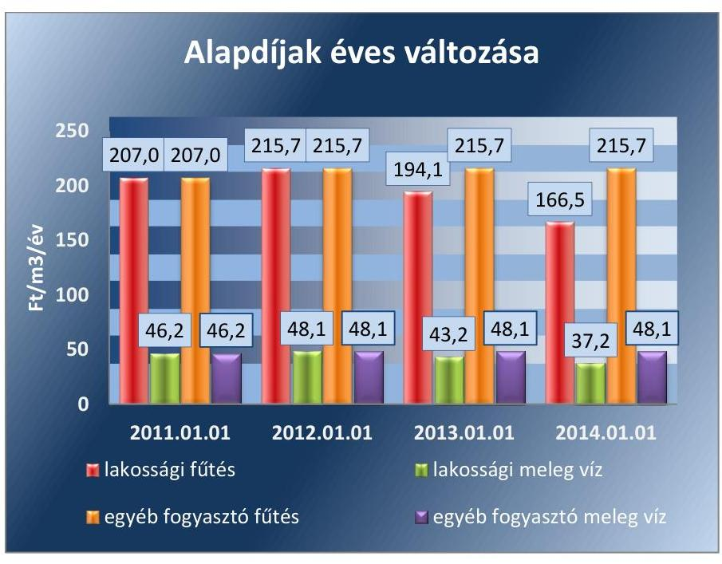

Forrás: A Társaság adatszolgáltatása
Az alkalmazott hődíjak változását a 2. ábra mutatja be.
2. ábra
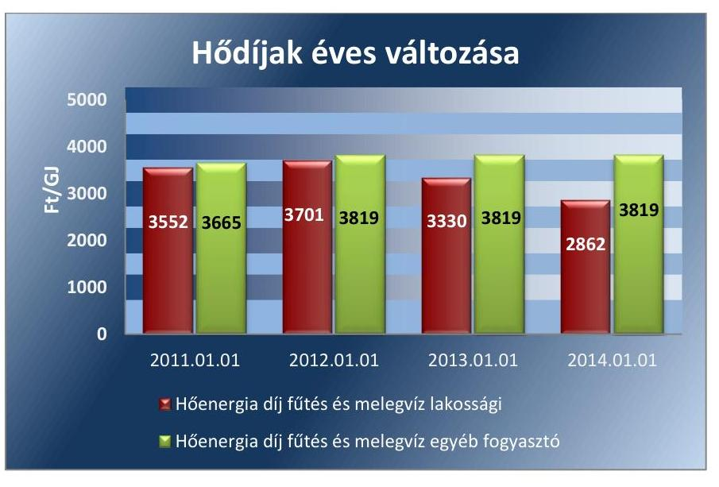

A 2011. január 1. árakhoz viszonyítva 2014. január 1-én alkalmazott lakossági alapdíjak a fűtésnél 19,6\%-kal, a meleg víznél 19,5\%-kal csökkentek. Az egyéb fogyasztóknál ugyanezen díjak 4,2\%-kal növekedtek.

A hődíjak ugyanebben az időszakban a lakosság esetében 19,5\%-kal csökkentek, míg az egyéb fogyasztók esetében 4,2\%-kal emelkedtek.

---

# JAVASLATOK 

Az ÁSZ tv. 33. § (1) bekezdésében foglaltak értelmében az ellenőrzött szervezet vezetője köteles a jelentésben foglalt megállapításokhoz kapcsolódó intézkedési tervet összeállítani és azt a jelentés kézhezvételétől számított 30 napon belül az ÁSZ részére megküldeni.
Az ÁSZ tv. 33. § (3) bekezdése szerint amennyiben az ellenőrzött szervezet vezetője nem küldi meg határidőben az intézkedési tervet vagy továbbra sem elfogadható intézkedési tervet küld, az ÁSZ elnöke
a) az ellenőrzött szervezet vezetőjével szemben büntető- vagy fegyelmi eljárás megindítását kezdeményezheti;
b) kezdeményezheti az illetékes hatóságnál, illetve szervezetnél az ellenőrzött szervezetet megillető, az államháztartás valamelyik alrendszeréből származó támogatások vagy egyéb juttatások folyósításának, illetve a személyi jövedelemadó 1\%-ából történő felajánlásokból való részesedés lehetőségének felfüggesztését.

Javaslataink célja a Kecskeméti Termostar Hőszolgáltató Kft. gazdálkodása szabályszerűségének javítása annak érdekében, hogy a szabályozási környezet megfelelően tudja támogatni az átlátható működést.

## Kecskeméti Termostar Hőszolgáltató Kft. ügyvezető igazgatójának

1. Intézkedjen a szabályozási hiányosságok megszüntetésére, ezen belül
a) aktualizálja a Társaság SZMSZ-ében az ügyvezető igazgatói megbízatás hatályos lejárati dátumát;
b) készítse el a jogszabályi előírásokkal összhangban az Üzletszabályzat módosítását és azt nyújtsa be jegyzői jóváhagyásra;
c) aktualizálja a Bizonylati szabályzatot a 2010-től használt, integrált vállalatirányítási rendszer bizonylataival való összhang érdekében.
(2.1. sz. megállapítás 4. bekezdése alapján)

---

Javaslataink célja az önkormányzati tulajdonosi joggyakorlás kontrolljainak erősítése.

# Kecskemét Megyei Jogú Város Önkormányzata polgármesterének 

1. Kezdeményezze a Közszolgáltatási szerződés módosítását a hatályos jogszabályi előirásokkal való összhang biztositása érdekében.
(1.1. sz. megállapítás 5. bekezdése alapján)

---

.

---

# MELLÉKLETEK 

- I. SZ. MELLÉKLET: ÉRTELMEZŐ SZÓTÁR
gazdasági társaság
eladósodottságot jellemző mutatók
keresztfinanszírozás tilalma

A Gt. 3. § (1) bekezdése szerint „gazdasági társaságot üzletszerű közös gazdasági tevékenység folytatására külföldi és belföldi természetes és jogi személyek, valamint jogi személyiség nélküli gazdasági társaságok alapithatnak, müködő társaságba tagként beléphetnek, társasági részesedést (részvényt) szerezhetnek."
eladósodottsági mutató (tőkeáttétel): idegen tőke/összes forrás.
Egészségesnek mondható egy olyan mértékű áttétel, amelyet az üzleti tervek szerint és az elmúlt időszak tapasztalatai alapján a társaság megfelelő biztonsággal ki tud termelni. Nagy eszközberuházás-igényű iparágakban értéke magasabb, azaz magasabb eladósodottság is elfogadható, de 75-85\%-ot meghaladó értéknél már itt is erős, sőt túlzott külső finanszírozottságról beszélhetünk. Általánosságban véve kedvező, ha értéke kisebb, mint 0,6.
eladósodottság mértéke: kötelezettségek / saját tőke.
Fontos szerepet játszik ez a mutató egy vállalat megítélésében. Azt mutatja, hogy a saját források a kötelezettségek hány százalékát fedezik. Törekedni kell, hogy a mutató tartósan (jelentősen) 1 alatti értéket érjen el.
nettó eladósodottság: (kötelezettségek-követelések) / saját tőke.
Azt mutatja, hogy a kintlévőségekkel csökkentett kötelezettségeket milyen mértékben fedezi a saját forrás. Ez feltételezi, hogy a követelések pénzügyileg előbb realizálódnak, mint ahogy a kötelezettségeket teljesíteni kell. A mutató minél kisebb, csökkenő értéke a kedvező.
adósságfedezeti mutató I.: (befektetett eszközök+forgó eszközök) / idegen forrás.
Azt mutatja, hogy 1 Ft adósságra hány Ft vagyon jut. Általánosságban véve kedvező, ha értéke 2 körül van, de nagy eszközberuházás-igényű iparágakban értéke kisebb is lehet.
adósságfedezeti mutató II.: működési cash flow / hosszú lejáratú kötelezettségek.
A mutató azt jelzi, hogy az adott gazdálkodási időszak működési pénzáramainak eredményeként realizált cash flow révén a vállalkozás mennyiben lenne képes valamennyi hosszú lejáratú kötelezettségének eleget tenni. Ennek vizsgálatára viszonylag ritkán kerül sor, az elsősorban a veszélyhelyzetbe került vállalkozások esetében lehet érdekes. Általánosságban véve kedvező, ha a működési cash flow minél nagyobb arányban nyújt fedezetet a hosszú lejáratú kötelezettségre (értéke nagyobb, mint 1, nő az ellenőrzött időszakban).
árbevételre vetített eladósodottság: (kötelezettségek - forgóeszközök) / értékesítés nettó árbevétele.
Az árbevételre vetített eladósodottság azt mutatja, hogy az árbevétel mekkora fedezetet nyújt a kötelezettségeknek a forgóeszközökkel csökkentett részére. Általánosságban véve kedvező, ha az árbevétel minél nagyobb arányban nyújt fedezetet a forgóeszközökkel csökkentett kötelezettségekre (értéke kisebb, mint 1, csökken az ellenőrzött időszakban).
A közszolgáltatás diját úgy kell megállapítani, hogy az maradéktalanul fedezetet nyújtson a közszolgáltatás indokolt költségeire és ráfordításaira, valamint a közszolgáltató e tevékenységével kapcsolatos ésszerű nyereségére; az észszerű nyereség nem tartalmazhatja a közszolgáltatáson kívül eső egyéb gazdasági tevékenységei költségeinek, ráfordításainak fedezetét.

---

közfeladat
közszolgáltatás
nemzeti vagyon
többségi befolyást biztosító részesedés
tulajdonosi joggyakorló

Jogszabályban meghatározott állami vagy önkormányzati feladat, amit az arra kötelezett közérdekből, jogszabályban meghatározott követelményeknek és feltételeknek megfelelve végez, ideértve a lakosság közszolgáltatásokkal való ellátását, továbbá az állam nemzetközi szerződésekben vállalt kötelezettségeiből adódó közérdekű feladatokat, valamint e feladatok ellátásához szükséges infrastruktúra biztosítását is (Nvtv. 3. § (1) bekezdés 7. pont).
A közszolgáltatás: „közcélú, illetőleg közérdekü szolgáltatást jelent, amely egy nagyobb közösség (állam, település) minden tagjára nézve megközelítőleg azonos feltételek mellett vehető igénybe, ezért valamilyen mértékig közösségi megszervezést, illetve szabályozást, ellenőrzést igényel." Az Ebktv. 3. § d) pontja a következőképpen határozza meg a közszolgáltatást: „szerződéskötési kötelezettség alapján a lakosság alapvető szükségleteinek ellátására irányuló szolgáltatás, így különösen a villamos energia-, gáz-, hő-, víz-, szennyvíz- és hulladékkezelési, köztisztasági, postai és távközlési szolgáltatás, továbbá a menetrend alapján közlekedő jármúvekkel végzett közforgalmú személyszállitás"
Az Nvtv. 1. § (2) bekezdése szerint:
„az állam vagy a helyi önkormányzat kizárólagos tulajdonában álló dolgok, az a) pont hatálya alá nem tartozó, állam vagy a helyi önkormányzat tulajdonában lévő dolog,
az állam vagy a helyi önkormányzatot tulajdonában lévő pénzügyi eszközök, továbbá az államot vagy a helyi önkormányzatot megillető társasági részesedések,
az államot vagy a helyi önkormányzatot megillető bármely vagyoni értékkel rendelkező jogosultság, amelyet jogszabály vagyoni értékű jogként nevesít, Magyarország határa által körbezárt terület feletti légtér,
az üvegházhatású gázok kibocsátási egységeinek kereskedelméről szóló törvény szerint kibocsátási egység és légiközlekedési kibocsátási egység, valamint az ENSZ Éghajlat változási Keretegyezménye és annak Kiotói Jegyzőkönyve végrehajtási keretrendszeréről szóló törvény szerinti kiotói egység,
állami vagy helyi önkormányzati fenntartású közgyűjtemény (muzeális intézmény, levéltár, közgyűjteményként müködő kép- és hangarchívum, valamint könyvtár) saját gyűjteményében nyilvántartott kulturális javak körébe tartozó dolog,
a régészeti lelet,
a nemzeti adatvagyon körébe tartozó állami nyilvántartások fokozottabb védelméről szóló törvény szerinti nemzeti adatvagyon." (hatályos 2012. január 1-jétől, a g) pont módosult 2012. június 30-ától)
A Ptk2. 8:2. § (1) bekezdése szerint „többségi befolyás az olyan kapcsolat, amelynek révén természetes személy vagy jogi személy (befolyással rendelkező) egy jogi személyben a szavazatok több mint felével vagy meghatározó befolyással rendelkezik."
Aki a nemzeti vagyon felett az államot vagy a helyi önkormányzatot megillető tulajdonosi jogok és kötelezettségek összességének gyakorlására jogosult (Nvtv. 3. § (1) bekezdés 17. pont).

---

# A TÁRSASÁG MŰKÖDÉSÉNEK FŐBB JELLEMZŐI 

| Sor-   szám | Megnevezés |  | 2011. | 2012. | 2013. | 2014. |
| :--: | :--: | :--: | :--: | :--: | :--: | :--: |
|  | A gazdasági társaság tulajdonosi összetétele: |  |  |  |  |  |
| 1. | Tulajdonos Önkormányzat megnevezése: |  | Kecskemét Megyei Jogú Város Önkormányzata |  |  |  |
| 2. | Önkormányzat tulajdoni részesedésének aránya | $\%$ | 69,51 |  |  |  |
| 3. | Önkormányzat tulajdoni részesedésének összege | ezer Ft | 774.390 |  |  |  |
| 4. | Tulajdonos gazdasági társaság megnevezése: |  | EDF-DÉMÁSZ |  |  |  |
| 5. | Gazdasági társaság tulajdoni részesedés aránya | $\%$ | 30,49 |  |  |  |
| 6. | Gazdasági társaság tulajdoni részesedés összege | ezer Ft | 339.740 |  |  |  |
| 7. | A tárgyévben a gazdasági társaság vagyonkezelésben lévő önkormányzati vagyon után elszámolt értékcsökkenés összege | ezer Ft | Nem kezelt Önkormányzati vagyont |  |  |  |
| 8. | A tárgyévben a gazdasági társaság saját vagyona után elszámolt értékcsökkenés összege | $\operatorname{ezer} \mathrm{Ft}$ | 245.241 | 216.312 | 217.898 | 177.073 |
| 9. | A tárgyévben a saját tulajdonú eszközök pótlására (karbantartás) elszámolt költség | $\operatorname{ezer} \mathrm{Ft}$ | 138.526 | 301.537 | 781.074 | 167.199 |
| 10. | Értékesítés nettó árbevétele teljes tevékenység | $\operatorname{ezer} \mathrm{Ft}$ | 3.037 .378 | 2.786 .197 | 2.613 .883 | 1.960 .822 |
| 11. | ebből: Távhő |  | 2.131 .839 | 2.145 .151 | 1.919 .177 | 1.620 .950 |
| 12. | Adózott eredmény teljes tevékenység |  | 20.715 | 129.924 | 122.217 | 93.058 |
| 13. | ebből: Távhő |  |  |  |  |  |
| 14. | Kifizetett osztalék teljes tevékenység |  | 20.715 | 129.924 | 122.217 | 93.058 |
| 20. | Müködési cash flow | $\operatorname{ezer} \mathrm{Ft}$ | $-1086$ | 386.881 | 227.279 | 235.430 |

---

.

---

# FÜGGELÉK: ÉSZREVÉTELEK 

A jelentéstervezetet az Állami Számvevőszék 15 napos észrevételezésre megküldte az ellenőrzött szervezet vezetőjének az ÁSZ tv. 29. §* (1) bekezdése előírásának megfelelően.
Az elfogadott észrevételek alapján véglegesíti az Állami Számvevőszék a jelentését.

A függelék tartalmazza az ellenőrzött észrevételeit, illetve az el nem fogadott észrevételek elutasításának indoklását.
$\qquad$ 1. Kecskeméti Termostar Hőszolgáltató Kft. ügyvezető igazgatójának írásban tett észrevétele.
$\qquad$ 2. Tájékoztatás az elfogadott és el nem fogadott észrevételekről az ügyvezető igazgatónak.
$\qquad$ 3. Kecskemét Megyei Jogú Város Önkormányzata Polgármestere írásban tett észrevétele mellékletek nélkül.
$\qquad$ 4. Tájékoztató válaszlevél a polgármesternek.

[^0]
[^0]:    * 29. § (1) Az Állami Számvevőszék az ellenőrzési megállapításait megküldi az ellenőrzött szervezet vezetőjének vagy az általa megbízott személynek, és annak, akinek személyes felelősségét állapította meg.
    (2) Az ellenőrzött szervezet vezetője és a felelősként megjelölt személy az ellenőrzés megállapításaira tizenöt napon belül írásban észrevételt tehet.
    (3) Az Állami Számvevőszék az észrevételre a beérkezésétől számított harminc napon belül írásban válaszol. A figyelembe nem vett észrevételeket köteles a jelentésben feltüntetni, és megindokolni, hogy azokat miért nem fogadta el.

---

# 0 termostar 

KÖRNYEZETBARÁT SZOLGÁLTATÓ

Dátum: 2016. január 25.
Tárgy: Észrevétel a KECSKEMÉTI TERMOSTAR Kft-nél lefolytatott ellenőrzés jelentéstervezetére

## Állami Számvevőszék Domokos László elnök

## BUDAPEST

Apáczai Csere János u. 10. 1052

## Tisztelt Elnök Úr!

Közzönettel vettük jelentéstervezetüket, mely 2011-2014. évekre vonatkozóan készült társaságunkról a közfeladat ellátási, gazdálkodási tevékenység szabályszerűségének ellenőrzése tárgyában.

Örömmel láttuk, hogy a jelentéstervezet a cég vagyongazdálkodásával, szabályozottságával, jogszerű működésével kapcsolatban a számos pozitív megállapítást tett - hasonlóan az elmúlt években lefolytatott 32 db külső ellenőrzéshez -, például:

- a közfeladat ellátás megszervezése szabályszerű volt,
- a társaság vagyongazdálkodása szabályszerű volt, a jogszabályi rendelkezéseknek és a belső előírásoknak megfelelt,
- kötelezettség állománya nem jelentett kockázatot a működésre és a közfeladat ellátására,
- stratégiái, üzleti tervei az önkormányzat programjaival és cselekvési terveivel, valamint a helyi távhő rendeletével összhangban készültek el, kitértek a pénzügyi célokra, a folyamatos likviditás és fejlesztési források biztosításának lehetőségeire,
- az alkalmazott szabályzatok biztosították a társaság jogszabályoknak és helyi sajátosságoknak megfelelő működését,
- a beszámolóban és számviteli nyilvántartásokban levő vagyontárgyak állományát szabályszerűen elkészített leltárral támasztották alá,
- a vagyonnyilvántartás szabályszerű volt, gyakorlata megfelelt a jogszabályi és a tulajdonosi rendelkezéseknek,
- a távhőszolgáltatáshoz kapcsolódó vagyon megőrzése, hasznosítása a jogszabályi előírások, illetve a Közszolgáltatási szerződésben megfogalmazott követelmények szerint történt,
- a közvagyont érintő fejlesztéseket minden esetben tulajdonosi hozzájárulással valósította meg,
- az eladósodottság mértéke, szerkezete nem jelentett kockázatot a működésre,
- a társaság az előírt beszámolási, adatszolgáltatási kötelezettségeit teljesítette,

E-mail: kecskemet@termostar.hu $\cdot$ www.termostar.hu
Hibabejelentés: 48-18-18
Válaszlevelében kérjük, hivatkozzon iktatószámunkra!

---

- a közvagyonnal kapcsolatos adatok védelmére és nyilvánosságára vonatkozó előírásokat teljesítette,
- az ellátott közfeladat bevételeinek elszámolása szabályos volt,
- az önköltség számítás és az árképzés megfelelt a jogszabályoknak és a belső előírásoknak.

A gazdálkodási tevékenység szabályszerűségének ellenőrzésekor a tulajdonosok és a társaság vezetősége visszajelzést kapott arról, hogy a cég müködésében jelentős hiányosság nem merült fel.

A jelentéstervezet tartalmaz azonban két megállapítást, amely a cég számára negatív hatású:

- előfordult, hogy az anyagjellegű ráfordítás elszámolása nem a megfelelő költségnemre történt (22. oldal utolsó mondata),
- eseti hiányosság volt, hogy a bekerülési értéket a beruházások, felújítások elszámolásánál nem megfelelő összegben határozták meg (23. oldal 1. bekezdésben).

E két mintavételes megállapítás alapján az ellenőrzés az anyagjellegű ráfordítások számviteli elszámolását és a beruházások bekerülési értékének elszámolását kockázatosnak minősítette. E sommás megállapítással nem értünk egyet, azt hátrányosnak ítéljük meg, hiszen nincs tudomásunk arról, hogy milyen hibaarányt tapasztaltak az ellenőrök, ezért kérjük e megfogalmazás enyhítését.

Évente több százezer bizonylatot állítunk ki, illetőleg készítünk, dolgozunk fel nagy gondossággal, kiforrott integrált informatikai irányítási rendszerünkben. A gazdasági területen 9 igen jól képzett mérlegképes könyvelő kolléga, sőt okleveles könyvvizsgáló is dolgozik. Belső szabályzataink általában részletesen tartalmazzák a követendő gyakorlatot. A konkrét hibák ismerete nélkül nem tudunk alapos intézkedési tervet összeállítani, és a munkánk minőségét tovább javítani.

Az ellenőrzés befejezése óta az Állami Számvevőszék által elkészített Jelentéstervezetben szereplő eltérésekkel kapcsolatban az alábbi intézkedéseket hoztuk:

- a 2010. január 1-jétől hatályos SZMSZ-ben az ügyvezető igazgató megbízásának végső időpontja 2013. október 14. volt. A munkaszerződés meghosszabbításának megfelelően (2018. október 14-ig) az SZMSZ aktualizálása 2015. február 2-án megtörtént.
- az Üzletszabályzat aktualizálása megtörtént 2015. június 29-én, melyet a 23535-9/2015 számú jegyzői határozattal Kecskemét Megyei Jogú Város Jegyzője Dr. Határ Mária hagyott jóvá. A hatálybalépés dátuma 2015. augusztus 25-e.
- A Közszolgáltatási szerződés aktualizálása 2015. február 20-án megtörtént.
- a Bizonylati szabályzat aktualizálása jelenleg folyamatban van.

KECSKEMÉTI TERMOSTAR Hőszolgáltató Kft.
6000 Kecskemét, Akadémia krt. 4. $\cdot$ Tel.: 76/50-40-40, 486-746 $\cdot$ Fax: 76/478-672

---

Tisztelt Elnök Úr!
A KECSKEMÉTI TERMOSTAR Hőszolgáltató Kft. az elmúlt 20 éves sikeres müködése során elnyerte a „hírös" város lakosságának bizalmát.
Célunk, hogy továbbra is fennmaradjon a tulajdonosok és fogyasztóink elismerése. Ezt nagyban segítené, ha a két esetben megállapított negatív minősítést enyhébb megfogalmazásra módosítanák.

Tisztelettel: $\qquad$
Horváth Attila
ügyvezető igazgató

KECSKEMÉTI TERMOSTAR
Hőszolgáltató Kft.
OTP 11732002-20324524
Adószám: 11374954-2-03 \$.

KECSKEMÉTI TERMOSTAR Hőszolgáltató Kft.
6000 Kecskemét, Akadémia krt. 4. $\cdot$ Tel.: 76/50-40-40, 486-746 $\cdot$ Fax: 76/478-672

---

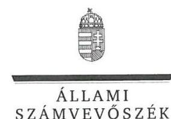

ELNÖK

Ikt.szám: V-0842-134/2016.

# Horváth Attila úr 

ügyvezető igazgató
Kecskeméti Termostar Hőszolgáltató Kft.

## Kecskemét

## Tisztelt Ügyvezető igazgató Úr!

„Az önkormányzatok gazdasági társaságai - Az önkormányzatok többségi tulajdonában lévő gazdasági társaságok közfeladat ellátását érintő gazdálkodási tevékenysége szabályszerűségének ellenőrzése - Kecskeméti Termostar Hőszolgáltató Kft. " címmel készített számvevőszéki jelentéstervezetre tett észrevételeit köszönettel megkaptam.

Az Állami Számvevőszék észrevételekre vonatkozó álláspontjáról a felügyeleti vezető által készített részletes tájékoztatást csatoltan megküldőm.

Tájékoztatom Ügyvezető igazgató Urat, hogy a számvevőszéki jelentésben - az Állami Számvevőszékről szóló 2011. évi LXVI. törvény 29. § (3) bekezdése alapján - a figyelembe nem vett észrevételeket szerepeltetjük az elutasítás indokának feltüntetésével.

Budapest, 2016. O2 hó 26 nap
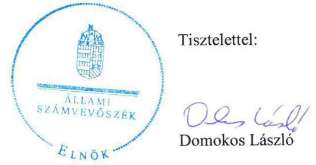

Melléklet: Tájékoztatás az elfogadott és el nem fogadott észrevételekről

---

# Tájékoztatás   az elfogadott és el nem fogadott észrevételekról 

„Az önkormányzatok gazdasági társaságai - Az önkormányzatok többségi tulajdonában lévő gazdasági társaságok közfeladat ellátását érintő gazdálkodási tevékenysége szabályszerűségének ellenőrzése - Kecskeméti Termostar Hőszolgáltató Kft." című jelentéstervezetre 2016. január 27-én érkezett észrevételét áttekintettük, annak kezelésével kapcsolatban a következő tájékoztatást adom.
Az ellenőrzés az anyagjellegủ ráfordítások számviteli elszámolását és a beruházások bekerülési értékének elszámolását kockázatosnak minősítette. Észrevételében kifejtette, hogy „e sommás megállapítással nem értünk egyet, azt hátrányosnak ítéljük meg, hiszen nincsen tudomásunk arról, hogy milyen hibaarányt tapasztaltak az ellenőrök, ezért kérjük e megfogalmazás enyhítését".
Az elszámolások szabályszerűségét mintavétellel ellenőrizzük és az adott sokaságban előforduló hibás tételek arányát becsüljük. A megfelelő, a kockázatos, a magas kockázatú, vagy a nem megfelelő értékelés valamelyike a megnevezett sokaságra vonatkozik, emiatt a hibás tételek egyedi azonosítása a jelentésben nem értelmezhető.
A jelentéstervezet 3.1. alpontjának 3. bekezdésében (22. oldal utolsó mondata) szereplő megállapítást (,Az ellenörzés az anyagjellegü ráfordítások számviteli elszámolását kockázatosnak minösítette, mivel elöfordult, hogy a ráfordítás elszámolása nem a megfelelő költségnemre történt.") az alátámasztó dokumentumok ismételt áttekintését követően pontosítjuk (,Az ellenörzés az anyagjellegü ráfordítások számviteli elszámolását kockázatosnak minösítette, mivel elöfordult, hogy egyes ráfordítások elszámolásának helyességét a rendelkezésre álló dokumentumok nem támasztották alá"), azonban az a kockázatos minősítést nem befolyásolja.

Köszönettel vettük tájékoztatását a jelentéstervezet megállapításaival kapcsolatban megtett intézkedéseiről, melyek az intézkedési tervben szerepeltetendőek. Az intézkedési tervet az Állami Számvevőszék Elnöke által kiadmányozott jelentés alapján kell majd elkészíteni.

Budapest, 2016. O2. hó 20 nap
Böröcz Imre
felügyeleti vezető

---

# KECSKEMÉT MEGYEI JOGÚ VÁROS POLGÁRMESTERE 

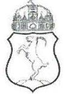

Ugyiratszám: 4888-3/2016.
Úgyintéző: dr. Szappanos Csilla

Tárgy: Kecskeméti TERMOSTAR Kft. ellenőrzési jelentéstervezete
Melléklet: előterjesztés, határozat, szerződés

Állami Számvevőszék
Domokos László elnök részére

## Budapest

Apáczai Csere János u. 10.
1052
Tisztelt Elnök Úr!
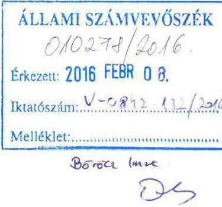

Kecskemét Megyei Jogú Város Önkormányzata (a továbbiakban: Önkormányzat) megkapta „Az önkormányzatok gazdasági társaságai - Az önkormányzatok többségi tulajdonában lévő gazdasági társaságok közfeladat ellátását érintő gazdálkodási tevékenysége szabályszerűségének ellenőrzése - Kecskeméti Termostar Hőszolgáltató Kft." címmel készített számvevőszéki ellenőrzéshez készült jelentéstervezet.

A jelentéstervezetben foglaltakra érdemi észrevétellel nem kívánunk élni, az abban foglaltakat maradéktalanul elfogadjuk.

Tájékoztatni szeretnénk azonban, hogy az önkormányzati tulajdonosi joggyakorlás kontrolljának erősítése érekében tett javaslatuk, amely az Önkormányzat és a Kecskeméti TERMOSTAR Hőszolgáltató Kft. között létrejött Közszolgáltatási szerződés módosítására irányul - a hatályos jogszabályi előírásokkal való összhang megteremtése érdekében - az ellenőrzött időszakot követően már megvalósult. Kecskemét Megyei Jogú Város Közgyűlése 23/2015. (II.19.) határozatával elfogadta „A Termostar Kft.-vel kötött közszolgáltatási szerződés módosítása" tárgyú előterjesztést, amellyel a megváltozott hazai és uniós jogszabályoknak megfelelően került aktualizálásra az Önkormányzat és a Kecskeméti TERMOSTAR Hőszolgáltató Kft. között fennálló Közszolgáltatási szerződés.

Kecskemét, 2016. február 2.
Tisztelettel:
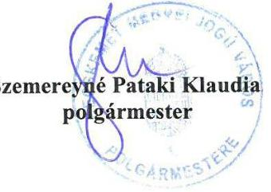

Ügyintézés helye:
Kecskemét Megyei Jogú Város Polgármesteri Hivatala
Szervezési és Jogi Iroda
Jogi Osztály
Vagyongazdálkodási Csoport
$\boxtimes 6000$ Kecskemét, Kossuth tér 1.
76/513-513/2381 ügyintéző telefonszáma Fax: 76/513-538 e-mail: szappanos.csilla@kecskemet.hu

---

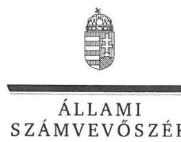

ELNÖK

Ikt.szám: V-0842-133/2016.

# Szemereyné Pataki Klaudia úrhölgy 

polgármester
Kecskemét Megyei Jogú Város Önkormányzata

## Kecskemét

## Tisztelt Polgármester Úrhölgy!

„Az önkormányzatok gazdasági társaságai - Az önkormányzatok többségi tulajdonában lévő gazdasági társaságok közfeladat ellátását érintő gazdálkodási tevékenysége szabályszerűségének ellenőrzése - Kecskeméti Termostar Hőszolgáltató Kft. " címmel készített számvevőszéki jelentéstervezetre küldött válaszát köszönettel megkaptam.

A számvevőszéki jelentéstervezetben foglaltakkal egyetértett, észrevételt nem tett. A javaslatot elfogadta, és tájékoztatott a már megtett intézkedésekről.

Budapest, 2016. 92 hó 36 nap
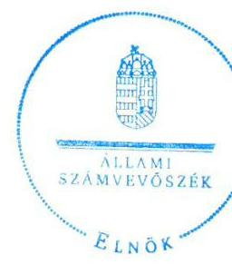

Tisztelettel:

## D. 1. 18

Domokos László

---

# RÖVIDÍTÉSEK JEGYZÉKE 

${ }^{1}$ Társaság
${ }^{2}$ Önkormányzat
${ }^{3} \mathrm{GJ}$
${ }^{4}$ MWh
${ }^{5}$ Ötv.
${ }^{6}$ Mötv
${ }^{7} \mathrm{KH}$.
${ }^{8}$ Vagyon tv.
${ }^{9} \mathrm{SZMSZ}_{1}$
${ }^{10} \mathrm{SZMSZ}_{2}$

## ${ }^{11}$ Távhőrendelet

${ }^{12}$ Tszt.
${ }^{13}$ Tszt. Vhr.
${ }^{14}$ KVB
${ }^{15}$ VPB
${ }^{16} \mathrm{Gt}$.
${ }^{17}$ Ptk.
${ }^{18}$ Taggyülés
${ }^{19}$ Számv. tv.
${ }^{20}$ Számviteli politika ${ }_{1,2}$
${ }^{21}$ Számlarend $_{1,2}$
${ }^{22}$ Önköltségi és szétválasztási szabályzat ${ }_{1,2}$
${ }^{23}$ Leltározási szabályzat ${ }_{1,2,3,4}$
${ }^{24}$ Leértékelési és selejtezési szabályzat ${ }_{1,2}$
${ }^{25} \mathrm{FB}$
${ }^{26}$ Inftv.

Kecskeméti Termostar Hőszolgáltató Kft.
Kecskemét Megyei Jogú Város Önkormányzata
Gigajoule
Megawatóra
A helyi önkormányzatokról szóló 1990. évi LXV. törvény
Magyarország helyi önkormányzatairól szóló 2011. évi CLXXXIX törvény
Kecskemét Megyei Jogú Város Közgyűlésének Határozata
Az állami vagyonról szóló 2007. évi CVI. törvény
Kecskemét Megyei Jogú Város Önkormányzata Közgyűlésének a Közgyűlés és
Szervei Szervezeti és Működési Szabályzatáról szóló többször módosított 47/1998.rendelete hatályos 1998. december 21-2013. február 14.

Kecskemét Megyei Jogú Város Önkormányzata Közgyűlésének a Közgyűlés és Szervei Szervezeti és Működési Szabályzatáról szóló többször módosított 4/2013.rendelete hatályos 2013. február 14-től
54/2007. (XII. 20.) távhőszolgáltatásról szóló Önkormányzati rendelet
A távhőszolgáltatásról szóló 2005. évi XVIII. törvény
a távhőszolgáltatásról szóló 2005. évi XVIII. törvény végrehajtásáról szóló 157/2005. (VIII. 15.) Korm. rendelet
Költségvetési és Vagyongazdálkodási Bizottság
Városstratégiai és Pénzügyi Bizottság
A gazdasági társaságokról szóló 2006. évi IV. törvény hatályos 2014. április 15-ig
A Polgári Törvénykönyvről szóló 2013. évi V. törvény hatályos 2014. április 15-től
A Kecskeméti Termostar Hőszolgáltató Kft. taggyűlése
A számvitelről szóló 2000. évi C. törvény
Számviteli politika ${ }_{1}$ hatályos 2011. július 11-2013. január 1. között; Számviteli politika2 hatályos 2013. január 1-től.
Számlarend ${ }_{1}$ hatályos 2004. március 30-2013. január 1. között; Számlarend2 hatályos 2013. január 1-től
Önköltségszámítási és szétválasztási szabályzat ${ }_{1}$ hatályos 2012. január 1-től 2014. január 1-ig; Önköltségszámítási és szétválasztási szabályzat2 hatályos 2014. január 1-től
Leltározási és raktározási szabályzat ${ }_{1}$ hatályos 2011. július 1-től 2012. augusztus 13-ig, Raktározási és leltározási szabályzat ${ }_{2}$ hatályos 2012. augusztus 13-tól 2013. október 1-ig, Raktározási és leltározási szabályzat ${ }_{2}$ hatályos 2013. október 1-től 2014. augusztus 1-ig, Raktározási és leltározási szabályzat ${ }_{2}$ hatályos 2014. augusztus 1-től
Selejtezési, leértékelési és hasznosítási szabályzat ${ }_{1}$ hatályos 2011. január 25-től 2013. október 1-ig; Selejtezési, leértékelési és hasznosítási szabályzat ${ }_{2}$ hatályos 2013. október 1-től
Felügyelő Bizottság
az információs önrendelkezési jogról és az információszabadságról szóló 2011. évi CXII. törvény

---

${ }^{27}$ NFM rendelet
${ }^{28}$ Rezsi tv.

A távhőszolgáltatónak értékesített távhő árának, valamint a lakossági felhasználónak és a külön kezelt intézménynek nyújtott távhőszolgáltatás díjának megállapításáról szóló 50/2011. (IX. 30.) NFM rendelet
A rezsicsökkentések végrehajtásáról szóló 2013. évi LIV. számú törvény

---

ÁLLAMI SZÁMVEVŐSZÉK
1052 Budapest, Apáczai Csere János utca 10.
Levélcím: 1364 Budapest 4. Pf. 54
Telefon: +36 14849100 Telefax: +36 14849200
www.asz.hu