# Jelentés 

## Az önkormányzatok gazdasági társaságai

Az önkormányzatok többségi tulajdonában lévő gazdasági társaságok közfeladat ellátását érintő gazdálkodási tevékenysége szabályszerűségének ellenőrzése - Baja Energetika Kft.

2016.
„A közfeladat ellátás szinvonala, költségeinek, ráfordításainak alakulása hatással van a szolgáltatást igénybe vevő lakosság elégedettségére."

---

# Jelentés 

## Az önkormányzatok gazdasági társaságai

Az önkormányzatok többségi tulajdonában lévő gazdasági társaságok közfeladat ellátását érintő gazdálkodási tevékenysége szabályszerűségének ellenőrzése - Baja Energetika Kft.

2016. 

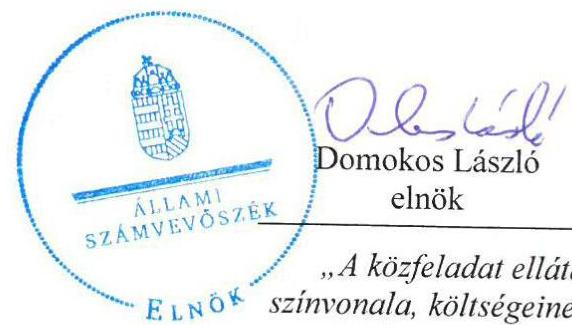
„A közfeladat ellátás szinvonala, költségeinek, ráfordításainak alakulása hatással van a szolgáltatást igénybe vevő lakosság elégedettségére."

---

# AZ ELLENŐRZÉST FELÜGYELTE:

- BÖRÖCZ IMRE felügyeleti vezető

- AZ ELLENŐRZÉST VEZETTE ÉS A VÉGREHAJTÁSÁÉRT FELELŐS:
  - SALAMIN VIKTOR ellenőrzésvezető
  - A PROGRAM ÖSSZEÁLLÍTÁSÁÉRT FELELŐS:
    - JANIK JÓZSEF LÁSZLÓ osztályvezető

- IKTATÓSZÁM: V-0846-127/2016
- TÉMASZÁM: 1857
- Jelenésteink az Országgyűlés számítógépes hálózatán és az Interneten a www.asz.hu címen is olvashatóak.

ELLENŐRZÉS-AZONOSÍTÓ SZÁM: V-070701

---

# TARTALOMJEGYZÉK 

■ ÖSSZEGZÉS ..... 5
■ AZ ELLENŐRZÉS CÉLJA ..... 7
■ AZ ELLENŐRZÉS TERÜLETE ..... 8
■ AZ ELLENŐRZÉS HÁTTERE, INDOKOLTSÁGA ..... 10
■ FÓKUSZKÉRDÉSEK ..... 11
■ ELLENŐRZÉS HATÓKÖRE ÉS MÓDSZEREI ..... 12
■ MEGÁLLAPÍTÁSOK ..... 14
■ JAVASLATOK ..... 27
■ MELLÉKLETEK ..... 31
I. Sz. melléklet: Értelmező szótár. ..... 31
II. Sz. melléklet: Eredménykimutatás. ..... 33
III. Sz. melléklet: Főbb jellemzők ..... 34
■ FÜGGELÉK: ÉSZREVÉTELEK ..... 35
■ RÖVIDÍTÉSEK JEGYZÉKE ..... 49

---

.

---

# ÖSSZEGZÉS 

Az Állami Számvevőszék ellenőrzése a távhőszolgáltatás közfeladatának ellátását értékelte a kizárólagos önkormányzati tulajdonú Baja Energetika Kft.-nél 2011-2014. évekre vonatkozóan. Baja Város Önkormányzata a közfeladat ellátását biztosította, tulajdonosi joggyakorlásában és a Társaság vagyongazdálkodásában azonban szabálytalanságokat találtunk, utóbbinál a beruházások és felújítások elszámolását nem megfelelőnek, a bevételek elszámolását kockázatosnak értékeltük.

## Az ellenőrzés társadalmi indokoltsága

Magyarországon az intézmény-centrikus közfeladat-ellátás jellemző, de egyre jelentősebb a költségvetésen kívüli feladatellátás térnyerése. Ennek legfontosabb szereplői - a nonprofit szervezetek mellett - az önkormányzati tulajdonú gazdasági társaságok. A közfeladatot ellátó gazdasági társaságok ellenőrzése kiemelten fontos a vagyon megőrzése, megóvása érdekében, valamint a kormányzati szektor elszámolásaiban megjelenő önkormányzati tulajdonú gazdálkodó szervezetek esetében, amelyekkel szemben alapvető követelmény, hogy gazdálkodásuk, működésük szabályszerű, az általuk szolgáltatott adatok minél megbízhatóbbak legyenek. A közfeladat ellátás költségeinek, ráfordításainak alakulása, színvonala hatással van a lakosság elégedettségére.

A jelentés feltárja, hogy az önkormányzat közfeladat-ellátási kötelezettségének szabályszerűen tett-e eleget, a feladatellátáshoz rendelt közvagyon működtetését szabályszerűen szervezte-e meg és a tulajdonosi felügyelete hozzájárult-e a közfeladat-ellátásához. A feladatot ellátó gazdasági társaság a közszolgáltatási szerződésben foglaltak betartásával, a közvagyon használatával biztosította-e a szolgáltatás folytatásának feltételeit.

A törvényalkotás számára - az észlelt problémák, szabálytalanságok, vagy egyéb nem kívánatos jelenségek felszínre kerülésével - az ellenőrzés megállapításai segítséget nyújthatnak az államháztartáson kívüli közfeladat-ellátás értékeléséhez, jogszabályi keretei pontosításához, átláthatóságot biztosító szabályozásához.

Fokozza a fegyelmet, igazolja, hogy lejárt a következmények nélküli ellenőrzések időszaka. Az ÁSZ értékteremtő rend kialakításához és megőrzéséhez hozzájáruló tevékenysége pozitív hatással van a szervezetről kialakított összkép formálására is.

## Főbb megállapítások, következtetések, javaslatok

Az Önkormányzat összességében a jogszabályi előírásokat betartva szervezte meg a távhőszolgáltatás közfeladatát, a tulajdonosi jogok érvényesítése alapvetően szabályszerű volt. A Képviselő-testület által elfogadott 2011-2020-ig szóló gazdasági program, a közép- és hosszú távú vagyongazdálkodási terv a távhőszolgáltató rendszer fejlesztésével kapcsolatban stratégiai célokat, feladatokat nem fogalmazott meg. Az Önkormányzat alapító tagi jogosítványait a Képviselő-testület útján gyakorolta. A Baja Energetika Kft. az Önkormányzat kizárólagos tulajdonában volt és a távhőszolgáltatás közfeladatának ellátásához szükséges önkormányzati vagyont tulajdonba, nem vagyonkezelésbe kapta.

Az Önkormányzat rendeletben határozta meg a távhőszolgáltatással kapcsolatos részletes szabályokat, 2011. április 15-ig mint árhatóság rögzítette a legmagasabb hatósági árait, továbbá rögzítette a Társaság, mint szolgáltató árképzési szabályait, árkalkulációját, meghatározta a távhőszolgáltató és a felhasználó közötti jogviszony részletes szabályait. Az önkormányzati rendelet tartalmazta azon területek kijelölését, ahol a távhőszolgáltatás fejlesztése célszerű, de nem vette figyelembe a jogszabályban előírt valamennyi szempontot.

---

Az Önkormányzat ellenőrizte a Társaság működését, határozatban elfogadta az éves üzleti terveket, a vezető tisztségviselők javadalmazását, valamint az éves beszámolókat. Az üzleti terveket, az éves beszámolókat és a vezetői javadalmazásról szóló előterjesztéseket a felügyelőbizottság és a Képviselő-testület egyes bizottságai is megtárgyalták és véleményezték.

A számviteli törvény és az ágazati jogszabályok által előírt szabályzatokkal a Társaság rendelkezett, azonban a számlarendje késve lépett hatályba, a leltározási szabályzatot nem aktualizálták.

A Baja Energetika Kft. vagyongazdálkodása nem felelt meg a jogszabályi előírásoknak. A Társaság 2011-ben a befektetett eszközök között kimutatott immateriális javakról és tárgyi eszközökről a számviteli törvény előírásával ellentétesen nem rendelkezett állományba vételi okmánnyal, üzembe helyezési jegyzőkönyvvel, az immateriális javak és tárgyi eszközök értékcsökkenésének elszámolása nem felelt meg a törvényben foglaltaknak. A társaság mérlegtételeit 2011-ben a jogszabály előírásai ellenére leltárral nem támasztotta alá. A 2012-2014. évi beszámolókban kimutatott immateriális javak és tárgyi eszközök vonatkozásában sem készült leltár. A Társaság mérlege a 2011. év fordulónapjára készített egyszerűsített éves beszámolóban jelentős összegű, mérlegfőösszegét csökkentő, míg a 2012. évben a mérlegfőösszeget növelő módosítás szerepelt. A módosítások indoklása, évenkénti bontásának, és hatásának bemutatása nem szerepelt a kiegészítő mellékletekben, a jogszabályi előírások ellenére.

A Társaság vagyongazdálkodását csökkenő mértékű és arányú befektetett eszköz állomány, növekvő forgóeszköz állomány jellemezte. A források között a saját tőke és a passzív időbeli elhatárolások növekedtek, a kötelezettségek csökkentek. A közfeladat ellátását szolgáló eszközök esetében romlott az eszközök használhatósági foka, mert az elszámolt amortizációnak megfelelő mértékben nem biztosították az eszközök pótlását, felújítását. A Társaságnál csökkent a közfeladat ellátását biztosító eszközvagyon értéke, ami hosszú távon veszélyeztetheti a közfeladat megfelelő színvonalú ellátását. A kötelezettségállomány nem jelentett kockázatot a közfeladat ellátására és a Társaság működésére.

A 2011-2014 években a Társaság nettó árbevétele fokozatosan - több, mint harmadával - csökkent. A mérleg szerinti eredmény minden évben pozitív volt, amiben meghatározó elemet jelentett a támogatás összege, mely 2011-ről 2014-re három és félszeresére nőtt.

A Társaság a számviteli politikájában és 2011. augusztus 1-től hatályba léptetett számlarendjében szabályozta a távhőszolgáltatáshoz kapcsolódó különböző bevételeinek elkülönítését. A bevételek elkülönítése a jogszabályi előírásoknak megfelelt.

A kiválasztott mintatételek ellenőrzése alapján a közfeladat-ellátással kapcsolatos bevételek elszámolását kockázatosnak, a ráfordítások elszámolását megfelelőnek minősítettük. A Társaság az értékcsökkenések elszámolásánál eltért a belső szabályozásától, továbbá a gyakorlatban alkalmazott eljárás nem felelt meg teljes körűen a jogszabályban foglaltaknak, ezért a beruházások, felújítások elszámolását nem megfelelőnek minősítettük.

A Társaság üzletszabályzata részletesen tartalmazta a késedelmes fizetés következményeit, a követelések behajtására vonatkozó eljárást. A szabályzat és annak végrehajtása megfelelt a vonatkozó törvényi előírásoknak.

A Társaság a nyereségkorláttal kapcsolatos előírásokat betartotta, az e feletti eredménytöbbletet az előírásoknak megfelelően visszafizette. A Társaság a jogszabály alapján önköltségszámítás rendjére vonatkozó szabályzat készítésére nem volt kötelezett, szabályzattal nem rendelkezett.

A gazdálkodás szabályszerűségének javítása érdekében a társaság ügyvezető igazgatójának négy, az Önkormányzat szabályszerű működésének elősegítése, továbbá az önkormányzati tulajdonosi joggyakorlás kontrolljainak erősítésére Baja Város polgármesterének három, Baja Város jegyzőjének pedig kettő javaslatot tett az ÁSZ.

A jelentésben szereplő javaslatok alapján a társaság ügyvezető igazgatója, Baja Város polgármestere, valamint jegyzője kötelesek intézkedési terveket összeállítani és azokat a jelentés kézhezvételétől számított 30 napon belül az ÁSZ részére megküldeni.

---

# AZ ELLENŐRZÉS CÉLJA 

## A Társaság közfeladat-ellátását érintő gazdálkodási tevékenysége szabályszerűségének értékelése

Az önkormányzat a jogszabályi előírások figyelembevételével döntött-e az ellenőrzésre kerülő közfeladat megszervezéséről; az önkormányzat/tulajdonosi joggyakorló szabályszerűen gyakorolta-e a tulajdonosi jogokat. A gazdasági társaság közfeladat-ellátása bevételeinek, ráfordításainak elszámolása, és vagyongazdálkodási tevékenysége megfelelt-e a jogszabályi, illetve a közszolgáltatási/vagyonkezelési szerződésben foglalt tulajdonosi előírásoknak, azok végrehajtása szabályszerű volt-e; a gazdasági társaság kötelezettségállománya jelent-e kockázatot a működésre, illetve a közfeladat ellátására; a közfeladatok átláthatósága és elszámoltathatósága érdekében biztosítva volt-e a közszolgáltatás díjának megalapozottsága szabályszerű önköltségszámítással.

---

# **AZ ELLENŐRZÉS TERÜLETE**

## **Baja Város Önkormányzata és a kizárólagos tulajdonában lévő Baja Energetika Kft.**

**BAJA VÁROS ÖNKORMÁNYZATA** a Baja Energetika Kft.-t a 148/2007. (04.26.) Kth. számú határozatával – az ellenőrzött időszakot megelőzően – hozta létre. A Társaság alaptevékenysége Baja Város közigazgatási területén a távhőszolgáltatás biztosítása volt.

A Baja Energetika Kft. működését 2007. június 27-én kezdte meg, a Társaság alapítói Baja Város Önkormányzata és az Önkormányzat kizárólagos tulajdonában lévő Bajai Kommunális és Szolgáltató Kht. voltak. A Társaságot a tagok határozatlan időtartamra hozták létre. A Társaságnak nem volt tulajdonosi részesedése más gazdasági társaságban.

A Társaság törzstőkéje az alapításkor 3,0 M Ft volt. A Bajai Kommunális és Szolgáltató Kht. 156,5 M Ft nem pénzbeli hozzájárulással növelte meg a társaság törzstőkéjét 2007. október 1-i hatállyal, így a Társaság jegyzett tőkéje 159,5 M Ft-ra növekedett. Az Önkormányzat 2009. május 4. napján kelt üzletrész adásvételi szerződéssel megszerezte a Baja Energetika Kft. üzletrészének 100 %-át, ezáltal kizárólagos tulajdonosa lett a Társaságnak.

A 2011-2014. években az Önkormányzatnál a polgármester személye a 2014. évi önkormányzati választások eredményeként változott. A jegyző 2010. január 2-tól látta el feladatait, az időszakban személye nem változott.

**A BAJA ENERGETIKA KFT.** a 2011-2014 években 1987 lakásban és további hat intézmény számára szolgáltatott fűtést és használati meleg vizet Baja város területén.

Az 1. számú ábra a Társaság egyes gazdálkodási adatainak alakulását mutatja a 2011. és 2014. évek összehasonlításában.

---

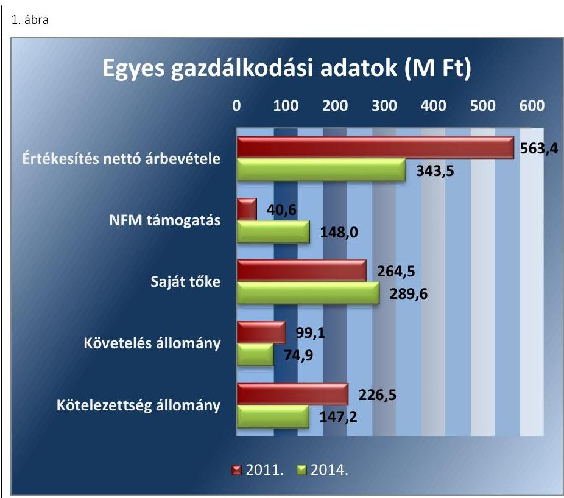

Forrás: 2011. és 2014. évi Beszámolók
A Társaságnál a 2011. és a 2014. évek összehasonlításában az értékesítés nettó árbevétele jelentős mértékben, 39%-kal (219,9 M Ft-tal) csökkent, ugyanakkor az NFM-től, a távhőszolgáltatáshoz kapott támogatás (a 2011. év utolsó negyedéve és a 2014. év összehasonlításában) több mint három és félszeresére növekedett. Ennek a támogatásnak köszönhetően a Társaság mérleg szerinti eredménye minden évben pozitív volt. A mérleg szerinti eredmény tőketartalékba került, így a saját tőke évenként kis mértékben növekedett, az időszakban összesen mintegy 10%-ot.

A Társaságnak a 2011. évről a 2014. évre mind a követelés állománya, mind pedig a kötelezettség állománya csökkent. A követelések állományának csökkenésében szerepe volt a követelések behajtására tett intézkedéseknek.

A kötelezettség állomány alakulásában jelentős részt képviselt egy gazdasági társasággal kötött szerződésből fakadó kötelezettségek összege és annak teljesítése.

2011-ben a Baja Energetika Kft. vezetésének feladatait ellátó ügyvezető személyében változás következett be.

---

# AZ ELLENŐRZÉS HÁTTERE, INDOKOLTSÁGA 

Objektív kép kialakítása Baja Város Önkormányzata távhőszolgáltatási közfeladatának megszervezéséről, tulajdonosi joggyakorlásáról, valamint a kizárólagos tulajdonában lévő Baja Energetika Kft. közfeladat ellátását érintő gazdálkodási tevékenységének szabályszerűségéről.

## A gazdasági társaságok a közfeladatok ellátásában kiemelt fontosságú szerephez jutottak

AZ ÁSZ STRATÉGIÁJÁBAN megfogalmazta, hogy a helyi önkormányzatok gazdálkodásában rejlő pénzügyi kockázatok feltárásával, az államháztartáson kívülre nyújtott költségvetési támogatások és ingyenes vagyonjuttatások, valamint az államháztartáson kívül működő közfeladatellátó rendszerek ellenőrzéseivel hozzájárul ahhoz, hogy a közpénzeket az államháztartáson kívül működő szervezetek is átlátható, rendezett módon használják fel a közfeladatok szerződésben vállalt ellátása érdekében.

Az Áht. 1. § (3) bekezdése értelmében az államháztartáson kívüli szervezetek a közfeladatok ellátásában - jogszabályban meghatározott feltételekkel - közreműködhetnek. Az önkormányzati tulajdonú gazdasági társaságok teljes körű ellenőrzésének lehetőségét az
 Állami Számvevőszékről szóló 1989. évi XXXVIII. törvény 2011. január 1-jétől hatályos módosítása teremtette meg. A gazdasági társaságok közfeladat-ellátását érintő gazdálkodási tevékenysége szabályszerűségére irányuló ellenőrzéseket erre tekintettel a 2011. évtől végezzük.

A KONSTRUKCIÓS KOCKÁZATOK feltárásával az ellenőrzés illeszkedik az ÁSZ középtávra szóló stratégiájához. A működési és pénzügyi kockázatok feltárásával hasznosítható munícióval szolgálhat a Kormány 2013-tól elindított rezsicsökkentési törekvéseihez.

## AZ ELLENŐRZÉS VÁRHATÓ HASZNOSULÁSA

KÉNT az ÁSZ a megállapításaival segítséget nyújthat az államháztartáson kívüli közfeladat-ellátás értékeléséhez, jogszabályi keretei pontosításához, átláthatóságot biztosító szabályozásához. Meghatározhatóvá válnak a közfeladat ellátásban részt vevő államháztartáson kívüli szervezeteknek az önkormányzat költségvetését, pénzügyi helyzetét is befolyásoló kockázatai, lehetővé válik ezen kockázatok csökkentése.

Értékelhetővé válik, hogy a feladatot ellátó gazdasági társaság a közszolgáltatási szerződésben foglaltak betartásával, a közvagyon használatával biztosította-e a szolgáltatás folytatásának feltételeit. Ezzel az ellenőrzöttek és a helyi döntéshozók számára az ÁSZ visszajelzést ad feladatszervezési, feladat-ellátási kockázataikról, alapot ad a meglévő hibák megszüntetéséhez, a jobb közfeladat-ellátás biztosításához. Mindezeken keresztül az ÁSZ hozzájárul Magyarország közpénzügyi helyzetének javításához, a közpénzek mérhető módon történő, a döntéshozók által meghatározott célok szerinti felhasználásához.

---

# FÓKUSZKÉRDÉSEK 

1. Az önkormányzat közfeladat megszervezéséről szóló döntése, valamint tulajdonosi joggyakorlása szabályszerű volt-e?
2. A gazdasági társaság vagyongazdálkodása szabályszerű volt-e, kötelezettségállománya jelentett-e kockázatot a működésre illetve a közfeladat ellátására?
3. A gazdasági társaságnál az ellátott közfeladat bevételei és ráfordításai elszámolása, valamint az önköltségszámítás és árképzés szabályszerű volt-e?

---

# ELLENŐRZÉS HATÓKÖRE ÉS MÓDSZEREI 

## Az ellenőrzés típusa

Megfelelőségi ellenőrzés

## Az ellenőrzött időszak

2011 - 2014. évek

## Az ellenőrzés tárgya

Az ellenőrzés tárgya annak megállapítása, hogy az önkormányzat közfeladat-ellátási kötelezettségének szabályszerűen tett-e eleget, a feladatellátáshoz rendelt közvagyon működtetését szabályszerűen szervezte-e meg és a tulajdonosi felügyelete hozzájárult-e a közfeladat-ellátásához. A feladatot ellátó gazdasági társaság a közszolgáltatási szerződésben foglaltak betartásával, biztosította-e a szolgáltatást valamint vagyongazdálkodása bevételeinek és ráfordításainak elszámolása szabályszerű és átlátható volt-e.

## Az ellenőrzött szervezet

Az ellenőrzött szervezetek:
Baja Város Önkormányzata
Baja Energetika Kft.

## Az ellenőrzés jogalapja

az Állami Számvevőszékről szóló 2011. évi LXVI. törvény 5. § (3)-(4)-(5) bekezdései

## Az ellenőrzés módszerei

Az ellenőrzést a nemzetközi standardokat irányadónak tekintve az ellenőrzési program ellenőrzési kérdései, az ellenőrzött időszakban hatályos jogszabályok, az ellenőrzés szakmai szabályok és módszertanok figyelembe vételével végezzük.

Az ellenőrzés ideje alatt az ellenőrzött szervezettel történő kapcsolattartást az ÁSZ Szervezeti és Működési Szabályzatának vonatkozó előírásai alapján biztosítjuk.

---

Az ellenőrzés a kiválasztott, többségi tulajdonosi jogokat gyakorló önkormányzatra, illetve az ellenőrzésre kijelölt közfeladatot ellátó gazdasági társaság felett tulajdonosi jogokat gyakorló szervezetre és az ellenőrzött közfeladatot ellátó gazdasági társaságra terjed ki. Amennyiben a gazdasági társaságban több önkormányzat együttesen többségi tulajdonos, úgy az ellenőrzést a többségi tulajdonosi jogokat gyakorló önkormányzatnál kell lefolytatni. Az ellenőrzött gazdasági társaságnál, amennyiben az több közfeladatot is ellát, akkor az ellenőrzésre kiválasztott közfeladat-ellátást ellenőrizzük.

Az ellenőrzést a kérdésekre adott válaszok kiértékelésével, valamint a megjelölt adatforrások, a csatolt tanúsítványok felhasználásával, továbbá az adott időszakban hatályos jogszabályok figyelembe vételével kell lefolytatni. Az ellenőrzési kérdések megválaszolásához szükséges bizonyítékok megszerzése a következő ellenőrzési eljárások alkalmazásával történik: megfigyelés, kérdésfeltevés (információkérés), összehasonlítás, valamint elemző eljárás.

A bevételek és ráfordítások elszámolása, valamint a vagyonnyilvántartás terén a szabályszerű működést mintavétellel ellenőriztük, ez alapján a sokaságokban előforduló hibás tételek arányát becsültük. A jogszabályoknak és a belső előírásoknak megfelelőnek tekintettük az adott területet, amennyiben a minta ellenőrzésének eredménye alapján 95%-os bizonyossággal a teljes sokaságban a hibaarány kisebb volt, mint 10%, nem megfelelőnek értékeltük, ha a hibaarány a 10%-ot meghaladta. Kockázatot, illetve magas kockázatot jeleztünk, amennyiben egy adott terület vonatkozásában a minta alapján a teljes sokaságban nem volt teljes körűen biztosított a jogszabályoknak és a belső szabályzatoknak megfelelő működés.

---

# 1. Az önkormányzat közfeladat megszervezéséről szóló döntése, valamint tulajdonosi joggyakorlása szabályszerű volt-e? 

Összegző megállapítás

Az Önkormányzat - a gazdasági program és a távhőszolgáltatási rendelet hiányosságai kivételével - a jogszabályi és belső előírásokat betartásával szervezte meg a távhőszolgáltatás közfeladatát, a Társaság működésének felügyelete, a tulajdonosi jogok érvényesítése szabályszerű volt.
1.1. számú megállapítás

A közfeladat-ellátást az Önkormányzat - a gazdasági program hiányosságától eltekintve - szabályszerűen szervezte meg, a távhőszolgáltatásra vonatkozó rendeletalkotási kötelezettségének a távhőszolgáltatás fejlesztési területei kijelölésének kivételével eleget tett.

Az önkormányzatnak az Ötv. ¹ 91. § (6) bekezdése, 2013. január 1-jétől az Mötv. ² 116. § (3)-(4) bekezdései szerint a gazdasági programjában kell meghatároznia azon célkitűzéseket, amelyek az ellátandó feladatok biztosítását, fejlesztését szolgálják. A Képviselő-testület ³ által elfogadott 2011-2020-ig szóló gazdasági program a távhőszolgáltató rendszer fejlesztésével kapcsolatban stratégiai célokat, feladatokat nem fogalmazott meg.

Az Önkormányzat ⁴-az Nvtv ⁵. 9. § (1) bekezdésében foglaltaknak megfelelően - elkészítette az Önkormányzat közép- és hosszú távú vagyongazdálkodási tervét, amely a távhő rendszer működtetésével, fejlesztésével kapcsolatos terveket nem rögzített. Az önkormányzati SZMSZ₁₅⁶ melléklete - amely az Önkormányzat kötelező és önként vállalt feladatait sorolta fel - a távhő szolgáltatás feladatellátását nem tartalmazta.

A TÁVHŐSZOLGÁLTATÁS KÖZFELADATÁNAK ellátásáról Baja Város Önkormányzata már az ellenőrzött időszakot megelőzően döntött. A távhőszolgáltatási rendszer fejlesztésének, üzemeltetésének feltételeit az Önkormányzat az Ötv. 9. § (4) bekezdésének megfelelően a 2007-ben alapított Baja Energetika Kft. ⁷ működtetésével biztosította. A Társaság ⁸ 2009-től az Önkormányzat kizárólagos tulajdonába került, a feladat ellátásához szükséges vagyont - apportként - az Önkormányzat a Társaság rendelkezésére bocsátotta. A Társaságot 3,0 M Ft (pénzbeli betét) törzstőkével alapították, ami kiegészült 156,5 M Ft nem pénzbeli hozzájárulással.

AZ ALAPÍTÓ OKIRATBAN ⁹ az Önkormányzat rögzítette, hogy a Társaság a távhőszolgáltatást közfeladatként biztosítja a város területén, továbbá meghatározta az ügyvezetőre vonatkozó jogokat, kötelezettségeket, feladatokat, felelősséget. Az alapító Önkormányzat kizárólagos hatáskörébe tartozott ügyvezető megválasztása, a Társaság Számv. tv ¹⁰. szerinti

---

## A szabályozás elemei, főbb területei

Önkormányzati rendelet

Feladatok, szolgáltatás, ármegállapítás, díjfizetés elemei.

## Szerződés

Szolgáltatási díj képzése.
1.2. számú megállapítás
beszámolójának elfogadása, az FB¹¹ tagjainak, könyvvizsgálójának megválasztása, visszahívása, díjazásának megállapítása. Az Alapító Okiratban előírtak szerint az Önkormányzat a tulajdonosi jogokat a Képviselő-testület útján gyakorolta.

Az Önkormányzat - a Tszt ¹². 6. § (2) bekezdésének megfelelően - rendeletben ¹³ határozta meg a távhőszolgáltatással kapcsolatos részletes szabályokat. A távhőszolgáltatási rendelet hatálya a város közigazgatási területére terjedt ki, melyben az Önkormányzat, mint árhatóság rögzítette a legmagasabb hatósági árait és közzé tette a Társaság, mint szolgáltató árképzési szabályait, árkalkulációját, továbbá meghatározta a távhőszolgáltató és a felhasználó közötti jogviszony részletes szabályait. A Tszt. 6. § (2) bekezdés c) pontjának előírása alapján a rendeletben kijelölték azokat a területeket, ahol környezetvédelmi és levegő-tisztaságvédelmi szempontok alapján célszerű a távhőszolgáltatás fejlesztése, azonban a területfejlesztési szempont érvényesítésére nincs hivatkozás, az nem igazolt.

A Tszt. 57. §-ának és az Ámt ¹⁴. 7. § (5) bekezdésének 2011. áprilisi módosulása következtében átalakult a távhőszolgáltatás árszabályozása, az önkormányzati árszabályozást felváltotta a központi árszabályozás. Ettől kezdve a Képviselő-testület ármeghatározási jogköre kizárólag a csatlakozási díjakra és a fizetési feltételekre terjedt ki.

Az Önkormányzat a Társasággal, - mint távhőszolgáltató engedélyessel - közfeladat-ellátási szerződést nem kötött, arra a feleket jogszabályi előírás nem kötelezte. Az ellátandó közfeladatokat és annak módját az Alapító Okirat és a Társasági szerződés tartalmazta.

A Társaság az Önkormányzat kizárólagos tulajdonában volt és a távhőszolgáltatás közfeladatának ellátásához szükséges önkormányzati vagyont tulajdonba, nem vagyonkezelésbe kapta.

A tulajdonosi jogok gyakorlása a közfeladat-ellátással kapcsolatban hozott döntések esetében, valamint a közfeladat ellátásának felügyelete során szabályszerű volt.

## A TÁRSASÁG TULAJDONOSI JOGGYAKORLÁSÁ-

NAK feladatait, annak módját és rendjét az Önkormányzat a Gt. ¹⁵ és Ptk. ¹⁶. előírásának megfelelően a vagyongazdálkodási rendelet₁₂¹⁷-ben és a Társaság Alapító Okiratában, valamint a Társasági szerződésben szabályozta. A tulajdonosi jogok gyakorlása szabályszerű volt, az Önkormányzat, egy személyben, a Képviselő-testülete útján gyakorolta tulajdonosi jogait.

Az Önkormányzat a Társaságnál a köztulajdon védelme érdekében a Társaság alapításakor a Gt. 33. § (1) bekezdés c) pontja alapján létrehozta a Felügyelő Bizottságot, és kinevezte a független könyvvizsgálót. Az FB feladatait és tagjaira vonatkozó szabályokat az Alapító Okirat tartalmazta. Az FB a Gt. 34. § (4) bekezdésének megfelelően elkészítette ügyrendjét és az abban foglaltaknak megfelelően látta el feladatát. Ellenőrizte a Társaság működését, az éves üzleti terveket, a vezető tisztségviselők javadalmazását, valamint a Számv. tv. alapján előírt egyszerűsített éves beszámolókat, amikről írásban hozott határozatokat.

AZ ANYAGI ÖSZTÖNZÉSI RENDSZERT a Taktv. ¹⁸ 5 §-a alapján elkészített, a köztulajdonban álló gazdasági társaságok vezető tisztségviselői, felügyelő bizottsági tagjaira is érvényes Képviselő-testület által

---

elfogadott javadalmazási szabályzatban határozták meg. A javadalmazási szabályzat₁₂₃¹⁹ rögzítették a Társaság működésével kapcsolatosan az érdekeltségi rendszer szabályait, aminek alapján évente az FB írásos javaslata alapján a Képviselő-testület értékelte a Társaság ügyvezetőjének és vezetőinek tevékenységét az éves eredmény vonatkozásában. A tisztségviselők díjazása a javadalmazási szabályzat előírásai alapján történt, a javadalmazásra vonatkozó értékeléseket az FB megtárgyalta, szabályszerűnek tartotta és kifizetésre javasolta.

A Képviselő-testület a Taktv. 5. § (3) bekezdésében foglaltaknak megfelelően - az ellenőrzött időszakot megelőzően - megalkotta és elfogadta a köztulajdonban álló gazdasági társaság vezető tisztségviselői, felügyelőbizottsági tagjai, valamint a munka törvénykönyvéről szóló 2012. évi I. törvény 208. §-ának hatálya alá eső munkavállalói javadalmazása, valamint a jogviszony megszűnése esetére biztosított juttatások módjának, mértékének elveiről, annak rendszeréről szóló, többször módosított, szabályzatát. A szabályzat hatálya kiterjedt az ügyvezetőre, más vezető állású munkavállalóra, valamint a FB elnökére és tagjaira. A szabályzat tartalmazta a prémium-feltételeket, a kifizethető éves prémium mértékét a vezető éves díjazásának 60%-ában maximalizálták. A prémiumok kifizetése a javadalmazási szabályzat előírásainak megfelelően történt.

A szabályzat módosítását a Képviselő-testület 2014. április 24-én kelt határozatával jóváhagyta azzal, hogy a szabályzat - visszamenőlegesen 2013. február 1. napján lép hatályba. A módosítással a Képviselő-testület határozata a visszamenőleges hatály tilalmába ütközött, ezért a szabályzat rendelkezései a jóváhagyást megelőző időszakra nem alkalmazhatók.

A Képviselő-testület a Társaság üzleti terveiről az előző évi számviteli beszámolóról és ahhoz kapcsolódóan a vezetői javadalmazásról készült előterjesztéssel együtt az FB véleményének birtokában, határozatban döntött.

AZ ÁRKÉPZÉS SZABÁLYAIT az Önkormányzat rendeletében rögzítette. A távhőszolgáltatási rendelet melléklete tartalmazta a Társaság, mint szolgáltató árképzési szabályait, és az adott évre vonatkozó árkalkulációját. Az árra vonatkozó önkormányzati döntés részletes számítással volt alátámasztva.

A SZÁMVITELI BESZÁMOLÓKAT az Alapító Okiratban előírtaknak megfelelően az ügyvezető a következő év április 30-ig az alapító elé terjesztette, ezzel beszámolási kötelezettségének eleget tett. A Képviselő-testület a beszámoló elfogadásáról a Gt. 35. § (3) bekezdésének és a Ptk. 3:120.§ (2) bekezdés vonatkozó előírásait betartva az FB írásos jelentésének birtokában döntött.

BELSŐ ELLENŐRZÉST az Önkormányzat egy alkalommal, 2013-ban végzett a Társaságnál. Az ellenőrzés tárgya az üzleti terv volt, és célja annak megállapítása, hogy a terv teljes
 körül-e, megfelelően tükrözi-e a vállalkozással kapcsolatos lényeges információkat, a vállalkozás jövőre vonatkozó céljait, a célok eléréséhez szükséges erőforrásokat, a vagyongazdálkodás szempontjait, továbbá az üzleti terv és a mérlegbeszámoló összhangja biztosított-e, különös tekintettel arra, hogy az üzleti terv szerkezete megegyezik-e a mérlegbeszámoló szerkezetével.

---

A belső ellenőri jelentés megállapította, hogy a Társaság által készített éves üzleti terv tartalmában, szerkezetében nem összehasonlítható az éves beszámolóval. A megállapításokat az ügyvezetés tudomásul vette, az üzleti terv szerkezeti módosításának végrehajtásáról az ügyvezető írásban tájékoztatta a belső ellenőrzést végző szervezetet.

A Társaság üzletszabályzatát a jegyző a Tszt. 7. § (1) bekezdés a) és b) pontjában foglaltaknak megfelelően jóváhagyta, a Társaság tevékenységét azonban az üzletszabályzatban foglaltak betartása szempontjából - a Tszt. 7. § (1) bekezdés c) pontjában előírtak ellenére - nem ellenőrizte.

A Társaság a 2011-2014. években nyereségesen gazdálkodott. A Képviselő-testület döntései alapján az adózott eredményt eredménytartalékba helyezték, osztalék kifizetésre nem került sor.

TÁVHŐ-VEZETÉK FEJLESZTÉSE ÉRDEKÉBEN a Társaság 2010-ben pályázatot nyújtott be KEOP${ }^{10}$ forrásra, a fejlesztés megvalósítása a pályázat elbírálását megelőzően elkezdődött. A fejlesztés megvalósult, azonban a pályázat nem nyert támogatást, ezért a Társaságnak 190,0 M Ft összegű fizetési kötelezettsége keletkezett a fejlesztést kivitelezője felé. A kivitelezővel 2011-ben kötött (kölcsön) megállapodás alapján 12,6%-os kamat mellett, a Társaságnak 10 éven át havi egyenlő részletekben kellett törlesztenie a tartozását. A Társaság a kivitelezővel szemben fennálló tőketartozás kiváltására 2014. júniusában 124,8 M Ft összegű beruházási hitelszerződést kötött egy hitelintézettel. A hitelszerződést biztosító mellékkötelezettségként a finanszírozó pénzintézet előírta az Önkormányzat készfizető kezességvállalását, a társaság tulajdonában lévő ingatlanok (5 db) jelzálog terhelését, valamint a társaság kizárólagos tulajdonában álló, a távhő termeléshez és távhő szolgáltatáshoz kapcsolódó valamennyi gépre, berendezésre és technológiára első zálogjogi ranghelyen való bejegyzését. A Stabilitási tv. ${ }^{21}$ 10. § (1) bekezdése alapján az adósságot keletkeztető ügylethez a Kormány az 1670/2014. (XI.20) Korm. határozatában hozzájárult.

A tulajdonosi jogokat gyakorló Képviselő-testület a hitel előkészítése és a szerződést biztosító mellékkötelezettségek elfogadásáról több alkalommal tárgyalt, az FB támogató véleménye mellett meghozta a szükséges határozatokat, és felhatalmazta a polgármestert a készfizető kezességvállalás aláírására.

---

# 2. A gazdasági társaság vagyongazdálkodása szabályszerű volt-e, kötelezettségállománya jelentett-e kockázatot a működésre illetve a közfeladat ellátására? 

Összegző megállapítás

2.1. számú megállapítás
2.2. számú megállapítás

A Társaság vagyongazdálkodása - elsősorban az egyes mérlegtételek leltári alátámasztásának hiánya miatt - nem volt szabályszerű, kötelezettségállománya működési, közfeladat-ellátási kockázatot nem jelentett.

A gazdálkodási szabályzatokat elkészítették, azonban a leltározási szabályzat tartalma nem felelt meg a módosult jogszabályi előírásoknak, valamint számlarenddel 2011. augusztus 1-ig nem rendelkeztek.

A Társaság rendelkezett a Számv. tv. 14. § (4) bekezdés előírásainak megfelelő, hatályos számviteli politikával és a Számv. tv. 14. § (5) bekezdés a), b) és d) pontjában előírt eszközök és források leltárkészítési és leltározási, illetve értékelési szabályzatával, valamint pénzkezelési szabályzattal. A Számv. tv. 161. § (1) bekezdésében előírt számlarendet azonban 2011. július 31-ig nem léptettek hatályba. A leltározási szabályzatot 2012. január 1-jével - a Számv. tv. 14. § (11) bekezdésében előírtak ellenére - nem aktualizálták, melynek következtében nem a Számv. tv. 69. § (3) bekezdésének megfelelően határozták meg a leltározási időszakot. A Tszt. 18/A. § (2) bekezdésében foglaltaknak megfelelően 2012. január 1-jétől a Társaság hatályba léptette a számviteli szétválasztás szabályzatát.

A Társaság a Tszt. 7. § (1) bekezdése előírásának megfelelően jóváhagyott, érvényes üzletszabályzattal rendelkezett. A Tszt. 52. § (1) bekezdésének megfelelően a távhőszolgáltató, a felhasználó és a díjfizető közötti jogviszony általános szabályait a Távhőszolgáltatási Közüzemi Szabályzatban határozták meg.

A vagyongazdálkodás nem felelt meg a jogszabályi előírásoknak, mivel a beszámoló mérlegtételeit leltárral nem támasztották alá.

AZ ÉVES BESZÁMOLÓ MÉRLEGÉNEK tételeit a Társaság 2011-ben a Számv. tv. 69. § (1) bekezdésben előírtakkal ellentétben leltárral nem támasztotta alá. A 2012-2014. évi beszámolókban kimutatott immateriális javak és tárgyi eszközök vonatkozásában nem készült a Számv. tv. 69. § (1) bekezdésében előírt leltár.

A TÁRSASÁGOT MAGAS LIKVIDITÁS, csökkenő mértékű és arányú befektetett eszköz állomány, valamint növekvő forgóeszköz állomány jellemezte. A források között a saját tőke növekedett, a kötelezettségek csökkentek és a passzív időbeli elhatárolások növekedtek a közzétett beszámolók mérleg adatai alapján. A Társaság mérlegének kiemelt adatait tartalmazza a következő, 1. táblázat.

---

| 1. táblázat |  |  |  |  |  |  |  |
| :--: | :--: | :--: | :--: | :--: | :--: | :--: | :--: |
| BAJA ENERGETIKA KFT. MÉRLEGÉNEK KIEMELT ADATAI (M Ft) |  |  |  |  |  |  |  |
| Megnevezés | $\begin{aligned} & 2011. \\ & 01.01 \end{aligned}$ | Módosítás | $\begin{aligned} & 2011 \\ & 12.31 \end{aligned}$ | Módosítás | $\begin{aligned} & 2012 \\ & 12.31 \end{aligned}$ | $\begin{aligned} & 2013 \\ & 12.31 \end{aligned}$ | $\begin{aligned} & 2014 \\ & 12.31 \end{aligned}$ |
| I. Befektetett eszközök | 557,2 |  | 388,8 |  | 370,6 | 351,0 | 332,5 |
| - ebből: Tárgyi eszközök | 551,1 |  | 379,7 |  | 363,0 | 345,3 | 328,3 |
| II. Forgó eszközök | 90,0 |  | 132,5 |  | 125,5 | 157,7 | 182,2 |
| - ebből: Követelések | 60,5 |  | 99,1 |  | 100,2 | 119,0 | 74,9 |
| III. Aktív időbeli elhatárolások | 86,6 |  | 55,9 | 3,2 | 58,8 | 52,4 | 42,6 |
| Eszközök összesen | 733,8 |  | 577,2 |  | 555,0 | 561,1 | 557,3 |
| IV. Saját tőke | 260,8 | 0,2 | 264,5 | 3,0 | 275,5 | 283,7 | 289,6 |
| - ebből: Jegyzett tőke | 159,5 |  | 159,5 |  | 159,5 | 159,5 | 159,5 |
| - ebből Mérleg szerinti eredmény | 40,3 | 0,2 | 3,7 | 3,0 | 8,0 | 8,2 | 5,9 |
| V. Céltartalékok |  |  |  |  |  |  |  |
| VI. Kötelezettségek |  | -156,2 | 0,3 | 0,2 | 182,6 | 159,0 | 147,2 |
| VII. Passzív időbeli elhatárolások | 94,0 |  | 86,1 |  | 96,9 | 118,4 | 120,5 |
| Források összesen | 733,8 | -156,0 | 577,2 | 3,2 | 555,0 | 561,1 | 557,3 |

A Társaság mérlegének főösszege 2011. január 1-jén 733,8 M Ft volt, azonban a 2011. évi egyszerűsített éves beszámolóban, a korábbi évekhez kapcsolódó hibából eredő, mérlegfőösszeget csökkentő módosítás szerepelt, mely a kötelezettségek értékét 156,0 M Ft összegben csökkentette. A 2012. évi éves beszámoló mérlegfőösszegének növelő módosítása, mely szintén a korábbi évekhez kapcsolódó hibák eredménye, 3,2 M Ft volt. A módosítások indoklása és évenkénti bontásának bemutatása nem szerepel a kiegészítő mellékletekben, ami nem felel meg a Számv. tv. 19. § (3) és 88. § (5) bekezdéseiben foglaltaknak. A Számv. tv. előírása szerint, ha a tárgyévi adatok nem hasonlíthatók össze az előző év adataival, akkor azt a kiegészítő mellékletben be kell mutatni és indokolni kell. A Társaságnak be kellett volna mutatnia az ellenőrzése során feltárt jelentős összegű hibák eredményre, az eszközök és a források állományára gyakorolt - a mérlegben, az eredmény kimutatásban a megfelelő tételeknél összevontan szereplő - hatását, évenkénti megbontásban is.

A közfeladat ellátását szolgáló eszközök esetében romlott az eszközök használhatósági foka. A fejlesztésre fordított összegeket és az elhasználódás fokának változását mutatja be a 2. táblázat.

---

2. táblázat

# A KÖZFELADAT ELLÁTÁSÁRA SZOLGÁLÓ VAGYON AMORTIZÁCIÓJA ÉS AZ ESZKÖZÖK PÓTLÁSA (M Ft) 

|  | 2011. | 2012. | 2013. | 2014. |
| :--: | :--: | :--: | :--: | :--: |
| Fejlesztési támogatás | 0,0 | 0,0 | 0,0 | 0,0 |
| Fejlesztés önerőből | 10,1 | 4,9 | 4,8 | 4,3 |
| Elszámolt értékcsökkenés | 22,6 | 24,0 | 24,5 | 23,6 |
| Eszköz érték változás | -12,5 | -19,1 | -19,7 | -19,3 |
| Elhasználódás foka (%) | 13,3 | 19,4 | 24,2 | 29,0 |

Forrás: A Társaság adatszolgáltatása

## A TÁRSASÁG AZ ELSZÁMOLT AMORTIZÁCIÓNAK

megfelelő mértékben nem biztosította az eszközei pótlását, a beruházások, élettartam növelő felújítások nem az eszközök elhasználódásának megfelelő arányban történtek. A Társaságnál a közfeladat ellátását szolgáló eszközök esetében csökkent a közfeladat ellátását biztosító eszközvagyon értéke, ami hosszú távon veszélyezteti a közfeladat ellátását.

A Társaságnál 2011-2014. között a forgóeszközök állománya több mint kétszeresére növekedett, a vevők állománya mintegy 25%-al csökkent, viszont nőtt a pénzeszközök állománya.

A Társaság egyszerűsített éves beszámolójának mérlegadatai szerint a Társaság vagyona a 2011-2014. években kismértékben, mintegy 3,5%-kal csökkent a megfelelő arányú eszközpótlás elmaradása következtében. Ezt támasztják alá a 3. táblázat 4. és 5. sorának adatai is.
3. táblázat

## BAJA ENERGETIKA KFT. MŰKÖDÉSÉNEK FŐBB ADATAI

|  | Megnevezés |  | 2011. | 2012. | 2013. | 2014. |
| :--: | :--: | :--: | :--: | :--: | :--: | :--: |
| 1. | Önkormányzat megnevezése: |  | Baja Város Önkormányzata |  |  |  |
| 2. | Önkormányzat tulajdoni részesedésének aránya | % |  | 100,0 |  |  |
| 3. | Önkormányzat tulajdoni részesedésének összege | M Ft |  | 159,5 |  |  |
| 4. | A tárgyévben a Társaság saját vagyona után elszámolt értékcsökkenés összege | M Ft | 22,6 | 24,0 | 24,5 | 23,6 |
| 5. | A tárgyévben a saját tulajdonú eszközök pótlására (karbantartás) elszámolt költség | M Ft | 2,2 | 2,0 | 2,7 | 2,8 |
| 6. | Értékesítés nettó árbevétele | M Ft | 563,4 | 457,1 | 394,7 | 343,5 |

Forrás: a Társaság adatszolgáltatása
A Társaság üzleti, valamint a pénzügyi bevételei és ráfordításainak alakulását mutatja az éves eredmény-kimutatások adatai alapján a II. számú melléklet.

---

A 2011-2014. években a Társaság nettó árbevétele fokozatosan, több mint egy harmadával csökkent, emellett az üzemi eredmény összege változó volt, évenként csökkent, illetve nőtt. A pénzügyi ráfordítások között a felvett hitelek, kölcsönök után - elszámolt kamatok kiadások jelentősen csökkentették az üzemi nyereség összegét. A kamat ráfordítás 2014-ben kimagasló volt.

A mérleg szerinti eredmény is változó, de minden évben pozitív volt. Az üzemi tevékenység eredményének növekedésében és a pozitív mérleg szerinti eredményben meghatározó volt az NFM${ }^{22}$ támogatás.
 összege, amely a 2011. év utolsó negyedévében kapott összeghez képest a 2014. évre több mint három és félszeresére nőtt.

A 4. táblázat bemutatja a távhő szolgáltatással kapcsolatosan kapott ártámogatás hatását a mérleg szerinti eredményre.
4. táblázat

# A MÉRLEG SZERINTI EREDMÉNY ÉS AZ ÁRTÁMOGATÁS KAPCSOLATA (M Ft) 

| Megnevezés | 2011. | 2012. | 2013. | 2014. |
| :-- | --: | --: | --: | --: |
| Ártámogatás | 40,6 | 89,9 | 127,0 | 148,0 |
| Mérleg szerinti eredmény | 3,7 | 8,0 | 8,2 | 5,9 |
| Támogatás nélküli eredmény | -37,1 | -81,9 | -118,8 | -142,1 |

A mérleg szerinti eredmény nem került felosztásra, összege az eredménytartalékba került. A Társaságtól a tulajdonos Önkormányzat osztalékot nem vont el.

A 2. ábra szemlélteti a Társaság saját tőkéjének, valamint a mérleg szerinti eredményének alakulását.
2. ábra
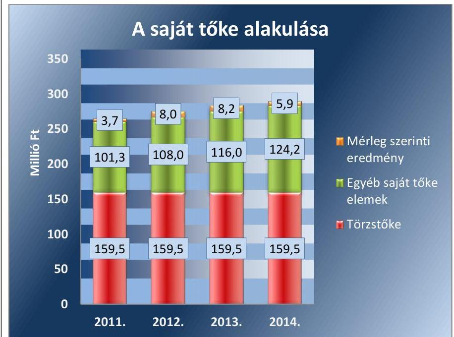

Forrás: A Társaság 2011-2014. évi Beszámolói

---

# 2.3. számú megállapítás 

A kötelezettségállomány nem jelentett kockázatot a közfeladat ellátására és a Társaság működésére.

A TÁRSASÁG 2011-BEN JELENTŐS MÉRTÉKŰ, 86%-os eladósodottság mellett látta el közfeladatát, de 2014 végére a kötelezettségek saját tőkéhez mért aránya 51%-ra csökkent. Az idegen források között 2011-ben meghatározó volt a távhőszolgáltatás fejlesztéséhez, a kivitelező társaságtól igénybevett kölcsön, melyet 2014 júniusában kedvezőbb kamatozású pénzintézeti hitellel váltottak ki.

A 3. ábra mutatja be a Társaság kötelezettségállományához kapcsolódó mutatóinak alakulását.
3. ábra
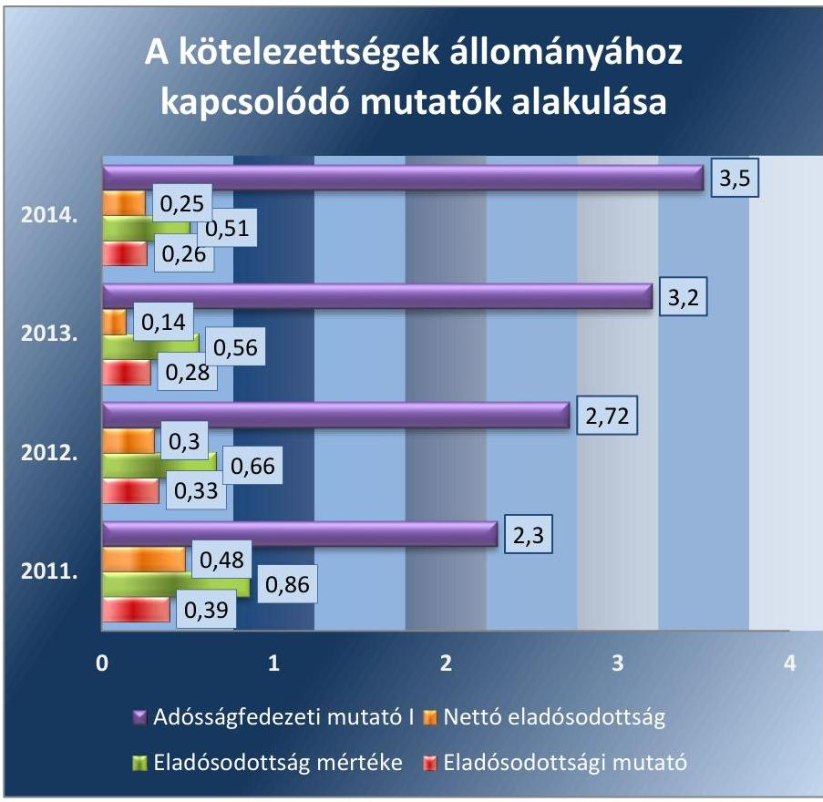

Forrás: A Társaság adatszolgáltatása
A Társaság saját tőke összes forrás hányadosa 2011-ben volt a legalacsonyabb 46%, amely folyamatosan javult, 2014-re 52% lett. Az eladósodottsági mutató hasonlóan javuló tendenciát mutatott. Az eladósodottság mértékének javulása is megállapítható az időszak valamennyi évében, 2014-re 41%-os csökkenést ért el a 2011-es értékhez képest. A nettó eladósodottság szintén javult. Az adósságok fedezetéhez már 2011-ben elegendő eszköz állt a Társaság rendelkezésére, ami a következő években még kedvezőbbé vált. Az adósságfedezeti mutató értéke 2011-ről 2014-re több mint másfélszeresére növekedett. Mindez annak köszönhető, hogy a forgóeszközök és a befektetett eszközök összegének értéke kisebb mértékben csökkent, mint ahogyan a kötelezettségek összege csökkent. Az árbevételre vetített eladósodottság mutató is csökkent.

A Társaság eladósodottságának mértéke és a vagyoni szerkezet változása nem jelentett kockázatot a közfeladat ellátása során, mert a mutatók

---

folyamatosan javultak. A Társaság folyamatosan csökkenő nettó értékesítési árbevételével párhuzamosan növekvő mértékben kapott távhőszolgáltatási támogatást, ami növelte a Társaság likviditását.

A TÁRSASÁG TÖRZSTÖKÉJÉNEK összege 159,5 M Ft. volt, ami jelentősen meghaladta a Gt. tv. 114. § (1) bekezdésében előírt (0,5 M Ft-os) és a Ptk. 3:161. § (4) bekezdésében előírt (3,0 M Ft-os) minimális összeget, ezért a tulajdonosnak intézkedési kötelezettsége nem volt.

# A KÖTELEZETTSÉGEKET A TÁRSASÁG HATÁRIDŐBEN TELJESÍTETTE, az egyszerűsített éves beszámolók előírt, határidőn túli kötelezettséget nem tartalmaztak. A kötelezettségek alakulását szemlélteti az 5. táblázat. 

5. táblázat

| A KÖTELEZETTSÉG ÁLLOMÁNY ALAKULÁSA (M Ft) |  |  |  |  |  |
| :--: | :--: | :--: | :--: | :--: | :--: |
| Megnevezés | 2011. | Módosítás | 2012. | 2013. | 2014. |
| Rövid lejáratú kötelezettségek | 71,3 | 0,2 | 30,5 | 145,5 | 41,9 |
| -ebből a Polgármesteri Hivatal felé teljesítendő | 18,7 |  | 2,6 | 2,6 | 2,6 |
| -ebből Cothec Kft. | 19,2 |  | 19,2 | 136,0 |  |
| Hosszú lejáratú kötelezettségek | 155,2 |  | 152,1 | 13,5 | 105,3 |
| -ebből Cothec Kft. | 155,2 |  | 136,0 |  |  |
| ebből a Polgármesteri Hivatal felé teljesítendő |  |  | 16,1 | 13,5 | 10,8 |
| Kötelezettségek összesen | 226,5 | 0,2 | 182,6 | 159,0 | 147,2 |

A Társaság hosszú lejáratú kötelezettségeit a távhővezeték fejlesztése miatti kölcsön megállapodás, illetve az azt kiváltó pénzintézeti hitelszerződés jelentette. A Társaság hosszú lejáratú kötelezettségeinek aránya az összes kötelezettségen belül 2011-ben 69%, 2012-ben 83%, 2013-ban 8%, 2014-ben 72% volt. Az évek közötti jelentős ingadozás a korábbi fejlesztést kivitelező Kft.-vel szemben fennálló kölcsöntartozás és annak 2013-ban történt részbeni előtörlesztése, valamint ennek kiváltására felvett hosszú lejáratú hitelének elszámolásából következtek. 2014. év végén a hosszú lejáratú kötelezettség értéke 105,3 M Ft-volt, melynek 90%-át, 94,5 M Ft-ot tett ki a pénzintézettel szemben fennálló kötelezettség.

A Társaság kötelezettségei 2011-től 2014-ig 35%-kal csökkentek, ezen belül a rövid lejáratú kötelezettségek 13%-kal. A rövid lejáratú kötelezettségeken belül meghatározó volt a korábbi fejlesztést kivitelező Kft.-vel szemben fennálló kölcsön következő évi tőketörlesztése. A kölcsönszerződés alapján a kölcsönt 10 éves egyenlő részletben kellett megfizetni, de a pénzintézettel kötött hosszú lejáratú hitel lehetőségének birtokában a felek megállapodtak az éven belül történő visszafizetésben. A számviteli előírások következtében 2013-ban a rövid lejáratú kölcsönök értéke kiugróan magas lett, de a hitelfelvétel után 2014-ben ez visszarendeződött.

A Társaság pénzintézettől 2014-ben 124,8 M Ft összegű hosszú lejáratú hitelt vett fel. A hitel kiváltással 2013-ról 2014-re a Társaság rövid lejáratú kötelezettségeinek aránya 92%-ról 28%-ra csökkent.

---

A Társaság áruszállításból és szolgáltatásból származó kötelezettségeinek aránya a rövid lejáratú kötelezettségeken belül változó volt, legmagasabb 2011-ben 42%, legalacsonyabb 2013-ban 1%. 2014 végén a Társaság szállítói kötelezettségének értéke 10,8 M Ft volt (26%), melyben határidőn túli kötelezettség nem szerepelt.

# 2.4. számú megállapítás 

A Társaság a jogszabályi előírásoknak megfelelően teljesítette beszámolási és adatszolgáltatási kötelezettségét.

## A TÁRSASÁG BESZÁMOLÁSI KÖTELEZETTSÉGÉT

az Alapító Okirata és a 2012-ben hatályba lépett számviteli politikája szabályozta. A Társaság beszámolási és adatszolgáltatási kötelezettsége szabályozott volt, aminek a Társaság az előírások szerint minden esetben, határidőben, az előírt tartalommal eleget tett.

A Társaság tulajdonosi jogait gyakorló Baja Város Önkormányzatának Képviselő-testülete a Számv. tv. szerint készített éves beszámolók elfogadásával, valamint az üzleti tervek tárgyalása és elfogadása során gyakorolta az adatszolgáltatással és tájékoztatással kapcsolatos elvárásait. Az üzleti terv követelménye megjelent a társaság ügyvezetőjének anyagi érdekeltségében az elfogadott javadalmazási szabályzaton keresztül.

Az ügyvezetés ellenőrzésére háromfős FB-t választott a tulajdonos Önkormányzat, mely az éves beszámoló dokumentumait és az üzleti terveket véleményezte a Képviselő-testület számára.

A TÁRSASÁG AZ ÉVES BESZÁMOLÓKAT a Gt. tv. 35. § (3) bekezdés előírásának megfelelően az FB írásbeli véleményének birtokában, és a könyvvizsgáló írásbeli jelentésének ismeretében a Társaság Taggyűlése megtárgyalta és határozattal elfogadta. Az elfogadott beszámolók közzététele a Számv. tv.-ben foglaltaknak megfelelően megtörtént.

A könyvvizsgáló az ellenőrzött időszak minden évében minősítés nélküli, hitelesítő záradékkal látta el a Társaság éves beszámolóját. A 2012. évi beszámolótól kezdődően a Tszt. 18/B. § (1) alapján a könyvvizsgáló nyilatkozott a számviteli szétválasztás szabályszerűségéről. A könyvvizsgáló a Gt. 44. § (1) előírásának majd a 2014. március 15-től hatályos Ptk. 3:131. § (2) bekezdésnek megfelelően minden évben részt vett az éves beszámolót tárgyaló Taggyűlésen. Az ellenőrzött időszakban a könyvvizsgáló személye nem változott.

## A TÁRSASÁG AZ ADATVÉDELMI ÉS ADATBIZTON-

SÁGI SZABÁLYZATÁT 2011.10.01-től léptette hatályba, mely megfelelt az Av. tv ${ }^{23}$. 20. § (8), valamint az Info tv ${ }^{24}$. 30. § (6)-ban foglaltaknak. A Társaság az Info tv. 26. § (1)-ban előírtak szerint biztosította a kezelésében lévő közérdekű adatok és közérdekből nyilvános adatok igény szerinti megismerhetőségét. A Társaság honlapján megtalálhatók - a közérdekű adatok között - a szervezetére, a gazdálkodásra, a tevékenységre vonatkozó adatok. Közzétette az Üzletszabályzatát, a közbeszerzésre vonatkozó adatokat, a Panaszkezelési szabályzatát, az Adatvédelmi és Adatbiztonsági Szabályzatát, a távhőszolgáltatással kapcsolatos támogatások feltételeit, a pályázatok adatait, a rezsicsökkentésről szóló kötelező információkat, valamint nyilvánosságra hozta a műszaki információkat. Honlapján elérhetők a fogyasztóvédelmi szervek és felhasználói érdekképviseletek elérhetősége.

---

# 3. A gazdasági társaságnál az ellátott közfeladat bevételei és ráfordításai elszámolása, valamint az önköltségszámítás és árképzés szabályszerű volt-e? 

Összegző megállapítás

A Társaságnál az ellátott közfeladat bevételeinek, ráfordításainak és beruházásainak elszámolása ellenőrzésünk szerint kockázatos, illetve nem megfelelő volt, míg a közszolgáltatás árainak meghatározása szabályszerűen történt.
3.1. számú megállapítás

Az elszámolást az anyagjellegű ráfordításoknál megfelelőnek, a bevételeknél a belső előírásoktól való egyedi eltérések miatt kockázatosnak, míg a beruházások, felújítások és az értékcsökkenési leírás esetében nem megfelelőnek minősítettük.

A SZÁMVITELI SZÉTVÁLASZTÁSI SZABÁLYZATOT a Tszt. 18/A. § (2) bekezdésében foglaltaknak megfelelően elkészítette a Társaság. A számviteli politikában előírták, hogy a Tszt. 18/A-18/C. §-aiban leírtaknak megfelelően a beszámoló kiegészítő mellékletében az eredmény-kimutatást illetve a mérleget - a számviteli szétválasztás szabályait figyelembe véve - az engedélyes tevékenységekre (távhőszolgáltatás) megbontva kell kimutatni.

A Társaság a számviteli politikájában és 2011. augusztus 1-től hatályba léptetett számlarendjében szabályozta a távhőszolgáltatáshoz kapcsolódó különböző bevételeinek elkülönítését. A bevételek elkülönítésének gyakorlata a jogszabályi előírásoknak megfelelt.

A KÖZFELADAT-ELLÁTÁSSAL KAPCSOLATOS BEVÉTELEK elszámolása során nem érvényesültek teljes körűen a belső szabályok előírásai. Ez kockázatot jelez az ellenőrzött terület egészének szabályos működése szempontjából. Egyes esetekben a bevételek elszámolása nem a számlarendben kijelölt főkönyvi számlára történt.

AZ ANYAGJELLEGŰ RÁFORDÍTÁSOK elszámolása megfelelő volt. A költségelszámolást megalapozó kötelezettségvállalás, a költségnemre és közfeladatra történő elszámolás a jogszabályi előírásoknak, valamint a számviteli szétválasztás szabályainak megfelelően történt.

A BERUHÁZÁSOK, FELÚJÍTÁSOK kiadásai és az értékcsökkenési leírás elszámolása nem volt megfelelő. A Társaság az értékcsökkenések elszámolásánál nem tartotta be a számviteli politika előírásait. A számviteli politika a Számv. tv. 80. § (2) bekezdésében rögzítettekkel összhangban az immateriális javak, és a tárgyi eszközök vonatkozásában előírta a 100 ezer forintot meg nem haladó bekerülési érték esetén, a használatba vétel időpontjában történő egyösszegű értékcsökkenési leírást. A Társaság több esetben - a számviteli politikában előírtaktól eltérően - nem alkalmazta az egyösszegű leírást

---

AZ ÜZLETSZABÁLYZAT részletesen tartalmazta a késedelmes fizetés következményeit, a követelések behajtására vonatkozó részletes eljárást. A lakossági tartozások behajtására vonatkozó szabályzatot 2011. június 1-től léptették életbe, mely tartalmazta a lakossági követelések nyilvántartási kötelezettségét, a végrehajtási eljárás folyamatát és a díjfizetések analitikus nyilvántartását, egyeztetését.

A Társaság 2012-ben a Számv. tv. 3§ (4) 10. pontjában foglaltak alapján 1,5 M Ft összegű behajthatatlan követelést írt le. A behajthatatlanság ténye és mértéke bizonyított és dokumentált volt.

A Társaság részére a távhőszolgáltatással kapcsolatban nyereségkorlát volt előírva az 50/2011. (IX.30.) NFM rendelet ${ }^{25} 5 \S$-ában foglaltak alapján. A nyereségkorláttal kapcsolatos előírásokat betartotta. A Baja Energetika Kft.-nek 2012. évben 35,8 M Ft, 2013. évben 52,9 M Ft, 2014. évben 17,4 M Ft visszafizetendő, nyereségkorlát feletti eredménytöbblete keletkezett, amit az előírásoknak megfelelően visszafizetett.

# 3.2. számú megállapítás 

Önkormányzati hatáskörben a távhődíakat a távhőszolgáltatási rendeletben előírtaknak megfelelően határozták meg, a hatósági árakat az előírásoknak megfelelően alkalmazták.

A Társaság önköltség számítási szabályzattal nem rendelkezett, mivel a Számv. tv. 14. § (6) bekezdésének előírása alapján önköltségszámítás rendjére vonatkozó szabályzat készítésére nem volt kötelezett.

A
 Társaság a Tszvt. 18/A. § (2) bekezdésében rögzítettek alapján a számviteli szétválasztási szabályokat kidolgozta és a gyakorlatban alkalmazta. A 2012-2014. években az egyszerűsített éves beszámoló kiegészítő mellékletében elkészítette a számviteli szétválasztásának megfelelő eredmény-kimutatását és mérlegét.

A távhőszolgáltatás árának meghatározása összhangban volt az előírásokkal. A Társaság 2011. január 1-től 2011. április 14-ig a Tszvt. 6. § alapján meghatározott díakat alkalmazta, amit az Önkormányzat a távhőszolgáltatási rendeletében jóváhagyott. Az ellenőrzött időszakban a távhőszolgáltatás díja kéttényezős volt, alapdíjat és hődíjat határoztak meg.

A távhőszolgáltatás díját 2011. április 15-től a Tszvt. 57/D. § (1) bekezdése alapján, mint legmagasabb hatósági árat, azok szerkezetét és alkalmazási feltételeit - a MEKH javaslatának figyelembevételével - a nemzeti fejlesztési miniszter rendeletben állapította meg. A lakossági távhő díjakat 2011. április 15-től - a 2011. március 31-én alkalmazott díjakon - befagyasztották, majd 2012. január 1-jétől az 50/2011. (IX. 30.) NFM rendelet hatályos 4. §-a alapján 4,2%-kal megemelték. A 2013. évben két lépcsőben - 2013. január 1-jével az előző évihez képest 10,0%-os, majd 2013. november 1-jétől további 11,1%-os mértékben - csökkentették a Rezsi tv. 3. § (1) bekezdésének, valamint az 50/2011. (IX. 30.) NFM rendelet 3. § (2) bekezdésének megfelelően. A Rezsi tv. 3. § (1) bekezdése a távhőszolgáltatás díjának további 3,3%-kal történő csökkentését írta elő 2014. október 1-jétől. A Társaság a jogszabályi rendelkezéseknek megfelelően az alapdíj és hődíj 2012. évi 4,2%-os emelését, a 2013. évi két lépcsőben történő, valamint 2014. évi - előírt mértékű - csökkentését végrehajtotta.

---

# JAVASLATOK 

Az ÁSZ tv. 33. § (1) bekezdésében foglaltak értelmében az ellenőrzött szervezet vezetője köteles a jelentésben foglalt megállapításokhoz kapcsolódó intézkedési tervet összeállítani és azt a jelentés kézhezvételétől számított 30 napon belül az ÁSZ részére megküldeni.
Az ÁSZ tv. 33. § (3) bekezdése szerint amennyiben az ellenőrzött szervezet vezetője nem küldi meg határidőben az intézkedési tervet vagy továbbra sem elfogadható intézkedési tervet küld, az ÁSZ elnöke
a) az ellenőrzött szervezet vezetőjével szemben büntető- vagy fegyelmi eljárás megindítását kezdeményezheti;
b) kezdeményezheti az illetékes hatóságnál, illetve szervezetnél az ellenőrzött szervezetet megillető, az államháztartás valamelyik alrendszeréből származó támogatások vagy egyéb juttatások folyósításának, illetve a személyi jövedelemadó 1%-ából történő felajánlásokból való részesedés lehetőségének felfüggesztését.

Javaslataink célja a Baja Energetika Kft. gazdálkodása szabályszerűségének javítása annak érdekében, hogy a szabályozási környezet és gazdálkodási gyakorlat megfelelően tudja támogatni az átlátható működést.

## Baja Energetika Kft. ügyvezető igazgatójának

1. Módosítsa a leltározási szabályzatot a tárgyi eszközök leltározására vonatkozó hatályos jogszabályi előírásoknak megfelelően.
(2.1. sz. megállapítás 1. bekezdése alapján)
2. Intézkedjen a jogszabályi előírások és belső szabályozásnak megfelelő gyakorlat biztosítására, ezen belül:
a) készítsen a beszámoló elkészítéséhez, a mérleg tételeinek alátámasztásához a mérleg fordulónapján meglévő eszközöket és forrásokat mennyiségben és értékben bemutató leltárt;
(2.2. sz. megállapítás 1. bekezdései alapján)

---

b) tartsa be a számviteli politikában meghatározott összegű beszerzési érték alatti eszközöknél az értékcsökkenés elszámolására vonatkozó előírásokat.
(3.1. sz. megállapítás 5. bekezdése alapján)
3. Tegyen intézkedéseket a feltárt - az évente elkészített beszámolók mérlegeinek tételeit alátámasztó leltárak hiánya miatti - szabálytalanság tekintetében a vonatkozó feladatok irányításáért, vezetéséért felelős mérlegképes könyvelői felelősség tisztázása érdekében és szükség szerint intézkedjen a felelősség érvényesítéséről.
(2.2. sz. megállapítás 1. bekezdése alapján)

Javaslataink célja az Önkormányzat szabályszerű működésének elősegítése, továbbá az önkormányzati tulajdonosi joggyakorlás kontrolljainak erősítése.

# Baja Város Önkormányzat polgármesterének 

1. Gondoskodjon arról, hogy a távhőszolgáltatásról szóló önkormányzati rendelet tartalma maradéktalanul feleljen meg a jogszabályban előírt tartalmi követelményeknek.
(1.1. sz. megállapítás 5. bekezdése alapján)
2. Tegyen intézkedéseket a feltárt - az évente elkészített beszámolók mérlegeinek tételeit alátámasztó leltárak hiánya miatti - szabálytalanság tekintetében a felelősség tisztázása érdekében és szükség szerint intézkedjen a felelősség érvényesítéséről.
(2.2. sz. megállapítás 1. bekezdése alapján)
3. Terjessze a képviselő-testület elé a jegyző által elkészített gazdasági programtervezetet.
(1.1. sz. megállapítás 1. bekezdése alapján)

---

# Baja Város Önkormányzat jegyzőjének 

1. Készítse el - a jogszabályi előírásnak megfelelően, a polgármester által történő képviselőtestület elé terjesztés érdekében - a gazdasági programnak a távhő- közszolgáltatás biztosítására, színvonalának javítására vonatkozó fejlesztési elképzelésekkel történő kiegészítését tartalmazó tervezetét.
(1.1. sz. megállapítás 1. bekezdése alapján)
2. Ellenőrizze a jogszabályi előírásnak megfelelően a Társaság távhő szolgáltató tevékenységét, az Üzletszabályzatban foglaltak betartása szempontjából.
(1.2. sz. megállapítás 11. bekezdése alapján)

---

.

---

# MELLÉKLETEK 

- I. SZ. MELLÉKLET: ÉRTELMEZŐ SZÓTÁR
adósságfedezeti mutató I.
adósságfedezeti mutató II.
adósságszolgálat fedezeti mutató
árbevételre vetített eladósodottság
eladósodottság mértéke
eladósodottsági mutató (tőkeáttétel)
garancia
gazdasági társaság
(befektetett eszközök + forgó eszközök) / idegen forrás
Azt mutatja, hogy 1 Ft adósságra hány Ft vagyon jut. Általánosságban véve kedvező, ha értéke 2 körül van, de nagy eszközberuházás-igényű iparágakban értéke kisebb is lehet.
működési cash flow / hosszú lejáratú kötelezettségek
A mutató azt jelzi, hogy az adott gazdálkodási időszak működési pénzáramainak eredményeként realizált cash flow révén a vállalkozás mennyiben lenne képes valamennyi hosszú lejáratú kötelezettségének eleget tenni. Ennek vizsgálatára viszonylag ritkán kerül sor, az elsősorban a veszélyhelyzetbe került vállalkozások esetében lehet érdekes. Általánosságban véve kedvező, ha a működési cash flow minél nagyobb arányban nyújt fedezetet a hosszú lejáratú kötelezettségre (értéke nagyobb, mint 1, nő az ellenőrzött időszakban).
működési cash flow / hosszú lejáratú kötelezettségek esedékes törlesztő részlete
Jelzi a vállalkozás tényleges kötelezettség-teljesítési képességének alakulását a hosszú lejáratú kötelezettségek vonatkozásában. Általánosságban véve kedvező, ha értéke nagyobb, mint 1, nő az ellenőrzött időszakban.
(kötelezettségek - forgóeszközök) / értékesítés nettó árbevétele
Az árbevételre vetített eladósodottság azt mutatja, hogy az árbevétel mekkora fedezet nyújt a kötelezettségeknek a forgóeszközökkel csökkentett részére. Általánosságban véve kedvező, ha az árbevétel minél nagyobb arányban nyújt fedezetet a forgóeszközökkel csökkentett kötelezettségekre (értéke kisebb, mint 1, csökken az ellenőrzött időszakban).
Kötelezettségek / saját tőke
Fontos szerepet játszik ez a mutató egy vállalat megítélésében. Azt mutatja, hogy a saját források a kötelezettségek hány százalékát fedezik. Törekedni kell, hogy a mutató tartósan (jelentősen) 1 alatti értéket érjen el.
idegen tőke / összes forrás
Egészségesnek mondható egy olyan mértékű áttétel, amelyet az üzleti tervek szerint és az elmúlt időszak tapasztalatai alapján a társaság megfelelő biztonsággal ki tud termelni. Nagy eszközberuházás-igényű iparágakban értéke magasabb, azaz magasabb eladósodottság is elfogadható, de 75-85%-ot meghaladó értéknél már itt is erős, sőt túlzott külső finanszírozottságról beszélhetünk. Általánosságban véve kedvező, ha értéke kisebb, mint 0.
A garancia olyan önálló, az önkormányzat nevében vállalt kötelezettség, amely alapján az önkormányzat az önkormányzati költségvetés terhére szerződésben meghatározott feltételek szerint, a kötelezett nem teljesítése esetén a jogosultnak fizetést teljesít az előzetesen rögzített összeghatárig.
Ptk. 3:88. § (1) A gazdasági társaságok üzletszerű közös gazdasági tevékenység folytatására, a tagok vagyoni hozzájárulásával létrehozott, jogi személyiséggel rendelkező vállalkozások, amelyekben a tagok a nyereségből közösen részesednek, és a veszteséget közösen viselik.

---

keresztfinanszírozás tilalma

## kezesség

közfeladat
közszolgáltatás
nemzeti vagyon
nettó eladósodottság

A közszolgáltatás díját úgy kell megállapítani, hogy az maradéktalanul fedezetet nyújtson a közszolgáltatás indokolt költségeire és ráfordításaira, valamint a közszolgáltató e tevékenységével kapcsolatos ésszerű nyereségére; az ésszerű nyereség nem tartalmazhatja a közszolgáltatáson kívül eső egyéb gazdasági tevékenységei költségeinek, ráfordításainak fedezetét.
A kezességre vonatkozó előírásokat a Ptk. 6:416-430. §-ai tartalmazzák. Kezességi szerződéssel a kezes kötelezettséget vállal a jogosulttal szemben, hogyha a kötelezett nem teljesít, maga fog helyette a jogosultnak teljesíteni. Kezesség egy vagy több, fennálló vagy jövőbeli, feltétlen vagy feltételes, meghatározott vagy meghatározható összegű pénzkövetelés vagy pénzben kifejezhető értékkel rendelkező egyéb kötelezettség biztosítására vállalható. A Ptk. szerint kezességet csak írásban lehet vállalni. A kezes kötelezettsége ahhoz a kötelezettséghez igazodik, amelyért kezességet vállalt. A kezes kötelezettsége nem válhat terhesebbé, mint amilyen elvállalásakor volt, kiterjed azonban a kötelezett szerződésszegésének jogkövetkezményeire és a kezesség elvállalása után esedékessé váló mellékkövetelésekre is.
Jogszabályban meghatározott állami vagy önkormányzati feladat, amit az arra kötelezett közérdekből, jogszabályban meghatározott követelményeknek és feltételeknek megfelelve végez, ideértve a lakosság közszolgáltatásokkal való ellátását, továbbá az állam nemzetközi szerződésekben vállalt kötelezettségeiből adódó közérdekű feladatokat, valamint e feladatok ellátásához szükséges infrastruktúra biztosítását is (Nvtv. 3. § (1) bekezdés 7. pont).
A közszolgáltatás: „közcélú, illetőleg közérdekű szolgáltatást jelent, amely egy nagyobb közösség (állam, település) minden tagjára nézve megközelítőleg azonos feltételek mellett vehető igénybe, ezért valamilyen mértékig közösségi megszervezést, illetve szabályozást, ellenőrzést igényel." Az Ebktv. 3. § d) pontja a következőképpen határozza meg a közszolgáltatást: „szerződéskötési kötelezettség alapján a lakosság alapvető szükségleteinek ellátására irányuló szolgáltatás, így különösen a villamos energia-, gáz-, hő-, víz-, szennyvíz- és hulladékkezelési, köztisztasági, postai és távközlési szolgáltatás, továbbá a menetrend alapján közlekedő járművekkel végzett közforgalmú személyszállítás"
Az Nvtv. 1. § (2) bekezdés c) pontja szerint „az állam vagy a helyi önkormányzat tulajdonában lévő pénzügyi eszközök, továbbá az államot vagy a helyi önkormányzatot megillető társasági részesedések"
(kötelezettségek - követelések) / saját tőke
Azt mutatja, hogy a kintlévőségekkel csökkentett kötelezettségeket milyen mértékben fedezi saját forrás. Ez feltételezi, hogy a követelések pénzügyileg előbb realizálódnak, mint ahogy a kötelezettségeket teljesíteni kell. A mutató minél kisebb, csökkenő értéke kedvező.

---

II. SZ. MELLÉKLET: EREDMÉNYKIMUTATÁS

BAJA ENERGETIKA KFT. EREDMÉNYKIMUTATÁSAI (M Ft )

|  Tétel megnevezése | 2011. | Módosítás | 2012. | 2013. | 2014.  |
| --- | --- | --- | --- | --- | --- |
|  I. Értékesítés nettó árbevétele | 563,4 | 3.2 | 457,1 | 394,7 | 343,5  |
|  II. Aktivált saját teljesítmények értéke | 0 |  | 0 | 0 | 0  |
|  III. Egyéb bevételek | 55,4 |  | 120,3 | 157,2 | 178,2  |
|  -ebből NFM támogatás | 40,6 |  | 89,9 | 127,0 | 148,0  |
|  IV. Anyagjellegű ráfordítások | 484,4 |  | 417,3 | 401,1 | 348,6  |
|  V. Személyi jellegű ráfordítások | 71,6 |  | 77,3 | 73,9 | 74,9  |
|  VI. Értékcsökkenési leírás | 22,5 |  | 24,0 | 24,5 | 23,6  |
|  VII. Egyéb ráfordítások | 21,3 |  | 33,7 | 30,8 | 31,1  |
|  A. Üzemi (üzleti) tevékenység eredménye | 19,0 | 3,2 | 25,1 | 21,6 | 43,5  |
|  VIII. Pénzügyi műveletek bevételei | 0,02 |  | 0,2 | 1,4 | 1,1  |
|  IX. Pénzügyi műveletek ráfordításai | 14,5 |  | 16,2 | 15,6 | 37,0  |
|  B. Pénzügyi műveletek eredménye | -14,5 |  | -16,0 | -14,2 | -36,0  |
|  C. Szokásos Vállalkozási eredmény | 4,5 | 3,2 | 9,1 | 7,4 | 7,5  |
|  X. Rendkívüli bevételek | 0 |  | 0 | 1,7 | 0  |
|  XI. Rendkívüli ráfordítások |
 0 |  | 0 | 0 | 0  |
|  D. Rendkívüli eredmény | 0 |  | 0 | 1,7 | 0  |
|  E. Adózás előtti eredmény | 4,5 | 3,2 | 9,1 | 9,1 | 7,5  |
|  XII. Adófizetési kötelezettség | 0,8 | 0,2 | 1,1 | 0,9 | 1,6  |
|  F. Adózott eredmény | 3,7 | 3,0 | 8,0 | 8,2 | 5,9  |
|  G. Mérleg szerinti eredmény | 3,7 | 3,0 | 8,0 | 8,2 | 5,9  |

---

|  |  |  |  |  |  |  |
| :--: | :--: | :--: | :--: | :--: | :--: | :--: |
|  |  |  |  |  |  |  |
| BAJA ENERGETIKA KFT. FŐBB JELLEMZŐI |  |  |  |  |  |  |
| Sor-   szám | Megnevezés |  | 2011. | 2012. | 2013. | 2014. |
|  | A gazdasági társaság tulajdonosi összetétele: |  |  |  |  |  |
| 1. | Tulajdonos Önkormányzat megnevezése: |  | Baja Város Önkormányzat |  |  |  |
| 2. | Önkormányzat tulajdoni részesedésének aránya | $\%$ | 100 |  |  |  |
| 3. | Önkormányzat tulajdoni részesedésének összege | ezer Ft | 159.500 |  |  |  |
| 4. | Tulajdonos gazdasági társaság megnevezése: |  | - |  |  |  |
| 5. | Gazdasági társaság tulajdoni részesedés aránya | $\%$ | 0 |  |  |  |
| 6. | Gazdasági társaság tulajdoni részesedés összege | ezer Ft | 0 |  |  |  |
| 7. | A tárgyévben a gazdasági társaság vagyonkezelésben lévő önkormányzati vagyon után elszámolt értékcsökkenés összege | ezer Ft | Nem kezelt önkormányzati vagyont |  |  |  |
| 8. | Működési cash flow | $\operatorname{ezer} \mathrm{Ft}$ | 0 | 0 | 0 | 0 |

---

# FÜGGELÉK: ÉSZREVÉTELEK 

A jelentéstervezetet a Számvevőszék 15 napos észrevételezésre megküldte az ellenőrzött szervezet vezetőjének az ÁSZ tv. 29. § (1) bekezdése előírásának megfelelően.
Baja Energetika Kft. ügyvezető igazgatója, valamint Baja Város Polgármestere írásban észrevételt tett.
Az elfogadott észrevételek alapján a Számvevőszék módosította a jelentést.
A függelék tartalmazza az ellenőrzött észrevételeit, illetve az el nem fogadott észrevételek elutasításának indoklását.

[^0]
[^0]:    * 29. § (1) Az Állami Számvevőszék az ellenőrzési megállapításait megküldi az ellenőrzött szervezet vezetőjének vagy az általa megbízott személynek, és annak, akinek személyes felelősségét állapította meg.
    (2) Az ellenőrzött szervezet vezetője és a felelősként megjelölt személy az ellenőrzés megállapításaira tizenöt napon belül írásban észrevételt tehet.
    (3) Az Állami Számvevőszék az észrevételre a beérkezésétől számított harminc napon belül írásban válaszol. A figyelembe nem vett észrevételeket köteles a jelentésben feltüntetni, és megindokolni, hogy azokat miért nem fogadta el.

---

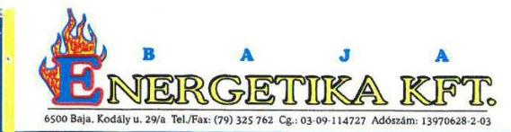

Állami Számvevőszék
Domokos László Úr
Elnök

1052 Budapest
Apáczai Csere János u. 10.

# Tisztelt Elnök Úr! 

iktatószám: E-K/14/2016.
tárgy: észrevételek jelentés tervezetre

## ÁLLAMI SZÁMVEVŐSZÉK

00726710016
Érkezé: 2015. JAN. 28.
Iktatószám:
Melléklet:
Alulírott Kajtár Zsolt, mint a Baja Energetika Kft. ügyvezető igazgatója Az önkormányzatok gazdasági társaságai - Az önkormányzatok többségi tulajdonában lévő gazdasági társaságok közfeladat-ellátását érintő gazdálkodási tevékenysége szabályszerűségének ellenőrzése - Baja Energetika Kft. című számvevőszéki jelentés tervezet (továbbiakban: Tervezet) kapcsán, az ÁSZ tv. 29. § (2) bekezdése szerint az alábbi észrevételeket teszem:

## 2.1. számú megállapításhoz (18. oldal)

Az ellenőrzés során bemutatott szabályzatok 2011. 08. 01. dátummal készültek, 2011. 07. 01-től van új ügyvezető igazgatója a Társaságnak. Az ügyvezető igazgatói feladatok átvételével egyidejűleg a meglévő szabályzatok is átvételre kerültek. Ezek a szabályzatok éltek 2011. 01. 01-től is.

A leltározási szabályzatban 2012. évtől valóban nem módosult a leltározási időszak 5 évről 3 évre, de Társaságunk minden év december 31-én a tárgyi eszközöket és immateriális javakat leltározza, ahogy a leltározási szabályzat 2. oldalán ez megtalálható.

## 2.2. számú megállapításhoz (18. oldal)

Minden évben leltározásra kerülnek a tárgyi eszközök és immateriális javak. Az ellenőrzés során bemutatott leltárakban - amelyek a Kulcs-Soft tárgyi eszköz programjából kerültek kinyomtatásra - a mennyiségek mellett nem kerültek bejelölésre az egyezőségek, azt az ellenőrzés nem találta megfelelőnek. A leltározás tehát megtörtént, leltár is volt - a számviteli nyilvántartással megegyezően.
2015. október 2-án kelt Nyilatkozat 3. bekezdése, miszerint: 2012., 2013., 2014. években az immateriális javak és tárgyi eszközök esetében nem volt leltározás és nem készült leltár a fordulónapi mérleg alátámasztására nem helytálló, ugyanis a Társaság könyvelési programjában lévő kitöltetlen leltár került feltöltésre az ellenőrzés során az Állami Számvevőszék kijelölt informatikai felületére. Az év végi érvényes leltározási listák (2012., 2013., és 2014. évekre vonatkozóan) 2015. december hónapban az E-K/309/2015. iktatószámú Nyilatkozat mellékleteként megküldésre került az Állami Számvevőszék részére.

A Társaság az elszámolt amortizációnak kezdetű bekezdésben taglaltak a gyakorlatban nem alkalmazhatók, ugyanis a Társaság gazdálkodási adataiban - kiemelten az év végi állomány esetében - olyan forgóeszköz tételek is szerepeltek, szerepelnek, melyek nem a Társaság saját vagyonát jelentik, például 2014. év végén távhőszolgáltatási támogatás kapcsán a 2013. évi eredménykorlát feletti rész visszafizetéséről a Magyar Energetikai és Közmű-szabályozási Hivatal nem rendelkezett, ami tételesen 52,8 MFt mértékben növelte a bankszámla egyenlegét 2014. év végén. Ehhez hozzáadódik a távhőszolgáltatási támogatás kapcsán a 2014. évi eredménykorlát feletti rész, ami tételesen 17,3 MFt mértékben növelte a bankszámla egyenlegét, összesen 70,1 MFt. A Társaság felelős vezetése az óvatosság elve alapján nem fejleszthet, nem vásárolhat olyankor, mikor nem rendelkezik megfelelő saját vagyonnal,

---

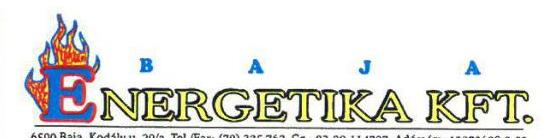
pénzeszközzel. Fentiekből adódóan az eszközvagyon növelése (pl. beruházások, élettartam-növelő felújítások) - saját vagyoni fedezet hiányában - nem lehet felelős döntés úgy, hogy közben a Társaságnak 105,307 MFt hosszú lejáratú kötelezettsége állt fenn.

# 2.2. számú megállapításhoz (21. oldal; 9. oldallal összefüggésben) 

Az Ellenőrzés területe fejezet (9. oldal 1. bekezdés) megállapításához kiegészítésképpen hozzátartozik, hogy 2011. és 2014. évek összehasonlításában az értékesítés nettó árbevétele jelentős mértékben csökkent, mely egyértelműen a távhőszolgáltatás hatósági árának (továbbiakban: hatósági ár) bevezetésének és a rezsicsökkentés együttes eredménye. A hatósági ár 2011. október 1. utáni érvényesítése szükségessé tette a távhőszolgáltatás támogatás intézményének bevezetését. Az NFM támogatás 2011. évben 40,6 MFt volt, mely 3 hónapra vonatkozik (2011. október-november-december). A többi évben (2012-2013-2014.) 12 hónap összességére vonatkoznak a megadott támogatási értékek (2012. évben 89,9 MFt; 2013. évben 127 MFt; 2014. évben 148 MFt). Ezzel szemben a Tervezet szövegezése szerint 2011. és 2014. évek vonatkozásában értékel, azaz a megfogalmazottak szerint a távhőszolgáltatáshoz kapott támogatás több mint háromszorosára (21. oldal 3. bekezdésében: több mint három és félszeresére) növekedett megállapítások nem helytállóak - amennyiben éves értékelésben fogalmaz.

### 3.1. számú megállapításhoz (25. oldal)

A közfeladat-ellátással kapcsolatos bevételeknél egyes esetekben a bevételek elszámolása nem a számlarend szerinti főkönyvi számlákra történt - állapította meg az ellenőrzés. Információ hiányában nem azonosítható be, hogy mely mintavételi tételekre vonatkozik fenti megállapítás - konkrét felsorolást a jelentés nem tartalmaz és az ellenőrzés során sem jelezték ezeket a tételeket. Úgy tűnik, ez valószínűleg csak bizonyos számlaosztályon belüli eset lehetett. Időközben a szétválasztás módszerének megfelelő alkalmazása érdekében új főkönyvi számlák megnyitása vált szükségessé, amelyek a számlarendben nem kerültek átvezetésre.

A beruházások, felújítások kiadásai és az értékcsökkenés elszámolása bekezdésben megállapításra került, hogy a 100.000 Ft alatti eszközök esetében a Társaság nem minden esetben számolta el használatbavételkor egyösszegben a bekerülési értéket értékcsökkenésként. 2011. évet követően a Társaság külső könyvelést követően átvette a Társaság könyvelését, ezt új könyvelési program megvásárlása és bevezetése követte 2012. év június hónaptól. Az új könyvelési struktúrában az állomány átvételét követően paraméterezési hiba okozta a 100 ezer forintot meg nem haladó bekerülési értékű immateriális javak és a tárgyi eszközök könyvelését. Összességében nem az eszköz használatbavételének időpontjában történő egyösszegű leírás valósult meg, hanem egy év alatt lineáris leírás került alkalmazásra a paraméterezési hiba miatt.
Az, hogy néhány bevétel nem a számlarend szerinti főkönyvi számlára került elszámolásra és a 100 ezer forint alatti tételek esetében előfordult, hogy nem egyösszegben került elszámolásra a használatbavételkor, a Társaság eredményében jelentős hibát nem jelentett, a számviteli szétválasztás a jogszabályi előírásoknak megfelelően elkészült, a nyereségkorlát feletti rész helyesen megállapításra került. A Tervezet szerint a bevételek elszámolását kockázatosnak, a beruházások, felújítások és az értékcsökkenés elszámolását nem megfelelőnek minősíteni megállapítást a fentiek alapján módosítani javasolja Társaságunk.

## Összegzés

A Tervezet egészére vonatkozó észrevétel, hogy az egyes megállapítások során feltárt hiányosságok esetében nem jelöli meg tételesen az ellenőrzés során tett mintavételezés pontos

---

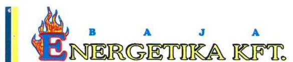
megnevezését, helyét, így szakmai magyarázatot, észrevétel megtételét is megnehezíti Társaságunk részéről.

Megjegyezendő, hogy a Társaság vezetőségében 2011. július 1-vel beállt változását követően a humán erőforrások rendelkezésre állásának függvényében kerültek felülvizsgálatra, bevezetésre a Társaság működését befolyásoló szabályzatok. 2012. évtől Társaságunk alkalmazott könyvelőt foglalkoztat és a Kulcs-Soft integrált számviteli programot használja. Az átállással voltak kisebb problémák, amit az ellenőrzés is megállapított. A külső könyvelőiroda időközben végelszámolással megszűnt és az átadott anyagban nem volt megtalálható az ellenőrzés által kért 2011. évi dokumentumok egy része.

Megjegyezendő továbbá, hogy az Összegzés fejezet Főbb megállapítások, következtetések, javaslatok rész (5. oldal) 2. bekezdésében tett megállapítás, valamint a Megállapítások fejezet 1. pontja (15. oldal 1. bekezdés) felülvizsgálata javasolt, ugyanis a távhőszolgáltatással kapcsolatos önkormányzati rendelet tartalmazza a Tszt. 6. § (2) bekezdés c) pontja alapján a távhőszolgáltatás fejlesztési terület pontos kijelölését környezetvédelmi, levegőtisztaság-védelmi szempontból (A távhőszolgáltatásról, a távhőszolgáltatás legmagasabb díjáról, és a díjalmazás feltételeiről szóló, többször módosított 23/2006.(VII.10.) Ktr. sz. rendelet 25. § (4) bekezdése).

Baja, 2016. január 21.
Tisztelettel:
Kajtár Zsolt
ügyvezető igazgató

BAJA ENERGETIKA KFT.
6500 Baja, Kodály Z. u. 29/A
Tel./Fax: 79/325-762
Adószám: 13970628-2-03
Cégbírósági szám: 11772033-20054599

---

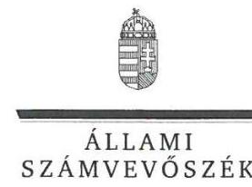

ELNÖK

Ikt.szám: V-0846-125/2016.

# Kajtár Zsolt úr 

ügyvezető igazgató
Baja Energetika Kft.

## Baja

## Tisztelt Ügyvezető igazgató Úr!

„Az Önkormányzatok gazdasági társaságai - Az önkormányzatok többségi tulajdonában lévő gazdasági társaságok közfeladat-ellátását érintő gazdálkodási tevékenysége szabályszerűségének ellenőrzése - Baja Energetika Kft." címmel készített számvevőszéki jelentéstervezetre tett észrevételeit köszönettel megkaptam.

Az Állami Számvevőszék észrevételekre vonatkozó álláspontjáról a felügyeleti vezető által készített részletes tájékoztatást csatoltan megküldöm.

Tájékoztatom Ügyvezető igazgató Urat, hogy a számvevőszéki jelentésben - az Állami Számvevőszékről szóló 2011. évi LXVI. törvény 29. § (3) bekezdése alapján - a figyelembe nem vett észrevételeket szerepeltetjük az elutasítás indokának feltüntetésével.

Budapest, 2016. október 26.
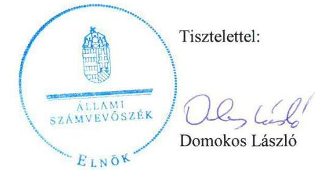

Melléklet: Tájékoztatás az elfogadott és el nem fogadott észrevételekről

---

# Tájékoztatás  

 az elfogadott és el nem fogadott észrevételekről

„Az Önkormányzatok gazdasági társaságai - Az önkormányzatok többségi tulajdonában lévő gazdasági társaságok közfeladat ellátását érintő gazdálkodási tevékenysége szabályszerűségének ellenőrzése - Baja Energetika Kft. "című jelentéstervezetre 2016. január 28-án érkezett észrevételeit áttekintettük, azok kezelésével kapcsolatban a következő tájékoztatást adom.

## 1. észrevétel - 2.1. számú megállapításhoz (18. oldal)

Az észrevétel első bekezdése (amely a szabályzatokról általánosságban szól) a 2.1. számú megállapításban szereplő, a számlarendre vonatkozó hiányosságot nem vitatja, ezért a jelentéstervezet módosítása nem indokolt.

Az észrevétel második bekezdése (,,A leltározási szabályzatban 2012. évtől valóban nem módosult a leltározási időszak... ") a jelentéstervezet megállapítását megerősíti, ezért annak módosítása nem indokolt.

## 2. észrevétel - 2.2. számú megállapításhoz (18. oldal)

Az észrevétel első bekezdésében foglaltakra (,,Az ellenőrzés során bemutatott leltárakban...a mennyiségek mellett nem kerültek bejelölésre az egyezőségek, azt az ellenőrzés nem találta megfelelőnek. ") vonatkozóan a jelentéstervezet nem tartalmazott megállapítást, ezért annak módosítása nem releváns.

Az észrevétel második bekezdésében hivatkozott E-K/309/2015. iktatószámú, 2015. december 28-ai Nyilatkozat mellékleteként megküldött, a 2012., 2013., 2014. évekre vonatkozó leltározási listákat nem áll módunkban figyelembe venni, tekintettel arra, hogy a 2015. október 7-én kiállított teljességi nyilatkozatban rögzítették, hogy ,, ...az ellenőrzött tárgykörben kért és átadott dokumentumokon kívül más adatokkal, iratokkal nem rendelkezünk". Az ÁSZ az utólag megküldött leltározási listák valódiságáról az ellenőrzés során meggyőződni nem tudott.

Az észrevétel harmadik bekezdése nem vitatja, hogy nem történt az elszámolt amortizációnak megfelelő mértékű eszközpótlás és a beruházások, élettartam-növelő felújítások nem az eszközök elhasználódásának megfelelő arányban történtek. A tényszerű megállapítás nem tartalmazott szabályszerűtlenséget, illetve arra utaló jogszabályi hivatkozást, ezért a megállapítás módosítása nem indokolt.

---

# 3. észrevétel - 2.2. számú megállapításhoz (21. oldal; 9. oldallal összefüggésben) 

Az észrevétel alapján a 9. oldalon található szövegrészt az egyértelműség érdekében az alábbiak szerint pontosítjuk: „A Társaságnál a 2011. és a 2014. évek összehasonlításában az értékesítés nettó árbevétele jelentős mértékben, 39%-kal (219,9 M Ft-tal) csökkent, ugyanakkor az NFM-től a távhőszolgáltatáshoz kapott támogatás (a 2011. év utolsó negyedéve és a 2014. év összehasonlításában) több mint három és félszeresére növekedett."

A 21. oldalon található szövegrészt az alábbiak szerint pontosítjuk: „Az üzemi tevékenység eredményének növekedésében és a pozitív mérleg szerinti eredményben meghatározó volt az NFM támogatás összege, amely a 2011. év utolsó negyedévében kapott összeghez képest a 2014. évre több mint három és félszeresére nőtt."

## 4. észrevétel - 3.1. számú megállapításhoz (25. oldal)

Az észrevétel első bekezdése a mintavételi tételek beazonosíthatóságának hiányát fogalmazza meg. Az elszámolások szabályszerűségét mintavétellel ellenőrizzük és az adott sokaságban előforduló hibás tételek arányát becsüljük. A megfelelő, a kockázatos, a magas kockázatú, vagy a nem megfelelő értékelés valamelyike a megnevezett sokaságra vonatkozik és emiatt a hibás tételek egyedi azonosítása a jelentésben nem értelmezhető. A mintatételek dokumentumait a Társaság bocsátotta rendelkezésre, tehát azokat pontosan ismeri, a hibákat pedig egyedi kontrollokkal maga is beazonosíthatja.

Az észrevétel második bekezdésében a jelentéstervezet megállapítását (,,A Társaság több esetben - a számviteli politikában előírtaktól eltérően - nem alkalmazta az egyösszegű leírást.") nem vitatja, hanem megerősíti (,,Összességében nem az eszköz használatbavételének időpontjában történő egyösszegű leírás valósult meg, hanem egy év alatt lineáris leírás került alkalmazásra a paraméterezési hiba miatt."), ezért annak módosítása nem indokolt.

Az észrevétel harmadik bekezdésében, a minősítő megállapítás módosítására vonatkozó javaslat a fentiek miatt nem indokolt.

## 5. észrevétel - Összegzés

Az észrevétel első bekezdése az észrevétel megtételének megnehezítését fogalmazza meg a mintavételezés pontos meghatározásának hiánya miatt. A mintavételezéssel és hibásnak minősített tételekkel kapcsolatban a tájékoztatás 4. észrevételre adott válaszának első bekezdése részletes információt ad.

Az észrevétel második bekezdése a könyvelési rendszerben bekövetkezett változás miatti nehézségeket tartalmazza, nem vitatja az ellenőrzés megállapításait.

Az észrevétel harmadik bekezdése a távhőszolgáltatással kapcsolatos önkormányzati rendelettel kapcsolatos megállapítások felülvizsgálatát javasolja. A távhőszolgáltatásról szóló 2005. évi XVIII. törvény (Tszt.) 6. § (2) bekezdés c) pontja kimondja, hogy az önkormányzat képviselő-testületének rendeletben ki kell jelölnie azokat a területeket, ahol területfejlesztési,

---

környezetvédelmi és levegőtisztaságvédelmi szempontok alapján célszerű a távhőszolgáltatás fejlesztése. Baja Város Önkormányzat Képviselő-testületének a távhőszolgáltatásról, a távhőszolgáltatás legmagasabb díjáról és a díjalmazás feltételeiről szóló 23/2006. (VII.10.) Ktr. számú rendeletének 25. § (4) bekezdése a környezetvédelmi és levegőtisztaságvédelmi szempontok alapján fejlesztendő távhőszolgáltatási területek kijelölését tartalmazta ugyan, de a területfejlesztési szempont figyelembe vételére nincs hivatkozás, az nem igazolt. Így a rendelet nem teljesítette maradéktalanul a Tszt. 6. § (2) bekezdés c) pontjában előírtakat.

Az egyértelműség érdekében a jelentéstervezetben a Megállapítások rész 1.1. pontjának 5. bekezdését (15. oldal) pontosítjuk az alábbiaknak megfelelően: „A Tszt. 6. § (2) bekezdés c) pontjának előírása alapján a rendeletben kijelölték azokat a területeket, ahol környezetvédelmi és levegőtisztaságvédelmi szempontok alapján célszerű a távhőszolgáltatás fejlesztése, azonban a területfejlesztési szempont érvényesítésére nincs hivatkozás, az nem igazolt." A jelentéstervezet 5. oldalán az Összegzés fejezet Főbb megállapítások, következtetések, javaslatok rész 2. bekezdését pontosítjuk az alábbiak szerint: „Az önkormányzati rendelet tartalmazta azon területek kijelölését, ahol a távhőszolgáltatás fejlesztése célszerű, de nem vette figyelembe a jogszabályban előírt valamennyi szempontot." Továbbá a polgármesternek szóló javaslatok 1. pontját (29. oldal) pontosítjuk az alábbiaknak megfelelően:,,Gondoskodjon arról, hogy a távhőszolgáltatásról szóló önkormányzati rendelet tartalma maradéktalanul megfeleljen a jogszabályban előírt tartalmi követelményeknek."

Budapest, 2016. 02. hó 20. nap

Böröcz Imre
felügyeleti vezető

---

# POLGÁRMESTER 

6500 Baja, Szentháromság tér 1
Tel.: +36 79/527-100 | Fax: +36 79/425-841
E-mail: polgarmester@bajavaros.hu | www.bajavaros.hu

Iktatószám: I-2698-2/2016.
Úgyintéző: dr. Vujevich Imre
Telefonszám: 79/527-218
E-mail: vujevich.imre@bajavaros.hu
Tárgy: jelentéstervezetre észrevétel

## Állami Számvevőszék

1052 Budapest
Apáczai Csere János u. 10.

## Domokos László elnök részére

Tisztelt Elnök Úr!
A 2016. január 8. napján kelt V-0846-116/2015. ikt. számú levelében foglaltakra figyelemmel „Az önkormányzatok gazdasági társaságai - Az önkormányzatok többségi tulajdonában lévő gazdasági társaságok közfeladat ellátását érintő gazdálkodási tevékenysége szabályszerűségének ellenőrzése - Baja Energetika Kft." megnevezésű jelentéstervezettel kapcsolatosan a megadott határidőn belül az alábbi észrevételeket teszem.

## I.

Az ellenőrzött időszakban hatályban volt Baja Város Önkormányzat Képviselő-testületének a távhőszolgáltatásról, a távhőszolgáltatás legmagasabb díjáról és a díjalmazás feltételeiről szóló 23/2006. (VII. 10.) Ktr. számú rendelet 25. § (4) bekezdése szerint: „Baja Város területén a környezet- és levegőtisztaság védelme érdekében az energiatermelő berendezést úgy kell megtervezni, kiválasztani, kialakítani és üzemeltetni, hogy a környezet egészének magas szintű védelme érdekében az a lehető legkisebb levegőterhelést okozza. A már működő energiatermelő, energiaellátó rendszerek megváltoztatása (különösen a berendezések cseréje és az energiahordozó váltás) az elérhető legjobb technikát figyelembe véve nem járhat a levegőterhelés növelésével, azaz a helyileg kibocsátott légszennyező anyagok fajlagos mutatószámai a teljesítményre, a megtermelt energiára vonatkozóan egyetlen szennyezőanyag tekintetében sem növekedhetnek. Ennek érdekében a távhőszolgáltatás fejlesztésére kijelölt a Szentháromság tér déli térfala - Deák Ferenc utca - Bartók Béla utca - Tóth Kálmán tér - Szent Imre tér - Martinovics utca - Perc utca - Árpád utca - Dr.Alföldi József tér - Vöröshíd sétány - Zipernowszky utca - Fáy András utca - Kölcsey Ferenc utca - Bajcsy-Zsilinszky utca - Galagonyás sétány - Kamarás-Duna által határolt terület."

A 2015. június 1. napjától hatályban lévő Baja Város Önkormányzat Képviselő-testületének a Baja város területén végzett távhőszolgáltatásról szóló 12/2015. (V. 29.) önkormányzati rendelet 34. § (1)-(2) bekezdése a fentiek szerinti hasonló tartalommal határozza meg azokat a területeket, ahol a területfejlesztési, környezetvédelmi és levegőtisztaságvédelmi szempontok alapján célszerű a távhőszolgáltatás fejlesztése.

Mindezek alapján álláspontom szerint egyértelműen megállapítható, hogy Baja Város Önkormányzat (a továbbiakban: Önkormányzat) a rendeletalkotása során maradéktalanul eleget tett a távhőszolgáltatásról szóló 2005. évi XVIII. tv. (a továbbiakban: Tszt.) 6. § (2) bekezdés c) pontjában foglalt előírásnak.

## II.

Tekintettel arra, hogy a Baja Energetika Kft. (a továbbiakban: Kft.) az írásban tett észrevételeiben vitatja T. Cím leltárkészítés hiányára vonatkozó megállapításait, így a jelentéstervezet 29. oldal 2. pontjában szereplő javaslat alapján az Önkormányzatnak felelősségtisztázása érdekében egyelőre

---

nincs intézkedési helyzetben. Amennyiben a végleges jelentésben megállapításra kerül a Kft. ez irányú kötelezettségszegése, úgy a szükséges intézkedéseket az Önkormányzat megteszi.

# III. 

Tájékoztatom, hogy az Önkormányzat az ellenőrzött időszak vonatkozásában is rendelkezett Gazdasági Programmal 2011-2020 közötti évekre, amelynek a felülvizsgálata az elmúlt év során megtörtént és egy új, „Baja Város Önkormányzat Gazdasági Programja 2015-2020" elnevezésű dokumentum került a Képviselő-testület által elfogadásra.
A dokumentum Baja város honlapján (http://www.bajavaros.hu/baja/download.ashx?type=file\&id=8824) megtalálható.

Jóllehet a korábban hatályos Gazdasági Programban valóban nem szerepelt nevesítetten a távhőszolgáltatás, az csak általánosságban rögzítette a dokumentum a lakosság közszolgáltatásokhoz való hozzájutásának biztosítását, azonban a jelenlegi - Magyarország helyi önkormányzatairól szóló 2011. évi CLXXXIX. tv. 116. § (4) bekezdése alapján - már konkrétan kitér a távhőszolgáltatásra, mint közfeladatra.

Mindezek alapján álláspontom az, hogy új gazdasági program készítése, illetve a meglévő, hatályos program kiegészítése szükségtelen.

## IV.

A Kft. távhőszolgáltatást érintő üzletszabályzata 2009-ben, majd pedig 2015-ben került megalkotásra, és jegyzői jóváhagyásra. Az üzletszabályzatban foglaltak hatályosulásának vizsgálata az éves beszámolók kapcsán, és csak érintőlegesen valósult meg, teljes körű, vagy részleges ellenőrzés jegyzői hatáskörben valóban nem történt az évek során, ezt a Tszt. 7. § (1) bekezdés c) pontjában foglaltakra figyelemmel a jövőben pótolni szükséges, Baja Város Jegyzője a jövőben rendszeresen ellenőrizni fogja az üzletszabályzatban foglaltak betartását.

Kérem észrevételeim figyelembevételét a végleges jelentés elkészítésekor.
Baja, 2016. január 25.
Tisztelettel:
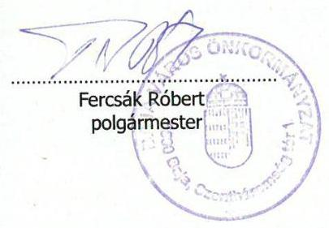

---

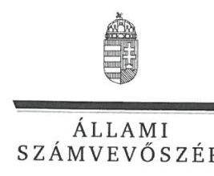

ELNÖK

Ikt.szám: V-0846-124/2016.

# Fercsák Róbert úr 

polgármester
Baja Város Önkormányzat

## Baja

## Tisztelt Polgármester Úr!

„Az Önkormányzatok gazdasági társaságai - Az önkormányzatok többségi tulajdonában lévő gazdasági társaságok közfeladat ellátását érintő gazdálkodási tevékenysége szabályszerűségének ellenőrzése - Baja Energetika Kft." címmel készített számvevőszéki jelentéstervezetre tett észrevételeit köszönettel megkaptam.

Az Állami Számvevőszék észrevételekre vonatkozó álláspontjáról a felügyeleti vezető által készített részletes tájékoztatást csatoltan megküldöm.

Tájékoztatom Polgármester Urat, hogy a számvevőszéki jelentésben - az Állami Számvevőszékről szóló 2011. évi LXVI. törvény 29. § (3) bekezdése alapján - a figyelembe nem vett észrevételeket szerepeltetjük az elutasítás indokának feltüntetésével.

Budapest, 2016. 02. hó 26. nap
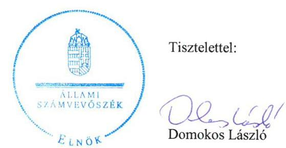

Melléklet: Tájékoztatás az elfogadott és el nem fogadott észrevételekről

---

# Tájékoztatás az elfogadott és az el nem fogadott észrevételekról 

A „Jelentéstervezet az önkormányzatok többségi tulajdonában lévő gazdasági társaságok közfeladat ellátását érintő gazdálkodási tevékenysége szabályszerűségének ellenőrzése - Baja Energetika Kft." című jelentéstervezetre 2016. január 28-án érkezett észrevételeit áttekintettük, azok kezelésével kapcsolatban a következő tájékoztatást adom:

1. Összegzés fejezet, Főbb megállapítások, következtetések, javaslatok alfejezet 2. bekezdés utolsó mondata (5. oldal), 1.1. megállapítás 5. bekezdésre (15. oldal), illetve a polgármesternek címzett 1. javaslatra (29. oldal) tett észrevétel

A távhőszolgáltatásról szóló 2005. évi XVIII. törvény (Tszt.) 6. § (2) bekezdés c) pontja kimondja, hogy az önkormányzat képviselő-testületének rendeletben ki kell jelölnie azokat a területeket, ahol területfejlesztési, környezetvédelmi és levegőtisztaságvédelmi szempontok alapján célszerű a távhőszolgáltatás fejlesztése. Baja Város Önkormányzat Képviselőtestületének
 a távhőszolgáltatásról, a távhőszolgáltatás legmagasabb díjáról és a díjalmazás feltételeiről szóló 23/2006. (VII.10.) Ktr. számú rendeletének 25. § (4) bekezdése a környezetvédelmi és levegő-tisztaságvédelmi szempontok alapján fejlesztendő távhőszolgáltatási területek kijelölését tartalmazta ugyan, de a területfejlesztési szempont figyelembe vételére nincs hivatkozás, az nem igazolt. Így a rendelet nem teljesítette maradéktalanul a Tszt. 6. § (2) bekezdés c) pontjában előírtakat.

Az egyértelműség érdekében a jelentéstervezetben a Megállapítások rész 1.1. pontjának 5. bekezdését (15. oldal) pontosítjuk az alábbiaknak megfelelően: „A Tszt. 6. § (2) bekezdés c) pontjának előírása alapján a rendeletben kijelölték azokat a területeket, ahol környezetvédelmi és levegő-tisztaságvédelmi szempontok alapján célszerű a távhőszolgáltatás fejlesztése, azonban a területfejlesztési szempont érvényesítésére nincs hivatkozás, az nem igazolt." A jelentéstervezet 5. oldalán az Összegzés fejezet Főbb megállapítások, következtetések, javaslatok rész 2. bekezdését pontosítjuk az alábbiak szerint: „Az önkormányzati rendelet tartalmazta azon területek kijelölését, ahol a távhőszolgáltatás fejlesztése célszerű, de nem vette figyelembe a jogszabályban előírt valamennyi szempontot." Továbbá a Javaslatok 1. pontját (29. oldal) pontosítjuk az alábbiaknak megfelelően:,,Gondoskodjon arról, hogy a távhőszolgáltatásról szóló önkormányzati rendelet tartalma maradéktalanul megfeleljen a jogszabályban előírt tartalmi követelményeknek."

Köszönettel vettük a 2015. június 1-jétől hatályban lévő, Baja Város Önkormányzat képviselő-testületének a Baja város területén végzett távhőszolgáltatásról szóló 12/2015. (V. 29.) önkormányzati rendelet hasonló tartalmáról szóló tájékoztatását, azonban az nem érinti az ellenőrzött időszakra vonatkozóan megfogalmazott megállapítást, ezért a jelentéstervezet módosítása ez alapján nem indokolt.

---

# II. 2.2. megállapítás 1. bekezdésre (18. oldal), illetve a polgármesternek címzett 2. javaslatra (29. oldal) tett észrevétel 

A Baja Energetika Kft. ügyvezető igazgatója a 2015. október 7-én kelt Teljességi nyilatkozatban kijelentette, hogy az Állami Számvevőszék részére átadott dokumentumok teljes körű információkat tartalmaznak, és az ellenőrzéshez az ellenőrzött tárgykörben kért és átadott dokumentumokon kívül más adatokkal, iratokkal nem rendelkezik. Az Állami Számvevőszék az e nyilatkozat után az ellenőrzött szervezetektől beérkező dokumentumokat a jelentés elkészítésénél nem veszi figyelembe, mert azok (2012., 2013. és 2014. évi leltározási listák) valódiságáról az ellenőrzés során meggyőződni nem tudott. Erre való tekintettel a jelentéstervezetben rögzített megállapítás és a javaslat módosítására nem kerül sor. Javaslatunk éppen a körülmények teljes körű tisztázását szolgálja.

## III. Összegzés fejezet, Főbb megállapítások, következtetések, javaslatok alfejezet 1. bekezdésre (5. oldal), 1.1. megállapítás 1. bekezdésre (14. oldal), illetve a polgármesternek címzett 3. javaslatra (29. oldal) tett észrevétel

Az Állami Számvevőszék a Baja Energetika Kft. ellenőrzésekor a 2011-2014. közötti időszakot ellenőrizte. A jelentéstervezetben rögzítésre került, hogy az önkormányzat az ellenőrzött időszakban rendelkezett gazdasági programmal, amely a távhőszolgáltató rendszer fejlesztésével kapcsolatban stratégiai célokat, feladatokat nem fogalmazott meg. Az észrevételben leírtak a megállapítást nem vitatják, ezért annak módosítása nem indokolt.

Köszönettel vettük tájékoztatását a gazdasági program felülvizsgálatáról és kiegészítéséről, azonban az észrevételben leírt intézkedések az ellenőrzött időszakot követően történtek, ezért azok az intézkedési tervben szerepeltetendők.

## IV. 1.2. megállapítás 11. bekezdésre (17. oldal) és a jegyzőnek címzett 2. javaslatra (30. oldal) tett észrevétel

Az Üzletszabályzatban foglaltak betartása ellenőrzésének hiányára tett észrevétel a megállapítást nem vitatja, hanem megerősíti, ezért annak módosítása nem indokolt. Az ellenőrzés - észrevételében szándékolt - jövőbeni megvalósítását az intézkedési tervben szükséges rögzíteni.
Budapest, 2016. 02. hó 3. nap

Böröcz Imre
felügyeleti vezető

---

.

---

# RÖVIDÍTÉSEK JEGYZÉKE 

${ }^{1}$ Ötv.
${ }^{2}$ Mötv.
${ }^{3}$ Képviselő-testület
${ }^{4}$ Önkormányzat
${ }^{5}$ Nvtv.
${ }^{6}$ SZMSZ $_{1,2}$
${ }^{7}$ Baja Energetika Kft.
${ }^{8}$ Társaság
${ }^{9}$ Alapító Okirat
${ }^{10}$ Számv. tv.
${ }^{11} \mathrm{FB}$
${ }^{12}$ Tszt.
${ }^{13}$ távhőszolgáltatási rendelet
${ }^{14}$ Ámt.
${ }^{15} \mathrm{Gt}$.
${ }^{16} \mathrm{Ptk}$.
${ }^{17}$ vagyongazdálkodási rendelet ${ }_{1,2}$
${ }^{18}$ Taktv.
${ }^{19}$ javadalmazási szabályzat ${ }_{1,2,3}$
a helyi önkormányzatokról szóló 1990. évi LXV. törvény (hatálytalan: a 2014. évi általános önkormányzati választások napjától)
2011. évi CLXXXIX. törvény Magyarország helyi önkormányzatairól, hatályos 2012. január 1-jétől

Baja Város Önkormányzatának Képviselő-testülete
Baja Város Önkormányzata
a nemzeti vagyonról szóló 2011. évi CXCVI. törvény
Baja Város Önkormányzata Képviselő-testületének 11/2011. (III.25.) számú önkormányzati rendelete a képviselő-testület és Szervei Szervezeti és Működési Szabályzatáról (hatályos: 2011. április 1-től 2014. november 30-ig.), valamint Baja Város Önkormányzata Képviselő-testületének 25/2014. (XI.28.) számú önkormányzati rendelete a képviselő-testület és Szervei Szervezeti és Működési Szabályzatáról (hatályos: 2014. december 1-től)
Baja Energetika Bajai Energia racionalizációs és Távhőszolgáltató Korlátolt Felelősségű Társaság, Baja Város Önkormányzatának kizárólagos tulajdonában lévő gazdasági társaság
Baja Energetika Kft.
Baja Energetika Bajai Energia racionalizációs és Távhőszolgáltató Korlátolt Felelősségű Társaság 2009. június 12-én módosításokkal egységes szerkezetbe foglalt Alapító Okirata, melyet 2011. június 1-jén, 2012. május 30-án, valamint 2012. augusztus 15-én módosítottak.
a számvitelről szóló 2000. évi C. törvény
a Baja Energetika Kft. Felügyelő Bizottsága
a távhőszolgáltatásról szóló 2005. évi XVIII. törvény (hatályos: 2005. július 1-jétől)
Baja Város Önkormányzatának többször módosított 23/2006. (VII.10.) Ktr. számú rendelete a távhőszolgáltatásról, a távhőszolgáltatás legmagasabb díjáról és a díjalmazás feltételeiről
az árak megállapításáról szóló 1990. évi LXXXVII. törvény
a gazdasági társaságokról szóló 2006. évi IV. törvény (hatálytalan: 2014. április 15-től)
A Polgári Törvénykönyvről szóló 2013. évi V. törvény (hatályos: 2014. április 15-től)
Baja Város Önkormányzatának 45/2007. (XII.17.) rendelete az Önkormányzat vagyonáról, a vagyontárgyak feletti tulajdonosi jogok gyakorlásáról (hatályos: 2008. január 1-től 2012.december 31-ig), valamint Baja Város Önkormányzatának 27/2012. (XI.30.) rendelete az Önkormányzat vagyonáról, a vagyontárgyak feletti tulajdonosi jogok gyakorlásáról (hatályos: 2013. január 1-től)
a köztulajdonban álló gazdasági társaságok takarékosabb működéséről szóló 2009. évi CXXII. törvény

Baja Város Önkormányzata a köztulajdonban álló gazdasági társaság vezető tisztségviselői felügyelő bizottsági tagjai, valamint a munka törvénykönyvéről szóló 1992. évi XXII. törvény 188. § (1) bekezdése, vagy 188/A. § (1) bekezdése hatálya alá eső munkavállalói javadalmazása, valamint a jogviszony megszűnése esetére biztosított juttatások módjának, mértékének elveiről, annak rendszeréről. (hatályos: 2010. február 1-től, jóváhagyva Baja Város Képviselőtestülete által a 12/2010. (I.28.) Kth. számú határozattal),

---

${ }^{20}$ KEOP
${ }^{21}$ Stabilitási tv.
${ }^{22}$ NFM
${ }^{23}$ Av. tv.
${ }^{24}$ Info. tv.
${ }^{25}$ 50/2011. (IX. 30.) NFM rendelet

Baja Város Önkormányzata a köztulajdonban álló gazdasági társaság vezető tisztségviselői felügyelő bizottsági tagjai, valamint a munka törvénykönyvéről szóló 2012. évi I. törvény 208. §-ának hatálya alá eső munkavállalói javadalmazása, valamint a jogviszony megszűnése esetére biztosított juttatások módjának, mértékének elveiről, annak rendszeréről. (hatályos: 2013. február 1-től, a szabályzat rendelkezéseit a 2012. évre meghatározott prémium feltételek teljesítésének értékelésekor alkalmazni kell, jóváhagyva Baja Város Képviselőtestülete által a 20/2013. (I.31.) Kth határozattal),

Baja Város Önkormányzata a köztulajdonban álló gazdasági társaság vezető tisztségviselői felügyelő bizottsági tagjai, valamint a munka törvénykönyvéről szóló 2012. évi I. törvény 208. §-ának hatálya alá eső munkavállalói javadalmazása, valamint a jogviszony megszűnése esetére biztosított juttatások módjának, mértékének elveiről, annak rendszeréről. (hatályos: 2014. április 25-től, jóváhagyva Baja Város Képviselő-testülete által a 135/2014. (IV.24.) Kth határozattal).
Környezet és Energia Operatív Program, az Európai Unió (EU) 2007 és 2013 közötti költségvetési tervezési időszakára vonatkozó Új Magyarország Fejlesztési Terv EU terminológia szerint Nemzeti Stratégiai Referencia Keret - átfogó céljának, horizontális politikáinak, valamint hat tematikus és területi prioritásának végrehajtását szolgáló operatív programok egyike.
Magyarország gazdasági stabilitásáról szóló 2011. évi CXCIV. törvény
Nemzeti Fejlesztési Minisztérium
a személyes adatok védelméről és a közérdekű adatok nyilvánosságáról szóló 1992. évi LXIII. törvény
az információs önrendelkezési jogról és az információszabadságról szóló 2011. évi CXII. törvény
a távhőszolgáltatónak értékesített távhő árának, valamint a lakossági felhasználónak és a külön kezelt intézménynek nyújtott távhőszolgáltatás díjának megállapításáról szóló 50/2011. (IX. 30.) NFM rendelet

---

ÁLLAMI SZÁMVEVŐSZÉK
1052 Budapest, Apáczai Csere János utca 10.
Levélcím: 1364 Budapest 4. Pf. 54
Telefon: +36 14849100 Telefax: +36 14849200
www.asz.hu
