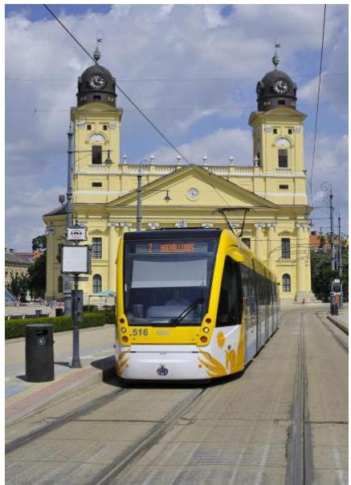
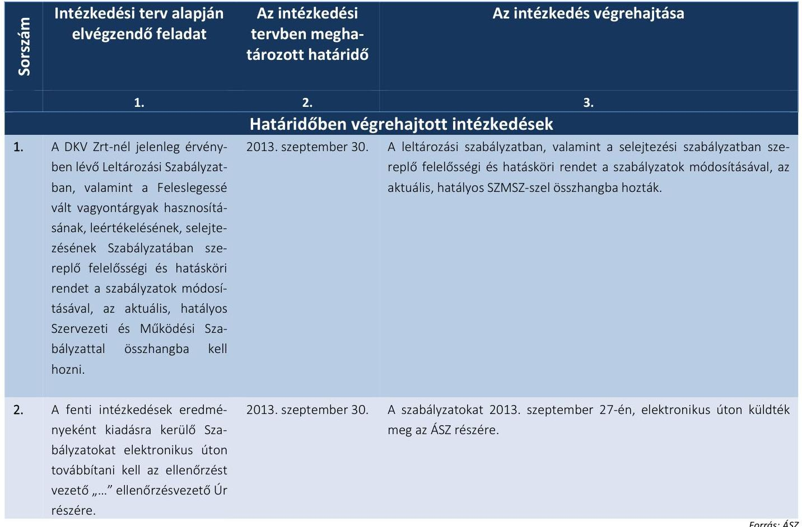

# Jelentés 

## Utóellenőrzések

A DKV Debreceni Közlekedési Zrt. közfeladat ellátásának ellenőrzéséről készült jelentés javaslatai hasznosulásának utóellenőrzése

2016

---

# Jelentés 

## Utóellenőrzések

A DKV Debreceni Közlekedési Zrt. közfeladat ellátásának ellenőrzéséről készült jelentés javaslatai hasznosulásának utóellenőrzése

2016. június hónap (O) nap

---

# AZ ELLENŐRZÉST FELÜGYELTE: 

BÖRÖCZ IMRE felügyeleti vezető

## AZ ELLENŐRZÉST VEZETTE ÉS A VÉGREHAJTÁSÁÉRT FELELŐS:

VALASTYÁNNÉ DR. VÍZHÁNYÓ JÚLIA ellenőrzésvezető

## A PROGRAM ÖSSZEÁLLÍTÁSÁÉRT FELELŐS:

JANIK JÓZSEF osztályvezető

## A TÉMÁHOZ KAPCSOLÓDÓ KORÁBBI SZÁMVEVŐSZÉKI JELENTÉSEK:

- címe: Jelentés az önkormányzatok többségi tulajdonában lévő gazdasági társaságok közfeladat-ellátásának ellenőrzéséről - DKV Debreceni Közlekedési Zrt.
- sorszáma: $\quad 13060$

IKTATÓSZÁM: V-0923-044/2016
TÉMASZÁM: 1819
ELLENŐRZÉS-AZONOSÍTÓ SZÁM: V071703

---

# TARTALOMJEGYZÉK 

■ ÖSSZEGZÉS ..... 5
■ AZ ELLENŐRZÉS CÉLJA ..... 6
■ AZ ELLENŐRZÉS TERÜLETE ..... 7
■ AZ ELLENŐRZÉS HÁTTERE, INDOKOLTSÁGA ..... 8
■ FÓKUSZKÉRDÉSEK ..... 9
■ ELLENŐRZÉS HATÓKÖRE ÉS MÓDSZEREI ..... 10
■ MEGÁLLAPÍTÁSOK ..... 13
■ MELLÉKLETEK ..... 15
I. sz. melléklet: Az ÁSZ 13060. számú jelentéséhez kapcsolódó intézkedési tervek végrehajtása ..... 15
■ FÜGGELÉK: ÉSZREVÉTELEK ..... 17
■ RÖVIDÍTÉSEK JEGYZÉKE ..... 19

---

.

---

# ÖSSZEGZÉS 

Az Állami Számvevőszék a DKV Debreceni Közlekedési Zrt. közfeladat-ellátásának utóellenőrzését a 2013. július 18. és 2015. október 8. közötti időszakra végezte el. Az utóellenőrzés az ellenőrzött szervezetek által megküldött intézkedési tervekben foglaltak hasznosulására irányult. Debrecen Megyei Jogú Város Önkormányzata és a DKV Debreceni Közlekedési Zrt. az intézkedési tervekben foglaltakat határidőben végrehajtották.

## Az ellenőrzés társadalmi indokoltsága

Az Állami Számvevőszék stratégiájában célul tűzte ki a számvevőszéki munka hasznosulásának javítását. Ezzel összhangban ellenőrzi, hogy az ellenőrzött szervezetek megvalósították-e a korábbi ellenőrzései által feltárt hibák, hiányosságok és szabálytalanságok megszüntetése céljából kialakított intézkedési terveikben foglaltakat. A rendszeres utóellenőrzések hozzájárulnak a szükséges intézkedések tényleges végrehajtásához, ezáltal a közpénzügyek rendezettségének javulásához.

## Főbb megállapítások, következtetések

Az intézkedési tervekben foglaltak végrehajtásáról Debrecen Megyei Jogú Város Önkormányzata és a DKV Debreceni Közlekedési Zrt. határidőben gondoskodott.

---

# AZ ELLENŐRZÉS CÉLJA 

## Az önkormányzatok többségi tulajdonában lévő gazdasági társaságok közfeladat ellátásának ellenőrzéséről készült jelentések javaslatai hasznosulásának utóellenőrzése

Az ellenőrzés célja annak értékelése, hogy a számvevőszéki jelentésben foglalt intézkedést igénylő megállapításokkal és javaslatokkal összhangban készített intézkedési tervben meghatározott feladatokat az ellenőrzött szervezet végrehajtotta-e.

---

# **AZ ELLENŐRZÉS TERÜLETE**

## **Debrecen Megyei Jogú Város Önkormányzata, DKV Debreceni Közlekedési Zrt.**

Az önkormányzatok többségi tulajdonában lévő gazdasági társaságok (DKV Debreceni Közlekedési Zrt.) közfeladat-ellátásának ellenőrzését az ÁSZ¹ a 2008-2011. évek és 2012. év I-III. negyedév közötti időszakra végezte el. Az utóellenőrzés – a 2015. október 8-ig végrehajtott intézkedéseket figyelembe véve – az önkormányzatok többségi tulajdonában lévő gazdasági társaságok közfeladat-ellátásának ellenőrzéséről készült ÁSZ jelentésben² megfogalmazott javaslatokra határidőben megküldött intézkedési tervben foglalt feladatok hasznosulására irányult. Az ÁSZ jelentés a jegyzőnek³ kettő, a társaság⁴ vezérigazgatójának⁵ egy javaslatot tartalmazott.

---

# AZ ELLENŐRZÉS HÁTTERE, INDOKOLTSÁGA 

Az ÁSZ törvény 33. § (1) bekezdése értelmében a számvevőszéki jelentések intézkedést igénylő megállapításaihoz és javaslataihoz kapcsolódóan az ellenőrzött szervezet vezetője intézkedési tervet köteles összeállítani, és az Állami Számvevőszék részére megküldeni. Az intézkedési tervben foglaltak megvalósítását - az ÁSZ törvény 33. § (7) bekezdésében foglaltak alapján - az Állami Számvevőszék utóellenőrzés keretében ellenőrizheti. Az intézkedések megvalósulásának értékelése során az Állami Számvevőszék figyelembe veszi az ellenőrzött szervezetek működési feltételeiben, valamint a jogszabályi előírásokban bekövetkezett változásokat.

Az intézkedési tervekben foglalt feladatok hiányos, illetve késedelmes végrehajtása, valamint megvalósításának elmaradása azt mutatja, hogy az ellenőrzések során feltárt hibák, hiányosságok és szabálytalanságok megszüntetése nem kapott kellő hangsúlyt. Ez a szabályszerű működés és a felelős vezetői magatartás vonatkozásában kockázatot hordoz. E kockázatok feltárásával az Állami Számvevőszék utóellenőrzési rendszere fokozza a fegyelmet, és igazolja, hogy a közpénzzel való szabályos gazdálkodás felelőssége elől nem lehet kitérni.

## AZ ELLENŐRZÉS VÁRHATÓ HASZNOSULÁSA:

Az utóellenőrzés négy szinten hasznosulhat:

- A társadalom szintjén az utóellenőrzés jelzi, hogy a számvevőszéki ellenőrzés megállapításainak van következménye: a hiányosságok megszüntetésére az ellenőrzött szervezet által meghatározott intézkedések végrehajtását is számon kéri az ÁSZ.
- Az ellenőrzött terület szintjén az utóellenőrzés tájékoztatást nyújt a terület döntéshozóinak a hiányosságok kiküszöbölésének jó gyakorlatairól, ezzel lehetőséget biztosítva arra, hogy az ÁSZ ellenőrzési megállapításai, javaslatai a terület nem ellenőrzött szervezeteinek a működése során is hasznosuljanak.
- Az ellenőrzött szervezet szintjén az utóellenőrzés feltárja, hogy a szervezet az intézkedések végrehajtásával hasznosította-e a korábbi ellenőrzési jelentésben a hiányosságok megszüntetése, illetve a kockázatok kezelése érdekében megfogalmazott javaslatokat.
- Az ÁSZ szintjén az utóellenőrzés visszacsatolást ad az ellenőrzési jelentések hasznosulásáról, az intézkedések elmaradása vagy részleges megvalósulása a további ellenőrzésekhez kockázati jelzésként szolgál.

---

# FÓKUSZKÉRDÉSEK 

1. Az ellenőrzött szervezetek az intézkedési tervben foglaltakat az előírt határidőben végrehajtották-e?

---

# ELLENŐRZÉS HATÓKÖRE ÉS MÓDSZEREI 

## Az ellenőrzés típusa

Szabályszerűségi ellenőrzés

## Az ellenőrzött időszak

A számvevőszéki jelentés közzétételének napjától (2013. július 18.) az utóellenőrzés megkezdésének napjáig (2015. október 8.) tartó időszak volt.

## Az ellenőrzés tárgya

Az ÁSZ tv. 2011. július 1-jei hatálybalépését követően az ÁSZ jelentésekben megfogalmazott javaslatokra az ellenőrzött által megküldött intézkedési tervekben foglaltak.

Az ellenőrzés kiterjedt minden olyan körülményre és adatra, amely az ÁSZ jogszabályban meghatározott feladatainak teljesítéséhez, valamint a program végrehajtása folyamán felmerült újabb összefüggések feltárásához szükséges.

## Az ellenőrzött szervezet

Debrecen Megyei Jogú Város Önkormányzata, DKV Debreceni Közlekedési Zrt.

## Az ellenőrzés jogalapja

Az Alaptörvény ${ }^{6}$ 43. cikk (1) bekezdése alapján az ÁSZ az Országgyűlés ${ }^{7}$ pénzügyi és gazdasági ellenőrző szerve. Az ÁSZ törvényben meghatározott feladatkörében ellenőrzi a központi költségvetés végrehajtását, az államháztartás gazdálkodását, az államháztartásból származó források felhasználását és a nemzeti vagyon kezelését. Az ÁSZ tv. 1. § (3) bekezdése szerint az ÁSZ általános hatáskörrel végzi a közpénzekkel és az állami és önkormányzati vagyonnal való felelős gazdálkodás ellenőrzését. A 33. § (7) bekezdése alapján az ÁSZ tv. 33. § (1)-(2) bekezdése szerinti intézkedési tervben foglaltak megvalósítását az ÁSZ utóellenőrzés keretében ellenőrizheti. Az Áht. ${ }^{8}$ 61. § (2) bekezdése szerint az államháztartás külső ellenőrzésével kapcsolatos feladatokat az ÁSZ látja el.

---

# Az ellenőrzés módszerei 

Az ellenőrzést a nemzetközi standardokat irányadónak tekintve az ellenőrzési program ellenőrzési kérdései, az ellenőrzött időszakban hatályos jogszabályok, az ellenőrzés szakmai szabályok és módszertanok figyelembe vételével végeztük. Az utóellenőrzéseket ellenőrzéshez kapcsolódóan végeztük.

Az ellenőrzés ideje alatt az ellenőrzött szervezettel történő kapcsolattartást az ÁSZ SZMSZ ${ }^{\circledR}$-ének vonatkozó előírásai alapján biztosítottuk.

Az utóellenőrzés megállapításait elsősorban az ÁSZ rendelkezésére álló, valamint az ellenőrzött szervezetektől elektronikusan bekért dokumentumok alapozzák meg, amely szükség esetén helyszíni ellenőrzéssel egészülhet ki. Az ÁSZ az ellenőrzés keretében egyes esetekben teljesítményellenőrzés tervezéséhez is kérhet adatokat.

Az ellenőrzés során adatszolgáltatásra kérjük fel az ÁSZ elnöke által - az utóellenőrzés tárgyához kapcsolódóan - korábban figyelmet felhívó levéllel megkeresett, nem ellenőrzött szervezetek vezetőit az utóellenőrzött ÁSZ jelentésben foglaltak hasznosulásának teljesebb felmérése érdekében.

Az ellenőrzési bizonyítékként felhasználható adatforrások közé tartoztak egyrészt a szakmai programban felsorolt adatforrások, másrészt minden - az ellenőrzés folyamán feltárt, az ellenőrzés szempontjából releváns információt tartalmazó - dokumentum.

Az ellenőrzés során értékeltük, hogy az ÁSZ jelentésben foglalt javaslatokra az elkészített intézkedési terveket határidőben megküldték-e, az intézkedési tervben foglaltakat végrehajtották-e.

A jóváhagyott intézkedési tervben előírt feladatok végrehajtásának ellenőrzését értékelési kritériumok alapján végeztük. Figyelembe vettük az intézkedési terv jóváhagyását követően hatályba lépett jogszabályi előírások változásából következő események, továbbá a feladat-ellátási és finanszírozási rendszer esetleges változásának hatásait. Az intézkedési tervekben előírt feladatokat azok végrehajtása szempontjából az alábbiak szerint értékeltük:
$\longrightarrow$ okafogyottá vált az előírt feladat, ha végrehajtására - meghatározott esemény bekövetkezése, továbbá külső körülmény, a működést érintő feltétel változása miatt - már nincs szükség, illetve lehetőség, és egyértelműen megállapítható, hogy az intézkedést szükségessé tevő körülmény a jövőben nem fordulhat elő;
$\longrightarrow$ nem időszerű az a feladat, amelynek ellenőrzési időszakon belüli végrehajtására azért nem került (kerülhetett) sor, mert az intézkedés alapjául szolgáló esemény nem következett be, de annak jövőbeni előfordulása lehetséges, a végrehajtása nem volt esedékes, vagy a végrehajtás határideje még nem járt le;
$\longrightarrow$ határidőben végrehajtott a feladat, ha a teljesítés dokumentáltan az intézkedési tervben előírt határidőben és tartalommal megtörtént;
$\longrightarrow$ határidőn túl végrehajtott a feladat, ha annak teljesítése az intézkedési tervben meghatározott módon, de az előírt határidőn túl történt meg;
$\longrightarrow$ részben végrehajtott az a feladat, amelynek végrehajtása teljes körűen az intézkedési tervben előírt módon nem történt meg;

---

- nem végrehajtott a feladat, ha a végrehajtás nem történt meg, vagy amennyiben a teljesítést nem dokumentálták.
Az ellenőrzés lefolytatásához az ellenőrzött szervezet a tanúsítványok elektronikus kitöltésével, valamint az ÁSZ által kért dokumentumok elektronikus megküldésével szolgáltatott adatokat, amelyek valódiságát és teljes körűségét az ellenőrzött szervezet vezetője által tett teljességi és hitelességi nyilatkozat igazolja. Az így rendelkezésre bocsátott adatok, információk kontrollja az ellenőrzés keretében megtörtént.

---

# 1. Az ellenőrzött szervezetek az intézkedési tervben foglaltakat az előírt határidőben végrehajtották-e? 

Összegző megállapítás

Az Önkormányzat és a társaság az intézkedési tervekben foglaltakat az előírt határidőben végrehajtották.

AZ ÖNKORMÁNYZAT vonatkozásában a jegyző által készített intézkedési terv kettő feladatot tartalmazott.
Határidőben végrehajtott feladatok:

1. Az Önkormányzat a 2013. és a 2014. évben ellenőrizte a Közszolgáltatási Szerződés ${ }_{1,2}$-ben ${ }^{10}$ foglaltak szerint a társaság közfeladat ellátását és a szolgáltatás színvonalát. Az ellenőrzés nem tárt fel nagyfokú hibát.
2. Az Önkormányzat a soron következő rendes ülésének napirendjén szerepeltette a Közszolgáltatási Szerződés ${ }_{1,2}$ alapján elkészített szakmai beszámolót.

Az Önkormányzat az intézkedési tervben foglalt feladatok végrehajtásáról beszámolási kötelezettséget írt elő, amelyet a Városfejlesztési Főosztály vezetője határidőben teljesített. A Városfejlesztési Főosztály ${ }^{11}$ vezetője az intézkedési tervben vállalt, a társaság közfeladat ellátását és a szolgáltatás színvonalát érintő ellenőrzések eredményéről 30 napon belül írásban tájékoztatta a polgármestert ${ }^{12}$ és a jegyzőt.

Az Önkormányzat vezette a Bkr. ${ }^{13}$ 14. § (1) bekezdésében előírt nyilvántartást, amely azonban nem tartalmazta az intézkedési tervben rögzített feladatok végrehajtását.

A TÁRSASÁG vonatkozásában a vezérigazgató által készített intézkedési terv kettő feladatot tartalmazott.
Határidőben végrehajtott feladat:

1. A társaság a leltározási szabályzatban ${ }^{14}$, valamint a selejtezési szabályzatban ${ }^{15}$ szereplő felelősségi és hatásköri rendet az SZMSZszel ${ }^{16}$ összhangba hozta.
2. A társaság a szabályzatokat elektronikus úton megküldte az ÁSZ részére.

---

.

---

# MELLÉKLETEK 

## I. SZ. MELLÉKLET: AZ ÁSZ 13060. SZÁMÚ JELENTÉSÉHEZ KAPCSOLÓDÓ INTÉZKEDÉSI TERVEK VÉGREHAJTÁSA

## Debrecen Megyei Jogú Város Önkormányzata által készített intézkedési terv végrehajtása

| 1 | Intézkedési terv alapján elvégzendő feladat | Az intézkedési tervben meghatározott határidő | Az intézkedés végrehajtása |
| :--: | :--: | :--: | :--: |
|  | 1 | 2 | 3 |
|  |  | Határidőben végrehajtott intézkedések |  |
| 1. | Debrecen Megyei Jogú Város Önkormányzata évente egy alkalommal ellenőrzi a Közszolgáltatási Szerződésekben foglaltak szerint a DKV Debreceni Közlekedési Zrt. közfeladat ellátását és a szolgáltatás színvonalát. Az ellenőrzésről a Városfejlesztési Főosztály vezetője 30 napon belül írásban tájékoztatja

 Debrecen Megyei Jogú Város Önkormányzatának polgármesterét és jegyzőjét. Amennyiben az ellenőrzés során nagyfokú hibák kerülnek megállapításra, úgy a jegyző utasítására az ellenőrzésről készült jelentést Debrecen Megyei Jogú Város Közgyűlése tárgyalja. | folyamatos | Az Önkormányzat 2013. és 2014. évben ellenőrizte a Közszolgáltatási Szerződés ${ }_{1,2}$-ben foglaltak szerint a társaság közfeladat-ellátását és a szolgáltatás színvonalát és erről a Városfejlesztési Főosztály vezetője 30 napon belül tájékoztatta az Önkormányzat polgármesterét és jegyzőjét. Az Önkormányzat a társaság közfeladat-ellátási és szolgáltatási színvonalának ellenőrzéséről 2013. évben, és 2014. évben készült ellenőrzési jelentésekben rögzítette, hogy az ellenőrzés nem tárt fel nagyfokú hibát, illetve szankcionálásra, a szerződés felmondására okot adó rendellenességet nem állapított meg. Erre való tekintettel az ellenőrzési jelentéseket a Közgyűlésnek ${ }^{17}$ nem kellett tárgyalnia. |
| 2. | Debrecen Megyei Jogú Város Önkormányzata a soron következő rendes ülésének napirendjében szerepelteti a DKV Debreceni Közlekedési Zrt.-nek, a Közszolgáltatási Szerződésekben előírt szakmai szempontok alapján elkészített beszámolóját. DMJV Önkormányzata Közgyűlésének 1/2013. (I.24.) önkormányzati rendelete Debrecen Megyei Jogú Város Önkormányzat Szervezeti és Működési Szabályzatáról 7. § értelmében a „Közgyűlés évente legalább nyolc alkalommal, lehetőleg a hónap harmadik hetének csütörtöki napján rendes ülést tart". | a soron következő rendes Közgyűlés időpontja | A Közszolgáltatási Szerződés ${ }_{1,2}$-vel összefüggésben - a 2013. május 15-én kelt - a 2012. évi szakmai beszámolót az Önkormányzat részére a társaság megküldte. Az intézkedési tervben meghatározott felelős a 2013. szeptember 23-án kelt előterjesztéssel terjesztette a Közgyűlés elé a beszámolókat. A 195/2013. (X.3.) számú közgyűlési határozat értelmében a 2012. évi szakmai beszámolókat a Közgyűlés a soron következő rendes ülésén elfogadta. |

---

# DKV Debreceni Közlekedési Zrt. által készített intézkedési terv végrehajtása 

---

# FÜGGELÉK: ÉSZREVÉTELEK 

A jelentéstervezetet a Számvevőszék 15 napos észrevételezésre megküldte az ellenőrzött szervezet vezetőjének az ÁSZ tv. 29. § (1) bekezdése előírásának megfelelően.
Az elfogadott észrevételek alapján véglegesíti az Állami Számvevőszék a jelentését.

Az ellenőrzött szervezetek vezetői az ÁSZ tv. 29. § (2) bekezdésében foglalt észrevételezési jogukkal nem éltek, a jelentéstervezetre észrevételt nem tettek.

[^0]
[^0]:    * 29. § (1) Az Állami Számvevőszék az ellenőrzési megállapításait megküldi az ellenőrzött szervezet vezetőjének vagy az általa megbízott személynek, és annak, akinek személyes felelősségét állapította meg.
    (2) Az ellenőrzött szervezet vezetője és a felelősként megjelölt személy az ellenőrzés megállapításaira tizenöt napon belül írásban észrevételt tehet.
    (3) Az Állami Számvevőszék az észrevételre a beérkezésétől számított harminc napon belül írásban válaszol. A figyelembe nem vett észrevételeket köteles a jelentésben feltüntetni, és megindokolni, hogy azokat miért nem fogadta el.

---

.

---

# RÖVIDÍTÉSEK JEGYZÉKE 

${ }^{1}$ ÁSZ
${ }^{2}$ ÁSZ jelentés
${ }^{3}$ jegyző
${ }^{4}$ társaság
${ }^{5}$ vezérigazgató
${ }^{6}$ Alaptörvény
${ }^{7}$ Országgyűlés
${ }^{8}$ Áht.
${ }^{9}$ SZMSZ
${ }^{10}$ Közszolgáltatási Szerződések1,2
Közszolgáltatási Szerződés ${ }_{1}$

Közszolgáltatási Szerződés ${ }_{2}$
${ }^{11}$ Városfejlesztési Főosztály
${ }^{12}$ polgármester
${ }^{13}$ Bkr.
${ }^{14}$ leltározási szabályzat
${ }^{15}$ selejtezési szabályzat
${ }^{16}$ SZMSZ
${ }^{17}$ Közgyűlés

Állami Számvevőszék
13060 ÁSZ jelentés az önkormányzatok többségi tulajdonában lévő gazdasági társaságok közfeladat-ellátásának ellenőrzéséről - DKV Debreceni Közlekedési Zrt. (Iktatószám: V-0032-266/2013., Témaszám: 13, Vizsgálat-azonosító szám: V060903)
Debrecen Megyei Jogú Város jegyzője
DKV Debreceni Közlekedési Zrt.
DKV Debreceni Közlekedési Zrt. vezérigazgatója
Magyarország Alaptörvénye (kihirdetve: 2011. április 25-én)
Magyarország Országgyűlése
2011. évi CXCV. törvény az államháztartásról (hatályos: 2012. január 1-jétől)

Állami Számvevőszék Szervezeti és Működési Szabályzata

Menetrend alapján villamossal, illetve trolibusszal végzett személyszállítási tevékenység ellátása érdekében 2004. december 22-én kötött Közszolgáltatási Szerződés. Időbeli hatálya: 2005.01.01.-2021.12.31.
Menetrend alapján autóbusszal végzett személyszállítási tevékenység ellátása érdekében 2008. október 10-én kötött Közszolgáltatási Szerződés. Időbeli hatálya: 2009.07.01.-2021.06.30.
Debrecen Megyei Jogú Város Önkormányzatának Városfejlesztési Főosztálya
Debrecen Megyei Jogú Város polgármestere
370/2011. (XII.31.) számú Kormányrendelet a költségvetési szervek belső kontrollrendszeréről és a belső ellenőrzésről (hatályos: 2012. január 1-jétől)
DKV Debreceni Közlekedési Zrt. Leltározási szabályzata
(hatályos: 2013. szeptember 25-től)
DKV Debreceni Közlekedési Zrt. Feleslegessé vált vagyontárgyak hasznosításának, leértékelésének, selejtezésének szabályzata (hatályos: 2013. szeptember 25-től)
DKV Debreceni Közlekedési Zrt. Szervezeti és Működési Szabályzata
(hatályos: 2013. május 1-jétől)
Debrecen Megyei Jogú Város Önkormányzatának Közgyűlése

---

ÁLLAMI SZÁMVEVŐSZÉK
1052 Budapest, Apáczai Csere János utca 10.
Levélcím: 1364 Budapest 4. Pf. 54
Telefon: +36 14849100 Telefax: +36 14849200
www.asz.hu
