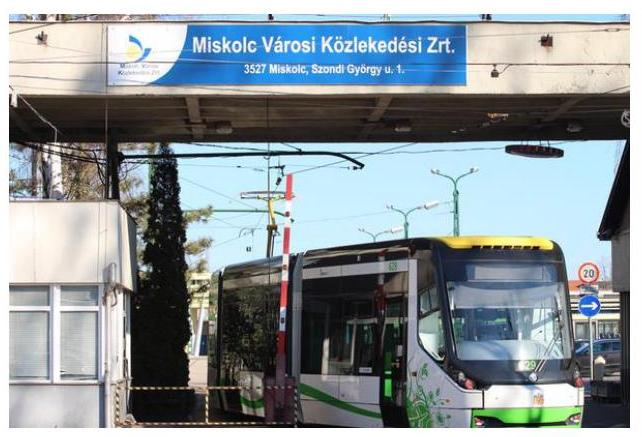
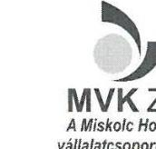
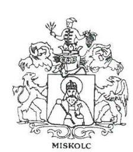
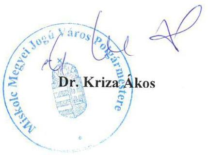

# Jelentés 

## Utóellenőrzések

A Miskolc Városi Közlekedési Zrt. közfeladat ellátásának ellenőrzéséről készült jelentés javaslatai hasznosulásának utóellenőrzése

2016

---

# Jelentés 

## Utóellenőrzések

A Miskolc Városi Közlekedési Zrt. közfeladat ellátásának ellenőrzéséről készült jelentés javaslatai hasznosulásának utóellenőrzése

2016. mairius hónap 10. nap

---

# AZ ELLENŐRZÉST FELÜGYELTE: 

BÖRÖCZ IMRE felügyeleti vezető

## AZ ELLENŐRZÉST VEZETTE ÉS A VÉGREHAJTÁSÁÉRT FELELŐS:

VALASTYÁNNÉ DR. VÍZHÁNYÓ JÚLIA ellenőrzésvezető

## A PROGRAM ÖSSZEÁLLÍTÁSÁÉRT FELELŐS:

JANIK JÓZSEF osztályvezető

## A TÉMÁHOZ KAPCSOLÓDÓ KORÁBBI SZÁMVEVŐSZÉKI JELENTÉSEK:

- címe: Jelentés az önkormányzatok többségi tulajdonában lévő gazdasági társaságok közfeladat-ellátásának ellenőrzéséről - Miskolc Városi Közlekedési Zrt.
- sorszáma: 13061

IKTATÓSZÁM: V-0922-036/2016
TÉMASZÁM: 1819
ELLENŐRZÉS-AZONOSÍTÓ SZÁM: V071703

---

# TARTALOMJEGYZÉK 

■ ÖSSZEGZÉS ..... 5
■ AZ ELLENŐRZÉS CÉLJA ..... 6
■ AZ ELLENŐRZÉS TERÜLETE ..... 7
■ AZ ELLENŐRZÉS HÁTTERE, INDOKOLTSÁGA ..... 8
■ FÓKUSZKÉRDÉSEK ..... 9
■ ELLENŐRZÉS HATÓKÖRE ÉS MÓDSZEREI ..... 10
■ MEGÁLLAPÍTÁSOK ..... 13
■ MELLÉKLETEK ..... 15
I. sz. melléklet: Az ÁSZ 13061. számú jelentéséhez kapcsolódó intézkedési terv végrehajtása ..... 15
■ FÜGGELÉK: ÉSZREVÉTELEK ..... 17
■ RÖVIDÍTÉSEK JEGYZÉKE ..... 21

---

.

---

# ÖSSZEGZÉS 

Az Állami Számvevőszék a Miskolc Városi Közlekedési Zrt. közfeladat-ellátásának utóellenőrzését a 2013. július 18. és 2015. október 7. közötti időszakra végezte el. Az utóellenőrzés az ellenőrzött szervezet által megküldött intézkedési tervben foglaltak hasznosulására irányult. A Miskolc Városi

MVK Miskolc Városi Közlekedési Zártkörűen Működő Részvénytársaság
ben végrehajtotta.

## Az ellenőrzés társadalmi indokoltsága

Az Állami Számvevőszék stratégiájában célul tűzte ki a számvevőszéki munka hasznosulásának javítását. Ezzel összhangban ellenőrzi, hogy az ellenőrzött szervezetek megvalósították-e a korábbi ellenőrzései által feltárt hibák, hiányosságok és szabálytalanságok megszüntetése céljából kialakított intézkedési terveikben foglaltakat. A rendszeres utóellenőrzések hozzájárulnak a szükséges intézkedések tényleges végrehajtáshoz, ezáltal a közpénzügyek rendezettségének javulásához.

## Főbb megállapítások, következtetések

Az intézkedési tervben foglaltak végrehajtásáról Miskolc Városi Közlekedési Zrt. határidőben gondoskodott.

---

# AZ ELLENŐRZÉS CÉLJA 

## Az önkormányzatok többségi tulajdonában lévő gazdasági társaságok közfeladat ellátásának ellenőrzéséről készült jelentések javaslatai hasznosulásának utóellenőrzése

Az ellenőrzés célja annak értékelése, hogy a számvevőszéki jelentésben foglalt intézkedést igénylő megállapításokkal és javaslatokkal összhangban készített intézkedési tervben meghatározott feladatokat az ellenőrzött szervezet végrehajtotta-e.

---

# AZ ELLENŐRZÉS TERÜLETE 

## Miskolc Városi Közlekedési Zrt.

Az önkormányzatok többségi tulajdonában lévő gazdasági társaságok (Miskolc Városi Közlekedési Zrt.) közfeladat-ellátásának ellenőrzését az ÁSZ¹ a 2008-2011. évek és 2012. év I-III. negyedév közötti időszakra végezte el. Az utóellenőrzés - a 2015. október 7-ig végrehajtott intézkedéseket figyelembe véve - az önkormányzatok többségi tulajdonában lévő gazdasági társaságok közfeladat-ellátásának ellenőrzéséről készült ÁSZ jelentésben² megfogalmazott javaslatokra határidőben megküldött intézkedési tervben foglalt feladatok hasznosulására irányult. Az ÁSZ jelentés a társaság ${ }^{3}$ vezérigazgatójának ${ }^{4}$ három javaslatot tartalmazott.

---

# AZ ELLENŐRZÉS HÁTTERE, INDOKOLTSÁGA 

Az ÁSZ törvény 33. § (1) bekezdése értelmében a számvevőszéki jelentések intézkedést igénylő megállapításaihoz és javaslataihoz kapcsolódóan az ellenőrzött szervezet vezetője intézkedési tervet köteles összeállítani, és az Állami Számvevőszék részére megküldeni. Az intézkedési tervben foglaltak megvalósítását - az ÁSZ törvény 33. § (7) bekezdésében foglaltak alapján - az Állami Számvevőszék utóellenőrzés keretében ellenőrizheti. Az intézkedések megvalósulásának értékelése során az Állami Számvevőszék figyelembe veszi az ellenőrzött szervezetek működési feltételeiben, valamint a jogszabályi előírásokban bekövetkezett változásokat.

Az intézkedési tervekben foglalt feladatok hiányos, illetve késedelmes végrehajtása, valamint megvalósításának elmaradása azt mutatja, hogy az ellenőrzések során feltárt hibák, hiányosságok és szabálytalanságok megszüntetése nem kapott kellő hangsúlyt. Ez a szabályszerű működés és a felelős vezetői magatartás vonatkozásában kockázatot hordoz. E kockázatok feltárásával az Állami Számvevőszék utóellenőrzési rendszere fokozza a fegyelmet, és igazolja, hogy a közpénzzel való szabályos gazdálkodás felelőssége elől nem lehet kitérni.

## AZ ELLENŐRZÉS VÁRHATÓ HASZNOSULÁSA:

Az utóellenőrzés négy szinten hasznosulhat:

- A társadalom szintjén az utóellenőrzés jelzi, hogy a számvevőszéki ellenőrzés megállapításainak van következménye: a hiányosságok megszüntetésére az ellenőrzött szervezet által meghatározott intézkedések végrehajtását is számon kéri az ÁSZ.
- Az ellenőrzött terület szintjén az utóellenőrzés tájékoztatást nyújt a terület döntéshozóinak a hiányosságok kiküszöbölésének jó gyakorlatairól, ezzel lehetőséget biztosítva arra, hogy az ÁSZ ellenőrzési megállapításai, javaslatai a terület nem ellenőrzött szervezeteinek a működése során is hasznosuljanak.
- Az ellenőrzött szervezet szintjén az utóellenőrzés feltárja, hogy a szervezet az intézkedések végrehajtásával hasznosította-e a korábbi ellenőrzési jelentésben a hiányosságok megszüntetése, illetve a kockázatok kezelése érdekében megfogalmazott javaslatokat.
- Az ÁSZ szintjén az utóellenőrzés visszacsatolást ad az ellenőrzési jelentések hasznosulásáról, az intézkedések elmaradása vagy részleges megvalósulása a további ellenőrzésekhez kockázati jelzésként szolgál.

---

# FÓKUSZKÉRDÉSEK 

1. Az ellenőrzött szervezetek az intézkedési tervben foglaltakat az elöirt határidőben - végrehajtották-e?

---

# ELLENŐRZÉS HATÓKÖRE ÉS MÓDSZEREI 

## Az ellenőrzés típusa

Szabályszerúségi ellenőrzés

## Az ellenőrzött időszak

A számvevőszéki jelentés közzétételének napjától (2013. július 18.) az utóellenőrzés megkezdésének napjáig (2015. október 7.) tartó időszak volt.

## Az ellenőrzés tárgya

Az ÁSZ tv. 2011. július 1-jei hatálybalépését követően az ÁSZ jelentésekben megfogalmazott javaslatokra az ellenőrzött által megküldött intézkedési tervekben foglaltak.

Az ellenőrzés kiterjedt minden olyan körülményre és adatra, amely az ÁSZ jogszabályban meghatározott feladatainak teljesítéséhez, valamint a program végrehajtása folyamán felmerült újabb összefüggések feltárásához szükséges.

## Az ellenőrzött szervezet

Miskolc Városi Közlekedési Zrt.

## Az ellenőrzés jogalapja

Az Alaptörvény ${ }^{5}$ 43. cikk (1) bekezdése alapján az ÁSZ az Országgyűlés ${ }^{6}$ pénzügyi és gazdasági ellenőrző szerve. Az ÁSZ törvényben meghatározott feladatkörében ellenőrzi a központi költségvetés végrehajtását, az államháztartás gazdálkodását, az államháztartásból származó források felhasználását és a nemzeti vagyon kezelését. Az ÁSZ tv. 1. § (3) bekezdése szerint az ÁSZ általános hatáskörrel végzi a közpénzekkel és az állami és önkormányzati vagyonnal való felelős gazdálkodás ellenőrzését. A 33. § (7) bekezdése alapján az ÁSZ tv. 33. § (1)-(2) bekezdése szerinti intézkedési tervben foglaltak megvalósítását az ÁSZ utóellenőrzés keretében ellenőrizheti. Az Áht. ${ }^{7}$ 61. § (2) bekezdése szerint az államháztartás külső ellenőrzésével kapcsolatos feladatokat az ÁSZ látja el.

---

# Az ellenőrzés módszerei 

Az ellenőrzést a nemzetközi standardokat irányadónak tekintve az ellenőrzési program ellenőrzési kérdései, az ellenőrzött időszakban hatályos jogszabályok, az ellenőrzés szakmai szabályok és módszertanok figyelembe vételével végeztük. Az utóellenőrzéseket ellenőrzéshez kapcsolódóan végeztük.

Az ellenőrzés ideje alatt az ellenőrzött szervezettel történő kapcsolattartást az ÁSZ SZMSZ ${ }^{\circledR}$-ének vonatkozó előírásai alapján biztosítottuk.

Az utóellenőrzés megállapításait elsősorban az ÁSZ rendelkezésére álló, valamint az ellenőrzött szervezetektől elektronikusan bekért dokumentumok alapozzák meg, amely szükség esetén helyszíni ellenőrzéssel egészülhet ki. Az ÁSZ az ellenőrzés keretében egyes esetekben teljesítményellenőrzés tervezéséhez is kérhet adatokat.

Az ellenőrzés során adatszolgáltatásra kérjük fel az ÁSZ elnöke által - az utóellenőrzés tárgyához kapcsolódóan - korábban figyelmet felhívó levéllel megkeresett, nem ellenőrzött szervezetek vezetőit az utóellenőrzött ÁSZ jelentésben foglaltak hasznosulásának teljesebb felmérése érdekében.

Az ellenőrzési bizonyítékként felhasználható adatforrások közé tartoztak egyrészt a szakmai programban felsorolt adatforrások, másrészt minden - az ellenőrzés folyamán feltárt, az ellenőrzés szempontjából releváns információt tartalmazó - dokumentum.

Az ellenőrzés során értékeltük, hogy az ÁSZ jelentésben foglalt javaslatokra az elkészített intézkedési terveket határidőben megküldték-e, az intézkedési tervben foglaltakat végrehajtották-e.

A jóváhagyott intézkedési tervben előírt feladatok végrehajtásának ellenőrzését értékelési kritériumok alapján végeztük. Figyelembe vettük az intézkedési terv jóváhagyását követően hatályba lépett jogszabályi előírások változásából következő események, továbbá a feladat-ellátási és finanszírozási rendszer esetleges változásának hatásait. Az intézkedési tervekben előírt feladatokat azok végrehajthatósága, illetve végrehajtása szempontjából az alábbiak szerint értékeltük:
$\longrightarrow$ okafogyottá vált az előírt feladat, ha végrehajtására - meghatározott esemény bekövetkezése, továbbá külső körülmény, a működést érintő feltétel változása miatt - már nincs szükség, illetve lehetőség, és egyértelműen megállapítható, hogy az intézkedést szükségessé tevő körülmény a jövőben nem fordulhat elő;
$\longrightarrow$ nem időszerű az a feladat, amelynek ellenőrzési időszakon belüli végrehajtására azért nem került (kerülhetett) sor, mert az intézkedés alapjául szolgáló esemény nem következett be, de annak jövőbeni előfordulása lehetséges, a végrehajtása nem volt esedékes, vagy a végrehajtás határideje még nem járt le;
$\longrightarrow$ határidőben végrehajtott a feladat, ha a teljesítés dokumentáltan az intézkedési tervben előírt határidőben és tartalommal megtörtént;
$\longrightarrow$ határidőn túl végrehajtott a feladat, ha annak teljesítése az intézkedési tervben meghatározott módon, de az előírt határidőn túl történt meg;
$\longrightarrow$ részben végrehajtott az a feladat, amelynek végrehajtása teljes körűen az intézkedési tervben előírt módon nem történt meg;

---

- nem végrehajtott a feladat, ha a végrehajtás nem történt meg, vagy amennyiben a teljesítést nem dokumentálták.
Az ellenőrzés lefolytatásához az ellenőrzött szervezet a tanúsítványok elektronikus kitöltésével, valamint az ÁSZ által kért dokumentumok elektronikus megküldésével szolgáltatott adatokat, amelyek valódiságát és teljes körűségét az ellenőrzött szervezet vezetője által tett teljességi és hitelességi nyilatkozat igazolja. Az így rendelkezésre bocsátott adatok, információk kontrollja az ellenőrzés keretében megtörtént.

---

# MEGÁLLAPÍTÁSOK 

## 1. Az ellenőrzött szervezetek az intézkedési tervben foglaltakat az előírt határidőben - végrehajtották-e?

Összegző megállapítás A társaság az intézkedési tervben foglaltakat az előírt határidőben végrehajtotta.

A TÁRSASÁG vonatkozásában a vezérigazgató által készített intézkedési terv három feladatot tartalmazott.
Határidőben végrehajtott feladatok:

1. Az értékelési szabályzat ${ }^{9}$ és a bekerülési értékre vonatkozó módszer közötti összhang a szabályzat aktualizálása révén megteremtésre került.
2. A selejtezési szabályzatban ${ }^{10}$ előírták a bontott anyagok hulladékként és haszonanyagként történő elkülönítését, elszállítását és azok tételes elszámolását.
3. A társaság vezérigazgatója a szabálytalan kifizetéseket felülvizsgálta, a kapcsolódó felelősséget megállapította. Az intézkedés végrehajtásáról az ÁSZ-t tájékoztatta.

---

.

---

# MELLÉKLETEK 

I. SZ. MELLÉKLET: AZ ÁSZ 13061. SZÁMÚ JELENTÉSÉHEZ KAPCSOLÓDÓ INTÉZKEDÉSI TERV VÉGREHAJTÁSA

## Miskolc Városi Közlekedési Zrt. által készített intézkedési terv végrehajtása

|  | Intézkedési terv alapján elvégzendő feladat | Az intézkedési tervben meghatározott határidő | Az intézkedés végrehajtása |
| :--: | :--: | :--: | :--: |
|  | 1. | 2. | 3. |
| Határidőben végrehajtott intézkedések |  |  |  |
| 1. Intézkedtünk az SZ8-17 Eszközök és források értékelési szabályzat és a bekerülési értékre vonatkozó nyilvántartási módszer közötti összhang megteremtéséről. A vonatkozó   szabályzatot 2013.01.01.-án aktualizáltuk. Ennek megfelelőségéről a könyvvizsgáló cégünktől igazolást kértünk, mely jelen levelünk mellékletét képezi. |  | az intézkedési terv elkészítését megelőzően elvégezték | Intézkedtek az SZ8-17 Eszközök és források értékelési szabályzat és a bekerülési értékre vonatkozó nyilvántartási módszer közötti összhang megteremtéséről. A vonatkozó szabályzatot 2013.01.01-én aktualizálták. Ennek megfelelőségét a könyvvizsgáló felülvizsgálta. |
| 2. | Az SZ8-14 Feleslegessé vált vagyontárgyak szabályzatában előírtuk a bontott anyagok hulladékként és haszonanyagként történő elkülönítését, elszállítását és azok tételes elszámolását. Selejtezési   szabályzatunkat 2013.08.05.-én aktualizáltuk. Ennek megfelelőségéről a könyvvizsgáló cégünktől igazolást kértünk, mely jelen levelünk mellékletét képezi. | az intézkedési terv elkészítését megelőzően elvégezték | Az SZ8-14 Feleslegessé vált vagyontárgyak és készletek kezelése szabályzatban előírták a bontott anyagok hulladékként és haszonanyagként történő elkülönítését, elszállítását és azok tételes elszámolását. A szabályzatot 2013.08.05-én aktualizálták. Ennek megfelelőségét a könyvvizsgáló felülvizsgálta. |

---

|  | Intézkedési terv alapján elvégzendő feladat | Az intézkedési tervben meghatározott határidő | Az intézkedés végrehajtása |
| :--: | :--: | :--: | :--: |
|  | 1. | 2. | 3. |
| 3. | Az ÁSZ vizsgálat során 3 esetben merült fel olyan kifizetés, amely feltételezi, hogy a szerződésben vállalt kötelezettségét a megbízott nem végezte el, mivel a teljesítés elvégzését igazoló dokumentumok megléte nélkül lettek kifizetve a számlák. Így a szerződések teljesítése nem bizonyított.   Az Önök javaslatának megfelelően az MVK Zrt. vezérigazgatója felülvizsgálja a 20082010 közötti időszakban teljesítéssel nem igazolt kifizetéseket és annak eredményéről, a felelősségek megállapításáról tájékoztatja Önöket 2013. szeptember 30-ig. | 2013. szeptember 30. | A társaság vezérigazgatója 2013. szeptember 30-án a három számla szabálytalan kifizetését felülvizsgálta, a felelős személyeket megnevezte. Az intézkedés végrehajtásáról az ÁSZ-t tájékoztatta. |

---

# FÜGGELÉK: ÉSZREVÉTELEK 

A jelentéstervezetet a Számvevőszék 15 napos észrevételezésre megküldte az ellenőrzött szervezet vezetőjének az ÁSZ tv. 29. §* (1) bekezdése előírásának megfelelően.
Az elfogadott észrevételek alapján véglegesíti az Állami Számvevőszék a jelentését.

Miskolc Megyei Jogú Város Önkormányzata Polgármestere és Miskolc Városi Közlekedési Zrt. vezérigazgatója arról tájékoztatták az ÁSZ-t, hogy észrevételt nem kívánnak tenni.
$\longrightarrow$ Miskolc Városi Közlekedési Zrt. vezérigazgatója ÁSZ elnökének írt levelének másolata.
$\longrightarrow$ Miskolc Megyei Jogú Város Önkormányzata Polgármestere ÁSZ elnökének írt levelének másolata.

[^0]
[^0]:    * 29. § (1) Az Állami Számvevőszék az ellenőrzési megállapításait megküldi az ellenőrzött szervezet vezetőjének vagy az általa megbízott személynek, és annak, akinek személyes felelősségét állapította meg.
    (2) Az ellenőrzött szervezet vezetője és a felelősként megjelölt személy az ellenőrzés megállapításaira tizenöt napon belül írásban észrevételt tehet.
    (3) Az Állami Számvevőszék az észrevételre a beérkezésétől számított harminc napon belül írásban válaszol. A figyelembe nem vett észrevételeket köteles a jelentésben feltüntetni, és megindokolni, hogy azokat miért nem fogadta el.

---

# Függelék: Észrevételek 

Állami Számvevőszék
Domonkos László
elnők
1052Budapest
Apáczai Csere János utca 10.
Tárgy: Közfeladat ellátásának utóellenőrzése

Úgyintéző: Lajosné
Iktatószám: 360-K16/00444
Dátum:2016.01.27

## Tisztelt Domonkos László elnök úr!

Hivatkozva az Állami Számvevőszék által a V-0922-031/2015. iktatószámon megküldött Utóellenőrzések a Miskolc Városi Közlekedési Zrt Közfeladat ellátásának utóellenőrzéséről készült jelentés javaslatai hasznosulásának utóellenőrzése " témájában megküldött jelentéstervezetre, tájékoztatom,hogy az MVK Zrt. nem kiván észrevételt tenni.

Kérjük a fentiek szíves tudomásulvételét.

Tisztelettel:

## 10

Binglár Zsolt
Vezérigázgató

Lajosné Török Magdolna
Gazdálkodási osztályvezető

---

MISKOLC MEGYEI JOGÚ VÁROS POLGÁRMESTERE

VA: 320417-1 /2016
Üi: Bertáné

Állami Számvevőszék

Domokos László
Elnök

Budapest
Pf. 54.
1364

Tárgy: jelentéstervezettel kapcsolatos észrevétel

# Tisztelt Elnök Úr! 

Köszönettel vettük az „Utóellenőrzések - A Miskolc Városi Közlekedési Zrt. közfeladat ellátásának ellenőrzéséről készült jelentés javaslatai hasznosulásának utóellenőrzése" címmel készített számvevőszéki jelentéstervezetűket.
A jelentéstervezettel kapcsolatosan észrevételt tenni nem kívánok.
Kérem a fentiek szíves tudomásulvételét.

Miskolc, 2016. február 2.

---

.

---

# RÖVIDÍTÉSEK JEGYZÉKE 

${ }^{1}$ ÁSZ
${ }^{2}$ ÁSZ jelentés
${ }^{3}$ társaság
${ }^{4}$ vezérigazgató
${ }^{5}$ Alaptörvény
${ }^{6}$ Országgyülés
${ }^{7}$ Áht.
${ }^{8}$ SZMSZ
${ }^{9}$ értékelési szabályzat
${ }^{10}$ selejtezési szabályzat

Állami Számvevőszék
13061 ÁSZ jelentés az önkormányzatok többségi tulajdonában lévő gazdasági társaságok közfeladat-ellátásának ellenőrzéséről - Miskolc Városi Közlekedési Zrt. (Iktatószám: V-0032-267/2013., Témaszám: 13, Vizsgálat-azonosító szám: V060902)
Miskolc Városi Közlekedési Zrt.
Miskolc Városi Közlekedési Zrt. vezérigazgatója
Magyarország Alaptörvénye (kihirdetve: 2011. április 25-én)
Magyarország Országgyűlése
2011. évi CXCV. törvény az államháztartásról (hatályos: 2012. január 1-jétől)

Állami Számvevőszék Szervezeti és Müködési Szabályzata
SZB-17 Eszközök és források értékelési szabályzata (aktualizált változata 2013. január 1-jétől hatályos)

SZB-14 Feleslegessé vált vagyontárgyak és készletek kezelésének szabályzata (aktualizált változata 2013. augusztus 5-től hatályos)

---

ÁLLAMI SZÁMVEVŐSZÉK
1052 Budapest, Apáczai Csere János utca 10.
Levélcím: 1364 Budapest 4. Pf. 54
Telefon: +36 14849100 Telefax: +36 14849200
www.asz.hu