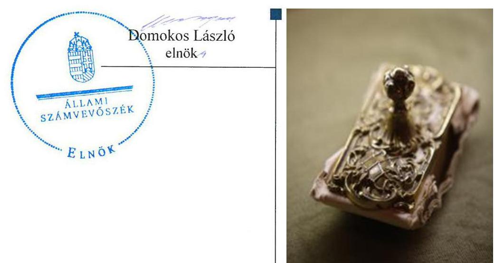
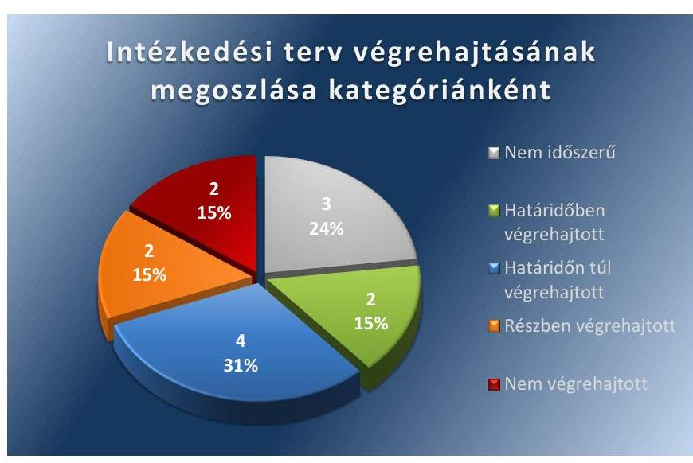
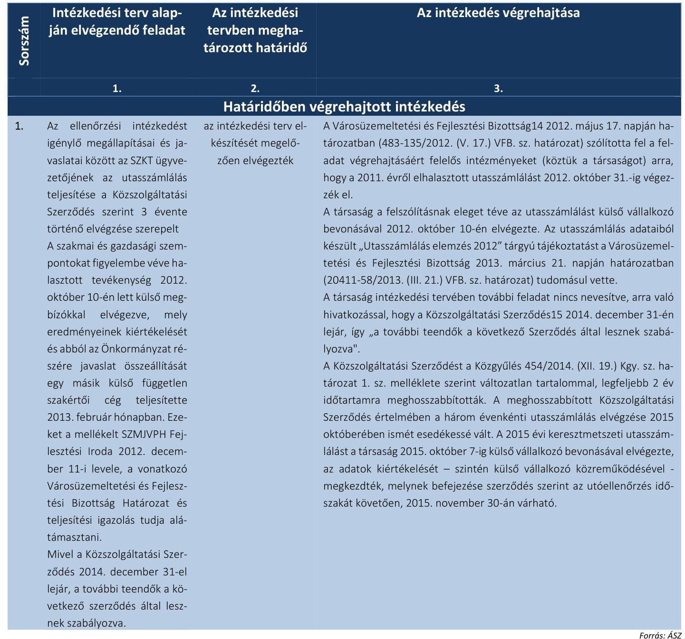
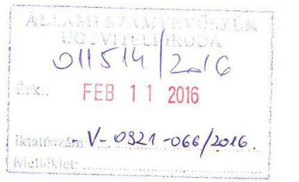
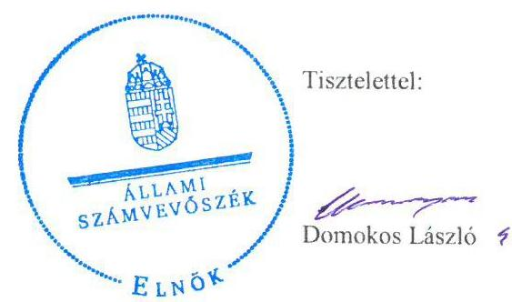

# Jelentés 

## Utóellenőrzések

A Szegedi Közlekedési Kft. közfeladat ellátásának ellenőrzéséről készült jelentés javaslatai hasznosulásának utóellenőrzése 2016.

---

# Jelentés 

## Utóellenőrzések

A Szegedi Közlekedési Kft. közfeladat ellátásának ellenőrzéséről készült jelentés javaslatai hasznosulásának utóellenőrzése

2016. 

---

|  AZ ELLENŐRZÉST FELÜGYELTE: | |
| --- | --- |
|  BÖRÖCZ IMRE felügyeleti vezető | |
|  AZ ELLENŐRZÉST VEZETTE ÉS A VÉGREHAJTÁSÁÉRT FELELŐS: | |
|  VALASTYÁNNÉ DR. VÍZHÁNYÓ JÚLIA ellenőrzésvezető | |
|  A PROGRAM ÖSSZEÁLLÍTÁSÁÉRT FELELŐS: | |
|  JANIK JÓZSEF osztályvezető | |
|  A TÉMÁHOZ KAPCSOLÓDÓ KORÁBBI SZÁMVEVŐSZÉKI JELENTÉSEK: | |
|  - címe: | |
|  Jelentés az önkormányzatok többségi tulajdonában lévő gazdasági társaságok közfeladat-ellátásának ellenőrzéséről – Szegedi Közlekedési Kft. | |
|  - sorszáma: | |
|  13062 | |
|  IKTATÓSZÁM: V-0921-069/2016 | |
|  TÉMASZÁM: 1819 | |
|  ELLENŐRZÉS-AZONOSÍTÓ SZÁM: V071703 | |

---

# TARTALOMJEGYZÉK 

■ ÖSSZEGZÉS ..... 5
■ AZ ELLENŐRZÉS CÉLJA ..... 6
■ AZ ELLENŐRZÉS TERÜLETE ..... 7
■ AZ ELLENŐRZÉS HÁTTERE, INDOKOLTSÁGA ..... 8
■ FÓKUSZKÉRDÉSEK ..... 9
■ ELLENŐRZÉS HATÓKÖRE ÉS MÓDSZEREI ..... 10
■ MEGÁLLAPÍTÁSOK ..... 13
■ MELLÉKLETEK ..... 17
I. sz. melléklet: Az ÁSZ 13062. számú jelentéséhez kapcsolódó intézkedési tervek végrehajtása ..... 17
■ FÜGGELÉK: ÉSZREVÉTELEK ..... 23
■ RÖVIDÍTÉSEK JEGYZÉKE ..... 31

---

.

---

# ÖSSZEGZÉS 

Az Állami Számvevőszék a Szegedi Közlekedési Kft. köz-feladat-ellátásának utóellenőrzését a 2013. július 18. és 2015. október 7. közötti időszakra végezte el. Az utóellenőrzés az ellenőrzött szervezetek által megküldött intézkedési tervekben foglaltak hasznosulására irányult. Szeged Megyei Jogú Város Önkormányzata és a Szegedi Közlekedési Kft. az intézkedési tervekben foglaltakat döntően - 4 feladat kivételével - végrehajtották.

## Az ellenőrzés társadalmi indokoltsága

Az Állami Számvevőszék stratégiájában célul tűzte ki a számvevőszéki munka hasznosulásának javítását. Ezzel összhangban ellenőrzi, hogy az ellenőrzött szervezetek megvalósították-e a korábbi ellenőrzései által feltárt hibák, hiányosságok és szabálytalanságok megszüntetése céljából kialakított intézkedési terveikben foglaltakat. A rendszeres utóellenőrzések hozzájárulnak a szükséges intézkedések tényleges végrehajtáshoz, ezáltal a közpénzügyek rendezettségének javulásához.

## Főbb megállapítások, következtetések

Az intézkedési tervekben foglaltak végrehajtásáról Szeged Megyei Jogú Város Önkormányzata teljes körűen nem, míg a Szegedi Közlekedési Kft. határidőben és teljes körűen gondoskodott.

---

# AZ ELLENŐRZÉS CÉLJA 

## Az önkormányzatok többségi tulajdonában lévő gazdasági társaságok közfeladat ellátásának ellenőrzéséről készült jelentések javaslatai hasznosulásának utóellenőrzése

Az ellenőrzés célja annak értékelése, hogy a számvevőszéki jelentésben foglalt intézkedést igénylő megállapításokkal és javaslatokkal összhangban készített intézkedési tervben meghatározott feladatokat az ellenőrzött szervezet végrehajtotta-e.

---

# AZ ELLENŐRZÉS TERÜLETE 

## Szeged Megyei Jogú Város Önkormányzata, Szegedi Közlekedési Kft.

Az önkormányzatok többségi tulajdonában lévő gazdasági társaságok (Szegedi Közlekedési Kft.) közfeladat-ellátásának ellenőrzését az ÁSZ ${ }^{1}$ a 2008-2011. évek és 2012. év I-III. negyedév közötti időszakra végezte el. Az utóellenőrzés - a 2015. október 7-ig végrehajtott intézkedéseket figyelembe véve - az önkormányzatok többségi tulajdonában lévő gazdasági társaságok közfeladat-ellátásának ellenőrzéséről készült ÁSZ jelentésben² megfogalmazott javaslatokra határidőben megküldött intézkedési tervben foglalt feladatok hasznosulására irányult. Az ÁSZ jelentés a polgármesternek ${ }^{3}$ négy, a társaság ${ }^{4}$ ügyvezetőjének ${ }^{5}$ egy javaslatot tartalmazott.

---

# AZ ELLENŐRZÉS HÁTTERE, INDOKOLTSÁGA 

Az ÁSZ törvény 33. § (1) bekezdése értelmében a számvevőszéki jelentések intézkedést igénylő megállapításaihoz és javaslataihoz kapcsolódóan az ellenőrzött szervezet vezetője intézkedési tervet köteles összeállítani, és az Állami Számvevőszék részére megküldeni. Az intézkedési tervben foglaltak megvalósítását - az ÁSZ törvény 33. § (7) bekezdésében foglaltak alapján - az Állami Számvevőszék utóellenőrzés keretében ellenőrizheti. Az intézkedések megvalósulásának értékelése során az Állami Számvevőszék figyelembe veszi az ellenőrzött szervezetek működési feltételeiben, valamint a jogszabályi előírásokban bekövetkezett változásokat.

Az intézkedési tervekben foglalt feladatok hiányos, illetve késedelmes végrehajtása, valamint megvalósításának elmaradása azt mutatja, hogy az ellenőrzések során feltárt hibák, hiányosságok és szabálytalanságok megszüntetése nem kapott kellő hangsúlyt. Ez a szabályszerű működés és a felelős vezetői magatartás vonatkozásában kockázatot hordoz. E kockázatok feltárásával az Állami Számvevőszék utóellenőrzési rendszere fokozza a fegyelmet, és igazolja, hogy a közpénzzel való szabályos gazdálkodás felelőssége elől nem lehet kitérni.

## AZ ELLENŐRZÉS VÁRHATÓ HASZNOSULÁSA:

Az utóellenőrzés négy szinten hasznosulhat:

- A társadalom szintjén az utóellenőrzés jelzi, hogy a számvevőszéki ellenőrzés megállapításainak van következménye: a hiányosságok megszüntetésére az ellenőrzött szervezet által meghatározott intézkedések végrehajtását is számon kéri az ÁSZ.
- Az ellenőrzött terület szintjén az utóellenőrzés tájékoztatást nyújt a terület döntéshozóinak a hiányosságok kiküszöbölésének jó gyakorlatairól, ezzel lehetőséget biztosítva arra, hogy az ÁSZ ellenőrzési megállapításai, javaslatai a terület nem ellenőrzött szervezeteinek a működése során is hasznosuljanak.
- Az ellenőrzött szervezet szintjén az utóellenőrzés feltárja, hogy a szervezet az intézkedések végrehajtásával hasznosította-e a korábbi ellenőrzési jelentésben a hiányosságok megszüntetése, illetve a kockázatok kezelése érdekében megfogalmazott javaslatokat.
- Az ÁSZ szintjén az utóellenőrzés visszacsatolást ad az ellenőrzési jelentések hasznosulásáról, az intézkedések elmaradása vagy részleges megvalósulása a további ellenőrzésekhez kockázati jelzésként szolgál.

---

# FÓKUSZKÉRDÉSEK 

1. Az ellenőrzött szervezetek az intézkedési tervben foglaltakat az elöirt határidőben - végrehajtották-e?

---

# ELLENŐRZÉS HATÓKÖRE ÉS MÓDSZEREI 

## Az ellenőrzés típusa

Szabályszerűségi ellenőrzés

## Az ellenőrzött időszak

A számvevőszéki jelentés közzétételének napjától (2013. július 18.) az utóellenőrzés megkezdésének napjáig (2015. október 7.) tartó időszak volt.

## Az ellenőrzés tárgya

Az ÁSZ tv. 2011. július 1-jei hatálybalépését követően az ÁSZ jelentésekben megfogalmazott javaslatokra az ellenőrzött által megküldött intézkedési tervekben foglaltak.

Az ellenőrzés kiterjedt minden olyan körülményre és adatra, amely az ÁSZ jogszabályban meghatározott feladatainak teljesítéséhez, valamint a program végrehajtása folyamán felmerült újabb összefüggések feltárásához szükséges.

## Az ellenőrzött szervezet

Szeged Megyei Jogú Város Önkormányzata, Szegedi Közlekedési Kft.

## Az ellenőrzés jogalapja

Az Alaptörvény ${ }^{6}$ 43. cikk (1) bekezdése alapján az ÁSZ az Országgyűlés ${ }^{7}$ pénzügyi és gazdasági ellenőrző szerve. Az ÁSZ törvényben meghatározott feladatkörében ellenőrzi a központi költségvetés végrehajtását, az államháztartás gazdálkodását, az államháztartásból származó források felhasználását és a nemzeti vagyon kezelését. Az ÁSZ tv. 1. § (3) bekezdése szerint az ÁSZ általános hatáskörrel végzi a közpénzekkel és az állami és önkormányzati vagyonnal való felelős gazdálkodás ellenőrzését. A 33. § (7) bekezdése alapján az ÁSZ tv. 33. § (1)-(2) bekezdése szerinti intézkedési tervben foglaltak megvalósítását az ÁSZ utóellenőrzés keretében ellenőrizheti. Az Áht. ${ }^{8}$ 61. § (2) bekezdése szerint az államháztartás külső ellenőrzésével kapcsolatos feladatokat az ÁSZ látja el.

---

# Az ellenőrzés módszerei 

Az ellenőrzést a nemzetközi standardokat irányadónak tekintve az ellenőrzési program ellenőrzési kérdései, az ellenőrzött időszakban hatályos jogszabályok, az ellenőrzés szakmai szabályok és módszertanok figyelembe vételével végeztük. Az utóellenőrzéseket ellenőrzéshez kapcsolódóan végeztük.

Az ellenőrzés ideje alatt az ellenőrzött szervezettel történő kapcsolattartást az ÁSZ SZMSZ ${ }^{\circledR}$-ének vonatkozó előírásai alapján biztosítottuk.

Az utóellenőrzés megállapításait elsősorban az ÁSZ rendelkezésére álló, valamint az ellenőrzött szervezetektől elektronikusan bekért dokumentumok alapozzák meg, amely szükség esetén helyszíni ellenőrzéssel egészülhet ki. Az ÁSZ az ellenőrzés keretében egyes esetekben teljesítményellenőrzés tervezéséhez is kérhet adatokat.

Az ellenőrzés során adatszolgáltatásra kérjük fel az ÁSZ elnöke által - az utóellenőrzés tárgyához kapcsolódóan - korábban figyelmet felhívó levéllel megkeresett, nem ellenőrzött szervezetek vezetőit az utóellenőrzött ÁSZ jelentésben foglaltak hasznosulásának teljesebb felmérése érdekében.

Az ellenőrzési bizonyítékként felhasználható adatforrások közé tartoztak egyrészt a szakmai programban felsorolt adatforrások, másrészt minden - az ellenőrzés folyamán feltárt, az ellenőrzés szempontjából releváns információt tartalmazó - dokumentum.

Az ellenőrzés során értékeltük, hogy az ÁSZ jelentésben foglalt javaslatokra az elkészített intézkedési terveket határidőben megküldték-e, az intézkedési tervben foglaltakat végrehajtották-e.

A jóváhagyott intézkedési tervben előírt feladatok végrehajtásának ellenőrzését értékelési kritériumok alapján végeztük. Figyelembe vettük az intézkedési terv jóváhagyását követően hatályba lépett jogszabályi előírások változásából következő események, továbbá a feladat-ellátási és finanszírozási rendszer esetleges változásának hatásait. Az intézkedési tervekben előírt feladatokat azok végrehajthatósága, illetve végrehajtása szempontjából az alábbiak szerint értékeltük:
$\longrightarrow$ okafogyottá vált az előírt feladat, ha végrehajtására - meghatározott esemény bekövetkezése, továbbá külső körülmény, a működést érintő feltétel változása miatt - már nincs szükség, illetve lehetőség, és egyértelműen megállapítható, hogy az intézkedést szükségessé tevő körülmény a jövőben nem fordulhat elő;
$\longrightarrow$ nem időszerű az a feladat, amelynek ellenőrzési időszakon belüli végrehajtására azért nem került (kerülhetett) sor, mert az intézkedés alapjául szolgáló esemény nem következett be, de annak jövőbeni előfordulása lehetséges, a végrehajtása nem volt esedékes, vagy a végrehajtás határideje még nem járt le;
$\longrightarrow$ határidőben végrehajtott a feladat, ha a teljesítés dokumentáltan az intézkedési tervben előírt határidőben és tartalommal megtörtént;
$\longrightarrow$ határidőn túl végrehajtott a feladat, ha annak teljesítése az intézkedési tervben meghatározott módon, de az előírt határidőn túl történt meg;
$\longrightarrow$ részben végrehajtott az a feladat, amelynek végrehajtása teljes körűen az intézkedési tervben előírt módon nem történt meg;

---

- nem végrehajtott a feladat, ha a végrehajtás nem történt meg, vagy amennyiben a teljesítést nem dokumentálták.
Az ellenőrzés lefolytatásához az ellenőrzött szervezet a tanúsítványok elektronikus kitöltésével, valamint az ÁSZ által kért dokumentumok elektronikus megküldésével szolgáltatott adatokat, amelyek valódiságát és teljes körűségét az ellenőrzött szervezet vezetője által tett teljességi és hitelességi nyilatkozat igazolja. Az így rendelkezésre bocsátott adatok, információk kontrollja az ellenőrzés keretében megtörtént.

---

# MEGÁLLAPÍTÁSOK 

## 1. Az ellenőrzött szervezetek az intézkedési tervben foglaltakat az elöírt határidőben - végrehajtották-e?

Összegző megállapítás

Az intézkedési tervekben foglaltakat az Önkormányzat nem teljes körűen, míg a társaság az előírt határidőben teljes körűen végrehajtotta.

AZ ÖNKORMÁNYZAT vonatkozásában az 1. számú ábra szemlélteti az intézkedési terv végrehajtásának megoszlását kategóriánként.

1. számú ábra

Fonás: ÁsZ
Az Önkormányzat által készített intézkedési tervben tizenhárom feladatot írtak elő. Ezekből három nem időszerű, kettő határidőben, négy határidőn túl, kettő részben, illetve kettő nem végrehajtott feladat volt.

## NEM IDŐSZERŰ FELADATOK:

$\qquad$ 1. Az ügyvezetői beszámoltatási kötelezettség szükségessége tárgyában benyújtandó közgyűlési előterjesztés nem volt esedékes az intézkedés ellenőrzött időszakon túli - 2015. december 31-ei - határideje miatt.
$\qquad$ 2. Az előírt ügyvezetői adatszolgáltatás az Önkormányzat részére folyamatosan megtörtént, ezért kötelezettségszegés miatti felelősségre vonás nem vált szükségessé.
$\qquad$ 3. A KT8A-3M-LF villamos hasznosítására vonatkozó előterjesztés elkészítésére nem kerülhetett sor, mert az intézkedés alapjául szolgáló esemény nem következett be.

---

# HATÁRIDŐBEN VÉGREHAJTOTT FELADATOK: 

4. A Közgyűlés ${ }^{10}$ tájékoztatása az ügyvezetői adatszolgáltatás megtörténtéről és annak értékeléséről évente egy alkalommal, 2014. június 27-én, valamint 2015. június 26-án a megtörtént.
5. Az ügyvezetői adatszolgáltatás havi teljesítését a polgármester folyamatosan, a 2013. október - 2015. augusztus hónapokra vonatkozóan nyomon követte.

## HATÁRIDŐN TÚL VÉGREHAJTOTT FELADATOK:

6. A polgármester a vállalt 2013. szeptember 20-ai határidőn túl, 2013. október 14-én küldte meg a tulajdonosi tájékoztatást a társaság ügyvezetőjének.
7. A polgármester a vállalt 2013. szeptember 20-ai határidőn túl, 2013. október 14-én küldte meg a felhívó levelet a társaság FB elnökének11.
8. A polgármester a vállalt 2013. október 10-ei határidőn túl, 2013. október 14-én küldte meg a felhívó levelet a GPÁIB12 elnökének.
9. A polgármester a vállalt 2013. szeptember 20-ai határidőn túl, 2013. október 14-én küldte meg a tulajdonosi tájékoztatásra vonatkozó levelet a társaság ügyvezetőjének a villamosok hasznosíthatóságára vonatkozó terv bekérésével kapcsolatosan.

## RÉSZBEN VÉGREHAJTOTT FELADATOK:

10. A társaság FB elnöke részére előírt tájékoztatási kötelezettség teljesítésének rendszeres ellenőrzése részben, a folyamatos végrehajtással ellentétben csak 2013. december 15. napját követően történt meg.
11. A határidőre történő ügyvezetői hasznosítási terv készítése, számonkérése fele részben történt meg, mivel a KT8A-3M-LF villamos hasznosítására vonatkozó terv elkészítésének elmaradása ellenére a polgármester nem tett további intézkedéseket.

## NEM VÉGREHAJTOTT FELADATOK:

12. A 2013. december 15. napjáig előírt folyamatos beszámolási kötelezettség elmulasztása miatt a polgármester nem kezdeményezte a társaság FB elnökének azonnali visszahívását.
13. A KT8A-3M-LF villamos hasznosítására vonatkozó ügyvezetői tervkészítés határidőre történő teljesítésének elmulasztása miatt a polgármester nem kezdeményezett felelősségre vonást a kötelezettségszegés miatt.

Az intézkedési tervben rögzített feladatok végrehajtásáról az Önkormányzat vezette a Bkr. ${ }^{13} 14 . \S$ (1) bekezdésében előírt nyilvántartást. A Bkr. 47. § (2) bekezdésében foglaltak ellenére a nyilvántartásban nem tüntették fel a végre nem hajtott intézkedések okát.

---

A TÁRSASÁG vonatkozásában az ügyvezető által készített intézkedési terv egyetlen feladatot tartalmazott.

# HATÁRIDŐBEN VÉGREHAJTOTT FELADAT: 

1. Az elhalasztott keresztmetszeti utasszámlálást a társaság 2012. október 10-én elvégezte, amelynek elemzése 2013. március 10-én megtörtént. A 2015-ben esedékes keresztmetszeti utasszámlálást a társaság elvégezte és a kiértékelés megkezdődött.

---

.

---

# MELLÉKLETEK 

- I. SZ. MELLÉKLET: AZ ÁSZ 13062. SZÁMÚ JELENTÉSÉHEZ KAPCSOLÓDÓ INTÉZKEDÉSI TERVEK VÉGREHAITÁSA

Szeged Megyei Jogú Város Önkormányzata által készített intézkedési terv végrehajtása

|  |   |   |   |
| --- | --- | --- | --- |
|  1. | 2. | 3. | 4.  |
|  Nem idészerú intézkedések |  |  |   |
|  1. | A 2015. december 31. utáni beszámoltatási kötelezettség szükségességének megítélése tárgyában a Közgyűlés döntése alapján a beszámoltatás tovább folytatása/módosítása/elhagyása. Közgyűlési előterjesztés benyújtása. | 2015.december 31. | A feladat végrehajtására előírt határidő az ellenőrzött időszakot követően válik esedékessé.  |
|  2. | Amennyiben az ügyvezető az adatszolgáltatásnak folyamatosan, önként nem tesz eleget, az ügyvezetőtől elvárható együttműködési, tulajdonosi tájékoztatási és ÁSZ jelentéssel kapcsolatos teljesítési kötelezettségének ellenszegülése miatt kezdeményezni kell az ügyvezető azonnali hatállyal történő visszahívását ügyvezetői minőségéből, és ezzel egyidejűleg kezdeményezni munkaszerződésének megszüntetését a Közgyűlés felé. Kötelezettségszegés esetén a viszszahívás tárgyában előterjesztés készítése a polgármester által. | folyamatos | A folyamatosan teljesített havi ügyvezetői adatszolgáltatás miatt nem volt időszerű a kötelezettségszegés miatti felelősségre vonás.  |
|  3. | Az ügyvezetői terv alapján a villamosok hasznosíthatóságára vonatkozóan polgármesteri előterjesztés keretében tájékoztatni a Közgyűlést, hogy a szükséges döntéseket hozza meg. Előterjesztés előkészítése és Közgyűlés elé terjesztése. | 2014.április 30. | 2013. december 20-án bizottsági előterjesztés készült a KTNF6 villamos értékesítéséről, amit Közgyűlés határozatban elfogadott. Az ügyvezető a KT8A-3M-LF villamos hasznosítására az ellenőrzött időszak végéig nem adott tájékoztatást.  |

---

|  | Intézkedési terv alapján elvégzendő feladat | Az intézkedési tervben meghatározott határidő | Az intézkedés végrehajtása |
| :--: | :--: | :--: | :--: |
|  | 1. | 2. | 3. |
| Határidőben végrehajtott intézkedések |  |  |  |
| 4. | Az ügyvezető adatszolgáltatás megtörténtéről és annak értékeléséről polgármesteri előterjesztés keretében a Közgyűlés tájékoztatása évente legalább 1 alkalommal. Előterjesztés előkészítése és Közgyűlés elé terjesztése. | Évente 1 alkalommal rendes Közgyűlés keretében. | Az ügyvezetői adatszolgáltatás megtörténtéről és annak értékeléséről jegyzői előterjesztés keretében 2014. június 27-én, valamint 2015. június 26-án a történt meg a Közgyűlés tájékoztatása. |
| 5. | Az ügyvezetői adatszolgáltatás havi teljesítésének nyomon követése a polgármester által. | folyamatos | Az ügyvezetői adatszolgáltatás a 2013. október-2015. augusztus hónapokra vonatkozóan dokumentáltan megtörtént. |
| Határidőn túl végrehajtott intézkedések |  |  |  |
| 6. | Az ÁSZ jelentésre hivatkozással ismételten megküldésre kerül - a korábbi polgármesteri levelekkel azonos tartalommal - egy tulajdonosi tájékoztatásra vonatkozó levél, mely a társaság 50 millió Ft alatti ügyleteinek, azaz az ügyvezető hatáskörébe tartozó ügyletek beszámolására vonatkozik. A tulajdonosi tájékoztatásra vonatkozó levél megküldése. | 2013.szeptember 20. | A polgármester a benyújtott intézkedési tervben szereplő határidőn túl 2013. október 14-én küldte meg a tulajdonosi tájékoztatásra vonatkozó levelet a társaság ügyvezetőjének. |
| 7. | Felhívó levél küldése a Szegedi Közlekedési Kft. FB elnökének, hogy a társasági alapító okirat szerinti kötelezettségének tegyen eleget első alkalommal 2013. október 10, majd 2013. december 15. napjáig 2013. évre vonatkozóan, ezt követően minden évben a társaság I-III. negyedéves és éves beszámolójával egyidejűleg tájékoztassa a Közgyűlést a tulajdonosi érdekek érvényesüléséről és a társaság gazdasági és vagyoni helyzetéről. Felhívó levél eljuttatása. | 2013.szeptember 20. | A polgármester a benyújtott intézkedési tervben szereplő határidőn túl, 2013. október 14-ei keltezéssel küldte meg a felhívó levelet a társaság FB elnökének. |

---

|  | Intézkedési terv alapján elvégzendő feladat | Az intézkedési tervben meghatározott határidő | Az intézkedés végrehajtása |
| :--: | :--: | :--: | :--: |
|  | 1. | 2. | 3. |
| 8. | Kivizsgálás és felelősség megállapítása villamos beszerzés és rezsióradíjak tekintetében. A volt GPÁIB elnök felhívása tájékoztatás adása és előterjesztés készítése tárgyában. | 2013.október 10. | A polgármester a benyújtott intézkedési tervben szereplő határidőn túl, 2013. október 14-ei keltezéssel küldte meg a felhívó levelet a GPÁIB elnökének. |
| 9. | Az ÁSZ jelentésre hivatkozással ismételten kiküldésre kerül a korábbi (al)polgármesteri levelekkel összhangban egy tulajdonosi tájékoztatásra vonatkozó levél a Szegedi Közlekedési Kft. Ügyvezető igazgatójának 3 hónapos határidő adásával, mely egy felelős tulajdonosi döntés alapját képezheti az érintett villamosok hasznosíthatóságának vonatkozásában. Tulajdonosi tájékoztatásra vonatkozó levél megküldése. | 2013.szeptember 20. | A polgármester a benyújtott intézkedési tervben szereplő határidőn túl, 2013. október 14-én küldte meg a tulajdonosi tájékoztatásra vonatkozó levelet a társaság ügyvezetőjének. |
|  |  | Részben végrehajtott intézkedések |  |
| 10. | A Szegedi Közlekedési Kft. FB elnöke tájékoztatási kötelezettségének rendszeres ellenőrzése a polgármester által. | folyamatos | 2013. december 15. napjáig nem történt meg az előírt beszámolás, amit a polgármester nem kifogásolt. A további előírt beszámolók benyújtása megtörtént, a társaság I.-III. negyedéves és éves beszámolójával egyidejűleg a tulajdonosi érdekek érvényesüléséről és a társaság gazdasági és vagyoni helyzetéről. |
| 11. | A határidőre történő ügyvezetői hasznosítási tervkészítés megkövetelése. | folyamatos | A tulajdonosi tájékoztatásra vonatkozó levél a társaság ügyvezető igazgatójának 3 hónapos határidőt szabott meg az ügyvezetői hasznosítási tervkészítésre. A KT8A-3M-LF villamos hasznosítására vonatkozóan a határidőre történő ügyvezetői hasznosítási terv elkészítésének elmaradása ellenére annak megkövetelése érdekében a polgármester nem tett további intézkedéseket. |

---

|  1. | Intézkedési terv alapján elvégzendő feladat | Az intézkedési tervben meghatározott határidő | Az intézkedés végrehajtása  |
| --- | --- | --- | --- |
|   | 1. | 2. | 3.  |
|  Nem végrehajtott intézkedések |  |  |   |
|  12. | Amennyiben Szegedi Közlekedési Kft. FB elnöke az elvártak szerint folyamatosan, önként nem tesz eleget, a tulajdonosi érdekeket képviselő FB elnöktől elvárható együttműködési, tulajdonosi tájékoztatási és ÁSZ jelentéssel kapcsolatos teljesítési kötelezettségének, ellenszegülése miatt kezdeményezni kell az FB elnök azonnali hatállyal történő visszahívását felügyelőbizottsági minőségéből a Közgyűlés felé. Kötelezettségszegés esetén a visszahívás tárgyában előterjesztés készítése a polgármester által. | folyamatos | A 2013. december 15. napjáig előírt folyamatos beszámolási kötelezettség elmulasztása miatt a polgármester nem kezdeményezte az FB elnök azonnali visszahívását.  |
|  13. | Amennyiben az ügyvezető a hasznosítási tervkészítés megkövetelésének határidőre nem tesz eleget, az ügyvezetőtől elvárható együttműködési, tulajdonosi tájékoztatási és ÁSZ jelentéssel kapcsolatos teljesítési kötelezettségének ellenszegülése miatt kezdeményezni kell az ügyvezető azonnali hatállyal történő visszahívását ügyvezetői minőségéből, és ezzel egyidejűleg kezdeményezni kell munkaszerződésének megszüntetését a Közgyűlés felé. Kötelezettségszegés esetén a visszahívás tárgyában előterjesztés készítése. | folyamatos | A KT8A-3M-LF villamos hasznosítására vonatkozó ügyvezetői tervkészítés határidőre történő teljesítésének elmulasztása miatt a polgármester nem kezdeményezett felelősségre vonást a kötelezettségszegés miatt.  |

---

# Szegedi Közlekedési Kft. által készített intézkedési terv végrehajtása 

---

.

---

# FÜGGELÉK: ÉSZREVÉTELEK 

A jelentéstervezetet a Számvevőszék 15 napos észrevételezésre megküldte az ellenőrzött szervezet vezetőjének az ÁSZ tv. 29. §* (1) bekezdése előírásának megfelelően.
Az elfogadott észrevételek alapján véglegesíti az Állami Számvevőszék a jelentését.

A Szegedi Közlekedési Kft. ügyvezető igazgatója, és Szeged Megyei Jogú Város Önkormányzat Polgármestere írásban észrevételt tett.
A függelék tartalmazza az ellenőrzött észrevételeit, illetve Szeged Megyei Jogú Város Önkormányzat Polgármesterének el nem fogadott észrevételei elutasításának indoklását
$\qquad$ 1. Szegedi Közlekedési Kft. ügyvezető igazgatója ÁSZ elnökének írt levelének másolata.
$\qquad$ 2. Szeged Megyei Jogú Város Önkormányzat Polgármestere írásban tett észrevétele.
$\qquad$ 3. Tájékoztatás az el nem fogadott észrevételekről Szeged Megyei Jogú Város Önkormányzat Polgármesterének.

[^0]
[^0]:    * 29. § (1) Az Állami Számvevőszék az ellenőrzési megállapításait megküldi az ellenőrzött szervezet vezetőjének vagy az általa megbízott személynek, és annak, akinek személyes felelősségét állapította meg.
    (2) Az ellenőrzött szervezet vezetője és a felelősként megjelölt személy az ellenőrzés megállapításaira tizenöt napon belül írásban észrevételt tehet.
    (3) Az Állami Számvevőszék az észrevételre a beérkezésétől számított harminc napon belül írásban válaszol. A figyelembe nem vett észrevételeket köteles a jelentésben feltüntetni, és megindokolni, hogy azokat miért nem fogadta el.

---

Központ: 6720 Szeged, Zrínyi u. 4-8.,. Tel.: (62) 592-250
Titkárság: Tel./fax: (62) 426-714
Levékcím: 6701 Szeged, 1. Pf.: 78., E-mail: sekr@szkt.hu
Utelep: 6724 Szeged, Póró u. 48., Tel.: (62) 592-250
H. telep: 6724 Szeged Körtöltés u. 35. Tel. (62) 592-280
ikt.sz.önöknél: V-0921-060/2015. nálunk: 001/148-1/2016/SZKT 21/148-2/2016/SZKT

Tisztelt Elnök Úr!

Állami Számvevőszék
Domonkos László
elnök

Budapest

Tisztelt Elnök Úr!

Állami Számvevőszék
Domonkos László
elnök

ÁLLAMI SZÁMVEVŐSZÉK
0106721/2016
Érkezzet: 2016 FEHH 09.
Iktatószaim:........................................
Melléklet:........................................

Társaságunknál 2015. évben a feni hivatkozású számvevőszéki utóellen-
őrzés volt, melynek jelentéstervezetét megkaptuk.

A jelentéstervezetre észrevételt nem kívánunk tenni.

Szeged, 2016. február 1.

Tisztelettel:

*Majd Petri Zoltán*
ügyvézető igazgató

5 Szegedi Közlekedési Kft.

Készült: 3 pld-ban
Kapja: 1 pld. Cím
1 pld. Titkárság
1 pld. Irattár

1

FEDER JURIS
UNIÓSZÉK

1

---

Szeged Megyei Jogú Város Polgármestere 6745 Szeged, Pf. 473.

Ikt. sz.: 3651-15/2016.

Tárgy: Észrevétel jelentéstervezethez (Szegedi
Közlekedési Kft. közfeladat ellátásának
utóellenőrzése)
Hiv.szám: V-0921-061/2015.

Állami Számvevőszék
Domokos László részére

Budapest 4.
Pf. 54.
1364

Tisztelt Címzett!

A 2016. január 22. napján érkezett, a Szegedi Közlekedési Kft. közfeladat-ellátásának
utóellenőrzéséről készült jelentéstervezethez az alábbi észrevételt tesszük:

I. Jelentés 14. oldal: Határidőn túl végrehajtott feladatok (6-9. pont):
6-9. pont: Az intézkedési terv az ÁSZ részére határidőben 2013. augusztus 15. napján
megküldésre került, azonban annak elfogadásáról az intézkedési tervben vállalt határidőig
válasz nem érkezett, így határidőre az intézkedési tervben vállalt feladatokat teljesíteni nem
tudtuk.

Az Állami Számvevőszékről szóló 2011. évi LXVI. törvény 33. § - a kimondja, hogy az
intézkedési tervet a jelentés kézhezvételétől számított 30 napon belül kell az Állami
Számvevőszéknek megküldeni. Ennek az Önkormányzat határidőben eleget tett.

A törvény 33. § (2) bekezdése szerint amennyiben az intézkedési tervben foglalt intézkedések
hiányosak vagy más okból nem elfogadhatók, az Állami Számvevőszék az intézkedési tervet
indokolással és tizenöt munkanap - testületi döntéshozatal szükségessége esetén a következő
testületi ülést követő öt munkanap - póthatáridő tűzésével visszaküldi kijavításra,
kiegészítésre az ellenőrzött szervezet vezetőjének, és erről egyidejűleg értesíti a belső
ellenőrzést végző személyt, illetve szervezetet.

Tekintettel arra, hogy a fenti jogszabályi rendelkezés nem tűz ki határidőt az Állami
Számvevőszéknek az intézkedési terv megvizsgálására - csak és kizárólag a kijavításra,
kiegészítésre határoz meg határidőt, az Önkormányzat joggal feltételezte, hogy az Állami
Számvevőszéktől visszajelzés érkezik akár arra vonatkozóan, hogy az intézkedési terv
megfelelő akár arra vonatkozóan, hogy hiányosságot tapasztalt.

Fentieket erősíti meg, hogy az Önkormányzat 2013. október 8. napján elektronikus levélben
érdeklődött az Állami Számvevőszéknél arról, hogy az intézkedési terv elfogadásra került-e.
Az ÁSZ ügyintézője 2013. október 14.-i válaszában megerősítette, hogy az intézkedési tervet
elfogadták, ezért még ugyanazon napon a polgármester általi levelek kiküldésre kerültek.
Az Állami Számvevőszék hivatalos levele az intézkedési terv elfogadásáról 2013. november
14. napján kelt, ezért az Önkormányzat által megküldött intézkedési tervben foglalt és vállalt

---

korábbi határidős feladatokat nem is lehetett időben végrehajtani, tekintettel az Állami Számvevőszék által megküldött -intézkedési tervben foglalt határidőket követően készült levelére.
Az intézkedési tervet megküldő polgármesteri levél akként zárult, hogy a polgármester kéri az intézkedési terv tudomásulvételét, melyet a következő közgyülésre tájékoztatásként a polgármester be kívánt terjeszteni. Figyelemmel azonban arra, hogy hivatalos válasz nem érkezett, ezért csak a 2013.november 15-i képviselő testületi ülésre tudta csak a polgármester előterjeszteni az intézkedési tervet.

# II. Jelentés 14. oldal: Részben végrehajtott feladatok (10-11. pont): 

10. pont: Az FB elnöke a 2013. évre vonatkozó beszámolóját határidőcsúszással, de teljesítette. Erről a 2014. június 27 -ei közgyűlésen a „Tájékoztató a lejárt határidejű közgyűlési határozatok végrehajtásáról" tárgyú előterjesztésben tájékoztatást adtunk (utóellenőrzéshez megküldött iratjegyzék 4. és 5. sz. melléklet). Az I. pontban kifejtett határidőcsúszás miatt nem is lehetett volna elvárni egy 2013. október 10. napjáig előírt kötelezettség teljesítését, ha a kötelezettségre való felhívás csak 2013. október 14. napján került kiküldésre (tekintettel arra a tényre, hogy az Önkormányzat értesítést nem kapott a jelentés tervezet elfogadásáról, vagy esetleges el nem fogadásáról, - és csak 2013. november 14. napján kelt ÁSZ levél alapján értesült az intézkedési terv elfogadásáról-, ezért határidőben nem tudta a leveleket kiküldeni).
11. pont: Az ügyvezető a KT8A-3M-LF villamos hasznosítására vonatkozóan tervet nem készített, így az intézkedési tervet végrehajtani nem lehetett. Erről a 2014. június 27 -ei közgyűlésen a „Tájékoztató a lejárt határidejű közgyűlési határozatok végrehajtásáról" tárgyú előterjesztésben tájékoztatást adtunk (utóellenőrzéshez megküldött iratjegyzék 4. és 5. sz. melléklet).

## III.Jelentés 14. oldal: Nem végrehajtott feladatok (12-13. pont):

12. pont: Az FB elnöke a 2013. évre vonatkozó beszámolóját határidőcsúszással, de teljesítette. Erről a 2014. június 27 -ei közgyűlésen a „Tájékoztató a lejárt határidejű közgyűlési határozatok végrehajtásáról" tárgyú előterjesztésben tájékoztatást adtunk (utóellenőrzéshez megküldött iratjegyzék 4. és 5. sz. melléklet) A határidőcsúszással teljesített beszámoló nem indokolta az FB elnök azonnali visszahívását.
13. pont: Az ügyvezető a KT8A-3M-LF villamos hasznosítására vonatkozóan tervet nem készített, így az intézkedési tervet végrehajtani nem lehetett. Erről a 2014. június 27 -ei közgyűlésen a „Tájékoztató a lejárt határidejű közgyűlési határozatok végrehajtásáról" tárgyú előterjesztésben tájékoztatást adtunk (utóellenőrzéshez megküldött iratjegyzék 4. és 5. sz. melléklet).

Külső ellenőrzésekhez kapcsolódó ellenőrzések nyilvántartása:
A nyilvántartás kiegészítéssel egyetértünk.
Kérem, hogy a végleges jelentésben a fenti észrevételeket figyelembe venni szíveskedjenek.
Szeged, 2016. február 05.

---

ELKÖK

Ikt.szám: V-0921-067/2016.

Dr. Botka László István úr
polgármester
Szeged Megyei Jogú Város Önkormányzat

# Szeged 

## Tisztelt Polgármester Úr!

„Utóellenörzések - A Szegedi Közlekedési Kft. közfeladat ellátásának ellenörzéséről készült jelentés javaslatai hasznosulásának utóellenörzése" címmel készített számvevőszéki jelentéstervezetre tett észrevételeit köszönettel megkaptam.

Az Állami Számvevőszék észrevételekre vonatkozó álláspontjáról a felügyeleti vezető által készített részletes tájékoztatást csatoltan megküldöm.

Tájékoztatom Polgármester Urat, hogy a számvevőszéki jelentésben - az Állami Számvevőszékről szóló 2011. évi LXVI. törvény 29. § (3) bekezdése alapján - a figyelembe nem vett észrevételeket szerepeltetjük az elutasítás indokának feltüntetésével.

Budapest, 2016. 01 hó 05 .nap

Melléklet: Tájékoztatás az el nem fogadott észrevételekről

---

# Tájékoztatás az el nem fogadott észrevételekről 

Az „Utóellenörzések - A Szegedi Közlekedési Kft. közfeladat ellátásának ellenörzéséről készült jelentés javaslatai hasznosulásának utóellenörzése "címủ jelentéstervezetre 2016. február 11-én érkezett észrevételeit áttekintettük, azok kezelésével kapcsolatban a következő tájékoztatást adom.

A polgármesteri észrevétel az I. pontban a határidőn túli végrehajtás, a II. pontban a részben végrehajtott, a III. pontban pedig a nem végrehajtott megjelölésủ minősítéseket ugyanarra visszavezetve kifogásolta. Minden olyan esetben, amelyben az ÁSZ a feladat végrehajtásáról önkormányzati szempontból kedvezőtlen megállapítást tett, azzal hozta összefüggésbe, hogy késedelmesen kapott visszajelzést az intézkedési terv elfogadásáról. Indokolt azonban figyelembe venni a következőket:

- Törvényi előírás az intézkedési terv kijavításának, kiegészítésének szükségessége esetén követendő eljárást szabályozza, az ÁSZ-nak nincs az elfogadás visszaigazolására vonatkozó törvényi kötelezettsége. Az észrevétel is idézi az Állami Számvevőszékről szóló 2011. évi LXVI. törvény 33. § (2) bekezdését: „Amennyiben az intézkedési tervben foglalt intézkedések hiányosak vagy más okból nem elfogadhatók, az Állami Számvevőszék az intézkedési tervet indokolással és tizenöt munkanap - testületi döntéshozatal szükségessége esetén a következő testületi ülést követő öt munkanap - póthatáridő tüzésével visszaküldi kijavításra, kiegészitésre az ellenőrzött szervezet vezetőjének, és erről egyidejüleg értesíti a belső ellenőrzést végző személyt, illetve szervezetet."
- Az ÁSZ jelentésében foglalt megállapításokra és javaslatokra a feladatokat, intézkedéseket, felelősségeket és határidőket az ellenőrzött szervezet vezetője jelöli ki, amelyet az ÁSZ csak a hivatkozott törvényi előírásban megjelölt esetben küld vissza kijavításra, kiegészítésre. A 13062 sorszámú ÁSZ jelentésben a polgármesternek címzett négy javaslatra az ÁSZ felé határidőben megküldött intézkedési terv tizenhárom feladatot tartalmazott. Az intézkedési terv tartalmát - benne a vonatkozó végrehajtási határidőket módosító önkormányzati dokumentum az ÁSZ-hoz nem érkezett.
- Felelős vezetői magatartásnak tekintjük a konkrét feladatok és határidők kijelölésén túl a szükséges intézkedések késedelem nélküli megtételét, a feladatok végrehajtásának megkövetelését, a tervezettől eltérő ütemủ végrehajtás kockázatának kezelését.

A jelentéstervezet egyes konkrét pontjaira vonatkozó észrevételekkel kapcsolatos tájékoztatás a fentieket kiegészítve a következő:

- Az észrevétel I. részéhez (Jelentés 14. oldal: Határidőn túl végrehajtott feladatok /6-9. pont/)

Az ÁSZ az utóellenőrzés során az ellenőrzés alapvető kritériumának az Önkormányzattól érkező érvényes, hatályos intézkedési tervet tekintette, amelyhez viszonyítva a végrehajtás

---

értékelései a 6-9. pontok vonatkozásában helytállóak. A megállapítások módosítása ezért nem indokolt.

- Az észrevétel II. részéhez (Jelentés 14. oldal: Részben végrehajtott feladatok /10-11. pont/)

Mind a 10. pontra, mind a 11. pontra vonatkozó észrevétel elismeri, hogy a végrehajtás nem felelt meg mindenben az intézkedési tervnek, nem volt teljes körü. Emellett a 10. ponthoz füzött észrevétel a határidő tekintetében az ÁSZ értesítő levelének megérkezéséhez viszonyít, miközben maga is jelzi, hogy a kötelezettségre való felhívás levelét már egy hónappal azelőtt kiküldték. Mindkét pont esetében az Önkormányzat által meghatározott határidő egyébként folyamatos volt. Mindezek alapján az ÁSZ értékelései a 10-11. pontok vonatkozásában helytállóak, a megállapítások módosítása ezért nem indokolt.

- Az észrevétel III. részéhez (Jelentés 14. oldal: Nem végrehajtott feladatok /12-13. pont/)

Sem a 12. pontra, sem a 13. pontra vonatkozó észrevétel nem cáfolja az ÁSZ megállapításait, az első esetben nagyrészt, a második esetben szó szerint az észrevétel II. részében leírtakat ismétli meg. A korábban kifejtett általános és az észrevétel II. részéhez adott kiegészítő tájékoztatás alapján az ÁSZ értékelései a 12-13. pontok vonatkozásában helytállóak, a megállapítások módosítása ezért nem indokolt.

Tájékoztatom, hogy a számvevőszéki jelentés függelékeként szerepeltetjük a jelentéstervezethez tett észrevételeit, valamint az azokra adott válaszunkat.

Budapest, 2016. 03 hó 03 nap

Böröcz Imre
felügyeleti vezető

---

.

---

# RÖVIDÍTÉSEK JEGYZÉKE 

${ }^{1}$ ÁSZ
${ }^{2}$ ÁSZ jelentés
${ }^{3}$ polgármester
${ }^{4}$ társaság
${ }^{5}$ ügyvezető
${ }^{6}$ Alaptörvény
${ }^{7}$ Országgyülés
${ }^{8}$ Áht.
${ }^{9}$ SZMSZ
${ }^{10}$ Közgyülés
${ }^{11}$ FB elnök
${ }^{12}$ GPÁIB
${ }^{13}$ Bkr.
${ }^{14}$ Városüzemeltetési és Fejlesztési Bizottság
${ }^{15}$ Közszolgáltatási Szerződés

Állami Számvevőszék
13062 ÁSZ jelentés az önkormányzatok többségi tulajdonában lévő gazdasági társaságok közfeladat-ellátásának ellenőrzéséről - Szegedi Közlekedési Kft. (Iktatószám: V-0032-268/2013., Témaszám: 13, Vizsgálat-azonosító szám: V060901)
Szeged Megyei Jogú Város polgármestere
Szegedi Közlekedési Kft.
Szegedi Közlekedési Kft. ügyvezető igazgatója
Magyarország Alaptörvénye (kihirdetve: 2011. április 25-én)
Magyarország Országgyűlése
2011. évi CXCV. törvény az államháztartásról (hatályos: 2012. január 1-jétől)

Állami Számvevőszék Szervezeti és Müködési Szabályzata
Szeged Megyei Jogú Város Önkormányzatának Közgyűlése
Szegedi Közlekedési Kft. Felügyelő Bizottságának elnöke
Szeged Megyei Jogú Város Közgyűlésének Gazdasági és Pénzügyi Átvételi Ideiglenes Bizottsága
370/2011. (XII.31.) számú Kormányrendelet a költségvetési szervek belső kontrollrendszeréről és a belső ellenőrzésről (hatályos: 2012. január 1-jétől)
Szeged Megyei Jogú Város Önkormányzatának Városüzemeltetési és Fejlesztési Bizottsága
Szeged Megyei Jogú Város Önkormányzata és a Szegedi Közlekedési Kft. között 2007. január 1-jétől létrejött közszolgáltatási szerződés a Szeged Megyei Jogú Város közigazgatási területén történő személyszállításra és a helyi közutakon kijelölt fizető parkolóhelyek üzemeltetésére

---

ÁLLAMI SZÁMVEVŐSZÉK
1052 Budapest, Apáczai Csere János utca 10.
Levélcím: 1364 Budapest 4. Pf. 54
Telefon: +36 14849100 Telefax: +36 14849200
www.asz.hu