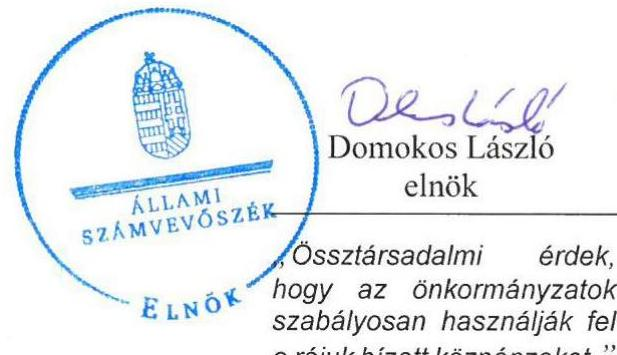
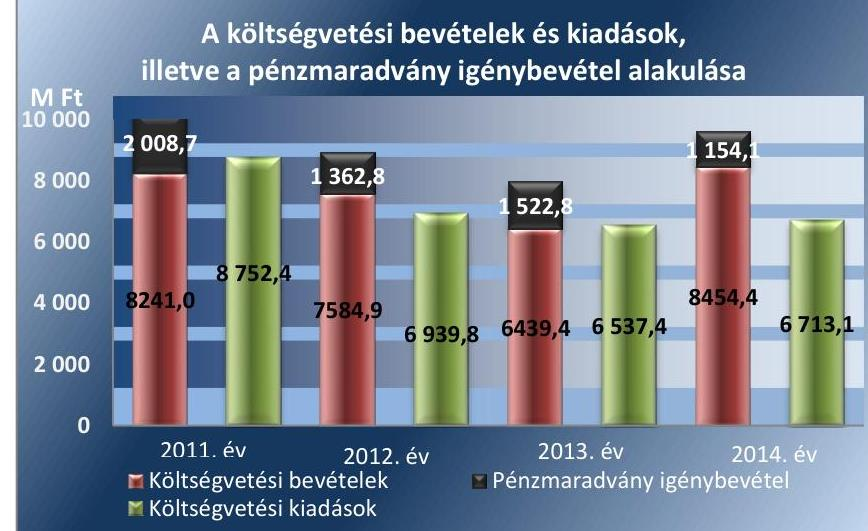
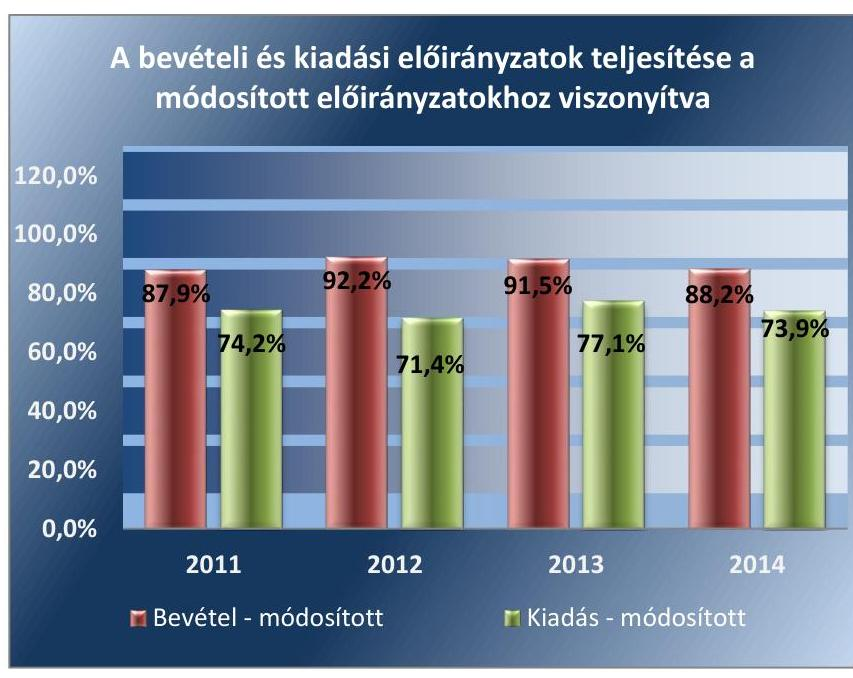
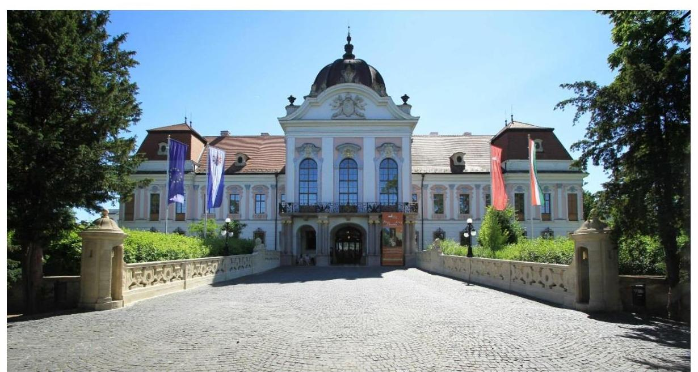
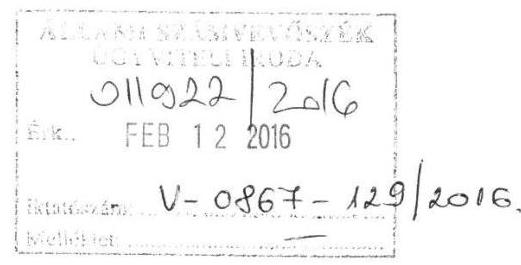
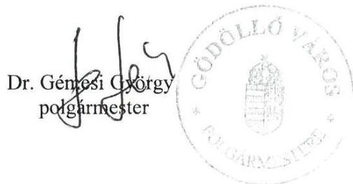
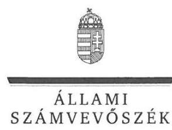
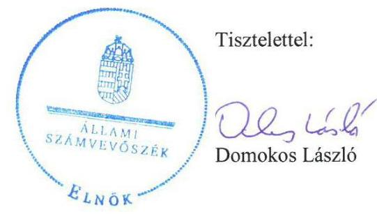
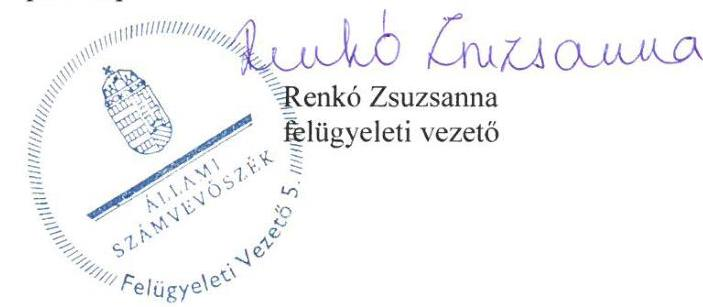

# Jelentés 

## Önkormányzatok pénzügyi és vagyongazdálkodása

Az önkormányzatok pénzügyi és vagyongazdálkodása megfelelőségének ellenőrzése - Gödöllő 2016.

---

# Jelenetés 

## Önkormányzatok pénzügyi és vagyongazdálkodása

Az önkormányzatok pénzügyi és vagyongazdálkodása megfelelőségének ellenőrzése - Gödöllő
2016. marcius hó os nap

---

# AZ ELLENŐRZÉST FELÜGYELTE:

- RENKŐ ZSUZSANNA felügyeleti vezető
- AZ ELLENŐRZÉST VEZETTE ÉS A VÉGREHAJTÁSÁÉRT FELELŐS:
  - DR. VERESS TIBORNÉ ellenőrzésvezető
- A PROGRAM ÖSSZEÁLLÍTÁSÁÉRT FELELŐS:
  - JANIK JÓZSEF LÁSZLÓ osztályvezető

**IKTATÓSZÁM:** V-867-135/2016.

**TÉMASZÁM:** 1901

**ELLENŐRZÉS-AZONOSÍTÓ SZÁM:** V071505

Jelentéseink az Országgyűlés számítógépes hálózatán és az Interneten a www.asz.hu címen is olvashatóak.

---

# TARTALOMJEGYZÉK 

■ ÖSSZEGZÉS ..... 5
■ AZ ELLENŐRZÉS CÉLJA ..... 7
■ AZ ELLENŐRZÉS TERÜLETE ..... 8
■ AZ ELLENŐRZÉS HÁTTERE, INDOKOLTSÁGA ..... 9
■ FÓKUSZKÉRDÉSEK ..... 10
■ ELLENŐRZÉS HATÓKÖRE ÉS MÓDSZEREI ..... 11
■ MEGÁLLAPÍTÁSOK ..... 14
■ JAVASLATOK ..... 35
■ MELLÉKLETEK ..... 39
I. Sz. melléklet: Értelmező szótár ..... 39
II. Sz. melléklet: Az önkormányzat feladatellátásában részt vevők 2011-2014. évek között ..... 43
III. Sz. melléklet: Az eszközök és források alakulása kiemelt mérlegsoronként a 2011- 2013. években ..... 44
IV. Sz. melléklet: A pénzügyi egyensúlyi helyzet CLF módszer szerinti értékelése a 2011- 2014. években (millió ft) ..... 45
V. Sz. melléklet: Kimutatás a részesedések változásáról ..... 46
■ FÜGGELÉK: ÉSZREVÉTELEK ..... 47
■ RÖVIDÍTÉSEK JEGYZÉKE ..... 67

---

.

---

# ÖSSZEGZÉS 

Az Állami Számvevőszék Gödöllő Város Önkormányzata pénzügyi és vagyongazdálkodását 2011. január 1. és 2014. december 31. közötti időszakra vonatkozóan ellenőrizte. A pénzügyi szabályozás megfelelt az előírásoknak, azonban a gazdálkodási jogkörök gyakorlása nem volt megfelelő, amely a gazdálkodás biztonságát veszélyeztette. A vagyongazdálkodás szabályozásában feltárt hiányosságok kockázatot jelentenek az önkormányzati vagyon védelmében. A pénzügyi egyensúly a 2012-2013. években fennállt, a 2014. évi nettó müködési jövedelem az adósságkonszolidáció és a 2014. évi számviteli változások miatt volt negatív. Az Önkormányzat vagyona négy év alatt 2414,5 millió Ft-tal (7,7\%-kal) nőtt.

## Az ellenőrzés társadalmi indokoltsága

Az Állami Számvevőszék stratégiájában hangsúlyos szerepet szán annak, hogy szilárd szakmai alapon álló, értékteremtő ellenőrzéseivel előmozdítsa a közpénzügyek átláthatóságát, rendezettségét és javaslataival a közpénzek és a közvagyon szabályos, gazdaságos, hatékony és eredményes felhasználását segítse. Az ÁSZ stratégiájában célul tűzte ki, hogy az önkormányzatok ellenőrzése során értékeli azok pénzügyi-gazdasági helyzetét, a kockázatokat feltárja, és az ellenőrzések helyszíneit kockázatelemzés alapján választja ki. Az ÁSZ szerepet vállal a korrupció és a csalás elleni küzdelemben. Közreműködik a korrupciós kockázatok és a korrupció elleni fellépés hatékony és eredményes eszközeinek beazonosításában, alkalmazásában, továbbá használatuk elterjesztésében, az integritás alapú közigazgatási kultúra kialakításában.

## Főbb megállapítások, következtetések, javaslatok

A pénzügyi egyensúly a 2012-2013. években biztosított volt. A müködési jövedelem egyenlege a 2011. évben negatív volt, azaz a folyó bevételek nem fedezték a folyó kiadásokat. A hiányt az előző év(ek) maradványából finanszírozták. A 2014. évi negatív egyenleget az adósságkonszolidáció miatti elszámolás és a 2014. évi számviteli szabályozásváltozások okozták, amely a közfeladat ellátás biztonságos teljesítését nem veszélyeztette, mivel az Önkormányzat jelentős összegű pénzeszközökkel rendelkezett. A likviditási tervek előírásoknak megfelelő felülvizsgálata támogatta a pénzügyi egyensúly fenntartását. A követelések behajtására az előírásoknak megfelelően intézkedtek, azonban az eredményességében meghatározó volt az adósok, vevők fizetési hajlandósága. Megfelelő kockázatkezelési rendszert nem működtettek, mivel nem mértek fel minden kockázatot a gazdálkodásban, és nem határozták meg az egyes kockázatokkal kapcsolatos intézkedéseket és megtételük módját teljes körűen, a kockázatokkal kapcsolatban szükséges intézkedések teljesítésének folyamatos nyomon követési módját. A 2013. és 2014. évi adósságkonszolidáció eredményeként az Önkormányzat pénzintézeti kötelezettségei megszűntek, amely a pénzügyi egyensúlyi helyzetét jelentős mértékben javította, a pénzügyi helyzetet stabilizálta. A Magyar Állam az adósságkonszolidáció alapján 2013-ban 3147,4 millió Ft, 2014-ben 4558 millió Ft tőketartozást és annak járulékait vállalta át.

Az önkormányzati vagyon nyilvántartása, a költségvetési beszámolók mérlegének alátámasztottsága a jogszabályi és a belső szabályzatok előírásainak megfelelt. Az ellenőrzés a 2014. évi vagyonkimutatásnál tárt fel kisebb hiányosságokat, amelyek ellenére az Önkormányzat vagyoni helyzetének valóságnak megfelelő bemutatása biztosított volt. Az Önkormányzat a jogszabályban előírt közép- és hosszú távú vagyongazdálkodási tervet nem készített, így a vagyongazdálkodási alapelvek érvényesítéséről nem gondoskodott. A vagyonváltozást eredményező döntések az azok megvalósítása során feltárt hiányosságok mellett is szabályszerűek voltak. Az Önkormányzat a kizárólagos tulajdonában lévő gazdasági társaságok esetében felelősen, a kisebbségi tulajdonában lévő ( $25 \%$ alatti részesedést jelentő)

---

gazdasági társaságok esetében, korlátozott lehetőségeinek megfelelően gazdálkodott a tartós részesedéseivel, tulajdonosi jogaival élt, tulajdonosi kötelezettségeit teljesítette. A részesedések számviteli nyilvántartása, év végi értékelése, az értékvesztés elszámolása az előírásoknak megfelelt.

A pénzügyi gazdálkodás szabályozása az előírásoknak megfelelt, azonban a számviteli politika nem tartalmazta, hogy mit tekintenek a számviteli elszámolás, az értékelés szempontjából lényegesnek, illetve nem lényegesnek; a költségvetési rendeletre vonatkozó szabályozás a jogszabályi előírásokkal összhangban volt. A kialakított szabályozás ellenére a gazdálkodási jogkörök gyakorlása, ennek keretében a kulcsszerepet betöltő pénzügyi ellenjegyzés és érvényesítés kontrollok múködése a fejlesztési célú kifizetéseknél „nem megfelelő" volt.

A jogszabályi előírás ellenére a 2011. évben rendeletben nem határozták meg az önkormányzat tulajdonában lévő vagyon ingyenes átruházásának módját és eseteit, továbbá a 2011-2014. években rendeletben nem szabályozták az összeghatár, a jogcím és a döntésre jogosult kivételével - a követelésekről történő lemondás módját és eseteit.

A költségvetési tervezés, az előirányzatok megállapítása, a kiadási előirányzatok módosítása szabályszerű volt. A 2011-2013. évi költségvetési beszámolók kiegészítő mellékletében a részesedések bemutatása a jogszabályban előírtaknak teljesen nem felelt meg. A kiegészítő tájékoztató adatok között nem közölték a 2011-2014. években a behajthatatlan követelések leírt összegét, a 2012-2014. években az elengedett követelések összegét az előírások ellenére.

Az Önkormányzat az erőforrásokkal való szabályszerű gazdálkodáshoz szükséges követelményeket számon kérhető módon nem alakította ki, így a felelős gazdálkodást nem támogatta.

Az Önkormányzat nem határozott meg az erőforrásokkal való hatékony gazdálkodáshoz szükséges követelményeket.

Az Önkormányzatnál az integritás kontrollrendszere fejlesztendő, mivel a szervezet vagyonának megvédésére tett intézkedésekkel, a nemkívánatos dolgozói magatartással és az integritás erősítésével, tudatosításával kapcsolatos szemlélet nem érvényesült.

---

# AZ ELLENŐRZÉS CÉLJA 

## Gödöllő Város Önkormányzata pénzügyi és vagyongazdálkodásának megfelelőségi ellenőrzése

AZ ELLENŐRZÉS CÉLJA az Önkormányzat pénzügyi és vagyoni helyzetének, a gazdálkodás szabályosságának megítélése a költségvetési tervezés, a pénzügyi egyensúly megteremtése, az éves költségvetési beszámolás, a vagyongazdálkodás, a vagyon számbavétele, a gazdasági események elszámolása és a pénzgazdálkodás szabályszerűsége alapján; valamint annak értékelése, hogy kialakított-e az Önkormányzat az erőforrásokkal való szabályszerű és hatékony gazdálkodáshoz szükséges követelményeket, megvalósította-e azok számon kérését, ellenőrzését.

---

# **AZ ELLENŐRZÉS TERÜLETE**

## **Gödöllő Város Önkormányzata**

Gödöllő város Pest megyében a Gödöllő-dombság völgyében helyezkedik el. Vonzerejét természeti adottságainak, jó földrajzi fekvésének köszönheti, ahol együtt van a múlt, a jelen és a jövő. Többek között itt található Magyarország legnagyobb barokk kastélya és a nagy múltú Szent István Egyetem. Gödöllő város lakosainak száma 2014. január 1-jén 31 995 fő volt.

A 14 tagú Képviselő-testület1 munkáját nyolc állandó bizottság segítette. 1990. októberétől tölti be tisztségét a polgármester2, és látja el feladatait a jegyző3. A Polgármesteri Hivatal4 nyolc szervezeti egységre tagolódott, elkülönített gazdasági szervezettel nem rendelkezett. A pénzügyi-gazdálkodási feladatokat a Költségvetési Iroda5 látta el. A feladatellátást a II. sz. melléklet szemlélteti. A Polgármesteri Hivatalban foglalkoztatott köztisztviselők átlagos létszáma 2014. évben 132 fő volt.

Az Önkormányzat6 2014. évben az önállóan működő és gazdálkodó Polgármesteri Hivatalon felül három önállóan működő és gazdálkodó, valamint 12 önállóan működő költségvetési szervvel látta el a feladatát, és nyolc kizárólagos tulajdonban lévő gazdasági társasága volt.

Az Önkormányzat a 2014. év végi költségvetési beszámolója szerint 8454,4 millió Ft bevételt ért el, valamint 6713 millió Ft kiadást teljesített. A költségvetési bevételek és kiadások, illetve a pénzmaradvány igénybevétel alakulását az 1. ábra szemlélteti.

1. ábra

*Forrás: Az Önkormányzat 2011-2014. évi költségvetési beszámolói*

---

# AZ ELLENŐRZÉS HÁTTERE, INDOKOLTSÁGA 

Az államháztartás önkormányzati alrendszerének közpénz felhasználása, az önkormányzatok által ellátott közfeladatok és önként vállalt feladatok sokrétüsége, valamint a feladat ellátásához rendelt vagyon nagyságrendje indokolja, hogy az ÁSZ ellenőrzéseket folytasson a pénzügyi és vagyongazdálkodás területén.

## Az ellenőrzés több szinten hasznosul

Az ÁSZ az önkormányzatok ellenőrzését a pénzügyi helyzet megítélésével indította el 2011-ben, és a nagy vagyonnal rendelkező, magas kockázatú önkormányzatok esetében a vagyongazdálkodás ellenőrzésével folytatta. Az elmúlt időszakban az önkormányzati gazdálkodás kockázatai beépítésre kerültek az ellenőrzött önkormányzatok kiválasztási rendszerébe. Az elmúlt négy év ellenőrzéseinek tapasztalatai megmutatták, hogy továbbra is indokolt az egyrészt elemző, értékelő, a pénzügyi helyzet kockázatát is minősítő, másrészt a pénzügyi és vagyongazdálkodási tevékenység szabályszerűségét értékelő ÁSZ ellenőrzések folytatása.

Ellenőrzéseink hozzájárulnak az önkormányzatok pénzügyi helyzetének pontosabb megítéléséhez azáltal, hogy a pénzügyi helyzetet a vagyoni helyzettel együtt értékeljük, amelyek együttesen határozzák meg az önkormányzatok fejlesztési képességét és gyakorolnak hatást a feladatellátásra. Feltárjuk az önkormányzati gazdálkodást meghatározó szabályozások összhangjának hiányosságait, a szabályozással nem érintett gazdálkodási területeket, valamint a pénzügyi és vagyongazdálkodás esetleges szabálytalanságait. Beazonosítjuk a pénzügyi egyensúlyi helyzet megbomlásakor a kiváltó okok mellett azok kialakulását is. Bemutatjuk az adósságkonszolidáció önkormányzat általi végrehajtásának szabályszerűségét, az adósságállomány újratermelődésének elkerülése érdekében hozott intézkedéseket. Az ellenőrzés kitér a gazdálkodáshoz kapcsolódó integritás kontrollok meglétének és működésének ellenőrzésére is.

A pénzügyi és vagyongazdálkodás szabályszerűségének ellenőrzése által a megállapításokkal összefüggő javaslatok hasznosítása esetén javul az önkormányzat gazdálkodásának szabályozottsága, valamint a „jó gyakorlatok" terjesztésén keresztül azok az önkormányzatok is átvehetik a pozitív példákat, ahol nem végez ellenőrzést az ÁSZ. Ellenőrzéseink eredményeképpen javaslatokat fogalmazhatunk meg az önkormányzatok pénzügyi egyensúlya fenntartásával kapcsolatos problémák rendszerszemléletű kezelésére, felszámolására.

---

# FÓKUSZKÉRDÉSEK 

1.     - A pénzügyi és vagyongazdálkodás szabályozása megfelelt-e az előírásoknak?
2.     - A költségvetési tervezés, az éves költségvetési beszámolás és a pénzgazdálkodás szabályszerű volt-e?
3.     - Biztosított volt-e a pénzügyi egyensúly, az adósságot keletkeztető ügyletek vállalására a jogszabályi előírásoknak megfelelően került-e sor?
4.     - A vagyonnyilvántartás, a költségvetési beszámoló mérlegének alátámasztottsága megfelelt-e a jogszabályokban és a belső szabályzatokban előírt követelményeknek?
5.     - Szabályszerűek voltak-e a vagyon összetételének és nagyságának változását eredményező döntések és azok végrehajtása?
6.     - Felelősen gazdálkodott-e az önkormányzat a tartós részesedéseivel, élt-e tulajdonosi jogaival, teljesítette-e tulajdonosi kötelezettségeit?
7.     - Az önkormányzat az erőforrásokkal való szabályszerű gazdálkodáshoz szükséges követelményeket kialakította-e, betartásukat számon kérte-e, ellenőrizte-e?
8.     - Az önkormányzat az erőforrásokkal való hatékony gazdálkodáshoz szükséges követelményeket kialakította-e, betartásukat számon kérte-e, ellenőrizte-e?
9.     - Az önkormányzat intézkedett-e az integritás szemlélet érvényesítése érdekében?

---

# ELLENŐRZÉS HATÓKÖRE ÉS MÓDSZEREI 

## Az ellenőrzés típusa

Megfelelőségi ellenőrzés

## Az ellenőrzött időszak

A 2011. január 1-je és 2014. december 31-e közötti időszak. Az ellenőrzött időszakba beleértendő az ellenőrzött évekre vonatkozó tervezési feladatok, beszámolási kötelezettségek teljesítésének időszaka is. A vagyonnyilvántartások egyezőségét, a leltározás, selejtezés folyamatát a 2014. évre vonatkozóan értékeltük.

## Az ellenőrzés tárgya

A helyi önkormányzat pénzügyi és vagyongazdálkodása, a pénzügyi egyensúly megteremtése, a tulajdonosi és irányító szervi feladatok ellátása, az integritás szemlélet érvényesülése.

Az ellenőrzés kiterjed minden olyan körülményre és adatra, amely az ÁSZ jogszabályban meghatározott feladatainak teljesítéséhez, valamint a program végrehajtása folyamán felmerült újabb összefüggések feltárásához szükséges.

## Az ellenőrzött szervezet

Gödöllő Város Önkormányzata

## Az ellenőrzés jogalapja

Az ellenőrzés jogszabályi alapját az Állami Számvevőszékről szóló 2011. évi LXVI. törvény 1. § (3) bekezdésének, az 5. § (2)-(6) bekezdéseinek, valamint az államháztartásról szóló 2011. évi CXCV. törvény 61. § (2) bekezdésének előírásai képezik.

## Az ellenőrzés módszerei

Az ellenőrzést a nemzetközi standardokat irányadónak tekintve az ellenőrzési program ellenőrzési kérdései, az ellenőrzött időszakban hatályos jogszabályok, az ellenőrzés szakmai szabályok és módszertanok figyelembe vételével végeztük.

---

A gazdálkodás hibáinak kijavítására, a közpénzekkel való felelős gazdálkodás segítésére irányuló javaslatok kidolgozásakor a hatályos jogszabályok az irányadóak.

Az ellenőrzési kérdések megválaszolásához szükséges bizonyítékok megszerzése az ellenőrzött által rendelkezésre bocsátott dokumentumokra, adatokra alapozva megfigyelés, szemle (szemrevételezés), kérdésfeltevés (információkérés), mintavételezés, valamint elemző eljárással történt. Az ellenőrzési bizonyítékként felhasználható adatforrások közé tartoztak egyrészt a szakmai program részletes szempontjainál felsorolt adatforrások, másrészt minden az ellenőrzés folyamán feltárt, az ellenőrzés szempontjából releváns információt tartalmazó dokumentum.

Az ellenőrzés lefolytatásához az önkormányzat a tanúsítványok elektronikus kitöltésével, valamint az ÁSZ által kért dokumentumok elektronikus megküldésével szolgáltatott adatokat. Az így rendelkezésre bocsátott adatok, információk, a tanúsítványok adatai valódiságának kontrollja az ellenőrzés keretében történt.

Az ellenőrzést az Önkormányzat múködésével kapcsolatos feladatokat ellátó Polgármesteri Hivatalban végeztük. Az Önkormányzat az intézményei és gazdasági társaságai ellenőrzéssel érintett dokumentumait, tanúsítványait a Polgármesteri Hivatal útján bocsátotta az ellenőrzés rendelkezésére.

A pénzügyi és vagyongazdálkodás szabályozottságát az Önkormányzat rendeletei, határozatai, illetve a 2011. évben a Polgármesteri Hivatal, a 2012. évtől az Önkormányzat (mint önálló éves költségvetési beszámolót készítő szerv) és a Polgármesteri Hivatal belső szabályozásai alapján értékeltük. A költségvetési tervezési, végrehajtási és beszámolási feladatok ellenőrzése, a pénzügyi egyensúly, a vagyonnyilvántartás, a mérleg alátámasztottságának megítélése az Önkormányzat összevont adatai alapján történt. A leltározási, értékelési és selejtezési folyamat szabályszerűségére a Polgármesteri Hivatal által végzett 2014. évi leltározási folyamat ellenőrzése alapján tettünk megállapításokat.

Az Önkormányzat vagyonváltozást eredményező döntéseinek és azok végrehajtásának ellenőrzésére irányított, valamint véletlen mintavételi eljárással és tételes ellenőrzéssel került sor. A pénzforgalmi tételek ellenőrzése véletlen mintavételi eljárással - 2011. évben a Polgármesteri Hivatal, 2012. évtől a Polgármesteri Hivatal és az Önkormányzat (mint önálló éves költségvetési beszámolót készítő költségvetési szerv) főkönyvi állományából - kiválasztott minta alapján történt. Kockázatalapú mintavétel alapján az ellenőrzött időszakban, hatályban lévő összesen az öt legmagasabb könyv szerinti értéket képviselő vagyonkezelői, üzemeltetési szerződést, térítésmentes vagyonátadást és az öt-öt legnagyobb összegű követelés elengedést és behajthatatlan követelés leírást ellenőriztük. A részesedések értékelését tételesen ellenőriztük. A beruházások és felújítások elszámolásának, valamint a kapcsolódó kifizetések esetében a gazdálkodási jogkörök gyakorolásának, a vagyonértékesítésének, valamint a bérbeadással történő hasznosításnak szabályszerűségét véletlen mintavétellel ellenőriztük. A véletlen minta alapján a sokaságra vonatkozó hibaarányt becsültük. „Megfelelőnek" értékeltük az ellenőrzött területet, amennyiben 95\%-os bizonyossággal a teljes sokaságban a hibaarány legfeljebb 10\%, „részben megfelelőnek" értékeltük, ha a hibaarány felső határa 10-30\% között volt,

---

"nem megfelelőnek" pedig akkor, ha a mintavételi eredmények alapján a sokaságbeli hibaarány felső határa meghaladta a 30\%-ot.

Az ellenőrzési kérdésekre adott válaszok alapján értékeltük, hogy az Önkormányzat pénzügyi gazdálkodása megfelelt-e a jogszabályokban és a belső szabályzatokban meghatározottaknak, biztosított volt-e a pénzügyi egyensúly. Értékeltük a vagyongazdálkodás szabályszerűségét, a vagyonváltozást eredményező döntések és a tulajdonosi jogok gyakorlása szabályszerűségét. Értékelést adtunk arról, hogy az Önkormányzatnál kialakítot-ták-e az erőforrásokkal való szabályszerű és hatékony gazdálkodáshoz szükséges követelményeket, megvalósították-e azok számonkérését, ellenőrzését. Az integritás szemlélet érvényesülésének értékelése az Önkormányzat által önbevallással kitöltött tanúsítvány alapján történt.

---

# 1. A pénzügyi és vagyongazdálkodás szabályozása megfelelt-e az előírásoknak? 

Összegző megállapítás

A pénzügyi gazdálkodás szabályozása az előírásoknak megfelelt, a szabályszerű gazdálkodás feltételeit biztosította. A vagyongazdálkodás szabályozásában feltárt hiányosságok kockázatot jelentettek az önkormányzati vagyon védelmében.

### 1.1. számú megállapítás

A számviteli politika alapvetően megfelelt a jogszabályban előírtaknak, a lényegesség meghatározásában feltárt hiányosság tekintetében azonban a számviteli elszámolások szabályszerű végrehajtását nem támogatta.

A képviselő-testületi múködés részletes szabályait az önkormányzati SZMSZ ${ }_{1-2}$ a Polgármesteri Hivatal feladatai ellátásának rendjét és módját a hivatali SZMSZ ${ }_{1-2}$ tartalmazta. A Képviselő-testület a 2011-2013. években gazdasági szervezet létrehozásáról nem döntött. A 2014. évben a Polgármesteri Hivatal nem tett eleget az Ávr. 8. §* (1) bekezdés c) pontjában foglalt előírásnak, mivel gazdasági szervezet létrehozásáról nem rendelkezett. A gazdálkodási feladatok ellátását a Polgármesteri Hivatal biztosította. A pénzügyi-gazdasági tevékenységet ellátó személyek feladat- és hatáskörének, jogkörének részletes meghatározását a gazdálkodási szabályzat ${ }_{1-3}$, valamint a munkaköri leírások tartalmazták.

A jegyző a jogszabályi előírások szerint a helyi sajátosságoknak megfelelően elkészítette és aktualizálta a számviteli politikát ${ }^{9}$, a számlarendet ${ }^{10}{ }_{1-3}$, a bizonylati rendet ${ }^{11}$, a pénzkezelési szabályzatot ${ }^{12}{ }_{1-3}$, valamint az önköltségszámítási szabályzatot ${ }^{13}{ }_{1-2}$, amelyeket aktualizáltak.

A 2014. január 1-jétől hatályos számviteli politika ${ }_{3}$ a Számv.tv. 14. § (4) és az Áhsz. ${ }_{2}$ 50. § (1) bekezdéseiben foglaltak ellenére nem tartalmazta, hogy mit tekintenek a számviteli elszámolás, az értékelés szempontjából lényegesnek, illetve nem lényegesnek. A pénzügyi tevékenységet ellátó személyek feladat-, hatás- és jogkörének részletes meghatározását a gazdálkodási szabályzat ${ }^{14}{ }_{1-3}$, valamint a munkaköri leírások tartalmazták.

A gazdálkodási jogkörök (kötelezettségvállalás, ellenjegyzés, teljesítésigazolás, érvényesítés, utalványozás) gyakorlásának módját, eljárási és dokumentációs részletszabályait, valamint az ezeket végző személyek kijelölését és kijelölésének rendjét, továbbá az ellenőrzési, adatszolgáltatási és beszámolási feladatok teljesítésével kapcsolatos belső előírásokat- a jegyző által hatályba léptetett gazdálkodási szabályzat ${ }_{1-3}$ tartalmazta.

[^0]
[^0]:    * 2015.I.1-től hatályos előírás: Áht. 2 10. § (4) bekezdés

---

A jegyző a jogszabályi előírásoknak megfelelően szabályozta a múködéshez kapcsolódó, pénzügyi kihatással bíró, jogszabályban nem szabályozott kérdéseket. Rendezte a beszerzések lebonyolításával kapcsolatos eljárásrendet, a belföldi és külföldi kiküldetések elrendelésével és lebonyolításával, elszámolásával kapcsolatos kérdéseket, valamint a reprezentációs kiadások felosztását, azok teljesítésének és elszámolásának módját. Szabályozta továbbá a mobil- és a vezetékes telefonok használatát, és a gépjárművek igénybevételének módját.

A kontrolltevékenység részeként biztosították a FEUVE ${ }^{15}$-t a pénzügyi döntések dokumentumainak elkészítése, szabályszerűségi szempontból történő jóváhagyása, illetve ellenjegyzése, valamint a gazdasági események elszámolása vonatkozásában. Közzétételi szabályzattal ${ }^{16}$ az Önkormányzat rendelkezett.

# 1.2. számú megállapítás 

A költségvetési rendelet tartalmi szempontjait meghatározó önkormányzati szabályozás a jogszabályi előírásoknak megfelelő volt, támogatva ezzel a szabályszerű pénzügyi gazdálkodást.

A költségvetés tervezésével összefüggő feladatokat a hivatali SZMSZ ${ }_{1-2}$-ben és a Költségvetési Iroda eljárásrendje ${ }_{1-4}{ }^{17}$-ben szabályozták. A tervezési folyamatok feladatmegosztását a Költségvetési Iroda munkatársainak munkaköri leírásaiban rögzítették. Az Ámr. ${ }^{18}$ és a Bkr. ${ }^{19}$-nek megfelelően kialakították a költségvetés tervezés ellenőrzési nyomvonalát, melyek a FEUVE $_{3-2}{ }^{20}$ tartalmazott. Az előirányzatok nyilvántartásával, átcsoportosításával, módosításával kapcsolatos eljárásokat a költségvetési rendeletek1-4, a gazdálkodási szabályzat ${ }_{1-2}{ }^{21}$, az előirányzat gazdálkodási szabályzat ${ }_{1-2}{ }^{22}$, a Költségvetési iroda eljárásrendje ${ }_{1-4}$, az ellenőrzési nyomvonalak, valamint a feladatban érintett alkalmazottak munkaköri leírásai tartalmazták.

## 1.3. számú megállapítás

A vagyongazdálkodás kereteinek kialakítása során a követelésről való lemondással és az ingyenes vagyonátruházással kapcsolatosan feltárt szabályozásbeli hiányosságok kockázatot jelentettek az önkormányzati vagyon védelme szempontjából.

A vagyongazdálkodás szabályait a Képviselő-testület a vagyongazdálkodási rendelet ${ }^{23}{ }_{1-2}$ és a helyiség bérleti rendelet megalkotásával szabályozta. Meghatározták az önkormányzati feladatellátást biztosító törzsvagyon körét, és biztosították a forgalomképtelen és korlátozottan forgalomképes vagyonelemek elkülönítését.

A Képviselő-testület a vagyongazdálkodási rendelet ${ }_{1-2}$-ben a jogszabályi előírásnak megfelelően meghatározta azt az értékhatárt, amely felett csak nyilvános pályázat útján lehetett vagyontárgyat értékesíteni, hasznosítani. A vagyongazdálkodási rendelet ${ }_{1}$ az ingatlanok értékesítésénél 10,0 millió Ft-ban, a vagyongazdálkodási rendelet ${ }_{2}$ a hasznosításnál 10,0 millió Ftban az értékesítésnél 20,0 millió Ft-ban határozta meg a kötelező pályáztatás értékhatárát.

A Képviselő-testület egyes vagyongazdálkodási hatásköröket a polgármesterre ruházott át, és előírta számára az átruházott hatáskörben hozott döntésekről történő rendszeres beszámolási kötelezettséget. A Képviselőtestület a jogszabályi előírásnak megfelelően a vagyongazdálkodási rende-

---

let ${ }_{2}$ keretében meghatározta a vagyonkezelői jog - kormányhivatali törvényességi felhívást követően - megszerzésének, gyakorlásának és a vagyonkezelés ellenőrzésének részletes szabályait.

A Képviselő-testület 2011. évben, rendeletben nem határozta meg az Áht. ${ }^{24} \S$ 108. § (2) bekezdése előírása ellenére a tulajdonában lévő vagyon ingyenes átruházásának módját és eseteit.

Az Áht. ${ }_{1}$ 108. § (2) bekezdése, illetve az Áht. ${ }^{25}$ 2 97. § (2) bekezdése előírásai ellenére önkormányzati rendeletben nem szabályozták - az összeghatár, a jogcím és a döntésre jogosult kivételével - a követelésekről történő lemondás módját és eseteit.

# 2. A költségvetési tervezés, az éves költségvetési beszámolás és a pénzgazdálkodás szabályszerű volt-e? 

Összegző megállapítás

Az éves költségvetési beszámoló készítése során feltárt kisebb hiányosságok ellenére biztosított volt az átláthatóság. A gazdálkodási jogkörök gyakorlásánál feltárt szabályszerűségi hibákból adódóan kockázat jelentkezett a gazdálkodás biztonsága szempontjából.

### 2.1. számú megállapítás

A költségvetési tervezés, az előirányzatok megállapítása, a kiadási előirányzatok módosítása az előírásoknak megfelelt, támogatva a gazdálkodás biztonságát.

A költségvetési koncepciók ${ }^{26}{ }_{1-3}$ beterjesztésére a 2013. évben határidőn túl - az Áht. 2 24. § (1) ${ }^{\dagger}$ bekezdésben előírt október 31-i határidőt követően 2013. december 6-án - került sor. A 2011-2012. és a 2014. évi költségvetési koncepciókat a Pénzügyi Bizottság ${ }^{27}$ véleményezte. A 2013. évre vonatkozóan az Áht. 2 24. § (1) bekezdésének előírása ellenére költségvetési koncepció nem készült. A Képviselő testület elé a költségvetés előkészítésével összefüggő feladatokat tartalmazó előterjesztés került, mivel az Önkormányzat költségvetési koncepciójának, tervezésének összeállításához az előterjesztés készítésekor - hitelt érdemlő, megalapozott döntések Magyarország 2013. évi központi költségvetése elfogadásának hiányában nem álltak rendelkezésre.

A költségvetési rendelet tervezeteket a jogszabályi előírásoknak megfelelő szerkezetben és tartalommal állították össze, melyek előterjesztése határidőben megtörtént. Az Önkormányzat minden évben rendelkezett Képviselő-testülete által elfogadott költségvetéssel ${ }^{28}$, amelyekben a költségvetési egyensúlyt megteremtették. Az elemi költségvetések mellékszámításokkal alátámasztottan készültek. A 2011-2014. évi elemi költségvetéseket az Áht. ${ }_{1}$ az Ávr., valamint a 2014. évre vonatkozóan a 23/2014. (II. 6) Korm. rendelet ${ }^{29}$ 3. §-a szerinti határidőben elkészítették, és a Kincstárhoz benyújtották.

Az előirányzatok átcsoportosítására, módosítására vonatkozó döntéseket az arra jogosultak hozták meg. A jogszabályi előírásnak megfelelően a

[^0]
[^0]:    ${ }^{\dagger}$ Hatálytalan: 2014.IX.30-tól

---

költségvetési rendeleteket a költségvetési beszámolók elkészítésének határidejét követően nem módosították. Az Önkormányzat és az irányítása alá tartozó intézmények előirányzatairól külön-külön előirányzat-nyilvántartásokat vezettek, melyeknek a költségvetési rendeletekkel való összhangja biztosított volt.

2011-2014. években a bevételi és kiadási előirányzatok teljesítését a módosított előirányzatokhoz viszonyítva a 2. ábra szemlélteti. A kiadások és a bevételek teljesítése során a módosított kiemelt előirányzati kereteket évről évre alulteljesítették. A bevételi előirányzatok csökkentése a 2012-től hatályos Áht. 2 30.§ (3) bekezdésében foglaltak alapján nem történt meg. A módosított kiemelt előirányzatok teljesítésének elmaradását a bevételeknél a beruházások utáni ÁFA ${ }^{30}$ visszaigénylésével kapcsolatos elmaradások, és a szállítói finanszírozású beruházások sajátos elszámolási rendszere okozta, a kiadásoknál a beruházások jelentős határidő csúszásai (szennyvízisztító-telep korszerűsítése, városi sport uszoda építése).
2. ábra

Forrás: Az Önkormányzat adatszolgáltatása
Az Önkormányzat a tervezett létszámot egyik évben sem lépte túl. A 2011-2014. évek között létszáma 1146 főről 627 főre, 45,3 \%-kal csökkent. A létszám változások összességében követték az ellátott feladatok volumenében, valamint a feladatellátás szervezeti formáiban jelentkező változásokat.

A 2011-2014. években a polgármester az előírtaknak megfelelve határidőben tájékoztatta a Képviselő-testületet az Önkormányzat gazdálkodásának első félévi helyzetéről. A gazdálkodás háromnegyed éves helyzetéről a tájékoztatás a 2011., 2012. évi költségvetési koncepciók ismertetésekor megtörtént. A 2013. évre vonatkozóan költségvetési koncepció nem készült, a polgármester az Áht ${ }_{2}$ 87. § (1) ${ }^{3}$ bekezdésében foglalt tájékoztatási kötelezettségének nem tett eleget.

[^0]
[^0]:    ${ }^{3}$ Hatálytalan: 2014. IX. 30-tól

---

### 2.2. számú megállapítás

### 2.3. számú megállapítás

A beszámolókészítési kötelezettség teljesítése a hiányosságok ellenére az előírásoknak megfelelt, az átláthatóságot biztosították.

A féléves, valamint éves költségvetési beszámolókat a jogszabályi előírásokban rögzített határidőben benyújtották a Kincstárnak. Az önkormányzati intézmények elemi éves beszámolóinak megalapozottságát célzó felülvizsgálatot a Polgármesteri hivatal minden évben elvégezte. Az elemi költségvetési beszámolókat az előírásoknak megfelelő bontásban állították össze, azok biztosították az egyes évek költségvetési beszámolóinak, pénzforgalmi jelentéseinek és kimutatásainak Számv.tv.-nek megfelelő összehasonlíthatóságát.

A 2011-2013. évi költségvetési beszámolók kiegészítő mellékletében a gazdasági társaságok székhelyének, illetve a részesedések mennyiségének tulajdoni hányadok szerinti bemutatása az Áhsz. 1 40. § (9) bekezdésében foglalt előírások ellenére elmaradt. Az éves elemi költségvetési beszámoló pénzforgalmi jelentésében a kiegészítő tájékoztató adatok között nem közölték a 2011. évben a behajthatatlan követelésként leírt összeget, a 2012-2014. években az elengedett, illetve a behajthatatlan követelések leírt összegét az Áhsz. 1 38. § (6) bekezdés n) pontja, Áhsz. 2 10. számú melléklet 10. pontja szerint.

A zárszámadási rendelettervezeteket a polgármester határidőben, a jogszabályban előírt tartalommal a Képviselő-testület elé terjesztette. Az elfogadott éves költségvetési beszámolók alapján, azokkal összehasonlítható módon, az év utolsó napján érvényes szervezeti, besorolási rendnek megfelelően elkészített zárszámadási rendeleteket ${ }^{31}$ a Képviselő-testület elfogadta.

A 2011. éves beszámoló tervezetének az Ötv. 92. § (13) bekezdés a) pontjában meghatározott Pénzügyi bizottság általi véleményezése nem történt meg.

## A gazdálkodási jogkörök nem megfelelő gyakorlása kockázatot jelentett a gazdálkodás biztonságában, a közvagyon védelmében.

A Képviselő-testület a 2011-2013. években gazdasági szervezet létrehozásáról nem döntött, a gazdálkodási feladatok ellátását a Polgármesteri hivatal biztosította.

A 2014. évben az Ávr. ${ }^{32}$ 13. § (1) bekezdés e) pontjában foglaltak ellenére a gazdasági szervezet megnevezését, feladatait a hivatali SZMSZ-ben nem határozták meg. Az Ávr. 55. § (2) bekezdés d) pontja alapján a pénzügyi ellenjegyzésre, illetve érvényesítésre jogosult személyeket a jegyző jelölte ki, mivel a gazdasági szervezeti feladatokat a Polgármesteri Hivatal látta el külön gazdasági szervezet helyett, az Ávr. 8. § (1) bekezdés c) pontjában meghatározott rendelkezés ellenére.

A kulcsszerepet betöltő pénzügyi ellenjegyzés és érvényesítés kontrollok múködése a fejlesztési célú kifizetéseknél „nem megfelelő" volt. A gazdálkodási jogkörök gyakorlásának ellenőrzése során tapasztalt hiányosságokat az 1. táblázat mutatja be.

---

1. táblázat

GAZDÁLKODÁSI JOGKÖRÖK GYAKORLÁSÁNAK ELLENŐRZÉSE SORÁN TAPASZTALT HIÁNYOSSÁGOK

| Gazdálkodási jogkör | Megállapított szabálytalanság |
| :--: | :--: |
| pénzügyi ellenjegyzés | Az Ámr. 74. § (1) és az Ávr. 55. § (1) bekezdésének előírása ellenére több esetben a pénzügyi ellenjegyzés nem történt meg a kötelezettségvállalás dokumentumán, illetve egyedi hiba volt, hogy az ellenjegyzést kijelölés nélkül, jogosulatlanul gyakorolták az Ámr. 74. § (1) bekezdése ellenére. |
| érvényesítés | Az érvényesítés 2012-ben az esetek egy részénél nem volt szabályszerű, mivel az érvényesítést az Ávr. 58. § (4) bekezdése ellenére kijelöléssel nem rendelkező, jogosulatlanul végezte.   Az érvényesítés 2014-ben nem volt szabályszerű, mert - az Ávr. 58. § (4) bekezdésében foglaltak ellenére - az érvényesítőt az érvényesítési feladatok ellátására nem az arra jogosult személy jelölte ki.   Az érvényesítő az Ámr. 77. § (1), illetve az Ávr. 58. § (1) bekezdései ellenére nem kifogásolta, hogy több esetben a kötelezettségvállalás dokumentumán a pénzügyi ellenjegyzés nem történt meg, illetve egy esetben az ellenjegyzést kijelölés nélkül, jogosulatlanul gyakorolták, továbbá az Ámr. 77. § (2), illetve az Ávr. 58. § (2) bekezdése ellenére nem élt jelzéssel a szabálytalan teljesítésigazolás miatt.   Forrás: ÁSZ által készített kimutatás |

# 3. Biztosított volt-e a pénzügyi egyensúly, az adósságot keletkeztető ügyletek vállalására a jogszabályi előírásoknak megfelelően került-e sor? 

Összegző megállapítás
3.1. számú megállapítás
2. táblázat

## LIKVIDITÁSI MUTATÓK

| Időpont | Likviditási | Pénzeszköz likviditási |
| :--: | :--: | :--: |
| 2011.01.01. | 2,2 | 1,5 |
| 2011.12.31. | 1,8 | 1,0 |
| 2012.12.31. | 2,1 | 1,4 |
| 2013.12.31. | 3,1 | 1,8 |
| 2014.12.31. | $3,0^{*}$ | $1,9^{*}$ |

A rendszeresen felülvizsgált likviditási tervek hozzájárultak a 2012-2013. években a pénzügyi egyensúly megteremtéséhez. A 2011. és 2014. évi negatív nettó múködési jövedelem ellenére a közfeladat ellátás teljesítése biztosított volt.

A bevételnövelő és kiadáscsökkentő intézkedések, valamint a likviditási tervek előírásoknak megfelelő felülvizsgálata támogatta a pénzügyi gazdálkodást az egyensúly fenntartásában. A pénzügyi egyensúly a 2012-2013. években biztosított volt. A 2014. évben a nettó múködési jövedelem az adósságkonszolidáció során átvállalt tőketartozás elszámolásán túl döntőrészt a számviteli változások hatására negatív volt, amely a közfeladat ellátás biztonságos teljesítését nem veszélyeztette, ugyanis az Önkormányzat jelentős öszszegú pénzeszközökkel rendelkezett.

A bevételek beérkezésének és a kiadások teljesítésének ütemezésére a jogszabályi előírásoknak megfelelően likviditási tervet készítettek és felülvizsgálták. A likviditási terv alapján nyomon követhető volt az ütemezett bevételek és kiadások, a rendelkezésre álló pénzkészlet és a leköthető szabad pénzeszközök összege.

A forgóeszközökön belül meghatározó részt a pénzeszközök jelentették, melyek állománya a 2011. január 1-jei 1838,1 millió Ft-ról 2014. év végére 1660,8 millió Ft-ra csökkent. A rövid lejáratú kötelezettségek évenkénti állománya a 2011. január 1-jei 1199,4 millió Ft-ról a 2014. év végére 276,0 millió Ft-ra csökkent. A likviditási mutatók értéke 2011. év végétől növekvő tendenciájú volt, a forgóeszközök, illetve a pénzeszközök fedezték a rövid lejáratú kötelezettségeket. A 2014. évi adatokat a mérlegstruktúra változása miatt korrigálva vettük figyelembe. A likviditási mutatók értékét a 2. táblázat tartalmazza.

---

Az Önkormányzat 2011-2014. évi pénzügyi helyzetét a CLF-módszerrel elemeztük. Ennek keretében értékeltük az adósságkonszolidáció pénzügyi egyensúlyi helyzetre gyakorolt hatását, illetve bemutattuk a konszolidációtól mentes, korrigált adatokat a 2013-2014. évek vonatkozásában. A pénzügyi egyensúlyi helyzet főbb, CLF-módszer szerint számított adatait a 3. számú táblázat mutatja be.

### 3. táblázat

|  A PÉNZÜGYI EGYENSÚLYI HELYZET FŐBB ADATAI (MILLIÓ FT) |  |  |  |  |  |   |
| --- | --- | --- | --- | --- | --- | --- |
|  Megnevezés | 2011. év | 2012. év | 2013. év | 2014. év | 2013. év adósság
konszolidáció nélküli | 2014. év adósság
konszolidáció nélküli  |
|  Folyó bevételek | 6869,4 | 7111,1 | 6226,9 | 5412,5 | 6226,9 | 5412,5  |
|  Folyó kiadások | 6887,1 | 6364,3 | 5260,1 | 5276,1 | 5260,1 | 5254,9  |
|  Folyó költségvetés egyenlege, működési jövedelem | -17,7 | 746,8 | 966,8 | 136,5 | 966,8 | 157,6  |
|  Felhalmozási bevételek | 1371,7 | 473,8 | 212,5 | 3041,8 | 212,5 | 1171,5  |
|  Felhalmozási kiadások | 1865,3 | 575,5 | 1277,3 | 1437,0 | 1306,6 | 1571,9  |
|  Felhalmozási költségvetés egyenlege | -493,6 | -101,7 | -1064,8 | 1604,9 | -1094,1 | -400,4  |
|  Finanszírozási műveletek nélküli pozíció | -511,4 | 645,1 | -98,0 | 1741,3 | -127,3 | -242,8  |
|  Hitelfelvétel, forgatási és befektetési célú értékpapír kibocsátása, egyéb finanszírozási bevétel | 7,2 | -2,7 | 14,6 | 27,2 | 14,6 | 27,2  |
|  Hiteltörlesztés, értékpapír beváltás, egyéb finanszírozási kiadás | 223,4 | 193,4 | 282,3 | 1804,8 | 385,3 | 322,4  |
|  Finanszírozási műveletek egyenlege | -216,2 | -196,1 | -267,7 | -1777,5 | -370,6 | -295,2  |
|  Tárgyévi pénzügyi pozíció | -727,5 | 449,0 | -365,7 | -36,2 | -497,9 | -537,9  |
|  Nettó működési jövedelem (működési jövedelem - tőketörlesztés) | -323,2 | 422,0 | 744,4 | -1668,3 | 641,4 | -164,7  |

*Forrás: Önkormányzati adatszolgáltatás*

A működési jövedelem egyenlege a 2011. évben negatív volt, azaz a folyó bevételek nem fedezték a folyó kiadásokat. A hiányt az előző évi működési célú pénzmaradványból finanszírozták. A 2011. évihez képest a 2012-2014. évi működési jövedelem pozitív egyenleget mutatott. A 2012. évi folyó költségvetés alakulására pozitív hatással volt az iparűzési és átengedett központi adóbevételek növekedése, a tűzoltóság állami fenntartásba adásával a költségvetési támogatás, valamint az önkormányzati tulajdonú gazdasági társaságok részére átadott működési célú pénzeszközök csökkenése. A folyó költségvetés egyenlegét a 2013. évben tovább javította a közoktatási feladatok átadása és a Járási Hivatalba történő feladat- és munkaerő átcsoportosítás miatti folyó bevételek és kiadások – állami támogatás, személyi juttatások és járulékai, dologi kiadások – csökkenése. A 2014. évi működési jövedelem csökkenésének oka, hogy az adótúlfizetéseket az előző évektől eltérően, a jogszabályi előírás alapján nem lehetett költségvetési bevételként elszámolni.

A felhalmozási költségvetés egyenlege a 2011-2013. években folyamatosan negatív volt, ugyanis a beruházások és felújítások, a pénzeszköz átadások, a nyújtott kölcsönök, a kamatkiadások és a részesedés vásárlások forrásigénye meghaladta a realizált felhalmozási bevételeket. A 2014. évi pozitív egyenleget a konszolidációs célú költségvetési támogatás (1870,4 millió Ft) eredményezte. A 2013-2014. évi egyenlegek az adósságkonszolidáció pénzügyi hatását kiszűrve egyaránt deficitet mutattak volna.

---

# 3.2. számú megállapítás 

A finanszírozási műveletek egyenlege 2011-2014. években folyamatosan negatív volt, a fennálló kötvény és hiteltörlesztési kötelezettségekből adódóan.

A 2012. évben a múködési jövedelem fedezetet nyújtott a felhalmozási költségvetés hiányára és a tőketörlesztési kötelezettségekre. A 2011. évben az előző év(ek) maradványa, 2013-ban a múködési jövedelem és az előző év(ek) maradványa fedezte a felhalmozási költségvetés hiányát és a tőketörlesztési kötelezettségek összegét.

A nettó múködési jövedelem a 2011. és a 2014. évben negatív egyenleget ( $-323,2$ millió Ft és $-1668,3$ millió Ft) mutatott. A 2011. évben a kötvény és hiteltörlesztés összegének finanszírozására fordítható múködési jövedelem nem képződött. A 2014. évi nettó múködési jövedelem alakulására torzító hatással volt a konszolidációs célú költségvetési támogatás (1870,4 millió Ft), ugyanis ez a fedezet az Önkormányzatnak nem a múködési, hanem a felhalmozási célú bevételei körében állt rendelkezésre. A 2014. évi negatív egyenleg meghatározó oka volt továbbá, hogy a 2014. évi múködési bevételek a 2014. évi számviteli változások miatt már nem tartalmazhatták az adótúlfizetéseket, mely az Önkormányzat esetében 619,9 millió Ft volt.

Az Önkormányzat a pénzügyi egyensúlyi helyzetének biztosítása érdekében bevételnövelő és kiadáscsökkentő intézkedéseket tett. A 2012. évtől kezdve (2013-tól az Áht. 2 előírása szerint) mutatták ki kötelező és önként vállalt feladatok bontásban a költségvetésben (zárszámadásban) a tervezett (teljesített) bevételeket és kiadásokat. Az önként vállalt feladatok kiadása a 2012. évi 493,8 millió Ft-tal szemben 2013-ban 127,9 millió Ft, 2014-ben 181,3 millió Ft volt. A kiadások csökkenését alapvetően a 2013. évi oktatási feladatok állami átvétele okozta. Az önként vállalt feladatokra teljesített kiadások nem veszélyeztették a kötelező feladatellátást, e feladatokat hitel nélkül, saját forrásból finanszírozták. Az önként vállalt feladatok körét önkormányzati hatáskörben nem módosították. Költséghatékonysági okok miatt a Számadó Gazdálkodási és Szolgáltató Szervezet - önállóan múködő önkormányzati költségvetési szerv - által, elsősorban iskolák részére ellátott pénzügyi és gazdasági feladatokat, a Polgármesteri hivatal költségvetési irodája végzi el 2013 áprilisától. A 2012-2013. években a magánszemélyek külterületi telkeinek adóztatása az Önkormányzat adatszolgáltatása szerint 5,6 millió Ft többletbevételt jelentett.

## Az Önkormányzat fizetési kötelezettségeit (szállítók) határidőn belül teljes körűen nem teljesítette, amely a gazdálkodás biztonságát kockáztatta.

A szállítói kötelezettségek állománya a 2011. január 1-jei 333,7 millió Ft-ról 2014. december 31-ére 265,0 millió Ft-ra csökkent (4. táblázat).

A szállítói kötelezettségeket az előírt fizetési határidőre teljes körűen nem teljesítették, ezért az Önkormányzatnak minden év végén volt - döntően 30 napon belüli - lejárt szállítói állománya. Ez a tartozás - ide nem értve az EU-s támogatásokkal kapcsolatos beruházási szállítókat - a 2011. évi 21,0 millió Ft-ról a 2014. évi 51,2 millió Ft-ra emelkedett.

Az Önkormányzat a 2013. évben rendelkezett jelentősebb összegű 31 és 60 nap közötti lejárt tartozással ( 6,8 millió Ft), mely zömében (5,9 millió Ft) EU-s szállítói finanszírozással volt érintett.

---

5. táblázat

KÖVETELÉSEK ÁLLOMÁNYA (MILLIÓ FT)

|  Időpont | Összeg  |
| --- | --- |
|  2011.01 .01 . | 485,2  |
|  2011.12 .31 . | 501,1  |
|  2012.12 .31 . | 624,8  |
|  2013.12 .31 . | 338,6  |
|  2014.12 .31 . | 523,6  |

Forrás: Önkormányzati adatszolodítatás

A követelések behajtása érdekében a szükséges, illetve jogszabályban lehetővé tett intézkedéseket megtették. Ezek keretében többek közt fizetési felszólításokat küldtek ki, ingó tulajdont foglaltak le, munkabér és egyéb jövedelem letiltásról intézkedtek, végrehajtási jogot jegyeztek be.

Az Önkormányzat adatszolgáltatása alapján az adósokkal, vevőkkel szembeni és az egyéb követelések állománya ennek ellenére a 2011. január 1-jei 485,2 millió Ft-ról a 2014. év végére 7,9\%-kal, 523,6 millió Ft-ra emelkedett (5. táblázat).

A követelés állomány változását egyrészt az adósok és vevők fizetési hajlandóságának romlása, másrészt azt indokolta, hogy 2014. évtől a követelések nyilvántartása jelentősen megváltozott, amelyből kifolyólag az öszszehasonlíthatóság nem biztosított.

## 3.3. számú megállapítás

Az Önkormányzat nem múködtetett megfelelő kockázatkezelési rendszert annak érdekében, hogy a gazdálkodással összefüggő, pénzügyi egyensúlyt befolyásoló kockázatokat mérsékelje.

A 2007., illetve 2013. évtől hatályos kockázatkezelési szabályzat ${ }_{1,2}$-ban rögzítettek szerint a pénzügyi helyzetre vonatkozóan azonosították a bevételi és likviditási kockázatokat, értékelték azok mértékét és meghatározták a kockázatkezeléssel kapcsolatos általános feladatokat.

Megfelelő kockázatkezelési rendszert mindezek ellenére nem múködtettek, mivel a 2011. évben az Áht. 1 121. § (2) bekezdés b) pontjában, az Ámr. 157. § (1)-(3) bekezdéseiben, a 2012. évtől a Bkr. 7. § (1)-(2) bekezdéseiben előírtak ellenére nem mértek fel minden kockázatot a gazdálkodásban, és nem határozták meg az egyes kockázatokkal kapcsolatos intézkedéseket és megtételük módját teljes körűen, a kockázatokkal kapcsolatban szükséges intézkedések teljesítésének folyamatos nyomon követési módját.

Az Önkormányzatnak egy gazdasági társasága, illetve társulások pénzintézeti kötelezettségeihez kapcsolódó kezességvállalási kötelezettségei voltak. Ezek állománya 2011. évben 69,7 millió Ft volt, 2014. év végén kezességvállalási kötelezettség már nem állt fenn.

A nyújtott kölcsönök 2011. évi nyitó állománya 61,1 millió Ft volt, mely 2014. év végére 93,8 millió Ft-ra emelkedett az időközi kölcsönnyújtások hatására. Az Önkormányzat a 2011-2014. évek között összesen 273,2 millió Ft kölcsönt nyújtott gazdasági társasága és egyéb szervezetek részére. A 2014. év végéig, azaz a szerződéses határidő lejáratig két gazdálkodó szervezet visszafizetési kötelezettségének, összesen 2,1 millió Ft összegben nem tett eleget. Egy gazdasági szervezet ebből 1,9 millió Ft összegű tartozást a lejáratot követően rendezett. Az Önkormányzat a nemfizetésből eredő kockázatok kezelésére megelőző intézkedést tett, a visszafizetés garanciájaként a kölcsönt igénybe vevők pénzintézeti számlái felett inkaszszó joggal rendelkezett.

Az Önkormányzatnak bevételi kitettség miatti kockázata nem volt. ÖNHIKI ${ }^{33}$, illetve a múködőképesség megőrzését szolgáló kiegészítő támogatást nem igényelt. A 2011-2014. évek között realizált iparűzési adóbevétel 75,0\%-a hat nagy (alapvetően gyógyszer- és elektronikai ipari) adóalanytól származott. A 2011-2014. évek között realizált adóbevételek a folyó bevételek (25 619,9 millió Ft) 45,1\%-át tették ki.

---

### 3.4. számú megállapítás

Az Önkormányzat adósságot keletkeztető ügyletet nem vállalt, így gazdálkodása biztonságát nem veszélyeztette. A 2013. évi adósságkonszolidációval összefüggő feladatok végrehajtásának ellenőrzése során a Kincstár - az előírásoknak nem megfelelő adatszolgáltatásból következő, jogtalanul igénybe vett adósságátvállalás miatt - kamatfizetésre kötelezte az Önkormányzatot.

Az Önkormányzat a Stabilitási tv. ${ }^{34}$ hatályba lépését követően adósságot keletkeztető ügyletet nem kötött, garanciát, kezességet nem vállalt. Az adósságot keletkeztető pénzintézeti kötelezettségek összege a 2011. évi 8810,1 millió Ft-ról a 2013. év végi 4492,4 millió Ft-ra csökkent, mely a 2013. évi részleges konszolidációnak volt köszönhető. A 2014. évi adósságkonszolidációval az Önkormányzat pénzintézeti kötelezettségei megszűntek.

A 2013. évi Kvtv. ${ }^{35}$ alapján a pénzintézeti adósságállományról a kincstári adatszolgáltatást teljesítették, amelynek során nem tartották be a 2013. évi Kvtv. 74. § (1) bekezdésben előírtakat, mivel az adósságelemek körébe halasztott fizetési ügyletből származó 722,6 millió Ft tartozást is besoroltak, illetve azt a Kincstárnak lejelentették annak ellenére, hogy az a 2013. évi Kvtv. 72. § (4) bekezdés értelmében nem képezte az adósságátvállalás alapját. A tartozásátvállalásra vonatkozó, 2013. február 28-án aláírt megállapodás értelmében a Magyar Állam a Kincstárnak bejelentett adósság 40,0\%-át, azaz 3147,4 millió Ft-ot, valamint ennek járulékait átvállalta. Az adósság könyvekből történt kivezetése megtörtént.

A Kincstár a törvényben előírt ellenőrzési feladatát végrehajtva, az adatszolgáltatás 2013. évi felülvizsgálata során megállapította a halasztott fizetésű ügylet téves besorolását. Az adósságátvállalás jogtalan igénybevétele miatt 21,2 millió Ft összegű kamatfizetési kötelezettséget írt elő, melynek az Önkormányzat 2014. április 11-én eleget tett. A 2014. évi Kvtv. 68. § (11) bekezdése alapján a téves besorolás miatt az Önkormányzatnak csak a kamat tekintetében kellett eleget tennie fizetési kötelezettségének.

A 2014. évi konszolidáció a jogszabályi előírások szerint megtörtént, a 2014. február 28-án fennálló teljes tartozást a Magyar Állam átvállalta. Az Önkormányzat számviteli nyilvántartásaiból kimutatott konszolidált adósság 4558,0 millió Ft volt, melyből a költségvetési támogatás nyújtásával rendezett rész 1870,4 millió Ft volt, amellyel a Kincstár felé a 2014. évi Kvtv.-ben előírt határidőig elszámoltak.

A 2013. és 2014. évi konszolidáció eredményeként az Önkormányzat pénzintézeti kötelezettségei megszűntek, amely a pénzügyi egyensúlyi helyzetét jelentős mértékben javította, a pénzügyi helyzetet stabilizálta.

---

# 4. A vagyonnyilvántartás, a költségvetési beszámoló mérlegének alátámasztottsága megfelelt-e a jogszabályokban és a belső szabályzatokban előírt követelményeknek? 

Összegző megállapítás

A vagyon nyilvántartása, az éves költségvetési beszámolók leltárral való alátámasztottsága megfelelt az előírásoknak. A 2014. évi vagyonkimutatásban feltárt hiányosság ellenére a vagyoni helyzet valóságnak megfelelő bemutatása biztosított volt.

### 4.1. számú megállapítás

A 2014. évi vagyonkimutatás maradéktalanul nem felelt meg a jogszabályi előírásnak, azonban a részletezettségét, illetve tartalmát érintően feltárt hiányosság ellenére a vagyoni helyzetről adott tájékoztatás megbízhatósága, a valóságnak való bemutatás biztosított volt.

A 2014. évben a vagyonnyilvántartás során az Áhsz. 2 előírásainak megfelelően, a főkönyvi számlák alábontásával gondoskodtak a törzsvagyon (forgalomképtelen és a korlátozottan forgalomképes), illetve az üzleti (forgalomképes) vagyon nyilvántartásáról. A főkönyvi számlák és az analitikus nyilvántartások kapcsolatrendszerét kialakították. Rögzítették az egyes analitikus nyilvántartások tartalmát, vezetésének módját, a főkönyvi és analitikus nyilvántartások egyeztetésének rendjét és az annak dokumentálására vonatkozó előírást. A főkönyvi és analitikus nyilvántartások egyeztetését végrehajtották, és az értékadatok számszerű egyezőségét megfelelően dokumentálták.

A 2011-2014. évi zárszámadáshoz a vagyonállapotról a jogszabályi előírásnak megfelelően a vagyonkimutatást elkészítették, azokat a Képviselőtestület részére tájékoztatásul bemutatták. A vagyonkimutatás tartalmát, részletezettségét a vagyongazdálkodási rendelet ${ }_{1-2}$-ben meghatározták. A 2011-2013. évi vagyonkimutatások az Áhsz. ${ }_{1}$ előírásainak megfelelő tartalommal készültek, azonban a 2014. évi vagyonkimutatás nem megfelelő részletességgel tartalmazta az Áhsz. 2 30. § (2) bekezdésében előírtakat (5. melléklet legalább római számmal jelzett eszköz-, illetve forráscsoportonkénti tagolásban (eszközök: C) I-V., D)I-III., források: H)I-III.). Nem tartalmazta továbbá az Áhsz. 2 30. § (3) bekezdésének a) pontjában előírtakkal szemben a használatban lévő kis értékű immateriális javak, tárgyi eszközök, készletek, a 01-02. számlacsoportban nyilvántartott eszközök és az Nvtv. 1. § (2) bekezdés g) pontja szerinti kulturális javak állományát.

Az Önkormányzat ingatlanvagyonának nyilvántartásával és egyeztetésével kapcsolatos feladatokat belső szabályozásban rögzítették. 2014. évben a szabályzatokban előírt vagyonkataszteri és főkönyvi egyeztetési feladatokat elvégezték, a könyvviteli mérleg, a zárszámadáshoz készített vagyonkimutatás és az önkormányzati ingatlanvagyon-kataszter egyezőségét biztosították.

---

# 4.2. számú megállapítás 

A mérlegtételek leltárral történő alátámasztása teljes körű volt, a leltározást és a selejtezést az előírásoknak megfelelően végezték, biztosítva a közfeladat ellátáshoz rendelkezésre álló vagyon védelmét.

A 2011-2014. évi költségvetési beszámolók mérlegében szereplő vagyonelemek év végi, könyv szerinti értékét az Áhsz. ${ }_{1,2}$ és a leltározási szabályzat ${ }_{1,2}{ }^{36}$ szerint készített leltárakkal alátámasztották. A leltározást évente, a leltározási szabályzat ${ }_{1,2}$-ben meghatározott eszközcsoportok esetében mennyiségi felvétellel végezték el.

A 2014. évi leltározást megelőzően a feleslegessé vált vagyontárgyak selejtezését végrehajtották. Az ingatlanokat, tárgyi eszközöket mennyiségi felvétellel, december 31. fordulónappal leltározták. Az üzemeltetők, vagyonkezelők az üzemeltetésre, vagyonkezelésbe adott eszközök, a Polgármesteri hivatal a hozzárendelt önállóan működő intézmények leltározását végezték el. A 2014. évi leltározás során a főkönyvi és analitikus nyilvántartások egyezőségét biztosították. A leltározás során a mérlegben kimutatott eszközök és források év végi értékelését az értékelési szabályzat ${ }^{37} 3$ előírásainak megfelelően, szabályszerűen elvégezték.

Az Önkormányzat végrehajtotta az eredményszemléletű államháztartási számviteli információs rendszer bevezetésével kapcsolatos feladatokat és felkészült annak 2014. évtől történő alkalmazására. A vonatkozó jogszabályi előírásnak megfelelően a 2013. évi leltározás keretében elkészítették a rendező mérleget alátámasztó leltárt. A 2014. január 1-jei fordulónapra vonatkozó rendező mérleget a jogszabályi előírásnak megfelelő formában és határidőben elkészítették.

## 5. Szabályszerúek voltak-e a vagyon összetételének és nagyságának változását eredményező döntések és azok végrehajtása?

Összegző megállapítás

Az Önkormányzatnál a vagyon változásával járó döntéseket az arra jogosultak szabályosan hozták meg, azonban azok végrehajtása során feltárt szabályszerűségi hibák miatt a közvagyon védelme teljes körűen nem volt biztosított.
5.1. számú megállapítás

A jogszabályban előírt közép- és hosszú távú vagyongazdálkodási tervet az Önkormányzat nem készített, így a vagyongazdálkodási alapelvek érvényesítéséről nem gondoskodott. Az üzemeltetési szerződések vonatkozásában a közérdekú adatok közzétételéről az előírásoknak megfelelően teljes körűen nem tettek eleget, ezért a nyilvánosságot nem biztosították.

Az Önkormányzat az Nvtv. 9. § (1) bekezdésében foglalt közép- és hosszú távú vagyongazdálkodási tervet nem készítette el.

A 2011-2014. években a Képviselő-testület határozatainak felhatalmazása alapján három vagyonkezelővel - Polgármesteri Hivatal és kettő 100\%-os tulajdonában álló gazdálkodó szervezettel - kötöttek vagyonkezelési szerződést, önkormányzati vagyontárgyakkal történő közfeladatok egészségügyi alapellátás, távhőszolgáltatás, valamint gyermek, szociális és

---

közétkeztetés közfeladatok ellátásához kapcsolódó feladatok - ellátására. A vagyonkezelésbe adott vagyonelemek könyv szerinti nettó értéke 2014. év végén 354,4 millió Ft volt. A vagyonkezelésbe átadott eszközök könyvviteli rendezése szabályszerű volt, a vagyonkezelői jog földhivatali nyilvántartásba bejegyzése megtörtént. A Kalória Kft. szerződésében az Mötv.-ben előírtaknak megfelelően rögzítették, hogy a vagyonkezelésbe vett vagyon felújításáról, pótlólagos beruházásáról legalább a vagyoni eszközök elszámolt értékcsökkenésének megfelelő mértékben köteles gondoskodni és e célokra az értékcsökkenésnek megfelelő mértékben tartalékot képezni.
2013. december 31. előtt az Önkormányzat nem alkalmazta az értékhelyesbítés módszerét. A 2014. január 1-én hatályba lépett számviteli poli-tika ${ }_{3}$-ban rögzítették, hogy kizárólag a Távhő Kft. részére vagyonkezelésbe átadott eszközök esetében alkalmazzák a vagyon valóságos értékének megfelelő piaci értékelés szabályait. Az Önkormányzat értékhelyesbítést a Távhő Kft. részére vagyonkezelésbe átadott eszközök esetében alkalmazott 156,3 millió Ft összegben. A vagyon értékelését könyvvizsgáló felülvizsgálta, az eszközök analitikus és főkönyvi nyilvántartásaiban a változásokat átvezették.

A 2011-2014. években az Önkormányzatnál hét üzemeltetési szerződés volt hatályban, az üzemeltetésre átadott vagyonelemek könyv szerinti nettó értéke a 2014. év végén 6436,0 millió Ft volt. Az ellenőrzött öt szerződést többségében az Önkormányzat kizárólagos tulajdonában álló gazdálkodó szervezetekkel kötötték sportrepülőtér, piac, gyermeküdülő, parkolók és szennyvízközmű üzemeltetésére, képviselő-testületi határozatok alapján. Három szerződés nem tartalmazta az üzemeltetésre átadott/átvett önkormányzati vagyonnal kapcsolatos nyilvántartási és adatszolgáltatási kötelezettségeket, kettőben nem rögzítették az üzemeltetésbe adott vagyon állagának, értékének megőrzésére, az elszámolásra vonatkozó rendelkezéseket. Az ellenőrzött szerződések közül kettő esetében az Áhsz. 1 20. § (1) bekezdésében foglaltak ellenére az Önkormányzat számviteli nyilvántartásában az átadáskor az üzemeltetésre átadott eszközök között nem szerepelt, azt az ingatlanok között mutatták ki, a 2014. évi számviteli szabályváltozásokat követően a nyilvántartás megfelelő. Az üzemeltetésbe, vagyonhasználatba adott eszközök üzemeltető által elszámolt értékcsökkenésének megfelelő összegben az Önkormányzat felújítási, pótlólagos beruházási előirányzatot nem tervezett.

Az ellenőrzött öt üzemeltetési szerződés közül kettőt az Info ${ }^{38}$ tv. 37. § (1) bekezdésében és az Info tv. 1. számú melléklet III/4 pont előírásai ellenére nem tettek közzé.

Az Önkormányzat adatszolgáltatása szerint a 2011-2014. években államháztartáson kívüli szervezetek részére 13 alkalommal, összesen 10,3 millió Ft nettó értékben; államháztartáson belülre nyolc alkalommal, összesen 0,3 millió Ft nettó értékben adtak át térítésmentesen önkormányzati tulajdonú vagyontárgyakat. A vagyon tulajdonjogának ingyenes átruházása rendjét - a 2011. évben az Áht. 108. § (2) bekezdésében foglaltak ellenére, a 2012. évtől az erre vonatkozó jogszabályi előírás hiányában - önkormányzati rendeletben nem szabályozták. A térítésmentes átadások közül ellenőrzésre került az öt legnagyobb értékű, államháztartáson kívüli szervezetek részére történt vagyon átadás. A vagyonátadások so-

---

### 5.2. számú megállapítás

rán ingatlan, jármű és irodai, igazgatási berendezések, felszerelések szerepeltek az átadott vagyontárgyak között. Az ingatlanok között nyilvántartott, ivóvíz-vezeték szakasz tulajdonjogi rendezése - vagyonátadással - állami tulajdonú vízmú részére megtörtént. Személygépkocsi térítésmentes átadására vonatkozó szerződést a polgármester képviselő-testületi felhatalmazás alapján kötötte meg. A 2014. évi három - összesen nettó 0,1 millió Ft értéken nyilvántartott - közcélú ajándékozási szerződést (tartalmilag térítésmentes vagyonátadás) a polgármester kötötte meg. Ennek során az Önkormányzat az Nvtv.-ben előírtaknak megfelelően közfeladat ellátás céljából, iskolai alapítványoknak adott át kulturális, oktatási, nevelési feladatok végzéséhez technikai eszközöket. A térítés nélküli vagyonátadásokat minden esetben a jogszabályi előírásoknak megfelelően vezették át a számviteli nyilvántartásokban. A főkönyvi és analitikus nyilvántartások rendezése a szerződések alapján megtörtént, az átvevő szervezetek az Nvtv. értelmében átlátható szervezeteknek minősültek.

A fejlesztési döntések és azok végrehajtásának szabályszerűsége részben megfelelő volt. A beruházási és felújítási szerződésekben az Önkormányzat érdekeit védő garanciális elemeket több szerződésben nem rögzítették, a közérdekú adatok közzétételi kötelezettségét nem teljesítették teljes körűen, ezáltal nem biztosították a vagyonnal való felelős gazdálkodást, a nyilvánosságot és az átláthatóságot.

A 2011-2014. között a beruházások és felújítások bekerülési értékének teljesített összege 2072,5 millió Ft volt, amelyből 1996,9 millió Ft kötelező önkormányzati feladattal összefüggésben merült fel. A beruházási kiadásokat 56,9\%-ban saját forrásból, 42,1\%-ban európai uniós támogatásból, valamint 1,0\%-ban egyéb központi támogatásból finanszírozták.

A fejlesztési döntések és végrehajtásuk szabályszerűsége részben volt megfelelő. A beruházási és felújítási döntéseket az arra jogosultak hozták meg. A fejlesztések összhangban voltak az Önkormányzat gazdasági programjával ${ }^{39}$. A szükséges közbeszerzési eljárás, illetve a vagyonrendelet ${ }_{1-2}$ ben meghatározott értékhatár felett nyilvános pályázat útján választották ki a kivitelezőket. A szerződésekben a vagyonnal való felelős gazdálkodás követelményének érvényesítése érdekében az Önkormányzat érdekeit védő garanciális elemeket - a gazdálkodási szabályzat ${ }_{3} 1$. sz. mellékletének előírásai ellenére - a szerződések egynegyedénél nem rögzítették.

Az Önkormányzat a közérdekú adatok közzétételi kötelezettségét hiányosan teljesítette, mivel a megkötött szerződések közzététele 2011. évben az Eisztv. ${ }^{40}$ 6. § (1) bekezdésében és az Eisztv. mellékletének III/4. pontjában, az Áht. ${ }_{1} 15 /$ B § (1) bekezdésében, a 2012. évtől az Info tv. 37. § (1) bekezdésében és az Info tv. 1. számú melléklet III/4. és III/8. pontban meghatározott adattartalommal több esetben nem történt meg.

A beruházások és felújítások esetében az üzembe helyezésre, aktiválásra a jogszabályokban és a belső szabályozásban meghatározott módon került sor. A fejlesztések során létrehozott eszközök müködtetéséhez szükséges forrásokat az éves költségvetési rendeletekben biztosították.

---

### 5.3. számú megállapítás

A vagyonértékesítések szabályszerűen történtek. A bérbeadási szerződésekben belső előírás ellenére az Önkormányzat érdekeit védő garanciális elemeket teljes körűen nem rögzítették, ezért a vagyongazdálkodás szabályszerűsége részben megfelelő volt.

A vagyonértékesítések szabályszerűsége megfelelő volt. Az ellenőrzött vagyonértékesítési pénzforgalmi tételek döntő része az Önkormányzat által 2011. évet megelőzően kötött, korábban önkormányzati tulajdonban álló lakások értékesítésével volt kapcsolatban. A korábbi bérlők részére történt értékesítéseket megelőzően értékbecslések készültek. Az adásvételi szerződésekben az Önkormányzat érdekeit védő garanciális elemeket rögzítették. Az értékesített vagyonelemeket a számviteli nyilvántartásokból a jogszabályi előírásoknak megfelelően kivezették. A bevételeknél jelentős arányban merült fel a vevők részéről fizetési késedelem, amelynek időtartama néhány naptól egy-két hónapig terjedt. Gyakori volt, hogy a vevők több havi részletet - a havi törlesztő részlet nagysága 600-2500 Ft között volt - egy összegben fizettek meg.

Az Önkormányzat adatszolgáltatása szerint 2011-2014. évek között 73 db szerződést kötöttek tárgyi eszközök bérbeadására, amelynek könyv szerinti nettó értéke a 2014. év végén 6898,9 millió Ft volt. A bérbeadási döntéseket az arra jogosultak hozták meg.

Az ellenőrzött tételek önkormányzati tulajdonú épületek, épületrészek, üzlethelyiségek, garázsok és közterületek, valamint mezőgazdasági földek bérbe, haszonbérbe adásával voltak összefüggésben. Általános hiányosság volt a 2013-2014. évi bérleti szerződéseknél, hogy az önkormányzati érdekeket védő garanciális elemeket a gazdálkodási szabályzat ${ }_{3} 1$. sz. mellékletének - 2013. január 1-jétől hatályos - előírása ellenére nem rögzítették.

A bevételeket minden esetben kiszámlázták és azok a megfelelő öszszegben befolytak, azonban a pénzforgalmi tételek többsége kettőtől 30 napig terjedő, egyedi esetként fordult elő, hogy 10 havi (amikor is fizetési felszólítást bocsátottak ki) késéssel teljesült.
5.4. számú megállapítás

Az Önkormányzat az elengedett, behajthatatlan követeléseket szabályszerűségi hibát vétve - nem mutatta be az éves költségvetési beszámoló tájékoztató adatai között, továbbá a behajthatatlan követeléseket a követelések fökönyvi számláin nem vezette át, ezáltal a közvagyon védelmét, az átláthatóságot nem biztosította. A behajthatatlan követelések nyilvántartásból történő kivezetése nem szabályszerűen történt, mivel azokat a végrehajtáshoz való jog elévülése előtt törölték, kockáztatva ezzel a gazdálkodás biztonságát.

A 2011-2014. években követelés elengedésére 44,1 millió Ft összegben került sor, amely teljes egészében helyi adóbevételekkel kapcsolatos követelésből származott. Az ellenőrzött - öt mintatétel - követelés elengedésekre helyi adóbevételekkel kapcsolatosan, az Art. ${ }^{41}$ előírásainak megfelelően - vagyoni, jövedelmi helyzetre való tekintettel - dokumentumokkal alátámasztva került sor.

Követelések behajthatatlanság miatti leírása 109,5 millió Ft összegben - helyi adóbevételekhez kapcsolódóan - történt. A követelés behajthatatlanná minősítésének oka az ellenőrzött mintatételeknél megfelelt a

---

Számv.tv. és az Áhsz.1,2-ben foglalt előírásoknak: négy társaságot töröltek a cégjegyzékből, egy esetében a bírósági vagyonfelosztás nem nyújtott fedezetet a hitelezői igényre.

Az analitikus nyilvántartások szerinti behajthatatlan követelések főkönyvi számlákon való átvezetése - az Áhsz. 1 34.§ (10) bekezdés, az Áhsz. 2 26. § (11) bekezdés e) pont, a 43.§ (1) bekezdés, a 53.§ (8) bekezdés e) pont előírásai ellenére - nem történt meg. A behajthatatlan követelések főkönyvi könyvelésbeli hiányossága a mérlegben szereplő követelés-állomány helyességét nem befolyásolta, mivel az analitikus nyilvántartással végrehajtott egyeztetést követően behajthatatlan követelést a mérleg nem tartalmazott.

A jegyző a behajthatatlan követelések esetében a behajthatatlanság tényét szabályosan állapította meg, azok nyilvántartásból való törlését az ONKADO informatikai programban meghatározott elszámolási kódok alapján végezte el.

A behajthatatlanná minősített követelések törlésére olyan gazdasági társaságok esetében került sor, amelyeket töröltek a cégnyilvántartásból, és a tartozásokért harmadik személy vagy társaság mögöttes felelőssége sem állt fenn.

# 6. Felelősen gazdálkodott-e az önkormányzat a tartós részesedéseivel, élt-e tulajdonosi jogaival, teljesítette-e tulajdonosi kötelezettségeit? 

Összegző megállapítás

### 6.1. számú megállapítás

Az Önkormányzat a kizárólagos tulajdonában lévő gazdasági társaságok esetében felelősen, a kisebbségi tulajdonában lévő (25\% alatti részesedést jelentő) gazdasági társaságok esetében korlátozott lehetőségeinek megfelelően gazdálkodott a tartós részesedéseivel, érvényesítve a vagyonnal való felelős gazdálkodást.

Az önkormányzati gazdasági társaságok tulajdonosi felügyelete az előírásoknak megfelelő volt, biztosítva a vagyongazdálkodás szabályszerűségét a vagyon védelme szempontjából.

Az Önkormányzatnak 2014. évben nyolc kizárólagos és négy kisebbségi tulajdonában lévő gazdasági társasága volt. A kizárólagos önkormányzati tulajdonú társaságok látták el az Erzsébet királyné szálloda, a piac üzemeltetését, a távhő szolgáltatást, a szociális és gyermekétkeztetést, a művészeti létesítmények működtetését és művészeti közfeladatokat, a városüzemeltetési feladatokat. A kisebbségi önkormányzati tulajdonú társaságok közül kiemelkedik a Grassalkovich királyi kastély üzemeltetésére létrehozott Gödöllői Királyi Kastély Közhasznú Nonprofit Kft., ahol a 15,8\% tulajdoni hányad ellenére a második legnagyobb összegű részesedése az Önkormányzatnak volt. 2014-ben új részesedés vásárlása, gazdasági társaság alapítása nem történt, költségcsökkentési okokból végelszámolással megszűntették a Gödöllői Hulladékgazdálkodási Kft.-t és a Gödöllői Városfejlesztő Kft.-t.

---

Az Önkormányzat élt a kizárólagos tulajdonában lévő gazdasági társaságok alapító okirataiban rögzített tulajdonosi jogaival az ügyvezetők, felügyelő bizottsági tagok, könyvvizsgáló megválasztása, azok díjazásának megállapítása, beszámoltatása, munkájának értékelése, visszahívása esetében. A Képviselő-testület megtárgyalta és elfogadta a társaságok üzleti tervét, évközi és éves beszámolóit, valamint közhasznú társaság esetében a közhasznúsági jelentést. Az éves beszámolók mellékletét képezték a társaságok felügyelő bizottságainak beszámolói és könyvvizsgálói jelentései. A beszámolók elfogadását kezdeményező előterjesztések tartalmazták a helyzetértékelést, az érintett társaságok pénzügyi, jövedelmi helyzetének elemzését és értékelését.

A kisebbségi tulajdonban lévő Királyi Kastély Kft. esetében az Önkormányzatot a polgármester képviselte a taggyűléseken. A 2011. évi tőkeemelés a Képviselő-testület jóváhagyásával történt.

# 6.2. számú megállapítás 

A veszteségesesen gazdálkodó gazdasági társaságok esetében a szükséges intézkedéseket megtették a közvagyon védelme érdekében.

Két önkormányzati tulajdonú gazdasági társaság tartósan veszteséggel működött. A G-Magistratus Zrt.-nél a további veszteséges működés elkerülése érdekében intézkedéseket tettek, ennek körében a bérleti szerződést felülvizsgálták, illetve az ügyvezető személyének váltásáról döntöttek.

A Királyi Kastély Kft. könyvvizsgálója minden évben az elfogadó nyilatkozat mellett figyelemfelhívással élt a tulajdonosok felé. A figyelemfelhívás visszatérő témái:
$\longrightarrow$ a társaság veszteséges múködése, mely a tulajdonosok számára jövőbeli tőkepótlási kötelezettséget keletkeztethet;
$\longrightarrow$ a finanszírozási források kiemelt fontossága a múködés biztonsága érdekében;
$\longrightarrow$ a társaság szervezeti és múködési (közhasznú és vállalkozási) struktúrájának átalakítása;
$\longrightarrow$ a társaság által vagyonkezelésbe átvett mútárgyakon (ingatlanok) elvégzett és aktivált felújítási pénzeszközeinek Vagyonkezelési szerződésben rögzített átadásának és visszavételének belső számviteli átrendezése.
A Királyi Kastély Kft.-nek 2014. december 31-én a saját tőke jegyzett tőke aránya $80,86 \%$, valamint a társaság múködése $79,3 \%$-ban idegen tőkéből finanszírozott.

A Királyi Kastély Kft. esetében a tulajdonostárssal (tulajdonosi joggyakorló MNV Zrt ${ }^{5}$,) együtt tőkeemelésről döntöttek, az Önkormányzatnak 190 ezer Ft tőkepótlási kötelezettséget keletkeztetve.

Az Önkormányzat két gazdasági társasága (Hulladékgazdálkodási Kft. ${ }^{42}$, Múvészetek Háza Kft. ${ }^{43}$ ) részére 101,0 millió Ft összegű tagi kölcsönt nyújtott, melyet határidőben teljes összegében visszafizettek. A szerződésekben meghatározták a felhasználás célját és rögzítették a kölcsönnyújtás feltételeit, késedelmes teljesítés esetére garanciális elemeket építettek be.

[^0]
[^0]:    ${ }^{5}$ 2014.09.30-tól Miniszterelnökség

---

A 2011. évben a G-Magistratus Zrt. által vállalt pénzintézeti kötelezettséghez (likvid hiteléhez) önkormányzati kezességvállalás kapcsolódott 45,0 millió Ft értékben, amelynek beváltására nem került sor, az 2012-ben megszűnt.

# 6.3. számú megállapítás 

A tulajdonosi részesedések részletező nyilvántartása a 2014. évtől, az értékvesztés és értékhelyesbítés elszámolása a 2011-2014. években az előírásoknak megfelelt, biztosítva az átláthatóságot.

Az Önkormányzat a 2011-2013. évi beszámolóinak szöveges értékelésében nem az Áhsz. 1 40. § (9) bekezdésében foglaltaknak megfelelően mutatta be a tulajdonosi részesedéseit, mivel nem tüntette fel azok székhelyét, a részesedések mennyiségét a tulajdoni hányadok szerinti csoportosításban. 2014. évben a részletező nyilvántartás megfelelt az Áhsz. 2 14. melléklet VIII. 1-3. pontja szerinti, az azonosításhoz szükséges kötelező minimum tartalomnak. A részesedések változásáról a kimutatást a IV. melléklet tartalmazza.

Minden évben vizsgálták az értékvesztés elszámolásának, illetve visszaírásának szükségességét. A 2011. és 2014. évek között a belső szabályozásnak megfelelően 426,4 millió Ft értékvesztés elszámolására és 17,0 millió Ft visszaírására került sor.

Az Önkormányzat a kisebbségi tulajdonában lévő gazdasági társaságok társasági szerződéseit 2012. december 31-ig - az Nvtv. 18. § (4) bekezdésében foglaltak ellenére nem vizsgálta felül, így azok átlátható szervezetre vonatkozó előírásoknak való megfeleléséről nem bizonyosodott meg.

## 7. Az önkormányzat az erőforrásokkal való szabályszerű gazdálkodáshoz szükséges követelményeket kialakította-e, betartásukat számon kérte-e, ellenőrizte-e?

## Összegző megállapítás

Az Önkormányzat az erőforrásokkal való szabályszerű gazdálkodáshoz szükséges követelményeket számon kérhető módon nem alakította ki, így a felelős gazdálkodást nem támogatta.

Az Önkormányzat az Ötv.-ben, az Mötv.-ben előírtaknak megfelelően rendelkezett a 2011-2014. évekre vonatkozó képviselő-testületi határozattal jóváhagyott gazdasági programmal. Ebben meghatározták a költségvetési lehetőségekkel összhangban az egyes közszolgáltatások biztosítására, színvonalának javítására vonatkozó fejlesztési elképzeléseket és azok lehetséges forrását. Az Nvtv. 9. § (1) bekezdésében előírt közép-és hosszú távú vagyongazdálkodási tervet nem készítették el. Az önkormányzati határozattal jóváhagyott Szociális Szolgáltatástervezési Koncepcióban a szolgáltatások biztosítására ütemtervet rögzítettek, meghatároztak fejlesztési feladatokat, azonban annak tartalmát - a szociális igazgatásról és szociális ellátásokról szóló 1993. évi III. tv. 92. § (3) bekezdésében foglaltak ellenére - kétévente nem vizsgálták felül, nem aktualizálták. Az Önkormányzat a jogszabályi előírásoknak megfelelően kidolgozta 2009-2014. évekre vonatkozóan a település adottságaival, sajátosságaival és gazdasági lehetőségeivel összhangban a környezetvédelmi programját, azonban annak elfogadásáról, jóváhagyásáról a Képviselő-testület határozatot nem hozott.

---

Az Önkormányzat a jogszabályi előírásoknak megfelelően minden esetben elkészítette, és a költségvetéssel egyidejűleg bemutatta a Képviselő-testületnek az előirányzat-felhasználási ütemtervét.

A jegyző jellemzően egy fő funkcionálisan független belső ellenőr foglalkoztatásával gondoskodott a belső ellenőrzés működtetéséről. 2011-2012. években a belső ellenőri feladatok teljes körű végrehajtása érdekében az egy fő főállású belső ellenőr foglalkoztatásán túl külső vállalkozóval is kötöttek szerződést ellenőrzési feladatok ellátására. A belső ellenőrzés a 2011-2014. években a vagyon megóvását és gyarapítását, illetve az elszámolások megfelelőségét és a beszámolók valódiságát ellenőrizte.

A pénzügyi bizottság az előírásoknak megfelelően véleményezte a költségvetési javaslatokat és a végrehajtásukról szóló - kivéve a féléves és 2013. éves - éves beszámoló tervezeteket, a beszámolók elfogadásával, figyelemmel kísérte a költségvetési bevételek és a vagyonváltozás alakulását.

# 8. Az önkormányzat az erőforrásokkal való hatékony gazdálkodáshoz szükséges követelményeket kialakította-e, betartásukat számon kérte-e, ellenőrizte-e? 

## Összegző megállapítás

Az Önkormányzat nem határozott meg az erőforrásokkal való hatékony gazdálkodáshoz szükséges követelményeket.

Az Áht. 1 49. § (5) bekezdés f) pontja, az Áht. 2 9. § (1) bekezdés f) pontja ellenére az Önkormányzat az erőforrásokkal való hatékony gazdálkodás követelményeit nem alakította ki.

Az Önkormányzat - közép-és hosszú távú vagyongazdálkodási terv kivételével - rendelkezett a jogszabályokban előírt stratégiai dokumentumokkal, melyekben általánosságban határoztak meg célokat, követelményeket, azonban azokat nem számszerűsítették, illetve részletesen kidolgozott nyomon követési rendszert nem alakítottak ki, így ennek hiányában az erőforrásokkal való gazdálkodás hatékonysága nem volt értékelhető, minősíthető.

A feladatellátást jellemző mutatószámokat nem határoztak meg, mérhető követelményeket a feladatellátáshoz kapcsolódóan nem alakítottak ki, valamint mindezekkel összefüggésben hatékonysági számításokat a bevételi és kiadási előirányzatok tervezése, a létszám- és vagyongazdálkodás során nem készítettek.

---

# 9. Az önkormányzat intézkedett-e az integritás szemlélet érvényesítése érdekében? 

## Összegző megállapítás

Az Önkormányzat az integritási szemlélet érvényesítése érdekében nem intézkedett, ezáltal a korrupciós kockázatok kezelése nem volt megfelelő.

Az ÁSZ Integritás projektje keretében végrehajtott, az integritási szemlélet érvényesülésének értékelésében az Önkormányzat a korábbi években nem vett részt. Jelen ellenőrzés keretében az Önkormányzat saját helyzetértékelése szerint kitöltött tanúsítványi adatszolgáltatás alapján az integritási szemlélet érvényesítését fejlesztendőnek értékeltük.

Az Önkormányzatnál a szervezet vagyonának megvédésére tett intézkedésekkel, a nemkívánatos dolgozói magatartással és az integritás erősítésével, tudatosításával kapcsolatos szemlélet nem érvényesült. Az etikai elvárások, a humánerőforrás-gazdálkodás, valamint a szervezeti kultúra területén hiányosságok, illetve az EU-s támogatások és a közbeszerzések területén szabálytalanságok voltak.

Az Önkormányzat közbeszerzési eljárásainak eredményét a 2012-2014. évek között kétszer támadták meg, a Közbeszerzési Döntőbizottság az Önkormányzatot mindkét esetben jogerősen elmarasztalta.

A belső szabályozottság követelményeinek megfelelően a Polgármesteri hivatal rendelkezett a jogszabályokban előírt szabályzatokkal, azonban nem szabályozta a különféle ajándékok, meghívások, utaztatások elfogadásának feltételeit, továbbá a nemkívánatos dolgozói magatartás megelőzésével kapcsolatos kérdéseket. Nem határozták meg a szervezeten belülről érkező közérdekű bejelentések eljárásrendjét, nem alakították ki a bejelentést tevő személyek megfelelő védelmének szabályait. A humánerő-forrás-gazdálkodás során nem minden esetben írtak ki álláspályázatot, de minden jelöltnél alkalmazták az új munkatársak kiválasztására szolgáló eljárást. A kockázatelemzés területén gondoskodtak a belső ellenőrzési terveket megalapozó kockázatelemzésről, a korrupciós szempontból veszélyeztetett dolgozók figyelmét a jellemző kockázatokra és a kockázatokat megelőző intézkedésekre nem hívták fel, továbbá nem végeztek rendszeres korrupciós kockázatelemzést. Az operatív gazdálkodási jogkörök gyakorlása területén feltárt hiányosságok és hibák arra utalnak, hogy az Önkormányzatnál még lépéseket kell tenni az integritás szemlélet érvényesülésében.

---

**Megállapítások**

---

# JAVASLATOK 

Az ÁSZ tv. ${ }^{44}$ 33. § (1) bekezdésében foglaltak értelmében az ellenőrzött szervezet vezetője köteles a jelentésben foglalt megállapításokhoz kapcsolódó intézkedési tervet összeállítani és azt a jelentés kézhezvételétől számított 30 napon belül az ÁSZ részére megküldeni. Amennyiben az ellenőrzött szervezet vezetője nem küldi meg határidőben az intézkedési tervet, vagy továbbra sem elfogadható intézkedési tervet küld, az ÁSZ elnöke az ÁSZ tv. 33. § (3) bekezdés a)-b) pontjaiban foglaltakat érvényesítheti.

## a polgármesternek:

1. Az erőforrásokkal való szabályszerű és hatékony gazdálkodás érdekében intézkedjen:
a) a Polgármesteri hivatal jogszabályi előirásoknak megfelelő tartalmú szervezeti és müködési szabályzatának jóváhagyásáról;
(2.3. sz. megállapítás 2. bekezdés alapján)
b) a vagyongazdálkodással kapcsolatos szabályok meghatározása érdekében a jogszabályi előirásoknak megfelelő rendelettervezet elfogadásáról szóló előterjesztés képviselő-testületi ülés napirendjére vételének kezdeményezéséről;
(1.3. sz. megállapítás 5. bekezdés alapján)
c) az Önkormányzat közép és hosszú távú vagyongazdálkodási terve elfogadásáról szóló előterjesztés képviselő-testületi ülés napirendjére vételének kezdeményezéséről.
(5.1. sz. megállapítás 1. bekezdés alapján)
2. A vagyongazdálkodás szabályszerűségének biztosítása érdekében intézkedjen az önkormányzati vagyont érintő döntések során a belső szabályzatban foglaltak betartásáról.
(5.2. sz. megállapítás 2. bekezdése, 5.3. sz. megállapítás 3. bekezdés alapján)
3. Intézkedjen az Állami Számvevőszék ellenőrzése során feltárt hiányosságok és/vagy szabálytalanságok tekintetében a munkajogi felelősség tisztázására irányuló eljárás megindításáról, és ennek eredménye ismeretében tegye meg a szükséges intézkedéseket.
(1.1. sz. megállapítás 3. bekezdés, 1.3. sz. megállapítás 5. bekezdés, 2.2. sz. megállapítás 2. bekezdés, 2.3. sz. megállapítás 2. bekezdés és az 1. táblázat, 3.3. sz. megállapítás 2. bekezdés, 4.1. sz. megállapítás 2. bekezdés, 5.1. sz. megállapítás 1. és 5. bekezdés, 5.2. sz. megállapítás 3. bekezdés, 5.4. sz. megállapítás 3. bekezdés alapján)

---

# a jegyzőnek: 

1. Az erőforrásokkal való szabályszerű és hatékony gazdálkodás érdekében intézkedjen:
a) a Polgármesteri hivatal jogszabályi előirásoknak megfelelő tartalmú szervezeti és müködési szabályzata elkészitéséről;
(2.3. sz. megállapítás 2. bekezdés alapján)
b) a jogszabályi előírásoknak megfelelő tartalmú számviteli politika kiadásáról;
(1.1. sz. megállapítás 3. bekezdés alapján)
c) a vagyongazdálkodással kapcsolatos szabályok meghatározása érdekében a jogszabályi előírásoknak megfelelő rendelettervezet elkészitéséről és beterjesztésének kezdeményezéséről;
(1.3. sz. megállapítás 5. bekezdés alapján)
d) az Önkormányzat közép és hosszú távú vagyongazdálkodási tervének elkészitéséről és beterjesztésének kezdeményezéséről.
(5.1. sz. megállapítás 1. bekezdés alapján)
2. A pénzügyi gazdálkodás szabályszerűsége és a pénzügyi egyensúly biztosítása érdekében intézkedjen:
a) az éves költségvetési beszámoló kiegészítő mellékletének, valamint a kiegészítő tájékoztató adatokat tartalmazó pénzforgalmi jelentés jogszabályi előírásoknak megfelelő tartalommal történő elkészítéséről;
(2.2. sz. megállapítás 2. bekezdés alapján)
b) a pénzügyi folyamatokban kulcsszerepet betöltő pénzügyi ellenjegyzés és érvényesités jogszabályi előírásoknak megfelelő müködtetéséről;
(2.3. sz. megállapítás 1. táblázat alapján)
c) a pénzügyi egyensúlyt befolyásoló kockázatok kezelésére alkalmas kockázatkezelési rendszer müködtetéséről.
(3.3. sz. megállapítás 2. bekezdés alapján)

---

3. A vagyongazdálkodás szabályszerűségének biztosítása érdekében intézkedjen:
a) a jogszabályi előirásoknak megfelelő vagyonkimutatás elkészitéséről;
(4.1. sz. megállapítás 2. bekezdés alapján)
b) a behajthatatlan követelések nyilvántartásokban való jogszabályi előirásoknak megfelelő kimutatása érdekében;
(5.4. sz. megállapítás 3. bekezdés alapján)
c) a közérdekü adatok jogszabályi előirásoknak megfelelő közzétételéről;
(5.1. sz. megállapítás 5. bekezdés,
5.2. sz. megállapítás 3. bekezdés alapján)
4. Intézkedjen az Állami Számvevőszék ellenőrzése során feltárt hiányosságok és/vagy szabálytalanságok tekintetében a munkajogi felelősség tisztázására irányuló eljárás megindításáról, és ennek eredménye ismeretében tegye meg a szükséges intézkedéseket.
(2.2. sz. megállapítás 2. bekezdés, 2.3. sz. megállapítás 1. táblázat, 4.1. sz. megállapítás 2. bekezdés, 5.1. sz. megállapítás 5. bekezdés, 5.2. sz. megállapítás 3. bekezdés, 5.4. sz. megállapítás 3. bekezdés alapján)

---

.

---

# MELLÉKLETEK 

- I. SZ. MELLÉKLET: ÉRTELMEZŐ SZÓTÁR
adósságkonszolidáció
adósságszolgálat
átlátható szervezet
beruházás
bevételi kitettség

CLF módszer
elemi költségvetés
előirányzat-módosítás
érvényesítés
fejlesztés
felhalmozási bevétel
felhalmozási kiadás
felújítás
folyó bevétel

A helyi önkormányzatok adósságának állam által történő átvállalása.
Az adósság tőkerészének és az esedékes kamat együttes összegének törlesztése. Államigazgatási, egyházi, köztestületi, önkormányzati, nemzetközi szervezet vagy gazdálkodó szervezet, amely a törvényben meghatározott feltételek szerinti tulajdonosi szerkezettel rendelkezik, illetve azon civil szervezet vagy vízi társulat, amelynek a törvényben meghatározott feltételek szerint vezető tisztségviselői megismerhetők. (Forrás: Nvtv. 3. § (1) bekezdés 1. pontja)
A tárgyi eszköz beszerzése, létesítése, saját vállalkozásban történő előállítása, a beszerzett tárgyi eszköz üzembe helyezése. A beruházás a meglévő tárgyi eszköz bővítését, rendeltetésének megváltoztatását, átalakítását, élettartamának, teljesítőképességének közvetlen növelését eredményező tevékenység. (Forrás: Számv.tv. 3. § (4) bekezdés 7. pontja)

Olyan függőségi viszony, ahol egy szervezet pénzügyi helyzetét meghatározó bevételek nagysága külső körülmények hatására azonnal és kedvezőtlen irányba változhat.
Az önkormányzatok költségvetése elemzésének módszere, amely a pénzügyi kapacitás (nettó múködési jövedelem) fogalmát helyezi a középpontba. A módszer következetesen elkülöníti a folyó és a felhalmozási költségvetés bevételeit és kiadásait, azok költségvetési egyenlegeit. Bizonyos mértékig a vállalati gazdálkodás logikai elemeit érvényesíti az önkormányzatok pénzügyi, jövedelmi helyzetének vizsgálata során.
Az államháztartás központi alrendszerébe tartozó költségvetési szervek, a fejezeti kezelésű előirányzatok, az elkülönített állami pénzalapok, a társadalombiztosítás pénzügyi alapjai kincstári költségvetésben, a helyi önkormányzatok, nemzetiségi önkormányzatok, társulások, térségi fejlesztési tanácsok, valamint az általuk irányított költségvetési szervek költségvetési rendeletben, határozatban megállapított bevételei és kiadásai közgazdasági tartalom szerinti további részletezéséről készülő dokumentum.
(Forrás: Áht.; 28. § (3) bekezdés)
A megállapított kiadási előirányzat növelése vagy csökkentése, a bevételi előirányzatok egyidejű növelése vagy csökkentése mellett.
(Forrás: Áht.; 2. § (1) f) pont)
Kifizetések esetén a teljesítés igazolása alapján az érvényesítőnek ellenőriznie kell az összegszerűséget, a fedezet meglétét és azt, hogy a megelőző ügymenetben az Áht., az államháztartási számviteli kormányrendelet előírásait, továbbá a belső szabályzatokban foglaltakat megtartották-e.
(Forrás: Ávr. 58. § (1) bekezdés)
Alapvetően felhalmozási kiadásokban megtestesülő tevékenység, amely új vagy a korábbinál műszaki, technikai szempontból korszerűbb tárgyi eszköz létrehozására irányul, illetve meglévő tárgyi eszköz műszaki, technikai paramétereinek korszerűsítését valósítja meg. (Forrás: Ávr. 1. § b) pontja)
Az önkormányzatok tárgyévi felhalmozási célú költségvetési bevételei.
Az önkormányzatok tárgyévi felhalmozási célú költségvetési kiadásai.
Az elhasználódott tárgyi eszköz eredeti állaga (kapacitása, pontossága) helyreállítását szolgáló időszakonként visszatérő olyan tevékenység, melynek során az eszköz élettartama megnövekszik, minősége, használata jelentősen javul, így a pótlólagos ráfordításból a jövőben gazdasági előnyök származnak. (Forrás: Számv.tv. 3. § (4) bekezdés 8. pontja)

Az önkormányzatok tárgyévi múködési célú költségvetési bevételei.

---

folyó kiadás
folyó költségvetés egyenlege
garanciavállalás
hasznosítás
integritás
kezességvállalás
költségvetési beszámoló
költségvetési koncepció
kötvény
közfeladat
kulcskontrollok

Az önkormányzatok tárgyévi múködési célú költségvetési kiadásai.
A folyó költségvetés egyenlege, azaz a müködési jövedelem megmutatja, hogy az Önkormányzat éves folyó bevétele fedezetet biztosít-e a kötelező és önként vállalt feladatellátáshoz kapcsolódó éves folyó kiadására. A müködési jövedelem negatív értéke pénzügyileg fenntarthatatlan helyzetet jelez. A mutató pozitív értéke megtakarítást mutat, amely forrásul szolgálhat az Önkormányzat fennálló kötelezettségei megfizetéséhez, valamint fejlesztéseihez.
Olyan kötelezettségvállalás, ahol a garanciát vállaló valamely jövőbeni esemény bekövetkezésekor, a szerződésben meghatározott feltételek beálltakor a garancia kedvezményezettje számára meghatározott összegig, meghatározott időpontig, felszólításra azonnal fizet.
A nemzeti vagyon birtoklásának, használatának, hasznok szedése jogának bármely - a tulajdonjog átruházását nem eredményező - jogcímen történő átengedése, ide nem értve a vagyonkezelésbe adást, valamint a haszonélvezeti jog alapítását. (Forrás: Nvtv. 3. § (1) bekezdés 4. pontja)
Az „integritás" - egyik gyakran használt jelentése szerint - az elvek, értékek, cselekvések, módszerek, intézkedések konzisztenciáját jelenti, vagyis olyan magatartásmódot, amely meghatározott értékeknek megfelel. Integritás-irányítási rendszer bevezetése a szervezetben a szervezethez rendelt közfeladatok integritás szempontú ellátását, az érték alapú müködéssel (integritással) összefüggő szervezeti követelmények következetes érvényesítését jelenti. (Forrás: „Magyarországi államháztartási belső kontroll standardok Útmutató", kiadta az NGM 2012 decemberében)
Szerződésben vállalt olyan kötelezettség, amelyben a kezes arra vállal kötelezettséget, hogy ha a szerződés kötelezettje nem teljesít a kezes maga fog helyette teljesíteni a jogosultnak. (Forrás: Ptk.1 272. §, Ptk. 2 6:416.§).
A könyvek zárását követően bizonylatokkal, szabályszerű könyvvezetéssel, folyamatosan vezetett részletező nyilvántartásokkal, a könyvviteli zárlat során készített főkönyvi kivonattal, valamint leltárral alátámasztott éves költségvetési beszámolót kell készíteni.
(Forrás: Áhsz. 5. § (1) bekezdés)
A tervezés első szakasza a tervezés fő kereteit meghatározó költségvetési irányelvek - helyi önkormányzat, helyi kisebbségi önkormányzat esetén a költségvetési koncepció - összeállítása. A helyi önkormányzat költségvetési koncepcióját a helyben képződő tervévi bevételek, valamint az ismert kötelezettségek, továbbá a tervévre vonatkozó költségvetési törvényjavaslat figyelembevételével állítja össze. (Forrás: Ámr. 25. § (1) és 35. § (1) bekezdései)
Hosszabb lejáratra szóló, hitelviszonyt megtestesítő kamatozó értékpapír. A kötvényben a kibocsátó arra kötelezi magát, hogy a kötvényben megjelölt pénzösszegnek az előre meghatározott kamatát vagy egyéb jutalékait, továbbá az adott pénzösszeget a kötvény mindenkori tulajdonosának, illetve jogosultjának a megjelölt időben és módon megfizeti.
Jogszabályban meghatározott állami vagy önkormányzati feladat, amit az arra kötelezett közérdekből, a jogszabályban meghatározott követelményeknek és feltételeknek megfelelve végez, ideértve a lakosság közszolgáltatásokkal való ellátását, továbbá az állam nemzetközi szerződésekben vállalt kötelezettségeiből adódó közérdekű feladatokat, valamint e feladatok ellátásakor szükséges infrastruktúra biztosítását is.
(Forrás: Nvtv. 3. § (1) bekezdés 7. pontja)
Az azonosított kockázatok mérséklése érdekében kialakított kontrollok közül azok, amelyek elégtelen müködése esetén a szervezetet jelentős veszteség érheti, vagy a müködésükben bekövetkező hiba/hiányosság más kontrollok eredményességét csökkenti. Ezek vizsgálata, értékelése elegendő bizonyítékot szolgáltat adott területen a kontrollrendszer értékeléséhez.

---

likviditási kockázat
mutatószám
nettó múködési jövedelem

ÖNHIKI támogatás
önkormányzat
pénzügyi ellenjegyzés
polgármesteri hivatal
szállítói kitettség
teljesítésigazolás
törzsvagyon
utalványozás
üzemeltetésre átadott eszközök az önkormányzatnál

Annak kockázata, hogy a kötelezett fél nem vagy csak késve tudja kiegyenlíteni tartozásait.
A feladatellátást jellemző kapacitás-, feladat-, teljesítmény- és eredménymutatók értékei
(Forrás: Ámr. 24. § (1) d) pont)
A nettó múködési jövedelem a jövedelemtermelő képességet méri. Megmutatja a múködési bevételekből a múködési kiadások és a hitelek tőketörlesztésének kifizetése után fennmaradó jövedelmet.
Az önkormányzatok múködőképességét szolgáló, önhibájukon kívül hátrányos helyzetben levő települési önkormányzatok támogatása.
A helyi önkormányzat jogi személy. Az önkormányzati feladatok ellátását a képvi-selő-testület és szervei biztosítják. A képviselőtestület szervei: a polgármester, a főpolgármester, a megyei közgyűlés elnöke, a képviselő-testület bizottságai, a részönkormányzat testülete, a polgármesteri hivatal, a megyei önkormányzati hivatal, a közös önkormányzati hivatal, a jegyző, továbbá a társulás. A képviselő-testület a feladatkörébe tartozó közszolgáltatások ellátására - jogszabályban meghatározottak szerint - költségvetési szervet, a Polgári perrendtartásról szóló 1952. évi III. törvény szerinti gazdálkodó szervezetet (a továbbiakban: gazdálkodó szervezet), nonprofit szervezetet és egyéb szervezetet (a továbbiakban együtt: intézmény) alapíthat, továbbá szerződést köthet természetes és jogi személlyel vagy jogi személyiséggel nem rendelkező szervezettel. (Forrás: Mötv. 41. § (1), (2), (6) bekezdései)
Kötelezettséget vállalni a Kormány rendeletében foglalt kivételekkel csak pénzügyi ellenjegyzés után, a pénzügyi teljesítés esedékességét megelőzően, írásban lehet. A pénzügyi ellenjegyzőnek meg kell győződnie arról, hogy a szabad előirányzat rendelkezésre áll, a tervezett kifizetési időpontokban a pénzügyi fedezet biztosított, és a kötelezettségvállalás nem sérti a gazdálkodásra vonatkozó szabályokat.
(Forrás: Áht.; 37. § (1) bekezdés)
A polgármesteri hivatal megnevezés alatt értjük a polgármesteri hivatalt, a főpolgármesteri hivatalt, a megyei önkormányzati hivatalt, a közös önkormányzati hivatalt.
Olyan függőségi viszony, ahol egy szervezet pénzügyi helyzete a szállítói tartozások rendezése érdekében foganatosított intézkedések hatására azonnal és kedvezőtlen irányba változhat.
A teljesítés igazolása során ellenőrizhető okmányok alapján ellenőrizni és igazolni kell a kiadások teljesítésének jogosságát, összegszerűségét, ellenszolgáltatást is magában foglaló kötelezettségvállalás esetében - ha a kifizetés vagy annak egy része az ellenszolgáltatás teljesítését követően esedékes - annak teljesítését.
(Forrás: Ávr. 57. § (1) bekezdés)
A törzsvagyon körébe tartozó tulajdon vagy forgalomképtelen, vagy korlátozottan forgalomképes. (Forrás: Ötv. 78. § és 79. §-ai)
A helyi önkormányzat tulajdonában lévő azon vagyon, amely közvetlenül a kötelező önkormányzati feladatkör ellátását vagy hatáskör gyakorlását szolgálja, és amelyet
a) az Nvtv. kizárólagos önkormányzati tulajdonban álló vagyonnak minősít;
b) törvény vagy a helyi önkormányzat rendelete nemzetgazdasági szempontból kiemelt jelentőségű nemzeti vagyonnak minősít;
c) törvény vagy a helyi önkormányzat rendelete korlátozottan forgalomképes vagyonelemként állapít meg. (Forrás: Nvtv. 5. § (2) bekezdése)
A kiadások teljesítésének és a bevételek beszedésének elrendelése.
Az önkormányzat tulajdonában lévő azon eszközök, amelyeket nem saját maga, vagy felügyelete alatt álló költségvetési szervei üzemeltetnek, hanem az üzemeltetését, múködtetését más szervekre bízta. Az önkormányzat számviteli nyilvántartásában elkülönítetten kell nyilvántartani ezen eszközök bruttó értékét és értékcsökkenését.

---

üzleti vagyon
vagyongazdálkodás
vagyonkezelői jog

A nemzeti vagyon azon része, amely nem tartozik az önkormányzati vagyon esetén a törzsvagyonba. (Forrás: Nvtv. 3. § (1) bekezdés 18. pontja)
A nemzeti vagyongazdálkodás feladata a nemzeti vagyon rendeltetésének megfelelő, az állam, az önkormányzat mindenkori teherbíró képességéhez igazodó, elsődlegesen a közfeladatok ellátásához és a mindenkori társadalmi szükségletek kielégítéséhez szükséges, egységes elveken alapuló, átlátható, hatékony és költségtakarékos múködtetése, értékének megőrzése, állagának védelme, értéknövelő használata, hasznosítása, gyarapítása, továbbá az állam vagy a helyi önkormányzat feladatának ellátása szempontjából feleslegessé váló vagyontárgyak elidegenítése. (Forrás: Nvtv. 7. § (2) bekezdése)
A vagyonkezelői szerződés alapján a vagyonkezelő jogosult meghatározott szervezeti tulajdonába tartozó dolog birtoklására és hasznai szedésére. A vagyonkezelő köteles a vagyontárgy értékét megőrizni, állagának megóvásáról, karbantartásáról, működtetéséről gondoskodni, továbbá díjat fizetni vagy a szerződésben előírt kötelezettséget teljesíteni.

---

### *Mellékletek*

### II. SZ. MELLÉKLET: AZ ÖNKORMÁNYZAT FELADATELLÁTÁSÁBAN RÉSZT VEVŐK 2011-2014. ÉVEK KÖZÖTT

|   | 2011. év | Változás időpontja | 2014. év  |
| --- | --- | --- | --- |
|  Igazgatási, városüzemeltetési feladatok | Tűzoltóság | 2012. január 1. | Átadás a Pest Megyei Katasztrófavédelmi Igazgatóság részére  |
|   |  | 2013. január 1. | Átadás a Gödöllői Járási Hivatal részére  |
|   |  |  | Polgármesteri Hivatal  |
|  Bölcsődei ellátás |  |  | Bölcsődék  |
|  Óvodai nevelés |  |  | Óvodák  |
|  Alapfokú oktatás, Pedagógiai Szakszolgálat |  | 2013. január 1. | Átadás a Klebelsberg Intézményfenntartó Központ részére (az EPSZ a Pest Megyei Pedagógiai Szakszolgálat Gödöllői Tagintézménye)  |
|  Középfokú oktatás |  |  |   |
|  Járóbeteg szakellátás |  |  |   |
|  Szociális étkeztetés, házi segítségnyújtás, családsegítés, gyermekjóléti szolgáltatás, időskorúak ellátása | Török Ignác Gimnázium | 2013. január 1. | Átadás a Klebelsberg Intézményfenntartó Központ részére  |
|   |  |  | Tormay Károly Egészségügyi Központ  |
|  Gazdasági szolgáltatói feladatok |  |  |   |
|  Közösségi tér biztosítása, közművelődési tevékenység |  |  |   |
|  Városi Könyvtár és Információs Központ |  |  |   |
|  Gödöllői Városi Múzeum |  |  |   |

---

| Mérlegsor megnevezése | $\begin{gathered} 2011.01 .01 . \\ (\mathrm{M} \mathrm{Ft}) \end{gathered}$ | $\begin{gathered} 2011.12 .31 . \\ (\mathrm{M} \mathrm{Ft}) \end{gathered}$ | $\begin{gathered} 2012.12 .31 . \\ (\mathrm{M} \mathrm{Ft}) \end{gathered}$ | $\begin{gathered} 2013.12 .31 . \\ (\mathrm{M} \mathrm{Ft}) \end{gathered}$ | Változás (\%) 2011.12.31/ 2011.01.01 |
| :--: | :--: | :--: | :--: | :--: | :--: |
| Immateriális javak | 33,5 | 52,3 | 69,4 | 50,9 | 152,1 |
| Tárgyi eszközök | 23422,2 | 22943,4 | 22272,3 | 22321,4 | 95,3 |
| ebből: Ingatlanok | 21812,8 | 22328,9 | 21740,9 | 21743,9 | 99,7 |
| Gépek, berendezések, felsz. | 232,8 | 269,9 | 264,4 | 240,3 | 103,2 |
| Járművek | 43,6 | 46,0 | 9,4 | 6,0 | 13,8 |
| Beruházások, felújítások | 1289,4 | 252,6 | 248,2 | 325,3 | 25,2 |
| Beruházásra adott előlegek | 0,0 | 0,0 | 0,0 | 0,0 | 0,0 |
| Befektetett pénzügyi eszközök | 2403,9 | 2150,6 | 2120,0 | 1998,7 | 83,1 |
| Üzemeltetésre átadott eszközök | 2691,0 | 3014,4 | 3049,1 | 2923,7 | 108,6 |
| BEFEKTETETT ESZKÖZÖK | 28550,6 | 28160,7 | 27510,8 | 27294,7 | 95,6 |
| Készletek | 23,2 | 22,6 | 14,9 | 14,7 | 63,2 |
| Követelések | 487,6 | 521,5 | 634,0 | 590,8 | 121,2 |
| ebből: Vevők | 83,4 | 175,2 | 299,5 | 86,5 | 103,7 |
| Adósok | 250,1 | 295,0 | 319,2 | 244,1 | 97,6 |
| Pénzeszközök | 1838,1 | 993,4 | 1440,3 | 1069,4 | 58,2 |
| Egyéb aktív pénzügyi elszámolások | 326,8 | 244,7 | 113,0 | 117,1 | 35,8 |
| FORGÓESZKÖZÖK | 2675,7 | 1782,2 | 2202,2 | 1792,0 | 67,0 |
| ESZKÖZÖK ÖSSZESEN | 31226,3 | 29942,9 | 29713,0 | 29086,7 | 93,1 |
| SAJÁT TÖKE | 20063,5 | 19299,1 | 19618,4 | 22849,6 | 113,9 |
| TARTALÉKOK | 2013,9 | 1197,0 | 1517,3 | 1144,3 | 56,8 |
| Hosszú lejáratú köt. | 7798,4 | 8424,4 | 7505,1 | 4469,3 | 57,3 |
| ebből: Tartozások kötvénykibocsátásból | 5161,9 | 5732,8 | 5065,9 | 2021,0 | 39,2 |
| Rövid lejáratú köt. | 1199,4 | 981,4 | 1036,1 | 581,3 | 48,5 |
| ebből: Szállítók | 333,7 | 81,0 | 7,5 | 70,6 | 21,2 |
| Egyéb passzív pénzügyi elsz. | 151,0 | 41,0 | 36,1 | 42,2 | 27,9 |
| KÖTELEZETTSÉGEK | 8997,9 | 9405,8 | 8541,2 | 5050,6 | 56,1 |
| FORRÁSOK ÖSSZESEN | 31226,3 | 29942,9 | 29713,0 | 29086,7 | 93,1 |

---

### IV. SZ. MELLÉKLET: A PÉNZÜGYI EGYENSÜLYI HELYZET CLF MÓDSZER SZERINTI ÉRTÉKELÉSE A 2011-2014. ÉVEKBEN (MILLÍÓ FT)

|  MEGNEVEZÉS | 2011. év | 2012. év | 2013. év | 2014. év | adósságbomusolódási
edikül | 2015. év  |
| --- | --- | --- | --- | --- | --- | --- |
|  1. FOLYÓ KÖLTŰEGYETÉS |  |  |  |  |  |   |
|  1.1.1. Saját működési bevételek | 3043,9 | 3627,8 | 3855,1 | 3347,1 | 3855,1 | 3347,1  |
|  1.1.2. Kóltáégvetési támogatások a működőképesség megőrzését szolgáló
kiegészítő támogatások nélkül | 2038,5 | 1770,4 | 1139,7 | 1152,1 | 11397 | 1152,1  |
|  1.1.3. Állengedett bevételek | 733,1 | 726,8 | 106,2 | 102,3 | 106,2 | 102,3  |
|  1.1.4. Államháztartáson belülről kapott támogatások | 751,9 | 654,4 | 529,1 | 596,7 | 529,1 | 596,7  |
|  1.1.5. EU-tól és külföldről kapott bevételek | 0,0 | 0,0 | 6,7 | 7,1 | 6,7 | 7,1  |
|  1.1.6. Államháztartáson kívülről kapott bevételek | 18,2 | 16,4 | 11,8 | 12,0 | 11,8 | 12,0  |
|  1.1.7. Hozam- és kamatbevételek | 54,2 | 52,3 | 44,3 | 20,8 | 44,3 | 20,8  |
|  1.1.8. Kólozónők visszatérülése, igénybevétele | 0,1 | 28,1 | 0,0 | 0,0 | 0,0 | 0,0  |
|  1.1.9. Előző évt pánomaradvány átvétel | 229,5 | 244,9 | 534,0 | 174,4 | 534,0 | 174,4  |
|  1.1.10. A működőképesség megőrzését szolgáló kiegészítő támogatások | 0,0 | 0,0 | 0,0 | 0,0 | 0,0 | 0,0  |
|  1.1. Folyó bevételek |  |  |  |  |  |   |
|  +1.1.1.+1.1.2.+1.1.3.+1.1.4.+1.1.5.+1.1.6.+1.1.7.+1.1.8.+1.1.9.+1.1.10. | 6869,4 | 7111,1 | 6226,9 | 5412,5 | 6226,9 | 5412,5  |
|  1.2.1. Működési kiadások kamatkiadások nélkül | 5356,3 | 5205,4 | 3907,2 | 4541,1 | 3907,2 | 4541,1  |
|  1.2.2. Államháztartáson belülre átadott pénzeszközök | 12,1 | 5,7 | 0,2 | 151,1 | 0,2 | 151,1  |
|  1.2.3.1. vállalkozásoknak | 883,5 | 498,3 | 515,4 | 277,5 | 515,4 | 277,5  |
|  1.2.3.2. EU-nak, illetve külföldre | 0,0 | 0,0 | 0,0 | 0,0 | 0,0 | 0,0  |
|  1.2.3.3. magánszemélyeknek | 286,8 | 298,4 | 252,0 | 0,0 | 252,0 | 0,0  |
|  1.2.3.4. non-profit szervezeteknek | 100,9 | 90,3 | 96,6 | 107,0 | 96,6 | 107,0  |
|  1.2.3. Transzitetsadások (+1.2.3.1.+1.2.3.2.+1.2.3.3.+1.2.3.4.) | 1271,2 | 887,1 | 864,0 | 884,0 | 864,0 | 884,0  |
|  1.2.4. Kamatkiadások | 0,0 | 0,0 | 0,0 | 23,0 | 0,0 | 1,8  |
|  1.2.5. Kólozónők nyújtása, förlesztése | 18,0 | 0,0 | 0,0 | 2,1 | 0,0 | 2,1  |
|  1.2.6. Előző évt pánomaradvány átadás | 229,5 | 266,1 | 488,7 | 174,4 | 488,7 | 174,4  |
|  1.2. Folyó kiadások +1.2.1.+1.2.2.+1.2.3.+1.2.4.+1.2.5.+1.2.6. | 6887,5 | 6364,3 | 5260,1 | 5276,1 | 5260,1 | 5254,9  |
|  1.3. Folyó kóltáégvetési egyenlege, működési jövedelem (+1.1.–1.2.) | -17,7 | 746,8 | 966,8 | 136,5 | 966,8 | 157,6  |
|  2. FEJEMEMBZÉSI KÖLTŐEGYETÉS |  |  |  |  |  |   |
|  2.1.1. Saját tábelbevételek | 402,7 | 201,3 | 161,5 | 51,8 | 161,5 | 51,8  |
|  2.1.2. Kóltáégvetési támogatások | 16,5 | 3,9 | 3,5 | 1884,3 | 3,5 | 14,0  |
|  2.1.3. Államháztartáson kívülről kapott támogatások | 861,6 | 218,8 | 21,5 | 887,0 | 21,5 | 887,0  |
|  2.1.4. EU-tól és külföldről kapott támogatások | 2,2 | 1,3 | 0,0 | 0,0 | 0,0 | 0,0  |
|  2.1.5. Államháztartáson kívülről kapott bevételek | 17,1 | 39,6 | 18,1 | 48,5 | 18,1 | 48,5  |
|  2.1.6. Hozam- és kamatbevételek | 0,0 | 0,0 | 0,0 | 0,0 | 0,0 | 0,0  |
|  2.1.7. Kólozónők visszatérülése, igénybevétele | 71,6 | 8,9 | 7,9 | 170,2 | 7,9 | 170,2  |
|  2.1.8. Előző évt pánomaradvány átvétel | 0,0 | 0,0 | 0,0 | 0,0 | 0,0 | 0,0  |
|  2.1. Felhalmozás bevételek |  |  |  |  |  |   |
|  +2.1.1.+2.1.2.+2.1.3.+2.1.4.+2.1.5.+2.1.6.+2.1.7.+2.1.8. | 1371,7 | 473,8 | 212,5 | 3041,8 | 212,5 | 1171,5  |
|  2.2.1. Saját beruházási kiadás átleval | 1248,3 | 293,3 | 624,9 | 1233,7 | 624,9 | 1233,7  |
|  2.2.2. Saját felújítási kiadás átleval | 123,0 | 39,2 | 73,8 | 29,6 | 73,8 | 29,6  |
|  2.2.3. Államháztartáson belülre átadott pénzeszközök | 42,3 | 0,0 | 0,0 | 7,4 | 0,0 | 7,4  |
|  2.2.4. EU-nak és külföldre adott pénzeszközök | 0,0 | 0,0 | 0,0 | 0,0 | 0,0 | 0,0  |
|  2.2.5. Államháztartáson kívülre adott pénzeszközök | 62,1 | 14,6 | 103,6 | 0,0 | 103,6 | 0,0  |
|  2.2.6. Befektetési célú részesedések vásárlása | 19,6 | 37,4 | 50,8 | 0,0 | 51,0 | 56,3  |
|  2.2.7. Kamatkiadások | 177,9 | 186,1 | 159,8 | 100,2 | 188,9 | 178,8  |
|  2.2.8. Kólozónők nyújtása, förlesztése | 0,0 | 0,0 | 245,1 | 8,1 | 245,1 | 8,1  |
|  2.2.9. Előző évt pánomaradvány átadás | 0,0 | 0,0 | 0,0 | 0,0 | 0,0 | 0,0  |
|  2.2.10. ÁFA befizetések | 192,1 | 4,9 | 19,3 | 58,1 | 19,3 | 58,1  |
|  2.2. Felhalmozás kiadások |  |  |  |  |  |   |
|  +2.2.1.+2.2.2.+2.2.3.+2.2.4.+2.2.5.+2.2.6.+2.2.7.+2.2.8.+2.2.9.+2.2.10. | 1865,3 | 575,5 | 1277,3 | 1437,0 | 1306,6 | 1571,9  |
|  2.3. Felhalmozás kóltáégvetési egyenlege (+2.1.–2.2.) | -499,6 | -101,7 | -1664,8 | -1604,9 | -1094,1 | -400,4  |
|  3. FINANSIÓRÓZÁG MŰVELETEK NÉLKÜLI (GFS) POZÍCIO (+1.3.+2.3.) | -511,4 | 645,1 | -98,0 | 1741,3 | -127,3 | 242,8  |
|  4. FINANSIÓRÓZÁG MŰVELÉTEK |  |  |  |  |  |   |
|  4.1. Hozékételek | 0,0 | 0,0 | 0,0 | 0,0 | 0,0 | 0,0  |
|  4.2. Hozótotvazási | 58,0 | 58,0 | 58,0 | 1804,8 | 58,0 | 58,0  |
|  4.3. Forgatóz és befektetési célú értékpapírok kibocsátása | 0,0 | 0,0 | 0,0 | 0,0 | 0,0 | 0,0  |
|  4.4. Forgatóz és befektetési célú értékpapírok beváltása | 247,5 | 266,9 | 164,4 | 0,0 | 267,4 | 264,4  |
|  4.5. Forgatóz és befektetési célú értékpapírok értékesítése | 0,0 | 0,0 | 0,0 | 0,0 | 0,0 | 0,0  |
|  4.6. Forgatóz és befektetési célú értékpapírok vásárlása | 0,0 | 0,0 | 0,0 | 0,0 | 0,0 | 0,0  |
|  4.7. Egzék finanszírozási bevételek (függő, átfutó, kiegyenítőt) | 7,2 | -2,7 | 14,8 | 27,2 | 14,8 | 27,2  |
|  4.8. Egzék finanszírozási kiadások (függő, átfutó, kiegyenítőt) | -82,1 | -131,5 | 59,9 | 0,0 | 59,9 | 0,0  |
|  4.9. Finanszírozási műveletek egyenlege (+4.1.–4.2.+4.3.–4.4.+4.5.–6.6.+4.7.–6.8.) | -216,2 | -196,1 | -267,7 | -1777,5 | -370,6 | -295,2  |
|  5. TÁRGYÉV PÉNZÜGYI POZÍCIO (+1.3.+2.3.+4.9.) | -727,5 | 449,0 | -365,7 | -36,2 | 497,9 | -537,9  |
|  6. NETTŐ MŰRÖZÉS-ŐVÉDELEM =működési jövedelem (1.3.) - tőketör- |  |  |  |  |  |   |
|  beütés (4.2.+4.4.) | -323,2 | 422,0 | 744,4 | -1668,3 | 641,4 | -164,7  |
|  TÁVÁKSÉTATÓ KÖLTŐE |  |  |  |  |  |   |
|  Összes kötelezettség | 9405,8 | 8541,2 | 5050,6 | 971,3 | 8063,4 | 8097,8  |
|  ebből rövid lejáratú | 981,6 | 1036,2 | 581,3 | 276,0 | 356,9 | 664,6  |
|  Összes szállító kötelezettség | 81,0 | 7,5 | 70,6 | 265,8 | 70,6 | 265,8  |
|  ebből lejárt (tanúsítványból) | 69,7 | 5,4 | 45,9 | 78,7 | 45,9 | 78,7  |
|  Pénz és tőkepiaci kötelezettség (adósság) | 8810,1 | 7881,5 | 4492,4 | 0,0 | 7505,2 | 7126,5  |
|  ebből rövid lejáratú | 385,7 | 376,3 | 23,1 | 0,0 | 378,7 | 388,6  |
|  ebből hosszú lejáratú kötelezettségek következő évet terhelő tör- |  |  |  |  |  |   |
|  lesztő részletei | 385,7 | 376,3 | 23,1 | 0,0 | 378,7 | 388,6  |
|  PPP szerződés állomány jelenértéken (tanúsítványból) | 0,0 | 0,0 | 0,0 | 0,0 | 0,0 | 0,0  |
|  ebből lejárt szolgáltatási díj miatt kötelezettség | 0,0 | 0,0 | 0,0 | 0,0 | 0,0 | 0,0  |
|  Folyószámba, lávid- és munkabérhitel napi átlagos állománya (tanúsítványból) | 0,0 | 0,0 | 0,0 | 0,0 | 0,0 | 0,0  |
|  Kézeség és gyomósevátalások (tanúsítványból) | 45,0 | 0,0 | 0,0 | 0,0 | 0,0 | 0,0  |
|  Jogerős bíróság tőlelektből adódó kötelezettségek (tanúsítványból) | 0,0 | 0,0 | 0,0 | 0,0 | 0,0 | 0,0  |
|  Finanszírozásba beosztható eszközök | 970,1 | 1419,1 | 1051,0 | 1590,0 | 862,8 | 1036,3  |
|  Tartós felteképíaszt magánzáodó értékpapírok | 0,1 | 0,1 | 0,2 | 0,2 | 0,2 | 0,2  |
|  Hoszús lejáratú bankketelek | 0,0 | 0,0 | 0,0 | 0,0 | 0,0 | 0,0  |
|  Értékpapírok | 0,0 | 0,0 | 0,0 | 0,0 | 0,0 | 0,0  |
|  Pénzeszközök (idegen nélkül) | 969,9 | 1419,0 | 1050,8 | 1589,8 | 862,6 | 1036,1  |
|  Forgóeszközök összeven | 1782,2 | 2202,2 | 1792,0 | 14,9 | 1792,0 | 14,9  |

---

|  A részesedés megnevezése/tevékenységi kör | Alapítás | 2011.01.01 |  |  |  | 2014.12.31 |  |  |   |
| --- | --- | --- | --- | --- | --- | --- | --- | --- | --- |
|   |  | tulajdoni
részarány
(\%) |  |  |  |  |  |  |   |
|   |  |  |  |  |  |  |  |  | 2014,12.31  |
|  G-MAGISTRATUS Zrt. / szállodai szolgáltatás | 2011. előtti | $100 \%$ | 1583,8 | 1381,0 | 1583,8 | $100 \%$ | 1234,5 | 1239,8 | 1234,5  |
|  Gödöllői Piac Kft. / piacüzemeltetés | 2011. előtti | $100 \%$ | 3,0 | 51,8 | 3,0 | $100 \%$ | 3,0 | 74,1 | 3,0  |
|  Gödöllői Távhő Kft. / távhőszolgáltatás | 2011. előtti | $100 \%$ | 125,0 | 209,6 | 125,0 | $100 \%$ | 125,0 | 232,9 | 125,0  |
|  Kalória Nonprofit Kft. / szociális- és gyermekétkeztetés | 2011. előtti | $100 \%$ | 3,0 | 60,8 | 3,0 | $100 \%$ | 3,0 | 72,4 | 3,0  |
|  Művészetek Háza Nonprofit Kft. / művészeti létesítmények működtetése | 2011. előtti | $100 \%$ | 11,0 | 46,0 | 11,0 | $100 \%$ | 11,0 | 85,2 | 11,0  |
|  VÜSZI Nonprofit Kft. / városüzemeltetés | 2011. előtti | $100 \%$ | 200,0 | 647,0 | 200,0 | $100 \%$ | 200,0 | 525,5 | 200,0  |
|  Hulladékgazdálkodási Kft. / hulladékkezelés | 2011. előtti | $100 \%$ | 44,0 | 81,5 | 44,0 | $100 \%$ | 44,0 | 21,4 | 44,0  |
|  Gödöllői Városfejlesztő Kft. / főtér rekonstrukció | 2011. előtti | $100 \%$ | 0,5 | 4,9 | 0,5 | $100 \%$ | 0,5 | 1,6 | 0,5  |
|  Gödöllői Királyi Kastély Kft. / Grassalkovich-kastély működtetése | 2011. előtti | $15,82 \%$ | 319,5 | 1847,7 | 319,5 | $15,82 \%$ | 266,8 | 1633,9 | 266,8  |
|  Gödöllői Üzleti Park Zrt. / üzleti park üzemeltetése | 2011. előtti | $10 \%$ | 10,0 | 1179,0 | 10,0 | 0,0 | 0,0 | 1452,0 | 0,0  |
|  Gödöllői Geotermia Zrt. / megújuló erőforrások hasznosítása | 2011. előtti | $10 \%$ | 0,5 | 5,1 | 0,5 | $10 \%$ | 0,5 | 5,5 | 0,5  |
|  Gödöllői Agrárközpont Kft. / kutatás, fejlesztés | 2011. előtti | $1,2 \%$ | 0,5 | 177,4 | 0,5 | $1,2 \%$ | 0,5 | 296,1 | 0,5  |
|  Részesedések összesen: |  |  | 2300,8 | 5691,8 | 2300,8 |  | 1888,8 | 5670,4 | 1888,8  |

---

# FÜGGELÉK: ÉSZREVÉTELEK 

A jelentéstervezetet a Számvevőszék 15 napos észrevételezésre megküldte az ellenőrzött szervezet vezetőjének az ÁSZ tv. 29. §** (1) bekezdése előírásának megfelelően.
Az elfogadott észrevételek alapján a Számvevőszék módosította a jelentést.

A függelék tartalmazza az ellenőrzött észrevételeit, illetve az el nem fogadott észrevételek elutasításának indoklását.

[^0]
[^0]:    ** 29. § (1) Az Állami Számvevőszék az ellenőrzési megállapításait megküldi az ellenőrzött szervezet vezetőjének vagy az általa megbízott személynek, és annak, akinek személyes felelősségét állapította meg.
    (2) Az ellenőrzött szervezet vezetője és a felelősként megjelölt személy az ellenőrzés megállapításaira tizenöt napon belül írásban észrevételt tehet.
    (3) Az Állami Számvevőszék az észrevételre a beérkezésétől számított harminc napon belül írásban válaszol. A figyelembe nem vett észrevételeket köteles a jelentésben feltüntetni, és megindokolni, hogy azokat miért nem fogadta el.

---

Dr. Gémesi György
Gödöllő Várus Polgármestere

2100 Gödöllő, Szabadság tér 7. Tel: 28/529 178, 529179 Fax: 28/529 255

# Állami Számvevőszék 

## Budapest

Apáczai Csere János utca 10. 1052

Renkó Zsuzsanna
felügyeleti vezető

Tárgy: észrevétel az Állami Számvevőszék jelentéstervezetéhez

Tisztelt Renkó Zsuzsanna!
Az Állami Számvevőszék Gödöllő Város Önkormányzatánál „pénzügyi és vagyongazdálkodása megfelelőségének" ellenőrzését végezte 2011. január 1. és 2014. december 31. közötti időszakra vonatkozóan. A 2015. évben lefolytatott ellenőrzésről elkészítette jelentéstervezetét, amelyhez az Ász törvény 29. § (2) bekezdésben foglaltak alapján az alábbi észrevételt teszem.

## 1. A pénzügyi és vagyongazdálkodás szabályozása megfelelt-e az előírásoknak?

1.1. sz. megállapítás, 1-es bekezdés, valamint 2.3 számú megállapítás 1-es, 2-es bekezdés
„A 2014. évben a Polgármesteri Hivatal nem tett eleget az ÁVR. 8. § (1) bekezdés c) pontban foglalt előírásoknak, mivel gazdasági szervezet létrehozásáról nem gondoskodott."

A Polgármesteri Hivatal Szervezeti és Müködési Szabályzata I. számú mellékletének III. Gazdálkodási Szervezet Úgyrendje fejezete tartalmazza, hogy a gazdasági szervezet a jegyzőböl és a költségvetési iroda dolgozóiból áll. A vonatkozó fejezet a szervezet munkáját munkakörökre lebontva tartalmazza. Véleményünk szerint a hivatkozott jogszabályban foglaltak elöírásainak megfelelünk, gazdálkodó szervezettel Önkormányzatunk rendelkezik.

### 1.1. sz. megállapítás, 3-as bekezdés

„A 2014. január 1-jétől hatályos számviteli politika a Számv.tv. 14. § (4) és az Áhsz. 50. § (1) bekezdéseiben foglaltak ellenére nem tartalmazta, hogy mit tekintenek a számviteli elszámolás, az értékelés szempontjából lényegesnek, illetve nem lényegesnek."

2013-ig a számviteli politikánkban meghatározásra került, hogy az értékelés szempontjából mit tekintünk lényegesnek, illetve nem lényegesnek a számviteli elszámolásban.
Elismerjük, hogy a számviteli politikából 2014. évben ez a meghatározás kimaradt, de az ÁSZ részéről tett megállapítás, hogy a számviteli elszámolások szabályszerű végrehajtását nem

---

támogatta, véleményünk szerint ez a megállapítás túlzó. Ez a hiba nem okozott az elszámolásokban jogszabálysértést, a számviteli alapelv nem sérült emiatt.

# 2. A költségvetési tervezés, az éves költségvetési beszámoló és a pénzgazdálkodás szabályszerű volt-e? 

2.2 számú megállapítás, 2-es, 3-as bekezdés
„Az éves elemi költségvetési beszámoló pénzforgalmi jelentésében a kiegészítő tájékoztató adatok között nem közölték a 2011. évben behajthatatlan követelésként leírt összeget, a 20122014. években az elengedett, illetve a behajthatatlan követelések leírt összegét.."

A költségvetési beszámoló mérleg jelentésében a behajthatatlan követelésként leírt összegek elszámolásra kerültek, a mérleg valós adatokat tartalmazott. A kiegészitő mellékletben a tájékoztató adatok között valóban nem került bemutatásra az elengedett, illetve a behajthatatlan követelések leírt összege..
„A kulcsszerepet betöltő pénzügyi ellenjegyzés és érvényesítés kontrollok működése a fejlesztési célú kifizetéseknél nem megfelelő volt."

A jelentéstervezethez nem csatolták az „Ász által készitett kimutatást", nem vitatjuk, hogy néhány esetben ezt a szabálytalanságot elkövethettük, de a fejlesztési célú kifizetéseknél, amelyek nagy számban EU projektek, szerződéseket ellenjegyzés nélkül a projektet felügyelő be sem fogadja, illetve mai napig is folyamatosan kontrollálják. Amennyiben lehetséges a „kimutatást" rendelkezésünkre bocsátani szíveskedjenek.
3. Biztosított volt-e a pénzügyi egyensúly, az adósságot keletkeztetett ügyletek vállalására a jogszabályi előírásoknak megfelelően került-e sor?
3.3. számú megállapítás, 2-es bekezdés
„Megfelelő kockázatkezelési rendszert nem müködtettek....."

Az Önkormányzat az ellenőrzött időszakban rendelkezett Folyamatba Épített Utólagos Vezetői Ellenörzés un. FEUVE Szabályzattal, amelynek 5. számú melléklete tartalmazza a Kockázatkezelési módszereket és azok nyomon követését, illetve minősitést, kockázati tényezőket és javaslatot a kockázati tényezők csökkentésére.
5. Szabályszerüek voltak-e a vagyon összetételének és nagyságának változását eredményező döntések és azok végrehajtása?
5.4 számú megállapítás, 3-as és 4-as bekezdés
„Az analitikus nyilvántartások szerint behajthatatlan követelések főkönyvi számlákon való átvezetése $\qquad$ nem történt meg"
2014. évben a 8632 Elengedett követelések fökönyvi számlán elszámolásra került az adó analitikával azonos összegben az adó elengedés.

---

Az Art. 162.§(1) bekezdése szerint "A végrehajtási eljárást lefolytató adóhatóság végrehajtható vagyon hiányában az adózó adószámláján nyilvántartott tartozását, állami kezességvállalásból eredő, állammal szemben fennálló tartozását behajthatatlannak minösíti és végrehajthatóvá válásáig, illetve a végrehajtáshoz való jog elévüléséig ezen a jogcímen tartja nyilván."

A nyilvántartás technikailag úgy oldható meg, hogy az ONKADO programban a 86. kód Törlés behajthatatlanság miatt jogcímen az adó összege törlésre kerül. Ez azonban nem azt jelenti, hogy a törlés végleges, mert amennyiben az adózó pénzügyi körülményeiben (pl. befizetést teljesít) változás áll be akkor az adó összege elévülési időn belül, a szintén 86. kóddal „Elöirás behajthatóság miatt" előirásra kerül, tehát terhelésként jelenik meg az adózó számláján.

Nincs más lehetőség arra, hogy a törvény szerint nyilvántartsuk ezeket a tartozásokat. A behajthatatlan jogcímen nyilvántartás az ONKADO-ban a 86. kóddal lehetséges. Az elévülésre egy külön kód van a 91. „Törlés elévülés miatt". Ha ezzel a jogcímmel törölnénk el a tartozásokat, akkor azok nem jelennének meg behajthatatlanként.
Tehát a 86. kód egy átmenetei állapot, azonban ezt az ONKADO-ban csak törlésként tudjuk megjeleníteni. A 86. kód alapján nyilvántartott tartozások, felszámolási eljárás vagy a cégnyilvántartásból történt törlés alapján került sor.

A vizsgált időszakban egyetlen egy esetben sem fordult elő, hogy az adózó körülményeiben változás következett volna be, ami alapján az „Elöirás behajthatóság miatti" kódot kellett volna alkalmazni.
Az adónyilvántartást az NGM jóváhagyásával a MÁK által készített ONKADO tartalmazza, kezeli, ezért adóhatóságunk (jogszabályi elöirásoknak megfelelően) ezt a programot használja.

Véleményünk szerint a gazdálkodás biztonsága nem volt kockáztatva, mert a behajthatatlannak minösitéssel nem csökkent az elérhető adóbevétel nagysága.

# 8. Az önkormányzat az erőforrásokkal való hatékony gazdálkodásához szükséges követelményeket kialakította-e, betartásukat számon kérte-e, ellenőrizte-e? 

„Az Áht. 49. § (5) bekezdés f) pontja, az Áht. 9. § (1) bekezdés f) pontja ellenére az Önkormányzat az erőforrásokkal való hatékony gazdálkodás követelményeit nem alakította ki."

Azzal az állitással, hogy az „Önkormányzat az erőforrásokkal való hatékony gazdálkodás követelményeit nem alakította ki" nem értünk egyet, mivel az elkészített tanúsitványok szerint is költségmegtakarítást érünk el pl. létszámcsökkentésekkel, energia közbeszereztetésével, valamint külön szabályzatban „Létesítménygazdálkodási Szabályzat"-ban rögzitettük az intézményi beszerzések optimalizálását, folyamatos nyomon követését, ellenőrzését. A zárszámadás alkalmával a maradvány elvonás keretében figyelembe vettük a kötött elöirányzatoknál jelentkező megtakarítást. A következő évek költségvetési javaslata mindig a bázis év alapján várható kiadásokra épül.

---

# Az önkormányzat vagyongazdálkodásával kapcsolatos jelentéstervezetben feltárt hiányosságokra az alábbi észrevételt tesszük. 

1.3 számú megállapítás 4-es bekezdés, 5.1 számú megállapítás 7-es bekezdés
„A Képviselő-testület 2011. évben, rendeletben nem határozta meg az Áht. 108. § (2) bekezdése, előírásai ellenére a tulajdonában lévő vagyon ingyenes átruházásának módját és eseteit."

A régi Áht. 108. §.(2) bekezdésében foglaltak szerint az államháztartás alrendszeréhez tartozó vagyon tulajdonjogát, vagyoni értékü jogot ingyenesen átruházni a helyi önkormányzatoknál a helyi önkormányzat rendeletében meghatározott módon és esetekben lehetett. Ez a törvényi rendelkezés nem irt elö rendeletalkotási kötelezettséget az önkormányzat számára. Tekintettel arra, hogy Gödöllő Város Önkormányzatánál nem volt gyakorlat az egyes vagyonelemek ingyenes átadása, a korábbi, 45/2005. számú helyi rendeletben nem alkotott a testület részletszabályokat az ingyenes átadásról. Az elmúlt évtizedekben igen kevés ingyenes ingatlan vagyonátadásra került sor (három alkalommal), egyházak részére, templom épitésre, tehát szakrális céllal. Mivel a régi vagyonrendelet nem jogosította fel sem a polgármestert, sem a testület bizottságát arra, hogy ingyenes vagyonátadásról hozzon döntést, ezekben a nem tipikusan elöforduló ügyekben minden alkalommal a képviselő-testület döntött, nyilvános ülésen, a közvélemény tájékoztatása mellett. Az ingyenes átadásról kötött szerződések megfelelő biztositékokat tartalmaztak arra nézve, hogy a vagyon tulajdonjogát az önkormányzattal szerződő felek akkor szerezzék meg, amikor teljesült az a cél, amelyre tekintettel a vagyont az önkormányzat ingyenes adta.

A jelentés 27. oldalán említett iskolai eszközök átadása a KLIK illetve iskolai alapitványok részére, szintén nem tipikusan elöforduló vagyonátadás volt. A korábban önkormányzati fenntartó által müködtetett iskolákban lévő fénymásolók, projektorok, nyomtatók üzemeltetésének költségei az önkormányzati tulajdonú eszközökre nézve az önkormányzatot terhelték. A vagyonátadás időpontjában az önkormányzatnak már nem képezte kötelezetiségét a szakmai eszközök biztositása, a fénymásolópapírok beszerzése. Mivel ezeket a költségeket teljes körüen a KLIK sem vállalta át, az eszközök leszerelése mellett döntöttünk. Mivel a KLIK illetve az iskolai alapitványok vállalták egyes eszközök átvételét, oktatási célú további használatát, a térítésmentes átadás megtörtént, annak érdekében, hogy a jelentős mértékü és az átadás időpontjában már nem az önkormányzathoz telepített feladat ellátásának költségeit megtakaritsuk.

Összefoglalva: nem pontos a jelentés 6. oldalán az idevonatkozó rész, amely szerint jogszabályi elöirás ellenére nem szabályozták az önkormányzat tulajdonában lévő vagyon ingyenes átruházásának módját és eseteit, mert jogszabályi elöirás nem tette kötelezővé ilyen szabály helyi rendeleti szintü megalkotását. A 25 éven belüli három ingyenes ingatlan vagyonátadás nem tekinthető olyan tipikusan elöforduló életviszonynak, amely a rendeleti részletszabályozást indokolttá tette volna.

### 1.3 számú megállapítás 4-es bekezdés

„A Képviselő-testület 2011. évben, rendeletben nem határozta meg az Áht. 97. § (2) bekezdése, előírásai ellenére a követelésekről történő lemondás módját és eseteit."

---

A régi Áht. 108. §.(2) bekezdésében foglaltak szerint az államháztartás alrendszerében követelésről lemondani a helyi önkormányzatok esetében a helyi önkormányzat rendeletében meghatározott módon és esetekben lehetett. A jelentés 6. oldalán szerepel az a megállapítás, hogy jogszabályi előirás ellenére a 2011-2014 évben nem szabályozták - az összeghatár és döntésre jogosultak kivételével - a követelésekről történő lemondás módját és eseteit. A régi vagyonrendeletben álláspontom szerint az esetkör pontosan meg volt határozva, ezen felül a rendelet egyetlen felülvizsgálata alkalmával sem merült fel, hogy bővíteni kellene a követelésről lemondás eseteit. A 45/2005 számú régi vagyonrendelet idevonatkozó szabályai eredetileg azt a célt szolgálták, hogy az önkormányzat peres ügyelben ne jelentsen gátat a megegyezéshez, önkéntes teljesítéshez a másik fél számára esetlegesen megterhelő perköltség. A perköltség, illetve kamat elengedés gyakorlatunkban az önkéntes teljesítést elősegitő lehetőségként müködött.

Összefoglalva: az önkormányzat régi vagyonrendeletének a követelések elengedésére vonatkozó szabályai azért ilyen szük körüek, mert a tartozások önkéntes teljesitését, a peres ügyek mielőbbi lezárását elősegitő eseteken kivül a képviselő-testületnek nem állt szándékában gyakorlattá tenni az önkormányzatot illető követelésekről lemondást. Az esetkör kellően szabályozott volt. A követelésről lemondás módját illetően szabályozás nem történt, mivel a rendelet szerinti esetekben a döntést követően vagy megállapodás vagy nyilatkozati formában történhetett a követelés joghatályos elengedése.

Összegezve a fentiekben leírtakat: Gödöllő Város Képviselő-testületének a régi vagyonrendelete egyáltalán nem engedte meg az ingyenes tulajdonjog átruházást, a gyakorlatban ilyen döntést a testület csak igen szük körben hozott. A követelésről lemondást a régi vagyonrendelet csak igen korlátozott körben engedte meg. Az ilyen ügyek gyakorlati elöfordulása elenyésző számú. Éppen ezek miatt vagyonvédelmi kockázat nem állt fenn (megállapítások 14. oldal és 15. oldalon az 1.3 pont). Valós vagyonvédelmi kockázat fennállását a jelentés sem tudta kimutatni.

# 5.2 számú megállapítás 2-es bekezdés, 5.3 számú megállapítás 3-as bekezdés 

„2013-2014. évi bérleti szerződéseknél, az önkormányzat érdekeit védő garanciális elemeket a gazdálkodási szabályzat 1. sz. mellékletének -2013. január 1-től hatályos- előírásai ellenére nem rögzítették."

A 27. oldalon és a 28. oldalon az 5.2 és 5.3 pontokban foglalt megállapítások semmi konkrétumot nem tartalmaznak arról, hogy a jelentést készitő ezeket a megállapításokat mire alapozza. A gazdálkodási szabályzat 1. sz. melléklete egyáltalán nem tartalmaz olyan elöirást, amellyel a szerződések garanciális elemeinek kikötése összefüggésbe hozható lenne! Erre való tekintettel az ÁSZ megállapításai részletesebb kifejtésre szorulnának.

## 7. Az Önkormányzat az erőforrásokkal való szabályszerű gazdálkodáshoz szükséges követelményeket kialakította-e, betartásukat számon kérte-e, ellenőrizte-e?

Közép és hosszú távú vagyongazdálkodási tervre vonatkozóan a 2011. évi CXCVI. tv. 9.§ (1) bekezdése kötelezően írja elő a terv elkészitését. A törvény határidőt nem ad a közép- és hosszú távú vagyongazdálkodási terv elkészitésére. Ebből a szempontból nézve, jogszabályi előirás megsértése nem valósult meg. Gödöllő Város Önkormányzata a múlt évben fogadta el az Integrált Településfejlesztési Stratégiát. A város vezetésének és a Képviselő-testületnek is

---

az a szándéka, hogy a vagyongazdálkodási tervek összhangban legyenek az ITS-el. A tervek elkészitése ilyen módon 2016-ban vált aktuálissá.

A jelentéstervezet „JAVASLATOK a polgármesternek" elnevezésủ részében megfogalmazottakhoz a következő észrevételt teszem:

Véleményem szerint az 1. b) pont félreérthető, úgy szól, mintha Gödöllön nem lenne vagyonrendelet. A hatályos 8/2012 (III, 8.) sz. önkormányzati rendelet az Nvt. adta felhatalmazások alapján minden kérdésre kiterjedően tartalmaz szabályozást abban a körben, amelyben az önkormányzatoknak rendeletalkotási jogosultsága, illetve kötelezettsége áll fenn. A rendelet idöközönként felülvizsgálandó, a testület munkatervi javaslatai körében a 2016 áprilisi ülésre tervezett a vagyonrendelet felülvizsgálata. A megállapítások 1.3 4. bekezdése alapján a felülvizsgálatnak, illetve a rendelet kiegészitésének nincs helye. Az Nvt. 13. § (3) bekezdése szerint ingyenes vagyonátadásnak csak törvényben meghatározott esetekben és feltételekkel van helye. Így a téritésmentes vagyon átadás önkormányzati rendeletben nem szabályozható. A cogens törvényi rendelkezés nem ad erre lehetőséget. Az ÁSZ jelentés sajnos semmilyen konkrét megállapítást, javaslatot nem tartalmaz, amelyet a vagyonrendelet felülvizsgálatakor figyelembe lehetne venni.
3. pontban az ellenőrzés során feltárt hiányosságok és/vagy szabálytalanságok tekintetében munkajogi felelősség tisztázására irányuló eljárás megindítására hívja fel a figyelmemet.

Megitélésem szerint az Állami Számvevöszék ellenörzése nem tárt fel olyan jellegü hibákat, hiányosságokat amely ezen eljárás kezdeményezését indokolná. Természetesen a feltárt hiányosságokat javitjuk, illetve pótoljuk.

Az Állami Számvevőszék jelentéstervezetében foglalt egyéb megállapításokkal egyetértünk és ezúton köszönjük meg észrevételeiket, illetve a helyszíni ellenőrzés során tapasztalt pozitív segítő jellegű szándékukat, hozzáállásukat.

Gödöllő, 2016. február 09.

Tisztelettel:

---

# Dr. Gémesi György úr 

polgármester

Gödöllő Város Önkormányzata

## Gödöllő

## Tisztelt Polgármester Úr!

Köszönettel megkaptam „Az önkormányzatok pénzügyi és vagyongazdálkodása megfelelőségének ellenőrzéséről - Gödöllő" című jelentéstervezet megállapításaira tett észrevételét.

Az ellenőrzési megállapításokra vonatkozó észrevételét az Állami Számvevőszékről szóló 2011. évi LXVI. törvény 29. § (2) bekezdésében meghatározott tizenöt napos határidőn belül küldte meg. Az Állami Számvevőszék észrevétellel kapcsolatos álláspontját a mellékletként csatolt, a felügyeleti vezető által készített, a jelentéstervezetre tett észrevételre adott válasz tartalmazza.

Budapest, 2016. 03. hónap 01. nap

Melléklet: Észrevételre adott válasz

---

# „Az önkormányzatok pénzügyi és vagyongazdálkodása megfelelöségének ellenörzéséről   - Gödöllö" című jelentéstervezetre tett észrevételre adott válasz 

Észrevétel: Jelentéstervezet 1.1. sz. megállapítás 1. bekezdés, valamint a 2.3. sz. megállapítás 1-2. bekezdések (a polgármesternek címzett 1.a) számú és a jegyzőnek címzett 1.a) számú javaslatot megalapozó intézkedést igénylő megállapítást érintően):
„A képviselő-testületi müködés részletes szabályait az önkormányzati SZMSZ1-2 a Polgármesteri Hivatal feladatai ellátásának rendjét és módját a hivatali SZMSZ ${ }_{1-2}$ tartalmazta. A Képviselö-testület a 2011-2013. években gazdasági szervezet létrehozásáról nem döntött. A 2014. évben a Polgármesteri Hivatal nem tett eleget az Áv. 8. § (1) bekezdés c) pontjában foglalt elöirásnak, mivel gazdasági szervezet létrehozásáról nem rendelkezett. A gazdálkodási feladatok ellátását a Polgármesteri Hivatal biztositotta. A pénzügyi-gazdasági tevékenységet ellátó személyek feladat- és hatáskörének, jogkörének részletes meghatározását a gazdálkodási szabályzat ${ }_{1-3}$, valamint a munkaköri leírások tartalmazták."
„A Képviselö-testület a 2011-2013. években gazdasági szervezet létrehozásáról nem döntött, a gazdálkodási feladatok ellátását a Polgármesteri hivatal biztositotta. A 2014. évben az Ávr.13. § (1) bekezdés e) pontjában foglaltak ellenére a gazdasági szervezet megnevezését, feladatait a hivatali SZMSZ-ben nem határozták meg. Az Ávr. 55. § (2) bekezdés d) pontja alapján a pénzügyi ellenjegyzésre, illetve érvényesitésre jogosult személyeket a jegyző jelölte ki, mivel a gazdasági szervezeti feladatokat a Polgármesteri Hivatal látta el külön gazdasági szervezet helyett, az Avr. 8. § (1) bekezdés c) pontjában meghatározott rendelkezés ellenére."

## Az észrevétel szerint:

A Polgármesteri Hivatal Szervezeti és Müködési Szabályzata 1. számú mellékletének III. Gazdálkodási Szervezet Ügyrendje fejezete tartalmazza, hogy a gazdasági szervezet a jegyzőból és a költségvetési iroda dolgozóiból áll. A vonatkozó fejezet a szervezet munkáját munkakörökre lebontva tartalmazza. Véleményük szerint a hivatkozott jogszabályban foglaltak előírásainak megfeleltek, gazdálkodó szervezettel az Önkormányzat rendelkezik.

Válasz: Az Állami Számvevőszék az észrevételt nem fogadja el.
Indokolás: A 2014. évben hatályos (2013. április 30-i dátummal kiadott) hivatali SZMSZ2 nem tartalmaz a gazdasági szervezet megnevezésére vonatkozó konkrét rendelkezést. Az észrevételben hivatkozott, a hivatali SZMSZ2 1. számú mellékletének (Gödöllő Város Polgármesteri Hivatal Gazdálkodási Szabályzata és Gazdasági Szervezetének ügyrendje) III. A gazdasági szervezet ügyrendje címủ pontja a jegyző, a költségvetési irodavezető, főkönyvelő, analitikus könyvelő, beruházási könyvelő, 2 fő főkönyvi könyvelő, kontírozó könyvelő és számlázó, pénztáros számfejtő, pénztáros, analitikus nyilvántartó, költségvetési ügyintéző és irodai adminisztrátor, valamint 2 fő költségvetési ügyintéző vonatkozásában táblázatos formában tartalmazza a munkakör, a feladat/hatáskör és jogkörre vonatkozó adatokat. A rendelkezésre álló dokumentum alapján nem tettek eleget az államháztartásról szóló törvény végrehajtásáról szóló 368/2011. (XII. 31.) Korm. rendelet 13. § (1) bekezdés e) pontjában foglalt előírásnak.

---

| Észrevétel: | Jelentéstervezet 1.1. sz. megállapítás 3. bekezdés (a jegyzönek címzett 1.b) számú javaslatot megalapozó intézkedést igénylő megállapítást érintően):   „A számviteli politika alapvetően megfelelt a jogszabályban elöirtaknak, a lényegesség meghatározásában feltárt hiányosság tekintetében azonban a számviteli elszámolások szabályszerü végrehajtását nem támogatta. "   „A 2014. január 1-jétől hatályos számviteli politika3 a Számv.tv. 14. § (4) és az Áhsz. 2 50. § (1) bekezdéseiben foglaltak ellenére nem tartalmazta, hogy mit tekintenek a számviteli elszámolás, az értékelés szempontjából lényegesnek, illetve nem lényegesnek. "   Az észrevétel szerint:   2013-ig a számviteli politikában meghatározásra került, hogy az értékelés szempontjából mit tekintenek lényegesnek, illetve nem lényegesnek a számviteli politikában. Elismerik, hogy a számviteli politikából a 2014. évben ez a meghatározás kimaradt, de az ÁSZ részéről tett megállapítás, hogy a számviteli elszámolások szabályszerű végrehajtását nem támogatta, véleményük szerint túlzó. Ez a hiba nem okozott az elszámolásokban jogszabálysértést, a számviteli alapelv nem sérült emiatt. |
| :--: | :--: |
| Válasz: | Az Állami Számvevőszék az észrevételt nem fogadja el. |
| Indokolás: | Az észrevételben foglaltak a megállapítás megalapozottságát támasztják alá, annak módosítása nem indokolt. A hiányzó számviteli szabályozás miatti kockázat mértékének, súlyának minősítése nem szerepel a megállapításban. A szabályozás hiányából levont következtetés ezáltal nem túlzó, kizárólag annak rögzítése történt meg, hogy a számviteli szabályozásban feltárt hiányosság nem támogatta a szabályszerű számviteli elszámolások végrehajtását. |
| Észrevétel: | 2.2. sz. megállapítás 2. bekezdés (a jegyzönek címzett 2.a) számú javaslatot megalapozó intézkedést igénylő megállapítást érintően):   „Az éves elemi költségvetési beszámoló pénzforgalmi jelentésében a kiegészitő tájékoztató adatok között nem közölték a 2011. évben a behajthatatlan követelésként leirt összeget, a 2012-2014. években az elengedett, illetve a behajthatatlan követelések leirt összegét az Áhsz.; 38. § (6) bekezdés n) pontja, Ahsz. 10. számú melléklet 10. pontja szerint."   Az észrevétel szerint:   A költségvetési beszámoló mérleg jelentésében a behajthatatlan követelésként leírt összegek elszámolásra kerültek, a mérleg valós adatokat tartalmazott. A kiegészítő mellékletben a tájékoztató adatok között valóban nem került bemutatásra az elengedett, illetve a behajthatatlan követelések leírt összege. |
| Válasz: | Az Állami Számvevőszék az észrevételt nem fogadja el. |
| Indokolás: | Az észrevételben foglaltak a megállapítás megalapozottságát támasztják alá, annak módosítása nem indokolt. |
| Észrevétel: | 2.3. sz. megállapítás 3. bekezdés (a jegyzönek címzett 2.b) számú javaslatot megalapozó intézkedést igénylő megállapítást érintően):   „A kulcsszerepet betöltő pénzügyi ellenjegyzés és érvényesités kontrollok müködése a fejlesztési célú kifizetéseknél „,nem megfelelő" volt. A gazdálkodási jogkörök gyakorlásának ellenörzése során tapasztalt hiányosságokat az 1. táblázat mutatja be." |

---

|  | Az észrevétel szerint:   A jelentéstervezethez az ÁSZ nem csatolta az általa készített kimutatást. Nem vitatják, hogy néhány esetben ezt a szabálytalanságot elkövethették, de a fejlesztési célú kifizetéseknél, amelyek nagy számban EU projektek, szerződéseket ellenjegyzés nélkül a projektet felügyelő be sem fogadja, illetve a mai napig is folyamatosan kontrollálják. Amennyiben lehetséges a kimutatást kérik rendelkezésre bocsátani. |
| :--: | :--: |
| Válasz: | Az Állami Számvevőszék az észrevételt nem fogadja el. |
| Indokolás: | A gazdálkodási jogkörök gyakorlását a fejlesztési célú kifizetési tételekből véletlen mintavételi eljárással kiválasztott tételek alapján értékeltük. Önök az ellenőrzési program részeként megkapták a mintavételi eljárás leírását. Ezen túl a jelentéstervezetben az érintett ellenőrzési módszer ismertetése tartalmazza: „A véletlen minta alapján a sokaságra vonatkozó hibaarányt becsültük. „Megfelelőnek" értékeltük az ellenőrzött területet, amennyiben 95\%-os bizonyossággal a teljes sokaságban a hibaarány legfeljebb 10\%, „részben megfelelőnek" értékeltük, ha a hibaarány felső határa 10-30\% között volt, "nem megfelelőnek" pedig akkor, ha a mintavételi eredmények alapján a sokaságbeli hibaarány felső határa meghaladta a 30\%-ot."   A gazdálkodási jogkörök gyakorlásának szabályszerűségét az Önök által rendelkezésre bocsátott dokumentumok, így a mintához tartozó kiadási tételek bizonylatai, a kapcsolódó belső szabályzat alapján ellenőriztük. A pénzügyi ellenjegyzés és az érvényesítés jogkörök gyakorlása tekintetében a statisztikai módszerrel kiértékelt minták alapján összegző minősítés került megfogalmazásra. A feltárt hibák előfordulási gyakoriságát alapul véve - a megsértett jogszabályi előírások feltüntetése mellett a rendszerszerű hiányosságokra hívtuk fel a figyelmet. |
| Észrevétel: | 3.3. sz. megállapítás és annak 2. bekezdése (a jegyzönek címzett 2.c) számú javaslatot megalapozó intézkedést igénylő megállapítást érintően):   „Az Önkormányzat nem müködtetett megfelelő kockázatkezelési rendszert annak érdekében, hogy a gazdálkodással összefüggő, pénzügyi egyensúlyt befolyásoló kockázatokat mérsékelje. "   „Megfelelő kockázatkezelési rendszert mindezek ellenére nem müködtettek, mivel a 2011. évben az Áht. ; 121. § (2) bekezdés b) pontjában, az Ámr. 157. § (1)-(3) bekezdéseiben, a 2012. évtől a Bkr. 7. § (1)-(2) bekezdéseiben elöirtak ellenére nem mértek fel minden kockázatot a gazdálkodásban, és nem határozták meg az egyes kockázatokkal kapcsolatos intézkedéseket és megtételük módját teljes körüen, a kockázatokkal kapcsolatban szükséges intézkedések teljesitésének folyamatos nyomon követési módját. "   Az észrevétel szerint:   Az Önkormányzat az ellenőrzött időszakban rendelkezett Folyamatba Épített Utólagos Vezetői Ellenőrzés un. FEUVE szabályzattal, amelynek 5. számú melléklete tartalmazza a Kockázatkezelési módszereket és azok nyomon követését, illetve minősítését, kockázati tényezőket és javaslatokat a kockázati tényezők csökkentésére. |
| Válasz: | Az Állami Számvevőszék az észrevételt nem fogadja el. |
| Indokolás: | Az észrevételben foglaltak a megállapítás megalapozottságát nem befolyásolják, ezért annak módosítása nem indokolt. A 3.3. sz. megállapítás 1-5. bekezdéseiben foglaltak alapján a pénzügyi egyensúlyt befolyásoló kockázatok közül kizárólag a bevételi és a likviditási kockázatot azonosították be, a kockázatkezelési szabályzat erre terjedt ki. Nem azonosították be az ellenőrzés során feltárt, a kezességvállalással |

---

|  | kapcsolatos mérlegen kívüli kockázatot, a nyújtott kölcsönökkel kapcsolatos nemfizetési kockázatot. Ezen kockázatokat nem értékelték, a kezelésükre irányuló intézkedéseket az ellenőrzés részére átadott dokumentumok alapján nem tettek. |
| :--: | :--: |
| Észrevétel: | 5.4. sz. megállapítás 3-4. bekezdések (a jegyzőnek címzett 3.b) számú javaslatot megalapozó intézkedést igénylő megállapítást érintően):   „Az analitikus nyilvántartások szerinti behajthatatlan követelések fökönyvi számlákon való átvezetése - az Áhsz. 134.§ (10) bekezdés, az Ahsz. 2 26. § (11) bekezdés e) pont, a 43.§ (1) bekezdés, a 53.§ (8) bekezdés e) pont elöírásai ellenére - nem történt meg. A behajthatatlan követelések fökönyvi könyvelésbeli hiányossága a mérlegben szereplő követelés-állomány helyességét nem befolyásolta, mivel az analitikus nyilvántartással végrehajtott egyeztetést követően behajthatatlan követelést a mérleg nem tartalmazott."   „A jegyző a behajthatatlan követelések esetében a behajthatatlanság tényét szabályosan állapította meg, azonban a nyilvántartásokból az Art. 162. § (1) bekezdésében foglaltakat megsértve, a végrehajtáshoz való jog elévülése előtt töröltték a behajthatatlannak minösitett követeléseket. A szabálytalan kivezetésekkel a beszámoló elkészitése során sérült a lényegesség elve."   Az észrevétel szerint:   A 2014. évben a 8632. Elengedett követelések főkönyvi számlán elszámolásra került az adó analitikával azonos összegben az adó elengedés. Az Art. 162. § (1) bekezdése szerint a végrehajtási eljárást lefolytató adóhatóság végrehajtható vagyon hiányában az adózó adószámláján nyilvántartott tartozását, állami kezességvállalásból eredő, állammal szemben fennálló tartozását behajthatatlannak minősíti és végrehajthatóvá válásáig, illetve a végrehajtáshoz való jog elévüléséig ezen a jogcímen tartja nyilván.   A nyilvántartás technikailag úgy oldható meg, hogy a ONKADO programban a 86. kód Törlés behajthatatlanság miatt jogcímen az adó összege törlésre kerül. Ez azonban nem azt jelenti, hogy a törlés végleges, mert amennyiben az adózó pénzügyi körülményeiben (pl. befizetés teljesít) változás áll be, akkor az adó összege elévülési időn belül, szintén a 86. kóddal Elöírás behajthatóság miatt előírásra kerül, tehát terhelésként jelenik meg az adózó számláján.   Nincs más lehetőség arra, hogy a törvény szerint nyilvántartsák ezeket a tartozásokat. A behajthatatlan jogcímen nyilvántartás az ONKADO-ban a 86. kóddal lehetséges. Az elévülésre egy külön kód van a 91. Törlés elévülés miatt. Ha ezzel a jogcímmel törölnénk el a tartozásokat, akkor azok nem jelennének meg behajthatatlanként. Tehát a 86. kód egy átmeneti állapot, azonban ezt az ONKADO-ban csak törlésként tudjuk megjeleníteni. A 86. kód alapján nyilvántartott tartozások, felszámolási eljárás vagy a cégnyilvántartásból történt törlés alapján került sor.   A vizsgált időszakban egyetlen esetben sem fordult elő, hogy az adózó körülményeiben változás következett volna be, ami alapján az Elöírás behajthatóság miatti kódot kellett volna alkalmazni. Az adónyilvántartást az NGM jóváhagyásával a MÁK által készített ONKADO tartalmazza, kezeli, ezért adóhatóságunk (jogszabályi előírásoknak megfelelően ezt a programot használja.)   Véleményünk szerint a gazdálkodás biztonsága nem volt kockáztatva, mert a behajthatatlannak minősítéssel nem csökkent az elérhető adóbevétel nagysága. |
| Válasz: | Az Állami Számvevőszék az észrevételt részben elfogadja. |

---

| Indokolás: | Az észrevétel a behajthatatlan követelések elszámolási hiányosságait tartalmazó megállapítások bekezdéseire hivatkozik, ugyanakkor az elengedett követelésekről állítja, hogy azok elszámolása szabályszerű volt. A jelentéstervezet 5.4. sz. megállapítás 1. bekezdése az elengedett követelések vonatkozásában hiányosságot nem tartalmaz. Az ellenőrzés által kifogásolt gyakorlat kizárólag a behajthatatlannak minősített követeléseket érintette, melyek nem szabályszerű főkönyvi elszámolásáról szóló megállapítás megalapozottságát érintő információt az észrevétel nem tartalmaz. A behajthatatlannak minősített követelések ÖNKADÓ programban való elszámolására rendelkezésre álló lehetőség alapján történt elszámolásra tekintettel az 5.4. sz. megállapítás 4. bekezdését módosítjuk, illetve a jegyzőnek címzett 3.b) számú javaslatot megalapozó intézkedést igénylő megállapítások hivatkozását ennek megfelelően pontosítjuk. |
| :--: | :--: |
| Észrevétel: | 8. sz. megállapítás 1. bekezdése:   „Az Áht. 49. § (5) bekezdés f) pontja, az Áht. 2 9. § (1) bekezdés f) pontja ellenére az Önkormányzat az erőforrásokkal való hatékony gazdálkodás követelményeit nem alakította ki."   Az észrevétel szerint:   A hivatkozott állítással nem értenek egyet, mivel az elkészített tanúsítványok szerint is költségmegtakarítást értek el pl. létszámcsökkentésekkel, energia közbeszereztetésével, valamint külön szabályzatban „Létesítménygazdálkodási Szabályzatban" rögzítették az intézményi beszerzések optimalizálását, folyamatos nyomon követését, ellenőrzését. A zárszámadás alkalmával a maradvány elvonás keretében figyelembe vették a kötött előirányzatoknál jelentkező megtakarítást. A következő évek költségvetési javaslata mindig a bázis év alapján várható kiadásokra épül. |
| Válasz: | Az Állami Számvevőszék az észrevételt nem fogadja el. |
| Indokolás: | A költségvetési szervek belső kontrollrendszeréről és belső ellenőrzéséről szóló 370/2011. (XII. 31.) számú Korm. rendelet 2. § j) pontja alapján: a hatékonyság annak a követelménye, hogy az előállított termékek, nyújtott szolgáltatások, az ellátott feladat más eredményének értéke, vagy az azokból származó bevétel a lehető legnagyobb mértékben haladja meg a felhasznált erőforrásokhoz kapcsolódó kiadásokat vagy ráfordításokat. Az észrevételben hivatkozott kiadáscsökkentő intézkedések, tervezési szempontok e tekintetben nem fogadhatóak el. Ezen túl az észrevételben nem nevesítettek a 8. sz. megállapítás 1. bekezdésében hivatkozott jogszabályi előírásnak megfelelő, az Önkormányzat által irányított költségvetési szerv(ek) közfeladat ellátására vonatkozó, az erőforrásokkal való hatékony gazdálkodáshoz szükséges konkrét követelmények érvényesítésére vonatkozó információt. |
| Észrevétel: | Összegzés Főbb megállapítások, következtetések, javaslatok:   „A jogszabályi elöirás ellenére a 2011. évben rendeletben nem határozták meg az önkormányzat tulajdonában lévő vagyon ingyenes átruházásának módját és eseteit."   1.3.sz. megállapítás 4. bekezdés:   „A Képviselő testület 2011. évben rendeletben nem határozta meg az Áht, 108. § (2) bekezdése elöírása ellenére a tulajdonában lévő vagyon ingyenes átruházásának módját és eseteit." |

---

5.1. sz. megállapítás 6 . bekezdés:
„Az Önkormányzat adatszolgáltatása szerint a 2011-2014. években államháztartáson kivüli szervezetek részére 13 alkalommal, összesen 10,3 millió Ft nettó értékben; államháztartáson belülre nyolc alkalommal, összesen 0,3 millió Ft nettó értékben adtak át térítésmentesen önkormányzati tulajdonú vagyontárgyakat. A térítésmentes vagyonátadások rendjét a vagyonrendelet ${ }_{1,3}$-ben, illetve más önkormányzati rendeletben nem szabályozták."

# Az észrevétel szerint: 

A régi Áht 108. § (2) bekezdésében foglaltak szerint az államháztartás alrendszeréhez tartozó vagyon tulajdonjogát, vagyoni értékủ jogot ingyenesen átruházni a helyi önkormányzatoknál a helyi önkormányzat rendeletében meghatározott módon és esetekben lehetett. Ez a törvényi rendelkezés nem írt elő rendeletalkotási kötelezettséget az önkormányzat számára. Tekintettel arra, hogy az Önkormányzatnál nem volt gyakorlat az egyes vagyonelemek ingyenes átadása, a korábbi, 45/2005. számú helyi rendeletben nem alkotott a testület részletszabályokat az ingyenes átadásról. Az elmúlt évtizedekben igen kevés ingyenes ingatlan vagyon átadásra került sor (három alkalommal) egyházak részére, templom építésre, tehát szakrális célra. Mivel a régi vagyonrendelet nem jogosította fel sem a polgármestert, sem a testület bizottságát arra, hogy ingyenes vagyonátruházásról hozzon döntést, ezekben a nem tipikusan előforduló ügyekben minden alkalommal a képviselő-testület döntött, nyilvános ülésen, a közvélemény tájékoztatása mellett. Az ingyenes vagyonátadásról kötött szerződések megfelelő biztosítékokat tartalmaztak arra nézve, hogy a vagyon tulajdonjogát az önkormányzattal szerződő felek akkor szerezzék meg, amikor teljesült az a cél, amelyre tekintettel a vagyont az Önkormányzat ingyenesen adta.
A jelentés 27. oldalán említett iskolai eszközök átadása a KLIK, illetve iskolai alapítványok részére, szintén nem tipikusan előforduló vagyonátadás volt. A korábban önkormányzati fenntartó által működtetett iskolákban lévő fénymásolók, projektorok, nyomtatók üzemeltetésének költségei az önkormányzati tulajdonú eszközökre nézve az önkormányzatot terhelték. A vagyonátadás időpontjában az Önkormányzatnak már nem képezte kötelezettségét a szakmai eszközök biztosítása, a fénymásoló papírok beszerzése. Mivel ezeket a költségeket teljes körűen a KLIK sem vállalta át, az eszközök leszerelése mellett döntöttek. Mivel a KLIK, illetve az iskolai alapítványok vállalták egyes eszközök átvételét, oktatási célú további használatát, a térítésmentes átadás megtörtént, annak érdekében, hogy a jelentős mértékủ és az átadás időpontjában már nem az Önkormányzathoz telepített feladat ellátásának költségeit megtakarítsuk.
Nem tartják pontosnak a jelentés 6 . oldalán az ide vonatkozó részt, amely szerint a jogszabályi előírás ellenére nem szabályozták az önkormányzat tulajdonában lévő vagyon ingyenes átruházásának módját és eseteit, mert jogszabályi előírás nem tette kötelezővé ilyen szabály helyi rendeleti szintű megalkotását. A 25 éven belüli három ingyenes ingatlan vagyonátadás nem tekinthető olyan tipikusan előforduló életviszonynak, amely a rendeleti részletszabályozást indokolttá tette volna.

| Válasz: | Az Állami Számvevőszék az észrevételt nem fogadja el. |
| :-- | :-- |
| Indokolás: | A 2011. év vonatkozásában az észrevételben foglaltak a megállapítás megalapozottsáaát támasztják alá. Az ellenőrzés során - tekintettel a 2012. január 1-jétől hatályba lépett nemzeti vagyonról szóló 2011. évi CXCVI. törvény (Nvt.) 13. § (3) bekezdésében foglaltakra, mely szerint a nemzeti vagyon tulajdonjogát ingyenesen átruházni |

---

|  | csak törvényben meghatározott esetekben és módon lehet - kizárólag a 2011. év vonatkozásában került megállapításra a vagyongazdálkodással kapcsolatos szabályozásbeli hiányosság. Az észrevételben foglaltak szerint az ingyenes átengedésre vonatkozó rendeleti szabályozás ellenére, kis számban, de sor került ilyen ügyletre. Az államháztartásról szóló 1992. évi XXXVIII. törvény (Áht.) 108. § (2) bekezdése a helyi önkormányzati rendeletben való szabályozást nem kötötte a kérdéses jogcímhez tartozó ügyletek előfordulási gyakoriságához, az előírás kizárólag arra irányult, hogy a vagyon tulajdonjogának ingyenesen átruházására helyi önkormányzatnál a helyi önkormányzat rendeletében meghatározott módon és esetben kerülhessen sor.   Az 5.1. sz. megállapítás 6. bekezdésében foglaltakat pontosítjuk az alábbiak szerint: a vagyon tulajdonjogának térítésmentes átruházása rendjét - a 2011. évben az Áht. 1 108. § (2) bekezdésében előírtak ellenére, a 2012. évtől erre vonatkozó jogszabályi előírás hiányában - önkormányzati rendeletben nem szabályozták. |
| :--: | :--: |
| Észrevétel: | 1. számú összegző megállapítás:   ,,A vagyongazdálkodás szabályozásában feltárt hiányosságok kockázatot jelentettek az önkormányzati vagyon védelmében. "   1.3. sz. megállapítás 4. bekezdés (a polgármesternek címzett 1.b) számú és a jegyzőnek címzett 1.c) számú javaslatot megalapozó intézkedést igénylő megállapítást érintően):   „Az Áht. 1 108. § (2) bekezdése, illetve az Áht. 2 97. § (2) bekezdése elöírásai ellenére önkormányzati rendeletben nem szabályozták - az összeghatár és döntésre jogosultak kivételével - a követelésekről történő lemondás módját és eseteit. "   Az észrevétel szerint:   A régi Áht. 108. § (2) bekezdésében foglaltak szerint az államháztartás alrendszerében követelésről lemondani a helyi önkormányzatok esetében a helyi önkormányzat rendeletében meghatározott módon és esetekben lehetett. A jelentés 6. oldalán szerepel az a megállapítás, hogy jogszabályi előírás ellenére a 2011-2014. években nem szabályozták - az összeghatár és döntésre jogosultak kivételével - a követelésről történő lemondás módját és eseteit. A régi vagyonrendeletben álláspontjuk szerint az esetkör pontosan meg volt határozva, ezen felül a rendelet egyetlen felülvizsgálata alkalmával sem merült fel, hogy bővíteni kellene a követelésről lemondás eseteit. A 45/2005. számú régi vagyonrendelet ide vonatkozó szabályai eredetileg azt a célt szolgálták, hogy az Önkormányzat peres ügyeiben ne jelentsen gátat a megegyezéshez, önkéntes teljesítéshez a másik fél számára esetlegesen megterhelő perköltség. A perköltség, illetve kamat elengedés gyakorlata az önkéntes teljesítést elősegítő lehetőségként müködött.   Összefoglalva: az Önkormányzat régi vagyonrendeletének a követelések elengedésére vonatkozó szabályai azért ilyen szűk körűek, mert a tartozások önkéntes teljesítését, a peres ügyek mielőbbi lezárását elősegítő eseteken kívül a képviselő-testületnek nem állt szándékában gyakorlattá tenni az Önkormányzatot megillető követelésekről lemondást. Az esetkör kellően szabályozott volt. A követelésről lemondás módját illetően szabályozás nem történt, mivel a rendelet szerinti esetekben a döntést követően vagy megállapodás, vagy nyilatkozati formában történhetett a követelés joghatályos elengedése.   Összegezve: Gödöllő Város Képviselő-testületének a régi vagyonrendelete egyáltalán nem engedte meg az ingyenes tulajdonjog átruházást, a gyakorlatban ilyen döntést a testület csak igen szük körben hozott. A követelésről lemondást a régi vagyon- |

---

|  | rendelet csak igen korlátozott körben engedte meg. Az ilyen ügyek gyakorlati előfordulása elenyésző számú. Épp ezek miatt vagyonvédelmi kockázat nem állt fenn (megállapítások 14. oldal és 15 . oldalon az 1.3 . pont). Valós vagyonvédelmi kockázat fennállását a jelentés sem tudta kimutatni. |
| :--: | :--: |
| Válasz: | Az Állami Számvevőszék az észrevételt nem fogadja el. |
| Indokolás: | Az észrevételben hivatkozott vagyonrendelet ${ }_{1}$ elöírásait illetően Önök által is elismerten a követelésről való lemondás módjának szabályozása nem történt meg.   A vagyonrendelet ${ }_{1} 5 . \S \mathrm{g}$ ) pontja alapján a Képviselő-testület a polgármestert hatalmazta fel a legfeljebb 100 ezer forintot meg nem haladó összegü, késedelmi kamat címén fennálló követelés elengedésére, amennyiben az Önkormányzattal szemben a kötelezett maradéktalanul eleget tesz a tőketartozás megfizetésére szóló kötelezettségének.   A vagyonrendelet ${ }_{2} 4 . \S$ j) pontja alapján a Képviselő-testület a polgármestert hatalmazta fel az 500 ezer forint összeghatárt nem meghaladó, polgári jogi jogviszonyból származó követelés elengedésére, az egy év időtartamon belüli részletfizetés vagy fizetési halasztás engedélyezésére és ehhez kapcsolódóan a kamat, illetve költség címén fennálló követelések elengedésére.   A megállapítás megfogalmazását pontosítjuk a szabályozásban meglévő elemek körének jogcímére való utalással. A megállapítás megalapozottságát egyebekben az észrevételben foglaltak nem érintik, mert az önkormányzati rendeleti szabályozás nem terjedt ki arra, hogy mely esetekben és módon kerülhet sor követelés elengedésére. A vagyongazdálkodás szabályozásában feltárt hiányosságból következő kockázat fentiek alapján megalapozottan felvethető. |
| Észrevétel: | 5.2. sz. megállapítás 2. bekezdés és 5.3. sz. megállapítás 3. bekezdés (a polgármesternek címzett 2. számú javaslatot megalapozó intézkedést igénylő megállapítást érintően):   „A szerződésekben a vagyonnal való felelős gazdálkodás követelményének érvényesitése érdekében az Önkormányzat érdekeit védö garanciális elemeket - a gazdálkodási szabályzat ${ }_{3}$ 1. sz. mellékletének elöírásai ellenére - a szerződések egynegyedénél nem rögzítették."   „Általános hiányosság volt a 2013-2014. évi bérleti szerződéseknél, hogy az önkormányzati érdekeket védő garanciális elemeket a gazdálkodási szabályzat ${ }_{3}$ 1. sz. mellékletének - 2013. január 1-jétől hatályos - elöirása ellenére nem rögzítették."   Az észrevétel szerint:   A 27. és a 28. oldalon az 5.2. és 5.3. pontokban foglalt megállapítások semmi konkrétumot nem tartalmaznak arról, hogy a jelentést készítő ezeket a megállapításokat mire alapozza. A gazdálkodási szabályzat 1. sz. melléklete egyáltalán nem tartalmaz olyan előírást, amellyel a szerződések garanciális elemeinek kikötése összefüggésbe hozható lenne. Erre való tekintettel a megállapítás részletesebb kifejtését látják szükségesnek. |
| Válasz: | Az Állami Számvevőszék az észrevételt nem fogadja el. |
| Indokolás: | Az Önök által az ellenőrzés rendelkezésére bocsátott Gödöllői Polgármesteri Hivatal Gazdálkodási Szabályzatának „A szerződések kötelezö elemei" címü, 1. számú mellékletben található felsorolás 10. (egyben utolsó) bekezdésében foglaltak képezték a megállapítás jogalapját. A hivatkozott szabályzat szerint: „A szerződésnek tartal- |

---

|  | maznia kell: ..a szerzödés teljesitésének biztositékait (garancia, jótállás, kamat, zálogjog, stb.) és érvényesitésük feltételeit, mindazokat a tényeket és kikötéseket, amelyek az önkormányzat jogainak érvényesitését szolgálják." Fentiekre tekintettel a megállapítás megalapozottsága megfelelő, annak módosítása nem indokolt. |
| :--: | :--: |
| Észrevétel: | 7. sz. megállapítás 1. bekezdés (a polgármesternek címzett 1.c) számú és a jegyzőnek címzett 1.d) számú javaslatot megalapozó intézkedést igénylő megállapítást érintően):   „Az Nvtv. 9. § (1) bekezdésében foglaltak ellenére nem készitettek közép-és hosszú távú vagyongazdálkodási tervet."   Az észrevétel szerint:   Közép és hosszú távú vagyongazdálkodási tervre vonatkozóan a 2011. évi CXCVI. törvény 9. § (1) bekezdése kötelezően írja elő a terv elkészítését. A törvény határidőt nem ad a közép- és hosszú távú vagyongazdálkodási terv elkészítésére. Ebből a szempontból nézve, jogszabályi előírás megsértése sem valósult meg. Gödöllő Város Önkormányzata a múlt évben fogadta el az Integrált Településfejlesztési Stratégiát. A város vezetésének és a Képviselő-testületnek is az a szándéka, hogy a vagyongazdálkodási tervek összhangban legyenek az ITS-sel. A tervek elkészítése ilyen módon 2016-ban vált aktuálissá. |
| Válasz: | Az Állami Számvevőszék az észrevételt nem fogadja el. |
| Indokolás: | A nemzeti vagyonról szóló 2011. évi CXCVI. törvény (továbbiakban: Nvt.) 9. § (1) bekezdése értelmében a helyi önkormányzat a vagyongazdálkodásának az Alaptörvényben, valamint a 7. § (2) bekezdésében meghatározott rendeltetése biztosításának céljából közép- és hosszú távú vagyongazdálkodási tervet köteles készíteni, melynek az Önkormányzat az észrevételben is megerősítettek szerint nem tett eleget. A megállapítás kizárólag e tény rögzítésére vonatkozott. Az észrevétel alapján a megállapítást annyiban pontosítjuk, hogy az Önkormányzat az Nvt. 9. § (1) bekezdésében előírt közép- és hosszú távú vagyongazdálkodási tervvel nem rendelkezett. A hivatkozott jogszabályi előírás konkrét végrehajtási határidőt nem tartalmaz, azonban az Nvt. 7. § (2) bekezdésében rögzített, 2012. január 1-jétől hatályba lépett előírásnak megfelelően a vagyongazdálkodási feladatok ellátása ezen időponttól az Önkormányzat kötelezettsége. A hivatkozott előírás hatályba lépését követően eltelt több mint négy évre tekintettel indokolt - a vagyongazdálkodási alapelvek Nvt.-ben foglaltak szerinti biztosítását garantáló - közép- és hosszú távú vagyongazdálkodási tervek mielőbbi elkészítése. |
| Észrevétel: | A polgármesternek címzett 1. b) számú javaslat:   „Az erőforrásokkal való szabályszerű és hatékony gazdálkodás érdekében intézkedjen a vagyongazdálkodással kapcsolatos szabályok meghatározása érdekében a jogszabályi elöírásoknak megfelelő rendelettervezet elfogadásáról szóló elöterjesztés képviselő-testületi ülés napirendjére vételének kezdeményezéséről.   (1.3. sz. megállapítás 4. bekezdés alapján)"   Az észrevétel szerint:   A javaslat szövege félreérthető, úgy szól, mintha Gödöllőn nem lenne vagyonrendelet. A hatályos $8 / 2012$. (III. 8.) sz. önkormányzati rendelet az Nvt. adta felhatalmazások alapján minden kérdésre kiterjedően tartalmaz szabályozást abban a körben, amelyben az Önkormányzatnak rendeletalkotási jogosultsága, illetve kötelezettsége |

---

|  | áll fenn. A rendelet időközönként felülvizsgálandó, a testület munkatervei javaslatai körében a 2016. áprilisi ülésre tervezett a vagyonrendelet felülvizsgálata. Az 1.3. sz. megállapítás 4. bekezdése alapján a felülvizsgálatnak, illetve a rendelet kiegészitésének nincs helye. Az Nvt. 13. § (3) bekezdése szerint ingyenes vagyonátadásnak csak törvényben meghatározott esetekben és feltételekkel van helye. Így a térítésmentes vagyonátadás önkormányzati rendeletben nem szabályozható. A cogens törvényi rendelkezés nem ad erre lehetőséget. Az ÁSZ jelentés sajnos semmilyen konkrét megállapítást, javaslatot nem tartalmaz, amelyet a vagyonrendelet felülvizsgálatakor figyelembe lehetne venni. |
| :--: | :--: |
| Válasz: | Az Állami Számvevőszék az észrevételt nem fogadja el. |
| Indokolás: | Az 1.3. sz. megállapítás 4. bekezdés 1. mondata kizárólag a 2011. év vonatkozásában tartalmazza az Önök által említett hiányosságot, tekintettel az észrevételben is megjelölt, 2012. évtől hatályba lépett jogszabályi előírás rendelkezéseire. Az 1.3. sz. megállapítás 4. bekezdés 2. mondatában az ellenőrzött időszak egészét tekintve került megállapításra a vagyongazdálkodás szabályozásában feltárt hiányosság, a javaslattétel alapját ez képezte. A javaslatot megalapozó intézkedést igénylő megállapítás egyértelműbb beazonosíthatósága érdekében az 1.3. sz. megállapítás 4. bekezdését ketté választjuk, így a javaslathoz kapcsolódó hivatkozás ennek 1.3. sz. megállapítás 5. bekezdésre módosul. A javaslatban szereplő „,vagyongazdálkodással kapcsolatos szabályok meghatározása" megfogalmazás az intézkedést igénylő megállapításban feltárt szabályozásbeli hiányosság megszüntetésére utal, melynek megoldási módja (rendeletmódosítás, illetve új rendelet alkotása) a Képvi-selő-testület hatáskörébe tartozó kérdés. |
| Észrevétel: | A polgármesternek címzett 3. sz. javaslat:   „Intézkedjen az Állami Számvevőszék ellenörzése során feltárt hiányosságok és/vagy szabálytalanságok tekintetében a munkajogi felelösség tisztázására irányuló eljárás megindításáról, és ennek eredménye ismeretében tegye meg a szükséges intézkedéseket."   Az észrevétel szerint:   Megítélése szerint az Állami Számvevőszék nem tárt fel olyan jellegű hibákat, hiányosságokat, amely ezen eljárás kezdeményezését indokolná. Természetesen a feltárt hiányosságokat javítják, illetve pótolják. |
| Válasz: | Az Állami Számvevőszék az észrevételt nem fogadja el. |
| Indokolás: | Az észrevételében a polgármesternek címzett 3. számú javaslatot megalapozó intézkedést igénylő megállapítások közül kizárólag a követelésről való lemondás esetei és módja szabályozását, illetve a behajthatatlan követelések nyilvántartását érintő megállapítások megalapozottságát vitatta. Észrevételének e pontjaiban foglaltak alapján a jelentésben az 1.3. sz. megállapítás 5 . bekezdése és az 5.4. sz. megállapítás 4. bekezdése módosításra kerül. Ennek megfelelően a polgármesternek címzett 3. számú javaslatot megalapozó intézkedést igénylő megállapításokra történő bekezdések hivatkozásait pontosítjuk.   Egyebekben a polgármesternek címzett 3. számú javaslatot megalapozó - feltárt hiányosságokra, szabálytalanságokra vonatkozó - intézkedést igénylő megállapítások |

---

| tényszerűségét, megalapozottságát nem vitatta, a szabálytalanságok megszüntetésére tett intézkedései a munkajogi felelősség kivizsgálására irányuló javaslat tétel indokoltságát nem befolyásolják.

Tájékoztatom Polgármester urat, hogy az ÁSZ tv. 29. § (3) bekezdése alapján az Állami Számvevőszék a figyelembe nem vett észrevételeket köteles a jelentésben feltüntetni, és megindokolni, hogy azokat miért nem fogadta el.

Budapest, 2016. 03 hónapol.nap

---

.

---

# RÖVIDÍTÉSEK JEGYZÉKE 

${ }^{1}$ Képviselő-testület
${ }^{2}$ polgármester
${ }^{3}$ jegyző
${ }^{4}$ Polgármesteri Hivatal
${ }^{5}$ Költségvetési Iroda
${ }^{6}$ Önkormányzat
${ }^{7}$ önkormányzati SZMSZ ${ }_{1-2}$
${ }^{8}$ hivatali SZMSZ ${ }_{1-2}$
${ }^{9}$ számviteli politika $_{1-3}$
${ }^{10}$ számlarend $_{1-3}$
${ }^{11}$ bizonylati rend
${ }^{12}$ pénzkezelési szabályzat ${ }_{1-3}$
${ }^{13}$ önköltségszámítási szabályzat ${ }_{1-2}$
${ }^{14}$ gazdálkodási szabályzat ${ }_{1-3}$
${ }^{15}$ FEUVE
${ }^{16}$ közzétételi szabályzat

Gödöllő Város Önkormányzatának Képviselő-testülete
Gödöllő Város Polgármestere
Gödöllő Város Jegyzője
Gödöllői Polgármesteri Hivatal
Gödöllői Polgármesteri Hivatal Költségvetési Irodája
Gödöllő Város Önkormányzata

1. Gödöllő Város Önkormányzata Képviselő-testületének 9/2008. (II. 29.) számú rendelete Gödöllő Város Önkormányzata Szervezeti és Működési Szabályzatáról (hatályos 2008. március 1-jétől 2013. február 15-ig)
2. Gödöllő Város Önkormányzata Képviselő-testületének 4/2013. (II. 15.) számú rendelete Gödöllő Város Önkormányzata Szervezeti és Múködési Szabályzatáról (hatályos 2013. február 16-tól)
3. A Polgármesteri Hivatal Szervezeti és Múködési Szabályzata (hatályos 2010. március 10-től 2013. április 30-ig)
4. A Polgármesteri Hivatal Szervezeti és Múködési Szabályzata (hatályos 2013. május 1-jétől)
5. A Polgármesteri Hivatal számviteli politikája (hatályos 2009. március 31-től 2013. március 30 -ig)
6. A Polgármesteri Hivatal számviteli politikája (hatályos 2013. március 31-től 2013. december 31-ig)
7. A Polgármesteri Hivatal számviteli politikája (hatályos 2014. január 1-jétől)
8. A Polgármesteri Hivatal számlarendje (hatályos 2010. március 31-től 2013. március 30 -ig)
9. A Polgármesteri Hivatal számlarendje (hatályos 2013. március 31-től 2014. március 30 -ig)
10. A Polgármesteri Hivatal számlarendje (hatályos 2014. március 31-től)

Bizonylati rend és alkalmazandó nyomtatványok (hatályos: 2009. március 31-től)

1. A Polgármesteri Hivatal pénzkezelési szabályzata (hatályos: 2009. március 31től 2012. március 30 -ig)
2. A Polgármesteri Hivatal pénzkezelési szabályzata (hatályos: 2012. március 31től 2013. március 30 -ig)
3. A Polgármesteri Hivatal pénzkezelési szabályzata (hatályos: 2013. március 31től)
4. Önköltség-számítási szabályzat (hatályos: 2011. március 31-től 2013. március 30 -ig)
5. Önköltség-számítási szabályzat (hatályos: 2013. március 31-től)
6. A Polgármesteri Hivatal gazdálkodási szabályzata és gazdasági szervezetének ügyrendje (hatályos 2008. november 1-jétől 2013. április 30-ig)
7. A Polgármesteri Hivatal gazdálkodási szabályzata és gazdasági szervezetének ügyrendje (hatályos: 2013. május 1-jétől)
8. A Polgármesteri Hivatal gazdálkodási szabályzata (hatályos: 2013. január 1-jétől)

Folyamatba épített, előzetes és utólagos vezetői ellenőrzés
A Polgármesteri Hivatal közérdekú adatvédelmi szabályzata (a hivatali SZMSZ1,2 5. számú melléklete, hatályos: 2008. november 1-jétől)

---

${ }^{17}$ Költségvetési Iroda eljárásrendje1-4

1. A Polgármesteri Hivatal Költségvetési Irodájának eljárásrendje1 (hatályos: 2009. március 2 - 2011. február 5)
2. A Polgármesteri Hivatal Költségvetési Irodájának eljárásrendje2 (hatályos: 2011. február 6 - 2013. április 30)
3. A Polgármesteri Hivatal Költségvetési Irodájának eljárásrendje3 (hatályos: 2013. május 1 - 2014. november 30)
4. A Polgármesteri Hivatal Költségvetési Irodájának eljárásrendje4 (hatályos: 2014. december 1-től)
292/2009. (XII. 19.) Korm. rendelet az államháztartás működési rendjéről (hatálytalan 2012. január 1-jétől)
370/2011. (XII. 31.) Korm. rendelet a költségvetési szervek belső kontrollrendszeréről és belső ellenőrzéséről (hatályos 2012. január 1-jétől, kivéve a 15. § (5) bekezdése, mely 2012. július 1-jétől hatályos)
5. A folyamatba épített, előzetes és utólagos vezetői ellenőrzés (FEUVE) szabályzata (hatályos 2007. június 20-tól 2013. április 28-ig)
6. A folyamatba épített, előzetes és utólagos vezetői ellenőrzés (FEUVE) szabályzata (hatályos 2013. április 29-től)
7. A Polgármesteri Hivatal gazdálkodási szabályzata és gazdasági szervezetének ügyrendje (hatályos 2008. november 1-jétől 2013. április 30-ig)
8. A Polgármesteri Hivatal gazdálkodási szabályzata és gazdasági szervezetének ügyrendje (hatályos: 2013. május 1-jétől)
9. A Polgármesteri Hivatal gazdálkodási szabályzata (hatályos: 2013. január 1-jétől)
10. A Polgármesteri Hivatal Előirányzat-gazdálkodási Szabályzata (hatályos 2013. január 1. - 2013. december 31)
11. A Polgármesteri Hivatal Előirányzat-gazdálkodási Szabályzata (hatályos 2014. január 1. - 2014. december 31-ig)
12. 45/2005. (XII. 19.) számú önkormányzati rendelet az önkormányzati tulajdonosi jogok gyakorlásáról, a vagyongazdálkodásról és a vagyongyarapításról (hatályos 2005. december 20- tól 2012. március 8-ig)
13. Gödöllő város Önkormányzata Képviselő-testületének 8/2012. (III. 8.) számú rendelete Gödöllő város nemzeti vagyonáról (hatályos 2012. március 9-től)
1992. évi XXXVIII. törvény az államháztartásról (hatálytalan 2012. január 1-jétől)
2011. évi CXCV. törvény az államháztartásról (hatályos 2012. január 1-jétől)
14. Gödöllő Város Önkormányzatának 2011. évi költségvetési koncepciója
15. Gödöllő Város Önkormányzatának 2012. évi költségvetési koncepciója
16. Gödöllő Város Önkormányzatának 2014. évi költségvetési koncepciója Gödöllő Város Önkormányzata Képviselő-testületének Pénzügyi bizottsága
17. Gödöllő Város Képviselő-testületének 1/2011. (II. 3.) számú önkormányzati rendelete Gödöllő Város 2011. évi költségvetéséről és a gazdálkodással összefüggő egyes feladatokról
18. Gödöllő Város Képviselő-testületének 1/2012. (II. 8.) számú önkormányzati rendelete Gödöllő Város 2012. évi költségvetéséről és a gazdálkodással összefüggő egyes feladatokról
19. Gödöllő Város Képviselő-testületének 2/2013. (II. 8.) számú önkormányzati rendelete Gödöllő Város 2013. évi költségvetéséről és a gazdálkodással összefüggő egyes feladatokról
20. Gödöllő Város Képviselő-testületének 1/2014. (II. 10.) számú önkormányzati rendelete Gödöllő Város 2014. évi költségvetéséről és a gazdálkodással összefüggő egyes feladatokról

---

${ }^{29}$ 23/2014. (II.6.) Korm. rendelet
${ }^{30}$ ÁFA
${ }^{31}$ zárszámadási rendelet ${ }_{1-4}$
${ }^{32}$ Ávr.
${ }^{33}$ ÖNHIKI
${ }^{34}$ Stabilitási tv.
${ }^{35}$ 2013. évi Kvtv.
${ }^{36}$ leltározási szabályzat ${ }_{1-2}$
${ }^{37}$ értékelési szabályzat ${ }_{1-3}$
${ }^{38}$ Info tv.
${ }^{39}$ gazdasági program
${ }^{40}$ Eisztv.
${ }^{41}$ Art.
${ }^{42}$ Hulladékgazdálkodási Kft.
${ }^{43}$ Művészetek Háza Kft.
${ }^{44}$ ÁSZ tv.
23/2014. (II.6.) Korm. rendelet az államháztartásról szóló törvény végrehajtásáról szóló 368/2011. (XII. 31.) Korm. rendelet és az államháztartás számviteléről szóló 4/2013. (I. 11.) Korm. rendelet módosításáról
Általános forgalmi adó

1. Gödöllő város Képviselő-testületének 9/2012. (IV. 5.) számú önkormányzati rendelete Gödöllő város 2011. évi zárszámadásáról
2. Gödöllő város Képviselő-testületének 13/2013. (IV. 22.) számú önkormányzati rendelete Gödöllő város 2012. évi zárszámadásáról
3. Gödöllő város Képviselő-testületének 6/2014. (IV. 22.) számú önkormányzati rendelete Gödöllő város 2013. évi zárszámadásáról
4. Gödöllő város Képviselő-testületének 9/2015. (IV. 7.) számú önkormányzati rendelete Gödöllő város 2014. évi zárszámadásáról
368/2011. (XII. 31.) Korm. rendelet az államháztartásról szóló törvény végrehajtásáról (hatályos 2012. január 1-jétől)
Önhibájukon kívül hátrányos helyzetbe került önkormányzatok kiegészítő támogatása
2011. évi CXCIV. törvény Magyarország gazdasági stabilitásáról
2013. évi CCXXX. törvény Magyarország 2013. évi központi költségvetéséről
5. A Polgármesteri Hivatal leltárkészítési és leltározási szabályzata (hatályos: 2009. november 1-jétől 2012. december 31-ig)
6. A Polgármesteri Hivatal leltárkészítési és leltározási szabályzata (hatályos 2013. január 1-jétől)
7. A Polgármesteri Hivatal eszközök és források értékelési szabályzata (hatályos: 2009. július 1-jétől 2012. december 31-ig)
8. A Polgármesteri Hivatal eszközök és források értékelési szabályzata (hatályos 2013. január 1-jétől 2013. december 31-ig)
9. A Polgármesteri Hivatal eszközök és források értékelési szabályzata (hatályos 2014. január 1-jétől)
2011. évi CXII. törvény az információs önrendelkezési jogról és az információszabadságról (hatályos 2012. január 1-jétől)
Gödöllő Város Önkormányzatának gazdasági programja a 2011-2014. évekre, amelyet a Képviselő-testület a 77/2011. (IV. 21.) számú határozatával fogadott el 2005. évi XC. törvény az elektronikus információszabadságról (hatálytalan 2012. január 1-jétől)
2003. évi XCII. törvény az adózás rendjéről

Gödöllői Hulladékgazdálkodási Kft.
Művészetek Háza Gödöllői Nonprofit Kft.
2011. évi LXVI. törvény az Állami Számvevőszékről, hatályos 2011. július 1-jétől

---

# ÁLLAMI SZÁMVEVŐSZÉK 

1052 Budapest, Apáczai Csere János utca 10.
Levélcím: 1364 Budapest 4. Pf. 54
Telefon: +36 14849100 Telefax: +36 14849200
www.asz.hu