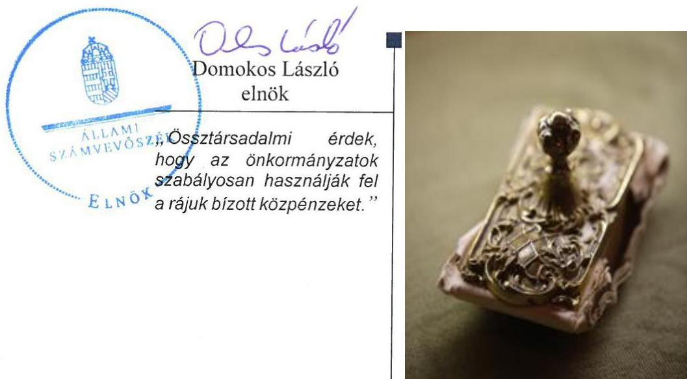
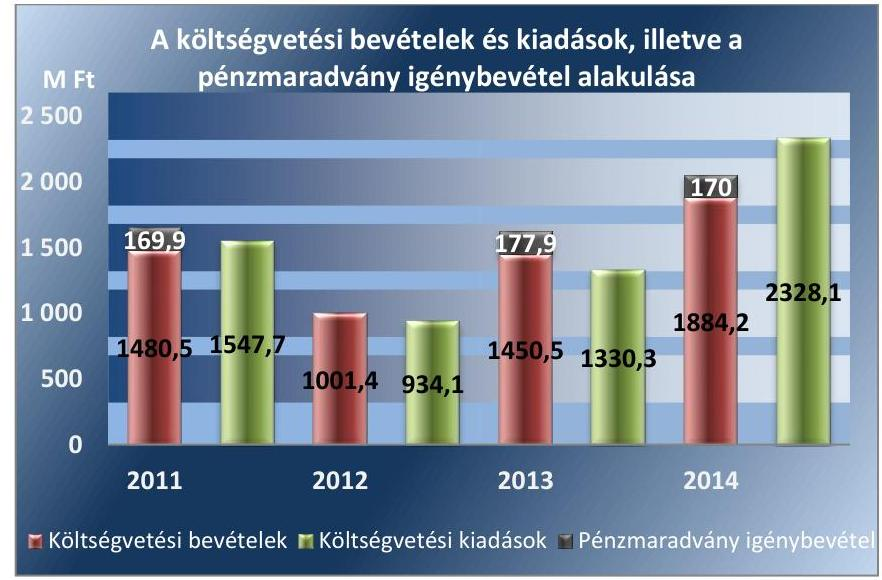
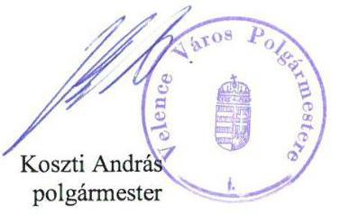

# Jelentés 

## Önkormányzatok pénzügyi és vagyongazdálkodása

Az önkormányzatok pénzügyi és vagyongazdálkodása megfelelőségének ellenőrzése - Velence 2016.

---

# Jelenetés 

## Önkormányzatok pénzügyi és vagyongazdálkodása

Az önkormányzatok pénzügyi és vagyongazdálkodása megfelelőségének ellenőrzése - Velence
2016. marcius hónap 08. nap

---

|   | AZ ELLENŐRZÉST FELÜGYELTE:  |
| --- | --- |
|   | RENKŐ ZSUZSANNA felügyeleti vezető  |
|   | AZ ELLENŐRZÉST VEZETTE ÉS A VÉGREHAJTÁSÁÉRT FELELŐS:  |
|   | DR. VERESS TIBORNÉ ellenőrzésvezető  |
|   | A PROGRAM ÖSSZEÁLLÍTÁSÁÉRT FELELŐS:  |
|   | JANIK JÓZSEF LÁSZLÓ osztályvezető  |
|   | A TÉMÁHOZ KAPCSOLÓDÓ KORÁBBI SZÁMVEVŐSZÉKI JELENTÉSEK:  |
|  - címe: | Összegző az utóellenőrzésekről - Az önkormányzatok pénzügyi gazdálkodási helyzetének, szabályszerűségének 2011. évi ellenőrzésében érintett 62 városi önkormányzat utóellenőrzése  |
|  Jelentéseink az Országgyúlás számítógépes hálózatán és az Interneten a www.asz.hu címen is olvashatóak. | - sorszáma: 14224  |
|   | - címe: Jelentés Velence Város Önkormányzata pénzügyi helyzetének ellenőrzéséről  |
|   | - sorszáma: 1269  |
|   | IKTATÓSZÁM: V-865-474/2016.  |
|   | TÉMASZÁM: 1899  |
|   | ELLENŐRZÉS-AZONOSÍTÓ SZÁM: V071504  |

---

# TARTALOMJEGYZÉK 

■ ÖSSZEGZÉS ..... 5
■ AZ ELLENŐRZÉS CÉLJA ..... 7
■ AZ ELLENŐRZÉS TERÜLETE ..... 8
■ AZ ELLENŐRZÉS HÁTTERE, INDOKOLTSÁGA ..... 9
■ FÓKUSZKÉRDÉSEK ..... 10
■ ELLENŐRZÉS HATÓKÖRE ÉS MÓDSZEREI ..... 11
■ MEGÁLLAPÍTÁSOK ..... 14
■ JAVASLATOK ..... 43
■ MELLÉKLETEK ..... 47
I. Sz. melléklet: Értelmező szótár ..... 47
II. Sz. melléklet: Az önkormányzat feladatellátásában résztvevők a 2011-2014. évek között ..... 52
III. Sz. melléklet: Az eszközök és a források alakulása kiemelt mérlegsoronként a 2011- 2013. években ..... 53
IV. Sz. melléklet: A pénzügyi egyensúlyi helyzet CLF módszer szerinti értékelése a 2011- 2014. években ..... 54
V. Sz. melléklet: Kimutatás a részesedések változásáról ..... 55
■ FÜGGELÉK: ÉSZREVÉTELEK ..... 57
■ RÖVIDÍTÉSEK JEGYZÉKE ..... 61

---

.

---

# ÖSSZEGZÉS 

Az Állami Számvevőszék Velence Város Önkormányzata pénzügyi és vagyongazdálkodását 2011. január 1. és 2014. december 31. közötti időszakra vonatkozóan ellenőrizte. A pénzügyi gazdálkodás szabályozása és a vagyongazdálkodás szabályozása is részben felelt meg az előírásoknak. A pénzügyi egyensúly a 2011-2012. években nem volt biztositott, a 2013-2014. években fennállt. Az Önkormányzat vagyona négy év alatt 1251,7 millió Ft-tal (15,3 \%-kal) nőtt.

## Az ellenőrzés társadalmi indokoltsága

Az Állami Számvevőszék stratégiájában hangsúlyos szerepet szán annak, hogy szilárd szakmai alapon álló, értékteremtő ellenőrzéseivel előmozdítsa a közpénzügyek átláthatóságát, rendezettségét és javaslataival a közpénzek és a közvagyon szabályos, gazdaságos, hatékony és eredményes felhasználását segítse. Az ÁSZ stratégiájában célul tűzte ki, hogy az önkormányzatok ellenőrzése során értékeli azok pénzügyi-gazdasági helyzetét, a kockázatokat feltárja, és az ellenőrzések helyszíneit kockázatelemzés alapján választja ki. Az ÁSZ szerepet vállal a korrupció és a csalás elleni küzdelemben. Közreműködik a korrupciós kockázatok és a korrupció elleni fellépés hatékony és eredményes eszközeinek beazonosításában, alkalmazásában, továbbá használatuk elterjesztésében, az integritás alapú közigazgatási kultúra kialakításában.

## Főbb megállapítások, következtetések, javaslatok

A pénzügyi szabályozás keretében a számviteli politika tartalmára vonatkozó szabályozás a jogszabályi előírásokkal nem volt összhangban.

A vagyongazdálkodás kereteinek kialakítása során a versenyeztetési eljárást a törvényi előírástól eltérően, a követelésről történő lemondás módját és eseteit egyáltalán nem szabályozták.

Az ellenőrzés a költségvetési tervezés során a bevételek közgazdasági megalapozottságának biztosítása vonatkozásában a múködési bevételekkel kapcsolatosan tárt fel hiányosságot. Az előirányzat-módosítások szabályszerűen történtek, a vonatkozó döntéseket határidőben, az arra jogosult Képviselő-testület hozta meg, kellően részletes információk birtokában. A Polgármesteri Hivatal 2011 októberét követően SZMSZ-szel nem rendelkezett, amelynek hiányában az elszámoltathatóság feltétele nem volt biztosított, ebből következően a gazdálkodási jogkörök múködésének megfelelősége nem volt megítélhető, amely kiemelt kockázatot jelent a gazdálkodás biztonsága, a közvagyon védelme szempontjából.

A feladatellátásban bekövetkezett változások és a saját hatáskörben megtett intézkedések eredményeként a 2013-2014. években az Önkormányzat pénzügyi egyensúlya biztosított volt. A likviditási tervek előírásoknak megfelelő felülvizsgálata elmaradt, amely a pénzügyi gazdálkodásra, az egyensúly fenntartása szempontjából kockázatot hordoz. A fizetési kötelezettségek teljesítése részben eredeti határidőben, részben az átütemezésnek megfelelően történt, a követelések behajtása érdekében rendszeresen intézkedéseket tettek. A követelések és kötelezettségek számviteli nyilvántartásában, értékelésében feltárt hiányosságok miatt az átláthatóság érvényesülése, a pénzügyi helyzet valóságnak megfelelő bemutatása nem volt biztosított. Az ellenőrzött időszakban megvalósult hitelfelvétel, illetve kisebb számviteli hiányosságon túl az adósságkonszolidációval kapcsolatos feladatok szabályszerű végrehajtása hozzájárult a múködési feltételek javításához. A Magyar Állam az adósságkonszolidáció alapján 2013-ban 728,4 millió Ft kötvény és hiteltartozást, 2014. évben 613,5 millió Ft kötvénytartozást és azok járulékait vállalta át.

Az önkormányzati vagyon nyilvántartása, a költségvetési beszámolók mérlegének alátámasztottsága, az éves zárszámadásokhoz elkészített vagyonkimutatás a jogszabályoknak és a belső szabályzatok előírásainak számos esetben

---

nem feleltek meg. Az analitikus (részletező) nyilvántartások vezetésében feltárt hiányosságokból, valamint a vagyonnyilvántartások közötti egyezőség hiányából adódóan az Önkormányzat vagyoni helyzetének valóságnak megfelelő bemutatása nem volt biztosított. Valamennyi mérlegtételt érintően a leltárral történő alátámasztásnak nem tettek eleget, a leltározást és a selejtezést nem az előírásoknak megfelelően végezték.

A vagyon összetételének és nagyságának változását eredményező döntések és azok végrehajtása szabályszerűsége tekintetében az ellenőrzés hiányosságokat tárt fel. A kivitelezői, üzemeltetési szerződésekben a garanciális elemek beépítéséről, valamint a késedelmi kötbér érvényesítéséről nem gondoskodtak. Az önkormányzati vagyont üzemeltetőket nem számoltatták be, és nem bizonyosodtak meg arról, hogy azok a jogszabály szerint átlátható szervezetnek minősülnek-e. Az Önkormányzat valamennyi ellenőrzött üzemeltetési szerződését, illetve az egyes üzemeltetési és beruházási szerződések jogszabályban meghatározott összes adatát nem tették közzé.

Az Önkormányzatnál a tartós részesedések vonatkozásában a felelős gazdálkodás teljes körűen nem érvényesült. A többségi tulajdonban lévő gazdasági társaság részére írásbeli szerződés hiányában folyósítottak tagi kölcsönt, továbbá a kölcsönkövetelésről való lemondás nem volt szabályszerű. A részesedések számviteli nyilvántartása, év végi értékelése, az értékvesztés elszámolása nem felelt meg az előírásoknak, így a mérlegben nem a valóságnak megfelelő állapot szerepelt.

Az Önkormányzat az erőforrásokkal való hatékony gazdálkodáshoz nem határozott meg követelményeket, a szabályszerű gazdálkodásra vonatkozóan előírt követelmények kialakításában, számonkérésében feltárt hiányosságok pedig kockázatot jelentettek a felelős gazdálkodás szempontjából.

Az Önkormányzatnál az integritás kontrollrendszere fejlesztendő, mivel az integritási szemlélet érvényesítése érdekében nem intézkedtek, nem szabályozták, illetve nem hívták fel a korrupciós szempontból veszélyeztetett beosztásban dolgozó alkalmazottak figyelmét a jellemző kockázatokra és a kockázatokat megelőző intézkedésekre.

Az ellenőrzés során feltárt hiányosságok, szabálytalanságok megszüntetésére az ÁSZ a polgármesternek és a jegyzőnek javaslatokat fogalmazott meg. Az ellenőrzött időszakban hivatalban volt jegyző felelősségi körébe tartozóan az ellenőrzés megállapította, hogy nem felelt meg a jogszabályi előírásoknak a pénzügyi és vagyongazdálkodásra vonatkozó önkormányzati szabályozás, a költségvetési rendelettervezet tartalma, a belső kontrollrendszer működtetése, a könyvvezetési és beszámolókészítési kötelezettség teljesítése, a vagyonkimutatás elkészítése és az ingatlan vagyonkataszter vezetése. A Polgármesteri hivatal szervezeti és múködési szabályzattal 2011. október 25-től nem rendelkezett, a likviditási terv felülvizsgálati kötelezettségének nem tettek eleget, a vagyonnyilvántartások közötti egyezőség nem volt biztosított.

Az ellenőrzött időszakban hivatalban lévő jegyző közszolgálati jogviszonya 2015. június 14-én megszűnt, ezt követően a Kttv. ${ }^{1}$ 156. § (1) bekezdésében meghatározott fegyelmi eljárás megindítása a munkáltatói jogkör gyakorlója részéről már nem lehetséges. Erre tekintettel az ÁSZ a jegyző feladat és hatáskörébe tartozóan feltárt szabálytalanságok miatt a polgármester részére nem fogalmazott meg a jegyző munkajogi felelőssége felvetésével kapcsolatos javaslatot.

---

# AZ ELLENŐRZÉS CÉLJA 

## Velence Város Önkormányzata pénzügyi és vagyongazdálkodásának megfelelőségi ellenőrzése

AZ ELLENŐRZÉS CÉLJA az Önkormányzat pénzügyi és vagyoni helyzetének, a gazdálkodás szabályosságának megítélése a költségvetési tervezés, a pénzügyi egyensúly megteremtése, az éves költségvetési beszámolás, a vagyongazdálkodás, a vagyon számbavétele, a gazdasági események elszámolása és a pénzgazdálkodás szabályszerűsége alapján; valamint annak értékelése, hogy kialakított-e az Önkormányzat az erőforrásokkal való szabályszerű és hatékony gazdálkodáshoz szükséges követelményeket, megvalósította-e azok számon kérését, ellenőrzését.

---

# **Velence Város Önkormányzata**

**VELENCE VÁROS** Fejér megyében a Velencei-tóval, a Velencei-hegység lankás dombjaival, a fővároshoz és Székesfehérvárhoz való közelségével, a kiváló közlekedéssel hazánk egyik kiemelt üdülőterülete. Állandó lakosainak száma 2014. január 1-jén 5691 fő volt. A lakóházak száma 1901, az üdülőépületeké 2615, a parti szakasz hossza mintegy 5 km.

A 2014. év végén a Képviselő-testület2 kilenc fővel, három állandó bizottsággal látta el a feladatait. A polgármester3 személyében 2014. október 13-án, a jegyző személyében 2015. június 15-én következett be változás, a jegyző4 személye a 2011-2014. években nem változott. 2011. január 1-jétől 2014. december 31-ig az Önkormányzat5 által fenntartott költségvetési szervek száma ötről négyre csökkent, a foglalkoztatott köztisztviselők száma 32 főről 21 főre, a közalkalmazottaké 91 főről 38 főre változott. Az Önkormányzat feladatellátását az II. sz. melléklet szemlélteti. Az Önkormányzat többségi tulajdoni hányadú gazdasági társaságainak száma a 2011. január 1-jei kettőről 2014. december 31-re háromra növekedett. A gazdasági társaságok feladata a termálvízrendszer-, gyógyszertár üzemeltetése, szakorvosi ellátás biztosítása volt.

A 2011. évről a 2014. évre a költségvetési bevétel 1480,5 millió Ft-ról 1884,2 millió Ft-ra, a költségvetési kiadás 1547,9 millió Ft-ról 2328,1 millió Ft-ra nőtt. A költségvetési bevételek és kiadások, illetve a pénzmaradvány igénybevétel alakulását az 1. ábra szemlélteti.

1. ábra

*Forrás: Az Önkormányzat 2011-2014, évi költségvetési beszámolói*

---

# AZ ELLENŐRZÉS HÁTTERE, INDOKOLTSÁGA 

Az államháztartás önkormányzati alrendszerének közpénz felhasználása, az önkormányzatok által ellátott közfeladatok és önként vállalt feladatok sokrétüsége, valamint a feladat ellátásához rendelt vagyon nagyságrendje indokolja, hogy az ÁSZ ellenőrzéseket folytasson a pénzügyi és vagyongazdálkodás területén.

## Az ellenőrzés több szinten hasznosul

Az ÁSZ az önkormányzatok ellenőrzését a pénzügyi helyzet megítélésével indította el 2011-ben, és a nagy vagyonnal rendelkező, magas kockázatú önkormányzatok esetében a vagyongazdálkodás ellenőrzésével folytatta. Az elmúlt időszakban az önkormányzati gazdálkodás kockázatai beépítésre kerültek az ellenőrzött önkormányzatok kiválasztási rendszerébe. Az elmúlt négy év ellenőrzéseinek tapasztalatai megmutatták, hogy továbbra is indokolt az egyrészt elemző, értékelő, a pénzügyi helyzet kockázatát is minősítő, másrészt a pénzügyi és vagyongazdálkodási tevékenység szabályszerűségét értékelő ÁSZ ellenőrzések folytatása.

Ellenőrzéseink hozzájárulnak az önkormányzatok pénzügyi helyzetének pontosabb megítéléséhez azáltal, hogy a pénzügyi helyzetet a vagyoni helyzettel együtt értékeljük, amelyek együttesen határozzák meg az önkormányzatok fejlesztési képességét és gyakorolnak hatást a feladatellátásra. Feltárjuk az önkormányzati gazdálkodást meghatározó szabályozások összhangjának hiányosságait, a szabályozással nem érintett gazdálkodási területeket, valamint a pénzügyi és vagyongazdálkodás esetleges szabálytalanságait. Beazonosítjuk a pénzügyi egyensúlyi helyzet megbomlásakor a kiváltó okok mellett azok kialakulását is. Bemutatjuk az adósságkonszolidáció önkormányzat általi végrehajtásának szabályszerűségét, az adósságállomány újratermelődésének elkerülése érdekében hozott intézkedéseket. Az ellenőrzés kitér a gazdálkodáshoz kapcsolódó integritás kontrollok meglétének és múködésének ellenőrzésére is.

A pénzügyi és vagyongazdálkodás szabályszerűségének ellenőrzése által a megállapításokkal összefüggő javaslatok hasznosítása esetén javul az önkormányzat gazdálkodásának szabályozottsága, valamint a „jó gyakorlatok" terjesztésén keresztül azok az önkormányzatok is átvehetik a pozitív példákat, ahol nem végez ellenőrzést az ÁSZ. Ellenőrzéseink eredményeképpen javaslatokat fogalmazhatunk meg az önkormányzatok pénzügyi egyensúlya fenntartásával kapcsolatos problémák rendszerszemléletú kezelésére, felszámolására.

---

# FÓKUSZKÉRDÉSEK 

1.     - A pénzügyi és vagyongazdálkodás szabályozása megfelelt-e az előírásoknak?
2.     - A költségvetési tervezés, az éves költségvetési beszámolás és a pénzgazdálkodás szabályszerű volt-e?
3.     - Biztosított volt-e a pénzügyi egyensúly, az adósságot keletkeztető ügyletek vállalására a jogszabályi előírásoknak megfelelően került-e sor?
4.     - A vagyonnyilvántartás, a költségvetési beszámoló mérlegének alátámasztottsága megfelelt-e a jogszabályokban és a belső szabályzatokban előírt követelményeknek?
5.     - Szabályszerüek voltak-e a vagyon összetételének és nagyságának változását eredményező döntések és azok végrehajtása?
6.     - Felelősen gazdálkodott-e az önkormányzat a tartós részesedéseivel, élt-e tulajdonosi jogaival, teljesítette-e tulajdonosi kötelezettségeit?
7.     - Az önkormányzat az erőforrásokkal való szabályszerű gazdálkodáshoz szükséges követelményeket kialakította-e, betartásukat számon kérte-e, ellenőrizte-e?
8.     - Az önkormányzat az erőforrásokkal való hatékony gazdálkodáshoz szükséges követelményeket kialakította-e, betartásukat számon kérte-e, ellenőrizte-e?
9.     - Az önkormányzat intézkedett-e az integritási szemlélet érvényesítése érdekében?

---

# ELLENŐRZÉS HATÓKÖRE ÉS MÓDSZEREI 

## Az ellenőrzés típusa

Megfelelőségi ellenőrzés

## Az ellenőrzött időszak

A 2011. január 1-je és 2014. december 31-e közötti időszak. Az ellenőrzött időszakba beleértendő az ellenőrzött évekre vonatkozó tervezési feladatok, beszámolási kötelezettségek teljesítésének időszaka is. A vagyonnyilvántartások egyezőségét, a leltározás, selejtezés folyamatát a 2014. évre vonatkozóan értékeltük.

## Az ellenőrzés tárgya

Az Önkormányzat pénzügyi és vagyongazdálkodása, a pénzügyi egyensúly megteremtése, a tulajdonosi és irányító szervi feladatok ellátása, az integritás szemlélet érvényesülése.

Az ellenőrzés kiterjed minden olyan körülményre és adatra, amely az ÁSZ jogszabályban meghatározott feladatainak teljesítéséhez, valamint a program végrehajtása folyamán felmerült újabb összefüggések feltárásához szükséges.

## Az ellenőrzött szervezet

Velence Város Önkormányzata

## Az ellenőrzés jogalapja

Az ellenőrzés jogszabályi alapját az Állami Számvevőszékről szóló 2011. évi LXVI. törvény 1. § (3) bekezdésének, az 5. § (2)-(6) bekezdéseinek, valamint az államháztartásról szóló 2011. évi CXCV. törvény 61. § (2) bekezdésének előírásai képezik.

## Az ellenőrzés módszerei

Az ellenőrzést a nemzetközi standardokat irányadónak tekintve az ellenőrzési program ellenőrzési kérdései, az ellenőrzött időszakban hatályos jogszabályok, az ellenőrzés szakmai szabályok és módszertanok figyelembe vételével végeztük.

---

A gazdálkodás hibáinak kijavítására, a közpénzekkel való felelős gazdálkodás segítésére irányuló javaslatok kidolgozásakor a hatályos jogszabályok az irányadóak.

Az ellenőrzési kérdések megválaszolásához szükséges bizonyítékok megszerzése az ellenőrzött által rendelkezésre bocsátott dokumentumokra, adatokra alapozva megfigyelés, szemle (szemrevételezés), kérdésfeltevés (információkérés), mintavételezés, valamint elemző eljárással történt. Az ellenőrzési bizonyítékként felhasználható adatforrások közé tartoztak egyrészt a szakmai program részletes szempontjainál felsorolt adatforrások, másrészt minden az ellenőrzés folyamán feltárt, az ellenőrzés szempontjából releváns információt tartalmazó dokumentum.

Az ellenőrzés lefolytatásához az Önkormányzat a tanúsítványok elektronikus kitöltésével, valamint az ÁSZ által kért dokumentumok elektronikus megküldésével szolgáltatott adatokat. Az így rendelkezésre bocsátott adatok, információk, a tanúsítványok adatai valódiságának kontrollja az ellenőrzés keretében történt.

Az ellenőrzést az Önkormányzat múködésével kapcsolatos feladatokat ellátó Polgármesteri Hivatalban végeztük. Az Önkormányzat az intézményei és gazdasági társaságai ellenőrzéssel érintett dokumentumait, tanúsítványait a Polgármesteri Hivatal útján bocsátotta az ellenőrzés rendelkezésére.

A pénzügyi és vagyongazdálkodás szabályozottságát az Önkormányzat rendeletei, határozatai, illetve a 2011. évben a Polgármesteri Hivatal, a 2012. évtől az Önkormányzat (mint önálló éves költségvetési beszámolót készítő szerv) és a Polgármesteri Hivatal belső szabályozásai alapján értékeltük. A költségvetési tervezési, végrehajtási és beszámolási feladatok ellenőrzése, a pénzügyi egyensúly, a vagyonnyilvántartás, a mérleg alátámasztottságának megítélése az Önkormányzat összevont adatai alapján történt. A leltározási, értékelési és selejtezési folyamat szabályszerűségére a Polgármesteri Hivatal által végzett 2014. évi leltározási folyamat ellenőrzése alapján tettünk megállapításokat.

Az Önkormányzat vagyonváltozást eredményező döntéseinek és azok végrehajtásának ellenőrzésére irányított, valamint véletlen mintavételi eljárással és tételes ellenőrzéssel került sor. A pénzforgalmi tételek ellenőrzése véletlen mintavételi eljárással - a 2011. évben a Polgármesteri Hivatal, a 2012. évtől a Polgármesteri Hivatal és az Önkormányzat (mint önálló éves költségvetési beszámolót készítő költségvetési szerv) főkönyvi állományából - kiválasztott minta alapján történt. Kockázatalapú mintavétel alapján az ellenőrzött időszakban hatályos, összesen az öt legmagasabb könyv szerinti értéket képviselő üzemeltetési szerződést és az öt-öt legnagyobb összegű követelés elengedést és behajthatatlan követelés leírást ellenőriztük. A részesedések értékelését tételesen ellenőriztük. A beruházások és felújítások elszámolásának, valamint a kapcsolódó kifizetések esetében a gazdálkodási jogkörök gyakorolásának, a vagyonértékesítésének és a vagyon bérbeadással történő hasznosításának szabályszerűségét véletlen mintavétellel ellenőriztük. A véletlen minta alapján a sokaságra vonatkozó hibaarányt becsültük. ,,Megfelelőnek" értékeltük az ellenőrzött területet, amennyiben 95\%-os bizonyossággal a teljes sokaságban a hibaarány legfeljebb 10\%, „részben megfelelőnek" értékeltük, ha a hibaarány felső

---

határa 10-30\% között volt, „nem megfelelőnek" pedig akkor, ha a mintavételi eredmények alapján a sokaságbeli hibaarány felső határa meghaladta a $30 \%$-ot.

Az ellenőrzési kérdésekre adott válaszok alapján értékeltük, hogy az Önkormányzat pénzügyi gazdálkodása megfelelt-e a jogszabályokban és a belső szabályzatokban meghatározottaknak, biztosított volt-e a pénzügyi egyensúly. Értékeltük a vagyongazdálkodás szabályszerűségét, a vagyonváltozást eredményező döntések és a tulajdonosi jogok gyakorlása szabályszerűségét. Értékelést adtunk arról, hogy az Önkormányzatnál kialakítot-ták-e az erőforrásokkal való szabályszerű és hatékony gazdálkodáshoz szükséges követelményeket, megvalósították-e azok számonkérését, ellenőrzését. Az integritás szemlélet érvényesülésének értékelése az Önkormányzat által önbevallással kitöltött tanúsítvány alapján történt.

---

# 1. A pénzügyi és vagyongazdálkodás szabályozása megfelelt-e az előírásoknak? 

Összegző megállapítás

A pénzügyi és vagyongazdálkodás szabályozásában feltárt hiányosságok következtében nem volt biztosított a szabályszerű, átlátható múködés, nem teremtették meg az elszámoltathatóság alapját.

### 1.1. számú megállapítás

A Polgármesteri Hivatal 2011. október 25-től SZMSZ-szel nem rendelkezett, amelynek hiányában nem határozták meg a múködés egyértelmú szabályait. A számviteli politika nem felelt meg teljes körűen a jogszabályban előírtaknak, ezáltal nem támogatta maradéktalanul a számviteli elszámolások szabályszerű végrehajtását.

A képviselő-testületi múködés részletes szabályait tartalmazó SZMSZ ${ }^{6}{ }_{1-5}$ szel rendelkezett az Önkormányzat, azonban az SZMSZ ${ }_{3}$-t nem aktualizálták az Mötv. ${ }^{7}$ - a helyi önkormányzatok szervezetére és múködésére vonatkozó - rendelkezéseinek 2013. január 1. napján történő hatályba lépését követően, arra a Kormányhivatal ${ }^{8}$ törvényességi felhívása után, 2014. február 10. napjával került sor. A Polgármesteri Hivatal ${ }^{9}$ feladatai ellátásának rendjét és módját az önkormányzati SZMSZ ${ }_{1,2}$ keretében, annak mellékleteként határozták meg. A 2011. október 25. napjától hatályos SZMSZ ${ }_{3}$ a Polgármesteri Hivatal feladatai ellátásának részletes belső rendjére és módjára vonatkozó rendelkezést nem tartalmazott, és azok meghatározására egyéb módon sem került sor. Ezáltal a Polgármesteri hivatal ezen időpontot követően - az Áht. ${ }^{10}{ }_{1}$ 91. § (2) és az Áht. ${ }^{11}{ }_{2}$ 10. § (5) bekezdését megsértve - SZMSZ-szel nem rendelkezett.

A jegyző a jogszabályi előírások szerint a helyi sajátosságoknak megfelelően elkészítette és aktualizálta a számviteli politiká ${ }^{12}{ }_{1-4}$-t, a számlarend ${ }^{13}{ }_{1-3}$-et, a bizonylati rend ${ }^{14}{ }_{1-4}$-et, a leltározási szabályzat ${ }^{15}{ }_{1-4}$-ot, az értékelési szabályzat ${ }^{16}{ }_{1-4}$-ot, az önköltségszámítási szabályzatot ${ }^{17}$ és a pénzkezelési szabályzat ${ }^{18}{ }_{1-4}$-ot. A Számv. tv. ${ }^{19} 14 . \S$ (4) bekezdésében és az Áhsz. ${ }_{2}$ 50. § (1) bekezdésében foglaltak ellenére a számviteli politika ${ }_{3,4}$-ben a 2014. évben nem rögzítették, hogy mit tekintenek a számviteli elszámolás, az értékelés szempontjából lényegesnek, nem lényegesnek.

A pénzügyi kihatással bíró, jogszabályban nem szabályozott, a múködéshez kapcsolódó kérdéseket a jegyző az Ámr. ${ }^{20}$ 20. § (3) bekezdés b), f) pontjaiban, illetve az Ávr. ${ }^{21} 13 . \S$ (2) bekezdés b), e) pontjaiban rögzítettek ellenére - a közbeszerzések kivételével - nem rendezte teljes körűen; nem szabályozta a reprezentációs kiadások felosztását és elszámolását, illetve a beszerzések lebonyolításával kapcsolatos eljárásrendet a 2011. január 1. 2012. március 20. közötti időszakban. A szervezeti és személyi változásokat

---

nem követte a mobiltelefonok használatának ${ }^{22}$ szabályozása, illetve a közszolgálati szabályzat ${ }^{23} 2013$. január 7-i kiadásáig a belföldi kiküldetés ${ }^{24}$, valamint a gépjárművek használatának ${ }^{25}$ szabályozása.

A költségvetési szerv belső kontrollrendszerének keretében elkészítették a FEUVE ${ }^{26}$, a belső kontrollrendszer ${ }^{27}$ és a közzétételi ${ }^{28}$ szabályzatokat, amelyeket a hatályba helyezésük óta a jogszabályi (Áht. ${ }_{2}$, Ávr., Bkr. ${ }^{29}$, Info. $\mathrm{tv}^{30}$ ) változásoknak megfelelően nem aktualizálták.

# 1.2. számú megállapítás 

A költségvetési és a zárszámadási rendeletek tartalmi szempontjait önkormányzati rendeletben határozták meg.

A költségvetés tervezésével kapcsolatos feladatokat az SZMSZ ${ }_{1-5}$-ben határozták meg. A Képviselő-testület a 12/2011. (IV.18.) számú önkormányzati rendeletében meghatározta a költségvetés és zárszámadás előterjesztéséhez kapcsolódó mérlegek és kimutatások tartalmi szempontjait, melyben speciális, helyi szempontokra is figyelemmel voltak.

## A vagyongazdálkodás kereteinek kialakítása során a versenyeztetéssel, továbbá a követelésről való lemondással kapcsolatosan feltárt szabályozásbeli hiányosságok kockázatot jelentettek az önkormányzati vagyon védelme szempontjából.

A vagyonnal történő gazdálkodás szabályait a vagyonrendeletben ${ }^{31_{1,2}}$ írta elő a Képviselő-testület. Az Önkormányzat a 2012. október 31-i határidőt túllépve vizsgálta felül - az Nvtv. ${ }^{32}$ 5. § (5)-(7) bekezdései és az Nvtv. 18. § (12) bekezdése alapján - a korlátozottan forgalomképes törzsvagyonát, a 2013. február 19-én módosított vagyonrendelet ${ }_{2}$ keretében.

A Képviselő-testület a vagyonrendelet ${ }_{2}$-ben meghatározta azt az értékhatárt, amely felett csak nyilvános pályázat útján lehet a vagyont értékesíteni, kezelésbe adni, továbbá a használat jogát átadni, amelyet a korábban hatályban lévő vagyonrendelet ${ }_{1}$ - Áht. ${ }_{1} 108 . \S$ (1) bekezdés előírása ellenére - nem tartalmazott.

A vagyonrendelet ${ }_{2}$-ben az önkormányzati tulajdonban lévő vagyon, értékesítésére, hasznosítására vonatkozóan a versenyeztetés szabályai nem feleltek meg a 2013. évi Kvtv. ${ }^{33}$ 6. § (5) bekezdésében, illetve a 2014. évi Kvtv. ${ }^{34}$ 6. § (5) bekezdésében foglaltaknak, mivel a vagyon értékének a meghatározásakor az egyedi bruttó forgalmi érték helyett az értékesítésnél a becsült értéket, a hasznosításnál a becsült bevételt vették alapul. A vagyonrendelet ${ }_{2}$ továbbá nem felelt meg a 2013. évi Kvtv. 77. § (3) bekezdésében, illetve a 2014. évi Kvtv. 76. § (4) bekezdésében foglaltaknak, mivel a Képviselő-testület az Önkormányzat tulajdonában lévő vagyontárgyak értékesítéséhez kapcsolódó versenyeztetési kötelezettséget a 2013. évi Kvtv. 6. § (5) bekezdés c) pontjában, illetve 2014. évi Kvtv. 6. § (5) bekezdés c) pontjában szereplő 25 millió Ft egyedi bruttó forgalmi értéknél magasabb összegben, 60 millió Ft-ban határozta meg.

A követelésről történő lemondás módját és eseteit az Önkormányzat az Áht. ${ }_{1}$ 108. § (2) bekezdése, illetve az Áht. ${ }_{2}$ 97. § (2) bekezdése ellenére rendeletben nem szabályozta.

---

# 2. A költségvetési tervezés, az éves költségvetési beszámolás és a pénzgazdálkodás szabályszerű volt-e? 

Összegző megállapítás

2.1. számú megállapítás

A költségvetési tervezés és az éves költségvetési beszámoló készítése során feltárt hiányosságok miatt nem volt biztosított az átláthatóság, a szabályszerűségi hibákból adódóan kockázat jelentkezett a gazdálkodás biztonsága szempontjából.

A költségvetési tervezés során a tervezett múködési bevételek közgazdasági megalapozottságát teljes körűen nem biztosították, amely a gazdálkodás biztonsága szempontjából kockázatot jelentett.

A költségvetési koncepció és a költségvetési rendelettervezet előterjesztései tartalmánál a jogszabályi és a belső szabályozási előírások részben érvényesültek. Az éves költségvetési koncepciók nem tartalmazták az SZMSZ1 37. § (3), az SZMSZ2 71. § (2) bekezdései, illetve az Ámr. 35. § (1) bekezdése szerint a helyben képződő tervévi bevételek, az ismert kötelezettségek, valamint az Ávr. 26. §*(1) bekezdésben foglalt tervezett bevételek, kötelezettségvállalások és más fizetési kötelezettségek számszerűsítését. A költségvetések készítésénél nem érvényesítették az SZMSZ3-4 59. § (4) a)-b), illetve az SZMSZ5 60. § (4) a)-b) pontokban foglalt követelményeket, amely szerint az intézmények elkészítik saját költségvetés-tervezetüket. A költségvetési koncepció tervezetét a Pénzügyi és Településfejlesztési Bizottság ${ }^{35}$ az Ámr. 35. § (3) bekezdés, illetve az Ávr. 26. § (2) bekezdésében foglaltak ellenére a 2013. évet kivéve nem véleményezte. A Képvi-selő-testület a 2013. és a 2014. évi költségvetés-készítés további munkálatairól az Ávr. 26. § (3) bekezdésében foglalt előírások ellenére nem hozott határozatot. Az elemi költségvetést 2014-ben az Ávr. 33. § (1) bekezdésében előírt határidőt követő napon továbbították a Kincstár ${ }^{36}$ részére, a Kincstár a késedelem miatt bírságot nem szabott ki.

A 2012. és 2014. éves költségvetések készítése során az Áht. 2 12. § (1) bekezdésében foglaltak nem érvényesültek, mert a tervezett bevételek közgazdasági megalapozottsága nem volt teljes körűen biztosított. Ezen túl a közfeladat ellátás megfelelő szintjéhez szükséges mértékű kiadások alátámasztottsága hiányát állapította meg az ellenőrzés. Az ellenőrzés során felülvizsgálatra a legnagyobb mérlegfőösszegű intézmény az Iskola és az Óvoda költségvetésének mellékszámításokkal történő megalapozottsága került. Az Iskola ${ }^{37}$ 2012. évi személyi juttatásainak eredeti előirányzatát dokumentumok nem alapozták meg. Nem támasztották alá az Óvoda ${ }^{38}$ 2014. évi személyi és dologi előirányzatainak kialakítását, a szervezeti változásból, illetve a feladatellátás évközi módosulásából adódó szerkezeti változások és szintre hozások hatását.

A 2014. évben a működési bevételek tervezése során a pénzforgalmi bevételt nem jelentő, a 38/2013. NGM rendelet ${ }^{39}$ XII. fejezet C) 9. pontjá-

[^0]
[^0]:    * 2014. október 16-tól hatálytalan

---

ban foglaltak értelmében nem múködési bevételként elszámolandó beruházáshoz kapcsolódó 299,3 millió Ft, levonható fordított ÁFA összegét vették figyelembe ÁFA visszatérülésből származó bevételként.

A 2014. évi költségvetési rendelet elfogadásakor az Önkormányzat még nem rendelkezett az adósságkonszolidáció keretében aláírt megállapodással, az Áht. 2 23. § (2) bekezdés g) pontjának előírása ellenére a költségvetési rendeletben a 613,5 millió Ft kötvénytartozást nem szerepeltették, mint adósságot keletkezető ügyletből fennálló kötelezettséget.

Az előirányzatok átcsoportosítására vonatkozó döntéseket határidőben, az arra jogosult Képviselő-testület hozta meg, kellően részletes információk birtokában. A költségvetési rendelet ${ }^{40}$ 1-4 módosításai, az ahhoz kapcsolódó előterjesztések és az alátámasztó dokumentumok alapján az elő-irányzat-módosítások szabályszerűen történtek. Az Önkormányzat a jóváhagyott összes bevételi és kiadási előirányzatain belül gazdálkodott.

Az Önkormányzat és intézményei előirányzat nyilvántartásának belső tartalmát az előírások szerint alakították ki. Az előirányzat-módosítások analitikus és főkönyvi nyilvántartásai, a zárszámadási rendeletben szereplő előirányzat-változások számszakilag megegyeztek.

# 2.2. számú megállapítás 

A zárszámadási rendelet előterjesztése keretében elkészített vagyonkimutatás hiányosságai miatt nem biztosították az átláthatóságot, a vagyonnal való felelős gazdálkodás támogatása érdekében az információk teljes körú, szabályszerű bemutatását.

A 2014. évi elemi költségvetési beszámolóban az Áhsz. ${ }^{41}$ 1 14. § (9) bekezdése előírása ellenére a 2015. január 20-án fizetendő 1,2 millió Ft ÁFA-t tévesen a költségvetési évben esedékes kötelezettségek között szerepeltették. Az Önkormányzat és az általa irányított költségvetési szervek éves elemi költségvetési beszámolóit a jegyző jogszabály szerinti bontásban állította össze, amelyet - a 2013. évet kivéve - az Áhsz. ${ }^{42}$ 1 10. § (5), illetve az Áhsz: 32. § (4) bekezdéseiben foglalt előírásokat be nem tartva néhány napos késedelemmel küldött meg a Kincstár részére, bírság kiszabására nem került sor.

A polgármester a jegyző által elkészített zárszámadási rendelettervezetet határidőben terjesztette a Képviselő-testület elé. Az Önkormányzat a 2011. éves elemi költségvetési beszámoló kiegészítő melléklet szöveges értékelésében kimutatott részesedéseket nem az Áhsz. 1 40. § (9) bekezdésében előírt tulajdoni hányadok szerinti bontásban történt. Az éves zárszámadásokhoz elkészített vagyonkimutatás részben felelt meg az Áhsz.1,2 előírásainak. A 2011-2013. évi vagyonkimutatások szerkezete, tartalma nem felelt meg az Áhsz. 1 44/A. § (2)-(3) bekezdéseiben előírt tartalmi követelményeknek, mivel nem tartalmazták a mérleg legalább római számmal jelzett eszköz-, illetve forráscsoportonkénti tagolású tételeit, a tárgyi eszköz és a befektetett pénzügyi eszközcsoportok esetében az arab számmal jelzett tételeit, az Önkormányzat vagyonát törzsvagyon, illetve törzsvagyonon kívüli egyéb vagyonbontásban, továbbá nem tartalmazták a „0"-ra leírt, de használatban lévő, illetve használaton kívüli eszközök állományát. A 2014. évi zárszámadási rendelet mellékleteként elkészített vagyonkimutatás nem tartalmazta a „0"-ra leírt eszközök állományát az Áhsz. 2 30. § (3) bekezdésében előírtak szerint.

---

Az éves zárszámadási előterjesztések az év utolsó napján érvényes szervezeti, besorolási rendnek megfelelően a jogszabályi előírásoknak megfelelően az elfogadott költségvetésekkel összehasonlítható módon készültek.

# 2.3. számú megállapítás 

2011 októberét követően az SZMSZ hiányában az elszámoltathatóság feltétele nem volt biztosított, ebből következően a gazdálkodási jogkörök múködésének megfelelősége nem volt megítélhető. Mindez kiemelt kockázatot jelent a gazdálkodás biztonsága, a közvagyon védelme szempontjából.

Az ellenőrzött felhalmozási kifizetések esetében a 2011. január-október időszakban a gazdálkodási jogkörök gyakorlása nem volt megfelelő.

A 2011-2013. években jogszabályi rendelkezés a gazdasági szervezet létrehozása kötelezettségét nem írta elő, a Képviselő-testület annak létrehozásáról nem döntött, a gazdálkodási feladatok ellátását a Polgármesteri Hivatal biztosította. A 2014. évben a Polgármesteri Hivatal nem tett eleget az Ávr. 8. § (1) bekezdés c) pontjában foglalt előírásnak, mivel gazdasági szervezet létrehozásáról nem rendelkezett. A gazdasági szervezet megnevezését, engedélyezett létszámát, feladatait az Ávr. 13. § (1) bekezdés e) pontja ellenére szervezeti és múködési szabályzatban - tekintettel annak hiányára - nem határozták meg. Az Ámr. 20. § (2) bekezdés e) és h) pontjaiban, 2012-től az Ávr. 13. § (1) bekezdés e) és g) pontjaiban előírtak alapján a szervezeti felépítést, a múködés rendjét, a feladat- és hatásköröket, a hatáskörök gyakorlásának módját, a helyettesítés rendjét és az ezekhez kapcsolódó felelősségi szabályokat a szervezeti és múködési szabályzatnak kell tartalmaznia. Az előzőekben felsorolt kérdések SZMSZ-ben történő szabályozása hiányában a gazdálkodási tevékenységre vonatkozó kijelöléseknek és a gazdálkodási jogkörök gyakorlásának megfelelősége nem volt megállapítható. Ennek eredményeként a 2011 októberét követően a felelősségre vonás és az elszámoltathatóság alapvető feltétele nem volt biztosított.

A kifizetéseket megalapozó kötelezettségvállalás (pénzügyi) ellenjegyzése és az érvényesítés ellenőrzése során tett megállapítások az ellenőrzött mintatételeknél:
a 2011-es tételek esetében az Ámr. 74. § (1) bekezdésében foglaltak ellenére az ellenjegyzés tényére történő utalás megjelölése nem történt meg. Az érvényesítő nem ellenőrizte az Ámr. 77. § (1) bekezdésében előírtaknak megfelelően, hogy a megelőző ügymenetben az Áht. 1 , az Áhsz. 1 és az Ámr. előírásait, továbbá a belső szabályzatokban foglaltakat megtartották-e. Az Ámr. 78. § (2) bekezdés e) és g) pontjaiban előírtak ellenére a fizetés időpontja és a kötelezettségvállalás nyilvántartási száma az utalványon nem került feltüntetésre;
a 2011. XI. hótól a 2014. évig terjedő időszakban az ellenőrzött tételek vonatkozásában az SZMSZ hiánya miatt a gazdálkodási jogkörök gyakorlásának megfelelősége nem volt megállapítható.

---

# 3. Biztosított volt-e a pénzügyi egyensúly, az adósságot keletkeztető ügyletek vállalására a jogszabályi előírásoknak megfelelően került-e sor? 

Összegző megállapítás
3.1. számú megállapítás
2. táblázat

## LIKVIDITÁSI MUTATÓK

| Időpont | Likviditási | Pénzesz-   köz-likvi-   dítási |
| :--: | :--: | :--: |
| 2011.01.01. | 0,9 | 0,4 |
| 2011.12.31. | 0,8 | 0,4 |
| 2012.12.31. | 0,9 | 0,5 |
| 2013.12.31. | 0,4 | 0,2 |
| 2014.12.31. | 2,1* | 0,9* |

A 2013-2014. években a pénzügyi egyensúly megteremtése, az adósságot keletkeztető ügylet szabályszerű vállalása hozzájárult a közfeladat ellátás biztonságos teljesítéséhez, azonban a pénzügyi kockázatok kezelésében, a likviditási tervek felülvizsgálatában és a számviteli nyilvántartások szabályszerű vezetésében feltárt hiányosságok kockázatot jelentenek a pénzügyi egyensúly hosszú távú fenntarthatóságára.

A feladatellátásban bekövetkezett változások és a saját hatáskörben megtett intézkedések eredményeként a 2013-2014. években a pénzügyi egyensúly már biztosított volt, amely hozzájárult a közfeladat ellátás jövőbeni biztonságos teljesítéséhez. A likviditási tervek előírásoknak megfelelő felülvizsgálata elmaradt, amely a pénzügyi gazdálkodásra, az egyensúly fenntartása szempontjából kockázatot hordoz.

A likviditási terveket a 2011-2014. években elkészítették, azonban a 2012-2014. években esetenként - az előirányzat-felhasználási ütemterv aktualizálásával egyidejűleg - vizsgálták felül, ezért az Ávr. 122. § (3) bekezdésében foglalt, a likviditási terv havonkénti felülvizsgálatára vonatkozó előírásának nem tettek eleget.

A likviditási mutatók alakulását a 2. táblázat mutatja be. A likviditási mutatók értéke a 2011-2013. években 1,0 alatti volt, mivel a pénzeszközök, illetve a forgóeszközök nem nyújtottak fedezetet a rövid lejáratú kötelezettségekre. A 2013. évi jelentős csökkenést az adósságkonszolidációval érintett kötvénytartozás teljes fennálló összegének rövidlejáratú kötelezettségként történt könyvelése okozta. A mutatók értéke a 2014. évre a rövid lejáratú kötelezettségek csökkenése (az adósságkonszolidáció eredményeképpen a kötvénytartozás megszűnése), valamint a mérlegstruktúra 2014. évi változása miatt jelentősen megemelkedett, de a mérlegstruktúra változása hatásának kiszűrése után is növekedést mutatott.

A költségvetés elemzését CLF módszerrel végeztük, a főbb adatokat évenként a 3. táblázat mutatja be.

---

| A PÉNZÜGYI EGYENSÚLYI HELYZET FŐBB ADATAI (millió Ft-ban) |  |  |  |  |  |  |
| :--: | :--: | :--: | :--: | :--: | :--: | :--: |
| Megnevezés | 2011. | 2012. | 2013. | 2013. adósság. konszolidáció nélkül | 2014. | 2014. adósság. konszolidáció nélkül |
| Folyó bevételek | 957,5 | 867,9 | 1012,4 | 961,9 | 1088,7 | 1088,7 |
| Folyó kiadások | 907,7 | 808,2 | 690,1 | 690,1 | 879,8 | 879,8 |
| Múködési jövedelem (folyó költségvetés egyenlege) | 49,8 | 59,7 | 322,3 | 271,8 | 208,9 | 208,9 |
| Felhalmozási bevételek | 522,9 | 133,5 | 438,1 | 438,1 | 795,5 | 795,5 |
| Felhalmozási kiadások | 640,0 | 125,9 | 640,2 | 644,9 | 1448,3 | 1461,5 |
| Felhalmozási költségvetés egyenlege | $-117,1$ | 7,6 | $-202,1$ | $-206,8$ | $-652,8$ | $-666,0$ |
| Finanszírozási múveletek nélküli (GFS) pozíció | $-67,3$ | 67,3 | 120,2 | 65,0 | $-443,9$ | $-457,1$ |
| Finanszírozási múveletek egyenlege | $-58,6$ | 11,2 | $-168,0$ | $-189,8$ | 415,7 | 325,1 |
| Tárgyévi pénzügyi pozíció | $-125,9$ | 78,5 | $-47,8$ | $-124,8$ | $-28,2$ | $-132,0$ |
| Nettó múködési jövedelem | $-34,5$ | $-30,6$ | 152,5 | 80,2 | 208,9 | 118,3 |

A múködési jövedelem a 2011-2014. években pozitív egyenleget mutatott, az Önkormányzat kiegészítő támogatásban nem részesült. A működési jövedelem 2013. évben az adósságkonszolidáció nélkül is pozitív lett volna.

A folyó bevételek alakulását a bérbeadásból származó bevételek ingadozása (a 2012. évben tévesen a felhalmozási bevételek közötti kimutatása), valamint a költségvetési támogatások 2013-2014. évi növekedése határozta meg, amit a feladatalapú finanszírozási rendszerre történő áttérés és új támogatási elemek eredményeztek.

A folyó kiadások csökkenése 2013-ig a közfeladat ellátás szervezeti változásai (okmányirodai feladatok megszüntetése, Iskola átadása, humán családsegítő és gyermekjóléti szolgálati feladatok ellátási formája) miatt következett be. 2014-ben a múködési kiadások összege az előző évhez képest megemelkedett, amelynek oka többek között kötelező béremelések, vezetőváltásból adódó végkielégítés, választási kiadások, segélyek kifizetései voltak.

A felhalmozási költségvetés egyenlege a 2012. évet kivéve negatív volt, a felhalmozási kiadások jelentősen meghaladták a felhalmozási bevételt. A 2012. évi pozitív egyenleg egyik oka volt, hogy Velencei-tó Kapuja beruházást szüneteltették, másik pedig, hogy az Áhsz. 1 9. számú melléklet 14. a) pontja előírása ellenére a felhalmozási bevételek között tartották nyilván a befolyt bérleti díjakat. A felhalmozási forráshiányt múködési többletből, pénzmaradványból, továbbá 2014. évben hitelfelvételből finanszírozták. Az Önkormányzat a fejlesztéseihez a 2011. évben 414,6 millió Ft, a 2012. évben 10,2 millió Ft, a 2013. évben 274,4 millió Ft, a 2014. évben 790,0 millió Ft támogatást kapott.

A felhalmozási kiadások alapvetően a beruházások és felújítások alakulásának függvényében változtak, meghatározó eleme a Velencei-tó Kapuja projekt volt, amelyre a 2011. évben 301,2 millió Ft-ot, a 2012. évben a felfüggesztése miatt mindössze 37,3 millió Ft-ot, a 2013. évben 609,0 millió Ft-ot, a 2014. évben 1091,1 millió Ft-ot fordítottak. A felújítások között

---

még a Közösségi Ház és a Civil Ház, az orvosi rendelő, az út- és járdafelújítások szerepeltek. A befektetési célú részesedések vásárlására fordított összeg 2012-ben és 2014-ben emelkedett ki, melyet a 2012. évben a Velence Gyógyszertár Kft. ${ }^{43}$-ben történt részesedésszerzés okozott, 2012. és 2014. évben pedig a Velencei Járóbeteg Szakellátó Kft. ${ }^{44}$-ben történt tőkeemelés. Az adósságkonszolidáció nélkül 2013-2014. években a felhalmozási kiadás a kötvény után fizetendő kamat összegével magasabb lett volna, tovább rontva az egyenleget.

A finanszírozási műveletek egyenlege erős ingadozást mutatott, amelynek oka a 2012. évi folyószámlahitel felvétele, illetve annak 2013. évi törlesztése volt. (A 101,0 millió Ft a 2012. év végi folyószámla-hitel egyenleg - a Kincstár útmutatója alapján - likvid hitellé történő alakításából adódott.) 2014. évben a Velencei-tó Kapuja beruházáshoz kapcsolódó, 400,8 millió Ft hosszú lejáratú fejlesztési célú hitelfelvétel eredményezte a pozitív egyenleg alakulását. Adósságkonszolidáció nélkül, a kötvénytartozás tervezett törlesztési ütemezésével számítva a 2014. évi egyenleg alacsonyabb, de pozitív értéken alakult volna.

A nettó működési jövedelem a 2011-2012. években a kötvénytörlesztés működési jövedelmet meghaladó összege miatt negatív volt. A 2013. évben a kötvénytörlesztés és a likvid hitel miatti visszafizetés ellenére, a működési jövedelem előző évekhez viszonyított jelentős emelkedése miatt a nettó működési jövedelem pozitívvá vált. A 2014. évben a nettó működési jövedelem összege tovább emelkedett, és megegyezett a működési jövedelemmel, mert a kötvény miatt már, a hitelfelvétel miatt pedig még nem volt tőketörlesztési kötelezettség. Az adósságkonszolidáció nélkül a 20132014. években a nettó működési jövedelem alacsonyabb, de pozitív öszszegű lett volna. A pénzügyi egyensúly a 2011-2012. években nem volt biztosított. A feladatellátásban bekövetkezett változások és a saját hatáskörben megtett intézkedések a 2013-2014. években biztosították az egyensúlyt. Az önként vállalt és a kötelező feladatok körének és ellátási formájának megváltoztatása 180,7 millió Ft bevétel kieső és 397,3 millió Ft kiadáscsökkentő hatással voltak a pénzügyi egyensúlyi helyzetre.

Az Önkormányzat adatszolgáltatása alapján az okmányirodai feladatok megszüntetése 46,9 millió Ft-tal csökkentette a kiadásokat. Az óvodai intézményfenntartó társulás megszűnése 18,3 millió Ft kiadás- és bevételcsökkenést okozott, így nem gyakorolt hatást a pénzügyi helyzetre. Az Iskola egyház részére történő átadása 312,9 millió Ft kiadáscsökkenést és 162,4 millió Ft bevételkiesést okozott. Hivatali feladatok átszervezésének hatásaként 13,8 millió Ft kiadáscsökkenést mutattak ki. Az ügyeleti társulási feladatok 2012. évi átadása a Velencei Járóbeteg Szakellátó Kft. részére 5,4 millió Ft dologi kiadás csökkenést eredményezett.

A pénzügyi egyensúlyi helyzet javítására tett bevételnövelő és kiadáscsökkentő intézkedések révén 98,4 millió Ft többletbevételt és 95,0 millió Ft kiadási megtakarítást értek el az Önkormányzat adatszolgáltatása alapján.

A bevételnövelő intézkedések eredményeképpen 98,4 millió Ft-ot mutattak ki, 100,0\%-ban tartós jellegű intézkedések hatásaként. A helyi adókkal kapcsolatos intézkedésekből (adóemelés, adófelderítés) 68,0 millió Ft, új bérleti szerződések kötéséből 28,8 millió Ft, egyéb szerződésmódosításból eredően 1,6 millió Ft többletbevétele keletkezett.

---

A kiadáscsökkentő intézkedések eredményeképpen 490,1 millió Ft-ot mutattak ki, melyből 95,0 millió Ft a tartós jellegű intézkedések hatása volt. Az egyéb kiadáscsökkentésként kimutatott 395,1 millió Ft megtakarítás, amely kizárólag a támogatási előleg részletfizetéséből adódott. A részletfizetés az érintett években esedékes kötelezettséget, az adott évben ténylegesen teljesített kiadást csökkentette, a likviditási helyzetet kedvezően befolyásolta, azonban az nem minősült a pénzügyi egyensúlyi helyzet javítására irányuló feladat ellátás (például az önként vállalt feladatok) kiadásainak csökkentésére irányuló intézkedésnek. A 95,0 millió Ft személyi jellegű kiadásokhoz kapcsolódó megtakarítás, amely a támogatottnál kisebb létszámmal történő feladatellátásból, bérköltségek csökkentéséből (elmaradt jutalom), cafeteria juttatások megvonásából származott.

# 3.2. számú megállapítás 

## A fizetési kötelezettségek teljesítése részben eredeti határidőben, részben az átütemezésnek megfelelően történt, a követelések behajtása érdekében rendszeresen intézkedéseket tettek. A követelések és kötelezettségek számviteli nyilvántartásában, értékelésében feltárt hiányosságok miatt viszont az átláthatóság érvényesülése, a pénzügyi helyzet valóságnak megfelelő bemutatása nem volt biztosított.

A fizetési kötelezettségeket részben eredeti határidőben, részben átütemezés szerint teljesítették. Az összes kötelezettség a 2011. év eleji 2184,8 millió Ft-ról a 2014. évre 446,8 millió Ft-ra csökkent, amelyből a hosszú és a rövid lejáratú kötelezettségek (passzív pénzügyi elszámolások nélkül) évenkénti alakulását a 4. táblázat tartalmazza.

A hosszú lejáratú kötelezettségek csaknem teljes összegét 2011-2012. években a kötvénytartozás tette ki. (1439,2 millió Ft és 1265,1 millió Ft). A 2014. évben az adósságkonszolidáció miatt már nem állt fenn kötvénytartozás, azonban hosszú lejáratú hitelfelvétel miatt 400,8 millió Ft kötelezettség keletkezett (illetve 15,0 millió Ft Kincstártól kapott előleg, államháztartáson belüli megelőlegezés visszafizetése, és 4,3 millió Ft költségvetési évet követő kötelezettség beruházásra).

A rövid lejáratú kötelezettségek alakulásában meghatározóak voltak a támogatási program előlege, a kötvénytartozás tárgyévi törlesztése, a folyószámlahitel és a szállítói állomány változása:
$\longrightarrow$ a Velencei-tó Kapuja beruházás keretében nyújtott EU-s támogatási előlegből 249,6 millió Ft összeggel a kivitelező nem számolt el, így azt a támogatóval kötött visszafizetési kötelezettséget rögzítő megállapodás 2012. szeptember 17-i aláírását követően a számviteli nyilvántartásokban, mint kötelezettség kellett volna kimutatni. A szabálytalan nyilvántartással megsértették a Számv. tv. 15. § (2)-(3) bekezdései szerinti teljesség és valódiság elvét;
a kötvény mérlegben kimutatott, következő évet terhelő törlesztő részletét vették nyilvántartásba. A 2013. évi magas összeg oka, hogy a fennálló kötvénytartozást a rövid lejáratú kötelezettségek között szerepeltették. A 2014. évben az adósságkonszolidáció eredményeképpen már nem állt fenn kötvénytartozás;
a a likvid hitellé átalakított folyószámlahitelből származó kötelezettség 101,0 M Ft volt 2012. év végén;

---

5. táblázat

## SZÁLLÍTÓI KÖTELEZETTSÉGEK (millió Ft-ban)

|  Időpont | Összeg/szállítói finan-   szírozás  |
| --- | --- |
|  2011.01 .01 . | $161,8 / 138,4$  |
|  2011.12 .31 . | 29,4  |
|  2012.12 .31 . | 5,3  |
|  2013.12 .31 . | $226,0 / 204,1$  |
|  2014.12 .31 . | 0,3  |

Forrás: Önkormányzati adatszolgáltatás 6. táblázat

| KÖVETELÉSEK (millió Ft-ban) |  |  |
| :--: | :--: | :--: |
| Időpont | Összeg |  |
| 2011.01.01. | 315,4 |  |
| 2011.12.31. | 168,5 |  |
| 2012.12.31. | 171,7 |  |
| 2013.12.31. | 234,5 |  |
| 2014.12.31. | 207,9 |  |

Forrás: Önkormányzati beszámolók
a szállítói kötelezettségeket az 5. táblázat mutatja be. A 2011. év eleji és a 2013. évi kiugró értékeket a Velencei-tó Kapuja EU-s támogatással megvalósuló finanszírozás okozta. A lejárt (meghatározóan 30 napon belüli) szállítói tartozás összege minimális volt. (Évenkénti összege: 3,7 0,2, 0,04, 0,0 millió Ft.) A 2014. évben nem volt lejárt szállítói tartozás. A szállítókkal minden év végén megtörténtek az egyeztetések a fennálló tartozásokkal kapcsolatban.
Az átmeneti likviditási problémák megoldása, a fizetőképesség folyamatos fenntartása érdekében minden évben sor került folyószámlahitel igénybevételére. A folyószámlahitel átlagos napi állománya a 2011. évi 3,5 millió Ft-ról a 2012. évre 10,6 millió Ft-ra, a 2013. évre 35,0 millió Ft-ra nőtt, majd a 2014. évre 2,6 millió Ft-ra csökkent. A hitellel zárt napok száma évenként, 59-47-124-80 nap volt. A 2013. és a 2014. évet fennálló keret nélkül zárták.

A mérleg szerinti követelés a 2011. év eleji 315,4 millió Ft-ról a 2014. év végére 207,9 millió Ft-ra csökkent, évenkénti alakulását a 6. táblázat mutatja be. A követeléseken belül az adósok és vevők mérlegértéke 2011-ről 2014-re közel kétszeresére nőtt. A követelések 41\%-át a vevők, 33\%-át az adósok tették ki 2014. évben. A vevőkövetelések között a 2011. év elején a 0-90 nap közötti ( 30,0 millió Ft), év végén a 91-180 nap között lejártak (25,9 millió Ft), a további években a 360 napon túliak ( 30,8 millió Ft, 42,7 millió Ft, 52,9 millió Ft) képviselték a legnagyobb arányt.

Vevő követelések legnagyobb része gazdasági társaságok bérleti díj tartozásából származott. A tartozásokról tértivevényes levélben értesítették a tartozókat nyolc napos fizetési határidővel. Nemfizetés esetén átadták a hátralékkezelést, a behajtást a jogi képviselőnek. Az adóhátralékok behajtásának kezelése során a nem teljesítő adózókkal szemben jogszabályi előírás szerint jártak el. A hátralékosok felé az egyenlegértesítőn kívül, évenként legalább egyszer fizetési felszólítást küldtek. A felszólítás ellenére nem fizető magánszemélyek körében munkabérből, nyugdíjból történő letiltást, cégek esetében bankszámlára kibocsátott azonnali beszedési megbízást alkalmaztak.

Az évről-évre növekvő összegben kimutatott adóhátralékból (bekerülési értéken a 2011. évben 141,9 M Ft, a 2012. évben 167,9 M Ft, a 2013. évben 190,5 M Ft, a 2014. évben 196,4 M Ft) jelentős mértékű volt a felszámolás, csődeljárás alatt álló társaságok tartozása.

A lejárt adósok bekerülési és mérleg szerinti értékének, illetve az elszámolt értékvesztés összegének alakulását a 7. táblázat mutatja.
7. táblázat

ADÓHÁTRALÉK MÉRLEG SZERINTI ÉRTÉKE (MILLO̊ FT)

| Időpont | Adósok bekerülési értéke | Lejárt adósok bekerülési értéke | Elszámolt értékvesztés | Mérleg szerinti érték |
| :--: | :--: | :--: | :--: | :--: |
| 2011. január 1. | 119,0 | nincs adat | 84,3 | 34,7 |
| 2011. december 31. | 145,7 | 141,9 | 100,5 | 45,2 |
| 2012. december 31. | 174,3 | 167,9 | 112,0 | 62,3 |
| 2013. december 31. | 197,8 t | 190,5 | 117,8 | 80,0 |
| 2014. december 31. | 203,9 | 196,4 | 134,9 | 69,0 |

---

A beruházásra adott előlegek állománya a 2011. január 1-jei nyitó 537,9 M Ft-ról a 2013. év végére 382,0 millió Ft-ra csökkent. A Képviselőtestület Z-187/2011. (X. 11.) határozatával a vállalkozó nem teljesítése miatt a Velencei-tó Kapuja projekt kivitelezőjével kötött szerződés felmondásáról döntött. A szerződés felmondásáról szóló döntéssel egyidejűleg a Képviselő-testület Z-189/2011. (X. 11.) határozatával döntött arról, hogy a kivitelező 2010. évi mérlegadatai és a felszámoló előzetes tájékoztatása alapján ismeretlen tettes ellen büntető feljelentést tesz. A felszámolási eljárás alatt álló kivitelezővel szemben fennálló követelések, illetve a kötbér érvényesítése érdekében a hitelezői igényt bejelentették. A felszámolási eljárás 2014. december 31-ig nem zárult le. A felszámoló-biztos 2011. november 18-i hitelezői igény visszaigazolását - 382,0 millió Ft tőke (beruházási előleg), 227,1 millió Ft kötbér, 6,3 millió Ft egyéb költség és 0,2 millió Ft regisztrációs díj - követően a követelések közé nem vezették át, azt továbbra is könyveikben, mint beruházási előleg mutatták ki, ezzel megsértve a Számv. tv. 15. § (2)-(3) bekezdésekben foglalt teljesség és valódiság elvét.

A 2012-2013. években értékvesztés elszámolása a Számv. tv. 15. § (8) és az Áhsz. 1 31. § (2) bekezdésekben előírtak ellenére nem történt. A 2014. évi évzárás keretében az értékvesztést 90\%-ban elszámolták, a 38,2 millió Ft-t, mint követelés vették nyilvántartásba.

# 3.3. számú megállapítás 

A kockázatkezelési rendszer múködtetése során a pénzügyi egyensúlyt befolyásoló kockázatokat csak részben azonosították be, ezáltal nem tettek meg mindent a közfeladat ellátás biztonságának érdekében.

A kockázatkezelési rendszert részben megfelelően működtették a pénzügyi egyensúlyt befolyásoló kockázatok mérséklésére. A FEUVE és a belső kontrollrendszer szabályzatban nem mérték fel az egyedileg jellemző, gazdálkodással összefüggő, a pénzügyi egyensúlyi helyzetet befolyásoló kockázatokat, valamint nem határozták meg az azokkal kapcsolatban szükséges intézkedéseket, valamint azok teljesítésének folyamatos nyomon követésének módját, 2011. évben az Áht. 1 121. § (2) bekezdés b) pont, az Ámr. 157. § (1)-(3) bekezdései a 2012. évtől a Bkr. 7. § (1)-(2) bekezdései ellenére. A szabályzatok általános pénzügyi kockázatként rögzítették a költségvetési, a csalás/lopás, a biztosítási és a felelősségvállalási kockázatokat, így a kockázatkezelési rendszerben a pénzügyi egyensúlyi helyzetet befolyásoló kockázatokat csak részben értékelték. A kockázatok (árfolyam-, ka-mat-, törlesztési kockázatok) alakulására vonatkozóan a polgármester és a jegyző a Képviselő-testületet 2012. szeptember és 2013. június között rendszeresen tájékoztatta:
$\longrightarrow$ a folyószámlahitel igénybevételéről;
$\longrightarrow$ a Velencei-tó Kapuja projekt 382,0 M Ft-os beruházási előleg követelése ügyének állásáról;
$\longrightarrow$ a kötvénnyel kapcsolatos fizetési kötelezettségről;
$\longrightarrow$ esetenként az adósságkonszolidációról, valamint az új kintlévőségekről.
A működőképesség megőrzéséhez a 2011-2012. években ÖNHIKI támogatást, a 2013-2014. években a működőképesség megőrzését szolgáló

---

kiegészítő támogatást nem igényeltek, így ez nem gyakorolt hatást a pénzügyi helyzetére. Az iparűzési adóbevétel 75,0\%-a háromnál több adóalanytól származott. Az Önkormányzatnak volt egyéb bevétel növelési lehetősége, a kivetett helyi adók mértéke nem érte el a törvényi maximumot (kivéve a 2013-2014. években az iparűzési adót), ezért ezek a tényezők nem jelentettek bevételi kitettség miatti kockázatot.

A nemfizetési kockázatot jelentő tényezők közül egyéb visszterhes kötelezettségek miatti kockázatot jelentett a 2011-2013. években a visszafizetendő támogatási előlegből fennálló 249,6 millió Ft összegű kötelezettség költségvetési kiadásokhoz viszonyított magas aránya. A fizetési kötelezettség átütemezését követően, a 2014. évtől kezdődően teljesítették a törlesztést.

A 2011-2013. években, $\mathrm{CHF}^{45}$-ben fennálló kötvénytartozás árfolyamkockázatot jelentett, azonban az adósságkonszolidáció eredményeképpen ebből eredő kötelezettség a 2014. év végén már nem volt. A 2012. évi folyószámlahitel visszafizetése a 2013. évben megtörtént. Kockázatot jelenthet, hogy a 2014. évben 400,8 millió Ft összegű hitel felvételére került sor, melynek tőketörlesztése a 2016. évtől esedékes.

# 3.4. számú megállapítás 

Az ellenőrzött időszakban megvalósult hitelfelvétel, illetve kisebb számviteli hiányosságon túl az adósságkonszolidációval kapcsolatos feladatok szabályszerű végrehajtása hozzájárult a múködési feltételek javításához.
2014. május 6-án, a Velencei-tó Kapuja projekthez kapcsolódóan (európai uniós szervezettől az önkormányzat által megnyert pályázat önrészének biztosítására szolgáló, képviselő-testületi döntés alapján beruházási hitelszerződést kötöttek közbeszerzési eljárásában nyertes pénzintézettel.

A 400,8 millió Ft hitel lehívására egy összegben került sor, amelynek tőketörlesztése a türelmi időszak lejártát követően (2016. március 30.) kezdődik, lejárata 2023. december 31.

A 353/2011. (XII. 30.) Korm. rendelet ${ }^{46}$ 3. § (1) bekezdésében előírt adatszolgáltatási kötelezettségnek eleget tettek. A hitelfelvétel szándékáról a Stabilitási törvényben ${ }^{47}$ foglaltak szerint a kötelező adatszolgáltatást teljesítették, így a Stabilitási törvény 10. § (7a) bekezdése ezen ügyletre nem vonatkozik.

Az adósságkonszolidációval összefüggő feladatokat szabályszerűen látták el, egy esetet kivéve, ahol nem megfelelő árfolyamot alkalmaztak. Az adósságkonszolidáció során a Képviselő-testület határozatával döntött arról, hogy igénybe kívánja venni adósságállományának a Magyar Állam által történő átvállalását, továbbá felhatalmazta a polgármestert az erről szóló megállapodás megkötésére.

A 2013. évi Kvtv. előírásának megfelelően az államháztartásért felelős miniszter, a helyi önkormányzatokért felelős miniszter és az Önkormányzat 2013. február 28-án megállapodást kötött, amelyben a 2013. évi Kvtv.-ben meghatározottakat figyelembe véve, 50,0\%-os mértékben a Magyar Állam 728,4 millió Ft összegű adósságot és járulékait vállalta át. A devizában denominált ügyletek forint értéke a 2012. december 31-i MNB középárfolyamon került meghatározásra. Az adósságból a 2013. évi Kvtv.-ben előírt határidőben, 2013. június 28-án a Kincstár 50,5 millió Ft-ot egyszeri, vissza

---

nem térítendő költségvetési támogatásként utalt, az adósság többi, kötvénytartozásból eredő részének kiegyenlítése átvállalással történt. A jogszabályi előírásnak megfelelő határidőn belül a Magyar Állam, az Önkormányzat és a kötvénytulajdonos pénzintézet tartozásátvállalási szerződést kötött. A könyvekből kivezetett kötelezettség összege 711,5 millió Ft volt, melyből 50,5 millió Ft a likvid hitelhez, 661,0 millió Ft a kötvényhez kapcsolódott. A kötvénytartozás könyvekből történő kivezetésekor megállapodásban rögzített árfolyam helyett (241,06 HUF/CHF) a kincstári útmutatóban a törlesztési célú támogatásokhoz megadott árfolyamot alkalmazták (235,09 HUF/CHF) annak ellenére, hogy a kötvény esetén nem támogatás folyósítására, hanem adósság átvállalásra került sor. Ezáltal a kötelezettségállományt az előírtnál alacsonyabb összeggel csökkentették (16,9 millió Ft-tal), ezzel megsértve a Számv.tv. 15. § (3) bekezdésben foglalt valódiság elvét.

Az Önkormányzatot 2013. december 31-én 613,5 millió Ft kötvényből fennálló adósság terhelte. A 2014. évi Kvtv. alapján a 2013. december 31-én fennálló adósság átvállalására 2014. február 28-ig sor került, amelynek könyvekből történő kivezetése megtörtént. A Kincstár a jogszabályban biztosított felülvizsgálat lehetőségével nem élt.

# 4. A vagyonnyilvántartás, a költségvetési beszámoló mérlegének alátámasztottsága megfelelt-e a jogszabályokban és a belső szabályzatokban előírt követelményeknek? 

Összegző megállapítás

Az önkormányzati vagyon nyilvántartása, a költségvetési beszámolók mérlegének alátámasztottsága a jogszabályi és a belső szabályzatok előírásainak teljes körűen nem felelt meg, amely kockázatot jelentett az átláthatóság, a vagyonnal való felelős gazdálkodás szempontjából.

Az analitikus (részletező) nyilvántartások vezetésében feltárt hiányosságokból, valamint a vagyonnyilvántartások közötti egyezőség hiányából adódóan az Önkormányzat vagyoni helyzetének valóságnak megfelelő bemutatása maradéktalanul nem volt biztosított.

A 2014. évben a főkönyvi számlák alábontásával és analitikus nyilvántartások vezetésével biztosították a törzsvagyon (forgalomképtelen és a korlátozottan forgalomképes), illetve az üzleti (forgalomképes) vagyon elkülönített nyilvántartását. A főkönyvi számlákhoz kapcsolódtak analitikus nyilvántartások, amelyek a jogszabályi előírásoknak teljes körűen nem feleltek meg, mivel a 2014. évben a részesedések részletező nyilvántartása nem tartalmazta az Áhsz. 2 39. § (3) bekezdés, 14. melléklet VIII. 2. pont c), e), g), h) és i) alpontjai, valamint a 3. pontja szerint a részesedés megszerzésének célját, a részesedés százalékos arányát, gazdasági társaság esetén annak minősítését (többségi, stb.), a követelések és a kötelezettségvállalások, más fizetési kötelezettségek nyilvántartásával való kapcsolatok leírását, a társaság piaci megítélésének főbb mutatóit, és a részesedés Nvtv. szerinti besorolását, ezen túl a részvénytársaságok esetében a nyilvántar-

---

tás nem tartalmazta a részvények, mint értékpapírok azonosításához szükséges adatokat, a részvények típusát, a letéti igazolások sorszámát, valamint a részvénykönyvet vezető megnevezését.

A főkönyvi számlák és a kapcsolódó analitikus nyilvántartás adatai nem egyeztek meg minden eszköz és forrás adat esetében, a Számv. tv. 69. § (2) bekezdésében előírt egyeztetést nem végezték el. A költségvetési évben esedékes kötelezettségként dologi kiadásokra az analitikus nyilvántartásban 14,5 millió Ft, a főkönyvi könyvelésben 14,9 millió Ft szerepelt. A befektetett pénzügyi eszközökhöz kapcsolódóan a részvények analitikus nyilvántartásában a KÖZVIL Zrt. részvény év végi záró értéke 55,8 millió Ft. A 2014. év végi 1,1 millió Ft vásárlásból származó növekedés a főkönyvi könyvelésbe nem került feladásra. A nem szabályszerű könyveléssel megsértették a Számv. tv. 15. § (2) bekezdésében foglalt teljesség elvét.

A 2011-2014. évi vagyonkimutatások szerkezete, tartalma teljes körűen nem felelt meg az Áhsz.1,2-ben előírt tartalmi követelményeknek, a hiányosságokra vonatkozó megállapításokat a 2.2. számú pontban rögzítettük. A 2014. évi vagyonkimutatásban szereplő ingatlanvagyon számviteli nyilvántartás szerinti bruttó értékének és az ingatlan vagyonkataszteri nyilvántartásban szereplő ingatlanvagyon bruttó értékének egyezőségét nem biztosították, megsértve ezzel az Áhsz2 30. § (4) bekezdésében foglaltakat. Az eltéréseket a 8. táblázat mutatja be. A belső ellenőrzés a 2013. évi ellenőrzése alapján javaslatot fogalmazott meg a nyilvántartások egyezőségének biztosítására, amelyet annak ellenére nem hajtottak végre, hogy intézkedési tervben is előírták, mint feladat 2014. június 30-i határidővel.
8. táblázat

# A 2014. ÉVI INGATLANVAGYON NYILVÁNTARTÁS BRUTTÓ ÉRTÉKEINEK EGYEZTETÉSE (MILLIÓ FT) 

| Ingatlanok és vagyoni értékú jogok | Kataszter | $\begin{gathered} \text { Ft- } \\ \text { könyv/Ana- } \\ \text { itika } \end{gathered}$ | Elójaitól fog.   getlen hiba |
| :--: | :--: | :--: | :--: |
| Forgalomképtelen | 9271,5 | 9228,7 | 42,8 |
| Korlátozottan forgalomképes | 478,9 | 487,7 | 8,8 |
| Forgalomképes | 602,2 | 606,8 | 4,6 |
| Összesen | 10352,6 | 10323,2 | 56,2 |

A 2014. évi mérlegben kimutatott eszközök és források értékelését a tárgyi eszközök, az üzemeltetésre átadott eszközök esetében a jogszabályi előírások szerint végezték el. A mérleg és főkönyvi adatok az analitikus nyilvántartásokkal nem egyeztek. Az eszköz oldalon a KÖZVIL Zrt. ${ }^{48}$ részvény év végi 1,08 millió Ft vásárlást nem vették figyelembe, illetve a forrás oldalon az analitikus nyilvántartásban a „Költségvetési évben esedékes kötelezettség" 0,44 millió Ft-tal kevesebb összeg szerepelt, mint a mérlegben. A 2014. évi zárszámadási rendelet mellékleteként elkészített vagyonkimutatás nem tartalmazta a „0"-ra leírt eszközök állományát az Áhsz. 2 30. § (3) bekezdésében előírtak szerint.

---

### 4.2. számú megállapítás

A mérlegtételek leltárral történő alátámasztása nem volt teljes körű, a leltározást és a selejtezést nem az előírásoknak megfelelően végezték, amely kiemelt kockázatot jelent a közfeladat ellátáshoz rendelkezésre álló vagyon védelme szempontjából.

Leltárral dokumentáltan nem támasztották alá - a 2011. év kivételével - a mérlegeket teljes körűen, megsértve ezzel az Áhsz. 1 37. § (1)-(2) bekezdéseiben és az Áhsz. 2 22. § (1) bekezdésében foglalt előírásokat.

A leltározási eljárást 2012. és 2013. években mennyiségi felvétellel, 2014-ben egyeztetéssel hajtották végre a jogszabályi és az azzal összhangban lévő belső szabályzatnak megfelelően. 2012. évben az idegen helyen tárolt részvények egyeztetése a Számv. tv. 69. § (3) és az Áhsz. 1 37. § (3) bekezdésekben előírtak ellenére nem történt meg. 2013. évben az Áhsz. 1 37. § (2) bekezdésben foglaltakat megsértve a kötelezettségek leltárából hiányzott a támogatási előleg visszafizetéséből adódó kötelezettség. 2014. évben a leltározási szabályzat 5.2 pont előírása ellenére az ingatlanok leltárral való alátámasztását nem az aktuális tulajdoni lapok főkönyvvel történő egyeztetésével végezték el. A főkönyvi számlák és a kapcsolódó analitikus nyilvántartások adatainak egyeztetéséről nem gondoskodtak teljes körűen, megsértve ezzel a Számv. tv. 69. § (2) bekezdéseiben foglaltakat, mivel a befektetett pénzügyi eszközöknél 1,1 millió Ft, a költségvetési évben esedékes kötelezettségeknél 0,4 millió Ft eltérés volt a főkönyvi és a téves adatokat tartalmazó analitikus nyilvántartás adatai között. Az üzemeltetésre átadott eszközök, 2011-2014. december 31-i fordulónapra vonatkozó értékét az üzemeltető által készített, hitelesített leltárral alátámasztották.

A 2014. január 1-jétől hatályos leltározási szabályzatban a Számv. tv.nyel összhangban, három évenkénti gyakoriságban határozták meg a leltározást. A leltározási tevékenység 2014. évben nem felelt meg a leltározási szabályzat 3.1 és 3.4 pontjaiban foglaltaknak, mivel nem készült leltározási ütemterv, nem jelölték ki a leltározásban résztvevőket. Az eszközök 2014. évi selejtezése során a selejtezési szabályzat 1 IV. 3.2., és IV. 2. pontjainak előírásait nem tartották be, mivel a selejtezési jegyzőkönyvet a jegyző helyett a polgármester hagyta jóvá, továbbá az abban feltüntetett selejtezési bizottsági tagok kijelölése nem történt meg.

Az eredményszemléletű számvitel bevezetésével kapcsolatos 2013. év végi feladatokat végrehajtották. Előírás szerint a 2013. évi leltározás keretében elkészítették a rendező mérleget alátámasztó leltárt, amely tartalmazta a költségvetési évben és az azt követően esedékes bontásnak megfelelően az eszközöket és forrásokat, azonban a 36/2013. (IX. 13.) NGM rendelet 2. § (1) bekezdésében foglalt kötelezettségvállalások között a támogatási előleg visszafizetési kötelezettsége szabálytalan nyilvántartás miatt nem jelent meg. A rendező mérleg elkészítését megelőzően a jogszabály által előírt feladatokat elvégezték.

A 2014. évben a támogatási előlegből fennálló 124,8 M Ft-ot a mérlegrendezés során, a 36/2013. (IX. 13.) NGM ${ }^{49}$ rendelet előírás alapján a 0 . számlaosztályba - mint támogatási program előleg miatti kötelezettséget - átvezették, mivel azt az Áhsz. 1 9. melléklet 4. de), di) pontjaiban foglaltak ellenére nem a megfelelő főkönyvi számlán (szabálytalan kifizetés miatti kötelezettség helyett támogatási program előlege miatti kötelezettségként) tartották nyilván.

---

# 5. Szabályszerúek voltak-e a vagyon összetételének és nagyságának változását eredményező döntések és azok végrehajtása? 

Összegző megállapítás

### 5.1. számú megállapítás

A vagyon összetételének és nagyságának változását eredményező döntések és azok végrehajtása során feltárt szabályszerűségi hibák miatt a közvagyon védelme teljes körűen nem volt biztosított.

A megkötött szerződésekben a garanciális elemek beépítéséről, valamint a szerződésben foglaltak szerint a késedelmi kötbér érvényesítéséről nem gondoskodtak, amely kockázatot jelentett a vagyonnal való gazdálkodás biztonsága szempontjából. Az önkormányzati vagyont üzemeltetőket nem számoltatták be, és nem bizonyosodtak meg róla, hogy azok a jogszabály szerint átlátható szervezetnek minősülnek-e, ezáltal nem biztosították az átláthatóság teljes érvényesülését.

A vagyon a 2011. január 1-jei 8178,3 millió Ft-ról 2013. december 31-re 8599,5 millió Ft-ra emelkedett ${ }^{7}$. A vagyon változásában a befektetett eszközök 8,4\%-os, 634,0 millió Ft-os állomány növekedése volt a meghatározó. A tárgyi eszközök állományának növekedését a 2014. évben aktivált Velencei-tó Kapuja beruházás eredményezte, amelyre 2011-2013. években 947,7 millió Ft a 2014. évben 1091,1 millió Ft kifizetést teljesítettek.

Az Önkormányzat tőkeerőssége (saját tőke aránya a forrásokon belül) a 2011-2013. években folyamatosan emelkedett, 69,7\%-ról 85,0\%-ra nőtt. A mutatók javulását az okozta, hogy a vagyon növekedését eredményező beruházásokat jelentős összegű támogatásból, illetve saját bevételből finanszírozták.

A követelések állománya a 2011. évi nyitó 315,4 millió Ft-ról a 2013. év végére 234,5 millió Ft-ra csökkent. A csökkenésben az egyéb követelések között nyilvántartott, a fejlesztésekhez kapcsolódó követelések összegének változása volt a meghatározó.

A kötelezettségek aránya a 2011. évi 2184,8 millió Ft-ról 2013. év végére 1119,6 millió Ft-ra mérséklődött. A csökkenés meghatározó tényezője a kötvénykibocsátásból fennálló tartozások, a törlesztések, valamint az adósság állami átvállalása volt.

A vagyon üzemeltetésre átadása a közfeladat ellátással összhangban történt. A vagyon üzemeltetésre átadásával kapcsolatos előírásokat a vagyonrendelet ${ }_{1,2}$-ben határozták meg.

A hatályban lévő hat üzemeltetési szerződésből öt került ellenőrzésre, amelyek adatait a 9. táblázat mutatja be.

[^0]
[^0]:    ${ }^{7}$ A 2014. évi adatok az eredményszemléletű államháztartási számviteli rendszer 2014. január 1-jével történt bevezetése miatt nem hasonlíthatók össze teljes körűen a megelőző évekkel, mivel az Áhsz. ${ }_{2}$ értelmében az egyes mérlegsorok tartalma lényeges eltérést mutat a korábbiaktól.

---

9. táblázat

ÜZEMELTETÉSRE ÁTADOTT VAGYON NETTÓ ÉRTÉKE (MILLIÓ FT)

| Üzemeltetési feladat | Üzemeltető | Szerzö-   dėskötés   eive | Nettó   érték |
| :-- | :--: | :--: | :--: |
| Velencei-tó Kapuja Korzó | Gomi Kft. | 2009 | 2487,5 |
| Ált. iskolai oktatás-nevelés | Baptista Szeretetszolgálat | 2012 | 1146,0 |
| Szennyvïzelvezető rendszer | DRV Zrt. | 2007 | 1142,9 |
| Északi strand | G-T Kft. | 2003 | 109,1 |
| Tóbíró strand | Kaltob Bt. | 2011 | 88,8 |
| Szociális feladatok | Humán Társulás | 2013 | 7,0 |

Azz Nvtv. 18. § (2) bekezdésben foglaltak ellenére az üzemeltetők 2012. december 31-ig a tulajdonosi szerkezetük feltárási kötelezettségüknek nem tettek eleget, az Önkormányzat az Nvtv. 7. § (1)-(2) bekezdéseknek való megfelelés érdekében szerződéses partnereinek átláthatóságáról nem bizonyosodott meg.

Az üzemeltetők beszámoltatására vonatkozó előírásokat a szerződésekben, illetve önkormányzati szabályozásban nem határoztak meg. A vagyon üzemeltetőit az önkormányzati vagyon használatáról nem számoltatták be.

A 2011-2013. években a számviteli nyilvántartásokban az Áhsz.1 20. § (1) bekezdésében előírtak ellenére az Északi (109,1 millió Ft) és a Tóbíró strand ( 88,8 millió Ft) üzemeltetéséhez kapcsolódó eszközöket az üzemeltetésre átadott eszközök közé nem vezették át. A 2013. évi mérlegben az üzemeltetésre átadott eszközöket elkülönítve nem szerepeltették, azok értékét a 36/2013. (IX. 13.) NGM rendelet 1. §-a és a 8. § (1) bekezdés a) pontjában és az 1. sz. mellékletben előírtak ellenére, a 2013. évi folyó könyvelés részeként számolták el rendező tételként.

Az ellenőrzött beruházási és felújítási mintatételek esetében a szükséges közbeszerzési eljárásokat lefolytatták. Egy, a közbeszerzési értékhatár alatti, 2013. évi beszerzéssel kapcsolatban a közbeszerzési és beszerzési szabályzat ${ }^{50}$ 13.4.1. pontjának előírása ellenére a szerződéses partner kiválasztásához nem kértek ajánlatot.

A mintatételek ellenőrzése során az ellenőrzés megállapította, hogy:
$\longrightarrow$ a 2012. évben a Velence-tó Kapuja projekttel kapcsolatban a 28,3 óra ügyvédi munkadíjról kiállított számlát alátámasztó dokumentumban (a számla kísérőlevelében) részletezett munkaórák száma 23,8 óra volt. A 4,5 óra munkaóra többlet nettó 171 ezer Ft többletkiadást jelentett az Önkormányzatnak;
$\longrightarrow$ a 2014. évi út- és járdafelújítás esetében a munka műszaki átadásátvételére 2014. augusztus 28-án, a vállalkozási szerződésben meghatározott határidőt követő 100. napon került sor. A vállalkozási szerződésben rögzítettek ellenére a 15,8 millió Ft késedelmi kötbér megállapítására, illetve a vállalkozói dijba történő beszámítására nem került sor.
Garanciális elemeket - az Önkormányzat érdekei védelmében - a vagyonrendelet: 5. § (2) bekezdése ellenére a szerződésekben több esetben nem rögzítették. A késedelmes fizetés szankciójaként mindössze egy bérleti szerződésben rögzítették a késedelmi kamat felszámítását, azonban a

---

bérlő késedelmes fizetése ellenére a késedelmi kamat felszámítására nem került sor.

Az üzemeltetési szerződések nem tartalmazták:

- kettő esetben a vagyon állagának, értékének megőrzésére és védelmére vonatkozó előírásokat, garanciális elemeket;
- az önkormányzati vagyonnal kapcsolatos nyilvántartási és adatszolgáltatási kötelezettségeket - egy kivétellel.
5.2. számú megállapítás

A beruházási és felújítási döntések szabályszerűek voltak, azonban azok végrehajtása során a vagyonváltozás nyilvántartásával kapcsolatosan a tárgyi eszközök üzembe helyezésének dokumentálása, az értékcsökkenés számviteli elszámolása, valamint az ingatlanvagyon kataszter vezetése nem felelt meg az előírásoknak, ezáltal nem volt biztosított a vagyoni helyzetre vonatkozó nyilvántartások teljes megbízhatósága.

A tárgyi eszközök üzembe helyezése, aktiválása több esetben nem felelt meg az előírásoknak, az ellenőrzés során feltárt hiányosságokat a 10. táblázat tartalmazza.
10. táblázat

| A TÁRGYI ESZKÖZÖK ÜZEMBE HELYEZÉSE, AKTIVÁLÁSA SORÁN TAPASZTALT HIÁNYOSSÁGOK |  |  |  |
| :--: | :--: | :--: | :--: |
| Megnevezés | Tény | Megsértett jogszabály | Hiba összege (millió Ft) |
| Járdaépítés | Aktiválás az üzembe helyezési okmány szerint: 2011. március 25., számviteli nyilvántartás szerint: 2011. április 1. 2011. március 25-31. között nem számoltak el értékcsökkenést. | Áhsz. 1 30. § (1)-(2) bekezdései | 1,1 |
| Velencei-tó Kapuja | Aktiválás az üzembe helyezési okmány szerint: 2014. július 14., számviteli nyilvántartás szerint: 2014. november 26. 2014. július 14. - 2014. november 25. között nem számoltak el értékcsökkenést. | Számv. tv. 52. § (2), (7) bekezdései Áhsz. 1 17. § (1) bekezdése | 2325,6 |
| Gépek, berendezések, felszerelések beszerzése, felújítása, illetve illemhely építési munkálatok, kerékpárút építése | 2011-2014. években az üzembe helyezést nem dokumentálták hitelt érdemlően.   Nem állapítható meg az értékcsökkenés elszámolásának szabályossága. | 2011-2013. években az Áhsz. 1 30. § (1) bekezdése, a 2014. évben a Számv. tv. 52. § (2) bekezdése, valamint a számviteli politika $1,2 \mathrm{III}$. 2. pontja, illetve a számviteli politika $1 \mathrm{IV} .2$. pontja | 45,4 |

A kataszteri nyilvántartásban az ingatlan valóságos állapotában, értékében bekövetkezett változást a 147/1992. (XI. 6.) Korm. rendelet 4. § (1) bekezdésében foglaltak szerint átvezették, azonban:

- a 2011. évi kerékpárút építés kapcsán a változást a 147/1992. (XI. 6.) Korm. rendelet 4. § (1) bekezdése ellenére a kataszterben 90 napon túl, az aktiválást követően másfél évvel vezették át;
- a Velencei-tó Kapuja projekt esetében az üzembe helyezési okmányon az üzembe helyezés dátumaként 2014. július 14-e szerepelt, a kataszteri nyilvántartásban 2014. május 31-ei dátummal rögzítették.

---

A földhivatali ingatlan-nyilvántartásban az átvezetés 2014. november 25 -én történt meg. Ezzel megsértették a 147/1992. (XI. 6.) Korm. rendelet 4. § (3) bekezdésében foglalt előírást, mely szerint a földhivatali ingatlan-nyilvántartásban való átvezetéséig az ingatlant a kataszterben elkülönítetten, földhivatallal rendezendő tételként kell nyilvántartani.
A múködtetéshez, üzemeltetéshez szükséges költségeket az éves költségvetésekben betervezték, azonban számításokkal nem támasztották alá. Velencei-tó Kapuja projekt eredményeként elkészült Velence Korzót üzemeltetésre átadták.

A vagyon értékesítése, előkészítő dokumentumokkal alátámasztottan, az arra jogosult által hozott döntések alapján, szabályszerűen történt. A tulajdonost megillető jogok gyakorlásáról az Ötv., illetve az Mötv. előírásainak megfelelően a Képviselő-testület a vagyonrendelet ${ }_{1,3}$-ben rendelkezett.

Egyedi hibaként fordult elő, hogy az ingatlan értékesítést 2012-ben helyi hirdetésben tették közzé, annak ellenére, hogy a vagyonrendelet; 12. § (2) bekezdésében egy megyei és egy országos napilapot jelöltek meg. 2014. évben fordult elő, hogy használt ingóság értékesítéséről (20,3 ezer Ft) az Mötv. 41. § (3) bekezdésében foglalt előírás ellenére képviselő-testületi döntés nem született, a vagyon elidegenítésére vonatkozó döntésekkel kapcsolatos hatásköreit a Képviselő-testület nem ruházta át.

A számviteli nyilvántartásból az értékesített tárgyi eszközök kivezetése általában szabályszerűen kiállított bizonylat alapján történt. Egyedi hiba volt, hogy ingatlan értékesítése során a kiállított állománycsökkenési bizonylat a Számv. tv. 165. § (2) bekezdése és a Számv. tv. 167. § (1) bekezdés d) pontja ellenére a könyvvitelben rögzítendő és a más jogszabályban előírt adatokat nem a valóságnak megfelelően tartalmazta, nem felelt meg a bizonylat általános tartalmi követelményeinek, mivel az értékesítésre 2013. április 4-én került sor, az állománycsökkenési bizonylat dátuma 2013. december 31. volt.

A kataszterben a 147/1992. (XI. 6.) Korm. rendelet 1. § (1) bekezdésében foglalt folyamatos vezetést az ingatlanértékesítés vonatkozásában nem biztosította, előfordult, hogy a változás átvezetésére a jogszabályi előírás ellenére, az értékesítéstől számított nyolc hónapon túl került sor.

A vagyon bérbeadása, a bérleti díj beszedéséhez kapcsolódó elszámolások részben megfelelőek voltak. A bérbeadás útján történő vagyonhasznosításról a döntést többségében a Képviselő-testület hozta meg. Egyedi eset volt, hogy a bérbeadásról, illetve a bérleti díjról (2012. év 101,6 ezer Ft) az Ötv. 9. § (1) bekezdésében foglalt előírás ellenére képviselő-testületi döntés nem született.

A bevételt minden esetben kiszámlázták. A bérleti díj biztosította a bérbe adott eszközök amortizációjának időarányos részét. A kiszámlázott bérleti díjak döntőrészt a fizetési határidőkre teljesültek. A befizetések határidőben történő teljesítésének figyelését, a fizetési felszólítások, a bevétel behajtása érdekében tett intézkedések eljárásrendjét nem szabályozták. A pénzügyi-gazdasági főelőadó munkaköri leírásában rögzítették, hogy figyeli a számlák pénzügyi rendezését, nemfizetés esetében felszólítást küld, azonban a feladathoz tartozó határidőket nem határozták meg. A jegyző által elkészített ellenőrzési nyomvonal az Ámr. 156. § (2) bekezdése, illetve a Bkr. 6. § (3) bekezdése ellenére nem tartalmazta a folyamattal

---

kapcsolatos felelősségi és információs szinteket és kapcsolatokat, irányítási és ellenőrzési folyamatokat.

# 5.3. számú megállapítás 

A követelések számviteli nyilvántartása, a követelésekről való lemondás, valamint a behajthatatlan követelések leírása az ellenőrzött tételek esetében nem szabályszerűen történt, amely kiemelt kockázatot jelentett a közvagyon védelme szempontjából.

Az Áht. 1 108. § (2) bekezdése, illetve az Áht. 2 97. § (2) bekezdése ellenére a követelésről történő lemondás módját és eseteit rendeletben nem szabályozták. Az Önkormányzat adatszolgáltatása alapján 2011-2012. években követelés elengedésre nem került sor. A 2013. évi 1,4 millió Ft követelés elengedésre a Képviselő-testület határozatát önkormányzati szabályozás hiányában hozta, a számviteli nyilvántartásokban való rögzítés megfelelit az Áhsz. 1-ben foglalt előírásoknak.
2014. években a 87/2014. (V.19.) és a 88/2014. (V.19) számú határozatokban a Képviselő-testület nettó 26,0 millió Ft követelésről úgy mondott le, hogy dokumentumokkal az alátámasztás nem történt meg, a számviteli nyilvántartásban a követelés - kiszámlázott összeget kivéve - nem szerepelt. 2011 előtt több bérlővel területbérleti, illetve fölhasználati díra vonatkozó szerződéseket kötöttek. A szerződésekben rögzítették, hogy a földhasználó köteles az engedélyezett szolgáltató tevékenységet minden év június 1-től augusztus 31-ig folyamatos nyitva tartással biztosítani. Ugyanakkor a földhasználatért meghatározott bérleti díjat a szerződésben foglaltak szerint attól függetlenül is fizetni kellett, hogy az épületet és a földterületet ténylegesen használni tudták-e. A földterület-használók részére a 2011. év I. félévi területhasználati díjról összesen bruttó 4,8 millió Ft értékben bocsátottak ki számlát. A bérlők a bérleti díjat nem fizették meg, az elismerésről dokumentum nem állt rendelkezésre, így a követelésként történő nyilvántartásba vétel az Áhsz. 1 22. § (1) bekezdés a) pontjában foglaltak nem teljesülése ellenére történt. 2014. május 19-én a Képviselőtestület elé nettó 26 millió Ft összegű követelés elengedést terjesztett a polgármester, amely 2011-2013. időszakra nettó 19,3 millió Ft, és 2014. időarányos időszakára nettó 6,7 millió Ft volt. A 2014. május 19-én hozott képviselő-testületi döntés nem volt szabályszerű, mivel az Áht. 2 97. § (2) bekezdésében meghatározottak ellenére önkormányzati rendeletben nem határozták meg a követelésről lemondás eseteit és módját.

A 2011-2014. években összesen 80,9 ezer Ft értékű követelés behajthatatlanná minősítésére került sor. 2013. február 18-ig a jegyző nem tett eleget az Ámr. 156. § (1) bekezdése b) pontjában, illetve a Bkr. 6. § (1) bekezdés b) pontjában foglalt kötelezettségének, mivel nem alakított ki olyan kontrollkörnyezetet, ahol a behajthatatlan követelések vonatkozásában egyértelműek a felelősségi, hatásköri viszonyok és feladatok. A követelés behajthatatlannak minősítésének eljárásrendjét, a döntésre jogosultak körét a vagyonrendelet2 hatályba lépésével, 2013. február 19-től meghatározták.

A 2013. évben 13,6 ezer Ft összeget a belső szabályozástól eltérően, a vagyonrendelet 2 6. § (1) bekezdése ellenére minősített a pénzügyi-gazdasági vezető behajthatatlannak. A követelés behajthatatlanná minősítésének oka az ellenőrzött mintatételek esetében megfelelt az Áhsz. 1 5. § 3. bekezdés c) pontjában foglaltaknak. A behajthatatlanság tényét és mérté-

---

két az Áhsz. 1 5. § 3. pontjában foglalt előírásoknak megfelelően alátámasztották, azonban a 2013. február 19-től hatályos vagyonrendelet; értelmében 50,0 ezer Ft-os összeghatárig a polgármester, ezt meghaladóan a Kép-viselő-testület hatásköre volt a követelést behajthatatlanná minősíteni.

A követelések könyvekből történő kivezetése a 2011. évben nem felelt meg a jogszabályi előírásoknak, a 2013. évben szabályszerűen történt. A 2011. évben a behajthatatlan követeléseket az Áhsz. 1 34. § (10) bekezdése ellenére nem hitelezési veszteségként írták le a saját tőkével szemben.

# 5.4. számú megállapítás 

Az Önkormányzat megkötött szerződései vonatkozásában a közzétételi kötelezettséget teljes körűen nem teljesítette, ezáltal a nyilvánosság tájékoztatása nem volt biztosított.

A szerződések közzétételéről a 2011. évben az Eisztv. ${ }^{51}$ 6. § (1) bekezdésében és az Eisztv. mellékletének III/4. pontjában, az Áht. 1 15/B. § (1) bekezdésében, a 2012. évtől az Info tv. 37. § (1) bekezdésében és az Info tv. 1. melléklet III/4. pontjában, illetve a közzétételi szabályzat 7.2. pontjában előírtak ellenére az üzemeltetési szerződések esetében teljes körűen nem gondoskodtak (közoktatási megállapodás, szennyvízhálózat üzemeltetése). Az Önkormányzat honlapján a beruházásra és üzemeltetésre kötött szerződések közzététele részben felelt meg az előírtaknak, mivel nem tüntették fel a beruházásra és a vagyonhasznosítására vonatkozó szerződés megnevezését (típusát).

Az ellenőrzés által feltárt, a jogszabályi előírás alapján jelentős öszszegűnek minősülő számviteli hiba kiemelt kockázatot jelentett a vagyonnyilvántartások megbízhatósága szempontjából.

A vagyon változásának ellenőrzése során feltárt szabálytalan könyoviteli nyilvántartással és beszámolóban történő szerepeltetéssel megsértették a Számv. tv. 15. § (3) bekezdésében és a 16. § (3) bekezdésében foglalt „valódiság" és „a tartalom elsődlegessége a formával szemben" elveket. A könyvvizsgáló a 2011-2014. évi jelentéseiben a hitelesítő záradékot kiadta, az éves beszámoló alapján a pénzügyi és jövedelmi helyzetet megbízhatónak és valósnak minősítette. A számvevőszéki ellenőrzés által feltárt, a Számv.tv. 3. § (3) bekezdés 3) pontjának, az Áhsz. 2 1. § (1) bekezdés 3. pontjának megfelelő jelentős összegű hibát - a részesedések ellenőrzés által számított értékvesztés és nyilvántartási hibák nélkül - a 11. táblázat szemlélteti.

---

| 11. táblázat |  |  |  |  |  |
| :--: | :--: | :--: | :--: | :--: | :--: |
| AZ ÁSZ ELLENŐRZÉS ÁLTAL A KÖNYVVITELI NYILVÁNTARTÁSBAN FELTÁRT HIBÁK (MILLIÓ FT) |  |  |  |  |  |
| Mérleg sorok | 2011 | 2012 | 2013 | 2014 | Jogszabályi hivatkozás |
| Mérlegfőösszeg | 8161,3 | 8267,3 | 8599,5 | 9413,0 |  |
| Beruházásra adott előlegek |  |  |  |  |  |
| HIBA (kivitelezői szerződés felbontását követően vált követeléssé) | 382,0 | 382,0 | 382,0 |  | Számv. tv. 29. § (1) bekezdés |
| Üzemeltetésre átadott eszközök |  |  |  |  |  |
| HIBA (év közbeni kivezetés) |  |  | 2238,9 |  | 36/2013. (IX.13.) NGM rend.1. §, 3. $\S(2), 8 . \S(1)$ a) pont, 1. sz. mell. |
| HIBA (üzemeltetéséhez kapcsolódó eszközöket az üzemeltetésre átadott eszközök közé nem vezették át) Követelés | 197,2 | 197,2 |  |  | Áhsz.; 20. § (1) bekezdésé |
| HIBA (beruházási előleg)* | 382,0 | 382,0 | 382,0 |  | Számv. tv. 29.§ (1) bekezdés |
| Kötelezettség |  |  |  |  |  |
| HIBA (támogatási program előleg 0. számlaosztályba történő átvezetése és az azt terhelő kamat kötelezettségként való állományba vételének elmulasztása) |  |  |  | $131,6^{* *}$ | Áhsz.; 5. melléklet III. 1. |
| HIBA (téves árfolyam alkalmazása, kötvény) |  |  | 16,8 |  | Számv. tv. 68. § (4) bekezdés |
| HIBA összesen | 961,2 | 961,2 | 4084,2 | 131,6 |  |
| HIBA hatás | 961,2 | 961,2 | 4084,2 | 263,2 |  |
| Mérlegfőösszeg 2\%-a | 163,2 | 165,3 | 172,0 | 188,3 | Számv. tv. 3.§ (3) bekezdés 3. pont, Áhsz.; 1. § (2) bekezdés |

* el nem számolt értékvesztés miatti hibák számszerűsítését a táblázat nem tartalmazza
**124,8 millió Ft tőke $+6,8$ millió Ft kamat
Forrás: ÁSZ által készített kimutatás

# 6. Felelősen gazdálkodott-e az önkormányzat a tartós részesedéseivel, élt-e tulajdonosi jogaival, teljesítette-e tulajdonosi kötelezettségeit? 

Összegző megállapítás

### 6.1. számú megállapítás

A tartós részesedésekkel kapcsolatosan a tulajdonosi kötelezettségek teljesítésében feltárt hiányosságok alapján a vagyonnal való felelős gazdálkodás nem érvényesült.

A gazdasági társaságokkal kapcsolatos eljárás során a hatásköröket nem a jogszabályi előírásnak, illetve a képviselő-testületi döntésnek megfelelően gyakorolták, amely kockázatot jelentett a vagyongazdálkodás szabályszerűsége, a vagyon védelme szempontjából.

Az Önkormányzat hét gazdasági társaságban rendelkezett tulajdonosi részesedéssel, amelyet az V. számú melléklet mutat be.

A gazdasági társaságok múködésével kapcsolatban a Képviselő-testület nem adott át döntési jogkört sem a bizottságok, sem a polgármester számára. A vagyonrendelet ${ }_{1}$ nem tartalmazott előírást az Önkormányzat részvételével múködő gazdasági társaságokra vonatkozóan. A 2013. évben elfogadott vagyonrendelet 5. § (3) bekezdése rögzítette, hogy a tulajdonosi képviseletre - eltérő képviselő-testületi határozat hiányában - a polgármester jogosult. A rendelet előírásának megfelelően a többségi tulajdonú kft-k taggyűlésein a polgármester vett részt, a VHG Kft. ${ }^{52}$ kivételével, ahol

---

a Képviselő-testület határozata értelmében állandó meghatalmazással az egyik önkormányzati képviselő járt el. A VHG Kft. 2012. május 23-i taggyűlésén a Képviselő-testület egy alkalomra szóló felhatalmazásával a Pénzügyi Bizottság elnöke vett részt.

A társasági szerződések a jogszabályi előírásnak megfelelően megnevezték a vezető tisztségviselőket. A többségi tulajdonú gazdasági társaságok a törvényi előírással összhangban rendelkeztek háromfős felügyelőbizottsággal.

A Velence-Plus Kft. ügyvezetőjének és felügyelőbizottsága tagjainak megbízatását meghosszabbító, 2013. május 15-i társasági szerződésmódosításra képviselő-testületi döntés nem volt. A Velencei Járóbeteg Szakellátó Kft. 2012. május 16-i társasági szerződés módosítását - amely a könyvvizsgáló megbízását hosszabbította meg 2013. május 31-ig - a 2012. július 19i társasági szerződés módosítását - amely a tevékenységi kör fogorvosi ellátással történő kibővítését tartalmazta - képviselő-testületi döntés nem támasztotta alá. A társasági szerződésmódosítások szabálytalanul történtek, az aláíró polgármester és alpolgármester saját hatáskörben, testületi felhatalmazás hiányában járt el, az Ötv. 9. § (3) és az Mötv. 41. § (1) és (4) bekezdéseinek érvényesítése nélkül.

A Képviselő-testület az Önkormányzat többségi tulajdonában lévő társaságok éves beszámolóit határozataival elfogadta.

Az Nvtv. 18. § (4) bekezdésében előírtak 2012. december 31-ig nem vizsgálták felül a társasági szerződéseket - illetve azt követően sem - annak érdekében, hogy a gazdasági társaság vagy valamely tagja megfelel-e az átlátható szervezetre vonatkozó előírásoknak.

Az Önkormányzat belső ellenőrzése az ellenőrzési terv szerint 2011. évben a Velence Plus Kft., 2013. évben a Velence Gyógyszertár Kft. és a Velencei Járóbeteg Szakellátó Kft. szabályozottságát, múködését, gazdálkodását vizsgálta. Az ellenőrzés javaslatokat fogalmazott meg a feltárt hiányosságok rendezésére, amelyeket az intézkedési tervek alapján - a Velencei Járóbeteg Szakellátó Kft. kivételével - végrehajtottak.

# 6.2. számú megállapítás 

A minősített többségi tulajdonban lévő gazdasági társaság részére írásbeli szerződés hiányában folyósított tagi kölcsön, továbbá a kölcsönkövetelésről való lemondás jogszabályi előírást sértő módon, a nemzeti vagyongazdálkodás alapelveivel ellentétesen történt. A 2011-2012. években a pénzügyi egyensúly nem volt biztosított, ezáltal az önként vállalt feladatra (járó beteg ellátásra) fordított kiadások teljesítése veszélyeztette a gazdálkodás biztonságát, a közvagyon védelmét.

A Velencei Járóbeteg Kft. saját tőkéje és a jegyzett tőke aránya évente 72-77-70-74\% volt. A tőkevesztés mértéke nem érte el a jogszabályban meghatározott, tulajdonosi intézkedés meghozatalához szükséges szintet.

A Velencei Járóbeteg Szakellátó Kft. 2011. évi vesztesége 14,7 millió Ft, 2013. évi vesztesége 15,7 millió Ft volt. A társaság megalakításakor az volt az Önkormányzat terve, hogy a rentábilis múködés érdekében az állami finanszírozást a Velence Gyógyszertár Kft. által fizetett osztalékból és bérleti díjból egészíti ki. Az Önkormányzat tőkehiányosan alapította meg a Velencei Járóbeteg Szakellátó Kft-t, mivel 2010-ben 60,0 millió Ft tagi kölcsön

---

nyújtására volt szükség a szakorvosi rendelőintézet épületének befejezéséhez és a működés elindításához. A képviselő-testületi határozat szerint a kölcsönt hat hónap alatt, egyenlő részletekben kellett volna a Velencei Járóbeteg Szakellátó Kft.-nek visszafizetnie, havi rendszerességgel történő kamatfizetés mellett. A kamat mértékét a mindenkori jegybanki alapkamat $+1 \%$ összegben határozták meg. Az Önkormányzat és a társaság között a képviselő-testületi döntéssel ellentétesen a tagi kölcsön nyújtásról írásbeli szerződés nem készült, megsértve az Ámr. 74. § (1) bekezdését, amely szerint kötelezettséget vállalni kizárólag ellenjegyzés után, írásban lehet. A képviselő-testületi határozatban foglalt „jogi feltételek biztosítására" sem került sor. A kölcsönt az eredeti feltételek szerint a Velencei Járóbeteg Szakellátó Kft. nem tudta törleszteni, mivel annak jelentős hányada beruházási forrásként szolgált. A Képviselő-testület határozatban, SZMSZ-ben rögzített hatáskörében a kölcsön visszafizetésének határidejét kétszer - a fizetési határidőt megelőzően - módosította, az addig fizetendő kamatról (összesen 4,2 millió Ft) mindkét esetben lemondott, annak ellenére, hogy az Áht. 1 108. § (2) bekezdésében foglalt követelés elengedés eseteit önkormányzati rendeletben nem rögzítették. A tagi kölcsönből fennálló tartozás alakulását a 12. táblázat mutatja be.
12. táblázat

VELENCEI JÁRÓBETEG SZAKELLÁTÓ KFT KÖLCSÖNÉNEK ALAKULÁSA (FT)

| Időszak | Kölcsön összege | Törlesztés |
| :--: | :--: | :--: |
| 2011.06.17-2012.03.19. | 60.000 .000 |  |
| 2012.03.20. |  | 9.712 .500   (üzletrész) |
| 2012.03.20-2012.04.15. | 50.287 .500 |  |
| 2012.04.16. |  | 13.924 .134   (apport) |
| 2012.04.16-2012.11.05. | 36.363 .366 |  |
| 2012.11.06. |  | 13.492 .500   (bérleti dij) |
| 2012.11.06-2014.05.18. | 22.870 .866 |  |
| 2014.05.19. |  | 22.870 .866   (apport) |
| Összesen: | 60.000 .000 | 60.000 .000 |

A kölcsönből az első összeg visszafizetésére 2012. március 20-án került sor, melynek forrása a Velencei Járóbeteg Szakellátó Kft. tulajdonában lévő Velence Gyógyszertár Kft. üzletrészének értékesítéséből befolyt bevétel volt. A kölcsön bevételből történő törlesztésére még egy alkalommal került sor, 2012. november 6-án. Ezt követően a Velence Járóbeteg Szakellátó Kft. a tulajdonosok hozzájárulásával felbontotta a Velence Gyógyszertár Kft.vel megkötött bérleti szerződést, majd az Önkormányzattal új szerződést kötött a gyógyszertár által használt területre vonatkozóan, annak érdekében, hogy az Önkormányzat által tíz évre előre megfizetett bérleti díjat a kölcsöntörlesztésre fordíthassa. Az üzletrész megvásárlásával, és a bérleti szerződés felbontásával a Képviselő-testület a kölcsön törlesztést helyezte előtérbe, így a Velencei Járóbeteg Szakellátó Kft. elesett biztos bevételi forrásaitól, ami a tervek szerint az eredményes működés gazdasági alapja volt. A Velence Gyógyszertár Kft. az Önkormányzat részére 2012. év után

---

15,0 millió Ft, 2013. év után 11,8 millió Ft, 2014. év után 23,7 millió Ft osztalékot utalt.

A tagi kölcsön törlesztéséhez felhasznált, a Velencei Járóbeteg Szakellátó Kft. tulajdonában lévő 5250 ezer Ft névértékű üzletrészt a Képviselőtestület Z-52/2012. (II.27.) határozata szerinti döntésével piaci áron vásárolta meg 9712,5 ezer Ft-ért. A képviselő-testületi előterjesztés nem tartalmazott az ár meghatározásához számítást vagy értékelést. A Velencei Járóbeteg Szakellátó Kft. 2012. március 5-i taggyűlésének jegyzőkönyve szerint a vételár kialakítása a 2011. december 31-i állapotnak megfelelő saját tőke/jegyzett tőke arányában történt, ami 5512,5 ezer Ft-os vételárat alapozott volna meg.

A tagi kölcsön teljes összegének visszafizetése a kölcsönből eredő követelés apportjával, tőkeemelésbe történő beszámításával történt meg, két részletben. A döntéshez kapcsolódó előterjesztés tévesen határozta meg a visszafizetésig (2014. május 19-ig) számítandó kamat összegét, mivel egyrészt nem vette figyelembe, hogy a Képviselő-testület 114/2011. (VI.20.) határozata az 1,9 millió Ft kamatot 2011. június 16-ig engedte el, másrészt ezt követően a kölcsön lejáratát határozattal nem módosították, ezért a Ptk. 1 301. § (1) bekezdés szerinti késedelmi kamatfizetés feltételei bekövetkeztek. (A késedelmi kamat összege 8,6 millió Ft lett volna.) Az Önkormányzat az Áht.1.108. § (2) bekezdés előírását megsértve mondott le a tagi kölcsön utáni kamatköveteléséről.

# 6.3. számú megállapítás 

A részesedések számviteli nyilvántartása, év végi értékelése, az értékvesztés elszámolása nem felelt meg az előírásoknak, így a mérlegben nem a valóságnak megfelelő állapot szerepelt, amely nem támogatta az átláthatóság, a közvagyon védelme érvényesülését.

A gazdasági társaságok bemutatása 2011. évben az Önkormányzat beszámolójának szöveges értékelésében nem felelt meg az Áhsz. 1 40.§ (9) bekezdése előírásának, mert a tulajdoni hányadok feltüntetése nem történt meg. A részesedések részletező nyilvántartása 2014. évben nem tartalmazta az Áhsz. 2 14. melléklet VIII. 2-3. pontjaiban előírtakat.

A Részesedések nyilvántartásba vétele a KÖZVIL Zrt. részvényei és a Velence Gyógyszertár Kft. üzletrésze esetében nem bekerülési (beszerzési) értéken történt, hanem a névértéknek megfelelő összegben. A KÖZVIL Zrt. részvények megvásárlására kettő szerződést kötöttek - 2011. évet megelőzően - amelyben a vételár megfizetését 10 évre ütemezetten határozták meg. A részvények a szerződésekben rögzített fizetési ütemezésnek megfelelően kerültek az Önkormányzat tulajdonába. Az első ütemben a részvények vételára megegyezett a névértékkel, a másodiknál azonban már nem. A második esetben a részvényvásárlást nem a Számv. tv. 49. § (3) és az Áhsz. 1 29. § (1) bekezdése szerinti beszerzési értéken vették nyilvántartásba, hanem a névértéknek megfelelő összegben, ezért 2011. december 31-én a mérlegben - az ÁSZ ellenőrzés számítása szerint - 1,7 millió Ft-tal alacsonyabb összegben mutatták ki a tartós részesedések értékét a valóságosnál. A hiba végig húzódik az ellenőrzött időszakon, évente növekedve az adott évi beszerzés névértéke és a beszerzési ár eltéréséből adódó különbözettel. 2012. december 31-én 2,3 millió Ft, 2013. december 31-én 2,9 millió Ft, 2014. december 31-én 4,6 millió Ft volt a differencia.

A Velence Gyógyszertár Kft. üzletrészének bekerülési értéke a 2013. évi beszámolóban nem felelt meg a Számv. tv. 49. § (3) és az Áhsz. 1 29. § (1)

---

bekezdései előírásának, mivel azokat nem a beszerzési értéken tartották nyilván a könyvekben, továbbá az üzletrész értékesítésekor a csökkenés összegét a téves árból kiindulva határozták meg. Az ebből eredő hiba következtében 2013. december 31-én a mérlegben kimutatott tartós részesedések értéke 4,4 millió Ft-tal alacsonyabb a valóságosnál.

Az értékvesztés elszámolására vonatkozó szabályokat a számviteli poli-tika ${ }_{1,2,3}$-ban, továbbá az értékelési szabályzat ${ }_{1,2,3,4}$-ban rögzítették.

A részesedések értékeléséhez a gazdasági társaságok beszámolói nem álltak teljes körűen rendelkezésre, amelyek hiányában helyes következtetést értékelést nem vonták le, így az indokolt értékvesztés elszámolását nem hajtották végre. A 2013-2014. években az értékelési szabályzat ${ }_{2,3}$ 9.2.1. pontjában, az értékelési szabályzat ${ }_{4}$ 12.1. pontjában előírt jegyzőkönyv a február 15-i határidőt követően készült el, a hivatkozott értékelési szabályzatok előírásait megsértve az értékelést nem az arra kijelölt felelős végezte el és a jegyzői jóváhagyás nem volt dokumentált.

Nem megfelelően végezték el a részesedések értékelését, mivel nem számolták el az értékvesztést a KÖZVIL Zrt. részvényei után 2011. évtől, és a Velencei Járóbeteg Szakellátó Kft.-nél 2012. évtől kezdődően, megsértve ezáltal a Számv. tv. 54. § (1), valamint az Áhsz. 131. § (1) és az Áhsz. 2 18. § (1) bekezdéseit. A Velencei Járóbeteg Szakellátó Kft.-nél az értékvesztés elszámolása a 2014. évi értékelés során történt meg.

A téves könyv szerinti érték és az Önkormányzat által nem megállapított értékvesztések következtében a mérlegekben a tartós részesedések kimutatása nem felelt meg a Számv. tv. 15. § (2)-(3) és (8) bekezdéseiben megfogalmazott teljesség, valódiság, óvatosság alapelveknek, továbbá az Áhsz. 1 32. § (1) bekezdésében és az Áhsz. 2 21. § (3) bekezdésében foglaltaknak, az ÁSZ ellenőrzés által számított eltéréseket a 13. táblázat szemlélteti.
13. táblázat

A HIBÁS NYILVÁNTARTÁSI ÉRTÉKEK KIMUTATÁSA (MILLIÓ FT)

| Mégnevezés | 2011 | 2012 | 2013 | 2014 |
| :-- | :--: | :--: | :--: | :--: |
| Tartós részesedés mérleg szerinti értéke | 245,5 | 275,7 | 272,3 | 227,9 |
| Könyv szerinti érték miatti hiba - Gyógyszertár |  |  | $+4,4$ | $+4,4$ |
| Könyv szerinti érték miatti hiba -KÖZVIL | $+1,7$ | $+2,3$ | $+2,9$ | $+4,6$ |
| Értékvesztés - KÖZVIL | $-4,6$ | $-4,4$ | $-3,4$ | $-6,1$ |
| Értékvesztés - Járóbeteg |  | $-58,5$ | $-46,9$ | $-0,3$ |
| ÁSZ által számított érték | 242,6 | 215,1 | 229,3 | 230,5 |

Forrás: ÁSZ által készített kimutatás

---

# 7. Az önkormányzat az erőforrásokkal való szabályszerű gazdálkodáshoz szükséges követelményeket kialakította-e, betartásukat számon kérte-e, ellenőrizte-e? 

Összegző megállapítás

A felelős gazdálkodás érvényesítése tekintetében kockázatot jelentettek az erőforrásokkal való szabályszerű gazdálkodáshoz szükséges követelmények kialakításában, számonkérésében feltárt hiányosságok.

Az Önkormányzat az erőforrásokkal, így különösen az előirányzatokkal, létszámokkal és vagyonnal való szabályszerű gazdálkodási követelményeket a közép- és hosszú távú vagyongazdálkodási tervében ${ }^{53}$, településfejlesztési koncepciójában, valamint az éves költségvetésekben, előirányzat felhasználási ütemtervekben meghatározta. A szociális szolgáltatástervezési koncepciót ${ }^{54}$ elkészítették, azonban annak tartalmát - az 1993. évi III. tv. ${ }^{55}$ 92. § (3) bekezdésében foglaltak ellenére - kétévente nem vizsgálták felül, nem aktualizálták. A 1995. évi LIII. tv. ${ }^{56}$ 46. § (1) bekezdés b) pontjában előírtak ellenére környezetvédelmi programot nem dolgoztak ki, arról kép-viselő-testületi határozat nem született. Az Ötv. 91. § (6)-(7) bekezdésében előírt gazdasági program nem állt az Önkormányzat rendelkezésére, annak ellenére, hogy azt önkormányzati határozattal (205/2010. (X.18.)) elfogadták. A 2014-2019. évi gazdasági program elfogadására 2015. április 27-én került sor így 2014. évre elfogadott gazdasági programmal a 2014. évben sem rendelkeztek.

A költségvetési rendeletekben évente határoztak meg különböző célkitűzéseket (pl. intézményeknél keletkezett megtakarítás felhasználási szabályok, energiafelhasználások csökkentése, gazdaságosabb múködést szolgáló pályázati lehetőségek, fejlesztési forrásbevétel-növelés szorgalmazása, követelések minél nagyobb arányú behajtása). A feladatellátásra jellemző mutatószámokkal kapcsolatos követelményeket nem határoztak meg, a jegyző a Bkr. 10. § ában előírtak ellenére a célok megvalósításának nyomon követését biztosító rendszert nem alakította ki.

A belső ellenőrzést végző személy jogállását, feladatait a Polgármesteri Hivatal SZMSZ-ének hiányában a Ber. ${ }^{57}$ 4. § (2) bekezdése, illetve a Bkr. 15. § (2) bekezdésében rögzítettek ellenére SZMSZ-ben nem, csak a Polgármesteri Hivatal ügyrendjében szabályozták. A jegyző külső szakértő cég megbízásával gondoskodott a belső ellenőrzés múködtetéséről. A 20112014. években az elszámolások megfelelőségével, a vagyon megóvásával, a beszámolók szabályszerűségével kapcsolatban folytattak le ellenőrzéseket.

A pénzügyi bizottság az előírásoknak megfelelően véleményezte a költségvetési javaslatokat és a végrehajtásukról szóló féléves és éves beszámoló tervezeteket, a beszámolók elfogadásával, figyelemmel kísérte a költségvetési bevételek és a vagyonváltozás alakulását. Az adósságot keletkeztető kötelezettségvállalásokat jóváhagyta, azonban az Ötv. 92. § (13) bekezdés c) pontja, az Mötv. 120. § (1) bekezdés c) pontjaiban előírt indokok és megalapozottságok vizsgálatáról nem gondoskodott.

---

# 8. Az önkormányzat az erőforrásokkal való hatékony gazdálkodáshoz szükséges követelményeket kialakította-e, betartásukat számon kérte-e, ellenőrizte-e? 

## Összegző megállapítás

Az erőforrásokkal való hatékony gazdálkodáshoz követelményeket nem alakítottak ki.

Az Áht. 49. § (5) bekezdés f) pontja, az Áht. 9. § (1) bekezdés f) pontja ellenére az Önkormányzat az erőforrásokkal való hatékony gazdálkodás követelményeit nem alakította ki.

A feladatellátással kapcsolatban hatékonysági számításokat nem alkalmaztak, annak ellenére, hogy a FEUVE, illetve a belső kontrollrendszer szabályzat ezt előírta.

Az erőforrásokkal való hatékony gazdálkodás érdekében 2012-ben - az ÁSZ ellenőrzést követően - intézkedési tervben a pénzügyi helyzet javítását tűzték ki célul. Ennek során az intézményvezetők javaslatot nyújtottak be a bevételszerző és kiadáscsökkentő lehetőségekre, a Polgármesteri Hivatal intézkedett a kintlévőségek behajtására, amelyek végrehajtását azonban nem ellenőrizték.

## 9. Az önkormányzat intézkedett-e az integritási szemlélet érvényesítése érdekében?

## Összegző megállapítás

Az Önkormányzat az integritási szemlélet érvényesítése érdekében nem intézkedett, ezáltal a jelenlévő korrupciós kockázatok nem megfelelő kezelése nem támogatta a felelős, átlátható gazdálkodást.

Az Önkormányzat az elmúlt három évben önként részt vett az ÁSZ Integritás-felmérésében, ezért az ellenőrzés keretében az Önkormányzat - önbevallás útján - egy rövidített, a kontrollrendszerre összpontosító tanúsítvány kitöltésével szolgáltatott adatokat.

Az értékelés öt területre kiterjedő önkormányzati adatszolgáltatás alapján készült, amely a kontrollok működtetésének hiányosságaira mutatott rá. Az összesítés alapján az integritás kontrollrendszere fejlesztendő, melyet az ellenőrzés során tett megállapítások is alátámasztottak.

Az összeférhetetlenség, az etikai elvárások, a nemkívánatos magatartás kezelése, a humánpolitikai tevékenység szabályozásának, a szervezeten belülről érkező közérdekű bejelentések eljárásrendjének hiánya, valamint a „négy szem elvének" alkalmazása, a belső ellenőrzési tervek megalapozásához kockázatelemzés, illetve korrupciós kockázatelemzés, továbbá a szervezeten kívülről érkező panaszokat és közérdekű bejelentéseket kezelő rendszer alkalmazásának hiánya arra utal, hogy az Önkormányzatnak figyelmet kell fordítania az integritás szemlélet teljes körű érvényesítésére. A vezetés nem tudatosította az alkalmazottakban az integritás fontosságát,

---

nem szabályozták, illetve nem hívták fel a korrupciós szempontból veszélyeztetett beosztásban dolgozó alkalmazottak figyelmét a jellemző kockázatokra és a kockázatokat megelőző intézkedésekre.

---

# JAVASLATOK 

Az ÁSZ tv. ${ }^{58}$ 33. § (1) bekezdésében foglaltak értelmében az ellenőrzött szervezet vezetője köteles a jelentésben foglalt megállapításokhoz kapcsolódó intézkedési tervet összeállítani és azt a jelentés kézhezvételétől számított 30 napon belül az ÁSZ részére megküldeni. Amennyiben az ellenőrzött szervezet vezetője nem küldi meg határidőben az intézkedési tervet, vagy továbbra sem elfogadható intézkedési tervet küld, az ÁSZ elnöke az ÁSZ tv. 33. § (3) bekezdés a)-b) pontjaiban foglaltakat érvényesítheti.

## a polgármesternek:

1. Az erőforrásokkal való szabályszerű és hatékony gazdálkodás érdekében intézkedjen:
a) a Polgármesteri Hivatal jogszabályi előirásoknak megfelelő tartalmú szervezeti és müködési szabályzatának jóváhagyásáról;
(1.1. sz. megállapítás 1. bekezdés alapján)
b) a vagyongazdálkodással kapcsolatos szabályok meghatározása érdekében a jogszabályi előirásoknak megfelelő rendelettervezet elfogadásáról szóló előterjesztés képviselő-testületi ülés napirendjére vételének kezdeményezéséről.
(1.3. sz. megállapítás 3-4. bekezdés alapján)
2. A pénzügyi gazdálkodás szabályszerűsége és a pénzügyi egyensúly biztosítása érdekében intézkedjen a jogszabályi előirásoknak megfelelő költségvetési rendelettervezetek elfogadásáról szóló előterjesztés kép-viselő-testületi ülés napirendjére vételének kezdeményezéséről.
(2.1. sz. megállapítás 2-4. bekezdés alapján)
3. A vagyongazdálkodás szabályszerűségének biztosítása érdekében intézkedjen az önkormányzati vagyont érintő döntések során a képviselőtestület által meghatározott szabályok, a jogszabályi előírások betartásáról, valamint a megkötött szerződésekben foglaltak érvényesítéséről.
(5.1. sz. megállapítás 10. bekezdés, 12. bekezdés, 13. bekezdés, 5.2. sz. megállapítás 7. és 10. bekezdés, 5.3. sz. megállapítás 1-2. és 4. bekezdés, 6.1. sz. megállapítás 4. bekezdés, 6.2. sz. megállapítás 2. és 5. bekezdés alapján)

---

# a jegyzőnek: 

1. Az erőforrásokkal való szabályszerű és hatékony gazdálkodás érdekében intézkedjen:
a) a Polgármesteri Hivatal jogszabályi előirásoknak megfelelő tartalmú szervezeti és müködési szabályzata elkészitéséről;
(1.1. sz. megállapítás 1. bekezdés, 2.3. sz. megállapítás 2. bekezdés, 7. sz. megállapítás 3. bekezdés alapján)
b) a jogszabályi előírásoknak megfelelő tartalmú számviteli politika kiadásáról;
(1.1 sz. megállapítás 2. bekezdés alapján)
c) a vagyongazdálkodással kapcsolatos szabályok meghatározása érdekében a jogszabályi előírásoknak megfelelő rendelettervezet elkészítéséről és beterjesztésének kezdeményezéséről.
(1.3. sz. megállapítás 3-4. bekezdés alapján)
2. A pénzügyi gazdálkodás szabályszerűsége és a pénzügyi egyensúly biztosítása érdekében intézkedjen:
a) a jogszabályi előírásoknak megfelelő költségvetési rendelettervezetek elkészítéséről és beterjesztésének kezdeményezéséről;
(2.1. sz. megállapítás 2-4. bekezdés alapján)
b) a belső kontrollrendszer - ennek keretében a pénzügyi ellenjegyzés és az érvényesités - jogszabályi előírásoknak, illetve belső szabályzatoknak megfelelő müködtetéséről;
(2.3. sz. megállapítás 4. bekezdés alapján)
c) a likviditási terv jogszabályi előírásoknak megfelelő felülvizsgálatáról;
(3.1. sz. megállapítás 1. bekezdés alapján)
d) a pénzügyi egyensúlyt befolyásoló kockázatok kezelésére alkalmas kockázatkezelési rendszer müködtetéséről.
(3.3. sz. megállapítás 1. bekezdés alapján)

---

3. A vagyongazdálkodás szabályszerűségének biztositása érdekében intézkedjen:
a) a jogszabályi előirásnak megfelelő vagyonkimutatás elkészitéséről;
(2.2. sz. megállapítás 2. bekezdés alapján)
b) az eszközök és források számviteli (főkönyvi és részletező) nyilvántartásokban történő jogszabályi előirásoknak megfelelő kimutatása érdekében;
(3.2. sz. megállapítás 13. bekezdés, 4.1. sz. megállapítás 1-2. bekezdés, 4.2. sz. megállapítás 4-5. bekezdés, 5.1. sz. megállapítás 9. bekezdés, 5.2. sz. megállapítás 10. táblázat, 5.3. sz. megállapítás 2. és 5. bekezdés, 6.3. sz. megállapítás 1-3. bekezdés alapján)
c) az eszközök értékelésének jogszabályi előírásoknak megfelelő elvégzéséről;
(3.2. sz. megállapítás 14. bekezdés, 6.3. sz. megállapítás 5-7. bekezdés alapján)
d) az éves költségvetési beszámolók mérlegének a jogszabályi előírásoknak megfelelő alátámasztásáról, a leltározási és selejtezési feladatok belső szabályzatoknak megfelelő teljesítéséről;
(4.2. sz. megállapítás 1-3. bekezdés alapján)
e) az ingatlanvagyon kataszteri és számviteli nyilvántartások jogszabályi előírásoknak megfelelő vezetéséről és egyezőségének biztosításáról;
(4.1. sz. megállapítás 3. bekezdés
5.2 sz. megállapítás 2-4. és 9. bekezdés alapján)
f) a közérdekü adatok jogszabályi előírásoknak megfelelő közzétételéről;
(5.4. sz. megállapítás 1. bekezdés alapján)
g) az ellenőrzés során feltárt jelentős összegű számviteli hibák jogszabályi előírásoknak megfelelő javításáról és kimutatásáról.
(5.5. sz. megállapítás 1. bekezdés alapján)

---

4. 

Intézkedjen az Állami Számvevőszék ellenőrzése során feltárt hiányosságok és/vagy szabálytalanságok tekintetében a munkajogi felelősség tisztázására irányuló eljárás megindításáról, és ennek eredménye ismeretében tegye meg a szükséges intézkedéseket.
(2.2. sz. megállapítás 2. bekezdés, 3.1. sz. megállapítás 1. bekezdés, 3.2. sz. megállapítás 13. bekezdés., 4.1. sz. megállapítás 1-3. bekezdés, 4.2. sz. megállapítás 1-5. bekezdés, 5.2. sz. megállapítás 10. tábla, 2-4. és 9. bekezdés, 5.3. sz. megállapítás 2. és 5. bekezdés, 5.4. sz. megállapítás 1. bekezdés, 5.5. sz. megállapítás 1. bekezdés, 6.3. sz. megállapítás 1-3. és 5-7. sz. megállapítás bekezdés alapján)

---

# MELLÉKLETEK 

## I. SZ. MELLÉKLET: ÉRTELMEZŐ SZÓTÁR

adósságkonszolidáció
árfolyamkockázat
átlátható szervezet
beruházás
bevételi kitettség

CLF módszer
csődeljárás
elemi költségvetés
előirányzat-módosítás
érvényesítés
fejlesztés
felhalmozási bevétel
felhalmozási kiadás
felújítás

A helyi önkormányzatok adósságának állam által történő átvállalása.
Annak kockázata, hogy a külföldi devizában fennálló pénzügyi eszközök hazai fizetőeszközben kifejezett értéke az árfolyam elmozdulásával megváltozik.
Államigazgatási, egyházi, köztestületi, önkormányzati, nemzetközi szervezet vagy gazdálkodó szervezet, amely a törvényben meghatározott feltételek szerinti tulajdonosi szerkezettel rendelkezik, illetve azon civil szervezet vagy vízi társulat, amelynek a törvényben meghatározott feltételek szerint vezető tisztségviselői megismerhetők. (Forrás: Nvtv. 3. § (1) bekezdés 1. pontja)
A tárgyi eszköz beszerzése, létesítése, saját vállalkozásban történő előállítása, a beszerzett tárgyi eszköz üzembe helyezése. A beruházás a meglévő tárgyi eszköz bővítését, rendeltetésének megváltoztatását, átalakítását, élettartamának, teljesítőképességének közvetlen növelését eredményező tevékenység. (Forrás: Számv. tv. 3. § (4) bekezdés 7. pontja)

Olyan függőségi viszony, ahol egy szervezet pénzügyi helyzetét meghatározó bevételek nagysága külső körülmények hatására azonnal és kedvezőtlen irányba változhat.
Az önkormányzatok költségvetése elemzésének módszere, amely a pénzügyi kapacitás (nettó múködési jövedelem) fogalmát helyezi a középpontba. A módszer következetesen elkülöníti a folyó és a felhalmozási költségvetés bevételeit és kiadásait, azok költségvetési egyenlegeit. Bizonyos mértékig a vállalati gazdálkodás logikai elemeit érvényesíti az önkormányzatok pénzügyi, jövedelmi helyzetének vizsgálata során.
Külön törvényben szabályozott eljárás, amelynek során az adós - a csődegyezség megkötése érdekében - fizetési haladékot kezdeményez, illetve csődegyezség megkötésére tesz kísérletet. A csődeljárás polgári nem peres eljárás, amelyet az adós székhelye szerint illetékes törvényszék folytat le.
Az államháztartás központi alrendszerébe tartozó költségvetési szervek, a fejezeti kezelésű előirányzatok, az elkülönített állami pénzalapok, a társadalombiztosítás pénzügyi alapjai kincstári költségvetésben, a helyi önkormányzatok, nemzetiségi önkormányzatok, társulások, térségi fejlesztési tanácsok, valamint az általuk irányított költségvetési szervek költségvetési rendeletben, határozatban megállapított bevételei és kiadásai közgazdasági tartalom szerinti további részletezéséről készülő dokumentum. (Forrás: Áht. 2 28. § (3) bekezdés)
A megállapított kiadási előirányzat növelése vagy csökkentése, a bevételi előirányzatok egyidejű növelése vagy csökkentése mellett. (Forrás: Áht. 2 2. § (1) f) pont)
Kifizetések esetén a teljesítés igazolása alapján az érvényesítőnek ellenőriznie kell az összegszerűséget, a fedezet meglétét és azt, hogy a megelőző ügymenetben az Áht., az államháztartási számviteli kormányrendelet előírásait, továbbá a belső szabályzatokban foglaltakat megtartották-e. (Forrás: Ávr. 58. § (1) bekezdés)
Alapvetően felhalmozási kiadásokban megtestesülő tevékenység, amely új, vagy a korábbinál műszaki, technikai szempontból korszerűbb tárgyi eszköz létrehozására irányul, illetve meglévő tárgyi eszköz műszaki, technikai paramétereinek korszerűsítését valósítja meg. (Forrás: Ávr. 1. § b) pontja)
Az önkormányzatok tárgyévi felhalmozási célú költségvetési bevételei.
Az önkormányzatok tárgyévi felhalmozási célú költségvetési kiadásai.
Az elhasználódott tárgyi eszköz eredeti állaga (kapacitása, pontossága) helyreállítását szolgáló időszakonként visszatérő olyan tevékenység, melynek során az esz-

---

folyó bevétel
folyó kiadás
folyó költségvetés egyenlege
fordított adózás áfa esetében
garanciavállalás
hasznosítás

## hiba hatás

integritás

Integritás Projekt
kezességvállalás
kezességvállalás
kezességvállalás kockázata
köz élettartama megnövekszik, minősége, használata jelentősen javul, így a pótlólagos ráfordításból a jövőben gazdasági előnyök származnak. (Forrás: Számv. tv. 3. § (4) bekezdés 8. pontja)
Az önkormányzatok tárgyévi múködési célú költségvetési bevételei.
Az önkormányzatok tárgyévi múködési célú költségvetési kiadásai.
A folyó költségvetés egyenlege, azaz a müködési jövedelem megmutatja, hogy az Önkormányzat éves folyó bevétele fedezetet biztosít-e a kötelező és önként vállalt feladatellátáshoz kapcsolódó éves folyó kiadására. A müködési jövedelem negatív értéke pénzügyileg fenntarthatatlan helyzetet jelez. A mutató pozitív értéke megtakarítást mutat, amely forrásul szolgálhat az Önkormányzat fennálló kötelezettségei megfizetéséhez, valamint fejlesztéseihez.
Az általános forgalmi adóról szóló 2007. évi CXXVII. törvény 142. §-ában meghatározott termékekre és szolgáltatásokra alkalmazott adózási rend, melynek keretében az általános forgalmi adót a termék beszerzője, szolgáltatás igénybevevője fizeti meg és vallja be. (Forrás: az általános forgalmi adóról szóló 2007. évi CXXVII. törvény 142. §)
Olyan kötelezettségvállalás, ahol a garanciát vállaló valamely jövőbeni esemény bekövetkezésekor, a szerződésben meghatározott feltételek beálltakor a garancia kedvezményezettje számára meghatározott összegig, meghatározott időpontig, felszólításra azonnal fizet.
A nemzeti vagyon birtoklásának, használatának, hasznok szedése jogának bármely - a tulajdonjog átruházását nem eredményező - jogcímen történő átengedése, ide nem értve a vagyonkezelésbe adást, valamint a haszonélvezeti jog alapítását. (Forrás: Nvtv. 3. § (1) bekezdés 4. pontja)
Eredményt, saját tőkét növelő-csökkentő értékének együttes (előjeltől független) értéke (Forrás: Számv.tv. 3. § (3) bekezdés 3) pont)
Az „integritás" - egyik gyakran használt jelentése szerint - az elvek, értékek, cselekvések, módszerek, intézkedések konzisztenciáját jelenti, vagyis olyan magatartásmódot, amely meghatározott értékeknek megfelel. Integritás-irányítási rendszer bevezetése a szervezetben a szervezethez rendelt közfeladatok integritás szempontú ellátását, az érték alapú múködéssel (integritással) összefüggő szervezeti követelmények következetes érvényesítését jelenti. (Forrás: „Magyarországi államháztartási belső kontroll standardok Útmutató", kiadta az NGM 2012 decemberében)
Az Állami Számvevőszék 2009-ben indította el a „Korrupciós kockázatok feltérképezése - Integritás alapú közigazgatási kultúra terjesztése" címú, európai uniós forrásból megvalósított Integritás Projektet, amelynek célja, hogy - önbevalláson alapuló adatbekéréssel - felmérje a közszféra intézményei korrupciós kockázatoknak való kitettségét, illetőleg azok mérséklésre hivatott ún. integritáskontrollok szintjét. (Forrás: Állami Számvevőszék: Elemzés a 2013. évi integritás felmérés „helyi önkormányzatok" intézménycsoportban mért eredményeiről, http://integritas.asz.hu)
Szerződésben vállalt olyan kötelezettség, amelyben a kezes arra vállal kötelezettséget, hogy ha a szerződés kötelezettje nem teljesít a kezes maga fog helyette teljesíteni a jogosultnak. (Forrás: Ptk.; 272. §, Ptk.; 6:416.§).
Annak kockázata, hogy a szerződés kötelezettje a szerződésben vállalt kötelezettségeit nem teljesíti a jogosultnak azokért a kezes köteles helytállni. A kezes kötelezettsége nem válhat terhesebbé, mint amit a szerződés megkötésekor elvállalt. Nem köteles helytállni a kezes a kötelezettségért, amíg a teljesítés a kötelezettől vagy olyan kezesektől behajtható, akik őt megelőzően, reá tekintet nélkül vállaltak kezességet. A kezes, amennyiben teljesíteni köteles, mintegy az eredeti kötelezett helyébe lép, érvényesítheti azokat a kifogásokat, amelyeket a kötelezett érvényesíthet a jogosulttal szemben. Amennyiben teljesít, a kezességgel biztosított jogok (ideértve a kezességvállalást megelőzően keletkezett jogokat és a végrehajtási jogot is) átszállnak a kezesre.

---

költségvetési beszámoló
költségvetési koncepció
mutatószám
nemfizetési kockázat
nettó múködési jövedelem

ÖNHIKI támogatás
önkormányzat
önkormányzat többségi tulajdonában lévő gazdasági társaságok
pénzügyi ellenjegyzés
pénzügyi kapacitás
pénzügyi kockázat

A könyvek zárását követően bizonylatokkal, szabályszerű könyvvezetéssel, folyamatosan vezetett részletező nyilvántartásokkal, a könyvviteli zárlat során készített főkönyvi kivonattal, valamint leltárral alátámasztott éves költségvetési beszámolót kell készíteni. (Forrás: Áhsz. 5. § (1) bekezdés)
A tervezés első szakasza a tervezés fő kereteit meghatározó költségvetési irányelvek - helyi önkormányzat, helyi kisebbségi önkormányzat esetén a költségvetési koncepció - összeállítása. A helyi önkormányzat költségvetési koncepcióját a helyben képződő tervévi bevételek, valamint az ismert kötelezettségek, továbbá a tervévre vonatkozó költségvetési törvényjavaslat figyelembevételével állítja össze. (Forrás: Ámr. 25. § (1) és 35. § (1) bekezdései)
A feladatellátást jellemző kapacitás-, feladat-, teljesítmény- és eredménymutatók értékei (Forrás: Ámr. 24. § (1) d) pont)
Annak kockázata, hogy a kötelezett fennálló kötelezettségét átmenetileg vagy véglegesen nem tudja határidőre megfizetni.
A nettó múködési jövedelem a jövedelemtermelő képességet méri. Megmutatja a múködési bevételekből a múködési kiadások és a hitelek tőketörlesztésének kifizetése után fennmaradó jövedelmet.
Az önkormányzatok müködőképességét szolgáló, önhibájukon kívül hátrányos helyzetben levő települési önkormányzatok támogatása.
A helyi önkormányzat jogi személy. Az önkormányzati feladatok ellátását a képvi-selő-testület és szervei biztosítják. A képviselőtestület szervei: a polgármester, a főpolgármester, a megyei közgyűlés elnöke, a képviselő-testület bizottságai, a részönkormányzat testülete, a polgármesteri hivatal, a megyei önkormányzati hivatal, a közös önkormányzati hivatal, a jegyző, továbbá a társulás. A képviselő-testület a feladatkörébe tartozó közszolgáltatások ellátására - jogszabályban meghatározottak szerint - költségvetési szervet, a Polgári perrendtartásról szóló 1952. évi III. törvény szerinti gazdálkodó szervezetet (a továbbiakban: gazdálkodó szervezet), nonprofit szervezetet és egyéb szervezetet (a továbbiakban együtt: intézmény) alapíthat, továbbá szerződést köthet természetes és jogi személlyel vagy jogi személyiséggel nem rendelkező szervezettel. (Forrás: Mötv. 41. § (1), (2), (6) bekezdései)
Azok a gazdasági társaságok, amelyekben az önkormányzat a szavazatok több mint ötven százalékával vagy a Ptk. 685/B. § (2)-(3) bekezdéseiben rögzített meghatározó befolyással rendelkezik. A befolyással rendelkező akkor rendelkezik egy jogi személyben meghatározó befolyással, ha annak tagja, illetve részvényese, és jogosult e jogi személy vezető tisztségviselői vagy felügyelő-bizottsága tagjai többségének megválasztására, illetve visszahívására, vagy a jogi személy más tagjaival, illetve részvényeseivel kötött megállapodás alapján egyedül rendelkezik a szavazatok több mint ötven százalékával. A meghatározó befolyás akkor is fennáll, ha a befolyással rendelkező számára e jogosultságok közvetett módon (köztes vállalkozásain keresztül) biztosítottak. [Forrás: Ptk.: 685/B. § (2)-(4), Ptk.: 8:2.§ (1)-(3) bekezdései]
Kötelezettséget vállalni a Kormány rendeletében foglalt kivételekkel csak pénzügyi ellenjegyzés után, a pénzügyi teljesítés esedékességét megelőzően, írásban lehet. A pénzügyi ellenjegyzőnek meg kell győződnie arról, hogy a szabad előirányzat rendelkezésre áll, a tervezett kifizetési időpontokban a pénzügyi fedezet biztosított, és a kötelezettségvállalás nem sérti a gazdálkodásra vonatkozó szabályokat. (Forrás: Áht.: 37. § (1) bekezdés)
A pénzügyi kapacitás az adósok hitelfelvételi képességének azon mértéke, ahol még növelni tudják az adósságot anélkül, hogy a fizetőképtelenség elkerülése érdekében csökkenteniük kellene akár az aktuális, akár a jövőben esedékes kiadásaikat.
A pénzügyi kockázat magában foglalja mindazon kockázatokat, amelyek a szervezet pénzügyi helyzetére hatással vannak. Pl.: az adósságszolgálat miatti kockázatot, árfolyamkockázatot, felhalmozási kockázatot, fizetőképességi kockázatot, jövőbeni kötelezettségek kifizethetőségének kockázatát, kamatkockázatot, kezességvállalás

---

polgármesteri hivatal
szerkezeti változás
szintrehozás
teljesítésigazolás
törlesztési kockázat
törzsvagyon
tulajdonosi joggyakorló
utalványozás
üzemeltetésre átadott eszközök az önkormányzatnál
vagyongazdálkodás
kockázatát, likviditási kockázatot, mérlegen kívüli tételek kockázatát, nemfizetési kockázatot stb.
A polgármesteri hivatal megnevezés alatt értjük a polgármesteri hivatalt, a főpolgármesteri hivatalt, a megyei önkormányzati hivatalt, a közös önkormányzati hivatalt.
Szerkezeti változásként kell szerepeltetni:
a) a megszűnő feladatok előirányzatainak éves szintű törlését,
b) a tervévet megelőző évben tartós jelleggel átadott, illetve átvett előirányzatok összegét,
c) a feladat átadás-átvételéből, illetve megszűnésből, intézmény átszervezéséből és belső szerkezeti korszerűsítésből adódó előirányzat-változtatásokat, egyeztetve az érintett többi irányító szervvel,
d) a tervévet megelőző évben a bevételi előirányzatok változását,
e) a kiemelt előirányzatoknak a feladatstruktúra, többletbevétel miatti módosulását.
(Forrás: Ámr. 28. § (3) bekezdés)
Szintrehozásként kell számításba venni a költségvetési évet megelőző évben nem teljes éven át ellátott, a költségvetésbe szerkezeti változásként beépült feladatok, finanszírozási kötelezettségek egész évi kiadási és bevételi előirányzatának megfelelő összegű kiegészítését. (Forrás: Ámr. 28. § (4) bekezdés)
A teljesítés igazolása során ellenőrizhető okmányok alapján ellenőrizni és igazolni kell a kiadások teljesítésének jogosságát, összegszerűségét, ellenszolgáltatást is magában foglaló kötelezettségvállalás esetében - ha a kifizetés vagy annak egy része az ellenszolgáltatás teljesítését követően esedékes - annak teljesítését. (Forrás: Ávr. 57. § (1) bekezdés)
Annak kockázata, hogy a megfelelő időben és mértékben a hitelt felvevőnél rendelkezésre fognak állni a pénzintézetek és egyéb szervek felé fennálló kötelezettségek visszafizetéséhez, a hitelek és kölcsönök törlesztéséhez szükséges pénzügyi források.
A törzsvagyon körébe tartozó tulajdon vagy forgalomképtelen, vagy korlátozottan forgalomképes. (Forrás: Ötv. 78. § és 79. §-ai)
A helyi önkormányzat tulajdonában lévő azon vagyon, amely közvetlenül a kötelező önkormányzati feladatkör ellátását vagy hatáskör gyakorlását szolgálja, és amelyet:
a) az Nvtv. kizárólagos önkormányzati tulajdonban álló vagyonnak minősít;
b) törvény vagy a helyi önkormányzat rendelete nemzetgazdasági szempontból kiemelt jelentőségű nemzeti vagyonnak minősít;
c) törvény vagy a helyi önkormányzat rendelete korlátozottan forgalomképes vagyonelemként állapít meg. (Forrás: Nvtv. 5. § (2) bekezdése)
Aki a nemzeti vagyon felett az államot vagy a helyi önkormányzatot megillető tulajdonosi jogok és kötelezettségek összességének gyakorlására jogosult. (Forrás: Nvtv. 3. § (1) bekezdés 17. pontja)
A kiadások teljesítésének és a bevételek beszedésének elrendelése.
Az önkormányzat tulajdonában lévő azon eszközök, amelyeket nem saját maga, vagy felügyelete alatt álló költségvetési szervei üzemeltetnek, hanem az üzemeltetését, működtetését más szervekre bízta. Az önkormányzat számviteli nyilvántartásában elkülönítetten kell nyilvántartani ezen eszközök bruttó értékét és értékcsökkenését.
A nemzeti vagyongazdálkodás feladata a nemzeti vagyon rendeltetésének megfelelő, az állam, az önkormányzat mindenkori teherbíró képességéhez igazodó, elsődlegesen a közfeladatok ellátásához és a mindenkori társadalmi szükségletek kielégítéséhez szükséges, egységes elveken alapuló, átlátható, hatékony és költségtakarékos működtetése, értékének megőrzése, állagának védelme, értéknövelő használata, hasznosítása, gyarapítása, továbbá az állam vagy a helyi önkormányzat

---

vagyonkezelői jog
feladatának ellátása szempontjából feleslegessé váló vagyontárgyak elidegenítése. (Forrás: Nvtv. 7. § (2) bekezdése)
A vagyonkezelői szerződés alapján a vagyonkezelő jogosult meghatározott szervezeti tulajdonába tartozó dolog birtoklására és hasznai szedésére. A vagyonkezelő köteles a vagyontárgy értékét megőrizni, állagának megóvásáról, karbantartásáról, működtetéséről gondoskodni, továbbá díjat fizetni vagy a szerződésben előírt kötelezettséget teljesíteni.

---

|   | 2011. év | Változás időpontja | 2014. év  |
| --- | --- | --- | --- |
|  Igazgatási, Városüzemeltetési feladatok | Polgármesteri Hivatal | 2011. június 30. Kormányzati döntéssel az okmányirodai feladatok ellátása megszűnik. | Polgármesteri Hivatal  |
|  Óvodai nevelés | Meseliget Óvoda | 2013. július 1-jével a Nadapi Tagóvoda kiválik. | Meseliget Óvoda  |
|  Alapfokú oktatás | Zöldliget Magyar-Angol Két Tanítási Nyelvű Általános Iskola | 2012. augusztus 1. | Fenntartói jog átadása a Baptista Szeretetszolgálat Egyházi Jogi Személy részére  |
|  Járóbeteg szakellátás | Velencei-tavi Kistérségi Járóbeteg Szakellátó Közhasznú Nonprofit Kft |  | Velencei-tavi Kistérségi Járóbeteg Szakellátó Közhasznú Nonprofit Kft.  |
|  Közművelődési könyvtári feladatok ellátása | Városi Könyvtár |  | Városi Könyvtár  |
|  Orvosi ügyelet | Orvosi ügyeleti ellátás társulással | 2012. október 1. | Velencei-tavi Kistérségi Járóbeteg Szakellátó Közhasznú Nonprofit Kft. részére  |
|  Házi segítségnyújtás, családsegítési, gyermekjóléti szolgáltatás, jelzőrendszeres házi segítségnyújtás | "Humán" Családsegítő és Gyermekjóléti Szolgálat | 2013. július 1. | Fenntartó a jogi személyiségű "Humán" Családsegítő és Gyermekjóléti Szolgálat Intézményi Társulás lett  |

---

| Mérlegsor megnevezése | $\begin{gathered} 2011.01 .01 . \\ (\mathrm{M} \mathrm{Ft}) \end{gathered}$ | $\begin{gathered} 2011.12 .31 . \\ (\mathrm{M} \mathrm{Ft}) \end{gathered}$ | $\begin{gathered} 2012.12 .31 . \\ (\mathrm{M} \mathrm{Ft}) \end{gathered}$ | $\begin{gathered} 2013.12 .31 . \\ (\mathrm{M} \mathrm{Ft}) \end{gathered}$ | Változás (\%) 2013.12.31/ 2011.01.01. |
| :--: | :--: | :--: | :--: | :--: | :--: |
| Immateriális javak | 2,8 | 1,9 | 1,0 | 0,0 | 0,0 |
| Tárgyi eszközök | 5968,9 | 6294,3 | 5348,1 | 7913,7 | 132,6 |
| ebből: Ingatlanok | 5020,0 | 5095,0 | 4182,6 | 6256,7 | 124,6 |
| Gépek, berendezések, felsz. | 84,1 | 82,0 | 19,4 | 42,4 | 50,4 |
| Járművek | 3,7 | 1,8 | 0,8 | 1,7 | 45,9 |
| Beruházások, felújítások | 323,2 | 733,5 | 763,3 | 1230,9 | 380,8 |
| Beruházásra adott előlegek | 537,9 | 382,0 | 382,0 | 382,0 | 71,0 |
| Befektetett pénzügyi eszközök | 248,3 | 255,7 | 285,6 | 281,1 | 113,2 |
| Üzemeltetésre átadott eszközök | 1340,8 | 1291,3 | 2238,9 | 0,0 | - |
| BEFEKTETETT ESZKÖZÖK | 7560,8 | 7843,2 | 7873,6 | 8194,8 | 108,4 |
| Készletek | 0,0 | 2,2 | 0,0 | 0,0 | - |
| Követelések | 315,4 | 168,5 | 171,7 | 234,5 | 74,3 |
| ebből: Vevők | 37,6 | 60,3 | 84,0 | 90,7 | 241,2 |
| Adósok | 34,7 | 45,2 | 62,3 | 80,0 | 230,5 |
| Pénzeszközök | 268,1 | 142,2 | 220,7 | 169,5 | 60,1 |
| Egyéb aktív pénzügyi elszámolások | 34,0 | 5,2 | 1,3 | 0,7 | 2,1 |
| FORGÓESZKÖZÖK | 617,5 | 318,1 | 393,7 | 404,7 | 65,5 |
| ESZKÖZÖK ÖSSZESEN | 8178,3 | 8161,3 | 8267,3 | 8599,5 | 105,2 |
| SAlÁT TÖKE | 5698,0 | 6181,5 | 6415,6 | 7311,2 | 128,3 |
| TARTALÉKOK | 295,5 | 143,9 | 121,0 | 168,7 | 57,1 |
| Hosszú lejáratú köt. | 1525,6 | 1445,7 | 1270,6 | 4,3 | 0,3 |
| ebből: Tartozások kötvénykibocsátásból | 1336,3 | 1439,2 | 1265,1 | 0,0 | 0,0 |
| Rövid lejáratú köt. | 652,5 | 386,7 | 460,1 | 1113,9 | 170,7 |
| ebből: Szállítók | 161,8 | 29,4 | 5,3 | 226,0 | 139,7 |
| Egyéb passzív pénzügyi elsz. | 6,7 | 3,5 | 0,0 | 1,4 | 20,9 |
| KÖTELEZETTSÉGEK | 2184,8 | 1835,9 | 1730,7 | 1119,6 | 51,2 |
| FORRÁSOK ÖSSZESEN | 8178,3 | 8161,3 | 8267,3 | 8599,5 | 105,2 |

---

### IV. SZ. MELŰKLET: A PÉNZÜGYI EGYENSÜLYI HELYZET CLF MÓDSZER SZERINTI ÉRTÉKELÉSE A 2011-2014. ÉVEKBEN

|  MEGNEVEZÉS | 2011. év | 2012. év | 2013. év | 2014. év | 2015. év | 2016. év  |
| --- | --- | --- | --- | --- | --- | --- |
|  1. FOLYÓ KÖLTÉGYETÉS |  |  |  |  |  |   |
|  1.1.1. Saját működési bevételek | 401,6 | 318,5 | 401,2 | 549,5 | 401,2 | 549,5  |
|  1.1.2. Költségvetési támogatások a működőképesség megőrzését szolgáló kiegészítő támogatások nélkül | 242,3 | 230,9 | 475,0 | 442,7 | *424,5 | 442,7  |
|  1.1.3. Éteregedett bevételek | 198,0 | 200,5 | 18,3 | 18,4 | 18,3 | 18,4  |
|  1.1.4. Államháztartáson belülről kapott támogatások | 115,5 | 78,5 | 68,0 | 53,8 | 68,0 | 53,8  |
|  1.1.5. Eti-sól és külföldről kapott bevételek | 0,0 | 0,0 | 0,0 | 0,0 | 0,0 | 0,0  |
|  1.1.6. Államháztartáson kívülről kapott bevételek | 0,0 | 0,5 | 42,7 | 0,3 | 42,7 | 0,3  |
|  1.1.7. Hozam- és kamatbevételek | 0,1 | 9,8 | 7,2 | 1,5 | 7,2 | 1,1  |
|  1.1.8. Kölcsönök visszatérülése, igénybevétele | 0,0 | 23,2 | 0,0 | 22,9 | 0,0 | 22,9  |
|  1.1.9. Előző évi pénzmaradvány átvétel | 0,0 | 0,0 | 0,0 | 0,0 | 0,0 | 0,0  |
|  1.1.10. A működőképesség megőrzését szolgáló kiegészítő támogatások | 0,0 | 0,0 | 0,0 | 0,0 | 0,0 | 0,0  |
|  1.1. Folyó bevételek +1.1.1.+1.1.2.+1.1.3.+1.1.4.+1.1.5.+1.1.6.+1.1.7.+1.1.8.+1.1.9.+1.1.10. | 957,5 | 867,9 | 1 012,4 | 1 088,7 | 961,9 | 1 088,7  |
|  1.2.1. Működési kiadások kamatkiadások nélkül | 837,4 | 694,9 | 528,3 | 695,8 | 528,3 | 695,8  |
|  1.2.2. Államháztartáson belülre átadott pénzeszközök | 4,1 | 1,6 | 50,4 | 62,9 | 50,4 | 62,9  |
|  1.2.2.1. vállalkozásoknak | 12,0 | 40,2 | 35,7 | 78,9 | 35,7 | 78,9  |
|  1.2.2.2. Eti-nak, illetve külföldre | 0,0 | 0,0 | 0,0 | 0,0 | 0,0 | 0,0  |
|  1.2.2.3. megőrszembílyeknek | 59,6 | 55,7 | 55,1 | 0,0 | 55,1 | 0,0  |
|  1.2.2.4. non-profit szervezeteknek | 14,6 | 16,4 | 20,6 | 42,2 | 20,6 | 42,2  |
|  1.2.3. Transzitkitaadások (+1.2.3.1+1.2.3.2+1.2.3.3.+1.2.3.4.) | 86,2 | 112,3 | 111,4 | 121,1 | 111,4 | 121,1  |
|  1.2.4. Kamatkiadások | 0,0 | 0,0 | 0,0 | 0,0 | 0,0 | 0,0  |
|  1.2.5. Kölcsönök nyújtása, törlesztése | 0,0 | 0,0 | 0,0 | 0,0 | 0,0 | 0,0  |
|  1.2.6. Előző évi pénzmaradvány átadás | 0,0 | 0,0 | 0,0 | 0,0 | 0,0 | 0,0  |
|  1.2. Folyó kiadások + 1.2.1.+1.2.2.+1.2.3.+1.2.4.+1.2.5.+1.2.6. | 907,7 | 808,2 | 690,1 | 870,8 | 690,1 | 870,8  |
|  1.3. Folyó költségvetés egyenlege, működési jóvedelem (1.1. - 1.2.) | 49,8 | 59,7 | 122,3 | 208,9 | 271,8 | 208,9  |
|  2. FEJHALMOZÁSI KÖLTÉGYETÉS |  |  |  |  |  |   |
|  2.1.1. Saját tőkebevételek | 101,3 | 121,3 | 161,0 | 0,0 | 161,0 | 0,0  |
|  2.1.2. Költségvetési támogatások | 0,0 | 0,0 | 0,4 | 0,6 | 0,4 | 0,6  |
|  2.1.3. Államháztartáson belülről kapott támogatások | 414,6 | 10,2 | 274,4 | 790,0 | 274,4 | 790,0  |
|  2.1.4. Eti-sól és külföldről kapott támogatások | 0,0 | 0,0 | 0,0 | 0,0 | 0,0 | 0,0  |
|  2.1.5. Államháztartáson kívülről kapott bevételek | 0,3 | 0,0 | 0,0 | 2,8 | 0,0 | 2,9  |
|  2.1.6. Hozam- és kamatbevételek | 4,7 | 0,0 | 0,0 | 0,0 | 0,0 | 0,0  |
|  2.1.7. Kölcsönök visszatérülése, igénybevétele | 2,0 | 2,0 | 2,3 | 2,0 | 2,3 | 2,0  |
|  2.1.8. Előző évi pénzmaradvány átvétel | 0,0 | 0,0 | 0,0 | 0,0 | 0,0 | 0,0  |
|  2.1. Felhalmozósi bevételek +2.1.1.+2.1.2+2.1.3+2.1.4.+2.1.5.+2.1.6.+2.1.7.+2.1.8. | 522,9 | 133,5 | 438,1 | 795,5 | 438,1 | 795,5  |
|  2.2.1. Saját beruházási kiadás átlévé | 357,2 | 54,9 | 612,6 | 1 111,7 | 612,6 | 1 111,7  |
|  2.2.2. Saját felújítási kiadás átlévé | 83,5 | 35,0 | 10,3 | 157,9 | 10,3 | 157,9  |
|  2.2.3. Államháztartáson belülre átadott pénzeszközök | 115,9 | 0,0 | 0,0 | 124,8 | 0,0 | 124,8  |
|  2.2.4. Eti-nak és külföldnek adott pénzeszközök | 0,0 | 0,0 | 0,0 | 0,0 | 0,0 | 0,0  |
|  2.2.5. Államháztartáson kívülre adott pénzeszközök | 0,0 | 1,2 | 1,2 | 9,5 | 1,2 | 9,5  |
|  2.2.6. Befektetési célú részesedések vásárlása | 7,0 | 16,3 | 1,2 | 26,7 | 1,2 | 26,7  |
|  2.2.7. Kamatkiadások | 17,5 | 72,9 | 11,4 | 17,6 | *16,1 | *20,8  |
|  2.2.8. Kölcsönök nyújtása, törlesztése | 2,5 | 1,6 | 1,1 | 0,1 | 1,1 | 0,1  |
|  2.2.9. Előző évi pénzmaradvány átadás | 0,0 | 0,0 | 0,0 | 0,0 | 0,0 | 0,0  |
|  2.2.10. ÁFA befizetések | 56,4 | 1,0 | 2,4 | 0,0 | 2,4 | 0,0  |
|  2.2. Felhalmozósi kiadások +2.2.1.+2.2.2.+2.2.3.+2.2.4.+2.2.5.+2.2.6.+2.2.7.+2.2.8.+2.2.9.+2.2.10. | 640,0 | 125,9 | 640,2 | 1 449,3 | 644,9 | 1 463,3  |
|  2.3. Felhalmozósi költségvetés egyenlege (2.1. – 2.2.) | 117,1 | 7,6 | 202,1 | 452,8 | 206,8 | 488,0  |
|  3. FINANZIÁRÓZÁSI MŰVELTÉEK NÉLKÜLI (GFS) POZÍCÓ (1.3.+2.3.) | -67,3 | -67,3 | -120,2 | -443,9 | -65,0 | -457,1  |
|  4. FINANZIÁRÓZÁSI MŰVELTÉEK |  |  |  |  |  |   |
|  4.1. Hittéfelvétel | 0,0 | 101,0 | 0,0 | 400,8 | 0,0 | 400,8  |
|  4.2. Hittétőrlesztés | 0,0 | 0,0 | 101,0 | 0,0 | 101,0 | 0,0  |
|  4.3. Forgatási és befektetési célú értékpapírok kibocsátása | 0,0 | 0,0 | 0,0 | 0,0 | 0,0 | 0,0  |
|  4.4. Forgatási és befektetési célú értékpapírok beváltása | 84,3 | 90,3 | 68,8 | 0,0 | *90,6 | *90,6  |
|  4.5. Forgatási és befektetési célú értékpapírok értékesítése | 0,0 | 0,0 | 0,0 | 0,0 | 0,0 | 0,0  |
|  4.6. Forgatási és befektetési célú értékpapírok vásárlása | 0,0 | 0,0 | 0,0 | 0,0 | 0,0 | 0,0  |
|  4.7. Egyéb finanszírozási bevételek (függő, átfizté, kiegészítélő) | 3,1 | 3,5 | 1,4 | 14,9 | 1,4 | 14,9  |
|  4.8. Egyéb finanszírozási kiadások (függő, átfizté, kiegészítélő) | -26,8 | -4,0 | -0,4 | 0,0 | -0,4 | 0,0  |
|  4.9. Finanszírozási műveletek egyenlege (4.1. -4.2. +4.3. -4.4. +4.5. -4.6. +4.7. -4.8.) | -58,6 | -11,2 | -168,0 | -415,7 | -189,8 | -325,1  |
|  5. TÁRGYÉVI PÉNZÜGYI POZÍCÓ (1.3.+ 2.3.+4.9.) | -125,9 | 78,5 | 47,8 | 28,2 | -124,8 | -132,0  |
|  6. NETTÓ MŰRŐDÉSI JÓVEDELÉM + működési jóvedelem (1.3.) - tőketörlesztés (4.2+4.4) | -34,5 | -30,6 | -152,5 | -208,9 | -80,2 | -118,5  |
|  TÁJÉKÖZTATÓ ADATOK |  |  |  |  |  |   |
|  Összes kötelezettség | 1 835,9 | 1 730,7 | 1 119,6 | 446,8 | *1 758,0 | *1 630,7  |
|  ebből rövid lejáratú | 386,7 | 460,1 | 1 113,8 | 24,7 | *590,9 | *115,3  |
|  Összes szállítás kötelezettség | 29,4 | 5,3 | 226,0 | 0,3 | 226,0 | 0,3  |
|  ebből lejárt (tanszohványból) | 3,7 | 0,2 | 14,1 | 0,0 | 14,1 | 0,0  |
|  Pénz és tőkepési kötelezettség (adósság) | 1 535,5 | 1 456,7 | 613,5 | 400,8 | *1 265,3 | *1 575,5  |
|  ebből rövid lejáratú | 96,2 | 191,6 | 0,0 | 0,0 | *90,6 | *90,6  |
|  ebből hosszú lejáratú kötelezettségek következő évet terhelő törlesztő részletei | 96,2 | 90,6 | 613,5 | 0,0 | *90,6 | *90,6  |
|  PPP szerződéses állomány jelenértékes (tanszohványból) | 0,0 | 0,0 | 0,0 | 0,0 | 0,0 | 0,0  |
|  ebből lejárt szolgáltatási díj miatti kötelezettség | 0,0 | 0,0 | 0,0 | 0,0 | 0,0 | 0,0  |
|  Folyószámba-, fényt- és munkabérfelet napi átlagos állománya (tanszohványból) | 3,5 | 10,6 | 35,0 | 2,6 | 35,0 | 3,6  |
|  Kezesség és garanciavállalások (tanszohványból) | 0,0 | 0,0 | 0,0 | 0,0 | 0,0 | 0,0  |
|  Jogerős bírósági ítéletekből adódó kötelezettségek (tanszohványból) | 0,0 | 0,0 | 0,0 | 0,0 | 0,0 | 0,0  |
|  Finanszírozásba bevonható eszközök: | 142,2 | 120,7 | 169,5 | 141,7 | 169,5 | 141,7  |
|  Tartós hitelviszonyt megtestesítő értékpapírok | 0,0 | 0,0 | 0,0 | 0,0 | 0,0 | 0,0  |
|  Hosszú lejáratú banábetétek | 0,0 | 0,0 | 0,0 | 0,0 | 0,0 | 0,0  |
|  Értékpapírok | 0,0 | 0,0 | 0,0 | 0,0 | 0,0 | 0,0  |
|  Pénzeszközök (idegen nélkül) | 142,2 | 220,7 | 169,5 | 141,7 | 169,5 | 141,7  |
|  Forgásszközök összesen | 318,1 | 393,7 | 404,7 | 0,0 | 404,7 | 0,0  |

---

|  A részesedés megnevezése/tevékenység kör | Alapi-
tás/része-
sedés vá-
sárlása | 2011.01.01 |  |  |  | 2014.12.31 |  |  |   |
| --- | --- | --- | --- | --- | --- | --- | --- | --- | --- |
|   |  | tulajdoni
részarány
(\%) | részesedés
összege
(millió Ft) | társaság sa-
ját tőkéje
(millió Ft) | részesedés
könyv sze-
rinti értéke
(millió Ft) | tulajdoni
részarány
(\%) | részesedés
összege
(millió Ft) | társaság sa-
ját tőkéje
(millió Ft) | részesedés
könyv sze-
rinti értéke
(millió Ft)  |
|  Velencei Járóbeteg Szakellátó Kft.
szakorvosi járóbeteg ellátás | 2011. év
előtt | 99,6\% | 188,3 | 150,5 | 188,3 | 99,7\% | 233,3 | 174,2 | 163,3  |
|  Velence Gyógyszertár Kft.
gyógyszer kiskereskedelem | 2012. év |  |  |  |  | 74,0\% | 5,2** | 21,1 | 5,2  |
|  Velence Plus Kft.
termálvíz rendszer üzemeltetése | 2011. év
előtt | 51,0\% | 1,5 | 9,5 | 1,5 | 51,0\% | 1,5 | 7,7 | 1,5  |
|  VHG Nonprofit Kft.
hulladékkezelés | 2011. év
előtt | 33,0\% | 3,0 | 90,7 | 3,0 | 33,0\% | 3,0 | 256,0 | 3,0  |
|  KÖZVIL Zrt.
közvilágítás korszerűsítése | 2011. év
előtt | 1,9\% | 52,5 | 2548,4 | 52,5 | 1,9\% | 54,7** | 2670,4 | 54,7  |
|  Közép-Duna Vidéke Zrt.
hulladékkezelés | 2011. év
előtt | 0,4\% | 0,1 | 13,2 | 0,1 | 0,4\% | 0,1 | $-84,5$ | 0,1  |
|  DRV Zrt.
vízszolgáltatás | 2011. év
előtt | 0,0\%* | 0,1 | 7873,1 | 0,1 | 0,0\% | 0,1 | 4831,1 | 0,1  |
|  Részesedések összesen: |  |  | 245,5 | 10685,4 | 245,5 |  | 297,9 | 7876,0 | 227,9  |

*0,0023\%* *Hibás adat az Önkormányzat által tévesen meghatározott nyilvántartási ár miatt

---

.

---

# FÜGGELÉK: ÉSZREVÉTELEK 

A jelentéstervezetet a Számvevőszék 15 napos észrevételezésre megküldte az ellenőrzött szervezet vezetőjének az ÁSZ tv. 29. §7 (1) bekezdése előírásának megfelelően.
Az elfogadott észrevételek alapján a Számvevőszék módosította a jelentést.

A függelék tartalmazza az ellenőrzött észrevételeit, illetve az el nem fogadott észrevételek elutasításának indoklását.

[^0]
[^0]:    ${ }^{5}$ 29. § (1) Az Állami Számvevőszék az ellenőrzési megállapításait megküldi az ellenőrzött szervezet vezetőjének vagy az általa megbízott személynek, és annak, akinek személyes felelősségét állapította meg.
    (2) Az ellenőrzött szervezet vezetője és a felelősként megjelölt személy az ellenőrzés megállapításaira tizenöt napon belül írásban észrevételt tehet.
    (3) Az Állami Számvevőszék az észrevételre a beérkezésétől számított harminc napon belül írásban válaszol. A figyelembe nem vett észrevételeket köteles a jelentésben feltüntetni, és megindokolni, hogy azokat miért nem fogadta el.

---

VELENCE VÁROS
POLGÁRMESTERE, 22481 Velence, Tópart u. 26. 22/589-402, Fax: 22/472 -747
E-mail: hivatal@velence.hu

Iktatószám: 427/2016
Előadó: Nochtáné Sulyok Mariann
Melléklet:

Tárgy: „Az önkormányzatok pénzügyi és vagyongazdálkodása megfelelőségének ellenörzése - Velence" címü ÁSZ jelentéstervezet

# Állami Számvevőszék 

Budapest
Apáczai Csere János utca 10. 1052

Domokos László elnök részére

ÁLLAMI SZÁMVEVŐSZÉK
0149711216
Erkzert: 2016 FEBR 23
Iktatószám: V-0865- h70 2016
Melléklet:

## Tisztelt Domokos László Elnök Úr!

2016. február 2. napján megkaptuk a V-0865-458/2015. iktatószámú, ,,Az önkormányzatok pénzügyi és vagyongazdálkodása megfelelőségének ellenörzése - Velence" címủ jelentéstervezetet.

Az ellenőrzés megállapításaira - az Állami Számvevőszékről szóló 2011. évi LXVI. törvény (ÁSZ tv.) 29. § (2) bekezdése szerinti - írásos észrevételt nem kívánunk tenni, az abban foglaltakat elfogadjuk.

Az Állami Számvevőszék Velence Város Önkormányzata pénzügyi és vagyongazdálkodását a 2011. január 1. és 2014. december 31. közötti időszakra vonatkozóan ellenőrizte.

Szeretném azonban tájékoztatni Tisztelt Elnök Urat az azóta eltelt időszakban történt jelentős változásokról. A 2014. évi önkormányzati választásokon új polgármesternek szavazott bizalmat a lakosság, 2015. június 15. napjától új jegyző került a polgármesteri hivatal élére, és az osztályvezetők jelentős része is lecserélődött.

Az új vezetés elkötelezett a szabályos, költséghatékony, gazdaságos, eredményes gazdálkodás iránt, a meghozott intézkedések a közpénzügyek átláthatóságát, rendezettségét, a közvagyonnal való hatékony gazdálkodást hivatottak elősegíteni. Kiemelt cél a pénzügyi egyensúly fenntartása, az önkormányzati vagyon növelése.

---

A fenti célok érdekében 2015. júniusától kezdődően az alábbi intézkedések történtek meg:

1. Elfogadásra került Velence Város Önkormányzat Képviselő-testületének 14/2015. (IX.25.) rendelete a Képviselő-testület Szervezeti és Müködési Szabályzatáról, amely rendelkezik a polgármesteri hivatal felépítéséről (organogram), munkarendjéről. A képviselő-testület SZMSZ-ével egyidejűleg elkészült a Polgármesteri Hivatal Szervezeti és Müködési Szabályzata is.
2. A pénzügyi, számviteli szabályzatok felülvizsgálata és aktualizálása megtörtént.
3. A számviteli politika a jogszabályi előírásoknak megfelelően kialakításra került, ennek keretében intézkedtünk a vagyonkimutatás, az eszközök és források nyilvántartásainak, értékeléseinek szabályairól, az éves költségvetési beszámolók mérlegének megfelelő alátámasztásáról, a leltározási és selejtezési feladatokról.
4. Pótlásra kerültek a hiányzó szabályzatok.
5. Az önkormányzati rendeletek a folyamatosan zajló jogharmonizáció eredményeképpen felülvizsgálatra kerültek, a nem megfelelő, elavult jogszabályok deregulációja megtörtént, a kodifikációs eljárások nagy része lezajlott.
6. A pénzügyi egyensúly biztosítása érdekében kialakítása került a belső kontrollrendszer, a likviditási terv havi felülvizsgálata folyamatos, a kockázatkezelési rendszer működtetéséről rendelkeztünk.

Reményeink szerint Velence Város Önkormányzata mindent megtett és a jövőben is meg fog tenni annak érdekében, hogy a nemzeti vagyon, az önkormányzat és a polgármesteri hivatal átlátható, szabályszerű működtetésére vonatkozó követelményeket teljesítse.

Velence, 2016. február 17.

---

.

---

# RÖVIDÍTÉSEK JEGYZÉKE 

${ }^{1}$ Kttv.
${ }^{2}$ Képviselő-testület
${ }^{3}$ polgármester
${ }^{4}$ jegyző
${ }^{5}$ Önkormányzat
${ }^{6}$ SZMSZ
${ }^{7}$ Mötv.
${ }^{8}$ Kormányhivatal
${ }^{9}$ Polgármesteri Hivatal
${ }^{10}$ Áht. 1
${ }^{11}$ Áht. 2
${ }^{12}$ számviteli politika
${ }^{13}$ számlarend
${ }^{14}$ bizonylati rend
2011. évi CXCIX. törvény a közszolgálati tisztviselőkről (hatályos: 2012. március 1-jétől)
Velence Város Önkormányzat Képviselő-testülete
Velence Város polgármestere
Velence Város jegyzője 2011-2014. között
Velence Város Önkormányzata
1. Velence Város Önkormányzat Képviselő-testületének Szervezeti és Működési Szabályzatáról szóló 23/2006. (X.31.) rendelete (módosításai: Velence Város Önkormányzat Képviselő-testületének 27/2007. (XII.31.), 13/2008. (IV.28.), 8/2009. (III.9.), 6/2010. (III.8.), 18/2010. (XI.2.) rendeletei) (hatályos: 2006. október 31-től)
2. Velence Város Önkormányzat Képviselő-testületének 11/2011. (IV.18.) önkormányzati rendelete Velence Város Önkormányzatának Szervezeti és Múködési Szabályzatáról (hatályos: 2011. április 18-tól)
3. Velence Város Önkormányzat Képviselő-testületének 25/2011. (X.25.) önkormányzati rendelete Velence Város Önkormányzatának Szervezeti és Múködési Szabályzatáról (módosításai: Velence Város Önkormányzat Képviselőtestületének 10/2012. (III.01.), 24/2012. (VII.03.), 9/2013. (V.31.) önkormányzati rendeletei) (hatályos: 2011. október 25-től)
4. Velence Város Önkormányzat Képviselő-testületének 2/2014. (II.10.) önkormányzati rendelete Velence Város Önkormányzatának Szervezeti és Múködési Szabályzatáról (hatályos: 2014. február 10-től)
5. Velence Város Önkormányzat Képviselő-testületének 18/2014. (VII.21.) önkormányzati rendelete Velence Város Önkormányzatának Szervezeti és Múködési Szabályzatáról (módosítása: Velence Város Önkormányzat Képviselőtestületének 21/2014. (X.28.), önkormányzati rendelete) (hatályos: 2014. július 21-től)
2011. évi CLXXXIX. törvény Magyarország helyi önkormányzatairól Fejér Megyei Kormányhivatal
Velence Város Polgármesteri Hivatala, 2013. július 1-jétől Velencei Polgármesteri Hivatal
1992. évi XXXVIII. törvény az államháztartásról (hatálytalan: 2012. január 1-jétől)
2011. évi CXCV. törvény az államháztartásról (hatályos: 2012. január 1-jétől)
1. Számviteli politika (hatályos: 2010. január 1-jétől)
2. Számviteli politika (hatályos: 2012. április 1-jétől)
3. Számviteli politika (hatályos 2014. január 1-jétől)
4. Számviteli politika (hatályos 2014. október 13-tól)
1. Számlarend (hatályos: 2010. január 1-jétől)
2. Számlarend (hatályos: 2014. január 1-jétől)
3. Számlarend (hatályos: 2014. október 13-tól)
1. Bizonylati rend (hatályos: 2010. január 1-jétől)
2. Bizonylati rend (hatályos: 2012. április 1-jétől)
3. Bizonylati rend (hatályos: 2014. január 1-jétől)
4. Bizonylati rend (hatályos: 2014. október 13-tól)

---

${ }^{15}$ leltározási szabályzat
${ }^{16}$ értékelési szabályzat
${ }^{17}$ önköltségszámítási szabályzat
${ }^{18}$ pénzkezelési szabályzat
${ }^{19}$ Számv. tv.
${ }^{20}$ Ámr.
${ }^{21}$ Ávr.
${ }^{22}$ mobiltelefon használat szabályzata
${ }^{23}$ közszolgálati szabályzat
${ }^{24}$ belföldi kiküldetés szabályozása
${ }^{25}$ gépjárművek használatának szabályozása
${ }^{26}$ FEUVE szabályzat
${ }^{27}$ belső kontrollrendszer szabályzat
${ }^{28}$ közzétételi szabályzat
${ }^{29}$ Bkr.
${ }^{30}$ Info. tv.
${ }^{31}$ vagyonrendelet
${ }^{32}$ Nvtv.
${ }^{33}$ 2013. évi Kvtv.
${ }^{1}$ Velence Város Önkormányzata Leltározási és leltárkészítési szabályzat (hatályos: 2010. január 1-től)
2. Velence Város Önkormányzata és Intézményei Leltározási és leltárkészítési szabályzat (hatályos: 2012. április 1-től)
3. Velence Város Önkormányzata és Intézményei Leltározási és leltárkészítési szabályzat (hatályos: 2014. január 1-től)
4. Velence Város Önkormányzata és Intézményei Leltározási és leltárkészítési szabályzat (hatályos: 2014. október 13-tól)
5. Velence Város Önkormányzata Eszközök és Források Értékelési Szabályzata (hatályos: 2010. január 1-től)
6. Velence Város Önkormányzata és Intézményei Eszközök és Források Értékelési Szabályzata (hatályos: 2012. április 1-től)
7. Velence Város Önkormányzata és Intézményei Eszközök és Források Értékelési Szabályzata (hatályos: 2014. január 1-től)
8. Velence Város Önkormányzata és Intézményei Eszközök és Források Értékelési Szabályzata (hatályos: 2014. október 13-tól)
Önköltségszámítási szabályzat (hatályos: 2010. január 1-jétől)
9. Pénzkezelési szabályzat (hatályos: 2010. január 1-jétől)
10. Pénzkezelési szabályzat (hatályos: 2012. április 1-jétől)
11. Pénzkezelési szabályzat (hatályos: 2014. január 1-jétől)
12. Pénzkezelési szabályzat (hatályos: 2014. október 13-tól)
13. 2000. évi C. törvény a számvitelről

292/2009. (XII. 19.) Korm. rendelet az államháztartás működési rendjéről (hatálytalan: 2012. január 1-jétől)
368/2011. (XII. 31.) Korm. rendelet az államháztartásról szóló törvény végrehajtásáról (hatályos: 2012. január 1-től)
2/2008. sz. Szabályzat munkahelyi vezetékes telefonok használatáról (hatályos: 2007. november 1-jétől)

Közszolgálati szabályzat (hatályos: 2013. január 7-től)
Szabályzat a belföldi kiküldetés rendjéről (hatályos: 2003. március 1-jétől)
Hivatali gépjármű használati szabályzat (hatályos: 2003. július 15-től)
Folyamatba épített előzetes és utólagos vezetői ellenőrzés rendszere (hatályos: 2006. december 1-jétől)

Belső kontrollrendszer (hatályos: 2011. szeptember 1-jétől)
1/2010. számú jegyzői utasítás A közérdekű adatok megismerésére irányuló kérelmek, továbbá a kötelezően közzéteendő adatok nyilvánosságra hozatalának rendjéről (hatályos: 2010. augusztus 5-től)
370/2011. (XII. 31.) Korm. rendelet a költségvetési szervek belső kontrollrendszeréről és belső ellenőrzéséről (hatályos: 2012. január 1-jétől)
2011. évi CXII. törvény az információs önrendelkezési jogról és az információszabadságról (hatályos: 2012. január 1-jétől)
1. Velence Nagyközség Önkormányzat Képviselő-testületének 24/2003. (IX.15.) Ök. számú rendelete az Önkormányzat vagyonáról és a vagyongazdálkodás szabályairól (hatálytalan: 2013. február 19-től)
2. Velence Város Önkormányzat Képviselő-testületének 3/2013. (II.19.) önkormányzati rendelete Velence Város Önkormányzat vagyonáról és vagyongazdálkodásáról (hatályos: 2013. február 19-től)
2011. évi CXCVI. törvény a nemzeti vagyonról (hatályos: 2011. december 31-től) 2012. évi CCIV. törvény Magyarország 2013. évi központi költségvetéséről

---

${ }^{34}$ 2014. évi Kvtv.
${ }^{35}$ Pénzügyi és Településfejlesztési Bizottság
${ }^{36}$ Kincstár
${ }^{37}$ Iskola
${ }^{38}$ Óvoda
${ }^{39}$ 38/2013. NGM rendelet
${ }^{40}$ Költségvetési rendelet
${ }^{41}$ Áhsz. 2
${ }^{42}$ Áhsz. 1
${ }^{43}$ Velence Gyógyszertár Kft.
${ }^{44}$ Velencei Járóbeteg Szakellátó Kft.
${ }^{45} \mathrm{CHF}$
${ }^{46}$ 353/2011. (XII. 30.) Korm. rendelet
${ }^{47}$ Stabilitási törvény
${ }^{48}$ KÖZVIL Zrt.
${ }^{49}$ 36/2013. (IX. 13.) NGM rendelet
${ }^{50}$ közbeszerzési és beszerzési szabályzat
${ }^{51}$ Eisztv.
${ }^{52}$ VHG Kft.
${ }^{53}$ közép- és hosszú távú
vagyongazdálkodási terv
${ }^{54}$ szociális szolgáltatástervezési koncepció
${ }^{55}$ 1993. évi III. tv.
${ }^{56}$ 1995. évi LIII. tv.
${ }^{57}$ Ber.
${ }^{58}$ ÁSZ tv.
2013. évi CCXXX. törvény Magyarország 2014. évi központi költségvetéséről Velence Város Önkormányzatának Pénzügyi és Településfejlesztési Bizottsága Magyar Államkincstár
Zöldliget Magyar-Angol Két Tanítási Nyelvű Általános Iskola
Meseliget Óvoda, 2013. július 1-jétől Velencei Meseliget Óvoda
38/2013. (IX.19.) NGM rendelet az államháztartásban felmerülő egyes gyakoribb gazdasági események kötelező elszámolási módjáról
1. Velence Város Önkormányzatának 2011. évi költségvetéséről szóló 6/2011. (III. 16.) számú költségvetési rendelete
2. Velence Város Önkormányzatának 2012. évi költségvetéséről szóló 7/2012. (III. 12.) számú költségvetési rendelete
3. Velence Város Önkormányzatának 2013. évi költségvetéséről szóló 1/2013. (I. 23.) számú költségvetési rendelete
4. Velence Város Önkormányzatának 2014. évi költségvetéséről szóló 3/2014. (III. 03.) számú költségvetési rendelete

4/2013. (I.11.) Korm. rendelet az államháztartás számviteléről
249/2000. (XII.24.) Korm. rendelet az államháztartás szervezetei beszámolási és könyvvezetési kötelezettségeinek sajátosságairól
Velence Gyógyszertár Korlátolt Felelősségű Társaság
Velencei-tavi Kistérségi Járóbeteg Szakellátó Közhasznú Nonprofit Korlátolt Felelősségű Társaság
svájci frank
353/2011. (XII. 30.) Korm. rendelet az adósságot keletkeztető ügyletekhez történő hozzájárulás részletes szabályairól
2011. évi CXCIV. törvény Magyarország gazdasági stabilitásáról

KÖZVIL Első Magyar Közvilágítási Zártkörűen Működő Részvénytársaság
36/2013. (IX. 13.) NGM rendelet az államháztartás számvitelének 2014. évi megváltozásával kapcsolatos feladatokról (hatályos: 2013. szeptember 14-től)
Velence Város Önkormányzatának Közbeszerzési és beszerzési szabályzat (hatályos: 2012. március 20-tól)
2005. évi XC. törvény az elektronikus információszabadságról (hatályos: 2011. december 31-ig)

VHG Velencei Hulladékgazdálkodási Korlátolt Felelősségű Társaság
Velence Város Önkormányzata Képviselő-testületének 216/2012. (IX.17.) számú határozata az Önkormányzat közép és hosszú távú vagyongazdálkodási tervéről Velence Város Önkormányzat Szociális Szolgáltatástervezési koncepciója,(készült: 2004. december 7.)
1993. évi III. törvény a szociális igazgatásról
1995. évi LIII. törvény a környezet védelmének általános szabályairól

193/2003. (XI. 26.) Korm. rendelet a költségvetési szervek belső ellenőrzéséről (hatálytalan: 2012. január 1-jétől)
2011. évi LXVI. törvény az Állami Számvevőszékről, hatályos 2011. július 1-jétől

---

# ÁLLAMI SZÁMVEVŐSZÉK 

1052 Budapest, Apáczai Csere János utca 10.
Levélcím: 1364 Budapest 4. Pf. 54
Telefon: +36 14849100 Telefax: +36 14849200
www.asz.hu