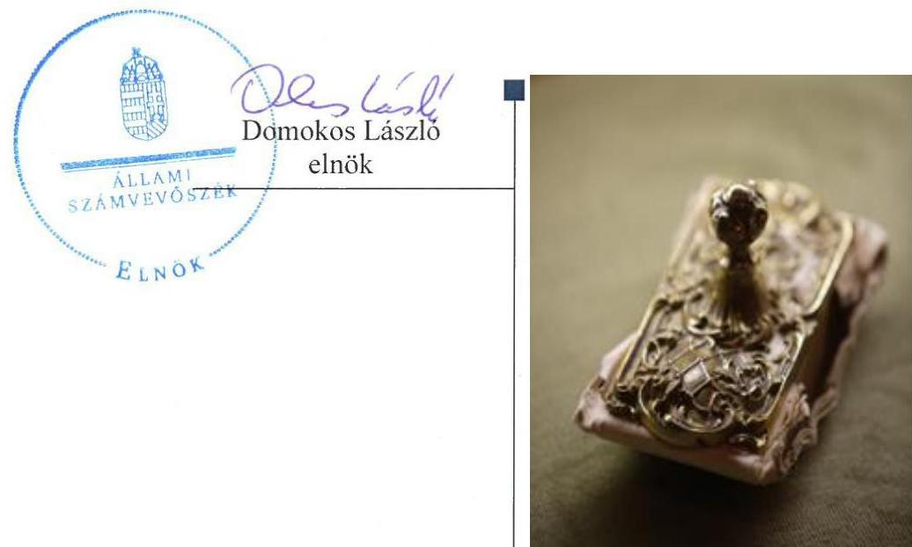
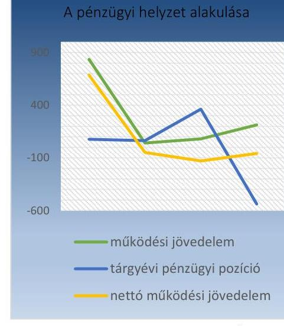
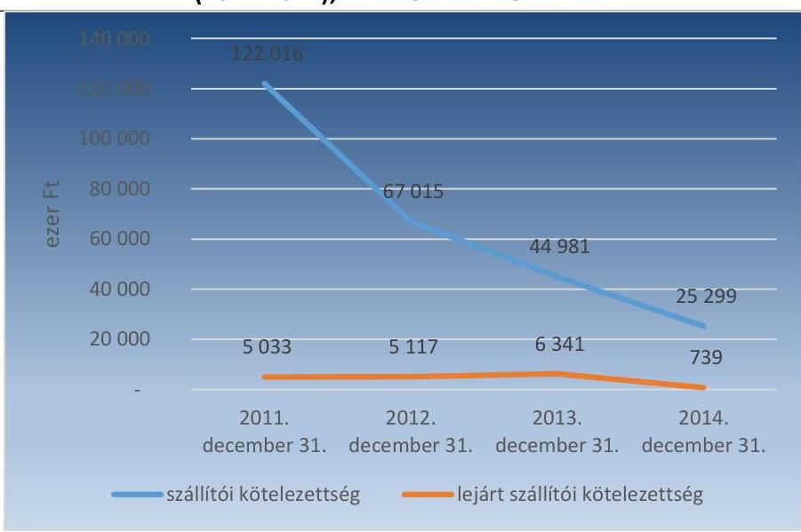
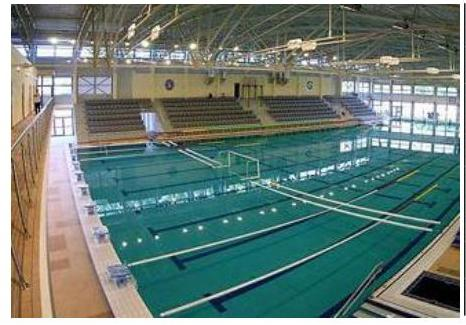
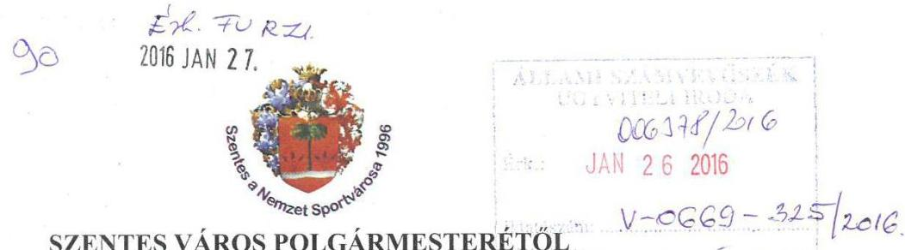
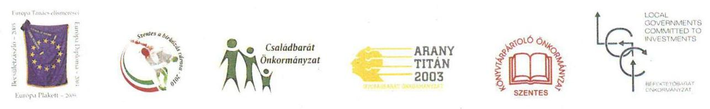
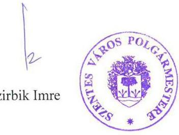
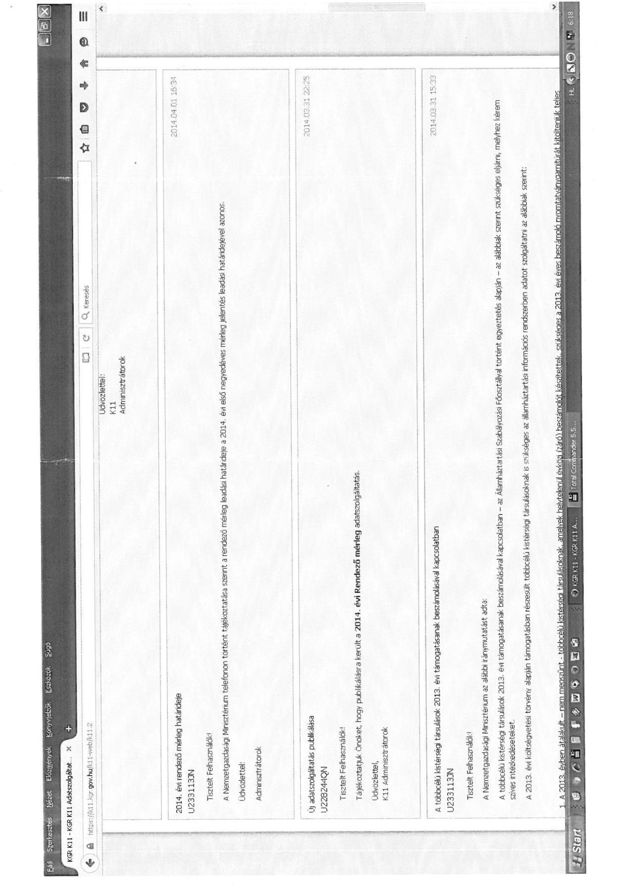
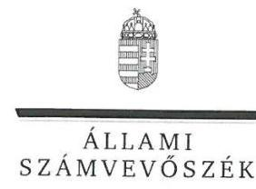
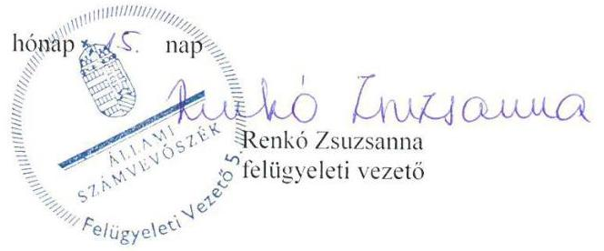

# Jelentés 

## Önkormányzatok pénzügyi és vagyongazdálkodása

Az önkormányzatok pénzügyi és vagyongazdálkodása megfelelőségének ellenőrzése - Szentes 2016.

---

# Jelenetés 

## Önkormányzatok pénzügyi és vagyongazdálkodása

Az önkormányzatok pénzügyi és vagyongazdálkodása megfelelőségének ellenőrzése - Szentes
2016. március hónap of. nap

---

# AZ ELLENŐRZÉST FELÜGYELTE:

- RENKŐ ZSUZSANNA felügyeleti vezető
- AZ ELLENŐRZÉST VEZETTE ÉS A VÉGREHAJTÁSÁÉRT FELELŐS:
  - DR. TIMÁR BALÁZS ellenőrzésvezető
  - A PROGRAM ÖSSZEÁLLÍTÁSÁÉRT FELELŐS:
    - LAJTERNÉ HUDÁK MAGDOLNA osztályvezető

**IKTATÓSZÁM:** V-0669-333/2016

**TÉMASZÁM:** 32

**ELLENŐRZÉS-AZONOSÍTÓ SZÁM:** V0715

Jelentéseink az Országgyűlés számítógépes hálózatán és az Interneten a www.asz.hu címen is olvashatóak.

---

# TARTALOMJEGYZÉK 

■ ÖSSZEGZÉS ..... 5
■ AZ ELLENŐRZÉS CÉLJA ..... 7
■ AZ ELLENŐRZÉS TERÜLETE ..... 8
■ AZ ELLENŐRZÉS HÁTTERE, INDOKOLTSÁGA ..... 9
■ FÓKUSZKÉRDÉSEK ..... 10
■ ELLENŐRZÉS HATÓKÖRE ÉS MÓDSZEREI ..... 12
■ MEGÁLLAPÍTÁSOK ..... 15
■ JAVASLATOK ..... 38
■ MELLÉKLETEK ..... 41
I. Sz. melléklet: Értelmező szótár. ..... 41
II. Sz. melléklet: Az önkormányzat feladatellátásában részt vevők és azok változása az ellenőrzött időszakban ..... 45
III. Sz. melléklet: Az eszközök és források alakulása kiemelt mérlegsoronként a 2011- 2013. években ..... 46
IV. Sz. melléklet: A pénzügyi egyensúlyi helyzet CLF módszer szerinti értékelése a 2011- 2014. években ..... 47
V. Sz. melléklet: kimutatás az önkormányzat tulajdonban lévő részesedésekről ..... 48
■ FÜGGELÉK: ÉSZREVÉTELEK ..... 49
■ RÖVIDÍTÉSEK JEGYZÉKE ..... 61

---

.

---

# ÖSSZEGZÉS 

Az Állami Számvevőszék (ÁSZ) Szentes Város Önkormányzata pénzügyi és vagyongazdálkodását 2011. január 1. és 2014. december 31. közötti időszakra vonatkozóan ellenőrizte. A pénzügyi gazdálkodás szabályozottsága a feltárt hiányosságok miatt nem teljes körűen felelt meg az előírásoknak. A vagyongazdálkodás szabályozottsága megfelelő volt. A pénzügyi egyensúly a 2011. évben biztositott volt, a 2012-2014. években nem állt fenn. Az Önkormányzat ${ }^{1}$ vagyona az ellenőrzött időszakban jelentősen nem változott.

## Az ellenőrzés társadalmi indokoltsága

Az ÁSZ a stratégiájában hangsúlyos szerepet szán annak, hogy szilárd szakmai alapon álló, értékteremtő ellenőrzéseivel előmozdítsa a közpénzügyek átláthatóságát, rendezettségét és javaslataival a közpénzek és a közvagyon szabályos, gazdaságos, hatékony és eredményes felhasználását segítse. Az ÁSZ stratégiájában célul tűzte ki, hogy az önkormányzatok ellenőrzése során értékeli azok pénzügyi-gazdasági helyzetét, a kockázatokat feltárja, és az ellenőrzések helyszíneit kockázatelemzés alapján választja ki. Az ÁSZ szerepet vállal a korrupció és a csalás elleni küzdelemben. Közreműködik a korrupciós kockázatok és a korrupció elleni fellépés hatékony és eredményes eszközeinek beazonosításában, alkalmazásában, továbbá használatuk elterjesztésében, az integritás alapú közigazgatási kultúra kialakításában.

## Főbb megállapítások, következtetések, javaslatok

A Számviteli Politika, a leltározási szabályzat és a számlarend nem felelt meg teljes körűen a jogszabályban előírtaknak, továbbá nem aktualizálták az értékelési szabályzatot, ezáltal nem támogatták maradéktalanul a számviteli elszámolások végrehajtását. A vagyongazdálkodás szabályainak kialakítása megfelelt a jogszabályi előírásoknak.

A 2012. évben a költségvetési tervezés során a beruházási, felújítási kiadásokat nem a jogszabályban előírt módon határozták meg.

Az előirányzat-módosítások és azok számviteli nyilvántartása megfelelt az előírásoknak.
A gazdálkodási jogköröket gyakorlók személye, aláírás-mintája naprakész nyilvántartásának hiányában a jogkör gyakorlására vonatkozó jogosultság nem volt átlátható, ami veszélyeztette a közpénzfelhasználás szabályosságát.

A pénzügyi egyensúly a 2012-2014. években nem volt biztosított, továbbá a likviditási terveket nem az előírásoknak megfelelően készítették el, amely kockázatot hordoz a fizetőképesség fenntartására nézve.

Az Önkormányzatnak a fizetőképesség fenntartására, pénzügyi egyensúlyi helyzetének biztosítása érdekében jogszabály alapján illetve saját hatáskörben tett intézkedései megfelelőek voltak. A fizetési kötelezettségek teljesítése részben eredeti határidőben, részben az átütemezésnek megfelelően történt, a követelések behajtása érdekében rendszeresen intézkedéseket tettek.

A gazdálkodással összefüggő, pénzügyi egyensúlyt befolyásoló kockázatok mérséklésére megfelelően működtették a kockázat-kezelési rendszert. Az adósságot keletkeztető ügyletek megkötése során az Önkormányzat a jogszabályi előírásoknak megfelelően járt el.

Az adósságkonszolidáció hozzájárult a működési feltételek javításához, azonban a számviteli elszámolásban feltárt jelentős összegű szabálytalanság miatt annak végrehajtása nem volt szabályszerű, amely befolyásolta a pénzügyi helyzet valós bemutatását. Az adósságkonszolidációval összefüggő önkormányzati feladatok végrehajtása során a számviteli nyilvántartásokban, 2013. évben
— a pénzforgalommal bonyolított 1676 millió Ft adósságátvállalásból csak 9 millió Ft jelent meg egyéb felhalmozási célú központi támogatásként az éves beszámolóban.

---

- a pénzforgalom nélkül konszolidált 935 millió Ft kötelezettségek közült történt kivezetése bizonylatának megőrzéséről nem gondoskodott.
A vagyongazdálkodás keretében az ingatlanvagyon 2014. évi nyilvántartásának ingatlanvagyon-kataszter adataival, valamint a földhivatali nyilvántartással való egyezőségét a megfelelő dokumentáció hiánya miatt nem biztosították.

A leltározást és a selejtezést az előírásoknak megfelelően végezték, azonban a mérlegtételek leltárral történő alátámasztása nem volt teljes körű, amely kiemelt kockázatot jelent a közfeladat ellátásához rendelkezésre álló vagyon védelme szempontjából. Az önkormányzat tulajdonában álló ingatlanokat - a jogszabályi előírás ellenére - tételes mennyiségi felvétel helyett egyeztetetéssel leltározták.

Az önkormányzati vagyont üzemeltetőkkel kötött, az ellenőrzés alá vont szerződések és a térítésmentes vagyonátadás szerződésének mellékletei hiányoztak, amelyek hiányában nem volt biztosított a vagyonváltozások elszámolásának átláthatósága. A vagyonváltozással kapcsolatosan a tárgyi eszközök üzembe helyezésének dokumentálása, annak számviteli elszámolása szabályszerű volt, azonban a vagyonváltozások ingatlanvagyon-kataszteren történő átvezetése nem felelt meg az előírásoknak, ezáltal nem volt biztosított a vagyoni helyzetre vonatkozó nyilvántartások teljes megbízhatósága. A vagyonértékesítés és bérbeadás nyilvántartása, továbbá a vagyonértékesítés döntései során nem tartották be a jogszabályokban és a belső szabályozásban foglaltakat, amely kiemelt kockázatot jelentett a közvagyon védelme szempontjából. A megkötött szerződésekben a késedelmi kötbér érvényesítéséről és szerződéskötéskor az átláthatóság követelményeinek érvényesüléséről nem gondoskodtak, amely kockázatot jelentett a vagyonnal való gazdálkodás biztonsága szempontjából.

A gazdasági társaságok tulajdonosi felügyelete nem teljes körűen felelt meg az előírásoknak. Az ellenőrzött időszakban az önkormányzat résztulajdonában álló gazdasági társaságok tagjai átlátható szervezetekre vonatkozó előírásoknak való megfelelőségének felülvizsgálata nem történt meg, amely kockázatot jelentett a gazdálkodás szabályszerűsége, a vagyon védelme szempontjából.

A gazdasági társaságok veszteséges gazdálkodásának elkerülése érdekében a Képviselő-testület nem tette meg minden esetben a szükséges intézkedéseket, mivel nem élt a kisebbségi tag számára jogszabály által biztosított jogaival a gazdasági társaságok veszteségei miatti tőke- és vagyonvesztése elkerülése érdekében, amellyel veszélyeztette a közvagyonnal való felelős gazdálkodást. Az Önkormányzat egy alkalommal olyan gazdasági társaság részére történő pótbefizetésről határozott, ahol ezt a lehetőséget az alapító okirat nem tartalmazta, a szabálytalanság a vagyon védelme szempontjából kockázatot hordozott.

A veszteséges gazdasági társaságok részére több alkalommal, jelentős összegben, biztosíték kikötése nélkül és a visszafizetés kockázata mellett nyújtott tagi kölcsön magas kockázatot jelentett a vagyonvesztésre. Egy alkalommal a Képviselő-testület jóváhagyása nélkül utalták át a tagi kölcsön összegét.

A részesedések számviteli nyilvántartása, év végi értékelése, az értékvesztés elszámolása nem felelt meg az előírásoknak, így az Önkormányzat mérlegeiben bemutatott vagyoni helyzete nem a valóságot tükrözte, ezért a beszámolók nem támogatták az átláthatóság, a közvagyon védelme érvényesülését.

Az erőforrásokkal való szabályszerű gazdálkodáshoz szükséges követelményeket kialakították, a Szociális Szolgáltatástervezési Koncepció aktualizálása azonban elmaradt, ez kockázatot jelentett a felelős gazdálkodás szempontjából. Az erőforrásokkal való hatékony gazdálkodáshoz szükséges követelményeket nem határozták meg.

Az Önkormányzat önértékelése szerint az integritás szemlélet érvényesítése érdekében intézkedett, azonban az ellenőrzés során tapasztalt hiányosságok és szabálytalanságok miatt nem támogatta a felelős, átlátható gazdálkodást, az integritás szemlélet fejlesztendő.

---

# AZ ELLENŐRZÉS CÉLJA 

## Szentes Város Önkormányzata pénzügyi és vagyongazdálkodása megfelelőségének ellenőrzése

AZ ELLENŐRZÉS CÉLJA az önkormányzat pénzügyi és vagyoni helyzetének, a gazdálkodás szabályosságának megítélése a költségvetési tervezés, a pénzügyi egyensúly megteremtése, az éves költségvetési beszámolás, a vagyongazdálkodás, a vagyon számbavétele, a gazdasági események elszámolása és a pénzgazdálkodás szabályszerűsége alapján; valamint annak értékelése, hogy kialakított-e az önkormányzat az erőforrásokkal való szabályszerű és hatékony gazdálkodáshoz szükséges követelményeket, megvalósította-e azok számon kérését, ellenőrzését.

---

# **AZ ELLENŐRZÉS TERÜLETE**

## **Szentes Város Önkormányzata**

Szentes a Dél-Alföldön, Csongrád megye északi részén a Tiszától keletre fekszik, a Kurca-folyó szeli ketté. A város Európában egyedülálló kincse a 32 db termálkút. Népességszáma 2014. január 1-jén 28 190 fő volt.

A Képviselő-testület^{2} tagjainak száma 15 fő volt, munkájukat öt állandó bizottság segítette. A 2014. októberi választásokat követően az állandó bizottságok száma hatra módosult. Az ellenőrzött időszakban a polgármester^{3} és a jegyző^{4} személye nem változott.

Az önállóan működő és gazdálkodó költségvetési intézmények 2011. évi száma 9-ről 2014. év végére 6-ra csökkent. Az Önkormányzat feladatellátásában bekövetkezett változásokat a II. sz. melléklet szemlélteti.

A Polgármesteri hivatal^{5} átlag létszáma 2011. évben 120,5 fő, 2014. évben 84,0 fő volt.

2014. december 31-én öt többségi tulajdoni hányadú gazdasági társaságban rendelkezett részesedéssel az Önkormányzat. A társaságok könyvtárszolgáltatással, távhőszolgáltatással, ingatlankezeléssel, az uszoda működtetésével, települési hulladékgyűjtéssel kapcsolatos feladatokat láttak el. A gazdálkodásra jellemző főbb adatokat az 1. számú táblázat mutatja be.

1. táblázat

|  GAZDÁLKODÁSI ADATOK 2011.12.31. - 2014.12.31. (MILLIÓ FT) |  |  |  |  |   |
| --- | --- | --- | --- | --- | --- |
|  Év | Teljesített költségvetési bevételek | Teljesített költségvetési kiadások | Eszközvagyon | Követelések | Kötelezettségek  |
|  2011 | 8 070,5 | 8 226,2 | 34 620,5 | 345,3 | 5 804,5  |
|  2012 | 6 789,1 | 7 334,8 | 34 123,0 | 246,4 | 5 883,9  |
|  2013 | 5 694,2 | 5 845,8 | 34 449,2 | 252,0 | 3 532,7  |
|  2014 | 9 014,4 | 5 888,6 | 33 832,3 | 508,2 | 289,3  |

*Forrás: Önkormányzat beszámolói*

---

# AZ ELLENŐRZÉS HÁTTERE, INDOKOLTSÁGA 

Az államháztartás önkormányzati alrendszerének közpénz felhasználása, az önkormányzatok által ellátott közfeladatok és önként vállalt feladatok sokrétüsége, valamint a feladat ellátásához rendelt vagyon nagyságrendje indokolja, hogy az ÁSZ ellenőrzéseket folytasson a pénzügyi és vagyongazdálkodás területén.

## Az ellenőrzés várhatóan több szinten hasznosul

AZ ÁLLAMHÁZTARTÁS ÖNKORMÁNYZATI ALRENDSZERÉNEK közpénz felhasználása, az önkormányzatok által ellátott közfeladatok és önként vállalt feladatok sokrétűsége, valamint a feladat ellátásához rendelt vagyon nagyságrendje indokolja, hogy az ÁSZ ellenőrzéseket folytasson a pénzügyi és vagyongazdálkodás területén. Az ÁSZ az önkormányzatok ellenőrzését a pénzügyi helyzet megítélésével indította el 2011-ben, és a nagy vagyonnal rendelkező, magas kockázatú önkormányzatok esetében a vagyongazdálkodás ellenőrzésével folytatta. Az elmúlt időszakban az önkormányzati gazdálkodás kockázatai beépítésre kerültek az ellenőrzött önkormányzatok kiválasztási rendszerébe. Az elmúlt négy év ellenőrzéseinek tapasztalatai megmutatták, hogy továbbra is indokolt az egyrészt elemző, értékelő, a pénzügyi helyzet kockázatát is minősítő, másrészt a pénzügyi és vagyongazdálkodási tevékenység szabályszerűségét értékelő ÁSZ ellenőrzések folytatása.

ELLENŐRZÉSEINK HOZZÁJÁRULNAK az önkormányzatok pénzügyi helyzetének pontosabb megítéléséhez azáltal, hogy a pénzügyi helyzetet a vagyoni helyzettel együtt értékeljük, amelyek együttesen határozzák meg az önkormányzatok fejlesztési képességét és gyakorolnak hatást a feladatellátásra. Feltárjuk az önkormányzati gazdálkodást meghatározó szabályozások összhangjának hiányosságait, a szabályozással nem érintett gazdálkodási területeket, valamint a pénzügyi és vagyongazdálkodás esetleges szabálytalanságait. Beazonosítjuk a pénzügyi egyensúlyi helyzet megbomlásakor a kiváltó okok mellett azok kialakulását is. Bemutatjuk az adósságkonszolidáció önkormányzat általi végrehajtásának szabályszerűségét, az adósságállomány újratermelődésének elkerülése érdekében hozott intézkedéseket. Az ellenőrzés kitér a gazdálkodáshoz kapcsolódó integritás kontrollok meglétének és múködésének ellenőrzésére is.

A pénzügyi és vagyongazdálkodás szabályszerűségének ellenőrzése által a megállapításokkal összefüggő javaslatok hasznosítása esetén javul az önkormányzat gazdálkodásának szabályozottsága, valamint a „jó gyakorlatok" terjesztésén keresztül azok az önkormányzatok is átvehetik a pozitív példákat, ahol nem végez ellenőrzést az ÁSZ. Ellenőrzéseink eredményeképpen javaslatokat fogalmazhatunk meg az önkormányzatok pénzügyi egyensúlya fenntartásával kapcsolatos problémák rendszerszemléletű kezelésére, felszámolására.

---

# FÓKUSZKÉRDÉSEK 

1.     - A pénzügyi és vagyongazdálkodás szabályozása megfelelt-e az elöírásoknak?
2.     - A pénzügyi és vagyongazdálkodás szabályozása megfelelt-e az elöírásoknak?
3.     - A költségvetés tervezés, az éves költségvetési beszámolás és a pénzgazdálkodás szabályszerü volt-e?
4.     - Biztosított volt-e a pénzügyi egyensúly, az adósságot keletkeztető ügyletek vállalására a jogszabályi elöírásoknak megfelelően került sor?
5.     - A vagyonnyilvántartás, a költségvetési beszámoló mérlegének alátámasztottsága megfelelt-e a jogszabályokban és a belső szabályzatokban elöírt követelményeknek?
6. Szabályszerüek voltak-e a vagyon összetételének és nagyságának változását eredményező döntések és azok végrehajtása?
7. Felelősen gazdálkodott-e az önkormányzat a tartós részesedéseivel, élt-e tulajdonosi jogaival, teljesítette-e tulajdonosi kötelezettségeit?

---

8.- Az önkormányzat az erőforrásokkal való szabályszerű gazdál- kodáshoz szükséges követelményeket kialakította-e, betartásu- kat számon kérte-e, ellenőrizte-e?
9.- Az önkormányzat az erőforrásokkal való hatékony gazdálko- dáshoz szükséges követelményeket kialakította-e, betartásukat számon kérte-e, ellenőrizte-e?
10. Az önkormányzat intézkedett-e az integritás szemlélet érvényesitése érdekében?

---

# ELLENŐRZÉS HATÓKÖRE ÉS MÓDSZEREI 

## Az ellenőrzés típusa

Megfelelőségi ellenőrzés

## Az ellenőrzött időszak

A 2011. január 1-je és 2014. december 31-e közötti időszak. Az ellenőrzött időszakba beleértendő az ellenőrzött évekre vonatkozó tervezési feladatok, beszámolási kötelezettségek teljesítésének időszaka is. A vagyonnyilvántartások egyezőségét, a leltározás, selejtezés folyamatát a 2014. évre vonatkozóan értékeltük.

## Az ellenőrzés tárgya

Az önkormányzat pénzügyi és vagyongazdálkodása, a pénzügyi egyensúly megteremtése, a tulajdonosi és irányító szervi feladatok ellátása, az integritás szemlélet érvényesülése.

Az ellenőrzés kiterjed minden olyan körülményre és adatra, amely az ÁSZ jogszabályban meghatározott feladatainak teljesítéséhez, valamint a program végrehajtása folyamán felmerült újabb összefüggések feltárásához szükséges.

## Az ellenőrzött szervezet

Szentes Város Önkormányzata

## Az ellenőrzés jogalapja

Az ellenőrzés jogszabályi alapját az Állami Számvevőszékről szóló 2011. évi LXVI. törvény 1. § (3) bekezdésének, az 5. § (2)-(6) bekezdéseinek, valamint az államháztartásról szóló 2011. évi CXCV. törvény 61. § (2) bekezdésének előírásai képezik.

## Az ellenőrzés módszerei

Az ellenőrzést a nemzetközi standardokat irányadónak tekintve az ellenőrzési program kérdései, az adott időszakban hatályos jogszabályok, a szakmai szabályok és módszertanok figyelembe vételével végeztük.

---

A gazdálkodás hibáinak kijavítására, a közpénzekkel való felelős gazdálkodás segítésére irányuló javaslatok kidolgozásakor a hatályos jogszabályok voltak az irányadóak.

Az ellenőrzés ideje alatt az ellenőrzött szervezettel történő kapcsolattartást az ÁSZ SZMSZ ${ }^{\circledR}$-ének vonatkozó előírásai alapján biztosítottuk.

Az ellenőrzési kérdések megválaszolásához szükséges bizonyítékok megszerzése az ellenőrzött által rendelkezésre bocsátott dokumentumokra, adatokra alapozva megfigyelés, szemle (szemrevételezés), kérdésfeltevés (információkérés), mintavételezés, valamint elemző eljárással történt.

Az ellenőrzési bizonyítékként felhasználható adatforrások közé tartoztak egyrészt a szakmai program részletes szempontjainál felsorolt adatforrások, másrészt minden - az ellenőrzés folyamán feltárt, az ellenőrzés szempontjából releváns információt tartalmazó - dokumentum.

Az ellenőrzés lefolytatásához az Önkormányzat a tanúsítványok elektronikus kitöltésével, valamint az ÁSZ által kért dokumentumok elektronikus megküldésével szolgáltatott adatokat. Az így rendelkezésre bocsátott adatok, információk, a tanúsítványok adatai valódiságának kontrollja az ellenőrzés keretében történt.

Az ellenőrzést az Önkormányzat múködésével kapcsolatos feladatokat ellátó Polgármesteri hivatalban végezzük. Az Önkormányzat az intézményei és gazdasági társaságai ellenőrzéssel érintett dokumentumait, tanúsítványait a Polgármesteri hivatal útján bocsátotta az ellenőrzés rendelkezésére.

A pénzügyi és vagyongazdálkodás szabályozottságát az Önkormányzat rendeletei, határozatai, illetve a 2011. évben a Polgármesteri hivatal, a 2012. évtől az Önkormányzat (mint önálló éves költségvetési beszámolót készítő szerv) és a Polgármesteri hivatal belső szabályozásai alapján értékeltük. A költségvetési tervezési, végrehajtási és beszámolási feladatok ellenőrzése, a pénzügyi egyensúly, a vagyonnyilvántartás, a mérleg alátámasztottságának megítélése az önkormányzat összevont adatai alapján történt. A leltározási, értékelési és selejtezési folyamat szabályszerűségére a Polgármesteri hivatal által végzett 2014. évi leltározási folyamat ellenőrzése alapján tettünk megállapításokat.

Az Önkormányzat vagyonváltozást eredményező döntéseinek és azok végrehajtásának ellenőrzésére irányított, valamint véletlen mintavételi eljárással és tételes ellenőrzéssel került sor. A pénzforgalmi tételek ellenőrzése véletlen mintavételi eljárással - 2011. évben a Polgármesteri hivatal, 2012. évtől a Polgármesteri hivatal és az Önkormányzat (mint önálló éves költségvetési beszámolót készítő költségvetési szerv) főkönyvi állományából - kiválasztott minta alapján történt. Kockázat alapú mintavétel alapján az ellenőrzött időszakban hatályos öt legmagasabb könyvszerinti értéket képviselő üzemeltetési szerződést és az öt-öt legnagyobb összegű követelés elengedést és behajthatatlan követelés leírást ellenőriztük. Arányos rétegzett minta vétellel, 50-50-50 elemszámmal ellenőriztük a beruházása-kat-felújításokat, a vagyonértékesítést és a vagyon bérbeadással történő hasznosítását.

A részesedések értékelését tételesen ellenőriztük. Az ellenőrzött időszakban térítésmentes átadásra egy, vagyonkezelési szerződés megkötésére két alkalommal került sor, ezért ezek ellenőrzése szintén tételesen történt.

---

A beruházások és felújítások elszámolásának, valamint a kapcsolódó kifizetések esetében a gazdálkodási jogkörök gyakorolásának és a vagyon bérbeadással történő hasznosításának szabályszerűségét véletlen mintavétellel ellenőriztük. A vagyonértékesítéseket teljes körűen ellenőriztük.

A véletlen minta alapján a sokaságra vonatkozó hibaarányt becsültük. „Megfelelőnek" értékeltük az ellenőrzött területet, amennyiben 95\%-os bizonyossággal a teljes sokaságban a hibaarány legfeljebb 10\%, „részben megfelelőnek" értékeltük, ha a hibaarány felső határa 10-30\% között volt, „nem megfelelőnek" pedig akkor, ha a mintavételi eredmények alapján a sokaságbeli hibaarány felső határa meghaladta a 30\%-ot.

Az ellenőrzési kérdésekre adott válaszok alapján értékeltük, hogy az Önkormányzat pénzügyi gazdálkodása megfelelt-e a jogszabályokban és a belső szabályzatokban meghatározottaknak, biztosított volt-e a pénzügyi egyensúly. Értékeltük a vagyongazdálkodás szabályszerűségét, a vagyonváltozást eredményező döntések és a tulajdonosi jogok gyakorlása szabályszerűségét. Értékelést adunk arról, hogy az Önkormányzatnál kialakították$\cdot$ e az erőforrásokkal való szabályszerű és hatékony gazdálkodáshoz szükséges követelményeket, megvalósították-e azok számon kérését, ellenőrzését. Az integritás szemlélet érvényesülésének értékelése az önkormányzat által önbevallással kitöltött tanúsítvány alapján történt.

---

# 1. A pénzügyi és vagyongazdálkodás szabályozása megfelelt-e az előírásoknak? 

Összegző megállapítás

### 1.1. számú megállapítás

A pénzügyi gazdálkodás szabályozottsága körében feltárt hiányosságok miatt a szabályszerű és átlátható múködés nem volt teljes körűen biztosított. A vagyongazdálkodás szabályozottsága megfelelt az előírásoknak.

A Számviteli Politika, a leltározási szabályzat és a számlarend nem felelt meg teljes körűen a jogszabályban előírtaknak, továbbá nem aktualizálták az értékelési szabályzatot, ezáltal nem támogatták maradéktalanul a számviteli elszámolások végrehajtását.

Az Önkormányzat és szervei rendelkeztek a múködésük részletes szabályozását tartalmazó SZMSZ7-szel.

A Számviteli politikát ${ }_{1,2}{ }^{8}$, annak keretében a leltározási ${ }^{9}$-, az értékelési szabályzatot ${ }_{1,2}{ }^{10}$, és a pénzkezelési szabályzatot ${ }_{1,2}{ }^{11}$ a helyi sajátosságoknak megfelelően elkészítették. A számviteli szabályozás körében az alábbi hiányosságok mutatkoztak:

Nem rendelkeztek az önköltségszámítás rendjére vonatkozó szabályzattal a 2011-2013. években, megsértve ezáltal a Számv. tv. ${ }^{12} 14 . \S$ (5) bekezdésének c) pontját.

- A 2014. évtől hatályos számviteli politika ${ }_{2}$ a Számv. tv. 14. § (4) bekezdésében foglaltak ellenére nem tartalmazta azokat a szabályokat, előírásokat, módszereket, amelyekkel meghatározható, hogy mit tekintenek a számviteli elszámolás, az értékelés szempontjából lényegesnek, nem lényegesnek.
- A leltározási szabályzat az ellenőrzési időszak egészében nem volt teljes körű, mert nem tartalmazta a leltározás módját a könyvviteli mérlegben értékkel nem szereplő, használt és használatban levő készletekre, kis értékű immateriális javakra, tárgyi eszközökre vonatkozóan az Áhsz ${ }_{1}{ }^{13} 37 . \S$ (6) bekezdésének, valamint a 2014. évtől az Áhsz ${ }_{2} 22 . \S$ (2) b) pontjának előírása ellenére.
- Az ellenőrzési időszakot megelőzően kiadott értékelési szabályzatot ${ }_{1}$ a Számv. tv. 14. § (11) bekezdésének előírása ellenére a törvénymódosításokat követően nem aktualizálták.
- A számlarend ${ }^{14}$ a teljes ellenőrzési időszakban nem felelt meg a Számv. tv. 161. § (2) bekezdés b) pontjában foglaltaknak, mert nem tartalmazta a számla értéke növekedésének, csökkenésének jogcímeit, a számlát érintő gazdasági eseményeket, továbbá az adott számla más számlákkal való kapcsolatát.
A bizonylatokra vonatkozó előírásokat a pénzkezelési szabályzat és a gazdálkodási szabályzat ${ }^{15}$ tartalmazta.

---

A jegyző szabályozta a gazdálkodás, a beszerzések ${ }^{16}$-, közbeszerzések ${ }^{17}$ lebonyolításának, a bel- és külföldi kiküldetések ${ }^{18}$ elrendelésével, elszámolásával kapcsolatos kérdéseket, a gépjárművek igénybevételének és használatának ${ }^{19}$ rendjével kapcsolatos előírásokat, a közérdekű adatok megismerésére irányuló kérelmek intézésének, továbbá a kötelezően közzéteendő adatok nyilvánosságra hozatalának rendjét ${ }^{20}$.

A pénzügyi kihatással bíró, jogszabályban nem szabályozott kérdések közül a jegyző nem rendezte
—_ a 2011-2013. években a reprezentációs ${ }^{21}$ kiadások felosztását, elszámolását, a 2011. évben hatályos Ámr. ${ }^{22} 20 . \S$ (3) bekezdése f) pontja és a 2012. évtől hatályos Ávr. ${ }^{23} 13 . \S$ (2) bekezdése e) pontja előírásának ellenére (2014. évben az Önkormányzat rendelkezett hatályos reprezentációs szabályzattal);
—_ 2011-2012. években a vezetékes telefonok ${ }^{24}$ - használatát az Ámr. 20. § (3) bekezdése h) pontjának és az Ávr. 13. § (2) bekezdése g) pontjának rendelkezése ellenére (2013. február 1-jétől az Önkormányzat rendelkezett a telefonok használati rendjéről szóló szabályzattal).
A kontrolltevékenység részeként biztosították a folyamatba épített, előzetes, utólagos és vezetői ellenőrzést, melynek eljárásrendjét a FEUVE szabályzat ${ }^{25}$ tartalmazta.

# 1.2. számú megállapítás 

## A vagyongazdálkodás szabályainak kialakítása megfelelt a jogszabályi előírásoknak.

Vagyongazdálkodási rendeletében ${ }^{26}$ a Képviselő-testület az önkormányzati vagyonnal történő gazdálkodás szabályait a teljes vagyoni körre kiterjedően meghatározta. Kijelölte az önkormányzati feladatellátást biztosító törzsvagyont, elkülönítette a korlátozottan forgalomképes, és a forgalomképtelen vagyonelemeket. A jogszabályi változásokat követően a szükséges felülvizsgálatokat az előírt határidőben teljesítette.

A Képviselő-testület a vagyongazdálkodási rendeletben meghatározta a vagyonkezelői jog megszerzésének, gyakorlásának, ellenőrzésének részletes szabályait, a tulajdonosi jogainak, érdekeinek védelmét szolgáló garanciális elemeket. A vagyongazdálkodási rendelet tartalmazta azt az értékhatárt, amely felett csak nyilvános pályázat útján lehet a vagyont hasznosítani.

---

# 2. A költségvetés tervezés, az éves költségvetési beszámolás és a pénzgazdálkodás szabályszerű volt-e? 

Összegző megállapítás

2.1. számú megállapítás

A gazdálkodási jogkörök nyilvántartásával kapcsolatban feltárt hiányosságok miatt kockázat jelentkezett a közpénzfelhasználás szabályszerűsége szempontjából.

A 2012. évben a költségvetési tervezés során a beruházási, felújítási kiadásokat nem a jogszabályban előírt módon határozták meg.

A költségvetés tervezése során a költségvetési koncepciókban a költségvetési törvényekben előírtakat figyelembe vették, számításokkal megalapozták. A 2012. évi felhalmozási kiadások tervezése során - megsértve az Ámr. 35. § (1) bekezdésében foglaltakat, mely szerint a helyi önkormányzat költségvetési koncepcióját a helyben képződő tervévi bevételek, valamint az ismert kötelezettségek figyelembe vételével állítja össze - nem csak a költségvetési évben teljesülő beruházási és felújítási kiadások előirányzott öszszegét vették figyelembe, hanem a teljes beruházások, felújítások összegét, bevételi oldalon pedig a teljes elnyert támogatási összeget pályázati finanszírozás esetén.

A Képviselő-testület a költségvetési koncepciót a Pénzügyi Bizottság véleményének ismeretében fogadta el.

A költségvetési rendelettervezetek tartalmazták a költségvetési bevételeket és költségvetési kiadásokat előirányzat-csoportok, kiemelt előirányzatok, kötelező és önként vállalt feladatok szerinti bontásban, a költségvetési maradvány igénybevételét, az adósságot keletkeztető ügylet várható összegét, az önkormányzat irányítása alá tartozó költségvetési szervek engedélyezett létszámát. Elkülönítetten szerepeltek az évközi többletigények, valamint az elmaradt bevételek pótlására szolgáló általános tartalékok és céltartalékok. A Képviselő-testület a jogszabályi előírásoknak megfelelően rendeletben állapította meg a költségvetést.

Az elemi költségvetést határidőben küldték meg a Kincstár területi szervéhez.

Az intézmények közül a - legmagasabb költségvetési főösszeggel rendelkező - Városellátó Intézmény költségvetése számításokkal megalapozottan került megtervezésre, Polgármesteri hivatal általi felülvizsgálata megtörtént.
2.2. számú megállapítás

Az előirányzat-módosítások és azok számviteli nyilvántartása öszszességében megfelelt az előírásoknak, 2011-2014 között a kiadások és bevételek az előirányzathoz képest alacsonyabb összegben teljesültek.

Az előirányzatok átcsoportosítására vonatkozó döntéseket az arra jogosult Képviselő-testület hozta meg, kellően részletes információk birtokában. Az előirányzat módosításokra-átcsoportosításokra évközben, negyedévente került sor, utolsó alkalommal az éves költségvetési beszámoló elkészítésekor. A bevételi és kiadási előirányzatok módosításának nyilvántartásba vétele és elszámolása megfelelt az előírásoknak.

---

Az Önkormányzat a jóváhagyott összes bevételi és kiadási előirányzatain belül gazdálkodott.

Az elfogadott kiemelt kiadási előirányzatokat nem lépte túl, a működési kiadások csökkenését a feladatellátásban bekövetkezett változást - az általános iskolai oktatás, alapfokú művészetoktatás, a tűzoltóság, az okmányirodai feladatok átadása - a felhalmozási kiadásoknál tapasztalható jelentős alulteljesítést a tervezési gyakorlat okozta.

A módosított kiadási előirányzatokat, azok teljesülését és ezek százalékos arányát a 2. táblázat tartalmazza.
2. táblázat

| A KIADÁSI ELŐIRÁNYZATOK TELJESÍTÉSE (MILLIÓ FT) |  |  |  |  |
| :--: | :--: | :--: | :--: | :--: |
|  | Megnevezések | Működési | Felhalmozás   Kiadások | Kölségvetési |
| 2011 | Módosított ei. | 7123 | 5539 | 12663 |
|  | Teljesítés | 6192 | 1799 | 7991 |
|  | Teljesítés \%-a | 86,9\% | $32,5 \%$ | $63,1 \%$ |
| 2012 | Módosított ei. | 6373 | 4719 | 11093 |
|  | Teljesítés | 5503 | 1649 | 7152 |
|  | Teljesítés \%-a | 86,3\% | $34,9 \%$ | $64,5 \%$ |
| 2013 | Módosított ei. | 4611 | 5874 | 10485 |
|  | Teljesítés | 4346 | 1551 | 5897 |
|  | Teljesítés \%-a | 94,3\% | 26,4\% | 56,2\% |
| 2014 | Módosított ei. | 4633 | 7644 | 12278 |
|  | Teljesítés | 4320 | 4923 | 9243 |
|  | Teljesítés \%-a | 93,2\% | 64,4\% | 75,3\% |

A módosított bevételi előirányzatokat, teljesülését és ezek százalékos arányát a 3. táblázat tartalmazza.
3. táblázat

| A BEVÉTELI ELŐIRÁNYZATOK TELJESÍTÉSE (MILLIÓ FT)) |  |  |  |  |
| :--: | :--: | :--: | :--: | :--: |
|  | Megnevezések | Múködési | Felhalmozás   bevételi | Költségvetési |
| 2011 | Módosított ei. | 7123 | 5539 | 12663 |
|  | Teljesítés | 7208 | 1641 | 8850 |
|  | Teljesítés \%-a | 101,2\% | 29,6\% | 69,9\% |
| 2012 | Módosított ei. | 6373 | 4719 | 11093 |
|  | Teljesítés | 6368 | 1547 | 7916 |
|  | Teljesítés \%-a | 99,9\% | 32,8\% | 71,4\% |
| 2013 | Módosított ei. | 4611 | 5874 | 10485 |
|  | Teljesítés | 4710 | 1615 | 6325 |
|  | Teljesítés \%-a | 102,1\% | 27,5\% | 60,3\% |
| 2014 | Módosított ei. | 5282 | 6995 | 12278 |
|  | Teljesítés | 4644 | 4987 | 9632 |
|  | Teljesítés \%-a | 87,9\% | 71,3\% | 78,5\% |

A működési bevételek esetében 2011. és 2013. évben történt túlteljesítés, mely többek között a szociális feladatokhoz év közben igénybe vehető központosított források kiutalásával, illetve az intézményi, önkormányzati pályázatokkal van összefüggésben.

---

# 2.3. számú megállapítás 

A 2012., 2014. évben a bevételi elmaradást többek között a pályázati támogatásokból származó pénzeszközök a vártnál alacsonyabb összegben történt folyósítása, az adóhatóságtól visszaigényelhető áfa alacsony teljesülése és az ellátási díjak elmaradása okozta.

## A beszámoló készítés során az Önkormányzat a jogszabályoknak megfelelően járt el.

Az Önkormányzat elemi költségvetési beszámolóját a jogszabályban meghatározott határidőre és tartalommal készítette el és nyújtott be a Kincstárnak.

A polgármester minden évben a jogszabályban meghatározott határidőig terjesztette be a Képviselő-testületnek a jegyző által készített zárszámadási rendelettervezeteket, melyekhez csatolták a jogszabályok által kötelezően előírt mellékleteket.

## 2.4. számú megállapítás

A gazdálkodási jogköröket gyakorlók személye, aláírás-mintája naprakész nyilvántartásának hiányában a jogkör gyakorlására vonatkozó jogosultság nem volt átlátható, ami veszélyeztette a közpénzfelhasználás szabályosságát.

Az ellenőrzött időszakban a pénzügyi ellenjegyzés, az érvényesítés, a teljesítésigazolás, és az utalványozás gyakorlása a felhalmozási kiadások mintatételei tekintetében nem teljes körűen felelt meg az előírásoknak. A gazdálkodási jogkört gyakorlók személyéről, aláírás mintájáról nem vezettek naprakész nyilvántartást, az Ámr. 80. § (3), valamint az Ávr. 60. § (3) bekezdésének előírása ellenére. Az ellenőrzés során tapasztalt hiányosságokat az 4. táblázat mutatja be.
4. táblázat

## GAZDÁLKODÁSI JOGKÖRÖK GYAKORLÁSÁNAK ELLENŐRZÉSE SORÁN TAPASZTALT HIÁNYOSSÁGOK

| Gazdálkodási jogkör | Megállapított szabálytalanság |
| :--: | :--: |
| 1. pénzügyi ellenjegyzés | Az Ámr. 74. § (1) és az Ávr. 55. § (1) bekezdése ellenére az ellenjegyzést a kötelezettségvállalás dokumentuma nem minden ellenőrzött tétel esetében tartalmazta, valamint az ellenjegyzést kijelölés nélkül, jogosulatlanul gyakorolták néhány alkalommal az Ávr. 55. § (1) bekezdésének és (2) bekezdése f) pontjának előírásai ellenére. |
| 2. teljesítésigazolás | Az Ávr. 57. § (4) bekezdésének előírása ellenére egyes mintatételeknél a teljesítés igazolására jogosult személyt a kötelezettségvállaló írásban nem jelölte ki. Az Ávr. 57. § (1) bekezdése ellenére a kiadások jogosságának, összegszerűségének igazolása nem mindig történt meg. |
| 3. érvényesítés | Az érvényesítő az Ámr. 77. § (1), illetve az Ávr. 58. § (1) bekezdései ellenére nem kifogásolta, hogy a kötelezettségvállalás előtt nem történt meg a pénzügyi ellenjegyzés, illetve a teljesítés igazolását nem szabályszerűen kijelölt személy végezte, és a szabálytalanságok miatt az Ávr. 58. § (2) bekezdés ellenére nem élt jelzéssel az utalványozó felé. Az ellenőrzés részére átadásra került olyan mintatétel, ahol az Ávr. 58. § (4) bekezdés előírása ellenére az érvényesítő feladatát kijelölés hiányában jogszerűtlenül látta el. |

---

# 3. Biztosított volt-e a pénzügyi egyensúly, az adósságot keletkeztető ügyletek vállalására a jogszabályi előírásoknak megfelelően került sor? 

Összegző megállapítás

A 2012-2014. években a pénzügyi egyensúly nem volt biztosított, azonban a likviditási helyzet az adósságkonszolidációt követően javult, a pénzügyi kockázatkezelési rendszert müködtették. Az adósságot keletkeztető ügylet szabályszerű vállalása hozzájárult a közfeladat biztonságos teljesítéséhez, azonban a likviditási tervek kisebb tartalmi hiányosságai és az adósságkonszolidáció számviteli nyilvántartásában feltárt jelentős összegű hiba befolyásolták a pénzügyi helyzet valóságnak megfelelő bemutatását.
3.1. számú megállapítás

A pénzügyi egyensúly a 2012-2014. években nem volt biztosított, továbbá a likviditási terveket nem az előírásoknak megfelelően készítették el, amely kockázatot hordoz a fizetőképesség fenntartására nézve.

A LIKVIDITÁSI TERVEKET az Önkormányzat kisebb hiányosságokkal szabályszerűen elkészítette és aktualizálta. A likviditási tervek tartalma nem felelt meg teljes körűen az Áht. 2 78. § (2) bekezdésében és az Ávr. 122. § (1)-(2) bekezdésében előírtaknak, mert kizárólag a várható bevételeket és a tárgyhónap vonatkozásában teljesíthető kiadásokat tartalmazták, az időszak elején rendelkezésre álló készpénz- és számlaállomány együttes összegét azonban nem.

A LIKVIDITÁSI MUTATÓK értéke alapján 2011-2012. években az összes forgóeszköz az összes rövid lejáratú kötelezettség töredékére nyújtott fedezetet. 2013-ban az adósságkonszolidáció hatására az érték 1,0 fölé emelkedett. A likviditási gyorsráta alapján a likvid eszközök - értékpapírok és pénzeszközök - csak a rövidlejáratú kötelezettségek 3-7-12\%-ra nyújtottak fedezetet 2011. január 1. - 2012. december 31. között. 2013. év végén a likvid eszközök értéke meghaladta a rövid lejáratú kötelezettségek összegét. 2014. év végén a második adósságkonszolidációt követően a rövid lejáratú kötelezettségek állománya 5,9 millió Ft, a likvid eszközök értéke 356,4 millió Ft volt. A likviditás elemzésére szolgáló mutatószámok szerint az Önkormányzat fizetőképessége a 2011-2012. évben nem volt biztosított.

A PÉNZÜGYI EGYENSÚLY a 2012-2014. években a CLF módszerrel számítva nem volt biztosított. A nettó múködési jövedelem a 2011. év pozitív összegét követően a 2012-2014. években negatív értéket vett fel, így ezekben az években képződött müködési jövedelem nem nyújtott fedezetet az adott évben esedékes hiteltörlesztésekre. A CLF módszer szerint számított mutatók alakulását a 2013. és 2014. évi állami adósságkonszolidáció nélkül a 1. ábra szemlélteti, a főbb adatokat az 5. táblázat tartalmazza.

---

1.ábra

5. táblázat

AZ ÖNKORMÁNYZAT PÉNZÜGYI HELYZETE A 2011-2014. ÉVEKBEN, MILLIÓ FT-BAN

| Megnevezés | 2011. | 2012. | 2013. | 2014. |
| :--: | :--: | :--: | :--: | :--: |
| Folyó bevételek | 7188,3 | 5973,0 | 4797,1 | 4419,7 |
| Folyó kiadások | 6351,3 | 5931,7 | 4715,7 | 4205,9 |
| Múködési jövedelem (folyó költségvetés egyenlege) | 837,0 | 41,3 | 81,4 | 213,8 |
| Felhalmozási bevételek | 875,6 | 816,2 | 887,9 | 1293,8 |
| Felhalmozási kiadások | 1868,5 | 1403,0 | 1130,1 | 1682,8 |
| Felhalmozási költségvetés egyenlege | $-992,9$ | $-586,8$ | $-242,2$ | $-389,0$ |
| Finanszírozási múveletek nélküli (GFS) pozíció | $-155,9$ | $-545,5$ | $-160,8$ | $-175,2$ |
| Finanszírozási múveletek egyenlege | 233,6 | 608,5 | 524,4 | $-211,9$ |
| Tárgyévi pénzügyi pozíció | 77,7 | 63,0 | 363,6 | $-387,1$ |
| Nettó múködési jövedelem | 686,5 | $-48,6$ | $-129,1$ | $-58,6$ |

Forrás: ÁSZ kimutatás
3.2. számú megállapítás

Az önkormányzat folyó költségvetésének egyenlege, a múködési jövedelem az ellenőrzött időszakban pozitív volt, a 2011-2014. évben összesen 1173,5 M Ft többletet mutatott. A múködőképesség megőrzésére kapott támogatás nélkül 2011-ben, 2013-ban és a 2014. évben is pozitív lett volna a múködési jövedelem, ezért ezekben az években nem jelentkezett az önkormányzatnál az ÖNHIKI támogatás által okozott bevételi kitettség. A különböző feladatátadások következtében az önkormányzat saját múködési bevételei és kiadásai is csökkenő tendenciát mutattak.

A felhalmozási költségvetés egyenlege valamennyi, az ellenőrzés alá eső évben negatív volt, mivel a felhalmozási kiadások mértéke a folyó beruházások miatt jelentősen meghaladta a felhalmozási bevételekét. „Az önkormányzat fejlesztési feladatainak többségét pályázati források bevonásával hajtotta végre, melyekhez az önerőt a saját bevételek korlátozott volta miatt hitelfelvétellel, illetve kötvénykibocsátással tudta biztosítani." (Forrás: Az Szentesi Önkormányzat 2012. évi szöveges beszámolója). Az Önkormányzatnak saját forrásait folyamatosan meghaladó beruházás-finanszírozási politikája azonban kockáztatta az eladósodást és a fizetőképesség hosszú távú fenntarthatóságát

A finanszírozási múveletek egyenlege a 2011-2013. évben pozitív egyenlegú volt, mert az önkormányzat hitelfelvétele mindhárom évben meghaladta az adott évi hiteltörlesztések összegét.

Az Önkormányzatnak a fizetőképesség fenntartására, pénzügyi egyensúlyi helyzetének biztosítása érdekében jogszabály alapján illetve saját hatáskörben tett intézkedései megfelelőek voltak. A fizetési kötelezettségek teljesítése részben eredeti határidőben, részben az átütemezésnek megfelelően történt, a követelések behajtása érdekében rendszeresen intézkedéseket tettek.

A SZÁLLÍTÓK FELÉ FENNÁLLÓ TARTOZÁST az előírt fizetési határidőre nem minden esetben teljesítették.

---

A szállítókkal szembeni kötelezettségek állománya folyamatosan csökkent. A lejárt határidejű szállítói kötelezettségek állománya 2011. január 1jén volt a legmagasabb, 10,7 millió Ft, amely 2014. december 31-re 0,7 millió Ft-ra csökkent. 30 napon túli lejárt tartozása 2011-ben 0,7 millió Ft volt, 2014. év végére ilyen tartozással nem rendelkeztek. A szállítói kötelezettségeinek alakulását a 2011-2014. években a 2. ábra szemlélteti:
2. ábra

# AZ ÖNKORMÁNYZAT ÉV VÉGI SZÁLLÍTÓI KÖTELEZETTSÉGEI (2011-2014), ADATOK MILLIÓ FT-BAN 

Forrás: önkormányzati adatszolgáltatás
Hosszú lejáratú kötelezettségei fejlesztési célú kötvénykibocsátáshoz, beruházási és fejlesztési hitelek igénybevételéhez kapcsolódtak. A kötvény és a hitelek törlesztő részleteit és a kamatok fizetését az előírásoknak megfelelően határidőben teljesítették.

Folyószámlahitele és az egyéb rövid lejáratú kötelezettségei tekintetében fizetési elmaradása nem volt.

## A KÖVETELÉSEK BEHAJTÁSA, BEHAJTHATATLANNÁ MINŐSÍTÉSE, ELENGEDÉSE az ellenőrzött mintatételek esetében a törvényben és az önkormányzati rendeletben foglaltaknak megfelelően történt. Az eljárások során fizetési felszólításokat és egyenlegközlő leveleket küldtek ki, indokolt esetben intézkedett a végrehajtás megindításáról. Az adósok állománya a 2011. január 1-jei 124,8 millió Ft-ról 2014. december 31-re 86,9 millió Ft-ra csökkent.

Behajthatatlanság címén a 2011-2014. években 37,2 millió Ft összegben került sor követelések nyilvántartásból való kivezetésére. A követelés behajthatatlansága, könyvekből történt kivezetése dokumentumokkal alátámasztott volt. A behajthatatlan követelések jelentős hányada egy felszámolás alatt lévő szövetkezet elmaradt (építményadó, földbérleti díj, gépjárműadó és az iparűzési adó) adóbefizetéséből származott.

## BEVÉTELNÖVELŐ ÉS KIADÁSCSÖKKENTŐ INTÉZKEDÉSEKET TETTEK a pénzügyi egyensúlyi helyzet javítására, melyek összességében összhangban voltak a jogszabályi előírásokkal.

---

A kötelező és önként vállalt feladatokat saját költségvetési szervekkel és gazdasági társaságokkal látták el, megszüntetve a társulási formában történő feladatellátást. Az önként vállalt feladatokat, a feladat ellátással összefüggésben felmerülő kiadásokat nem csökkentették.

A közoktatási közfeladatok hatékonyabb teljesítése érdekében 2011ben az Önkormányzat megszüntette a Petőfi Sándor Általános Iskolát a Klauzál Gábor Általános Iskolába történő beolvadással, de a Petőfi Sándor Iskola megszüntetésével kapcsolatos kiadáscsökkenést nem számszerúsítették.

Az állami feladatátvételek - köznevelési intézmények állami fenntartásba kerülése, járási hivatalok létrehozása - 231,4 M Ft kiadáscsökkenést eredményeztek.

A bevételnövelő intézkedések a helyi adókat érintették. A 2011. évi beszámoló szerint az eredeti előirányzathoz képest 14,58 \%-os többletbevétel az adózók tevékenységi körével (import árfolyamnyereség), illetve a behajtási munka eredményességével hozható összefüggésbe. A 2012. és 2013. években a teljesített helyi adóbevételek - 2,9 \%-kal, illetve 1,7 \%-kal - elmaradtak a tervezett bevételi értékektől. A 2014. évben helyi adókból az eredeti előirányzatnál 1,48 \%-kal, az előző évi bevételhez képest több mint 100 millió forinttal magasabb összeget realizált az Önkormányzat.

# 3.3. számú megállapítás 

## A gazdálkodással összefüggő, pénzügyi egyensúlyt befolyásoló kockázatok mérséklésére megfelelően működtették a kockázatkezelési rendszert.

A KOCKÁZATKEZELÉS eljárás rendjét FEUVE szabályzatban határozták meg. A szabályozás szerint minden szervezeti egység vezetője az éves munkaterv elkészítése során köteles volt elemezni a területi célkitűzések végrehajtását akadályozó kockázatokat és meghatározni azok kezelési módját. A belső ellenőrzések megalapozása érdekében a készített kockázatelemzés beazonosította, minősítette a kockázatokat. Rendelkezetek éves ellenőrzési tervvel, valamint minden évben elkészítették az éves ellenőrzési jelentést.

A helyi iparűzési adó tekintetében nem volt bevételi kitettsége az önkormányzatnak, mivel a beszedett iparűzési adó jelentős része nem a három legnagyobb adóteljesítménnyel rendelkező befizetőtől származott. A telekadó nem került bevezetésre. A kivetett adók esetében - az iparűzési adó kivételével - az alkalmazott adómérték egyik adónemben sem érte el a törvényben meghatározott legmagasabb adómértéket

Nemfizetés miatti kockázatot jelentő tényező volt 2011-2012. években a pénzintézeti kötelezettséghez kapcsolódó kezességvállalások összege. A 2013. évben lejárt kezességvállalásokat követően újabbak vállalására nem került sor.

### 3.4. számú megállapítás

Az Önkormányzat az adósságot keletkeztető ügyletek megkötése során a jogszabályi előírásoknak megfelelően járt el.

A FELVETT HITELHEZ a Kormány előzetes hozzájárulására - a Gst. 10.§ (3) bekezdésének ca) alpontjával összhangban - nem volt szükség, mivel az a megnyert uniós pályázat önrészének és a támogatás előfinanszírozásának biztosítására szolgált. A hitel keretösszege 399,0 millió Ft

---

volt, melyet az Önkormányzat 2013. január 1. és 2016. december 31. között vehetett igénybe. Az ellenőrzött időszakban - 2014 decemberében az Önkormányzat a rendelkezésére álló keretösszegből 91,1 millió Ft-ot hívott le.

# 3.5. számú megállapítás 

Az adósságkonszolidáció hozzájárult a múködési feltételek javításához, azonban a 2013. évi számviteli elszámolásban feltárt jelentős összegű szabálytalanság miatt annak végrehajtása nem volt szabályszerű, amely befolyásolta a pénzügyi helyzet valós bemutatását.

A Magyar Állam részéről 2013-ban átvállalt adósságállomány és járulékainak összege 2 611,0 millió Ft, a 2014. évi 3 199,6 millió Ft volt. Az Önkormányzat az adósságátvállaláshoz kapcsolódó adatszolgáltatási kötelezettségének eleget tett, a Képviselő-testület a kapott tájékoztatást követően a szükséges határozatokat meghozta, felhatalmazást megadta. Az adósságkonszolidációt 2013. évben a Magyar Államkincstár (Kincstár), 2014. évben részben a Kincstár, a részben az Államadósság Kezelő Központ Zrt. (ÁKK Zrt.) közremúködésével bonyolították le.

Az Önkormányzat adatszolgáltatása szerint a 2013. évi 2 611,0 millió Ft összegű adósságátvállalásból 1 676,0 millió Ft pénzforgalommal, míg 935,0 millió Ft pénzforgalom nélkül bonyolódott le. A pénzforgalommal járó 1 676,0 millió Ft összegű támogatást - a hatályos Áhsz; 9. számú melléklete 4. pont f) alpontjában foglaltak szerint - az egyéb felhalmozási célú központi támogatás soron kellett volna kimutatni, azonban mindössze 9,1 millió Ft jelent meg az éves beszámolóban ezen a jogcímen. A fennmaradó 1 666,9 millió Ft-ot - az Áhsz; 9. számú melléklete 4. pontja h) alpontja szerinti - átfutó bevételként, helytelenül könyvelte az Önkormányzat, mivel az átadott pénzeszköz rendeltetése tisztázott volt, illetve annak bevételi előirányzata szerepelt a költségvetés bevételi jogcímei között. A pénzforgalom nélkül konszolidált 935,0 millió Ft összegű tartozás az állományi számlával szemben került kivezetésre, vegyes könyvelési napló alapján, amelynek visszakereshető módon történő megőrzése nem volt biztosított, megsértve a Számv. tv. 169. § (2) bekezdését.

A 2013. évi adósságkonszolidációhoz kapcsolódó, pénzforgalommal járó tételek téves és hiányos könyvviteli elszámolások bemutatásra, annak a valós adattól való eltérése az Önkormányzat számviteli politikája III. fejezetének 3. pontja szerint jelentősnek minősül.

---

# 4. A vagyonnyilvántartás, a költségvetési beszámoló mérlegének alátámasztottsága megfelelt-e a jogszabályokban és a belső szabályzatokban előírt követelményeknek? 

Összegző megállapítás

Az önkormányzati vagyon nyilvántartása, a költségvetési beszámolók mérlegének alátámasztottsága a jogszabályi, és a belső szabályzatok előírásainak teljes körűen nem felelt meg, amely kockázatot jelentett az átláthatóság, a vagyonnal való felelős gazdálkodás szempontjából.
4.1. számú megállapítás

Az ingatlanvagyon 2014. évi nyilvántartásának ingatlanvagyon-kataszter adataival, valamint a földhivatali nyilvántartással való egyezőségét a megfelelő dokumentáció hiánya miatt nem biztosították.

A nyilvántartások biztosították a forgalomképes, a korlátozottan forgalomképes, illetve a forgalomképtelen vagyon elkülönítését.

A számviteli nyilvántartás szerinti ingatlanvagyon, ingatlanvagyon kataszter, valamint a földhivatali nyilvántartás adatainak egyezősége a 2014. évben részben volt biztosított. A számviteli nyilvántartás adatai év végén megegyeztek az ingatlanvagyon kataszter adataival. Az ingatlanvagyon kataszter adatainak a földhivatali nyilvántartás adataival való egyezőségét dokumentáltan nem támasztották alá, ezzel a 147/1991 (XI. 6) Korm. rendelet 1. § (2) bekezdésében foglaltakat nem tartották be.
4.2. számú megállapítás

A leltározást és a selejtezést az előírásoknak megfelelően végezték, azonban a mérlegtételek leltárral történő alátámasztása nem volt teljes körű, amely kiemelt kockázatot jelent a közfeladat ellátásához rendelkezésre álló vagyon védelme szempontjából. Az eredményszemléletű számvitel bevezetése során a jogszabály által előírt feladatokat a helyi önkormányzat nem teljes körűen hajtotta végre, mivel a rendező mérleg elkészítését megelőzően az önkormányzat tulajdonában álló ingatlanokat tételes mennyiségi felvétel helyett egyeztetetéssel leltározták.

A 2014. ÉVI FORDULÓNAPI LELTÁROZÁS elrendeléséről a jegyző gondoskodott, ütemterveket készített és kijelölte a leltározásban résztvevőket. A leltározás irányítása, végrehajtása, ellenőrzése kapcsán betartották az összeférhetetlenségi szabályokat. A leltározáshoz leltározási utasítás, a leltározás megkezdéséről és befejezéséről jegyzőkönyvek, valamint leltárfelvételi ívek készültek.

A LELTÁRAK dokumentáltan nem támasztották alá a mérlegeket teljes körűen, megsértve ezzel az Áhsz. 1 37. § (1)-(2) bekezdésében és az Áhsz. ${ }^{27}$ 22. § (1) bekezdéseiben foglalt előírásokat. A 2011-2013. években dokumentáltan nem történt meg a tartós részesedések leltározása a Számv. tv. 69. § (3) bekezdésében előírtak ellenére. A 2012-2014. években az ingatlanok leltározása nem felelt meg az Áhsz. 1 37. § (2) bekezdésében és az Áhsz. 2 22. § (1) bekezdésében foglaltaknak, mert az ingatlanok számbavétele a vagyonkataszteri nyilvántartás tételes egyeztetésével valósult

---

meg az ingatlanok tényleges felvételével egyidejűleg végrehajtott vagyonkataszteri nyilvántartással történő egyeztetése helyett. A 2014. évi leltár és a mérleg sem tartalmazta az év során felvett 91,1 millió Ft hitelfelvételből eredő kötelezettséget. A főkönyvi számlák és az analitikus nyilvántartások adatainak egyeztetéséről nem gondoskodtak teljes körűen, megsértve ezzel a Számv. tv. 69. § (2) bekezdésében foglaltakat, mivel a tartós részesedések mérlegsortól a kapcsolódó analitikus nyilvántartások 20122013. években 0,6 millió Ft-al, 2014. évben 0,5 millió Ft-tal magasabb öszszeget tartalmaztak, továbbá a 2014. évi mérleg ingatlanok sorához kapcsolódó főkönyvi számla és az analitikus nyilvántartás között nettó 0,1 millió Ft értékű eltérés volt.

A leltár az ellenőrzött időszakban tartalmazott olyan nyomdai úton előállított OTP részvényt 0,3 millió Ft névértékben, amely értéket már nem képviselt, mivel az Önkormányzat a rendelkezésére álló határidőn belül elmulasztotta átalakíttatni dematerializált értékpapírrá. A Komplett Zrt. ${ }^{28}$ 0,4 millió Ft névértékű dematerializált részvényeiről ügyvédi irodától származó letéti igazolással rendelkeztek.

Az Alföldvíz Zrt. ${ }^{29}$ 0,1 millió Ft névértékű részesedéséről analitikus nyilvántartó karton nem készült.

Az üzemeltetésre átadott eszközök esetében az üzemeltetők a jogszabályi előírásoknak megfelelően végezték el a leltározást.

A Szentes Központi Óvoda 2014. évi mérlegének leltárral történő alátámasztása tételesen került ellenőrizésre, amely az előírásoknak megfelelt.

# A TÁRGYI ESZKÖZÖK SELEJTEZÉSI ELJÁRÁSA 

2014. évben a selejtezési szabályzat ${ }_{3} n a k^{30}$ megfelelően történt.

AZ EREDMÉNYSZEMLÉLETŰ SZÁMVITEL bevezetésével kapcsolatos 2013. év végi feladatokat hiányosságokkal hajtották végre.

A rendező mérleg elkészítését megelőzően a leltározás nem volt teljes körű, mivel nem gondoskodtak a költségvetési évben esedékes és a költségvetési évet követő években esedékes követelések, kötelezettségek bontásról, továbbá az ingatlanokat tételes egyeztetéssel és nem tételes mennyiségi felvétellel vették számba a 36/2013. (IX.13.) NMG rendelet 2. § (1) bekezdésében, valamint a 2. § (2) bekezdés c) pontjában foglalt előírásokkal ellentétben.

---

# 5. Szabályszerúek voltak-e a vagyon összetételének és nagyságának változását eredményező döntések és azok végrehajtása? 

Összegző megállapítás

A vagyon összetételének és nagyságának változását eredményező döntések és azok végrehajtása során feltárt szabályszerűségi hibák miatt a közvagyon védelme teljes körűen nem volt biztosított.
5.1. számú megállapítás

Az ellenőrzés alá vont, az önkormányzati vagyont üzemeltetőkkel kötött szerződéseknek és a térítésmentes vagyonátadás szerződésének mellékletei hiányoztak, amelyek hiányában nem volt biztosított a vagyonváltozások elszámolásának átláthatósága.

A VAGYON ÖSSZETÉTELÉBEN, értékében lényeges változás nem következett be, a vagyon jelentős részét - $97 \%$ - a tárgyi eszközök, az üzemeltelésre, vagyonkezelésbe adott eszközök tették ki.

Az Önkormányzat vagyonának alakulására a megvalósított beruházásokon túl a Hivatásos Önkormányzati Tűzoltóság 2011. év végével a Katasztrófavédelemhez kerülése, a GYEMSZI-nek átadott Dr Bugyi István Kórház, a Petőfi Sándor Általános Iskola összevonása a Klauzál Gábor Általános iskolával és a Deák Ferenc Általános iskola tagiskolájának megszüntetése volt befolyással. A Terney Béla Kollégium, az Egységes Pedagógiai Szakszolgálat, valamint a Deák Ferenc, a Koszta József és a Klauzál Gábor általános iskolák, továbbá a Lajtha László Alapfokú Művészeti Iskola és Hangverseny központnak a Klebelsberg Intézményfenntartó Központ vagyonkezelésébe kerülése nem gyakorolt hatást az önkormányzati vagyon nagyságára, mivel az csak az adott eszközök számviteli nyilvántartását érintette. A Városellátó Intézményt megszüntették, feladatát vagyonkezelésbe vett eszközökkel a 2013. évben alakult Szentes Városellátó NKft. ${ }^{31}$ vette át. A 2013. évben az Önkormányzat vagyona nőtt a térítésmentesen átvett eszközök nettó értékével: a Szentes- Víz Kft. térítésmentesen adta át a lakossági közművezetékeket, a Hofer Magyarország Ingatlan Kft a közlekedési létesítményt és a Szentes Kistérségi Többcélú Társulás az ingatlant és a gépeket, felszereléseket.

A mérlegében a forrásoldal összetétele az adósságkonszolidáció következtében változott meg jelentősen, amelynek hatásaként a saját tőke aránya nőtt, a kötelezettségé csökkent.

A VAGYONKEZELŐI JOG létesítése a két vagyonkezelői szerződés alapján megfelelő volt.

A vagyonkezelői jogok a köznevelési és a hulladékgazdálkodásra vonatkozó törvényi változásokkal összefüggésben kerültek létesítésre a Klebelsberg Intézményfenntartó Központtal és Szentesi Városellátó Nkft.-vel. A vagyonkezelési szerződések tartalmazták a vagyonkezelésbe vett önkormányzati vagyonnal kapcsolatos nyilvántartási és adatszolgáltatási kötelezettségek teljesítésének módját és formáját, a vagyonnal való elszámolásra vonatkozó rendelkezéseket. A vagyonkezelésbe adott eszközök könyvviteli rendezése mindkét esetben megtörtént. Az ingatlanok vagyonkezelői jogának földhivatali nyilvántartásba történő bejegyzése a Szentes Városellátó

---

Nonprofit Kft-nek átadott ingatlanok esetében nem történt meg, megsértve ezzel a 147/1992. Korm. rendelet 1. § (2) bekezdésének előírását.

AZ ÜZEMELTETÉSI SZERZŐDÉSEK ellenőrzött mintatételei nem feleltek meg teljes körűen az előírásoknak. A pályázati kiírások nyilvánosságát biztosították, a szerződő partnerek felülvizsgálata megtörtént a tulajdonosi szerkezet „átlátható szervezet" előírásainak való megfelelősége szempontjából. A megkötött szerződéseket a vonatkozó előírások szerint közzétették. A szerződések többsége tartalmazta az ellátandó feladatot, a vagyonnal való gazdálkodás feltételeit, a vagyonnal kapcsolatos nyilvántartási, adatszolgáltatási és beszámolási kötelezettségeket. Az üzemeltetésre átadott eszközöknél, a számviteli nyilvántartásokban való átvezetések ellenőrzésénél három esetben - a Pszichiátriai Ápoló Otthon átadására vonatkozóan, a Szivárvány Alapfokú Művészeti Iskolával, és a Szentes és Környéke Vízgazdálkodási Társulattal kötött szerződések tekintetében - az átadott eszközök értéke nem volt meghatározható, mivel az Önkormányzat a Pszichiátriai Ápoló Otthon esetében az üzemeltetési megállapodást, a Szivárvány Alapfokú Múvészeti Iskola és a Szentes és Környéke Vízgazdálkodási Társulat esetében annak mellékleteit az ellenőrzés részére bemutatni nem tudta. Az eljárás ellentétes az Áhsz. 1 20. § (1) bekezdésében, valamint az 51. § (1) bekezdés b) pontjában foglaltakkal, továbbá megsértette a Számv. tv. 165. § (1) bekezdésében, valamint a (3) bekezdés b) pontjában foglaltakat.

A TÉRÍTÉSMENTES VAGYONÁTADÁS részben felelt meg az előírásoknak. Térítésmentes átadásra egy alkalommal, államháztartáson belül, törvényi rendelkezés* alapján a GYEMSZI részére került sor. A szerződés a vagyonátadással kapcsolatban nem rögzített adatokat, a szerződés mellékletei nem álltak rendelkezésre, így a nyilvántartások rendezése nem igazolható. Az eljárás ellentétes az Áhsz. 1 51. § (1) bekezdés b) pontjában, valamint a Számv. tv 165. § (1) és a (2) bekezdésében foglaltaknak.
5.2. számú megállapítás

A vagyonváltozással kapcsolatosan a tárgyi eszközök üzembe helyezésének dokumentálása, annak számviteli elszámolása szabályszerű volt, azonban a vagyonváltozások ingatlanvagyon-kataszteren történő átvezetése nem felelt meg az előírásoknak, ezáltal nem volt biztosított a vagyoni helyzetre vonatkozó nyilvántartások teljes megbízhatósága.

A BERUHÁZÁSOK ÉS FELÚJÍTÁSOK az elfogadott gazdasági programban szerepeltek, azzal összhangban voltak, megvalósításukról a Képviselő-testület döntött.

A szükséges közbeszerzési eljárásokat lefolytatták, a jogszabályban előírt közzétételi kötelezettségnek eleget tettek. A szerződésekben rögzítették az Önkormányzat érdekeit védő garanciális elemeket. A kivitelezők határidőre és az előírt minőségben végezték el feladataikat. A megvalósult beruházások és felújítások esetében a műszaki átadás-átvételt, valamint a

[^0]
[^0]:    * 2012. évi XXXVIII. tv a települési önkormányzatok fekvőbeteg-szakellátó intézményeinek átvételéről és az átvételhez kapcsolódó egyes törvények módosításáról

---

teljesítés igazolását követően az üzembe helyezést és a számviteli nyilvántartások rendezését bizonylattal alátámasztottan végrehajtották. Az ingatlan beruházás, értéknövelő felújítás esetén az ingatlanvagyon-kataszterben az átvezetés megtörtént, de a 147/1992. Korm. rendelet 4. § (1) bekezdésében rögzített 90 napos határidőt követően.

A vagyonértékesítés és bérbeadás számviteli nyilvántartása és a vagyonértékesítés döntései során nem tartották be a jogszabályokban és a belső szabályozásban foglaltakat, amely kiemelt kockázatot jelentett a közvagyon védelme szempontjából. A megkötött szerződésekben a késedelmi kötbér érvényesítéséről és szerződéskötéskor az átláthatóság követelményeinek érvényesüléséről nem gondoskodtak, amely kockázatot jelentett a vagyonnal való gazdálkodás biztonsága szempontjából.

A VAGYONÉRTÉKESÍTÉS szabályszerűsége nem felelt meg teljes körűen a jogszabályoknak. Annak ellenére, hogy a Képviselő-testület hatáskörébe tartozott - minősített többséggel meghozott döntéssel - az Önkormányzat vállalkozói vagyonának elidegenítése 2,0 millió Ft feletti egyedi értékhatár esetén, a döntést a polgármester hozta meg, ezzel megsértették a vagyongazdálkodási rendelet; 14. § (2) bekezdésének előírását.

A 2011-ben alapított szolgalmi jog ellenértékének meghatározásához forgalmi értékbecslést nem készíttettek, megsértve a vagyongazdálkodási rendelet; 5. § (1) bekezdésének, valamint a vagyongazdálkodási rendelet; 11. § (2) bekezdésének előírásait.

Az adásvételi szerződések egyike sem tartalmazta teljes körűen az önkormányzat érdekeit védő főbb garanciális elemeket, a földhivatali bejegyzés feltételeit, a késedelmes fizetés szankcióit és az elállási feltételeket.

A bevételről egy esetben nem tudtak számlát bemutatni - 59,6 ezer Ft értékben megállapított földhasználati jog értékesítése során - megsértve az Áfa tv. ${ }^{32}$ 159. § (1) bekezdése előírását.

A bevételek a szerződéseknek megfelelő összegben realizálódtak. Az ellenőrzött ingatlan adásvételi szerződésekhez kapcsolódó pénzügyi rendezéseknél az ellenőrzés néhány esetben 30 napot meg nem haladó, illetve 30 napon túli, de két hónapot meg nem haladó fizetési késedelmet tárt fel. A késedelmes fizetés esetén a késedelmi kamat érvényesítésére nem került sor.

Két esetben a tárgyi eszközt az eladási ár kiegyenlítését megelőzően vezették ki a számviteli nyilvántartásokból, ezzel sérült a Számv. tv. 15. § (3) bekezdése szerinti valódiság elve. Egy ingatlant érintően oly módon került sor a felépítményhez tartozó ingatlanrészek elidegenítésére, hogy a szerződések megkötésekor a számviteli nyilvántartások a felépítményt nem tartalmazták, az Önkormányzat ezzel megsértette az Áhsz. 18. § (1) bekezdésének és a Számv. tv. 15. § (3) bekezdésének előírásait. További egy esetben a vagyon értékesítését követően - az ellenőrzés megkezdéséig nem került sor a számviteli nyilvántartások módosítására, megsértve az Áhsz. 51. § (1) b) pontjának a rendelkezéseit.

Nem minden esetben történt meg az ingatlanvagyon-kataszter módosítása határidőn belül, további egy esetben egyáltalán nem került sor az ingatlanvagyon-kataszter módosítására, megsértve a 147/1992. (XI. 6.) Korm. rendelet ${ }^{33} 4$. § (1) bekezdésében foglaltakat. Két esetben oly módon

---

került sor a felépítményhez tartozó ingatlanrészek elidegenítésére, hogy a szerződések megkötésekor az ingatlanvagyon-kataszter a felépítményt nem tartalmazta.

A vagyonértékesítések során nem győződtek meg az átláthatóság követelményének az Nvtv. 3. § (2) bekezdésében előírt módon való érvényesüléséről.

Az értékesített ingó vagyonelemeket szabályszerűen vezették ki a számviteli nyilvántartásokból.

A BÉRBEADÁS útján történő vagyonhasznosítás részben megfelelő volt.

A döntéseket előkészítő dokumentumokkal alátámasztották, a szerződések során minden esetben az arra jogosult hozta meg a döntést. A bérleti szerződésekben az Önkormányzat érdekeit védő garanciális elemeket nem minden esetben határozták meg, nem rögzítették a késedelmes fizetéshez kapcsolódó szankciókat.

Az az ellenőrzött mintatételeknél az ellenőrzés feltárt olyan ügyletet, melynek esetében a bérleti díj nem a megfelelő összegben realizálódott. Az Önkormányzat a 178/2012. (VIII. 31.) Kt. határozat ${ }^{34}$ (1) bekezdése a) pontjától eltérően a hasznosított mezőgazdasági rendeltetésű földterület bérleti díját $2 \mathrm{Ft} / \mathrm{m}^{2} / \mathrm{év}+$ Áfa összegben határozta meg a haszonbérleti szerződésben, amely 2014. év vonatkozásában 1,8 ezer Ft bevétel elmaradást jelentett. Az ellenőrzési időszak korábbi éveiben, a földterület hasznosítására kötött bérleti szerződések további 4,7 ezer Ft bérleti díj elmaradást eredményeztek.

Az Önkormányzat által az ellenőrzés részére átadott mintatételek között szerepel olyan - bérbeadás útján hasznosított - ingatlan, amely sem a számviteli nyilvántartásokban, sem az ingatlanvagyon-kataszterben nem volt megtalálható, ezért megsértette az Áhsz. 11. § (3) a) pontjában és a 147/1992. (XI. 6.) Korm. rendelet 1. § (1) bekezdésében foglaltakat.

Az Önkormányzat nem győződött meg az átláthatóság követelményének az Nvtv. 3. § (2) bekezdésében előírt módon való érvényesüléséről a 2012. január 1-je után kötött bérleti szerződések esetében.

Az Önkormányzat az 5 millió Ft feletti ügyletek közzétételéről - jogszabályi előírásnak eleget téve - gondoskodott.

---

# 6. Felelősen gazdálkodott-e az önkormányzat a tartós részesedéseivel, élt-e tulajdonosi jogaival, teljesítette-e tulajdonosi kötelezettségeit? 

Összegző megállapítás

Az Önkormányzat tartós részesedéseivel kapcsolatos tulajdonosi kötelezettségei teljesítésében feltárt hiányosságok alapján a vagyonnal való felelős gazdálkodás nem érvényesült.
6.1. számú megállapítás

A gazdasági társaságok tulajdonosi felügyelete nem teljes körűen felelt meg az előírásoknak. Az ellenőrzött időszakban az önkormányzat résztulajdonában álló gazdasági társaságok tagjai átlátható szervezetekre vonatkozó előírásoknak való megfelelőségének felülvizsgálata nem történt meg, amely kockázatot jelentett a gazdálkodás szabályszerűsége, a vagyon védelme szempontjából.

Az Önkormányzat 2014. év végén 13 db gazdasági társaságban rendelkezett tulajdoni részesedéssel, amelyet az V. számú melléklet mutat be.

A Képviselő-testület gondoskodott a gazdasági társaságok feladatainak meghatározásáról, feladat ellátáshoz rendelt vagyon rendelkezésre bocsátásáról, a tisztségviselők megválasztásáról, a megbízások meghosszabbításáról. A felügyelőbizottságok három fővel, a törvényi előírásnak megfelelően kerültek megválasztásra. A Szentesi Üdülőközpont NKft ${ }^{35}$., a Szentes Városi Könyvtár NKKft ${ }^{36}$., és a Szentesi Média NKKft. ${ }^{37}$ felügyelőbizottsága nem rendelkezett ügyrenddel a Gt. ${ }^{38} 34$. § (4) bekezdése, illetve a $\mathrm{Ptk}_{2}{ }^{39}$ 3:122. § (3) bekezdésében foglalt előírás ellenére.

A Vagyonrendelet ${ }_{1,2}$ szerint a tulajdonost megillető jogok - a polgármesterre átruházott hatáskörök kivételével - a Képviselő-testület kizárólagos hatáskörébe tartoztak. A polgármester képviseleti jogkörében eljárva alkalomszerűen számolt be tevékenységéről a „szóbeli tájékoztató a két ülés között történt fontosabb eseményekröl" napirendi pont keretében.

A Szentesterv Kft. ${ }^{40}$ 2013. augusztus 8-i taggyűlésén az Önkormányzatot jogtanácsosa képviselte. A polgármester által jogszerűen aláírt meghatalmazást a Gt. 142. § (1) bekezdésének előírása ellenére nem teljes bizonyító erejű magánokiratba foglalták.

A Képviselő-testület a társaságok számviteli törvény szerinti beszámolóit a felügyelőbizottság írásbeli jelentésének, könyvvizsgálóval rendelkező társaságok esetében a könyvvizsgáló jelentésének birtokában fogadta el.

A társaságok gazdálkodására vonatkozóan - a felügyelő bizottságok és a könyvvizsgálók működésén túl -az Önkormányzat belső ellenőrzése a 2011., 2012., 2013. években az éves ellenőrzési terv ütemezésének és ellenőrzési programnak megfelelően végzett ellenőrzést, 2014-ben terven felüli szabályszerűségi ellenőrzést hajtott végre. A 2011-2013. évi ellenőrzések a hátralékok gazdasági társaságok általi kezelésére, a 2014. évi ellenőrzés a Tiszai Üdülőterületen kialakított telkek nyilvántartásának, és azok bérleti díjának beszedésére irányultak. Az ellenőrzések intézkedést igénylő megállapítást nem tettek.

---

Az Nvtv. 18. § (4) bekezdésében előírt határidőig - 2012. december 31ig - illetve azt követően sem vizsgálták felül a társasági szerződéseket annak érdekében, hogy a gazdasági társaság tagjai megfelelnek-e az átlátható szervezetekre vonatkozó előírásoknak.

# 6.2. számú megállapítás 

A gazdasági társaságok veszteséges gazdálkodásának elkerülése érdekében a Képviselő-testület nem tette meg minden esetben a szükséges intézkedéseket, mivel nem élt a kisebbségi tag számára jogszabály által biztosított jogaival a gazdasági társaságok veszteségei miatti tőke- és vagyonvesztése elkerülése érdekében, amelylyel veszélyeztette a közvagyonnal való felelős gazdálkodást.

A Szentesi Média NKKft. 2011. évi vesztesége 3502 ezer Ft volt. A veszteség következtében a társaság elvesztette saját tőkéjét. A veszteség oka, hogy a törvényi változások miatt a rádió ideiglenes műsorszolgáltatási engedéllyel tudott csak múködni, amely jelentős többletráfordítással járt. A Képviselő-testület a rádióműsor szolgáltatás tevékenységének megszüntetése, a társaság átalakulása mellett döntött, a Szentes Városi Könyvtár NKKft.-be történő beolvadással, 31/2012. (II.24.) határozatában.

A Szentesterv Kft. 2012. évi vesztesége 2592 ezer Ft volt. A társaság taggyűlése megállapította, hogy a múködést gazdaságosan tovább folytatni nem tudja, ezért a társaság végelszámolása mellett döntöttek 3/2013. VIII. (27.) számú határozatukkal.

Szentes SPA \& Medical Kft. ${ }^{41}$ saját tőkéje már az alapítás - 2011 - évében a jegyzett tőke szintje alá csökkent, 2012. évre elvesztette tőkéjét. 2012. évi vesztesége 3991 ezer Ft, a társaság saját tőkéje mínusz 3127 ezer Ft volt. A 2012. évi beszámoló elfogadásakor a Képviselő-testület annak ellenére nem hozott taggyűlésen képviselendő döntést a veszteség rendezésével kapcsolatos intézkedések megtétele céljából, hogy tudott a veszteségből adódó saját tőke csökkenésről, és annak mértékéről. A 2013. évben a veszteség tovább, 21161 ezer Ft-ra nőtt.

Pendola-Szentes Kft. ${ }^{42}$ saját tőkéje az ellenőrzött időszakban folyamatosan negatív volt, 2014. december 31-i fordulónapi értéke mínusz 45,6 millió Ft. A Képviselő-testület a társaság éves beszámolóinak elfogadását indoklás nélkül, rendre elutasította.

A tulajdonos Önkormányzat nem tett intézkedést a Szentes SPA \& Medical Kft. és a Pendola-Szentes Kft. tőkevesztésének megakadályozására, a vagyon megóvására, az Áht. ${ }^{43}$ 104. § (3) és az Nvtv. 7.§ (2) bekezdéseiben megfogalmazott alapelvek ellenére, holott a Képviselő-testület a közvagyon védelme érdekében élhetett volna a gazdasági társaságok kisebbségi tagjai számára a Gt. 49. § (1) bekezdésében, 2014. március 15-től kezdődő hatállyal pedig az új Ptk. 3:103. § (1) bekezdésében biztosított jogokkal.

A Pendola-Szentes Kft. a 2011-2014. években, a Szentes SPA \& Medical Kft. a 2012-2014 években nem rendelkezett a jegyzett tőkének megfelelő összegű saját tőkével. Így a Gt. 51. § (1) bekezdése és az új Ptk. 3: 133. § (2) bekezdése alapján a Pendola Szentes Kft-nek a 2012. évi, a Szentes SPA \& Medical Kft-nek a 2013. évi beszámolója elfogadásától számított 3 hónapon belül gondoskodnia kellett volna a szükséges saját tőke biztosításáról. ennek hiányában a Gt. szerint rendelkeznie kellett volna a más gazdasági társasággá való átalakulásról, a jogutód nélküli megszűnéséről.

---

### 6.3. számú megállapítás

6.4. számú megállapítás
6. táblázat

Az Önkormányzat által nyújtott tagi kölcsönök (2011-2014. - adatok millió Ft-ban)

| Társaság |  | Kölcsön összege |
| :--: | :--: | :--: |
| Szentesi Üdülőköz- |  | 84,7 |
| pont NKft. |  |  |
| Pendola Szentes Kft |  | 50,0 |
| Szentes SPA | \& | 68,4 |
| Medical Kft |  |  |
| Szentes SPA | \& | 190 ezer USD |
| Medical Kft |  | (keretösszeg) |

Forrás: Az Önkormányzat adatszolgáltatósa

Az Önkormányzat olyan gazdasági társaság részére történő pótbefizetésről határozott, ahol ezt a lehetőséget az alapító okirat nem tartalmazta, amely döntés a vagyon védelme szempontjából kockázatot hordozott.

A Képviselő-testület 102/2011. (V. 20.) Kt. határozatában az Üdülőközpont Nonprofit Kft veszteséges gazdálkodása miatt a tulajdonos számára pótbefizetési kötelezettséget írt elő. A pótbefizetés lehetőségét az alapító okirat nem tartalmazta. Az alapító okirat rendelkezésének hiányában a Képviselőtestület 102/2011. (V.20.) Kt. határozatában pótbefizetéssel kapcsolatban meghozott döntése a Gt. 120. § (1) bekezdése előírásával ellentétes volt.

A veszteséges gazdasági társaságok részére több alkalommal, jelentős összegben, biztosíték kikötése nélkül és a visszafizetés kockázata mellett nyújtott tagi kölcsön magas kockázatot jelentett a vagyonvesztésre. Egy alkalommal a Képviselő-testület jóváhagyása nélkül utalták át a tagi kölcsön összegét.

Az Önkormányzat gazdasági társaságai számára nyújtott tagi kölcsön szerződésekben meghatározta a felhasználás célját, de nem írt elő számadási kötelezettséget a felhasználásról, szerződést biztosító mellékkötelezettséget nem rögzített.

A Szentesi Üdülőközpont NKft. részére az Önkormányzat 84,7 millió Ft tagi kölcsönt nyújtott. A 2014. január 14-én aláírt kölcsönszerződésben rögzítették, hogy a kölcsön célja a DAOP-2.1.1/J-12-2012-0051 pályázatból megvalósuló Gépház kivitelezési és műszaki ellenőrzési számlákból fennálló hátralék kiegyenlítése. A szerződés rendelkezett a visszafizetés határidejéről és forrásáról és kamatfizetésben is megállapodtak a szerződő felek.

A Pendola-Szentes Kft. és az Önkormányzat 2010. április 16-án megállapodást kötött tagi kölcsön nyújtásáról 50,0 millió Ft összegben a Petőfi Szálló I. ütemének kiviteli tervei finanszírozása céljából. A kölcsön futamidejét 6 hónapban határozták meg, „EURIBOR+2,5\%" összegű kamat mellett, de az EURIBOR időszakát a kölcsönszerződés nem rögzítette.

A kölcsön első törlesztő részletét és a teljes összeg után számított kamatot a megállapodásban szereplő 2,5\%-os kamatlábbal számítva, a társaság 2011. január 31-én hiánytalanul átutalta az Önkormányzat bankszámlájára. A fennmaradó 20 millió Ft-ot és kamatát a társaság a Petőfi Szálló jogerős építési engedélyének az Önkormányzat részére történő értékesítéséből származó bevételéből, kompenzációval rendezte a társaság.

A Szentes SPA \& Medical Kft-nek az Önkormányzat több alkalommal nyújtott tagi kölcsönt 2011-2014. években, összesen 68 , 4 millió Ft összegben. A kölcsönök célja a gyógyturizmus fejlesztését, ahhoz kapcsolódva integrált városfejlesztési program megvalósítását előkészítő koncepció pénzügyi megelőlegezése volt.

Az Önkormányzat és a Szentes SPA \& Medical Kft. 2011. október 25-én megállapodást írt alá 190484 USD tagi kölcsön nyújtásáról. A tagi kölcsön nyújtásának a célja a The Vitala Group ajánlata alapján turisztikai, gazdasági koncepció elkészítése. A megállapodás tartalmazta, hogy a tagi kölcsön visszafizetésének határideje 2013. március 31., a kölcsön kamata a mindenkori jegybanki alapkamat+0,5\%. A kölcsön három részletben került

---

folyósításra. 2012. év során további összegek átutalására került sor, 2012. július 11-én 0,4 millió Ft, október 19-én 0,8 millió Ft, október 31-én 0,7 millió Ft, összesen 1,9 millió Ft értékben. A 2013. év során több alkalommal összesen 14,9 millió Ft átutalására került sor. A Képviselő-testület 14/2013. (VII. 17) számú az Önkormányzat 2013. évi költségvetési rendeletének módosításáról szóló rendeletében 13,2 millió Ft-ot hagyott jóvá. A két összeg közötti különbség 1,7 millió Ft, amelyet - a Képviselő-testület 14/2013. (VII. 17) számú rendeletében foglaltak ellenére - a Képviselő-testület jóváhagyása nélkül utaltak át.
2014. február 10-én további 10,0 millió Ft-ot utalt az Önkormányzat tagi kölcsön címén a Szentes SPA \& Medical Kft. számlájára. A megállapodás rögzítette a kölcsön visszafizetési határidejét - 2014. június 30 - , és a szokásos kamatfeltételeket.

A Képviselő-testület a lejárt kölcsönök határidejét 2014. december 31ig meghosszabbította.

# 6.5. számú megállapítás 

A részesedések számviteli nyilvántartása, év végi értékelése, az értékvesztés elszámolása nem felelt meg az előírásoknak, így a mérlegben nem a valóságnak megfelelő állapot szerepelt, amely nem támogatta az átláthatóság, a közvagyon védelme érvényesülését.

A GAZDASÁGI TÁRSASÁGOK BEMUTATÁSA a beszámolók szöveges értékelésében nem felelt meg az Áhsz: 40. § (9) bekezdése előírásának, mivel nem tüntették fel a részesedések mennyiségét, és a társaságok székhelyét. A 2011. december 31-re vonatkozó kimutatás helytelenül tartalmazta a Dél-Alföldi ZRt. nevét, mivel átalakulás előtti nevén, Duna-Tisza Regionális Fejlesztési Rt. néven szerepelt. A Komplett Rt., a Dreher Sörgyárak Rt., a MÉH, az OTP Bank Rt. a társaság formája - részvénytársaság - nem a tényleges múködési forma szerint - zárt, nyilt - került feltüntetésre a beszámolók szöveges értékelésében. A 2014. évi beszámoló tartalmazta a Hungerit Vízisportot Támogató Nonprofit Kft. 0,4 millió Ft névértékú üzletrészét, amellyel, az Önkormányzat, mint tulajdonos nem rendelkezett.

Az üzletrészek részletező nyilvántartása 2014. évben nem tartalmazta az Áhsz: 14. melléklet VIII. 2-3. pontjaiban felsoroltakat.

A RÉSZESEDÉSEK KÖNYVSZERINTI ÉRTÉKE nem felelt meg a Számv. tv. 49. § (5) bekezdésének, mivel a 2011. évi beszámolóban a Szentesi Média NKKft. 3 millió Ft könyv szerinti értékkel szerepelt, annak ellenére, hogy az Önkormányzat a társaság jegyzett tőkéjét 2 millió Ft-ra leszállította. A Dél-Alföldi ZRt. 2012. szeptember 24-ei közgyűlési határozata szerinti tőkeleszállítást az Önkormányzat nem vezette át a könyveiben, az ebből adódó eltérés 1,1 millió Ft volt.

Az ellenőrzött időszakot megelőző beszámoló az értékvesztés bemutatására vonatkozóan két eltérő adatot - 6,5 millió Ft, illetve 5,6 millió Ft tartalmazott. A két összeg közötti 0,9 millió Ft különbözetet 2011. december 31-én vegyes könyvelési bizonylaton számolták el. A bizonylat a könyvelés dokumentumai között nem volt fellelhető, így annak tartalmát hitelt érdemlően nem lehetett megállapítani, amivel az Önkormányzat megsértette a Számv. tv. 169. § (2) bekezdésének előírásait.

---

A RÉSZESEDÉSEK ÉRTÉKELÉSÉT a - 2014. év kivételével - nem a Számviteli Politikában ${ }_{1}$ meghatározott jegyzőkönyv formában, továbbá az Értékelési Szabályzatban meghatározott január 31-i határidőig készítették el.

A részesedések értékeléséhez szükséges információk nem álltak teljes körűen rendelkezésre, mivel nem, illetve hibásan tartalmazták az értékelés alapjául szolgáló saját tőke értékét. (Szentesterv Kft., Szentes Városi Könyvtár NKKft., Dél-Alföldi ZRt., Duna-Tisza Regionális Fejlesztési Rt., a Rádió Szentes ${ }^{44}$, Pendola-Szentes Kft., Komplett Zrt., a Dreher Sörgyárak Rt. ${ }^{45}$ a SZVSZ Kft. ${ }^{46}$ a Szentes Víz- és Csatornamú Kft. ${ }^{47}$, Szentes SPA \& Medical Kft, Szentesi Üdülőközpont NKft).

Az Önkormányzat nem számolta el a Számv. tv. 54. § (1) bekezdése szerinti értékvesztést a 7. táblázatban bemutatásra kerülő tartós részesedései után:
7. táblázat

TARTÓS RÉSZESEDÉSEK ÉRTÉKVESZTÉSE (MILLIÓ FT)

| Megnevezés | 2011. | 2012. | 2013. | 2014. |
| :--: | :--: | :--: | :--: | :--: |
| Szentesi Üdülőközpont NKft | 0,5 |  |  |  |
| Pendola-Szentes Kft. | 0,3 | 0,3 | 0,3 | 0,3 |
| Dél-magyarországi MÉH Zrt. | 0,9 | 0,9 |  |  |
| Dél-Alföldi ZRt. |  | 6,0 | 6,0 |  |
| Dréher Sörgyárak Zrt. |  |  | 3,8 | 3,8 |
| Szentesterv Kft. |  |  | 1,3 | 1,3 |
| Szentes SPA \& Medical Kft |  |  | 0,4 | 0,4 |

2012. évben értékvesztés elszámolása helyett tartós részesedései közül kivezette a MÉH-ben lévő tartós tulajdoni részesedését, az Áhsz ${ }_{1}$ 24. § (4) bekezdésével ellentétesen, annak ellenére, hogy a felszámolási eljárás 2014. december 31-én még nem fejeződött be.

# 7. Az önkormányzat az erőforrásokkal való szabályszerű gazdálkodáshoz szükséges követelményeket kialakította-e, betartásukat számon kérte-e, ellenőrizte-e? 

Összegző megállapítás

Az erőforrásokkal való szabályszerű gazdálkodáshoz szükséges követelményeket kialakították, a Szociális Szolgáltatástervezési Koncepció aktualizálása azonban elmaradt, ez kockázatot jelentett a felelős gazdálkodás szempontjából.

Az Önkormányzat megalkotta a jogszabályban előírt dokumentumokat, melyek az erőforrásokkal való szabályszerű gazdálkodás alapját képezték.

A Gazdasági Programot az Ötv. ${ }^{48}$ 91. § (7) bekezdésében és a Mötv. ${ }^{49}$ 116. § (5) bekezdésében előírtaktól eltérően nem az alakuló ülést követő hat hónapon belül fogadta el a Képviselő-testület. A program felülvizsgálata megtörtént, az abban megfogalmazott célokon és az annak végrehajtására rendelt eszközrendszeren nem változtattak.

---

A jogszabályi előírásnak megfelelően elkészítették a Vagyongazdálkodási Tervet.

A Szociális Szolgáltatástervezési Koncepcióban nem készítettek ütemtervet a szolgáltatások biztosításáról, a fejlesztési feladatokat általánosságban határozták meg. A szociális igazgatásról és szociális ellátásokról szóló 1993. évi III. törvény 92.§ (3) bekezdésében előírt kétévenkénti felülvizsgálatot és aktualizálást nem végezték el.

A település adottságaival, sajátosságaival és gazdasági lehetőségeivel összhangban az Önkormányzatnál kidolgozták a Környezetvédelmi Programot.

A jogszabályi előírásoknak megfelelően az Önkormányzatnál minden évben elkészítették az önkormányzat előirányzat felhasználási ütemtervét, amelyet a költségvetés előterjesztése során a Képviselő-testületnek bemutattak.

A Pénzügyi és Tulajdonosi Bizottság minden évben véleményezte az Önkormányzat költségvetési javaslatát és a végrehajtásáról szóló időszakos és éves beszámoló tervezeteket, figyelemmel kísérte a költségvetési bevételek, a vagyonváltozás alakulását.

# 8. Az önkormányzat az erőforrásokkal való hatékony gazdálkodáshoz szükséges követelményeket kialakította-e, betartásukat számon kérte-e, ellenőrizte-e? 

## Összegző megállapítás

Az erőforrásokkal való hatékony gazdálkodáshoz szükséges, jogszabályban előírt követelményeket nem határozták meg.

A Gazdasági Programban, a Vagyongazdálkodási Tervben, a Szociális Szolgáltatási Koncepcióban, továbbá a Környezetvédelmi Programban az Önkormányzat által megfogalmazott feladatok, célok, tervek és koncepciók megvalósítása hatékonyságát - mérhető, számon kérhető kritériumok, mutatók rögzítése hiányában - az Önkormányzat ellenőrizni, számon kérni nem tudta, ezáltal nem tett eleget az Áht: 49. § (5) bekezdésének f) pontjában, valamint az Áht: ${ }^{50}$ 9. § (1) bekezdésének f) foglalt kötelezettségének.

## 9. Az önkormányzat intézkedett-e az integritás szemlélet érvényesítése érdekében?

Összegző megállapítás

Az Önkormányzat önértékelése szerint az integritás szemlélet érvényesítése érdekében intézkedett, azonban az ellenőrzés során tapasztalt hiányosságok és szabálytalanságok miatt nem támogatta a felelős, átlátható gazdálkodást, az integritás szemlélet fejlesztendő.

Az integritás szemlélet érvényesülése ellenőrzéséhez az Önkormányzat az ellenőrzés keretében töltötte ki az integritás kérdőívet.

---

Az Önkormányzat által kitöltött kérdőív értékelése alapján mind a veszélyeztetettség mind a korrupciós veszélyeztetettség szintje magas volt, ugyanakkor a szervezetnél kiépült kockázatokat mérséklő kontrollok szintje is magas volt.

A kérdőív értékelése szerint az Önkormányzatnál a jelenlévő korrupciós kockázatok, valamint az azok kezelésére kiépült kontrollok szintje között egyensúly volt, így a kiépült kontrollok képesek voltak kezelni a kockázatokat, valamint támogatni a szervezet feladatellátását.

Az ellenőrzés megállapításai ugyanakkor nem támasztották alá a kérdőív kitöltése során kapott eredményeket, az integritás szemlélet fejlesztendő.

---

# JAVASLATOK 

Az ÁSZ tv. ${ }^{51}$ 33. § (1) bekezdésében foglaltak értelmében az ellenőrzött szervezet vezetője köteles a jelentésben foglalt megállapításokhoz kapcsolódó intézkedési tervet összeállítani és azt a jelentés kézhezvételétől számított 30 napon belül az ÁSZ részére megküldeni. Amennyiben az intézkedési tervet az ellenőrzött szervezet vezetője nem küldi meg határidőben, vagy továbbra sem elfogadható intézkedési tervet küld, az ÁSZ elnöke az ÁSZ tv. 33. § (3) bekezdés a)-b) pontjaiban foglaltakat érvényesítheti.

## a polgármesternek:

1. A vagyongazdálkodás szabályszerűségének biztosítása érdekében intézkedjen
a) az önkormányzati vagyont érintő döntések során a Képviselő-testület által meghatározott szabályok, a jogszabályi előirások betartásáról;
(5.3 megállapítás 1. bekezdése, 6.4 megállapítás 6. bekezdése alapján)
b) az Önkormányzat gazdasági társaságainak müködési egyensúlyát megteremtő intézkedésekről, a társaságok más társasággá történő átalakításáról, vagy jogutód nélküli megszüntetéséről szóló döntési javaslat Képviselő-testület elé terjesztéséről;
(6.2 megállapítás 5-6. bekezdései alapján)
2. Az erőforrásokkal való szabályszerű és hatékony gazdálkodás érdekében intézkedjen a jogszabályi előírásoknak megfelelően felülvizsgált szociális szolgáltatástervezési koncepció Képviselő-testület elé terjesztéséről.
(7. fókuszkérdés 4. bekezdése alapján)
3. Intézkedjen az Állami Számvevőszék ellenőrzése során feltárt hiányosságok és/vagy szabálytalanságok tekintetében a munkajogi felelősség tisztázására irányuló eljárás megindításáról, és ennek eredménye ismeretében tegye meg a szükséges intézkedéseket.
(6.2 megállapítás 5-6 bekezdései és 6.3 megállapítás 1. bekezdése alapján)

---

# a jegyzőnek: 

1. Az erőforrásokkal való szabályszerű és hatékony gazdálkodás érdekében intézkedjen:
a) a jogszabályi előírásoknak megfelelő tartalmú számviteli politika, leltározási szabályzat és számlarend kiadásáról, az értékelési szabályzat aktualizálásáról;
(1.1 megállapítás 2 bekezdés 2-4 pontjai alapján)
b) jogszabályi előírásoknak megfelelően felülvizsgált szociális szolgáltatástervezési koncepció elkészitéséről és beterjesztésének kezdeményezéséről.
(7. fókuszkérdés 4. bekezdése alapján)
2. A pénzügyi gazdálkodás szabályszerűsége és a pénzügyi egyensúly biztosítása érdekében intézkedjen:
a) a belső kontrollrendszer - ennek keretében a pénzügyi folyamatokban kulcsszerepet betöltő teljesítésigazolás és érvényesítés kontrollok - jogszabályi előírásoknak, illetve belső szabályzatoknak megfelelő müködtetéséről, a gazdálkodási jogköröket gyakorlók személye, aláírás-mintája naprakész nyilvántartásának vezetéséről;
(2.4. sz. megállapítás 1. bekezdése és a 4. táblázat 1-3 sorai alapján)
b) a likviditási terv jogszabályi előírásoknak megfelelő elkészítéséről;
(3.1. sz. megállapítás 1. bekezdése alapján)
c) a gazdasági események jogszabályoknak megfelelő rögzítéséről a számviteli nyilvántartásokban.
(3.5. sz. megállapítás 2. bekezdés alapján)
3. A vagyongazdálkodás szabályszerűségének biztosítása érdekében intézkedjen:
a) az ingatlanvagyon nyilvántartás jogszabályi előírásoknak megfelelő vezetéséről, egyezőségének biztosításáról;
(4.1. sz. megállapítás 2. bekezdése, 5.2 megállapítás 2. bekezdése, 5.3 megállapítás 7. bekezdése alapján)
b) az éves költségvetési beszámoló mérlegének a jogszabályi előírásoknak megfelelő alátámasztásáról;
(4.2. megállapítás 2., és utolsó bekezdései alapján)

---

c) az eszközök értékelésének jogszabályi előirásoknak megfelelő elvégzéséről;
(6.5. sz. megállapítás 7. bekezdés és 7. táblázat alapján)
d) a gazdasági események jogszabályi előirásoknak megfelelő dokumentumokkal való alátámasztásáról;
(5.1 megállapítás 6-7 bekezdései, 5.3 megállapítás 4, 13. bekezdései, 6.5 megállapítás 4. bekezdése alapján)
e) az ellenőrzés során feltárt jelentős összegű számviteli hibák jogszabályi előírásoknak megfelelő javításáról és kimutatásáról;
(3.5 megállapítás 2-3. bekezdései alapján)
4. Intézkedjen az Állami Számvevőszék ellenőrzése során feltárt hiányosságok és/vagy szabálytalanságok tekintetében a munkajogi felelősség tisztázására irányuló eljárás megindításáról, és ennek eredménye ismeretében tegye meg a szükséges intézkedéseket.
(3.5 megállapítás 2. bekezdés, 5.3 megállapítás 4. bekezdése, 6.5 megállapítás 7 bekezdés és 7 . táblázat alapján)

---

# MELLÉKLETEK 

- I. SZ. MELLÉKLET: ÉRTELMEZŐ SZÓTÁR
adósságkonszolidáció
árfolyamkockázat
átlátható szervezet
beruházás
bevételi kitettség

CLF módszer
csődeljárás
elemi költségvetés
előirányzat átcsoportosítás
előirányzat-módosítás
érvényesítés
fejlesztés

A helyi önkormányzatok adósságának állam által történő átvállalása.
Annak kockázata, hogy a külföldi devizában fennálló pénzügyi eszközök hazai fizetőeszközben kifejezett értéke az árfolyam elmozdulásával megváltozik.
Államigazgatási, egyházi, köztestületi, önkormányzati, nemzetközi szervezet vagy gazdálkodó szervezet, amely a törvényben meghatározott feltételek szerinti tulajdonosi szerkezettel rendelkezik, illetve azon civil szervezet vagy vízi társulat, amelynek a törvényben meghatározott feltételek szerint vezető tisztségviselői megismerhetők. (Forrás: Nvtv. 3. § (1) bekezdés 1. pontja)
A tárgyi eszköz beszerzése, létesítése, saját vállalkozásban történő előállítása, a beszerzett tárgyi eszköz üzembe helyezése. A beruházás a meglévő tárgyi eszköz bővítését, rendeltetésének megváltoztatását, átalakítását, élettartamának, teljesítőképességének közvetlen növelését eredményező tevékenység. (Forrás: Számv. tv. 3. § (4) bekezdés 7. pontja)
Olyan függőségi viszony, ahol egy szervezet pénzügyi helyzetét meghatározó bevételek nagysága külső körülmények hatására azonnal és kedvezőtlen irányba változhat.
Az önkormányzatok költségvetése elemzésének módszere, amely a pénzügyi kapacitás (nettó múködési jövedelem) fogalmát helyezi a középpontba. A módszer következetesen elkülöníti a folyó és a felhalmozási költségvetés bevételeit és kiadásait, azok költségvetési egyenlegeit. Bizonyos mértékig a vállalati gazdálkodás logikai elemeit érvényesíti az önkormányzatok pénzügyi, jövedelmi helyzetének vizsgálata során.
Külön törvényben szabályozott eljárás, amelynek során az adós - a csődegyezség megkötése érdekében - fizetési haladékot kezdeményez, illetve csődegyezség megkötésére tesz kísérletet. A csődeljárás polgári nem peres eljárás, amelyet az adós székhelye szerint illetékes törvényszék folytat le.
Az államháztartás központi alrendszerébe tartozó költségvetési szervek, a fejezeti kezelésű előirányzatok, az elkülönített állami pénzalapok, a társadalombiztosítás pénzügyi alapjai kincstári költségvetésben, a helyi önkormányzatok, nemzetiségi önkormányzatok, társulások, térségi fejlesztési tanácsok, valamint az általuk irányított költségvetési szervek költségvetési rendeletben, határozatban megállapított bevételei és kiadásai közgazdasági tartalom szerinti további részletezéséről készülő dokumentum.
(Forrás: Áht.; 28. § (3) bekezdés)
A kiadási előirányzatok főösszegének változatlansága mellett, a kiadási előirányzatok egyidejű csökkentésével és növelésével végrehajtott előirányzat módosítás.
(Forrás: Áht.; 2. § (1) bekezdés e) pont.)
A megállapított kiadási előirányzat növelése vagy csökkentése, a bevételi előirányzatok egyidejű növelése vagy csökkentése mellett.
(Forrás: Áht.; 2. § (1) f) pont)
Kifizetések esetén a teljesítés igazolása alapján az érvényesítőnek ellenőriznie kell az összegszerűséget, a fedezet meglétét és azt, hogy a megelőző ügymenetben az Áht., az államháztartási számviteli kormányrendelet előírásait, továbbá a belső szabályzatokban foglaltakat megtartották-e.
(Forrás: Ávr. 58. § (1) bekezdés)
Alapvetően felhalmozási kiadásokban megtestesülő tevékenység, amely új, vagy a korábbinál műszaki, technikai szempontból korszerűbb tárgyi eszköz létrehozására irányul, illetve meglévő tárgyi eszköz műszaki, technikai paramétereinek korszerűsítését valósítja meg. (Forrás: Ávr. 1. § b) pontja)

---

felhalmozási bevétel
felhalmozási kiadás
felújítás
folyó bevétel
folyó kiadás
folyó költségvetés egyenlege
garanciavállalás
hasznosítás
integritás
kezességvállalás
kiemelt kiadási előirányzatok
költségvetési beszámoló
költségvetési koncepció
mutatószám

Az önkormányzatok tárgyévi felhalmozási célú költségvetési bevételei.
Az önkormányzatok tárgyévi felhalmozási célú költségvetési kiadásai.
Az elhasználódott tárgyi eszköz eredeti állaga (kapacitása, pontossága) helyreállítását szolgáló időszakonként visszatérő olyan tevékenység, melynek során az eszköz élettartama megnövekszik, minősége, használata jelentősen javul, így a pótlólagos ráfordításból a jövőben gazdasági előnyök származnak. (Forrás: Számv. tv. 3. § (4) bekezdés 8. pontja)
Az önkormányzatok tárgyévi múködési célú költségvetési bevételei.
Az önkormányzatok tárgyévi múködési célú költségvetési kiadásai.
A folyó költségvetés egyenlege, azaz a múködési jövedelem megmutatja, hogy az Önkormányzat éves folyó bevétele fedezetet biztosít-e a kötelező és önként vállalt feladatellátáshoz kapcsolódó éves folyó kiadására. A múködési jövedelem negatív értéke pénzügyileg fenntarthatatlan helyzetet jelez. A mutató pozitív értéke megtakarítást mutat, amely forrásul szolgálhat az Önkormányzat fennálló kötelezettségei megfizetéséhez, valamint fejlesztéseihez.
Olyan kötelezettségvállalás, ahol a garanciát vállaló valamely jövőbeni esemény bekövetkezésekor, a szerződésben meghatározott feltételek beálltakor a garancia kedvezményezettje számára meghatározott összegig, meghatározott időpontig, felszólításra azonnal fizet.
A nemzeti vagyon birtoklásának, használatának, hasznok szedése jogának bármely - a tulajdonjog átruházását nem eredményező - jogcímen történő átengedése, ide nem értve a vagyonkezelésbe adást, valamint a haszonélvezeti jog alapítását. (Forrás: Nvtv. 3. § (1) bekezdés 4. pontja)
Az „integritás" - egyik gyakran használt jelentése szerint - az elvek, értékek, cselekvések, módszerek, intézkedések konzisztenciáját jelenti, vagyis olyan magatartásmódot, amely meghatározott értékeknek megfelel. Integritás-irányítási rendszer bevezetése a szervezetben a szervezethez rendelt közfeladatok integritás szempontú ellátását, az érték alapú múködéssel (integritással) összefüggő szervezeti követelmények következetes érvényesítését jelenti. (Forrás: „Magyarországi államháztartási belső kontroll standardok Útmutató", kiadta az NGM 2012 decemberében)
Szerződésben vállalt olyan kötelezettség, amelyben a kezes arra vállal kötelezettséget, hogy ha a szerződés kötelezettje nem teljesít a kezes maga fog helyette teljesíteni a jogosultnak. (Forrás: Ptk.: 272. §, Ptk.: 6:416. §).
A múködési költségvetés a kiadási előirányzatokat személyi juttatások, munkaadókat terhelő járulékok és szociális hozzájárulási adó, dologi kiadások, ellátottak pénzbeli juttatásai, és egyéb múködési célú kiadások, a felhalmozási költségvetés intézményi beruházások, felújítások, kormányzati beruházások, lakástámogatás, lakásépítés, és egyéb felhalmozási kiadások szerinti bontásban tartalmazza.
(Forrás: Áht.: 6. § (3) bekezdés)
A könyvek zárását követően bizonylatokkal, szabályszerű könyvvezetéssel, folyamatosan vezetett részletező nyilvántartásokkal, a könyvviteli zárlat során készített főkönyvi kivonattal, valamint leltárral alátámasztott éves költségvetési beszámolót kell készíteni.
(Forrás: Áhsz.: 5. § (1) bekezdés)
A tervezés első szakasza a tervezés fő kereteit meghatározó költségvetési irányelvek - helyi önkormányzat, helyi kisebbségi önkormányzat esetén a költségvetési koncepció - összeállítása. A helyi önkormányzat költségvetési koncepcióját a helyben képződő tervévi bevételek, valamint az ismert kötelezettségek, továbbá a tervévre vonatkozó költségvetési törvényjavaslat figyelembevételével állítja össze. (Forrás: Ámr. 25. § (1) és 35. § (1) bekezdései)
A feladatellátást jellemző kapacitás-, feladat-, teljesítmény- és eredménymutatók értékei
(Forrás: Ámr. 24. § (1) d) pont)

---

nettó múködési jövedelem

ÖNHIKI támogatás
önkormányzat
pénzügyi ellenjegyzés
pénzügyi kapacitás
polgármesteri hivatal
teljesítésigazolás
törzsvagyon
utalványozás
vagyongazdálkodás
vagyonkezelői jog

A nettó múködési jövedelem a jövedelemtermelő képességet méri. Megmutatja a múködési bevételekből a múködési kiadások és a hitelek tőketörlesztésének kifizetése után fennmaradó jövedelmet.
Az önkormányzatok müködőképességét szolgáló, önhibájukon kívül hátrányos helyzetben levő települési önkormányzatok támogatása.
A helyi önkormányzat jogi személy. Az önkormányzati feladatok ellátását a képvi-selő-testület és szervei biztosítják. A képviselőtestület szervei: a polgármester, a főpolgármester, a megyei közgyűlés elnöke, a képviselő-testület bizottságai, a részönkormányzat testülete, a polgármesteri hivatal, a megyei önkormányzati hivatal, a közös önkormányzati hivatal, a jegyző, továbbá a társulás. A képviselő-testület a feladatkörébe tartozó közszolgáltatások ellátására - jogszabályban meghatározottak szerint - költségvetési szervet, a Polgári perrendtartásról szóló 1952. évi III. törvény szerinti gazdálkodó szervezetet (a továbbiakban: gazdálkodó szervezet), nonprofit szervezetet és egyéb szervezetet (a továbbiakban együtt: intézmény) alapíthat, továbbá szerződést köthet természetes és jogi személlyel vagy jogi személyiséggel nem rendelkező szervezettel. (Forrás: Mötv. 41. § (1), (2), (6) bekezdései)
Kötelezettséget vállalni a Kormány rendeletében foglalt kivételekkel csak pénzügyi ellenjegyzés után, a pénzügyi teljesítés esedékességét megelőzően, írásban lehet. A pénzügyi ellenjegyzőnek meg kell győződnie arról, hogy a szabad előirányzat rendelkezésre áll, a tervezett kifizetési időpontokban a pénzügyi fedezet biztosított, és a kötelezettségvállalás nem sérti a gazdálkodásra vonatkozó szabályokat.
(Forrás: Áht.; 37. § (1) bekezdés)
A pénzügyi kapacitás az adósok hitelfelvételi képességének azon mértéke, ahol még növelni tudják az adósságot anélkül, hogy a fizetőképtelenség elkerülése érdekében csökkenteniük kellene akár az aktuális, akár a jövőben esedékes kiadásaikat.
A polgármesteri hivatal megnevezés alatt értjük a polgármesteri hivatalt, a főpolgármesteri hivatalt, a megyei önkormányzati hivatalt, a közös önkormányzati hivatalt.
A teljesítés igazolása során ellenőrizhető okmányok alapján ellenőrizni és igazolni kell a kiadások teljesítésének jogosságát, összegszerűségét, ellenszolgáltatást is magában foglaló kötelezettségvállalás esetében - ha a kifizetés vagy annak egy része az ellenszolgáltatás teljesítését követően esedékes - annak teljesítését.
(Forrás: Ávr. 57. § (1) bekezdés)
A törzsvagyon körébe tartozó tulajdon vagy forgalomképtelen, vagy korlátozottan forgalomképes. (Forrás: Ötv. 78. § és 79. §-ai)
A helyi önkormányzat tulajdonában lévő azon vagyon, amely közvetlenül a kötelező önkormányzati feladatkör ellátását vagy hatáskör gyakorlását szolgálja, és amelyet
a) az Nvtv. kizárólagos önkormányzati tulajdonban álló vagyonnak minősít;
b) törvény vagy a helyi önkormányzat rendelete nemzetgazdasági szempontból kiemelt jelentőségű nemzeti vagyonnak minősít;
c) törvény vagy a helyi önkormányzat rendelete korlátozottan forgalomképes vagyonelemként állapít meg. (Forrás: Nvtv. 5. § (2) bekezdése)
A kiadások teljesítésének és a bevételek beszedésének elrendelése.
A nemzeti vagyongazdálkodás feladata a nemzeti vagyon rendeltetésének megfelelő, az állam, az önkormányzat mindenkori teherbíró képességéhez igazodó, elsődlegesen a közfeladatok ellátásához és a mindenkori társadalmi szükségletek kielégítéséhez szükséges, egységes elveken alapuló, átlátható, hatékony és költségtakarékos müködtetése, értékének megőrzése, állagának védelme, értéknövelő használata, hasznosítása, gyarapítása, továbbá az állam vagy a helyi önkormányzat feladatának ellátása szempontjából feleslegessé váló vagyontárgyak elidegenítése. (Forrás: Nvtv. 7. § (2) bekezdése)
A vagyonkezelői szerződés alapján a vagyonkezelő jogosult meghatározott szervezeti tulajdonába tartozó dolog birtoklására és hasznai szedésére. A vagyonkezelő

---

köteles a vagyontárgy értékét megőrizni, állagának megóvásáról, karbantartásáról, müködtetéséről gondoskodni, továbbá díjat fizetni vagy a szerződésben előírt kötelezettséget teljesíteni.

---

|   | 2011. év | Változás időpontja | 2014. év  |
| --- | --- | --- | --- |
|   |  | 2013. január 1. |   |
|  Igazgatás | Polgármesteri Hivatal | Az Okmányiroda, a Gyámhivatal és a Szabálysértési Hatóság megszűnik. | Közös Önkormányzati Hivatal  |
|   | Petőfi Sándor Általános Iskola | 2011. június 30-án beolvadás | Klauzál Gábor Általános Iskola  |
|  Alapfokú oktatás | Terney Béla Kollégium, Egységes Pedagógiai Szakszolgálat, Deák Ferenc, Koszta József és Klauzál Gábor Általános iskolák, Lajtha László Alapfokú Művészeti Iskola és Hangverseny központ | 2012. december 31-én átadás | Klebelsberg Intézményfenntartó Központ  |
|  Óvoda | Kertvárosi Óvoda, Központi Óvoda |  | Kertvárosi Óvoda, Központi Óvoda  |
|  Városüzemeltetési feladatok | Városellátó Intézmény | 2013. június 30-án átalakítva | Szentes Városellátó Nonprofit Kft.  |
|  Szociális | Bölcsőde, Gondozási Központ, Dr. Sípos Ferenc Parkerdő Otthon, Családsegítő Központ, Hajléktalan Segítő Központ |  | Bölcsőde, Gondozási Központ, Dr. Sípos Ferenc Parkerdő Otthon, Családsegítő Központ, Hajléktalan Segítő Központ  |
|  Sport | Spotközpont | 2014. január 1. átszervezés | VIGI  |
|  Közművelődés | Szentesi Művelődési Központ | 2013. július 1. átvétel a Megyei Önkormányzatól | Szentesi Művelődési Központ Koszta József Múzeum  |
|  Egyéb | VIGI Intézményközpont, Központi Gyermekélelmezési Konyha, Hivatásos Önkormányzati Tűzoltóság | 2012. január 1-jétől a Tűzoltóságot a Katasztrófavédelem átveszi | VIGI Intézményközpont, Központi Gyermekélelmezési Konyha  |

---

III. SZ. MELLÉKLET: AZ ESZKÖZÖK ÉS FORRÁSOK ALAKULÁSA KIEMELT MÉRLEGSORONKÉNT A 2011-2013. ÉVEKBEN

|  Mérlegsor megnevezése | $\begin{gathered} 2011.01 .01 \ \text { (M Ft) } \end{gathered}$ | $\begin{gathered} 2011.12 .31 \ \text { (M Ft) } \end{gathered}$ | $\begin{gathered} 2012.12 .31 \ \text { (M Ft) } \end{gathered}$ | $\begin{gathered} 2013.12 .31 \ \text { (M Ft) } \end{gathered}$ | Változás (\%) 2013.12.31 2011.01.01  |
| --- | --- | --- | --- | --- | --- |
|  Immateriális javak | 27,1 | 17,0 | 7,7 | 3,6 | 13,3  |
|  Tárgyi eszközök | 28602,4 | 28842,4 | 29119,2 | 28754,0 | 100,5  |
|  ebből: Ingatlanok | 25879,6 | 27874,9 | 27673,1 | 27517,0 | 106,3  |
|  Gépek, berendezések, felsz. | 249,1 | 295,4 | 286,9 | 259,2 | 104,1  |
|  Járművek | 196,5 | 145,9 | 68,4 | 57,2 | 29,1  |
|  Beruházások, felújítások | 2277,1 | 526,2 | 1090,8 | 920,5 | 40,4  |
|  Beruházásra adott előlegek | 0,0 | 0,0 | 0,0 | 0,0 | -  |
|  Befektetett pénzügyi eszközök | 172,9 | 165,5 | 142,6 | 149,0 | 86,2  |
|  Üzemeltetésre átadott eszközök | 4274,2 | 4312,4 | 3759,2 | 4679,0 | 109,5  |
|  BEFEKTETETT ESZKÖZÖK | 33076,6 | 33337,3 | 33028,7 | 33585,6 | 101,5  |
|  Készletek | 16,2 | 16,5 | 13,9 | 11,0 | 67,4  |
|  Követelések | 207,4 | 345,3 | 246,4 | 252,0 | 121,5  |
|  ebből: Vevők | 48,5 | 67,8 | 58,7 | 93,3 | 192,4  |
|  Adósok | 124,8 | 236,1 | 151,6 | 121,2 | 97,1  |
|  Pénzeszközök | 35,5 | 121,7 | 191,5 | 400,8 | 1129,1  |
|  Egyéb aktív pénzügyi elszámolások | 731,1 | 799,7 | 642,5 | 199,8 | 27,3  |
|  FORGÓESZKÖZÖK | 990,2 | 1283,2 | 1094,3 | 863,6 | 87,2  |
|  ESZKÖZÖK ÖSSZESEN | 34066,8 | 34620,5 | 34123,0 | 34449,2 | 101,1  |
|  SAJÁT TÖKE | 28485,3 | 27961,4 | 27491,7 | 30410,4 | 106,8  |
|  TARTALÉKOK | 673,4 | 854,6 | 747,4 | 506,1 | 75,2  |
|  Hosszú lejáratú kötelezettségek | 3448,0 | 4075,9 | 4201,8 | 3160,2 | 91,7  |
|  ebből: Tartozások kötvénykibocsátásból | 2130,7 | 2483,4 | 2223,1 | 1050,6 | 49,3  |
|  Rövid lejáratú kötelezettségek | 1366,9 | 1661,8 | 1595,5 | 278,0 | 20,3  |
|  ebből: Szállítók | 81,7 | 122,0 | 67,0 | 45,0 | 55,0  |
|  Egyéb passzív pénzügyi elszámolások | 93,2 | 66,8 | 86,6 | 94,5 | 101,4  |
|  KÖTELEZETTSÉGEK | 4908,1 | 5804,5 | 5883,9 | 3532,7 | 72,0  |
|  FORRÁSOK ÖSSZESEN | 34066,8 | 34620,5 | 34123,0 | 34449,2 | 101,1  |

Fonräs: 2011-2013. évi beszámolók mérlegadatai

---

### IV. SZ. MELLÉKLET: A PÉNZÜGYI EGYENSÜLYI HELYZET CLF MÓDSZER SZERINTI ÉRTÉKELÉSE A 2011-2014. ÉVEKBEN

|   |  |  |  |  |  |  |  |  |  |  |  |  |  |  |  |  |  |  |  |  |  |  |  |  |  |  |  |  |  |  |  |  |  |  |  |  |  |  |  |  |  |  |  |  |  |  |  |  |  |  |  |  |  |  |  |  |  |  |  |  |  |  |  |  |  |  |  |  |  |  |  |  |  |  |  |  |  |  |  |  |  |  |  |  |  |  |  |  |  |  |  |  |  |  |  |  |  |  |  | 

---

# *Mellékletek*

## V. SZ. MELLÉKLET: KIMUTATÁS AZ ÖNKORMÁNYZAT TULAJDONBAN LÉVŐ RÉSZESEDÉSEKRŐL

|   |  | 2011.01.01 |  |  |  | 2014.12.31 |  |  |   |
| --- | --- | --- | --- | --- | --- | --- | --- | --- | --- |
|  A részesedés megnevezése/tevékenységi kör | Alapítás/Vásárlás | tulajdon
rész
arány
(%) | részesedés
összege
(millió Ft) | társaság saját
tőkéje (millió
Ft) | részesedés
könyv
szerinti
értéke
(millió Ft) | tulajdon
rész
arány
(%) | részesedés
összege (millió
Ft) | társaság saját
tőkéje (millió
Ft) | részesedés
könyv szerinti
értéke (millió
Ft)  |
|  Rádió Szentes, rádióműsor szolgáltatás | 2011. év előtt | 100 | 3,0 | 2,3 | 3,0 | - | - | - | -  |
|  Szentes Városellátó Nonprofit Kft., nem veszélyes
hulladék gyűjtése | 2013. év | - | - | - | - | 100 | 3,0 | 25,9 | 3,0  |
|  Szentes Üdülőközpont NKft. üdülési szolgáltatás | 2011. év előtt | 100 | 0,5 | -4,6 | 0,5 | 52,0 | 57,2 | 110,8 | 57,2  |
|  SZVSZ Kft., ingatlan-kezelés, távhőszolgáltatás | 2011. év előtt | 100 | 23,0 | 202,9 | 23,0 | 100 | 23,0 | 237,8 | 23,0  |
|  Szentes Városi Könyvtár NKKft., könyvtári
tevékenység | 2011. év előtt | 100 | 3,0 | 10,5 | 3,0 | 100 | 3,0 | 7,9 | 3,0  |
|  Szentes-Víz Kft. (Szentes Energia Kft.^{52})
víztermelés, kezelés (ingatlanhasznosítás) | 2011. év előtt | 100 | 18,4 | 485,5 | 18,4 | 98,9 | 18,4 | 223,1 | 18,4  |
|  Szentesterv Kft., tervezési munka | 2011. év előtt | 45 | 1,3 | 4,6 | 1,3 | 45 | 1,3 | végelszámolás | 1,3  |
|  Pendola-Szentes Kft.
ingatlan beruházás, szállodaüzemeltetés | 2011. év előtt | 10,0 | 0,3 | -6,9 | 0,3 | 10,0 | 0,3 | -45,6 | 0,3  |
|  Dél-Alföldi Zrt., projekt megvalósítás, tanácsadás | 2011. év előtt | 0,85 | 11,0 | 1 034,7 | 5,4 | 1,0 | 11,0 | 1 128,8 | 5,4  |
|  Dél-magyarországi MÉH Zrt., hulladékkezelés (felszámolási eljárás folyamatban) | 2011. év előtt | 0,39 | 0,9 | nincs adat | 0,9 | - | - | - | -  |
|  Komplett Zrt., kereskedelem | 2011. év előtt | 0,14 | 0,4 | 382,4 | 0,3 | 0,14 | 0,4 | 381,7 | 0,3  |
|  Dreher Sörgyárak Zrt., sörgyártás | 2011. év előtt | 0,04 | 3,8 | 9 108,6 | 3,8 | 0,04 | 3,8 | nincs adat | 3,8  |
|  OTP Bank Nyrt., banki szolgáltatás | 2011. év előtt | 0,00 | 0,3 | 1 308 929,0 | 0,3 | 0,00 | 0,3 | 1 264 166,0 | 0,3  |
|  Szentes SPA & Medical Kft., ingatlan beruházás | 2012. év | - | - | - | - | 39,0 | 0,4 | -27,1 | 0,4  |
|  Alföldvíz Zrt., vízszolgáltatás | 2013. év | - | - | - | - | 0,00 | 0,1 | 4 963,9 | 0,1  |

*Forrás: Önkormányzati adatszolgáltatás*

---

# FÜGGELÉK: ÉSZREVÉTELEK 

A jelentéstervezetet a Számvevőszék 15 napos észrevételezésre megküldte az ellenőrzött szervezet vezetőjének az ÁSZ tv. 29. §̊ (1) bekezdése előírásának megfelelően.
Az elfogadott észrevételek alapján a Számvevőszék módosította a jelentést.

A függelék tartalmazza az ellenőrzött észrevételeit, illetve az el nem fogadott észrevételek elutasításának indoklását.

[^0]
[^0]:    ${ }^{+} 29. \S$ (1) Az Állami Számvevőszék az ellenőrzési megállapításait megküldi az ellenőrzött szervezet vezetőjének vagy az általa megbízott személynek, és annak, akinek személyes felelősségét állapította meg.
    (2) Az ellenőrzött szervezet vezetője és a felelősként megjelölt személy az ellenőrzés megállapításaira tizenöt napon belül írásban észrevételt tehet.
    (3) Az Állami Számvevőszék az észrevételre a beérkezésétől számított harminc napon belül írásban válaszol. A figyelembe nem vett észrevételeket köteles a jelentésben feltüntetni, és megindokolni, hogy azokat miért nem fogadta el.

---

U-2387/2016.

Tárgy: Észrevétel
Hiv.szám: V-0669-320/2015.
Mell.: 1db

Állami Számvevőszék Elnökének
1052 Budapest
Apáczai Csere János u. 10.

Tisztelt Domokos László Úr!

A 2016. január 07-én kézhez vett „Az önkormányzatok pénzügyi és vagyongazdálkodása megfelelőségének ellenőrzése - Szentes" tárgyú jelentéstervezetet áttanulmányoztam és a 2011. évi LXVI. tv. 29.§ (2) bekezdésében foglaltakat figyelembe véve az ellenőrzés megállapításaira az alábbi észrevételt teszem:

1. Pénzügyi és vagyongazdálkodás szabályozása megfelelte az előírásoknak?

- 1.1 számú megállapítás 1. bekezdésben foglaltakhoz: a számvitelről szóló 2000. évi C törvény 14.§ (6) - (7) bekezdésében kapott felhatalmazás alapján az Önkormányzat 2011-2013. években nem volt kötelezett önköltség számítási szabályzat készítésére. Mivel az Önkormányzat, mint költségvetési szerv az észrevételezett időszakban nem végzet termékértékesítési vagy szolgáltatásnyújtási tevékenységet, így az Áhsz 249/2000.(XII.24.) Korm. 8. § (4) bekezdés szerint sem volt kötelezett önköltség-számítási szabályzat készítésére.
- 1.1 számú megállapítás 5. bekezdésében foglaltakhoz: a 2007. április 15-től hatályos (minden évben kiegészített) számlarend összevontan (nem főkönyvi számlánként) tartalmazza a számlaérték növekedésének és csökkenésének jogcímeit, a számlát érintő gazdasági eseményeket, az adott számla más számlákkal való kapcsolatát (feltöltve 2015. január 13. File név: Szentes_098_szamlarend.pdf)
- 1.1 számú megállapítás 7. bekezdésében foglaltakra vonatkozóan a Jegyző 2006. szeptember 01-től, illetve 2011. június 01-től hatályos utasítása rendelkezett a telefonhasználatról (feltöltve 2015. június 15. File név:Telefon_szabályzat.pdf)

---

2. Költségvetési tervezés, az éves költségvetési beszámolás és a pénzgazdálkodás szabályszerű volt e?

- 2.1. számú megállapítás 1. bekezdésében foglaltakhoz kapcsolódó megállapítás esetében kérem figyelembe venni, hogy a beruházások, felújítások nagyobb részben pályázatokhoz kapcsolódtak. A pályázaton való részvételnél minden esetben alapkövetelmény volt a teljes költség és a forrás összetétel bemutatása, annak dokumentálása, hogy a pályázattal megvalósuló beruházás költségét a költségvetés tartalmazza. Ezért a beruházás indítása évében a kiadási oldalon a teljes költség, bevételi oldalon a kapcsolódó teljes pályázati támogatás, valamint az önerő összegének a költségvetésben történő figyelembe vételére szükség volt. Azoknál a beruházásoknál, ahol a beruházás több évet érintett az adott évi költségek, illetve azok forrása szerepelt a költségvetésben. Előfordult, hogy a tervezett kiadási előirányzatok nem a tervezetteknek megfelelően kerültek felhasználásra mivel a műszaki készültség és a szerződésben vállalt fizetési határidő eltérő volt. A bevételek tekintetében a lemaradást a pályázathoz kapcsolódó támogatási összeg kiszámíthatatlan kiutalása okozta.
- 2.1. számú megállapítás 3. bekezdés szerinti megállapításhoz észrevételem, hogy a 2013-2014. években a költségvetés működési és felhalmozási cél szerint megbontva (2013. évi költségvetésben a III. illetve a III/a számú táblázat, 2014. évben pedig a III. számú táblázat) tartalmazta (Feltöltve: 2015. január 20. File név: Szentes_174_2013_koltsegvetes_elfogadott.pdf, illetve 2015. május 04. File név: Szentes_311_2014_koltsegvetes_eloterjesztes.pdf).
- 2.2. számú megállapítás utolsó bekezdésében hivatkozott jogszabály hely nem ír elő kötelezettséget az önkormányzatra.
- 2.4. számú megállapításhoz kérem figyelembe venni, hogy a 2015.július 09 -én 95_1_aaláírás.pdf file néven feltöltött dokumentumok alapján a gazdálkodási jogkört gyakorlók személyéről, aláírás mintáiról naprakész, változásokat követő nyilvántartás volt.

3. Biztosított volt-e a pénzügyi egyensúly, az adósságot keletkeztető ügyletek vállalására a jogszabályi előírásoknak megfelelően került sor?

- 3.1. számú megállapítás Likviditási mutatók bekezdésben foglaltakhoz megjegyezni kívánom, hogy az elemzési módszer szerint ugyan az önkormányzat 2011-2012. évi fizetőképessége nem volt biztosított, azonban lejárt fizetési határidejú kifizetetlen számla nem volt az Önkormányzatnál.

4. A vagyonnyilvántartás, a költségvetési beszámoló mérlegének alátámasztottsága megfelelt-e a jogszabályokban és a belső szabályzatokban elöírt követelményeknek?

- 4.2. számú megállapítás második bekezdésében foglaltak szerint a 2014. évi fordulónapi leltározás során nem történt meg a tartós részesedések leltározása, ugyanakkor a 2015. július 28 -án feltöltött 120_2_Önk.pdf nevü file-ban részletezettek szerint a polgármesteri megbízó levélben is szerepel hivatkozott eszközök leltározására vonatkozó utasítás, illetve tartalmazza a részesedések tételes felsorolását, értékét.
- 4.2. számú megállapítás „az eredményszemléletủ számvitel" bekezdésben foglaltak szerint 25 nap késéssel készült el a rendező mérleg. A mérleg feldolgozását, feladását lehetővé tevő KGR-K11-es internet alapú számítástechnikai rendszerbe - a mellékelt dokumentum szerint - az adatfeltöltési lehetőség - a jogszabályban meghatározott határidő napján - 2014. március 31-én

---

22 óra 25 perckor nyílt meg, melyhez a Magyar Államkincstár a Nemzetgazdasági Minisztériumra hivatkozva 25 nap határidő hosszabbításról tájékoztatott. A tényleges feladás tehát a megadott határidőn belül történt, amit a 2015. szeptember 1-én SINEO42315090107380.pdf file-ban foglaltak igazolnak.
5. Szabályszerüek voltak-e a vagyon összetételének és nagyságának változását eredményező döntések és azok végrehajtása?

- 5.1. számú megállapítás „az üzemeltetési szerződések" bekezdés szerint a Pszichiátriai Ápoló Otthon, a Szivárvány Alapfokú Müvészeti Iskola, a Szentes és Környéke Vízgazdálkodási Társulat részére üzemeltetésre átadott eszközök a számviteli nyilvántartásban nem szerepeltek. A digitális adathordozón - CD-n átadott mintatételek ( $22 / 6,22 / 7,22 / 8$ ) szerint a fenti szervezeteknek átadott eszközök az Önkormányzat nyilvántartásában szerepeltek, szerepelnek.
- 5.3. számú megállapítás „vagyonértékesítés" bekezdés szerint vállalkozói vagyon elidegenités történt polgármesteri döntés alapján bruttó 2 millió Ft érték felett. A mintatételek bizonylatait figyelembe véve elidegenítés nem történt Képviselő-testületi döntés nélkül a helyi rendelettől eltérően.

6. Felelösen gazdálkodott-e az önkormányzat a tartós részesedéseivel, élt-e tulajdonosi jogaival, teljesítette-e tulajdonosi kötelezettségeit?

- 6.4. számú megállapítás hatodik bekezdése szerint a Képviselő-testület jóváhagyása nélkül kerültek egyes tagi kölcsönök átutalásra az önkormányzati érdekeltségi körbe tartozó gazdasági társaságok részére. A 2007. december 29. napján a 38/2007. (XII.29.) önkormányzati rendelettel módosított 13/2005.(V.14.) ÖR. rendelet 4.§ (7) bekezdése szerint „A Képviselő-testület 5 millió forint értékhatár alatt ... a gazdasági társaságokban az önkormányzatot megillető tagsági jogok gyakorlásával a polgármestert hatalmazza fel "(Feltöltve: 2015. január 13. File név: Szentes_089_vagyonrendelet.pdf). A 2013. február 12. napján módosított vagyonrendelet (Feltöltve: 2015. június 11. File név: vagyonredelet.pdf) is hatályban tartotta a fenti elöíást. A 15/2013. (VII.17.) önkormányzati rendelet (Feltöltve: 2015. január 13. File név: Szentes_093_vagyonrendelet.pdf) is tartalmazza a fenti felhatalmazást, így a kifogásolt tagi kölcsönök folyósitására felhatalmazással rendelkezett a polgármester.
- 6.5. számú megállapítás részesedések értékelése bekezdéshez: az értékelés időpontjában valóban többségében nem álltak rendelkezésre az adott gazdasági társaság adott évi beszámolói, azonban az értékelésnél a szakmai szabályok szerint járt el az önkormányzat, a megelőző (2) év beszámolója alapján történt az értékelés. A beszámolási év, illetve a megelőző év beszámolója alapján végzett értékelés természetesen eltérő eredményt mutathat.

Kérem a fentiek értékelését és a vizsgálati jelentés végleges összeállítása során az észrevételek figyelembe vételét.

Szentes, 2016. január 20.
Tisztelettel:

---

# Függelék: Észrevételek

|  2014. évi rendkoll mérleg határidete | 2014.04.01.18.04  |
| --- | --- |
|  2014. évi rendkoll mérleg jelentős határidete a 2014. évi első negyedéves mérleg jelentős leadás határidejével azonos: |   |
|  Udvúárttal: |   |
|  Adrensztriátorok: |   |
|  1. adatszolgáltatás publikálása | 2014.03.21.10.25  |
|  2014. évi Rendkoll mérleg adatszolgáltatás: |   |
|  2014. évi Rendkoll mérleg adatszolgáltatás: |   |
|  2014. évi Rendkoll mérleg adatszolgáltatás: |   |
|  2014. évi Rendkoll mérleg adatszolgáltatás: |   |
|  2014. évi Rendkoll mérleg adatszolgáltatás: |   |
|  2014. évi Rendkoll mérleg adatszolgáltatás: |   |
|  2014. évi Rendkoll mérleg adatszolgáltatás: |   |
|  2014. évi Rendkoll mérleg adatszolgáltatás: |   |
|  2014. évi Rendkoll mérleg adatszolgáltatás: |   |
|  2014. évi Rendkoll mérleg adatszolgáltatás: |   |
|  2014. évi Rendkoll mérleg adatszolgáltatás: |   |
|  2014. évi Rendkoll mérleg adatszolgáltatás: |   |
|  2014. évi Rendkoll mérleg adatszolgáltatás: |   |
|  2014. évi Rendkoll mérleg adatszolgáltatás: |   |
|  2014. évi Rendkoll mérleg adatszolgáltatás: |   |
|  2014. évi Rendkoll mérleg adatszolgáltatás: |   |
|  2014. évi Rendkoll mérleg adatszolgáltatás: |   |
|  2014. évi Rendkoll mérleg adatszolgáltatás: |   |
|  2014. évi Rendkoll mérleg adatszolgáltatás: |   |
|  2014. évi Rendkoll mérleg adatszolgáltatás: |   |
|  2014. évi Rendkoll mérleg adatszolgáltatás: |   |
|  2014. évi Rendkoll mérleg adatszolgáltatás: |   |
|  2014. évi Rendkoll mérleg adatszolgáltatás: |   |
|  2014. évi Rendkoll mérleg adatszolgáltatás: |   |
|  2014. évi Rendkoll mérleg adatszolgáltatás: |   |
|  2014. évi Rendkoll mérleg adatszolgáltatás: |   |
|  2014. évi Rendkoll mérleg adatszolgáltatás: |   |
|  2014. évi Rendkoll mérleg adatszolgáltatás: |   |
|  2014. évi Rendkoll mérleg adatszolgáltatás: |   |
|  2014. évi Rendkoll mérleg adatszolgáltatás: |   |
|  2014. évi Rendkoll mérleg adatszolgáltatás: |   |
|  

---

# Szirbik Imre úr 

polgármester

Szentes Város Önkormányzata

## Szentes

## Tisztelt Polgármester Úr!

Köszönettel megkaptam ,,Az önkormányzatok pénzügyi és vagyongazdálkodása megfelelősége ellenörzéséről - Szentes" címủ jelentéstervezet megállapításaira tett észrevételét.

Az ellenőrzési megállapításokra vonatkozó észrevételét az Állami Számvevőszékről szóló 2011. évi LXVI. törvény 29. § (2) bekezdésében meghatározott tizenöt napos határidőn belül küldte meg. Az Állami Számvevőszék észrevétellel kapcsolatos álláspontját a mellékletként csatolt, a felügyeleti vezető által készített, a jelentéstervezetre tett észrevételre adott válasz tartalmazza.

Budapest, 2016.
hónap 1 nap

Tisztelettel:

## Domokos László

Melléklet: Észrevételre adott válasz

---

„Az önkormányzatok pénzügyi és vagyongazdálkodása megfelelősége ellenörzéséről Szentes" című jelentéstervezetre tett észrevételre adott válasz

| Észrevétel: | Az 1.1. számú megállapítás 1. bekezdésében foglaltakhoz („Nem rendelkeztek az önköltségszámitás rendjére vonatkozó szabályzattal a 2011-2013. években, megsértve ezáltal a Számv. tv. 14. § (5) bekezdésének c) pontját."') tett észrevétel:   Álláspontjuk szerint mivel az Önkormányzat nem végzett termékértékesítési és szolgáltatásnyújtási tevékenységet a 2011-2013. években, nem volt kötelezett önköltség számítási szabályzat készítésére a számvitelről szóló C. törvény 14. § (6)-(7) bekezdésében, továbbá az államháztartás szervezetei beszámolási és könyvvezetési kötelezettségének sajátosságairól szóló 249/2000. (XII. 24.) Korm.rendelet 8. § (4) bekezdése szerint. |
| :--: | :--: |
| Válasz: | Az Állami Számvevőszék az észrevételt nem fogadja el. |
| Indoklás: | Az államháztartás szervezetei beszámolási és könyvvezetési kötelezettségének sajátosságairól szóló 249/2000. (XII. 24.) Korm.rendelet (továbbiakban Áhszı) 2. § (3) bekezdése szerint a számvitelről szóló 2000. évi C. törvény (továbbiakban Számv. tv.) 14. § (6)-(7) bekezdésében foglaltakat az államháztartás szervezete - a gazdálkodása sajátosságaira tekintettel - nem alkalmazza. Az Áhszı 8. § (4) bekezdése nem tartalmaz szabályozást az önköltségszámitás rendjére vonatkozó belső szabályozás alóli mentességekről. Az államháztartás szervezeteinek - a termékértékesítés és szolgáltatásnyújtás mellett - az Áhszı 8. § (16) bekezdése szerint a közérdekủ adatszolgáltatáshoz kapcsolódó költségtérítés megállapítására vonatkozó szabályokat is az önköltségszámitás rendjére vonatkozó belső szabályzatban kellett meghatározni 2013. december 31-ig. |
| Észrevétel: | Az 1.1. számú megállapítás 5. bekezdésében foglaltakhoz (,A számlarend a teljes ellenörzési idöszakban nem felett meg a Számv. tv. 161. § (2) bekezdés b) pontjában foglaltaknak, mert nem tartalmazta a számla értéke növekedésének, csökkenésének jogcímeit, a számlát érintő gazdasági eseményeket, torábbá az adott számla más számlákkal való kapcsolatát") tett észrevétel:   Álláspontjuk szerint a 2007. április 15 -tól hatályos (minden évben kiegészített) számlarend összevontan (nem fökönyvi számlánként) tartalmazta a számlaérték növekedésének és csökkenésének jogcímeit, a számlát érintő gazdasági eseményeket, az adott számla más számlákkal való kapcsolatát. |
| Válasz: | Az Állami Számvevőszék az észrevételt nem fogadja el. |
| Indoklás: | Nem értelmezhető az észrevételben az „összevontan tartalmazta" kifejezés. Az észrevételben hivatkozott számlarend tartalmazta az adott évben alkalmazott számla megnevezését, számjelét, elnevezése alapján lehetett következtetni a tartalmára, azonban nem tartalmazta a Számv. tv. 161. § (2) bekezdés b) pontjában foglaltak ellenére a számla értéke növekedésének, csökkenésének jogcímeit, a számlát érintő gazdasági eseményeket, azok más számlákkal való kapcsolatát. |
| Észrevétel: | Az 1.1. számú megállapítás 7. bekezdésében foglaltakhoz ("a jegyzö nem rendezte 2011-2012. években a vezetékes- és rádiótelefonok használatát, az Ámr. 20. § (3) bekezdése h) pontjának és az Ávr. 13. § (2) bekezdése g) pontjának rendelkezése ellenére") tett észrevétel: |

---

|  | Álláspontjuk szerint a Jegyző 2006. szeptember 01-től, illetve 2011. június 01-tól hatályos utasítása rendelkezett a telefonhasználatról (a dokumentumot feltöltötték az ellenőrzés során) |
| :--: | :--: |
| Válasz: | Az Állami Számvevőszék az észrevételt részben elfogadja. |
| Indoklás: | Az észrevételezett megállapítás felülvizsgálata során megállapítást nyert, hogy a jegyző a 2011-2012. években a mobiltelefonok használatát szabályozta (2006. szeptember 1-jétől, illetve 2011. július 1-jétől hatályos Jegyzői utasítás Szentes Város Önkormányzata Polgármesteri hivatalában a mobiltelefonok használati rendjéről). A megállapításból a „rádiótelefonok" kifejezés törlésre került. |
| Észrevétel: | A 2.1. számú megállapítás 1. bekezdésében foglaltakhoz (,, A 2012. évi felhalmozási kiadások tervezése során - megsértve az Ámr. 35. § (1) bekezdésében foglaltakat, mely szerint a helyi önkormányzat költségvetési koncepcióját a helyben képződő tervévi bevételek, valamint az ismert kötelezettségek figyelembe vételével állitja ösz- sze - nem csak a költségvetési évben teljesülő beruházási és felújitási kiadások elöirányzott összegét vették figyelembe, hanem a teljes beruházások, felújitások össze- gét, bevételi oldalon pedig a teljes elnyert támogatási összeget pályázati finansziro- zás esetén.") tett észrevétel:   Álláspontjuk szerint a pályázaton való részvételnél minden esetben alapkövetelmény volt a teljes költség és a forrás összetételének bemutatása, annak dokumentálása, hogy a pályázattal megvalósuló beruházás költségét a költségvetés tartalmazza. Ezért a beruházás indítása évében a kiadási oldalon a teljes költség, bevételi oldalon a kapcsolódó teljes pályázati támogatás, valamint az önerő összegének a költségvetésben történő figyelembe vételére szükség volt. Azoknál a beruházásoknál, ahol a beruházás több évet érintett az adott évi költségek, illetve azok forrása szerepelt a költségvetésben. |
| Válasz: | Az Állami Számvevőszék az észrevételt nem fogadja el. |
| Indoklás: | Az észrevételben általánosságban fogalmazták meg a pályázati úton történő felhalmozási kiadások tervezési technikáját. Az állításuk alátámasztására dokumentumot nem csatoltak. |
| Észrevétel: | A 2.1. számú megállapítás 3. bekezdésében foglaltakhoz (,,A 2013-2014. évben a költségvetési egyenleg összegét az Áht: 23 § (2) bekezdésének c) pontjában elöirtakat figyelmen kivül hagyva, nem bontották meg müködési és felhalmozási cél sze- rint. ") tett észrevétel:   Álláspontjuk szerint a 2013-2014. években a költségvetés müködési és felhalmozási cél szerint megbontva (2013. évi költségvetésben a III. illetve III/a számú táblázat, 2014. évben pedig a III. számú táblázat) tartalmazza. |
| Válasz: | Az Állami Számvevőszék az észrevételt elfogadja. |
| Indoklás: | Az észrevételezett megállapítás felülvizsgálata során megállapítást nyert, hogy a 2013-2014. évben a költségvetési egyenleg összegét az államháztartásról szóló 2011. évi CXCV. törvény (továbbiakban Áht2) 23. § (2) bekezdésének c) pontjában elöirtaknak megfelelően megbontották müködési és felhalmozási cél szerint. |
| Észrevétel: | Álláspontjuk szerint a 2.2. számú megállapítás utolsó bekezdésében hivatkozott jogszabály hely nem ír elő kötelezettséget az önkormányzatra. |
| Válasz: | Az Állami Számvevőszék az észrevételt elfogadja. |

---

| Indoklás: | Az Áht: 34. § (5) bekezdésében rögzítettek nem írnak elő kötelezettséget az önkormányzat számára a tervezett bevételektől való elmaradás esetére, ezért a megállapítást töröltük. |
| :--: | :--: |
| Észrevétel: | A 2.4. számú megállapításban foglaltakhoz (,A gazdálkodási jogköri gyakorlok személyéröl, aláirás mintájáról nem vezettek naprakész nyilvántartást, az Ámr. 80. § (3), valamint az Ávr. 60. § (3) bekezdésének elöirása ellenére. ") tett észrevétel:   Álláspontjuk szerint az ellenőrzéshez rendelkezésre bocsátott 95_1_aláirás.pdf file alapján a gazdálkodási jogkört gyakorlok személyéről, aláírás mintájáról naprakész, változásokat követő nyilvántartás volt. |
| Válasz: | Az Állami Számvevőszék az észrevételt nem fogadja el. |
| Indoklás: | Az észrevételben hivatkozott dokumentumot az ellenőrzés során nem lehet teljes körünek tekinteni, mert a gazdálkodási jogkört gyakorlok személye és aláírás mintája egy adott időpontra vonatkozott, a dokumentumra utólag, kézzel került rávezetésre, hogy azok a személyek melyik időszakban látták el feladatukat, továbbá nem minden kijelölt személy mellett volt aláírás. A teljesítés igazolására kijelölt személyeket és aláírás mintájukat csak a 2013. szeptember 30- 2014. december 31 között érvényes nyilvántartás tartalmazta, de hiányzott annak jelölése, hogy mely tevékenység tekintetében látják el feladatukat. A 2011. évben a kötelezettségvállalási jogkört ellátókról és aláírás mintájukról a nyilvántartás nem tartalmazott információt. |
| Észrevétel: | A 3.1. számú megállapítás „Likviditási mutatók" bekezdésben foglaltakhoz az Önkormányzat polgármestere megjegyezte, hogy az elemzési módszer szerint ugyan az önkormányzat 2011-2012. évi fizetőképessége nem volt biztosított, azonban lejárt fizetési határidejű kifizetetlen számla nem volt az Önkormányzatnál. |
| Válasz: | Az Állami Számvevőszék az észrevételt nem fogadja el. |
| Indoklás: | Az észrevétel első részében a polgármester az ÁSZ megállapítással egyet ért. Az észrevétel utolsó tagmondatában szereplő állítás nem helytálló, mert a 3.4 számú megállapításban az szerepel, hogy ,,A lejárt határidejü szállitói kötelezettségek állomúnya 2011. január 1-jén volt a legmagasabb. 10.7 millió Ft. amely 2014. december 31-re 0.7 millió Ft-ra csökkent. 30 napon túli lejárt tartozása 2011-ben 0.7 millió Ft volt. 2014. év végére ilyen tartozással nem rendelkeztek." A megállapítást az Önkormányzat által kitöltött 8. számú tanúsítvány támasztja alá. |
| Észrevétel: | A 4.2 számú megállapítás második bekezdésében foglaltak szerint a 2014. évi fordulónapi leltározás során nem történt meg a tartós részesedések leltározása.   Álláspontjuk szerint az ellenőrzés részére átadott 120_2_Önk.pdf nevü file-ban részletezettek szerint a 2014. évi fordulónapi leltározással kapcsolatban a polgármesteri megbízó levélben is szerepel a hivatkozott eszközök leltározására vonatkozó utasítás, illetve tartalmazza a részesedések tételes felsorolását, értékét. |
| Válasz: | Az Állami Számvevőszék az észrevételt elfogadja. |
| Indoklás: | Az észrevételben hivatkozott dokumentum szerint a tartós részesedésekre vonatkozó 2014. évi fordulónapi leltározást - a leltározásra vonatkozó megbízásban feltüntetett időponttal egyezően - 2015. március 9 -én végezték el. |
| Észrevétel: | A 4.2 számú megállapítás ,,az eredményszemléletủ számvitel" bekezdésben foglaltak szerint 25 nap késéssel készült el a rendező mérleg. |

---

|  | Álláspontjuk szerint a mérleg feldolgozását, feladását lehetővé tevő KGR-K11-es internet alapú számítástechnikai rendszerbe az adatfeltöltési lehetőség - a jogszabályban meghatározott határidő napján - 2014. március 31-én 22 óra 25 perckor nyilt meg. A tényleges feladás a Magyar Államkincstár által megadott póthatáridőn belül történt. |
| :--: | :--: |
| Válasz: | Az Állami Számvevőszék az észrevételt elfogadja. |
| Indoklás: | Az Önkormányzat a Magyar Államkincstártól kapott, 25 napos határidő hosszabbításról szóló tájékoztatást csatolta. |
| Észrevétel: | Az 5.1 számú megállapítás „az üzemeltetési szerződések" bekezdés szerint a Pszichiátriai Ápoló Otthon átadására vonatkozóan, a Szivárvány Alapfokú Müvészeti Iskolával, és a Szentes és Környéke Vízgazdálkodási Társulat részére üzemeltetésre átadott eszközök a számviteli nyilvántartásban nem szerepeltek.   Álláspontjuk szerint az ellenőrzés részére - CD-n - átadott dokumentumok (22/6$22 / 8$ mintatételek) szerint a fenti szervezeteknek átadott eszközök az Önkormányzat nyilvántartásában szerepeltek, szerepelnek. |
| Válasz: | Az Állami Számvevőszék az észrevételt nem fogadja el. |
| Indoklás: | Az ÁSZ megállapítás nem arra vonatkozott, hogy a szervezetek részére átadott eszközök az Önkormányzat nyilvántartásában nem szerepeltek volna. A megállapításban foglaltak arra vonatkoztak, hogy a kérdéses eszközök számviteli nyilvántartásokban történő átvezetésének ellenőrzését azért nem lehetett elvégezni, mert az átadott eszközök értéke nem volt meghatározható. A megállapítást ennek megfelelően pontositottuk. Az Önkormányzat a Pszichiátriai Ápoló Otthon esetében az üzemeltetési megállapodást, a Szivárvány Alapfokú Müvészeti Iskola és a Szentes és Környéke Vízgazdálkodási Társulat esetében annak mellékleteit az ellenőrzés részére bemutatni nem tudta és ezt az észrevételhez csatolt dokumentumok sem tartalmazták. |

---

|  | Álláspontjuk szerint a 13/2005. (V.14) ÖR. rendelet 4. § (7) bekezdése szerint „A Képviselö-testület 5 millió forint értékhatár alatt ... a gazdasági társaságokban az önkormányzatot megillető tagsági jogok gyakorlásával a polgármestert hatalmazza fel". A 2013. február 12. napján módosított vagyonrendelet is hatályban tartotta a fenti előirást. A 15/2013. (VII. 17) önkormányzati rendelet is tartalmazta a felhatalmazást, így a kifogásolt tagi kölcsönök folyósitására felhatalmazással rendelkezett a polgármester. |
| :--: | :--: |
| Válasz: | Az Állami Számvevöszék az észrevételt nem fogadja el. |
| Indoklás: | A Képviselő-testület 14/2013. (VII. 17) számú, az Önkormányzat 2013. évi költségvetési rendeletének módosításáról szóló rendelet 4/a mellékletében tagi kölcsön megnevezéssel 13,2 millió Ft-ot hagyott jóvá a Szentes SPA\&Medical Kft. részére. A 2013. év során több alkalommal összesen 14,9 millió Ft átutalására került sor a Kft. részére. A két összeg közötti különbség 1,7 millió Ft kifizetése szabálytalan volt, mivel - a Képviselő-testület 14/2013. (VII. 17) számú rendeletében foglaltak ellenére - a Képviselő-testület jóváhagyása nélkül utaltak át. A 2013. július 17 -tól hatályos vagyongazdálkodási rendelet $6 . \S$ (1) bekezdés h) és l) pontja szerint (ezt megelőzően a rendelet $6 . \S$ (4) bekezdés h., és l. pontja) a rendelet alkalmazásában a vagyonnal való rendelkezés és a tulajdonosi jogok gyakorlása: a gazdasági társaság üzletrész alapján az önkormányzatot megillető tulajdonosi jog gyakorlása és a pénzeszközökkel való gazdálkodás a költségvetési, államháztartási törvény és önkormányzati rendelet alapján. A fentiek alapján a polgármester a pénzeszközökkel való gazdálkodás tekintetében nem volt jogosult az önálló tulajdonosi jog gyakorlásra. |
| Észrevétel: | 6.5 számú megállapítás részesedések értékelése bekezdéséhez tett észrevétel: az értékelés időpontjában valóban többségében nem álltak rendelkezésre az adott gazdasági társaság adott évi beszámolói, azonban az értékelésnél a szakmai szabályok szerint járt el az önkormányzat, a megelőző (2) év beszámolója alapján történt az értékelés. A beszámolási év, illetve a megelőző év beszámolója alapján végzett értékelés természetesen eltérő eredményt mutathat. |
| Válasz: | Az Állami Számvevöszék az észrevételt nem fogadja el. |
| Indoklás: | Az észrevételben említett „szakmai szabályok", azaz a megelőző (2) év beszámolója alapján történt értékelés nincs összhangban a Számv. tv. 54. § (1) bekezdésében foglaltakkal. A törvény alapján értékvesztést kell elszámolni a befektetés könyv szerinti értéke és piaci értéke között a veszteségjellegú különbözet tartósnak mutatkozik, vagy jelentős összegü. Az adott évi értékelést megalapozó tényeket hitelt érdemlően dokumentálni kell. |

Tájékoztatom Polgármester urat, hogy az Állami Számvevőszékről szóló 2011. évi LXVI. törvény 29. § (3) bekezdése alapján az Állami Számvevőszék a figyelembe nem vett észrevételeket köteles a jelentésben feltüntetni, és megindokolni, hogy azokat miért nem fogadta el.

Budapest, 2016.

---

.

---

# RÖVIDÍTÉSEK JEGYZÉKE 

${ }^{1}$ Önkormányzat
${ }^{2}$ Képviselő-testület
${ }^{3}$ polgármester
${ }^{4}$ jegyző
${ }^{5}$ Polgármesteri hivatal
${ }^{6}$ ÁSZ SZMSZ
${ }^{7}$ SZMSZ
${ }^{8}$ számviteli politika
${ }^{9}$ leltározási szabályzat
${ }^{10}$ értékelési szabályzat
${ }^{11}$ pénzkezelési szabályzat
${ }^{12}$ Számv. tv.
${ }^{13}$ Áhsz:
${ }^{14}$ számlarend
${ }^{15}$ gazdálkodási szabályzat
${ }^{16}$ beszerzési szabályzat
${ }^{17}$ közbeszerzési szabályzat

Szentes Város Önkormányzata
Szentes Város Önkormányzat Képviselő-testülete
Szentes Város polgármestere
Szentes Város jegyzője
:Szentesi Polgármesteri Hivatal
:2013. január 1-től Szentesi Közös Önkormányzati Hivatal
Állami Számvevőszék Szervezeti és Működési Szabályzata
:Szentes Város Önkormányzata Képviselő-testületének 8/2003. (IV.4.) Kt. rendelete az Önkormányzat és szervei Szervezeti és Müködési Szabályzatáról
:Szentes Város Önkormányzata Képviselő-testületének 5/2011. (IV.11.) önkormányzati rendelete Szentes Város Önkormányzata Képviselő-testületének Szervezeti és Müködési Szabályzatáról
:Szentes Város Önkormányzata Képviselő-testületének 19/2013. (X.14.) önkormányzati rendelete Szentes Város Önkormányzata Képviselő-testületének Szervezeti és Müködési Szabályzatáról
: Szentes Város Polgármesteri Hivatal Számviteli Politikája, hatályos 2011. január 1-től
: Számviteli Politika, hatályos 2014. január 1-től
: Szentes Város Polgármesteri Hivatalának Leltározási Szabályzata, hatályos 2007. június 1-től
: Eszközök és források értékelési szabályzata, hatályos 2004. január 1-től
: Eszközök és források értékelési szabályzata, hatályos 2014. január 1-től
: Szentes Város Önkormányzata Polgármesteri Hivatalának Pénzkezelési Szabályzata, hatályos 2007. március 1-től
: Szentes Város Önkormányzata Polgármesteri Hivatalának Pénzkezelési Szabályzata, hatályos 2011. június 1-től
A számvitelről szóló 2000. évi C. törvény (hatályos 2001. január 1-jétől)
Az államháztartás szervezetei beszámolási és könyvvezetési kötelezettségének sajátosságairól szóló 249/2000. (XII. 24.) Korm. rendelet (hatálytalan 2014. január 1-jétől)
: Szentes Város Önkormányzata Polgármesteri Hivatal Számlarendje, hatályos 2007. április 15-től

A Polgármesteri Hivatal Gazdálkodási Szabályzata, hatályos 2007. január 1-től Gazdálkodási szabályzat, hatályos 2014. január 2-től
Gazdálkodással kapcsolatos kötelezettségvállalási, ellenjegyzési, érvényesítési, utalványozási hatáskörök rendjének részletes szabályai, hatályos 2003. június 10től

Szentes Város Önkormányzata Polgármesteri Hivatal kötelezettségvállalás, utalványozás, pénzügyi ellenjegyzés, érvényesítés rendjének szabályzata, hatályos 2012. január 1-től
Belső Intézkedés, hatályos 2009. március 9.
Beszerzések lebonyolításának szabályzata, hatályos 2014. január 15-től
: Szentes Város Önkormányzata Közbeszerzési Szabályzata, hatályos 2009. április 26-tól

---

${ }^{18}$ bel- és külföldi kiküldetések
${ }^{19}$ gépjármú szabályzat
${ }^{20}$ közzétételi szabályzat
${ }^{21}$ reprezentációs szabályzat
${ }^{22}$ Ámr.
${ }^{23}$ Ávr.
${ }^{24}$ vezetékes telefonok használata
${ }^{25}$ FEUVE
${ }^{26}$ vagyongazdálkodási rendelet
${ }^{27}$ Áhsz2
${ }^{28}$ Komplett Zrt.
${ }^{29}$ Alföldvíz Zrt.
${ }^{30}$ selejtezési szabályzat
${ }^{31}$ Szentes Városellátó Nonprofit Kft.
${ }^{32}$ Áfa tv.
${ }^{2}$ Szentes Város Önkormányzata Közbeszerzési Szabályzata, hatályos 2011. április 1-tól
${ }_{3}$ Szentes Város Önkormányzata Közbeszerzési Szabályzata, hatályos 2011. november 28 -tól
${ }_{4}$ Szentes Város Önkormányzata Közbeszerzési Szabályzata, hatályos 2012. április 1-tól
Belföldi és külföldi kiküldetések elrendelésével és lebonyolításával, elszámolásával kapcsolatos szabályzat, hatályos 2011. július 1-től
Belföldi és külföldi kiküldetések elrendelésével és lebonyolításával, elszámolásával kapcsolatos szabályzat, hatályos 2014. január 15-től
${ }_{1}$ A Szentesi Közös Önkormányzati Hivatal jegyzőjének 1/2011. számú utasítása A Szentesi Közös Önkormányzati Hivatal tulajdonában és üzemeltetésében lévő gépkocsik üzemeltetéséről, igénybevételül és elszámolásuk rendjéről, hatályos 2011. február 1-től
${ }_{2}$ A Szentesi Közös Önkormányzati Hivatal jegyzőjének 1/2014. számú utasítása A Szentesi Közös Önkormányzati Hivatal tulajdonában és üzemeltetésében lévő gépkocsik üzemeltetéséről, igénybevételül és elszámolásuk rendjéről, hatályos 2014. január 10-től

Egyes közzétételi kötelezettségek teljesítési rendjéről, hatályos 2007. január 1-től
Szentes Város Önkormányzatának Polgármesteri Hivatala 1/2011. számú jegyzői utasítás, hatályos 2012. január 1-től
Reprezentációs kiadások szabályzata, hatályos 2014. január 1-től
292/2009. (XII.19.) Korm. rendelet az államháztartás múködési rendjéről (hatálytalan 2012. január 1-től)
368/2011. (XII.31.) Korm. rendelet az államháztartásról szóló törvény végrehajtásáról
Szentes Város Önkormányzata, Szentesi Közös Önkormányzati Hivatal vezetékes telefonhasználattal kapcsolatos eljárási rend szabályozása, hatályos 2013. február 1-től
Folyamatba épített előzetes, utólagos és vezetői ellenőrzés szabályzata, hatályos 2011.
${ }_{1}$ Szentes Város Önkormányzata Képviselő-testületének 13/2005. (V. 14.) önkormányzati rendelete az Önkormányzat vagyona feletti tulajdonjog gyakorlásának szabályairól (hatálytalan 2013. július 18-tól)
${ }_{2}$ Szentes Város Önkormányzata Képviselő-testületének 15/2013. (VII. 18.) önkormányzati rendelete az Önkormányzat vagyonáról, a vagyona feletti tulajdonjog gyakorlásának, hasznosításának és vagyonkezelésbe adásának szabályairól (hatályos 2013. július 18-tól)
4/2013. (I. 11.) Korm. rendelet az államháztartás számviteléről (hatályos 2014. január 1-jétől)
Komplett Kereskedelmi Zártkörűen Működő Részvénytársaság
Alföldvíz Regionális Víziközmű- szolgáltató Zártkörűen Múködő Részvénytársaság
${ }_{1}$ Felesleges vagyontárgyak hasznosításának és selejtezésének szabályzata, hatályos 2011. január 1-től
${ }_{2}$ Felesleges vagyontárgyak hasznosításának és selejtezésének szabályzata, hatályos 2014. január 8-tól
Szentes Városellátó Nonprofit Korlátolt Felelősségű Társaság
Az általános forgalmi adóról szóló 2007. évi CXXVII. törvény (hatályos 2008. január 1-jétől)

---

${ }^{33}$ 147/1992. (XI. 6.) Korm. rendelet
${ }^{34} 178 / 2012$. (VIII. 31.) Kt. határozat
${ }^{35}$ Szentesi Üdülőközpont NKft.
${ }^{36}$ Szentes Városi Könyvtár NKKft.
${ }^{37}$ Szentesi Média NKKft.
${ }^{38}$ Gt.
${ }^{39}$ Ptk. 2
${ }^{40}$ Szentesterv Kft.
${ }^{41}$ Szentes SPA \& Medical Kft.
${ }^{42}$ Pendola-Szentes Kft.
${ }^{43}$ Áht. 1
${ }^{44}$ Rádió Szentes
${ }^{45}$ Dreher Sörgyárak Zrt.
${ }^{46}$ SZVSZ Kft.
${ }^{47}$ Szentes Víz- és Csatornamú Kft.
${ }^{48}$ Ötv.
${ }^{49}$ Mötv.
${ }^{50}$ Áht2
${ }^{51}$ ÁSZ tv.
${ }^{52}$ Szentes Energia Kft.

Az önkormányzatok tulajdonában lévő ingatlanvagyon nyilvántartási és adatszolgáltatási rendjéről szóló 147/1992. (XI. 6) Korm. rendelet (hatályos 1993. január 1-jétől)
Szentes Város Önkormányzata Képviselő-testületének 178/2012. (VIII. 31.) Kt. határozata az Önkormányzat tulajdonában lévő mezőgazdasági rendeltetésű földek hasznosításáról (hatályos 2012. augusztus 31-től)
Szentesi Üdülőközpont Nonprofit Korlátolt felelősségű Társaság
Szentes Városi Könyvtár Nonprofit Közhasznú Korlátolt Felelősségű Társaság
Szentesi Média Nonprofit Közhasznú Korlátolt Felelősségű Társaság
2006. évi IV. törvény a gazdasági társaságokról (hatályos 2014. március 15-ig) 2013. évi V. törvény a Polgári Törvénykönyvről (hatályos 2014. március 15-től)

Szentesterv Műszaki Tervező és Szolgáltató Korlátolt Felelősségű Társaság
Szentes SPA \& Medical Ingatlanberuházó, Üzemeltető és Szolgáltató Korlátolt Felelősségű Társaság
Pendola-Szentes Ingatlanberuházó és Szállodaüzemeltető Korlátolt Felelősségű Társaság
1992. évi XXXVIII. törvény az államháztartásról (hatálytalan: 2012. január 1-jétől)

Rádió Szentes Nonprofit Közhasznú Korlátolt Felelősségű Társaság
Dreher Sörgyárak Zártkörűen Működő Részvénytársaság
Szentes Városi Szolgáltató Korlátolt Felelősségű Társaság
Szentes Víz- és Csatornamú Korlátolt Felelősségű Társaság
1990. évi LXV. törvény a helyi önkormányzatokról
2011. évi CLXXXIX. törvény Magyarország helyi önkormányzatairól (hatályos 2012. január 1-jétől)
2011. évi CXCV. törvény az államháztartásról (hatályos 2012. január 1-jétől) 2011. évi LXVI. törvény az Állami Számvevőszékről, hatályos 2011. július 1-jétől Szentes Energia Korlátolt Felelősségű Társaság

---

# ÁLLAMI SZÁMVEVŐSZÉK 

1052 Budapest, Apáczai Csere János utca 10.
Levélcím: 1364 Budapest 4. Pf. 54
Telefon: +36 14849100 Telefax: +36 14849200
www.asz.hu