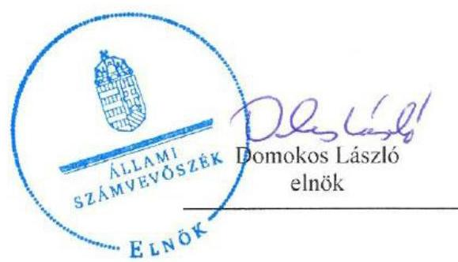
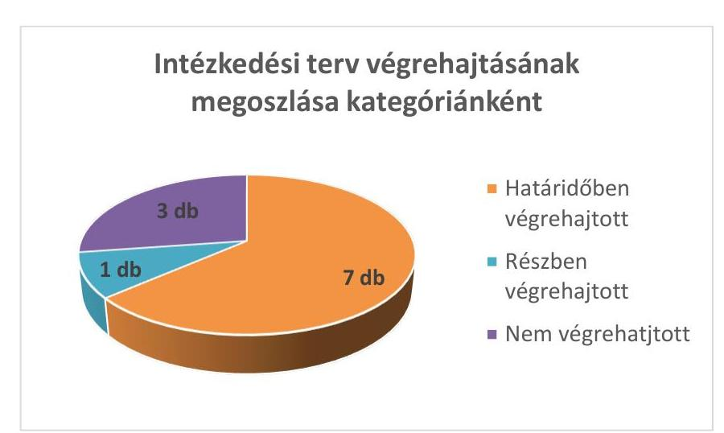

# Jelenetés 

## Utóellenőrzések

Balatonboglár Városi Önkormányzat vagyongazdálkodás
szabályszerúségének utóellenőrzése 2016.

---

# Jelenetés 

## Utóellenőrzések

Balatonboglár Városi Önkormányzat vagyongazdálkodás
szabályszerüségének utóellenőrzése
2016. március 23.

---

# AZ ELLENŐRZÉST FELÜGYELTE: 

HOLMAN MAGDOLNA felügyeleti vezető

## AZ ELLENŐRZÉST VEZETTE ÉS A VÉGREHAJTÁSÁÉRT FELELŐS:

FÉSŰS NÓRA ellenőrzésvezető

## A PROGRAM ÖSSZEÁLLÍTÁSÁÉRT FELELŐS:

JANIK JÓZSEF LÁSZLÓ osztályvezető

## A TÉMÁHOZ KAPCSOLÓDÓ KORÁBBI SZÁMVEVŐSZÉKI JELENTÉSEK:

- címe: Jelentés az önkormányzati vagyongazdálkodás szabályszerűségi ellenőrzéséről - Balatonboglár
- sorszáma: 13065

Jelentéseink az Országgyúlés számítógépes hálózatán és az Interneten a www.asz.hu címen is olvashatóak.

IKTATÓSZÁM: V-0893-035/2016.
TÉMASZÁM: 1927
ELLENŐRZÉS-AZONOSÍTÓ SZÁM: V07170604

---

# TARTALOMJEGYZÉK 

■ ÖSSZEGZÉS ..... 5
■ AZ ELLENŐRZÉS CÉLJA ..... 6
■ AZ ELLENŐRZÉS TERÜLETE ..... 7
■ AZ ELLENŐRZÉS HÁTTERE, INDOKOLTSÁGA ..... 8
■ FÓKUSZKÉRDÉS ..... 9
■ ELLENŐRZÉS HATÓKÖRE ÉS MÓDSZEREI ..... 10
■ MEGÁLLAPÍTÁSOK ..... 12
■ JAVASLATOK ..... 14
■ MELLÉKLET ..... 15
I. SZ: MELLÉKLET: Az ÁSZ 13065 sz. jelentéséhez kapcsolódó intézkedési terv megvalósításai ..... 15
■ FÜGGELÉK: ÉSZREVÉTELEK ..... 17
■ RÖVIDÍTÉSEK JEGYZÉKE ..... 19

---

.

---

# ÖSSZEGZÉS 

Balatonboglár Városi Önkormányzat vagyongazdálkodása szabályszerűségének 2007-2011. évekre vonatkozó ellenőrzéséről 2013 augusztusában jelent meg az Állami Számvevőszék jelentése. A jelentésben foglalt megállapításokhoz kapcsolódóan az Önkormányzat által összeállított intézkedési terv megvalósulását utóellenőrzés keretében értékeltük és megállapítottuk, hogy az intézkedési tervben foglaltakat az Önkormányzat nem valósította meg teljes körűen. A megtett intézkedések az ÁSZ által korábban feltárt hibák megszüntetése érdekében történtek. Az intézkedési tervben foglalt feladatok végrehajtásáról a jogszabály szerinti nyilvántartást nem vezették.

## Az ellenőrzés társadalmi indokoltsága

Az Állami Számvevőszék stratégiájában célul tűzte ki a számvevőszéki munka hasznosulásának javítását. Ezzel összhangban ellenőrzi, hogy az ellenőrzött szervezetek megvalósították-e a korábbi ellenőrzései által feltárt hibák, hiányosságok és szabálytalanságok megszüntetése céljából kialakított intézkedési terveikben foglaltakat. A rendszeres utóellenőrzések hozzájárulnak a szükséges intézkedések tényleges végrehajtáshoz, ezáltal a közpénzügyek rendezettségének javulásához.

## Főbb megállapítások, következtetések, javaslatok

Az intézkedési tervet az Önkormányzat az ÁSZ törvényben rögzített határidőben megküldte az ÁSZ-nak. Az intézkedési terv feladatait teljes körűen nem valósították meg és a feladatok végrehajtásáról a jogszabály szerinti nyilvántartást nem vezették.

---

# **AZ ELLENŐRZÉS CÉLJA**

## **Balatonboglár Városi Önkormányzat – vagyongazdálkodás szabályszerűségének utóellenőrzése**

Az ellenőrzés célja annak értékelése, hogy a számvevőszéki jelentésben1 foglalt intézkedést igénylő megállapításokkal és javaslatokkal összhangban készített intézkedési tervben meghatározott feladatokat az ellenőrzött szervezet végrehajtotta-e.

---

# **AZ ELLENŐRZÉS TERÜLETE**

## **Balatonboglár Városi Önkormányzat**

Balatonboglár város Somogy megyében fekszik, állandó lakosainak száma 5798 fő*. Az Önkormányzat² 2014 végén 10 Mrd Ft értékű vagyonnal rendelkezett, amelyből 9,9 Mrd Ft volt a nemzeti vagyonba tartozó befektetett eszközök állománya*.

A 2007-2011. közötti időszak tekintetében az Önkormányzat vagyongazdálkodásának szabályszerűségét ellenőrizte az ÁSZ³. A 2013 augusztusában megjelent ÁSZ jelentés szerint az ellenőrzés során hiányosságokat állapítottunk meg az Önkormányzat leltározási, vagyonértékelési és -nyilvántartási, számviteli tevékenységének szabályszerűsége és a belső ellenőrzési funkciók tekintetében. Az ÁSZ jelentés a Jegyzőnek⁴ hét javaslatot fogalmazott meg.

Az Önkormányzat által összeállított intézkedési terv az ellenőrzés által feltárt hiányosságok kezelésére megfogalmazott intézkedést igénylő megállapításokkal és javaslatokkal összhangban volt és 11 feladatot tartalmazott.

Az utóellenőrzés⁵ az ÁSZ jelentésben megfogalmazott intézkedést igénylő megállapításokra és javaslatokra készített intézkedési tervben foglalt feladatok megvalósításának ellenőrzésére, illetve értékelésére fókuszál.

* Forrás: KSH, Magyarország Közigazgatási Helységnévkönyvének 2015. jan. 1-jei adatai

† Forrás: Magyar Államkincstár: Az Önkormányzat 2014. december 31-i könyvviteli mérleg szerinti adatai

---

# AZ ELLENŐRZÉS HÁTTERE, INDOKOLTSÁGA 

AZ ÁSZ TÖRVÉNY ${ }^{6}$ 33. § (1) bekezdése értelmében a számvevőszéki jelentések intézkedést igénylő megállapításaihoz és javaslataihoz kapcsolódóan az ellenőrzött szervezet vezetője intézkedési tervet köteles összeállítani, és az Állami Számvevőszék részére megküldeni. Az intézkedési tervben foglaltak megvalósítását - az ÁSZ törvény 33. § (7) bekezdésében foglaltak alapján - az Állami Számvevőszék utóellenőrzés keretében ellenőrizheti. Az intézkedések megvalósulásának értékelése során az Állami Számvevőszék figyelembe veszi az ellenőrzött szervezetek működési feltételeiben, valamint a jogszabályi előírásokban bekövetkezett változásokat.

AZ INTÉZKEDÉSI TERVEKBEN foglalt feladatok hiányos, illetve késedelmes végrehajtása, valamint megvalósításának elmaradása azt mutatja, hogy az ellenőrzések során feltárt hibák, hiányosságok és szabálytalanságok megszüntetése nem kapott kellő hangsúlyt. Ez a szabályszerű működés és a felelős vezetői magatartás vonatkozásában kockázatot hordoz. E kockázatok feltárásával az Állami Számvevőszék utóellenőrzési rendszere fokozza a fegyelmet, és igazolja, hogy a közpénzzel való szabályos gazdálkodás felelőssége elől nem lehet kitérni.

## AZ UTÓELLENŐRZÉS négy szinten hasznosulhat:

- A társadalom szintjén az utóellenőrzés jelzi, hogy a számvevőszéki ellenőrzés megállapításainak van következménye: a hiányosságok megszüntetésére az ellenőrzött szervezet által meghatározott intézkedések végrehajtását is számon kéri az ÁSZ.
- Az ellenőrzött terület szintjén az utóellenőrzés tájékoztatást nyújt a terület döntéshozóinak a hiányosságok kiküszöbölésének jó gyakorlatairól, ezzel lehetőséget biztosítva arra, hogy az ÁSZ ellenőrzési megállapításai, javaslatai a terület nem ellenőrzött szervezeteinek a működése során is hasznosuljanak.
- Az ellenőrzött szervezet szintjén az utóellenőrzés feltárja, hogy a szervezet az intézkedések végrehajtásával hasznosította-e a korábbi ellenőrzési jelentésben a hiányosságok megszüntetése, illetve a kockázatok kezelése érdekében megfogalmazott javaslatokat.
- Az ÁSZ szintjén az utóellenőrzés visszacsatolást ad az ellenőrzési jelentések hasznosulásáról, az intézkedések elmaradása vagy részleges megvalósulása a további ellenőrzésekhez kockázati jelzésként szolgál.

---

# FÓKUSZKÉRDÉS 

1. Az ellenőrzött szervezet az intézkedési tervben foglaltakat - az elöirt határidőben - végrehajtotta-e?

---

# ELLENŐRZÉS HATÓKÖRE ÉS MÓDSZEREI 

## Az ellenőrzés típusa

Szabályszerüségi ellenőrzés

## Az ellenőrzött időszak

Az ÁSZ jelentés közzétételének napjától (2013. augusztus 27.) az utóellenőrzés megkezdésének napjáig (2015. június 19.) tartó időszak.

## Az ellenőrzés tárgya

Az Önkormányzat intézkedési tervében foglaltak végrehajtásának ellenőrzése

## Az ellenőrzött szervezet

Balatonboglár Városi Önkormányzat

## Az ellenőrzés jogalapja

Magyarország Alaptörvénye 43. cikk (1) bekezdése alapján az ÁSZ az Országgyűlés pénzügyi és gazdasági ellenőrző szerve. Az ÁSZ törvényben meghatározott feladatkörében ellenőrzi a központi költségvetés végrehajtását, az államháztartás gazdálkodását, az államháztartásból származó források felhasználását és a nemzeti vagyon kezelését.

Az ÁSZ törvény 1. § (3) bekezdése szerint az ÁSZ általános hatáskörrel végzi a közpénzekkel és az állami és önkormányzati vagyonnal való felelős gazdálkodás ellenőrzését.

Az ÁSZ törvény 33. § (7) bekezdése alapján az ÁSZ jelentésben foglalt megállapításokhoz kapcsolódóan összeállított intézkedési tervben foglaltak megvalósítását az ÁSZ utóellenőrzés keretében ellenőrizheti.

Az államháztartásról szóló 2011. évi CXCV. törvény 61. § (2) bekezdése szerint az államháztartás külső ellenőrzésével kapcsolatos feladatokat az ÁSZ látja el.

---

# Az ellenőrzés módszerei 

Az ellenőrzést az ellenőrzési program kérdései, az ellenőrzött időszakban hatályos jogszabályok, az ellenőrzés szakmai szabályok és módszertanok figyelembe vételével végeztük.

Az intézkedési tervben előírt feladatok végrehajtásának ellenőrzését értékelési kritériumok alapján végeztük. Az intézkedési tervekben foglalt feladatokat azok végrehajtása szempontjából az alábbiak szerint értékeltük:
"határidőben végrehajtott" a feladat, ha a teljesítés dokumentáltan, az intézkedési tervben előírt határidőben és tartalommal megtörtént;
"határidőn túl végrehajtott" a feladat, ha annak teljesítése az intézkedési tervben meghatározott módon, de az előírt határidőn túl történt meg;
"részben végrehajtott" a feladat, ha végrehajtása teljes körűen az intézkedési tervben előírt módon nem történt meg;
"nem végrehajtott" a feladat, ha a végrehajtás nem történt meg, vagy amennyiben a teljesítést nem dokumentálták;
"okafogyottá vált" a feladat, ha végrehajtására - meghatározott esemény bekövetkezése, továbbá külső körülmény, a működést érintő feltétel változása miatt - már nincs szükség, illetve lehetőség, és egyértelműen megállapítható, hogy az intézkedést szükségessé tevő körülmény a jövőben nem fordulhat elő;
"nem időszerű" az a feladat, amelynek ellenőrzési időszakon belüli végrehajtására azért nem került (kerülhetett) sor, mert az intézkedés alapjául szolgáló esemény nem következett be, de annak jövőbeni előfordulása lehetséges, a végrehajtása nem volt esedékes, vagy a végrehajtás határideje még nem járt le.
Az utóellenőrzésre az Önkormányzat elektronikus adatszolgáltatása alapján került sor, helyszínen ellenőrzést nem végeztünk. Az Önkormányzat által szolgáltatott adatok és dokumentumok valódiságát és teljes körűségét a Polgármester ${ }^{7}$, valamint a Jegyző teljességi és hitelességi nyilatkozata igazolta.

---

# MEGÁLLAPÍTÁSOK 

## 1. Az ellenőrzött szervezet az intézkedési tervben foglaltakat - az elöirt határidőben - végrehajtotta-e?

Összegző megállapítás

Az intézkedési tervben rögzített feladatok végrehajtása nem valósult meg teljes körüen. A feladatok végrehajtásáról nem vezették a jogszabályban elöirt nyilvántartást.
1.1. számú megállapítás

Az intézkedési tervben rögzített feladatok végrehajtása nem valósult meg teljes körüen.

Az intézkedési tervben foglalt feladatok végrehajtásának értékelését a következő ábra foglalja össze:

Fonrás: $A S Z$
HATÁRIDŐBEN VÉGREHAJTOTT feladatnak az alábbiakat értékeltük:

1. A Jegyző határidőben tájékoztatta a belső ellenőrt az ÁSZ jelentés vonatkozó részletes megállapításairól.
2. A belső ellenőrzési vezető elkészítette a belső ellenőrzési tervekhez kapcsolódó kockázatelemzéseket.
3. A Jegyző az intézkedési tervnek megfelelően megteremtette az összhangot az önkormányzati SZMSZ ${ }^{8}$ és a vagyonrendelet között.
4. Az Önkormányzat tulajdonában lévő ingatlanok hasznosítása és értékesítése, valamint a forgalmi értékbecslések elkészítése a vagyongazdálkodási rendelet ${ }^{9}$ elöírásai szerint történt.
5. A leltározás végrehajtását megalapozó új Leltározási szabályzatot ${ }^{10}$ elkészítették, amely 2013. október 1-jén lépett hatályba.

---

6. A 2013. évi leltárkiértékeléseket az intézkedési terv szerint 2013. december 31-ig elkészítették.
7. A tárgyi eszközök leltározása 2013. december 31-ig megtörtént.

RÉSZBEN VÉGREHAJTOTT feladat:
8. Az ingatlanvagyon kataszter és a számviteli nyilvántartás adatainak egyeztetése az előírt határidőig megtörtént, azonban a nyilvántartások adatai között az egyezőséget nem biztosították.

NEM VÉGREHAJTOTT feladatok az alábbiak:
9. Az Önkormányzat nem kérte be a vagyonkezelésbe adott eszközök 2010 és 2011. évekre vonatkozó, hitelesített leltárait az érintett szervezetektől.
10. A Jegyző nem gondoskodott a 2013. évi zárszámadáshoz kapcsolódó vagyonkimutatás Intézkedési terv szerinti elkészítéséről. A Mötv. ${ }^{11}$ vonatkozó rendelkezése ellenére az önkormányzati törzsvagyont a többi vagyontárgytól elkülönítve nem mutatták be.
11. A Jegyző nem intézkedett a belső ellenőrzési feladatok ellátásának felülvizsgálatáról, az Önkormányzat erre vonatkozó dokumentummal nem rendelkezett.

Az intézkedési tervben előírt 11 feladatot, az ÁSZ jelentés vonatkozó javaslatának címzettjét, a feladatok végrehajtásának határidejét, valamint a végrehajtás bemutatását és a teljesítés minősítését a melléklet tartalmazza.
1.2. számú megállapítás

Az intézkedési tervben rögzített feladatok végrehajtásáról nem vezették a jogszabályban előírt nyilvántartást.

A Jegyző nem gondoskodott az intézkedési tervben meghatározott feladatok végrehajtásáról szóló nyilvántartás vezetéséről, megsértve ezzel a Bkr. ${ }^{12}$ 14. § (1) bekezdésének rendelkezését. Az intézkedési terv végrehajtásáról beszámolási kötelezettséget nem írtak elő.

---

# JAVASLATOK 

Az ÁSZ törvény 33. § (1) bekezdésében foglaltak értelmében az ellenőrzött szervezet vezetője köteles a jelentésben foglalt megállapításokhoz kapcsolódó intézkedési tervet összeállítani és azt a jelentés kézhezvételétől számított 30 napon belül az ÁSZ részére megküldeni. Amennyiben az intézkedési tervet az ellenőrzött szervezet vezetője nem küldi meg határidőben, vagy továbbra sem elfogadható intézkedési tervet küld, az ÁSZ elnöke az ÁSZ törvény 33. § (3) bekezdés a)-b) pontjaiban foglaltakat érvényesítheti.

## Balatonboglár Önkormányzat jegyzőjének

1. Intézkedjen a Bkr. előírásainak megfelelő, a külső ellenőrzések javaslatai alapján készült intézkedési tervek végrehajtásáról szóló nyilvántartás vezetéséről.
(1.2. számú megállapításhoz tartozó első bekezdés alapján)

---

# MELLÉKLET

- I. SZ: MELLÉKLET: AZ ÁSZ 13065 SZ. JELENTÉSÉHEZ KAPCSOLÓDÓ INTÉZKEDÉSI TERV MEGVALÓSÍTÁSAI

|  Intézkedési terv alapján elvégzendő feladat |  | Az ÁSZ 13065 az jelentése javaslatának címzettje | Az intézkedési tereben meghatározott határidő | Az intézkedés végrehajtása  |
| --- | --- | --- | --- | --- |
|   | 1. | 2. | 3. | 4.  |
|  Határidőben végrehajtott feladatok |  |  |  |   |
|  1. | A belső ellenőr tájékoztatása az ÁSZ jelentésben, a belső ellenőrzéssel kapcsolatban tett részletes megállapításokról. Felelős: jegyző | Jegyző | 2013. szept. 30. | Az ÁSZ jelentés belső ellenőrzésre vonatkozó részletes megállapításait 2013. szeptember 29-én megküldte a belső ellenőrzési vezetőnek.  |
|  2. | Gondoskodni kell, hogy az éves ellenőrzési tervet a Bkr. 22. §. (1) bekezdés b) pontjában és a 31. § (3) bekezdése alapján, az éves ellenőrzési terv összeállítása előtt kockázatelemzés készüljön a belső ellenőrzési vezető részéről.
Felelős: jegyző | Jegyző | 2013. okt. 31. | A belső ellenőrzési vezető 2013. október 30-ra, a 2014. évi belső ellenőrzési terv összeállítása előtt elkészítette a kockázatelemzést.  |
|  3. | A vagyonrendelet és az önkormányzat szervezeti és múködési szabályzata összhangjának megteremtése. Az önkormányzat SZMSZ-ének módosítása. Felelős: jegyző | Jegyző | 2013. okt. 31. | A Jegyző határidőben, az önkormányzati SZMSZ módosításával intézkedett az SZMSZ és a vagyonrendelet összehangolásáról. A 19/2013. (X. 31.) KT rendelet 2. §-ával módosított SZMSZ a vagyonrendeletnek megfelelően 5,0 M Ft-ban állapította meg a Polgármester tulajdonosi joggyakorlásának értékhatárát.  |
|  4. | Gondoskodunk, hogy Balatonboglár Városi Önkormányzat a vagyonáról, és vagyongazdálkodásának szabályairól szóló 33/2012. (VII. 16.) önkormányzati rendelete alapján történik az önkormányzat tulajdonában lévő ingatlanok hasznosítása és értékesítése. A forgalmi értékbecslésre vonatkozó rendelkezéseket a Rendelet 15. § (1) bekezdése szabályozza. Felelős: jegyző | Jegyző | folyamatos | Az ellenőrzött időszakban az Önkormányzat tulajdonában lévő ingatlanok hasznosítása és értékesítése, valamint a forgalmi értékbecslések elkészítése a vagyongazdálkodási és a közterület használatát szabályozó rendelet előírásai szerint történt.  |
|  5. | Gondoskodunk a leltározási szabályzatban megfogalmazott, a leltározási folyamatban a mennyiségi felvételt követő kiértékelésről, hogy az Áhsz. ${ }^{13}$ 37. § (2) bekezdésében előírtaknak megfelelően az eszközcsoportok valódiságát támasszuk alá. Leltározás végrehajtása - Új leltározási szabályzat készítése. Felelős: jegyző | Jegyző | 2013. okt. 31. | A Jegyző elkészítette és kiadta az új leltározási szabályzatot, amely 2013. október 1-jén lépett hatályba.
A leltározás végrehajtására vonatkozó feladatot a 6., 7. és 9. számú feladatok minősítésével értékeltük.  |

---

|  1. | 2. | 3. | 4.  |
| --- | --- | --- | --- |
|  **Határidőben végrehajtott feladatok** |  |  |   |
|  6. | A leltárban szereplő eszközök mennyiségi felvételt követő kiértékelése. Felelős: jegyző | Jegyző | 2014. jan. 31.  |
|  7. | Tárgyi eszközök leltározása. Felelős: jegyző | Jegyző | 2014. jan. 31.  |
|  **Részben végrehajtott feladat** |  |  |   |
|  8. | Gondoskodunk arról, hogy az ingatlanvagyon kataszter adatainak és a számviteli nyilvántartás adatainak egyeztetése megtörténjen és az egyezőséget biztosítjuk az ingatlanvagyon kataszter adatai és a számviteli nyilvántartás adatai között. Felelős: jegyző | Jegyző | 2013. dec. 31.  |
|  **Nem végrehajtott feladatok** |  |  |   |
|  9. | Vagyonkezelésbe adott eszközök hitelesített leltárainak bekérése az érintett szervezetektől 2010 és 2011. évekre vonatkozóan. Felelős: jegyző | Jegyző | 2013. nov. 30.  |
|  10. | Vagyonkimutatás készítése a zárszámadási rendelethez: Gondoskodunk arról, hogy Balatonboglár Városi Önkormányzat zárszámadási rendeletének elkészítésekor figyelemmel leszünk a Mótv. 110. § (2) bekezdésében foglaltakra, mely szerint "az önkormányzati törzsvagyont a többi vagyontárgytól elkülönítve kell nyilvántartani. Az éves zárszámadáshoz a vagyonállapotról vagyonkimutatást kell készíteni." Felelős: jegyző | Jegyző | 2014. ápr. 30.  |
|  11. | A belső ellenőrzéssel kapcsolatos feladatok ellátásának felülvizsgálata. Felelős: jegyző | Jegyző | 2013. okt. 31.  |

*Forrás: ÁSZ*

|  2014. jan. 31. | A 2013. évi leltárkiértékeléseket 2013. december 31-ig elkészítették.  |
| --- | --- |
|  2014. jan. 31. | A tárgyi eszközök leltározása 2013. december 31-ig megtörtént.  |

---

# FÜGGELÉK: ÉSZREVÉTELEK 

A jelentéstervezetet a Számvevőszék 15 napos észrevételezésre megküldte az ellenőrzött szervezet vezetőjének az ÁSZ tv. 29. §7 (1) bekezdése előírásának megfelelően.
A polgármester az ÁSZ tv. 29. § (2) bekezdésében foglalt észrevételezési jogával nem élt, a jelentéstervezetre észrevételt nem tett.

[^0]
[^0]:    ${ }^{5}$ 29. § (1) Az Állami Számvevőszék az ellenőrzési megállapításait megküldi az ellenőrzött szervezet vezetőjének vagy az általa megbízott személynek, és annak, akinek személyes felelősségét állapította meg.
    (2) Az ellenőrzött szervezet vezetője és a felelősként megjelölt személy az ellenőrzés megállapításaira tizenöt napon belül írásban észrevételt tehet.
    (3) Az Állami Számvevőszék az észrevételre a beérkezésétől számított harminc napon belül írásban válaszol. A figyelembe nem vett észrevételeket köteles a jelentésben feltüntetni, és megindokolni, hogy azokat miért nem fogadta el.

---

.

---

# RÖVIDÍTÉSEK JEGYZÉKE 

${ }^{1}$ számvevőszéki jelentés
${ }^{2}$ Önkormányzat
${ }^{3}$ ÁSZ
${ }^{4}$ Jegyző
${ }^{5}$ utóellenőrzés
${ }^{6}$ ÁSZ törvény
${ }^{7}$ Polgármester
${ }^{8}$ SZMSZ
${ }^{9}$ vagyongazdálkodási rendelet
${ }^{10}$ Leltározási szabályzat
${ }^{11}$ Mötv.
${ }^{12}$ Bkr.
${ }^{13}$ Áhsz.

Az ÁSZ 13065 számú, Jelentés: Az önkormányzati vagyongazdálkodás szabályszerűségi ellenőrzéséről - Balatonboglár című jelentése
Balatonboglár Városi Önkormányzat
Állami Számvevőszék
Balatonboglár Városi Önkormányzat jegyzője
Az ÁSZ 13065 számú jelentésében foglalt megállapításokhoz kapcsolódóan összeállított intézkedési tervben foglaltak megvalósításának ellenőrzése.
az Állami Számvevőszékről szóló 2011. évi LXVI. törvény
Balatonboglár város polgármestere
11/2013. (VI. 1.) KT rendelet a Balatonboglári Városi Önkormányzat Szervezeti Müködési Szabályzatáról (hatályos: 2013. június 1-jétől)
Balatonboglár Városi Önkormányzat 33/2012. (VII. 6.) számú önkormányzati rendelete Balatonboglár Város Önkormányzat vagyonáról és vagyongazdálkodásának szabályairól (hatályos: 2012. július 24-től)
Balatonboglár Városi Önkormányzat Leltározási és leltárkészítési szabályzat (hatályos: 2013. október 1-jétől)
Magyarország helyi önkormányzatairól szóló 2011. évi CLXXXIX. törvény a költségvetési szervek belső kontrollrendszeréről és belső ellenőrzéséről szóló 370/2011. (XII. 31.) Korm. rendelet
az államháztartás szervezetei beszámolási és könyvvezetési kötelezettségének sajátosságairól szóló 249/2000. (XII. 24.) Korm. rendelet

---

ÁLLAMI SZÁMVEVŐSZÉK
1052 Budapest, Apáczai Csere János utca 10.
Levélcím: 1364 Budapest 4. Pf. 54
Telefon: +36 14849100 Telefax: +36 14849200
www.asz.hu