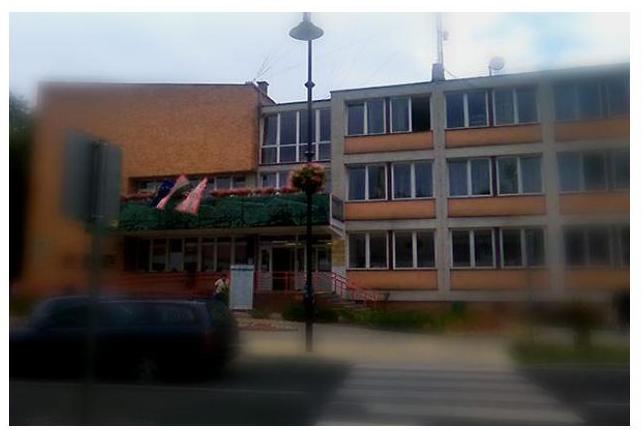
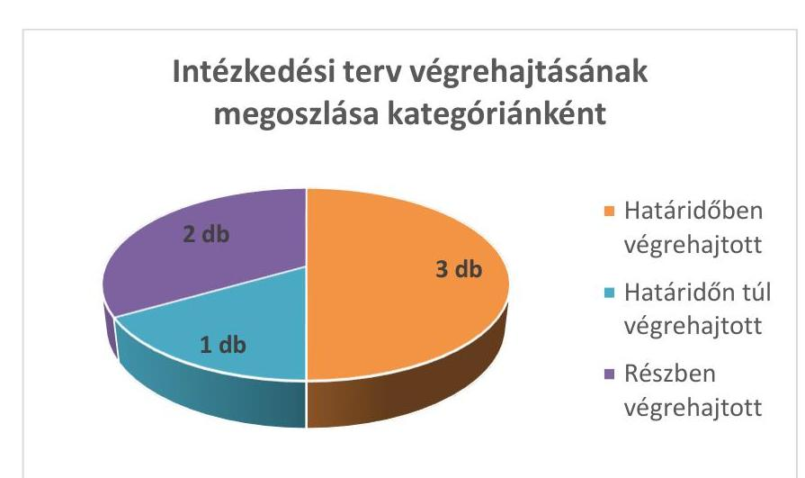

# Jelenetés 

## Utóellenőrzések

Ráckeve Város Önkormányzata vagyongazdálkodás
szabályszerűségének utóellenőrzése 2016. március 16.

---

# Jelenetés 

## Utóellenőrzések

Ráckeve Város Önkormányzata vagyongazdálkodás
szabályszerűségének utóellenőrzése
2016. március 16.

---

# AZ ELLENŐRZÉST FELÜGYELTE: 

HOLMAN MAGDOLNA felügyeleti vezető

## AZ ELLENŐRZÉST VEZETTE ÉS A VÉGREHAJTÁSÁÉRT FELELŐS:

FÉSŰS NÓRA ellenőrzésvezető

## A PROGRAM ÖSSZEÁLLÍTÁSÁÉRT FELELŐS:

JANIK JÓZSEF LÁSZLÓ osztályvezető

## A TÉMÁHOZ KAPCSOLÓDÓ KORÁBBI SZÁMVEVŐSZÉKI JELENTÉSEK:

- címe: Jelentés az önkormányzati vagyongazdálkodás szabályszerűségi ellenőrzéséről - Ráckeve
- sorszáma: 13073

Jelentéseink az Országgyűlés számítógépes hálózatán és az Interneten a www.asz.hu címen is olvashatóak.

IKTATÓSZÁM: V-0891-044/2016.
TÉMASZÁM: 1925
ELLENŐRZÉS-AZONOSÍTÓ SZÁM: V07170603

---

# TARTALOMJEGYZÉK 

■ ÖSSZEGZÉS ..... 5
■ AZ ELLENŐRZÉS CÉLJA ..... 6
■ AZ ELLENŐRZÉS TERÜLETE ..... 7
■ AZ ELLENŐRZÉS HÁTTERE, INDOKOLTSÁGA ..... 8
■ FÓKUSZKÉRDÉS ..... 9
■ ELLENŐRZÉS HATÓKÖRE ÉS MÓDSZEREI ..... 10
■ MEGÁLLAPÍTÁSOK ..... 12
■ MELLÉKLET ..... 15
I. SZ. MELLÉKLET: Az ÁSZ 13073 sz. jelentéséhez kapcsolódó intézkedési terv megvalósítása ..... 15
■ FÜGGELÉK: ÉSZREVÉTELEK ..... 17
■ RÖVIDÍTÉSEK JEGYZÉKE ..... 19

---

.

---

# ÖSSZEGZÉS 

Ráckeve Város Önkormányzata vagyongazdálkodásának szabályszerűségének 2007-2011. éveket érintő ellenőrzéséről 2013. október 1-jén jelent meg az Állami Számvevőszék jelentése. A jelentésben foglalt megállapításokhoz kapcsolódóan az Önkormányzat által összeállított intézkedési terv megvalósítását utóellenőrzés keretében értékeltük és megállapítottuk, hogy a Képviselő-testület által elfogadott intézkedési tervben foglaltakat az Önkormányzat összeségében megvalósította. A megtett intézkedések az ÁSZ által korábban feltárt hibák megszüntetése érdekében történtek. Az intézkedési tervben foglalt feladatok végrehajtásáról a jogszabály szerinti nyilvántartást hiányosan vezették, a Képviselő-testület által előírt beszámolási kötelezettségeknek eleget tettek.

## Az ellenőrzés társadalmi indokoltsága

Az Állami Számvevőszék stratégiájában célul tűzte ki a számvevőszéki munka hasznosulásának javítását. Ezzel összhangban ellenőrzi, hogy az ellenőrzött szervezetek megvalósították-e a korábbi ellenőrzései által feltárt hibák, hiányosságok és szabálytalanságok megszüntetése céljából kialakított intézkedési terveikben foglaltakat. A rendszeres utóellenőrzések hozzájárulnak a szükséges intézkedések tényleges végrehajtásához, ezáltal a közpénzügyek rendezettségének javulásához.

## Főbb megállapítások, következtetések, javaslatok

A Képviselő-testület által elfogadott intézkedési tervet az Önkormányzat az ÁSZ törvényben rögzített határidőben küldte meg az ÁSZ-nak. Az intézkedési terv feladatait összességében megvalósították, a feladatok végrehajtásáról a jogszabály szerinti nyilvántartást hiányosan vezették, a Képviselő-testület által előírt beszámolási kötelezettségnek eleget tettek.

---

# AZ ELLENŐRZÉS CÉLJA 

## Ráckeve Város Önkormányzata - vagyongazdálkodás szabályszerűségének utóellenőrzése

Az ellenőrzés célja annak értékelése, hogy a számvevőszéki jelentésben ${ }^{1}$ foglalt intézkedést igénylő megállapításokkal és javaslatokkal összhangban készített intézkedési tervben meghatározott feladatokat az ellenőrzött szervezet végrehajtotta-e.

---

# AZ ELLENŐRZÉS TERÜLETE 

## Ráckeve Város Önkormányzata

Ráckeve város Pest megyében, a Csepel-sziget déli részén fekszik, lakosságának száma 9960 fő*. Az Önkormányzat² a 2014. év végén 9,09 Mrd Ft értékű vagyonnal rendelkezett, amelyből 8,90 Mrd Ft volt a nemzeti vagyonba tartozó befektetett eszközök állománya ${ }^{1}$.

A 2007-2011. közötti időszak tekintetében az Önkormányzat vagyongazdálkodásának szabályszerűségét ellenőrizte az ÁSZ³. A 2013 szeptemberi jelentés szerint az ellenőrzés során hiányosságokat állapítottunk meg az Önkormányzat vagyongazdálkodási feladatainak szabályozása, a vagyongazdálkodási folyamatok szabályszerűsége, a közzétételi kötelezettségek teljesítése, a gazdálkodási jogkörök gyakorlása, valamint a belső ellenőrzési funkciók tekintetében. Az ÁSZ jelentés a Polgármesternek ${ }^{4}$ egy, a Jegyzőnek ${ }^{5}$ négy javaslatot fogalmazott meg.

Az Önkormányzat által összeállított intézkedési terv az ellenőrzés által feltárt hiányosságok kezelésére megfogalmazott intézkedést igénylő megállapításokkal és javaslatokkal összhangban volt és hat feladatot tartalmazott.

Az utóellenőrzés ${ }^{6}$ az ÁSZ jelentésben megfogalmazott intézkedést igénylő megállapításokra és javaslatokra készített intézkedési tervben foglalt feladatok megvalósításának ellenőrzésére, illetve értékelésére fókuszál.

[^0]
[^0]:    * Forrás: KSH, Magyarország Közigazgatási Helységnévkönyvének 2015. jan. 1-jei adatai
    ${ }^{1}$ Forrás: Magyar Államkincstár: Az Önkormányzat 2014. december 31-i könyvviteli mérleg szerinti adatai

---

# AZ ELLENŐRZÉS HÁTTERE, INDOKOLTSÁGA 

Az ÁSZ törvény ${ }^{7}$ 33. § (1) bekezdése értelmében a számvevőszéki jelentések intézkedést igénylő megállapításaihoz és javaslataihoz kapcsolódóan az ellenőrzött szervezet vezetője intézkedési tervet köteles összeállítani, és az Állami Számvevőszék részére megküldeni. Az intézkedési tervben foglaltak megvalósítását - az ÁSZ törvény 33. § (7) bekezdésében foglaltak alapján - az Állami Számvevőszék utóellenőrzés keretében ellenőrizheti. Az intézkedések megvalósulásának értékelése során az Állami Számvevőszék figyelembe veszi az ellenőrzött szervezetek működési feltételeiben, valamint a jogszabályi előírásokban bekövetkezett változásokat.

Az intézkedési tervekben foglalt feladatok hiányos, illetve késedelmes végrehajtása, valamint megvalósításának elmaradása azt mutatja, hogy az ellenőrzések során feltárt hibák, hiányosságok és szabálytalanságok megszüntetése nem kapott kellő hangsúlyt. Ez a szabályszerű működés és a felelős vezetői magatartás vonatkozásában kockázatot hordoz. E kockázatok feltárásával az Állami Számvevőszék utóellenőrzési rendszere fokozza a fegyelmet, és igazolja, hogy a közpénzzel való szabályos gazdálkodás felelőssége elől nem lehet kitérni.

## AZ UTÓELLENŐRZÉS négy szinten hasznosulhat:

- A társadalom szintjén az utóellenőrzés jelzi, hogy a számvevőszéki ellenőrzés megállapításainak van következménye: a hiányosságok megszüntetésére az ellenőrzött szervezet által meghatározott intézkedések végrehajtását is számon kéri az ÁSZ.
- Az ellenőrzött terület szintjén az utóellenőrzés tájékoztatást nyújt a terület döntéshozóinak a hiányosságok kiküszöbölésének jó gyakorlatairól, ezzel lehetőséget biztosítva arra, hogy az ÁSZ ellenőrzési megállapításai, javaslatai a terület nem ellenőrzött szervezeteinek a működése során is hasznosuljanak.
- Az ellenőrzött szervezet szintjén az utóellenőrzés feltárja, hogy a szervezet az intézkedések végrehajtásával hasznosította-e a korábbi ellenőrzési jelentésben a hiányosságok megszüntetése, illetve a kockázatok kezelése érdekében megfogalmazott javaslatokat.
- Az ÁSZ szintjén az utóellenőrzés visszacsatolást ad az ellenőrzési jelentések hasznosulásáról, az intézkedések elmaradása vagy részleges megvalósulása a további ellenőrzésekhez kockázati jelzésként szolgál.

---

# FÓKUSZKÉRDÉS 

1. Az ellenőrzött szervezet az intézkedési tervben foglaltakat - az előírt határidőben - végrehajtotta-e?

---

# ELLENŐRZÉS HATÓKÖRE ÉS MÓDSZEREI 

## Az ellenőrzés típusa

Szabályszerűségi ellenőrzés

## Az ellenőrzött időszak

Az ÁSZ jelentés közzétételének napjától (2013. október 1.) az utóellenőrzés megkezdésének napjáig (2015. június 19.) tartó időszak.

## Az ellenőrzés tárgya

Az Önkormányzat intézkedési tervében foglaltak végrehajtásának ellenőrzése

## Az ellenőrzött szervezet

Ráckeve Város Önkormányzata

## Az ellenőrzés jogalapja

Magyarország Alaptörvénye 43. cikk (1) bekezdése alapján az ÁSZ az Országgyűlés pénzügyi és gazdasági ellenőrző szerve. Az ÁSZ törvényben meghatározott feladatkörében ellenőrzi a központi költségvetés végrehajtását, az államháztartás gazdálkodását, az államháztartásból származó források felhasználását és a nemzeti vagyon kezelését.

Az ÁSZ törvény 1. § (3) bekezdése szerint az ÁSZ általános hatáskörrel végzi a közpénzekkel és az állami és önkormányzati vagyonnal való felelős gazdálkodás ellenőrzését.

Az ÁSZ törvény 33. § (7) bekezdése alapján az ÁSZ jelentésben foglalt megállapításokhoz kapcsolódóan összeállított intézkedési tervben foglaltak megvalósítását az ÁSZ utóellenőrzés keretében ellenőrizheti.

Az államháztartásról szóló 2011. évi CXCV. törvény 61. § (2) bekezdése szerint az államháztartás külső ellenőrzésével kapcsolatos feladatokat az ÁSZ látja el.

---

# Az ellenőrzés módszerei 

Az ellenőrzést az ellenőrzési program kérdései, az ellenőrzött időszakban hatályos jogszabályok, az ellenőrzés szakmai szabályok és módszertanok figyelembe vételével végeztük.

Az intézkedési tervben előírt feladatok végrehajtásának ellenőrzését értékelési kritériumok alapján végeztük. Az intézkedési tervekben foglalt feladatokat azok végrehajtása szempontjából az alábbiak szerint értékeltük:
$\longrightarrow$ „határidőben végrehajtott" a feladat, ha a teljesítés dokumentáltan, az intézkedési tervben előírt határidőben és tartalommal megtörtént;
$\longrightarrow$ „határidőn túl végrehajtott" a feladat, ha annak teljesítése az intézkedési tervben meghatározott módon, de az előírt határidőn túl történt meg;
$\longrightarrow$ „részben végrehajtott" a feladat, ha végrehajtása teljes körűen az intézkedési tervben előírt módon nem történt meg;
$\longrightarrow$ „nem végrehajtott" a feladat, ha a végrehajtás nem történt meg, vagy amennyiben a teljesítést nem dokumentálták;
$\longrightarrow$ „okafogyottá vált" a feladat, ha végrehajtására - meghatározott esemény bekövetkezése, továbbá külső körülmény, a működést érintő feltétel változása miatt - már nincs szükség, illetve lehetőség, és egyértelműen megállapítható, hogy az intézkedést szükségessé tevő körülmény a jövőben nem fordulhat elő;
$\longrightarrow$ „nem időszerű" az a feladat, amelynek ellenőrzési időszakon belüli végrehajtására azért nem került (kerülhetett) sor, mert az intézkedés alapjául szolgáló esemény nem következett be, de annak jövőbeni előfordulása lehetséges, a végrehajtása nem volt esedékes, vagy a végrehajtás határideje még nem járt le.
Az utóellenőrzésre az Önkormányzat elektronikus adatszolgáltatása alapján került sor, helyszínen ellenőrzést nem végeztünk. Az Önkormányzat által szolgáltatott adatok és dokumentumok valódiságát és teljes körűségét a Polgármester, valamint a Jegyző teljességi és hitelességi nyilatkozata igazolta.

A gazdálkodási jogkörök gyakorlására vonatkozó intézkedés megvalósítását mintavételes ellenőrzéssel értékeltük. Az utóellenőrzés jellege miatt a mintatételek ellenőrzésével nem az adott terület szabályszerűségéről mondtunk véleményt, hanem arról, hogy a működési hiányosságok felszámolására az intézkedési tervben rögzítetteket végrehajtották-e az ellenőrzött tételek esetében.

---

# MEGÁLLAPÍTÁSOK 

## 1. Az ellenőrzött szervezet az intézkedési tervben foglaltakat - az előírt határidőben - végrehajtotta-e?

Összegző megállapítás

Az intézkedési tervben meghatározott feladatokat összességében megvalósították, a feladatok végrehajtásáról a jogszabály szerinti nyilvántartást hiányosan vezették.
1.1. számú megállapítás

Az intézkedési tervben rögzített feladatokat összességében megvalósították.

Az intézkedési tervben foglalt feladatok végrehajtásának értékelését a következő ábra foglalja össze:

HATÁRIDŐBEN VÉGREHAJTOTT feladatnak az alábbiakat értékeltük:

1. Az ÁSZ jelentésben szereplő beruházás megvalósításához kapcsolódóan az Önkormányzat elvégezte a pályáztatás körülményeinek, a pályázati felhívás tartalmának, a vállalkozóval kötött együttműködési szerződésben szereplő vételár megalapozottságának, valamint a nyújtott támogatásnak vizsgálatát.
2. Az ÁSZ jelentésben szereplő beruházás megvalósításához kapcsolódóan az Önkormányzat kivizsgálta, hogy a beruházás során miért nem történt meg az eszközök értékének kiszámlázása.
3. Az Önkormányzat intézkedett arról, hogy az üzemeltetésre átadott eszközökről az üzemeltetők évente végezzék el a leltározást, azt hitelesítsék, majd nyújtsák be a Polgármesteri Hivatal Pénzügyi Irodájához.

---

HATÁRIDŐN TÚL VÉGREHAJTOTT feladat volt:
4. Az Önkormányzat ingatlan vagyonának pontos számbavétele, naprakész nyilvántartás készítése és összevetése a földhivatali nyilvántartással, valamint az egyezőség biztosítása az intézkedési tervben szereplő határidőn túl teljesült.

RÉSZBEN VÉGREHAJTOTT feladatok voltak az alábbiak:
5. Az Info tv. ${ }^{8}$ 1. mellékletében meghatározott adatok közzététele az Önkormányzat honlapján nem történt nem teljes körűen.
6. Az ellenjegyzés, szakmai teljesítésigazolás, és érvényesítés feladatainak dokumentált, jogszabályi előírásoknak megfelelő ellátása nem volt teljes körű.

Az intézkedési tervben előírt hat feladatot, az ÁSZ jelentés vonatkozó javaslatának címzettjét, a feladatok végrehajtásának határidejét, valamint a végrehajtás bemutatását és a teljesítés minősítését a melléklet tartalmazza.
1.2. számú megállapítás

Az Önkormányzat hiányosan vezetett nyilvántartást az intézkedési tervben foglalt feladatok végrehajtásáról és az előírt beszámolási kötelezettségnek eleget tettek.

Az Önkormányzat vezette a Bkr. ${ }^{9}$ 14. § (1) bekezdése szerinti nyilvántartást a külső ellenőrzések javaslatai alapján készült intézkedési tervek végrehajtásáról. A nyilvántartás tartalmára vonatkozó Bkr. 47. § (2) bekezdésében foglalt előírás nem érvényesült teljes körűen, mert a dokumentum nem tartalmazta az ÁSZ jelentésben szereplő javaslatokat.

A Képviselő-testület a 339/2013. (X. 28.) számú határozatában felhívta a Jegyzőt, hogy az Intézkedési tervben foglaltak teljesítéséről számoljon be. A 2014. május 16-i beszámolót a Képviselő-testület a 151/2014. (V. 16.) számú határozattal elfogadta.

---

.

---

# MELLÉKLET

- I. SZ. MELLÉKLET: AZ ÁSZ 13073 SZ. JELENTÉSÉHEZ KAPCSOLÓDÓ INTÉZKEDÉSI TERV MEGVALÓSÍTÁSA

|  Sorszám | Intézkedési terv alapján elvégzendő feladat | Az ÁSZ 13073
sz. jelentése javaslatának címzettje | Az intézkedés
tervben meghatározott határidő | Az intézkedés végrehajtása  |
| --- | --- | --- | --- | --- |
|   | 1. | 2. |

 3. | 4.  |
|  Határidőben végrehajtott feladatok |  |  |  |   |
|  1. | Meg kell vizsgálni a beruházás megvalósításához kapcsolódóan a pályáztatás körülményeit, a pályázati felhívás tartalmát, az együttműködési megállapodásban szereplő vételár megalapozottságát, a nyújtott támogatás indokoltságát. A vizsgálat eredményének függvényében el kell dönteni, hogy szükséges-e felelősségre vonás, azt meg kell tenni, illetve kezdeményezni kell.
Felelős: polgármester | Polgármester | 2013. december 31. | Az intézkedési tervben előírt vizsgálatot a Jegyző 2013. október 15. és 2013. október 31. között folytatta le, amely során a beruházás megvalósításához kapcsolódóan megvizsgálta a pályáztatás körülményeit, a pályázati felhívás tartalmát, az együttműködési megállapodásban szereplő vételár megalapozottságát és a nyújtott támogatás indokoltságát. A Jegyző a vizsgálat eredményéről 2013. október 31-én összeállította az ellenőrzési jelentést. A vizsgálat nem állapította meg felelősségre vonás szükségességét, a vizsgálati eredmény alapján a Polgármester nem tartotta indokoltnak felelősségre vonást, illetve annak kezdeményezését.  |
|  2. | Meg kell vizsgálni, hogy miért nem történt meg az eszközök értékének ( 2 M Ft ) kiszámlázása. A vizsgálat eredményének függvényében el kell dönteni, hogy szükséges-e felelősségre vonás, azt meg kell tenni, illetve kezdeményezni kell.
Felelős: jegyző | Polgármester | 2013. december 31. | Az intézkedési tervben előírt vizsgálatot a Jegyző 2013. október 15. és 2013. október 31. között folytatta le, amely nem állapította meg a felelősségre vonás szükségességét a kiszámlázáshoz kapcsolódóan. A vizsgálat eredményeit a 2013. október 31-én kelt Ellenőrzési Jelentés tartalmazza. A Polgármester a 2013. november 1-jei feljegyzésében rögzítette a vizsgálat megállapításait, amelyek alapján nem tartotta indokoltnak felelősségre vonást, illetve annak kezdeményezését.  |
|  3. | Intézkedni kell arról, hogy az üzemeltetésre átadott eszközökről - a könyvviteli mérleg alátámasztásához - az Áhsz. ${ }^{10}$ 37. § (4) bekezdés előírásainak megfelelően az üzemeltetők évente végezzék el a leltározást, és hitelesítsék, majd nyújtsák be a Polgármesteri Hivatal Pénzügyi Irodájához.
Felelős: jegyző | Jegyző | első alkalom 2013. december 31., majd minden év december 31. | A Jegyző 2013. december 19-én, illetve 2014. december 15-én felhívást intézett az eszközöket üzemeltetőhöz az üzemeltetésre átadott eszközök éves leltározásának elvégzése érdekében. A leltározást és hitelesítést, az üzemeltető a hatályos jogszabályoknak megfelelően elvégezte és a leltárokat a Polgármesteri Hivatal Pénzügyi Irodájának benyújtotta.  |

---

|  1. | 2. | 3. | 4.  |
| --- | --- | --- | --- |
|  **Határidőn túl végrehajtott feladat** |  |  |   |
|  4. | Pontosan számba kell venni az önkormányzat ingatlan vagyonát, a vagyonnyilvántartást naprakésszé kell tenni. A nyilvántartást össze kell vetni a földhivatali nyilvántartással, az egyezőséget biztosítani kell. E feladatra megbízást kell adni. Felelős: jegyző | Jegyző | 2014. április 30.  |
|  **Részben végrehajtott feladatok** |  |  |   |
|  5. | Az Info tv. 1. mellékletében meghatározott adatok közzététele 2011. óta folyamatosan megtörténik, a jogszabályban foglaltakat a jövőben is be kell tartani, egyéb intézkedést nem igényel. Felelős: jegyző | Jegyző | folyamatos  |
|  6. | 2011-től már dokumentáltan jogszabályok előírásai szerint történik az ellenjegyzés, szakmai teljesítésigazolás, és érvényesítés. Továbbra is a jogszabályban foglaltaknak megfelelően kell eljárni, egyéb intézkedést nem igényel. Felelős: jegyző | Jegyző | folyamatos  |
|  7. | 2011-től már dokumentáltan jogszabályok előírásai szerint történik az ellenjegyzés, szakmai teljesítésigazolás, és érvényesítés. Továbra is a jogszabályban foglaltaknak megfelelően kell eljárni, egyéb intézkedést nem igényel. Felelős: jegyző | Jegyző | folyamatos  |

*Formás: ÁSZ*

---

# FÜGGELÉK: ÉSZREVÉTELEK 

A jelentéstervezetet a Számvevőszék 15 napos észrevételezésre megküldte az ellenőrzött szervezet vezetőjének az ÁSZ tv. 29. § 7 (1) bekezdése előírásának megfelelően.
A polgármester az ÁSZ tv. 29. § (2) bekezdésében foglalt észrevételezési jogával nem élt, a jelentéstervezetre észrevételt nem tett.

[^0]
[^0]:    ${ }^{5}$ 29. § (1) Az Állami Számvevőszék az ellenőrzési megállapításait megküldi az ellenőrzött szervezet vezetőjének vagy az általa megbízott személynek, és annak, akinek személyes felelősségét állapította meg.
    (2) Az ellenőrzött szervezet vezetője és a felelősként megjelölt személy az ellenőrzés megállapításaira tizenöt napon belül írásban észrevételt tehet.
    (3) Az Állami Számvevőszék az észrevételre a beérkezésétől számított harminc napon belül írásban válaszol. A figyelembe nem vett észrevételeket köteles a jelentésben feltüntetni, és megindokolni, hogy azokat miért nem fogadta el.

---

.

---

# RÖVIDÍTÉSEK JEGYZÉKE 

${ }^{1}$ számvevőszéki jelentés
${ }^{2}$ Önkormányzat
${ }^{3}$ ÁSZ
${ }^{4}$ Polgármester
${ }^{5}$ Jegyző
${ }^{6}$ utóellenőrzés
${ }^{7}$ ÁSZ törvény
${ }^{8}$ Info tv.
${ }^{9}$ Bkr.
${ }^{10}$ Áhsz.

Az ÁSZ 13073 számú, Jelentés az önkormányzati vagyongazdálkodás szabályszerűségéi ellenőrzéséről - Ráckeve című jelentése
Ráckeve Város Önkormányzata
Állami Számvevőszék
Ráckeve Város Önkormányzatának polgármestere
Ráckevei Polgármesteri Hivatal jegyzője
Az ÁSZ 13073 számú jelentésében foglalt megállapításokhoz kapcsolódóan összeállított intézkedési tervben foglaltak megvalósításának ellenőrzése.
az Állami Számvevőszékről szóló 2011. évi LXVI. törvény
az információs önrendelkezési jogról és az információszabadságról szóló 2011. évi CXII. törvény
a költségvetési szervek belső kontrollrendszeréről és belső ellenőrzéséről szóló 370/2011. (XII. 31.) Korm. rendelet
2013. december 31-ig: az államháztartás szervezetei beszámolási és könyvvezetési kötelezettségének sajátosságairól szóló 249/2000. (XII. 24.) Korm. rendelet
2014. január 1-től: az államháztartás számviteléről szóló 4/2013. (I. 11.) Korm. rendelet

---

# ÁLLAMI SZÁMVEVŐSZÉK 

1052 Budapest, Apáczai Csere János utca 10.
Levélcím: 1364 Budapest 4. Pf. 54
Telefon: +36 14849100 Telefax: +36 14849200
www.asz.hu
