# ÁLLAMI   SZÁMVEVŐSZÉK 

## JELENTÉS

A fővárosi közösségi közlekedés ellenőrzése - A fővárosi közösségi közlekedés intézményi átalakításának, a Budapesti Közlekedési Központ (BKK Zrt.) létrehozásának, működése szabályszerűségének ellenőrzése

---

# Állami Számvevőszék 

Iktatószám: V-0783-238/2016.
Témaszám: 1817
Vizsgálat-azonosító szám: V0716

## Az ellenőrzést felügyelte:

Dr. Horváth Margit
felügyeleti vezető
Az ellenőrzést vezette és az ellenőrzés végrehajtásáért felelős:
Valastyánné dr. Vízhányó Júlia
ellenőrzésvezető

## A jelentéstervezet összeállításában közreműködött:

Dr. Csapó Anna, dr. Kevés Judit
számvevő tanácsos, számvevő vezető főtanácsos, számvevő

## Az ellenőrzést végezték:

Dr. Csapó Anna
számvevő tanácsos

Klinger Zoltán
számvevő tanácsos

Csepreginé Tancsik Erzsébet
számvevő főtanácsos
Nagy Csilla Erzsébet
számvevő

## A témához kapcsolódó eddig készített számvevőszéki jelentések:

címe
sorszáma
Jelentés a Budapesti Közlekedési Zrt. gazdálkodásának ellenőrzéséről

---

# TARTALOMJEGYZÉK 

BEVEZETÉS ..... 9
I. ÖSSZEGZŐ MEGÁLLAPÍTÁSOK, KÖVETKEZTETÉSEK, JAVASLATOK ..... 14
II. RÉSZLETES MEGÁLLAPÍTÁSOK ..... 21

1. A fővárosi közösségi közlekedés intézményrendszerének átalakítása ..... 21
1.1. A Fővárosi Önkormányzat közösségi közlekedés intézményrendszerének átalakítására vonatkozó koncepcióinak kialakítása ..... 21
1.2. A Fővárosi Önkormányzat által a feladatellátás feltételrendszerének kialakítására kötött szerződések jogszabályi előírásoknak való megfelelősége ..... 25
1.3. A Fővárosi Önkormányzat közfeladat-ellátást szolgáló közvagyon és humánerőforrás rendelkezésre bocsátására vonatkozó döntéseinek szabályszerűsége ..... 26
1.4. A Fővárosi Önkormányzat közösségi közlekedési feladatellátásban részt vevő társaságok feletti tulajdonosi joggyakorlása ..... 28
1.5. A Fővárosi Önkormányzat által a közösségi közlekedés ellátására kialakított finanszírozási rendszer ..... 33
2. A közfeladat ellátása és szabályszerűsége, továbbá a BKK Zrt. közlekedésszervezési és projektmenedzsmenti feladatainak ellátása ..... 35
2.1. A BKK Zrt. és a BKV Zrt. közötti Közszolgáltatási szerződés ..... 35
2.2. A közszolgáltatási kötelezettség teljesítésének szabályszerűsége ..... 38
2.3. A BKK Zrt. közlekedésszervezési és projektmenedzsmenti feladatainak ellátása ..... 41
2.4. A BKK Zrt. üzleti tervei ..... 46
3. A BKK Zrt. gazdálkodása ..... 48
3.1. A BKK Zrt. gazdálkodásának szabályozottsága ..... 48
3.2. A BKK Zrt. vagyongazdálkodása ..... 50
3.3. A beszámolási kötelezettség teljesítése ..... 55
3.4. A közlekedésszervezési és projektmenedzsment feladatok bevételeinek és kiadásainak teljesítése és elszámolása ..... 58

---

# MELLÉKLETEK 

1. számú A Fővárosi Önkormányzat által a 2010-2014. években kötött közszolgáltatási szerződések a helyi közösségi személyszállítás, tömegközlekedés közfeladat biztosítására
2. számú A BKK Zrt.-nél a projektekhez kapcsolódó befejezetlen beruházások állományának 2011-2014. évi alakulása
3. számú A BKV Zrt. vagyoni helyzetének főbb adatai a 2010-2014. években
4. számú Az eszközök használhatósági foka, átlagos életkora és elhasználódási szintje a 2010-2014. években a BKK Zrt.-nél
5. számú A BKK Zrt. közlekedésfejlesztési nagyberuházásai és főbb jellemzői

## FÜGGELÉKEK

1. számú Értelmező szótár
2. számú Mintavételi eljárások ellenőrzési területenként
3. számú A BKK Zrt. projektmenedzsmenti feladatainak ellátása a „Budapest, Szabadság híd rekonstrukciója" projekt során

---

# RÖVIDÍTÉSEK JEGYZÉKE 

## Törvények

Avtv.

Busztv.

Gt.

Info tv.

Kbt. $_{1}$
Kbt. $_{2}$

Kkt.

Mötv.

Mt.

Nvtv.

Ötv.

Ptk.

Stabilitási tv.

Számv. tv.

Személyszállítási tv.

Taktv.

Vasúttv.

1992. évi LXIII. törvény a személyes adatok védelméről és a közérdekű adatok nyilvánosságáról (hatályos 1993. május 1-jétől)
az autóbusszal végzett menetrend szerinti személyszállításról szóló 2004. évi XXXIII. törvény (hatálytalan 2012. július 1-jétől)
a gazdasági társaságokról szóló 2006. évi IV. törvény (hatálytalan 2014. március 15-étől)
az információs önrendelkezési jogról és az információszabadságról szóló 2011. évi CXII. törvény (hatályos 2012. január 1-jétől)
a közbeszerzésekről szóló 2003. évi CXXIX. törvény (hatálytalan 2012. január 1-jétől)
a közbeszerzésekről szóló 2011. évi CVIII. törvény (hatályos 2012. január 1-jétől)
a közúti közlekedésről szóló 1988. évi I. törvény (hatályos 1988. július 1-jétől)
Magyarország helyi önkormányzatairól szóló 2011. évi CLXXXIX. törvény (hatályos 2012. január 1-jétől)
a Munka Törvénykönyvéről szóló 1992. évi XXII. törvény (hatálytalan 2013. január 1-jétől)
a nemzeti vagyonról szóló 2011. évi CXCVI. törvény (hatályos 2011. december 31-étől)
a helyi önkormányzatokról szóló 1990. évi LXV. törvény (hatálytalan a 2014. évi általános önkormányzati választások napjától 2014. október 12-étől)
a polgári törvénykönyvről szóló 2013. évi V. törvény (hatályos 2014. március 15-étől)
Magyarország gazdasági stabilitásáról szóló 2011. évi CXCIV. törvény (hatályos 2012. január 1-jétől)
a számvitelről szóló 2000. évi C. törvény (hatályos 2001. január 1-jétől)
a személyszállítási szolgáltatásokról szóló 2012. évi XLI. törvény (hatályos 2012. július 1-jétől)
a köztulajdonban álló gazdasági társaságok takarékosabb működéséről szóló 2009. évi CXXII. törvény (hatályos 2010. január 1-jétől)
a vasúti közlekedésről szóló 2005. évi CLXXXIII. törvény (hatályos 2006. január 1-jétől)

---

# Rendeletek és határozatok
1370/2007/EK rendelet

1075/2011. (III. 25.)
Korm. határozat
1285/2011. (VIII. 18.)
Korm. határozat
1403/2011. (XI. 25.)
Korm. határozat
39/2011. (VII. 7.) Fővárosi Önkormányzat rendelete
2010. évi költségvetési rendelet

2011. évi költségvetési rendelet

2010. évi költségvetési beszámoló

89/2011. (I. 31.) Közgyűlési határozat
Kijelölő rendelet

Koncepció 1

Koncepció 2

Koncepció 3
taxi rendelet
vagyongazdálkodási rendelet $_{1}$
az Európai Parlament és Tanács 1370/2007/EK rendelete (2007. október 31.) a vasúti és közúti személyszállítási közszolgáltatásról, valamint az 1191/69/EGK és 1107/70/EGK tanácsi rendelet hatályon kívül helyezéséről
a fővárosi közösségi közlekedés működtetéséhez szükséges intézkedésekről
a fővárosi közösségi közlekedés működtetéséhez szükséges további intézkedésekről
a fővárosi közösségi közlekedés zavartalan működtetéséhez szükséges intézkedésekről
Budapest Főváros közterületein a taxiállomások létesítéséről, használatának és üzemeltetésének rendjéről

Fővárosi Közgyűlés 9/2010. (III. 31.) önkormányzati rendelete Javaslat Budapest Főváros Önkormányzata 2010. évi költségvetésére
Fővárosi Közgyűlés 10/2011. (III. 10.) önkormányzati rendelete Javaslat Budapest Főváros Önkormányzat 2011. évi költségvetésére
Fővárosi Közgyűlés 29/2011. (V. 12.) önkormányzati rendelete Jelentés Budapest Főváros Önkormányzata 2010. évi költségvetésének végrehajtásáról
Javaslat a fővárosi közlekedési intézményrendszer átalakításának folytatásához szükséges döntésekre
Fővárosi Közgyűlés 20/2012. (III. 14.) számú rendelete a főváros közlekedésszervezési feladatainak ellátásáról (hatályos 2012. április 1-jétől 2027. április 30-ig)
a Közgyűlés 1823/2010. (X. 27.) számú határozatával elfogadta a „Koncepció Budapest közlekedési intézményrendszerének átalakítására vonatkozó" koncepciót
a Közgyűlés 2249/2011. (VIII. 31.) számú határozatával elfogadta Budapest főváros új közlekedési közszolgáltatási struktúrájára vonatkozó koncepciót
a Közgyűlés az 1283/2014. (XI. 26.) számú határozatával elfogadta a Városigazgatási Koncepció alapelveit.
31/2013. (IV. 18.) Fővárosi Önkormányzat rendelete a személytaxival végzett személyszállítási szolgáltatás és a személytaxi-szolgáltatást közvetítő és szervező szolgálat működtetésének feltételeiről, a taxiállomások létesítésének és igénybevételének rendjéről és a személytaxi-szolgáltatás hatósági áráról (hatályos 2013. szeptember 1-jétől)
Budapest Főváros Önkormányzatának 75/2007. (XII. 28.) Főv. Kgy. rendelete a Fővárosi Önkormányzat vagyonáról, a vagyontárgyak feletti tulajdonosi jogok gyakorlásáról (hatályos 2008. február 1-jétől)

---

vagyongazdálkodási rendelet $_{2}$

## Egyéb rövidítések

adatvédelmi és adatbiztonsági szabályzat

ÁSZ
beszerzési szabályzat $_{1}$
beszerzési szabályzat $_{2}$
BKK Közút Zrt.
BKK Zrt.
BKV Zrt.
BM
Budapest 21

Budapest Szíve NKft. díjszabás
EKFS
EU
értékelési szabályzat $_{1}$
értékelési szabályzat $_{2}$
Éves szerződés

Felügyelő Bizottság
FKF Zrt.
FM
főpolgármester
Főpolgármesteri Hivatal
Fővárosi Önkormányzat

Budapest Főváros Önkormányzatának 22/2012. (III. 14.) Főv. Kgy. rendelete a Fővárosi Önkormányzat vagyonáról, a vagyontárgyak feletti tulajdonosi jogok gyakorlásáról (hatályos 2012. március 15-étől)
a BKK 36/2014. sz. vezérigazgatói utasítással kiadott 2014. november 3-ától hatályos adatvédelmi és adatbiztonsági szabályzata
Állami Számvevőszék
a BKK 12/2011. sz. vezérigazgatói utasítással kiadott 2011. június 14-étől hatályos beszerzési szabályzata
a BKK 38/2012. sz. vezérigazgatói utasítással kiadott 2012. december 7-étől hatályos beszerzési szabályzata
BKK Közút Zártkörűen Működő Részvénytársaság
BKK Budapesti Közlekedési Központ Zártkörűen Működő Részvénytársaság
Budapesti Közlekedési Zártkörűen Működő Részvénytársaság
a Fővárosi Önkormányzat és BKK Zrt. közötti Beruházási Megállapodás
Budapest 21 - Együttműködési megállapodás Budapest fejlődéséért (Kormány és a Fővárosi Önkormányzat között 2013. március 8-án aláírt megállapodás)

Budapest Szíve Városfejlesztő Nonprofit Kft.
a BKK Zrt. által alkalmazott hatósági áras menetdíj
Gazdasági és Közlekedési Minisztérium Egységes Közlekedésfejlesztési Stratégia 2007-2020
Európai Unió
a BKK 17/2011. sz. vezérigazgatói utasítással kiadott 2011. július 7-étől hatályos eszközök és források értékelési szabályzata
a BKK 19/2014. sz. vezérigazgatói utasítással kiadott 2014. május 31-étől hatályos eszközök és források értékelési szabályzata
A Fővárosi Önkormányzat és a BKK Zrt. között létrejött szerződés, amely évente meghatározza a projektmenedzsment közszolgáltatási feladatokat, valamint a projektmenedzsment közszolgáltatás adott évre vonatkozó összegét
BKK Zrt. Felügyelő Bizottsága
Fővárosi Közterület-fenntartó Zártkörűen Működő Részvénytársaság
a Fővárosi Önkormányzat és BKK Zrt. közötti Fejlesztési Megállapodás
Budapest Főváros Önkormányzatának Főpolgármestere
Budapest Főváros Önkormányzatának Főpolgármesteri Hivatala
Budapest Főváros Önkormányzata

---

FPE Kft.
gazdálkodási szabályzat
Gellérthegyi Sikló Kft.
Információbiztonsági
szabályzat
Igazgatóság
Jegyellenőrzési és Pótdíjkezelési szabályzat

Juttatási Szabályzat $_{1}$

Juttatási Szabályzat $_{2}$

Juttatási Szabályzat $_{3}$

Juttatási Szabályzat $_{4}$

Keretmegállapodás $_{1}$

Keretmegállapodás $_{2}$

KMOP
közbeszerzési szabályzat $_{1}$
közbeszerzési szabályzat $_{2}$
közbeszerzési szabályzat $_{3}$
közérdekű adatok közzétételének rendje

Közgyűlés

Fővárosi Parkolási Eszközkezelő Kft.
a BKK 7/2012. sz. vezérigazgatói utasítással kiadott 2012. április 5-étől hatályos gazdálkodási szabályzata
Gellérthegyi Sikló Beruházó és Szolgáltató Kft.
a BKK 14/2012. sz. vezérigazgatói utasítással kiadott 2012. május 9-étől hatályos információbiztonsági szabályzata BKK Zrt. Igazgatósága
32/2012 Vezérigazgatói utasítás a BKK Zrt. Jegyellenőrzési és Pótdíjkezelési szabályzatáról (hatályos 2012. október 30-tól)
1/2011 Vezérigazgatói utasítás a BKK Zrt. Egységes Juttatási Szabályzatáról (hatályos 2011. január 10-től 2011. december 31-ig)
1/2012 Vezérigazgatói utasítás a BKK Zrt. Egységes Juttatási Szabályzatáról (hatályos 2012. január 1-től 2012. december 31-ig)
4/2013 Vezérigazgatói utasítás a BKK Zrt. Egységes Juttatási Szabályzatáról (hatályos 2013. január 1-től 2013. december 31-ig)
10/2014 Vezérigazgatói utasítás a BKK Zrt. Egységes Juttatási Szabályzatáról (hatályos 2014. január 1-től)
Budapest Fővárosi Önkormányzata és a BKK Budapesti Közlekedési Központ Zrt. között 2011. december 23-án megkötött a Közútkezelői feladat ellátásáról és közszolgáltatásról szóló Keretmegállapodás (hatályos 2012. január 1-jétől 2022. december 31-ig. A Keretmegállapodás $_{2}$ hatálybalépésével egyidejűleg megszüntették, a rendelkezései helyébe a Keretmegállapodás $_{2}$ rendelkezései lépnek.)
Budapest Fővárosi Önkormányzata és a BKK Budapesti Közlekedési Központ Zrt. között 2012. április 27-én megkötött a Feladat ellátásáról és közszolgáltatásról szóló Keretmegállapodás (hatályos 2012. május 1-jétől 2027. április 30-ig)
Közép-Magyarországi Operatív Program
1/2010 Vezérigazgatói utasítás BKK Zrt. Általános Közbeszerzési Szabályzata (hatályos 2010. december 29-től 2011. június 23-ig)
a BKK 14/2011. sz. vezérigazgatói utasítással kiadott 2011. június 24-étől hatályos általános közbeszerzési szabályzata
a BKK 43/2012. sz. vezérigazgatói utasítással kiadott 2012. december 17-étől hatályos általános közbeszerzési szabályzata
a BKK 16/2011. sz. vezérigazgatói utasítással kiadott 2011. július 5-étől hatályos közérdekű adatok közzétételének rendje
Budapest Főváros Önkormányzatának Közgyűlése

---

közlekedésszervezési feladat
közreműködő szervezet
leltározási szabályzat $_{1}$
leltározási szabályzat $_{2}$
M Ft
MM

Mrd Ft
NFM
NFÜ
önköltségszámítási szabályzat $_{1}$
önköltségszámítási szabályzat $_{2}$
önköltségszámítási szabályzat $_{3}$
ösztönzési rendszer
Parking Kft.
PEÁ
pénzkezelési szabályzat $_{1}$
pénzkezelési szabályzat $_{2}$
pénzkezelési szabályzat $_{3}$
Projektmenedzsment
közfeladat

Projekt
önköltségszámítási szabályzat
SAP
Számlarend
számviteli politika $_{1}$

Budapest Főváros Önkormányzata és a BKK Zrt. között létrejött feladatellátásról és közszolgáltatásról szóló keretmegállapodás Második részében meghatározott közlekedésszervezői feladatok
PRO-Regió Regionális Fejlesztési Operatív Programok Irányító Hatósága
a BKK 11/2011. sz. vezérigazgatói utasítással kiadott 2011. június 10-étől hatályos eszközök és források leltárkészítési és leltározási szabályzata
a BKK 42/2012. sz. vezérigazgatói utasítással kiadott 2012. december 18-ától hatályos eszközök és források leltárkészítési és leltározási szabályzata
millió forint
A Fővárosi Önkormányzat és BKK Zrt. közötti Megvalósítási Megállapodás
milliárd forint
Nemzeti Fejlesztési Minisztérium
Nemzeti Fejlesztési Ügynökség
a BKK 10/2011. sz. vezérigazgatói utasítással kiadott 2011. június 12-étől hatályos önköltségszámítási szabályzata
a BKK 48/2012. sz. vezérigazgatói utasítással kiadott 2012. december 20-ától hatályos önköltségszámítási szabályzata a BKK 28/2014. sz. vezérigazgatói utasítással kiadott 2014. június 26-án kelt önköltségszámítási szabályzata 21/2013 Vezérigazgatói utasítás a BKK Zrt. Ösztönzési rendszeréről (hatályos 2013. június 17-től)
Parking Szervező, Fejlesztő és Tanácsadó Kft.
A Fővárosi Önkormányzat és BKK Zrt. közötti Pénzeszközátadási megállapodás
a BKK 5/2010. sz. vezérigazgatói utasítással kiadott 2010. december 30-ától hatályos pénzkezelési szabályzata
a BKK 8/2012. sz. vezérigazgatói utasítással kiadott 2012. április 9-étől hatályos pénzkezelési szabályzata
a BKK 44/2012. sz. vezérigazgatói utasítással kiadott 2012. december 19-étől hatályos pénzkezelési szabályzata
Budapest Főváros Önkormányzata és a BKK Zrt. között létrejött feladatellátásról és közszolgáltatásról szóló keretmegállapodás Ötödik részében meghatározott feladatok
a BKK 6/2012. sz. vezérigazgatói utasítással kiadott 2012. április 2-ától hatályos projekt önköltségszámítási szabályzata
integrált vállalatirányítási rendszer
41/2012. sz. Vezérigazgatói utasítása a BKK Budapesti Közlekedési Központ Zártkörűen Működő Részvénytársaság Számlarendjéről (hatályos 2012. december 18-ától) a BKK 4/2010. sz. vezérigazgatói utasítással kiadott 2010. december
 30-ától hatályos számviteli politikája

---

számviteli politika $_{2} \quad$ a BKK 2/2012. sz. vezérigazgatói utasítással kiadott 2012. január 9-étől hatályos számviteli politikája
számviteli politika $_{3} \quad$ a BKK 40/2012. sz. vezérigazgatói utasítással kiadott 2012. december 18-ától hatályos számviteli politikája
számviteli politika $_{4} \quad$ a BKK 20/2014. sz. vezérigazgatói utasítással kiadott 2014. május 31-étől hatályos számviteli politikája
Szolgáltatási szerződés Budapest Főváros Önkormányzata és a Budapesti Közlekedési Részvénytársaság között 2004. április 30-án megkötött Szolgáltatási szerződés (hatályos 2004. április 30-ától 2012. április 30-áig)
Támogatási szerződés A kedvezményezett és a Kormány európai uniós források felhasználásával kapcsolatos irányító hatósági feladatok ellátására kijelölt tagja között létrejött polgári jogi szerződés.
Taxi NKft. Fővárosi Taxiállomásokat Üzemeltető Szolgáltató Nonprofit Kft.
TÉR 6/2011. Vezérigazgatói utasítás a BKK Zrt. teljesítmény-értékelésről, prémiumrendszerről és a prémium kifizetésének eljárási rendjéről (hatályos 2011. március 23-tól)
Üzletszabályzat ${ }_{1} \quad$ a BKK Zrt. Üzletszabályzata (hatályos: 2012. május 1-től 2012. június 30-ig)
Üzletszabályzat ${ }_{2} \quad$ a BKK Zrt. Üzletszabályzata (hatályos: 2012. július 1-től 2012. július 31-ig)
Üzletszabályzat ${ }_{3} \quad$ a BKK Zrt. Üzletszabályzata (hatályos: 2012. augusztus 1-től 2012. szeptember 16-ig)
Üzletszabályzat ${ }_{4} \quad$ a BKK Zrt. Üzletszabályzata (hatályos: 2012. szeptember 17-től 2012. december 31-ig)
Üzletszabályzat ${ }_{5} \quad$ a BKK Zrt. Üzletszabályzata (hatályos: 2013. január 1-től 2013. május 22-ig)
Üzletszabályzat ${ }_{6} \quad$ a BKK Zrt. Üzletszabályzata (hatályos: 2013. május 23-tól 2014. október 6-ig)
Üzletszabályzat ${ }_{7} \quad$ a BKK Zrt. Üzletszabályzata (hatályos: 2014. október 7-től)

---

# JELENTÉS 

## A fővárosi közösségi közlekedés ellenőrzése A fővárosi közösségi közlekedés intézményi átalakításának, a Budapesti Közlekedési Központ (BKK Zrt.) létrehozásának, működésének szabályszerűségének ellenőrzése

## BEVEZETÉS

A Budapest Főváros Önkormányzata tulajdonában lévő, a közlekedés működtetésében részt vevő gazdasági társaságok - elsősorban a BKV Zrt., az FKF Zrt., a Parking Kft. és a Fővárosi Taxiállomásokat Üzemeltető, Szolgáltató Közhasznú Nonprofit Kft. - gazdálkodásának nem megfelelő tulajdonosi kontrollja, a BKV Zrt. adósságállományának folyamatos növekedése, már-már kritikus szintje vezettek arra, hogy az Önkormányzat az intézményrendszerét átalakítsa, a közlekedési feladatokat integráltan kezelje, összevonja és szakmai alapokra helyezze. A Fővárosi Közgyűlés 2010. októberében hozott döntést arról, hogy delegált tulajdonosi irányítás alapján működő, új városüzemeltetési modellt valósítson meg.

A közlekedésben felhalmozódott problémák kezelése érdekében Budapest Főváros Önkormányzata elfogadta a „Budapest közlekedési intézményrendszerének átalakítására" vonatkozó koncepciót. A koncepció célja volt, hogy az intézményrendszer továbbfejlesztésének olyan irányt és módszert mutasson, amely a problémákra valódi választ képes adni, valamint egységesen és rendszerszinten képes kezelni a stratégiai, fejlesztési, illetve üzemeltetési feladatokat a teljes közlekedési ágazatban. A koncepcióban foglaltak megvalósítása érdekében Budapest Főváros Önkormányzata 2010. október 27-én létrehozta a BKK Budapesti Közlekedési Központ Zrt.-t (BKK Zrt.), egy összefogó, integráló szervezetet, amely közvetlenül az Önkormányzatnak van alárendelve, annak 100%-os tulajdonában áll. Létrehozását az indokolta, hogy Budapest közlekedésének eszközparkja és infrastruktúrája európai és regionális összehasonlításban is sereghajtóvá vált, ellentétben a jegyárakkal. A közlekedés működésének és infrastruktúrájának finanszírozása rövidtávon sem volt megoldott, továbbá nem volt rendszerszinten végiggondolt, amely ezáltal koncepciótlanságot és fejlődésképtelenséget eredményezett.

A korábban széttagoltan működő stratégiai, megrendelői, ellenőrzési, finanszírozási, fejlesztési és részben üzemeltetési feladatokat a BKK Zrt. megalakulásától kezdődően folyamatosan saját szervezetébe integrálta, így - többek között - a közlekedésszervezési, a forgalomirányításhoz, ellenőrzéshez és a kiemelt közlekedésfejlesztési projektek lebonyolításához kapcsolódó feladatokat.

---

A Főpolgármesteri Hivatal szervezetében a hatósági jogkörök gyakorlására, továbbá a Hivatalon belüli koordinációs feladatok ellátására megmaradt egy szűk létszámú közlekedési szervezet, azonban a Hivatalon kívül hatékonyabban ellátható közlekedésszervezési és projektmenedzsment feladatokat a BKK Zrt. vette át. A BKV Zrt. tisztán szolgáltató-üzemeltető társasággá vált, kizárólagos feladata a BKK Zrt. által megrendelt szolgáltatások szerződés szerinti nyújtása és az infrastruktúra fenntartása lett. A BKK Zrt. létrehozása egy egységes közlekedési kassza létrehozását is célozta, amely többek között a parkolási bevételeket és az esetleges behajtási díjakat a közösségi közlekedésbe és a közösségi rendszer fenntartásába visszaforgatja.

A közlekedési közszolgáltatás új rendszerében a BKK Zrt. látja el az üzemeltető (a fővárosi tulajdonú közlekedési és közútkezelő szolgáltató) cégek felett mindazon megrendelői-tulajdonosi feladatokat, amelyek korábban a Fővárosi Önkormányzat kompetenciájába tartoztak. A BKK Zrt. koordinálja továbbá a közúti és a közösségi közlekedést érintő kerületi önkormányzati, közmű és egyéb beruházásokat, illetve aktív szerepet vállal a regionális közlekedési együttműködés terén.

A Fővárosi Önkormányzat és a BKK Zrt. között hosszú távra (2012. május 1-jétől 2027. április 30-áig) szóló, feladat-ellátására és közszolgáltatásra vonatkozó keretmegállapodás van érvényben. A keretmegállapodás aláirását követően létrejött egy, a BKK Zrt. és a BKV Zrt. között 2012. május 1-jétől 2024. április 30-áig szóló, a fővárosi tömegközlekedési, helyi személyszállítási közfeladatok ellátására közszolgáltatási szerződés. A közszolgáltatási szerződésben meghatározott közszolgáltatások biztosítása érdekében és az ellátandó feladatok ellentételezéseként a BKK Zrt. kompenzációt biztosít a BKV Zrt. részére, a kompenzáció alapját az indokolt költségek és ráfordítások képezik.

A Fővárosi Közgyűlés a Budapest Főváros vagyonáról, a vagyonelemek feletti tulajdonosi jog gyakorlásáról szóló rendeletének módosításával lehetővé tette, hogy a BKK Zrt. az Nvtv. rendelkezéseivel összhangban vagyonkezelői jogot szerezzen a BKV Zrt. felett. Az Nvtv. 2012. június 30-án hatályba lépett módosítására tekintettel a Fővárosi Önkormányzat és a BKK Zrt. között fennálló keretmegállapodásban szereplő vagyonkezelési szerződés megszüntetésével felek 2012. decemberében megbízási szerződést kötöttek a Fővárosi Önkormányzatnak a BKV Zrt.-ben fennálló tulajdonosi részesedésével kapcsolatos egyes tulajdonosi jogok gyakorlására. A BKK Zrt. ezen megbízási szerződés alapján, a Fővárosi Önkormányzat képviseletében eljárva, nevében és helyette gyakorolja a részesedés vonatkozásában a tulajdonosi jogokat.

A fővárosi közlekedésszervezés intézményrendszere átalakítását és a BKK Zrt. működésének jogszabályi alapjait az egyes közlekedési tárgyú törvények módosításáról szóló 2011. évi XCI. törvény rendelkezései tették lehetővé. 2012. április 1-jétől az Országgyűlés törvényi lehetőséget biztosított a személyszállítási közfeladatok átadására a közlekedésszervező számára. Ezt követően, 2012. július 1-jén lépett hatályba a személyszállítási szolgáltatásokról szóló 2012. évi XLI. törvény (Személyszállítási tv.), továbbá a Fővárosi Önkormányzat 20/2012. (III. 14.) számú rendelete Budapest közlekedésszervezési feladatainak ellátásáról, amelyben kijelölték a BKK Zrt.-t a feladat ellátására.

---

Az ellenőrzés indokoltságát támasztja alá, hogy a fővárosi közösségi közlekedési rendszer működtetésében az állam jelentős szerepet vállal. Egyrészt 2010-2012-ben évenként 32,2 Mrd Ft, 2013-ban 10,0 Mrd Ft, 2014-ben 24,0 Mrd Ft támogatás, valamint a 2010-2014. években összesen 67,8 Mrd Ft rendkívüli támogatás biztosításával, másrészt a BKV Zrt. adósságállományának konszolidációjával összefüggő fővárosi készfizető kezességhez a 62,7 Mrd Ft összegű mögöttes állami garancia megadásával. A garanciavállalással kapcsolatos potenciális költségvetési kiadások befolyásolhatják az államháztartási hiányt, és így közvetett módon hatást gyakorolnak a központi alrendszer adósságára.

A fővárosi közösségi közlekedés 2010. évi intézményi átalakításának újszerű, egyedi megoldása, az ehhez kapcsolódó hazai tapasztalatok hiánya mellett az is alátámasztja az ellenőrzés indokoltságát, hogy a 2014. és 2020. közötti uniós támogatási ciklusra való felkészüléshez a BKK Zrt. több fontos közlekedési nagyberuházás előkészítését kezdte meg.

A BKK Zrt. a Fővárosi Önkormányzat 100%-os tulajdonában áll, jegyzett tőkéje a 2010. évi 50,0 M Ft-ról 2014. évre 1801,0 M Ft-ra nőtt. A BKK Zrt. az ellenőrzött időszakban három gazdasági társaságban rendelkezett tulajdonosi részesedéssel. A BKK Közút Zrt.-ben és a Budapest Szíve NKft.-ben 100%-os tulajdoni hányaddal, míg a Gellérthegyi Sikló Kft.-ben 25%-os tulajdoni hányaddal rendelkezett.

A BKK Zrt. az ellenőrzött időszakban összességében nyereségesen gazdálkodott. A mérleg szerinti eredmény a 2011. évben 2,4 M Ft, a 2012. évben 76,7 M Ft, a 2013. évben 249,1 M Ft, valamint a 2014. évben 150,5 M Ft volt.

Az ellenőrzött időszakban a főpolgármester személye egy alkalommal változott. A főjegyző 2010. december 20-ától töltötte be tisztségét. A 2010-2014. években a BKK Zrt.-nél a vezérigazgató személye 2014. december 4-én, a gazdasági igazgató személye 2012. július 10-étől változott.

Az ellenőrzés célja annak értékelése volt, hogy a Fővárosi Önkormányzat a jogszabályi előírások figyelembevételével döntött-e a közösségi közlekedés intézményrendszerének átalakításáról, a közfeladat megszervezéséről és annak finanszírozásáról; a főváros szabályszerűen alakította-e ki és gyakorolta-e tulajdonosi jogait; a közfeladatot ellátó BKK Zrt. működése, gazdálkodási és ezen belül vagyongazdálkodási tevékenysége megfelelt-e a jogszabályi és szerződésben foglalt előírásoknak; a Fővárosi Önkormányzat és a BKK Zrt. a közlekedésfejlesztési nagyberuházások előkészítésével kapcsolatos feladatait szabályszerűen látta-e el.

Ennek keretében értékeltük, hogy:
a Fővárosi Önkormányzat a fővárosi közösségi közlekedés intézményrendszerének átalakításáról a jogszabályi előírásoknak megfelelően döntött-e, a közlekedésfejlesztési nagyberuházások előkészítésével kapcsolatos (projektmenedzsment) és a közlekedésszervezési feladatok ellátása feltételrendszerének, finanszírozásának kialakítása, a tulajdonosi jogok gyakorlása szabályszerűen történt-e;

---

a BKK Zrt. működése, a közlekedésfejlesztési nagyberuházások előkészítésével kapcsolatos (projektmenedzsment) és a közlekedésszervezési közfeladatok ellátása megfelelt-e a jogszabályi és a tulajdonosi előírásoknak;
a BKK Zrt. gazdálkodása megfelelt-e a jogszabályokban és a belső szabályzatokban foglalt előírásoknak.

Az ellenőrzés hasznosulásaként képet kapunk a fővárosi közösségi közlekedés 2010. évi intézményi átalakításának, a BKK Zrt. létrehozásának és működésének szabályosságáról, a Fővárosi Önkormányzati (nemzeti) vagyonnal való felelős, értékmegőrző gazdálkodás érvényesüléséről, a közlekedésfejlesztési nagyberuházások előkészítésének szabályszerűségéről, valamint a tulajdonosi és a belső ellenőrzésnek a társaság szabályos gazdálkodásához való hozzájárulásáról.

Megállapításaink, következtetéseink alapul szolgálnak a fővárosi közösségi közlekedés 2010. évi intézményi átalakításának, a BKK Zrt. szerepének és működésének értékeléséhez, az esetleges jogszabályi változtatások kezdeményezéséhez. Budapest Főváros Önkormányzatának segítséget nyújthatnak a fővárosi közösségi közlekedés 2010. évi intézményi átalakítása szabályosságának megítéléséhez, a BKK Zrt. működésének, tulajdonosi joggyakorlói feladatellátásának értékeléséhez. Az ellenőrzéssel rámutathatunk a közlekedésfejlesztési beruházások előkészítése során felhasznált pénzeszközökkel kapcsolatos esetleges szabályozási problémákra, így ellenőrzésünk hozzájárul a beruházások során felhasznált pénzeszközök feletti kontrollok erősítéséhez. Az ellenőrzött társaság számára visszajelzést adhatnak a működés szabályosságáról a gazdálkodási fegyelem és színvonal javításához. Ellenőrzésünk hozadékát jelentheti az állami szerepvállalással járó kockázatokra történő figyelemfelhívás, továbbá a társadalom számára jelzi, hogy közpénz ezen a területen sem maradhat ellenőrizetlenül.

# Az ellenőrzés típusa: szabályszerűségi ellenőrzés 

A bevételek és ráfordítások elszámolása, valamint a vagyonnyilvántartás terén az egyes területek szabályszerű működését véletlen mintavétellel ellenőriztük, ez alapján a sokaságokban előforduló hibás tételek arányát becsültük. A jogszabályoknak és a belső előírásoknak megfelelőnek, azaz szabályszerűnek tekintettük az adott területet, amennyiben a minta ellenőrzésének eredménye alapján 95%-os bizonyossággal a teljes sokaságban a hibás tételek aránya kisebb volt, mint 10%. „Részben megfelelőnek" értékeltük, ha a hibás tételek arányának felső határa 10-30% között volt, „nem megfelelőnek" pedig akkor, ha a mintavételi eredmények alapján a sokaságban a hibás tételek arányának felső határa meghaladta a 30%-ot. A ráfordítások elszámolására vonatkozó véletlen mintavételt kockázati alapú kiválasztással egészítettük ki, amelynek során évente a három legnagyobb összegű tételt választottuk ki.

Az ellenőrzött időszak: 2010-2014. évek
Az ellenőrzéssel érintett szervezetek: Budapest Főváros Önkormányzata, a BKK Zrt., és a BKV Zrt.

Az ellenőrzés jogszabályi alapját az Állami Számvevőszékről szóló 2011. évi LXVI. törvény 5. § (3)-(5) bekezdéseiben foglaltak képezték.

---

Az ÁSZ az Állami
 Számvevőszékről szóló 2011. évi LXVI. törvény 29. §-a alapján a jelentéstervezetet észrevételezésre megküldte Budapest Főváros Önkormányzata főpolgármesterének, a BKK Zrt. és a BKV Zrt. vezérigazgatójának. A beérkezett észrevételeket a jelentés véglegesítése során hasznosítottuk. Az észrevételeket és az azokra adott válaszokat a jelentés 6. számú melléklete tartalmazza.

---

# I. ÖSSZEGZŐ MEGÁLLAPÍTÁSOK, KÖVETKEZTETÉSEK, JAVASLATOK 

A Fővárosi Önkormányzat a fővárosi közösségi közlekedés intézményrendszerének átalakítására vonatkozó koncepcióit a jogszabályi előírásokkal és az ágazati stratégiával összhangban készítette el. A Közgyűlés 2010. október 27-én döntött a fővárosi közösségi közlekedés intézményrendszerének átalakításáról és megalapította a BKK Zrt.-t. A BKK Zrt. szervezetét a Koncepció ${ }_{1}$-nak megfelelően, hatástanulmányok készítése nélkül, folyamatában alakították ki. A Fővárosi Önkormányzat a jogszabályi előírásokkal összhangban alakította ki a helyi közösségi közlekedés közfeladat ellátásának feltételrendszerét. A BKV Zrt. és a BKK Zrt. a közösségi közlekedési feladatait az ellenőrzött időszakban összességében a vonatkozó jogszabályi előírásoknak megfelelő szerződések alapján látta el.
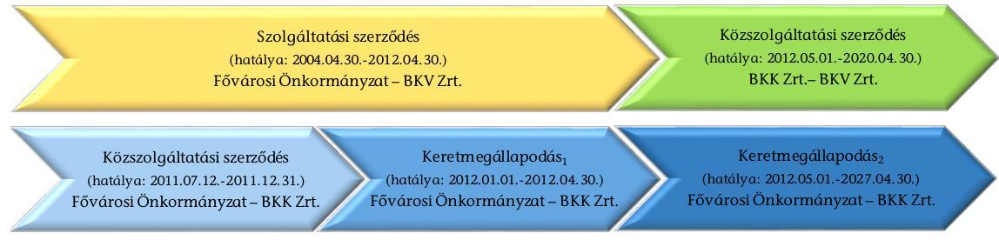

A Fővárosi Önkormányzat a 2010. január 1. és 2012. április 30. közötti időszakban a fővárosi tömegközlekedési, helyi személyszállítási feladatait a BKV Zrt.-vel 2004. április 30-án kötött szolgáltatási szerződés alapján végezte.

A BKK Zrt. és a Fővárosi Önkormányzat a közlekedésszakmai tevékenység finanszírozására, a közlekedésszervezési és projektmenedzsment feladatok ellátására 2011. július 12-én közszolgáltatási szerződést kötött, melyet 2011. december 23-án közös megegyezéssel 2011. december 31. napjával megszüntettek.

A BKK Zrt. a Koncepció ${ }_{1}$-ban meghatározottak szerint 2012. január 1-jétől a fővárosi közútkezelői és a taxiállomásokat működtető önkormányzati tulajdonban lévő gazdasági társaságok BKK Zrt.-be történő beolvadásával a társaságok feladatait is átvette. A feladatok ellátásának biztosítására a hatályban lévő közszolgáltatási szerződés nem volt alkalmas, ezért a közútkezelői feladatok és a közszolgáltatások teljesítésére vonatkozóan a Fővárosi Önkormányzat és a BKK Zrt. 2011. december 23-án - 2012. január 1-jétől 2022. december 31-ig tartó időszakra - Keretmegállapodás ${ }_{1}$-t kötött.

A Fővárosi Önkormányzat és a BKK Zrt. között 2012. április 27-én - 2012. május 1-jétől 2027. április 30-áig terjedő időszakra - Keretmegállapodás ${ }_{2}$ jött létre. A Keretmegállapodás ${ }_{2}$ tárgya a közszolgáltatási (taxiállomások üzemeltetési,

---

parkolási rendszerek működtetési, projektmenedzsmenti) feladatok, és a közlekedésszervezői, a közútkezelői feladat-ellátása volt. A Keretmegállapodás ${ }_{2}$ hatályba lépésével egyidejűleg a Keretmegállapodás ${ }_{1}$-t megszüntették.

A Fővárosi Önkormányzat Budapest közlekedésszervezési feladatainak ellátásáról szóló - 2012. április 1-jétől hatályos - kijelölő rendeletet fogadott el, amelyben közlekedésszervezőként a BKK Zrt.-t, belső szolgáltatóként a BKV Zrt.-t jelölte ki. A BKK Zrt. és a BKV Zrt. között 2012. április 28-án közszolgáltatási szerződés jött létre. Ezzel a két gazdasági társaság között megrendelői, illetve belső szolgáltatói jogviszony alakult ki.

A Fővárosi Önkormányzat a jogszabályi előírásokkal összhangban meghatározta a közfeladat ellátáshoz biztosított közvagyon körét és azokat a BKK Zrt. rendelkezésére bocsátotta. A közfeladatok ellátásához történő vagyon, továbbá a forrás átvétele megfelelt a jogszabályi előírásoknak és a tulajdonosi szabályozásnak.

A Fővárosi Önkormányzat a jogszabályi előírások figyelembevételével alakította ki a fővárosi közösségi közlekedés finanszírozási rendszerét, azonban az a BKV Zrt. külső eladósodottságának mérséklését az ellenőrzött időszakban nem oldotta meg. A külső eladósodottság problémájának megoldása csak állami támogatással volt lehetséges. A 2015. évben a hitelállományból 52 290,0 M Ft tőketartozást és járulékait az állam ellenérték nélkül átvállalta a BKV Zrt.-től.

A Fővárosi Önkormányzat a jogszabályi előírásoknak megfelelően alakította ki a közösségi közlekedésben részt vevő gazdasági társaságok feletti tulajdonosi joggyakorlás rendjét. A BKK Zrt. a jogszabályi előírásoknak és a belső szabályozásoknak megfelelően gyakorolta a BKV Zrt. feletti egyes tulajdonosi jogokat.

A Fővárosi Önkormányzat a jogszabályoknak megfelelően kialakította és működtette a közszolgáltatások nyomon követési rendszerét. A BKK Zrt. a közlekedésszervezői, valamint a projektmenedzsmenti feladatai ellátásával kapcsolatos beszámolási kötelezettségének az ellenőrzött időszakban eleget tett. A BKK Zrt. éves beszámolóit tárgyaló Közgyűlési üléseken az ellenőrzött időszakban a társaság könyvvizsgálója nem volt jelen.

A Fővárosi Önkormányzat a 2010. és 2011. években a BKV Zrt.-nél, 2011. évben a BKK Zrt.-nél nem folytatott le tulajdonosi jogkörében eljárva az Ötv.ben meghatározott belső ellenőrzéseket. A Fővárosi Önkormányzat belső ellenőrzése a két gazdasági társaságot érintően 2012-2014. években összesen hét ellenőrzést folytatott le.

A BKK Zrt. az ellenőrzött időszakban teljesítette a BKV Zrt.-vel kötött Közszolgáltatási szerződésben foglalt kötelezettségeit és a Közszolgáltatási szerződésben foglaltaknak megfelelően gyakorolta jogait. A Közszolgáltatási szerződés alapján a BKK Zrt. és a BKV Zrt. minden évben Éves Megállapodást kötött a közszolgáltatási kötelezettség ellátásának adott menetrendi évre vonatkozó feltételeiről. A Közszolgáltatási szerződésben foglaltak ellenére a 2013/2014. és 2014/2015. menetrendi évekre vonatkozó Éves megállapodások nem tartalmazták az utas elégedettségi indexet, a járművek által okozott maximális

---

környezetszennyezést, a kibocsátott káros anyagok mennyiségéből képzett mutatószámot, valamint az akadálymentesen hozzáférhető szolgáltatások arányát mutató index meghatározását sem. A 2013/2014. és 2014/2015. menetrendi évekre vonatkozó Éves megállapodásokban szereplő Üzleti tervek megfeleltek a Közszolgáltatási szerződés mellékletében foglalt kritériumoknak. A BKV Zrt. üzleti tervei tartalmazták a beruházások bemutatását, azok helyzetét, a beruházások kockázatait, azonban nem tartalmazták teljes körűen a Közszolgáltatási szerződések mellékletében meghatározott minimális követelményeket.

A Fővárosi Önkormányzat a közlekedésszervezési és a közlekedésfejlesztési nagyberuházások előkészítésével kapcsolatos (projektmenedzsment) feladatok ellátásának feltételrendszerét, finanszírozását a jogszabályi előírásoknak megfelelően alakította ki. A BKK Zrt. az ellenőrzött időszakban a Fővárosi Önkormányzattal kötött megállapodásokban, a jogszabályi előírásoknak, valamint a belső szabályozásnak megfelelően ellátta a közlekedésszervezői, valamint a projektmenedzsmenti feladatát.

A közlekedésszervezői feladatok részét képezték a közlekedésfejlesztés keretében EU-s és Fővárosi Önkormányzati forrásból megvalósuló projektek projektmenedzsmenti feladatai. A BKK Zrt. kedvezményezetti körébe tartozó, önkormányzati, illetve EU-s forrásból megvalósított közlekedésfejlesztési feladatok ellátása érdekében a BKK Zrt. számára meghatározott célokat, műszaki tartalmat és a keretösszegek felhasználását szabályozó feltételeket és az elszámolás szabályait és körülményeit a projektekre kötött megállapodások, támogatási szerződések és azok mellékletét képező engedélyokiratok részletezték.

Az ellenőrzött időszakban a BKK Zrt. közel 200,0 Mrd Ft értékű fejlesztés megvalósításában vett részt, melyből 44 db szerződéssel, 69 904,1 M Ft értékű fejlesztés megvalósítására kötött megállapodást a Fővárosi Önkormányzattal. Ezek közül 10 db kapcsolódott a közlekedésfejlesztési nagyberuházásokhoz.

A BKK Zrt. gazdálkodásának szabályozottsága az ellenőrzött időszakban összességében megfelelő volt. A BKK Zrt. a szabályzatai elkészítése során a Számv. tv.-ben előírt 90 napos határidőt részben tartotta be. A Számv. tv.ben foglaltak ellenére a BKK Zrt. 2010 novemberétől 2012 áprilisáig számlarenddel, 2010 novemberétől 2011 júniusáig leltározási és leltárkészítési szabályzattal, 2010 novemberétől 2011 júliusáig az eszközök és források értékelési szabályzatával, valamint 2010 novemberétől 2011 júniusáig önköltségszámítási szabályzattal nem rendelkezett.

A 2010-2014. években a BKK Zrt. vagyongazdálkodási tevékenysége és a közfeladat ellátást szolgáló vagyon nyilvántartása összességében szabályszerű volt. A BKK Zrt.-nek az ellenőrzött időszakban egy, a Fővárosi Önkormányzattól kapott ingatlanon kívül más vagyonkezelésbe vett vagyona nem volt. A 2014. évi beszámolójában a BKK Zrt. a vagyonkezelésbe vett ingatlant befektetett eszközei között elkülönítetten nem mutatta be. Viszont a hosszú lejáratú kötelezettségei között azt szerepeltette, így részben tett eleget a Számv. tv.ben és a vagyonkezelési szerződésben foglaltaknak.

---

A BKK Zrt. a Számv. tv.-ben előírtak szerint minden évben elkészítette az éves beszámolóját és üzleti jelentését. A BKK Zrt. Felügyelő Bizottsága határozattal döntött az éves beszámoló elfogadásáról. A Felügyelő Bizottság Ügyrendjében foglaltak ellenére a 2010-2011. évi beszámolóhoz a Felügyelő Bizottság nem készített írásos jelentést, így a 2010-2011. évi beszámolók alapítói elfogadására a Gt. előírásai ellenére a Felügyelő Bizottság írásos jelentése nélkül került sor.

A könyvvizsgáló a 2012., 2013. és 2014. években figyelemfelhívással élt a jelentéseiben. Mindhárom évben arra hívta fel a figyelmet, hogy a BKK Zrt. kompenzációs igényre jogosult, de a közlekedésszervezői feladatok elszámolása - a menetrendi éves elszámolás miatt - a Fővárosi Önkormányzattal a beszámoló időpontjáig nem történt meg.

A BKK Zrt.-nél a bevételek elszámolása az ellenőrzött időszakban - a pótdíjkövetelésekből származó bevételek kimutatását kivéve - szabályszerűen történt. A BKK Zrt. a befolyt pótdíjakat nem az egyéb bevételek között, hanem az értékesítés nettó árbevételében mutatta ki. A BKK Zrt. pótdíjbevétel elszámolási gyakorlata ellentétes a Számv. tv.-ben foglaltakkal.

Az Állami Számvevőszékről szóló 2011. évi LXVI. törvény 33. § (1) bekezdésében foglaltak értelmében a jelentésben foglalt megállapításokhoz kapcsolódó intézkedési tervet köteles az ellenőrzött szervezet vezetője összeállítani, és azt a jelentés kézhezvételétől számított 30 napon belül az ÁSZ részére megküldeni. Amennyiben az intézkedési tervet határidőben nem küldi meg a szervezet, vagy az nem elfogadható, az ÁSZ elnöke a hivatkozott törvény 33. § (3) bekezdés a)-b) pontjaiban foglaltakat érvényesítheti.

Az ellenőrzés intézkedést igénylő megállapításai és javaslatai:

# Javasoljuk a BKK Zrt. Vezérigazgatójának: 

1. A BKK Zrt. Számlarendje nem tartalmazta a vagyonkezelésbe vett eszközök nyilvántartására alkalmazandó számlaszámokat és azok megnevezését, ami nem felelt meg a Számv. tv. 161. § (1)-(2) bekezdésében foglaltaknak, amely előírja, hogy a kettős könyvvitelt vezető gazdálkodó az egységes számlakeret előírásainak figyelembevételével olyan számlarendet köteles készíteni, amely szerinti könyvvezetés az e törvényben előírt beszámoló készítését maradéktalanul biztosítja, illetve tartalmaznia kell minden alkalmazásra kijelölt számla számjelét és megnevezését, a számla tartalmát, a főkönyvi számla és az analitikus nyilvántartás kapcsolatát.

Javaslat:
Intézkedjen a szabályozási hiányosságok megszüntetésére, ennek keretében:
módosítsa a Számlarendjét a vagyonkezelésbe vett eszközök nyilvántartására alkalmazandó számlaszámokkal és azok megnevezésével.
2. A 2014. évi beszámolójában a BKK Zrt. a vagyonkezelésbe vett ingatlant befektetett eszközei között elkülönítetten nem mutatta be. Viszont a hosszú lejáratú kötelezettség-

---

gei között azt szerepeltette, így ezzel részben tett eleget a Számv. tv. 23. § (2) bekezdésében és a vagyonkezelési szerződés 13. pontjában foglaltaknak, melyek kimondják, hogy a vagyonkezelőnél a mérlegben eszközként kell kimutatni a kezelésbe vett, az állami vagy önkormányzati vagyon részét képező eszközöket, illetve a vagyonkezelő köteles a vagyonkezelésbe vett vagyon részét képező eszközt legalább mérlegtételek szerinti bontásban külön bemutatni.

A Közszolgáltatási szerződés 3.1.2 a) pontjában foglaltak ellenére a 2013/2014. és 2014/2015. menetrendi évekre vonatkozó Éves megállapodások nem tartalmazták az utas elégedettségi indexet, a járművek által okozott maximális környezetszennyezést, a kibocsátott káros anyagok mennyiségéből képzett mutatószámot, valamint az akadálymentesen hozzáférhető szolgáltatások arányát mutató index meghatározását sem. A 2013/2014. menetrendi évre vonatkozóan az Éves megállapodás nem tartalmazta továbbá a közszolgáltatást jogosulatlanul igénybevevők statisztikai arányából képzett mutatószámot sem.

A 2013/2014. és 2014/2015. menetrendi évekre vonatkozó Éves megállapodásokban szereplő Üzleti tervek megfeleltek a Közszolgáltatási szerződés 7. sz. mellékletében foglalt kritériumoknak. A BKV Zrt. üzleti tervei tartalmazták a beruházások bemutatását, azok helyzetét, a beruházások kockázatait, azonban nem tartalmazták teljes körűen a Közszolgáltatási szerződések 5. sz. mellékletben meghatározott minimális követelményeket.

A Keretmegállapodás ${ }_{2}$ 1. számú függelékeként elfogadott Éves mellékletek megkötésekor nem tartották be a Keretmegállapodás ${ }_{2}$ VI/B rész 40.1 pontjában, illetve 35.1 pontjában meghatározott - szerződés megkötésére vonatkozó
 május 31-ei határidőt.

A 2012. XII.–2013. II. időszakra vonatkozó menetrendi negyedéves beszámolót, valamint a 2013/2014. menetrendi éves elszámolást a késedelem objektív okainak ismertetése és a benyújtási határidő módosításának kezdeményezését követően a Keretmegállapodás ${ }_{2}$-ban előírt határidőn túl nyújtották be a Fővárosi Önkormányzatnak.

A 2012. I–II. negyedévre, a 2012. I–IV. negyedévre, valamint a 2013. I–II. negyedévre vonatkozó közszolgáltatási jelentést a Keretmegállapodás ${ }_{2}$-ban előírt határidőn (negyedévet követő 30, 2013. január 1-től 60 napon) túl küldték meg a Fővárosi Önkormányzatnak.

A BKK Zrt. kiegészítő mellékleteiben szerepel, hogy a pótdíjbevételeket a Számv. tv. 77. § (2) bekezdés b) pont szerinti bírság jellegű tételnek tekinti, így a bevételei között csak a pénzügyi teljesítéskor mutatja ki. A BKK Zrt. pótdíjbevétel-elszámolási gyakorlata ellentétes a Számv. tv. 77. § (2) bekezdés b) pontjában foglaltakkal, mivel a befolyt pótdíjakat nem az egyéb bevételek között, hanem az értékesítés nettó árbevételében mutatja ki. Az éves beszámoló kiegészítő mellékletében is a pótdíjbevételek, mint a tevékenység ellenértéke kerülnek bemutatásra.

A BKK Zrt.-nél az ellenőrzött időszakban a mintatételek ellenőrzése alapján a beruházások, felújítások elszámolása a jogszabályoknak és a belső előírásoknak részben megfelelően történt. A Számv. tv. 165. § (1)–(2) bekezdésben előírt bizonylatolási kötelezettséget megsértve egy esetben aktiválási jegyzőkönyv nem állt rendelkezésre, a bekerülési érték adatai pontosan nem voltak megállapíthatók, így nem teljesült a Számv. tv. 15. § (3) bekezdésében foglalt valódiság elve sem.

---

Egy vásárolt eszköz (egy db 15.810 Ft értékű mágnes tábla) visszaküldésekor az eszközmozgást a nyilvántartáson mennyiségileg nem vezették keresztül, az év végi leltározáskor hiányként kezelték.

# Gondoskodjon a jogszabályi előírások szerinti gyakorlat és a szabályos működés biztosítására, ennek keretében: 

a) intézkedjen, hogy a BKK Zrt. tegyen eleget a Számv. tv.-ben és a vagyonkezelési szerződés 13. pontjában foglaltaknak, vagyonkezelésbe vett ingatlant a kiegészítő mellékletekben mérlegtételek szerinti megbontásban külön mutassa be;
b) intézkedjen, hogy az Éves megállapodást egészítsék ki az utas elégedettségi index, a járművek által okozott maximális környezetszennyezés, a kibocsátott káros anyagok mennyiségéből képzett mutatószám, valamint az akadálymentesen hozzáférhető szolgáltatások arányát mutató index meghatározásával;
c) intézkedjen, hogy a BKV Zrt. üzleti tervein belül a beruházási terveket egészítsék ki a Közszolgáltatási szerződések 5. sz. mellékletben meghatározott minimális követelményekkel;
d) intézkedjen, hogy az Éves mellékletekre vonatkozó közgyűlési előterjesztés olyan határidőben kerüljön előkészítésre és megküldésre a Fővárosi Önkormányzat részére, hogy a Keretmegállapodás ${ }_{2}$ VI/B rész 40.1 pontjában, illetve 35.1 pontjában meghatározott, a szerződés megkötésére vonatkozó május 31-ei határidő betartható legyen;
e) intézkedjen, hogy a menetrendi negyedéves beszámolókat, valamint éves elszámolásokat a Keretmegállapodás ${ }_{2}$-ban előírt határidőn belül nyújtsák be a Fővárosi Önkormányzatnak;
f) intézkedjen, hogy a negyedévre vonatkozó közszolgáltatási jelentéseket a Keretmegállapodás ${ }_{2}$-ban előírt határidőn belül küldjék meg a Fővárosi Önkormányzatnak;
g) intézkedjen, hogy a befolyt pótdíjakat a Számv. tv. előírásainak megfelelően az egyéb bevételek között számolják el és mutassák ki;
h) gondoskodjon a beruházások, felújítások elszámolása során a Számv. tv.-ben előírt bizonylati elv és bizonylati fegyelem, valamint a valódiság elvének betartásáról.

## Javasoljuk Budapest Főváros Önkormányzata Főpolgármesterének:

1. A BKK Zrt. éves beszámolóit tárgyaló Közgyűlési üléseken az ellenőrzött időszakban a társaság könyvvizsgálója nem volt jelen, mert a könyvvizsgálót a Gt. 44. § (1), valamint a Ptk. 3:131. § (2) bekezdései ellenére a Fővárosi Önkormányzat nem hívta meg.

---

Javaslat:
Intézkedjen a jogszabályi előírások szerinti gyakorlat és a szabályos működés biztosítására, ezen belül:
intézkedjen annak érdekében, hogy az éves számviteli beszámolókat tárgyaló ülésekre a könyvvizsgáló meghívása megtörténjen.

---

# II. RÉSZLETES MEGÁLLAPÍTÁSOK 

## 1. A FŐVÁROSI KÖZÖSSÉGI KÖZLEKEDÉS INTÉZMÉNYRENDSZERÉNEK ÁTALAKÍTÁSA

### 1.1. A Fővárosi Önkormányzat közösségi közlekedés intézményrendszerének átalakítására vonatkozó koncepcióinak kialakítása

A Fővárosi Önkormányzat közösségi közlekedésszervezésének átalakítása során két közfeladatra terjedt ki az ellenőrzésünk. Az Mötv. 23. § (5) bekezdés 3. pontja szerint a kerületi önkormányzatok feladata a parkolás-üzemeltetés, az Mötv. 23. § (4) bekezdés 10. pontja szerint a Fővárosi Önkormányzat feladata a helyi közösségi közlekedés biztosítása és működtetése, valamint a főváros területén a parkolás feltételrendszerének kialakítása. A közlekedésszervezői feladatok BKK Zrt. általi ellátásának jogszabályi alapját a Busztv. 17/A. § (2) bekezdése, a Vtv. 88. § (4) bekezdése, valamint a Kkt. 19/A § (5) bekezdése, valamint 2012. július 1-jétől a Személyszállítási tv. 49. § (3) bekezdés a) pontja teremtette meg.

A Fővárosi Önkormányzat a jogszabályi előírásokkal és az ágazati koncepciókkal összhangban alakította ki a fővárosi közösségi közlekedés intézményrendszerének átalakítására vonatkozó koncepcióit. Az intézményrendszer átalakítása a jogszabályi előírások figyelembevételével történt.

A Gazdasági és Közlekedési Minisztérium 2007. évben jelentette meg az „Egységes Közlekedésfejlesztési Stratégia 2007–2020” dokumentumát. Az EKFS-ben a személyközlekedés, az áruszállítás, közlekedési infrastruktúra lehetséges fejlesztési stratégiáit, a beavatkozási területeket és a célkitűzéseket mutatták be helyzetelemzésekre alapozva.

A Közgyűlés 2010. október 27-én döntött a fővárosi közösségi közlekedés intézményrendszerének átalakításáról, elfogadta a „Koncepció Budapest közlekedési intézményrendszerének átalakítására” vonatkozó, külső szakértőkkel elkészíttetett Koncepció ${ }_{1}$-t. A Koncepció ${ }_{1}$ szerint az intézményrendszert úgy kell átalakítani, hogy az egységesen és rendszerszinten képes legyen kezelni a stratégiai, fejlesztési, illetve üzemeltetési feladatokat. A Koncepció ${ }_{1}$-ben bemutatták, hogy az európai városokban a közlekedés szervezeti változásai miként alakultak át. Az átalakulás során az önkormányzatok és a szolgáltatók között megjelent egy új közbülső szint, amely biztosította a tulajdonosi, megrendelői és szolgáltatói szerepek szétválasztását. Európai minták alapján a Koncepció ${ }_{1}$-ben javasolták egy integrált közlekedésszervező, közlekedésirányító gazdasági társaság, a Budapesti Közlekedési Központ Zrt. létrehozását. A BKK Zrt. kialakítása, a közfeladatok átvétele a Koncepciókban foglaltaknak megfelelően folyamatosan történt az ellenőrzött időszakban. 2010. évben a Koncepció ${ }_{1}$-ben meghatározott cél az volt, hogy a Társaság megalakuljon és egy átmeneti időszakot követően 2011. második félévében kezdje meg üzemszerű működését, amely

---

céloknak a BKK Zrt. eleget tett. A BKK Zrt. által ellátandó feladatokat és kötelezettségeket a Fővárosi Önkormányzat és a BKK Zrt. 2011. július 12-étől szerződésekben rögzítette. A szerződésekben és a Koncepciókban foglaltaknak megfelelően a BKK Zrt. kialakította a közfeladat-ellátás szervezeti kereteit és a közfeladatok változásának megfelelően folyamatosan módosította azt. A BKK Zrt. feladataként határozták meg Budapest közlekedési stratégiájának előkészítését és végrehajtását, a budapesti közlekedési ágazatok integrált irányítását és felügyeletét, a közszolgáltatások megrendelését és finanszírozását, a városi közlekedés fejlesztését, valamint az egységes finanszírozási rendszer működtetését. A Koncepció ${ }_{1}$ illeszkedett a Gazdasági és Közlekedési Minisztérium 2007–2020. közötti időszakra vonatkozó EKFS-éhez.

A Koncepció ${ }_{1}$ megvalósítása érdekében a Közgyűlés a vagyongazdálkodási rendelet 52. § (1) bekezdés a) pontja alapján alapítói jogkörében eljárva megalapította a BKK Budapesti Közlekedési Központ Zártkörűen Működő Részvénytársaságot. A közösségi közlekedés közfeladat ellátását végző szervezetrendszer átalakítására vonatkozó döntések összhangban álltak a Koncepcióval, az EKFS-sel, az Ötv.-vel, a Busztv.-vel, a Kkt.-vel, a Vasúttv.-vel, az 1370/2007/EK rendelet közlekedésszervezéssel kapcsolatos előírásaival.

A BKK SZMSZ ${ }_{1}$ 2011. január 10-én lépett hatályba. Az abban foglalt célok és feladatok összhangban álltak a Koncepció ${ }_{1}$-ban megfogalmazottakkal, egyúttal rögzítették, hogy az átalakulás folyamata és a Társaság első SZMSZ-ének a kialakítása már a Koncepció ${ }_{1}$ megvalósítását szolgálja.

A Koncepció ${ }_{1}$-ben foglalt azon cél érdekében, amely szerint a BKK Zrt. egy átmeneti időszakot követően 2011. év végén megkezdje üzemszerű működését, a BKK 2011. január 13-án Projekt Alapító Dokumentumot (PAD) hozott létre, amelyben 5 fő feladatot és projektcsoportot alakított ki a feladatok ellátására. Ezek a feladatok a BKK Zrt. szervezetének és működési folyamatainak kialakítása projektcsoport, a BKV Zrt. átalakítása projektcsoport, a további forrásszervezetek átalakítása projektcsoport, a BKK Zrt. működési kereteinek megteremtése projektcsoport és a közlekedésszakmai projektcsoport. Az egyes projektek célját, részletes feladattervét, elvárt eredményeit, részletes munka- és ütemtervét, erőforrástervét, más projektekhez való kapcsolódását projektlapokon rögzítették. A Fővárosi Közgyűlés által előírt ${ }^{1}$ tájékoztatási kötelezettsége érdekében a BKK Zrt. tájékoztatásokat készített, amelyben az Önkormányzatot tájékoztatta a feladatok állásáról. A Fővárosi Közgyűlés a tájékoztatókat megtárgyalta és elfogadta. ${ }^{2}$ A szervezet 2011. második félévében megkezdte üzemszerű működését.

A BKK Zrt. kialakítása, a közfeladatok átvétele tehát folyamatosan történt. A BKK által ellátandó feladatokat és kötelezettségeket a Fővárosi

[^0]
[^0]:    ${ }^{1}$ 1835/2010. (X.27.) Főv. Kgy határozat
    ${ }^{2}$ 2011. április 6-ai, 2011. augusztus 31-ei, 2011. december 14-ei, 2012. április 25-ei, 2012. szeptember 13-ai és 2012. október 3-ai Fővárosi Közgyűlések

---

Önkormányzat és a BKK 2011. július 12-étől szerződésekben – Önkormányzat és BKK közötti Közszolgáltatási szerződés ${ }^{3}$, keretmegállapodás ${ }_{1}{ }^{4}$ és Keretmegállapodás ${ }_{2}{ }^{5}$ – rögzítette.

A 2011. július 12-étől hatályos Önkormányzat és BKK Zrt. közötti Közszolgáltatási szerződés a Budapest Közlekedési Rendszerének Fejlesztési Terve megvalósításával kapcsolatos szakmai és koordinációs feladatok ellátását, valamint a közlekedésfejlesztési projektekkel kapcsolatos és a közlekedésszervezési előkészítő feladatokat tartalmazta.

2011. augusztusában a Fővárosi Közgyűlés elfogadta, ${ }^{6}$ a Budapest főváros új közlekedési közszolgáltatási struktúrájára vonatkozó Koncepció ${ }_{2}$-t, amelyben az Önkormányzat feladatul határozta meg a közlekedésszervezői feladatok BKK Zrt. általi ellátását. Ennek jogszabályi alapját a Busztv. 17/A. § (2) bekezdése, a Vtv. 88. § (4) bekezdése, valamint a Kkt. 19/A § (5) bekezdése, valamint 2012. július 1-jétől a Személyszállítási tv. 49. § (3) bekezdés a) pontja teremtette meg. A Koncepció ${ }_{2}$ tartalmazta továbbá a közútkezelői és parkolási feladatokat és a taxiállomások BKK Zrt. általi átvételére vonatkozó feladatokat is. A Koncepció a Koncepció ${ }_{1}$-ben meghatározott közlekedésszakmai megvalósíthatóság érdekében került kidolgozásra, amely a 2012. évtől bevezetendő új közszolgáltatási rendszert mutatta be.

A BKK Zrt. Igazgatósága 2012. februári ülésén fogadta el az „Új tömegközlekedési intézményrendszer 2012.” című projektet, amely azokat a feladatokat tartalmazta, amelyek alapján a BKK Zrt. át tudja venni a közlekedésszervezői feladatokat, amely által szét tudják választani a megrendelői és szolgáltatói szerepeket. A projekt célja az volt, hogy az új tömegközlekedési struktúra feltételeinek, működési mechanizmusainak kialakítása a Koncepció ${ }_{1}$-nek leginkább megfelelően, zökkenőmentesen megtörténjen 2012. május 31-ig, amely összességében, a Keretmegállapodás ${ }_{2}$ megkötésével és 2012. május 31-ei hatálybalépésével megtörtént.

Budapest főváros tömegközlekedési szolgáltatásainak biztosítása tárgyában a Főváros és a BKV Zrt. között 2004. április 30-án kötött Szolgáltatási szerződés 2012. április 30-án megszűnt, amelynek azonos feltételek melletti meghosszabbítására, vagy megújítására nem volt lehetőség, tekintettel az 1370/2007/EK rendelet 8. cikk (3) bekezdésében foglaltakra. A 2012. április 1-jétől hatályos Kijelölő rendelet 1. §-ában a Fővárosi Önkormányzat a BKK Zrt.-t jelölte ki közlekedésszervezőnek. A Kijelölő rendelet 5. §-ban meghatározta, hogy mely feladatok ellátására jelölte ki a közlekedésszervezőt, és a 4. §-ában leírta, hogy a közlekedésszervezői feladatok ellátásának részletes szabályait a Fővárosi Önkormányzat és a Közlekedésszervező közötti feladat-ellátási szerződés tartalmazza. Mindezt részletesen a
 2012. május 1-jén hatályba

[^0]
[^0]:    ${ }^{3}$ Hatályos: 2011. július 12. - december 31. között
    ${ }^{4}$ Hatályos: 2012. január 1. - április 30. között
    ${ }^{5}$ Hatályos: 2012. május 1-jétől, az ellenőrzött időszakban 11 módosítással
    ${ }^{6}$ 2249/2011. (VIII.31.) Főv. Kgy. határozat

---

# lépő, a Kijelölő rendelettel összhangban készült Keretmegállapodás ${ }_{2}$, majd annak módosításai tartalmazták. 

Az 1370/2007/EK rendelet a finanszírozás transzparenciáját alapelvként rögzítve elválasztotta egymástól a megrendelői és a szolgáltatói szerepeket, valamint előírta a közlekedési közszolgáltató részére nyújtott kompenzáció számításának elveit és a közszolgáltatás megrendelésének, szervezésének kereteit. Az EK rendelet előírta továbbá, hogy a szolgáltatónak nyújtott ellentételezés nem haladhatja meg a közszolgáltatás végrehajtása során felmerült kiadás fedezéséhez szükséges összeget, beleértve az ésszerű nyereséget is. Az EK rendeletnek megfelelő működés alapján a megrendelőnek meg kell állapítania a szolgáltatás mennyiségi és minőségi jellemzőit, ellenőriznie kell a teljesítéseket, vizsgálnia szükséges a költségek indokoltságát, megfelelően szükséges kezelnie a közszolgáltatási szerződéseket. Ennek megfelelően a Közgyűlés 2011. augusztus 31-én döntött a főváros új közlekedési közszolgáltatási struktúrájára vonatkozó Koncepció ${ }_{2}$ elfogadásáról. A Közgyűlés e határozatával elfogadta, hogy a BKK Zrt. lássa el a fővárosban működő közlekedési társaságok feladatainak azt a részét, amely a feladatok megrendelésével, ellátásuk szervezésével és finanszírozásával kapcsolatos. A Fővárosi Önkormányzat az Ötv. 8. § (1) bekezdés és a 2011. augusztus 1-jén módosított 63/A. § (g) pontjában meghatározott, a fővárosi tömegközlekedés Busztv., a Vasúttv., és a Kkt. szerinti feladatainak ellátását a BKK Zrt. útján látja el. A fővárosi közösségi közlekedési rendszer átalakítása összhangban volt az Ötv. 63/A. § g) pontjának 2011. augusztus 1-jei változásával és az 1370/2007/EK rendelet előírásával.

A Koncepció ${ }_{1,2}$-ban foglaltaknak megfelelően a BKK Zrt. 2012. január 1-jétől a működésébe integrálta a Főpolgármesteri Hivatal Közlekedési Ügyosztályától átvett közlekedésszervezési és fejlesztési (projektmenedzsmenti) feladatokat. Az FKF Zrt.-től a közútkezelés irányításával, megrendelésével, ellenőrzésével és a közúti forgalomirányítással kapcsolatos feladatok átvételére került sor. A BKK Zrt. a Parking Kft.-től a parkolás fejlesztési feladatokat, a parkolás üzemeltetés irányításával, megrendelésével és ellenőrzésével kapcsolatos feladatokat, míg a Taxi NKft.-től, annak teljes feladatkörét átvette. Az Mötv. 23. § (5) bekezdés 3. pontja szerint a kerületi önkormányzatok feladata a parkolás-üzemeltetés, az Mötv. 23. § (4) bekezdés 10. pontja szerint a Fővárosi Önkormányzat feladata a helyi közösségi közlekedés biztosítása és működtetése, valamint a főváros területén a parkolás feltételrendszerének kialakítása. A BKK Zrt. 2012. május 1-jétől a BKV Zrt.-ből a közlekedésszervezéshez, megrendeléshez, forgalomirányításhoz, értékesítéshez, ellenőrzéshez és a kiemelt közlekedésszervezési projektek lebonyolításához kapcsolódó feladatokat vette át.

A Közgyűlés 2014. november 26-án elfogadta a Koncepció ${ }_{3}$-t. A Koncepció ${ }_{3}$ szerint a Fővárosi Önkormányzat közfeladatainak és közszolgáltatásainak végrehajtását a Budapesti Városigazgatóság Holding Zrt. útján látja el. ${ }^{7}$ A fővárosi közösségi közlekedés intézményrendszerének 2015. évi átalakítására vonatkozó 2014. évi döntés összhangban volt a Mötv.-vel, a Személyszállítási tv.-vel, és az 1370/2007/EK rendelet előírásaival.

[^0]
[^0]:    ${ }^{7}$ A Közgyűlés 2015. január 15-étől létrehozta a Budapesti Városigazgatóság Holding Zártkörűen Működő Részvénytársaságot, amelybe integrálták a BKK Zrt.-t is.

---

A BKK Zrt. szervezetének kialakítása a Koncepció ${ }_{1}$-nak megfelelően, de nem hatástanulmánnyal, számításokkal alátámasztott terv alapján történt. A BKK Zrt. az ellenőrzött időszakban a szervezeti felépítését folyamatosan alakította az új kapott feladatoknak megfelelően.

# 1.2. A Fővárosi Önkormányzat által a feladatellátás feltételrendszerének kialakítására kötött szerződések jogszabályi előírásoknak való megfelelősége 

A Fővárosi Önkormányzat a jogszabályi előírásokkal összhangban alakította ki a helyi közösségi közlekedés közfeladat ellátásának feltételrendszerét. A BKV Zrt. és a BKK Zrt. a közösségi közlekedés feladatait az ellenőrzött időszakban a Gt., a Ptk, az Ötv., a Mötv., a Busztv., a Vtv., a Kkt., a Személyszállítási tv., és az 1370/2007/EK rendelet előírásainak megfelelő szerződések alapján látta el.

A Fővárosi Önkormányzat a 2010. január 1. és 2012. április 30. közötti időszakban a fővárosi tömegközlekedési, helyi személyszállítási feladatait a BKV Zrt.-vel 2004. április 30-án kötött Szolgáltatási szerződés alapján látta el.

A Szolgáltatási szerződés részletesen meghatározta az ellátandó feladatokat, a Fővárosi Önkormányzat és a BKV Zrt. jogait és kötelezettségeit. A Szolgáltatási szerződést a felek 2010. és 2012. április 30. között két alkalommal módosították. A BKV Zrt. feladatainak változását csak a 2012. április 1-jei szerződésmódosítás érintette. A Szolgáltatási szerződés 2012. április 30-án lejárt.

A Fővárosi Önkormányzat és a BKK Zrt. a közlekedésszakmai tevékenység finanszírozására, a közlekedésszervezési és projektmenedzsment feladatok ellátására Közszolgáltatási Szerződést kötöttek. A szerződés 2011. július 12-én lépett hatályba és 2012. december 31-ig terjedő időtartamra jött létre. A Közszolgáltatási szerződést 2011. december 23-án közös megegyezéssel 2011. december 31. napjával megszüntették.

A BKK Zrt. a Koncepció ${ }_{1}$-ban meghatározottak szerint 2012. január 1-jétől a fővárosi közútkezelői és a taxiállomásokat működtető önkormányzati tulajdonban lévő gazdasági társaságok BKK Zrt.-be történő beolvadásával a társaságok feladatait is átvette. Ezzel egyidejűleg a Parking Kft.-től a teherforgalmi és parkolási közszolgáltatásokkal összefüggő feladatok átvétele is megtörtént. A feladatok ellátásának biztosítására a hatályban lévő Közszolgáltatási szerződés nem volt alkalmas, ezért a közútkezelői feladatok és a közszolgáltatások teljesítésére vonatkozóan „Közútkezelői feladat ellátásról és közszolgáltatásról" szóló Keretmegállapodás ${ }_{1}$-t kötött 2011. december 23-án a Fővárosi Önkormányzat és a BKK Zrt. A Keretmegállapodás ${ }_{1}$ 2012. január 1-jétől 2022. december 31-ig hatályos, területi hatályaként Budapest Főváros közigazgatási határát jelölte meg. A Keretmegállapodás ${ }_{1}$ az egyes köz- és egyéb feladatok tekintetében meghatározta a BKK Zrt. és a Fővárosi Önkormányzat jogait és kötelezettségeit.

A Fővárosi Önkormányzat elfogadta a Budapest közlekedésszervezési feladatainak ellátásáról szóló 20/2012. (III. 14.) Főv. Kgy. rendeletet. A Kijelölő rendelet 2012. április 1-jén lépett hatályba. A Kijelölő rendelet 1. §-ában a Busztv., a Vasúttv., és a Kkt. szerinti feladatainak ellátására közlekedésszervezőként - az

---

1370/2007/EK rendelet szerinti illetékes helyi hatósággá - a 2. § 5. pontjában a BKK Zrt.-t, a 2. § 4. pontjában belső szolgáltatóként a BKV Zrt.-t jelölte ki. A Kijelölő rendelet 4. §-a előírta, hogy a közlekedésszervezői feladatok ellátásának részletes szabályait, e feladatok pénzügyi és teljesítményi korlátait, valamint a kötelező és önként vállalt feladatok számviteli elhatárolásának szabályait a Fővárosi Önkormányzat és a közlekedésszervező közötti feladat-ellátási szerződésnek kell tartalmaznia. A Kijelölő rendelet 5. §-ában részletesen meghatározták a közlekedésszervező feladatait.

A Fővárosi Önkormányzat és a BKK Zrt. 2012. április 27-én „Feladat-ellátásról és közszolgáltatásról" szóló Keretmegállapodás ${ }_{2}$-t kötött. A Keretmegállapodás ${ }_{2}$ tárgya a közszolgáltatási (taxiállomások üzemeltetési, parkolási rendszerek működtetési, projektmenedzsmenti) feladatok, és a közlekedésszervezői, a közútkezelői feladat-ellátása. A Keretmegállapodás ${ }_{2}$ egységes szerkezetbe foglalta az újonnan létrejött intézményi struktúrához igazodóan kialakított feladatokat, eljárásrendeket, a felekre háruló kötelezettségeket és jogokat. A Keretmegállapodás ${ }_{2}$ Második rész II/B. rész szabályozta a kizárólagos fővárosi önkormányzati tulajdonban lévő BKV Zrt. részvényei feletti részesedés vagyonkezelésbe adását. A szabályozás megfelelt az Nvtv. előírásainak. A Keretmegállapodás ${ }_{2}$ 2012. május 1-jén lépett hatályba határozott időre, 2027. április 30-ig. A Keretmegállapodás ${ }_{2}$ hatályba lépésével egyidejűleg a Keretmegállapodás ${ }_{1}$-t megszüntették.

A Keretmegállapodás ${ }_{2}$ aláírását követően a fővárosi tömegközlekedési, helyi személyszállítási közfeladatok ellátására a BKK Zrt. és a BKV Zrt. 2012. április 28-án Közszolgáltatási szerződést kötött. Ezzel a két gazdasági társaság között megrendelői, illetve belső szolgáltatói jogviszony alakult ki. A közszolgáltatási szerződés 2012. május 1-jén lépett hatályba, amely határozott időre, 8 évre 2020. április 30-ig jött létre. 2014. november 13-án a BKK Zrt. és a BKV Zrt. abban állapodott meg, hogy a Közszolgáltatási szerződés hatályát 4 évvel, 12 évre meghosszabbítja a rendelkezésre tartással érintett 75 db autóbusz tekintetében. A módosítást a Kijelölő rendelet 2014. július 16-ai módosítása tette lehetővé. A Közgyűlés a szerződés módosítását megelőzően, 2014. június 30-án elfogadta a Közszolgáltatási szerződés időbeli hatályának meghosszabbítását.

A helyi közösségi személyszállítás, tömegközlekedés közfeladat és egyéb feladatainak biztosítására a 2010-2014. években kötött közszolgáltatási szerződések, keretmegállapodások részletes bemutatását az 1. számú melléklet tartalmazza.

# 1.3. A Fővárosi Önkormányzat közfeladat-ellátást szolgáló közvagyon és humánerőforrás rendelkezésre bocsátására vonatkozó döntéseinek szabályszerűsége 

A Fővárosi Önkormányzat a jogszabályi előírásokkal összhangban meghatározta a közfeladat ellátáshoz biztosított közvagyon körét és azokat a BKK Zrt. rendelkezésére bocsátotta. Az ellenőrzött időszakban a közfeladatok ellátásához történő vagyon és humánerőforrás átvétele megfelelt a jogszabályi előírásoknak és a tulajdonosi szabályozásnak. A Számv. tv., az Mt. előírásait és a Közgyűlési határozatokban foglaltakat a feladatok átvételekor betartották.

---

A Közgyűlés a BKK Zrt. 2010. október 27-ei alapításakor a Gt. 12. § (1) és a 207. § (1) bekezdése, valamint a vagyongazdálkodási rendelet előírásaival összhangban a BKK Zrt. alaptőkéjét 50,0 M Ft összegben határozta meg, a működési feltételek biztosításához 100,0 M Ft összegben pénzeszköz rendelkezésre bocsátásáról döntött. Az alaptőke és a működési támogatás rendelkezésre bocsátása, valamint a feladatellátáshoz szükséges közvagyon körének meghatározása a 2010. évi költségvetési rendelet módosításával vált teljes körűen biztosítottá.

A 2010. október 27. napján az intézményrendszer átalakításához szükséges alapító döntések közül a legfontosabb határozatok: a BKK Zrt. létrehozásáról ${ }^{8}$; a BKK Zrt. alaptőkéjének 50,0 M Ft összegű meghatározásáról ${ }^{9}$; az Alapító Okirat tartalmának elfogadásáról, és a főpolgármester felkérése a személyi döntések meghozatalára ${ }^{10}$; az alaptőke 50,0 M Ft összegű pénzbeli hozzájárulásának soron kívüli rendelkezésre bocsátásáról, a társaság működési feltételeinek biztosításához szükséges 100,0 M Ft összegű pénzeszköz rendelkezésre bocsátásáról az „Általános tartalék" előirányzatából történt átvezetéssel ${ }^{11}$; a működési támogatásra vonatkozó megállapodás a főpolgármester saját hatáskörben történő elkészítéséről és aláírásáról, 100,0 M Ft összegű működési támogatás soron kívüli utalásáról ${ }^{12}$.

A Közgyűlés a 2011. évben több alkalommal rendelkezett a BKK Zrt. alaptőkéjének megemeléséről, valamint működési célú pénzeszköz végleges rendelkezésre bocsátásáról. A BKK Zrt. 2011. évben bővülő feladatainak finanszírozására a rendelkezésre bocsátott pénzeszközök nem voltak elegendőek, ezért a Közgyűlés 2011. március 23-án az alaptőke 300,0 M Ft összegűre történő megemeléséről döntött. A tőkeemelés kizárólag pénzbeli teljesítéssel történt. A pénzösszeg rendelkezésre bocsátásához szükséges 2011. évi költségvetési rendeletet a Közgyűlés módosította. A Közgyűlés a 2011. szeptember 28-ai határozatával 215,5 M Ft összegű működési célú pénzeszköz BKK Zrt. részére történő átadásáról döntött.

A Közgyűlés a 4001/2011. (XII. 14.) számú határozatával döntött a BKK Közút Zrt.-ben lévő 100%-os tulajdonrészének BKK Zrt.-be történő apportálásáról. A tőkeemelés eredményeként a BKK Közút Zrt. saját tőkéjének az apportértékelés során megállapított vagyonértékéből - a BKK Közút Zrt. alaptőkéjének megfelelő összeg - 1500,0 M Ft a BKK Zrt. jegyzett tőkéjébe, míg az alaptőkét meghaladó rész,
 2424,5 M Ft tőketartalékba került. A Közgyűlés 2012. június 20-án a Fővárosi Parkolási Eszközkezelő Kft. beolvadásával kapcsolatos a BKK Zrt. által kibocsátandó egy darab 1,0 M Ft névértékű törzsrészvény átvételéről rendelkezett. Ezáltal a BKK Zrt. jegyzett tőkéje 1801,0 M Ft összegűre emelkedett. Az alaptőke változását az Alapító Okiratokon megfelelően átvezették.

A BKK Zrt. 2012. január 1-jétől a fővárosi közútkezelői és a taxiállomásokat működtető önkormányzati tulajdonban lévő gazdasági társaságok BKK Zrt.-be történő beolvadásával a társaságok feladatait, valamint a munkavállalókat is

[^0]
[^0]:    ${ }^{8}$ 1829/2010. (X. 27.) KGY határozat
    ${ }^{9}$ 1830/2010. (X. 27.) KGY határozat
    ${ }^{10}$ 1831/2010. (X. 27.) KGY határozat
    ${ }^{11}$ 1832/2010. (X. 27.) KGY határozat
    ${ }^{12}$ 1834/2010. (X. 27.) KGY határozat

---

átvette. Ezzel egyidejűleg a Parking Kft.-től a teherforgalmi és parkolási közszolgáltatásokkal összefüggő feladatok átvétele is megtörtént. A feladatok átadásakor a közlekedésszervezési feladatok tekintetében a BKV Zrt.-től, a projektmenedzsment közfeladatok ellátásához a Főpolgármesteri Hivatal Közlekedési Ügyosztályától, a taxiállomások üzemeltetéséhez kapcsolódóan a Taxi NKft.-től, illetve a teherforgalmi és parkolási közszolgáltatások esetében a Parking Kft.-től összesen 1272 fő munkavállaló jogutódlással történő átvételére került sor.

A BKV Zrt.-től 2012. május 1-jével 1135 fő munkavállaló átvétele történt meg. A BKK Zrt. írásban tájékoztatta a munkavállalókat a munkáltató személyében bekövetkezett változásról, illetve az Mt. 74. § (1) bekezdésének eleget téve a munkáltatói jogkör gyakorlójáról. Az Mt. 85/A. § (2) bekezdése szerint a jogutódlás időpontjában fennálló munkaviszonyból származó valamennyi jog és kötelezettség a jogelődről a jogutód munkáltatóra szállt át, ami jogfolytonos továbbfoglalkoztatást jelentett. A BKK Zrt. és a BKV Zrt. között 2012. április 27-én munkáltatói jogutódlás egyes kérdéseiről szóló megállapodást írtak alá.

A BKK Zrt. a Főpolgármesteri Hivatal Közlekedési Ügyosztálytól 2012. január 1-jétől kezdődően 24 fő köztisztviselő - bér és juttatás tekintetében - azonos feltételekkel történő továbbfoglalkoztatását vállalta a 2985/2011. (X. 21.) Fkgy. határozat alapján. A munkavállalók tájékoztatása a munkáltató személyében történő változásról és a munkáltatói jogkör gyakorlójáról az Mt. előírásainak megfelelően megtörtént.

A Taxi NKft. taxiállomás fejlesztési és üzemeltetési feladatait a BKK Zrt. 2012. január 1-jével vette át a Fővárosi Önkormányzat 39/2011. (VII. 7.) számú rendelete alapján. 2012. január 1-jével az Mt. előírásai szerint 7 fő jogutódlással történő átvétele történt meg. A Parking Kft. és a BKK Zrt. között 2011. december 30-án az Mt. 85/A. § (1) bekezdés a), b) pontja alapján munkáltatói jogutódlásról szóló megállapodás került aláírásra, amely során 2012. január 1-jén 106 fő átvétele történt meg. A munkavállalók tájékoztatása a munkáltató személyében történő változásról és a munkáltatói jogkör gyakorlójáról mindkét esetben az Mt. előírásainak megfelelően megtörtént.

# 1.4. A Fővárosi Önkormányzat közösségi közlekedési feladatellátásban részt vevő társaságok feletti tulajdonosi joggyakorlása 

A Fővárosi Önkormányzat az ellenőrzött időszakban a jogszabályi előírásoknak megfelelően alakította ki a közösségi közlekedésben részt vevő gazdasági társaságok feletti tulajdonosi joggyakorlás rendjét. A BKK Zrt. a jogszabályi előírásoknak és a belső szabályozásoknak megfelelően gyakorolta a BKV Zrt. feletti egyes tulajdonosi jogokat. A BKK Zrt. Igazgatósága és Felügyelő Bizottsága kialakította a működésének kereteit. A Közgyűlés, mint a tulajdonosi jogkör gyakorlója a közösségi közlekedés intézményrendszerének átalakítását követően a közfeladat ellátásban részt vevő társaságok által ellátandó feladatok változása miatt az Alapító Okiratokat megfelelően módosította.

A BKV Zrt. Alapító Okirata 2010. január 1-jén a vagyongazdálkodási rendelet ${ }_{1}$-ben foglaltakkal összhangban tartalmazta mindazon jogokat, kötelezettségeket és a kapcsolódó hatásköröket, amelyek a Közgyűlést, mint a tulajdonosi

---

jogkör gyakorlóját megillették. Az Alapító Okiratban rendelkeztek az Igazgatóság beszámolásának módjáról és gyakoriságáról, tagjainak számáról; a Felügyelő Bizottság feladat és hatásköréről, tagjainak számáról. A BKV Zrt. Alapító Okiratát 2010-2014. között három alkalommal módosították. A BKV Zrt. 2010. február 15-ei módosítása érintette a tisztségviselők megválasztásával, kijelölésével kapcsolatos hatásköröket, valamint a tagok létszámát. A 2010. október 27-ei módosítás érintette a társaság tevékenységi körének az Igazgatóság általi meghatározásának, módosításának jogát. Módosították a garancia-, kezességvállalás, tartozásátvállalás értékének meghatározását, a pénzügyi lízing, tartós bérleti szerződés megkötésének értékhatárát. Az Igazgatóság tagjainak számát hét főben határozták meg, megbízatásuk idejét határozatlan időre módosították. Az Igazgatóság elnökét az alapító választja. A Felügyelő Bizottság tagjainak száma hat főben került meghatározásra, megbízatásuk idejét határozatlan időre módosították. A Felügyelő Bizottság elnökét az alapító választja. A BKV Zrt. Alapító Okiratába, annak 2013. március 21-ei módosítása során a Megbízási szerződés alapján bejegyezték a BKK Zrt.-t megillető a Gt. 22. § (5) bekezdésében meghatározott a vezető tisztségviselő részére adható írásbeli utasítás jogát.

A BKK Zrt. Alapító Okiratát a főpolgármester 2010. november 2-án írta alá, a BKK Zrt. cégbírósági bejegyzésére 2010. november 16-án került sor. A BKK Zrt. alapításakor a Közgyűlés a Gt. előírásainak megfelelően megválasztotta a vezető tisztségviselőket. A BKK Zrt. Alapító Okiratát 2010-2014. években 10 alkalommal módosították. Az Alapító Okirat 2011. március 23-án történő módosításával a BKK Zrt. alaptőkéjét 300,0 M Ft-ra növelték. Az Alapító Okirat 2011. július 12-ei módosítása érintette az alapító hatáskörébe tartozó feladatokat, valamint a vezető tisztségviselők, a testületek tagjai megválasztásának módját, a testületek lehetséges létszámát, a vezető tisztségviselők díjazásának megállapítását, valamint a vezető tisztségviselők és a testületek beszámolására vonatkozó előírásokat. A módosítással részletesen szabályozták a részvények kibocsátását, átruházását, nyilvántartását, a tőkeemelést és a tőke leszállítását. Az Alapító Okirat 2011. december 14-én történt módosításával tovább bővült a BKK Zrt. tevékenységi köre. Az Alapító Okirat tartalmazta többek között az alaptőke 1800,0 M Ft-ra történő növelését, 300,0 M Ft pénzbeli és 1500,0 M Ft nem pénzbeli (apport) hozzájárulásból. A 2012. január 25-én és 2012. április 25-én hatályba lépett Alapító Okiratok csak kisebb módosításokat tartalmaztak. A 2012. június 20-án módosított Alapító Okiratot kiegészítették a társaság új - a közlekedésszervezési feladatokkal kapcsolatos - telephelyeivel és fióktelepeivel, tartalmazta a BKK Zrt. alaptőkéjének 1,0 M Ft apporttal való növelését, valamint kiegészítették további új tevékenységi körökkel. A 2012. november 28-án elfogadott Alapító Okiratban módosították a BKK Zrt. székhelyét annak változása miatt. Az Alapító Okirat 2013. január 22-ei módosításával jegyezték be a társasági részesedéshez kapcsolódó tulajdonosi jogok gyakorlására szóló megbízáson alapuló meghatalmazási szerződésben foglalt tulajdonosi jogokat a BKV Zrt. Igazgatóság tagjainak megválasztásának és visszahívásának jogát. Az Alapító Okirat 2013. március 27-ei módosításakor a BKK Zrt. tevékenységi körét bővítették és a Felügyelőbizottság összehívásának határidejét módosították. Az Alapító Okirat 2013. december 11-ei módosításakor az Igazgatóság létszámát ötről hét főre emelték.

---

A Közgyűlés vagyongazdálkodási rendelet ${ }_{1,2}$-ben szabályozta az önkormányzati tulajdonú gazdasági társaságok feletti tulajdonosi jogok gyakorlásának rendjét. A közösségi közlekedésben részt vevő egyszemélyes gazdasági társaságok feletti egyes tulajdonosi jogokat a Közgyűlés közvetlenül gyakorolta. A tulajdonosi joggyakorlás rendje az ellenőrzött időszakban a vagyongazdálkodási rendelet ${ }_{1,2}$ előírásainak megfelelt. A Keretmegállapodás ${ }_{2}$ Második rész II/B. része keretében a Fővárosi Önkormányzat és a BKK Zrt. vagyonkezelési szerződést kötött. A vagyonkezelési szerződéssel a Fővárosi Önkormányzat a BKV Zrt.-ben fennálló tulajdonosi részesedését megtestesítő részvényekre vagyonkezelési jogot engedett BKK Zrt. részére. Vagyonkezelőként a vagyonkezelési szerződésben meghatározottak szerint a BKK Zrt.-t megillette a Gt. 22. § (5) bekezdésében meghatározott, az egyszemélyes gazdasági társaságnál a vezető tisztségviselő részére adható írásbeli utasítás joga. Az írásbeli utasításadás szabályozása kiterjedt annak módjára, eljárási szabályaira. Tartalma alapján a BKK Zrt. részére biztosította a javaslattétel lehetőségét a BKV Zrt. Igazgatósága többségi tagjainak személyére, az üzleti terv és beszámoló elfogadására, valamint az alapító döntési jogkörébe tartozó ügyekben, amelyet a BKV Zrt. a BKK Zrt.-nél döntés előterjesztésekben kezdeményezett. A Keretmegállapodás ${ }_{2}$-nek megfelelően a vagyongazdálkodási rendelet ${ }_{2}$ 2012. május 8-án módosult. A vagyongazdálkodási rendelet ${ }_{2}$ ettől az időponttól szabályozta BKK Zrt. vagyonkezelésében lévő BKV-részvények vonatkozásában a BKK Zrt.-t vagyonkezelőként megillető jogok gyakorlását.

Az Nvtv. 8. § (7) bekezdésének 2012. június 30-án hatályba lépett rendelkezése értelmében a gazdasági társaságban fennálló önkormányzati tulajdonban lévő társasági részesedés nem lehet vagyonkezelés tárgya. A már megkötött szerződések Nvtv.-nek megfelelő módosítására a jogszabály 2012. december 31-ig adott lehetőséget. Ezért szükségessé vált a Keretmegállapodás ${ }_{2}$ módosítása, amely 2012. december 19. napján közös megegyezéssel megtörtént. Az Nvtv. 8. § (7) bekezdésének megfelelően a BKV Zrt. társasági részesedéséhez kapcsolódó tulajdonosi jogok gyakorlását a Fővárosi Önkormányzat és a BKK Zrt. külön megbízási szerződésben rögzítette. A Megbízási szerződést 2012. december 21-én kötötték meg. A Megbízási szerződésben rögzítették, hogy a BKV Zrt. részesedése kapcsán az egyedüli részvényesi pozícióból eredő, és az Alapító Okiratban, valamint a vonatkozó jogszabályokban meghatározott jogok továbbra is a Fővárosi Önkormányzatot illetik, és e jogokat kizárólag a Fővárosi Önkormányzat jogosult gyakorolni. Kivételt képez a Gt. 22. § (5) bekezdése alapján az egyedüli részvényest megillető írásbeli utasítási jog, amelyet a BKK Zrt. a szerződés alapján, mint megbízott a meghatározottak szerint jogosult gyakorolni. A Megbízási szerződést 2012. április 27-ig kötötték. Az írásbeli utasítási jog alapján a BKK Zrt. a Fővárosi Önkormányzatra nézve lényeges pénzügyi kihatással járó írásbeli utasítást kizárólag a Fővárosi Önkormányzat előzetes jóváhagyását követően adhat. Amennyiben az utasítás-tervezetre vonatkozóan a Fővárosi Önkormányzat konkrét tartalmi kifogással él, úgy a megbízott BKK Zrt. a Fővárosi Önkormányzat ez irányú felszólítását követően köteles a tervezet módosítására. Lényeges pénzügyi kihatással nem járó, így különösen szakmai, szabályozási (pl. igazgatósági, felügyelő bizottsági ügyrend meghatározására vonatkozó) utasítások tervezetéről a megbízott BKK Zrt. köteles előzetesen tájékoztatni a Fővárosi Önkormányzatot, de ilyen esetekben egyébként a megbízott BKK Zrt. önállóan jogosult írásbeli utasítást adni. Olyan utasítás kiadására nem került sor, amely a megkötött szerződések alapján a Fővárosi Önkormányzat előzetes jóváhagyását

---

igényelte volna. A Megbízási szerződés haladéktalan tájékoztatási kötelezettséget írt elő a BKK Zrt. részére abban az esetben, amennyiben a BKV Zrt. saját tőkéje veszteség folytán az alaptőke kétharmadára csökken, illetve a BKV Zrt. fizetéseit megszünteti, BKV Zrt. vagyona a tartozásokat nem fedezi. A haladéktalan tájékoztatással egyidejűleg a BKK Zrt. köteles megoldási javaslatot is kidolgozni és előterjeszteni a Fővárosi Önkormányzat részére. Az ellenőrzött időszakban nem történt olyan esemény, amely miatt a Megbízási szerződés alapján a Fővárosi Önkormányzatot haladéktalanul tájékoztatni kellett volna.

A BKK Zrt. a tulajdonosi joggyakorlás rendjét a 2012. november 20-án kiadott 35/2012. számú Vezérigazgatói utasításban szabályozta. A Vezérigazgatói utasítás nem volt összhangban a Megbízási szerződéssel, mert az 2012. december 21-ét követően is a Keretmegállapodás ${ }_{2}$ Második rész II/B. részére, mint a Fővárosi Önkormányzat és a BKK Zrt. között a BKV Zrt. feletti tulajdonosi joggyakorlásra létrejött
 szerződésre hivatkozott. A Megbízási szerződés 6. pontjában és a Vezérigazgatói utasítás 2.4.2. pontjában foglaltaknak megfelelően az éves és negyedéves vagyonkezelői beszámolók - a 2012. december 21-én hatályba lépett Megbízási szerződést követően Tulajdonosi megbízotti jelentések - megfelelő tartalommal, határidőben elkészültek. A Fővárosi Önkormányzat a beszámolók alapján ellenőrizte a BKK Zrt.-t a BKV Zrt. feletti tulajdonosi jog gyakorlásával kapcsolatban. A 2012-2014. években a Vagyonkezelői beszámolók - majd Tulajdonosi megbízotti jelentések - szerint a Keretmegállapodás ₂-ben, valamint a Megbízási szerződésben foglaltak szerint a Fővárosi Önkormányzat előzetes és egyidejű tájékoztatásával kerültek kiadásra az írásbeli utasítások a BKV Zrt. részére. A 2012-2014. évekre vonatkozóan rendelkezésre álltak a BKV Zrt. részére megküldött utasító levelek. Az utasítási jogokat a BKK Zrt. megfelelően gyakorolta. A BKK Zrt. a Keretmegállapodás ₂-ben majd a Megbízási szerződésben adott lehetőséggel élve 2012. évben és 2014. évben javaslatokat tett BKV Zrt. Igazgatósági tagjainak megválasztására, illetve visszahívására, amely javaslatokat a Fővárosi Önkormányzat elfogadott. A BKK Zrt. a Keretmegállapodás ₂ és a Megbízási szerződés 4.2. b) pontjában foglalt lehetőséggel élve, a BKV Zrt. üzleti tervére, beszámolójára, eredmény felhasználására vonatkozóan is tett javaslatokat.

A BKV Zrt. 2010. január 1-jén a Gt. 33. § (2) bekezdésének megfelelően rendelkezett Felügyelő Bizottsággal. A Felügyelő Bizottság tagjainak számát 2010. év elején az Alapító Okirat szerint 3-6 főben határozta meg, amely 2010. október 27-től hat főre növekedett. A tagok létszáma megfelelt a Taktv. 4. § (2) bekezdés előírásainak. A Felügyelő Bizottság a működésének biztosítása érdekében a Gt. és a Ptk. előírásainak megfelelően rendelkezett ügyrenddel. A Felügyelő Bizottság az ügyrendjét 2010. és 2014. között két alkalommal módosította, amelyeket a Közgyűlés határozataival jóváhagyott. A BKV Zrt. Alapító Okirata tartalmazta a tisztségviselők megválasztásával, kijelölésével kapcsolatos hatásköröket. A Közgyűlés kizárólagos hatásköre az Igazgatóság, valamint a vezérigazgató személyének megválasztása, visszahívása és díjazásának megállapítása, valamint az Igazgatóság elnökének megválasztása. Az Igazgatóság egy tagja jogosult a vezérigazgatói cím használatára. A Közgyűlés e jogkörén belül 2010-2013. március 13-ig meghozta a tisztségviselők megválasztására, kijelölésére, valamint díjazásuk megállapítására, megbízatásuk visszavonására vonatkozó döntéseit.

---

A Közgyűlés 2010. október 27-én rendelkezett a BKK Zrt. Felügyelő Bizottságának létrehozásáról. A Felügyelő Bizottság tagjainál az elnök, valamint további két tag került megnevezésre a Gt. előírásával összhangban. A Felügyelő Bizottság az Ügyrendjét a Gt.-ben foglaltak szerint maga állapította meg. A Felügyelő Bizottság az ügyrendjét az ellenőrzött időszakban két alkalommal módosította, amelyeket a Közgyűlés határozataival jóváhagyott. A Közgyűlés 2012. szeptember 13-ai döntésével a Felügyelő Bizottsági tagok száma háromról hat főre változott, amely megfelelt a Tak. tv. 4. § (2) bekezdésének.

A 2010. november 2-ától hatályos BKK Zrt. Alapító Okirat szerint az Igazgatóság az elnökből és további négy megnevezett tagból állt, amely megfelelt a Gt.-ben foglaltaknak. A BKK Zrt. Igazgatósága kialakította a működésének kereteit, az első Ügyrendjét 2010. december 23-án fogadta el, amelyben a Gt. előírásának megfelelően meghatározta az Igazgatóság feladatait és hatáskörét is. A BKK Zrt. Alapító Okiratával összhangban a Közszolgáltatási szerződésben, a Keretmegállapodás ₁,₂-ben írták elő az Igazgatóság részére, hogy évente írásban jelentést köteles készíteni a Közgyűlésnek az ügyvezetésről és a társaság működéséről. Az éves beszámoló és az üzleti terv tárgyalásával egyidejűleg az Igazgatóság benyújtotta az ügyvezetésről szóló beszámolóját a Közgyűlés részére, amelyet elfogadott. A 2013. december 11-étől hatályos Alapító Okiratban a Taktv. 3. § (3) bekezdésében foglaltaknak megfelelően a BKK Zrt. kiemelt nemzetgazdasági jelentőségére tekintettel az Igazgatóság tagjainak számát felemelték hét főre. Ennek megfelelően az Ügyrendben a vonatkozó módosításokat átvezették.

A Fővárosi Önkormányzat 2010. és 2011. években a BKV Zrt.-nél, 2011. évben a BKK Zrt.-nél nem folytatott le tulajdonosi jogkörében eljárva az Ötv. 92. § (11) bekezdés b) pontjában meghatározott belső ellenőrzéseket. Ennek oka az volt, hogy a 2010. évi ellenőrzési munkatervben szereplő kockázatelemzés nem terjedt ki a Fővárosi Önkormányzat tulajdonában lévő gazdasági társaságokra. 2011. évben már kiterjedt a kockázatelemzés a Fővárosi Önkormányzat egyes gazdasági társaságaira, azonban ekkor sem a BKV Zrt., sem a BKK Zrt. nem szerepelt benne. A 2011-2014. évekre vonatkozó Belső Ellenőrzési Stratégiai Terv már kiemelt ellenőrzési területnek jelölte meg a Fővárosi Önkormányzat tulajdonában lévő gazdasági társaságok működésének, gazdálkodásának ellenőrzéseit, köztük nevesítve a BKV Zrt.-t és a BKK Zrt-t. Ennek alapján a 2012. évtől kezdődően a kockázatelemzés alapján készült ellenőrzési munkatervek már tartalmaztak a BKV Zrt.-re és a BKK Zrt.-re vonatkozó ütemezett ellenőrzéseket. A Fővárosi Önkormányzat belső ellenőrzése a két gazdasági társaságot érintően 2012-2014. években összesen hét ellenőrzést folytatott le, amelyből három ellenőrzés a BKV Zrt.-nél, négy ellenőrzés pedig a BKK Zrt.-nél történt. Az ellenőrzési jelentésekben megfogalmazott javaslatokra mind a BKK Zrt., mind a BKV Zrt. intézkedési tervet készítettek. Az intézkedési terveket elfogadták, és a megtett intézkedések teljesüléséről az ellenőrzött társaságok, szervezeti egységek minden esetben beszámoltak.

Az ellenőrzött időszakban egy külső ellenőrzés történt a BKV Zrt.-nél, amelyet az ÁSZ folytatott le. Az ÁSZ „A Budapesti Közlekedési Zrt. gazdálkodásának ellenőrzése" című, 1202. számú jelentésében tett intézkedést igénylő megállapítások

---

alapján megfogalmazott javaslatokra az ellenőrzött szervezetek intézkedési terveket készítettek. Az ÁSZ jelentéséről, valamint az intézkedési tervekről és azok megvalósulásáról a Közgyűlést tájékoztatták.

# 1.5. A Fővárosi Önkormányzat által a közösségi közlekedés ellátására kialakított finanszírozás rendszer 

A Fővárosi Önkormányzat a jogszabályi előírások figyelembevételével kialakította a fővárosi közösségi közlekedés finanszírozási rendszerét. A kialakított finanszírozási rendszer azonban a BKV Zrt. külső eladósodottságának mérséklését az ellenőrzött időszakban nem oldotta meg. A BKV Zrt. adósságállományának alakulását az alábbi táblázat szemlélteti.

A BKV Zrt. adósságállományának alakulása 2010. január 1. - 2014. december 31. között

| Megnevezés | 2010. január 1. | 2010. december 31. | 2011. december 31. | 2012. december 31. | 2013. december 31. | 2014. december 31. |
| :--: | :--: | :--: | :--: | :--: | :--: | :--: |
| Rövidlejáratú banki hitelek | 15639,0 | 11320,0 | 16460,0 | 0,0 | 3,0 | 0,0 |
| Közép-és hosszúlejáratú banki hitelek | 57890,0 | 52490,0 | 39790,0 | 61700,0 | 58500,0 | 51790,0 |
| Pénzügyi lizing állomány | 4948,0 | 4147,0 | 3351,0 | 2568,0 | 1785,0 | 1002,0 |
| Lejárt szállítói állomány | 10,0 | 0,0 | 0,0 | 0,0 | 0,0 | 0,0 |
| Faktorált szállítói állomány | 50,0 | 3998,0 | 3605,0 | 3946,0 | 4000,0 | 4000,0 |
| Akkreditív | 0,0 | 88,0 | 0,0 | 0,0 | 0,0 | 0,0 |
| Bankgarancia állomány | 745,0 | 745,0 | 974,0 | 804,0 | 402,0 | 402,0 |
| Összesen: | 79282,0 | 72788,0 | 64180,0 | 69018,0 | 64690,0 | 57194,0 |

Forrás: BKV Zrt. 5. számú Tanúsítvány
A BKV Zrt. kötelezettségeinek állománya 2010. január 1-je és 2014. december 31-e között 124 501,0 M Ft-ról 136 688,0 M Ft-ra nőtt. Ennek fő oka az volt, hogy az M4-es metró beruházással kapcsolatos szállítói kötelezettség - melynek finanszírozása támogatási forrásból történt - 24 682,0 M Ft-ról 53 897,0 M Ft-ra nőtt.

A BKK Zrt. és a BKV Zrt. között 2012. május 1-jétől megkötött Közszolgáltatási szerződés alapján kialakított finanszírozási rendszer a bevételek havi folyósítását a megrendelt szolgáltatásokhoz igazította. A Közszolgáltatási szerződést 2012. október 3-án kiegészítették azzal, hogy a BKV Zrt. a korábbiakban folytatott közszolgáltatási tevékenysége kapcsán felvett jelentős banki hitelei refinanszírozásra kerülnek a szerződés hatálybalépését követően. Ennek megfelelően a Közszolgáltatási szerződésben rögzítették, hogy a hitelek kamatai - amennyiben azok egyéb bevételekkel nem fedezettek - indokolt költségnek minősülnek. A szerződést kiegészítették továbbá „a hitelek törlesztésének fedezete" ponttal, amely alapján a BKK Zrt.-nek biztosítania kell, hogy a BKV Zrt. képes legyen a hitelek tőke- és kamattörlesztésére, illetve visszafizetésére, a hazai és az európai uniós jogszabályoknak megfelelő, indokolt mértékű és a Fővárosi Önkormányzat teherviselő-képességét is szem előtt tartó ésszerű nyereség elérésére. A külső eladósodottság problémája azonban változatlanul fennállt, a megoldás csak állami támogatással volt lehetséges. A 2015. évben a hitelállományból 52 290,0 M Ft tőketartozást és járulékait az állam ellenérték nélkül átvállalta a BKV Zrt.-től.

---

Az ellenőrzött időszakban a közlekedés finanszírozásának biztosítására nyújtott fővárosi önkormányzati támogatások főbb adatait az alábbi táblázat szemlélteti:

| Fővárosi Önkormányzati támogatások | 2010. év | 2011. év | 2012. év | 2013. év | 2014. év | Összesen |
| :--: | :--: | :--: | :--: | :--: | :--: | :--: |
| Működési támogatások | 54830,0 | 32198,0 | 67258,2 | 71239,2 | 78989,8 | 304515,2 |
| BKV részére | 54830,0 | 32198,0 | 20311,5 | 0,0 | 0,0 | 107339,5 |
| BKK részére | 0,0 | 0,0 | 46946,7 | 71239,2 | 78989,8 | 197175,7 |
| Fejlesztési támogatás | 29822,2 | 51298,8 | 42306,9 | 56288,1 | 59622,2 | 239338,2 |
| BKV részére | 29822,2 | 50799,2 | 42299,9 | 52922,8 | 56804,9 | 232649,0 |
| BKK részére | 0,0 | 499,6 | 7,0 | 3365,3 | 2817,3 | 6689,2 |
| Összes támogatás | 84652,2 | 83496,8 | 109565,1 | 127527,3 | 138612,0 | 543853,4 |

Forrás: Fővárosi Önkormányzat 1/a., 1/b., 2/a. és 2/b. számú tanúsítványok.
Az ellenőrzött időszakban a Fővárosi Önkormányzat a közösségi közlekedés finanszírozására - a 2011. év kivételével - évről-évre növekvő összegű működési támogatást nyújtott. A működési támogatások kedvezményezettje 2010. január 1-jétől 2012. április 30-áig a BKV Zrt. volt. Az intézményrendszer átalakítása után 2012. május 1-jétől 2014. december 31-ig a működési támogatásokat a BKK Zrt. részére biztosították.

A 2010. évben a BKV Zrt.-nek biztosított helyi közösségi közlekedés normatív állami támogatása 32 198,0 M Ft volt. A Közgyűlés határozata alapján 2010. január hónapban 5000,0 M Ft került átutalásra. A Kormány és a Fővárosi Önkormányzat között létrejött megállapodásban foglaltaknak megfelelően a BKV Zrt. részére 17500,0 M Ft¹³ rendkívüli támogatás került folyósításra. A Fővárosi Önkormányzat a BKV Zrt. részére a Margit-híd lezárása miatti többletköltségekre további 132,0 M Ft többletszolgáltatás kompenzációt utalt át. A 2011. évben BKV Zrt. részére a helyi közlekedés normatív állami támogatása összesen 32 198,0 M Ft volt. A 2012. évben a BKV Zrt. részére 20311,5 M Ft működési támogatást a Fővárosi Önkormányzat biztosított. A 2012. évben a BKK Zrt. részére a Keretmegállapodás ₂ Éves Melléklete alapján közlekedésszervezői feladatok ellátásához 46 946,7 M Ft működési támogatást a Fővárosi Önkormányzat biztosított. 2013. évben a BKK Zrt. részére 71 239,2 M Ft közlekedésszervezői támogatás került
 átutalásra, amely 10000,0 M Ft állami normatív támogatást és 14000,014 M Ft rendkívüli támogatást tartalmazott. 2014. évben a BKK Zrt. részére 78 989,8 M Ft közlekedésszervezői feladat-ellátási támogatást nyújtott a Fővárosi Önkormányzat, ebből 24 000,0 M Ft volt a normatív állami támogatás és 900015 M Ft a rendkívüli állami támogatás. A BKK Zrt és a Fővárosi Önkormányzat a 2013/2014. és a 2014/2015. évi Éves mellékletben rögzítették, hogy a közlekedésszervezői feladatok kompenzációjának pénzügyi fedezetét a Fővárosi Ön-

[^0]
[^0]:    13 Működési támogatás a 2009. december 23-án kelt Szándéknyilatkozat alapján 5000,0 M Ft, működési támogatás a 2010. április 21-én kelt Megállapodás alapján 5000,0 M Ft, működési támogatás a Kormány 1260/2010. (XI. 30.) számú határozata alapján 7500,0 M Ft.
    14 1505/2013 (VII. 31) Korm. határozat és a 1685/2013 (IX.30) Korm. határozat
    15 1655/2014 (XI.17.) Korm. határozat

---

kormányzat éves költségvetése, az 1278/2013. (V. 24) Kormányhatározat, valamint a 2013. március 8. napján megkötött „Budapest 21" együttműködési megállapodás biztosította.

A BKV Zrt. belső eladósodottsága a tárgyi eszközök nettó és bruttó értékének hányadosa. A fejlesztések és pótlások elmaradása, a járműpark és az infrastruktúra elhasználódottsága az ellenőrzött időszak során a közlekedés biztonságát fenyegette. A BKV Zrt.-nél 2010. évtől 2012. évig a műszaki berendezések, járművek használhatósági foka folyamatosan romlott. Jelentősebb javulás 2014. évben az M4 metró üzembe helyezése miatt volt. A számviteli adatokból megállapítható elhasználódottságnál a valós műszaki elhasználódottság magasabb, tekintettel a társaság által alkalmazott leírási kulcsokra. 2012. évben sor került az amortizációs politika módosítására, majd ezt követően két éven keresztül megtörtént az amortizációs kulcsok módosítása. Ennek keretében 2012. év során megtörtént az autóbusz, trolibusz, metró, HÉV járművek teljes állományának és a villamos járműállományból a Combino és Ganz csuklós villamosok leírási kulcsainak felülvizsgálata. A felülvizsgálat eredményeként 3650,1 M Ft-tal egyszeri többlet amortizáció került elszámolásra a felsorolt járműcsoportokra. 2013. évben folytatódott a felülvizsgálat. A felülvizsgálat 4410,0 M Ft egyszeri többlet amortizáció elszámolását eredményezte.

Az ellenőrzött időszakban a Fővárosi Önkormányzat összesen 239 338,2 M Ft fejlesztési célú támogatást nyújtott a közösségi közlekedés beruházásainak finanszírozására. A BKK Zrt. által végzett beruházási projektek finanszírozása külön közgyűlési döntés alapján, európai uniós támogatásokból, illetve projektenkénti fejlesztési célú pénzeszköz átadásokkal történt. A projektek megvalósításához szükséges önrészre a Fővárosi Önkormányzat az ellenőrzött időszakban 6689,2 M Ft fejlesztési támogatást nyújtott a BKK Zrt.-nek.

# 2. A KÖZFELADAT ELLÁTÁSA ÉS SZABÁLYSZERŰSÉGE, TOVÁBBÁ A BKK ZRT. KÖZLEKEDÉSSZERVEZÉSI ÉS PROJEKTMENEDZSMENTI FELADATAINAK ELLÁTÁSA 

### 2.1. A BKK Zrt. és a BKV Zrt. közötti Közszolgáltatási szerződés

A BKK Zrt. és a BKV Zrt. 2012. május 1-jei hatállyal Közszolgáltatási szerződést kötött. A Közszolgáltatási szerződést 2014. december 31-ig öt alkalommal módosították. A Közszolgáltatási szerződés és módosításai összhangban voltak a Fővárosi Önkormányzat rendeleteivel és a jogszabályi előírásokkal, különös tekintettel a 1370/2007/EK rendeletre, a Busztv.-re, és a Vasúttv-re, majd az ez utóbbi kettőt hatályon kívül helyező Személyszállítási tv.-re és a Kijelölő rendeletre. Továbbá a szerződés hátteréül szolgált a Fővárosi Önkormányzat és a BKK Zrt. között megkötött Keretmegállapodás 2.

---

A Közszolgáltatási szerződés fontosabb tartalmi elemeit az alábbi ábra szemlélteti:
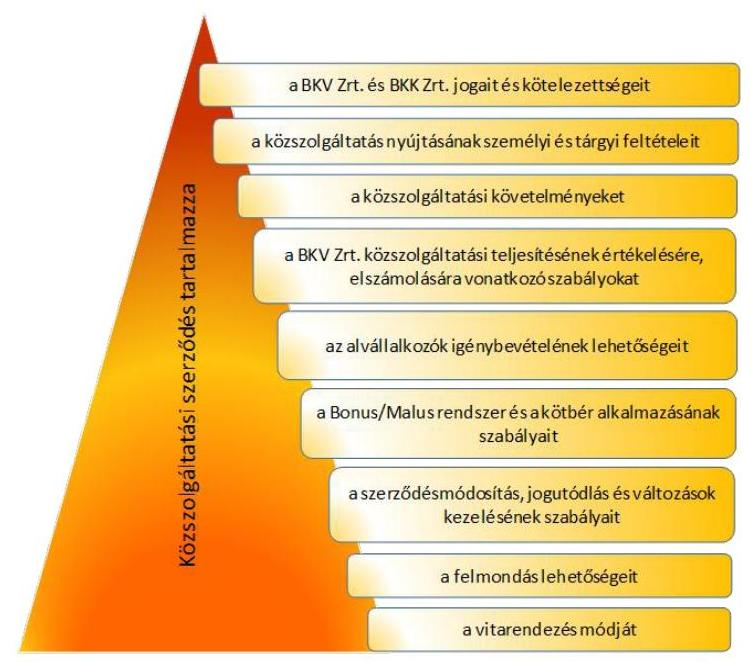

A Közszolgáltatási szerződés alapján a BKK Zrt. és a BKV Zrt. minden évben Éves Megállapodást kötött a közszolgáltatási kötelezettség ellátásának adott menetrendi évre vonatkozó feltételeiről. A Közszolgáltatási szerződésben meghatározott Éves Megállapodásban az alábbi ábra szerinti elemeket kell meghatározni:
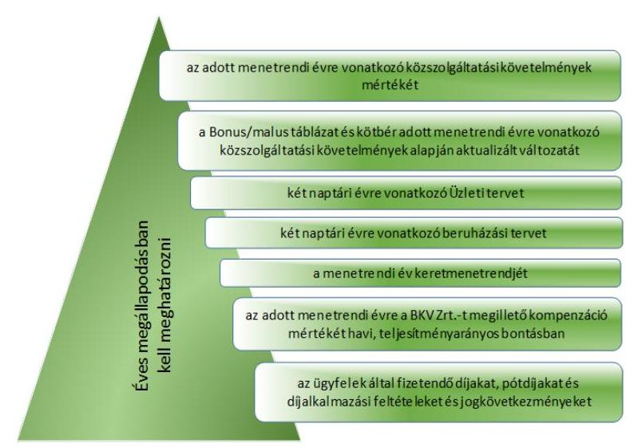

---

A Közszolgáltatási szerződésben meghatározott közszolgáltatási követelmények:
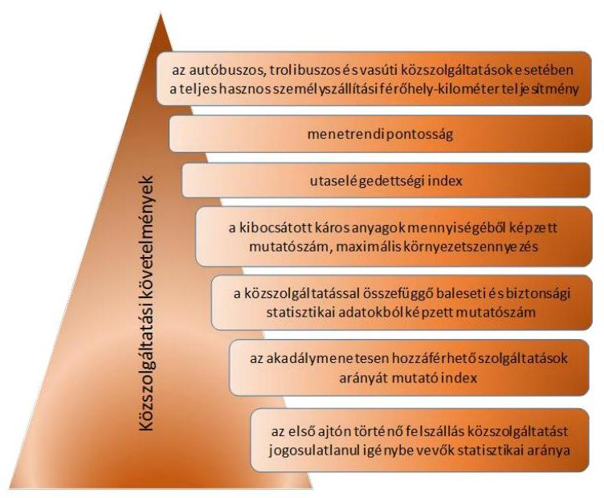

A Közszolgáltatási szerződésben meghatározott közszolgáltatások biztosítása érdekében és az ellátandó feladatok ellentételezéseként a Közszolgáltatási szerződés alapján a BKK Zrt. kompenzációt biztosít a BKV Zrt. részére. A Közszolgáltatási szerződésben definiálták az indokolt költség fogalmát, amely a kompenzáció elszámolásának alapját képezi. A Közszolgáltatási szerződés tartalmazta a BKV Zrt. által elszámolt költségek és ráfordítások indokoltságát, a menetrendi havi, illetve negyedéves beszámolók alapján, valamint az egyéb erre irányuló ellenőrzései alapján a BKK Zrt. felülvizsgálja. Amennyiben ezek alapján a BKK Zrt. megállapítja, hogy valamely összeg nem indokolt, azt a kompenzáció elszámolásánál levonhatja. Erre a 2012/2013. és 2013/2014. menetrendi években sor került. 16 A Személyszállítási tv. 25. § (3) bekezdés b) pontjának megfelelően a Közszolgáltatási szerződés 2.10. pontjában és az 1. számú mellékletében tartalmazta a szolgáltatás nyújtásának mennyiségi és minőségi paramétereit.

A Közszolgáltatási szerződést 2012. október 3-án módosították, tekintettel a Személyszállítási tv. 2012. július 1-jei hatálybalépésére, valamint a Keretmegállapodás 2012. július 1-jei módosítására. A Közszolgáltatási szerződést ekkor kiegészítették azzal, hogy a BKV Zrt. korábbiakban folytatott közszolgáltatási tevékenysége kapcsán felvett jelentős banki hitelei refinanszírozásra kerülnek a szerződés hatálybalépését követően. A BKK Zrt. és a BKV Zrt. a Közszolgáltatási szerződésben kívánta rendezni azokat a feltételeket, amelyek mentén ezek a banki hitelek BKV Zrt. általi törlesztésének fedezete biztosított.

A Közszolgáltatási szerződés 2012. november 8-ai módosításakor a BKK Zrt. és a BKV Zrt. együttműködése során felmerült kérdéseket pontosították az állami támogatásokra vonatkozó EU-s szabályoknak való megfelelés biztosítása érde-

[^0]
[^0]:    16 A 2012/2013. menetrendi évben 3897,0 M Ft, a 2013/2014. menetrendi évben 6045,3 M Ft.

---

kében. A Közszolgáltatási szerződésnek tartalmaznia kell a személyszállítási közszolgáltatások díjait, a pótdíakat és a díjalkalmazási feltételeket és az ezek megsértése esetén érvényesíthető jogkövetkezményeket. A mellékletekben a Beruházási terv minimális tartalma, a szerződés Budapesten kívüli földrajzi hatálya, az Üzleti terv minimális tartalma, a forgalom-lebonyolítás általános szabályrendszere és a Bonus/Malus táblázat és a kötbér tartalma változott.

A Közszolgáltatási szerződést 2013. június 26-án ismét módosították. Ennek okán kiegészítésre került az Éves megállapodás megkötésének, a kompenzáció kifizetésének, az átmeneti rendelkezéseknek és a BKV Zrt. kötelezettségei és jogainak egyes pontjai.

A Közszolgáltatási szerződés 2013. október 9-én kelt módosítását az egyes rendelkezések pontosítása, kiegészítése és módosítása indokolta. A Közszolgáltatási szerződés alapvetően a közlekedési szolgáltatókat terhelő kötbér szabályozását módosította. Módosították továbbá a közszolgáltatási követelmények meghatározásának módszere és a kompenzáció számítás módja mellékleteket, valamint rendelkeztek arról, hogy a Bonus/Malus táblázat és kötbér mellékletek átkerültek a menetrendi évre vonatkozó Éves megállapodásokba.

A Közgyűlés az 1370/2007/EK rendelet 4. cikk (4) bekezdés alapján 2014. június 30-án döntött a Közszolgáltatási szerződés 8 évre szóló időbeli hatályának 12 évre történő meghosszabbításáról. A 1370/2007/EK rendelet 4. cikk (4) bekezdésének való megfelelés érdekében Fővárosi Önkormányzat a Kijelölő rendelet 7. § (4) bekezdését 2014. július 16-án módosította. A Közszolgáltatási szerződés időbeli hatályát a 2014. november 13-ai módosításkor a jogszabályokban foglaltaknak megfelelően 12 évre meghosszabbították a rendelkezésre tartással érintett 75 db autóbusz tekintetében.

# 2.2. A közszolgáltatási kötelezettség teljesítésének szabályszerűsége 

A BKK Zrt. az ellenőrzött időszakban teljesítette a BKV Zrt.-vel kötött Közszolgáltatási szerződésben foglalt kötelezettségeit és a Közszolgáltatási szerződésben foglaltaknak megfelelően gyakorolta jogait. A Közszolgáltatási szerződés alapján a BKK Zrt. és a BKV Zrt. minden évben Éves Megállapodást kötött a közszolgáltatási kötelezettség ellátásának adott menetrendi évre vonatkozó feltételeiről a Közszolgáltatási szerződésben rögzített szolgáltatások ellátásának és finanszírozásának meghatározása céljából.

Az Éves Megállapodásokban rögzítették az adott menetrendi évre megrendelt szolgáltatások ellentételezéseként megfizetendő kompenzáció összegét, amely a BKV Zrt. bevételekkel nem fedezett indokolt költségeinek forrása volt. A Közszolgáltatási szerződésben rögzítették, hogy a BKV Zrt-nek havi, negyedéves és éves menetrendi beszámolót, valamint évente szolgáltatási jelentést kell készítenie, az adott menetrendi évhez igazodóan. Ezekben a BKV Zrt. bemutatta az aktuális Közszolgáltatási szerződésben és Éves Megállapodásban foglalt követelményeknek való megfelelést, illetve az attól való eltérést részletesen megindokolta. A negyedéves és az éves menetrendi beszámolók és a szolgáltatási jelentések alapján megállapított alulfinanszírozottság, vagy túlfinanszírozottság esetén a Köz-

---

szolgáltatási szerződésben foglaltaknak megfelelően kellett eljárni. A meghatározott kompenzáción túl további kompenzációra igény csak a BKK Zrt. által megállapított és elismert alulfinanszírozottság esetén nyújtható be. A 2012/2013. és a 2013/2014. menetrendi években a BKK Zrt. és a BKV Zrt. ennek megfelelően jártak el.

Az Éves Megállapodásokban rögzítették a BKV Zrt.-t adott menetrendi évre megillető, az adott menetrendi évre megrendelt szolgáltatások ellentételezéseként megfizetendő kompenzáció mértékét havi bontásban. A kompenzáció mértékét a BKV Zrt. a BKK Zrt.-vel egyeztetett, a Közgyűlés által elfogadott Üzleti tervei és az Éves Megállapodásokban meghatározott teljesítményadatok alapozták meg. A BKV Zrt. ellenőrzött időszakban elfogadott Üzleti terveiben szereplő kompenzáció összegei megegyeztek a menetrendi évre meghatározott Éves megállapodásokban rögzített kompenzáció összegeivel. Ez egyik menetrendi évben sem lépte túl a Fővárosi Önkormányzat és a BKK Zrt. között megkötött közlekedésszervezői Éves Mellékletekben a BKK Zrt. részére meghatározott összeget. A határidőn túl aláírt Éves megállapodások kompenzáció összegeit a Közszolgáltatási szerződés 3.2.2. pontjában foglaltaknak megfelelően az elfogadott BKV Zrt. Üzleti terv alapján állapították meg, számlázták és fizették ki. A 2012/2013. menetrendi évben 157 328,1 M Ft, a 2013/2014. menetrendi évben pedig 116 540,1 M Ft kompenzációt fizettek ki az Éves Megállapodás alapján. Ezen felül a 2012/2013. évben az éves elszámolás után további 2861,0 M Ft-ot, a 2013/2014. évben pedig 4239,7 M Ft-ot alulfinanszírozottság miatt.

A Közszolgáltatási szerződés szerint a BKK Zrt. és a BKV Zrt. minden évben Éves Megállapodást kötött, legkésőbb a menetrendi évet megelőző július 31-ig. A menetrendi évek adott év szeptember 1-jétől a következő év augusztus 31-ig tartanak. Kivételt képez ez alól a 2012. év, tekintettel arra, hogy a BKK Zrt. és a BKV Zrt. között kötött Közszolgáltatási szerződés 2012. május 1-jétől hatályos, ezért az első menetrendi évet 2012. május 1. és 2013. augusztus 31. közötti időszakban határozták meg, mérsékelt követelményekkel. Ennek megfelelően a felek a 2012/2013. menetrendi évre vonatkozó Éves Megállapodás1-et 2012. április 28-án írták alá. A 2013/2014. és a 2014/2015. menetrendi évek Éves Megállapodásait a Közszolgáltatási Szerződés 3.1.1 pontjában meghatározott határidőt meghaladóan írták alá. 17 A 2012/2013., a 2013/2014. és a 2014/2015. menetrendi évek Éves Megállapodásaiban határozták meg konkrétan a megrendelés és a minőségi szolgáltatást ösztönző indikátorok adott időszaki értékelési rendszerét és a kötbérfeltételeket, valamint a megrendeléshez a forgalomkorlátozási tervet és a keretmenetrendet. A kompenzáció összegét ezen esetekben a Közszolgáltatási szerződés 3.2.2. pontjában foglaltaknak megfelelően teljesítették.

A Közszolgáltatási szerződés 3.1.2 a) pontjában foglaltak ellenére a 2013/2014. és 2014/2015. menetrendi évekre vonatkozó Éves megállapodások nem tartalmazták az utas elégedettségi indexet, a járművek által oko-

[^0]
[^0]:    17 A 2013/2014. menetrendi évi Éves megállapodást a Közszolgáltatási Szerződésben meghatározott határidőt 2 hónappal meghaladóan, csak 2013. október 9-én írták alá. A 2014/2015. menetrendi évi Éves megállapodás a BKK részéről 2014. augusztus 28-án, a BKV részéről október 14-én került aláírásra.

---

zott maximális környezetszennyezés, a kibocsátott káros anyagok mennyiségéből képzett mutatószámot, valamint az akadálymentesen hozzáférhető szolgáltatások
 arányát mutató index meghatározását sem. A 2013/2014. menetrendi évre vonatkozóan az Éves megállapodás nem tartalmazta továbbá a közszolgáltatást jogosulatlanul igénybevevők statisztikai arányából képzett mutatószámot sem.

A 2013/2014. és 2014/2015. menetrendi évekre vonatkozó Éves megállapodásokban szereplő Üzleti tervek megfeleltek a Közszolgáltatási szerződés 7. sz. mellékletében foglalt kritériumoknak. A BKV Zrt. üzleti tervei tartalmazták a beruházások bemutatását, azok helyzetét, a beruházások kockázatait, azonban nem tartalmazták teljes körűen a Közszolgáltatási szerződések 5. sz. mellékletben meghatározott minimális követelményeket.

A Közszolgáltatási szerződés szerint a BKK Zrt. köteles olyan monitoring rendszert működtetni, amelynek segítségével folyamatosan figyelemmel tudja kísérni a szolgáltatások mennyiségi és minőségi alakulását. Ezen előírásnak a BKK Zrt. eleget tett.

A BKK Zrt. a BKV Zrt. közszolgáltatási tevékenysége felett végzett monitoringja a 2012/2013. és 2013/2014. menetrendi évben döntően a beszámoló rendszeren keresztül történt. Az ellenőrzött időszakban a 2012/2013. és a 2013/2014. menetrendi évekre vonatkozó éves Szolgáltatási Jelentések és Beszámolók készültek el. A 2012/2013. menetrendi évre vonatkozó Beszámoló és Szolgáltatási Jelentés a Közszolgáltatási szerződés átmeneti rendelkezéseiben foglaltaknak megfelelően korlátozott tartalommal készült el. A 2012/2013. és a 2013/2014. menetrendi évekre vonatkozóan a Közszolgáltatási szerződés 2. mellékletében meghatározott szolgáltatás szöveges értékelését a menetrendi Beszámolókban szerepeltették. A 2013/2014. menetrendi évre vonatkozó Szolgáltatási Jelentés a közszolgáltatási követelmények közül az utas elégedettségi index értékelését és a közszolgáltatást jogosulatlanul igénybevevők statisztikai arányát, valamint a járművek által okozott maximális környezetszennyezés, a kibocsátott káros anyagok mennyiségéből képzett mutatószám értékelését és az akadálymentesen hozzáférhető szolgáltatások arányát mutató index értékelését nem tartalmazta. A 2014. évben a 2014/2015. menetrendi évre vonatkozó első negyedéves menetrendi Beszámoló, valamint havi menetrendi Beszámolók elkészültek. A havi menetrendi Beszámolók tartalmazták mindazokat a pontokat, amelyeket az éves beszámolók tartalmaztak.

A BKK Zrt. Közszolgáltatási szerződésben foglalt kötelezettsége kiterjedt a járatok tényleges igénybevételének és a közlekedés körülményeinek ellenőrzésére is. A 2012/2013. és 2013/2014. menetrendi években a járatok tényleges igénybevételének ellenőrzése műszeres és megfigyeléses módszerrel történt. Az eredményeket a szolgáltatás tervezése és fejlesztése során használták fel. Az ellenőrzött időszakban a közlekedés körülményeit a BKK Zrt. szintén folyamatosan ellenőrizte. Meghatározták a közlekedési szolgáltatókat terhelő kötbér követelményeit. A BKK Zrt. folyamatosan végzett ellenőrzéseket, amely során, amennyiben kötbért állapítottak meg, levélben tájékoztatták a BKV Zrt.-t. A kötbérek negyedévente és a menetrendi éves elszámolás során kerülhettek érvényesítésre. A 2012/2013. menetrendi évben 111,1 M Ft a 2013/2014. menetrendi évben pedig 57,4 M Ft kötbért érvényesített a BKK Zrt.

---

# 2.3. A BKK Zrt. közlekedésszervezési és projektmenedzsmenti feladatainak ellátása 

A BKK Zrt. az ellenőrzött időszakban a Fővárosi Önkormányzattal kötött megállapodásokban, a jogszabályi előírásoknak, valamint a belső szabályozásnak megfelelően ellátta a közlekedésszervezői, valamint a projektmenedzsmenti feladatát. A Keretmegállapodás 5. számú módosítása ${ }^{18}$ szerint a BKK Zrt. 2013. január 1-jétől jogosult volt ellátni a közlekedésszervezői feladatokhoz kapcsolódó fejlesztési feladatokat.

A közlekedésszervezési feladatok, valamint a közfeladatok átvétele 2011-2012. években folyamatosan, a jogszabályi előírásoknak megfelelően, és a BKK Zrt. által előkészítettek és a Fővárosi Önkormányzat által jóváhagyottak szerint, és többségében a meghatározott időben történt. A BKK Zrt. kialakítása, a közfeladatok átvétele 2011-2012. években folyamatosan, a meghatározott ütemezés szerint történt, melynek során a Fővárosi Önkormányzat és a BKK Zrt. szerződésekben rögzítette a BKK Zrt. által ellátandó feladatokat - köztük a közlekedésszervezői, valamint a projektmenedzsmenti feladatokat -, kötelezettségeket, a feladatok forrásait, finanszírozását, beszámolási és elszámolási kötelezettségeket. A BKK Zrt. által ellátandó feladatokat és kötelezettségeket a Fővárosi Önkormányzat és a BKK Zrt. 2011. július 12-étől szerződésekben - Közszolgáltatási szerződés, Keretmegállapodás ${ }_{1}$ és Keretmegállapodás ${ }_{2}$ - rögzítette.

A BKK Zrt. közlekedésszervezői feladata volt a 2011. évben a Közszolgáltatási szerződés 1. számú melléklete, illetve a 2012. évtől a Keretmegállapodás ${ }_{1}$ IV/A. része szerint Budapest közlekedési rendszerének fejlesztési terve megvalósításával kapcsolatos előkészítő és koordinációs feladatok; közlekedésfejlesztési projektek előkészítése, együttműködés az érintett szervezetekkel, valamint a közlekedésszervezési előkészítő feladatok ellátása. A BKK Zrt. - a 2011-2012. éves beszámolói szerint - a Közszolgáltatási szerződésben és a Keretmegállapodás ${ }_{1}$-ben előírt feladatokat teljesítette.

A közlekedésszervezői feladatok évenkénti - menetrendi évre vonatkozó - meghatározása 2012. május 1-től a Keretmegállapodás ${ }_{2}$ 1. számú függelékeként elfogadott Éves mellékletben történt. Menetrendi évre vonatkozó Éves mellékletben rögzítették a közlekedésszervezői tevékenység során ellátandó feladatokat, a közlekedésszervezői bevétel alátámasztását, az indikátorok körét, a közlekedésszervezői feladatokhoz kapcsolódó pénzeszköz átadás-átvételi megállapodás alapján ellátandó fejlesztési feladatok körét. Az Éves mellékletben tájékoztató adatként rögzítették továbbá a két naptári év egészére számított forrásigényt, ágazati és tevékenységi alátámasztásával együtt, tekintettel arra, hogy a menetrendi év és az üzleti év nem azonos időszakot jelentett. Az Éves mellékleteket a közgyűlés megtárgyalta, azt jóváhagyta.

Az Éves mellékletek megkötésekor nem tartották be a Keretmegállapodás ${ }_{2}$ VI/B rész 40.1 pontjában, illetve 35.1 pontjában meghatározott - a szerződés megkötésére vonatkozó május 31-ei - határidőt

[^0]
[^0]:    ${ }^{18}$ 2011. XII. 19. 2749/2012. (XII. 12.) Föv. Kgy. határozat, 438/2012. (XII. 12.) IG határozat

---

A BKK Zrt. Igazgatósága a 2013/2014 és 2014/2015 menetrendi éves elszámolás közgyűlési előterjesztéséről a Keretmegállapodásban foglalt határidőt megelőzően határozott és a közgyűlési előterjesztés javaslatait a döntést követően megküldte a Fővárosi Önkormányzat részére. A 2013/2014. évi éves mellékletet a 2013. május 21-i igazgatósági ülés tárgyalta, majd ezt követően a 2013. május 29-i Fővárosi Közgyűlés is jóváhagyta. A szerződés a Fővárosi Önkormányzat részéről 2013. július 5-én került aláírásra. A 2014/2015. évi éves mellékletet a BKK Zrt. Igazgatósága 2014. május 20-án megtárgyalta. A 2014. április 30-i közgyűlést követően azonban csak 2014. június 30-án került sor rendes közgyűlés megtartására, amelyen az Éves melléklet is elfogadásra került. Az elfogadást követően a BKK Zrt. vezérigazgatója részéről a szerződés aláírása 2014. július 9-én, míg a Főváros részéről 2014. július 29-én történt meg.

A 2012/2013. és a 2013/2014. menetrendi évekre vonatkozó közlekedésszervezői Éves Elszámolások és a 2012-2014. évi üzleti jelentések szerint a BKK Zrt. megfelelően ellátta a közlekedésszervezői feladatait. Hálózat és menetrend módosításokat hajtott végre, biztosította az agglomerációs közlekedést, alvállalkozói szerződéseket kötött a szolgáltatás színvonalának, mennyiségének javítására, egységes utas-tájékoztatási rendszert működtetett, a bevételek növelése érdekében fokozta az ellenőrzést.

A Fővárosi Önkormányzat a közlekedésszervezési és a közlekedésfejlesztési nagyberuházások előkészítésével kapcsolatos (projektmenedzsment) feladatok ellátásának feltételrendszerét a jogszabályi előírásoknak megfelelően alakította ki. A BKK Zrt. közlekedésszervezői feladatokhoz kapcsolódó fejlesztési feladatai körében kötött szerződései összhangban voltak a Kijelölő rendeletben, illetve a Keretmegállapodás ${ }_{2}$-ban, továbbá a Támogatási szerződésekben rögzített feladatokkal. A vállalkozókat a Kbt. ${ }_{1,2}$ előírásainak megfelelően közbeszerzési eljárás során választották ki.

A közigazgatási határon kívül végzett személyszállítás esetére a Személyszállítási tv. 21. § (1) bekezdése alapján a Fővárosi Önkormányzat átadta a Személyszállítási tv. 5. § (3) bekezdésében meghatározott megállapodás kötés jogát 2012. július 1-jétől. Ennek megfelelően a BKK Zrt. a Személyszállítási tv. 5. § (3) bekezdése, valamint a Kijelölő rendelet 5. § (1) bekezdés 3. pontjában foglaltak szerint megállapodásokat kötött a közlekedésért felelős miniszterrel.
2013. október 14. napján a BKK Zrt. és az NFM miniszter megállapodtak, hogy Budapest Főváros közigazgatási határán kívüli menetrend szerinti vasúti közlekedést a megállapodás mellékletében foglalt vonalakon a BKK Zrt. folyamatosan biztosítja. A BKK Zrt. vállalta, hogy a meghatározott vasúti közlekedés biztosítását és üzemeltetését a BKV Zrt. által biztosítja. A díjszabások a Keretmegállapodás ${ }_{2}$ szerint érvényesek. A díjszabással és a szociálpolitikai támogatással nem fedezett költségeket a Fővárosi Önkormányzat a Keretmegállapodás ${ }_{2}$ keretén belül megtéríti. A szolgáltatások bevételekkel nem fedezett költségeinek finanszírozása a „Budapest 21" megállapodás keretén belül történik. A Budapest Főváros közigazgatási határán kívüli menetrend szerinti vasúti közlekedés biztosítására 2013. május 1-től visszamenőleges hatállyal kötött megállapodás 2022. június 30-ig hatályos.

Úgyszintén 2013. október 14. napján kötött megállapodást a BKK Zrt. és az NFM miniszter a Budapest Főváros közigazgatási határán kívüli menetrend

---

szerinti autóbuszos közszolgáltatások ellátására. A megállapodás mellékletében megjelölt települések és a főváros közigazgatási területe között, a megállapodás mellékletében megjelölt relációkban az elővárosi személyszállítást a BKK Zrt. az általa közbeszerzési eljárás alapján kiválasztott szolgáltatóval folyamatosan biztosítja. A közlekedési hálózat és az elvárt teljesítmény 5%-ot meghaladó változása az NFM hozzájárulásával lehetséges. A menetrend szerinti teljesítmény a településekkel kötött finanszírozási hozzájárulás alapján 2013. első negyedévétől havonta esedékes. A szerződések alapján üzemeltetett járatokon a díjszabást a BKK Zrt. és az NFM közösen határozza meg. Az autóbuszokkal végzett személyszállítás finanszírozása a „Budapest 21" megállapodás keretén belül történik. A BKK Zrt.-t a megállapodás feljogosítja az érintett települési önkormányzatokkal a szolgáltatások biztosítása, ellátása érdekében a kétoldalú megállapodások megkötésére. A közbeszerzési eljárások eredményes lezárásáig a BKK Zrt. a szolgáltatásokat a BKV Zrt. útján látja el. A Budapest Főváros közigazgatási határán kívüli menetrend szerinti autóbuszos közszolgáltatások ellátására 2013. május 1-től visszamenőleges hatállyal kötött megállapodás 2022. június 30-ig hatályos.

A közlekedésszervezői feladatok részét képezték a közlekedésfejlesztés keretében EU-s és Fővárosi Önkormányzati forrásból megvalósuló projektek projektmenedzsmenti feladatai. A BKK Zrt. kedvezményezetti körébe tartozó, önkormányzati, illetve EU-s forrásból megvalósított közlekedésfejlesztési feladatok ellátása érdekében a BKK Zrt. számára meghatározott célokat, műszaki tartalmat és a keretösszegek felhasználását szabályozó feltételeket és az elszámolás szabályait és körülményeit a projektekre kötött megállapodások, támogatási szerződések és azok mellékletét képező engedélyokiratok részletezték. A 2012/2013 és a 2013/2014 évi menetrendi éves közlekedésszervezői elszámolásban Projekt költség címén 1274,2 M Ft-ot, illetve 331,2 M Ft-ot mutattak ki a BKK Zrt. által megvalósított fejlesztések, beszerzések után.

2011-ben projektenként külön-külön pénzeszközátadási megállapodást (PEÁ) kötött a Fővárosi Önkormányzat a BKK Zrt.-vel. 2012-ben a Közgyűlés a pénzeszközátadási megállapodások átalakításáról döntött ${ }^{19}$. Amennyiben a projekt eredményeként létrejött vagyon végső tulajdonosa a Fővárosi Önkormányzat, ott Megvalósítási Megállapodást (MM), abban az esetben ahol a vagyon a BKK Zrt. tulajdonába kerül, Fejlesztési Megállapodást (FM), vegyes tulajdon esetén Beruházási megállapodást (BM) kötött a BKK Zrt.-vel.

A közlekedésfejlesztési projektek során végzett projektmenedzsmenti feladatok körét, az azokkal kapcsolatos jogokat és kötelezettségeket, a finanszírozást az egyedileg megkötött támogatási szerződésekben rögzítették.

Az ellenőrzött időszakban a BKK Zrt. közel 200,0 Mrd Ft értékű fejlesztés megvalósításában vett részt, melyből 44 db szerződéssel, 69 904,1 M Ft értékű fejlesztés megvalósítására kötött megállapodást a Fővárosi Önkormányzattal. Ezek közül 10 db kapcsolódott a közlekedésfejlesztési nagyberuházásokhoz.

[^0]
[^0]:    ${ }^{19}$ 26/2012. (V. 8.) Főv. Kgy. rendelettel módosított 50/1998. (X. 30.) Főv. Kgy. rendelet

---

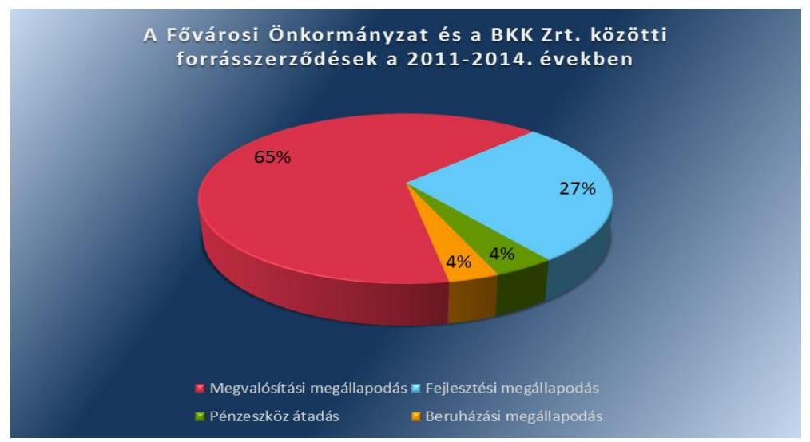

A BKK Zrt. 15 közlekedésfejlesztési nagyberuházásának tervezett bekerülési költsége - az ellenőrzött időszakban - 153 891,3 M Ft volt, melynek forrása 11 projekt esetében 112 519,2 M Ft uniós támogatásból, 10 fejlesztésnél 24 749,6 M Ft Fővárosi
 Önkormányzati hozzájárulásból, valamint egy esetben 16 622,5 M Ft egyéb forrásból (hitelből) állt. Projektenkénti részletezését az 5. számú melléklet tartalmazza.
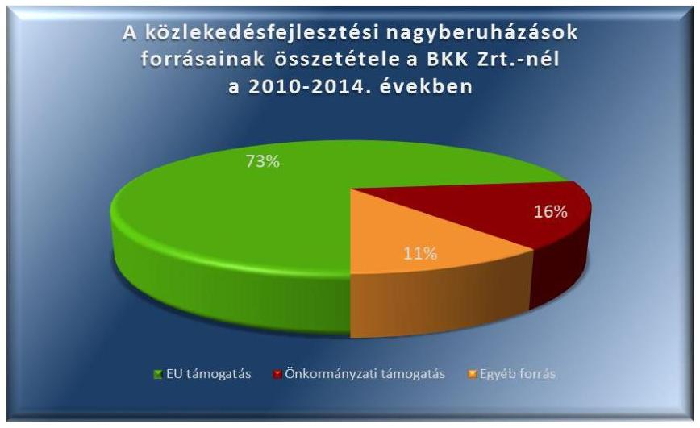

Az EU-s forrásokból megvalósítandó előkészítés alatt lévő projektek közül a nagyberuházások ${ }^{20}$ eseteiben a BKK Zrt. - az NFM támogató levelei alapján - benyújtott, nyertes pályázatai birtokában 2011-2014. években támogatási szerződéseket kötött a közreműködő szervezettel. Az előkészítés alatt lévő hat projekt tervezett bekerülési költsége 4651, M Ft, melynek forrása 3428,9 M Ft uniós támogatásból, 1222,1 M Ft Fővárosi Önkormányzati hozzájárulásból állt.

[^0]
[^0]:    ${ }^{20}$ az M3 metróvonal rekonstrukciója és északi meghosszabbítása; a fővárosi villamoshálózat és trolibuszhálózat egységes fejlesztési koncepciója; 2-es villamos vonal komplex felújításának; M1 Millenniumi Földalatti Vasút korszerűsítésének és meghosszabbításának; az Észak-déli regionális gyorsvasút déli szakaszának, valamint az M2 Metró és a Gödöllői HÉV összekötése és a rákoskeresztúri szárnyvonal megvalósíthatósági tanulmánya

---

Az ellenőrzött időszak során folyamatban lévő nyolc db nagyberuházás tervezett bekerülési költsége 144 133,8 M Ft, melynek forrása 105 992,8 M Ft EU-s támogatás, 21 518,5 M Ft Fővárosi Önkormányzati hozzájárulás, valamint 16 622,5 M Ft egyéb forrás (hitel) volt.

A BKK Zrt. kedvezményezetti körébe tartozó nagyberuházások közül 2014-ben 5106,5 M Ft bekerülési költséggel (3097,5 M Ft EU-s és 2009,0 M Ft Fővárosi Önkormányzati forrásból) befejeződött a Futár rendszer kiépítése, mellyel a Társaság forgalomirányító és utas tájékoztatási tevékenysége teljesen átalakult, gyorsabb és pontosabb lett.

Az Európai Unió által finanszírozott projektek lehetőséget adtak a projektmenedzsmenttel kapcsolatban felmerülő személyi jellegű ráfordítások visszaigénylésére, a támogatási intenzitás mértékének megfelelően. Az európai uniós támogatásból való visszaigénylés módja, mértéke, összege az egyes támogatási szerződésekben projektre szabottak voltak, azokat az operatív programok általános szabályozásai határozták meg. A BKK Zrt. az ellenőrzött időszakban kötött támogatási szerződések kedvezményezettjeként jogosult volt a projektmenedzsment költségek visszaigénylésére. A 2014. december 31-ig befolyt projektmenedzsmenti kiadás támogatási összege 241,3 M Ft volt.

A BKK Zrt. 15 közlekedésfejlesztési nagyberuházás projektmenedzsmenti tevékenysége során 2014. december 31-ig összesen 146 vállalkozási szerződést kötött 150 555,6 M Ft nettó összegben, melyből a 87 előkészítéssel kapcsolatos szerződés nettó összege 7 804,9 M Ft volt.

A BKK Zrt. a közlekedés fejlesztési nagyberuházás projektmenedzsmenti feladatok ellátása során kötött szerződései összhangban voltak a Kijelölő rendeletben, illetve a Keretmegállapodás ${ }_{2}$-ban, továbbá a Támogatási szerződésekben rögzített feladatokkal. A vállalkozókat a Kbt. ${ }_{1,2}$ előírásainak megfelelően közbeszerzési eljárás során választották ki.

A Közgyűlés 89/2011. (I. 31.) számú határozatában felsorolt 22 közlekedésfejlesztési projekt projektmenedzsmenti feladatainak ellátását átadta a BKK Zrt.-nek, ahol a Fővárosi Önkormányzat volt a támogatási szerződések kedvezményezettje. A Fővárosi Önkormányzat, mint kedvezményezett irányításával megvalósuló közlekedésfejlesztési projektek projektmenedzsmenti feladatának átvétele 2011. évben a Közgyűlés által meghatározottak szerint és időben megtörtént. A BKK Zrt. projektmenedzsmenti feladata a Fővárosi Önkormányzat kedvezményezetti körébe tartozó 22 projekt ügyvitele, a végrehajtás támogatása volt. A BKK Zrt. projektmenedzsmenti feladatait a „Budapest, Szabadság híd rekonstrukciója" projekt alapján a Fővárosi Önkormányzattal kötött megállapodásokban foglaltak szerint látta el ${ }^{21}$.

[^0]
[^0]:    ${ }^{21}$ részletesen az ÁSZ jelentés 3. számú függeléke tartalmazza

---

kifutó projektekre tette lehetővé a projektmenedzsment költségek, valamint észszerű nyereség elszámolását. A támogatási szerződések szerint összesen lehívható 16 397,3 M Ft összegű támogatásból 2014. december 31-ig lehívott összeg 15 919,0 M Ft volt.

A közszolgáltatási tevékenységre, ezen belül a projektmenedzsmenti tevékenységre évente megkötött Éves szerződésekben rögzítették a minőségi és mennyiségi követelményeket, valamint az egyes projektek munkaidő és pénzügyi ráfordítási igényét. A Keretmegállapodás ${ }_{2}$ V. részében meghatározott projektmenedzsmenti feladatokat a BKK Zrt. az Éves szerződésben, valamint a Fővárosi Önkormányzat költségvetésében meghatározott keret terhére végezte. Az éves elszámolások szerint a projektmenedzsmenti feladatok ellátásának kiadása 2011-ben 150,8 M Ft, 2012-ben 41,3 M Ft, 2013-ban 19,5 M Ft, 2014-ben 8,7 M Ft volt.

# 2.4. A BKK Zrt. üzleti tervei 

A BKK Zrt. 2011-2014. évekre vonatkozó, éves üzleti tervei összhangban voltak a Fővárosi Önkormányzat stratégiai dokumentumaival (Koncepció ${ }_{1,2}$ ), valamint a Fővárosi Önkormányzattal kötött megállapodásokban foglaltakkal, illetve a Közgyűlés döntéseivel. A BKK Zrt. 2011-2014 évekre vonatkozó üzleti terveit elkészítette, melyeket az Igazgatóság, valamint a Közgyűlés megtárgyalt és jóváhagyott. A Felügyelő Bizottság a 2012. év kivételével megtárgyalta és jóváhagyta az üzleti terveket.

A 2011-2014. évekre vonatkozó, évenkénti üzleti tervek a Fővárosi Önkormányzat költségvetésében a működési és fejlesztési célú feladatokra jóváhagyott pénzeszközök alapján, azok figyelembevételével készültek. Az üzleti tervekben meghatározott feladatok összhangban voltak a Fővárosi Önkormányzat közlekedésszervezésre és projektmenedzsmentre vonatkozó szakmai terveivel, koncepcióival, stratégiai dokumentumaival, a feladatellátásra vonatkozó megállapodásokkal, tartalmazták a Fővárosi Önkormányzattal kötött szerződésekben meghatározott elvárások teljesítésének tervét. Az üzleti tervek, valamint a közlekedésszervezői feladatok ellátására kötött Éves mellékletek közötti számszaki összefüggés - azok eltérő időszakra vonatkozása miatti - biztosítása érdekében a 2012. évtől kezdődően az üzleti tervek két éves időtartamra készültek.

Az üzleti tervekben két üzleti évre vonatkozóan határozták meg a tervadatokat annak érdekében, hogy a menetrendi év által érintett két naptári év az üzleti tervben meg tudjon jelenni.

A 2013/2014. évre szóló üzleti tervben a BKK Zrt. jelezte, hogy a Fővárosi Önkormányzat 2013. évi költségvetésében a közlekedésszervezői feladatokra 57,8 Mrd Ft állt rendelkezésre, a 2013. évi üzleti tervben azonban 73,4 Mrd Ft közlekedésszervezői forrásigénnyel számoltak. A különbségként mutatkozó 15,6 Mrd Ft forrásigényt a Kormány és a Fővárosi Önkormányzat között 2013. március 8-án megkötött „Budapest 21" megállapodásra hivatkozva rögzítették az üzleti tervben.

A BKK Zrt. 2013/2014. évi üzleti tervének a 2013. évre vonatkozó módosítása során a BKK Zrt. 2013. évi tervezett 80 232,1 M Ft forrásigénye 104,6 M Ft-tal,

---

80 127,5 M Ft-ra csökkent. A BKK Zrt. az üzleti terveit a 2013/2014. évi üzleti terv kivételével nem módosította.

A 2011. évi üzleti tervben nem számszerűsítették az egyes feladatok forrásigényét. A Közszolgáltatási szerződés 4. számú melléklete szerint a 2011. évi közszolgáltatási díj összege 863,1 M Ft volt.

A közútkezelői, parkolási és taxi üzemeltetési feladatokat 2012. január 1-jétől látta el a BKK Zrt. A közlekedésszervezői feladatok év közbeni átvétele következtében a 2012. évi közlekedésszervezői finanszírozási igény nem a teljes évre vonatkozott.
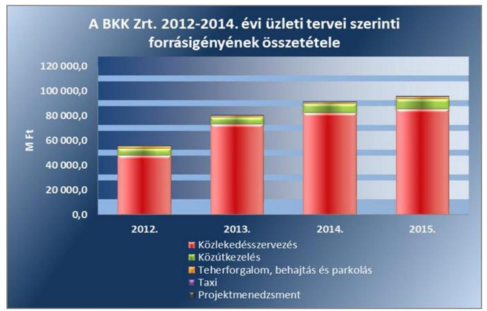

A 2013/2014. évi üzleti tervben a forrásigény 2012. évhez viszonyított növekedését többek között az okozta, hogy a BKK Zrt. a 2013. évtől a teljes naptári évben látta el a közlekedésszervezői feladatokat, számoltak az infláció várható hatásával, az M4 metró induló próbaüzemével, az autóbuszpark megújításának, kiszervezésének hatásával, valamint a Fővárosi Önkormányzat tervezési iránymutatásának megfelelő 3%-os mértékű béremeléssel.

A 2014/2015. évi üzleti tervben a forrásigény 2013. évhez viszonyított növekedését többek között az okozta, hogy számoltak a 2014. április 1-jétől bevezetendő a Fővárosi Önkormányzat tervezési iránymutatásának megfelelő 3%-os mértékű béremeléssel. A menetdíj bevételek tervezésénél figyelemmel voltak a természetes személyek által vásárolt bérletek 10%-os árcsökkentésére. Figyelembe vették a 2014. március 28-án átadott M4-es metróvonal üzemi költségeit, valamint az agglomerációs közlekedésre a Volánbusszal kötött szerződés miatt fizetendő szolgáltatási díjat. Számoltak a 2013. évi taxi rendeletben elrendelt ellenőrzési feladat éves hatásával, továbbá a FUTÁR utas-tájékoztatási rendszer és a MOL BUBI 2014. évi indulását követő költségeivel.

---

# 3. A BKK ZRT. GAZDÁLKODÁSA 

### 3.1. A BKK Zrt. gazdálkodásának szabályozottsága

A BKK Zrt. gazdálkodásának szabályozottsága az ellenőrzött időszakban összességében megfelelő volt. A Személyszállítási tv. 22. § (3) bekezdésében előírtaknak megfelelően - a Kijelölő rendeletben meghatározott alapfeltételek alapján - 2012. május 1-jétől a Keretmegállapodás ${ }_{2}$ előírta a BKK Zrt. részére, hogy az egyes feladatok ellátásával összefüggésben felmerülő költségeit és ráfordításait (beleértve a közvetlen és a közvetett költségeket, ráfordításokat), illetve a bevételeit egymástól elkülönítetten tartsa nyilván. A BKK Zrt. ezt a kötelezettségét az ellenőrzött időszakban teljesítette.

A BKK Zrt. a szabályzatai elkészítése során a Számv. tv. 14. § (11) bekezdésében, illetve 161. § (5) bekezdésében előírt - a 2010. november 16-ai megalakulástól számított - 90 napos határidőt részben tartotta be. Az ellenőrzött időszak végén rendelkezett számviteli politikával és számlarenddel, leltározási és leltárkészítési-, értékelési-, önköltségszámítási-, és pénzkezelési szabályzattal.

A számviteli politika ${ }_{1,2,3,4}$-ben a Számv. tv. 14. § (4) bekezdésében előírtak alapján rögzítették, hogy a gazdálkodó mit tekint a számviteli elszámolás, az értékelés szempontjából lényegesnek, jelentősnek, nem lényegesnek, nem jelentősnek. A számviteli politika ${ }_{1,2,3,4}$ tartalmazta a társaság vezetése által meghatározott beszámolási formát, a mérleg és az eredménykimutatás típusát, a mérlegkészítés időpontját, a mérleg és eredménykimutatás tagolását. Meghatározta az eszközök besorolását, a céltartalékképzés és felhasználás, a könyvvizsgálat, az éves beszámoló nyilvánosságra hozatalának szabályait.

A Számv. tv. 161. § (5) bekezdésében foglaltak ellenére a BKK Zrt. 2010. novembertől 2012. áprilisig nem rendelkezett számlarenddel. A 2012. április 5-én hatályba lépett Gazdálkodási szabályzat keretében kiadott számlarend - a vagyonkezelésbe vett eszközök nyilvántartására alkalmazandó számlaszámok és azok megnevezésének hiányától eltekintve - megfelelt a Számv. tv-ben előírtaknak. Az ezt követően hatályba lépett számlarendet 2012. december 13-ai keltezéssel készítették el, amely megfelelt a Számv. tv.-ben előírtaknak. A számlarendek tartalmazták a könyvvezetésre, a bizonylatolásra vonatkozó részletes belső szabályokat, amelyek megalapozták a mérleg, az eredménykimutatás és a kiegészítő melléklet adatainak alátámasztását.

A Számv. tv. 14. § (11) bekezdésében foglaltak ellenére a BKK Zrt. leltározási és leltárkészítési szabályzattal 2010. novembertől 2011. júniusig nem rendelkezett. A leltározási szabályzat ${ }_{1}$-ot 2011. június 7-én hagyták jóvá. A leltározási szabályzat ${ }_{1}$-ot a 2012. december 13-án jóváhagyott leltározási szabályzat ${ }_{2}$ módosította. A leltározási szabályzat ${ }_{1,2}$ szabályozta a leltározási folyamatot, a leltárkészítés formáit, valamint a leltári hiányok és többlet rendezését. A leltározási szabályzat ${ }_{1,2}$ a Számv. tv.-ben és a vagyongazdálkodási rendelet ${ }_{1,2}$-ben foglaltaknak megfelelően tartalmazta a mennyiségi felvétellel való leltározási gyakoriság meghatározását, amely szerint azt évente kellett végezni. Ezt

---

követően két módosítása volt a leltározási szabályzat ${ }_{2}$-nak 2013. április 6-ai hatállyal és 2013. december 13-ai hatállyal, amelyek leltározási körzeteket, és két mellékletet - leltározási utasítás és leltározási ütemterv - módosítottak.

A Számv. tv. 14. § (11) bekezdésében foglaltak ellenére a BKK Zrt. az eszközök és források értékelési szabályzatával 2010. novembertől 2011. júliusig nem rendelkezett. Az értékelési szabályzat ${ }_{1}$-ot 2011. július 4-én hagyták jóvá. Az értékelési szabályzat ${ }_{1}$-ot a 2014. május 15-én jóváhagyott és 2014. május 31-én hatályba lépő értékelési
 szabályzat ${ }_{2}$ helyezte hatályon kívül. Az értékelési szabályzat ${ }_{1,2}$ tartalmazta a Számv. tv.-ben előírtaknak megfelelően a bekerülési érték fogalmát, az értéket módosító tételek felsorolását, a követelések év végi értékelésének szabályát, a követelések értékelését, a követelések minősítésének, az értékvesztés elszámolásának szabályait és a követelések elismertetésének rendjét, valamint a külföldi pénzértékre szóló kötelezettségek értékelési módját.

A Számv. tv. 14. § (11) bekezdésében foglaltaknak megfelelően a pénzkezelési szabályzat ${ }_{1}$-ot 2010. december 30-án határidőben elkészítették, melyet 2012. évben két alkalommal aktualizáltak. A pénzkezelési szabályzat ${ }_{1,2}$ a Számv. tv. 14. § (8) bekezdésében foglaltak ellenére nem rendelkezett a készpénzben és a bankszámlán tartott pénzeszközök közötti forgalom leírásával. A pénzkezelési szabályzat ${ }_{3}$ 2012. április 27-én a Fővárosi Önkormányzattal megkötött Keretmegállapodás ${ }_{2}$ alapján a BKK Zrt. szervezetébe integrált feladatok kapcsán került kiadásra. A pénzkezelési szabályzat ${ }_{3}$ már teljes körűen rendelkezett a Számv. tv. 14. § (8) bekezdésében foglaltakkal - köztük a készpénzben és a bankszámlán tartott pénzeszközök közötti forgalom leírásával, a pénzforgalom lebonyolításának rendjével és a pénzkezelés személyi és tárgyi feltételeivel -, továbbá tartalmazta az ügyfélszolgálati pénztárak működésével, a parkolók pénzbeszedésével, a pótdíjpénztárak működésével, valamint a jegy- és bérletpénztárak működésével kapcsolatos sajátos szabályokat.

A Számv. tv. 14. § (11) bekezdésében foglaltak ellenére a BKK Zrt. 2010. novemberétől 2011. júniusáig nem rendelkezett önköltségszámítási szabályzattal. Az önköltségszámítási szabályzat ${ }_{1}$ 2011. június 10-én lépett hatályba. A 2012. december 19-én elfogadott önköltségszámítási szabályzat ${ }_{2}$ már tartalmazta a közlekedésszervezési feladatokra vonatkozó ágazati előírásokat. Az önköltségszámítási szabályzat ${ }_{1-3}$-ban szerepeltették a kalkulációs módszerek leírását és a felosztandó költségek vetítési alapjait. Az ellenőrzött időszakban személyszállítási közszolgáltatások díjainak meghatározásáról a Közgyűlés hozott döntést. A Közgyűlés döntései alapján az ellenőrzött időszakban 2010. február 1-jétől és 2013. január 1-jétől került sor a közlekedési viteldíjak emelésére, illetve 2014. január 1-jétől a bérletárak 10%-os csökkentésére.

A 2012. április 2-ától hatályos Projekt önköltségszámítási szabályzat a projektekre vonatkozó ágazati előírásokat tartalmazta. A Projekt önköltségszámítási szabályzat tartalmazta a költségfelosztás rendszerét, a kalkulációs sémát és a költségfelosztási szabályokat.

A BKK Zrt. a költségek felosztására vonatkozó elkülönítési kötelezettségét 2012. december 18-ától szabályozta. A számviteli politika ${ }_{3,4}$ tartalmazta a BKK

---

Zrt.-re vonatkozóan a Keretmegállapodás ${ }_{2}$-ban megfogalmazott számviteli elkülönítés szabályát a költségek felosztására vonatkozóan, amelyet az önköltségszámítási szabályzat ${ }_{2,3}$, a számlarend és a projekt önköltségszámítási szabályzat egészített ki. A számviteli politika ${ }_{3}$ tartalmazta, hogy a költségek költségnemenként költséghelyre kerülnek elkülönítésre. A költségek felosztása projektekre és a BKK Zrt. által végzett tevékenységekre az SAP ERP kontrolling modul rendszerben történt, melyet 2013. szeptember 1-jétől alkalmaztak. A BKK Zrt. számviteli politikája ${ }_{3,4}$ és a számlarend 276. pontja tartalmazta azokat az eljárásokat, melyek a költségek és ráfordítások közszolgáltatási tevékenységek szerinti bontását állapítják meg.

A BKK Zrt. az ellenőrzött időszakban a $\mathrm{Kbt}_{1,2}$ előírásainak megfelelően rendelkezett közbeszerzési szabályzattal, illetve beszerzési szabályzattal. A Közbeszerzési szabályzat ${ }_{1,3}$ tartalmazta a közbeszerzési eljárásokban közreműködők feladatait, a közbeszerzési eljárás dokumentálási rendjét, valamint az eljárás során hozott döntésekért felelőseket, szabályozta továbbá a döntéshozatal eljárásrendjét és a határozatképesség feltételeit. A beszerzési szabályzat ${ }_{1,2}$ tartalmazta a beszerzési/szerződési igény, illetve a szerződés előkészítésével kapcsolatos általános feladatokat, a beszerzési eljárás lefolytatásának folyamatát, a szerződések teljesítésének figyelemmel kísérését, a teljesítések igazolásának és kifizetésének szabályait, a megrendelés útján történő kötelezettségvállalás szabályait és a felelősségeket.

Az Avtv. 31/A. § (3) bekezdése ${ }^{22}$, majd 2012. január 1-jétől hatályos Info tv. 24. § (3) bekezdése írja elő az adatvédelmi és adatbiztonsági szabályzatkészítési kötelezettséget. Az Info tv. 7. § (2) bekezdése továbbá szabályozta, hogy gondoskodni kell az adatok biztonságáról és ki kell alakítani az ehhez kapcsolódó eljárási szabályokat. Ilyen jellegű szabályozással a BKK Zrt. 2010. novembertől 2012. májusig nem rendelkezett. 2012. május 9-én lépett hatályba az Információ biztonsági szabályzat, amely tartalmazta az elektronikus és nem elektronikus dokumentumok biztonságos kezelésének rendjét. Továbbá a BKK Zrt. 2011. július 5-étől szabályozta a közérdekű adatok közzétételének rendjét is. Az adatvédelmi és adatbiztonsági szabályzat tartalmazta az informatikai rendszerben tárolt adatok biztonságának szabályozását, amely azonban csak 2014. október 29-étől hatályos. A BKK Zrt. az Info tv. 37. § (1) bekezdésében és az I. számú mellékletében foglaltaknak megfelelően eleget tett a közzétételi kötelezettségének.

# 3.2. A BKK Zrt. vagyongazdálkodása 

A 2010-2014. években a BKK Zrt. vagyongazdálkodási tevékenysége - beleértve a vagyon kezelését, gyarapítását, hasznosítását - és a közfeladat ellátást szolgáló vagyon nyilvántartása összességében szabályszerű volt, megfelelt a jogszabályi előírásoknak.

Az ellenőrzött időszakban a BKK Zrt. a saját vagyonáról a Számlarendben rögzített átlátható, naprakész a Számv. tv. előírásainak megfelelő vagyonnyilvántartással rendelkezett, amelyben a vagyonváltozás kimutatása folyamatos volt. Az

[^0]
[^0]:    ${ }^{22}$ Hatályon kívül helyezve 2012. január 1-jével

---

ellenőrzött időszakban a tárgyi eszközök analitikus nyilvántartása, a főkönyvi kivonat, leltár, mérleg adatainak év végi egyezősége biztosított volt. Az ellenőrzött időszakban a BKK Zrt. az éves számviteli beszámolókban és a számviteli nyilvántartásokban lévő vagyontárgyak állományát a Leltározási szabályzat ${ }_{1,2}$ ban foglaltak alapján szabályszerűen végrehajtott és dokumentált leltárral támasztotta alá a Számv. tv. 69. §-ának megfelelően.

A BKK Zrt. 2014. december 31-én a BKK Közút Zrt.-ben és a Budapest Szíve NKft.-ben 100%-os, a Gellérthegyi Sikló Kft.-ben 25%-os tulajdonrésszel rendelkezett, melyet analitikus és főkönyvi nyilvántartásában szerepeltetett.
2013. március 11-én a Fővárosi Önkormányzat vagyonkezelési szerződést kötött a BKK Zrt.-vel a XV. kerület, Énekes u. 10/b. szám alatt található társasházi ingatlan vagyonkezelésbe adásáról, melynek könyv szerinti értéke 2,9 M Ft volt. A BKK Zrt.-nek az ellenőrzött időszakban más vagyonkezelésbe vett vagyona nem volt. A BKK Zrt. a vagyonkezelésbe vett tartózkodó céljára szolgáló társasházi ingatlant a Számv. tv. 23. § (2) bekezdésének megfelelően mérlegben eszközei közé 2,9 M Ft értékben felvette és ezzel összefüggésben, azonos összegben hosszú lejáratú kötelezettséget is kimutatott könyveiben. A 2014. évi beszámolójában a BKK Zrt. a vagyonkezelésbe vett ingatlant, befektetett eszközei elkülönítetten nem mutatta be. Viszont a hosszú lejáratú kötelezettségei között azt szerepeltette, így részben tett eleget a Számv. tv. 23. § (2) bekezdésében és a vagyonkezelési szerződés 13. pontjában foglaltaknak. A BKK Zrt. Számlarendje nem tartalmazta a vagyonkezelésbe vett eszközök nyilvántartására alkalmazandó számlaszámokat és azok megnevezését, ami nem felelt meg a Számv. tv. 161. § (1)-(2) bekezdésében foglaltaknak.

A BKK Zrt. vagyoni helyzetének főbb adatai a 2010-2014. években

| Megnevezés | 2010.12.31 | 2011.12.31 | 2012.12.31 | Előző év módosításai | 2013.12.31 | Előző év módosításai | 2014.12.31 |
| :--: | :--: | :--: | :--: | :--: | :--: | :--: | :--: |
| I. Befektetett eszközök összesen |  | 233,1 | 5253,3 | 8,2 | 13251,7 |  | 59046,3 |
| ebből: tárgyi eszközök |  | 219,0 | 1180,3 | 8,2 | 9083,1 |  | 53869,7 |
| ebből: beruházás, felújítás |  | 205,4 | 944,7 | 8,2 | 8815,9 |  | 41253,0 |
| befektetett pénzügyi eszközök |  | 11,3 | 3935,8 |  | 3935,2 |  | 3935,3 |
| II. Forgóeszközök | 34,7 | 1053,3 | 16712,5 | $-10,2$ | 28504,5 |  | 24932,2 |
| ebből: készletek |  | 25,0 | 153,4 | $-10,2$ | 175,8 |  | 325,8 |
| követelések | 0,4 | 12,1 | 3288,0 |  | 16665,4 |  | 7848,3 |
| pénzeszközök | 34,3 | 1016,2 | 13271,1 |  | 11663,3 |  | 16758,3 |
| III. Aktív időbeli elhatárolások | 32,0 | 126,2 | 1098,1 |  | 2439,8 | 1729,7 | 10042,9 |
| ESZKÖZÖK ÖSSZESEN | 66,7 | 1412,6 | 23063,9 | $-1,9$ | 44196,0 | 1729,7 | 94021,5 |
| IV. Saját tőke | 50,0 | 302,4 | 4341,9 |  | 4591,0 |  | 4723,5 |
| ebből: jegyzett tőke | 50,0 | 300,0 | 1801,0 |  | 1801,0 |  | 1801,0 |
| tőketartalék |  |  | 2424,5 |  | 2424,5 |  | 2424,5 |
| mérleg szerinti eredmény | 0,0 | 2,4 | 76,7 |  | 249,1 |  | 150,5 |
| V. Céltartalék |  |  |  |  | 6,2 |  | 47,3 |
| VI. Kötelezettségek | 13,3 | 300,6 | 10250,3 | $-3100,0$ | 8517,3 | $-0,2$ | 25130,0 |
| ebből: rövid lejáratú kötelezettségek | 13,3 | 293,6 | 10206,8 | $-3100,0$ | 8509,4 | $-0,2$ | 24986,6 |
| ebből: köt. áruszállítás és szolg. | 1,1 | 153,6 | 2524,3 |  | 4403,8 |  | 20093,3 |
| RLK kapcsolt lejáratú köt. |  | 62,3 | 4924,2 | $-3100,0$ | 1640,8 |  | 1106,7 |
| egyéb rövid lejáratú köt. | 12,2 | 77,7 | 2758,3 |  | 2455,8 | $-0,2$ | 3393,0 |
| VII. Passzív időbeli elhatárolások | 3,4 | 809,6 | 8471,6 | 3098,0 | 31081,4 | 1730,0 | 64120,7 |
| FORRÁSOK ÖSSZESEN | 66,7 | 1412,6 | 23063,9 | $-1,9$ | 44196,0 | 1729,7 | 94021,5 |

Forrás: BKK Zrt. 2010-2014. évi beszámolók
A BKK Zrt. mérlegfőösszege a 2010. évben 66,7 M Ft, 2011. évben 1412,6 M Ft volt. A közfeladatok 2012. évi átvételével érintett évben a mérlegfőösszeg

---

23 063,9 M Ft-ra emelkedett. A mérlegfőösszeg a 2012-2013. évek között majdnem duplájára, 44 196,0 M Ft-ra, a 2013-2014. évek között több mint kétszeresére, 94 021,5 M Ft-ra növekedett.

A tárgyi eszközök állománya a 2011. évi 219,0 M Ft-ot követően a 2012-2013. évek között 41,5-szeresére (1180,3 M Ft-ról 9083,1 M Ft-ra), majd 2014. december 31-ére majdnem hatszorosára nőtt (53 869,7 M Ft-ra). A 2013. évben az emelkedés túlnyomórészt a befejezetlen beruházások jelentős növekedéséből (8801,0 M Ft) adódott, ugyanis aktiválásig itt kerültek kimutatásra a megkezdett, de még befejezetlen közlekedési célú fejlesztések. A 2014. évi növekedés főként a projektekhez kapcsolódó befejezetlen beruházásokból (41 165,2 M Ft), a BUDI projekt aktivált értékéből (770,9 M Ft) és a műszaki berendezésekre aktivált jegyautomaták értékéből (2305,4 M Ft) tevődött össze. A 2013. és 2014. évi növekedés főként a projektekhez kapcsolódó befejezetlen beruházásokból adódott. A projektekhez kapcsolódó befejezetlen beruházások állományának 2011-2014. évi alakulását a 2. számú melléklet tartalmazza. A közösségi közlekedés lebonyolításához szükséges eszközök a közlekedésszervezési feladatok BKK Zrt. általi átvételét követően is a
 BKV Zrt. állományában maradtak. A BKV Zrt. vagyoni helyzetét tájékoztatásul a 3. számú melléklet mutatja be.

A BKK Zrt.-nél az eszközök használhatósági foka ${ }^{23}$ magas volt tekintettel arra, hogy az eszközbeszerzések nagy része csak 2012. évben történt meg. A használhatósági foka az ingatlanoknak 2012. és 2014. évben közel azonosan 96,7% és 96,8%, a műszaki berendezéseknek 2014. évben 96,5%, az egyéb berendezéseknek, járműveknek 2012. évben 85,2% és 2014. évben 79,2% volt. Az eszközök átlagos életkora az ellenőrzött időszakban 0,32 és 1,5 év között változott, ami az eszközök pótlására vezethető vissza. Az elhasználódási szint a 2014. évben az ügyviteli eszközök és a bérelt ingatlanon végzett felújítások esetében közel 50%os volt. A BKK Zrt. a saját tulajdonú vagyonelemei tekintetében gondoskodott az eszközök értékmegőrzéséről és azok rendszeres visszapótlásáról. A visszapótlás mértéke a 2012-2014. években ugyan nem érte el az amortizáció teljes összegét, de 2013. évtől növekvő tendenciát mutatott, és jóval magasabb volt, mint a kezelt vagyon összértéke.

A forgóeszközök állománya a 2010. évi 34,7 M Ft-ot, illetve a 2011. évi 1053,3 M Ft-ot követően a 2012-2013. évek között 70,6%-kal (16 712,5 M Ft-ról 28 504,5 M Ft-ra) növekedett, majd 2014. évben az előző évhez képest 12,5%-kal csökkent (24 932,2 M Ft-ra). A 2013. évi növekedés és a 2014. évi csökkenés fő oka egyaránt az, hogy 2013. évben a Számv. tv. 26. § (8) bekezdésében foglaltakkal ellentétesen a követelések között, az adott előlegek soron mutatták ki a projektekhez kapcsolódóan a szállítóknak fizetett előlegek összegét (11 476,2 M Ft). 2014. évben a beruházási szállítói előlegek - a Számv. tv. 26. § (8) bekezdésének megfelelően - a beruházásokra adott előlegekre átvezetésre kerültek, ennek következtében a forgóeszközök helyett a befektetett eszközök között jelentek meg. A helytelen mérlegsoron történt kimutatás nem befolyásolta a társaság eredményét, illetve mérlegfőösszegét.

Az aktív időbeli elhatárolások állománya 2014-ben 10 042,9 M Ft volt, amely az előző évi értékhez (2439,8 M Ft) képest négyszeres növekedést jelentett.

[^0]
[^0]:    ${ }^{23}$ 4. számú melléklet

---

Az aktív időbeli elhatárolás értékének emelkedését többségében a BKV Zrt. ésszerű nyeresége miatt a Fővárosi Önkormányzatnak utólagosan számlázott bevétel (5500,0 M Ft) okozta, valamint a BKV Zrt. által leszámlázott 2015. január havi kompenzációs előleg (2700,0 M Ft) és az 1-3 villamos próbaüzem miatti kompenzáció csökkenés (935,0 M Ft) tette ki.

A BKK Zrt. saját tőke alakulását a 2010-2014. években az alábbi ábra mutatja be:
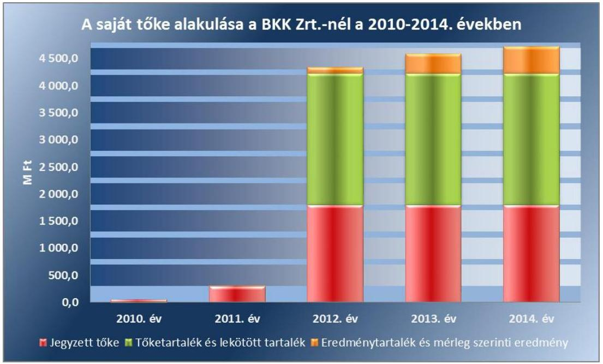

A BKK Zrt. saját tőke/jegyzett tőke aránya az ellenőrzött időszakban 162,3 százalékkal növekedett. A saját tőke a 2010. évi 50,0 M Ft-ot követően a 2011. évben - 250,0 M Ft tőkeemelést és 2,4 M Ft mérleg szerinti eredményt figyelembe véve - 252,4 M Ft-tal emelkedett. A közfeladatok 2012. évi átvételekor a BKK Közút Zrt. 3924,5 M Ft-os részvényeinek apportja során 1500,0 M Ft a BKK Zrt. jegyzett tőkéjébe, 2424,5 M Ft tőketartalékba került. Az FPE Kft. beolvadása során 1,0 M Ft a BKK Zrt. jegyzett tőkéjébe, 36,5 M Ft eredménytartalékba, 0,8 M Ft lekötött tartalékba került. A 76,7 M Ft-os mérleg szerinti eredményt is figyelembe véve 2012. évben a saját tőke 4341,9 M Ft-ra növekedett. A 2012-2014. évek között a jegyzett tőke és a tőketartalék változatlan értéke mellett a saját tőke 8,7%-kal 4723,5 M Ft-ra nőtt, mert a Fővárosi Önkormányzat döntése alapján a BKK Zrt. a mérleg szerinti eredményt minden évben teljes összegében az eredménytartalékba helyezte.

Az értékesítés nettó árbevétele a 2011. évi 668,4 M Ft-ot követően a 2012. évi 47 627,8 M Ft-ról 2014. évre 87 666,3 M Ft-ra nőtt. A BKK Zrt. bevétele főként a BKV Zrt.-től 2012. május 1-jétől átvett feladatok nyomán befolyó jegy- és bérletértékesítésből származó bevételből, továbbá az ehhez kapcsolódó szociálpolitikai menetdíj támogatásból állt.

---

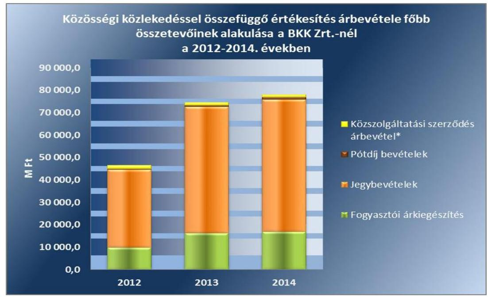

Az árbevétel további összetevőjét jelentették a közlekedésszervezésből származó bevételek, a Keretmegállapodás ${ }_{2}$ szerint kiszámlázott parkolási és behajtási-, valamint projektmenedzsment közszolgáltatási feladatokból származó bevételek, droszthasználati díjak és közútkezelési, illetve behajtási hozzájárulás. A BKK Zrt. az árbevétel között számolta el a Fővárosi Önkormányzat részére továbbszámlázott közvetített szolgáltatások értékét, valamint a BKK Közút Zrt. részére végzett bérszámfejtési tevékenység ellenértékét.
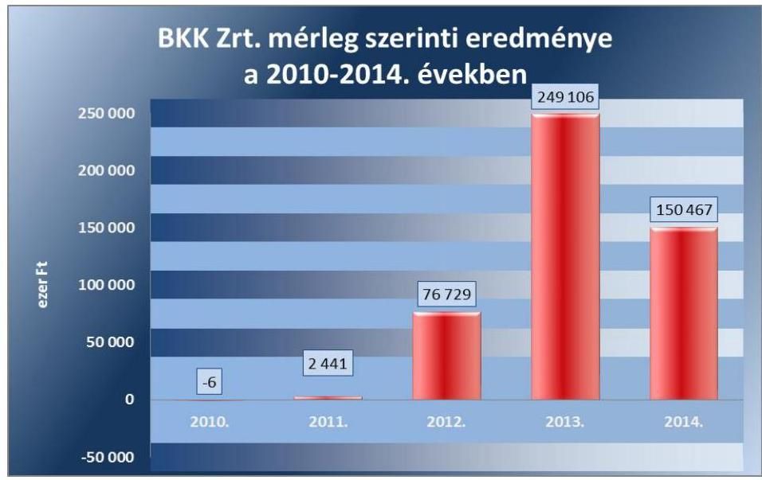

A BKK Zrt.-nek a megalakulás évében, 2010-ben 6,0 E Ft vesztesége keletkezett. A BKK Zrt. mérleg szerinti eredménye a 2011. évben 2,4 M Ft, a 2012. évben 76,7 M Ft, a 2013. évben 249,1 M Ft, valamint a 2014. évben 150,5 M Ft volt. A mérleg szerinti eredmény 2014. évi mérséklődése többségében a közlekedésszervezői kötbérek csökkenéséből (2013. évi 185,4 M Ft-ról 2014. évi 104,9 M Ft-ra) adódott.

---

A kötelezettségek állománya a 2010. évi 13,3 M Ft-ot és a 2011. évi 300,6 M Ft-ot követően a 2012-2014. években 145,2%-kal (10 250,3 M Ft-ról 25 130,0 M Ft-ra) emelkedett. Ennek fő oka, hogy a szállítói kötelezettség a 2012-2014. évek között közel nyolcszorosára (2524,3 M Ft-ról 20 093,3 M Ft-ra) nőtt, ami a megkezdett beruházási projektekhez kapcsolódott. A projektekre elnyert támogatások folyósítása úgy történt, hogy a támogató közvetlenül a szállítóknak utalta a projektekkel összefüggő számlák ellenértékét. A támogató által pénzügyileg nem rendezett számlák összértékének (11 046,4 M Ft) növekedése ezért a szállítóállományt növelte.

A passzív időbeli elhatárolások 2013. és 2014. évben az előző évekhez képest jelentősen nőttek (2013-ban 31081,4 M Ft, 2014-ben 64 120,7 M Ft). Itt jelent meg a kapott fejlesztési célú támogatások halasztott bevételként történő elszámolásából 2013. évben 19 756,0 M Ft, 2014. évben 43 136,0 M Ft. A költségek passzív időbeli elhatárolásában 2014. évben a BKV Zrt. részére visszamenőleg megállapított ésszerű nyereség és a 2014/2015. menetrendi évből a 2014. évre megállapított alulfinanszírozottság elhatárolt összegét mutatták ki.

Az ellenőrzött időszakban a Közszolgáltatási szerződés szerint Éves Megállapodásokban rögzítették a BKV Zrt.-t megillető, az adott menetrendi évre megrendelt szolgáltatások ellentételezéseként megfizetendő kompenzáció mértékét, havi bontásban. A 2012/2013. menetrendi évben 157 328,1 M Ft, a 2013/2014. menetrendi évben pedig 116 540,1 M Ft kompenzációt fizettek ki az Éves Megállapodás alapján, ezen felül a 2012/2013. évben az éves elszámolás után további 2861 M Ft-ot, a 2013/2014. évben pedig 4239,7 M Ft-ot alulfinanszírozottság miatt.

A Személyszállítási tv. 30. § (1) bekezdése szerint a BKV Zrt. a közszolgáltatási tevékenységgel összefüggő, bevételekkel nem fedezett, a közszolgáltatási kötelezettség felmerült indokolt költségeinek, valamint a szokásos mértékű, ésszerű nyereség megtérítésére jogosult. 2012. május 1-jétől ésszerű nyereség biztosítása is szükségessé vált a BKK Zrt. és a BKV Zrt. között hatályban lévő közszolgáltatási szerződés alapján. A Közgyűlés 2015. január 28-ai ülésén úgy határozott, hogy elfogadja, hogy a BKV Zrt. 2014. évi kompenzációs díja legalább 5500,0 M Ft összegű ésszerű nyereséget is tartalmaz, amely a BKK Zrt. és a Fővárosi Önkormányzat közötti elszámolások során a BKK Zrt. indokolt költségeként kerül elismerésre.

A BKK Zrt. a közlekedésszervezési és projekmenedzsmenti feladathoz kapcsolódó vagyonelemet az ellenőrzött időszakban nem értékesített és közvagyon tulajdonjogának ingyenes átruházására sem került sor.

# 3.3. A beszámolási kötelezettség teljesítése 

A Fővárosi Önkormányzat a Busztv. 4. § (1) bekezdés b) pontjában és a Személyszállítási tv. 5. § (1) bekezdés c) pontjában meghatározottaknak megfelelően a BKK Zrt.-vel kötött Közszolgáltatási szerződés és a Keretmegállapodás ${ }_{1,2}$ keretein belül kialakította, és megfelelően működtette a közszolgáltatások nyomon követési rendszerét.

A BKK Zrt. a közlekedésszervezői, valamint a projektmenedzsmenti feladatai ellátásával kapcsolatos - a Közszolgáltatási szerződésben és a Keretmegállapodás ${ }_{1,2}$-ban előírt - beszámolási kötelezettségének az ellenőrzött idő-

---

szakban eleget tett. A beszámolókat, tájékoztatókat egy esetben szűkebb tartalommal, illetve az előírt határidőt túllépve, de minden esetben megküldték a Fővárosi Önkormányzatnak. A közgyűlési elfogadást igénylő beszámolókat (éves számviteli beszámoló, üzleti jelentés, Menetrendi éves elszámolás, stb.) a Közgyűlés megtárgyalta, elfogadásukról határozattal döntött.

A BKK Zrt. és a Fővárosi Önkormányzat között létrejött megállapodásokban meghatározták a Fővárosi Önkormányzat felé teljesítendő elszámolások minimális követelményeit, gyakoriságát. A megállapodásokban foglalt kötelezettségek teljesítésének szabályait, ezen belül a Fővárosi Önkormányzat részére történő adatszolgáltatási kötelezettség teljesítésével kapcsolatos feladatokat a BKK Zrt. Ügyrendjében ${ }^{24}$ és vezérigazgatói utasításban ${ }^{25}$ határozták meg. A Közgyűlés által előírt beszámolási kötelezettség teljesítése céljából negyedévenként tájékoztatót/beszámolót kellett küldeni a Fővárosi Önkormányzat részére a társaság működéséről. A bevételek alakulásáról és a finanszírozási igényről havonta küldött likviditási tervben számoltak be.

A Közszolgáltatási szerződésben előírt február 28-ai határidőt túllépve 2012. március 31-ei aláírást követően küldték meg a Fővárosi Önkormányzat részére a 2011. évi közszolgáltatási szerződés teljesítéséről szóló beszámolót, amely nem tartalmazta a Közszolgáltatási szerződés 2. számú mellékletben előírt eredménykimutatást, mérlegadatokat és kiegészítő mellékletet.

A közlekedésszervezői feladatokról a Keretmegállapodás ${ }_{2}$ 37.2. pontja szerint elkészítették a menetrendi negyedéves jelentéseket, valamint a 38. pontja szerinti Közlekedésszervezői Éves Jelentést. A 2012. XII. hó - 2013. II. hó közötti időszakra vonatkozó menetrendi negyedéves beszámolót, valamint a 2013/2014. menetrendi éves elszámolást a késedelem objektív okainak ismertetését és a benyújtási határidő módosításának kezdeményezését követően a Keretmegállapodás ${ }_{2}$-ban előírt határidőn túl ${ }^{26}$ nyújtották be a Fővárosi Önkormányzatnak.

A 2012. I-II. negyedévre, a 2012. I-IV. negyedévre, valamint a 2013. I-II. negyedévre vonatkozó közszolgáltatási jelentést a Keretmegállapodás ${ }_{2}$-ban előírt határidőn (negyedévet követő 30, 2013. január 1-től 60 napon) túl ${ }^{27}$ küldték meg a Fővárosi Önkormányzatnak.

A BKK Zrt. a Számv. tv.-ben előírtak szerint minden évben elkészítette az éves beszámolóját és üzleti jelentését. A BKK Zrt. Felügyelő Bizottsága határozattal döntött az éves beszámoló elfogadásáról. A Felügyelő Bizottság Ügyrendjének 7.2 pontjában foglaltak ellenére a 2010-2011. évi beszámolóhoz a Felügyelő Bizottság nem készített írásos jelentést, így a 2010-2011. évi beszámolók alapítói elfogadására a Gt. 35. § (3) bekezdését megsértve a Felügyelő Bizottság írásos jelentése nélkül került sor. A Felügyelő Bizottság 2013-2014. évi beszámolóról írásos jelentést készített az alapító részére. Az

[^0]
[^0]:    ${ }^{24}$ 18/2012. számú Vezérigazgatói utasítás
    ${ }^{25}$ 20/2012. számú Vezérigazgatói utasítás
    ${ }^{26}$ 2013. április 30. helyett 2013. május 9-én, 2014. október 31. helyett 2014. november 5-én.
    ${ }^{27}$ 2012. július 30. helyett 2012. augusztus 14-én, 2013. február 28. helyett 2013. március 13-án, 2013. augusztus 30. helyett 2013. szeptember 11-én.

---

Igazgatóság a könyvvizsgáló véleményének figyelembevételével határozott az éves beszámoló, továbbá az eredmény felhasználásának jóváhagyásáról. Továbbá határidőben megküldte az alapító részére az éves beszámolót, valamint a nyereség felosztására vonatkozó javaslatát. Az éves beszámolók közzététele érdekében - Számv. tv. 154. § (1) és
 (7) bekezdés előírásainak megfelelően - a 2010-2014. évi éves beszámolót határidőben megküldték a Céginformációs Szolgálatnak.

A BKK Zrt. könyvvizsgálója minden évben megállapította az éves üzleti jelentések és az éves beszámolók közötti összhangot, továbbá, hogy az elkészült beszámolók a Számv. tv.-nek megfelelnek, megbízható és valós képet mutatnak a BKK Zrt. pénzügyi, vagyoni és jövedelmi helyzetéről. A könyvvizsgáló vezetői levelet nem készített, javaslatot nem fogalmazott meg. A BKK Zrt. éves beszámolóit tárgyaló Közgyűlési üléseken az ellenőrzött időszakban a társaság könyvvizsgálója nem volt jelen, mert a könyvvizsgálót a Gt. 44. § (1), valamint a Ptk. 3:131. § (2) bekezdései ellenére a Fővárosi Önkormányzat nem hívta meg.

A könyvvizsgáló 2012., 2013. és 2014. években figyelemfelhívással élt a jelentéseiben. Mindhárom évben arra hívta fel a figyelmet, hogy a BKK Zrt. kompenzációs igényre jogosult, de a közlekedésszervezői feladatok elszámolása - a menetrendi éves elszámolás miatt - a Fővárosi Önkormányzattal a beszámoló időpontjáig nem történt meg. Rögzítette továbbá, hogy a 2012. évi beszámolóban 3985,9 M Ft visszafizetési kötelezettséget, a 2013. évi beszámolóban 1965,9 M Ft alulkompenzációt, a 2014. évi beszámolóban 17,8 M Ft túlfinanszírozást mutattak ki. Ezen felül indokoltnak tartotta az előző évi jelentős összegű hiba - amely a menetrendi éves elszámolás miatt jelentkezett - elkülönített bemutatását.

A BKK Zrt. 2013. és 2014. évben jelentős, az üzleti év mérlegfőösszegének 2%-át meghaladó jelentős hibát tárt fel, ezért a Számv. tv. 19. § (3) bekezdése alapján „háromoszlopos" mérleg és eredménykimutatás készítésére volt kötelezett. A mérlegfőösszegek 2%-át meghaladó jelentős hiba mindkét évben a menetrendi év (szeptember 1. - augusztus 31.) és az üzleti év (január 1. - december 31.) időszakának eltérése miatt a közlekedésszervezői menetrendi éves elszámolás miatt keletkezett. A BKK Zrt. a módosításokat a mérleg és az eredménykimutatás minden tételénél és a kiegészítő mellékletben bemutatta, így eleget tett a Számv. tv. 19. § (4) bekezdésében foglaltaknak.

A Számv. tv. 117. § (1) bekezdésében előírt feltételek $^{28}$ nem teljesültek, ezért a BKK Zrt. 2014. évtől kezdődően konszolidált beszámoló készítésére kötelezett. A 2014. évi konszolidált beszámolót az Igazgatóság, a Felügyelő Bizottság, valamint a Közgyűlés megtárgyalta, azt elfogadta. A könyvvizsgálói vélemény szerint a 2014. évi konszolidált beszámoló megbízható és valós képet adott a 2014. december 31-én fennálló vagyoni és pénzügyi helyzetről.

[^0]
[^0]:    $^{28}$ Két egymást követő üzleti évben a mérleg főösszeg meghaladta az 5400,0 M Ft-ot, a nettó árbevétel a 8000,0 M Ft-ot, valamint a foglalkoztatottak száma a 250 főt.

---

A BKK Zrt. a jogszabályokban előírt közzétételi kötelezettségének eleget tett. Honlapján közzé tette az előírt dokumentumokat, azonban az archiválandó dokumentumokat - a közérdekű adatok közzétételi rendjéről szóló 11/2011. számú vezérigazgatói utasítás 2. számú mellékletében foglaltak ellenére - nem helyezték archívumba, hanem továbbra is az eredeti közzétételi listában helyezték el.

# 3.4. A közlekedésszervezési és projektmenedzsment feladatok bevételeinek és kiadásainak teljesítése és elszámolása 

A BKK Zrt. a közszolgáltatási és közfeladat-ellátási tevékenységéhez kapcsolódóan a bevételei, költségei, illetve ráfordításai elkülönítési kötelezettségének eleget tett. A bevételek elszámolása az ellenőrzött időszakban - a pótdíjkövetelésekből származó bevételek kimutatását kivéve - szabályszerűen történt. Az anyagjellegű ráfordítások elszámolása megfelelően, a beruházások, felújítások elszámolása a jogszabályoknak és a belső előírásoknak részben megfelelően történt.

A BKK Zrt. tevékenységeinek bevételeit a 2012-2014. üzleti években Számlarendjében meghatározott módon, elkülönítve, közfeladatonként, közszolgáltatásonként könyvelte. A költségek és ráfordítások elkülönített nyilvántartását - az analitikus nyilvántartást alapul véve - kontrolling eszközök kialakításával valósították meg.

A Keretmegállapodás$^2$ előírta, hogy tevékenységi forráselszámolások során a BKK Zrt. minden költséget, ráfordítást a tevékenységi forrásokkal szemben elszámolhat. A tevékenységi költségfelosztás módszerét a BKK Zrt. önköltségszámítási szabályzata$^{1,2}$ és az önköltségszámítás rendje, valamint a projektekkel kapcsolatos költségfelosztást, és projekt bekerülési érték meghatározás rendjét a Projekt önköltségszámítási szabályzata tartalmazta.

A tevékenységi és projekt önköltség meghatározása 2012. évben a Kulcs-Soft könyvelő programban, 2013-2014. évben az SAP vállalatirányítási rendszerben kialakított költséghelyekre (szervezeti egységekre) történt. A BKK Zrt. költségfelosztása során az előre kialakított profit centerekhez rendelték hozzá a költséghelyeket és projekteket. A profit centerek konkrét definícióját 2014. januártól szabályozták. A költségek és ráfordítások költséghelyekhez rendelése a hatályos ügyrendben definiált szervezeti feladatok alapján történt, mivel a költséghelyi listát tartalmazó melléklet az ügyrend minden módosítása során folyamatos felülvizsgálatra és kiadásra került. A projektek esetében a profit center hozzárendelést a projekt finanszírozási szerződése rögzítette. Az elsődlegesen könyvelt költségek, bevételek és ráfordítások a kiindulási állapotban a szervezeti költséghelyeken, valamint a projektet leképező elemeken jelentek meg. A költségfelosztás során végezték el a projektekkel kapcsolatos, de technikailag közvetlenül a projektre nem könyvelhető költségek kimutatását (pl. bér, bérjárulék), és az igazgatás és technikai profit centerek költségeinek ráterhelését a projektekre és tevékenységekre.

A BKK Zrt.-nél az árbevétel, az egyéb bevétel, rendkívüli bevétel elszámolása az ellenőrzött időszakban - a pótdíjkövetelésekből származó bevételek kimutatását kivéve - szabályszerű volt. A BKK Zrt. a Számv. tv.-nek megfelelően

---

mutatta ki az önkormányzati, valamint az európai uniós támogatásokból származó bevételeket és betartotta a keresztfinanszírozás tilalmát.

A közfeladatok ellentételezésére kapott állami támogatást a Keretmegállapodás$^2$-ban foglaltaknak megfelelően használták fel. A beruházások kapcsán kapott európai uniós támogatások elszámolása folyamatosan történt, elszámolásuk megfelelt a Számv. tv.-ben és a támogatási szerződésekben foglalt előírásoknak. A tervezett bevételektől lényeges elmaradás nem volt tapasztalható, a lejárt követelések aránya nem emelkedett az ellenőrzött időszakban. Az árbevételt a Számlarend szerinti bontásban, közfeladatonként elkülönítetten számolták el.

Az utazás jogszerűségét - és ezzel egyidejűleg az igénybe vett kedvezményeket a BKK Zrt. belső szabályzataiban$^{29}$ meghatározott módokon ellenőrizte (beléptetéses ellenőrzés, utazás közben történő ellenőrzés, stb.) Az ellenőrzés elsődlegesen az utazás jogosságára, az utazási feltételek betartására, valamint az utazási kedvezmények igénybe vételének jogosságára terjedt ki. A 2012-2014. években a BKK Zrt. ellenőrzése a pénztárosok munkavégzésére is kiterjedt, mely próbavásárlásokkal, illetve a pénztári adatok és kamerafelvételek elemzésével valósult meg.

A Kijelölő rendelet alapján 2012. május 1-jétől a BKK Zrt. végezte a jegy- és bérletellenőrzést, az ellenőrzés eredményeképpen kiszabott pótdíjbevételek beszedését, és látta el az ezzel kapcsolatos adatkezelési tevékenységet is. A BKK Zrt. pótdíjazásokból származó követelése 2014. december 31-én 19 391,0 M Ft volt. A 2014. év végén pótdíjakból származó követelést mérlegen kívüli tételként a kiegészítő mellékletben a BKK Zrt. bemutatta.

A pótdíjkövetelések megtérülése nagyon csekély, mindössze 5% körüli értéket mutatott 2014. év végén. A követelések jelentős része sok esetben nem valós személyes adatokon alapult, továbbá a gyenge fizetési hajlandóság miatt behajthatatlanná vált. A 2014. évi adatokra alapozva 22700 db fizetési meghagyást küldtek ki a pótdíjazottak azon részének, akik a megadott adataik alapján fellelhetők voltak.

[^0]
[^0]:    $^{29}$ Üzletszabályzat$^{1,2,3,4,5,6,7}$, Jegyellenőrzési és Pótdíjkezelési szabályzat

---

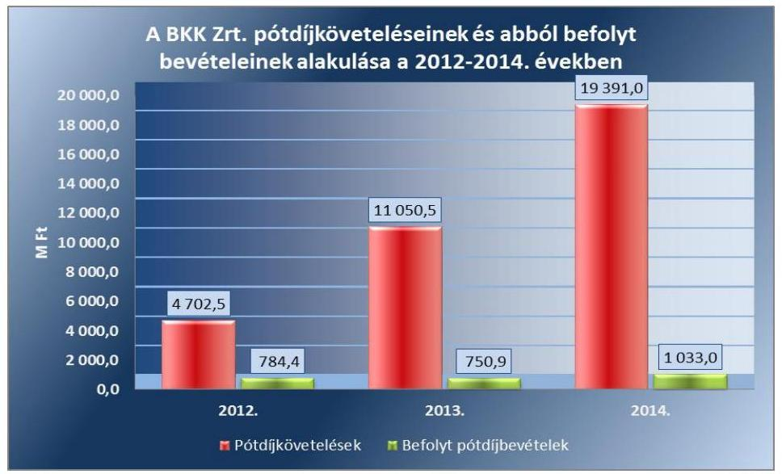

A BKK Zrt. kiegészítő mellékleteiben szerepelt, hogy a pótdíjbevételeket a Számv. tv. 77. § (2) bekezdés b) pont szerinti bírság jellegű tételnek tekintette, így a bevételei között csak a pénzügyi teljesítéskor mutatta ki. A BKK Zrt. pótdíjbevétel elszámolási gyakorlata ellentétes a Számv. tv. 77. § (2) bekezdés b) pontjában foglaltakkal, mivel a befolyt pótdíjakat nem az egyéb bevételek között, hanem az értékesítés nettó árbevételében mutatta ki. Az éves beszámoló kiegészítő mellékletében is a pótdíjbevételek, mint a tevékenység ellenértéke kerültek bemutatásra.

A BKK Zrt.-nél az anyagjellegű ráfordítások elszámolása a 2010-2014. években a jogszabályoknak és a belső előírásoknak megfelelően történt.

A BKK Zrt.-nél az ellenőrzött időszakban a mintatételek ellenőrzése alapján a beruházások, felújítások elszámolása a jogszabályoknak és a belső előírásoknak részben megfelelően történt.

A Számv. tv. 165. § (1)-(2) bekezdésben előírt bizonylatolási kötelezettséget megsértve egy esetben aktiválási jegyzőkönyv nem állt rendelkezésre, a bekerülési érték adatai pontosan nem voltak megállapíthatók, így nem teljesült a Számv. tv. 15. § (3) bekezdésében foglalt valódiság elve sem.

Egy vásárolt eszközök (egy darab 15.810 Ft értékű mágnes tábla) visszaküldésekor az eszközmozgást a nyilvántartáson nem vezették keresztül, az év végi leltározáskor hiányként kezelték és számvitelileg terven felüli értékcsökkenés elszámolásával leírták, így megsértették a Számv. tv. 15. § (3) bekezdésében foglalt valódiság elvét.

Az eseti megbízási díjak, valamint a Fővárosi Önkormányzat javadalmazási szabályzatának hatálya alá tartozó bérköltségek, személyi jellegű egyéb kifizetések, illetve az anyagi ösztönzést szolgáló kifizetések a jogszabályi előírásoknak és a belső szabályozásnak megfelelően kerültek elszámolásra.

A BKK Zrt. vezetői javadalmazása meghatározásánál az ellenőrzött időszakban a jogszabályoknak megfelelően, a Fővárosi Önkormányzat javadalmazási szabályzatával összhangban jártak el, elszámolásuk szabályosan történt. A BKK Zrt. a 2011-2014. években Juttatási Szabályzat$^{1,2,3,4}$-ban határozta meg többek között

---

azokat a béren kívüli juttatásokat, melyek a munkavállalóknak adhatók, illetve előírta az igénylés, kifizetés és elszámolás rendjét. A BKK Zrt. az ellenőrzött időszakban érdekeltségi rendszert működtetett, a 2011. évtől a TÉR, illetve 2013. évtől az Ösztönzési rendszer szabályzatok szerint. Az előbbi a munkavállalók prémium kifizetéseit és teljesítmény szintjeit írta elő, míg az utóbbi a jegyellenőrzésben részt vevők jutalékos rendszerét fogta át. Az ösztönzési rendszer a BKK Zrt. tevékenységének bővülésével párhuzamosan folyamatosan aktualizálásra került.

A BKK Zrt. az egyéb- és rendkívüli ráfordításait, a pénzintézeti költségeket a Számv. tv.-ben, a Számviteli politika$^{14}$-ben és a Számlarendben foglaltaknak megfelelően számolta el. Az egyéb ráfordítások között a legjelentősebbek a helyi iparűzési adóra fizetett, valamint a támogatásként átadott összegek, továbbá a vevői értékvesztések elszámolt tételei voltak. A 2012. évben a rendkívüli ráfordítások között többségében a Parking Kft.-Telenor-BKK Zrt. közötti háromoldalú megállapodás alapján keletkezett tartozásátvállalás, a 2013-2014. évben pedig a látvány-csapatsportok (labdarúgás, vízilabda) támogatása szerepelt.

Budapest, 2016. 03. hónap 10. nap
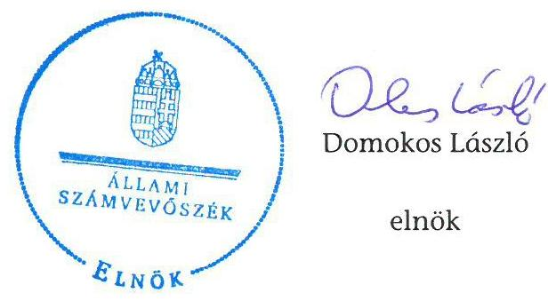

Melléklet: $\quad 6 \mathrm{db}$
Függelék: $\quad 3 \mathrm{db}$

---

.

---

# A Fővárosi Önkormányzat által a 2010-2014. években kötött közszolgáltatási szerződések a helyi közösségi személyszállítás, tömegközlekedés közfeladat biztosítására 

Szolgáltatási szerződés
(hatálya: 2004.04.30.-2012.04.30.)
Fővárosi Önkormányzat - BKV Zrt.

Közszolgáltatási szerződés
(hatálya: 2012.05.01.-2020.04.30.)
BKK Zrt.- BKV Zrt.

## Feladat

> Személyszállítás
> Kereskedelmi-marketing feladatok
> Forgalomirányítási és zavarkezelési kötelezettségek
> Járatok igénybevételének ellenőrzése
> Utastájékoztatási kötelezettségek
> Forgalomfejlesztési, előkészítési, ellátási kötelezettségek
> Közlekedésmenedzsment jellegű kötelezettségek
> Javítási, karbantartási kötelezettségek
> Felújítási, pótlási kötelezettség
> Jelentési kötelezettség
> Szakmai jellegű tájékoztatási kötelezettség
> Számviteli és költséggazdálkodási kötelezettség

## Feladat

> Autóbusszal történő közforgalmú személyszállítás
> Vasúti személyszállítással és trolibusszal történő közforgalmú személyszállítás
> Vizi járművel történő közforgalmú személyszállítás

---

# 1. SZÁMÚ MELLÉKLET A V-0783-238/2016. SZÁMÚ JELENTÉSHEZ

## Közlekedésszervezési feladat

- Budapest közlekedési rendszerének fejlesztési terve megvalósításával kapcsolatos előkészítő és koordinációs feladatok
- Közlekedésszervezési előkészítő feladatok

## Közlekedésszervezési feladat

- Budapest közlekedési rendszerének fejlesztési terve megvalósításával kapcsolatos szakmai előkészítő és koordinációs feladatok
- Közlekedésszervezési előkészítő feladatok

## Projektmenedzsment feladat

- Közlekedésfejlesztési projektek előkészítése, együttműködés az érintett szervezetekkel
- Közlekedésfejlesztési projektek ügyvitele, végrehajtás támogatása

## Projektmenedzsment feladat

- Fejlesztési projektek forrásigényének meghatározása, kapcsolódó dokumentumok kidolgozása
- A Főváros képviseletében megvalósuló
 projektek műszaki, közbeszerzési, pénzügyi eljárásainak kezdeményezésében, végrehajtásában, dokumentálásában való közreműködés
- A projektekkel összefüggő monitoring, adminisztrációs és felügyeleti szervek jelentésbeli kötelezettségek ellátásában való közreműködés
- Projekt jelentésbeli és elszámolási feladatok ellátása
- Változás-bejelentések, támogatási szerződésmódosítások kezdeményezésének előkészítése, lebonyolítása, változáskövetés/kezelés
- Projektekhez kapcsolódó ellenőrzésekhez szükséges háttér biztosítása
- Tájékoztatási, adatszolgáltatási, közzétételi és kommunikációs kötelezettségek ellátásában való közreműködés
- Projekt-záráshoz kapcsolódó feladatok ellátásában való közreműködés

## Közlekedésszervezési feladat

- Budapest közlekedési rendszerének fejlesztési terve megvalósításával kapcsolatos szakmai előkészítő és koordinációs feladatok
- Közlekedésszervezési előkészítő feladatok

Keretmegállapodás (hatálya: 2012.01.01.-2012.04.30.)
Fővárosi Önkormányzat – BKK Zrt.

---

## 1. SZÁMÚ MELLÉKLET A V-0783-238/2016. SZÁMÚ JELENTÉSHEZ

## 1. SZÁMÚ MELLÉKLET A V-0783-238/2016. SZÁMÚ JELENTÉSHEZ

## 1. SZÁMÚ MELLÉKLET A V-0783-238/2016. SZÁMÚ JELENTÉSHEZ

## Közlekedésszervezési feladat

- Éves Szerződés és a Közlekedésszervezői Éves Melléklet megkötése
- Átmeneti finanszírozás szabályai
- Kifizetések teljesítése, késedelem
- Negyedéves Jelentés, Negyedéves Előzetes Elszámolás, Éves Beszámoló, Éves Elszámolás szabályai
- Számviteli elkülönítés szabályai
- Keresztfinanszírozás tilalmának előírása
- Egységes Ügyfélszolgálati rendszer üzemeltetése
- BKK Zrt. adatszolgáltatási kötelezettségének részletszabályai
- A Fővárosi Önkormányzat és egyéb szervek ellenőrzései
- Együttműködés szabályai
- Kapcsolattartás rendje
- A Keretmegállapodás módosítása, jogutódlás, változások kezelése, felmondás, vitarendezés
- Vis maior esetek és lehetetlenülés, szerződés lehetetlenülése
- Adatvédelem

## Projektmenedzsment feladat

- Forrásigények meghatározása, megvalósíthatósági tanulmányok, pályázati dokumentáció készítése
- Közbeszerzési, műszaki, pénzügyi eljárások kezdeményezése, végrehajtása, dokumentálásban közreműködés
- Projektek monitoringja, projektjelentések készítése, elszámolási dokumentáció teljes körű ügyintézése
- Szerződésmódosítások előkészítése
- Adatszolgáltatások, kommunikációs, tájékoztatási kötelezettségek teljesítése
- A megvalósítások során fellépő problémák azonnali jelzése a Fővárosi Önkormányzat részére

---

A BKK Zrt.-nél a projektekhez kapcsolódó befejezetlen beruházások állományának 2011-2014. évi alakulása

|  Megnevezés | 2011. év | 2012. év | 2013. év | 2014. év  |
| --- | --- | --- | --- | --- |
|  Az 1-es és 3-as villamosvonalak továbbfejlesztése | 27,2 | 426,2 | 2357,2 | 32275,4  |
|  Egységes utastáj. és forgalomir.rendszer FUTÁR | 0,3 | 12,2 | 4152,4 | 5202,8  |
|  Elektronikus jegyrendszer előkészítése és kivitelezése | 20,6 | 81,4 | 385,5 | 806,8  |
|  Az M1 Milleniumi Földalatti Vasút korszerűsítése | 0,0 | 21,8 | 212,8 | 595,1  |
|  Budapesti villamos és trolibusz járműbeszerzés | 0,0 | 31,8 | 136,2 | 308,2  |
|  Az M2 metró és a Gödöllői HÉV összekötés, a rákoskeresztúri szárnyvonal megval.tan. | 0,0 | 2,6 | 199,6 | 300,0  |
|  A fővárosi villamoshálózat és trolibuszhálózat egységes fejlesztési koncepciója | 0,0 | 3,8 | 13,5 | 241,3  |
|  Széll Kálmán tér tervezés | 0,0 | 7,4 | 149,9 | 145,0  |
|  Budai fonódó Széll K. téri ág előkészítés | 14,1 | 105,8 | 113,9 | 132,5  |
|  Az Észak-Déli regionális gyorsvasút déli szakaszának megvalósíthatósági tanulmánya | 0,0 | 3,7 | 11,9 | 111,4  |
|  Jegyautomata rendszer (TVM automata rendszer telepítése) | 0,0 | 0,0 | 45,4 | 107,0  |
|  Budai fonódó Széll K. téri ág megvalósítás | 0,0 | 45,3 | 66,0 | 105,7  |
|  Személyforgalmi behajtási díj bevezethetőségének megvalósíthatósági tanulmánya | 1,3 | 26,9 | 71,9 | 72,4  |
|  BKK Ügyfélcentrum kialakításával összefüggő feladatok | 0,0 | 0,0 | 22,7 | 62,3  |
|  Budai fonódó Bem rakparti ág megvalósítás | 0,0 | 1,5 | 20,2 | 136,0  |
|  Budai fonódó Bem rakparti ág előkészítés | 0,0 | 48,7 | 53,1 | 52,9  |
|  Átfogó koncepció a Dunai partszakaszok rendezésére és fejlesztésére | 0,0 | 0,0 | 16,8 | 40,4  |
|  Széll Kálmán tér megvalósítás | 0,0 | 0,0 | 11,0 | 39,4  |
|  Az M3 metróvonal rekonstrukciója és É-i meghosszabb. megvalósíthatósági tanulmány | 0,0 | 0,3 | 10,3 | 33,0  |
|  Fogaskerekű vasút fejlesztése | 0,0 | 1,9 | 26,9 | 27,2  |
|  Budai fonódó Külső Bécsi út előkészítése | 0,0 | 4,6 | 25,2 | 25,1  |
|  Káposztásmegyer intermodális csomópont | 0,0 | 3,0 | 24,8 | 24,8  |
|  42-es villamos meghosszabbításának előkészítése | 0,0 | 8,0 | 10,4 | 14,6  |
|  Budapesti Kerékpáros Közösségi Közlekedési rendszer kialakítása | 5,4 | 35,8 | 594,0 | 1,6  |
|  Széll Kálmán tér rendezési koncepciójának elkészítése | 11,5 | 11,1 | 15,9 | 0,0  |
|  Egyéb | 17,4 | 3,0 | 53,5 | 304,3  |
|  Összesen | 97,8 | 886,8 | 8801,0 | 41165,2  |

Forrás: BKK Zrt. 2010-2014. évi beszámolói

---

A BKV Zrt. vagyoni helyzetének főbb adatai a 2010-2014. években

|  Megnevezés | 2010.12.31 | 2011.12.31 | 2012.12.31 | 2013.12.31 | 2014.12.31  |
| --- | --- | --- | --- | --- | --- |
|  I. Befektetett eszközök összesen | 527512,0 | 535379,0 | 559913,0 | 611019,0 | 651145,0  |
|  ebből: tárgyi eszközök | 524499,0 | 532865,0 | 558013,0 | 608961,0 | 648711,0  |
|  ebből: beruházás, felújítás | 204789,0 | 242487,0 | 285637,0 | 317027,0 | 58005,0  |
|  II. Forgóeszközök | 11643,0 | 10530,0 | 10765,0 | 14018,0 | 16270,0  |
|  ebből: készletek | 2916,0 | 2869,0 | 2906,0 | 3198,0 | 4331,0  |
|  követelések | 8404,0 | 6038,0 | 6226,0 | 5118,0 | 5089,0  |
|  III. Aktív időbeli elhatárolások | 182,0 | 327,0 | 903,0 | 2683,0 | 7768,0  |
|  ESZKÖZÖK ÖSSZESEN | 539337,0 | 546236,0 | 571581,0 | 627720,0 | 675183,0  |
|  IV. Saját tőke | 114706,0 | 101370,0 | 113730,0 | 134367,0 | 134592,0  |
|  ebből: jegyzett tőke | 127000,0 | 127000,0 | 127000,0 | 127000,0 | 127000,0  |
|  mérleg szerinti eredmény | 1018,0 | -5893,0 | -3246,0 | -1489,0 | 246,0  |
|  V. Céltartalék | 955,0 | 3104,0 | 4066,0 | 4655,0 | 2724,0  |
|  VI. Kötelezettségek | 418261,0 | 417747,0 | 418369,0 | 418800,0 | 436688,0  |
|  ebből: hosszú lejáratú kötelezettségek | 39641,0 | 6568,0 | 63485,0 | 50092,0 | 310,0  |
|  rövid lejáratú kötelezettségek | 378620,0 | 411179,0 | 354884,0 | 368708,0 | 436378,0  |
|  ebből: rövid lejáratú hitelek | 27520,0 | 52250,0 | 17,0 | 9413,0 | 51791,0  |
|  kötelezettség áruszállításból és sz | 39772,0 | 49895,0 | 46358,0 | 47145,0 | 69491,0  |
|  RLK kapcsolt lejáratú kötelezettsé | 2240,0 | 1437,0 | 976,0 | 714,0 | 3071,0  |
|  egyéb rövid lejáratú kötelezettség | 8557,0 | 6935,0 | 7065,0 | 10990,0 | 11633,0  |
|  VII. Passzív időbeli elhatárolások | 305415,0 | 324015,0 | 335416,0 | 369898,0 | 401179,0  |
|  ebből: halasztott bevételek | 296423,0 | 316042,0 | 334128,0 | 367864,0 | 395130,0  |
|  FORRÁSOK ÖSSZESEN | 539337,0 | 546236,0 | 571581,0 | 627720,0 | 675183,0  |

Forrás: BKV Zrt. 2010-2014. évi beszámolói

---

Az eszközök használhatósági foka, átlagos életkora és elhasználódási szintje a 2010-2014. években a BKK Zrt.-nél

|  | 2010. év | 2011. év | 2012. év | 2013. év | 2014. év |
| :--: | :--: | :--: | :--: | :--: | :--: |
| Használhatósági fok (\%) |  |  |  |  |  |
| Ingatlanok és kapcs.vagyoni értékű jogok | - | - | 96,73\% | 93,43\% | 96,80\% |
| Egyéb építmények (BUBI) | - | - | - | - | 96,85\% |
| Műszaki berendezések, felszerelések, járművek | - | - | - | - | 96,52\% |
| Egyéb berendezések, felszerelések, járművek |  |  |  |  |  |
| Járművek | - | - | 85,19\% | 69,78\% | 79,19\% |
| Járművek (BUBI) | - | - | - | - | 96,85\% |
| Ügyviteli és számítástech.eszközök (TVM) | - | - | - | - | 96,48\% |
| Ügyviteli és számítástech.eszközök | - | 76,95\% | 80,22\% | 55,73\% | 49,42\% |
| Egyéb gép, berendezés | - | 93,90\% | 93,51\% | 84,96\% | 85,67\% |
| Egyéb gép, berendezés (BUBI) | - | - | - | - | 96,85\% |
| Bérelt eszközön végzett beruh. | - | - | - | 86,08\% | 53,08\% |
| Kisért.ügyviteli és számítástech. | - | 0,00\% | 0,00\% | 0,00\% | 0,00\% |
| Kisért. egyéb gép, berendezés | - | 0,00\% | 0,00\% | 0,00\% | 0,61\% |
| Formaruha/munkaruha | - | - | 0,00\% | 0,00\% | 0,00\% |
| Átlagos életkor (év) |  |  |  |  |  |
| Ingatlanok és kapcs.vagyoni értékű jogok | - | - | 0,55 | 1,10 | 0,53 |
| Egyéb építmények (BUBI) | - | - | - | - | 0,32 |
| Műszaki berendezések, felszerelések, járművek | - | - | - | - | 0,35 |
| Egyéb berendezések, felszerelések, járművek |  |  |  |  |  |
| Járművek | - | - | 0,74 | 1,51 | 1,04 |
| Járművek (BUBI) | - | - | - | - | 0,32 |
| Ügyviteli és számítástech.eszközök (TVM) | - | - | - | - | 0,35 |
| Ügyviteli és számítástech.eszközök | - | 0,70 | 0,60 | 1,34 | 1,53 |
| Egyéb gép, berendezés | - | 0,42 | 0,45 | 1,04 | 0,99 |
| Egyéb gép, berendezés (BUBI) | - | - | - | - | 0,32 |
| Bérelt eszközön végzett beruh. | - | - | - | 0,42 | 1,42 |
| Kisért.ügyviteli és számítástech. | - | 1,00 | 1,00 | 1,00 | 1,00 |
| Kisért. egyéb gép, berendezés | - | 1,00 | 1,00 | 1,00 | 0,99 |
| Formaruha/munkaruha | - | - | 1,00 | 1,00 | 1,00 |
| Elhasználódási szint (\%) |  |  |  |  |  |
| Ingatlanok és kapcs.vagyoni értékű jogok | - | - | 3,27\% | 6,57\% | 3,20\% |
| Egyéb építmények (BUBI) | - | - | - | - | - |

 | - | - | - | 3,15% |
| Műszaki berendezések, felszerelések, járművek | - | - | - | - | 3,48% |
| Egyéb berendezések, felszerelések, járművek |  |  |  |  |  |
| Járművek | - | - | 14,81% | 30,22% | 20,81% |
| Járművek (BUBI) | - | - | - | - | 3,15% |
| Ügyviteli és számítástechnikai eszközök (TVM) | - | - | - | - | 3,52% |
| Ügyviteli és számítástechnikai eszközök | - | 23,05% | 19,78% | 44,27% | 50,58% |
| Egyéb gép, berendezés | - | 6,10% | 6,49% | 15,04% | 14,33% |
| Egyéb gép, berendezés (BUBI) | - | - | - | - | 3,15% |
| Bérelt eszközön végzett beruházás | - | - | - | 13,92% | 46,92% |
| Kisértékű ügyviteli és számítástechnika | - | 100,00% | 100,00% | 100,00% | 100,00% |
| Kisértékű egyéb gép, berendezés | - | 100,00% | 100,00% | 100,00% | 99,39% |
| Formaruha/munkaruha | - | - | 100,00% | 100,00% | 100,00% |

---

A BKK Zrt. közlekedésfejlesztési nagyberuházásai és főbb jellemzői

|  Sorszám | Megnevzés | Tervezett
bekerülési
költség | Forrása |  |  |  | Befejezésének időpontja (várható)  |
| --- | --- | --- | --- | --- | --- | --- | --- |
|   |  |  | EU
támogatás | Önkormányzati |  | Egyéb forrás |   |
|   |  |  |  | összege | típusa |  |   |
|   |  | m Ft | m Ft | m Ft |  | m Ft |   |
|  1. | Budapest villamos és trolibusz járműfejlesztés | 46550,0 | 46238,1 | 311,9 | FM | 0,0 | 2016.07.15  |
|  2. | 1-3 villamos vonalak továbbfejlesztése I. ütem | 43639,8 | 40948,3 | 2691,5 | PEÁ | 0,0 | 2015.11.15  |
|  3. | Elektronikus alapú jegyrendszer bevezetésének előkészítése | 21929,2 | 0,0 | 5306,7 | FM | 16622,5 | 2016.12.31  |
|  4. | Budai észak-déli villamos kapcsolat kiépítése projekt megvalósítása érdekében a projekthez szükséges önerő biztosítása | 20745,8 | 17906,4 | 2839,4 | FM | 0,0 | 2015.06.30  |
|  5. | Széll Kálmán tér rekonstrukció I. ütem, a budai észak-déli villamoskapcsolat kiépítése, a Káposztásmegyeri intermodális csomópont fejlesztése, tervezési-előkészítési munkái | 5510,0 | 0,0 | 5510,0 | MM | 0,0 | 2015.06.30  |
|  6. | FUTÁR projekt befejezése | 5106,5 | 3097,5 | 2009,0 | FM | 0,0 | 2014.10.30  |
|  7. | Jegykiadó automaták beszerzése, telepítése és üzemeltetése | 3450,0 | 0,0 | 3450,0 | FM | 0,0 | 2019.12.31  |
|  8. | Közlekedésszervezési bevétel beszedéséhez kapcsolódó technikai fejlesztések | 1249,0 | 0,0 | 1249,0 | FM | 0,0 | 2015.06.30  |
|  9. | Budapesti kerékpáros közösségi közlekedési rendszer kialakítása, KKKR projekt 2011. évi ütem beruházásra (BUBI) | 1060,0 | 900,0 | 160,0 | PEÁ | 0,0 | 2015.06.30  |

---

|  Sorszám | Megnevzés | Tervezett
bekerülési
költség | Forrása |  |  |  | Befejezésének
időpontja
(várható)  |
| --- | --- | --- | --- | --- | --- | --- | --- |
|   |  |  | EU
támogatás | Önkormányzati |  | Egyéb
forrás |   |
|   |  |  |  | összege | típusa |  |   |
|   |  | m Ft | m Ft | m Ft |  | m Ft |   |
|  10. | A 2-es villamos vonal komplex felújításának előkészítése, I. mód | 156,4 | 156,4 | 0,0 |  | 0,0 | 2014.12.31  |
|  11. | Az M3 metróvonal rekonstrukciója és északi meghosszabbítása - előkészítési szakasz | 1952,3 | 730,2 | 1222,1 | FM | 0,0 | 2016.03.31  |
|  12. | Az M1 Millenniumi Földalatti Vasút korszerűsítésének és meghosszabbításának megvalósíthatósági tanulmánya, valamint a BKK ZRT. előkészítési projektjei-hez kapcsolódó forgalmi modell készítése | 772,5 | 772,5 | 0,0 |  | 0,0 | 2015.05.31  |
|  13. | A fővárosi villamoshálózat és trolibuszhálózat egységes fejlesztési koncepciója Megvalósíthatósági tanulmány | 699,5 | 699,5 | 0,0 |  | 0,0 | 2015.01.26  |
|  14. | Az Észak-déli Regionális Gyorsvasút déli szakaszának megvalósíthatósági tanulmánya | 570,8 | 570,8 | 0,0 |  | 0,0 | 2014.11.27  |
|  15. | Az M2 Metró és a Gödöllői HÉV összekötés, valamint a rákoskeresztúri szárnyvonal megvalósíthatósági tanulmánya | 499,5 | 499,5 | 0,0 |  | 0,0 | 2014.09.30  |
|   | Összesen | 153891,3 | 112519,2 | 24749,6 |  | 16622,5 |   |

Forrás: BKK Zrt. Adatszolgáltatás

---

# BKK BUDAPESTI KÖZLEKEDÉSI KÖZPONT 

Iktatószám: 1012/18 - 1/2015/1012
tárgy: jelentéstervezet észrevételezése

Tisztelt Elnök Úr!
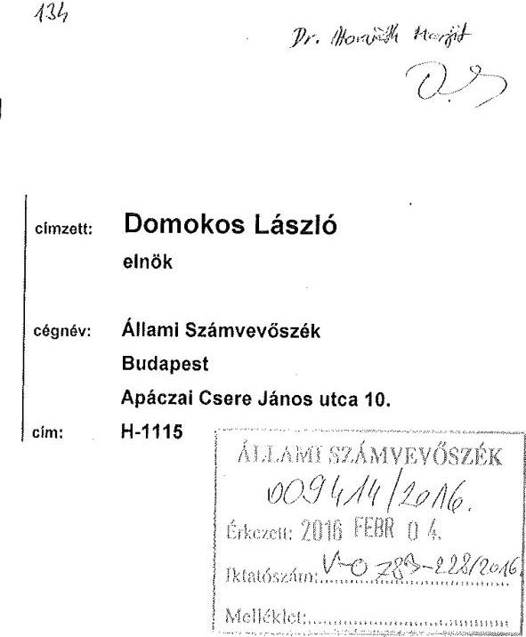

Köszönettel megkaptam „A fővárosi közösségi közlekedés intézményi átalakításának, a Budapesti Közlekedési Központ (BKK Zrt.) létrehozásának, működése szabályszerűségének ellenőrzéséről" készült számvevőszéki jelentéstervezetet.

A jelentéstervezetben foglalt megállapításokra és javaslatokra vonatkozó észrevételeinket jelen levelem mellékleteként megküldöm. Tájékoztatom, hogy az észrevételeinket alátámasztó dokumentumok az ellenőrzést végző számvevők rendelkezésére állnak.

Kérem, hogy a jelentés véglegesítése során szíveskedjen észrevételeinket figyelembe venni.

Budapest, 2016. február 3.
Tisztelettel:

Dr. Dabóczi Kálmán
vezérigazgató

Melléklet:

- Észrevételek

| BKK Budapesti Közlekedési Központ   Zártkörűen Működő Részvénytársaság   cégjegyzékszám: 01-10-046840   cím:   1075 Budapest,   Rumbach Sebestyén u. 19-21. | telefonszám:   fax:   web:   e-mail: | +36307741000   +36307741001   www.bkk.hu   vezerigazgato@bkk.hu |
| :--: | :--: | :--: |

---

# Észrevételek 

## A fővárosi közösségi közlekedés ellenőrzése - A fővárosi közösségi közlekedés intézményi átalakításának, a Budapesti Közlekedési Központ (BKK Zrt.) létrehozásának, működése szabályszerűségének ellenőrzéséről készített jelentéstervezethez

1.) 17. oldal utolsó és 20. oldal 3. bekezdése:

A BKK Zrt. az ellenőrzött időszakban teljesítette a BKV Zrt.-vel kötött Közszolgáltatási szerződésben foglalt kötelezettségeit és a Közszolgáltatási szerződésben foglaltaknak megfelelően gyakorolta jogait. A Közszolgáltatási szerződés alapján a BKK Zrt. és a BKV Zrt. minden évben Éves Megállapodást kötött a közszolgáltatási kötelezettség ellátásának adott menetrendi évre vonatkozó feltételeiről. A Közszolgáltatási szerződésben foglaltak ellenére a 2013/2014. és 2014/2015. menetrendi évekre vonatkozó Éves megállapodások nem tartalmazzák az utas elégedettségi indexet, a járművek által okozott maximális környezetszennyezés, a kibocsátott káros anyagok mennyiségéből képzett mutatószámot, valamint az akadálymentesen hozzáférhető szolgáltatások arányát mutató index meghatározását sem. A 2013/2014. és 2014/2015. menetrendi évekre vonatkozó Éves megállapodásokban szereplő Üzleti tervek megfeleltek a Közszolgáltatási szerződés mellékletében foglalt kritériumoknak. Az üzleti tervek tartalmazzák a beruházási terveket, amelyek azonban nem tartalmazzák a Közszolgáltatási szerződések mellékletében meghatározott minimális követelményeket.

A Közszolgáltatási szerződés 3.1.2 a) pontjában foglaltak ellenére a 2013/2014. és 2014/2015. menetrendi évekre vonatkozó Éves megállapodások nem tartalmazzák az utas elégedettségi indexet, a járművek által okozott maximális környezetszennyezés, a kibocsátott káros anyagok mennyiségéből képzett mutatószámot, valamint az akadálymentesen hozzáférhető szolgáltatások arányát mutató index meghatározását sem. A 2013/2014. menetrendi évre vonatkozóan az Éves megállapodás nem tartalmazta továbbá a közszolgáltatást jogosulatlanul igénybevevők statisztikai arányából képzett mutatószámot sem.

Észrevétel: A megállapításnak megfelelően a jelentés előírja az Éves megállapodás fenti mutatókkal történő kiegészítését.

- Az indikátorok alkalmazására vonatkozóan az ellenőrzést végzőnek készítettünk egy nyilatkozatot, melyben leírtuk egyes mutatók alkalmazását és mérését, illetve, azok amelyek nem kerülnek alkalmazásra, annak mi az indoka. A Közszolgáltatási Szerződés

---

következő módosításakor tervezett a kifogásolt indikátorok Éves Megállapodáshoz történő igazítása.
A Nyilatkozat szerint a BKV esetében a járművek által okozott maximális környezetszennyezés, a kibocsátott káros anyagok mennyiségéből képzett mutatószámot, valamint az akadálymentesen hozzáférhető szolgáltatások arányát bemutató index értékét a rendelkezésre álló járműpark determinálja, ugyanakkor az ebben való elmozdulás, a források korlátja miatt megrendelői és tulajdonosi döntések által befolyásolható, azaz a mutató fővárosi szintű „elmozdulását" elsősorban megrendelői és tulajdonosi intézkedések eredményezhetik, nem BKV szintű döntések. A mutató inkább jellemzi a főváros közlekedéspolitikáját, mintsem a BKV adott évi szolgáltatásának ellátását. Ebből következően a BKV részére elvárás nem volt megfogalmazva.
Az ÁSZ jelentéstervezetben előírt feladatok szerint a hivatal nem fogadta el ezt az álláspontot és előírja a hiányzó mutatók Éves Megállapodásban történő alkalmazását. A 2013-2014. Éves Megállapodás II. melléklete is tartalmazta az elsőajtós felszállási rendre vonatkozó előírást, mint a közszolgáltatást jogosulatlanul igénybevevők statisztikai arányának csökkentésének követelményét, mint BKV által befolyásolható tevékenység kötbér előírását, csak az nem került az I. számú mellékletben kiemelésre, mint a 2014-2015. menetrendi Éves Mellékletben.

A fentiek alapján javasoljuk a jelentés vonatkozó részeinek módosítását.

# 2.) 18. oldal 1. bekezdés: 

szolgáltatások arányát mutató index meghatározását sem. A 2013/2014. és 2014/2015. menetrendi évekre vonatkozó Éves megállapodásokban szereplő Üzleti tervek megfeleltek a Közszolgáltatási szerződés mellékletében foglalt kritériumoknak. Az üzleti tervek tartalmazták a beruházási terveket, amelyek azonban nem tartalmazták a Közszolgáltatási szerződések mellékletében meghatározott minimális követelményeket.

Észrevétel: A bekezdés utolsó mondatából nem derül ki egyértelműen, hogy a BKV üzleti terveire vonatkozik a megállapítás.
Indoklás: A BKK és BKV között megkötött Közszolgáltatási szerződés mellékletében meghatározott minimális követelményeknek a BKV beruházási tervei nem tartalmazták. Módosítási javaslat: A BKV üzleti tervei tartalmazták a beruházási terveket, amelyek azonban nem tartalmazták a Közszolgáltatási szerződések mellékletében meghatározott minimális követelményeket.

## 20. oldal 4. bekezdés:

A 2013/2014. és 2014/2015. menetrendi évekre vonatkozó Éves megállapodásokban szereplő Üzleti tervek megfeleltek a Közszolgáltatási szerződés 7. sz. mellékletében foglalt kritériumoknak. A beruházási terveket az üzleti tervek tartalmazták, amelyek azonban nem tartalmazták a Közszolgáltatási szerződések 5. sz. mellékletében meghatározott minimális követelményeket.

---

Észrevétel: A bekezdés utolsó mondatából nem derül ki egyértelműen, hogy a BKV üzleti terveire vonatkozik a megállapítás.
Indoklás: A BKK és BKV között megkötött Közszolgáltatási szerződés mellékletében meghatározott minimális követelményeknek a BKV beruházási tervei nem tartalmazták.
Módosítási javaslat: A beruházási terveket a BKV üzleti tervei tartalmazták, amelyek azonban nem tartalmazták a közszolgáltatási szerződések 5. sz. mellékletében meghatározott minimális követelményeket.

# 21. oldal 10. bekezdés: 

d) Intézkedjen, hogy az üzleti terveken belül a beruházási terveket egészítsék ki a Közszolgáltatási szerződések 5. sz. mellékletében meghatározott minimális követelményekkel;

Észrevétel: A d) pontból nem derül ki egyértelműen, hogy a BKV üzleti terveire vonatkozik az intézkedés. A intézkedési javaslat a jövőre nézve alkalmazható, a
 lezárt üzleti évek üzleti tervei visszamenőleges kiegészítésének Közgyűlés elé történő terjesztése ne kerüljön megkövetelésre.
Indoklás: A BKK és BKV között megkötött Közszolgáltatási szerződés mellékletében meghatározott minimális követelményeknek a BKV beruházási tervei nem tartalmazták.
Módosítási javaslat: intézkedjen, hogy a jövőben a BKV üzleti tervein belül a beruházási terveket...

## 42. oldal 3. bekezdés:

A 2013/2014. és 2014/2015. menetrendi évekre vonatkozó Éves megállapodásokban szereplő Üzleti tervek megfeleltek a Közszolgáltatási szerződés 7. sz. mellékletében foglalt kritériumoknak. A beruházási terveket az üzleti tervek tartalmazták, amelyek azonban nem tartalmazták a Közszolgáltatási szerződés 5. sz. mellékletében meghatározott minimális követelményeket.

Észrevétel: A bekezdés utolsó mondatából nem derül ki egyértelműen, hogy a BKV üzleti terveire vonatkozik a megállapítás.
Indoklás: A BKK és BKV között megkötött Közszolgáltatási szerződés mellékletében meghatározott minimális követelményeknek a BKV beruházási tervei nem tartalmazták.
Módosítási javaslat: A beruházási terveket a BKV üzleti tervei tartalmazták, amelyek azonban nem tartalmazták a közszolgáltatási szerződés 5. sz. mellékletében meghatározott minimális követelményeket.

---

# 3.) 18. oldal utolsó bekezdése bekezdéséhez: 

A 2010-2014. években a BKK Zrt. vagyongazdálkodási tevékenysége és a közfeladat ellátást szolgáló vagyon nyilvántartása összességében szabályszerű volt. A BKK Zrt.-nek az ellenőrzött időszakban egy, a Fővárosi Önkormányzattól kapott ingatlanon kívül más vagyonkezelésbe vett vagyona nem volt. A 2013-2014. évi beszámolójában a BKK Zrt. a vagyonkezelésbe vett ingatlant, befektetett eszközei, valamint hosszú lejáratú kötelezettségei között elkülönítetten nem mutatta be, valamint a kiegészítő mellékletekben mérlegtételek szerinti megbontásban külön nem szerepeltette. A BKK Zrt. ezzel nem tett eleget a Számv. tv.-ben és a vagyonkezelési szerződésben foglaltaknak.

## 54. oldal 1 bekezdés:

2,9 M Ft volt. A BKK Zrt.-nek az ellenőrzött időszakban más vagyonkezelésbe vett vagyona nem volt. A BKK Zrt. a vagyonkezelésbe vett tartózkodó céljára szolgáló társasházi ingatlant a Számv. tv. 23. § (2) bekezdésének megfelelően mérlegben eszközei közé 2,9 M Ft értékben felvette és ezzel összefüggésben, azonos összegben hosszú lejáratú kötelezettséget is kimutatott könyveiben. A 2013-2014. évi beszámolójában a BKK Zrt. a vagyonkezelésbe vett ingatlant, befektetett eszközei, valamint hosszú lejáratú kötelezettségei között elkülönítetten nem mutatta be, valamint a kiegészítő mellékletekben mérlegtételek szerinti megbontásban külön nem szerepeltette. A BKK Zrt. ezzel nem tett eleget a Számv. tv. 23. § (2) bekezdésében és a vagyonkezelési szerződés 13. pontjában foglaltaknak. A BKK Zrt. Számlarendje nem tartalmazta a vagyonkezelésbe vett eszközök nyilvántartására alkalmazandó számlaszámokat és azok megnevezését, ami nem felelt meg a Számv. tv. 161. § (1)-(2) bekezdésében foglaltaknak.

Észrevétel: A társaság 2013. évi beszámolójában a Kiegészítő melléklet 20. oldalán az Immateriális javak bemutatásánál, valamint a 27. oldalon a hosszúlejáratú kötelezettségek esetén szövegesen mutatja be a vagyonkezelésbe vett ingatlant.
2014. évben a beszámoló 31. oldalon a hosszúlejáratú kötelezettségeknél szövegesen mutatja be a szóban forgó tételt.
Kérjük törölni, hogy a 2013. évi beszámolóban nem szerepelnek a tételek elkülönülten, 2014. évben a befektetett eszközök részletezésében nem szerepel, a hosszúlejáratú kötelezettségek között szövegesen kiemelve szerepel a tétel.
Módosítási javaslat: 2014. évi beszámolójában a BKK Zrt. a vagyonkezelésbe vett ingatlant befektetett eszközei között elkülönítetten nem mutatta be. BKK Zrt. ezzel részben tett eleget...

---

# 4.) 19. oldal 2. javaslat: 

A 2013-2014. évi beszámolójában a BKK Zrt. a vagyonkezelésbe vett ingatlant, befektetett eszközei, valamint hosszú lejáratú kötelezettségei között elkülönítetten nem mutatta be, valamint a kiegészítő mellékletekben a mérlegtételek szerinti megbontásban külön nem szerepeltette. A BKK Zrt. ezzel nem tett eleget a Számv. tv. 23. § (2) bekezdésében és a vagyonkezelési szerződés 13. pontjában foglaltaknak, melyek kimondják, hogy a vagyonkezelőnél a mérlegben eszközként kell kimutatni a kezelésbe vett, az állami vagy önkormányzati vagyon részét képező eszközöket, illetve a vagyonkezelő köteles a vagyonkezelésbe vett vagyon részét képező eszközt legalább mérlegtételek szerinti bontásban külön bemutatni.

Észrevétel: A társaság 2013. évi beszámolójában a Kiegészítő melléklet 20. oldalán az Immateriális javak bemutatásánál, valamint a 27. oldalon a hosszúlejáratú kötelezettségek esetén szövegesen mutatja be a vagyonkezelésbe vett ingatlant.
2014. évben a beszámoló 31. oldalon a hosszúlejáratú kötelezettségeknél szövegesen mutatja be a szóban forgó tételt.
Kérjük ennek megfelelően a megállapítást pontosítani. A mondatnak azzal a felével nem értünk egyet, hogy a 2013. beszámoló nem tartalmazta elkülönítve ezeket a tételeket. A 2014. évi beszámoló pedig, a Befektetett eszközök magyarázatában már nem szerepeltette kiemelt tételként az összeg nagyságrendje miatt.

## 5.) 20. oldal 7. bekezdés:

A 2012. XII.-2013. II. időszakra vonatkozó menetrendi negyedéves beszámolót, valamint a 2013/2014. menetrendi éves elszámolást a Keretmegállapodásban előírt határidőn túl nyújtották be a Fővárosi Önkormányzatnak.

Észrevétel: A 2013/2014. évi menetrendi éves elszámolás Keretmegállapodásban rögzített határidőn túli benyújtásának objektív okairól a BKK Zrt. 1016/703-1/2014/1016 iktatószámú, 2014. október 30-i keltezésű levelében tájékoztatta a Fővárost és egyúttal kezdeményezte a benyújtási határidő módosítását.

Módosítási javaslat: (...) valamint, a 2013/2014. menetrendi éves elszámolást a késedelem objektív okainak ismertetése és a benyújtási határidő módosításának kezdeményezését követően a Keretmegállapodásban előírt határidőn túl nyújtották be a Fővárosi Önkormányzatnak.

## 6.) 21. oldal 1 bekezdés:

A BKK Zrt. kiegészítő mellékleteiben szerepel, hogy a pótdíjbevételeket a Számv. tv. 77. § (2) bekezdés b) pont szerinti bírság jellegű tételnek tekinti, így a bevételei között csak a pénzügyi teljesítéskor mutatja ki. A BKK Zrt. pótdíjbevétel elszámolási gyakorlata ellentétes a Számv. tv. 77. § (2) bekezdés b) pontjában foglaltakkal, mivel a befolyt pótdíjakat nem az egyéb bevételek között, hanem az értékesítés nettó árbevételében mutatja ki. Az éves beszámoló kiegészítő mellékletében is a pótdíjbevételek, mint a tevékenység ellenértéke kerülnek bemutatásra.

---

63. oldal:

A BKK Zrt. kiegészítő mellékleteiben szerepelt, hogy a pótdíjbevételeket a Számv. tv. 77. § (2) bekezdés b) pont szerinti bírság jellegű tételnek tekintette, így a bevételei között csak a pénzügyi teljesítéskor mutatta ki. A BKK Zrt. pótdíjbevétel elszámolási gyakorlata ellentétes a Számv. tv. 77. § (2) bekezdés b) pontjában foglaltakkal, mivel a befolyt pótdíjakat nem az egyéb bevételek között, hanem az értékesítés nettó árbevételében mutatta ki. Az éves beszámoló kiegészítő mellékletében is a pótdíjbevételek, mint a tevékenység ellenértéke kerültek bemutatásra.

Észrevétel: Az alkalmazott gyakorlat szerint a BKK Zrt. a pénzügyi rendezéssel egyidejűleg mutatja ki a bevételt a könyveiben. A BKK Zrt. a pótdíj összegét 2012-2014. évi beszámolóiban értékesítés nettó árbevételeként mutatta ki, a számviteli törvénytől való eltérést a beszámolókban a kiegészítő melléklet 2.7 pont Bevétel elszámolása fejezetben mutatta be.
A beszámoló összeállítása során a számviteli törvény előírásaitól való eltérésre a törvény 4. § (4) bekezdése ad lehetőséget, azonban minden eltérést be kell mutatni a kiegészítő mellékletben kitérve annak indokára és hatásaira.

A BKK Zrt. 2015. évben a könyveiben és az éves beszámolójában is, a korábbi gyakorlattól eltérően az egyéb bevételek között mutatja be a pótdíjbevételeket.

A BKK Zrt. mindent megtesz annak érdekében, hogy a személyszállítási pótdíjakból eredő követeléseit érvényesítse. Folyamatosan fejleszti, és a lehetőségekhez mérten fokozza a helyszíni ellenőrzési tevékenységét. Ennek nyomán keletkezett pótdíjakra folyamatosan fizetési felszólításokat küldünk, ezt követően pedig megindítjuk a jogi eljárásokat, amelyek során fizetési meghagyásokat bocsájtunk ki az adósok felé. Adott esetben polgári perig és végrehajtási szakaszig is elvisszük az ügyeket. Ennek nyomán a 2015-ös évben a pótdíjbevételek jelentős mértékben emelkednek.

# 7.) 21. oldal 3. bekezdés: 

Vásárolt eszközök visszaküldésekor az eszközmozgást a nyilvántartáson nem vezették keresztül, az év végi leltározáskor hiányként kezelték és számvitelileg terven felüli értékcsökkenés elszámolásával leírták, így megsértették a Számv. tv. 15. § (3) bekezdésében foglalt valódiság elvét.

Észrevétel: Kérjük feltüntetni, hogy a szóban forgó vásárolt eszköz egy mágnes tábla volt. A mellékelt bizonylatból kiderül, hogy a tábla értéke 15.810 Ft/db, mely a BKK Zrt. értékelési politikájának megfelelően „kis értékű eszköznek" számít és értékcsökkenése 100%-ban egy összegben kerül költségként elszámolásra. Terven felüli értékcsökkenés elszámolásáról nincs szó, a leltárfelvételkor nulla értéken szerepelt az eszköz a könyvekben. A feltüntetett tétel nem üti meg azt a mértéket, amely befolyásolja a beszámoló valódiságát.

## A mondat második felét kérjük törölni.

Módosítási javaslat: Egy vásárolt eszköz visszaküldésekor az eszközmozgást a nyilvántartáson mennyiségileg nem vezették át, az év végén hiányként kezelték.

---

# 8.) 21. oldal 4. bekezdés: 

A TOBI rendszer adatátírással kapcsolatos karbantartását az egyéb igénybe vett szolgáltatások helyett a beruházások között mutatták ki, így megsértették a Számv. tv. 47. § (1) bekezdésében foglaltakat, mivel a bekerülési értéket nem megfelelően állapították meg.
Észrevétel: A mellékelt számla és teljesítésigazolás is rendszerfejlesztésről szól. Továbbra is azon az állásponton vagyunk, hogy fejlesztésről van szó. A mellékelt szerződés 5.1 értelmében:

Fentieken túlmenően a Vállalkozó vállalja, hogy egy olyan fejlesztési időkeretet tart fenn a 3.1 szerinti nem garanciális feladatok megoldására a Megrendelő számára, melynek felhasználásával a Megrendelő szabadon rendelkezik. Az időkeret havi 20 (húsz) tanácsadói nap. Amennyiben adott hónapban az időkeret nem lett teljes mértékben felhasználva, úgy a fel nem használt napok továbbgörgethetőek a következő hónapra. Az időkeret terhére felhasználható szakértői napok díja:

Indoklás: A szakterület állítása szerint a vállalkozó nem garanciális kereten belül vállalta el az árváltozásból adódó és az évváltás miatt felmerülő különböző díjtételek számítását. A félreértés abból adódhatott, hogy nem az árváltozást kellett a rendszerben beállítani, hanem a díjbekérőn szereplő árak automatikus számítási módját kellett az évváltás miatt különböző módon beállítani.
A megállapítást kérjük törölni, ez a tétel fejlesztés, ezért helyesen a beruházások között kell kimutatni.

## 9.) 21. oldal 11. bekezdés:

e) intézkedjen, hogy az Éves mellékletek megkötésekor tartsák be a Keretmegállapodás, VI/B rész 40.1 pontjában, illetve 35.1 pontjában meghatározott - szerződés megkötésére vonatkozó május 31-ei határidőt;

Észrevétel: A e) pontban szereplő intézkedés megvalósítása az Éves melléklet május 31-i megkötési határidejének betartása nem a BKK vezérigazgatójának 100%-os hatásköre. A BKK vezérigazgatója számára intézkedésként csak az írható elő, hogy gondoskodjon az Éves melléklet közgyűlési előterjesztésének megfelelő határidőben történő előkészítéséről és a Főváros részére történő megküldéséről.
Indoklás: A BKK vezérigazgatójának nincs arra vonatkozó hatásköre, hogy az Éves mellékletet melyik Közgyűlés tűzi napirendjére, ahogy arra vonatkozóan sincs hatásköre, hogy az éves melléklet a Fővárosi Önkormányzaton belül milyen határidővel kerül szignálásra és aláírásra.
Módosítási javaslat: intézkedjen, hogy az Éves mellékletre vonatkozó közgyűlési előterjesztés olyan határidőben kerüljön előkészítésre és megküldésre a Fővárosi Önkormányzat részére, hogy a Keretmegállapodás VI/B rész 40.1 pontjában, illetve 35.1. pontjában meghatározott - szerződés megkötésére vonatkozó május 31-ei határidő betartható legyen.

---

# 10.) 22. oldal 1. bekezdés: 

f) Intézkedjen, hogy a közszolgáltatási szerződés teljesítéséről szóló beszámolót a Közszolgáltatási szerződésben előírt határidőben küldjék meg a Fővárosi Önkormányzat részére és az tartalmazza a Közszolgáltatási szerződés 2. számú mellékletében előírt eredmény-kimutatást, mérlegadatokat és kiegészítő mellékletet;

Észrevétel: Kérjük az f)
 pontban szereplő intézkedési javaslat törlését.
Indoklás: A hivatkozott szerződés és az abban foglalt előírás már nincs érvényben.
11.) 22. oldal 2. és 3. bekezdés:
g) Intézkedjen, hogy a menetrendi negyedéves beszámolókat, valamint éves elszámolásokat a Keretmegállapodás ${ }_{2}$-ban előírt határidőn belül nyújtsák be a Fővárosi Önkormányzatnak;
h) Intézkedjen, hogy a negyedévre vonatkozó közszolgáltatási jelentéseket a Keretmegállapodás ${ }_{2}$-ban előírt határidőn belül küldjék meg a Fővárosi Önkormányzatnak;

Észrevétel: Tájékoztatásként jelezzük, hogy az intézkedés már megtörtént, a Feladatellátásról és Közszolgáltatásról szóló Keretmegállapodásban foglaltak szerint benyújtandó elszámolások elkészítésének rendjéről szóló 7/2015/M/G sz. Vezérigazgató-helyettesi munkautasítás kiadásával, ami rögzíti a beszámolók, elszámolások elkészítésének rendjét, a benyújtás határidejét és a benyújtás felelősét.
12.) 22. oldal 4. bekezdés:
i) Intézkedjen, hogy negyedéves beszámolók a Vezérigazgatói utasítás 1. sz. mellékletében bemutatott szerkezetben készüljenek el;

Észrevétel: kérjük az i) pontban szereplő intézkedési javaslat törlését
Indoklás: a hivatkozott Vezérigazgatói utasítás 2015. július 30-án hatályon kívül helyezésre került
13.) 33. oldal 2. bekezdés:

A BKK Zrt. a tulajdonosi joggyakorlás rendjét a 2012. november 20-án kiadott 35/2012. számú Vezérigazgatói utasításban szabályozta. A Vezérigazgatói utasítás nem volt összhangban a Megbízási szerződéssel, mert az 2012. december 21-ét követően is a Keretmegállapodás ${ }_{2}$ Második rész II/B. részére, mint a Fővárosi Önkormányzat és a BKK Zrt. között a BKV Zrt. feletti tulajdonosi joggyakorlásra létrejött szerződésre hivatkozott. A Megbízási szerződés 6. pontjában és a Vezérigazgatói utasítás 2.4.2. pontjában foglaltaknak megfelelően az éves és negyedéves vagyonkezelői beszámolók - a 2012. december 21-én hatályba lépett Megbízási szerződést követően Tulajdonos megbízotti jelentések megfelelő tartalommal, határidőben elkészültek, azonban az abban foglaltak ellenére a negyedéves beszámolók nem a Vezérigazgatói utasítás 1. sz. mellékletében bemutatott szerkezetben készültek el. A Fővárosi Ön-

---

Észrevétel: Nem értünk egyet azzal, hogy a negyedéves beszámolók nem az utasítás melléklete szerinti szerkezetben készültek.
Indoklás: A készített beszámolók szerkezete a következő volt:

1. Előzmények
2. A BKK Zrt. által adott utasítások
2.1. Előzetes jóváhagyást igénylő utasítások
2.2. Előzetes tájékoztatással kiadott utasítások

Az utasítás melléklete szerinti I.3. pont (A Budapest Főváros Önkormányzata egyidejű tájékoztatásával kiadott utasítások (Keretmegállapodás II/B.17.1. pont negyedik bekezdése alapján)) önálló utasítás-típusként nem értelmezhető, hiszen mind a Keretmegállapodás, mind utóbb a Megbízási szerződés szövegéből kiolvasható, hogy az egyidejű megküldés a I.1. és a I.2. pont szerinti utasítások megküldéséről szól.
3. A BKK által az Önkormányzatnak tett javaslatok
3.1. A BKV Zrt. Igazgatósága tagjaira vonatkozó javaslatok
3.2. A BKV Zrt. üzleti tervére, beszámolójára vonatkozó javaslatok (ezek között a konszolidált beszámolóra is)
3.3. Egyéb javaslatok
3.4. Beszámoló a tulajdonosi határozatok és utasítások végrehajtásáról (A BKV-tól rendszeres jelentést kért a BKK a számára kiadott határozatok és utasítások teljesítéséről)
3.5. ... A BKK által kiemelendőnek tartott eseményekről szóló tájékoztatás, beszámoló
4. Tájékoztatási kötelezettség a beszámolási időszakban történt eljárásokról és változásokról (2013-tól - tekintettel arra, hogy a Megbízási szerződés 4.3. pontja tartalmilag különbözik a Keretmegállapodás II/B.18.2. pontjában írtaktól - a Megbízási szerződésben kért tájékoztatási kötelezettségeket tartalmazta a negyedéves beszámoló.)

A fentiekből jól látszik, hogy a készített beszámolók szerkezete - az 1. Előzmények fejezetet, valamint a 3. pontban írt kiegészítő tájékoztatásokat tekintve - követi a vezérigazgatói utasítás mellékletében írt felépítést. Különbségként az állapítható meg, hogy a beszámolók nem táblázatos formában tartalmazták a BKK által bemutatott tényeket, információkat.
(Végezetül jelezzük, hogy a különböző - beszámolóban említett - dokumentumok tekintetében takarékossági okokból született az a döntés, hogy azok csatolása helyett a beazonosíthatóságot elősegítő adatok (határozatszámok, iktatószámok) kerülnek bemutatásra a beszámolóban, hiszen a dokumentumok a korábbiakban minden esetben megküldésre kerültek már az Önkormányzat részére.)
2015. július 30-a óta - a 35/2012. sz. vezérigazgatói utasítást leváltó - új szabályzat (29/2015. sz. vezérigazgatói utasítás a BKK Zrt. tulajdonosi joggyakorlásának rendjéről) van hatályban, ami nem tartalmaz szabályokat a negyedéves beszámolók szerkezetére, felépítésére vonatkozóan. Ennek megfelelően most már a fent bemutatott eltérés sem áll fenn.
Módosítási javaslat: Kérjük törölni az alábbi tagmondatot „....azonban az abban foglaltak ellenére a negyedéves beszámolók nem a Vezérigazgatói utasítás 1. sz. mellékletében bemutatott szerkezetben készültek el."

---

# 14.) 44. oldal 3. bekezdés: 

Az Éves mellékletek megkötésekor nem tartották be a Keretmegállapodás, VI/8 rész 40.1 pontjában, illetve 35.1 pontjában meghatározott - a szerződés megkötésére vonatkozó május 31-el - határidőt. ${ }^{19}$

Észrevétel: Az Éves mellékletek megkötési határidejének be nem tartására vonatkozó megállapításnál figyelmen kívül hagyásra került, hogy a BKK Igazgatósága mindkét hivatkozott 2013/2014 és 2014/2015 menetrendi éves elszámolás közgyűlési előterjesztéséről a Keretmegállapodásban foglalt határidőt megelőzően határozott. Az közgyűlési előterjesztés javaslatok a döntést követően megküldésre kerültek a Fővárosi Önkormányzat részére.
Indoklás: A 2013/2014. évi éves mellékletet a 2013. május 21-i Igazgatósági ülés tárgyalta majd ezt követően a 2013. május 29-i Fővárosi Közgyűlés is jóváhagyta. A szerződés a Fővárosi Önkormányzat részéről 2013. július 5-én került aláírásra.
A 2014/2015. évi éves mellékletet a BKK Igazgatósága 2014. május 20-án megtárgyalta. 2014. április 30-i közgyűlés követően azonban csak 2014. június 30-án került rendes közgyűlési ülés megtartásra, amelyen az Éves melléklet is elfogadásra került. Az elfogadást követően a BKK vezérigazgatója részéről a szerződés aláírása 2014. július 9-én míg a Főváros részéről 2014. július 29-én történt meg.

## 15.) 48. oldal 4. bekezdés:

A BKK Zrt. projektmenedzsmenti feladatai közé 2014. december 31-ig a Fővárosi Önkormányzattól átvett 18 fejlesztés tartozott. Az eredetileg 22 projekt az ellenőrzött időszakban 18-ra csökkent a megvalósítás elmaradása, illetve a projektmenedzsmenti feladatok más szervezet általi ellátása következtében. A támogatási szerződések szerint összesen lehívható 16 397,3 M Ft összegű támogatásból 2014. december 31-ig lehívott összeg 15 919,0 M Ft volt.
Észrevétel: A BKK a Keretmegállapodás megkötésétől kezdődően, ennek V. fejezete alapján látta el a kezdetben 22 db, mára 18 db-ra csökkent, a Fővárosi kedvezményezetti körbe tartozó KMOP uniós támogatott projekt esetében a projektmenedzsment feladatokat. Ez a fejezet kizárólag ezen projektek megvalósítására tartalmaz feladatokat, teljesítmény követelményeket és csupán az erre a kifutó projektekre teszi lehetővé a projektmenedzsment költségek elszámolását, valamint ésszerű nyereség elszámolását. Ebbe a fejezetbe a jelentés lezárásáig a Fővárostól átvett 18 projekt tartozik bele.
Indoklás: A Keretmegállapodás projektmenedzsment fejezete nem változott a projekttartalmat illetően a kezdetektől. Jelenleg is a Főváros kedvezményezetti körébe tartozó 18 projekt alkotja a Keretmegállapodás V. fejezetének tartalmát.
A BKK jelentős mennyiségű közlekedés fejlesztési és felújítási feladatait látja el a 18 Fővárosi projekten kívül, de ezek nem részei a Keretmegállapodás V. fejezetének, hanem a közlekedésszervezői és a közútkezelői feladatellátáshoz kötődően szerepelnek a Keretmegállapodás más fejezeteiben. A BKK a Fővárosi kedvezményezetti projektekre nem hív le támogatást, azok számláit a Fővárosi Önkormányzat egyenlíti ki. A BKK a projektmenedzsment feladatokon belül a teljesítések és a számlák felülvizsgálatát végzi el a Fővárosi Önkormányzat nevében és helyette a 18 projekt esetében. A tényleges pénzügyi folyamatok, műveletek a 18 projektre kivétel nélkül a BFFH-ban valósulnak meg.

---

A BKK által megvalósított további, a 18 projekten kívüli közlekedés fejlesztési és felújítási feladatokat a Fővárosi Önkormányzat és a BKK közötti megkötött, egyedi projektfeladatokra vonatkozó Megvalósítási-, Fejlesztési-, Pénzeszköz Átadás-, vagy Beruházási Megállapodás alapján látja el a Társaság, de ezek a projektek nem részei a Keretmegállapodás V. fejezetének, így nem történik meg ezen projektek projektmenedzsment feladataira a saját teljesítmények elszámolása sem és ésszerű nyereség megállapítása sem. A további projektfeladatok elvégzése és elszámolása az egyedi megállapodások egyedi előírásai szerint valósul meg, amelyek kifejezetten tiltják a saját teljesítmények felszámolását és az ésszerű nyereség megállapítását is.

# 16.) 49. oldal 3. bekezdés: 

Az üzleti tervekben két üzleti évre vonatkozóan határozták meg a várható adatokat annak érdekében, hogy a menetrendi év által érintett két naptári év az üzleti tervben meg tudjon jelenni.

Észrevétel: a bekezdésben pontatlan megfogalmazás szerepel „két üzleti évre vonatkozóan határozták meg a várható adatokat.
Indoklás: az üzleti tervekben két naptári évre vonatkozóan a terv adatok kerültek meghatározásra. A várható adatok fogalmilag/tartalmilag eltérnek a terv adatoktól.
Módosítási javaslat: „.... két üzleti évre vonatkozóan határozták meg a terv adatokat...."
17.) 50. oldal 1. és 2. bekezdés:

A 2013/2014. évi üzleti tervben a forrásigény 2012. évhez viszonyított növekedését többek között az okozta, hogy a BKK Zrt. a 2013. évtől a teljes naptári évben látta el a közlekedésszervezői feladatokat, számoltak az infláció várható hatásával, az M4 metró induló próbaüzemével, az autóbuszpark megújításának, kiszervezésének hatásával, valamint a 3%-os béremeléssel.

A 2014/2015. évi üzleti tervben a forrásigény 2013. évhez viszonyított növekedését többek között az okozta, hogy számoltak a 2014. április 1-jétől bevezetendő 3%-os béremelkedéssel. A menetdíj bevételek tervezésénél figyelemmel voltak a természetes személyek által vásárolt bérletek 10%-os árcsökkentésére. Figyelembe vették a 2014. március 28-án átadott M4-es metróvonal üzemi költségeit, valamint az agglomerációs közlekedésre a Volánbusszal kötött szerződés miatt fizetendő szolgáltatási díjat. Számoltak a 2013. évi taxi rendeletben elrendelt ellenőrzési feladat éves hatásával, továbbá a FUTÁR utas-tájékoztatási rendszer és a MOL Bubi 2014. évi indulását követő költségeivel, valamint a Mötv. előírásai miatt a parkolási bevételek csökkenésével.

Észrevétel: a forrásigény növekedés egyik okaként a tervezett 3%-os mértékű béremelés szerepel. Kérjük feltüntetni, hogy az üzleti tervekben szerepeltetett béremelés mértéke összhangban volt a Főváros által kiadott tervezési peremfeltételekkel.
Indoklás: az üzleti tervben szerepeltethető béremelés mértékét minden esetben a Főváros által kiadott tervezési peremfeltételek rögzítették.
Módosítási javaslat: 1. bekezdés „valamint a Főváros tervezési iránymutatásának megfelelő 3%-os mértékű béremeléssel"
2. bekezdés „.... bevezetendő a Főváros tervezési iránymutatásának megfelelő 3%-os mértékű ...."

---

# 18.) 50. oldal 2. bekezdés: 

Észrevétel: BKK forrásigényét nem befolyásolták a parkolási bevételek Mötv. előírásainak módosulásából adódó csökkenése, mivel a BKK a parkolási bevételeket nem a saját nevében szedte be.
Indoklás: Mivel a parkolási bevételek nem a BKK saját nevében beszedett bevételei ezért az nem jelenik meg az értékesítés nettó árbevételében, a forrásigény számításnál is figyelmen kívül hagyásra került.
Módosítási javaslat: A 2. bekezdés utolsó tagmondatának törlése.

## 19.) 59. oldal 1. bekezdés:

szakban eleget tett. A beszámolókat, tájékoztatókat esetenként szűkebb tartalommal, illetve az előírt határidőt túllépve, de minden esetben megküldték a Fővárosi Önkormányzatnak. A közgyűlési elfogadást igénylő beszámolókat (éves számviteli beszámoló, üzleti jelentés, Menetrendi éves elszámolás, stb.) a Közgyűlés megtárgyalta, elfogadásukról határozattal döntött.
Észrevétel: a beszámolók esetenként szűkebb tartalommal történő benyújtását kérjük pontosítani.
Indoklás: A jelentés egy esetben a 2011. évi közszolgáltatási szerződésről szóló beszámoló esetén rögzíti, hogy az a szerződésben rögzítettnél szűkebb tartalommal került benyújtásra.
Módosítási javaslat: A beszámolókat, tájékoztatókat egy esetben szűkebb tartalommal, illetve (...)

## 20.) 59. oldal 4. bekezdés:

A közlekedésszervezői feladatokról a Keretmegállapodás 37.2 pontja szerint elkészítették a menetrendi negyedéves jelentéseket, valamint a 38. pontja szerinti Közlekedésszervezői Éves Jelentést. A 2012. XII. hó - 2013. II. hó közötti időszakra vonatkozó

 menetrendi negyedéves beszámolót, valamint a 2013/2014. menetrendi éves elszámolást a Keretmegállapodás ${ }_{3}$-ban előírt határidőn túl ${ }^{27}$ nyújtották be a Fővárosi Önkormányzatnak.

Észrevétel: A 2013/2014. évi menetrendi éves elszámolás Keretmegállapodásban rögzített határidőn túli benyújtásának objektív okairól a BKK Zrt. 1016/703-1/2014/1016 iktatószámú, 2014. október 30-i keltezésű levelében tájékoztatta a Fővárost és egyúttal kezdeményezte a benyújtási határidő módosítását.
Módosítási javaslat: A megállapítás törlése, vagy
(...) valamint, a 2013/2014. menetrendi éves elszámolást a késedelem objektív okainak ismertetése és a benyújtási határidő módosításának kezdeményezését követően a Keretmegállapodásban előírt határidőn túl nyújtották be a Fővárosi Önkormányzatnak.

Budapest, 2016. február „3."
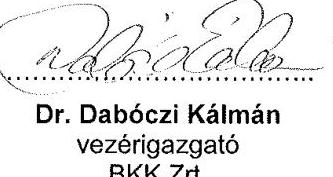

---

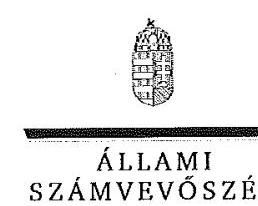

ELNÖK

# Dr. Dabóczi Kálmán úr 

vezérigazgató
BKK Budapesti Közlekedési Központ Zrt.

## Tisztelt Vezérigazgató Úr!

Köszönettel vettem „A fővárosi közösségi közlekedés ellenőrzése - A fővárosi közösségi közlekedés intézményi átalakításának, a Budapesti Közlekedési Központ (BKK Zrt.) létrehozásának, működése szabályszerűségének ellenőrzéséről" készített számvevőszéki jelentéstervezetre küldött válaszát.

Az Állami Számvevőszék észrevételekre vonatkozó álláspontjáról a felügyeleti vezető által készített részletes tájékoztatásban kap választ, amelyet levelemhez mellékeltem.

Tájékoztatom Vezérigazgató urat, hogy a számvevőszéki jelentés véglegesítése az elfogadott észrevételek figyelembevételével történik.

Budapest, 2016. 03. hó 04. nap
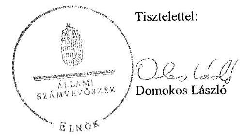

---

# Tájékoztatás az észrevételek kezeléséről 

A fővárosi közösségi közlekedés ellenőrzése - A fővárosi közösségi közlekedés intézményi átalakításának, a Budapesti Közlekedési Központ (BKK Zrt.) létrehozásának, működése szabályszerűségének ellenőrzése témakörében készített jelentéstervezetre Vezérigazgató úr észrevételeit megköszönöm. Az észrevételek részint kiegészítő, részint pontosító jellegűek, intézkedést igénylő megállapításokat, javaslatokat is érintenek. Kezelésükről azok sorrendjében az alábbi tájékoztatást adom.

1. A jelentéstervezet 17. oldalának utolsó, valamint a 20. oldalának 3. bekezdéséhez az éves megállapodásokban négy mutatószám hiányára vonatkozó megállapításunkhoz tett kiegészítését tájékoztatásul tudomásul vettem. A megállapodás mutatószámokra vonatkozó részének módosításáig azonban az ellenőrzött megállapodás előírásai az irányadók, így a felvetés alapján a jelentéstervezet szövegét nem áll módomban változtatni.
2. A jelentéstervezet 18. oldal 1. bekezdéséhez fűzött azon pontosítását, hogy a BKV Zrt. üzleti tervéről van szó, elfogadom. A pontosított szöveg az alábbi:
„A BKV Zrt. üzleti tervei tartalmazták a beruházások bemutatását, azok helyzetét, a beruházások kockázatait, azonban nem tartalmazták teljes körűen a Közszolgáltatási szerződések mellékleteiben meghatározott minimális követelményeket."
3. A jelentéstervezet 20. oldal 4. bekezdéséhez tett, a 2. pontban az üzleti tervekre vonatkozó pontosításával megegyező észrevételét is elfogadom. A pontosított szöveg az alábbi:
„A BKV Zrt. üzleti tervei tartalmazták a beruházások bemutatását, azok helyzetét, a beruházások kockázatait, azonban nem tartalmazták teljes körűen a Közszolgáltatási szerződések 5. sz. mellékletben meghatározott minimális követelményeket."
4. A jelentéstervezet 21. oldal 10. bekezdéséhez tett, a 2. és 3. pontokban az üzleti tervekre vonatkozó pontosításával megegyező észrevételét is elfogadom. A pontosított szöveg az alábbi:
" d.) intézkedjen, hogy a jövőben a BKV Zrt. üzleti tervein belül a beruházási terveket..."
5. A jelentéstervezet 42. oldal 3. bekezdéséhez tett, a 2-4. pontok üzleti tervekre vonatkozó pontosításával megegyező észrevételét is elfogadom. A pontosított szöveg az alábbi:
„A BKV Zrt. üzleti tervei tartalmazták a beruházások bemutatását, azok helyzetét, a beruházások kockázatait, azonban nem tartalmazták teljes körűen a Közszolgáltatási szerződések 5. sz. mellékletben meghatározott minimális követelményeket."

---

6. A jelentéstervezet 18. oldal utolsó, valamint az 54. oldal 1. bekezdéséhez, továbbá a 19. oldal 2. bekezdéséhez tett észrevételét a vonatkozó dokumentumok áttanulmányozása után elfogadom. Az észrevétel lényege, hogy a társaság 2013. évi beszámolója Kiegészítő mellékletének 20. oldalán az immateriális javaknál, valamint a 27. oldalon a hosszú lejáratú kötelezettségeknél bemutatják a vagyonkezelésbe vett ingatlant. A 2014. évi beszámolóban viszont csak a hosszú lejáratú kötelezettségeknél szerepel az ingatlan. Ennek megfelelően a jelentéstervezet szövege mindhárom bekezdés esetében az alábbi:
„A 2014. évi beszámolójában a BKK Zrt. a vagyonkezelésbe vett ingatlant befektetett eszközei között elkülönítetten nem mutatta be. Viszont a hosszú lejáratú kötelezettségei között azt szerepeltette, így részben tett eleget..."
7. A jelentéstervezet 20. oldal 7. bekezdéséhez tett észrevételét a vonatkozó dokumentumok áttanulmányozása után elfogadom. Az észrevétel lényege, hogy a társaság külön levelekben tájékoztatta a Fővárost a 2013/2014. évi menetrendi éves elszámolás Keretmegállapodásban rögzített határidőn túli benyújtásának okairól, egyúttal kezdeményezte a benyújtási határidő módosítását. Ezt figyelembe véve a jelentéstervezet szövege módosul a hivatkozott bekezdésben, továbbá az 59. oldal 4. bekezdésében is:
„(...), valamint a 2013/2014. menetrendi éves elszámolást a késedelem objektív okainak ismertetését és a benyújtási határidő módosításának kezdeményezését követően a Keretmegállapodás-ban előírt határidőn túl nyújtották be a Fővárosi Önkormányzatnak....".
8. A jelentéstervezet 21. oldalának 1. és a 63. oldalának 2. bekezdéséhez tett észrevételét tájékoztatásul tudomásul veszem, ugyanakkor a jelentéstervezet szövegét az nem befolyásolja, mivel az ellenőrzött időszakban a Számv. tv. 77. § (2) bekezdés b) pontja szerint az egyéb bevételek között kellett elszámolni a pótdíjakat. Ezzel szemben az ellenőrzött időszakban a pótdíjak elszámolása az értékesítés nettó árbevételeként és nem az egyéb bevételek között történt. Tájékoztatása szerint a jogszabályhoz igazodó gyakorlat az ellenőrzött időszakot követően, a 2015. évtől került bevezetésre.
9. A jelentéstervezet 21. oldal 3. bekezdéséhez tett észrevételét a vonatkozó dokumentumok áttanulmányozása után elfogadom. A jelentéstervezet szövegét az alábbiak szerint módosítom a hivatkozott bekezdésben, továbbá a 63. oldal 5. bekezdésben is:
"Egy vásárolt eszköz (egy db 15.810 Ft értékű mágnes tábla) visszaküldésekor az eszközmozgást a nyilvántartáson mennyiségileg nem vezették keresztül, az év végi leltározáskor hiányként kezelték."
10. A jelentéstervezet 21. oldal 4. bekezdéséhez tett észrevételét a vonatkozó dokumentumok áttanulmányozása után elfogadom. Az alábbi érintett bekezdést törlöm:
„A TOBI rendszer adatátirással kapcsolatos karbantartását az egyéb igénybe vett szolgáltatások helyett a beruházások között mutatták ki, így megsértették a Számv. tv. 47. § (1) bekezdésében foglaltakat, mivel a bekerülési értéket nem megfelelően állapították meg."

---

Az észrevétel érintette a jelentéstervezet alábbi, 63. oldalának 6. bekezdését, amelyet szintén törlöm:

A TOBI rendszer adatátirással kapcsolatos karbantartását az egyéb igénybe vett szolgáltatások helyett a beruházások között mutatták ki, így megsértették a Számv. tv. 47. § (1) bekezdésében foglaltakat, mivel a bekerülési értéket nem megfelelően állapították meg.

A megállapítással összefüggésben a BKK Zrt. Vezérigazgatójának tett 2.k) javaslatot (22. oldal 6. bekezdés) az alábbiak szerint módosítom:
„h) gondoskodjon a beruházások, felújítások elszámolása során a Számv. tv.-ben előírt bizonylati elv és bizonylati fegyelem, valamint a valódiság elvének betartásáról, valamint az eszközök bekerülési értékének előírásoknak megfelelő megállapításáról
11. A jelentéstervezet 21. oldal 11. bekezdéséhez tett észrevételét elfogadom. Az észrevétel lényege, hogy a BKK Zrt. vezérigazgatójának nincs arra hatásköre, hogy az Éves mellékletet melyik Közgyűlés tűzi napirendjére. Ennek megfelelően a javaslat szövegét pontosítom:
"d.) intézkedjen, hogy az Éves mellékletre vonatkozó közgyűlési előterjesztés olyan határidőben kerüljön előkészítésre és megküldésre a Fővárosi Önkormányzat részére, hogy a Keretmegállapodás; VI/B rész 40.1 pontjában, illetve a 35.1 pontjában meghatározott, a szerződés megkötésére vonatkozó május 31-ei határidő betartható legyen."
12. A jelentéstervezet 22. oldal 1. bekezdéséhez tett azon észrevételét, hogy a hivatkozott közszolgáltatási szerződés már nincs érvényben, tudomásul veszem és az azzal kapcsolatos javaslatot, valamint a jelentéstervezet 20. oldal 6. bekezdésében szereplő intézkedést igénylő megállapítást törlöm:

Javaslat:
„-intézkedjen, hogy a közszolgáltatási szerződés teljesítéséről szóló beszámolót a Közszolgáltatási szerződésben előírt határidőben küldjék meg a Fővárosi Önkormányzat részére és az tartalmazza a Közszolgáltatási szerződés 2. számú mellékletében előírt eredménykimutatást, mérlegadatokat és kiegészítő mellékletet"

Intézkedést igénylő megállapítás:
A Közszolgáltatási szerződésben előírt február 28-ai határidőt túllépve 2012. május 31-ei aláírást követően küldték meg a Fővárosi Önkormányzat részére a 2011. évi közszolgáltatási szerződés teljesítéséről szóló beszámolót, amely nem tartalmazta a Közszolgáltatási szerződés 2. számú mellékletben előírt eredménykimutatást, a mérlegadatokat és a kiegészítő mellékletet.

---

13. A jelentéstervezet 22. oldal 2. és 3. bekezdéséhez tett azon észrevételével kapcsolatban, hogy időközben a szükséges intézkedést megtette, tájékoztatom, hogy Vezérigazgató Úrnak módjában áll a végleges jelentéshez készítendő intézkedési tervhez kapcsolódóan a megtett intézkedésekről tájékoztatást adni. Észrevétele alapján a jelentéstervezeten nem módosítok.
14. A jelentéstervezet 22. oldal 4. bekezdéséhez tett azon észrevételét, hogy a Vezérigazgatói utasítás 2015. július 30-án hatályon kívül helyezésre került, elfogadom és az azzal kapcsolatos javaslatot és a jelentéstervezet 20. oldal utolsó bekezdésében szereplő intézkedést igénylő megállapítást törlöm, illetve a 33. oldal 2. bekezdésében foglaltakat módosítom:

Javaslat:
„intézkedjen, hogy a negyedéves beszámolók a Vezérigazgatói utasítás 1. sz. mellékletében bemutatott szerkezetben készüljenek el."

Intézkedést igénylő megállapítás:
A Megbízási szerződés 6. pontjában és a Vezérigazgatói utasítás 2.4.2. pontjában foglaltaknak megfelelően az éves és negyedéves vagyonkezelői beszámolók a 2012. december 21-én hatályba lépett Megbízási szerződést követően a Tulajdonosi megbízotti jelentések megfelelő tartalommal, határidőben elkészültek, az abban foglaltak ellenére a negyedéves beszámolók azonban nem a Vezérigazgatói utasítás 1. sz. mellékletében bemutatott szerkezetben készültek el.

Részletes megállapítások (33. oldal 2. bekezdés:
„...azonban az abban foglaltak ellenére a negyedéves beszámolók nem a Vezérigazgatói utasítás 1. sz. mellékletében bemutatott szerkezetben készültek el."
15. A jelentéstervezet 33. oldal 2. bekezdéséhez tett azon észrevételét, hogy a negyedéves beszámolók a Vezérigazgatói utasítás szerinti szerkezetben készültek, a vonatkozó dokumentumok áttanulmányozása után a bemutatott levezetés alapján elfogadom és a javaslat alábbi tagmondatát törlöm:
„...azonban az abban foglaltak ellenére a negyedéves beszámolók nem a Vezérigazgatói utasítás 1. sz. mellékletében bemutatott szerkezetben készültek el."
16. A jelentéstervezet 44. oldal 3. bekezdéssel kapcsolatos észrevétele alapján - a vonatkozó dokumentumok áttanulmányozását követően - a jelentést az alábbi bekezdéssel egészítem ki:
„A BKK Zrt. Igazgatósága a 2013/2014 és 2014/2015 menetrendi éves elszámolás közgyűlési előterjesztéséről a Keretmegállapodásban foglalt határidőt megelőzően határozott és a közgyűlési előterjesztés javaslatait a döntést követően megküldte a Fővárosi Önkormányzat részére. A 2013/2014. évi éves mellékletet a 2013. május 21-i igazgatósági ülés tárgyalta, majd ezt követően a 2013. május 29-i Fővárosi Közgyűlés is jóváhagyta. A szerződés a Fővárosi Önkormányzat részéről 2013. július 5-én került aláírásra. A 2014/2015. évi éves mellékletet a BKK Zrt. Igazgatósága 2014. május 20-án megtárgyalta. A 2014. április 30-i közgyűlést követően azonban csak 2014. június

---

30-án került sor rendes közgyűlés megtartására, amelyen az Éves melléklet is elfogadásra került. Az elfogadást követően a BKK Zrt. vezérigazgatója részéről a szerződés aláírása 2014. július 9-én, míg a Főváros részéről 2014. július 29-én történt meg."
17. A jelentéstervezet 48. oldal 4. bekezdéséhez tett kiegészítését elfogadom, a hivatkozott bekezdést a következők szerint módosítom:
„A BKK Zrt. a Keretmegállapodás megkötésétől kezdődően, ennek V. fejezete alapján látta el - 22 db, az ellenőrzött időszak végén 18 db - a Fővárosi kedvezményezetti körbe tartozó KMOP uniós támogatott projekt esetében a projektmenedzsment feladatokat. Ez a fejezet kizárólag ezen projektek megvalósítására tartalmazott feladatokat, teljesítmény követelményeket és csupán az erre kifutó projektekre tette lehetővé a projektmenedzsment költségei, valamint ésszerű nyereség elszámolását. A támogatási szerződések szerint összesen lehívható 16397,3 M Ft összegű támogatásból 2014. december 31-ig lehívott összeg 15 919,0 M Ft volt."
18. A jelentéstervezet 49. oldal 3. bekezdéséhez tett pontosítási javaslatát, mely szerint az üzleti tervekben két naptári évre vonatkozóan a terv adatok kerültek meghatározásra, elfogadom. A bekezdés vonatkozó részét az alábbiak szerint módosítom:
„...két üzleti évre vonatkozóan határozták meg a várható terv adatokat...".
19. A jelentéstervezet 50. oldal 1. és 2. bekezdéséhez tett azon észrevételét, hogy az üzleti tervekben szerepeltetett béremelés mértéke összhangban volt a Fővárosi Önkormányzat által kiadott tervezési peremfeltétellel, a vonatkozó dokumentumok áttanulmányozása után elfogadom és a hivatkozott bekezdéseket az alábbiak szerint módosítom:

1. bekezdés: „...valamint a Fővárosi Önkormányzat tervezési iránymutatásának megfelelő 3%-os mértékű béremeléssel.";
2. bekezdés: „...bevezetendő a Fővárosi Önkormányzat tervezési iránymutatásának megfelelő 3%-os mértékű béremeléssel."
20. A jelentéstervezet 50. oldal 2. bekezdéséhez tett azon észrevételét, mely szerint a BKK forrásigényét nem befolyásolta a parkolási bevételek Mötv. előírásainak módosulásából adódó csökkenése, mivel a BKK Zrt. a parkolási bevételeket nem a saját nevében szedte be, elfogadom, a hivatkozott bekezdés utolsó, alábbi tagmondatát törlöm:
„valamint az Mötv. előírásai miatt a parkolási bevételek csökkenésével.."
21. A jelentéstervezet 59. oldal 1. bekezdésével kapcsolatos azon észrevételét, mely szerint a jelentés egy esetben, a 2011. évi Közszolgáltatási szerződésről szóló beszámoló esetén rögzíti, hogy az a szerződésben rögzített szűkebb tartalommal került benyújtásra, tudomásul veszem és elfogadom, a hivatkozott bekezdést az alábbiak szerint módosítom:
„A beszámolókat, tájékoztatókat egy esetben szűkebb tartalommal, illetve..."

---

22. A jelentéstervezet 59. oldal
 4. bekezdéséhez tett azon észrevételét, mely szerint a 2013/2014. évi menetrendi éves elszámolás Keretmegállapodásban rögzített határidőn túli benyújtásának objektív okairól a BKK Zrt. az 1016/703-1/2014/1016 iktatószámú, 2014. október 30-i keltezésű levelében tájékoztatta a Fővárosi Önkormányzatot és egyúttal kezdeményezte a benyújtási határidő módosítását, a dokumentumok áttekintése alapján kiegészítésként elfogadom, és a bekezdést az alábbiak szerint módosítom:
„...valamint, a 2013/2014. menetrendi éves elszámolást a késedelem objektív okainak ismertetését és a benyújtási határidő módosításának kezdeményezését követően a Keretmegállapodásban előírt határidőn túl nyújtották be a Fővárosi Önkormányzatnak."

Budapest, 2016. 03. hó 04. nap

---

# 426   Budapesti Közlekedési Zártkörűen Működő Részvénytársaság   Elnök-vezérigazgató   1980 Budapest, Akácla u. 15. / Telefon: 461-6754 / Fax: 461-6570 / E-mail: boliat@bbz.hu 

$1 / 115-17 / 2015 / 1$

Állami Számvevőszék
1364 Budapest 4
Pf. 54.

## Domokos László

Elnök

Tárgy: Ellenőrzési jelentés tervezet észrevételezése

ÁLLAMI SZÁMVEVŐSZÉK
6090978016
Érkeze: 2016 FEBRUÁR 03
Iktatószám:
Melléklet:
Dr. Borosh. Hingit
(2)

## Tisztelt Elnök Úr!

Köszönettel vettem a V0783-216/2015. sz. levele mellékleteként csatolt jelentéstervezetet. Áttanulmányozva a tervezetet az alábbi észrevételeket tesszük:

- A 13. oldal első bekezdésében feltüntetett $67,7 \mathrm{mrd}$ forint összegű állami garancia pontos száma: 62,7 mrd forint (hitelek 61,7 mrd forint, bankgarancia 0,974 mrd forint).
- A 13. oldal második bekezdésének utolsó mondata befejezetlen maradt, kiegészítésre javasoljuk.
- A 18. oldal első bekezdése szerint a Beruházási Tervek nem tartalmazták a minimális követelményeket.
Megítélésünk szerint az Éves Megállapodásokhoz csatolt Beruházási Tervek a minimális követelményeket tartalmazták, azzal a kiegészítéssel, hogy a BKV Zrt. nem végez a jelenlegi finanszírozási rendszerben áthúzódó beruházásokat, tekintettel az évenkénti finanszírozásra, így azok nem is kerültek bemutatásra, illetve az ágazati bontás nincs külön jelölve, de a megfogalmazásból azonosítható az érintett ágazat. A Beruházási Tervek finanszírozása egyértelműen jelölve van, az a Kompenzációból történik. A BKV Zrt.-nél saját kivitelezésben végzett értéknövelő felújítások, illetve a várható élettartamon belüli ciklusrend szerinti felújítások nem szerepelnek a Beruházási Tervben, mivel nem minősülnek beruházásnak, hanem javításnak, karbantartásnak, hiszen az eszközökön nem történik korszerűsítés, nem nő meg az eszközök élettartama. Az ÁSZ észrevételének megfelelően a következő menetrendi évben azonban átalakítjuk a Beruházási Terv struktúráját, hogy még egyértelműbb legyen.
20. oldal második, illetve a 40. oldal harmadik bekezdéséhez:

A 2012. november 8-ai módosítás egyik oka volt, hogy a díjak és pótdíjak beszedése a BKK Zrt. hatásköre lett. A Közszolgáltatási Szerződés 7.1. illetve 7.3.2. pontjában megfogalmazott rendelkezések eleget tesznek a személyszállítási szolgáltatásokról szóló törvényben megfogalmazott előírásoknak, így a hivatkozott (h) pont törlésével nem valósult meg jogszabálysértés. Javasoljuk a megfogalmazás pontosítását.

---

- A 28. oldal harmadik és a 40. oldal hatodik bekezdésében szerepel a Közszolgáltatási Szerződés meghosszabbítása.
A meghosszabbítás csak a rendelkezésre tartással érintett 75 db autóbusz tekintetében hatályos. Ezen kívül a szerződésben csak az alábbi rendelkezés szerepel: „Felek fenntartják a jogot a 12 éves hatály kiterjesztésére más teljesítményi elemekre vonatkozóan is."
- A 42. oldal utolsó bekezdéséhez: Megítélésünk szerint a BKV Zrt. által összeállított 2012/2013. és a 2013/2014. évi Szolgáltatási Jelentések tartalmazták az előírt szolgáltatás szöveges értékelését.

Kérem az észrevételek szíves hasznosítását.
Budapest, 2016. január 29.

Tisztelettel:

---

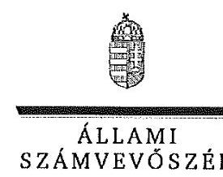

ELNÖK

Ikt.szám: V-0783-233/2016.

# Bolla Tibor úr 

elnök-vezérigazgató
Budapesti Közlekedési Zrt.

## Tisztelt Elnök-vezérigazgató Úr!

Köszönettel vettem „A fővárosi közösségi közlekedés ellenőrzése - A fővárosi közösségi közlekedés intézményi átalakításának, a Budapesti Közlekedési Központ (BKK Zrt.) létrehozásának, működése szabályszerűségének ellenőrzéséről" készített számvevőszéki jelentéstervezetre küldött válaszát.

Az Állami Számvevőszék észrevételekre vonatkozó álláspontjáról a felügyeleti vezető által készített részletes tájékoztatásban kap választ, amelyet levelemhez mellékeltem.

Tájékoztatom Elnök-vezérigazgató urat, hogy a számvevőszéki jelentés véglegesítése az elfogadott észrevételek figyelembevételével történik.

Budapest, 2016. 03. hó 04. nap
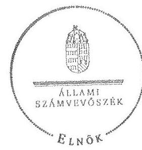

Tisztelettel:

Domokos László

---

# Tájékoztatás az észrevételek kezeléséről 

A fővárosi közösségi közlekedés ellenőrzése - A fővárosi közösségi közlekedés intézményi átalakításának, a Budapesti Közlekedési Központ (BKK Zrt.) létrehozásának, működése szabályszerűségének ellenőrzése témakörében készített jelentéstervezetre Vezérigazgató úr észrevételeit megköszönöm. Az észrevételek a jelentéstervezet intézkedést igénylő megállapításait és javaslatait is érintették. Kezelésükről azok sorrendjében az alábbi tájékoztatást adom.

1. A jelentéstervezet 13. oldal 1. bekezdésében pontatlanul feltüntetett 67,7 Mrd Ft összegű állami garancia helyesen 62,7 Mrd Ft-ra módosul.
2. A jelentéstervezet 13. oldal 1. bekezdésének végén az egyébként is az ellenőrzött időszakon túlmutató befejezetlen mondatot törlöm.
3. A jelentéstervezet 18. oldal 1. bekezdésének utolsó mondatát a beruházási tervek tartalmával kapcsolatban észrevétele alapján kiegészítem. A módosított szöveg az alábbi:
"A BKV Zrt. üzleti tervei tartalmazták a beruházások bemutatását, azok helyzetét, a beruházások kockázatait, azonban nem tartalmazták teljes körűen a közszolgáltatási szerződések mellékletében meghatározott minimális követelményeket."

A megállapítás módosításának következtében a jelentéstervezet 2. d) számú javaslata az alábbi szerint módosult:
„2. c) intézkedjen, hogy a jövőben a BKV Zrt. üzleti tervein belül a beruházási terveket egészítsék ki a Közszolgáltatási szerződések 5. sz. mellékletben meghatározott minimális követelményekkel"
4. A jelentéstervezet 20. oldal 2. bekezdéséhez és a 40. oldal 3. bekezdéséhez tett észrevételét a vonatkozó dokumentumok áttanulmányozása után elfogadom. Az észrevétel lényege, hogy a (pót)díjak beszedése 2012 novemberétől a BKV-tól a BKK Zrt. hatáskörébe került, így azok feltüntetése a Fővárosi Önkormányzat és a BKK Zrt. relációban megkötött Közszolgáltatási szerződés része. Ezek alapján törlöm a 20. oldalon a második bekezdést, 2. b) javaslatot. valamint a 40.oldalon a 3. bekezdésből az alábbi mondatot:
20. oldal második bekezdés:
„A Személyszállítási tv. 25. § (3) bekezdés j) pontjában foglaltak ellenére, amely szerint a Közszolgáltatási szerződésnek tartalmaznia kell a személyszállítási közszolgáltatások díjait, a pótdíjakat és a díjalkamazási feltételeket és az ezek megsértése esetén alkalmazható jogkövetkezményeket — törölték a Közszolgáltatási szerződés erre vonatkozó 3.1.2. pont h) pontját."

Javaslat 2. b) 21. oldal 8. bekezdés:
„b) gondoskodjon arról, hogy a Közszolgáltatási szerződés a Személyszállítási tv. előírásai szerint kiegészítésre kerüljön a személyszállítási közszolgáltatások díjaira, a

---

pótdijakra és a díjalkamazási feltételekre és az ezek megsértése esetén alkalmazható jogkövetkezményekre vonatkozó előírásokkal"
40. oldal 3. bekezdés:
"Azzal, hogy törölték a Közszolgáltatási szerződés erre vonatkozó 3.1.2. h.) pontját, megsértették a Személyszállítási tv. 23. § (3) bekezdés j) pontjában foglaltakat.
5. A jelentéstervezet 28. oldal 3. bekezdéséhez és a 40. oldal 6. bekezdéséhez tett pontosítását elfogadom. Az észrevétel lényege, hogy a Közszolgáltatási szerződés hatályának kiterjesztése csak egy korlátos körre vonatkozik. Az észrevétel alapján a 28 oldalon a hatodik bekezdés negyedik mondatát a végén, valamint a 40 . oldalon az utolsó bekezdés utolsó mondatát az alábbi tagmondattal egészítem ki:
„a rendelkezésre tartással érintett 75 db autóbusz tekintetében."
6. A jelentéstervezet 42. oldal utolsó bekezdéséhez tett észrevételét elfogadom. A jelentéstervezet szövegét az alábbiak szerint módosítom:
„A 2012/2013. és a 2013/2014. menetrendi évekre vonatkozóan a Közszolgáltatási szerződés 2. mellékletében meghatározott szolgáltatás szöveges értékelését a menetrendi Beszámolókban szerepeltették."

Budapest, 2016. 03. hó 04. nap

---

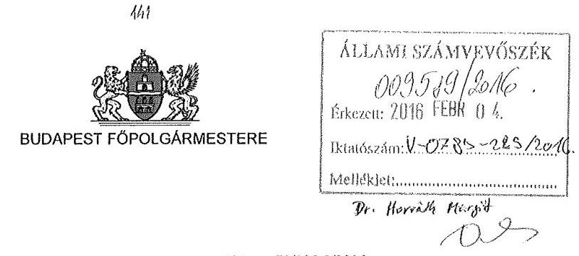

Ikt.sz.: 70/105-9/2016.
Tárgy: V-0783-214/2015. számú
vizsgálati jelentés észrevételezése

Állami Számvevőszék
Domokos László Elnök úr részére

# Tisztelt Elnök Úr! 

Köszönettel megkaptam a fenti iktatószámú, „A fővárosi közösségi közlekedés ellenőrzése A fővárosi közösségi közlekedés intézményi átalakításának, a Budapesti Közlekedési Központ (BKK Zrt.) létrehozásának, működése szabályszerűségének ellenőrzése" elnevezésű jelentésük tervezetét.

A jelentés-tervezetükben a főváros számára megfogalmazott javaslatukat elfogadva a mellékelt intézkedés került kiadásra.

Ellenőrzésüket hasznosnak ítélem meg, konstruktív munkájukat megköszönöm.

Budapest, 2016. február 3.

---

# ÉRTELMEZŐ SZÓTÁR 

Adósság
Belső eladósodottság

Beruházási megállapodás

Eredménytartalék

Ésszerű nyereség

Fejlesztési Megállapodás

Fővárosi közösségi közlekedés

Fővárosi közösségi közlekedés intézményrendszere
Garancia

Minden olyan hitelviszonyon alapuló fizetési kötelezettség, amely a szervezetet terheli.
A belső eladósodottságot a tárgyi eszközök használhatósági foka mutatja, amely a tárgyi eszközök nettó értékének és a tárgyi eszközök bruttó értékének hányadosa
Az Önkormányzat és a BKK Zrt. közötti megállapodás, ahol a fejlesztéssel létrehozott vagyon aktiválás utáni tulajdonosa várhatóan az Önkormányzat és a BKK Zrt. lesz. Vegyesen, a Fővárosi Önkormányzat illetőleg a BKK Zrt., BKV Zrt., vagy kizárólag gazdasági társaság vagyonnövekményét eredményező egyes fejlesztési, felújítási célú pénzeszköz átadás-átvételi megállapodások
A saját tőke változó eleme, elsősorban a tárgyévet megelőző évek mérleg szerinti eredményének a halmozott összegét mutatja.
A közszolgáltatási kötelezettség teljesítéséből származó elismert nyereség, amely az adott ágazatban szokásos tőkemegtérülési ráta. Az Ésszerű Nyereség mértékét a saját tőkére vetítetten kell meghatározni. Az Ésszerű Nyereség maximális mértéke az előző évi, KSH által közzétett fogyasztói árindex év/év aránya (tervezésnél az előirányzott kompenzáció javaslat benyújtását megelőző hónapban közzétett év/év fogyasztói árindex, az éves elszámolásnál az elszámolás tárgyát képező naptári évre közzétett év/év fogyasztói árindex), évente meghatározott százalékponttal növelve.
Az Önkormányzat és a BKK Zrt. közötti megállapodás, ahol a fejlesztéssel létrehozott vagyon aktiválás utáni tulajdonosa várhatóan a BKK Zrt. lesz.
Alapvető utazási igényeket kiszolgáló szolgáltatás, amely meghatározott viszonylatokon és paraméterek szerint, szabályozott ár ellenében történik Budapest közigazgatási határán belül.
A fővárosi közösségi közlekedési feladat ellátását biztosító szervezetek.

A garancia olyan önálló, az önkormányzat nevében vállalt kötelezettség, amely alapján az önkormányzat az önkormányzati költségvetés terhére szerződésben meghatározott feltételek szerint, a kötelezett nem teljesítése esetén a jogosultnak fizetést teljesít az előzetesen rögzített összeghatárig.

---

Indokolt költség

Keresztfinanszírozás tilalma

Kezesség

Kompenzáció

Azon költségek, melyek BKK Zrt. általi megtérítésére a Közszolgáltatásokkal kapcsolatosan a Kompenzáció részeként a Szolgáltató jogosult. Ezek a költségek különösen a személyzet, az energia, az infrastrukturális díjak, továbbá a személyszállítási szolgáltatások működtetéséhez szükséges, a közlekedési közszolgáltatásban használt járművek, gördülőállomány, valamint létesítmények karbantartása és javítása költségeit, továbbá az állandó költségeket és a Hitelek kamatait foglalhatják magukban. A Közszolgáltatás nyújtásához kapcsolódó költségek megosztására, elszámolására és elszámolhatóságára vonatkozó szabályokat a Közszolgáltatási szerződés, az Éves megállapodások illetve egyéb szabályzatok tartalmazzák. A közszolgáltatás díját úgy kell megállapítani, hogy az maradéktalanul fedezetet nyújtson a közszolgáltatás indokolt költségeire és ráfordításaira, valamint a közszolgáltató e tevékenységével kapcsolatos ésszerű nyereségére; az ésszerű nyereség nem tartalmazhatja a közszolgáltatáson kívül eső egyéb gazdasági tevékenységei költségeinek, ráfordításainak fedezetét.
A kezességre vonatkozó előírásokat a Ptk. 272-276. §-ai tartalmazzák. A kezesség a polgári jogban a szerződést biztosító járulékos mellékkötelezettség, amely egy másik kötelem teljesítését biztosítja azáltal, hogy a kezes a főadós nemteljesítése esetére kötelezettséget vállal a főadósi kötelem teljesítésére. A kezes tehát a főadóshoz képest járulékos adós. A kezesség kiterjed az elvállalása utáni mellékszolgáltatásokra, ha a kezes ezek kikötéséről tudott.
A Ptk. szerint kezességet csak írásban lehet vállalni. Lényeges, hogy a kezesség mindig az alapügylet hitelezője és a kezes közötti ingyenes szerződéssel jön létre. A kezesség a különböző hitelfelvételekhez kapcsolódóan a hitel visszafizetésének biztosítékaként jöhet szóba. Az adós helyett nemfizetés esetén a kezes felel, ő tartozik fizetni. Az egyszerű kezesség esetén előbb az adóson kell behajtani a tartozást, s ha ez sikertelen, akkor lehet a kezestől követelni a fizetést. Készfizető kezesség esetében a fizetést elmulasztó adós helyett rögtön a kezestől követelhetik a tartozást. Ha bank vállalja a kezességet, akkor az minden esetben készfizetői kezesség.
A közszolgáltatási kötelezettség ellátásának ellentételezéseként a közszolgáltató részére teljesítendő kifizetés.

---

Közfeladat

Közlekedésszervezői forrás

Közszolgáltatás

Külső eladósodottság

Megvalósítási Megállapodás

Menetrendi év
Menetdíj bevétel
Mérleg szerinti eredmény

Jogszabályban meghatározott állami vagy önkormányzati feladat, amit az arra kötelezett közérdekből, a jogszabályban meghatározott követelményeknek és feltételeknek megfelelve végez, ideértve a lakosság közszolgáltatásokkal való ellátását, továbbá az állam nemzetközi szerződésekben vállalt kötelezettségeiből adódó közérdekű feladatokat, valamint e feladatok ellátásakor szükséges infrastruktúra biztosítását is.
(Forrás: Nvtv. 3. § (1) bekezdés 7. pontja)
A bevételekkel csökkentett közlekedésszervezői összes indokolt költség, ráfordítás és a szolgáltatók összes kompenzációs igénye
A közszolgáltatás: „közcélú,

 illetőleg közérdekű szolgáltatást jelent, amely egy nagyobb közösség (állam, település) minden tagjára nézve megközelítőleg azonos feltételek mellett vehető igénybe, ezért valamilyen mértékig közösségi megszervezést, illetve szabályozást, ellenőrzést igényel." Az Ebk.tv. 3. § d) pontja a következőképpen határozza meg a közszolgáltatást: „szerződéskötési kötelezettség alapján a lakosság alapvető szükségleteinek ellátására irányuló szolgáltatás, így különösen a villamos energia-, gáz-, hő-, víz-, szennyvíz- és hulladékkezelési, köztisztasági, postai és távközlési szolgáltatás, továbbá a menetrend alapján közlekedő járművekkel végzett közforgalmú személyszállítás".
A külső eladósodottságot a kötelezettségek és a saját tőke aránya mutatja, a mutató értéke akkor jó, ha 100% alatt van.
Az Önkormányzat és a BKK Zrt. közötti megállapodás, ahol a fejlesztéssel létrehozott vagyon aktiválás utáni tulajdonosa várhatóan az Önkormányzat lesz. A Fővárosi Önkormányzat vagyonnövekményét eredményező egyes fejlesztési-, felújítási célú pénzeszköz átadás-átvételi megállapodások.
Adott naptári év szeptember 1-jétől a következő év augusztus 31-ig tartó időszak. Az első menetrendi év átmeneti évként 2012. május 1-től 2013. augusztus 31-ig tart.
A közszolgáltatók általi teljesítéssel felmerült jegyből, bérletből és pótdíjból befolyó díjbevételek.
A mérleg szerinti eredmény az osztalékra, részesedésre, a kamatozó részvények kamatára igénybe vett eredménytartalékkal növelt, a jóváhagyott osztalékkal, részesedéssel, a kamatozó részvények kamatával csökkentett tárgyévi adózott eredmény, egyezően az eredménykimutatásban ilyen címen kimutatott összeggel (Számv. tv. 39. § (2) bekezdés).

---

Nemzeti vagyon

Tulajdonosi joggyakorló

Nvt. 1. § (2) bekezdése szerint:
„az állam vagy a helyi önkormányzat kizárólagos tulajdonában álló dolgok,
az a) pont hatálya alá nem tartozó, állam vagy a helyi önkormányzat tulajdonában lévő dolog,
az állam vagy a helyi önkormányzat tulajdonában lévő pénzügyi eszközök, továbbá az államot vagy a helyi önkormányzatot megillető társasági részesedések,
az államot vagy a helyi önkormányzatot megillető bármely vagyoni értékkel rendelkező jogosultság, amelyet jogszabály vagyoni értékű jogként nevesít,
Magyarország határa által körbezárt terület feletti légtér, az üvegházhatású gázok kibocsátási egységeinek kereskedelméről szóló törvény szerint kibocsátási egység és légiközlekedési kibocsátási egység, valamint az ENSZ Éghajlatváltozási Keretegyezménye és annak Kiotói Jegyzőkönyve végrehajtási keretrendszeréről szóló törvény szerinti kiotói egység,
állami vagy helyi önkormányzati fenntartású közgyűjtemény (muzeális intézmény, levéltár, közgyűjteményként működő kép- és hangarchívum, valamint könyvtár) saját gyűjteményében nyilvántartott kulturális javak körébe tartozó dolog, a régészeti lelet,
a nemzeti adatvagyon körébe tartozó állami nyilvántartások fokozottabb védelméről szóló törvény szerinti nemzeti adatvagyon." (hatályos 2012. január 1-jétől, g) pont módosult 2012. június 30-tól)
Aki a nemzeti vagyon felett az államot vagy a helyi önkormányzatot megillető tulajdonosi jogok és kötelezettségek összességének gyakorlására jogosult (Vagyon tv. 3. § (1) bekezdés 17. pont).

---

|  Szz. | Mintavétellel ellenőrzendő területek | Főbb kérdés | Ellenőrzési kérdések | Adatforrások | Alapsokaság | Munka lap | Mintavételi eljárás | A minta elemszáma |
|---|---|---|---|---|---|---|---|---|
|   | 1 | 2 | 3 | 4 | 5 | 6 | 7 | 8  |
|  1. | A közösségi közlekedés közfeladat ráfordításainak elkülönített, szabályszerű elszámolása |  |  |  |  |  |  |   |
|  2. | Anyagjellegű ráfordítások Az anyagjellegű ráfordítások elszámolása során betartották-e a belső szabályzatokban és a jogszabályokban foglaltakat és azokat a közfeladat ellátással kapcsolatosan elkülönítették-e? | - a. amennyiben a belső szabályozás szerint az szükséges volt, kérték-e a tulajdonos előzetes engedélyét a beszerzéshez, illetve a beszerzést tervezték-e az üzleti tervben, vagy más dokumentumban, lefolytatták-e a beszerzési, közbeszerzési eljárást? b. a. számított anyagjellegű ráfordításokra kötött szerződésnél betartották-e a számv. tv. előírását, a költségszámolást megalapozó dokumentum (szerződés, megrendelés) rendelkezésre áll? c. a. kifizetést a belső szabályzásnak megfelelően az arra jogosult engedélyezte/rendelte el? d. a. beszerzett anyagok bekerülési értékének meghatározása, nyilvántartásba vétele a szabályozásnak megfelelően megtörtént, a ráfordításokat a megfelelő költségnemre, illetve közfeladatra elkülönítetten számolták-e el? | Az anyagjellegű ráfordítások közül a 31-53. főkönyvi számlácsoportokból vett minta esetében a. a. költségszámolást megalapozó dokumentumok (beszerzési/közbeszerzési eljárás dokumentumai, szerződések, megrendelések, stb.), költségszámoláshoz benyújtott számlák, b. teljesítés megtörténtét alátámasztó egyéb dokumentumok, c. analitikus nyilvántartások, anyagok nyilvántartásba vételét igazoló dokumentumok, ha a számviteli politika szerint nyilvántartásba kell venni azokat. | Éves bontásban a főkönyvi adatbázisból a 31-53. Anyagjellegű ráfordítások számlácsoportok a közlekedésszervezet és projektmenedzsment közfeladatra elkülönített ráfordításai, kivéve az ELÁM és az eladott közvetített szolgáltatások értéke. | 4.A. számú munka lap A mintavételt megelőzően a sokaságból ki kell emelni - rétegzett mintavétel, évenkénti elemszámmal arányos rétegződéssel. | 15+50  |
|  3. | Beruházások, felújítások A beruházások, felújítások elszámolása során betartották-e a jogszabályokban és belső szabályzatokban foglaltakat és azokat elkülönítetten tartották-e számon? Az állományba vételi, nyilvántartási és elszámolási kötelezettség teljesítése korrekt-e? A felújítások, beruházások aktiválása és az értékcsökkenési leírás elszámolása megfelelő-e az előírásoknak? | - a. kérték-e a tervezett beruházásra vagy felújításra a közbeszerzési eljárás dokumentumai, a tulajdonos hozzájárulása, amennyiben az szükséges volt, a szerződések, számlák, a bekerülési beruházások, felújítások analitikus nyilvántartása, b. immateriális javak, tárgyi eszközök analitikus nyilvántartása, a bekerült fejlesztés üzembe helyezését el, belső szabályzásnak megfelelően az arra jogosult engedélyezte/rendelte el? c. amennyiben a beruházás befejeződött: a beruházások, felújítások állományba vétele, bevezetése, a bekerülési érték meghatározása, az üzembe helyezések (aktiválások) dokumentálása megfelelő-e az Áhtv., a számviteli politika, illetve az értékelési szabályzat előírásainak? d. a. értékcsökkenési elszámolása a jogszabályban és a számviteli politikában meghatározott szabályozásnak megfelelő-e? | Éves bontásban a főkönyvi adatbázisból a 161-162. számlák a közlekedésszervezet és projektmenedzsment közfeladatra elkülönített tételeiből | 4.B. számú munka lap A mintavételt megelőzően a sokaságot két részre kell osztani 300 eH értékhatár alapján. Mindkét részből 15-15 elemszámú mintavétel történik. Rétegzett mintavétel, évenkénti elemszámmal arányos rétegződéssel. | 30  |
|  4. | A közösségi közlekedés közfeladat bevételeinek elkülönített, szabályszerű elszámolása területén |  |  |  |  |  |  |   |
|  5. | Értékesítés nettó árbevétel Az értékesítés nettó árbevétel elszámolása során betartották-e a belső szabályzatokban és a jogszabályokban foglaltakat és azokat a közfeladat ellátással kapcsolatosan elkülönítették-e? | - a. a. bevétel kiszámítása a belső szabályozásnak megfelelően történt-e? b. a. a. befolyt bevétel nyilvántartásba vétele (analitikus, főkönyvi) megtörtént-e, azokat a közfeladat-ellátással kapcsolatosan elkülönítették-e? c. a. bevétel beszedése, elszámolása során betartották-e a szabályozásban foglaltakat és a megfelelő számfejtéssel számolták el a bevételt? d. a. tulajdonos követelményeknek, belső szabályozásnak megfelelő árut alkalmaztak-e? | A kiválasztott értékesítés nettó árbevétel jogcímen befolyt bevételek: c. az egyes bevételek díjmegalapítása, d. a. kibocsátott számla, számla helyettesítő okmány, befolyt bevétel analitikus nyilvántartása, behajtásra tett intézkedések dokumentumai, b. kapcsolódó főkönyvi számla tétele (forgalom, b. bevétel beérkezését igazoló banki kivonat). | Éves bontásban a főkönyvi adatbázisból a 91-94. számláscsoportok a közlekedésszervezet és projektmenedzsment közfeladatra elkülönített bevételei | 4.C. számú munka lap Rétegzett mintavétel, évenkénti elemszámmal arányos rétegződéssel. | 50  |

---

# A BKK Zrt. projektmenedzsmenti feladatainak ellátása a „Budapest, Szabadság híd rekonstrukciója" projekt során 

A „Budapest, Szabadság híd rekonstrukciója" projekt során BKK Zrt. a projektmenedzsmenti feladatait a Fővárosi Önkormányzattal kötött megállapodásokban foglaltak szerint látta el.

A Fővárosi Önkormányzat 2008. február 28-án a KMOP keretein belül „A régión belüli közlekedési kapcsolatok fejlesztése" konstrukció A) kiemelt projektek komponense tárgyú a támogatási felhívásnak megfelelően „Budapest Szabadság híd rekonstrukciója" címen benyújtott projektjavaslatát az NFÚ 2008. március 27-én jóváhagyta, s vissza nem térítendő, 50%-os intenzitású támogatásban részesítette. A KMOP-2.1.1/A-2008-0002 azonosító számú támogatási szerződést 2008. július 7-én, illetve 9-én írta alá a főpolgármester és a közreműködő szervezet képviselője. A projekt le nem vonható áfával számított összköltsége 5390,1 M Ft, a támogatás terhére elszámolható összköltség 5045,1 M Ft volt. A támogatás mértéke a projekt le nem vonható áfával számított elszámolható költségének 50%-a 2522,6 M Ft volt. A támogatás kedvezményezettje a Fővárosi Önkormányzat.

A „Budapest Szabadság híd rekonstrukciója" projekt megvalósítása 2010. június 15-én lezárult, fenntartási szakaszba lépett. A BKK Zrt. a projektmenedzsmenti feladatát a Fővárosi Önkormányzattal kötött megállapodás szerint teljesítette. Határidőben előkészítette és - Éves szerződésben foglaltaknak megfelelően - az önkormányzat véleményezése után megküldte a Projekt fenntartási jelentéseket (a továbbiakban PFJ), továbbá az esetleges hiánypótlásokat.

Az első projekt PFJ-t a közreműködő szervezet 2012. július 12-én jóváhagyta. A 2. sz. PFJ-t 2013. július 11-én nyújtották be. Az utókövetéses 2013. augusztus 13-án megtartott helyszíni szemlét követően, az ott jelzett horizontális vállalások kapcsán a hiánypótlást benyújtották 2013. augusztus 28-án, amelynek elfogadása 2013. november 15-én megtörtént. A 3. sz. PFJ-t 2014. július 14-én nyújtották be. A 2014. július 2-ai helyszíni szemlét követően - két környezeti fenntarthatósági szempont helyszínen történő igazolása miatt - a PFJ javítására volt szükség. A PFJ-t a közreműködő szervezet 2014. augusztus 14-én jóváhagyta.

A BKK Zrt. gondoskodott a közreműködő szervezet által a 2013. augusztus 13-án tartott utókövetéses helyszíni szemlén hiányolt dokumentum megadott határidőre történő megküldéséről. Közreműködött és gondoskodott a közreműködő szervezet 2014. július 29-ei helyszíni ellenőrzése során feltárt hiányosságok határidőre történő korrigálásában, az ezzel kapcsolatos jelentést előkészítette, a közreműködő szervezet részére továbbítás céljából megküldte a Fővárosi Önkormányzatnak.
