# Jelentés 

## Az önkormányzatok gazdasági társaságai

Az önkormányzatok többségi tulajdonában lévő gazdasági társaságok közfeladat ellátását érintő gazdálkodási tevékenysége szabályszerűségének ellenőrzése
Mátészalkai Távhőszolgáltató Kft. 2016.

Az ÁSZ az államháztartáson kívül működő közfeladat-ellátó rendszerek ellenőrzéseivel hozzájárul ahhoz, hogy a közpénzeket az államháztartáson kívül működő szervezetek is átlátható, rendezett módon használják fel a közfeladatok ellátása érdekében.

---

# Jelentés 

## Az önkormányzatok gazdasági társaságai

Az önkormányzatok többségi tulajdonában lévő gazdasági társaságok közfeladat ellátását érintő gazdálkodási tevékenysége szabályszerűségének ellenőrzése
Mátészalkai Távhőszolgáltató Kft.
2016.  március 31. nap
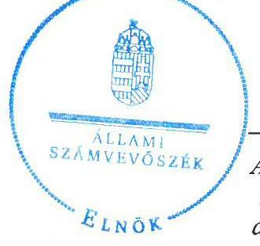

16028
www.asz.hu
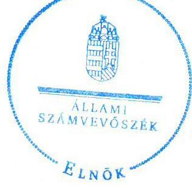

Domokos László elnök

Az ÁSZ az államháztartáson kívül működő közfeladat-ellátó rendszerek ellenőrzéseivel hozzájárul ahhoz, hogy a közpénzeket az államháztartáson kívül működő szervezetek is átlátható, rendezett módon használják fel a közfeladatok ellátása érdekében.
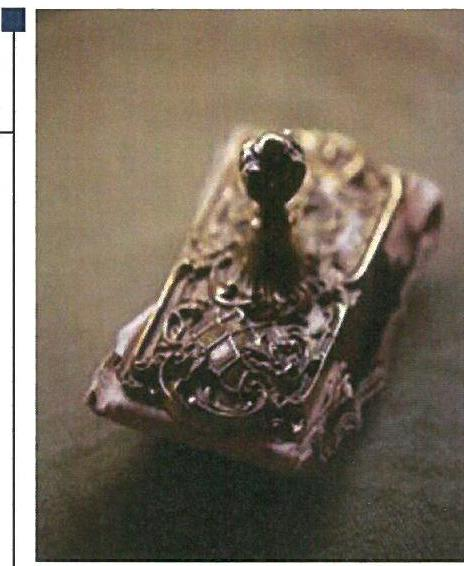

---

# AZ ELLENŐRZÉST FELÜGYELTE:

DR. HORVÁTH MARGIT felügyeleti vezető

## AZ ELLENŐRZÉST VEZETTE ÉS A VÉGREHAJTÁSÁÉRT FELELŐS:

- KLINGA LÁSZLÓ ellenőrzésvezető
- A PROGRAM ÖSSZEÁLLÍTÁSÁÉRT FELELŐS:
- LAJTERNÉ HUDÁK MAGDOLNA osztályvezető

IKTATÓSZÁM: V-0840-129/2016.

TÉMASZÁM: 1874

ELLENŐRZÉS-AZONOSÍTÓ SZÁM: V-070705

Jelentéseink az Országgyűlés számítógépes hálózatán és az Interneten a www.asz.hu címen is olvashatóak.

---

# TARTALOMJEGYZÉK 

ÖSSZEGZÉS ..... 5
AZ ELLENŐRZÉS CÉLJA ..... 7
AZ ELLENŐRZÉS TERÜLETE ..... 8
AZ ELLENŐRZÉS HÁTTERE, INDOKOLTSÁGA ..... 10
FÓKUSZKÉRDÉSEK ..... 11
ELLENŐRZÉS HATÓKÖRE ÉS MÓDSZEREI ..... 12
MEGÁLLAPÍTÁSOK ..... 14
JAVASLATOK ..... 28
MELLÉKLETEK ..... 31
I. Sz. melléklet: Értelmező szótár ..... 31
II. Sz. melléklet: Működési adatok ..... 33
FÜGGELÉK: ÉSZREVÉTELEK ..... 35
RÖVIDÍTÉSEK JEGYZÉKE ..... 53

---

.

---

# ÖSSZEGZÉS 

Az Állami Számvevőszék a Szalkatávhő Kft. ${ }^{1}$ távhőszolgáltatási közfeladat ellátását érintő gazdálkodási tevékenysége 2011-2014 közötti szabályszerűségét ellenőrizte. Megállapította, hogy a közfeladat-ellátás önkormányzati megszervezése szabályosan történt. A tulajdonosi jogok gyakorlása csak részben érvényesült szabályszerűen, emellett a Társaság FB általi felügyelete 2014-ben nem volt szabályszerű. A számviteli szabályozás tartalmi hiányosságai mellett a vagyongazdálkodás alapvetően szabályszerű volt. A távhőszolgáltatás közfeladatának bevételeinek és ráfordításainak elszámolása, továbbá az önköltségszámítás hiányában alkalmazott árképzés nem volt szabályszerű. A Társaság² kötelezettségállománya a közfeladat-ellátásra nem jelentett kockázatot.

## Az ellenőrzés társadalmi indokoltsága

Az Állami Számvevőszék középtávra szóló stratégiájában megfogalmazta, hogy a helyi önkormányzatok gazdálkodásában rejlő pénzügyi kockázatok feltárásával, az államháztartáson kívülre nyújtott költségvetési támogatások és ingyenes vagyonjuttatások, valamint az államháztartáson kívül működő közfeladat-ellátó rendszerek ellenőrzéseivel hozzájárul ahhoz, hogy a közpénzeket az államháztartáson kívül működő szervezetek is átlátható, rendezett módon használják fel a közfeladatok szerződésben vállalt ellátása érdekében.

Magyarországon az intézmény-centrikus közfeladat-ellátás jellemző, de egyre jelentősebb a költségvetésen kívüli feladatellátás térnyerése. Ennek legfontosabb szereplői - a nonprofit szervezetek mellett - az önkormányzati tulajdonú gazdasági társaságok. Az önkormányzatok szervezetalakítási szabadságának következménye, hogy a korábban is vállalati formában működő közszolgáltatások mellett, mind a kötelező, mind az önként vállalt feladatok ellátásában a gazdasági társaságok kiemelt fontosságú szerephez jutottak.

## Főbb megállapítások, következtetések, javaslatok

Az Önkormányzat a közigazgatási területén a távhőszolgáltatás közfeladatának megszervezéséről a jogszabályi előírásoknak megfelelően döntött, annak ellátásáról a kizárólagos tulajdonában lévő gazdasági társasága útján gondoskodott. Az Önkormányzat a vagyongazdálkodási rendelet ${ }_{1,2}$-ben és az Alapító Okiratban meghatározta a tulajdonosi joggyakorlás szabályait, amelynek gyakorlása csak részben volt szabályszerű. A 2014. évi beszámoló elfogadásakor nem tartották be a Ptk. előírásait, amely szerint a Képviselő-testület, a számviteli beszámolóról az FB írásbeli véleményének birtokában dönthet. Az ügyvezető nem tett eleget az SZMSZ-ben és az Alapító Okiratban előírt kötelezettségének, mivel a Képviselő-testület elé az FB írásbeli véleményét nem tartalmazó beszámolót terjesztett elő. A jegyző nem tett eleget az Mötv.-ben előírt kötelezettségének, mivel nem jelezte a Képviselő-testületnek, hogy a döntésük jogszabálysértő. Az FB Ügyrendjében előírta, hogy évente legalább négy alkalommal köteles ülésezni. Ennek a kötelezettségnek a 2013. év kivételével nem tett eleget, mivel 2011-ben egy alkalommal, 2012-ben és 2014-ben három alkalommal ülésezett. A 2014. évi beszámolóról a Ptk. szerinti írásbeli jelentést az FB nem készített.

A közfeladat-ellátást szolgáló vagyonnal való gazdálkodás alapvetően szabályszerű volt. A Társaság rendelkezett a Számv.tv.-ben előírt számviteli szabályzatokkal, azonban azok tartalma és összhangja nem volt biztosított. A számviteli politika nem tartalmazta a Számv. tv. szerinti mérlegkészítés időpontjának meghatározását. A számviteli politika előírásainak összhangja a készletek nyilvántartásával kapcsolatban az értékelési szabályzattal, a készletek értékelésének vonatkozásában a leltárkészítési és leltározási szabályzat előírásaival nem volt biztosított. A tárgyi eszközök tervszerinti értékcsökkenését havonta számolták el, ugyanakkor a számviteli politikában negyedéves elszámolási gyakoriságot írtak elő. A Tszt. szerinti szétválasztási szabályokat belső szabályzatban nem határozták meg. Az önköltségszámítás szabályait a számviteli politikában előírtak ellenére nem határozták meg. Az SZMSZ módosításának elmulasztása miatt nem volt biztosított az Alapító Okirat előírásaival való összhang az alapítói jóváhagyást igénylő szerződések értékének meghatározásában. Az üzletszabályzatot a Tszt.-ben előírtak ellenére a jegyző nem hagyta jóvá és nem küldte meg véleményezésre a fogyasztóvédelmi hatóságnak. Az Info.tv.-ben előírtak ellenére belső adatvédelmi felelőst nem neveztek ki. A Társaság vagyona az ellenőrzött időszakban 129,4 millió Ft-tal csökkent, amit a forgóeszközök növekedését meghaladó befektetett eszközök csökkenése eredményezett. A kötelezettségek állománya a működésre, közfeladat ellátásra nem jelentett kockázatot. A Társaság éven túli kötelezettségvállalásként a 2014.évben nyílt végű pénzügyi lízingszerződést kötött személygépjármű lízingbe vételére, amelyhez az Alapító Okiratban előírtak ellenére nem kérte az alapító döntését, a szerződés megkötése az alapító jóváhagyása nélkül történt. A 2011-2013. években a Szalkatávhő Kft. gazdálkodását hosszú lejáratú kötelezettség nem terhelte, a 2014. évben mindössze 1,4 millió Ft. A Társaság a 2011. évben a rövidlejáratú kötelezettségeinek többségében határidőben nem tudott eleget tenni, a 2012-2014. években a likviditási helyzete javult, a rövid lejáratú kötelezettségeit döntően fizetési határidőn belül teljesítette. A lakosság által határidőre ki nem fizetett távhődíj az ellenőrzött időszakban 65,1 millió Ft-ról 100,8 millió Ft-ra nőtt.

Az Önkormányzat a távhőszolgáltatásra vonatkozóan a Tszt. szerinti rendeletalkotási kötelezettségének eleget tett, annak tartalma megfelelt az előírásoknak. Az Önkormányzat a Távhő rendeletet annak ellenére nem módosította, hogy a hatósági ár bevezetésével az Önkormányzat ármegállapítási jogköre - a csatlakozási díj kivételével 2011. április 15. napjával megszűnt.

A könyvvizsgáló az éves beszámolókat hitelesítő záradékkal látta el. A 2012. évi beszámolóhoz kapcsolódó, letétbe helyezett 2013. április 11-i jelentésében a könyvvizsgáló nem tett eleget a Tszt.-ben előírt igazolási kötelezettségének, mivel utólag, 2013. augusztus 26-i dátummal kibocsátott könyvvizsgálói jelentésében nyilatkozott a Társaságnál kidolgozott és alkalmazott számviteli szétválasztási szabályok megfelelőségéről, a tevékenységek közötti keresztfinanszírozás-mentességről. A 2013-2014. évekre vonatkozóan a könyvvizsgálói jelentések tartalmazták a Tszt.-ben előírt igazolást. A könyvvizsgáló a 2012-2014. évi könyvvizsgálói jelentéseiben annak ellenére nyilatkozott a számviteli szétválasztási szabályok megfelelősségéről, hogy a Társaság a keresztfinanszírozás-mentességet biztosító szétválasztási szabályokat belső szabályzatokban nem dolgozta ki.

A Társaságnál az értékesítés nettó árbevétele és az anyagjellegű ráfordítások elszámolása során nem érvényesültek a jogszabályok és a belső szabályok előírásai, ez kockázatot jelez az ellenőrzött terület egészének szabályos működése szempontjából. A Társaságnál a távhőszolgáltatás árbevételeként számolták el az egyéb tevékenységként végzett üzemeltetési és karbantartási feladatok bevételét, így megsértették a Tszt.-ben előírt szétválasztási kötelezettségre vonatkozó előírást. A 2011. március havi háztartási célra felhasznált hődíj kiszámlázása során nem tartották be a Távhő rendeletben előírtakat, a számlában a díjtételt szabálytalanul 3394 Ft/GJ összegben rögzítették, az előírt 3608 Ft/GJ helyett. A Társaság szabálytalanul járt el azzal, hogy a lakossági célra felhasznált hődíj mértékét a 2011. január 1. - 2011. április 14. közötti időszakban a Távhő rendeletben előírtaktól alacsonyabb összegben alkalmazta. A beruházások, felújítások és az értékcsökkenési leírás elszámolása nem volt megfelelő az eszközök nyilvántartásának tekintetében. Az önköltségszámítás szabályait az előírások ellenére nem határozták meg, az önkormányzati hatáskörben megállapított távhődíjakat a Távhő rendelet előírásai ellenére számításokkal, kalkulációval nem támasztották alá, így az árképzés nem volt szabályszerű.

Megállapításaink alapján a Szalkatávhő Kft. ügyvezető igazgatójának összetett javaslatot fogalmaztunk meg a Számv. tv-ben előírt kötelező szabályzatok előírásainak egységesítése, az adatvédelmi felelős kinevezése, az eszközök nyilvántartása, valamint az éven túli kötelezettségvállalásoknál az alapítói jogok megfelelő gyakorlása érdekében. A polgármesternek javaslatot tettünk a beszámoló elfogadásához előírt felügyelő bizottsági kötelezettségek teljesítésére, valamint a feltárt szabálytalanságoknál a felelősség tisztázására. A jegyzőnek címzett javaslatunk az üzletszabályzat fogyasztóvédelmi hatóság általi véleményeztetésére, illetve jóváhagyására, továbbá a távhőszolgáltatási rendelet aktualizálására irányult.

---

# AZ ELLENŐRZÉS CÉLJA 

## Az önkormányzatok gazdasági társaságai - Az önkormányzatok tulajdonában lévő gazdasági társaságok közfeladat-ellátását érintő gazdálkodási tevékenysége szabályszerűségének ellenőrzése - Mátészalkai Távhőszolgáltató Kft.

Az ellenőrzés célja annak értékelése, hogy az Önkormányzat a jogszabályi előírások figyelembevételével döntött-e az ellenőrzésre kerülő közfeladat megszervezéséről; az önkormányzat/tulajdonosi joggyakorló szabályszerűen gyakorolta-e a tulajdonosi jogokat.

Ellenőriztük, hogy a gazdasági társaság közfeladat-ellátása bevételeinek, ráfordításainak elszámolása, és vagyongazdálkodási tevékenysége megfelelt-e a jogszabályi, illetve a közszolgáltatási/vagyonkezelési szerződésben foglalt tulajdonosi előírásoknak, azok végrehajtása szabályszerű volt-e.

Értékeltük továbbá, hogy a gazdasági társaság kötelezettségállománya jelent-e kockázatot a működésre, illetve a közfeladat ellátására; valamint hogy a közfeladatok átláthatósága és elszámoltathatósága érdekében biztosítva volt-e a közszolgáltatás díjának megalapozottsága szabályszerű önköltségszámítással.

---

# **AZ ELLENŐRZÉS TERÜLETE**

## **Mátészalka Város Önkormányzata és a Mátészalkai Távhőszolgáltató Kft.**

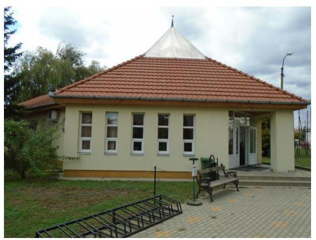

Mátészalka Város Önkormányzata a Mátészalkai Távhőszolgáltató Korlátolt Felelősségű Társaságot az 1993. október 1-jén kelt Alapítói Okirattal³ hozta létre. Az Önkormányzat⁴ a távhővagyont alapításkor apportba adta, kezelésre vagyont a távhőszolgáltatással kapcsolatosan nem adott át.

**A SZALKATÁVHŐ KFT.** alaptevékenysége Mátészalka Város közigazgatási területén a távhőszolgáltatás biztosítása volt. A Társaság 100%-os minősített többségi befolyású önkormányzati tulajdonban volt az ellenőrzött időszakban.

Mátészalka Város lakosságának száma 2014. január 1-jén meghaladta a 17 ezer főt, a nyilvántartott lakóingatlanok száma 7110 db, ebből távfűtött lakás 1706 db volt. A távfűtésbe bekapcsolt lakásokból 100 kivételével használati melegvíz szolgáltatást is biztosított a Társaság, a közületekre a fűtési célú hőszolgáltatás volt jellemző. A Szalkatávhő Kft. egy telephellyel rendelkezett, a megtermelt hőt 22 db hőközponton keresztül juttatta el a fogyasztókig. A 6,2 km hosszú, föld alatt húzódó távfűtési vezeték átlagos életkora meghaladta a 30 évet. A 2014. évi felhasznált hőmennyiség a lakóingatlanok esetében 39 377 GJ, a közületeké 18 393 GJ volt. A Társaságnál foglalkoztatott átlagos statisztikai állományi létszám az ellenőrzött időszak elején és végén egyaránt 18 fő volt.

A Társaság gazdálkodásának egyes adatait a 2011. és a 2014. évek vonatkozásában a következő ábra szemlélteti.

1. ábra

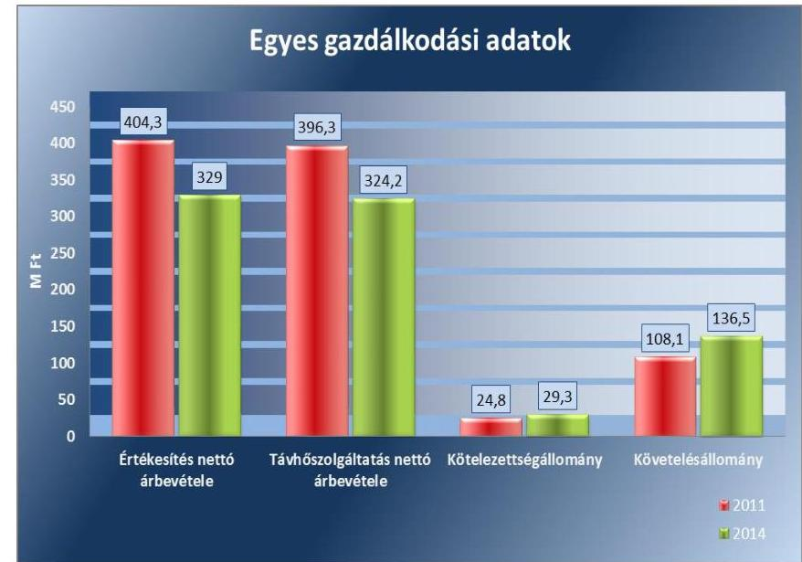

*Forrás: A Társaság 2011. és 2014. évi beszámolói*

---

A távhődíjak - ellenőrzött időszakban végrehajtott - csökkentésének következtében az értékesítés nettó árbevétele 18,6%-kal, 329,0 millió Ft-ra csökkent. A többszöri díjcsökkentés ellenére a lakossági díjhátralék nőtt, ez volt az alapvető oka a követelés állomány 28,4 millió Ft-os emelkedésének. A kötelezettségek mérlegértéke nem volt jelentős, a követelések fedezetet nyújtottak a teljesítésükre. A Társaságnak más gazdasági társaságban tulajdoni részesedése nem volt.

Az ellenőrzött időszakban a polgármester ${ }^{5}$ személye egy alkalommal, a jegyző ${ }^{6}$ személye nem változott. A polgármester a 2014. évi önkormányzati választások óta tölti be tisztségét, a helyszíni ellenőrzés időszakában a munkakört betöltő jegyző 2003. augusztus 18. óta
 látja el feladatait. Az ügyvezető 2012. január 1-jétől tölti be tisztségét.

---

# AZ ELLENŐRZÉS HÁTTERE, INDOKOLTSÁGA 

## Az önkormányzatok közfeladat-ellátásában egyre jelentősebb a gazdasági társaságokon belüli feladatellátás térnyerése

AZ ÁSZ STRATÉGIÁJÁBAN megfogalmazta, hogy a helyi önkormányzatok gazdálkodásában rejlő pénzügyi kockázatok feltárásával, az államháztartáson kívülre nyújtott költségvetési támogatások és ingyenes vagyonjuttatások, valamint az államháztartáson kívül működő közfeladatellátó rendszerek ellenőrzéseivel hozzájárul ahhoz, hogy a közpénzeket az államháztartáson kívül működő szervezetek is átlátható, rendezett módon használják fel a közfeladatok szerződésben vállalt ellátása érdekében.

Az Áht. ${ }^{7}$ 1. § (3) bekezdése értelmében az államháztartáson kívüli szervezetek a közfeladatok ellátásában - jogszabályban meghatározott feltételekkel - közreműködhetnek. Az önkormányzati tulajdonú gazdasági társaságok teljes körű ellenőrzésének lehetőségét az Állami Számvevőszékről szóló 1989. évi XXXVIII. törvény 2011. január 1-jétől hatályos módosítása teremtette meg. A gazdasági társaságok közfeladat ellátását érintő gazdálkodási tevékenysége szabályszerűségére irányuló ellenőrzéseket erre tekintettel a 2011. évtől végezzük.

## AZ ELLENŐRZÉS VÁRHATÓ HASZNOSULÁSA

KÉNT az ÁSZ ${ }^{8}$ a megállapításaival segítséget nyújthat az államháztartáson kívüli közfeladat-ellátás értékeléséhez, jogszabályi keretei pontosításához, átláthatóságot biztosító szabályozásához. Meghatározhatóvá válnak a közfeladat ellátásban részt vevő államháztartáson kívüli szervezeteknek az önkormányzat költségvetését, pénzügyi helyzetét is befolyásoló kockázatai, lehetővé válik ezen kockázatok csökkentése.

Értékelhetővé válik, hogy a feladatot ellátó gazdasági társaság a közszolgáltatási szerződésben foglaltak betartásával, a közvagyon használatával biztosította-e a szolgáltatás folytatásának feltételeit. Ezzel az ellenőrzöttek és a helyi döntéshozók számára az ÁSZ visszajelzést ad feladatszervezési, feladat-ellátási kockázataikról, alapot ad a meglévő hibák megszüntetéséhez, a jobb közfeladat-ellátás biztosításához. Mindezeken keresztül az ÁSZ hozzájárul Magyarország közpénzügyi helyzetének javításához, a közpénzek mérhető módon történő, a döntéshozók által meghatározott célok szerinti felhasználásához.

---

# FÓKUSZKÉRDÉSEK 

1. Az önkormányzat közfeladat megszervezéséről szóló döntése, valamint tulajdonosi joggyakorlása szabályszerű volt-e?
2. A gazdasági társaság vagyongazdálkodása szabályszerű volt-e, kötelezettségállománya jelentett-e kockázatot a működésre, illetve a közfeladat ellátásra?
3. A gazdasági társaságnál az ellátott közfeladat bevételei és ráfordításai elszámolása, valamint az önköltségszámítás és árképzés szabályszerű volt-e?

---

# ELLENŐRZÉS HATÓKÖRE ÉS MÓDSZEREI 

## Az ellenőrzés típusa

Megfelelőségi ellenőrzés

## Az ellenőrzött időszak

A 2011. január 1-jétől 2014. december 31-éig terjedő időszak.

## Az ellenőrzés tárgya

A közfeladatot gazdasági társaságokkal ellátó önkormányzatok tulajdonosi joggyakorlása, valamint gazdasági társaságok pénz- és vagyongazdálkodásának szabályozottsága és szabályszerűsége.

Az ellenőrzés kiterjed minden olyan körülményre és adatra, amely az ÁSZ jogszabályban meghatározott feladatainak teljesítéséhez, valamint a program végrehajtása folyamán felmerült újabb összefüggések feltárásához szükséges.

## Az ellenőrzött szervezet

Mátészalka Város Önkormányzata és a Mátészalkai Távhőszolgáltató Korlátolt Felelősségű Társaság

## Az ellenőrzés jogalapja

Az ellenőrzés végrehajtásának jogszabályi alapját az Állami Számvevőszékről szóló 2011. évi LXVI. törvény 5. § (3)-(4)-(5) bekezdései képezték.

## Az ellenőrzés módszerei

Az ellenőrzést a nemzetközi standardokat irányadónak tekintve az ellenőrzési program ellenőrzési kérdései, az ellenőrzött időszakban hatályos jogszabályok, az ellenőrzés szakmai szabályok és módszertanok figyelembe vételével végeztük.

Az ellenőrzés ideje alatt az ellenőrzött szervezettel történő kapcsolattartást az ÁSZ Szervezeti és Működési Szabályzatának vonatkozó előírásai alapján biztosítottuk.

---

Az ellenőrzés a kiválasztott, többségi tulajdonosi jogokat gyakorló önkormányzatra, illetve az ellenőrzött közfeladatot ellátó gazdasági társaságra terjedt ki. Az ellenőrzött gazdasági társaságnál, amennyiben az több közfeladatot is ellát, akkor az ellenőrzésre kiválasztott közfeladat-ellátást ellenőriztük.

Az ellenőrzést a kérdésekre adott válaszok kiértékelésével, valamint a megjelölt adatforrások, a csatolt tanúsítványok felhasználásával, továbbá az adott időszakban hatályos jogszabályok figyelembe vételével folytattuk le. Az ellenőrzési kérdések megválaszolásához szükséges bizonyítékok megszerzése a következő ellenőrzési eljárások alkalmazásával történt: megfigyelés, kérdésfeltevés (információkérés), összehasonlítás, valamint elemző eljárás.

A bevételek és ráfordítások elszámolása terén az egyes területek szabályszerű működését mintavétellel ellenőriztük, ez alapján a sokaságokban előforduló hibás tételek arányát becsültük. A vagyonnyilvántartás esetében tételes ellenőrzés történt. A jogszabályoknak és a belső előírásoknak megfelelőnek, azaz szabályszerűnek tekintettük az adott bevételek és ráfordítások elszámolását, a vagyonnyilvántartást, amennyiben a minta ellenőrzésének eredménye alapján 95%-os bizonyossággal a teljes sokaságban a hibás tételek aránya kisebb volt, mint 10%, nem megfelelőnek értékeltük, ha a hibás tételek aránya a 10%-ot meghaladta. Kockázatot, illetve magas kockázatot jeleztünk, amennyiben egy adott terület vonatkozásában a minta alapján a teljes sokaságban nem volt teljes körűen biztosított a jogszabályoknak és a belső szabályzatoknak megfelelő működés.

---

# 1. Az önkormányzat közfeladat megszervezéséről szóló döntése, valamint tulajdonosi joggyakorlása szabályszerű volt-e? 

Összegző megállapítás

Az Önkormányzat a jogszabályok és a helyi szabályozás betartásával szervezte meg a távhőszolgáltatást, a tulajdonosi jogok gyakorlása csak részben volt szabályszerű, a Társaság működésének FB általi felügyelete nem volt minden évben szabályszerű.

### 1.1. számú megállapítás

A közfeladat-ellátást az Önkormányzat szabályszerűen szervezte meg, a távhőszolgáltatásra vonatkozó rendeletalkotási kötelezettségét szabályszerűen teljesítette.

Az Ötv ${ }^{9}$. 91. § (6) bekezdése, 2013. január 1-jétől az Mötv ${ }^{10}$. 116. § (3)-(4) bekezdései szerint az önkormányzatnak a gazdasági programjában kell meghatároznia azokat a célkitűzéseket, amelyek az általa ellátott feladatok biztosítását, fejlesztését szolgálják. A Képviselő-testület ${ }^{11}$ által a 2011-2014. évekre elfogadott gazdasági program célkitűzésként a távhő vezetékek tervszerű felújítását, cseréjét fogalmazta meg.

A távhőszolgáltatással ellátott létesítmények távhőellátásának távhőszolgáltatásra engedéllyel rendelkezők útján történő biztosítása a Tszt ${ }^{12}$. 6. § (1) bekezdése értelmében a területileg illetékes települési önkormányzat kötelező feladata. Ennek a kötelezettségnek az Önkormányzat a Szalkatávhő Kft. alapításával eleget tett. A működéséhez szükséges eszközöket az Önkormányzat apport formájában bocsátotta a Társaság rendelkezésére, kezelésre vagyont nem adott át.

A Szalkatávhő Kft. feladatellátásának kereteit az Alapító Okiratban, a távhő ellátás biztosításának és a távhődíjak megállapításának szabályait a Távhő rendeletben ${ }^{13}$ meghatározták. Az Önkormányzat és a Társaság között a közfeladat ellátására szerződés nem jött létre, arra a feleket jogszabályi előírás nem kötelezte.

AZ ALAPÍTÓ OKIRAT a Gt ${ }^{14}$. 19. §-ban - 2014. március 15-től a Ptk ${ }^{15}$. 3:109. §-ban - előírtakkal összhangban az alapító kizárólagos hatáskörébe sorolta a törzstőke felemelését, a nyereség felosztását, az ügyvezető és a könyvvizsgáló megbízását és visszahívását, azon szerződések megkötésének jóváhagyását, amelyek értéke a törzstőke 1/10-ét meghaladta. Az ügyvezető kötelezettségei között előírta az üzleti terv és az éves beszámoló elkészítésének és Képviselő-testület elé terjesztésének kötele-

---

zettségét, a gazdálkodás és működés feltételeinek biztosítását. Az FB ${ }^{16}$ feladatait képezte a Gt. 35. § (3) bekezdésben* előírtaknak megfelelően a számviteli beszámolóról szóló írásbeli jelentés készítése.

A TÁVHŐ RENDELET megalkotásával az Önkormányzat a Tszt. 6. § (2) bekezdésében előírt kötelezettségének eleget tett. A Távhő rendeletben meghatározták a felhasználói közösségek működésének szabályait, a távhőszolgáltatási díjak (alapdíj, hődíj, csatlakozási díj) alkalmazásának és fizetésének szabályait, a díjak mértékét, a korlátozási és szüneteltetési sorrendet, valamint a fejlesztésre kijelölt területeket. A távhőszolgáltatás alapdíját, a mért hő díját és a csatlakozási díjat tartalmazó 2. számú mellékletet utolsó alkalommal 2008. október 1-jei hatállyal módosították.

A Tszt. 57/D. § (1) bekezdése értelmében 2011. április 15-étől a miniszter állapítja meg a távhőszolgáltatás díjainak szerkezetét, legmagasabb díjait és azok alkalmazásának időpontját. A hivatkozott törvénnyel való harmonizáció érdekében az Önkormányzat a Távhő rendeletet annak ellenére nem módosította, hogy a hatósági ár bevezetésével az Önkormányzat ármegállapítási jogköre - a csatlakozási díj kivételével - 2011. április 15. napjával megszűnt.

# 1.2. számú megállapítás 

A tulajdonosi jogok gyakorlása csak részben volt szabályszerű, az FB működése 2014-ben nem volt szabályos, a távhőszolgáltatással kapcsolatos döntések esetében tulajdonosi jogait érvényesítette.

A TULAJDONOSI JOGOK gyakorlásának rendjét a vagyonrendelet ${ }_{1}{ }^{17}{ }_{2}{ }^{18}$-ben írták elő. A Képviselő-testület hatáskörébe tartozott az Alapító Okirat megállapítása és módosítása, valamint az abban foglaltakon túl az az egyes üzletrészekhez fűződő jogok megváltoztatása, átalakulás elhatározása, a tag kizárásának kezdeményezéséről való határozat érvényesítése. Az egyéb - fel nem sorolt - esetekben a polgármester volt jogosult a tulajdonosi jogok gyakorlására. A Szalkatávhő Kft. vonatkozásában a tulajdonosi jogokat - az éven túli kötelezettségvállalás kivételével - a vagyonrendelet ${ }_{1,2}$ előírásaival összhangban lévő Alapító Okirat előírásai alapján az arra jogosult gyakorolta.

A SZALKATÁVHŐ KFT. FB-JE az ellenőrzött időszakban az Alapító Okiratban előírtak alapján - a Gt. 34. § (1) bekezdésével, valamint a Ptk. 3:121. § (1) bekezdésével összhangban - három tagból állt. A Gt. 34. § (4) bekezdésében előírtaknak eleget téve az FB elkészítette Ügyrendjét ${ }^{19}$, mely szerint évente legalább négy alkalommal volt köteles ülésezni. Ennek a kötelezettségnek a 2013. év kivételével nem tett eleget, mivel 2011-ben egy alkalommal, 2012-ben és 2014-ben három alkalommal ülésezett. A 2014. évi beszámolóról a Ptk. 3:120. § szerinti, Alapító Okiratban, illetve Ügyrendben előírt írásbeli jelentést az FB nem készített.

AZ ANYAGI ÖSZTÖNZÉSI RENDSZERT a Taktv. ${ }^{20}$ 5. § (3) bekezdésében foglaltaknak megfelelően a Képviselő-testület által elfogadott javadalmazási szabályzatban rögzítették. A szabályzat előírásai szerint az ügyvezető prémiumfeladatát a polgármester előterjesztésére - az FB

[^0]
[^0]:    * 2014. március 15-től Ptk. 3:120. §

---

előzetes véleményének birtokában - a Képviselő-testület határozta meg. Az ügyvezető prémiumának megállapítása során teljesítménykövetelményként előírták az üzleti terv fő számainak teljesítését.

AZ ÁRKÉPZÉS SZABÁLYAIT a Távhő rendeletben határozta meg az Önkormányzat. Az alapdíj és a hődíj számításának módszerét a rendelet 1. számú melléklete, a díjak mértékét a 2. számú melléklet tartalmazta. Az alapdíj számítását a távhőszolgáltatás bázis évi költségei, ráfordításai, valamint a tervezett infláció mértékének figyelembevételével írták elő. A hődíj egységárának meghatározó részét a földgáz, illetve a gázmotorból vásárolt hő vételára képezte. A díjak mértékét rögzítő 2. számú melléklet utolsó módosítására 2008. október 1-jén került sor, melynek során az alapdíjak mértékét megalapozó - Távhő rendelet 1. számú melléklete szerinti - számításokat nem készítették el. A bevezetésre került és 2011. április 15-ig hatályos - Önkormányzat által meghatározott - legmagasabb árat a Távhő rendelet előírásai ellenére számításokkal nem támasztották alá.

A BESZÁMOLTATÁSI RENDSZER keretében az Önkormányzat a Szalkatávhő Kft. ügyvezetőjét évente beszámoltatta a gazdálkodásról, a végzett távhőszolgáltatási tevékenységről. A beszámolási kötelezettségét az ügyvezető a 2014. évi beszámoló vonatkozásában hiányosan teljesítette, mivel a Képviselő-testület részére beterjesztett beszámolóhoz az FB véleményt nem csatolta. A 2014. évi beszámoló elfogadásakor nem tartották be a Ptk. 3:120. § (2) bekezdésének előírásait, mely szerint a Képviselő-testület, mint a Társaság legfőbb szerve a számviteli beszámolóról az FB írásbeli véleményének birtokában dönthet. A jegyző nem tett eleget az Mötv. 81. § (3) bekezdés e) pontjában előírt kötelezettségének, mivel nem jelezte a Képviselő-testületnek, hogy a döntésük jogszabálysértő.

A TÁRSASÁG BELSŐ ELLENŐRZÉSÉT az Önkormányzat Polgármesteri Hivatalának Belső Ellenőrzési Irodája végezte, a Bkr ${ }^{21}$. 22. § (1) bekezdés b) pontjában előírt, kockázatelemzésen alapuló éves ellenőrzési terv alapján. Az éves ellenőrzési tervek közül a 2013. évi tartalmazott a Szalkatávhő Kft.-nél végrehajtandó ellenőrzést, amelyet lefolytattak. A belső ellenőrzés célja a kintlévőségek beszedésére megtett intézkedések hatékonyságának ellenőrzése volt. A
 távhődíj tartozások beszedésének eredményesebbé tétele céljából a jelentés két javaslatot tartalmazott. Az ügyvezető az előírt intézkedési tervet elkészítette, az abban vállalt feladatok végrehajtásáról beszámolt. A Bkr. 49. § (3a) bekezdésben előírtaknak megfelelően a polgármester a Képviselő-testület elé terjesztette a belső ellenőrzési tevékenységről szóló beszámolót. A beszámoló tartalmazta a Társaságnál végzett ellenőrzés megállapításait, javaslatait, valamint az intézkedési terv megvalósításáról szóló összefoglalót. A Képviselő-testület a beszámolót a 48/2014. (IV. 24.) számú határozatával jóváhagyta.

A Szalkatávhő Kft. mérleg szerinti eredménye a 2011. év kivételével pozitív volt. A Képviselő-testület határozataiban a 2012-2014. évek nyereségének eredménytartalékba helyezéséről döntött, osztalék kifizetés nem volt. A 2011. évi 21,9 millió Ft veszteség elszámolását követően a saját tőke 175,3 millió Ft volt, amely meghaladta a jegyzett tőkét (100,0 millió Ft), ezért a Gt. 143. § (2) bekezdés a) pontja szerinti intézkedés megtétele nem vált szükségessé.

---

A mérleg szerinti eredmény összegét a 2. ábra mutatja be.
2. ábra
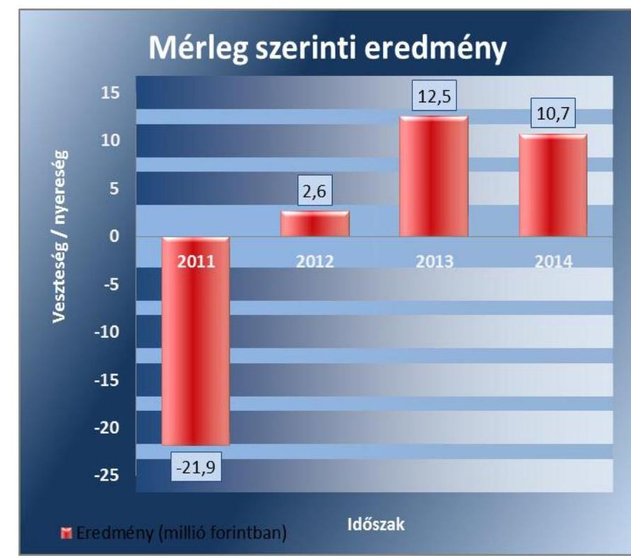

Forrás: Az ellenőrzött adatszolgáltatása
Az Önkormányzatnak nem volt kötelezettségvállalásához kapcsolódó garancia-, illetve kezességvállalása. A Társaság feladatellátásához működési és fejlesztési támogatást nem nyújtott.

# 2. A gazdasági társaság vagyongazdálkodása szabályszerű volt-e, kötelezettségállománya jelentett-e kockázatot a működésre, illetve a közfeladat ellátásra? 

Összegző megállapítás

A szabályozási hiányosságok mellett a Társaság vagyongazdálkodása alapvetően szabályszerű volt, kötelezettségállománya a működésre, közfeladat ellátásra nem jelentett kockázatot.
2.1. számú megállapítás

A gazdálkodási szabályzatok előírásai közötti összhang nem volt biztosított, a számviteli szétválasztás és az önköltségszámítás szabályait az előírások ellenére nem határozták meg, az üzletszabályzatot a jegyző nem hagyta jóvá.

Az üzleti terveket az ügyvezető készítette el és terjesztette a Képviselő-testület elé az Alapító Okiratban előírt kötelezettsége alapján. Az üzleti tervek tartalmi és formai követelményeit nem határozták meg, azok a bázis évi terv és tényadatokat, valamint a tárgy évi terveket tartalmazták a bevételek, kiadások és az adózott eredmény vonatkozásában. Az üzleti terveket jóváhagyó képviselő-testületi határozatok - a gazdasági programban szereplő célokkal összhangban - a tervezett pozitív mérleg

---

szerinti eredménynek a távhőrendszer fejlesztésére történő felhasználását írták elő.

A Társaság rendelkezett a Számv. tv. ${ }^{22}$ 14. § (3) bekezdésben előírt számviteli politikával, valamint a Számv. tv. 14. § (5) bekezdés a), b), és d) pontjaiban előírtaknak megfelelően eszközök és források leltárkészítési és leltározási szabályzattal, értékelési szabályzattal, valamint pénzkezelési szabályzattal. Elkészítették továbbá a Számv. tv. 161. § (1) bekezdésben előírt számlarendet.

A számviteli politika ${ }^{23}$ hiányossága volt, hogy nem tartalmazta a Számv. tv. 3. § (6) bekezdés 1. pontja szerinti mérlegkészítés időpontját, amely időpontig a megbízható és valós vagyoni helyzet bemutatásához szükséges értékelési feladatokat el lehet és el kell végezni. A számviteli politika az értékelési szabályzat ${ }_{2}{ }^{24},{ }_{2}{ }^{25}$ valamint a leltárkészítési és leltározási szabályzat ${ }^{26}$ előírásaival való összhangja nem volt biztosított. A számviteli politika a készletek folyamatos mennyiségi nyilvántartását írta elő, az értékelési szabályzatban foglaltak szerint a Társaság a vásárolt készletekről mennyiségi és értékbeli nyilvántartást nem vezet. A számviteli politika a készletek értékelését a legutolsó beszerzési áron (FIFO módszer), a leltárkészítési és leltározási szabályzat a tényleges beszerzési áron írta elő.

A leltárkészítési és leltározási szabályzat a Számv. tv. 69. § (3) bekezdés előírásait figyelembe véve évenkénti gyakorisággal írta elő az eszközök mennyiségi leltározásának kötelezettségét. A pénzkezelési szabályzat ${ }^{27}$ a Számv. tv. 14. § (8) bekezdése szerinti tartalommal készült.

A Társaság nem dolgozta ki a Tszt. 18/A. § (2) bekezdése előírásainak megfelelően a távhőtermelés, távhőszolgáltatás és egyéb tevékenység vonatkozásában a számviteli szétválasztás szabályait, valamint nem alakította ki a szétválasztási szabályok érvényesítéséhez az elkülönült nyilvántartási rendszert.

Önköltségszámítási szabályzat készítésének kötelezettsége alól a Számv. tv. 14. § (6) bekezdés alapján mentesült a Társaság, ugyanakkor a számviteli politika 15. pontja szerint külön szabályzat tartalmazza a végzett szolgáltatások önköltségének számítását. A számviteli politikában előírtak ellenére az önköltségszámítás szabályait a Társaság nem határozta meg.

Az üzletszabályzatot a Tszt. 3. § v) pontja szerinti tartalommal elkészítette és 2010. január 1-jén hatályba léptette a Társaság, azonban a jegyző a szabályzatot a Tszt. 7. § (1) bekezdés a) és b) pontjában előírtak ellenére nem hagyta jóvá, és nem küldte meg véleményezésre a fogyasztóvédelmi hatóságnak.

Az SZMSZ ${ }^{28}$ és az Alapító Okirat közötti összhang nem volt biztosított az alapítói jóváhagyást igénylő szerződések körének meghatározása vonatkozásában. Az Alapító Okirat 2009. június 25-i módosítása az alapítói jóváhagyást igénylő szerződések értékét a törzstőke 1/4-éről a törzstőke 1/10-ére módosította. Az SZMSZ aktualizálásának elmulasztása miatt a hatályos SZMSZ a törzstőke 1/4-ében határozza meg az alapítói jóváhagyást igénylő szerződések értékét.

---

# 2.2. számú megállapítás 

A Társaság a tulajdonában lévő vagyonával alapvetően a jogszabályi és belső rendelkezéseknek megfelelően gazdálkodott.

## Az analitikus és főkönyvi nyilvántartási

rendszer biztosította a Szalkatávhő Kft. vagyonának a számviteli politika és a számlarend szerinti nyilvántartását, a változások folyamatos nyomon követését.

A Társaság a távhőszolgáltatás közfeladatát saját eszközeivel látta el, üzemeltetésre átvett, illetve vagyonkezelésbe vett eszköze nem volt. A főkönyvi könyvelés és analitikus nyilvántartások közötti egyezőség biztosított volt.

A tárgyi eszközök Számv. tv. 69. § (3) bekezdése szerinti, mennyiségi felvétellel történő leltározása nem volt teljes körű, mivel nem terjedt ki valamennyi 0-ra leírt tárgyi eszközre. A leltározásba vont, leltáríveken szereplő tárgyi eszközök összesített bruttó értéke 2011-2012-ben 11,5 millió Ft-tal, 2013-2014-ben 4,7 millió Ft-tal kevesebb volt, mint az analitikus és főkönyvi nyilvántartásokban szereplő bruttó érték. Az egyezőség a tárgyi eszközök mérlegértékének (nettó érték) vonatkozásában fennállt.

A 2013. évben a tárgyi eszközök bruttó értékét és értékcsökkenését egyaránt 6,8 millió Ft-tal csökkentették, azonban az elszámolását alátámasztó alapbizonylat nem állt rendelkezésre. Ezzel megsértették a Számv. tv. 169. § (2) bekezdésének előírásait, mely szerint a könyvviteli elszámolást alátámasztó bizonylatokat 8 évig meg kell őrizni. Az elszámolás a Társaság vagyonára nem volt hatással.

A Társaság éves beszámolóinak főbb mérlegadatait az 1. táblázat szemlélteti.

1. táblázat

SZALKATÁVHŐ KFT FŐBB MÉRLEG ADATAI (MILLIÓ FORINT)

| Megnevezés | $\begin{aligned} & 2011 \\ & 01.01 \end{aligned}$ | $\begin{aligned} & 2011 \\ & 12.31 . \end{aligned}$ | $\begin{aligned} & 2012 \\ & 12.31 . \end{aligned}$ | $\begin{aligned} & 2013 \\ & 12.31 . \end{aligned}$ | $\begin{aligned} & 2014 \\ & 12.31 . \end{aligned}$ |
| :--: | :--: | :--: | :--: | :--: | :--: |
| I. Befektetett eszközök | 361,7 | 322,6 | 277,6 | 236,1 | 203,8 |
| - ebből: Tárgyi eszközök | 358,9 | 316,2 | 273,7 | 234,5 | 203,7 |
| II. Forgóeszközök | 138,4 | 128,0 | 132,1 | 156,1 | 167,6 |
| - ebből: Követelések | 122,8 | 108,1 | 105,8 | 123,0 | 136,5 |
| III. Aktív időbeli elhatárolások | 2,2 | 11,0 | 1,3 | 0,1 | 1,5 |
| Eszközök összesen | 502,3 | 461,6 | 411,0 | 392,3 | 372,9 |
| IV. Saját tőke | 195,5 | 173,5 | 176,2 | 188,6 | 199,3 |
| - ebből: Jegyzett tőke | 100,0 | 100,0 | 100,0 | 100,0 | 100,0 |
| - ebből Mérleg szerinti eredmény | 9,8 | $-21,9$ | 2,6 | 12,5 | 10,7 |
| V. Céltartalékok | - | - | - | - | - |
| VI. Kötelezettségek | 45,6 | 24,8 | 19,3 | 20,7 | 29,3 |
| VII. Passzív időbeli elhatárolások | 261,2 | 263,3 | 215,5 | 183,0 | 144,3 |
| Források összesen | 502,3 | 461,6 | 411,0 | 392,3 | 372,9 |

---

Az eszközérték 129,4 millió Ft-os csökkenését eredményezte az ellenőrzött időszakban, hogy a befektetett eszközök értékének csökkenése meghaladta a forgóeszközök növekedését. A források csökkenését jellemzően - a passzív időbeli elhatárolások állományának 2012-től folyamatos csökkenése eredményezte. A bekövetkezett változások alapvető oka a támogatásból beszerzett tárgyi eszközök értékcsökkenésének és ezzel azonos összegű passzív időbeli elhatárolás csökkenésének - Számv. tv. 45. § (2) bekezdés szerinti - elszámolása volt. Az ellenőrzött időszak végén fennálló követelések közel kétharmadát a vevőkkel szembeni követelések (84,2 millió Ft) alkották. A Társaság saját tőkéje a mérleg szerinti eredmény elszámolásának következtében minimálisan, 3,8 millió Ft-tal nőtt. A Társaság likviditási helyzete javult, mivel a mérleg fordulónapján fennálló kötelezettségek állománya 35,7%-kal 29,3 millió Ft-ra csökkent.

# 2.3. számú megállapítás 

A kötelezettségek állománya a működésre, közfeladat ellátásra nem jelentett kockázatot, a Társaság likviditási helyzete javult.

Az eladósodottsági mutató értéke kedvezően alakult (2011-2013. években 0,05, 2014-ben 0,08), az idegen tőke összes forráson belüli aránya egyik évben sem érte el a kritikus 0,6-es értéket. A nettó eladósodottság mutató arról nyújt információt, hogy a kintlévőségekkel csökkentett kötelezettségeket milyen mértékben fedezi saját forrás, és azt feltételezi, hogy a kötelezettségek teljesítését megelőzi a követelések realizálása. A mutató értéke az ellenőrzött években kedvezően alakult (2011-ben -0,48, 2012-ben -0,49, 2013-ban és 2014-ben -0,54 volt), a kintlévőségek teljes mértékben fedezték a kötelezettségek összegét. Az eladósodás szintje a működést, a közfeladat ellátását nem veszélyeztette.

Az adósságfedezeti mutató I. értéke, tendenciája szintén kedvező volt, 1,0 Ft adósságra a 2011. évben 18,1 Ft, a 2012. évben 21,1 Ft, a 2013. évben 18,9 Ft, a 2014. évben 12,6 Ft vagyon jutott. A 2011-2013. években hosszú lejáratú kötelezettség nem terhelte a Társaságot, így az adósságfedezeti mutató II. számítása csak a 2014. évben történt, amely évben a mutató (0,12) kedvezően alakult.

Az árbevételre vetített eladósodottság mértéke kedvezően alakult, mivel a Szalkatávhő Kft. adósságaira a forgóeszközök többszörösen fedezetet nyújtottak.

A Társaság likviditási helyzetének javulását jelzi, hogy a szállító tartozás 2014-ben mindössze 8,8%-a volt határidőn túl tartozás, ez az arány 2011-ben 89,9%, 2012-ben 53,5%, 2013-ban 9,0% volt.

A Társaság a 2011-2014. években rendelkezett a társasági formájára kötelezően előírt jegyzett tőkének megfelelő összegű saját tőkével.

Hosszú lejáratú kötelezettsége a Társaságnak a 2011-2013. években nem volt. A 2014. évi beszámoló mérlegében kimutatott 1,4 millió Ft éven túli kötelezettség a tárgy évben - pénzügyi lízing keretében - megvalósított személygépjármű beszerzéshez kapcsolódott.

Éven túli kötelezettségvállalásként a Szalkatávhő Kft. 2014. augusztus 21-én nyílt végű pénzügyi lízingszerződést kötött személygépjármű lízingbe vételére. A lízingszerződés megkötéséhez az Alapító Okirat 6. pontjában előírtak ellenére nem kérték az alapító döntését, a szerződés megkötésére az alapító jóváhagyása nélkül került sor.

---

# A rövid lejáratú kötelezettségek 88,9-100%-

át a szállítókkal szemben tartozás képezte. A Szalkatávhő Kft a 2011. évben a rövid lejáratú kötelezettségeinek döntően határidőben nem tudott eleget tenni, a 2012-2014. években likviditási helyzete folyamatosan javult, ebben az időszakban a rövid lejáratú kötelezettségeit döntően fizetési határidőn belül teljesítette. Az ellenőrzött időszakban a Szalkatávhő Kft.
 fizetőképessége kedvező tendenciát mutatott, a 90 napon túli lejárt fizetési határidejű szállítói állomány a 2011. évi 83%-os arányról a 2012-2014. években 1% alá csökkent. A fizetési határidőn túli szállítói állomány csökkenő összegével egyidejűleg a szállítók részére kifizetett késedelmi kamat összege is mérséklődött, 2011-ben 1,7 millió Ft, 2012-ben 1,1 millió Ft volt. A 2013. és 2014. évben késedelmi kamat fizetési kötelezettség nem keletkezett, kifizetés nem történt.

A Társaság szállítói állományának alakulását fizetési határidő szerinti bontásban a 2. táblázat mutatja be.
2. táblázat

SZÁLLÍTÓI ÁLLOMÁNYOK ALAKULÁSA (MILLIÓ FORINTBAN)

|  | A szállítói állományok fizetési határidő szerinti bontásban |  |  |  |
| :--: | :--: | :--: | :--: | :--: |
|  | Fizetési határidőn   belül | 0-90 napon belül   lejárt tartozás | 90 napon túli tarto-   zás | Össze-   sen |
| 2011 | 2,5 | 1,7 | 20,6 | 24,8 |
| 2012 | 7,9 | 9,0 | 0,1 | 17,0 |
| 2013 | 17,0 | 1,5 | 0,2 | 18,7 |
| 2014 | 23,9 | 2,2 | 0,1 | 26,2 |

Forrás: A Társaság adatszolgáltatása
2.4. számú megállapítás

A 2014. évi beszámolóról az FB írásbeli jelentést nem készített, a könyvvizsgáló a szétválasztási szabályok hiányában adta ki igazolását.

AZ ÉVES BESZÁMOLÓKAT a Társaság a Számv. tv. 19. § (1) bekezdésében előírt tartalommal elkészítette, azokat az ügyvezető a Képviselő-testület elé terjesztette. Az éves beszámolók letétbe helyezése a Számv. tv. 153. § (1) bekezdésben előírt határidőben megtörtént.

Az éves beszámolók elfogadásáról a Képviselő-testület a könyvvizsgáló jelentésének és a 2011-2013. évi beszámoló esetében az FB írásbeli jelentésének birtokában határozott.

Az FB az Ügyrend II/2. pontjában, az Alapító Okirat 10. pontjában, valamint a Ptk. 3:120. § (2) bekezdésében előírtak ellenére a 2014. évi számviteli beszámolóról szóló írásbeli jelentést nem készített. Az ügyvezető nem tett eleget az SZMSZ III/2. pontjában és az Alapító Okirat 9. pontjában előírt kötelezettségének, mivel a Képviselő-testület elé az FB írásbeli véleményét nem tartalmazó beszámolót terjesztett elő.

---

A Képviselő-testület a 63/2015. (IV. 29.) számú határozatával a Társaság 2014. évi beszámolójának elfogadásáról az FB írásbeli jelentése nélkül döntött, mely a Ptk. 3:120. § (2) bekezdésében előírtakkal ellentétes.

A KÖNYVVIZSGÁLÓ az éves beszámolókat hitelesítő záradékkal látta el. A 2012. évi beszámolóhoz kapcsolódó, letétbe helyezett 2013. április 11-i jelentésében a könyvvizsgáló nem tett eleget a Tszt. 18/B. § (1) bekezdésben előírt igazolási kötelezettségének. Utólag, 2013. augusztus 26-i dátummal kibocsátott könyvvizsgálói jelentésében nyilatkozott a Társaságnál kidolgozott és alkalmazott számviteli szétválasztási szabályok megfelelőségéről, a tevékenységek közötti keresztfinanszírozás-mentességről. A 2013-2014. évekre vonatkozóan a könyvvizsgálói jelentések tartalmazták a Tszt. 18/B. § (1) bekezdése szerinti igazolást. A könyvvizsgáló a 2012-2014. évi könyvvizsgálói jelentéseiben annak ellenére nyilatkozott a számviteli szétválasztási szabályok megfelelősségéről, hogy a Társaság a keresztfinanszírozás-mentességet biztosító szétválasztási szabályokat belső szabályzatokban nem dolgozta ki.

Az FB és a könyvvizsgáló a közvagyon védelme, illetve más okból a Képviselő-testület összehívását nem kezdeményezte.

A Társaság 2011-ben az Eisztv. $^{29}$ 6. § (1) bekezdésében, 2012-2014. években az Info tv $^{30}$. 33. § (3) bekezdésben előírt kötelezettségének eleget téve szervezeti, személyi adatait, a tevékenységére, működésére vonatkozó, és gazdálkodási adatait honlapján közzétette.

A 2011. évben hatályban lévő Avtv. $^{31}$ 31/A. § (1) bekezdése, valamint a 2012. január 1-jétől hatályos Info tv. 24. § (1) bekezdésében foglaltak szerint a közüzemi szolgáltatónál belső adatvédelmi felelőst kell kinevezni, amely kötelezettségének a Társaság nem tett eleget, belső adatvédelmi felelőst nem neveztek ki. Adatvédelmi felelős hiányában nem volt biztosított a nyilvántartásokban elektronikusan kezelt adatállományok Info tv. 7. §-ban előírt információbiztonsági védelme.

A Szalkatávhő Kft. az Info tv. 24. § (3) bekezdésében előírt adatvédelmi és adatbiztonsági szabályzatkészítési kötelezettségének 2012. július 1-jétől tett eleget.

---

# 3. A gazdasági társaságnál az ellátott közfeladat bevételei és ráfordításai elszámolása, valamint az önköltségszámítás és árképzés szabályszerű volt-e? 

Összegző megállapítás

A távhőszolgáltatás bevételeinek és ráfordításainak elszámolása nem volt szabályszerű, az önkormányzati hatáskörben megállapított távhődíjakat megalapozó számításokat nem végezték el, az önköltségszámítás szabályait nem határozták meg, így az árképzés nem volt szabályszerű.
3.1. számú megállapítás

A bevételek és anyagjellegű ráfordítások elszámolása során a jogszabályok és belső szabályok előírásai nem érvényesültek teljes körűen, ami kockázatot jelez a szabályos működés vonatkozásában. A beruházások, felújítások és az értékcsökkenés elszámolása nem volt szabályszerű. A lakossági távhődíj hátralék annak ellenére emelkedett, hogy követelésállományt kezelte a Társaság.

A Szalkatávhő Kft.-nél - mivel a távhőszolgáltatási feladat mellett egyéb feladatokat is ellátott - a közfeladat átláthatósága és a keresztfinanszírozás elkerülése érdekében fennállt a Tszt. 2012. január 1-jétől hatályos 18/A. § (3) bekezdés c) pontjában foglalt előírás szerint a bevételek és ráfordítások elkülönítésének kötelezettsége. Ennek a kötelezettségének a Társaság nem tett eleget, mivel az elkülönítést biztosító szabályokat az ellenőrzött időszakban nem határozta meg. A gyakorlatban a bevételek elkülönítését az alkalmazott főkönyvi számok biztosították. A 2012-2013. években a tevékenységenkénti eredményt utólag, a ráfordítások bevételarányos felosztásával határozták meg. A 2014. évben a ráfordítások elkülönítését biztosító kódrendszert vezettek be, azonban ennek alkalmazási szabályait nem írták elő.

A Társaság ellenőrzött időszakban realizált bevételeit, elszámolt ráfordításait és tevékenységének eredményét a 3. számú táblázat szemlélteti:
3. táblázat

A TÁRSASÁG BEVÉTELEI, RÁFORDÍTÁSAI, EREDMÉNYE (MILLIÓ FT)

| Megnevezés | 2011 | 2012 | 2013 | 2014 |
| :-- | :-- | :-- | :-- | :-- |
| Összes bevétel | 461,0 | 503,1 | 553,1 | 490,9 |
| Összes ráfordítás | 482,9 | 500,5 | 539,3 | 479,9 |
| Adózás előtti ered-   mény | -21,9 | 2,6 | 13,8 | 11,0 |

Forrás: Az éves beszámolók kiegészítő mellékletei
AZ ÉRTÉKESÍTÉS NETTÓ ÁRBEVÉTELÉNEK ELSZÁMOLÁSA során nem érvényesültek teljes körűen a jogszabályok és a belső szabályok előírásai a bevételek kiszámlázása és elszámolása tekintetében. Ez kockázatot jelez az ellenőrzött terület egészének szabályos működése szempontjából. Egyes esetekben a bevételek elszámolása nem a megfelelő főkönyvi számlára történt, az alkalmazott árak nem feleltek

---

meg a tulajdonosi követelményeknek. A távhőszolgáltatás árbevételeként számolták el az egyéb tevékenységként végzett üzemeltetési és karbantartási feladatok bevételét. Ezzel megsértették a Tszt. 18/A. § 2) bekezdésében előírt szétválasztási kötelezettséget.

A 2011. március havi háztartási célra felhasznált hődíj kiszámlázása során nem tartották be a Távhő rendelet 4. § (1) bekezdésében előírtakat, mely szerint a lakossági célú távhőszolgáltatásért a rendelet 2. számú mellékletében feltüntetett legmagasabb távhőszolgáltatási díjat kell fizetni. A számlában a díjtételt szabálytalanul 3394 Ft/GJ összegben rögzítették, a Távhő rendeletben előírt 3608 Ft/GJ helyett. A Társaság szabálytalanul járt el azzal, hogy a lakossági célra felhasznált hődíj mértékét a 2011. január 1. - 2011. április 14. közötti időszakban a Távhő rendeletben előírtaktól alacsonyabb összegben alkalmazta.

## AZ ANYAGJELLEGŰ RÁFORDÍTÁSOK ELSZÁMOLÁSA

SORAÁN nem érvényesültek teljes körűen a jogszabályok előírásai a költségelszámolás tekintetében. Ez kockázatot jelez a terület egészének szabályos működése szempontjából. Egyes esetekben a távhőszolgáltatás ráfordításaként számoltak el a távhőtermelés érdekében felmerült kiadást. Nem tartották be a Tszt. 18/A. §-ban előírt szétválasztási szabályokat.

## A BERUHÁZÁSOK, FELÚJÍTÁSOK ÉS AZ ÉRTÉK-

CSÖKKENÉSI LEÍRÁS ELSZÁMOLÁSA nem volt megfelelő, mivel nem érvényesültek teljes körűen a jogszabályok és belső szabályok előírásai az eszközök nyilvántartásának tekintetében. Megállapítottuk, hogy egyes esetekben az eszközök állományba vétele nem volt szabályos, az ellenőrzött eszközt a tárgyévi leltárban nem mutatták ki, a beruházáshoz a tulajdonosi jogok gyakorlója által előírt FB előzetes, írásbeli engedélyét nem kérték ki.

Tárgyi eszközként vették nyilvántartásba a szellemi termékek licencét, amit a Számv. tv. 25. § (6) bekezdése alapján vagyoni értékű jogként az immateriális javak között kell nyilvántartani. A Társaság tevékenységét közvetlenül szolgáló gépeket (faapríték nedvességmérő berendezés, hőkamera) a Számv. tv. 26. § (4) bekezdésének előírásai ellenére a műszaki berendezések, gépek helyett az egyéb berendezések, felszerelések között vették nyilvántartásba.

Az Alapító Okirat előírásait megszegve egy 4,0 millió Ft összegű szerződés megkötéséhez (2011. évi számlázási rendszer licencének megvásárlása) nem kérték ki az FB előzetes jóváhagyását. Az Alapító Okirat 10. pontjában rögzítettek szerint az ügyvezető az FB előzetes jóváhagyásával köthet olyan szerződést, amely értékhatára eléri a 2 millió Ft-ot, és a Társaság törzstőkéjének 1/10-ét nem haladja meg.

AZ AMORTIZÁCIÓ ELSZÁMOLÁSÁVAL kapcsolatos eljárásrendet a számviteli politikában rögzítették. Terven felüli értékcsökkenés elszámolására nem került sor. A tárgyi eszközök pótlását minimális mértékben valósították meg. A beruházások, élettartam-növelő felújítások értéke az ellenőrzött időszakban - a támogatásból megvalósult fejlesztés után elszámolt amortizáció nélkül - 13,8 millió Ft volt, amely mintegy negyede az elszámolt amortizációból képződött forrásnak (54,6 millió Ft).

---

A tárgyi eszközök használhatósági foka az ellenőrzött időszakban 48,5%-ról 27,2%-ra csökkent.

A tárgyi eszközök terv szerinti értékcsökkenését havonta számolták el, ugyanakkor a számviteli politikában negyedéves elszámolási gyakoriságot írtak elő.

KÖVETELÉSÁLLOMÁNYÁT kezelte a Társaság, az értékvesztés elszámolása évente, az értékelési szabályzat$_{1,2}$ előírásai szerint történt. A 2012. évi értékvesztés elszámolása során figyelembe vett 1/2013. számú ügyvezetői utasítás $^{32}$ - az értékelési szabályzat$_{2}$-ben rögzített 20% helyett - 30% értékvesztés elszámolását írta elő azon éven túli tartozások vonatkozásában, amelyeknél a tartozás várhatóan bírósági úton behajtható, az adós munkahelye ismert, illetve ingatlanára a terhelés bejegyezhető. Az értékvesztés mértékének emelése miatt elszámolt ráfordítás többlet 1,9 millió Ft volt, amelynek eredményre gyakorolt hatását a kiegészítő mellékletben a Számv. tv. 88. § (3) bekezdésben előírtakkal ellentétben nem mutatták be.

A lejárt határidejű követelések alakulását a 4. táblázat mutatja be:
4. táblázat

A VEVŐKÖVETELÉSEK LEJÁRAT SZERINTI ALAKULÁSA (E FT)

|  | $\begin{gathered} 1-20 \\ \text { nap } \end{gathered}$ | $\begin{gathered} 21-60 \\ \text { nap } \end{gathered}$ | $\begin{gathered} 61-90 \\ \text { nap } \end{gathered}$ | $\begin{gathered} 91- \\ 180 \\ \text { nap } \end{gathered}$ | $\begin{gathered} 181- \\ 260 \\ \text { nap } \end{gathered}$ | $\begin{gathered} 261- \\ \text { naptól } \end{gathered}$ | Összesen |
| :--: | :--: | :--: | :--: | :--: | :--: | :--: | :--: |
|  |  |  | 2011.01.01. |  |  |  |  |
| Lakossági | 5257 | 4300 | 4885 | 5176 | 10747 | 34689 | 65054 |
| Nem lakossági | 8290 | 6608 | 7043 | 8456 | 19340 | 5891 | 55628 |
| Összesen: | 13547 | 10908 | 11928 | 13632 | 30087 | 40580 | 120682 |
|  |  |  | 2011.12.31 |  |  |  |  |
| Lakossági | 9449 | 5337
 | 2674 | 5370 | 10839 | 39172 | 72841 |
| Nem lakossági | 11129 | 7393 | 4105 | 4696 | 24036 | 3971 | 55330 |
| Összesen | 20578 | 12730 | 6779 | 10066 | 34875 | 43143 | 128171 |
|  |  |  | 2012.12.31. |  |  |  |  |
| Lakossági | 10302 | 3957 | 1378 | 8755 | 17375 | 46701 | 88468 |
| Nem lakossági | 13603 | 4402 | 1237 | 203 | 729 | 3618 | 23792 |
| Összesen | 23905 | 8359 | 2615 | 8958 | 18104 | 50319 | 112260 |
|  |  |  | 2013.12.31. |  |  |  |  |
| Lakossági | 8885 | 6322 | 3277 | 5905 | 16728 | 60046 | 101163 |
| Nem lakossági | 14859 | 4839 | 3031 | 331 | 952 | 4030 | 28042 |
| Összesen | 23744 | 11161 | 6308 | 6236 | 17680 | 64076 | 129205 |
|  |  |  | 2014.12.31. |  |  |  |  |
| Lakossági | 5958 | 3455 | 2121 | 3714 | 12748 | 72807 | 100803 |
| Nem lakossági | 4130 | 4728 | 237 | 832 | 748 | 5400 | 16075 |
| Összesen | 10088 | 8183 | 2358 | 4546 | 13496 | 78207 | 116878 |

Forrás: A Társaság adatszolgáltatása

---

# A HATÁRIDŐN TÚLI VEVŐKÖVETELÉSEK állománya

nak állandósága mellett a kintlévőség napjainak száma jelentősen növekedett az ellenőrzött időszakban. A 2011. január 1-jei éven túli követelések állománya 40,6 millió Ft-ról 2014 végére 78,2 millió Ft-ra emelkedett. A lakosság által határidőre ki nem fizetett távhődíj az ellenőrzött időszakban 65,1 millió Ft-ról 100,8 millió Ft-ra nőtt.

A Szalkatávhő Kft. 2014. január 1-jén hatályba léptette az aktualizált Bírósági eljárás és hátralék behajtási szabályzatát. A szabályzatban rögzítették a díjhátralékkal rendelkező vevők kezelésének szabályait. Előírták a fizetési felszólítás küldésének kötelezettségét, a részletfizetési lehetőség felajánlását, ügyvédi irodák bevonását a behajtási szakaszban, illetve a bírósági végrehajtás kezdeményezését.

A Szalkatávhő Kft. a 2012-2014. években a Tszt. 18/C. §-ában, illetve az 50/2011. (IX. 30.) NFM rendelet ${ }^{33}$ 5. § (2) bekezdés c) pontjában előírt nyereségkorlátot nem lépte túl. Az adózás előtti eredmény nem haladta meg a nyereségkorlát számításánál figyelembe vehető eszközérték 2\%-át.
3.2. számú megállapítás

Az önköltségszámítás szabályait az előírások ellenére nem határozták meg, az önkormányzati hatáskörben megállapított távhődíjakat a Távhő rendelet előírásai ellenére számításokkal, kalkulációval nem támasztották alá, az árképzés nem volt szabályszerű.

AZ ÖNKÖLTSÉGSZÁMÍTÁSI SZABÁLYZAT készítésének kötelezettsége alól a Szalkatávhő Kft. a Számv. tv. 14. § (6) bekezdése alapján mentesült, ugyanakkor a számviteli politika szabályozási kötelezettséget írt elő a végzett szolgáltatások önköltségszámítására vonatkozóan. A számviteli politikában előírtak ellenére az önköltségszámítás szabályait nem határozta meg a Társaság.

## A TÁVHŐSZOLGÁLTATÁS ÁRMEGÁLLAPÍTÁSI

JOGA 2011. április 14-ig önkormányzati hatáskörben volt. A 2011. január 1-je és 2011. április 14. között hatályos alapdíjakat és hődíjakat a Távhő rendelet 2. számú mellékletét módosító 28/2008. (IX. 29.) KT rendelet állapította meg. Az alapdíj számítását a távhőszolgáltatás bázis évi költségei, ráfordításai, valamint a tervezett infláció mértékének figyelembevételével írták elő. A Távhő rendelet előírásai ellenére a megállapított alapdíjak összegét alátámasztó számítások nem készültek, így az árképzés nem volt megalapozott. A hődíj egységárának meghatározó elemét a földgáz ára, illetve a gázmotor által előállított hő költsége képezte.

A Társaság az 51/2011. (IX. 30.) NFM rendelet ${ }^{34}$ alapján távhőszolgáltatással összefüggő támogatásban a 2011. évben 2,5 millió Ft, a 2012. évben 39,2 millió Ft, a 2013. évben 109,7 millió Ft, a 2014. évben 93,3 millió Ft összegben részesült. A támogatások összegeit az 51/2011. (IX. 30.) NFM rendelet 7. § (1) bekezdésében előírtaknak megfelelően az egyéb bevételek között könyvelték. A támogatási feltételek teljesítésének ellenőrizhetősége érdekében külön elszámolást a Szalkatávhő Kft. folyamatosan vezetett.

---

A Társaság lakosságra és közületi fogyasztókra vonatkozó alapdíjat és hődíjat - fajlagos díjtátelekkel - időszaki bontásban a 3. számú ábra mutatja be.
3. ábra
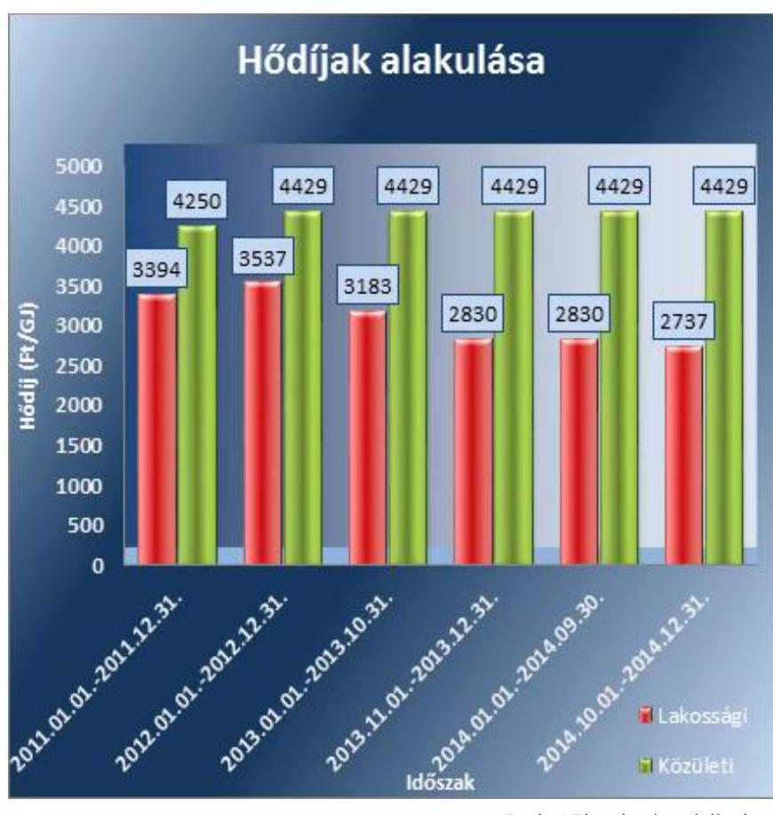

A távhőszolgáltatás díját 2011. április 15-től a Tszt. 57/D. § (1) bekezdése alapján, mint legmagasabb hatósági árat, azok szerkezetét és alkalmazási feltételeit - a MEKH javaslatának figyelembevételével - a nemzeti fejlesztési miniszter rendeletben állapítja meg. A lakossági távhő díjakat 2011. április 15-től - a 2011. március 31-én alkalmazott díjakon - befagyasztották, majd 2012. január 1-jétől az 50/2011. (IX. 30.) NFM rendelet hatályos 4. §-a alapján 4,2\%-kal megemelték. A 2013. évben két lépcsőben - 2013. január 1-jével az előző évihez képest 10,0\%-os, majd 2013. november 1-jétől további 11,1\%-os mértékben - csökkentették a Rezsi tv. 3. § (1) bekezdésének, valamint az 50/2011. (IX. 30.) NFM rendelet 3. § (2) bekezdésének megfelelően. A Rezsi tv. 3. § (1) bekezdése a távhőszolgáltatás díjának további 3,3\%-kal történő csökkentését írta elő 2014. október 1-jétől. A Szalkatávhő Kft. a jogszabályi rendelkezéseknek megfelelően az alapdíj és hődíj 2012. évi 4,2\%-os emelését, a 2013. évi két lépcsőben történő, valamint 2014. évi - előírt mértékű - csökkentését végrehajtotta.

---

# JAVASLATOK 

Az ÁSZ tv. ${ }^{35}$ 33. § (1) bekezdésében foglaltak értelmében az ellenőrzött szervezet vezetője köteles a jelentésben foglalt megállapításokhoz kapcsolódó intézkedési tervet összeállítani és azt a jelentés kézhezvételétől számított 30 napon belül az ÁSZ részére megküldeni. Amennyiben az intézkedési tervet határidőre nem küldi meg a szervezet, vagy amennyiben az nem elfogadható, az ÁSZ elnöke az ÁSZ tv. 33. § (3) bekezdés a)-b) pontjaiban foglaltakat érvényesítheti.

Javaslataink célja a Szalkatávhő Kft. gazdálkodása szabályszerűségének helyreállítása annak érdekében, hogy a szabályozási környezet megfelelően tudja támogatni az átlátható működést.

## Szalkatávhő Kft. Ügyvezető Igazgatójának

1. Gondoskodjon a szabályozási hiányosságok megszüntetésére, ezen belül
a) intézkedjen a számviteli politika mérlegkészítés időpontjának meghatározásával történő kiegészítéséről, a szabályzatok előírásainak egységesítéséről a készletek nyilvántartásának tárgyában a számviteli politika és értékelési szabályzat, a készletek értékelésének tárgyában a számviteli politika és leltárkészítési és leltározási szabályzat vonatkozásában;
b) intézkedjen a távhőtermelés, távhőszolgáltatás és egyéb tevékenység vonatkozásában a számviteli szétválasztás szabályainak kidolgozásáról, valamint alakítsa ki a szétválasztási szabályok érvényesítéséhez az elkülönült nyilvántartási rendszert;
c) a számviteli politikában foglaltaknak megfelelően dolgozza ki az önköltségszámítás szabályait, tekintettel arra, hogy a Számv. tv szerint a társaság egyébként mentesült a szabálykészítési kötelezettség alól;
d) gondoskodjon az SZMSZ módosításáról, ennek keretében az alapítói jóváhagyást igénylő szerződések értékét az Alapító Okiratban előírt mérték figyelembe vételével határozza meg;
(2.1. sz. megállapítás 3, 4, 5, 7. bekezdése alapján)
e) gondoskodjon a tárgyi eszközök terv szerinti értékcsökkenésének elszámolásánál a szabályozás szerinti végrehajtásról.
(3.1. sz. megállapítás 11. bekezdése alapján)

---

2. Gondoskodjon a jogszabályi előírások szerinti gyakorlat és a szabályos működés biztosítására, ezen belül:
a) gondoskodjon adatvédelmi felelős kinevezéséről az elektronikusan kezelt adatállományok Info tv-ben előírt információ biztonsági védelme érdekében;
(2.4. sz. megállapítás 8. bekezdése alapján)
b) intézkedjen a bevételek és ráfordítások megfelelő számlacsoportban történő elszámolására;
(3.1. sz. megállapítás 3. bekezdése alapján)
c) alakítsa ki az immateriális javak és tárgyi eszközök megfelelő nyilvántartását;
(3.1. sz. megállapítás 7. bekezdése alapján)
d) biztosítsa a szerződések megkötéséhez kapcsolódó, Alapító Okirat szerinti tulajdonosi joggyakorlás érvényesítését, azaz az Alapító okiratban meghatározott összeghatár feletti szerződések megkötéséhez biztosítsa az FB előzetes jóváhagyásának kikérését.
(3.1. sz. megállapítás 8. bekezdése alapján)

---

Javaslataink célja az Önkormányzat szabályszerű működésének elősegítése, továbbá az önkormányzati tulajdonosi joggyakorlás kontrolljainak erősítése.

# Mátészalka Város Önkormányzata Polgármesterének 

1. Intézkedjen a jogszabályi előírások szerinti gyakorlat és a szabályos működés biztosítására, ezen belül:
a) hívja fel a Képviselő-testület figyelmét arra, hogy a Társaság beszámolója elfogadásának feltétele az FB előzetes írásbeli véleményének megléte;
b) intézkedjen az ügyvezetőt érintően feltárt szabálytalanság tekintetében a felelősség tisztázása érdekében, és szükség szerint intézkedjen a felelősség érvényesítéséről;
c) intézkedjen az jegyzőt érintően feltárt szabálytalanság tekintetében a munkajogi felelősség kivizsgálására irányuló eljárás megindítása iránt, és az eljárás eredményének ismeretében tegye meg a szükséges intézkedéseket;
(2.4. sz. megállapítás 2, 3. bekezdése alapján)

## Mátészalka Város Önkormányzata Jegyzőjének

1. Intézkedjen a szabályozási hiányosságok megszüntetésére, ennek keretében: készítse elő a távhőszolgáltatási rendelet aktuális jogszabályi környezetnek megfelelő módosítását, majd intézkedjen a rendelet kiadása érdekében.
(1.1. sz. megállapítás 6. bekezdése alapján)
2. Intézkedjen a jogszabályi előírások szerinti gyakorlat biztosítására, ennek keretében: tegyen eleget a Tszt.-ben előírtaknak, küldje meg a Társaság üzletszabályzatát véleményezésre a fogyasztóvédelmi hatóságnak, majd a vélemény megérkezését követően intézkedjen az üzletszabályzat jóváhagyásáról.
(2.1. sz. megállapítás 6. bekezdése alapján)

---

# MELLÉKLETEK 

I. SZ. MELLÉKLET: ÉRTELMEZŐ SZÓTÁR
eladósodottság mértéke

## Kötelezettségek / saját tőke

Fontos szerepet játszik ez a mutató egy vállalat megítélésében. Azt mutatja, hogy a saját források a kötelezettségek hány százalékát fedezik. Törekedni kell, hogy a mutató tartósan (jelentősen) 1 alatti értéket érjen el.
eladósodottsági mutató (tőkeáttétel)
garancia
gazdasági társaság
kezesség
közfeladat
idegen tőke / összes forrás
Egészségesnek mondható egy olyan mértékű áttétel, amelyet az üzleti tervek szerint és az elmúlt időszak tapasztalatai alapján a társaság megfelelő biztonsággal ki tud termelni. Nagy eszközberuházásigényű iparágakban értéke magasabb, azaz magasabb eladósodottság is elfogadható, de 75-85%-ot meghaladó értéknél már itt is erős, sőt túlzott külső finanszírozottságról beszélhetünk. Általánosságban véve kedvező, ha értéke kisebb, mint 0.
A garancia olyan önálló, az önkormányzat nevében vállalt kötelezettség, amely alapján az önkormányzat az önkormányzati költségvetés terhére szerződésben meghatározott feltételek szerint, a kötelezett nem teljesítése esetén a jogosultnak fizetést teljesít az előzetesen rögzített összeghatárig.
3:88. § (1) A gazdasági társaságok üzletszerű közös gazdasági tevékenység folytatására, a tagok vagyoni hozzájárulásával létrehozott, jogi személyiséggel rendelkező vállalkozások, amelyekben a tagok a nyereségből közösen részesednek, és a veszteséget közösen viselik.
A kezességre vonatkozó előírásokat a Ptk. 6:416-430. §-ai tartalmazzák. Kezességi szerződéssel a kezes kötelezettséget vállal a jogosulttal szemben, hogyha a kötelezett nem teljesít, maga fog helyette a jogosultnak teljesíteni. Kezesség egy vagy több, fennálló vagy jövőbeli, feltétlen vagy feltételes, meghatározott vagy meghatározható összegű pénzkövetelés vagy pénzben kifejezhető értékkel rendelkező egyéb kötelezettség biztosítására vállalható. A Ptk. szerint kezességet csak írásban lehet vállalni. A kezes kötelezettsége ahhoz a kötelezettséghez igazodik, amelyért kezességet vállalt. A kezes kötelezettsége nem válhat terhesebbé, mint amilyen elvállalásakor volt, kiterjed azonban a kötelezett szerződésszegésének jogkövetkezményeire és a kezesség elvállalása után esedékessé váló mellékkövetelésekre is.
Jogszabályban meghatározott állami vagy önkormányzati feladat, amit az arra kötelezett közérdekből, jogszabályban meghatározott követelményeknek és feltételeknek megfelelve végez, ideértve a lakosság közszolgáltatásokkal való ellátását, továbbá az állam nemzetközi szerződésekben vállalt kötelezettségeiből adódó közérdekű feladatokat, valamint e feladatok ellátásához szükséges infrastruktúra biztosítását is (Nvtv. 3. § (1) bekezdés 7. pont).

---

közszolgáltatás

A közszolgáltatás: „közcélú, illetőleg közérdekű szolgáltatást jelent,

 amely egy nagyobb közösség (állam, település) minden tagjára nézve megközelítőleg azonos feltételek mellett vehető igénybe, ezért valamilyen mértékig közösségi megszervezést, illetve szabályozást, ellenőrzést igényel.” Az Ebktv. 3. § d) pontja a következőképpen határozza meg a közszolgáltatást: „szerződéskötési kötelezettség alapján a lakosság alapvető szükségleteinek ellátására irányuló szolgáltatás, így különösen a villamos energia-, gáz-, hő-, víz-, szennyvíz- és hulladékkezelési, köztisztasági, postai és távközlési szolgáltatás, továbbá a menetrend alapján közlekedő járművekkel végzett közforgalmú személyszállítás.”
meghatározó befolyás

A Ptk. 8:2. § (2) bekezdése szerint „A befolyással rendelkező akkor rendelkezik egy jogi személyben meghatározó befolyással, ha annak tagja vagy részvényese, és
a) jogosult e jogi személy vezető tisztségviselői vagy felügyelőbizottsága tagjainak többségének megválasztására, illetve visszahívásra; vagy
b) a jogi személy más tagjai, illetve részvényesei a befolyással rendelkezővel kötött megállapodás alapján a befolyással rendelkezővel azonos tartalommal szavaznak, vagy a befolyással rendelkezőn keresztül gyakorolják szavazati jogukat, feltéve, hogy együtt a szavazatok több mint felével rendelkeznek.”
nemzeti vagyon
többségi befolyás
tulajdonosi joggyakorló

Az Nvtv. 1. § (2) bekezdés c) pontja szerint „az állam vagy a helyi önkormányzat tulajdonában lévő pénzügyi eszközök, továbbá az államot vagy a helyi önkormányzatot megillető társasági részesedések”
A Ptk. 8:2. § (1) bekezdése szerint „többségi befolyás az olyan kapcsolat, amelynek révén természetes személy vagy jogi személy (befolyással rendelkező) egy jogi személyben a szavazatok több mint felével vagy meghatározó befolyással rendelkezik.”
Aki a nemzeti vagyon felett az államot vagy a helyi önkormányzatot megillető tulajdonosi jogok és kötelezettségek összességének gyakorlására jogosult (Nvtv. 3. § (1) bekezdés 17. pont)

---

II. SZ. MELLÉKLET: MŰKÖDÉSI ADATOK

| A SZALKATÁVHŐ KFT MŰKÖDÉSÉNEK FŐBB JELLEMZŐI (EZER FORINT / \%) |  |  |  |  |  |  |
| :--: | :--: | :--: | :--: | :--: | :--: | :--: |
| Sorszám | Megnevezés |  | 2011. | 2012. | 2013. | 2014. |
| 1. | A gazdasági társaság tulajdonosi összetétele: |  |  |  |  |  |
| 2. | Önkormányzat megnevezése: |  |  | Mátészalka Város Önkormányzata |  |  |
| 3. | Önkormányzat tulajdoni részesedésének aránya | \% | 100 | 100 | 100 | 100 |
| 4. | Önkormányzat tulajdoni részesedésének összege | ezer Ft | 100000 | 100000 | 100000 | 100000 |
| 5. | A gazdasági társaságnál a vizsgált évek során működése megszűnt-e? (IGEN/NEM) |  |  | NEM |  |  |
| 6. | A tárgyévben a gazdasági társaság saját vagyona után elszámolt értékcsökkenés összege | ezer Ft | 45843 | 45467 | 43053 | 37839 |
| 7. | A tárgyévben a saját tulajdonú eszközök pótlására (karbantartás) elszámolt költség | ezer Ft | 13126 | 4847 | 7747 | 11790 |
| 8. | Értékesítés nettó árbevétele | ezer Ft | 404254 | 402455 | 382863 | 328965 |
| 9. | Működési cash flow | ezer Ft | -1862 | 8792 | 11150 | 211 |

---

.

---

# FÜGGELÉK: ÉSZREVÉTELEK 

A jelentéstervezetet a Számvevőszék 15 napos észrevételezésre megküldte az ellenőrzött szervezet vezetőjének az ÁSZ tv. 29. § (1) bekezdése előírásának megfelelően.
A függelék tartalmazza az ellenőrzöttek észrevételeit, illetve az észrevételek elutasításának indoklását.

* 29. § (1) Az Állami Számvevőszék az ellenőrzési megállapításait megküldi az ellenőrzött szervezet vezetőjének vagy az általa megbízott személynek, és annak, akinek személyes felelősségét állapította meg.
(2) Az ellenőrzött szervezet vezetője és a felelősként megjelölt személy az ellenőrzés megállapításaira tizenöt napon belül írásban észrevételt tehet.
(3) Az Állami Számvevőszék az észrevételre a beérkezésétől számított harminc napon belül írásban válaszol. A figyelembe nem vett észrevételeket köteles a jelentésben feltüntetni, és megindokolni, hogy azokat miért nem fogadta el.

---

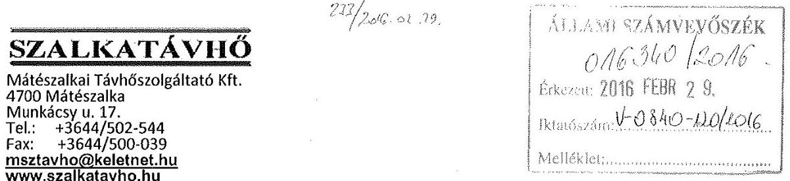

Állami Számvevőszék
Domokos László Elnök úr
1364 Budapest 4. pf. 54
ikt. sz.: 29/2016
3. b. 2016. h. 2016

Tisztelt Elnök Úr!

A V-0840-116/2016. iktatószámú jelentés tervezetet 2016. február 15.-én köszönettel megkaptam. Levelében említett 15 napon belüli észrevételtételi jogommal élve az alábbiakban közlöm észrevételeimet:
2.1. sz. megállapítás: Az ellenőrzés alatt feltárt szabályzati rendszerünket érintő hiányosságok pótlása elkezdődött, szabályzataink aktualizálása folyamatban van. A társaság 2015. évi mérlegbeszámolója már az új - a számviteli törvényben meghatározott számviteli szétválasztást is magában foglaló - számviteli szabályzat szerint fog történni.
2.2. sz. megállapítás: A nullára leírt tárgyi eszközök minden évben leltározásra kerültek, igaz nem a bruttó értékük szerint, hanem érték nélkül. A 2015. évi tárgyieszköz leltár a nullára leírt kisértékű eszközök vonatkozásában már a bruttó értékek beazonosításával történt meg. A 2015. évi leltárnál a bruttó eszközérték nem mutat eltérést a főkönyvekben nyilvántartott eszközök bruttó értékeivel.
A 4. bekezdésében említett tárgyi eszközök 6,8 millió forintos bruttó értékcsökkenés alapjának a tárgyi eszközök analitikus listáját vettük. Ez alapján hajtottuk végre az említett értékcsökkenést, és ezt tekintettük bizonylatként is.
2.3. sz. megállapítás: A 7. bekezdésben szereplő személygépjármű lízingszerződésének megkötését megelőzte egy felügyelő bizottsági döntés is, mely nem szerepel a jelentés tervezetben. A lízing összege nem indokolta az alapítói döntést, ám a futamideje igen, ami valóban elkerülte mind a cégvezetés, mind az akkori felügyelő bizottság figyelmét.
2.4. sz. megállapítás: 2015. év elején a társaság nem rendelkezett határozatképes felügyelő bizottsággal, ezért nem tudott az FB hiteles írásbeli jelentést készíteni a társaság 2014. évi beszámolójáról. A beszámoló közzétételének közelgő határideje miatt kényszerű döntés született mind a társaság, mind a tulajdonos részéről.
A könyvvizsgálóra vonatkozó megállapítások tényszerűek.

---

3.1. sz. megállapítás: Meglátásunk szerint az itt felsorolt eltérések a számviteli szétválasztás szabályozatlanságából adódnak. Úgy véljük, hogy a számviteli szétválasztás 2012-ben és 2013-ban nem volt teljesen kidolgozott, tartalmazott hibákat, melyeket 2014-re megszüntettünk. Az első két évben a Magyar Energetikai és Közműszabályozási Hivatal 1/2013. sz. ajánlását vettük alapul. Ahogyan az első bekezdésben is említésre került, cégünk kidolgozott egy - a szétválasztást segítő - rendszert, amely 2014-ben már hibátlanul működött, ennek szabályzatban történő rögzítése a vizsgálat időszakában valóban nem történt meg.
A 7. bekezdésben említett tárgyi eszközök véleményünk szerint továbbra sem sorolhatók a társaság tevékenységét közvetlenül szolgáló gépek közé. Kérem az ügyvezetőnek tett javaslatok közül a 2.c. bekezdés törlését.
3.2. sz. megállapítás: Cégünk a számviteli törvény szerint mentesül az önköltségszámítás kötelezettsége alól, e szerint módosítjuk számviteli politikánkat is.

A Szalkatávhő Kft. ügyvezető igazgatójának tett javaslatok közül a 2.d. bekezdés alatt említett feladat a 3.1. sz. megállapítás 8. bekezdésére hivatkozik. Említett bekezdés alatt egy 2010-ben elkövetett szabálytalanság szerepel - amely annak ellenére, hogy tényszerű - nem ró feladatot a jelenlegi vezetésre, hiszen kinevezésem (2012. január 1.) óta ilyen jellegű szabálytalanság nem történt.

A jelentéstervezetben említett többi javaslataikat köszönjük, Önnek és munkatársainak további eredményes munkát kívánunk!

Mátészalka, 2015. február 25.

Tisztelettel:
MÁTÉSZALKAI
TÁVHŐSZOLGÁLTATÓ KFT.
Mátészalka, Munkácsy út 17

Dankó Attila
ügyvezető
Szalkatávhő Kft.

---

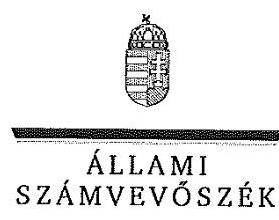

ELHÖK

Ikt.szám: V-0840-121/2016.

# Dankó Attila 

ügyvezető
Mátészalkai Távhőszolgáltató Kft.

## Mátészalka

## Tisztelt Ügyvezető Úr!

Köszönettel vettem a Mátészalkai Távhőszolgáltató Kft. ellenőrzéséről készített számvevőszéki jelentéstervezetre tett észrevételeit.

Az Állami Számvevőszék észrevételekre vonatkozó álláspontjáról a felügyeleti vezető által készített részletes tájékoztatásban kap választ, amelyet levelemhez mellékeltem.

Tájékoztatom Ügyvezető urat, hogy a számvevőszéki jelentés véglegesítése az elfogadott észrevételek figyelembevételével történik. A figyelembe nem vett észrevételek azok elutasításának indokaival együtt szerepeltetve lesznek a végleges jelentésben.

Budapest, 2016. 05. hó 13. nap
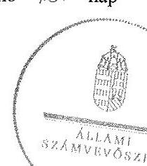

Tisztelettel:

Tisztelettel:
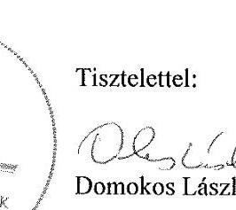

Melléklet: Tájékoztatás az észrevételek kezeléséről

---

# Tájékoztatás az észrevételek kezeléséről 

„Az önkormányzatok gazdasági társaságai - Az önkormányzatok tulajdonában lévő gazdasági társaságok közfeladat-ellátását érintő gazdálkodási tevékenysége szabályszerűségének ellenőrzése Mátészalkai Távhőszolgáltató Kft” címmel készített jelentéstervezetre Ügyvezető úr észrevételeit megköszönöm. Az észrevételek kezeléséről az alábbi tájékoztatást adom.

1. A 2.1. számú megállapításban foglalt szabályozási hiányossággal kapcsolatos tájékoztatását, amelyben jelzi, hogy a szabályzatok aktualizálása folyamatban van és a 2015. évi beszámoló az új szabályzatok alapján fog készülni - tájékoztatásul tudomásul veszem, az a jelentés szövegének módosítását nem indokolja.
2. A 2.2 számú megállapítással kapcsolatos észrevételében a nullára leírt eszközök leltározásával kapcsolatban tett megállapításunkat nem kifogásolja. A tárgyi eszközök bruttó értékének és értékcsökkenésének azonos összegben történő csökkentése kapcsán az összeg meghatározására (6,8 millió Ft) ad magyarázatot, azonban a főkönyvi és analitikus nyilvántartás eltérésének, illetve az eltérés megszüntetése módjának szabályosságát alátámasztó bizonylat nem állt rendelkezésre. Ennek alapján észrevételét elfogadni nem tudom.
3. Észrevételében a 2.3. számú, a lízingszerződés megkötésével kapcsolatos megállapításunkat nem kifogásolja. Az észrevételében jelzett, a szerződéskötést megelőző felügyelő bizottsági döntés szerepeltetése viszont a jelentésben nem indokolt, mivel megállapítást érdemben nem befolyásolja. A vonatkozó megállapításunk az Alapító okirat 6. pontjában előírt alapítói döntés hiányára és nem a felügyelő bizottsági döntésre vonatkozik.
4. A Társaság 2014. évi beszámolójával kapcsolatos 2.4. számú megállapításunkat nem kifogásolja, észrevételében annak körülményeit ismerteti, így az a jelentés szövegének módosítását nem indokolja.
5. A jelentés 3.1. számú megállapításának számviteli szétválasztási szabályokra vonatkozó részét észrevételében nem kifogásolja. A hivatkozott megállapítás 7. bekezdésére tett azon észrevételét, amely alapján a vonatkozó bekezdésben felsorolt eszközök (faapríték nedvességmérő berendezés, hőkamera) egyéb berendezések közötti nyilvántartása megfelelő, elfogadni nem tudom. A szóban forgó eszközök a vállalkozó tevékenységét közvetlenül szolgálják, így a számvitelről szóló 2000. évi C. törvény 26. § (4) bekezdése alapján a műszaki berendezések, gépek között kell kimutatni. Ennek megfelelően az ügyvezetőnek tett 2. c) számú javaslatot nem áll módomban törölni.
6. Az észrevételében jelzett, a számviteli politika módosításával kapcsolatos intézkedését tudomásul veszem, azzal kapcsolatban a jelentés módosítása nem indokolt.
7. A jelentésben az ügyvezetőnek tett 2. d) számú javaslat a jövőben előforduló eseményekkel kapcsolatosan fogalmaz meg feladatot. A korábban elkövetett szabálytalanság vonatkozásában utólagos módosításra már nincs lehetőség, így azzal kapcsolatban Ügyvezető

---

úrtól nem várunk el intézkedéseket. A javaslat egyértelműsítése érdekében annak szövegét az alábbiak szerint módosítom:
„d) a jövőre vonatkozóan biztosítsa a szerződések megkötéséhez kapcsolódó, az Alapító Okirat szerinti tulajdonosi joggyakorlás érvényesítését, azaz az Alapító okiratban meghatározott összeghatár feletti szerződések megkötéséhez biztosítsa az FB előzetes jóváhagyásának kikérését.”

Budapest, 2016. 03. hó 8. nap

Dr. Horváth Margit
felügyeleti vezető

---

# MÁTÉSZALKA VÁROS ÖNKORMÁNYZAT   POLGÁRMESTERE   4700 Mátészalka, Hősök tere 9.   Tel.: 44/501-358; Fax: 44/501-360   Email: polgarmester@mateszalka.hu 

Hiv.szám: V-0840-116/2016.
Témaszám: 1874
Ellenőrzés-azonosító szám: V-070705

ÁLLAMI SZÁMVEVŐSZÉK
Domokos László
Elnök Úr
részére

BUDAPEST 4.
Postafiók 54.
1364

Száma: 541-3/2016.
Tárgy: Észrevétel ellenőrzés megállapításaira

ÁLLAMI SZÁMVEVŐSZÉK
011205/2016.
Érkezése: 2016. március 02.
Iktatószám:
Melléklet:

## Tisztelt Elnök Úr!

Az Állami Számvevőszék a Mátészalkai Távhőszolgáltató Kft. gazdálkodási tevékenység szabályszerűségének ellenőrzése tárgyában megküldött jelentéstervezettel kapcsolatosan álláspontom kialakítása érdekében megkerestem a társaság ügyvezetőjét, a jegyzőt, illetve a pénzügyi irodavezetőt, akik írásbeli véleményeinek figyelembe vétele szerint:

Az Állami Számvevőszék - V-0840-116/2016. iktatószámú - Mátészalkai Távhőszolgáltató Kft. gazdálkodási tevékenység szabályszerűségének ellenőrzése tárgyában tett megállapításaira, illetve jelentéstervezetére vonatkozóan az alábbi észrevételeket teszem a jelentéstervezet egyes részeihez illeszkedően:

## FŐBB MEGÁLLAPÍTÁSOK, KÖVETKEZTETÉSEK, JAVASLATOK:

„A 2014. évi beszámoló elfogadásakor nem tartották
 be a Ptk. előírásait, mely szerint a Képviselő-testület, a számviteli beszámolóról az FB írásbeli véleményének birtokában dönthet. Az ügyvezető nem tett eleget az SZMSZ-ben és az Alapító okiratban előírt kötelezettségének, mivel a Képviselő-testület elé az FB írásbeli véleményét nem tartalmazó beszámolót terjesztett elő. A jegyző nem tett eleget a Mötv.-ben előírt kötelezettségének, mivel nem jelezte a Képviselő-testületnek, hogy a döntésük jogszabálysértő.

Az ellenőrzés során nem került sor annak vizsgálatára és tisztázására, illetve nem került ismertetésre az az ok, hogy a Szalkatávhő Felügyelő Bizottsága, miért nem tárgyalta a gazdasági társaság 2014. évre vonatkozó beszámolóját. Az FB 3 tagú, Ügyrendje alapján

---

akkor határozatképes és működőképes, ha mindhárom tag jelen van. Az FB egyik tagja 2015. 03. 24. napján kelt levelében írásban lemondott, és ezen objektív külső tényező szerint az FB működésképtelenné vált, határozatképessége nincs. Az ügyvezető a beszámoló közzétételének közelgő határideje miatt terjesztette be a tulajdonos képviselő-testület 2015. 04. 29. napján tartott testületi ülése elé a társaság 2014. évre vonatkozó beszámolóját, melyet az FB működőképességének hiánya miatt előzetesen nem tudott tárgyalni.
A Polgári Törvénykönyvről szóló 2013. évi V. törvény 3:120. § (2) bek. alapján „Ha a társaságnál felügyelőbizottság működik, a beszámolóról a társaság legfőbb szerve a felügyelőbizottság írásbeli jelentésének birtokában dönthet. "
A 2014. évi beszámoló - a tulajdonos képviselő-testület által történő - tárgyalásakor a Felügyelő Bizottság - a már jelzett lemondás miatt - nem volt működőképes, így ezen objektív ok miatt nem is tudta volna azt érdemben megtárgyalni.

Álláspontom szerint a tulajdonos képviselő-testület döntése nem volt törvénysértő. Információm szerint - ügyvezetőtől - egyrészt a képviselő-testület döntésének időpontjában nem volt működőképes FB; másrészt a tulajdonosi döntést egyébiránt nem befolyásolja az FB véleménye; harmadrészt a tulajdonos képviselő-testület a közeledő beszámoló közzétételi határideje miatt döntéskényszerben volt, mivel ha nem határoz a 2014. évi beszámolóról, úgy a Szalkatávhő Kft. nem tud eleget tenni határidőben a beszámoló közzétételi kötelezettségének. A jegyző ezen ok miatt nem tett törvényességi jelzést.
Szakmai álláspontom szerint a testületi döntés nem volt jogszabálysértő. Annak a ténynek a megállapítására, hogy egy önkormányzat képviselő-testületének döntése jogszabálysértő - a Mötv 134. § (1) bekezdés alapján - „Ha a kormányhivatal jogszabálysértést észlel, a törvényességi felügyelet körében legalább harminc napos határidő tűzésével felhívja az érintettet annak megszüntetésére"- a Kormányhivatal jogosult, törvényességi felhívás keretében. 2015. április 29. napja óta a Szabolcs-Szatmár-Bereg Megyei Kormányhivatal törvényességi felhívással nem élt a jelentéstervezetben jogszabálysértőnek minősített képviselő-testületi határozat tekintetében.

Mötv. „132. § (1) A kormányhivatal a helyi önkormányzatok törvényességi felügyelete körében az Alaptörvényben meghatározott feladat- és hatáskörökön túl:
a) törvényességi felhívással élhet"

A 2014. évi gazdasági beszámolóról (hasonlóan a 2011-2013. évek tekintetében) maga a vizsgálati jelentéstervezet is megállapítja, hogy a Társaság vagyongazdálkodása alapvetően szabályszerű volt. Kötelezettségállománya a működésre, közfeladat ellátásra nem jelentett kockázatot, likviditási helyzete javult. 2014. évre vonatkozóan egy nyereségesen működő és eredményes Szalkatávhő Kft. beszámolója került elfogadásra. A jóváhagyó döntés elmulasztása esetén beszámoló közzétételi kötelezettségének nem tudott volna határidőben eleget tenni a társaság. A gazdasági társaság működését felügyelő területileg illetékes Cégbíróság az ellenőrzött időszak tekintetében nem kezdeményezett törvényességi felügyeleti eljárást.

---

1.2. SZÁMÚ MEGÁLLAPÍTÁSHOZ észrevételem teljes mértékben egyező az előzőekben rögzítettekkel, a fentiekben leírtakkal. Ismételten rögzíteni - terjedelmi okból - nem kívánom. Észrevételem azonos és egyező tartalmú a „Főbb megállapítások, következtetések, javaslatok" résznél megtettekkel.

# AZ ÁRKÉPZÉS SZABÁLYAI MEGÁLLAPÍTÁSOKRA VONATKOZÓAN (16. oldal) 

„A díjak mértékét rögzítő 2. számú melléklet utolsó módosítására 2008. október 1-jén került sor, melynek során az alapdijak mértékét megalapozó - Távhő rendelet 1. számú melléklete szerinti - számításokat nem készítették el. A bevezetésre került és 2011. április 11-ig hatályos - Önkormányzat által meghatározott - legmagasabb árat a Távhő rendelet előírásai ellenére számításokkal nem támasztották alá."

A díjmódosításról szóló 2008. szeptember 2-án kelt előterjesztésben, az előterjesztésért felelős Szalkatávhő ügyvezetője rögzíti, hogy „A Távhőszolgáltató Kft. elkészítette a hő díjakra vonatkozó árkalkulációját, mely a távhőszolgáltatás legmagasabb hatósági díjáról szóló 28/2006.(XII.1.) Ök. számú rendelet 1. számú mellékletének árképletei szerinti átszámítását jelenti, és az előterjesztés 1. számú melléklete tartalmazza a javasolt új távhőszolgáltatási díjtételeket." Az előterjesztés 1. számú mellékletének megnevezése „Teljes hődíj költség kalkulációja". Az előterjesztés 1. számú melléklete részletes költségkalkulációkat és számításokat tartalmaz.

A jelentéstervezet nem tér ki rá és nem is tartalmazza, hogy ezen számítások miben nem felelnek meg az elkészítésekor (2008. szeptember 2.) hatályos önkormányzati Távhő rendelet 1. számú mellékletének.

BESZÁMOLTATÁSI RENDSZER (16. oldal) - Észrevételem megegyezik az 1.2. megállapításnál leírtakkal. Álláspontomat a fentiekben részletesen kifejtettem, terjedelmi okból megismételni nem kívánom.

### 2.1. SZÁMÚ MEGÁLLAPÍTÁSHOZ ÉSZREVÉTEL (17. oldal)

„A gazdálkodási szabályzatok előírásai közötti összhang nem volt biztosított, a számviteli szétválasztás és az önköltségszámítás szabályait az előírások ellenére nem határozták meg, az üzletszabályzatot a jegyző nem hagyta jóvá."

Jelentéstervezet 18. oldal: „Az Üzletszabályzatot a Tszt. 3. § v. pontja szerinti tartalommal elkészítette és 2010. január 1-jén hatályba léptette a társaság, azonban a jegyző a

---

szabályzatot a Tszt. 7.§ (1) bekezdés a) és b) pontjában előírtak ellenére nem hagyta jóvá, és nem küldte meg véleményezésre a fogyasztóvédelmi hatóságnak."

# A megállapításal nem értek egyet, az téves. 

Egyáltalán nem került megvizsgálásra az ellenőrzés folyamán az a körülmény, hogy miért nem került jóváhagyásra a jegyző részéről a Szalkatávhő üzletszabályzata. Nem került tisztázásra a vizsgálat során, hogy a szolgáltató Szalkatávhő Kft. részéről történt-e egyáltalán - az üzletszabályzat jóváhagyása iránt - közigazgatási eljárás kezdeményezése a jegyző irányába. Tény azonban, hogy a Szalkatávhő Kft. a 2010. január 01. napjával hatályba léptetett üzletszabályzatának jóváhagyása érdekében, illetve ezt megelőző időpontban annak jóváhagyására irányuló kérelmet és annak mellékletét jelentő üzletszabályzatot nem nyújtott be a jegyzőhöz. A jegyző csak azt az üzletszabályzatot tudja jóváhagyni, amelynek a jóváhagyását nála kezdeményezik. Kezdeményezés nem volt, és jelenleg sincs folyamatban.

Az üzletszabályzat jóváhagyására közigazgatási hatósági eljárásban, a 2004. évi CXL. törvény a közigazgatási hatósági eljárás és szolgáltatás általános szabályairól (továbbiakban: Ket.) 71. § (1) és 72. § (2) bekezdései szerinti határozattal kerülhet jóváhagyásra a szükséges fogyasztóvédelmi véleményezés után.

## A Ket. szabályai alapján az eljárás az ügyfél kérelmére vagy hivatalból indulhat.

Ket. ,29. § (1) A hatósági eljárás az ügyfél kérelmére vagy hivatalból indul meg.
(2) A hatóság köteles a hatáskörébe tartozó ügyben illetékességi területén hivatalból megindítani az eljárást, ha
a) ezt jogszabály előírja,
b) erre felügyeleti szerve utasította, a bíróság kötelezte,
c) életveszéllyel vagy súlyos kárral fenyegető helyzetről szerez tudomást."

A Tszt. nem írja elő, hogy az üzletszabályzat jóváhagyása hivatalból történő eljárás keretében történik, tehát az kérelemre indul.

Tsz. ,7. § (1) A területileg illetékes települési önkormányzat jegyzője, a fővárosban a fővárosi önkormányzat főjegyzője (a továbbiakban: önkormányzat jegyzője):
a) megküldi véleményezésre a távhőszolgáltató üzletszabályzatát a fogyasztóvédelmi hatóságnak;
b) jóváhagyja a távhőszolgáltató által kidolgozott üzletszabályzatot;"

Az üzletszabályzat jóváhagyása iránti kezdeményezést, kérelmet - a jelzett időszakban a Szalkatávhő Kft. nem nyújtott be, így - mivel nem volt kezdeményezés, kérelem - a jegyző abban nem is hozhatott határozatot, azaz nem hagyhatta jóvá az üzletszabályzatot. Ügyfél eljárás kezdeményezésének elmulasztása nem keletkeztet eljárási kötelezettséget a hatóságra, azaz a jegyzőre.

---

# 2.4. SZÁMÚ MEGÁLLAPÍTÁS (21. oldal): 

„A 2014. évi beszámolóról az FB írásbeli jelentést nem készített, a könyvvizsgáló a szétválasztási szabályok hiányában adta ki igazolását."

Jelentés (22. oldal): „A Képviselő-testület a 63/2015. (IV. 29.) számú határozatával a Társaság 2014. évi beszámolójának elfogadásáról az FB írásbeli jelentése nélkül döntött, mely a Ptk. 3:120. § (2) bekezdésében előírtakkal ellentétes."

Az ellenőrzés során - jelentéstervezet nem tartalmazza - az FB döntés elmaradásának oka nem került tisztázásra, kivizsgálásra. Az ügyvezetés tájékoztatása szerint az FB a döntésre irányuló beszámoló beterjesztésekor működésképtelen volt, egy tag lemondott, az FB határozatképessége és egyúttal döntésképessége nem volt biztosított.
Az ügyvezető a beszámoló közzétételének közelgő határideje miatt terjesztette be a tulajdonos képviselő-testület elé a társaság 2014. évre vonatkozó beszámolóját, melyet az FB működőképességének hiánya miatti objektíve, és nem a tulajdonosnak vagy ügyvezetésnek, esetleg jegyzőnek felróhatóan nem tudott megtárgyalni.

A Polgári Törvénykönyvről szóló 2013. évi V. törvény 3:120. § (2) bek. alapján „Ha a társaságnál felügyelőbizottság működik, a beszámolóról a társaság legfőbb szerve a felügyelőbizottság írásbeli jelentésének birtokában dönthet."

Az FB működőképessége tagjának lemondása miatt nem volt biztosított.
A Felügyelő Bizottság tevékenysége során döntéseket hoz. A döntéshozatal a felügyelőbizottság ülésein történik. Kiemelten rögzíti a Ptk. 3:120. § (2) bekezdése: a beszámolóról szóló döntés előfeltétele, hogy arról a felügyelőbizottság írásos jelentést tegyen a legfőbb szerv, a tulajdonos részére. Ez azonban nem jelenti azt, hogy a felügyelőbizottság meghatározó módon befolyásolni tudná a legfőbb szerv (tulajdonos képviselő-testület) döntéshozatalát. Ha minden előfeltétel adott lenne ahhoz, hogy a felügyelőbizottság az éves jelentést megvizsgálja és véleményét kifejtse, azt azonban mégis elmulasztaná, ezzel nem akadályozhatja meg a legfőbb szerv döntéshozatalát. Különös tekintettel nem jelenthet döntéshozatali akadályt a felügyelőbizottság működésképtelensége esetén, mikor törvényes határidőben el kell fogadni és a cégbírósághoz be kell nyújtani a gazdasági társaság beszámolóját (amely egyértelmű törvényi kötelezettsége a tulajdonos képviselő-testületnek).

Más szempontból továbbtekintve pedig a felügyelőbizottság jelentésének (amennyiben lett volna) tartalma sem döntő a legfőbb szerv (tulajdonos képviselő-testület) adott gazdasági év beszámolójáról történő döntés tartalma vonatkozásában. Attól még, hogy a felügyelőbizottság bármilyen okból nem javasolja elfogadásra a beszámolót, a legfőbb szerv (tulajdonos képviselő-testület) határozat az elfogadásról, és fordítva: ha a felügyelőbizottság elfogadásra javasolja a beszámolót, legfőbb szerv dönthet úgy, hogy elutasítja a beszámoló elfogadását. A képviselő-testület jogosult dönteni arról, hogy elfogadja-e a felügyelőbizottság véleményét, javaslatát; azaz ha a felügyelőbizottság bármilyen okból nem javasolja elfogadásra a

---

beszámolót, a legfőbb szerv (tulajdonos képviselő-testület) elfogadhatja a beszámolót; illetve fordítva: a felügyelőbizottság elfogadásra javasolja a beszámolót, a legfőbb szerv elutasíthatja a beszámoló elfogadását.

# 3.2. SZÁMÚ MEGÁLLAPÍTÁS (26. oldal) 

„Az önköltségszámítás szabályait az előírások ellenére nem határozták meg, az önkormányzati hatáskörben megállapított távhődíjakat a Távhő rendelet előírásai ellenére számításokkal, kalkulációval nem támasztották alá, az árképzés nem volt szabályszerű."
„A távhőszolgáltatás ármegállapítási joga."
„A Távhő rendelet előírásai ellenére a megállapított alapdijak összegét alátámasztó számítások nem készültek, így az árképzés nem volt megalapozott."

A díjmódosításról szóló 2008. szeptember 2-án kelt előterjesztésben, az előterjesztésért felelős Szalkatávhő ügyvezetője rögzíti, hogy „A Távhőszolgáltató Kft. elkészítette a hődíjakra vonatkozó árkalkulációját, mely a Távhőszolgáltatás legmagasabb hatósági díjáról szóló 28/2006. (XII. 1.) Ök. számú rendelet 1. számú mellékletének árképletei szerinti átszámítását jelenti és az előterjesztés 1. számú melléklete tartalmazza a javasolt új távhőszolgáltatási díjtételeket." Az előterjesztés 1. számú melléklete megnevezése „Teljes hődíj költség kalkulációja" Az előterjesztés 1. számú melléklete részletes költségkalkulációkat és számításokat
 tartalmaz az alkalmazandó díjak tekintetében.

A jelentéstervezet nem tér ki arra, hogy ezen számítások miben nem felelnek meg, illetve az árképzés, mely kalkulációs elem vagy elemek tekintetében nem volt szabályszerű. Az alapdíjak meghatározása a már jelzett ügyvezető által készített előterjesztés 1. számú melléklete alapján történt (Teljes hődíj költség kalkulációja). A jelentéstervezet konkrét és tényszerű részletes meg nem feleléseket nem tartalmaz. A megállapított alapdíjak összegét alátámasztó számítások a 2008. szeptember 2-án kelt előterjesztés 1. számú mellékletében szerepelnek.

## JAVASLATOK

## „Mátészalka Város Önkormányzat Polgármesterének

1. Intézkedjen a jogszabályi előírások szerinti gyakorlat és a szabályos működés biztosítására, ezen belül:
a) hívja fel a Képviselő-testület figyelmét arra, hogy a Társaság beszámolójának elfogadásának feltétele az FB előzetes írásbeli véleményének megléte;"

Elhagyását javaslom, nem értek vele egyet. Egyrészt ismert jogszabályhely tartalmát jelenti, megismétli a Ptk. 3:120. § (2) bekezdését. Másrészt - a már korábban kifejtett véleményem szerint - ez nem jelenti azt, hogy a felügyelőbizottság meghatározó módon befolyásolni tudná a legfőbb szerv (a tulajdonos képviselő-testület) döntéshozatalát. Ha minden előfeltétel adott

---

lenne ahhoz, hogy a felügyelőbizottság az éves jelentést megvizsgálja és véleményét kifejtse, azt azonban mégis elmulasztaná, ezzel nem akadályozhatja meg a legfőbb szerv döntéshozatalát.
Különös tekintettel nem jelenthet akadályt a felügyelőbizottság működésképtelensége esetén, mikor törvényes határidőben el kell fogadni és a cégbírósághoz be kell nyújtani a gazdasági társaság beszámolóját (amely egyértelmű törvényi kötelezettsége a tulajdonos képviselőtestületnek).
„c.) intézkedjen a jegyzőt érintően feltárt szabálytalanság tekintetében a felelősség tisztázása érdekében a munkajogi felelősség kivizsgálására irányuló eljárás megindítása iránt, és az eljárás eredményének ismeretében tegye meg a szükséges intézkedéseket."
„(2.4. sz. megállapítás 2., 3. bekezdése alapján)"

# 2.4. számú megállapítás: 

„A 2014. évi beszámolóról az FB írásbeli jelentést nem készített, a könyvvizsgáló a szétválasztási szabályok hiányában adta ki igazolását."

## 2. bekezdése:

„Az FB az Ügyrend II/2. pontjában, az Alapító Okirat 10. pontjában, valamint a Ptk. 3:120. § (2) bekezdésében előírtak ellenére a 2014. évi számviteli beszámolóról szóló írásbeli jelentést nem készített. Az ügyvezető nem tett eleget az SZMSZ III/2. pontjában és az Alapító Okirat 9. pontjában előírt kötelezettségének, mivel a képviselő-testület elé az FB írásbeli véleményét nem tartalmazó beszámolót terjesztett elő."

## 3. bekezdése:

„A Képviselő-testület a 63/2015. (IV. 29.) számú határozatával a Társaság 2014-évi beszámolójának elfogadásáról az FB írásbeli jelentése nélkül döntött, mely a Ptk. 3:120. § (2) bekezdésében előírtakkal ellentétes."

Elhagyását javaslom, nem értek vele egyet. A 2. és 3. bekezdésekben megállapítottak nem a a jegyző munkaköri feladata, nem hatásköre. Munkajogi felelőssége a 2.4. számú megállapodás 2. és 3. bekezdéseiben foglaltak vonatkozásában így nincs, és nem merül fel.

A jegyző általában és munkajog vetületében sem felel, és felelősség nem terheli egy önkormányzati tulajdonú gazdasági társaság és annak szervei: ügyvezető, felügyelőbizottság működése és tevékenysége, döntései, írásbeli jelentéskészítési kötelezettségei vonatkozásában. Ilyen feladatot és hatáskört törvény vagy más jogszabály a jegyző vonatkozásában nem állapít meg.

A képviselő-testület - mint tulajdonos legfőbb szerv - tekintetében ismételten rögzítem a korábban már többször megfogalmazott álláspontomat:

---

Az ellenőrzés során nem került sor annak vizsgálatára és tisztázására, illetve nem került ismertetésre az az ok, hogy a Szalkatávhő Felügyelő Bizottsága miért nem tárgyalta a gazdasági társaság 2014. évre vonatkozó beszámolóját. Az FB 3 tagú, Ügyrendje alapján akkor határozatképes és működőképes, ha mindhárom tag jelen van. Az FB egyik tagja 2015. 03. 24. napján kelt nyilatkozatában írásban lemondott és ezen objektív külső tényező szerint az FB működésképtelenné vált, határozatképessége nem volt, érdemi döntés hozni nem tudott. Az ügyvezető a beszámoló közzétételének közelgő határideje miatt terjesztette be a tulajdonos képviselő-testület elé a társaság 2014. évre vonatkozó beszámolóját, melyet az FB működőképességének hiánya miatt nem tudott tárgyalni.

A Polgári Törvénykönyvről szóló 2013. évi V. törvény 3:120. § (2) bek. alapján „Ha a társaságnál felügyelőbizottság működik, a beszámolóról a társaság legfőbb szerve a felügyelőbizottság írásbeli jelentésének birtokában dönthet. "

A Felügyelő Bizottság a 2014. évi beszámoló tárgyalásakor - a már jelzett lemondás miatt nem volt működőképes, így ezen objektív ok miatt nem is tudta volna megtárgyalni azt érdemben.

Ha minden előfeltétel egyébiránt adott lenne ahhoz, hogy a felügyelőbizottság az éves jelentést megvizsgálja és véleményét kifejtse, azt azonban mégis elmulasztaná, ezzel nem akadályozhatja meg a legfőbb szerv döntéshozatalát. Különös tekintettel nem jelenthet akadályt a felügyelőbizottság működésképtelensége esetén, mikor törvényes határidőben el kell fogadni és a cégbírósághoz be kell nyújtani a gazdasági társaság beszámolóját (amely egyértelmű törvényi kötelezettsége a tulajdonos képviselő-testületnek). Ezen esetben a tulajdonosi döntés elmulasztásával - azaz a 2014. évi beszámoló határidőre történő meg nem tárgyalásával és el nem fogadásával - jogszabályt sértene a tulajdonos képviselő-testület.
A tulajdonos képviselő-testület döntésének érdemi tartalmát nem befolyásolja az FB írásos véleményének tartalma.

# „Mátészalka Város Önkormányzat Jegyzöjének 

3. Intézkedjen a jogszabályi előírások szerinti gyakorlat biztosítására, ennek keretében: tegyen eleget a Tszt.-ben foglaltaknak, küldje meg a Társaság üzletszabályzatát véleményezésre a fogyasztóvédelmi hatóságnak, majd a vélemény megérkezését követően intézkedjen az üzletszabályzat jóváhagyásáról."

## Nem értek vele egyet, elhagyását javaslom.

A fentiek szerinti megfogalmazott intézkedés csakis azután alkalmazható amennyiben a Szalkatávhő ügyvezetése megküldi és kérelmezi a Társaság üzletszabályzatának jóváhagyását. Az eljárás közigazgatási hatósági eljárás, kérelemre indul meg, kérelmező az eljárásban a Szalkatávhő Kft., engedélyező a jegyző.

A jegyző csak azt az üzletszabályzatot tudja jóváhagyni, amelynek a jóváhagyását nála kezdeményezik. Kezdeményezés nem volt és jelenleg sincs folyamatban.

---

Az intézkedés egyébiránt csupán megismétli Tszt.-ben foglaltak jogszabály szövegét -
„7. § (1) A területileg illetékes települési önkormányzat jegyzője, a fővárosban a fővárosi önkormányzat főjegyzője (a továbbiakban: önkormányzat jegyzője):
a) megküldi véleményezésre a távhőszolgáltató üzletszabályzatát a fogyasztóvédelmi hatóságnak;
b) jóváhagyja a távhőszolgáltató által kidolgozott üzletszabályzatot;"

- amely külön intézkedés előírása nélkül alkalmazandó, amennyiben benyújtják a Társaság üzletszabályzatát és kérik annak jóváhagyását.

# Tisztelt Elnök Úr! 

Kérem, hogy a Mátészalkai Távhőszolgáltató Kft. gazdálkodási tevékenysége szabályszerűségének ellenőrzése tárgyában készült számvevőszéki jelentéstervezetre tett észrevételeimet érdemben megvizsgálni és elfogadni szíveskedjen.

A jelentéstervezet további részeivel kapcsolatosan észrevételem nincs, azokat elfogadom. Ezúton is tisztelettel megköszönöm Munkatársai ellenőrzési tevékenységét, mellyel javítják és elősegítik Társaságunk szabályozottabb és eredményesebb működését.

Mátészalka, 2016. február 26.
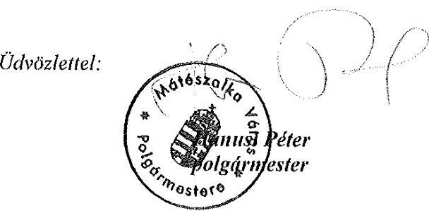

---

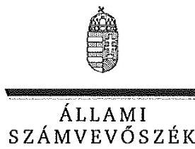

ELHök

Ikt.szám: V-0840-124/2016.

# Hanusi Péter úr 

polgármester
Mátészalka Város Önkormányzata

## Mátészalka

## Tisztelt Polgármester Úr!

Köszönettel vettem a Mátészalkai Távhőszolgáltató Kft. ellenőrzéséről készített számvevőszéki jelentéstervezetre tett észrevételeit.

Az Állami Számvevőszék észrevételekre vonatkozó álláspontjáról a felügyeleti vezető által készített részletes tájékoztatásban kap választ, amelyet levelemhez mellékeltem.

Tájékoztatom Polgármester urat, hogy a figyelembe nem vett észrevételek azok elutasításának indokaival együtt szerepeltetve lesznek a végleges jelentésben.

Budapest, 2016. 05. hó 16. nap
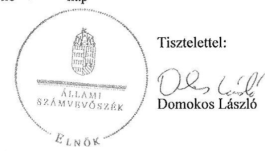

Melléklet: Tájékoztatás az észrevételek kezeléséről

---

# Tájékoztatás az észrevételek kezeléséről 

„Az önkormányzatok gazdasági társaságai - Az önkormányzatok tulajdonában lévő gazdasági társaságok közfeladat-ellátását érintő gazdálkodási tevékenysége szabályszerűségének ellenőrzése Mátészalkai Távhőszolgáltató Kft" címmel készített jelentéstervezetre Polgármester úr észrevételeit megköszönöm. Az észrevételek alapvetően az alábbi három témát érintik.

Polgármester úr észrevételének három témája közül az első a Társaság 2014. évi beszámolójának az FB írásbeli véleményének hiánya miatti szabálytalan elfogadásával kapcsolatban tett alábbi megállapításokat érinti:

Főbb megállapítások, következtetések, javaslatok rész (6. oldal)
„A 2014. évi beszámoló elfogadásakor nem tartották be a Ptk. előírásait, amely szerint a Képviselő-testület, a számviteli beszámolóról az FB írásbeli véleményének birtokában dönthet. Az ügyvezető nem tett eleget az SZMSZ-ben és az Alapító Okiratban előírt kötelezettségének, mivel a Képviselő-testület elé az FB írásbeli véleményét nem tartalmazó beszámolót terjesztett elő. A jegyző nem tett eleget az Mötv.-ben előírt kötelezettségének, mivel nem jelezte a Képviselőtestületnek, hogy a döntésük jogszabálysértő."

### 1.2. megállapítás (16. oldal)

„A 2014. évi beszámoló elfogadásakor nem tartották be a Ptk. 3:120. § (2) bekezdésének előírásait, mely szerint a Képviselő-testület, mint a Társaság legfőbb szerve a számviteli beszámolóról az FB írásbeli véleményének birtokában dönthet. A jegyző nem tett eleget az Mötv. 81. § (3) bekezdés e) pontjában előírt kötelezettségének, mivel nem jelezte a Képviselőtestületnek, hogy a döntésük jogszabálysértő."

### 2.4. számú megállapítás (22. oldal)

Az FB az Ügyrend II/2. pontjában, az Alapító Okirat 10. pontjában, valamint a Ptk. 3:120. § (2) bekezdésében előírtak ellenére a 2014. évi számviteli beszámolóról szóló írásbeli jelentést nem készített. Az ügyvezető nem tett eleget az SZMSZ III/2. pontjában és az Alapító Okirat 9. pontjában előírt kötelezettségének, mivel a Képviselő-testület elé az FB írásbeli véleményét nem tartalmazó beszámolót terjesztett elő.

Az észrevételében ismertetett azon körülményt, hogy az FB egy tag kilépése miatt határozatképtelen lett, tájékoztatásul tudomásul veszem, az azonban a megállapításunk tényszerűségét nem befolyásolja, így észrevételét elfogadni nem tudom. Így az észrevételében kifogásolt, Polgármester úrnak címzett 1. a) javaslatot fenntartom, annak megfelelő végrehajtása elősegíti az Önkormányzat szabályszerű működését.

Polgármester úr további észrevétele az ármegállapítás szabályszerűségére vonatkozó alábbi megállapításunkat érinti:

---

„A díjak mértékét rögzítő 2. számú melléklet utolsó módosítására 2008. október 1-jén került sor, melynek során az alapdíjak mértékét megalapozó - Távhő rendelet 1. számú melléklete szerinti - számításokat nem készítették el. A bevezetésre került és 2011. április 15-ig hatályos - Önkormányzat által meghatározott - legmagasabb árat a Távhő rendelet előírásai ellenére számításokkal nem támasztották alá."

Észrevételében kifejti, hogy a Társaság ügyvezetőjének 2008. szeptember 2-ai előterjesztése a hődíjakra vonatkozóan részletes számításokkal alátámasztott díjat tartalmazott, ami a Távhőrendeletben szereplő árképlet átfordítását jelenti. Az észrevételét elfogadni nem tudom, mivel a megállapításunk az alapdíj mértékét megalapozó számítások hiányára vonatkozik, amellyel kapcsolatban sem az említett előterjesztés, sem pedig az ellenőrzés rendelkezésére bocsátott egyéb dokumentum nem tartalmaz információt.

A Társaság üzletszabályzatával kapcsolatos alábbi megállapításra tett észrevételét elfogadni nem tudom.

# 2.1. számú megállapítás (17. oldal) 

„Az üzletszabályzatot a Tszt. 3. § v) pontja szerinti tartalommal elkészítette és 2010. január 1-jén hatályba léptette a Társaság, azonban a jegyző a szabályzatot a Tszt. 7. § (1) bekezdés a) és b) pontjában előírtak ellenére nem hagyta jóvá, és nem küldte meg véleményezésre a fogyasztóvédelmi hatóságnak."

A jegyzőnek az üzletszabályzat tekintetében a jóváhagyási kötelezettségen túlmutató feladatköre van, hiszen a Tszt 7. § (1) bekezdés c) pontja szerint a jegyzőnek az üzletszabályzatban előírtak betartását is ellenőriznie szükséges, amely feladatának csak jóváhagyott üzletszabályzat esetében tud eleget tenni. Erre való tekintettel azzal kapcsolatban is intézkednie szükséges, hogy a Társaság rendelkezzen jóváhagyott üzletszabályzattal.

A Polgármester úrnak címzett 1. c) javaslattal kapcsolatos észrevételét nem fogadom el. A jegyzőnek ugyanis kötelezettsége őrködni az önkormányzati döntések szabályszerűsége felett. Ebbe beletartozik az is, hogy a Mötv.81.§. (3) bek. e.) pontja szerint jelzéssel éljen, ha a Képviselő testület döntése jogszabálysértő. Ez esetben a jogszabálysértés abban állt, hogy a Társaság beszámolóját az FB írásbeli jelentése nélkül fogadták el. A jegyző felelősségének kivizsgálása során nyilván módjában áll Polgármester úrnak
 az összes körülményt mérlegelve a megfelelő döntést meghozni.

Budapest, 2016. 05. hó 13. nap
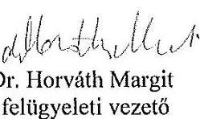

---

# RÖVIDÍTÉSEK JEGYZÉKE 

${ }^{1}$ Szalkatávhő Kft.
${ }^{2}$ Társaság
${ }^{3}$ Alapító Okirat
${ }^{4}$ Önkormányzat
${ }^{5}$ polgármester
${ }^{6}$ jegyző
${ }^{7}$ Áht.
${ }^{8}$ ÁSZ
${ }^{9}$ Ötv.
${ }^{10}$ Mötv.
${ }^{11}$ Képviselő-testület
${ }^{12}$ Tszt.
${ }^{13}$ Távhő rendelet
${ }^{14}$ Gt.
${ }^{15}$ Ptk.
${ }^{16} \mathrm{FB}$
${ }^{17}$ vagyonrendelet ${ }_{1}$
${ }^{18}$ vagyonrendelet ${ }_{2}$
${ }^{19}$ Ügyrend
${ }^{20}$ Taktv.
${ }^{21}$ Bkr.
${ }^{22}$ Számv. tv.
${ }^{23}$ számviteli politika
${ }^{24}$ értékelési szabályzat ${ }_{1}$
${ }^{25}$ értékelési szabályzat ${ }_{2}$
${ }^{26}$ leltárkészítési és leltározási szabályzat
${ }^{27}$ pénzkezelési szabályzat

Mátészalkai Távhőszolgáltató Korlátolt Felelősségű Társaság
Mátészalkai Távhőszolgáltató Korlátolt Felelősségű Társaság
a Szalkatávhő Kft. többször módosított Alapító Okirata
Mátészalka Város Önkormányzata
Mátészalka Város Önkormányzatának polgármestere
Mátészalka Város Önkormányzatának jegyzője
az államháztartásról szóló 2011. évi CXCV. törvény (hatályos: 2011. december 31-étől)
Állami Számvevőszék
a helyi önkormányzatokról szóló 1990. évi LXV. törvény (hatálytalan: 2014. október 12-től)
Magyarország helyi önkormányzatairól szóló 2011. évi CLXXXIX. törvény (hatályos: 2012. január 1-jétől)
Mátészalka Város Önkormányzatának Képviselő-testülete
a távhőszolgáltatásról szóló 2005. évi XVIII. törvény
Mátészalka Város Önkormányzatának többször módosított, a távhőszolgáltatási díjak megállapításáról és alkalmazásáról valamint a távhőszolgáltatás egyes kérdéseiről szóló 28/2006. (XII.1.) számú rendelete
a gazdasági társaságokról szóló 2006. évi IV. törvény (hatálytalan: 2014. március 15-től)
a Polgári Törvénykönyvről szóló 2013. évi V. törvény (hatályos: 2014. március 15-től)
a Szalkatávhő Kft. felügyelő bizottsága
Mátészalka Város Önkormányzatának az Önkormányzat vagyonáról, a vagyontárgyak feletti tulajdonosi jogok gyakorlásáról szóló 20/2006. (VIII. 8.) számú rendelete (hatályos: 2012. október 30-ig)
Mátészalka Város Önkormányzatának az Önkormányzat vagyonáról, a vagyontárgyak feletti tulajdonosi jogok gyakorlásáról szóló 21/2012. (X. 19.) számú rendelete (hatályos: 2012. október 31-től)
a Szalkatávhő Kft. felügyelő bizottságának ügyrendje (hatályos: 2007. szeptember 15-től)
a köztulajdonban álló gazdasági társaságok takarékosabb működéséről szóló 2009. évi CXXII. törvény
a költségvetési szervek belső kontrollrendszeréről és belső ellenőrzéséről szóló 370/2011. (XII. 31.) Korm. rendelet (hatályos: 2012. január 1-jétől)
a számvitelről szóló 2000. évi C. törvény
a Szalkatávhő Kft. számviteli politikája (hatályos: 2010. január 1-jétől)
a Szalkatávhő Kft. 2010. január 1-jétől 2012. december 31-ig hatályos értékelési szabályzata
a Szalkatávhő Kft. 2013. január 1-jétől hatályos értékelési szabályzata
a Szalkatávhő Kft. eszközök és források leltárkészítési és leltározási szabályzata (hatályos: 2010. január 1-jétől)
a Szalkatávhő Kft. pénzkezelési szabályzata (hatályos: 2010. január 1-jétől)

---

${ }^{28}$ SZMSZ
${ }^{29}$ Eisztv.
${ }^{30}$ Info tv.
${ }^{31}$ Avtv.
${ }^{32} 1/2013$. számú ügyvezetői utasítás
${ }^{33}$ 50/2011. (IX. 30.) NFM rendelet
${ }^{34}$ 51/2011. (IX. 30.) NFM rendelet
${ }^{35}$ ÁSZ tv.
a Szalkatávhő Kft. szervezeti és működési szabályzata (hatályos: 2008. január 1-jétől)
az elektronikus információszabadságról szóló 2005. évi XC. törvény (hatályos: 2011. december 31-ig)
az információs önrendelkezési jogról és az információszabadságról szóló 2011. évi CXII. törvény (hatályos: 2011. július 27-től)
a személyes adatok védelméről és a közérdekű adatok nyilvánosságáról szóló 1992. évi LXIII. törvény (hatálytalan 2012. január 1-jétől)
a követelések értékelésének elszámolásáról szóló 1/2013. számú ügyvezetői utasítás
a távhőszolgáltatónak értékesített távhő árának, valamint a lakosság felhasználónak és a külön kezelt intézménynek nyújtott távhőszolgáltatás díjának megállapításáról (hatályos: 2011. október 1-jétől)
a távhőszolgáltatás támogatásáról szóló 51/2011. (IX. 30.) NFM rendelet (hatályos: 2011. október 1.)
2011. évi LXVI. törvény az Állami Számvevőszékről, hatályos 2011. július 1-jétől

---

# ÁLLAMI SZÁMVEVŐSZÉK 

1052 Budapest, Apáczai Csere János utca 10.
Levélcím: 1364 Budapest 4. Pf. 54
Telefon: +36 14849100 Telefax: +36 14849200
www.asz.hu
