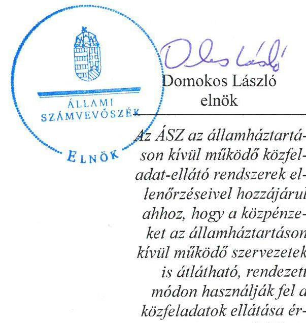
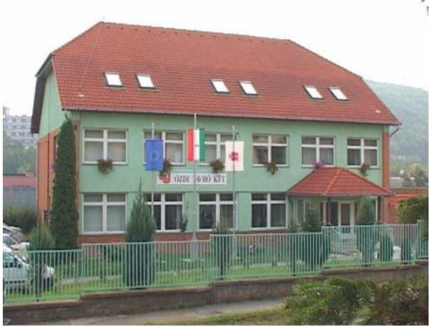
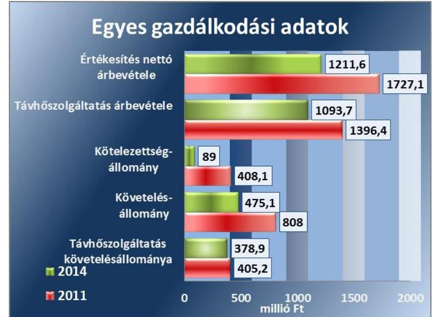
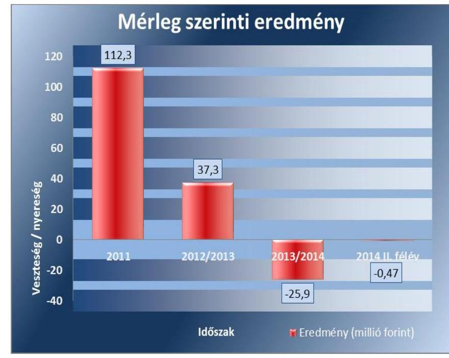
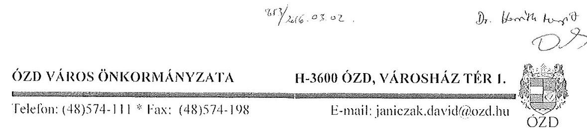
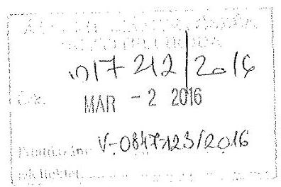
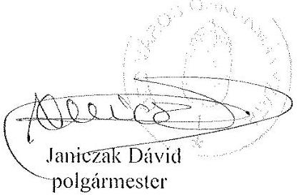
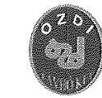

# Jelentés 

## Az önkormányzatok gazdasági társaságai

Az önkormányzatok többségi tulajdonában lévő gazdasági társaságok közfeladat ellátását érintő gazdálkodási tevékenysége szabályszerűségének ellenőrzése
Ózdi Távhőtermelő és Szolgáltató Kft. 2016.

Az ÁSZ az államháztartáson kívül működő közfeladat-ellátó rendszerek ellenőrzéseivel hozzájárul ahhoz, hogy a közpénzeket az államháztartáson kívül működő szervezetek is átlátható, rendezett módon használják fel a közfeladatok ellátása érdekében.

---

# Jelentés 

## Az önkormányzatok gazdasági társaságai

Az önkormányzatok többségi tulajdonában lévő gazdasági társaságok közfeladat ellátását érintő gazdálkodási tevékenysége szabályszerűségének ellenőrzése
Ózdi Távhőtermelő és Szolgáltató Kft.
2016. minciws hó 24. nap

---

# AZ ELLENŐRZÉST FELÜGYELTE:

DR. HORVÁTH MARGIT felügyeleti vezető

## AZ ELLENŐRZÉST VEZETTE ÉS A VÉGREHAJTÁSÁÉRT FELELŐS:

- KLINGA LÁSZLÓ ellenőrzésvezető
- A PROGRAM ÖSSZEÁLLÍTÁSÁÉRT FELELŐS:
- LAJTERNÉ HUDÁK MAGDOLNA osztályvezető

IKTATÓSZÁM: V-0847-124/2016.

TÉMASZÁM: 1881

ELLENŐRZÉS-AZONOSÍTÓ SZÁM: V-070702

Jelentéseink az Országgyűlés számítógépes hálózatán és az Interneten a www.asz.hu címen is olvashatóak.

---

# TARTALOMJEGYZÉK 

■ ÖSSZEGZÉS ..... 5
■ AZ ELLENŐRZÉS CÉLJA ..... 7
■ AZ ELLENŐRZÉS TERÜLETE ..... 8
■ AZ ELLENŐRZÉS HÁTTERE, INDOKOLTSÁGA ..... 10
■ FÓKUSZKÉRDÉSEK ..... 11
■ ELLENŐRZÉS HATÓKÖRE ÉS MÓDSZEREI ..... 12
■ MEGÁLLAPÍTÁSOK ..... 14
■ JAVASLATOK ..... 28
■ MELLÉKLETEK ..... 29
I. Sz. melléklet: Értelmező szótár ..... 29
II. Sz. melléklet: Működési adatok ..... 31
■ FÜGGELÉK: ÉSZREVÉTELEK ..... 33
■ RÖVIDÍTÉSEK JEGYZÉKE ..... 37

---

.

---

# ÖSSZEGZÉS 

Az Állami Számvevőszék az Ózdi Távhő Kft. ${ }^{1}$ távhőszolgáltatási közfeladat ellátását érintő gazdálkodási tevékenysége 2011-2014 közötti szabályszerűségét ellenőrizte. Megállapította, hogy a közfeladat-ellátás önkormányzati megszervezése és a tulajdonosi jogok gyakorlása szabályosan történt. A szabályszerű vagyongazdálkodás biztosítása mellett a távhőszolgáltatás közfeladatának bevételeinek, ráfordításainak elszámolása és elkülönítése megfelelő volt. Az önköltségszámítás rendjének előírásoknak megfelelő szabályozása elősegítette a szabályszerű díjszámítást és elszámolást. A Társaság² kötelezettségállománya a közfeladat-ellátásra nem jelentett kockázatot.

## Az ellenőrzés társadalmi indokoltsága

Az Állami Számvevőszék középtávra szóló stratégiájában megfogalmazta, hogy a helyi önkormányzatok gazdálkodásában rejlő pénzügyi kockázatok feltárásával, az államháztartáson kívülre nyújtott költségvetési támogatások és ingyenes vagyonjuttatások, valamint az államháztartáson kívül működő közfeladat-ellátó rendszerek ellenőrzéseivel hozzájárul ahhoz, hogy a közpénzeket az államháztartáson kívül működő szervezetek is átlátható, rendezett módon használják fel a közfeladatok szerződésben vállalt ellátása érdekében.

Magyarországon az intézmény-centrikus közfeladat-ellátás jellemző, de egyre jelentősebb a költségvetésen kívüli feladatellátás térnyerése. Ennek legfontosabb szereplői - a nonprofit szervezetek mellett - az önkormányzati tulajdonú gazdasági társaságok. Az önkormányzatok szervezetalakítási szabadságának következménye, hogy a korábban is vállalati formában működő közszolgáltatások mellett, mind a kötelező, mind az önként vállalt feladatok ellátásában a gazdasági társaságok kiemelt fontosságú szerephez jutottak.

## Főbb megállapítások, következtetések, javaslatok

Az Önkormányzat a közigazgatási területén a távhőszolgáltatás közfeladatának megszervezéséről a jogszabályi előírásoknak megfelelően döntött, annak ellátásáról a kizárólagos tulajdonában lévő gazdasági társasága útján gondoskodott. Az Önkormányzat az Alapító Okiratban és a vagyongazdálkodási rendelet ${ }_{1,2}$-ben meghatározta a tulajdonosi joggyakorlás szabályait, amit az előírásoknak megfelelően, szabályszerűen gyakorolt. Az Önkormányzat a feladatellátáshoz szükséges vagyont az ellenőrzött időszakot megelőzően apportként biztosította, továbbá 2013-tól üzemeltetési szerződés alapján adott át a Társaságnak 18,6 millió Ft értékben távhővezetéket. A Képviselő-testület a tulajdonosi ellenőrzési, beszámoltatási kötelezettségét az FB-n keresztül, az előírásoknak megfelelően, szabályszerűen gyakorolta. Az Ózdi Távhő Kft. és az Önkormányzat a KEOP pályázaton elnyert beruházási támogatásra kötött támogatási szerződés aláírásának feltételét teljesítve 2012-ben Közszolgáltatási szerződést kötött.

A közfeladat-ellátását szolgáló vagyonnal való gazdálkodás, annak nyilvántartása szabályszerű volt. Az Önkormányzat a távhőszolgáltatásra vonatkozóan a Tszt. szerinti rendeletalkotási kötelezettségének eleget tett, annak tartalma megfelelt a jogszabályban előírtaknak. A Társaság rendelkezett a Számv. tv. előírásainak megfelelő számviteli szabályzatokkal, amelyek elősegítették a szabályszerű működést és vagyongazdálkodást. Az üzletszabályzat a helyi szolgáltatási sajátosságok figyelembe vételével szabályozta a Társaság feladatait. Az Ózdi Távhő Kft. vagyona az ellenőrzött időszakban növekedett, a kötelezettség állomány jelentősen, közel 32%-kal csökkent, amelyek túlnyomórészt rövid lejáratúak voltak. A kötelezettségek állománya a működésre, a közfeladat-ellátásra nem jelentett kockázatot. A Társaságnak a beszámolási időszakok végén nem volt határidőn túli szállítói tartozása. A távhőszolgáltatás

---

hátralékos követelésállománya alapvetően nem változott 405 millió Ft és 437 millió Ft között mozgott. A követelésállományon belül a lakossági felhasználók hátralékos követelésállománya a 2011. évi 289,4 millió Ft-ról a 2014. év végére 345,8 millió Ft-ra nőtt. A Társaság a 2011. és a 2012/2013. üzleti években nyereségesen gazdálkodott, míg a 2013/2014. üzleti évben veszteségesen gazdálkodott, ebben az időszakban a mérleg szerinti eredmény -25,9 millió Ft volt.

Az Ózdi Távhő Kft. az üzleti tervek teljesítéséről, az üzleti év gazdálkodásáról, az éves beszámolók és üzleti jelentések keretében beszámolt a tulajdonosnak a Számv. tv.-ben és az Alapító Okiratban előírtaknak megfelelően. A Képviselő-testület a könyvvizsgálót a Társaság beszámolóit tárgyaló üléseire meghívta. A könyvvizsgáló a Gt.-ben és a Ptk.-ban előírtak ellenére az ellenőrzött időszakban nem vett részt a Társaság számviteli törvény szerinti beszámolóját tárgyaló Képviselő-testületi üléseken. Ezzel megakadályozta, hogy a Képviselő-testület a könyvvizsgálói véleményen túlmenően, annál részletesebb ismeretek alapján alakíthassa ki az álláspontját és tisztázhassa az esetlegesen eltérő pénzügyi-gazdálkodási összefüggéseit. Összességében korlátozta a megalapozott tulajdonosi joggyakorlást. A Társaságnál a bevételek, költségek és ráfordítások elszámolása szabályszerű volt, figyelembe véve a jogszabályok és belső szabályozások előírásait. Az önköltségszámítás szabályozása megfelelt az előírásoknak, amely alapján az alkalmazott módszer biztosította a közszolgáltatás díjának megalapozottságát és a szabályszerű árképzést.

Megállapításaink alapján Ózd város polgármesterének egy javaslatot fogalmaztunk meg annak érdekében, hogy a könyvvizsgáló tegyen eleget részvételi kötelezettségének a Társaság beszámolóját megtárgyaló Képviselő-testületi ülésen.

---

# AZ ELLENŐRZÉS CÉLJA 

## Az önkormányzatok gazdasági társaságai - Az önkormányzatok többségi tulajdonában lévő gazdasági társaságok közfeladat-ellátását érintő gazdálkodási tevékenysége szabályszerűségének ellenőrzése - Ózdi Távhőtermelő és Szolgáltató Kft.

Az ellenőrzés célja annak értékelése, hogy az Önkormányzat a jogszabályi előírások figyelembevételével döntött-e az ellenőrzésre kerülő közfeladat megszervezéséről; az önkormányzat/tulajdonosi joggyakorló szabályszerűen gyakorolta-e a tulajdonosi jogokat.

Ellenőriztük, hogy a gazdasági társaság közfeladat-ellátása bevételeinek, ráfordításainak elszámolása, és vagyongazdálkodási tevékenysége megfelelt-e a jogszabályi, illetve a közszolgáltatási/vagyonkezelési szerződésben foglalt tulajdonosi előírásoknak, azok végrehajtása szabályszerű volt-e.

Értékeltük továbbá, hogy a gazdasági társaság kötelezettségállománya jelent-e kockázatot a működésre, illetve a közfeladat ellátására; valamint hogy a közfeladatok átláthatósága és elszámoltathatósága érdekében biztosítva volt-e a közszolgáltatás díjának megalapozottsága szabályszerű önköltségszámítással.

---

# **AZ ELLENŐRZÉS TERÜLETE**

## **Ózd Város Önkormányzata és az Ózdi Távhőtermelő és Szolgáltató Kft.**

Ózdon a távhőszolgáltatással kapcsolatos önkormányzati feladatokat az Ózdi Távhő Vállalat átalakításával, az 1996-ban létrehozott Ózdi Távhő Kft. látta el. Az Önkormányzat³ 100%-os tulajdonában lévő Ózdi Távhő Kft. alaptevékenysége Ózd város közigazgatási területén a távhőszolgáltatás biztosítása, hőenergia termelése, értékesítése, fűtésszolgáltatás, valamint az alaptevékenységhez kapcsolódó építési, szerelési, karbantartási és javítási munkák ellátása volt. A Társaság a mintegy 34 000 fő állandó lakossal rendelkező Ózd város távhőszolgáltatási közfeladatát saját eszközökkel, illetve az Önkormányzattól a 2013. évtől 18,6 millió Ft értékű üzemeltetésre átvett eszközökkel biztosította. A Társaság az üzleti évet 2012 félévtől, 2014 félévig a naptári évtől eltérően alkalmazta, annak fordulónapja június 30-a volt. A Társaságnál foglalkoztatottak átlagos statisztikai állományi létszáma a 2011. évi 65 főről a 2014. évre 69 főre nőtt.

**AZ ÓZDI TÁVHŐ KFT.** két telephelyen üzemelt. A 110 db saját tulajdonú hőközpont biztosította a fűtés ellátást 5 550 lakossági, ebből 3 900 db melegvízzel ellátott, 176 db különkezelt intézményi és egyéb felhasználó (óvoda, iskola, egészségügyi intézmény, kereskedelmi egység), valamint 159 db kisközületi fogyasztónál.

A Társaság gazdálkodására vonatkozó egyes adatokat a 2011. és a 2014. évek összehasonlításában az 1. ábra szemlélteti.

1. ábra

*Forrás: A Társaság 2011. és 2014. évi beszámolói*

---

A Társaság értékesítésének nettó árbevétele, amelynek meghatározó része a távhőszolgáltatás bevétele a 2014. évben - 2011. évhez képest közel 516 millió Ft-tal csökkent. Ezt legjelentősebben a lakossági távhőszolgáltatás díjának és a tervezett hőfelhasználásnak a csökkenése befolyásolta. A kötelezettségek állománya ugyanebben az időszakban a szállítói tartozások csökkenése miatt több mint egyötödére csökkent. A távhőszolgáltatással összefüggésben keletkezett hátralékos követelések év végi összege a megtett intézkedések hatására nem növekedett. A Társaságnak más gazdasági társaságban tulajdoni részesedése nem volt.

Az ellenőrzött időszakban a polgármester személye a 2014. évi önkormányzati választások óta, az ügyvezető személye 2011. június 1-jétől változott.

---

# AZ ELLENŐRZÉS HÁTTERE, INDOKOLTSÁGA 

## Az önkormányzatok közfeladat-ellátásában egyre jelentősebb a gazdasági társaságokon belüli feladatellátás térnyerése

AZ ÁSZ STRATÉGIÁJÁBAN megfogalmazta, hogy a helyi önkormányzatok gazdálkodásában rejlő pénzügyi kockázatok feltárásával, az államháztartáson kívülre nyújtott költségvetési támogatások és ingyenes vagyonjuttatások, valamint az államháztartáson kívül működő közfeladat-ellátó rendszerek ellenőrzéseivel hozzájárul ahhoz, hogy a közpénzeket az államháztartáson kívül működő szervezetek is átlátható, rendezett módon használják fel a közfeladatok szerződésben vállalt ellátása érdekében.

Az Áht. ${ }^{4}$ 1. § (3) bekezdése értelmében az államháztartáson kívüli szervezetek a közfeladatok ellátásában - jogszabályban meghatározott feltételekkel - közreműködhetnek. Az önkormányzati tulajdonú gazdasági társaságok teljes körű ellenőrzésének lehetőségét az Állami Számvevőszékről szóló 1989. évi XXXVIII. törvény 2011. január 1-jétől hatályos módosítása teremtette meg. A gazdasági társaságok közfeladat ellátását érintő gazdálkodási tevékenysége szabályszerűségére irányuló ellenőrzéseket erre tekintettel a 2011. évtől végezzük.

## AZ ELLENŐRZÉS VÁRHATÓ HASZNOSULÁSA-

KÉNT az ÁSZ ${ }^{5}$ a megállapításaival segítséget nyújthat az államháztartáson kívüli közfeladat-ellátás értékeléséhez, jogszabályi keretei pontosításához, átláthatóságot biztosító szabályozásához. Meghatározhatóvá válnak a közfeladat ellátásban részt vevő államháztartáson kívüli szervezeteknek az önkormányzat költségvetését, pénzügyi helyzetét is befolyásoló kockázatai, lehetővé válik ezen kockázatok csökkentése.

Értékelhetővé válik, hogy a feladatot ellátó gazdasági társaság a közszolgáltatási szerződésben foglaltak betartásával, a közvagyon használatával biztosította-e a szolgáltatás folytatásának feltételeit. Ezzel az ellenőrzöttek és a helyi döntéshozók számára az ÁSZ visszajelzést ad feladatszervezési, feladat-ellátási kockázataikról, alapot ad a meglévő hibák megszüntetéséhez, a jobb közfeladat-ellátás biztosításához. Mindezeken keresztül az ÁSZ hozzájárul Magyarország közpénzügyi helyzetének javításához, a közpénzek mérhető módon történő, a döntéshozók által meghatározott célok szerinti felhasználásához.

---

# FÓKUSZKÉRDÉSEK 

1. Az önkormányzat közfeladat megszervezéséről szóló döntése, valamint tulajdonosi joggyakorlása szabályszerű volt-e?
2. A gazdasági társaság vagyongazdálkodása szabályszerű volt-e, kötelezettségállománya jelentett-e kockázatot a működésre, illetve a közfeladat ellátásra?
3. A gazdasági társaságnál az ellátott közfeladat bevételei és ráfordításai elszámolása, valamint az önköltségszámítás és árképzés szabályszerű volt-e?

---

# ELLENŐRZÉS HATÓKÖRE ÉS MÓDSZEREI 

## Az ellenőrzés típusa

Megfelelőségi ellenőrzés

## Az ellenőrzött időszak

A 2011. január 1-jétől 2014. december 31-éig terjedő időszak.

## Az ellenőrzés tárgya

A közfeladatot gazdasági társaságokkal ellátó önkormányzatok tulajdonosi joggyakorlása, valamint gazdasági társaságok pénz- és vagyongazdálkodásának szabályozottsága és szabályszerűsége.

Az ellenőrzés kiterjed minden olyan körülményre és adatra, amely az ÁSZ jogszabályban meghatározott feladatainak teljesítéséhez, valamint a program végrehajtása folyamán felmerült újabb összefüggések feltárásához szükséges.

## Az ellenőrzött szervezet

Ózd Város Önkormányzata és az Ózdi Távhőtermelő és Szolgáltató Korlátolt Felelősségű Társaság

## Az ellenőrzés jogalapja

Az ellenőrzés végrehajtásának jogszabályi alapját az Állami Számvevőszékről szóló 2011. évi LXVI. törvény 5. § (3)-(4)-(5) bekezdései képezték.

## Az ellenőrzés módszerei

Az ellenőrzést a nemzetközi standardokat irányadónak tekintve az ellenőrzési program ellenőrzési kérdései, az ellenőrzött időszakban hatályos jogszabályok, az ellenőrzés
 szakmai szabályok és módszertanok figyelembe vételével végeztük.

Az ellenőrzés ideje alatt az ellenőrzött szervezettel történő kapcsolattartást az ÁSZ Szervezeti és Működési Szabályzatának vonatkozó előírásai alapján biztosítottuk.

---

Az ellenőrzés a kiválasztott, többségi tulajdonosi jogokat gyakorló önkormányzatra, illetve az ellenőrzött közfeladatot ellátó gazdasági társaságra terjedt ki. Az ellenőrzött gazdasági társaságnál, amennyiben az több közfeladatot is ellát, akkor az ellenőrzésre kiválasztott közfeladat-ellátást ellenőriztük.

Az ellenőrzést a kérdésekre adott válaszok kiértékelésével, valamint a megjelölt adatforrások, a csatolt tanúsítványok felhasználásával, továbbá az adott időszakban hatályos jogszabályok figyelembe vételével folytattuk le. Az ellenőrzési kérdések megválaszolásához szükséges bizonyítékok megszerzése a következő ellenőrzési eljárások alkalmazásával történt: megfigyelés, kérdésfeltevés (információkérés), összehasonlítás, valamint elemző eljárás.

A bevételek és ráfordítások elszámolása, valamint a vagyonnyilvántartás terén az egyes területek szabályszerű működését mintavétellel ellenőriztük, ez alapján a sokaságokban előforduló hibás tételek arányát becsültük. A jogszabályoknak és a belső előírásoknak megfelelőnek, azaz szabályszerűnek tekintettük az adott bevételek és ráfordítások elszámolását, a vagyonnyilvántartást, amennyiben a minta ellenőrzésének eredménye alapján 95%-os bizonyossággal a teljes sokaságban a hibás tételek aránya kisebb volt, mint 10%, nem megfelelőnek értékeltük, ha a hibás tételek aránya a 10%-ot meghaladta. Kockázatot, illetve magas kockázatot jeleztünk, amennyiben egy adott terület vonatkozásában a minta alapján a teljes sokaságban nem volt teljes körűen biztosított a jogszabályoknak és a belső szabályzatoknak megfelelő működés.

---

# 1. Az önkormányzat közfeladat megszervezéséről szóló döntése, valamint tulajdonosi joggyakorlása szabályszerű volt-e? 

Összegző megállapítás

Az Önkormányzat a távhőszolgáltatás megszervezésével, közfeladatának ellátásával kapcsolatos döntései a jogszabályi és a belső előírásokkal összhangban voltak, a tulajdonosi jogokat szabályszerűen gyakorolta.
1.1. számú megállapítás

A közfeladat-ellátás megszervezésére vonatkozó döntés és annak előkészítése az Önkormányzat rendeleteiben foglaltakkal összhangban történt, az Önkormányzat a távhőszolgáltatásra vonatkozó rendeletalkotási kötelezettségét szabályszerűen teljesítette.

Az Ötv 6. 91. § (6) bekezdése, 2013. január 1-jétől az Mötv7. 116. § (3)-(4) bekezdései szerint az önkormányzatnak a gazdasági programjában kell meghatároznia azon célkitűzéseket, amelyek az ellátandó feladatok biztosítását, fejlesztését szolgálják. A Képviselő-testület8 a 2011-2014. évekre elfogadott gazdasági programban a távhőszolgáltató rendszer fejlesztésével kapcsolatban stratégiai célként a hőtermelés gáz tüzelőanyag forrásának biomassza felhasználásával történő diverzifikálását, fejlesztési prioritások között a szolgáltatói hőközpontok kiváltását és modernizálását, távvezetéki felújításokat határozták meg.

## A TÁVHŐSZOLGÁLTATÁSSAL ELLÁTOTT LÉTESÍTMÉNYEK távhőellátásának távhő-szolgáltatásra engedéllyel rendelkezők útján történő biztosítása a Tszt9. 6. § (1) bekezdése értelmében a területileg illetékes települési önkormányzat kötelező feladata. A közszolgáltatás ellátását az Önkormányzat a 100%-os tulajdonában lévő gazdasági társasága, az Őzdi Távhő Kft. útján biztosította.

Az Őzdi Távhő Kft. KEOP10 pályázaton elnyert 104,1 millió Ft beruházási támogatásra kötött támogatási szerződés aláírásának feltételét teljesítve 2012. május 4-én Közszolgáltatási szerződést11 kötött az Önkormányzattal, melyben a közszolgáltatás ellátásának feltételeit rögzítették.

A Közszolgáltatási szerződésben a felek megállapodtak, hogy a Társaság köteles a közszolgáltatást a projekt befejezését követő öt naptári évig - 2018. december 31-éig - a vonatkozó jogszabályi előírásoknak megfelelően működtetni és fenntartani. A Közszolgáltatási szerződésben az Önkormányzat kötelezettséget vállalt arra, hogy rendeletalkotási jogkörében eljárva nem hoz olyan döntést, amely a támogatás célját, vagy fenntartási időszak alatti kötelezettségeit veszélyezteti. A Közszolgáltatási szerződésben meghatározták a szerződés időtartamát, ellátási területét, valamint a közszolgáltató jogait és az általa teljesítendő kötelezettségeket.

---

# AZ ÓZDI TÁVHŐ KFT. TÁVHŐ ELLÁTÁSRA VONATKOZÓ JOGAIT az Alapító Okirat12 előírásai biztosították. A Képviselő-testület az ellenőrzött időszakban több alkalommal módosította az Alapító Okiratot, így az FB13 tagok és a könyvvizsgáló személyi változása, az üzleti év, illetve a mérleg fordulónapjának módosítása, valamint a jogszabályokban bekövetkező módosulások átvezetése miatt. A távhőszolgáltatás körében ellátandó fő és egyéb tevékenységeket az Alapító Okiratban rögzítették, a közfeladat ellátásának követelményeit 2012. május hónaptól - egymással összhangban - a Közszolgáltatási szerződésben, valamint a távhőszolgáltatási rendelet14,15-ben szabályozták.

Az Önkormányzat a távhőszolgáltatásra vonatkozóan a Tszt. 6. § (2) bekezdése szerinti rendeletalkotási kötelezettségének a távhőszolgáltatási rendelet1,2 megalkotásával eleget tett.

## A TÁVHŐSZOLGÁLTATÁSI RENDELET1,2-BEN

SZABÁLYOZTÁK a távhőszolgáltató működésének feltételeit, tájékoztatási kötelezettségét, a közüzemi szerződés tartalmára és annak felmondására, megszegésére vonatkozó előírásokat, valamint a közszolgáltatás bekapcsolását, mérését, vételezését és elszámolását érintő kérdéseket. Meghatározták továbbá, az ármegállapítás és díjfizetés követelményeit, a csatlakozási díjakat, a számlázással kapcsolatos kifogások rendezését, a díjfizetés elmulasztásának következményeit a Tszt. 6. § (1) bekezdés a)-i) pontjaiban előírtaknak megfelelően.

Az Ózdi Távhő Kft. a 2013. évtől az Önkormányzat tulajdonában lévő, 18,6 millió Ft értékű távhővezetéket üzemeltetési szerződés alapján használatba vette. Az Önkormányzat az üzemeltetési szerződésben negyedéves és éves beszámolási és éves leltározási kötelezettséget írt elő az üzemeltetésbe átadott eszközök vonatkozásában.
1.2. számú megállapítás

Az Önkormányzat szabályszerűen teljesítette a tulajdonosi ellenőrzési, beszámoltatási kötelezettségét, a közfeladat-ellátás felügyeletét.

A TULAJDONOSI JOGOK GYAKORLÁSÁNAK
RENDJÉT a Képviselő-testület az Alapító Okiratban határozta meg. A Társaság feletti tulajdonosi jogokat a Képviselő-testület gyakorolta. Ennek megfelelően az Alapító kizárólagos jogkörébe tartozott - többek között - a Társaság számviteli törvény szerinti beszámolójának jóváhagyása, a nyereség felosztásáról szóló döntés meghozatala, a törzstőke felemelése, leszállítása, az ügyvezető és a könyvvizsgáló megválasztása, visszahívása, az FB létrehozása. Az Önkormányzati vagyontárgyak feletti rendelkezési jogát a Képviselő-testület a vagyongazdálkodási rendelet1,16,2,17-ben írta elő.

AZ ÓZDI TÁVHŐ KFT. FB-JE az Alapító Okiratban foglaltak alapján a Gt. 34. § (1) bekezdésének előírását figyelembe véve négy tagból állt. Az FB az ellenőrzött időszakban a Gt. 34. § (4) bekezdésben foglaltaknak megfelelően az ügyrendjét megállapította, melyet a Képviselő-testület határozatban elfogadott. A Képviselő-testület az FB jogkörét az Alapító Okiratban meghatározta, amely alapján az ügyvezető igazgatótól és az alkalmazottaktól felvilágosítást kérhetett, a Társaság könyveit és iratait ellen-

---

őrizhette. Az Önkormányzat a tulajdonosi ellenőrzési, beszámoltatási kötelezettségét az FB működésén keresztül az Alapító Okiratban foglaltak szerint biztosította. Az üzleti terveket, az éves beszámolókat, az üzleti jelentéseket és a független könyvvizsgálói jelentéseket a Társaság megküldte az Önkormányzat részére az FB írásos jelentésével együtt.

AZ ANYAGI ÖSZTÖNZÉSI RENDSZERT a Taktv18. 5. § (3) bekezdésében előírtakkal összhangban javadalmazási szabályzatban19 határozták meg, amit a Képviselő-testület határozatban* jóváhagyott. A szabályozás tartalmazta az ügyvezető, az FB tagok, valamint a vezető állású munkavállalók javadalmazásának módját, mértékét, illetve jutalmazásuk feltételeit és rendjét. Az ügyvezető, az FB, valamint vezető állású munkavállalók részére prémium kifizetés nem történt.

# A TÁVHŐSZOLGÁLTATÁS ÁRKÉPZÉSÉNEK SZABÁLYAIT a Képviselő-testület a távhőszolgáltatási díjrendeletben20 határozta meg. A távhőszolgáltatás 2011. április 15-éig olyan hatósági áras szolgáltatás volt, amelynek legmagasabb árait mindenkor az önkormányzatoknak kellett előírniuk. Ennek a kötelezettségnek az Önkormányzat eleget tett. A távhőszolgáltatási díjrendeletben az Ámt21. 7. § (1) bekezdésének mellékletében előírtaknak megfelelően meghatározták a távhőszolgáltatás legmagasabb fogyasztói árát az alapdíjra és a hődíjra, valamint a csatlakozási díjra vonatkozóan. Az árakra vonatkozó döntést számításokkal, kalkulációkkal alátámasztották, amelyet a Képviselő-testület felülvizsgált és jóváhagyott.

A BESZÁMOLTATÁSI RENDSZERT az Önkormányzat megfelelően működtette és évente beszámoltatta a Társaságot annak gazdálkodásáról és közszolgáltatási tevékenységéről. A beszámolási kötelezettség teljesítésére vonatkozó szabályokat az Alapító Okiratban, valamint 2012. május hónaptól - a Közszolgáltatási szerződésben rögzítették. Az ellenőrzött időszakban az Alapító Okiratban foglaltak szerint az alapító kizárólagos hatáskörébe tartozott a beszámoló elfogadása és a nyereség felosztása. A Képviselő-testület, figyelembe véve a Számv. tv22. 11. § (2) bekezdésében előírtakat határozatban* döntött arról, hogy a 2012. évtől kezdődően a Társaság üzleti éve a naptári évtől eltér. A Társaság üzleti évének mérlegforduló napja június 30-a lett, amelyet az Alapító Okiratban is rögzítettek. Az Alapító Okirat 83/2014 (V. 28.) számú módosításának megfelelően a Társaság üzleti éve a 2014. évtől kezdődően a naptári évvel ismét megegyezett. Erre tekintettel a Társaság a 2014. évben két beszámolót készített, a 2013-2014. év lezárására 2014. június 30-ai mérlegfordulónappal és 2014. naptári évre vonatkozóan 2014. december 31-ei nappal. A beszámolás határidejét az Alapító Okiratban, valamint annak módosításaiban az üzleti évnek és annak változásainak megfelelően határozták meg.

Az Ózdi Távhő Kft. a 2011-2014. üzleti éveiről készített beszámolóit a Képviselő-testület megtárgyalta és elfogadta. A Képviselő-testület a beszámoló elfogadásáról a Gt. 35. § (3) bekezdésének és a Ptk.23 3:120. § (2)

[^0]
[^0]:    * A Képviselő-testület 161/2008. (VI. 27.) számú határozata.
    +A Képviselő-testület 7/2012. (II. 16.) számú határozata.

---

bekezdésének vonatkozó előírásait betartva, minden évben az FB írásos jelentésének birtokában döntött.

BELSŐ ELLENŐRZÉST az Önkormányzat az ellenőrzött időszakban az Ózdi Távhő Kft.-nél egy alkalommal végzett. A belső ellenőrzés a 2014. évi belső ellenőrzési munkatervnek megfelelően ellenőrizte a Társaságnál a telefon és gépjárműhasználat rendjét, szabályozását. Az ellenőrzési jelentésben javaslatot tettek a menetlevelek szabályos vezetésére. Az ellenőrzés megállapításaira vonatkozó intézkedési terv készítését nem írták elő.

A veszteség rendezésére (a saját tőke/jegyzett tőkemutató szintjének a Gt. 51. §-a szerinti előírása alapján) az Önkormányzatnak intézkedési kötelezettsége nem keletkezett, mert a Társaság saját tőkéjének összege két egymást követő lezárt évben nem csökkent a jegyzett tőke meghatározott szintje alá. A Képviselő-testület a 2011. évi adózott eredményből 134,0 millió Ft osztalék kifizetéséről és 112,3 millió Ft eredménytartalékba helyezéséről határozott. A 2012-2014. évek gazdálkodási eredményére vonatkozóan a 2012. évben 11,7 millió Ft, a 2013. évben 37,3 millió Ft, a 2014. évben -26,0 millió Ft, a 2015. évben -0,5 millió Ft eredménytartalékba helyezéséről határozatokban szabályosan döntött.

A mérleg szerinti eredmény összegét a 2. ábra mutatja be.
2. ábra

Forrás: a Társaság beszámolói
A Társaság mérleg szerinti eredményét legnagyobb mértékben az értékesítés nettó árbevétele és az egyéb bevételek folyamatos csökkenése befolyásolta. Az Önkormányzat az Ózdi Távhő Kft. által felvett hitelekhez, vállalt pénzügyi kötelezettségekhez kapcsolódóan garanciát és kötelezettséget nem vállalt.

---

# 2. A gazdasági társaság vagyongazdálkodása szabályszerű volt-e, kötelezettségállománya jelentett-e kockázatot a működésre, illetve a közfeladat ellátásra? 

Összegző megállapítás

2.1. számú megállapítás

A Társaság vagyongazdálkodása szabályszerű volt, kötelezettségállománya működési, közfeladat-ellátási kockázatot nem jelentett.

A gazdálkodási szabályzatokat a jogszabályi előírásoknak megfelelően elkészítették, a gazdálkodás szabályozása biztosította a közfeladat ellátás bevételeinek és ráfordításainak elkülönítését.

AZ ÜZLETI TERVEK készítésére, tartalmára vonatkozó előírásokat az Önkormányzat nem határozott meg. Az Ózdi Távhő Kft. az ellenőrzött időszak minden évében készített üzleti tervet, amit a Képviselő-testület az éves beszámolót elfogadó ülésén tárgyalt és határozattal elfogadott. Az üzleti tervekben meghatározták a saját tulajdonú,- és az üzemeltetésbe kapott eszközöket érintő fejlesztések tervezetét, amelyek összhangban voltak gazdasági programban szereplő fejlesztési célokkal. Az üzleti tervekben megfogalmazott főbb irányelveket, az egyes tevékenységek eredményét, valamint a tervektől való eltéréseket a Társaság éves beszámolói kiegészítő mellékletei és üzleti jelentései tartalmazták.

Az Ózdi Távhő Kft. rendelkezett a Számv. tv. 14. § (4) bekezdés
 előírásának megfelelő, hatályos számviteli politikával és a Számv. tv. 14. § (5) bekezdés a)-d) pontjai előírásának megfelelően az eszközök és források leltárkészítési és leltározási szabályzatával, az eszközök és források értékelési szabályzatával, pénzkezelési szabályzattal és az önköltségszámítás rendjére vonatkozó szabályzattal rendelkezett a Társaság a Számv. tv. 161. § (1) bekezdésében előírt számlarenddel, továbbá a selejtezés rendjét tartalmazó szabályzattal.

A SZÁMVITELI POLITIKA a Számv. tv. 14. § (4) bekezdése, valamint a 161/A. § előírásainak megfelelt. A szabályzat tartalmazta a számviteli alapelveket, elszámolásokat, a lényegesség kritériumait, az amortizációs politikát, az értékelés szempontjait.

A leltárkészítési és leltározási szabályzatban - a Számv. tv. 69. § (3) bekezdés előírásait betartva - rögzítették, hogy a tárgyi eszközök mennyiségi felvétellel történő leltározására három évente, a készletek mennyiségi számbavétele kétévente történik. A Társaság az eszközökről folyamatos mennyiségi nyilvántartást vezetett. Az eszközök és források értékelési szabályzatában meghatározták az eszközök és források értékelésére vonatkozó szabályokat, a készletek és követelések minősítésére és értékvesztésére vonatkozó előírásokat. A pénzkezelési szabályzat a Számv. tv. 14. § (8) bekezdésében előírtaknak megfelelően tartalmazta - többek között - a pénzkezelés rendjével, a pénzforgalom lebonyolításával, a pénzkezelés személyi és tárgyi feltételeivel, a pénztári bizonylati és nyilvántartási renddel kapcsolatos előírásokat, valamint a házipénztár ellenőrzés eljárási szabályait. A számlarendben előírták az alkalmazandó számlákat, azok növekedése, csökkenése jogcímeit, valamint a számlákkal összefüggő részletező

---

nyilvántartásokat, főkönyvi számlákkal való kapcsolatát. A Társaság a Számv. tv. 161. § (1) bekezdésének megfelelően, a számviteli politika mellékleteként elkészítette a bizonylati rend szabályzatát, ezzel biztosítva a számviteli elszámolásokhoz kapcsolódó bizonylatok kiállításának, ellenőrzésének, továbbításának, felhasználásának, kezelésének rendjét.

# AZ ÖNKÖLTSÉGSZÁMÍTÁSI SZABÁLYZATOT a 

Számv. tv. 14. § (7) bekezdés előírása alapján szabályszerűen elkészítették. A szabályzat a Tszt. 18/A. § (2)-(3) bekezdései, az 57. § (4) bekezdése, a Vet. 105. § (2) bekezdése előírásainak megfelelően tartalmazta önköltségszámítás tárgyát, a kalkulációs egységeket (hőtermeléshez szükséges közvetlen hőenergia költségek és a termeléshez és hőszolgáltatáshoz szükséges közvetett költségek), a költségek utalványozásának, elszámolásának bizonylati rendjét, az önköltségszámítás készítésének időpontját, a kalkulációs időszakokat. A szabályzatban rögzítették az utókalkuláció számítás szabályait és a könyvvitel adatainak egyeztetési kötelezettségét.

A TSZT. ÁLTAL ELŐÍRT ÜZLETSZABÁLYZATOT elkészítették, amelyet a Fogyasztóvédelmi Hivatal jóváhagyott. Az üzletszabályzat a 2013. évben módosult, amelyet a jegyző ${ }^{25}$ a Tszt. 7. § (1) bekezdés a) pontjában előírtak alapján a Fogyasztóvédelmi Hatóságnak véleményezésre megküldött. A Társaság Fogyasztóvédelmi Hatóság véleményének előzetes kikérését követően az üzletszabályzatban a Tszt. tv. 3. § v.) pontjában előírtak szerint a helyi szolgáltatási sajátosságok figyelembevételével szabályozta a távhőszolgáltató működését, jogait és kötelezettségeit. Előírták a szabályzatban a távhőszolgáltató és felhasználó szerződéses viszonyát, a mérés és elszámolás rendjét, a felhasználóval, a fogyasztóvédelmi hatósággal és a felhasználók társadalmi érdekképviseleti szervezetével való együttműködést.

A Társaság a Tszt. 18/A. § (2) bekezdésében meghatározott számviteli szétválasztási szabályokat az 57. számú ügyvezetői utasításban ${ }^{26}$ szabályozta, amelyben előírta a közfeladat ellátással kapcsolatos elszámolások és a közfeladat-ellátást szolgáló vagyonelemek elkülönített nyilvántartását. A szabályozással biztosították a bevételek, költségek, ráfordítások számviteli elkülönítését.

## 2.2. számú megállapítás

A Társaság a tulajdonában lévő vagyonával a jogszabályi és belső előírásoknak megfelelően gazdálkodott.

A SZÁMVITELI NYILVÁNTARTÁSI RENDSZER a Társaság vagyonának, és annak változásainak nyilvántartására alkalmas volt, az a számviteli politika előírásainak megfelelt.

A Társaság a távhőszolgáltatás közfeladatát alapvetően saját eszközeivel, illetve az Önkormányzattól 2013. évtől üzemeltetésre átvett eszközökkel látta el. A nyilvántartott vagyontárgyak állományát szabályszerűen - a leltározási szabályzatban foglaltak alapján - elkészített leltárral alátámasztották. A Társaság az üzemeltetési szerződésben előírt negyedéves és éves beszámolási kötelezettségének eleget tett.

---

A Társaság éves beszámolóinak főbb mérlegadatait az 1. táblázat szemlélteti.

1. táblázat

| AZ ÓZDI TÁVHŐ KFT. FŐBB MÉRLEG ADATAI ${ }^{1}$ (MILLIÓ FORINT) |  |  |  |  |  |  |
| :--: | :--: | :--: | :--: | :--: | :--: | :--: |
| Megnevezés | $\begin{aligned} & 2011 . \\ & 01 .01 \end{aligned}$ | $\begin{aligned} & 2011 . \\ & 12.31 \end{aligned}$ | $\begin{aligned} & 2012 . \\ & 06.30 \end{aligned}$ | $\begin{aligned} & 2013 . \\ & 06.30 \end{aligned}$ | $\begin{aligned} & 2014 . \\ & 06.30 \end{aligned}$ | $\begin{aligned} & 2014 . \\ & 12.31 \end{aligned}$ |
| Befektetett eszközök | 729,1 | 728,3 | 709,2 | 719,1 | 841,7 | 878,4 |
| ebből tárgyi eszközök: | 728,6 | 727,5 | 708,6 | 718,6 | 841,3 | 878,1 |
| Forgóeszközök | 902,9 | 1004,0 | 794,3 | 710,4 | 600,7 | 773,1 |
| - ebből: Követelések | 530,7 | 808,0 | 527,7 | 528,9 | 475,1 | 720,4 |
| Aktív időbeli elhatárolások | 14,9 | 21,6 | 0,9 | 2,2 | 1,4 | 6,1 |
| ESZKÖZÖK ÖSSZESEN | 1646,9 | 1753,9 | 1504,4 | 1431,7 | 1443,8 | 1657,6 |
| Saját tőke | 948,2 | 1060,6 | 1072,2 | 1109,6 | 1083,6 | 1083,1 |
| - ebből: Jegyzett tőke | 919,9 | 919,9 | 919,9 | 919,9 | 919,9 | 919,9 |
| - ebből: Mérleg szerinti eredmény | 100,2 | 112,3 | 11,7 | 37,3 | $-25,9$ | $-0,5$ |
| Céltartalékok | 32,0 | 169,3 | 194,0 | 107,0 | 107,0 | 107,0 |
| Kötelezettségek | 421,0 | 408,1 | 81,8 | 95,7 | 89,0 | 286,6 |
| Passzív időbeli elhatárolások | 245,7 | 115,9 | 156,4 | 119,4 | 164,2 | 180,9 |
| FORRÁSOK ÖSSZESEN | 1646,9 | 1753,9 | 1504,4 | 1431,7 | 1443,8 | 1657,6 |

A befektetett eszközök 2011. január 1-jén az összes eszközérték 44,3%-át jelentették, amely alapvetően az ellenőrzött időszakban aktivált beruházások hatására 2014 végére 53,0%-ra nőtt. A forgóeszközök részaránya az ellenőrzött időszak elején 54,8% volt, amely a 2014. évre 46,6%-ra csökkent, a követelések növekedése és a készletek, valamint a pénzeszközök állománycsökkenésének együttes hatása miatt. A saját tőke összes forráson belüli részaránya 2011. január 1-jei 57,6%-ról, a 2014. évre 65,3%-ra növekedett. A kötelezettségek összes forráson belüli aránya csökkent, az időszak elején 25,6%, az időszak végén 17,3% volt.

Az eszközök állományi értéke összességében megközelítőleg 1%-kal, 10,7 millió Ft-tal növekedett. Összetétele azonban jelentősen módosult, a befektetett eszközök 20%-ot meghaladó 149,3 millió Ft-os növekedése mellett a forgóeszközök állományi értéke 14,4%-kal, 129,8 millió Ft-tal csökkent. A tárgyi eszközök állományi értéke az időszak beruházásai hatására a 2014. évre 20,5%-kal növekedett. A követelésállomány az időszak végére 35,7%-kal, összesen 189,7 millió Ft-tal nőtt, amelyet a vevő követelések kismértékű csökkenése mellett alapvetően a távhőszolgáltatással kapcsolatos egyéb követelések növekedése okozott. A források között a saját tőke 14,2%-kal növekedett, míg a kötelezettségek a szállítói tartozások mérséklődése miatt 31,9%-kal, 134,4 millió Ft-tal csökkent.

Az ellenőrzött időszakban a Társaság saját tulajdonát képező eszközökön elvégzett beruházási, felújítási és karbantartási célú tevékenységgel biztosítható volt a távhőszolgáltatási tevékenység működőképességének

[^0]
[^0]:    ${ }^{\text {s }}$ Az Ózdi Távhő Kft. 2012. évben június 30-ára, majd 2014. évben december 31-ére módosította a mérleg forduló napját, ezért az éves mérlegek forduló napjai az ellenőrzött időszakban 2011. december 31-e, 2013. június 30-a és 2014. június 30-a volt.

---

megőrzése, fejlesztése. A 2011-2014. években beruházásokra, felújításokra 593,1 millió Ft-ot, karbantartásra 301,0 millió Ft-ot fordítottak. Az eszközök állagmegóvására és fejlesztésére a 422,4 millió Ft összegű amortizációból képződött forrás több mint kétszerese került felhasználásra.

Az Alapító Okiratban előírták, hogy az ügyvezető köteles minden olyan szerződést megelőzően az alapító előzetes hozzájárulását kérni, amelynek mértéke eléri, vagy meghaladja a 100 millió Ft-ot. Az ellenőrzött időszakban a Társaság szabályszerűen járt el az előzetes alapítói hozzájárulást igénylő szerződések megkötése során.

# 2.3. számú megállapítás 

## A kötelezettségek állománya a működésre, a közfeladat ellátására nem jelentett kockázatot.

## A TÁRSASÁG KÖTELEZETTSÉGEINEK ÁLLOMÁ-

NYA az ellenőrzött időszakban jelentősen, 31,9%-kal csökkent. A kötelezettségek túlnyomórészt rövid lejáratú kötelezettségek voltak. Hosszú lejáratú kötelezettségként a 2011. évben lízing díj jogcímen 0,2 millió Ft tartozás terhelte a Társaságot, amelyet 2012. évben törlesztettek. A 2012. évtől kezdődően hosszú lejáratú kötelezettségük nem volt. Az ellenőrzött időszakban biztosított volt a szerződésen és jogszabályon alapuló rövid lejáratú kötelezettségek határidőben történő teljesítése. A Társaságnak az ellenőrzött időszakban a lezárt mérleg beszámolói alapján nem volt határidőn túli szállítói és egyéb rövid lejáratú kötelezettség állománya. A folyamatosan csökkenő szállítói kötelezettségek teljesítése a közfeladat ellátást, illetve a működést nem veszélyeztette.

AZ ELADÓSODOTTSÁGI MUTATÓ, amely a Társaság működésébe bevont idegen tőke és az összes forrás arányát fejezi ki, kedvezően alakult, mivel az ellenőrzött években az összes forrásból a kötelezettségek aránya csökkenő volt. (a 2011. évben 0,23, a 2014. évben 0,17.) A kötelezettségek és saját tőke arányát jelző eladósodottság mértéke hasonlóan kedvező helyzetet mutatott, az év végén fennálló kötelezettségek a saját tőke egyre kisebb hányadát kötötték le. A mutató a 2011-2014. években nem érte el az 1-es értéket, alakulása csökkenő volt. (2011. évben 0,38, a 2012/2013. évben 0,09, a 2013/2014. évben 0,08, a 2014. évben 0,26.) A nettó eladósodottság mutatója és az adósságfedezeti mutató II. nem volt értelmezhető, mert a követelések az ellenőrzött időszak éveiben meghaladták a kötelezettségeket, illetve hosszú lejáratú kötelezettség a 2012. évtől nem terhelte a Társaságot. Az árbevételre vetített eladósodottság mértéke mutató esetében a likvid forgóeszközök állományi értéke valamennyi évben meghaladta a kötelezettségek összegét.

Az adósságfedezeti mutató I. értéke és alakulása szintén kedvező volt, 1,0 Ft idegen forrásra a 2011. évben 4,2 Ft, a 2014. évben 5,76 Ft befektetett és forgóeszköz érték jutott.

A Társaság a 2011-2014. években rendelkezett jegyzett tőkének megfelelő összegű saját tőkével.

---

# 2.4. számú megállapítás 

A Társaság az éves beszámolóit elkészítette, határidőben közzétette, azokat az FB és a könyvvizsgáló véleményezte.

## A TÁRSASÁG BESZÁMOLÁSI, ADATSZOLGÁLTATÁSI FELADATAIT a számviteli politikában, az Alapító Okiratban, valamint a Közszolgáltatási szerződésben a tulajdonosi elvárásoknak megfelelően szabályozták, előírták.

Az Ózdi Távhő Kft. az üzleti évek beszámolóit a Számv. tv. 19. § (1) bekezdésében előírt tartalommal elkészítette, azokat elfogadásra a Képviselő-testület elé terjesztette. Az éves számviteli beszámolók Számv. tv. 153. § (1) bekezdésében előírt letétbe helyezési kötelezettségének határidőben eleget tettek. Az ellenőrzött időszakban a Képviselő-testületnek előterjesztett beszámolók a Számv. tv. 18. §-ában előírt követelményeknek, valamint a 19. § (1) bekezdésének előírásai szerint tartalmazták a mérleget, az eredménykimutatást, a kiegészítő mellékletet valamint az üzleti jelentést. Az Önkormányzat Képviselő-testülete, az ellenőrzött időszakban minden évben határidőben döntött a beszámolók elfogadásáról.

A naptári évre szóló (2011. évi), az üzleti évre szóló
 (2012/2013. évi és a 2013/2014. évi), valamint az átállásokat megelőző 2012. I. féléves és a 2014. II. féléves beszámolók elfogadásáról a Képviselő-testület minden évben az FB határozatának és a könyvvizsgáló írásos jelentésének ismeretében döntött. Az FB az éves beszámolókról a Gt. 35. § (3) bekezdése, valamint a Ptk. 3:120. § (2) bekezdése előírásának megfelelően elkészítette és előterjesztette írásos jelentését.

A KÖNYVVIZSGÁLÓ a Tszt. 18/B. § (1) bekezdésében rögzített kötelezettségének eleget tett, az éves beszámolókhoz kiadott könyvvizsgálói jelentéseiben igazolta, hogy a Társaság által alkalmazott szétválasztási szabályok - a távhőtermelő és távhőszolgáltató tevékenységeknek az egyéb tevékenységektől való szétválasztása esetében - megfeleltek a Tszt.-ben előírtaknak, biztosították e tevékenységek közötti keresztfinanszírozás mentességet. A könyvvizsgáló az ellenőrzött időszak minden évében hitelesítő záradékkal látta el az Őzdi Távhő Kft. éves beszámolóit.

A Képviselő-testület a könyvvizsgálót a Társaság beszámolóit tárgyaló üléseire - az előírásoknak megfelelően - meghívta. A könyvvizsgáló a Gt. 44. § (1) bekezdése, valamint a Ptk 3:131. § (2) bekezdésében előírtak ellenére az ellenőrzött időszakban nem vett részt a Társaság számviteli törvény szerinti beszámolóját tárgyaló Képviselő-testület ülésein.

A Társaság 2012. I. félévi eltérő üzleti évre való áttérés miatt közzétett könyvvizsgálói jelentése nem tartalmazta a Tszt. tv. 18/B. § (1) bekezdésében előírt igazolást arra vonatkozóan, hogy a vállalkozás által kidolgozott és alkalmazott számviteli szétválasztási szabályok, valamint az egyes tevékenységek közötti tranzakciók árazása biztosítják a vállalkozás tevékenységei közötti keresztfinanszírozás-mentességet.

A 2011. évben hatályban lévő Avtv. 31/A. § (1) bekezdése, valamint a 2012. január 1-jétől hatályos Info tv. 24. § (1) bekezdésében foglaltak szerint a közüzemi szolgáltatónál belső adatvédelmi felelőst kell kinevezni, amelynek a Társaság eleget tett. A belső adatvédelmi felelős az adatvédelmi és adatbiztonsági szabályzatot megalkotta, ezzel eleget tett az Avtv. 31/A. § (3) bekezdésében és az Info tv. 24. § (3) bekezdésében rögzítetteknek.

---

# 3. A gazdasági társaságnál az ellátott közfeladat bevételei és ráfordításai elszámolása, valamint az önköltségszámítás és árképzés szabályszerű volt-e? 

Összegző megállapítás

A távhőszolgáltatás közfeladata ellátásának bevételeit és ráfordításait szabályszerűen számolták el, az önköltségszámítás és az árképzés a jogszabályi és a belső szabályzat előírásainak megfelelt.

### 3.1. számú megállapítás

A bevételek, költségek és ráfordítások elkülönített elszámolását biztosították, a jogszabályi és a belső szabályozás előírásait betartották.

AZ ÓZDI TÁVHŐ KFT. FŐTEVÉKENYSÉGE a gőzellátás, légkondicionálás, hőtermelés, az alaptevékenységhez kapcsolódó építési, szerelési, karbantartási és javítási munkák, valamint 2011. év végéig a kapcsolt elektromos áram termelés volt.

A Társaságnál - mivel a távhőszolgáltatási közfeladat mellett egyéb feladatokat is ellátott - a közfeladat átláthatósága és a keresztfinanszírozás elkerülése érdekében fennállt a Vet. 105. § (2) bekezdésének 2011. április 15-étől hatályos előírása és a Tszt. 2012. január 1-jétől hatályos 18/A. § (3) bekezdés c) pontjában foglalt előírás szerint a bevételek és ráfordítások elkülönítésének kötelezettsége. A Társaság a számlarendjében szabályozta az eredménykimutatást alátámasztó 5, 8, 9. számlaosztályok használatát, valamint a költségek költséghely szerinti megosztását biztosító 6-os számlaosztály tartalmát. A számviteli szétválasztási kötelezettséget az 57. számú ügyvezetői utasításban szabályozta. A számviteli nyilvántartásaiban elkülönülten került kimutatásra az értékesítés nettó árbevétele, valamint a felmerült költségek elszámolása. A számviteli szétválasztás módszerét, szabályait, valamint a főtevékenységekre (távhőtermelés, távhőszolgáltatás), valamint az egyéb ellátott tevékenységre elkülönített mérleget és eredménykimutatást az éves beszámolók részét képező kiegészítő mellékletekben rögzítették.

A Tszt. 18/A. § (3) bekezdés a) pontja szerinti telephelyenkénti, valamint c) pontja szerinti, egyéb szolgáltatási tevékenységre vonatkozó szétválasztási kötelezettségnek a Társaság eleget tett. A távhőszolgáltatási tevékenységet kizárólag Ózd városban látták el, ezért a Tszt. 18/A. § (3) bekezdés b) pontja szerinti településenkénti szétválasztási kötelezettség nem állt fenn.

---

A távhőszolgáltatási tevékenység bevételeit, ráfordításait, eredményét a 2. táblázat szemlélteti: 2. táblázat

|  A TÁVHŐSZOLGÁLTATÁS BEVÉTELEI, RÁFORDÍTÁSAI, EREDMÉNYE |  |  |  |   |
| --- | --- | --- | --- | --- |
|  (MILLIÓ FT) |  |  |  |   |
|  Megnevezés | 2012. I.félév | 2012/2013 | 2013/2014 | 2014. II. félév  |
|  Összes bevétel | 1168,0 | 2154,9 | 1726,3 | 766,8  |
|  Összes ráfordítás | 1158,1 | 2118,7 | 1773,2 | 770,6  |
|  Adózás előtti ered- | 9,9 | 36,2 | $-46,9$ | $-3,8$  |
|  mény |  |  |  |   |

Forrás: Az éves beszámolók kiegészítő mellékletei

## AZ ÉRTÉKESÍTÉS NETTÓ ÁRBEVÉTELÉNEK ELSZÁMOLÁSA megfelelő volt. A bevételek előírása és kiszámlázása a számviteli politika és az üzletszabályzat előírásainak megfelelően történt, a bevételeket a megfelelő számlacsoportban számolták el. Az alkalmazott szolgáltatási díjak a belső szabályozásnak és a tulajdonosi követelményeknek, illetve a hatósági árképzésnek megfeleltek.

Az üzletszabályzat tartalmazta a távhőszolgáltatás ellenértékének az elszámolására, illetve a díjak tartalmára vonatkozó előírásokat. Meghatározta a díjak tartalmát, lebontva alapdíjra, hődíjra vonatkozó előírásokra. Kitért a távhőszolgáltatási díjak elszámolására, a számlázás rendjére, a számlaadási kötelezettségre, késedelmes fizetésre, fizetési hátralékok behajtására.

## AZ ANYAGJELLEGŰ RÁFORDÍTÁSOK ELSZÁMOLÁSA megfelelő volt. A költségelszámolást megalapozó kötelezettségvállalás, a költségnemre és közfeladatra történő elszámolás a jogszabályi, valamint az önköltségszámítási szabályzat, illetve a számviteli szétválasztás szabályainak megfelelően történt. Az elszámolás során biztosították a ráfordítások közfeladat-ellátással kapcsolatos elkülönítését, a költségeinek elszámolását a költségnem számlák használatával végezték. A bizonylatok a Számv. tv. 165-167. §-aiban rögzített alaki és tartalmi követelményeknek megfeleltek.

## A BERUHÁZÁSOK, FELÚJÍTÁSOK ÉS AZ ÉRTÉK-

CSÖKKENÉSI LEÍRÁS ELSZÁMOLÁSA megfelelő volt. A kiadást megalapozó kötelezettségvállalás, a pénzügyi elszámolás, a kontírozás, valamint az értékcsökkenések elszámolása a számviteli politikában előírtaknak megfelelően történt. Az ellenőrzött immateriális javakat és tárgyi eszközöket leltározták.

## AZ AMORTIZÁCIÓ ELSZÁMOLÁSÁNAK SZABÁ-

LYAIT a számviteli politikában szabályozták. Az immateriális javak valamint a tárgyi eszközök évenként elszámolandó tervszerinti értékcsökkenés összegét a hasznos élettartam végén várható maradványértékkel csökkentett bekerülési értékből kiinduló, százalékban meghatározott lineáris leírás alapján határozták meg. Az értékcsökkenés elszámolása a szabályozásnak megfelelően, havonta történt. Az immateriális javak és tárgyi eszközök állománynövekedésének, valamint értékcsökkenésének az elszámolása, továbbá a bekerülési érték meghatározása, az eszközök besorolása és nyilvántartása szabályos volt, megfelelt a számviteli politikában előírtaknak. A beszerzett eszközök állományba vétele, üzembe helyezése megtörtént. A Számv. tv. 92. § (1) bekezdésében foglaltaknak megfelelően az immateriális javak, tárgyi eszközök, valamint a halmozott értékcsökkenés nyitó és záró bruttó értékét, a tárgyévi értékcsökkenési leírás összegét mérlegtételek szerinti bontásban az éves beszámolók kiegészítő mellékleteiben bemutatták.

A KÖVETELÉSEK KEZELÉSÉT az Ózdi Távhő Kft.-nél a gazdasági vezető irányítása alatt álló behajtási csoport végezte. A követeléskezeléssel kapcsolatos jogi ügyintézést jogi képviselő megbízása útján látták el. A követelések kezelésének folyamatát, az alapelveket, módszereket az üzletszabályzatban határozták meg, ennek során rögzítették a behajtási folyamat lehetséges elemeit (pl. értesítés, tájékoztatás, fizetési megállapodások kötése, részletfizetés, fizetési meghagyás, végrehajtási eljárás). A hátralékos fogyasztókkal szemben az üzletszabályzatban rögzített valamennyi behajtási cselekményt alkalmazta a Társaság.

Az Önkormányzat részére havonta beszámoltak a követelés állomány alakulásáról, a kintlévőségek alakulásáról. Az éves számviteli beszámolóban, a kiegészítő mellékletében bemutatták a követelés állományban bekövetkezett változásokat lakossági és egyéb felhasználók szerinti bontásban. Az üzleti jelentésekben részletesen elemezték a kintlévőségek alakulását és számszerűsítve bemutatták a kintlévőségek behajtására tett intézkedések hatását.

# A TÁVHŐSZOLGÁLTATÁS HÁTRALÉKOS KÖVETE-

LÉSÁLLOMÁNYA a december 31-ei fordulónapra készített beszámolóadatok alapján 2012. évben emelkedett, 2013. és 2014. évben mérsékelten csökkent, a 2011. évben 405,2 millió Ft, a 2012. évben 436,7 millió Ft, a 2013. évben 432,2 millió Ft, a 2014. évben 429,2 millió Ft volt. A 2011. évben a lakossági felhasználók hátralékos követelése 289,4 millió Ft (71,4\%), az egyéb felhasználók követelése 115,8 millió Ft (28,6\%) volt. A 2014. évben a 2011. évihez viszonyítva az összes hátralékos követelésen belül a lakossági felhasználók hátralékának aránya 80,5\%-ra (345,8 millió Ft-ra) növekedett, míg az egyéb felhasználóké 19,5\%-ra (83,4 millió Ft-ra) csökkent. Az Ózdi Távhő Kft. a hátralékos követelések behajtása érdekében tett intézkedések ellenére a hátralékokat jelentős mértékben csökkenteni nem tudta.

Az Ózdi Távhő Kft. a számvitelpolitika VIII. pontjában szabályozta a követelések után elszámolandó értékvesztések módját, mértékét. Az elszámolt értékvesztéseket a beszámoló kiegészítő mellékletében bemutatták. A követelések minősítését az egyedi értékelés elve alapján a fizetési készség és képesség alapján végezték, az elszámolások a Számv. tv. 55. § (1), (2) bekezdéseiben és a számviteli politikában előírtaknak megfeleltek. Az ellenőrzött időszakban a követelések után összesen 82,7 millió Ft értékvesztést szabályosan számoltak el.

Az Ózdi Távhő Kft. a 2012. évben a - Tszt. 18/C. §-ában, illetve az 50/2011. (IX. 30.) NFM rendelet $^{27}$ 5. § (2) bekezdés c) pontjában előírt nyereségkorlátot meghaladó eredményt ért el, amelyből 107,0 millió Ft-ot a várható befizetési kötelezettség miatt céltartalékba helyezett. A nyereség beruházási célokra történő felhasználására vonatkozóan nyereségkorlát feletti eredmény visszafizetése alóli mentesítési kérelmet nyújtottak be a MEH-hez.

# 3.2. számú megállapítás 

ség beruházási célokra történő felhasználására vonatkozóan nyereségkorlát feletti eredmény visszafizetése alóli mentesítési kérelmet nyújtottak be a MEH-hez.

A Társaság az önköltségszámítási szabályzatnak és a jogszabályi előírásoknak megfelelően határozta meg a közfeladat-ellátás és az egyéb tevékenységek tényleges költségeit, az árképzés a jogszabályoknak és a belső előírásoknak megfelelt.

AZ ÖNKÖLTSÉGSZÁMÍTÁSI SZABÁLYZATOT 2011. január 1-jén léptették hatályba, majd a számviteli szétválasztási szabályok bevezetésével 2012. január 1-jétől módosították. A szabályzat megfelelt a Számv. tv. 51. § (1)-(4) bekezdéseiben előírt követelményeknek. A szabályzat tartalmazta a költségek fajtáit, elszámolásának jellemzőit, az elő- és utókalkuláció rendjét, a kalkulációs egységeket, (távhőtermelés, hőbeszerzés, távhőszolgáltatás, egyéb tevékenység), a kalkulációs sémát, meghatározta a közvetlen költségek elszámolását, illetve az általános költségek felosztásának a módját, a felosztandó költségek vetítési alapjait.

Az általános költségek kalkulációs egységek közötti felosztása közvetlen költség arányában történt. Az önköltségszámítás módszereként utókalkulációt alkalmaztak, ami megfelelt a Számv. tv. 14. § (7) bekezdésben, valamint a Társaság számviteli politikájában előírtaknak.

A Társaság az ellenőrzött időszakban az önköltségszámítási szabályzatában, valamint a 2012. január 1-jétől a számviteli szétválasztási szabályokat tartalmazó 57. számú ügyvezetői utasításban előírtak szerint határozta meg az egyes közfeladatok önköltségét.

A 2011. január 1-je és 2011. április 14. között hatályos alapdíjat, hődíjat és csatlakozási díjat a Képviselő-testület a távhőszolgáltatási díjrendeletben szabályozta. A 2011. évi díjtételeket a Társaság által előterjesztett ármódosítási kalkuláció figyelembe vételével határozták meg. A Társaság lakosságra és közületi fogyasztókra vonatkozó alapdíjait, illetve hődíjait időszaki bontásban a 3. táblázat mutatja be.
3. táblázat

AZ ALKALMAZOTT DÍJTÉTELEK ALAKULÁSA

| Időszak | Lakossági |  | Közületi |  |
| :--: | :--: | :--: | :--: | :--: |
|  | Hődij   (FV/GI) | Alapdij   (FV/m²/év) | Hődij   (FV/GI) | Alapdij   (FV/MW/év) |
| 2011.01.01.-   2011.12.31. | 3340 | 390 | 3340 | 479,5 |
| 2012.01.01.-   2012.12.31. | 3340 | 390 |  |  |

 | 3340 | 479,5 |
| 2013.01.01.-   2013.10.31. | 3006 | 351 | 3480 | 499,5 |
| 2013.11.01.-   2013.12.31. | 2672 | 311,7 | 3490 | 499,5 |
| 2014.01.01.-   2014.09.30. | 2672 | 311,7 | 3480 | 499,5 |
| 2014.10.01.- | 2583 | 301,44 | 3480 | 499,5 |

---

A távhőszolgáltatás díját a Tszt. 57/D. § (1) bekezdése alapján, mint legmagasabb hatósági árat, azok szerkezetét és alkalmazási feltételeit - a MEKH javaslatának figyelembevételével - a miniszter rendeletben állapította meg. A lakossági távhő díjakat 2011. március 31-ével befagyasztották, majd 2012. január 1-jétől - az 50/2011. (IX. 30.) NFM rendelet 3. § (1) bekezdése alapján - 4,2%-kal megemelték, ezt követően a 2013. évben két lépcsőben - 2013. január 1-jével az előző évihez képest 10,0%-os, majd 2013. november 1-jétől további 11,1%-os mértékben - csökkentették a Rezsi tv. 3. § (1) bekezdésének, valamint az 50/2011. (IX. 30.) NFM rendelet 3. § (2) bekezdésének megfelelően.

A Társaság az 51/2011. (IX. 30.) NFM rendelet ${ }^{28}$ alapján a 2011-2014. évek között összesen 2165,1 millió $\mathrm{Ft}^{5}$ távhőszolgáltatással összefüggő támogatásban részesült. A támogatások összegeit a számlarendben előírtaknak megfelelően az egyéb bevételek között könyvelték.

A Társaságnál a 2012. évben az 50/2011. (IX. 30.) NFM rendelet szerinti 4,2%-os díjemelést nem érvényesítették. Üzleti tervükben 2013. január 1-jétől tervezték a díjemelést, ezt azonban nem tudták érvényesíteni a 78/2012. (XII. 21.) NFM rendelet 44. § (2) bekezdése alapján elrendelt 10%-os díjmérséklés Rezsi tv.-ben meghatározott, 2012. november 1-jei viszonyítási időpontja miatt.

[^0]
[^0]:    ${ }^{5}$ 2011-ben 369,5 millió Ft, 2012. június 30-áig 405,5 millió Ft, 2013. június 30-áig 567,1 millió Ft, 2014. június 30-áig 540,6 millió Ft, 2014. december 31-éig 282,2 millió Ft

---

# JAVASLATOK 

Az ÁSZ tv. ${ }^{29}$ 33. § (1) bekezdésében foglaltak értelmében az ellenőrzött szervezet vezetője köteles a jelentésben foglalt megállapításokhoz kapcsolódó intézkedési tervet összeállítani és azt a jelentés kézhezvételétől számított 30 napon belül az ÁSZ részére megküldeni. Amennyiben az intézkedési tervet határidőre nem küldi meg a szervezet, vagy amennyiben az nem elfogadható, az ÁSZ elnöke az ÁSZ tv. 33. § (3) bekezdés a)-b) pontjaiban foglaltakat érvényesítheti.
Javaslataink célja az Ózdi Távhőtermelő és Szolgáltató Kft. gazdálkodása szabályszerűségének javítása, valamint az önkormányzati tulajdonosi joggyakorlás kontrolljának megerősítése annak érdekében, hogy a szabályozási környezet megfelelően tudja támogatni az átlátható működést.

## Ózd Város Önkormányzata Polgármesterének

1. Gondoskodjon a jogszabályi előírások szerinti gyakorlat biztosításáról, ezen belül: hívja fel a könyvvizsgáló figyelmét arra, hogy a Ptk. előírásainak megfelelően a Társaság számviteli törvény szerinti beszámolóját tárgyaló Képviselő-testületi üléseken köteles részt venni.
(2.4. sz. megállapítás 5. bekezdés alapján)

---

# MELLÉKLETEK 

- I. SZ. MELLÉKLET: ÉRTELMEZŐ SZÓTÁR
adósságfedezeti mutató I.
adósságfedezeti mutató II.
adósságszolgálat fedezeti mutató
árbevételre vetített eladósodottság
eladósodottság mértéke
eladósodottsági mutató (tőkeáttétel)
garancia
gazdasági társaság
kezesség
(befektetett eszközök + forgó eszközök) / idegen forrás
Azt mutatja, hogy 1 Ft adósságra hány Ft vagyon jut. Általánosságban véve kedvező, ha értéke 2 körül van, de nagy eszközberuházás-igényű iparágakban értéke kisebb is lehet.
működési cash flow / hosszú lejáratú kötelezettségek
A mutató azt jelzi, hogy az adott gazdálkodási időszak működési pénzáramainak eredményeként realizált cash flow révén a vállalkozás mennyiben lenne képes valamennyi hosszú lejáratú kötelezettségének eleget tenni. Ennek vizsgálatára viszonylag ritkán kerül sor, az elsősorban a veszélyhelyzetbe került vállalkozások esetében lehet érdekes. Általánosságban véve kedvező, ha a működési cash flow minél nagyobb arányban nyújt fedezetet a hosszú lejáratú kötelezettségre (értéke nagyobb, mint 1, nő az ellenőrzött időszakban).
működési cash flow / hosszú lejáratú kötelezettségek esedékes törlesztő részlete
Jelzi a vállalkozás tényleges kötelezettség-teljesítési képességének alakulását a hosszú lejáratú kötelezettségek vonatkozásában. Általánosságban véve kedvező, ha értéke nagyobb, mint 1, nő az ellenőrzött időszakban.
(kötelezettségek - forgóeszközök) / értékesítés nettó árbevétele
Az árbevételre vetített eladósodottság azt mutatja, hogy az árbevétel mekkora fedezet nyújt a kötelezettségeknek a forgóeszközökkel csökkentett részére. Általánosságban véve kedvező, ha az árbevétel minél nagyobb arányban nyújt fedezetet a forgóeszközökkel csökkentett kötelezettségekre (értéke kisebb, mint 1, csökken az ellenőrzött időszakban).
Kötelezettségek / saját tőke
Fontos szerepet játszik ez a mutató egy vállalat megítélésében. Azt mutatja, hogy a saját források a kötelezettségek hány százalékát fedezik. Törekedni kell, hogy a mutató tartósan (jelentősen) 1 alatti értéket érjen el.
idegen tőke / összes forrás
Egészségesnek mondható egy olyan mértékű áttétel, amelyet az üzleti tervek szerint és az elmúlt időszak tapasztalatai alapján a társaság megfelelő biztonsággal ki tud termelni. Nagy eszközberuházás-igényű iparágakban értéke magasabb, azaz magasabb eladósodottság is elfogadható, de 75-85%-ot meghaladó értéknél már itt is erős, sőt túlzott külső finanszírozottságról beszélhetünk. Általánosságban véve kedvező, ha értéke kisebb, mint 0.
A garancia olyan önálló, az önkormányzat nevében vállalt kötelezettség, amely alapján az önkormányzat az önkormányzati költségvetés terhére szerződésben meghatározott feltételek szerint, a kötelezett nem teljesítése esetén a jogosultnak fizetést teljesít az előzetesen rögzített összeghatárig.
3:88. § (1) A gazdasági társaságok üzletszerű közös gazdasági tevékenység folytatására, a tagok vagyoni hozzájárulásával létrehozott, jogi személyiséggel rendelkező vállalkozások, amelyekben a tagok a nyereségből közösen részesednek, és a veszteséget közösen viselik.
A kezességre vonatkozó előírásokat a Ptk. 6:416-430. §-ai tartalmazzák. Kezességi szerződéssel a kezes kötelezettséget vállal a jogosulttal szemben, hogyha a kötelezett nem teljesít, maga fog helyette a jogosultnak teljesíteni.

---

közfeladat
közszolgáltatás
meghatározó befolyás
nemzeti vagyon
nettó eladósodottság
többségi befolyás
tulajdonosi joggyakorló

Kezesség egy vagy több, fennálló vagy jövőbeli, feltétlen vagy feltételes, meghatározott vagy meghatározható összegű pénzkövetelés vagy pénzben kifejezhető értékkel rendelkező egyéb kötelezettség biztosítására vállalható. A Ptk. szerint kezességet csak írásban lehet vállalni. A kezes kötelezettsége ahhoz a kötelezettséghez igazodik, amelyért kezességet vállalt. A kezes kötelezettsége nem válhat terhesebbé, mint amilyen elvállalásakor volt, kiterjed azonban a kötelezett szerződésszegésének jogkövetkezményeire és a kezesség elvállalása után esedékessé váló mellékkövetelésekre is.
Jogszabályban meghatározott állami vagy önkormányzati feladat, amit az arra kötelezett közérdekből, jogszabályban meghatározott követelményeknek és feltételeknek megfelelve végez, ideértve a lakosság közszolgáltatásokkal való ellátását, továbbá az állam nemzetközi szerződésekben vállalt kötelezettségeiből adódó közérdekű feladatokat, valamint e feladatok ellátásához szükséges infrastruktúra biztosítását is (Nvtv. 3. § (1) bekezdés 7. pont).
A közszolgáltatás: „közcélú, illetőleg közérdekű szolgáltatást jelent, amely egy nagyobb közösség (állam, település) minden tagjára nézve megközelítőleg azonos feltételek mellett vehető igénybe, ezért valamilyen mértékig közösségi megszervezést, illetve szabályozást, ellenőrzést igényel." Az Ebktv. 3. § d) pontja a következőképpen határozza meg a közszolgáltatást: „szerződéskötési kötelezettség alapján a lakosság alapvető szükségleteinek ellátására irányuló szolgáltatás, így különösen a villamos energia-, gáz-, hő-, víz-, szennyvíz- és hulladékkezelési, köztisztasági, postai és távközlési szolgáltatás, továbbá a menetrend alapján közlekedő járművekkel végzett közforgalmú személyszállítás"
A Ptk. 8:2. § (2) bekezdése szerint „A befolyással rendelkező akkor rendelkezik egy jogi személyben meghatározó befolyással, ha annak tagja vagy részvényese, és
a) jogosult e jogi személy vezető tisztségviselői vagy felügyelőbizottsága tagjainak többségének megválasztására, illetve visszahívásra; vagy
b) a jogi személy más tagjai, illetve részvényesei a befolyással rendelkezővel kötött megállapodás alapján a befolyással rendelkezővel azonos tartalommal szavaznak, vagy a befolyással rendelkezőn keresztül gyakorolják szavazati jogukat, feltéve, hogy együtt a szavazatok több mint felével rendelkeznek."
Az Nvtv. 1. § (2) bekezdés c) pontja szerint „az állam vagy a helyi önkormányzat tulajdonában lévő pénzügyi eszközök, továbbá az államot vagy a helyi önkormányzatot megillető társasági részesedések"
(kötelezettségek - követelések) / saját tőke
Azt mutatja, hogy a kintlévőségekkel csökkentett kötelezettségeket milyen mértékben fedezi saját forrás. Ez feltételezi, hogy a követelések pénzügyileg előbb realizálódnak, mint ahogy a kötelezettségeket teljesíteni kell. A mutató minél kisebb, csökkenő értéke kedvező.
A Ptk. 8:2. § (1) bekezdése szerint „többségi befolyás az olyan kapcsolat, amelynek révén természetes személy vagy jogi személy (befolyással rendelkező) egy jogi személyben a szavazatok több mint felével vagy meghatározó befolyással rendelkezik."
Aki a nemzeti vagyon felett az államot vagy a helyi önkormányzatot megillető tulajdonosi jogok és kötelezettségek összességének gyakorlására jogosult (Nvtv. 3. § (1) bekezdés 17. pont).

---

II. SZ. MELLÉKLET: MŰKÖDÉSI ADATOK

# ÓZDI TÁVHŐ KFT MŰKÖDÉSÉNEK FŐBB JELLEMZŐI (EZER FORINT / %)

|  Sorszám | Megnevezés | 2011.01.01.- | 2012.01.01.- | 2012.07.01.- | 2013.07.01.- | 2014.07.01.-  |
| --- | --- | --- | --- | --- | --- | --- |
|   |  | 2011.12.31. | 2012.06.30. | 2013.06.30. | 2014.06.30. | 2014.12.31.  |

1. Önkormányzat megnevezése:

Özd Város Önkormányzata 2. Önkormányzat tulajdoni részesedésének aránya (%)

|  100 | |
| --- | --- |
|  919850 | |

3. Önkormányzat tulajdoni részesedésének összege

|  ezer Ft | 93161 | 50687 | 101382 | 114128 | 63034  |
| --- | --- | --- | --- | --- | --- |
|  |   |   |   |   |   |

4. A gazdasági társaság működése a vizsgált évek során megszűnt-e? (IGEN/NEM)

|  93161 | 50687 | 101382 | 114128 | 63034  |
| --- | --- | --- | --- | --- |
|  |   |   |   |   |

5. A tárgyévben a gazdasági társaság saját vagyona után elszámolt értékcsökkenés összege

|  |   |   |   |   |   |
| --- | --- | --- | --- | --- | --- |
|  |   |   |   |   |   |

6. A tárgyévben a saját tulajdonú eszközök pótlására (karbantartás) elszámolt költség

|  |   |   |   |   |   |
| --- | --- | --- | --- | --- | --- |
|  |   |   |   |   |   |

7. Értékesítés nettó árbevétele

|  |   |   |   |   |   |
| --- | --- | --- | --- | --- | --- |
|  |   |   |   |   |   |

8. Működési cash flow

|  |   |   |   |   |   |
| --- | --- | --- | --- | --- | --- |
|  |   |   |   |   |   |

94778 63244 203028 39676

---

.

---

# FÜGGELÉK: ÉSZREVÉTELEK 

A jelentéstervezetet a Számvevőszék 15 napos észrevételezésre megküldte az ellenőrzött szervezet vezetőjének az ÁSZ tv. 29. § (1) bekezdése előírásának megfelelően.
Ózd Város

 Önkormányzatának polgármestere és az Ózdi Távhőtermelő és Szolgáltató Kft. ügyvezető igazgatója az ÁSZ részére megküldött levelében a jelentéstervezettel kapcsolatban észrevételt nem tett.
A hivatkozott leveleket a függelék tartalmazza.

[^0]
[^0]:    ** 29. § (1) Az Állami Számvevőszék az ellenőrzési megállapításait megküldi az ellenőrzött szervezet vezetőjének vagy az általa megbízott személynek, és annak, akinek személyes felelősségét állapította meg.
    (2) Az ellenőrzött szervezet vezetője és a felelősként megjelölt személy az ellenőrzés megállapításaira tizenöt napon belül írásban észrevételt tehet.
    (3) Az Állami Számvevőszék az észrevételre a beérkezésétől számított harminc napon belül írásban válaszol. A figyelembe nem vett észrevételeket köteles a jelentésben feltüntetni, és megindokolni, hogy azokat miért nem fogadta el.

---

JANICZAK DÁVID
ÖZD VÁROS POLGÁRMESTERE
Ikt. sz.: TFO/68- ${ }^{1 / 5} / 2016$.
Ügyintéző: Kovács Gábor
Tárgy: Válasz jelentéstervezetre
Állami Számvevőszék
Domokos László
elnök úr részére
BUDAPEST 4.
Pf. 54.
1364

Tisztelt Elnök Úr!

Hivatkozva a V-0847-108/2016. iktatószámú levelükben megküldött - az Ózdi Távhőtermelő- és Szolgáltató Kft. ellenőrzéséről készült - jelentéstervezetre, ezúton tájékoztatom, hogy Ózd Város Önkormányzata az abban foglaltakat áttanulmányozta, és a jelentéstervezet megállapításaival kapcsolatban észrevételt nem kíván tenni.

Ózd, 2016. február 23.

Tisztelettel:

---

# ÖZDI TÁVHŐTERMELŐ ÉS SZOLGÁLTATÓ KFT 3600 Ózd, Zrínyi út 3.

Tel.: 06 (48) 473-937, 473-611
Fax: 06 (48) 471-652
B-A-Z. Megyei Bíróság mint Cégbíróság

Adóigazgatási szám: 11387891-2-05
Bankszámla szám: 10200177-27411300
Cégjegyzékszám: Cg.: 05-09-004801

Iktatósz.: 035-3/2016/100.
Ügyintéző: Zsigmond Annamária/Tné.

T.

ÁLLAMI SZÁMVEVŐSZÉK
DOMOKOS LÁSZLÓ ÚR
elnök

BUDAPEST 4.
Pf. 54.
1364

ÁLLAMI SZÁMVEVŐSZÉK
*01111111111 / 2016.*
Érkezet: 2016. FEBRUÁR 22.
Iktatószám: V-0847-107/2016.
Melléklet: 035-3/2016/100.

Dr. Bervás Arvit

Tárgy: Jelentéstervezet észrevételezése

Tisztelt Elnök Úr!

Hivatkozva a V-0847-107/2016. iktatószámú levelükre, melyben az Ózdi Távhőtermelő és Szolgáltató Kft. ellenőrzéséről szóló jelentéstervezetet küldték meg számunkra, az alábbiakat közöljük:

A jelentéstervezet megállapításaival kapcsolatban észrevételt nem kívánunk tenni. Az Ózdi Távhőtermelő és Szolgáltató Kft. gazdálkodása szabályszerűségének javítása érdekében tett javaslatukat elfogadjuk, hiszen a társaság szabályszerű működésének biztosítása elemi érdekünk.

Tisztelettel megköszönjük az ellenőrzés eredményes lebonyolítása érdekében végzett együttműködésüket, segítségüket. További eredményes munkájukhoz sok sikert kívánunk.

Ózd, 2016. február 16.

Tisztelettel:

*Száz Távító 7.*

Halász Sándor
ügyvezető igazgató

---

.

---

# RÖVIDÍTÉSEK JEGYZÉKE 

${ }^{1}$ Özdi Távhő Kft.
${ }^{2}$ Társaság
${ }^{3}$ Önkormányzat
${ }_{4}$ Áht.
${ }^{5}$ ÁSZ
${ }^{6}$ Ötv.
${ }^{7}$ Mötv.
${ }^{8}$ Képviselő-testület
${ }^{9}$ Tszt.
${ }^{10}$ KEOP
${ }^{11}$ Közszolgáltatási szerződés
${ }^{12}$ Alapító Okirat
${ }^{13} \mathrm{FB}$
${ }^{14}$ távhőszolgáltatási rendelet ${ }_{1}$
${ }^{15}$ távhőszolgáltatási rendelet ${ }_{2}$
${ }^{16}$ vagyongazdálkodási rendelet ${ }_{1}$
${ }^{17}$ vagyongazdálkodási rendelet ${ }_{2}$
${ }^{18}$ Taktv.
${ }^{19}$ javadalmazási szabályzat
${ }^{20}$ távhőszolgáltatási díjrendelet
${ }^{21}$ Ámt.
${ }^{22}$ Számv.tv.
${ }^{23}$ Ptk.
${ }^{24}$ Vet.
${ }^{25}$ jegyző

Özdi Távhőtermelő és Szolgáltató Korlátolt Felelősségű Társaság
Özdi Távhőtermelő és Szolgáltató Korlátolt Felelősségű Társaság
Özd Város Önkormányzata
az államháztartásról szóló 2011. évi CXCV. törvény (hatályos: 2011. december 31-étől)
Állami Számvevőszék
a helyi önkormányzatokról szóló 1990. évi LXV. törvény (hatálytalan: a 2014. évi általános önkormányzati választások napjától)
Magyarország helyi önkormányzatairól szóló 2011. évi CLXXXIX. törvény (hatályos: 2012. január 1-jétől)
Özd Város Önkormányzatának Képviselő-testülete
a távhőszolgáltatásról szóló 2005. évi XVIII. törvény (hatályos: 2005. július 1-jétől)
Környezet és Energia Operatív Program
Özd Város Önkormányzata és az Özdi Távhőtermelő és Szolgáltató Kft. között 2012. május 4-én létrejött Közszolgáltatási szerződés
Özdi Távhőtermelő és Szolgáltató Kft. Alapító Okirata
az Özdi Távhő Kft. felügyelő bizottsága
Özd Város Önkormányzata Képviselő-testületének 19/2007. (X. 1.)
önkormányzati rendelete a távhőszolgáltatásról szóló 2005. évi XVIII. törvény egyes rendelkezéseinek Özd város területén történő végrehajtásáról egységes szerkezetben (hatályos: 2012. április 27-éig)
Özd Város Önkormányzata Képviselő-testületének 9/2012. (IV. 27.)
önkormányzati rendelete a távhőszolgáltatásról szóló 2005. évi XVIII. törvény egyes rendelkezéseinek Özd város területén történő végrehajtásáról egységes szerkezetben (hatályos: 2012. április 27-étől)
Özd Város Önkormányzatának 1/2009. (II. 27.) számú rendelete az Önkormányzat tulajdonáról és vagyongazdálkodás főbb szabályairól egységes szerkezetben
Özd Város Önkormányzatának 3/2013. (II. 27.) számú rendelete az Önkormányzat tulajdonáról és vagyongazdálkodás főbb szabályairól egységes szerkezetben az azt módosító 8/2013. (III. 29.), 23/2013. (IX. 29.), 1/2015. (I. 30.) rendeletekkel
a köztulajdonban álló gazdasági társaságok takarékosabb működéséről szóló 2009. évi CXXII. törvény (hatályos: 2009. december 3-ától)
Özdi Távhő Kft. javadalmazási szabályzata (hatályos: 2008. június 27-étől)
a Képviselő-testület 20/2007. (X. 1.) számú rendelete a távhőszolgáltatás legmagasabb hatósági díjának megállapításáról és a díjalkalmazás feltételeiről (hatálytalan: 2012. április 27-étől)
az árak megállapításáról szóló 1990. évi LXXXVII. törvény (hatályos: 1991. január 1-jétől)
a számvitelről szóló 2000. évi C. törvény
a Polgári Törvénykönyvről szóló 2013. évi V. törvény (hatályos: 2014. március 14-étől)
a villamos energiáról szóló 2007. évi LXXXVI. törvény (hatályos: 2007. október 15-étől)
Özd Város Önkormányzatának jegyzője

---

${ }^{26}$ 57. számú ügyvezetői utasítás
${ }^{27}$ 50/2011. (IX. 30.) NFM rendelet
${ }^{28}$ 51/2011. (IX. 30.) NFM rendelet
${ }^{29}$ ÁSZ tv.
57. számú ügyvezetői utasítás a számviteli szétválasztásról a távhőszolgáltatásról szóló 2005. évi XVIII. törvény előírásainak figyelembevételével (hatályos: 2012. május 22-étől)
a távhőszolgáltatónak értékesített távhő árának, valamint a lakossági felhasználónak és a külön kezelt intézménynek nyújtott távhőszolgáltatás díjának megállapításáról szóló 50/2011. (IX. 30.) NFM rendelet (hatályos: 2011. október 1-jétől)
a távhőszolgáltatás támogatásáról szóló 51/2011. (IX. 30.) NFM rendelet (hatályos: 2011. október 1.)
2011. évi LXVI. törvény az Állami Számvevőszékről, hatályos 2011. július 1-jétől

---

# ÁLLAMI SZÁMVEVŐSZÉK 

1052 Budapest, Apáczai Csere János utca 10.
Levélcím: 1364 Budapest 4. Pf. 54
Telefon: +36 14849100 Telefax: +36 14849200
www.asz.hu
