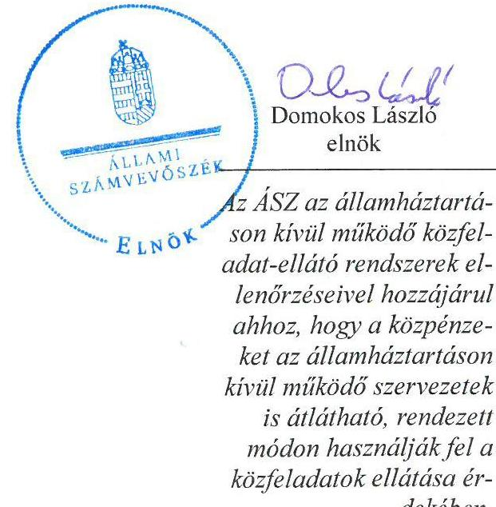
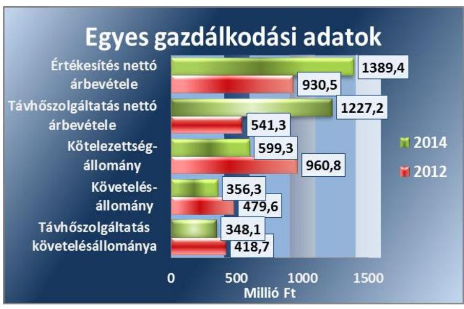
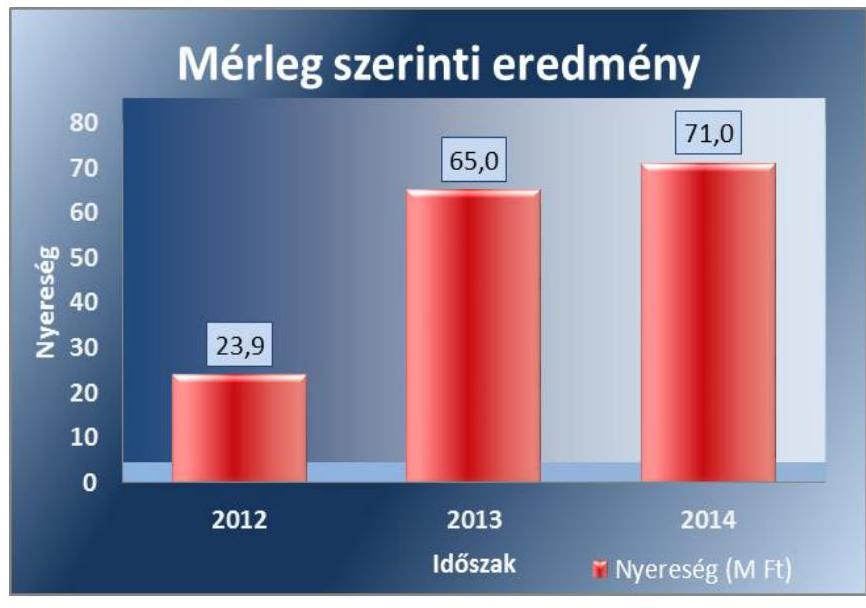
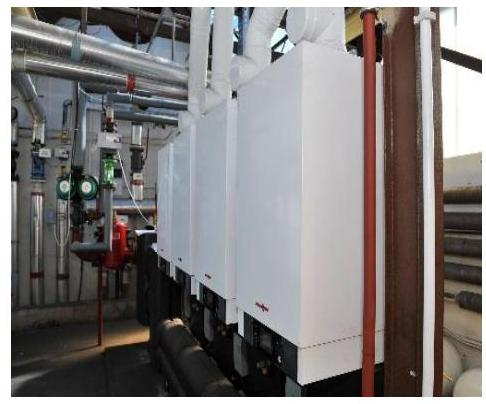
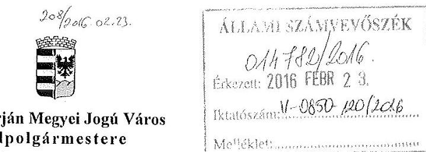
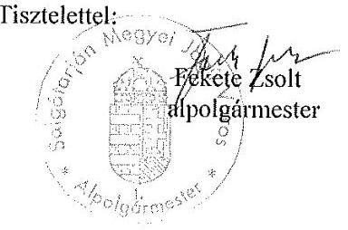

# Jelentés 

## Az önkormányzatok gazdasági társaságai

Az önkormányzatok többségi tulajdonában lévő gazdasági társaságok közfeladat ellátását érintő gazdálkodási tevékenysége szabályszerűségének ellenőrzése
Salgó Vagyon Salgótarjáni Önkormányzati Vagyonkezelő és Távhőszolgáltató Kft. 2016.

Az ÁSZ az államháztartáson kívül müködő közfel-adat-ellátó rendszerek el-lenőrzéseivel hozzájárul ahhoz, hogy a közpénzeket az államháztartáson kívül müködő szervezetek is átlátható, rendezett módon használják fel a közfeladatok ellátása érdekében.

---

# Jelentés 

## Az önkormányzatok gazdasági társaságai

Az önkormányzatok többségi tulajdonában lévő gazdasági társaságok közfeladat ellátását érintő gazdálkodási tevékenysége szabályszerűségének ellenőrzése
Salgó Vagyon Salgótarjáni Önkormányzati Vagyonkezelő és Távhőszolgáltató Kft.
2016. múrcium hó 24. nap

---

# AZ ELLENŐRZÉST FELÜGYELTE:

DR. HORVÁTH MARGIT felügyeleti vezető

## AZ ELLENŐRZÉST VEZETTE ÉS A VÉGREHAJTÁSÁÉRT FELELŐS:

- KLINGA LÁSZLÓ ellenőrzésvezető
- A PROGRAM ÖSSZEÁLLÍTÁSÁÉRT FELELŐS:
- LAJTERNÉ HUDÁK MAGDOLNA osztályvezető

IKTATÓSZÁM: V-0850-125/2016.

TÉMASZÁM: 1884

ELLENŐRZÉS-AZONOSÍTÓ SZÁM: V-070704

Jelentéseink az Országgyűlés számítógépes hálózatán és az Interneta a www.asz.hu címen is olvashatóak.

---

# TARTALOMJEGYZÉK 

■ ÖSSZEGZÉS ..... 5
■ AZ ELLENŐRZÉS CÉLJA ..... 7
■ AZ ELLENŐRZÉS TERÜLETE ..... 8
■ AZ ELLENŐRZÉS HÁTTERE, INDOKOLTSÁGA ..... 10
■ FÓKUSZKÉRDÉSEK ..... 11
■ ELLENŐRZÉS HATÓKÖRE ÉS MÓDSZEREI ..... 12
■ MEGÁLLAPÍTÁSOK ..... 14
■ JAVASLATOK ..... 29
■ MELLÉKLETEK ..... 31
I. Sz. melléklet: Értelmező szótár ..... 31
II. Sz. melléklet: Múködési adatok ..... 33
■ FÜGGELÉK: ÉSZREVÉTELEK ..... 35
■ RÖVIDÍTÉSEK JEGYZÉKE ..... 39

---

.

---

# ÖSSZEGZÉS 

Az Állami Számvevőszék a Salgó Vagyon Kft. ${ }^{1}$ távhőszolgáltatási közfeladat ellátását érintő gazdálkodási tevékenysége 2011-2014 közötti szabályszerűségét ellenőrizte. Megállapította, hogy a közfeladat-ellátás önkormányzati megszervezése és a tulajdonosi jogok gyakorlása szabályosan történt. A szabályszerű vagyongazdálkodás biztositása mellett a távhőszolgáltatás közfeladatának bevételeinek, ráfordításainak elszámolása és elkülönítése megfelelő volt. Az önköltségszámitás

Salgó Vagyon Kft. Salgótarján

rendjének előírásoknak megfelelő szabályozása elősegítette a szabályszerű díjszámitást. A Társaság ${ }^{2}$ kötelezettségállománya a közfeladat-ellátásra nem jelentett kockázatot.

## Az ellenőrzés társadalmi indokoltsága

Az Állami Számvevőszék középtávra szóló stratégiájában megfogalmazta, hogy a helyi önkormányzatok gazdálkodásában rejlő pénzügyi kockázatok feltárásával, az államháztartáson kívülre nyújtott költségvetési támogatások és ingyenes vagyonjuttatások, valamint az államháztartáson kívül múködő közfeladat-ellátó rendszerek ellenőrzéseivel hozzájárul ahhoz, hogy a közpénzeket az államháztartáson kívül múködő szervezetek is átlátható, rendezett módon használják fel a közfeladatok szerződésben vállalt ellátása érdekében.

Magyarországon az intézmény-centrikus közfeladat-ellátás jellemző, de egyre jelentősebb a költségvetésen kívüli feladatellátás térnyerése. Ennek legfontosabb szereplői - a nonprofit szervezetek mellett - az önkormányzati tulajdonú gazdasági társaságok. Az önkormányzatok szervezetalakítási szabadságának következménye, hogy a korábban is vállalati formában múködő közszolgáltatások mellett, mind a kötelező, mind az önként vállalt feladatok ellátásában a gazdasági társaságok kiemelt fontosságú szerephez jutottak.

## Főbb megállapítások, következtetések, javaslatok

Az Önkormányzat a közigazgatási területén a távhőszolgáltatás közfeladatának megszervezéséről a jogszabályi előírásoknak megfelelően döntött, annak ellátásáról a kizárólagos tulajdonában lévő gazdasági társasága útján gondoskodott. Az Önkormányzat a vagyongazdákodási rendelet ${ }_{1,2}$-ben meghatározta a tulajdonosi joggyakorlás szabályait, amit az előírásoknak megfelelően, szabályszerűen gyakorolt. Az Önkormányzat a feladatellátáshoz szükséges vagyont az ellenőrzött időszakot megelőzően apportként a Salgó Vagyon Kft-be 2012. június 30-ától beolvadt Tarjánhő Kft³. útján bocsátotta rendelkezésre. A Közgyűlés a társasági múködés felügyeletét a tulajdonosi ellenőrzési, beszámoltatási kötelezettségét az FB-n keresztül, az előírásoknak megfelelően, szabályszerűen gyakorolta.

A közfeladat-ellátását szolgáló vagyonnal való gazdálkodás, annak nyilvántartása szabályszerű volt. Az Önkormányzat a távhőszolgáltatásra vonatkozóan a Tszt. szerinti rendeletalkotási kötelezettségének eleget tett, annak tartalma megfelelt az előírásoknak. A Társaság rendelkezett a Számv. tv. előírásainak megfelelő számviteli szabályzatokkal, amelyek elősegítették a szabályszerű múködést és vagyongazdálkodást. Hiányosság a leltározási és leltárkészítési szabályzat tárgyi eszközök mennyiségi leltár felvételételének időpontjának meghatározásánál volt megállapítható. A Társaság vagyona a 2012. évi beolvadást követően növekedett, majd az azt következő két évben - elsősorban a távhőszolgáltatással nem összefüggő ingatlan értékesítések miatt - folyamatosan csökkent. A Salgó Vagyon Kft. kötelezettségállománya, ezen belül a távhőszolgáltatás szállítói állománya az ellenőrzött időszakban folyamatosan csökkent, a múködésre, a közfeladat-ellátásra nem jelentet kockázatot. A távhőszolgáltatással összefüggő lejárt határidejű szállítói tartozások összege a 2012. évi 210,7 millió Ft-ról a 2014. év végére 96,5 millió Ft-ra csökkent. A távhő-

---

szolgáltatás követelésállományának csökkenése mellett a hátralékos követelésállomány nőtt, a 2014. év végére meghaladta a 154 millió Ft-ot. A Társaság az ellenőrzött időszakban nyereségesen gazdálkodott, mérleg szerinti eredménye folyamatosan nőtt, az ellenőrzött időszak végén 71,0 millió Ft eredményt realizáltak.

A Salgó Vagyon Kft. az üzleti tervek teljesítéséről, az éves gazdálkodásról, azon belül a távhőszolgáltatás közfeladatáról az éves beszámolók és üzleti jelentések keretében számolt be a tulajdonos felé a Számv. tv.-ben és a vagyongazdákodási rendelet ${ }_{1,2}$-ben előírtaknak megfelelően. A Társaságnál a bevételek, költségek és ráfordítások elszámolása megfelelő volt, figyelembe véve a jogszabályok és a belső szabályozás előírásait. Az önköltségszámítás szabályozása megfelelt az előírásoknak, amely alapján az alkalmazott módszer biztosította a közszolgáltatás dijának megalapozottságát és a szabályszerű árképzést.

Megállapításaink alapján a Salgó Vagyon Kft. ügyvezető igazgatójának egy javaslatot tettünk a társaság tárgyi eszközeinek legalább háromévente történő szabályos leltározása érdekében.

---

# AZ ELLENŐRZÉS CÉLJA 

## Az önkormányzatok gazdasági társaságai - Az önkormányzatok tulajdonában lévő gazdasági társaságok közfeladat-ellátását érintő gazdálkodási tevékenysége szabályszerűségének ellenőrzése - Salgó Vagyon Salgótarjáni Önkormányzati Vagyonkezelő és Távhőszolgáltató Kft.

Az ellenőrzés célja annak értékelése, hogy az Önkormányzat a jogszabályi előírások figyelembevételével döntött-e az ellenőrzésre kerülő közfeladat megszervezéséről; az önkormányzat/tulajdonosi joggyakorló szabályszerűen gyakorolta-e a tulajdonosi jogokat.

Ellenőriztük, hogy a gazdasági társaság közfeladat-ellátása bevételeinek, ráfordításainak elszámolása, és vagyongazdálkodási tevékenysége megfelelt-e a jog-szabályi, illetve a közszolgáltatási/vagyonkezelési szerződésben foglalt tulajdonosi előírásoknak, azok végrehajtása szabályszerű volt-e.

Értékeltük továbbá, hogy a gazdasági társaság kötelezettségállománya jelent-e kockázatot a működésre, illetve a közfeladat ellátására; valamint hogy a közfeladatok átláthatósága és elszámoltathatósága érdekében biztosítva volt-e a közszolgáltatás dijának megalapozottsága szabályszerű önköltségszámítással.

---

# **AZ ELLENŐRZÉS TERÜLETE**

## **Salgótarján Megyei Jogú Város Önkormányzata és a Salgó Vagyon Salgótarjáni Önkormányzati Vagyonkezelő és Távhőszolgáltató Kft.**

Salgótarjánban a távhőszolgáltatással kapcsolatos önkormányzati feladatokat a Nógrád Megyei Hőszolgáltató Vállalat, majd annak felszámolását követően – az 1993. évtől kezdődően 2012. június 30-áng – a Salgótarján Megyei Jogú Város Önkormányzata 100%-os tulajdonában lévő Tarjánhő Szolgáltató -Elosztó Kft. látta el. A Tarjánhő Kft. 2012. június 30. napjával beolvadt az 1993. évben alapított Salgótarjáni Önkormányzati Vagyonhasznosító Kft.-be, amelynek neve a beolvadás napjával Salgó Vagyon Salgótarjáni Önkormányzati Vagyonkezelő és Távhőszolgáltató Kft.-re módosult. A távhőszolgáltatást biztosító vagyon tulajdonosa 2012. június 30-áng a Tarjánhő Kft., ezt követően a Salgó Vagyon Kft. volt. Az Önkormányzat távhővagyonnal nem rendelkezett, mivel a Tarjánhő Kft. alapításakor a társaságnak apportba adta, üzemeltetésre, kezelésre vagyont a távhőszolgáltatással kapcsolatosan nem adott át.

**A SALGÓ VAGYON KFT.** alaptevékenysége ingatlankezelés volt, mely tevékenység a beolvadást követően, 2012. június 30-ától gőzellátással, légkondicionálással bővült. A Társaság 1999-től működteti a tulajdonában lévő Ipari Parkot, amelynek területén infrastruktúrát biztosít 20 gazdasági társaság részére, továbbá a rendelkezésére álló szabad területek értékesítését végzi. A Salgó Vagyon Kft. Salgótarján Megyei Jogú Város Önkormányzatának 100%-os tulajdonában volt az ellenőrzött időszakban.

A Társaság 2014. január 1-jén a mintegy 37 000 fő állandó lakossal rendelkező Salgótarján város közigazgatási területén a 7 db gázbázisú fűtőművel közel 25 km hosszú távvezetéken és 245 db hőközponton keresztül 3927 lakossági és 554 közötti fogyasztót látott el távhővel és melegvízzel. A szolgáltatás ellátásához szükséges energiát részben vásárolt, részben saját maga által előállított hőből fedezte. A Társaságnál foglalkoztatottak átlagos statisztikai állományi létszám a 2011. évi 19 főről – a beolvadás hatására – a 2014. évre 88 főre nőtt.

---

A Társaság gazdálkodásának egyes adatait a 2012-2014. évek vonatkozásában az 1. ábra szemlélteti.
1. ábra

Forrás: A Társaság 2012. és 2014. évi beszámolói

A Társaság értékesítésének nettó árbevétele a 2014. évben - a 2012. évhez képest - közel 460,0 millió Ft-tal nőtt a 2012. július 1-jétől belépő távhőszolgáltatási tevékenység következtében. A kötelezettségek állománya ugyanebben az időszakban több mint egyharmadával, míg a követelésállomány 123,3 millió Ft-tal csökkent. A távhőszolgáltatási tevékenység követelésállománya a 2014. év végén 348,1 millió Ft volt, ami a 2012. évhez képest csökkent. A Társaságnak más gazdasági társaságban tulajdoni részesedése nem volt.

Az ellenőrzött időszakban a polgármester személye egy alkalommal változott, a jegyző és a Salgó Vagyon Kft. ügyvezetőjének személyében változás nem volt.

---

# AZ ELLENŐRZÉS HÁTTERE, INDOKOLTSÁGA 

## Az önkormányzatok közfeladat-ellátásában egyre jelentősebb a gazdasági társaságokon belüli feladatellátás térnyerése

AZ ÁSZ STRATÉGIÁJÁBAN megfogalmazta, hogy a helyi önkormányzatok gazdálkodásában rejlő pénzügyi kockázatok feltárásával, az államháztartáson kívülre nyújtott költségvetési támogatások és ingyenes vagyonjuttatások, valamint az államháztartáson kívül múködő közfeladatellátó rendszerek ellenőrzéseivel hozzájárul ahhoz, hogy a közpénzeket az államháztartáson kívül múködő szervezetek is átlátható, rendezett módon használják fel a közfeladatok szerződésben vállalt ellátása érdekében.

Az Áht. ${ }^{4}$ 1. § (3) bekezdése értelmében az államháztartáson kívüli szervezetek a közfeladatok ellátásában - jogszabályban meghatározott feltételekkel - közremúködhetnek. Az önkormányzati tulajdonú gazdasági társaságok teljes körű ellenőrzésének lehetőségét az Állami Számvevőszékről szóló 1989. évi XXXVIII. törvény 2011. január 1-jétől hatályos módosítása teremtette meg. A gazdasági társaságok közfeladat ellátását érintő gazdálkodási tevékenysége szabályszerűségére irányuló ellenőrzéseket erre tekintettel a 2011. évtől végezzük.

## AZ ELLENŐRZÉS VÁRHATÓ HASZNOSULÁSA-

KÉNT az ÁSZ ${ }^{5}$ a megállapításaival segítséget nyújthat az államháztartáson kívüli közfeladat-ellátás értékeléséhez, jogszabályi keretei pontosításához, átláthatóságot biztosító szabályozásához. Meghatározhatóvá válnak a közfeladat ellátásban részt vevő államháztartáson kívüli szervezeteknek az önkormányzat költségvetését, pénzügyi helyzetét is befolyásoló - kockázatai, lehetővé válik ezen kockázatok csökkentése.

Értékelhetővé válik, hogy a feladatot ellátó gazdasági társaság a közszolgáltatási szerződésben foglaltak betartásával, a közvagyon használatával biztosította-e a szolgáltatás folytatásának feltételeit. Ezzel az ellenőrzöttek és a helyi döntéshozók számára az ÁSZ visszajelzést ad feladatszervezési, feladat-ellátási kockázataikról, alapot ad a meglévő hibák megszüntetéséhez, a jobb közfeladat-ellátás biztosításához. Mindezeken keresztül az ÁSZ hozzájárul Magyarország közpénzügyi helyzetének javításához, a közpénzek mérhető módon történő, a döntéshozók által meghatározott célok szerinti felhasználásához.

---

# FÓKUSZKÉRDÉSEK 

1. Az önkormányzat közfeladat megszervezéséről szóló döntése, valamint tulajdonosi joggyakorlása szabályszerű volt-e?
2. A gazdasági társaság vagyongazdálkodása szabályszerű volt-e, kötelezettségállománya jelentett-e kockázatot a müködésre, illetve a közfeladat ellátásra?
3. A gazdasági társaságnál az ellátott közfeladat bevételei és ráfordításai elszámolása, valamint az önköltségszámítás és árképzés szabályszerű volt-e?

---

# ELLENŐRZÉS HATÓKÖRE ÉS MÓDSZEREI 

## Az ellenőrzés típusa

Megfelelőségi ellenőrzés

## Az ellenőrzött időszak

A 2011. január 1-jétől 2014. december 31-éig terjedő időszak.

## Az ellenőrzés tárgya

A közfeladatot gazdasági társaságokkal ellátó önkormányzatok tulajdonosi joggyakorlása, valamint gazdasági társaságok pénz- és vagyongazdálkodásának szabályozottsága és szabályszerűsége.

Az ellenőrzés kiterjed minden olyan körülményre és adatra, amely az ÁSZ jogszabályban meghatározott feladatainak teljesítéséhez, valamint a program végrehajtása folyamán felmerült újabb összefüggések feltárásához szükséges.

## Az ellenőrzött szervezet

Salgótarján Megyei Jogú Város Önkormányzata és a Salgó Vagyon Salgótarjáni Önkormányzati Vagyonkezelő és Távhőszolgáltató Korlátolt Felelősségű Társaság

## Az ellenőrzés jogalapja

Az ellenőrzés végrehajtásának jogszabályi alapját az Állami Számvevőszékről szóló 2011. évi LXVI. törvény 5. § (3)-(4)-(5) bekezdései képezték.

## Az ellenőrzés módszerei

Az ellenőrzést a nemzetközi standardokat irányadónak tekintve az ellenőrzési program ellenőrzési kérdései, az ellenőrzött időszakban hatályos jogszabályok, az ellenőrzés szakmai szabályok és módszertanok figyelembe vételével végeztük.

Az ellenőrzés ideje alatt az ellenőrzött szervezettel történő kapcsolattartást az ÁSZ Szervezeti és Müködési Szabályzatának vonatkozó előírásai alapján biztosítottuk.

---

Az ellenőrzés a kiválasztott, többségi tulajdonosi jogokat gyakorló önkormányzatra, illetve az ellenőrzött közfeladatot ellátó gazdasági társaságra terjedt ki. Az ellenőrzött gazdasági társaságnál, amennyiben az több közfeladatot is ellát, akkor az ellenőrzésre kiválasztott közfeladat-ellátást ellenőriztük.

Az ellenőrzést a kérdésekre adott válaszok kiértékelésével, valamint a megjelölt adatforrások, a csatolt tanúsítványok felhasználásával, továbbá az adott időszakban hatályos jogszabályok figyelembe vételével folytattuk le. Az ellenőrzési kérdések megválaszolásához szükséges bizonyítékok megszerzése a következő ellenőrzési eljárások alkalmazásával történt: megfigyelés, kérdésfeltevés (információkérés), összehasonlítás, valamint elemző eljárás.

A bevételek és ráfordítások elszámolása, valamint a vagyonnyilvántartás terén az egyes területek szabályszerű működését mintavétellel ellenőriztük, ez alapján a sokaságokban előforduló hibás tételek arányát becsültük. A jogszabályoknak és a belső előírásoknak megfelelőnek, azaz szabályszerűnek tekintettük az adott bevételek és ráfordítások elszámolását, a vagyonnyilvántartást, amennyiben a minta ellenőrzésének eredménye alapján 95\%-os bizonyossággal a teljes sokaságban a hibás tételek aránya kisebb volt, mint 10\%, nem megfelelőnek értékeltük, ha a hibás tételek aránya a 10\%-ot meghaladta. Kockázatot, illetve magas kockázatot jeleztünk, amennyiben egy adott terület vonatkozásában a minta alapján a teljes sokaságban nem volt teljes körűen biztosított a jogszabályoknak és a belső szabályzatoknak megfelelő működés.

---

# 1. Az önkormányzat közfeladat megszervezéséről szóló döntése, valamint tulajdonosi joggyakorlása szabályszerű volt-e? 

Összegző megállapítás

Az Önkormányzat a jogszabályi és a belső előírások betartásával szervezte meg a távhőszolgáltatás közfeladatát, a társasági múködés felügyelete, a tulajdonosi jogok érvényesítése szabályszerű volt.

### 1.1. számú megállapítás

A közfeladat-ellátásról szóló döntés, illetve annak előkészítése az SZMSZ ${ }_{1,2}$ és a vagyongazdálkodási rendelet ${ }_{1,2}$ előírásaival összhangban történt, az Önkormányzat a távhőszolgáltatásra vonatkozó rendeletalkotási kötelezettségét szabályszerűen teljesítette.

Az Ötv. ${ }^{6}$ 91. § (6) bekezdése, 2013. január 1-jétől az Mötv. ${ }^{7}$ 116. § (3)-(4) bekezdései szerint az önkormányzatnak a gazdasági programjában kell meghatároznia mindazokat a célkitűzéseket, amelyek az általa ellátott feladatok biztosítását, fejlesztését szolgálják. A Közgyűlés ${ }^{8}$ által a 2011-2014. évekre elfogadott gazdasági program ${ }^{9}$ a távhőszolgáltatás fejlesztésével kapcsolatban bemutatta a tervezett intézkedéseket (távhő fogyasztói kör bővítése, a szolgáltatás múködési hatékonyságának növelése, levegőminőség, energetikai fenntarthatóság javítása).

Az Önkormányzat ${ }^{10}$ az Nvtv. ${ }^{11}$ 9. § (1) bekezdésében foglaltaknak megfelelve, 2013. május 30-án hatályba léptette a közép ${ }^{12}$-, illetve hosszú ${ }^{13}$ távú vagyongazdálkodási terveit. A közép távú vagyongazdálkodási terv célkitúzésként jelölte meg a közfeladat-ellátás biztonságának, színvonalának, a társaságok vagyonának, munkahelyeinek megőrzését. A hosszú távú vagyongazdálkodási terv az Önkormányzat többségi tulajdonában lévő gazdasági társaságok részesedéseinek korlátozottan forgalomképes törzsvagyonba sorolását tartalmazta.

A távhőszolgáltatással ellátott létesítmények távhőellátásának távhőszolgáltatásra engedéllyel rendelkezők útján történő biztosítása a Tszt. ${ }^{14}$ 6. § (1) bekezdése értelmében a területileg illetékes települési önkormányzat kötelező feladata. Ezen kötelezettségének az Önkormányzat - a Tarjánhő Kft. alapításával, illetve annak a Salgó Vagyon Kft.-be 2012. június 30-án történt beolvadásával - eleget tett. A beolvadásról, annak előkészítéséről a Közgyűlés az SZMSZ ${ }_{1}{ }^{15}{ }_{2}{ }^{16}$, illetve a Vagyongazdálkodási rendelet ${ }_{1}{ }^{17}$ előírásainak megfelelően, szabályszerűen döntött. A MEKH ${ }^{18}$ határozata alapján 2012. július 1-jétől Salgótarján városban kizárólag a Salgó Vagyon Kft. minősült engedélyesnek a távhőszolgáltatás tekintetében.

Az Önkormányzat és a Társaság között a közfeladat ellátására szerződés nem jött létre, arra a feleket jogszabályi előírás nem kötelezte.

---

# A SALGÓ VAGYON KFT. TÁVHŐ ELLÁTÁSRA VO- 

NATKOZÓ JOGÁT az Alapító Okirat ${ }^{19}$ és a Távhő rendelet ${ }^{20}$ előírásai biztosították. Az Alapító Okiratot a 2012., 2013. és a 2014. években módosították a tevékenységi kör bővülését illetően, valamint az ügyvezető kijelölésének meghosszabbítása és az $\mathrm{FB}^{21}$ tagok személyében bekövetkezett változás miatt. Az Alapító Okiratban előírtak szerint a Salgó Vagyon Kft.-ben a tulajdonosi jogokat a Közgyűlés, az ügyvezető22 feletti egyéb munkáltatói jogokat a polgármester ${ }^{23}$ gyakorolta. A Társaság ${ }^{24}$ éves beszámolójának, üzleti tervének elfogadása, az ügyvezető prémiumfeladatának megállapítása, az FB ügyrendjének jóváhagyása az alapító kizárólagos hatáskörébe tartozott az Alapító Okirat előírásainak megfelelően.

Az Önkormányzat a Tszt. 6. § (2) bekezdésében előírt kötelezettségének a Távhő rendelet megalkotásával eleget tett. A Távhő rendelet előírásában meghatározta a távhőszolgáltató és a felhasználó közötti jogviszony részletes szabályait, a távhőszolgáltatási díj összetételét és tartalmát, az alkalmazott díjtételeket, a mérés, elszámolás, díjfizetés szabályait, a távhőszolgáltatás szüneteltetésének és korlátozásának feltételeit.

Az energetikai tárgyú törvények módosításáról szóló 2011. évi XXIX. törvény értelmében 2011. április 15-étől a miniszter állapítja meg a távhőszolgáltatás díjainak szerkezetét, legmagasabb díjait és azok alkalmazásának időpontját. A helyi önkormányzatok ármegállapításra vonatkozó hatásköre ennek következtében - a csatlakozási díj kivételével - 2011. április 15. napjával megszűnt. A hivatkozott törvénnyel való harmonizáció érdekében az Önkormányzat az ármegállapítással kapcsolatos rendelkezéseket - a csatlakozási díjra vonatkozó rendelkezések kivételével - a Távhő rendeletben hatályon kívül helyezte.

## 1.2. számú megállapítás

A tulajdonosi ellenőrzési, beszámoltatási kötelezettség, a közfel-adat-ellátás felügyelete az FB múködésén keresztül szabályszerűen teljesült.

A TULAJ DONOSI JOGOKAT A KÖZGYŰLÉS a Vagyongazdálkodási rendelet ${ }_{1,2}{ }^{25}$ előírásának megfelelően, szabályszerűen gyakorolta. A Vagyongazdálkodási rendelet ${ }_{1}$ 54. §-ának 2013. április 30-áig, illetve a Vagyongazdálkodási rendelet ${ }_{2}$ 29. §-ának 2013. május 1-jétől hatályos előírása alapján az Önkormányzat 100\%-os tulajdonában álló korlátolt felelősségű társaságok legfőbb szervében a tulajdonosi jogok gyakorlására kizárólag a Közgyűlés volt felhatalmazva.

A SALGÓ VAGYON KFT. FB-JE az Alapító Okiratban foglaltak alapján - és a Gt ${ }^{26}$. 34. § (1) bekezdésének, valamint a Ptk. ${ }^{27}$ 3:121.§ (1) bekezdésének megfelelve - három tagból állt. Az ügyvezetőt, az FB tagokat és a könyvvizsgálót a Társaság legfőbb szerve ${ }^{28}$ választotta meg, nevüket, kijelölésük időtartamát, feladatkörüket az Alapító Okirat tartalmazta. Az Önkormányzat a tulajdonosi ellenőrzési, beszámoltatási kötelezettségét az FB múködésén keresztül, a Vagyongazdálkodási rendelet ${ }_{1,2}$-ben foglaltak szerint biztosította. A legfőbb szerv hatáskörébe tartozó kérdésekben az alapító Önkormányzat határozattal döntött, melyről az ügyvezetőt írásban értesítette.

---

Az üzleti terveket, éves beszámolókat, üzleti jelentéseket és a független könyvvizsgálói jelentéseket a Társaság megküldte az Önkormányzat részére az FB írásos jelentésével együtt. Az üzleti tervek elkészítésére, tartalmára vonatkozó előírásokat a Közgyűlés által félévenként elfogadott munkatervek tartalmazták. A Közgyűlés az üzleti tervek elfogadásáról minden esetben határozattal döntött az FB írásos jelentésének birtokában.

AZ ANYAGI ÖSZTÖNZÉSI RENDSZERT a Taktv. ${ }^{29}$ 5. § (3) bekezdésében foglaltaknak megfelelően a Közgyűlés által megalkotott és elfogadott, a Salgó Vagyon Kft. javadalmazási szabályzatában ${ }^{30}$ határozták meg, mely kiterjedt az ügyvezető, az FB tagok és a vezető állású munkavállalók javadalmazására vonatkozó előírásokra. A Társaság ügyvezetőjének és egyes vezető állású munkavállalóinak prémiumfeladatait a javadalmazási szabályzatban foglaltaknak megfelelően a Közgyűlés határozataiban kiírta, azok végrehajtását szintén határozatokban értékelte. A Közgyűlés az ügyvezető részére megállapított prémiumot a havi személyi alapbérének háromszorosában határozta meg. A prémiumfeladatok értékelése, a kifizetések jóváhagyása a javadalmazási szabályzat előírásainak megfelelően történt.

AZ ÁRKÉPZÉS SZABÁLYAIT az Önkormányzat a Távhő rendeletben határozta meg. A távhőszolgáltatás 2011. április 15-éig olyan hatósági áras szolgáltatás volt, amelynek legmagasabb árait mindenkor az önkormányzatoknak kellett előírniuk. Ennek a kötelezettségnek az Önkormányzat eleget tett. A Távhő rendeletben az Ámt. ${ }^{31}$ 7. § (1) bekezdésének, mellékletében előírtaknak megfelelően meghatározták a távhőszolgáltatás legmagasabb fogyasztói árát az alapdíjra és a hődíjra, valamint a csatlakozási díra vonatkozóan. Az árakra vonatkozó döntést számításokkal, kalkulációkkal alátámasztották, amelyet a Közgyűlés felülvizsgált és jóváhagyott.

A Tszt. 2011. április 15-étől hatályos módosítása értelmében - miután megszűnt az Önkormányzat ármegállapításra vonatkozó hatásköre az alapdíjak és hődíjak tekintetében - az ármegállapítással kapcsolatos javaslat elkészítése előtt a MEKH bekéri az érintett önkormányzatok képviselő-testületének ármegállapítással, árváltozással kapcsolatos állásfoglalását*.

Az önkormányzati állásfoglalást megalapozó javaslatait a Salgó Vagyon Kft. elkészítette, melyeket részletes számításokkal, kalkulációkkal támasztott alá. A javaslatok a Társaság - javasolt díjmértékek alkalmazása esetén elérhető - eredményének alakulását is bemutatták. A Közgyűlés a kapott kalkulációt minden esetben felülvizsgálta, megtárgyalta és elfogadta.

A BESZÁMOLTATÁSI RENDSZERT az Önkormányzat megfelelően múködtette, a Salgó Vagyon Kft.-t évente beszámoltatta annak gazdálkodásáról, közszolgáltatási tevékenységéről. A Társaság 2011-2014. üzleti éveiről készített éves beszámolóit a Közgyűlés megtárgyalta és elfogadta. A Közgyűlés a beszámoló elfogadásáról a Gt. 35. § (3) bekezdésének és a Ptk. 3:120. § (2) bekezdésének vonatkozó előírásait betartva, minden évben az FB írásos jelentésének birtokában döntött.

[^0]
[^0]:    * Előírta a Tszt. 57/D § (4) bekezdése.

---

BELSŐ ELLENŐRZÉST az Önkormányzat egy alkalommal, a 2013. évben végzett a Salgó Vagyon Kft.-nél. A belső ellenőrzés elrendeléséről, a 2013. évi belső ellenőrzési terv elfogadásáról a Közgyűlés határozatban döntött. Az ellenőrzés a Társaság szabályozottságára, valamint egyes bevételei és ráfordításai elszámolására irányult. Az ellenőrzési jelentés a Salgó Vagyon Kft. üzemviteli folyamatait összességében megfelelőnek minősítette, négy hiányosság kiemelése mellett, amelyek az éves beszámoló kiegészítő mellékletében az elszámolt, visszaírt, halmozottan elszámolt értékvesztés bemutatásának hiányára, az üzletszabályzat szervezeti változásoknak megfelelő aktualizálásának hiányára, az Alapító Okiratban a kötelezettségvállalás korlátozásának pontatlanságára, illetve az óvadék összege megállapításának belső szabályozástól eltérő módjára mutattak rá.

A Társaság a hiányosságok megszüntetése érdekében intézkedési tervet készített, melyet a jegyző ${ }^{52}$ elfogadott. Az intézkedési tervben szereplő négy intézkedés közül három határidőre teljesült, az Alapító Okirat pontosítását azonban határidőn túl végezte el a Társaság.

A Salgó Vagyon Kft. a 2012-2014. években nyereségesen gazdálkodott, a saját tőke/jegyzett tőke mutató szintjének a Gt. 51. § (1) bekezdés és a Ptk. 3:133. § (2) bekezdés szerinti előírása alapján a tulajdonos Önkormányzatnak intézkedési kötelezettsége nem keletkezett. A Közgyűlés osztalék kifizetéséről a 2013. évben szabályszerűen döntött, 12,0 millió Ft öszszegben.

Az évenkénti mérleg szerinti eredmény összegét a 2. ábra mutatja be.
2. ábra

Forrás: A Társaság 2012-2014. évi beszámolói

A Társaság mérleg szerinti eredménye a 2012. évi 23,9 millió Ft-ról folyamatos emelkedést követően - háromszorosára nőtt.

---

Az Önkormányzat a Salgó Vagyon Kft. által felvett hitelekhez ${ }^{+}$, vállalt pénzügyi kötelezettségekhez kapcsolódóan garanciát és kötelezettséget nem vállalt. A Társaság feladatellátásához rendszeres vagy eseti múködési célú támogatást, illetve fejlesztési támogatást nem nyújtott. A Közgyűlés a 2012. évben 40,0 millió Ft éven belüli kölcsönt biztosított a Salgó Vagyon Kft. részére a városi távhőszolgáltatás fejlesztését elősegítő költségmegosztók telepítésének támogatására. A kölcsönszerződést egy alkalommal módosították a visszafizetési határidő meghosszabbítása miatt. A Társaság a kölcsönt és annak kamatát a módosított határidőig visszafizette az Önkormányzatnak.

# 2. A gazdasági társaság vagyongazdálkodása szabályszerű volt-e, kötelezettségállománya jelentett-e kockázatot a múködésre, illetve a közfeladat ellátásra? 

Összegző megállapítás

A Társaság vagyongazdálkodása szabályszerű volt, kötelezettségállománya a múködésre és a közfeladat-ellátásra nem jelentett kockázatot.
2.1. számú megállapítás

A gazdálkodási szabályzatokat kisebb hiányossággal a jogszabályi előírásoknak megfelelően készítették el, azokba az egyes tevékenységek átláthatóságát, az üzletágak bevételeinek és ráfordításainak elkülönítését biztosító szétválasztási szabályokat beépítették.

AZ ÜZLETI TERVEKET a Salgó Vagyon Kft. minden évben - az Önkormányzat által előírt határidőben és tartalommal - elkészítette, azokhoz az FB írásos véleményét csatolta. Az üzleti tervek a tulajdonosi elvárásokkal, a Közgyűlés által elfogadott szakmai programokkal, tervekkel összhangban voltak. Az üzleti tervek mellett, lényegi elemeit tekintve azokkal azonos tartalommal a Társaság számot adott a tervek teljesítéséről, bemutatta a tervektől való eltérést és annak okait.

A Társaság rendelkezett a Számv. tv. ${ }^{33}$ 14. § (4) bekezdés előírásának megfelelő, hatályos számviteli politikával ${ }^{34}$ és a Számv. tv. 14. § (5) bekezdés a)-d) pontjai előírásának megfelelően az eszközök és források leltárkészítési és leltározási, illetve értékelési szabályzatával, az önköltségszámítás rendjére vonatkozó szabályzattal és pénzkezelési szabályzattal. Rendelkezett továbbá a Számv. tv. 161. (1) bekezdésében előírt számlarenddel.

A SZÁMVITELI POLITIKA a Számv. tv. 14. § (4) bekezdése, valamint a 161/A. § előírásainak megfelelt. A leltározási, leltárkészítési szabályzat ${ }^{35}$ a tárgyi eszközök öt évenkénti mennyiségi felvétellel történő leltározási kötelezettségét írta elő a Számv. tv. 69. § (3) bekezdésében foglalt legalább háromévente előírt kötelezettséggel ellentétesen. A Társaság év

[^0]
[^0]:    ${ }^{+}$A Salgó Vagyon Kft.-nek 2014. december 31-én a Tarjánhő Kft. által 2010-ben 175,0 millió Ft összegben felvett beruházási hitelből 35,0 millió Ft, folyószámlahitel tartozásból 97,8 millió Ft, éven túli forgóeszköz hiteltartozásból (melyet 2012. augusztus 24-én, 25,0 millió Ft összegben kötöttek) 8,8 millió Ft kötelezettsége volt.

---

közben az eszközeiről folyamatos mennyiségi nyilvántartást vezetett. Az értékelési szabályzat ${ }^{36}$-ban - többek között - meghatározták az alkalmazott értékelési szabályokat, a vevőkövetelésekre elszámolt értékvesztés megállapításának kritériumait. A pénzkezelési szabályzatban ${ }^{37}$ a Számv. tv. 14. § (8) bekezdésében előírtaknak megfelelően - többek között - rendelkeztek a pénzforgalom lebonyolításának rendjéről, a készpénzben és a bankszámlán tartott pénzeszközök közötti forgalomról, a bankkártya használat rendjéről, a készpénzállomány ellenőrzésekor követendő eljárásról, az ellenőrzés gyakoriságáról. A számlarend ${ }^{38}$ tartalmazta minden alkalmazásra kijelölt számla számjelét és megnevezését, a számla értéke növekedésének, csökkenésének jogcímeit, a számlát érintő gazdasági eseményeket, azok más számlákkal való kapcsolatát, a főkönyvi számla és az analitikus nyilvántartás kapcsolatát, valamint a számlarendben foglaltakat alátámasztó bizonylati rendet. A kialakított számlarend, számlatükör biztosította, hogy a könyvvezetésre, a bizonylatolásra vonatkozó belső szabályok a mérleg és eredménykimutatás alátámasztásán túlmenően a kiegészítő melléklet adatainak közvetlen alátámasztására alkalmasak legyenek.

AZ ÖNKÖLTSÉGSZÁMÍTÁSI SZABÁLYZATOT ${ }^{39}$ a Tszt. 18/A. § (2)-(3) bekezdései, az 57. § (4) bekezdése, a Vet. ${ }^{40}$ 105. § (2) bekezdése, valamint a Számv. tv. 14. § (7) bekezdésében foglalt előírásoknak megfelelően szabályszerűen készítették el. Az önköltségszámítási szabályzat részét képezte ${ }^{1}$ a számviteli szétválasztási szabályzat, melyben meghatározták az eredménykimutatáshoz és a mérleghez kapcsolódó közvetlenül gyűjthető, illetve közvetlenül nem gyűjthető, felosztandó tételeket.

A Társaság a Tszt. 18/A. § (2) bekezdésében meghatározott számviteli szétválasztási szabályokat kidolgozta, önköltségszámítási szabályzatában a közfeladat ellátással kapcsolatos elszámolások és a közfeladat-ellátást szolgáló vagyonelemek elkülönített nyilvántartását előírta.

A TSZT. ÁLTAL ELŐíRT ÜZLETSZABÁLYZATOT a Társaság a beolvadást követően 2012. július 1. és 2013. szeptember 29. között nem dolgozott ki, így a jegyző a Tszt. 7. § (1) bekezdés a)-c) pontjaiban foglalt előírásoknak nem tudott eleget tenni. A Salgó Vagyon Kft. üzletszabályzata ${ }^{41}$ 2013. szeptember 30-án lépett hatályba, azt a jegyző határozattal ${ }^{5}$, a Nógrád Megyei Kormányhivatal Fogyasztóvédelmi Felügyelősége véleményének előzetes kikérését követően jóváhagyta.
2.2. számú megállapítás

A Társaság a tulajdonában lévő vagyonával a jogszabályi és belső előírásoknak megfelelően gazdálkodott.

# AZ ANALITIKUS ÉS FŐKÖNYVI NYILVÁNTARTÁSI 

RENDSZER** a Salgó Vagyon Kft. vagyonának nyilvántartására, az abban bekövetkezett változások folyamatos nyomon követésére alkalmas volt, az a számviteli politika és a számlarend előírásainak megfelelt.

[^0]
[^0]:    ${ }^{1}$ Az önköltségszámítási szabályzat 12. számú melléklete.
    ${ }^{5}$ A 34932/2013. számú határozat.
    ** A Társaság a NAVISION integrált vállalatirányítási rendszert alkalmazta.

---

A Társaság a távhőszolgáltatás közfeladatát saját eszközeivel látta el, üzemeltetésre átvett, illetve vagyonkezelésbe vett vagyona a feladattal kapcsolatban nem volt. Az éves beszámolók adatait leltárral alátámasztották, a főkönyvi könyvelés és analitikus nyilvántartások közötti egyeztetést a mérleg fordulónapjára vonatkozóan szabályszerűen elvégezte. Mennyiségi felvételen alapuló leltározást a készleteknél végeztek a 2011-2014. években. A tárgyi eszközök tényleges mennyiségi felvételen alapuló leltározására a beolvadáskor, 2012. június 30. fordulónappal került sor, amely a vagyonmérleg alátámasztására szolgált.

A Társaság éves beszámolóinak főbb mérlegadatait az 1. táblázat szemlélteti.

1. táblázat

| A SALGÓ VAGYON KFT FŐBB MÉRLEG ADATAI (MILLIÓ FORINT) |  |  |  |  |
| :--: | :--: | :--: | :--: | :--: |
| Megnevezés | 2012.01.01 | 2012.12.31 | 2013.12.31 | 2014.12.31 |
| Befektetett eszközök | 858,0 | 2159,1 | 2055,3 | 1979,9 |
| - ebből: Tárgyi eszközök | 856,7 | 2140,8 | 2038,7 | 1965,7 |
| Forgóeszközök | 91,9 | 558,8 | 481,2 | 420,2 |
| - ebből: Követelések | 38,7 | 479,6 | 416,3 | 356,3 |
| Aktív időbeli elhatárolások | 0,0 | 38,1 | 37,3 | 68,6 |
| ESZKÖZÖK ÖSSZESEN | 949,9 | 2756,0 | 2573,8 | 2468,7 |
| Saját tőke | 329,4 | 1213,6 | 1278,7 | 1349,7 |
| - ebből:Jegyzett tőke | 83,3 | 210,5 | 210,5 | 210,5 |
| - ebből: Mérleg szerinti eredmény | 17,1 | 23,9 | 65,0 | 71,0 |
| Céltartalékok | 0,0 | 24,8 | 28,3 | 16,7 |
| Kötelezettségek | 172,2 | 960,8 | 705,0 | 599,3 |
| Passzív időbeli elhatárolások | 448,3 | 556,8 | 561,8 | 503,0 |
| FORRÁSOK ÖSSZESEN | 949,9 | 2756,0 | 2573,8 | 2468,7 |

A VAGYONI HELYZETBEN érdemi változás a 2012. évben, a Tarjánhő Kft. beolvadását követően következett be. A befektetett eszközök értéke a 2012. évi nyitó állományról év végére több mint két és félszeresére, a forgóeszközök értéke hatszorosára nőtt. A forgóeszközök 85,8\%-át a követelések alkották. A saját tőke közel négyszeresére, a jegyzett tőke két és félszeresére emelkedett. A kötelezettségek ugrásszerűen megnőttek, azok forrásokon belüli részaránya a 2012. évben volt a legmagasabb, közel $35 \%$.

A Társaság eszközeinek és forrásainak értéke a 2013. és 2014. évben a 2012. évhez viszonyítva - folyamatosan csökkent. A beruházások értéke az elszámolt amortizáció összegét meghaladta ugyan, azonban a tárgyi eszközök (elsősorban ingatlanok) értékesítésének következtében a befektetett eszközök nettó értéke a 2013. évben 4,8\%-kal, a 2014. évben 3,7\%-kal volt kevesebb az előző évi nettó értékhez képest. A saját tőke összegének a 2012. évről a 2014-évre történő 11,2\%-os növekedése a mérleg szerinti eredmény közel háromszoros emelkedésének következménye volt. A kötelezettségek a 2014. év végére 37,6\%-kal csökkentek a 2012. év végi állományhoz képest.

---

# A TÁVHŐSZOLGÁLTATÁSI TEVÉKENYSÉG SZINTEN TARTÁSÁHOZ szükséges beruházási és felújítási munkára a 2012. évben 19,7 millió Ft-ot, a 2013. évben 89,8 millió Ft-ot, a 2014. évben 34,0 millió Ft-ot, karbantartásra az évek sorrendjében 28,5 millió Ftot, 10,2 millió Ft-ot, illetve 12,9 millió Ft-ot fordítottak. 

Az Alapító Okirat rendelkezései szerint az alapító kizárólagos hatáskörébe tartozott a visszterhes, vagy egyoldalú kötelezettségvállalás, továbbá az egyoldalú joglemondó nyilatkozat bruttó 50,0 millió Ft-ot meghaladó értékben. A Salgó Vagyon Kft. részéről kötelezettségvállalásra - ahol azt az Alapító Okirat előírta - a Közgyűlés előzetes engedélye, határozata alapján, szabályszerűen került sor.
2.3. számú megállapítás

A kötelezettségek állománya a múködésre, a közfeladat ellátására kockázatot nem jelentett, azonban a rövid lejáratú kötelezettségek egy részének határidőn túli teljesítése a folyó üzemeltetés finanszírozása tekintetében fennálló fizetési nehézségre utalt.

A Társaság kötelezettségeinek állománya a beolvadást követően folyamatosan csökkent, az eladósodás szintje a működést, a közfeladat ellátást nem veszélyeztette.

AZ ELADÓSODOTTSÁGI MUTATÓ értéke, illetve tendenciája is kedvezően alakult, a 2012. évben 0,35 , a 2013. évben 0,27 , a 2014. évben 0,24 volt. Az eladósodottság mértéke hasonló képet mutatott, az év végén fennálló kötelezettségek a saját tőke egyre kisebb hányadát kötötték le, a mutató a 2012-2014. években nem érte el az 1-es értéket. A nettó eladósodottság mutatója folyamatosan csökkent, a kintlévőségekkel csökkentett kötelezettségeket a saját források egyre nagyobb mértékben tudták fedezni. A mutató értéke az évek sorrendjében 0,4, 0,23, illetve 0,18 volt.

Az adósságfedezeti mutató I. értéke, tendenciája szintén kedvező volt, 1,0 Ft adósságra a 2012. évben 2,8 Ft, a 2013. évben 3,6 Ft, a 2014. évben 4,0 Ft vagyon jutott. Az adósságfedezeti mutató II. esetében a 2012. évi értéket pozitívan befolyásolta, hogy a múködési cash flow összegét a beolvadó társaság vagyonának átértékelése jelentősen megnövelte. A 20132014. években a mutató alakulására ( 4,27 és 10,56 ) hatást leginkább a hosszú lejáratú kötelezettségek csökkenése gyakorolt.

Az árbevételre vetített eladósodottság mértéke a 2012-2014. években - folyamatosan csökkenve - 0,43, 0,15 és 0,13 volt, tehát az 1,0 Ft nettó árbevételre eső, forgóeszközökkel csökkentett kötelezettség valamennyi évben kevesebb volt, mint a nettó árbevétel.

A Társaság a 2011-2014. években rendelkezett a társasági formájára kötelezően előírt jegyzett tőkének megfelelő összegű saját tőkével.

A HOSSZÚ LEJÁRATÚ KÖTELEZETTSÉGEK esedékes törlesztő részleteit határidőben teljesítették, azok mérlegben szereplő értéke a 2012. év vége és a 2014. év vége között 86,1\%-kal csökkent.

A RÖVID LEJÁRATÚ KÖTELEZETTSÉGEK teljesítése több esetben nem történt meg határidőre, a lejárt határidejű tartozások

---

részaránya 2012. és 2014. év vége között 27,0\%, illetve 69,3\% között mozgott. A tartósan lekötött eszközök részben rövid lejáratú forrásokból való finanszírozása különösen a beolvadást követően okozott fizetési nehézséget a Társaságnak. A fizetési kötelezettség határidőn túli teljesítése miatt a fizetett késedelmi kamat, kötbér és késedelmi pótlék együttes összege a 2012-2014. években 14,1 millió Ft volt.

A távhőszolgáltatási tevékenység szállítói állományának alakulását a 2. táblázat mutatja be.
2. táblázat

| A TÁVHŐSZOLGÁLTATÁS SZÁLLÍTÓI ÁLLOMÁNYÁNAK ALAKULÁSA |  |  |  |
| :--: | :--: | :--: | :--: |
| Szállitói állomány alakulás | 2012 | 2013 | 2014 |
| 1. Szállítói állomány összesen (Ft) | 501753901 | 383408533 | 357599764 |
| 2. Határidőn belüli tartozás (Ft) | 291050250 | 117711457 | 261107476 |
| 3. Részarány (\%) | 58,01 | 30,70 | 73,02 |
| 4. Lejárt határidejú tartozás összesen (Ft) | 210703651 | 265697076 | 96492288 |
| 5. Részarány (\%) | 41,99 | 69,30 | 26,98 |
| 6.Ebből 0-15 nap közötti (Ft) | 0 | 60062637 | 55816244 |
| 7. Részarány (\%) | 0,00 | 22,61 | 57,85 |
| 8. 16-30 nap között (Ft) | 128532511 | 162769319 | 0 |
| 9. Részarány (\%) | 61,00 | 61,26 | 0,00 |
| 10. 31-60 nap között (Ft) | 82170408 | 38150477 | 40676044 |
| 11. Részarány (\%) | 39,00 | 14,36 | 42,15 |
| 12. 61-90 nap között (Ft) | 0 | 0 | 0 |
| 13. Részarány (\%) | 0,00 | 0,00 | 0,00 |
| 14. 90-180 nap között (Ft) | 732 | 4714643 | 0 |
| 15. Részarány (\%) | 000 | 1,77 | 0,00 |

A távhőszolgáltatási tevékenységgel összefüggő, lejárt határidejú szállítói tartozás összege és aránya a 2013. év végén volt a legmagasabb (265,7 millió Ft, 69,3\%), míg a 2014. év végén volt a legalacsonyabb ( 96,5 millió Ft, 27,0\%). A fizetési határidő túllépés jellemzően nem haladta meg a 60 napot. A fizetési késedelem a Társaság múködését nem veszélyeztette.

---

### 2.4. számú megállapítás

A Társaság az éves beszámolóit - azok keretében a tulajdonos felé történő beszámolást - elkészítette, határidőben közzétette, azokat az FB és a könyvvizsgáló véleményezte.

AZ ÉVES BESZÁMOLÓKAT a Társaság a Számv. tv. 19. § (1) bekezdésében előírt tartalommal elkészítette, azokat elfogadásra a Közgyűlés elé terjesztette. Az éves beszámolók letétbe helyezése a Számv. tv. 153. § (1) bekezdésében előírt határidőben megtörtént.

Az üzleti terv teljesítéséről, az éves gazdálkodásról, azon belül a közszolgáltatási tevékenységről az éves beszámolók keretében számoltak be az Önkormányzat felé a vagyongazdálkodási rendelet ${ }_{1,2}$ előírásainak megfelelően.

A 2012. évi üzleti jelentés szerint a hőszolgáltatás bevételei mintegy $12 \%$-kal maradtak el a tervezettől. Ennek okaként jelölték meg, hogy az időjárási viszonyok és a takarékosságra ösztönző költségmegosztó rendszer korszerűsítésének együttes hatására csökkent az értékesített hőenergia mennyisége. A 2013. évben a tényleges nettó árbevétel 3,9\%-kal haladta meg a tervezett összeget, mivel az átlagosnál hidegebb időjárás következtében a tervezettnél nagyobb hőmennyiséget értékesítettek. A rezsicsökkentés hatásával az üzleti terv összeállításánál számolt a Társaság, így az a hőszolgáltatás nettó árbevételének előirányzatára nem gyakorolt hatást.

Az éves beszámolók elfogadásáról a Közgyűlés minden évben az FB határozatának és a könyvvizsgáló írásos jelentésének ismeretében döntött. Az FB az éves beszámolókról a Gt. 35. § (3) bekezdése, valamint a Ptk. 3:120. § (2) bekezdése előírásának megfelelően elkészítette írásos jelentését.

A KÖNYVVIZSGÁLÓ a Tszt. 18/B. § (1) bekezdésében rögzített kötelezettségének eleget tett, a 2012-2014. évek éves beszámolóihaz kiadott könyvvizsgálói jelentésében igazolta, hogy a Társaság által kidolgozott és alkalmazott szétválasztási szabályok, valamint az egyes tranzakciók árazása biztosítja a vállalkozás tevékenységei közötti keresztfinanszírozásmentességet. A könyvvizsgáló az ellenőrzött időszak minden évében hitelesítő záradékkal látta el a Salgó Vagyon Kft. éves beszámolóit.

A 2011. évben hatályban lévő Avtv ${ }^{42}$. 31/A. § (1) bekezdése, valamint a 2012. január 1-jétől hatályos Info tv. 24. § (1) bekezdésében foglaltak szerint a közüzemi szolgáltatónál belső adatvédelmi felelőst kell kinevezni, amelynek a Társaság eleget tett. A belső adatvédelmi felelős az adatvédelmi és adatbiztonsági szabályzatot ${ }^{43}$ megalkotta, ezzel eleget tett az Avtv. 31/A. § (3) bekezdésében és az Info tv. ${ }^{44} 24$. § (3) bekezdésében rögzített kötelezettségének. Az adatvédelmi felelős az adatvédelmi nyilvántartás vezetéséről gondoskodott. Az elektronikusan kezelt adatállományok információ biztonsági védelme biztosított volt.

---

# 3. A gazdasági társaságnál az ellátott közfeladat bevételei és ráfordításai elszámolása, valamint az önköltségszámítás és árképzés szabályszerű volt-e? 

## Összegző megállapítás

3.1. számú megállapítás

A távhőszolgáltatási közfeladatnál a bevételek, költségek és ráfordítások elkülönítése, szabályszerű elszámolása megvalósult, az önköltségszámítás a jogszabályi és a belső szabályzat előírásainak megfelelt, biztosította a szabályszerű árképzést.

A bevételek, költségek és ráfordítások elszámolása során az ágazati sajátosságokat figyelembe vették, a jogszabályi és a belső szabályozás előírásait betartották.

A Salgó Vagyon Kft.-nél - mivel a távhőszolgáltatási közfeladat mellett egyéb feladatokat is ellátott - a közfeladat átláthatósága és a keresztfinanszírozás elkerülése érdekében fennállt a Vet. 105. § (2) bekezdésének 2011. április 15-étől hatályos előírása és a Tszt. 2012. január 1-jétől hatályos 18/A. § (3) bekezdés c) pontjában foglalt előírás szerint a bevételek és ráfordítások elkülönítésének kötelezettsége.

A Társaság az önköltségszámítási szabályzatban rögzítette a közfeladatok bevételeinek és ráfordításainak egyértelmú elhatárolásához szükséges előírásokat. A szétválasztási kötelezettséget a bevételek, költségek és ráfordítások elkülönített főkönyvi számon való gyűjtésével biztosította, a felmerülő költségeket az 5-ös számlaosztályban rögzítette. Az elhatárolás alapját a szétválasztási egységek, a „dimenzók" ${ }^{44}$ jelentették.

A Tszt. 18/A. § (3) bekezdés a) pontja szerinti telephelyenkénti, valamint c) pontja szerinti, egyéb szolgáltatási tevékenységre vonatkozó szétválasztási kötelezettségnek a Társaság eleget tett. A távhőszolgáltatási tevékenységet kizárólag Salgótarján városban látták el, ezért a Tszt. 18/A. § (3) bekezdés b) pontja szerinti településenkénti szétválasztási kötelezettség nem állt fenn.

A távhőszolgáltatási tevékenység bevételeit, ráfordításait, eredményét a 3. táblázat szemlélteti:
3. táblázat

A TÁVHŐSZOLGÁLTATÁS BEVÉTELEI, RÁFORDÍTÁSAI, EREDMÉNYE (MILLIÓ FT)

| Megnevezés | 2012 | 2013 | 2014 |
| :-- | :--: | :--: | :--: |
| Összes bevétel | 1022,9 | 2210,3 | 1747,6 |
| Összes ráfordítás | 993,2 | 2121,3 | 1678,5 |
| Adózás előtti eredmény | 29,7 | 89,0 | 69,1 |

Forrás: Az éves beszámolók kiegészítő mellékletei

[^0]
[^0]:    ${ }^{44}$ A „dimenziók" gyűjtési, csoportosítási lehetőségek összefoglaló megnevezése a NAVISION integrált vállalatirányítási rendszerben. Alkalmazásukkal lehetővé vált a könyvelési tételek többféle szempont szerinti osztályozása, leválogatása, gyűjtése.

---

A Társaságnak a távhőszolgáltatási tevékenységből 2012. július 1. és december 31. között 1022,9 millió Ft bevétele, 993,2 millió Ft ráfordítása, illetve 29,7 millió Ft eredménye keletkezett. A távhőszolgáltatási üzletág bevételei és ráfordításai a 2014. évben - az előző évhez viszonyítva -20,9\%-kal csökkentek. Az adózás előtti eredmény 2014-ben 22,4\%-kal volt kevesebb az előző évitől.

AZ ÉRTÉKESÍTÉS NETTÓ ÁRBEVÉTELÉNEK ELSZÁMOLÁSA megfelelő volt. A bevételek előírása és kiszámlázása a számviteli politika, az önköltségszámítási szabályzat és az üzletszabályzat előírásainak megfelelően történt, azokat a kijelölt számlacsoportban számolták el. Az alkalmazott szolgáltatási díjak a belső szabályozásnak és a tulajdonosi követelményeknek, illetve a hatósági árképzésnek megfeleltek.

AZ ANYAGJELLEGÚ RÁFORDÍTÁSOK ELSZÁMOLÁSA megfelelő volt. A költségelszámolást megalapozó kötelezettségvállalás, a költségnemre és közfeladatra történő elszámolás a jogszabályi előírásoknak, valamint az önköltségszámítási szabályzat, illetve a számviteli szétválasztás szabályainak megfelelően történt. A bizonylatok a Számv. tv. 165-167. §-aiban rögzített alaki és tartalmi követelményeknek megfeleltek.

A BERUHÁZÁSOK, FELÚJÍTÁSOK ÉS AZ ÉRTÉKCSÖKKENÉSI LEÍRÁS ELSZÁMOLÁSA megfelelő volt. A kötelezettségvállalás, a pénzügyi elszámolás, a kontírozás, valamint az értékcsökkenések elszámolása a számviteli politikában előírtaknak megfelelően történt.

AZ AMORTIZÁCIÓ ELSZÁMOLÁSÁVAL kapcsolatos eljárásrendet a számviteli politikában rögzítették, ennek keretében lineáris értékcsökkenés elszámolásáról döntöttek. Az amortizációt a rendeltetésszerű használatbavételtől, az üzembe helyezéstől kezdődően számolták el. Az értékcsökkenési leírást havi gyakorisággal számolták el. A Számv. tv. 92. § (1) bekezdésében foglaltaknak megfelelően a tárgyi eszközök, valamint a halmozott értékcsökkenés nyitó és záró bruttó értékét, a tárgyévi értékcsökkenési leírás összegét mérlegtételek szerinti bontásban az éves beszámolók kiegészítő mellékleteiben bemutatták.

Terven felüli értékcsökkenést - a Számv. tv. 53. § (1) bekezdésében foglalt előírásnak megfelelően - a 2013. évben 14,5 millió Ft értékben (ebből a távhőszolgáltatást érintő összeg 0,5 millió Ft volt), a 2014. évben 18,9 millió Ft értékben (a teljes összeg a távhőszolgáltatással kapcsolatban merült fel) számoltak el.

A beruházások, élettartam növelő felújítások értéke a 2013-2014. években ${ }^{31}$ (252,9 millió Ft, illetve 208,0 millió Ft) meghaladta az elszámolt értékcsökkenés (126,4 millió Ft, illetve 133,2 millió Ft) összegét. A távhőszolgáltatásban használt tárgyi eszközök esetében az eszközök pótlására, felújítására fordított összeg a 2012. július 1. és 2014. december 31. közötti

[^0]
[^0]:    ${ }^{31}$ A 2012. év adatainak bemutatásától a beolvadás torzító hatása miatt tekintettünk el.

---

időszakban alacsonyabb volt (összesen 76,0 millió Ft-ot tett ki), mint az amortizációval képzett fejlesztési forrás (150,7 millió Ft).

A KÖVETELÉSEK KEZELÉSÉRE a Salgó Vagyon Kft. „Jogi és követeléskezelési csoport"-ot hozott létre. A követelések kezelésének folyamatát, az alapelveket, módszereket a Társaság üzletszabályzatában rögzítették. Az üzletszabályzat előírása a hátralékos napok alapján sorolta „kis adós" (90 napon belüli), „közepes adós" (91-180 nap közötti) és „nagy adós" (181 napon túli) kategóriákba a fogyasztókat. A „kis adósok" általában szóbeli, vagy írásbeli figyelmeztetésre rendezték tartozásukat. A „közepes adósok" esetében a részletfizetési megállapodás eredményre vezetett, míg a „nagy adósok" esetében a jogi eljárások alkalmazása (fizetési meghagyás, árverés) vált szükségessé. A hátralékos fogyasztókkal szemben az üzletszabályzatban rögzített valamennyi behajtási cselekményt alkalmazta a Társaság, a szóbeli felszólítástól a végrehajtási eljárásig. Jelentős hangsúlyt helyeztek a prevencióra is, ennek keretében „Jól fizető fogyasztó" akcióval, bónusz jóváírásokkal ösztönözték a fogyasztókat a határidőben történő fizetésre.

# A TÁVHŐSZOLGÁLTATÁS HÁTRALÉKOS KÖVETELÉSÁLLOMÁNYA folyamatosan emelkedett, a 2012. évben 

122,1 millió Ft, a 2013. évben 144,8 millió Ft, a 2014. évben 154,6 millió Ft volt. A hátralékos követelésállomány összege a lakossági fogyasztóknál a „nagy adósok" irányába tolódott el, míg a közületi felhasználóknál inkább a rövid időtávú tartozás felhalmozása volt a jellemző.

A Salgó Vagyon Kft. a 2013. és a 2014. években a - Tszt. 18/C. §-ában, illetve az 50/2011. (IX. 30.) NFM rendelet ${ }^{45}$ 5. § (2) bekezdés c) pontjában előírt - nyereségkorlátot meghaladó eredményt ( 55,1 millió Ft, illetve 54,0 millió Ft) realizált. A nyereség beruházási célokra történő felhasználására vonatkozóan „Nyereségkorlát feletti eredmény visszafizetése alóli mentesítés iránti kérelem"-mel élt a MEKH felé. Az engedélyezési eljárás a helyszíni ellenőrzés befejezéséig ${ }^{55}$ még nem zárult le.

Az önköltségszámítási szabályzat a jogszabályi előírásoknak megfelel, a Társaság a szabályozásnak megfelelően, utókalkulációval határozta meg a közfeladat-ellátás és az egyéb tevékenységek elszámolható költségeit, az előírásoknak megfelelően alkalmazta az árképzésre vonatkozó szabályokat.

AZ ÖNKÖLTSÉGSZÁMÍTÁSI SZABÁLYZATOT a Társaság a Számv. tv. 51. § (1)-(4) bekezdéseiben előírt követelmények figyelembe vételével és a tulajdonosi rendelkezéseknek megfelelően készítette el. A szabályzat rögzítette az elő- és utókalkuláció rendjét, a kalkulációs egységeket, a közvetlen és közvetett költségek elkülönítését, a költségek dimenziók szerinti gyűjtésének szabályait, a felosztandó költségek vetítési alapjait. A közfeladatra vonatkozó ágazati előírásokat az önköltségszámítási szabályzat 10-12. számú mellékletét képező, a számviteli szétválasztás szabályai tartalmazták.

[^0]
[^0]:    ${ }^{55}$ 2015. szeptember 16-áig

---

A KÖZVETETT KÖLTSÉGEKET a megtermelt hő- és villamos energia mennyiség arányában, pótlékoló osztókalkuláció keretében osztották fel. A hődíj vonatkozásában csak közvetlen költségekkel, míg az alapdíj tekintetében közvetlen és közvetett költségekkel is számoltak.

A Társaság az önköltségszámítási szabályzat előírásainak megfelelően, a hődíj és az alapdíj vonatkozásában évente előkalkulációt, negyedévente és év végén utókalkulációt készített, az egyes közfeladatok önköltségét a szabályzatban előírtak szerint határozta meg.

A Társaság lakosságra és közületi fogyasztókra vonatkozó alapdíjait, illetve hődíjait - fajlagos díjtételekkel - időszaki bontásban a 4. táblázat mutatja be.
4. táblázat

AZ ALKALMAZOTT DÍJTÉTELEK ALAKULÁSA

| időszak | Lakossági |  | Közületi |  |
| :--: | :--: | :--: | :--: | :--: |
|  | Hődíj   (Ft/GI) | Alapdij   (Ft/Im'/év ) | Hődíj   (Ft/GI) | Alapdij   (Ft/MW/év) |
| 2011.01.01- | 3288 | 340 | 3720 | 9000000 |
| 2011.12.31 |  |  |  |  |
| 2012.01.01- | 3426 | 340 | 3876 | 9000000 |
| 2012.06.30 |  |  |  |  |
| 2012.07.01.- | 3426 | 340 | 3876 | 9000000 |
| 2012.12.31. |  |  |  |  |
| 2013.01.01.- | 3083 | 306 | 3876 | 9000000 |
| 2013.10.31. |  |  |  |  |
| 2013.11.01.- | 2741 | 272 | 3876 | 9000000 |
| 2013.12.31. |  |  |  |  |
| 2014.01.01.- | 2741 | 272 | 3876 | 9000000 |
| 2014.09.30. |  |  |  |  |
| 2014.10.01.- | 2650 | 263 | 3876 | 9000000 |
| 2014.12.31. |  |  |  |  |

A távhőszolgáltatás díját a Tszt. 57/D. § (1) bekezdése alapján, mint legmagasabb hatósági árat, azok szerkezetét és alkalmazási feltételeit - a MEKH javaslatának figyelembevételével - a miniszter rendeletben állapította meg. A lakossági távhő díjakat 2011. március 31-ével befagyasztották, majd 2012. január 1-jétől - az 50/2011. (IX. 30.) NFM rendelet 3. § (1) bekezdése alapján - 4,2\%-kal megemelték, ezt követően a 2013. évben két lépcsőben - 2013. január 1-jével az előző évihez képest 10,0\%-os, majd 2013. november 1-jétől további 11,1\%-os mértékben - csökkentették a Rezsi tv. ${ }^{46}$ 3. § (1) bekezdésének, valamint az 50/2011. (IX. 30.) NFM rendelet 3. § (2) bekezdésének megfelelően.

A Társaság az 51/2011. (IX. 30.) NFM rendelet ${ }^{47}$ alapján távhőszolgáltatással összefüggő támogatásban a 2012. évben 418,3 millió Ft, a 2013. évben 879,8 millió Ft, a 2014. évben 591,1 millió Ft összegben részesült. A támogatások összegeit a számlarendben előírtaknak megfelelően az egyéb bevételek között könyvelték.

A Salgó Vagyon Kft.-nél a 2012. évben az 50/2011. (IX. 30.) NFM rendelet szerinti 4,2\%-os díjemelés érvényesült. 2013. január 1-jétől a Társaság

---

a rezsicsökkentés keretében a 78/2012. (XII. 21.) NFM rendelet ${ }^{48} 44 . \S$ (2) bekezdése alapján a lakosság részére nyújtott távhőszolgáltatás alapdíját és hődíját 10,0\%-kal mérsékelte. 2013. november 1-jétől a Rezsi tv. 3. § (1) bekezdése alapján 11,1\%-kal, majd 2014. október 1-jétől további 3,3\%-kal csökkentették az alap- és hődíjat. A csatlakozási díj összege, illetve a teljesítménydíjas üzemi fogyasztók alapdíja változatlan volt a 2011-2014. években

---

# JAVASLATOK 

Az ÁSZ tv. ${ }^{49}$ 33. § (1) bekezdésében foglaltak értelmében az ellenőrzött szervezet vezetője köteles a jelentésben foglalt megállapításokhoz kapcsolódó intézkedési tervet összeállítani és azt a jelentés kézhezvételétől számított 30 napon belül az ÁSZ részére megküldeni. Amennyiben az intézkedési tervet határidőre nem küldi meg a szervezet, vagy amennyiben az nem elfogadható, az ÁSZ elnöke az ÁSZ tv. 33. § (3) bekezdés a)-b) pontjaiban foglaltakat érvényesítheti.
Javaslataink célja a Salgó Vagyon Kft. gazdálkodása szabályszerűségének javítása annak érdekében, hogy a szabályozási környezet megfelelően tudja támogatni az átlátható müködést.

## Salgó Vagyon Kft. Ügyvezető Igazgatójának

1. Intézkedjen a szabályozási hiányosságok megszüntetésére, ennek keretében: gondoskodjon a leltározási, leltárkészitési szabályzat módosításáról, abban a tárgyi eszközök legalább három évenkénti mennyiségi felvétellel történő leltározási kötelezettségének előirásáról.
(2.1. sz. megállapítás 3. bekezdés alapján)

---

.

---

# MELLÉKLETEK 

- I. SZ. MELLÉKLET: ÉRTELMEZŐ SZÓTÁR
adósságfedezeti mutató I.
adósságfedezeti mutató II.
adósságszolgálat fedezeti mutató
árbevételre vetített eladósodottság
eladósodottság mértéke
eladósodottsági mutató (tőkeáttétel)
garancia
gazdasági társaság
kezesség
(befektetett eszközök + forgó eszközök) / idegen forrás
Azt mutatja, hogy 1 Ft adósságra hány Ft vagyon jut. Általánosságban véve kedvező, ha értéke 2 körül van, de nagy eszközberuházás-igényű iparágakban értéke kisebb is lehet.
működési cash flow / hosszú lejáratú kötelezettségek
A mutató azt jelzi, hogy az adott gazdálkodási időszak működési pénzáramainak eredményeként realizált cash flow révén a vállalkozás mennyiben lenne képes valamennyi hosszú lejáratú kötelezettségének eleget tenni. Ennek vizsgálatára viszonylag ritkán kerül sor, az elsősorban a veszélyhelyzetbe került vállalkozások esetében lehet érdekes. Általánosságban véve kedvező, ha a működési cash flow minél nagyobb arányban nyújt fedezetet a hosszú lejáratú kötelezettségre (értéke nagyobb, mint 1, nő az ellenőrzött időszakban).
működési cash flow / hosszú lejáratú kötelezettségek esedékes törlesztő részlete
Jelzi a vállalkozás tényleges kötelezettség-teljesítési képességének alakulását a hosszú lejáratú kötelezettségek vonatkozásában. Általánosságban véve kedvező, ha értéke nagyobb, mint 1, nő az ellenőrzött időszakban.
(kötelezettségek - forgóeszközök) / értékesítés nettó árbevétele
Az árbevételre vetített eladósodottság azt mutatja, hogy az árbevétel mekkora fedezet nyújt a kötelezettségeknek a forgóeszközökkel csökkentett részére. Általánosságban véve kedvező, ha az árbevétel minél nagyobb arányban nyújt fedezetet a forgóeszközökkel csökkentett kötelezettségekre (értéke kisebb, mint 1, csökken az ellenőrzött időszakban).
kötelezettségek / saját tőke
Fontos szerepet játszik ez a mutató egy vállalat megítélésében. Azt mutatja, hogy a saját források a kötelezettségek hány százalékát fedezik. Törekedni kell, hogy a mutató tartósan (jelentősen) 1 alatti értéket érjen el.
idegen tőke / összes forrás
Egészségesnek mondható egy olyan mértékű áttétel, amelyet az üzleti tervek szerint és az elmúlt időszak tapasztalatai alapján a társaság megfelelő biztonsággal ki tud termelni. Nagy eszközberuházás-igényű iparágakban értéke magasabb, azaz magasabb eladósodottság is elfogadható, de 75-85 \%-ot meghaladó értéknél már itt is erős, sőt túlzott külső finanszírozottságról beszélhetünk. Általánosságban véve kedvező, ha értéke kisebb, mint 0.
A garancia olyan önálló, az önkormányzat nevében vállalt kötelezettség, amely alapján az önkormányzat az önkormányzati költségvetés terhére szerződésben meghatározott feltételek szerint, a kötelezett nem teljesítése esetén a jogosultnak fizetést teljesít az előzetesen rögzített összeghatárig.
Ptk. 3:88. § (1) A gazdasági társaságok üzletszerű közös gazdasági tevékenység folytatására, a tagok vagyoni hozzájárulásával létrehozott, jogi személyiséggel rendelkező vállalkozások, amelyekben a tagok a nyereségből közösen részesednek, és a veszteséget közösen viselik.
A kezességre vonatkozó előírásokat a Ptk. 6:416-430. §-ai tartalmazzák. Kezességi szerződéssel a kezes kötelezettséget vállal a jogosulttal szemben, hogyha a kötelezett nem teljesít, maga fog helyette a jogosultnak teljesíteni.

---

közfeladat
közszolgáltatás
meghatározó befolyás
nemzeti vagyon
nettó eladósodottság
többségi befolyás
tulajdonosi joggyakorló

Kezesség egy vagy több, fennálló vagy jövőbeli, feltétlen vagy feltételes, meghatározott vagy meghatározható összegű pénzkövetelés vagy pénzben kifejezhető értékkel rendelkező egyéb kötelezettség biztosítására vállalható. A Ptk. szerint kezességet csak írásban lehet vállalni. A kezes kötelezettsége ahhoz a kötelezettséghez igazodik, amelyért kezességet vállalt. A kezes kötelezettsége nem válhat terhesebbé, mint amilyen elvállalásakor volt, kiterjed azonban a kötelezett szerződésszegésének jogkövetkezményeire és a kezesség elvállalása után esedékessé váló mellékkövetelésekre is.
Jogszabályban meghatározott állami vagy önkormányzati feladat, amit az arra kötelezett közérdekből, jogszabályban meghatározott követelményeknek és feltételeknek megfelelve végez, ideértve a lakosság közszolgáltatásokkal való ellátását, továbbá az állam nemzetközi szerződésekben vállalt kötelezettségeiből adódó közérdekű feladatokat, valamint e feladatok ellátásához szükséges infrastruktúra biztosítását is (Nvtv. 3. § (1) bekezdés 7. pont).
A közszolgáltatás: „közcélú, illetőleg közérdekü szolgáltatást jelent, amely egy nagyobb közösség (állam, település) minden tagjára nézve megközelítőleg azonos feltételek mellett vehető igénybe, ezért valamilyen mértékig közösségi megszervezést, illetve szabályozást, ellenőrzést igényel." Az Ebktv. ${ }^{50}$ 3. § d) pontja a következőképpen határozza meg a közszolgáltatást: „szerződéskötési kötelezettség alapján a lakosság alapvető szükségleteinek ellátására irányuló szolgáltatás, így különösen a villamos energia-, gáz-, hő-, víz-, szennyvíz- és hulladékkezelési, köztisztasági, postai és távközlési szolgáltatás, továbbá a menetrend alapján közlekedő járművekkel végzett közforgalmú személyszállítás"
A Ptk. 8:2. § (2) bekezdése szerint „A befolyással rendelkező akkor rendelkezik egy jogi személyben meghatározó befolyással, ha annak tagja vagy részvényese, és
a) jogosult e jogi személy vezető tisztségviselői vagy felügyelőbizottsága tagjai többségének megválasztására, illetve visszahívásra; vagy
b) a jogi személy más tagjai, illetve részvényesei a befolyással rendelkezővel kötött megállapodás alapján a befolyással rendelkezővel azonos tartalommal szavaznak, vagy a befolyással rendelkezőn keresztül gyakorolják szavazati jogukat, feltéve, hogy együtt a szavazatok több mint felével rendelkeznek."
Az Nvtv. 1. § (2) bekezdés c) pontja szerint „az állam vagy a helyi önkormányzatot tulajdonában lévő pénzügyi eszközök, továbbá az államot vagy a helyi önkormányzatot megillető társasági részesedések"
(kötelezettségek - követelések) / saját tőke
Azt mutatja, hogy a kintlévőségekkel csökkentett kötelezettségeket milyen mértékben fedezi saját forrás. Ez feltételezi, hogy a követelések pénzügyileg előbb realizálódnak, mint ahogy a kötelezettségeket teljesíteni kell. A mutató minél kisebb, csökkenő értéke kedvező.
A Ptk. 8:2. § (1) bekezdése szerint „többségi befolyás az olyan kapcsolat, amelynek révén természetes személy vagy jogi személy (befolyással rendelkező) egy jogi személyben a szavazatok több mint felével vagy meghatározó befolyással rendelkezik."
Aki a nemzeti vagyon felett az államot vagy a helyi önkormányzatot megillető tulajdonosi jogok és kötelezettségek összességének gyakorlására jogosult (Nvtv. 3. § (1) bekezdés 17. pont).

---

II. SZ. MELLÉKLET: MŰKÖDÉSI ADATOK

SALGÓ VAGYON KFT. MŰKÖDÉSÉNEK FÖBB JELLEMZŐI (EZER FT / \%)

|  Sor-
szám | Megnevezés |  | 2012.07.01. | 2013. | 2014.  |
| --- | --- | --- | --- | --- | --- |
|  1. | A gazdasági társaság tulajdonosi összetétele: |  |  |  |   |
|  2. | Önkormányzat megnevezése: |  | Salgótarjáni Megyei Jogú Város Önkormányzata |  |   |
|  3. | Önkormányzat tulajdoni részesedésének aránya | $\%$ |  | 100 |   |
|  4. | Önkormányzat tulajdoni részesedésének összege | ezer Ft |  | 210490 |   |
|  5. | A gazdasági társaság múködése a vizsgált évek során megszűnt-e? (IGEN/NEM) |  |  | NEM |   |
|  6. | A tárgyévben a gazdasági társaság saját vagyona után elszámolt értékcsökkenés összege | ezer Ft | 73414 | 126441 | 133198  |
|  7. | A tárgyévben a saját tulajdonú eszközök pótlására (karbantartás) elszámolt költség | ezer Ft | 106745 | 150663 | 125844  |
|  8. | Értékesítés nettó árbevétele | ezer Ft | 930518 | 1488277 | 1389437  |
|  9. | Múködési cash flow | ezer Ft | 1230575 | 285580 | 149132  |

---

.

---

# FÜGGELÉK: ÉSZREVÉTELEK 

A jelentéstervezetet a Számvevőszék 15 napos észrevételezésre megküldte az ellenőrzött szervezet vezetőjének az ÁSZ tv. 29. $\&^{* * * *}$ (1) bekezdése előírásának megfelelően.
Salgótarján Megyei Jogú Város Önkormányzata alpolgármestere és Salgó Vagyon Kft. ügyvezető igazgatója az ÁSZ részére megküldött levelében a jelentéstervezettel kapcsolatban észrevételt nem tett.
A hivatkozott leveleket a függelék tartalmazza.

*** 29. § (1) Az Állami Számvevőszék az ellenőrzési megállapításait megküldi az ellenőrzött szervezet vezetőjének vagy az általa megbízott személynek, és annak, akinek személyes felelősségét állapította meg.
(2) Az ellenőrzött szervezet vezetője és a felelősként megjelölt személy az ellenőrzés megállapításaira tizenöt napon belül írásban észrevételt tehet.
(3) Az Állami Számvevőszék az észrevételre a beérkezésétől számított harminc napon belül írásban válaszol. A figyelembe nem vett észrevételeket köteles a jelentésben feltüntetni, és megindokolni, hogy azokat miért nem fogadta el.

---

Ikt.sz.:4260-1/2016.
Ea.: Kenyeresné Bara K.
ÁLLAMI SZÁMVEVÖSZÉK
Domokos László Úr
Elnök

# Budapest 

Apáczai Csere János utca 10. 1052
levelezési cím: 1364 Budapest 4. Pf. 54

## Tisztelt Domokos László Elnök Úr!

Hivatkozással a 2016. február 4-én érkezett, 2016. január 29. keltezésű, V-0850 -113/2016. Ikt. számú levelükre, értesítem, hogy a tájékoztatásul megküldött

Az önkormányzatok gazdasági társaságai
Az önkormányzatok többségi tulajdonában lévő gazdasági társaságok
közfeladat ellátását érintő tevékenysége szabályszerűségének ellenőrzése
Salgó Vagyon Salgótarjáni Önkormányzati Vagyonkezelő és Távhőszolgáltató Kft.
tárgyú számvevőszéki jelentéstervezettel kapcsolatban észrevételt nem teszek.

Salgótarján, 2016. február 15.

3100 Salgótarján, Múzeum tér 1.
Tel.: (32) 314-668
E-mail: alpolgarmester@salgotarjan.hu

---

# SALGÓ VAGYON KFT.

Salgótarjáni Önkormányzati Vagyonkezelő és Távhőszolgáltató Kft. H-3104 Salgótarján, Ipori Park, Park út 12. Telefon: +36 (32) 700-108, 521-350 Fax: +36 (32) 521-340 E-mail: salgovagyon@svagyon.lu, Web: www.svagyon.lu

Ikt.sz.: SV/817-2/2016.

Állami Számvevőszék

1052 Budapest
Apáczai Csere János u. 10.

Domokos László
elnök részére

Tárgy: Nyilatkozat

Tisztelt Elnök Úr!

A Salgó Vagyon Salgótarjáni Önkormányzati Vagyonkezelő és Távhőszolgáltató Kft. ellenőrzéséről készült jelentéstervezetet áttekintettük. Az ellenőrzés megállapításaira írásbeli észrevételt nem kívánunk tenni.

Salgótarján, 2016. március 7.

Tisztelettel:

Tatár Csaba
ügyvezető igazgató

Ögyföltségedési idő (Mankésetben tíz I.): Ögyföltségedési idő (Mánciss 13. út 30.): Telefon: +36 (32) 521-360 / 0001 (32) 745-351 Telefon: +36 (32) 521-360 / 0001 (32) 745-351 Hátfő: 9.00-17.10 Telefő: 9.00-17.10 Szemle: 7.30-13.00 Férfő: 7.30-13.00 Férfő: 7.30-13.30 Ügyföltségedési idő (Mánciss 13. út 30.): Telefő: 8.00-30.00 Férfő: 8.00-16.00 Kedd - Férfő: 8.00-14.00

---

.

---

# RÖVIDÍTÉSEK JEGYZÉKE 

${ }^{1}$ Salgó Vagyon Kft.
${ }^{2}$ Társaság
${ }^{3}$ Tarjánhő Kft.
${ }^{4}$ Áht.
${ }^{5}$ ÁSZ
${ }^{6}$ Ötv.
${ }^{7}$ Mótv.
${ }^{8}$ Közgyűlés
${ }^{9}$ gazdasági program
${ }^{10}$ Önkormányzat
${ }^{11}$ Nvtv.
${ }^{12}$ közép távú vagyongazdálkodási terv
${ }^{13}$ hosszú távú vagyongazdálkodási terv
${ }^{14}$ Tszt.
${ }^{15} \mathrm{SZMSZ}_{1}$
${ }^{16} \mathrm{SZMSZ}_{2}$
${ }^{17}$ Vagyongazdálkodási rendelet ${ }_{1}$
${ }^{18}$ MEKH
${ }^{19}$ Alapító Okirat
${ }^{20}$ Távhő rendelet
${ }^{21} \mathrm{FB}$

Salgó Vagyon Salgótarjáni Önkormányzati Vagyonkezelő és Távhőszolgáltató Korlátolt Felelősségű Társaság
Salgó Vagyon Salgótarjáni Önkormányzati Vagyonkezelő és Távhőszolgáltató Korlátolt Felelősségű Társaság
Tarjánhő Szolgáltató- Elosztó Korlátolt Felelősségű Társaság
az államháztartásról szóló 2011. évi CXCV. törvény (hatályos: 2011. december 31-étől)
Állami Számvevőszék
a helyi önkormányzatokról szóló 1990. évi LXV. törvény (hatálytalan: 2014. október 12-étől)
Magyarország helyi önkormányzatairól szóló 2011. évi CLXXXIX. törvény (hatályos: 2012. január 1-jétől)
Salgótarján Megyei Jogú Város Önkormányzatának Közgyűlése
Salgótarján Megyei Jogú Város Közgyűlésének 102/2011. (V. 26.) számú rendelete az Önkormányzat 2011-2014. közötti időszakra szóló gazdasági programjáról
Salgótarján Megyei Jogú Város Önkormányzata
a nemzeti vagyonról szóló 2011. évi CXCVI. törvény (hatályos: 2011. december 31-étől, kivéve a 20. § (2) bekezdésben meghatározott paragrafusok, amelyek 2012. január 1-jétől, a (3) bekezdésben meghatározott paragrafusok 2013. január 1-jétől, a (4) bekezdésben meghatározott paragrafus 2012. március 2-ától léptek hatályba)
Salgótarján Megyei Jogú Város Közgyűlésének 113/2013. (V. 30.) számú határozata az Önkormányzat 2013-2015. évekre szóló közép távú vagyongazdálkodási tervéről (hatályos: 2013. május 30-ától)
Salgótarján Megyei Jogú Város Közgyűlésének 72/2013. (IV. 25.) számú határozata az Önkormányzat 2013-2022. évekre szóló hosszú távú vagyongazdálkodási tervéről (hatályos: 2013. május 30-ától)
a távhőszolgáltatásról szóló 2005. évi XVIII. törvény (hatályos: 2005. július 1-jétől)
Salgótarján Megyei Jogú Város Közgyűlésének többször módosított 7/2007. (III. 27.) számú rendelete az Önkormányzat Szervezeti és Működési Szabályzatáról (hatályos: 2007. március 27-étől)
Salgótarján Megyei Jogú Város Közgyűlésének többször módosított 13/2013. (II. 21.) számú rendelete az Önkormányzat Szervezeti és Müködési Szabályzatáról (hatályos: 2013. február 21-étől)
Salgótarján Megyei Jogú Város Közgyűlésének többször módosított 17/1996. (IV. 29.) számú rendelete az Önkormányzat vagyonáról és a vagyongazdálkodás rendjéről (hatályos: 1996. június 1-jétől)
Magyar Energia és Közmű-szabályozási Hivatal (2013. április 4-éig Magyar Energia Hivatal)
a Salgó Vagyon Kft. Alapító Okirata
Salgótarján Megyei Jogú Város Közgyűlésének többször módosított, a távhőszolgáltatásról szóló 27/2006. (IX. 14.) számú rendelete (hatályos: 2006. szeptember 14-étől)
a Salgó Vagyon Kft. felügyelő bizottsága

---

${ }^{22}$ ügyvezető
${ }^{23}$ polgármester
${ }^{24}$ Társaság
${ }^{25}$ Vagyongazdálkodási rendelet ${ }_{2}$
${ }^{26}$ Gt.
${ }^{27}$ Ptk.
${ }^{28}$ Társaság legfőbb szerve
${ }^{29}$ Taktv.
${ }^{30}$ javadalmazási szabályzat
${ }^{31}$ Ámt.
${ }^{32}$ jegyző
${ }^{33}$ Számv. tv.
${ }^{34}$ számviteli politika
${ }^{35}$ leltározási, leltárkészítési szabályzat
${ }^{36}$ értékelési szabályzat
${ }^{37}$ pénzkezelési szabályzat
${ }^{38}$ számlarend
${ }^{39}$ önköltségszámítási szabályzat
${ }^{40}$ Vet.
${ }^{41}$ üzletszabályzat
${ }^{42}$ Avtv.
${ }^{43}$ adatvédelmi és adatbiztonsági szabályzat
${ }^{44}$ Info tv.
${ }^{45}$ 50/2011. (IX. 30.) NFM rendelet
${ }^{46}$ Rezsi tv.
${ }^{47}$ 51/2011. (IX. 30.) NFM rendelet
a Salgó Vagyon Kft. ügyvezetője
Salgótarján Megyei Jogú Város Önkormányzatának polgármestere
a Salgó Vagyon Kft.
Salgótarján Megyei Jogú Város Közgyűlésének 23/2013. (IV. 25.) számú rendelete az Önkormányzat vagyonáról és a vagyongazdálkodás rendjéről (hatályos: 2013. május 1-jétől)
a gazdasági társaságokról szóló 2006. évi IV. törvény (hatálytalan: 2014. március 15-étől)
a Polgári Törvénykönyvről szóló 2013. évi V. törvény (hatályos: 2014. március 14étől)
Salgótarján Megyei Jogú Város Önkormányzatának Közgyűlése
a köztulajdonban álló gazdasági társaságok takarékosabb müködéséről szóló 2009. évi CXXII. törvény (hatályos: 2009. december 3-ától)
a Salgó Vagyon Kft. egyszer módosított javadalmazási szabályzata (hatályos: 2010. február 1-jétől, a módosítás 2012. július 1-jétől)
az árak megállapításáról szóló 1990. évi LXXXVII. törvény (hatályos: 1991. január 1-jétől)
Salgótarján Megyei Jogú Város Önkormányzatának jegyzője
a számvitelről szóló 2000. évi C. törvény
a Salgó Vagyon Kft. módosításokkal egységes szerkezetbe foglalt számviteli politikája (hatályos: 2011. január 1-jétől)
a Salgó Vagyon Kft. módosításokkal egységes szerkezetbe foglalt leltározási, leltárkészítési szabályzata (hatályos: 2011. január 1-jétől)
a Salgó Vagyon Kft. módosításokkal egységes szerkezetbe foglalt értékelési szabályzata (hatályos: 2011. január 1-jétől)
a Salgó Vagyon Kft. módosításokkal egységes szerkezetbe foglalt pénzkezelési szabályzata (hatályos: 2011. január 1-jétől)
a Salgó Vagyon Kft. módosításokkal egységes szerkezetbe foglalt számlarendje (hatályos: 2011. január 1-jétől)
a Salgó Vagyon Kft. módosításokkal egységes szerkezetbe foglalt önköltségszámítási szabályzata (hatályos: 2011. január 1-jétől)
a villamos energiáról szóló 2007. évi LXXXVI. törvény (hatályos: 2007. október 15étől)
a Salgó Vagyon Kft. üzletszabályzata (hatályos: 2013. szeptember 30-ától)
a személyes adatok védelméről és a közérdekú adatok nyilvánosságáról szóló 1992. évi LXIII. törvény (hatálytalan 2012. január 1-jétől)
a Salgó Vagyon Kft. adatvédelmi és adatbiztonsági szabályzata (hatályos: 2013. április 9-étől)
az információs önrendelkezési jogról és az információszabadságról szóló 2011. évi CXII. törvény (hatályos: 2011. július 27-étől)
a távhőszolgáltatónak értékesített távhő árának, valamint a lakossági felhasználónak és a külön kezelt intézménynek nyújtott távhőszolgáltatás dijának megállapításáról szóló 50/2011. (IX. 30.) NFM rendelet (hatályos: 2011. október 1-jétől)
a rezsicsökkentések végrehajtásáról szóló 2013. évi LIV. törvény (hatályos: 2013. május 10-étől)
a távhőszolgáltatás támogatásáról szóló 51/2011. (IX. 30.) NFM rendelet (hatályos: 2011. október 1.)

---

${ }^{48}$ 78/2012. (XII. 21.) NFM rendelet
${ }^{49}$ ÁSZ tv.
${ }^{50}$ Ebktv.
az egyes energetikai tárgyú árszabályozással összefüggő miniszteri rendeletek módosításáról szóló 78/2012. (XII. 21.) NFM rendelet (hatálytalan: 2013. január 2-ától)
2011. évi LXVI. törvény az Állami Számvevőszékről, hatályos 2011. július 1-jétől az egyenlő bánásmódról és az esélyegyenlőség előmozdításáról szóló 2003. évi CXXV. törvény (hatályos: 2004. január 27-étől)

---

# ÁLLAMI SZÁMVEVŐSZÉK 

1052 Budapest, Apáczai Csere János utca 10.
Levélcím: 1364 Budapest 4. Pf. 54
Telefon: +36 14849100 Telefax: +36 14849200
www.asz.hu