# ÁLLAMI   SZÁMVEVŐSZÉK 

## JELENTÉS

Az időközi választásokra fordított pénzeszközök felhasználásának ellenőrzése

---

# Állami Számvevőszék 

Iktatószám: V-0799-280/2016.
Témaszám: 1833
Vizsgálat-azonosító szám: 0720

## Az ellenőrzést felügyelte:

Dr. Benedek Mária
felügyeleti vezető
Az ellenőrzést vezette és az ellenőrzés végrehajtásáért felelős:
Moder Beatrix
ellenőrzésvezető
A számvevői munkaanyagok feldolgozásában és a jelentés összeállításában közremüködtek:

| Krupánszki Dóra   számvevő vezető   főtanácsos | Liziczai Imréné   számvevő vezető   főtanácsos | Szabó Tamás   számvevő |
| :-- | :-- | :-- |

## Az ellenőrzést végezték:

| Bencsik Árpád | Dinnyés Illés Attila | Fekete Anikó Gyöngyi |
| :-- | :-- | :-- |
| számvevő | számvevő tanácsos | számvevő |
| Gölöncsér Péter | Krupánszki Dóra | dr. Lajos Béla |
| számvevő | számvevő vezető   főtanácsos | számvevő főtanácsos |
| Liziczai Imréné | Szarka Péterné | Vörösné Lakatos |
| számvevő vezető | számvevő vezető   főtanácsos | Zsuzsanna |
| főtanácsos | számvevő | számvevő |

## A témához kapcsolódó eddig készített számvevőszéki jelentések: címe

sorszáma
Jelentés a 2014. évi választásokra fordított pénzeszközök felhasználásának ellenőrzése - Az országgyűlési képviselők 2014. évi választására fordított pénzeszközök felhasználásának ellenőrzése

Jelentés a 2014. évi választásokra fordított pénzeszközök felhasználásának ellenőrzése - Az Európai Parlament tagjainak 2014. évi választására fordított pénzeszközök felhasználásának ellenőrzése

Jelentés a 2014. évi választásokra fordított pénzeszközök felhasználásának ellenőrzése - A helyi önkormányzati képviselők és polgármesterek, valamint a nemzetiségi önkormányzati képviselők 2014. évi választására fordított pénzeszközök felhasználásának ellenőrzése

---

# TARTALOMJEGYZÉK 

BEVEZETÉS ..... 3
I. ÖSSZEGZŐ MEGÁLLAPÍTÁSOK, KÖVETKEZTETÉSEK ..... 6
II. RÉSZLETES MEGÁLLAPÍTÁSOK ..... 9

1. Az időközi választások előkészítéséhez és lebonyolításához szükséges pénzeszközök tervezése ..... 9
1.1. Az időközi választások pénzügyi tervezése ..... 9
1.2. Az időközi választások informatikai rendszerének kialakítása, a közbeszerzési eljárások lebonyolítása ..... 11
2. A költségvetésből biztosított finanszírozási források elosztása, az előirányzatok kezelése ..... 12
3. Az időközi választások előkészítéséhez, lebonyolításához rendelkezésre álló pénzeszközök felhasználása ..... 14
3.1. Az időközi választási pénzeszközök nyilvántartása, a felhasználás szabályozottsága ..... 14
3.2. Az időközi választásokkal kapcsolatos kiadások teljesítésének szabályszerűsége ..... 17
4. Az időközi választásokra felhasznált pénzeszközök elszámolása ..... 18
5. Az időközi választásokra fordított pénzeszközök felhasználásának és elszámolásának ellenőrzése ..... 23
MELLÉKLETEK
6. számú Az ellenőrzött szervezetek jegyzéke
7. számú A gazdálkodási jogkörök gyakorlása az ellenőrzött helyi és területi választási irodáknál
8. számú Észrevételek
9. számú Észrevételekre vonatkozó elnöki válaszlevelek
FÜGGELÉKEK
10. számú Rövidítések jegyzéke
11. számú Értelmező szótár
12. számú Elnöki hatáskör átruházása

---

.

---

# JELENTÉS 

## Az idöközi választásokra fordított pénzeszközök felhasználásának ellenőrzése

## BEVEZETÉS

A 2012. január 1-jén hatályba lépett Alaptörvény alkotmányos szinten deklarálta a közjogi választásokra vonatkozó legfontosabb alapvetéseket és magával hozta az egyes alapvető jogok gyakorlására, valamint a legfontosabb közjogi intézményekre vonatkozó szabályok megváltozását is. Ennek keretében sor került a választási eljárásról egy új törvény - a választási eljárásról szóló 2013. évi XXXVI. törvény (Ve.) - megalkotására.

Magyarország Köztársasági Elnöke a 2014. évi országgyűlési képviselők választását április 6-ra, a helyi önkormányzati képviselők és polgármesterek választását október 12. napjára tűzte ki. Az általános választásokat követően időközi választások és megismételt szavazások megtartására került sor.

Az országgyűlési képviselők megválasztásáról, a helyi önkormányzati képviselők és polgármesterek választásáról, valamint a nemzetiségek jogairól szóló törvények rendelkeznek azon körülményekről, amelyek esetében időközi választást kell tartani.

Az országgyűlési képviselők időközi választását a Nemzeti Választási Bizottság, a települési önkormányzati képviselők és a polgármesterek időközi választását a helyi választási bizottság tűzi ki.

Megismételt szavazást a Ve. értelmében a választási bizottság, vagy a bíróság választásokhoz kapcsolódó jogorvoslati eljárás során hozott döntése alapján, az abban meghatározott időpontban kellett tartani.

A Ve. 346. §-ában rögzített felhatalmazás alapján az időközi országgyűlési választással, valamint a helyi önkormányzati képviselők és polgármesterek választásán a megismételt szavazással kapcsolatos végrehajtási rendeleteket az IM 2014. szeptember 19-én és november 6-án adta ki.

A Ve. előírásai szerint az NVI feladatai között szerepel többek között a központi névjegyzék vezetése, a választások lebonyolításához szükséges közbeszerzési eljárások lefolytatása, az informatikai rendszer kialakítása és biztonságos müködtetése, a választások központi logisztikai feladatainak ellátása és a pénzügyi lebonyolítása.

Az NVI feladata volt elkészíteni a választások pénzügyi feladat- és költségtervét. A választási irodák vezetői feleltek a választások pénzügyi tervezéséért, le-

---

bonyolításáért, elszámolásáért, a pénzeszközök célhoz kötött felhasználásáért és ellenőrzéséért. A választások céljára biztosított pénzeszközöket elkülönítetten kellett kezelni és felhasználásukról is részletező nyilvántartást kellett vezetni, amely feladatok ellátását a választási irodák részére a Ve. szerint az illetékes önkormányzatok hivatalai biztosították. A támogatásokról a részletező nyilvántartásokkal összhangban kellett elszámolni (feladattípusú elszámolás). Az NVI az elszámolások alapján az időközi országgyűlési választások napját követő kilencven napon belül, az önkormányzati időközi választások esetében az éves költségvetési beszámolója részeként összesítő elszámolást készít.

A Ve. 12. §-a alapján a választások előkészítésével és lebonyolításával kapcsolatos állami feladatok végrehajtásának költségeit, valamint a választási szervek tevékenységével összefüggő egyéb költségeket - az Országgyűlés által megállapított mértékben - a központi költségvetésből kell biztosítani. E pénzeszközök felhasználásáról az Állami Számvevőszék tájékoztatja az Országgyűlést.

Az ellenőrzés célja: annak megállapítása volt, hogy az országgyűlési képviselők időközi választására, valamint a helyi önkormányzati képviselők és polgármesterek választásán a megismételt szavazásokra fordított pénzeszközök tervezése, felhasználása, elszámolása és annak ellenőrzése szabályszerű volt-e.

Az ellenőrzés típusa: szabályszerűségi ellenőrzés.
Az ellenőrzött időszak: az időközi választás kitűzésétől a választásokat követő elszámolási időszak végéig tartott. Az ellenőrzés a 2014. évi általános országgyűlési és önkormányzati választásokat követően kitűzött, és a 2014. évben megtartott időközi választásokra és megismételt szavazásokra terjedt ki. ${ }^{1}$

Az ellenőrzéssel érintett szervezetek: az időközi országgyűlési választásokban érintett valamennyi szervezet, a megismételt önkormányzati szavazások tekintetében a szavazás lebonyolításában résztvevő központi szervek, valamint véletlen mintavétellel kiválasztott öt területi választási iroda és öt helyi választási iroda. Az ellenőrzött szervezetek felsorolását az 1. számú melléklet tartalmazza.

Az ellenőrzés várható hasznosulása: az ellenőrzés az időközi választások (illetve a megismételt szavazások) előkészítése és lebonyolítása során igénybe vett pénzeszközök szabályszerű felhasználására fókuszál. Az ellenőrzés eredményeként véleményt formálunk arról, hogy az időközi választások előkészítésénél és lebonyolításánál a - központi költségvetésből biztosított - pénzeszközök felhasználása az érintett szervezeteknél összhangban volt-e a választási eljárásra vonatkozó jogszabályi környezet rendelkezéseivel, amellyel eleget teszünk a törvényben előírt tájékoztatási kötelezettségünknek az Országgyűlés felé.

[^0]
[^0]:    ${ }^{1}$ Jelen ellenőrzés az országgyűlési képviselők 2014. november 23 -ai időközi választására, valamint az önkormányzati képviselők és polgármesterek választásának 2014. november 9 -ei megismételt szavazásaira terjedt ki.

---

Ellenőrzésünkkel véleményt formálunk az időközi választások előkészítése és lebonyolítása során az ellenőrzéssel érintett szervezeteknél felhasznált pénzeszközök jogszabályokban előírtaknak megfelelő tervezéséről, felhasználásáról, elszámolásáról és ellenőrzéséről. Az ellenőrzéssel rámutathatunk az időközi választás előkészítése és lebonyolítása során felhasznált pénzeszközökkel kapcsolatos esetleges szabályozási problémákra, így ellenőrzésünk hozzájárulhat az időközi választások előkészítése és lebonyolítása során felhasznált pénzeszközök feletti kontrollok erősítéséhez. Kapcsolódó megállapításainkkal elősegíthetjük, támogathatjuk a jogalkotói és a szabályozói munkát.

Ellenőrzésünk megalapozhatja a joggyakorlásban résztvevő szervezetek tevékenységét szabályozó törvényi előírások, belső szabályzatok, eljárási rendek felülvizsgálatát. Az esetlegesen feltárt szabályozási és kontroll hiányosságok bemutatásával ellenőrzésünk hozzájárul azok kijavításához, támogatva a „jó kormányzást", valamint közvetetten a választások előkészítése és lebonyolítása során a közpénzek felhasználásával kapcsolatos közbizalom erősítését.

Az ellenőrzés jogszabályi alapját az ÁSZ tv. 5. § (2) bekezdése, valamint a Ve. 12. §-a képezte.

A választásra fordított pénzeszközök szabályszerű felhasználásának ellenőrzése során a gazdálkodási és ellenőrzési jogkörök gyakorlásának megfelelőségét a személyi juttatásokkal, a dologi kiadásokkal, valamint a felhalmozási kiadásokkal kapcsolatos kifizetések esetében mintavétellel ellenőriztük. ${ }^{2}$ Megfelelőnek értékeltük a jogkörök gyakorlását, amennyiben 95\%-os megbízhatósággal a sokaságban az átlagos megfelelőségi százalék legalább 85\%, részben megfelelőnek értékeltük, ha a sokaságban az átlagos megfelelőségi százalék alsó határa 60 és $85 \%$ között volt, nem megfelelőnek pedig akkor, ha a mintavételi eredmények alapján a sokaságban az átlagos megfelelőségi százalék alsó határa $60 \%$ vagy annál kisebb volt.

Az alkalmazott rövidítéseket az 1. számú függelék, az egyes fogalmak magyarázatát a 2. számú függelék tartalmazza.

Az Ász tv. 29. § (1) bekezdésében foglaltak alapján a jelentéstervezetet megküldtük az ellenőrzött szervezetek részére, akik közül öt szervezet az ÁSZ tv. 29. § (2) bekezdésében foglalt észrevételezési jogával élt, a jelentéstervezetre észrevételt tettek (3. számú melléklet). Az ÁSZ tv. 29. § (3) bekezdésében előírtaknak megfelelően a figyelembe nem vett észrevételeket és annak indokairól szóló tájékoztatást a jelentés tartalmazza (4. számú melléklet).

[^0]
[^0]:    ${ }^{2}$ Mintavétel 4 ellenőrzött szervezetnél (KKM, Budapest Főváros IV. kerület Újpest Önkormányzat Polgármesteri Hivatala, Budapest Főváros XIII. kerületi Polgármesteri Hivatal és Özdi Polgármesteri Hivatal) történt. A többi, 11 ellenőrzött szervezet esetében a kiadási tételek alacsony száma miatt teljes körű ellenőrzést végeztünk.

---

# I. ÖSSZEGZŐ MEGÁLLAPÍTÁSOK, KÖVETKEZTETÉSEK 

A 2014. évi időközi választások pénzügyi tervezése, a választásokra biztosított források elosztása, az előirányzatok kezelése szabályszerű volt. A pénzeszközök felhasználása - a gazdálkodási és ellenőrzési jogkörök gyakorlásánál feltárt hiányosságok ellenére - célhoz kötötten történt. Az ellenőrzött szervezetek a feladattípusú elszámolásokat - a jogszabályi határidőt néhány esetben túllépve elkészítették, a pénzeszközök felhasználásának és elszámolásának utólagos ellenőrzéséről az előírásoknak megfelelően, többségükben gondoskodtak.

Az NVI a 2014. évi időközi országgyűlési választás és a megismételt önkormányzati szavazások pénzügyi feladat- és költségterveit a jogszabályi előírásoknak megfelelően elkészítette.

Az NVI az időközi választásokkal kapcsolatos külképviseleti illetve informatikai feladatok ellátása érdekében - az előzetesen egyeztetett pénzügyi tervek alapján - a KKM-mel 3572,0 E Ft, a KEKKH-val 1165,9 E Ft összegű költségvetési támogatásra vonatkozóan megállapodást kötött. A megállapodásokat - a határidőre vonatkozó jogszabályi előírás hiányában - a választásokat követően kötötték meg. A KEKKH-val kötött megállapodás az időközi országgyűlési választás és a megismételt önkormányzati szavazások feladataira együttesen készült, a megállapodásban rögzített elszámolási határidő a vonatkozó jogszabályok előírásaival nem volt összhangban.

Az ellenőrzött választási irodák elkészítették az időközi választások pénzügyi tervét. A pénzügyi terv elkészítésének határidejére és tartalmára vonatkozó jogszabályi előírások hiányában a terveket a választási irodák különböző időpontokban, és nem egységes tartalommal készítették el.

Az NVI a közbeszerzési értékhatárt elérő beszerzések, szolgáltatásvásárlások során a jogszabályi előírásokat betartotta. A KEKKH, a KKM és a választási irodák - a választások lebonyolításához kapcsolódóan - közbeszerzési értékhatárt elérő beszerzést, szolgáltatásvásárlást nem hajtottak végre.

A központi költségvetésből biztosított finanszírozási források elosztása, az előirányzatok kezelése szabályszerű volt. Az NVI fejezeti kezelésű előirányzatai között a szükséges forrás rendelkezésre állt. Az NVI az indokolt, fejezeti kezelésű előirányzatok közötti, illetve intézményi előirányzat módosításokat a jogszabályi előírásoknak megfelelően végrehajtotta. Az NVI az időközi országgyűlési választásban résztvevő szervezeteknek - a KEKKH és a KKM kivételével - a választásokat megelőzően biztosította a feladataik ellátásához szükséges fedezetet, a választási irodákat megillető támogatáselőleg folyósítása a jogszabályi előírással összhangban megtörtént. A megismételt önkormányzati szavazások kiadásaihoz kapcsolódó támogatást a választási irodák részére az NVI a jogszabályi előírásnak megfelelően, az elszámolások elfogadását követően, utólag folyósította. A választásokra biztosított költségvetési támogatás alapján indokolt elő-

---

irányzat módosításokat az ellenőrzött szervezetek szabályszerűen végrehajtották.

Az NVI és a KKM a választások céljára biztosított pénzeszközök elkülönített számviteli kezelését kialakította, a tényleges pénzforgalomról megfelelő tartalommal vezette a választási feladatokkal kapcsolatos részletezö nyilvántartást. A KEKKH a választási pénzeszközöket a többi pénzeszközétől elkülönítette, azonban a kialakított számviteli nyilvántartási rendszer a választásonkénti elkülönítést nem, csak a forrásonkénti elkülönítést biztosította. Az ellenőrzött választási irodák - egy HVI kivételével - biztosították a választás céljára szolgáló pénzeszközök egyéb pénzeszközöktől elkülönített, választásonkénti kezelését. A tényleges pénzforgalomról valamennyi választási iroda az előírásoknak megfelelő részletező nyilvántartást vezetett.

Az ellenőrzött szervezetek rendelkeztek a gazdálkodási és ellenőrzési jogkörök gyakorlását meghatározó szabályozással, azonban egy területi és három helyi választási iroda szabályozása nem felelt meg teljes körűen a jogszabályok előírásainak. Az időközi választásokhoz kapcsolódó ellenőrzött kiadások esetében a gazdálkodási jogkörök gyakorlása az NVI-nél és a KEKKH-nál megfelelt, a KKM-nél részben felelt meg a jogszabályok és a belső szabályzatok előírásainak. Az ÁSZ a KKM ellenőrzésénél a pénzügyi ellenjegyzés és az érvényesítés gyakorlásánál tárt fel hiányosságokat. A gazdálkodási jogkörök gyakorlása az ellenőrzött helyi és területi választási irodák közül öt választási irodánál összességében megfelelt, három választási irodánál részben felelt meg, négy választási irodánál nem felelt meg a jogszabályok és a belső szabályzatok előírásainak.

A 2014. évi időközi választásokra biztosított pénzeszközök felhasználása a KKM-nél, a KEKKH-nál, valamint a helyi és területi választási irodáknál - a gazdálkodási jogkörök gyakorlásánál feltárt hiányosságok ellenére - minden esetben a jogszabályi előírásnak megfelelően, célhoz kötötten történt. Az NVI nyolc, a 2015. évben lebonyolított időközi választás érdekében felmerült kiadást tévesen a 2014. évi időközi országgyűlési választás kiadásaként számolt el.

Az ellenőrzött szervezetek az elszámolásokat az előírásoknak megfelelő tartalommal elkészítették, azonban a KEKKH, a KKM és egy választási iroda a jogszabályban meghatározott határidőn túl tett eleget az elszámolási kötelezettségének. A TVI vezetők a jogszabályi előírásoknak megfelelően az összesítő elszámolások elkészítését megelőzően a HVI-k elszámolásait felülvizsgálták, és az NVI elnöke döntött a választási irodák elszámolásainak és többletköltség igényeinek elfogadásáról. A TVI vezetők és tagok személyi juttatásainak kifizetése, a többlettámogatások utalása szabályszerűen, az elszámolások elfogadását követően, határidőben történt. A megismételt önkormányzati szavazások során egy HVI vezető személyi juttatásának kifizetése, illetve három helyi választási irodánál a HVI tagok juttatásainak kifizetése a jogszabályi előírás ellenére az elszámolások elfogadását, és az NVI elnökének döntését megelőzően történt.

A folyósított támogatás és az NVI által elfogadott elszámolások alapján a KEKKH-nak 91,4 E Ft, a KKM-nek 1101,1 E Ft visszafizetési kötelezettsége kelet-

---

kezett. A visszafizetést a KEKKH határidőn belül, a KKM azonban a jogszabályban meghatározott határidőn túl teljesítette.

Az NVI az időközi választásokban résztvevő szervezetek elfogadott elszámolásai alapján a megismételt önkormányzati szavazások összesítő elszámolását határidőben elkészítette, azonban az időközi országgyűlési választás összesítő elszámolása a jogszabályban előírt határidőn túl készült el, amelynek oka döntően a KKM több hónapos elszámolási késedelme volt.

Az NVI és a KEKKH a jogszabályban előírt ellenőrzési kötelezettségének eleget tett, a KKM azonban a választási pénzeszközök felhasználását nem ellenőrizte. A választási irodák - egy kivételével - eleget tettek ellenőrzési kötelezettségüknek.

---

# II. RÉSZLETES MEGÁLLAPÍTÁSOK 

## 1. Az idöközi VÁlasztások elöKészítéséHez és lebonyolítÁsÁHOZ SZÜKSÉGES PÉNZESZKÖZÖK TERVEZÉSE

### 1.1. Az időközi választások pénzügyi tervezése

Az NVI 2014. szeptember 19-én - a 6/2014. IM rendelet előírásainak megfelelően - elkészítette az országgyűlési képviselők 2014. évi időközi választásának pénzügyi feladat- és költségtervét. A feladatsoros költségterv a jogszabályban meghatározott normatív tételek figyelembe vételével - a helyi, területi, központi, valamint a külképviseleti kiadások szintjén - tételesen tartalmazta az ellátandó feladatok költségeit, továbbá figyelembe vették a választás lebonyolításában közreműködő egyéb szervezetek nem normatív kiadásait is.

Az NVI elkészítette a helyi önkormányzati képviselők és polgármesterek választása 2014. november 9-én megismételt szavazásának költségtervét. A tervezés során a szavazópolgárok és a szavazókörök várható számát, valamint a 2014. évi önkormányzati választás lebonyolításához kapcsolódó 3/2014. IM rendelet normatíváit vették figyelembe. Az NVI elnöke által 2014. november 5-én jóváhagyott terv a várható kiadásokat a helyi és területi választási irodák szintjén tartalmazta, központi kiadást nem terveztek.

A megismételt szavazások előkészítésének és lebonyolításának fedezetét biztosító tételekről és normatívákról rendelkező 7/2014. IM rendelet a költségterv 2014. novemberi 5-ei jóváhagyását követően 2014. november 6-án lépett hatályba.

Az NVI az időközi országgyűlési választásra összesen 95 497,6 E Ft, a megismételt önkormányzati szavazásokra összesen 11 759,4 E Ft kiadást tervezett (1. számú ábra). A költségterveket nem módosították.
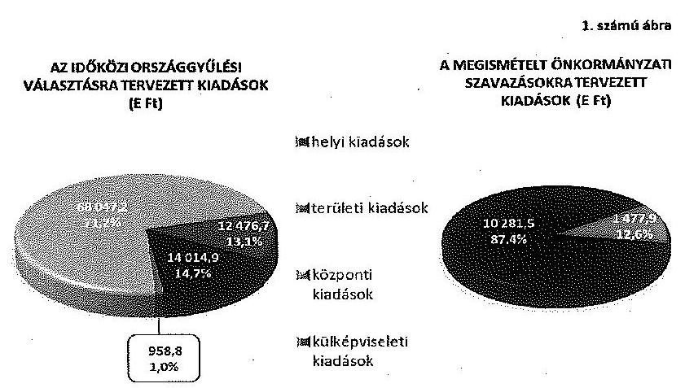

---

Az NVI az idöközi választások lebonyolításával kapcsolatos informatikai, illetve a külképviseleti feladatok ellátása érdekében, a választási feladatok pénzügyi fedezetének biztosítására megállapodásokat kötött a KEKKH-val és a KKM-mel. Mindkét megállapodás a választások lebonyolítását követően került aláírásra. A megállapodásokban szereplő összegek átutalására, az Áht. kötelezettségvállalásra vonatkozó szabályait betartva, a megállapodások megkötését követően került sor. A vonatkozó jogszabályok - a 6/2014. és a 7/2014. IM rendeletek - az egyéb szervezetekkel (KKM, KEKKH) kötendő megállapodások megkötésének határidejét nem rögzítették.

Az NVI és a KEKKH között létrejött - 1165,9 E Ft pénzeszközátadásról szóló - megállapodás a 2014. november 9-ei megismételt önkormányzati szavazások és a 2014. november 23 -ai időközi országgyűlési választás informatikai feladatainak ellátására - jogszabályi tilalom hiányában - együttesen vonatkozott.

A KEKKH az időközi választások pénzügyi tervét a 6/2014. és a 7/2014. IM rendeletek előirása szerinti részletező nyilvántartása részeként készítette el. A KEKKH saját forrásból megvalósítandó feladatellátást nem tervezett. A pénzügyi terv módosítására nem került sor. A tervadatok, az NVI-vel kötött megállapodás 1. számú mellékletében foglaltakkal azonosan, a megismételt önkormányzati szavazásokra és az időközi országgyűlési választásra együttesen tartalmazták a kifizetésekre előirányzott összegeket. Személyi jellegű kiadásokra 312,4 E Ft-ot határoztak meg, melyből 114,3 E Ft a megismételt önkormányzati szavazásokhoz, 198,1 E Ft az időközi országgyűlési választásokhoz kapcsolódott. A megállapodás szerinti 853,4 E Ft összegű dologi kiadást - nevesítve egyik választáshoz sem rendelték hozzá. A vonatkozó jogszabályok - a 6/2014. és a $7 / 2014$. IM rendeletek - az egyéb szervezetekkel kötendő megállapodások tartalmi követelményeit nem rögzítették.

A KKM-mel kötött - külképviseleti feladatok ellátására vonatkozó, 3572,0 E Ft összegű pénzeszközátadásról szóló - megállapodás a 2014. november 23 -ai időközi országgyűlési választáshoz kapcsolódott.

A KKM pénzügyi tervét az NVI-vel megkötött megállapodás 3. számú melléklete tartalmazta. A KKM pénzügyi terve az NVI által megállapodás szerint folyósítandó költségvetési támogatást, mint bevételt nem foglalta magában. A pénzügyi tervvel szemben támasztott tartalmi követelményeket a vonatkozó jogszabályban nem határozták meg. A pénzügyi tervben a kiadásokat a megállapodásban foglaltaknak megfelelően, a ténylegesen megvalósítani tervezett feladatonként tervezték. A pénzügyi terv készítésekor figyelembe vették a 6/2014. IM rendelet 1. számú melléklete szerinti normatív tételeket, valamint a további, nem normatív jellegű - a KÜVI-k vezetőjének és tagjainak utazásával, szállásával és napidíjaival kapcsolatos - kiadásokat. A pénzügyi tervben dologi kiadásokra 2430,0 E Ft-ot, személyi juttatásokra 930,0 E Ft-ot, munkaadót terhelő járulékokra 212,0 E Ft-ot terveztek. A tervezés során 10 KÜVI működtetésével számoltak. A személyi juttatásokat a választási névjegyzékbe várhatóan felvételre kerülő szavazók, és az az alapján meghatározott KÜVI tagok számának megfelelően tervezték. A pénzügyi tervben saját forrás felhasználásával nem számoltak.

---

A pénzügyi terv elkészítésének határidejét, és a tervezéssel szemben támasztott követelményeket (pénzügyi terv tartalma, felépítése, szükség szerinti módosítása) jogszabályban nem határozták meg, ezért a tervezés az ellenőrzött helyi és területi választási irodáknál nem egységes elvek mentén történt.

Az időközi országgyűlési választással érintett, illetve a megismételt önkormányzati szavazásokkal összefüggésben ellenőrzött választási irodák - a 6/2014. és a 7/2014. IM rendeletekben előírt kötelezettségnek megfelelően - elkészítették a választás pénzügyi tervét. Hat HVI a pénzügyi tervében - a jogszabályi előírások által biztosított lehetőség figyelembe vételével, az állami támogatáson felül - önkormányzati (intézményi) saját forrás igénybevételét is előirányozta. Egy TVI és három HVI - a választást követően - a tényleges teljesítési adatok ismeretében a tervét módosította.

# 1.2. Az idöközi választások informatikai rendszerének kialakítása, a közbeszerzési eljárások lebonyolítása 

Az NVI a Ve., a 28/2013. KIM rendelet és a 17/2013. KIM rendelet előírásainak megfelelően gondoskodott a választás informatikai rendszerének kialakításáról és biztonságos múködtetéséről. Az NVI az informatikai rendszer részeként - a 2014. évi általános választásokon túl, az időközi választások és a megismételt önkormányzati szavazások során is - folyamatosan múködtette a nemzeti választási rendszert (NVR), a választási ügyviteli rendszert (VÜR), valamint a választás pénzügyi-logisztikai rendszerét (VPIR, VLOG).

Az NVI számára - a 17/2013. KIM rendelet előírásának megfelelően - a központi informatikai rendszer működtetési környezetének infrastrukturális hátterét és annak elérhetőségét a KEKKH biztosította. A KEKKH az NVI-vel kötött megállapodás alapján gondoskodott az informatikai rendszerbe történt bejelentkezés, betekintés, adatlekérés, adatmódosítás naplózásáról és a napló adatainak öt évig történő megőrzéséről. Az informatikai rendszert - a minősített adat védelméről szóló 2009. évi CLV. törvény előírásainak megfelelően - biztonsági szempontból a Nemzeti Biztonsági Felügyelet a választásokat megelőzően ellenőrizte.

Az NVI gondoskodott az idöközi választások lebonyolításához szükséges közbeszerzési eljárások lefolytatásáról, melyek során - a közbeszerzési terv egy módosításának kivételével - betartotta a Kbt. előírásait. A 2014. november 23-ai időközi országgyűlési és ezzel együtt a 2014. november 9-ei megismételt önkormányzati szavazásokat is érintő három, összesen 763439 E Ft összegű beszerzési eljárást szabályszerűen folytatták le.

A 2014. évi helyi települési illetve nemzetiségi önkormányzati képviselők és a polgármesterek választása pénzügyi, logisztikai lebonyolításához, az NVR szoftver teszteléséhez, illetve az NVI folyamatos ügyviteli és gazdálkodási tevékenységéhez használt alkalmazások továbbfejlesztése, speciális szakértői tevékenysége tárgyában egy, 619000 E Ft összegű, közösségi, hirdetmény nélküli tárgyalásos eljárást folytattak le.

---

A 2014-2017. évek során lebonyolításra kerülő időközi választásokhoz és helyi népszavazásokhoz szükséges nyomdai termékek és szolgáltatások tárgyú, 141261 E Ft összegű beszerzést a 218/2011. Korm. rendelet szerint folytatták le, amelyhez az Országgyűlés Nemzetbiztonsági Bizottságának 8/2014. (VIII. 21.) számú határozata a Kbt. hatálya alóli mentesítésről rendelkezésre állt.

A 2014-2017. évi időközi választások kiszolgálását támogató, 3178 E Ft összegű, infrastruktúra kiegészítő szerver és hálózati eszközök beszerzését központosított közbeszerzési eljárás keretében bonyolították le.

Az NVI a 2015. évben lebonyolítandó időközi választásokhoz szükséges, a Nemzeti Választási Rendszer továbbfejlesztésére és a közvetlenül kapcsolódó szolgáltatások nyújtására további egy, a 218/2011. Korm. rendelet szerinti beszerzési eljárást folytatott le a 2014. évben, amelyhez az Országgyűlés Nemzetbiztonsági Bizottságának 23/2013. (VII. 15.) számú határozata a Kbt. hatálya alóli mentesítésről rendelkezésre állt.

Az NVI a 2014. évi közbeszerzési tervét a Kbt. 33. § (1) bekezdése szerinti határidőn belül, 2014. március 24 -én elkészítette, ezt követően két alkalommal módosította. A Kbt. 33. § (3) bekezdésének előirása ellenére azonban egy - a 2014-2017. évi időközi választások kiszolgálását támogató infrastruktúra kiegészítő szerver és hálózati eszközök beszerzése tárgyában, a központosított közbeszerzés keretében 2014. szeptember 30-án indított - eljárással a közbeszerzési tervet nem módosították.

Az NVI a beszerzésekre fordított összes kiadást az időközi országgyűlési választásra számolta el.

Az időközi választások lebonyolítása érdekében a KEKKH, a KKM, a helyi és területi választási irodák közbeszerzési értékhatárt elérő beszerzést, szolgáltatásvásárlást, beruházást, felújítást nem hajtottak végre.

# 2. A KÖLTSÉGVEtÉSBŐL BIZTOSÍTOTT FINANSZíROZÁSI FORRÁSOK ELOSZTÁSA, AZ ELŐIRÁNYZATOK KEZELÉSE 

A 2014. évi költségvetési törvényben 81000,0 E Ft támogatás állt az NVI rendelkezésére az „időközi és nemzetiségi választások lebonyolítása" fejezeti kezelésű előirányzaton, amelyet az időközi önkormányzati választások fedezetére különített el.

A 2014. évi idöközi országgyűlési képviselöválasztás előkészítésének és lebonyolításának fedezetét az NVI - az Áht. előírásainak megfelelően - előirányzat átcsoportosításokkal biztosította. Az NVI a 2014. évi időközi országgyűlési képviselőválasztás központi költségeire a 73056,0 E Ft fedezetet a költségvetési törvény szerinti 81000,0 E Ft-ból, a választásban résztvevő szerveknek átadott pénzeszközökre - 18068,0 E Ft támogatásra és annak 34,0 E Ft tranzakciós díjára - a 2013. évi időközi önkormányzati és nemzetiségi választások maradványából biztosított előirányzatot. Az NVI - az Áht. előírásaival összhangban - a 2013. évi előirányzat maradványból első lépésben a 2014. évi időközi önkormányzati választások, majd onnan a 2014. évi időközi országgyűlési választások fejezeti kezelésű előirányzatra csoportosított át előirányzatot.

---

Az NVI a 2014. évi időközi országgyűlési választásra tervezett központi kiadások előirányzati fedezetének biztosítása érdekében - az Áht. előírásaival összhangban - az intézményi eredeti előirányzatait módosította, a dologi kiadások előirányzatát 51 290,0 E Ft-tal, a felhalmozási kiadások előirányzatát 21 750,0 E Ft-tal, a személyi juttatások előirányzatát 16,0 E Ft-tal emelte meg.

A módosított előirányzatok - az Áht. előírásának megfelelően - a tényleges kiadásokra fedezetet biztosítottak. Az NVI a 73 056,0 E Ft intézményi előirányzat terhére összesen 72 809,3 E Ft teljesítést számolt el, a 2014. évi időközi országgyűlési választás fejezeti kezelésű előirányzatára átcsoportosított 18 068,0 E Ft tényleges felhasználása - 458,5 E Ft-tal kevesebb - 17 609,5 E Ft volt.

Az NVI a megismételt önkormányzati szavazások előkészítését és lebonyolítását a helyi önkormányzati képviselők és polgármesterek, valamint nemzetiségi önkormányzati képviselők 2014. évi általános választása részeként, annak kiadási előirányzatai terhére tervezte és számolta el. A megismételt szavazások fedezetét a 2014. évi önkormányzati és a nemzetiségi választásokra - az 1457/2014. (VIII. 14.) számú Kormányhatározat alapján a rendkívüli kormányzati intézkedésekre szolgáló tartalékból - rendelkezésre bocsátott 7,0 Mrd Ft maradványa biztosította.

Az NVI az előirányzat-módosításokat az Áht. és az Ávr. előírásainak megfelelően - a fejezeti kezelésű előirányzatok módosítását az NVI elnöke, a saját hatáskörű intézményi előirányzat-módosításokat a gazdasági főosztályvezető kezdeményezésére - szabályszerűen hajtotta végre.

Az NVI a KEKKH részére a választási feladatainak ellátásához szükséges pénzügyi fedezetet biztosította, azonban a támogatás folyósítására a 6/2014. IM rendelet 3. §-ában, illetve a 7/2014. IM rendelet 3. §-ában foglaltak ellenére nem a közöttük létrejött megállapodás szerinti feltételekkel került sor. A megállapodás 1. pontjában rögzítették, hogy az NVI 1165,9 E Ft-ot biztosít, amelynek $50,0 \%$-át ( 582,9 E Ft-ot) a megállapodás mindkét fél általi aláírását követő 8 munkanapon belül utalja át KEKKH részére. A megállapodás 2. és 7. pontja szerint a fennmaradó részt a tényleges költségelszámolás alapján, az elszámolás elfogadását követő 8 munkanapon belül teljesíti. A megállapodásban foglaltak ellenére az NVI a megállapodás szerinti támogatási öszszeget 2015. január 12-én egy összegben folyósította. Mivel az NVI az időközi választásokat követően folyósította a költségvetési támogatást, így a KEKKH a vásárolt informatikai szolgáltatás ellenértékét, 853,4 E Ft-ot - amely a teljes támogatási összeg 73,2 -át $\%$ tette ki - saját forrásból, a szabad előirányzatai terhére megelőlegezte.

A KEKKH az időközi országgyűlési választásra és a megismételt önkormányzati szavazásra eredeti előirányzatot nem tervezett, a támogatással történő elszámolást követően - 2015. március 9-én - az Áht. és Ávr. előírásainak megfelelően módosította a 2015. évi személyi jellegű kifizetések és járulékai, valamint a dologi kiadások kiemelt előirányzatait. A saját forrásból teljesített kifizetésekre a KEKKH szabad előirányzatai biztosították a fedezetet.

Az NVI a közte és a KKM között létrejött megállapodás alapján az időközi országgyűlési képviselőválasztás külképviseleti feladatainak előkészítésére és lebonyolítására szolgáló 3572,0 E Ft fedezetet a KKM részére biztosította, de

---

arra a 6/2014. IM rendelet 3. §-ában foglaltakat figyelmen kívül hagyva, nem a megállapodás szerinti feltételekkel került sor. A megállapodás 2. pontja szerint a kifizetés a KKM elszámolásának NVI általi elfogadását követő 8 munkanapon belül volt esedékes. Az elszámolásra 2015. április 23-án került sor, a kifizetést azonban - a megállapodásban foglaltak ellenére - az NVI ezt megelőzően, 2015. január 12-én teljesítette.

A KKM az időközi országgyúlési választással összefüggésben eredeti kiadási előirányzatot a költségvetésében nem tervezett, az Áht. előírásainak megfelelően, év közben módosította az előirányzatait. A KKM az NVI-től kapott központi költségvetési támogatással azonos összegben, két részletben hajtott végre előirányzat módosítást. 2015. június 30-án 3381,0 E Ft-tal a KKM Központi Igazgatása előirányzatát, 2015. november 15-én 190,5 E Ft-tal a Külképviseletek Igazgatása előirányzatát emelte meg.

Az NVI az időközi országgyúlési választásokra - a 6/2014. IM rendelet előírásai szerint, az 1. számú mellékletben szereplő normatív tételek alapján a választási feladatoknak megfelelő ütemezésben, előlegként biztosította az érintett választási irodák részére a feladataik ellátásához szükséges forrásokat.

Az NVI a megismételt önkormányzati szavazások kiadásainak fedezetére a 7/2014. IM rendelet előírásának megfelelően a feladattípusú pénzügyi elszámolás elfogadását követően - a fővárosi és az érintett megyei önkormányzatok, illetve települési önkormányzatok fizetési számlájára - összesen 12 007,1 E Ft-ot folyósított. A 7/2014. IM rendelet 1. számú mellékletében rögzített normatív tételek szerinti összeget 2015. február 4-én és február 5-én utalta át az NVI a TVI-k és a HVI-k részére.

Az ellenőrzött helyi és területi választási irodák az időközi országgyűlési választás, illetve a megismételt önkormányzati szavazások kiadásainak fedezetére az előirányzatokat az önkormányzati hivatalok költségvetéseiben - az Áht. előírásainak megfelelően - részben eredeti előirányzatként, részben év közben végrehajtott előirányzat-módosítással biztosították.

# 3. AZ IDŐKÖZI VÁLASZTÁSOK ELŐKÉSZÍTÉSÉHEZ, LEBONYOLÍTÁSÁHOZ RENDELKEZÉSRE ÁLLÓ PÉNZESZKÖZÖK FELHASZNÁLÁSA 

### 3.1. Az idõközi választási pénzeszközök nyilvántartása, a felhasználás szabályozottsága

Az NVI - a 6/2014. és a 7/2014. IM rendeletek előírásainak megfelelően - kialakította az időközi országgyűlési választás és a megismételt önkormányzati szavazás céljára biztosított pénzeszközök választásonként elkülönített számviteli kezelését és a választási feladatokkal kapcsolatos részletező nyilvántartást. A választási pénzeszközöket a főkönyvi könyvelésben az egyéb pénzeszközöktől elkülönítve, a 68/2013. NGM rendeletben előírtak szerint tartotta nyilván, ezen belül az előírásoknak megfelelően biztosította a választásonkénti elkülönítést.

---

Az NVI a 7/2014. IM rendelet 6. § (1) bekezdésében előírtak ellenére a KEKKH-val kötött megállapodás alapján finanszírozott, a megismételt önkormányzati szavazáshoz kapcsolódó 114,3 E Ft személyi kiadást tévesen az idöközi országgyűlési választáshoz kapcsolódó kiadásként mutatta ki.

Az NVI mind az időközi országgyűlési választáshoz, mind a megismételt önkormányzati szavazáshoz kapcsolódó tényleges pénzforgalomról a 6/2014. és a 7/2014. IM rendeletekben előírt tartalommal részletezö nyilvántartást vezetett.

A KEKKH a 68/2013. NGM rendeletben előírtak szerint az időközi országgyűlési választás és a megismételt önkormányzati szavazás céljára szolgáló pénzeszközöket az egyéb pénzeszközeitől elkülönítette. A választásokra fordított kiadásokat forrásonként külön kezelték, a részletező nyilvántartást is forrástípusonként alakították ki, azonban a 6/2014. IM rendelet és a 7/2014. IM rendelet 6. § (1) bekezdésében foglaltak ellenére választásonként nem különítették el.

A KKM az időközi országgyűlési képviselőválasztás céljára biztosított pénzeszközöket a 68/2013. NGM rendelet és a 6/2014. IM rendelet előírásainak megfelelően különítette el. A tényleges pénzforgalomról megfelelő tartalommal részletező nyilvántartást vezetett.

Az időközi országgyűlési választásokban érintett, valamint a megismételt önkormányzati szavazásokkal kapcsolatban ellenőrzött választási irodák - egy kivételével - a választás céljára szolgáló pénzeszközök elkülönített számviteli kezeléséről gondoskodtak. A választási pénzeszközöket a 6/2014. és a 7/2014. IM rendeletek előírásainak megfelelően, az egyéb pénzeszközöktől elkülönítetten, a 68/2013. NGM rendelet 1. melléklete szerint, és a 2014. évi általános választásoktól elkülönítve tartották nyilván.

A Budapest XVIII. kerületi HVI a 7/2014. IM rendelet 1. § (2) bekezdés d) pontjában és a 68/2013. NGM rendelet 1. mellékletében foglaltak ellenére a választási pénzeszközöket nem teljes körűen különítette el. A megismételt önkormányzati szavazással kapcsolatosan saját forrásból teljesített jutalom és járulék kifizetésekből 1405,7 E Ft-ot, valamint 3,5 E Ft összegű választásnapi reprezentációs kiadást nem a választással kapcsolatos tevékenységek között, hanem általános igazgatási tevékenységként tartottak nyilván.

Az ellenőrzött választási irodák az időközi országgyűlési választásokkal és a megismételt önkormányzati szavazásokkal kapcsolatosan teljesített pénzforgalomról a 6/2014. és a 7/2014. IM rendeletek előírásainak megfelelő részletező nyilvántartást vezettek.

Az NVI az Áht., az Ávr. és a vonatkozó IM rendeletek előírásaival összhangban megalkotta a gazdálkodásra, valamint az időközi országgyűlési választások és a megismételt önkormányzati szavazások előkészítéséhez és lebonyolításához rendelkezésre álló pénzeszközök felhasználására vonatkozó belsö szabályzatokat. Gazdálkodási szabályzatában meghatározta a gazdálkodási jogkörök gyakorlásának részletszabályait, rendelkezett a gazdálkodá-

---

si jogkörök gyakorlását megalapozó kijelölésekről, felhatalmazásokról, aláírásmintákról.

A KEKKH a jogszabályi előírásoknak megfelelően elkészítette a gazdálkodásra - így a számvitel rendjére, a gazdálkodási jogkörök gyakorlására, illetve a célfeladatok, prémiumfeladatok kijelölésére és kifizetésére - vonatkozó belső rendelkezéseit. A választásokra speciális szabályozást nem alakított ki, a választási pénzeszközök felhasználása során az - Áht. és az Ávr. előírásaival összhangban megalkotott - általános gazdálkodási szabályzatai előírásait alkalmazta.

A KKM az időközi országgyűlési választásoknál az általánosan érvényes belső szabályzatok mellett - a 2014. évi általános országgyűlési választási feladatokra vonatkozóan az Áht., az Ávr. és a 6/2014. IM rendelet előírásaival összhangban kialakított - speciális belső utasításokat is alkalmazott. Az utasítások tartalmazták a választások vonatkozásában a gazdálkodási jogkörök általánostól eltérő gyakorlásának rendjét, a jogkörök gyakorlására jogosultak felsorolását. Rendelkeztek továbbá a választási kiadások tervezése, a választások előkészítése és lebonyolítása speciális feladatairól, valamint a választásokhoz felhasznált költségvetési források nyilvántartási és ellenőrzési kötelezettségéről.

Az időközi országgyűlési képviselő választásban résztvevő három választási iroda rendelkezett - az Áht. és az Ávr. előírásainak megfelelő - a gazdálkodási és ellenőrzési jogkörök gyakorlásának rendjét meghatározó belső szabályzattal.

A választási pénzeszközök feletti gazdálkodási jogkörök gyakorlásának rendjét a megismételt önkormányzati szavazások körében ellenőrzött területi és helyi választási irodák $60 \%$-a az Áht. és Ávr. előírásaival összhangban, megfelelően szabályozta. Egy TVI és három HVI belső szabályozása nem felelt meg teljes körűen az Ávr. rendelkezéseinek.

A Heves Megyei Önkormányzati Hivatalnál a belső szabályzatban foglaltak szerint éltek az Ávr. 53. § (1) bekezdésében foglalt, az előzetes írásbeli kötelezettségvállalás mellőzésének lehetőségével, azonban az Ávr. 53. § (2) bekezdése ellenére a 100 E Ft alatti kifizetések rendjét nem szabályozták.

A Jászkiséri HVI vezetője a megismételt választási eljárással kapcsolatosan a kötelezettségvállalásról, ellenjegyzésről, érvényesítésről, utalványozásról a 7/2014. számú jegyzői utasításban rendelkezett, azonban az Ávr. 13. § (2) bekezdés a) pontjának előirása ellenére nem rendezte a teljesítésigazolás gyakorlásának módjával, az arra jogosultak kijelölésével kapcsolatos előírásokat. Az Ávr. 57. § (4) bekezdésének előirása ellenére a kötelezettségvállaló nem jelölte ki írásban a teljesítésigazolót. A 8/2014. jegyzői rendelkezés értelmében éltek az Ávr. 53. § (1) bekezdésében foglalt, az előzetes írásbeli kötelezettségvállalás mellőzésének lehetőségével, azonban az Ávr. 53. § (2) bekezdése ellenére a 100 E Ft alatti kifizetések rendjét belső szabályzatban nem rögzítették.

Ózd HVI választási szabályzata előírta az Ózd Város Önkormányzata Jegyzőjének 12/2013.(VIII.1.) sz. jegyzői utasítással kiadott Gazdálkodási szabályzat alkalmazását. A gazdálkodási szabályzatban a gazdálkodási jogkörök gyakorlásának sorrendjét nem a jogszabályi előírásoknak megfelelően határozták meg, mi-

---

vel az Ávr. 59. § (1) bekezdésével ellentétesen az utalványozást az érvényesítés elé helyezték.

A Recski Közös Önkormányzati Hivatal Jegyzője a választási szabályzatban az Ávr. 60.§ (1)-(2) bekezdéseiben rögzített összeférhetetlenségi szabályokat csak a teljesítésigazolóra és az érvényesítôre vonatkozóan határozta meg. A szabályozás az Ávr. 60.§ (3) bekezdésében foglaltak ellenére nem tartalmazta a teljesítésigazolásra jogosultak aláírás-mintáit.

# 3.2. Az idôközi választásokkal kapcsolatos kiadások teljesítésének szabályszerűsége 

Az NVI-nél az időközi országgyűlési választásra elszámolt kiadások teljesítése során a gazdálkodási és ellenőrzési jogkörök gyakorlása összességében megfelelt a jogszabályok és a belső szabályzatok előírásainak.

A kötelezettségvállalásokra írásban, az arra jogosult személy által, pénzügyi ellenjegyzést követően került sor. A kötelezettségvállalás időpontjának hiányában azonban nem minden esetben volt igazolható, hogy az Áht. 37. § (1) bekezdésének megfelelően a pénzügyi ellenjegyzés megelőzte a kötelezettségvállalást.

A kijelölt teljesítésigazoló valamennyi kifizetésnél ellenőrizte és igazolta a kiadások teljesítésének jogosságát, összegszerűségét, ellenszolgáltatást is magában foglaló kötelezettségvállalás esetén annak teljesítését. Az érvényesítés valamennyi kifizetés során teljesítésigazoláson alapult, azonban az érvényesítő az Ávr. 58. § (2) bekezdésében foglaltak ellenére nem jelezte az utalványozónak, hogy a megelőző ügymenetben nem tartották be a belső szabályzat előírásait, mivel a 2015. évi időközi választás érdekében felmerült kiadást az érvényesített okmányon tévesen a 2014. évi időközi választások jogcímre rendeltek elszámolni.

Az utalványozásra valamennyi ellenőrzött kifizetés esetében érvényesített okmány alapján, a belső szabályzatban előírt módon, az Áht. és az Ávr. előírásainak megfelelően, az arra jogosult által került sor.

A kiadások - a 6/2014. IM rendelet előírásainak megfelelően - célhoz kötötten, a választások érdekében merültek fel, de tévesen a 2014. évi időközi országgyűlési választás terhére számoltak el nyolc, a 2015 évi időközi országgyűlési választást érintő kifizetést.

A KEKKH-nál az időközi országgyűlési választások és a megismételt önkormányzati szavazások előkészítése és lebonyolítása érdekében felmerülő kiadások teljesítése során a gazdálkodási és ellenőrzési jogkörök gyakorlása megfelelt a jogszabályok és a belső szabályzatok előírásainak.

Valamennyi kifizetésre az arra jogosult által előzetesen vállalt írásbeli kötelezettségvállalás alapján, pénzügyi ellenjegyzést követően került sor. A kifizetések szabályszerű teljesítésigazoláson alapuló érvényesítést és utalványozást követően történtek.

---

A KEKKH-nál a kifizetések az időközi országgyűlési választások és a megismételt önkormányzati szavazások előkészítése és lebonyolítása érdekében merültek fel, célhoz kötöttek és indokoltak voltak.

A KKM esetében az időközi országgyűlési választások előkészítése, lebonyolítása érdekében felmerülő kiadások teljesítése során - az ellenőrzött mintatételek alapján - a gazdálkodási és ellenőrzési jogkörök gyakorlása részben felelt meg a jogszabályok és a belső szabályzatok előírásainak.

Valamennyi kifizetésre az arra jogosult vállalt írásbeli kötelezettséget. A pénzügyi ellenjegyzést az arra felhatalmazott személy végezte, azonban az Áht. 37. § (1) bekezdés előírása ellenére nem minden esetben volt igazolható, hogy a pénzügyi ellenjegyzés a kötelezettségvállalást megelőzően történt, mert a kötelezettségvállalás dokumentumán nem szerepelt a kötelezettségvállalás dátuma, illetve a pénzügyi ellenjegyzés a kötelezettségvállalást követően történt. Az érvényesítő az Ávr. 58. § (2) bekezdésében előírtak ellenére az utalványozónak nem jelezte, hogy a megelőző ügymenetben - a kötelezettségvállalás és pénzügyi ellenjegyzés során - az Áht. és az Ávr. előírásait nem tartották be. A teljesítésigazolás és az utalványozás szabályszerűen, az arra jogosult által minden esetben megtörtént.

A KKM ellenőrzött kifizetései a választások előkészítése és lebonyolítása érdekében merültek fel, célhoz kötöttek és indokoltak voltak.

A gazdálkodási és ellenőrzési jogkörök gyakorlása - a választási irodák által az időközi országgyűlési képviselő választással, illetve a megismételt önkormányzati szavazás lebonyolításával kapcsolatban teljesített kiadások ellenőrzése alapján - öt választási irodánál összességében megfelelt, három választási irodánál részben felelt meg, négy választási irodánál nem felelt meg a jogszabályok és a belső szabályzatok előírásainak.

A gazdálkodási jogkörök ellenőrzése során a választási irodáknál feltárt szabálytalanságokat, hiányosságokat részletesen a 2. számú melléklet ismerteti.

Az ellenőrzött választási irodáknál az időközi országgyűlési választásra és a megismételt önkormányzati szavazások lebonyolítására rendelkezésre álló pénzeszközök felhasználása - a gazdálkodási és ellenőrzési jogkörök gyakorlásánál feltárt hiányosságok ellenére - célhoz kötött és indokolt volt.

# 4. AZ IDŐKÖZI VÁLASZTÁSOKRA FELHASZNÁLT PÉNZESZKÖZÖK ELSZÁMOLÁSA 

Az NVI elnöke a feladattípusú elszámolás elkészítéséhez, a pénzügyi elszámolást segítő informatikai alkalmazásról - a 6/2014. és a 7/2014. IM rendeletek előírásait figyelembe véve - utasításokat adott ki.

Az időközi országgyűlési választásra vonatkozóan az NVI elnöke 2014. december 17-én körlevélben utasította a választási irodákat arra, hogy a feladattípusú elszámolás elkészítéséhez az elszámolást segítő VPIR informatikai alkalmazást az országgyűlési képviselők 2014. évi általános választása kapcsán kiadott 13/2014. NVI utasítás szerint vegyék igénybe.

---

A megismételt önkormányzati szavazásokkal kapcsolatban az NVI elnöke a TVI és HVI vezetőknek 2014. november 11 -én kiadott körlevelében intézkedett arról, hogy a 2014. október 12 -én megtartott általános önkormányzati választástól elkülönítetten kell elszámolni a megismételt önkormányzati választás kiadásait, a feladattípusú elszámolás készítése során figyelembe kell venni a 7/2014. IM rendelet előírásait, továbbá az elszámolást segítő informatikai alkalmazást a 33/2014. NVI utasítás szerint kell igénybe venni. Az NVI elnöke a pénzügyi elszámolást segítő informatikai rendszert a VÜR-ben elérhetővé tette a TVI-K és a HVI-k számára.

Az idöközi országgyưlési választás lebonyolításában érintett három választási iroda a 6/2014. IM rendelet előírásának megfelelően elkészítette a feladattípusú elszámolását, azonban azt a Budapest IV. kerületi OEVI a 6/2014. IM rendelet 7. § (1) bekezdésében előírt, a szavazás napját követő 15 napos határidőn túl, 14 napos késedelemmel, 2014. december 22-én rögzítette a VPIR rendszerben, amelynek oka az NVI VPIR rendszer alkalmazását előíró, az NVI 1838-1/2014. iktatószámú Elnöki utasításának az elszámolásra előírt határidőt követően történő kiadása volt.

A választási irodáknak feladatelmaradás vagy egyéb ok miatt visszafizetési kötelezettsége nem keletkezett. Tényleges többletköltség igény két választási irodánál merült fel. Az elszámolásokban kimutatott többletköltség igények a 6/2014. IM rendeletben foglaltaknak megfelelőek, indokoltak és jogszerúek voltak. A többletköltségként kimutatott összegek fedezetét az NVI az elszámolások 2015. február 16-ai elfogadását követően, a 6/2014. IM rendeletben előírt 8 munkanapon belül, 2015. február 18-án biztosította az érintett választási irodák részére.

A választási irodák vezetőit megillető személyi juttatások kifizetéséről - a 6/2014. IM rendeletben előírtaknak megfelelően - az NVI elnöke döntött, amiről 2015. február 16-án értesítette a Fővárosi TVI vezetőjét. A TVI vezető helyettese, a TVI tagjai, az OEVI és a HVI vezető személyi juttatásainak kifizetéséről a TVI vezetője - a 6/2014. IM rendelet előírásainak megfelelően - az NVI elnökének döntését és a pénzügyi fedezet rendelkezésre állását követően intézkedett, a kifizetéseket 2015. március 11-én teljesítették.

A megismételt önkormányzati szavazások feladattípusú elszámolását valamennyi ellenőrzött választási iroda a 7/2014. IM rendeletnek megfelelően elkészítette. Három választási iroda a 7/2014. IM rendelet 7. § (1)(2) bekezdéseiben előírt elszámolási határidőt a VPIR rendszerben történő rögzítés során betartotta, azonban az aláírt, papír alapú elszámolásuk határidőn túl készült.

A TVI-k az illetékességi körükbe tartozó HVI-k elszámolásainak megalapozottságát a 7/2014. IM rendeletben előírt határidőn belül ellenőrizték, ennek keretében a többletköltség igények indokoltságát tételesen megvizsgálták. A felülvizsgált elszámolások alapján készítették el a TVI-re összesített elszámolásaikat.

A TVI-k által a VÜR-ben benyújtott elszámolásokat az NVI felülvizsgálta. Az egyeztetések után elkészített végleges elszámolások elfogadásáról a 7/2014. IM rendelet előírásának megfelelően az NVI elnöke döntött, melyről 2015. február 2-án tájékoztatta a TVI vezetőket. Az NVI elnöke az elszámolás elfogadásakor

---

döntött a TVI és HVI vezetők és tagok személyi juttatásának kifizethetőségéről, és intézkedett a pénzügyi fedezet átutalásáról.

Az ellenőrzött TVI-k vezetői - egy kivételével - a 7/2014. IM rendelet előírásainak megfelelően, az NVI elnökének döntését és a pénzügyi fedezet rendelkezésre állását követően intézkedtek a TVI és HVI vezetők, valamint a TVI tagjai személyi juttatásának kifizetésére.

A Heves megyei TVI a Recski HVI vezető személyi juttatását a HVI elszámolásának ellenőrzését követően, de a 7/2014. IM rendelet 4. § (5) bekezdésében előírtak ellenére az elszámolások NVI elnöke általi elfogadását megelőzően kifizette.

A HVI tagok személyi juttatásainak kifizetése a Jászkiséri, a Recski és a Salgótarjáni HVI-nél, a 7/2014. IM rendelet 4. § (5) bekezdésében előírtak ellenére, az elszámolás elfogadása és a választási iroda tagjai személyi juttatásának kifizethetőségére vonatkozó NVI elnöki döntést megelőzően történt.

A megismételt önkormányzati szavazások elszámolásainak ellenőrzése során az ÁSZ két TVI és egy HVI esetében tárt fel hiányosságokat.

A Fővárosi TVI vezetője által aláírt elszámolásban az elszámolás elkészítésével megbízott TVI tagként olyan személy került megnevezésre, aki nem szerepelt a Ve. 67. § (1) bekezdése szerinti, a TVI tagjairól vezetett nyilvántartásban.

A Jász-Nagykun-Szolnok megyei TVI elszámolása - a 7/2014. IM rendelet 6. § (3) bekezdésének előírása ellenére - 19,1 ezer Ft-tal eltért a részletező nyilvántartástól. Egy fő TVB tag tiszteletdíja és annak járuléka feladatelmaradás (az ülésen történő részvétel elmaradása) miatt nem került kifizetésre. A normatív tételek alapján megállapított támogatással szemben a visszafizetési kötelezettséget nem szerepeltették az elszámolásban. A jogosulatlan összeget is tartalmazó elszámolást az NVI elfogadta, az elszámolás szerinti összeget a TVI részére átutalta. A TVI-nél 2015. augusztus 31-én feljegyzésben rögzítették a jogosulatlan igénybevétel miatti visszafizetési kötelezettséget és az NVI-vel történő kapcsolatfelvétel szükségességét. A TVI vezetője 2015. október 6-án levélben fordult az NVI Elnökéhez, tájékoztatást kérve a visszafizetés módjáról. A jogosulatlanul igénybevett összeg visszafizetése az ÁSZ helyszíni ellenőrzésének lezárásáig nem történt meg.

A Jászkiséri HVI a részére biztosított pénzügyi fedezetről a 7/2014. IM rendelet 6. § (3) bekezdésének előírása ellenére nem teljes körűen a részletező nyilvántartással összhangban számolt el. Az elszámolás a részletező nyilvántartással azonos végösszegű volt, azonban az elszámolásban a személyi juttatások között 12,7 E Ft-tal nagyobb, a dologi kiadások között pedig 12,7 E Ft-tal kisebb összeget mutatott ki a részletező nyilvántartásához képest.

A megismételt önkormányzati szavazásokhoz kapcsolódó tényleges többletköltség igény a 7/2014. IM rendelettel összhangban - a nem állami és nem önkormányzati tulajdonú szavazóhelyiségek bérleti díja, a szavazatszámláló bizottságba bevont póttagok tiszteletdíja és az átlagbérigények megtérítése miatt két HVI-nél merült fel. A többlettámogatási igények megalapozottak voltak, indokoltságukat az érintett TVI-k a 7/2014. IM rendelet előírásainak megfelelően, tételesen megvizsgálták.

---

Az NVI és a KEKKH által kötött - az időközi országgyűlési és önkormányzati választásokra együttesen vonatkozó - megállapodás 6. pontjában a folyósított támogatás elszámolására 2014. december 31-ei határidőt állapítottak meg, ami nem felelt meg a 6/2014. IM rendelet, illetve a 7/2014. IM rendelet 7. § (3) bekezdései elszámolási határidőre vonatkozó előírásainak.

A KEKKH az elszámolás során nem tartotta be a megállapodásban - illetve a 6/2014. IM rendelet és a 7/2014. IM rendelet 7. § (3) bekezdésében - foglalt határidőt. Az elszámoláson pontos dátum nem szerepelt, csak 2015. február megjelölés.

Az elszámolás a megállapodásban foglaltak szerint, a részletező nyilvántartással összhangban készült, együttesen tartalmazta az időközi országgyűlési választásra és a megismételt önkormányzati szavazásra elszámolt kiadásokat. A KEKKH a megismételt önkormányzati választáshoz kapcsolódóan a kapott támogatáson felül 113,2 E Ft saját forrás felhasználást számolt el a szabad előirányzatai terhére, az Áht. előírásainak megfelelően.

A KEKKH - NVI elnöke által 2015. február 24-én elfogadott - elszámolásában érvényesített kiadások összege 1074,4 E Ft volt, 91,4 E Ft visszafizetési kötelezettség mellett. A visszafizetési kötelezettséget a KEKKH a 6/2014. IM rendeletben előírt ${ }^{3}$, az elszámolás elfogadását követő 8 munkanapon belüli határidőben, 2015. február 24-én teljesítette.

A KKM az időközi országgyűlési választásra vonatkozó, az NVI és a KKM között létrejött megállapodás 7. pontjában szabályozott elszámolást a 6/2014. IM rendelet 7. § (3) bekezdésében előírt határidőn túl, több mint 3 hónap késedelemmel, 2015. április 23-án készítette el.

A KKM a tényleges pénzforgalomról a 6/2014. IM rendelet előírásának megfelelően vezetett részletező nyilvántartással összhangban, kiadásnemenként számolt el.

Az ÁSZ ellenőrzés megállapította, hogy a KKM elszámolása egy napidíj esetében téves összeget tartalmazott, a személyi juttatás 24,5 E Ft-tal kisebb összegben szerepelt a választás érdekében ténylegesen felhasznált összegnél. A különbözetet a KKM saját forrásából fedezte.

Az NVI az elszámolás elfogadásáról 2015. május 13-án döntött, amelyben a választásra biztosított 3572,0 E Ft támogatás és az elfogadott elszámolás szerinti 2470,9 E Ft különbözeteként 1101,1 E Ft visszafizetési kötelezettséget állapított meg a KKM terhére.

A KKM a visszafizetési kötelezettségének - a 6/2014. IM rendelet 9. § (4) bekezdésben előírt - az elszámolás elfogadását követő 8 munkanapos határidőn túl, 2015. június 12-én, 17 napos késedelemmel ${ }^{4}$ tett eleget.

[^0]
[^0]:    ${ }^{3}$ A 7/2014. IM rendelet nem tartalmazott a visszafizetésre vonatkozó rendelkezéseket.
    ${ }^{4}$ A visszafizetésre rendelkezésre álló határidő 2015. május 26-án lejárt.

---

Az NVI a 6/2014. IM rendelet előírása szerint a választási irodák és az egyéb szervezetek elfogadott elszámolásai alapján elkészítette az idöközi országgyúlési választás összesítö̉ elszámolását. Az összesítő elszámolást azonban a 6/2014. IM rendelet 7. § (4) bekezdésében előírt határidőn túl, 2015. május 15 -én készítette el. Az összesítő elszámolás határidőben történő elkészítését akadályozta, hogy a KEKKH - késedelmes - 2015. február 12-ei elszámolásáról az NVI elnöke 2015. február 24-én hozott döntést, valamint, hogy a KKM az elszámolását csak 2015. április 23-án készítette el.

Az NVI a 7/2014. IM rendelet előírásának megfelelően, a TVI-k és a HVI-k elfogadott elszámolásainak figyelembevételével, az éves költségvetési beszámolója jóváhagyását megelőzően, 2015. január 31-én elkészítette az önkormányzati megismételt szavazások összesítő elszámolását.

Az NVI az időközi országgyűlési választásra összesen 90 418,9 E Ft, a megismételt önkormányzati szavazásokra összesen 12 007,1 E Ft kiadást számolt el.

Az NVI által a 2014. évi időközi országgyűlési választásra elszámolt 90 418,8 E Ft-ból 114,3 E Ft ténylegesen a 2014. évi megismételt önkormányzati szavazáshoz kapcsolódott, így a két elszámolás ezzel az összeggel eltért a ténylegesen az adott választás érdekében felmerült kiadásoktól. További 30 878,1 E Ft a 2015. évben lebonyolított időközi országgyűlési választáshoz kapcsolódó kiadás volt, ezért ez az összeg a 2014. évi időközi országgyűlési választásról készített öszszesítő elszámolásban tévesen szerepelt.

Az NVI által az időközi országgyűlési választásra, valamint a megismételt önkormányzati szavazásokra elszámolt kiadásokat, annak főbb jogcímenkénti összegeit a következő, 2. számú ábra szemlélteti.
2. számú ábra
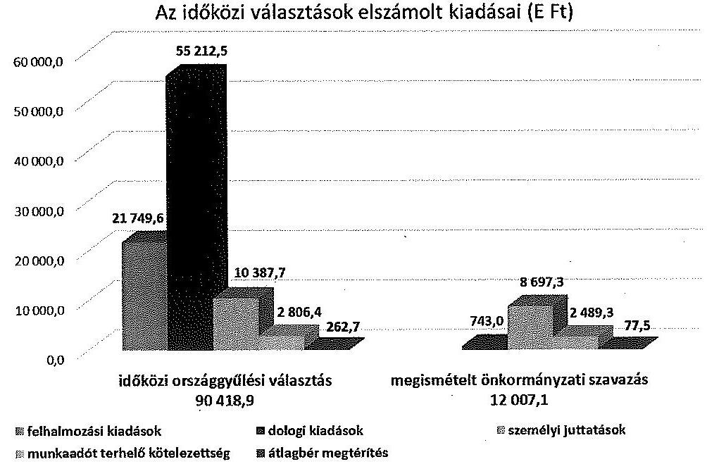

---

# 5. AZ IDŐKÖZI VÁLASZTÁSOKRA FORDÍTOTT PÉNZESZKÖZÖK FELHASZNÁLÁSÁNAK ÉS ELSZÁMOLÁSÁNAK ELLENŐRZÉSE 

Az NVI eleget tett a 6/2014., illetve a 7/2014. IM rendeletekben foglalt, az elszámolások megalapozottságára vonatkozó ellenőrzési kötelezettségének. Az elszámolások folyamatba épített, dokumentum alapú ellenőrzését külső szolgáltatóval kötött vállalkozási szerződés útján biztosította. A KEKKH és a KKM elszámolását ezen felül az NVI pénzügyi szakreferense is ellenőrizte folyamatba épített ellenőrzés keretében.

A KKM és az NVI között létrejött megállapodás 1. számú mellékletének 2.6. pontjában, valamint a 6/2014. IM rendelet 1. § (2) bekezdés b) pontjában előírtak ellenére a KKM nem látta el az időközi országgyűlési választás előkészítésének, lebonyolításának, pénzügyi kiadásainak és elszámolásának ellenőrzésével kapcsolatos feladatait. A 2/2014. KüM. utasítás VII. Fejezet 6. pontjában foglaltak ellenére a KKM Ellenőrzési Főosztálya a választást követő 80 napon belül nem végezte el a választás pénzügyi kiadásainak ellenőrzését.

A területi választási irodák a 6/2014. IM és 7/2014. IM rendeletek 8. § (2) és (4) bekezdéseiben előírt ellenőrzési kötelezettségüknek eleget tettek. A HVI (OEVI) elszámolása megalapozottságának ellenőrzését valamennyi TVI a jogszabályban meghatározott határidőn belül ellenőrizte. Az ellenőrzések elvégzéséről a TVI-k az összesített elszámolás NVI részére benyújtásakor tanúsítványban nyilatkoztak. A vonatkozó jogszabályok - a 6/2014. és a 7/2014. IM rendelet - az ellenőrzés módját nem határozza meg. Négy TVI esetében az elszámolások megalapozottságának ellenőrzése a HVI-ktől bekért dokumentum másolatok alapján történt. A Fővárosi TVI a hozzá tartozó OEVI és két HVI tekintetében az elszámolások megalapozottságának ellenőrzését helyszíni ellenőrzés keretében végezte el.

A 6/2014. IM rendelet és 7/2014. IM rendelet 1. § (2) bekezdés b) pontjában előírt - a 8. § (1) bekezdés értelmében a választási iroda tagja által ellátandó - ellenőrzési kötelezettség teljesítése érdekében a választási irodák vezetői, a Jászkiséri HVI kivételével, megbízást adtak a választáshoz biztosított támogatás felhasználásának ellenőrzésére, az előírt ellenőrzéseket a megbízottak végrehajtották.

Az Ózdi HVI vezető által az ellenőrzésre kijelölt személy a 7/2014. IM rendelet 8. § (1) bekezdésének előirása ellenére nem volt a HVI tagja.

A támogatás felhasználásának ellenőrzésére a Jászkiséri HVI vezetője a 7/2014. IM rendelet 8. § (1) bekezdésében foglalt előírás ellenére nem adott megbízást a HVI tagjának, a 7/2014. IM rendelet 1. § (2) bekezdés b) pontjában foglalt felelősségi körében az előírt ellenőrzés végrehajtásáról nem gondoskodott.

---

A választási irodák tagjai által végzett ellenőrzések nem tárták fel a pénzeszközök számviteli kezelésénél, nyilvántartásánál, a gazdálkodási és ellenőrzési jogkörök gyakorlásánál, valamint a támogatás elszámolásánál jelentkező, jelen ÁSZ ellenőrzés által megállapított hibákat, hiányosságokat.

Budapest, 2016. 04 . hónap 08 .nap
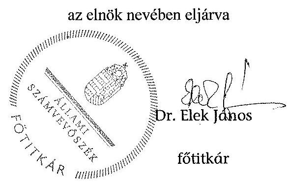

Melléklet: $\quad 4 \mathrm{db}$
Függelék: $\quad 2 \mathrm{db}$

---

# Ellenőrzött szervezetek jegyzéke 

| Központi szervek | Nemzeti Választási Iroda |
| :-- | :-- |
|  | Közigazgatási és Elektronikus Közszolgáltatások Közpon- |
|  | ti Hivatala |
|  | Külgazdasági és Külügyminisztérium |

Területi Választási szervek (TVI)

Borsod-Abaúj-Zemplén Megyei Önkormányzati Hivatal Budapest Főváros Főpolgármesteri Hivatal
Heves Megyei Önkormányzati Hivatal
Jász-Nagykun-Szolnok Megyei Önkormányzati Hivatal
Nógrád Megyei Önkormányzati Hivatal

Helyi választási szervek (OEVI, HVI)

Budapest Főváros IV. kerület Újpest Önkormányzat Polgármesteri Hivatala
Budapest Főváros XIII. kerületi Polgármesteri Hivatal
Budapest Főváros XVIII. kerület Pestszentlőrinc-
Pestszentimrei Polgármesteri Hivatal
Jászkiséri Polgármesteri Hivatal
Özdi Polgármesteri Hivatal
Recski Közös Önkormányzati Hivatal
Salgótarján Megyei Jogú Város Polgármesteri Hivatala

---

.

---

# A gazdálkodási jogkörök gyakorlása az ellenőrzött helyi és területi választási irodáknál 

| Megnevezés | A gazdálkodási jogkörök gyakorlásának összesitő értékelése | Kötelezettségvállalás, pénzügyi ellenjegyzés, teljesítésigazolás, érvényesítés, utalványozás során feltárt jellemző, rendszerszerú hiányosságok |
| :--: | :--: | :--: |
| Budapest Főváros   Főpolgármesteri   Hivatal | megfelelő | Rendszerszerú hiányosság nem volt. |
| Budapest Főváros IV. kerïlet Újpest Önkormányzat Polgármesteri Hivatala | részben megfelelő | Az Ávr. 55. § (1) bekezdésben előírtak ellenére, nem minden esetben az arra kijelölt személy gyakorolta a pénzügyi ellenjegyzést.   Egyes személyi kifizetéseknél az Ávr. 57. § (1) bekezdésében előírtak ellenére a teljesítésigazolás a tényleges teljesítést megelőzően történt.   A megbízási díjak pénztárból történő kifizetése során az Ávr. 58. § (1) bekezdésében és az 59. § (1) bekezdésében előírtak ellenére az érvényesités nem a teljesítésigazolás alapján történt, mivel az érvényesités megelőzte a teljesítésigazolást, valamint az utalványozás is a teljesítésigazolást megelőzően történt. |
| Budapest Főváros XIII. kerületi Polgármesteri Hivatal | megfelelő | Hiányosság nem volt. |
| Budapest Főváros   XVIII. Kerület Pest-   szentlőrinc-   Pestszentimrei Pol-   gármesteri Hivatal | részben   megfelelő | Az Ávr. 57. § (3) bekezdése ellenére több esetben a teljesítésigazolást nem az arra jogosult személy végezte. Az érvényesitő az Ávr.58. § (2) bekezdésében foglaltak ellenére az utalványozónak nem jelezte a jogosulatlan teljesítésigazolást.   Az Ávr. 58. § (3) bekezdése ellenére az érvényesités dátuma nem minden esetben előzte meg az utalványozás dátumát, így az 59. § (1) bekezdés ellenére az utalványozás nem érvényesített okmány alapján történt   Egy utalványrendeleten elrendelt 19 kifizetés esetében az Ávr. 59. § (1) bekezdés ellenére nem az arra jogosult utalványozott. |

---

| Borsod-AbaújZemplén Megyei Önkormányzati Hivatal | nem megfelelő | Az Ávr.57.§ (3) bekezdése ellenére a kifizetések döntő részénél nem igazolták a kiadások teljesítésének jogosságát, összegszerűségét, a teljesítés megtörténtét. Ezért az Ávr. 58.§ (1)-(2) bekezdései ellenére az érvényesítésre teljesítésigazolás hiányában került sor, az érvényesítő nem győződött meg arról, hogy a megelőző ügymenetben az Áht., az Ávr előírásait betartották-e, a teljesítésigazolás elmaradását az utalványozónak nem jelezte. |
| :--: | :--: | :--: |
| Ózdi Polgármesteri Hivatal | részben megfelelő | Az Áht. 37. § (1) bekezdésében és az Ávr. 55. § (1) bekezdésében előírtak ellenére egyes esetekben a kötelezettségvállalásra pénzügyi ellenjegyzés nélkül került sor.   Az Ávr. 57.§ (3) bekezdése ellenére nem minden esetben igazolták a kiadások teljesítésének jogosságát, összegszerűségét, a teljesítés megtörténtét, illetve nem tüntették fel a teljesítésigazolás dátumát.   Az érvényesítés a fenti esetekben teljesítésigazolás hiányában, illetve szabálytalan teljesítésigazolás alapján történt, valamint az érvényesítő az Ávr. 58. § (2) bekezdése ellenére nem jelezte az utalványozónak a pénzügyi ellenjegyzés és a teljesítésigazolás hiányát, illetve szabálytalanságát.   Továbbá az Ávr. 58. § (1) bekezdése ellenére az érvényesítés nem teljesítésigazolás alapján történt, mivel az érvényesítés megelőzte a teljesítésigazolást, valamint az Ávr. 59. § (1) bekezdése ellenére az utalványozás nem szabályszerűen érvényesített okmány alapján, és a teljesítésigazolást megelőzően történt. |
| Heves Megyei Önkormányzati Hivatal | nem megfelelő | Annak ellenére éltek az írásbeli kötelezettségvállalás mellőzésének lehetőségével, hogy a 100 E Ft alatti, írásbeli kötelezettségvállaláshoz nem kötött kifizetések rendjét az Ávr. 53. § (2) bekezdése ellenére nem szabályozták.   Az Ávr. 55. § (1) bekezdésében előírtak ellenére az írásba foglalt kötelezettségvállalásra pénzügyi ellenjegyzés nélkül került sor.   Az Ávr. 57. § (3) bekezdése ellenére a TVB tagok személyi kifizetéseihez kapcsolódóan a teljesítésigazolást nem az arra jogosult személy végezte, így az érvényesítés szabálytalan teljesítésigazoláson alapult.   Az Ávr. 58 § (1)-(2) bekezdései ellenére az érvényesítő nem észrevételezte, és az utalványozónak nem jelezte, hogy a megelőző ügymenetekben az Áht. és az Ávr. előírásait nem tartották be. |

---

| Recski Közös Önkormányzati Hivatal | nem megfelelő | Az Áht. 37.§ (1) és az Ávr. 53.§ (2) bekezdése ellenére a 100 E Ft alatti dologi és reprezentációs kifizetésekre annak ellenére nem készült írásbeli kötelezettségvállalás, hogy a választásra vonatkozó gazdálkodási szabályzatban nem rendelkeztek az írásbeli kötelezettségvállalás mellőzésének lehetőségéről.   Az Ávr. 55. § (1) bekezdésében előírtak ellenére a személyi kifizetéshez kapcsolódó kötelezettségvállalásokra pénzügyi ellenjegyzés nélkül került sor.   Az Ávr. 58. § (2) bekezdés ellenére az érvényesítő az utalványozónak nem jelezte, hogy a megelőző ügymenetekben nem tartották be az Áht. és az Ávr előírásait. Az Ávr. 60. § (2) bekezdésben rögzített összeférhetetlenségi szabályokat figyelmen kívül hagyva az érvényesítő a csoportos utalványon elrendelt személyi kifizetésben saját maga javára is ellátta az érvényesítést. |
| :--: | :--: | :--: |
| Jász-NagykunSzolnok Megyei Önkormányzati Hivatal | megfelelő | Rendszerszerú hiányosság nem volt. |
| Jászkiséri Polgármesteri Hivatal | nem megfelelő | Annak ellenére éltek az írásbeli kötelezettségvállalás mellőzésének lehetőségével, hogy a 100 E Ft alatti, írásbeli kötelezettségvállaláshoz nem kötött kifizetések rendjét az Ávr. 53. § (2) bekezdése ellenére nem szabályozták.   Az Ávr. 55. § (1) bekezdésében előírtak ellenére az írásba foglalt kötelezettségvállalásoknál nem minden esetben az arra jogosult végezte a pénzügyi ellenjegyzést.   A teljesítésigazoló Ávr. 57. § (4) bekezdésében előírt kijelölésének hiányában az Ávr. 57. § (1) bekezdése ellenére a kifizetéseket megelőzően nem történt meg a teljesítésigazolás.   Az Ávr. 58. § (1) bekezdésében foglaltak ellenére nem történt meg az érvényesítés, így az Ávr. 59. § (1) bekezdésében foglaltak ellenére az utalványozás nem érvényesített okmány alapján történt, valamint egyes kifizetésekre az Áht. 38. § (1) bekezdés ellenére utalványozás nélkül került sor. Az Ávr. 58 § (2) bekezdése ellenére az érvényesítő az utalványozónak nem jelezte, hogy a megelőző ügymenetekben az Áht. és az Ávr. előírásait nem tartották be. |
| Nógrád Megyei Önkormányzati Hivatal | megfelelő | Hiányosság nem volt. |
| Salgótarján Megyei Jogú Város Polgármesteri Hivatala | megfelelő | Hiányosság nem volt. |

---

.

---

Nemzeti Választási Iroda
Élnők

Ikt.sz.: GF / 11.2 / 2016.

Dr. Elek János
Főtitkár

Állami Számvevőszék
1052 Budapest
Apáczai Csere János utca 10.

Tárgy: Észrevételek a megküldött jelentéstervezethez

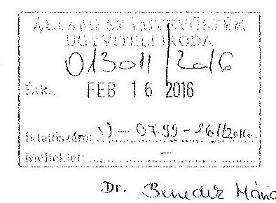

Dr. Szurcz Hósa

00.16.

Tisztelt Főtitkár Úr!

A Nemzeti Választási Iroda részére megküldött, „Az időközi választásokra fordított pénzeszközök felhasználásának ellenőrzéséről” készült jelentéstervezethez az alábbi észrevételeket teszem.

1. A tervezet 10. oldalának első bekezdésében „A vonatkozó jogszabályok – a 6/2014 és a 7/2014 IM rendeletek – az egyéb szervezetekkel (KKM, KEKKH) kötendő megállapodások megkötésének határidejét nem rögzítették.”

Tájékoztatom Főtitkár Urat, hogy folyamatban van a vonatkozó végrehajtási rendeletek módosítása, mely tartalmazza a jelentéstervezetben megfogalmazott hiányosság jogszabályi rendezését is.

2. A tervezet 17. oldala 3.2 pontjának harmadik bekezdése „A teljesítésigazolás azonban nem minden esetben a belső szabályzatban meghatározott formanyomtatványon történt.”mondatát kérem szíveskedjenek a jelentésből törölni.

Indoklás: Az NVI 16/2014. (V. 30.), továbbá 35/2014. (XI. 22.) számú Gazdálkodási szabályzatai nem rendelkeznek arról, hogy a teljesítésigazolásnak kötelezően alkalmazandó formanyomtatványa lenne, arra a szabályzatok GSZ-09 számú nyomtatványa csupán ajánlott mintaként szolgál. A hivatkozott szabályzatok 19.7. pontja rendelkezik a teljesítésigazolás céljára használható lehetséges dokumentumokról, a 20.1. pontja rendelkezik továbbá teljesítésigazoló bélyegző használatának lehetőségéről. Az itt leírt indokok miatt a jelentéstervezet fentiekben idézett mondata téves megállapítást tartalmaz.

3. A tervezet 22. oldalának 4. bekezdésében megfogalmazottakhoz megjegyezni kívánom, hogy a 2014. és 2015. évi időközi választásokra fordított pénzeszközök elkülönített nyilvántartását az NVI pénzügyi-számviteli nyilvántartásában az úgynevezett tervezési alapegység-kódokkal (TEA kód) különíti el. Tekintettel arra, hogy a hivatkozott téves

---

elszámolás teljes összegében a 2015. évi pénzforgalmat érinti, melyről az NVI az éves költségvetési beszámolója keretében ad véglegesen számot, a feltárt hiba a belső könyvelési kódokat érintően javításra került, így azok a beszámolóban már a helyes összegeket mutatják.

Megjegyezni kívánom, hogy a rögzítési hiba nem sérti az államháztartásról szóló 2011. évi CXCV. törvény, az államháztartásról szóló törvény végrehajtásáról szóló 368/2011. (XII. 31.) Korm. rendelet, továbbá az államháztartás számviteléről szóló 4/2013. (I. 11.) Korm. rendelet rendelkezéseit sem.

Kérem Tisztelt Főtitkár Urat, hogy az NVI részéről tett észrevételeket és kért módosításokat a végleges jelentésekben elfogadni és érvényesíteni szíveskedjenek.

Budapest, 2016. február 15.
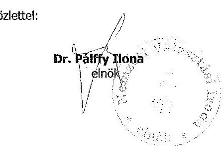

---

# 3. SZÁMÚ MELLÉKLET A V-0799-280/2016. SZÁMÚ JELENTÉSHEZ 

Közigazgatási és Elektronikus Közszolgáltatások Központi Hivatala

Iktatószám: $1 / 16-1 / 2016$

## Dr. Elek János

elnök

## Állami Számvevőszék

Budapest
Apáczai Csere János utca 10.
1052

## Tisztelt Elnök Úr!

Hivatkozva V-0799-258/2016. iktatószámú levelére, a Közigazgatási és Elektronikus Közszolgáltatások Központi Hivatala (továbbiakban Hivatal) kapcsán „Az időközi választásokra fordított pénzeszközök felhasználásának ellenőrzése" című ÁSZ ellenőrzés során készült - nem nyilvános - számvevőszéki jelentéstervezetre az alábbi észrevételt teszem.

A jelentéstervezet I. pontjában (8.old.) és II. 4. pontjában (23.old.) az alábbi megállapítás szerepel:

A KEKKH NVI-vel kötött megállapodásában, a KEKKH részére ellenőrzési kötelezettséget nem írtak elő. A KEKKH vezetője a 6/2014. IM rendelet, illetve a 7/2014. IM rendelet 1. § (2) bekezdés b) pontjában előírtak ellenére nem gondoskodott az időközi országgyűlési választásra és a megismételt önkormányzati szavazásokra biztosított pénzeszközök felhasználásának ellenőrzéséről.

A jelentéstervezet I. pontjának (8.old.) és II. 4. pontjának (23.old.) fenti megállapításával kapcsolatban az alábbi észrevételeket teszem:

A 6/2014. és 7/2014. IM rendeletek szerint a választás lebonyolításában részt vevő egyéb szerv is felelős a pénzeszközök célhoz kötött felhasználásáért és ellenőrzéséért.

## kekkh

H-1094 Budapest, Balázs Béla u. 35. - Telefon: +36(1)456-6510 - Fax: +36(1)456-6509
e-mail: elnok@kekkh.gov.hu - www.kekkh.gov.hu

---

Értelmezésünkben ez nem azt jelenti, hogy az idöközi választásak egyedi esetében soron kivüli belső ellenörzések elrendelése kötelező, ez praktikusan kivitelezhetetlen a választások számosságát és a KEKKH belső ellenőrzési kapacitását figyelembe véve. A vizsgált két idöközi választás költsége 2014. évben a KEKKH-t mindössze 1.074 .420 Ft összegben érintette (a fel nem használt 91.440 Ft visszautalásra került). Megjegyezzük, hogy a hivatkozott IM rendeletek nem írnak elő határidőt az ellenőrzésre, továbbá a jelzett összeg sem indokolta a soron kivüli belső ellenőrzési feladat elrendelését (mivel a folyamatba épített szakmai ellenőrzés müködött).

A belső ellenőrzés utólag végzi - kockázatelemzés alapján - az ellenőrzési tevékenységet. Jelen esetben az ÁSZ megelőzött egy Bkr. alapján elrendelt, utólagos belső ellenőrzést.

Tárgyévben ellenőrizni fogjuk - összevont, egy ellenőrzés keretében - a 2015. évben lezajlott idöközi választások költségeinek felhasználását és az elszámolások helyességét. A választások költségeinek felhasználása és elszámolása választásonként egyedileg kerül ellenőrzésre.

Meg kívánjuk jegyezni, hogy a célhoz kötött felhasználás ellenőrzése a szakmai kontrollok folyamatba épített belső ellenőrzéssel a 2014. évi idöközi választások esetében is biztosítottak voltak. Müködtek a gazdálkodással - így különösen a kötelezettségvállalás, ellenjegyzés, teljesítés igazolása, érvényesítés, utalványozás gyakorlásának módjával - kapcsolatos eljárási és dokumentációs szabályok.

Fontosnak tartjuk még megemlíteni, hogy 2015. évben vizsgálta a belső ellenőrzés a banki valamint a házipénztár forgalmat (V8-2015), amelyben a belső ellenőrzés meggyőződött arról, hogy a kifizetések során müködtek a belső kontrollok, a banki bizonylatokhoz kapcsolódó dokumentációt az ellenőrzés rendben találta.

Ezúton kezdeményezem a fenti észrevételek alapján a megküldött jelentéstervezet módosítását.

Budapest, 2016. február 25.

Tisztelettel:
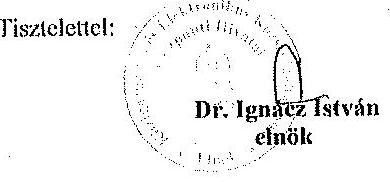

Készült: 2 példányban
Kapják: Cleszett, fruttár

# kekkh 

H-1094 Budapest, Balázs Béla u. 35. Telefon: +36(1)456-6510 Fax: +36(1)456-6509
e-mail: elnok@kekkh.gov.hu $\cdot$ www.kekkh.gov.hu

---

# Állami Számvevőszék 

Dr. Elek János
fôtitkár részére

Budapest
Pf: 54
1364

Tisztelt Fötitkár Úr!

Hivatkozással az Állami Számvevőszék V-0799-258/2016. iktatószámú jelentéstervezetére, az abban foglaltakra az alábbi észrevételeket teszem:
19. oldal, 2. bekezdés: " Az időközi országgyűlési választás lebonyolításában érintett három választási iroda a 6/2014. IM rendelet előírásának megfelelően elkészítette a feladattípusú elszámolását, azonban azt a Budapest IV. kerületi OEV1 a 6/2014. IM rendelet 7. § (1) bekezdésében előírt, a szavazás napját követő 15 napos határidőn túl, 14 napos késedelemmel, 2014. december 22-én rögzítette a VPIR rendszerben."

A vizsgálat során az ellenőrzési dokumentáció részét képezte az alábbi tartalmú, 2015. november 2-án kelt jegyzői nyilatkozat:
„Az országgyűlési képviselők időközi választása költségeinek normatíváiról, tételeiről, elszámolási és belső ellenőrzési rendjéről szóló 6/2014. (IX.19.) IM rendelet 7. § (1) bekezdése alapján a HVI és az OEV1 vezetője a szavazás napját követő tizenöt napon belül feladattípusú elszámolást készít a TVI vezetője részére.

A 2014. november 23-ra kitűzött időközi országgyűlési képviselőválasztás pénzügyi fedezetének elszámolása a VPIR Választási Pénzügyi Információs Rendszerben 2014. december 8. napjáig nem történhetett meg, miután az NVI elnöke az erre vonatkozó utasítást határidőben nem adta ki. Az elszámolás kapcsán 2014. december 17-én kelt NVI/1838-1/2014 iktatószámú NVI elnökének utasítása alapján a feladattípusú elszámolásra a VPIR informatikai rendszerben 2014. december 18. napján került sor."

A nyilatkozat és az ahhoz csatolt háttérlevelezés tanúsága szerint VPIR rendszerbe 2014. december 18. napjától lehetett adatokat rögzíteni, így a 2014. november 23-án megtartott időközi országgyűlési választás kapcsán az érintett választási irodák egyikének sem volt lehetősége a feladattípusú elszámolás határidőben történő rögzítésére.

---

A 2. számú melléklet, a gazdálkodási jogok gyakorlása 2. sor 1. bekezdésében az a megállapítás szerepel, hogy "Az Ávr. 55. § (1) bekezdésben elöírtak ellenére, nem minden esetben az arra kijelölt személy gyakorolta a pénzügyi ellenjegyzést."

A hivatkozott jogszabály, az Ávr. 55. § (1) elöirása szerint: A pénzügyi ellenjegyzést a kötelezettségyallalás dokumentumán a pénzügyi ellenjegyzés dátumának és a pénzügyi ellenjegyzés tényére történő utalás megjelölésével, az arra jogosult személy alairásával kell igazolni.

Az Áht. 37. § (2) szerint: A pénzügyi ellenjegyzésre jogosult személyek körét, a pénzügyi ellenjegyzö feladatait, összeférhetetlenségének eseteit, képesitési követelményeit a Kormány rendeletben határozza meg.
A vonatkozó Kormányrendelet, az Ávr. 53. § (1) Törvény vagy e rendelet eltérő rendelkezése hiányában nem szükséges elözetes írásbeli kötelezettségvállalás az olyan kifizetés teljesitéséhez, amely
aj értéke a százezer forintot nem éri el,
A kifogásolt, saját forrásból finanszírozott három szerződés közül egyiknek az összege sem érte el a százezer forintos értékhatárt.

Álláspontom szerint, mivel az ügykörben négyszáztizenöt szerződés keletkezett, melyből száz szerződés ellenőrzésére került sor, és ebből három alkalommal nem az arra kijelölt személy gyakorolta a pénzügyi ellenjegyzést, „a nem minden esetben" kifejezés elnagyoltnak, túlzónak hatna abban az esetben is, ha a százezer forintos értékhatárt elérő szerződésekről lenne szó. A jogszabályi hivatkozásra tekintettel kérjük a 2. számú melléklet, a gazdálkodási jogok gyakorlása 2. sor 1. bekezdésében szereplő megállapítási törölni.

A 2. számú melléklet, a gazdálkodási jogok gyakorlása 2. sor 2. bekezdésében az a megállapítás szerepel, hogy "Egyes személyi kifizetéseknél az Ávr. 57. § (1) bekezdésében elöírtak ellenére a teljesítésigazolás a tényleges teljesítést megelőzően történt."

Összesen egy személyi kifizetésnél fordult elő, hogy a teljesítésigazolás dátuma helytelenül került a kifizetés bizonylatára, ezért javasolom az „egyes személyi kifizetéseknél" kifejezést „egy személyi kifizetésnél" kifejezésre módosítani a jelentésben.

A 2. számú melléklet, a gazdálkodási jogok gyakorlása 2. sor 3. bekezdésében az a megállapítás szerepel, hogy " A megbízási díjak pénztárból történő kifizetése során az Ávr. 58. § (1) bekezdésében és az 59. § (1) bekezdésében elöírtak ellenére az érvényesítés nem a teljesítésigazolás alapján történt, mivel az érvényesítés megelőzte a teljesítésigazolást, valamint az utalványozás is a teljesítésigazolást megelőzően történt."

A vizsgálat során az ellenőrzési dokumentáció részét képezte, és a szóban forgó kérdéskör magyarázatul szolgált az alábbi tartalmú, 2015. november 2-án kelt jegyzői nyilatkozat:
„A 2014. november 23. napjára kitüzött időközi országgyűlési képviselőválasztással kapcsolatban a szavazatszámláló bizottság tagjainak tiszteletdíja a választás napján, 2014. november 23-án, a szavazókörökben, készpénzben került kifizetésre.

---

A tiszteletdijak számfejtésére 2014. november 20-án, az országgyúlési képviselők idöközi választása költségeinek normatíváiról, tételeiről, elszámolási és belső ellenőrzési rendjéről szóló 6/2014. (IX.19.) IM rendelet, valamint a szavazatszámláló bizottságok tagjainak, illetve póttagjainak megválasztására vonatkozó Budapest Főváros IV. kerület Újpest Önkormányzata Képviselő-testületének 38/2014. (II.27.) határozata alapján, a kifizetések készpénzben történő lebonyolítása érdekében került sor.
A számfejtés alapján a 221 fő bizottsági tag részére a tiszteletdijnak megfelelő címleteket a számlavezető pénzintézetnél, a Raiffeisen Banknál elözetesen meg kellett igényelni. A tiszteletdijak személyenként és szavazókörönként külön kerültek borítékolásra, ennek érdekében 2014. november 20-án a szükséges mennyiségủ készpénz a házipénztárból kiadásra került. A teljesítésigazolás az átadott összegek aláirással igazolt átvételét követően, a választás és a kifizetés napján, 2014. november 23-án történt meg."

A fentiek alátámasztására szolgáló teljes körű dokumentációt egyrészről a helyszíni vizsgálat során a vizsgálatot végző revizor rendelkezésére bocsátottuk, másrészről az Állami Számvevőszék által megjelölt tárhelyre elektronikusan feltöltöttük.

Budapest, 2016. február 22.
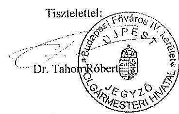

---

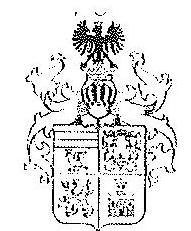

Borsod-Abaúj-Zemplén Megyei
TERÜLETI VÁLASZTÁSI IRODA VEZETŐJE

3525 MISKOLC, Városház tér 1.
Telefon: (46) 517-700*, (46) 517-713
Telefax: (46) 352-525
E-mail: tvig@hivatal.buz.hu

Iktatószám: III-1628-1/2016.

Tárgy: észrevételek az idôközi választás ellenôrzéséröl készült jelentésre
Hiv. szám: V-0799-258/2016.
Melléklet: 5 db

Állami Számvevőszék
Dr. Elek János fótitkár

Budapest 4.
Pf. 54.
1364

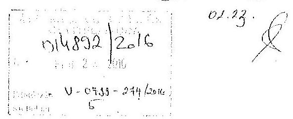

Tisztelt Fótitkár Ür!

„Az idôközi választásokra fordított pénzeszközök felhasználásának ellenôrzése" című ellenôrzésről készített jelentés tervezete 2016. február 9-én megérkezett a Borsod-Abaúj-Zemplén Megyei Területi Választási Irodához (a továbbiakban: TVI), amelynek 2. számú melléklete 2. oldalán megfogalmazott megállapításaira az alábbi észrevételeket teszem:

1. A csatolt összesítő szerint 8 db kifizetés történt a megismételt ózdi polgármesterválasztással kapcsolatban, 181,426,- Ft összegben. Ezen összegből 63.500,- Ft továbbatalásra került Ózd Város Helyi Választási Iroda részére. A TVI-nek mindebből következôen 117.926,- Ft normatív kiadása volt a megismételt ózdi polgármester-választással kapcsolatban.

2. A TVI által eszközölt kifizetésekhez kapcsolódóan a teljesítésigazolásokra – közvetlenül vagy közvetve – sor került, a mellékelt összesítő kimutatás indokolása szerint. A Területi Választási Bizottság tagjait a Közgyillés kifejezetten választási feladatok ellátására választotta meg több évre, részükre esetenként külön megbízás nem készült. A kifizetés az NVI által jóváhagyott elszámolás alapján történt.

3. A számlákon minden esetben megtalálható a teljesítésigazoló bélyegző, valószínüsíthető, hogy annak lenyomata a szkennelés miatt nem látható. A kisméretű számlák esetén pedig a számla hátoldalán került elhelyezésre a teljesítést igazoló bélyegző.

4. A pénzeszközök felhasználása során a TVI vezetője egyben a teljesítések igazolója és utalványozója is volt.

---

Kérem szíveskedjen észrevételeimet figyelembe venni, illetve elfogadni, és a „nem megfelelô"összesitô értékelést „megfelelô"-re módosítani.

Miskolc, 2016. február 16.

Tisztelettel:
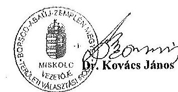

---

1. 12. 2014. 11. 20. Özd Megismételt Választáshoz Kapcsolódó Személyi Kifizetések

|  Sorszám | Név | 7/2014.(XL6.) IM rendelet szerinti normatívar-járulék | Bruttó összeg | Járulék összege | Kifizetés összege | Kifizetés dátuma | Megjegyzés  |
| --- | --- | --- | --- | --- | --- | --- | --- |
|  1. | Czeglédiné Vítártus Ágnes TVI tag | 19050 | 16000 | 4050 | 9825 | 2015.02.16 | 2 TVI tag, saját dolgozóink, feladatukat a muninktári lenda tartalmazza, a teljesítésigazolás a mellékelt és előzőleg szponnelva is megküldött megbízáson szerepel. A teljesítés igazolást az NVI felé történt elszámolás 2. oldala is tartalmazza.  |
|  2. | Tőthné dr. Majjora Mária TVI tag | 19050 | 16000 | 4050 | 9825 | 2015.02.16 | 4 4632014 (VII) 18.) Kgr. határozat szerint a megválasztott 3 TVB tag, kötőn megbízási szerződésük ronce, a munka alvégzésének teljesítés igazolását a szfletés kifizetéskor a TVI vezetője egyben mint utalványozó igazolta.  |
|  3. | dr. Gyurszék András TVB tag | 19050 | 16000 | 4050 | 9825 | 2015.02.16 | A teljesítés igazolás a HVI vezetőjének itt levél, amely egyben a kifizetéshez való hozzájárulás a TVI részéről, egyidejűleg a bér és járulákainak utalása.  |
|  4. | dr. Murányi Zsolt Vilmos TVB tag | 19050 | 16000 | 4050 | 12600 | 2015.02.16 | A teljesítés igazolás a mellékelt számlák elején és ill. hatulján bekegyő formájában megtalálható.  |
|  5. | dr. Tergéleczné dr. Nagy Ilona TVB tag | 19050 | 16000 | 4050 | 12600 | 2015.02.16 |   |
|  6. | Özd HVI vezetője | 63500 | 60000 | 15500 | 63500 | 2015.02.16 | A teljesítés igazolás a mellékelt számlák elején és ill. hatulján bekegyő formájában megtalálható.  |
|  7. | Representáció | 22876 | 14030 | 7676 | 18000 | 2015.02.17.(9920 P) 2015.02.28.(6380 P) | A teljesítés igazolás a mellékelt számlák elején és ill. hatulján bekegyő formájában megtalálható.  |
|  Összesen: |  | 181 429 Pt | 140 900 Pt | 41 429 Pt | 122 179 Pt |  |   |

---

Borsod-Abaúj-Zemplén Megyei
TERÜLETI VÁLASZTÁSI IRODA VEZETÓJE

3525 MISKOLC, Várusház tér 1.
Telefon: (46) $323-011^{*}$, (46) $517-700^{*}$, (46) $517-633$, (46) $346-256$
Telefes: (46) $352-525$

# MEGBIZÁS 

A helyi önkormányzati képviselők és a polgármesterek választásán a megismételi szavazás, a helyi önkormányzati képviselők és a polgármesterek időközi választása, költségeinek normatíváiról, tételeiről, elszámolási és belső ellenőrzési rendjéről szóló 7/2014. (XI. 16.) IM rendelet (továbbiakban: IM rendelet) alapján megbizom

- Dr. Sáfrány Borbála Szervezési,-Jogi és Pénzügyi Osztályvezetőt,
- Czeglédiné Vitárius Ágnes, Pénzügyi Csoport vezetőt, a megismételt választás TVI-t érintö pénzügyi-ellenörzési feladatainak elvégzésére,
- Tóthné Dr. Majoros Mária, jogászt
a választás TVI-t érintö jogi-szervezési feladatainak elvégzésére,

A választás pénzeszközei feletti rendelkezési jogokat az alábbiak szerint szabályozom:
Kötelezettségvállalási és utalványozási jogköri gyakorló: Dr. Kovács János
Távolléte esetén Szombatiné Dr. Sebök Emese
Pénzügyi ellenjegyzési jogkört gyakorló: Czeglédiné Vitárius Ágnes
Távolléte esetén Smalkóné Obbágy Ilona
Teljestés szakmai igazolását végzö munkatársak: Dr. Kovács János, Szombatiné
Dr. Sebök Emese, Dr. Sáfrány Borbála,
Érvényesitö: Smalkóné Obbágy Ilona, Pappné Bubenkó Anita
Könyvelö: Metzné Káposzta Katalin

Miskolc, 2014. október 17.
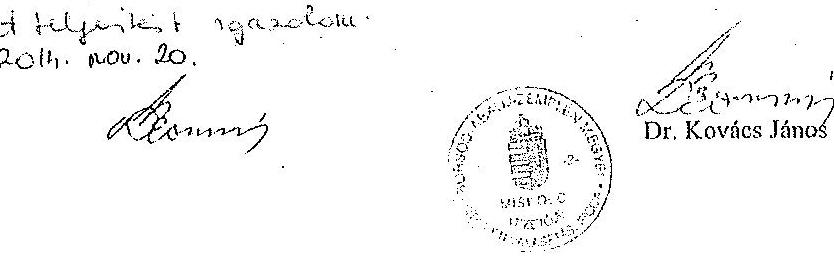

---

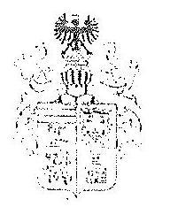

Borsod-Abaúj-Zemplén Megyei
TERÜLETI VÁLASZTÁSI IRODA VEZETÖJE

3525 MISKOLC, Városbáz tér 1.
Telefon: (46) $323-011^{*}$, (46) $517-760^{*}$, (46) $517-623$, (46) 346 - 256
Telefax: (46) $352-525$

Ikt.sz: III.-1209-9./2014.

Nemzeti Választási Iroda
Dr.Pálffy Ilona elnök

Tárgy: Megismételt önkormányzati választás pénzügyi elszámolása

Tisztelt Elnök Asszony!

Mellékelten megküldöm, a TV1 elszámolás munkalapját és a tanúsitványát a megismételt önkormányzati és nemzetiségi képviselö választással kapcsolatosan, valamint az ezzel összefüggésben megkapott megyei támogatás összesttett elszámoló lapját.

A választás szakmai és pénzügyi feladatait teljesitettük, igy a tanúsitvány alapjảu kérem az elszámolás elfogadását.

Miskolc, 2015. január 27.

Dr. Kovács Júnior

---

# Tanúsítvány 

A helyi önkormányzati képvisolók és polgármesterek/ A nemzetiségi önkormányzati képvisolók ..... napjára kitűzött idöközi választása/ választásán a ... napjára kitűzött megismételi szavazás HVI-kel kapcsolatos pénzügyi, logisztikai ellenőrzési feladatai végrehajtásáról
Területi Választási irodák részére

Szerv megnevezése: 36222-1994-222114414-1111

Alulírott, 64. Iesvér 7. 6. 2005. a 3. 8. 2005. TVI vezetője tanúsítom, hogy

- a TVI a 7/2014. (XI. 6.) ilM rendelet 8. § (2) bekezdése alapján a HVI elszámolások ellenőrzését elvégezte.
- A HVI elszámolások ellenőrzéséért, információ adásáért 26222-1994-222114414-1111, TVI tag a felelős.

| A HVI vezetője a választásokkal kapcsolatos választás szakmai feladatait ellátta | HSEN | HVI-k száma: | 1 |
| :--: | :--: | :--: | :--: |
|  | NEM | HVI-k száma, neve: |  |
| A HVI vezetők az elszámolási és belső ellenőrzési kötelezettségüket teljesítették-e? | HSEN | HVI-k száma: | 4 |
|  | NEM | HVI-k száma, neve: |  |
| A TVI vezetője a HVI vezetők belső ellenőrzési kötelezettsége teljesítéséről az alábbiak szerint győződött meg: | Tanúsítvány útján: | HVI-k száma: | 1 |
|  | Egyéb módon: | HVI-k száma: |  |

Kelt: $\qquad$ 1012. 6. 2005. év 2. 2005. hó 27. napján

---

# Tanúsítvány 

a helyi önkormányzati képviselők és polgármesterek / a nemzetközi önkormányzati képviselők 2014. évi választása pénzügyi, legkizilási feladatai végrehajtásáról

Területi Választási irodák részére

Szerv megnevezése: 30.8500 - ABNÚ3-ZELNIÉU HEGYEI TUI.

- PÉNZÜGYI TERVEZÉS ÉS VÉGREHAJTÁS

Alulírottan. Kovács fialcs, B.A.Z. Megyei TVI vezetője tanúsítom, hogy a TVI

- a 3/2014. (VII.24.) IM rendelet szerinti pénzügyi feladatokat az alábbiak szerint végrehajtotta

| A választás pénzügyi terve elkészitésének dátuma: |  | 2014 anq. 9. |  |
| :--: | :--: | :--: | :--: |
| A választás pénzügyi terve módosításának dátuma(i): |  | 2014. oit. 9. |  |
| A központi támogatáson felüli saját forrás összege (ezer Ft): | terv: |  | tény: 8 |
| A választáshoz kapcsolódó általános kiadás összege (ezer Ft): | terv: |  | tény: 1120 |
| A választási pénzeszközök felhasználása kapcsán |  |  |  |
| szabályozzák-e? | a kötelezettségvállalás rendjét/IGEN/NEM |  | a pénzügyi ellenjegyzés rendjét/IGEN/NEM |
| a kötelezettségvállaló | neve:   TA. Kovács fialcs |  | beosztása:   Iojegyei |
| a pénzügyi ellenjegyzö | neve: (Zsagléthiné   Vitáris Alogus) |  | beosztása:   TA. csop. ves. |
| A támogatás beérkezésének dátuma:   Számoltelleg elkülönlletlen kezelteik-   e a választási kiadásokat és   bevételeket? | 2014. 08. 12. |  | 2014. 10. 02. |
| Az elkülönítés módja? | $\begin{aligned} & \text { EOFOG: } \\ & \text { egyéb: } \end{aligned}$ |  |  |
| Az általános kiadások megosztására készült-e szabályozás? | IGEN/NEM |  |  |
| A személyi kifizetések a jogszabályi normatívák figyelembevételével történtek-e? | IGEN/NEM |  |  |

---

| Differenciálás történt-e? | IGEN/NEM |
| :-- | :-- |
| Megjegyzés, javaslat: |  |

# - ELLENÖRZÉSEK 

Alulírott, D1. Kizake, fúkiz 2. 12. Megistvi/HVI vezetője tanúsítom, hogy

- a 3/2014. (VII.24.) IM rendelet B. § (1) bekezdése alapján a TVI-nél a szerv saját pénzügyi elszámolása elkészítésével, illetve ellenőrzésével a választási íroda alábbi tagjait bírtam meg, akik elszámolási, illetve ellenőrzési kötelezettségüknek a jogszabályi határidőn belül az alábbiak szerint tettek eleget.

| Elszámolás elkészítésével megbízott írodatag(ok) neve | Elszámolási kötelezettségének eleget tett (IGEN/NEM) |
| :--: | :--: |
| Suallkóvi Othsági lloha | Igen |
| Pappai Pukrekó Paito | Igen |

| A szerv saját elszámolása ellenőrzésével megbízott irodatag(ok) neve | Ellenőrzési kötelezettségének eleget tett (IGEN/NEM) |
| :--: | :--: |
| Balikóvi D1. Albert Judit | Igen |
| Ceglédivi Uthónus Pígus | Igen |

- a választás lebonyolításához szükséges választásszakmal anyagok szállításával kapcsolatos logisztikai elszámolásokat a 4/2014. (VII.24.) IM rendelet 11. § (1) bekezdés uj pontja alapján a TVI/ OEVK székhely HVI-k elvégezték, a TVI a feldolgozások ellenőrzését elvégezte.

| Szállítások elszámolásával megbízott írodatagok neve | Elszámolási kötelezettségének eleget tett (IGEN/NEM) |
| :--: | :--: |
| Súma Gakerud | Igen |
| D1. Jeder Eptit | Igen |

| Szállítási elszámolás ellenőrzésével megbízott   irodatagok neve | Ellenőrzési kötelezettségének eleget tett (IGEN/NEM) |
| :--: | :--: |
| Dr. Sallraig Borbala | Igen |

Kelt: Mikkels 2014. kok. 28.
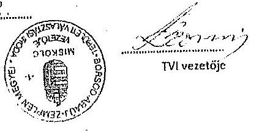

---

Kivonat a Borsod-Abaúj-Zemplén Megyei Önkormányzat Közgyülése 2014. angustzts 18. napján megtartott zárt ülésének jegezökönyvéböl:

# Borsod-Abaúj-Zemplén Megyei Önkormányzat Közgyülésének 

46/2014. (VIII. 18.) határozata

Tárgy: a Borsod-Abaúj-Zemplén Megyei Területi Választási Bizottság tagjainak megválasztása

A Közgyűlés megtárgyalta a Borsod-Abaúj-Zemplén Megyei Területi Választási Bizottság tagjainak megválasztására vonatkozó indítványt, és az alábbi határozatot hozta:

A Közgyűlés a Borsod-Abaúj-Zemplén Megyei Területi Választási Bizottság tagjainak, illetve póttagjainak megválasztotta:

Tagoknak:

1. Dr. Gyurcsik Andrást,
2. Dr. Murányi Zsolt Vilmost,
3. Tergaleczné dr. Nagy Ilonát,

Póttagoknak:

1. Dr. Hodobay Ágnes Zsuzsannát,
2. Dr. Kozslik István Bélát.

Felelős: Dr. Mengyi Roland a közgyűlés elnöke
Dr. Kovács János megyei főjegyzö, TVI vezető
Határidő: azonnal

Dr. Kovács János s. k.
főjegyzö

Dr. Mengyi Roland s. k.
a közgyűlés elnöke
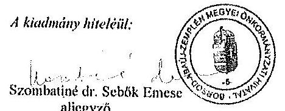

Miskolc, 2015. július 24.

---

# Borzod-Absúj-Zemplén Megyei Önkormányzat Hivatala 

3525 Miskolc, Városház tér 1.

Kötvöll. nyilv. szám: KX2/2015/0100

## Utalvány

A 2015. költségecésé éves

## Kedvezményezett neve: Dr. Gyurcsák András

Claus:3525 Miskolc, Mátyás közig u. 35
Számlaszáma:10913000-00000010-04270006
Bizonyíat száma:2015/1
Devlomant: HUF

## I. A számla (bizonyist) érvényességének igazolása

A teljesülé igazolása alapján igazolása, hogy a bizonyítá (számla) érvényesevővőgét, jogosultságh cllszéltároza, az esésszabj ós elolá szempontból szeglótól az adó törvény
cllélőszinél, az 8101, az kláuzéésszabja) számolótő korreltszámolótólvón, valosztó a bólal eszkölyzetelénn foglaltaknál.

| Kontár azojszabó | Kuvetszám | Fénzőingelmi (fizitsyni szám) | V/OP/AG | Mátcolóeges (b.szám | T/K | Megjegyzés | Szorvezet | Összény |
| :-- | :-- | :-- | :-- | :-- | :-- | :-- | :-- | :-- |
|  |  |  |  |  |  | Tiszteletől |  | 12600 |
|  |  |  |  |  |  | Összesen |  | 12600 |

Kelt:2015.02.11.
érvényesitő
II. Utalvány

A mellékelme igazolt, érvényesitési bizonyítá (számla), valosztó a teljesüléigazolás az érvényesités alapján: 2015.02.11. Kertész időponttal „Utalálás Kertész eszkölyzetelén" elterjegyzem, 12600 költségeit a kláuzééssárpáratát: 10027000-00314822-00000000 költségvetési elszámolási számla terhinc ellenelcélén.

Kelt:2015.02.11.
utalványozó

pénzügyi ellenjegyzó
III. Könyvelés igazolása
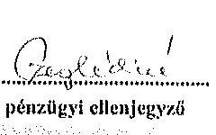
könyveló

---

# 3. SZÁMÚ MELLÉKLET A V-0799-280/2015. SZÁMÚ JELENTÉSHEZ

Borsod-Abaúj-Zemplén Megyei Önkormányzat Hivatala
3525 Miskolc, Városház tér 1.

Kötváll. nyílv. szám: KSZ/2015/0104

Utalvány
A 2015. költségvetési évre

Kedvezményezett neve: Tergalecznó Nagy Iona Dr.
Címn:3432 Emfel, Patak u. 16
Számlaszám:11605001-22260001-05080000
Bizonyít száma:2015/1
Devizzen: HUF

I. A számla (bizonyít) érvényességének igazolása
A teljesítés igazolása alapján igazoljon, hogy a bizonylat (számla) érvényesejhelyét, jogszeférdejtim ellenállomás, az eszközönti és alatti szempontból megfelel az edő törvény
előbbelenk, az AHT, az ellenállótestétt eszközönti kormányzatafelben, valamint a belül szabályozottban foglaltaknak.

Kontit azonosító: Rovatszám: Fénzőregelmi főkényvi szám: KÖPOG: Másodlagos 66 szám: TfK: Megjegyzés: Szervest Összeg
Tiszteltető: 12 600
Összeges: 12 600

Kelt:2015.02.11.

Ősz. 1
érvényezőtől

II. Utalvány

A mellékelben ígnesik, érvényesített bizonylat (számla), valamint a teljesítésigazolás és érvényestén alapján, 2015.02.13. Eredéjtő kárpannal „tiszteltető érvényesítési kormányzatafel" ellenjegyzem, 12 600 kiövetését a közödríztapérezés / 10027006-68314822-00000000 költségvetési elszámolást számla tételére elutasítam.

Kelt:2015.02.11.

Utalványozó

I. Kényvelés igazolása

Kelt:2015.02.11.

I. Kőnyvelő

2015/01/2015 18:26:55

---

# 3. SZÁMÚ MELLÉKLET A V-0799-280/2016. SZÁMÚ JELENTÉSHEZ

Borsod-Abaúj-Zemplén Megyel Önkormányzat Hivatala
3525 Miskolc, Városház tér 1.

Kötváll, nyílv. szám: KSZ/2015/0102

Utalvány
A 2015. költségvetési évre

Kedvezményezett neve: Dr. Murányi Zsolt Vörös
Címc:3528 Miskolc, Alkotmány u. 33
Számlaszáma:15404247-01370320-01586060
Bizonyít száma:2015/1
Devizenset: HUF

Utalvány
A 2015. költségvetési évre

I. A számla (bizonyíró) érvényességének igazolása
A szociális igazolása alapján igazoljon, hogy a bizonylót (számba) összegyvetéséjé, jogosultséjé eloszlójjon, az számokú és aláírt szorgosabb/á megfelel az aláí távény
elölésének, az AHT, az állandózatolási számokú kormányzatokhóban, valamint a lefelé szabályzatolása foglaltaknak

Kontit azonosító: Rovelszám Pénzforgalmi Ildányi szám COFOL Mészellegus I. szám VIK Megjegyzés Szerezet Összeg
Tiszteletéli 12 600
Összezés 12 600

Kelt:2015.02.11.

Ervényezés
I. Utalvány

A mellékletben igazolt, érvényesített bizonylót (számba), valamint a teljesítési/grendel és érvényesítés alapján, 2015.02.11. Biztosul elégnaptól, átutalás bízatai utalási evadék/egényi
ellenjegyzés, 12 600 kiüzenített a látókörkönyészítő / 10027006-08514622-00000000 lefelüzenített elszámolási számla tettejé eloszlójjon.

Kelt:2015.02.11.

Utalványozó

III. Könyvelés igazolása

Kelt:2015.02.11.

Könyvelő

19

---

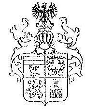

Borsod-Abaúj-Zemplén Megyei
TERÜLETI VÁLASZTÁSI IRODA VEZETÖJE

3525 MISKOLC, Városház tér 1.
Telefon: (46) 517-706*, (46) 517-713,
Telefax: (46) 352-525
lkt.sz: III.-1565-10/2015.

Helyi Választási Iroda Vezetőjének
ÖZD

Tárgy: HVI vezető díja

Tisztelt Irodavezető Úr!

A 2014. november 9-i megismételt helyi önkormányzati képviselők és a polgármesterek választása, valamint a nemzetiségi önkormányzati képviselők választása lebonyolításával összefüggő feladatok ellátásáért, a 7/2014. (XI. 6.) IM rendelet $4 . \S(5)$ bek. szerint
$50.000,-$ Ft
bruttó összegű személyi juttatásban részesítem.

Munkáját ezúton is megköszönöm, kívánok további sikereket és jó egészséget.
A kifizetéshez szükséges pénzügyi fedezet (személyi juttatás + munkaadót terhelő járulék), az önkormányzati hívatal számlájára történő átutalásáról levelemmel egyidejűleg intézkedtem.

Miskolc, 2015. február 12.
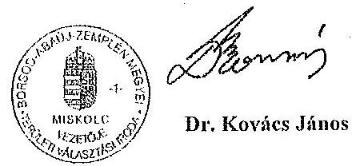

---

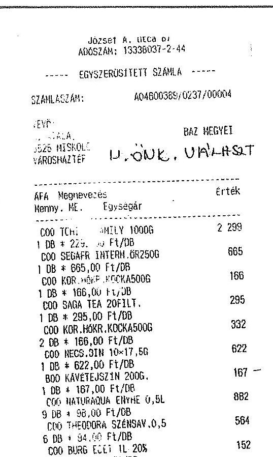
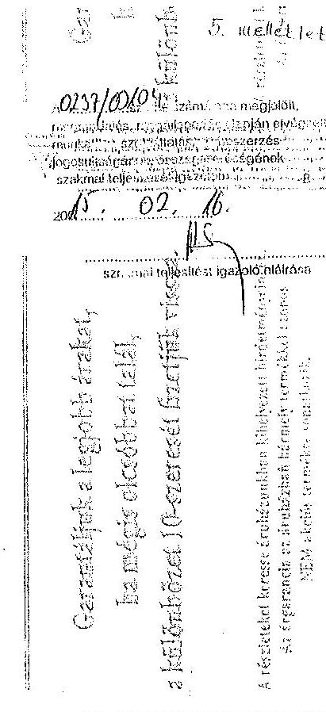

| B-15,25\% | 847 |
| :--: | :--: |
| C-21,28\% | 8775 |
| BOSZESEN: | 862 Ft |
| KESZPEME | 10000 Ft |
| Yisszajaro | 380 Ft |
| Kerekités: | $-2 \mathrm{Ft}$ |

Tranzałe:tószán: 94129
Az Auchan Magyarorszảg Kft
Nápegészségúgy! termékadó kötelezett
Csatlakozzon facebook kbzösségünkhöz! www.facebook.com/AuchanMagyarorszag

ERZGEBET UTALVÁNY ELFOGADOHELY
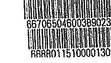

|  |  |
| :--: | :--: |
|  |  |
|  |  |
|  |  |
|  |  |
|  |  |
|  |  |
|  |  |
|  |  |
|  |  |
|  |  |
|  |  |
|  |  |
|  |  |
|  |  |
|  |  |
|  |  |
|  |  |
|  |  |
|  |  |
|  |  |
|  |  |
|  |  |
|  |  |
|  |  |
|  |  |
|  |  |
|  |  |
|  |  |
|  |  |
|  |  |
|  |  |
|  |  |
|  |  |
|  |  |
|  |  |
|  |  |
|  |  |
|  |  |
|  |  |
|  |  |

---

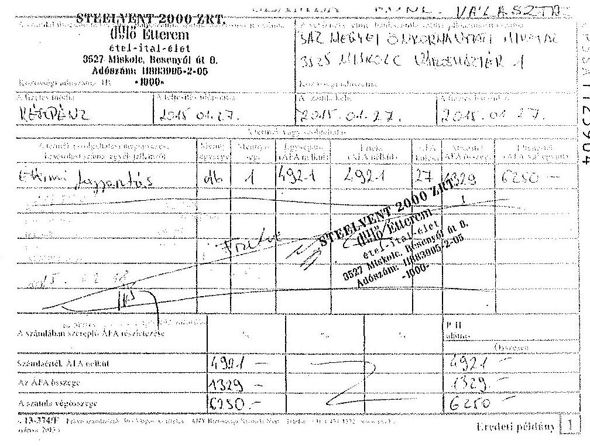

|  |  |  |  |  |  |  |  |  |  |  |  |  |  |  |  |  |  |  |
| :--: | :--: | :--: | :--: | :--: | :--: | :--: | :--: | :--: | :--: | :--: | :--: | :--: | :--: | :--: | :--: | :--: | :--: | :--: |
|  |  |  |  |  |  |  |  |  |  |  |  |  |  |  |  |  |  |  |
|  |  |  |  |  |  |  |  |  |  |  |  |  |  |  |  |  |  |  |
|  |  |  |  |  |  |  |  |  |  |  |  |  |  |  |  |  |  |  |
|  |  |  |  |  |  |  |  |  |  |  |  |  |  |  |  |  |  |  |
|  |  |  |  |  |  |  |  |  |  |  |  |  |  |  |  |  |  |  |
|  |  |  |  |  |  |  |  |  |  |  |  |  |  |  |  |  |  |  |
|  |  |  |  |  |  |  |  |  |  |  |  |  |  |  |  |  |  |  |
|  |  |  |  |  |  |  |  |  |  |  |  |  |  |  |  |  |  |  |
|  |  |  |  |  |  |  |  |  |  |  |  |  |  |  |  |  |  |  |
|  |  |  |  |  |  |  |  |  |  |  |  |  |  |  |  |  |  |  |
|  |  |  |  |  |  |  |  |  |  |  |  |  |  |  |  |  |  |  |
|  |  |  |  |  |  |  |  |  |  |  |  |  |  |  |  |  |  |  |
|  |  |  |  |  |  |  |  |  |  |  |  |  |  |  |  |  |  |  |
|  |  |  |  |  |  |  |  |  |  |  |  |  |  |  |  |  |  |  |
|  |  |  |  |  |  |  |  |  |  |  |  |  |  |  |  |  |  |  |
|  |  |  |  |  |  |  |  |  |  |  |  |  |  |  |  |  |  |  |
|  |  |  |  |  |  |  |  |  |  |  |  |  |  |  |  |  |  |  |
|  |  |  |  |  |  |  |  |  |  |  |  |  |  |  |  |  |  |  |
|  |  |  |  |  |  |  |  |  |  |  |  |  |  |  |  |  |  |  |
|  |  |  |  |  |  |  |  |  |  |  |  |  |  |  |  |  |  |  |
|  |  |  |  |  |  |  |  |  |  |  |  |  |  |  |  |  |  |  |
|  |  |  |  |  |  |  |  |  |  |  |  |  |  |  |  |  |  |  |
|  |  |  |  |  |  |  |  |  |  |  |  |  |  |  |  |  |  |  |
|  |  |  |  |  |  |  |  |  |  |  |  |  |  |  |  |  |  |  |
|  |  |  |  |  |  |  |  |  |  |  |  |  |  |  |  |  |  |  |
|  |  |  |  |  |  |  |  |  |  |  |  |  |  |  |  |  |  |  |
|  |  |  |  |  |  |  |  |  |  |  |  |  |  |  |  |  |  |  |
|  |  |  |  |  |  |  |  |  |  |  |  |  |  |  |  |  |  |  |
|  |  |  |  |  |  |  |  |  |  |  |  |  |  |  |  |  |  |  |
|  |  |  |  |  |  |  |  |  |  |  |  |  |  |  |  |  |  |  |
|  |  |  |  |  |  |  |  |  |  |  |  |  |  |  |  |  |  |  |

---

# JÁSZ-NAGYKUN-SZOLNOK MEGYEI FÖJEGYZÓ 

Iktatószám: 72-2/2016.
Tárgy: Észrevétel ellenőrzés megállapításaira
Állami Számvevőszék
Budapest

Dr. Elek János
fötitkár

Tisztelt Fötitkár Úr!

A V-0799-257/2016. iktatószámú jelentéstervezetre, melynek tárgya az időközi választásokra fordított pénzeszközök felhasználásnak ellenőrzése, az alábbi észrevételt teszem.

A TVI-nek a megismételt választással kapcsolatban 19.050 Ft visszafizetési kötelezettsége keletkezett, mivel egy fő TVB tag díját és járulékát nem használta fel. A visszafizetés módjáról a TVI 2016. október 6-án kelt levelében kért tájékoztatást az NVI elnökétől. A visszafizetés módjáról az NVI elnöke az NVI/1848-2 iktatószámú levelében tájékoztatott 2015. november 9-én.

A fel nem használt összeg visszautalása az NVI által megadott számlaszámra 2015. november 13-án megtörtént.

Kérem az észrevétel szíves elfogadását.
Szolnok, 2016. február 11.

Tisztelettel:

Rentzné Dr. Bezdán Edit

---

.

---

# 4. SZÁMÚ MELLÉKLET A V-0799-280/2016. SZAMÚ JELENTÉSHEZ 

## 4

## 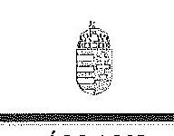

FÜTITKÁR

Ikt. szám: V-0799-269/2016.

## Dr. Pálffy Ilona úrhölgy

elnök
Nemzeti Választási Iroda

## Budapest

## Tisztelt Elnök Úrhölgy!

Köszönettel megkaptam a 2016. február 16. napján az Állami Számvevőszékhez érkezett "Az idöközi választásokra forditott pénzeszközök felhasználásának ellenörzése" címú számvevőszéki jelentéstervezetben foglalt megállapításokra tett észrevételeit.

Tájékoztatom Elnök úrhölgyet, hogy a számvevőszéki jelentésben az elfogadott észrevétel átvezetésre került.

Az Állami Számvevőszék észrevételekre vonatkozó álláspontjáról a felügyeleti vezető által készített részletes tájékoztatást csatoltan megküldöm.

Budapest, 2016. 03. hó 00 nap

Tisztelettel:
az elnök nevében eljárva
Dr. Élek János

Melléklet: Tájékoztatás a Nemzeti Választási Iroda elnükének észrevételében foglaltakról

---

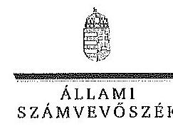

FELÜGYELEIJ VEZETŐ

1. melléklet
a V-0799-269/2016. ikt. számú levélhez

# Tájékoztatás 

## a Nemzeti Választási Iroda elnökének észrevételében foglaltakról

Az idöközi választásokra forditott pénzeszközök felhasználásának ellenőrzéséről készült jelentéstervezetben foglaltakhoz tett észrevételét az Állami Számvevőszék (ÁSZ) köszönettel megkapta. Az észrevételében foglaltakról az alábbi tájékoztatást adom.

Elnök úrbölgy által megküldött észrevétel 1. és 3. pontjában megfogalmazottak - szakmai tartalmuknál fogva - nem tekinthetőek észrevételnek, mert azok a jelentéstervezet egyes ellenőrzési megállapításaihoz kapcsolódóan megkezdett intézkedésekről - „folyamatban van a vonatkozó végrehajtási rendeletek módosítása" - adnak tájékoztatást, így azok a jelentéstervezetben foglaltak módosítását nem teszik indokolttá.

Az észrevétel 2. pontjában foglaltakat az ÁSZ elfogadta, amelyre tekintettel a jelentéstervezet 17. oldalán a 3.2. programpont alatti harmadik bekezdés második mondata törlésre került.

Budapest, 2016.
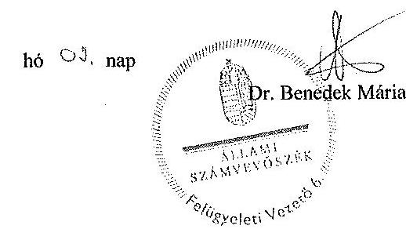

1052 BUDAPEST, APÁGZAI CSERE JÁNOS UTCA 10. 1364 Budapest 4. Pl. 54 telefon: 4849194 fax 4849206

---

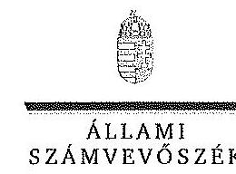

FöritKén

# Dr. Ignácz István úr 

elnök
Közigazgatási és Elektronikus Közszolgáltatások Központi Hivatala

## Budapest

## Tisztelt Elnök Úr!

Köszönettel megkaptam a 2016. február 25. napján az Állami Számvevőszékhez érkezett "Az idöközi választásokra forditott pénzeszközök felhasználásának ellenörzése" címủ számvevőszéki jelentéstervezetben foglalt megállapításokra tett észrevételét.

Az Állami Számvevőszék észrevételekre vonatkozó álláspontjáról a felügyeleti vezető által készített részletes tájékoztatást csatoltan megküldöm. Tájékoztatom Elnök urat, hogy a számvevőszéki jelentésben az elfogadott észrevétel átvezetésre került.

Budapest, 2016. 03. hó 46. nap
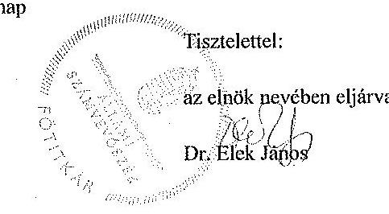

Melléklet: Tájékoztatás a Közigazgatási és Elektronikus Közszolgáltatások Központi Hivatala elnökének észrevételében foglaltakról

---

# Tájékoztatás 

a Közigazgatási és Elektronikus Közszolgáltatások Központi Hivatala elnökének észrevételében foglaltakról
„Az idöközi választásokra forditott pénzeszközök felhasználásának ellenörzése" címủ jelentéstervezetben foglaltakhoz tett észrevételét az Állami Számvevőszék (ÁSZ) köszönettel megkapta. Az észrevételében foglaltakról az alábbi tájékoztatást adom.

Az észrevételében foglaltakat az ÁSZ elfogadta, amelyre tekintettel a jelentéstervezet erre vonatkozó részei (8. oldal utolsó bekezdésének első mondata, 23. oldal 5. programpont második bekezdése) módosításra, illetve törlésre kerültek.

Budapest, 2016.
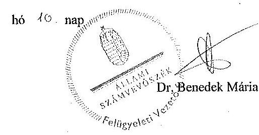

---

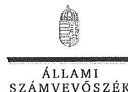

FÜTITKÁR

Ikt. szám: V-0799-278/2016.

Dr. Tahon Róber úr
jegyzó
Budapest Főváros IV. kerület Újpest
Önkormányzat Polgármesteri Hivatala

Budapest

Tisztelt Jegyző Úr!

Köszönettel megkaptam a 2016. február 23. napján az Állami Számvevőszékhez érkezett "Az
időközi választásokra fordított pénzeszközök felhasználásának ellenőrzése" című számvevő-
széki jelentéstervezetben foglalt megállapításokra tett észrevételét.

Az Állami Számvevőszék észrevéteire vonatkozó álláspontjáról a felügyeleti vezető által készí-
tett részletes tájékoztatást csatoltan megküldöm. Tájékoztatom Jegyző urat, hogy a részben elfogadott és az el nem fogadott észrevételeket – az Állami Számvevőszékről szóló 2011. évi LXVI.
törvény 29. § (3) bekezdése alapján – a jelentésben szerepeltetjük az elutasítás indokainak fel-
tüntetésével együtt.

Budapest, 2016. 03 hó 0. nap

Tisztelettel:

az elnök nevében eljárva
Dr. Élek János

Melléklet: Tájékoztatás az elfogadott és a részben elfogadott, valamint az el nem fogadott észrevételekről és azok
indokairól

1862 BUDAPEST, AFRICZAI CSERE JÁNOS UTEA 10. 1364 Budapest 4. Pf. 54 telefon: 484 9104 fax: 484 9213

---

# Tájékoztatás 

az elfogadott és a részben elfogadott, valamint az el nem fogadott észrevételekről, azok indokairól
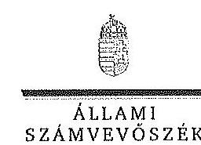
1. számú melléklet
a V-0799-0278/2016. ikt, számú levélhez

## Tájékoztatás

az elfogadott és a részben elfogadott, valamint az el nem fogadott észrevételekről, azok indokairól

| 1. | Észrevétel: | „19. oldal, 2. bekezdés: Az idöközi országgyülési választás lebonyolításában érintett három választási irodá a 6/2014. IM rendelet elöirásának megfelelöen elkészitette a feladattípusũ elszámolását, azonban azt a Budapest IV. kerületi OEV1 a 6/2014. IM rendelet 7. § (1) bekezdésében elöirt, a szavazás napját követő 15 napos határidőn túl, 14 nap késedelemmel, 2014. december 22-én rögzítette a VIP rendszerben.   A vizsgálat során az ellenörzési dokumentáció részét képezte az az alábbi tartalmú, 2015. november 2-án kelt jegyzői nyilatkozat:   Az országgyülési képviselők idöközi választása költségeinek normativáiról, tételeiröl, elszámolási és belső ellenörzési rendjéről szóló 6/2014. (IX. 19.) IM rendelet 7. § (1) bekezdése alapján a HVI és az OEV1 vezetője a szavazás napját követő 15 napon belül feladattípusũ elszámolást készít a TVI vezetője részére.   2014. november 23-ra kitüzött idöközi országgyülési képviselöválasztás pénzügyi fedezetének elszámolása a VPIR Választási Pénzügyi Információs rendszerben 2014. december 8. napjáig nem történhetett meg, miután az NVI elnöke az erre vonatkozó utasitást határidőben nem adta ki. Az elszámolás kapcsán 2014. december 17-én kelt NVI/1838-1/2014 iktatószámú NVI elnókének utasitása alapján a feladattípusũ elszámolásra a VPIR informatikai rendszerben 2014. december 18. napján került sor.   A nyilatkozat és az ahhoz csatolt háttérlevelezés tanúsága szerint VPIR rendszerbe 2014. december 18. napjától lehetett adatokat rögzíteni, igy a 2014. november 23-án megtartott országgyülési választás kapcsán az érintett választási irodák egyikének sem volt lehetősége a feladattípusũ elszámolás határidőben történő rögzitésére." |
| :--: | :--: | :--: |
|  | Válasz: | Az észrevételt az Állami Számvevőszék (ÁSZ) részben elfogadja. |
|  | Indoklás: | Az észrevétel részben megalapozott. Az észrevétellel érintett ellenőrzési megállapítás szerint az ellenőrzött szervezet az or- |

---

|  |  | szággyölési képviselők idöközi választása költségeinek normatíváiról, tételeiről, elszámolási és belső ellenőrzési rendjéről szóló 6/2014. (IX. 19.) IM rendelet [6/2014. (IX. 19.) IM rendelet] 7. § (1) bekezdésében foglalt, a Területi Választási Iroda felé történő elszámolását az ott meghatározott határidőn túl teljesitette. Az észrevételben foglaltak szerint a határidőre történő teljesités elmaradásának oka az volt, hogy az elszámolás elkészitéséhez - a 6/2014. (IX. 19.) IM rendelet 6. § (4) bekezdésében elöirtak alapján kiadott, a VPIR rendszer alkalmazását előirő - a Nemzeti Választási Irodának (NVI) az 1838-1/2014. iktatószámú Elnöki utasitását az NVI elnöke a jogszabályban elöirt elszámolási határidőt követöen, 2014. december 18-án adta ki. Az ÁSZ az észrevételben foglaltakat részben elfogadta és a fent leírt Elnöki utasitás figyelembe vételével az elszámolás határidőn túli teljesitésére vonatkozó megállapításának fenntartása mellett a jelentéstervezet 19. oldalának 2. bekezdését kiegészítette a következőkkel: ..., amelynek oka az NVI VPIR rendszer alkalmazását elöiró, az NVI 1838-1/2014. Iktatószámú Elnöki utasitásának az elszámolásra elöirt határidöt követöen történő kiadása volt." |
| :--: | :--: | :--: |
| 2. | Észrevétel: | A 2. számú melléklet, a gazdálkodósi jogok gyakorlása 2. sor   1. bekezdésében az a megállapítás szerepel, hogy Az Avr. 55. § (1) bekezdésben elöirtak ellenére, nem minden esetben az arra kijelölt személy gyakorolta a pénzügyi ellenjegyzést.   A hivatkozott jogszabály, az Avr. 55. § (1) elöírása szerint: A pénzügyi ellenjegyzést a kötelezettségvállalás dokumentumán a pénzügyi ellenjegyzés dátumának és a pénzügyi ellenjegyzés tényére történő utalás megjelölésével, az arra jogosult személy aláírásával kell igazolni.   Az Ábt. 37. § (2) szerint: A pénzügyi ellenjegyzésre jogosult személyek körét, a pénzügyi ellenjegyzö feladatait, összeférhetetlenségének eseteit, képesitési követelményeit a Kormány rendeletben határozza meg.   A vonatkozó Kormányrendelet, az Avr. 53. § (1) Törvény vagy e rendelet eltérő rendelkezése hiányában nem szükséges elözetes írásbeli kötelezettségvállalás az olyan kifizetés teljesitéséhez, amely   a) értéke a százezer forintot nem éri el.   A kifogásolt, saját forrásból finanszírozott három szerződés közül egyiknek az összege sem érte el a százezer forintos értékhatárt.   Álláspontom szerint, mivel az ügykörben négyszázízenöt szerzödés keletkezett, melyböl száz szerzödés ellenörzésére került sor, és ebböl három alkalommal nem az arra kijelölt személy gyakorolta a pénzügyi ellenjegyzést, a nem minden esetben kifejezés elnagyoltnak, túlzónak hatna abban az esetben is, ha a |

---

|  |   |   |
| --- | --- | --- |
|   |  | szúzezer forintos értékhatárt elérő szerzödésekröl lenne szó. A jogszabályi hivatkozásra tekintettel kérjük a 2. számú melléklet, a gazdálkodási jogok gyakorlása 2. sor 1. bekezdésében szereplő megállapítást törölni.  |
|   | Válasz: | Az ÁSZ az észrevételt elfogadja.  |
|   | Indoklás: | Az észrevétel megalapozott. Az ellenőrzött szervezet kötelezettségvállalási szabályzatáról szóló 2013. január 1-jétől hatályos, 31/7/2013. számú polgármesteri-jegyzői közös utasítás (kötelezettségvállalási szabályzat) 5. pontja tartalmaz rendelkezést az előzetes írásbeli kötelezettségvállalást nem igénylő kifizetések rendjéről. A kötelezettségvállalási szabályzatban meghatározták, hogy nem szükséges írásbeli kötelezettségvállalás az olyan kifizetés teljesitéséhez, amely nem éri el a 100 ezer Ft-ot, továbbá szabályozták ezen kifizetések nyilvántartásának rendjét is. Az ÁSZ ellenőrzési megállapításában és az észrevételben érintett kifizetések egyenként nem érték el a 100 ezer Ft-ot, így az állambáztartásról szóló törvény végrehajtásáról szóló 368/2011. (XII. 31.) Korm. rendelet (Ávr.) 53. §-ában és a kötelezettségvállalási szabályzatban foglaltaknak megfelelően előzetes írásbeli kötelezettségvállalás, ezzel együtt pénzügyi ellenjegyzés nem volt szükséges. A fentiek figyelembe vételével az ÁSZ az észrevételt elfogadta, az érintett megállapítást (jelentéstervezet 2. mellékletének ellenőrzött szervezetre vonatkozó sora hiányosságok oszlopában szereplő megállapítás első mondata) a jelentéstervezetből törölte.  |
|   | Észrevétel: | A 2. számú melléklet, a gazdálkodási jogok gyakorlása 2. sor 2. bekezdésében az a megállapítás szerepel, hogy figyes személyi kifizetéseknél az Ávr. 57. § (1) bekezdésében eláértak ellenére a teljesitésigazolás a tényleges teljesitést megelőzően történt.
Összesen egy személyi kifizetésnél fordult elö, hogy a teljesitésigazolás dátuma helytelenül került a kifizetés bizonylatára, ezért javaslom az egyes személyi kifizetést egy személyi kifizetésnél kifejezésre módosítani a jelentésben.  |
|  3. | Válasz: | Az ÁSZ az észrevételt nem fogadja el.  |
|   | Indoklás: | Az észrevétel nem megalapozott. Az ÁSZ a választásra fordított pénzeszközök szabályszerű felhasználásának ellenőrzése során a gazdálkodási és ellenőrzési jogkörök gyakorlásának megfelelőségét a személyi juttatásokkal kapcsolatos kifizetések esetében mintavétellel ellenőrizte. Az ÁSZ módszertani szabályai szerint a mintavételi eljárással vett minta a teljes sokaságot reprezentálja. A fent leírtak alapján az ÁSZ fenntartja az észrevétellel érintett ellenőrzési megállapításában foglaltakat.  |

---

|  | A 2. számú melléklet, a gazdálkodási jogok gyakorlása 2. sor 3. bekezdésében az a megállopitás szerepel, hogy a megbizási dijak pénztárból történő kifizetése során az Ávr. 58. § (1) bekezdésében és az 59. § (1) bekezdésében elöirtok ellenére az érvényesités nem a teljesitésigazolás alapján történt, mivel az érvényesités megelőzte a teljesitésigazolást, valamint az utalványozás is a teljesitésigazolást megelőzően történt. A vizsgálat során az ellenőrzési dokumentáció részét képezte, és a szóban forgó kérdéskör magyarázatul szolgált az alábbi tartalmú, 2015. november 2-án kelt jegyzői nyilatkozat:   A 2014. november 23. napjára kitüzött idöközi országgyülési képviselöválasztással kapcsolatban a szavazatszámláló bizottság tagjainak tiszteletdija a választás napján, 2014. november 23-án, a szavazökörökbe, készpénzben került kifizetésre.   a tiszteletdijak számfejtésére 2014. november 20-án, az országgyülési képviselők idöközi választása költségeinek normatíväiröl, tételeiröl, elszámolási és belső ellenőrzési rendjéről szóló 6/2014. (IX. 19.) IM rendelet, valamint a szavazatszámláló bizottságok tagjainak, illetve póttagjainak megválasztására vonatkozó Budapest Föváros IV. kerïlet Újpest Önkormányzata Képviselő-testületének 38/2014. (II. 27.) határozata alapján, a kifizetések készpénzben történő lebonyolítása érdekében került sor.   A számfejtés alapján a 221 fó bizottsági tag részére a tiszteletdijnak megfelelő cindeteket a számlavezető pénzintézetnél, a Raiffeisen Banknál elözetesen meg kellett igényelni. A tiszteletdijak személyenként és szavazökörönként külön kerïltek boritékolásra, ennek érdekében 2014. november 20-án a szükséges mennyiségü készpénz a házipénztárból kiadásra került. A teljesitésigazolás az átadott összegek aláirással igazolt átvételét követően, a választás és a kifizetés napján, 2014. november 23-án történt meg." |
| :--: | :--: |
| Válasz: | Az ÁSZ az észrevételt nem fogadja el. |
| Indokolás: | Az észrevétel nem megalapozott. A költségvetési szervek gazdálkodásával összefüggő kiadások (köztük a választásokkal kapcsolatos kiadások) érvényesitésére és utalványozásra vonatkozó kötelezettséget, annak szabályait az államháztartásról szóló 2011. évi CXCV. törvény 38. § (1) bekezdése, valamint az Ávr. 58-59. §-ai tartalmazzák. E jogszabályokban foglaltak szerint a kiadási elöirányzatok terhére történő utalványozásra a teljesités igazolását és annak alapján végrehajtott érvényesitést követöen kerülhet sor. Továbbá a kifizetések esetén a teljesités igazolása alapján az érvényesitőnek ellenöriznie kell az összegezerüséget, a fedezet meglétét és azt, hogy a megelőző ügymenetben az Ábt., az államháztartási számviteli kormányrendelet és e rendelet elöírásait, továbbá a belső szabályzatokban foglaltakat megtartották-e. A fenti jog- |

---

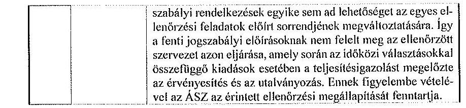

Budapest, 2016. március ${ }^{\circ} 20^{\circ}$.
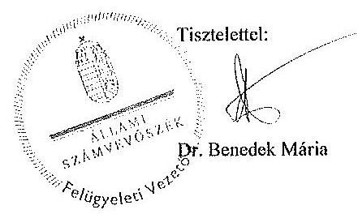

---

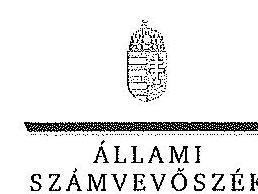

FËTITKÁR

Ikt. szám: V-0799-275/2016.

Dr. Kovács János úr
főjegyzó
Borsod-Abaúj-Zemplén Megyei Önkormányzati Hivatal

Miskolc

# Tisztelt Föjegyzó Úr! 

Köszönettel megkaptam a 2016. február 23. napján az Állami Számvevőszékhez érkezett "Az idöközi választásokra forditott pénzeszközök felhasználásának ellenörzése" címủ számvevőszéki jelentéstervezetben foglalt megállapításokra tett észrevételét.

Az Állami Számvevőszék észrevételre vonatkozó álláspontjáról a felügyeleti vezető által készített részletes tájékoztatást csatoltan megküldöm.

Budapest, 2016. 03. hó 10, nap
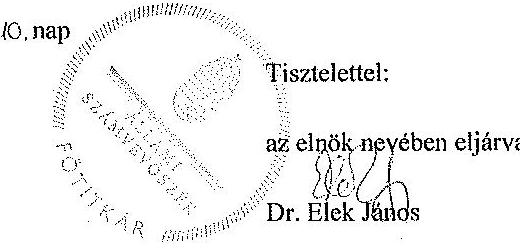

Melléklet: Tájékoztatás a Borsod-Abaúj-Zemplén Megyei Önkormányzati Hivatal főjegyzöjének észrevételében foglaltakról, az el nem fogadott észrevételek indokairól

---

# Tájékoztatás 

az észrevételek kezeléséről, az el nem fogadott észrevételekről, azok indokairól

| 1. | Észrevétel: | „1. A csatolt összesitő szerint 8 db kifizetés történt a megismételt ózdi polgármester-választással kapcsolatban, 181.426,- Ft összegben. Ezen összegből 63.600,- Ft továbbutalásra került Özd Város Helyi Választási Iroda részére. A TVI-nek mindebből következöen 117.926,- Ft normatív kiadása volt a megismételt polgármester-választással kapcsolatban." |
| :--: | :--: | :--: |
|  | Válasz: | Az Állami Számvevőszék (ÁSZ) az észrevételt tartalmánál fogva nem tekinti észrevételnek. |
|  | Indoklás: | Az észrevétel 1. pontjában foglaltakat szakmai tartalmánál fogva az ÁSZ nem tekinti észrevételnek. Az észrevételben az ellenőrzött szervezet az ózdi polgármesterválasztással kapcsolatos kifizetések összegére vonatkozó ténymegállapítást közöl, amellyel összefüggésben a jelentéstervezet nem tartalmaz ellenőrzési megállapítást. |
| 2. | Észrevétel: | „2. A TVI által eszközölt kifizetésekhez kapcsolódóan a teljesitésigazolásokra - közvetlenül vagy közvetve - sor került, a mellékelt összesitő kimutatás indokolása szerint. A Területi Választási Bizottság tagjait a Közgyülés kifejezetten választási feladatok ellátására választotta meg több évre, részükre esetenként külön megbizás nem készült. A kifizetés az NVI által jóváhagyott elszámolás alapján történt." |
|  | Válasz: | Az ÁSZ az észrevételt nem fogadja el. |
|  | Indoklás: | Az észrevétel nem megalapozott. A költségvetési szervek gazdálkodásával összefüggő kiadások (köztük a választásokkal kapcsolatos kiadások) teljesitésigazolására vonatkozó kötelezettséget, annak szabályait az állambáztartásról szóló 2011. évi CXCV. törvény 38. § (1) bekezdése, valamint az állambáztartásról szóló törvény végrehajtásáról szóló 368/2011. (XII.31.) Korm. rendelet 57. |

---

|  |  | §-a tartalmazza. E jogszabályokban foglaltak szerint a ki adási elöirányzatok terhére történő utalványozásra a teljesités igazolását és annak alapján végrehajtott érvényesitést követően kerülhet sor. Továbbá a teljesítésigazolás során ellenőrizhető okmányok alapján ellenőrizni kell a kiadások teljesitésének jogosságát, összegszerűségét, az ellenszolgáltatás teljesitését. A teljesítést az igazolás dátumának és a teljesités tényére történő utalás megjelölésével az arra jogosult személy aláírásával kell igazolni. A fenti jogszabályi rendelkezések egyike sem írja elő az észrevételben foglalt „közvetlenül vagy közvetve" történő teljesítésigazolás lehetőségét. Az ellenőrzött szervezet által az ellenőrzés során, illetve az észrevételhez mellékelve az ÁSZ rendelkezésre bocsátott dokumentumok egyike sem tartalmazza a teljesités igazolásának dátumát, a teljesités tényére történő utalást, továbbá a teljesítésigazolásra kijelölt személy aláírását. Az észrevételben hivatkozott közvetett teljesítésigazolás mely szerint az utalványrendeleten szereplő szövegben szerepel, hogy ,... a teljesitésigazolás és érvényesités alapján... utalványozom" - a fent hivatkozott jogszabályi elöírásoknak nem felel meg, az nem jelenti a teljesítésigazolás elvégzését. A fentiek figyelembe vételével a jelentéstervezet erre vonatkozó ellenőrzési megállapítását az ÁSZ fenntartja. |
| :--: | :--: | :--: |
|  | Észrevétel: | 3. A számlákon minden esetben megtalálható a teljesitésigazoló bélyegzö, valószinüéithető, hogy annak lenyomata a szkennelés miatt nem látható. A kisméretü számlák esetén pedig a számla hátoldalán került elhelyezésre a teljesitést igazoló bélyegzö. |
|  | Válasz: | Az ÁSZ az észrevételt nem fogadja el. |
| 3. | Indoklás: | Az észrevétel nem megalapozott. Az ÁSZ az észrevételhez csatolt, az A04600389/0237/00004 számú kiadási bizonylat (számlán) hátsó oldalán feltüntetett igazolást a teljesítésigazolás elvégzésének alátámasztására nem fogadja el. Az ÁSZ ellenőrzése során az ÁSZ elektronikus felületére az ellenőrzött szervezet által - teljességi nyilatkozattal alátámasztottan - felcsatolt dokumentum (az A04600389/0237/00004 számú számla) az észrevételhez csatolt dokumentummal ellentétben nem tartalmazta a teljesitésigazolás megtörténtét igazoló bélyegző lenyomatot, az azon szereplő dátumot és aláírást. Így az ÁSZ ellenőrzésekor rendelkezésére álló, fent nevezett |

---

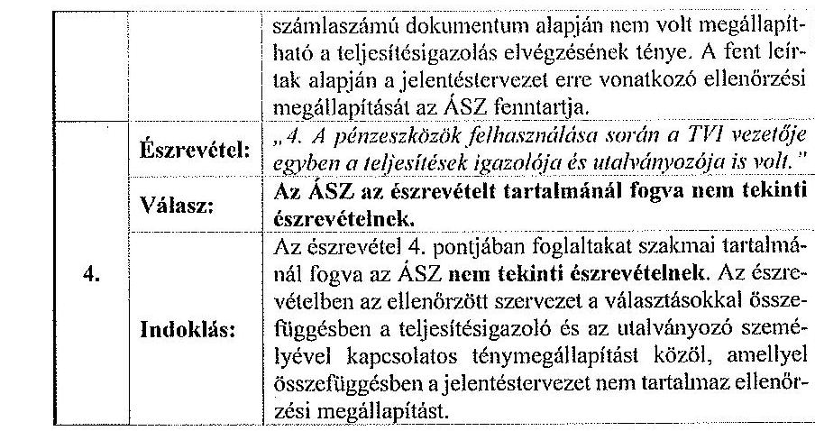

Budapest, 2016. március ${ }^{\text {n }}$ (G. ".
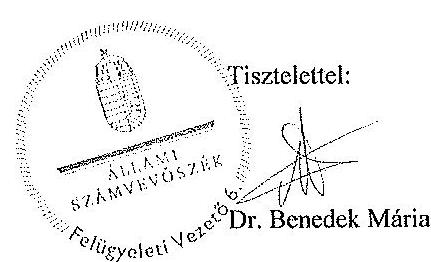

---

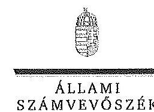

FËtttRÁR

Ikt. szám: V-0799-275/2016.

Rentzné Dr. Bezdán Edit úrhölgy
föjegyzö
Jász-Nagykun-Szolnok Megyei Önkormányzati Hivatal

# Szolnok 

## Tisztelt Föjegyzö Úrhölgy!

Köszönettel megkaptam a 2016. február 19. napján az Állami Számvevőszékhez érkezett "Az idöközi választásokra forditott pénzeszközök felhasználásának ellenörzése" címủ számvevőszéki jelentéstervezetben foglalt megállapításokra tett észrevételét.

Az Állami Számvevőszék észrevételre vonatkozó álláspontjáról a felügyeleti vezető által készített részletes tájékoztatást csatoltan megküldöm.

Budapest, 2016. 03. hó 03 nap
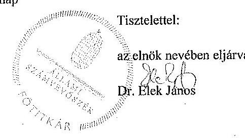

Melléklet: Tájékoztatás a Jász-Nagykun-Szolnok Megyei Önkormányzati Hivatal föjegyzöjének levelében foglaltakról

---

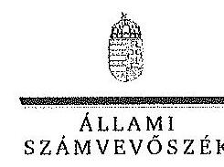

FELÜGYELETI VEZETÜ

1. melléklet
a V-0799-275/2016. ikt. számú levélhez

# Tájékoztatás 

a Jász-Nagykun-Szolnok Megyei Önkormányzati Hivatal főjegyzőjének levelében foglaltakról

Az időközi választásokra fordított pénzeszközök felhasználásának ellenőrzéséről készült jelentéstervezetben foglaltakhoz tett észrevételét az Állami Számvevőszék köszönettel megkapta. Az észrevételében foglaltakról az alábbi tájékoztatást adom.

Főjegyző úrhölgy által megküldött észrevétel - szakmai tartalmánál fogva - nem tekinthető észrevételek, mert az a jelentéstervezetben foglalt megállapításban szereplő visszafizetési kötelezettség teljesítéséről ad tájékoztatást, így az a jelentéstervezetben foglalt ellenőrzési megállapítás módosítását nem teszi indokolttá.

Budapest, 2016
C3. hó 03. nap
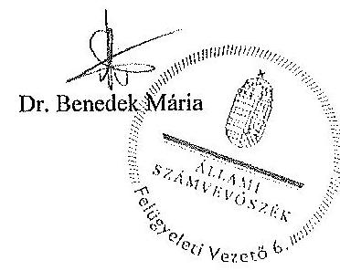

---

# RÖVIDÍTÉSEK JEGYZÉKE 

## Törvények

Alaptörvény
Áht.
ÁSZ tv.
Kbt.
Ve.
2014. évi költségvetési törvény

## Kormányrendeletek

Ávr.
218/2011. Korm. rendelet

## Miniszteri rendeletek

17/2013. KIM rendelet

28/2013. KIM rendelet

3/2014. IM rendelet

6/2014. IM rendelet

7/2014. IM rendelet

68/2013. NGM rendelet

Magyarország Alaptörvénye
az államháztartásról szóló 2011. évi CXCV. törvény
az Állami Számvevőszékről szóló 2011. évi LXVI. törvény
a közbeszerzésről szóló 2011. évi CVIII. törvény
a választási eljárásról szóló 2013. évi XXXVI. törvény
Magyarország 2014. évi központi költségvetéséről szóló 2013. évi CCXXX. törvény
az államháztartásról szóló törvény végrehajtásáról szóló 368/2011. (XII.31.) Korm. rendelet
a minősített adatot, az ország alapvető biztonsági, nemzetbiztonsági érdekeit érintő vagy a különleges biztonsági intézkedést igénylő beszerzések sajátos szabályairól szóló 218/2011. (X. 19.) Korm. rendelet
a központi névjegyzék, valamint egyéb választási nyilvántartások vezetéséről szóló 17/2013. (VII.17.) KIM rendelet
az országgyúlési képviselők és az Európai Parlament tagjainak választásán a választási irodák hatáskörébe tartozó feladatok végrehajtásának részletes szabályairól, a választási eljárásban használandó nyomtatványokról, valamint a választási eredmény országosan összesített adatai körének megállapításáról szóló 28/2013. (XI.15.) KIM rendelet
a helyi önkormányzati képviselők és polgármesterek választása, valamint a nemzetiségi önkormányzati képviselők választása költségeinek normatíváiról, tételeiről, elszámolási és belső ellenőrzési rendjéről szóló 3/2014. (VII. 24.) IM rendelet
az országgyúlési képviselők időközi választása költségeinek normatíváiról, tételeiről, elszámolási és belső ellenőrzési rendjéről szóló 6/2014. (IX.19.) IM rendelet
a helyi önkormányzati képviselők és polgármesterek választásán a megismételt szavazás, a helyi önkormányzati képviselők és a polgármesterek időközi választása, a nemzetiségi önkormányzati képviselők választásán a megismételt szavazás és a nemzetiségi önkormányzati képviselők időközi választása költségeinek normatíváiról, tételeiről, elszámolási és belső ellenőrzési rendjéről szóló 7/2014. (XI.6.) IM rendelet
a kormányzati funkciók, államháztartási szakfeladatok, és szakágazgatok osztályozási rendjéről szóló 68/2013. (XII.29.) NGM rendelet

---

# Közjogi szervezetszabályozó eszközök 

1457/2014. (VIII. 14.)
Korm. határozat
$2 / 2014$. KüM utasítás

13/2014. NVI utasítás

33/2014. NVI utasítás

## Szórövidítések

ÁSZ
E Ft
HVI
időközi választások
időközi országgyűlési
választás
IM
KEKKH
KIM
KKM
KÜVI
NVI
OEVI
megismételt önkormányzati szavazás
Mrd Ft
TVB
TVI
választási irodák

1457/2014. (VIII. 14.) Korm. határozat a rendkívüli kormányzati intézkedésekre szolgáló tartalékból történő elő-irányzat-átcsoportosításról, egyes kormányhatározatok módosításáról, a pártalapítványok tartalékának átcsoportosításáról, valamint a 2013. évi költségvetési maradványok egy részének felhasználásáról
a külügyminiszter 2/2014. (III. 31.) KüM utasítása a Magyarország külképviseletein lefolytatandó 2014. évi országgyűlési választás pénzügyi tervezésének, lebonyolításának, valamint elszámolásának rendjéről, valamint a külképviseleteken lefolytatandó választás lebonyolításának speciális feladatairól
13/2014. számú (IV. 11.) Elnöki Utasítás az országgyűlési képviselők választása forrásainak pénzügyi elszámolási rendjéről
33/2014. számú (X. 20.) Elnöki Utasítás a helyi önkormányzati képviselők és polgármesterek, valamint a nemzetiségi önkormányzati képviselők 2014. évi választása pénzügyi elszámolási rendjéről

Állami Számvevőszék
ezer forint
Helyi Választási Iroda (beleértve az országgyűlési egyéni választókerület székhely településén múködő választási irodát)
az országgyűlési képviselők időközi választása, valamint az önkormányzati választások megismételt szavazásai
az országgyűlési képviselők 2014. november 23-ai időközi választása
Igazságügyi Minisztérium
Közigazgatási és Elektronikus Közszolgáltatások Központi Hivatala
Közigazgatási és Igazságügyi Minisztérium
Külgazdasági és Külügyminisztérium
Külképviseleti Választási Iroda
Nemzeti Választási Iroda
Országgyűlési Egyéni Választókerületi Választási Iroda a helyi önkormányzati képviselők és polgármesterek választásán a 2014. november 9-ei megismételt szavazások milliárd forint
Területi Választási Bizottság
Területi Választási Iroda
Helyi Választási Iroda, Országgyűlési Egyéni Választókerületi Választási Iroda, Területi Választási Iroda

---

# ÉRTELMEZŐ SZÓTÁR 

informatikai rendszer

NVR

VLOG

VPIR

VÜR

A választási informatikai rendszer (a továbbiakban: informatikai rendszer) a Ve.-ben meghatározott választási feladatok végrehajtásában részt vevő és azokat kiszolgáló szervezetek által múködtetett informatikai infrastruktúra és alkalmazói rendszerelemek összessége. A választási informatikai infrastruktúra elemei lehetnek különösen: az anyakönyvi szolgáltató rendszer, a fővárosi és megyei kormányhivatalok és járási hivatalaik, kiemelten az okmányirodák, a helyi önkormányzatok és a külképviseletek informatikai eszközei, valamint a választási célú dedikált informatikai eszközök. A választási alkalmazói rendszerek elemei lehetnek különösen: a névjegyzékek vezetését, az ajánlás-ellenőrzést, jelöltek és jelölő szervezetek nyilvántartását, a szavazatösszesítést, az eredménymegállapítást, a logisztikai lebonyolítást támogató alkalmazói szoftverrendszerek. (forrás: 28/2013. (XI. 15.) KIM rendelet 2. §)
Nemzeti Választási Rendszer. A választások előkészítésével és lebonyolításával kapcsolatos alkalmazások összetett informatikai rendszere. Egyes moduljai a Ve.-ben foglalt alapfeladatok - pl. névjegyzék vezetése, szavazatöszszesítés, jogorvoslatok kezelése - ellátását biztosítják. (forrás: NVI összefoglaló az általuk üzemeltetett informatikai rendszerekről, 2015. február 20.)
Választási Logisztikai Rendszer. A választások előkészítési szakaszában a választáshoz szükséges nyomtatványok, egyéb kellékanyagok felmérését, a költségek tervezését, a közbeszerzések előkészítését, a választások lebonyolításakor és azok ellenőrzésének időszakában a szállítások, megrendelések koordinálását, nyomon követését, a szállítmányok logisztikai kezelését és az információszolgáltatást biztosító rendszer. (forrás: NVI összefoglaló az általuk üzemeltetett informatikai rendszerekről, 2015. február 20.)

Választási Pénzügyi Információs Rendszer. A választásokkal összefüggő költségvetési gazdálkodást - költségvetési tervezés, kötelezettségvállalás, pénzügyi, számviteli elszámolások -, valamint a választási szervek adatainak kezelését, támogatásaik tervezését, finanszírozását, pénzügyi elszámoltatását biztosító rendszer. (forrás: NVI öszszefoglaló az általuk üzemeltetett informatikai rendszerekről, 2015. február 20.)
Választási Ügyviteli Rendszer. Zárt rendszerben biztosítja a választási szervek egymás közötti kommunikációját és információközvetítését, eljárásrendek, értesítések, tájékoztatók küldését. (forrás: NVI összefoglaló az általuk üzemeltetett informatikai rendszerekről, 2015. február 20.)

---

.

---

# ÁLLAMI SZÁMVEVÓSZÉK 

Iktatószám: ETIO-0027-021/2015

## MEGHATALMAZÁS

Az Állami Számvevőszékről szóló 2011. évi LXVI. törvény 32. § (2) bekezdésében, valamint az Állami Számvevőszék Szervezeti és Müködési Szabályzatáról szóló 4/2014. (XII.31.) ÁSZ utasítás 31. § (7) bekezdésében és (8) bekezdés a) pontjában foglaltak alapján visszavonásig

- „Az idöközi választásokra forditott pénzeszközök felhasználásának ellenörzése" címü ellenörzés és
- a választással kapcsolatos nyilvántartási feladatok ellátása vonatkozásában
dr. Elek János fótitkárt az Elnököt megillető feladat- és hatáskörök teljes jogkörü gyakorlására feljogosítom.

Budapest, 2015. év $\qquad$ hó . 1.3... nap

## A teljes jogkörü feljogosítást elfogadom:

Budapest, 2015. év $\qquad$ hó . 1.4... nap
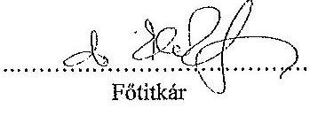