# Jelentés 

## A Nemzeti Rehabilitációs és Szociális Hivatal ellenőrzése

A központi alrendszer egyes intézményei pénzügyi és vagyongazdálkodásának ellenőrzése - NRSZH 2016.


---

# Jelentés 

## A Nemzeti Rehabilitációs és Szociális Hivatal ellenőrzése

A központi alrendszer egyes intézményei pénzügyi és vagyongazdálkodásának ellenőrzése - NRSZH 2016. április 13. nap
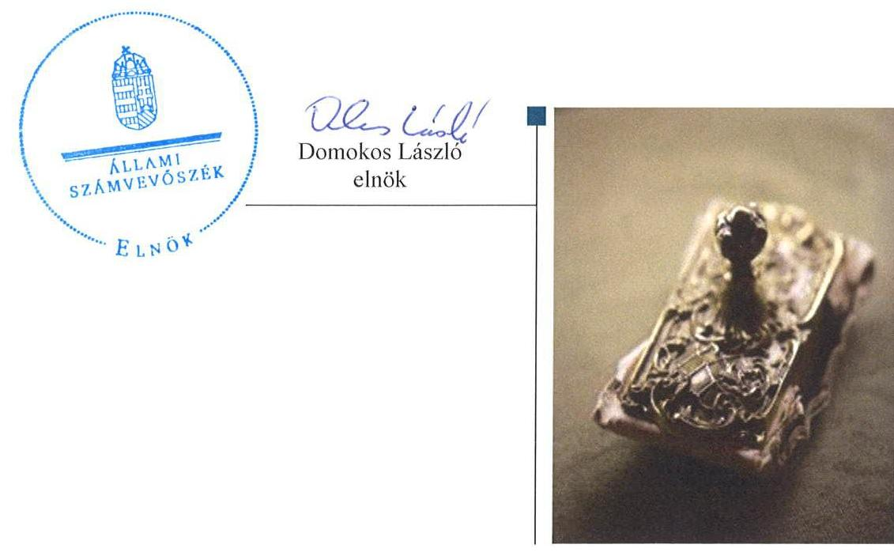

---

# AZ ELLENŐRZÉST FELÜGYELTE: 

DR. BENEDEK MÁRIA felügyeleti vezető

## AZ ELLENŐRZÉST VEZETTE ÉS A VÉGREHAJTÁSÁÉRT FELELŐS:

BIALKÓ ZSOLT GYULA, BUDAI ÉVA ellenőrzésvezető

## A PROGRAM ÖSSZEÁLLÍTÁSÁÉRT FELELŐS:

JANIK JÓZSEF osztályvezető, BÖRÖCZ IMRE projektfelelős

IKTATÓSZÁM: V-0777-223/2016.
TÉMASZÁM: 27
ELLENŐRZÉS-AZONOSÍTÓ SZÁM: V-0713

---

# TARTALOMJEGYZÉK 

■ ÖSSZEGZÉS ..... 5
■ AZ ELLENŐRZÉS CÉLJA ..... 7
■ AZ ELLENŐRZÉS TERÜLETE ..... 8
■ AZ ELLENŐRZÉS HÁTTERE, INDOKOLTSÁGA ..... 10
■ FÓKUSZKÉRDÉSEK ..... 11
■ ELLENŐRZÉS HATÓKÖRE ÉS MÓDSZEREI ..... 12
■ MEGÁLLAPÍTÁSOK ..... 15
■ JAVASLATOK ..... 45
■ MELLÉKLETEK ..... 49
I. Sz. melléklet: Értelmező szótár. ..... 49
II. Sz. melléklet: AZ integritás érvényesítése érdekében kialakított és működtetett kontrollrendszer ..... 54
III. Sz. melléklet: Az NRSZH pénzügyi és vagyongazdálkodásának teljesítmény-ellenőrzése ..... 55
■ FÜGGELÉK: ÉSZREVÉTELEK ..... 57
■ RÖVIDÍTÉSEK JEGYZÉKE ..... 67

---

.

---

# ÖSSZEGZÉS 

Az Állami Számvevőszék a Nemzeti Rehabilitációs és Szociális Hivatal irányító szervének¹ feladatellátását, belső kontrollrendszerének kialakítását és működtetését, valamint pénzügyi és vagyongazdálkodásának szabályszerűségét ellenőrizte a 2011. január 1-jétől 2014. december 31-ig terjedő időszakra vonatkozóan. Ezen kívül vizsgálta azt is, hogy az NRSZH² -t érintő szervezeti és szerkezeti átalakításokat szabályszerűen hajtották-e végre. Az összesített értékelés alapján az ÁSZ³
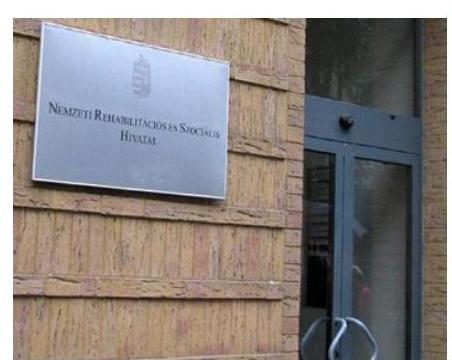
megállapította, hogy az irányító szerv NRSZH tekintetében végzett feladatellátása részben volt szabályszerű. Az NRSZH belső kontrollrendszerének kialakítása és működtetése javuló tendenciát mutatott, a 2011. évben nem volt szabályszerű, a 2012. évben részben volt szabályszerű, a 2013-2014. években már szabályszerű volt. Az NRSZH pénzügyi gazdálkodása összességében részben felelt meg a jogszabályi és a belső szabályzatokban rögzített előírásoknak, vagyongazdálkodása nem volt teljes mértékben szabályszerű az ellenőrzött időszakban. Az NRSZH-t érintő szervezeti és szerkezeti átalakításokat szabályszerűen hajtották végre.

## Az ellenőrzés társadalmi indokoltsága

Az ÁSZ Stratégiájának alapértéke, hogy ellenőrzései segítik az integritás alapú, átlátható és elszámoltatható közpénzfelhasználás megteremtését. Jelen ellenőrzés a központi alrendszer részét képező NRSZH gazdálkodási tevékenységére terjedt ki. Az NRSZH pénzügyi és vagyongazdálkodásának alapvető rendeltetése a közfeladatok ellátásának biztosítása.

A közpénzek felhasználásában meghatározó, központi alrendszerbe tartozó intézmények pénzügyi és vagyongazdálkodási tevékenységük, feladatellátásuk súlya miatt jelentős hatást gyakorolnak a költségvetés egyensúlyának fenntartására. Hatással vannak továbbá az állami vagyonnal való gazdálkodás minőségére, a kormányzati (szak)politikák végrehajtására, illetve közfeladat ellátásuk vonatkozásában az állampolgárok életminőségére, jogaik és kötelezettségeik gyakorlására. Indokolt ezért, hogy az ÁSZ ezen intézmények pénzügyi és vagyongazdálkodását, az esetleges átalakulások szabályszerűségét ellenőrizze több évre kiterjedően.

## Főbb megállapítások, következtetések

Az irányító szerv alapító okirat⁴ módosításával és az SZMSZ jóváhagyásával kapcsolatos jogosultságainak gyakorlása nem felelt meg teljes körűen a jogszabályi előírásoknak, valamint nem érvényesített az NRSZH közfeladatainak ellátására vonatkozó, az erőforrásokkal való szabályszerű és hatékony gazdálkodáshoz szükséges követelményeket, ugyanakkor egyéb ellenőrzési, irányítási és felügyeleti jogosultságait szabályszerűen gyakorolta.

Az NRSZH-nál a kontrollkörnyezet kialakítása, a kockázatkezelési rendszer szabályozása és működtetése, valamint a kontrolltevékenységek kialakítása és működtetése az ellenőrzött időszakban javuló tendenciát mutatott, a 2013-2014. években - a kockázatkezelési rendszer szabályozása és működtetése esetében 2012. és 2014. között - szabályszerű volt. Az információs és kommunikációs folyamatok szabályozása szintén folyamatosan javult, 2011-ben nem, 2012-ben részben, a 2013-2014. években már szabályszerű volt. Ugyanakkor a monitoring rendszer működése az ellenőrzött időszak mindegyik évében részben volt szabályszerű.

---

Az elemi költségvetés és az előirányzatok megállapítása, illetve a kiadási előirányzatok felhasználása során az NRSZH-nál nem tartották be maradéktalanul a jogszabályi előírásokat és a belső szabályzatokban foglaltakat. A bevételi és kiadási előirányzatok módosítása, átcsoportosítása összességében részben felelt meg a jogszabályi előírásoknak, azonban a saját hatáskörben végrehajtott előirányzat módosítások során az NRSZH nem megfelelően járt el, mivel azokról az előírt határidőn túl tájékoztatták a Kincstárt⁵ és az irányító szervet. Az NRSZH a jóváhagyott kiadási előirányzatokon belül gazdálkodott, azonban a kiadási előirányzatok felhasználása során a közbeszerzési eljárásokra és a gazdálkodási jogkörök gyakorlására vonatkozó jogszabályi előírásokat nem tartotta be teljes körűen. A kulcskontrollok (2011-ben a szakmai teljesítésigazolás és utalványozás ellenjegyzése, 2012-től teljesítésigazolás és érvényesítés kontrollok) a 2011-2012. években nem megfelelően, a 2013-2014. években részben megfelelően működtek. A bevételek teljesítése az ellenőrzött időszak mindegyik évében elmaradt a módosított előirányzatoktól. Az NRSZH az előirányzatok felhasználásához kapcsolódó évközi korlátozó intézkedéseket végrehajtotta, az előirányzat-maradvány megállapítása és felhasználása részben felelt meg a jogszabályi előírásoknak, a befizetési kötelezettségét 2013-ban a jogszabályban előírt határidőn túl teljesítette.

Az NRSZH intézkedéseket tett a zavartalan feladatellátásához szükséges folyamatos likviditásának biztosítása érdekében, azonban azt támogató előirányzat-felhasználási-, illetve likviditási tervet a vonatkozó előírások ellenére nem készített.

Az eredményszemléletű számvitel bevezetésével kapcsolatos feladatok elvégzése, a rendező mérleg előkészítése és összeállítása nem felelt meg maradéktalanul a jogszabályi előírásoknak.

Az NRSZH vagyonkezelési szerződése nem felelt meg teljes körűen a jogszabályi előírásoknak, mivel nem történt meg a vagyonkezelési szerződés és módosításainak egységes szerkezetbe foglalása. A mérlegben kimutatott eszközök és források nyilvántartása, értékelése során nem tartották be maradéktalanul a jogszabályokban és a belső szabályzatokban foglalt előírásokat. Az értékmegőrzési, állagmegóvási kötelezettségeket a jogszabályok és a vagyonkezelési szerződés szerint teljesítették.

Az irányító szerv átszervezéshez kapcsolódó alapítói, irányítói, felügyeleti szervi döntései szabályszerűek voltak, továbbá az NRSZH is szabályszerűen látta el az átszervezéshez kapcsolódó feladatait.

Az NRSZH az adatszolgáltatása alapján intézkedéseket tett az integritás szemlélet érvényesítése érdekében, azonban az ÁSZ ellenőrzés újabb kockázatokat tárt fel a gazdálkodásban.

---

# AZ ELLENŐRZÉS CÉLJA 

## Az NRSZH ellenőrzése

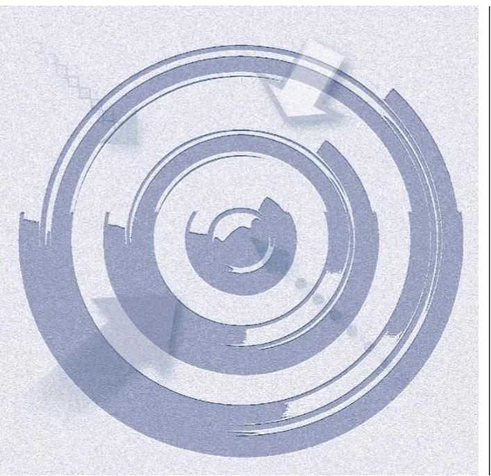

## AZ NRSZH PÉNZÜGYI ÉS VAGYONGAZDÁLKODÁSÁNAK ELLENŐRZÉSE

annak megállapítására irányult, hogy az NRSZH-ra vonatkozó irányító szervi feladatellátás a jogszabályi előírások betartásával történt-e, továbbá az NRSZH-nál a belső kontrollrendszer kialakítása és működtetése szabályszerű volt-e. Az ellenőrzés kiterjedt annak megítélésére is, hogy kialakították-e az erőforrásokkal való szabályszerű, gazdaságos, hatékony és eredményes gazdálkodáshoz szükséges követelményeket, megvalósították-e ezek számon kérését, ellenőrzését, az NRSZH pénzügyi és vagyongazdálkodása megfelelt-e a jogszabályi előírásoknak és belső szabályzatokban foglaltaknak és arra, hogy az NRSZH átalakításának vagy átszervezésének lebonyolítása szabályszerűen történt-e.

Az NRSZH korrupcióval szembeni veszélyeztetettségének csökkentése érdekében felmértük az integritási szemlélet érvényesülését a gazdálkodási folyamatokban.

## AZ ELLENŐRZÉS TELJESÍTMÉNY-ELLENŐRZÉSI PROGRAMMODULLAL EGÉ-

SZÜLT KI, amely a szabályszerűségi ellenőrzés programjára épült. A teljesítmény-ellenőrzési kiegészítő modul célja annak értékelése volt, hogy a gazdálkodás folyamatában a gazdaságossági, hatékonysági és eredményességi követelmények kialakítása megtörtént-e, azokat működtették-e, a célkitűzéseket elérték-e. A kiegészítő modul célja volt továbbá annak értékelése is, hogy a pénzügyi és vagyongazdálkodás folyamataira vonatkozóan a költségvetési szerv belső kontroll-rendszerének minőségéről az NRSZH vezetője által kiadott vezetői nyilatkozatban a költségvetési szerv tevékenységében a hatékonyság, eredményesség, gazdaságosság követelményeinek érvényesítésére vonatkozó nyilatkozat helytálló volt-e.

---

# AZ ELLENŐRZÉS TERÜLETE

## Az NRSZH


Az ellenőrzés az NRSZH-ra terjedt ki, amely az emberi erőforrások minisztere irányítása alá tartozó, központi hivatalként működő központi költségvetési szerv.

Az NRSZH jogelőd intézménye az Országos Orvosszakértői Intézet volt, amely 2007-től Országos Rehabilitációs és Szociális Szakértői Intézet néven folytatta tevékenységét, majd 2011. január 1-jétől a 331/2010. (XII.27.) Korm. rendeletben foglaltak alapján elnevezése Nemzeti Rehabilitációs és Szociális Hivatalra változott.

Az NRSZH feladatellátása rendkívül szerteágazó. Rehabilitációs és orvosszakértői, szociális, gyermekjóléti, gyermekvédelmi és társadalmi felzárkózási, továbbá képzési és módszertani feladatokat lát el, és ezekkel összefüggésben hatósági tevékenységet is végez. A hatáskörébe tartozó feladatokat Magyarország egész területére kiterjedő illetékességgel látja el, és tevékenységéről évente beszámol a miniszternek.

Az NRSZH az ellenőrzött időszakban önálló jogi személyiséggel rendelkező, önállóan működő és gazdálkodó, az előirányzatok felett teljes jogkörrel rendelkező költségvetési szerv volt. Az ellenőrzött időszakban kormánydöntések alapján változások történtek az NRSZH feladatellátásában, szervezetében. A 2011. évben az FH-tól rehabilitációs és szociális feladatokat vett át, 2012-ben ugyanakkor első fokú hatósági feladatokat adott át a kormányhivataloknál létrejött új szakigazgatási szerveknek. A 2013. évtől további szociális feladatok kerültek át az NRSZH-tól az SZGYF-hez.

Az NRSZH-t főigazgató vezeti, akit a miniszter nevez ki, ment fel és gyakorolja felette az egyéb munkáltatói jogokat. Az ellenőrzött időszakban a főigazgató személye egy alkalommal változott, a jelenlegi főigazgató 2014. augusztus 25-től vezeti az NRSZH-t. Munkáját gazdasági igazgató is segíti, személye az ellenőrzött időszak során egy alkalommal változott, a jelenlegi gazdasági igazgató 2014. szeptember 25-én került kinevezésre.

Az NRSZH 2011-ben 39 702,7 M Ft⁹, a 2014. évben 9 879,7 M Ft kiadást teljesített. Bevételi előirányzata 2011-ben 45 053,9 M Ft-ban, 2014-ben 12 542,1 M Ft-ban realizálódott.

Az NRSZH mérleg szerinti vagyona 2011. december 31-én 8 470,1 M Ft volt, a 2014. december 31-i mérlegében 6 910,3 M Ft vagyon került kimutatásra. Az NRSZH vagyoni szerkezetének alakulását jelentős mértékben befolyásolták az ellenőrzött időszakban elsősorban EU-s forrásból megvalósult fejlesztések. A 2011. évhez képest az évek során az immateriális javak állománya 1 359,6 M Ft-tal, a tárgyi eszközök állománya 547,0 M Ft-tal növekedett.

Az NRSZH az ellenőrzött időszakban jelentősebb összegű EU¹⁰-s támogatásban részesült az ÁROP¹¹, EKOP¹², TÁMOP¹³, TIOP¹⁴, KMOP¹⁵ programokon keresztül, többek között a komplex rehabilitáció szakmai és infrastrukturális feltételeinek, a központi szociális információs rendszer, valamint a beteg- és gyermekjogi képviselői hálózat fejlesztésére.

Az NRSZH feladatellátásához 2011-ben 702 álláshelyet engedélyezett a fenntartó, amely 2014-re 349 álláshelyre csökkent a kormánydöntések alapján megvalósult feladatátadások következtében.

---

# AZ ELLENŐRZÉS HÁTTERE, INDOKOLTSÁGA 

## Az NRSZH ellenőrzésének háttere


Az Alaptörvény¹⁶ rendelkezése szerint a nemzeti vagyon megőrzésének, védelmének és a nemzeti vagyonnal való felelős gazdálkodásnak a követelményeit sarkalatos törvény, az Nvtv.¹⁷ rögzíti. A tulajdonosi joggyakorlás és vagyonkezelés általános és speciális szabályait, az állami vagyon nyilvántartására és elszámolására vonatkozó eljárásokat, a vagyonkezelési szerződés feltételrendszerét, valamint az éves beszámoló készítési és könyvvezetési kötelezettségeket kormányrendelet írja elő.

A központi alrendszer egyes intézményei közfeladat ellátásának változásait, a közfeladatok átadásából és átvételéből adódó módosításait, előirányzat gazdálkodására ható tényezőit az Áht.¹⁸ 11. §-a és az Ávr.¹⁹ 14. §-a írja elő. A közfeladatok megszűnéséből, az intézmény átszervezéséből, belső szerkezeti korszerűsítéséből vagy más hasonló okból adódó módosításai miatt szerepeltetendő szerkezeti változásokat, valamint a szerkezeti változásként beépült közfeladatok szintre hozásként történő számításba vételét az Ávr. 15. § (2)-(3) bekezdései határozzák meg.

A társadalmi igénnyel összhangban az Áht.²⁰, az Áht.², az Ámr.²¹ és a Bkr.²² is előírja a költségvetési szerv részére, hogy olyan szabályozásokat, eljárásokat, folyamatokat alakítson ki, amelyek biztosítják a működés, gazdálkodás, az erőforrások felhasználása során a gazdaságosság, hatékonyság és eredményesség érvényesülését. A gazdaságos, hatékony és eredményes gazdálkodáshoz szükség van a teljesítménymérés feltételeinek kialakítására, úgymint az egyértelmű és mérhető célokra, mutatószámokra és az ezekhez rendelt követelményekre. Az ÁSZ jelen ellenőrzéssel

 győződik meg arról, hogy az NRSZH-nál a teljesítménycélokat, mutatókat, követelményeket kialakították-e, azokat működtették-e, a kitűzött cél(ok) teljesültek-e.

Az ellenőrzés eredményeképpen nemcsak az NRSZH gazdálkodása javulhat, hanem átfogó képet kaphatunk annak hiányosságairól és a jó gyakorlatokról is. Az ÁSZ javaslataival és megállapításaival elősegítheti az NRSZH pénzügyi és vagyongazdálkodása szabályozásának javítását. A teljesítmény-ellenőrzés lefolytatása támogatást nyújt továbbá a törvényalkotás számára a nemzeti kulcsindikátorok rendszerének kialakításához. A döntéshozók, ellenőrzöttek, irányító szervek, a társadalom számára az összehasonlítási, összemérési lehetőségek kihasználásával objektív visszajelzést ad a gazdálkodás területén végrehajtott szervezeti, szervezési, takarékossági és bürokráciacsökkentő intézkedések hatásairól, a közfeladat ellátásnak keretet adó pénzügyi és vagyongazdálkodásban mérhető teljesítménykövetelmények kialakításáról, azok alkalmazásáról. Irányt mutat a gazdálkodási és kapcsolódó adminisztratív folyamatok optimalizációjához. Segíti a központi költségvetési szervek átláthatóságát, felügyelhetőségét, a „jó gyakorlatok" elterjesztésével támogatja a „jó kormányzást".

---

# FÓKUSZKÉRDÉSEK 

1. Az irányító szerv NRSZH-ra vonatkozó feladatellátása szabályszerű volt-e?
2. Az NRSZ belső kontrollrendszerének kialakítása és működtetése megfelelt-e a jogszabályi előírásoknak?
3. Az NRSZH pénzügyi gazdálkodása szabályszerű volt-e?
4. Az NRSZH vagyongazdálkodása szabályszerű volt-e?
5. Szabályszerűen hajtották-e végre az ellenőrzött időszakban az NRSZH-t érintő szervezeti, szerkezeti átalakításokat?
6. Az NRSZH intézkedett-e az integritás szemlélet érvényesítése érdekében?

---

# ELLENŐRZÉS HATÓKÖRE ÉS MÓDSZEREI 

## Az ellenőrzés típusa

Szabályszerűségi és teljesítmény-ellenőrzés.

## Az ellenőrzött időszak

A 2011. január 1-jétől 2014. december 31-ig terjedő időszak.

## Az ellenőrzés tárgya

Az ellenőrzés tárgya az NRSZH-ra vonatkozó irányító szervi feladatok ellátása, az NRSZH belső kontrollrendszerének kialakítása és működtetése, pénzügyi és vagyongazdálkodása, továbbá az erőforrásokkal való szabályszerű, gazdaságos, hatékony és eredményes gazdálkodáshoz szükséges követelmények kialakítása, a kialakított követelmények számonkérése, ellenőrzése, a kapcsolódó vezetői nyilatkozat helytállósága volt. Az NRSZH átalakítása, átszervezése lebonyolításának szabályszerűsége szintén az ellenőrzés tárgyát képezte.

## Az ellenőrzött szervezet

Az NRSZH és annak irányító szerve.

## Az ellenőrzés jogalapja

Az ellenőrzés jogszabályi alapját az Alaptörvény Állam fejezet 43. cikk (1) bekezdése és az ÁSZ tv. ${ }^{23} 1 . \S$ (3) bekezdése, 5. § (2)-(6) bekezdései, valamint az Áht. 2 61. § (2) bekezdésének előírásai képezték.

## Az ellenőrzés módszerei

Az ellenőrzést az ellenőrzési program szempontjai, az ellenőrzött időszakban hatályos jogszabályok, valamint az ellenőrzés szakmai szabályai és az ÁSZ módszertanok figyelembevételével végeztük, irányadónak tekintve a nemzetközi standardokat.

Az ellenőrzés lefolytatásához az NRSZH és az EMMI ${ }^{24}$ tanúsítványok kitöltésével és megküldésével, valamint az ÁSZ által kért dokumentumok elsősorban elektronikus úton történő megküldésével szolgáltatott adatokat. Az így rendelkezésre bocsátott adatok, információk kontrollja

---

helyszíni ellenőrzés keretében történt. Ellenőrzés szakmai szempontok alapján mintavételi eljárást alkalmaztunk, melynek során a minták kiválasztása elsősorban reprezentativitást biztosító véletlen mintavételi eljárással történt. A jelentésben használt fogalmak magyarázatát az I. számú melléklet, az integritás érvényesítése érdekében kialakított és működtetett kontrollrendszer szempontjait a II. számú melléklet, a kiegészítő teljesítmény-ellenőrzés megállapításait a III. számú melléklet tartalmazza.

Az NRSZH belső kontrollrendszere jogszabályi előírások szerinti kialakításának és működtetésének szabályszerűségét az erre irányuló ellenőrzési kérdésekre adott válaszok összesítése alapján, évenkénti bontásban pillérenként (kontrollkörnyezet, kockázatkezelési rendszer, kontrolltevékenységek, információs és kommunikációs rendszer, monitoring rendszer) és összesítetten is minősítettük. A belső kontrollrendszer egyes pilléreinek kialakítása és működtetése „szabályszerű" volt, amennyiben az értékelt területen az elért és elérhető pontok százalékban kifejezett, egész számra kerekített hányadosa meghaladta a 84%-ot. „Részben szabályszerű" volt, ha ez a hányados a 84%-ot nem haladta meg, de 60%-nál nagyobb volt, és „nem szabályszerű" volt, ha az nem haladta meg a 60%-ot. Az NRSZH belső kontrollrendszerének összesített értékelése megegyezik a pillérenként (kontrollterületenként) alkalmazott %-os értékelésekkel. A kontrollrendszer egésze esetében a „szabályszerű" értékelésnek a %-os értéken felül további feltétele volt, hogy egyik kontrollterület sem kaphatott „nem szabályszerű" értékelést, a „részben szabályszerű" értékelés további feltétele volt, hogy legfeljebb egy ellenőrzött kontrollterület lehetett „nem szabályszerű" értékelésű. Az összesített értékelés a %-os értéktől függetlenül „nem szabályszerű" értékelést kapott, ha az ellenőrzött kontrollterületek közül több mint egynek „nem szabályszerű" volt az értékelése.

A tárgyi eszközök nyilvántartásba vételének, a közbeszerzési eljárások lefolytatásának, az előírányzatok módosításának és az előirányzatmaradvány megállapításának szabályszerűségét, valamint a gazdálkodási jogkörök gyakorlásának szabályszerűségét mintavétellel ellenőriztük. Megfelelőnek értékeltük a tárgyi eszközök nyilvántartásba vételét, az előirányzatok módosítását és az előirányzat-maradvány megállapítását, amennyiben a minta ellenőrzésének eredménye alapján 95%-os bizonyossággal a teljes sokaságban a hibás tételek aránya kisebb volt, mint 10%, nem megfelelőnek értékeltük, ha a hibás tételek aránya a 10%-ot meghaladta. A közbeszerzési eljárások esetében az ellenőrzött tételek értékelését végeztük el.

A 2011. évet érintően a szakmai teljesítésigazolás és az utalvány ellenjegyzése kulcskontrollok, a 2012-2014. éveket érintően a teljesítésigazolás és az érvényesítés kulcskontrollok működését értékeltük. Megfelelőnek értékeltük a gazdálkodási jogkörök gyakorlását, amennyiben 95%-os bizonyossággal a teljes sokaságban a hibaarány legfeljebb 10% volt, részben megfelelőnek értékeltük, ha a hibaarány felső határa legfeljebb 30% volt, nem megfelelőnek értékeltük akkor, ha a sokaságbeli hibaarány felső határa meghaladta a 30%-ot.

---

A teljesítmény-ellenőrzés során a számvevőszéki ellenőrzés szakmai szabályai szerint, a szabályszerűségi ellenőrzést kiegészítve, a teljesítményellenőrzés módszerével, a vonatkozó nemzetközi standardok figyelembevételével értékeltük, hogy a költségvetési szerv vezetője kialakította-e a gazdaságossági, hatékonysági és eredményességi követelményeket, és azokat működtette-e, a célkitűzéseket elérte-e. Az ellenőrzés a gazdálkodási feladatokra terjedt ki, a szakmai feladatellátást nem értékelte.

Az ÁSZ Integritás Projektje keretében az NRSZH adatszolgáltatást teljesített az integritás szemlélet érvényesülése érdekében a 2014. évben tett intézkedéseiről.

---

# 1. Az irányító szerv NRSZH-ra vonatkozó feladatellátása szabályszerű volt-e? 

Összegző megállapítás

Az irányító szerv feladatellátása az NRSZH tekintetében részben volt szabályszerű.
1.1. számú megállapítás

Az irányító szerv alapító okirat módosítással kapcsolatos jogának gyakorlása nem felelt meg teljes körűen a jogszabályi előírásoknak.

Az NRSZH az ellenőrzött időszakban rendelkezett az irányító szerv által kiadott alapító okirattal. Az alapító okirat módosítására az ellenőrzött időszakban két alkalommal - 2011-ben és 2012-ben - került sor, továbbá 2014-ben az EMMI minisztere a 2012. évi egységes szerkezetbe foglalt alapító okirathoz kiegészítést adott ki a 2014. január 1-jétől érvényes alaptevékenység besorolási kód változása miatt.

Az alapító okirat a telephelyek maradéktalan felsorolása kivételével tartalmazta a vonatkozó jogszabályok által előírt tartalmi elemeket.

Az alapító okiratban rögzítették többek között az intézményi alaptevékenységeket és az ellátandó közfeladatokat, valamint rendelkeztek az intézménynél foglalkoztatottak foglalkoztatási jogviszonyáról.

Az SZMSZ${ }^{25}$-t az irányító szerv jóváhagyta, amelynek tartalma a 2011. október 8-ai módosítását követően - a 2013. évben jóváhagyott SZMSZ-ben rögzített egy szakfeladat kivételével - összhangban volt a hatályos alapító okirattal.

Az irányító szerv gyakorolta többek között az alapítói és kinevezési jogokat, ellenőrizte a közfeladatok ellátását, megállapította a költségvetést, élt a hatáskörébe utalt előirányzat-módosítási jogkörökkel, irányította a kormánydöntésekkel kijelölt feladat átadás-átvételeket, gyakorolta az egyéb irányítási-ellenőrzési jogköröket.

---

Az irányító NRSZH-ra vonatkozó feladatellátásával kapcsolatos szabálytalanságokat az 1. számú táblázat tartalmazza.

# AZ IRÁNYÍTÓ SZERV NRSZH-RA VONATKOZÓ FELADATELLÁTÁSÁVAL KAPCSOLATOS SZABÁLYTALANSÁGOK 

| Sorszám | Részmegállapítás | Megjegyzés |
| :--: | :--: | :--: |
| 1. | A 2012. július 1-jétől hatályos alapító okiratban az Ávr. 5. § (1) bekezdés a) pontjában előírtak ellenére nem került felsorolásra az NRSZH valamennyi telephelye. |  |
| 2. | A 2013. november 1-jétől hatályba lépett SZMSZ az Ávr. 13. § (1) bekezdés c) pontjának előírása ellenére olyan szakfeladatot is tartalmazott, amelyet az NRSZH nem látott el. A megszűnt szakfeladatot az alapító okiratból kivezették, az SZMSZ-t azonban ennek megfelelően nem módosították. |  |

Forrás: ÁSZ
1.2. számú megállapítás

Az irányító szerv az éves beszámolót érintően előírt követelmények kivételével nem érvényesített a közfeladatok ellátására vonatkozó, az erőforrásokkal való szabályszerű és hatékony gazdálkodáshoz szükséges követelményeket.

Az irányító szerv a közfeladatok ellátására és a gazdálkodásra vonatkozóan minden évben előírta az éves elemi költségvetési beszámoló és az éves beszámoló szöveges indoklásának tartalmi követelményét, az elemi költségvetési beszámolók ellenőrzését elvégezte.

Az irányító NRSZH-ra vonatkozó, erőforrásokkal való szabályszerű és hatékony gazdálkodáshoz szükséges követelmények érvényesítésével kapcsolatos szabálytalanságát a 2. számú táblázat tartalmazza.
2. táblázat

AZ IRÁNYÍTÓ SZERV NRSZH-RA VONATKOZÓ, ERŐFORRÁSOKKAL VALÓ SZABÁLYSZERŰ ÉS HATÉKONY GAZDÁLKODÁSHOZ SZÜKSÉGES KÖVETELMÉNYEK ÉRVÉNYESÍTÉSÉVEL KAPCSOLATOS SZABÁLYTALANSÁGA

| Sorszám | Részmegállapítás | Megjegyzés |
| :--: | :--: | :--: |
| 1. | Az irányító szerv 2011-ben az Áht. 49. § (5) bekezdés f) pontjában, míg a 2012-2014. években a 2012. január 1-jétől hatályos Áht. 2 9. § (1) bekezdés f) pontjában előírtak ellenére nem érvényesített a közfeladatok ellátására vonatkozó és az erőforrásokkal való szabályszerű és hatékony gazdálkodáshoz szükséges követelményeket. | Az Áht. 2 9. § (1) bekezdés f) pontjában előírt irányítószervi hatáskört 2015. január 1-jétől a 9. § eb) pontja szabályozta, mely 2015. június 19-től hatálytalan. |

Forrás: ÁSZ
1.3. számú megállapítás

Az NRSZH-val kapcsolatos egyéb ellenőrzési, irányítási és felügyeleti jogosultságok gyakorlása szabályszerű volt.

Az irányító szerv rendszeresen figyelemmel kísérte az NRSZH bevételi és kiadási előirányzatokkal való gazdálkodását és a közfeladatok ellátását.

Az irányító szerv meghatározta a beszámoló készítésének kritériumait és benyújtási határidejét.

Az irányító szerv a Számv. tv. ${ }^{26}$-ben meghatározott számviteli beszámolási kötelezettségen túl az éves szakmai feladatellátásról beszámoltatta az NRSZH-t. Az NRSZH a beszámolási kötelezettségének minden ellenőrzött évben eleget tett.

---

Az éves költségvetési beszámolók szöveges indoklását az irányító szerv előírása alapján dolgozták ki, abban az NRSZH az előírtaknak megfelelően bemutatta többek között az adott évre vonatkozó előirányzat átcsoportosításokat és projektenként az EU-s finanszírozású projektek támogatási összegeit. Ismertette továbbá az adott évi személyi juttatásokra, az orvosszakértők létszámára, a dolgozói cafetériára, a képzésekre és továbbképzésekre, a szociális intézményi foglalkoztatásra, továbbá a megváltozott munkaképességűek támogatására vonatkozó adatokat, azok alakulását.

Az NRSZH az éves beszámolókon túl - jogszabályi előírás alapján - negyedéves mérlegjelentést nyújtott be az irányító szervhez. Az NRSZH pénzügyi helyzetének alakulásáról az irányító szerv havi szintű információkkal is rendelkezett a Kincstár honlapján közzétett havi költségvetési jelentéseken keresztül.

Az NRSZH főigazgatójának és gazdasági igazgatójának irányító szerv általi kinevezése, a vezetői megbízás adása és visszavonása szabályszerűen történt.

Az irányító szerv 2011. és 2014. között hét alkalommal végzett ellenőrzést az NRSZH-nál. Sor került rendszerellenőrzésre és egy-egy célzottan kiválasztott terület szabályszerűségének ellenőrzésére. Két ellenőrzés kivételével a megállapításaik alapján intézkedést igénylő javaslatokat tettek. Az NRSZH intézkedési tervet készített a javaslatok hasznosítása érdekében, és az abban foglaltakat végrehajtotta. Az irányító szerv részéről utóellenőrzésre egy ellenőrzéshez kapcsolódóan került sor.

# 2. Az NRSZ belső kontrollrendszerének kialakítása és működtetése megfelelt-e a jogszabályi előírásoknak? 

Összegző megállapítás

Az NRSZH belső kontrollrendszerének kialakítása és működtetése javuló tendenciát mutatott, a 2011. évben nem volt szabályszerű, a 2012. évben részben volt szabályszerű, a 2013-2014. években szabályszerű volt.
2.1. számú megállapítás

A kontrollkörnyezet kialakítása a 2011-2012. években részben volt szabályszerű, a 2013-2014. években szabályszerű volt.

A kontrollkörnyezet kialakítása a 2011-2012. években részben volt szabályszerű, mivel a jogszabályi és szervezeti változásokat nem vezették át maradéktalanul a belső szabályzatokban.

A 331/2010. (XII. 27.)
 Korm. rendeletben ${ }^{27}$ foglaltak, valamint az irányító szerv által kiadott alapító okirat alapján 2011. január 1-jétől az intézmény neve ORSZI${ }^{28}$-ról NRSZH-ra változott.

Az NRSZH működésére vonatkozó, a 2013-2014. években aktualizált szabályzatokban meghatározták a pénzügyi és a vagyongazdálkodási feladatok végrehajtásának szabályszerűségét biztosító eljárásrendet, feladat-, hatás- és felelősségi köröket.

Az NRSZH a 2011. évtől rendelkezett megfelelő tartalmú számviteli politikával ${ }^{29}$ és pénzkezelési szabályzattal.

---

1. számú ábra
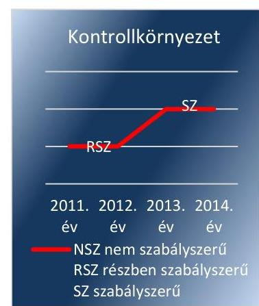

Forrás: 2.1. számú megállapítás

Az NRSZH a megváltozott feladatellátásához és szervezetéhez igazodó módosított, illetve új belső eljárásrendek, szabályzatok egy részét csak 2012-2013-ban adta ki a főigazgató. Megfelelő tartalmú, aktualizált szabálytalanságok kezelésének eljárásrendjével, ellenőrzési nyomvonallal ${ }^{30}$, közszolgálati szabályzattal ${ }^{31}$ 2011-től rendelkeztek.

A jogszabályok által előírt szabályzatokon kívül a főigazgató 2014. május 12-én az NRSZH belső kontrollrendszerének szabályszerű kialakítása és működtetése érdekében - a feladatok, a felelősségi szabályok és hatáskörök meghatározásával - monitoring stratégiát ${ }^{32}$ kiadásáról is rendelkezett.

Az NRSZH-nál a foglalkoztatottak rendelkeztek munkaköri leírással, melyben a feladataikat meghatározták.

Az NRSZH főigazgatója a 2014. évtől a monitoring stratégiában meghatározta, hogy a munkavállalók a Magyar Kormánytisztviselői Kar által elfogadott hivatásetikai kódexben ${ }^{33}$ rögzített elvárásoknak megfelelően, az alapvető etikai értékek figyelembevételével járnak el munkavégzésük során, továbbá az NRSZH-nál foglalkoztatott orvosokra a Magyar Orvosi Kamara Etikai Kódexe vonatkozott.

A kontrollkörnyezet kialakításának értékelését az 1. számú ábra, szabálytalanságait pedig a 3. számú táblázat mutatja be.
3. táblázat

# A KONTROLLKÖRNYEZET KIALAKÍTÁSÁNAK SZABÁLYTALANSÁGAI 

Sorszám
1. Az Ámr. 20. § (1) bekezdésében foglaltak ellenére az NRSZH hatályos SZMSZ-ében 2011. október 7-ig nem határozták meg a 2011. január 1-jétől megváltozott szervezeti felépítést, feladat- és hatásköröket.
2. Az SZMSZ-ben 2011-ben az Ámr. 20. § (2) bekezdés e) pontjában és 2012-ben az Ávr. 13. § (1) bekezdés e) pontjában foglaltak ellenére nem rögzítették a szervezeti egységek engedélyezett létszámát.
3. A főigazgató a Számv. tv. 161. § (4) bekezdésében előírtak ellenére 2011. december 29-ig nem gondoskodott érvényes számlarend ${ }^{34}$ összeállításáról.
4. A főigazgató a 2011-2012. években az Áht.${ }_{1}$ 91. § (2) bekezdésében, az Áht.${ }_{2}$ 10. § (5) bekezdésében, valamint az SZMSZ 13. § c) pontjában foglalt feladata ellenére a megváltozott szervezeti felépítésnek, feladat- és hatásköröknek megfelelő értékelési szabályzat ${ }^{35}$, leltározási szabályzat ${ }^{36}$, valamint bizonylati rend ${ }^{37}$ kiadásáról nem intézkedett. A szabályzatok hatályukat vesztett jogszabályi hivatkozásokat, valamint az ORSZI szervezeti egységeit, feladat- és hatásköreit, felelősségi viszonyait tartalmazták.
5. Az NRSZH közbeszerzési szabályzata ${ }^{38}$ a 2012. január 1-jéig hatályos Kbt. ${ }^{39}$ 6. § (1) és (3) bekezdéseiben, valamint a 2012. január 1-jétől hatályos Kbt.${ }_{2}$ ${ }^{40}$ 22. § (1) bekezdésében foglaltaknak 2012. augusztus 29-ig nem felelt meg maradéktalanul, mert nem tartalmazta a megváltozott szervezeti egységekre vonatkozóan a közbeszerzési eljárás lefolytatásának rendjét, a felelősségi köröket.
6. A gazdasági szervezet ügyrendje 2011-ben az Ámr. 20. § (7) bekezdésében és 2012-től 2013. december 15-ig az

## Megjegyzés

Az NRSZH 2011. október 8-tól hatályos SZMSZ-ében meghatározták a megváltozott szervezeti felépítést, feladatellátást.

A 2013. november 1-jétől hatályos SZMSZ tartalmazta a szervezeti egységek engedélyezett létszámát.

Az NRSZH 2011. december 30-tól rendelkezett a főigazgató által kiadmányozott számlarenddel.

Az NRSZH 2013. november 18-tól hatályos leltározási szabályzata és bizonylati rendje, valamint 2013. december 30-tól hatályos értékelési szabályzata a módosított SZMSZ-ben foglalt feladat- és hatásköröknek, felelősségi viszonyoknak megfelelően szabályozta az érintett területeket.

A közbeszerzési szabályzat 2012. augusztus 30-tól tartalmazta a Kbt.${ }_{2}$ által előírt tartalmi elemeket, összhangban a 2011. október 8-tól hatályba lépett SZMSZ előírásaival.

A gazdasági szervezet ügyrendje 2013. december 16-tól tartalmazta az NRSZH szervezeti egységei munkafolyamatainak leírását, a gazdasági szervezet vezetőinek, alkalmazottainak

---

| Sorszám | Részmegállapítás | Megjegyzés |
| :--: | :--: | :--: |
|  | Ávr. 13. § (5) bekezdésében foglaltak ellenére nem tartalmazta az NRSZH szervezeti egységei munkafolyamatainak leírását, a gazdasági szervezet vezetőinek, alkalmazottainak feladat- és hatáskörét, a helyettesítés rendjét, a gazdasági szervezet belső és külső kapcsolattartásának módját, szabályait. A gazdasági szervezet ügyrendje 2013. december 15-ig az OOSZI${ }^{41}$ szervezeti egységeit, az ott dolgozók beosztásait, munkaköreikhez tartozó feladat- és hatásköröket, valamint hatályukat vesztett jogszabályi hivatkozásokat tartalmazott. | feladat- és hatáskörét, a helyettesítés rendjét, a gazdasági szervezet belső és külső kapcsolattartásának módját, szabályait. |
| 7. | A foglalkoztatottak munkaköri leírásaiban nem rögzítették a 2012-2014. években a Kttv. ${ }^{42}$ 75. § (1) bekezdés d) pontjában foglalt valamennyi tartalmi elemet. A munkaköri leírásokban a 2012. évben a végzettség, szakképzettség, szakképesítés, tapasztalat és képesség, a 2013. évben a szakképzettség, szakképesítés, tapasztalat és képesség, valamint a 2014. évben a szakképzettség és szakképesítés követelményét nem tüntették fel teljes körűen. | A munkaköri leírásokban a 2014. évben a szakképzettség és szakképesítés követelményét továbbra sem rögzítették teljes körűen. |
| 8. | A főigazgató a 2011. évben az Ámr. 156. § (1) bekezdés c) pontjában és 2012-2013. között a Bkr. 6. § (1) bekezdés c) pontjában foglaltak ellenére nem határozott meg a szervezet minden szintjére vonatkozó etikai elvárásokat. | A monitoring stratégiában a 2014. évben meghatározták, hogy a dolgozók az alapvető etikai értékek figyelembevételével járnak el munkájuk során, a hivatásetikai kódexben rögzített elvárásoknak megfelelően. |
| 9. | A főigazgató az 50/2013. (II. 25.) Korm. rendelet ${ }^{43}$ 5. § (1) bekezdésében foglaltak ellenére a 2013. évben integritás tanácsadót nem jelölt ki. | A főigazgató az integritási tanácsadót 2014. február 5-én jelölte ki. |

2.2. számú megállapítás
2. számú ábra
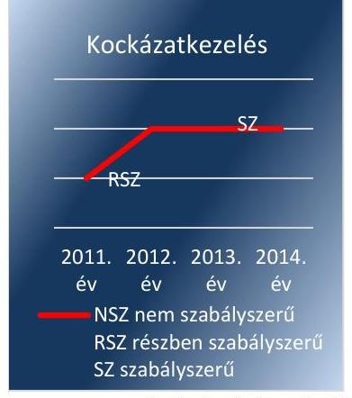

A kockázatkezelési rendszer kialakítása és működtetése a 2011. évben - a kockázatelemzés során az egyes kockázatokkal kapcsolatos intézkedések meghatározásának elmaradása, valamint a vagyonnyilatkozatok kezelése és annak szabályozatlansága miatt - részben volt szabályszerű, a 2012-2014. években szabályszerű volt.

## A KOCKÁZATKEZELÉSI RENDSZER MŰKÖDTETÉ-

SÉRE vonatkozó szabályozást a kockázatkezelési szabályzatban ${ }^{44}$, a kockázatfelmérésben ${ }^{45}$, valamint a 2014. évben a monitoring stratégiában rögzítették. A kockázatkezelési szabályzatban meghatározták a kockázatok kezelése érdekében szükséges intézkedések teljesítésének folyamatos nyomon követési módját.

A kockázatkezelési rendszer kialakításának és működtetésének értékelését a 2. számú ábra szemlélteti.

A kockázatkezelési rendszer kialakítása során a kockázatelemzés keretében felmérték és meghatározták a szervezet tevékenységében, gazdálkodásában rejlő kockázatokat. A kockázatfelmérésben a 2012-2014. években meghatározták az egyes kockázatok kezelése érdekében szükséges intézkedéseket.

Az SZMSZ-ben rögzítették a vagyonnyilatkozat-tételre kötelezettek körét. A vagyonnyilatkozat őrzéséért felelős személy - a közszolgálati szabályzatban és az adatvédelmi szabályzatban ${ }^{46}$ meghatározottak szerint eljárva - tájékoztatta az érintetteket a soron következő vagyonnyilatkozat-tételi kötelezettség esedékességéről.

---

A kockázatkezelési rendszer kialakításának és működtetésének szabálytalanságait a 4. számú táblázat mutatja be.
4. táblázat

# A KOCKÁZATKEZELÉSI RENDSZER KIALAKÍTÁSÁNAK ÉS MŰKÖDTETÉSÉNEK SZABÁLYTALANSÁGAI 

| Sorszám | Részmegállapítás | Megjegyzés |
| :--: | :--: | :--: |
| 1. | A 2011. évben az Ámr. 157. § (3) bekezdésében foglaltak ellenére - a kockázatkezelés során a feltárt és a kockázatfelmérésben rögzített kockázatok esetében - nem határozták meg az egyes kockázatokkal kapcsolatos intézkedéseket és megtételük módját. | A 2012-2014. években a kockázatfelmérésben meghatározták az egyes kockázatokkal kapcsolatos intézkedéseket és azok végrehajtásának módját. |
| 2. | A főigazgató, mint a vagyonnyilatkozatok őrzéséért felelős személy a Vnytv. ${ }^{47}$ 11. § (6) bekezdésében foglaltak ellenére 2013. november 3-ig, belső szabályzatban nem állapította meg a vagyonnyilatkozatok nyilvántartására, a vagyonnyilatkozatban foglalt személyes adatok védelmére vonatkozó szabályokat. | Az adatvédelmi szabályzatban 2013. november 4-től rögzítették a vagyonnyilatkozatok nyilvántartására, elkülönített kezelésére és a személyes adatok védelmére vonatkozó szabályokat. |
| 3. | A főigazgató, mint a vagyonnyilatkozatok őrzéséért felelős személy a Vnytv. 10. § (1) bekezdésében foglaltak ellenére a vagyonnyilatkozat-tétel elmulasztása esetén nem minden esetben dokumentált módon szólította fel a kötelezetteket a vagyonnyilatkozat-tételi kötelezettségük nyolc napon belüli pótlására. | A vezetett nyilvántartás szerint a benyújtásra előírt határidőre a 2011-2014. években nem állt rendelkezésre minden kötelezett vagyonnyilatkozata, a hiányzó vagyonnyilatkozatokat a kötelezettek pótolták. |

Forrás: ÁSZ
2.3. számú megállapítás
3. számú ábra
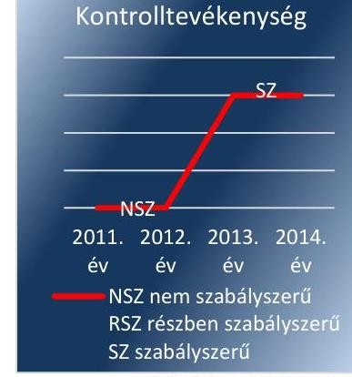

A kontrolltevékenység kialakítása és működtetése a 2011-2012. években - a szabályzatok aktualizálásának elmaradása, valamint a kulcskontrollok nem megfelelő működése miatt - nem volt szabályszerű, a 2013-2014. években szabályszerű volt.

## A KONTROLLTEVÉKENYSÉG SZABÁLYOZÁSI KE-

RETEIT 2011-től az ellenőrzési nyomvonalban, valamint a gazdasági szervezet ügyrendjében alakították ki. A főigazgató a 2014. évtől az NRSZH belső kontrollrendszerének kialakítása és működtetése érdekében az alapelveket, valamint a felelősségi szabályokat és hatásköröket a monitoring stratégiában határozta meg.

A kontrolltevékenység kialakításának és működtetésének értékelését a 3. számú ábra szemlélteti.

A 2011. évtől az ellenőrzési nyomvonalban, 2012-től az IKSZ-ben ${ }^{48}$, az IBSZ-ben ${ }^{49}$, valamint 2013-tól az adatvédelmi szabályzatban a felelősségi köröket meghatározták, szabályozták az engedélyezési, jóváhagyási és kontrolleljárásokat, a dokumentumokhoz, információkhoz való hozzáférést, a beszámolási eljárásokat.

A 2013. évtől az adatok biztonsága, az üzemeltetés, a feladatok és hatáskörök meghatározása, az informatikai rendszer szabályozása érdekében az IKSZ-ben, az IBSZ-ben, valamint az adatvédelmi szabályzatban kialakították a szükséges eljárási szabályokat. A 2014. évtől a szabályozást kiegészítette az Informatikai Főosztály ${ }^{50}$ ügyrendje is. A közszolgálati szabályzatban rögzítették - és a gyakorlatban alkalmazták - a közszolgálati jogviszony megszűnése vagy a munkakör változása esetén a munkakör átadásának rendjét.

---

A pénzügyi döntések eljárásait megalapozó szabályzatok aktualizálása révén a 2013-2014. években biztosították a FEUVE ${ }^{51}$ rendszer szabályszerű érvényesülésének feltételeit.

A gazdálkodási jogkörök gyakorlására jogosult személyek kijelölésénél a jogszabályi előírásokat összességében betartották.

A kontrolltevékenység kialakításának és működtetésének szabálytalanságait az 5. számú táblázat tartalmazza.
5. táblázat

# A KONTROLLTEVÉKENYSÉG KIALAKÍTÁSÁNAK ÉS MŰKÖDTETÉSÉNEK SZABÁLYTALANSÁGAI 

| Sorszám | Részmegállapítás | Megjegyzés |
| :--: | :--: | :--: |
| 1. | A főigazgató 2011-ben az Áht. 121/A. § (1) és (4) bekezdés b) pontjában előírtak ellenére 2012-ben a Bkr. 4. § a) pontjában és 8. § (2) bekezdés b) pontjában foglaltak ellenére nem gondoskodott a források szabályszerű, szabályozott, gazdaságos, hatékony és eredményes felhasználását biztosító szabályzatok kiadásáról, eljárások kialakításáról. | A főigazgató a 2013. évtől gondoskodott a FEUVE érvényesüléséről, a források szabályszerű, szabályozott, hatékony és eredményes felhasználását biztosító szabályzatok kiadásáról, eljárások kialakításáról. |
| 2. | Az NRSZH-nál a gazdálkodási jogkörök gyakorlására jogosult személyekről és aláírás-mintájukról az Ámr. 80. § (3) bekezdésében és az Ávr. 60. § (3) bekezdésében előírtak ellenére 2014. december 21-ig nem vezettek naprakész nyilvántartást. | 2014. december 22-től a gazdálkodási szabályzatban naprakész nyilvántartást vezettek a gazdálkodási jogkörök gyakorlására jogosult személyekről és aláírás-mintájukról. |
| 3. | A belső szabályzatok egy része 2011-ben az Ámr. 158. § (2) bekezdés a)-c) pontjaiban és 2012-ben a Bkr. 8. § (4) bekezdés a)-b) pontjaiban foglaltak ellenére a felelősségi körök meghatározását az engedélyezési,

 jóváhagyási és kontroll eljárásokat, az információkhoz való hozzáférést nem megfelelően tartalmazták, tekintettel arra, hogy azokat nem módosították a megváltozott szervezeti egységek, felelősségi viszonyok alapján. | A belső szabályzatokban a 2013. évtől már a felelősségi körök meghatározásával az engedélyezési, jóváhagyási és kontroll eljárásokat, az információkhoz való hozzáférést az SZMSZ-ben rögzített szervezeti egységekre figyelemmel szabályozták. |
| 4. | A főigazgató az lkr. ${ }^{52}$ 8. § (1)-(2) bekezdéseiben foglaltak ellenére nem gondoskodott a 2011-2012. években az iratkezelési szoftver által kezelt adatok biztonságáról, az üzembiztonsági, adatvédelmi szabályok érvényre juttatásához szükséges eljárási szabályok kialakításáról. | A főigazgató a 2013. évtől az iratkezelési szoftver által kezelt adatok biztonságáról gondoskodott, az üzembiztonsági, adatvédelmi eljárási szabályokat kialakította, a kapcsolódó feladat- és hatásköröket meghatározta. |
| 5. | A főigazgató az informatikai rendszer szabályozása során -2011-ben az Avtv. ${ }^{53}$ 10. § (1) bekezdésében és 2012-ben az Info tv. ${ }^{54}$ 7. § (2) bekezdésében foglaltak ellenére - nem alakította ki az adatok biztonsága érdekében az adat- és titokvédelmi szabályok érvényre juttatásához szükséges eljárási szabályokat. | A főigazgató a 2013. évtől az informatikai rendszer szabályozása során kialakította az adatok biztonságának, védelmének érvényre juttatásához szükséges eljárási szabályokat. |

Forrás: ÁSZ
2.4. számú megállapítás

Az információs és kommunikációs folyamatok kialakítása a 2011. évben - a szabályzatok aktualizálásának elmaradása miatt - nem volt szabályszerű, a 2012. évben részben volt szabályszerű, a 2013-2014. években már szabályszerű volt.

AZ INFORMÁCIÓS ÉS KOMMUNIKÁCIÓS FOLYAMATOKAT érintő szabályokat a 2011. évtől a közérdekű bejelentések kezelése eljárási rendjében ${ }^{55}$, a közszolgálati szabályzatban, a honlap mű-

---

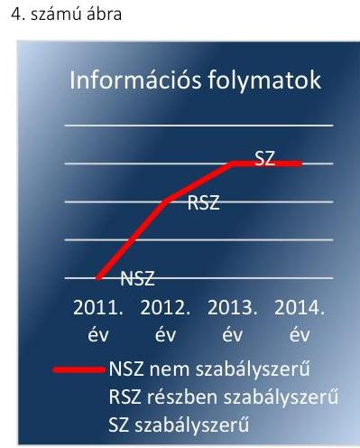
ködtetési szabályzatban ${ }^{56}$ rögzítették, azonban ezek a szabályzatok összességében nem feleltek meg maradéktalanul a jogszabályokban előírtaknak. Az információs és kommunikációs folyamatok kialakítása a 2012. évben az aktualizált IKSZ és IBSZ, valamint a közérdekű adatok megismerése eljárási rendje ${ }^{57}$ szabályzat kiadása következtében részben szabályszerűvé vált. A 2013. évtől a gazdasági szervezet ügyrendjében, az adatvédelmi szabályzatban, valamint az NRSZH kiadmányozási rendjéről szóló főigazgatói utasításban a szervezeten belülre és kívülre történő információátadás rendszerét már részletesen rögzítették. Így a döntések előkészítése és a döntéshozatal során a szükséges információkat megfelelő időben biztosították.

Az információs és kommunikációs folyamatok kialakításának értékelését a 4. számú ábra szemlélteti.

Az NRSZH a kötelezően közzéteendő adatok nyilvánosságra hozatalának rendjét a teljes ellenőrzési időszakban szabályozta, a közérdekű adatok megismerésére vonatkozó eljárási renddel 2012-től rendelkezett, az elektronikus közzétételi kötelezettségének pedig 2013-tól tett eleget.

Az iratok iktatásával, az iratforgalom dokumentálásával biztosították, hogy az ügyintézés folyamata, az iratok szervezeten belüli útja pontosan követhető és ellenőrizhető, az iratok fellelhetősége pedig megállapítható legyen. A Levéltár ${ }^{58}$ által jóváhagyott, megfelelő tartalmú IKSZ-szel a 2012-2014. években rendelkeztek.

Az információs és kommunikációs folyamatok kialakításának szabálytalanságait az 6. számú táblázat tartalmazza.
6. táblázat

# AZ INFORMÁCIÓS ÉS KOMMUNIKÁCIÓS FOLYAMATOK KIALAKÍTÁSÁNAK SZABÁLYTALANSÁGAI 

Sorszám
Részmegállapítás
Megjegyzés

1. A főigazgató 2011-ben az Ámr. 159. § (1)-(2) bekezdéseiben és 2012-ben a Bkr. 9. § (1)-(2) bekezdéseiben foglaltak ellenére nem gondoskodott olyan rendszer kialakításáról, amely biztosította volna a szervezeten belüli és kívüli hatékony információáramlást a szervezeti egységek és külső szervezetek között, illetve amelyekben a beszámolási szintek, határidők és módok világosan meg vannak határozza.
2. Az adatvédelmi szabályzat ${ }^{59}$ 2013. június 18-ai hatályon kívül helyezéséig nem volt összhangban a 2011-től többször módosult szervezeti és felelősségi viszonyokkal, illetve az Info tv. 24. § (3) bekezdésében foglaltak ellenére 2013. november 3-ig nem adott ki a főigazgató új adatvédelmi szabályzatot.
3. A főigazgató a 2011. évben az Avtv. 20. § (8) bekezdésében, az Ámr. 20. § (3) bekezdés i) pontjában, valamint 2012. október 30-ig az Info tv. 30. § (6) bekezdésében foglaltak ellenére nem készített a közérdekű adatok megismerésére irányuló igények teljesítésének rendjét rögzítő szabályzatot.
4. Az IKSZ a 2012. november 20-ig nem felelt meg az Ltv. ${ }^{60}$ 9. § (4) bekezdésében és 10. § (1) bekezdés a) pontjában, valamint az lkr. 17-54. és 59-64. §-aiban foglalt előírásoknak, mivel nem volt összhangban a megváltozott szervezeti egységekkel, felelősségi viszonyokkal, továbbá a Levéltár egyetértése nélkül került kiadásra.

A főigazgató a 2013. évtől gondoskodott a szervezeten belüli és kívüli információáramlás rendszerének szabályozásáról, meghatározta a beszámolási szinteket, határidőket és módokat.

A főigazgató 2013. november 4-én az új adatvédelmi szabályzatot hatályba léptette.

A főigazgató a 2012. október 31-től szabályzatban (főigazgatói utasítás) határozta meg a közérdekű adatok megismerésére irányuló igények teljesítésének rendjét, amely összhangban volt a szervezeti és felelősségi viszonyokkal.

Az aktualizált, a szervezeti és felelősségi viszonyokkal összhangban lévő, 2012. november 21-én hatályba lépett IKSZ-t a főigazgató a Levéltár egyetértésével adta ki.

---

| Sorszám |  |  |  | Megjegyzés |
| :--: | :--: | :--: | :--: | :--: |
| 5. |  | Az NRSZH a 2011. évben az Eisztv. ${ }^{61}$ 3. § (1) bekezdésében és a 2012. évben az Info tv. 33. § (1) bekezdésében foglaltak ellenére az elektronikus közzétételi kötelezettségének nem tett eleget. |  | 2013-ban és 2014-ben az elektronikus közzétételi kötelezettségének az NRSZH eleget tett. |

Forrás: ÁSZ
2.5. számú megállapítás
A monitoring rendszer működése részben volt szabályszerű, a rendelkezésre álló források gazdaságos, hatékony és eredményes felhasználását biztosító követelményeket nem érvényesítették.

## A SZERVEZET CÉLJAI MEGVALÓSÍTÁSÁNAK NYOMONKÖVETÉSI RENDSZERÉT az NRSZH kialakította.

A monitoring rendszer működésének értékelését az 5. számú ábra szemlélteti.

A 2011. évtől a közszolgálati szabályzatban szabályozták a kormánytisztviselők teljesítményének értékelését, a 2012. évtől az IBSZ-ben az adatvédelmi felelős ellenőrzési feladatait és az informatikai biztonsági ellenőrzés végrehajtásának szabályait. A 2013. évtől a gazdasági szervezet ügyrendjében rögzítették a Gazdasági Igazgatóság ${ }^{62}$ ellenőrzésének rendjét, valamint az adatvédelmi szabályzatban részletezték az adatvédelmi felelős ellenőrzési feladatait. Az ellenőrzési nyomvonal tartalmazta az egyes szervezeti egységek által ellátott feladatokat, felelősök, határidő megjelölésével, valamint a folyamatba épített kontrollpontokat, felelősöket.

A 2012-2014. években a gazdálkodási folyamatok takarékos, szabályszerű, eredményes működésének biztosítása érdekében a Kormány az NRSZH-hoz költségvetési felügyelőt rendelt ki.

A BELSŐ ELLENŐRZÉSI RENDSZERT az NRSZH kialakította, teljes munkaidőben foglalkoztatott belső ellenőr alkalmazásával gondoskodott a BEK $^{63}$ és az SZMSZ előírásai szerint független belső ellenőrzés biztosításáról. A belső ellenőrzést végző személy jogállását, feladatait meghatározták, szervezeti és funkcionális függetlenségét közvetlen főigazgatói irányítással biztosították. A belső ellenőri feladatellátás során érvényesítették az összeférhetetlenségi előírásokat.

Az NRSZH rendelkezett rendszeresen felülvizsgált, aktualizált BEK-kel. A belső ellenőr a belső ellenőrzési vezetői feladatok ellátása keretében készítette el az éves ellenőrzési terveket ${ }^{64}$, amelyeket a főigazgató jóváhagyott. A főigazgató az éves ellenőrzési terveket - a 2013. év kivételével - határidőben megküldte a felügyeleti szerv részére.

Az ellenőrzési tervekben foglalt feladatokat a belső ellenőr nem teljes körűen teljesítette. A belső ellenőr a 2011-2014. években 11 lefolytatott ellenőrzés megállapításairól készített ellenőrzési jelentést, melyekben a belső kontrollrendszer kiépítettségének, a gazdálkodási jogkörök gyakorlásának és a közbeszerzés, vagyonvédelem végrehajtásának hiányosságait, valamint a szabályzatok, ügyrendek aktualizálásának szükségességét rögzítette. Ugyanakkor a jelen ellenőrzés keretében feltárt hiányosságok, szabálytalanságok alapján a belső ellenőrzés csak részben támogatta a gazdálkodás szabályszerű működését, amelynek oka volt többek között az is, hogy az éves ellenőrzési tervben foglalt ellenőrzéseket nem végezték el teljes körűen.

---

# A BELSŐ ÉS KÜLSŐ ELLENŐRZÉSEK ÁLTAL TETT 

MEGÁLLAPÍTÁSOKRA ÉS JAVASLATOKRA készült intézkedési terveket, azok realizálását és hasznosítását nyomon követték.

Az ellenőrzések javaslatainak végrehajtása érdekében az ellenőrzött szervezeti egységek vezetői a Ber. ${ }^{65}$ és a Bkr. előírásai alapján intézkedési terveket készítettek. A belső és külső ellenőrzések során az ellenőrzési jelentésekben szereplő ellenőrzési javaslatok alapján megtett intézkedések nyomon követéséről - éves bontásban - nyilvántartást vezettek.

A monitoring rendszer működésének és a rendelkezésre álló források gazdaságos, hatékony és eredményes felhasználását biztosító követelmények érvényesítésének szabálytalanságait a 7. számú táblázat tartalmazza.
7. táblázat

## A MONITORING RENDSZER MŰKÖDÉSÉNEK ÉS A RENDELKEZÉSRE ÁLLÓ FORRÁSOK GAZDASÁGOS, HATÉKONY ÉS EREDMÉNYES FELHASZNÁLÁSÁT BIZTOSÍTÓ KÖVETELMÉNYEK KIALAKÍTÁSÁNAK SZABÁLYTALANSÁGAI

| Sorszám | Részmegállapítás | Megjegyzés |
| :--: | :--: | :--: |
| 1. | Az NRSZH-nál 2011-ben az Ámr. 160. §-ának és 2012-től a Bkr. 10. §-ának előírásai ellenére az operatív tevékenységek folyamatos és eseti nyomon követése dokumentáltan nem valósult meg, mivel monitoring információk alapján jelentéseket, feljegyzéseket a döntések előkészítéséhez nem készítettek. |  |
| 2. | A főigazgató a 2013. évben az éves ellenőrzési tervet a Bkr. 32. § (2) bekezdésében rögzített november 15-ei határidőn túl, november 26-án küldte meg az EMMI Belső Ellenőrzési Főosztályára. | A főigazgató a 2014. évben az éves ellenőrzési tervet határidőben megküldte a felügyeleti szerv részére. |
| 3. | A belső ellenőr - belső ellenőrzési vezetőként - a Ber. 12. § b) pontjában és a Bkr. 22. § (1) bekezdés b) pontjában, valamint az SZMSZ; 45. § e) pontjában és az SZMSZ; 2. függeléke 1.3/e) pontjában foglaltak ellenére nem teljes körűen gondoskodott az éves ellenőrzési tervekben, valamint a módosításaikban meghatározott feladatok végrehajtásáról, mivel a tervezett 23 ellenőrzésből mindössze 11-et folytatott le és foglalt jelentésbe. |  |
| 4. | A keltezés hiánya miatt a 2012-2014. években nem volt kontrollálható, hogy a főigazgató - a Bkr. 45. § (4) bekezdésében előírt - a belső ellenőrzési megállapítások alapján készített intézkedési tervek kézhezvételétől számított nyolc napon belül döntött-e azok jóváhagyásáról. |  |
| 5. | A NRSZH főigazgatója - az Áht.; 121/A. § (1) bekezdésében és a Bkr. 6. § (2) bekezdésében foglaltak ellenére - a rendelkezésre álló források gazdaságos, hatékony és eredményes felhasználását biztosító követelményeket nem érvényesítette. Így 2011-ben az Áht.; 121. § (3) bekezdésében, 2012-2014-ben a Bkr. 11. §-ában előírtak alapján a belső kontrollrendszer értékeléséről készített vezetői nyilatkozatok - miszerint a főigazgató gondoskodott az NRSZH tevékenységében a hatékonyság, az eredményesség és a gazdaságosság követelményeinek érvényesítéséről - nem voltak helytállóak. |  |

---

# 3. Az NRSZH pénzügyi gazdálkodása szabályszerű volt-e? 

## Összegző megállapítás

Az NRSZH pénzügyi gazdálkodása részben felelt meg a jogszabályi és a belső szabályzatokban rögzített előírásoknak.
3.1. számú megállapítás

Az NRSZH az elemi költségvetés és az előirányzatok megállapítása során nem tartotta be maradéktalanul a jogszabályi előírásokat és a belső szabályzatokban foglaltakat, mivel 2012-ben és 2013-ban határidőn túl teljesítette az adatszolgáltatási kötelezettségét.

AZ ÉVES KÖLTSÉGVETÉSEK TERVEZÉSE során az NRSZH az elemi költségvetéseit 2011-ben az Ámr.-ben, míg 2012-2014 között az Ávr.-ben, továbbá az NGM ${ }^{66}$ által évenként közzétett tervezési köriratban, valamint az NRSZH belső utasításaiban - az SZMSZ-ben és a gazdasági szervezet ügyrendjében - foglaltakra tekintettel állította össze. Az NRSZH figyelembe vette az előző évi bázis adatokhoz viszonyított tárgyévi kiadási, bevételi és támogatási terv-előirányzatokat, továbbá
 a költségvetési évre engedélyezett létszámot. A tervezésben közreműködő munkatársak az SZMSZ-ben kijelölt vezetők utasításai szerint jártak el, feladataikat munkaköri leírásaik tartalmazták.

## AZ EREDETI BEVÉTELI ÉS KIADÁSI ELŐIRÁNYZATAIT számításokkal alátámasztva határozta meg az NRSZH. A személyi juttatások esetében szervezeti egységenként és feladatonként, a dologi kiadásoknál a jelentősebb költségtételekre, azok összetételére és volumenére tekintettel terveztek.

Az NRSZH eredeti előirányzatait a 6. számú ábra szemlélteti.
6. számú ábra
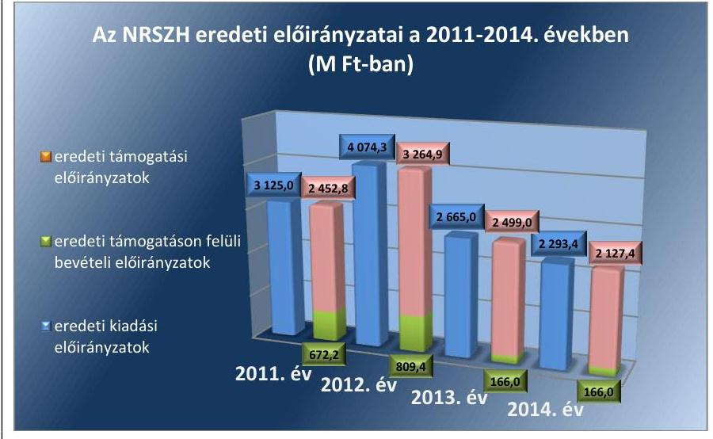

A TERVEZÉSSEL KAPCSOLATOS adatszolgáltatási kötelezettségét az NRSZH teljesítette és elemi költségvetése az ellenőrzött időszakban megfelelt az előírt tartalmi követelményeknek.

---

Az NRSZH-t érintő, a 2011. és 2012. években végrehajtott feladatátvételek és -átadások kormánydöntéseken alapultak, melyek hatásait a tervezés során az előirányzatok megállapításakor, illetve az egyes években az előirányzat-gazdálkodásában, az előirányzatok módosításakor figyelembe vették.

A 2011. évben az 1329/2011. (X. 7.) Korm. határozat ${ }^{67}$ alapján az FH-tól rehabilitációs és szociális feladatokra 550,4 M Ft előirányzatot csoportosítottak át az NRSZH-hoz, melyre tekintettel az NRSZH a személyi juttatások és munkaadói járulék előirányzatokat 399,9 M Ft-tal, a dologi kiadások előirányzatait 141,1 M Ft-tal, a felhalmozási kiadások előirányzatait pedig 9,4 M Ft-tal megemelte.

A 2012. évben az 1502/2011. (XII. 29.) Korm. határozat ${ }^{68}$ alapján az RSZSZ ${ }^{69}$ személyi feltételeinek megteremtése, valamint első fokú hatósági feladatok átadása miatt az NRSZH-tól 250 fő kormánytisztviselőt helyeztek át az új szervezethez. A feladat- és létszámátadás következtében az NRSZH a személyi juttatás előirányzata 327,1 M Ft-tal, a munkaadói járuléké 90,0 M Ft-tal, míg a dologi kiadásé 85,0 M Ft-tal csökkent.

A 95/2012. (V. 15.) Korm. rendelet ${ }^{70}$ alapján az ONYF ${ }^{71}$-től jogorvoslati feladatokat és ezzel együtt 10 kormánytisztviselőt vett át az NRSZH. A feladat- és létszámátvétel 20,8 M Ft személyi juttatás és munkaadói járulék, valamint 2,5 M Ft dologi kiadás előirányzat növekedést eredményezett az NRSZH-nál.

Az OBDK ${ }^{72}$ létrehozásáról szóló 214/2012. (VII. 30.) Korm. rendelet ${ }^{73}$ alapján az NRSZH jogvédelmi feladatokat, és ezzel együtt 12 fő kormánytisztviselőt adott át az új szervezetnek. A feladat- és létszámátadás 3,2 M Ft személyi juttatás és munkaadói járulék, valamint 5,4 M Ft dologi kiadás előirányzat csökkenést eredményezett az NRSZH-nál.

A 316/2012. (XI. 13.) Korm. rendelet ${ }^{74}$ és annak végrehajtásáról szóló 1496/2012. (XI. 13.) Korm. határozat ${ }^{75}$ alapján az NRSZH szociális feladatokat és ezzel együtt 25 kormánytisztviselői státuszt adott át az SZGYF-nek. A feladat- és létszámátadás összesen 129,9 M Ft előirányzat csökkenést eredményezett az NRSZH-nál.

Az elemi költségvetés összeállításával kapcsolatos szabálytalanságot a 8. számú táblázat tartalmazza.
8. táblázat

# AZ ELEMI KÖLTSÉGVETÉS ÖSSZEÁLLÍTÁSÁVAL KAPCSOLATOS SZABÁLYTALANSÁG 

## Sorszám

1. 

Az NRSZH a 2012. és 2013. évek elemi költségvetését - az Ávr. 32. § (1) bekezdésében foglaltak ellenére - az irányító által meghatározott időpontot követően küldte meg az irányító szerv részére.

## Megjegyzés

Az NRSZH az elemi költségvetést a 2014. évben határidőben állította össze és küldte meg az irányító szervnek.

---

# 3.2. számú megállapítás 

A bevételi és a kiadási előirányzatok módosítása, átcsoportosítása összességében részben felelt meg a jogszabályi előírásoknak, azonban a saját hatáskörben végrehajtott előirányzat módosítások során az NRSZH nem megfelelően járt el, mivel azokról az előírt határidőn túl tájékoztatták a Kincstárt és az irányító szervet.

AZ ELŐIRÁNYZAT MÓDOSÍTÁSOKAT az NRSZH - a saját hatáskörben végrehajtott előirányzat módosítások tájékoztatási kötelezettsége határidejének betartása kivételével - az Áht. ${ }_{1}$ és az Áht. ${ }_{2}$-ben foglaltakra figyelemmel hajtotta végre. Az NRSZH módosított kiadási, bevételi és támogatási előirányzatait a 7. számú ábra szemlélteti.
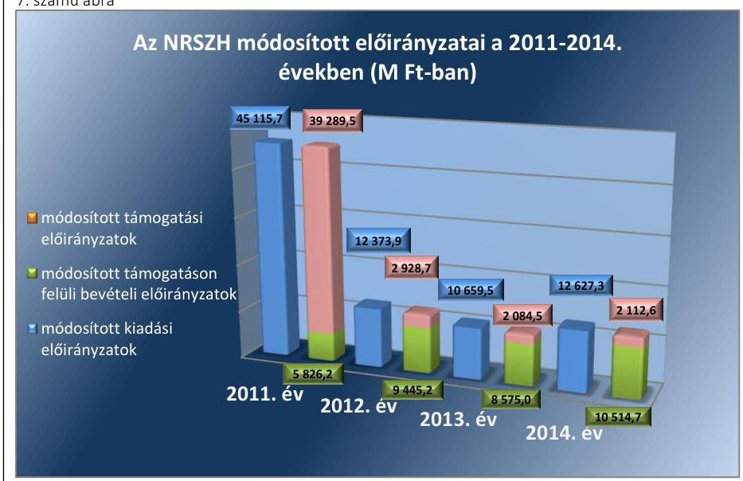

Forrás: NRSZH 2011-2014. évi költségvetési beszámolói
A feladatátadások és -átvételek, valamint az ezekhez kapcsolódó személyi változások miatt indokolt módosításokat országgyűlési, kormányzati, felügyeleti szervi, valamint saját hatáskörben meghozott döntések alapján hajtották végre.

---

Az NRSZH kiadási és bevételi előirányzatainak évközi módosításait a 9. számú táblázat tartalmazza.
9. táblázat

# AZ NRSZH KIADÁSI ÉS BEVÉTELI ELŐIRÁNYZATAINAK ÉVKÖZI MÓDOSÍTÁSAI HATÁSKÖR SZERINT (M FT-BAN) 

| Ev | Eredeti előirányzat | Kiadási előirányzat módosítások hatáskör szerint |  |  |  | Előirányzat változás összesen | Módosított előirányzat | Teljesítés |
| :--: | :--: | :--: | :--: | :--: | :--: | :--: | :--: | :--: |
|  |  | Ország- <br> gyűlés | Kormány | irányító <br> szerv | Intézmény |  |  |  |
| 2011. | 3125,0 | $-82,7$ | 573,4 | 36388,2 | 5111,8 | 41990,7 | 45115,7 | 39 702,7 |
| 2012. | 4074,3 | - | $-577,4$ | $-59,7$ | 8936,7 | 8299,6 | 12373,9 | 8953,3 |
| 2013. | 2665,0 | - | $-284,6$ | $-65,6$ | 8344,7 | 7994,5 | 10659,5 | 7267,5 |
| 2014. | 2293,4 | - | - | $-13,4$ | 10347,3 | 10333,9 | 12627,3 | 9879,7 |
| Év | Eredeti előirányzat | Bevételi-előirányzat módosítások hatáskör szerint |  |  |  | Előirányzat változás összesen | Módosított előirányzat | Teljesítés |
|  |  | Ország- <br> gyűlés | Kormány | irányító <br> szerv | Intézmény |  |  |  |
| 2011. | 3125,0 | $-82,7$ | 573,4 | 36388,2 | 5111,8 | 41990,7 | 45115,7 | 45053,9 |
| 2012. | 4074,3 | - | $-577,4$ | $-59,7$ | 8936,7 | 8299,6 | 12373,9 | 11 822,8 |
| 2013. | 2665,0 | - | $-284,6$ | $-65,6$ | 8344,7 | 7994,5 | 10659,5 | 8900,1 |
| 2014. | 2293,4 | - | - | $-13,4$ | 10347,3 | 10333,9 | 12627,3 | 12542,1 |

Forrás: NRSZH 2011-2014. évi költségvetési beszámolói

Az NRSZH-nál az eredeti kiadási és a bevételi előirányzatok az ellenőrzött időszak évei közül a 2011. évben kiemelkedő mértékben növekedtek. A növekedést döntő részben az irányító szerv által évközben a központi költségvetésből biztosított működési célú pénzeszközök előirányzata okozta, amelyet megállapodás alapján a megváltozott munkaképességűek foglalkoztatásával összefüggő költségkompenzációra és rehabilitációs költségtámogatásra, a szociális foglalkoztatást működtető fenntartók támogatására és közösségi ellátásokat, továbbá a jelzőrendszeres házi segítségnyújtást működtető szolgáltatók támogatására használt fel az NRSZH. A 2014. évben az EU-s támogatással megvalósuló TÁMOP és TIOP projektekkel összefüggő évközi módosítások következtében a személyi juttatások eredetileg 1427,7 M Ft-ra tervezett összege 3367,4 M Ft-ra, a dologi kiadások eredetileg 392,3 M Ft-ra tervezett összege 2800,5 M Ft-ra, valamint a működési célú pénzeszközátadások eredetileg nem tervezett összege 2242,2 M Ft-ra növekedett.

Az előirányzat-módosítások, átcsoportosítások és az előző évi maradványok tárgyévi előirányzatként való nyilvántartása az irányító szerv által jóváhagyottaknak megfelelően történt. A dologi kiadások előirányzatainak növelése a személyi jellegű juttatások előirányzatai terhére történt. A módosításokat a könyvelésben rögzítették, a Kincstár azokat visszaigazolta.

Az előirányzat módosításával kapcsolatos szabálytalanságot a 10. számú táblázat tartalmazza.
10. táblázat

## AZ ELŐIRÁNYZAT MÓDOSÍTÁSÁVAL KAPCSOLATOS SZABÁLYTALANSÁG

Sorszám
1. 

Részmegállapítás
Megjegyzés
Az NRSZH a 2011. évben az Ámr. 71. § (6) bekezdésében, illetve a 2012-2014. években az Ávr. 167. § (4) bekezdésében foglaltak ellenére a saját hatáskörű előirányzat módosításokról az esetek nagy részében az előírt öt munkanapos határidőn túl tájékoztatta a Kincstárt és az irányító szervet.

---

### 3.3. számú megállapítás

Az NRSZH a jóváhagyott kiadási előirányzatokon belül gazdálkodott, azonban nem tartotta be teljes körűen a közbeszerzési eljárásokra és a kulcskontrollok gyakorlására vonatkozó jogszabályi előírásokat. A pénzügyi folyamatok során a kulcskontrollok a 2011-2012. években nem megfelelően, a 2013-2014. években részben megfelelően működtek. A bevételek teljesítése az előirányzattól minden évben elmaradt.

## A BEVÉTELEK, ILLETVE KIADÁSOK TELJESÍTÉSE

során az NRSZH a módosított előirányzatokon belül gazdálkodott.

Az ellenőrzött időszak egyes gazdálkodási éveiben a teljesített kiadások a módosított kiemelt kiadási előirányzatokat nem haladták meg, azonban a ténylegesen teljesített bevételek a módosított bevételi előirányzatoktól elmaradtak.

A kiadási megtakarításokat jellemzően a tervezett beruházások egy részének elmaradása, illetve a beruházások tervezettnél alacsonyabb összegben történt megvalósulása, valamint a kormányhivatalok részére évközben történt első fokú hatósági feladat átadása eredményezte. A bevételek jóváhagyott előirányzatoktól való elmaradását elsősorban a módosított előirányzatként jóváhagyott előző évi maradványok felhasználásának részbeni elmaradása okozta, amelyek az EU-s projektekhez kapcsolódó kötelezettségvállalással terhelt maradványok felhasználásának elhúzódásával voltak összefüggésben.

Az NRSZH teljesített kiadásait, bevételeit és támogatásait a 8. számú ábra tartalmazza.
8. számú ábra
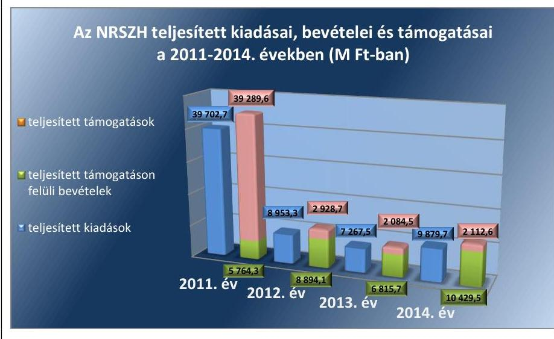

Forrás: NRSZH 2011-2014. évi költségvetési beszámolói
A 2011. évi kiemelt összegű támogatást a megváltozott munkaképességűek foglalkoztatásával összefüggő költségkompenzációra és rehabilitációs költségtámogatásra, a szociális foglalkoztatást működtető fenntartók támogatására és közösségi ellátásokat, a jelzőrendszeres házi segítségnyújtást működtető szolgáltatók támogatására biztosított működési célú pénzeszköz átvétel eredményezte.

---

9. ábra
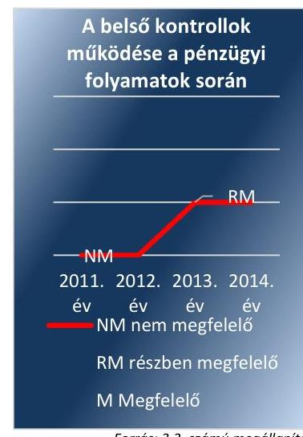

A KIADÁSI ELŐIRÁNYZATOK FELHASZNÁLÁSA során az NRSZH nem tartotta be maradéktalanul az Áht. 1 , az Áht. 2 , az Ámr. és az Ávr., valamint a gazdálkodási szabályzatban foglaltakat. A pénzgazdálkodáshoz kapcsolódó kulcskontrollok a 2011-2012. években nem megfelelően, a 2013-2014. években pedig részben megfelelően működtek.

A kulcskontrollok működésének értékelését a 9. számú ábra szemlélteti.

Az ellenőrzött időszak egyes éveiben az átlagos statisztikai állományi, illetve munkajogi létszámadatok nem haladták meg az engedélyezett létszámkereteket.

Az NRSZH megbízási jogviszony keretében jogvédőket, szakorvosokat, orvos-szakértőket, jogászokat, továbbá a funkcionális szervezeti egységeknél egyéb feladatokat ellátó személyeket, illetve az EU-s projektek keretében a projektigazgatókat, támogató ügyintézőket alkalmazott. A megbízási szerződésekben többek között rögzítették a megbízottak feladatait, a teljesítési feltételeket, a felek jogait és kötelezettségeit, valamint a megbízási díjak összegeit és azok folyósítási feltételeit. A kötelezettségvállalásokat a gazdálkodási szabályzatban kijelöltek szerint az NRSZH részéről a főigazgató, az ellenjegyzést, illetve a pénzügyi ellenjegyzést a gazdasági vezető végezte.

A működési célú pénzeszköz átadások elsősorban a megváltozott munkaképességű munkavállalók foglalkoztatásának támogatásához kapcsolódtak. A támogatás folyósítására az NRSZH és a foglalkoztatók költségkompenzációs szerződéseket kötöttek, melyekben rögzítették a támogatások juttatásának feltételeit. A kifizetések a szerződésekben foglaltak szerint történtek.

## SZABÁLYTALAN KÖZPÉNZFELHASZNÁLÁST a

számvevőszéki ellenőrzés az ellenőrzés alá vont rendszeres, nem rendszeres személyi juttatásokkal, a pénzeszközátadásokkal, valamint a megbízási jogviszonyhoz kapcsolódó kifizetésekkel összefüggésben rendelkezésre bocsátott dokumentumok alapján nem állapított meg. A kapcsolódó kötelezettségvállalásoknak és szerződéseknek megfelelően a kifizetések célhoz kötöttek voltak.

A kulcskontrollok működésével és a közbeszerzésekkel kapcsolatos szabálytalanságokat a 11. számú táblázat tartalmazza.
11. táblázat

# A KULCSKONTROLLOK MŰKÖDÉSÉVEL ÉS A KÖZBESZERZÉSEKKEL KAPCSOLATOS SZABÁLYTALANSÁGOK 

Sorszám
1. A 2011. évben az Áht. 1 100/C. § (1) bekezdésében, illetve a 2012-2013. években az Áht. 2 37. § (1) bekezdésében foglaltak ellenére esetenként írásbeli kötelezettségvállalás nem történt. A 2013. évben az Ávr. 55. § (1) bekezdés előírásaival ellentétben eseti hibaként a megrendelésen, mint írásbeli kötelezettségvállaláson nem szerepelt a kötelezettségvállaló aláírása, valamint az Áht. 2 37. § (1) bekezdésében foglaltak ellenére 2013-ban a kötelezettségvállalás megelőzte a pénzügyi ellenjegyzést.
2. A 2011. évben az Áht. 1 100/C. § (3) bekezdésében, illetve a 2012-2014. években az Áht. 2 37.
 § (1) bekezdésében foglalt

## Megjegyzés

2014. évben a kötelezettségvállalás szabályosan történt.

---

| Sorszám | Részmegállapítás | Megjegyzés |
| :--: | :--: | :--: |
|  | előírást megsértve jelentős számú kötelezettségvállalási dokumentumról hiányzott a pénzügyi ellenjegyzés, vagy 2011. évben az Ámr. 74. § (1) bekezdésében, illetve a 2012–2014. években az Ávr. 55. § (1) bekezdésében foglaltak ellenére – annak keltezése. |  |
| 3. | A 2011. évben az Ámr. 78. § (2) bekezdés a) pontjában, 2012. és 2013. években az Ávr. 59. § (3) bekezdés g) pontjában foglaltak ellenére az esetek jelentős részében az utalványozás dátumát az utalványrendelet nem tartalmazta. |  |
| 4. | Az utalványozás esetenként – a 2011. évben az Ámr. 78. § (2) bekezdésében, 2012–2013-ban az Ávr. 59. § (3) bekezdésében előírtak ellenére – nem volt szabályszerű, mivel 2011-ben az Ámr. 80. § (3) bekezdése, 2012-től az Ávr. 60. § (3) bekezdése szerint vezetett nyilvántartás (aláírás-minta) alapján nem volt megállapítható, hogy az aláírás a kijelölt személytől származott. | 2014-ben a nyilvántartásban szereplő aláírás-mintának megfelelően történt az utalvány aláírása. |
| 5. | A 2011. évben néhány esetben – az Ámr. 77. § (3) bekezdésében foglaltak ellenére – az érvényesítés nem szabályszerűen történt, mivel az utalványrendelet-ről az érvényesítés dátuma hiányzott. | 2012-től az érvényesítés szabályszerűen történt. |
| 6. | A teljesítés igazolása a 2012. és a 2014. években néhány esetben – az Ávr. 57. § (3) bekezdésében előírtak ellenére – nem volt szabályszerű, mivel a teljesítésigazoló aláírása nem az Ávr. 60. § (3) bekezdése szerint vezetett nyilvántartásban (aláírás-minta) szereplő, teljesítésigazolásra jogosult személytől származott, továbbá a kötelezettségvállalás pénzügyi ellenjegyzése a 2014. évben néhány esetben – az Ávr. 55. § (1) bekezdésében előírtak ellenére – nem volt szabályszerű, mivel a pénzügyi ellenjegyző aláírása nem az Ávr. 60. § (3) bekezdése szerint vezetett nyilvántartásban (aláírás-minta) szereplő, pénzügyi ellenjegyzésre jogosult személytől származott. |  |
| 7. | A kötelezettségvállalás pénzügyi ellenjegyzése a 2014. évben – az Ávr. 55. § (1) bekezdésében előírtak ellenére – nem volt szabályszerű, mivel eseti hibaként előfordult, hogy az Ávr. 60. § (3) bekezdése szerint vezetett nyilvántartás (aláírás-minta) alapján nem volt megállapítható, hogy az aláírás a kijelölt személytől származott. |  |
| 8. | Eseti hibaként fordult elő, hogy a 2011. évben az Ámr. 77. § (1) bekezdésének és a hatályos gazdálkodási szabályzat 13.4 pontjának előírásaival, a 2013. évben az Ávr. 58. § (1)–(2) bekezdéseiben, valamint a hatályos gazdálkodási szabályzat 13.4 pontjában foglaltakkal ellentétben az érvényesítő nem ellenőrizte a kiadás összegszerűségét, mivel 2011-ben a szerződésben meghatározott összeg nem egyezett meg a számlán szereplő összeggel, valamint 2013-ban az elszámolt összeg nem egyezett meg a számlán szereplő összeggel. | 2014-ben az érvényesítő ellenőrzése a kiadás összegszerűségét érintően szabályszerű volt. |
| 9. | Az NRSZH a 2013. évben megsértette a Számv. tv. 165. § (2) bekezdés előírásait, mivel egy beszerzés esetében a számviteli nyilvántartásaiba szabályszerűen kiállított bizonylat hiányában jegyzett be egy 145,8 ezer Ft összegű dologi kiadást. | 2014-ben – az ellenőrzött dokumentumok alapján – a számviteli nyilvántartásokba szabályszerűen kiállított bizonylatokra alapozva jegyeztek be az NRSZH-nál adatokat. |

---

| Sorszám | Részmegállapítás | Megjegyzés |
| :--: | :--: | :--: |
| 10. | A 2011–2014. években az NRSZH megsértette az Áht. 1100/C. § (6) bekezdésében és az Ámr. 76. § (1) bekezdésében, valamint az Áht. 38. § (1) bekezdésében és az Ávr. 57. § (1) bekezdésében foglaltakat, mivel több esetben a dologi kiadáshoz és személyi juttatás kiadásához kapcsolódóan nem történt meg a szakmai teljesítés igazolása, illetve a teljesítés igazolása, továbbá a 2011. évben az Ámr. 76. § (3) bekezdésében foglaltakkal és a 2012–2014. években az Ávr. 57. § (3) bekezdésében foglaltakkal ellentétben esetenként hiányzott azok keltezése. |  |
| 11. | Az NRSZH megsértette – a Kbt. 2119. §-ára figyelemmel – a Kbt. 5. §-ában előírt közbeszerzési eljárás lefolytatásának kötelezettségét, mivel az ellenőrzött kiadási előirányzatok felhasználásánál a közbeszerzési eljárást több esetben (telekommunikációs szolgáltatás, a közbeszerzési tanácsadás, elemzési szolgáltatás, a karbantartási és felújítási munkák, tanulmány készítése, villamos energia beszerzése, ügyfélszolgálati szoftver, iratszállítás, kompresszoros matrac, parkettázás-festés) nem folytatták le. | 2014-ben az ellenőrzött közbeszerzési eljárások esetében szabálytalanság nem történt. |

Forrás: ÁSZ
3.4. számú megállapítás

Az NRSZH az előirányzatok felhasználásához kapcsolódó évközi korlátozó intézkedéseket végrehajtotta, az előirányzat-maradvány megállapítása és felhasználása részben felelt meg a jogszabályi előírásoknak, a befizetési kötelezettségét egy esetben a jogszabályban előírt határidőn túl teljesítette.

# AZ ELŐIRÁNYZATOK FELHASZNÁLÁSÁHOZ KAP-

CSOLÓDÓ évközi korlátozó intézkedéseket az NRSZH végrehajtotta.

A vonatkozó költségvetési törvény, illetve kormányhatározatok alapján 2011. augusztus 4-én a dologi kiadások előirányzatából 82,7 M Ft-ot zároltak, amelyet az év végén nem oldottak fel, és az előirányzat az NRSZH-tól véglegesen elvonásra került. 2011. szeptember 21-én az irányító szerv 454,7 M Ft maradványtartási kötelezettséget rendelt el, amelyet az év végén nem oldottak fel, azt az NRSZH a 2012. évben használta fel. 2012. július 10-én a dologi kiadások előirányzatából 43,4 M Ft-ot zároltak, majd 2013. június 20-án 300,0 M Ft dologi előirányzat zárolását rendelték el. A zárolásokat nem oldották fel, az említett előirányzatokat véglegesen elvonták az NRSZH-tól.

Az NRSZH a költségvetési egyensúlyt megtartó intézkedésekről szóló kormányhatározatok alapján a 2011–2013. években betartotta az elrendelt beszerzési tilalmat.

A 2011–2013. években az előirányzatok zárolását a főkönyvi nyilvántartásában az NRSZH szabályszerűen végrehajtotta.

## A KÖLTSÉGVETÉSI TÖRVÉNYEK SZERINTI BEFI-

ZETÉSI KÖTELEZETTSÉGEKET az NRSZH – egy kivétellel – a jogszabályi előírásoknak megfelelően teljesítette.

---

# A TÁRGYÉVI ELŐIRÁNYZAT-MARADVÁNY

A **TÁRGYÉVI ELŐIRÁNYZAT-MARADVÁNY** levezetése megfelel a jogszabályi előírásoknak. Az előirányzat-maradványról az irányító szerv felé az előírt adatszolgáltatási kötelezettségét az NRSZH 2013-ban teljesítette határidőben.

A 2011–2014. években megállapított előirányzat-maradvány teljes egészében kötelezettségvállalással terhelt volt, azok megállapítása megfelelő a jogszabályi előírásoknak.

A kötelezettségvállalással terhelt maradvány a dologi kiadási előirányzatok esetében informatikai, illetve közüzemi szolgáltatásokhoz, míg a személyi jellegű kiadások előirányzatokkal összefüggésben belföldi kiküldetésekhez, valamint a megváltozott munkaképességű munkavállalók bérköltség-támogatásához kapcsolódott.

Az NRSZH előirányzat-maradványát a 2011–2013. években az államháztartásért felelős miniszter jóváhagyását követően az irányító szerv állapította meg. A 2014. évre vonatkozóan az irányító szerv által nem történt meg a maradvány megállapítása az ellenőrzés befejezéséig, azonban az ennek megtételére előírt határidő az Ávr. 153. § (3) bekezdésében foglaltak szerint még nem járt le.

Az előirányzat-módosításokkal és megállapításukkal, valamint felhasználásukkal kapcsolatos szabálytalanságokat a 12. számú táblázat tartalmazza.

## AZ ELŐIRÁNYZAT-MÓDOSÍTÁSOKKAL ÉS MEGÁLLAPÍTÁSUKKAL, VALAMINT FELHASZNÁLÁSUKKAL KAPCSOLATOS SZABÁLYTALANSÁGOK

|  Sorszám | Részmegállapítás | Megjegyzés  |
| --- | --- | --- |
|  1. | Az NRSZH a 2011–2012. években Áhsz. 176. 10. § (1) bekezdésében, a 2014. évben az Áhsz. 277. 32. § (1) bekezdésében rögzített előírás ellenére az irányító szervnek az előirányzat-maradványról az adatszolgáltatási kötelezettségét nem teljesítette határidőben. A 2011. évi beszámolóját – melynek része volt az előirányzat-maradvány kimutatása – 2012. március 27-én, a 2012. évi beszámolóját 2013. április 2-án, a 2014. évi beszámolóját pedig 2015. március 20-án kiadmányozta, majd azt követően küldte meg az irányító szervnek jóváhagyásra, az előírt február 28-ai határidővel szemben. |   |
|  2. | Az NRSZH az Ávr. 154. § (1) bekezdésében előírt 30 napos befizetési határidő ellenére a 2013. évre vonatkozó – a költségvetési szervet meg nem illető – 0,2 M Ft-ot határidőn túl fizette meg a központi költségvetés részére. | A 2014. évre vonatkozó befizetési kötelezettség megállapítása az ellenőrzés befejezéséig nem történt meg.  |

*Forrás: ÁSZ*

## 3.5. számú megállapítás

Az NRSZH intézkedéseket tett a zavartalan feladatellátásához szükséges folyamatos likviditásának biztosítása érdekében, azonban azt támogató előirányzat-felhasználási-, illetve likviditási tervet a vonatkozó előírások ellenére nem készített.

**A SZÁLLÍTÓI SZÁMLÁK ÉS AZ EGYÉB KÖTELEZETTSÉGEK** kiegyenlítését az NRSZH a beszámolók adatai szerint az esetek többségében határidőben teljesítette, a lejárt szállítói állomány 91–99%-a 30 napon belül volt esedékes. A 2014. december 31-i adatok szerint az NRSZH-nak lejárt szállítói állománya nem volt.

Az NRSZH-nak az éves beszámolói tanúsága szerint éven túli lejárt szállítói állománya nem keletkezett.

A LIKVIDITÁS FENNTARTÁSA érdekében az NRSZH a 2011. évben előirányzat-keret előrehozást, a 2013–2014. években előirányzat-átcsoportosítást kezdeményezett az irányító szervnél.

A 2011. évben a rehabilitációs célú költségtámogatásban, illetve költségkompenzációs támogatásban részesülő szervezetek a módosított 15/2005. (IX. 2.) FMM rendelet ${ }^{78}$ alapján a 2011. II. félévi támogatásuk terhére július, augusztus és szeptember hónapokra előleg iránti kérelmet nyújtottak be az NRSZH-hoz. Az elbírált és jóváhagyott előlegek kifizetése érdekében az NRSZH az irányító szervtől a 2011. augusztusi előirányzat-keretének 500,0 M Ft-tal történő megemelését kérte a 2011. októberi kerete terhére. Az előirányzat-keret előrehozási kérelmet az irányító szerv támogatta, és a kért összeg folyósításáról intézkedett.

A 2013. június 20-án elrendelt 300,0 M Ft dologi előirányzat zárolása miatt az NRSZH kérelmére az irányító szerv 2013. október 28-án 111,0 M Ft belső átcsoportosítást engedélyezett a fejezeti kezelésű lebonyolítási keret terhére. 2014. november 14-én az NRSZH kérelmére az irányító szerv a fejezeti kezelési előirányzatok kezelői díjai előző évi maradványainak, valamint a tárgyévben felhasználásra nem kerülő kezelői díjaknak a felhasználását engedélyezte.

Az éves beszámolók adatai alapján meghatározott likviditási mutatók az ellenőrzött időszakban az NRSZH megfelelő szintű és folyamatosan fenntartott likviditására utalnak.

A likviditási mutatók (forgóeszközök összesen/rövid lejáratú kötelezettségek összesen és pénzeszközök összesen/rövid lejáratú kötelezettségek összesen) értékeit a 13. számú táblázat tartalmazza.
13. táblázat

AZ NRSZH LIKVIDITÁSI MUTATÓI ÉS A MEGALAPOZÓ MÉRLEGSOROK ADATAI 2011–2014. ÉVEK KÖZÖTT

| Mennyezés | 2011. év | 2012. év | 2013. év | 2014. év |
| :--: | :--: | :--: | :--: | :--: |
| Forgóeszközök összesen (M Ft) | 6119,1 | 3764,1 | 3553,8 | -* |
| Pénzeszközök összesen (M Ft) | 5389,4 | 3407,7 | 3341,2 | 2635,2 |
| Rövid lejáratú kötelezettségek összesen (M Ft) | 2443,7 | 2918,9 | 701,4 | 137,8 |
| Likviditási mutató | 2,50 | 1,29 | 5,07 | - |
| Pénzeszköz likviditási mutató | 2,20 | 1,17 | 4,76 | 19,12 |

A likviditási mutató (forgóeszközök összesen/rövid lejáratú kötelezettségek összesen) a 2011–2013. évek között valamennyi évben meghaladta az 1,0-ás értéket.

A beszámoló fordulónapján a forgóeszközök fedezetet nyújtottak a rövid lejáratú kötelezettségek teljesítésére. A pénzeszközök év végi magas összegéhez hozzájárultak a még fel nem használt EU-s támogatások.

A pénzeszköz likviditási mutatók (pénzeszközök összesen/rövid lejáratú kötelezettségek összesen) értékei a 2011–2014. évek között valamennyi évben meghaladták az 1,0-ás értéket, így a pénzeszközök év végi állománya

---

fedezetet
 nyújtott a következő év elején felmerülő rövid lejáratú kötelezettségek teljesítésére. A pénzeszköz-likviditási mutató 2014-ben jelentősen javult a rövid lejáratú kötelezettségek csökkenése következtében.

A fennálló követeléseinek behajtása érdekében az ellenőrzött időszakban az NRSZH intézkedéseket tett.

A Kormány határozatában úgy döntött, hogy 2012. január 1-jétől költségvetési felügyelőt rendel ki az NRSZH-hoz az intézmény takarékos, szabályszerű és eredményes működésének támogatására. A kinevezett költségvetési felügyelő az Ávr. előírásainak megfelelően előzetesen véleményezte a nagy összegű kötelezettségvállalások szabályszerűségét, felülvizsgálta az éves elemi és kincstári költségvetéseket, a maradvány elszámolást, a bevételi és kiadási előirányzatokat, valamint a zárolások költségvetési hatásait. Tevékenységével hozzájárult a fizetőképesség fenntartásához, mivel megállapításait és javaslatait az operatív feladatellátás során az NRSZH figyelembe vette.

Az NRSZH az éves beszámolóiban kimutatott követelésállományát az Áhsz. 1-ben és az Áhsz. 2-ben foglaltaknak megfelelően tételes leltárakkal támasztotta alá. A lejárt követelésállományról folyamatos nyilvántartást vezettek, amely alapján a pénzügyi esedékesség szerint az NRSZH intézkedett, és írásban felszólította a hátralékosokat a lejárt kötelezettségük teljesítése érdekében.

A likviditás érdekében tett intézkedésekkel kapcsolatos szabálytalanságot a 14. számú táblázat tartalmazza.
14. táblázat

# A LIKVIDITÁS ÉRDEKÉBEN TETT INTÉZKEDÉSEKKEL KAPCSOLATOS SZABÁLYTALANSÁG 

Sorszám
Részmegállapítás
Megjegyzés

1. Az NRSZH a 2011. évben az Ámr. 200. § (1)-(3) bekezdéseiben foglaltak ellenére előirányzat-felhasználási tervet, illetve a 2012-2014. években az Áht. 2 78. § (2) bekezdésében és az Ávr. 122. § (1) bekezdésében előírtak ellenére likviditási tervet nem készített.

Forrás: ÁSZ
3.6. számú megállapítás

Az NRSZH-nál az eredményszemléletű számvitel bevezetésével kapcsolatos feladatok végrehajtása, a rendező mérleg előkészítése és összeállítása nem felelt meg maradéktalanul a jogszabályi előírásoknak.

A rendező mérleg előkészítését az NRSZH a 36/2013. (IX. 13.) NGM rendelet ${ }^{79}$ előírásai alapján elvégezte. A rendező technikai tételeket azok záró egyenlegéből kiindulva a 2013. évi főkönyvi számlákon elszámolták. A nemzeti vagyonba tartozó befektetett és forgóeszközöket átvezették. A közvetített szolgáltatásokat, a támogatási programok előlegeit és az előfinanszírozás miatti követeléseket kivezették. Ennek alapján a rendező mérlegben rögzítették az Áhsz. 2 szerint meghatározott követeléseket és kötelezettségeket.

A rendező mérleget az NRSZH a 36/2013. (IX. 13.) NGM rendelet előírásai alapján állította össze. A rendező mérleg fordulónapja

---

2014. január 1-je volt. A 2014. évi nyitómérleg megfelelt a rendező mérlegnek, amit a költségvetési szerv vezetője és az elkészítésért felelős személy is aláírt.

A nyilvántartási számlák megnyitása az elemi költségvetés elfogadása után történt. A Kincstár a rendező mérleget elfogadta.

A rendezőmérleg előkészítésével kapcsolatos szabálytalanságot a 15. számú táblázat tartalmazza.
15. táblázat

# A RENDEZŐMÉRLEG ELŐKÉSZÍTÉSÉVEL KAPCSOLATOS SZABÁLYTALANSÁG 

## Sorszám

1. Az NRSZH-nál a rendező mérleg előkészítése nem felelt meg maradéktalanul a 36/2013. (IX. 13.) NGM rendelet 2. § (2) bekezdés c) pontjában előírtaknak, mivel a gazdasági igazgató nem gondoskodott arról, hogy a rendező mérleghez készített 2013. december 31-ei fordulónapi leltárban a költségvetési évben és a költségvetési évet követő években esedékes bontásban szerepeljenek a fordulónappal kimutatott követelések, kötelezettségek és kötelezettségvállalások.

Forrás: ÁSZ

## 4. Az NRSZH vagyongazdálkodása szabályszerű volt-e?

Összegző megállapítás

Az NRSZH vagyongazdálkodása az ellenőrzött időszakban nem volt teljes mértékben szabályszerű.
4.1. számú megállapítás

Az NRSZH vagyonkezelési szerződése nem felelt meg teljes körűen a jogszabályi előírásoknak, mivel nem történt meg a vagyonkezelési szerződés és módosításainak egységes szerkezetbe foglalása, valamint az adásvételi szerződés alapján vagyonkezelésbe került tárgyi eszközök beszerzésénél egyes esetekben az MNV Zrt. Igazgatóságának döntése nélkül járt el.

Az állami vagyon kezelésére vonatkozó szerződés megkötése, tartalmának meghatározása a jogszabályi előírásoknak megfelelően történt.

Az NRSZH az ellenőrzött időszakban hatályos vagyonkezelési szerződését az irányító szerv jóváhagyásával kötötte meg 2009-ben a tulajdonosi jogkört gyakorló MNV Zrt. ${ }^{80}$-vel. A vagyonkezelési szerződésben a Vtvr. ${ }^{81}$ előírásait betartva rögzítették a tulajdonosi joggyakorlás és vagyongazdálkodási feladatok szabályozott és átlátható módon történő végrehajtásának, valamint a vagyon használatának, ellenőrzésének kötelezettségét.

Az NRSZH vagyonkezelésében az ellenőrzött időszakban jelentős értéket képviseltek a feladatellátáshoz szükséges irodahelyiségek. Az irodahelyiségekre vonatkozó igényeket a vagyonkezelési szerződésben foglaltakat betartva egyeztették az MNV Zrt.-vel.

---

# A VAGYONKEZELÉSI SZERZŐDÉS MÓDOSÍTÁSAI

ban az állami tulajdonba tartozó vagyonelemek vagyonkezeléséről rendelkeztek. A vagyonkezelési szerződés módosításaira egyrészt pályázati forrásból megvalósított ingatlanok vásárlása, másrészt kormánydöntések alapján az NRSZH-nál történt feladatváltozások ellátásához kapcsolódó ingatlan átvételek-átadások miatt került sor.

Az NRSZH az ingatlanvásárlásokhoz az előzetes jóváhagyást megkapta az MNV Zrt.-től.

Az NRSZH a Vtvr. előírásait betartva bejegyeztette a vagyonkezelési szerződés-módosításokat követően az újonnan keletkező vagyonkezelői jogait az ingatlan-nyilvántartásba, a jogerős bejegyző határozatokat az MNV Zrt.-nek megküldte.

Vagyonkezelési szerződés nélkül, adásvételi szerződés alapján történt beszerzésekkel kapcsolatosan az MNV Zrt. szabályszerűen eljárva, tulajdonosi hozzájárulást adott az NRSZH számára a vagyonkezelésükbe tartozó ingatlanokhoz kapcsolódó, részben vagy egészben hazai támogatásból finanszírozott felújítási és beruházási projektek megvalósításához.

A vagyongazdálkodással kapcsolatos szabálytalanságokat a 16. számú táblázat tartalmazza.
16. táblázat

## A VAGYONGAZDÁLKODÁSSAL KAPCSOLATOS SZABÁLYTALANSÁGOK

| Sorszám | Részmegállapítás | Megjegyzés |
| :-- | :-- | :-- |

1. Az NRSZH-nál 2011-2014. között a Vtvr. 8. § (2) bekezdésének előírásaival ellentétben nem történt meg a vagyonkezelési szerződés, módosításokkal történő egységes szerkezetbe foglalása a szerződés hatálya alá tartozó vagyontárgyak körének megváltozását követő 60 napon belül annak ellenére, hogy a szerződésben több állami tulajdonba tartozó vagyonelem vagyonkezeléséről rendelkeztek.
2. Az NRSZH főigazgatója nem gondoskodott a Vtv. ${ }^{42}$ 20. § (4) bekezdés o) pontjában foglalt előírások betartásáról, mivel 100,0 M Ft értékhatár felett - EU-s támogatásokból megvalósított ingatlan-felújítások mellett - az MNV Zrt. Igazgatóságának a döntése nélkül, központosított közbeszerzési eljárás keretében vásárolt immateriális javakat (szoftvereket) és tárgyi eszközöket (számítógépeket) az ellenőrzött időszakban.

A mérlegben kimutatott eszközök és források nyilvántartása, értékelése a leltározás kivételével nem felelt meg teljes körűen a jogszabályok és a belső szabályzatok előírásainak.

A mérlegben kimutatott eszközök bekerülési értékének megállapítása, állományba vétele, nyilvántartása az értékcsökkenés elszámolásának eseti szabálytalanságával, valamint az eszközök és források év végi értékelése a követelések értékelésének kivételével megtörtént. Az eszközök és források nyilvántartását, a bekerülési érték megállapítását, állományba vételét, év végi értékelését, az értékcsökkenés elszámolását az értékelési szabályzatban és a számviteli politikában szabályozták.

Az NRSZH eszközeinek nyilvántartása informatikai alkalmazással támogatott számviteli információs rendszerben történt. Az eszközök bekerülési értékének a megállapítása, állományba vétele megfelelt a Számv. tv., valamint az értékelési szabályzat előírásainak.

Az értékelési szabályzatban meghatározták a követelések értékelésének elveit, szempontjait.

Az NRSZH az ellenőrzött időszakban eleget tett a Vtvr. előírásai, valamint a vagyonkezelési szerződés szerinti adatszolgáltatási kötelezettségének az MNV Zrt. felé.

Az éves költségvetési beszámolók mérlegtételeit az NRSZH leltárral alátámasztotta.

Az NRSZH az analitikus, részletező nyilvántartásoknak a kapcsolódó könyvviteli és nyilvántartási számlákkal való év végi egyeztetését dokumentált módon elvégezte.

A költségvetési beszámolók összeállításához és a mérleg tételeinek az alátámasztásához a főigazgató a számlarendben meghatározta az év végi zárlati feladatokat. Az NRSZH az éves költségvetési beszámolóihhoz az Áhsz. ${ }_{1}$ és az Áhsz. 2-ben előírt mérlegeket elkészítette, a mérlegek tételeinek alátámasztásához a leltárakat összeállította, a költségvetési beszámolóihhoz szöveges indokolást készített.

A kötelezettségek/kötelezettségvállalások analitikus nyilvántartását számviteli információs rendszerében folyamatosan vezette. A nyilvántartások alkalmasak voltak negyedéves kimutatások készítésére, amelyek megfeleltek az Áhsz. ${ }_{1}$ és az Áhsz. ${ }_{2}$ előírásainak.

# A leltározás szabályszerűen történt, a

selejtezéseket 2011-ben a selejtezési szabályzatban előírtaknak megfelelően hajtották végre. Az NRSZH a leltározási tevékenységét a leltározási szabályzatban szabályozta.

Az NRSZH az ellenőrzött időszakban a Számv. tv., az Áhsz. 1, az Áhsz. 2, valamint a leltározási szabályzat előírásait betartva december 31-ei fordulónapokkal leltározták eszközeit és forrásait.

A mérlegben kimutatott eszközöket (kivéve: az immateriális javakat, a követeléseket, a beruházási előleget, az aktív pénzügyi elszámolásokat) mennyiségi felvétellel, a követeléseket, a beruházási előleget, az aktív pénzügyi elszámolásokat és a forrásokat pedig egyeztetéssel leltározták. A leltárak kiértékelésének módja megfelelt a leltározási szabályzat, illetve a leltározási utasítások előírásainak.

A feleslegessé vált eszközök selejtezésének eljárásrendjét a selejtezési szabályzat ${ }^{83}$-ban szabályozták. A selejtezendő eszközökről a selejtezési bizottság javaslatára a selejtezési jegyzőkönyvekben az NRSZH főigazgatója döntött.

---

Az eszközök, források értékelésével, a vagyonnyilvántartással és a selejtezéssel kapcsolatos szabálytalanságokat a 17. számú táblázat tartalmazza.
17. táblázat

# AZ ESZKÖZÖK, FORRÁSOK ÉRTÉKELÉSÉVEL, A VAGYONNYILVÁNTARTÁSSAL ÉS SELEJTEZÉSSEL KAPCSOLATOS SZABÁLYTALANSÁGOK 

| Sorszám | Részmegállapítás | Megjegyzés |
| :--: | :--: | :--: |
| 1. | Az értékcsökkenés elszámolása nem felelt meg az Áhsz.; 30. § (2) bekezdésében, valamint a 2013. december 29-ig hatályos értékelési szabályzat 8.4.2. pontjában foglalt negyedévenkénti elszámolási előírásnak, mivel egy felújítási munkát 2010. december 22-én befejeztek és bizonylat alapján állományba vettek, azonban az értékcsökkenés elszámolására 2011. június 30-ig nem került sor. | 2012-2014. évek alatt az értékcsökkenés elszámolása szabályosan történt. |
| 2. | A követelések értékelése nem felelt meg a Számv. tv. 16. § (1) bekezdésében, és a 46. § (3) bekezdésében foglalt előírásoknak, mivel azok egyedi értékelését a beszámoló elkészítése, a mérlegtételek megállapítása során nem végezték el. | Az NRSZH az MNV Zrt., - az ÁSZ megállapításával azonos tartalmú felhívására - a vagyonnyilvántartásban elvégezte a szükséges kiegészítéseket, pontosításokat. |
| 3. | Az NRSZH vagyonnyilvántartása 2011-2012. években a Vtvr. 14. § (2) bekezdés előírásainak nem felelt meg teljes mértékben, mivel a vagyonkataszteri adatok, illetve az ingatlan-nyilvántartás és a vagyonnyilvántartás adatai hiányosak voltak, pl. hiányzott a vagyonkezelő megváltozott nevének alapító okirat szerinti átvezetése, egyes földterületek adatai a tulajdoni lapok adataival való egyeztetésére nem került sor, néhány esetben a tulajdoni hányad feltüntetése pontatlan volt. | Az NRSZH az MNV Zrt., - az ÁSZ megállapításával azonos tartalmú felhívására - a vagyonnyilvántartásban elvégezte a szükséges kiegészítéseket, pontosításokat. |
| 4. | A 2012-2014. években lefolytatott selejtezéseket megelőzően a selejtezési bizottságok gazdasági igazgató általi kijelölése a 2013. november 19-ig hatályos selejtezési szabályzat 11.4. pontjában, valamint a 2013. november 20-tól hatályos selejtezési szabályzat V/B. pontjaiban előírtak ellenére nem történtek meg. |  |

## 4.3. számú megállapítás

Az NRSZH a jogszabályok és a vagyonkezelési szerződés szerint teljesítette értékmegőrzési, állagmegóvási kötelezettségeit.

Az értékmegőrzési, állagmegóvási kötelezettségének az NRSZH eleget tett, a Vtv., az Nvtv., a Vtvr., valamint a vagyonkezelési szerződés előírásait betartotta.

Az NRSZH vagyonának alakulására a feladatváltozások, az EU-s támogatásokból megvalósuló beruházások, felújítások jelentős hatással voltak.

Az NRSZH főbb mérlegadatait a 18. számú táblázat tartalmazza.
18. táblázat

AZ NRSZH FŐBB MÉRLEGADATAI A 2011-2014. ÉVEK KÖZÖTT (M FT-BAN)

| Megnevezés | 2011. év | 2012. év | 2013. év | 2014. év |
| :-- | --: | --: | --: | --: |
| Immateriális javak | 353,5 | 655,0 | 2066,4 | 1713,1 |
| Vagyoni értékű jogok | 35,0 | 101,0 | 214,1 | 252,1 |
| Szellemi termékek | 318,5 | 554,0 | 1852,3 | 1461,0 |
| Tárgyi eszközök | 1997,5 | 2149,2 | 2836,9 | 2544,5 |

---

| Megnevezés | 2011. év | 2012. év | 2013. év | 2014. év |
| :--: | :--: | :--: | :--: | :--: |

 | :--: | :--: |
| Ingatlanok és kapcsolódó vagyonértékű jogok | 1568,6 | 1619,8 | 1983,8 | 1658,3 |
| Gépek, berendezések, felszerelések | 290,4 | 400,7 | 707,2 | 733,1 |
| Követelések | 671,1 | 252,0 | 183,1 | 4,1 |
| Pénzeszközök | 5389,4 | 3407,7 | 3341,2 | 2635,2 |
| Egyéb aktív elszámolások/aktív időbeli elszámolás és sajátos eszközoldali elszámolás 2014. évben | 58,6 | 104,5 | 29,4 | 13,4 |
| Eszközök összesen | 8470,1 | 6568,4 | 8457,0 | 6910,3 |
| Saját tőke | 578,5 | 137,3 | 4384,9 | 6305,0 |
| Tartalékok* | 5415,0 | 3376,8 | 3370,7 | 3341,0 |
| Rövid lejáratú kötelezettségek | 2443,6 | 2919,0 | 701,4 | 145,3 |
| Egyéb passzív elszámolások/Passzív időbeli elhatárolások 2014. évben | 33,0 | 135,3 | 0,0 | 460,0 |
| Források összesen | 8470,1 | 6568,4 | 8457,0 | 6910,3 |

A mérlegfőösszegek a 2011. évről a 2012. évre történő 1901,7 M Ft összegű és a 2013. évről a 2014. évre történő 1546,7 M Ft összegű csökkenése elsősorban a pénzeszközök változásai miatt következett be. A pénzeszközök év végi magas összegét az EU-s támogatások felhasználásához kapcsolódó, pénzügyileg teljesített, áthúzódó kötelezettségvállalások okozták.

A befektetett eszközökön belül az EU-s támogatásoknak köszönhetően valamennyi mérlegtétel jelentős mértékben növekedett a 2011–2013. évek között. A legnagyobb mértékű növekedés a szellemi termékek esetében volt a 2013. évben. Az EU-s támogatások a tárgyi eszközökön belül a számítástechnikai eszközök (gépek, berendezések, felszerelések), valamint az immateriális javak között kimutatott szoftverek (vagyoni értékű jogok és szellemi termékek) beszerzésére is forrásokat biztosítottak. A saját tőke 2013. évi jelentős mértékű növekedése a vagyonkezelésbe kapott eszközök állományba vételével állt összefüggésben.

Az NRSZH befektetett eszközeinek aránya az összes eszköz értéken belül, az ellenőrzött időszakban folyamatosan nőtt az eszközberuházásainak és a csökkenő forgóeszközök értékének hatására.

Az NRSZH vagyoni helyzetének mutatóit a 19. számú táblázat tartalmazza.
19. táblázat

AZ NRSZH VAGYONI HELYZETÉNEK MUTATÓI A 2011-2014. ÉVEK KÖZÖTT

| Megnevezés | 2011. év | 2012. év | 2013. év | 2014. év |
| :--: | :--: | :--: | :--: | :--: |
| Kötelezettségek és a saját tőke aránya mutató (Kötelezettségek összesen/Saját tőke összesen) | 4,22 | 21,26 | 0,16 | 0,02 |
| Befektetett eszközök aránya mutató (Befektetett eszközök / Eszközök összesen) | 0,28 | 0,43 | 0,58 | 0,62 |
| Forgóeszközök aránya mutató (Forgóeszközök / Eszközök összesen) | 0,72 | 0,57 | 0,42 | - |
| Ingatlanok aránya mutató (Ingatlanok/ Befektetett eszközök összesen) | 0,67 | 0,58 | 0,40 | 0,39 |
| Saját tőke aránya mutató (Saját tőke összesen/Források összesen) | 0,07 | 0,02 | 0,52 | 0,91 |
| Használhatósági fok mutatója (Tárgyi eszközök, immateriális javak nettó értéke $\times 100 /$ Tárgyi eszközök, immateriális javak bruttó értéke) | 69,56 | 71,07 | 75,11 | 64,14 |

---

| Megnevezés | 2011. év | 2012. év | 2013. év | 2014. év |
| :-- | :--: | :--: | :--: | :--: |
| Elhasználódási szint mutató (Tárgyi eszközök, immateriális javak elszámolt értékcsökkenése x 100 /Tárgyi eszközök, immateriális javak záró bruttó értéke) | 30,44 | 28,93 | 24,89 | 35,86 |

Forrás: NRSZH 2011-2014. évi beszámolói

Az NRSZH követelésállománya csökkenő tendenciát mutatott. Az NRSZH a 2014. évben sem készlettel, sem értékpapírral nem rendelkezett, emiatt az Áhsz. ${ }_{2}$-ben foglaltak alapján a 2014. évi beszámolója forgóeszköz értéket nem tartalmazott.

A 2012. évben a vagyonkezelésébe került épületet az NRSZH 2013-ban felújította, melynek köszönhetően az ingatlanok és a kapcsolódó vagyonértékű jogok értéke 363,9 M Ft-tal növekedett. Ugyanakkor a mérlegtétel 2014. évi csökkenésében az épületre elszámolt értékcsökkenés mellett egy ingatlan Budapest Főváros Kormányhivatalának történő átadása is szerepet játszott.

Az eszközök használhatósági fok mutatója a 2011–2013. években növekedett az új eszközbeszerzéseknek köszönhetően. A mutató a 2013. évről a 2014. évre történő csökkenésének az volt az oka, hogy a 2014. évben elszámolt értékcsökkenés meghaladta a beruházások és felújítások szintjét.

A kötelezettségek és a saját tőke aránya a 2011. évről a 2012. évre jelentős mértékben romlott, a saját tőke csökkenésének és az egyéb kötelezettségek növekedésének is köszönhetően. A 2012–2014. években a mutató értéke javuló tendenciát mutatott. A kötelezettségek és saját tőke arányához hasonlóan javult az NRSZH összes forráson belüli saját tőke aránya is.

Az állami tulajdonú eszközökön végzett beruházás, felújítás során az NRSZH betartotta a Vtv., az Nvtv., a Vtvr., valamint a vagyonkezelési szerződés előírásait.

Az ingatlan felújítások közül kiemelkedik egy budapesti ingatlannak a 2013. évben a TÁMOP 5.4.2. ${ }^{84}$ EU-s projekt keretében történt felújítása összesen 404,1 M Ft értékben. Az NRSZH a bérelt és a térítésmentesen használt ingatlanjain is végzett felújításokat. Az EU-s támogatásból vásárolt ingatlanok közül a szolnoki, a békéscsabai és a nyíregyházi ingatlanok esetében az ellenőrzött időszakban nem valósultak meg a tervezett beruházások, felújítások a feladatváltozások miatt.

Az NRSZH a TÁMOP 1.1.1. ${ }^{85}$ pályázat keretében kialakított irodáihoz a 2013. évben informatikai eszközöket vásárolt összesen 128,0 M Ft értékben, míg a 2014. évben a TÁMOP 5.4.8. ${ }^{86}$ EU-s projekt keretében összesen 122,9 M Ft értékben folytatott le informatikai eszközbeszerzést.

---

# 5. Szabályszerűen hajtották-e végre az ellenőrzött időszakban az NRSZH-t érintő szervezeti, szerkezeti átalakításokat? 

Összegző megállapítás

Az ellenőrzött időszakban az NRSZH-t érintő szervezeti és szerkezeti átalakítások végrehajtása szabályszerű volt.
5.1. számú megállapítás

Az irányító szerv átszervezéshez kapcsolódó alapítói, irányítói, felügyeleti szervi döntései szabályszerűek voltak.

## Az irányító szerv átszervezéssel kapcsolatos alapítói, irányítói és felügyeleti szervi döntései és feladatellátása az ellenőrzött időszakban megfelelt az átadás-átvételekre vonatkozó kormányzati döntéseknek. Az átadás-átvételekre vonatkozó kormánydöntések során az NRSZH-t érintően is sor került feladat- és létszám-átadás-átvételre, melyek egyes esetekben vagyonátadással és előirányzat-átcsoportosítással is jártak. Az átszervezések az Áht. 1., valamint az Áht. 2. előírásai alapján nem minősültek átalakításnak.

Az NRSZH-t érintő szervezeti, működési változásokkal kapcsolatosan az irányító szerv a kormányzati döntésekben foglaltaknak megfelelően módosította, illetve jóváhagyta az intézmény alapító okiratait, illetve 2013-ban az SZMSZ-ét. Szükség esetén gondoskodott a megszűnt közfeladat jövőbeni ellátása módjának és formájának meghatározásáról (pl.: BEGYKA Közalapítvány), a háromoldalú megállapodások aláírásáról, a hatáskörébe és felelőssége alá tartozó előirányzat-módosítások elvégzéséről, illetve a kormánydöntésekben foglaltak szabályszerű lebonyolításáról.

Az NRSZH-t érintő kormányzati döntések alapján a 2011–2013-ban végrehajtott szervezeti, szerkezeti változásokat a 20. számú táblázat mutatja be.
20. táblázat

## Az NRSZH-t érintő szervezeti, szerkezeti változások

| Átszervezés időpontja | Átadás-átvételben érintett szervezetek | Kormánydöntés | Kormánydöntés tárgya |
| :--: | :--: | :--: | :--: |
| 2011. július 15. | BEGYKA ${ }^{22}$-NRSZH | 1072/2011. (III. 23.) Korm. határozat ${ }^{20}$ | A megszűnt BEGYKA közfeladatait az NRSZH látja el |
| 2011. december 29. | FH-NRSZH | 331/2010. (XII. 27.) Korm. rendelet | Közfeladat átadás az NRSZH számára; erőforrások átadása |
| 2012. július 1. | NRSZH - Kormányhivatalok | 1502/2011. (XII. 29.) Korm. határozat | A kormányhivatalok szakigazgatási szerveként rehabilitációs hatóság létrehozása, melyhez 250 főt adott át az NRSZH |
| 2012. július 1. | ONYF-NRSZH | 95/2012. (V.15) Korm. rendelet | Jogorvoslati feladatok átvétele |
| 2012. szeptember 1. | NRSZH-OBDK | 214/2012. (VII. 30.) Korm. rendelet | OBDK létrehozása, az NRSZH feladatot és létszámot adott át |
| 2013. január 1. | NRSZH-SZGYF | 1496/2012. (XI. 13.) Korm. határozat. | SZGYF létrehozása, melyhez 25 fő álláshelyet adott át az NRSZH |

---

# 5.2. számú megállapítás 

Az NRSZH szabályszerűen látta el az átszervezéshez kapcsolódó feladatait.

Az NRSZH az átszervezésekkel kapcsolatos feladatait szabályszerűen látta el.

Az NRSZH és a kormánydöntésekben meghatározott szervezetek közötti feladat- és erőforrás-átvételeket-átadásokat két vagy többoldalú megállapodások alapján bonyolították le. Az NRSZH a szervezetét, működését érintő változásokkal kapcsolatos feladatokat elsősorban előirányzat-átcsoportosítást követő saját hatáskörű előirányzat-módosítások, tárgyi eszközök nyilvántartásba vétele, nyilvántartásokból való kivezetés, illetve a megváltozott feladatellátás szervezeti feltételeinek kialakítása, módosítása jelentettek (beleértve a létszámváltozáshoz kapcsolódó humánpolitikai feladatokat is), illetve a megszűnt BEGYKA esetében a közfeladat ellátáshoz kapcsolódó valamennyi eszköz és dokumentum átvétele képezte még a feladatát.

## 6. Az NRSZH intézkedett-e az integritás szemlélet érvényesítése érdekében?

Összegző megállapítás

Az NRSZH tett intézkedéseket az integritás szemlélet érvényesítése érdekében, azonban ezek a kockázatkezelési tevékenysége során tett intézkedések nem voltak elegendőek, mivel az ÁSZ jelen ellenőrzése további kockázatokat jelzett.

Az integritás szemlélet érvényesítése érdekében az NRSZH intézkedéseket tett, melyekről az ÁSZ Integritás Projektje keretében 2014. évben adatszolgáltatást teljesített.

Az NRSZH 2014. évi adatszolgáltatása alapján az összeférhetetlenség kezelése és az etikai elvárások betartása, a szervezet vagyonának megvédésére tett intézkedések, valamint a nemkívánatos dolgozói magatartással szembeni intézkedések és azok érvényesülése kiváló volt. A humánerőforrás-gazdálkodás és az integritás erősítése, annak tudatosítása, valamint a kockázatelemzések alkalmazása megfelelő szintet mutatott. A költségvetési szerv vezetője a 2014. évben integritási tanácsadót nevezett ki.

Az NRSZH-nál – az adatszolgáltatás alapján – korrupciós kockázat az új munkatársak kiválasztása során merülhetett fel, mivel nem minden esetben írtak ki álláspályázatot és nem alkalmaztak valamilyen, az objektív megítélést lehetővé tevő, általánosan elfogadott módszert (egyéni beszélgetés, interjú, tudásszintmérő, pszichológiai teszt, stb.) a megfelelő felkészültségű szakemberek kiválasztásához. A közszolgálati szabályzatban foglaltak szerint jogszabály vagy az államigazgatási szerv döntése alapján a kinevezések meghívásos vagy pályázati eljárás alapján történhettek. Korrupciós kockázatot jelentett továbbá, hogy nem hívták fel a korrupciós szempontból veszélyeztetett beosztásokban dolgozó alkalmazottak figyelmét a jellemző kockázatokra és a kockázatokat megelőző intézkedésekre, illetve azokat nem szabályozták, továbbá rendszeres korrupciós kockázatelemzést nem végeztek. Az NRSZH-nál jelenlévő korrupciós kockázatok szintje

---

magas volt, azonban az azok kezelésére kiépült kontrollok a kockázatokat mérsékelték.

Az NRSZH integritás szemlélet érvényesüléséről teljesített adatszolgáltatását az ÁSZ a II. számú melléklet szempontrendszere alapján értékelte.

Az ÁSZ jelen ellenőrzésének megállapításai az NRSZH által megtett intézkedések ellenére, az alábbi területeket érintően további kockázatokat jeleztek:
— a vagyonnyilatkozat-tétel előírt határidejének elmulasztása esetén a vagyonnyilatkozatok őrzéséért felelős személy eljárása a kötelezettek felszólítása során;
— a gazdálkodási jogkörök gyakorlása;
— a közbeszerzési eljárások lefolytatása;
— az EU-s támogatásból 100,0 M Ft felett ingatlan-felújítás mellett a tulajdonosi jogkört gyakorló MNV Zrt. igazgatóságának döntése nélküli immateriális javak és tárgyi eszközök vásárlása.

---

# JAVASLATOK 

Az ÁSZ tv. ${ }^{89}$ 33. § (1) bekezdésében foglaltak értelmében az ellenőrzött szervezet vezetője köteles a jelentésben foglalt megállapításokhoz kapcsolódó intézkedési tervet összeállítani és azt a jelentés kézhezvételétől számított 30 napon belül az ÁSZ részére megküldeni. Amennyiben az intézkedési tervet határidőre nem küldi meg a szervezet, vagy amennyiben az nem elfogadható, az ÁSZ elnöke az ÁSZ tv. 33. § (3) bekezdés a)-b)
 pontjaiban foglaltakat érvényesítheti.
A javaslatok megfogalmazása során az Állami Számvevőszék figyelembe vette az ellenőrzött időszakot követő változásokat és intézkedéseket.

## Az EMMI miniszterének:

1. Intézkedjen az NRSZH alapító okiratának módosításáról annak érdekében, hogy az az Ávr.-ben foglaltaknak megfelelően valamennyi telephelyet tartalmazza.
(1. sz. táblázat 1. sorszámú megállapítás alapján)
2. Intézkedjen az NRSZH SZMSZ-ének módosításáról annak érdekében, hogy az - az Ávr.-ben foglalt előírásnak megfelelően - ne tartalmazza olyan, a kormányzati funkció szerint besorolt alaptevékenység, rendszeresen ellátott vállalkozási tevékenység megnevezését, amelyet az NRSZH nem lát el.
(1. sz. táblázat 2. sorszámú megállapítás alapján)
3. Intézkedjen az NRSZH tevékenységében a hatékonyság, gazdaságosság és eredményesség biztosítására vonatkozó követelmények érvényesítésének elmaradása ellenére kiadott vezetői nyilatkozattal kapcsolatban feltárt hiányosságok tekintetében a munkajogi felelősség tisztázására irányuló eljárás megindításáról, és ennek eredménye ismeretében tegye meg a szükséges intézkedéseket.
(7. sz. táblázat 5. sorszámú megállapítás alapján)

---

# A főigazgatónak: 

1. Intézkedjen annak érdekében, hogy a munkaköri leírásokban - a Kttv.ben foglaltaknak megfelelően - a szakképzettség és a szakképesítés követelménye is rögzítésre kerüljön.
(3. sz. táblázat 7. sorszámú megállapítás alapján)
2. Gondoskodjon a Bkr.-ben foglaltak alapján az operatív tevékenységek folyamatos és eseti nyomon követéséről.
(7. sz. táblázat 1. sorszámú megállapítás alapján)
3. Intézkedjen a Bkr.-ben foglalt előírásoknak megfelelően a rendelkezésre álló források szabályszerű, szabályozott, gazdaságos, hatékony és eredményes felhasználását biztosító követelmények érvényesítéséről. Ennek figyelembe vételével tegye meg a Bkr.-ben előírt vezetői nyilatkozatát.
(7. sz. táblázat 5. sorszámú megállapítás alapján)
4. Intézkedjen - a Bkr.-ben, valamint az SZMSZ. 2. függeléke 1.3/e) pontjában foglaltaknak megfelelően - az éves ellenőrzési tervben és annak módosításaiban meghatározott feladatok elvégzéséről. Továbbá gondoskodjon arról, hogy a belső ellenőrzési megállapítások alapján készített intézkedési tervek jóváhagyására a Bkr.-ben előírt határidő ellenőrizhető legyen.
(7. sz. táblázat 3-4. sorszámú megállapítás alapján)
5. Intézkedjen annak érdekében, hogy az NRSZH az Ávr.-ben foglalt saját hatáskörben végrehajtott előirányzat-módosításokra, átcsoportosításokra vonatkozó tájékoztatási kötelezettségének határidőben tegyen eleget.
(10. sz. táblázat 1. sorszámú megállapítás alapján)
6. Intézkedjen annak érdekében, hogy az Ávr. előírásainak megfelelően a kötelezettségvállalás dokumentumai minden esetben tartalmazzák pénzügyi ellenjegyzés tényét és annak dátumát.
(11. sz. táblázat 2. sorszámú megállapítás alapján)
7. Intézkedjen annak érdekében, hogy az Ávr előírásainak megfelelően az utalványrendeletek tartalmazzák az utalványozás dátumát.
(11. sz. táblázat 3. sorszámú megállapítás alapján)

---

8. Intézkedjen annak érdekében, hogy az Ávr.-ben előírtaknak megfelelően a pénzügyi ellenjegyzést és a teljesítés igazolását a pénzügyi ellenjegyzésre és a teljesítésigazolásra jogosult személyek végezzék.
(11. sz. táblázat 6. sorszámú megállapítás alapján)
9. Intézkedjen annak érdekében, hogy a teljesítés igazolását az Áht.2. és az Ávr. előírásainak megfelelően végezzék el.
(11. sz. táblázat 10. sorszámú megállapítás alapján)
10. Intézkedjen az Áhszz.-ben előírt kötelezettségnek megfelelően a beszámoló részét képező előirányzat-maradvánnyal kapcsolatos adatszolgáltatási kötelezettség határidőben történő teljesítésére.
(12. sz. táblázat 1. sorszámú megállapítás alapján)
11. Intézkedjen az Áht.2-ben és az Ávr.-ben foglaltaknak megfelelően a bevételek beérkezésének és a kiadások teljesítésének ütemezését tartalmazó likviditási terv készítéséről.
(14. táblázat 1. sorszámú megállapítás alapján)
12. Gondoskodjon a 100,0 M Ft értékhatár feletti beszerzések esetében a Vtv. előírásainak megfelelően - az MNV Zrt. Igazgatósága döntésének kikéréséről.
(16. sz. táblázat 2. sorszámú megállapítás alapján)
13. Gondoskodjon - a Számv. tv.-ben foglaltaknak megfelelően - a beszámoló keretében a mérlegtételek megállapítása során a követelések értékelésének elvégzéséről.
(17. sz. táblázat 2. sorszámú megállapítás alapján)
14. Intézkedjen a selejtezési szabályzatban előírtaknak megfelelően a selejtezési bizottság kijelöléséről.
(17. sz. táblázat 4. sorszámú megállapítás alapján)

---

.

---

# MELLÉKLETEK 

- I. SZ. MELLÉKLET: ÉRTELMEZŐ SZÓTÁR
állami vagyon
állami vagyonnak minősül:
a) az állam tulajdonában lévő dolog, valamint a dolog módjára hasznosítható természeti erő,
b) az a) pont hatálya alá nem tartozó mindazon vagyon, amely vonatkozásában törvény az állam kizárólagos tulajdonjogát nevesíti,
c) az állam tulajdonában lévő tagsági jogviszonyt megtestesítő értékpapír, illetve az államot megillető egyéb társasági részesedés,
d) az államot megillető olyan immateriális, vagyoni értékkel rendelkező jogosultság, amelyet jogszabály vagyoni értékű jogként nevesít
(Forrás: Vtv. 1. § (2) bekezdése)
állami vagyon értékesítése
állami vagyon használója
állami vagyon hasznosítása
állami vagyon hasznosítása kötött szerződés

Állami vagyonnak a (7) bekezdés d) pontja)
Az a természetes személy, jogi személy, illetve jogi személyiséggel nem rendelkező szervezet, amely, illetve aki törvény vagy szerződés alapján, bármely jogcímen (pl. bérlet, haszonbérlet, vagyonkezelési szerződés, használat stb.) állami vagyont birtokol, használ, szedi annak hasznait, hasznosít, ide nem értve a tulajdonosi jogok gyakorlóját.
(Forrás: Vtvr. 1. § (7) bekezdés a) pontja, hatályos 2011. január 1-jétől 2011. december 31-ig)

Az a természetes vagy jogi személy, jogi személyiséggel nem rendelkező szervezet, aki, vagy amely törvény vagy szerződés alapján, bármely jogcímen (bérlet, haszonbérlet, használat stb.) állami vagyont birtokol, használ, szedi annak hasznait, hasznosít, ide nem értve a haszonélvezőt, a vagyonkezelőt és a tulajdonosi jogok gyakorlóját".
(Forrás: Vtvr. 1. § (7) bekezdés a) pontja)
Az állami vagyont az MNV Zrt. maga kezeli, vagy szerződés - így különösen bérlet, haszonbérlet, szerződésen alapuló haszonélvezet, vagyonkezelés, megbízás - alapján központi költségvetési szervnek, természetes vagy jogi személynek, vagy jogi személyiséggel nem rendelkező gazdálkodó szervezetnek hasznosításra átengedi.
(Forrás: Vtv. 23. § (1) bekezdése, hatályos 2011. december 31-ig)
Az állami vagyont az MNV Zrt. maga kezeli, vagy szerződés - így különösen bérlet, haszonbérlet, megbízás - alapján központi költségvetési szervnek, természetes vagy jogi személynek, vagy jogi személyiséggel nem rendelkező gazdálkodó szervezetnek hasznosításra átengedi.
(Forrás: Vtv. 23. § (1) bekezdése, hatályos 2012. január 1-jétől)
Az állami vagyonnal a tulajdonosi joggyakorló maga gazdálkodik, vagy szerződés - így különösen bérlet, haszonbérlet, megbízás - alapján hasznosításra átengedi, illetőleg vagyonkezelésbe, haszonélvezetbe adja.
(Forrás: Vtv. 23. § (1) bekezdése, hatályos 2013. június 28-tól)
Az állami vagyon hasznosítására kötött szerződések elsődleges célja az állami vagyon hatékony működtetése, állagának védelme, értékének megőrzése, illetve gyarapítása, az állami és közfeladatok ellátásának elősegítése.
(Forrás: Vtv. 23. § (2) bekezdése)

---

állami vagyon kezelője /vagyonkezelő
ÁSZ Integritás Projekt
átalakítás
belső ellenőrzés
belső kontrollrendszer
belső kontrollrendszer területei
előirányzat-maradvány

Az állami vagyont az MNV Zrt. maga kezeli, vagy szerződés - így különösen bérlet, haszonbérlet, szerződésen alapuló haszonélvezet, vagyonkezelés, megbízás - alapján központi költségvetési szervnek, természetes vagy jogi személynek, illetőleg jogi személyiséggel nem rendelkező gazdasági társaságnak hasznosításra átengedi (Forrás: Vtv. 23. § (1) bekezdése, hatályos 2010. január 01 - 2011. december 31-ig).
Az állami vagyont az MNV Zrt. maga kezeli, vagy szerződés - így különösen bérlet, haszonbérlet, megbízás - alapján központi költségvetési szervnek, természetes vagy jogi személynek, vagy jogi személyiséggel nem rendelkező gazdálkodó szervezetnek hasznosításra átengedi." Az állami vagyonra vonatkozóan az MNV Zrt. kizárólag az Nvtv-ben meghatározott személyekkel köthet vagyonkezelési szerződést.
(Forrás: Vtv. 27. § (1) bekezdése, hatályos 2012. január 1-jétől)
Az Állami Számvevőszék 2009-ben indította el a „Korrupciós kockázatok feltérképezése - Integritás alapú közigazgatási kultúra terjesztése" című, európai uniós forrásból megvalósított kiemelt projektjét (Integritás Projekt). Az Integritás Projekt célja, hogy felmérje a közszféra intézményei korrupciós kockázatoknak való kitettségét, illetőleg az azok mérséklésére hivatott kontrollok szintjét. Az Állami Számvevőszék a projekt révén az integritás szemlélet minél szélesebb körrel történő megismertetését, gyakorlatba ültetését kívánja elérni. Az integritás követelményeinek megfelelő szervezeti működést előnyben részesítő közigazgatási kultúra elterjesztését és a korrupció elleni fellépést az ÁSZ önmagára nézve is stratégiai jelentőségű célként fogalmazta meg. A projekt a felmérésben résztvevő intézmények számára helyzetükről egyfajta „tükörképet" mutat be, ami alapot teremt a jövőbeni pozitív irányú elmozduláshoz. (Forrás: a http://integritas.asz.hu honlapon közzétett, a 2013. évi Integritás felmérés eredményeiről készült összefoglaló tanulmány)
Az általános jogutódlással történő megszüntetés átalakítással történhet. Az átalakítás lehet egyesítés vagy különválás. Az egyesítés lehet beolvadás vagy összeolvadás.
(Forrás: Áht.: 95. §-a, Áht.: 11. §-a)
Független, tárgyilagos bizonyosságot adó és tanácsadó tevékenység, amelynek célja, hogy az ellenőrzött szervezet működését fejlessze és eredményességét növelje, az ellenőrzött szervezet céljai elérése érdekében rendszerszemléletű megközelítéssel és módszeresen értékeli, illetve fejleszti az ellenőrzött szervezet irányítási és belső kontrollrendszerének hatékonyságát. (Forrás: Bkr. 2. § b) pontja)
A belső kontrollrendszer a kockázatok kezelése és tárgyilagos bizonyosság megszerzése érdekében kialakított folyamatrendszer, amely azt a célt szolgálja, hogy a működés és gazdálkodás során a tevékenységeket szabályszerűen, gazdaságosan, hatékonyan, eredményesen hajtsák végre, az elszámolási kötelezettségeket teljesítsék, megvédjék az erőforrásokat a veszteségektől, károktól és nem rendeltetésszerű használattól. (Forrás: Áht.: 69. § (1) bekezdése)
A kontrollkörnyezet, a kockázatkezelési rendszer, a kontrolltevékenységek, az információs és kommunikációs rendszer, valamint a nyomon követési (monitoring) rendszer. (Forrás: Bkr. 3. §-a)
Az államháztartás központi alrendszerébe tartozó költségvetési szerveknél a módosított bevételi és kiadási előirányzatok és azok teljesítésének

---

a Kormány rendeletében meghatározott tételekkel korrigált különbözete az előirányzat-maradvány.
(Forrás: Áht. 2. § (1) bekezdés m) pontja).
felújítás
használhatósági fok
hasznosítás
információs és kommunikációs rendszer
integritás
irányító szerv/felügyeleti szerv
kincstári költségvetés
kockázat
kockázatkezelési rendszer
kontrollkörnyezet
a Kormány rendeletében meghatározott tételekkel korrigált különbözete az előirányzat-maradvány.
(Forrás: Áht. 2. § (1) bekezdés m) pontja).
Az elhasználódott tárgyi eszköz eredeti állaga (kapacitása, pontossága) helyreállítását szolgáló időszakonként visszatérő olyan tevékenység, melynek során az eszköz élettartama megnövekszik, minősége, használata jelentősen javul, így a pótlólagos ráfordításból a jövőben gazdasági előnyök származnak. (Forrás: Számv. tv. 3. § (4) bekezdés 8. pontja)
A tárgyi eszközállomány állagának elemzéséhez használt mutató, amely megmutatja, hogy a le nem írt (nettó) érték milyen hányadát képezi az aktiválási (bekerülési) értéknek. Számításakor a tárgyi eszköz könyv szerinti nettó értékét viszonyítják a tárgyi eszköz bruttó (beszerzési/létesítési) értékéhez.
A nemzeti vagyon birtoklásának, használatának, hasznok szedése jogának bármely - a tulajdonjog átruházását nem eredményező - jogcímen történő átengedése, ide nem értve a vagyonkezelésbe adást, valamint a haszonélvezeti jog alapítását. (Forrás: Nvtv. 3. § (1) bekezdés 4. pontja)
A költségvetési szerv vezetője által kialakított és működtetett olyan rendszer, mely biztosítja, hogy a megfelelő információk a megfelelő időben eljutnak az illetékes szervezethez, szervezeti egységhez, illetve személyhez. (Forrás: Bkr. 9. § (1) bekezdés)
Az integritás az elvek, értékek, cselekvések, módszerek, intézkedések konzisztenciáját jelenti, vagyis olyan magatartásmódot, amely meghatározott értékeknek megfelel.
(Forrás: Nemzetgazdasági Minisztérium: Magyarországi államháztartási belső kontroll standardok Útmutató 1.6.1. pontja, 2012. december)
A költségvetési szerv tekintetében az e törvényben meghatározott irányítási hatáskört gyakorló szerv. (Forrás: Áht. 2 1. § 9. pontja)
A központi költségvetésről szóló törvény elfogadását követően a fejezetet irányító szerv az államháztartás központi alrendszerébe tartozó költségvetési szerv és a fejezeti kezelésű előirányzat kiemelt előirányzatait, valamint az elkülönített állami pénzalapok és a társadalombiztosítás pénzügyi alapjai jogszabályi előírás szerinti bevételeit és kiadásait kincstári költségvetés kiadásával állapítja meg. (Forrás: Áht. 2 24. § (3) bekezdés, Áht. 2 28. § (2) bekezdés)
A kockázat annak a valószínűségét jelenti, hogy egy vagy több esemény vagy intézkedés nem kívánt módon befolyásolja a rendszer működését, céljainak megvalósulását. (Forrás: Javaslatok a korrupciós kockázatok kezelésére - Kockázatkezelési és ellenőrzési módszertan 35. oldal, ÁSZ)
Olyan irányítási eszközök és módszerek összessége, melynek elemei a szervezeti célok elérését veszélyeztető tényezők (kockázatok) azonosítása, elemzése, csoportosítása, nyomon követése, valamint szükség esetén a kockázati kitettség mérséklése. (Forrás: Bkr. 2. § m) pontja)
A

 költségvetési szerv vezetője által kialakított olyan elvek, eljárások, belső szabályzatok összessége, amelyben világos a szervezeti struktúra, egyértelműek a felelősségi, hatásköri viszonyok és feladatok, meghatározottak az etikai elvárások a szervezet minden szintjén, átlátható a humánerőforrás-kezelés. (Forrás: Bkr. 6. § (1) bekezdés)

---

kontrolltevékenységek

kommunikáció
korrupció
költségvetési főfelügyelő, felügyelő
közfeladat
monitoring
monitoring-rendszer
tulajdonosi joggyakorló
vagyongazdálkodás

A költségvetési szerv vezetője által a szervezeten belül kialakított (kontroll) tevékenységek, melyek biztosítják a kockázatok kezelését, hozzájárulnak a szervezet céljainak eléréséhez. (Forrás: Bkr. 8. § (1) bekezdés)
Az a tevékenység, melynek során információtovábbítás valósul meg. A kommunikációs folyamat résztvevői között tájékoztatás történik, mely során tényeket, ezek magyarázatát közlik.
Azok a cselekmények, amelyek során a köz érdekében való eljárással megbízott és döntéshozatali felelősséggel felruházott személy a köz érdeke helyett önös vagy részérdekeket követve, mástól jogtalan vagy etikátlan előnyt elfogadva és őt jogtalan vagy etikátlan előnyhöz juttatva jár el, illetve amikor valaki a köz érdekében való eljárással megbízott és döntéshozatali felelősséggel felruházott személynek jogtalan vagy etikátlan előnyt nyújtva vagy felajánlva jogtalan vagy etikátlan előnyt kér. (Forrás: A Kormány korrupció megelőzési programja 2012-2014.)
Az államháztartásért felelős miniszter a Kormány irányítása alá tartozó fejezetet irányító szervhez, a Kormány irányítása vagy felügyelete alá tartozó költségvetési szervhez, valamint az elkülönített állami pénzalapok és a társadalombiztosítás pénzügyi alapjai kezelő szerveihez költségvetési főfelügyelőt, felügyelőt rendelhet ki. A költségvetési főfelügyelő, felügyelő a gazdálkodás költségvetés-politikával való összhangja és a takarékos, szabályszerű, eredményes működés érdekében a Kormány rendeletében meghatározott intézkedéseket tehet, így különösen előzetesen véleményezi a kötelezettségvállalásra irányuló eljárásokat és a nagy összegű kötelezettségvállalások tekintetében kifogással élhet. (Forrás: Áht. 2 39. § (1)-(2) bekezdései)

Jogszabályban meghatározott állami vagy önkormányzati feladat, amit az arra kötelezett közérdekből, a jogszabályban meghatározott követelményeknek és feltételeknek megfelelve végez, ideértve a lakosság közszolgáltatásokkal való ellátását, továbbá az állam nemzetközi szerződésekben vállalt kötelezettségeiből adódó közérdekű feladatokat, valamint e feladatok ellátásakor szükséges infrastruktúra biztosítását is.
(Forrás: Nvtv. 3. § (1) bekezdés 7. pontja)
A monitoring általánosságban a különböző szintű szervezeti célok megvalósításának folyamatát kíséri figyelemmel, melynek során a releváns eseményekről és tevékenységekről (együtt: folyamatokról) rendszeres jelleggel, strukturált, döntéstámogató információkhoz jutnak a szervezet vezetői. (Forrás: NGM Útmutató a költségvetési szervek monitoring rendszeréhez 2011. november)
A költségvetési szerv vezetője köteles olyan monitoring rendszert működtetni, mely lehetővé teszi a szervezet tevékenységének, a célok megvalósításának nyomon követését. A költségvetési szerv monitoring rendszere az operatív tevékenységek keretében megvalósuló folyamatos és eseti nyomon követésből, valamint az operatív tevékenységektől függetlenül működő belső ellenőrzésből áll. (Forrás: Ámr. 2 160. §, Bkr. 10. §-a)
Aki a nemzeti vagyon felett az államot vagy a helyi önkormányzatot megillető tulajdonosi jogok és kötelezettségek összességének gyakorlására jogosult. (Forrás: Nvtv. 3. § (1) bekezdés 17. pontja)
A nemzeti vagyongazdálkodás feladata a nemzeti vagyon rendeltetésének megfelelő, az állam, az önkormányzat mindenkori teherbíró képességéhez igazodó, elsődlegesen a közfeladatok ellátásához és a mindenkori

---

társadalmi szükségletek kielégítéséhez szükséges, egységes elveken alapuló, átlátható, hatékony és költségtakarékos működtetése, értékének megőrzése, állagának védelme, értéknövelő használata, hasznosítása, gyarapítása, továbbá az állam vagy a helyi önkormányzat feladatának ellátása szempontjából feleslegessé váló vagyontárgyak elidegenítése. (Forrás: Nvtv. 7. § (2) bekezdése)

---

# II. SZ. MELLÉKLET: AZ INTEGRITÁS ÉRVÉNYESÍTÉSE ÉRDEKÉBEN KIALAKÍTOTT ÉS MŰKÖDTETETT KONTROLLRENDSZER 

Az NRSZH által nyújtott 2014. évre vonatkozó adatszolgáltatás alapján az integritási szemlélet érvényesülésének értékeléséhez öt értékelési szempont meghatározására került sor. Ezek a következők voltak:

Az Összeférhetetlenség és etikai elvárások értékelése, amely az összeférhetetlenség és annak fennállása esetén a követendő eljárás szabályozására, a munkavégzésre vonatkozó etikai elvárások meghatározására, kötelezettségszegés esetén etikai eljárás megindítására, valamint a különféle ajándékok, meghívások, utaztatás elfogadása feltételeinek szabályozására kérdezett rá.

A Humánerőforrás-gazdálkodás értékelése, amely a humánpolitikai tevékenység szabályozására, a munkaköri leírások meglétére, valamint az új munkatársak kiválasztása objektív megítélést lehetővé tevő általánosan elfogadott módszerek alkalmazására kérdezett rá.

A Szervezet vagyonának megvédésére tett intézkedések értékelése, amely egyes eszközök használatának szabályozására, dokumentumok, pénzeszközök, kulcsok biztonságos tárolására, az információ biztonsága érdekében tett intézkedésekre, a külső személyekkel való kapcsolattartás szabályozására, valamint a „négy szem elvének" alkalmazására kérdezett rá.

A nemkívánatos dolgozói magatartással szembeni intézkedések és azok érvényesülésének értékelése, amely a nemkívánatos magatartás kezelésére, fegyelmi vagy büntető ügy indítására, a közérdekű bejelentések eljárásrendjének meghatározására, a bejelentést tevők megfelelő védelmének biztosítására, valamint a szervezeten kívülről érkező panaszok és közérdekű bejelentések kezelését ellátó rendszer működtetésére kérdezett rá.

Az integritás erősítésének, annak tudatosításának, valamint a kockázatelemzések alkalmazásának értékelése, amely az integritással kapcsolatos intézkedésekre, a mindennapi tevékenység során az integritás fontosságának hangsúlyozására, a korrupciós szempontból veszélyeztetett beosztásokban dolgozók figyelmének felhívására, a belső ellenőrzési tervek megalapozásához a kockázatelemzések elvégzésére, valamint a rendszeres korrupciós kockázatelemzés végrehajtására kérdezett rá.

Az NRSZH-nál jelenlévő korrupciós kockázatok, valamint azok kezelésére kiépült kontrollok szintje között egyensúly volt. Így a kiépült kontrollok összességében képesek voltak hatékonyan kezelni a kockázatokat és támogatni a szervezet feladatellátását.

---

II. SZ. MELLÉKLET: AZ NRSZH PÉNZÜGYI ÉS VAGYONGAZDÁLKODÁSÁNAK TELJESÍTMÉNY-ELLENŐRZÉSE

Az ÁSZ az NRSZH pénzügyi és vagyongazdálkodásának ellenőrzése keretében ellenőrizte:

1. a gazdálkodás folyamatában a gazdaságossági, hatékonysági és eredményességi követelmények kialakítása megtörtént-e és azokat működtették-e, a célkitűzéseket elérték-e,
2. a pénzügyi és vagyongazdálkodás folyamataira vonatkozóan a költségvetési szerv belső kontrollrendszerének minőségéről kiadott vezetői nyilatkozatban a költségvetési szerv tevékenységében a hatékonyság, eredményesség, gazdaságosság követelményeinek érvényesítésére vonatkozó nyilatkozat helytálló volt-e?

# MEGÁLLAPÍTÁSOK: 

Az ellenőrzés a teljesítmény-ellenőrzési modul tekintetében megállapította, hogy az NRSZH a gazdálkodás folyamatában a gazdaságossági, hatékonysági és eredményességi követelményeket nem alakított ki.
Az NRSZH pénzügyi és vagyongazdálkodási folyamatai tekintetében a hatékonyság, eredményesség és gazdaságosság követelményeinek érvényesítéséről kiadott vezetői nyilatkozatok - a teljesítmény követelményrendszer dokumentált kialakításának és működtetésének hiányában - nem voltak helytállóak.

---

.

---

# FÜGGELÉK: ÉSZREVÉTELEK 

A jelentéstervezetet az ÁSZ 15 napos észrevételezésre megküldte az ellenőrzött szervezetek vezetői részére az ÁSZ tv. 29. § (1) bekezdése előírásának megfelelően.
Az EMMI minisztere, mint az ellenőrzött irányító szerv vezetője az ÁSZ tv. 29. § (2) bekezdésében foglalt észrevételezési jogával élt, az ellenőrzés megállapításaira észrevételt tett.
Az elfogadott észrevételek alapján az ÁSZ módosította a jelentést.
A függelék tartalmazza az EMMI észrevételeit és az ÁSZ tv. 29. § (3) bekezdésében előirtaknak megfelelően a figyelembe nem vett észrevételeket és azok indokairól szóló tájékoztatást.

[^0]
[^0]:    * 29. § (1) Az Állami Számvevőszék az ellenőrzési megállapításait megküldi az ellenőrzött szervezet vezetőjének vagy az általa megbízott személynek, és annak, akinek személyes felelősségét állapította meg.
    (2) Az ellenőrzött szervezet vezetője és a felelősként megjelölt személy az ellenőrzés megállapításaira tizenöt napon belül írásban észrevételt tehet.
    (3) Az Állami Számvevőszék az észrevételre a beérkezésétől számított harminc napon belül írásban válaszol. A figyelembe nem vett észrevételeket köteles a jelentésben feltüntetni, és megindokolni, hogy azokat miért nem fogadta el.

---

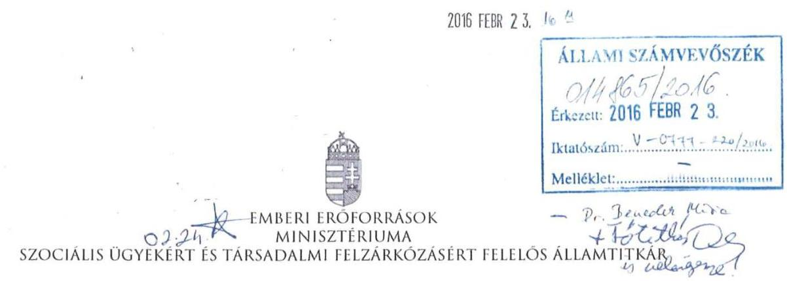

Iktatószám: 12473-2/ 2016/SZOCSTRAT
Hiv. szám: V-1046-011/2016
Ügyintéző: Aradi Zsuzsanna
Tel. szám: +36 (1) (896-3101)
Melléklet: -

# Domokos László részére 

elnök
Állami Számvevőszék

## Budapest

Apáczai Csere János utca 10.
1052

Tárgy: A Nemzeti Rehabilitációs és Szociális Hivatal Állami Számvevőszék általi ellenőrzése alapján készült jelentéstervezet észrevételezése

Tisztelt Elnök Úr!
A Nemzeti Rehabilitációs és Szociális Hivatal (a továbbiakban: NRSZH) ellenőrzése tárgyban készült számvevőszéki jelentéstervezetét köszönettel megkaptam. Az Emberi Erőforrások Minisztériumát (a továbbiakban: EMMI) érintő megállapításaival kapcsolatban az alábbi észrevételeket teszem.

### 1.1. számú megállapítás, illetve 1. táblázat 2. pont:

„Az Áht. 10. § (3) - a költségvetési szervek gazdálkodási besorolásának típusait meghatározó bekezdésnek 2014. január 1-jétől történő hatályon kívül helyezését követően nem történt meg a hatályos alapító okirat módosítása."

## 1. javaslati pont az EMMI miniszterének:

„Intézkedjen az NRSZH alapító okiratának módosításáról annak érdekében, hogy az az Ávr.-ben foglaltaknak megfelelően valamennyi telephelyet tartalmazza, továbbá, hogy az Áht. 10. § (3) bekezdésének hatályon kívül helyezése miatt a költségvetési szerv gazdálkodási besorolása típusának megjelölése törlésre kerüljön."

---

# Észrevétel: 

A 2013. december 30-tól hatályos Ávr. 181. §-a szerint a Magyarország 2014. évi központi költségvetését megalapozó egyes törvények módosításáról szóló 2013. évi CCIII. törvény 8. § (1) bekezdésének hatálybalépését követő 60 napon belül a Kincstár hivatalból törli a költségvetési szerv gazdálkodási besorolására vonatkozó törzskönyvi bejegyzéseket. A gazdálkodási besorolásra vonatkozó, 2014. január 1. előtt keletkezett alapító okiratban lévő bejegyzések törlését az alapító okiratok soron következő módosításakor az egységes szerkezetbe foglalt okiraton kell átvezetni. Az NRSZH alapító okiratának soron következő módosításakor (47272-1/2015/JISZOC iktatószámú, 2015. október 29. óta hatályos) a törlés megtörtént.
Az ÁSZ által megállapított hiányosságok a telephellyel kapcsolatban pótlásra kerültek, a módosított alapító okirat az NRSZH valamennyi telephelyét tartalmazza.

Fenti indokok alapján kérjük a megállapítás, illetve az EMMI miniszter részére tett 1. javaslati pont törlését.

### 1.1. számú megállapítás, illetve 1. táblázat 3. pont:

„A 2013. november 1-jétől hatályba lépett SZMSZ az Ávr. 13. § (1) bekezdés c) pontjának előírása ellenére olyan szakfeladatot is tartalmazott, amelyet az NRSZH nem látott el, azt a hatályos alapító okiratában sem rögzítették."

## 2. javaslati pont az EMMI miniszterének:

„Intézkedjen az NRSZH SZMSZ-ének módosításáról annak érdekében, hogy az - az Ávr.-ben foglaltak előírásának megfelelően - ne tartalmazza olyan, a kormányzati funkció szerint besorolt alaptevékenység, rendszeresen ellátott vállalkozási tevékenység megnevezését, amelyet az NRSZH nem lát el."

## Észrevétel:

A hivatkozott Ávr. 13. § (1) bekezdésének c) pontja szerint a költségvetési szerv SZMSZ-e az ellátandó, és a szakfeladatrend szerint szakfeladat számmal és megnevezéssel besorolt alaptevékenységek, rendszeresen ellátott vállalkozási tevékenységek megjelölését kell, hogy tartalmazza. Az Alapító Okirat kiadásakor hatályos szakfeladatrendről és az államháztartási szakágazati rendről szóló 56/2011. (XII. 31.) NGM rendelet 1. § (4) bekezdése szerint a költségvetési szerv, alapító okiratában nem kell feltüntetni azokat az önálló szakfeladatot képező kiadási és bevételi elemeket, amelyek a szerv alapító okirat szerinti alaptevékenységének ellátásához kapcsolódnak, a költségvetési szerv más szervek részére végzett tevékenységeinek szakfeladatait, a támogatási és befektetési célok szakfeladatait, a technikai szakfeladatokat, valamint a költségvetési szerv közfeladat ellátására rendelkezésre álló kapacitásának kihasználását célzó, nem haszonszerzés céljából végzett tevékenységeinek szakfeladatait.
Fentiek alapján a költségvetési szerv SZMSZ-ének legalább az alapító okiratban foglalt szakfeladatokat tartalmazni kell, de azon felüli szakfeladatok megjelenítése nem kizárható, az Ávr. az SZMSZ kapcsán nem ír elő kötelező egyezőséget az alapító okiratban foglaltakkal.
Ezen felül a Nemzeti Rehabilitációs és Szociális Hivatal Szervezeti és Működési Szabályzatáról szóló 61/2015. (XII. 29.) EMMI utasítással a korábban hatályos SZMSZ

---

módosításra került, jelenleg sem került olyan kormányzati funkció a szabályzatban megjelenítésre, amely tevékenységet az NRSZH nem lát el.

Fenti indokok alapján kérjük a megállapítás, illetve az EMMI miniszter részére tett 2. javaslati pont törlését.
1.2. számú megállapítás, illetve 2. táblázat 1. pont):
„Az irányító szerv 2011-ben az Áht. 49. § (5) bekezdés f) pontjában, míg a 2012-2014. években a 2012. január 1-jétől hatályos Áht. 9. § (1) bekezdés f) pontjában előírtak ellenére nem érvényesítette a
 közfeladatok ellátására vonatkozó és az erőforrásokkal való szabályszerű és hatékony gazdálkodáshoz szükséges követelményeket."

# Észrevétel: 

A megállapítás a követelmények irányító szerv általi kidolgozásáról beszél. A pontban hivatkozott régi és az új Áht. megjelölt részei nem az irányító szerv általi kidolgozást teszik kötelezővé, hanem a különféle jogi eszközökben (ágazati-, illetve pénzügyi típusú törvényekben, jogszabályokban) meghatározott követelmények érvényesítéséről (régi Áht.), illetve érvényesítéséről, számonkérésről és ellenőrzésről (új Áht.) tartalmaz előírást. Megítélésünk szerint a jogalkotó elvárása - ahogy az a szövegkörnyezetből is kitűnik - nem új követelmények kidolgozására irányul, hanem a már lefektetett szakmai, pénzügyi, eljárásrendi elvárások betartására és ellenőrzésére.

Fenti indokok alapján kérjük a megállapítás törlését.
Budapest, 2016. február 22.
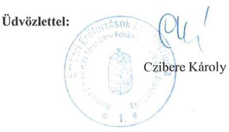

---

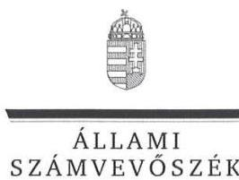

ELNÖK

Ikt. szám: V-0777-222/2016.

# Balog Zoltán úr 

miniszter

Emberi Erőforrások Minisztériuma

## Budapest

## Tisztelt Miniszter Úr!

Köszönettel megkaptam a 2016. február 23. napján az Állami Számvevőszékhez érkezett "A Nemzeti Rehabilitációs és Szociális Hivatal ellenőrzése" című számvevőszéki jelentéstervezetben foglalt megállapításokra az Emberi Erőforrások Minisztériuma Szervezeti és Működési Szabályzatáról szóló 33/2014. (IX. 16.) EMMI utasítás 146. § (1) bekezdés b) pontja alapján átruházott hatáskörben a szociális ügyekért és társadalmi felzárkóztatásért felelős államtitkár által kiadmányozott észrevételeket.

Tájékoztatom Miniszter urat, hogy az elfogadott észrevétel a jelentésben átvezetésre került. Az el nem fogadott és a részben elfogadott észrevételeket - az Állami Számvevőszékről szóló 2011. évi LXVI. törvény 29. § (3) bekezdése alapján - a jelentésben szerepeltetjük az elutasítás indokainak feltüntetésével együtt.

Az Állami Számvevőszék észrevételekre vonatkozó álláspontjáról a felügyeleti vezető által készített részletes tájékoztatást csatoltan megküldöm.

Budapest, 2016.
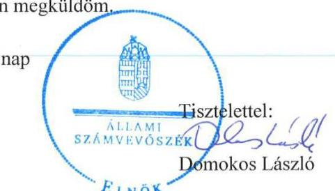

Melléklet: Tájékoztatás az elfogadott, a részben elfogadott és az el nem fogadott észrevételekről és azok indokairól

---

# Tájékoztatás 

az elfogadott, a részben elfogadott és az el nem fogadott észrevételekről és azok indokairól

|  |  | 1.1. számú megállapítás, illetve 1. táblázat 2. pont: <br> Az Áht. 7 10. § (3) - a költségvetési szervek gazdálkodási besorolásának típusait meghatározó - bekezdésének 2014. január 1-jétől történt hatályon kívül helyezését követően nem történt meg a hatályos alapító okirat módosítása. <br> 1. javaslati pont az EMMI miniszterének: <br> Intézkedjen az NRSZH alapító okiratának módosításáról annak érdekében, hogy az az Ávr.-ben foglaltaknak megfelelően valamennyi telephelyet tartalmazza, továbbá, hogy az Áht. 10. § (3) bekezdésének hatályon kívül helyezése miatt a költségvetési szerv gazdálkodási besorolása típusának megjelölése törlésre kerüljön. <br> A 2013. december 30-tól hatályos Ávr. 181. §-a szerint a |
| :--: | :--: | :--: |
| 1. | Észrevétel: | Magyarország 2014. évi központi költségvetését megalapozó egyes törvények módosításáról szóló 2013. évi CCIII. törvény 8. § (1) bekezdésének hatálybalépését követő 60 napon belül a Kincstár hivatalból törli a költségvetési szerv gazdálkodási besorolására vonatkozó törzskönyvi bejegyzéseket. A gazdálkodási besorolásra vonatkozó, 2014. január 1. előtt keletkezett alapító okiratban lévő bejegyzések törlését az alapító okiratok soron következő módosításakor az egységes szerkezetbe foglalt okiraton kell átvezetni. Az NRSZH alapító okiratának soron következő módosításakor (47272-1/2015/JISZOC iktatószámú, 2015. október 29. óta hatályos) a törlés megtörtént. <br> Az ÁSZ által megállapított hiányosságok a telephellyel kapcsolatban pótlásra kerültek, a módosított alapító okirat az NRSZH valamennyi telephelyét tartalmazza. |

---

|  | A fenti indokok alapján kérjük a megállapítás, illetve az EMMI miniszter részére tett 1. javaslati pont törlését." |  |
| :--: | :--: | :--: |
|  | Válasz: | Az Állami Számvevőszék (ÁSZ) az észrevételt elfogadja. |
|  | Indoklás: | Az észrevétel megalapozott, a jelentéstervezet 15. oldal 1.1. számú megállapítás 2. bekezdése 2. mondatrészét: „továbbá a gazdálkodási besorolás 2014. évi jogszabályváltozást követő törlése elmaradása mellett „, szövegrész, illetve a 16. oldal 1. táblázat 2. pontja, valamint 45. oldalon az EMMI miniszterének tett 1. javaslat 2. mondatrésze a jelentéstervezetből törlésre került. |
|  | Észrevétel: | 1.1. számú megállapítás, illetve 1. táblázat 3. pont: <br> A 2013. november 1-jétől hatályba lépett SZMSZ az Ávr. 13. § (1) bekezdés c) pontjának előírása ellenére olyan szakfeladatot is tartalmazott, amelyet az NRSZH nem látott el, azt a hatályos alapító okiratában sem rögzítették. <br> 2. javaslati pont az EMMI miniszterének: <br> Intézkedjen az NRSZH SZMSZ-ének módosításáról annak érdekében, hogy az - az Ávr.-ben foglalt előírásnak megfelelően - ne tartalmazza olyan, a kormányzati funkció szerint besorolt alaptevékenység, rendszeresen ellátott vállalkozási tevékenység megnevezését, amelyet az NRSZH nem lát el. |
| 2. | A hivatkozott Ávr. 13. § (1) bekezdésének c) pontja szerint a költségvetési szerv SZMSZ-e az ellátandó, és a szakfeladatrend szerint szakfeladat számmal és megnevezéssel besorolt alaptevékenységek, rendszeresen ellátott vállalkozási tevékenységek megjelölését kell, hogy tartalmazza. Az Alapító Okirat kiadásakor hatályos szakfeladatrendről és az államháztartási szakágazati rendről szóló 56/2011. (XII. 31.) NGM rendelet 1.§ (4) bekezdése szerint a költségvetési szerv, alapító okiratában nem kell feltüntetni azokat az önálló szakfeladatot képező kiadási és bevételi elemeket, amelyek a szerv alapító okirat szerinti alaptevékenységének ellátásához kapcsolódnak, a költségvetési szerv más szervek részére végzett tevékenységeinek szakfeladatait, a támogatási és befektetési célok szakfeladatait, a technikai szakfeladatokat, valamint a költségvetési szerv közfeladat ellátására |

---

|  | rendelkezésre álló kapacitásának kihasználását célzó, nem haszonszerzés céljából végzett tevékenységének szakfeladatait. Fentiek alapján a költségvetési szerv SZMSZ-ének legalább az alapító okiratban foglalt szakfeladatokat tartalmazni kell, de azon felüli szakfeladatok megjelenítése nem kizárható, az Avr. az SZMSZ kapcsán nem ír elő kötelező egyezőséget az alapító okiratban foglaltakkal. <br> Ezen felül a Nemzeti Rehabilitációs és Szociális Hivatal Szervezeti és Működési Szabályzatáról szóló 61/2015. (XII. 29.) EMMI utasítással a korábban hatályos SZMSZ módosításra került, jelenleg sem került olyan kormányzati funkció a szabályzatban megjelenítésre, amely tevékenységet az NRSZH nem lát el. <br> Fenti indokok alapján kérjük a megállapítás, illetve az EMMI miniszter részére tett 2. javaslati pont törlését." |
| :--: | :--: |
| Válasz: | Az Állami Számvevőszék az észrevételt részben fogadja el. |
| Indoklás: | Az észrevétel részben megalapozott. A jelentéstervezet 16. oldal 1. táblázat 3. pontjában az ÁSZ ellenőrzési megállapítása arra vonatkozott, hogy a 2013. november 1-jétől hatályba lépett SZMSZ olyan szakfeladatot is tartalmazott, amelyet az NRSZH nem látott el, azt a hatályos alapító okiratában sem rögzítették. Az ellenőrzött szervezet által az ÁSZ rendelkezésére bocsátott dokumentumok alapján az ÁSZ ellenőrzési megállapítása tehát nem arra irányult, hogy az alapító okirat és az SZMSZ között kötelező egyezőségnek kell fennállnia, hanem arra, hogy az érintett szakfeladat az alapító okiratból - más szervezetnek történő átadás miatt - kivezetésre (törlésre) került, amellyel összefüggésben az SZMSZ-t nem módosították. <br> A fent leírtak figyelembevételével az észrevételben foglaltakat részben elfogadjuk és az ellenőrzési megállapítást közérthetősége és az egyértelmű megfogalmazása érdekében a jelentéstervezet 16. oldal 1. táblázat 3. pontját az alábbiak szerint pontosítottuk. A módosított megállapítás szövege a következő: <br> A 2013. november 1-jétől hatályba lépett SZMSZ az Ávr. 13. § (1) bekezdés c) pontjának előírása ellenére olyan szakfeladatot is tartalmazott, amelyet az NRSZH |

---

|  |  | nem látott el. A megszűnt szakfeladatot az alapító okiratból kivezették, az SZMSZ-t azonban ennek megfelelően nem módosították. <br> A fentiekre tekintettel a jelentéstervezetben az erre vonatkozó, az EMMI miniszterének címzett javaslatot azonban továbbra is fenntartjuk. |
| :--: | :--: | :--: |
| 3. | Észrevétel: | 1.2. számú megállapítás, illetve 2. táblázat 1. pont: <br> Az irányító szerv 2011-ben az Áht. 49. § (5) bekezdés f) pontjában, míg a 2012-2014. években a 2012. január 1-jétől hatályos Áht. 2 9. § (1) bekezdés f) pontjában előírtak ellenére nem érvényesített a közfeladatok ellátására vonatkozó és az erőforrásokkal való szabályszerű és hatékony gazdálkodáshoz szükséges követelményeket. <br> A megállapítás a követelmények irányító szerv általi kidolgozásáról beszél. A pontban hivatkozott régi és az új Áht. megjelölt részei nem az irányító szerv általi kidolgozást teszik kötelezővé, hanem a különféle jogi eszközökben (ágazati-, illetve pénzügyi típusú <br> törvényekben, jogszabályokban) meghatározott követelmények érvényesítéséről (régi Áht.), illetve érvényesítéséről, számonkéréséről és ellenőrzésről (új Áht.) tartalmaz előírást. Megítélésünk szerint a jogalkotó elvárása - ahogy az a szövegkörnyezetből is kitűnik - nem <br> új követelmények kidolgozására irányul, hanem a már lefektetett szakmai, pénzügyi eljárásrendi elvárások betartására és ellenőrzésére. <br> Fenti indokok alapján kérjük a megállapítás törlését." |
|  | Válasz: | Az Állami Számvevőszék az észrevételt nem fogadja el. |
|  | Indoklás: | Az észrevétel nem megalapozott. Az ÁSZ az ellenőrzési megállapításában - a jelentéstervezet 16. oldal 1.2. számú megállapítása, valamint a 2. táblázat 1. pontja nem a követelmények irányító szerv általi kidolgozásának hiányát állapította meg, hanem azt, hogy az irányító szerv 2011-ben az Áht. 49. § (5) bekezdés f) pontjában, míg a 2012-2014. években a 2012. január 1-jétől hatályos Áht. 2 9. § (1) bekezdés f) pontjában előírtak ellenére nem érvényesített |

---

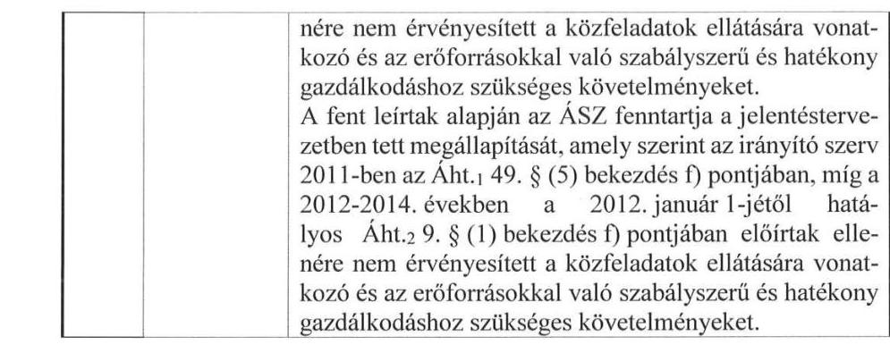

Budapest, 2016. március  .
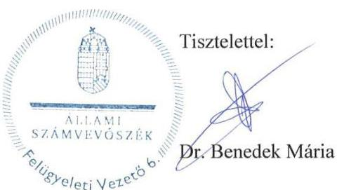

---

# RÖVIDÍTÉSEK JEGYZÉKE 

${ }^{1}$ Irányító szerv
${ }^{2}$ NRSZH
${ }^{3}$ ÁSZ
${ }^{4}$ alapító okirat

## ${ }^{5}$ Kincstár

${ }^{6}$ 331/2010. (XII.27.) Korm. rendelet
${ }^{7}$ FH
${ }^{8}$ SZGYF
${ }^{9}$ M Ft
${ }^{10}$ EU
${ }^{11}$ ÁROP
${ }^{12}$ EKOP
${ }^{13}$ TÁMOP
${ }^{14}$ TIOP
${ }^{15}$ KMOP
${ }^{16}$ Alaptörvény
${ }^{17}$ Nvtv.
${ }^{18}$ Áht. 2
${ }^{19}$ Ávr.
${ }^{20}$ Áht. 1
${ }^{21}$ Ámr.
${ }^{22}$ Bkr.
${ }^{23}$ Ász. tv.
${ }^{24}$ EMMI
${ }^{25}$ SZMSZ
${ }^{26}$ Számv. tv.
${ }^{27}$ 331/2010. (XII.27.) Korm. rendelet
${ }^{28}$ ORSZI
2012. május 13-áig a Nemzeti Erőforrás Minisztérium, 2012. május 14-étől az Emberi Erőforrások Minisztériuma
Nemzeti Rehabilitációs és Szociális Hivatal
Állami Számvevőszék
alapító okirat1: az Országos Rehabilitációs és Szociális Szakértői Intézet alapító okirata (hatályos: 2010. november 2-től 2011. február 21-ig), alapító okirat2: a Nemzeti Rehabilitációs és Szociális Hivatal alapító okirata (hatályos: 2011. február 22-től 2012. június 30-ig), alapító okirat3: a Nemzeti Rehabilitációs és Szociális Hivatal alapító okirata (hatályos: 2012. július 1-jétől)
Magyar Államkincstár
331/2010. (XII. 31.) Korm. rendelet a Nemzeti Rehabilitációs és Szociális Hivatalról, valamint eljárásának részletes szabályairól (hatálytalan: 2012. július 1-jétől)
Foglalkoztatási Hivatal
Szociális és Gyermekvédelmi Főigazgatóság
millió forint
Európai Unió
Államreform Operatív Program
Elektronikus Közigazgatás Operatív Program
Társadalmi Megújulás Operatív Program
Társadalmi Infrastruktúra Operatív Program
Közép-Magyarországi Operatív Program
Magyarország Alaptörvénye (2011. április 25.) (hatályos: 2012. január 1-jétől)
2011. évi CXCVI. törvény a nemzeti vagyonról
2011. évi CXCV. törvény az államháztartásról szóló

368/2011. (XII. 31.) Korm. rendelet az államháztartásról szóló törvény végrehajtásáról (hatályos: 2012. január 1-jétől)
1992. évi XXXVIII. törvény az államháztartásról (hatálytalan: 2012. január 1-jétől)

292/2009. (XII. 19.) Korm. rendelet az államháztartás működési rendjéről (hatálytalan: 2012. január 1-jétől)
370/2011. (XII. 31.) Korm. rendelet a költségvetési szervek belső kontrollrendszeréről és belső ellenőrzéséről (hatályos 2012. január 1-jétől)
2011. évi LXVI. törvény az Állami Számvevőszékről (hatályos: 2011.
 július 1-jétől)

Emberi Erőforrások Minisztériuma
SZMSZ1: 1/2008. (SZK.1.) SZMM utasítás az ORSZI SZMSZ-e kiadásáról (hatályos: 2007. december 27-től 2011. október 7-ig), SZMSZ2: 27/2011. (X. 7.) NEFMI utasítás az NRSZH SZMSZ-éről (hatályos: 2011. október 8-tól 2013. október 31-ig), SZMSZ3: 39/2013. (X. 31.) EMMI utasítás az NRSZH SZMSZ-éről (hatályos: 2013. november 1-jétől)
2000. évi C. törvény a számvitelről

331/2010. (XII.27.) Korm. rendelet a Nemzeti Rehabilitációs és Szociális Hivatalról, valamint eljárásának részletes szabályairól (hatálytalan: 2012. július 1-jétől)
Országos Rehabilitációs és Szociális Szakértői Intézet (2010. december 31-ig)

---

${ }^{29}$ számviteli politika
${ }^{30}$ ellenőrzési nyomvonal
${ }^{31}$ közszolgálati szabályzat
${ }^{32}$ monitoring stratégia
${ }^{33}$ hivatásetikai kódex
${ }^{34}$ számlarend
${ }^{35}$ értékelési szabályzat
számviteli politika: 20/2010. sz. főigazgatói utasítás Országos Rehabilitációs és Szociális Szakértői Intézet számviteli politikájáról (hatályos 2011. december 22-ig), számviteli politika2: 28/2011. sz. főigazgatói utasítás a Nemzeti Rehabilitációs és Szociális Hivatal számviteli politikájáról (hatályos: 2011. december 23-tól 2012. december 27-ig), számviteli politika3: 30/2012. sz. főigazgatói utasítás a Nemzeti Rehabilitációs és Szociális Hivatal számviteli politikájáról (hatályos: 2012. december 28-tól 2013. december 15-ig), számviteli politika4: 28/2013. sz. főigazgatói utasítás a Nemzeti Rehabilitációs és Szociális Hivatal számviteli politikájáról (hatályos: 2013. december 16-tól 2014. december 21-ig), számviteli politika5: 22/2014. sz. főigazgatói utasítás a Nemzeti Rehabilitációs és Szociális Hivatal számviteli politikájáról (hatályos: 2014. december 22-től)
ellenőrzési nyomvonal1: 7/2002. sz. főigazgatói utasítást módosító, kiegészítő 6/2006. számú főigazgatói utasítás 6. számú melléklete az Országos Orvosszakértői Intézet Szervezeti és Működési Szabályzatáról szóló ellenőrzési nyomvonalakról (hatályos: 2006. március 8-tól 2011. november 10-ig), ellenőrzési nyomvonal2: az Országos Rehabilitációs és Szociális Szakértői Intézet 2009. évtől (Humánpolitikai Főosztály humánpolitikai és bérszámfejtési feladataira vonatkozó), valamint 2010. évtől (Adatvédelmi felelősre, Koordinációs Önálló Osztályra, Belső ellenőrzésre, Igazgatási és jogi feladatokra, informatikai feladatokra, módszertani-oktatási-minőségbiztosítási igazgatósági feladatokra, jogi tevékenységre, projektek végrehajtására, pénzügyi tevékenységre, szociális szakértői feladatokra vonatkozó) hatályos ellenőrzési nyomvonalai, ellenőrzési nyomvonal3: Nemzeti Rehabilitációs és Szociális Hivatal 2011. évtől (Akkreditációs Főosztályra, Rehabilitációs Főosztályra, Szociális Főosztályra, jogi tevékenységre, humánpolitikai feladatokra, informatikai feladatokra, jogvédő feladatokra, módszertani, oktatási, minőségbiztosítási feladatokra, projektekre, Koordinációs Önálló Osztályra vonatkozó) hatályos ellenőrzési nyomvonalai, ellenőrzési nyomvonal4: a Nemzeti Rehabilitációs és Szociális Hivatal 2013. júliustól (Foglalkozási Rehabilitációs Főosztályra, Szakigazgatási Módszertani és Nemzetközi Ügyek Főosztályra, Informatikai Főosztályra, Orvosi, Módszertani és Ellenőrzési Igazgatóság feladataira vonatkozó), valamint 2013. novembertől (az NRSZH feladataira vonatkozó) ellenőrzési nyomvonalai
közszolgálati szabályzat1: 25/2011. sz. főigazgatói utasítás a Nemzeti Rehabilitációs és Szociális Hivatal közszolgálati szabályzatáról (hatályos: 2011. december 14-től 2012. május 13-ig), közszolgálati szabályzat2: 25/2011. sz. főigazgatói utasítás a Nemzeti Rehabilitációs és Szociális Hivatal közszolgálati szabályzatáról (hatályos: 2011. december 14-től 2012. május 14-ig), közszolgálati szabályzat3: 10/2012. sz. főigazgatói utasítás a Nemzeti Rehabilitációs és Szociális Hivatal közszolgálati szabályzatáról (hatályos: 2012. május 15-től)
9/2014. sz. főigazgatói utasítás a Nemzeti Rehabilitációs és Szociális Hivatal kontroll- és monitoring stratégiájáról (hatályos: 2014. május 12-től)
a Magyar Kormánytisztviselői Kar Országos Közgyűlésének határozata a Magyar Kormánytisztviselői Kar hivatásetikai kódexéről (hivatásetikai kódex1 hatályos: 2013. szeptember 1-jétől; hivatásetikai kódex2 hatályos: 2014. november 1-jétől)
számlarend1: Országos Rehabilitációs és Szociális Szakértői Intézet számlarendje (hatályos 2011. december 29-ig); számlarend2: a Nemzeti Rehabilitációs és Szociális Hivatal 1/2012. számú számlarendje (hatályos 2011. december 30-tól); számlarend3: 32/2013 számú főigazgatói utasítás a Nemzeti Rehabilitációs és Szociális Hivatal számlarendjéről (hatályos 2013. december 30-tól); számlarend4: 23/2014. számú főigazgatói utasítás a Nemzeti Rehabilitációs és Szociális Hivatal számlarendjéről (hatályos 2014. december 2-től)
értékelési szabályzat1: 7/2008. sz. főigazgatói utasítás az Országos Rehabilitációs és Szociális Szakértői Intézet eszközök és források értékelésének szabályozásáról (hatályos: 2008. november 28-tól 2013. december 29-ig); értékelési szabályzat2:

---

33/2013. sz. főigazgatói utasítás a Nemzeti Rehabilitációs és Szociális Hivatal eszközök és források értékelési szabályzatáról (hatályos: 2013. december 30-tól)
${ }^{36}$ leltározási szabályzat
${ }^{37}$ bizonylati rend
${ }^{38}$ közbeszerzési szabályzat
${ }^{39} \mathrm{Kbt} .1$
${ }^{40} \mathrm{Kbt} .2$
${ }^{41}$ OOSZI
${ }^{42}$ Kttv.
${ }^{43}$ 50/2013. (II. 25.) Korm. rendelet
${ }^{44}$ kockázatkezelési szabályzat
${ }^{45}$ kockázatfelmérés
${ }^{46}$ adatvédelmi szabályzat
${ }^{47}$ Vnytv.
${ }^{48}$ IKSZ
${ }^{49}$ IBSZ
leltározási szabályzat1: 8/2008. sz. főigazgatói utasítás az Országos Rehabilitációs és Szociális Szakértői Intézet leltározási, leltárkészítési és a leltározási folyamattal összefüggő vagyonkezelési feladatok szabályozásáról (hatályos: 2008. november 28-tól 2013. november 17-ig); leltározási szabályzat2: 20/2013. sz. főigazgatói utasítás a leltározási és leltárkészítési szabályzatról (hatályos: 2013. november 18-tól); leltározási szabályzat3: 21/2014. sz. főigazgatói utasítás az eszközök és források leltározási- és leltárkészítési szabályzatáról (hatályos: 2014. december 22-től)
bizonylati rend1: 10/2010. sz. főigazgatói utasítás az Országos Rehabilitációs és Szociális Szakértői Intézet bizonylati rendjéről (hatályos: 2010. május 31-től 2013. november 17-ig); bizonylati rend2: 19/2013. sz. főigazgatói utasítás a bizonylati rendről (hatályos: 2014. november 10-ig); bizonylati rend3: 15/2014. sz. főigazgatói utasítás a bizonylati rendről (hatályos: 2014. november 11-től)
közbeszerzési szabályzat1: 17/2010. sz. főigazgatói utasítás az Országos Rehabilitációs és Szociális Szakértői Intézet közbeszerzéseinek szabályozásáról (hatályos: 2010. októberétől 2012. augusztus 29-ig); közbeszerzési szabályzat2: 14/2012. sz. főigazgatói utasítás az NRSZH közbeszerzéseinek szabályozásáról (hatályos: 2012. augusztus 30-tól); közbeszerzési szabályzat3: 3/2014. sz. főigazgatói utasítás a közbeszerzési szabályzatról (hatályos: 2014. január 27-től) 2003. évi CXXIX. törvény a közbeszerzésekről (hatálytalan: 2012. január 1-jétől) 2011. évi CVIII. törvény a közbeszerzésekről (hatályos: 2011. augusztus 21-től)

Országos Orvosszakértői Intézet
2011. évi CLXXXIX. törvény a közszolgálati tisztviselőkről

50/2013. (II. 25.) Korm. rendelet az államigazgatási szervek integritásirányítási rendszeréről és az érdekérvényesítők fogadásának rendjéről (hatályos: 2013. március 27-től)
kockázatkezelési szabályzat1: 19/2009. sz. főigazgatói utasítás az Országos Rehabilitációs és Szociális Szakértői Intézet kockázatkezelési szabályzatáról (hatályos: 2009. december 19-től 2011. december 22-ig), kockázatkezelési szabályzat2: 27/2011. sz. főigazgatói utasítás a Nemzeti Rehabilitációs és Szociális Hivatal kockázatkezelési szabályzatáról (hatályos: 2011. december 23-tól)
kockázatfelmérés1: a Nemzeti Rehabilitációs és Szociális Hivatal 2011. évi kockázatfelmérése, kockázatfelmérés2: a Nemzeti Rehabilitációs és Szociális Hivatal 2012. évi kockázatfelmérése, kockázatfelmérés3: a Nemzeti Rehabilitációs és Szociális Hivatal 2013. évi kockázatfelmérése, kockázatfelmérés4: a Nemzeti Rehabilitációs és Szociális Hivatal 2014. évi kockázatfelmérése
adatvédelmi szabályzat1: 5/2005. sz. főigazgatói utasítás az Országos Orvosszakértői Intézet adatvédelmi szabályzatról (hatályos: 2005. július 1-jétől 2013. június 18-ig), adatvédelmi szabályzat2: 14/2013. sz. főigazgatói utasítás a Nemzeti Rehabilitációs és Szociális Hivatal adatvédelmi és adatbiztonsági szabályzatról (hatályos: 2013. november 4-től 2015. április 6-ig)
2007. évi CLII. törvény az egyes vagyonnyilatkozat-tételi kötelezettségekről

IKSZ1: 5/2002. sz. főigazgatói utasítás Országos Rehabilitációs és Szociális Szakértői Intézet iratkezelési szabályzatáról, IKSZ2: 26/2012. sz. főigazgatói utasítás a Nemzeti Rehabilitációs és Szociális Hivatal iratkezelésének rendjéről (hatályos: 2012. november 21-től 2014. július 18-ig), IKSZ3: 10/2014. sz. főigazgatói utasítás a Nemzeti Rehabilitációs és Szociális Hivatal iratkezelésének rendjéről (hatályos: 2014. július 19-től)

IBSZ1: 28/2006. sz. főigazgatói utasítás az Országos Rehabilitációs és Szociális Szakértői Intézet informatikai biztonsági szabályzatáról, IBSZ2: 7/2012. sz.

---

| 50 Informatikai Főosztály | Nemzeti Rehabilitációs és Szociális Hivatal Informatikai Biztonsági Szabályzatáról (Hatályos: 2012. február 29-től) |
| :--: | :--: |
| ${ }^{51}$ FEUVE | Nemzeti Rehabilitációs és Szociális Hivatal Informatikai Főosztálya |
| ${ }^{52}$ lkr. | folyamatba épített, előzetes, utólagos és vezetői ellenőrzés |
| ${ }^{53}$ Avtv. | 335/2005. (XII. 29.) Korm. rendelet a közfeladatot ellátó szervek iratkezelésének általános követelményeiről |
| ${ }^{54}$ Info tv. | 1992. évi LXIII. törvény a személyes adatok védelméről és a közérdekű adatok nyilvánosságáról (hatálytalan: 2012. január 1-jétől) |
| ${ }^{55}$ közérdekű bejelentések kezelése eljárási rend | 2011. évi CXII. törvény az információs önrendelkezési jogról és az információszabadságról (hatályos: 2011. július 27-től) |
| ${ }^{56}$ honlap működtetési szabályzat | ```közérdekű bejelentések kezelése eljárási rend1: 20/2003. sz. főigazgatói utasítás az Országos Rehabilitációs és Szociális Szakértői Intézet közérdekű bejelentések kezelése eljárási szabályairól, közérdekű bejelentések kezelése eljárási rend2: 19/2011. sz. főigazgatói utasítás a Nemzeti Rehabilitációs és Szociális Hivatal közérdekű bejelentések és panaszügyek kezeléséről (hatályos: 2011. október 28-tól 2014. március 2-ig), közérdekű bejelentések kezelése eljárási rend3: 6/2014. sz. főigazgatói utasítás a Nemzeti Rehabilitációs és Szociális Hivatal közérdekű bejelentések és panaszügyek kezeléséről (hatályos: 2014. március 3-tól) honlap működtetési szabályzat1: 11/2011. sz. főigazgatói utasítás a Nemzeti Rehabilitációs és Szociális Hivatal Internetes honlapjának működtetéséről, valamint a honlapokon történő közzététel szabályairól (hatályos: 2011. április 29-től 2012. január 30-ig),honlap működtetési szabályzat2: 4/2012. sz. főigazgatói utasítás a Nemzeti Rehabilitációs és Szociális Hivatal Internetes és Intranetes honlapjainak működtetéséről, valamint a honlapokon történő közzététel szabályairól (hatályos: 2012. január 31-től 2014. november 9-ig), honlap működtetési szabályzat3: 14/2014. sz. főigazgatói utasítás a Nemzeti Rehabilitációs és Szociális Hivatal Internetes és Intranetes honlapjainak működtetéséről, valamint a honlapokon történő közzététel szabályairól (hatályos: 2014. november 10-től)``` |
| ${ }^{57}$ közérdekű adatok megismerése eljárási rendje |  |
|  | 25/2012. sz. főigazgatói utasítás a Nemzeti Rehabilitációs és Szociális Hivatal közérdekű adatok megismerésére irányuló kérelmek intézésének, továbbá a kötelezően közzéteendő adatok nyilvánosságra hozatalának rendjéről (hatályos: 2012. október 31-től) |
| ${ }^{58}$ Levéltár | Magyar Országos Levéltár (2012. szeptember 30-ig) és Magyar Nemzeti Levéltár (2012. október 1-jétől) |
| ${ }^{59}$ adatvédelmi szabályzat | adatvédelmi szabályzat1: 5/2005. sz. főigazgatói utasítás az Országos Orvosszakértői Intézet adatvédelmi szabályzatról (hatályos: 2005. július 1-jétől 2013. június 18-ig); adatvédelmi szabályzat2: 14/2013. sz. főigazgatói utasítás a Nemzeti Rehabilitációs és Szociális Hivatal Adatvédelmi és Adatbiztonsági Szabályzatról (Hatályos: 2013. november 4-től 2015. április 6-ig) |
| ${ }^{60}$ Ltv. | 1995. évi LXVI. törvény a közokiratokról, közlevéltárakról és a magánlevéltári anyag védelméről |
| ${ }^{61}$ Eisztv. | 2005. évi XC. törvény az elektronikus információszabadságról (hatálytalan: 2012. január 1-jétől) |
| ${ }^{62}$ Gazdasági Igazgatóság | Nemzeti Rehabilitációs és Szociális Hivatal Gazdasági Igazgatósága |
| ${ }^{63}$ BEK | $\mathrm{BEK}_{1}$: az Országos Rehabilitációs és Szociális Szakértői Intézet Belső Ellenőrzési Kézikönyve (hatályos: 2009. áprilistól 2011. december 6-ig), $\mathrm{BEK}_{2}$: 24/2011. sz. |

---

| 64 éves ellenőrzési terv | főigazgatói utasítás a Nemzeti Rehabilitációs és Szociális Hivatal Belső Ellenőrzési Kézikönyvéről (hatályos: 2011. december 7-től) |
| :--: | :--: |
| ${ }^{65}$ Ber. | éves ellenőrzési terv1: az Országos Rehabilitációs és Szociális Szakértői Intézet 2011. évre vonatkozó belső ellenőrzési terve, éves ellenőrzési terv2: a Nemzeti Rehabilitációs és Szociális Hivatal 2012. évre vonatkozó belső ellenőrzési terve, éves ellenőrzési terv3: a Nemzeti Rehabilitációs és Szociális Hivatal 2013. évre vonatkozó belső ellenőrzési terve, éves ellenőrzési terv4: a Nemzeti Rehabilitációs és Szociális Hivatal 2014. évre vonatkozó belső ellenőrzési terve |
| ${ }^{66}$ NGM | 193/2003. (XI. 26.) Korm. rendelet a költségvetési szervek belső ellenőrzéséről (hatályos 2011. december 31-ig) |
| ${ }^{67}$ 1329/2011. (X. 7.) Korm. határozat | Nemzetgazdasági Minisztérium |
| ${ }^{68}$ 1502/2011. (XII. 29.) Korm. határozat | 1329/2011. (X. 7.) Korm. határozat a Nemzetgazdasági Minisztérium és a Nemzeti Erőforrás Minisztérium fejezetek közötti előirányzat-átcsoportosításról (hatályos: 2011. október 8-tól) |
| ${ }^{69}$ RSZSZ |

 1502/2011. (XII. 29.) Korm. határozat a rehabilitációs hatóság létrehozásáról (hatályos: 2011. december 29-től) |
| ${ }^{70} 95 / 2012$. (V.15.) Korm. rendelet | Rehabilitációs Szakigazgatási Szerv |
| ${ }^{71}$ ONYF | 95/2012. (V. 15.) Korm. rendelet a Nemzeti Rehabilitációs és Szociális Hivatalról, valamint a szakmai irányítása alá tartozó rehabilitációs szakigazgatási szervek feladat- és hatásköréről |
| ${ }^{72}$ OBDK | Országos Nyugdíjbiztosítási Főigazgatóság |
| ${ }^{73} 214 / 2012$. (VII. 30.) Korm. rendelet | Országos Betegjogi, Ellátottjogi, Gyermekjogi és Dokumentációs Központ |
| ${ }^{74} 316 / 2012$. (XI. 13.) Korm. rendelet | 214/2012. (VII. 30.) Korm. rendelet az Országos Betegjogi, Ellátottjogi, Gyermekjogi és Dokumentációs Központról (hatályos: 2012. augusztus 1-jétől) |
| ${ }^{75} 1496 / 2012$. (XI. 13.) Korm. határozat | 316/2012. (XI. 13.) Korm. rendelet a Szociális és Gyermekvédelmi Főigazgatóságról |
| ${ }^{76}$ Áhsz1 | 1496/2012. (XI. 13.) Korm. határozat a Szociális és Gyermekvédelmi Főigazgatóság létrehozásáról és egyes szociális, gyermekvédelmi intézmények átvételéről (hatályos: 2012. november 13-tól) |
| ${ }^{77}$ Áhsz2 | 249/2000. (XII. 24.) Korm. rendelet az államháztartás szervezetei beszámolási és könyvvezetési kötelezettségének sajátosságairól (hatálytalan: 2014. január 1-jétől) |
| ${ }^{78} 15 / 2005$. (IX.2.) FMM rendelet | 4/2013. (I. 11.) Korm. rendelet az államháztartás számviteléről (hatályos 2014. január 1-jétől) |
| ${ }^{79} 36 / 2013$. (IX. 13.) NGM rendelet | 15/2005. (IX. 2.) FMM rendelet a megváltozott munkaképességű személyek foglalkoztatásához nyújtható költségvetési támogatás megállapításának részletes szabályairól (hatálytalan: 2013. január 1-jétől) |
| ${ }^{80}$ MNV Zrt. | 36/2013. (IX. 13.) NGM rendelet az államháztartás számvitelének 2014. évi megváltozásával kapcsolatos feladatokról (hatályos: 2013. szeptember 14-től 2014. december 31-ig) |
| ${ }^{81}$ Vtvr. | Magyar Nemzeti Vagyonkezelő Zrt. |
| ${ }^{82} \mathrm{Vtv}$. | 254/2007. (X. 4.) Korm. rendelet az állami vagyonnal való gazdálkodásról |
| ${ }^{83}$ selejtezési szabályzat | 2007. évi CVI. törvény az állami vagyonról |
|  | selejtezési szabályzat1: az Országos Rehabilitációs és Szociális Szakértői Intézet feleslegessé vált vagyonelemek hasznosításáról és a selejtezés szabályozásáról szóló 9/2008. sz. főigazgatói utasítás (Hatályos: 2008. november 28-tól 2013. november 19-ig), selejtezési szabályzat2: a Nemzeti Rehabilitációs és Szociális Hivatal feleslegessé vált vagyonelemek hasznosításáról és a selejtezés szabályozásáról szóló 21/2013. sz. főigazgatói utasítás (Hatályos: 2013. november 20-tól 2014. november 25-ig), selejtezési szabályzat3: a Nemzeti Rehabilitációs és Szociális Hivatal feleslegessé vált vagyonelemek hasznosításáról és a selejtezés szabályairól szóló 19/2014. sz. főigazgatói utasítás (Hatályos: 2014. november 26-tól) |

---

${ }^{84}$ TÁMOP 5.4.2.
${ }^{85}$ TÁMOP 1.1.1.
${ }^{86}$ TÁMOP 5.4.8.
${ }^{87}$ BEGYKA
${ }^{88}$ 1072/2011.(III. 23.) Korm. határozat
${ }^{89}$ ÁSZ tv.
Társadalmi Megújulás Operatív Program 5.4.2-12/1-2012-0001 Központi szociális információs fejlesztések
Társadalmi Megújulás Operatív Program „Megváltozott munkaképességű emberek rehabilitációjának és foglalkoztatásának segítése" című kiemelt projekt
Társadalmi Megújulás Operatív Program 5.4.8-08/1-2008-0002 A komplex rehabilitáció szakmai hátterének megerősítése
Betegjogi, Ellátottjogi, Gyermekjogi Közalapítvány
1072/2011.(III. 23.) Korm. határozat a Betegjogi, Ellátottjogi és Gyermekjogi Közalapítvány megszüntetéséről
2011. évi LXVI. törvény az Állami Számvevőszékről, hatályos 2011. július 1-jétől

---

ÁLLAMI SZÁMVEVŐSZÉK
1052 Budapest, Apáczai Csere János utca 10.
Levélcím: 1364 Budapest 4. Pf. 54
Telefon: +36 14849100 Telefax: +36 14849200
www.asz.hu
