# Jelentés 

## Az önkormányzatok gazdasági társaságai

Az önkormányzatok többségi tulajdonában lévő gazdasági társaságok közfeladat ellátását érintő gazdálkodási tevékenysége szabályszerűségének ellenőrzése Sárvár Távhő Hőtermelő és Szolgáltató Kft. 2016.
„A közfeladat ellátás szinvonala, költségeinek, ráfordításainak alakulása hatással van a szolgáltatást igénybe vevő lakosság elégedettségére. "

---

# Jelentés 

## Az önkormányzatok gazdasági társaságai

Az önkormányzatok többségi tulajdonában lévő gazdasági társaságok közfeladat ellátását érintő gazdálkodási tevékenysége szabályszerűségének ellenőrzése - Sárvár Távhő Hőtermelő és Szolgáltató Kft.
2016. 14. 14. hó 34. nap
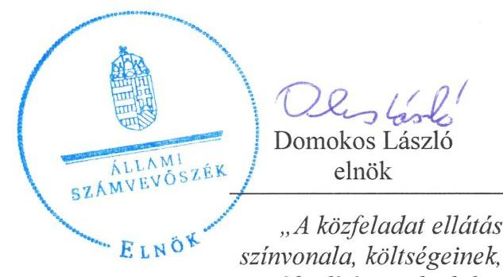
„A közfeladat ellátás szinvonala, költségeinek, ráforditásainak alakulása hatással van a szolgáltatást igénybe vevố lakosság elégedettségére."
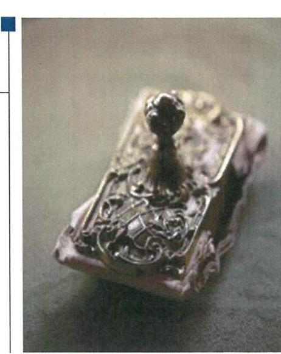

---

# AZ ELLENŐRZÉST FELÜGYELTE:

- BÖRÖCZ IMRE felügyeleti vezető

- AZ ELLENŐRZÉST VEZETTE ÉS A VÉGREHAJTÁSÁÉRT FELELŐS:
  - CZÉKUS BALÁZS ellenőrzésvezető
  - A PROGRAM ÖSSZEÁLLÍTÁSÁÉRT FELELŐS:
    - JANIK JÓZSEF LÁSZLÓ osztályvezető

- IKTATÓSZÁM: V-0848-161/2016
- TÉMASZÁM: 1882.
- ELLENŐRZÉS-AZONOSÍTÓ SZÁM: V-070706

Jelentéseink az Országgyűlés számítógépes hálózatán és az Interneta a www.asz.hu címen is olvashatóak.

---

# TARTALOMJEGYZÉK 

■ ÖSSZEGZÉS ..... 5
■ AZ ELLENŐRZÉS CÉLJA ..... 7
■ AZ ELLENŐRZÉS TERÜLETE ..... 8
■ AZ ELLENŐRZÉS HÁTTERE, INDOKOLTSÁGA ..... 10
■ FÓKUSZKÉRDÉSEK ..... 12
■ ELLENŐRZÉS HATÓKÖRE ÉS MÓDSZEREI ..... 13
■ MEGÁLLAPÍTÁSOK ..... 15
■ JAVASLATOK ..... 33
■ MELLÉKLETEK ..... 37
I. Sz. melléklet: Értelmező szótár ..... 37
II. Sz. melléklet: SÁRVÁR TÁVHŐ Kft. müködésének főbb jellemzői (M Ft / \%) ..... 40
■ FÜGGELÉK: ÉSZREVÉTELEK ..... 41
■ RÖVIDÍTÉSEK JEGYZÉKE ..... 45

---

.

---

# ÖSSZEGZÉS 

Az Állami Számvevőszék ellenőrzése a távhőszolgáltatás közfeladatának ellátását értékelte a kizárólagos önkormányzati tulajdonú Sárvár Távhő Hőtermelő és Szolgáltató Kft.-nél a 2011-2014. évekre vonatkozóan. Sárvár Város Önkormányzata a közfeladat ellátását megszervezte, a tulajdonosi jogait alapvetően érvényesítette. A Társaság szabályzatai kialakításánál és vagyongazdálkodásánál hiányosságokat tapasztaltunk. Beszámolási kötelezettségeinek szabályszerűen tett eleget.

## Az ellenőrzés társadalmi indokoltsága

Az Állami Számvevőszék középtávra szóló stratégiájában megfogalmazta, hogy a helyi önkormányzatok gazdálkodásában rejlő pénzügyi kockázatok feltárásával, az államháztartáson kívülre nyújtott költségvetési támogatások és ingyenes vagyonjuttatások, valamint az államháztartáson kívül múködő közfeladat-ellátó rendszerek ellenőrzéseivel hozzájárul ahhoz, hogy a közpénzeket az államháztartáson kívül múködő szervezetek is átlátható, rendezett módon használják fel a közfeladatok szerződésben vállalt ellátása érdekében.

A Magyarországon az intézmény-centrikus közfeladat ellátás jellemző, de egyre jelentősebb a költségvetésen kívüli feladatellátás térnyerése. Ennek legfontosabb szereplői - a nonprofit szervezetek mellett - az önkormányzati tulajdonú gazdasági társaságok. Az önkormányzatok szervezetalakítási szabadságának következménye, hogy a korábban is vállalati formában múködő közszolgáltatások mellett, mind a kötelező, mind az önként vállalt feladatok ellátásában a gazdasági társaságok kiemelt fontosságú szerephez jutottak.

## Főbb megállapítások, következtetések, javaslatok

A közfeladat ellátás megszervezéséről, az ellátás módjáról szóló döntés az ellenőrzött időszakot megelőzően történt. Az Önkormányzat a tulajdonában lévő gazdálkodó szervezet által ellátott távhőszolgáltatási közfeladat fejlesztésével összefüggésben nem fogalmazott meg elvárásokat, elképzeléseket. Vagyongazdálkodási tervvel rendelkezett, de nem különültek el a közép- és hosszú távú célkitűzések. Az Önkormányzat SZMSZ-e nem tartalmazta a kötelezően ellátandó és az önként vállalt közfeladatokat, azt csak 2013-tól szabályozta a vagyongazdálkodási tervben. A távhőszolgáltatás rendjét a Távhőrendelet, a Közüzemi szolgáltatási szerződés, valamint az Üzletszabályzat alapozta meg.

A tulajdonosi jogok gyakorlását az Alapító Okirat és a Vagyongazdálkodási rendelet szabályozta. Tulajdonosi joggyakorlási jogosítványokat az Önkormányzat nem adott át, a Felügyelő Bizottságot létrehozta. Az árképzés szabályait az Önkormányzat a Távhőrendeletben és a Hőszolgáltatási és ármegállapítási célú megállapodásban határozta meg, de rendelkezései hiányosak voltak. Szakmai belső és külső ellenőrzést nem végeztetett.

A jogszabályoknak megfelelően a Társaság elkészítette számviteli politikáját, Értékelési-, Pénzkezelési-, Leltározási szabályzatát, azok aktualizálása nem történt meg. Üzleti tervet minden évben készített. Számlarenddel 2011. december 31-ig nem rendelkezett, a 2012. január 1-től hatályban lévő Számlarend tartalma nem felelt meg teljes körűen a Számviteli törvénynek. Az Üzletszabályzat árképzésre vonatkozó részét nem módosították. A távhőszolgáltatás közfeladat és vagyonelemek tekintetében elkülönített nyilvántartás vezetését belső szabályzataiban a bevételek kivételével nem írta elő, nem teremtette meg a távhőtermelésre, távhőszolgáltatásra és egyéb tevékenységekre az elkülönített számviteli nyilvántartást.

A vagyonnyilvántartásban a távhőszolgáltatás közfeladat eszközeinek egyéb tevékenységektől történő elkülönítése nem történt meg. A 2011-2014. években sem a tárgyi eszközök, sem a készletek tekintetében nem volt tényleges mennyiségi leltárfelvétel. A vagyon értékének megőrzéséről, gyarapításáról gondoskodott.

---

A kötelezettségek állománya alapvetően nem jelentett kockázatot a közfeladat ellátására, a rövid lejáratú kötelezettségeinek határidőben történő teljesítése biztosított volt. A Társaság rendelkezett a társasági formájára előírt jegyzett tőkének megfelelő összegű saját tőkével. A tagi kölcsönöket nem a hosszú lejáratú kötelezettségek között mutatta ki.

Az Önkormányzat az Alapítói Okiratba foglalta a távhőszolgáltatási közfeladat ellátásával kapcsolatos adatszolgáltatási igényét. A Társaság határidőben és az előírt adattartalommal teljesítette az Önkormányzat felé a Számviteli törvény szerinti egyszerűsített éves beszámolóit, a Képviselő-testület minden évben - a Felügyelő Bizottság jegyzőkönyve és a könyvvizsgálói jelentés birtokában - megtárgyalta, határozatával elfogadta és a törvényi határidőben közzétette. A közvagyonnal kapcsolatos adatok védelmére, nyilvánosságra hozatalára vonatkozó feladatát nem teljes körűen látta el: szabályzatkészítéssel nem biztosította a kezelt adatállományok információ biztonsági védelmét.

A közfeladat ráfordításain és bevételein belüli számviteli szétválasztás módját, annak szabályait szabályzatban nem rögzítette. Az értékesítés nettó árbevétele és az anyagjellegű ráfordítások elszámolása területén szabályszerűen járt el, a beruházások és felújítások elszámolása nem volt szabályszerű. Nem a Számviteli politikában foglaltaknak megfelelően számította az értékcsökkenést, illetve határozta meg a maradványértéket. 2013-ig a használhatósági fok folyamatosan csökkent, csak a legszükségesebb pótlásokat végezték el, 2014-ben beruházás következtében nagymértékben javult az eszközpótlás aránya. A követelés állomány csökkentéséről intézkedtek, nyereségkorlátot betartották.

Önköltségszámítási szabályzat készítésére a Számviteli törvény alapján nem volt kötelezett, a távhőszolgáltatási rendelet szerinti költség kalkulációt viszont el kellett volna készítenie. A távhőszolgáltatás árát 2011-12-ben nem az előírásokkal összhangban határozták meg; 2013-14-ben a rezsicsökkentést végrehajtották.

Az ÁSZ a gazdálkodás szabályszerűségének javítása és a megfelelő gazdálkodási gyakorlat érdekében a társaság ügyvezetőjének, az Önkormányzat szabályszerű működésének elősegítésére, továbbá az önkormányzati tulajdonosi joggyakorlás kontrolljainak erősítésére Sárvár Város polgármesterének, továbbá Sárvár Város jegyzőjének fogalmazott meg javaslatokat.

A jelentésben szereplő javaslatok alapján a társaság ügyvezetője és Sárvár Város polgármestere kötelesek intézkedési terveket összeállítani és azokat a jelentés kézhezvételétől számított 30 napon belül az ÁSZ részére megküldeni.

---

# AZ ELLENŐRZÉS CÉLJA 

## A Társaság közfeladat ellátását érintő gazdálkodási tevékenysége szabályszerűségének értékelése

Az ellenőrzés célja annak értékelése, hogy az Önkormányzat a jogszabályi előírások figyelembevételével döntött-e az ellenőrzésre kerülő közfeladat megszervezéséről; az Önkormányzat/tulajdonosi joggyakorló szabályszerűen gyakorolta-e a tulajdonosi jogokat.

Ellenőriztük, hogy a gazdasági társaság közfeladat ellátása bevételeinek, ráfordításainak elszámolása, és vagyongazdálkodási tevékenysége megfelelt-e a jog-szabályi, illetve a közszolgáltatási/vagyonkezelési szerződésben foglalt tulajdonosi előírásoknak, azok végrehajtása szabályszerű volt-e.

Értékeltük továbbá, hogy a gazdasági társaság kötelezettségállománya jelent-e kockázatot a múködésre, illetve a közfeladat ellátására; valamint a közfeladatok átláthatósága és elszámoltathatósága érdekében biztosítva volt-e a közszolgáltatás díjának megalapozottsága szabályszerű önköltségszámítással.

---

# **AZ ELLENŐRZÉS TERÜLETE**

## **Sárvár Város Önkormányzata és a kizárólagos tulajdonában lévő Sárvár Távhő Hőtermelő és Szolgáltató Kft.**

Sárvár Város Önkormányzata a Sárvár Távhő Hőtermelő és Szolgáltató Kft.-t a 85/1992. (X. 13.) számú képviselő-testületi határozatával hozta létre. Az Önkormányzat¹ 1,0 M Ft törzstőkével alapította meg a gazdasági társaságot. Jogelődje a Vas Megyei Távhő Szolgáltató Vállalat volt, melynek végelszámolását követően a vállalat vagyonát a 100 %-os önkormányzati tulajdonú, új alapítású Kft-be apportálta. Az ellenőrzött időszakban a Társaság² jegyzett tőkéje 75,3 M Ft volt. Fő feladata Sárvár Város lakosságának és közületeinek gőz és távhőszolgáltatással való ellátása volt. Tevékenységi körébe tartozik még a légkondicionálás és a távhővezeték építés. A Társaság az ellenőrzött időszakban 100 %-os önkormányzati tulajdonban maradt.

**A TÁRSASÁG** a 2014. évben 924 lakossági, valamint 89 közületi fogyasztót látott el távhővel a közel 15,0 ezer lakosú Sárvár város közigazgatási területén.

A fontosabb gazdálkodási adatok alakulását az 1. ábra szemlélteti.

1. ábra

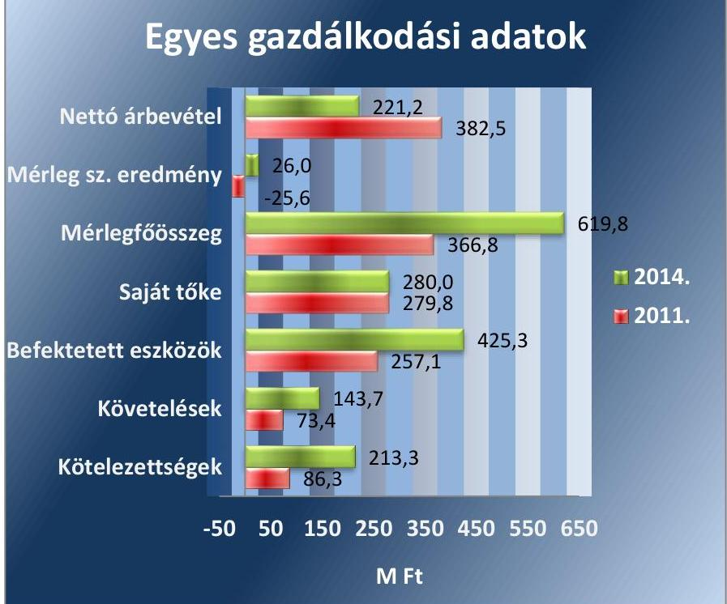

*Forrás: A Társaság éves beszámolói 2011-2014*

Az értékesítés nettó árbevétele a 2011. évi 382,5 M Ft-ról a 2014. évre 221,2 M Ft-ra, 42,2%-kal csökkent. A befektetett eszközök állománya a

---

2011. január 1-jei 377,4 M Ft-ról 2014. december 31-re 425,3 M Ft-ra (12,7\%-kal) emelkedett. A Társaság követeléseinek állománya 2011. január 1-je és 2014. december 31-e között 70,0 M Ft-tal növekedett, a Társaság forrásain belül a saját tőke állománya 33,6\%-kal (141,4 M Ft-tal) csökkent. A kötelezettségek állománya 2011. január 1-je és 2014. december 31-e között 220,8\%-kal (66,5 M Ft-ról 213,3 M Ft-ra) nőtt. A munkavállalói létszám 11 fơről 14 főre nőtt.

A Társaság tulajdonosi részesedéssel más gazdasági társaságban nem rendelkezik.

Az ellenőrzött időszakban a polgármester ${ }^{3}$ és a jegyző ${ }^{4}$ személye nem változott. A polgármester a 2010. évi önkormányzati választások óta tölti be tisztségét, a jegyző 2000. október 4-e óta látja el feladatait.

---

# AZ ELLENŐRZÉS HÁTTERE, INDOKOLTSÁGA 

Objektív kép kialakítása Sárvár Város Önkormányzata távhőszolgáltatási közfeladatának megszervezéséről, tulajdonosi joggyakorlásáról, valamint a kizárólagos tulajdonában lévő Sárvár Távhő Hőtermelő és Szolgáltató Kft. közfeladat ellátását érintő gazdálkodási tevékenységének szabályszerűségéről.

## A gazdasági társaságok a közfeladatok ellátásában kiemelt fontosságú szerephez jutottak

AZ ÁSZ. TV. 2011. JANUÁR 1-JÉTŐL HATÁLYOS MÓDOSÍTÁSA teremtette meg az önkormányzati tulajdonú gazdasági társaságok teljes körű ellenőrzésének lehetőségét. A közfeladatot ellátó gazdasági társaságok ellenőrzése kiemelten fontos a vagyon megőrzése, megóvása érdekében, valamint a kormányzati szektor elszámolásaiban megjelenő önkormányzati tulajdonú gazdálkodó szervezetek esetében, amelyekkel szemben alapvető követelmény, hogy gazdálkodásuk, múködésük szabályszerű, az általuk szolgáltatott adatok minél megbízhatóbbak legyenek. A közfeladat ellátás költségeinek, ráfordításainak alakulása, színvonala hatással van a lakosság elégedettségére.

AZ ÁSZ STRATÉGIÁJÁBAN megfogalmazta, hogy a helyi önkormányzatok gazdálkodásában rejlő pénzügyi kockázatok feltárásával, az államháztartáson kívülre nyújtott költségvetési támogatások és ingyenes vagyonjuttatások, valamint az államháztartáson kívül múködő közfeladatellátó rendszerek ellenőrzéseivel hozzájárul ahhoz, hogy a közpénzeket az államháztartáson kívül múködő szervezetek is átlátható, rendezett módon használják fel.

A közfeladatok gazdasági társaságokba történő kiszervezésével a gazdálkodás, a pénzügyi helyzet kockázatai kikerültek az önkormányzati alrendszerből, mely az ÁSZ figyelmét az önkormányzatok többségi tulajdonában lévő gazdasági társaságai közfeladat ellátását érintő tevékenységére irányította. Az önkormányzatok gazdasági társaságai közfeladat ellátását érintő gazdálkodási tevékenysége szabályszerűségére irányuló ellenőrzéseket erre tekintettel a 2011. évtől végezzük.

A KONSTRUKCIÓS KOCKÁZATOK feltárásával az ellenőrzés illeszkedik az ÁSZ középtávra szóló stratégiájához. A múködési és pénzügyi kockázatok feltárásával hasznosítható munícióval szolgálhat a Kormány 2013-tól elindított rezsicsökkentési törekvéseihez.

## AZ ELLENŐRZÉS VÁRHATÓ HASZNOSULÁSA-

KÉNT meghatározhatóvá válnak a közfeladat ellátásban részt vevő államháztartáson kívüli szervezeteknek - az önkormányzat költségvetését, pénzügyi helyzetét is befolyásoló - kockázatai, lehetővé válik ezen kockázatok csökkentése. Feltárja, hogy az önkormányzat közfeladat ellátási kötelezettségének szabályszerűen tett-e eleget, a feladatellátáshoz rendelt közvagyon múködtetését szabályszerűen szervezte-e meg és a tulajdonosi

---

felügyelete hozzájárult-e a közfeladat ellátásához. A feladatot ellátó gazdasági társaság a közszolgáltatási szerződésben foglaltak betartásával, a közvagyon használatával biztosította-e a szolgáltatás folytatásának feltételeit. Ezzel az ellenőrzöttek és a helyi döntéshozók számára visszajelzést ad feladatszervezési, feladatellátási kockázataikról, alapot ad a meglévő hibák megszüntetéséhez, a jobb közfeladat ellátás biztosításához. Fokozza a fegyelmet, igazolja, hogy lejárt a következmények nélküli ellenőrzések időszaka. A törvényalkotás számára - az észlelt problémák, szabálytalanságok, vagy egyéb nem kívánatos jelenségek felszínre kerülésével - az ellenőrzés megállapításai segítséget nyújthatnak az államháztartáson kívüli közfeladat ellátás értékeléséhez, jogszabályi keretei pontosításához, átláthatóságot biztosító szabályozásához. Az ÁSZ értékteremtő rend kialakításához és megőrzéséhez hozzájáruló tevékenysége pozitív hatással van a szervezetről kialakított összkép formálására is.

Mindezeken keresztül az ÁSZ hozzájárul Magyarország közpénzügyi helyzetének javításához, a közpénzek mérhető módon történő, a döntéshozók által meghatározott célok szerinti felhasználásához.

---

# FÓKUSZKÉRDÉSEK 

1.     - Az önkormányzat közfeladat megszervezéséről szóló döntése, valamint tulajdonosi joggyakorlása szabályszerű volt-e?
2.     - A gazdasági társaság vagyongazdálkodása szabályszerű volt-e, kötelezettségállománya jelentett-e kockázatot a müködésre, illetve a közfeladat ellátásra?
3.     - A gazdasági társaságnál az ellátott közfeladat bevételei és ráfordításai elszámolása, valamint az önköltségszámitás és árképzés szabályszerű volt-e?

---

# ELLENŐRZÉS HATÓKÖRE ÉS MÓDSZEREI 

## Az ellenőrzés típusa

Megfelelőségi ellenőrzés

## Az ellenőrzött időszak

2011. január 1-jétől 2014. december 31-ig

## Az ellenőrzés tárgya

Az ellenőrzés tárgya annak megállapítása, hogy az önkormányzat közfeladat ellátási kötelezettségének szabályszerűen tett-e eleget, a feladatellátáshoz rendelt közvagyon múködtetését szabályszerűen szervezte-e meg és a tulajdonosi felügyelete hozzájárult-e a közfeladat ellátásához. A feladatot ellátó gazdasági társaság a közszolgáltatási szerződésben foglaltak betartásával biztosította-e a szolgáltatást, valamint vagyongazdálkodása bevételeinek és ráfordításainak elszámolása szabályszerű és átlátható volte.

Az ellenőrzés kiterjed minden olyan körülményre és adatra, amely az ÁSZ jogszabályban meghatározott feladatainak teljesítéséhez, valamint a program végrehajtása folyamán felmerült újabb összefüggések feltárásához szükséges.

## Az ellenőrzött szervezet

Sárvár Város Önkormányzata és a
Sárvár Távhő Hőtermelő és Szolgáltató Kft.

## Az ellenőrzés jogalapja

Az ellenőrzés jogszabályi alapját az Állami Számvevőszékről szóló 2011. évi LXVI. törvény 5. § (3)-(4)-(5) bekezdései képezik.

## Az ellenőrzés módszerei

Az ellenőrzést a nemzetközi standardokat irányadónak tekintve az ellenőrzési program ellenőrzési kérdései, az ellenőrzött időszakban hatályos jogszabályok, az ellenőrzés szakmai szabályok és módszertanok figyelembe vételével végezzük.

---

Az ellenőrzés ideje alatt az ellenőrzött szervezettel történő kapcsolattartást az ÁSZ Szervezeti és Múködési Szabályzatának vonatkozó előírásai alapján biztosítjuk.

Az ellenőrzés a kiválasztott, többségi tulajdonosi jogokat gyakorló önkormányzatra, illetve az ellenőrzésre kijelölt közfeladatot ellátó gazdasági társaság felett tulajdonosi jogokat gyakorló szervezetre és az ellenőrzött közfeladatot ellátó gazdasági társaságra terjed ki. Amennyiben a gazdasági társaságban több önkormányzat együttesen többségi tulajdonos, úgy az ellenőrzést a többségi tulajdonosi jogokat gyakorló önkormányzatnál kell lefolytatni. Az ellenőrzött gazdasági társaságnál, amennyiben az több közfeladatot is ellát, akkor az ellenőrzésre kiválasztott közfeladat ellátást ellenőrizzük.

Az ellenőrzést a kérdésekre adott válaszok kiértékelésével, valamint a megjelölt adatforrások, a csatolt tanúsítványok felhasználásával, továbbá az adott időszakban hatályos jogszabályok figyelembe vételével kell lefolytatni. Az ellenőrzési kérdések megválaszolásához szükséges bizonyítékok megszerzése a következő ellenőrzési eljárások alkalmazásával történik: megfigyelés, kérdésfeltevés (információkérés), összehasonlítás, valamint elemző eljárás.

A bevételek és ráfordítások elszámolása, valamint a vagyonnyilvántartás terén az egyes területek szabályszerű működését mintavétellel ellenőriztük, ez alapján a sokaságokban előforduló hibás tételek arányát becsültük. A jogszabályoknak és a belső előírásoknak megfelelőnek, azaz szabályszerűnek tekintettük az adott bevételek és ráfordítások elszámolását, a vagyonnyilvántartást, amennyiben a minta ellenőrzésének eredménye alapján 95\%-os bizonyossággal a teljes sokaságban a hibás tételek aránya kisebb volt, mint 10\%, nem megfelelőnek értékeltük, ha a hibás tételek aránya a 10\%-ot meghaladta. Kockázatot, illetve magas kockázatot jeleztünk, amennyiben egy adott terület vonatkozásában a minta alapján a teljes sokaságban nem volt teljes körűen biztosított a jogszabályoknak és a belső szabályzatoknak megfelelő működés.

---

# 1. Az önkormányzat közfeladat megszervezéséről szóló döntése, valamint tulajdonosi joggyakorlása szabályszerű volt-e? 

Összegző megállapítás

Az Önkormányzat közfeladat megszervezéséről, gazdasági társaság útján történő ellátásáról szóló döntése összességében szabályszerű volt, tulajdonosi joggyakorlása során hiányosságokat tapasztaltunk.

### 1.1. számú megállapítás

A közfeladat ellátás megszervezésére vonatkozó önkormányzati döntés és annak előkészítése - a megfelelő részletezettségen kívül - szabályszerű volt, a távhőszolgáltatásra vonatkozó rendeletalkotási kötelezettségének alapvetően eleget tett, a távhőszolgáltatás fejlesztéséről rendeletet nem hozott.

A távhőszolgáltatással ellátott létesítmények távhőellátásának távhőszolgáltatásra engedéllyel rendelkezők útján történő biztosítása a Tszt. ${ }^{5}$ 6. § (1) bekezdése értelmében a területileg illetékes települési önkormányzat kötelező feladata. Az Önkormányzat a közfeladatok ellátásáról az ellenőrzött időszak előtt az Ötv. 9. § (4) bekezdése alapján döntött arról, hogy az Ötv. 8. § (1) bekezdésében (2013. január 1-től a Mötv. ${ }^{6}$ 13. § (1)) foglalt, kötelezően ellátandó távhőszolgáltatást az általa 1992-ben alapított, kizárólagos tulajdonát képező Társaság révén látja el. A Társaságba apportként vitte be a távhővagyont, így a közfeladat ellátását szolgáló vagyon a Társaság saját vagyonát képezte. A Képviselő-testület a 85/1992. (X. 13.) számú képviselő-testületi határozatával fogadta el az Alapító Okiratot ${ }_{1}{ }^{7}$. A Cégbíróság 1992. november 24-én jegyezte be 18-09101155 cégjegyzékszám alatt.

A Gazdasági program ${ }_{1}{ }^{8}{ }_{1}{ }^{9}$-ben fogalmazta meg a Képviselő-testület ${ }^{10}$ az Ötv. ${ }^{11}$ 91. § (6) bekezdése, illetve a Mötv. 116. § (4) bekezdése alapján a 2010-2014. és a 2014-2019. önkormányzati ciklusokra vonatkozóan a város fejlődésének tervezett lehetőségeit. A gazdasági program ${ }_{1-2}$ a városi infrastruktúra és az önkormányzati intézményrendszer fejlesztési lehetőségeit és területeit helyezte a középpontba, a tulajdonában lévő gazdálkodó szervezetek által ellátott közfeladatok fejlesztésével összefüggésben nem fogalmazott meg elvárásokat, elképzeléseket.

A Képviselő-testület 159/2008. (VI.12.) számú határozatával elfogadott Integrált Városfejlesztési Stratégiája ${ }^{12}$ átfogó elemzést adott a város gaz-dasági-társadalmi helyzetéről, és meghatározta a hosszú távú jövőképet, kijelölte a jövőbeni fejlesztési irányokat. A távhőellátással kapcsolatban megállapította, hogy a lakossági fogyasztók száma várhatóan csökkenni fog. A Társaság energia ellátásának racionalizálása érdekében előre vetítette a geotermikus energia felhasználásának lehetőségét. A távhőszolgáltatás fejlesztésével összefüggésben más megállapítást, illetve javaslatot nem tartalmazott.

---

A VAGYONGAZDÁLKODÁSI TERVET ${ }^{13}$ a 30/2013. (II. 14.) számú határozattal fogadta el a Képviselő-testület, amelyben nem különültek el a közép- és hosszú távú célkitűzések. A vagyongazdálkodási terv 4.2. pontjában kiemelt célkitűzésként fogalmazta meg, hogy a közszolgáltatás folyamatos biztosítása érdekében a Társaság fejlesztési céljait támogatni kell. A támogatását elsősorban visszatérítendő kölcsön formájában határozták meg

A közfeladat ellátás garanciális kötelezettségeit a Képviselő-testület 279/2009. (XI. 19.) számú határozatával elfogadott Közüzemi szolgáltatási szerződésben ${ }^{14}$ rögzítették.

Az Önkormányzat SZMSZ ${ }^{15}$-e nem tartalmazta a kötelezően ellátandó és az önként vállalt közfeladatok felsorolását, azok ellátási módját, szervezeti kereteit. A kötelező önkormányzati feladatokat a Képviselő-testület a 2013. február 14-én elfogadott vagyongazdálkodási terv 2.2. pontjában rögzítette. A vizsgált időszak kezdetétől, a vagyongazdálkodási terv elfogadásáig terjedő időszakban az Önkormányzat nem szabályozta a kötelezően ellátandó és önként vállalt feladatok körét.

Az ellátandó feladatok körének kialakításánál az Önkormányzat az Ötv. 8. § (1) bekezdése, illetve a Mötv. 13. § (1) bekezdés 20. pontja, valamint a Tszt. 6-7. §-a, a 60. § (3) bekezdésének előírásaira figyelemmel szabályszerűen járt el. E törvényi kötelezettségek alapozták meg a Távhőrendelet, a Közüzemi szolgáltatási szerződés, valamint az Üzletszabályzat ${ }^{16}$ elfogadását.

# A KÖZÜZEMI SZOLGÁLTATÁSI SZERZŐDÉS többek 

között rögzítette,
a távhőszolgáltatással ellátott létesítmények távhőellátását az Önkormányzat a kizárólagos tulajdonában lévő Társaság útján biztosítja,
a Társaság köteles együttműködni az Önkormányzattal a szolgáltatásnyújtás érdekében,
az Önkormányzat Társasággal szemben teljesítendő kötelezettségeit,
a rendszer működtetésével, biztonságos üzemeltetésével, ellenőrzésével, a felhasználók és a Társaság viszonyával összefüggő kötelezettségeit,
a szerződés megkötésekor alkalmazott árakat és díjtételeket.
A távhőszolgáltatás rendjét - a Tszt. 60. § (3) bekezdése szerinti tartalommal - a Képviselő-testület a 30/2007. (X. 25.) számú határozatával elfogadott, 2007. november 1-től hatályos Távhőrendeletben ${ }^{17}$ szabályozta.

A TÁVHŐ RENDELET elfogadásával az Önkormányzat a távhőszolgáltatásra vonatkozó Tszt. 6. § (2) bekezdése szerinti rendeletalkotási kötelezettségének eleget tett. A Képviselő-testület alapvetően szabályozta a Tszt. 6. § (2)-(4) bekezdésében, a 45. § (6) bekezdésében és az 52. § (2) bekezdésében meghatározott, hatáskörébe utalt feladatokat. A Tszt. 6. § (2) bekezdésének b) pontjában előírtak ellenére, 2011. április 15től nem módosította a Távhőrendelet díjmegállapításra vonatkozó szabá-

---

lyait, tekintettel a Tszt. 57/D § (1) bekezdésében bekövetkezett változásokra. Rendeletben nem jelölték ki a Tszt. 6. § (2) bekezdés c) pontja szerint azokat a területeket, ahol területfejlesztési, környezetvédelmi és levegő-tisztaságvédelmi szempontok alapján célszerű a távhőszolgáltatás fejlesztése.
1.2. számú megállapítás

Tulajdonosi jogait nem érvényesítette teljes körűen, az árképzés szabálya hiányos volt, szakmai kritérium- és monitoringrendszert nem alakított ki, belső ellenőrzést nem végeztetett.

A TULAJ DONOSI JOGOK GYAKORLÁSÁRÓL a Képvi-selő-testület az Alapító Okirat ${ }_{1-2}$-ben rendelkezett a $\mathrm{Gt}_{2}{ }^{18} 141 . \S$ (2) bekezdésével, illetve a $\mathrm{Ptk}_{2}{ }^{19} 3: 188 . \S$ (2) bekezdésével összhangban.

Az önkormányzati tulajdonú gazdasági társaságok feletti tulajdonosi joggyakorlás általános szabályait a Vagyongazdálkodási rendelet ${ }_{1}{ }^{20}-{ }_{2}{ }^{21}$ tartalmazta.

Az alapítói jogok gyakorlása az ellenőrzött években megoszlott a Képvi-selő-testület és a polgármester között. A Vagyongazdálkodási rendelet ${ }_{1}$ 24. § (1) bekezdése előírta, hogy az önkormányzati tulajdonú gazdasági társaságok legfőbb szervének hatáskörébe tartozó kérdésekben a Képvi-selő-testület dönt. Ezt a szabályt magában foglalta a Vagyongazdálkodási rendelet ${ }_{2}$ is. A szabályozás megfelelt a Gt. 19. § (5) bekezdés, illetve a $\mathrm{Ptk}_{2}$ 3:109. § (4) bekezdés előírásainak.

A vagyongazdálkodási döntések megalapozására vonatkozó előírásokat a Vagyongazdálkodási rendelet ${ }_{1}$ 15-24. §-ai, és a Vagyongazdálkodási rendelet ${ }_{2}$ 6-22. §-ai tartalmazták. A Vagyongazdálkodási rendelet ${ }_{1-2}$ rögzítette az önkormányzati vagyon feletti tulajdonosi jogok gyakorlásának módját, feltételeit, a Képviselő-testület és a polgármester döntési jogosítványait, a Gazdasági, Városfejlesztési és Közbeszerzési Bizottság véleményezési és javaslattételi kötelezettségét.

Tulajdonosi joggyakorlási jogosítványokat az Önkormányzat nem adott át. A Gt. 2 19. § (5) bekezdése alapján a Képviselő-testület minden ellenőrzött évben megtárgyalta a Társaság üzleti tervét és - az FB, valamint a Gazdasági, Városfejlesztési és Közbeszerzési Bizottság javaslatát figyelembe véve - az előterjesztéssel egyező tartalommal annak elfogadásáról határozatot hozott.

A FELÜGYELŐ BIZOTTSÁG ügyrendjét ${ }^{22}$ a Képviselő-testület a 34/2011. (II. 17.) számú határozatával fogadta el, amely szabályozta a FB feladat- és hatáskörét, jogait, kötelezettségeit és felelősségét. Az Alapító Okirat 11.3.f) pontja rögzítette, hogy a Képviselő-testület kizárólagos hatáskörébe tartozik a $\mathrm{FB}^{23}$ elnökének és tagjainak megválasztása, visszahívása, díjazásának megállapítása. A szabályozással az Önkormányzat eleget tett a Gt2 FB létrehozására vonatkozó 33. § (2) c), pontjának, a Gt. 2 3436. §-ban, valamint a Taktv. ${ }^{24}$ 4. §-ában foglaltaknak.

A JAVADALMAZÁSI SZABÁLYZAT ${ }_{2}{ }^{25} 2^{26}$ őt Taktv. 5-6. §aiban foglalt kötelezettségét teljesítve a Képviselő-testület elfogadta. A Javadalmazási szabályzat ${ }_{1-2}$ hatálya alá tartoztak
a gazdasági társaságok vezető tisztségviselői,
a felügyelő bizottság,

---

$\longrightarrow$ a társaság munkavállalói.
A vezető tisztségviselőkkel összefüggésben az ellenőrzött időszak alatt érvényes Javadalmazási szabályzat ${ }_{1-2}$ rögzítette a javadalmazás feltételeit és annak mértékére vonatkozó elveket. A Javadalmazási szabályzat ${ }_{1-2}$ előírta a prémiumfeladatok teljesítésének a tárgyévet lezáró beszámoló elfogadásával egyidejűleg történő értékelését. Az ügyvezető részére a Képvi-selő-testület nem határozott meg teljesítménykövetelményeket.

Az ügyvezető 2011. decemberben jutalom kifizetésben részesült az FB 2011. október 26-i ülésének javaslata alapján. Az FB elnöke a javaslatot nem továbbította a Képviselő-testület felé. Az ügyvezető jutalmát - előterjesztés hiányában - a Képviselő-testület nem tárgyalta meg, annak kifizetéséről nem döntött. Az Alapító Okirat 11.3. e) pontja alapján a Képviselőtestület hatáskörébe tartozott az ügyvezető díjazásának megállapítása.

Az ügyvezető besorolás szerinti alapbéréről, továbbá a FB tagjainak díjazásáról a Képviselő-testület évente határozott. A Javadalmazási szabály-zat ${ }_{1-2}$ előírta, hogy a FB tagjai a tiszteletdíjon felül más juttatásban nem részesülhetnek.

AZ ÁRKÉPZÉS SZABÁLYAIT az Önkormányzat a Távhőrendeletben és a Hőszolgáltatási és ármegállapítási célú megállapo-dás ${ }^{27}$-ban határozta meg, utóbbit a Képviselő-testület a 280/2009. (XI. 19.) számú határozatával fogadta el.

A díjmegállapításra vonatkozó szabályait a Képviselő-testület a Tszt. 6. § (2) bekezdésének b) pontjában előírtak ellenére, majd 2011. április 15től sem módosította a Tszt. 57/D § (1) bekezdésében bekövetkezett - miniszteri díj-meghatározási - változásokkal párhuzamosan. A Távhőrendelet a 2011. április 15-ig terjedő időszakra vonatkozóan
$\longrightarrow$ költségnemenkénti csoportosításban sorolta fel az alkalmazandó árak, díjak mértékének megállapításakor figyelembe veendő költségeket, ráfordításokat,
$\longrightarrow$ nem különültek el az egyes távhőszolgáltatások kialakításánál figyelembe veendő közvetlen költségek, üzemi általános költségek (nincs szabályozva ezek felosztásának módja), illetve az általános költségek.
a Tszt. 57. § (2) bekezdésében előírtak ellenére a kalkulációs egységenkénti indokolt és szükséges költségek, ráfordítások körére, a fedezetszámítás módjára, a költségekre-, árakra-, díjakra vonatkozó összehasonlító elemzés tartalmára vonatkozó részletes szabályokat nem tartalmazta,
a Tszt. 57/A. § (2) bekezdésében rögzítettek ellenére nem rögzítette a díjváltoztatás esetében követendő eljárást, a díjmegállapítás folyamatát, a díjavaslat tartalmát, a határidőket és felelősöket, továbbá nem terjedt ki a szabályozás a díjak változtatásának gyakoriságára, indokaira, elfogadható mértékére, felelőseire sem.
Ebből adódóan a Képviselő-testület nem tartotta be a távhőszolgáltatási díjak megállapításának és megváltoztatásának a Tszt. 6. § (2) bekezdésében, valamint az 57. § (1)-(3) bekezdésében előírtakat.

---

A Távhőrendelet a csatlakozási díj mértékét nem határozta meg, csupán a csatlakozási díj összetevőit ismertette, így sérültek Tszt. 6. § (2) bekezdése e) pontjának, az 57. § (1), (3) bekezdésének, valamint a csatlakozási díj megváltoztatását szabályozó 57/A. §-ának az előírásai.

MONITORING TEVÉKENYSÉGET a 10. § (2) bekezdéseiben előírtak ellenére a Képviselő-testület nem alakított ki a Társaság gazdálkodásának rendszeres ellenőrzésére. Nem szabályozta az időszakonként elkészítendő adatszolgáltatások, elemzések, értékelések tartalmát, határidejét és ezek belső hasznosítását.

A nemzeti vagyonnal való gazdálkodás rendszeres ellenőrzési kötelezettségét az Önkormányzat az ellenőrzött időszakban az éves üzleti tervek és a számviteli beszámolók megtárgyalásával és elfogadásával teljesítette. Az ügyvezető a Képviselő-testület részére az ellenőrzött időszakban benyújtott éves üzleti tervekben összefoglalóan értékelte az előző év gazdálkodásának teljesítményeit, a működést befolyásoló külső és belső körülményeket, valamint az eredmény alakulására ható fő tényezőket. Az FB jegyzőkönyvei alapján megállapítható volt az is, hogy az ügyvezető állandó résztvevője volt a Társaság beszámolóit tárgyaló FB üléseknek, és azokon ismertette a Társaság tevékenységét. A FB ellenőrzései minden vizsgált évben a Társaság üzleti tervének és számviteli beszámolójának értékelésére és elfogadására terjedtek ki, ezen kívül más vizsgálatokat nem végzett.

A TÁRSASÁG ELLENŐRZÉSE vonatkozásában az Önkormányzat a vizsgálat alá vont időszakban nem élt az Ötv. 92. § (11) bekezdésében, valamint az Áht. ${ }^{28}$ 70. § (1) bekezdés d) pontjában meghatározott belső ellenőrzési lehetőséggel, mert a belső ellenőrnek nem volt befejezett ellenőrzése.

A vizsgált években az Önkormányzat külső szakértővel nem végeztetett ellenőrzéseket a Társaságnál.

Az Önkormányzat a közfeladat ellátására közvagyont nem bocsájtott a Társaság részére, a Társaság a távhőszolgáltatással összefüggő közfeladatait az apportként tulajdonába adott erőforrásaival teljesítette. Az ellenőrzött időszakban a távhőszolgáltatás ellátásával kapcsolatban a Társaság és az Önkormányzat között vagyonátadás nem volt, a Társaság távhőszolgáltatási célú vagyonkezelést nem végzett.

Az ellenőrzött időszakban a Társaság saját tőkéje nem csökkent a Gt. 2 51. § (1) bekezdésében meghatározott jegyzett tőke szintje alá, ezért az Önkormányzatot tőke visszapótlási kötelezettség nem terhelte.

OSZTALÉKOT nem fizettek, mert a mérleg szerinti eredmény a 2011-2012. években negatív volt. A 2013. és 2014. évi mérleg szerinti nyereség felosztásáról a beszámoló elfogadásával egyidejűleg a Képviselő-testület úgy döntött, hogy osztalék kifizetésére nem kerül sor.

Az Önkormányzat garanciát, kezességet, mérlegen kívüli kötelezettséget nem vállalt a Társaság vonatkozásában.

---

# 2. A gazdasági társaság vagyongazdálkodása szabályszerű volt-e, kötelezettségállománya jelentett-e kockázatot a múködésre, illetve a közfeladat ellátásra? 

Összegző megállapítás

A vagyongazdálkodás szabályozottsága és végrehajtása hiányokat mutatott, a kötelezettségállománya lényeges kockázatot nem jelentett a múködésre és a közfeladat ellátásra.
2.1. számú megállapítás

A Társaság alapvetően rendelkezett a szükséges szabályzatokkal kivéve a számviteli elkülönítést -, de tartalmuk nem minden esetben felelt meg az előírásoknak.

ÜZLETI TERVET minden évben készített a Társaság, amelyek összhangban voltak az Önkormányzat a távhőszolgáltatás közfeladat ellátására vonatkozó szakmai terveivel. A távhőszolgáltatás biztosítására és fejlesztésére vonatkozó célkitűzések is megfogalmazásra kerültek. Megfogalmazták a Társaság múködési feltételeit, környezetét, ágazati sajátosságokat, az üzleti évek célkitűzéseit, a kintlévőségek kezelését és intézkedéseit a hátralékok beszedésére vonatkozóan. Az üzleti tervek a fejlesztési pályázati források megszerzéséhez kötötten vázolták a fejlesztési elképzeléseket, de tételes beruházási terv nem készült. A fejlesztési célkitűzések összhangban voltak az Önkormányzat vagyongazdálkodási tervében megfogalmazottakkal.

Az üzleti tervek a távhőszolgáltatás, mint közfeladat ellátás mennyiségére, díjtételeire tartalmaztak tervszámokat, a távhőszolgáltatás minőségére, azok paramétereire és kritériumaira nem tértek ki.

A Társaság üzleti terveit az FB megtárgyalta, és javasolta az Önkormányzatnak megtárgyalásra, valamint elfogadásra. A Képviselő-testület minden évben az üzleti terveket az FB üzleti tervekről szóló véleménye birtokában tárgyalta, elfogadásukról határozatot hozott.

SZÁMVITELI POLITIKA ${ }_{1-2}$-vel a Számv. tv. ${ }^{29}$ 14. § (4) bekezdésben foglaltak alapján a Társaság a 2011-2014. évekre vonatkozóan rendelkezett, valamint a Számv. tv. 14. § (5) bekezdés a)-d) pontjaiban foglalt előírások szerinti szabályzatokkal is: Értékelési szabályzat ${ }^{30}$, Pénzkezelési szabályzat ${ }_{1-2}{ }^{3132}$, Leltározási szabályzat ${ }_{1-2}{ }^{3334}$.

A Számviteli politika ${ }^{35}$ 2004. január 01-től volt hatályban, de a Számv. tv. 14. § (11) bekezdésében foglaltak szerinti aktualizálása nem történt meg. Nem került a Számviteli politika ${ }_{1}$-ben átvezetésre többek között a Számv. tv 60. § (2) bekezdésének 2011. január 1-től, továbbá a 2008. január 1-től hatályos változása sem.

A Számviteli politika ${ }^{36}$ 2012. január 01-től volt hatályos, amit jogszabályi változások miatt egy esetben módosítottak. A Társaság saját elhatározásból élt a tárgyi eszközök mérlegben szereplő értékének meghatározásakor a Számv. tv. 57. § (3) bekezdése szerinti piaci értéken történő értékelési lehetőséggel. A választását azonban a Számv. tv. 14. § (4) bekezdésében foglaltak ellenére nem rögzítette a Számviteli politika ${ }_{2}$-ben, nem határozták meg az elszámolás rendjét, valamint az e szabályok szerint értékelt

---

eszközök körét. Könyvvizsgálóval nem ellenőriztették a piaci értéken történő értékelést. A 2012. január 1-től hatályos távhőtermelői és távhőszolgáltatói tevékenységek számviteli szétválasztására - a Tszt. 18/A. § (2) bekezdésében előírtak ellenére nem tért ki, a számviteli szétválasztási szabályokat nem rögzítették és erre vonatkozóan önálló szabályzatot sem készítettek. Főkönyvi szintű szétbontással, nem szabályozott mutatók alapján nyerték ki a Kiegészítő mellékletben bemutatott mérleget és eredménykimutatást. A szabályozás nem biztosította az egyes tevékenységek átláthatóságát és a diszkriminációmentességet, nem zárta ki a keresztfinanszírozást és a versenytorzítást. A szabályozás elmaradásával a Társaság megsértette a Számv. tv. 161/A. § (1)-(2) bekezdésében foglaltakat.

SZÁMLARENDDEL ${ }^{37}$ a Számv. tv. 161. §-ának ellenére a Társaság 2011. december 31-ig nem rendelkezett. A 2012. január 1-től hatályos Számlarend tartalmát tekintve nem felelt meg teljes körűen a Számv. tv. 161. § (2) bekezdésben foglaltaknak. Nem tartalmazta a Számv. tv. 161. § (2) bekezdés a) pontjában előírt, minden alkalmazásra kijelölt számla számjelét és megnevezését. A Számlarendből az ellátott közfeladat bevételeinek nyilvántartása egyértelműen megállapítható volt, a közfeladat ráfordításainak elkülönített nyilvántartása azonban nem. A Számlarend nem rögzítette a tevékenységekre közvetlenül el nem számolható költségeknek, ráfordításoknak a felosztási szabályait. A telephelyek költségeinek megbontására a Tszt. 18/A. § (3) alapján munkaszámrendszert alakítottak ki. A közös költségek felosztásának módját nem rögzítették, a kialakított munkaszám rendszer nem alkalmas a közfeladat ráfordításinak Tszt. 18/A. § (2) szerinti tevékenységenkénti elkülönített nyilvántartására, emiatt a Társaság megsértette a Számv. tv. 161/A. § (1)-(2) bekezdésében rögzítetteket.

ÖNKÖLTSÉGSZÁMÍTÁSI SZABÁLYZAT készítésére nem volt kötelezett a Számv. tv. 14. § (6)-(7) bekezdése alapján, mivel a Társaság sem az értékesítésnek az eladott áruk beszerzési értékével, közvetett szolgáltatások értékével csökkentett árbevétele, sem a költségnemek szerinti költségek együttes összege nem érte el Számv. tv. 14. § (7) bekezdésében rögzített értékeket. Egyéb belső szabályozás sem készült a távhőszolgáltatási díjak megállapítását, illetve megváltoztatását alátámasztó önköltség számításra vonatkozóan a 2011. április 15-ig terjedő időszakra. A Tszt. 57. § (2) bekezdés előírása ellenére nem alakítottak ki megfelelően részletes szabályokat - a kalkulációs egységenkénti költségek, ráfordítások körére, a fedezetszámítás módjára, a költségekre-, árakra-, díjakra vonatkozó összehasonlító elemzések tartalmára.

AZ ÜZLETSZABÁLYZATÁT a Tszt. 52. § (1) előírásai szerint elkészítette. Az árképzésre vonatkozó IV. szakaszát a Tszt. 57/D § (1) bekezdésében meghatározott, 2011. április 15-től hatályos miniszteri rendelet szerinti ármegállapításra vonatkozó változásokkal párhuzamosan nem módosították.

ELKÜLÖNÍTETT NYILVÁNTARTÁS vezetését a Társaság a belső szabályzataiban a bevételek kivételével nem írta elő a távhőszolgáltatás közfeladat ellátással kapcsolatos elszámolások, valamint a

---

távhőszolgáltatási közfeladat ellátását szolgáló vagyonelemek tekintetében. A szabályozás elmaradásával nem határozta meg a Társaság a 2011. április 15-ig érvényes Tszt. 57. § (2) bekezdésében a távhőszolgáltatási díjak megállapításához, megváltoztatásához a távhőszolgáltatás díjtétel kalkulációjának elkészítéséhez szükséges költségekre, árakra, díjakra vonatkozó összehasonlító elemzését. Továbbá nem teremtette meg a 2012. január 1-től hatályos számviteli szétválasztásra vonatkozó, a Tszt. 18/A § (2) bekezdésben foglaltak teljesítése érdekében a távhőtermelésre, távhőszolgáltatásra és egyéb tevékenységekre elkülönített számviteli nyilvántartást, a mérleg és eredménykimutatás elkészítésének analitikus feltétel rendszerét, megsértve ezzel a Tszt. 18/A § (2) és a Számv. tv. 161/A. § (1) bekezdésében foglaltakat.

# 2.2. számú megállapítás 

A vagyongazdálkodás - a mennyiségi leltározás kivételével - megfelelt meg a jogszabályi rendelkezéseknek és a belső előírásoknak.

A Társaság a távhőszolgáltatás közfeladatát saját tulajdonát képező vagyoni elemekkel látta el, vagyonkezelésbe és üzemeltetésre átvett eszközökkel nem rendelkezett. A vagyonelemekben bekövetkezett változásokat a folyamatosan vezetett vagyonnyilvántartásban tartották nyilván, megfelelve a Számv. tv. 15. § (2) bekezdésben előírt teljesség elvének és a 16. § (1) bekezdésben foglalt egyedi értékelés elvének. A vagyonnyilvántartásban a távhőszolgáltatás közfeladat eszközeinek, bruttó és nettó értékének, értékcsökkenésének a távhőtermeléstől és egyéb tevékenységektől történő elkülönítése nem történt meg, ezáltal a vagyonnyilvántartás 2012. január 1-től nem volt alkalmas a Tszt. 18/A. § (2) bekezdésében előírtak szerinti, a távhőtermelői és távhőszolgáltatói tevékenységek számviteli szétválasztására.

LELTÁRRAL támasztották alá az éves beszámolókban és a számviteli nyilvántartásokban a vagyontárgyak állományát. A mérleget alátámasztó leltár a tárgyi eszközök és készletek esetében is mindnégy évben az analitikus leltárral történő egyeztetéssel készült. A 2011-2014. években sem a tárgyi eszközök, sem a készletek tekintetében nem volt tényleges mennyiségi leltárfelvétel, ezzel a Társaság megsértette 2012. január 1-től a tárgyi eszközök tekintetében a Számv. tv. 69. § (3) bekezdése, a készletek tekintetében a Számv.tv. 69. § (4) bekezdése, valamint Leltározási szabályzat; 5.1. pontjában előírtakat.

A 2011-2014. évek közötti időszakban a Társaság a vagyon értékének megőrzéséről, gyarapításáról - a könyvviteli mérlegében kimutatottak alapján- megfelelően gondoskodott. A főbb mérleg adatokat - évenkénti bontásban - az 1. táblázat mutatja be.

---

| MÉRLEGADATOK VÁLTOZÁSA (M Ft) |  |  |  |  |  |
| :--: | :--: | :--: | :--: | :--: | :--: |
| Megnevezés | 2011.01 .01 | 2011.12.31. | 2012.12.31. | 2013.12.31. | 2014.12.31 |
| Befektetett eszközök | 377,4 | 257,1 | 260,4 | 269,5 | 425,3 |
| ebből: tárgyi eszközök | 377,3 | 257,0 | 260,4 | 269,2 | 425,1 |
| Forgóeszközök | 80,7 | 85,5 | 100,0 | 154,3 | 186,5 |
| ebből: követelések | 73,7 | 73,4 | 91,6 | 145,0 | 143,7 |
| Aktív időbeli elhatárolások | 31,3 | 24,2 | 32,4 | 12,6 | 8,0 |
| ESZKÖZÖK ÖSSZESEN | 489,4 | 366,8 | 392,8 | 436,4 | 619,8 |
| Saját tőke | 421,4 | 279,8 | 245,0 | 278,5 | 280,0 |
| ebből: Jegyzett tőke | 75,3 | 75,3 | 75,3 | 75,3 | 75,3 |
| ebből: Mérleg szerinti eredmény | 1,7 | $-25,6$ | $-40,1$ | 3,2 | 26,0 |
| Kötelezettségek | 66,5 | 86,3 | 116,9 | 156,2 | 213,3 |
| Passzív időbeli elhatárolások | 1,5 | 0,7 | 30,9 | 1,7 | 126,5 |
| FORRÁSOK ÖSSZESEN | 489,4 | 366,8 | 392,8 | 436,4 | 619,8 |

A TÁRSASÁG VAGYONA az ellenőrzött időszakban 26,6\%-kal nőtt, az összes eszközérték a 2011. január 1-jei 489,4 M Ft-ról 2014. december 31-re 619,8 M Ft-ra változott. A befektetett eszközök állománya a 2011. január 1-jei 377,4 M Ft-ról 2014. december 31-re 425,3 M Ft-ra (12,7\%-kal), a forgóeszközök állománya a 2011. január 1-jei 80,7 M Ft-ról 2014. december 31-re 186,5 M Ft-ra (131,1\%-kal) emelkedett. A befektetett eszközökön belül a tárgyi eszközök növekedése (12,7\%), míg a forgóeszközökön belül a követelések növekedése (95,0\%) volt volumenben a legnagyobb. A befektetett eszközök állománya 47,9 M Ft-tal nőtt, amit meghatározóan a 2011-2014. évben elszámolt értékcsökkenésnél magasabb értékben megvalósított és üzembe helyezett beruházások, valamint a tárgyi eszközök értékhelyesbítésének változása okozott. A 2011-2014. években a saját vagyon után elszámolt értékcsökkenés halmozott összege 35,8 M Ft volt, ugyanezen időszakban az eszközök pótlására 214,3 M Ft-ot fordítottak. A Társaság az Új Széchenyi Terv KEOP ${ }^{38}$ támogatási rendszeréhez benyújtott „Sárvár, Petőfi úti és Alkotmány úti hőkörzetek kazánházi és távhőhálózati korszerűsítése" című, KEOP-5.4.0/12-2013-0008 jelű pályázatával 199,5 M Ft támogatáshoz jutott. A támogatásból megvalósított beruházásban egy új távvezeték készült, amely két hőközpontot kötött öszsze, három kazán került kicserélésre egy kazánházban és négy kisebb kazán egy hőközpontban.

Az ellenőrzött időszakban a forgóeszközök állománya 105,8 M Ft-tal nőtt, döntően a követelések állományának változása miatt. A Társaság követeléseinek állománya 2011. január 1-je és 2014. december 31-e között 70,0 M Ft-tal növekedett. A követelések állományban a legjelentősebb változást az egyéb követelések állományának 402,1\%-os (19,0 M Ft-ról 95,4 M Ft-ra történő) növekedése jelentette, amit döntően az igényelt, de még nem folyósított távhőszolgáltatási támogatás és az áfa ${ }^{39}$ követelés összegének emelkedése okozott.

A Társaság forrásain belül a saját tőke állománya 33,6\%-kal (141,4 M Fttal) csökkent. Az ellenőrzött időszakban a Társaság mérleg szerinti eredménye a 2011. év (-25,6 M Ft) és a 2012. év (-40,1 M Ft) kivételével nyereség volt, azonban osztalék megállapítására és kifizetésére a nyereséges években nem került sor. A Társaság előző évek halmozott eredményét mu-

---

2. táblázat

## A MÉRLEG SZERINTI EREDMÉNY ÉS AZ ÁRTÁMOGATÁS KAPCSOLATA (M Ft)

|  megneve- | 2011. | 2012. | 2013. | 2014.  |
| --- | --- | --- | --- | --- |
|  |   |   |   |   |
|  mérleg sze- |  |  |  |   |
|  rinti eredmén | $-25,6$ | $-40,1$ | 3,2 | 26,0  |
|  ártámogatás | - | 34,2 | 132,3 | 127,8  |
|  ártámogatás nélküli eredmény | $-25,6$ | $-74,3$ | $-129,1$ | $-101,8$  |

Forrás: Beszámolók 2011-2014. tató eredménytartaléka minden évben negatív volt, összege 2014. december 31-én -57,8 M Ft. A saját tőkében jelentős hányadot képviselő értékelési tartalék 2011. január 1-i összege 291,0 M Ft-ról 2014. december 31-re 161,0 M Ft-ra csökkent (44,7\%-kal).

AZ ÉRTÉKESÍTÉS NETTÓ ÁRBEVÉTELE a 2011. évi 382,5 M Ft-ról a 2014. évre 221,2 M Ft-ra, 42,2\%-kal csökkent. A távhőszolgáltatás nettó árbevétele a Társaság értékesítési nettó árbevételének 68,2\%-át tette ki a 2011. évben, míg a 2014. évben a 97,3\% -át. A távhőszolgáltatáson kívül - többek között - a megrendelésre végzett szolgáltatásokból, a közvetített szolgáltatásokból, valamint a bérleti díjakból származott árbevétele. A távhőszolgáltatás nettó árbevétele folyamatosan, a 2011. évi 261,0 M Ft-ról 215,2 M Ft-ra csökkent. A távhőszolgáltatási nettó árbevétel visszaesésének fő oka a lakossági a távhőszolgáltatási díjakat érintő rezsicsökkentés volt. A Társaság a MAVIR ZRt. ${ }^{40}$-től 2012. május 1től az ellenőrzött időszakban 294,3 M Ft (a 2012. évben 34,2 M Ft, a 2013. évben 132,3 M Ft, a 2014. évben 127,8 M Ft) támogatást kapott, amely egyéb bevételként történő elszámolással a 2012-2014. években növelte a tárgyévi eredményt. A Társaság mérleg szerinti eredményének és az ártámogatásnak a kapcsolatát a 2. táblázat és 2. ábra szemlélteti. Az ártámogatás nélküli eredmény összege a 2012. évben -74,3 M Ft, a 2013. évben - 129,1 M Ft, míg a 2014. évben -101,8 M Ft volt.
2. ábra

## Mérleg szerinti eredmény és az ártámogatás kapcsolata

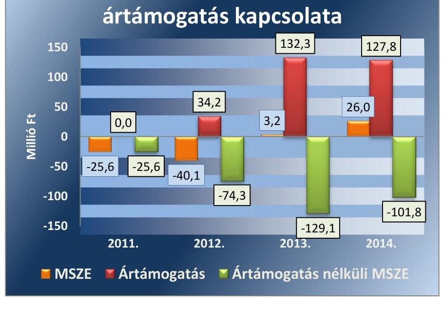

A kötelezettségek állománya alapvetően nem jelentett kockázatot a közfeladat ellátására, illetve a múködésre.

AZ ELADÓSODOTTSÁG MÉRTÉKE és szerkezete alapvetően nem jelentett kockázatot a közfeladat ellátására, mert az összes forráson belül az idegen tőke aránya minden évben alacsony volt. A kötelezettségek/saját tőke aránya minden ellenőrzött évben 1 alatti értékkel bírt.

---

A Társaság eladósodottságának évenkénti bemutatását az 3. ábra szemlélteti.
3. ábra
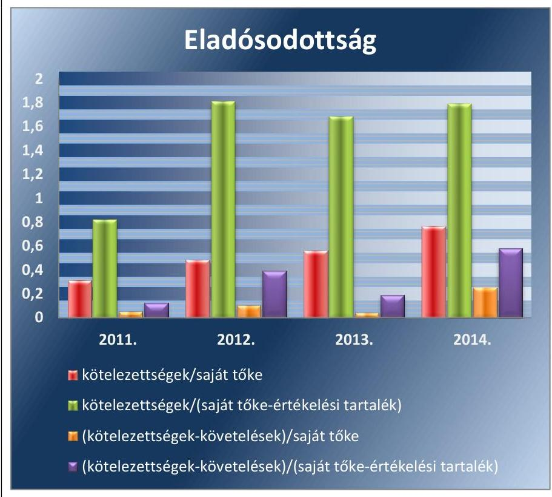

Forrás: Egyszerúsített éves beszámolók
Az értékelési tartalék nélküli saját tőke a 2011. év kivételével nem fedezte a kötelezettségeket. A kötelezettségek állománya 2011. január 1-je és 2014. december 31-e között 220,8\%-kal (66,5 M Ft-ról 213,3 M Ft-ra) nőtt. A kötelezettség állomány növekedését és összetétel átrendeződését elsődlegesen a tulajdonos Önkormányzattól kapott múködési és felhalmozási célú tagi kölcsön okozta. A Képviselő-testület a 2011. évben 10 M Ft, a 2012. évben 40 M Ft múködési célú, a 2013. és 2014. évben 100 -100 M Ft fejlesztési célú tagi kölcsönt hagyott jóvá. A tagi kölcsönöket az Önkormányzat a 2011. évben nyújtott kivételével határozatlan időre adta. A Társaság egyszerúsített éves beszámolóinak mérlegében a teljes fennálló kölcsön állománya a rövid lejáratú kötelezettségek között került kimutatásra, szemben a Számv. tv. 42. § (2)-(3) bekezdésben foglaltakkal. A kölcsönszerződések szerint a 2011-ben folyósított 10,0 M Ft múködési célú kölcsön kivételével a kölcsönök lejáratát nem határozták meg, ezért azok kimutatása a hosszú lejáratú kötelezettségek között indokolt.

A szállító állomány 5,7 M Ft-tal és az egyéb rövid lejáratú kötelezettség állomány 4,1 M Ft-tal növekedett az ellenőrzött időszakban, de a változás mértéke nem befolyásolta a rövid lejáratú kötelezettségek összetételét és szerkezetét.

A Társaság rendelkezett a társasági formájára előírt jegyzett tőkének megfelelő összegű saját tőkével az ellenőrzési időszak alatt.

---

HOSSZÚ LEJÁRATÚ KÖTELEZETTSÉGÉT a Társaság egyik évi egyszerűsített éves beszámolójában sem mutatta ki, mellyel megsértette a Számv. tv. 42. § (2)-(3) bekezdésének előírásait, tekintettel a tagi kölcsönök állományának nem megfelelő besorolására.

Rövid lejáratú kötelezettségeiből a jogszabályon alapuló egyéb rövid lejáratú kötelezettségeinek határidőben történő teljesítése biztosított volt, a szállítói kötelezettségek teljesítése viszont nem volt folyamatos. A 2013.évben kiugró 1,1 M Ft késedelmi kamatot keletkeztetett a szállítói késedelmes pénzügyi teljesítés. A 2012. és 2013. évben a rövid lejáratú kötelezettségekből a szállítói tartozások határidőben történő rendezése továbbra sem valósult meg teljes körűen, annak összege 2012-2013. évben 63,2 M Ft-ról 91,5 M Ft-ra növekedett.
2.4. számú megállapítás

A Társaság az éves beszámolóit - ennek keretében a tulajdonos felé történő beszámolást - a szabályoknak megfelelően elkészítette.

# BESZÁMOLÁSI, ADATSZOLGÁLTATÁSI ÉS JELENTÉSKÉSZÍTÉSI KÖTELEZETTSÉG az Alapító Okirat2-ben 

volt meghatározva. Az Alapítói Okirat 12.2. pontja az ügyvezető feladataként határozta meg a Számv. tv. szerinti beszámoló készítési, valamint az Önkormányzat felé előterjesztési kötelezettséget, végső határidejét április 30-ban rögzítette. Az Alapítói Okirat2-ban foglaltakon kívül az ellenőrzött időszakra vonatkozóan a Társaságnak - a szolgáltatási díjak indokolt megváltoztatását célzó Önkormányzat felé történő előterjesztési kötelezettség (2011. szeptember 30-ig) kivételével - nem volt az Önkormányzat részéről megfogalmazott egyéb adatszolgáltatási kötelezettsége.

Az Önkormányzat a távhőszolgáltatási közfeladat ellátásával kapcsolatosan sem fogalmazott meg adatszolgáltatási igényt, a Közüzemi szolgáltatási szerződés sem tartalmazott adatszolgáltatási kötelezettséget, ezért erre vonatkozóan szabályozást sem alakítottak ki.

Határidőben és az Alapító Okirat2-ben előírt adattartalommal teljesítette a Társaság az Önkormányzat felé a Számv. tv. szerinti 2011-2014. évi beszámoló készítés kötelezettségét: a mérleg, eredménykimutatás elkészítését és előterjesztési kötelezettségét. Az elkészített Számv. tv. szerinti beszámoló jóváhagyását a Képviselő-testület hatáskörébe utalta. Az Önkormányzat a beszámoló előterjesztésére határidőt és egyéb adatszolgáltatási kötelezettséget nem határozott meg.

## A TÁRSASÁG AZ EGYSZERŰSÍTETT ÉVES BESZÁ-

MOLÓIT ELKÉSZÍTETTE. A Számviteli politika-1-ben rögzítettekkel ellentétben 2011. évre vonatkozóan egyszerűsített éves beszámoló, valamint az eredmény kimutatás összköltség eljárással készült, annak ellenére, hogy a belső szabályozás a Számviteli politika-1-ben éves beszámoló készítési kötelezettséget, valamint az eredménykimutatás formáját forgalmi költség eljárással „A" változatban rögzítették. A Képviselő-testület minden évben a vonatkozó törvényi határidőben közzétett egyszerűsített éves beszámolókat megtárgyalta és határozatával elfogadta. A 2012. és a 2014. év vonatkozásában azonban az éves gazdálkodásról szóló beszámolók kiegészítő melléklete nem tartalmazta a Tszt.tv. 18/A. § (3) bekezdés szerinti kötelezően bemutatandó megbontást. A Társaság a 2012.évre vonatkozó ismételt letétbe helyezési kötelezettségét 2013. szeptember 09-

---

én, a 2014. évre vonatkozóan - miután a határidőben közzétett iratot töröltették - 2015. augusztus 18-án teljesítette. A másodszorra közzétett egyszerűsített éves beszámolókat a Képviselő-testület nem tárgyalta, határozattal nem fogadta el. A MEH ${ }^{41} / \mathrm{MEKH}^{42}$ részére a 2012. gazdálkodási évtől kezdődően él adatszolgáltatási, letétbe helyezési kötelezettség a Társaság számára, amelynek határidőben eleget tett.

# A TÁRGYÉVI EGYSZERŰSÍTETT ÉVES BESZÁ- 

MOLÓ JÓVÁHAGYÁSÁRA az FB jegyzőkönyv birtokában került sor. Az FB a Társaság egyszerűsített éves beszámolóját minden évben tárgyalta, az erről szóló véleményét, írásbeli jelentését az ülés jegyzőkönyve keretében készítette el. Ezáltal eleget tett a $\mathrm{Gt}_{2} 35$. § (3) bekezdés és a $\mathrm{Ptk}_{2}$ 3:120. § (2) bekezdésében megfogalmazott követelményeknek. A Képviselő-testülethez benyújtott elfogadási előterjesztés minden esetben tartalmazta a választott könyvvizsgáló jelentését, valamint könyvvizsgálati elemzést is a tulajdonos számára, a Számv. tv.17. § (1) bekezdésének megfelelően.

A közvagyon védelme érdekében nem történt kezdeményezés a Társaság legfőbb döntést hozó szervének összehívására. Az FB nem tapasztalt olyat, hogy az ügyvezető tevékenysége jogszabályba, Alapító Okirat3-be, a tulajdonos határozataiba ütközött, vagy az érdekeit sértette volna. A könyvvizsgáló nem prognosztizált jelentős vagyoncsökkenést, valamint nem állapította meg, hogy az ügyvezető vagy az FB tagjainak a $\mathrm{Gt}_{2} 44$. § (2) bekezdésében rögzített felelőssége fennáll.

## A KÖZVAGYONNAL KAPCSOLATOS ADATOK VÉ-

DELMÉRE, NYILVÁNOSSÁGRA HOZATALÁRA vonatkozó feladatát nem teljes körűen biztosította a Társaság. Az Avtv. ${ }^{43} 20$. § és 31/A § bekezdéseiben, valamint 2012. január 01-től az Info tv. ${ }^{44} 24$. § (3) és 30. § bekezdéseiben rögzítettekkel szemben szabályzatkészítéssel, belső szabályozással nem biztosította a különböző nyilvántartásokban kezelt adatállományok információ biztonsági védelmét. Nem alkalmazta a 18/2005.IHM rendelet 1. számú mellékletének tagolását, tartalmát, ezért nem került közzétételre többek között a közérdekú adatok megismerhetőségének rendje, a foglalkoztatottakra vonatkozó adatok, valamint az államháztartás pénzeszközei felhasználásával 5 M Ft-ot elérő szerződésekre vonatkozó adatok. A Tszt. 57/C § bekezdése alapján kötelező távhőszolgáltatással kapcsolatos megjelenítést nem teljesítették az Üzletszabályzat közzétételének kivételével. A Taktv. 2. § (1) bekezdése szerinti, vezető tisztségviselők, az FB tagok adataira valamint Taktv. 2. §-a (2) bekezdése szerinti, a bankszámla feletti rendelkezésre jogosult munkavállalókra vonatkozó közzétételi kötelezettség teljesült.

---

# 3. A gazdasági társaságnál az ellátott közfeladat bevételei és ráfordításai elszámolása, valamint az önköltségszámítás és árképzés szabályszerű volt-e? 

Összegző megállapítás

Az ellátott közfeladat bevételei és ráfordításai elszámolása az elkülönítési kötelezettségen kívül - megfelelt, a beruházások elszámolása nem felelt meg az előírásoknak, az árképzés gyakorlata 2011-12-ben nem felelt meg az előírásoknak.
3.1. számú megállapítás

Az ellátott közfeladat bevételeinek és ráfordításainak elszámolása - az elkülönítési kötelezettségen kívül - szabályszerű volt, a beruházások és felújítások elszámolása során jelentős hiányosságokat tárt fel az ellenőrzés.

A KÖZFELADAT RÁFORDÍTÁSAINAK ÉS BEVÉTELEINEK EGYÉRTELMÚ ELHATÁROLÁSÁT, számviteli szétválasztási módját, annak szabályait szabályzatban nem rögzítették. A Számviteli politika ${ }_{1-2}$ valamint a Számlarend számviteli szétválasztásra vonatkozó előírásokat nem tartalmazott. Ez a gyakorlat sérti a Számv. tv. 161/A § (1) bekezdése és 2012. január 1-től a Tszt. 18/A. §-ában foglalt előírásokat is. Nem volt biztosított az egyes tevékenységek átláthatósága és diszkrimináció mentessége, valamint fennállt a keresztfinanszírozás és versenytorzítás veszélye is. A Számviteli politika ${ }_{2}$ az eredménykimutatás öszszeállítására vonatkozó része tett arról röviden említést, hogy a költségek kiemelt tevékenységek szerinti szétbontására munkaszám rendszert alakítottak ki, a részletes kidolgozás hiányzott. A munkaszámrendszeren belül a „közös költségek" munkaszámra könyvelt költségek felosztásáról nem rendelkezett a Számviteli politika. A kialakított munkaszám rendszer az egyes területi ellátási egységek, lakókörzetek költségeinek szétválasztására alkalmas, szemben az elvárt szétválasztással (hőtermelés, távhőszolgáltatás,egyéb tevékenység). A 2012-2014. években a tevékenységenkénti adózás előtti eredmény alakulását a 4. ábra mutatja be.
4. ábra
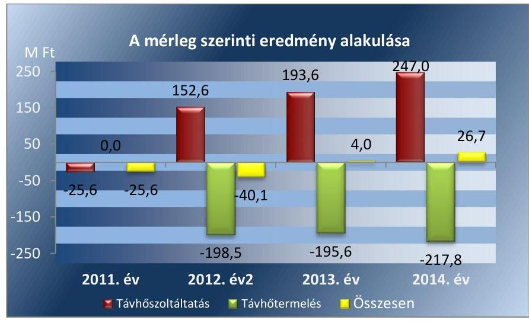

Forrás: A Társaság 2012-2014. évi beszámolói

---

A Társaság távhőszolgáltató tevékenységét kizárólag Sárvár város területén végezte, ezért a Tszt. 18/A. § (3) bekezdés b) pontja szerinti településenkénti szétválasztási kötelezettség rá nem vonatkozott.

# AZ ÉRTÉKESÍTÉS NETTÓ ÁRBEVÉTELE ELSZÁ- 

MOLÁSA során a Társaság összességében szabályszerűen járt el. A bevételek előírása és kiszámlázása az előírásoknak megfelelően, a Számv. tv. 72-74. §-a, valamint a Tszt. 18/A §. (2) bekezdésének megfelelően történt. A bevételeket a megfelelő számlacsoportban számolták el, a Számviteli politika ${ }_{1-2}$ és a Számlarend szerint. Az alkalmazott távhőszolgáltatási díjak megfeleltek a 2011. évben a Távhőrendeletben meghatározott díjtételeknek. Mintavételes tesztelésünk a bevételek esetében hibát nem talált, az értékesítés nettó árbevétele elszámolását megfelelőnek értékeltük.

## AZ ANYAGJELLEGŰ RÁFORDÍTÁSOK ELSZÁMOLÁSA során a Társaság szabályszerűen járt el. Érvényesültek a Számv. tv. 78. és a 81-82. §-ainak, valamint a Számviteli politika ${ }_{1-2}$ és a Számlarend előírásai. A költségeket a 2012. évtől kezdődően a főkönyvi számlák mellett, ezzel egyidejűleg elszámolták munkaszámokra is. A Tszt. 18/A §. (1) bekezdésében előírtak ellenére, azon területi egységnél, ahol hőtermelést és hőszolgáltatást is végeztek, utólag történt a szétválasztás, amely nem volt teljes körű. A beszerzések szerződéssel szabályszerűen alátámasztottak voltak. A mintatételek ellenőrzése során az anyagjellegú ráfordítások elszámolását megfelelőnek értékeltük.

A BERUHÁZÁSOK ÉS FELÚJÍTÁSOK elszámolása nem volt szabályszerű. A Társaság a beszerzések egy részéhez nem kért tulajdonosi hozzájárulást, az aktivált eszközök egy részénél nem határozott meg maradványértéket a (Számv.tv. 52. § (1)), nem megfelelő számlaszámra kontíroztak (Számv.tv. 24. §, 26. §), valamint nem minden esetben került kiállításra az üzembe helyezési okmány (Számv.tv. 165. § (1)-(2)). Az mintatételeken elvégzett ellenőrzésünk alapján a beruházások és felújítások elszámolását nem megfelelőnek minősítettük.

AZ ESZKÖZÖK ELHASZNÁLÓDÁSI FOKA a 2011-2013. évi 59,6-61,7\%-ról a 2014. évre 34,0\%-ra csökkent. A 2011-2012. évi veszteséges gazdálkodás miatt a beruházások, élettartam növelő felújítások nem az eszközök elhasználódásának megfelelő arányban történtek.

A közfeladathoz köthető vagyon évenkénti változását a 3. táblázat szemlélteti.
3. táblázat

KÖZFELADATHOZ KÖTHETŐ VAGYON VÁLTOZÁSAI (M FT/\%)

|  | 2011. | 2012. | 2013. | 2014. |
| :-- | --: | --: | --: | --: |
| Fejlesztési támogatás | 0,0 | 0,0 | 0,0 | 133,2 |
| Fejlesztés önerőből | 6,4 | 5,0 | 16,4 | 400,6 |
| Elszámolt értékcsökkenés | 7,4 | 6,7 | 6,9 | 26,1 |
| Eszköz érték változás | $-1,0$ | $-1,7$ | $-9,5$ | 374,5 |
| Elhasználódási fok (\%) | 59,6 | 61,5 | 61,7 | 34,0 |

---

A Társaság a 2011-2014. években az amortizációt a jogszabályi előírásoknak megfelelően szabályozta. A Társaság a Számviteli politika ${ }_{1-2}$-ben szabályozta az aktiválásra kerülő eszközök bekerülési értékének tartalmát és értékcsökkenési leírási kulcsát. A szabályozás megfelelt a Számv. tv 52.§ban foglalt előírásainak. Ugyanakkor a Társaság a gyakorlatban nem a Számviteli politika ${ }_{1-2}$-ben foglaltaknak megfelelően számította az értékcsökkenést, vagy határozta meg a maradványértéket. A tárgyi eszközök pótlása a 2011-2013. években alatta maradt az elszámolt értékcsökkenési leírásnak, saját finanszírozási források hiányában csak a legszükségesebb pótlásokat végezték el. A 2011-2013. években a használhatósági fok folyamatosan csökkent, a kazán, kazánház és hőközpontok használhatósági foka is romlott. A 2014. évben a KEOP beruházás következtében nagymértékben javult az eszközpótlás \%-a.

Az eszközpótlások arányát a 4. táblázat tartalmazza.
4. táblázat

# AZ ESZKÖZPÓTLÁSOK ARÁNYA (M FT/\%) 

| Megnevezés | 2011. | 2012. | 2013. | 2014. | Összesen |
| :--: | :--: | :--: | :--: | :--: | :--: |
| A tárgyévben a Társaság saját vagyona után elszámolt értékcsökkenés összege (M Ft) | 7,6 | 6,8 | 6,9 | 14,5 | 35,8 |
| A tárgyévben a saját tulajdonú eszközök pótlására elszámolt költség (M Ft) | 3,1 | 0,3 | 5,8 | 205,0 | 214,2 |
| Az eszközpótlás \%-a | 40,8 | 4,4 | 85,3 | 1413,8 | 598,3 |

A KÖVETELÉS ÁLLOMÁNY csökkentéséről az Nvtv. 7. §-ának előírásai alapján intézkedett a Társaság, beleértve a behajthatatlan követelések leírását is. A vizsgált években az Önkormányzatnak nem volt konkrét előírása a követelés állomány csökkentésére vonatkozóan.

A Társaság a fizetési határidőn túli követelésállományának hatékony kezelése és behajtása érdekében több megoldási lehetőséget (egyenlegközlő levél megküldése, felszólító levél megküldése, ügyvédi felszólító levél megküldése, fizetési meghagyás kibocsátása iránti kérelem kezdeményezése az illetékes bíróságnál, végrehajtási eljárás kezdeményezése) alkalmazott. A Társaság ellenőrzött időszakban nem rendelkezett a lejárt kintlévőség hatékony kezelését támogató kintlévőség kezelési szabályzattal, erre nem is volt kötelezett. A vizsgált években a követeléskezelés dokumentumokkal alátámasztott volt. A bírósági követelésekre a Társaság a rendelkezésére álló követelések korosítási információi alapján 20-100\% értékvesztést számolt el.

NYERESÉGKORLÁT vonatkozott a Társaságra, amelyet az 50/2011. (IX.30.) NFM rendelet 5 §-ában előírtak szerint betartott. A nyereségkorlát szintje 7,3 M Ft volt. A 2011-2013. években az adózás előtti eredmény a nyereségkorlát szintje alatti volt, míg a 2014. évben az adózás előtti eredmény túllépte a nyereségkorlát szintjét. A Társaság a 2014. évi nyereségkorlát feletti részt - kérelmet benyújtotta - beruházásra kívánta fordítani. Az NFM 5 § (5) bekezdése szerint a MEKH mentesítheti a távhőszolgáltatót a visszafizetési kötelezettség alól, ha az a nyereségkorlát

---

# 3.2. számú megállapítás 

feletti eredményét beruházásra fordítja a kérelem benyújtását követő harmadik év végéig.

A megállapított távhőszolgáltatási díjakat nem a szolgáltatások költségkalkulációjának alapul vételével határozta meg, a hatósági árat az előírásoknak megfelelően alkalmazták.

ÖNKÖLTSÉGSZÁMÍTÁS RENDJÉRE vonatkozó szabályzat készítésére a Társaság a Számv. tv. 14. § (6) bekezdésének előírása alapján nem volt kötelezett, önköltségszámítási szabályzatot nem készített és nem alkalmazott. A szabályzat hiánya a 2011-2012. évek vonatkozásában viszont a távhőszolgáltatási rendelet; 14. § (2) bekezdésébe ütközött. Az ellenőrzött években a Képviselő-testület részére benyújtott, a díjak meghatározására és a díjmódosításokra vonatkozó előterjesztések nem foglalták magukban a díjmegállapítás és díjmódosítás költségekre, árakra, díjakra vonatkozó összehasonlító elemzésen alapuló indokolását a Tszt. 6. § (2) bekezdésében, valamint az 57. § (1)-(3) bekezdésében előírtak ellenére.

A TÁVHŐSZOLGÁLTATÁS ÁRÁT az előírásokkal összhangban határozták meg. A Társaság az 50/2011. (IX.30.) NFM rendelet 4.§, a Tszt. 57/E. § (2) bekezdés és a Rezsi tv. 3. § (1) bekezdésében foglalt kötelezettségének eleget téve 2013-2014. években végrehajtotta a rezsicsökkentést.

A távhőszolgáltatás díjainak ármegállapítása az alapdíj és a hődíj vonatkozásában 2011. április 15-i hatállyal - a Tszt. 57/D. § alapján - önkormányzati hatáskörből miniszteri hatáskörbe került. A társaság a lakossági díjtételeket az 50/2011. (IX.30.) NFM rendelet 4. § bekezdésének megfelelően 2011. március 31-ével befagyasztotta. Ezt követően az 50/2011. (IX.30.) NFM rendelet 4. §-ban foglalt legmagasabb hatósági árkorlát alapján 2012. január 1-jétől 4,2\%-kal megemelte, azonban csak a hődíjak tekintetében. Az alapdíjak vonatkozásában a Tszt. 57/E. § (2) bekezdésének megfelelően megkülönböztetés-mentesen a 2011. december 31-én alkalmazott díjat számlázta a társaság. A 2012. évben az alapdíjak tekintetében a legmagasabb hatósági árat 2012. december hónapra alkalmazták.
2013. január 1-jétől - a Rezsi. tv ${ }^{45}$-ben előírt csökkentési korlátra vonatkozó előírást betartva - a Társaság a lakossági díjszabást a 2012. november 1-jén alkalmazott díjtételek 90\%-ára, 2013. november 1-jétől a 2013. október 31-én alkalmazott díjtételek 88,9\%-ára csökkentette. 2014. október 1-jétől a lakosság felé a 2013. november 1-jén alkalmazott díjtételek 96,7\%-át számlázták.

---

A 2012-2014. években a hődíjak alakulását az 5. ábra mutatja be.
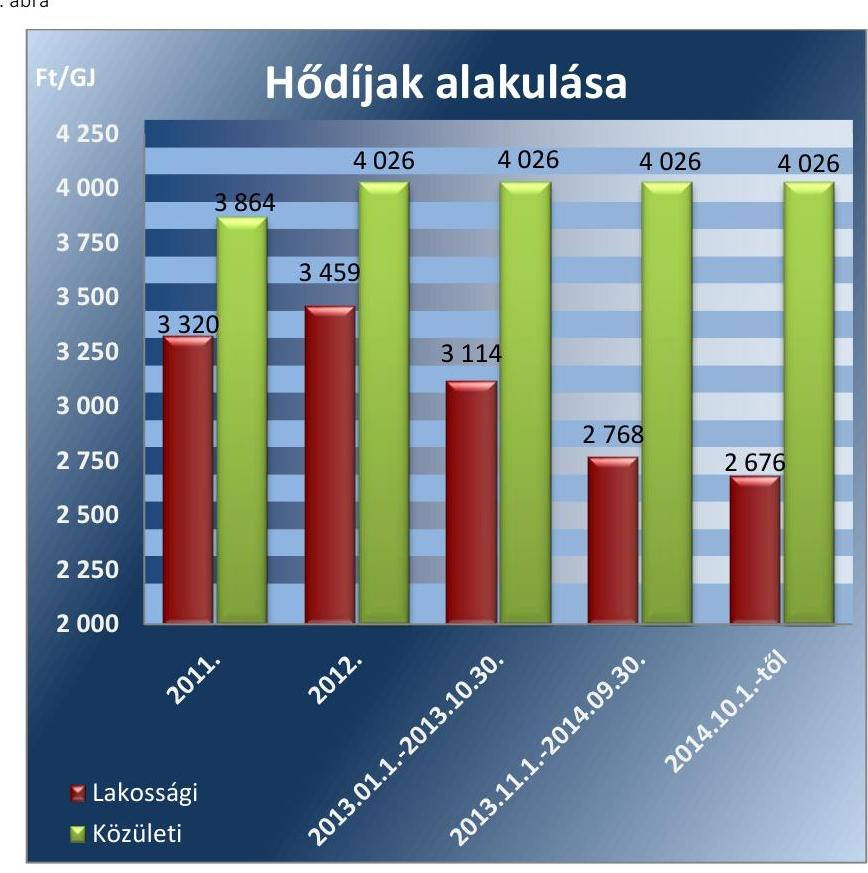

---

# JAVASLATOK 

Az ÁSZ tv. 33. § (1) bekezdésében foglaltak értelmében az ellenőrzött szervezet vezetője köteles a jelentésben foglalt megállapításokhoz kapcsolódó intézkedési tervet összeállítani és azt a jelentés kézhezvételétől számított 30 napon belül az ÁSZ részére megküldeni.
Az ÁSZ tv. 33. § (3) bekezdése szerint amennyiben az ellenőrzött szervezet vezetője nem küldi meg határidőben az intézkedési tervet vagy továbbra sem elfogadható intézkedési tervet küld, az ÁSZ elnöke
a) az ellenőrzött szervezet vezetőjével szemben büntető- vagy fegyelmi eljárás megindítását kezdeményezheti;
b) kezdeményezheti az illetékes hatóságnál, illetve szervezetnél az ellenőrzött szervezetet megillető, az államháztartás valamelyik alrendszeréből származó támogatások vagy egyéb juttatások folyósításának, illetve a személyi jövedelemadó 1\%-ából történő felajánlásokból való részesedés lehetőségének felfüggesztését.

Javaslataink célja a Sárvár Távhő Hőtermelő és Szolgáltató Kft. gazdálkodása szabályszerűségének helyreállítása annak érdekében, hogy a szabályozási környezet és gazdálkodási gyakorlat megfelelően tudja támogatni az átlátható működést.

## Sárvár Távhő Hőtermelő és Szolgáltató Kft. ügyvezetőjének

1. Intézkedjen a szabályozási hiányosságok megszüntetésére, ezen belül:
a) szabályozza - a jogszabályi előírások betartása érdekében - a számviteli politika keretében a piaci értéken történő értékelés lehetőségét, módszereit és előírásait;
(2.1. sz. megállapítás 6. bekezdése alapján)
b) egészítse ki - a jogszabályban előírtaknak megfelelően - a Számlarendet az alkalmazásra kijelölt számlák számjele és megnevezése teljes körüvé tételével;
(2.1. sz. megállapítás 7. bekezdése alapján)
c) alakítsa ki - a jogszabályban előírtaknak megfelelően - a számviteli szétválasztás helyi szabályait, az egyes társasági tevékenységekre elkülönült nyilvántartás és vezetése követelményeit;
(2.1. sz. megállapítás 6., 10. bekezdése és a 3.1. sz. megállapítás 1. bekezdése alapján)

---

d) módosítsa az üzletszabályzatot a 2011. április 15-től hatályos árképzéssel összefüggő változásoknak megfelelően;
(2.1. sz. megállapítás 9. bekezdése alapján)
e) szabályozza a különböző nyilvántartásokban kezelt adatállományok információ biztonsági védelmét.
(2.4. sz. megállapítás 7. bekezdése alapján)
2. Intézkedjen a jogszabályi előírások szerinti gyakorlat biztosítására, ezen belül:
a) végezze el az előírásokban kijelölt eszközcsoportok mennyiségi felvétellel történő leltározását;
(2.2. sz. megállapítás 2. bekezdése alapján)
b) tartsa be a hosszú és rövid lejáratú kötelezettségek besorolására vonatkozó jogszabályi előirást;
(2.3. sz. megállapítás 3. és 6. bekezdése alapján)
c) tartsa be a beruházások és felújítások elszámolásának előírásait;
(3.1. sz. megállapítás 5. bekezdése alapján)
d) teljesítse a jogszabályi előírásnak megfelelő számviteli szétválasztási kötelezettséget.
(3.1. sz. megállapítás 1. bekezdése alapján)
3. Intézkedjen a jogszabályi előírások szerint a közérdekủ adatok közzétételi kötelezettségének teljes körű biztosítására.
(2.4. sz. megállapítás 7. bekezdése alapján)

---

# Javaslataink célja az Önkormányzat szabályszerű működésének elősegítése, továbbá az önkormányzati tulajdonosi joggyakorlás kontrolljainak erősítése. 

## Sárvár Város Önkormányzata polgármesterének

1. Terjessze a Képviselő-testület elé döntéshozatalra a hatályos gazdasági program távhő közszolgáltatás biztosítására, színvonalának javítására vonatkozó fejlesztési elképzeléseket, a jogszabályban előírt követelmények biztosítása érdekében.
(1.1. sz. megállapítás 2. bekezdése alapján)
2. Terjessze a Képviselő-testület elé döntéshozatalra a jogszabályi előírások betartása érdekében a csatlakozási díj önkormányzati rendeletben történő szabályozását.
(1.2. sz. megállapítás 14. bekezdése alapján)
3. Terjessze a Képviselő-testület elé döntéshozatalra a jogszabályi előírások betartása érdekében azt az önkormányzati rendeletet, amely kijelöli azokat a területeket, ahol területfejlesztési, környezetvédelmi és levegő-tisztaságvédelmi szempontok alapján célszerű a távhőszolgáltatás fejlesztése.
(1.1. sz. megállapítás 10. bekezdése alapján)

## Sárvár Város Önkormányzata jegyzőjének

1. Készítse elő a hatályos gazdasági program távhő közszolgáltatás biztosítására, színvonalának javítására vonatkozó fejlesztési elképzeléseket, a jogszabályban előírt követelmények biztosítása érdekében.
(1.1. sz. megállapítás 2. bekezdése alapján)
2. Készítse elő a jogszabályi előírások betartása érdekében a csatlakozási díj - beleértve az új vagy növekvő távhőigénnyel jelentkező felhasználási hely tulajdonosától kérhető csatlakozási díj - önkormányzati rendeletben történő szabályozását.
(1.2. sz. megállapítás 14. bekezdése alapján)

---

3. Készítsen elő a jogszabályi előirás érvényesülése érdekében olyan önkormányzati rendeletet, amely kijelöli azokat a területeket, ahol területfejlesztési, környezetvédelmi és levegő-tisztaságvédelmi szempontok alapján célszerü a távhőszolgáltatás fejlesztése.
(1.1. sz. megállapítás 10. bekezdése alapján)

---

# MELLÉKLETEK 

- I. SZ. MELLÉKLET: ÉRTELMEZŐ SZÓTÁR
garancia

A garancia olyan önálló, az önkormányzat nevében vállalt kötelezettség, amely alapján az önkormányzat az önkormányzati költségvetés terhére szerződésben meghatározott feltételek szerint, a kötelezett nem teljesítése esetén a jogosultnak fizetést teljesít az előzetesen rögzített összeghatárig.
gazdasági társaság
gazdálkodó szervezet
keresztfinanszírozás tilalma
kezesség
közfeladat

A Gt. 3. § (1) bekezdése szerint „gazdasági társaságot üzletszerű közös gazdasági tevékenység folytatására külföldi és belföldi természetes és jogi személyek, valamint jogi személyiség nélküli gazdasági társaságok alapithatnak, müködő társaságba tagként beléphetnek, társasági részesedést (részvényt) szerezhetnek."
A Ptk. 685. § c) pontja szerint gazdálkodó szervezet: „az állami vállalat, az egyéb állami gazdálkodó szerv, a szövetkezet, a lakásszövetkezet, az európai szövetkezet, a gazdasági társaság, az európai részvénytársaság, az egyesülés, az európai gazdasági egyesülés, az európai területi együttmüködési csoportosulás, az egyes jogi személyek vállalata, a leányvállalat, a vízgazdálkodási társulat, az erdő birtokossági társulat, a végrehajtói iroda, az egyéni cég, továbbá az egyéni vállalkozó."
A közszolgáltatás díját úgy kell megállapítani, hogy az maradéktalanul fedezetet nyújtson a közszolgáltatás indokolt költségeire és ráfordításaira, valamint a közszolgáltató e tevékenységével kapcsolatos ésszerű nyereségére; az ésszerű nyereség nem tartalmazhatja a közszolgáltatáson kívül eső egyéb gazdasági tevékenységei költségeinek, ráfordításainak fedezetét.
A kezességre vonatkozó előírásokat a Ptk. 272-276. §-ai tartalmazzák. A kezesség a polgári jogban a szerződést biztosító járulékos mellékkötelezettség, amely egy másik kötelem teljesítését biztosítja azáltal, hogy a kezes a főadós nem teljesítése esetére kötelezettséget vállal a főadósi kötelem teljesítésére. A kezes tehát a főadóshoz képest járulékos adós. A kezesség kiterjed az elvállalása utáni mellékszolgáltatásokra, ha a kezes ezek kikötéséről tudott.
A Ptk. szerint kezességet csak írásban lehet vállalni. Lényeges, hogy a kezesség mindig az alapügylet hitelezője és a kezes közötti ingyenes szerződéssel jön létre. A kezesség a különböző hitelfelvételekhez kapcsolódóan a hitel visszafizetésének biztosítékaként jöhet szóba. Az adós helyett nemfizetés esetén a kezes felel, ő tartozik fizetni. Az egyszerű kezesség esetén előbb az adóson kell behajtani a tartozást, s ha ez sikertelen, akkor lehet a kezestől követelni a fizetést. Készfizető kezesség esetében a fizetést elmulasztó adós helyett rögtön a kezesen követelhetik a tartozást. Ha bank vállalja a kezességet, akkor az minden esetben készfizetői kezesség.
Jogszabályban meghatározott állami vagy önkormányzati feladat, amit az arra kötelezett közérdekből, jogszabályban meghatározott követelményeknek és feltételeknek megfelelve végez, ideértve a lakosság közszolgáltatásokkal való ellátását, továbbá az állam nemzetközi szerződésekben vállalt kötelezettségeiből adódó közérdekű feladatokat, valamint e feladatok ellátásához szükséges infrastruktúra biztosítását is (Nvtv. 3. § (1) bekezdés 7. pont).

---

közszolgáltatás

Közvetett tulajdon, illetve közvetett befolyás
meghatározó befolyás
minősített többséget biztosító befolyás

Minősített többséget biztosító részesedés

A közszolgáltatás: „közcélú, illetőleg közérdekü szolgáltatást jelent, amely egy nagyobb közösség (állam, település) minden tagjára nézve megközelítőleg azonos feltételek mellett vehető igénybe, ezért valamilyen mértékig közösségi megszervezést, illetve szabályozást, ellenőrzést igényel." Az Ebktv. 3. § d) pontja a következőképpen határozza meg a közszolgáltatást: „szerződéskötési kötelezettség alapján a lakosság alapvető szükségleteinek ellátására irányuló szolgáltatás, így különösen a villamos energia-, gáz-, hő-, víz-, szennyvíz- és hulladékkezelési, köztisztasági, postai és távközlési szolgáltatás, továbbá a menetrend alapján közlekedő jármúvekkel végzett közforgalmú személyszállítás"
Egy vállalkozás tulajdoni hányadának, illetőleg szavazati jogának a vállalkozásban tulajdoni részesedéssel, illetőleg szavazati joggal rendelkező más vállalkozás (köztes vállalkozás) tulajdoni hányadán, szavazati jogán keresztül történő gyakorlása. A közvetett tulajdon, a közvetett befolyás arányának megállapításához a közvetett tulajdonnal, közvetett befolyással rendelkezőnek a köztes vállalkozásban fennálló szavazati jogát vagy tulajdoni hányadát meg kell szorozni a köztes vállalkozásnak a vállalkozásban fennálló szavazati vagy tulajdoni hányada közül azzal, amelyik a nagyobb. Ha a köztes vállalkozásban fennálló szavazati vagy tulajdoni hányad az ötven százalékot meghaladja, akkor azt egy egészként kell figyelembe venni (a tőkepiacról szóló 2001. évi CXX. törvény 5. § (1) bekezdés 84. pont).
A Ptk2. 8:2. § (2) bekezdése szerint „A befolyással rendelkező akkor rendelkezik egy jogi személyben meghatározó befolyással, ha annak tagja vagy részvényese, és
a) jogosult e jogi személy vezető tisztségviselői vagy felügyelőbizottsága tagjai többségének megválasztására, illetve visszahívásra; vagy
b) a jogi személy más tagjai, illetve részvényesei a befolyással rendelkezővel kötött megállapodás alapján a befolyással rendelkezővel azonos tartalommal szavaznak, vagy a befolyással rendelkezőn keresztül gyakorolják szavazati jogukat, feltéve, hogy együtt a szavazatok több mint felével rendelkeznek."
3) A meghatározó befolyás akkor is fennáll, ha a befolyással rendelkező számára a (2) bekezdés szerinti jogosultságok közvetett módon biztosítottak. A befolyással rendelkezőnek egy jogi személyben a szavazatok több mint ötven százalékával közvetett módon való rendelkezése vagy egy jogi személyben közvetetten fennálló meghatározó befolyása megállapítása során a jogi személyben szavazati joggal rendelkező más jogi személyt (köztes vállalkozást) megillető szavazatokat meg kell szorozni a befolyással rendelkezőnek a köztes vállalkozásban, illetve vállalkozásokban fennálló szavazatával. Ha a köztes vállalkozásban fennálló szavazatok mértéke az ötven százalékot meghaladja, akkor azt egy egészként kell figyelembe venni."
A Gt. 52. § (2) bekezdése szerint minősített többséget biztosító befolyásnak számít, ha a minősített befolyásszerző az ellenőrzött társaságban - közvetlenül vagy közvetve - a szavazatok legalább hetvenöt százalékával rendelkezik.
A minősített befolyásszerző az ellenőrzött társaságban a szavazatok legalább hetvenöt százalékával rendelkezik. (Gt. 52. § (2) bekezdés)

---

Nemzeti vagyon

Többségi befolyást biztosító részesedés

Tulajdonosi joggyakorló

Nvtv. 1. § (2) bekezdése szerint:
„az állam vagy a helyi önkormányzat kizárólagos tulajdonában álló dolgok, az a) pont hatálya alá nem tartozó, állam vagy a helyi önkormányzat tulajdonában lévő dolog,
az állam vagy a helyi önkormányzatot tulajdonában lévő pénzügyi eszközök, továbbá az államot vagy a helyi önkormányzatot megillető társasági részesedések, az államot vagy a helyi önkormányzatot megillető bármely vagyoni értékkel rendelkező jogosultság, amelyet jogszabály vagyoni értékű jogként nevesít, Magyarország határa által körbezárt terület feletti légtér, az üvegházhatású gázok kibocsátási egységeinek kereskedelméről szóló törvény szerint kibocsátási egység és légiközlekedési kibocsátási egység, valamint az ENSZ Éghajlat változási Keretegyezménye és annak Kiotói Jegyzőkönyve végrehajtási keretrendszeréről szóló törvény szerinti kiotói egység,
állami vagy helyi önkormányzati fenntartású közgyűjtemény (muzeális intézmény, levéltár, közgyűjteményként müködő kép- és hangarchívum, valamint könyvtár) saját gyűjteményében nyilvántartott kulturális javak körébe tartozó dolog, a régészeti lelet,
a nemzeti adatvagyon körébe tartozó állami nyilvántartások fokozottabb védelméről szóló törvény szerinti nemzeti adatvagyon." (hatályos 2012. január 1-jétől, g) pont módosult 2012. június 30-tól)
A Ptk. 685/B. § (1) bekezdése szerint „többségi befolyás: az olyan kapcsolat, amelynek révén természetes személy, jogi személy vagy jogi személyiség nélküli gazdasági társaság (a továbbiakban együtt: befolyással rendelkező) egy jogi személyben a szavazatok több mint ötven százalékával vagy meghatározó befolyással rendelkezik."
Aki a nemzeti vagyon felett az államot vagy a helyi önkormányzatot megillető tulajdonosi jogok és kötelezettségek összességének gyakorlására jogosult (Vagyon tv. 3. § (1) bekezdés 17. pont).

---

II. SZ. MELLÉKLET: SÁRVÁR TÁVHŐ KFT. MŰKÖDÉSÉNEK FŐBB JELLEMZŐI (M FT / \%)

|  Sorszám | Megnevezés | 2011. | 2012. | 2013. | 2014.  |
| --- | --- | --- | --- | --- | --- |
|  1. | A gazdasági társaság tulajdonosi összetétele: |  |  |  |   |
|  2. | Önkormányzat megnevezése: |  | SÁRVÁR Város Önkormányzat |  |   |
|  3. | Önkormányzat tulajdoni részesedésének aránya | $\%$ | 100,0 |  |   |
|  4. | Önkormányzat tulajdoni részesedésének összege | M Ft | 75,3 |  |   |
|  5. | Más önkormányzatok, többcélú társulás megnevezése: |  |  |  |   |
|  6. | Más önkormányzatok, többcélú társulások tulajdoni részesedésének aránya | $\%$ |  |  |   |
|  7. | Más önkormányzatok, többcélú társulások tulajdoni részesedésének összege | M Ft |  |  |   |
|  8. | Gazdasági társaság megnevezése: |  |  |  |   |
|  9. | Gazdasági társaságok tulajdoni részesedés aránya | $\%$ |  |  |   |
|  10. | Gazdasági társaságok tulajdoni részesedés összege | M Ft |  |  |   |
|  11. | Egyéb tulajdonos megnevezése: |  |  |  |   |
|  12. | Egyéb tulajdonosok tulajdoni részesedés aránya | $\%$ |  |  |   |
|  13. | Egyéb tulajdonosok tulajdoni részesedés összege | M Ft |  |  |   |
|  14. | A gazdasági társaságnál a vizsgált évek során múködése megszűnt-e? (IGEN/NEM) |  | NEM |  |   |
|  15. | A tárgyévben a gazdasági társaság vagyonkezelésben lévő önkormányzati vagyon után elszámolt értékcsökkenés összege | M Ft | 0,0 |  |   |
|  16. | A tárgyévben az önkormányzati tulajdonú, gazdasági társaság által kezelt eszközök pótlására (karbantartás, felújítás, beruházás) elszámolt költség | M Ft | 0,0 |  |   |
|  17. | A tárgyévben a gazdasági társaság saját vagyona után elszámolt értékcsökkenés összege | M Ft | 7,6 | 6,8 | 6,9  |
|  18. | A tárgyévben a saját tulajdonú eszközök pótlására (karbantartás) elszámolt költség | M Ft | 3,1 | 0,3 | 5,8  |
|  19. | Értékesítés nettó árbevétele | M Ft | 382,5 | 333,0 | 312,9  |
|  20. | Múködési cash flow | M Ft |  | Nincs adat |   |

---

# FÜGGELÉK: ÉSZREVÉTELEK 

A jelentéstervezetet a Számvevőszék 15 napos észrevételezésre megküldte az ellenőrzött szervezet vezetőjének az ÁSZ tv. 29. §* (1) bekezdése előírásának megfelelően.
Az elfogadott észrevételek alapján a Számvevőszék módosította a jelentést.
A függelék tartalmazza az ellenőrzött észrevételeit, illetve az észrevételekre adott válaszlevelet.
$\qquad$ 1. Sárvár Város Önkormányzata Polgármestere írásban tett észrevétele.
$\qquad$ 2. Tájékoztatás az észrevétel kezeléséről a polgármesternek.

[^0]
[^0]:    * 29. § (1) Az Állami Számvevőszék az ellenőrzési megállapításait megküldi az ellenőrzött szervezet vezetőjének vagy az általa megbízott személynek, és annak, akinek személyes felelősségét állapította meg.
    (2) Az ellenőrzött szervezet vezetője és a felelősként megjelölt személy az ellenőrzés megállapításaira tizenöt napon belül írásban észrevételt tehet.
    (3) Az Állami Számvevőszék az észrevételre a beérkezésétől számított harminc napon belül írásban válaszol. A figyelembe nem vett észrevételeket köteles a jelentésben feltüntetni, és megindokolni, hogy azokat miért nem fogadta el.

---

# SÁRVÁR VÁROS ÖNKORMÁNYZATA 

9600 Sárvár, Várkerület 2. Pf. 78. Fax.: 95/320-230, Tel.:95/ 523-100

Iktatószámuk: V-0848-148/2016.

1283-1/2016.
Üi. Halászné Udvardi Sarolta
Tel:95/523-116

ÁLLAMI SZÁMVEVŐSZÉK DOMOKOS LÁSZLÓ ELNÖK ÚR RÉSZÉRE

## Budapest

## Tisztelt Elnök Úr !

Köszönettel vettük „Az önkormányzatok gazdasági társaságai - Az önkormányzatok többségi tulajdonában lévő gazdasági társaságok közfeladat ellátását érintő gazdálkodási tevékenysége szabályszerűségének ellenőrzése - Sárvár Távhő Hőtermelő és Szolgáltató Kft" címmel készített számvevőszéki jelentés tervezetüket. Az abban szereplő megállapítások, javaslatok áttanulmányozását követően az alábbi tiszteletteljes kérést fogalmazzuk meg:

Az önkormányzat szabályszerű működésének elősegítésére, továbbá az önkormányzati tulajdonosi joggyakorlás kontrolljainak erősítése érdekében tett javaslatok közül az Önkormányzat polgármesterének címzett 1. pont „Tegyen intézkedéseket az Társaság ügyvezetője részére képviselő-testületi döntés nélkül kifizetett jutalom tekintetében a felelősség tisztázása érdekében és szükség szerint intézkedjen a felelősség érvényesítéséről" javaslatot - tekintettel arra, hogy a Munka törvénykönyvéről szóló 2012. évi I. törvény 286.§ (1) bekezdése értelmében „A munkajogi igény három év alatt évül el"- kérjük a végleges jelentésben már ne szerepeljen.

Sárvár, 2016. február 18.
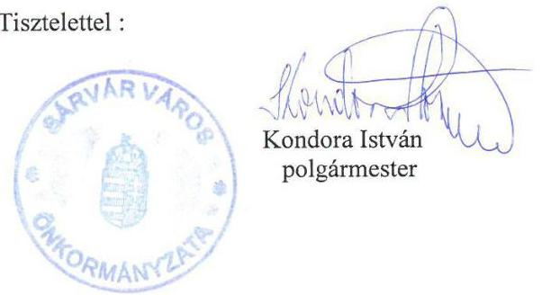

---

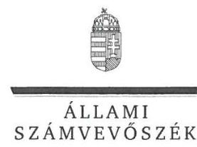

ELNÖK

Ikt.szám: V-0848-153/2016.

# Kondora István úr 

polgármester
Sárvár Város Önkormányzata

## Sárvár

## Tisztelt Polgármester Úr!

„Az Önkormányzatok gazdasági társaságai - Az önkormányzatok többségi tulajdonában lévő gazdasági társaságok közfeladat ellátását érintő gazdálkodási tevékenysége szabályszerűségének ellenőrzése - Sárvár Távhő Hőtermelő és Szolgáltató Kft." címmel készített számvevőszéki jelentéstervezetre tett észrevételeit köszönettel megkaptam.

Az Állami Számvevőszék észrevételekre vonatkozó álláspontjáról a felügyeleti vezető által készített részletes tájékoztatást mellékelten megküldöm.

Budapest, 2016. 03 hó 21 nap
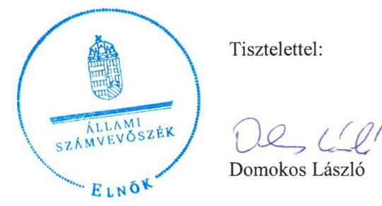

Melléklet: Tájékoztatás az észrevétel kezeléséről

---

# Tájékoztatás az észrevétel kezeléséről 

A „Jelentéstervezet az önkormányzatok többségi tulajdonában lévő gazdasági társaságok közfeladat ellátását érintő gazdálkodási tevékenysége szabályszerűségének ellenőrzése Sárvár Távhő Hőtermelő és Szolgáltató Kft." című jelentéstervezetre tett észrevételét áttekintettük, annak kezelésével kapcsolatban a következő tájékoztatást adom.

A polgármesteri észrevétel a neki címzett 1. számú javaslattal kapcsolatban arra irányult, hogy a munkajogi igény elévülése miatt a számvevőszéki javaslat ne szerepeljen a jelentésben. A dokumentumok ismételt áttekintését követően a jelentéstervezetből az erre vonatkozó javaslat törlésre kerül.

Budapest, 2016. 03 hó 21 nap
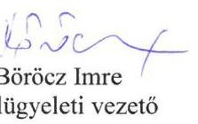

---

# RÖVIDÍTÉSEK JEGYZÉKE 

${ }^{1}$ Önkormányzat
${ }^{2}$ Társaság
${ }^{3}$ polgármester
${ }^{4}$ jegyző
${ }^{5}$ Tszt.
${ }^{6}$ Mótv.
${ }^{7}$ Alapító Okirat ${ }_{1}$
${ }^{8}$ gazdasági program ${ }_{1}$
${ }^{9}$ gazdasági program ${ }_{2}$
${ }^{10}$ Képviselő-testület
${ }^{11}$ Ötv.
${ }^{12}$ Integrált Városfejlesztési Stratégia
${ }^{13}$ vagyongazdálkodási terv
${ }^{14}$ Közüzemi szolgáltatási szerződés
${ }^{15}$ SZMSZ
${ }^{16}$ Üzletszabályzat
${ }^{17}$ Távhőrendelet
${ }^{18} \mathrm{Gt}_{.2}$
${ }^{19}$ Ptk. 2
${ }^{20}$ Vagyongazdálkodási rendelet ${ }_{1}$

Sárvár Város Önkormányzata
Sárvár Távhő Hőtermelő és Szolgáltató Kft
Sárvár Város Önkormányzatának polgármestere
Sárvár Város Polgármesteri hivatalának jegyzője
a távhőszolgáltatásról szóló 2005. évi XVIII. törvény (hatályos: 2005. július 1-jétől)
Magyarország helyi önkormányzatairól szóló 2011. évi CLXXXIX. törvény (hatályos: 2012. január 1-jétől, kivéve a 144. § (2) bekezdésben meghatározott paragrafusok, amelyek 2012. április 15-én, a (3) bekezdésben meghatározott paragrafusok, amelyek 2013. január 1-jén léptek hatályba, a (4) bekezdésben meghatározott paragrafusok a 2014. évi általános önkormányzati választások napján lépnek hatályba)
a Sárvár Távhő Kft. Alapító Okirata Elfogadva: a 85/1992. (X. 13.) számú képviselő-testületi határozattal
Gazdasági program Sárvár város fejlődésének a 2010 - 2014-es önkormányzati ciklusra tervezett lehetőségeiről. Elfogadva: az 59/2011. (III.24.) számú képviselőtestületi határozattal
Gazdasági program Sárvár város fejlődésének a 2014 - 2019-es önkormányzati ciklusra tervezett lehetőségeiről Elfogadva: a 17/2015. (II. 12.) számú képviselőtestületi határozattal
Sárvár Város Önkormányzatának Képviselő-testülete
a helyi önkormányzatokról szóló 1990. évi LXV. törvény (hatálytalan: a 2014. évi általános önkormányzati választások napjától)
Sárvár Város Integrált Városfejlesztési Stratégiája. Elfogadva: a 159/2008. (VI. 12. számú képviselő-testületi határozattal
Sárvár város Önkormányzata Képviselő-testülete 2013-2017; 2013-2022. időszakra szóló közép- és hosszú távú vagyongazdálkodási terve Elfogadva: a 30/2013. (II. 14.) számú képviselő-testületi határozattal. Módosította: a 67/2014. (III. 27.) számú képviselő-testületi határozat.

Sárvár Város Önkormányzata és a Sárvár Távhő Kft. között létrejött, a közüzemi szolgáltatás ellátására kötött megállapodás. Elfogadva: a 279/2009. (XI. 19.) számú képviselő-testületi határozattal
Sárvár Város Önkormányzata Képviselő-testületének 16/2007. (III. 22.) számú önkormányzati rendelete Sárvár Város Önkormányzata Szervezeti és Múködési Szabályzatáról (hatályos: 2007. IV. 1-től 2015. VII. 2-ig)
A Sárvár Távhő Kft. üzletszabályzata 2009.(hatályos: 2009. I. 01-től)
Sárvár Város Önkormányzata Képviselő-testületének 30/2007. (X. 25.) számú önkormányzati rendelete a távhőszolgáltatásról szóló 2005. évi XVIII. törvény helyi végrehajtásáról (hatályos: 2007. XI. 1-től)
a gazdasági társaságokról szóló 2006. évi IV. törvény
a Polgári Törvénykönyvről szóló 2013. évi V. törvény (hatályos: 2014. március 15étől)
Sárvár Város Önkormányzatának 6/2007. (I. 25.) rendelete az Önkormányzat vagyonáról, a vagyontárgyak feletti tulajdonosi jogok gyakorlásáról (hatályos: 2013. II. 18-ig)

---

${ }^{21}$ Vagyongazdálkodási rendelet ${ }_{2}$
${ }^{22}$ FB ügyrend
${ }^{23} \mathrm{FB}$
${ }^{24}$ Taktv.
${ }^{25}$ Javadalmazási szabályzat ${ }_{1}$
${ }^{26}$ Javadalmazási szabályzat ${ }_{2}$

Sárvár Város Önkormányzatának 3/2013 (II. 18.) rendelete az Önkormányzat vagyonáról, a vagyontárgyak feletti tulajdonosi jogok gyakorlásáról (hatályos: 2013. II. 19-től)

Sárvár Távhő Kft. Felügyelőbizottságának Ügyrendje. Elfogadva: a 34/2011. (II. 17.) képviselő-testületi határozattal. Hatályos: 2011. I. 01-től 2014. XII. 31.

Sárvár Távhő Kft. Felügyelőbizottsága
a köztulajdonban álló gazdasági társaságok takarékosabb müködéséről szóló 2009. évi CXXII. törvény

Sárvár Város Önkormányzata Képviselő-testületének Javadalmazási szabályzata. Elfogadva: a 10/2010. (I. 29.) számú képviselő-testületi határozattal (hatályos: 2010. I. 29-től 2013. IX. 26-ig)

Sárvár Város Önkormányzata Képviselő-testületének Javadalmazási szabályzata Elfogadva: a 208/2013. (IX. 26.) számú képviselő-testületi határozattal (hatályos:2013. IX. 27-től)
${ }^{27}$ Hőszolgáltatási és ármegállapítási célú megállapodás
Sárvár Város Önkormányzata és a Sárvár Távhő Kft. között létrejött, hőszolgáltatási és ármegállapítási célú megállapodás. Elfogadva: a 280/2009. (XI. 19.) számú képviselő-testületi határozattal
az államháztartásról szóló 2011. évi CXCV. törvény
a számvitelről szóló 2000. évi C. törvény
Sárvár Távhő Kft. Eszközök és források értékelési szabályzata (hatályos 2004.I.01-től)

Sárvár Távhő Kft. Pénzkezelési szabályzata (hatályos: 2004.I.01-től)
Sárvár Távhő Kft. Pénzkezelési szabályzata (hatályos: 2012.I.01.-től) 2012-2014 közötti egyszer módosult (a módosítás hatályos: 2012.XII.01-től)
Sárvár Távhő Kft. Leltárkészítési és leltározási szabályzata (hatályos: 2004.I.01től)
Sárvár Távhő Kft. Eszközök és források leltározási és selejtezési szabályzata (hatályos: 2012.I.01.-től)
Sárvár Távhő Kft. Számviteli politikája (hatályos: 2004.I.01-től)
SÁRVÁR TÁVHŐ Kft. Számviteli politika és értékelési szabályzata (hatályos: 2012.I.01-től), 2012-2014 közötti egyszer módosult (a módosítás hatályos: 2013.I.01-től)

Sárvár Távhő Kft. Számlarendje (hatályos: 2012.I.01-től)
Környezet és Energia Operatív Program
általános forgalmi adó
MAVIR Magyar Villamosenergia-ipari Átviteli Rendszerirányító Zártkörűen Müködő Részvénytársaság
Magyar Energia Hivatal
Magyar Energetikai és Közmű-szabályozási Hivatal
1992. évi LXIII. törvény a személyes adatok védelméről és a közérdekú adatok nyilvánosságáról
2011. évi CXII. törvény az információs önrendelkezési jogról és az információszabadságról szóló (hatályos: 2011.VII.27-től)
2013. évi LIV. törvény a rezsicsökkentések végrehajtásáról, hatályos 2013. május 10 -étől

---

ÁLLAMI SZÁMVEVŐSZÉK
1052 Budapest, Apáczai Csere János utca 10.
Levélcím: 1364 Budapest 4. Pf. 54
Telefon: +36 14849100 Telefax: +36 14849200
www.asz.hu