# Jelentés 

## Az önkormányzatok gazdasági társaságai

Az önkormányzatok többségi tulajdonában lévő gazdasági társaságok közfeladat ellátását érintő gazdálkodási tevékenysége szabályszerűségének ellenőrzése Kapuvári Hőszolgáltató Kft.
2016.
„A közfeladat ellátás szinvonala, költségeinek, ráfordításainak alakulása hatással van a szolgáltatást igénybe vevő lakosság elégedettségére. "

---

# Jelentés 

## Az önkormányzatok gazdasági társaságai

Az önkormányzatok többségi tulajdonában lévő gazdasági társaságok közfeladat ellátását érintő gazdálkodási tevékenysége szabályszerűségének ellenőrzése Kapuvári Hőszolgáltató Kft.
2016.  hó 31 nap
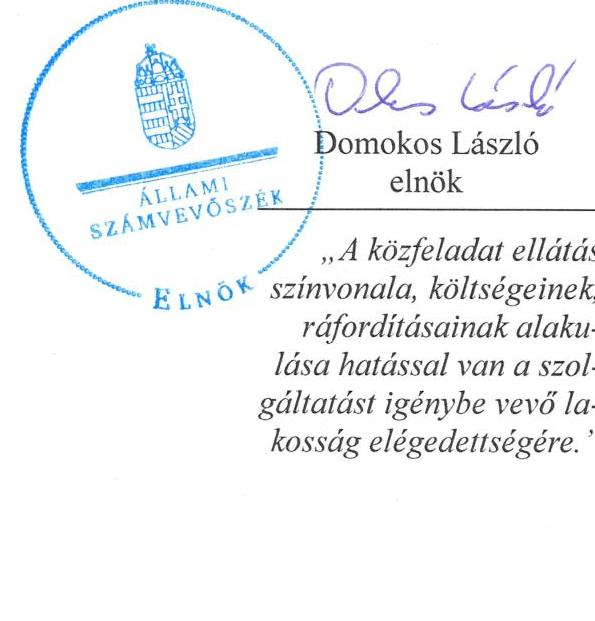

---

# AZ ELLENŐRZÉST FELÜGYELTE: 

BÖRÖCZ IMRE felügyeleti vezető

## AZ ELLENŐRZÉST VEZETTE ÉS A VÉGREHAJTÁSÁÉRT FELELŐS:

CZÉKUS BALÁZS ellenőrzésvezető

## A PROGRAM ÖSSZEÁLLÍTÁSÁÉRT FELELŐS:

JANIK JÓZSEF LÁSZLÓ osztályvezető

IKTATÓSZÁM: V-0843-166/2016
TÉMASZÁM: 1877.
ELLENŐRZÉS-AZONOSÍTÓ SZÁM: V-070707

---

# TARTALOMJEGYZÉK 

■ ÖSSZEGZÉS ..... 5
■ AZ ELLENŐRZÉS CÉLJA ..... 7
■ AZ ELLENŐRZÉS TERÜLETE ..... 8
■ AZ ELLENŐRZÉS HÁTTERE, INDOKOLTSÁGA ..... 10
■ FÓKUSZKÉRDÉSEK ..... 12
■ ELLENŐRZÉS HATÓKÖRE ÉS MÓDSZEREI ..... 13
■ MEGÁLLAPÍTÁSOK ..... 15
■ JAVASLATOK ..... 35
■ MELLÉKLETEK ..... 39
I. Sz. melléklet: Értelmező szótár. ..... 39
II. Sz. melléklet: KAPUVÁRI HŐSZOLGÁLTATÓ Kft. működésének főbb jellemzői (Adatok M Ft / %-ban) ..... 42
■ FÜGGELÉK: ÉSZREVÉTELEK ..... 43
■ RÖVIDÍTÉSEK JEGYZÉKE ..... 55

---

.

---

# ÖSSZEGZÉS 

Az Állami Számvevőszék ellenőrzése a távhőszolgáltatás közfeladatának ellátását értékelte a kizárólagos önkormányzati tulajdonú Kapuvári Hőszolgáltató Kft.-nél 2011-2014. évekre vonatkozóan. Kapuvár Városi Önkormányzat a közfeladat ellátását megszervezte, a tulajdonosi jogait alapvetően érvényesítette. A társaság szabályzatainak kialakítása nem volt teljes körű, vagyongazdálkodása alapvetően megfelelő volt. A kötelezettség állománya jelentős kockázatot jelentett a közfeladat ellátására. A távhőszolgáltatás számviteli elszámolásaiban hiányosságokat tapasztaltunk. A társaság a beszámolási kötelezettségeinek eleget tett.

## Az ellenőrzés társadalmi indokoltsága

Az Állami Számvevőszék középtávra szóló stratégiájában megfogalmazta, hogy a helyi önkormányzatok gazdálkodásában rejlő pénzügyi kockázatok feltárásával, az államháztartáson kívülre nyújtott költségvetési támogatások és ingyenes vagyonjuttatások, valamint az államháztartáson kívül működő közfeladat-ellátó rendszerek ellenőrzéseivel hozzájárul ahhoz, hogy a közpénzeket az államháztartáson kívül működő szervezetek is átlátható, rendezett módon használják fel a közfeladatok szerződésben vállalt ellátása érdekében.

A Magyarországon az intézmény-centrikus közfeladat ellátás jellemző, de egyre jelentősebb a költségvetésen kívüli feladatellátás térnyerése. Ennek legfontosabb szereplői - a nonprofit szervezetek mellett - az önkormányzati tulajdonú gazdasági társaságok. Az önkormányzatok szervezetalakítási szabadságának következménye, hogy a korábban is vállalati formában működő közszolgáltatások mellett, mind a kötelező, mind az önként vállalt feladatok ellátásában a gazdasági társaságok kiemelt fontosságú szerephez jutottak.

## Főbb megállapítások, következtetések, javaslatok

Az Önkormányzat közfeladat megszervezéséről hozott döntése keretében sem a gazdasági programjában, sem a „Kapuvár Város Környezetvédelmi Programja 2011-2014"-ben nem fogalmazott meg a távhőszolgáltatás fejlesztésével kapcsolatos részletes stratégiai célokat és feladatokat. A szolgáltatási szerződés meghatározta a távhő- és melegvizszolgáltatás időtartamát, a teljesítendő közszolgáltatási kötelezettséget, az ellátási területeket. Képviselő-testület késve alkotta meg a távhőszolgáltatási rendeletét, amely nem tartalmazta a csatlakozási dijat és feltételrendszerét. Rendeletben nem jelölte ki a területfejlesztési, környezetvédelmi és levegő-tisztaságvédelmi területek szerinti távhőszolgáltatás fejlesztését.

A tulajdonosi joggyakorlás rendjét a vagyonrendeletben meghatározta, felügyelő bizottságot létrehozott, könyvvizsgálót választott, javadalmazási szabályzatot készíttettek. Az árképzést távhőszolgáltatási rendeletben biztosította, ennek ellenére nem volt biztosított a pontos utókalkuláció készítése és az elszámoltathatóság, átláthatóság. Az Önkormányzat minden évben beszámoltatta a társaságot végzett tevékenységéről. A belső ellenőrzést a Polgármesteri Hivatal Ellenőrzési Osztálya végezte, társaság intézkedési tervet készített. Az Önkormányzat 2011-ben törzstőkét emelt, és tőketartalékba befizetést teljesített. A folyószámla fedezet biztosítása céljából az Önkormányzat készfizető kezességet vállalt.

Az ágazati és számviteli szabályzatainak jelentős részét a társaság az alapításakor elkészítette. A számviteli politika megfelelt az előírásoknak, de számlarenddel 2011-2012-ben nem rendelkezett, leltározási szabályzatát nem módosították, eszközök és források értékelési szabályzatát késve, csak 2013-ban alkotta meg. Önköltség számítási szabályzat készítésére a számviteli törvény alapján nem volt kötelezett, de a távhőszolgáltatási rendelet alapján igen, amelyet 2011. és 2012. években nem készítette el. Elkülönített nyilvántartás készítését a társaság belső szabályzataiban

---

nem írták elő, a távhőtermelési és távhőszolgáltatási számviteli szétválasztási szabályt fokozatosan alkották meg: 2012-ben nem volt, 2013-ban csak telephelyre, 2014-ben telephelyre és tevékenységre is.

Szolgáltatási szerződés keretében üzemeltette a tevékenység végzéséhez szükséges eszközöket. Alapításakor a vagyoni elemek az Önkormányzat tulajdonába maradtak. Az előírt egyeztetési és beszámolási kötelezettségeit teljesítette.

A kötelezettségek állománya jelentős kockázatot jelentett a közfeladat ellátására, illetve a működésre. A rövid lejáratú kötelezettségek összegét felvett hitel és a szállítói tartozások késedelmes teljesítése határozta meg. A társaság saját tőkéje meghaladta az előírt jegyzett tőke értékét.

Üzleti tervét a társaság minden évben elkészítette, de a hőtermelést és a hőszolgáltatást nem tervezte elkülönítetten. A végzett tevékenységről, a végrehajtott fejlesztésekről az egyszerűsített éves beszámolóval egyidejűleg készített beszámolót a tulajdonosnak, közzétételére vonatkozó kötelezettségének eleget tett.

A közfeladatok ráfordításainak és bevételeinek egyértelmű elhatárolásához szükséges előírásokat 2011-2012. években nem, 2013-ban kizárólag a telephelyek vonatkozásában határozták meg. A tevékenységek szerinti szétválasztás 2014-től valósult meg. Az értékesítés nettó árbevétele és az anyagjellegű ráfordítások elszámolása az ellenőrzött minták alapján kockázatos volt. A beruházások és felújításoknál tételes ellenőrzés történt, több hiányosságot tapasztaltunk. A társaság tulajdonában levő eszközökön valós használhatósági fok nem mérhető, mert az üzemeltetett rendszert az Önkormányzat tartja nyilván. A követelés állomány csökkentésére a társaság 2011-2014. években intézkedett, szabályt hozott, ennek ellenére folyamatosan nőtt az 1 éven túli követelések állománya. Nyereségkorlát feletti adózás előtti eredményt ért el a társaság 2013. évben, a nyereségkorlátot meghaladó eredmény visszafizetésére volt kötelezett.

A társaság nem rendelkezett önköltség-számítási szabályzattal, az Önkormányzat nem ellenőrizte a távhőszolgáltatás díja kiszámításának alapjául szolgáló kalkuláció helyességét. A távhőszolgáltatás árát a társaság az előírásokkal összhangban határozta meg 2012-2014-ben, végrehajtotta a rezsicsökkentést.

Az ÁSZ a gazdálkodás szabályszerűségének javítása és a megfelelő gazdálkodási gyakorlat érdekében a társaság ügyvezetőjének, az Önkormányzat szabályszerű működésének elősegítésére, továbbá az önkormányzati tulajdonosi joggyakorlás kontrolljainak erősítésére Kapuvár Város polgármesterének, továbbá Kapuvár Város jegyzőjének fogalmazott meg javaslatokat.

A jelentésben szereplő javaslatok alapján a társaság ügyvezetője és Kapuvár Város polgármestere kötelesek intézkedési terveket összeállítani és azokat a jelentés kézhezvételétől számított 30 napon belül az ÁSZ részére megküldeni.

---

# AZ ELLENŐRZÉS CÉLJA 

## A társaság közfeladat ellátását érintő gazdálkodási tevékenysége szabályszerűségének értékelése

Az ellenőrzés célja annak értékelése, hogy az Önkormányzat a jogszabályi előírások figyelembevételével döntött-e az ellenőrzésre kerülő közfeladat megszervezéséről; az Önkormányzat/tulajdonosi joggyakorló szabályszerűen gyakorolta-e a tulajdonosi jogokat.

Ellenőriztük, hogy a gazdasági társaság közfeladat ellátása bevételeinek, ráfordításainak elszámolása, és vagyongazdálkodási tevékenysége megfelelt-e a jogszabályi, illetve a közszolgáltatási/vagyonkezelési szerződésben foglalt tulajdonosi előírásoknak, azok végrehajtása szabályszerű volt-e.

Értékeltük továbbá, hogy a gazdasági társaság kötelezettségállománya jelent-e kockázatot a működésre, illetve a közfeladat ellátására; valamint a közfeladatok átláthatósága és elszámoltathatósága érdekében biztosítva volt-e a közszolgáltatás díjának megalapozottsága szabályszerű önköltségszámítással.

---

# **AZ ELLENŐRZÉS TERÜLETE**

## **Kapuvár Városi Önkormányzat és a kizárólagos tulajdonában lévő Kapuvári Hőszolgáltató Kft.**

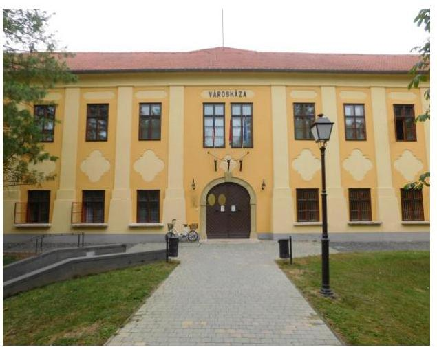

Kapuváron a távhőellátási rendszert 1996 és 2009 nyára között két olyan gazdasági társaság üzemeltette, amelyben nem rendelkezett tulajdoni hányaddal az Önkormányzat¹. Tekintettel arra, hogy a távhő- és használati melegvíz szolgáltatás biztosítása a korábbi konstrukcióban veszélybe került, Kapuvár Városi Önkormányzat Képviselő-testülete 100%-os önkormányzati tulajdonú gazdasági társaság létrehozásáról döntött és 0,5 M Ft alaptőkével megalapította a Kapuvári Hőszolgáltató Kft-t. A társaság² 2009. június 29.-én kezdte meg tevékenységét, ami gőzellátás, légkondicionálás volt. A távhőszolgáltatási feladatok ellátásához szükséges közművagyon az Önkormányzat tulajdonában maradt, azt üzemeltetésre adta át a társaságnak ellenszolgáltatás nélkül.

**A TÁRSASÁG** 2014. évben 267 lakossági-, 23 közületi fogyasztót és 9 külön kezelt intézményt látott el távhővel a közel 10,5 ezer lakosú város közigazgatási területén. A hőenergiát 2011-ben négy kazánházban állították elő, ami 2012 novemberétől háromra csökkent, így hőenergia beszerzésére volt szükség a távhőszolgáltatás zavartalan biztosítása érdekében. A három fő dolgozói létszám 2013-tól két főre csökkent.

A társaság 2011. és 2014. évi árbevétel adatait, illetve a 2011. január 1-jei és 2014. december 31-i mérlegadatokat az 1. ábra mutatja.

1. ábra

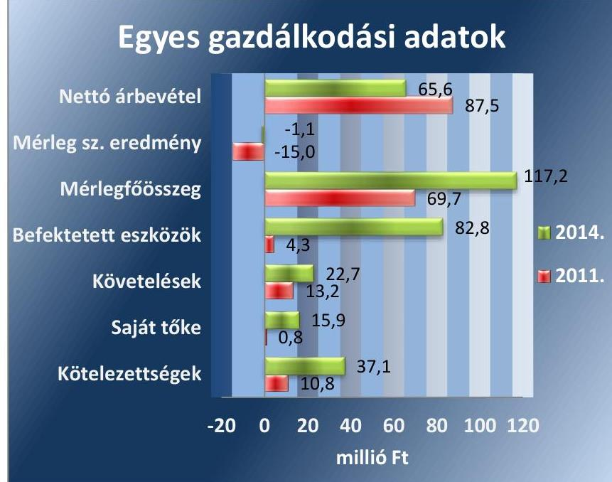

*Forrás: Kapuvári Hőszolgáltató Kft. éves beszámolói*

---

A társaságnál az értékesítés nettó árbevétele 2011 és 2014 között 25,0\%-kal, 21,9 M Ft-tal csökkent. A hatósági árszabályozás bevezetése miatt kieső bevételek pótlására nyújtott távhőszolgáltatási támogatással együtt 11,9\%-kal, 10,8 M Ft-tal nőtt az összes bevétel nagysága. Az eszközökön belül a befektetett eszközök állományának értéke közel húszszorosára (78,5 M Ft-tal), a követelésállomány 72,0\%-kal (9,5 M Ft-tal) növekedett. A saját tőke 15,1 M Ft-tal, a kötelezettségek állománya 26,3 M Ft-tal nőtt.

A társaság tulajdonosi részesedéssel más gazdasági társaságban nem rendelkezik.

Az ellenőrzött időszakban a polgármester ${ }^{3}$ és a jegyző ${ }^{4}$ személye nem változott. A polgármester a 2006. évi önkormányzati választások óta tölti be tisztségét, a munkakört betöltő címzetes főjegyző 1996. óta látja el feladatát. A jelenlegi ügyvezető ${ }^{5}$ - a 2013. március 11. és 2013. április 30. közötti időszak kivételével - az alakulása óta vezeti a társaságot megbízási jogviszonyban.

---

# AZ ELLENŐRZÉS HÁTTERE, INDOKOLTSÁGA 

Objektív kép kialakítása Kapuvár Városi Önkormányzat távhőszolgáltatási közfeladatának megszervezéséről, tulajdonosi joggyakorlásáról, valamint a kizárólagos tulajdonában lévő Kapuvári Hőszolgáltató Kft. közfeladat ellátását érintő gazdálkodási tevékenységének szabályszerűségéről.

## A gazdasági társaságok a közfeladatok ellátásában kiemelt fontosságú szerephez jutottak

Az ÁSZ. tv. 2011. január 1-jétől hatályos módosítása teremtette meg az önkormányzati tulajdonú gazdasági társaságok teljes körű ellenőrzésének lehetőségét. A közfeladatot ellátó gazdasági társaságok ellenőrzése kiemelten fontos a vagyon megőrzése, megóvása érdekében, valamint a kormányzati szektor elszámolásaiban megjelenő önkormányzati tulajdonú gazdálkodó szervezetek esetében, amelyekkel szemben alapvető követelmény, hogy gazdálkodásuk, működésük szabályszerű, az általuk szolgáltatott adatok minél megbízhatóbbak legyenek. A közfeladat ellátás költségeinek, ráfordításainak alakulása, színvonala hatással van a lakosság elégedettségére.

Az ÁSZ stratégiájában megfogalmazta, hogy a helyi önkormányzatok gazdálkodásában rejlő pénzügyi kockázatok feltárásával, az államháztartáson kívülre nyújtott költségvetési támogatások és ingyenes vagyonjuttatások, valamint az államháztartáson kívül működő közfeladat-ellátó rendszerek ellenőrzéseivel hozzájárul ahhoz, hogy a közpénzeket az államháztartáson kívül működő szervezetek is átlátható, rendezett módon használják fel.

A közfeladatok gazdasági társaságokba történő kiszervezésével a gazdálkodás, a pénzügyi helyzet kockázatai kikerültek az önkormányzati alrendszerből, mely az ÁSZ figyelmét az önkormányzatok többségi tulajdonában lévő gazdasági társaságai közfeladat ellátását érintő tevékenységére irányította. Az önkormányzatok gazdasági társaságai közfeladat ellátását érintő gazdálkodási tevékenysége szabályszerűségére irányuló ellenőrzéseket erre tekintettel a 2011. évtől végezzük.

A konstrukciós kockázatok feltárásával az ellenőrzés illeszkedik az ÁSZ középtávra szóló stratégiájához. A működési és pénzügyi kockázatok feltárásával hasznosítható munícióval szolgálhat a Kormány 2013-tól elindított rezsicsökkentési törekvéseihez.

## AZ ELLENŐRZÉS VÁRHATÓ HASZNOSULÁSA-

ként meghatározhatóvá válnak a közfeladat ellátásban részt vevő államháztartáson kívüli szervezeteknek - az önkormányzat költségvetését, pénzügyi helyzetét is befolyásoló - kockázatai, lehetővé válik ezen kockázatok csökkentése. Feltárja, hogy az önkormányzat közfeladat ellátási kötelezettségének szabályszerűen tett-e eleget, a feladatellátáshoz rendelt közvagyon működtetését szabályszerűen szervezte-e meg és a tulajdonosi

---

felügyelete hozzájárult-e a közfeladat ellátásához. A feladatot ellátó gazdasági társaság a közszolgáltatási szerződésben foglaltak betartásával, a közvagyon használatával biztosította-e a szolgáltatás folytatásának feltételeit. Ezzel az ellenőrzöttek és a helyi döntéshozók számára visszajelzést ad
 feladatszervezési, feladat-ellátási kockázataikról, alapot ad a meglévő hibák megszüntetéséhez, a jobb közfeladat-ellátás biztosításához. Fokozza a fegyelmet, igazolja, hogy lejárt a következmények nélküli ellenőrzések időszaka. A törvényalkotás számára - az észlelt problémák, szabálytalanságok, vagy egyéb nem kívánatos jelenségek felszínre kerülésével - az ellenőrzés megállapításai segítséget nyújthatnak az államháztartáson kívüli közfeladat-ellátás értékeléséhez, jogszabályi keretei pontosításához, átláthatóságot biztosító szabályozásához. Az ÁSZ értékteremtő rend kialakításához és megőrzéséhez hozzájáruló tevékenysége pozitív hatással van a szervezetről kialakított összkép formálására is.

Mindezeken keresztül az ÁSZ hozzájárul Magyarország közpénzügyi helyzetének javításához, a közpénzek mérhető módon történő, a döntéshozók által meghatározott célok szerinti felhasználásához.

---

# FÓKUSZKÉRDÉSEK 

1.     - Az Önkormányzat közfeladat-megszervezéséről szóló döntése, valamint tulajdonosi joggyakorlása szabályszerű volt-e?
2.     - A gazdasági társaság vagyongazdálkodása szabályszerű volt-e, kötelezettségállománya jelentett-e kockázatot a működésre, illetve a közfeladat-ellátásra?
3.     - A gazdasági társaságnál az ellátott közfeladat bevételei és ráfordításai elszámolása, valamint az önköltségszámítás és árképzés szabályszerű volt-e?

---

# ELLENŐRZÉS HATÓKÖRE ÉS MÓDSZEREI 

## Az ellenőrzés típusa

Megfelelőségi ellenőrzés

## Az ellenőrzött időszak

2011. január 1-jétől 2014. december 31-ig

## Az ellenőrzés tárgya

Az ellenőrzés tárgya annak megállapítása, hogy az önkormányzat közfeladat-ellátási kötelezettségének szabályszerűen tett-e eleget, a feladatellátáshoz rendelt közvagyon működtetését szabályszerűen szervezte-e meg és a tulajdonosi felügyelete hozzájárult-e a közfeladat-ellátáshoz. A feladatot ellátó gazdasági társaság a közszolgáltatási szerződésben foglaltak betartásával biztosította-e a szolgáltatást, valamint vagyongazdálkodása bevételeinek és ráfordításainak elszámolása szabályszerű és átlátható volt-e.

Az ellenőrzés kiterjed minden olyan körülményre és adatra, amely az ÁSZ jogszabályban meghatározott feladatainak teljesítéséhez, valamint a program végrehajtása folyamán felmerült újabb összefüggések feltárásához szükséges.

## Az ellenőrzött szervezet

Kapuvár Városi Önkormányzat és a
Kapuvári Hőszolgáltató Kft.

## Az ellenőrzés jogalapja

Az ellenőrzés jogszabályi alapját az Állami Számvevőszékről szóló 2011. évi LXVI. törvény 5. § (3)-(4)-(5) bekezdései képezik.

## Az ellenőrzés módszerei

Az ellenőrzést a nemzetközi standardokat irányadónak tekintve az ellenőrzési program ellenőrzési kérdései, az ellenőrzött időszakban hatályos jogszabályok, az ellenőrzés szakmai szabályok és módszertanok figyelembe vételével végezzük.

---

Az ellenőrzés ideje alatt az ellenőrzött szervezettel történő kapcsolattartást az ÁSZ Szervezeti és Működési Szabályzatának vonatkozó előírásai alapján biztosítjuk.

Az ellenőrzés a kiválasztott, többségi tulajdonosi jogokat gyakorló önkormányzatra, illetve az ellenőrzésre kijelölt közfeladatot ellátó gazdasági társaság felett tulajdonosi jogokat gyakorló szervezetre és az ellenőrzött közfeladatot ellátó gazdasági társaságra terjed ki. Amennyiben a gazdasági társaságban több önkormányzat együttesen többségi tulajdonos, úgy az ellenőrzést a többségi tulajdonosi jogokat gyakorló önkormányzatnál kell lefolytatni. Az ellenőrzött gazdasági társaságnál, amennyiben az több közfeladatot is ellát, akkor az ellenőrzésre kiválasztott közfeladat ellátást ellenőrizzük.

Az ellenőrzést a kérdésekre adott válaszok kiértékelésével, valamint a megjelölt adatforrások, a csatolt tanúsítványok felhasználásával, továbbá az adott időszakban hatályos jogszabályok figyelembe vételével kell lefolytatni. Az ellenőrzési kérdések megválaszolásához szükséges bizonyítékok megszerzése a következő ellenőrzési eljárások alkalmazásával történik: megfigyelés, kérdésfeltevés (információkérés), összehasonlítás, valamint elemző eljárás.

A bevételek és ráfordítások elszámolása, valamint a vagyonnyilvántartás terén az egyes területek szabályszerű működését mintavétellel ellenőriztük, ez alapján a sokaságokban előforduló hibás tételek arányát becsültük. A jogszabályoknak és a belső előírásoknak megfelelőnek, azaz szabályszerűnek tekintettük az adott bevételek és ráfordítások elszámolását, a vagyonnyilvántartást, amennyiben a minta ellenőrzésének eredménye alapján 95%-os bizonyossággal a teljes sokaságban a hibás tételek aránya kisebb volt, mint 10%, nem megfelelőnek értékeltük, ha a hibás tételek aránya a 10%-ot meghaladta. Kockázatot, illetve magas kockázatot jeleztünk, amennyiben egy adott terület vonatkozásában a minta alapján a teljes sokaságban nem volt teljes körűen biztosított a jogszabályoknak és a belső szabályzatoknak megfelelő működés.

---

# 1. Az Önkormányzat közfeladat megszervezéséről szóló döntése, valamint tulajdonosi joggyakorlása szabályszerű volt-e? 

## Összegző megállapítás

1.1. számú megállapítás

1. táblázat

## ALAPÍTÓ OKIRAT MÓDOSÍTÁSOK

Módosítás
előpontja
2009.09.24. Telephelyek pótlása
2011.06.10. Törzstőke megemelése Pótbefizetési lehetőség
2012.11.13. Telephely megszűnése F8 4 főre nő
2013.03.11. Ügyvezető változása F8 3 főre csökken
2013.04.29. Ügyvezető változása F8 4 főre nő
Fonrás: Alapító okiratok

Az Önkormányzat a közfeladat-ellátást megszervezte, a vonatkozó döntései és a tulajdonosi joggyakorlás egyes elemei alapvetően szabályszerűek voltak.

A távhőszolgáltatás megszervezése, az ellátandó feladatok meghatározása és ellátási rendszerének kialakítása, az önkormányzati rendeletben történő szabályozási kötelezettségek teljesítése hiányosságokkal, de alapvetően megfelelő volt.

A GAZDASÁGI PROGRAM${ }^{8}$-ban az Ötv. 7. 91. § (6) bekezdésében foglaltak ellenére az Önkormányzat nem fogalmazott meg 2011-2014. évekre vonatkozóan a távhőszolgáltatás, mint kötelezően ellátandó közfeladat fejlesztésével kapcsolatos elképzeléseket, a közszolgáltatás biztosítására, színvonalának javítására vonatkozó megoldásokat.

Kapuvár város honlapján${ }^{8}$ megtalálható „Kapuvár Város Környezetvédelmi Programja 2011-2014", amely a távhőrendszer fejlesztésével kapcsolatos egy adott KEOP pályázat keretében felújítandó hőközpontok és távvezeték szakaszok cseréjét tartalmazta. További, a távhőrendszer fejlesztési irányáról szóló elképzeléseket nem tartalmazott. A Képviselő-testület a környezetvédelmi programot${ }^{9}$ 2012. február 27.-i ülésén fogadta el.

Kapuvár város illetékességi területén a távhőszolgáltatással ellátott létesítmények távhőellátásának biztosítása - a Tszt.${ }^{10}$ 6. § (1) bekezdése szerint - az Önkormányzat kötelező feladata volt. A távhőszolgáltatási rendelet${ }_{1}{ }^{11} 2^{12}$. 3. §-a alapján a távhőszolgáltatás közfeladat-ellátását távhőszolgáltató közmű üzemeltetésére engedélyt kapott gazdasági társaságon keresztül valósították meg.

A Képviselő-testület - az Ötv. 9. § (4) bekezdésében előírtak figyelembevételével - 2009. június 29-én megalapította a kizárólagos önkormányzati tulajdonban álló Kapuvári Hőszolgáltató Kft-t a távhőszolgáltatási feladat zavartalan ellátása céljából.

AZ ALAPÍTÓ OKIRAT${ }^{13}$ a Gt.${ }^{14}$ 11. § (4) bekezdése értelmében a Ctv.${ }^{15}$ 7. számú mellékletét képező szerződés minta megfelelő kitöltésével készült. Az Önkormányzat 2012. november 13-án új Alapító okiratot bocsátott ki, mert a pótbefizetés szabályozása miatt tartalmilag már nem egyezett meg a mintával. Az Alapító okiratok és módosításai (1. táblázat) a Gt. 12. § (1) bekezdése, valamint a Ptk${ }_{2}{ }^{16}$ 3:5 §, 3:8 §, 3:94 § és 3:97 § szerinti tartalommal készültek.

---

Az Önkormányzat a Tszt. 6. § (1) bekezdésében előírt távhőszolgáltatási feladatának biztonságos, szakszerű ellátásának biztosítása érdekében határozott idejű szolgáltatási szerződés${ }^{17} \cdot{ }^{18} \cdot{ }^{19} \cdot{ }^{20}$-t kötött a társasággal az ellenőrzött időszakban.

A SZOLGÁLTATÁSI SZERZŐDÉS${ }_{1-4}$ meghatározta a távhő- és melegvíz-szolgáltatás időtartamát, a teljesítendő közszolgáltatási kötelezettséget, az ellátási területeket, a szerződés felmondására és módosítására vonatkozó feltételeket.

A szolgáltatási szerződés${ }_{1-4}$-ben nem határozták meg az ellátási díj megállapításának alapjául szolgáló paramétereket, a szolgáltatások nyújtásához kapcsolódó költségek megosztására vonatkozó szabályokat, a szakmai feladat-ellátás mérésére alkalmas kritériumrendszert, mutatószámokat és az ellátás színvonala értékeléséhez szükséges szakmai követelmények (szabványok, teljesítménymérési mutatók) tartalmát.

Az Önkormányzat a társaság ügyvezetőit megbízási jogviszonyban alkalmazta. A jelenlegi ügyvezetővel megbízási szerződést kötöttek a Gt. 22. § (2) bekezdése alapján, amelyet kiegészítettek az ügyvezető feladatköri leírásával.

A Képviselő-testület az ellenőrzött közfeladat-ellátás szabályozására megalkotta a távhőszolgáltatási rendelet${ }_{1,2}$-et, és a Tszt. 6. § (2) bekezdés b) pontjában meghatározott feladatkörében a távhőszolgáltatási díjrendelet${ }_{1}{ }^{21} \cdot{ }^{22}$-et.

A TÁVHŐSZOLGÁLTATÁSI RENDELET${ }_{1,2}$ tartalmazta a távhőszolgáltatás területi és személyi hatályát, a távhőszolgáltatás ellátási kötelezettség módját, a távhőrendszer működtetésével, fejlesztésével kapcsolatos előírásokat. Rögzítette továbbá
$\longrightarrow$ a távhőszolgáltató, valamint a felhasználó - és 2012. november 28-tól - a díjfizető közötti jogviszony részletes szabályait,
$\longrightarrow$ a mérés szerinti távhőszolgáltatás szabályait,
$\longrightarrow$ a távhőszolgáltatásért fizetendő díjakat (hődíj, alapdíj), és azok elszámolását,
$\longrightarrow$ a díjfizetés, a díjvisszavizetés és pótdíj fizetés szabályait,
$\longrightarrow$ a távhőszolgáltatás szüneteltetésének, korlátozásának, felfüggesztésének rendjét.

Az Önkormányzat a távhőszolgáltatási díjrendeletében${ }_{1,2}$ a szolgáltatott távhő legmagasabb díjtételeit rögzítette.

Az Önkormányzat az Ámt.${ }^{23}$ 7. § (5) bekezdése értelmében 2011. április 15-ét követően a távhőszolgáltatási díjrendelet${ }_{1,2}$-ben a távhőszolgáltatás csatlakozási díjat nem állapította meg, amely nem felelt meg a Tszt. 6. § (2) bekezdés e) pontjának. A távhőszolgáltatási rendelet${ }_{2}$ 16. §-a szerint a csatlakozási díjat az Önkormányzat külön rendeletében állapítja meg, de sem a távhőszolgáltatási díjrendelet${ }_{1,2}$ sem egyéb rendelet nem tartalmazta a csatlakozási díjat. Továbbá a távhőszolgáltatási rendelet${ }_{1,2}$ nem tartalmazta a távhőszolgáltatási csatlakozási díj fizetési feltételeit, valamint a la-

---

kossági felhasználónak és a külön kezelt intézménynek nyújtott távhőszolgáltatásra vonatkozó, a Tszt. 57/D. § (1) bekezdés szerinti miniszteri rendeletben nem szabályozott díjalkalmazási és díjfizetési feltételeket. Ezzel szemben 2013. május 14-ig meghatározta a szolgáltatott távhő legmagasabb díjtételeit, amelynek rendeletben történő szabályozása a miniszteri hatósági díjmegállapítás miatt már szükségtelen volt. A Tszt. 6. § (2) bekezdés b) pontjának 2011. április 15-i és 2011. október 1-jei változásait követően csak 2012. november 28-án került sor a távhőszolgáltatási rendelet${ }_{2}$ kibocsátására.

Az Önkormányzat a távhőszolgáltatási rendelet${ }_{1,2}$-ben nem jelölte ki azokat a területeket, ahol területfejlesztési, környezetvédelmi és levegőtisztaságvédelmi szempontok alapján célszerű a távhőszolgáltatás fejlesztése. Ezért a Tszt. 6. § (2) bekezdés c) pontja szerinti területek rendeletben történő szabályozás hiánya fennáll.

# A TÁVHŐSZOLGÁLTATÁSI FELADATOK ELLÁTÁ-

SÁHOZ SZÜKSÉGES VAGYONT üzemeltetésre adták át a társaságnak a szolgáltatási szerződés${ }_{1-4}$, valamint az átadás-átvételi jegyzőkönyv${ }^{24}$ alapján. A szolgáltatási szerződés${ }_{1-4}$ 1. számú mellékletében részletezték
$\longrightarrow$ az Önkormányzat tulajdonában lévő átadott távhőrendszert és a hozzá kapcsolódó vagyontárgyakat,
$\longrightarrow$ a szolgáltató társaság és az Önkormányzat jogait és kötelességeit a meglévő tulajdonra és a keletkező vagyonelemekre vonatkozóan,
$\longrightarrow$ a rendszerhasználat díját 0 Ft-ban határozták meg.

### 1.2. számú megállapítás

Az egyéb alapvető tulajdonosi jogok gyakorlása összességében szabályszerű volt.

A TULAJDONOSI JOGGYAKORLÁS RENDJÉT az Önkormányzat a vagyonrendelet${ }_{1}{ }^{25}{ }_{2}{ }^{26}$-ben határozta meg. A vagyonrendelet${ }_{1}$ 6. § (7) bekezdése értelmében az Önkormányzat által alapított gazdasági társaságokban a tulajdonosi jogokat a Képviselő-testület nevében az arra felhatalmazott személy gyakorolhatta. A vagyonrendelet${ }_{2}$ 4. §-a szerint a Képviselő-testület a tulajdonosi jogok egy részét a polgármesterre, valamint a Gazdasági Bizottságra ruházta át.

A társaság feletti tulajdonosi joggyakorlás vonatkozásában az SZMSZ${ }_{2}$ 3. mellékletének 7. pontja rendelkezett arról, hogy a Képviselő-testület a polgármesterre ruházza át a kizárólagos önkormányzati tulajdonban lévő gazdasági társaság vezető tisztségviselőjével kapcsolatos egyéb munkáltatói jogokat.

Az ügyvezetőnek, az FB${ }^{27}$ tagjainak és a könyvvizsgálónak a megválasztása, visszahívása, díjazásuk megállapítása az Alapító okirat 10.2., illetve 2012. november 13-tól a 11.2. pontjának rendelkezése szerint a Képviselőtestület hatáskörébe tartozott.

A FELÜGYELŐ BIZOTTSÁG létrehozásáról a Képviselő-testület a társaság alapításakor gondoskodott - a Gt. 33. § és a Ptk2. 3:26. §, valamint a Taktv.${ }^{28}$ 4. §-a alapján, amelynek létszámát a Gt. 34. § (1) bekezdése és a Taktv. 4. § (2) bekezdésének megfelelően három főben határozták meg. Az FB tagjainak száma többször változott, végül 2013. május 1-

---

jétől négy fő lett. Az Önkormányzat az FB létszámának 4 főre emelésekor a Taktv. 4. § (2) bekezdésével ellentétesen járt el, mert a jogszabály értelmében a köztulajdonban álló gazdasági társaság felügyelőbizottsága három természetes személy tagból
 állhat - nincs eltérést engedő törvényi rendelkezés, amely miatt az FB 3 fős létszámától el lehetne térni. Az FB elnöke a polgármester volt, akinek megbízatása az alapítástól számítva határozatlan időre szólt.

Az FB 2012. november 20-ig nem rendelkezett ügyrenddel, ezzel nem tett eleget a Gt. 34. § (4) bekezdésében előírt kötelezettségének. Az FB a 2012. november 21-én kelt ügyrendjét ${ }^{29}$ a Gt. 34. § (4) bekezdésének előírásait betartva a Képviselő-testület a 222/2012. (XI.26.) számú határozattal jóváhagyta.

A TÁRSASÁG KÖNYVVIZSGÁLÓJÁNAK adatait tartalmazta az Alapító okirat. A testületi ülés jegyzőkönyve szerint napirenden volt a könyvvizsgáló megválasztása, a Képviselő-testület határozott a könyvvizsgáló megválasztásáról. Azonban a Gt. 41. § (1) bekezdésének nem felelt meg a Képviselő-testület eljárása, amely szerint nem elégséges a társaság Alapító okiratában megnevezni a könyvvizsgáló személyét, annak megválasztása és a vele kötött szerződés tartalmának meghatározása is szükséges. A Képviselő-testület 2014. május 29-én a 85/2014. (V.29.) számú határozatával döntött a könyvvizsgáló 2014. május 31-től 2019. május 30.-ig történő megválasztásáról, de a Ptk. 3:130. § (1) bekezdésében foglaltak ellenére ezúttal sem határozta meg a könyvvizsgálóval kötendő szerződés lényeges elemeinek tartalmát.

A Képviselő-testület az éves beszámolóval egyidejűleg, határozattal fogadta el a társaság következő évi üzleti tervét. A társaság üzletszabályzatát 2009-ben - a jegyző jóváhagyásával, a Tszt. 52. § (1) előírásai szerint elkészítette. Az árképzésre vonatkozó szakaszát a Tszt. 57/D § (1) bekezdésében meghatározott, 2011. április 15-től hatályos miniszteri rendelet szerinti hatósági ármegállapításra vonatkozó változásokkal párhuzamosan nem aktualizálták.

JAVADALMAZÁSI SZABÁLYZATA az Önkormányzatnak 2011. április 29-ét megelőzően nem volt a Taktv. 5. § (3) bekezdésében foglaltakkal ellentétben. Az Önkormányzatnak 2011. április 29-től volt javadalmazási szabályzata ${ }^{30}$, amelyet a Képviselő-testület a 75/2011. (IV.28.) számú határozatával fogadott el. A szabályzat tartalmazta az ügyvezetők, a FB tagok, valamint a vezető állású munkavállalók javadalmazásának a módját, mértékét. A Képviselő-testület a társaság ügyvezetőjének az ellenőrzési időszakon belül - a polgármester nyilatkozata alapján - nem határozott meg prémiumfeladatokat.

AZ ÁRKÉPZÉS során nem volt biztosított a pontos utókalkuláció készítése és az elszámoltathatóság, ezért a Tszt. 57. § (2) bekezdés b) pontjában foglaltak szerinti díjak meghatározása nem volt átlátható.

A 2011. január 1.-je és 2011. március 31-e közötti időszakban a Képviselő-testület által jóváhagyott hődíjakat és alapdíjakat alkalmazták. A lakossági, valamint az intézményi fogyasztóknak nyújtott távhőszolgáltatás ármegállapítása 2011. április 15-ei hatállyal - a Tszt. 57/D. §-a alapján - önkormányzati hatáskörből miniszteri hatáskörbe került. A központi díjmeghatározáshoz a társaság kalkulációját a 2012-2014. évekre vonatkozóan

---

megküldte az Önkormányzatnak. A Képviselő-testület határozattal döntött a kalkulált érték elfogadásáról és - a Tszt. 57/D. § (4) bekezdése alapján - felkérte a polgármestert, hogy az ármegállapítással kapcsolatos állásfoglalást küldje meg a MEH ${ }^{31}$-nek.

# TÁJÉKOZTATÁS, ADATSZOLGÁLTATÁS, BESZÁ-

MOLÁS tekintetében Önkormányzat minden évben beszámoltatta a társaságot végzett tevékenységéről, a karbantartásairól és felújításairól a szolgáltatási szerződés ${ }_{1-3} 5.14$. és 5.15. pontjaiban, illetve a szolgáltatási szerződés ${ }_{4} 5.13$. pontjában előírtak alapján. Az ügyvezető kiemelt feladatai közé rendelték az éves terv, a mérleg és eredménykimutatás, valamint a számviteli egyszerűsített éves beszámolójának elkészítése és Képviselő-testület elé terjesztése.

A 2011-2013. üzleti években a tevékenységről szóló beszámolás határidejét - tárgyévet követő év február 28-át - nem tartották be, mivel az ügyvezető a 2011. évi beszámolót 2012. május 22-én, a 2012. évi beszámolót 2013.05.22-én, a 2013. évi beszámolót 2014.05.14-én küldte meg a Képviselő-testületnek elfogadásra.

A társaság 2011-2014. éves egyszerűsített éves beszámolóit a Képviselő-testület - figyelembe véve a Gt. 35. § (3), valamint a Ptk. 3:120. § (2) bekezdésének előírásait - az FB írásbeli jelentésének birtokában fogadta el. Az FB az ellenőrzött években elfogadásra javasolta a számviteli beszámolót.

A számviteli beszámolót a megválasztott könyvvizsgáló minden évben ellenjegyezte és korlátozás nélküli záradékkal látta el. A Gt. 44. § (1) és a Ptk. 3:131. § (2) bekezdéseiben foglaltak ellenére a könyvvizsgáló - bár meghívást kapott - nem jelent meg a beszámolókat tárgyaló és elfogadó képviselő-testületi üléseken.

A beszámoló tartalmazta a Számv. tv. 96. § (1) bekezdésében előírtaknak megfelelően a mérleget, az eredménykimutatást és a kiegészítő mellékletet. A beszámolási kötelezettség szabályozott volt, a kötelezettségeinek a Számv. tv. 96. § (1) bekezdés előírásának betartásával, az előírt tartalommal tett eleget.

A 2012. évi ismételten közzétett, a 2013. és a 2014. egyszerűsített éves beszámolók a Tszt. tv. 18/A. § (1)-(4), 18/B. § (1)-(4) bekezdéseinek előírása szerint készültek.

A könyvvizsgáló folyamatosan felhívta a társaság figyelmét, hogy az elmúlt évek adatai alapján az alkalmazott díjtételek a vásárolt energia költségét nem fedezik, így szerinte sérült a vállalkozás folytatásának számviteli elve (Számv. tv. 15. § (1)). Valamint a szolgáltatási díj hátralékok és a követelések után elszámolt értékvesztés növekvő tendenciája jelentősen befolyásolja a társaság likviditását. A könyvvizsgáló korlátozás nélküli figyelemfelhívását a társaság tudomásul vette, intézkedés azonban az ügyben nem történt.

Az ellenőrzött időszak alatt a gazdasági társaság nem kezelt közvagyont. Külső szakértővel nem végeztetett ellenőrzést az Önkormányzat az ellenőrzött években.

A BELSŐ ELLENŐRZÉSI FELADATOKAT a Polgármesteri Hivatal Ellenőrzési Osztálya végezte, mely szervezetileg a jegyzőnek

---

2. táblázat

SAJÁT TŐKE, JEGYZETT TŐKE ALAKULÁSA 2011-BEN (M FT)

|   | Saját tőke | Jegyzett tőke  |
| --- | --- | --- |
|  Tőkejuttatás nélkül | $-14,2$ | 0,5  |
|  Tőkejuttatás | 50,0 | 10,0  |
|  Tőkejuttatással | 35,8 | 10,5  |

Forrás: 2011. évi beszámoló volt közvetlenül alárendelve. A hatásköre kiterjedt az Önkormányzat irányítása alá tartozó gazdasági társaságokra is. A belső ellenőrzési vezető elkészítette a belső ellenőrzési terveket és a hozzá kapcsolódó kockázatelemzéseket, valamint az éves belső ellenőrzési jelentéseket. A belső ellenőrzési terveket az Ötv. 92. § (6) bekezdésében, illetve a Mótv. 119. § (5) bekezdésében megjelölt határidőn belül jóváhagyta a Képviselő-testület. A polgármester az Ötv. 92. § (10) bekezdése előírásának megfelelően a zárszámadási rendelettervezettel egyidejűleg a Képviselő-testület elé terjesztette a belső ellenőrzés éves összefoglaló jelentését, amely tartalmazta az Önkormányzat tulajdonában lévő gazdasági társaságok belső ellenőrzési tevékenységéről szóló összefoglalót.

Az Önkormányzat a társaságnál 2012. évben soron kívüli ellenőrzést végzett. A belső ellenőrzés a 2010. szeptember 1-jétől 2012. június 30-ig terjedő időszakot vizsgálta. Az ellenőrzési jelentés szerint a fogyasztók felé kiszámlázott szolgáltatás ára nem fedezte az ugyanezen időszakban felhasznált energia költségét.

Az ellenőrzési jelentésben leírtakra a társaság intézkedési tervet készített, határidő és felelős megjelölésével 2012. november 19-én. Az intézkedési tervben foglalt feladatok jóváhagyása a belső ellenőrzési vezető által minden esetben megtörtént. A belső ellenőrzés évenkénti bontásban nyilvántartást vezetett az intézkedési tervekben foglalt feladatainak végrehajtásáról. A társaság az intézkedési tervekben előírtakról és azok megvalósításáról 2013. július 8-án számolt be. Az intézkedési tervekben előírt határidőket a társaság betartotta.

AZ ADÓZOTT EREDMÉNYÉT a társaság a Számv. tv. 88. § (7) bekezdését figyelembe véve eredménytartalékba helyezte át.

A társaság saját tőkéje a 2011. évi veszteség eredményeként a jegyzett tőke kevesebb, mint a felére esett volna vissza (2. táblázat). Az Önkormányzat 2011. évben a 117/2011. számú határozatával úgy döntött, hogy - a KEOP pályázat megvalósítása érdekében az önrész biztosítására - 50 M Ft pénzeszközt juttat a társaság részére, amelyből 10 M Ft-ot a jegyzett tőke emelésére fordít, 40 M Ft-ot tőketartalékba helyez. A 2012-2014. években a mérleg szerinti eredménye alapján nem volt szükség tulajdonosi intézkedésre a Gt. 143. § (2) bekezdés szerint a saját tőke/jegyzett tőke előírt szintjének biztosítása érdekében.

HITELKERET SZERZŐDÉST kötöttek 2012-ben egy pénzintézettel éven belüli lejárattal, 10 M Ft összegben a folyószámla fedezet biztosítása céljából. A hitelt az Önkormányzat készfizető kezessége vállalásakor bocsátották a társaság rendelkezésére. A kezességvállalásról a Képviselő-testület minden évben döntött a keretmegállapodás meghosszabbítása előtt.

---

# 2. A gazdasági társaság vagyongazdálkodása szabályszerű volt-e, kötelezettségállománya jelentett-e kockázatot a működésre, illetve a közfeladat ellátásra? 

Összegző megállapítás

2.1. számú megállapítás

A társaság szabályzatait késve, de többnyire megalkotta, vagyongazdálkodása alapvetően megfelelő volt. A kötelezettségállománya kockázatot jelentett a működésre. A beszámolás az előírásoknak megfelelően történt.

A társaság szabályzataival többnyire rendelkezett, azonban többet is késve alkotott meg. Az előírásoknak megfelelő ágazati és számviteli szabályzatokat 2014-re lettek teljes körűek.

Az ágazati és számviteli szabályzatainak jelentős részét a társaság az alapításakor elkészítette.

A SZÁMVITELI POLITIKA, ${ }^{32}{ }^{33}$ megfelelt a Számv.tv. 3. § (3) bekezdés 3.-4. pontjában, valamint a 14. § (4) bekezdésében foglalt előírásoknak, mivel tartalmazta a számviteli elszámolás és értékelés szempontjából jelentős összegű hiba és a nem jelentős összegű hiba értékhatárát, illetve szabályozta a beszámoló készítését, a számviteli szolgáltatási tevékenység végzésének feltételeit, a társaság számviteli adatfeldolgozásának időpontjait. A számviteli politika ${ }_{1,2}$ elkészítésére a Számv. tv. 14. § (11) bekezdésében foglaltaknak megfelelően a megalakulástól számított 90 napon belül került sor.

A társaság nem rendelkezett 2011-2012. évekre vonatkozóan a Számv.tv. 161. § szerinti számlarenddel, a számviteli politika ${ }_{1}$ „könyvvezetési kötelezettség" fejezete mindössze a Számv.tv. 161. § (3) bekezdésében foglalt egyeztetési kötelezettséget szabályozta, a 161. § (2) bekezdésében rögzített tartalmi követelményeknek nem felelt meg. Az alkalmazott számviteli számlák listája - a Számv.tv. 160. §-a szerint - nem tett eleget a számlarendre vonatkozó követelményeknek. A 2013-2014. évekre vonatkozóan a társaság elkészítette a Számv.tv. 161. § előírásainak megfelelő számlarendjét ${ }_{1}{ }^{34} { }_{2}{ }^{35}$. A számlarend ${ }_{1,2}$ a számviteli szétválasztás módszerével kapcsolatosan nem tartalmazott előírásokat.

A társaság 2009. évben elkészítette a Számv.tv. 14. § (5) bekezdés a) pontjában foglalt előírásoknak megfelelő leltározási szabályzatát ${ }^{36}$. Az ellenőrzött időszakban a leltározási szabályzatot nem módosították, így a Számv. tv. 69. § (3) bekezdésének 2012. január 1-jétől hatályos módosításait nem vezették át a Számv. tv. 14. § (11) bekezdésében előírt határidőn belül.

A Számv.tv. 14. § (11) bekezdése ellenére a megalakulást követő 90 napon belül nem készítette el a társaság a Számv. tv. 14. § (5) bekezdés b) pontjában foglaltak ellenére az eszközök és források értékelési szabályzatát. Az ügyvezető nyilatkozata szerint az értékelés szempontjait a 2011-2012. évekre vonatkozóan a számviteli politika ${ }_{1}$ tartalmazta. A társaság 2013. január 1-jén megalkotta értékelési szabályzatát ${ }_{1}{ }^{37} { }_{2}{ }^{38}$, amelyben alkalmazták a Számv.tv. 46. §-a és az 57-59. §-ok által megfogalmazott elveket.

---

A társaság megalkotta pénzkezelési szabályzatát ${ }_{1}{ }^{39} { }_{2}{ }^{40}$ a Számv.tv. 14. § (5) bekezdésének d) pontja szerint. A társaság által készített pénzkezelési szabályzat ${ }_{1}$ nem rendelkezett a pénzkezeléssel kapcsolatos bizonylatok rendjéről, a pénzkezelési szabályzat ${ }_{2}$ a Számv.tv. 14. § (8) bekezdésében előírt tartalmi követelményeknek megfelelően készült.

Önköltség számítási szabályzat készítésére a társaság a Számv.tv. 14. § (6) és (7) bekezdésében
 foglaltak alapján nem volt kötelezett, mivel egyszerűsített éves beszámolót készített és az árbevétele a megadott értékhatárt nem érte el. A távhőszolgáltatási rendelet ${ }_{1}$ 14. § (2) pontja szerint „Az üzletszabályzatban rögzített árképzési elvek figyelembe vételével a szolgáltató Árképzési és Önköltségszámítási Szabályzatában rögzíti az árak kalkulációjának részletes feltételeit." A társaság a hivatkozott rendelet előírása ellenére a 2011 és 2012 években nem készítette el az önköltségszámítási szabályzatát.

A társaság készített bizonylati rendet ${ }^{41}$, amely a Számv.tv. 165. §-a szerint rögzítette az alkalmazott bizonylati elveket, a számviteli bizonylatokra vonatkozó előírásokat, a bizonylatok alaki és formai követelményeit. Rendelkezett a társaság a határidőn túli követelések behajtásával kapcsolatos hátralékkezelési szabályzattal ${ }^{42}$, továbbá a pályázathoz kapcsolódóan a közbeszerzések elbírálásával kapcsolatosan közbeszerzési szabályzattal ${ }^{43}$.

# ELKÜLÖNÍTETT NYILVÁNTARTÁS KÉSZÍTÉSÉT a 

társaság belső szabályzataiban a közfeladat ellátásával kapcsolatosan nem írták elő. Távhőtermeléssel és távhőszolgáltatással kapcsolatos feladatokat végzett az ellenőrzött időszakban. A 2011-2012. évekre vonatkozóan a számviteli nyilvántartásaiban (főkönyvi könyvelés) nem különítette el a termelés és a szolgáltatás között a bevételeit és ráfordításait. A Tszt. 18/A § (2) bekezdésében foglalt számviteli szétválasztási szabályokat 2012. évben a társaság nem dolgozta ki. A 2013. évben a társaság ügyvezetője elkészítette a szétválasztási szabályozást ${ }_{1}^{44}$, amely a telephelyenkénti számviteli szétválasztási szabályokat tartalmazta. A szétválasztási szabályzat ${ }_{2}{ }^{45}$-ben a 2013-ban alkalmazott felosztási arányokat 2014-ben megváltoztatták, mert
$\longrightarrow$ a költségek elszámolását felülvizsgálva megállapították, hogy egyes tételek eltérően alakultak az ellenőrzött időszakban ahhoz viszonyítva, ahogyan 2013-ban végezték a felosztást, illetve
$\longrightarrow$ a tényleges ráfordítások, illetve bevételek tevékenységenkénti szétbontását a módosítás jobban biztosította.
A 2012. évi egyszerűsített éves beszámolójának kiegészítő melléklete annak ellenére, hogy a Számv. tv. 161/A § (1) és Tszt. 18/A § (2) bekezdéseinek előírása szerinti számviteli szétválasztási szabályokat nem dolgozták ki, a mérleg és eredménykimutatás adatokat telephelyekre bontva bemutatták. A Tszt. 18/A. (2)-(4) bekezdésében előírt tevékenység (hőtermelés és hőszolgáltatás) szerinti szétválasztást továbbra sem végezték el. A 2013. és a 2014. évi kiegészítő melléklet a Tszt. 18/A. § (2)-(4) bekezdésében foglalt előírások szerint készült el. A 2013. évi adatok esetében a szétosztás utólag, nem a folyamatos könyvelés keretében történt, így nem tettek eleget a Számv. tv. 161/A. § előírásainak.

---

A társaság saját eszközei 2011-2014. években csak a közfeladat ellátását szolgálták. Az Önkormányzat tulajdonát képező távhőtermelő és távhőszolgáltató berendezéseket szolgáltatási szerződés 1-4-ben rögzített feltételek mellett adták át üzemeltetésre. Ezen eszközök nyilvántartását az Önkormányzat vezette az ellenőrzött időszakban.

# 2.2. számú megállapítás 

A vagyongazdálkodás összességében szabályszerű volt.

A SZOLGÁLTATÁSI SZERZŐDÉS ${ }_{1-4}$ keretében üzemeltette tevékenység végzéséhez szükséges eszközöket. A társaság alapításakor a tevékenység ellátásához szükséges vagyoni elemek az Önkormányzat tulajdonába maradtak. Az értékcsökkenési leírást a tulajdonos számolta el ráfordításai között. A szolgáltatási szerződés ${ }_{1-4}$ 1. melléklete tartalmazta a használatra átadott eszközök leltárát és az 5.10. pontja rögzítette, hogy a szolgáltató kötelessége ellátni a távhőrendszer folyamatos karbantartását, javítását és az üzembiztonság által igényelt eszközcserék elvégzését.

A rendszer használatáért az Önkormányzat nem fizettetett használati díjat a társasággal.

A távhőtermelő és távhőszolgáltató rendszerben történt módosításokat a tulajdonossal egyeztetni kellett a szolgáltatási szerződésben foglaltak szerint. Köteles volt a végzett tevékenységéről - beleértve a karbantartási és felújítási tevékenység ismertetését is - írásban beszámolni a Képviselőtestületnek. A társaság az előírt egyeztetési és beszámolási kötelezettségeit teljesítette az ellenőrzött időszakban.

A társaság - az Önkormányzat támogatásával - pályázatot nyújtott be "Kapuvár távhőrendszerének rekonstrukciója" címmel. A projekt összköltsége 100,0 M Ft-volt, melyre 50%-os, legfeljebb 50,0 M Ft összegű támogatást nyert el, amelyből az ellenőrzött időszakban 41,8 M Ft támogatást utaltak át részére. A megvalósított fejlesztés során keletkezett eszközöket (építmény: 53,0 M Ft és gépek berendezések: 32,9 M Ft) a társaság 2013. április 5-én helyezte üzembe és vette nyilvántartásba az eszközei között, mint saját vagyont a szolgáltatási szerződés 5.19. pontja alapján. Az ellenőrzött időszakban megvalósított - az Önkormányzattal egyeztetett - beruházásokat minden esetben a társaság saját vagyonaként vették állományba, függetlenül annak forrásától.

A tevékenység végzésével kapcsolatos saját tulajdonú eszközökről a társaság a Számv.tv. 25-26. § szerinti nyilvántartást vezetett az ellenőrzött időszakban. Közvagyonnal nem rendelkezett a társaság, ezért elkülöníteni nem kellett a saját vagyont és a közvagyont.

A társaság mérlegadataiban bekövetkezett változásokat a 3. táblázat mutatja be.
3. táblázat

MÉRLEGADATOK VÁLTOZÁSA (M FT)

| Megnevezés | 2011.01 .01 | 2011.12 .31 | 2012.12 .31 | 2013.12 .31 | 2014.12 .31 |
| :-- | :--: | :--: | :--: | :--: | :--: |
| Befektetett eszközök | 4,3 | 7,9 | 86,2 | 83,2 | 82,8 |
| ebből: tárgyi eszközök | 4,2 | 7,9 | 86,2 | 83,2 | 82,8 |
| Forgóeszközök | 14,9 | 50,9 | 22,9 | 24,1 | 23,7 |
| ebből: követelések | 13,2 | 13,0 | 22,9 | 23,9 | 22,7 |
| Aktív időbeli elhatárolások | 14,4 | 10,9 | 10,6 | 9,9 | 10,7 |
| ESZKÖZÖK ÖSSZESEN | 33,6 | 69,7 | 119,7 | 117,2 | 117,2 |

---

| Megnevezés | 2011.01 .01 | 2011.12 .31 | 2012.12 .31 | 2013.12 .31 | 2014.12 .31 |
| :-- | :--: | :--: | :--: | :--: | :--: |
| Saját tőke | 0,8 | 35,8 | 15,3 | 17,2 | 15,9 |
| ebből: Jegyzett tőke | 0,5 | 10,5 | 10,5 | 10,5 | 10,5 |
| ebből: Mérleg szerinti eredmény | 4,9 | -15,0 | -20,5 | 1,9 | -1,3 |
| Kötelezettségek | 10,8 | 18,6 | 74,0 | 46,6 | 37,1 |
| Passzív időbeli elhatárolások | 22,0 | 15,3 | 30,4 | 53,4 | 64,2 |
| FORRÁSOK ÖSSZESEN | $\mathbf{3 3 , 6}$ | $\mathbf{6 9 , 7}$ | $\mathbf{1 1 9 , 7}$ | $\mathbf{1 1 7 , 2}$ | $\mathbf{1 1 7 , 2}$ |

Az ellenőrzött időszakban mérleg főösszege közel három és félszeresére emelkedett.

A BEFEKTETETT ESZKÖZÖKBEN bekövetkezett emelkedést a 2011. és 2012. között végrehajtott fejlesztések, felújítások eredményezték. A 2012. évben elvégzett fejlesztések befejezetlen beruházásként kerültek kimutatásra a 2012. évi egyszerűsített éves beszámolóban 83,2 M Ft értékben. A 2013. évben üzembe helyezett befektetett eszközök értéke 85,9 M Ft volt.

A FORGÓESZKÖZÖK állománya 2012. évben az 50,9 M Ft-ról 22,9 M Ft-ra csökkent, melynek az volt az oka, hogy a 2011. évi záró pénzeszköz állományt felhasználták a beruházás során. Ezzel szemben a követelés állományában bekövetkezett 76,2%-os növekedést elsősorban a járó, de még ki nem utalt 8,4 M Ft összegű ártámogatás és 7,0 M Ft visszaigényelhető Áfa idézte elő.

A SAJÁT TŐKE alakulását az Önkormányzat által biztosított tőkejuttatás befolyásolta, mivel 2011. évben a jegyzett tőkét 10,0 M Ft-tal felemelte, illetve tőketartalékként további 40,0 M Ft-ot juttatott a társaság részére. A tőkejuttatásra azért volt szüksége, mert a társaság a tevékenységének pozitív eredményességét csak 2013. évben tudta biztosítani. A 2011-2012. években veszteséget termeltek, ami a tőkemegfelelést kedvezőtlenül befolyásolta. Ennek következtében a társaság nem tudott volna megfelelni a Gt. 51.§ előírásainak.

A SAJÁT VAGYON értékének megőrzésével kapcsolatosan elszámolt kiadásokat jelentősen meghaladta a költségek között kimutatott értékcsökkenés összege, mivel a végrehajtott fejlesztések következtében az eszközök működtetése kevésbé volt karbantartás igényes.

A társaság az Ötv. 80/A § (8) bekezdése szerinti vagyonkezelést nem végzett. Az ellenőrzött időszakban nem értékesítettek vagyontárgyakat. A KEOP pályázathoz kapcsolódóan az Önkormányzat engedélyezte a szolgáltatási szerződés 1-4 keretében általa használt ingatlanok jelzálog terhelését. Ezzel kapcsolatosan a Képviselő-testület 2011. december 15.-én tárgyalta az ügyvezető előterjesztését, melyről 283/2011. (XII.15.) számú határozatot hozta. A hozzájárulást a Kapuvár 394/4. helyrajzi számú, Fő tér 22. szám alatt található önkormányzati ingatlan jelzáloggal történő terhelésére adta meg. A társaság minden fejlesztésével kapcsolatosan rendelkezett a tulajdonos Önkormányzat hozzájárulásával.

---

# 2.3. számú megállapítás 

## A kötelezettségek állománya kockázatot jelentett a közfeladat ellátására, illetve a működésre.

A társaság beszámolójában hosszú lejáratú kötelezettség nem szerepelt 2011.-2014. között. A rövid lejáratú kötelezettségek összegét döntően a KEOP pályázat utófinanszírozása miatt keletkezett likviditási problémák miatt felvett 33,0 M Ft hitel és a szállítói tartozások késedelmes teljesítése határozta meg.

A KÖTELEZETTSÉGEK ÁLLOMÁNYA 2011. és 2012. között 10,8 M Ft-ról 73,9 M Ft-ra emelkedett, majd ezt követően 2013-ban 46,5 M Ft-ra, 2014-ben 37,1 M Ft-ra csökkent, miközben az Önkormányzat által 2012-ben nyújtott 31,0 M Ft összegű kölcsön az ellenőrzött időszakban hátrasorolt kötelezettségként folyamatosan fennállt.

Az Önkormányzat a közfeladat ellátási kötelezettségre való tekintettel folyamatosan figyelemmel kísérte a gazdálkodási tevékenységet és szükség esetén tőkejuttatással (2011 évben alaptőke: 10,0 M Ft, tőketartalék: 40,0 M Ft), illetve tulajdonosi hitellel (2012 évben 31,0 M Ft) és támogatással (2014. évben 15,0 M Ft) biztosította a társaság működőképességének fenntartását. Az Önkormányzat készfizető kezességet is vállalt az ellenőrzött időszakban a 10,0 M Ft összegű folyószámlahitel, valamint az 50,0 M Ft KEOP támogatás előfinanszírozási hitelhez.

Az eladósodás mértékét kifejező mutatókat a 4. táblázat mutatja.
4. táblázat

## MUTATÓK VÁLTOZÁSA

| Mutató megnevezése | 2011. | 2012. | 2013. | 2014. |
| :-- | :--: | :--: | :--: | :--: |
| Eladósodottsági mutató (idegen tőke/összes forrás) | 0,49 | 0,87 | 0,85 | 0,86 |
| Eladósodottság mértéke (kötelezettségek/saját tőke) | 0,52 | 4,82 | 2,71 | 2,34 |
| Nettó eladósodottság (kötelezettségek-követelések) / saját tőke | 0,16 | 3,33 | 1,32 | 0,91 |
| Adósságfedezeti mutató I. (befektetett eszközök+forgóeszközök)/idegen forrás | 1,73 | 1,04 | 1,07 | 1,05 |
| Árbevételre vetített eladósodottság (kötelezettségek-forgóeszközök)/ért. nettó árbevétele | -0,37 | 0,61 | 0,29 | 0,20 |

Az eladósodottság mutató értéke a 2012-2014. években 0,85-0,87 közötti volt, ami azt mutatja, hogy a társaságnál magas a külső finanszírozottság aránya. A saját források a 2011. év kivételével nem fedezték a kötelezettségeket. A mutató értéke a 2012. évi 4,82-höz képest 2013.-2014. években kedvezően változott, de mértéke továbbra is magas (2,71, 2,34). Az adósságfedezeti mutató mértéke is kedvezőtlenül alakult az ellenőrzött időszakban, mivel 1,73-ról 1,05-re csökkent.

A 2012. évi jelentős nagyságrendű eladósodottsága az ellenőrzött időszak második felére javult, de ezzel együtt az eladósodottság továbbra is kockázatot jelent a közfeladat ellátásra vonatkozóan.

A 2. ábra a társaság kötelezettség állományához kapcsolódó mutatóinak alakulását mutatja.

---

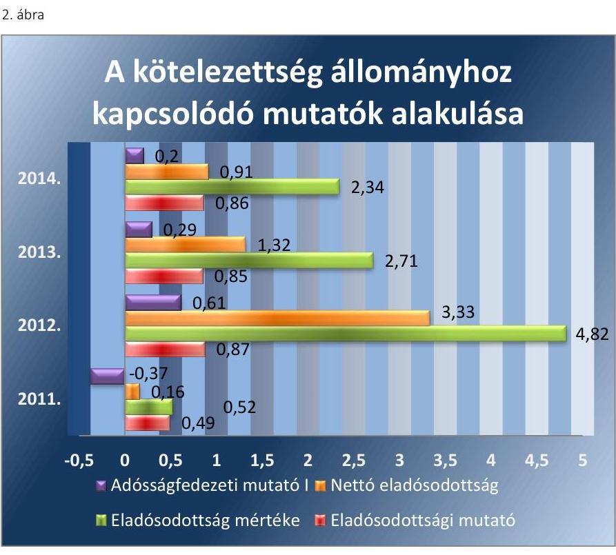

Forrás: a társaság adatszolgáltatása
A TÁRSASÁG SAJÁT TÖKÉJE 2011-2014 között meghaladta az Alapító Okiratban és a Gt. 51. § társasági formára vonatkozóan előírt jegyzett tőke értékét. A jogszabályi előírás betarthatósága érdekében a tulajdonos az alapító okiratot 2012. november 13-án módosította, hogy pótbefizetést teljesíthessen, ezáltal a veszteséges gazdálkodásból származó tőkecsökkenést megakadályozza. Az ellenőrzött időszakban az Önkormányzat pótbefizetést nem teljesített.

A
 társaság mérleg szerinti eredményét, és az ártámogatás nélküli mérleg szerinti eredményét az ellenőrzési időszakban a 3. ábra mutatja.
3. ábra

# Mérleg szerinti eredmény és az ártámogatás kapcsolata 

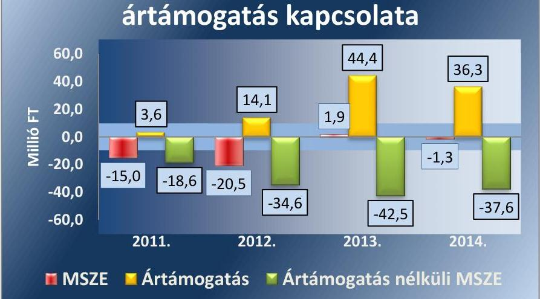

Forrás: 2011-2014. éves beszámolók

---

A 2013-2014. években az ártámogatás eredményeként javult a tevékenység eredménye, de 2014. évben ezzel együtt 1,3 M Ft-os vesztesége keletkezett. Az ártámogatások nélkül a társaság veszteséggel zárta volna az ellenőrzött időszak üzleti éveit.

HOSSZÚ LEJÁRATÚ KÖTELEZETTSÉGGEL a társaság az ellenőrzött időszakban nem rendelkezett. A szerződésen és jogszabályon alapuló rövid lejáratú kötelezettségeket nem minden esetben teljesítették határidőben. A társaság az egyszerűsített éves beszámolójában kimutatott rövid lejáratú kötelezettségeit - a szerződésen alapuló szállítói tartozásokat, illetve a jogszabályon alapuló adó jellegű befizetéseit - rendezte.

Az éves beszámolóban a kötelezettségek állománya az időszak végére 37,1 M Ft-ra emelkedett, amit a 22,7 M Ft követelés állomány nem fedezett, tehát likviditási hiánya keletkezett a társaságnak, amit külső forrás bevonásával egyenlített ki (folyószámlahitel). A kötelezettség növekedés oka a tulajdonos Önkormányzattal szemben fennálló tagi kölcsöntartozás, amit hátrasorolt kötelezettségként tart nyilván a társaság. A lejárt szállítói tartozásokat a társaság a szállítókkal kötött külön megállapodások szerint egyenlítették ki a 2012.-2013. években.

Az előírt beszámolási és adatszolgáltatási kötelezettségét teljesítette a társaság.

Az Önkormányzat által 2011.-2014. évekre vonatkozóan készített gazdasági program nem, viszont a környezetvédelmi program foglalkozott a távhőszolgáltatás fejlesztésének, fenntartásának célkitűzéseivel.

ÜZLETI TERVET a társaság az ellenőrzött időszak minden évére vonatkozóan elkészítette. A Képviselő-testület az előző évi egyszerűsített éves beszámoló elfogadásakor tárgyalta és hagyta jóvá. Az üzleti tervekben évente megfogalmazták a tervezési sajátosságokat, a beruházási (felújítási) terveket, az üzleti évek célkitűzéseit, a tervszámok meghatározó elemeit. A társaság a 2011-2014 évekre vonatkozó és évente elkészített üzleti terveiben a társaság működését egy egésznek tekintette, tehát a hőtermelést és a hőszolgáltatást nem tervezte elkülönítetten.

# A BESZÁMOLÁSI ÉS ADATSZOLGÁLTATÁSI KÖTELEZETTSÉGRE a Számv.tv. 20. §-a szerinti egyszerűsített éves 

beszámoló összeállítására vonatkozó határidőket és feladatokat a számviteli politikában ${ }_{1,2}$ rögzítették. A társaság eleget tett a Tszt. 18/B § (2) bekezdésében előírtaknak és az auditált beszámolóját megküldte MEH részére.

A végzett tevékenységről, a végrehajtott fejlesztésekről az egyszerűsített éves beszámolóval egyidejűleg készített beszámolót. Az egyszerűsített éves beszámolóját a számviteli politika ${ }_{1,2}$-ban előírt határidőben elkészítette és a Képviselő-testület elé terjesztette. A társaság az egyszerűsített éves beszámoló közzétételére vonatkozó kötelezettségének - a Számv. tv. 154. § (7) bekezdésében foglaltaknak megfelelően - a céginformációs szolgálat részére történő megküldésével tett eleget az ellenőrzött időszakban.

Az egyszerűsített éves beszámoló elfogadásáról a FB határozatot hozott és írásbeli jelentést készített, jegyzőkönyvben rögzítettek. A könyvvizsgáló

---

csatolta a beszámolóhoz a független könyvvizsgálói jelentését és a megbízó részére évente készített „Kiegészítő jelentést".

Az FB nem tett olyan megállapítást az ellenőrzés alá vont időszakban, amely szerint az ügyvezető tevékenysége jogszabályba, Alapító Okiratban foglaltakba, a tulajdonos határozataiba ütközött és sértette a társaság vagy a tulajdonos érdekeit. A könyvvizsgáló nem tett olyan megállapítást (Gt. 44. § (2) bekezdés), hogy a társaság vagyonának jelentős csökkenése várható, illetve nem állapított meg olyan tényt, ami az ügyvezető vagy az FB tagjainak a felelősségét vonta volna maga után. Az FB és a könyvvizsgáló nem kezdeményezte az ellenőrzött időszakban a társaság egyedüli tulajdonosánál intézkedések megtételét. Az Önkormányzat, illetve a Képviselőtestület összehívására nem került sor.

A társaság az Info. ${ }^{46}$ tv. 24. § (3) bekezdésében foglaltaknak ellenére 2011-2012. években nem készített adatvédelmi és adatbiztonsági szabályzatot, a 2013. évtől rendelkezett a hivatkozott jogszabály szerinti szabályzattal. Az ellenőrzött időszak alatt a társaság a közérdekű adatok nyilvánosságára vonatkozó Info.tv.26. § (1)-(2) bekezdésében és a Tszt. 57/C. § szerinti előírásoknak a közzétételi kötelezettséget illetően nem tett eleget.

A társaság nem minősült az ellenőrzési időszakban az önkormányzati alszektorba sorolt társaságnak, ezzel összefüggésben adatszolgáltatási kötelezettsége nem merült fel.

A 2012-2014. években az adózás előtti eredmény alakulását, ebből a távhőszolgáltatási tevékenységgel kapcsolatos eredményt a 4. ábra mutatja be.
4. ábra
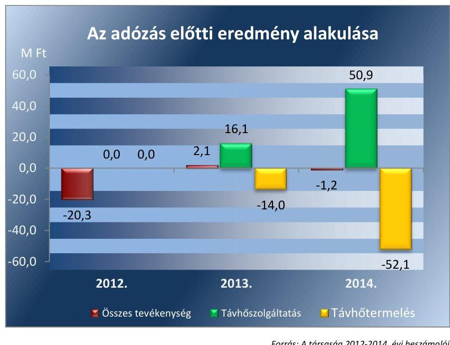

Forrás: A társaság 2012-2014. évi beszámolói

---

# 3. A gazdasági társaságnál az ellátott közfeladat bevételei és ráfordításai elszámolása, valamint az önköltségszámítás és árképzés szabályszerű volt-e? 

Összegző megállapítás

A 2011. évi árképzésben az ellenőrzés hiányosságokat tárt fel, a hatósági árakat megfelelően alkalmazták. A távhőszolgáltatás bevételeinek, ráfordításainak és beruházásainak elszámolásaiban kockázat merült fel.

Az ellátott közfeladat bevételeinek és ráfordításainak elszámolása kockázatokat rejtett, a beruházások elszámolásában az ellenőrzés több hiányosságot feltárt.

## A KÖZFELADATOK RÁFORDÍTÁSAINAK ÉS BEVÉTELEINEK EGYÉRTELMŰ ELHATÁROLÁSÁHOZ

szükséges előírásokat - a Tszt. 18/A. § (2) - (4) bekezdéseiben, valamint a távhőszolgáltatási rendelet; 14. § (1) bekezdésében foglaltak ellenére - a társaság 2011-2012. években nem, 2013-ban kizárólag a telephelyek vonatkozásában határozta meg.

A társaság kizárólag Kapuvár illetékességi területén folytatott távhőszolgáltatási tevékenységet, hőtermelést kezdetben négy, majd 2012 novemberétől három telephelyen végzett. Az Önkormányzat a távhőszolgáltatási rendelet; 14. § (1) bekezdésében előírta, hogy a díjak átláthatóságának biztosítására a számviteli szabályzatában olyan nyilvántartási rendszert alakítson ki, amely lehetővé teszi a tevékenységek (hőtermelés és hőszolgáltatás) elkülönülését, ezen belül az egyes fogyasztói csoportoknál felmerült költségek gyűjtését. A távhőszolgáltatási rendelet; 14. § (1) bekezdésével ellentétesen ilyen szabályzatot 2011-2012. évekre nem készítettek.

A Tszt. 18/A. § (2) - (4) bekezdései szerint a telephelyek és tevékenységek szerinti elkülönített elszámolás szabályozása 2012. évre vonatkozóan nem történt meg. A 2013. január 1-jét követő üzleti évre kidolgozott szabályozás csak telephelyekre különítette el a bevételeket és a ráfordításokat. A tevékenységek szerinti szétválasztás 2014. január 1-jétől valósult meg.

## A BEVÉTELEKET, VALAMINT A KÖLTSÉGEKET ÉS RÁFORDÍTÁSOKAT a

2011. évben nem határolta el,
2012. évben kizárólag a telephelyek tekintetében választotta szét,
2013-2014. években a közfeladat ellátással kapcsolatosan különítette el.
A társaság egyszerűsített éves beszámolójának kiegészítő melléklete 2012-2013. évek vonatkozásában a Tszt. 18/A. § (2)-(4) bekezdéseinek részben felel meg, mert a telephelyenkénti bontást elvégezte, azonban a tevékenységenkénti (hőtermelés és hőszolgáltatás) történő szétválasztást

---

nem. A 2014. évben a telephelyenkénti és a tevékenységenkénti szétválasztás megvalósult, eleget téve ezzel a Tszt. 18/A. § (2)-(4) bekezdéseiben foglalt előírásoknak.

# AZ ÉRTÉKESÍTÉS NETTÓ ÁRBEVÉTELE ELSZÁ- 

MOLÁSA az ellenőrzött minták alapján kockázatos volt a társaságnál az ellenőrzött időszakban. A társaság 2014-ben néhány esetben nem a távhőszolgáltatási rendelet ${ }_{2}$ 18. §-nak megfelelően számlázott, mert az alapdíjról utólag, a tárgyhónapot követően állított ki számlát. Alapvetően a távhőszolgáltatási díjrendelet ${ }_{1,2}$-nek, illetve az 50/2011. (IX.30.) NFM rendelet ${ }^{47}$ 4. §-ának és a Rezsi tv. ${ }^{48}$ 3. § (1) bekezdésnek megfelelő árat alkalmazott a társaság. A 2012. évben előfordult, hogy a felszerelt plombák díját az igazolt bekerülési értéknél magasabb összegben hárították át a fogyasztóra, 2013. évben a fizetendő behajtási jutalék összegét tévesen magasabb összegben vetette ki a társaság. A bevételeket a Számv. tv. 72. §-nak és a számviteli politika ${ }_{1}$-nek és számlarend ${ }_{1,2}$-nek megfelelő számlacsoportba számolták el.

AZ ANYAGJELLEGŰ RÁFORDÍTÁSOK elszámolása az ellenőrzött időszakban kockázatos volt az ellenőrzött minták alapján. A költségelszámolást megalapozó dokumentumok (megrendelések, szerződések, számlák) többnyire rendelkezésre álltak. A beszerzett hőenergia költségét 2012. - 2014. között néhány esetben anyagköltségként számolták el, annak ellenére, hogy a Számv. tv. 78. § (6) bekezdése értelmében azt az eladott (közvetített) szolgáltatások értékeként kellett kimutatni. 2012. évben a kazánjavításhoz vásárolt anyagokat igénybe vett szolgáltatásként számolták el, pedig a számla kizárólag anyagbeszerzésről volt kiállítva, ezzel megsértették a Számv. tv. 78. § (2) bekezdésében foglaltakat. A további esetekben a költségek elszámolása a megfelelő költségnemekre történt.

A társaságnál a 2011-2013. évek vonatkozásában a tevékenységenkénti elkülönített elszámolás nem történt meg. 2014. tekintetében a szétválasztási szabályokat betartva - egy kivétellel - a megfelelő közfeladatra számolták el a költségeket. A távhőszolgáltatásról szóló számlák megfelelő tartalmú kiállítása érdekében bérelt szoftver bérleti díját a szétválasztás során a hőtermelést és a hőszolgáltatást egyaránt terhelő költségként mutatták ki annak ellenére, hogy a költség kizárólag a távhőszolgáltatási tevékenységhez kapcsolódott.

A BERUHÁZÁSOK ÉS FELÚJÍTÁSOK elszámolása az ellenőrzött minták alapján nem felelt meg. A kapcsolódó kiadások ellenőrzése során a számlák kontírozása - Számv. tv. 167. § (1) bekezdés h) és Számv. tv. 3. § (4) 7. és Számv. tv. 26. § (7) pontjában foglaltakkal ellentétben - a 2011-ben néhány esetben téves volt, mivel a beruházások helyett az anyagjellegű ráfordítás főkönyvi számlát tüntették fel a bizonylaton, illetve a 2013-ban előfordult, hogy a számlán nem volt megtalálható az érintett főkönyvi számlára való hivatkozás.

A bekerülési érték meghatározása a 2013. évben az üzembe helyezett eszközöknél a Számv. tv. 47. § (1) bekezdésével ellentétes volt. A 2013. évi aktiválás során a bekerülési érték részeként teljes összegben számolt el a társaság olyan tételeket, amelyek a megvalósult távhőszolgáltató rendszer rekonstrukció további üzembe helyezett eszközeihez is kapcsolódtak, illetve a közvetett költségeket nem osztották fel valamennyi költséghelyre.

---

Mindezek miatt az értékcsökkenést a 2013-2014. években nem a megfelelő összegben számolta el a társaság, ami a Számv. tv. 52. § (1) és 80. § (1) bekezdésébe ütközik. Az értékcsökkenési leírás elszámolása a társaságnál 2011-2012. években a jogszabályok, belső szabályozása szerint történt.

Az eszközök üzembe helyezése a vizsgált időszakban dokumentáltan megtörtént, az eszközök a vizsgált évek leltáraiban megtalálhatóak voltak. Az ellenőrzött időszakban terven felüli értékcsökkenés elszámolására, és annak visszaírására nem került sor.

Az Önkormányzat a távhőszolgáltatási tevékenység ellátása érdekében vagyonkezelés jogcímen nem, kizárólag használatra és üzemeltetésre adott át eszközöket a társaságnak.

A társaság által végzett beruházásokat, az elszámolt értékcsökkenést és az eszközök átlagos elhasználódási fokának alakulását az 5. táblázat mutatja.
5. táblázat

# BERUHÁZÁSOK, AZ ELSZÁMOLT ÉRTÉKCSÖKKENÉS ÉS AZ ELHASZNÁLÓDÁSI FOK ALAKULÁSA (M FT) 

| Megnevezés | 2011. | 2012. | 2013. | 2014. |
| :-- | :--: | :--: | :--: | :--: |
| Tárgyi eszközök nyitó nettó értéke | 4,3 | 7,9 | 86,2 | 83,1 |
| Beruházások, fejlesztések | 4,3 | 78,9 | 2,7 | 7,4 |
| Aktivált beruházások, fejlesztések | 0,0 | 0,0 | 85,9 | 7,4 |
| Elszámolt értékcsökkenés | 0,7 | 0,6 | 5,8 | 7,7 |
| Befektetett eszközök változása | 3,7 | 78,3 | $-3,1$ | $-0,3$ |
| Tárgyi eszközök záró nettó értéke | 7,9 | 86,2 | 83,1 | 82,8 |
| Tárgyi eszközök záró bruttó értéke | 9,0 | 87,9 | 90,6 | 98,0 |
| Használhatósági fok (\%) | 87,8 | 98,1 | 91,7 | 84,5 |

A társaság tulajdonában levő eszközök használhatósági fokából megállapítható, hogy az eszközök nincsenek elhasználva. A mutató értéke a 2011. évi 87,8\%-ról 2014-re 84,5\%-ra csökkent, mert az egyes beruházások (nyomvonal, hőközpont, kazán, kémény, szivattyú) aktiválása után nem volt szükség újabb beszerzésre vagy az újonnan beszerzett eszközön felújításra az ellenőrzött
 időszakban.

A távhőrendszer valós használhatósági fokát nem mutatják meg a fenti adatok, mert a társaság által üzemeltetett rendszert az Önkormányzat tartja nyilván, a társaságnál csupán a 2013-ban végzett rekonstrukciós és felújítási munkák során üzembe helyezett eszközök értéke van kimutatva.

## A KÖVETELÉS ÁLLOMÁNY CSÖKKENTÉSÉRE a társaság 2011-2014. években részben intézkedett. A Önkormányzattal történt egyeztetés alapján elkészítették a hátralékkezelési szabályzatot, amely szerint fizetési késedelembe esett fogyasztó felé kiküldött eredménytelen fizetési felszólítást követően az ügyvezető részletfizetési megállapodást köt a fizetési késedelembe esett fogyasztóval, sikertelensége esetén behajtó céggel kísérli meg a hátralék behajtását. Végső esetben végrehajtást kezdeményez a társaság a hátralékossal szemben. A hátralékkezelési szabályzat
a fizetési felszólítás kiküldésének határidejét nem tartalmazta, az eredménytelenség kritériumait nem határozta meg.

---

$\longrightarrow$ a végrehajtási eljárás kezdeményezésének elmaradását nem szankcionálta.
A határidő lejártát követő 60. nap elteltével adták át behajtásra a követeléseket. A társaság a fogyasztókkal szemben egyetlen esetben sem érvényesített késedelmi kamatot, ezzel 2011-2014. évben a hátralékkezelési szabályzatuk II/2. pontjával ellentétesen jártak el. A társaság - eleget téve a hátralékkezelési szabályzat II/3. pontjában foglalt kötelezettségének behajtási szerződést kötött a hátralékos ügyfelekkel szembeni követelések behajtására egy vállalkozással. A behajtási szerződés alapján folyamatosan és rendszeresen átadták a hátralékosok listáját a megbízottnak.

Az ellenőrzött időszakban a társaságnál behajthatatlan követeléssé minősítés és leírás nem történt. A társaság vevőköveteléseinek nyilvántartásából megállapítható a - késedelmi kamat nélküli - hátralékos díjbevételek állománya, amely a 2011-ről 2012-re 66,2%-kal, 2012-ről 2013-ra pedig 7,7%-kal nőtt, majd 2014. évben kismértékben (12,3%-kal) csökkent az előző évhez képest.

A vevőkövetelések alakulását a fizetési határidő lejárta szerint az 5. ábra mutatja.
5. ábra
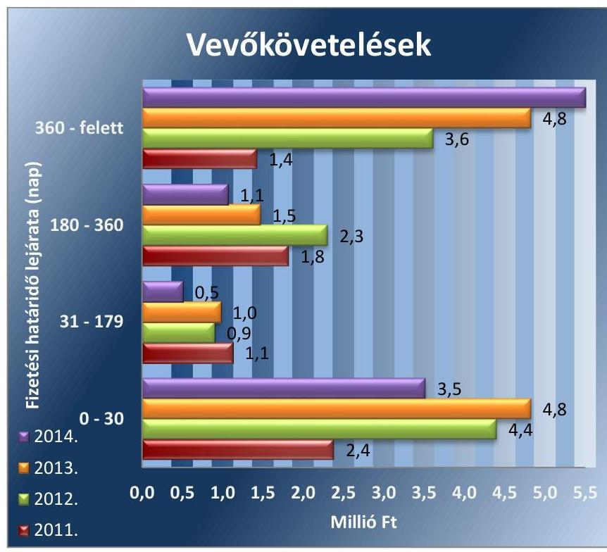

Forrás: 2011-2014. évi vevőkövetelések
A követelések összegén belül a 360 napon túli követelések egyre jelentősebbek voltak. A 180 napon túli követelések állománya csökkent, mert jelentős része átkerült a 360 napon túli követelések állományába. A behajtás alatt lévő hátralékos díjbevételekről a társaság folyamatos nyilvántartást vezetett.

A NYERESÉGKORLÁT feletti adózás előtti eredményt ért el a társaság 2013. évben. Az 50/2011. (IX.30.) NFM rendelet 5. § (1) bekezdésében előírt rendelkezés alapján a MEH 2015. június 25-én kelt 4965/2015

---

### 3.2. számú megállapítás

számú határozatával kötelezte a társaságot a 2013. évi nyereségkorlátot meghaladó eredmény visszafizetésére. A visszafizetési kötelezettség összege $0,8 \mathrm{M} F \mathrm{t}$ volt.

## Az önkormányzati hatáskörben megállapított távhődíjakat a Távhő rendelet előírásai ellenére számításokkal nem támasztották alá, a hatósági árat az előírásoknak megfelelően alkalmazták.

A társaság az ellenőrzött időszakban nem rendelkezett önköltség-számítási szabályzattal, amely gyakorlat a 2011-2012. évek vonatkozásában a távhőszolgáltatási rendelet ${ }_{1}$ 14. § (2) bekezdésébe ütközött.

AZ ÖNKÖLTSÉGSZÁMÍTÁSI SZABÁLYZAT készítési kötelezettség alól a Számv.tv. 14. § (6) bekezdésének előírása alapján mentesült a társaság, de az Önkormányzat a távhőszolgáltatási rendelet ${ }_{1}$ 14. § (2) pontjában előírta, hogy az üzletszabályzatban rögzített árképzési elvek figyelembe vételével a társaságnak Árképzési és Önköltségszámítási Szabályzatában kell rögzíteni az árak kalkulációjának részletes feltételeit. A társaságnál a nem szabályozott és nem részletezett önköltségszámítás következményeként a díjkalkuláció nem volt átlátható és következetes. Az alapdíj költségtartalmának számítása hiányában a Számv. tv. 15. § (4) bekezdésében foglalt világosság elvének betartása nem volt biztosított 2011-ben. A miniszteri rendeletalkotáshoz szükséges Képviselő-testületi állásfoglalásban feltüntetett árak megalapozásául szolgáló kalkulációk közül kizárólag a 2013/2014 és 2014/2015 gázévekre vonatkozóan benyújtott számítás végeredményét jelentő javaslat állt rendelkezésre.

Az Önkormányzat külön nem ellenőrizte a távhőszolgáltatás díja kiszámításának alapjául szolgáló kalkuláció helyességét, a társaság által a Képviselő-testület állásfoglalásaihoz benyújtott egyes előterjesztések tartalmi vizsgálata az azt tárgyaló Képviselő-testület ülésén történt.

A TÁVHŐSZOLGÁLTATÁS ÁRÁT a társaság az előírásokkal összhangban határozta meg. A társaság az 50/2011. (IX.30.) NFM rendelet 4. §, a Tszt. 57/E. § (2) bekezdés és a Rezsi tv. 3. § (1) bekezdésében foglalt kötelezettségének eleget téve 2013-2014. években végrehajtotta a rezsicsökkentést.

A távhőszolgáltatás díjainak ármegállapítása az alapdíj és a hődíj vonatkozásában 2011. április 15-i hatállyal - a Tszt. 57/D. § alapján - önkormányzati hatáskörből miniszteri hatáskörbe került. A társaság a lakossági díjtételeket az 50/2011. (IX.30.) NFM rendelet 4.§-nak megfelelően 2011. március 31-ével befagyasztotta. Ezt követően az 50/2011. (IX.30.) NFM rendelet 4. §-ban foglalt legmagasabb hatósági ár korlát alapján 2012. január 1-jétől 4,2%-kal megemelte, azonban csak a hődíjak tekintetében. Az alapdíjak vonatkozásában a Tszt. 57/E. § (2) bekezdésének megfelelően megkülönböztetés-mentesen a 2011. december 31-én alkalmazott díjat számlázta a társaság. A 2012. évben az alapdíjak tekintetében a legmagasabb hatósági árat 2012. december hónapra alkalmazták. A társaság a Tszt. 57. § (3) bekezdésében foglaltak ellenére nem határozta meg a távhőszolgáltatás csatlakozási díját.
2013. január 1-jétől - a Rezsi. tv.-ben előírt csökkentési korlátra vonatkozó előírást betartva - a társaság a lakossági díjszabást a 2012. november

---

1-jén alkalmazott díjtételek 90%-ára, 2013. november 1-jétől a 2013. október 31-én alkalmazott díjtételek 88,9%-ára csökkentette.
2014. október 1-jétől a lakosság felé a 2013. november 1-jén alkalmazott díjtételek 96,7%-át számlázták.

A lakossági és közötti fogyasztókra vonatkozó alapdíjat és hődíjat - fajlagos díjtételekkel a 6. ábra mutatja be.
6. ábra
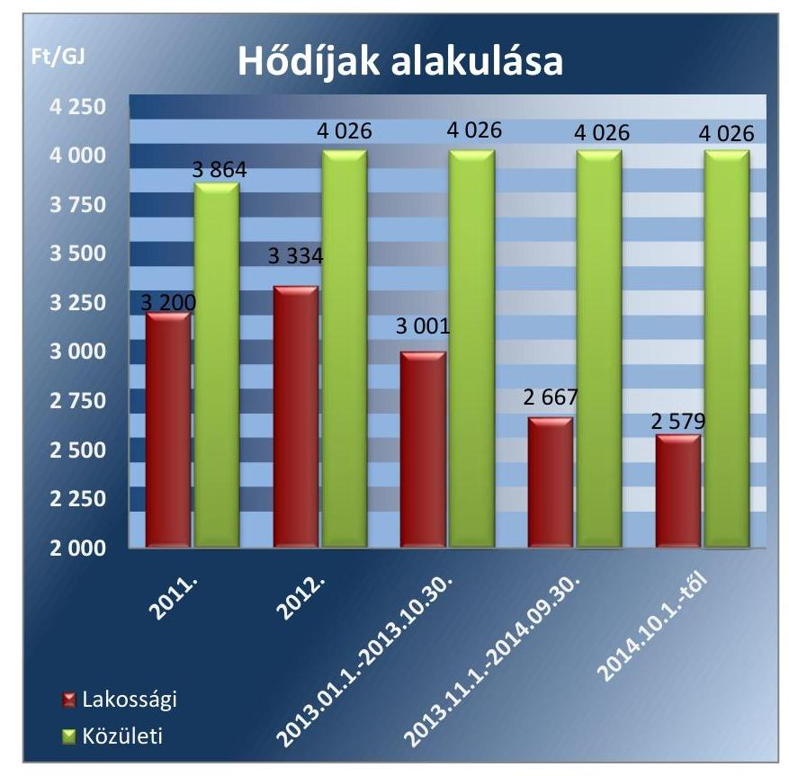

Forrás: a társaság adatszolgáltatója

---

# JAVASLATOK 

Az ÁSZ tv. 33. § (1) bekezdésében foglaltak értelmében az ellenőrzött szervezet vezetője köteles a jelentésben foglalt megállapításokhoz kapcsolódó intézkedési tervet összeállítani és azt a jelentés kézhezvételétől számított 30 napon belül az ÁSZ részére megküldeni.
Az ÁSZ tv. 33. § (3) bekezdése szerint amennyiben az ellenőrzött szervezet vezetője nem küldi meg határidőben az intézkedési tervet vagy továbbra sem elfogadható intézkedési tervet küld, az ÁSZ elnöke
a) az ellenőrzött szervezet vezetőjével szemben büntető- vagy fegyelmi eljárás megindítását kezdeményezheti;
b) kezdeményezheti az illetékes hatóságnál, illetve szervezetnél az ellenőrzött szervezetet megillető, az államháztartás valamelyik alrendszeréből származó támogatások vagy egyéb juttatások folyósításának, illetve a személyi jövedelemadó 1%-ából történő felajánlásokból való részesedés lehetőségének felfüggesztését.

Javaslataink célja a Kapuvári Hőszolgáltató Kft. gazdálkodása szabályszerűségének helyreállítása annak érdekében, hogy a szabályozási környezet és gazdálkodási gyakorlat megfelelően tudja támogatni az átlátható működést.

## Kapuvári Hőszolgáltató Kft. ügyvezetőjének

1. Intézkedjen a szabályozási hiányosságok megszüntetésére, ezen belül:
a) egészítse ki a Számlarendet, a számviteli szétválasztás módszerével összefüggő előírásokkal;
(2.1. sz. megállapítás 3. bekezdése alapján)
b) pontosítsa, aktualizálja a leltározási szabályzatot a 2012. január 1-jétől módosult számviteli előírások alapján.
(2.1. sz. megállapítás 4. bekezdése alapján)
2. Tartsa be a hátralékkezelési szabályzat előírásait, alkalmazza az abban meghatározottak szerint a késedelmi kamat érvényesítésére vonatkozó szabályt.
(3.1. sz. megállapítás 17. bekezdése alapján)

---

3. Intézkedjen az előírások szerinti számlázási gyakorlat megvalósítására, ezen belül:
a) tartsa be az önkormányzati távhőszolgáltatási rendelet számlakiállítás idejére vonatkozó előírását;
b) mérje fel az előírásoktól eltérő, tévesen magasabb összegű számlázások körét és a visszafizetés lehetőségét, majd tegye meg a pénzügyi rendezéshez szükséges intézkedéseket;
c) tegyen intézkedéseket a feltárt számlázási szabálytalanságok és a késedelmi kamat érvényesítésének elmaradása tekintetében a felelősség tisztázása érdekében, és szükség szerint intézkedjen a felelősség érvényesítéséről.
(3.1. sz. megállapítás 6. és 17. bekezdése alapján)
4. Intézkedjen a számviteli szabályok szerinti elszámolási gyakorlat biztosítására, ezen belül
a) tartsa be az előírásokat a közvetített szolgáltatások, az anyagbeszerzések, a beruházások és a közfeladatra történő megosztások elszámolásainál;
(3.1. sz. megállapítás 7., 8., 9. bekezdései alapján)
b) vizsgálja felül és rendezze a 2013. évben üzembe helyezett eszközök számviteli előírásoktól eltérő bekerülési érték számításából eredő helytelen értékcsökkenés elszámolást.
(3.1. sz. megállapítás 10. bekezdése alapján)
5. Intézkedjen az üzletszabályzatnak az árképzésre vonatkozó, hatályos szabályozási elemekkel történő kiegészítésére, pontosítására.
(1.2. sz. megállapítás 7. bekezdése alapján)
6. Intézkedjen a jogszabályi előírásoknak megfelelően a közérdekű adatok nyilvánossá tételéről.
(2.4. számú megállapítás 7. bekezdése alapján)

---

# Javaslataink célja az Önkormányzat szabályszerű működésének elősegítése, továbbá az önkormányzati tulajdonosi joggyakorlás kontrolljainak erősítése. 

## Kapuvár Városi Önkormányzat polgármesterének

1. Terjessze a Képviselő-testület elé döntéshozatalra a gazdasági program módosítását, amennyiben az a felülvizsgálatát követően kiegészítésre kerül a távhő közszolgáltatás biztosítására, színvonalának javítására vonatkozó fejlesztési elképzelésekkel.
(1.1. sz. megállapítás 1. bekezdése alapján)
2. Terjessze a Képviselő-testület elé döntéshozatalra a csatlakozási díj, a távhőszolgáltatási csatlakozási díj fizetési feltételei, valamint a lakossági felhasználónak és a külön kezelt intézménynek nyújtott távhőszolgáltatásra vonatkozó, a miniszteri rendeletben nem szabályozott díjalmazási és díjfizetési feltételek önkormányzati rendeletben történő szabályozását.
(1.1. sz. megállapítás 13. bekezdése alapján)
3. Terjessze a Képviselő-testület elé döntéshozatalra azon területek önkormányzati rendeletben történő kijelölését, ahol területfejlesztési, környezetvédelmi és levegő-tisztaságvédelmi szempontok alapján célszerű a távhőszolgáltatás fejlesztése.
(1.1. sz. megállapítás 14. bekezdése alapján)
4. Kezdeményezze a felügyelőbizottság létszámának törvényi előírás szerinti tulajdonosi meghatározását.
(1.2. sz. megállapítás 4. bekezdése alapján)

---

# Kapuvár Városi Önkormányzat jegyzőjének 

1. Vizsgálja felül, hogy a hatályos gazdasági program tartalmaz-e - a jogszabályi előírásnak megfelelően - a távhő közszolgáltatás biztosítására, színvonalának javítására vonatkozó fejlesztési elképzeléseket, és annak hiánya esetén készítse elő a módosítását.
(1.1. sz. megállapítás 1. bekezdése alapján)
2. Intézkedjen - a jogszabályi előírások betartása érdekében - a távhőszolgáltatással kapcsolatos önkormányzati szabályok kiegészítésére, ennek keretében:
a) készítse elő a csatlakozási díj, a távhőszolgáltatási csatlakozási díj fizetési feltételei, valamint a lakossági felhasználónak és a külön kezelt intézménynek nyújtott távhőszolgáltatásra vonatkozó, a miniszteri rendeletben nem szabályozott díjalmazási és díjfizetési feltételek önkormányzati rendeletben történő szabályozását;
b) készítse elő azon területek önkormányzati rendeletben történő kijelölését, ahol területfejlesztési, környezetvédelmi és levegő-tisztaságvédelmi szempontok alapján célszerű a távhőszolgáltatás fejlesztése.
(1.1. sz. megállapítás 13. és 14. bekezdései alapján)

---

# MELLÉKLETEK 

- I. SZ. MELLÉKLET: ÉRTELMEZŐ SZÓTÁR
garancia

A garancia olyan önálló, az önkormányzat nevében vállalt kötelezettség, amely alapján az önkormányzat az önkormányzati költségvetés terhére szerződésben meghatározott feltételek szerint, a kötelezett nem teljesítése esetén a jogosultnak fizetést teljesít az előzetesen rögzített összeghatárig.
gazdasági társaság
gazdálkodó szervezet
keresztfinanszírozás tilalma
kezesség
közfeladat

A Gt. 3. § (1) bekezdése szerint „gazdasági társaságot üzletszerű közös gazdasági tevékenység folytatására külföldi és belföldi természetes és jogi személyek, valamint jogi személyiség nélküli gazdasági társaságok alapíthatnak, működő társaságba tagként beléphetnek, társasági részesedést (részvényt) szerezhetnek."
A Ptk. 685. § c) pontja szerint gazdálkodó szervezet: „az állami vállalat, az egyéb állami gazdálkodó szerv, a szövetkezet, a lakásszövetkezet, az európai szövetkezet, a gazdasági társaság, az európai részvénytársaság, az egyesülés, az európai gazdasági egyesülés, az európai területi együttműködési csoportosulás, az egyes jogi személyek vállalata, a leányvállalat, a vízgazdálkodási társulat, az erdő birtokossági társulat, a végrehajtói iroda, az egyéni cég, továbbá az egyéni vállalkozó."
A közszolgáltatás díját úgy kell megállapítani, hogy az maradéktalanul fedezetet nyújtson a közszolgáltatás indokolt költségeire és ráfordításaira, valamint a közszolgáltató e tevékenységével kapcsolatos ésszerű nyereségére; az ésszerű nyereség nem tartalmazhatja a közszolgáltatáson kívül eső egyéb gazdasági tevékenységei költségeinek, ráfordításainak fedezetét.
A kezességre vonatkozó előírásokat a Ptk. 272-276. §-ai tartalmazzák. A kezesség a polgári jogban a szerződést biztosító járulékos mellékkötelezettség, amely egy másik kötelem teljesítését biztosítja azáltal, hogy a kezes a főadós nem teljesítése esetére kötelezettséget vállal a főadósi kötelem teljesítésére. A kezes tehát a főadóshoz képest járulékos adós. A kezesség kiterjed az elvállalása
 utáni mellékszolgáltatásokra, ha a kezes ezek kikötéséről tudott.
A Ptk. szerint kezességet csak írásban lehet vállalni. Lényeges, hogy a kezesség mindig az alapügylet hitelezője és a kezes közötti ingyenes szerződéssel jön létre. A kezesség a különböző hitelfelvételekhez kapcsolódóan a hitel visszafizetésének biztosítékaként jöhet szóba. Az adós helyett nemfizetés esetén a kezes felel, ő tartozik fizetni. Az egyszerű kezesség esetén előbb az adóson kell behajtani a tartozást, s ha ez sikertelen, akkor lehet a kezestől követelni a fizetést. Készfizető kezesség esetében a fizetést elmulasztó adós helyett rögtön a kezesen követelhetik a tartozást. Ha bank vállalja a kezességet, akkor az minden esetben készfizetői kezesség.
Jogszabályban meghatározott állami vagy önkormányzati feladat, amit az arra kötelezett közérdekből, jogszabályban meghatározott követelményeknek és feltételeknek megfelelve végez, ideértve a lakosság közszolgáltatásokkal való ellátását, továbbá az állam nemzetközi szerződésekben vállalt kötelezettségeiből adódó közérdekű feladatokat, valamint e feladatok ellátásához szükséges infrastruktúra biztosítását is (Nvtv. 3. § (1) bekezdés 7. pont).

---

közszolgáltatás

Közvetett tulajdon, illetve közvetett befolyás
meghatározó befolyás
minősített többséget biztosító befolyás

Minősített többséget biztosító részesedés

A közszolgáltatás: „közcélú, illetőleg közérdekű szolgáltatást jelent, amely egy nagyobb közösség (állam, település) minden tagjára nézve megközelítőleg azonos feltételek mellett vehető igénybe, ezért valamilyen mértékig közösségi megszervezést, illetve szabályozást, ellenőrzést igényel." Az Ebktv. 3. § d) pontja a következőképpen határozza meg a közszolgáltatást: „szerződéskötési kötelezettség alapján a lakosság alapvető szükségleteinek ellátására irányuló szolgáltatás, így különösen a villamos energia-, gáz-, hő-, víz-, szennyvíz- és hulladékkezelési, köztisztasági, postai és távközlési szolgáltatás, továbbá a menetrend alapján közlekedő járművekkel végzett közforgalmú személyszállítás"
Egy vállalkozás tulajdoni hányadának, illetőleg szavazati jogának a vállalkozásban tulajdoni részesedéssel, illetőleg szavazati joggal rendelkező más vállalkozás (köztes vállalkozás) tulajdoni hányadán, szavazati jogán keresztül történő gyakorlása. A közvetett tulajdon, a közvetett befolyás arányának megállapításához a közvetett tulajdonnal, közvetett befolyással rendelkezőnek a köztes vállalkozásban fennálló szavazati jogát vagy tulajdoni hányadát meg kell szorozni a köztes vállalkozásnak a vállalkozásban fennálló szavazati vagy tulajdoni hányada közül azzal, amelyik a nagyobb. Ha a köztes vállalkozásban fennálló szavazati vagy tulajdoni hányad az ötven százalékot meghaladja, akkor azt egy egészként kell figyelembe venni (a tőkepiacról szóló 2001. évi CXX. törvény 5. § (1) bekezdés 84. pont).
A Ptk. 8:2. § (2) bekezdése szerint „A befolyással rendelkező akkor rendelkezik egy jogi személyben meghatározó befolyással, ha annak tagja vagy részvényese, és
a) jogosult e jogi személy vezető tisztségviselői vagy felügyelőbizottsága tagjainak többségének megválasztására, illetve visszahívásra; vagy
b) a jogi személy más tagjai, illetve részvényesei a befolyással rendelkezővel kötött megállapodás alapján a befolyással rendelkezővel azonos tartalommal szavaznak, vagy a befolyással rendelkezőn keresztül gyakorolják szavazati jogukat, feltéve, hogy együtt a szavazatok több mint felével rendelkeznek."
3) A meghatározó befolyás akkor is fennáll, ha a befolyással rendelkező számára a
(2) bekezdés szerinti jogosultságok közvetett módon biztosítottak. A befolyással rendelkezőnek egy jogi személyben a szavazatok több mint ötven százalékával közvetett módon való rendelkezése vagy egy jogi személyben közvetetten fennálló meghatározó befolyása megállapítása során a jogi személyben szavazati joggal rendelkező más jogi személyt (köztes vállalkozást) megillető szavazatokat meg kell szorozni a befolyással rendelkezőnek a köztes vállalkozásban, illetve vállalkozásokban fennálló szavazatával. Ha a köztes vállalkozásban fennálló szavazatok mértéke az ötven százalékot meghaladja, akkor azt egy egészként kell figyelembe venni."
A Gt. 52. § (2) bekezdése szerint minősített többséget biztosító befolyásnak számít, ha a minősített befolyásszerző az ellenőrzött társaságban - közvetlenül vagy közvetve - a szavazatok legalább hetvenöt százalékával rendelkezik.
A minősített befolyásszerző az ellenőrzött társaságban a szavazatok legalább hetvenöt százalékával rendelkezik. (Gt. 52. § (2) bekezdés)

---

Nemzeti vagyon

Többségi befolyást biztosító részesedés

Tulajdonosi joggyakorló

Nvtv. 1. § (2) bekezdése szerint:
„az állam vagy a helyi önkormányzat kizárólagos tulajdonában álló dolgok, az a) pont hatálya alá nem tartozó, állam vagy a helyi önkormányzat tulajdonában lévő dolog,
az állam vagy a helyi önkormányzat tulajdonában lévő pénzügyi eszközök, továbbá az államot vagy a helyi önkormányzatot megillető társasági részesedések, az államot vagy a helyi önkormányzatot megillető bármely vagyoni értékkel rendelkező jogosultság, amelyet jogszabály vagyoni értékű jogként nevesít, Magyarország határa által körbezárt terület feletti légtér, az üvegházhatású gázok kibocsátási egységeinek kereskedelméről szóló törvény szerint kibocsátási egység és légiközlekedési kibocsátási egység, valamint az ENSZ Éghajlatváltozási Keretegyezménye és annak Kiotói Jegyzőkönyve végrehajtási keretrendszeréről szóló törvény szerinti kiotói egység,
állami vagy helyi önkormányzati fenntartású közgyűjtemény (muzeális intézmény, levéltár, közgyűjteményként működő kép- és hangarchívum, valamint könyvtár) saját gyűjteményében nyilvántartott kulturális javak körébe tartozó dolog, a régészeti lelet,
a nemzeti adatvagyon körébe tartozó állami nyilvántartások fokozottabb védelméről szóló törvény szerinti nemzeti adatvagyon." (hatályos 2012. január 1-jétől, g) pont módosult 2012. június 30-tól)
A Ptk. 685/B. § (1) bekezdése szerint „többségi befolyás: az olyan kapcsolat, amelynek révén természetes személy, jogi személy vagy jogi személyiség nélküli gazdasági társaság (a továbbiakban együtt: befolyással rendelkező) egy jogi személyben a szavazatok több mint ötven százalékával vagy meghatározó befolyással rendelkezik."
Aki a nemzeti vagyon felett az államot vagy a helyi önkormányzatot megillető tulajdonosi jogok és kötelezettségek összességének gyakorlására jogosult (Vagyon tv. 3. § (1) bekezdés 17. pont).

---

II. SZ. MELLÉKLET: KAPUVÁRI HŐSZOLGÁLTATÓ KFT. MŰKÖDÉSÉNEK FŐBB JELLEMZŐI (ADATOK M FT / %-BAN)

|  Sorszám | Megnevezés | 2011. | 2012. | 2013. | 2014.  |
| --- | --- | --- | --- | --- | --- |
|  1. | A gazdasági társaság tulajdonosi összetétele: |  |  |  |   |
|  2. | Önkormányzat megnevezése: |  | Kapuvár Városi Önkormányzat |  |   |
|  3. | Önkormányzat tulajdoni részesedésének aránya | $\%$ | 100,0 |  |   |
|  4. | Önkormányzat tulajdoni részesedésének összege | M Ft | 10,5 |  |   |
|  5. | Más önkormányzatok, többcélú társulás megnevezése: |  |  |  |   |
|  6. | Más önkormányzatok, többcélú társulások tulajdoni részesedésének aránya | $\%$ |  |  |   |
|  7. | Más önkormányzatok, többcélú társulások tulajdoni részesedésének összege | M Ft |  |  |   |
|  8. | Gazdasági társaság megnevezése: |  |  |  |   |
|  9. | Gazdasági társaságok tulajdoni részesedés aránya | $\%$ |  |  |   |
|  10. | Gazdasági társaságok tulajdoni részesedés összege | M Ft |  |  |   |
|  11. | Egyéb tulajdonos megnevezése: |  |  |  |   |
|  12. | Egyéb tulajdonosok tulajdoni részesedés aránya | $\%$ |  |  |   |
|  13. | Egyéb tulajdonosok tulajdoni részesedés összege | M Ft |  |  |   |
|  14. | A gazdasági társaságnál a vizsgált évek során működése megszűnt-e? (IGEN/NEM) |  | NEM |  |   |
|  15. | A tárgyévben a gazdasági társaság vagyonkezelésben lévő önkormányzati vagyon után elszámolt értékcsökkenés összege | M Ft | 0,0 | 0,0 | 0,0  |
|  16. | A tárgyévben az önkormányzati tulajdonú, gazdasági társaság által kezelt eszközök pótlására (karbantartás, felújítás, beruházás) elszámolt költség | M Ft | 0,2 | 83,3 | 3,4  |
|  17. | A tárgyévben a gazdasági társaság saját vagyona után elszámolt értékcsökkenés összege | M Ft | 0,7 | 0,7 | 5,8  |
|  18. | A tárgyévben a saját tulajdonú eszközök pótlására (karbantartás) elszámolt költség | M Ft | 0,0 | 43,0 | 31,0  |
|  19. | Értékesítés nettó árbevétele | M Ft | 87,5 | 83,8 | 77,7  |
|  20. | Működési cash flow | M Ft | $-2,7$ | $-37,7$ | 14,0  |

---

# FÜGGELÉK: ÉSZREVÉTELEK 

A jelentéstervezetet az Állami Számvevőszék 15 napos észrevételezésre megküldte az ellenőrzött szervezet vezetőjének az ÁSZ tv. 29. § (1) bekezdése előírásának megfelelően.
Az elfogadott észrevételek alapján véglegesíti az Állami Számvevőszék a jelentését.

A függelék tartalmazza az ellenőrzött észrevételeit, illetve az el nem fogadott észrevételek elutasításának indoklását.
$\qquad$ 1. Kapuvári Hőszolgáltató Kft. ügyvezetőjének írásban tett észrevétele.
$\qquad$ 2. Tájékoztatás az elfogadott és el nem fogadott észrevételekről az ügyvezetőnek.
$\qquad$ 3. Kapuvár Városi Önkormányzat Polgármesterének írásban tett észrevétele mellékletek nélkül.
$\qquad$ 4. Tájékoztatás az észrevételek kezeléséről a polgármesternek.

[^0]
[^0]:    * 29. § (1) Az Állami Számvevőszék az ellenőrzési megállapításait megküldi az ellenőrzött szervezet vezetőjének vagy az általa megbízott személynek, és annak, akinek személyes felelősségét állapította meg.
    (2) Az ellenőrzött szervezet vezetője és a felelősként megjelölt személy az ellenőrzés megállapításaira tizenöt napon belül írásban észrevételt tehet.
    (3) Az Állami Számvevőszék az észrevételre a beérkezésétől számított harminc napon belül írásban válaszol. A figyelembe nem vett észrevételeket köteles a jelentésben feltüntetni, és megindokolni, hogy azokat miért nem fogadta el.

---

# Kapuvári Hőszolgáltató Kft. 

Állami Számvevőszék

1364 Budapest
Pf:54.

Tisztelt Állami Számvevőszék!

Alulírott, Pászli Tibor, a Kapuvári Hőszolgáltató Kft. ügyvezetője az Állami Számvevőszék (továbbiakban: ÁSZ) 2016.02.01. napján kelt jelentéstervezetének 2. illetőleg 5.b. pontjaira az alábbi nyilatkozatot teszem:.
2. Adja át az önkormányzat tulajdonába - az önkormányzat és a társaság által kötött szolgáltatási szerződés 2014.06.30-ai lejárata óta fennálló mulasztást megszüntetve - a távhőrendszeren a 2012. - 2013. években végrehajtott fejlesztéssel létrejött, a társaság tulajdonát képező eszközöket.

Az ÁSZ észrevétele szerint 2014.01.01-től történő amortizáció elszámolás nem jogos többletköltség volt, mely abból adódott, hogy a szolgáltatói szerződés 5.19./pontjában foglaltak ellenére a megbízó részére a társaság nem adta vissza a vagyonelemeket. Tehát, jogellenesen, a cég a pályázati forrásból és megbízó - Kapuvár Város Önkormányzata - forrásából megvalósított felújítás vagyonelemeit tulajdonában tartotta.
2011. évben Kapuvár Város Önkormányzata három évre szolgáltatási szerződést kötött az önkormányzat 100%-os tulajdonát képező Kapuvári Hőszolgáltató Kft.-vel. A szerződés lejárta előtt az önkormányzat megvizsgálta annak lehetőségét, hogy a következő időszakra is köthet-e a céggel szolgáltatási szerződést. Tekintve, hogy ennek akadálya nem volt, 2014. június 30. napján szerződést kötött a céggel.

A szerződés tartalma azonos volt, illetőleg a szolgáltatás, illetőleg a jogszabályi megfelelés szempontjai okán a két szerződés között megszakítás nem volt.

A hivatkozott pont az alábbiakat tartalmazza.
„5.19. Szolgáltatónak az üzemeltetésre átvett távhőrendszeren végzett beruházásai, fejlesztései során létrehozott eszközök, alkatrészek, közművek, illetve egyéb létesítmények a jelen Szerződés megszünéséig a Szolgáltató tulajdonában maradnak, azt követően Szolgáltató köteles azokat átadni Megbízónak.”
 tulajdonába."

Tény, hogy a beruházással keletkezett javak nem kerültek a szerződés megszűntekor átadásra.
Előre kell bocsátani, hogy adott szerződés – szerződések – értelmezésekor a szerződés körülményei illetőleg a szerződő felek akaratának érvényesülése kiemelt szempont. Ezen túl a szerződés formai elemzése szintén jelentős.

A két szerződés tartalmilag azonos. A feladat Kapuvár település hőszolgáltatásának biztosítása. A szolgáltatás azonos feltételekkel és szereplőkkel zajlik. A két szerződés és szolgáltatás között megszakítás nincs. A szerződő felek akarata a zavarmentes, folyamatos szolgáltatásra irányul, azonos tartalommal.

---

Fentiek alapján kizárólag azt a következtetést lehet levonni, hogy a szolgáltatás tartalmilag, alanyilag jogfolytonos. Ki szeretném emelni, hogy az egymásba kapcsolódó – megszakítás nélküli azonos tartalmú, és azonos felek között fennálló szerződések értelmezésénél töretlen az a joggyakorlat, hogy jogfolytonosságként kerül értelmezésre.

A felek szándéka is egyértelműen erre irányult, ezért is nem történt az eszközök tulajdonjogának átadása – mely a szerződések alapján jogellenes, értelmetlen, felesleges és káros intézkedés lett volna.

A szerződés kifogásolt pontja egyértelműen a szolgáltatási szerződés megszűnésekor aktivizálódott volna, azaz, abban az esetben, ha a szerződés a felek között ténylegesen megszűnik – hiszen ekkor aktiválódik a felek azon kötelezettsége, hogy a szerződésből folyóan elszámoljanak egymással, ezzel a magatartásukkal ténylegesen is lezárva a szerződést.

A 2011. évben megkötött szerződés hatálya alatt a cég – az önkormányzat döntése alapján – részt vett a KEOP-5.4.0/09-2010-0010. számú KEOP pályázaton. Ennek eredményeként jelentős beruházásokat hajtott végre a távhőrendszeren. 2013.08.27. napjától 3 éves fenntartási kötelezettség terhelte a céget. A fenntartási kötelezettség elengedhetetlen részkötelezettsége, hogy a támogatott tevékenységből származó javakat tulajdonában tartsa.

Tehát, az ÁSZ álláspontja alapján eljárva az önkormányzat, valamint a cég, jelentős kárt okozott volna azzal, hogy megszegve a fenntartási kötelezettséget akár a támogatási összeg visszavonása is bekövetkezett volna.

Megállapítható tehát, hogy túl a jogszerűségen, célszerűen járt el a cég és az önkormányzat, mikor nem kifogásolta a vagyonelemek átadásának hiányát.
5. b) Intézkedjen a számviteli szabályok szerinti elszámolási gyakorlat biztosítására, ezen belül ... vizsgálja felül és rendezze a 2013. évben üzembe helyezett eszközök számviteli előírásoktól eltérő bekerülési értékszámításából eredő helytelen értékcsökkenés elszámolást.

Az ÁSZ álláspontja szerint a 2013. évi aktiválás során a bekerülési érték részeként teljes összegben számolt el a társaság olyan tételeket, amelyek a megvalósult távhőszolgáltató rendszer rekonstrukció további üzembe helyezett eszközeihez is kapcsolódtak, illetve e közvetett költségeket nem osztották fel valamennyi költséghelyre.

Álláspontunk szerint az értékcsökkenés rendjét a társaság maga alkotja meg – azaz, a saját politikája alapján járhat el.
A számítás logikusan követhető. A cég azért ily módon alakította ki az értékcsökkenés rendjét, hogy minél kevesebb legyen az értékcsökkenés, hogy a cég gazdálkodása minél inkább fenntartható legyen. A gép-berendezés értékcsökkenése a legnagyobb. Minél nagyobb arányban aktivál rá a cég az egyéb költségekből, annál nagyobb lesz az éves értékcsökkenés, melynek eredményeként hamarabb negatívba kerül a saját tőke.

Kapuvár, 2016. február 16.
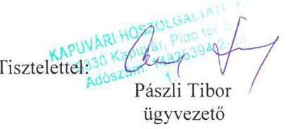

---

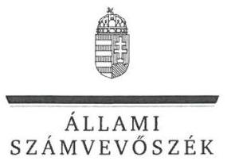

ELNÖK

Ikt.szám: V-0843-160/2016.

# Pászli Tibor Géza úr 

ügyvezető
Kapuvári Hőszolgáltató Kft.

## Kapuvár

## Tisztelt Ügyvezető Úr!

„Az Önkormányzatok gazdasági társaságai - Az önkormányzatok többségi tulajdonában lévő gazdasági társaságok közfeladat ellátását érintő gazdálkodási tevékenysége szabályszerűségének ellenőrzése - Kapuvári Hőszolgáltató Kft." címmel készített számvevőszéki jelentéstervezetre tett észrevételeit köszönettel megkaptam.

Az Állami Számvevőszék észrevételekre vonatkozó álláspontjáról a felügyeleti vezető által készített részletes tájékoztatást mellékelten megküldöm.

Tájékoztatom Ügyvezető Urat, hogy a számvevőszéki jelentésben – az Állami Számvevőszékről szóló 2011. évi LXVI. törvény 29. § (3) bekezdése alapján – a figyelembe nem vett észrevételeket szerepeltetjük az elutasítás indokának feltüntetésével.

Budapest, 2016. 03. hó 18. nap
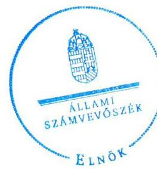

Tisztelettel:

Domokos László

Melléklet: Tájékoztatás az elfogadott és az el nem fogadott észrevételekről

---

# Tájékoztatás   az elfogadott és el nem fogadott észrevételekről 

„Az Önkormányzatok gazdasági társaságai - Az önkormányzatok többségi tulajdonában lévő gazdasági társaságok közfeladat ellátását érintő gazdálkodási tevékenysége szabályszerűségének ellenőrzése - Kapuvári Hőszolgáltató Kft. "című jelentéstervezetre 2016. február 18-án érkezett észrevételeit áttekintettük, azok kezelésével kapcsolatban a következő tájékoztatást adom.

## 1. észrevétel - a jelentéstervezetben az ügyvezetőnek tett 2. javaslathoz

Az észrevétel nem vitatja, hogy a Kapuvári Hőszolgáltató Kft. 2012-2013. évben végrehajtott fejlesztései során létrejött eszközök a társaság tulajdonában maradtak. A 2011. július 1. napjától 2014. június 30. napjáig megkötött szolgáltatási szerződés 5.19. pontja alapján: „Szolgáltatónak az üzemeltetésre átvett távhőrendszeren végzett beruházásai, fejlesztései során létrehozott eszközök, alkatrészek, közművek, illetve egyéb létesítmények a jelen szerződés megszűnéséig a Szolgáltató tulajdonában maradnak, azt követően Szolgáltató köteles azokat átadni Megbízó tulajdonába." A felek 2014. június 30-án, a 2014. július 1. 2019. június 30. időszakra újabb szolgáltatási szerződést kötöttek, így a szolgáltatást a társaság folyamatosan nyújtotta, nem került sor a szerződés megszünésére.

Az észrevételben foglaltak és a rendelkezésre álló ellenőrzési dokumentumok figyelembevételével, a vagyonátadás kötelezettségét érintő szolgáltatási szerződés folytonosságára tekintettel, a jelentéstervezetből törlésre kerülnek a vonatkozó szövegrészek (az „Összegzés" fejezetből, a „Főbb megállapítások, következtetések, javaslatok" fejezetből, a „Megállapítások" fejezet 1. Összegző megállapításból, az 1.2. számú megállapításból és annak alátámasztó szövegrészéből, a 2. Összegző megállapításból, a 2.2. számú megállapításból és annak alátámasztó szövegrészéből) és az arra alapozott javaslatok (az ügyvezető igazgatónak címzett 2. javaslat és a polgármesternek címzett 1. és 2. javaslatok) törlésre kerülnek.

## 2. észrevétel - a jelentéstervezetben az ügyvezetőnek tett 5/b. javaslathoz

Észrevételében a számvitelről szóló 2000. évi C. törvény 47. § (1) bekezdésében foglalt bekerülési érték meghatározására vonatkozó megállapítást nem vitatta. A helyi számviteli politika, és ezen belül értékcsökkenés elszámolási rend kialakítására a számvitelről szóló törvény előírásai keretén belül van lehetőség, a szabályszerűen megállapított bekerülési érték figyelembevételével számolható el értékcsökkenés. Mindezek miatt a jelentéstervezet módosítása nem indokolt.

---

Tájékoztatom, hogy a számvevőszéki jelentés függelékeként szerepeltetjük a jelentéstervezethez tett észrevételeit, valamint az azokra adott válaszunkat.

Budapest, 2016. 03. hó 18. nap

Böröcz Imre
felügyeleti vezető

---

# Kapuvár Város Polgármestere 

| Ikt.sz.: | 01-78-1/2016. | Tárgy: | Észrevétel |
| :-- | :-- | :-- | :-- |
| Ea: | Borsodi Tamás | Hiv.szám: | V-0843-153/2016. |
| Tel: | 96/596-002 | Melléklet: | 2 db |

Állami Számvevőszék

## Domokos László

Elnök Úr részére

## BUDAPEST 4

Pf. 54.
1364

## Tisztelt Elnök Úr!

Hivatkozva a V-0843-153/2016. számú számvevőszéki jelentéstervezetre az alábbi észrevételeket kívánom tenni:

1. A jelentéstervezet 16. oldalának 4. bekezdése helytelen megállapítást tartalmaz a 2013. március 11-től április 30-ig ügyvezetői feladatokat ellátó személyre vonatkozóan, ugyanis nevezett rendelkezett megbízási szerződéssel és feladatköri leírással is.
E dokumentumokat 2015. október 1-jén küldte meg szervezetük részére a Kapuvári Hőszolgáltató Kft. (Az erről szóló e-mail levelezések másolatát levelemhez melléklem.)
2. A jelentéstervezet 20. oldal 1. bekezdése kifogásolja, hogy az önkormányzat és a hőszolgáltató között létrejött 2011. július 1. napjától 2014. június 30. napjáig kötött szolgáltatási szerződés 5.19. pontja értelmében a társaság a szerződés lejártakor nem adta át az önkormányzatnak a 2013. évben üzembe helyezett építményt, illetve gépek és berendezések tulajdonjogát.
Kapuvár Város Képviselő-testülete a 100%-os önkormányzati tulajdonú Kapuvári Hőszolgáltató Kft-t azzal a szándékkal alapította meg, hogy hosszú távon ellássa a város távfűtési feladatait.
Önkormányzatunk a tárgyban említett szerződést a közbeszerzésekről szóló 2003. évi CXXIX. TV. 2/a. §-a alapján az abban foglalt feltételekkel csak határozott időre maximum 3 évre – köthette meg.

---

Ugyanígy a 2011. évi CVIII. törvény 9.§ alapján maximum 5 évre köthettük meg a jelenleg hatályban lévő szolgáltatási szerződésünket is.
A két szerződés tartalmilag azonos, tárgya Kapuvár település hőszolgáltatásának biztosítása, a szolgáltatás, illetőleg a jogszabályi megfelelés szempontjai okán a két szerződés között megszakítás nem volt. A szolgáltatás feltételei és szereplői azonosak. A szerződő felek akarata a zavarmentes, folyamatos szolgáltatásra irányul, azonos tartalommal.
Fentiek alapján kizárólag azt a következtetést lehet levonni, hogy a szolgáltatás tartalmilag, alanyilag jogfolytonos. Ki szeretném emelni, hogy az egymásba kapcsolódó – megszakítás nélküli – azonos tartalmú, és azonos felek között fennálló szerződések értelmezésénél töretlen az a joggyakorlat, hogy jogfolytonosságként kerül értelmezésre.
A szerződés kifogásolt pontja egyértelműen a szolgáltatási szerződés megszűnésekor aktivizálódott volna, azaz abban az esetben, ha a szerződés a felek között ténylegesen megszűnik – hiszen ekkor aktiválódik a felek azon kötelezettsége, hogy a szerződésből eredően elszámoljanak egymással, ezzel a magatartásukkal ténylegesen is lezárva a szerződést.
A 2011. évben megkötött szerződés hatálya alatt a cég – az önkormányzat döntése alapján – részt vett a KEOP-5.4.0/09-2010-0010. számú KEOP pályázaton. Ennek eredményeként jelentős beruházásokat hajtott végre a távhő rendszeren. A pályázat megvalósítását követően 2013.08.27. napjától 3 éves fenntartási kötelezettség terheli a céget. A fenntartási kötelezettség elengedhetetlen részkötelezettsége, hogy a támogatott tevékenységből származó javakat a hőszolgáltató társaság a saját tulajdonában tartsa. A beruházó a hatályos rendelet alapján évente köteles projektfenntartási jelentést benyújtani a közreműködő szervezetnek. A fenntartási kötelezettség megsértése, illetve a jelentés benyújtásának elmulasztása a támogatás visszafizetési kötelezettségét eredményezheti.

Álláspontunk szerint a folytonosság elve alapján jogszerűen járt el mind a gazdasági társaság, mind pedig az önkormányzat, amikor a már megkötött új, tartalmában szinte azonos szolgáltatási szerződés birtokában nem került átadásra az üzembe helyezett vagyon.

Kérem, hogy a végleges ellenőrzési jelentés elkészítésekor észrevételeinket szíveskedjenek figyelembe venni.

Kapuvár, 2016. február 16.
Tisztelettel:
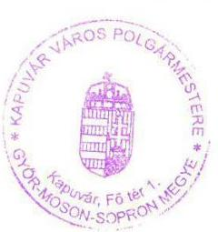

Hámori Gyöngy
Polgármester

H - 9330 Kapuvár, Fő tér 1. · Tel: (96) 596-001 · Fax: (96) 596-005
E-mail: polgarmester@kapuvar.hu

---

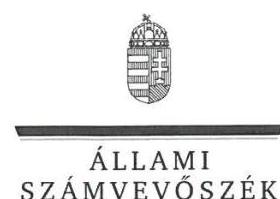

# Hámori György úr 

polgármester
Kapuvár Városi Önkormányzat

## Kapuvár

## Tisztelt Polgármester Úr!

„Az Önkormányzatok gazdasági társaságai - Az önkormányzatok többségi tulajdonában lévő gazdasági társaságok közfeladat ellátását érintő gazdálkodási tevékenysége szabályszerűségének ellenőrzése - Kapuvári Hőszolgáltató Kft." címmel készített számvevőszéki jelentéstervezetre tett észrevételeit köszönettel megkaptam.

Az Állami Számvevőszék észrevételekre vonatkozó álláspontjáról a felügyeleti vezető által készített részletes tájékoztatást mellékelten megküldöm.

Budapest, 2016. 03. hó 18. nap
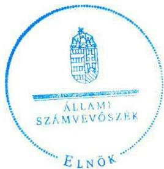

Tisztelettel:

Domokos László

Melléklet: Tájékoztatás az észrevételek kezeléséről

---

# Tájékoztatás   az észrevételek kezeléséről 

„Az Önkormányzatok gazdasági társaságai - Az önkormányzatok többségi tulajdonában lévő gazdasági társaságok közfeladat ellátását érintő gazdálkodási tevékenysége szabályszerűségének ellenőrzése - Kapuvári Hőszolgáltató Kft."című jelentéstervezetre 2016. február 22-én érkezett észrevételeit áttekintettük, azok kezelésével kapcsolatban a következő tájékoztatást adom.

## 1. észrevétel - a jelentéstervezet 16. oldal 4. bekezdéséhez

Az ügyvezetői megbízás ismételten áttekintett dokumentumai a folytonosságot igazolták, ezért a hivatkozott bekezdés megállapításainak pontosítása érdekében az észrevételezett rész 3. mondata törlésre kerül.

## 2. észrevétel - a jelentéstervezet 20. oldal 1. bekezdéséhez

Az észrevétel nem vitatja, hogy a 2013. évben üzembe helyezett építmények, illetve gépek, berendezések tulajdonjoga a Kapuvári Hőszolgáltató Kft.-nél maradt. A 2011. július 1. napjától 2014. június 30. napjáig megkötött szolgáltatási szerződés 5.19. pontja alapján: „Szolgáltatónak az üzemeltetésre átvett távhőrendszeren végzett beruházásai, fejlesztései során létrehozott eszközök, alkatrészek, közművek, illetve egyéb létesítmények a jelen szerződés megszűnéséig a Szolgáltató tulajdonában maradnak, azt követően Szolgáltató köteles azokat átadni Megbízó tulajdonába." A felek 2014. június 30-án, a 2014. július 1. 2019. június 30. időszakra újabb szolgáltatási szerződést kötöttek, így a
 szolgáltatást a társaság folyamatosan nyújtotta, nem került sor a szerződés megszűnésére.

Az észrevételben foglaltak és a rendelkezésre álló ellenőrzési dokumentumok figyelembevételével, a vagyonátadás kötelezettségét érintő szolgáltatási szerződés folytonosságára tekintettel, a jelentéstervezetből törlésre kerülnek a vonatkozó szövegrészek (az „Összegzés" fejezetből, a „Főbb megállapítások, következtetések, javaslatok" fejezetből, a „Megállapítások" fejezet 1. Összegző megállapításból, az 1.2. számú megállapításból és annak alátámasztó szövegrészéből, a 2. Összegző megállapításból, a 2.2. számú megállapításból és annak alátámasztó szövegrészéből) és az arra alapozott javaslatok (az ügyvezető igazgatónak címzett 2. javaslat és a polgármesternek címzett 1. és 2. javaslatok) törlésre kerülnek.

---

Tájékoztatom, hogy a számvevőszéki jelentés függelékeként szerepeltetjük a jelentéstervezethez tett észrevételeit, valamint az azokra adott válaszunkat.

Budapest, 2016. 03. hó 18. nap

Böröcz Imre
felügyeleti vezető

---

.

---

# RÖVIDÍTÉSEK JEGYZÉKE 

${ }^{1}$ Önkormányzat
${ }^{2}$ társaság
${ }^{3}$ polgármester
${ }^{4}$ jegyző
${ }^{5}$ ügyvezető
${ }^{6}$ gazdasági program
${ }^{7}$ Ötv.
${ }^{8}$ Kapuvár város honlapjának címe
${ }^{9}$ környezetvédelmi program
${ }^{10}$ Tszt.
${ }^{11}$ távhőszolgáltatási rendelet ${ }_{1}$
${ }^{12}$ távhőszolgáltatási rendelet ${ }_{2}$
${ }^{13}$ Alapító okirat
${ }^{14}$ Gt.
${ }^{15}$ Ctv.
${ }^{16} \mathrm{Ptk}_{2}$.
${ }^{17}$ szolgáltatási szerződés ${ }_{1}$
${ }^{18}$ szolgáltatási szerződés ${ }_{2}$
${ }^{19}$ szolgáltatási szerződés ${ }_{3}$
${ }^{20}$ szolgáltatási szerződés ${ }_{4}$
${ }^{21}$ távhőszolgáltatási díjrendelet ${ }_{1}$
${ }^{22}$ távhőszolgáltatási díjrendelet ${ }_{2}$
${ }^{23}$ Ámt.
${ }^{24}$ átadás-átvételi jegyzőkönyv

Kapuvár Városi Önkormányzat
Kapuvári Hőszolgáltató Korlátolt Felelősségű Társaság
Kapuvár Városi Önkormányzatának polgármestere
Kapuvár Városi Önkormányzat Polgármesteri Hivatalának jegyzője
Kapuvári Hőszolgáltató Kft ügyvezetője
Kapuvár Város Önkormányzat Gazdasági és humán programja 2011-2014 Elfogadva a 41/2011. (III.28.) ÖKT határozattal
a helyi önkormányzatokról szóló 1990. évi LXV. törvény
http://www.kapuvar.hu
Kapuvár Város Környezetvédelmi Programja 2011-2014 - Elfogadva: 17/2012 (II.27.) ÖKT határozattal
a távhőszolgáltatásról szóló 2005. évi XVIII. törvény (hatályos: 2005. július 1-jétől)
Kapuvár Városi Önkormányzatának 31/2004. (VI.29.) rendelete a távhőszolgáltatásról (hatályos: 2004. június 29.-től 2012. november 27-ig)
Kapuvár Városi Önkormányzatának 28/2012. (XI.28.) rendelete a távhőszolgáltatásról (hatályos: 2012. november 28.-tól)
Kapuvári Hőszolgáltató Kft. Alapító Okirata (Hatályos: 2009. június 29-től, módosítások: 2009. szeptember 24., 2011. június 10., 2012. november 13., 2013. március 11., 2013. április 9. és 2013. április 29.)
a gazdasági társaságokról szóló 2006. évi IV. törvény (hatályos: 2006. július 1-jétől 2014. március 14-ig)
a cégnyilvánosságról, a bírósági cégeljárásról és a végelszámolásról szóló 2006. évi V. törvény (hatályos: 2006. július 1.)
a Polgári Törvénykönyvről szóló 2013. évi V. törvény (hatályos: 2014. március 15-től)
Kapuvár Városi Önkormányzat és a Kapuvári Hőszolgáltató Kft között megkötött 2011. január 1. és 2011. március 31. közötti időszakra szóló szolgáltatási szerződés
Kapuvár Városi Önkormányzat és a Kapuvári Hőszolgáltató Kft között megkötött 2011. április 1. és 2011. június 30. közötti időszakra szóló szolgáltatási szerződés
Kapuvár Városi Önkormányzat és a Kapuvári Hőszolgáltató Kft között megkötött 2011. július 1. és 2014. június 30. közötti időszakra szóló szolgáltatási szerződés
Kapuvár Városi Önkormányzat és a Kapuvári Hőszolgáltató Kft között megkötött 2014. július 1. és 2019. június 30. közötti időszakra szóló szolgáltatási szerződés
Kapuvár Városi Önkormányzatának Képviselő-testületének 21/2009 (X.27.) rendelete a távhőszolgáltatás díjáról (hatályos: 2009. november 1-jétől 2011. február 1.-ig)
Kapuvár Városi Önkormányzatának Képviselő-testületének 3/2011 (I.31.) rendelete a távhőszolgáltatás díjáról (hatályos: 2011. február 1.-től 2013. március 14-ig)
az árak megállapításáról szóló 1990. évi LXXXVII. törvény (hatályos: 1991. január 1-jétől)
Kapuvár Városi Önkormányzat és a Kapuvári Hőszolgáltató Kft között 2009. december 28-án létrejött átadás-átvételi jegyzőkönyv (módosítva: 2010. március 24. és 2013. december 30.)

---

${ }^{25}$ vagyonrendelet ${ }_{1}$

${ }^{26}$ vagyonrendelet ${ }_{2}$
${ }^{27} \mathrm{FB}$
${ }^{28}$ Taktv.
${ }^{29}$ ügyrend
${ }^{30}$ javadalmazási szabályzat
${ }^{31} \mathrm{MEH}$
${ }^{32}$ számviteli politika ${ }_{1}$
${ }^{33}$ számviteli politika ${ }_{2}$
${ }^{34}$ számlarend $_{1}$
${ }^{35}$ számlarend $_{2}$
${ }^{36}$ leltározási szabályzat
${ }^{37}$ értékelési szabályzat ${ }_{1}$
${ }^{38}$ értékelési szabályzat ${ }_{2}$
${ }^{39}$ pénzkezelési szabályzat ${ }_{1}$
${ }^{40}$ pénzkezelési szabályzat ${ }_{2}$
${ }^{41}$ bizonylati rend
${ }^{42}$ hátralékkezelési szabályzat
${ }^{43}$ közbeszerzési szabályzat
${ }^{44}$ szétválasztási szabályozás ${ }_{1}$
${ }^{45}$ szétválasztási szabályozás ${ }_{2}$
${ }^{46}$ Info tv.
${ }^{47}$ 50/2011. (IX.30.) NFM rendelet
${ }^{48}$ Rezsi tv.

Kapuvár Városi Önkormányzatának 44/2004. (XI.29.) rendelete az Önkormányzat vagyonáról, és a vagyongazdálkodás szabályairól (hatályos: 2004. december 1-jétől)
Kapuvár Városi Önkormányzatának 26/2012. (XI.28.) rendelete az Önkormányzat vagyonáról, és a vagyongazdálkodás szabályairól (hatályos: 2012. november 29-től, módosítva a 32/2013. (XII.30.) és a 14/2014. (VII.2.) rendeletekkel)
Kapuvári Hőszolgáltató Kft Felügyelő Bizottsága
a köztulajdonban álló gazdasági társaságok takarékosabb működéséről szóló 2009. évi CXXII. törvény (hatályos: 2009. december 4.-től)
a Kapuvári Hőszolgáltató Kft Felügyelő Bizottságának ügyrendje (Képviselő testület jóváhagyta a 222/2012. (XI.26.) számú határozatával)
Kapuvár Város Önkormányzatának kizárólagos tulajdonában álló gazdasági társaságok javadalmazási szabályzata (hatályos: 2011. április 29-től)
Magyar Energia Hivatal (2013. április 4-étől Magyar Energetikai és Közműszabályozási Hivatal)
Kapuvári Hőszolgáltató Kft számviteli politikája (hatályos: 2009. július 1-jétől 2013. december 31-ig)

Kapuvári Hőszolgáltató Kft számviteli politikája (hatályos: 2013. január 1-jétől)
Kapuvári Hőszolgáltató Kft - Számlarend 2013.
Kapuvári Hőszolgáltató Kft - Számlarend 2014.
Kapuvári Hőszolgáltató Kft leltározási szabályzata (hatályos: 2009. július 1-jétől)
Kapuvári Hőszolgáltató Kft értékelési szabályzata (hatályos: 2013. január 1-jétől 2013. december 31.-ig)

Kapuvári Hőszolgáltató Kft értékelési szabályzata (hatályos: 2014. január 1-jétől)
Kapuvári Hőszolgáltató Kft pénzkezelési szabályzata (hatályos: 2009. július 1-jétől 2012. december 31-ig)

Kapuvári Hőszolgáltató Kft pénzkezelési szabályzata (hatályos: 2013. január 1-jétől)
Kapuvári Hőszolgáltató Kft bizonylati rendje (hatályos: 2009. július 1-jétől)
Kapuvári Hőszolgáltató Kft Hátralékkezelési Szabályzata (hatályos: 2009. szeptember 10.-től)
Kapuvári Hőszolgáltató Kft Közbeszerzési Szabályzata (hatályos: 2011. október 2-től)
A Kapuvári Hőszolgáltató Kft ügyvezetője által készített szabályozás 2013. évre a társaság bevételeinek és kiadásainak elkülönítésére (a dokumentum készítésének dátuma hiányzik)
A Kapuvári Hőszolgáltató Kft ügyvezetője és megbízott szakértője által készített szabályozás 2014. évre a társaság bevételeinek és kiadásainak elkülönítésére (a dokumentum készítésének dátuma hiányzik)
az információs önrendelkezési jogról és az információszabadságról szóló 2011. évi CXII. törvény (hatályos: 2011. július 27-től)
a távhőszolgáltatónak értékesített távhő árának, valamint a lakossági felhasználónak és a külön kezelt intézményeknek nyújtott távhőszolgáltatás díjának megállapításáról szóló 50/2011. (IX.30.) NFM rendelet (hatályos: 2011. október 1-jétől)
a rezsicsökkentések végrehajtásáról szóló 2013. évi LIV. törvény (hatályos 2013. május 10-től)

---

ÁLLAMI SZÁMVEVŐSZÉK
1052 Budapest, Apáczai Csere János utca 10.
Levélcím: 1364 Budapest 4. Pf. 54
Telefon: +36 14849100 Telefax: +36 14849200
www.asz.hu
