# Jelentés 

## Az önkormányzatok gazdasági társaságai

Az önkormányzatok többségi tulajdonában lévő gazdasági társaságok közfeladat ellátását érintő gazdálkodási tevékenysége szabályszerűségének ellenőrzése - Makói Kommunális Nonprofit Kft.

2016.
„A közfeladat ellátás színvonala, költségeinek, ráfordításainak alakulása hatással van a szolgáltatást igénybe vevő lakosság elégedettségére.”

---

# Jelentés 

## Az önkormányzatok gazdasági társaságai

Az önkormányzatok többségi tulajdonában lévő gazdasági társaságok közfeladat ellátását érintő gazdálkodási tevékenysége szabályszerűségének ellenőrzése - Makói Kommunális Nonprofit Kft.
2016. március hó 34. nap
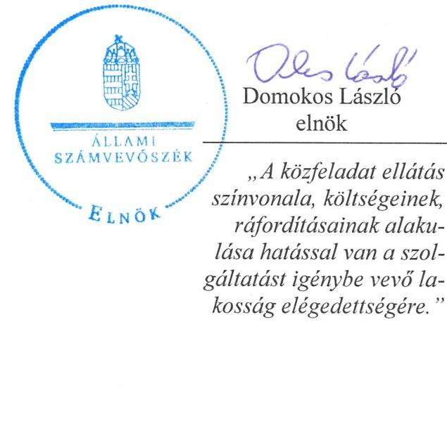

---

# AZ ELLENŐRZÉST FELÜGYELTE: 

BÖRÖCZ IMRE felügyeleti vezető

## AZ ELLENŐRZÉST VEZETTE ÉS A VÉGREHAJTÁSÁÉRT FELELŐS:

SALAMIN VIKTOR ellenőrzésvezető

## A PROGRAM ÖSSZEÁLLÍTÁSÁÉRT FELELŐS:

JANIK JÓZSEF LÁSZLÓ osztályvezető

## A TÉMÁHOZ KAPCSOLÓDÓ KORÁBBI SZÁMVEVŐSZÉKI JELENTÉSEK:

- címe: Jelentés az önkormányzati vagyongazdálkodás szabályszerűségi ellenőrzéséről - Makó
- sorszáma: 13075

Jelentéseink az Országgyűlés számítógépes hálózatán és az Interneten a www.asz.hu címen is olvashatóak.

IKTATÓSZÁM: V-0823-194/2016
TÉMASZÁM: 1857
ELLENŐRZÉS-AZONOSÍTÓ SZÁM: V-070708

---

# TARTALOMJEGYZÉK 

■ ÖSSZEGZÉS ..... 4
■ AZ ELLENŐRZÉS CÉLJA ..... 7
■ AZ ELLENŐRZÉS TERÜLETE ..... 8
■ AZ ELLENŐRZÉS HÁTTERE, INDOKOLTSÁGA ..... 10
■ FÓKUSZKÉRDÉSEK ..... 11
■ ELLENŐRZÉS HATÓKÖRE ÉS MÓDSZEREI ..... 12
■ MEGÁLLAPÍTÁSOK ..... 14
■ JAVASLATOK ..... 26
■ MELLÉKLETEK ..... 31
I. Sz. melléklet: Értelmező szótár. ..... 31
II. Sz. melléklet: Makói Városgazdálkodási Nonprofit Kft. eredménykimutatás adatai (ezer Ft) ..... 33
■ FÜGGELÉK: ÉSZREVÉTELEK ..... 35
■ RÖVIDÍTÉSEK JEGYZÉKE ..... 45

---

# ÖSSZEGZÉS 

Az Állami Számvevőszék ellenőrzése a távhőszolgáltatás közfeladatának ellátását értékelte a kizárólagos önkormányzati tulajdonú Makói Városgazdálkodási Nonprofit Kft.-nél - korábban Makói Kommunális Nonprofit Kft. - 2011-2014. évekre vonatkozóan. Makó Város Önkormányzata a közfeladat ellátását biztosította, azonban a tulajdonosi jogok érvényesítésének hiányosságai is hozzájárultak a Társaságnál tapasztalt szabályozási hiányosságok, beszámolási szabálytalanságok kialakulásához, valamint a távhőszolgáltatás bevételeinek és ráfordításainak elszámolásában tapasztalt jogszabályellenes gyakorlathoz.

## Az ellenőrzés társadalmi indokoltsága

Az Állami Számvevőszék középtávra szóló stratégiájában megfogalmazta, hogy a helyi önkormányzatok gazdálkodásában rejlő pénzügyi kockázatok feltárásával, az államháztartáson kívülre nyújtott költségvetési támogatások és ingyenes vagyonjuttatások, valamint az államháztartáson kívül működő közfeladat-ellátó rendszerek ellenőrzéseivel hozzájárul ahhoz, hogy a közpénzeket az államháztartáson kívül működő szervezetek is átlátható, rendezett módon használják fel a közfeladatok szerződésben vállalt ellátása érdekében.

Magyarországon az intézmény-centrikus közfeladat-ellátás jellemző, de egyre jelentősebb a költségvetésen kívüli feladatellátás térnyerése. Ennek legfontosabb szereplői - a nonprofit szervezetek mellett - az önkormányzati tulajdonú gazdasági társaságok. Az önkormányzatok szervezetalakítási szabadságának következménye, hogy a korábban is vállalati formában működő közszolgáltatások mellett; mind a kötelező, mind az önként vállalt feladatok ellátásában a gazdasági társaságok kiemelt fontosságú szerephez jutottak.

## Főbb megállapítások, következtetések, javaslatok

Az Önkormányzat a távhőszolgáltatás közfeladatának megszervezéséről a jogszabályban foglalt előírásoknak megfelelően döntött. A távhőszolgáltatás biztosításához szükséges vagyont 55,0 M Ft értékben az Önkormányzat az alapítással egy időben apportként bocsátotta a jogelőd társaság rendelkezésére.

A Képviselő-testület által a 2011-2014. évekre elfogadott Gazdasági és Munkaprogram a távhőszolgáltatási közfeladat biztosítására, színvonalának javítására vonatkozó fejlesztési célokat az önkormányzati törvény előírása ellenére nem tartalmazott. A feladatellátás keretszabályait a Társaság és az Önkormányzat között létrejött megállapodások rögzítették. A jegyző - a jogszabály előírása ellenére - az üzletszabályzatot nem küldte meg a fogyasztóvédelmi hatóságnak véleményezésre, valamint nem ellenőrizte az abban foglaltak betartását. Az Önkormányzat a távhőrendelet megalkotta, 2011. április 14-ig az alkalmazott díjakat számításokkal alátámasztotta, azonban a jogszabályi előírás ellenére a távhőszolgáltatási csatlakozási díjakról és azok fizetési feltételeiről nem rendelkezett.

A tulajdonosi jogok gyakorlásának rendjét az Önkormányzat rendeleteiben és a Társaság Alapító okiratában szabályozta. A Javadalmazási szabályzatot a képviselő-testület elfogadta, az abban foglaltakat azonban egy alkalommal nem tartották be, mivel a felügyelőbizottság előzetes véleményét a jutalmazással kapcsolatban nem kérték ki.

A Társaság éves beszámolóit az Alapító okirat rendelkezéseinek megfelelően elkészítette. A képviselő-testület az egyszerűsített éves beszámolókat határozattal elfogadta, ezek azonban nem voltak érvényesek, mivel a jogszabályok szerint a beszámolóról a gazdasági társaság legfőbb szerve csak a felügyelőbizottság írásbeli jelentésének birtokában határozhat, dönthet.

A Társaság nem készítette el teljes körűen a jogszabályban előírt szabályzatokat, a meglévők tartalma sem minden esetben felelt meg az előírásoknak. Rendelkezett a számviteli törvény által előírt számviteli politikával, eszközök és 

---

források leltárkészítési és leltározási szabályzatával, pénzkezelési szabályzattal, számlarenddel, ugyanakkor az eszközök és források értékelési szabályzatát nem készítette el. Az eszközök és források értékelésének szabályait részben a számviteli politika tartalmazta. Nem szabályozták azonban a számviteli törvényben foglaltak ellenére a követelések után elszámolható értékvesztés mértékét és az elszámolás módját. A számviteli politika hiányossága volt, hogy nem tartalmazta a távhőszolgáltatási törvényben 2012. január 1-jétől rögzített szétválasztási szabályokat. Nem rögzítették továbbá, hogy az értékelés szempontjából mit tekint a Társaság jelentősnek. Az üzletszabályzatot elkészítették, de a vonatkozó jogszabály változását követően nem aktualizálták.

A számlarendben meghatározott számlák használata nem tette lehetővé a számviteli szétválasztás szabályainak megfelelő, tevékenységenként elkülönített adatok előállítását, a költségek és ráfordítások megosztását. Ezzel a Társaság megsértette a számviteli törvény előírását, mivel a könyvvezetésre, a bizonylatolásra vonatkozó részletes belső szabályait nem úgy alakította ki, hogy az a mérleg és az eredménykimutatás alátámasztásán túlmenően a kiegészítő melléklet adatainak közvetlen alátámasztására is alkalmas legyen. A számlarendben a közfeladat ellátással kapcsolatos bevételek és ráfordítások elszámolását sem megfelelően szabályozta a Társaság.

A Társaság a tulajdonában lévő vagyonával alapvetően a jogszabályi előírásoknak megfelelően gazdálkodott, a közfeladat ellátást szolgáló vagyon a saját vagyona volt. A tárgyi eszközök könyv szerinti értéke folyamatosan nőtt, mivel a Társaság az amortizációt meghaladó mértékű beruházásokat, fejlesztéseket hajtott végre. A 2011-2013. években a beszámolóban értékelési tartalék szerepelt az ingatlanokkal kapcsolatban, ami ellentétes volt a Számviteli politika rendelkezésével. A Társaság a 2011-2014. évi beszámolók kiegészítő mellékleteiben a számviteli törvényben foglaltak ellenére az értékhelyesbítés nyitó értékét, növekedését, csökkenését, záró értékét és az értékelésnél alkalmazott módszereket az előírt részletezésben nem mutatta be.

A kötelezettségek állománya nem jelentett kockázatot a közfeladat ellátására, a működésre. A Társaság az időszakos likviditási nehézségeket az Önkormányzat segítségével finanszírozta, az Önkormányzattól kapott kölcsönöket határidőben visszafizette, az eladósodottság mértéke javuló tendenciát mutatott.

Az előírt beszámolási, adatszolgáltatási kötelezettségének tartalmi hiányosságokkal tett eleget a Társaság. A 2011-2014. évekre vonatkozó beszámolóját elkészítette, gondoskodott a letétbe helyezésről és a közzétételről a törvény előírásainak megfelelően. A ráfordításokon belül az egyes tevékenységek elkülönítését a számlatükör nem tartalmazta. A közvetett költségek felosztását nem végezték el, a közfeladatok tevékenységének ráfordításait csak közvetlen önköltség szintjén tudták megjeleníteni a nyilvántartásaikban a távhőszolgáltatási törvényben rögzített követelmények ellenére. A Társaság a telephelyenkénti számviteli szétválasztási kötelezettségnek sem tett eleget. A 2012. és 2014. évi beszámolók eredménykimutatásában a távfűtésre vonatkozó adatok nem egyeztek meg a kiegészítő mellékletében szerepeltetett adatokkal, ez ellentétes a távhőszolgáltatási törvényben foglaltakkal.

Az Önkormányzattal évenként kötött feladatellátási megállapodásokban az Önkormányzat az adott évi költségvetésből a működési támogatást egy összegben állapította meg. A szétválasztási szabályok alapján elkészített beszámolók vonatkozásában a kapott támogatás teljes összege nem a távhő üzletág, hanem az egyéb tevékenységek eredményében jelent meg, ami ellentétes volt a 2013-2014. évi megállapodásokban foglaltakkal, melyben a távhőszolgáltatás is szerepelt a támogatott feladatok között. A támogatás ilyen módszerrel történő elszámolásával megsértették a távhőszolgáltatási törvényt, mivel a támogatás feladatonkénti megbontásának módszerével nem biztosították az egyes tevékenységek átláthatóságát és diszkriminációmentességét, nem állapítható meg a keresztfinanszírozás és a versenytorzítás kizárása.

A könyvvizsgáló jelentéseiben a számviteli szétválasztási szabályok alkalmazásáról nyilatkozott, igazolta, hogy a Társaság egyes tevékenységei közötti tranzakciók árazása biztosítja a vállalkozás tevékenységei közötti keresztfinanszírozás mentességet. A 2012-2014. évi beszámolókhoz kiadott jelentések a távhőszolgáltatási törvény előírása ellenére nem tartalmaztak igazolást a számviteli szétválasztási szabályok kidolgozására vonatkozóan.

Az ellátott közfeladat bevételeinek és ráfordításainak elszámolásában az ellenőrzés több hiányosságot is feltárt. A számlázási rendszer zárt működtetése nem volt biztosított, az elszámolt költségeket alátámasztó dokumentumok nem álltak rendelkezésre, melyek következtében a távhőszolgáltatáshoz kapcsolódó bevételek, valamint az anyagjellegű ráfordítások elszámolását nem megfelelőnek, a beruházások, felújítások elszámolását magas kockázatúnak minősítettük.

Az eszközök használhatósági foka a közfeladat ellátását szolgáló eszközök esetében romlott. Önköltségszámítási szabályzat készítésére a számviteli törvény előírása alapján a Társaság nem volt kötelezett, szabályzatot nem készített.

---

Az ÁSZ a gazdálkodás szabályszerűségének javítása és a megfelelő gazdálkodási gyakorlat érdekében a társaság ügyvezetőjének, az Önkormányzat szabályszerű működésének elősegítésére, továbbá az önkormányzati tulajdonosi joggyakorlás kontrolljainak erősítésére Makó Város polgármesterének, továbbá Makó Város jegyzőjének fogalmazott meg javaslatokat.

A jelentésben szereplő javaslatok alapján a társaság ügyvezetője és Makó Város polgármestere kötelesek intézkedési terveket összeállítani és azokat a jelentés kézhezvételétől számított 30 napon belül az ÁSZ részére megküldeni.

---

# AZ ELLENŐRZÉS CÉLJA 

## A Társaság közfeladat ellátását érintő gazdálkodási tevékenysége szabályszerűségének értékelése

Az ellenőrzés célja annak értékelése, hogy az Önkormányzat a jogszabályi előírások figyelembevételével döntött-e az ellenőrzésre kerülő közfeladat megszervezéséről; az Önkormányzat/tulajdonosi joggyakorló szabályszerűen gyakorolta-e a tulajdonosi jogokat.

Ellenőriztük, hogy a gazdasági társaság közfeladat-ellátása bevételeinek, ráfordításainak elszámolása, és vagyongazdálkodási tevékenysége megfelelt-e a jogszabályi, illetve a közszolgáltatási/vagyonkezelési szerződésben foglalt tulajdonosi előírásoknak, azok végrehajtása szabályszerű volt-e.

Értékeltük továbbá, hogy a gazdasági társaság kötelezettségállománya jelent-e kockázatot a működésre, illetve a közfeladat ellátására; valamint hogy a közfeladatok átláthatósága és elszámoltathatósága érdekében biztosítva volt-e a közszolgáltatás díjának megalapozottsága szabályszerű önköltségszámítással.

---

# **AZ ELLENŐRZÉS TERÜLETE**

## **Makó Város Önkormányzata és a kizárólagos tulajdonában lévő Makói Városgazdálkodási Nonprofit Kft.**

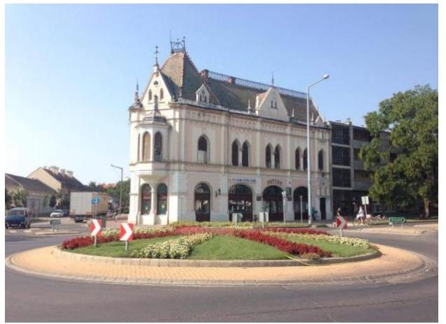

A Makói Városgazdálkodási Nonprofit Kft. 1997. január 1-jén alakult Makói Kommunális és Közbeszerzési Kht. néven. Nonprofit gazdasági társasággá 2009. március 12-én alakult át, majd 2014. szeptember 5-től elnevezése megváltozott és Makói Városgazdálkodási Nonprofit Kft. néven folytatta tevékenységét. 100 %-os tulajdonosa Makó Város Önkormányzati Képviselő-testülete. Jegyzett tőkéje 2006 óta változatlan, 55 M Ft.

A 2006. május 24-én kelt alapító okirat változásával bővült a közhasznú tevékenységek köre gőz-, és melegvíz-ellátással, majd 2011. március 18-án kezdte el a hőelosztási szolgáltatást is végezni. Fő tevékenységi köre 2014. június 6-tól lett a gőzellátás, légkondicionálás, melynek keretében a távhőenergia termelést, elosztást, értékesítést, fűtés-, és használati melegvíz szolgáltatást, valamint a hőtermelő, hőelosztó és hőfelhasználó berendezések üzemeltetését, fenntartását és karbantartását végzi. A Társaság rendelkezett a hőtermelés és szolgáltatás végzéséhez szükséges hatósági engedélyekkel.

Makón korábban két földgáz alapú fűtőművel állították elő a távhőt. A magas költségek miatt a város – két termálkút fúrásával – váltotta ki a földgázt geotermikus energiára. A rendszer teszt üzemmódban működött 2012 novemberéig, a teljes üzemmód a visszasajtoló kutak elkészültével kezdődött meg. A városban 799 lakás és 58 közintézmény fűtés és meleg vízzel történő ellátását biztosítja a Társaság.

A távhőszolgáltatási közfeladat bevételeinek az aránya a teljes nettó árbevételből a 2012. évi 40,1 %-ról a 2014. évre 48,6 %-ra nőtt, azonban az árbevétel növekedése ellenére a beszámolóban kimutatott mérleg szerinti eredménye mindkét évben negatív volt. Az eszközpótlásra fordított összeg társasági szinten meghaladta az elszámolt értékcsökkenést.

Néhány jellemző gazdálkodási adat alakulását szemlélteti az 1. ábra az ellenőrzési időszakban.

---

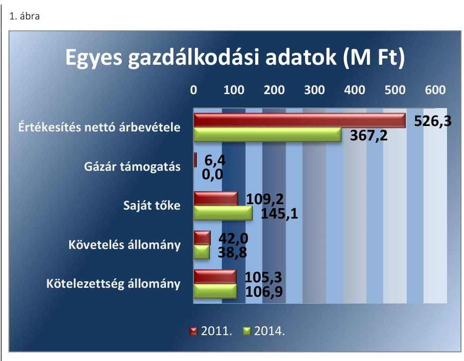

Forrás: A Társaság 2011. és 2014. évi
 beszámolói
Az ellenőrzött időszakban az ügyvezető személye négy alkalommal változott. A jelenlegi ügyvezető 2009. január 1. és 2013. március 27. között, majd 2014. november 15. óta látja el a feladatot. A polgármester és a jegyző személye egy alkalommal változott. A jelenlegi polgármester a 2014. évi helyi önkormányzati választások óta tölti be tisztségét, a helyszíni ellenőrzés időszakában a munkakört betöltő jegyző 2015. január 1-jétől látja el feladatait.

---

# AZ ELLENŐRZÉS HÁTTERE, INDOKOLTSÁGA 

Objektív kép kialakítása Makó Város Önkormányzata távhőszolgáltatási közfeladatának megszervezéséről, tulajdonosi joggyakorlásáról, valamint a kizárólagos tulajdonában lévő Makói Városgazdálkodási Nonprofit Kft. közfeladat-ellátását érintő gazdálkodási tevékenységének szabályszerűségéről.

## A gazdasági társaságok a közfeladatok ellátásában kiemelt fontosságú szerephez jutottak

AZ ÁLLAMI SZÁMVEVŐSZÉK KÖZÉPTÁVRA SZÓLÓ STRATÉGIÁJÁBAN megfogalmazta, hogy a helyi önkormányzatok gazdálkodásában rejlő pénzügyi kockázatok feltárásával, az államháztartáson kívülre nyújtott költségvetési támogatások és ingyenes vagyonjuttatások, valamint az államháztartáson kívül működő közfeladat-ellátó rendszerek ellenőrzéseivel hozzájárul ahhoz, hogy a közpénzeket az államháztartáson kívül működő szervezetek is átlátható, rendezett módon használják fel a közfeladatok szerződésben vállalt ellátása érdekében.

Az önkormányzatok szervezetalakítási szabadságának következménye, hogy a korábban is vállalati formában működő (nagyvárosi tömegközlekedés, víz-, szennyvízcsatorna, köztisztasági, ingatlankezelés, stb.) közszolgáltatások mellett, mind a kötelező, mind az önként vállalt feladatok ellátásában a gazdasági társaságok kiemelt fontosságú szerephez jutottak.

AZ ELLENŐRZÉS HASZNOSULÁSAKÉNT meghatározhatóvá válnak a közfeladat-ellátásban részt vevő államháztartáson kívüli szervezeteknek - az önkormányzat költségvetését, pénzügyi helyzetét is befolyásoló - kockázatai, lehetővé válik ezen kockázatok csökkentése. Feltárja, hogy az önkormányzat közfeladat-ellátási kötelezettségének szabályszerűen tett-e eleget, a feladatellátáshoz rendelt közvagyon működtetését szabályszerűen szervezte-e meg és a tulajdonosi felügyelete hozzájárult-e a közfeladat-ellátásához. A feladatot ellátó gazdasági társaság a közszolgáltatási szerződésben foglaltak betartásával, a közvagyon használatával biztosította-e a szolgáltatás folytatásának feltételeit. Ezzel az ellenőrzöttek és a helyi döntéshozók számára visszajelzést ad feladatszervezési, feladat-ellátási kockázataikról, alapot ad a meglévő hibák megszüntetéséhez, a jobb közfeladat-ellátás biztosításához. Fokozza a fegyelmet, igazolja, hogy lejárt a következmények nélküli ellenőrzések időszaka. A törvényalkotás számára - az észlelt problémák, szabálytalanságok, vagy egyéb nem kívánatos jelenségek felszínre kerülésével - az ellenőrzés megállapításai segítséget nyújthatnak az államháztartáson kívüli közfeladat-ellátás értékeléséhez, jogszabályi keretei pontosításához, átláthatóságot biztosító szabályozásához. Az ÁSZ értékteremtő rend kialakításához és megőrzéséhez hozzájáruló tevékenysége pozitív hatással van a szervezetről kialakított összkép formálására is.

---

# FÓKUSZKÉRDÉSEK 

1. Az önkormányzat közfeladat megszervezéséről szóló döntése, valamint tulajdonosi joggyakorlása szabályszerű volt-e?
2. A gazdasági társaság vagyongazdálkodása szabályszerű volt-e, kötelezettségállománya jelentett-e kockázatot a működésre, illetve a közfeladat ellátásra?
3. A gazdasági társaságnál az ellátott közfeladat bevételei és ráfordításai elszámolása, valamint az önköltségszámítás és árképzés szabályszerű volt-e?

---

# ELLENŐRZÉS HATÓKÖRE ÉS MÓDSZEREI 

## Az ellenőrzés típusa

Megfelelőségi ellenőrzés

## Az ellenőrzött időszak

2011-2014. évek

## Az ellenőrzés tárgya

Az ellenőrzés tárgya annak megállapítása, hogy az önkormányzat közfeladat-ellátási kötelezettségének szabályszerűen tett-e eleget, a feladatellátáshoz rendelt közvagyon működtetését szabályszerűen szervezte-e meg és a tulajdonosi felügyelete hozzájárult-e a közfeladat-ellátásához. A feladatot ellátó gazdasági társaság a közszolgáltatási szerződésben foglaltak betartásával biztosította-e a szolgáltatást, valamint vagyon-gazdálkodása bevételeinek és ráfordításainak elszámolása szabályszerű és átlátható volt-e.

## Az ellenőrzött szervezet

Makó Város Önkormányzata és a Makói Kommunális Nonprofit Kft.

## Az ellenőrzés jogalapja

Az ÁSZ tv. ${ }^{1}$ 5. § (3)-(4)-(5) bekezdése képezte.

## Az ellenőrzés módszerei

Az ellenőrzést a nemzetközi standardokat irányadónak tekintve az ellenőrzési program ellenőrzési kérdései, az ellenőrzött időszakban hatályos jogszabályok, az ellenőrzés szakmai szabályok és módszertanok figyelembe vételével végezzük.

Az ellenőrzés ideje alatt az ellenőrzött szervezettel történő kapcsolattartást az ÁSZ Szervezeti és Működési Szabályzatának vonatkozó előírásai alapján biztosítjuk.

Az ellenőrzés a kiválasztott, többségi tulajdonosi jogokat gyakorló önkormányzatra, illetve az ellenőrzésre kijelölt közfeladatot ellátó gazdasági társaság felett tulajdonosi jogokat gyakorló szervezetre és az ellenőrzött

---

közfeladatot ellátó gazdasági társaságra terjed ki. Amennyiben a gazdasági társaságban több önkormányzat együttesen többségi tulajdonos, úgy az ellenőrzést a többségi tulajdonosi jogokat gyakorló önkormányzatnál kell lefolytatni. Az ellenőrzött gazdasági társaságnál, amennyiben az több közfeladatot is ellát, akkor az ellenőrzésre kiválasztott közfeladat-ellátást ellenőrizzük.

Az ellenőrzést a kérdésekre adott válaszok kiértékelésével, valamint a megjelölt adatforrások, a csatolt tanúsítványok felhasználásával, továbbá az adott időszakban hatályos jogszabályok figyelembe vételével kell lefolytatni. Az ellenőrzési kérdések megválaszolásához szükséges bizonyítékok megszerzése a következő ellenőrzési eljárások alkalmazásával történik: megfigyelés, kérdésfeltevés (információkérés), összehasonlítás, valamint elemző eljárás.

A bevételek és ráfordítások elszámolása, valamint a vagyonnyilvántartás terén a szabályszerű működést mintavétellel ellenőriztük, ez alapján a sokaságokban előforduló hibás tételek arányát becsültük. A jogszabályoknak és a belső előírásoknak megfelelőnek tekintettük az adott területet, amennyiben a minta ellenőrzésének eredménye alapján 95%-os bizonyossággal a teljes sokaságban a hibaarány kisebb volt, mint 10%, nem megfelelőnek értékeltük, ha a hibaarány a 10%-ot meghaladta. Kockázatot, illetve magas kockázatot jeleztünk, amennyiben egy adott terület vonatkozásában a minta alapján a teljes sokaságban nem volt teljes körűen biztosított a jogszabályoknak és a belső szabályzatoknak megfelelő működés.

---

# 1. Az önkormányzat közfeladat megszervezéséről szóló döntése, valamint tulajdonosi joggyakorlása szabályszerű volt-e? 

Összegző megállapítás

Az Önkormányzat a távhőszolgáltatás közfeladatának megszervezéséről a jogszabályban foglalt előírásoknak megfelelően döntött, a Képviselő-testület azonban - a tulajdonosi joggyakorlása keretében - a beszámolókat a felügyelőbizottság írásbeli véleménye nélkül fogadta el.

### 1.1. számú megállapítás

A közfeladat-ellátást az Önkormányzat szabályszerűen szervezte meg, a távhőszolgáltatásra vonatkozó rendeletalkotási kötelezettségének - a csatlakozási díjak és azok fizetési feltételeinek szabályozása kivételével - eleget tett.

Az Ötv. ${ }^{2}$ 91. § (6) bekezdése, 2013. január 1-jétől az Mötv. ${ }^{3}$ 116. § (3)(4) bekezdései szerint az önkormányzatnak a gazdasági programjában kell meghatároznia azokat a célkitűzéseket, amelyek az általa ellátott feladatok biztosítását, fejlesztését szolgálják. A képviselő-testület ${ }^{4}$ által a 2011-2014. évekre elfogadott Gazdasági és Munkaprogram a távhőszolgáltatási közfeladat biztosítására, színvonalának javítására vonatkozó fejlesztési célokat nem tartalmazott.

Az Önkormányzat az Ötv. 18. §-ában foglaltakkal összhangban rendelkezett SZMSZ${ }^{5}$ 1-3-szal, melyben rögzítette a távhőszolgáltatási feladat ellátásának a Tszt. ${ }^{6}$ 6. § (1) bekezdésében előírt kötelezettségét. Az Önkormányzat - az Ötv. 9. § (4) bekezdésében foglalt lehetőséggel élve - az ellenőrzött időszakot megelőzően döntött a távhőszolgáltatás gazdasági társaság útján történő ellátásáról. A távhőszolgáltatás biztosításához szükséges vagyont 55,0 M Ft értékben az Önkormányzat az alapítással egy időben apportként bocsátotta a jogelőd társaság rendelkezésére. Az Önkormányzat az apportként szolgáltatott vagyonon felül a távhőszolgáltatási tevékenység ellátásához üzemeltetésre, vagyonkezelésre nem bocsátott eszközöket a Társaság rendelkezésére.

A TÁRSASÁG ${ }^{7}$ ALAPÍTÓ OKIRATA megfelelt a Gt. ${ }^{8}$ 12. § (1) bekezdésében, továbbá a Ptk. ${ }^{9}$ 54. § (2) bekezdésében, illetve 2014. március 15-től a Ptk. ${ }^{10}$ 3:5. §-ában előírt tartalmi követelményeknek. A Társaság Alapító Okiratát öt alkalommal módosították. Kettő esetben a tisztségviselők személyének változása, három esetben jogszabályi változások indokolták a módosítást. A Társaság tevékenységét képezte az Alapító Okiratban foglaltak szerint a távhőtermelés és távhőszolgáltatáson kívül egyes kommunális, mezőgazdasági és ipari feladatok ellátása.

A feladatellátás keretszabályait a Társaság és Önkormányzat között létrejött megállapodások rögzítették. Az évenként megkötött megállapodásokban - az Alapító Okiratban előírtakkal összhangban - meghatározták a

---

Társaság adott évi feladatait, az üzleti terv készítésének kötelezettségét. Az Önkormányzat vállalta az üzleti terv alapján megállapított működési támogatás biztosítását - többek között - a távhőszolgáltatás feladatának ellátásához.

A jegyző az üzletszabályzatot nem küldte meg a fogyasztóvédelmi hatóságnak véleményezésre, amivel megsértette a Tszt. 7. § (1) bekezdés a) pontjában foglaltakat. A jegyző 2011. április 14-ig a Tszt. 7. § (1) bekezdés e) pontja, 2011. április 15-től c) pontja ellenére nem ellenőrizte a távhőszolgáltató tevékenységet az üzletszabályzatban foglaltaknak betartása szempontjából.

A TÁVHŐRENDELET megalkotásával az Önkormányzat a Tszt. 6. § (2) bekezdés a) és d) pontjában előírt kötelezettségének tett eleget, mivel a rendeletben
meghatározta a távhőszolgáltató és a felhasználó közötti jogviszony részletes szabályait, a hőmennyiségmérés helyét, ideértve a mérés technológiai helyét is,
megállapította a távhőszolgáltatás szüneteltetésének és a felhasználók korlátozásának feltételeit, a korlátozás szabályait és sorrendjét, valamint a távhőszolgáltató azzal kapcsolatos jogait és kötelezettségeit, továbbá
rögzítette a távhő legmagasabb díjait az alapdíjak és hődíjak vonatkozásában a 2012. december 20-ai módosításig. A távhőrendelet módosítási kötelezettségének késve tett eleget az Önkormányzat, mivel a Tszt. 57/D. § 2011. április 15-i módosítását követően szűnt meg az ármegállapítási joga az alapdíjak és hődíjak vonatkozásában.
Az Önkormányzat a távhőszolgáltatási csatlakozási díjakat és azok fizetési feltételeit a Tszt. 6. § (2) bekezdés b) pontjában előírtak ellenére rendeletében nem szabályozta.
1.2. számú megállapítás

Az Önkormányzat a távhőszolgáltatással kapcsolatos döntések esetében tulajdonosi joggyakorlása körében az egyszerüsített éves beszámolókat évente határozattal elfogadta, ezt azonban a felügyelőbizottság írásbeli véleménye nélkül tette meg. A felügyelőbizottság működése nem volt szabályos.

A TULAJDONOSI JOGOK gyakorlásának rendjét az Önkormányzat az SZMSZ${ }^{1-3}$-ban, a vagyongazdálkodási rendeletben és a Társaság Alapító okiratában szabályozta. A tulajdonosi joggyakorlási jogosítványok átadására nem került sor.

A FELÜGYELŐBIZOTTSÁG a Gt. 34. § (1) bekezdésében, valamint a Ptk. 3:121. § (1) bekezdésében előírtaknak megfelelően három tagból állt. Ügyrendjét a Gt. 34. § (4) bekezdésében, illetve a Ptk 3:122. § (3) bekezdésében foglaltak ellenére nem állapította meg.

A JAVADALMAZÁSI SZABÁLYZATOT a Képviselő-testület a Taktv. ${ }^{11}$ 5. § (3) bekezdésében foglaltak szerint fogadta el. Elkészítésekor a Taktv. 6. § előírásait figyelembe vették, azt az FB${ }^{12}$ véleményezte. Az ellenőrzött időszakban nem volt prémium kitűzés és kifizetés. A javadal-

---

mazási szabályzat 2012. május 16-i módosítás során a jutalommal bővítették az adható jövedelmeket, mely szerint az ügyvezető a lakosság színvonalas ellátása esetén volt jutalomban részesíthető. A 2012. évben a Képviselő-testület határozata alapján az ügyvezető részére a „2011. évi kimagasló, színvonalas munkateljesítményének elismerésére" 1,0 M Ft jutalom került kifizetésre, melynek teljesítéséhez az Önkormányzat 1,27 M Ft pénzeszközt a 2011. évi pénzmaradványa terhére átadott a Társaságnak. A döntés meghozatalakor a hatályban lévő javadalmazási szabályzatban foglaltakat nem tartották be, mivel az FB előzetes véleményét a jutalmazással kapcsolatban nem kérték ki.

AZ ÁRKÉPZÉS SZABÁLYAIT a távhőrendeletben határozta meg az Önkormányzat. A díjak megállapítása - 2011. április 14-ig - nem az indokolt költségek és ráfordítások tételes számbavételén alapult, hanem egy indexáló, bázis szemléletű árképzésnek felelt meg. A távhőrendelet 1. számú mellékletében az alapdíjak módosítását a fogyasztói árindex, a hődíjak változtatását a gáz és villamos energia díjszabásának figyelembevételével írták elő. Az alkalmazott díjak megállapítására a Társaság tett javaslatot évenként egyszer, amennyiben ezt a díjösszetevők változása indokolta. A 2011. január 1. és 2011. április 14. között alkalmazott díjakat a távhőrendelet előírásai szerinti számításokkal alátámasztották.

# TÁJÉKOZTATÁSI, ADATSZOLGÁLTATÁSI, BESZÁMOLÁSI KÖTELEZETTSÉGET az Önkormányzat - a jogszabályi előírásokon túl - nem írt elő a Társaság részére. A Társaság éves beszámolóit az Alapító Okirat rendelkezéseinek megfelelően az ügyvezető elkészítette. A 2011-2013. évekre vonatkozó egyszerűsített éves beszámolókról
 az FB írásbeli jelentést nem készített, ezzel megsértette a Gt. tv. 35.§ (3) bekezdését, 2014. március 15-től a Ptk. 3:120. § (2) bekezdését. Az FB ülés jegyzőkönyveiben az üzleti terv teljesítésének az elfogadása szerepelt, a beszámoló elfogadása nem. A Képviselő-testület az egyszerűsített éves beszámolókat határozattal elfogadta. 

A Társaság Alapító Okirata szerint a tevékenységéből származó nyereségét nem oszthatta fel, az a Társaság vagyonát gyarapította, illetve az Alapító Okiratban meghatározott közhasznú tevékenységre volt fordítható. A Képviselő-testület a Civil tv. ${ }^{13}$ 42. § (1) bekezdésével összhangban nem döntött osztalék kifizetéséről. A Társaság a Gt. 51. § (1) bekezdésében a tőkeminimumra előírt követelményeket teljesítette.

A Társaság nem vett fel hitelt, garancia-, és kezességvállalás nem történt.

A TÁRSASÁG ELLENŐRZÉSÉT az Önkormányzat belső ellenőrzés keretében végezte. Az ellenőrzött időszakban egy ellenőrzés lefolytatására került sor. A 2013. évi leltározási és leltár-előkészítési tevékenység szabályozottságát és annak végrehajtását ellenőrizték az eszközök és források leltározási és leltárkészítési szabályzata alapján. Az ellenőrzés javaslataira az ügyvezető intézkedési tervet készített, melyben előírta a leltározási és leltárkészítési szabályzat módosítását. Az intézkedési terv végrehajtásáról szóló realizáló levelet az ügyvezető megküldte a Polgármesteri Hivatal Belső Ellenőrzési vezetője részére.

---

# 2. A gazdasági társaság vagyongazdálkodása szabályszerű volt-e, kötelezettségállománya jelentett-e kockázatot a működésre, illetve a közfeladat ellátásra? 

Összegző megállapítás

2.1. számú megállapítás

A Társaság vagyongazdálkodást érintő szabályozása hiányos volt, a vagyon beszámolóban való bemutatása nem felelt meg a jogszabályi előírásoknak és a Társaság számviteli politikájának. A kötelezettségállomány nem jelentett kockázatot a működésre.

A Társaság nem készítette el a jogszabályban előírt eszközök és források értékelési szabályzatát, a számviteli politika és a pénzkezelési szabályzat tartalma nem felelt meg az előírásoknak.

AZ ÜZLETI TERVEKET az ügyvezető készítette el és terjesztette a Képviselő-testület elé elfogadására. Az előterjesztésekhez csatolták az FB ülésekről készített jegyzőkönyvet, amely tartalmazta az FB üzleti tervről alkotott véleményét. Az üzleti tervek a Társaság adott évi tervezett feladatainak részletezésén túl tartalmazták a tervezett árbevételeket tevékenységenként, és a kalkulált ráfordításokat költségnemenként. Kimutatták bevételként az Önkormányzattal kötött megállapodásban biztosított működési támogatást, valamint az adózás előtti eredmény tervezett összegét. A 2011-2014. évi üzleti terveket a Képviselő-testület határozatával elfogadta.

A Társaság rendelkezett a Számv. tv. ${ }^{14}$ 14. § (3) bekezdésben előírt számviteli politikával, valamint a Számv. tv. 14. § (5) bekezdés előírásainak megfelelően eszközök és források leltárkészítési és leltározási szabályzattal, valamint pénzkezelési szabályzattal. Elkészítették továbbá a Számv. tv. 161. § (1) bekezdésében előírt számlarendet.

A Társaság a Számv. tv. 14. § (5) bekezdés b) pontjában előírt eszközök és források értékelési szabályzatával nem rendelkezett. Az eszközök és források értékelésének szabályait részben a számviteli politika ${ }_{1,2}$ tartalmazta. Nem határozták meg azonban a Számv. tv. 14. § (4) bekezdésében foglaltak ellenére a Számv. tv. 55.§ (1)-(3) bekezdéseiben előírtakat, azaz a követelések után elszámolandó értékvesztés számításának módszerét, mértékét és az elszámolás módját.

A SZÁMVITELI POLITIKA ${ }_{1,2}$ hiányossága volt, hogy nem tartalmazta a Tszt. 2012. január 1-jétől hatályos 18/A. § (2), (3) bekezdéseiben rögzített szétválasztási szabályokat a telephelyenkénti távhőtermelés, a távhőszolgáltatás és a végzett egyéb tevékenységek vonatkozásában. A számviteli politika ${ }_{1,2}$ előírásai szerint a követeléseket kötelezően le kell értékelni, amennyiben a vevő minősítése tartósan és jelentősen romlik, a követelés várhatóan nem, vagy csak részben térül meg. A Számv. tv. 14. § (4) bekezdésében foglaltak ellenére azonban a számviteli politikákban nem rögzítették, hogy az értékelés szempontjából mit tekint a Társaság jelentősnek.

A számlarendben meghatározott számlák használata nem tette lehetővé a Tszt. 2012. január 1-jétől hatályos 18/A. § (1) és (2) bekezdésében

---

előírt számviteli szétválasztás szabályainak megfelelő, tevékenységenként elkülönített adatok előállítását, a költségek és ráfordítások megosztását. Ezzel a Társaság megsértette a Számv. tv. 161/A. § (1) bekezdésében foglaltakat, mivel a könyvvezetésre, a bizonylatolásra vonatkozó részletes belső szabályait nem úgy alakította ki, hogy az a mérleg és az eredménykimutatás alátámasztásán túlmenően a kiegészítő melléklet adatainak közvetlen alátámasztására is alkalmas legyen. A számlarendben a közfeladat ellátással kapcsolatos bevételek és ráfordítások elszámolását nem megfelelően szabályozta a Társaság, mert a Számv. tv. 161. § (2) bekezdés a), b) és d) pontjainak előírása ellenére nem tartalmazta:
$\longrightarrow$ minden alkalmazásra kijelölt számla számjelét és megnevezését;
$\longrightarrow$ a számla tartalmát, ha az a számla megnevezéséből egyértelműen nem következik;
$\longrightarrow$ a számlarendben foglaltakat alátámasztó bizonylati rendet.
A pénzkezelési szabályzat hiányossága volt, hogy nem tartalmazta a pénztáros helyettesítésére és a pénztár ellenőrzésére vonatkozó előírásokat. Azzal, hogy nem szabályozták a pénzkezelés személyi feltételeit, megsértették a Számv. tv. 14. § (8) bekezdésében előírtakat.

ÖNKÖLTSÉGSZÁMÍTÁSI SZABÁLYZAT készítésére a Számv. tv. 14.§ (6) bekezdésének előírása alapján a Társaság nem volt kötelezett, szabályzatot nem készített.

A TÁRSASÁG ÜZLETSZABÁLYZATÁT a jegyző a Tszt. 7. § (1) bekezdés b) pontja szerint jóváhagyta. Az üzletszabályzatban meghatározták az elvégzendő feladatokat és előírták az Önkormányzat felé történő beszámolási kötelezettséget a gazdálkodásra vonatkozó külső ellenőrzések megállapításairól és a megtett intézkedésekről. Az üzletszabályzatot annak ellenére nem aktualizálták, hogy a Tszt. 2011. április 15-ei változása a hatósági árak és az ármegállapítás hatáskörét érintette. Az üzletszabályzatot a jegyző a Tszt. 7. § (1) bekezdés a) pontjában előírtak ellenére nem küldte meg véleményezésre a fogyasztóvédelmi hatóságnak.

# 2.2. számú megállapítás 

A Társaság a tulajdonában lévő vagyonával - a feltárt hiányosságok kivételével - a jogszabályi előírásoknak megfelelően gazdálkodott.

A Társaság a távhőszolgáltatási közfeladatát saját eszközeivel látta el, üzemeltetésre átvett, illetve vagyonkezelésbe vett eszköze nem volt. A beszámolók mérlegsorainak értékét a főkönyvi könyvelés és analitikus nyilvántartások adatai alátámasztották.

A Társaság eszközállományának 2011. január 1-je és 2014. december 31-e közötti emelkedését döntően a tárgyi eszközök állományának a növekedése eredményezte. A tárgyi eszközök könyv szerinti értéke folyamatosan nőtt, mivel a Társaság az amortizációt meghaladó mértékű beruházásokat, fejlesztéseket végzett társasági szinten.

---

| 1. táblázat |  |  |  |  |  |
| :--: | :--: | :--: | :--: | :--: | :--: |
| TÁRSASÁG FŐBB MÉRLEG ADATAI (M Ft) |  |  |  |  |  |
| Megnevezés | 2011-01-01 | 2011-12-31 | 2012-12-31 | 2013-12-31 | 2014-12-31 |
| I. Befektetett eszközök | 101,5 | 162,3 | 221,0 | 255,3 | 266,3 |
| - ebből: Tárgyi eszközök | 101,5 | 162,3 | 219,5 | 253,6 | 263,9 |
| II. Forgó eszközök | 78,0 | 93,9 | 148,6 | 129,0 | 93,8 |
| - ebből: Követelések | 46,6 | 42,0 | 60,0 | 65,3 | 38,8 |
| III. Aktív időbeli elhatárolások | 31,4 | 22,7 | 25,9 | 19,4 | 41,3 |
| Eszközök összesen | 210,9 | 278,9 | 394,5 | 403,7 | 401,4 |
| IV. Saját tőke | 82,1 | 109,2 | 111,3 | 123,3 | 145,1 |
| - ebből: Jegyzett tőke | 55,0 | 55,0 | 55,0 | 55,0 | 55,0 |
| - ebből Mérleg szerinti eredmény | 14,3 | 27,1 | 2,1 | 4,0 | 16,7 |
| V. Céltartalékok | 9,0 | 0,0 | 0,0 | 0,0 | 0,0 |
| VI. Kötelezettségek | 88,3 | 105,3 | 143,3 | 126,6 | 106,9 |
| VII. Passzív időbeli elhatárolások | 31,5 | 64,4 | 139,9 | 153,8 | 149,4 |
| Források összesen | 210,9 | 278,9 | 394,5 | 403,7 | 401,4 |

A beruházások közül távhőszolgáltatásra a 2011. évben 1,3 M Ft, a 2012. évben 32,5 M Ft, a 2013. évben 15,8 M Ft, a 2014. évben 1,8 M Ft került elszámolásra. A 2012. évi növekedés abból keletkezett, hogy a felszámolás alatt lévő Makó-Therm Kft. „f.a.” távhő szolgáltatáshoz köthető 32 db eszközét, az Önkormányzat hozzájáruló döntése mellett, 30,4 M Ft összegben megvásárolta a Társaság. Ez az eljárás megfelelt az Alapító Okirat VI/1/f. pontjában előírtaknak, mely szerint a Társaság törzstőkéjének 25%-át meghaladó kötelezettséget keletkeztető szerződés megkötéséhez tulajdonosi döntés szükséges.

A számviteli politika szerint az értékhelyesbítés alkalmazása a befektetett pénzügyi eszközökre volt kötelező, a tárgyi eszközök esetében a Társaság nem alkalmazza a piaci értékre történő értékelést. A 2011-2013. években a beszámolóban értékelési tartalék szerepelt az ingatlanokkal kapcsolatban, ez ellentmond a számviteli politika fenti rendelkezésének. A Társaság megsértette a Számv. tv. 58. § (7) bekezdését is, mely szerint az eszköz értékhelyesbítéssel történő piaci értékre történő értékelését minden évben az üzleti év mérleg-fordulónapjára vonatkozóan el kell végezni, azt leltárral kell alátámasztani, attól az időponttól kezdődően kötelezően, amikor a Társaság valamely eszköze vonatkozásában él az átértékelés lehetőségével. A 2014. évben a piaci értékelésbe bevont ingatlan év végi értékelése megtörtént, ami megfelelt a Számv. tv. 58. § (7) bekezdésének. Az ingatlanforgalmi szakértői értékelés alapján 5,2 M Ft-tal emelkedett az értékhelyesbítés/értékelési tartalék összege. A Társaság a 2011-2014. évi beszámolók kiegészítő mellékleteiben a Számv. tv. 59. § (1) bekezdésében foglaltak ellenére az értékhelyesbítés nyitó értékét, növekedését, csökkenését, záró értékét és az értékelésnél alkalmazott módszereket az előírt részletezésben nem mutatta be.

A 2011-2014. évben a Társaság a távhővagyon körébe tartozó eszközöket nem idegenített el, azokat nem terhelte meg.

---

AZ ESZKÖZÖK HASZNÁLHATÓSÁGI FOKA a közfeladat ellátását szolgáló eszközök esetében romlott. A fejlesztésre fordított összegeket és az elhasználódás fokának változását mutatja be a 2. táblázat.
2. táblázat

A KÖZFELADAT ELLÁTÁSÁRA SZOLGÁLÓ VAGYON AMORTIZÁCIÓJA ÉS AZ ESZKÖZÖK PÓTLÁSA (M Ft)

|  | 2011 | 2012 | 2013 | 2014 |
| :-- | --: | --: | --: | --: |
| Fejlesztés önerőből | 1,3 | 32,4 | 15,8 | 1,7 |
| Elszámolt értékcsökkenés | 3,4 | 4,1 | 6,2 | 5,9 |
| Eszköz érték változás | $-2,1$ | 28,3 | 9,6 | $-4,2$ |
| Elhasználódás foka (\%) | n.a. | 26,2 | 25,9 | 29,3 |

2.3. számú megállapítás

A kötelezettségek állománya nem jelentett kockázatot a közfeladat ellátására, illetve a működésre.

A Társaság beszámolóiban hosszú lejáratú kötelezettséget nem mutatott ki. A rövid lejáratú kötelezettségeken belül a szállítók állománya volt a meghatározó.

A 2. ábra a Társaság kötelezettség állományához kapcsolódó mutatóinak alakulását mutatja.
2. ábra

A kötelezettség állományhoz kapcsolódó mutatók alakulása
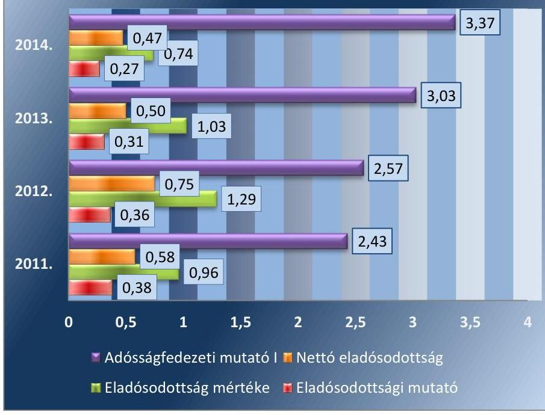

Forrás: a Társaság adatszolgáltatása

---

# Megállapítások 

A Társaság az időszakos likviditási nehézségeket az Önkormányzat segítségével finanszírozta, az Önkormányzattól kapott kölcsönöket határidőben visszafizették, az eladósodottság mértéke javuló tendenciát mutatott. Az Önkormányzat a Társaság részére a működési kiadások rendszeres támogatása mellett a 2011-2014. években összesen 50,7 M Ft kölcsönt nyújtott fejlesztésre, valamint 16,7 millió Ft-ot eseti működési támogatásként.

Az összes forráson belül az idegen források részaránya 37,8\%-ról 26,6\%ra csökkent. Az eladósodottság mértéke (kötelezettségek/saját tőke) mutató értéke a
 2011. évben 0,96, míg a 2014. évben 0,74. A nettó eladósodottság mutatója a 2011. évben 0,58, a 2014. évben 0,47, ami javuló tendencia, mert a saját tőkének csökkenő részét teszi ki a kintlévőségekkel csökkentett kötelezettségek összege. Az adósságfedezeti mutató I. értéke pozitívan változott, mivel a 2011. évben az 1 Ft adósságra 2,4 Ft, a 2014. évben 3,4 Ft vagyon jutott. A likvid eszközökkel nem fedezett kötelezettség állomány az árbevétel 2%-át tette ki a 2011. évben, a 2014. évben 4%-át. A mutató romlott, melynek fő oka az árbevétel jelentős csökkenése.

## 2.4. számú megállapítás

Az előírt beszámolási, adatszolgáltatási kötelezettségének tartalmi hiányosságokkal tett eleget a Társaság.

A 2011-2014. évekre éves beszámolóját a Társaság elkészítette, gondoskodott a letétbe helyezésről és a közzétételről a Számv. tv. 153. és 154. §-ainak megfelelően. Az üzleti terveinek teljesítéséről a Képviselő-testületnek beszámolt, melyet az elfogadott.

A Társaság számlatükre elkülönítve tartalmazta a bevételeken belül az egyes tevékenységeit. A ráfordításokon belül az egyes tevékenységek elkülönítését a számlatükör nem tartalmazta. A számlarend a Számv. tv. 160.§ (3a) bekezdése alapján a költségek költségnemenkénti elszámolását írta elő. Ezzel szemben a gyakorlatban a költségek költségnemekre történő könyvelésével egyidejűleg a felmerült költségeket költséghelyek szerinti bontásban is könyvelték. A közvetett költségek felosztását nem végezték el, a közfeladatok tevékenységének ráfordításait csak közvetlen önköltség szintjén tudták megjeleníteni a nyilvántartásaikban. Ezzel nem tettek eleget a Tszt. 18/A § (2) bekezdésében előírt követelményeknek. A Társaság a telephelyenkénti számviteli szétválasztási kötelezettségnek nem tett eleget, amely megsértette a Tszt. 18/A § (3) bekezdés a) pontját, mivel a távhőtermelést két telephelyen végezte.

A Társaság a szabályozottság hiánya ellenére 2012-2014. évi egyszerűsített éves beszámolójában a távhőszolgáltatás és a távhőtermelés bevételeit és ráfordításait közvetlen önköltség szintjén, a kiegészítő mellékletben bemutatta.

A 2012. és 2014. évi beszámolók eredménykimutatásában a távfűtésre vonatkozó adatok nem egyeztek meg a kiegészítő mellékletében szerepeltetett adatokkal. 2014. évben mind a két üzemi eredmény kimutatás beterjesztésre került a Képviselő testület elé, a könyvvizsgáló mindkét kimutatást elfogadta. A 2012-2014. években a mérleg szerinti eredmény alakulását, illetve ebből a távhőszolgáltatási tevékenységgel kapcsolatos mérleg szerinti eredményt az 3. ábra mutatja be.

---

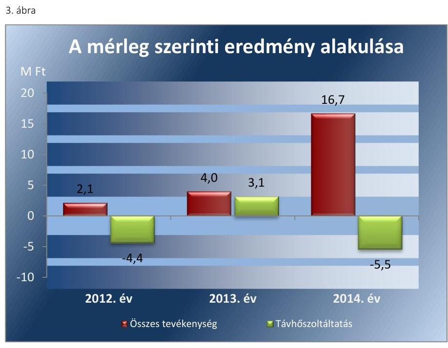

Forrás: A Társaság 2012-2014. évi beszámolói
Az Önkormányzattal évenként kötött feladat-ellátási megállapodások tartalmazták az önkormányzati támogatás összegét. A megállapodásokban az Önkormányzat az adott évi költségvetésből a működési támogatást egy összegben állapította meg. A szétválasztási szabályok alapján elkészített beszámolók vonatkozásában a kapott támogatás teljes összege nem a távhő üzletág, hanem az egyéb tevékenységek eredményében jelent meg. Ez ellentétes a 2013-2014. évi megállapodásokban foglaltakkal, melyben a távhőszolgáltatás is szerepelt a támogatott feladatok között. A támogatás ilyen módszerrel történő elszámolásával a Társaság megsértette a Tszt. 18/A. § (2) bekezdésében foglaltakat, mivel a támogatás feladatonkénti megbontásának módszerével nem biztosították az egyes tevékenységek átláthatóságát és diszkrimináció mentességét, nem állapítható meg a keresztfinanszírozás és a versenytorzítás kizárása. A könyvvizsgáló a 2012. évtől kezdődően a beszámolók felülvizsgálatáról szóló könyvvizsgálói jelentéseiben a távhőszolgáltatás vonatkozásában a számviteli szétválasztási szabályok alkalmazásáról nyilatkozott, melyben igazolta, hogy a Társaság egyes tevékenységei közötti tranzakciók árazása biztosítja a vállalkozás tevékenységei közötti keresztfinanszírozás mentességét.

A 2012-2014. évi beszámolókhoz kiadott független könyvvizsgálói jelentések a Tszt. 18/B. § (1) bekezdésében előírtak ellenére nem tartalmaztak igazolást a számviteli szétválasztási szabályok kidolgozására vonatkozóan.

A közhasznúsági mellékletet a Társaság a Civiltv. 46. § (1) bekezdésének megfelelően beszámolójával egyidejűleg elkészítette és az elfogadott beszámolót a független könyvvizsgálói jelentéssel együtt letétbe helyezte és közzétette.

# A MEKH ${ }^{15}$ felé fennálló adatszolgáltatási kötelezettségének a Társaság - egy kivételtől eltekintve - eleget tett. A MEKH a kiegészítő melléklet és az adatlap adatainak egyezőségét vizsgálata után megállapította, hogy az Adattári adatlap tárgyi eszközök sora eltért az Igazságügyi Minisztérium honlapján 2014. május 30-án közzétett számviteli beszámoló kiegészítő mellékletében szereplő azonos tartalmú tételtől. A MEKH a Társaságtól az eltérésre nyilatkozatot kért, melynek a Társaság nem tett eleget, de a javított adatszolgáltatást 2014. július 21-én teljesítette. A MEKH 50 ezer Ft bírság megfizetésére kötelezte a Társaságot rossz adatszolgáltatás miatt, melyet a Társaság kifizetett.

# 3. A gazdasági társaságnál az ellátott közfeladat bevételei és ráfordításai elszámolása, valamint az önköltségszámítás és árképzés szabályszerű volt-e? 

Összegző megállapítás

A bevételek és ráfordítások elszámolását az ellenőrzés a feltárt hiányosságok miatt nem megfelelőnek minősítette. Az árképzés gyakorlata megfelelt az előírásoknak, a Társaságnak önköltségszámítási szabályzatot nem kellett készítenie.
3.1. számú megállapítás

A bevételek és ráfordítások elszámolását az ellenőrzés a feltárt hiányosságok miatt nem megfelelőnek minősítette.

A távhőszolgáltatás bevételeinek elszámolása ellenőrzésénél rendszerbeli és eseti hiányosságot is feltártunk. A végrehajtás során nem biztosították a rendszer zárt működését, ezzel nem tartották be a Számv. tv. 165. § (4) bekezdését, miszerint az analitikus nyilvántartások és a bizonylatok adatai közötti egyeztetés és ellenőrzés lehetőségét, függetlenül az adathordozók fajtájától, a feldolgozás (kézi vagy gépi) technikájától, logikailag zárt rendszerrel biztosítani kell, továbbá nem biztosították a Számv. tv. 15. § (3) bekezdésében foglalt valódiság elvét. A mintatételek ellenőrzése során eseti hibaként jelentkezett, hogy a kiszámlázott hődíjak kisebb eltérésekkel kerültek be a főkönyvi feladásba. A számlázó program téves beállításai miatt a víz- és csatornadíjak alacsonyabb összegben kerültek továbbszámlázásra a fogyasztók felé a melegvízszolgáltatáshoz kapcsolódó víz- és csatornadíj téves adatrögzítése miatt. Fenti hiányosságok miatt a távhőszolgáltatáshoz kapcsolódó bevételek elszámolását nem megfelelőnek minősítettük.

Az anyagjellegű ráfordítások elszámolása ellenőrzése során a költségelszámolást megalapozó dokumentumok (szerződések) az ellenőrzöttnél több esetben nem álltak rendelkezésre. Ezzel megsértették a Számv. tv. 169. § (2) bekezdését, mely szerint a könyvviteli elszámolást közvetlenül és közvetetten alátámasztó számviteli bizonylatot legalább 8 évig meg kell őrizni. A hiányosságok miatt a távhőszolgáltatáshoz kapcsolódó anyagjellegű ráfordítások elszámolását nem megfelelőnek minősítettük.

---

A beruházások, felújítások elszámolásában eseti hiányosság volt, hogy a költségelszámolásokat megalapozó szerződés, megrendelő nem állt rendelkezésre a Számv. tv. 169. § (2) bekezdés előírásai ellenére. További hiányosság volt, hogy a terv szerinti értékcsökkenés elszámolása nem felelt meg a Számviteli politikának, valamint a Számv. tv. 15. § (5) és (9) bekezdései előírásainak, mivel előfordult, hogy az értékcsökkenést a Számviteli politikában szabályozott lineáris leírási mód helyett egy összegben számolták el. Fenti hiányosságok miatt a távhőszolgáltatáshoz kapcsolódó beruházások, felújítások elszámolását magas kockázatúnak minősítettük.

A Társaság egyszerűsített éves beszámolóinak eredménykimutatása szerint a tárgyévi adózás előtti eredménye 2012-2014. években nem haladta meg a Tszt. 18/C. § (1) bekezdésében, valamint az 50/2011. (IX. 30.) NFM rendelet 5. § (2) bekezdésében szerinti nyereségkorlát összegét. A Társaság a 2014. évben a távhőszolgáltatáshoz kapcsolódó, 50040 E Ft összegű kötbért kapott, melyet az egyéb tevékenységének bevételeire számolt el. Ezzel megszegte a Tszt. 18/A. § (3) bekezdésében foglaltakat. A jogszabályi előírásoknak megfelelő könyvelés esetén a Társaság az adózás előtti eredménye 44,7 M Ft-ot tett volna ki, ami így már meghaladta volna az NFM rendelet 5. § (1) bekezdésében rögzített nyereségkorlátot, melyet vagy vissza kellett volna fizetnie, vagy az NFM ${ }^{16}$ rendeletben meghatározottak szerint a Hivataltól mentesítést kellett volna kérnie.
3.2. számú megállapítás

Az önkormányzati hatáskörben megállapított távhődíjakat a távhőrendelet előírásainak megfelelően számításokkal alátámasztották, a hatósági árat az előírásoknak megfelelően alkalmazták.

Önköltségszámítási szabályzat készítésére a Számv. tv. 14.§ (6) bekezdésének előírása alapján a Társaság nem volt kötelezett, szabályzatot nem készített.

A távhőszolgáltatás alapdíjának és a hődíjnak a számítására a távhőrendelet 1. számú melléklete tartalmazott előírást. Az alapdíj számítását a bázis időszaki díjak és a $\mathrm{KSH}^{17}$ szerinti fogyasztói árindex figyelembevételével írták elő. A hődíjak módosítására a földgáz és a villamos energia árának változása esetén kerülhetett sor. Az utolsó, önkormányzati hatáskörben végrehajtott díjmódosításra 2011. március 1-jei hatállyal került sor. A megállapított díjak összegét az előírt számításokkal alátámasztották.

A lakossági és közületi fogyasztókra vonatkozó alapdíjat és hődíjat - fajlagos díjtételekkel - a 4. ábra mutatja be.

---

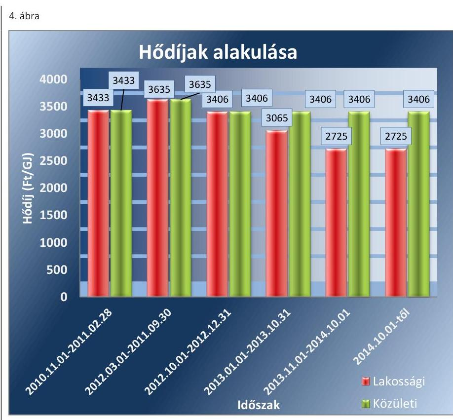

Forrás: a Társaság adatszolgáltatása
A Társaság 2011. október 1-től az Önkormányzat a 293/2011.(VIII. 10) MÖKT. határozatában foglalt állásfoglalásnak megfelelően, a 2011. március 31-én alkalmazott árakhoz képest - tekintettel a termálhő felhasználásra - összességében 10,6%-kal (alapdíj 14,8%, hődíj 6,3%) alacsonyabb szolgáltatási árak alkalmazását kezdeményezte az MEKH-nél. A megállapított szolgáltatási díjak alacsonyabbak voltak az 50/2011.(IX. 30.) NFM rendeletben a lakossági felhasználók számára meghatározott árhoz képest. A Társaság által a MEKH-től kért 2011. október 27-én kelt állásfoglalása szerint az 50/2011.(IX.30.) NFM rendelet 4. §-ban meghatározott hatósági áraknál alacsonyabb árakat alkalmazhatnak a távhőszolgáltatók, ehhez nem kellett árváltoztatási eljárást lefolytatni.

A 2013. évben - a Rezsi. tv ${ }^{18}$-ben előírt csökkentési korlátra vonatkozó előírást betartva - két lépcsőben összesen 20%-al csökkentették a díjakat. A 2014. október 1-jétől hatályos a rezsicsökkentések végrehajtásáról szóló törvény értelmében 3,3%-os további díjcsökkentésre került sor a lakossági felhasználók esetében.

A Társaság a díjmentességek és a kedvezmények köréről belső szabályzatot nem készített. A Társaság a lakossági távhő felhasználók számára szociális rászorultság, méltányosság alapján kedvezményt nem nyújtott, illetve díjmentességre való jogosultságot nem állapított meg.

---

# JAVASLATOK 

Az ÁSZ tv. 33. § (1) bekezdésében foglaltak értelmében az ellenőrzött szervezet vezetője köteles a jelentésben foglalt megállapításokhoz kapcsolódó intézkedési tervet összeállítani és azt a jelentés kézhezvételétől számított 30 napon belül az ÁSZ részére megküldeni.
Az ÁSZ tv. 33. § (3) bekezdése szerint amennyiben az ellenőrzött szervezet vezetője nem küldi meg határidőben az intézkedési tervet vagy továbbra sem elfogadható intézkedési tervet küld, az ÁSZ elnöke
a) az ellenőrzött szervezet vezetőjével szemben büntető- vagy fegyelmi eljárás megindítását kezdeményezheti;
b) kezdeményezheti az illetékes hatóságnál, illetve szervezetnél az ellenőrzött szervezetet megillető, az államháztartás valamelyik alrendszeréből származó támogatások vagy egyéb juttatások folyósításának, illetve a személyi jövedelemadó 1%-ából történő felajánlásokból való részesedés lehetőségének felfüggesztését.

Javaslataink célja a Makói Városgazdálkodási Nonprofit Kft. gazdálkodása szabályszerűségének helyreállítása annak érdekében, hogy a szabályozási környezet és gazdálkodási gyakorlat megfelelően tudja támogatni az átlátható működést.

## Makói Városgazdálkodási Nonprofit Kft. ügyvezetőjének

1. Intézkedjen a szabályozási hiányosságok megszüntetésére, ezen belül:
a) készítse el a számviteli politika keretében a jogszabályi előírásnak megfelelően az eszközök és források értékelési szabályzatát a jogszabályi előírásoknak megfelelő tartalommal;
(2.1. sz. megállapítás 3. bekezdése alapján)
b) rögzítse a jogszabályi előírásnak megfelelően a számviteli politikában, hogy az értékelés szempontjából mit tekint a Társaság jelentősnek;
(2.1. sz. megállapítás 4. bekezdése alapján)
c) dolgozza ki a jogszabályi előírásoknak megfelelő számviteli szétválasztás szabályait;
(2.1. sz. megállapítás 4. bekezdése alapján)
d) egészítse ki, módosítsa a jogszabályi előírásoknak megfelelően a Számlarendet, ennek keretében biztosítsa, hogy az abban meghatározott számlák rendszere az előírásoknak megfelelően alkalmas

---

legyen a számviteli szétválasztás szabályainak megfelelő, tevékenységenként elkülönített adatok előállítására, a költségek és ráfordítások megosztására;
(2.1. sz. megállapítás 5. bekezdése alapján)
e) egészítse ki a Pénzkezelési szabályzatot a pénztáros helyettesítésére és a
 pénztár ellenőrzésére vonatkozó előírásokkal oly módon, hogy annak tartalma megfeleljen a jogszabály előírásainak;
(2.1. sz. megállapítás 6. bekezdése alapján)
f) módosítsa, aktualizálja az üzletszabályzatot a jogszabályi változásnak megfelelően.
(2.1. sz. megállapítás 8. bekezdése alapján)
2. Intézkedjen a jogszabályi előírások szerinti gyakorlat biztosítására, ezen belül:
a) biztosítsa a jogszabály előírásának megfelelően az analitikus nyilvántartások és a bizonylatok adatai közötti egyeztetés és ellenőrzés lehetőségét, a valódiság elvének betartását;
(3.1. sz. megállapítás 1. bekezdése alapján)
b) tartsa be a könyvviteli elszámolást alátámasztó számviteli bizonylatok 8 éven keresztül történő megőrzésére vonatkozó kötelezettséget;
(3.1. sz. megállapítás 2. és 3. bekezdései alapján)
c) teljesítse a jogszabályi előírásnak megfelelő szétválasztási kötelezettséget, és ez alapján mutassa be a jogszabályban előírt információkat az éves beszámoló kiegészítő mellékletében;
(2.4. sz. megállapítás 2., 4. és 5. bekezdései alapján)
d) biztosítsa az értékcsökkenés szabályszerű elszámolását.
(3.1. sz. megállapítás 3. bekezdése alapján)

---

# Javaslataink célja az Önkormányzat szabályszerű működésének elősegítése, továbbá az önkormányzati tulajdonosi joggyakorlás kontrolljainak erősítése. 

## Makó Város Önkormányzata polgármesterének

1. Hívja fel a tulajdonosi jogokat gyakorló Képviselő-testület figyelmét arra, hogy a jogszabályi előírásától eltérően az FB nem rendelkezik ügyrenddel és kezdeményezze ennek pótlását.
(1.2. sz. megállapítás 2. bekezdése alapján)
2. Terjessze a Képviselő-testület elé döntéshozatalra a gazdasági program módosítását, amennyiben szükséges annak kiegészítését a jogszabályi előírásoknak megfelelően a távhő közszolgáltatás biztosítására, színvonalának javítására vonatkozó fejlesztési elképzelésekkel.
(1.1. sz. megállapítás 1. bekezdése alapján)
3. Terjessze a Képviselő-testület elé döntéshozatalra a jogszabályi előírás betartása érdekében a távhőszolgáltatási csatlakozási díjaknak és azok fizetési feltételeinek önkormányzati rendeletben történő szabályozását.
(1.1. sz. megállapítás 7. bekezdése alapján)

## Makó Város Önkormányzata jegyzőjének

1. Vizsgálja felül, hogy a hatályos gazdasági program tartalmaz-e - a jogszabályi előírásnak megfelelően - a távhő közszolgáltatás biztosítására, színvonalának javítására vonatkozó fejlesztési elképzeléseket, annak hiánya esetén készítse elő annak pótlását.
(1.1. sz. megállapítás 1. bekezdése alapján)
2. Hajtsa végre a Társaság üzletszabályzatához kapcsolódó jegyzői feladatokat, ennek keretében:
a) küldje meg a Társaság üzletszabályzatát a jogszabályi előírásnak megfelelően véleményezésre a fogyasztóvédelmi hatóság részére;
(1.1. sz. megállapítás 5. bekezdése és a 2.1. megállapítás 8. bekezdése alapján)

---

b) ellenőrizze a jogszabályi előírásnak megfelelően a Társaság távhőszolgáltató tevékenységét, az üzletszabályzatban foglaltak betartása szempontjából.
(1.1. sz. megállapítás 5. bekezdése alapján)
3. Készítse elő a jogszabályi előírás betartása érdekében a távhőszolgáltatási csatlakozási díjaknak és azok fizetési feltételeinek önkormányzati rendeletben történő szabályozását.
(1.1. sz. megállapítás 7. bekezdése alapján)

---

.

---

# MELLÉKLETEK 

- I. SZ. MELLÉKLET: ÉRTELMEZŐ SZÓTÁR
garancia

A garancia olyan önálló, az önkormányzat nevében vállalt kötelezettség, amely alapján az önkormányzat az önkormányzati költségvetés terhére szerződésben meghatározott feltételek szerint, a kötelezett nem teljesítése esetén a jogosultnak fizetést teljesít az előzetesen rögzített összeghatárig.
gazdasági társaság
gazdálkodó szervezet
keresztfinanszírozás tilalma
kezesség
közfeladat

A Gt. 3. § (1) bekezdése szerint „gazdasági társaságot üzletszerű közös gazdasági tevékenység folytatására külföldi és belföldi természetes és jogi személyek, valamint jogi személyiség nélküli gazdasági társaságok alapíthatnak, működő társaságba tagként beléphetnek, társasági részesedést (részvényt) szerezhetnek."
A Ptk. 685. § c) pontja szerint gazdálkodó szervezet: „az állami vállalat, az egyéb állami gazdálkodó szerv, a szövetkezet, a lakásszövetkezet, az európai szövetkezet, a gazdasági társaság, az európai részvénytársaság, az egyesülés, az európai gazdasági egyesülés, az európai területi együttműködési csoportosulás, az egyes jogi személyek vállalata, a leányvállalat, a vízgazdálkodási társulat, az erdő birtokossági társulat, a végrehajtói iroda, az egyéni cég, továbbá az egyéni vállalkozó."
A közszolgáltatás díját úgy kell megállapítani, hogy az maradéktalanul fedezetet nyújtson a közszolgáltatás indokolt költségeire és ráfordításaira, valamint a közszolgáltató e tevékenységével kapcsolatos ésszerű nyereségére; az ésszerű nyereség nem tartalmazhatja a közszolgáltatáson kívül eső egyéb gazdasági tevékenységei költségeinek, ráfordításainak fedezetét.
A kezességre vonatkozó előírásokat a Ptk. 272-276. §-ai tartalmazzák. A kezesség a polgári jogban a szerződést biztosító járulékos mellékkötelezettség, amely egy másik kötelem teljesítését biztosítja azáltal, hogy a kezes a főadós nem teljesítése esetére kötelezettséget vállal a főadósi kötelem teljesítésére. A kezes tehát a főadóshoz képest járulékos adós. A kezesség kiterjed az elvállalása utáni mellékszolgáltatásokra, ha a kezes ezek kikötéséről tudott.
A Ptk. szerint kezességet csak írásban lehet vállalni. Lényeges, hogy a kezesség mindig az alapügylet hitelezője és a kezes közötti ingyenes szerződéssel jön létre. A kezesség a különböző hitelfelvételekhez kapcsolódóan a hitel visszafizetésének biztosítékaként jöhet szóba. Az adós helyett nemfizetés esetén a kezes felel, ő tartozik fizetni. Az egyszerű kezesség esetén előbb az adóson kell behajtani a tartozást, s ha ez sikertelen, akkor lehet a kezestől követelni a fizetést. Készfizető kezesség esetében a fizetést elmulasztó adós helyett rögtön a kezesen követelhetik a tartozást. Ha bank vállalja a kezességet, akkor az minden esetben készfizetői kezesség.
Jogszabályban meghatározott állami vagy önkormányzati feladat, amit az arra kötelezett közérdekből, jogszabályban meghatározott követelményeknek és feltételeknek megfelelve végez, ideértve a lakosság közszolgáltatásokkal való ellátását, továbbá az állam nemzetközi szerződésekben vállalt kötelezettségeiből adódó közérdekű feladatokat, valamint e feladatok ellátásához szükséges infrastruktúra biztosítását is (Nvtv. ${ }^{19}$ 3. § (1) bekezdés 7. pont).

---

közszolgáltatás

A közszolgáltatás: „közcélú, illetőleg közérdekű szolgáltatást jelent, amely egy nagyobb közösség (állam, település) minden tagjára nézve megközelítőleg azonos feltételek mellett vehető igénybe, ezért valamilyen mértékig közösségi megszervezést, illetve szabályozást, ellenőrzést igényel." Az Ebktv. ${ }^{20} 3 . \S$ d) pontja a következőképpen határozza meg a közszolgáltatást: „szerződéskötési kötelezettség alapján a lakosság alapvető szükségleteinek ellátására irányuló szolgáltatás, így különösen a villamos energia-, gáz-, hő-, víz-, szennyvíz- és hulladékkezelési, köztisztasági, postai és távközlési szolgáltatás, továbbá a menetrend alapján közlekedő járművekkel végzett közforgalmú személyszállítás"
meghatározó befolyás

A Ptk2. 8:2. § (2) bekezdése szerint „A befolyással rendelkező akkor rendelkezik egy jogi személyben meghatározó befolyással, ha annak tagja vagy részvényese, és
a) jogosult e jogi személy vezető tisztségviselői vagy felügyelőbizottsága tagjai többségének megválasztására, illetve visszahívásra; vagy
b) a jogi személy más tagjai, illetve részvényesei a befolyással rendelkezővel kötött megállapodás alapján a befolyással rendelkezővel azonos tartalommal szavaznak, vagy a befolyással rendelkezőn keresztül gyakorolják szavazati jogukat, feltéve, hogy együtt a szavazatok több mint felével rendelkeznek."
minősített többséget biztosító befolyás

A Gt. 52. § (2) bekezdése szerint minősített többséget biztosító befolyásnak számít, ha a minősített befolyásszerző az ellenőrzött társaságban - közvetlenül vagy közvetve - a szavazatok legalább hetvenöt százalékával rendelkezik.

---

II. SZ. MELLÉKLET: MAKÓI VÁROSGAZDÁLKODÁSI NONPROFIT KFT EREDMÉNYKIMUTATÁS ADATAI (EZER FT)

|  Tétel megnevezése | 2011 | 2012 | 2013 | 2014  |
| --- | --- | --- | --- | --- |
|  I. Értékesítés nettó árbevétele | 526318 | 563999 | 625855 | 367223  |
|  II. Aktivált saját teljesítmények értéke | 2520 | 7013 | 4757 | 9330  |
|  III. Egyéb bevételek | 155050 | 115279 | 150458 | 171737  |
|  IV. Anyagjellegű ráfordítások | 464794 | 466611 | 499279 | 298466  |
|  V. Személyi jellegű ráfordítások | 160146 | 190551 | 228080 | 176643  |
|  VI. Értékcsökkenési leírás | 10048 | 12883 | 17569 | 23961  |
|  VII. Egyéb ráfordítások | 22362 | 18185 | 33655 | 35823  |
|  A. Üzemi (üzleti) tevékenység eredménye | 26538 | $-1939$ | 2487 | 13397  |
|  VIII. Pénzügyi műveletek bevételei | 211 | 3043 | 200 | 532  |
|  IX. Pénzügyi műveletek ráfordításai | 0 | 0 | 103 | 882  |
|  B. Pénzügyi műveletek eredménye | 211 | 3043 | 97 | $-350$  |
|  C. Szokásos Vállalkozási eredmény | 26749 | 1104 | 2584 | 13047  |
|  X. Rendkívüli bevételek | 1834 | 1762 | 2006 | 5678  |
|  XI. Rendkívüli ráfordítások | 0 | 0 | 0 | 0  |
|  D. Rendkívüli eredmény | 1834 | 1762 | 2006 | 5678  |
|  E. Adózás előtti eredmény | 28583 | 2866 | 4590 | 18725  |
|  XII. Adófizetési kötelezettség | 1514 | 754 | 640 | 2027  |
|  F. Adózott eredmény | 27069 | 2112 | 3950 | 16698  |
|  G. Mérleg szerinti eredmény | 27069 | 2112 | 3950 | 16698  |

Forrás: A Társaság 2011-2014. évi beszámolói

---

.

---

# FÜGGELÉK: ÉSZREVÉTELEK 

A jelentéstervezetet az Állami Számvevőszék 15 napos észrevételezésre megküldte az ellenőrzött szervezet vezetőjének az ÁSZ tv. 29. § (1) bekezdése előírásának megfelelően.
Az elfogadott észrevételek alapján véglegesíti az Állami Számvevőszék a jelentését.

A függelék tartalmazza az ellenőrzött észrevételeit, illetve az el nem fogadott észrevételek elutasításának indoklását.

- Makói Városgazdálkodási Nonprofit Kft. ügyvezetőjének írásban tett észrevétele mellékletek nélkül.
- Tájékoztatás az elfogadott és el nem fogadott észrevételekről az ügyvezetőnek.
- Makó Város Önkormányzata Polgármesterének írásban tett észrevétele mellékletek nélkül.
- Tájékoztatás az el nem fogadott észrevételről a polgármesternek.

[^0]
[^0]:    * 29. § (1) Az Állami Számvevőszék az ellenőrzési megállapításait megküldi az ellenőrzött szervezet vezetőjének vagy az általa megbízott személynek, és annak, akinek személyes felelősségét állapította meg.
    (2) Az ellenőrzött szervezet vezetője és a felelősként megjelölt személy az ellenőrzés megállapításaira tizenöt napon belül írásban észrevételt tehet.
    (3) Az Állami Számvevőszék az észrevételre a beérkezésétől számított harminc napon belül írásban válaszol. A figyelembe nem vett észrevételeket köteles a jelentésben feltüntetni, és megindokolni, hogy azokat miért nem fogadta el.

---

# 101/2010.01.12 

## Makói Városgazdálkodási Nonprofit Kft   6900 Makó, Návay Lajos tér 5-7.   Tel: 06-62-211-550, 62/211-828   Bankszámlaszám: OTP Makó, 11735074-20513449. Adószám.: 18458635-2-06   email: mknpkft@gmail.com   www.makoyg.hu

Ikt.szám: 55 - 02/2010

## Domokos László úr

Elnök
Állami Számvevőszék
Budapest

## Tisztelt Elnök Úr!

„Az önkormányzatok gazdasági társaságai - Az Önkormányzatok többségi tulajdonában lévő gazdasági társaságok közfeladat ellátását érintő gazdálkodási tevékenysége szabályszerűségének ellenőrzése - Makói Kommunális Nonprofit Kft." címmel készített számvevőszéki jelentéstervezettel kapcsolatban az alábbi észrevételeket tesszük:

### 1.2. számú megállapításhoz:

A Felügyelő Bizottság a jogszabályi előírásoknak megfelelően megtárgyalta az előző évi üzleti terv teljesítését, melynek része volt egy írásbeli beszámoló, az egyszerűsített éves beszámoló, valamint az erről készült könyvvizsgálói jelentés.
A Felügyelő Bizottság munkájáról írásbeli - a FB elnökének ellenjegyzésével - jegyzőkönyv készült.

### 2.1. számú megállapításhoz:

A követelések után elszámolandó értékvesztés mértékét, illetve elszámolásának módját a 2014. évi beszámoló kiegészítő melléklete tartalmazza.

A Számviteli politikában illetve számlarendben alkalmazott főkönyvi számlák mellett a Társaság költséghelyek alkalmazásával tett eleget a számviteli szétválasztás szabályainak. A jelentéstervezet kifogásolja, hogy a közfeladat ellátásával kapcsolatos bevételek és ráfordítások elszámolását nem megfelelően szabályozta a Társaság. A ráfordításokon és bevételeken belül a számlaforgalom költséghelyenként megbontásra került, ezzel eleget téve a részletezésnek.

### 2.2. számú megállapításhoz:

A 2011-2014. évi beszámolók kiegészítő mellékleteinek 1.sz. mellékletei tartalmazzák az értékhelyesbítést
 nyitó értékét, növekedését, csökkenését, záró értékét.

---

# 2.4. számú megállapításhoz: 

A társaság eleget tett a Tszt. 18/A § (3) bekezdése a) pontjában meghatározott telephelyenkénti számviteli szétválasztási kötelezettségének, mivel távhőtermelést 2011. május 31. napot követően csak egy telephelyen végzett (Hunyadi u. fűtőmű). A Deák F. u.-i fűtőmű termelése ezzel a dátummal leállításra, a gázszolgáltatási szerződés felmondásra, a termelő infrastruktúra elbontásra került. Csatoljuk az ezzel kapcsolatos leolvasási jegyzőkönyveket, valamint szerződés felmondása tárgyában írt levelünket.

A Tszt. 18/A. §-a értelmében a távhőszolgáltatás vonatkozásában a Társaság az egyszerűsített éves beszámolót a Számv.tv., illetve a Tszt. előírásainak megfelelően elkészítette, a számviteli törvény által előírt megbontásban, csoportosításban (5. számú melléklet). A 4. számú melléklet a Társaság üzemi tevékenység eredményét mutatja be, melynek struktúrája a tulajdonos, Makó Város Önkormányzati Képviselő-testülete információ igényét elégíti ki. A két táblázat struktúráját, logikai felépítését, illetve adattartalmának körét tekintve más, azonban a távhőszolgáltatás eredménykimutatásában szereplő adatok megegyeznek a 4. sz. mellékletben szerepeltetettekkel.

### 3.1. számú megállapításhoz:

Az anyagjellegű ráfordítások esetében az ellenőrzés során a 2011. első két negyedévét érintő gázenergia beszerzésre vonatkozó szerződések nem álltak rendelkezésre, melyek az ellenőrzés 6 tételét érintették. Azóta a szerződések rendelkezésre állnak, melyeket jelen levelünk mellékleteiként csatolunk. A keresés nem a megfelelő időszakot fedte le, ugyanis a jelzett időszakban a jelenlegi gyakorlattól eltérően nem éves szerződéskötés történt, hanem határozatlan idejű 2009. évben kötött egyetemes szolgáltatási szerződések voltak érvényben.

Mellékletek:

- leolvasási jegyzőkönyvek
- szerződés felmondása tárgyában írt levél
- szerződések
- mellékelt szerződéseket érintő számlák másolatai.

Makó, 2016. február 16.
Tisztelettel,

---

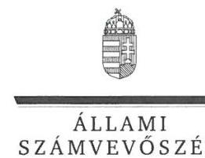

ELNÖK

Ikt.szám: V-0823-187/2016.

# Nagy Nándor úr 

ügyvezető
Makói Városgazdálkodási Nonprofit Kft.

## Makó

## Tisztelt Ügyvezető Úr!

„Az önkormányzatok gazdasági társaságai - Az önkormányzatok többségi tulajdonában lévő gazdasági társaságok közfeladat ellátását érintő gazdálkodási tevékenysége szabályszerűségének ellenőrzése - Makói Kommunális Nonprofit Kft." címmel készített számvevőszéki jelentéstervezetre tett észrevételeit köszönettel megkaptam.

Az Állami Számvevőszék észrevételekre vonatkozó álláspontjáról a felügyeleti vezető által készített részletes tájékoztatást mellékelten megküldöm.

Tájékoztatom Ügyvezető Urat, hogy a számvevőszéki jelentésben - az Állami Számvevőszékről szóló 2011. évi LXVI. törvény 29. § (3) bekezdése alapján - a figyelembe nem vett észrevételeket szerepeltetjük az elutasítás indokának feltüntetésével.

Budapest, 2016. 03. 18.
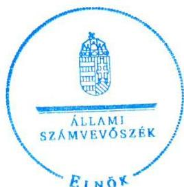

Tisztelettel:

Domokos László

Melléklet: Tájékoztatás az elfogadott és el nem fogadott észrevételekről

---

# Tájékoztatás   az elfogadott és el nem fogadott észrevételekről 

„Az önkormányzatok gazdasági társaságai - Az önkormányzatok többségi tulajdonában lévő gazdasági társaságok közfeladat ellátását érintő gazdálkodási tevékenysége szabályszerűségének ellenőrzése - Makói Kommunális Nonprofit Kft." című jelentéstervezetre 2016. február 19-én érkezett észrevételeit áttekintettük, azokkal kapcsolatban a következő tájékoztatást adom.

## 1. észrevétel - 1.2. számú megállapításhoz

Észrevételében nem jelölte meg, hogy mely időszakra vonatkozóan rendelkezett a Felügyelőbizottság a beszámolóról szóló írásbeli jelentésével. A jelentéstervezet a hiányosságot a 2014. évre nem állapította meg, azonban alátámasztó dokumentum hiányában a 2011-2013. évekre fenntartja. A Felügyelőbizottság a 2011-2013. években a beszámolóról írásbeli jelentést nem adott ki, jegyzőkönyve az üzleti terv teljesítésének elfogadását tartalmazta.

## 2. észrevétel - 2.1. számú megállapításhoz

Az észrevétel első bekezdésében foglalt, a követelések értékvesztésére vonatkozó jelzése nem indokolja a jelentéstervezet módosítását, mert a Számv. tv. 14. § (4) bekezdésében foglaltak ellenére a számviteli politika keretében írásban nem rögzítették az értékvesztésre vonatkozó szabályokat.

Az észrevétel második bekezdésében foglalt, a számviteli szétválasztásra vonatkozó része a költséghelyenkénti megbontás gyakorlatára hivatkozik, amit a jelentéstervezet nem tartalmazott hiányosságként. A jelentéstervezet a számlarend tartalmának hiányosságát állapította meg, mert a Társaság a közfeladat ellátással kapcsolatos bevételek és ráfordítások elszámolását hiányosan, a Számv. tv. 161. § (2) bekezdés a), b) és d) pontjaiban foglaltak figyelmen kívül hagyásával határozta meg. A szabályozási hiányosságot az észrevétel nem kifogásolta, ezért a jelentéstervezet módosítása nem indokolt.

## 3. észrevétel - 2.2. számú megállapításhoz

Az értékhelyesbítéssel kapcsolatban tett észrevételben hivatkozott, az értékhelyesbítés nyitó értékét, növekedését, csökkenését, záró értékét tartalmazó kiegészítő melléklet 1. számú melléklete csak az ingatlanok értékhelyesbítését tartalmazza, ezzel a jelentéstervezet pontosításra kerül. Az értékhelyesbítést azonban a Számv. tv. 59. § (1) bekezdésében előírtaknak megfelelő részletezésben kell bemutatni. Az értékelésnél alkalmazott módszerek bemutatásának hiányára vonatkozó mondatrészt az észrevétel nem kifogásolta, ezért azt a jelentéstervezetben változatlanul szerepeltetjük.

---

Az észrevétel alapján az érintett szövegrészt az egyértelműség érdekében az alábbiak szerint pontosítjuk:
„A Társaság a 2011-2014. évi beszámolók kiegészítő mellékleteiben a Számv. tv. 59. § (1) bekezdésében foglaltak ellenére az értékhelyesbítés nyitó értékét, növekedését, csökkenését, záró értékét és az értékelésnél alkalmazott módszereket az előírt részletezésben nem mutatta be."

Ezzel összefüggésben pontosítjuk a Főbb megállapítások, következtetések, javaslatok fejezet, 7. bekezdésének azonos tartalmú szövegrészét is az alábbiak szerint:
„A Társaság a 2011-2014. évi beszámolók kiegészítő mellékleteiben a számviteli törvényben foglaltak ellenére az értékhelyesbítés nyitó értékét, növekedését, csökkenését, záró értékét és az értékelésnél alkalmazott módszereket az előírt részletezésben nem mutatta be."

# 4. észrevétel - 2.4. számú megállapításhoz 

Az észrevétel első bekezdése alapján a telephelyenkénti számviteli szétválasztási kötelezettséget azzal tekinti teljesítettnek, hogy 2011. május 31-ét követően egy telephelyen történt a távhőtermelés.

Az észrevételezéskor pótlólag megküldött dokumentumokat nem áll módunkban figyelembe venni, tekintettel arra, hogy teljességi nyilatkozatban (2015. 10. 08.) rögzítették, hogy „...az ellenőrzött tárgykörben kért és átadott dokumentumokon kívül más adatokkal, iratokkal nem rendelkezünk". Az ÁSZ az utólag megküldött dokumentumok valódiságáról az ellenőrzés során meggyőződni nem tudott, ezért a jelentéstervezet módosítása nem indokolt.

Az észrevétel második bekezdésében az eredménykimutatás adataira vonatkozó jelzés nem tartalmazza, hogy melyik évre és milyen dokumentumok mellékleteire hivatkozik, ezért ennek alapján, beazonosíthatóság hiányában a jelentéstervezet módosítása nem indokolt.

## 5. észrevétel - 3.1. számú megállapításhoz

Az észrevétel megerősíti, hogy az ellenőrzés során az anyagjellegű ráfordítások esetében a 2011. év első két negyedévét érintő gázenergia beszerzésre vonatkozó szerződések (amelyek hat mintatételt érintettek) nem álltak rendelkezésre.

---

Az észrevételezéskor pótlólag megküldött dokumentumokat nem áll módunkban figyelembe venni, tekintettel arra, hogy teljességi nyilatkozatban (2015. 10. 08.) rögzítették, hogy „...az ellenőrzött tárgykörben kért és átadott dokumentumokon kívül más adatokkal, iratokkal nem rendelkezünk". Az ÁSZ az utólag megküldött dokumentumok valódiságáról az ellenőrzés során meggyőződni nem tudott, ezért a jelentéstervezet módosítása nem indokolt.

Budapest, 2016. 03. 18.

Böröcz Imre
felügyeleti vezető

---

# MAKÓ VÁROS POLGÁRMESTERÉTŐL 

Ikt.szám:1/185-2/2016/I
ÜL: Ördögh Andrea

Tárgy: Észrevétel
Melléklet: 1 db

Állami Számvevőszék

## Domokos László

elnök

## Budapest

Pf. 54.
1364
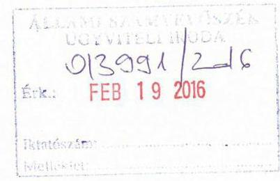

Tisztelt Elnök úr!

Hivatkozva a V-0823-181/2016. ikt. sz., az „Az önkormányzatok gazdasági társaságai - Az önkormányzatok tulajdonában lévő gazdasági társaságok közfeladat ellátását érintő gazdálkodási tevékenysége szabályszerűségének ellenőrzése" tárgyban megküldött számvevőszéki jelentéstervezetre az alábbi észrevételt teszem:

## 1.1 számú megállapításhoz: (jelentéstervezet 13. oldal 1. bekezdés)

Az Önkormányzat egyetért a megállapításban megfogalmazottakkal, azonban a jelentéstervezet 27. oldalán szereplő, Makó Város Önkormányzat polgármesterének szóló 2. sz. javaslat, és Makó Város jegyzőjének szóló 1. sz. javaslat okafogyottá vált a mellékelt 120/2015. (IV. 22.) MÖKT határozat és annak mellékletében foglaltakra tekintettel. Makó Város Önkormányzat Képviselő-testülete a fenti számú határozatával fogadta el a 2014-2019. évre szóló Gazdasági Programját. A Program 30. oldalán található a távhőszolgáltatás fejlesztésére vonatkozó fejezet.
Kérem a fentiekre tekintettel, a tervezetben foglaltak átgondolását.
A Makói Városgazdálkodási Nonprofit Kft. ügyvezetője tájékoztatása alapján észrevételeit saját maga teszi meg, kérem az ügyvezető úr által megküldött észrevételek átgondolását is.

Makó, 2016. február 18.

---

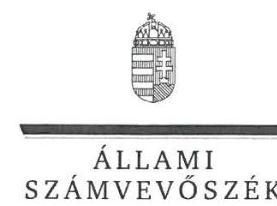

ELNÖK

Ikt.szám: V-0823-188/2016.

# Farkas Éva Erzsébet úrhölgy 

polgármester
Makó Város Önkormányzata

## Makó

## Tisztelt Polgármester Úrhölgy!

„Az önkormányzatok gazdasági társaságai - Az önkormányzatok többségi tulajdonában lévő gazdasági társaságok közfeladat ellátását érintő gazdálkodási tevékenysége szabályszerűségének ellenőrzése - Makói Kommunális Nonprofit Kft." címmel készített számvevőszéki jelentéstervezetre tett észrevételeit köszönettel megkaptam.

Az Állami Számvevőszék észrevételre vonatkozó álláspontjáról a felügyeleti vezető által készített részletes tájékoztatást mellékelten megküldöm.

Tájékoztatom Polgármester Úrhölgyet, hogy a számvevőszéki jelentésben - az Állami Számvevőszékről szóló 2011. évi LXVI. törvény 29. § (3) bekezdése alapján - a figyelembe nem vett észrevételt szerepeltetjük az elutasítás indokának feltüntetésével.

Budapest, 2016. 03. 18.
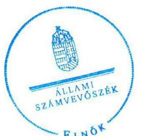

Tisztelettel:

Domokos László

Melléklet: Tájékoztatás el nem fogadott észrevételről

---

# Tájékoztatás el nem fogadott észrevételről 

..Az önkormányzatok gazdasági társaságai - Az önkormányzatok többségi tulajdonában lévő gazdasági társaságok közfeladat ellátását érintő gazdálkodási tevékenysége szabályszerűségének ellenőrzése - Makói Kommunális Nonprofit Kft." című jelentéstervezetre 2016. február 19-én érkezett észrevételét áttekintettük, azzal kapcsolatban a következő tájékoztatást adom:

### 1.1. számú megállapításhoz (jelentéstervezet 13. oldal 1. bekezdés)

Az észrevételben foglaltak szerint Makó Város Önkormányzata polgármestere egyetért a megállapításban megfogalmazottakkal, azonban jelzi, hogy a polgármesternek szóló 2. számú és a jegyzőnek szóló 1. számú javaslat okafogyottá vált.

Köszönettel vettük a 2014-2019. évekre szóló Gazdasági Program 2015. évi elfogadásáról és tartalmáról szóló tájékoztatását, azonban tekintettel arra, hogy az intézkedés az ellenőrzött időszakot (2011-2014. évek) követően történt, a jelentéstervezet módosítása ez alapján nem indokolt.

Budapest, 2016. 03. 18.
Böröcz Imre
felügyeleti vezető

---

# RÖVIDÍTÉSEK JEGYZÉKE 

${ }^{1}$ ÁSZ tv.
${ }^{2}$ Ötv.
${ }^{3}$ Mötv.
${ }^{4}$ Képviselő-testület
${ }^{5}$ SZMSZ
${ }^{6}$ Tszt.
${ }^{7}$ Társaság
${ }^{8}$ Gt.
${ }^{9}$ Ptk. 1
${ }^{10}$ Ptk. 2
${ }^{11}$ Taktv.
${ }^{12}$ FB
${ }^{13}$ Civil tv.
${ }^{14}$ Számv. tv.
${ }^{15}$ MEKH
${ }^{16}$ NFM
${ }^{17}$ KSH
${ }^{18}$ Rezsi tv.
${ }^{19}$ Nvtv.
${ }^{20}$ Ebktv.
2011. évi LXVI. törvény az Állami Számvevőszékről, hatályos:2011. július 1-jétől 1990. évi LXV. törvény a helyi önkormányzatokról, hatályos 1990. szeptember 30. - 2014. október 12. között
2011. évi CLXXXIX. törvény Magyarország helyi önkormányzatairól, hatályos 2012. január 1-jétől

Makó Város Önkormányzati Képviselő-testülete
Makó Város Önkormányzatának Szervezeti és Működési Szabályzata
2005. évi XVIII. törvény a távhőszolgáltatásról

Makói Városgazdálkodási Nonprofit Kft.
2006. évi IV. törvény a gazdasági társaságokról, hatályos 2006. július 01. - 2014. március 15. között
1959. évi IV. törvény a Magyar Köztársaság Polgári Törvénykönyvéről, hatályos 1990. december 31. - 2014. március 15. között
2013. évi V. törvény a Polgári Törvénykönyvről, hatályos 2014. március 15-étől
2009. évi CXXII. törvény a köztulajdonban álló gazdasági társaságok takarékosabb működéséről, hatályos 2009. december 4-étől
Makói Városgazdálkodási Nonprofit Kft. felügyelőbizottsága
2011. évi CLXXV. törvény az egyesülési jogról, a közhasznú jogállásról, valamint a civil szervezetek működéséről és támogatásáról, hatályos 2011. december 22-étől 2000. évi C. törvény a számvitelről, hatályos 2000. január 01-jétől

Magyar Energetikai és Közmű-szabályozási Hivatal
Nemzeti Fejlesztési Minisztérium
Központi Statisztikai Hivatal
2013. évi LIV. törvény a rezsicsökkentések végrehajtásáról, hatályos 2013. május 10-étől
2011. évi CXCVI. törvény a nemzeti vagyonról, hatályos 2011. december 31-étől
2003. évi CXXV. törvény az egyenlő bánásmódról és az esélyegyenlőség előmozdításáról, hatályos 2004. január 27-étől

---

ÁLLAMI SZÁMVEVŐSZÉK
1052 Budapest, Apáczai Csere János utca 10.
Levélcím: 1364 Budapest 4. Pf. 54
Telefon: +36 14849100 Telefax: +36 14849200
www.asz.hu
