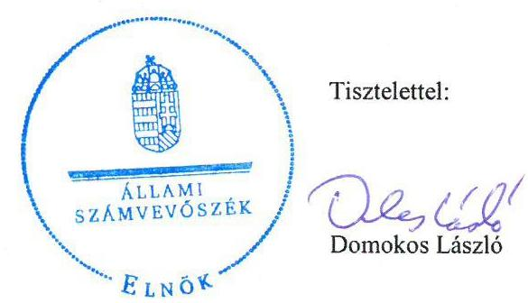
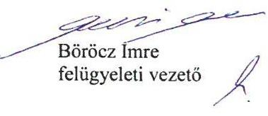

# Jelentés 

## Utóellenőrzések

A BKV Zrt. gazdálkodásának ellenőrzéséről szóló jelentés utóellenőrzése 2016.

---

# Jelentés 

## Utóellenőrzések

A BKV Zrt. gazdálkodásának ellenőrzéséről szóló jelentés utóellenőrzése

2016. január 10. nap

---

# AZ ELLENŐRZÉST FELÜGYELTE: 

BÖRÖCZ IMRE felügyeleti vezető

## AZ ELLENŐRZÉST VEZETTE ÉS A VÉGREHAJTÁSÁÉRT FELELŐS:

VALASTYÁNNÉ DR. VÍZHÁNYÓ JÚLIA ellenőrzésvezető

## A PROGRAM ÖSSZEÁLLÍTÁSÁÉRT FELELŐS:

JANIK JÓZSEF osztályvezető

## A TÉMÁHOZ KAPCSOLÓDÓ KORÁBBI SZÁMVEVŐSZÉKI JELENTÉSEK:

- címe: Jelentés a Budapesti Közlekedési Zrt. gazdálkodásának ellenőrzéséről
- sorszáma: 1202

Jelentéseink az Országgyűlés számítógépes hálózatán és az Interneten a www.asz.hu címen is olvashatóak.

IKTATÓSZÁM: V-0920-071/2016.
TÉMASZÁM: 1819
ELLENŐRZÉS-AZONOSÍTÓ SZÁM: V071710

---

# TARTALOMJEGYZÉK 

■ ÖSSZEGZÉS ..... 5
■ AZ ELLENŐRZÉS CÉLJA ..... 6
■ AZ ELLENŐRZÉS TERÜLETE ..... 7
■ AZ ELLENŐRZÉS HÁTTERE, INDOKOLTSÁGA ..... 8
■ FÓKUSZKÉRDÉS ..... 9
■ ELLENŐRZÉS HATÓKÖRE ÉS MÓDSZEREI ..... 10
■ MEGÁLLAPÍTÁSOK ..... 13
■ MELLÉKLET ..... 15
I. sz. melléklet: Az ÁSZ 1202. számú jelentéséhez kapcsolódó intézkedési tervek végrehajtása ..... 15
■ FÜGGELÉK: ÉSZREVÉTELEK ..... 21
■ RÖVIDÍTÉSEK JEGYZÉKE ..... 25

---

.

---

# ÖSSZEGZÉS 

Az Állami Számvevőszék a Budapesti Közlekedési Zrt. gazdálkodásának utóellenőrzését a 2012. január 19. és 2015. október 7. közötti időszakra végezte el. Az utóellenőrzés az ellenőrzött szervezet által megküldött intézkedési tervben foglaltak végrehajtására irányult. Az intézkedési tervben foglalt tizenhárom feladatból hetet határidőben, négy feladatot határidőn túl hajtottak végre. Egy feladat nem volt időszerű és egyet részben hajtottak végre.

## Az ellenőrzés társadalmi indokoltsága

Az Állami Számvevőszék stratégiájában célul tűzte ki a számvevőszéki munka hasznosulásának javítását. Ezzel összhangban ellenőrzi, hogy az ellenőrzött szervezetek megvalósították-e a korábbi ellenőrzései által feltárt hibák, hiányosságok és szabálytalanságok megszüntetése céljából kialakított intézkedési terveikben foglaltakat. A rendszeres utóellenőrzések hozzájárulnak a szükséges intézkedések tényleges végrehajtásához, ezáltal a közpénzügyek rendezettségének javulásához.

## Főbb megállapítások, következtetések

Az ÁSZ jelentésben foglalt javaslatokra az elkészített intézkedési tervet a Budapesti Közlekedési Zrt. határidőben küldte meg az ÁSZ részére. Az intézkedési tervben foglalt tizenhárom feladatot a BKV Zrt. többségében határidőben végrehajtotta, tizenhárom feladatból hetet határidőben, egyet részben és négy feladatot határidőn túl hajtott végre. Egy feladat nem volt időszerű.

---

# AZ ELLENŐRZÉS CÉLJA 

## A Budapesti Közlekedési Zrt. gazdálkodásának ellenőrzéséről szóló jelentés utóellenőrzése

Az ellenőrzés célja annak értékelése, hogy a számvevőszéki jelentésben foglalt intézkedést igénylő megállapításokkal és javaslatokkal összhangban készített intézkedési tervben meghatározott feladatokat az ellenőrzött szervezet végrehajtotta-e.

---

# **AZ ELLENŐRZÉS TERÜLETE**

## **Budapesti Közlekedési Zrt.**

Az Állami Számvevőszék a 2011. évben ellenőrizte a BKV Zrt. gazdálkodását. Az ÁSZ jelentés a főpolgármesternek négy, a főjegyzőnek kettő és a BKV Zrt. vezérigazgatójának tizenkettő javaslatot tartalmazott. A Fővárosi Önkormányzat főpolgármesterének, illetve főjegyzőjének tett javaslatok hasznosulását az ÁSZ a Fővárosi Közterület-fenntartó Zrt. ellenőrzése során, utóellenőrzés keretében már ellenőrizte. Jelen utóellenőrzés erre tekintettel – a 2015. október 7-ig végrehajtott intézkedéseket figyelembe véve – kizárólag a BKV Zrt. vezérigazgatójának megfogalmazott javaslatok hasznosulása céljából készített intézkedési terv végrehajtásának ellenőrzésére terjedt ki.

---

# AZ ELLENŐRZÉS HÁTTERE, INDOKOLTSÁGA 

Az ÁSZ törvény 33. § (1) bekezdése értelmében a számvevőszéki jelentések intézkedést igénylő megállapításaihoz és javaslataihoz kapcsolódóan az ellenőrzött szervezet vezetője intézkedési tervet köteles összeállítani, és az Állami Számvevőszék részére megküldeni. Az intézkedési tervben foglaltak megvalósítását - az ÁSZ törvény 33. § (7) bekezdésében foglaltak alapján - az Állami Számvevőszék utóellenőrzés keretében ellenőrizheti. Az intézkedések megvalósulásának értékelése során az Állami Számvevőszék figyelembe veszi az ellenőrzött szervezetek működési feltételeiben, valamint a jogszabályi előírásokban bekövetkezett változásokat.

Az intézkedési tervekben foglalt feladatok hiányos, illetve késedelmes végrehajtása, valamint megvalósításának elmaradása azt mutatja, hogy az ellenőrzések során feltárt hibák, hiányosságok és szabálytalanságok megszüntetése nem kapott kellő hangsúlyt. Ez a szabályszerű működés és a felelős vezetői magatartás vonatkozásában kockázatot hordoz. E kockázatok feltárásával az Állami Számvevőszék utóellenőrzési rendszere fokozza a fegyelmet, és igazolja, hogy a közpénzzel való szabályos gazdálkodás felelőssége elől nem lehet kitérni.

## AZ ELLENŐRZÉS VÁRHATÓ HASZNOSULÁSA:

Az utóellenőrzés négy szinten hasznosulhat:

- A társadalom szintjén az utóellenőrzés jelzi, hogy a számvevőszéki ellenőrzés megállapításainak van következménye: a hiányosságok megszüntetésére az ellenőrzött szervezet által meghatározott intézkedések végrehajtását is számon kéri az ÁSZ.
- Az ellenőrzött terület szintjén az utóellenőrzés tájékoztatást nyújt a terület döntéshozóinak a hiányosságok kiküszöbölésének jó gyakorlatairól, ezzel lehetőséget biztosítva arra, hogy az ÁSZ ellenőrzési megállapításai, javaslatai a terület nem ellenőrzött szervezeteinek a működése során is hasznosuljanak.
- Az ellenőrzött szervezet szintjén az utóellenőrzés feltárja, hogy a szervezet az intézkedések végrehajtásával hasznosította-e a korábbi ellenőrzési jelentésben a hiányosságok megszüntetése, illetve a kockázatok kezelése érdekében megfogalmazott javaslatokat.
- Az ÁSZ szintjén az utóellenőrzés visszacsatolást ad az ellenőrzési jelentések hasznosulásáról, az intézkedések elmaradása vagy részleges megvalósulása a további ellenőrzésekhez kockázati jelzésként szolgál.

---

# FÓKUSZKÉRDÉS 

1. Az ellenőrzött szervezet az intézkedési tervben foglaltakat - az előírt határidőben - végrehajtotta-e?

---

# ELLENŐRZÉS HATÓKÖRE ÉS MÓDSZEREI 

## Az ellenőrzés típusa

Szabályszerűségi ellenőrzés

## Az ellenőrzött időszak

A számvevőszéki jelentés közzétételének napjától (2012. január 19.) az utóellenőrzés megkezdésének napjáig (2015. október 7.) tartó időszak volt.

## Az ellenőrzés tárgya

Az ÁSZ tv. 2011. július 1-jei hatálybalépését követően az ÁSZ jelentésekben megfogalmazott javaslatokra az ellenőrzött által megküldött intézkedési tervekben foglaltak.

Az ellenőrzés kiterjedt minden olyan körülményre és adatra, amely az ÁSZ jogszabályban meghatározott feladatainak teljesítéséhez, valamint az ellenőrzési program végrehajtása folyamán felmerült újabb összefüggések feltárásához szükséges.

## Az ellenőrzött szervezet

BKV Zrt.

## Az ellenőrzés jogalapja

Az Alaptörvény ${ }^{8}$ 43. cikk (1) bekezdése alapján az ÁSZ az Országgyűlés ${ }^{9}$ pénzügyi és gazdasági ellenőrző szerve. Az ÁSZ törvényben meghatározott feladatkörében ellenőrzi a központi költségvetés végrehajtását, az államháztartás gazdálkodását, az államháztartásból származó források felhasználását és a nemzeti vagyon kezelését. Az ÁSZ tv. 1. § (3) bekezdése szerint az ÁSZ általános hatáskörrel végzi a közpénzekkel és az állami és önkormányzati vagyonnal való felelős gazdálkodás ellenőrzését. A 33. § (7) bekezdése alapján az ÁSZ tv. 33. § (1)-(2) bekezdései szerinti intézkedési tervben foglaltak megvalósítását az ÁSZ utóellenőrzés keretében ellenőrizheti. Az Áht. ${ }^{10}$ 61. § (2) bekezdése szerint az államháztartás külső ellenőrzésével kapcsolatos feladatokat az ÁSZ látja el.

---

# Az ellenőrzés módszerei 

Az ellenőrzést a nemzetközi standardokat irányadónak tekintve az ellenőrzési program ellenőrzési kérdései, az ellenőrzött időszakban hatályos jogszabályok, az ellenőrzés szakmai szabályok és módszertanok figyelembe vételével végeztük. Az utóellenőrzéseket ellenőrzéshez kapcsolódóan végeztük.

Az ellenőrzés ideje alatt az ellenőrzött szervezettel történő kapcsolattartást az ÁSZ SZMSZ ${ }^{11}$-ének vonatkozó előírásai alapján biztosítottuk.

Az utóellenőrzés megállapításait elsősorban az ÁSZ rendelkezésére álló, valamint az ellenőrzött szervezetektől elektronikusan bekért dokumentumok alapozzák meg, amely szükség esetén helyszíni ellenőrzéssel egészülhet ki. Az ÁSZ az ellenőrzés keretében egyes esetekben teljesítményellenőrzés tervezéséhez is kérhet adatokat.

Az ellenőrzés során adatszolgáltatásra kérjük fel az ÁSZ elnöke által - az utóellenőrzés tárgyához kapcsolódóan - korábban figyelmet felhívó levéllel megkeresett, nem ellenőrzött szervezetek vezetőit az utóellenőrzött ÁSZ jelentésben foglaltak hasznosulásának teljesebb felmérése érdekében.

Az ellenőrzési bizonyítékként felhasználható adatforrások közé tartoztak egyrészt a szakmai programban felsorolt adatforrások, másrészt minden - az ellenőrzés folyamán feltárt, az ellenőrzés szempontjából releváns információt tartalmazó - dokumentum.

A jóváhagyott intézkedési tervben előírt feladatok végrehajtásának ellenőrzését értékelési kritériumok alapján végeztük. Figyelembe vettük az intézkedési terv jóváhagyását követően hatályba lépett jogszabályi előírások változásából következő események, továbbá a feladat-ellátási és finanszírozási rendszer esetleges változásának hatásait. Az intézkedési tervekben előírt feladatokat azok végrehajthatósága, illetve végrehajtása szempontjából az alábbiak szerint értékeltük:
$\longrightarrow$ okafogyottá vált az előírt feladat, ha végrehajtására - meghatározott esemény bekövetkezése, továbbá külső körülmény, a működést érintő feltétel változása miatt - már nincs szükség, illetve lehetőség, és egyértelműen megállapítható, hogy az intézkedést szükségessé tevő körülmény a jövőben nem fordulhat elő;
$\longrightarrow$ nem időszerű az a feladat, amelynek ellenőrzési időszakon belüli végrehajtására azért nem került (kerülhetett) sor, mert az intézkedés alapjául szolgáló esemény nem következett be, de annak jövőbeni előfordulása lehetséges, a végrehajtása nem volt esedékes, vagy a végrehajtás határideje még nem járt le;
$\longrightarrow$ határidőben végrehajtott a feladat, ha a teljesítés dokumentáltan az intézkedési tervben előírt határidőben és tartalommal megtörtént;
$\longrightarrow$ határidőn túl végrehajtott a feladat, ha annak teljesítése az intézkedési tervben meghatározott módon, de az előírt határidőn túl történt meg;
$\longrightarrow$ részben végrehajtott az a feladat, amelynek végrehajtása teljes körűen az intézkedési tervben előírt módon nem történt meg;
$\longrightarrow$ nem végrehajtott a feladat, ha a végrehajtás nem történt meg, vagy amennyiben a teljesítést nem dokumentálták.

---

Az ellenőrzés lefolytatásához az ellenőrzött szervezet a tanúsítványok elektronikus kitöltésével, valamint az ÁSZ által kért dokumentumok elektronikus megküldésével szolgáltatott adatokat, amelyek valódiságát és teljes körűségét az ellenőrzött szervezet vezetője által tett teljességi és hitelességi nyilatkozat igazolja. Az így rendelkezésre bocsátott adatok, információk kontrollja az ellenőrzés keretében megtörtént.

---

# MEGÁLLAPÍTÁSOK 

## 1. Az ellenőrzött szervezet az intézkedési tervben foglaltakat - az előírt határidőben - végrehajtotta-e?

Összegző megállapítás

Az intézkedési tervben foglalt tizenhárom feladatot a BKV Zrt. többségében határidőben végrehajtotta, tizenhárom feladatból hetet határidőben, egyet részben és négy feladatot határidőn túl hajtott végre. Egy feladat nem volt időszerű.

A BKV ZRT. az intézkedési tervet határidőben megküldte az ÁSZ részére. Az 1. számú ábra szemlélteti az intézkedési terv végrehajtásának megoszlását kategóriánként.
1. ábra

Intézkedési terv végrehajtásának megoszlása kategóriánként

- Nem időszerű
- Határidőben végrehajtott
- Határidőn túl végrehajtott
- Részben végrehajtott

Fornós: ÁSZ
Az ÁSZ jelentésben megfogalmazott tizenkettő javaslatra a BKV Zrt. által készített intézkedési tervben tizenhárom feladatot írtak elő. Ezekből egy nem időszerű, hét határidőben, négy határidőn túl, továbbá egy részben végrehajtott feladat volt.

## NEM IDŐSZERŰ FELADAT:

1. A fejlesztési célú hitelek cél szerinti felhasználásának ellenőrzése céljából a belső kontroll pontok kialakítása nem volt időszerű, mert a BKV Zrt. az ellenőrzött időszakban fejlesztési célú hitelt nem vett fel.

## HATÁRIDŐBEN VÉGREHAJTOTT FELADATOK:

2. 2011. július 1-jétől a számviteli nyilvántartásokban már a pénzeszközök között mutatták ki a pénzszállítóknak át nem adott, bezsákolt, tőkesúlyos trezorban elhelyezett készpénzállományt.

---

3. A bevétellel nem fedezett indokolt költségek meghatározása során figyelemmel voltak az aktivált saját teljesítmények kimutatására.
4. A felújított eszközök műszakilag alátámasztott hasznos élettartama vonatkozásában az amortizációs politikát felülvizsgálták.
5. A 2012. évi és az azt követő évek üzleti terveiben bemutatták az adósságot keletkeztető döntések kockázatait, a döntésekhez kapcsolódó törlesztőrészletek mértékét, ütemezését, a kamatfizetési kötelezettségeket. Az éves üzleti terveket jóváhagyásra a Közgyűlés elé terjesztették.
6. A BKV Zrt. 2012. évre vonatkozó kompenzáció igénye 2011. november 30-ig benyújtásra került a Fővárosi Önkormányzat részére.
7. A Közgyűlés által, 2010 októberében kiadott bérpolitikai irányelvekben meghatározott feltételekre figyelemmel a szellemi állománycsoportú munkavállalók javadalmazási és ösztönzési rendszere felülvizsgálatra és 2011. augusztus 22-én módosításra került.
8. A BKV Zrt. jogi tevékenységének szabályozásáról szóló, az ellenőrzött időszakban hatályos 13/VU/2013. számú vezérigazgatói utasítás 1.12. pontja, valamint a rendelkezésre bocsátott dokumentumok alapján - a szerződés elektronikus úton történő véleményezése során - valósult meg az aláírási
 szabályzatban ${ }^{15}$ foglaltak betartásának ellenőrzése.

# HATÁRIDŐN TÚL VÉGREHAJTOTT FELADATOK: 

9. A használt gépjárművek valós piaci áron történő értékesítése céljából a Felesleges vagyontárgyak hasznosítása, selejtezése tárgyú utasítást a vállalat 2012. április 30-ai határidőt követően, 2012. május 24-én módosították.
10. A számviteli politikát ${ }^{16}$ a vállalat 2012. március 31-ei határidőt követően, 2012. május 31-én módosították.
11. A leltározási szabályzat ${ }^{17}$ a vállalat 2012. március 31-ei határidőt követően, 2012. május 30-án kiegészítésre került a saját tőke és a céltartalékok leltározására vonatkozó előírásokkal.
12. A működést teljes körűen átfogó kockázatkezelési stratégiát, amely magában foglalja a pénzügyi kockázatokra is kiterjedő kockázatkezelési szabályzatot ${ }^{18}$ a vállalat 2012. április 30-ai határidőt követően, 2014. február 1-jén készítették el.

## RÉSZBEN VÉGREHAJTOTT FELADAT:

13. Az Infotv. ${ }^{19}$ 37. §-ában előírt 1. sz. melléklet szerinti általános közzétételi listában meghatározott adatok honlapon való szerepeltetése nem volt teljes körű, tekintettel arra, hogy nem került közzétételre - az 1. sz. melléklet I./7. pontjában foglaltak ellenére - a társaság többségi tulajdonában álló, illetve részvételével működő gazdálkodó szervezetek neve, székhelye, elérhetősége.

---

# MELLÉKLET 

- I. SZ. MELLÉKLET: AZ ÁSZ 1202. SZÁMÚ JELENTÉSÉHEZ KAPCSOLÓDÓ INTÉZKEDÉSI TERVEK VÉGREHAJTÁSA

A Budapesti Közlekedési Zrt. által készített intézkedési terv végrehajtása

| 5 | Intézkedési terv alapján elvégzendő feladat | Az intézkedési tervben meghatározott határidő | Az intézkedés végrehajtása |
| :--: | :--: | :--: | :--: |
|  | 1. | 2. | 3. |
| Nem időszerű intézkedés |  |  |  |
| 1. | Fejlesztési célra felvett hitelek esetén belső kontroll pontok kialakításával rendszeresen ellenőrizni kell azok cél szerinti felhasználását. | a hitel felhasználásának megkezdését követően | A BKV Zrt. az ellenőrzött időszakban nem vett fel fejlesztési célú hitelt. Ennek következtében a fejlesztési célú hitelek cél szerinti felhasználásának ellenőrzése céljából belső kontroll pontok kialakítása nem volt időszerű. |
| Határidőben végrehajtott intézkedések |  |  |  |
| 2. | 2011. július 1-től a számviteli nyilvántartásokban, könyvelésben már helyesen a pénzeszközök között kerülnek kimutatásra a bezsákolt, tőkesúlyos trezorba elhelyezett, de a pénzszállító által el nem szállított összegek. Az Értékesítési Főosztály a havi zárást megelőzően ezekről az összegekről leltárt készít és megküldi a Számviteli Főosztály részére | az intézkedési terv elkészítését megelőzően végrehajtott | A BKV Zrt. 2011-2014. évi éves mérlegei, az egyes mérlegsorokat alátámasztó 2011-2014. évi leltárak, főkönyvi kivonatok, és a 2011 július-2012 április havi leltárak szerint 2011. július 1-től a számviteli nyilvántartásokban, a főkönyvi könyvelésben, valamint az éves mérlegekben a pénzeszközök között mutatta ki a bezsákolt, tőkesúlyos trezorba elhelyezett, de a pénzszállítók által még el nem szállított összegeket. A jegy- és bérletértékesítésből származó bevételek beszedése a Kijelölő rendelet ${ }^{20}$ 5. § (1) bekezdés 23. pontja szerint 2012. május 1-től a BKK Zrt. ${ }^{21}$, mint közlekedésszervező feladata volt. A BKV Zrt. 2012. május 1. után ügynöki tevékenység keretében végezte a menetjegy- és bérletértékesítést. Az ügynöki tevékenység során beszedett, pénzszállítók által még el nem szállított, trezorban tartott összegeket a 2012-2014. évi éves mérlegekben, az azokat alátámasztó leltárakban és a számviteli nyilvántartásokban a pénzeszközök között mutatták ki. |

---

|  3. | A bevételekkel nem fedezett indokolt költségek meghatározása során az aktivált saját teljesítmények elszámolására kiemelt figyelmet kell fordítani.   A helyi közösségi közlekedés támogatásának igénylése 2012-től megváltozott, ezért a korábban alkalmazott KHEM tájékoztató szerinti adatszolgáltatás várhatóan változni fog. A Magyarország 2012. évi központi költségvetéséről szóló 2011. évi CLXXXVIII. törvény 5. sz. mellékletének 10/b pontja a Fővárosi Önkormányzat részére külön előirányzatot határoz meg, melynek felhasználásáról a közlekedésért felelős miniszter és a helyi önkormányzatokért felelős miniszter - az államháztartás felelős miniszter egyetértésével - a támogatás folyósításáról, felhasználásáról, elszámolásáról és ellenőrzéséről a Fővárosi Önkormányzattal támogatási szerződést kell kössön. | a Kormány és a Fővárosi Önkormányzat között megkötésre kerülő támogatási szerződés alapján | Az intézkedés tervben meghatározott határidő   2.  |
| --- | --- | --- | --- |
|  4. | Felül kell vizsgálni az amortizációs politikát | 2012. március 31. | A 2012. évi üzleti előterv kidolgozásakor sor került az adósságot keletkeztető döntések kockázatainak bemutatására, valamint a döntéshez kapcsolódó törlesztő részletek mértékének, ütemezésének és a kapcsolódó kamatfizetési kötelezettségnek, illetve az egyéb kötelezettségeknek az ismertetésére. Hasonló módon kell eljárni az üzleti terv összeállítása során is. Az üzleti tervet a Közgyűlés elé kell terjeszteni jóváhagyásra. |
| 5. | 2012. évi üzleti előterv kidolgozásakor sor került az adósságot keletkeztető döntések kockázatainak bemutatására, valamint a döntéshez kapcsolódó törlesztő részletek mértékének, ütemezésének és a kapcsolódó kamatfizetési kötelezettségnek, illetve az egyéb kötelezettségeknek az ismertetésére. Hasonló módon kell eljárni az üzleti terv összeállítása során is. Az üzleti tervet a Közgyűlés elé kell terjeszteni jóváhagyásra. | üzleti előterv és terv elkészítése, illetve a BKV Zrt. Igazgatósága általi elfogadását követően | A 2012. évi, valamint a 2013/2014., a 2014/2015. és a 2015/2016. évekre vonatkozó üzleti tervekben bemutatták az adósságot keletkeztető döntések kockázatait, ismertették a hitel visszafizetéséhez kapcsolódó törlesztőrészletek, valamint a kamatfizetési kötelezettség mértékét, ütemezését.   A 2012. évi éves, valamint 2013-tól kezdődően a két évre vonatkozó - ezen belül az adott évi - üzleti tervek Közgyűlés elé terjesztése megtörtént. |
| 6. | A BKV Zrt. folyamatos egyeztetést folytat a Főváros és a BKK Zrt. képviselőivel a kompenzáció számítás módszertanának meghatározására. Az elkészülő módszertan lesz az alapja a Közszolgáltatási Szerződésnek, és a továbbiakban a BKV Zrt. az alapján fogja benyújtani kompenzációigényét. A BKV Zrt. 2011. szeptember 27-én kelt, a BKV Zrt. kompenzáció tárgyú levélben fordult Főpolgármester úrhoz azzal a kérdéssel, hogy a BKV Zrt. a jelenleg még hatályos Szolgáltatási Szerződés szerint is benyújtsa-e kompenzációigényét, vagy | az intézkedési terv elkészítését megelőzően végrehajtott | A BKV Zrt. 2011. november 30-ig benyújtotta a 2012. évre vonatkozó kompenzáció igényét a Fővárosi Önkormányzat részére. A BKV Zrt. a kompenzáció igényét azonban nem a szolgáltatási szerződésben foglaltak alapján számította ki, hanem már a BKK Zrt-vel folytatott jövőbeni finanszírozásról szóló egyeztetések során kialakított új kompenzációs módszertan szerint.   A Fővárosi Önkormányzattal kötött szolgáltatási szerződés ${ }^{19}$ 2012. április 30-ig való hatályosságára |

---

|  | Intézkedési terv alapján elvégzendő feladat | Az intézkedési tervben meghatározott határidő | Az intézkedés végrehajtása |
| :--: | :--: | :--: | :--: |
|  | 1. | 2. | 3. |
|  | elégséges, ha erre a BKK Zrt.-vel egyeztetett módszertan szerint kerül sor. A levélre válasz nem érkezett.   A 2011. november 11-én kelt, a BKV Zrt. 2012. évi előzetes finanszírozási igénye tárgyú, Főpolgármester-helyettes úrnak írt levélben a BKV Zrt. benyújtotta előzetes kompenzációigényét. A Fővárosi Önkormányzat költségvetési koncepciójának kialakítása során a kompenzációigény nem került figyelembevételre. |  | tekintettel szükségessé vált, hogy a Fővárosi Önkormányzat új közszolgáltatási szerződés keretében gondoskodjon a közösségi közlekedéssel összefüggő közszolgáltatási feladatok ellátásáról. A BKK Zrt. 2012. április 28-án közszolgáltatási szerződést ${ }^{24}$ kötött a BKV Zrt-vel, amely tartalmazta a kompenzációszámítás új módszerét. A közszolgáltatási szerződés 2012. május 1-jén lépett hatályba. |
| 7. | A Fővárosi Közgyűlés által kiadott bérpolitikai irányelvek betartására megtett főbb intézkedések az alábbiak:   - Kiadásra került "A szellemi állománycsoportú munkavállalók bérsávba sorolásának és ösztönzésének (premizálási, jutalmazási) elvei" tárgyú 28/VU/2011. sz. vezérigazgatói utasítás az új elveknek megfelelően.   - A bérstruktúra a Fővárosi Közgyűlés előírásainak megfelelően át lett alakítva, a közgyűlés által maximumként meghatározott jövedelem szint felett keresők jövedelme közös megegyezéssel az elvárásoknak megfelelő mértékre csökkent.   - A szakterületek részére kiküldésre kerültek azon állásfoglalások, melyek elősegítették az új premizálási elveknek megfelelő feladatstruktúra kialakítását.   Az új rendszer tartós fenntartását pedig iránymutatások és ellenőrzések segítségével valósítja meg a Társaság. | az intézkedési terv elkészítését megelőzően végrehajtott | A Fővárosi Önkormányzat Közgyűlése által, 2010 októberében kiadott bérpolitikai irányelvekben meghatározott feltételekre figyelemmel a BKV Zrt. felülvizsgálta a szellemi állománycsoportú munkavállalók javadalmazási és ösztönzési rendszerének rendszerét, és az irányelvekben foglaltak betartása érdekében 2011. augusztus 16-án elkészítette az új szabályozást. "A szellemi állománycsoportú munkavállalók bérsávba sorolásának és ösztönzésének (premizálási, jutalmazási) elvei" tárgyú 28/VU/2011. sz. vezérigazgatói utasítás 2011. augusztus 22-én lépett hatályba.   Az utasítás ${ }^{25}$ - a Közgyűlés által jóváhagyott bérpolitikai irányelveknek megfelelően - szabályozta a vezetői munkakörökre vonatkozó bér- és prémiumsávokat, valamint a premizálás feltételeit és követelményeit, amelyek alkalmazását, annak hatályba lépését követően megkötött munkaszerződések esetében előírta. A szabályzatban meghatározta továbbá a bér- és prémiumsávok betartása érdekében azon - az utasítás hatályba lépését megelőzően munkaviszonyban álló - munkavállalók esetében alkalmazandó eljárást, akiknek a bére és prémium %-a nem felelt meg a Közgyűlés által meghatározottaknak. Az alkalmazandó eljárás alapján a BKV Zrt-nek egyénileg kellett megállapodnia a Közgyűlés által maximumként meghatározott jövedelem szint felett keresőkkel a jövedelmük elvárásoknak megfelelő mértékre történő csökkentéséről, továbbá a prémiumok munkaszerződésekből történő kivezetéséről. A kiadott szabályzatban intézkedtek az új premizálási elveknek megfelelő feladat-struktúra kialakításáról, a prémiumfeladatok meghatározásáról, azok premizáltak részére történő előírásáról.   A kiadott utasítás, valamint az az alapján történt intézkedések, mint a szerződések felülvizsgálata (ellenőrzése) az új rendszer fenntartását szolgálta. A kialakított szabályozási környezet szükségtelenné tette |

---

|  1. | Intézkedési terv alapján elvégzendő feladat | Az intézkedési tervben meghatározott határidő | Az intézkedés végrehajtása |
| :--: | :--: | :--: | :--: |
|  | 1. | 2. | 3.   további iránymutatások és külön állásfoglalások kidolgozását. |
| 8. | A Jogi Igazgatóságnak valamennyi, véleményezésre beérkező szerződés vonatkozásában ellenőrizni kell az Aláirási Szabályzat betartását, a vitatott esetekben pedig a szakterületekkel egyeztetve meg kell határoznia az aláírásra jogosultakat. | folyamatos | A BKV Zrt. jogi tevékenységének szabályozásáról szóló, az ellenőrzött időszakban hatályos 13/VU/2013. számú vezérigazgatói utasítás 1.12. pontja, valamint a rendelkezésre bocsátott dokumentumok alapján - a szerződés elektronikus úton történő véleményezése során - valósult meg az aláírási szabályzatban foglaltak betartásának ellenőrzése. az aláírási jogosultság kontrollja. |
| Határidőn túl végrehajtott intézkedések |  |  |  |
| 9. | A használt gépkocsik valós piaci áron történő értékesítése céljából felül kell vizsgálni és szükség szerint módosítni kell a "Felesleges vagyontárgyak hasznosítása, selejtezése" tárgyú 5/GVHU/2009. utasítást. | 2012. április 30. | A használt gépjárművek valós piaci áron történő értékesítése céljából - az intézkedési tervben rögzített határidőn belül (2012. február 27-ig)

 - felülvizsgálták a Felesleges vagyontárgyak hasznosítása, selejtezése tárgyú 5/GV/2009. utasítást. A módosítás tervezetét 2012. február 27-én – március 27-ei határidővel – véleményezésre megküldték az érintettek részére. A 4/GVHU/2012. számú Felesleges vagyontárgyak hasznosítása, selejtezése tárgyú utasítást azonban 2012. május 24-én, 2012. június 5-ei hatállyal – az intézkedési tervben rögzített határidőt követően – adták ki. |
| 10. | Módosítani kell a Számviteli Politikát. | 2012. március 31. | Az Intézkedési tervben meghatározott határidőt követően 2012. május 31-én történt meg a számviteli politika módosítása, amely 2012. június 4-én lépett hatályba. |
| 11. | A BKV Zrt. "Leltározási Szabályzata" kerüljön kiegészítésre a saját tőke és a céltartalékok leltározására vonatkozó előírásokkal. | 2012. március 31. | A BKV Zrt. kiegészítette a leltározási szabályzatát a saját tőke és a céltartalékok leltározására vonatkozó előírásokkal. A leltározási szabályzat a vállalt határidőt követően, 2012. május 30-án került aláírásra és 2012. június 5-én lépett hatályba. |
| 12. | Ki kell alakítani a BKV működését teljes körűen átfogó kockázatkezelési stratégiát, amely magába foglalja a pénzügyi kockázatok kezelésének szabályozását is. | 2012. április 30. | A kockázatkezelési stratégia kialakítása érdekében a BKV Zrt. Igazgatósága 2012. április 24-én tárgyalta meg és fogadta el az „Integrált vállalati kockázatkezelési rendszer bevezetése" tárgyú koncepcionális javaslatot, amellyel meghatározásra kerültek a kockázatkezelési rendszer bevezetésével, a kockázatkezelési szabályzat elkészítésével kapcsolatos jövőbeni feladatok.   A BKV Zrt. az intézkedési tervben foglalt határidőt követően, 2014. február 1-jén készítette el és léptette hatályba a társaság valamennyi szervezeti egységére, azok vezetőire és munkavállalóira vonatkozó kockázatkezelési szabályzatát, amely a pénzügyi kockázatok értékelésére és kezelésére is kiterjedt. |

---

|  | Intézkedési terv alapján elvégzendő   feladat | Az intézkedési tervben meghatározott határidő | Az intézkedés végrehajtása |
| :--: | :--: | :--: | :--: |
|  | 1. | 2. | 3. |
|  | Részben végrehajtott intézkedés |  |  |
| 13. | A jogszabályváltozásra tekintettel az információs önrendelkezési jogról és az információszabadságról szóló 2011. évi CXII. törvény (Infotv.) 37. §-a alapján, az Infotv. 1. melléklete szerinti általános közzétételi listában meghatározott adatokat a Társaságnak közzé kell tennie honlapján. | szükségszerűen | Az Infotv. 1. sz. melléklete szerinti általános közzétételi listában meghatározott adatok feltöltéséről a BKV Zrt. 2013. november 27-ei dátumtól kezdődően rendelkezett archiválási dokumentációval.   A BKV Zrt. 2013. május 3-án léptette hatályba a közzétételi szabályzatát. A szabályzatnak megfelelően a honlapon kialakításra került a közzétételt szolgáló felület. A társaság azonban a közérdekű adatokat – a közzétételi szabályzat IV. pontjában, valamint 1. sz. mellékletében foglaltakkal ellentétben – nem teljes körűen ezen a felületen szerepeltette, bizonyos információk – az említett felületen történő hivatkozás nélkül – a honlap más részén voltak megtalálhatóak. A társaság részben teljesítette a közzétételi kötelezettségét, tekintettel arra, hogy a honlapján nem volt elérhető – az Infotv. 1. sz. melléklet I./7. pontjában foglaltak ellenére – a kettő többségi tulajdonában álló, illetve kettő részvételével működő gazdálkodó szervezet neve, székhelye, elérhetősége. |

---

.

---

# FÜGGELÉK: ÉSZREVÉTELEK 

A jelentéstervezetet az Állami Számvevőszék 15 napos észrevételezésre megküldte az ellenőrzött szervezet vezetőjének az ÁSZ tv. 29. § (1) bekezdése előírásának megfelelően.
Az elfogadott észrevételek alapján véglegesíti az Állami Számvevőszék a jelentését.

A függelék tartalmazza az ellenőrzött észrevételét, illetve az el nem fogadott észrevétel elutasításának indoklását.
— Budapesti Közlekedési Zrt. elnök-vezérigazgatója írásban tett észrevétele.
—Tájékoztatás az észrevételek kezeléséről az elnök-vezérigazgatónak.

[^0]
[^0]:    * 29. § (1) Az Állami Számvevőszék az ellenőrzési megállapításait megküldi az ellenőrzött szervezet vezetőjének vagy az általa megbízott személynek, és annak, akinek személyes felelősségét állapította meg.
    (2) Az ellenőrzött szervezet vezetője és a felelősként megjelölt személy az ellenőrzés megállapításaira tizenöt napon belül írásban észrevételt tehet.
    (3) Az Állami Számvevőszék az észrevételre a beérkezésétől számított harminc napon belül írásban válaszol. A figyelembe nem vett észrevételeket köteles a jelentésben feltüntetni, és megindokolni, hogy azokat miért nem fogadta el.

---

Budapesti Közlekedési Zártkörűen Működő Részvénytársaság
Elnök-vezérigazgató
1980 Budapest, Akácfa u. 15. / Telefon: 461-6754 / Fax: 461-6570 / E-mail: bollat@bkv.hu

217/2016-03-03
$1 / 274-14 / 2015 / 1$

Állami Számvevőszék
Budapest
Pf. 54.
1364
Domokos László
Elnök
Tárgy: Jelentéstervezet észrevételezése

ÁLLAMI SZÁMVEVŐSZÉK
21767716016
Érkezési idő: 2016. március 03.
Iktatószám: V-0920-06/2016
Melléklet:
Dr. Hossain Heryt
DV

Tisztelt Elnök Úr!
Köszönettel vettem a V-0920-06/2016. sz. levelével megküldött jelentéstervezetet. A tervezetben megfogalmazott megállapításokkal kapcsolatban az alábbi észrevételeket tesszük:

Az ellenőrzési jelentés tárgyszerűen és tényszerűen tartalmazza a vizsgálat megállapításait. Az intézkedési terv határidőn túl végrehajtott feladatai közül három esetben mindössze egy-két hónap volt a késés, amely azzal indokolható, hogy a Társaság az érintett szabályozásokat körültekintően, minden részletre kiterjedően igyekezett az elvárás szerint módosítani, aminek a koordinálásához az előzetesen tervezett idő sajnos nem bizonyult elegendőnek. Szeretném jelezni, hogy ezen késedelmekkel együtt nem keletkezett hátránya a Társaságnak. A negyedik feladat – kockázatkezelési stratégia kialakítása – olyan új kihívásokat jelentett, amelyek megválaszolása szintén az előzetesen megjelölt időintervallumon túlnyúlt. A Társaság általános stratégiai kérdését is érintő kockázatkezelési rendszer az elfogadási folyamatában többször került módosításra, míg véglegessé nem vált.

Mindezek mellett a magunk részéről levontuk az utóellenőrzés tanulságait és a jövőben ezek ismeretében végezzük feladatainkat.

Kérem az észrevételek szíves hasznosítását.
Ezúton is megköszönöm az ellenőrzést végző munkatársai tárgyszerű, segítő szándékú és korrekt jelentéstervezetet összeállító munkáját.

Budapest, 2016. február 26.
Tisztelettel:

---

ELNÖK

Ikt.szám: V-0920-067/2016.

# Bolla Tibor Mihály 

elnök-vezérigazgató
Budapesti Közlekedési Zrt.

## Budapest

## Tisztelt Elnök-vezérigazgató Úr!

Az „Utóellenőrzések - A BKV Zrt. gazdálkodásának ellenőrzéséről szóló jelentés utóellenőrzése" címmel készített számvevőszéki jelentéstervezetre küldött észrevételét köszönettel megkaptam.

Az Állami Számvevőszék észrevételekre vonatkozó álláspontjáról a felügyeleti vezető által készített részletes tájékoztatást csatoltan megküldöm.

Budapest, 2016. március 6.

Melléklet: Tájékoztatás az észrevételek kezeléséről

---

# Tájékoztatás   az észrevételek kezeléséről 

„Utóellenőrzések - A BKV Zrt. gazdálkodásának ellenőrzéséről szóló jelentés utóellenőrzése"című jelentéstervezetre 2016. március 1-jén érkezett észrevételeit áttekintettük, azok kezelésével kapcsolatban a következő tájékoztatást adom.
Az észrevétel szerint a jelentéstervezet tárgyszerűen és tényszerűen tartalmazza a megállapításokat, azokat nem kifogásolja. Az intézkedési terv határidőn túl végrehajtott feladataival kapcsolatban az észrevétel indokolást tartalmaz a késésre. Ez alapján a jelentéstervezet módosítása nem indokolt, a megállapításokat fenntartjuk.

Tájékoztatom Elnök-vezérigazgató Urat, hogy a számvevőszéki jelentésben – az Állami Számvevőszékről szóló 2011. évi LXVI. törvény 29. § (3) bekezdése alapján – a figyelembe nem vett észrevételt szerepeltetjük az elutasítás indokának feltüntetésével.

Budapest, 2016. június 10.

---

# RÖVIDÍTÉSEK JEGYZÉKE 

${ }^{1}$ BKV Zrt.
${ }^{2}$ ÁSZ
${ }^{3}$ ÁSZ jelentés
${ }^{4}$ főpolgármester
${ }^{5}$ főjegyző
${ }^{6}$ Fővárosi Önkormányzat
${ }^{7}$ ÁSZ ellenőrzés
${ }^{8}$ Alaptörvény
${ }^{9}$ Országgyűlés
${ }^{10}$ Áht.
${ }^{11}$ SZMSZ
${ }^{12}$ Közgyűlés
${ }^{13}$ kompenzáció igény
${ }^{14}$ bérpolitikai irányelvek
${ }^{15}$ aláírási szabályzat
${ }^{16}$ számviteli politika
${ }^{17}$ leltározási szabályzat
${ }^{18}$ kockázatkezelési szabályzat
${ }^{19}$ Infotv.
${ }^{20}$ Kijelölő rendelet
${ }^{21}$ BKK Zrt.
${ }^{22}$ Keretmegállapodás
${ }^{23}$ szolgáltatási szerződés
${ }^{24}$ közszolgáltatási szerződés
${ }^{25}$ utasítás

Budapesti Közlekedési Zrt.
Állami Számvevőszék
Az ÁSZ 1202 számú jelentése. (Elérhető a www.asz.hu honlapon.)
Fővárosi Önkormányzat főpolgármestere
Fővárosi Önkormányzat főjegyzője
Budapest Főváros Önkormányzata
Az ÁSZ 14002 számú jelentése. (Elérhető a www.asz.hu honlapon.)
Magyarország Alaptörvénye (kihirdetve: 2011. április 25-én)
Magyarország Országgyűlése
2011. évi CXCV. törvény az államháztartásról (hatályos: 2012. január 1-jétől)

Állami Számvevőszék Szervezeti és Működési Szabályzata
Fővárosi Önkormányzat Közgyűlése
A Fővárosi Önkormányzat és a BKV Zrt. között kötött szolgáltatási szerződésben, a közszolgáltatási követelményekben meghatározott szolgáltatások fenntartásának bevétellel nem fedezett forrásigénye, amelyet a BKV Zrt. a szolgáltatási szerződésben és mellékleteiben meghatározott feltételek, szolgáltatási paraméterek és számítási módok szerint mutat ki.
„Az egyszemélyes tulajdonú fővárosi társaságok bérpolitikai irányelveire" c. Fővárosi Önkormányzat Közgyűlése 1809/2010 (X.27.) számú határozata
A BKV Zrt. vezérigazgatója által 1/VU/2011., 8/VU/2012., 36/VU/2012, 9/VU/2013., 20/VU/2014., 08/VU/2015. számon kiadott aláírási szabályzat (hatályos: 2011. január 1-től, 2012. április 27-től, 2012. szeptember 28-tól, 2013. március 1-től, 2014. május 29-től, 2015. április 8-tól)

A BKV Zrt. vezérigazgatója által kiadott Számviteli Politika
(hatályos 2012. június 4-től 2013. december 21-ig)
Budapesti Közlekedési Zrt. Társasági Leltározási Szabályzata 2012. (hatályos 2012. június 5-től)
Budapesti Közlekedési Zrt. Kockázatkezelési Szabályzata 2014. (hatályos 2014. február 1-jétől)
2011. évi CXII. törvény az információs önrendelkezési jogról és az információszabadságról
Budapest közlekedésszervezési feladatai ellátásáról szóló 20/2012. (III. 14.) Fővárosi Közgyűlési rendelet (hatályos: 2012. április 1-jétől)
Budapesti Közlekedési Központ Zártkörűen Működő Részvénytársaság
A Fővárosi Önkormányzat és BKK Zrt. által aláírt, feladatellátásról és közszolgáltatásról szóló keretmegállapodás (hatályos: 2012. május 1-jétől)
Szolgáltatási szerződés Fővárosi Önkormányzat és a Budapesti Közlekedési Zrt. között (hatályos 2004. április 30-tól)
Közszolgáltatási szerződés a Budapesti Közlekedési Központ Zrt. (BKK), valamint a Budapesti Közlekedési Zrt. (Szolgáltató) között (hatályos 2012. május 1-jétől)
A szellemi állománycsoportú munkavállalók bérsávba sorolásának és ösztönzésének (premizálási, jutalmazási) elvei tárgyú 28/VU/2011. sz. vezérigazgatói utasítás (hatályos 2011. augusztus 22-től)

---

# ÁLLAMI SZÁMVEVŐSZÉK 

1052 Budapest, Apáczai Csere János utca 10.
Levélcím: 1364 Budapest 4. Pf. 54
Telefon: +36 1 4849100 Telefax: +36 1 4849200
www.asz.hu

