# Jelentés 

## Adóbeszedési eljárások ellenőrzése

Egyes adóbeszedési tevékenységekkel kapcsolatos feladatellátás
szabályszerűségének ellenőrzése 2016.

---

# Jelentés 

## Adóbeszedési eljárások ellenőrzése

Egyes adóbeszedési tevékenységekkel kapcsolatos feladatellátás
szabályszerűségének ellenőrzése
2016. 03. hó 17. nap
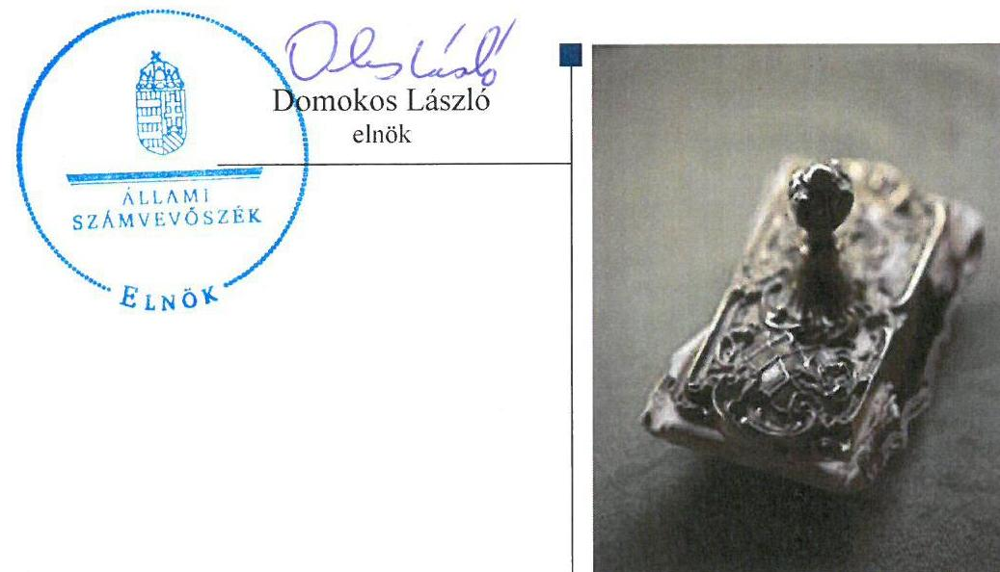

---

Jelentéseink az Országgyűlés számítógépes hálózatán és az Interneten a www.asz.hu címen is olvashatóak.

## AZ ELLENŐRZÉST FELÜGYELTE:

MAKKAI MÁRIA felügyeleti vezető

## AZ ELLENŐRZÉST VEZETTE ÉS A VÉGREHAJTÁSÁÉRT FELELŐS:

SALI SÁNDORNÉ ellenőrzésvezető

## A PROGRAM ÖSSZEÁLLÍTÁSÁÉRT FELELŐS:

JANIK JÓZSEF osztályvezető

## A TÉMÁHOZ KAPCSOLÓDÓ KORÁBBI SZÁMVEVŐSZÉKI JELENTÉSEK:

- címe: A foglalkoztatási célú adó- és járulékkedvezmények igénybevételének szabályszerűségi ellenőrzése
- sorszáma: 15091
- címe: NAV ellenőrzése - a Nemzeti Adó- és Vámhivatal hátralékkezelési és végrehajtási eljárási, valamint a kiemelt adózói körben gyakorolt tevékenysége szabályszerűségének, az EUROFISC rendszer működésének ellenőrzése
- sorszáma: 15044

IKTATÓSZÁM: V-0831-379/2016.
TÉMASZÁM: 1865.
ELLENŐRZÉS-AZONOSÍTÓ SZÁM: V0726

---

# TARTALOMJEGYZÉK 

■ ÖSSZEGZÉS ..... 5
■ AZ ELLENŐRZÉS CÉLJA ..... 7
■ AZ ELLENŐRZÉS TERÜLETE ..... 8
■ AZ ELLENŐRZÉS HÁTTERE, INDOKOLTSÁGA ..... 10
■ FÓKUSZKÉRDÉSEK ..... 11
■ ELLENŐRZÉS HATÓKÖRE ÉS MÓDSZEREI ..... 12
■ MEGÁLLAPÍTÁSOK ..... 14
■ JAVASLATOK ..... 44
■ MELLÉKLETEK ..... 47
I. Sz. melléklet: Értelmező szótár. ..... 47
II. sz. melléklet: Jogszabályok és közjogi szervezet-szabályozó eszközök jegyzékei ..... 54
III. sz. melléklet: A NAV SZJA-val kapcsolatos hátralékkezelési, fizetés könnyítési és végrehajtási tevékenységek 2011-2014. évi jellemző adatai ..... 61
IV. sz. melléklet: A NAV-nál a szervezeti teljesítménymérési rendszer keretében 2014. évben kialakított mutatószámok ..... 62
■ FÜGGELÉK: ÉSZREVÉTELEK ..... 65
■ RÖVIDÍTÉSEK JEGYZÉKE ..... 111

---

.

---

# ÖSSZEGZÉS 

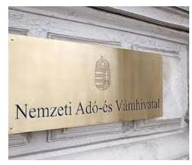

A NAV személyi jövedelemadóval kapcsolatos egyes tevékenységei szabályozottak és szabályszerűek voltak. A szervezet valamennyi működési folyamatára vonatkozó egységes belső kontrollrendszer részeként az ellenőrzési nyomvonal 2014 novemberére - a korábbi ÁSZ ellenőrzés hasznosulásaként - megvalósult. Az Állami Számvevőszék ellenőrzése hiányosságot a kettős adóztatásnál és a kamatadó ellenőrzésénél tárt fel. A NAV ellenőrzéseinek több mint felénél nem volt megállapítható, hogy az adóhatóság ellenőrizte-e a bevallásban szerepeltetett, a kettős adóztatást kizáró egyezmények hatálya alá tartozó külföldi jövedelmeket. Előfordult, hogy a NAV nem hatályos nemzetközi egyezményt alkalmazott. A kamatadó kifizetőknél végzett 2014. évi NAV ellenőrzések az adózó által a könyvek, nyilvántartások vezetéséhez és a bizonylatok feldolgozásához alkalmazott szoftvereket, informatikai rendszereket - jogszabályi előírás ellenére - nem vizsgálták. A hiányosságok veszélyeztetik az adóbeszedés eredményességét, amelyek megszüntetése érdekében fogalmazott meg javaslatokat az ÁSZ.

## Az ellenőrzés társadalmi indokoltsága

Az Állami Számvevőszék feladata többek között az állami adóhatóság adóztatási és egyéb bevételszerző tevékenységének ellenőrzése. A személyi jövedelemadó bevallási és visszaigénylési rendszerét átfogóan utoljára 2004-ben értékelte az ÁSZ ${ }^{1}$. Az állami adóhatóság² a kamatjövedelmek utáni adóból származó bevételek beszedése érdekében tett intézkedéseinek értékelésére célzottan még nem került sor. Nem rendelkeztünk információval arra vonatkozóan sem, hogy a NAV adóztatási feladatainak ellátása során a kettős adóztatás elkerülését célzó nemzetközi egyezmények figyelembevételével járt-e el.

## Főbb megállapítások, következtetések, javaslatok

A belső szabályozó eszközeit a jogszabályokkal, valamint a belső irányítási és jogalkalmazást segítő eljárásokkal összhangban alakította ki a 2012-2015. I. félévében. Az adóbeszedéshez kapcsolódó feladatellátás keretében valamennyi adónemre egységes szabályok vonatkoztak, amelyek hatálya kiterjedt a személyi jövedelemadóval kapcsolatos összes tevékenységre. A személyi jövedelemadóval kapcsolatos tevékenységek szabályszerűsége a bevallás-feldolgozás, az ellenőrzés, valamint a hátralékkezelés, fizetési könnyítés és végrehajtás esetében összességében megfelelő volt. Az adatszolgáltatási feladatok ellátása teljesült, azonban a határidők túllépése miatt részben felelt meg az Szf. tv., a belső eljárásrendek, valamint a KSH-val kötött együttműködési megállapodás előírásainak.

A feladatok szabályszerű ellátását biztosító belső kontrollokat a 2012-2015. I. félévében az ellenőrzött szakterületek belső szabályozó eszközeiben határozta meg. A 2014 augusztusáig hatályban lévő ellenőrzési nyomvonal ugyanakkor a Bkr. előírásai ellenére a gazdálkodási tevékenység folyamataira korlátozódott, nem tartalmazta a közfeladat ellátást végző szakterületek belső kontrolljait. A szervezet összes működési folyamatára kiterjedő egységes belső kontrollrendszer, valamint az annak részét képező ellenőrzési nyomvonal kialakítása és hatályba helyezése a 2014. év utolsó negyedévében megtörtént. Az ellenőrzési nyomvonalban meghatározták a bevallás-feldolgozással és az ellenőrzéssel kapcsolatos belső kontrollokat, kijelölték a kontrollokért felelős személyeket, valamint a feladatok végrehajtásának határidejét.

A magánszemélyek jövedelmének a kettős adóztatás elkerülésével kapcsolatos feladatellátása a 2012-2015. I. félévében az ellenőrzési tevékenység hiányosságai miatt nem felelt meg az Szja tv.-ben, illetve a vonatkozó nemzetközi

---

egyezményekben foglalt előírásoknak. Előfordult, hogy az ellenőrzések dokumentációja hatályon kívüli egyezményekre való hivatkozást tartalmazott, az ellenőrzések több mint felénél nem volt megállapítható, hogy vizsgálták-e az adózók adóügyi illetőségét, továbbá a kettős adóztatás elkerülésével érintett jövedelem esetében a vonatkozó adómérték és a külföldön megfizetett adó jogszabályoknak és nemzetközi egyezményeknek való megfelelőségét. Az önadózás során bevallott kettős adóztatást kizáró egyezmények hatálya alá eső jövedelmek ellenőrizhetőségét nehezítette, hogy az adóbevallások nem tartalmazták, hogy mely országból származott és milyen egyezmény hatálya alá tartozott a külföldi jövedelem. A magánszemélyekre vonatkozó kontroll adatok hiányában az adóhatóság nem rendelkezett elegendő információval a külföldi jövedelmet szerző, belföldi illetőségű adóbevallásra kötelezettek köréről. Az összes bevallott adóköteles jövedelem mindössze 0,1%-át tették ki a külföldi jövedelmek. A kontroll adatok és az ellenőrzésben feltárt hiányosságok a külföldi, benne a kettős adóztatást kizáró egyezményeket érintő adókötelezettség teljesítésére kockázatot jelentenek.

Az információcserével kapcsolatos feladatokat a 2012-2015. I. félévében részben teljesítette, mivel nem tartotta be maradéktalanul a szervezeti egységek értesítésére, valamint a határidőkre vonatkozó belső eljárásrendben foglalt előírásokat. A nemzetközi információk 80,4%-a a NAV által küldött, 19,6% a másik államból fogadott adatszolgáltatás volt. A NAV által a másik államból származó adatok felhasználásával végzett ellenőrzések a beérkezett adatállomány 0,8%-át érintették.

A kamatadóra vonatkozó ellenőrzések a 2010-2014. években részben feleltek meg az Art.-ban foglalt előírásoknak, mert az adóalap és a bevallott adó megállapításának helyességén túl a 2014. évben nem terjedt ki az adatokat előállító informatikai rendszerek vizsgálatára. A kamatadó kifizetőknél végzett adóhatósági ellenőrzésének módszere és eredménye közvetlenül nem volt ellenőrizhető, mivel az ellenőrzési jegyzőkönyvek a belső eljárásrendekkel összhangban a feltárt jogsértéseket, valamint az adókülönbözetet rögzítették.

Az ellenőrzött kifizetők a 2010-2014. években kiépítették és működtették a kamatadó elszámolására alkalmas informatikai rendszert, ugyanakkor a kockázatkezelés kivételével részben biztosították a Hpt., valamint az 535/2013. (XII. 30.) Korm. rendeletben foglalt előírásoknak megfelelően azok sértetlenségének, teljességének és megbízhatóságának kockázatokkal arányos védelmét. A feltárt hiányosságok a szabályozással, az ellenőrzéssel, a jogosultságkezeléssel és a logikai védelemmel kapcsolatosan merültek fel. A kamatadó számítást végző informatikai rendszerek kontrolljai részben tették lehetővé az adatok helytelen vagy jogosulatlan rögzítésének, módosításának megelőzését, illetve kiszűrését. A kifizetők a biztonsági kockázatelemzést és a rendszer elemeinek biztonsági osztályokba sorolását elvégezték. Rendelkeztek továbbá a szolgáltatások folytonosságát, valamint az adatok archiválását és a rendszer helyreállítását szolgáló üzembiztonsági eszközökkel és megoldásokkal. A pénzügyi szolgáltatóknál a kamatjövedelem utáni személyi jövedelemadó kiszámítása, levonása, bevallása és megfizetése összességében szabályszerűen történt, azonban az informatikai rendszerek biztonságával kapcsolatos hiányosságok miatt fennállt a kamatadó számítások és adatok hibás kezelésének kockázata.

A NAV és az NGM az egyszerűsítési programban foglalt feladatokat határidőre végrehajtotta, azok hatásait a NAV nyomon követte. Az NGM az Áht.-ban foglalt előírásoknak megfelelő követelményt nem határozott meg a 2014. évben az erőforrásokkal való szabályszerű és hatékony gazdálkodással összefüggően. A nemzetgazdasági miniszter az adóbeszedés hatékonyságának növelése érdekében, a kiemelt bevételi előirányzatok teljesítésének irányadó premizálási küszöbértékét határozta meg követelményként. A NAV elnöke a kiemelt feladatok teljesítésének elősegítése érdekében az intézményi munkaterv és a teljesítmény-menedzsment rendszer keretében határozott meg követelményeket, amelyek azonban nem tartalmaztak az erőforrásokkal való szabályszerű, gazdaságos, hatékony és eredményes gazdálkodásra vonatkozó előírásokat. A NAV elnöke emiatt nem gondoskodott arról, hogy a közfeladat ellátás tevékenységében és céljaiban a gazdaságosság, a hatékonyság és az eredményesség követelményei az erőforrások területén is érvényesüljenek az Áht.-ban és a Bkr.-ben foglalt előírások ellenére.

---

# AZ ELLENŐRZÉS CÉLJA 

## A személyi jövedelemadó beszedési tevékenységekkel kapcsolatos feladatellátás szabályszerűségének értékelése

Az ellenőrzés célja annak értékelése, hogy a NAV³ személyi jövedelemadóval kapcsolatos egyes tevékenységei szabályozottak és szabályszerűek voltak-e; a feladatok szabályszerű ellátását biztosító belső kontrollok kiépítése és működtetése a jogszabályoknak és egyéb szabályozó eszközöknek megfelelt-e; a NAV a magánszemélyek jövedelmének a kettős adóztatása elkerülésével kapcsolatos feladatait a nemzetközi egyezmények és a hatályos hazai jogszabályok előírásai figyelembevételével, szabályszerűen látta-e el; a kamatjövedelmekből a kifizetők által levont adó teljes körű realizálása érdekében kiépítettek és működtettek-e adatszolgáltatási, ellenőrzési és nyomon követési rendszert.

Az ellenőrzés keretében értékeltük a Magyary Zoltán Egyszerűsítési Programnak a személyi jövedelemadózás egyszerűsítésére irányuló feladatainak végrehajtását, továbbá a NAV irányító/felügyeleti szerve által meghatározott követelményeket, ezek érvényesítését, számonkérését és ellenőrzését a NAV közfeladat ellátására vonatkozóan az erőforrásokkal való szabályszerű és hatékony gazdálkodás területén.

---

# **AZ ELLENŐRZÉS TERÜLETE**

## **Személyi jövedelemadó beszedési tevékenység**

Az államháztartásnak az általános forgalmi adót követő legnagyobb összegű bevétele a személyi jövedelemadóból származott, amely több millió adóalanyt érintett. A személyi jövedelemadóból származó költségvetési bevétel a 2014. évben 1 589 055,4 millió Ft összegben teljesült. A 2014. évben összesen 4,6 millió fő teljesítette személyi jövedelemadó bevallási kötelezettségét, amelyből az önbevallók aránya 84,2% volt. A személyi jövedelemadózás alapvető feladata az állampolgárok közterhekkel való hozzájárulásán keresztül az adóbevételek biztosítása. Az adózás és adóztatás folyamatában kiemelkedő alapelv a törvényes kereteken belül az adóelkerülés lehetőségeinek a szűkítése, visszaszorítása, továbbá az adózás és az adókötelezettség teljesítésének egyszerűbbé tétele.

**A SZEMÉLYI JÖVEDELEMADÓ** szabályait az Szja tv.4 rögzíti. A személyi jövedelemadó bevallása és megfizetése a magánszemélyek kötelezettsége, azonban az Szja tv.-ben meghatározott esetekben a kifizető feladata az adó levonása, bevallása és befizetése. Magyarország a magyar illetőségű magánszemélyek belföldről és külföldről származó jövedelmét, továbbá a külföldi személyek belföldről származó, vagy egyébként nemzetközi szerződés, viszonosság alapján a Magyarországon adóztatható bevételét vonja adóztatás alá. A kettős adóztatás elkerüléséről szóló egyezmények célja, hogy az adózók jövedelmét ne sújtsa kétszeres adóteher. A 2014. évben a bevallott összes jövedelem 0,1%-a volt külföldi jövedelem, mely magában foglalta a kettős adóztatást kizáró egyezmények hatálya alá tartozó jövedelmeket is. A kamatjövedelmet a magánszemélynek nem kellett bevallania, a kapcsolódó adót a kifizető állapította meg és vallotta be. A kifizetők által a 2014. évben megállapított és bevallott kamatjövedelmek utáni személyi jövedelemadó 40 796,0 millió Ft-os összege az Szja-ból származó költségvetési bevétel mintegy 2,6%-át tette ki, a bevallást teljesítő kifizetők száma 358 db volt.

---

A 2014. évben a magánszemélyek adóköteles jövedelmének megoszlását és a kamatjövedelmek nagyságrendjét a következő ábra szemlélteti:
1. ábra
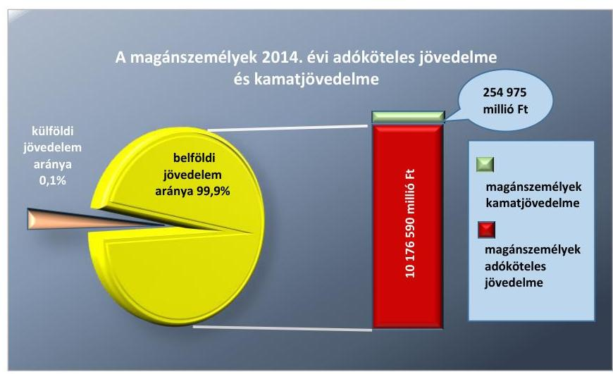

Forrás: NAV adatszolgáltatása

---

# AZ ELLENŐRZÉS HÁTTERE, INDOKOLTSÁGA 

## Személyi jövedelemadó bevételek szabályszerű biztosítása

## Hasznosulás

AZ ELLENŐRZÉS EREDMÉNYEKÉNT képet kaptunk a NAV személyi jövedelemadóval kapcsolatos egyes tevékenységei, a magánszemélyek jövedelmének kettős adóztatása elkerülésével kapcsolatos feladatai ellátásának szabályszerűségéről, a kamatjövedelmekből a kifizetők által levont adó realizálása érdekében kiépített és működtetett adatszolgáltatási, ellenőrzési és nyomon követési rendszerek megfelelőségéről, és a Magyary Zoltán Egyszerűsítési Programnak a személyi jövedelemadózás
 egyszerűsítésére irányuló feladatainak végrehajtásáról.

A NAV jogkövető magatartásához az ÁSZ ellenőrzése hozzájárulhat a szabályszerűségi hibák, kontrollhiányosságok, kockázatok feltárásával. A közpénzeket felhasználó és a költségvetési bevételek legmeghatározóbb részének biztosításáért felelős NAV feladatellátásának szabályszerűségére vonatkozó megállapításaink segítséget nyújthatnak az országgyűlés törvényhozó munkájában, hozzájárulhatnak a jó kormányzás gyakorlatának erősítéséhez. Az ellenőrzés biztosítja a társadalom részéről kiemelt érdeklődéssel kísért téma objektív bemutatását. Az ÁSZ nyilvános jelentése segítségével a társadalom átfogó képet alkothat arról, hogy az állami adóhatóság tevékenysége elősegíti-e a személyi jövedelemadóból, és ezen belül kiemelten a kamatjövedelmek adójából származó költségvetési bevételek teljes körű realizálását, amely növelheti a társadalom és a gazdasági szereplők ÁSZ ellenőrző tevékenységével szembeni bizalmát. Az ÁSZ tanácsadó szerepe, a jó kormányzáshoz, az értékteremtő rend kialakításához és megőrzéséhez hozzájáruló tevékenysége pozitív hatással van a szervezetről kialakított összkép társadalmi kommunikációjára.

---

# FÓKUSZKÉRDÉSEK 

1.     - A személyi jövedelemadóval kapcsolatos egyes tevékenységek szabályozottak és szabályszerűek voltak-e?
2.     - A belső kontrollok kiépítése és működtetése a jogszabályoknak és egyéb szabályozó eszközöknek megfelelt-e?
3.     - A kettős adóztatás elkerülésével, valamint az információcserével kapcsolatos feladatok ellátása szabályszerű volt-e?
4.     - Megvalósult-e az ellenőrzés és a nyomon követés a kifizetők által bevallott és befizetett kamatadó tekintetében?
5.     - A pénzügyi szolgáltatók a kamatadó levonását és bevallását megfelelően végezték-e?
6.     - Az egyszerűsítési feladatokat az NGM és a NAV végrehajtotta, illetve nyomon követte-e?
7. Meghatározták és számon kérték-e az erőforrásokkal való gazdálkodás követelményeit?

---

# ELLENŐRZÉS HATÓKÖRE ÉS MÓDSZEREI 

## Az ellenőrzés típusa

megfelelőségi ellenőrzés

## Az ellenőrzött időszak

2012-2015. I. félév a 2011-2014. években megszerzett jövedelmekkel kapcsolatos adatszolgáltatások, bevallások, információcserék, valamint a NAV kettős adóztatás elkerülésével kapcsolatos feladatainak ellenőrzése tekintetében. Az adóhatóság hátralékkezelési és végrehajtási tevékenységét, valamint a közfeladatok ellátására vonatkozó, és az erőforrásokkal való szabályszerű és hatékony gazdálkodáshoz szükséges követelményeket tekintettel arra, hogy azt az előző ellenőrzés 2013. december 31-ig értékelte - a 2014. évre vonatkozóan ellenőriztük. A NAV kamatjövedelmek után fizetendő adó bevallásának és megfizetésének kontrollját biztosító ellenőrzési, nyomon-követési rendszerének kiépítését és működtetését, illetve a kifizetők kamatjövedelem utáni adó levonását, bevallását, az adatszolgáltatást támogató informatikai rendszereinek megbízhatóságát a 2010-2014. évekre vonatkozóan értékeltük. Az egyszerűsítési program végrehajtásának értékelését az 1304/2011. (IX. 2.) Korm. határozat hatályba lépésének napjától, 2011. szeptember 3-tól 2014. december 31-ig tartó időszakra vonatkozóan végeztük.

## Az ellenőrzés tárgya

A személyi jövedelemadóval kapcsolatos tevékenységek feladatellátása, a kettős adózást kizáró egyezmények, információcsere és kamatadó.

## Az ellenőrzött szervezet

A Nemzeti Adó- és Vámhivatal, valamint az Áht. 9. § (1) f) pontjában meghatározott irányító szervi hatáskörök gyakorlásának, a személyi jövedelem-adózással kapcsolatos egyszerűsítési feladatok végrehajtásának értékelése tekintetében a Nemzetgazdasági Minisztérium. A kamatjövedelmet terhelő személyi jövedelemadó vonatkozásában érintett állami tulajdonban (résztulajdonban) lévő kifizető szervezetek az MKB Bank Zrt ${ }^{5}$, a Magyar Posta Életbiztosító Zrt., valamint a Magyar Posta Befektetési Szolgáltató Zrt.

---

# Az ellenőrzés jogalapja 

Az ÁSZ tv. 1. § (3) bekezdése, az 5. § (2)-(4), (6) és (8) bekezdései.

## Az ellenőrzés módszerei

2. ábra

Az ellenőrzés szakmai módszertana az ÁSZ hivatalos honlapján (www.asz.hu) közzétett szakmai szabályokon alapult, amely a Legfőbb Ellenőrző Intézmények Nemzetközi Szervezete (INTOSAI) által kiadott nemzetközi standardok (ISSAI) figyelembevételével készült.

Az ellenőrzés lefolytatásához az ellenőrzött szervezetek a tanúsítványok kitöltésével, valamint a dokumentumok papír alapon és elektronikus úton való megküldésével szolgáltattak adatokat, melynek hitelességét, teljes körűségét az első számú vezetők aláírásukkal igazolták. Az így rendelkezésre bocsátott adatok (információk) kontrollja a helyszíni ellenőrzés keretében történt.

Mintavétellel ellenőriztük, a NAV-nál az Szja bevallások feldolgozása, kezelése és ellenőrzése, a hátralékkezelési, fizetési könnyítési és végrehajtási tevékenység, az adatszolgáltatás, a kettős adóztatás, az információcsere és a kamatjövedelmet terhelő Szja szabályszerűségét, amelyek eredménye összesítésre került. Mintavétellel ellenőriztük továbbá az MKB Bank Zrt.-nél, a Magyar Posta Életbiztosító Zrt.-nél, valamint a Magyar Posta Befektetési Szolgáltató Zrt.-nél a kamatjövedelem utáni adó levonásának, bevallásának és megfizetésének a megfelelőségét. Megállapításainkat az ellenőrzött mintatételek értékelése alapján tettük meg. A minta alapján a sokaságban előforduló hibaarányt becsültük. „Megfelelőnek" értékeltük az ellenőrzött területet, amennyiben 95%-os megbízhatósággal a sokaságra vonatkozó hibaarány legfeljebb 10%, ,,részben megfelelőnek" értékeltük, ha a hibaarány felső határa 10-30% között volt, ,,nem megfelelőnek" pedig akkor, ha a mintavételi eredmények alapján a sokaságbeli hibaarány felső határa meghaladta a 30%-ot.

Az ellenőrzés az önadózás keretében bevallott személyi jövedelemadóval kapcsolatos tevékenységet értékelte, nem tért ki az ezen a területen is meglévő adókikerülés problémáira. Az ellenőrzés nem terjedt ki az ellenőrzött szervezetek és a pénzügyi szolgáltatók valamennyi tevékenységére, csak a programban meghatározott területeket érintette.

---

# 1. A személyi jövedelemadóval kapcsolatos egyes tevékenységek szabályozottak és szabályszerűek voltak-e? 

Összegző megállapítás

1.1. számú megállapítás

A belső szabályozó eszközök kialakítása megfelelt a jogszabályi előírásoknak, továbbá a feladatellátás szabályszerű volt a 2012-2015. I. félévében.

A belső szabályozó eszközök összhangban voltak a jogszabályok, valamint az irányítási és jogalkalmazást segítő belső szabályozó eszközök előírásaival a 2014-2015. I. félévében.

A belső szabályozó eszközöket egységes módon, valamennyi adónemre vonatkozóan alakították ki a 2014-2015. I. félévében. A belső szabályzatokban és körlevelekben foglalt előírások az összes adónemmel - ezen belül a személyi jövedelemadóval - kapcsolatos bevallás-feldolgozási, ellenőrzési, hátralékkezelési, fizetéskönnyítési és végrehajtási, valamint adatszolgáltatási tevékenységre kiterjedtek. A belső szabályozó eszközök összhangban álltak a vonatkozó hatályos jogszabályokkal, valamint a NAV irányítási és jogalkalmazást segítő eszközeinek kiadási rendjéről szóló 2150/2012. számú szabályzat ${ }^{6}$ előírásaival.

A bevallások feldolgozásának folyamatát a NAV elnöke által kiadott 1023/2011. 7. 1013/2014. ${ }^{8}$ és 1023/2015. számú ${ }^{9}$ eljárásrendek szabályozták a 2014-2015. I. félévében. Az eljárásrendek az illetékességre, valamint az önadózás, illetve a munkáltatói adó megállapítás keretében készült bevallások befogadására és feldolgozására vonatkozó általános és speciális szabályokat határozták meg. Az előírások kiterjedtek az elektronikus és papír alapú bevallások érkeztetésére, iktatására, a bevallások tartalmi, számszaki, logikai, nagyságrendi, valamint értékhatárhoz kötött ellenőrzésére. Az eljárásrendek meghatározták a hibás bevallások javítására, a kiutalás előtti ellenőrzésre történő kiválasztásra, a visszatartási jog gyakorlására, valamint a hibátlan bevallások könyvelésére vonatkozó szabályokat. A különböző bevallástípusokhoz - ezen belül a személyi jövedelemadóhoz - kapcsolódó egyedi szabályokat az eljárásrendek mellékletei részletezték. Az ellenőrzött időszakban a bevallások feldolgozására vonatkozó jogszabályok és eljárásrendek megfelelő alkalmazását a NAV elnöke, adószakmai elnökhelyettese, valamint a BVF ${ }^{10}$ által kiadott 15 körlevél támogatta. A bevallás-feldolgozási folyamat eljárási szabályainak egységes alkalmazását segítette a NAV elektronikus bevallás és bizonylat feldolgozó rendszerének leírása. Az UBEV ${ }^{11}$ kézikönyv a nyomtatványok tervezésével, kitöltésével, fogadásával és feldolgozásával kapcsolatos valamennyi munkafázis részletes leírását tartalmazta.

---

Az ellenőrzések tervezésének, az ellenőrzésre történő kijelölés, kiválasztás általános alapelveinek és módszereinek átfogó szabályozását a NAV elnöke az 1070/2011. számú ${ }^{12}$, illetve annak hatályon kívül helyezését követően az 1019/2014. számú ${ }^{13}$ eljárásrenddel alakította ki a 2014-2015. I. félévében. Az eljárásrendekben foglalt előírások meghatározták az ellenőrzési kapacitás tervezésére, az adózók ellenőrzésre történő kijelölésére és kiválasztására, valamint az ellenőrzések feldolgozására és nyilvántartására vonatkozó feladatokat, módszereket és határidőket. Az Art. ${ }^{14}$ 87. § (1) bekezdésében meghatározott ellenőrzés típusokra, a határidők meghosszabbítására, továbbá az ellenőrzési tevékenységet támogató informatikai rendszerek működésére vonatkozó sajátosságokat - az átfogó szabályozással összhangban lévő - külön eljárásrendek szabályozták. Az adózók ellenőrzésre történő kiválasztását az adó(fő)igazgatóságok végezték, amelynek szabályozását az érintett szervezeti egységek saját eljárásrendjei biztosították. Az ellenőrzési szakterületre vonatkozó eljárásrendek érvényesülése érdekében a NAV elnöke és adószakmai elnökhelyettese 12 körlevelet adott. Az ellenőrzési tevékenységét az állami adóhatóság vezetője által évente közzétett ellenőrzési irányokról szóló tájékoztatása alapján végezte. Az éves ellenőrzési tájékoztatók az előírásoknak megfelelően tartalmazták az adott év kiemelt vizsgálati céljait, az ellenőrizendő főbb tevékenységi köröket, az egyes térségekre, településekre jellemző jövedelmezőségi mutatókat el nem érő adózók ellenőrzésének szempontjait, valamint az ellenőrzési típusok tervezett arányszámait.

# A hátralékkezelésre, végrehajtásra és fizetési kedvezményekre vonatkozó eljárásrendjei megfeleltek az Art. előírásainak a 2014-2015. I. félévében. A hátralékkezelési, fizetési könnyítési és végrehajtási tevékenység összetett feladatait az 44 darab eljárásrend szabályozta, továbbá a jogalkalmazást és végrehajtást segítő 27 körlevél, valamint két módszertani útmutató támogatta. A jogszabályi keretek egymástól eltérő eljárásokra biztosítottak lehetőséget 2015. év I. félévéig, majd ezt követően új eljárásrendek léptek hatályba, amelyek már biztosították a szervezeti szintű egységes feladatellátást az alábbi területeken:
— fizetési felszólítás és felhívás;
— jövedelem letiltás és a gépjárművek végrehajtás alá vonás;
— helyszíni eljárás és az ingófoglalás, az ingatlan végrehajtás;
— pénzforgalmi szolgáltatónál kezelt összeg végrehajtás, a követelésfoglalás, az ideiglenes biztosítási intézkedések és a pénzkövetelés biztosítás;
— eljárás bírósági végrehajtó részére történő átadás, valamint a hagyományos árverés és az árverésen kívüli eladásra vonatkozó eljárásrendek.

Az adatszolgáltatások koordinálási, nyilvántartási feladatait az SZMSZ-ének 2. számú függeléke, valamint a NAV KH Ügyrendje ${ }_{1: 2: 3}{ }^{15}$ írta elő a 2014-2015. I. félévében. A rendszeresen teljesítendő adatszolgáltatások részletes eljárási rendjének kialakítását a NAV elnöke által kiadott 2149/2012. számú adatszolgáltatási szabályzat ${ }^{16}$ biztosította. A személyi jövedelemadóval kapcsolatos adatszolgáltatási kötelezettség teljesítése az adózók által benyújtott bevallások feldolgozására alkalmazott

---

# 1.2. számú megállapítás 

informatikai rendszer, a BEVFELD ${ }^{17}$ alapján valósult meg. A BEVFELD rendszerből származó, feldolgozott bevallásokból előállított adatállományok továbbításának szabályait az adatszolgáltatási szabályzat írta elő.

A NAV belső szabályozás integritás kontrolljai a 2014. évre vonatkozóan érvényesültek, az ellenőrzés során tett megállapítások ezzel összefüggésben korrupciós kockázatokat nem jeleztek.

## Összességében a jogszabályi és belső szabályozási előírásoknak megfelelően végezte a belföldi személyi jövedelemadóval kapcsolatos tevékenységeit a 2012-2015. I. félévben.

A bevallás-feldolgozás folyamata 2012-2015. I. félévben megfelelt a vonatkozó jogszabályokban és a belső eljárásrendekben foglalt előírásoknak. Az illetékességre vonatkozó előírásokat betartották, beavatkozás szükségessége esetén a központi feldolgozó rendszer által meghatározott illetékes adóigazgatóság jogosult ügyintézőjének volt lehetősége javítani a bizonylatot. A beérkezett elektronikus bevallásokat minden esetben ellátták időbélyegzővel, a papír alapon érkező bevallásokra felragasztották az előírt vonalkódot. A személyesen benyújtott, valamint a postai úton érkezett bevallások esetében ellenőrizték és feltüntették a bevallás benyújtásának, illetve postára adásának dátumát.

A 2012-2015. I. félévben az EBEV ${ }^{18}$ rendszer minden elektronikus bevallás vonatkozásában ellenőrizte a benyújtásra vonatkozó jogosultságot, az esetleges jóváhagyásokat és amennyiben nem talált hibát automatikusan elfogadó nyugtát küldött az adózónak. Minden elektronikusan beküldött bevallást ellátott iktatószámmal és folyamatos sorszámozású nyilvántartási számmal. A bevallás-feldolgozó rendszer valamennyi esetben nyugtát küldött az EBEV számára a bevallás adatainak betöltéséről. A bevallások gépi nyilvántartásba vételét elvégezték, ugyanakkor két papír alapú bevallás esetében a belső eljárásrendben előírt határidőn túl öt, illetve két munkanap késéssel rögzítették azok adatait az UBEV rendszerben. A papír alapon beérkezett
 bevallások iktatásakor a DOKU rendszerben ${ }^{19}$ rögzítették az előírt adatokat, az elektronikus bevallásokra vonatkozóan a rendszer automatikusan végezte az iktatást. A nyilvántartásba vett bevallásoknál minden esetben elvégezte a tartalmi, számszaki, logikai, nagyságrendi, valamint az értékhatárhoz kötött ellenőrzéseket az összefüggés-vizsgálati szempontok alapján. Kizárólag a hibátlan bizonylatok kerültek könyvelésre, melyek megfeleltek a könyvelésre átadás feltételeinek. A nyomdai nyomtatványon beadott bevallások feldolgozása során a nyilvántartásba vételkor az eljárási rendben előírt adatokat rögzítették és ellenőrizték. A bevallások adatainak első, illetve ellenőrző második rögzítését eltérő ügyintézők egymástól függetlenül végezték.

A bevallások szükség szerinti javítása, továbbá a javítandó bevallások esetében az adózó értesítése a belső eljárásrendnek megfelelően történt a 2012-2015. I. félévben. Amennyiben a bevallás az adózó közreműködése nélkül nem volt javítható, illetve a bevallásból, nyilatkozatokból olyan adatok hiányoztak, melyek az adóhatóság nyilvántartásában sem szerepeltek, az adózót hiánypótlásra szólították fel. Elektronikus bevallás esetén, amennyiben a hiba kijavítása, vagy a hiánypótlás megtörtént, az előírásoknak megfelelően újraérkeztették a bevallást. Az adó-visszaigénylést tartalmazó bevallások esetében előzetes szűrést végeztek annak megállapítására, hogy szükséges-e a kiutalás előtti ellenőrzésre történő kiválasztás.

---

A felülvizsgált adó-visszaigényléseket az általa nyilvántartott adótartozás, adók módjára behajtandó köztartozás, illetőleg önkormányzati adóhatóság megkeresésében közölt - önkormányzati adóhatóságot megillető - tartozás összegéig szabályszerűen visszatartotta.

AZ ELLENŐRZÉSI tevékenység 2012-2015. I. félévben szabályszerű volt, megfelelt a jogszabályok és a belső eljárásrendek előírásainak. Az adóhatóság a főbb bevallástípusokra kiterjedően, az Szja tv.-ben foglaltaknak megfelelően ellenőrizte a munkáltatói adó-megállapításokat, az egyéni vállalkozókat, az őstermelőket, a fizető-vendéglátó tevékenység után átalányadózókat, az ellenőrzött tőkepiaci ügyletből, valamint az ingatlan, vagyoni értékű jog átruházásából származó jövedelmet szerzőket. A megvalósult ellenőrzési gyakorlat összhangban volt a tervezési célokkal, a személyi jövedelemadóval kapcsolatban az éves ellenőrzési tájékoztatókban megfogalmazott követelmények teljesültek. Az ellenőrzések kiterjedtek az igénybe vehető adókedvezmények, azon belül a családi és az őstermelői adókedvezmények ellenőrzésére, a vagyongyarapodási vizsgálatokra, valamint a munkáltatói bevallások adatainak ellenőrzésére.

Az ellenőrzések megindítása, lefolytatása és befejezése megfelelt az Art. és a belső szabályozó eszközök előírásainak a 2012-2015. I. félévében. Az ellenőrzésekről vezetett nyilvántartásban feltüntették az adózó azonosítására szolgáló adatokat, továbbá megjelölték az ellenőrzésre történő kiválasztás módszerét és az ellenőrzés közvetlen okát. Az adózók célzott kiválasztása esetén az Art.-ban foglalt előírások szerint jártak el, véletlenszerű kiválasztásnál a központilag működtetett VAK rendszert ${ }^{20}$ alkalmazták. Az adóellenőrök szabályos megbízólevéllel rendelkeztek, betartották a rendelkezésre álló határidőt, illetve szükség esetén a jogszabályi előírások szerint jártak el az ellenőrzési határidő meghosszabbítása érdekében. A határozat meghozatala során figyelembe vették az ellenőrzési jegyzőkönyv megállapításait, a határozatban megállapított adókötelezettséget annak jogerőre emelkedését követően előírták az adózó folyószámláján. A szükséges esetekben a végrehajtás megindításra került, azonban előfordult, hogy az ellenőrzés során az adózó terhére megállapított 24,0 ezer Ft kötelezettség megfizetésének elmulasztása esetén nem indították meg az eljárást az Art. 150. § (1) bekezdésében foglaltakkal ellentétesen.

A HÁTRALÉKBESZEDÉSI tevékenység a 2014. évben szabályszerű volt. A hátralék állomány nagysága kedvezőtlenül alakult, a végrehajtott szabályszerű törlések ellenére növekedett.

---

A személyi jövedelemadóból származó hátralékállomány alakulását a következő ábra mutatja be:
3. ábra
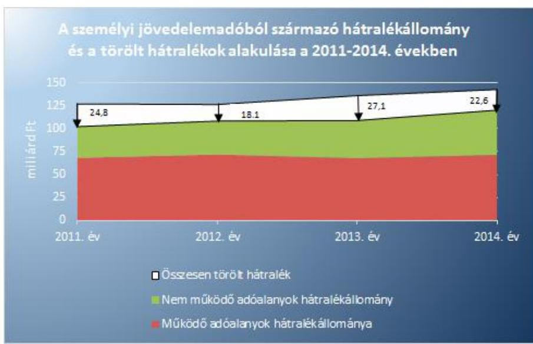

Fonrás: NAV adatszolgáltatás
A 2011-2014. évek adatainak értékelése alapján a személyi jövedelemadó összes adózói hátralék állománya a 2014. évre 17,5%-kal (17,9 Mrd Ft-tal), míg a hátralékos adóalanyok száma 15,3%-kal (65 468 db-bal) növekedett a 2011. évhez képest. A hátralékállomány szerkezete a behajthatóság szempontjából kedvezőtlenül alakult, mivel a 2011. évi 33,3%-ról a 2014. évben 40,7%-ra emelkedett az összes hátralékállományon belül a korlátozottan behajtható, nem működő adóalanyok hátralékának részaránya. Ezen kívül a hátralék állomány növekedését nem tudta ellensúlyozni, hogy a végrehajtás során beszedett hátralék összege a 2014. évre összességében 11,5 Mrd Ft-tal, 34,2%-kal növekedett a 2011. évhez viszonyítva. A 2011. évben a személyi jövedelemadó hátralékból 24,8 Mrd Ft-ot töröltek, mely a 2014. évre 8,8%-kal, 22,6 Mrd Ft-ra csökkent.

A hátralékkezelési, fizetési könnyítési és végrehajtási tevékenységek ellátása 2014-2015. I. félévben a feltárt hiányosságok ellenére összességében szabályszerű volt. A szakterülettel kapcsolatos megállapítások az alábbiak voltak:
— az Art. 150. § (1) bekezdésében biztosított lehetőség ellenére az adós felhívása az adótartozás megfizetésére többségében nem történt meg;
— az Art. 163. §-ában, a 49/2012. (XII. 28.) NGM rendelet ${ }^{21}$ 3. § (1) és (3) bekezdéseiben, az 1034/2013. számú NAV eljárási rend ${ }^{22}$ 33. és 35. pontjaiban foglaltak ellenére előfordult, hogy nem intézkedtek az első végrehajtási cselekmény foganatosításával egyidejűleg a végrehajtási költségátalány megállapításáról;
—előfordult, hogy 500 ezer Ft-ot meghaladó adótartozásnál az Art. 155. § (1) és 156. § (1) bekezdéseiben, valamint a Vht. ${ }^{23}$ 138. §-a szerinti ingatlan-végrehajtásra nem került sor, annak ellenére, hogy más végrehajtási cselekményből a tartozás nem volt kielégíthető.

---

Az adóhatóság biztosította a hátralékok alakulásának folyamatos figyelemmel kísérését, a nyilvántartások naprakészségét, továbbá a belső eljárásrendekben foglalt egyeztetések végrehajtását a 2014. évben. Az adózók az ellenőrzött időszakban 120 597 db fizetési kedvezményre irányuló kérelmet nyújtottak be 46 789 M Ft személyi jövedelemadóhoz kapcsolódóan. Az adóhatóság jogerős határozatai alapján a kérelmek 59,3%-a (71 513 db), illetve az érintett személyi jövedelemadó 30,1%-a (14 074 M Ft) esett teljes mértékben vagy részben kedvező elbírálás alá. A fizetési könnyítésekre irányuló kérelmek elbírálása a jogszabályi és belső szabályozások előírásainak megfelelően történt. A fizetési halasztás és részletfizetés engedélyezése, valamint az adómérséklések a jogszabályi előírásoknak megfelelően történtek, illetve a fizetési kedvezmény kérelmek elbírálását a vonatkozó belső szabályzatok és eljárásrendek figyelembevételével hajtották végre. A fizetési kedvezményekről hozott határozatok a jogszabályoknak és a belső eljárásrendnek megfeleltek. Az engedélyezett részletfizetéseknek, az előírt feltételek szerinti pénzügyi teljesítését rendszeresen figyelemmel kísérték, és gondoskodtak a kedvezmény megfelelő visszarendezéséről.

Az adótartozás végrehajtási eljárását a jogszabályi és belső szabályozások előírásainak megfelelően hajtották végre a 2014. évben. A hátralék végrehajthatósága esetén a jogszabályban foglaltak szerint haladéktalanul megindították az eljárást. Végrehajtási cselekményként az adózó esetleges túlfizetéseit az Art. előírásainak megfelelően átvezették, és erről az adózót végzéssel értesítették. A jogszabályi előírásokat betartva a munkabérre vonatkozó végrehajtásokat, a munkabér letiltásokat, illetve a pénzforgalmi szolgáltatónál kezelt összegek végrehajtását szabályszerűen végezték. A munkáltató átutalási kötelezettségének teljesítését nyomon követték, ellenőrizték, azok elmaradása esetén határozattal kötelezték a teljesítésre. A jogszabályi előírásoknak megfelelően elrendelték a pénzkövetelés biztosítását amennyiben fennállt a követelés későbbi kielégítésének veszélyeztetettsége, továbbá betartották a végrehajtási eljárás szünetelésére vonatkozó előírásokat. A feltárt hiányosságon túl a szükséges esetekben a jogszabályi előírások szerint sor került ingatlan végrehajtási eljárásra, melynek során az ingatlanok lefoglalásánál, a végrehajtási jog bejegyeztetésénél szabályszerűen jártak el. A végrehajtás alá vont vagyonelemek értékesítése során betartották az eljárási szabályokat. 2014. évben a végrehajtási eljárások során szabályosan vették fel a jegyzőkönyveket. Az eljárás eredményeként befolyt összegekkel egyezően a jogszabályban és a belső eljárásrendekben foglaltak szerint a tartozás kivezetése megtörtént. A végrehajtási ügyek pénzügyi rendezését követően haladéktalanul intézkedtek az eljárás megszüntetéséről. Az adózó esedékes adójának meg nem fizetése, továbbá az ellene vezetett végrehajtás eredménytelensége esetén szabályszerűen az adó megfizetéséről szóló határozatban előírta a tartozás megfizetését a helytállni köteles személyek (mögöttes felelősök) részére.

Az adóhátralékok elévülésének nyomon követését a 2014. évben szabályszerűen végezték, az elévülésre vonatkozó szabályokat betartották. A végrehajtási cselekmény foganatosítása esetén az elévülés idejének hat hónappal való meghosszabbodását figyelembe vették. A hátralék behajthatatlanná minősítése során betartották az előírásokat, illetve a behajthatatlanná minősített követeléseket szabályszerűen nyilvántartásba vették.

---

Az ideiglenesen behajthatatlannak minősített tartozásokat legalább évenként felülvizsgálták. Az elévülés vagy a végleges behajthatatlanság megállapítását követően a vonatkozó jogszabályi és belső eljárásrendek előírásainak megfelelően megtörtént a behajthatatlan vagy elévült hátralék törlése.

AZ ADATSZOLGÁLTATÁSOK 2012-2015. I. félévben teljesültek, azonban részben feleltek meg az Szf. tv. ${ }^{24}$ 6/A. § (1) és 6/B. § (1) bekezdéseiben, a belső eljárásrendekben, valamint a KSH együttműködési megállapodásban foglalt előírásoknak a határidő-túllépések miatt. A NAV az NGM és az EMMI ${ }^{25}$ részére évente két alkalommal kimutatást készített a személyi jövedelemadó 1+1%-ának felhasználásáról. Az adóhatóság a rendelkező nyilatkozatokkal kapcsolatos adatszolgáltatást két esetben az Szf. tv. 6/A. § (1) és 6/B. § (1) bekezdéseiben foglalt határidőt néhány nappal túllépve teljesítette.

A NAV az NGM részére a 2012-2015. I. félévben rendszeres, havi gyakorisággal szolgáltatott adatokat az Szja bevételek várható alakulásáról, a tárgyhavi tényadatokról, a bevételeket befolyásoló főbb tényezőkről és a bevallásokban érvényesített családi járulékkedvezmény összegéről. A NAV által teljesített adatszolgáltatások lehetővé tették az Szja vonatkozásában a döntés-előkészítési, gazdaságpolitikai javaslatokhoz készített költségvetési hatásvizsgálatok elvégzését, az adójogszabály (pl: adókulcs, családi adókedvezmények) változások hatásának értékelését, illetve a költségvetés tervezését. A nemzetgazdasági miniszter adóztatási feladatai ellátásához - a jogszabályok alapján kapott felhatalmazás alapján - felhasználta a NAV-tól rendszeres és eseti jelleggel beérkező jelentéseket, beszámolókat. A nemzetgazdasági miniszter, illetve az NGM részére rendszeresen teljesített adatszolgáltatási tevékenységet döntő részben a jogszabályi előírásoknak és a belső szabályozásnak megfelelően látták el. Több esetben azonban előfordult az adatszolgáltatások néhány napos késedelmes teljesítése, amelyet a védett vonalas adatkapcsolat verzióváltásaiból adódó leállások, átmeneti jellegű informatikai hibák okoztak.

A NAV a 2012-2015. I. félévben az egyéb szervezetek (KSH ${ }^{26}$, VÁTI ${ }^{27}$, ECOSTAT ${ }^{28}$, GKI ${ }^{29}$, KKI ${ }^{30}$) részére a KSH kivételével az adatszolgáltatási kötelezettségeit a jogszabályokban, az együttműködési megállapodásokban, valamint az adatszolgáltatási szabályzatokban rögzítettek szerint, határidőben és szabályszerűen teljesítette. A személyi jövedelemadó bevallások egyedi azonosítást kizáró statisztikai kimutatását egy esetben a KSH-val kötött együttműködési megállapodásban foglalt határidőt követően adták át.

---

# 2. A belső kontrollok kiépítése és működtetése a jogszabályoknak és egyéb szabályozó eszközöknek megfelelt-e? 

Összegző megállapítás

2.1. számú megállapítás

A 2012-2015. I. félévében a belső kontrollok a feladatok szabályszerű ellátását nem teljes körűen biztosították 2014. augusztusáig.

A 2012-2015. I. félévében a belső kontrollok részben feleltek meg a jogszabályi és belső szabályozásra vonatkozó előírásnak 2014. augusztusáig.

A BELSŐ KONTROLLOKAT a 2012-2015. I. félévében a személyi jövedelemadó bevallás-feldolgozási és ellenőrzési folyamataira vonatkozó belső eljárásrendekben határozták meg. A bevallás-feldolgozással és az ellenőrzéssel kapcsolatos tevékenységekre érvényes ellenőrzési nyomvonallal, valamint kockázatok és szabálytalanságok kezelésére vonatkozó szabályzatokkal 2014. augusztusáig nem rendelkeztek. Az adóhatóság belső kontrollrendszeréről kiadott 2162/2012. számú szabályzat ${ }^{31}$ mellékletét képező ellenőrzési nyomvonal a gazdálkodási tevékenység folyamataira korlátozódott, a Bkr. ${ }^{32}$ 3. §-ában foglalt előírások ellenére nem terjedt ki a szakmai feladatok belső kontrolljaira. A szervezet valamennyi működési folyamatára vonatkozó egységes belső kontrollrendszer kialakítása a 2124/2014. számú szabályzat ${ }^{33}$ hatályba lépésével valósult meg. A szabályzat mellékletét képező ellenőrzési nyomvonalat 2014. novemberében hagyta jóvá a NAV elnöke, amelyben a belső szabályozó eszközökkel összhangban meghatározták a bevallás-feldolgozási és az ellenőrzési szakterületeken alkalmazandó belső kontrollokat, kijelölték
 a felelős személyeket és a feladatok végrehajtási határidejét.

A SZEMÉLYI JÖVEDELEMADÓ BEVALLÁSOK és az ahhoz kapcsolódó kontroll adatszolgáltatások feldolgozása évente rövid idő alatt nagy mennyiségű feladat elvégzését jelentette a NAV számára a 2012-2015. I. félévében. A bevallások, az összes jövedelem, valamint a fizetendő adó főbb adatait a következő táblázat mutatja be.

1. táblázat

A BEVALLÁSOK, AZ ÖSSZES JÖVEDELEM, VALAMINT A FIZETENDŐ ADÓ FŐBB ADATAI A 2011-2014. ÉVEKBEN

| Megnevezés | 2011. év | 2012. év | 2013. év | 2014. év |
| :-- | :--: | :--: | :--: | :--: |
| összes bevalló száma (fő) | 4495237 | 4463820 | 4494661 | 4575002 |
| ebből: önbevalló (fő) | 3821418 | 3760118 | 3764801 | 3854143 |
| ebből: munkáltatóval elszámoló (fő) | 673819 | 703702 | 729860 | 720859 |
| benyújtott bevallások száma (db) | 4614698 | 4568448 | 4597505 | 4582006 |
| összes jövedelem (Mrd Ft) | 8586,2 | 9002,9 | 9406,5 | 10176,6 |
| fizetendő adó (Mrd Ft) | 1204,5 | 1356,9 | 1318,3 | 1435,8 |

A jövedelem és az adó egyaránt növekedett, a 2014. évben keletkezett összes jövedelem 1590,4 Mrd Ft-tal (18,5%), a fizetendő személyi jövedelemadó 231,3 Mrd Ft-tal (19,2%) emelkedett a 2011. évhez viszonyítva. A személyi jövedelemadó bevallások készítése és benyújtása elektronikus

---

úton, vagy papíralapú bizonylat segítségével történhetett. A papíralapú bevallást az adózó kitölthette kézzel vagy számítógépes nyomtatványkitöltő program használatával, amelyet postai úton, illetve személyesen juttathatott el a NAV részére. A magánszemélyektől elektronikusan beérkezett, valamint számítógépes programmal elkészített és kinyomtatott alapbevallások aránya folyamatosan emelkedett az ellenőrzött években, ami csökkentette az adóigazgatóságok adminisztrációs terheit és a bevallás-feldolgozási tevékenységgel kapcsolatos kockázatokat.

A 2012-2015. I. félévében a kialakított bevallás-feldolgozási rendszert nagyfokú automatizáltság jellemezte. A folyamatba épített kontrollokat a számítógépes rendszer alkalmazta. Az UBEV rendszer a teljes feldolgozási folyamatot támogatta az elektronikus, a kétdimenziós, valamint a papíralapú bizonylatokra vonatkozóan egyaránt. Az elektronikusan beérkezett, hibátlannak minősített bevallások feldolgozási folyamata teljes egészében gépi úton történt, a papíralapú bevallások adatai ügyintézők által végzett formai ellenőrzést követő első és másodrögzítéssel kerültek az elektronikus feldolgozó rendszerbe. Az UBEV az egyes bevallásokkal kapcsolatos összes eseményt naplózta, amely utólag bármikor lekérdezhető volt.

Az alkalmazott bevallás nyomtatványokat az Art.-ban foglalt előírásoknak megfelelően alakították ki a 2012-2015. I. félévében. A személyi jövedelemadó bevallására szolgáló nyomtatványok tartalmazták az adózó azonosításához, az adóalap, a mentességek, a kedvezmények, valamint az adó megállapításához szükséges adatokat. A bevallások elektronikus készítését és ellenőrzését a nyomtatványkitöltő program, valamint az UBEV rendszer összefüggés vizsgálati szempontok alapján működő kontrolljai támogatták, amelyek kiszűrték és hibakóddal azonosították a számszaki hibákat, valamint az ellentmondásos adatbeviteleket. A rendszer súlyos hiba esetén nem tette lehetővé a nyomtatvány ügyfélkapun keresztül történő beküldését, illetve a nyomtatással előállított papír alapú nyomtatványon nem jelent meg a bevallás hibátlanságát jelző kétdimenziós pontkód. A bevallások számítógépes programmal történő kitöltése esetén a rendszer automatikusan ellenőrizte az adókedvezményekhez kapcsolódó nyilatkozatok meglétét.

AUTOMATIKUS KONTROLLOKAT alakított ki az önkéntes kölcsönös biztosító pénztári és a nyugdíj-előtakarékossági befizetésekkel, illetve a 2013. évtől a lakáscélú hitelszerződés alapján folyósított hitelek törlesztésével kapcsolatban a 2012-2015. I. félévében. További öt típus esetében az adó visszaigénylések kiutalás előtti szűrésekor vetették össze az adókedvezmény igénybevételére feljogosító nyilatkozatok tartalmát az igazolást kiállítók által teljesített adatszolgáltatásokkal. Az adóhatósághoz beérkező további kontroll adatszolgáltatások nem épültek be automatikus kontrollként a bevallás-feldolgozás folyamatába.

AZ ELLENŐRZÉSI TEVÉKENYSÉGÉT a jogszabályi előírásoknak megfelelően, az évente közzétett ellenőrzési tájékoztatások alapján tervezte, illetve végezte a 2012-2015. I. félévében. Az ellenőrzési tájékoztatások megfeleltek az előírtaknak. Az aktuális gazdasági folyamatokra, az adópolitikai célkitűzésekre, a jogszabályváltozásokra, az adóbevételi érdekeket leginkább sértő magatartásformákra, illetőleg az adóbevételi szempontból legnagyobb kockázatot jelentő adózói csoportokra kiemelt figyelemmel határozta meg az ellenőrzési kapacitás felhasználását.

---

A 2012-2015. I. félévében az ellenőrzési tevékenység tervezési folyamatának kiinduló pontja az adó(fő)igazgatóságokon rendelkezésre álló adóellenőri kapacitás, valamint az adózók ellenőrzési szempontú kategorizálása és kockázati besorolása volt. Az éves ellenőrzési kapacitás-felhasználási tervekben - az Art.-ban foglalt előírásoknak megfelelően - az ellenőrzési típusokra fordítandó ellenőri kapacitás arányszámait határozták meg, azok adónemenkénti megoszlására vonatkozóan nem álltak rendelkezésre adatok. A tervezett és végrehajtott ellenőrzések típusonkénti megoszlása az ellenőrzött években alapvetően nem változott, az ellenőri kapacitás mintegy kétharmadát a bevallások utólagos vizsgálatára, közel egyharmadát az egyes adókötelezettségek teljesítésére fordították. A fennmaradó részt az adatok gyűjtését célzó ellenőrzések, az állami garancia beváltásához kapcsolódó, az ellenőrzéssel lezárt időszakra vonatkozó ismételt, valamint az egyéb ellenőrzések tették ki. Az ellenőrzések és a feltárt nettó adókülönbözet évenkénti adatait a következő táblázat mutatja be.
2. táblázat

| AZ ELLENŐRZÉSEK ÉS A FELTÁRT NETTÓ ADÓKÜLÖNBÖZET ÉVENKÉNTI ADATAI |  |  |  |  |  |  |
| :--: | :--: | :--: | :--: | :--: | :--: | :--: |
| Jegyzökönyv zá-   rásának éve | összes ellenőrzés száma (db) | összes ellenőrzésből bevállás utólagos ellenőrzése (db) | összes feltárt nettó adókülönbö-   zet (Mrd Ft) | SZIA adónemet érintő ellenőrzések száma (db) | SZIA adónemet érintő bevállás utólagos ellenőrzések száma (db) | SZIA adónemhez kapcsolódóan feltárt nettó adókülönbözet (Mrd Ft) |
| 2012. év | 272431 | 67423 | 526,7 | 32177 | 19527 | 62,7 |
| 2013. év | 238605 | 55008 | 563,8 | 22335 | 13255 | 58,3 |
| 2014. év | 251133 | 49865 | 621,7 | 20917 | 11408 | 60,7 |
| 2015. I. félév | 150283 | 27168 | 357,6 | 12750 | 6658 | 42,5 |
| Összesen | 912452 | 199464 | 2069,8 | 88179 | 50848 | 224,2 |

A KOCKÁZATKEZELÉS eredményeként az adóhatóság a rendelkezésére álló ellenőri kapacitás kis hányadát fordította a személyi jövedelemadót érintő ellenőrzésekre a 2012-2015. I. félévében. Elsősorban azon adózókra fókuszált, akiknél a legnagyobb volt a kockázata a jelentős adóelkerülésnek, illetve a jogosulatlan adó- vagy támogatásigénylésnek. Az adózók ellenőrzési szempontú kategorizálását, valamint az adózói életút és a kapcsolatrendszerek kockázatelemzését számítógépes rendszerek támogatták. Minden évben felülvizsgálták és aktualizálták az adózók körében érvényes besorolást. Az adóhatóság elsősorban a kiemelt adózói körben, valamint a legnagyobb adóteljesítménnyel rendelkező adózók körében biztosította a folyamatosan magas ellenőrzöttségi szintet. Az adózók további célzott kiválasztása az éves ellenőrzési irányokban foglalt, a bevallások adataihoz, összefüggéseihez, a korábban végzett ellenőrzések tapasztalataihoz, az adózói életút elemzése alapján képzett, valamint a nyilvánosan elérhető, illetve más hatóságoktól származó adatokhoz kapcsolódó kockázati tényezőkön alapult. Az ellenőrzési tevékenységgel kapcsolatos belső kontrollokat a belső szabályozó eszközök, továbbá az adózók ellenőrzési szempontú kategorizálását, rétegzett mintavételen alapuló, valamint utólagos ellenőrzésre történő célzott kiválasztását támogató informatikai rendszerek tartalmazták. Becslési adatbázist a 2015. év első félévétől az Art. előírásainak megfelelően működtette, amely lehetővé tette az adózók csoportosítását, összehasonlítását, a becslési eljárások támogatását. A kockázatelemzési, kiválasztási és ellenőrzési tevékenységet támogató becslési adat-

---

bázis alkalmas volt egyedi adózói adatok vizsgálatára és forrásrendszerekkel történő összevetésére, szegmensek képzésére, azon belül átlagok és mutatók kialakítására, kontroll csoportok létrehozására. A NAV hozzáférési jogosultsággal rendelkező munkatársainak lehetőségük volt továbbá az egyes szegmenseket alkotó adózók tételes adatainak mélyebb szintű lekérdezésére, megismerésére.

AZ ÖNKÉNTES JOGKÖVETÉSRE ösztönző alacsony ellenőrzési jelenlét mellett az önbevallásra, valamint a munkáltatói elszámolásra épülő rendszer alapvetően biztosította a személyi jövedelemadóhoz kapcsolódó kötelezettségek teljesítését a 2012-2015. I. félévében. A személyi jövedelemadóval kapcsolatos utólagos ellenőrzések száma nem érte el a benyújtott bevallások számának 0,5%-át. Az összes ellenőrzés száma 912452 db volt, amelynek 9,7%-a (88179 db ellenőrzés) érintett személyi jövedelemadót. Az ellenőrzési kapacitásnak több mint fele a bevallások utólagos vizsgálatára irányuló ellenőrzésekre összpontosult, amelyek ellenőrzéssel lezárt időszakot teremtettek, továbbá jogsértés feltárása esetén lehetővé tették az adókülönbözet megállapítását. A bevallások utólagos vizsgálatára irányuló 199464 db ellenőrzés megközelítőleg egynegyede (50848 db ellenőrzés) érintette a személyi jövedelemadót. A feltárt összes nettó adókülönbözetből 10,8%-ot (224,2 Mrd Ft) tett ki a személyi jövedelemadóhoz kapcsolódó bevallások utólagos ellenőrzése során megállapított adókülönbözet.

# 3. A kettős adóztatás elkerülésével, valamint az információcserével kapcsolatos feladatok ellátása szabályszerű volt-e? 

Összegző megállapítás

A NAV 2012-2015. I. félévében a kettős adóztatás elkerülésével kapcsolatos feladatellátása nem felelt meg a jogszabályi előírásoknak, mely az adókötelezettség teljesítésére kockázatot jelentett.

A NAV ellenőrzéseinek több mint felénél nem volt megállapítható, hogy az adóhatóság ellenőrizte-e a bevallásban szerepeltetett, a kettős adóztatást kizáró egyezmények hatálya alá tartozó külföldi jövedelmeket, továbbá előfordult, hogy nem hatályos nemzetközi egyezményt alkalmazott.

A kettős adóztatás elkerülésével, valamint az adóügyi illetékesség meghatározásával kapcsolatos feladatok ellátását nem támogatta egységes szabályozás, eljárásrend kialakításával a 2012-2015. I. félévében. A kettős adózás elkerülését Magyarországon nemzetközi egyezmények, az Szja. tv., illetve az OECD ${ }^{34}$ Modellegyezmény ${ }^{35}$ (jellemzően annak 4. cikke) szabályozta. A kettős adózással érintett jövedelmeknél minden magánszemély esetében figyelemmel kellett lenni személyes körülményeire, külön egyedi elbírálást igényelt az adóügyi illetőség meghatározása. A jogszabályok alapján a magánszemély abban az államban rendelkezett adóügyi illetőséggel, amelyhez a kettős adóztatást kizáró adóegyezmény szerint szorosabb adójogi kapcsolatok kötötték. Egyezmény hiányában az Szja. tv. rendelkezései voltak korlátozás nélkül alkalmazhatók.

---

AZ ELLENŐRZÉSI TEVÉKENYSÉG a belföldi illetőségű magánszemélyek külföldről szerzett jövedelmei, a külföldi illetőségű magánszemélyek adókötelezettsége esetén a jövedelemszerzés helye alapján belföldről származó, vagy egyébként nemzetközi szerződés, viszonosság alapján a Magyarországon adóztatható bevételekre terjedt ki a 2012-2015. I. félévében. A NAV önálló ellenőrzést nem végzett, célzott kiválasztást nem alkalmazott a kettős adóztatást elkerülő nemzetközi egyezmények és a vonatkozó hazai jogszabályok által előírtak betartására irányulóan. A kettős adóztatást kizáró egyezmények jogszerűségét a bevallások utólagos és az egyes adókötelezettségek teljesítésének ellenőrzés típusai keretében vizsgálta. A bevallások számához viszonyítva csekély volt a kettős adóztatással kapcsolatos jövedelmeket tartalmazó bevallások ellenőrzése, a feltárt nettó adókülönbözet szintén nem képviselt jelentős nagyságrendet. Az évenkénti személyi jövedelemadó bevallások mintegy 0,2%-a tartalmazott külföldről származó, kettős adóztatást kizáró egyezmények hatálya alá eső jövedelmet. A 2012-2015. I. félévében a külföldi jövedelmet is tartalmazó bevallások számának 93,7%-a tartozott a kettős adóztatást kizáró egyezmények hatálya alá (30888 db), míg a 6,3%-a (2069 db) nem tartozott. A kettős adóztatás vonatkozásában ez ellenőrzött időszakban 649 db ellenőrzést végzett az adóhatóság, amely az összes személyi jövedelemadó nemet érintő ellenőrzés 0,7%-át, illetve a külföldről származó, kettős adóztatást kizáró egyezmények hatálya alá eső jövedelmeket is tartalmazó bevallások 2,1%-át jelentette. A kettős adóztatással kapcsolatos ellenőrzései során 93,0 M Ft nettó adókülönbözetre tett megállapítást. A kettős adóztatás elkerülésével érintett bevallások és azok ellenőrzésének évenkénti alakulását a következő ábra mutatja
 be:
4. ábra
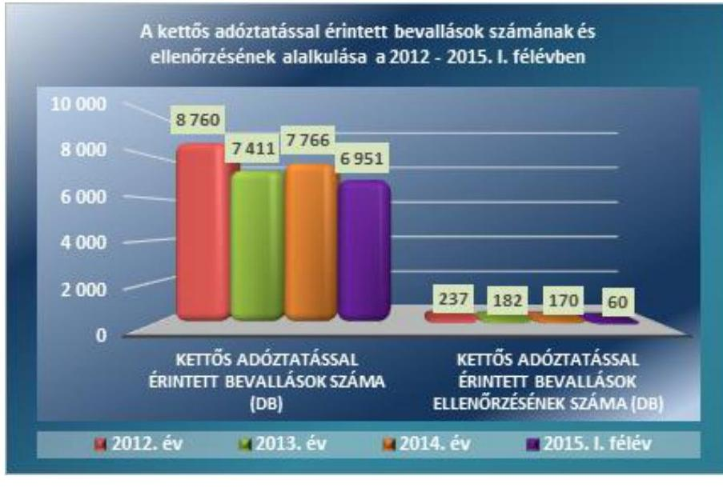

Forrás: NAV adatszolgáltatás
KIVÁLASZTÁSI OKként az ellenőrzésre való kijelöléskor a véletlenszerűen kiválasztott mintatételeknél egyetlen esetben sem szerepelt a kettős adózást kizáró egyezmények hatálya alá eső jövedelmek ellenőrzése a 2012-2015. I. félévében. Az adópolitikáért felelős miniszter, illetve a NAV elnöke nem határoztak meg a kettős adóztatással kapcsolatos külön ellenőrzési szempontú célkitűzéseket. A célzott kiválasztásnál az éves ellenőrzési irányokról szóló tájékoztatásokban, valamint a belső eljárásrendekben meghatározott kockázati és vizsgálati szempontokat vették figyelembe. Az érintett ellenőrzéseknél kiállították a szabályszerű megbízóleveleket, azok kézbesítésével vagy átadásával biztosították az adózók kiértesítését. Az ellenőrzések megkezdésekor rendelkezésre állt a vizsgálati program, az ellenőrzések lefolytatására rendelkezésre álló határidőt betartották. Az ellenőrzések megállapításairól jegyzőkönyv készült, a feltárt adókülönbözetet, az adóbírságot és a késedelmi pótlékot határozatban rögzítették. Az adóhiány jogkövetkezményeinek előírására a vonatkozó jogszabályokban, továbbá a belső szabályzatokban foglalt előírásoknak megfelelően került sor.

A 2012-2015. I. félévében a kettős adóztatás elkerülésére vonatkozó nemzetközi egyezmények hatálya alá eső jövedelmeket is érintő ellenőrzési tevékenység nem felelt meg az Szja tv. 2 § (5) bekezdésében, illetve a kettős adózás elkerülésével érintett jövedelmekre vonatkozó nemzetközi egyezményekben foglalt előírásoknak. Az ellenőrzések során előfordult, hogy a jegyzőkönyvek és a határozatok tartalmazták ugyan a kettős adóztatás kizárásával kapcsolatos egyezményre és ez alapján az adózó illetékességének a meghatározására történő hivatkozást, ugyanakkor a NAV a 2011. évben megszerzett jövedelmek ellenőrzésekor a még hatályba nem lépett 2011. évi LXXXIV. törvénnyel kihirdetett német-magyar kettős adózás kizárásáról szóló egyezményt alkalmazta. Előfordult továbbá, hogy a NAV a 2012. és a 2013. évben megszerzett jövedelmek ellenőrzésekor a még hatályba nem lépett 2010. évi XXII. törvénnyel kihirdetett USA-Magyarország közötti kettős adózás kizárásáról szóló egyezményt vett figyelembe az adózók külföldről származó osztalékjövedelmeinek adóztathatóságával kapcsolatban. A jogszabályt nem ratifikálta az amerikai fél az ÁSZ helyszíni ellenőrzésének a befejezéséig, így a NAV nem hatályos egyezményt alkalmazott.

Az ellenőrzött mintatételeknél a 2012-2015. I. félévében a NAV nem vizsgálta dokumentáltan a kettős adóztatás elkerülését kizáró egyezmények hatálya alá eső jövedelmek adóbevallását. Nem volt megállapítható, hogy az adóhatóság ellenőrizte-e a bevallásban szerepeltetett, kettős adóztatást elkerülő jogszabályok és egyezmények hatálya alá eső, külföldről származó jövedelmet. Az adóhatósági jegyzőkönyvek, határozatok nem tartalmaztak a kettős adóztatást kizáró egyezmény meghatározására, az adózó illetőségének, a külföldről szerzett jövedelem magyarországi adóztathatóságának, valamint a bevallásban figyelembe vett jövedelem és az adó helyes feltüntetésének ellenőrzésére vonatkozó utalást. Az adóhatóság az adózónak csak a belföldi tevékenységéből származó jövedelmeinek ellenőrzését dokumentálta a jegyzőkönyvekben és a határozatokban.

A BEVALLÁSI NYOMTATVÁNY TARTALMA a 2012-2015. I. félévében nem biztosított a NAV számára adatot arra vonatkozóan, hogy mely - kettős adóztatás elkerüléséről szóló egyezménnyel érintett, vagy nem érintett - országokból származtak a magánszemélyek külföldről szerzett jövedelmei. Ugyanis az Szja bevallásban nem kellett a magánszemélyeknek a külföldről származó jövedelmeket azok keletkezése szerinti országra bontva feltüntetni. Az adózónak nem kellett bevallást adnia, ha az adóévben nem volt bevétele, vagy csak olyan bevétele volt, amelyet nem kellett bevallania. Az ehhez szükséges információk hiányában a NAV nem rendelkezett olyan adatbázissal, amely rögzítette a Magyarországon mentesített, a bevallásokban nem szereplő külföldről származó jövedelmek típusát és az adózók körét. Az ellenőrzésre kiválasztást támogató adatbázisok nem tartalmaztak teljes körű adatokat a külföldön jövedelmet szerzett magánszemélyekről. Teljes körűen nem volt meghatározható a magánszemélyek esetében a kettős adózás elkerülésére vonatkozó nemzetközi egyezmények hatálya alá eső jövedelmek adózása szempontjából kockázatot jelentő, ellenőrizendő adózók köre.

A KONTROLL ADATOK és az ellenőrzésben feltárt hiányosságok a külföldi, benne a kettős adóztatást kizáró egyezményeket érintő adókötelezettség teljesítésére kockázatot jelentettek a 2012-2015. I. félévében. Kontroll adatok nem voltak arra vonatkozóan, hogy milyen belföldi adóügyi illetőségű adózói kör nem teljesítette a külföldről származó jövedelemmel kapcsolatos adóbevallási és adófizetési kötelezettségét. Ennek oka az adózók bejelentési és adatszolgáltatási kötelezettségére vonatkozó jogszabályi előírások hiánya, továbbá az EGT állampolgárok szabad mozgás és tartózkodására érvényes jogok. A NAV 2011-ben 435485 fő, 2012-ben 639290 fő, 2013-ban 668517 fő, 2014-ben 701339 fő, 2015-ben 719249 fő külföldi állampolgárságú magyar adóazonosítóval ellátott adóalanyt tartott nyilván. A külföldön jövedelmet szerző, de belföldi adóilletőségű magyar állampolgárok számáról azonban nem rendelkezett adatokkal. Az összes bevallott adóköteles jövedelem mindössze 0,1%-át tették ki a külföldi jövedelmek.

A 2012-2015. I. félévében a jogszabály a kifizetők, munkáltatók számára bejelentési és adatszolgáltatási kötelezettséget írt elő, amennyiben külföldi illetőségű magánszemélyt foglalkoztattak és az adóévben az Szja tv., illetve az alkalmazandó kettős adóztatás elkerüléséről szóló egyezmény (vagy viszonosság) értelmében személyi jövedelemadó-kötelezettségük keletkezett. A bejelentési és adatszolgáltatási kötelezettséget a tevékenység megkezdéséhez, valamint befejezéséhez, illetve a beutazáshoz és az ország elhagyásához kapcsolódóan kellett teljesíteni. A külföldi illetőségű magánszemélynek nem kellett bejelentenie, ha a magyarországi tartózkodási helye megszűnt vagy megváltozott, illetve, ha megszűnt a jövedelemszerző tevékenysége Magyarországon. A NAV a külföldiekre vonatkozó kontroll adatok hiányában nem rendelkezett információkkal arra vonatkozóan sem, hogy a külföldi állampolgár adózó hol tartózkodott életvitelszerűen, a külföldit foglalkoztató eleget tett-e adatszolgáltatási kötelezettségének, bejelentette-e a külföldi munkavállalót. Ennek megfelelően nem volt ellenőrizhető, hogy a külföldi állampolgár, mint munkavállaló teljesítette-e adó-bejelentési és adófizetési kötelezettségét.

A BELFÖLDI ADÓ ILLETŐSÉGŰ, külföldön jövedelmet szerzők esetében ugyancsak nem voltak érvényben az állandó lakóhelyre, illetve tartózkodási helyre vonatkozó bejelentési és adatszolgáltatási kötelezettségek a 2012-2015. I. félévében. Nem volt meghatározható a Magyarországon életvitelszerűen tartózkodó, belföldi illetőségűek közül a külföldről jövedelmet szerzők száma, amely jelentősen megnehezítette az adóztathatóság és az illetőség megállapítását. A külföldön tartózkodás tényét, a három hónapon túli külföldön tartózkodást, valamint az abból történő visszatérés tényét 2013. március 1-jétől nem volt kötelező bejelenteni. A ki- és beutazások nyomon követhetőségének hiányában az adóhatóság az ellenőrzések során elsősorban az adózó álláspontjára, nyilatkozatára, valamint az általa becsatolt dokumentumokra volt utalva a külföldön dolgozó magyarországi állampolgárok és az ún. ingázó munkavállalók adójogi illetőségének meghatározásakor.

A 2012-2015. I. félévében a szabad mozgás és tartózkodás jogával rendelkező EGT állampolgárok egyes tagállamokból történő ki- vagy beutazásai, három hónapot meg nem haladó Magyarországon tartózkodásai nem voltak dokumentáltak, emellett egyidejűleg több állandó lakóhelyet is fenntarthattak. A három hónapot meghaladó tartózkodások, továbbá a harmadik országból származó külföldi állampolgárok esetében a tartózkodási engedélyt vagy munkavállalói engedélyt kiállító hatóságoknak nem kellett szolgáltatni adatokat a NAV részére.

### 3.2. számú megállapítás

## A NAV a 2012-2015. I. félévében az információcserével kapcsolatos feladatainak a teljesítése részben felelt meg a jogszabályi és belső szabályozási előírásoknak.

A közvetlen adók területén történő nemzetközi információcsere végrehajtása a NAV feladata volt a 2012-2015. I. félévében. Az információcsere szervezeten belüli szabályait 2011. április 13-tól az 1030/2011. számú ${ }^{36}$, majd 2014. december 15-től az 1092/2014. eljárási rend ${ }^{37}$ szabályozta. Az 1030/2011. számú belső eljárási rend hazai jogszabályi változásoknak megfelelő aktualizálása nem történt meg, annak ellenére, hogy az abban hivatkozott Art. 57. § (6)-(9) bekezdései, az 58. §, az 59. §, valamint a 92. § (10) bekezdése 2013. április 21-től hatályát vesztette. A 2014. december 15-től hatályos 1092/2014. számú eljárási rend a jogszabályi előírásoknak megfelelt. 2015. január 1-jétől az automatikus információcsere öt jövedelemkategóriát - munkaviszonyból származó jövedelem, a vezető tisztségviselők tiszteletdíja, egyes életbiztosítási termékek, a nyugdíj, továbbá az ingatlan tulajdonjoga és ingatlanból származó jövedelem - határozott meg, ezt megelőzően az információ tartalmára vonatkozóan nem volt előírás. Az automatikus információcsere keretében évente egy alkalommal a bevallások és a szolgáltatott adatok feldolgozása után a külföldi illetőségűek magyarországi jövedelméről leválogatott információkat továbbították a másik állam felé. Az adóhatóságok részéről az adatszolgáltatás rendszerint az adóévre vonatkozó bevallások beadását követő évben megtörtént.

A NAV által küldött és beérkezett automatikus információcsere adatainak alakulását az ellenőrzött időszakban az alábbi ábra mutatja be:
6. ábra
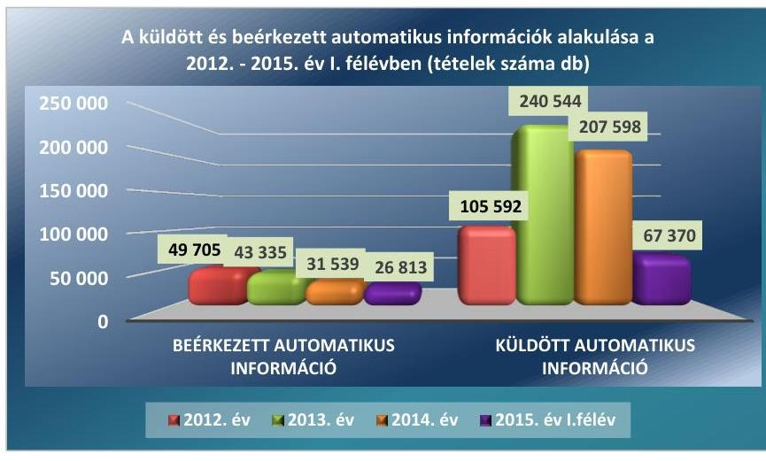

Forrás: NAV adatszolgáltatás
A 2012-2015. I. félévében az információcsere egyenetlenségét jelzi, hogy míg a magyar adóhatóság a nem magyar illetőségűekkel összefüggésben 621104 db tételt küldött másik országba, a magyar illetőségű adózók külföldön szerzett jövedelmeivel kapcsolatban mindössze 151392 db tételt fogadott. A beérkezett információk 95,6%-a (144 680 db tétel) származott EU-s tagállamból, míg a küldött információk 85,1%-a (528 400 db tétel) irányult EU-s tagállamba.

AZ AUTOMATIKUS INFORMÁCIÓCSERE területén a 2012-2015. I. félévében az adatszolgáltatás a személyazonosító adatokra, az illetőségre, a kifizető nevére és címére, a bankszámlaszámra vagy ennek hiányában a kamatot eredményező követelés meghatározására, a kifizetett kamat típusára terjedt ki. Az ellenőrzés megállapította, hogy az automatikus információcsere keretében küldött és fogadott információk kezelése - a beérkezett adatok hozzáférhetőségéről történő értesítés kivételével - a hatályos eljárásrendnek megfelelően történt.

A beérkező automatikus információk tartalmának küldő és fogadó államok közötti egyeztetésére nem volt jogszabályi, illetve belső szabályozási előírás a 2012-2015. I. félévében. A kettős adóztatás elkerüléséről szóló egyezmények, valamint a 2011/16/EU irányelv ${ }^{38}$ egyeztetési kötelezettséget nem írtak elő. Az automatikus adatokat hiányosan szolgáltató, vagy nem teljesítő országok esetében nem történt adategyeztetés. A NAV a beérkezett automatikus információk adatait a KKI rendszerben ${ }^{39}$ elérhetővé tette. A hiányosan, töredékesen érkező adatsorokhoz az adóalany-nyilvántartási adatok felhasználásával hozzárendelték az adószámokat, magánszemélyek esetén pedig az adóazonosító jeleket. Ezt követően az adatok beépültek az adatbázisba, ezáltal azok hozzáférhetővé váltak mind a KKI${ }^{40}$ lekérdező felületén, mind pedig az ATAR ${ }^{41}$ rendszerben a kiválasztást, illetve ellenőrzést végzők részére.

A 2012-2015. I. félévében előfordult, hogy a KKI nem értesítette az automatikus információcsere során beérkezett adatok hozzáférhetőségéről a 1030/2011. számú belső eljárási rend 17.2. és 28.4. pontjaiban foglaltak ellenére - a belföldi adóalany illetősége szerinti szervezeti egységet a belső elektronikus levelező rendszeren küldött üzenettel. Az értesítés hiánya ellenére a KKI rendszerben a regionális kapcsolattartók számára elérhetők voltak az információk, azonban az információk feltöltési dátumának megállapítását a KKI rendszer nem tette lehetővé. Az automatikus információcsere során érkezett adatok egyértelművé tételére, vagy kiegészítésre vonatkozóan hiánypótlási intézkedésre nem volt szükség. A kettős adózás elkerüléséről szóló egyezmények alá tartozó EU-s tagállamok esetében információcsere az előírtaknak megfelelően, a CCN ${ }^{42}$ rendszeren keresztül - ez utóbbi esetben jelszóval védett fájlok továbbításával - történt.

A MEGKERESÉSEK tartalmától függően határozta meg, hogy az adatbázisban rendelkezésre álló információk elégtelensége esetén - a jogszabályokban biztosított eszközök közül - melyeket alkalmazza a válasz megadása érdekében a 2012-2015. I. félévében. A másik államból érkezett megkeresések kezelése a hatályos eljárási rendnek megfelelően történt. Késedelmesen került továbbításra a másik államba irányuló külföldről származó jövedelmekkel kapcsolatos megkeresés, a 8 munkanap helyett a 10. munkanapon, mely nem felelt meg a 1092/2014. eljárási rend 17. pontjában meghatározottaknak. A másik államba irányuló megkeresések végrehajtása a késedelmes továbbítás kivételével
 a hatályos 1030/2011., 1092/2014. – eljárási rendeknek megfelelően történt. A véletlen mintavétellel kiválasztott mintatételeknél előfordult, hogy a megkeresés kiküldése, valamint a válasz beérkezése dátumának feljegyzése az 1030/2011. számú belső eljárási rendben foglaltak ellenére nem történt meg a REV rendszerben ${ }^{43}$. A megkeresésre érkezett válaszokról a KKI az előírt határidőn belül tájékoztatta az illetékes szervezeti egységet. A válasz megérkezésének időpontját – egy megkeresés kivételével – az illetékes szervezeti egység az ellenőrzési határidő figyelő (REV) rendszerbe bejegyezte, azonban a dátum nem került rögzítésre.

A SPONTÁN információcsere – egy részfeladat kivételével – az előírt formanyomtatvány használatával, a hatályos (1092/2014.) eljárásrendnek megfelelően történt a 2012-2015. I. félévében. A véletlen mintavétellel kiválasztott mintatételeknél előfordult, hogy a visszaigazolás a spontán információ beérkezését követő 8. napon történt, szemben az Aktv. ${ }^{44}$ 9. §-ában előírt 7 munkanappal. A megkereséses és spontán információcsere a közvetlen adós formanyomtatvány és egységes számítógépes formátumok igénybevételével, szabályszerűen történt. A megkeresések esetén a válaszadási kötelezettségüknek eleget tettek. A nemzetközi információcserében érkező megkeresésekre vonatkozó határidők betartásának figyelése az ellenőrzések határidejét figyelő REV és a KKI rendszer segítségével történt.

A nemzetközi információcserén belül összesen 120 db megkeresést fogadtak és 340 db-ot küldtek a 2012-2015. I. félévében. A fogadott megkeresések 97,5%-a, a küldött megkeresések 20,6%-a az EU-s tagállamba irányult. A beérkezett spontán információcserék száma 36 db, a küldött spontán információk száma 9 db volt, amely teljes mértékben az EU tagországok között zajlott. Az információcsere keretében a megkeresésre adott válaszokkal kapcsolatban lehetőség volt a visszajelzés kérésére, azonban ez egyik fél részéről sem volt jellemző. A 2015. évi ellenőrzési irányok között

---

első alkalommal rögzítették az automatikus információcsere keretében kapott adatok felhasználásának, a nemzetközi közigazgatási együttműködésből származó kockázati információk megosztásának a fontosságát.

A 2012-2015. I. félévében beérkezett adatok a kockázatelemzés alá vont adózói életút egy elemét alkották, amennyiben a kockázati tényezők indokolták ellenőrzésre került sor. A küldött és fogadott automatikus információk, valamint a spontán információcsere keretében érkezett információk közül a véletlen mintavétellel kiválasztott tételek körében nem indult ellenőrzés. A NAV számára a külföldről érkezett megkeresések esetén a válaszadás kötelező volt minden rendelkezésre álló, továbbá közigazgatási hatósági eljárás keretében megszerezhető információ tekintetében. A külföldről érkezett megkeresések közül véletlen mintavétellel kiválasztott mintatételnél a választ a rendelkezésre álló adatbázisokból megadta, de ellenőrzés nem indult. A másik államba irányuló megkeresések szükségessé váltak abban az esetben, ha az ellenőrzés során az adóhatósági rendszerben elérhető adatok nem voltak elegendőek az ellenőrzött személy jövedelmi adatainak, az ügylet körülményeinek tisztázására. A véletlen mintavétellel kiválasztott megkeresések mindegyikéhez ellenőrzés kapcsolódott. Az információcsere keretében beérkezett adatok felhasználásával végrehajtott ellenőrzések száma 1175 db, amely a beérkezett adatállomány (151 392 tétel) mindössze 0,8%-át érintette. Az összes végrehajtott ellenőrzésnek mindössze 2,4%-át képező, valamennyi és a konkrét adónemet érintő bevallás utólagos adónem ellenőrzése együtt eredményezte a feltárt 53,5 M Ft-os adó megállapítás összegét.

# 3.3. számú megállapítás 

A Platform ${ }^{45}$ az egyes tagországok számára feladatokat nem határozott meg 2013. április 23-tól 2015. I. félévéig.

A PLATFORM BIZOTTSÁG munkájában a NAV nem vett részt 2013. április 23-tól 2015. I. félévéig. A 2013/C 102/07. számú Bizottsági határozat ${ }^{46}$ 4. cikk (2) bekezdésében, valamint az Aktv. 4. § (2) bekezdés 4. pontjában foglaltak szerint a tagállami adóhatóságok számára a szakértői csoportban való részvételből származó feladatokat delegáltak útján az NGM látta el. A delegáltak az EKTB ${ }^{47}$ által megfogalmazott magyar álláspontot képviselték. Feladatuk ellátásáról úti jelentés és összefoglalók készítésével számoltak be. A Platform bizottsági szakértői csoport három éves időtartamra történő létrehozására a Bizottság ${ }^{48}$ 2012. december 6-án közzétett, az adócsalás- és adóelkerülés elleni eszközöket felsorakoztató Cselekvési tervében ${ }^{49}$ rögzített javaslat végrehajtása miatt került sor. A Platform feladata volt a Bizottság támogatása az agresszív adótervezésről, illetve a jó adóügyi kormányzásra vonatkozó minimumkövetelmények harmadik országok általi teljesítésének ösztönzésére irányuló intézkedésekről szóló ajánlások alkalmazásáról szóló jelentés elkészítésben. A Platform az egyes tagországok – ezen belül a magyar adópolitikáért felelős minisztérium – számára feladatokat nem határozott meg. A Platform célja volt javaslatok kidolgozása, a tagállamok egymás közötti kommunikációjának a segítése a Bizottság Cselekvési terve és a két ajánlás végrehajtása érdekében, továbbá a különböző intézkedések eredményeinek felülvizsgálata. A Platform munkaterve azokat a kérdéseket tartalmazta, amelyeket a kettős adóztatás, az agresszív adótervezés és adóelkerülés területén a tagok kiemelt fontosságúnak ítéltek.

---

# 4. Megvalósult-e az ellenőrzés és a nyomon követés a kifizetők által bevallott és befizetett kamatadó tekintetében? 

Összegző megállapítás

A kifizetők által levont kamatjövedelmet terhelő adó realizálása érdekében a NAV a 2010-2014. években az ellenőrzési és nyomon követési rendszert részben építette ki és működtette.

## 4.1. számú megállapítás

A NAV a kifizetők által levont kamatadó megállapításához alkalmazott szoftvereket, informatikai rendszereket az Art.-ban foglalt előírás ellenére 2014. évben nem ellenőrizte.

Az egyes külön adózó jövedelmek körébe tartozó kamatjövedelmet a 2010. évben 20%, a további ellenőrzött években 2011-2014. évek között 16% személyi jövedelemadó kötelezettség terhelte. A hitelintézettől, vagy egyéb befektetési, pénzügyi szolgáltatótól származó kamatjövedelem után az adó megállapítása, levonása, bevallása és megfizetése a kifizetők feladata volt. A kamatjövedelem után levont adóval kapcsolatos tájékoztatást elsődlegesen a számlakivonat, vagy a kamat, hozam kifizetéséről kiállított bizonylat tartalmazta, külön adóigazolás kiállítására az ügyfél kérése esetén volt köteles a kifizető.

A 2010-2014. években a kamatjövedelem után a kifizetők által levont adó bevallása a 08-as kódjelű általános nyomtatványon, havi gyakorisággal, elektronikus úton történt. A nyomtatvány a kamatjövedelmek után megállapított és levont adón kívül más kifizetésekkel, juttatásokkal összefüggő adók, járulékok és egyéb adatok, valamint a szakképzési hozzájárulás bevallására is szolgált. A bevallásban a kamatjövedelmet terhelő adó magánszemélyhez nem köthető kötelezettségként, egy összegben szerepelt.

A KAMATADÓ kifizetők általi megállapításának, levonásának, bevallásának és megfizetésének ellenőrzését a NAV a 2010-2014. évek közötti időszakban nem célzottan, hanem a személyi jövedelemadó, mint önálló adónem ellenőrzésének részeként valósította meg. Az éves ellenőrzési irányok, valamint az ellenőrzési tevékenységgel kapcsolatos eljárásrendek az adónemeken belüli egyes adótételekre, így a személyi jövedelemadó részét képező kamatadóra vonatkozó külön előírásokat nem tartalmaztak. Az ellenőrzési irányok és a belső eljárásrendek alapján nem terveztek és nem végeztek olyan ellenőrzést, amely közvetlenül az önálló adónemen belüli egyes adótételekkel – ezen belül kifejezetten a kamatjövedelemmel – kapcsolatos adókötelezettségek teljesítésére irányult volna. Az ellenőrzésre kiválasztott kifizetőknél a személyi jövedelemadó, mint önálló adónem valamennyi jogcímén felmerült adókötelezettség teljesítését ellenőrizte, amely többek között a kamatjövedelmet terhelő adó vizsgálatát is magában foglalta.

A 2010-2014. években a kamatjövedelemből levont személyi jövedelemadót is tartalmazó 08-as kódjelű bevallást benyújtó kifizetők évenkénti darabszáma 358-480 között volt. Az ellenőrzött időszakban bevallott kamatadó 333,7 Mrd Ft-ot tett ki, amely a központi költségvetés összes személyi jövedelemadóból származó bevételének 4,3%-át jelentette. A személyi jövedelemadóból származó központi költségvetési bevétel, valamint

---

3. táblázat

| AZ SZJA-BÓL SZÁRMAZÓ BEVÉTELEK, EZEN BELÜL A KAMATADÓ ALAKULÁSA |  |  |  |  |  |
| :--: | :--: | :--: | :--: | :--: | :--: |
| megnevezés | 2010 | 2011 | 2012 | 2013 | 2014 |
| a központi költségvetés SZJA-ból származó bevétele (Mrd Ft) | 1767,9 | 1382,8 | 1498,4 | 1504,6 | 1589,1 |
| ebből kamatjövedelmet terhelő adó (Mrd Ft) | 93,3 | 60,9 | 70,6 | 68,1 | 40,8 |
| a kamatjövedelmet terhelő adó aránya | $5,3 \%$ | $4,4 \%$ | $4,7 \%$ | $4,5 \%$ | 2,6\% |
| kamatjövedelmet terhelő SZJA-t bevalló kifizetők száma (db) | 464 | 480 | 379 | 386 | 358 |

UTÓLAGOS ELLENŐRZÉST az adóhatóság a 2010-2014. években a bevallást benyújtók 4,1%-ánál végzett, amely valamennyi bevalláshoz kötött adónemre – ezen belül a személyi jövedelemadóra – kiterjedt. Az ellenőrzési jegyzőkönyvek, valamint az ellenőrzéshez kapcsolódó dokumentumok nem tartalmazták, hogy az ellenőrzések során a kamatadóval kapcsolatos ellenőrzést is elvégezték. Az ÁSZ ellenőrzéshez kiválasztott minták közel kétharmadánál a legnagyobb adóteljesítménnyel rendelkező adózói kör rendszeres ellenőrzése keretében folytatott vizsgálatot az adóhatóság. Öt kifizetőt az éves ellenőrzési irányokban foglalt szempontok figyelembevételével, további hat kifizetőt az adózóról rendelkezésre álló információk alapján, kockázatelemzést követően választottak ki ellenőrzésre. Tekintettel arra, hogy a kamatadó a személyi jövedelemadó egyik típusa és nem önálló adónem, a kockázatelemzés során a kamatjövedelmet terhelő adó nem jelentette az ellenőrzésre történő kiválasztás közvetlen okát.

Az ellenőrzési gyakorlata alapján az adózóknál végzett vizsgálatok jegyzőkönyvei a feltárt jogsértések tényállását és a megállapított adókülönbözetet rögzítették a 2010-2014. években. A kamatadó kifizetőknél végzett adóhatósági ellenőrzésének módszere és eredménye közvetlenül nem volt ellenőrizhető, mivel a mintákhoz kapcsolódó jegyzőkönyvek a személyi jövedelemadóval kapcsolatban tett megállapításokon belül – egy kivételével – nem tartalmaztak kamatadóra vonatkozó utalást. Az ellenőrzési programokból és a jegyzőkönyvekből nem volt megállapítható, hogy az adóellenőrök milyen módszerekkel és szempontok alapján végeztek kamatadóra irányuló ellenőrzést. Az ellenőrzést végzők egy esetben rögzítettek a jegyzőkönyvben kamatadóra vonatkozó megállapítást, 4,2 millió Ft lakossági betétekhez kapcsolódóan levont, ugyanakkor a kifizető bevallásában nem szerepeltetett adó miatt.

AZ INFORMATIKAI RENDSZEREKET, alkalmazott szoftvereket a kifizetőknél a kamatadó megállapításához kapcsolódóan a NAV nem ellenőrizte a 2014. évben az Art. 95. § (1) bekezdésében foglaltak ellenére. Az ellenőrzések általában a 2010-2014. években az adó alapjának és összegének helyes megállapításának vizsgálatára irányultak. A kifizetőknél végzett NAV ellenőrzések jegyzőkönyvei nem tartalmaztak olyan megállapítást vagy utalást, amely megkérdőjelezte volna a kamatadó kezelésére alkalmazott szoftverek, informatikai rendszerek megbízhatóságát.

---

# 4.2. számú megállapítás 

A kamatadó nyomon követését a bevallások feldolgozása keretében a NAV a 2010-2014. években biztosította.

MONITORING RENDSZERT a 2010-2014. években a NAV külön nem működtetett a kamatjövedelmet terhelő adóval kapcsolatban. A nyomon követés a bevallások adatainak feldolgozásával valósult meg, amely alkalmas volt a vezetői információ rendszer által igényelt adatok és adatszolgáltatások előállítására, valamint az alapvető bevallási hibák feltárására. A tervezett és végrehajtott belső ellenőrzések nem terjedtek ki a kamatadót tartalmazó bevallások feldolgozására és az adókötelezettség pénzügyi teljesítésére. A feldolgozott 08-as kódjelű bevallások nyomon követése az egyes űrlapokon szereplő valamennyi adónemre vonatkozott, ezáltal kiterjedt a kamatadót magában foglaló személyi jövedelemadóra is. A feldolgozottság állapotáról heti rendszerességgel kimutatást készítettek, amely tartalmazta a beérkezett, azon belül hibás, jó, felkönyvelt, illetve fel nem könyvelt bevallások számát, továbbá a bevallásokban feltüntetett adókötelezettség aggregált összegét. Az adóigazgatóságok és a KH részére az UBEV monitorozó alrendszere nyújtott folyamatos tájékoztatást minden olyan bevallásról, amelynek teljes körű feldolgozása a lekérdezés időpontjáig nem fejeződött be.

A 2010-2014. években
 a bevallási szakterület általános monitoring rendszere mellett a 08-as kódjelű bevallások alapján a TEFO ${ }^{51}$ készített havi gyakorisággal kamatadóra vonatkozó kimutatást. A monitoring adatok a NAV és az NGM részére nyújtottak tájékoztatást a kamatjövedelmet terhelő adó bevallott összegéről és a kifizetők számáról. A kamatadó befizetett összegének nyomon követésére nem volt mód, mivel a pénzforgalmi teljesítés a bevallásokban szereplő önálló adónemekhez kapcsolódott, a befizetések személyi jövedelemadón belüli jogcímek szerinti elkülönítését a NAV nyilvántartó rendszere nem tette lehetővé. A bevallások hibáinak elsődleges kiszűrését a kitöltésre használt elektronikus alkalmazás, az ÁNYK ${ }^{52}$ keretprogram hibavizsgálati szempontjai biztosították. A bevallóknál futó külső hibavizsgálati szempontok már a kitöltés során figyelmeztették az egyes hibatípusok elkövetése esetén az adózót. A benyújtott bevallások ellenőrzése a feldolgozási rendszerébe beépített speciális belső hibavizsgálati összefüggések alapján valósult meg.

---

# 5. A pénzügyi szolgáltatók a kamatadó levonását és bevallását megfelelően végezték-e? 

Összegző megállapítás

### 5.1. számú megállapítás

A 2010-2014. években a kamatadó levonása, bevallása az informatikai rendszerek biztonságával kapcsolatos hiányosságok ellenére megfelelően történt, azonban fennállt a kamatadó számítások és adatok hibás kezelésének kockázata.

A 2010-2014. években a kifizetők informatikai rendszereinek biztonságával kapcsolatos kockázatokkal arányos védelem részben felelt meg a jogszabályi előírásoknak.

A pénzügyi szolgáltatók közül az MKB Bank Zrt. és az MPÉ Zrt. ${ }^{53}$ a 2010-2014. években működött, az MPBSZ Zrt. ${ }^{54}$ a 2013. évben kezdte meg tevékenységét. Az informatikai rendszerek védelmét a 2010-2014. években az MKB Zrt. vonatkozásában a Hpt. ${ }^{55}$ és az 535/2013. (XII. 30.) Korm. rendelet ${ }^{56}$, az MPBSZ Zrt. tekintetében a Bszt. ${ }^{57}$ és az 535/2013. (XII. 30.) Korm. rendelet írta elő. Az MPÉ Zrt. esetében az informatikai rendszerek védelmére vonatkozó jogszabályi rendelkezés 2014. január 1-jéig nem volt, ezt követően a Bit. ${ }^{58}$ 65/A. §-a tartalmazta a kötelezettségeket. A kifizetők kiépítették és működtették a kamatadó elszámolására alkalmas informatikai rendszert, ugyanakkor részben biztosították a Hpt. 13/C. § (1)-(9) bekezdéseiben, a Bszt. 12. § (1)-(11) bekezdéseiben, illetve a Bit. 65/A. § (1)-(10) bekezdéseiben, valamint az 535/2013. (XII. 30.) Korm. rendelet 2-5. §-aiban foglalt előírásoknak megfelelően azok sértetlenségének, teljességének és megbízhatóságának kockázatokkal arányos védelmét. A kamatadó számítást végző informatikai rendszerek kontrolljai részben tették lehetővé az adatok helytelen vagy jogosulatlan rögzítésének, módosításának megelőzését, illetve kiszűrését.

A pénzügyi szolgáltatók informatikai rendszerei részben tettek eleget a Hpt. 13/C. § (5) bekezdés b)-c) pontjaiban, (6) bekezdés b) pontjában, (9) bekezdésében, a Bszt. 12. § (6) bekezdés b)-c) pontjaiban, (7) bekezdés b) pontjában, (11) bekezdésében, a Bit. 65/A. § (5) bekezdés b)-c) pontjában, (6) bekezdés b) pontjában, (9) bekezdésében, valamint az 535/2013. (XII.30.) Korm. rendelet 3. § (2) bekezdés b)-c) pontjaiban, (3) bekezdés b) pontjában és 5. §-ában foglalt előírásoknak. Az ellenőrzött kifizetők egyike sem szabályozta a munkakörök betöltéséhez szükséges informatikai ismeretekkel kapcsolatos követelményeket. Az informatikai rendszer ellenőrzése keretében részben alakították ki a kockázatokkal arányos védelmet, valamint a kritikus elemek védelmét, zártságát és teljes körűségét biztosító ellenőrzések eljárásait. Az informatikai alkalmazások jogosultsági rendszerét nem a szükséges és elégséges elv szerint alakították ki, ezért részben gondoskodtak a szabályozott, ellenőrizhető és rendszeresen ellenőrzött felhasználói adminisztrációról, továbbá a kifizetők egyike sem gondoskodott megfelelően a privilégiumokkal rendelkező, szerverszolgáltatáshoz, vagy technikai ok miatt létrehozott felhasználói fiókok szabályszerű kezeléséről. A logikai védelem keretében a pénzügyi szolgáltatók nem kötöttek olyan letéti megállapodást, amelyben rögzítették volna, hogy a kamatadó számításban kritikus funkciót ellátó, az aktuálisan hasz-

---

nált szoftverkörnyezet forráskódját a felhasználótól és a fejlesztőtől független harmadik fél tárolja, ezáltal részben rendelkeztek olyan dokumentációval, amely a szállító vagy a rendszerfejlesztő tevékenységének megszűnése után is biztosítja a folyamatos és biztonságos működést.

Az MKB BANK ZRT. informatikai rendszerének kockázatokkal arányos védelme a 2010-2014. években részben felelt meg a Hpt. 13/C. § (5) bekezdés d) és e) pontjaiban, (6) bekezdés d) és e) pontjaiban, (7) bekezdés a)-b) és e) pontjaiban, valamint az 535/2013. (XII. 30.) Korm. rendelet 3. § (2) bekezdés e) pontjában, valamint (3) bekezdés d) pontjában foglalt előírásoknak. A kifizető belső szabályozása a 2010-2013. években nem tartalmazta az informatikai rendszer felépítésének és működtetésének ellenőrzéséhez szükséges rendszerleírásokra és modellekre, továbbá az adatok szintaktikai szabályainak és tárolási szerkezetének leírására vonatkozó követelményeket. A szabályozást érintő hiányosságokat az MKB Zrt. a 2014. évben megszüntette. A 2014. évet megelőzően részben alakítottak ki olyan biztonsági környezetet, amely lehetővé tette a kritikus folyamatok eseményeinek naplózását és érdemi értékelését, továbbá nem készítették el az adatgazda és a rendszergazda kijelölését tartalmazó dokumentumokat. Az ellenőrzött időszakban a hálózati elkülönítés hiánya miatt részben biztosították a távadatátvitel bizalmasságát, sértetlenségét és hitelességét. Az informatikai alkalmazások környezetében hiányzott a hálózati szeparáció, nem működött a hálózati védelmi funkciót ellátó elválasztás, a teljes hálózat átjárható volt. A kamatadó szempontjából releváns kiszolgáló számítógépek és az ezeket összekötő aktív hálózati eszközök távoli adminisztrátori be- és kimeneti csatornái bármely hálózati végpontról - azaz több ezer a hálózathoz kapcsolódó munkaállomásról - elérhetőek voltak. Részben valósult meg az alkalmazási, fejlesztési és tesztelési környezet biztonságos elkülönítése, mivel a kifizető titkosítás nélküli távfelügyeleti megoldásokat alkalmazott, továbbá a fejlesztői és tesztelési környezetében nem működtette a hozzáférésekkel és kritikus eseményekkel kapcsolatos biztonsági kontrollokat. A biztonsági és adatmentési eljárások a 2010-2013. években részben feleltek meg annak a célnak, hogy megakadályozzanak katasztrofális következményekkel járó adatvesztést, az alkalmazott kontrollok nem nyújtottak védelmet az adatok esetleges helytelen módosítása ellen. Nem aktualizálták az üzletfolytonossági tervet, valamint a katasztrófa helyzetben használandó adatvisszatöltési és számítástechnikai üzemeltetés újraépítést leíró tervet, ami veszélyeztette a működésfolytonossági célok elérését. Az MKB Bank Zrt. a biztonsággal kapcsolatban felmerült hiányosságokat 2014-től megszüntette.

Az MPBSZ ZRT. a 2010-2014. években az informatikai rendszerének kockázatokkal arányos védelme részben felelt meg a Bszt. 12. § (4) bekezdésében, (6) bekezdés a) és d) pontjaiban, (7) bekezdés d) pontjában, valamint a (9) bekezdés e) pontjában foglalt előírásoknak. Az MPBSZ Zrt. a szervezeti és működési rend, valamint a felelősségi, nyilvántartási és tájékoztatási szabályok meghatározása során részben vette figyelembe az informatika alkalmazásából fakadó biztonsági kockázatokat, mivel a kiszervezett tevékenység esetében a saját dolgozója és a szállító munkatársai részére is biztosította a hozzáférési jogok adminisztrációját lehetővé tevő felhasználói jogokat. A szolgáltató és a megrendelő egy időben rendelkeztek

---

felhasználói, továbbá a felhasználó felvételét, törlését és módosítását lehetővé tevő adminisztrációs jogosultsággal. A külső szolgáltatónak lehetősége volt létrehozni majd törölni a rendszerben felhasználót úgy, hogy az MPBSZ Zrt.-nek nem volt lehetősége azt felderíteni. Az informatikai rendszer legfontosabb elemeinek egyértelmű és visszakereshető azonosítása részben volt megfelelő, mivel a tranzakciókról nem készült napló állomány, továbbá nem dokumentálták a jogosultság beállítások ellenőrzését. A kifizető részben rendelkezett a kamatadó kifizetése, elszámolása és megfizetése szempontjából kritikus folyamatok eseményei naplózásának érdemi értékelésére alkalmas biztonsági környezettel. A 2010-2013. években nem készítették el az adatgazda és a rendszergazda kijelölését tartalmazó dokumentumokat, a hiányosság megszüntetéséről a 2014. évben intézkedtek. Az alkalmazási, fejlesztési és tesztelési környezetek biztonságos elkülönítése részben volt biztosított, az MPBSZ Zrt. az eszközök biztonságos elkülönítését megfelelően elvégezte, azonban a hozzáférési jogosultságok kiosztása során az elkülönítés nem érvényesült, mivel a külső fejlesztők is rendelkeztek az éles rendszerhez való hozzáférési jogosultsággal.

Az MPÉ ZRT. a 2014. évben az informatikai rendszerének kockázatokkal arányos védelme részben felelt meg a Bit. 65/A. § (3) bekezdésében, valamint (5) bekezdés a) és d) pontjaiban foglalt előírásoknak. A kifizető részben határozta meg belső szabályozásában a folyamatba épített ellenőrzési követelményeket. A tranzakciók naplózása megtörtént, azonban a kulcsszerepet betöltő rendszeresemények feldolgozását és érdemi értékelését nem végezték el, ezért a kamatadó számítással összefüggő esetleges rendkívüli események feltáratlanul maradtak. A biztonsági környezet részben volt alkalmas a kritikus folyamatok elemeinek naplózására és érdemi értékelésére.

# A PÉNZÜGYI SZOLGÁLTATÓK MEGHATÁROZTÁK

a 2010-2014. években az információ technológia használatából adódó biztonsági kockázatok felmérésére és kezelésére vonatkozó szabályokat. Rendelkeztek a kamatadó kifizetését végző informatikai rendszerek biztonsági kockázatelemzésével, amelyek legutóbbi felülvizsgálatát és aktualizálását a 2014. évben elvégezték. A jogszabályi előírásoknak megfelelően gondoskodtak az informatikai rendszerek elemeinek biztonsági osztályokba sorolásáról, valamint kiépítették a nem rendszeres események kezelésére lehetőséget nyújtó biztonsági környezetet. A kifizetők az előírásoknak megfelelően végezték az egyedi jogosultságok kijelölését és engedélyezését, továbbá az adatokhoz történő hozzáférési rend meghatározását. Kiépítették a biztonsági kockázattal arányos vírus- és más rosszindulatú program elleni védelmet, meghatározták az informatikai rendszerek működtetésére vonatkozó utasításokat és előírásokat, valamint fejlesztési terveket. Rendelkeztek a szolgáltatások folytonosságát, valamint az adatok archiválását és a rendszer helyreállítását biztosító eszközökkel, megoldásokkal.

### 5.2. számú megállapítás

A pénzügyi szolgáltatók a kamatadó levonását és bevallását megfelelően végezték a 2010-2014. években.

## A PÉNZÜGYI SZOLGÁLTATÓK NYILVÁNTARTÁ-

SAI és a kapcsolódó dokumentumok alapján a kamatjövedelem utáni személyi jövedelemadó kiszámítása, levonása, bevallása és megfizetése

---

annak ellenére volt szabályszerű, hogy az alkalmazott informatikai rendszerek biztonsági kontrolljaival kapcsolatban feltárt hiányosságok miatt fennállt a kamatadó számításának és az adatok hibás kezelésének kockázata a 2010-2014. években. Az MPÉ Zrt.-nél a kamatjövedelmeket kezelő informatikai rendszerek biztonsági kontrolljaival kapcsolatban feltárt hiányosságok is hozzájárulhattak a kamatadó összegének helytelen kiszámításához, továbbá a késedelmesen teljesített bevallásához és befizetéséhez.

A 2010-2014. években a pénzügyi szolgáltatók az értékpapírok forgalmazását, a folyószámlák vezetését, valamint a biztosítási termékek nyilvántartását az erre a célra fejlesztett informatikai rendszereiken keresztül bonyolították. Az értékpapír, folyószámla, illetve biztosítás kezelő rendszerek a keletkező kamatjövedelmekből automatikusan levonták és elkülönített analitikus számlára könyvelték az ügyfeleket terhelő személyi jövedelemadót. A kamatadó analitikus nyilvántartásokban tárolt állománya az informatikai rendszerek által készített napi feladások keretében került a főkönyvi könyvelésbe. A kifizetők a kamatadó számla havi záró egyenlegét belső kontroll céljából összevetették a főkönyvi rendszer kamatadót nyilvántartó számlájának adataival, amely a bevallás alapját képezte. A kifizetők a bevallást szabályszerűen, a tárgyhónapot követő 12-éig, elektronikus úton a NAV információs rendszeréhez kapcsolódva nyújtották be. A kamatadó megfizetését saját rendszerükből kezdeményezve, a személyi jövedelemadó többi adóelemével közösen egy összegben teljesítették.

A 2010-2014. években az ÁSZ által a kifizetőknél ellenőrzött tételek esetében a kamatadó nyilvántartás adatai minden esetben megegyeztek a jogviszonyt létrehozó és megszüntető alapdokumentumokkal, továbbá az ügyfélszámla mozgásaival. A kamatadó levonását a helyes adóalap után a megfelelő adómértékkel végezték. Az analitikus nyilvántartások és a főkönyvi könyvelés egyezősége biztosított volt, a kifizetők az analitikus és a főkönyvi elszámolásokból levezethető összegeket állították kamatadó kötelezettségként a 08-as kódszámú bevallásokba. A pénzügyi szolgáltatók a személyi jövedelemadót, azon belül a kamatadót az előírt határidőben befizették a NAV adófolyószámlájára. A kamatjövedelemmel és annak személyi
 jövedelemadójával kapcsolatos bizonylatok kiállítását, a könyvek és nyilvántartások vezetését az adó alapja, összege, a kapcsolódó mentességek és kedvezmények megállapítására, ellenőrzésére alkalmas módon végezték. A kamatadó elszámolásának útja követhető volt, a kamatjövedelmet terhelő adó automatikus számításának zárt rendszerébe történő manuális beavatkozás nem volt megállapítható.

A 2014. évben az MPÉ Zrt.-nél előfordult, hogy a program helytelenül számította ki a kamatadó összegét, emiatt a bevallás önellenőrzéssel történő korrekciója vált szükségessé. A hibát az okozta, hogy a kifizető nem aktualizálta az Szja tv. 65. § (3) bekezdés ad) pontjában foglalt hatályos előírásoknak megfelelően a kamatadó számítását végző program algoritmusát. Az adókötelezettség önellenőrzés keretében történő csökkentése, valamint a keletkezett túlfizetés pénzügyi rendezése a 2014. november havi bevallás keretében történt meg. A kamatadó számítását végző program javítását a kifizető 2014. április 1-jén elvégezte, ezt követően a kamatadó megállapítása, levonása, bevallása és megfizetése helyes összegben történt. Az MPÉ Zrt. az Szja tv. 65. § (2) bekezdés a) pontjában és (4) bekezdés c) pontjában, valamint az Art. 31. § (2) és (7) bekezdéseiben foglalt előírások ellenére egy esetben hét hónap, tíz esetben egy hónap késéssel

---

a kamatjövedelem ügyfél részére történő kifizetését követően állította bevallásába a kamatjövedelmet terhelő személyi jövedelemadót. A bevallási kötelezettség teljesítésének hét hónapos késedelmét adminisztratív hiba okozta. A hiányosság 2013 májusa óta nem fordulhatott elő, mivel kétheti rendszerességgel automatikus riport készült az olyan kifizetésekre vonatkozóan, amelyek az MPÉ Zrt. rendszerében még nem kerültek feldolgozásra. A további tíz esetben a bevallást az hátráltatta, hogy a biztosítási kötvény online visszavásárlása esetén a forgalmazással megbízott Magyar Posta Zrt. megelőlegezte az ügyfél részére a kamatot, levonta a kamatadót, ugyanakkor azt az MPÉ Zrt. csak a biztosítási kötvény általa jóváhagyott visszaváltásának napján állította be azt 08-as kódjelű bevallásába.

# 6. Az egyszerűsítési feladatokat az NGM és a NAV végrehajtotta, illetve nyomon követte-e? 

Összegző megállapítás

Az egyszerűsítési feladatokat 2011. szeptember 3-tól 2014. év végéig a NAV és az NGM határidőre végrehajtotta.

## 6.1. számú megállapítás

Az egyszerűsítési feladatok végrehajtására az ellenőrzött időszakban az NGM nem készített ütem- és intézkedési tervet.

AZ EGYSZERŰSÍTÉSI PROGRAM célja volt, hogy az állampolgárok számára érzékelhető módon váljanak egyszerűbbé az egyszerűsítés alá tartozó eljárások oly módon, hogy a közigazgatásban foglalkoztattak leterheltsége nem növekedhetett. A Kormány a Magyary Zoltán Közigazgatás-fejlesztési Program intézkedési tervének 15. pontja alapján a lakossági ügyfelekre háruló adminisztratív terhek csökkentése, valamint a jogszabályok nyelvezetének közérthetőbbé tétele érdekében egyszerűsítési programot fogadott el a 1304/2011. (IX.2.) Korm. határozattal. Az egyszerűsítés érintette a személyi jövedelemadó bevallást, a fizetési kedvezményi kérelem eljárását, a mezőgazdasági őstermelő magánszemély adózási szabályait, illetve a több adónemet érintő egyszerűsítések közül az adóigazolás és az együttes adóigazolás kiadásának szabályait, illetve a méltányossági és fizetéskönnyítési eljárásokat. Az intézkedések végrehajtásáért az NGM felelt.

A MÓDSZERTANI ALAPKÖVETELMÉNYEket a kormányhatározat 2. számú melléklete tartalmazta, mely általánosságban határozta meg az egyszerűsítés végrehajtása során teljesítendő szempontok körét. Ennek alapján az egyszerűsítés már abban az esetben is megvalósult, ha a követelmények közül legalább egy, vagy legalább kettő feltétel teljesült. Az eljárások egyszerűsítése az eljárás megszűntetésével, vagy más eljárással történő összevonásával, vagy az ügyintézési határidő csökkentésével már megvalósult. Ezen kívül az egyszerűsítés akkor is végrehajtásra került, ha legalább kettő követelmény teljesült az ügyfél-hivatal közötti kommunikáció fejlesztése, az ügyfélbarát tájékoztatás kiterjesztése, a folyamatok átszervezése, a résztvevők számának csökkentése, az elektronizáltság növelése, illetve a dokumentációs és információs igény csökkentése témaköröket érintően.

---

A kormányhatározat szerint az NGM 2012. évben felülvizsgálta a személyi jövedelemadózás egyszerűsítésével összefüggő feladatokat, kidolgozta az egyszerűsítési javaslatait, elkészítette és határidőben a Kormány elé terjesztette az eljárások egyszerűsítésével érintett jogszabály-módosítások tervezetét, azonban a 1304/2011. (IX.2.) Korm. határozat 2. c) pontjában meghatározottak ellenére az elfogadott egyszerűsítések végrehajtására nem készített ütem- és intézkedési tervet. A Kormány részéről nem került elfogadásra az őstermelők adóztatásának egyszerűsítését tartalmazó javaslat.

AZ EGYSZERŰSÍTÉS EREDMÉNYEKÉNT 2013. évi személyi jövedelemadó bevallás esetében az egyszerűsített bevallás választásakor, amennyiben az adózó egyetért a részére a NAV által megküldött adóbevallásban foglaltakkal, megszűnt a bevallás visszaküldésének kötelezettsége, ezzel csökkent az eljárási lépések száma, valamint az ügyintézésre fordított idő. Az adóigazolás és az együttes adóigazolás kiadás szabályait a jogszabály közérthetőbb, pontosabb formában tartalmazta. Emellett az egyszerűsítés után a köztartozásmentes adatbázisban szereplők esetében megszűnt a jogszabályon alapuló nemleges adóigazolás, együttes adóigazolás benyújtási kötelezettsége, valamint az adóigazolások kiadásának ügyintézési határideje 8 napról 6 napra csökkent. A méltányossági-, a fizetéskönnyítési és a fizetési kedvezményi kérelem egyszerűsítését követően a minősített adózói adatbázisban szereplők esetében a fizetési könnyítési kérelmek ügyintézési határideje kérelem esetén 30 napról 15 napra csökkent, illetve a személyi jövedelemadózásban ismert automatikus fizetési könnyítés értékhatára 150 ezer Ft-ra, a részletek megfizetésére nyitva álló határidő pedig hat hónapra nőtt.

A 2011. szeptember 3-tól 2014. év végéig az egyszerűsítési program alapján a személyi jövedelemadózással kapcsolatos egyszerűsítési feladatok végrehajtásának eredményeként a jogszabály-módosításban meghatározott feladatait a NAV végrehajtotta. Ennek megfelelően személyi jövedelemadó bevallás egyszerűsítésével kapcsolatban a NAV módosította az érintett nyomtatványok tartalmát, kitöltési útmutatóját, az adóhatósági igazolás iránti kérelem előterjesztésére, illetve az ügyintézés megkönnyítése érdekében új, egyszerűsített nyomtatványt vezetett be, a belső eljárásrendeken átvezette a jogszabály-módosításokat, és szükség szerint kialakította a feladatok végrehajtásának eljárásrendjét.

# 6.2. számú megállapítás 

Az intézkedések hatását 2011. szeptember 3-tól 2014. év végéig a NAV nyomon követte, az NGM nem tartotta indokoltnak.

AZ NGM szabályszerűen elkészítette az előzetes hatásvizsgálatokat. Az Art.-tal kapcsolatos előzetes hatásvizsgálat során az NGM vizsgálta az intézkedések adminisztratív terhekre gyakorolt hatását, a hatásvizsgálati dokumentumban rögzítették, hogy az Szja tekintetében bevezetésre kerülő önellenőrzésre történő felhívás lehetőségével növekedne a NAV adminisztratív terhe, ugyanakkor a felhívás nem kötelező érvényű, ezért a többletfeladat nagysága a jogintézmény alkalmazásának mértékétől függött. A Jat. tv. 59. alapján a miniszter folyamatosan figyelemmel kísérte a feladatkörébe tartozó jogszabályok hatályosulását, és szükség szerint lefolytatja a jogszabályok utólagos hatásvizsgálatát. Az előzetes hatásvizsgálati doku-

---

mentum alapján az NGM erre vonatkozóan utólagos hatásvizsgálat elvégzését nem tartotta indokoltnak, ennek megfelelően a Jat. tv. 21. § (1) bekezdése és a 24/2011. (VIII. 9.) KIM rendelet 6-7. §-ai és 1. számú melléklet alapján utólagos hatásvizsgálat nem készült.

A NAV részére megfogalmazott feladatok végrehajtását és azok hatásait a bevallás-feldolgozási rendszerén keresztül a NAV nyomon követte. Az egyszerűsítési program alapján a személyi jövedelemadózás egyszerűsítése érdekében végrehajtott intézkedésekkel összefüggő jogszabály-módosításokat végrehajtotta.

# 7. Meghatározták és számon kérték-e az erőforrásokkal való gazdálkodás követelményeit? 

Összegző megállapítás

A NGM és a NAV 2014. évre nem határozott meg közfeladat ellátására az erőforrásokkal való szabályszerű és hatékony gazdálkodással összefüggően követelményt.
7.1. számú megállapítás

AZ NGM nem határozott meg az erőforrásokkal összefüggésben a NAV közfeladat ellátására vonatkozóan követelményt a 2014. évre.

KÖVETELMÉNYEKET a NAV közfeladat ellátására 2014. évre vonatkozóan határozott meg az Áht. 9. § (1) bekezdés (f) pontjában foglaltak alapján, azonban a követelmény nem tartalmazott az erőforrásokkal való szabályszerű és hatékony gazdálkodással összefüggő előírást. A NAV miniszteri felügyeletét a hatályos alapító okirat alapján a nemzetgazdasági miniszter látta el. A nemzetgazdasági miniszter a NAV közfeladat ellátására vonatkozóan a 2014. évi költségvetést megalapozó törvényben határozott meg követelményt az adóbeszedés hatékonyságának növelése és a kitűzött államháztartási hiánycél teljesítésének érdekében, amely az erőforrásokkal való szabályszerű és hatékony gazdálkodással összefüggő előírást nem tartalmazott. A Kvtv. alapján a bevételi előirányzatok együttes teljesülésének éves mértékét legalább 101%-ban határozta meg, melynek teljesülése az érdekeltségi személyi juttatások kifizetésének a feltétele volt.

A 2014. évre az adóbeszedés hatékonyságának növelése érdekében kitűzött követelmény teljesítésével összefüggésben a nemzetgazdasági miniszter - államháztartásért felelős miniszteri hatáskörében - a Kvtv.-ben kapott felhatalmazása alapján negyedévente meghatározta a kiemelt bevételi előirányzatok irányadó premizálási küszöbértékét, melynek teljesülését a 4. táblázat tartalmazza.
4. táblázat

A 2014. ÉVI PREMIZÁLÁSI KÜSZÖBÉRTÉKEK ALAKULÁSA

| időszak | Követelmény szint | Teljesítési szint | Többletteljesítés összege |
| :-- | :--: | :--: | :--: |
| 2014. I. negyedév | $22,7 \%$ | $23,4 \%$ | $63,1 \mathrm{Mrd} \mathrm{Ft}$ |
| 2014. I.-II. negyedév | $48,4 \%$ | $49,1 \%$ | $62,1 \mathrm{Mrd} \mathrm{Ft}$ |
| 2014. I.-III. negyedév | $75,2 \%$ | $76,0 \%$ | $73,3 \mathrm{Mrd} \mathrm{Ft}$ |

---

### 7.2. számú megállapítás

5. táblázat

## A SZERVEZETI

TELJESÍTMÉNYMÉRÉSI RENDSZER KERETÉBEN KIALAKÍTOTT MUTATÓSZÁMOK (DB)

|  |   |   |
| --- | --- | --- |
|  Területek | Mutatók számú | előre mérhető, számszaki mutató  |
|  Bevételek | 4 | 4  |
|  Szolgáltatói tevékenység | 11 | 11  |
|  Hatósági tevékenység | 28 | 27  |
|  Szervezeti irányítás és működtetés | 7 | 0  |
|  Összesen | 50 | 42  |

A nemzetgazdasági miniszter a 2014. évben a NAV érdekeltségi személyi juttatások kifizetésének feltételeként figyelembe veendő adónemek teljesítésének alakulását számon kérte, ellenőrizte és a Kvtv.-ben biztosított felhatalmazása alapján előirányzat módosítást engedélyezett a NAV személyi juttatások és munkaadókat terhelő járulék terhére.

## A NAV irányítását végző elnök a közfeladat ellátására nem határozott meg követelményeket az erőforrásokkal összefüggésben 2014. évre.

A 2014. évben a NAV betartotta a felügyeletet ellátó miniszter által a közfeladat ellátására vonatkozó, az adóbeszedés hatékonyságának növelése érdekében meghatározott követelményt, mely a szervezeti teljesítménymérési rendszerébe beépítésre került. A NAV irányítását végző elnök a 2014. évben alakított ki további követelményeket, mutatószámokat, azonban a meghatározott követelmények nem tartalmaztak előírást az erőforrásokkal való szabályszerű, gazdaságos, hatékony és eredményes gazdálkodásra vonatkozóan. A NAV elnöke nem gondoskodott arról, hogy tevékenységében és céljaiban a gazdaságosság, a hatékonyság és az eredményesség követelményei érvényesüljenek, mivel azokat az Áht. 61. § (1) bekezdésben és a Bkr. 4. § a) pontjában foglaltak ellenére a közfeladat ellátás valamennyi területén nem alakította ki és nem alkalmazta.

AZ ERŐFORRÁSOKhoz kapcsolódóan a célokhoz jól számszerűsített, mérhető mutatószámok, teljesítménykritériumok hozzárendelésére nem került sor 2014. évben az intézményi munkatervben. A 2144/2014. számú szabályzat szerint a NAV elnöke elkészítette és az NGM részére jóváhagyásra felterjesztette a NAV 2014. évi intézményi munkatervét, melyben a stratégiai irányokkal összhangban meghatározásra kerültek az adott évben elvégzendő kiemelt feladatok és célok. A NAV a 2014. évben érvényes stratégiájában egyik alapelvként határozta meg az eredményesség, a hatékonyság és a gazdaságosság alapelvét, illetve a stratégiai irányok között szerepeltette a szakmai feladatok hatékony ellátását biztosító, annak igényeihez igazodó korszerű szervezeti rendszer működtetését.

A TELJESÍTMÉNY-MENEDZSMENT rendszert működtette 2014. évben, melynek részeként az előző
 évekhez hasonlóan tovább működtette a szervezeti teljesítménymérési rendszert és a szervezeti teljesítményértékelési és ösztönzési rendszert, illetve újonnan bevezette a kontrolling szemléletű teljesítmény-ügyelő mutatószám rendszert. A szervezeti teljesítménymérési rendszer kialakításának a célja az által ellátott kiemelt feladatok teljesítésének elősegítése, beleértve a Ktv.-ben előírt bevételi előirányzatok teljesítését is. Ennek megfelelően a szervezeti teljesítmény mérése a bevételek, a szolgáltató tevékenység, a hatósági tevékenység, és a szervezeti irányítás és működtetés területeken történt 50 db mutatószám kialakításával. A 2014. évben kialakított mutatószámokat az 5. táblázat tartalmazza.

A 2008/2014. sz. szabályzat ${ }^{60}$ mellékletei 2014. évre vonatkozóan tartalmazták a mutatószámok definíciós adatlapját, melyben meghatározásra kerültek többek között a mutatószámokhoz kapcsolódó intézményi stratégiai célok, a felelős szervezeti egységek, a méréssel érintett szervezetek megnevezése, a mutatószám adatforrása, számítási módja és a számszaki

---

mutatók esetében az elérni kívánt célérték. A kialakított mutatószámok az erőforrásokkal való szabályszerű, gazdaságos, hatékony és eredményes gazdálkodásra vonatkozóan követelményt nem tartalmaztak. Minden számszaki mutató esetében meghatározásra került az elérni kívánt célérték, mely a mutató jellegétől függően minimálisan, vagy maximálisan teljesítendő értéket jelentett, illetve egyes esetekben optimum sáv, vagy optimális célérték került meghatározásra.

A NAV a 2014. évtől a teljesítmény-menedzsment rendszer részeként újonnan bevezette a kontrolling szemléletű teljesítmény-ügyelő mutatószám rendszert. A rendszer kialakításának a célja a feladatellátás eredményességének és hatékonyságának fokozása, valamint a vezetői tevékenység elősegítése. A rendszer feladata, hogy elősegítse a NAV szerteágazó tevékenységének átfogó és szemléletes bemutatását, illetve előre definiált adatok alkalmazásával megkönnyítse a jelentéskészítést és beszámolást. A kontrolling szemléletű teljesítmény-ügyelő mutatószám rendszerben meghatározott mutatószámok esetében azonban célérték meghatározására nem került sor, kizárólag a vezetői döntéseket támogatására szolgált és nem tartalmaztak követelményt az erőforrásokkal való szabályszerű, gazdaságos, hatékony és eredményes gazdálkodásra vonatkozóan. A teljesítmény mérésére vonatkozó mérőszámokhoz kapcsolódó adatokat gyűjtötték és a 2014. évi beszámolójában a kialakított mérőszámokat, mutatókat és azok értékelését a feladatellátás során felhasználták. Az alsó fokú szerveinél a humán-erőforrás kapacitás állapotának felmérése érdekében a 2014. év során egy alkalommal végeztek ún. erőforrás-allokációs elemzést. Az adószakmai oldalon az adóügyi, ellenőrzési és behajtási szakterületen az elemzés két fő módszer alapján történt, egyrészt egy egységes mutatószámok alapján mért teljesítménynek és a ténylegesen elvégzett feladatoknak az összehasonlításával, másrészt az adóalanyok súlyozott számának a figyelembe vételével. Az erőforrás-allokációs elemzés elkészítésének és a számítások elvégzésének a célja a NAV szervezetére háruló új, kiemelt feladat - a kereskedelmi mennyiségű termékek közúti fuvarozással kapcsolatos hatósági feladatok - többletlétszám nélküli megvalósításával összefüggő vezetői döntés támogatása volt.

---

# JAVASLATOK 

Az ÁSZ tv. ${ }^{61}$ 33. § (1) bekezdésében foglaltak értelmében az ellenőrzött szervezet vezetője köteles a jelentésben foglalt megállapításokhoz kapcsolódó intézkedési tervet összeállítani és azt a jelentés kézhezvételétől számított 30 napon belül az ÁSZ részére megküldeni. Amennyiben az intézkedési tervet határidőre nem küldi meg a szervezet, vagy amennyiben az nem elfogadható, az ÁSZ elnöke az ÁSZ tv. 33. § (3) bekezdés a)-b) pontjaiban foglaltakat érvényesítheti.

## A Nemzeti Adó- és Vámhivatal vezetőjének

1. Intézkedjen a kettős adóztatás elkerülésével kapcsolatos ellenőrzési tevékenység ellátása során a vonatkozó jogszabály és nemzetközi egyezmények megfelelő alkalmazásáról.
(3.1. sz. megállapítás 4. bekezdése alapján)
2. Intézkedjen a kamatadó kifizetők bevallásának és befizetésének ellenőrzése során a vonatkozó jogszabályban előírtaknak megfelelően a bizonylatok feldolgozásához alkalmazott informatikai rendszerek ellenőrzéséről.
(4.1. sz. megállapítás 7. bekezdése alapján)

## Az MKB Bank Zrt. elnök-vezérigazgatójának

1. Intézkedjen a vonatkozó jogszabályban előírtaknak megfelelően az informatikai rendszer biztonságos működtetését felügyelő informatikai ellenőrző rendszer teljes körű működtetéséről, valamint a jogosultságok kezelésével kapcsolatban a jogszabályban előírtak betartásáról, a jogosult és a tényleges felhasználók egyezőségéről, és a több személy által ismert jelszavak és bármely művelet elvégzésére alkalmas technikai fiókok szabályszerű kezeléséről.
(5.1. sz. megállapítás 2. bekezdése alapján)

---

# A Magyar Posta Befektetési Zrt. vezérigazgatójának 

1. Intézkedjen a vonatkozó jogszabályban előírtaknak megfelelően az informatikai rendszer biztonságos működtetését felügyelő informatikai ellenőrző rendszer teljes körű működtetéséről.
(5.1. sz. megállapítás 2. bekezdése alapján)
2. Intézkedjen az informatikai rendszerek védelmével kapcsolatban a jogszabályban előírtak betartásáról, a hozzáférési jogosultságok kezelésével kapcsolatos feladatok szabályszerű ellátásával az alkalmazási környezet fejlesztő és tesztelési környezettől való biztonságos elkülönítéséről.
(5.1. sz. megállapítás 4. bekezdése alapján)

## A Magyar Posta Életbiztosító Zrt. elnök-vezérigazgatójának

1. Intézkedjen a vonatkozó jogszabályban előírtaknak megfelelően az informatikai rendszer biztonságos működtetését felügyelő informatikai ellenőrző rendszer teljes körű működtetéséről.
(5.1. sz. megállapítás 2. bekezdése alapján)

---

.

---

# MELLÉKLETEK 

I. SZ. MELLÉKLET: ÉRTELMEZŐ SZÓTÁR

08-as kódszámú bevallások

Adatbázis

Adókülönbözet

Adópolitikáért felelős miniszter

Adós

Adótartozás

Adózói hátralék

Alkalmazás

Automatikus információcsere

Agresszív adótevékenységről szóló ajánlás
Becslési adatbázis

Belépési azonosító

Belföldi jövedelem

A jövedelem kifizetők által havi szinten, elektronikusan benyújtandó bevallás, amelyben személyi jövedelemadó és különböző járulékok bevallása történik meg a NAV felé.
Adatokat, azok csoportját általában előre definiált struktúrában tartalmazó együttese.
A bevallott (bejelentett), bevallani (bejelenteni) elmulasztott vagy a bevallás (bejelentés) alapján kivetett, kiszabott és az adóhatóság által utólag megállapított adó, költségvetési támogatás különbözete, vagy a büntető bíróság által jogerősen megállapított adóbevétel -csökkenés, illetőleg a jogosulatlanul igénybe vett költségvetési támogatás. (Forrás: Art. 178. § 3. pont)
A 212/2010. (VII. 1.) Korm. rendelet 73. § c) pontja, valamint a 152/2014. (VI. 6.) Korm. rendelet 90. § 1. pontja szerint a nemzetgazdasági miniszter a Kormány adópolitikáért felelős tagja.
Az az adóalany, amely tartozását az esedékességkor nem tudta, vagy előre láthatóan nem tudja kiegyenlíteni; ill. a vámtartozás megfizetésére köteles bármely személy. (Forrás: Art. 150. §)
Az esedékességkor meg nem fizetett adó és a jogosulatlanul igénybe vett költségvetési támogatás. (Forrás: Art. 178. § (4) bek.)
Lejárt esedékességű, ki nem egyenlített kötelezettség (a végrehajtói letéti rendszerben 2-es végrehajtási kóddal jelölt, lejárt esedékességű, ki nem egyenlített kötelezettség). Az adónemenként képzett (kötelezettség, pénzforgalom) egyenlegek (hátralékok vagy túlfizetések) egyenlege az adózó nettó hátraléka (vagy nettó túlfizetése) (Forrás: NAV Központi Hivatal Felszámolási és Végrehajtási Főosztály Fogalmak definíciója 2014. május 21.)
Olyan egyedi vagy szoftver-csoport, amely előre meghatározott célok támogatásához készült.
Meghatározott információ előre meghatározott időszakonként történő, előzetes megkeresés nélküli rendszeres közlése az Európai Unió más tagállamának hatáskörrel rendelkező hatóságával. (Forrás: Aktv. 4. § (3) bek. 12a.)
C(2012)8806 végleges - A Bizottság 2012. december 6-i 2012/772/EU ajánlása az agresszív adótervezésről
Az Art. 90. § (5) bekezdésében foglalt előírások alapján az állami adóhatóság becslési adatbázist tart fenn kiválasztási és ellenőrzési tevékenysége támogatása céljából. A becslési adatbázis tartalmazza a korábban lefolytatott ellenőrzési tapasztalatok, megállapítások alapján az egyes tevékenységi körök vonatkozásában, területi bontásban a forgalmi, létszám és egyéb, az adókötelezettséget megalapozó adatokat. A becslési adatbázis évenkénti aktualizálása során az állami adóhatóság figyelembe veszi a bevallásokban közölt, valamint a Központi Statisztikai Hivatal által tájékoztatás keretében rendelkezésére bocsátott, illetve hivatalosan közzétett adatokat is.
Számítástechnikai rendszerhez létrehozott olyan adat, mely az előre meghatározott rend szerinti feljogosítást adja (általában felhasználói név).
Azon jövedelmek összessége, amely a jövedelemszerzés helye alapján belföldről származnak az Szja tv. 3. § 4. pont szerint

---

Belföldi illetőségű magányszemély

Belső kontrollrendszer

Családi adókedvezmény

EGT állampolgár

Egyéni vállalkozó
Éles környezet

Ellenőrzési nyomvonal

Fejlesztői környezet

Felhasználói fiók

Belföldi illetőségű magánszemély:
a) a magyar állampolgár (kivéve, ha egyidejűleg más államnak is állampolgára, és belföldön nem rendelkezik a polgárok személyi adatainak és lakcímének nyilvántartásáról szóló törvényben meghatározott lakóhellyel vagy tartózkodási hellyel);
b) az a természetes személy, aki a szabad mozgás és tartózkodás jogával rendelkező személyek beutazásáról és tartózkodásáról szóló törvényben meghatározottak szerint a szabad mozgáshoz és a három hónapot meghaladó tartózkodáshoz való jogát az adott naptári évben - a ki- és beutazás napját is egész napnak tekintve - legalább 183 napig Magyarország területén gyakorolja;
c) a harmadik országbeli állampolgárok beutazásáról és tartózkodásáról szóló törvény hatálya alá tartozó letelepedett jogállású, illetve hontalan személy; továbbá
d) az a)-c) pontban nem említett természetes személy, akinek
da) kizárólag belföldön van állandó lakóhelye;
db) létérdekei központja belföld, ha egyáltalán nem vagy nem csak belföldön rendelkezik állandó lakóhellyel;
dc) szokásos tartózkodási helye belföldön található, ha egyáltalán nem vagy nem csak belföldön rendelkezik állandó lakóhellyel, és létérdekei központja sem állapítható meg;
azzal, hogy a létérdekek központja az az állam, amelyhez a magánszemélyt a legszorosabb személyes, családi és gazdasági kapcsolatok fűzik.
(Forrás: Szja tv. 3. § 2. pont)
A belső kontrollrendszer a kockázatok kezelése és tárgyilagos bizonyosság megszerzése érdekében kialakított folyamatrendszer, amely azt a célt szolgálja, hogy megvalósuljanak a következő célok:
a) a működés és gazdálkodás során a tevékenységeket szabályszerűen, gazdaságosan, hatékonyan, eredményesen hajtsák végre,
b) az elszámolási kötelezettségeket teljesítsék, és
c) megvédjék az erőforrásokat a veszteségektől, károktól és nem rendeltetésszerű használattól. (Forrás: Áht. 2 69. § (1) bekezdése)
Részei: kontrollkörnyezet, kockázatkezelési rendszer, kontrolltevékenységek, információs és kommunikációs rendszer, és nyomon követési rendszer (monitoring) (Forrás: Bkr. 3. §)
Az adófizetési kötelezettség alapjául szolgáló összevont adólap a családi kedvezménnyel csökkenthető. (Szja tv. 29/A. § (1) bekezdés)
Az Európai Gazdasági Térség államainak állampolgárai.
Európai Unió tagállama állampolgára, Norvégia, Izland, Liechtenstein állampolgára, Svájc állampolgára, EGT állampolgár harmadik országbeli családtagja, magyar állampolgár harmadik országbeli családtagja.
Vállalkozói igazolvánnyal rendelkező magánszemély. (Forrás: Szja tv. 3. § 17. pont)
Olyan programozási eszközök, könyvtárak és beállítások csoportja, ahol a számítógépes rendszerek tényleges szolgáltatásokat nyújtó szoftverek üzemelnek.
A költségvetési szerv ellenőrzési nyomvonala, amely a költségvetési szerv működési folyamatainak szöveges, táblázatokkal vagy folyamatábrákkal szemléltetett leírása, amely tartalmazza különösen a felelősségi és információs szinteket és kapcsolatokat, irányítási és ellenőrzési folyamatokat, lehetővé téve azok nyomon követését és utólagos ellenőrzését. (Forrás: Bkr. 6. § (3) bekezdés)
Olyan programozási eszközök, könyvtárak és beállítások csoportja, ahol a számítógépes rendszerek szolgáltatás kész állapotba lehet hozni.
Informatikai szolgáltatás igénybevételére előkészített lehetőség.

---

Formanyomtatvány, egységes számítógépes formátum

Forráskód

Forrásrendszer
Hálózat
Hálózati végpont
Harmadik országbeli állampolgár

Harmadik ország területe

Hozzáférési szint
Ideiglenes biztosítási intézkedések

Illetőség (adóügyi illetőség)

Információs rendszer

Információtechnológia

Informatikai rendszer

Integritás

Jó adóügyi kormányzás minimumkövetelményei

Az adózás területén való közigazgatási együttműködésről és a 77/799/EK irányelv hatályon kívül helyezéséről szóló 2011. február 15-i 2011/16/EU tanácsi irányelv 20. cikk (4) bekezdése, illetve a 26. cikk (2) bekezdése szerinti eljárással összhangban az Európai Bizottság által elfogadott formanyomtatvány, egységes számítógépes formátum. (Forrás: Aktiv. 4. § (3) bek. 2. )
Olyan szöveg, ami egy leíró nyelv jelöléseinek, vagy egy programozási nyelv definícióinak és/vagy utasításainak sorozatát tartalmazza. Lefordításával maga a program nyerhető.
Valamilyen másolat készítésére szolgáló eredeti informatikai rendszer.
Számítástechnikai eszközök összeköttetésben lévő csoportja.
Hálózathoz kapcsolódó számítástechnikai eszköz.
A szabad mozgás és tartózkodás jogával rendelkező személyek (EGT-állampolgár, illetve az EGT-állampolgárt vagy a magyar állampolgárt kísérő vagy hozzá csatlakozó családtag) kivételével a nem magyar állampolgárok és a hontalan személyek.
Olyan terület, amely kívül esik az Európai Közösség területén. (Forrás: Áfa tv. 4. § (3) bekezdés.
Jogosultsági profil
Az Art. 149. § (1) bekezdése alapján, amennyiben valószínűsíthető, hogy a követelés későbbi kielégítése veszélyben van, az adóhatóság végzéssel elrendeli a pénzkövetelés biztosítását. A pénzkövetelés biztosítása elrendelésének és foganatosításának szabályait az Art., valamint a bírósági végrehajtásról szóló 1994. évi LIII. törvény (a továbbiakban: Vht.) szabályozza. Az Art. 5. §
 (2b) bekezdése szerinti ideiglenes biztosítási intézkedés elrendelésének alapjául a közigazgatási hatósági eljárás és szolgáltatás általános szabályairól szóló 2004. évi CXL. törvény (a továbbiakban: Ket.) 29/A. §-ban foglalt rendelkezések szolgálnak, azonban az elrendelésre és az intézkedés végrehajtására az Art. 149. § szabályait kell alkalmazni.
Az illetőség (adóügyi illetőség) egy speciális jogi fogalom, amely azt fejezi ki, hogy a magánszemély melyik állammal áll adózási szempontból a legközelebbi kapcsolatban, azaz melyik állammal szemben tartozik adókötelezettséggel. A magánszemély tényleges illetőségét az illetőségre vonatkozó magyar szabályok, másrészt az érintett külföldi államban érvényes illetőségre vonatkozó előírások, harmadrészt a két állam között fennálló, a kettős adóztatás elkerüléséről szóló nemzetközi egyezmény szabályai együttesen határozzák meg.
Egymással összefüggésben lévő számítógépes programok, alkalmazások, személyek, eljárások halmaza.
Informatikai eszközök és programok segítségével történő információk kezelésére szolgáló módszerek összessége.
Az információs rendszer egy meghatározott célra csoportosítható része, a szabályok és személyek nélkül.
Az integritás elvek, értékek, cselekvések, módszerek, intézkedések konzisztenciáját jelenti: olyan magatartásmódot, amely meghatározott értékeknek felel meg. Az integritás a közszféra esetében a társadalom által elvárt nyilvánossági, átláthatósági, illetve jogi/etikai normáknak történő megfelelést jelent.
Valamely harmadik ország kizárólag akkor teljesíti a jó adóügyi kormányzás minimumkövetelményeit, amennyiben: a) az átláthatósággal és információcserével kapcsolatos szabályok alkalmazására megfelelő jogi, szabályozási és igazgatási intézkedéseket fogadott el, és azokat hatékonyan alkalmazza; b) a vállalkozások adózása terén nem alkalmaz káros adóintézkedéseket. Potenciálisan károsnak tekintendők azok az adóintézkedések, amelyek lényegesen alacsonyabb tényleges adószintet határoznak meg - ideértve a nulla kulcsos adóztatást is -, mint az érintett harmadik

---

|  | országban általában alkalmazott adóintézkedések. (Forrás: A BIZOTTSÁG 2012. december 6-i 2012/771/EU AJÁNLÁSA a jó adóügyi kormányzásra vonatkozó minimumkövetelmények harmadik országok általi teljesítésének ösztönzésére irányuló intézkedésekről) |
| :--: | :--: |
| Jogosultsági rendszer | Az informatikai rendszerekhez történő hozzáférés szabályozott, ellenőrizhető és rendszeresen ellenőrzött felhasználói adminisztrációja (hozzáférési szintek, egyedi jogosultságok, engedélyezésük, beállításuk, hozzáférés naplózása) |
| Kapcsolattartó személy | A NAV Adó Főigazgatóságoknál, illetve a NAV Központi Hivatal Különös Hatásköri Ügyek Főosztályán és a Felülellenőrzési Főosztályán kijelölt tisztségviselő(k), aki(k)nek feladata a hozzátartozó valamely szervezeti egységtől érkező másik tagállam vagy harmadik ország illetékes hatóságához küldendő információ KKI felé történő továbbítása, illetve a KKI-tól vagy a KKI közvetítésével a tagállami illetékes hatóságoktól érkező kommunikáció fogadása. (Forrás: A NAV Elnöke által kiadott 1092/2014. eljárási rend) |
| Kifizető | Az a belföldi illetőségű jogi személy, egyéb szervezet, egyéni vállalkozó, amely (aki) adókötelezettség alá eső jövedelmet juttat. (Forrás: Art. 178. § 18. pont) |
| Kifizetett (juttatott) kamat | Az adatszolgáltatás szempontjából kamatnak minősül bármely követeléshez kapcsolódó, jóváírt vagy kifizetett kamat - különösen az állampapírból, kötvényből, adósságlevélből származó kamat, az ezekhez kapcsolódó prémiumok és jutalmak -, kivéve a késedelmes teljesítéshez kapcsolódó kamat. (Forrás: Art. 7. sz. melléklet 4. pont) |
| Kontroll | Szabályok, eljárások, gyakorlatok, korlátok, visszacsatolások, elvek, szervezeti struktúrák. |
| Követelmény | Az intézmény/felettes szerve által elvárt állapot, intézkedés, amely teljesülésének mérésére naturáliákban mérhető és kifejezhető indikátor szolgál. |
| Központi kapcsolattartó iroda | Az adómegállapítási jogsegély területén elsődlegesen felelős szerv, szervezeti egység, amely ellátja az Európai Unió más tagállamával és az Európai Bizottsággal való kapcsolattartási feladatokat. A központi kapcsolattartó iroda ellátja az egyidejű ellenőrzések koordinációjával kapcsolatos feladatokat és a kijelölt illetékes tisztviselőkről nyilvántartást vezet. Egyidejűleg kizárólag egy központi kapcsolattartó iroda jelölhető ki. (Forrás: Aktv. 4. § (3) bek. 8.) |
| Közvetlen adók | Közvetlen (egyenes, direkt) adók azok a befizetések, amelyek valamely gazdasági tevékenységhez, annak pénzügyi eredményéhez vagy a lakossági jövedelmekhez kapcsolódnak. Ilyen adók a magánszemélyek jövedelemadója, a társasági adó stb. Az egyenes adóknál az adófizető és az adóterhet viselő személy (szervezet) azonos: az adóalany a saját jövedelméből, bevételéből fizeti az adót. [Forrás: Adózás, társadalombiztosítás, támogatás - 1.4. Az adók csoportosítása - Sztanó Imréné dr., Kis Tünde (2013)] |
| Külföldi jövedelem | Azon jövedelmek összessége, amely a jövedelemszerzés helye alapján nem származnak belföldről az Szja tv. 3. § 4. pont szerint |
| Külföldi illetőségű magánszemély | Külföldi illetőségű magánszemély: a belföldi illetőségű magánszemélynek nem minősülő természetes személy, valamint - a 2. pont c) alpontjában foglaltaktól eltérően a harmadik országbeli állampolgárok beutazásáról és tartózkodásáról szóló 2007. évi II. törvény 35. § (1) bekezdésének e) pontja hatálya alá tartozó letelepedett jogállású személy, feltéve, hogy bármely 12 hónapos időszakban - a ki- és beutazás napját is egész napnak tekintve - kevesebb, mint 183 napot tartózkodik Magyarország területén. (Forrás: Szja tv. 3. § 3. pont) |
| Külső szolgáltató | Szolgáltatást biztosító harmadik fél. |
| Logikai védelem | Az elektronikus információs rendszerben információtechnológiai eszközökkel és eljárásokkal (programokkal, protokollokkal) kialakított védelem. |

---

Megkeresett hatóság

Megkeresésre történő információcsere
Mentés
Munkaállomás
Munkáltató

Munkáltatói adómegállapítás

Működő adózó

Nemzetközi adóegyezmény

OECD Modellegyezmény

Önadózás

Önellenőrzés

Az Európai Unió tagállamának központi kapcsolattartó irodája, kapcsolattartó szerve vagy illetékes tisztviselője, aki (amely) a hatáskörrel rendelkező hatóság nevében az adómegállapítási jogsegéllyel kapcsolatos megkeresést, spontán, valamint automatikus információcserét fogadja. (Forrás: Aktv. 4. § (3) bek. 9.)
Egy adott esetben a megkereső hatóság megkeresett hatósághoz intézett megkeresésén alapuló információcsere. (Forrás: Aktv. 4. § (3) bek. 10.)
Valamely informatikai szolgáltatás, szolgáltatás-elem másolása.
Felhasználói munkavégzésre tervezett informatikai eszköz.
Belföldön székhellyel, telephellyel, képviselettel rendelkező jogi személy, bejegyzett cég, személyi egyesülés és egyéb szervezet, egyéni és társas vállalkozó, ideértve a belföldön lakóhellyel rendelkező magánszemélyt is. (Forrás: Art. 178. § 23. pont)
Ha a munkáltató vállalja a munkáltatói adómegállapítást, és a magánszemély megfelel a személyi jövedelemadóról szóló törvényben meghatározott feltételeknek, a magánszemély az adóévet követő év január 31. napjáig a munkáltatójához megtett, a jogkövetkezmények szempontjából adóbevallással egyenértékű nyilatkozata alapján a munkáltató állapítja meg a magánszemély adóját. (Forrás: Art. 27. § (1) bekezdés)
Az 1. státuszkóddal (minősítő kóddal) rendelkező gazdálkodó szervezetek, továbbá az egyéni vállalkozók és a magánszemélyek. A hátralékkezelés/hátralék-kimutatás szempontjából a működő gazdálkodó szervezeteken kívül az összes többi gazdálkodó szervezet (3. csődeljárás alatt, 4. technikai megszűnt, 5. felszámolás alatt, 6. végelszámolás alatt, 9. végleg megszűnt) nem működő adózónak tekinthető, továbbá nem működő adózó a működő státuszú, de a hátralék-kimutatás készítésekor felszámolás kezdeményezés alatt lévő, törölt adószámú, kényszertörlési eljárás alatt lévő adózó is. (Forrás: NAV Központi Hivatal Felszámolási és Végrehajtási Főosztály Fogalmak definíciója 2014. május 21.)
Magyarország és más állam között kettős adóztatás elkerülése tárgyában létrejött, jogszabályban kihirdetett nemzetközi egyezmény. (Forrás: Aktv. 4. § (1) bek. 3.)
A Modellegyezmény és a Kommentár első változatát az OECD 1977-ben tette közzé, a közzétételt követően is több módosítás történt. A Modellegyezmény teljes angol nyelvű elnevezése: „Model Tax Convention on Income and Capital", azaz „A jövedelem és vagyonadókra vonatkozó modell adóegyezmény". Az egyezményt legutóbb 2014. második felében módosította az OECD. Az egyezményhez kapcsolódik egy kommentár, amelynek angol elnevezése: „Commentaries on the Articles of the Model Tax Convention", a magyar pedig „A modell adóegyezmény cikkeinek magyarázatai" (Kommentár). A Kommentár a Modellegyezmény módosításai során mindig megújításra kerül, elsősorban a Modellegyezmény új elemeire tekintettel. A Modellegyezmény alapjául szolgál a kettős adóztatás elkerüléséről szóló egyezmények tárgyalásainak, a Kommentár a megkötött egyezmények értelmezésében nyújt segítséget. Tekintettel arra, hogy Magyarország OECD-hez történő csatlakozásakor vállalva a tagsággal járó kötelezettségeket, csatlakozott a szervezet okmányaihoz is, a nemzetközi adózási ügyletek megítélése, illetve Magyarország több mint 70 kettős adóztatás elkerüléséről szóló egyezményének értelmezése során az OECD kiadványa a jogalkalmazás során elfogadott iránymutatásnak minősül. (Forrás: OECD, NAV honlap).
Az adót az adózó köteles megállapítani, bevallani és megfizetni. A jogi személy és egyéb szervezet az adót és a költségvetési támogatást - az építményadó, a telekadó, a gépjárműadó, a vagyonszerzési illeték és a kiszabással megállapított eljárási illeték kivételével - önadózással állapítja meg. (Forrás: Art. 26. § (1) és (2) bek.)
Az önadózás útján megállapított, vagy megállapítani elmulasztott adót, adóalapot - az illeték kivételével - és a költségvetési támogatást az adózó helyesbítheti. Ha az

---

| Önvédelmi funkció | Hiba esetén javítás biztosítása, lehetőség szerint önműködően. |
| :--: | :--: |
| Őstermelői kedvezmény | A mezőgazdasági őstermelő az őstermelésből jövedelmének adójával, de legfeljebb 100 000 forinttal csökkentheti az összevont adóalap utáni adójának összegét. Amennyiben a tételes költségelszámolással megállapított őstermelésből származó jövedelem utáni adó összege nem éri el a 100 000 Ft-ot, akkor a fennmaradó összegre könyvelői díjkedvezmény is érvényesíthető. (Forrás: Szja tv. 39. § (1) bekezdés) |
| Premizálási küszöbérték | Meghatározott bevételek (adók és járulékok) együttes éves előirányzatainak teljesítésére előírt, százalékban meghatározott követelményszint, az éves költségvetési törvény alapján a nemzetgazdasági miniszter által meghatározott, negyedévente a NAV munkatársai részére fizethető érdekeltségi jutalom (érdekeltségi személyi juttatás) előlegek kifizetése feltételeként. |
| Privilegizált felhasználói fiók | Előnyben részesített, többlet jogosultsággal rendelkező informatikai szolgáltatás igénybevételére előkészített lehetőség. |
| Rendszer leírás | Informatikai rendszer működését világosan bemutató dokumentum. |
| Rendszer modell | Informatikai rendszer adatáramlási struktúráját bemutató információ. |
| Sértetlenség | Az adat tulajdonsága, amely arra vonatkozik, hogy az adat tartalma és tulajdonságai az elvártal megegyeznek, ideértve a bizonyosságot abban, hogy az elvárt forrásból származik (hitelesség) és a származás megtörténtének bizonyosságát (letagadhatatlanság) is, illetve a rendszerelem tulajdonsága, amely arra vonatkozik, hogy a rendszerelem rendeltetésének megfelelően használható. |
| Spontán információcsere | Az információ bármely időpontban történő, előzetes megkeresés nélküli nem rendszeres közlése az Európai Unió más tagállamának hatáskörrel rendelkező hatóságával. (Forrás: Aktv. 4. § (3) bek. 12.) |
| Szükséges és elégséges elv | A hozzáférések szintjét úgy kell meghatározni, hogy az informatikai szolgáltatáshoz az igénybe vevő csak a munkája elvégzéshez szükséges jogokat kapja meg, és ne többet. |
| Távadatátvitel | Telekommunikációs eljárással továbbított adatmozgatás. |
| Távoli adminisztráció | Nem helyben, helyszínen történő előnyben részesített jogosultsággal végrehajtott művelet. |
| Technikai fiók | Olyan jogosultsági profil, amely előre lett meghatározva program által végrehajtott művelethez. Személyhez nem közvetlenül köthető. |
| Teljesítmény kritérium | A teljesítmény kritériumok azon indikátoroknak, mérőszámoknak, mutatószámoknak az összességét jelentik, amelyek az adott költségvetési intézmény tényleges teljesítményének mérésére alkalmas. (Forrás: KIM Magyary programhoz kapcsolódó Szervezetfejlesztési Módszertan 3. sz. 57. old.) |
| Teszt környezet | Fejlesztői és Éles környezet közötti (tranzit) környezet, kifejezetten az éles üzemi környezethez hasonló körülmények biztosítására, a fejlesztés ellenőrzésére. |
| Titkosítás | Valamely adat olvashatóságát korlátozó eljárás. |
| Tranzakció | Adaton történő művelet, melyet informatikai alkalmazáson keresztül kezdeményeztek. |
| UBEV monitorozó alrendszere | A NAV által alkalmazott számítógépes alkalmazás, amely az UBEV projekt keretében elsősorban a bevallás feldolgozás folyamatának nyomon követését végzi. |
| Üzembiztonság | A szükséges informatikai szolgáltatás folytonosságát, szükséges elérhetőségét biztosítja. |

---

Végrehajtási átvezetés

Végrehajtási cselekmény
Visszatöltés

A 2009. január 1-jétől hatályba lépett Art. 150/A.§-a. A rendelkezés alapján
 amennyiben az adóhatóság az adózó adószámláján az adózót terhelő adótartozás mellett az egyes adónemeken túlfizetést is nyilvántart, végrehajtási cselekményként a túlfizetés összegét az általa nyilvántartott tartozás erejéig elszámolja, és ezzel egyidejűleg az adózót értesíti.
hatósági átutalási megbízás, jövedelem-letiltás, ingófoglalás, ingatlanfoglalás Mentés vagy archívum olvashatóvá tétele, informatikai szolgáltatás újra biztosítása.

---

# II. SZ. MELLÉKLET: JOGSZABÁLYOK ÉS KÖZJOGI SZERVEZET-SZABÁLYOZÓ ESZKÖZÖK JEGYZÉKEI 

## EU-s jogszabályok

A Tanács 77/799/EGK irányelv

A Tanács 2011/16/EU irányelve

A Tanács 2003/48/EK irányelv

Az Európai Bizottság 2013/C 102/07. számú határozata

## Törvények

1990. évi XCIII. törvény
1991. évi LXXII. törvény

1992. évi XXXVIII. törvény
1992. évi LCVI. törvény
1994. évi LIII. törvény
1995. évi CXVII. törvény
1996. évi CXII. törvény

1996. évi CXXVI. törvény

1998. évi XV. törvény

2000. évi C. törvény
2003. évi XCII. törvény
2003. évi LX. törvény
2004. évi CXL. törvény
2005. évi LII. törvény

2005. évi LIX. törvény

2007. évi I. törvény
2007. évi II. törvény
2007. évi CXXVII. törvény
2010. évi CXXII. törvény
2010. évi CXXX. törvény
2011. évi LXVI. törvény

A TANÁCS 1977. december 19-i 77/799/EGK irányelve a tagállamok illetékes hatóságainak a közvetlen adózás, a bizonyos jövedéki adók és a biztosítási díjak adózása területén történő kölcsönös segítségnyújtásról (hatályos 2013. március 1-ig)
A TANÁCS 2011. február 15-i 2011/16/EU irányelve az adózás területén történő közigazgatási együttműködésről és a 77/799/EK irányelv hatályon kívül helyezéséről (hatályos 2011. március 11-től)
A TANÁCS 2003. június 3-i 2003/48/EK irányelve a megtakarításokból származó kamatjövedelem adóztatásáról (hatályos 2003. július 16-tól)
Az Európai Bizottság 2013/C 102/07. számú határozata a jó adóügyi kormányzással, az agresszív adótervezéssel és a kettős adóztatással foglalkozó platform elnevezésű bizottsági szakértői csoport létrehozásáról
az illetékekről
az Európa Tanács kiváltságairól és mentességeiről szóló, Párizsban 1949. szeptember 2-án kelt és a Strasbourgban 1952. november 6-án kelt jegyzőkönyvvel kiegészített általános Megállapodás kihirdetéséről
az államháztartásról (hatálytalan 2012. január 1-jétől)
a polgárok személyi adatainak és lakcímének nyilvántartásáról
a bírósági végrehajtásról
a személyi jövedelemadóról
a hitelintézetekről és a pénzügyi vállalkozásokról (hatálytalan 2014. január 1-jétől)
a személyi jövedelemadó meghatározott részének az adózó rendelkezése szerinti felhasználásáról
a Gazdasági Együttműködési és Fejlesztési Szervezet (OECD) Konvenciójának, az ahhoz kapcsolódó jegyzőkönyveknek és a csatlakozási nyilatkozatoknak a kihirdetéséről
a számvitelről
az adózás rendjéről
a biztosítókról és a biztosítási tevékenységről
a közigazgatási hatósági eljárás és szolgáltatás általános szabályairól
a Magyar Köztársaság, valamint a Csatorna-szigetek, a Man-sziget és a függő vagy társult karibi területek között aláírt Megállapodások megerősítéséről és kihirdetéséről
az Európai Közösség és a tagállamok, valamint a Svájci Államszövetség, az Andorrai Hercegség, a Liechtensteini Hercegség és a San Marino Köztársaság által aláírt szándéknyilatkozatok megerősítéséről és kihirdetéséről
a szabad mozgás és tartózkodás jogával rendelkező személyek beutazásáról és tartózkodásáról
a harmadik országbeli állampolgárok beutazásáról és tartózkodásáról az általános forgalmi adóról
a Nemzeti Adó- és Vámhivatalról
a jogalkotásról
az Állami Számvevőszékről

---

2011. évi CXII. törvény
2011. évi CXCV. törvény
2013. évi XXXVII. törvény
2013. évi CCXXX. törvény
2013. évi CCXXXVII. törvény
2014. évi XIX. törvény

Törvényerejű rendeletek
1957. évi 15. tvr.
1965. évi 22. tvr.
1967. évi 23. tvr.
1987. évi 13. tvr.

## Kormányrendeletek

31/2007. (II. 28.) Korm. rendelet

212/2010. (VII.1.) Korm. rendelet

273/2010. (XII. 9.) Korm. rendelet 368/2011. (XII. 31.) Korm. rendelet 370/2011. (XII. 31.) Korm. rendelet

38/2012. (III.12.) Korm. rendelet 4/2013. (I.11.) Korm. rendelet 50/2013. (II.25.) Korm. rendelet

535/2013. (XII. 30.) Korm. rendelet

152/2014. (VI.6.) Korm. rendelet

## Miniszteri rendeletek

24/2011. (VIII.9.) KIM rendelet
4/2012. (II.14.) NGM rendelet

49/2012. (XII.28.) NGM rendelet
az információs önrendelkezési jogról és az információszabadságról az államháztartásról (hatályos 2012. január 1-jétől)
az adó- és egyéb közterhekkel kapcsolatos nemzetközi közigazgatási együttműködés egyes szabályairól (hatályos 2013. április 21-étől)
Magyarország 2014. évi központi költségvetéséről
a hitelintézetekről és a pénzügyi vállalkozásokról (hatályos 2014. január 1-jétől)
az Európai Közösség, valamint a Monacói Hercegség között 2004. december 7-én, Brüsszelben aláírt, a 2003/48/EK tanácsi irányelvben foglalt intézkedésekkel megegyező szabályozás bevezetéséről szóló megállapodás, valamint a Magyarország Kormánya és az Amerikai Egyesült Államok Kormánya között a nemzetközi adóügyi megfelelés előmozdításáról és a FATCA szabályozás végrehajtásáról szóló Megállapodás kihirdetéséről, valamint az ezzel összefüggő egyes törvények módosításáról
az Egyesült Nemzetek kiváltságairól és mentességeiről New-York-ban, 1946. február 13. napján kelt nemzetközi egyezmény kihirdetéséről a diplomáciai kapcsolatokról Bécsben 1961. április 18-án aláírt nemzetközi szerződés kihirdetéséről
az Egyesült Nemzetek szakosított intézményeinek kiváltságairól és mentességeiről New Yorkban 1947. november 21-én kelt egyezmény kihirdetéséről
a konzuli kapcsolatokról szóló, Bécsben 1963. április 24-én elfogadott egyezmény kihirdetéséről
a területfejlesztéssel és a területrendezéssel kapcsolatos információs rendszerről és a kötelező adatközlés szabályairól
az egyes miniszterek, valamint a Miniszterelnökséget vezető államtitkár feladat- és hatásköréről (hatálytalan 2014. június 6-án 22 órától)
a Nemzeti Adó- és Vámhivatal szervezetéről és egyes szervek kijelöléséről az államháztartásról szóló törvény végrehajtásáról
a költségvetési szervek belső kontrollrendszeréről és belső ellenőrzéséről (hatályos: 2012. január 1-től)
a kormányzati stratégiai irányításról
az államháztartás számviteléről
az államigazgatási szervek integritásirányítási rendszeréről és az érdekérvényesítők fogadásának rendjéről
a pénzügyi intézmények, a befektetési vállalkozások és az árutőzsdei szolgáltatók informatikai rendszerének védelméről
a Kormány tagjainak feladat- és hatásköréről (hatályos 2014. június 6-án 22 órától)
az előzetes és utólagos hatásvizsgálatról
a kiemelt adózók kijelöléséről, valamint a legnagyobb adóteljesítménnyel rendelkező adózók körének megállapításáról
Az adó-végrehajtási eljárás során felmerült végrehajtási költségek és a végrehajtási költségátalány megállapításának és megfizetésének részletes szabályairól

---

## Kormányhatározatok

1304/2011. (IX. 2.) Korm. határozat
1742/2014. (XII.15.) Korm. határozat

Közjogi szervezetszabályozó eszközök
23/2011. (VI. 30.) NGM utasítás

## APEH/NAV utasítások

1114/B/2010. APEH utasítás

1/2011. NAV utasítás

1/2012. NAV utasítás

## NAV eljárási rendek

1013/2011. sz. eljárási rend

1023/2011. sz. eljárási rend

1030/2011. sz. eljárási rend

1067/2011. sz. eljárási rend

1070/2011. sz. eljárási rend

1006/2012. NAV eljárási rend

1010/2012. sz. eljárási rend

1034/2012. sz. eljárási rend

1044/2012. sz. eljárási rend
a Magyary Program Egyszerűsítési Programjának elfogadásáról az Európai Unió döntéshozatali tevékenységében való kormányzati részvétel összehangolásáról és az Európai Koordinációs Tárcaközi Bizottságról
a Nemzeti Adó- és Vámhivatal Szervezeti és Működési Szabályzatáról (egységes szerkezetben az azt módosító 18/2012. (VII. 30.) NGM utasítással, a 6/2013. (IV. 24.) NGM utasítással, a 25/2013. (XII.16.) NGM utasítással, a 10/2014. (III.21.) NGM utasítással, valamint a 13/2015. (IV. 24.) NGM utasítással)

Az Adó- és Pénzügyi Ellenőrzési Hivatal elnökének 1114/B/2010. APEH utasítása az ellenőrzések tervezésének és az ellenőrzésre történő kijelölésnek, kiválasztásnak általános alapelveiről, módszereiről
A Nemzeti Adó- és Vámhivatal elnökének 1/2011. NAV utasítása az irányító tevékenység eszközeiről és az Adó és Vám Értesítőről
A Nemzeti Adó- és Vámhivatal elnökének 1/2012. (I.27.) NAV utasítása a közjogi szervezetszabályozó eszközként kiadásra kerülő utasításról, valamint az Adó- és Vámértesítőről

A Nemzeti Adó- és Vámhivatal elnöke által kiadott 1013/2011. számú eljárási rend a Nemzeti Adó- és Vámhivatal adóztatási szerve által végzett ellenőrzések határidejének meghosszabbításáról és nyilvántartásának vezetéséről
A Nemzeti Adó- és Vámhivatal elnöke által kiadott 1023/2011. számú eljárási rend az adóztatási tevékenységhez kapcsolódó bevallások és az adófolyószámlára történő könyvelés, rendezés szabályairól (hatályos 2013. március 17-től)
A Nemzeti Adó- és Vámhivatal elnöke által kiadott 1030/2011. számú eljárási rend a közvetlen adók területén történő információcsere szabályairól (hatályos 2011. április 13-tól 2014. december 15-ig)
A Nemzeti Adó- és Vámhivatal elnöke által kiadott 1067/2011. számú eljárási rend az elévült adótartozás és költségvetési támogatás nyilvántartásból történő törléséről, illetve a túlfizetés visszaigényléséhez való jog elévülés utáni kezeléséről (hatályos 2011. augusztus 8-tól 2014. július 13-ig)
A Nemzeti Adó- és Vámhivatal elnöke által kiadott 1070/2011. számú eljárási rend az ellenőrzések tervezésének és az ellenőrzésre történő kijelölésnek, kiválasztásnak általános alapelveiről, módszereiről
A Nemzeti Adó- és Vámhivatal elnöke által kiadott 1006/2012. számú eljárási rend adótartozás behajthatatlanná minősítéséről és a behajthatatlan adótartozás nyilvántartásáról (hatályos 2012. január 10-től)
A Nemzeti Adó- és Vámhivatal elnöke által kiadott 1010/2012. számú eljárási rend az állami adóhatóság által végzett ellenőrzések feldolgozásáról és nyilvántartásáról
A Nemzeti Adó- és Vámhivatal elnöke által kiadott 1034/2012. számú eljárási rend a végrehajtói letéti számla vezetéséről (hatályos 2012. február 13-tól)
A Nemzeti Adó- és Vámhivatal elnöke által kiadott 1044/2012. számú eljárási rend a bevallások, adatszolgáltatások fogadásának, feldolgozásának általános és speciális ügyviteli szabályozásáról

---

1096/2012. sz. eljárási rend

1104/2012. sz. számú eljárási rend

1117/2012. sz. eljárási rend

1015/2013. sz. eljárási rend

1019/2013. sz. eljárási rend

1023/2013. sz. eljárási rend

1034/2013. sz. eljárási rend

1042/2013. sz. eljárási rend

1058/2013. sz. eljárási rend

1060/2013. sz. eljárási rend

1092/2013. sz. eljárási rend

1013/2014. sz. eljárási rend

1019/2014. sz. eljárási rend

1063/2014. sz. eljárási rend

A Nemzeti Adó- és Vámhivatal elnöke által kiadott 1096/2012. számú eljárási rend a TakarNet Földhivatali Információs rendszer hatósági eljárásokban történő használatáról (hatályos 2012. július 25-től)
A Nemzeti Adó- és Vámhivatal elnöke által kiadott 1104/2012. számú eljárási rend a Nemzeti Adó- és Vámhivatal adóztatási szerve által végzett ellenőrzések határidejének meghosszabbításáról és nyilvántartásának vezetéséről
A Nemzeti Adó- és Vámhivatal elnöke által kiadott 1117/2012. számú eljárási rend a Járműnyilvántartási Rendszer használatáról az állami adóhatóság által folytatott hatósági eljárásokban (hatályos 2012. szeptember 13-tól)
A Nemzeti Adó- és Vámhivatal elnöke által kiadott 1015/2013. eljárási rend a Nemzeti Adó- és Vámhivatal adóztatási szerve által végzett ellenőrzések határidejének meghosszabbításáról és nyilvántartásának vezetéséről szóló 1104/2012. számú eljárási rend módosításáról
A Nemzeti Adó- és Vámhivatal elnöke által kiadott 1019/2013. számú eljárási rend a méltányossági jogkör gyakorlásáról, az adómérséklésre és a fizetési könnyítés engedélyezésére irányuló kérelmek elbírálása során követendő eljárásról (hatályos 2013. február 22-től 2014. október 26-ig)
A Nemzeti Adó- és Vámhivatal elnöke által kiadott 1023/2013. számú eljárási rend a bevallások, adatszolgáltatások fogadásának, feldolgozásának általános és speciális ügyviteli szabályozásáról
A Nemzeti Adó- és Vámhivatal elnöke által kiadott 1034/2013. számú eljárási rend az adóvégrehajtás során felmerülő költségek megállapításáról és megfizetéséről (hatályos 2013. április 11-től)
A Nemzeti Adó- és Vámhivatal elnöke által kiadott 1042/2013. számú eljárási rend a végrehajtói letéti számla vezetéséről szóló 1034/2012. számú eljárási rend módosításáról
A Nemzeti Adó- és Vámhivatal Elnöke által kiadott 1058/2013. eljárási rend az állami adóhatóság hatáskörébe tartozó ellenőrzések feldolgozásáról és nyilvántartásáról
A Nemzeti Adó- és Vámhivatal elnöke által kiadott 1060/2013. számú eljárási rend a Nemzeti Adó- és Vámhivatal, mint állami adóhatóság által előírt eljárási illetékek kezeléséről, valamint az eljárási illeték megfizetésének ellenőrzéséről (hatályos 2013. június 21-től)
A Nemzeti Adó- és Vámhivatal Elnöke által kiadott 1092/2013. eljárási rend az állami adóhatóság hatáskörébe tartozó ellenőrzések elrendelésének közvetlen okáról vezetett nyilvántartásról és a kódok alkalmazásáról
A Nemzeti Adó- és Vámhivatal elnöke által kiadott 1013/2014. eljárási rend a bevallások, adatszolgáltatások fogadásának, feldolgozásának általános és speciális ügyviteli szabályozásáról
A Nemzeti Adó- és Vámhivatal elnöke által kiadott 1019/2014. számú eljárási rend az állami adóhatóság hatáskörébe tartozó ellenőrzések tervezésének és az ellenőrzésre történő kijelölésnek, kiválasztásnak általános alapelveiről, módszereiről
A Nemzeti Adó- és Vámhivatal elnöke által kiadott 1063/2014. számú eljárási rend az elévült adótartozás nyilvántartásból történő törléséről, illetve az elévült túlfizetés kezeléséről (hatályos 2014. július 14-től)

---

1084/2014. sz. eljárási rend

1092/2014. sz. eljárási rend

1023/2015. sz. eljárási rend

1030/2015. sz. eljárási rend

1031/2015. sz. eljárási rend
1032/2015. sz. eljárási rend

1034/2015. sz. eljárási rend

1035/2015. sz. eljárási rend
1036/2015. sz. eljárási rend
1037/2015. sz. eljárási rend
1038/2015. sz. eljárási rend

1039/2015. sz. eljárási rend

1040/2015. sz. eljárási rend
1042/2015. sz. eljárási rend

## NAV szabályzatok

24/2011. sz. szabályzat

111/2011. sz. szabályzat

1034/2011. sz. szabályzat

A Nemzeti Adó- és Vámhivatal elnöke által kiadott 1084/2014. számú eljárási rend a méltányossági jogkör gyakorlásáról, az adómérséklésre
 és a fizetési könnyítés engedélyezésére irányuló kérelmek elbírálása során követendő eljárásról (hatályos 2014. október 27-től)
A Nemzeti Adó- és Vámhivatal Elnöke által kiadott 1092/2014. eljárási rend a közvetlen adók területén történő információcsere szabályairól (hatályos 2014. december 15-től)

A Nemzeti Adó- és Vámhivatal elnöke által kiadott 1023/2015. eljárási rend a bevallások, adatszolgáltatások fogadásának, feldolgozásának általános és speciális ügyviteli szabályozásáról
A Nemzeti Adó- és Vámhivatal elnöke által kiadott 1030/2015. eljárási rend a fizetési felszólítás és felhívás szabályairól
A Nemzeti Adó- és Vámhivatal elnöke által kiadott 1031/2015. eljárási rend a követelés lefoglalás szabályairól
A Nemzeti Adó- és Vámhivatal elnöke által kiadott 1032/2015. eljárási rend a hátralékkezelésről, végrehajtási eljárások kezdeményezésének és lefolytatásának szabályairól
A Nemzeti Adó- és Vámhivatal elnöke által kiadott 1034/2015. eljárási rend a pénzforgalmi szolgáltatónál kezelt összegre vonatkozó végrehajtás szabályairól
A Nemzeti Adó- és Vámhivatal elnöke által kiadott 1035/2015. eljárási rend ingatlan-végrehajtásról
A Nemzeti Adó- és Vámhivatal elnöke által kiadott 1036/2015. eljárási rend a gépjárművek végrehajtásáról
A Nemzeti Adó- és Vámhivatal elnöke által kiadott 1037/2015. eljárási rend jövedelem-letiltás végrehajtásáról
A Nemzeti Adó- és Vámhivatal elnöke által kiadott 1038/2015. eljárási rend a hagyományos árverés, valamint az árverésen kívüli eladás lebonyolításának szabályairól
A Nemzeti Adó- és Vámhivatal elnöke által kiadott 1039/2015. eljárási rend az adó-végrehajtási eljárásnak a bírósági végrehajtó részére történő átadása során követendő eljárásról
A Nemzeti Adó- és Vámhivatal elnöke által kiadott 1040/2015. eljárási rend a helyszíni eljárás és ingófoglalás szabályairól
A Nemzeti Adó- és Vámhivatal elnöke által kiadott 1042/2015. eljárási rend az ideiglenes biztosítási intézkedés és a pénzkövetelés biztosítása az Art. hatálya alá tartozó eljárásokban

A Nemzeti Adó- és Vámhivatal elnöke által kiadott 24/2011. szabályzat a Nemzeti Adó- és Vámhivatal Központi Hivatala Ügyrendjéről (hatályos 2011. július 21-től 2012. július 25-ig)

A Nemzeti Adó- és Vámhivatal elnöke által kiadott 111/2011. szabályzat a Nemzeti Adó- és Vámhivatal Adatvédelmi és Adatbiztonsági Szabályzatáról (hatályos 2012. január 1-től)
A Nemzeti Adó- és Vámhivatal elnöke által kiadott 1034/2011. számú szabályzat a Nemzeti Adó- és Vámhivatal által teljesített adatszolgáltatások egyes szakmai eljárási kérdéseiről, valamint a NAV Központi Hivatala által teljesített rendszeres adatszolgáltatásokról (hatályos 2011. április 21-től 2012. április 10-ig)

---

2021/2012. sz. szabályzat

2027/2012. sz. szabályzat

2113/2012. sz. szabályzat

2149/2012. sz. szabályzat

2162/2012. sz. szabályzat

2150/2012. sz. szabályzat

2005/2013. sz. szabályzat

2118/2013. sz. szabályzat

2008/2014. sz. szabályzat

2012/2014. sz. szabályzat

2124/2014. sz. szabályzat

2140/2014. sz. szabályzat

2158/2014. sz. szabályzat

2084/2015. sz. szabályzat

A Nemzeti Adó- és Vámhivatal elnöke által kiadott 2021/2012. számú szabályzat a közjogi szervezetszabályozó, más irányító, továbbá a jogalkalmazást segítő eszközök kiadásának rendjéről, valamint a Hírlevélről
A Nemzeti Adó- és Vámhivatal elnöke által kiadott 2027/2012. számú szabályzat a Nemzeti Adó- és Vámhivatal által teljesített adatszolgáltatások egyes szakmai eljárási kérdéseiről, valamint a NAV Központi Hivatala által teljesített rendszeres adatszolgáltatásokról (hatályos 2012. április 11-től 2013. január 1-ig)
A Nemzeti Adó- és Vámhivatal elnöke által kiadott 2113/2012. szabályzat a Nemzeti Adó- és Vámhivatal Központi Hivatala Ügyrendjéről (hatályos 2012. július 25-től 2013. február 10-ig)

A Nemzeti Adó- és Vámhivatal elnöke által kiadott 2149/2012. számú szabályzat a Nemzeti Adó- és Vámhivatal által teljesítendő külső adatszolgáltatások egyes szakmai eljárási kérdéseiről (hatályos 2013. január 2-től) módosítva a 2022/2014. számú szabályzattal (hatályos 2014. március 25-től 2015. március 29-ig), módosítva a 2084/2015. számú szabályzattal (hatályos 2015. március 30-tól)
A Nemzeti Adó- és Vámhivatal Elnöke által kiadott 2162/2012. számú szabályzat a Nemzeti Adó- és Vámhivatal gazdálkodási tevékenységének belső kontrollrendszeréről
A Nemzeti Adó- és Vámhivatal elnöke által kiadott 2150/2012. számú szabályzat az irányító és a jogalkalmazást segítő eszközök kiadásának rendjéről
A Nemzeti Adó- és Vámhivatal elnöke által kiadott 2005/2013. szabályzat a Nemzeti Adó- és Vámhivatal Központi Hivatala Ügyrendjéről (Hatályos 2013. február 11-től 2014. február 18-ig)
A Nemzeti Adó- és Vámhivatal elnöke által kiadott 2118/2013. szabályzat az irányító és a jogalkalmazást segítő eszközök kiadásának rendjéről szóló 2150/2012. számú szabályzat módosításáról
A Nemzeti Adó- és Vámhivatal elnöke által kiadott 2008/2014. szabályzat a Nemzeti Adó- és Vámhivatal 2014. évi szervezeti teljesítménymérési rendszeréről
A Nemzeti Adó- és Vámhivatal elnöke által kiadott 2012/2014. sz. szabályzat a Nemzeti Adó- és Vámhivatal Központi Hivatala Ügyrendjéről (Hatályos 2014. február 18-tól 2014. december 31-ig)
A Nemzeti Adó- és Vámhivatal elnöke által kiadott 2124/2014. szabályzat a Nemzeti Adó- és Vámhivatal egységes belső kontrollrendszeréről
A Nemzeti Adó- és Vámhivatal elnöke által kiadott 2140/2014. szabályzat a Nemzeti Adó- és Vámhivatal Központi Hivatalának ellenőrzési nyomvonaláról, szabálytalanság- és kockázatkezelési felelősének kijelöléséről
A Nemzeti Adó- és Vámhivatal elnöke által kiadott 2158/2014. szabályzat a Nemzeti Adó- és Vámhivatal Központi Hivatala Ügyrendjéről (Hatályos 2015. január 1-től)
A Nemzeti Adó- és Vámhivatal elnöke által kiadott
2084/2015. szabályzat a Nemzeti Adó- és Vámhivatal által teljesítendő külső adatszolgáltatások egyes szakmai eljárási kérdéseiről szóló 2149/2012. számú szabályzat módosításáról

---

# NAV körlevelek 

5007/2012/ELN körlevél
5006/2013/BFV körlevél

5011/2013/76K körlevél

5031/2013/ELN körlevél

5004/2014/78K körlevél

5017/2014/71K körlevél

APEH/NAV tájékoztatások
4003/2012. sz. NAV tájékoztatás

4001/2013. sz. NAV tájékoztatás

4002/2014. tájékoztatás

4004/2015. tájékoztatás

Iránymutatás az adóügyi feladatok 2012. évi ellátáshoz
NAV Központi Hivatala Bevallási Főosztály körlevele a 1253E jelű egyszerűsített személyi jövedelemadó bevallások feldolgozásáról
Beszámolás a Főigazgatóságon és az irányítása alá tartozó adóigazgatóságokon múködtetett belső kontrollrendszerről
Az adózók Art. 133/A. § szerinti, pótlékmentes részletfizetésre irányuló nyilatkozatával összefüggő feladatokról
Beszámolás a Főigazgatóságon és az irányítása alá tartozó adóigazgatóságokon múködtetett belső kontrollrendszerről NAV KAVFIG
Beszámolás a Főigazgatóságon és az irányítása alá tartozó adóigazgatóságokon működtetett belső kontrollrendszerről NAV KMRFIG

Ellenőrzési irányok a Nemzeti Adó-és Vámhivatal adóztatási- és vámszerve 2012. évi ellenőrzési feladatainak végrehajtásához
a Nemzeti Adó- és Vámhivatal 2013. évi ellenőrzési feladatainak végrehajtásához kapcsolódó ellenőrzési irányokról
a Nemzeti Adó- és Vámhivatal 2014. évi ellenőrzési feladatainak végrehajtásához kapcsolódó ellenőrzési irányokról
a Nemzeti Adó- és Vámhivatal 2015. évi ellenőrzési feladatainak végrehajtásához kapcsolódó ellenőrzési irányokról

---

III. SZ. MELLÉKLET: A NAV SZJA-VAL KAPCSOLATOS HÁTRALÉKKEZELÉSI, FIZETÉS KÖNNYÍTÉSI ÉS VÉGREHAJTÁSI TEVÉKENYSÉGEK 2011-2014. ÉVI JELLEMZŐ ADATAI

| Mégnevezés | 2011. év | 2012. év | 2013. év | 2014. év | Változás   2014/2011. év |
| :--: | :--: | :--: | :--: | :--: | :--: |
| Összes adózói hátralék összege (Mrd Ft) | 102,5 | 108,6 | 109,2 | 120,5 | $117,5 \%$ |
| ebből: működő adózói hátralék | 68,4 | 72,0 | 67,9 | 71,5 | $104,4 \%$ |
| hátralékkezelésbe nem vont működő adózói hátralék | 21,8 | 29,3 | 26,0 | 27,0 | $123,9 \%$ |
| nem működő adózói hátraléka | 34,1 | 36,6 | 41,3 | 49,0 | $143,6 \%$ |
| Összes adózói hátralék tételszám (db) | 609586 | 764767 | 730481 | 689452 | $113,1 \%$ |
| ebből: működő adózó tételszáma | 552256 | 706723 | 658749 | 611737 | $110,8 \%$ |
| hátralékkezelésbe nem vont működő adózó tételszáma | 343304 | 461747 | 440014 | 425537 | $124,0 \%$ |
| Működő adózói hátralék aránya az összes adózói hátralékból | $66,7 \%$ | $66,3 \%$ | $62,2 \%$ | $59,3 \%$ | $88,9 \%$ |
| Nem működő adózói hátralék aránya az összes adózói hátralékból | $33,3 \%$ | $33,7 \%$ | $37,8 \%$ | $40,7 \%$ | $122,3 \%$ |
| Hátralékkezelésbe bevont állomány összege (Mrd Ft) | 57,6 | 56,5 | 60,3 | 65,0 | $112,7 \%$ |
| Összes adózói hátralék tételszáma (db) | 609586 | 764767 | 730481 | 689452 | $113,1 \%$ |
| Ténylegesen beszedett hátralék állomány összege (Mrd Ft) | 33,6 | 48,9 | 46,1 | 45,1 | $134,2 \%$ |
| Hátralékkezelésbe bevont állomány tételszáma (db) | 238200 | 275745 | 264139 | 233080 | $97,9 \%$ |
| Hátralékkezelésbe bevont állomány aránya | $56,2 \%$ | $52,0 \%$ | $55,2 \%$ | $53,9 \%$ | $96,0 \%$ |
| Beszedett hátralékállomány aránya az összes hátralékból | $32,7 \%$ | $45,0 \%$ | $42,2 \%$ | $37,4 \%$ | $114,3 \%$ |
| Beszedett hátralékállomány aránya a hátralékkezelésbe bevont hátralékból | $58,2 \%$ | $86,6 \%$ | $76,4 \%$ | $69,3 \%$ | $119,1 \%$ |
| Intézkedés alá vont hátralék összege (Mrd Ft) | 83,6 | 105,6 | 96,2 | 101,5 | $121,3 \%$ |
| Beszedett hátralék összege (Mrd Ft) | 33,6 | 48,9 | 46,1 | 45,1 | $134,2 \%$ |
| Beszedett hátralék aránya az intézkedés alá vont hátralékból: | $40,1 \%$ | $46,3 \%$ | $47,9 \%$ | $44,4 \%$ | $110,7 \%$ |
| magánszemélyektől, egyéni vállalkozóktól beszedett hátralék aránya az intézkedés alá vont hátralékból | $21,8 \%$ | $22,1 \%$ | $24,3 \%$ | $19,0 \%$ | $87,1 \%$ |
| gazdálkodó szervezetektől beszedett hátralék aránya az intézkedés alá vont hátralékból | $57,7 \%$ | $63,7 \%$ | $64,5 \%$ | $66,1 \%$ | $114,5 \%$ |
| Az Szja-val kapcsolatos első fokú fizetési kedvezményes ügyek összege (Mrd Ft) | 18,4 | 12,9 | 8,1 | 7,5 | $40,7 \%$ |
| ebből: fizetés könnyítés | 14,3 | 9,7 | 5,6 | 5,2 | $36,3 \%$ |
| mérséklés | 1,6 | 1,2 | 1,1 | 1,1 | $68,5 \%$ |
| vegyes | 2,5 | 1,9 | 1,4 | 1,2 | $48,8 \%$ |
| Törölt hátralékok összesen (Mrd Ft) | 24,8 | 18,1 | 27,1 | 22,6 | 24,8 |
| ebből: méltányosságból törölt hátralék | 0,5 | 0,4 | 0,3 | 0,2 | 0,5 |
| behajthatatlanná nyilvánított hátralék | 10,3 | 5,9 | 7,5 | -1,5 | 10,3 |
| elévülés miatt törölt hátralék | 4,7 | 2,4 | 7,6 | 14,8 | 4,7 |
| cégtörlés miatt törölt hátralék | 0,3 | 0,3 | 0,2 | 0,2 | 0,3 |
| egyéb ok miatt törölt hátralék | 8,9 | 9,0 | 11,5 | 8,9 | 8,9 |

---

- IV. SZ. MELLÉKLET: A NAV-NÁL A SZERVEZETI TELJESÍTMÉNYMÉRÉSI RENDSZER KERETÉBEN 2014. ÉVBEN KIALAKÍTOTT MUTATÓSZÁMOK

| Terület megnevezése | Mutatószám megnevezése | Mutató típusa |
| :--: | :--: | :--: |
|  | 1. az adószakmai terület költségvetési bevételi mutatója | számszaki   (mérhető) |
|  | 2. vám és pénzügyőr szakmai terület költségvetési bevételi mutatója | számszaki   (mérhető) |
|  | 3. a behajtási tevékenység eredményessége | számszaki   (mérhető) |
|  | 4. közösségi vám bevételi előirányzat teljesítése | számszaki   (mérhető) |
|  | 1. a bevallások adóhatósági feldolgozása hatékonyságának mérése | számszaki   (mérhető) |
|  | 2. megyei igazgatóságok részére határidőre benyújtott és határidőre feldolgozott dohány és nem dohány jövedéki adóbevallások értékelése | számszaki   (mérhető) |
|  | 3. megyei igazgatóságok által határidőre feldolgozott jövedéki adóvisszaigénylések / adó-visszatérítések értékelése | számszaki   (mérhető) |
|  | 4. megyei

 igazgatóságok részére határidőre benyújtott és határidőre feldolgozott készletnyilvántartás havi zárások (KNYHZ) értékelése | számszaki   (mérhető) |
|  | 5. a bejelentések, változás-bejelentések adóhatósági feldolgozása hatékonyságának mutatója | számszaki   (mérhető) |
|  | 6. adóhatósági igazolások határidőben történő kiadása | számszaki   (mérhető) |
|  | 7. az Ügyféltájékoztató és Ügyintéző (ÜCC) rendszer működésének felügyelete | számszaki   (mérhető) |
|  | 8. az Általános Tájékoztató Rendszer (TCC) működésének hatékonysága | számszaki   (mérhető) |
|  | 9. a központi ügyfélszolgálatokon mért várakozási idő | számszaki   (mérhető) |
|  | 10. a fizetési kedvezményi szakterületet illetően a kérelmek elbírálásának aránya | számszaki   (mérhető) |
|  | 11. a Vám- és Pénzügyőri Igazgatóságok által vizsgálatra küldött mintákra a Szakértői Intézet által kiadott árubesorolási vélemények alakulása | számszaki   (mérhető) |
|  | 1. a bevallások benyújtásának kikényszerítésére tett főigazgatósági tevékenységek vizsgálata, elszámoltatása, az adózói fegyelem mutatója | számszaki   (mérhető) |
|  | 2. az "A" rendszerben meghozott határozatok és végzések határidőre történő kezelése | számszaki   (mérhető) |
|  | 3. kiszabatlan illetékek aránya | számszaki   (mérhető) |
|  | 4. releváns megállapítással zárult adóellenőrzések arányának alakulása | számszaki   (mérhető) |

---

| Terület   megnevezése | Mutatószám megnevezése | Mutató típusa |
| :--: | :--: | :--: |
|  | 5. a magas és közepes kockázati besorolású adózók ellenőrzöttségének alakulása | számszaki   (mérhető) |
|  | 6. a kifizetéseket (juttatásokat) terhelő járulékokat és adókat érintő bevallás utólagos adónem ellenőrzések aránya | számszaki   (mérhető) |
|  | 7. online pénztárgéppel kapcsolatos adókötelezettségek ellenőrzésének alakulása | számszaki   (mérhető) |
|  | 8. jövedéki ellenőrzési hatékonyság I. | számszaki   (mérhető) |
|  | 9. jövedéki ellenőrzési hatékonyság II. | számszaki   (mérhető) |
|  | 10. jövedéki ellenőrzési hatékonyság III. | számszaki   (mérhető) |
|  | 11. a jövedéki adóellenőrzés alá vont adózók körében adóhatósági intézkedést igénylő megállapítással zárult adóellenőrzések aránya | számszaki   (mérhető) |
|  | 12. vámvizsgálatok ellenőrzöttségi szintje | számszaki   (mérhető) |
|  | 13. a Vámkódex 78. cikke alapján hivatalból indított vámáru-nyilatkozatok utólagos ellenőrzésének hatékonysága | számszaki   (mérhető) |
|  | 14. mélységi ellenőrzési tevékenység értékelése | számszaki   (mérhető) |
|  | 15. fémkereskedelmi ellenőrzési hatékonyság | számszaki   (mérhető) |
|  | 16. a termékdíjköteles termékekből képződött hulladékokkal kapcsolatos ellenőrzések száma | számszaki   (mérhető) |
|  | 17. a végrehajtási eljárás alá vont hátralékok alakulása | számszaki   (mérhető) |
|  | 18. hátralék megtérülési mutató | számszaki   (mérhető) |
|  | 19. a letéti számlára teljesített befizetések kezelése | számszaki   (mérhető) |
|  | 20. végrehajtási ügykezelés hatékonysága | számszaki   (mérhető) |
|  | 21. közzétett felszámolási eljárások ellenőrzöttségi szintje | számszaki   (mérhető) |
|  | 22. a megváltoztatott, megsemmisített, új eljárásra adott és részjogerős elsőfokú adóügyi határozatok és végzések százalékos aránya | számszaki   (mérhető) |
|  | 23. a megváltoztatott, megsemmisített, új eljárásra adott és részjogerős elsőfokú illetékügyi határozatok és végzések százalékos aránya | számszaki   (mérhető) |
|  | 24. a megváltoztatott, megsemmisített, új eljárásra adott és részjogerős elsőfokú ellenőrzési határozatok és végzések százalékos aránya | számszaki   (mérhető) |
|  | 25. a megváltoztatott, megsemmisített, új eljárásra adott végrehajtási kifogást elbíráló végzések százalékos aránya | számszaki   (mérhető) |

---

| Terület   megnevezése | Mutatószám megnevezése | Mutató típusa |
| :--: | :--: | :--: |
|  | 26. vám- és pénzügyőri hatósági mutató | számszaki   (mérhető) |
|  | 27. pernyertességi arány az ítéletekkel zárult perek számából | számszaki   (mérhető) |
|  | 28. felületellenőrzési tevékenység mérése | kérdőíves |
|  | 1. belső ellenőrzési tevékenység értékelése | kérdőíves |
|  | 2. gazdálkodási tevékenység értékelése | kérdőíves |
|  | 3. Főigazgató által kiadott, előkészített irányító eszközök szakmai színvonalának megfelelősége | kérdőíves |
|  | 4. az irányító eszközök előkészítésére és felterjesztésére vonatkozó határidők betartásának mutatója | kérdőíves |
|  | 5. a kártérítési határozatok adminisztratív vizsgálata alapján a főigazgatóság kártérítési eljárásokra vonatkozó szakmai munkájának megfelelősége | kérdőíves |
|  | 6. közérdekű bejelentések kezelésének értékelése | kérdőíves |
|  | 7. Tervezési és Elemzési szakmai tevékenység mutatója | kérdőíves |

---

# FÜGGELÉK: ÉSZREVÉTELEK 

A jelentéstervezetet a Számvevőszék 15 napos észrevételezésre megküldte az ellenőrzött szervezetek vezetőinek az ÁSZ tv. 29. § (1) bekezdése előírásának megfelelően.
Az elfogadott észrevételek alapján a Számvevőszék módosította a jelentést.

A függelék tartalmazza az ellenőrzöttek észrevételeit, illetve az el nem fogadott észrevételek elutasításának indoklását.

Az ÁSZ a jelentéstervezetet észrevételezésre megküldte a Nemzetgazdasági Minisztérium miniszterének, a Nemzeti Adó- és Vámhivatal vezetőjének, az MKB Bank Zrt. elnök-vezérigazgatójának, a Magyar Posta Befektetési Szolgáltató Zrt. vezérigazgatójának és a Magyar Posta Életbiztosító Zrt. elnök-vezérigazgatójának. A Nemzeti Adó- és Vámhivatal vezetőjének, az MKB Bank Zrt. elnök-vezérigazgatójának, a Magyar Posta Befektetési Szolgáltató Zrt. vezérigazgatójának és a Magyar Posta Életbiztosító Zrt. elnök-vezérigazgatójának észrevételét és az arra adott választ a függelék alább tartalmazza. A Nemzetgazdasági Minisztérium minisztere az ÁSZ tv. 29. § (2) bekezdésében foglalt észrevételezési jogával nem élt, a törvényes határidőn belül észrevételt nem tett.

[^0]
[^0]:    * 29. § (1) Az Állami Számvevőszék az ellenőrzési megállapításait megküldi az ellenőrzött szervezet vezetőjének vagy az általa megbízott személynek, és annak, akinek személyes felelősségét állapította meg.
    (2) Az ellenőrzött szervezet vezetője és a felelősként megjelölt személy az ellenőrzés megállapításaira tizenöt napon belül írásban észrevételt tehet.
    (3) Az Állami Számvevőszék az észrevételre a beérkezésétől számított harminc napon belül írásban válaszol. A figyelembe nem vett észrevételeket köteles a jelentésben feltüntetni, és megindokolni, hogy azokat miért nem fogadta el.

---

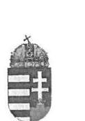
$\begin{array}{lllllll}\text { 11.3. } & \text { 1. } & \text { 7. } \\ & \text { 7. } & & & \text { 0. }\end{array}$

# NEMZETI ADÓ- ÉS VÁMHIVATAL 

## Vezetője

Iktatószám: 5166412016

## Domokos László úr   elnök

Állami Számvevőszék
Budapest

## Tisztelt Elnök Úr!

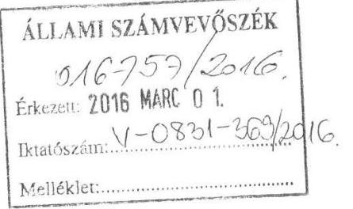

Köszönettel megkaptam az „Adóbeszedési eljárások ellenőrzése - Egyes adóbeszedési tevékenységekkel kapcsolatos feladatellátás szabályszerűségének ellenőrzése" témájában készített és részemre a V-0831-354/2016. iktatószámon, véleményezés céljából megküldött számvevőszéki jelentés tervezetet, melyet áttekintettem, azzal kapcsolatosan az alábbi észrevételeket szeretném megfogalmazni:

Elöljáróban jelzem, hogy a jelentés számos megállapításának megfogalmazása - noha egyes konkrét tételekre nézve helytállóak - általánosító jellegű, így abból rendszerszerű hiányosságra lehet következtetni annak ellenére, hogy csak eseti hibáról van szó, ezért kérem Elnök Urat a jelentés ebből a szempontból történő áttekintésére.
1.) A jelentéstervezet 5. oldal 5. bekezdés 1. mondata, a tervezet 24. oldal 3. bekezdése (összegző megállapítás), valamint a tervezet 26. oldal 2. bekezdés 1. mondata szerint a magánszemélyek jövedelmének a kettős adóztatás elkerülésével kapcsolatos feladatellátása 2012-2015. I. félévében az ellenőrzési tevékenység hiányosságai miatt nem felelt meg az Szja tv.-ben, illetve a vonatkozó nemzetközi egyezményekben foglalt előírásoknak, ami az adókötelezettség teljesítésére kockázatot jelentett.

Az ÁSZ ezen megállapítását általános jelleggel fogalmazza meg, amelyből az a következtetés vonható le, hogy a NAV valamennyi, a tárgyban végzett vizsgálata során megszegte a vonatkozó jogszabályi környezetben előírt rendelkezéseket, ezzel jelentős hátrányt okozva a költségvetési bevételek teljesítése tekintetében, mely alkalmas a közvélemény negatív irányú befolyásolására.

## Fentiek alapján indokoltnak tartanám

„A magánszemélyek jövedelmének a kettős adóztatás elkerülésével kapcsolatos feladatellátása a 2012-2015. I. félévében ..."
valamint
„A NAV 2012-2015. I. félévében a kettős adóztatás elkerülésével kapcsolatos feladatellátása nem felelt meg a..."
valamint

---

„A 2012-2015. I. félévében a kettős adóztatás elkerülésére vonatkozó nemzetközi egyezmények hatálya alá eső..."
a fenti kezdetű mondatok alábbiak szerinti módosítását:
„A magánszemélyek jövedelmének a kettős adóztatás elkerülésével kapcsolatos feladatellátása a 2012-2015. I. félévében az ellenőrzési tevékenység hiányosságai miatt nem minden esetben felelt meg teljes körűen az Szja tv.-ben, illetve a vonatkozó nemzetközi egyezményekben foglalt előírásoknak."
valamint
„A NAV 2012-2015. I. félévében a kettős adóztatás elkerülésével kapcsolatos feladatellátása nem minden esetben felelt meg a jogszabályi előírásoknak."
valamint
„A 2012-2015. I. félévében a kettős adóztatás elkerülésére vonatkozó nemzetközi egyezmények hatálya alá eső jövedelmeket is érintő ellenőrzési tevékenység nem minden esetben felelt meg az Szja tv. 2. § (5) bekezdésében, illetve a kettős adóztatás elkerülésével érintett jövedelmekre vonatkozó nemzetközi egyezményekben foglalt előírásoknak."
2.) A jelentéstervezet 6. oldal 1. bekezdés 2. mondata, a tervezet 24. oldal 4. bekezdése (3.1. megállapítás), valamint a tervezet 26. oldal 2. bekezdés 2. és azt követő mondatai szerint előfordult, hogy az ellenőrzések dokumentációja hatályon kívüli egyezményekre való hivatkozást tartalmazott.
Az ÁSZ jelentés általános jelleggel fogalmazza meg ezen megállapítását, nem derül ki, hogy csak egy-egy alkalommal, a nevesített amerikai és német hatályon kívüli egyezményekre történt tévesen hivatkozás vagy valamennyi vizsgált esetben, így indokoltnak tartanám annak pontosítását.
Egyben tájékoztatom, hogy a hasonló esetek jövőbeni elkerülése érdekében körlevélben fogjuk felhívni az igazgatóságok figyelmét, hogy fokozott figyelemmel járjanak el a kettős adóztatás elkerülése érdekében kötött egyezmények alkalmazása során.
3.) A jelentéstervezet 5. oldal 1. bekezdés 4. mondata, 6. oldal 1. bekezdés 2. mondata szerint az ellenőrzések több mint felénél nem volt megállapítható, hogy vizsgálták-e az adózók adóügyi illetőségét, továbbá a kettős adóztatás elkerülésével érintett jövedelem esetében a vonatkozó adómérték és a külföldön megfizetett adó jogszabályoknak és nemzetközi egyezményeknek való megfelelőségét.
Az előbbiekhez kapcsolódó, azzal azonos megállapítás szerepel továbbá a tervezet 24. oldal 4. bekezdésében (3.1. megállapítás) és a tervezet 26. oldal 3. bekezdésében is.

Az Art. 104. § (1) bekezdése értelmében az ellenőrzésről készült jegyzőkönyv az adóhatóság megállapításait tartalmazza, azaz nyilvánvalóan nem tartalmazza azokat a gazdasági eseményeket, melyekkel összefüggésben az ellenőrzés hibát, hiányosságot nem állapított meg, azaz nem tett megállapítást. (Megjegyzem irreális elvárás is lenne az adózó valamennyi olyan gazdasági eseményét rögzíteni a jegyzőkönyvben, amellyel kapcsolatban az adóhatóság semmilyen problémát nem észlelt.) Ez azonban - már csak azért sem, mert a bevallás utólagos vizsgálata ellenőrzéssel lezárt időszakot teremt - nem jelenti azt, hogy az ellenőrzés az adott gazdasági eseményt nem vizsgálta.
Az ellenőrzések során vizsgálandó adókötelezettségeket és egyéb, az adókötelezettség meghatározása szempontjából lényeges, így vizsgálandó körülményeket a vizsgálati program tartalmazza, így ha a vizsgálati program tartalmazza a bevallásban szereplő külföldi jövedelem ellenőrzésére való utalást, úgy az nyilvánvalóan ellenőrzésre is került, még

---
 jövedelem ellenőrzésének hiányát, ha arra a vizsgálati program esetleg nem tér ki, mivel a vizsgálati program valamennyi, az adózó adókötelezettségének megállapítása szempontjából releváns vizsgálandó körülményt nem tartalmazhatja, hiszen azt alapvetően a vonatkozó eljárásjogi és anyagi jogi jogszabályok részletezik.
Tekintettel arra, hogy az ÁSZ által vizsgált revíziók alapját képező bevallások tartalmaztak kettős adóztatás elkerülésével érintett jövedelmet, mely jövedelem az adóhatósági revízió előtt is ismert volt, így az adókötelezettség helyes megállapítása tekintetében elképzelhetetlen, hogy az adóhatóság ne vizsgálta volna az ellenőrzött adózó adóügyi illetőségét vagy az adómérték és a külföldön megfizetett adó jogszabályoknak és nemzetközi egyezményeknek való megfelelőségét.
Ennek ha másból nem, úgy a jegyzőkönyv részét képező ún. „B" táblákból ki kell tünnie, ahol is a bevallás egyes sorai és az ahhoz képest megállapított eltérés szerepel. Ha a bevallott külföldi jövedelem mellett az eltérés nulla, akkor a külföldi jövedelem az adóhatóság megállapítása szerint helytállóan került bevallásra.
Összegezve tehát: az ellenőrzések megállapításait tartalmazó jegyzőkönyv minden esetben rögzíti azt, ha az adózó a jogszabályoktól eltérő módon állapította meg adókötelezettségét (javára és terhére).
Amennyiben a jegyzőkönyv nem tartalmaz utalást az adóügyi illetőség vagy alkalmazott adómérték tekintetében, annak oka, hogy az megfelelt a vonatkozó szabályozásnak, attól eltérőt a revízió nem tárt fel, a bevallás vonatkozó sorát illetően megállapítást nem tett.

# Fentiek alapján indokoltnak tartanám a jelzett mondatrész, illetve bekezdések elhagyását vagy módosítását. 

4.) A jelentéstervezet 5. oldal 1. bekezdés 6. mondata, 6. oldal 3. bekezdése, és ezekhez kapcsolódóan a tervezet 32. oldal 2. bekezdése (4.1. megállapítás), valamint a 33. oldal utolsó bekezdése szerint:
Jelentéstervezet 5. oldal: „A kamatadó kifizetőknél végzett 2014. évi NAV ellenőrzések az adózó által a könyvek, nyilvántartások vezetéséhez és a bizonylatok feldolgozásához alkalmazott szoftvereket, informatikai rendszereket - jogszabályi előírás ellenére- nem vizsgálták."

Jelentéstervezet 6. oldal: „A kamatadóra vonatkozó ellenőrzések a 2010-2014. években részben feleltek meg az Art-ban foglalt előírásoknak, mert az adóalap és a bevallott adó megállapításának helyességén túl a 2014. évben nem terjedt ki az adatokat előállító informatikai rendszerek vizsgálatára."
Jelentéstervezet 32. oldal: „A NAV a kifizetők által elvont kamatadó megállapításához alkalmazott szoftvereket, informatikai rendszereket az Art-ban foglalt előírás ellenére 2014. évben nem ellenőrizte."
Jelentéstervezet 33. oldal: „Az informatikai rendszereket, alkalmazott szoftvereket a kifizetőknél a kamatadó megállapításához kapcsolódóan a NAV nem ellenőrizte a 2014. évben az Art. 95. § (1) bekezdésében foglaltak ellenére."
„A NAV kifizetőknél végzett NAV ellenőrzések jegyzőkönyvei nem tartalmaztak olyan megállapítást vagy utalást, amely megkérdőjelezte volna a kamatadó kezelésére alkalmazott szoftverek, informatikai rendszerek megbízhatóságát."

Elöljáróban indokolt utalni arra, hogy az ÁSZ jelentés tervezetében szerepeltette, hogy kifizetői oldalról vizsgálat alá vont három (MKB Bank Zrt., MPB Zrt., MPÉ Zrt.) pénzügyi

---

szolgáltató társaságot és megállapította (jelentéstervezet 38. oldal), hogy az érintettek a valóságnak megfelelően vallották be a kamatadót. Ez alól az MPÉ Zrt. volt a kivétel, mert nem aktualizálta megfelelően a kamatadó számítást végző program algoritmusát, azonban a hibát észlelve a javítást utóbb elvégezte, és az adóhatóság felé önellenőrzést nyújtott be, tehát eleget tett az állammal szemben fennálló kötelezettségének.

A jelentéstervezet az Art. 95. § (1) bekezdésre vezeti vissza a NAV-ot érintő elmarasztaló megállapítását, azonban álláspontom szerint az Art. hivatkozott 95. § (1) bekezdése értelmében az adóhatóságnak nem az informatikai rendszerek megbízhatóságát, biztonsági kontrolljait kell ellenőriznie, hanem azt, hogy az egyes tranzakciókat dokumentáló bizonylatok és a feldolgozás folyamatát végző rendszer között van-e olyan feldolgozás folyamatában lévő hiba, amely helytelen könyvelést, helytelen adózásbeli minősítést, vagy összegszerűséget okoz.

Mivel pénzügyi szolgáltató tevékenységet a hitelintézetekről és a pénzügyi vállalkozásokról szóló 2013. évi CCXXXVII. törvényben nevesített társaságok végezhetnek, így ehhez kapcsolódóan a Magyar Nemzeti Bankról szóló 2013. évi CXXXIX. törvény 39. § hatálya alá tartozó szervezetek, személyek és tevékenységek felügyeletét a Magyar Nemzeti Bank (továbbiakban: MNB) látja el. Ennek következtében a Magyar Nemzeti Bankról szóló 2013. évi CXXXIX. törvény 42. § c) pontja alapján az MNB felügyeleti feladatkörében ellenőrzi a 39. §-ban meghatározott törvények hatálya alá tartozó személyek és szervezetek információszolgáltatási rendszerét és adatszolgáltatását. Továbbá a 42. § d) pont alapján ellenőrzi a 39. §-ban meghatározott törvények hatálya alá tartozó személyek és szervezetek működésére és tevékenységére vonatkozó, a feladatkörébe tartozó hazai jogszabályi rendelkezések és európai uniós jogi aktusok betartását és az MNB által hozott határozatok végrehajtását.

A 2013. december 31-ig hatályos, a hitelintézetekről és a pénzügyi vállalkozásokról szóló 1996. évi CXII. törvény, illetve a 2014. január 1-től jelenleg is hatályos, a hitelintézetekről és a pénzügyi vállalkozásokról szóló 2013. évi CCXXXVII. törvény a pénzügyi szolgáltatói tevékenység folytatásához szükséges személyi és tárgyi feltételek között, a 67/A. §-ban szabályozza az informatikai rendszerekkel kapcsolatos követelményeket, amelyeknek való megfelelést külső szakértő (tanúsító szervezet) által kiadott tanúsítással kell igazolni, s amely tanúsító szervezetnek - a 67/A. § (3) bekezdése szerint - a feladata az informatikai rendszerrel kapcsolatban észlelt olyan tény MNB felé történő jelzése, amely pl. jogszabálysértésre, vagy ennek veszélyére vezet.
A hatályos jogszabályi előírások alapján a kifizetők által alkalmazott, az adók számításához, levonásához alkalmazandó szoftverek tekintetében a NAV nem rendelkezik felhatalmazással szoftverek, informatikai rendszerek hitelesítésére, tanúsítás kiadására (és ilyen felhatalmazást az Art. sem ad).
Továbbá - mint ahogy arról az előzőekben már szó volt - az informatikai rendszerek működésével összefüggő hiányosságok észlelése esetén a tanúsító szervezet írásban, haladéktalanul köteles tájékoztatni a pénzügyi közvetítőrendszer felügyeletével kapcsolatos feladatkörében eljáró Magyar Nemzeti Bankot, azaz mindez nem az adóhatóság feladata.

Az előzőekben kifejtettek alapján a tervezetben kifogásolt és hiányolt ellenőrzési cselekmények tekintetében megfogalmazottakat - a NAV hatáskörének hiányára tekintettel - indokoltnak tartanám elhagyni a jelentéséből.

---

5.) A jelentéstervezet 6. oldal 3. bekezdés 2. mondata, és ezzel összefüggésben a 26. oldal 3. bekezdése, 32. oldal 5. bekezdés 2. mondata, a 33. oldal 3. bekezdése szerint:
A jelentéstervezet 6. oldal: „A kamatadó kifizetőknél végzett adóhatósági ellenőrzésének módszere és eredménye közvetlenül nem volt ellenőrizhető, mivel az ellenőrzési jegyzőkönyvek a belső eljárásrendekkel összhangban a feltárt jogsértéseket, valamint az adókülönbözeteket rögzítették".
A jelentéstervezet 26. oldal: „Az ellenőrzött mintatételeknél a 2012-2015. I. félévben a NAV nem vizsgálta dokumentáltan a kettős adózás elkerülését kizáró egyezmények hatálya alá eső jövedelmek adóbevallását. Nem volt megállapítható, hogy az adóhatóság ellenőrizte-e a bevallásban szerepeltetett, kettős adóztatást elkerülő jogszabályok és egyezmények hatálya alá eső, külföldről származó jövedelmet. Az adóhatósági jegyzőkönyvek, határozatok nem tartalmaztak a kettős adóztatást kizáró egyezmény meghatározására, az adózó illetősségének, a külföldről szerzett jövedelem magyarországi adóztathatóságának, valamint a bevallásban figyelembe vett jövedelem és az adó helyes feltüntetésére vonatkozó utalást. Az adóhatóság az adózónak csak a belföldi tevékenységéből származó jövedelmeinek ellenőrzését dokumentálta a jegyzőkönyvekben és határozatokban."

A jelentéstervezet 32. oldal 5. bekezdésének 2. mondata: „Az éves ellenőrzési irányok és a belső eljárásrendek alapján nem terveztek és nem végeztek olyan ellenőrzést, amely közvetlenül az önálló adónemen belüli egyes adótételekkel - ezen belül kifejezetten a kamatjövedelemmel - kapcsolatos adókötelezettségek teljesítésére irányult volna."

A jelentéstervezet 33. oldal: „A kamatadó kifizetőknél végzett adóhatósági ellenőrzésének módszere és eredménye közvetlenül nem volt ellenőrizhető, mivel a mintákhoz kapcsolódó jegyzőkönyvek a személyi jövedelemadóval kapcsolatban tett megállapításokon belül - egy kivételével - nem tartalmaztak kamatadóra vonatkozó utalást. Az ellenőrzési programokból és jegyzőkönyvekből nem volt megállapítható, hogy az adóellenőrök milyen módszerekkel és szempontok alapján végzett kamatadóra irányuló ellenőrzést."
Fentiek kapcsán hangsúlyozni kívánjuk, hogy az Art. alapján az adóhatóság bevallások utólagos vizsgálatára irányuló adónem ellenőrzést végez, vagyis átfogóan vizsgálja a bevallásban szerepeltetett adatok jogszerűségét, mivel kizárólag az adókötelezettséghez kapcsolódó valamennyi kedvezmény illetve kötelezettség együttes vizsgálatával állapítható meg az adott adónemre vonatkozó adókötelezettség összege. Mivel a külföldről származó jövedelem és a kamatadó a személyi jövedelemadó bevallás részét képezi, ennek következtében önállóan nem vizsgálható. Az adóhatóság az adózó terhére, illetve javára vonatkozó megállapításait jegyzőkönyvbe foglalja, mely tartalmazza a jogszabályoktól való eltérő működés megállapításait. Amennyiben egy személyi jövedelemadó adónemre vonatkozó jegyzőkönyv megállapításai között nem szerepel konkrét hivatkozás egy adott tételre vonatkozóan, az nem jelenti azt, hogy a vizsgálat annak kontrolljára nem tért ki. Az ellenőrzési jegyzőkönyvek a belső eljárásrendekkel összhangban készültek a jelentéstervezetben leírtak szerint is.
A fentiek vonatkozásában releváns jogszabályhely az Art. 87. § (2) bekezdése, melyre figyelemmel nem lehet utólagos adóellenőrzés keretében kizárólag egy adónemen belüli egy-egy tételt kijelölni ellenőrzésre, ugyanis az utólagos adóellenőrzés ellenőrzéssel lezárt időszakot keletkeztet, vagyis egy-egy adónemen belüli jövedelemtípus vizsgálata önállóan nem írható elő a vizsgálati programban.
Utalok még a kérdéskör kapcsán releváns 3.) pont szerinti észrevételemre is.
Mindezek alapján indokoltnak tartanám a jelzett mondatok elhagyását.

---

6.) A jelentéstervezet 17. oldal 3. bekezdésében az ÁSZ megállapítja, hogy a szükséges esetekben a végrehajtás megindításra került, azonban előfordult, hogy az ellenőrzés során az adózó terhére megállapított 24,0 ezer Ft kötelezettség megfizetésének elmulasztása esetén nem indították meg az eljárást az Art. 161. § (1) bekezdésében foglaltakkal ellentétesen.
Jelzem, hogy a hivatkozott Art. 161. § (1) bekezdése a megkeresés alapján történő, adók módjára behajtandó köztartozásnak minősülő fizetési kötelezettség végrehajtására vonatkozó szabályait tartalmazza, mely jogszabályi hivatkozás az adóellenőrzést követő végrehajtási eljárásra nem értelmezhető, a helyes jogszabályi hivatkozás az Art. 150. § (1) bekezdés.

Továbbá indokoltnak tartanám annak egyértelműsítését, hogy egyedi hibáról van szó.

# Fentiek alapján javaslom: 

„A szükséges esetekben a végrehajtás megindításra került, ..."
kezdetű mondat alábbiak szerinti módosítását:
,,A szükséges esetekben a végrehajtás megindításra került, mindössze egy esetben fordult elő, hogy az ellenőrzés során az adózó terhére megállapított 24,0 ezer Ft kötelezettség megfizetésének elmulasztása esetén nem indították meg az eljárást az Art. 150. § (1) bekezdésében foglaltakkal ellentétesen. "

## 7.) 18. oldal első francia bekezdés

,,az Art. 150. § (1) bekezdésében biztosított lehetőség ellenére, az adós felhívása az adótartozás megfizetésére többségében nem történt meg" - véleményem szerint - nem minősíthető hiányosságnak. A hivatkozott jogszabályhely úgy fogalmaz, hogy az adóhatóság az adótartozás megfizetésére az adózót felhívhatja, amiből nem következik, hogy az eljárások többségében kellene az adózó részére fizetési felhívást küldeni.

A jogszabály ezzel a megfogalmazással az adóhatóságnak mérlegelési lehetőséget ad annak érdekében, hogy az adóbehajtás során minden esetben a legcélravezetőbb, illetve a leghatékonyabb eszközt alkalmazza. Minderre tekintettel végleges szövegből javaslom e megállapítás elhagyását.
8.) 18. oldal harmadik francia bekezdés:
,,előfordult, hogy 500 ezer Ft-ot meghaladó adótartozásnál az Art. 155. § (1) és 156. § (1) bekezdéseiben, valamint a Vht. 138. §-a szerinti ingatlan-végrehajtásra nem került sor."

A megállapítással kapcsolatban indokolt jelezni, hogy az Art. és a Vht. hivatkozott rendelkezései még 500 ezer Ft-ot meghaladó tartozás esetén sem teszik kötelezővé az ingatlan-végrehajtást. Az ingatlan-végrehajtás
 mellőzése indokolt lehet akkor, ha a tartozás más úton beszedhető. A jelentéstervezetből azonban nem állapítható meg, hogy az ingatlanvégrehajtás mellőzésére a kifogásolt esetben úgy került sor, hogy más végrehajtási cselekményből a tartozás nem volt kielégíthető.

Jeleznem kell, hogy az Art. újrakodifikálása során – épp az arányosság szem előtt tartása érdekében – várhatóan bevezetésre kerül a sortartás intézménye, azért, hogy az ingatlan, és

---

különösen a lakhatást szolgáló ingatlan végrehajtására csak akkor kerülhessen sor, ha a tartozás belátható időn belül más úton nem szedhető be.

Mindezekre tekintettel indokoltnak tartanám a megállapítás pontosítását, vagy elhagyását, és – a konkrét tényállás függvényében – ezzel kapcsolatban a 19. oldal 2. bekezdésében a „A feltárt hiányosságon túl a szükséges esetekben …" kezdetű mondat megfelelő átalakítását.

# 9.) 22. oldal, 4. ábra és 22. oldal 4. bekezdés utolsó mondat 

„Az adóhatósághoz beérkező további kontroll adatszolgáltatások nem épültek be automatikus kontrollként a bevallás feldolgozás folyamatába.”

Ezzel és a 4. sz. ábrával kapcsolatban jelzem, hogy az automatikus kontrollként a bevallásfeldolgozás folyamatába be nem épült hat kontroll adatszolgáltatásból ('K73, 'K75, 'K76, 'K95, 'K79, 'K89, 'K91) öt darab az egyszerűsített bevallások összeállítása során, a választásra nem jogosult adózók körének meghatározásához felhasználásra kerül, épp ezért azok szükségesek.
A hatodik, a K89-es adatszolgáltatás (amely a nyugdíj, illetve járadék folyósítása mellett kereső tevékenységet folytatók adatait tartalmazza) utoljára a 2010. adóév vonatkozásában az adóterhet nem viselő járandóság mellett kereső tevékenységet végző magánszemélyek személyi jövedelemadó bevallásainak ellenőrzéséhez került felhasználásra. 2011. január 1-jétől ugyanis az „adóterhet nem viselő járandóságok” a személyi jövedelemadóról szóló 1995. évi CXVII. törvényben (a továbbiakban: Szja törvény) hatályon kívül helyezésre kerültek. Ennek ellenére az adózás rendjéről szóló 2003. évi XCII. törvény (a továbbiakban: Art.) 3. sz. melléklet F) pontja továbbra is előírja ezt az adatszolgáltatást.

Minderre tekintettel javaslom a kifogásolt mondat pontosítását vagy elhagyását.
Nem javaslom továbbá a nem beépült kontroll adatszolgáltatások tételes nevesített felsorolását és így az ábra szerepeltetését a végleges, publikus jelentésben, tekintettel egyrészt az előbbiekben kifejtettekre, másrészt arra, hogy a belső kontrollrendszer működésének nyilvánosság általi megismerése veszélyezteti az adózói kötelezettség teljesítését és így végső soron a költségvetés érdekeit.
10.) A jelentéstervezet 25. oldal 2. bekezdés 2-3. mondata szerint a kettős adóztatás elkerülése témában a NAV önálló ellenőrzést nem végzett, célzott kiválasztást nem alkalmazott a kettős adóztatást elkerülő nemzetközi egyezmények és a vonatkozó hazai jogszabályok által előírtak betartására irányulóan. A kettős adóztatást kizáró egyezmények jogszerűségét a bevallások utólagos és az egyes adókötelezettségek teljesítésének ellenőrzés típusai keretében vizsgálta.
A fenti megállapítással kapcsolatban fontosnak tartom kiemelni, hogy a NAV a bevallás egyes soraiban szereplő adatokat vizsgálja az Art-ban nevesített ellenőrzéstípusok alkalmazásával, ide értve a kettős adóztatás elkerülésével érintett jövedelmet is, amennyiben a bevallás tartalmazza azt, vagy tartalmaznia kellett volna.
A vizsgált évek ellenőrzési irányaiban a kettős adóztatás elkerülésének vizsgálata nem került nevesítésre, aminek következtében a NAV e tárgyban célzott kiválasztást nem végzett, azonban ezzel mulasztást nem követett el. Ez a tervezetük 26. oldalának 1. bekezdésében is rögzítésre kerül.

---

Fentiek alapján indokoltnak tartanám a jelentés tervezet 25. oldal 2. bekezdés 2. mondatának elhagyását.
Az előzőeken túlmenően azt a körülményt, mely szerint a NAV célzott kiválasztást nem végzett a külföldről származó, kettős adózást kizáró egyezmények hatálya alá eső jövedelmek tekintetében, nem határozott meg erre külön ellenőrzési célkitűzéseket, indokolja az is, melyre maga a jelentéstervezet is kitér 8. oldalán – hogy 2014. évben a bevallott összes jövedelem 0,1%-a volt külföldi jövedelem, mely magában foglalta a kettős adóztatást kizáró egyezmények hatálya alá tartozó jövedelmeket is, azaz az érintett jövedelemtípus sokasághoz viszonyított aránya nem jelentős.
Továbbá a tervezet 25. oldalán szerepel, hogy az évenkénti Szja bevallások mintegy 0,2%-a tartalmazott külföldről származó, a kettős adóztatást kizáró egyezmények hatálya alá tartozó jövedelmet, melynek vonatkozásában 649 db ellenőrzést tartott az adóhatóság, ami az Szja ellenőrzések 0,7%-ának felel meg, azaz jóval nagyobb arányban került sor e körben ellenőrzésre, mint amit a bevallások reprezentálnak.
Ezzel összefüggésben jegyzem meg a 25. oldal utolsó bekezdéséhez kapcsolódva, hogy az összes bevallás 0,2%-ának megfelelő külföldi jövedelmet is tartalmazó bevallásból véletlenszerű kiválasztásra nyilvánvalóan épp az ilyen bevallások csekély száma miatt nem került sor, hiszen igen kicsi ilyen kis számú adott típusú bevallás mellett, hogy a véletlenszerű kiválasztásba akár egy darab bevallás is beleesik.
11.) A jelentéstervezet 27. oldalán a kontroll adatok hiányossága tekintetében rögzíti, hogy a feltárt kockázat oka az adózók bejelentési és adatszolgáltatási kötelezettségére vonatkozó jogszabályi előírások hiánya, továbbá az EGT állampolgárok szabad mozgás és tartózkodására érvényes jogok.
A fentiek azonban a vonatkozó jogszabályi környezet és ezen belül a közösségi jog alapvető szabadságjogainak számító jogok sajátosságaiból származnak, az adóhatóságnak – mint tagállami végrehajtó szervezetnek – nem róhatóak fel, ebben a körben mulasztás, jogszabálysértés nem állapítható meg az adóhatóság oldalán.
12.) A jelentéstervezet 27. oldal 1. bekezdés 3-4. mondatához
„A NAV nem rendelkezett olyan adatbázissal, amely rögzítette a Magyarországon mentesített, a bevallásokban nem szereplő külföldről származó jövedelmek típusát és az adózók körét. Az ellenőrzésre kiválasztást támogató adatbázisok nem tartalmaztak teljes körű adatokat a külföldön jövedelmet szerzett magánszemélyekről. Teljes körűen nem volt meghatározható a magánszemélyek esetében a kettős adóztatás elkerülésére vonatkozó nemzetközi egyezmények hatálya alá eső jövedelmek adózása szempontjából kockázatot jelentő, ellenőrizendő adózói kör.”

Tekintettel arra, hogy nincs jogszabályi kötelezettség arra vonatkozóan, hogy az adózók bejelentsék a Magyarországon mentesített külföldön szerzett jövedelmeiket, a NAV jogszabályi kötelezés hiányában nem írhat elő adatszolgáltatási kötelezettséget, így adatbázist sem építhet ezekre az adatokra, ha ezt megtenné, számos jogszabályt sértene meg.

---

# 13.) A jelentés tervezet 28. oldal 3. bekezdéséhez 

„Az 1030/2011. számú belső eljárási rend hazai jogszabályi változásoknak megfelelő aktualizálása nem történt meg, annak ellenére, hogy az abban hivatkozott Art. 57. § (6)-(9) bekezdései, az 59. §, valamint a 92. § (10) bekezdése 2013. április 21-től hatályát vesztette.”

A vonatkozó eljárási rend valóban csak 2014. évben került aktualizálásra, melynek oka az a körülmény, hogy a szabályozás alapjául szolgáló 2011/16/EU irányelv hazai implementálása csak 2013. évben valósult meg az adó- és egyéb közterhekkel kapcsolatos nemzetközi közigazgatási együttműködés egyes szabályairól szóló 2013. évi XXXVII. törvénnyel (Aktv.).
Az aktualizálás azért nem történt meg 2013. évben, mert akkor már ismertek voltak az automatikus információcsere területén bekövetkező változások, és a változásokat célszerűségi okból a NAV egyszerre kívánta beépíteni a kapcsolódó eljárási rendbe. Mindazonáltal a belső eljárási folyamat nem változott (csak a jogszabályi hivatkozások), tehát a kapcsolattartási szakterület esetében az aktualizálás elmaradása nem okozott eljárási problémát.
14.) A jelentéstervezet 28. oldal első bekezdésében rögzített azon megállapítást érintően, mely szerint a ki- és beutazások nyomon követhetőségének hiányában az adóhatóság az ellenőrzések során elsősorban az adózó álláspontjára, nyilatkozatára, valamint az általa becsatolt dokumentumokra volt utalva az adóügyi illetőség meghatározásakor – kiemelni szükséges, hogy a jelzett körben feltárható ellentmondás, ellentétes tartalmú más bizonyíték felmerülése esetén az adóhatóságnak – a belföldi bizonyítási eszközök kimerítése után – lehetőségében áll nemzetközi megkereséssel tisztázni az adózó által előadottakat, amelyet minden esetben meg is tesz.
15.) A jelentéstervezet 29. oldal 4. bekezdés 3. mondatában rögzítettek kapcsán – mely szerint az automatikus adatszolgáltatás során hiányosan, hibásan adatokat szolgáltató, vagy azt nem teljesítő országok esetében nem történt adategyeztetés – megállapításra került, hogy a bekezdés 1-2. mondatában, hogy az érintett államok közötti egyeztetésre nem volt jogszabályi, így belső szabályozási előírás sem.
Tekintettel arra, hogy a NAV jogalkalmazó szerv és a hiányosságként megfogalmazott egyeztetésnek nem volt jogszabályi alapja – nem tartom megalapozottnak a jelentés érintett megállapítását.
Fentiek alapján javaslom „Az automatikus adatokat hiányosan szolgáltató, vagy nem teljesítő országok esetében nem történt adategyeztetés.” mondat elhagyását.

Kiemelni szükséges továbbá, hogy a nem teljesítő vagy tartalmában téves, hibás adatot rögzítő külföldi adóhatóság általi adatszolgáltatás – a töredékes formában érkező adatok kivételével – kiszűrése egyéb viszonyítási pont, máshonnan származó összevethető kontrolladat hiányában nem lehetséges, erre nincs módja az adóhatóságnak.

Az ellenőrzési gyakorlat tapasztalatai alapján kiemelendő például a külföldről származó kamatjövedelmek tekintetében, hogy – a közösségi jog tagállamokat automatikus információcserére kötelező rendelkezése ellenére – a NAV felé automatikusan megküldött adatok gyakran nem egyeznek meg azokkal az adatokkal, amit a pénzintézetek az adózókkal közöltek, s az ellentmondás csak az érintett külföldi adóhatóság megkeresésével oldható fel.

Előfordul olyan eset is, amikor a vizsgálattal érintett adózó nem tud hivatalos igazolást adni az adóhatóság részére a külföldről származó kamatjövedelmekre vonatkozóan, vagy az adózó által az adóhatóság rendelkezésére bocsátott jövedelmeivel kapcsolatos igazolások nem teljes

---

körűek, vagy a külföldi jövedelmekre vonatkozó adatokat adózó nem ismeri el, illetve nem abban az összegben, amely az információcsere útján érkezett.

Előfordul az a tényállás is, amikor a spontán információcsere keretében a külföldi társaságtól származó bevételről közölt adatot az érintett magánszemély tagadja, azt adja elő, hogy a jelölt társasággal nem állt jogviszonyban, amely szintén csak a külföldi adóhatóság megkeresésével oldható fel.
16.) A 29. oldal 5. (utolsó) bekezdése szerint 2012-2015. I. félévében előfordult, hogy a KKI nem értesítette az automatikus információcsere során beérkezett adatok hozzáféréséről a 1030/2011. számú belső eljárási rend 17.2. és 28.4. pontjában foglaltak ellenére – a belföldi adóalany illetősége szerinti szervezeti egységet a belső elektronikus levelező rendszeren küldött üzenettel.
A megállapítás megítélésem szerint általános jellegű, abból nem derül ki, hogy a jelzett mulasztás egy esetben fordult elő, többször, esetleg rendszeresen. Másrészt a tervezet belföldi adóalany illetősége szerinti szervezeti egységet említ, melynek kapcsán rögzíteni szükséges, hogy az érintett esetben a KKI a belföldi adóalany illetősége szerint illetékes szervezeti egységét tájékoztatja.
Fentiek alapján indokoltnak tartanám az említett bekezdés számszaki adatok tekintetében történő pontosítását, illetve javítását.

A jelentéstervezet ugyanezen 29. oldal 5. (utolsó) bekezdéséhez – mellyel szorosan összefügg a 6. oldal 2. bekezdés 1. mondata, valamint a 30. oldal 1-3. bekezdése
„Az információcserével kapcsolatos feladatokat a 2010-2015. I. félévében részben teljesítette, mivel nem tartotta be maradéktalanul a szervezeti egységek értesítésére, valamint a határidőre vonatkozó belső eljárási rendben foglalt előírásokat.”
„A 2012-2015. I. félévében előfordult, hogy a KKI nem értesítette az automatikus információcsere során beérkezett adatok hozzáférhetőségéről – a 1030/2011. számú belső eljárási rend 17.2. és 28.4. pontjaiban foglaltak ellenére – a belföldi adóalany illetősége szerinti szervezeti egységet a belső elektronikus levelező rendszeren küldött üzenettel. Az értesítés hiánya ellenére a KKI rendszerben a regionális kapcsolattartók számára elérhetők voltak az információk, azonban a feltöltés dátumának megállapítását a KKI rendszer nem tette lehetővé.”
„Késedelmesen került továbbításra a másik államba irányuló külföldről származó jövedelmekkel
 kapcsolatos megkeresés, a 8 munkanap helyett a 10. munkanapon, mely nem felelt meg a 1092/2014. eljárási rend 17. pontjában meghatározottaknak."
„Előfordult, hogy a visszaigazolás a spontán információ beérkezését követő 8. napon történt, szemben az Aktiv. 9. §-ában előírt 7 munkanappal."

Az értesítés egyes esetekben valóban nem történt meg, azonban megállapításra kerül, hogy az információk a KKI rendszerben a regionális kapcsolattartók számára elérhetőek voltak, ezért információ hiány nem állt fenn, ezért javasolom, hogy a jelentésben mindezek a fentiekben megjelölt valamennyi pontnál kerüljenek feltüntetésre.
Az automatikus információcsere keretében beérkező információk feltöltési dátumát a KKI rendszer valóban nem tartalmazta, a KKI rendszer ilyen irányú fejlesztési igényét a szakterület megvizsgálja.

---

A spontán információval kapcsolatos visszaigazolás, valamint az előírt határidőben történő továbbítás esetében az egy-két napos határidő csúszás oka, hogy az automatikus információcsere keretében fogadott illetve küldött megkeresések minden tagállamban prioritást élveznek, így Magyarország is ezen megkeresések határidőben való kezelését tartja szem előtt, és ezt követően kezeli a spontán információ csere keretében érkezett, illetve küldendő adatállományokat. A NAV természetesen minden tőle telhetőt megtesz ezen adatok határidőben történő kezelése érdekében.
17.) A jelentéstervezet 32. oldal 5. bekezdése szerint a vizsgált időszakban a NAV nem végzett a kamatadó kifizetők általi megállapításának, levonásának, bevallásának és megfizetésének célzott ellenőrzését.
Mindezt követően megállapításra került, hogy ezt a NAV ellenőrzési irányai, illetve belső szabályozói sem tartalmazták, így tulajdonképpen a NAV nem követett el mulasztást.
Álláspontunk szerint az ok-okozati viszony fordított, így javasoljuk a megállapítások felcserélését, azaz a NAV ellenőrzési irányai, illetve belső szabályozói nem tartalmaztak a kamatadó ellenőrzésére vonatkozó rendelkezést, melynek következtében célzott ellenőrzést nem folytatott a NAV.
Megemlítendő továbbá, hogy a tervezet 33. oldalának 2. bekezdése ezt követően kifejti, hogy a NAV a legnagyobb adóteljesítményű adózók rendszeres ellenőrzése keretében vizsgálta a kamatadóhoz füződő kötelezettségek ellenőrzését, azaz a kamatadóval leginkább érintett adózói kör ellenőrzöttségi szintje megfelelő volt.

Utalok még az észrevételem 5.) pontjára, miszerint a kamatadó önállóan nem vizsgálható.
18.) A jelentéstervezet 33. oldal 2. bekezdés 1. mondata szerint utólagos ellenőrzést az adóhatóság a 2010-2014. években a bevallást benyújtók 4,1%-ánál végzett, amely valamennyi bevalláshoz kötött adónemre - ezen belül a személyi jövedelemadóra és feltehetően annak részeként a kamatadóra is - kiterjedt.

Amennyiben a vizsgált adózó bevallása tartalmazott vagy tartalmaznia kellett volna személyi jövedelemadót - kapcsolódjon az a kamatadóhoz vagy egyéb jövedelemtípushoz - úgy a NAV azt nem csak feltételezhetően ellenőrizte, hanem - jogszabályi kötelezettségéből adódóan - kötelezően vizsgálat tárgyává tette.

Előbbiekre tekintettel javasolom a tervezet 33. oldal 2. bekezdés 1. mondatának javítását az alábbiak szerint:
„Utólagos ellenőrzést az adóhatóság a 2010-2014. években a bevallást benyújtók 4,1%-ánál végzett, amely valamennyi bevalláshoz kötött adónemre - ezen belül a személyi jövedelemadóra és annak részeként a kamatadóra is - kiterjedt."

# 19.) A jelentéstervezet 34. oldal 

A kamatjövedelmeket terhelő adó nyomon követésével, annak pénzügyi teljesítésére irányuló kimutatással összefüggésben megjegyezem, hogy az adózók befizetési kötelezettségeinek nyilvántartása - a '08-as jelű havi adó- és járulékbevallások esetében is - adónemenként történik.
Jelenleg az irányadó, hatályos jogszabályi rendelkezések - mint ahogy korábban sem - nem tartalmaznak az állami adó- és vámhatóság részére arra vonatkozóan szabályozást, hogy az adózók adószámláira előírt kötelezettségeket és könyvelt befizetéseket az egyes adónemeken

---

belül jogcímekre lebontva kellene a NAV-nak nyilvántartania. Az Art. adóelszámolási szabályai a befolyó összegek ilyen „pántlikázását" soha nem tették lehetővé.
20.) A 41. oldalon kezdődő „7. Meghatározták és számon kérték-e az erőforrásokkal való gazdálkodás követelményeit?" fókuszkérdése kapcsán az alábbi megállapításokat tartalmazza a tervezet:

- Összegző megállapítás: „Az NGM és a NAV 2014. évre nem határozott meg közfeladat ellátására az erőforrásokkal való szabályszerű és hatékony gazdálkodással összefüggően követelményt."
- 7.2 megállapítás: „A NAV irányítását végző elnök a közfeladat ellátására nem határozott meg követelményeket az erőforrásokkal összefüggésben 2014. évre."
„(...) a meghatározott követelmények nem tartalmaztak előírást az erőforrásokkal való szabályszerű, gazdaságos, hatékony és eredményes gazdálkodásra vonatkozóan. A NAV elnöke nem gondoskodott arról, hogy tevékenységében és céljaiban a gazdaságosság, a hatékonyság és az eredményesség követelményei érvényesüljenek"

Véleményem szerint a NAV elnöke a működéséhez kapcsolódó, pénzügyi kihatással bíró, jogszabályban nem szabályozott kérdésekben az Ávr. 13. § (2) bekezdésében meghatározott belső szabályzatok kiadásával biztosította a gazdálkodási tevékenység szabályszerű ellátásának kereteit, követelményeit 2014. évben. A jogszabályban, szabályzatban foglalt követelmények érvényesítését további belső rendelkezések, körlevelek kiadása is segítette.

Az intézményi feladatellátást, működést biztosító költségvetési előirányzatok tervezésére a NAV elnöke által kiadott 107/2011. számú szabályzat alapján, több fázisban került sor. A nullbázisú optimum költségvetési tervjavaslat elkészítésére kiadott tervezési körirat a tervjavaslat elkészítése során számos követelményt fogalmazott meg (kiadások típusainak meghatározása és tervezési normatívák kialakítása a működési kiadásoknál, felhalmozási kiadások feladatalapú tervezése stb.) a gazdaságosság, hatékonyság, és eredményesség elveinek érvényre juttatása érdekében, amely a központi költségvetésről szóló törvény alapján elkészített elemi költségvetésben is érvényesítésre került.

Fentiekre tekintettel javasolom a tervezet szövegének módosítását az alábbiak szerint:

# Összegzés, 6. oldal, utolsó két mondat: 

„A NAV elnöke a kiemelt feladatok teljesítésének elősegítése érdekében az intézményi munkaterv és a teljesítmény-menedzsment rendszer keretében határozott meg követelményeket, amelyek azonban nem tartalmaztak az erőforrásokkal való szabályszerű, gazdaságos, hatékony és eredményes gazdálkodásra vonatkozó előírásokat. A NAV elnöke által kiadott belső szabályzatok, egyéb irányító eszközök tartalmazták. A NAV elnöke emiatt nem gondoskodott arról, hogy a közfeladat ellátás tevékenységében és céljaiban a gazdaságosság, a hatékonyság és az eredményesség követelményei az erőforrások területén is érvényesüljenek az Áht-ban és a Bkr-ben foglalt előírások ellenére."

## 7. fókuszkérdésre vonatkozó megállapítások, Összegzö megállapítás, 41. oldal:

„Az NGM és a NAV 2014. évre nem határozott meg közfeladat ellátására az erőforrásokkal való szabályszerű és hatékony gazdálkodással összefüggően követelményt. A NAV elnöke belső szabályzatokban, egyéb irányító eszközökben intézkedett az erőforrásokkal való szabályszerű és hatékony gazdálkodás követelményeinek érvényesítése érdekében, a célokhoz azonban jól számszerűsített, mérhető mutatószámokat nem alakított ki."

---

# 7.2 megállapítás, 42. oldal 1. mondat: 

„A NAV irányítását végző elnök a közfeladat ellátására nem határozott meg követelményeket az erőforrásokkal összefüggésben 2014. évre, azonban jól számszerűsített, mérhető mutatószámokat nem alakított ki."

### 7.2 megállapítás, 42. oldal 2. mondat:

„A NAV irányítását végző elnök a 2014. évben alakított ki további követelményeket, mutatószámokat, azonban a meghatározott követelmények nem tartalmaztak előírást az erőforrásokkal való szabályszerű, gazdaságos, hatékony és eredményes gazdálkodásra vonatkozóan. A követelmény érvényre juttatását az Ávr. 13. § (2) bekezdésében meghatározott belső szabályzatok kiadásával biztosította 2014. évben. A jogszabályban, szabályzatban foglalt követelmények érvényesítését további belső rendelkezések, körlevelek kiadása is segítette. A NAV elnöke nem gondoskodott arról, hogy tevékenységében és céljaiban a gazdaságosság, a hatékonyság és az eredményesség követelményei érvényesüljenek."

A tervezet 42. oldal 2. bekezdése megállapítja továbbá, hogy „az erőforrásokhoz kapcsolódóan a célokhoz jól számszerűsített, mérhető mutatószámok, teljesítmény kritériumok hozzárendelésére nem került sor 2014. évben az intézményi munkatervben".
A fenti megállapítással kapcsolatban tájékoztatom Elnök Urat, hogy a KOSZTÜM rendszer 2015. I. félévétől már tartalmaz az erőforrások felhasználására vonatkozó mutatószámokat.
21.) 43. oldalon található „Az adószakmai oldalon az adóügyi, ellenőrzési és bűnügyi szakterületen az elemzés két fő módszer alapján történt..." részt javaslom pontosítani az alábbiak szerint: „Az adószakmai oldalon az adóügyi, ellenőrzési és behajtási szakterületen az elemzés két fő módszer alapján történt...". A bűnügy szakterület ugyanis tévesen szerepel a tervezetben az adószakmai területek között.

Végezetül tisztelettel szeretnénk rámutatni arra a külső körülményre, hogy napjainkban a gazdasági környezet globalizálódása, az adóalanyok mobilitása következményeként a globális adózási átláthatóság megteremtése nemzetközi szinten is alakulóban lévő folyamat, az ebből eredő nehézségek nem kizárólag a magyar adóhatóság oldalán állnak fenn, hanem más tagállami adóhatóságokat érintően is felmerülnek.

Az Európai Bizottság 2015. március 18-án közzétett - adócsalás és az adóelkerülés elleni küzdelmet szolgáló adózási átláthatóságról - szóló közleményében maga is azt rögzíti, hogy az átláthatóság és az együttműködés terén fennálló hiányosságok, az adórendszerek összetettsége miatt további uniós szintű intézkedésekre van szükség.
Maga a Bizottság is az ÁSZ vizsgálatával érintett időszakban - 2012. évben - fogalmazta meg több, mint 30 intézkedést tartalmazó cselekvési tervét, amelyek közül több kifejezetten az adózási átláthatóság és az információcsere javítására összpontosított. Szintén a vizsgálattal érintett időszakban történt meg a közigazgatási együttműködésről szóló 2011/16/EU irányelvnek a Tanács által 2014. decemberében elfogadott módosítása, melynek révén megteremtődött az automatikus információcsere szilárd uniós jogszabályi kerete, s az Európai Unió egészében véglegesen megszüntetésre került az adóügyi információk banktitokként történő kezelésének lehetősége.

A NAV maga is felismerte, hogy a külföldi tényállási elemet tartalmazó adóügyi tényállásokat érintően a más uniós tagállamokkal folytatott közigazgatási együttműködés fokozott odafigyelést és intézkedéseket kíván, melyet jelez, hogy a témában két országos

---

törvényességi vizsgálat is elrendelésre és lefolytatásra került e tárgyat érintően. (2011-ben az ellenőrzési határidő betartásának vizsgálata, különös tekintettel a kapcsolódó vizsgálatokkal és/vagy külföldi adóhatóság megkeresésével érintett ellenőrzések, illetőleg 2014-ben a közösségi jog és a kettős adóztatás elkerüléséről szóló egyezmények alapján történő külföldi adóhatósági megkeresések indokoltságának és az erre beérkező válaszok hasznosulásának törvényességi vizsgálatáról.)

A 2014. évben lefolytatott törvényességi vizsgálat elrendelésének okaként rögzítésre került, hogy Magyarország - a 2010-es évek elejétől - gazdasági méretével ellentétben az Európai Unió egyik legtöbb megkeresést kiküldő tagállama, de tényként rögzíthető az a körülmény is, hogy a külföldi adóhatóság megkeresése a tényállás tisztázásának az egyik legidőigényesebb módja, mivel a megkeresett külföldi szerv eljárásának gyorsítására az adóhatóságnak nincs olyan eszköze, mint amilyen a hazai szervek viszonylatában rendelkezésre áll.

Végül jelzem, hogy a jelentéstervezet 44-46. oldalát nem kaptuk meg, így azok észrevételezésére nem volt módom.

A végső szövegezés kialakításakor kérem észrevételeim, javaslataim szíves figyelembe vételét.

Budapest, 2016. február 29.
Tisztelettel:
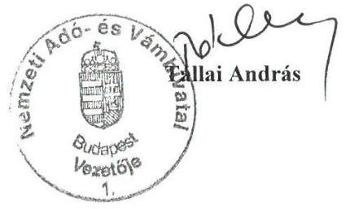

---

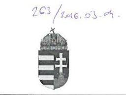

Mallit 17
125

NEMZETI ADÓ- ÉS VÁMHIVATAL
Vezetője

Iktatószám: 3157628901

Domokos László úr
elnök

Állami Számvevőszék
Budapest

ÁLLAMI SZÁMVEVŐSZÉK
018109/2016
Érkezési időpont: 2016. MÁRCIUS 04.
Iktatószám: U-0131-3381206
Melléklet:

Tisztelt Elnök Úr!

Köszönettel megkaptam a V-0831-364/2016. iktatószámú levelét, mellyel „Elnök Úr az
„Adóbeszedési eljárások ellenőrzése – Egyes adóbeszedési tevékenységekkel kapcsolatos
feladatellátás szabályszerűségének ellenőrzése" témájában készített, korábban már
megküldött jelentéstervezetet a 44-45. oldallal kiegészítve észrevételezésre megküldte. A
tervezet 44-45. oldala kapcsán az alábbi észrevételeket fogalmazom meg:

A tervezet a 44-45. oldalán a Nemzeti Adó- és Vámhivatal vezetője részére két feladatot
határoz meg.

1.) Az első – a jelentéstervezet 3.1. sz. megállapítás 4. bekezdésén alapuló – feladat
szerint intézkedni kell a kettős adóztatás elkerülésével kapcsolatos ellenőrzési tevékenység
ellátása során a vonatkozó jogszabály és nemzetközi egyezmények megfelelő alkalmazásáról.

A jelentéstervezetre tett, 2016. február 29-i 5166412016 számon megküldött észrevételem 1.)
és 2.) pontjában a kérdéskör kapcsán pontosító jellegű javaslattal éltem, melyet továbbra is
kérnék figyelembe venni.

Ugyanakkor – mint ahogy a jelzett észrevételem 2.) pontja tartalmazza is – mivel tartalmilag
természetesen elfogadjuk a megállapítást, ezért a hasonló esetek jövőbeni elkerülése
érdekében körlevélben fogjuk felhívni az igazgatóságok figyelmét, hogy fokozott
figyelemmel járjanak el
 a kettős adóztatás elkerülése érdekében kötött egyezmények
alkalmazása során.

2.) A második – a jelentéstervezet 4.1. sz. megállapítás 7. bekezdésén alapuló – feladat
szerint intézkedni kell a kamatadó kifizetők bevallásának és befizetésének ellenőrzése során a
vonatkozó jogszabályban előírtaknak megfelelően a bizonylatok feldolgozásához alkalmazott
informatikai rendszerek ellenőrzéséről.

A jelentéstervezetre tett, 2016. február 29-i 5166412016 számon megküldött észrevételem 4.)
pontjában – melyet továbbra is kérnék figyelembe venni – a kérdéskör kapcsán részletesen
kifejtettem, hogy a kamatadóval érintett kifizetőknél az informatikai rendszerek ellenőrzését a
NAV hatáskör hiányában nem végezheti.

1 0 5 4 Budapest, Széchenyi u. 2.

---

Az adózás rendjéről szóló 2003. évi XCII. törvény (a továbbiakban: Art.) az adóhatóságot adóellenőrzésre, nem pedig más típusú ellenőrzésre jogosítja fel. Az Art. 95. § (1) bekezdése pedig ebben a kontextusban értelmezendő.
Az adóhatóságnak tehát nem az informatikai rendszerek megbízhatóságát, biztonsági kontrolljait kell ellenőriznie - megjegyzem erre csak informatikusok, nem pedig az Art. alapján adóellenőrzés végzésére jogosult adóellenőrök lennének képesek -, hanem azt, hogy az egyes tranzakciókat dokumentáló bizonylatok és a feldolgozás folyamatát végző rendszer között van-e olyan feldolgozás folyamatában lévő hiba, amely helytelen könyvelést, helytelen adózásbeli minősítést, vagy összegszerűséget okoz.

Ahogy azt a hivatkozott észrevételemben már részletesen kifejtettem, a kamatadóval érintett kifizetők informatikai rendszerének felügyeletére a Magyar Nemzeti Bankról szóló 2013. évi CXXXIX. törvényben és a hitelintézetekről és a pénzügyi vállalkozásokról szóló 2013. évi CCXXXVII. törvényben meghatározott módon az MNB jogosult, nem pedig az adóhatóság.

Az pedig, hogy ha a pénzintézet adóellenőrzéséről készült jegyzőkönyv külön nem tér ki arra, hogy az alkalmazott könyvelési rendszerben észleltek-e a feldolgozás folyamatában valamilyen hibát, nem jelenti, hogy ennek vizsgálata elmaradt. Itt utalnom kell az jelentéstervezetre tett észrevételemnek - a külföldi jövedelmek körében tett - 3.) pontjára (amire a kamatadót szintén érintő 5. pont szerinti észrevételem vissza is utal), mely részletesen kifejti, hogy egy adóellenőrzési jegyzőkönyvnek csak a hibákat, hiányosságokat kell tartalmaznia.

Mindezekre tekintettel a jelentéstervezet 44. oldalán szereplő 2. sz. intézkedési javaslat elhagyását tartanám indokoltnak.

Ugyanakkor - ahogy a V-0831-352/2016. sz. figyelemfelhívó levelére adott 2016. február 29-i, 5166412027 számú válaszom 3. pontja tartalmazza - Elnök Úr figyelemfelhívására tekintettel a kérdésben az MNB-vel felsővezetői egyeztetést fogok kezdeményezni.

A jelentéstervezet intézkedési javaslatainak észrevételezésére adott lehetőséget megköszönve, kérem észrevételeim szíves elfogadását.

Budapest, 2016. március 5.
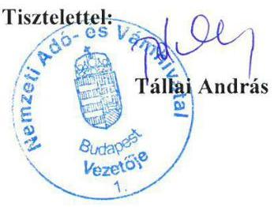

---

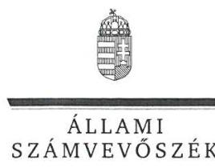

ELNÖK

Ikt.szám: V-0831-374/2016.

# Tállai András úr 

parlamenti és adóügyekért felelős államtitkár, miniszterhelyettes, a NAV vezetője

Nemzeti Adó- és Vámhivatal

## Budapest

## Tisztelt Államtitkár Úr!

Az „Adóbeszedési eljárások ellenőrzése - Egyes adóbeszedési tevékenységekkel kapcsolatos feladatellátás szabályszerűségének ellenőrzése" címmel készített számvevőszéki jelentéstervezetre tett észrevételét köszönettel megkaptam.

Az Állami Számvevőszék észrevételre vonatkozó álláspontjáról a felügyeleti vezető által készített részletes tájékoztatást csatoltan megküldöm.

Tájékoztatom Államtitkár urat, hogy a számvevőszéki jelentésben - az Állami Számvevőszékről szóló 2011. évi LXVI. törvény 29. § (3) bekezdése alapján - a figyelembe nem vett észrevételeket szerepeltetjük az elutasítás indokának feltüntetésével.

Budapest, 2016. 05. hó 16. nap
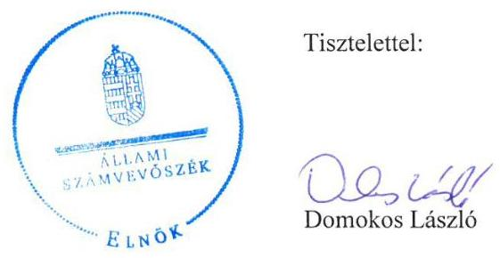

Melléklet: Tájékoztatás az elfogadott és el nem fogadott észrevételekről

---

# Tájékoztatás   az elfogadott és el nem fogadott észrevételekról 

Az „Adóbeszedési eljárások ellenőrzése - Egyes adóbeszedési tevékenységekkel kapcsolatos feladatellátás szabályszerűségének ellenőrzése" címü jelentéstervezetre 2016. február 29-én érkezett észrevételét áttekintettük, annak kezelésével kapcsolatban a következő tájékoztatást adom.

A NAV 5166412016 iktatószámú levelében megfogalmazott észrevételekre adott tájékoztatás:

1. észrevétel - Jelentéstervezet 5. oldal 5. bekezdés 1. mondata, 24. oldal 3. bekezdése, 26. oldal 2. bekezdés 1. mondata

Az észrevételben jelzett megállapítások összegző jellegűek, a jelentéstervezet 26. oldal 2. bekezdése az összegző mondatot követően részletesen tartalmazza a hiányosságokat. A magánszemélyek jövedelmének a kettős adóztatás elkerülésével kapcsolatos feladatellátására vonatkozóan az ÁSZ ellenőrzése több hiányosságot tárt fel: a NAV ellenőrzések dokumentációja több esetben hatályon kívüli egyezményre való hivatkozást tartalmazott, az ellenőrzések több mint felénél nem volt megállapítható, hogy vizsgálták-e az adózók adóügyi illetőségét, továbbá a kettős adóztatás elkerülésével érintett jövedelem esetében a vonatkozó adómérték és a külföldön megfizetett adó jogszabályoknak és nemzetközi egyezményeknek való megfelelőségét. Ezért a megállapítások összefoglalás jellegű megfogalmazása helytálló, azok módosítása nem indokolt.
2. észrevétel - Jelentéstervezet 6. oldal 1. bekezdés 2. mondata, 24. oldal 4. bekezdése (3.1. megállapítás), 26. oldal 2. bekezdés 2. és azt követő mondatai

A kettős adóztatás elkerülése érdekében kötött egyezmények szabályszerű alkalmazására felhívó körlevélre vonatkozó tájékoztatásukat köszönjük.
Az ÁSZ véletlen mintavételi eljárással ellenőrizte többek között a kettős adóztatás elkerülésével kapcsolatos feladatok ellátását is a NAV-nál. A mintatételek ellenőrzését és kiértékelését követően a sokaságban előforduló hibaarányt becsültük, annak alapján mondtunk véleményt a feladatellátás megfelelőségéről. A minősítés alátámasztásaként az ellenőrzés által feltárt, többször előforduló, illetve kockázatosnak ítélt hiányosságokat mutattuk be a jelentéstervezetben. Mindezek alapján a jelentéstervezet módosítása nem indokolt.

---

# 3. észrevétel - Jelentéstervezet 5. oldal 1. bekezdés 4. mondata, 6. oldal 1. bekezdés 2. mondata, 24. oldal 4. bekezdés, 26. oldal 3. bekezdés 

Az észrevétel megerősíti azt a tényt, hogy a NAV jegyzőkönyvei kizárólag a hibát, hiányosságot feltáró megállapításokat tartalmazták. Az Art. 104. § (1) bekezdése szerint az adóhatóság megállapítását jegyzőkönyvbe foglalja. A jogszabály nem tér ki arra, hogy „megállapítás" alatt kizárólag a hibát, hiányosságot feltáró megállapításokat kell érteni.
Az, hogy a vizsgálati program tartalmazza a bevallásban szereplő külföldi jövedelem ellenőrzésére való utalást, nem jelenti azt, hogy annak ellenőrzését el is végezték.
Az ellenőrzés rendelkezésére bocsátott dokumentumok szerint az ún. „B" táblák kizárólag a számszaki eltéréseket tartalmazták és nem képezték valamennyi ellenőrzési jegyzőkönyv részét.
Mivel az ellenőrzési jegyzőkönyvek, illetve az ellenőrzéshez kapcsolódó egyéb dokumentumok nem tartalmazzák a vizsgálati program valamennyi pontja végrehajtását, előfordulhat, hogy egy-egy tétel esetében az ellenőrzés elmarad. A NAV ellenőrzéseihez kapcsolódó dokumentumok alapján - az ellenőrzés végrehajtása teljes körű dokumentálásának hiányában az ellenőrzések több mint felénél nem lehetett meggyőződni arról, hogy az ellenőrzés során a jogszabályokban, belső szabályozásokban foglaltakat betartották-e, az ellenőrzési programot maradéktalanul végrehajtották-e. Ezért megállapításunk helytálló, módosítása nem indokolt.

## 4. észrevétel - Jelentéstervezet 5. oldal 1. bekezdés 6. mondata, 6. oldal 3. bekezdése 32. oldal 2. bekezdése (4.1. megállapítás), valamint a 33. oldal utolsó bekezdése

Az Art. 95. § (1) bekezdés szerint az ellenőrzést az adóhatóság az adó, a költségvetési támogatás alapjának összegének megállapításához szükséges iratok, bizonylatok, könyvek, nyilvántartások - ideértve az elektronikusan tárolt adatokat is -, az adózó által a könyvei, nyilvántartásai vezetéséhez, valamint a bizonylatok feldolgozásához alkalmazott szoftverek, informatikai rendszerek, számítások és egyéb tények, adatok, körülmények megvizsgálásával folytatja le.
A kamatadó alapjának, összegének megállapítását a kifizetőknél informatikai rendszerek, szoftverek végzik, annak megállapításához, hogy a kamatadó alapja, összege a szabályozásnak megfelelően, teljes körűen bevallásra került-e, az informatikai rendszerek teljes körű - azok megbízhatóságára és biztonsági kontrolljaira is kiterjedő - ellenőrzése elkerülhetetlen.
A Magyar Nemzeti Bankról szóló 2013. évi CXXXIX. törvény alapján a Magyar Nemzeti Bank ellenőrizni köteles a felügyelete alá tartozó szervezetek információszolgáltatási rendszerét és adatszolgáltatását. Ez azonban nem jelenti azt, hogy a kamatadó megállapításához kapcsolódó ellenőrzése során a NAV mentesül az Art. 95. § (1) bekezdése szerinti kötelezettsége alól. Továbbá az ÁSZ által ellenőrzött mintatételek alapján kamatadó bevallást nem csak olyan szervezetek tettek, amelyek a Magyar Nemzeti Bank felügyelete alá tartoznak.
A jelentéstervezet nem tartalmaz olyan megállapítást, ami szerint a szoftvereket, informatikai rendszereket a NAV-nak hitelesítenie kellett volna, ezt jogszabály nem írja elő.
A NAV a 2014. évben a kifizetőknél végzett ellenőrzései az adó alapja és összege helyes megállapításának vizsgálatára irányultak, az ellenőrzés rendelkezésére bocsátott

---

dokumentumok alapján az Art. 95. § (1) bekezdésében foglalt kötelezettségének a NAV nem tett eleget, mert a szoftverek, informatikai rendszerek ellenőrzését nem végezte el. A fentiek alapján a jelentéstervezet megállapítása helytálló, annak módosítása nem indokolt.
5. észrevétel - Jelentéstervezet 6. oldal 3. bekezdés 2. mondata, és ezzel összefüggésben a 26. oldal 3. bekezdése, 32. oldal 5. bekezdés 2. mondata, a 33. oldal 3. bekezdése

Az adónem ellenőrzésre vonatkozó tájékoztatásukat köszönjük. A jelentéstervezet 32. oldal 4.1. számú megállapítás 3. bekezdése tényszerűen bemutatja a kamatadó NAV általi ellenőrzésének rendjét, a jogszabályok és a belső szabályzatok rendelkezéseitől való eltérést nem állapít meg, a NAV-ra vonatkozó elmarasztaló megállapítást nem tartalmaz.
Az Art. 87. § (1) bekezdés f) pontja szerint az adóhatóság az ellenőrzés célját az ellenőrzéssel lezárt időszakra vonatkozó ismételt ellenőrzéssel is megvalósíthatja, továbbá az Art. nem tiltja egy-egy adónemen belüli jövedelemtípus önálló ellenőrzését.
Az észrevétel nem vitatja, hogy a személyi jövedelemadó adónem ellenőrzések során a jegyzőkönyvek, az ellenőrzéshez kapcsolódó dokumentumok - a belső eljárásrendekkel összhangban - nem tartalmazták a hibát, hiányosságot fel nem táró megállapításokat, azonban emiatt nem volt ellenőrizhető a kamatadó kifizetőknél végzett, valamint a kettős adózás elkerülésével kapcsolatos adóhatósági ellenőrzések módszere és eredménye. Az, hogy a személyi jövedelemadó adónemre vonatkozó ellenőrzési jegyzőkönyvek megállapításai között nem szerepel konkrét hivatkozás egy-egy tételre, önmagában nem jelenti azt, hogy az ellenőrzés megtörtént, mivel azt semmilyen dokumentum nem igazolja. A fentiek és a 3. észrevételre adott válaszunk alapján a megállapítások módosítása nem indokolt.

# 6. észrevétel - Jelentéstervezet 17. oldal 3. bekezdés 

Az ellenőrzés ebben az esetben is mintatételek ellenőrzése alapján történt, válaszunk azonos a 2. észrevételre adott válasszal. A dokumentumok ismételt áttekintését követően a jelentéstervezet 17. oldal 3. bekezdés utolsó mondatát az alábbiak szerint pontosítjuk:
„A szükséges esetekben a végrehajtás megindításra került, azonban előfordult, hogy az ellenőrzés során az adózó terhére megállapított 24,0 ezer Ft kötelezettség megfizetésének elmulasztása esetén nem indították meg az eljárást az Art. 150. § (1) bekezdésében foglaltakkal ellentétesen."

## 7. észrevétel - Jelentéstervezet 18. oldal első francia bekezdés

Az egyértelműség érdekében a jelentéstervezet 18. oldal francia bekezdéseket felvezető mondatát az alábbiak szerint pontosítjuk:
„A szakterülettel kapcsolatos megállapítások az alábbiak voltak:"

---

# 8. észrevétel - Jelentéstervezet 18. oldal harmadik francia bekezdés 

Az ellenőrzés rendelkezésére bocsátott dokumentumok alapján a NAV más végrehajtási cselekményt kezdeményezett az adótartozás behajtására, azonban az nem volt sikeres. Ennek ellenére nem kísérelte meg az ingatlan-végrehajtást, a követelést behajthatatlannak minősítette. Ezért megállapításunk helytálló, azt az egyértelműség érdekében az alábbiak szerint kiegészítjük:
,, - előfordult, hogy 500 ezer Ft-ot meghaladó adótartozásnál az Art. 155. § (1) és 156. § (1) bekezdéseiben, valamint a Vht. 138. §-a szerinti ingatlan-végrehajtásra nem került sor, annak ellenére, hogy más végrehajtási cselekményből a tartozás nem volt kielégíthető."
9. észrevétel - Jelentéstervezet 22. oldal 4. ábra és 22. oldal 4. bekezdés utolsó mondat

A kontroll adatszolgáltatásokra vonatkozó tájékoztatásukat köszönjük. Az észrevételben leírtak megerősítik, hogy hat kontroll adatszolgáltatás automatikus kontrollként nem épült be a bevallás feldolgozás folyamatába, az észrevétel a kontroll adatszolgáltatások más irányú felhasználását tartalmazza. Ezért a megállapítás módosítása nem indokolt.
Az észrevétel alapján a jelentéstervezetből a 4.
 számú ábrát töröljük.

## 10. észrevétel - Jelentéstervezet 25. oldal 2. bekezdés 2-3 mondata

Az indokok bemutatását, hogy a NAV miért nem végzett célzott kiválasztást a külföldről származó, kettős adóztatást kizáró egyezmények hatálya alá eső jövedelmek tekintetében, köszönjük. A jelentéstervezet 25. oldal 2. bekezdése a kettős adóztatás elkerülésével kapcsolatos NAV által végzett ellenőrzési tevékenységet mutatja be tényszerűen, a jogszabályok és a belső szabályzatok rendelkezéseitől való eltérést, így a NAV-ra vonatkozóan mulasztást nem állapít meg. Az észrevétel megerősíti, hogy a vizsgált évek ellenőrzési irányaiban a kettős adóztatás elkerülésének vizsgálata nem került nevesítésre, aminek következtében a NAV e tárgyban célzott kiválasztást nem végzett. A fentiek alapján a megállapítás módosítása nem indokolt.

## 11. észrevétel - Jelentéstervezet 27. oldal

A jelentéstervezet 27. oldal 2. bekezdés harmadik mondata tényt közöl, a NAV-ra vonatkozóan mulasztást nem állapít meg, ezért módosítása nem indokolt.

## 12. észrevétel - Jelentéstervezet 27. oldal 1. bekezdés 3-4. mondata

Az észrevételben jelzett mondatok a jogszabályok és a belső szabályzatok rendelkezéseitől való eltérést, így a NAV-ra vonatkozóan mulasztást nem állapítanak meg, ezért módosításuk nem indokolt.

---

# 13. észrevétel - Jelentéstervezet 28. oldal 3. bekezdés 

Az információcsere szervezeten belüli szabályait tartalmazó eljárásrend aktualizálásának késedelmére vonatkozó tájékoztatásukat köszönjük, az megállapításunkat megerősíti, így a megállapítás módosítása nem szükséges.

## 14. észrevétel - Jelentéstervezet 28. oldal 1. bekezdés

Az adóügyi illetőség megítéléséhez kapcsolódó tájékoztatást köszönjük, az a jelentéstervezet megállapítását nem vitatja, annak módosítása nem szükséges.

## 15. észrevétel - Jelentéstervezet 29. oldal 4. bekezdés 3. mondat

A NAV felé külföldről megküldött adatokra, az információcserére vonatkozó tájékoztatásukat köszönjük. A jelentéstervezet 29. oldal 4. bekezdése tartalmazza, hogy az automatikus információk tartalmának küldő és fogadó államok közötti egyeztetésére nem volt jogszabályi rendelkezés. Az észrevételben jelzett mondat tényszerűen tartalmazza, hogy adategyeztetés nem történt, a jogszabályok és a belső szabályzatok rendelkezéseitől való eltérést, így a NAV-ra vonatkozóan mulasztást nem állapít meg, ezért elhagyása nem szükséges.
16. észrevétel - Jelentéstervezet 29. oldal 5. bekezdése, 6. oldal 2. bekezdés 1. mondata, 30. oldal 1-3. bekezdése
A) Jelentéstervezet 29. oldal 5. bekezdése

Az ellenőrzés ebben az esetben is mintatételek ellenőrzése alapján történt, válaszunk azonos a 2. észrevételre adott válasszal.
B) Jelentéstervezet 29. oldal 5. bekezdése, 6. oldal 2. bekezdés 1. mondata, 30. oldal 1-3. bekezdése

A KKI rendszer fejlesztésére vonatkozó tájékoztatást köszönjük. Az észrevétel a jelentéstervezet megállapítását nem vitatja, továbbá a jelentéstervezet 30. oldal első bekezdése tartalmazza, hogy az „értesítés hiánya ellenére a KKI rendszerben a regionális kapcsolattartók számára elérhetők voltak az információk”. A fentiek miatt a megállapítások módosítása nem indokolt.

## 17. észrevétel - Jelentéstervezet 32. oldal 5. bekezdés

A jelentéstervezet 33. oldal 2. bekezdés 1. mondata arról ad tájékoztatást, hogy a NAV a kamatadó ellenőrzését a személyi jövedelemadó, mint önálló adónem ellenőrzésének részeként és nem célzottan valósította meg. Az ezt követő két mondat egyértelműen, a megfelelő okokozati viszonyban tartalmazza az eljárásrendekre vonatkozó megállapítást, valamint azt, hogy az eljárásrendek alapján nem tervezett és nem végzett a NAV olyan ellenőrzést, amely közvetlenül a kamatadó kötelezettségek teljesítésére irányult volna. A jelentéstervezet

---

33. oldalának 2. bekezdése szerint az ellenőrzött mintatételek kétharmadánál a legnagyobb adóteljesítménnyel rendelkező adózói kör rendszeres ellenőrzése keretében folytatott vizsgálatot az adóhatóság a kamatadó tekintetében, azonban az ellenőrzés nem értékelte az ellenőrzöttség szintjét, így nem vonta le azt a következtetést, hogy a kamatadóval leginkább érintett adózói kör ellenőrzöttségi szintje megfelelő volt. A fentiek alapján és az 5. észrevételre adott válasz alapján a megállapítások módosítása nem indokolt.

# 18. észrevétel - Jelentéstervezet 33. oldal 2. bekezdés 1. mondat 

Az ellenőrzési jegyzőkönyvek, valamint az ellenőrzéshez kapcsolódó dokumentumok nem tartalmazták, hogy az ellenőrzések során a kamatadóval kapcsolatos ellenőrzést is elvégezték. Az egyértelműség érdekében a jelentéstervezet 33. oldal 2. bekezdés 1. mondatát az alábbiak szerint pontosítjuk:
„Utólagos ellenőrzést az adóhatóság a 2010-2014. években a bevallást benyújtók 4,1%-ánál végzett, amely valamennyi bevalláshoz kötött adónemre - ezen belül a személyi jövedelemadóra - kiterjedt. Az ellenőrzési jegyzőkönyvek, valamint az ellenőrzéshez kapcsolódó dokumentumok nem tartalmazták, hogy az ellenőrzések során a kamatadóval kapcsolatos ellenőrzést is elvégezték."

## 19. észrevétel - Jelentéstervezet 34. oldal

Az észrevételben adott tájékoztatást köszönjük, az abban leírtak nem vitatják a jelentéstervezet megállapításait, ezért a jelentéstervezet módosítása nem szükséges.

## 20. észrevétel - Jelentéstervezet 41. oldalon kezdődő 7. pont

A KOSZTÜM rendszerre vonatkozó tájékoztatásukat köszönjük. Az észrevételben leírtak megerősítik, hogy a 2014. évben a NAV elnöke az erőforrásokkal való szabályszerű, gazdaságos, hatékony és eredményes gazdálkodásra vonatkozóan jól számszerűsített, mérhető mutatószámokat nem alakított ki. Ezért megállapításaink módosítása nem indokolt.

## 21. észrevétel - Jelentéstervezet 43. oldal 2. bekezdés 7. mondat

A dokumentumok ismételt áttekintését követően a jelentéstervezet 43. oldal 2. bekezdés 7. mondatát az alábbiak szerint pontosítjuk:
„Az adószakmai oldalon az adóügyi, ellenőrzési és behajtási szakterületen az elemzés két fő módszer alapján történt, egyrészt egy egységes mutatószámok alapján mért teljesítménynek és a ténylegesen elvégzett feladatoknak az összehasonlításával, másrészt az adóalanyok súlyozott számának a figyelembe vételével."

A globális adózási átláthatóság problémáiról, a két országos törvényességi vizsgálatról adott tájékoztatásukat köszönjük.

---

A NAV 3157628101 iktatószámú levelében megfogalmazott észrevételekre adott tájékoztatás:

1. észrevétel - Jelentéstervezet 44. oldal, a NAV vezetőjének megfogalmazott 1. számú javaslat

Az észrevétel a javaslatot megalapozó intézkedést igénylő megállapítást tartalmilag elfogadja, a javaslat módosítása nem indokolt.
2. észrevétel - Jelentéstervezet 44. oldal, a NAV vezetőjének megfogalmazott 2. számú javaslat

Az NAV 5166412016 iktatószámú levele 4. észrevételére adott válasz alapján a javaslat törlése nem indokolt.

Budapest, 2016. 03. hó 16. nap

Makkai Mária
felügyeleti vezető

---

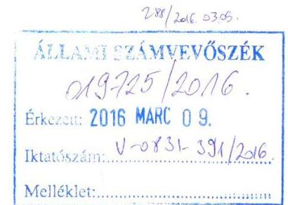
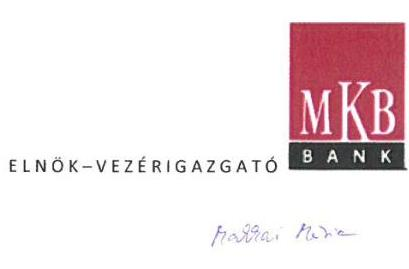

Iktatószám: A01-59/2016

Tárgy: Az ÁSZ „Adóbeszedési eljárások ellenőrzése - Egyes adóbeszedési tevékenységekkel kapcsolatos feladatellátás szabályszerűségének ellenőrzése" című jelentéstervezetének MKB Bank Zrt-re vonatkozó pontjainak véleményezése

# Tisztelt Elnök Úr! 

Köszönettel megkaptuk az Önök által 2016. február 11-én véleményezésre megküldött ÁSZ vizsgálat jelentés-tervezetét (iktatószám:V-0831-356/2016.).

A jelentés-tervezet megállapításait munkatársaimmal együtt részletesen áttekintettük és módosító, illetve kiegészítő észrevételeinket az alábbiakban küldjük meg a 35. és 36. oldalon található megállapításokkal kapcsolatban, amelyek az ÁSZ jelentéstervezete alapján részben 2014-től már megoldódtak:

- „Az IT rendszer ellenőrzése keretében részben alakították ki a kockázatokkal arányos védelmet...." MKB észrevétel: Az MKB Bank IT rendszereinek üzembiztos és zárt működését mind rendszerfelügyeleti, mind egyéb olyan kontrollok biztosítják, mint a naplóelemző rendszer, a központi jogosultságkezelő rendszer, adatszivárgás védelmi rendszer, valamint a privilegizált jogosultságkezelő és monitoring rendszer. Kérjük a megállapítást lehetőség szerint törölni, vagy módosítani, pontosítani.
- „Az informatikai alkalmazások jogosultsági rendszerét nem a szükséges és elégséges elv szerint alakították ki" MKB észrevétel: Az MKB Bank IT alkalmazásaihoz a központi jogosultságkezelő rendszeren keresztül feladott igénylést követő kétszintű jóváhagyás után lehetséges hozzáférni. A jogosultsági rendszer a legtöbb alkalmazás esetében szerepkör alapú jogokat tartalmaz, így csak olyan jogokhoz jut a felhasználó, ami a szerepköre alapján szükséges a munkájához. Kérjük a megállapítást lehetőség szerint törölni, vagy módosítani, pontosítani.
- „A kifizetők egyike sem gondoskodott megfelelően a privilégiumokkal rendelkező, szerverszolgáltatáshoz vagy technikai ok miatt létrehozott felhasználói fiókok szabályszerű kezeléséről" MKB észrevétel: A ritkán használt technikai felhasználókat, jelszavait a bank központi helyen páncélszekrényben őrzi, a hozzáféréseket naplózza. A kritikus rendszerek esetében a technikai vagy admin felhasználókkal való hozzáféréseket csak a privilegizált felhasználó-kezelő és monitoring rendszeren keresztül fogadjuk el. Amennyiben nem azon keresztül lépnek be, akkor erről a naplóelemző rendszerünk riasztást küld a bankbiztonsági területnek. A fentiek alapján kérjük lehetőség szerint az MKB-ra vonatkozóan a megállapítás törlését, vagy módosítását.

---

- „Az informatikai alkalmazások környezetében hiányzott a hálózati szeparáció" MKB észrevétel:A Bank hálózati topológiája megkülönböztet védett belső (géptermi és user) hálózatokat és DMZ-ket. A belső géptermi hálózatokon a bank nem tartja indokoltnak tűzfalak használatát. A fentiek alapján kérjük a megállapítás lehetőség szerinti törlését, vagy módosítását.
- „A teljes hálózat átjárható volt" MKB észrevétel:Kérjük annak pontosítását a jelentésben, hogy az ÁSZ mit ért a hálózat átjárhatósága alatt.
- „Kamatadó szempontból releváns szerverek és hálózati eszközök elérhetőek voltak távoli admin belépésre bármely hálózati végpontról" MKB észrevétel: A Bank az összes hálózati végpontját végpontvédelemmel védi. Ezt Cisco NAC SW-el biztosítja. Egy adott végpontról csak akkor érhető el a Bank belső hálózata, ha a végpontra csatlakoztatott eszköz banki eszköz (domain tag) és a teljes hálózati hozzáféréshez szükséges biztonsági SW-ek az adott eszközön telepítve és frissítve vannak. Ellenkező esetben a NAC controller blokkolja a hálózati hozzáférést. A fentiek alapján kérjük a megállapítás lehetőség szerinti törlését, vagy módosítását.
- „Részben valósult meg az alkalmazási, fejlesztési és tesztelési környezet biztonságos elkülönítése, mivel titkosítás nélküli távfelügyeletet alkalmazott a kifizető" MKB észrevétel:A távoli hozzáférés esetén a Bank PKI alapú kettős authentikációt alkalmaz. Távoli hozzáférés Check Point VPN kliensek használatával valósül meg, mely során ugyanúgy érvényesülnek a Cisco NAC SW mind a végpontvédelmi funkciók, mind a belső hálózatokon. A fentiek alapján kérjük az ÁSZ pontosítsa a megállapítását.
- „A fejlesztői és tesztelési környezetben nem működtette a hozzáférésekkel és kritikus eseményekkel kapcsolatos biztonsági kontrollokat" MKB észrevétel: A Core rendszerünk cseréje kapcsán megvizsgáljuk a lehetőségét annak, hogy a teszt és fejlesztői környezetben is kiépítsük az éles rendszerekkel egyenértékű biztonsági kontrollokat.

Tisztelt Elnök Úr, kérem, hogy amennyiben módjukban áll, módosító észrevételeinket szíveskedjenek figyelembe venni a jelentéstervezet véglegesítése során.

Amennyiben az észrevételeinkkel kapcsolatban bármilyen kérdésük merülne fel, természetesen továbbra is állunk szíves rendelkezésükre.

Budapest, 2016.február 29.
Tisztelettel:
ár. Balog Adám
Élnök- Vezérigazgató

---

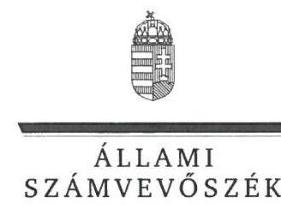

ELNÖK

Ikt.szám: V-0831-372/2016.

Dr. Balog Ádám úr
elnök-vezérigazgató
MKB Bank Zrt.

# Budapest 

## Tisztelt Elnök-vezérigazgató Úr!

Az ,,Adóbeszedési eljárások ellenőrzése - Egyes adóbeszedési tevékenységekkel kapcsolatos feladatellátás szabályszerűségének ellenőrzése" címmel készített számvevőszéki jelentéstervezetre tett észrevételét köszönettel megkaptam.

Az Állami Számvevőszék észrevételre vonatkozó álláspontjáról a felügyeleti vezető által készített részletes tájékoztatást csatoltan megküldöm.

Tájékoztatom Elnök-vezérigazgató urat, hogy a számvevőszéki jelentésben - az Állami Számvevőszékről szóló 2011. évi LXVI. törvény 29. § (3) bekezdése alapján - a figyelembe nem vett észrevételeket szerepeltetjük az elutasítás indokának feltüntetésével.

Budapest, 2016. 06. hó 16. nap
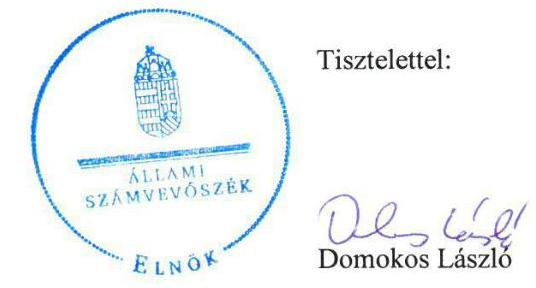

Melléklet: Tájékoztatás az elfogadott és el nem fogadott észrevételekről

---

# Tájékoztatás   az elfogadott és el nem fogadott észrevételekről 

Az „Adóbeszedési eljárások ellenőrzése - Egyes adóbeszedési tevékenységekkel kapcsolatos feladatellátás szabályszerűségének ellenőrzése" című jelentéstervezetre 2016. február 29-én érkezett észrevételét áttekintettük, annak kezelésével kapcsolatban a következő tájékoztatást adom.

## 1-3. észrevétel

Az ellenőrzés megállapította, hogy a jogosultsági rendszerből lekérdezett felhasználói fiókok között 28 különböző aktív technikai fiók létezett, amelyhez természetes személy nem köthető közvetlenül, és amelyek belépési jelszavát több ember is ismerhette. Valamint további 4 természetes személyhez egyértelműen köthető fiók is volt. A fent említett 32 belépési azonosító kiemelt jogosultsággal rendelkezett a CLAVIS alkalmazást futtató rendszernél. További 6 felhasználói fiók belépése le volt blokkolva. A 32
 hozzáférési fiók használatának átláthatósága korlátozott, azok kezelése magában hordozza a hiba lehetőségét, és sérti a szükséges és elégséges elvet is. A fentiek alapján az észrevétel 1-3. pontjában megjelölt megállapításaink helytállóak, azok módosítása nem indokolt.

## 4-7. észrevétel

A 4-7. észrevételhez kapcsolódó megállapítások a 2010-2013. évekre vonatkoznak, a jelentéstervezetben szerepel, hogy a 2014. évben a hiányosságokat az MKB Bank Zrt. megszüntette.
A 2010-2013. években a kamatadó szempontjából releváns kiszolgáló (szerver) számítógépek és az ezeket összekötő aktív hálózati eszközök távoli be- és kimeneti csatornái (interfészei) bármelyik hálózati végpontról - több ezer munkaállomásról - elérhetők voltak. Ez azt jelentette, hogy hiányzott a hálózati szeparáció, a teljes hálózat átjárható volt, a gyakorlatban semmilyen hálózati védelmi funkciót ellátó elválasztás nem valósult meg.
Az MKB Bank Zrt.-nél az informatikai üzemeltetés távoli adminisztrációs feladataihoz titkosítás nélküli, az irodai hálózaton belüli távfelügyelet megoldásokat használtak, egyezményben és/vagy szabványban rögzített olyan protokollt, ami leírja, hogy a hálózat résztvevői miképp tudnak egymással kommunikálni, adatot továbbítani. Az ilyen típusú üzenet - akár az adminisztrátori jelszó is - az üzenet továbbításában részt vevők, vagy azt lehallgatók számára olvasható. A fentiek alapján a megállapítások módosítása nem indokolt.
A dokumentumok ismételt áttekintését követően az MKB Zrt. elnök-vezérigazgatójának megfogalmazott 2. számú javaslatot a jelentéstervezetből töröljük.

---

# 8. észrevétel 

A biztonsági kontrollok teszt és fejlesztői környezetben történő kiépítésének vizsgálatára vonatkozó tájékoztatásukat köszönjük. Az észrevétel a jelentéstervezet megállapítását nem vitatja, annak módosítása nem indokolt.

Budapest, 2016. 03. hó 16. nap

Makkai Mária
felügyeleti vezető

---

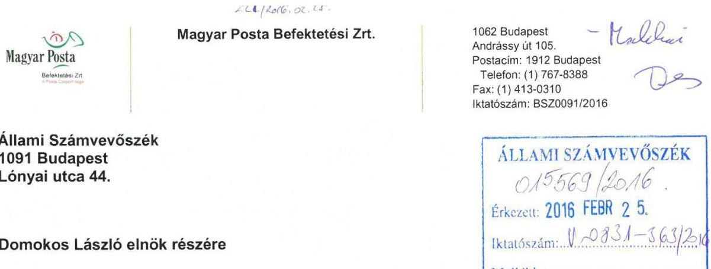

# Tisztelt Domokos László Úr! 

A Magyar Posta Befektetési Zrt. (székhely: 1062 Budapest, Andrássy út 105.; adószám: 24128526-2-42; cégjegyzékszám: 01-10-047536; a továbbiakban: „Társaság") a megadott 15 napos határidőn belül ezúton küldi meg az Állami Számvevőszék V-0831-008/2015. iktatószámú számvevőszéki jelentéstervezetével - „Egyes adóbeszedési tevékenységekkel kapcsolatos feladatellátás szabályszerűségének ellenőrzés" - kapcsolatos észrevételeit.

## Javaslatokhoz tett észrevételek

A tervezet 35. oldalán két javaslat lett megfogalmazva, melyek közül az első hivatkozás pénzügyi szolgáltatókra vonatkozik. Felhívjuk a T. ÁSZ figyelmét, hogy Magyar Posta Befektetési Zrt. (a továbbiakban MPBSZ) tevékenységét nem a hitelintézetekről és a pénzügyi vállalkozásokról szóló 2013. évi CCXXXVII. törvény (Hpt.), hanem a befektetési vállalkozásokról és az árutőzsdei szolgáltatókról, valamint az általuk végezhető tevékenységek szabályairól szóló 2007. évi CXXXVIII. törvény (Bszt.) szabályozza, ennél fogva az MPBSZ befektetési vállalkozásnak és nem pénzügyi szolgáltatónak minősül, így a tervezetben szereplő jogszabályi hivatkozások az MPBSZ vonatkozásában pontatlanok.

Azonban a hivatkozott Hpt. rendelkezések tartalmukban megegyeznek a Bszt. vonatkozó rendelkezéseivel, ezért a megállapításokat tartalmuk szerint, érdemben tudtuk vizsgálni és azokra az alábbi észrevételeket tesszük.

Megjegyezni kívánjuk továbbá, hogy az MPBSZ - annak ellenére, hogy 2012. évben alakult - tevékenységét csak 2013. évben kezdte meg, a Pénzügyi Szervezetek Állami Felügyeletének H-EN-III-8/2013. számú határozata alapján.

## 5.1 megállapítás

Az 5.1 megállapítás általános - az MPBSZ-t, az MPÉ Zrt.-t és az MKB Zrt.-t egyaránt érintő hiányosságként fogalmazza meg, hogy „a kockázatokkal arányos védelem részben felelt meg a jogszabályi előírásoknak", azonban nem kerül megnevezésre konkrét, az MPBSZ vonatkozásában feltárt hiányosság.

### 5.1 megállapítás 2. bekezdéséhez tett észrevételek

Az első mondat „részben tettek eleget" kifejezést használja, hivatkozva az 535/2013. (XII.30.) Korm. rendelet informatikai rendszer zártságára és szabályozott jogosultságkezelés követelményére vonatkozó részeire.

---

Álláspontunk szerint az informatikai rendszerek zártságát számos kontroll biztosítja, amit 2015 évben elvégzett teljes körű kockázatelemzés is alátámasztott. Az informatikai rendszerek jogosultságait egy központosított jogosultságkezelési rendszer támogatja, továbbá a Rendelet 5. §-ban szereplő munkakörök betöltéséhez szükséges informatikai ismereteket az MPBSZ belső szabályzatában (IBSZ (3.1.2) is rögzíti.

A megállapítás jelen formájában - megjelölt konkrétumok hiányában - azt a látszatot kelti, hogy MPBSZ-nél jelentős hiányosságok állnak fenn, ami álláspontunk szerint teljes mértékben alaptalan.

A megállapításban foglaltak szerint „Az informatikai rendszer ellenőrzése keretében részben alakították a kockázatokkal arányos védelmet...", ezzel szemben álláspontunk szerint a kockázatok Bankcsoport szinten folyamatosan értékelésre és elemzésre kerülnek, így általánosan MPBSZ nem tudja elfogadni a megállapítást.

A tervezet megállapítja, hogy „az informatikai alkalmazások jogosultsági rendszerét nem a szükséges és elégséges elv szerint alakították ki". Ezzel szemben a szükséges és minimális elv alkalmazása a jogosultsági rendszerek kialakításánál az IBSZ által is elvárt alapelv, amire az MPBSZ nagy hangsúlyt fektet. A megállapításból nem derül ki, hogy az ÁSZ mire alapozza ezt az általános megállapítást.

A pontos megnevezés hiányában feltételezzük, hogy a megállapításban szereplő „A logikai védelem keretében..." kezdetű mondat a Clavis rendszerre vonatkozik, amivel kapcsolatban kérjük az alábbiak figyelembevételét:

- A Clavis rendszer szállítója a hazai piac meghatározó szereplője, aki az MPBSZ hosszú távú stratégiai partnere. A szállító megszűnését az MPBSZ ebből fakadóan rendkívül kis kockázatúnak tartja.
- A Clavis rendszer a DOM-P Informatikai Szolgáltató Zrt. infrastruktúráján fut, ezért szállító megszűnése esetén is biztosított a rendszer további működése.

# 5.1 megállapítás 4. bekezdéséhez tett észrevételek 

Álláspontunk szerint a jelentés alábbi mondatában tett megállapítás megalapozatlan, ugyanis a második tagmondatban kifejtettek semmilyen módon nem támasztják alá az első tagmondatban szereplő megállapítást. „A pénzügyi szolgáltató részben alakította ki a szervezeti és működési rendet, valamint a felelősségi, tájékoztatási és nyilvántartási szabályokat, mivel kiszervezett tevékenység esetében külső szolgáltató részére is biztosította az informatikai rendszerek hozzáférési kontrollját."

Felhívjuk továbbá a T. ÁSZ figyelmét az alábbiakra:

- A kiszervezett szolgáltató és DOM-P között részletes szerződés került megkötésre, amiben egyértelműen rögzítésre került a felelősségelhatárolás kérdése is.
- A jogosultságok kezelésében a jogosultság beállítása és a jogosultság engedélyezése funkciók szigorúan elválnak egymástól. Kiszervezett szolgáltatások esetében az előbbit tölti be a kiszervezett szolgáltató, míg az utóbbit az MPBSZ-nél kinevezett adatgazdák.
- A jogosultság menedzsmentjét a központosított jogosultság menedzsment folyamatokkal látja el a megállapodás alapján a kiszervezett szolgáltató.
- A szervezeti és működési rendeket MPBSZ az üzleti funkciók tekintetében kialakította, az IT funkciók tekintetében az a kiszervezett szolgáltató feladata.

A fenti indokok alapján, az idézett mondatban foglaltakat vitatjuk.

---

A jelentés „Az informatikai rendszer legpontosabb elemeinek egyértelmű és visszakereshető" kezdetű mondatában kérjük a T. ÁSZ-t, hogy a „tranzakció" szót szíveskedjen „változásokra" cserélni, a fogalom egyértelműsítése érdekében.
„A kifizető részben rendelkezett a rendszer működése szempontjából..." kezdetű megállapítás a naplózási rendszer hiányosságára utal. Álláspontunk szerint a működtetett naplózási rendszer a kockázatokkal arányos módon alkalmas a biztonságilag kritikus események rögzítésére és a bevezetett riasztások hatékonyan támogatják a biztonsági incidensek korai felismerését. Nem vitatjuk, hogy a naplózási és naplóelemzési képesség fejlesztése folyamatos feladatot jelent, így mindig lehet olyan területeket találni, ahol továbbfejlesztésre van lehetőség. Ugyanakkor a megállapítás jelenlegi formájában cáfolni látszik mind a folyamatos naplóelemzési képesség létezését, mind a kialakított naplózási rend elégségességét.

A jelentés alábbi mondatában szereplő megállapítást megalapozatlannak tartjuk, ugyanis a második tagmondatból nem lehet az első tagmondatban tett megállapításra következtetni. „Az alkalmazási, fejlesztési és tesztelési környezetek biztonságos elkülönítése részben volt biztosított, mivel a külső fejlesztők is rendelkeztek az éles rendszerhez való hozzáférési jogosultsággal"
A két tagmondat között nincs ok-okozati összefüggés, hiszen biztonságosan elkülönített (tűzfalak, jogosultsági rendszer stb.) környezetek esetén, az, ha fejlesztők hozzáférést kapnak éles rendszerekhez is, nem jelenti a környezetek elkülönülésének megszünését.

Felhívjuk a T. ÁSZ figyelmét, szükséges tekintettel lenni arra, hogy a fejlesztő cég az éles hozzáférést milyen jogviszony esetében kapta, ugyanis minden ilyen esetben az MPBSZ a fejlesztő céggel támogatási szerződést kötött, akinek alkalmazottja ezen jogviszony keretében és nem mint fejlesztő férhetett hozzá az éles rendszerhez, továbbá a hozzáférők köre szigorúan korlátozott a támogatásban közreműködő személyekre.

# Összefoglalva 

A fentieket összegezve megjegyezni kívánjuk, hogy a megállapításban foglaltak nem állnak összhangban az MPBSZ saját magáról kialakított képével. A T. ÁSZ által feltárt valamennyi hiányosság általános megfogalmazásban, konkrétumok megjelölése nélkül került rögzítésre, ennek következtében - a feltárt hiányosság ismerete nélkül - hasonlóképp általános észrevételeket tudunk megfogalmazni. Erre való tekintettel kérjük a T. ÁSZ-t, hogy észrevételeink elfogadása esetén szíveskedjen a megállapításokat visszavonni, annak hiányában a megállapításait alátámasztó bizonyítékokat rendelkezésünkre bocsátani, illetőleg pontosítani a megállapításait, annak érdekében, hogy azok részletes vizsgálatát követően lehetőségünk nyíljon teljes körű válaszadásra, valamint segítségünkre legyen az esetleges problémák meghatározásához és mielőbbi javításához.

Mindezek alapján kérjük a T. ÁSZ-t, hogy a megállapításokhoz fűzött észrevételek alapján értékelje újra az MPBSZ-re vonatkozó részeket, melyhez készséggel állunk a T. ÁSZ rendelkezésére, akár személyes konzultáció erejéig is.

Budapest, 2016. február 24.
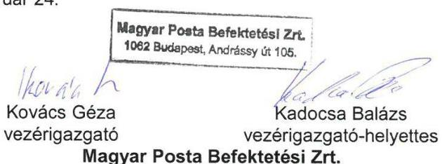

Magyar Posta Befektetési Zrt.

---

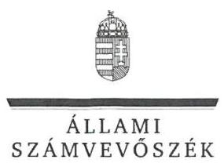

ELNÖK

Ikt.szám: V-0831-370/2016.

# Kovács Géza úr 

vezérigazgató
Magyar Posta Befektetési Szolgáltató Zrt.

## Budapest

## Tisztelt Vezérigazgató Úr!

Az „Adóbeszedési eljárások ellenőrzése - Egyes adóbeszedési tevékenységekkel kapcsolatos feladatellátás szabályszerűségének ellenőrzése" címmel készített számvevőszéki jelentéstervezetre tett észrevételét köszönettel megkaptam.

Az Állami Számvevőszék észrevételre vonatkozó álláspontjáról a felügyeleti vezető által készített részletes tájékoztatást csatoltan megküldöm.

Tájékoztatom Vezérigazgató urat, hogy a számvevőszéki jelentésben - az Állami Számvevőszékről szóló 2011. évi LXVI. törvény 29. § (3) bekezdése alapján - a figyelembe nem vett észrevételeket szerepeltetjük az elutasítás indokának feltüntetésével.

Budapest, 2016. 0. hó 0. nap
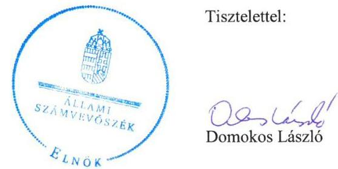

Tisztelettel:

Dombos László

Melléklet: Tájékoztatás az elfogadott és el nem fogadott észrevételekről

---

# Tájékoztatás   az elfogadott és el nem fogadott észrevételekről 

Az „Adóbeszedési eljárások ellenőrzése - Egyes adóbeszedési tevékenységekkel kapcsolatos feladatellátás szabályszerűségének ellenőrzése" című jelentéstervezetre 2016. február 25-én érkezett észrevételét áttekintettük, annak kezelésével kapcsolatban a következő tájékoztatást adom.
Ahogy azt az észrevétel tartalmazza, a befektetési vállalkozásokról és az árutőzsdei szolgáltatókról, valamint az általuk végezhető tevékenységek szabályairól szóló 2007. évi CXXXVIII. törvénynek, valamint a hitelintézetekről és a pénzügyi vállalkozásokról szóló 1996. évi CXII. törvénynek és a pénzügyi intézmények, a befektetési vállalkozások és az árutőzsdei szolgáltatók informatikai rendszerének védelméről szóló 535/2013. (XII. 30.) Kormányrendeletnek az informatikai rendszerek védelmére vonatkozó rendelkezései egymással összhangban vannak, tartalmukban megegyeznek, ezért a jelentéstervezet megállapításai megalapozottak. A jelentéstervezet vonatkozó részeiben a jogszabályi hely megjelölését pontosítjuk.

A dokumentumok ismételt áttekintését követően a jelentéstervezet 5.1. számú megállapítás első bekezdés első mondatában az MPBSZ tevékenysége megkezdésének évét 2012. évről 2013. évre pontosítjuk.

## 5.1 megállapítás

A jelentéstervezet 5.1. számú megállapítása összefoglalás, az abban szereplő állítás részletes kifejtése és alátámasztása a megállapítást követő fejezetben történik, ezért a megállapítás módosítása nem szükséges

## 5.1 megállapítás 2. bekezdéséhez tett észrevételek

A rendelkezésre bocsátott dokumentumok alapján az ellenőrzés megállapította, hogy az ellenőrzött időszakban hatályban lévő IBSZ-ben nem határozták meg az egyes munkakörök betöltéséhez szükséges informatikai ismereteket. Az ellenőrzött időszakot követően (2015. február 10-én) hatályba lépett IBSZ 3.1.2. pontja tartalmaz előírásokat a munkavállalók informatikai ismereteire vonatkozóan, azonban ez az ellenőrzött időszakra vonatkozó megállapítást nem befolyásolja, ezért a megállapítás módosítása nem indokolt.

---

Az ÁSZ ellenőrzése nem Bankcsoport szinten értékelte az informatikai rendszer védelmét, hanem az MPBSZ Zrt. vonatkozásában a kamatadó számítását végző informatikai rendszerek tekintetében. Az MPBSZ Zrt.-re vonatkozó, a kockázatokkal arányos védelem részben történő kialakítására, az informatikai alkalmazások jogosultsági rendszerének
 nem a szükséges és elégséges elvek szerint történő kialakítására vonatkozó, azt alátámasztó konkrétumok az 5.1. számú megállapítás 4. bekezdésében találhatók. A fentiek alapján a megállapítás módosítása nem szükséges.
„A logikai védelem keretében.... " kezdetű mondat valóban a Clavis rendszerre vonatkozik. Az ellenőrzés megállapította, hogy a MPBSZ Zrt. nem rendelkezett olyan letéti megállapodással, amely alapján a kamatadó számításban kritikus funkciót ellátó szoftver forráskódját egy független harmadik fél tárolja, ezért nem tett eleget a Bszt. 12. § (7) bekezdésében foglaltaknak, mely szerint a befektetési vállalkozásnak rendelkeznie kell olyan dokumentációval, amely az üzleti tevékenységet közvetlenül vagy közvetve támogató informatikai rendszerek folyamatos és biztonságos működését - még a szállító, illetőleg a rendszerfejlesztő tevékenységének megszünése után is - biztosítja. Az észrevételben leírtak a megállapítást nem cáfolják. A fentiek alapján a megállapítás módosítása nem indokolt.

# 5.1. megállapítás 4. bekezdéséhez tett észrevételek 

Köszönjük a DOM-P Informatikai Szolgáltató Zrt. szerződésére vonatkozó tájékoztatást. Az informatikai rendszer biztonságára az jelentett kockázatot, hogy a DOM-P Informatikai Szolgáltató Zrt. és az MPBSZ Zrt. is rendelkezett egy időben a hozzáférési jogok adminisztrációját lehetővé tevő felhasználói jogokkal. Ez azt jelentette, hogy a szolgáltatónak lehetősége volt létrehozni, majd törölni - akár privilegizált jogosultságú - felhasználót a rendszerekben úgy, hogy az MPBSZ Zrt.-nek nem volt kontroll lehetősége azt felderíteni. Az egyértelműség érdekében a megállapítást az alábbiak szerint pontosítjuk:
,,Az MPBSZ Zrt. a szervezeti és működési rend, valamint a felelősségi, tájékoztatási és nyilvántartási szabályok meghatározása során részben vette figyelembe az informatika alkalmazásából fakadó biztonsági kockázatokat, mivel a kiszervezett tevékenység esetében a saját dolgozója és a szállító munkatársai részére is biztosította a hozzáférési jogok adminisztrációját lehetővé tevő felhasználói jogokat. "

A „tranzakció" szó az adatbázisban végrehajtott logikailag összetartozó, egységként kezelt műveletsort jelenti, a „változás" szó nem fedi le ennek pontos tartalmát, ezért a jelentéstervezet „Az informatikai rendszer legfontosabb elemeinek egyértelmű és visszakereshető..." kezdetű mondatára vonatkozó észrevétel átvezetése nem indokolt.

Az észrevétel nem vitatja, hogy a naplózási és a naplóelemzési képesség továbbfejlesztése indokolt. Az ellenőrzés során a kamatadó kifizetése, elszámolása és megfizetése szempontjából kritikus folyamatok eseményei naplóállományának elemzéséről dokumentumok nem álltak rendelkezésre. Az egyértelműség érdekében a megállapítást az alábbiak szerint pontosítjuk:

---

„A kifizető részben rendelkezett a kamatadó kifizetése, elszámolása és megfizetése szempontjából kritikus folyamatok eseményei naplózásának érdemi értékelésére alkalmas biztonsági környezettel."

A jelentéstervezetnek az a megállapítása, hogy az alkalmazási, fejlesztési és tesztelési környezetek biztonságos elkülönítése részben volt biztosított, helytálló, mert az egyes környezetekhez kapcsolódó eszközök elkülönítését az MPBSZ Zrt. megfelelően elvégezte, azonban a hozzáférési jogosultságok kiosztása során az elkülönítés nem érvényesült, mivel külső fejlesztők is rendelkeztek az éles rendszerhez való hozzáférési jogosultsággal. Az egyértelműség érdekében a megállapítást az alábbiak szerint pontosítjuk:
„Az alkalmazási, fejlesztési és tesztelési környezetek biztonságos elkülönítése részben volt biztosított, az MPBSZ Zrt. az eszközök biztonságos elkülönítését megfelelően elvégezte, azonban a hozzáférési jogosultságok kiosztása során az elkülönítés nem érvényesült, mivel a külső fejlesztők is rendelkeztek az éles rendszerhez való hozzáférési jogosultsággal."

Az ÁSZ konkrétumokat tartalmazó, részletes megállapításait a jelentéstervezet 5.1. és 5.2. számú megállapításai tartalmazzák. A jelentéstervezet megállapításait a fentiek szerint pontosítjuk, további módosításuk nem indokolt.

Budapest, 2016. 05. 06.

Makkai Mária
felügyeleti vezető

---

#  

Magyar Posta Életbiztosító Zrt. 1535 Budapest, Pf. 952
Fax: 06-1-822-4298
E-mail: info@mgb.hu
Internet: www.postabiztosito.hu
Telefonos Ügyfélszolgálat:
0640200480 (H-F-B:00-18:00)

## Állami Számvevőszék

1052 Budapest, Apáczai Cs. J. u. 10. 1364 Budapest 4. Pf. 54

## dr. Makkai Mária Felügyeleti Vezető

részére

Tárgy: Észrevételek az egyes adóbeszedési tevékenységekkel kapcsolatos feladatellátás szabályszerűségének ellenőrzése tárgyában elkészített jelentéstervezetre

Tisztelt Felügyeleti Vezető Asszony!
Társaságunk 2016.02.12.-én kézhez vette a T. Állami Számvevőszék által az egyes adóbeszedési tevékenységekkel kapcsolatos feladatellátás szabályszerűségének ellenőrzése tárgyában összeállított jelentéstervezetét (továbbiakban: „Jelentéstervezet").

A Jelentéstervezet összegzésében megállapítja, hogy T. Állami Számvevőszék vizsgálata során, melynek fókuszában alapvetően a Nemzeti Adó- és Vámhivatal (továbbiakban: „NAV") működésének ellenőrzése állt, megállapította, hogy a kamatadó kifizetőknél a vizsgálat tárgyéveire - mely a Jelentéstervezet bizonyos részeiben a 2010-2014 közötti időszakként, más részeiben a 2014-es évként került megjelölésre - végzett ellenőrzés során a NAV vizsgálata nem terjedt ki az adózó által a könyvek, nyilvántartások vezetéséhez, bizonylatok feldolgozásához alkalmazott szoftverekre és informatikai rendszerekre. Ezek pedig a T. Állami Számvevőszék szerint olyan hiányosságoktól terhesek, melyek az adóbeszedés eredményességét veszélyeztetik.

A T. Állami Számvevőszék az összegzésben is említett hiányosságokat a Magyar Posta Életbiztosító Zrt.-t érintő megállapításokat a Jelentéstervezet 35-37 oldalain az 5.1. és 5.2. pontokban összegzi, ezek több fő téma köré csoportosítva az alábbiak szerint foglalhatók össze:

1. A Magyar Posta Életbiztosító Zrt.-nél a 2010-2014 közötti időszakban alkalmazott informatikai rendszerek csak részben elégítették ki a kockázatokkal arányos védelem követelményét, és csak részben feleltek meg a hitelintézetekről és a pénzügyi vállalkozásokról 1996. évi CXII. törvény (továbbiakban: „Hpt."), valamint a pénzügyi intézmények, a befektetési vállalkozások és az árutőzsdei szolgáltatók informatikai rendszerének védelméről szóló 535/2013. (XII. 30.) Korm. rendelet rendelkezéseknek (Jelentéstervezet 5.1. pont 35. és 37. oldalak).
2. Nem kerültek szabályozásra a munkakörök betöltéséhez szükséges informatikai ismeretekkel kapcsolatos követelmények.
3. A biztosítónál csak részben került kialakításra az informatikai rendszerek kockázatokkal arányos védelme, kritikus elemek zártságát, teljes körűségét biztosító ellenőrzési eljárások.
4. Az informatikai alkalmazások jogosultsági rendszere nem a szükséges és elégséges elv szerint került kialakításra, így a biztosító csak részben gondoskodott a rendszeres és ellenőrzött felhasználói adminisztrációról, privilégiumokkal rendelkező szerverszolgáltatásokhoz technikai ok miatt létrehozott felhasználói fiókok szabályszerű kezeléséről.
5. A biztonsági környezet részben volt alkalmas a kritikus folyamatok elemeinek naplózására, érdemi értékelésére, a biztosító a tranzakciók naplózásának, valamint a kulcsszerepet betöltő rendszeresemények feldolgozásának hiánya miatt nem biztosította az informatikai rendszer legfontosabb elemeinek egyértelmű és visszakereshető azonosítását.
6. A logikai védelem érdekében a biztosító nem kötött olyan letéti megállapodást, melyben rögzítették volna, hogy a kamatadó számításában kritikus funkciót ellátó, aktuálisan használt szoftver környezet forráskódját a felhasználótól és fejlesztőtől független harmadik fél tárolja, ezáltal a szállító, rendszerfejlesztő tevékenységének megszűnése után is biztosítva a folyamatos és biztonságos működést.

Magyar Posta Életbiztosító Zrt. 1022 Budapest, Bég u. 3-5.

Fővárosi Bíróság mint Cégbíróság
Cégjegyzékszám: 01-10-044750
Adószám: 12833625-4-44

Erste Bank Hungary Nyrt.
Bankszámlaszám: 11991102-06320399-10000001

---

# Posta 

Biztosító

Magyar Posta Életbiztosító Zrt. 1535 Budapest, Pf. 952
Fax: 0614234298
E-mail: info@mgb.hu
Internet: www.postabiztosito.hu
Telefonos Ügyfélszolgálat:
0640200480 (H-P B:00-18:00)

7. A biztosító kamatjövedelmeket kezelő informatikai rendszerének biztonsági kontrolljaival kapcsolatos hiányosságok hozzájárulhattak a kamatadó összegének helytelen kiszámításához és késedelmesen teljesített bevallásához, befizetéséhez.

Társaságunk az egyes témákhoz a fentebb szereplő sorrendben, a számára az Állami Számvevőszékről szóló 2011. évi LXVI. törvény (továbbiakban: „ÁSZ tv.") 29.§.(2) bekezdésében biztosított lehetőséggel élve a törvény szabta határidőn belül a következő észrevételeket kívánja tenni.

## 1.) Jogszabályi kötelezettségek:

A T. Állami Számvevőszék által (lásd 35. és 37. oldalak) felhívott jogszabályi rendelkezésekből fakadó kötelezettségek részbeni teljesítésével kapcsolatos megállapítások vonatkozásában előadjuk az alábbiakat.

A Magyar Posta Életbiztosító Zrt. a - korábban a biztosítók felügyeletét ellátó - Pénzügyi Szervezetek Állami Felügyelete által 2002.12.10.-én II/563/2002. sz. kiadott engedélyével - azóta folyamatosan működő biztosító társaság.

Társaságunk tevékenységét nem a jelentéstervezetben hivatkozott a hitelintézetekről és a pénzügyi vállalkozásokról szóló 1996. évi CXII. törvény (továbbiakban: „Hpt.") és a kapott dokumentumban szintén említett 535/2013. (XII. 30.) Korm. rendelet, hanem különböző, a biztosítási tevékenységre irányadó ágazati jogszabályok, így a

- a vizsgálat időszakban hatályban volt, a biztosítókról és a biztosítási tevékenységről 2003. évi LX. törvény (továbbiakban: „Régi Bit.")
- jelenleg pedig a 2016.01.01.-től hatályos a biztosítási tevékenységről szóló 2014. évi LXXXVIII. törvény (továbbiakban: „Új Bit.") és
- a szintén 2016.01.01.-től hatályos a pénzügyi intézmények, a biztosítók és a viszontbiztosítók, továbbá a befektetési vállalkozások és az árutőzsdei szolgáltatók informatikai rendszerének védelméről 42/2015. (III. 12.) Korm. rendelet
szabályozzák, és írják elő számára azokat a biztosító kritikus informatikai rendszereire vonatkozó kötelező biztonsági és ellenőrzési mechanizmusokat is, melyeket működésébe beépíteni köteles.

A biztosító folyamatait és informatikai rendszereit a felsorolt - a biztosítók működésére és a biztosítási tevékenység végzésére vonatkozó rendelkezéseket tartalmazó - ágazati jogszabályokra figyelemmel alakította ki, üzletmenetét eszerint folytatja, jogszabályi megfelelőségének vizsgálata ezen törvényi előírások mentén vizsgálható.

## 2.) Munkakörök betöltéséhez szükséges informatikai ismeretek rögzítése:

A T. Állami Számvevőszék Jelentéstervezetében (lásd 35. oldal) megállapította, hogy az általa ellenőrzött kifizetők egyike, így a Magyar Posta Életbiztosító Zrt. sem szabályozta az egyes munkakörök betöltéséhez szükséges informatikai ismeretekkel kapcsolatos követelményeket.

Előadjuk, hogy a fenti kötelezettség a biztosítót a vizsgált időszakban 2010-2014 között csak 2014.01.01.-től kezdődő hatállyal terhelte, tekintve, hogy a Régi Bit. ezt előíró 65/A.§. szakasz (9) bekezdése ekkor került beiktatásra a törvény szövegébe.

Magyar Posta Életbiztosító Zrt.
1532 Budapest, Bég u. 3-5.

Fővárosi Bíróság mint Cégbíróság
Cégjegyzékszám: 01-10-044750
Adószám: 12833625-4-44

Erste Bank Hungary Nyrt.
Bankszámlaszám: 11991102-06320399-10000001

---

# Posta   Biztosító 

Magyar Posta Életbiztosító Zrt. 1535 Budapest, Pf. 952 Fax: 0614234298 E-mail: info@mpb.hu
Internet: www.postabiztosito.hu Telefonos Ügyfélszolgálat: 0640200480 (H-P B:00-18:00)

A fentiekből következően a megállapítás kizárólag a vizsgált időszak egy részében, 2014.01.01.-től helytálló, ebben a tekintetben kérjük a T. Állami Számvevőszéket, hogy a Jelentéstervezetben szereplőket az időtartam tekintetében pontosítani szíveskedjék akként, hogy az nem a teljes vizsgált 2010-2014 közötti időszakban állt fenn.

## 3.-5.) Informatikai rendszerek ellenőrzési mechanizmusaival, arányos védelmével, felhasználói adminisztrációval, naplózással kapcsolatos megállapítások:

A jelentéstervezet szerint a T. Állami Számvevőszék a Társaságunkat is érintő NAV kamatadóval kapcsolatos ellenőrzési tevékenységét a 2010-2014 évekre vonatkozóan ellenőrizte.

Ehelyütt ismételten utalunk arra, hogy vizsgált időszakban hatályban volt Régi Bit. szövegébe csak 2014.01.01.-i hatállyal került beépítésre a konkrét informatikai biztonsági követelményeket és a Jelentéstervezetben szereplő szükséges és elégséges elven alapuló kockázatokkal arányos védelem kialakítását tárgyaló 65/A.§. szakasz.

A 2016.01.01.-től hatályos Új Bit. többek között a 94.§. szakaszban tartalmazza az erre vonatkozó rendelkezéseket. A T. Állami Számvevőszék által is említett informatikai rendszerek zártságát, biztonságát elősegítő technikai részletekkel kapcsolatos további informatikai előírásokat a szintén 2016.01.01-én hatályba lépett a biztosítók és a viszontbiztosítók, továbbá a befektetési vállalkozások és az árutőzsdei szolgáltatók informatikai rendszerének védelméről szóló 42/2015. (III. 12.) Korm. rendelet rögzíti.

A Jelentéstervezet által vizsgált tárgyidőszakban tehát álláspontunk szerint részletes, az informatikai biztonsági rendszerekkel kapcsolatos, naplózási, forráskódok letétbe helyezésére és egyéb a T. Állami Számvevőszék által említett tevékenységekre részletes rendelkezéseket előíró jogszabály nem volt hatályban.

A Magyar Posta Életbiztosító Zrt. az általa működése során használt informatikai rendszerek zártságának, védelmének és megfelelő biztonságának megteremtésére maradéktalanul törekedett a vizsgált években is.

Előadjuk, hogy annak ellenére, hogy a fentebb kifejtetteknek megfelelően erre nézve konkrét törvényi előírás a biztosítóra nézve nem volt hatályban a vizsgált időszakban, a rendszerekben végrehajtott a kamatadó számítást érintő változásokat, igényeket, fejlesztési leírásokat Társaságunk Informatikai Osztálya papír alapon és elektronikus formában is dokumentálja, a módosítások időpontját és okát is magába foglalóan.

Utalunk arra, hogy a Magyar Posta Életbiztosító Zrt. az általa a kamatadó kiszámítására használt számítógépes programot úgy működtette a vizsgált
 időszak nagy részében is annak ellenére, hogy az előzőekben kifejtettek szerint erre nézve törvényi kötelezettsége nem volt, hogy abból a kamatadó számítás szempontjából kritikus folyamatok elemei visszakövethetők, tételesen tranzakciónként elkülöníthetően megállapítható és kereshető a kamatadó számításának kiinduló értéke, az egyes műveletekhez szükséges alapadatok, és a végösszeg is. Ez álláspontunk szerint megfelel a Jelentéstervezetben hiányolt naplózási tevékenységnek.

Kiemeljük, hogy a Magyar Posta Életbiztosító Zrt.-nél a felügyeletének ellátására jogosult Magyar Nemzeti Bank (továbbiakban: „MNB") a 2014-es évben a H-JÉ-II-B-24/2015. sz. határozatával lezárt átfogó vizsgálatot tartott.

A határozatban a felügyeleti szerv a biztosító informatikai biztonsági helyzetére nézve megállapítást nem tett, a biztosító informatikai működésében a jogszabályi előírásoktól való eltérést nem állapított meg. A határozathoz kapcsolt vizsgálati jelentésben az MNB a biztosítónál az informatikai rendszerből eredő nettó kockázatot mérsékeltként jellemezte, kiemelte, hogy 2011-

Magyar Posta Életbiztosító Zrt. 1522 Budapest, Bég u. 2-5.

Fővárosi Bíróság mint Cégbíróság
Cégjegyzékszám: 01-10-044750
Adószám: 12833625-4-44

Erste Bank Hungary Nyrt.
Bankszámlaszám: 11991102-06320399-10000001

---

# Posta 

Biztosító
Magyar Posta Életbiztosító Zrt. 1535 Budapest, Pf. 952
Fax: 0634234298
E-mail: info@mpb.hu
Internet: www.postabiztosito.hu
Telefonos Úgyfélszolgálat:
0640200480 (H-P 8:00-18:00)
és felügyeleti vizsgálat óta bekövetkezett, az informatikai biztonságot érintő változások irányát pozitívnak értékelte, előremutatónak tartotta a sérülékenység vizsgálatok elvégzését, valamint a központi naplózási rendszer bevezetésének megkezdését.

Az eddig előadottakat összegezve a Magyar Posta Életbiztosító Zrt. úgy nyilatkozik, hogy álláspontja szerint a Jelentéstervezet által érintett tárgyidőszakban, azaz a 2010-2014 években működése az informatikai rendszerek biztonságát, és a kamatadó számítását, bevallását illetően az akkor hatályban volt jogszabályi rendelkezéseknek maradéktalanul megfelelt, melyet az MNB vizsgálat eredménye is alátámaszt.

Társaságunk ugyanakkor természetesen a részben az Új Bit., részben pedig a viszontbiztosítók, továbbá a befektetési vállalkozások és az árutőzsdei szolgáltatók informatikai rendszerének védelméről 42/2015. (III. 12.) Korm. rendelet egyaránt 2016.01.01.-től hatályba lépő biztosítási ágazatot érintő részletesebb informatikai előírásokat tartalmazó rendelkezéseinek hiánytalan teljesítése iránt szükséges lépések megtételéről jelenleg is folyamatosan gondoskodik.

## 6.) Logikai védelem, forráskód letétbe helyezése:

A T. Állami Számvevőszéknek a kamatadó számítását végző program forráskódjának letétbe helyezésének elmaradását, mint kritikus kockázati kitettséget taglaló jelen iratban fentebb 6. ponttal jelzett megállapítására (lásd 35. oldal) előadjuk az alábbiakat.

A Magyar Posta Életbiztosító Zrt. egyes szerződései kapcsán a kamatadó pontos összegének kiszámítását a „LISY" elnevezésű számítógépes program végzi.

Az itt kiszámolt érték kerül az IVVR és SAP rendszerek segítségével könyvelésre és bevallásra. A kamatadó összegére a két utóbb említett rendszer nincs kihatással, azt a LISY által megállapított összegben kezelik változatlanul a saját funkciójuknak megfelelően (bevallás, kifizetés stb.). A Jelentéstervezet egyik fókuszpontjában álló kamatadó kiszámítása szempontjából a biztosító által használt programok közül tehát ez a rendszer bír a legnagyobb jelentőséggel.

Felhívjuk a figyelmet arra, hogy a Magyar Posta Életbiztosító Zrt. és az ID Innovative Datenverarbeitung GmbH között 2002.09.01.-én létrejött és 2003.01.23.-án módosított szerződés alapján - tekintve, hogy közösen fejlesztették ki - a LISY számítógépes program felett a Magyar Posta Életbiztosító Zrt. kizárólagos használati joggal rendelkezik, az saját programja, így a jelentéstervezetben szereplők szerinti rendszerfejlesztőknek, szállítóknak való kitettség és a forráskód letétbe helyezésére okot adó kockázat ebben a vonatkozásban nem áll fenn, a biztosítónak külső rendszerfejlesztő, szállító felé függése ebben a tekintetben nincs.

Megjegyezzük, hogy az MNB által lefolytatott, fentebb az 1-5. pontokban már említett felügyeleti vizsgálat kedvező megállapításai ellenére a Magyar Posta Életbiztosító Zrt. az MNB által jelzett területeken az informatikai kockázatok további csökkentése érdekében intézkedett több kritikus rendszer forráskódjának letétbe helyezéséről is (Trasset, MonDoc, Carnation), annak ellenére, hogy arra a vizsgálat idejében jogszabályi kötelezettsége nem volt.

## 7.) A kamatadó késedelmes bevallása tárgyában tett megállapítás

A T. Állami Számvevőszék Jelentéstervezetében rögzítette, hogy vizsgálata során az informatikai rendszerek biztonsági kontrolljával kapcsolatban feltárt hiányosságok is hozzájárulhattak a kamatadó összegének helytelen kiszámításához, és késedelmesen teljesített bevallásához, befizetéséhez.

Előadjuk, hogy a 2010-2014-es időszakban ténylegesen késedelmesen történt kamatadó bevallások oka abban jelölhető meg, hogy a biztosító informatikai rendszereinek adaptálása a személyi jövedelemadóról

Magyar Posta Életbiztosító Zrt. 1022 Budapest, Bég u. 3-5.

Fővárosi Bíróság mint Cégbíróság
Cégjegyzékszám: 01-10-044750
Adószám: 12833625-4-44

Erste Bank Hungary Nyrt.
Bankszámlaszám: 11991102-06320399-10000001

---

# Posta   Biztosító 

Magyar Posta Életbiztosító Zrt. 1535 Budapest, Pf. 952
Fax: 0614224208
E-mail: info@mpb.hu
Internet: www.postabiztosito.hu
Telefonos Úgyfélszolgálat:
0840200480 (H-P 8:00-18:00)
szóló 1995. évi CXVII. törvény (a továbbiakban: „Szja tv.") kamatadó mentességére vonatkozó rendelkezéséinek törvényi módosulásához késedelemmel történt valósult meg.

Az egyes adótörvények és azokkal összefüggő más törvények, valamint a Nemzeti Adó- és Vámhivatalról szóló 2010. évi CXXII. törvény módosításáról címmel elfogadott 2013. évi CC. törvény 19. § szakaszának 17. pontja alapján módosultak az Szja.tv. vonatkozó rendelkezései, mely a biztosító kamatadó számító mechanizmusainak módosítását is szükségessé tette.

A hivatkozott módosító törvény a 2013. évben a 199. sz. Magyar Közlönyben jelent meg 2013.11.29.-én. A jogszabály a 346.§.(2) bekezdésben az Szja.tv. módosulását tartalmazó 19.§. szakasszal kapcsolatosan úgy rendelkezett, hogy az a kihirdetést követő 30 napon lép hatályba.

Itt szeretnénk felhívni a figyelmet arra, hogy a biztosító komplex kamatadó számítását, könyvelését bonyolító informatikai háttérrendszereknek a törvényi megfelelést biztosító módosítása 30 nap alatt nem kivitelezhető, azt a biztosító teljes körűen csak 2014.04.01.-tól tudta élesíteni, ez eredményezte a Jelentéstervezetben is említett kamatadóval kapcsolatos késedelmet.

Meg kívánjuk jegyezni, hogy a késedelmes alkalmazás adóhiányt nem eredményezett mivel a biztosító ezen időszak alatt több adót vont le. A tévesen levont adót később a visszaigénylés előtt megfizette az ügyfelek számára.

Társaságunk amellett, hogy a megállapítást részben elfogadja, kéri, hogy a T. Állami Számvevőszék a Jelentéstervezetet a hiányosságok kapcsán a teljes 2010-2014 időszakkal ellentétben a 2014.01.01-2014.04.01. közötti intervallumra pontosítani szíveskedjék.

Társaságunk az előzőekben taglalt, a konkrét megállapításokkal kapcsolatos észrevételeken túl kéri a T. Állami Számvevőszéket, hogy a Jelentéstervezetben a Magyar Posta Befektetési Zrt. rövid megjelölésére használt MPB Zrt. jelzést a végleges és az ÁSZ.tv. 32.§.(3) bekezdése alapján főszabály szerint nyilvános jelentésében mellőzni, más kitétellel helyettesíteni szíveskedjék, mivel az a Magyar Posta Biztosító Zrt. rövidítésére félreérthető módon hasonlít, mely főként félreértésekre és kedvezőtlen következtetések levonására adhat okot.

Kérjük, hogy a T. Állami Számvevőszék a most előadott észrevételek figyelembe vétele alapján, az általa a Magyar Posta Életbiztosító Zrt.-re vonatkozóan tett megállapításokat részben mellőzni, részben pedig az ott leírt körben pontosítani szíveskedjék.

A Magyar Posta Életbiztosító Zrt. a Jelentéstervezetben szereplő és általa elfogadott megállapítások alapján a szükséges intézkedések haladéktalan foganatosításáról gondoskodik.

Közreműködésüket, a fentiek megértését és elfogadását előre is köszönjük, bármely további kérdésük esetén állunk a T. Állami Számvevőszék rendelkezésére ismert elérhetőségeink bármelyikén.

Budapest, 2016. február 25.
Tisztelettel,
Magyar Posta Életbiztosító Zrt.
1022 Budapest, Bég u. 3-5.
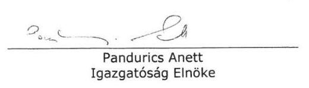

Kenesei János
Igazgatósági Tag

Magyar Posta Életbiztosító Zrt.
1022 Budapest, Bég u. 3-5.

Fővárosi Bíróság mint Cégbíróság
Cégjegyzékszám: 01-10-044750
Adószám: 12833625-4-44

Erste Bank Hungary Nyrt.
Bankszámlaszám: 11991102-06320399-10000001

---

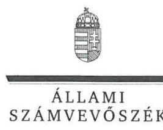

ELNÖK

Ikt.szám: V-0831-366/2016.

# Pandurics Anett úrhölgy 

elnök-vezérigazgató
Magyar Posta Életbiztosító Zrt.

## Budapest

## Tisztelt Elnök-vezérigazgató Úrhölgy!

Az „Adóbeszedési eljárások ellenőrzése - Egyes adóbeszedési tevékenységekkel kapcsolatos feladatellátás szabályszerűségének ellenőrzése" címmel készített számvevőszéki jelentéstervezetre tett észrevételét köszönettel megkaptam.

Az Állami Számvevőszék észrevételre vonatkozó álláspontjáról a felügyeleti vezető által készített részletes tájékoztatást csatoltan megküldöm.

Tájékoztatom Elnök-vezérigazgató úrhölgyet, hogy a számvevőszéki jelentésben - az Állami Számvevőszékről szóló 2011. évi LXVI. törvény 29. § (3) bekezdése alapján - a figyelembe nem vett észrevételeket szerepeltetjük az elutasítás indokának feltüntetésével.

Budapest, 2016. 03. hó 6. nap
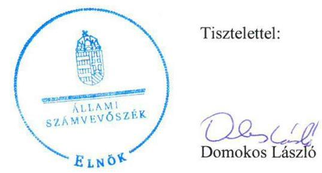

Melléklet: Tájékoztatás az elfogadott és el nem fogadott észrevételekről

---

# Tájékoztatás   az elfogadott és el nem fogadott észrevételekről 

Az „Adóbeszedési eljárások ellenőrzése - Egyes adóbeszedési tevékenységekkel kapcsolatos feladatellátás szabályszerűségének ellenőrzése" címü jelentéstervezetre 2016. február 26-án érkezett észrevételét áttekintettük, annak kezelésével kapcsolatban a következő tájékoztatást adom.

## 1. észrevétel

A biztosítókról és a biztosítási tevékenységekről szóló 2003. évi LX. törvénynek, valamint a pénzügyi intézmények, a befektetési vállalkozások és az árutőzsdei szolgáltatók informatikai rendszerének védelméről szóló 535/2013. (XII. 30.) Kormányrendeletnek az informatikai rendszerek védelmére vonatkozó rendelkezései egymással összhangban vannak, ezért a jelentéstervezet megállapításai megalapozottak. A jelentéstervezet vonatkozó részeiben a jogszabályi hely megjelölését pontosítjuk.

## 2. észrevétel

Az 5.1. számú megállapítás 1. és 2. bekezdésében, a mindhárom pénzügyi szolgáltatóra egyaránt vonatkozó megállapítások egyértelművé tétele érdekében az időszakok kifizetőkre vonatkozó általános megjelölését elhagyjuk és a jelentéstervezetet az alábbiak szerint kiegészítjük:
,,Az MPÉ Zrt. esetében az informatikai rendszerek védelmére vonatkozó jogszabályi rendelkezés 2014. január 1-jéig nem volt, ezt követően a Bit. 65/A. §-a tartalmazta a kötelezettségeket."

## 3-5. észrevétel

Az ÁSZ ellenőrzése a kifizetők kamatjövedelem utáni adó levonását, bevallását, az adatszolgáltatást támogató informatikai rendszereinek megbízhatóságát a 2010-2014. évekre vonatkozóan értékelte. A Bit. 65/A. §-a 2014. január 1-jétől hatályban volt, ezért a biztosítónak a 2014. évtől az e paragrafus (5) bekezdés b)-d) pontjai szerint a biztonsági kockázattal arányos módon gondoskodnia kellett az informatikai biztonsági rendszer önvédelmét, kritikus elemei védelmének zártságát és teljes körűségét biztosító ellenőrzésekről, eljárásokról, a rendszer szabályozott, ellenőrizhető és rendszeresen ellenőrzött felhasználói adminisztrációjáról, olyan biztonsági környezetről, amely az informatikai rendszer működése szempontjából kritikus folyamatok eseményeit naplózza. A (6) bekezdés b) pontja alapján a biztosítónak rendelkeznie

---

kell minden olyan dokumentációval, amely az üzleti tevékenységet közvetlenül vagy közvetve támogató informatikai rendszerek folyamatos és biztonságos működését biztosítja. Tehát az ellenőrzött időszakban, 2014. január 1-jétől hatályban volt részletes rendelkezéseket tartalmazó jogszabály. A fentiek alapján az ÁSZ megállapításainak módosítása nem indokolt.
A Magyar Nemzeti Bank által a 2014. évben végzett ellenőrzésről szóló tájékoztatásukat köszönjük, Az ÁSZ ellenőrzés a kamatadó számításhoz, levonáshoz, bevalláshoz, megfizetéshez kapcsolódó informatikai rendszereket ellenőrizte, megállapításai, a feltárt hiányosságok arra vonatkoznak.
A dokumentumok ismételt áttekintését követően a jelentéstervezet 37. oldal 2. bekezdés 2. mondatát az alábbiak szerint pontosítjuk:
„A tranzakciók naplózása megtörtént, azonban a kulcsszerepet betöltő rendszeresemények feldolgozását és érdemi értékelését nem végezték el, ezért a kamatadó számítással összefüggő esetleges rendkívüli események feltáratlanul maradtak."

# 6. észrevétel 

Az ellenőrzés részére rendelkezésre bocsátott dokumentumok alapján a LISY számítógépes program aktuálisan használt verziójának forráskódja nem áll az MPÉ Zrt. rendelkezésére, ezért megállapításunk módosítása nem indokolt.

## 7. észrevétel

A kamatadó késedelmes megfizetésének indokairól szóló tájékoztatásukat köszönjük, az megállapításunkat nem cáfolja. A dokumentumok ismételt áttekintése alapján a 38. oldal 3. bekezdés első mondatában a „2010-2014. években" szövegrészt „2014. évben" szövegrészre módosítjuk.

A jelentéstervezetben az MPB Zrt. rövidítést MPBSZ Zrt. rövidítésre módosítjuk.
Budapest, 2016. 03. hó 6. nap
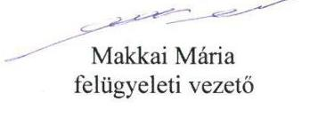

---

.

---

# RÖVIDÍTÉSEK JEGYZÉKE 

${ }^{1}$ ÁSZ
${ }^{2}$ állami adóhatóság
${ }^{3}$ NAV
${ }^{4}$ Szja tv.
${ }^{5}$ MKB Bank Zrt.
${ }^{6}$ 2150/2012. számú szabályzat
${ }^{7}$ 1023/2011. számú eljárásrend
${ }^{8}$ 1013/2014. számú eljárásrend
${ }^{9}$ 1023/2015. számú eljárásrend
${ }^{10}$ BVF
${ }^{11}$ UBEV
${ }^{12}$ 1070/2011. számú eljárásrend
${ }^{13}$ 1019/2014. számú eljárásrend
${ }^{14}$ Art.
${ }^{15}$ NAV KH Ügyrend ${ }_{1,2,3}$
${ }^{16}$ adatszolgáltatási szabályzat

Állami Számvevőszék
Nemzeti Adó- és Vámhivatal 2011. január 1-től
Nemzeti Adó- és Vámhivatal
1995. évi CXVII. törvény a személyi jövedelemadóról
Magyar Külkereskedelmi Bank Zrt.
A Nemzeti Adó- és Vámhivatal elnöke által kiadott 2150/2012. számú szabályzat az irányító és

 a jogalkalmazást segítő eszközök kiadásának rendjéről.
A Nemzeti Adó- és Vámhivatal elnöke által kiadott 1023/2011. számú eljárási rend az adóztatási tevékenységhez kapcsolódó bevallások és az adófolyószámlára történő könyvelés, rendezés szabályairól (hatályos 2013. március 17-től).
A Nemzeti Adó- és Vámhivatal elnöke által kiadott 1013/2014. eljárási rend a bevallások, adatszolgáltatások fogadásának, feldolgozásának általános és speciális ügyviteli szabályozásáról.
A Nemzeti Adó- és Vámhivatal elnöke által kiadott 1023/2015. eljárási rend a bevallások, adatszolgáltatások fogadásának, feldolgozásának általános és speciális ügyviteli szabályozásáról.
Nemzeti Adó- és Vámhivatal Központi Hivatala Bevallási Főosztály
Oracle adatbázisban működő új központi bevallás feldolgozó rendszer
A Nemzeti Adó- és Vámhivatal elnöke által kiadott 1070/2011. számú eljárási rend az ellenőrzések tervezésének és az ellenőrzésre történő kijelölésnek, kiválasztásnak általános alapelveiről, módszereiről
A Nemzeti Adó- és Vámhivatal elnöke által kiadott 1019/2014. számú eljárási rend az állami adóhatóság hatáskörébe tartozó ellenőrzések tervezésének és az ellenőrzésre történő kijelölésnek, kiválasztásnak általános alapelveiről, módszereiről.
2003. évi XCII. törvény az adózás rendjéről

A Nemzeti Adó- és Vámhivatal Ügyrendje, NAV KH Ügyrend: A Nemzeti Adó- és Vámhivatal elnöke által kiadott 24/2011. szabályzat a Nemzeti Adó- és Vámhivatal Központi Hivatala Ügyrendjéről (hatályos 2011. július 21-től 2012. július 25-ig); NAV KH Ügyrend: A Nemzeti Adó- és Vámhivatal elnöke által kiadott 2113/2012. szabályzat a Nemzeti Adó- és Vámhivatal Központi Hivatala Ügyrendjéről (hatályos 2012. július 25-től 2013. február 10-ig); NAV KH Ügyrend: A Nemzeti Adó- és Vámhivatal elnöke által kiadott 2005/2013. szabályzat a Nemzeti Adó- és Vámhivatal Központi Hivatala Ügyrendjéről (hatályos 2013. február 11-től 2014. február 18-ig).
adatszolgáltatási szabályzat: A Nemzeti Adó- és Vámhivatal elnöke által kiadott 1034/2011. számú szabályzat a Nemzeti Adó- és Vámhivatal által teljesített adatszolgáltatások egyes szakmai eljárási kérdéseiről, valamint a NAV Központi Hivatala által teljesített rendszeres adatszolgáltatásokról (hatályos 2011. április 21-től 2012. április 10-ig.); adatszolgáltatási szabályzat: A Nemzeti Adó- és Vámhivatal elnöke által kiadott 2027/2012. számú szabályzat a Nemzeti Adó- és Vámhivatal által teljesített adatszolgáltatások egyes szakmai eljárási kérdéseiről, valamint a NAV Központi Hivatala által teljesített rendszeres adatszolgáltatásokról (hatályos 2012. április 11-től 2013. január 1-ig.); adatszolgáltatási szabályzat: A Nemzeti Adó- és Vámhivatal elnöke által kiadott 2149/2012. számú szabályzat a Nemzeti Adó- és Vámhivatal által teljesítendő

---

${ }^{17}$ BEVFELD
${ }^{18}$ EBEV
${ }^{19}$ DOKU rendszer
${ }^{20}$ VAK rendszer
${ }^{21}$ 49/2012. (XII.28.) NGM rendelet
${ }^{22}$ 1034/2013. számú eljárásrend
${ }^{23} \mathrm{Vht}$.
${ }^{24}$ Szf. tv.
${ }^{25}$ EMMI
${ }^{26} \mathrm{KSH}$
${ }^{27}$ VÁTI
${ }^{28}$ ECOSTAT
${ }^{29}$ GKI
${ }^{30} \mathrm{KK}$
${ }^{31}$ 2162/2012. számú szabályzat
${ }^{32}$ Bkr.
${ }^{33}$ 2124/2014. számú szabályzat
${ }^{34}$ OECD
${ }^{35}$ Modellegyezmény
${ }^{36}$ 1030/2011. számú eljárásrend
${ }^{37}$ 1092/2014. számú eljárásrend
${ }^{38}$ 2011/16/EU irányelv
${ }^{39} \mathrm{KKI}$ rendszer
${ }^{40} \mathrm{KKI}$
${ }^{41}$ ATAR
külső adatszolgáltatások egyes szakmai eljárási kérdéseiről (hatályos 2013. január 2-től) - módosítva a 2022/2014. számú szabályzattal (hatályos 2014. március 25-től 2015. március 29-ig), - módosítva a 2084/2015. számú szabályzattal (hatályos 2015. március 30-tól)
Bevallás feldolgozó rendszer központi Oracle adatbázisban
Elektronikus adóbevallási rendszer. Elektronikus bevallás/bizonylat fogadó rendszer. Az elektronikus bevallásokat az EBEV továbbítja a DOKU iktató programon keresztül a BEVFELD-be.
A NAV iktatási rendszere, amely a bevallásokat folyamatos sorszámozású nyilvántartási számmal (vonalkóddal) látja el.
Kategóriánkénti Rétegezett Mintavételen Alapuló Kiválasztó Rendszer Az adó-végrehajtási eljárás során felmerült végrehajtási költségek és a végrehajtási költségátalány megállapításának és megfizetésének részletes szabályairól
A Nemzeti Adó- és Vámhivatal elnöke által kiadott 1034/2013. számú eljárási rend az adóvégrehajtás során felmerülő költségek megállapításáról és megfizetéséről (hatályos 2013. április 11-től).
1994. évi LIII. törvény a bírósági végrehajtásról

A személyi jövedelemadó meghatározott részének az adózó rendelkezése szerinti felhasználásáról szóló, többször módosított 1996. évi CXXVI. törvény
Emberi Erőforrások Minisztériuma
Központi Statisztikai Hivatal
VÁTI Magyar Regionális Fejlesztési és Urbanisztikai Nonprofit Korlátolt Felelősségű Társaság
ECOSTAT Kormányzati Hatásvizsgálati Központ
GKI Gazdaságkutató Zrt.
Közpolitikai Kutatások Intézete
A Nemzeti Adó- és Vámhivatal Elnöke által kiadott 2162/2012. számú szabályzat a Nemzeti Adó- és Vámhivatal gazdálkodási tevékenységének belső kontrollrendszeréről
370/2011. (XII. 31.) Korm. rendelet a költségvetési szervek belső kontrollrendszeréről és belső ellenőrzéséről
A Nemzeti Adó- és Vámhivatal elnöke által kiadott 2124/2014. szabályzat a Nemzeti Adó- és Vámhivatal egységes belső kontrollrendszeréről
Gazdasági Együttműködési és Fejlesztési Szervezet (Organisation for Economic Cooperation and Development)
Gazdasági Együttműködési és Fejlesztési Szervezet (OECD) által összeállított modellegyezmény
A Nemzeti Adó- és Vámhivatal elnöke által kiadott 1030/2011. számú eljárási rend a közvetlen adók területén történő információcsere szabályairól (hatályos 2011. április 13-tól 2014. december 15-ig).

A Nemzeti Adó- és Vámhivatal Elnöke által kiadott 1092/2014. eljárási rend a közvetlen adók területén történő információcsere szabályairól (hatályos 2014. december 15-től).
A TANÁCS 2011. február 15-i 2011/16/EU irányelve az adózás területén történő közigazgatási együttműködésről és a 77/799/EK irányelv hatályon kívül helyezéséről (hatályos 2011. március 11-től)
A KKI tevékenységét támogató informatikai rendszer
Központi Kapcsolattartó Iroda
Adattárház

---

${ }^{42} \mathrm{CCN}$
${ }^{43}$ REV rendszer
${ }^{44}$ Aktv.
${ }^{45}$ Platform
${ }^{46}$ 2013/C 102/07. számú Bizottsági határozat
${ }^{47}$ EKTB
${ }^{48}$ Bizottság
${ }^{49}$ Cselekvési terv
${ }^{50}$ 08
${ }^{51}$ TEFO
${ }^{52}$ ÁNYK
${ }^{53}$ MPÉ Zrt.
${ }^{54}$ MPBSZ Zrt.
${ }^{55} \mathrm{Hpt}$.
${ }^{56}$ 535/2013. (XII. 30.) Korm. rendelet
${ }^{57}$ Bszt.
${ }^{58}$ Bit.
${ }^{59}$ Jat. tv.
${ }^{60}$ 2008/2014. számú szabályzat
${ }^{61}$ ÁSZ tv.

CCN Mail rendszer (az EU tagállamokba hatóságai között létrehozott, zárt elektronikus üzenettovábbítási hálózat)
Revíziót követő információs rendszer
2013. évi XXXVII. törvény az adó- és egyéb közterhekkel kapcsolatos nemzetközi közigazgatási együttműködés egyes szabályairól (hatályos 2013. április 21-étől)
„jó adóügyi kormányzással, az agresszív adótervezéssel és a kettős adóztatással foglalkozó platform" elnevezésű, az Európai Bizottság által létrehozott szakértői csoport.
Az Európai Bizottság 2013/C 102/07. számú határozata a jó adóügyi kormányzással, az agresszív adótervezéssel és a kettős adóztatással foglalkozó platform elnevezésű bizottsági szakértői csoport létrehozásáról.
Európai Koordinációs Tárcaközi Bizottság
Az Európai Unió Bizottsága
A BIZOTTSÁG KÖZLEMÉNYE AZ EURÓPAI PARLAMENTNEK ÉS A TANÁCSNAK Cselekvési terv az adócsalás és az adókikerülés elleni küzdelem megerősítésére (SWD(2012) 403 final) (SWD(2012) 404 final).
08 havi bevallás a kifizetésekkel, juttatásokkal összefüggő adóról, járulékokról és egyéb adatokról, valamint (2014-től) a szakképzési hozzájárulásról. A 08-as kódjelű nyomtatvány szolgált a kifizetőt terhelő személyi jövedelemadó, az egészségügyi hozzájárulás, az Eat. 465/A. § (3) bekezdése szerinti csekély összegű (de minimis) támogatásra vonatkozó adatok, valamint a szakképzési hozzájárulás bevallására.
A NAV Tervezési és Elemzési Főosztálya
Általános Nyomtatványkitöltő Keretprogram
Magyar Posta Életbiztosító Zrt.
Magyar Posta Befektetési Szolgáltató Zrt.
1996. évi CXII. törvény a hitelintézetekről és pénzügyi vállalkozásokról (hatályos: 2013. december 31-ig)

535/2013. (XII. 30.) Korm. rendelet a pénzügyi intézmények, a befektetési vállalkozások és az árutőzsdei szolgáltatók informatikai rendszerének védelméről 2007. évi CXXXVIII. törvény a befektetési vállalkozásokról és az árutőzsdei szolgáltatókról, valamint az általuk elvégezhető tevékenységek szabályairól 2003. évi LX. törvény a biztosítókról és a biztosítási tevékenységről 2010. évi CXXX. törvény a jogalkotásról

A Nemzeti Adó- és Vámhivatal elnöke által kiadott 2008/2014. szabályzat a Nemzeti Adó- és Vámhivatal 2014. évi szervezeti teljesítménymérési rendszeréről.
2011. évi LXVI. törvény az Állami Számvevőszékről, hatályos 2011. július 1-jétől

---

ÁLLAMI SZÁMVEVŐSZÉK
1052 Budapest, Apáczai Csere János utca 10.
Levélcím: 1364 Budapest 4. Pf. 54
Telefon: +36 14849100 Telefax: +36 14849200
www.asz.hu
