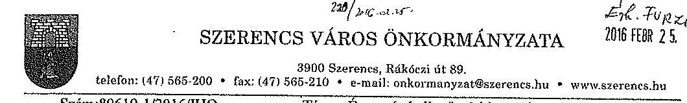
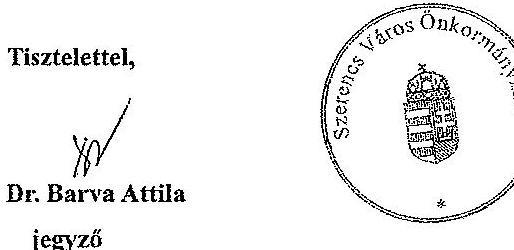
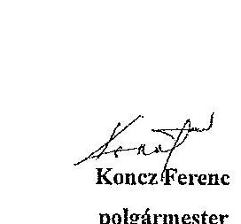
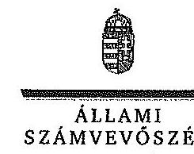
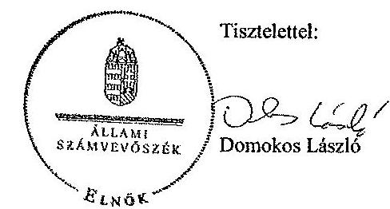
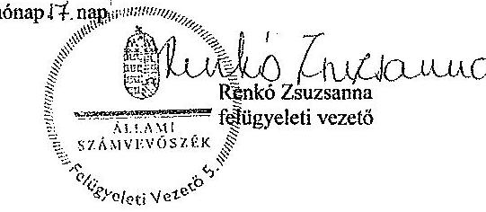

# ÁLLAMI   SZÁMVEVŐSZÉK 

## JELENTÉS

az önkormányzatok pénzügyi és vagyongazdálkodása szabályszerűségének ellenőrzéséről Szerencs

---

# Állami Számvevőszék 

Iktatószám: V-0655-130/2016.
Témaszám: 1689
Vizsgálat-azonosító szám: V069107

## Az ellenőrzést felügyelte:

## Renkó Zsuzsanna

felügyeleti vezető
Az ellenőrzés végrehajtásáért felelős és az ellenőrzést vezette:
Horváth József
ellenőrzésvezető
A számvevőszéki jelentés összeállításában közreműködött:
Baksa Anikó
számvevő vezető főtanácsos
Az ellenőrzést végezték:

| Hadházy Sándor | dr. Németh Eszter | Szepes Béla Bálint |
| :-- | :-- | :-- |
| György | számvevő tanácsos | számvevő tanácsos |
| számvevő tanácsos |  |  |
| Tótfalusi Zoltán |  |  |
| számvevő tanácsos |  |  |

---

# TARTALOMJEGYZÉK 

BEVEZETÉS ..... 3
I. ÖSSZEGZŐ MEGÁLLAPÍTÁSOK, KÖVETKEZTETÉSEK, JAVASLATOK ..... 6
II. RÉSZLETES MEGÁLLAPÍTÁSOK ..... 14

1. Az erőforrásokkal való szabályszerű és hatékony gazdálkodáshoz szükséges követelmények kialakítása, számonkérése, ellenőrzése ..... 14
1.1. Az előirányzatokkal, létszámmal és a vagyonnal való gazdálkodás szabályainak, követelményeinek kialakítása ..... 14
1.2. Az erőforrásokkal való szabályszerű, hatékony gazdálkodás követelményeinek számonkérése, ellenőrzése ..... 15
2. A pénzügyi gazdálkodás szabályszerűsége, a pénzügyi egyensúly biztosítottsága ..... 16
2.1. A költségvetési tervezés és az éves költségvetési beszámolás szabályszerűsége ..... 16
2.2. Az Önkormányzat fizetőképességének fenntartása, a pénzügyi egyensúly biztosítása ..... 18
3. A vagyongazdálkodási tevékenység szabályossága ..... 23
3.1. A vagyongazdálkodási tevékenység kereteinek kialakítása ..... 23
3.2. A vagyonnyilvántartás szabályszerűsége ..... 24
3.3. A vagyon leltározása ..... 25
3.4. A vagyonváltozásokat eredményező döntések szabályszerűsége ..... 27
3.5. A tartós részesedésekkel történő gazdálkodás, az önkormányzat tulajdonosi joggyakorlása ..... 31
4. Integritás érvényesülése ..... 32

---

# MELLÉKLETEK 

1. számú Az Önkormányzat feladatellátásában résztvevő intézmények az ellenőrzött időszakban
2. számú Szerencs Város Önkormányzatának bevételei, kiadásai, valamint adósságszolgálata a 2011-2013. évek között
3. számú Szerencs Város Önkormányzatának mérlegadatai a 2011-2013. közötti években
4. számú Szerencs Város Önkormányzata tartós részesedéseinek portfóliója 20112013. évben
5. számú Szerencs Város Önkormányzata polgármesterének a jelentéstervezet megállapításaira tett észrevétele
6. számú Az ÁSZ válasza Szerencs Város Önkormányzata polgármesterének a jelentéstervezet megállapításaira tett észrevételére

## FÜGGELÉKEK

1. számú Rövidítésjegyzék
2. számú Fogalomtár

---

# JELENTÉS 

## az önkormányzatok pénzügyi és vagyongazdálkodása szabályszerűségének ellenőrzéséről Szerencs

## BEVEZETÉS

Az ÁSZ stratégiai célkitűzése, hogy ellenőrzéseivel mind jobban segítse az átláthatóságot, az elszámoltathatóságot és elszámoltatást a közpénzekkel és a közvagyonnal való gazdálkodásban. Magyarország Alaptörvénye rögzíti, hogy az állam és a helyi önkormányzat tulajdona a nemzeti vagyon része. Az önkormányzati vagyon alapvető funkciója, hogy a közérdeket és egyúttal az önkormányzati célok - elsősorban a kötelezően ellátandó feladatok, és emellett a lehetőségek mértékéig az önként vállalt feladatok - megvalósítását szolgálja.
Az államháztartás önkormányzati alrendszerének közpénz felhasználása, az önkormányzatok által ellátott közfeladatok és önként vállalt feladatok sokrétűsége, valamint a feladatellátásához rendelt vagyon nagyságrendje indokolja, hogy az ÁSZ ellenőrzéseket folytasson a pénzügyi és vagyongazdálkodás területén. Az ÁSZ az önkormányzatok ellenőrzését a pénzügyi helyzet megítélésével indította el 2011-ben és a nagy vagyonnal rendelkező, magas kockázatú önkormányzatok esetében a vagyongazdálkodás ellenőrzésével folytatta. Az elmúlt három év ellenőrzéseinek tapasztalatai megmutatták, hogy indokolt az egyrészt elemző, értékelő, a pénzügyi helyzet kockázatát is minősítő, másrészt a pénzügyi és vagyongazdálkodási tevékenység szabályszerűségét komplexen értékelő ÁSZ ellenőrzések folytatása.
Az ellenőrzés célja annak megállapítása volt, hogy kialakított-e az önkormányzat az erőforrásokkal való szabályszerű és hatékony gazdálkodáshoz szükséges követelményeket, megvalósította-e azok számon kérését, ellenőrzését; az önkormányzat pénzügyi és vagyoni helyzetének, a gazdálkodás szabályosságának megítélése a költségvetési tervezés, a pénzügyi egyensúly megteremtése, az éves költségvetési beszámolás, a vagyongazdálkodás, a vagyon számbavétele, a gazdasági események elszámolása és a pénzgazdálkodás szabályszerűsége alapján.
Ennek keretében értékeltük, hogy az önkormányzat:

- pénzügyi gazdálkodása megfelelt-e a jogszabályokban és a belső szabályzataiban meghatározottaknak, biztosított volt-e a pénzügyi egyensúly;
- biztosította-e a vagyongazdálkodás szabályszerűségét, a vagyonváltozást eredményező döntéseket szabályszerűen hajtotta-e végre, gondoskodott-e a tulajdonosi jogok gyakorlásáról;
- a gazdálkodása során biztosította-e az átláthatóság és az integritás érvényesülését.

---

Az ellenőrzés várható hasznosulása: az ellenőrzés várhatóan hozzájárul az önkormányzatok pénzügyi helyzetének pontosabb megítéléséhez azáltal, hogy a pénzügyi és vagyoni helyzetet együtt értékeli. Bemutatja az adósságkonszolidáció önkormányzat általi végrehajtásának szabályszerűségét. Feltárja az önkormányzati gazdálkodást meghatározó szabályozások összhangjának esetleges hiányosságait, a szabályozással nem érintett gazdálkodási területeket, és a vagyongazdálkodási tevékenység gyakorlásának szabálytalanságait. A jó gyakorlat kialakításán és terjesztésén keresztül az ellenőrzések elősegíthetik az önkormányzati gazdálkodás szabályszerűségének javítását.
Az ellenőrzés típusa: szabályszerűségi ellenőrzés
Az ellenőrzött időszak: 2011. január 1-jétől 2013. december 31-ig. A pénzintézetekkel szembeni kötelezettségek állományának vizsgálatakor az ellenőrzött időszakban fennálló kötelezettségeket vettük figyelembe. A vagyonnyilvántartások egyezőségét, a leltározás, selejtezés folyamatát a 2013. évre vonatkozóan értékeltük.
Ellenőrzött szervezet: Szerencs Város Önkormányzata
Az ellenőrzés végrehajtásának jogszabályi alapját az ÁSZ. tv. 1. § (3) bekezdése, az 5. § (2)-(6) bekezdései, valamint az Áht. 2 61. § (2) bekezdésének előírásai képezik.
Az ellenőrzés szakmai módszertana az ÁSZ hivatalos honlapján közzétett szakmai szabályokon alapult, amely a Legfőbb Ellenőrző Intézmények Nemzetközi Szervezete (INTOSAI) által kiadott nemzetközi standardok (ISSAI) figyelembevételével készült.
A rövidítések jegyzékét az 1. számú függelék, az alkalmazott egyes fogalmak magyarázatát a 2. számú függelék tartalmazza.
Az ellenőrzést az ÁSZ hatályos szervezeti szabályai és az ellenőrzési programban foglalt értékelési szempontok szerint folytattuk le. Megállapításainkat a helyszíni ellenőrzés tapasztalataira, az ellenőrzött szervezettől bekért dokumentumokra, a kitöltött tanúsítványok elemzésére, az adott időszakban hatályos jogszabályok és belső szabályzatok előírásaira alapoztuk.
Az Önkormányzat vagyonváltozását eredményező döntések és azok végrehajtásának ellenőrzése, szabályszerűségének megítélése kockázatalapú mintavételen, valamint tételes ellenőrzés alapján történt. Kockázatalapú mintavétel alapján (évente a 2-4 legnagyobb értékű tételek kerültek kiválasztásra) ellenőriztük a vagyon üzemeltetésre történő átadását, , a beruházásokat, felújításokat és a követelések elengedését. Tételesen ellenőriztük a vagyonértékesítéseket, a vagyonhasznosítást és a térítés nélküli tulajdonjog átruházását.
Szerencs város lakosainak száma 2013. január 1-jén 9166 fő volt. A kilenc tagú Képviselő-testület munkáját két állandó bizottság segítette. A polgármester a 2010. évi önkormányzati választás óta tölti be tisztségét, a jegyző 2012. december 1-jétől látja el feladatait. A polgármesteri hivatal hat szervezeti egységre tagolódott, elkülönített gazdasági szervezettel nem rendelkezett. A pénzügyigazdálkodási feladatokat a Városgazdasági Osztály, majd 2013. január 24-étől a Pénzügyi Osztály látta el. A foglalkoztatott köztisztviselők száma 2013. december 31-én 35 fő volt.

---

Az ellenőrzött időszakban az Önkormányzat által ellátott feladatok, valamint a feladatellátásban részt vevő intézmények körében jelentős mértékű változások történtek. A 2011. év elején - a polgármesteri hivatallal együtt - hét költségvetési szerv (melyből négy önálló működő és gazdálkodó volt), valamint két kizárólagos önkormányzati tulajdonú gazdasági társaság vett részt a feladatellátásban. Kilenc gazdasági társaságban az Önkormányzat 20\% alatti részesedéssel rendelkezett. A járási hivatalok 2013. évi megalakulásával az egyes támogatások és járadékok nyújtásával kapcsolatos hatósági feladatok csökkentek. Az önkormányzati intézmények körében végrehajtott átszervezések, megszűnések, átvételek, valamint az oktatási intézmények egyházi szervezetnek történő átadása, illetve állami fenntartásba kerülése következtében az Önkormányzat a 2013. évben az önálló költségvetéssel gazdálkodó polgármesteri hivatalon felül egy önállóan működő és gazdálkodó, valamint három önállóan működő költségvetési szervvel - amelyek pénzügyi és gazdasági feladatait a polgármesteri hivatal végezte - látta el a feladatát, a gazdasági társaságok száma nem változott. Az ellenőrzött időszakban az Önkormányzat feladatellátásában résztvevő intézményeket az 1. számú melléklet mutatja be.
Az Önkormányzat könyvviteli mérleg szerinti vagyona 2013. december 31-én 9673,9 millió Ft volt, amely a 2011. január 1-jei nyitó adathoz képest 2450,7 millió Ft-tal, 33,9 \%-kal emelkedett az ellenőrzött időszakban. A pénzintézeti kötelezettség értéke 2011. január 1-jén 1838,5 millió Ft, 2012. december 31-én pedig 1891,6 millió Ft volt, amely az 1281,9 millió Ft összegű, 2013. évi állami adósságkonszolidáció és az ellenőrzött időszakban végrehajtott törlesztések eredményeként 2013. december 31-ére 581,5 millió Ft-ra csökkent. Az állam a Magyarország 2014. évi központi költségvetéséről szóló 2013. évi CCXXX. törvény értelmében teljes mértékben átvállalta az Önkormányzat 2013. december 31-én fennálló adósságállományát, mely kiterjedt a tőketartozásán túl annak járulékaira is. Ennek következtében az Önkormányzat adósságállománya 2014. évben megszűnt. Az Önkormányzat a 2013. évi költségvetési beszámolója szerint 3828,3 millió Ft költségvetési bevételt ért el és 3422,3 millió Ft költségvetési kiadást teljesített. A felhalmozási célú kiadások összege 2013-ban 1019,6 millió Ft volt, amelyből felújításokra és beruházásokra 1016,8 millió Ft-ot fordítottak.
Az ÁSZ tv. 29. § (1) bekezdése szerint a jelentéstervezetet megküldtük a polgármester részére, aki az ÁSZ tv. 29. § (2) bekezdésében foglalt észrevételezési jogával élt, a jelentéstervezet megállapításaira észrevételt tett.

---

# I. ÖSSZEGZŐ MEGÁLLAPÍTÁSOK, KÖVETKEZTETÉSEK, JAVASLATOK 

Az ellenőrzött időszakban az Önkormányzat pénzügyi egyensúlya csak a múködőképesség megőrzését szolgáló kiegészítő támogatásokkal volt fenntartható, a folyószámlahitellel és munkabér-megelőlegezési hitel igénybevétele tartóssá vált. A pénzügyi egyensúlyi helyzetben 2013 végére bekövetkezett kedvező változást az adósságkonszolidáció és az önkormányzati feladatok jelentős részének állami átvétele együttesen eredményezte. Az Önkormányzat vagyona a végrehajtott beruházások eredményeként 2013. év végére több mint harmadával növekedett. 2011-2013. években az Önkormányzat pénzügyi és vagyongazdálkodása részben felelt meg a hatályos jogszabályi előírásoknak.

Az ÁSZ ellenőrzés megállapításainak összegzése:

A gazdálkodás és a költségvetési tervezés részben volt szabályszerű.

A pénzügyi egyensúly csak kiegészítő támogatásokkal volt biztosított. A pénzügyi egyensúlyt befolyásoló kockázatok kezelése részben volt megfelelő.
A szabályszerű és hatékony gazdálkodás érdekében intézkedések szükségések.

Az vagyonnal való gazdálkodás és a vagyon nyilvántartása részben volt szabályszerű.

Az integritás és az átláthatóság csak részben érvényesült a gazdálkodásban.

Az Önkormányzat részben gondoskodott az előirányzat-, a létszám- és a vagyongazdálkodásra vonatkozó, jogszabályi előírásoknak megfelelő belső szabályozottság kialakításáról. Az előirányzatokkal, a létszámmal és a vagyonnal való hatékony gazdálkodás, valamint a forráshiány megszüntetése érdekében számon kérhető, számszerűsített követelményeket nem határoztak meg.
A belső ellenőrzési rendszer kialakításáról a jegyző az ellenőrzött időszakban társulás útján gondoskodott. Az ellenőrzött szervezeti egység vezetője a belső ellenőrzés megállapításaira több esetben nem készített intézkedési tervet, így a megállapítások hasznosulásának nyomon követése nem volt biztosított.
Az Önkormányzat pénzügyi gazdálkodása - a szabályozottsággal, a költségvetés tervezésével, azon belül a költségvetési kiadások és bevételek bemutatásával, valamint az előirányzatok módosításával kapcsolatos hiányosságok miatt - az ellenőrzött időszakban részben felelt meg a jogszabályokban megha-

---

tározott követelményeknek. A 2011-2013. években a jogszabályi előírások ellenére több esetben túllépték a jóváhagyott kiemelt kiadási előirányzatot. A múködési bevételek előirányzatát a 2011. évben nem a tényleges többletnek megfelelő összegben módosították, ennek következtében a módosított előirányzatok összege - egyes előirányzatoknál - magasabb volt az évvégéig ténylegesen befolyt bevételnél. A 2012-2013. években a működési bevételeket a teljesítések elmaradása ellenére nem csökkentették.
A 2011-2013. évi előirányzatok módosítása során nem tartották be a jogszabályi előírásokat, mert a 2011. és 2012. években az utolsó előirányzat módosítás, míg a 2013. évben a II-III. negyedévet érintő előirányzat módosítás határidőn túl történt.
A költségvetési koncepciók, valamint a költségvetési rendelettervezetek minden évben elkészültek, melyeket a polgármester a jogszabályban előírt határidőig terjesztett a Képviselő-testület elé. A költségvetési koncepciók tervezeteihez és a költségvetési rendelettervezetekhez a jogszabályi előírásokban foglaltak ellenére a Pénzügyi bizottság írásos véleményét nem csatolták a Képvise-lő-testületnek történő előterjesztéskor, azokról a képviselő-testületi üléseken szóban adtak tájékoztatást. Az Önkormányzat a 2013. évi költségvetési rendelet összeállítása során a jogszabályban előírtak szerint működési hiányt nem tervezett, azonban a múködési költségvetés egyensúlyát 191,4 millió Ft múködőképesség megőrzését szolgáló kiegészítő támogatás eredeti előirányzatként történő tervezésével biztosította. A kiegészítő költségvetési támogatások bevételi előirányzatként történő figyelembe vétele - a támogatás megítéléséről szóló döntést megelőző tervezése - nem felelt meg a jogszabályi előírásnak, mely szerint a tervezés célja annak biztosítása, hogy a tervezett bevételek közgazdaságilag megalapozottan kerüljenek jóváhagyásra. A 2011-2013. évek zárszámadási rendeleteit az előírt határidőben, az elfogadott költségvetésekkel összehasonlítható módon szabályszerűen készítették el.
Az Önkormányzat az ellenőrzött időszakban folyamatosan külső finanszírozási forrásokat vett igénybe pénzügyi egyensúlya biztosítása céljából. Az Önkormányzat pénzügyi kapacitása (nettó múködési jövedelme) az ellenőrzött időszak első két évében negatív egyenlegű volt, a képződött múködési jövedelem nem nyújtott fedezetet a tőketörlesztési kötelezettségekre. A felhalmozási költségvetés egyenlege az ellenőrzött időszak mindhárom évében negatív előjelű volt. A 2012. és 2013. években nem tartották be a jogszabályban foglalt kötelezettséget, mert a likviditási tervek havi rendszerességi felülvizsgálatát nem végezték el.
A polgármester a jogszabályi előírással ellentétben nem tájékoztatta a Pénzügyi Bizottságot, hogy az Önkormányzat 60 napon túli lejárt szállítói tartozásállománnyal rendelkezett. A polgármester a jogszabályi előírással ellentétben nem kezdeményezte a Képviselő-testület döntését a fizetési kötelezettségek rendezéséről, az adósságrendezési eljárás megindításáról. Az Önkormányzat a pénzügyi egyensúlyát befolyásoló kockázatokat nem teljes körűen azonosította, nem elemezte.
Az Önkormányzat mérleg szerinti rövidlejáratú kötelezettségeinek év végi állománya az ellenőrzött időszakban 2011-ről 2013-ra a felére csökkent. Az Önkormányzat az ellenőrzött időszakban munkabér-, valamint támogatásmegelőlegezési és folyószámlahiteleket - többször módosított, csökkenő értékű

---

keretösszegekkel - folyamatosan igénybe vett, továbbá a 2011-2012-ben összesen 140,5 millió Ft kölcsönt vett igénybe gazdasági társaságoktól, valamint egy költségvetési szervtől.
A vagyon összetételének és nagyságának változását eredményező döntések és azok végrehajtása részben felelt meg a jogszabályi előírásoknak. A megvalósított beruházásokhoz és felújításokhoz kapcsolódóan megkötött szerződések esetében az Önkormányzat érdekeit védő garanciális elemek nem minden esetben kerültek meghatározásra, a gazdálkodási jogköröket nem minden esetben a jogszabályban előírtaknak megfelelően gyakorolták. Az Önkormányzat vagyonkimutatásának tartalma és felépítése az ellenőrzött időszakban részben felelt meg a jogszabályi előírásoknak. A 2012. és a 2013. évi elemi költségvetési beszámoló összeállításakor az üzemeltetésre átadott vagyont teljes körűen nem mutatták ki a beszámolók mérlegeiben. Az ellenőrzés által a 2012. és 2013. évi mérlegben feltárt számviteli hiba, jelentős összegűnek minősült.
Az Önkormányzat az ellenőrzött időszakban az összevont beszámoló mérlegeiben az eszközöket és forrásokat a jogszabályban, illetve a belső szabályzatában előírtak ellenére leltárral teljes körűen nem támasztotta alá, továbbá nem biztosította az ingatlankataszter, valamint a földhivatali ingatlan-nyilvántartás adatainak egyezőségét, amelyek magas kockázatot jelentettek a vagyon számbavétele vonatkozásában. Az Önkormányzat az eredmény szemléletü számvitel bevezetésével kapcsolatos, jogszabályban előírt feladatokat teljes körűen nem hajtotta végre.
Az Önkormányzat egyes köznevelési intézményeinek fenntartásával összefüggő vagyonelemek ingyenes használatba adása jogszabályi előírást sértő módon került végrehajtásra. Az ingyenes használatba átadott vagyonelemekről készítendő vagyonleltár a felek által aláírt megállapodásnak nem volt része.
Az Önkormányzat a jogszabályi előírás ellenére az üzemeltetési szerződések, valamint a térítésmentes vagyonátadás esetében nem tett eleget, a beruházási, felújítási szerződések tekintetében részben tett eleget közzétételi kötelezettségének.
Az Önkormányzat kizárólagos tulajdonában lévő gazdasági társaságok üzleti terveit, éves beszámolóit, valamint a közhasznúsági és könyvvizsgálói jelentéseket a Képviselő-testület megtárgyalta és elfogadta. Az Önkormányzat a részesedések mérlegadatait az ellenőrzött időszak egyik évében sem értékelte egyedileg. Az Önkormányzat a 2011-2013. évi beszámolóinak részét képező kiegészítő mellékletekben a kizárólagos tulajdonában lévő gazdasági társaságokban lévő részesedés százalékos értékét nem tüntette fel, továbbá egy gazdasági társaság részesedését a zárszámadási rendelet mellékletében elírás következtében, téves összegben mutatta ki.
Az Önkormányzat a felszámoló biztos felhívására egy, kisebbségi tulajdonában lévő gazdasági társasággal szemben fennálló, 42,0 millió Ft összegű követelésére vonatkozó hitelezői igényét nem nyújtotta be határidőre.
Az Önkormányzat a gazdálkodása során nem biztosította maradéktalanul az átláthatóság és az integritás érvényesülését, a kontrollok - az ellenőrzés időszaka alatt tapasztalt szinten - nem képesek megfelelően kezelni a kockázatokat.

---

Az ÁSZ tv. 33. § (1) bekezdésében foglaltak értelmében az ellenőrzött szervezet vezetője köteles a jelentésben foglalt megállapításokhoz kapcsolódó intézkedési tervet összeállítani, és azt a jelentés kézhezvételétől számított harminc napon belül az ÁSZ részére megküldeni. Amennyiben az intézkedési tervet határidőn belül nem küldi meg a szervezet vezetője, vagy az továbbra sem elfogadható, az ÁSZ elnöke a hivatkozott törvény 33. § (3) bekezdés a-b) pontjaiban foglaltakat érvényesítheti.

# Az ellenőrzés intézkedést igénylő megállapításai és javaslatai: 

## a polgármesternek

1. A folyó költségvetés egyenlege a működőképesség megőrzését szolgáló kiegészítő támogatások nélkül a 2011-2012. években, illetve az adósságkonszolidáció tételeivel korrigált adatok szerint a 2013. évben is hiányt mutatott. Az ellenőrzött időszakban az Önkormányzat összesen 1150,6 millió Ft kiegészítő költségvetési támogatásban részesült, ugyanakkor a képződött működési jövedelem összege - az adósságkonszolidációval korrigált adatok alapján - 691,9 millió Ft volt. Az állami feladatátvállalások és a saját hatáskörben megtett egyensúlyt javító intézkedések pozitív hatása ellenére a kiegészítő támogatások miatti bevételi kitettség kockázata továbbra is jelentős volt. A működési egyensúly helyreállítása hiányában fennáll a likvid hitelállomány újratermelődésének veszélye.
Javaslat:
Intézkedjen az Önkormányzat aktuális pénzügyi egyensúlyi helyzetének elemzésén alapuló, a működési egyensúly megteremtését, illetve hosszú távú fenntartását biztosító intézkedések bevezetéséről szóló előterjesztés képviselő-testületi ülés napirendjére vételének kezdeményezéséről.
2. A 2011-2013. években a mérlegben kimutatott szállítói kötelezettségek mindhárom évben tartalmaztak lejárt esedékességű tartozást. Egy gazdasági társaság felé fennálló 2010. november 22 -én esedékessé vált tartozásból 37,7 millió Ft 2011. december 31-ig nem került kiegyenlítésre. A polgármester az Adósságrendezési tv. 5. § (1) bekezdésében foglaltak ellenére a 60 napon túl lejárt esedékességű szállítói tartozásállomány fennállásáról a Pénzügyi bizottságot haladéktalanul nem tájékoztatta és a Képviselő-testületet nyolc napon belül nem hívta össze, hogy az a fizetési kötelezettségek rendezésére határozatot hozzon vagy felhatalmazza a polgármestert az adósságrendezési eljárás azonnali kezdeményezésére. A polgármester 2011. július 12-ig az Adósságrendezési tv. 5. § (2) bekezdésében foglaltakat megsértve az adósságrendezési eljárás kezdeményezéséről annak ellenére nem gondoskodott, hogy a tartozásállomány az esedékességet követő 90 . napon túl fennállt.
Javaslat:
Intézkedjen a 60, illetve 90 napon túl lejárt esedékességű szállítói tartozás fennállása esetén a jogszabályi előírásban foglalt kötelezettségek teljesítéséről.
3. A költségvetési rendelettervezetek előterjesztéséhez - 2011-ben az Ámr. 36. § (5) bekezdésében, a 2012-2013. években az Ávr. 27. § (2) bekezdésében foglaltak ellenére - a Pénzügyi bizottság írásos véleményét nem csatolták. A 2013. évi költségvetési rendeletben az Mötv. 111. § (4) bekezdésében előírtak szerint működési hiányt nem terveztek, azonban a működési költségvetés egyensúlyát 191,4 millió Ft működőképesség megőrzését szolgáló kiegészítő támogatás eredeti előirányzatként való figyelembe vételével biztosították. A támogatás odaítéléséről szóló döntést

---

megelőző tervezés miatt az Áht. 2 12. § (1) bekezdésében előírtak ellenére nem biztosították, hogy a tervezett bevételek közgazdaságilag megalapozottan kerüljenek jóváhagyásra.
Javaslat:
Intézkedjen a jogszabályi előírásoknak megfelelő költségvetési rendelettervezet kép-viselő-testületi ülés napirendjére vételének kezdeményezéséről.
4. A költségvetési rendeletekben jóváhagyott előirányzatok módosítása során nem tartották be a 2011. évben az Ámr. 67. § (2) bekezdésében, 2012. január 1-jétől az Áht. 2 34. § (4) bekezdésében, 2012. március 31-től az Áht. 2 34. § (5) bekezdésében foglaltakat, mert a 2011-2012. években az utolsó alkalommal végrehajtott előirányzat módosításra, továbbá a 2013. évben a II-III. negyedévet érintő előirányzatmódosításra a hivatkozott jogszabályban meghatározott határidőt követően került sor. A jóváhagyott (módosított) bevételi előirányzatok alulteljesültek, a bevételek tervezettől történő elmaradása ellenére a bevételi előirányzatokat nem módosították (csökkentették), ezzel megsértették a 2012. évtől hatályos Áht. 2 30. § (3) bekezdésében előírtakat.
Javaslat:
Intézkedjen a jogszabályi előírásoknak megfelelő költségvetési rendelet módosítás tervezetének képviselő-testületi ülés napirendjére vételének kezdeményezéséről.
5. Az ÁSZ ellenőrzés a pénzügyi gazdálkodás belső szabályozottságának kialakítása, a költségvetési tervezés, a kockázatkezelési rendszer müködtetése, a vagyonkimutatás elkészítése, az ingatlanvagyon-kataszter és a földhivatali ingatlan-nyilvántartás adatai közötti egyezőség biztosítása, a könyvviteli mérlegben szereplő eszközök és források leltárral való alátámasztottsága, a közérdekű adatok közzététele, a belső ellenőrzéssel kapcsolatosan az intézkedési terv készítési kötelezettség, illetve az intézkedési tervben előírt feladatok végrehajtására vonatkozó beszámolási kötelezettség teljesítése tekintetében hiányosságokat, szabálytalanságokat tárt fel.
Javaslat:
Intézkedjen az ÁSZ ellenőrzése során feltárt hiányosságok és/vagy szabálytalanságok tekintetében a munkajogi felelősség tisztázására irányuló eljárás megindításáról, és ennek eredménye ismeretében tegye meg a szükséges intézkedéseket.

# a jegyzőnek: 

1. A 2011. évben az Ámr. 20. § (3) bekezdés c) és f) pontjaiban, a 2012-2013. években az Ávr. 13. § (2) bekezdés c) és e) pontjaiban foglaltak ellenére belső szabályzatban nem határozták meg a külföldi kiküldetések elrendelésével és lebonyolításával, elszámolásával kapcsolatos kérdéseket, valamint a reprezentációs kiadások felosztását, azok teljesítésének és elszámolásának szabályait.
Javaslat:
Intézkedjen a jogszabályi előírásokban meghatározott belső szabályzatok kiadásáról.
2. A költségvetési rendelettervezetek előterjesztéséhez - 2011-ben az Ámr. 36. § (5) bekezdésében, a 2012-2013. években az Ávr. 27. § (2) bekezdésében foglaltak ellenére - a Pénzügyi bizottság írásos véleményét nem csatolták. A 2013. évi költségvetési rendeletben az Mötv. 111. § (4) bekezdésében előírtak szerint működési hiányt nem terveztek, azonban a működési költségvetés egyensúlyát 191,4 millió Ft

---

müködőképesség megőrzését szolgáló kiegészítő támogatás eredeti előirányzatként való figyelembe vételével biztosították. A támogatás odaítéléséről szóló döntést megelőző tervezés miatt az Áht. 2 12. § (1) bekezdésében előírtak ellenére nem biztosították, hogy a tervezett bevételek közgazdaságilag megalapozottan kerüljenek jóváhagyásra.
Javaslat:
Intézkedjen a jogszabályi előírásoknak megfelelő költségvetési rendelettervezet és annak előterjesztése elkészítéséről, a beterjesztés kezdeményezéséről.
3. A költségvetési rendeletekben jóváhagyott előirányzatok módosítása során nem tartották be a 2011. évben az Ámr. 67. § (2) bekezdésében, 2012. január 1-jétől az Áht. 2 34. § (4) bekezdésében, 2012. március 31-től az Áht. 2 34. § (5) bekezdésében foglaltakat, mert a 2011-2012. években az utolsó alkalommal végrehajtott előirányzat módosításra, továbbá a 2013. évben a II-III. negyedévet érintő előirányzatmódosításra a hivatkozott jogszabályban meghatározott határidőt követően került sor. A jóváhagyott (módosított) bevételi előirányzatok alulteljesültek, a bevételek tervezettől történő elmaradása ellenére a bevételi előirányzatokat nem módosították (csökkentették), ezzel megsértették a 2012. évtől hatályos Áht. 2 30. § (3) bekezdésében előírtakat.
Javaslat:
Intézkedjen a jogszabályi előírásoknak megfelelő költségvetési rendelet módosítás tervezetének elkészítéséről és beterjesztésének kezdeményezéséről.
4. A jóváhagyott kiadási előirányzatokat hat esetben túllépték, ezáltal nem tartották be a 2011. évben az Áht. 1 12/A. § (1) bekezdésében, illetve a 2012-2013. években az Áht. 2 36. § (1) bekezdésében foglalt előírásokat.
Javaslat:
Intézkedjen, hogy a jogszabályi előírásnak megfelelően a költségvetési év kiadási előirányzatai terhére kötelezettségvállalásra a szabad előirányzat mértékéig kerüljön sor.
5. A 2011-2013. években a könyvviteli mérlegben kimutatott eszközök és források alátámasztását az Áhsz. 37. § (1)-(4) és (6)-(7) bekezdéseiben előírtaknak megfelelő leltárral nem biztosították. Az üzemeltetésre átadott eszközökről 2011-ben készült leltári dokumentum nem felelt meg az Áhsz. 37. § (4) bekezdésében foglalt előírásnak, ugyanakkor a 2012-2013. években ezen eszközök értékét leltárral nem támasztották alá. Az eszközök és források leltározásának módja nem felelt meg az Áhsz. 37. § (3) bekezdésében előírtaknak. A 2012. január 2-tól hatályos leltárkészítési és leltározási szabályzatban az Áhsz. 37. § (7) bekezdésében foglalt előírást megsértve önkormányzati rendeletbe foglalt szabályozás hiányában a leltározás (leltárfelvétel) két évenkénti végrehajtását írták elő. A Polgármesteri hivatalnál az Áhsz. 37. § (3) bekezdésében foglalt előírást megsértve a 2012-2013. években valamennyi eszközt egyeztetéssel leltároztak. A leltározási bizonylatok nem feleltek meg a Számv. tv. 167. § (1) bekezdés a), c), d) és g) pontjaiban a számviteli bizonylatokra előírt alaki és tartalmi követelményeknek, illetve a leltárkészítési és leltározási szabályzatban foglaltaknak.
Javaslat:
Intézkedjen a könyvviteli mérleg jogszabályi előírásoknak megfelelő leltárral történő alátámasztásáról.

---

6. A Polgármesteri hivatal 2012. január 2-tól hatályos számlarendje - a Számv. tv. 161. § (2) bekezdés b) és d) pontjában foglaltak ellenére - nem tartalmazta a főkönyvi számlák értéke növekedésének, csökkenésének jogcímeit, valamint a számlarendben foglaltakat alátámasztó bizonylati rendet.
Javaslat:
Intézkedjen a jogszabályi előírásoknak megfelelő számlarend kiadásáról.
7. A vagyonkimutatásban a 2011-2013. években az Áhsz. 44/A. § (2) bekezdésében foglaltak ellenére a törzsvagyon körét érintően a forgalomképtelen és korlátozottan forgalomképes vagyon szerinti bontásban való bemutatásról az ingatlanoknál nem, az ingatlanon kívüli vagyonelemeknél nem teljes körűen gondoskodtak. A vagyonkimutatás az Áhsz. 44/A.§ (3) bekezdésében előírtak ellenére a 2011-2013. években nem tartalmazta elkülönítve a „0"-ra leírt, de használatban lévő, illetve a használaton kívüli eszközök állományát, valamint a 2011. évben nem tartalmazta az Önkormányzat tulajdonában lévő, a jogszabály alapján érték nélkül nyilvántartott eszközök (szakmai nyilvántartásokban szereplő képzőművészeti alkotások, gyűjtemények) állományát.
Javaslat:
Intézkedjen a jogszabályi előírásoknak megfelelő vagyonkimutatás elkészítéséről.
8. A 2013. évben a 147/1992. (XI. 6) Kormány rendelet 1. § (2) bekezdésében foglalt előírással ellentétben az ingatlanvagyon-kataszter és a földhivatali ingatlannyilvántartás adatainak egyezőségét nem biztosították.
Javaslat:
Intézkedjen az ingatlanvagyon-kataszter és a fővárosi és megyei kormányhivatal ingatlanügyi hatóságaként eljáró járási (fővárosi kerületi) hivatal ingatlannyilvántartása adatainak jogszabályban előírt egyezőségének megteremtése érdekében.
9. A kockázatkezelési rendszer keretében - a 2011. évben az Áht. 121. § (2) bekezdés b) pontjában, az Ámr. 157. § (1)-(3) bekezdéseiben, a 2012-2013. években a Bkr. 7. § (1)-(2) bekezdéseiben foglaltak ellenére - a pénzügyi egyensúlyt befolyásoló kockázatok beazonosítása, felmérése elmaradt, ezen túl a kockázatok mérséklése érdekében nem határozták meg a szükséges intézkedéseket.
Javaslat:
Intézkedjen a pénzügyi egyensúlyt befolyásoló kockázatok felméréséről és az ezen kockázatok jogszabályi előírásnak megfelelő kockázatkezelési rendszerben történő kezeléséről.
10. A belső ellenőrzést követően az ellenőrzött szerv, illetve szervezeti egység vezetője -2011-ben a Ber 29. § (1) bekezdésében, 2012-től a Bkr. 45. § (1)-(3) bekezdéseiben foglaltak ellenére - négy esetben nem készített intézkedési tervet, továbbá 13 ellenőrzés vonatkozásában a Ber. 29/A. § (3) bekezdésében foglaltak ellenére az ellenőrzési jelentés megállapításai, javaslatai alapján végrehajtott intézkedésekről, a végre nem hajtott intézkedésekről és azok indokáról beszámolót nem készített, illetve a Bkr. 46. § (1) bekezdés előírása ellenére az ellenőrzött szervezeti egység vezetője az intézkedési tervben meghatározott egyes feladatok végrehajtásáról a költségvetési szerv vezetője részére nem számolt be.

---

Javaslat:
Intézkedjen a belső ellenőrzéssel kapcsolatosan jogszabályi előírásban foglalt intézkedési terv készítési kötelezettség, valamint az intézkedési tervben előírt feladatok végrehajtására vonatkozó beszámolási kötelezettség teljesítéséről.
11. Az ellenőrzött időszakban az üzemeltetésre átadott vagyonnal és a térítésmentes vagyonátadással kapcsolatosan a közzétételi kötelezettséget nem, a beruházási és felújítási szerződések tekintetében a közzétételi kötelezettséget nem teljes körűen teljesítették a 2011. évben - az Áht. 15/8. § (1) bekezdésében meghatározott értékhatár túllépésére tekintettel - az Eisztv. 6. § (1) bekezdésben és az Eisztv. mellékletének III/4. pontjában foglaltak, valamint a 2012-2013. években az Info tv. 37. § (1) bekezdésében és az 1. számú melléklet III/4. pontjában foglalt előírások ellenére.
Javaslat:
Intézkedjen a közérdekű adatok jogszabályi előírásoknak megfelelő közzétételéről.

---

# II. RÉSZLETES MEGÁLLAPÍTÁSOK 

## 1. Az eröforrásokkal való szabályszerű és hatékony gazdÁlkODÁSHoz SZÜKSÉGES KÖVETELMÉNYEK KIALAKÍTÁSA, SZÁMONKÉrÉSE, ELLENŐRZÉSE

### 1.1. Az előirányzatokkal, létszámmal és a vagyonnal való gazdálkodás szabályainak, követelményeinek kialakítása

A Képviselő-testület és a Polgármesteri hivatal rendelkezett a feladataik ellátásának részletes belső rendjét és módját meghatározó önkormányzati, illetve hivatali SZMSZ-szel.
Az Önkormányzat a kötelezően ellátandó közfeladatok körét, valamint a feladatellátás mértékét és módját az önkormányzati SZMSZ-ben szabályozta. Az Önkormányzat az Ötv. 8. § (1)-(4), illetve a Mötv. 10. § (1) bekezdésében és a 13. § (1) bekezdésében foglaltakat nem teljes körűen szabályozta. A 2011. június 1-jétől hatályos SZMSZ-ben a kötelezően ellátandó feladatok között - az Ötv. 8. § (4) bekezdésében, illetve a Mötv. 13. § (1) bekezdésében foglaltak ellenére nem tüntették fel többek között az óvodai nevelést, a köztemető fenntartást, a helyi parkolás biztosítását, a nemzeti és etnikai kisebbségek jogai érvényesülésének biztosítását (nemzetiségi ügyek).
A pénzügyi-gazdálkodási feladatokat - 2013. január 23-álg - ellátó Városgazdasági Osztály munkafolyamatainak leírását, feladat- és hatásköreit, valamint a külső és belső kapcsolattartás módját a gazdasági ügyrend tartalmazta, amelyet a Polgármesteri hivatalban - a 2013. január 1-jétől bekövetkezett jogszabályváltozásokra tekintettel, valamint a hivatali struktúra kialakítása érdekében - végrehajtott, 2013. január 24-től életbelépő szervezeti változásokat követően nem aktualizáltak. A pénzügyi-gazdálkodási feladatokat ellátó szervezeti egység rendelkezett gazdálkodási szabályzattal. A hivatali SZMSZ 2013. január 24-étől hatályos módosítását követően a pénzügyi, költségvetésgazdálkodási, vagyongazdálkodási feladatokat a Pénzügyi Osztály látta el.
Az Önkormányzatnál részben gondoskodtak az előirányzat-, a létszám- és a vagyongazdálkodásra vonatkozó, jogszabályi előírásoknak megfelelő belső szabályozottság kialakításáról. A számviteli politika részeként elkészítették a számlarendet, a leltárkészítési és leltározási szabályzatot, az értékelési szabályzatot, az önköltségszámítási szabályzatot és a pénzkezelési szabályzatot. Ugyanakkor a pénzügyi és vagyongazdálkodás alábbi területeit nem vagy nem az ellenőrzött időszak egészére vonatkozóan, illetve nem a jogszabályi előírásoknak megfelelően szabályozták:

- az Ámr. 20. § (3) bekezdés c) és f), valamint az Ávr. 13. § (2) bekezdés c) és e) pontjaiban foglaltak ellenére az ellenőrzött időszakban nem határozták meg a külföldi kiküldetések elrendelésével és lebonyolításával, elszámolásával kapcsolatos kérdéseket, továbbá a reprezentációs kiadások felosztását, azok teljesítésének és elszámolásának szabályait;
- az Ámr. 20. § (3) bekezdés i) pontja, továbbá az Ávr. 13. § (2) bekezdés h) pontjában foglaltak ellenére 2011. májusig nem alakították ki a közérdekú

---

adatok megismerésére irányuló kérelmek intézésének, valamint 2013. áprilisig a kötelezően közzéteendő adatok nyilvánosságra hozatalának rendjét;

- a Polgármesteri hivatal 2012. január 2-ától hatályos számlarendje a Számv. tv. 161. § (2) bekezdés b) pontjában foglaltak ellenére nem tartalmazta a főkönyvi számlák értéke növekedésének, csökkenésének jogcímeit, továbbá a Számv. tv. 161. § (2) bekezdés d) pontjában előírtak ellenére nem tartalmazta a számlarendet alátámasztó bizonylati rendet;
- a Polgármesteri hivatal a 2012. január 2-től hatályos leltárkészítési és leltározási szabályzatában meghatározott két évenkénti leltározás szabályozása nem felelt meg az Áhsz. ${ }_{1}$ 37. § (7) bekezdésében előírtaknak, mivel arról önkormányzati rendeletben nem rendelkeztek;
- az Önkormányzat az Áhsz. ${ }_{1}$ 37. § (5) bekezdésében foglaltaknak megfelelően szabályozta selejtezési tevékenységét, azonban a szabályzat 2011. évben nem, csak 2012. január 1-jétől tartalmazta a hasznosítás és nyilvántartás során követendő eljárásrendet, az ármegállapítás szabályait, az üzemeltetésre, kezelésre átadott, vagyonkezelésbe vett eszközök döntéshozatalra jogosultjainak körét, valamint az eljárás szabályszerű végrehajtásának folyamatba épített ellenőrzéséért felelős személy meghatározását.
Az előirányzatokkal, a létszámmal és a vagyonnal való gazdálkodás, valamint a forráshiány megszüntetése érdekében - az Áht. ${ }_{1} 49 . \S$ (5) bekezdés f) pontjában, illetve az Áht. ${ }_{2} 9 . \S$ (1) bekezdés f) pontjában foglaltak ellenére - az erőforrássokkal való szabályszerű, hatékony gazdálkodásra vonatkozóan számon kérhető követelményeket nem határoztak meg.
A Képviselő-testület tervezési és végrehajtási célkitűzéseket határozott meg a költségvetési koncepciókhoz, illetve a költségvetési és zárszámadási rendeletekhez kapcsolódóan, amelyek számszerűsített követelményeket nem tartalmaztak. Az általános jellegű célkitűzés a költséghatékonyabb gazdálkodásra irányult. További igényként fogalmazódott meg a személyi juttatásokat érintő megtakarítási lehetőségek kihasználása, amelynek érdekében a polgármester a 2011. és a 2012. években - költségvetési rendeletben kapott felhatalmazás alapján - létszámzárlatot rendelt el. A Képviselő-testület a forráshiány megszüntetése érdekében az intézményhálózat átszervezéséhez kapcsolódóan hozott további döntéseket. Ennek következtében a Városi Kincstár 2011. január 15-ei hatállyal, valamint a Polgármesteri hivatal átszervezése során 2011. július 1-jétől a Közművelődési osztály megszűnt.

# 1.2. Az erőforrásokkal való szabályszerű, hatékony gazdálkodás követelményeinek számonkérése, ellenőrzése 

Az Önkormányzat az erőforrásokkal való gazdálkodás követelményeinek és irányelveinek érvényre juttatását, betartását számon kérhető, számszerűsített követelmények hiányában nem tudta ellenőrizni.
A belső ellenőrzési rendszer kialakításáról a jegyző az ellenőrzött időszakban Társulás útján gondoskodott. A feladatellátással és az erőforrásokkal való hatékony gazdálkodás érdekében meghatározott célkitűzések megvalósításának ellenőrzése céljából vizsgálták a gépjármú beszerzéseket és a gépjárművek használatát, továbbá felülvizsgálták a kulturális, hirdetési és fűtés-

---

karbantartási szerződéseket, a belső kontrollrendszer szabályozottságát, valamint elemezték az Önkormányzat gazdasági helyzetét.
Az ellenőrzött időszakban a Polgármesteri hivatalnál öt, az intézményeknél kilenc ellenőrzést folytattak le. A lefolytatott ellenőrzésekből négy esetben az ellenőrzött szerv, illetve szervezeti egység vezetője a Ber. 29. § (1) bekezdésében, illetve a Bkr. 45. § (1)-(3) bekezdésében foglalt előírást megsértve nem készített intézkedési tervet. Továbbá az ellenőrzött szerv, illetve szervezeti egység vezetője 13 ellenőrzésnél a Ber. 29/A. § (3) bekezdésében foglaltak ellenére az ellenőrzési jelentés megállapításai, javaslatai alapján végrehajtott intézkedésekről, a végre nem hajtott intézkedésekről és azok indokáról beszámolót nem készített, illetve a Bkr. 46. § (1) bekezdésében foglaltak ellenére az intézkedési tervben meghatározott egyes feladatok végrehajtásáról a költségvezetési szerv vezetője részére nem számolt be.

# 2. A PÉNZÜGYI GAZDÁLKODÁS SZABÁLYSZERŰSÉGE, A PÉNZÜGYI EGYENSÚLY BIZTOSÍTOTTSÁGA 

### 2.1. A költségvetési tervezés és az éves költségvetési beszámolás szabályszerűsége

Az Önkormányzat pénzügyi gazdálkodása a költségvetés tervezésével, valamint a kiemelt előirányzatok teljesítésével kapcsolatos hiányosságok miatt az ellenőrzött időszakban részben felelt meg a jogszabályokban meghatározott követelményeknek.
Az Önkormányzatnál a költségvetési tervezés során nem gondoskodtak a 2013. évi költségvetési bevételek - Áht. 12. § (1) bekezdésében előírt - közgazdaságilag megalapozott tervezéséről. Elkészítették az ügyrendet, az ellenőrzési nyomvonalat, a tervezéssel kapcsolatos feladatokat munkaköri leírásokban rögzítették. A költségvetési koncepciók alátámasztásához elkészítették a részletes háttérszámításokat, figyelembe vették a következő évi feladatokat, a várható bevételi forrásokat, a kötelezettségvállalásokat és az egyéb fizetési kötelezettségeket. A költségvetési koncepciók tervezeteihez és a költségvetési rendelettervezetekhez 2011. évben az Ámr. 35. § (3)-(4) bekezdésében, valamint a 36. § (5) bekezdésében, a 2012-2013. években az Ávr. 26. § (2)-(3) bekezdésében, valamint az Ávr. 27. § (2) bekezdésében foglaltak ellenére a Pénzügyi bizottság írásos véleményét nem csatolták a Képviselő-testületnek történő előterjesztéskor, azokról - a jegyzőkönyvekben rögzítettek szerint - a képviselőtestületi üléseken szóban adtak tájékoztatást.
A 2011-2012. évi költségvetési rendeletek 9. számú mellékletében a jogszabályi előírásoknak megfelelően mutatták be a költségvetési bevételeket és kiadásokat, a költségvetési egyenleg összegét működési és felhalmozási cél szerinti bontásban, továbbá a hiány finanszírozására szolgáló belső és külső finanszírozási bevételeket, a felmerülő finanszírozási kiadásokat.
Az Önkormányzat a 2013. évi költségvetési rendelet összeállítása során a Mötv. 111. § (4) bekezdésében előírtak szerint múködési hiányt nem tervezett, azonban a múködési költségvetés egyensúlyát 191,4 millió Ft múködőképesség megőrzését szolgáló kiegészítő támogatás eredeti előirányzatként történő tervezésével biztosította. A kiegészítő költségvetési támogatások bevételi előirányzatként történő figyelembe vétele - a támogatás megítéléséről szóló döntést

---

megelőző tervezése - nem felelt meg az Áht. 2 12. § (1) bekezdésében ${ }^{1}$ foglalt előírásnak, mely szerint a tervezés célja annak biztosítása, hogy a tervezett bevételek közgazdaságilag megalapozottan kerüljenek jóváhagyásra.
A költségvetési rendelettervezetek megfelelő szerkezetben és az előzőekben leírt tartalomi hiányosságokkal készültek, az előterjesztésekhez szöveges indokolással együtt csatolták az előírt tájékoztató mérlegeket és kimutatásokat. A jegyző által készített költségvetési rendelettervezeteket a polgármester az Áht. 2 24. § (2) bekezdésében, illetve a 2013. december 21-től hatályos Áht.2.24. § (3) bekezdésében előírt határidőig nyújtotta be a Képviselő-testületnek. A polgármester által jóváhagyott elemi költségvetések, valamint a költségvetési rendeletek kiemelt előirányzatai között fennállt az egyezőség. Az elemi költségvetéseket az előírt határidőben megküldték a Kincstár részére.
A Képviselő-testület a 2011. évben öt, a 2012. évben négy, a 2013. évben három alkalommal módosította az éves költségvetési rendeletet. Az előirányzatok módosítására a 2011. évben irányítószervi és intézményi hatáskörben, a 20122013. években pedig kormány és irányítószervi hatáskörben került sor. A 20112013. évi előirányzatok módosítása során nem tartották be az Ámr. 67. § (2) bekezdésének, valamint az Áht. 2 34. § (4) bekezdésének, illetve 2012. március 31 -től az Áht. 2 34. § (5) bekezdésének előírásait, mert a 2011. és 2012. években az utolsó előirányzat módosítás, továbbá a 2013. évben a II-III. negyedévet érintő előirányzat-módosítás határidőn túl történt. Az előirányzat módosításokat az analitikus és a főkönyvi nyilvántartásban átvezették, elszámolták. Az előirányzatok módosításáról a Képviselő-testület minden esetben önkormányzati rendeletet hozott. A 2011-2013. években a kiadási előirányzatok felhasználása, illetve a kifizetések teljesítése során az Áht. 1 12/A. § (1) bekezdésének és az Áht. 2 36.§ (1) bekezdésének előírásai ellenére az Önkormányzat hat esetben a jóváhagyott kiadási előirányzatokat nem tartotta be.
A költségvetési rendeletekben jóváhagyott és módosított múködési bevételi előirányzatok a nem megfelelően végrehajtott előirányzat módosítások következtében minden évben alulteljesültek. A 2011. évben az előző évek pénzmaradványa felhalmozási célú igénybevétele nem valósult meg. Az Önkormányzat a múködési bevételek előirányzatát a 2011. évében nem a tényleges többletnek megfelelő összeggel módosította, ennek következtében a módosított előirányzatok összege magasabb volt az év végéig ténylegesen befolyt bevételnél. Az Önkormányzat az előirányzat-módosítások során megsértette 2011. december 31 -élg az Áht ${ }_{1} 12 . \S$ (2) bekezdésében, és az Áht ${ }_{1} 100 /$ B. § (1) bekezdésében foglaltakat. 2012. január 1-jétől az Áht ${ }_{2} 30 . \S$ (3) bekezdésében foglalt előírás ellenére a 2012-2013. években a múködési bevételek előirányzatait a teljesítések elmaradása ellenére nem csökkentették.
Az ellenőrzött években a Képviselő-testület által a létszámgazdálkodással kapcsolatban támasztott követelményeket betartották. A 2011. évi teljesített létszám (közhasznú és közmunkát végzők nélkül 531 fő) és a 2013. év azonos adatai (közfoglalkoztatottak nélkül 241 fő) közötti csökkenést a létszámstop, a Tűzoltóság, a köznevelési intézmények állami, illetve egyházi fenntartásba adása, továbbá a járási hivatalhoz átcsoportosított feladatok átadása okozta.

[^0]
[^0]:    ${ }^{1}$ 2015. január 1-jétől az Áht. 2 4. § (2) bekezdése

---

A polgármester az Áht. ${ }_{1}$ 79. § (1) bekezdésében, illetve az Áht. ${ }_{2}$ 87. § (1) bekezdésében foglaltaknak megfelelően az Önkormányzat első félévi gazdálkodási helyzetéről szeptember 15-ig, a háromnegyed éves gazdálkodás helyzetéről a következő évi költségvetési koncepció előterjesztésekor tájékoztatta a Képviselőtestületet. Az Önkormányzat és az általa irányított költségvetési szervek - az elemi költségvetések adataival összehasonlítható módon - elkészítették és a Kincstár részére megküldték az elemi költségvetési beszámolókat.
A polgármester és a jegyző az Áht. ${ }_{1}$ 82. §-a, valamint az Áht. ${ }_{2}$ 91. § (1) bekezdése szerint, határidőben gondoskodtak a zárszámadási rendelet tervezetének elkészítéséről és Képviselő-testület elé terjesztéséről. A zárszámadási rendelettervezetek az elfogadott költségvetésekkel összehasonlítható módon, az év utolsó napján érvényes szervezeti és besorolási rendnek megfelelően készültek.

# 2.2. Az Önkormányzat fizetőképességének fenntartása, a pénzügyi egyensúly biztosítása 

Az Önkormányzat költségvetésének elemzését a CLF módszer szerint végeztük el. A CLF módszer szerinti 2011-2013. évi önkormányzati adatokat - a 2013. év vonatkozásában az adósságkonszolidációs támogatással, illetve anélkül - a 2. számú melléklet, a pénzügyi egyensúlyi helyzetre vonatkozó főbb adatokat a 2011-2013. években - a 2013. évben az adósságkonszolidációs támogatás nélkül - az 1. számú táblázat mutatja be.

1. számú táblázat

Az Önkormányzat pénzügyi egyensúlyi helyzetének fơbb adatai 2011-2013. években Adatok millió Ft-ban

| Megnevezés | $\begin{gathered} 2011 . \\ \text { év } \end{gathered}$ | $\begin{gathered} 2012 . \\ \text { év } \end{gathered}$ | $\begin{gathered} 2013 . \\ \text { év } \end{gathered}$ |
| :--: | :--: | :--: | :--: |
| Folyó bevételek | 3388,5 | 2955,3 | 2802,4 |
| Folyó kiadások | 3271,7 | 2780,0 | 2402,6 |
| Folyó költségvetés egyenlege, múködési jövedelem | 116,8 | 175,3 | 399,8 |
| Folyó költségvetés egyenlege múködőképesség megőrzését szolgáló kiegészitő támogatások nélkül | $-201,2$ | $-163,3$ | $-85,2$ |
| Felhalmozási bevételek | 1406,6 | 423,4 | 830,3 |
| Felhalmozási kiadások | 1816,9 | 459,7 | 1019,6 |
| Felhalmozási költségvetés egyenlege | $-410,3$ | $-36,3$ | $-189,3$ |
| Hitelfelvétel | 847,8 | 214,7 | 60,0 |
| Hiteltörlesztés, kötvénytörlesztés | 313,4 | 823,9 | 30,4 |
| Egyéb finanszírozási bevételek | 4,1 | 30,6 | 49,5 |
| Egyéb finanszírozási kiadások | $-6,6$ | 6,4 | $-4,1$ |
| Finanszírozási müveletek egyenlege | 545,1 | $-585,0$ | 83,2 |
| Tárgyévi pénzügyi pozíció | 251,6 | $-446,0$ | 293,7 |
| Nettó múködési jövedelem | $-196,6$ | $-648,6$ | 369,4 |

Forrás: Az Önkormányzat 2011-2013. évi költségvetési beszámolói

---

Az Önkormányzat folyó költségvetési egyenlege, múködési jövedelme az ellenőrzött időszakban pozitív volt, a folyó bevételek fedezték a folyó kiadásokat. A múködőképesség megőrzését szolgáló kiegészítő támogatások a 20112013. években bevételi kitettséget jelentettek, mivel a múködési jövedelem e költségvetési támogatások nélkül az ellenőrzött időszak minden évében hiányt mutatott volna. A 2011-2013. években a múködési jövedelem összege adósságkonszolidációs támogatás nélkül 691,9 millió Ft volt.

A helyi önkormányzatok rövid lejáratú hiteltörlesztési támogatásáról szóló 60/2011. (XII. 23.) BM rendelet alapján, az Önkormányzat a 2011. évben 110,8 millió Ft támogatásban részesült. ÖNHIKI támogatást 2011-ben kettő alkalommal nyertek el, összesen 216,2 millió Ft, 2012. évben pedig 338,6 millió Ft értékben. Az Önkormányzat a 2013. évben a fejezeti tartalék terhére a múködőképesség megőrzését szolgáló kiegészítő támogatásban részesült 485,0 millió Ft értékben.

A múködési jövedelem 2011-2012. években nem nyújtott fedezetet a tőketörlesztésre. 2013. évben az adósságkonszolidáció eredményeként csökkent a kötvény és a hiteltörlesztések összege, emellett növekedett a múködőképesség megőrzését szolgáló kiegészítő támogatás is. Ennek következtében a nettó múködési jövedelem pozitív értéket mutatott. A hiteltörlesztések és a „Szerencs 2027" elnevezésű kötvénytartozásból eredő visszafizetési kötelezettségek összege 2011. évben 313,4 millió Ft, 2012. évben 823,9 millió Ft, 2013. évben 30,4 millió Ft volt. A 2013. évben a tőketörlesztések csökkenését az adósságkonszolidáció eredményezte.

Az adósságkonszolidáció lebonyolítása érdekében 60,0 millió Ft összegű folyószámla hitelkeretet - a Képviselő-testület 227/2013. (XII. 19.) ÖT határozattal meghozott döntése alapján - alakították át 2013 decemberében múködési hitelkeretté, amely alapján felvett hitel már elszámolható volt az adósságkonszolidáció keretében 2014-ben.

A felhalmozási költségvetés egyenlege az ellenőrzött időszak mindhárom évében negatív volt. A felhalmozási költségvetés egyenlegének 2012. évről 2013. évre bekövetkezett romlását különösen a saját beruházási kiadások növekedése okozta, melyeket elsősorban támogatás megelőlegezési hitelből finanszírozta.

Az Önkormányzat nettó múködési jövedelme 2011. és 2012. évben negatív volt - ami folyamatos pénzügyi kapacitás hiányt jelzett -, 2013. évben az adósságkonszolidáció következtében pozitívra változott. A 2011. évről a 2012. évre történő 452,0 millió Ft összegű csökkenést a hiteltörlesztések 510,5 millió Ft öszszegű növekedése, valamint a múködési jövedelem 58,5 millió Ft összegű növekedése okozta. 2013. évben a múködési jövedelem 224,5 millió Ft összegű növekedése, a hiteltörlesztések - adósságkonszolidáció miatti - 793,5 millió Ft öszszegű csökkenése együttesen eredményezte a nettó múködési jövedelem előző évhez viszonyított 1018,0 millió Ft összegű növekedését.
Az Önkormányzat a fizetőképességét az ellenőrzött időszakban csak folyószámlahitel, valamint munkabér- és támogatás-megelőlegezési hitel folyamatos igénybevételével tudta biztosítani. A rendelkezésre álló folyószámla hitelkeret az ellenőrzött időszak alatt folyamatosan változott, 2011. január 1-jén 100,0 millió Ft, 2011. március 1-jétől 180,0 millió Ft, 2012. január 1-jétől 200,0 millió Ft összegű volt. A keretösszeg 2013. június 28-án 34,0 millió Ft-ra csökkent, majd 2013. október 31-én 60,0 millió Ft-ra emelkedett. A munkabér-

---

megelőlegezési hitel keretösszege az ellenőrzött időszakban folyamatosan csökkent az Önkormányzat közfoglalkoztatottak nélküli személyi állományának csökkenése következtében. A folyószámlahitel napi átlagos állománya 2011. évben 138,3 millió Ft, 2012. évben 187,2 millió Ft, 2013. évben 133,8 millió Ft volt.

Az Önkormányzat likviditási mutatójának értéke a 2011. december 31-ei és a 2012. december 31-ei mérlegadatok alapján 1,0 alatt volt. Megállapítható, hogy a pénzeszközök év végi állománya nem nyújtott fedezetet a rövidlejáratú kötelezettségek teljesítésére. Az adósságkonszolidáció következtében 2013. évben a likviditási mutató értéke jelentősen javult és a forgóeszközök már fedezetet nyújtottak a rövid lejáratú kötelezettségek teljesítésére.
Az Önkormányzat pénzügyi helyzetét kedvezőtlenül befolyásolta, hogy a bevételek beérkezésének és a kiadások teljesítésének ütemezéséről a 2011. évben az Ámr. 201. § (1) bekezdésében előírt likviditási tervet az év második felére vonatkozóan készítették el, a 2012-2013. években az Äht. 2 78. § (2) bekezdésében és az Ávr. 122. § (2)-(3) bekezdéseiben előírt likviditási tervet 2012-ben 10 napra, 2013-ban 3 hónapra vonatkozóan készítették el. A 2012. és 2013. években nem tartották be az Ávr. 122. § (3) bekezdésében foglalt kötelezettséget, mert a likviditási tervek havi rendszerességú felülvizsgálatát nem végezték el.
Az ellenőrzött időszakban a pénzügyi egyensúlyi helyzet biztosítása érdekében hozott számszerúsíthető bevételnövelő intézkedéseket nem tett, kiadáscsökkentő intézkedések (az ellenőrzött időszak minden évében fenntartott létszámstop) hatására az Önkormányzat adatszolgáltatása szerint a személyi juttatások és járulékai a 2011-2012. években $10 \%$-kal csökkentek. A 2013. évi csökkenés a 2012. évi értékhez viszonyítva $34,9 \%$-os volt, amelyben jelentős szerepet játszott a KLIK részére történő feladatátadás. Az ellenőrzött időszak alatt a személyi jellegű kiadások 711,6 millió Ft-tal csökkentek.
A 2011-2013. években a szerződésen és jogszabályon alapuló fizetési kötelezettségek határidőben történő teljesítése nem volt biztosított. Az ellenőrzött évek december 31-ei mérlegében kimutatott szállítói kötelezettségek mindig tartalmaztak lejárt határidejű szállítói tartozást. Az Önkormányzatnál az ellenőrzött időszakban az Áhsz., 9. számú melléklet 4. da) alpontjában foglaltak ellenére az analitikus nyilvántartásokban a 30, illetve 60 napon túli kiegyenlítetlen kötelezettségek állományának adatai nem álltak rendelkezésre. Az Önkormányzat már 2011. évben több társaság felé rendelkezett 60 napon túli, elismert, lejárt esedékességű szállítói kötelezettséggel. Ezek közül kiemelkedett egy gazdasági társaság felé 2010. november 22 -én esedékessé vált, 38,9 millió Ft összegű tartozás, amelyből 2011. december 31-éig 37,7 millió Ft nem került kiegyenlítésre.
A polgármester az Adósságrendezési tv. 5. § (1) bekezdésében foglaltak ellenére nem tájékoztatta a Pénzügyi Bizottságot az Önkormányzat 60 napon túli lejárt szállítói állományáról és a szükséges adósságrendezési eljárás kezdeményezésének indokoltságáról. A polgármester az Adósságrendezési tv. 5. § (1) bekezdésében foglalt kötelezettsége ellenére az ellenőrzött időszakban nem hívta össze a Képviselő-testületet 8 napon belül, hogy a testület döntsön a fizetési kötelezettségek rendezéséről, vagy a polgármester felhatalmazásáról az adósságrendezési eljárás azonnali kezdeményezésére.

---

A polgármester 2011. július 12-ig az Adósságrendezési tv. 5. § (2) bekezdésében ${ }^{2}$ foglaltakat megsértve az adósságrendezési eljárás 8 napon belüli kezdeményezéséről annak ellenére nem gondoskodott, hogy a tartozásállomány az esedékességet követő 90 . napon is fennállt. A polgármester a jogszabályi előírásban meghatározott kötelezettségének nem tett eleget, a megvalósított intézkedések ellenére a 60 , illetve 90 napon túl lejárt esedékességű tartozások nem szűntek meg. A 2011. július 13 -ától hatályos rendelkezések szerint a polgármester a képviselő-testület döntése alapján köteles 8 napon belül az adósságrendezési eljárást kezdeményezni. A Képviselő-testület döntésének hiányában a polgármester nem kezdeményezte az adósságrendezési eljárást.

A Képviselő-testületi üléseken a „Különfélék" napirendi pont alatt a polgármester az ellenőrzött időszakban több esetben adott tájékoztatást az Önkormányzat szállítói tartozásállományának alakulásáról.
Az Önkormányzat 2011. december 31-ei mérlegében szereplő rövidlejáratú kötelezettségek 1286,6 millió Ft összege a 2013. év végére a felére, 653,6 millió Ftra csökkent.
A 2011-2013. évek december 31-ei mérlegében a követelések 82,3-89,0 \%-át az adósok felé fennálló követelések tették ki.

Az adósok mérlegsor összegei 2011. évben 160,7 millió Ft, 2012. évben 251,7 millió Ft, 2013. évben 303,8 millió Ft értéket mutattak.
Az áruszállításból és szolgáltatásnyújtásból származó vevőkövetelések év végi értéke 2011. évben 21,4 millió Ft, 2012. évben 39,9 millió Ft, 2013. évben 37,3 millió Ft összegű volt.
Az Önkormányzat a 2012. augusztus 31-éig hatályos vagyonrendeletének 5/C. §-ában, illetve a 2012. szeptember 1-jétől hatályos vagyonrendeletének 10. §-ában és 19. §-ában szabályozta a követelésekről való lemondás, követelés elengedés eseteit. A követelések értékelési és minősitési, valamint az értékvesztés elszámolási szabályait az ellenőrzött időszakban hatályos értékelési szabályzatok tartalmazták. Az elszámolható értékvesztés mértékét a vevő és az adós minősítése alapján határozták meg. A határidőn túli követelések behajtása érdekében fizetési felszólításokat küldtek az adósok részére, illetve végrehajtási intézkedéseket kezdeményeztek.
Az Önkormányzat 2013. évben egy kisebbségi tulajdonában lévő gazdasági társasággal szemben fennálló 64,2 millió Ft összegű adókövetelés teljes összegére értékvesztést számolt el. A társaság a 2011. évtől felszámolás alatt állt, azonban az Önkormányzat a felszámolóbiztos felhívására a - felszámolási eljárás közzétételi időpontjáig, 2012. május 18 -áig keletkezett - 42,0 millió Ft öszszegű követelésére vonatkozó hitelezői igényét nem nyújtotta be határidőre, amellyel megsértették az Ötv. 36. § (2) bekezdés a) pontjában foglaltakat.

Az Önkormányzat az ellenőrzött időszakban több esetben kért végrehajtást az adótartozások rendezése céljából, amelyek - a bírósági végzés ellenére - nem vezettek eredményre.

[^0]
[^0]:    ${ }^{2}$ A polgármester a 2011. július 12 -ig hatályos rendelkezés szerint a Képviselő-testület döntésétől függetlenül, a 2011. július 13 -ától hatályos szabályozás értelmében a Képvi-selő-testület döntése alapján volt köteles az adósságrendezési eljárást kezdeményezni.

---

Az Önkormányzat a 2011. december 31-ei mérlegében 14,3 millió Ft összegű egyéb követelést mutatott ki, a 2012. december 31-ei és a 2013. december 31-ei mérleg egyéb követelést nem tartalmazott.
Az Önkormányzat az ellenőrzött időszakban rendelkezett kockázatkezelési rendszerrel, azonban a gazdálkodásban rejlő kockázatok felmérése és megállapítása nem volt teljes körű. A kockázatkezelési rendszer keretében a 2011. évben az Áht; 121. § (2) bekezdés b) pontjában, valamint az Ámr. 157. § (1)-(3) bekezdéseiben, a 2012-2013. években a Bkr. 7. § (1)-(2) bekezdéseiben előírtak ellenére nem mérték fel és nem állapították meg teljes körűen a pénzügyi egyensúlyi helyzet alakulásával összefüggő kockázatokat. Így nem határozták meg a kockázatokkal kapcsolatos intézkedéseket, valamint azok teljesítésének folyamatos nyomonkövetésének módját.
Nem azonosították a szállítói kötelezettségállomány alakulása miatti nemfizetési kockázatot, holott minden év végén rendelkeztek 60 napon túli lejárt szállítói tartozással. A jegyző̉ nem mérte fel és nem azonosította az ellenőrzött években a folyószámlahitel tartóssá válása miatti banki kitettség kockázatát, valamint a múködési jövedelemtermelő képesség miatti kockázatot. A bevételi kitettséget okozó kockázatok közül nem azonosították be az ÖNHIKI, a működőképesség megőrzését szolgáló támogatások igénybevételével kapcsolatos kockázatot. A múködési egyensúly helyreállításának hiányában fennáll a likvid hitelállomány újratermelődésének veszélye. A mérlegen kívüli tételek kockázatát jelzi, hogy az Önkormányzat a kizárólagos tulajdonában lévő gazdasági társaságok kötelezettségei nem teljesítése miatt finanszírozási források biztosítására kényszerült. A Városüzemeltető NKft. részére 2013-ban 65,0 millió Ft pótlólagos múködési pénzeszköz átadásra került sor, amely a lejárt határidejű szállítói tartozások rendezésére nyújtott fedezetet. A 2011-2013. években az Önkormányzat kizárólagos tulajdonában lévő gazdasági társaságok részére 679,8 millió Ft múködési és fejlesztési célú pénzeszközt adott át.
A nemfizetési kockázatot növelte, hogy az Önkormányzat fizetési nehézségeinek csökkentése céljából kölcsönt vett igénybe 2011-2012-ben a közigazgatási területén lévő gazdálkodó szervezetektől, valamint egy költségvetési szervtől a következő időszakban esedékes adófizetési és bérleti díffizetési kötelezettségük terhére. A 2011. évben a Mátra Cukor Zrt. 27,0 millió Ft, a Nestlé Kft. 68,9 millió Ft és a Borsodvíz Zrt. 10,0 millió Ft és 19,6 millió Ft értékben nyújtott kölcsönt az Önkormányzatnak. A 2012. évben további 15,0 millió Ft kölcsönfelvételre került sor az ESZEI-től, mint költségvetési szervtől. Ezen ügyletek nem minősültek a Stabilitási tv. szerinti adósságot keletkeztető ügyletnek.
Az Önkormányzatnak pénzintézeti kötelezettséghez kapcsolódó kezességvállalása nem volt. A líingszerződésekből származó egyéb visszterhes kötelezettségek aránya nem jelentett nemfizetési kockázatot. Az ellenőrzött időszakban PPP konstrukcióban megvalósított beruházásra, valamint a kölcsön és a likvid hitelek felvételén túl, a Stabilitási tv. szerinti adósságot keletkeztető ügylet vállalására nem került sor.
Az Önkormányzat 2012. december 31-ei pénzintézeti kötelezettsége összesen 1891,6 millió Ft tett ki. Az adósságkonszolidáció során 2013. év végéig 1281,9 millió Ft összegű tőke- és járuléktartozás került átvállalásra, mely az adósságállomány 67,6\%-át tette ki. Az Önkormányzat a 2013. évben az előírt határozathozatali és nyilatkozattételi kötelezettségnek határidőre eleget tett.

---

A tartozás átvállalás 1086,3 millió Ft értékben a 2007. évben kibocsátott „Szerencs 2027" elnevezésű kötvények fizetési kötelezettségére, és 195,6 millió Ft értékben múködési és munkabér hitelre vonatkozott. Az Önkormányzat 2013. december 31-i mérlegében kötvény és hiteltartozás címén összesen 585,5 millió Ft kötelezettséget mutatott ki. Az adósságkonszolidáció szabályszerűen történt, annak során 2014. február 28-ig átvállalt adósság összege járulékokkal és árfolyam különbözettel együtt 1896,1 millió Ft volt, amelyet a Kincstár nem vizsgált felül.

# 3. A VAGYONGAZDÁLKODÁSI TEVÉKENYSÉG SZABÁLYOSSÁGA 

### 3.1. A vagyongazdálkodási tevékenység kereteinek kialakítása

A vagyongazdálkodási tevékenység kereteinek kialakítása részben felelt meg a szabályszerűségi követelményeknek. Az Önkormányzat az ellenőrzéssel érintett időszakban rendelkezett a Képviselő-testület által - az Ötv. 91. § (7) bekezdésében meghatározott határidőn belül - elfogadott, a 2011-2014. évek célkitűzéseit meghatározó Gazdasági Programmal.

A Gazdasági Program elsődleges célként tűzte ki a munkahelyteremtést, valamint az Önkormányzat pénzügyi és gazdasági stabilitásának helyreállítását. Másodlagos célként szerepelt többek között az önkormányzati intézmények és az egyes közszolgáltatások (közoktatási, egészségügyi és szociális feladatok) színvonalának növelése, a város közbiztonságának javítása, nevezetességeinek fenntartása és fejlesztése, valamint a közútfejlesztés.
A Képviselő-testület az Nvtv. 9. § (1) bekezdésében foglaltaknak megfelelően elfogadta az Önkormányzat közép- és hosszú távú vagyongazdálkodási tervét. A vagyongazdálkodási tervben foglaltak a jogszabályi előírásoknak megfelelően biztosították az önkormányzati vagyon rendeltetésének megfelelő, hatékony és költségtakarékos működtetését, értékének megőrzését, értéknövelő használatát.

Az ellenőrzött időszakban a Képviselő-testület a Htv. 138. § (1) bekezdés j) pontjának megfelelően elfogadta a vagyonnal kapcsolatos gazdálkodás szabályait. Az Önkormányzat vagyonnal kapcsolatos gazdálkodásának szabályai vagyonrendeletben kerültek meghatározásra. A szabályozás a teljes vagyoni körre kiterjedt, az önkormányzati feladatellátást biztosító törzsvagyon körét meghatározták, a forgalomképtelen és korlátozottan forgalomképes vagyonelemeket elkülönítették. Ugyanakkor a Képviselő-testület a nemzetgazdasági szempontból kiemelt jelentőségű nemzeti vagyonként forgalomképtelen törzsvagyonnak minősítést az Nvtv. 18. § (1) bekezdésben meghatározott 60 napos határidőn túl, - 2012. augusztus 30 -ai hatállyal - hat hónapos késéssel teljesítette. Az Önkormányzat az Nvtv. 5. § (5) bekezdés szerinti korlátozottan forgalomképes törzsvagyonának körét az Nvtv. 18. § (12) bekezdésében rögzített határidőben, a 2012. augusztus 30 -ai vagyonrendeletében határozta meg.
Az Önkormányzat a vagyonrendeletében és a lakásrendeletében szabályozta a vagyon használatba adásának és a vagyon használat ellenőrzésének részletes szabályait.
Az Önkormányzat vagyonrendeletben szabályozta a vagyonnal való rendelkezési, döntési hatásköröket, amelyek kiterjedtek az értékesítésre, az

---

apportálásra, a bérbeadásra, az értékpapírok vételére-eladásra, a pénzügyi befektetésekre, az ingyenes vagyonátadás-átvételekre, valamint a követelés elengedésére. A Képviselő-testület élt az Ötv. 9. § (3) bekezdésében, illetve a Mötv. 41. § (4) bekezdésében meghatározott vagyongazdálkodási hatáskör átruházás lehetőségével, amely alapján a követelésről való lemondáshoz kapcsolódó döntések meghozatalára - ingó vagyon tekintetében 100 ezer Ft-os értékhatárig, ingatlanvagyon tekintetében pedig 1,0 millió Ft-os értékhatárig a polgármester volt jogosult.
Az ellenőrzött időszakban az Önkormányzat vagyongazdálkodására vonatkozó belső szabályzatok - a jelentés 1.1. pontjában részletezettek szerint - a jogszabályi előírásoknak részben feleltek meg. Az 1.1. pontban felsoroltakon kívül az Önkormányzat rendelkezett közbeszerzési szabályzattal. A közbeszerzési értékhatárt el nem érő beszerzések lebonyolításával kapcsolatos feladatok, hatáskörök esetén alkalmazandó eljárásrend a közbeszerzési szabályzat részeként került - a jogszabályoknak megfelelő tartalommal - kialakításra.

# 3.2. A vagyonnyilvántartás szabályszerűsége 

A vagyonkimutatás tartalma és felépítése az ellenőrzött időszakban részben felelt meg az Áhsz. ${ }_{1} 44 /$ A. § (2)-(3) bekezdéseiben meghatározott előírásoknak. Az ellenőrzött időszakban a vagyonkimutatásban, a „0"-ra leírt eszközök állományánál nem mutatták be elkülönítve a használatban lévő és a használaton kívüli eszközöket. A 2011. évi vagyonkimutatás nem tartalmazta az Önkormányzat tulajdonában lévő, a jogszabály alapján érték nélkül nyilvántartott eszközök (szakmai nyilvántartásokban szereplő képzőművészeti alkotásokat, gyűjtemények) állományát.
Az Önkormányzat az ellenőrzött időszakban az Áhsz. ${ }_{1} 44 /$ A. § (2) bekezdésében foglaltak ellenére a vagyonkimutatásában a törzsvagyonon belül a forgalomképtelen és korlátozottan forgalomképes vagyontárgyak elkülönítéséről az ingatlanok esetében nem, az ingatlanon kívüli vagyonelemek tekintetében nem teljes körűen gondoskodott.
Az Áhsz. 20. § (1) bekezdése és az Áhsz. ${ }_{1}$-nek a könyvviteli mérleg előírt tagolására vonatkozó 1. számú melléklete, illetve a Számv. tv. 15. § (3) bekezdése szerinti valódiság alapelve ellenére az Önkormányzat 2012. és a 2013. évi mérlegében nem az üzemeltetésre, kezelésre átadott eszközök között, hanem a vagyonkezelésbe adott eszközök mérlegsoron szerepeltetett 139,9 millió Ft, illetve 410,7 millió Ft vagyonértéket, annak ellenére, hogy vagyonkezelési szerződéssel nem rendelkezett. Az üzemeltetésre átadott vagyontárgyait nem teljes körűen mutatta ki a 2012. és a 2013. évi elemi költségvetési beszámolók mérlegeiben. Az ellenőrzés által a 2012. és a 2013. évi mérlegben feltárt számviteli hiba az Áhsz. 1. § (1) bekezdés 3. pontja szerint jelentős összegűnek minősült.
A 147/1992. (XI. 6.) Korm. rendelet 1. § (2) bekezdésében foglaltak ellenére a 2013. évben az Önkormányzatnál nem biztosították az ingatlankataszter, valamint a földhivatali ${ }^{3}$ ingatlan-nyilvántartás adatainak egyezőségét. Ezen kívül még eltérés volt a vagyon-kataszter és a számviteli nyilvántartás kö-

[^0]
[^0]:    ${ }^{3}$ a 2015. április 1-jétől hatályos előírás szerint a fővárosi és megyei kormányhivatal ingatlanügyi hatóságaként eljáró járási (fővárosi kerületi) hivatal

---

zött, - amelyet az év végi beszámoló 38. ürlapja is alátámaszt - az eltérések okait az ellenőrzött időszakban nem vizsgálták. A vagyonkataszterhez képest a költségvetési beszámoló 38. ürlapjában kimutatott ingatlanok és kapcsolódó vagyoni értékű jogok bruttó értéke 2011-ben 1015,9 millió Ft-tal kevesebbet, 2013-ban pedig 1100,4 millió Ft-tal többet mutattak ki. A 2011. és 2012. évekre vonatkozó könyvvizsgálói jelentések a fenti adatok eltéréseire vonatkozóan megállapítást nem tartalmaztak.

# 3.3. A vagyon leltározása 

Az Önkormányzat az ellenőrzött időszakban az összevont beszámoló könyvviteli mérlegeiben kimutatott eszközöket és forrásokat az Áhsz.; 37. § (1)-(4) és (6)-(7) bekezdésekben foglaltak, valamint a leltárkészítési és leltározási szabályzat 5. pontjában előírtak ellenére - december 31-i fordulónappal - leltárral teljes körűen nem támasztotta alá.
Az ellenőrzött időszakban az Önkormányzat három - 2011. január 2-áig, 2011. január 3-ától, valamint 2012. január 2-ától hatályos - leltárkészítési és leltározási szabályzattal rendelkezett. A 2012. január 2-ától hatályos leltárkészítési és leltározási szabályzat a Polgármesteri hivatalon kívül kiterjedt az önállóan múködő költségvetési szervekre is, ennek ellenére az ESZEI 2012. és 2013. évben rendelkezett önálló szabályzattal.

A leltárkészítési és leltározási szabályzatok 3.1. pontjában foglaltak ellenére a Polgármesteri hivatal a 2011. december 31-ei fordulónapi leltározáshoz leltározási utasítást nem adott ki. A 2012. december 31-ei és a 2013. december 31-ei fordulónapi leltározáshoz átadott leltározási utasítás csak a tárgyi eszközök leltározására ad felhatalmazást. Az utasításokban a leltári körzetek és a leltárfelvételt végző személyek kijelölésre kerültek, az érintettek részére a megbízóleveleiket kiállították.
A 2011-2013. évek december 31-ei fordulónapjára elkészített leltározási bizonylatok nem feleltek meg a Számviteli tv. 167. § (1) bekezdés a), c), d) és g) pontjaiban a számviteli bizonylatokra előírt alaki és tartalmi követelményeknek, mivel nem tartalmaztak sorszámozást, összesítés esetén az összesítés alapjául szolgáló bizonylatok körét, az aláírást és a keltezést (a bizonylat kiállításának időpontját) nem minden esetben rögzítették.
A 2012-2013. években a Polgármesteri hivatalnál a mérlegben szereplő eszközök leltárral történő alátámasztását egyeztetéssel hajtotta végre. Nem vette figyelembe, hogy a leltárkészítési és leltározási szabályzatban szereplő kétévenkénti mennyiségi felvételre - az Áhsz.; 37. § (7) bekezdésében foglaltak alapján az önkormányzati rendeletben való szabályozás hiányában az eszközökre nem volt jogosult.
Az Önkormányzat a mérlegében az ellenőrzött időszak minden évében kimutatott üzemeltetésre átadott eszközöket. Az üzemeltetésre átadott eszközöket 2012-2013. évi mérlegében Áhsz.; 37. § (4) bekezdésében előírtak ellenére leltárral nem támasztotta alá. A 2011. évre vonatkozóan átadott leltár nem felelt meg az Áhsz.; 37. §. (4) bekezdésében előírtaknak, mely szerint az üzemeltetésre, kezelésre átadott, koncesszióba, vagyonkezelésbe adott eszközöket az államháztartás szervezete az üzemeltetés, kezelést végző szerv által a december 31-ei fordulónapra vonatkozó évenkénti leltározás alapján elkészített, hitelesített és megállapodásban meghatározott időpontig megküldött leltárral köteles

---

alátámasztani. Az üzemeltetésre átadott eszközök mérlegben szereplő értékadatait hiteles dokumentummal nem támasztották alá.
A Polgármesteri hivatalban a tárgyi eszközök 2011. évi leltárdokumentációjaként a mérlegkészítés február 28-ai időpontját követően, 2012. március 28-án kinyomtatott „tárgyi eszköz kivonat" megnevezésű, keltezés nélküli, nem hiteles dokumentáció került átadásra az ellenőrzés részére, amely nem felelt meg az Áhsz.; 37. § (2)-(3) és (6) bekezdésében, és a leltárkészítési és leltározási szabályzat 5.2. pontjában előírt kötelezettségnek.
Az Önkormányzat a 2011. évben a Bocskai István Gimnázium és a Bolyai János Általános Iskola mérlegadatait hiteles dokumentummal nem támasztotta alá.

Az ESZEI - mint önállóan működő és gazdálkodó intézmény - a saját szabályzatában foglaltaknak megfelelően a 2011-2013. években az intézményi beszámolóját és annak mérlegét kiértékelt leltárral támasztotta alá. A 2012. január 1-jétől állami tulajdonba került Tűzoltóság 2011-ben a mérlegét kiértékelt leltárral támasztotta alá.
Az ellenőrzött időszakban a Polgármesteri hivatal selejtezést nem hajtott végre. Az ESZEI-nél minden évben, a Tűzoltóságnál 2011-ben hajtottak végre selejtezést, amelyek dokumentálása a jogszabályi előírásoknak és a belső szabályozásban foglaltaknak megfelelt.
Az Önkormányzat az ellenőrzött időszakban az Áhsz.; 32. § (7) bekezdésében biztosított piaci értékelés és ezen alapuló értékhelyesbítés elszámolásának lehetőségével nem élt.
A 2011. évben a részesedéseken kívül az eszközök és források értékelését szabályszerűen elvégezték. A 2012-2013. évi mérlegében kimutatott eszközök és források értékelésének szabályszerűsége részben volt megfelelő, az üzemeltetésre, kezelésre átadott eszközök 3.2. pontban leírt helytelen besorolása és a mérlegben nem megfelelő összegben történő kimutatása, ezen túl a részesedések értékelésének elmaradása következtében.
Az eredményszemléletú számvitel bevezetésével kapcsolatos - az NGM rendelet 2. §-ában előírt - feladatokat teljes körűen nem hajtották végre, az eszközök mennyiségi leltározását nem végezték el. A leltárral kapcsolatban az előzőekben felsoroltakon túl az alábbi hiányosságok állapíthatóak meg:

- az NGM rendelet 1. §-ában foglaltak ellenére az Önkormányzat a rendező mérleget forint érték helyett ezer Ft-ban állította össze;
- az NGM rendelet 2. § (1) bekezdésében foglalt, valamennyi eszköz és forrás valamint kötelezettségvállalás teljes körű felleltározására vonatkozó előírásnak nem tettek eleget;
- az NGM rendelet 2. § (2) bekezdés c) pontjában foglaltak ellenére elmaradt a kötelezettségvállalások megbontása aszerint, hogy azok költségvetési évben vagy költségvetési évet követő években lesznek esedékesek.

---

# 3.4. A vagyonváltozásokat eredményező döntések szabályszerűsége 

Az Önkormányzat eszközeinek értéke 2011-ről 2013-ra 7223,2 millió Ft-ról 9673,9 millió Ft-ra, 33,9\%-kal nőtt. Az Önkormányzat vagyonának változását a 3. számú melléklet és a 2. számú táblázat mutatja be.
2. számú táblázat

Az Önkormányzat könyvviteli mérleg szerinti vagyona változásának fơbb adatai 2011. január 1-je és 2013. december 31-e közötti időszakban

Adatok millió Ft-ban

| Megnevezés | 2011. január 1. | 2013. december   31. | Változás   2013./2011.   $\%$ |
| :-- | --: | --: | --: |
| Immateriális javak | 9,5 | 0,1 | 1,1 |
| Tárgyi eszközök | 5500,1 | 6484,6 | 117,9 |
| ebből: ingatlanok és kapcsolódó vagyoni   értékú jogok | 4786,4 | 5292,4 | 110,6 |
| Befektetett pénzügyi eszközök | 166,0 | 91,6 | 55,2 |
| Üzemeltetésre, kezelésre átadott, vagyon-   kezelésbe vett eszközök | 1103,7 | 2397,3 | 217,2 |
| Forgóeszközök | 444,0 | 700,2 | 157,7 |
| Eszközök összesen | 7223,2 | 9673,9 | 133,9 |

Forrás: Az Önkormányzat 2011. és 2013. évi zárszámadási rendeletei
Az immateriális javak nettó értékének csökkenését alapvetően a szellemi termék amortizációja okozta. A tárgyi eszközök állományának növekedését döntően az ellenőrzött időszakban végrehajtott 2678,4 millió Ft összegű beruházások és felújítások, valamint az önkormányzati feladatok (Tűzoltóság) állami átvételéhez kapcsolódó vagyonátadás együttesen eredményezte az üzemeltetésre átadott eszközök állománya az ellenőrzött időszak végére a kormányhivataloknak a KLIK-nek, valamint a kizárólagos tulajdonú gazdasági társaságok részére történő átadások következtében több mint a duplájára növekedett. A tárgyi eszközök között a járművek 2011. január 1-jei értéke 150,2 millió Ft-ról 2013. december 31-ére 27, 0 millió Ft-ra csökkent. A tárgyi eszközök átlagos használhatósági foka beruházások és felújítások nélkül (38-as űrlap) a 2011. év eleji $71,2 \%$-ról a 2013. évi végére $63,1 \%$-ra változott. A forgóeszközök értékének növekedését az adósok és a pénzeszközök állományának változása okozta.
Az Önkormányzat hosszú és rövid lejáratú kötelezettségei (passzív pénzügyi elszámolások nélkül) az adósságkonszolidáció eredményeként 2011-ről 2013-ra jelentősen - a 2011. évi nyitó 2389,1 millió Ft-ról 2013 végére 750,5 millió Ft-ra, 65,1 \%-kal - csökkentek.

---

A hosszú lejáratú kötelezettségek 1420,6 millió Ft-ról 96,9 millió Ft-ra, a rövid lejáratú kötelezettségek 968,5 millió Ft-ról 653,6 millió Ft-ra mérséklődtek.

Az Önkormányzat az ellenőrzött időszakban vagyonkezelői, valamint konceszsziós szerződést nem kötött, PPP konstrukcióban megvalósított fejlesztésre nem került sor.

Az Önkormányzat az ellenőrzött időszakban 21 hatályos szerződéssel rendelkezett eszközök üzemeltetésre, valamint ingyenes használatba történő átadása tárgyában. A megkötött szerződések önkormányzati közfeladatok, valamint állami közigazgatási feladatok ellátására vonatkoztak, melyek közoktatási intézmények fenntartását, illetve múködtetését szolgáló vagyonelemek ingyenes használatba adására, továbbá vízi-közmű vagyon, hulladékudvar, járási hivatali feladatok ellátását szolgáló tárgyi eszközök és egyéb önkormányzati tulajdonban lévő ingó és ingatlan vagyonelemek üzemeltetésére vonatkoztak.

Az Önkormányzat a - víziközmú szolgáltatásról szóló 2011. évi CCIX. tv. 79. §a alapján - 2013. január 1-jén térítésmentesen átvett víziközmü-vagyon üzemeltetése tárgyában az átadást követő több mint egy év eltelte után, 2014. február 28 -án kötötte meg a víziközmú üzemeltetési szerződés bérleti jogviszonynyal történő kiegészítésére irányuló megállapodást a szolgáltató Borsodvíz Zrtvel.

A Képviselő-testület a jogszabályi előírásnak megfelelően- az Nvtv. 11. § (17) bekezdésében foglaltak szerint - nyilvános pályázati kiírás nélkül döntött a vagyoneszközök üzemeltetésre történő átadásról. A szerződéseket önkormányzati tulajdonú gazdasági társaságokkal, egyházi szervezettel közszolgáltatási és közoktatási feladatok ellátására, továbbá - külön jogszabályokban foglalt előírások alapján - állami szervezetekkel járási hivatali feladatok, valamint közoktatási feladatok ellátására kötötte. Az üzemeltetési szerződésekben rögzítették az üzemeltető által kötelezően ellátandó önkormányzati közfeladatokat és az ellátható egyéb tevékenységeket, az üzemeltetésre átadott vagyonnal való gazdálkodásra vonatkozó rendelkezéseket, a fizetendő üzemeltetési (használati) díj mértékét, megfizetésének módját, valamint a szerződés időtartamát.

Az üzemeltetési szerződések - a Ptk. 205. § (2) bekezdésében rendelkezés ellenére - több esetben nem tartalmazták az üzemeltetésre átvett önkormányzati vagyonnal kapcsolatos nyilvántartási és adatszolgáltatási kötelezettségeket, az évenkénti leltározás dokumentálásának, adatszolgáltatásának kötelezettségét, az üzemeltetésbe adott eszközök jegyzékét, a vagyonnal való vállalkozás feltételeit, továbbá a vagyon állagának, értékének megőrzésére, elszámolására vonatkozó rendelkezéseket, a garanciális elemeket, és a beszámolási kötelezettséget.
Az ellenőrzött időszakban az Önkormányzat - a köznevelési feladatot ellátó egyes önkormányzati fenntartású intézmények állami fenntartásba vételéről szóló 2012. évi CLXXXVIII. törvény 2012. december 8-tól hatályos 13. § (2) bekezdés a) pontjában foglalt felhatalmazás alapján - 2012. december 14-én megállapodást kötött a KLIK-kel három köznevelési intézmény - köztük a Bocskai István Gimnázium és Szakközépiskola, Középiskolai Kollégium, Egységes Pedagógiai Szakszolgálat és Szakmai Szolgáltató - fenntartói jogának, valamint a fenntartói feladatellátást szolgáló ingatlan és ingó vagyon ingyenes használatba adása tárgyában. A megállapodásban foglaltak ellenére - misze-

---

rint a feleknek a megállapodásban megjelölt vagyonelemekre 2013. január 15ig ingyenes használati jogot keletkeztető szerződést kellett volna kötniük - a használati szerződés megkötésére 2013. május 27 -én került sor, amely 2013. január 1-jétől kezdődő, visszamenőleges hatállyal határozatlan időre szólt. Az átadásra kerülő intézmények vagyonleltárát sem a megállapodás, sem a használati szerződés nem tartalmazta.

Az Önkormányzat 2013. július 31-én átadás-átvételi megállapodást kötött az Egri Főegyházmegyével (Magyar Katolikus Egyház) a Bocskai István Gimnázium és Szakközépiskola múködtetéséhez szükséges ingatlan és ingó vagyon 2013. augusztus 31-ei hatállyal határozatlan időre történő átadása tárgyában. Az Önkormányzat a 2013. május 27 -én aláírt használati szerződésben rendelkezett a fenntartói feladatellátást szolgáló ingatlan és ingó vagyon KLIK részére történő ingyenes használatba adásáról. Tekintettel arra, hogy a 2013. július 31-ei átadás-átvételi megállapodás - a 2. pontjában hivatkozott - vagyonleltárt tartalmazó melléklettel nem rendelkezett, nem volt ellenőrizhető a múködtetői, valamint a fenntartói feladatellátást szolgáló ingó és ingatlan vagyon összetétele, továbbá nem volt megállapítható a fenntartáshoz és a múködtetéshez szükséges vagyoni kör közötti különbség.

Az Önkormányzat az üzemeltetési célú vagyonátadások alkalmával a közzétételi kötelezettségét nem teljesítette, a nettó ötmillió forintot elérő vagy azt meghaladó értékú, megkötött szerződések adatait a honlapján (www.szerencs.hu) nem tette közzé, ezzel megsértette az Áht. ${ }_{1}$ 15/B. § (1) bekezdése, az Eisztv. 6. § (1) bekezdése és az Eisztv. mellékletének III/4. pontja, illetve az Info. tv. 37. § (1) bekezdése és az 1. sz. melléklet III/4. pontja előírásait.

Az ellenőrzött időszakban az Önkormányzat törvényi előírások alapján egy esetben hajtott végre térítésmentes vagyonátadást. Az Önkormányzat katasztrófavédelemről és a hozzá kapcsolódó egyes törvények módosításáról szóló 2011. évi CXXVIII. törvény alapján - 232,6 millió Ft nettó értéken nyilvántartott vagyonnal - a Tủzoltóságot 2012. január 1-jével adta át a BM Országos Katasztrófavédelmi Főigazgatósága részére. A vagyonátadás szabályszerűen, a közfeladat ellátásával kapcsolatban történt. Az Önkormányzat a vagyonátadással kapcsolatos közzétételi kötelezettségének az Info. tv. 37. § (1) bekezdése és az 1. sz. melléklet III/4. pontjában foglaltak ellenére nem tett eleget.

Az ellenőrzött időszakban az Önkormányzat egy vagyonelemet vett át térítésmentesen. Az Önkormányzat a víziközmű-szolgáltatásról szóló 2011. évi CCIX. törvény 79. § (1) bekezdése alapján a Borsodvíz Zrt-től 2013. január 1-jén vette át a $-0,2$ millió Ft nettó értéken nyilvántartott - víziközmú-vagyont. A térítésmentes vagyon átvétele a Képviselő-testület döntése alapján, szabályszerűen, a közfeladat ellátásával kapcsolatban történt.

A beszámoló összeállítása során megsértették az Áhsz. 1 6. sz. mellékletében előírtakat, mert a 2013. évi beszámolóban a befektetett eszközök állományának alakulásáról szóló 38. számú űrlap a térítésmentes vagyon átvételére vonatkozó adatot nem tartalmaz.

Az ellenőrzött beruházások és felújítások a kötelező önkormányzati feladatok ellátását szolgálták. A feladat ellátás teljesítése érdekében a fenntartható múködtetés feltételeinek biztosításához szükséges forrásokat az Önkormányzat az éves költségvetéseiben megtervezte. Döntéseket minden esetben a Képviselő-

---

testület hozta meg, a kivitelezők kiválasztásában közbeszerzési, majd versenyeztetési eljárást folytattak le, a pályázati felhívások minden lényeges körülményt tartalmaztak. A beruházási és felújítási tevékenységgel összefüggő operatív gazdálkodási jogkörök gyakorlásának részletes szabályait a gazdálkodási szabályzat rögzítette. Az ellenőrzéssel érintett időszakban az összeférhetetlenségi követelményeket a gazdálkodási jogkörök kialakításánál figyelembe vették.
Az Önkormányzat a beruházási és felújítási szerződések tekintetében - az Áht. ${ }_{1}$ 15/B. § (1) bekezdése, az Eisztv. 6. § (1) bekezdése és az Eisztv. mellékletének III/4. pontja, illetve az Info. tv. 37. § (1) bekezdése és az 1. sz. melléklet III/4. pontjának előírásai ellenére - nem minden esetben tett eleget a közzétételi kötelezettségének.

Az Önkormányzat a tervezési, kivitelezési és szállítási szerződésekben az érdekeit védő garanciális elemeket (meghiúsulási kötbér, késedelmes teljesítés, nem megfelelő teljesítés esetén kötbér, póthatáridő) - a Ptk. 205. § (2) bekezdésében rendelkezés ellenére - több esetben nem rögzítette.

A jogszabályi előírásokat több esetben megsértve kötelezettséget az arra írásban felhatalmazott személy pénzügyi ellenjegyzés nélkül vállalt, ezzel megsértették az Ámr. 74. § (1) bekezdésében, valamint az Áht. 3 37. § (1) bekezdésében előírtakat. A kifizetésekhez kiállított utalványrendeletek a jogszabályi előírások ellenére több esetben nem tartalmazták az érvényesítő és az utalványozó aláírását, továbbá a gazdálkodási jogköröket gyakorlók aláírásának dátumát, ezzel megsértették az Ámr. 77. § (3) bekezdésében és 78. § (2) bekezdés a) pontjában, illetve az Ávr. 58. § (3) bekezdésében és az Ávr. 59. § (3) bekezdés g) pontjában foglalt előírásokat.

A megvalósult beruházások és felújítások műszaki átadás-átvételt követő üzembe helyezése, számviteli aktiválása a jogszabályokban és a belső szabályzatokban előírtaknak megfelelően történt.

Az Önkormányzat az ellenőrzött időszakban öt vagyontárgyat értékesített, amellyel kapcsolatos döntést a vagyongazdálkodási rendeletben foglaltak szerint a Képviselő-testület hozta meg.

Az Önkormányzat a vevőt minden esetben nyilvános eljárás során választotta ki. Az értékesíteni tervezett vagyonelemeket meghirdette és a szerződést a legkedvezőbb ajánlatot tevővel kötötték meg. A vagyonértékesítési szerződésekben rögzítették az Önkormányzat érdekeit védő garanciális elemeket. A vételárat minden esetben kiszámlázták, amelyet a vevők határidőben megfizettek. A tárgyi eszközök számviteli nyilvántartásból való kivezetése állománycsökkenési bizonylata alapján szabályszerűen megtörtént.

Az Önkormányzat az ellenőrzött időszakban három ingatlant adott bérbe, amely során figyelembe vették az Nvtv. 11. § (16)-(17) bekezdéseiben foglalt rendelkezéseket, valamint az ellenőrzött időszakra vonatkozó költségvetési törvényekben meghatározott értékhatárt. A szerződésekben rögzítésre kerültek az Önkormányzat érdekeit védő garanciális elemek.

Az Önkormányzat jegyzője az Art. 10. § (1) bekezdés c) pontjában foglaltaknak megfelelően méltányossági alapon 3,5 millió Ft összegű követelést engedett el bírság, pótlék és kommunális adó jogcímeken. Az elengedett követeléseket az önkormányzati adóhatóság részéről - a 2011. június 30-ig hatályos hivatali

---

SZMSZ 14. § (4) bekezdésében, illetve 2011. július 1-től hatályos hivatali SZMSZ 13. § (3) bekezdésében, valamint munkaköri leírásban szabályozott módon - a jegyző, illetve az adócsoport vezetője hagyta jóvá, amelyekről határozatot bocsátottak ki. Az Önkormányzat az ellenőrzött időszakban behajthatatlan követelést nem írt le.

# 3.5. A tartós részesedésekkel történő gazdálkodás, az önkormányzat tulajdonosi joggyakorlása 

Az ellenőrzött időszakban az Önkormányzat 11 gazdasági társaságban rendelkezett részesedéssel. A tartós részesedések összege 2011. január 1-jén 162,1 millió Ft volt, amely 2013. év végére 90,9 millió Ft-ra csökkent. A csökkenést az okozta, hogy a tulajdonosok a Borsodvíz Zrt. jegyzett tőkéjét 50\%-kal leszállították. Az Önkormányzat tartós részesedéseinek portfólióját a 2011-2013. évekre vonatkozóan az 4. számú melléklet tartalmazza.

A 2011-2013. években két gazdasági társaság volt kizárólagos önkormányzati tulajdonban. A Városgazda NKft.-ben 5,0 millió Ft, a Városüzemeltető NKft.-ben 3,0 millió Ft volt az Önkormányzat részesedésének összege, amely az ellenőrzött időszak alatt nem változott. További három társaságban az Önkormányzat részesedésének mértéke 5,0-18,5 \% között változott, hat társaságban a tulajdoni részaránya $3 \%$ alatti volt.

Az Önkormányzat a részesedések mérlegadatait az ellenőrzött időszak egyik évében sem értékelte egyedileg, ezzel megsértette a Számv. tv. 16. § (1) bekezdésében előírtakat. Értékelés hiányában tulajdoni részesedésekkel kapcsolatban értékvesztés elszámolás, valamint értékhelyesbítés nem történt.

A Hydro-Steel Kft. ellen, melyben az Önkormányzat 3,1 millió Ft értékű részesedéssel rendelkezett, 2011. évben felszámolás indult. A felszámolási eljárás a helyszíni ellenőrzés időpontjáig nem zárult le. A Kft-vel kapcsolatos tulajdonosi jogok gyakorlására az Önkormányzat állandó képviselő nem delegált.

A felszámoló a helyszíni ellenőrzés időpontjáig nem adott tájékoztatást a felszámolási eljárás következtében megtérülő vagyon mértékéről.
Az Önkormányzat a kizárólagos tulajdonában lévő gazdasági társaságai esetében meghatározta a kötelezően ellátandó és az ellátható feladatokat. Az Önkormányzat a gazdasági társaságok alapításakor döntött a társaságok felügyelő bizottságaiba delegált tagok személyéről.

A tulajdonosi képviseletet mindkét gazdasági társaság esetében a vagyonrendeletben rögzített előírás szerint a polgármester látta el, a mérleg elfogadása, eredmény felosztása tekintetében a Képviselő-testület előzetes hozzájárulásával. Az önkormányzati SZMSZ-ben a polgármester részére a gazdasági társaságokkal kapcsolatos átruházott hatáskörről a Képviselő-testület rendelkezett.
Az Önkormányzat az Áhsz. 40. § (9) bekezdésében előírtak ellenére a 20112013. évi beszámolóinak részét képező kiegészítő mellékletekben a kizárólagos tulajdonában lévő gazdasági társaságok nevén és a részesedés értékén kívül annak százalékos értékét nem tüntette fel.

---

Az Önkormányzat a 2013. december 31-ei mérlegében 71,2 millió Ft értéken szerepeltetett részesedését (Borsodvíz Zrt.) a zárszámadási rendelet mellékletében elírás következtében, tévesen 73,1 millió Ft összegben mutatta ki.

Az ellenőrzött időszakban a Képviselő-testület tárgyalta meg és fogadta el a kizárólagos tulajdonában lévő gazdasági társaságok üzleti terveit, éves beszámolóit, és a beszámolók részét képező közhasznúsági és könyvvizsgálói jelentéseket.

Az Önkormányzat a Borsodvíz Zrt. igazgatóságába az ellenőrzött időszakban folyamatosan delegált tagot, aki az ott elhangzottakról tájékoztatta a Képviselốtestületet.

Az Önkormányzat esetenként az éves beszámolón kívül - adatszolgáltatás bekérésével - nyomon követte a kizárólagos tulajdonában lévő gazdasági társaságok kötelezettség állományának változását, a folyamatos fizetőképesség fenntarthatóságát, a társaságok alapfeladatainak teljesülését és a feladatellátást.

A Képviselő-testület a beszámoló elfogadásával egyidejűleg minden évben határozattal fogadta el a kizárólagos tulajdonában lévő gazdasági társaságok üzleti terveinek teljesítését, és a közhasznúsági jelentéseket. A két kizárólagos önkormányzati tulajdonban lévő gazdasági társaság esetében az alapító okirataikban meghatározottak szerint, a beszámolóikban a bevételek és kiadások alakulását tevékenységenként elkülönítetten is bemutatták.

Az Önkormányzat a 2011-2013. években a gazdasági társaságok múködéséhez kapcsolódóan garancia és kezességvállalást nem tett.

Többségi tulajdoni részesedéssel bíró gazdasági társaságai átszervezéséről, megszűntetéséről nem döntött, az önkormányzati feladatokat ellátó gazdasági társaságai részére tagi kölcsönt nem nyújtott, veszteséges gazdálkodás miatt viszszapótlási kötelezettsége nem keletkezett.

# 4. INTEGRITÁS ÉRVÉNYESÜLÉSE 

Az Önkormányzat az ellenőrzést megelőző években nem vett részt az ÁSZ integritás felmérésében. Az ÁSZ ellenőrzés során kitöltött bővített tartalmú integritási kérdőívben rögzített válaszok helytállóak voltak, az ellenőrzés tapasztalatai alátámasztották azokat.

Ezen adatok értékelése alapján az eredendő veszélyeztetettségi szint és a kockázatokat növelő tényezők szintje is magas, emellett kockázatkezelésre hivatott kontrollok szintje alacsony. A kontrollok a vizsgálat idején tapasztalt szinten a kockázatokat nem képesek megfelelően kezelni. A szervezet integritása fejlesztendő.

A humánerőforrás-gazdálkodási jellemzők körében az Önkormányzatnál nem alkalmaznak a fontos és bizalmas munkaköröket betöltő személyek esetében nemzetbiztonsági szűrést, illetve az új munkatársak kiválasztásánál az esetek kevesebb, mint felében írnak ki pályázatot, illetve tartanak állásinterjút.

A korrupcióellenes rendszerek és eljárások körében az Önkormányzat nem múködtet külső panaszkezelő, közérdekű bejelentéseket kezelő rendszert,

---

az Önkormányzat munkatársai korrupcióellenes képzésen nem vettek részt. Az elmúlt 3 évben nem végeztek rendszeresen korrupciós kockázatelemzést, nem alkalmazták az ún. „négy szem" elvét.

Az ellenőrzés során feltárt valódiságot, teljességet érintő szabálytalanságok miatt az ellenőrzött időszakra korrupciós kockázat állapítható meg.
Budapest, 2016. O4. hónap 12. nap

Melléklet: 6 db
Függelék: 2 db

Dl\% Lall Domokos László
elnök

---

.

---

1. SZÁMÓ MELLEKLET A V-OKES-130/2016. SZÁMÓ JELENTÉSHEZ

Az Önkormányzat feladatellátásában résztvevő intézmények az ellenőrzött időszakban

|   | 2011. év | 2012. év | 2013. év  |
| --- | --- | --- | --- |
|  Igazgatós | Polgármesteri Hivattal:
- Igazgatóai és jogi Csztály
- Kisművelődési Csztály
- Várongozdasági és Várndeljesztési Csztály | 2011. jónak 15-tel megadésletére kerül,
Alapfokú a Polgármesteri Hivattal vette át | Polgármesteri Hivattal:
- Igazgatóai és Hozósági Csztály
- Ádolügyi Csztály
- Várndeljesztési Csztály
- Pénzügyi Osztály
- Hoznángolékási Csztály
- Inframontikai és Kommunikációs
Csztály  |
|  Övodai nevelés | Szerencsi Általános Iskola, Alapfokú
Művészetoktatási Intézmény, Óvoda és
Bókedde | Rákóczi Zsigmond Általános
Iskola, Alapfokú
Művészetoktatási Intézmény,
Óvoda és Bókedde | 2013. jan.  |
|  Alapfokú
oktatás | 2011. nap. | 2011. nap. | 2012. nap.  |
|  Középiskó
oktatás | Rákóczi István Gimnástum, Szakközépiskola,
Középiskolai Kollégium, Egységes
Pedagógiai Szakorolgálott és Szakmut
Szolgáltató többekủ közös igazgatású összetett közoktatási intézmény | Rákóczi István Gimnástum,
Szakközépiskola, Egységes Pedagógiai
Szakorolgálott és Szakmut Szolgáltató
többekủ közös igazgatású összetett
közoktatási intézmény | 2013. jan.  |
|  Közművelődés és
apurt | 2011. nap. | 2011. nap. | 2012. nap.  |
|  Szociális ellátás | Számló J. Endre Egyselhett Szociális és
Egészségügyi Intézet (ESZSI) | Számló J. Endre Egyselhett Szociális és
Egészségügyi Intézet (ESZSI) | Számló J. Endre Egyselhett Szociális
és Egészségügyi Intézet (ESZSI)  |
|  Tácsvizletem | Szermcsi Hivattalan Önkormányzati
Tűzelődeig | Számló J. Endre Egyselhett Szociális és
Egészségügyi Intézet (ESZSI) | Számló J. Endre Egyselhett Szociális
és Egészségügyi Intézet (ESZSI)  |

---

.

---

# Szerencs Város Önkormányzatának bevételei, kiadásai, valamint utóoságezógáletre a 2011-2013. évek között (Az Önkormányzat pénzügyi egyensúlyi helyzetének CLF módszer szerinti bevezetése)

|  MEGNEVEZÉS | 2011. év | 2012. év | 2013. év | Adóoságe
hosszúkész
támogatás nélkül  |
| --- | --- | --- | --- | --- |
|   |  |  |  | 2013. év  |
|  1. FOLYÓ KÖLTSÉGVETÉS* | 3. | 4. | 5. | 6.  |
|  1.1.1. Saját működési bevételek | 694,0 | 790,2 | 699,8 | 699,8  |
|  1.1.2. Költségvetési támogatások a működésépcség megőrzését szolgáló kiegészítő
támogatások nélkül | 1168,0 | 876,6 | 805,1 | 758,8  |
|  1.1.3. támogatási bevételek | 204,2 | 155,9 | 25,1 | 20,1  |
|  1.1.4. Állandokóértéken bölözői kapott támogatások | 500,4 | 797,7 | 688,7 | 688,7  |
|  1.1.5. EU-tól és külföldcél kapott bevételek | 5,9 | 0,0 | 0,0 | 0,0  |
|  1.1.6. Állandokóértéken bérlétől kapott bevételek | 2,8 | 0,1 | 1,4 | 1,4  |
|  1.1.7. Hazam- és komathozásik | 9,7 | 1,8 | 1,1 | 1,1  |
|  1.1.8. Külszönők visszatérülése, igénybevétele | 37,9 | 15,0 | 0,2 | 0,2  |
|  1.1.9. Ebbd évi pároszeradvány átvétel | 0,0 | 0,0 | 0,0 | 0,0  |
|  1.1.10. A működésépcség megőrzését szolgáló kiegészítő támogatások | 227,0 | 228,0 | 485,0 | 485,0  |
|  1.1. Folyó bevételek |  |  |  |   |
|  -1.1.1.-1.1.2.-1.1.3.-1.1.4.-1.1.5.-1.1.6.-1.1.7.-1.1.8.-1.1.9.-1.1.10. | 2559,5 | 2555,1 | 2559,5 | 2555,4  |
|  1.2.1. Működési kizédezik kamarkizédezik nélkül | 2031,9 | 2081,6 | 1832,8 | 1832,9  |
|  1.2.2. Állandokóértéken bólítás átadott pároszédelék | 10,2 | 3,0 | 44,2 | 44,2  |
|  1.2.2.1. vállalkozásoknak | 0,0 | 110,2 | 228,6 | 228,6  |
|  1.2.2.2. EU-nak, illetve külföldre | 0,0 | 0,0 | 0,0 | 0,0  |
|  1.2.2.3. megárcsomolyabnok | 156,6 | 109,0 | 117,9 | 117,9  |
|  1.2.2.4. non-profit szervezeteknek | 212,9 | 8,5 | 29,5 | 29,5  |
|  1.2.3. Transzitokindások (-1.2.3.1-1.2.3.2-1.2.3.3.-1.2.3.4.) | 271,4 | 250,3 | 362,1 | 362,1  |
|  1.2.4. Kamarkizédezik | 120,8 | 109,5 | 59,2 | 59,2  |
|  1.2.5. Külszönők nyújtása, távkeretése | 131,4 | 18,1 | 0,1 | 0,1  |
|  1.2.6. Ebbd évi pároszeradvány átvétel | 0,0 | 0,0 | 0,0 | 0,0  |
|  1.2. Folyó kiadások - 1.2.1.-1.2.2.-1.2.3.-1.2.4.-1.2.5.-1.2.6. | 2271,7 | 2790,0 | 2952,6 | 2952,6  |
|  1.3. Folyó költségvetési egyenleges, működési jövedelem (1.1.- 1.2.) | 116,8 | 170,3 | 505,4 | 505,6  |
|  2. FEJÁSZÁMOZÁSI KÖLTSÉGVETÉS** |  |  |  |   |
|  2.1.1. Saját tábelsesételek | 32,8 | 29,7 | 24,1 | 24,1  |
|  2.1.2. Költségvetési támogatások | 96,2 | 221,2 | 18,4 | 18,4  |
|  2.1.3. Állandokóértéken bólítási kapott támogatások | 1338,5 | 169,2 | 785,7 | 785,7  |
|  2.1.4. EU-tól és külföldcél kapott támogatások | 0,0 | 0,0 | 0,0 | 0,0  |
|  2.1.5. Állandokóértéken bérlétől kapott bevételek | 0,0 | 0,0 | 0,0 | 0,0  |
|  2.1.6. Hazam- és komathozásik | 0,0 | 0,0 | 0,0 | 0,0  |
|  2.1.7. Külszönők visszatérülése, igénybevétele | 0,0 | 2,3 | 2,2 | 2,2  |
|  2.1.8. Ebbd évi pároszeradvány átvétel | 0,0 | 0,0 | 0,0 | 0,0  |
|  2.1. Felhalmozási bevételek |  |  |  |   |
|  -2.1.1.-2.1.2.-2.1.3.-2.1.4.-2.1.5.-2.1.6.-2.1.7.-2.1.8. | 1430,0 | 623,4 | 639,3 | 639,3  |
|  2.2.1. Saját bevakózási kiadás állíve | 1722,9 | 275,6 | 1514,5 | 1514,5  |
|  2.2.2. Saját felújítási kiadás állíve | 1,0 | 12,7 | 2,8 | 2,8  |
|  2.2.3. Állandokóértéken bólítás átadott pároszédelék | 0,0 | 0,0 | 0,0 | 0,0  |
|  2.2.4. EU-nak és külföldnek adott pároszédelék | 0,0 | 0,0 | 0,0 | 0,0  |
|  2.2.5. Állandokóértéken bérlét a adott pároszédelék | 15,9 | 231,0 | 2,7 | 2,7  |
|  2.2.6. Belkészítés célú részesedések vásárítása | 0,0 | 0,0 | 0,0 | 0,0  |
|  2.2.7. Kamarkizédezik | 92,8 | 0,0 | 0,0 | 0,0  |
|  2.2.8. Külszönők nyújtása, távkeretése | 0,0 | 0,0 | 0,0 | 0,0  |
|  2.2.9. Ebbd évi pároszeradvány átvétel | 0,0 | 0,0 | 0,0 | 0,0  |
|  2.2.10. ÁFA befezelnek | 0,0 | 0,0 | 0,0 | 0,0  |
|  2.3. Felhalmozási kiadások |  |  |  |   |
|  -2.3.1.-2.3.2.-2.3.3.-2.3.4.-2.3.5.-2.3.6.-2.3.7.-2.3.8.-2.3.9.-2.3.10. | 1816,9 | 629,7 | 1219,0 | 1219,0  |
|  2.3. Felhalmozási költségvetés egyenlege (2.1.- 2.2.) | -118,5 | -35,3 | -169,3 | -169,3  |
|  3. FINANSZÍROZÁSI MÜVELETEK NÉLKÜLI (GZS) |  |  |  |   |
|  PÚGÓCIÓ(1.3.-2.3.) | -295,6 | -129,0 | -606,1 | -218,8  |
|  4. FINANSZÍROZÁSI MÜVELETEK |  |  |  |   |
|  4.1. Illicititérési | 847,9 | 214,7 | 62,5 | 60,0  |
|  4.2. Illicititéréscéls | 213,0 | 523,9 | 225,5 | 20,4  |
|  4.3. Feszedési és belkészési célú értékpapírok kibocsátása | 0,0 | 0,0 | 0,0 | 0,0  |
|  4.4. Feszedési és belkészési célú értékpapírok bevéltása | 0,0 | 0,0 | 0,0 | 0,0  |
|  4.5. Feszedési és belkészési célú értékpapírok értékvétéve | 0,0 | 0,0 | 0,0 | 0,0  |
|  4.6. Feszedési és belkészési célú értékpapírok vásárítása | 0,0 | 0,0 | 0,0 | 0,0  |
|  4.7. Egyéb finanszírozási bevételek (függő, átfizet, kiegészítési) | 0,1 | 35,0 | 44,0 | 44,0  |
|  4.8. Egyéb finanszírozási kiadások (függő, átfizet, kiegészítési) | -0,0 | 0,4 | -4,1 | -4,1  |
|  4.9. Finanszírozási műveletek egyenlege (4.1.-4.2.-4.3.-4.4.-4.5.-4.6.-4.7.-4.8.) | 540,1 | 585,0 | -112,4 | 83,2  |
|  5. TÁRGYÉVI FÉNZÜGYI PÚGÓCIÓ (1.3.- 2.3.-4.9.) | 251,0 | 445,0 | 292,7 | 292,7  |
|  6. NETTÓ MÜKÖDÉSI JÖVÉDELEM-működési jövedelem (1.3.)- |  |  |  |   |
|  tábelsvészetés (4.2-4.4) | -106,6 | -648,0 | 359,4 | 359,4  |
|  TÁJÉKOZTATÓ ADATOK |  |  |  |   |
|  Összes kötelezettség | 2848,4 | 2312,5 | 827,4 |   |
|  ebből cívisá bejáratú | 1286,6 | 812,5 | 653,6 |   |
|  Összes esőbből kötelezettség | 254,9 | 233,1 | 84,2 |   |
|  ebből bájást (papáztványló) | 0,6 | 0,6 | 84,2 |   |
|  Píros és tábajázat kötelezettség (műesség) | 2374,0 | 1851,0 | 381,5 |   |
|  ebből cívisá bejáratú* | 829,1 | 233,7 | 489,7 |   |
|  ebből bocsai bejáratú kötelezettségek kéretkező éves terhető távkostó cészletei* | 38,1 | 38,1 | 429,7 |   |
|  PPP szerződéses állomány (elszéreléses (bocsátványló)) | 0,0 | 0,0 | 0,0 |   |
|  ebből bájást szolgáltatási díj adati kötelezettség | 0,0 | 0,0 | 0,0 |   |
|  Feltétszámba-, fűzréé- és csomhatétszámb saját időigén állomáson (papáztványló) | 138,2 | 197,2 | 133,9 |   |
|  Kesztség és gazoncsomhatások (papáztványló) | 0,0 | 0,0 | 0,0 |   |
|  Jogurta, bérlcsázi tábelszédő adódó kötelezettségek (papáztványló) | 0,0 | 0,0 | 0,0 |   |
|  Finanszírozásba bevankott csodáréts | 203,5 | 58,4 | 351,0 |   |
|  Tarrás kötelezettség megkívészítés értékpapárok | 0,0 | 0,0 | 0,0 |   |
|  Hazará bejáratú bevéletettek | 0,0 | 0,0 | 0,0 |   |
|  Értékpapárok | 0,0 | 0,0 | 0,0 |   |
|  Pénzesekézők (idegen nélkül) | 564,5 | 58,4 | 351,0 |   |
|  Fungózatköték összesen | 719,8 | 350,4 | 150,0 |   |

- A 2013. év végén beszélté és a 2014. évben az állam által átváltó pénzintézeti kötelezettségek a 2013. évben a cívisá bejáratú kötelezettségek között kerültek felkívételeire

---

.

---

### 3. SZÁMÓ MELLÉKLET A V-0655-130/2016. SZÁMÓ JELENTÉSHEZ

Szerencs Város Önkormányzatának mérlegadatai a 2011-2013. közötti években adatok: múbb írt

|  Megnevezés | 2011. év nyitó | 2011. év záró | 2012. év záró | 2013. év záró | Index
(2013/
2011. nyitó)  |
| --- | --- | --- | --- | --- | --- |
|  IMMATERIÁLIS JAVAK | 9.5 | 6.3 | 2.5 | 0.1 | 1.2%  |
|  Szellemi termékek | 9.5 | 6.3 | 2.5 | 0.1 | 1.2%  |
|  TÁRGYI ESZKÖZÖK | 5 500.1 | 7 080.5 | 5 975.1 | 6 484.6 | 117.9%  |
|  Ingatfiznek és kupcsolódó vagyonértékű ingok | 4 790.4 | 5 283.8 | 5 433.6 | 5 262.4 | 110.6%  |
|  Cégek, berendezések, felszerelések | 117.5 | 141.8 | 119.0 | 120.5 | 102.6%  |
|  Járművek | 150.2 | 109.6 | 10.2 | 27.0 | 18.0%  |
|  Bérulásfiznek, felújítások | 445.9 | 1 243.2 | 290.3 | 1 544.7 | 234.3%  |
|  BEFEKTETETT PÉNZÜGYI ESZKÖZÖK | 166.0 | 166.9 | 164.9 | 91.6 | 55.2%  |
|  Tartós részeselés | 162.1 | 162.1 | 162.1 | 90.9 | 56.1%  |
|  Tartósun adott kölcsön | 5.9 | 4.8 | 2.9 | 0.7 | 17.6%  |
|  ÜZEMELTETÉSRE KEZELÉSRE ÁTADOTT | 1 103.7 | 1 004.3 | 1 984.6 | 2 397.3 | 217.2%  |
|  VAGYONKEZELÉSRE VETT ESZKÖZÖK | 6 779.2 | 8 257.9 | 8 127.2 | 8 973.7 | 132.4%  |
|  BEFEKTETETT ESZKÖZÖK ÖSSZESEN | 6.5 | 7.2 | 0.4 | 0.3 | 3.5%  |
|  KÉSZLETEK | 8.5 | 7.2 | 0.4 | 0.3 | 3.5%  |
|  Anyagok | 8.5 | 7.2 | 0.4 | 0.3 | 3.5%  |
|  KÖVETELÉSEK | 169.2 | 201.4 | 291.8 | 341.3 | 201.7%  |
|  Követelések árusszülébbből és szolgáltatásból | 8.2 | 21.4 | 39.9 | 37.3 | 453.6%  |
|  Adókok | 136.0 | 165.7 | 251.7 | 303.8 | 223.4%  |
|  Rövid lejárutú adott kölcsönök | 15.0 | 0.0 | 0.2 | 0.1 | 0.7%  |
|  Egyéb követelések | 9.9 | 14.2 | 0.0 | 0.0 | 0.0%  |
|  PÉNZESZKÖZÖK | 253.2 | 504.8 | 58.6 | 353.2 | 139.5%  |
|  Pénztúrák, csekkek, betétkönyvek | 0.7 | 0.6 | 0.4 | 0.7 | 93.4%  |
|  Költségvetési pénzforgalmi számíték | 252.3 | 503.9 | 58.0 | 350.9 | 139.1%  |
|  Mégén pénzeszközök | 0.2 | 0.2 | 0.3 | 1.5 | 687.1%  |
|  EGYÉB AKTÍV PÉNZÜGYI ELSZÁMOLÁSOK | 13.5 | 6.5 | 5.5 | 5.5 | 42.0%  |
|  FORGÓESZKÖZÖK ÖSSZESEN | 444.0 | 719.8 | 360.4 | 700.2 | 157.7%  |
|  ESZKÖZÖK ÖSSZESEN | 7 223.2 | 8 977.8 | 8 487.6 | 9 673.9 | 133.9%  |
|  SAJÁT TÖKE | 4 666.8 | 5 623.7 | 6 143.5 | 8 564.7 | 183.5%  |
|  Tartós tőke | 5 184.9 | 5 184.9 | 5 149.1 | 5 153.1 | 99.8%  |
|  Tőkerültszánek | 408.1 | 458.8 | 394.5 | 3 411.7 | 493.0%  |
|  TARTALÉKOK | 154.4 | 505.7 | 52.1 | 371.7 | 175.9%  |
|  Költségvetési tartalékok | 154.4 | 505.7 | 52.1 | 371.7 | 175.9%  |
|  KÖTELEZETTSÉGEK | 2 401.9 | 2 848.4 | 2 312.0 | 837.4 | 34.9%  |
|  Hosszú lejárutú kötelezettségek | 1 420.6 | 1 556.2 | 1 502.5 | 96.9 | 6.9%  |
|  ebből kötvény | 1 308.5 | 1 428.5 | 1 503.8 | 0.0 | 0.0%  |
|  ebből hitel | 40.2 | 119.3 | 154.1 | 82.7 | 230.7%  |
|  Rövid lejárutú kötelezettségek | 968.5 | 1 288.6 | 912.6 | 652.6 | 67.5%  |
|  Rövidfejlesztő kölcsönök | 15.0 | 0.0 | 0.0 | 0.0 | 0.0%  |
|  Rövid lejárutú fejelek és kötvények | 429.7 | 829.1 | 233.7 | 488.8 | 113.7%  |
|  Kötelezettségek árusszül., szolg. (szdültték) | 258.8 | 294.8 | 255.1 | 84.2 | 52.5%  |
|  Egyéb kötelezettségek | 254.9 | 192.7 | 123.9 | 80.6 | 30.4%  |
|  Egyéb passzív pénzügyi elszámolások | 12.5 | 5.6 | 36.5 | 87.0 | 678.8%  |
|  FORRÁSOK ÖSSZESEN | 7 223.2 | 8 977.8 | 8 487.6 | 9 673.9 | 133.9%  |

---

.

---

## 4. SZÁMÚ MELLEKLET A V-0655-130/2016. SZÁMÚ JELENTÉSHEZ

Szerencs Város Önkormányzata tartós részesedéseinek potfóliója 2011 - 2013. évben

|   |  |  |  |  |  |  |  |  |  |  |  |  |  |  |  |  |  |  |  |  |  |  |  |  |  |  |  |  |  |  |  |  |   |
| --- | --- | --- | --- | --- | --- | --- | --- | --- | --- | --- | --- | --- | --- | --- | --- | --- | --- | --- | --- | --- | --- | --- | --- | --- | --- | --- | --- | --- | --- | --- | --- | --- | --- |
|   |  |  |  |  |  |  |  |  |  |  |  |  |  |  |  |  |  |  |  |  |  |  |  |  |  |  |  |  |  |  |  |  |   |
|   |  |  |  |  |  |  |  |  |  |  |  |  |  |  |  |  |  |  |  |  |  |  |  |  |  |  |  |  |  |  |  |  |   |
|   |  |  |  |  |  |  |  |  |  |  |  |  |  |  |  |  |  |  |  |  |  |  |  |  |  |  |  |  |  |  |  |  |   |
|   |  |  |  |  |  |  |  |  |  |  |  |  |  |  |  |  |  |  |  |  |  |  |  |  |  |  |  |  |  |  |  |  |   |
|   |  |  |  |  |  |  |  |  |  |  |  |  |  |  |  |  |  |  |  |  |  |  |  |  |  |  |  |  |  |  |  |  |   |
|   |  |  |  |  |  |  |  |  |  |  |  |  |  |  |  |  |  |  |  |  |  |  |  |  |  |  |  |  |  |  |  |  |   |
|   |  |  |  |  |  |  |  |  |  |  |  |  |  |  |  |  |  |  |  |  |  |  |  |  |  |  |  |  |  |  |  |  |   |
|   |  |  |  |  |  |  |  |  |  |  |  |  |  |  |  |  |  |  |  |  |  |  |  |  |  |  |  |  |  |  |  |  |   |
|   |  |  |  |  |  |  |  |  |  |  |  |  |  |  |  |  |  |  |  |  |  |  |  |  |  |  |  |  |  |  |  |  |   |
|   |  |  |  |  |  |  |  |  |  |  |  |  |  |  |  |  |  |  |  |  |  |  |  |  |  |  |  |  |  |  |  |  |   |
|   |  |  |  |  |  |  |  |  |  |  |  |  |  |  |  |  |  |  |  |  |  |  |  |  |  |  |  |  |  |  |  |  |   |
|   |  |  |  |  |  |  |  |  |  |  |  |  |  |  |  |  |  |  |  |  |  |  |  |  |  |  |  |  |  |  |  |  |   |
|   |  |  |  |  |  |  |  |  |  |  |  |  |  |  |  |  |  |  |  |  |  |  |  |  |  |  |  |  |  |  |  |  |   |
|   |  |  |  |  |  |  |  |  |  |  |  |  |  |  |  |  |  |  |  |  |  |  |  |  |  |  |  |  |  |  |  |  |   |
|   |  |  |  |  |  |  |  |  |  |  |  |  |  |  |  |  |  |  |  |  |  |  |  |  |  |  |  |  |  |  |  |  |   |
|   |  |  |  |  |  |  |  |  |  |  |  |  |  |  |  |  |  |  |  |  |  |  |  |  |  |  |  |  |  |  |  |  |   |
|   |  |  |  |  |  |  |  |  |  |  |  |  |  |  |  |  |  |  |  |  |  |  |  |  |  |  |  |  |  |  |  |  |   |
|   |  |  |  |  |  |  |  |  |  |  |  |  |  |  |  |  |  |  |  |  |  |  |  |  |  |  |  |  |  |  |  |  |   |
|   |  |  |  |  |  |  |  |  |  |  |  |  |  |  |  |  |  |  |  |  |  |  |  |  |  |  |  |  |  |  |  |  |   |
|   |  |  |  |  |  |  |  |  |  |  |  |  |  |  |  |  |  |  |  |  |  |  |  |  |  |  |  |  |  |  |  |  |   |
|   |  |  |  |  |  |  |  |  |  |  |  |  |  |  |  |  |  |  |  |  |  |  |  |  |  |  |  |  |  |  |  |  |   |
|   |  |  |  |  |  |  |  |  |  |  |  |  |  |  |  |  |  |  |  |  |  |  |  |  |  |  |  |  |  |  |  |  |   |
|   |  |  |  |  |  |  |  |  |  |  |  |  |  |  |  |  |  |  |  |  |  |  |  |  |  |  |  |  |  |  |  |  |   |
|   |  |  |  |  |  |  |  |  |  |  |  |  |  |  |  |  |  |  |  |  |  |  |  |  |  |  |  |  |  |  |  |  |   |
|   |  |  |  |  |  |  |  |  |  |  |  |  |  |  |  |  |  |  |  |  |  |  |  |  |  |  |  |  |  |  |  |  |   |
|   |  |  |  |  |  |  |  |  |  |  |  |  |  |  |  |  |  |  |  |  |  |  |  |  |  |  |  |  |  |  |  |  |   |
|   |  |  |  |  |  |  |  |  |  |  |  |  |  |  |  |  |  |  |  |  |  |  |  |  |  |  |  |  |  |  |  |  |   |
|   |  |  |  |  |  |  |  |  |  |  |  |  |  |  |  |  |  |  |  |  |  |  |  |  |  |  |  |  |  |  |  |  |   |
|   |  |  |  |  |  |  |  |  |  |  |  |  |  |  |  |  |  |  |  |  |  |  |  |  |  |  |  |  |  |  |  |  |   |
|   |  |  |  |  |  |  |  |  |  |  |  |  |  |  |  |  |  |  |  |  |  |  |  |  |  |  |  |  |  |  |  |  |   |
|   |  |  |  |  |  |  |  |  |  |  |  |  |  |  |  |  |  |  |  |  |  |  |  |  |  |  |  |  |  |  |  |  |   |
|   |

---

.

---

Szám: 80619-1/2016/IHO

Tárgy: Észrevétel ellenőrzési jegyzőkönyv tervezetére
Hivatkozási szám: V-0655-116/2016.

Állami Számvevőszék
Domokos László Elnök Úr részére
Budapest
Apáczai Csere János u. 10.

ÁLLAMI SZÁMVEVŐSZÉK
015703/2016
Édezen: 2016 FEBR 2 5.
Domokos
V-0655-115/2016
Melléklet:
Bert Zavitsyánsi

Tisztelt Elnök Úr!

Az Állami Számvevőszék „Az önkormányzatok pénzügyi és vagyongazdálkodási szabályszerűségének ellenőrzése – Szerencs” című jelentéstervezetével kapcsolatosan az Állami Számvevőszékről szóló 2011. évi LXVI. törvény 29. § (2) bekezdésében kapott lehetőséggel élve az alábbiakban tesszük meg észrevételeinket, melyeket kérem, hogy a jelentés jegyzőkönyvének véglegesítése során szíveskedjen – egyetértése esetén – figyelembe venni. Észrevételeink rögzítése során az áttekinthetőség érdekében szerkezetileg a jelentéstervezet tagolását követjük:

I. ÖSSZEGZŐ MEGÁLLAPÍTÁSOK, KÖVETKEZTETÉSEK, JAVASLATOK

A javaslattervezet 6. oldala többek között azt tartalmazza, hogy a hatékony gazdálkodással kapcsolatosan számon kérhető, számszerűsített követelményeket nem határoztak meg. Ehhez kapcsolódóan az adatszolgáltatásra rendszeresített elektronikus felületen feltöltésre került a polgármester által elrendelt létszámstop, továbbá a jegyzőnek előirányzott 100 millió forintos megtakarítási csomag kidolgozásának dokumentumai. Az előirányzott 100 millió forintos megtakarítást sikerült túlteljesíteni, mivel az elért megtakarítás 118 939 eFt volt. Intézkedési terv készült 2012. márciusában a kötvénnyel kapcsolatosan, valamint Szerencs Város Önkormányzata 2012. szeptemberében reorganizációs tervet is készített, melyet szintén feltöltöttünk az adatszolgáltatásra rendelkezésre álló elektronikus felületre.

Vitatjuk a jelentéstervezet azon megállapítását, mely szerint a 2012. évi költségvetési rendelettervezetet a polgármester határidőn túl terjesztette be, hiszen a beterjesztés dátuma

---

2012. február 8-a volt, és a költségvetés elfogadásának dátuma a második körös testületi tárgyalást követően, 2012. március 9.
A 2013. évi költségvetési rendelet összeállításával kapcsolatos észrevételekkel nem értünk egyet: egyrészről a rendelettervezet mellékletei a törvény által előírt tartalommal és szerkezetben kerültek bemutatásra, továbbá valóban betervezésre került kiegészítő támogatás, de helytelen az ÁSZ jelentéstervezetében szerepeltetett 439,2 millió Ft, mivel ez 191,436 eFt volt. Az adósságkonszolidáció első fordulója valósult meg 2013-ban. A kötvény adósságátvállalással, viszont a folyószámla és munkabérhitel hitelkifizetéssel valósult meg, amit kiegészítő támogatásként kellett könyvelni. Ezekről a költségvetés készítésekor valóban nem volt támogatási szerződéstünk, de a 2013. évi központi költségvetési törvény adósságkonszolidációra vonatkozó rendelkezései alapján ez a támogatás jog alapján, törvényben került szabályozásra, így közgazdaságilag is megalapozott, jogszabályban megfogalmazott követelése volt az önkormányzatnak az állammal szemben. A likviditási terveket nem havonta kellett felülvizsgálni, hanem az örökölt helyzet miatt kialakult nagyon nehéz anyagi körülmények miatt napi likviditás kezelésre volt szükség a közüzemi kikapcsolások, a szállítói tartozások rendezése, a bérfizetések, és a hitelintézeti tartozások miatt, mert a jelentős adósságállomány miatt csak nagyon szoros pénzügyi fegyelem betartásával tudtunk működni. A formalizált módja a szokásos CF-nek az önkormányzatnál a napi Excel táblák voltak, amelyek érthetőbb módon és részletesebben segítették az előkészítő munkát az egyeztetésekhez.

Megjegyezni kívánjuk továbbá azt, hogy az esedékes szállítói tartozások dátuma folyamatosan változott, hiszen Szerencs Város Polgármestere folyamatos tárgyalásokat folytatott, egyeztetett a hitelezőkkel annak érdekében, hogy átütemezzék a szállítói tartozások lejártát. Tekintettel arra, hogy az aktuális gazdasági, likviditási helyzetet a vállalkozók is érezték saját gazdálkodásukban, a tárgyalások mindig eredményre vezettek.

Folyamatosan tájékoztattam a Képviselő-testületet az adósságállományról, és megoldást kerestünk arra vonatkozóan, hogyan is lehetne az önkormányzatot kivezetni az adósságcsapdából. Megszüntettük a Városi Kincstárat, az önkormányzat múvelődési osztályát, az adósságot átütemeztük, 100 millió Ft-os költségvetési megtakarítást irányoztunk elő már a 2011. évi költségvetés elöterjesztésekor, elnyert pályázati támogatást adtunk vissza annak érdekében, hogy sem annak önerejével, sem pedig annak finanszírozási terhével ne

---

rontsuk tovább a város anyagi helyzetét. Azért vállaltam el ezt a megbizatást, hogy Szerencs Város fejlödjön, pénzügyi egyensúlya megteremtödjön, új beruházások valósuljanak meg, és nem azért, hogy adósságrendezési eljárást kezdeményezzek saját városom ellen.
A felelős gazdálkodás során mindvégig a városi érdekek figyelemmel tartása vezérelt, tettem ezt mindezi úgy, hogy a országgyúlési képviselöként tudomással bírtam arról, hogy a megvalósitandó kormányzati intézkedések között szerepel az adósságkonszolidáció előkészitése és kivitelezése.

A hitelezői igény elmulasztását az indokolta, tekintettel, hogy az érintett gazdasági társaságban az önkormányzat tulajdonosi részesedéssel bír(t), információja volt arra vonatkozóan, hogy a hitelezői rangsorban elfoglalt helye alapján kiegyenlítésre nem számíthat, továbbá a nehéz anyagi helyzet miatt a nyilvántartási dijat sem tudtuk volna kifizetni, hiszen egyszerűen nem rendelkeztünk 250.000 forintnyi szabad felhasználású pénzösszeg felett sem. Ezzel együtt az ÁSZ megállapítását megértettük és elfogadjuk.

Észrevételek az ellenőrzés intézkedést igénylő megállapításai és javaslatai a polgármesternek címzett részéhez:

1 .
A kötelező és az önként vállalt feladatok ellátása, figyelembe véve a térség szociális, egészségügyi, és anyagi helyzetét, kiemelt fontosságú a további leszakadás megakadályozása szempontjából. 2010-tól ez az önkormányzat azon dolgozik, hogy a 2010 előtt megszüntetett munkahelyek, a kiesett helyi adóbevételek pótlására munkahelyteremtő beruházások megvalósulását segítse elő. Az intézményhálózat fenntartása és fejlesztése érdekében folyamatosan pályázati lehetőségek segítségével értünk el számos, költségcsökkentő eredményt (energetikai beruházások, hőszigetelések, korszerűsítések, napelemek, stb.). Tekintettel arra a sajnálatos tényre, hogy a város legnagyobb munkaadója maga az önkormányzat, a müködési egyensúly fenntartását számos, nem pénzügyi tényező is befolyásolja. Jelenleg az idei költségvetés, ugyanúgy, mint az elmúlt évek költségvetési rendeletei, hitelfelvétellel nem számol, a konszolidációt követően a városnak semmilyen hitelállománya nincs. A pénzügyi stabilitás következő szintjére jutottunk el 2016-ban, tekintettel arra, hogy az idei költségvetési rendeletünket 25 millió forint általános tartalékkal fogadtuk el. Természetesen, ahogy eddig is, felülvizsgáljuk a lehetőségeinket, és olyan stratégiát alakítunk ki, amely nem csak a pénzügyi szempontoknak, de azoknak a jogos

---

igényeknek is megfelel, amelyet a helyi és környező települések lakosainak, kisvállalkozóinak társadalmi, szociális, és egészségügyi elvárásai jelentenek.

# 2. 

Itt kivánok utalni a jelentéstervezet 21. oldalán található bekezdésre, mely elismeri, hogy a "Különfélék" napirendi pont alatt több esetben tájékoztatást adtam a szállitói tartozásállomány alakulásáról. Hangzúlyozni szeretném, hogy az elödeim által kialakított pénzügyi helyzet ellenére azért vállaltam el ezt a megbizatást, hogy Szerencs város fejlödjön, pénzügyi egyensúlya megteremtődjön, új beruházások valósuljanak meg, és nem azért, hogy adósságrendezési eljárást kezdeményezzek saját városom ellen. A jelentés-tervezet pontosan rögzíti, hogy az adósságrendezési eljárást, mely esetekben és milyen határidővel kell megindítani, azt azonban semmi nem tartalmazza, hogy ez milyen kockázattal járt volna az önkormányzat több, mint 600 alkalmazottja számára és milyen köveikezményei lettek volna az eljárásnak. Örömmel fogadnám, ha tájékoztatnának arról, hogy az esetleges adósságrendezési eljárás meginditása milyen következményeket vont volna maga után, mit jelentett volna ez egy közel tízezres kisváros életében? Az árnyaltabb kép kialakítása érdekében szívesen láttam volna egy a témában készült hatástanulmányt, ami bemutatja az eljárás jogi, társadalmi és politikai következményeit.

## 3.

Valóban az Ávr. 27. § (2) bekezdése előírja legalább a Pénzügyi Bizottság írásos véleményét a költségvetési rendelettervezetről, azonban ez önkormányzatunk gyakorlatában a bizottságok írásos jegyzőkönyv készítése mellett, annak szóbeli előadása valósult meg. Természetesen a jövőben a jogszabályoknak megfelelő gyakorlatot alakítunk ki.
Ezen pont következő megállapítását vitatjuk, mivel álláspontunk szerint a 2013. évi költségvetést az Áht. hivatkozott paragrafusainak megfelelően, az előírt bontásban terjesztettük be. Továbbá valóban betervezésre került kiegészítő támogatás a 2013. évben, de ez az összeg csak 191,436 millió Ft volt. Figyelemmel kell azonban arra lennünk, hogy az adósságkonszolidáció első fordulója valósult meg 2013-ban. A kötvény adósság-átvállalással, viszont a folyószámla, és munkabérhitel is egyaránt hitelikifizetéssel valósultak meg, amit kiegészítő támogatásként kellett könyvelni. Ezekről a költségvetés készítésekor valóban nem volt támogatási szerződésünk, de a 2013. évi központi költségvetési törvény adósságkonszolidációra vonatkozó rendelkezései alapján ez a támogatás jog alapján, törvényben került szabályozásra, így közgazdaságilag is megalapozott, jogszabályban

---

megfogalmazott követelése volt az önkormányzatnak az állammal szemben. Itt kívánom megjegyezni, hogy a feladatfinanszírozás igénylése, a költségvetés készítés során az ebből származó bevételek szerepeltetése hasonló módon, támogatási szerződés nélkül történik.

# 4. 

2013-ban 3 alkalommal került sor költségvetés-módosításra (2013.06.30., 2013.12.01., és 2013.12.31.-i hatállyal) A három negyedévnek megfelelően, csak a 3. negyedéves nem 09.30-i hatállyal, hanem 12.01-vel történt. Mind a három módosítás korábban feltöltésre került.

## 5.

Legyenek szívesek ennek a pontnak a keretében megfogalmazott javaslataikat az észrevételeink figyelembevétele után felülvizsgálni, különös tekintettel arra, hogy az elmúlt időszakban a hiányosságok kiküszöbölésére komoly erőfeszítéseket, és intézkedéseket tettünk. Kiemelt feladatnak és kötelességünknek tekintjük a köztulajdon és a nemzeti vagyon védelmét. Kiemelnénk, hogy a vagyonkataszter több mint, 20 éve fennálló hibalistájának felderítését megkezdtük, az aktualizálás jelenleg is folyamatban van. Azonban azt gondolom, hogy Önöknek pontos képpel kell rendelkeznük arról, hogy a problémák szabatos feltárása és orvoslása mekkora nagyságú kiadást jelent egy tízezzes lélekszámú város esetében is. Az adósságcsapda kellős közepén vergődve, nem vállalhattuk be felelősen egy ilyen horderejű adminisztrációs költség megfizetését. A probléma orvoslása iránti elkötelezettségünket mutatja, hogy az első éven, amikor a pénzügyi stabilitás mutatkozik, már számolunk és költségvetésünket is úgy terveztük, hogy ezt a többletkiadást már szerepeltettük.

Észrevételek az ellenőrzés intézkedést igénylő megállapításai és javaslatai a jegyzőnek címzett részéhez:

## 1.

A belföldi és a külföldi kiküldetések elrendelésével és lebonyolításával, elszámolásával kapcsolatos szabályokat a Gépjármú üzemeltetési szabályzat IV. fejezete Saját tulajdonú személygépkocsi hivatalos célú használata, valamint a Pénzkezelési szabályzat 7.1. Külföldi hivatalos kiküldetés címú fejezetei szabályozták. Itt szeretném megjegyezni, hogy külföldi kiküldetés elrendelése, és elszámolása nem történt az elmúlt időszakban. A szabályzatokat a jogszabályi előírásoknak megfelelően felülvizsgáljuk.

---

2. 

Valóban az Ávr. 27. § (2) bekezdése előírja legalább a Pénzügyi Bizottság írásos véleményét a költségvetési rendelettervezetről, azonban ez önkormányzatunk gyakorlatában a bizottságok írásos jegyzőkönyv készítése mellett, annak szóbeli előadása valósult meg. Természetesen a jövőben a jogszabályoknak megfelelő gyakorlatot alakítunk ki.
A 2013. évi költségvetést az Áht. hivatkozott paragrafucainak megfelelően, az előírt bontásban terjesztettük be. Továbbá valóban betervezésre került kiegészítő támogatás a 2013. évben, de ez az összeg csak 191,436 millió Ft volt. Figyelemmel kell azonban arra lennünk, hogy az adósságkonszolidáció első fordulója valósult meg 2013-ban. A kötvény adósság átvállalással, viszont a folyószámla, és munkabérhitel is egyaránt hitelkifizetéssel valósultak meg, amit kiegészítő támogatásként kellett könyvelni. Ezekről a költségvetés készítésekor valóban nem volt támogatási szerződésünk, de a 2013. évi központi költségvetési törvény adósságkonszolidációra vonatkozó rendelkezései alapján ez a támogatás jog alapján, törvényben került szabályozásra, így közgazdaságilag is megalapozott, jogszabályban megfogalmazott követelése volt az önkormányzatnak az állammal szemben. Itt kívánjuk megjegyezni, hogy a feladatfinanszírozás igénylése, a költségvetés készítés során az ebből származó bevételek szerepeltetése hasonló módon, támogatási szerződés nélkül történik.
3.

2013-ban 3 alkalommal volt költségvetés módosítás (2013.06.30., 2013.12.01., és 2013.12.31.-i hatállyal) A három negyedévnek megfelelően, csak a 3. negyedéves nem 09.30-i hatállyal, hanem 12.01-vel történt. Mind a három módosítás korábban feltöltésre került.
4.

A havi költségvetés teljesítéséről szóló adatszolgáltatás bevezetésével szorosabb kontrollt tartunk a kötelezettségvállalások felett, hogy a kiadási előirányzatok szabad előirányzat mértékéig történjenek. A jogszabályi előírások betartására a könyvelő programba a zárási feltételek közé is beemelésre kerültek az előirányzatok szabályos felhasználására, és kezelésére vonatkozó korlátozó szabályok.
5.

A revízió kifogásolja, hogy a leltározási szabályzatban két évenkénti leltározás van rögzítve, azonban ez önkormányzati rendeletben nem volt elfogadva, így az Áhsz. 37. § (7) bekezdésével ellentétes. Az Állami Számvevőszék által megadott felületre feltöltésre került

---

mindhárom év leltára, amely dokumentálja, hogy minden évben a beszámoló leltárral volt alátámasztva, a leltárfelvételi ívek tartalmazták a tárgyi eszköz teljes körét, a leltárfelvételi ívek aláírásra kerültek. Teljes körűen tartalmazták az önkormányzat vagyonát, és itt kapcsolódik be a tárgyi eszköz üzemeltetésre történt átadásával kapcsolatos tárgyi eszköz kör is, mivel a teljes kör leltározásra került, így nem értjük az ellenőrzés azon megállapítását, hogy 2011-2013. években nem egyezik, és a mérlegbeszámoló nincs alátámasztva leltárral. A 2012. évi leltározási szabályzatban foglalt előírásoktól függetlenül (kétévenkénti leltározás) 2012-ben, és 2013-ban is történt leltározás.
2014-ben a leltározási és felesleges vagyontárgyak hasznosításáról szóló szabályzatok felülvizsgálatra kerültek, továbbá 2015-ben a Képviselő-testület rendelettel fogadta el a két évenkénti mennyiségi leltározást.

# 6. 

A Számlarend elnevezésű szabályzat II. része (30. oldal) a főkönyvi könyvelés feltételeit, és az egyes gazdasági események könyvelését tartalmazza. Ebben benne vannak a főkönyvi számlák növekedésének, csökkenésének jogcímei, azok könyvelési tételei.
8.

A vagyonkataszter nyilvántartásából készített jelentés a Magyar Államkincstár részére leadásra kerül minden évben, egyeztetik az önkormányzat beszámolójával, és olyan nem fordulhat elő, hogy anélkül fogadják el, hogy a két beszámoló nem egyezik.
Szerencs Város Önkormányzata a földhivatali ingatlan-nyilvántartás adatait kikérte, annak alapján saját nyilvántartásait felülvizsgálja.
9.

A FEUVE szabályzatban foglalt előírások betartására fokozott figyelmet fordítottunk, a szabályzat a helyszíni ellenőrzés során rendelkezésre állt, bemutatásra került. A szabályok aktualizálása folyamatos volt. Kérjük, hogy a megállapítások felülvizsgálata során szíveskedjenek figyelembe venni, hogy Szerencs Város Önkormányzata tulajdonképpen folyamatos pályázója és kedvezményezettje az ÁROP-pályázatoknak, ahol a szervezetfejlesztés egy-egy adott szegmense kerül kiemelésre. Fontosnak tartom, hogy a hivatal és az intézményi struktúra áttekintése időközönként külső szemlélet, „rendszerfüggetlen" szakember gárda javaslatai, meglátásai alapján, illetve mellett folyamatos külső kontroll alatt álljanak. Biztosítva ezáltal a szakadatlan fejlődést és az állandó kontrollt.

---

10. 

A belső ellenőrzést követően írásbeli intézkedési terv nem készült, azonban az ellenőrzés által megfogalmazott javaslatok hasznosulása érdekében tett szóbeli intézkedések eredményeképpen az ellenőrzés során feltárt hiányosságok az ellenőrzést követő időszakban maradéktalanul felszámolásra, a szabályszerű működés érdekében tett javaslatok pedig hiánytalanul betartásra kerültek.

Az ellenőrzött szerv, illetve szervezeti egység vezetője az ellenőrzéseket követően az ellenőrzési jelentés megállapításai, javaslatai alapján végrehajtott intézkedésekről, a végre nem hajtott intézkedésekről és azok indokáról a Bkr. 46. § (1) bekezdésében foglaltaknak megfelelően írásbeli beszámolót nem készített, azonban a megtett intézkedésekről, azon várható hatásairól folyamatosan (szóban) tájékoztatást nyújtott.

Megjegyezném továbbá, hogy Szerencs Város Önkormányzata hivatalos honlapján felületet biztosít a közérdekủ bejelentések megtétele céljából. Ezen a felületen keresztül érkezett valamennyi névvel vagy név nélkül benyújtott panasz kivizsgálása megtörténik, a címzetthez történő eljuttatásáról a felület kezelője gondoskodik. Azért esett a választás ezen formára, hogy a polgárok legszélesebb körének biztosíthassuk a bejelentés-tételi lehetőséget. A bejelentéseket nem csupán az elektronikus felületen, hanem postai úton és személyes bejelentési lehetőséget is biztosítjuk. A hivatalhoz, önkormányzathoz érkezett bejelentések egyetlen esetben sem maradtak kivizsgálás nélkül. Szerencs Város Polgármesteri Hivatalában foglalkoztatott köztisztviselők Etikai Kódexe pedig deklarálja a foglalkoztatottaktól elvárható etikai alapelveket, amelyek megtartása kötelező erővel bír a munkavállalókra. Azok be nem tartása esetén a szabályzat a vonatkozó eljárásrendet és szankcionálási lehetőséget is tartalmazza.
11.

Szerencs Város Önkormányzatának Képviselő-testülete a nyilvános testületi üléseken valamennyi vagyonátruházásról, üzemeltetésre szóló megállapodást tárgyalta. A megállapodások főbb adatai nyilvánosak. A testületi ülésről készült jegyzőkönyvek, melyek ugyancsak megtalálhatóak a honlapon, valamennyi releváns adatot tartalmazták. Természetesen a jövőre vonatkozóan az ily' módon közzétett információhalmazt rendszerezzük és önálló elérhetőségi útvonalon, rendszerezett formában tájuk a nyilvánosság elé.

---

# II. RÉSZLETES MEGÁLLAPÍTÁSOK 

1. Erőforrásokkal való szabályszerű és hatékony gazdálkodáshoz szükséges követelmények kialakítása, számonkérése, ellenőrzése
1.1. Az előirányzatokkal, létszámmal és a vagyonnal való gazdálkodás szabályainak, követelményeinek kialakítása

- A belföldi és a külföldi kiküldetések elrendelésével és lebonyolításával, elszámolásával kapcsolatos szabályokat a Gépjármú üzemeltetési szabályzat IV. Saját tulajdonú személygépkocsi hivatalos célú használata, valamint a Pénzkezelési szabályzat 7.1. Külföldi hivatalos kiküldetés címủ fejezetei szabályozták. Itt szeretném megjegyezni, hogy külföldi kiküldetés elrendelése, és elszámolása nem történt az elmúlt időszakban. A szabályzatokat a jogszabályi előírásoknak megfelelően felülvizsgáljuk.
- Szerencs Város Önkormányzata hivatalos honlapján felületet biztosít a közérdekủ bejelentések megtétele céljából. Ezen a felületen keresztül érkezett valamennyi névvel vagy név nélkül benyújtott panasz kivizsgálása megtörténik, a címzetthez történő eljuttatásáról a felület kezelője gondoskodik. Azért esett a választás ezen formára, hogy a polgárok legszélesebb körének biztosíthassuk a bejelentés-tételi lehetőséget. A bejelentéseket nem csupán az elektronikus felületen, hanem postai úton és személyes bejelentési lehetőséget is biztosítjuk. A hivatalhoz, önkormányzathoz érkezett bejelentések egyetlen esetben sem maradtak kivizsgálás nélkül. Szerencs Város Polgármesteri Hivatalában foglalkoztatott köztisztviselők Etikai Kódexe pedig deklarálja a foglalkoztatottaktól elvárható etikai alapelveket, amelyek megtartása kötelező erővel bír a munkavállalókra. Azok be nem tartása esetén a szabályzat a vonatkozó eljárásrendet és szankcionálási lehetőséget is tartalmazza.
- A Számlarend elnevezésű szabályzat II. része (30. oldal) a főkönyvi könyvelés feltételeit, és az egyes gazdasági események könyvelését tartalmazza. Ebben benne vannak a főkönyvi számlák növekedésének, csökkenésének jogcímei, azok könyvelési tételei.
- A revízió kifogásolja, hogy a leltározási szabályzatban két évenkénti leltározás van rögzítve, azonban ez önkormányzati rendeletben nem volt elfogadva, így az Áhsz. 37.

---

§ (7) bekezdésével ellentétes. Az Állami Számvevőszék által megadott felületre feltöltésre került mindhárom év leltára, amely dokumentálja, hogy minden évben a beszámoló leltárral volt alátámasztva, a leltárfelvételi ívek tartalmazták a tárgyi eszköz teljes körét, a leltárfelvételi ívek aláírásra kerültek. Teljes körűen tartalmazták az önkormányzat vagyonát, és itt kapcsolódik be a tárgyi eszköz üzemeltetésre történt átadásával kapcsolatos tárgyi eszköz kör is, mivel a teljes kör leltározásra került, így nem értjük az ellenőrzés azon megállapítását, hogy 2011-2013. években nem egyezik, és a mérlegbeszámoló nincs alátámasztva leltárral.
A 2012. évi leltározási szabályzatban foglalt előírásoktól függetlenül (kétévenkénti leltározás) 2012-ben, és 2013-ban is történt leltározás.
2014-ben a leltározási és felesleges vagyontárgyak hasznosításáról szóló szabályzatok felülvizsgálatra kerültek, továbbá 2015-ben a Képviselő-testület rendelettel fogadta el a két évenkénti mennyiségi leltározást.

- Megszüntettük a Városi Kincstárat, az önkormányzat művelődési osztályát, az adósságot átütemeztük, 100 millió Ft-os költségvetési megtakarítást irányoztunk elő már a 2011. évi költségvetés előterjesztésekor, elnyert pályázati támogatást adtunk vissza annak érdekében, hogy sem annak önerejével, sem pedig annak finanszírozási terhével ne rontsuk tovább a város anyagi helyzetét. A jegyző 2011. évre tervezett takarékossági intézkedések tapasztalatairól a Képviselő-testület előtt adott tájékoztatást, melynek az anyaga szintén feltöltésre került.
1.2. Az erőforrásokkal való szabályszerű, hatékony gazdálkodás követelményeinek számonkérése, ellenőrzése
- Szerencs Város Önkormányzat, Polgármesteri Hivatal Városgazdasági Csoportjának ellenőrzése során ugyan belső ellenőrzést követően írásbeli intézkedési terv nem készült, azonban az ellenőrzés által megfogalmazott javaslatok hasznosulása érdekében tett szóbeli intézkedések eredményeképpen az ellenőrzés során feltárt hiányosságok az ellenőrzést követő időszakban maradéktalanul felszámolásra, a szabályszerű működés érdekében tett javaslatok pedig hiánytalanul betartásra kerültek.

2. A pénzügyi gazdálkodás szabályszerűsége, a pénzügyi egyensúly biztosítása
2.1. A költségvetés tervezés és az éves költségvetési beszámolás szabályszerűsége

- A 2013. évi költségvetési rendelet tervezésére vonatkozó észrevételek nem helytállóak, mivel a 2013. évi költségvetést az Áht. hivatkozott paragrafusainak megfelelően, az előírt bontásban terjesztettük be. Továbbá valóban betervezésre került

---

kiegészítő támogatás a 2013. évben, de helytelen az Állami Számvevőszék jelentéstervezetében szerepeltetett 439,2 millió Ft, mivel ez az összeg csak 191,436 eFt volt. Figyelemmel kell azonban arra lennünk, hogy az adósságkonszolidáció első fordulója valósult meg 2013-ban. A kötvény adósságátvállalással, viszont a folyószámla, és munkabérhitel is egyaránt hitelkifizetéssel valósultak meg, amit kiegészítő támogatásként kellett könyvelni. Ezekről a költségvetés készítésekor valóban nem volt támogatási szerződésünk, de a 2013. évi központi költségvetési törvény adósságkonszolidációra vonatkozó rendelkezései alapján ez a támogatás jog alapján, törvényben került szabályozásra, így közgazdaságilag is megalapozott, jogszabályban megfogalmazott követelése volt az önkormányzatnak az állammal szemben. Itt kívánjuk megjegyezni, hogy a feladatfinanszírozás igénylése, a költségvetés készítés során az ebből származó bevételek szerepeltetése hasonló módon, támogatási szerződés nélkül történik.

- Vitatjuk a jelentéstervezet azon megállapítását, hogy a 2012. évi költségvetési rendelettervezetet a polgármester határidőn túl terjesztette be, hiszen a beterjesztés dátuma 2012. február 8-a volt, és a költségvetés elfogadásának dátuma a második körös testületi tárgyalást követően, 2012. március 9.
- 2013-ban 3 alkalommal volt költségvetés módosítás (2013.06.30., 2013.12.01., és 2013.12.31.-i hatállyal) A három negyedévnek megfelelően, csak a 3. negyedéves nem 09.30-i hatállyal, hanem 12.01-vel történt. Mind a három módosítás korábban feltöltésre került.
2.2. Az önkormányzat fizetőképességének fenntartása, a pénzügyi egyensúly biztositása
- A likviditási terveket nem havonta kellett felülvizsgálni, hanem az örökölt helyzet miatt kialakult nagyon nehéz anyagi körülmények miatt napi likviditás kezelésre volt szükség a közüzemi kikapcsolások, a szállítói tartozások rendezése, a bérfizetések, és a hitelintézeti tartozások miatt, mert a jelentős adósságállomány miatt csak nagyon szoros pénzügyi fegyelem betartásával tudtunk működni. A formalizált módja a szokásos CF- nek az Önkormányzatnál a napi Excel táblák voltak, amelyek érthetőbb módon és részletesebben segítették az előkészítő munkát az egyeztetésekhez.
- A korosított kötelezettségek állománya nem volt a beszámoló része, és utólag már a könyvelési programból nem lehetett előállítani.
- Itt kivánok utalni a jelentéstervezet 21. oldalán található bekezdésre, mely elismeri, hogy a "Különfölék" napirendi pont alatt több esetben tájékoztatást adtam a szállitóó

---

tartozásállomány alakulásáról. Sokat segitett volna a valós helyzet feltárásában, ha a vizsgálat kiterjedt volna a 2010. október 12-én megvalósuló átadás-átvételi eljárás megelőző idöszakra. Hangsúlyozni szeretném, hogy az elödeim által kialakított pénzügyi helyzet ellenére azért vállaltam el ezt a megbizatást, hogy Szerencs Város fejlödjön, pénzügyi egyensúlya megteremtődjön, új beruházások valósuljanak meg, és nem azért, hogy adósságrendezési eljárást kezdeményezzek saját városom ellen.

- A jegyzőkönyv kifogásolja, hogy egy kisebbségi tulajdonában lévő gazdasági társasággal szembeni hitelezői igény nem került benyújtásra határidőben. Az önkormányzat, mint tulajdonos, képviselője révén részt vesz taggyűléseken, tudomással bírt arról, hogy a felszámolásra került cégnek nincs vagyona, és még arra sincs esély, hogy hitelezőként való bejelentkezés illetékét visszakapja, tehát a veszteséget nem volt célszerủ tovább növelni. Ezzel együtt az ÁSZ megállapítását elfogadjuk.
- A Belső kontrollrendszer 1. számú melléklete tartalmazza a folyamatok kockázatát és ellenőrzését, a kockázat elemzés összesítését. A 2. számú melléklet tartalmazza kockázatkezelést: külső kockázati tényezők, tevékenységi kockázat, emberi erőforrás kockázat, pénzügyi kockázat vonatkozásában. A 4. számú melléklet tartalmazza a szabálytalanságok fajtáit.
- A kizárólagos önkormányzati tulajdonú gazdasági társaságoknak nem volt pénzintézeti tartozása.

3. A vagyongazdálkodási tevékenység szabályossága
3.1. A vagyongazdálkodási tevékenység kereteinek kialakítása

- 2014-ben a leltározási és felesleges vagyontárgyak hasznosításáról szóló szabályzatok felülvizsgálatra kerültek, továbbá 2015-ben a Képviselő-testület rendelettel fogadta el a kétévenkénti mennyiségi leltározást.

# 3.2. A vagyonnyilvántartás szabályszerűsége 

- A vagyonkataszter nyilvántartásából készített jelentés a Magyar Államkincstár részére leadásra kerül minden évben, egyeztetik az önkormányzat beszámolójával, és olyan nem fordulhat elő, hogy anélkül fogadják el, hogy a két beszámoló nem egyezik.

---

- Kiemelném továbbá, hogy az egyezőséget előíró jogszabály a 147/1992. (XI. 6.) Kormányrendelet, mely jól példázza, hogy egy „megörökölt" probléma rendezésével kell szembeállnunk.

# 3.3. A vagyon leltározása 

- A beszámoló alá van támasztva leltárral, mind az üzemeltetésre adott eszközöknél, és valamennyi intézménynél, és önkormányzatnál is. Az Állami Számvevőszék részére valamennyi leltár, így a Bocskai István Gimnázium és a Bolyai János Általános Iskola leltárai és átadásra kerültek, és a helyszínen megtekintették. A helyszínen készült jegyzőkönyvben is csak az került kifogásolásra, hogy a leltárfelvételi íveken nincs sorszám, és nem hiányolták ezen két akkori intézmény leltárát.
- A revízió kifogásolja, hogy a leltározási szabályzatban két évenkénti leltározás van rögzítve, azonban ez önkormányzati rendeletben nem volt elfogadva, így az Áhsz. 37. § (7) bekezdésével ellentétes. Az Állami Számvevőszék által megadott felületre feltöltésre került mindhárom év leltára, amely dokumentálja, hogy minden évben a beszámoló leltárral volt alátámasztva, a leltárfelvételi ívek tartalmazták a tárgyi eszköz teljes körét, a leltárfelvételi ívek aláírásra kerültek. Teljes köröen tartalmazták az önkormányzat vagyonát, és itt kapcsolódik be a tárgyi eszköz üzemeltetésre történt átadásával kapcsolatos tárgyi eszköz kör is, mivel a teljes kör leltározásra került, így nem értjük az ellenőrzés azon megállapítását, hogy 2011-2013. években nem egyezik, és a mérlegbeszámoló nincs alátámasztva leltárral.
- A 2012. évi leltározási szabályzatban foglalt előírásoktól függetlenül (kétévenkénti leltározás) 2012-ben, és 2013-ban is történt leltározás.
- 2014-ben a leltározási és felesleges vagyontárgyak hasznosításáról szóló szabályzatok felülvizsgálatra kerültek, továbbá 2015-ben a Képviselő-testület rendelettel fogadta el a két évenkénti mennyiségi leltározást.
- Az eredményszemléletủ számvitel bevezetésével kapcsolatban az önkormányzat a 2013. évi leltárak alapján végezte el az áttérést.
- A rendező mérleg ezer Ft-ban került leadásra a Magyar Államkincstár részére, mert így és ilyen formában kérte.
- Az ellenőrzés kifogásolja, hogy a Polgármesteri Hivatal az NGM rendelet 2. § 2. bekezdés b pontjában nem tárta fel a raktáron lévő elfekvő készleteket, és egyéb módon történő hasznosításáról nem gondoskodott, ezen megállapítást nem értjük, mert

---

a Polgármesteri Hivatalnál egyáltalán nincs raktár, sincs készlet, és ez a beszámolóból egyértelműen kitűnik.

- Az ellenőrzés kifogásolja, az NGM rendelet 2. § 2. bekezdés c. pontjában rögzítettek ellenére a követelések megbontásra nem kerültek, csak a kötelezettségek. Nem értjük ezen megállapítást, mert éven túli követelés nem volt, csak éven belüli, ami esedékes volt.

# 3.4. A vagyonváltozásokat eredményező döntések szabályszerűsége 

- A vízi-közmű szolgáltatásról szóló 2011. évi CCIX. tv. 79. §-a alapján 2013. január 1én térítésmentesen átvett vízi-közmü-vagyon üzemeltetése tárgyában azért csak 2014. február 28 -án kötötte meg az önkormányzat a szükséges megállapodást, mert a bérleti dij mértékében (amit az önkormányzat hosszas tárgyalás következtében az eredeti tervezethez képest lényegesen tudott növelni) vita volt, és több alkalommal volt a Képviselő-testület előtt a téma.
- a KLIK-kel kötött megállapodásokhoz: az említett három köznevelési intézmény fenntartói jogára, illetve az azt szolgáló ingatlan és ingó vagyon ingyenes használatba adására kötött szerződés mellékleteit elektronikusan (CD-n) kellett elkészíteni és mellékelni, majd ezután aláírásra megküldeni. Sajnálatosan a szerződések visszaérkezésekor a CD-kből vissza példányt többszöri megkeresésünkre sem kaptunk. Az állomány azonban természetesen rendelkezésünkre áll, a mellékletet újból előállítjuk és a KLIK-kel jóváhagyatjuk.
- Szerencs Város Önkormányzatának Képviselő-testülete a nyilvános testületi üléseken valamennyi vagyonátruházásról, üzemeltetésre szóló megállapodást tárgyalta. A megállapodások főbb adatai nyilvánosak. A testületi ülésről készült jegyzőkönyvek, melyek ugyancsak megtalálhatóak a honlapon, valamennyi releváns adatot tartalmazták. Természetesen a jövőre vonatkozóan az ily' módon közzétett információhalmazt rendszerezzük és önálló elérhetőségi útvonalon, rendszerezett formában tárjuk a nyilvánosság elé.
- A közbeszerzés hatálya alá eső szerződéseknél a Kbt. előírásaival összhangban a megrendelő érdekeit védő garanciális elemek minden esetben szerepeltek.
3.5. A tartós részesedésekkel történő gazdálkodás, az önkormányzat tulajdonosi joggyakorlása

---

- A részesedések értékelése elvégzésre került 2011. évben a főkönyvben egyértelműen kitünik, hogy 475 eFt értékvesztés van elszámolva.
- A 2013. évi zárszámadás mérlegében a Borsodvíz Zrt.-ben való részesedés elírás következtében tévesen lett szerepeltetve. A vagyonkimutatásban is bemutatott egyéb tartós részesedések összege 90910 eFt , ami a zárszámadás 11. sz. melléklete (Részesedések: 90910 eFt ) és a 12. sz. melléklet (Értékpapírok állománya: 2370 eFt ) értékeit tartalmazza. Az elírás ellenére a mérlegben szerepeltetett összeg helyes, csak a részletezés nem megfelelő, de ez a számadatokból egyértelműen kitűnik.

# 4. Integritás érvényesülése 

Szerencs Város Önkormányzata hivatalos honlapján felületet biztosít a közérdekú bejelentések megtétele céljából. Ezen a felületen keresztül érkezett valamennyi névvel vagy név nélkül benyújtott panasz kivizsgálása megtörténik, a címzetthez történő eljuttatásáról a felület kezelője gondoskodik. Azért esett a választás ezen formára, hogy a polgárok legszélesebb körének biztosíthassuk a bejelentés-tételi lehetőséget. A bejelentéseket nem csupán az elektronikus felületen, hanem postai úton és személyes bejelentési lehetőséget is biztosítjuk. A hivatalhoz, önkormányzathoz érkezett bejelentések egyetlen esetben sem maradtak kivizsgálás nélkül. Szerencs Város Polgármesteri Hivatalában foglalkoztatott köztisztviselők Etikai Kódexe pedig deklarálja a foglalkoztatottaktól elvárható etikai alapelveket, amelyek megtartása kötelező erővel bír a munkavállalókra.
Azok be nem tartása esetén a szabályzat a vonatkozó eljárásrendet és szankcionálási lehetőséget is tartalmazza. Kiemeljük továbbá ügyfél-elégedettségi kérdőíveinket, melyek akár az ÁROP pályázatok keretében, akár attól függetlenül garantálja a vélemény-nyilvánítás lehetőségét.
Itt szeretnénk felhívni a figyelmüket a jelentés egyik - számunkra - sarkalatos pontjára, hogy az önkormányzat müködésére vonatkozó korrupciós kockázatra vonatkozó megállapításukkal semmilyen formában nem tudunk egyetérteni. Ez az önkormányzat volt az, amely a legfontosabb önkormányzati döntésekről nem összevágott, akár elferdített formában tájékoztatta az érdeklődőket. Épp ellenkezőleg. Az általam vezetett önkormányzat elsó döntései között szerepelt a képviselő-testületi ülések teljes anyagának közvetítése. A szerencsiek vagy bármely érdeklődő minden álláspontról - igy az ellenzéki képviselők különvéleményéről is - tudomást szerezhettek.
2010 év végétől tehát minden lényeges döntés a lehető legnagyobb nyilvánosság előtt született meg, hiszen az ülések anyagai ma is letölthetők. A nemzetbiztonsági szolgálatokról

---

szóló 1995. évi CXXV. törvény 74. § i) bekezdése értelmében nemzetbiztonsági ellenőrzés alá eső személyek között nem említ az önkormányzat hivatalánál foglalkoztatott közszolgálati dolgozót. Az önkormányzat 2013. évben a Szervezetfejlesztés Szerencs Város Önkormányzatánál címủ projekt keretén belül lakossági megelégedettségi felmérést és elemzést készített.

Technikai megjegyzés: dőlt betűvel szedve Koncz Ferenc polgármester úr külön megjegyzései.

# Tisztelt Elnök Úr! 

Kérjük, hogy fenti indokaink figyelembevétele mellett „Az önkormányzatok pénzügyi és vagyongazdálkodási szabályszerűségének ellenőrzése - Szerencs" címủ jelentéstervezetével kapcsolatosan a jelentés véglegesítése során az általunk rögzített észrevételeket akarategyezőség esetén érvényesíteni szíveskedjen.

Szerencs, 2016. február 22.

Tisztelettel,

jegyzó

koncz Ferenc
polgármester

---

ELNÖK

Ikt.szám: V-0655-126/2016.

# Koncz Ferenc úr 

polgármester

Szerencs Város Önkormányzata

## Szerencs

## Tisztelt Polgármester Úr!

Köszönettel megkaptam ,,Az önkormányzatok pénzügyi és vagyongazdálkodása szabályszerűségének ellenőrzéséről - Szerencs" című jelentéstervezet megállapításaira tett észrevételét.

Az ellenőrzési megállapításokra vonatkozó észrevételét az Állami Számvevőszékről szóló 2011. évi LXVI. törvény 29. § (2) bekezdésében meghatározott tizenöt napos határidőn belül küldte meg. Az Állami Számvevőszék észrevélellel kapcsolatos álláspontját a mellékletként csatolt, a felügyeleti vezető által készített, a jelentéstervezetre tett észrevételre adott válasz tartalmazza.

Budapest, 2016. O.3 hónap 14. nap

Melléklet: Észrevételre adott válasz

1092 BUDAPEST, AFRICOV CSERE JANOS UYCA 10. 1364 Budapest 4. Pl. 54 telefon: 4048101 fax: 4848301

---

# 6. SZÁMÚ MELLÉKLET A V-0655-130/2016. SZÁMÚ JELENTÉSHEZ

1. számú melléklet a V-0655-126/2016. számú levélhez

„Az önkormányzatok pénzügyi és vagyongazdálkodása szabályszerűségének ellenőrzéséről – Szerencs" című jelentéstervezetre tett észrevételre adott válasz

|  Észrevétel: | Részletes megállapítások 1.1. pont 15. oldal 5. bekezdés (valamint az ehhez kapcsolódó Összegző megállapítások 6. oldal 2. bekezdése):  |
| --- | --- |
|   | „Az előirányzatokkal, a létszámmal és a vagyonnal való gazdálkodás, valamint a forráshi-  |
|   | óny megszüntetése érdekében – az Ábt.; 49. § (5) bekezdés f) pontjában, illetve az Ábt.; 9. §  |
|   | (1) bekezdés f) pontjában foglaltak ellenére – az erőforrásokkal való szabályszerű, haté-  |
|   | kony gazdálkodásra vonatkozóan számon kérhető követelményeket nem határoztak meg."  |
|   | Az észrevétel szerint:  |
|   | Az ellenőrzésnek bemutatták az elrendelt létszámstop, és az előirányzott 100 millió  |
|   | forintos megtakarítási csomag kidolgozásának dokumentumait. Az előirányzott  |
|   | megtakarítást túlteljesítették, az elért megtakarítás 118 939 ezer Ft volt. Intézkedési  |
|   | terv készült 2012 márciusában a kötvénnyel kapcsolatosan, valamint 2012 szeptember  |
|   | ében reorganizációs tervet is készítettek. Megszüntették a Városi Kincstárat, az  |
|   | önkormányzat művelődési osztályát, az adósságot átütemezték, 100 millió Ft-os  |
|   | költségvetési megtakarítást irányoztak elő már a 2011. évi költségvetés előterjesztésekor, elnyert pályázati támogatást adtak vissza annak érdekében, hogy sem annak  |
|   | önerejével, sem pedig annak finanszírozási terhével ne rontsák tovább a város anyagi  |
|   | helyzetét. A jegyző 2011. évre tervezett takarékossági intézkedések tapasztalatairól  |
|   | a Képviselő-testület előtt adott tájékoztatást.  |
|  Válasz: | Az Állami Számvevőszék az észrevételt nem fogadja el.  |
|  Indokolás: | A költségvetési szervek belső kontrollrendszeréről és belső ellenőrzéséről szóló  |
|   | 370/2011. (XII. 31.) számú Korm. rendelet 2. § j) pontja alapján: a hatékonyság annak a követelménye, hogy az előállított termékek, nyújtott szolgáltatások, az ellátott  |
|   | feladat más eredményének értéke, vagy az azokból származó bevétel a lehető legnagyobb mértékben haladja meg a felhasznált erőforrásokhoz kapcsolódó kiadásokat  |
|   | vagy ráfordításokat. Az észrevételben hivatkozott intézkedések és a reorganizációs  |
|   | terv készítése nem fogadható el a fentiek szerinti hatékonysági követelményként. Az  |
|   | észrevétel nem tartalmazott a jogszabályi előírásnak megfelelő, az erőforrásokkal  |
|   | való hatékony gazdálkodáshoz szükséges konkrét követelményeket.  |
|  Észrevétel: | Részletes megállapítások 17. oldal 3. bekezdés (valamint az ehhez kapcsolódó Összegző  |
|   | megállapítások 7. oldal 3. bekezdés):  |
|   | „A jegyző által készített 2012. évi költségvetési rendelettervezetet a polgármester az Ábt.;  |
|   | 24. § (2) bekezdésében előírt határidőt követően, 2012. február 11. helyett március 9-én  |
|   | nyújtotta be a Képviselő-testületnek."  |
|   | Az észrevétel szerint:  |
|   | A 2012. évi költségvetési rendelettervezetet a polgármester határidőben, 2012. február 8-án terjesztette be. 2012. március 9. a költségvetés elfogadásának dátuma volt.  |
|  Válasz: | Az Állami Számvevőszék az észrevételt elfogadja.  |
|  Indokolás: | A jelentéstervezet hivatkozott megállapításai módosításra kerülnek.  |
|  Észrevétel: | Részletes megállapítások 2.1. pont 16. oldal 4-5. bekezdés és 17. oldal 2. bekezdés (valamint az ehhez kapcsolódó Összegző megállapítás 7. oldal 3. bekezdés, a polgármesternek  |
|   | címzett 3. számú intézkedést igénylő megállapítás és javaslat, valamint a jegyzőnek címzett  |
|   | 2. számú intézkedést igénylő megállapítás és javaslat):  |

---

„Az Önkormányzataïl a költségvetési tervezés során nem gondoskodtak a 2013. évi költségvetési bevételi és kiadási elöirányzatoknak az Äht.; 23. § (2) bekezdés a)-b) pontjatban elöirt, kötelező, önként vállalt és állami feladatok szerinti megbontásáról, valamint a bevételek - Äht.; 12. § (1) bekezdésében elöirt - közgazdaságilag megalapozott tervezéséről.

A költségvetési koncepciók alátámasztásához elkészitették a részletes háttérszámításokat, figyelembe vették a következő évi feladatokat, a várható bevételi forrásokat, a kötelezettségvállalásokat és az egyéb fizetési kötelezettségeket. A költségvetési koncepciók tervezeteihez és a költségvetési rendelettervezetekhez 2011. évben az Ámr. 35. § (3)-(4) bekezdésében, valamint a 36. § (5) bekezdésében, a 2012-2013. éveken az Árr. 26. § (2)-(3) bekezdésében, valamint az Árr. 27. § (2) bekezdésében foglaltak ellenére a Pénzügyi bizottság irásos véleményét nem csatolták a Képviselö-testületnek történő elöterjesztéskor, azokról - a jegyzőkönyvekben rögzitettek szerint - a képviselö-testületi üléseken szóban adtak tájékoztatást."
„Az Önkormányzat a 2013. évi költségvetési rendelet összeállitása során a Mötv. 111. § (4) bekezdésében elöirtok szerint müködési hiányt nem tervezett, azonban a müködési költségvetés egyensúlyát 439,2 millió Ft müködőképesség megőrzését szolgáló kiegészitő támogatás eredeti elöirányzatként történő tervezésével biztosította. A kiegészitő költségvetési támogatások bevételi elöirányzatként történő figyelembe vétele - a támogatás megítéléséről szóló döntést megelőző tervezése - nem felelt meg az Äht.; 12. § (1) bekezdésében foglalt elöirásnak, mely szerint a tervezés célja annak biztositása, hogy a tervezett bevételek közgazdaságilag megalapozottan kerüljenek jóváhagyásra."

# Az észrevétel szerint: 

1. A 2013. évi költségvetési rendelettervezet mellékletei a törvény által előirt tartalommal és szerkezetben kerültek bemutatásra. A 2013. évi költségvetést az Áht. hivatkozott paragrafosainak megfelelően, az előirt bontásban terjesztették be.
2. Valóban betervezésre került kiegészítő támogatás, de annak összege nem 439,2 millió Ft, hanem 191436 ezer Ft volt. 2013-ban az adósságkonszolidáció első ütemében a folyószámla és munksbérhítel konszolidációja hitelkifizetéssel történt, amit kiegészítő támogatásként kellett könyvelni. Ezekről a költségvetés készítésekor valóban nem volt támogatási szerződés, de a 2013. évi központi költségvetési törvény adósságkonszolidációra vonatkozó rendelkezései alapján ez a támogatás jog alapján, törvényben került szabályozásra, így közgazdaságilag is megalapozott, jogszabályban megfogalmazott követelése volt az önkormányzatnak az állammal szemben.
3. Valóban az Ávr. 27. § (2) bekezdése előírja legalább a Pénzügyi Bizottság írásos véleményét a költségvetési rendelettervezetről, azonban az önkormányzat gyakorlatában a bizottságok írásos jegyzőkönyv készítése mellett, annak szóbeli előadása valósult meg.

| Válasz: | Az Állami Számvevőszék az észrevételt részben elfogadja. |
| :--: | :--: |
| Indokolás: | Az észrevételben foglaltak alapján elfogadásra került, hogy a 2013. évi költségvetési rendeletben a költségvetési bevételek és költségvetési kiadások elöirányzatainak bemutatása kötelező, önként vállalt és állami (államigazgatási) feladatok szerinti bontásban történt. Az észrevételben megerősítést nyert az a tény, hogy a költségvetési rendeletet a polgármester - az Ávr. 27. § (2) bekezdésében foglaltak ellenére - a pénzügyi bizottság írásos véleménye nélkül terjesztette a képviselő-testület elé. |
|  | A müködési egyensúly biztosítása érdekében eredeti bevételi elöirányzatként figyelembe vett kiegészítő költségvetési támogatással kapcsolatos észrevétel - annak öszszegszerüségét kivéve - nem megalapozott. A 2013. évi költségvetési rendeletben eredeti elöirányzatként szereplő kiegészítő költségvetési támogatás összege az észrevételnek megfelelően módosításra került. A költségvetési rendelet elöterjesztésé- |

---

ben az e jogcímen tervezett bevételként a Magyarország 2013. évi központi költségvetésről szóló 2012. évi CCIV. törvény 4. számú melléklete szerinti helyi önkormányzatok müködőképessége megőrzését szolgáló kiegészitő támogatást határozták meg, továbbá a későbbi időpontban konkrétlá való adósságkonszolidációs támogatási összeg ismeretében a költségvetési rendelet módosítása indokoltságát rögzítették. Emiatt az adósságkonszolidációs támogatásra való hivatkozás nem megalapozott, egyebekben azért sem, mert a müködési egyensúly a finanszírozási kiadásokra (hiteltörlesztésre) folyóslott költségvetési támogatással nem biztosítható. A kiegészitő költségvetési támogatás 191436 ezer Ft-os összegben történő odaítéléséről szóló döntés hiányában a bevétel tervezése közgazdaságilag nem volt megalapozott.
Észrevétel: Részletes megállapítások 2.2. pont 20. oldal 6. bekezdés (valamint az ehhez kapcsolódó Összegző megállapítások 7. oldal 4. bekezdés):
„Az Önkormányzat pénzügyi helyzetét kedvezőtlenül befolyásolta, hogy a bevételek beérkezésének és a kiadások teljesitésének ütemezéséről a 2011. évben az Amr. 201. § (1) bekezdésében elöirt likviditási tervet az év második felére vonatkozóan készitették el, a 2012-2013. években az Abt.; 78. § (2) bekezdésében és az Avr. 122. § (2)-(3) bekezdéseiben elöirt likviditási tervet 2012-ben 10 napra, 2013-ban 3 hónapra vonatkozóan készitették el. A 2012. és 2013. években nem tartották be az Avr. 122. § (3) bekezdésében foglalt kötelezettséget, mert a likviditási tervek havi rendszerességü felülvizsgálatát nem végezték el."

# Az észrevétel szerint: 

A likviditási terveket nem havonta kellett felülvizsgálni, hanem napi likviditás kezelésre volt szükség, mert a jelentős adósságállomány miatt csak nagyon szoros pénzügyi fegyelem betartásával tudtak müködni. Ennek formalizált módja az önkormányzatnál a napi Excel táblák voltak.

## Válasz: Az Állami Számvevőszék az észrevételt nem fogadja el.

Indokolás: Az észrevételben hivatkozott elektronikus formában rendelkezésre álló táblákat nem bocsátották az ellenőrzés rendelkezésére. A jogszabályban előírt, havi felülvizsgálati kötelezettség teljesitését pedig dokumentumokkal továbbra sem igazolták.
Észrevétel: Részletes megállapítások 2.2. pont 21. oldal 3-5. bekezdések (valamint az ehhez kapcsolódó Összegző megállapítás 5. bekezdés, és a polgármesternek címzett 2. számú intézkedést igénylő megállapítás és javadat):
„A polgármester az Adósságrendezési tv. 5. § (1) bekezdésében foglaltak ellenére nem tájékoztatta a Pénzügyi Bizottságot az Önkormányzat 60 napon tili lejárt szállitói állományáról és a szükséges adósságrendezési eljárás kezdeményezésének indokoltságáról. A polgármester az Adósságrendezési tv. 5. § (1) bekezdésében foglalt kötelezettsége ellenére az ellenörzött időszakban nem hívta össze a Képviselő-testületet 8 napon belül, hogy a testület döntsön a fizetési kötelezettségek rendezéséről, vagy a polgármester felhatalmazásáról az adósságrendezési eljárás azonnali kezdeményezésére.
A polgármester 2011. július 12-ig az Adósságrendezési tv. 5. § (2) bekezdésében foglaltakat megsértve az adósságrendezési eljárás 8 napon belüli kezdeményezéséről annak ellenére nem gondoskodott, hogy a tartozásállomány az esedékességet követő 90. napon is fennállt. A polgármester a jogszabályi elöírásban meghatározott kötelezettségének nem tett eleget, a megvalósitott intézkedések ellenére a 60, illetve 90 napon túl lejárt esedékességü tartozások nem szüntek meg. A 2011. július 13-ától hatályos rendelkezések szerint a polgármester a képviselő-testület döntése alapján köteles 8 napon belül az adósságrendezési eljárást kezdeményezni. A Képviselö-testület döntésének hiányában a polgármester nem kezdeményezte az adósságrendezési eljárást.
A Képviselö-testületi üléseken a „Különfékk" napirendi pont alatt a polgármester az ellenörzött idöszakban több esetben adott tájékoztatást az Önkormányzat szállitói tartozásállományának alakulásáról."

---

|  | Az észrevétel szerint:   Az esedékes szállítói tartozások dátuma - a hitelezőkkel folytatott egyeztetések miatt - folyamatosan változott. A polgármester rendszeresen tájékoztatta a Képviselőtestületet az adósságállományról, és megoldást kerestek, hogyan lehetne az önkormányzatot kivezetni az adósságcsapdából. A „Különfölék" napirendi pont alatt több esetben tájékoztatást adott a polgármester a szállitói tartozás állomány alakulásáról. A jelentéstervezet nem tartalmazza, hogy egy adósságrendezési eljárás megindítása milyen kockázatokkal járt volna az önkormányzat több mint 600 alkalmazottja számára és milyen következményei lettek volna az eljárásnak. |
| :--: | :--: |
| Válasz: | Az Állami Számvevöszék az észrevételt nem fogadja el. |
| Indokolás: | Az önkormányzatnál nem tettek eleget a helyi önkormányzatok adósságrendezési eljárásáról szóló 1996. évi XXV. törvényben foglalt, jelentéstervezetben hivatkozott előírásoknak. A Pénzügyi Bizottság és a Képviselö-testület tájékoztatása a 60, illetve 90 napon túli lejárt tartozások fennállásáról nem a törvényben elöirt módon történt. Az adósságrendezési eljárás megindítására vonatkozó, 2011. július 12-ig hatályos előírásnak a polgármester nem tett eleget, holott a jogszabály az eljárás megindítására vonatkozóan mérlegelési jogkört nem biztosított számára. Az eljárás megindítását kötelezővé tevő, jogszabályban meghatározott körülmények létrejöttét nem előzték meg, a tartozások átütemezésére tett intézkedések nem voltak eredményesek, mivel rendelkeztek 90 napon túl lejárt esedékességủ szállitói tartozásállománnyal. |
| Észrevétel: | Részletes megállapítások 2.2. pont 21. oldal 2. bekezdés:   „A 2011-2013. években a szerződésen és jogszabályon alapuló fizetési kötelezettségek határidőben történő teljesitése nem volt biztositott. Az ellenörzött évek december 31-ei mérlegében kimutatott szállitói kötelezettségek mindig tartalmaztak lejárt határidejü szállitói tartozást. Az Önkormányzatnál az ellenörzött idöszakban az Átaz, ( 8 . számú melléklet 4. daj alpontjában foglaltak ellenére az analitikus nyilvántartásokban a 30. illetve 60 napon túli kiegyenlítetlen kötelezettségek állományának adatai nem álltak rendelkezése."   Az észrevétel szerint:   A korosított kötelezettségek állománya nem volt a beszámoló része, és utólag már a könyvelési programból nem lehetett elöállítani. |
| Válasz: | Az Állami Számvevőszék az észrevételt nem fogadja el. |
| Indokolás: | A megállapítás az éves költségvetési beszámoló tartalmát nem érintette. A jelentéstervezetben hiányosságként az került rögzítésre, hogy nem tettek eleget a lejárt szállítói tartozásokkal kapcsolatos jogszabályban elöirt nyilvántartási kötelezettségnek, amely támogatta volna a lejárt esedékességủ szállitói tartozások kezelését. |
| Észrevétel: | Részletes megállapítások 2.2. pont 22. oldal 4-5. bekezdések (valamint az ehhez kapcsolódó Összegrő megállapítások 8. oldal 7. bekezdés):   „Az Önkormányzat 2013. évben egy kisebbségi tulajdonában lévő gazdasági társasággal szemben fennálló 64,2 millió Ft összegü adókövetelés teljes összegére értékvesztést számolt el. A társaság a 2011. évtől felszámolás alatt állt, azonban az Önkormányzat a felszámoló biztos felhívására a - felszámolási eljárás közzétételi időpontjáig, 2012. május 18 -áig keletkezett - 42,0 millió Ft összegü követelésére vonatkozó hitelezöi igényét nem nyújtotta be határidöre, amellyel megsértették az Ötv. 36. § (2) bekezdés a) pontjában foglaltakat.   Az Önkormányzat az ellenörzött idöszakban több esetben kért végrehajtást az adótartozások rendezése céljából, amelyek - a birósági végzés ellenére - nem vezettek eredménye." |

---

|  | Az észrevétel szerint:   A hitelezői igény elmulasztását az indokolta, hogy az érintett gazdasági társaságban az önkormányzat tulajdonosi részesedéssel bírt, információja volt arra vonatkozóan, hogy a hitelezői rangsorban elfoglalt helye alapján kiegyenlítésre nem számíthat, továbbá a nehéz anyagi helyzet miatt a nyilvántartási dijat sem tudták volta kifizetni, hiszen egyszerüen nem rendelkeztek 250000 forinmyi szabad felhasználású pénzösszeg felett sem. Ezzel együtt az ÁSZ megállapítását megértették és elfogadták. Ezzel együtt az ÁSZ megállapítását elfogadják. |
| :--: | :--: |
| Válasz: | Az Állami Számvevőszék az észrevételt nem fogadja el. |
| Indokolás: | Az észrevételben elfogadják a megállapítást, az észrevétel kizárólag részletinformációk közlésére vonatkozik. |
| Észrevétel: | A polgármesternek címzett 1. számú intézkedést igényló megállapítás és javaslat:   „A folyó költségvetés egyenlege a müködőképesség megőrzését szolgáló kiegészitő támogatások nélkül a 2011-2012. években, illetve az adószágkonszelidáció tételeivel korrigált adatok szerint a 2013. évben is biónyt mutatott. Az ellenőrzött időszakban az Önkormányzat összeom 1150,6 millió Ft kiegészitő költségvetési támogatásban részesült, ugyanakkor a képződött müködést jövedelem összege - az adósságkonszelidációval korrigált adatok alapján - 691,9 millió Ft volt. Az állami feladatátvállalások és a saját hatáskörben megtett egyensúlyi javitó intézkedések pozitív hatása ellenére a kiegészitő támogatások miatt bevételt kitettség kockázata továbbra is jelentös volt. A müködési egyensúly helyreállítása hiányában fennáll a likvid hitelállomány újratermelödésének veszélye.   Javaslat: Intézkedjen az Önkormányzat aktuális pénzügyi egyensúlyi helyzetének elemzésén alapuló, a müködési egyensúly megteremtését, illetve hosszú távú fenntartását biztosító intézkedések bevezetéséről szóló előterjesztés képviselő-testületi ülés napirendjére vételének kezdeményezéséről."   Az észrevétel szerint:   A kötelező és önként vállalt feladatok ellátása, figyelembe véve a térség szociális, egészségügyi és anyagi helyzetét, kiemelt fontosságú a további leszakadás megakadályozása szempontjából. Az önkormányzat a kiesett helyi adóbevételek pótlására munkahelyteremtő beruházások megvalósulását segíti elő. Az intézményhálózat fenntartása és fejlesztése érdekében folyamatosan pályázati lehetőségek segítségével értek el számos, költségcsökkentő eredményt. A müködési egyensúly fenntartását számos, nem pénzügyi tényező is befolyásolja. Az idei költségvetés hitelfelvétellel nem számol, a konszolidációt követően a városnak hitelállománya nincs. A pénzügyi stabilitás következö szintjére jutottak el 2016-ban, tekintettel arra, hogy az idei költségvetési rendeletet 25 millió forint általános tartalékkal fogadták el. |
| Válasz: | Az Állami Számvevőszék az észrevételt nem fogadja el. |
| Indokolás: | Az ellenőrzött időszakban fennálló pénzügyi helyzet alapján, tekintettel a feltárt pénzügyi kockázatokra indokolt a pénzügyi egyensúlyi helyzet hosszú távú fenntarthatóságát célzó intézkedések megtételére vonatkozó javaslat megfogalmazása. Ennek megalapozottságát, tényszerüségét az észrevételben nem vitatják, hanem az ellenőrzött időszakot követően megtett intézkedésekről adnak számot. |
| Észrevétel: | Részletes megállapítások 2.1. pont 17. oldal 4. bekezdés (valamint az ehhez kapcsolódó a polgármestemek címzett 4. számú és a jegyabnek címzett 3. számú intézkedést igényló megállapítások és javaslatok):   „A Képviselö-testület a 2011. évben öt, a 2012. évben négy, a 2013. évben kettő alkalommal módosította az éves költségvetési rendeletet. Az elöirányzatok módosítására a 2011. évben |

---

|  | irányítószervi és intézményi hatáskörben, a 2012-2013. években pedig kormány és irányítószervi hatáskörben került sor. A 2011-2013. évi előirányzatok módosítása során nem tartották be az Ámr. 67. § (2) bekezdésének, valamint az Ákt.; 34. § (4) bekezdésének, illetve 2012. március 31-től az Ákt.; 34. § (5) bekezdésének elöírásait, mert a 2011. és 2012. években az utolsó előirányzat módosítás határidőn túl történt, míg a 2013. évben - az I. negyedéve kivéve - a negyedévenkénti előirányzat módosítási kötelezettségnek nem tettek eleget."   Az észrevétel szerint:   2013-ban 3 alkalommal került sor költségvetés módosítása (2013.06.30., 2013. 12. 01. és 2013.12. 31-i hatállyal). A három negyedévnek megfelelően, csak a 3. negyedéves nem 09.30-i hatállyal, hanem 12.01-vel történt. |
| :--: | :--: |
| Válasz: | Az Állami Számvevőszék az észrevételt részben elfogadja. |
| Indokolás: | A 2013. évi költségvetési rendeletet 3 esetben módosították (év közben a 15/2013. (IX.12.) számú, és a 22/2013. (XII.19.) számú, valamint az éves beszámoló elkészítésének határidejéig, december 31-ei hatállyal a 8/2014. (IV.29.) számú önkormányzati rendeletek alapján) és a 2013. évben a II-III. negyedév vonatkozásában történt az előirányzat-módosítás határidőn túl, ezért a megállapítás ezen részei ennek megfelelően módosításra kerültek. |
| Észrevétel: | A polgármesternek címzett 5. számú intézkedést igénylő megállapítás és javaslat:   „Az ÁSZ ellenőrzés a pénzügyi gazdálkodás belső szabályozottságának kialakítása, a költségvetési tervezés, a kockázatkezelési rendszer müködletése, a vagyonkimutatás elkészitése, az ingatlanvagyon-kataszter és a földhivatali ingatlan-nyilvántartás adatai közötti egyezőség biztositása, a könyvviteli mérlegben szereplő eszközök és források feltárral való alátámasztottsága, a közérdekü adatok közzététele, a belső ellenőrzéssel kapcsolatosan az intézkedési terv készitési kötelezettség, illetve az intézkedési tervben elöirt feladatok végrehajtására vonatkozó beszámolási kötelezettség teljesitése tekintetében hiányosságokat, szabálytalanaságokat tért fel.   Javaslat: Intézkedjen az ÁSZ ellenőrzése során feltárt hiányosságok és/vagy szabálytalanságok tekintetében a munkajogi felelősség tisztázására irányuló eljárás meginditásáról, és ennek eredménye ismeretében tegye meg a szükséges intézkedéseket."   Az észrevétel szerint:   A javaslat felülvizsgálata során kérik annak figyelembe vételét, hogy az elmúlt időszakban a hiányosságok kiküszöbölésre komoly erőfeszítéseket és intézkedéseket tettek. Kiemelik, hogy a vagyonkataszter több mint 20 éve fennálló hibalistájának felderítését megkezdték. Az adósságcsapdában nem vállalhattak be felelősen egy ilyen horderejű adminisztrációs költséget, azonban az első évben, amikor a pénzügyi stabilitás mutatkozik, a költségvetésben már ezt a többletkiadást szerepeltetik. |
| Válasz: | Az Állami Számvevőszék az észrevételt nem fogadja el. |
| Indokolás: | A javaslatot megalapozó intézkedést igénylő megállapításban felsorolt szabálytalanságok, hiányosságok az észrevételben foglaltak felülvizsgálatát követően is helytállóak. A szabálytalanságok megszüntetésére tett intézkedések a munkajogi felelősség kivizsgálására irányuló javaslat tétel indokoltságát nem befolyásolják. |
| Észrevétel: | Részletes megállapítások 1.1. pont 14. oldal 5. bekezdés (valamint az ehhez kapcsolódó a jogyebnek címzett 1. számú intézkedést igénylő megállapítás és javaslat):   „az Ámr. 20. § (3) bekezdés c) és f), valamint az Ávr. 13. § (2) bekezdés c) és e) pontjaiban foglaltak ellenére az ellenőrzött időszakban nem határozták meg a belföldi és külföldi kiküldetések elrendelésével és lebonyolításával, elszámolásával kapcsolatos kérdéseket, továbbá a reprezentációs kiadások felosztását, azok teljesitésének és elszámolásának szabályait:" |

---

|   | Az észrevétel szerint:  |
| --- | --- |
|   | A belföldi és a külföldi kiküldetések elrendelésével és lebonyolításával, elszámolásával kapcsolatos szabályokat a Gépjármú üzemeltetési szabályzat IV. fejezet Saját tulajdonú személygépkocsi hivatalos célú használata, valamint a Pénzkezelési szabályzat 7.1. Külföldi hivatalos kiküldetés című fejezetei szabályozták.  |
|  Válasz: | Az Állami Számvevőszék az észrevételt részben elfogadja.  |
|  Indokolás: | A belföldi kiküldetések szabályozásáról szóló megállapítást módosítjuk. A külföldi kiküldetések vonatkozásában az észrevételben hivatkozott szabályzat az állambáztartásról szóló törvény végrehajtásáról szóló 368/2011. (XII. 31.) Korm. rendelet 13. § (2) bekezdés c) pontjában foglaltak teljesítéseként nem fogadható el, mert a kiküldetések elrendelésével és lebonyolításával kapcsolatos kérdésekre nem tartalmaz rendelkezését, a kiküldetések elszámolásával kapcsolatosan kizárólag a pénztáros valutavásárlásra és visszaváltásra vonatkozó feladatát rögzíti, valamint azt, hogy a valutaellátmánnyal az érintett személy 8 napon belül köteles elszámolni.  |
|  Észrevétel: | A jegyzőnek címzett 4. számú intézkedést igénylő megállapítás és javaslat:  |
|   | „A jóváhagyott kiadási elöirányzatokat hat esetben túllépték, ezáltal nem tartották be a 2011. évben az Áht.; 12/A. § (1) bekezdésében, illetve a 2012-2013. években az Áht.; 36. § (1) bekezdésében foglalt előirásokat.  |
|   | Javaslat: Intézkedjen, hogy a jogszabályi előirásnak megfelelően a költségvetési és kiadási előirányzatai terhére kötelezettségvállalásra a szabad előirányzat mértékéig kerüljön sor."  |
|   | Az észrevétel szerint:  |
|   | A havi költségvetés teljesítéséről szóló adatszolgáltatás bevezetésével szorosabb kontrollt tartanak a kötelezettségvállalások felett, hogy a kiadási előirányzatok szabad előirányzat mértékéig történjenek. A könyvelő programba a zárási feltételek közé is beemelésre kerültek az előirányzatok szabályos felhasználására és kezelésére vonatkozó korlátozó szabályok.  |
|  Válasz: | Az Állami Számvevőszék az észrevételt nem fogadja el.  |
|  Indokolás: | Az észrevételben foglaltak - az ellenőrzött időszakot követően folytatott gyakorlat bemutatása - a megállapítás megalapozottságát nem érintik.  |
|  Észrevétel: | Részletes megállapítások 1.1. pont 15. oldal 3. bekezdés, 3.1. pont 24. oldal 6. bekezdés (valamint a részletes megállapítások 3.3. fejezet, a jegyzőnek címzett 5. számú intézkedést igénylő megállapítás és javaslat):  |
|   | „a Polgármesteri hivatal a 2012. január 2-től hatályos leltárkészitési és leltározási szabályzatában meghatározott két évenkénti leltározás szabályozása nem felett meg az Áhsz.; 37. § (7) bekezdésében elöirtaknak, mivel arról önkormányzati rendeletben nem rendelkeztek;"  |
|   | „Az ellenőrzött időszakban az Önkormányzat vagyongatdálkodására vonatkozó belső szabályzatok-a jelentés 1.1. pontjában részletezettek szerint-a jogszabályi előirásoknak részben feleltek meg."  |
|   | „A 2011-2013. években a könyvviteli mérlegben kimutatott eszközök és források alátámasztását az Áhsz.; 37. § (1)-(4) és (6)-(7) bekezdésében elöirtaknak megfelelő leltárral nem biztosították. Az üzemeltetésre átadott eszközökről 2011-ben készült leltári dokumentum nem felett meg az Áhsz.; 37. § (4) bekezdésében foglalt előirásnak, ugyanakkor a 2012-2013. években ezen eszközök értékét leltárral nem támasztották alá. Az eszközök és források leltározásának módja nem felett meg az Áhsz.; 37. § (5) bekezdésében elöirtaknak. A 2012. január 2-tól hatályos leltárkészitési és leltározási szabályzatban az Áhsz.; 37. § (7) bekezdésében foglalt elöirást megsértve önkormányzati rendeletbe foglalt szabályozás hiányában a leltározás (leltárfelvétel) két évenkénti végrehajtását irták elö. A Polgármesteri hivatalnál  |

---

|  | az Absz.: 37. § (3) bekezdésében foglalt elöirást megsértve a 2012-2013. években valamenynyi eszközt egzeztetéssel leltározatak. A leltározási bizonylatok nem feleltek meg a Számv. tv. 167. § (1) bekezdés a), c), d) és g) pontjaiban a számviteli bizonylatokra elöirt alaki és tartalmi követelményeknek, illetve a leltárkészitési és leltározási szabályzatban foglaltaknak."   Az észrevétel szerint:   1. Minden évben a beszámoló leltárral volt alátámasztva, a leltárfelvételi ívek tartalmazták a tárgyi eszközök teljes körét, a leltárfelvételi ívek aláírásra kerültek.   2. A beszámoló alá van támasztva leltárral, mind az üzemeltetésre adott eszközöknél és valamennyi intézménynél és önkormányzatnál is.   3. A 2012. évi leltározási szabályzatban foglalt elöírásoktól (kétévenkénti leltározás) függetlenül 2012-ben és 2013-ban is történt leltározás.   4. 2014-ben a leltározási és felesleges vagyontárgyak hasznosításáról szóló szabályzatok felülvizsgálatra kerültek, továbbá 2015-ben a Képviselő-testület rendelettel fogadta el a két évenkénti mennyiségi leltározást. |
| :--: | :--: |
| Válasz: | Az Állami Számvevőszék az észrevételt nem fogadja el. |
| Indokolás: | Az ellenőrzés során rendelkezésre bocsátott dokumentumok értékelése alapján az észrevétel 1-3. sorszámmal jelölt részeinek elfogadása nem indokolt:   - az ellenőrzés során 2015. december 1-jén, Szerencs Város Önkormányzata Polgármesteri Hivatalában felvett jegyzőkönyvben is rögzítésre kerültek a leltári dokumentumokkal kapcsolatos hiányosságok, ide értve a jegyzőkönyv 7. pontjában a Bolyai János Általános Iskola és Bocskai István Gimnázium leltári dokumentumainak hiányosságait. Ezzel kapcsolatosan a jelentéstervezet azt rögzíti, hogy a kérdéses intézményeknél a mérlegadatokat hiteles dokumentumokkal nem támasztották alá, mivel a számviteli bizonylatok alaki és tartalmi követelményeire vonatkozó jogszabályi előírásnak e dokumentumok nem feleltek meg;   - a tárgyi eszközök leltárára való hivatkozás kiemelése önmagában nem értékelhető, mivel a leltározási kötelezettség - az ellenőrzött időszakban hatályos, az államháztartás szervezetei beszámolási és könyvvezetési kötelezettségének sajátosságairól szóló 249/2000. (XII. 24.) Korm. rendelet 37. § (1) bekezdése értelmében - a mérlegben kimutatott eszközöket és forrásokat teljes körűen érinti;   - a 2012-2013. években önkormányzati rendeletbe foglalt döntés hiányában a mérleg leltárral való alátámasztásának módja nem volt megfelelő, az átadott leltári dokumentumok alapján az egyeztetés végrehajtása és nem a mennyiségi felvétellel történő leltározás volt megállapítható.   Az észrevétel 4. sorszámmal jelölt részében foglaltak - az ellenőrzött időszakot követően megtett intézkedések - a megállapításokat nem befolyásolják. |
| Észrevétel: | Részletes megállapítások 3.3. pont 27. oldal 4-8. bekezdések:   „Az eredményszemléletü számvitel bevezetésével kapcsolatos - az NGM rendelet 2. §-ában elöirt - feladatokat teljes körüen nem hajtották végre, az eszközök mennyiségi leltározását nem végezték el. A leltárral kapcsolatban az elözöekben felsoroltakon túl az alábbit hiányosságok állapíthatóak meg:   - az NGM rendelet 1. §-ában foglaltak ellenére az Önkormányzat a rendező mérleget forint érték helyett ezer Fi-ban állitotta össze;   - az NGM rendelet 2. § (1) bekezdésében foglalt, valamennyi eszkös és forrás valamint kötelezettségyúllalás teljes körü felleltározására vonatkozó elöirásnak nem tettek eleget;   - a Polgármesteri hivatalban az NGM rendelet 2. § (2) bekezdés b) pontjában foglaltak ellenére nem tárták fel a raktáron lévő elfekvö készleteket és értékesitésükröl vagy más egyéb módon történő hasznosításakról nem gondoskodtak; |

---

- az NGM rendelet 2. § (2) bekezdés c) pontjában foglaltak ellenére elmaradt a követelések, kötelezettségvállalások megbontása asszerint, hogy azok költségvetési évben vagy költségvetési évet követő években lesznek esedékesek. Ezen feltételek alapján csak a kötelezettségeket bontották meg."

# Az észrevétel szerint: 

1. Az eredményszemléletủ számvitel bevezetésével kapcsolatban az önkormányzat a 2013. évi laltárak alapján végezte el az áttérést.
2. A rendező mérleg ezer Fi-ban került leadásra a Magyar Államkincstár részére, mert az így és ilyen formában kérte.
3. A Polgármesteri Hivatalnál nincs raktár, nincs készlet így elfekvő készlet sem.
4. Üven túli követelésük nem volt, csak éven belüli esedékességủ.

| Válasz: | Az Állami Számvevőszék az észrevételt részben fogadja el. |
| :--: | :--: |
| Indokolás: | Az 1. sorszámmal jelölt részt érintően az észrevételben megerősítik, hogy az eredményszemléletủ számvitelre való áttérést a 2013. évi mérleget alátámasztó leltár alapján hajtották végre, amelyről az ellenőrzés - az előző észrevételi pontra adott indokolás szerint - megállapította, hogy az a jogszabályban meghatározott eszközöknél nem a jogszabályban előirtak szerinti leltárfelvételi módszerrel készült, illetve az üzemeltetésre átadott eszközöknél nem állt az ellenőrzés rendelkezésére a mérleg szerinti értéket alátámasztó leltári dokumentum.   A 2. sorszámmal jelölt részt érintően a megállapításban hivatkozott miniszteri rendeletben elöírtaknak megfelelő, forintban elkészített rendező mérleget az önkormányzat nem készített (czt az észrevételében is elismeri), a jogszabályi előirástól eltérő gyakorlat minősitését nem befolyásolja a Magyar Államkincstár felé benyújtott beszámoló mértékegysége.   Az észrevétel 3-4. sorszámmal jelölt részében foglaltak elfogadására tekintettel az ellenőrzési megállapítások módosításra kerülnek. |
| Észrevétel: | Részletes megállapítások 1.1. pont 15. oldal 2. bekezdés (valamint az ehhez kapcsolódó a jegyzőnek címzett 6. számú intézkedést igénylő megállapítás és javaslat):   „a Polgármesteri hivatal 2012. január 2-ától hatályos számlarendje a Számv. tv. 161. § (2) bekezdés b) pontjában foglaltak ellenére nem tartalmazza a fökönyvi számlák értéke növekedésének, csökkenésének jogcímeit, továbbá a Számv. tv. 161. § (2) bekezdés d) pontjában elöírtak ellenére nem tartalmazza a számlarendet alátámasztó bizonylati rendet;"   Az észrevétel szerint:   A Számlarend elnevezésű szabályzat II. része (30. oldal) a fökönyvi könyvelés feltételeit, és az egyes gazdasági események könyvelését tartalmazza, így a fökönyvi számlák növekedésének, csökkenésének jogcímeit, azok könyvelési tételeit. |
| Válasz: | Az Állami Számvevőszék az észrevételt nem fogadja el. |
| Indokolás: | Az észrevételben hivatkozott szabályzatban a fökönyvi számla csoportonként, illetve mérlegsoronként kerülnek bemutatásra a fontosabb, leggyakrabban előforduló gazdasági események fökönyvi számlákon történő elszámolásai (kontírozásai). A fökönyvi számlák értéke növekedése és csökkenési jogcímei nem kerültek nevesítésre. |
| Észrevétel: | Részletes megállapítások 3.2. pont 25. oldal 4. bekezdés (valamint az ehhez kapcsolódó a jegyzőnek címzett 8. számú intézkedést igénylő megállapítás és javaslat):   „A 147/1992. (XI. 6.) Korm. rendelet 1. § (2) bekezdésében foglaltak ellenére a 2013. évben az Önkormányzatnál nem biztositották az ingatlankatazzter, valamint a földhivatali ingat-lan-nyilvántartás adatainak egyezőségét. Ezen kivül még eltérés volt a vagyon-katazzter és a számvisteli nyilvántartás között, - amelyet az év végi beszámoló 38. ürlapja is alátámaszt |

---

|  | - az eltérések okait az ellenőrzött időszakban nem vizsgálták. A vagyonkataszterhez képest a költségvetési beszámoló 38. ürlapjában kimutatott ingatlanok és kapcsolódó vagyoni értékủ jogok bruttó értéke 2011-ben 1015,9 millió Ft-tal kevezebbet, 2013-ban pedig 1100,4 millió Ft-tal többet mutattak ki."   Az észrevétel szerint:   A vagyonkataszter nyilvántartásából készített jelentés a Magyar Államkincstár részére leadásra kerül minden évben, egyeztetik az önkormányzat beszámolójával, és olyan nem fordulhat elő, hogy anélkül fogadják el, hogy a két beszámoló nem egyezik. Szerencs Város Önkormányzata a földhivatali ingatlan-nyilvántartás adatait kikérte, annak alapján saját nyilvántartásait felülvizsgálja. |
| :--: | :--: |
| Válasz: | Az Állami Számvevőszék az észrevételt nem fogadja el. |
| Indokotás: | A 147/1992. (XI. 6.) Korm. rendelet 5. §-a alapján az Országos Statisztikai Adatgyüjtési Program alapján a kataszterből - a Magyar Államkincstár területi szervei útján - teljesített adatszolgáltatásra az ellenőrzés nem terjedt ki. Az észrevételben ismertetik a vagyonkataszteri nyilvántartásban lévő hiányosságok megszüntetésére - az ellenőrzött időszakon túl - tett intézkedéseiket. |
| Észrevétel: | Részletes megállapítások 2.2. pont 22. oldal 7-8. bekezdések (valamint az ehhez kapcsolódó a jegyzőnek címzett 9. számú intézkedést igénylő megállapítás és javaslat):   „Az Önkormányzat az ellenőrzött időszakban rendelkezett kockázatkezelési rendszerrel, azonban a gazdálkodásban rejlả kockázatok felmérése és megállapítása nem volt teljes körü. A kockázatkezelési rendszer keretében a 2011. évben az Abt, 121. § (2) bekezdés b) pontjában, valamint az Amr. 157. § (1)-(3) bekezdéseiben, a 2012-2013. években a Bkr. 7. § (1)-(2) bekezdéseiben elöírtak ellenére nem mérték fel és nem állapították meg teljes körüen a pénzügyi egyensúlyi helyzet alakulásával összefüggő kockázatokat. Így nem határozták meg a kockázatokkal kapcsolatos intézkedéseket, valamint azok teljesitésének folyamatos nyomonkövetésének módját.   Nem azonosították a szállitói kötelezettségállomóny alakulása miatti nemfizetési kockázatot, bolost minden év végén rendelkeztek 60 napon tölti lejárt szállitói tartozással. A jegyző nem mérte fel és nem azonosította az ellenőrzött években a folyószámlabitel tartószá válása miatti banki kitettség kockázatát, valamint a müködési jövedelemtermelö képesség miatti kockázatot. A bevételi kitettséget okozó kockázatok közül nem azonosították be az ÖNNIKI, a müködőképesség megőrzését szolgáló támogatások igénybevételével kapcsolatos kockázatot. A müködési egyensúly helyreállitásának hiányában fennáll a likvid hitelállomány úrratermelödésének veszélye. A mérlegon kivüli tötelek kockázatát jelzi, hogy az Önkormányzat a kizárólagos tulajdonában lévő gazdasági társaságok pénzintézeti és egyéb kötelezettsége nem teljesitése miatt finanszírozási források biztosítására kényszerült."   Az észrevétel szerint:   1. A FEUVE szabályzatban foglalt előírások betartására fokozott figyelmet fordítottak. A szabályzatok aktualizálása folyamatos volt. Szerencs Város Önkormányzata folyamatos pályázója és kezdeményezettje az ÁROP pályázatoknak, ahol a szervezetfejlesztés egy-egy adott szegmense kerül kiemelésre.   2. A Belső kontrollrendszer 1. számú melléklete tartalmazza a folyamatok kockázatát és ellenőrzését, a kockázat elemzés összesítését. A 2. számú melléklet tartalmazza a kockázatkezelést: külső kockázati tényezők, tevékenységi kockázat, emberi erőforrás kockázat, pénzügyi kockázat vonatkozásában. A 4. számú melléklet tartalmazza a szabálytalanságok fajtált.   3. A kizárólagos önkormányzati tulajdonú gazdasági társaságoknak nem volt pénzintézeti tartozása. |
| Válasz: | Az Állami Számvevőszék az észrevételt részben elfogadja. |

---

| Indokolás: | Az észrevétel 1. sorszámmal jelölt részében foglaltak nem tartoznak a megállapítás és a javaslat tárgykörébe. Az észrevétel 2. sorszámmal jelölt részében foglaltak a megállapítás megalapozottságát nem befolyásolják. A hivatkozott belső szabályzat nem tartalmaz rendelkezést az ellenőrzés során feltárt, a pénzügyi egyensúlyt befolyásoló kockázatok beszonosítása, illetve az e kockázatok mérséklése miatt szükséges intézkedések vonatkozásában.   Az észrevétel 3. sorszámmal jelölt része alapján a megállapítást módosítjuk. |
| :--: | :--: |
| Észrevétel: | Részletes megállapítások 1.2. pont 16. oldal 2. bekezdés (valamint az ehhez kapcsolódó a jegyzőnek címzett 10. számú intézkedést igénylő megállapítás és javaslat):   „Az ellenőrzött időszakban a Polgármesteri hivatalnál öt, az intézményeknél kilenc ellenőrzést folytattak le. A lefolytatott ellenőrzésekből négy esetben az ellenőrzött szerv, illetve szervezeti egység vezetöje a Ber. 29. § (1) bekezdésében, illetve a Bkr. 45. § (1)-(3) bekezdésében foglalt elöirást megsértve nem készitett intézkedési tervet. Továbbá az ellenőrzött szerv, illetve szervezeti egység vezetöje 13 ellenőrzésnél a Ber. 29/4. § (3) bekezdésében foglaltak ellenére az ellenőrzési jelentés megállapításai, javaslatai alapján végrehajtott intézkedésekröl, a végre nem hajtott intézkedésekröl és azok indokáról beszámolót nem készitett, illetve a Bkr. 46. § (1) bekezdésében foglaltak ellenére az intézkedési tervben meghatározott egyes feladatok végrehajtásáról a költségvezetési szerv vezetője részére nem számolt be."   Az észrevétel szerint:   Szerencs Város Önkormányzat Polgármesteri Hivatal Városgazdasági Csoportjának ellenőrzése során ugyan belső ellenőrzést követően írásbeli intézkedési terv nem készült, azonban az ellenőrzés által megfogalmazott javaslatok hasznosulása érdekében tett szóbeli intézkedések eredményeképpen az ellenőrzés során feltárt hiányosságok az ellenőrzést követő időszakban maradéktalanul felszámolásra, a szabályszerű müködés érdekében tett javaslatok pedig hiánytalanul betartásra kerültek. Az ellenőrzött szerv, illetve szervezeti egység vezetője az ellenőrzéseket követően az ellenőrzési jelentés megállapításai, javaslatai alapján végrehajtott intézkedésekről, a végre nem hajtott intézkedésekről és azok indokáról a Bkr. 46. § (1) bekezdésében foglaltaknak megfelelően írásbeli beszámolót nem készített, a megtett intézkedésekről, azon várható hatásairól folyamatosan (szóban) tájékoztatást nyújtott. |
| Válasz: | Az Állami Számvevőszék az észrevételt nem fogadja el. |
| Indokolás: | Az észrevételben elismerik, hogy a megállapításban hivatkozott jogszabályban elöírt intézkedési terv készítési kötelezettségnek teljes körűen nem tettek eleget. Az intézkedési terv készítési kötelezettség és az abban foglaltak végrehajtásával kapcsolatos beszámolási kötelezettség teljesítéseként szóbeli intézkedések nem fogadhatóak el. |
| Észrevétel: | Részletes megállapítások 3.4. pont 30. oldal 2. bekezdés és 3. bekezdés (valamint az ehhez kapcsolódó a jegyzőnek címzett 11. számú intézkedést igénylő megállapítás és javaslat):   „Az Önkormányzat az üzemeltetési célú vagyonditadások alkalmával a közzétételi kötelezettségét nem teljesitette, a nettó ötmillió forintot elörö vagy azt meghaladdi értékü, megkötött szerzödések adatait a honlapján (www.szerencs.hu) nem tette közzé, ezzel megsértette az Aht.) 15/B. § (1) bekezdése, az Eisztv. 6. § (1) bekezdése és az Eisztv. mellékletének III/4. pontja, illetve az Info. tv. 37. § (1) bekezdése és az 1. sz. melléklet III/4. pontja elöirásait."   „Az Önkormányzat a vagyonditadással kapcsolatos közzétételi kötelezettségének az Info. tv. 37. § (1) bekezdése és az 1. sz. melléklet III/4. pontjában foglaltak ellenére nem tett eleget." |

---

|   | Az észrevétel szerint:
A Képviselő-testület a nyilvános testületi üléseken valamennyi vagyonátruházásról, üzemeltetésre szóló megállapodást tárgyalta. A megállapodások föbb adatai nyilvánosak. A testületi ülésről készült jegyzőkönyvek, melyek ugyancsak megtalálhatóak a honlapon, valamennyi releváns adatot tartalmazták.  |
| --- | --- |
|  Válasz: | Az Állami Számvevőszék az észrevételt nem fogadja el.  |
|  Indokolás: | Az észrevételben foglaltak nem fogadhatóak el, mert a megállapításban hivatkozott jogszabályi előírásban és annak mellékletében foglalt tartalom és forma szerint kell közzétenni a jogszabályban meghatározott adatokat.  |
|  Észrevétel: | Részletes megállapítások 3.4. pont 29. oldal 2. bekezdés:
"Az Önkormányzat a - vázközmü szolgáltatásról szóló 2011. évi CCIX. tv. 79. §-a alapján - 2013. január 1-jén térítésmentesen átvett vázközmü-vagyon üzemeltetése tárgyában az átadást követő több mint egy év eltelte után, 2014. február 28-án kötötte meg a vázközmü üzemeltetési szerződés bérleti jogviszonnyal történő kiegészitésére irányuló megállapodást a szolgáltató Borsodvíz Zrt-vel."
Az észrevétel szerint:
A vázközmü szolgáltatásról szóló 2011. évi CCIX. tv. 79. §-a alapján 2013. január 1-jén térítésmentesen átvett vázközmü vagyon üzemeltetéséről azért csak 2014. február 28-án kötötték meg a szükséges megállapodást, mert a bérleti díj mértékében (amit a hosszas tárgyalások következtében az eredeti tervezethez képest lényegesen tudtak növelni) vita volt, és több alkalommal volt a Képviselő-testület előtt a téma.  |
|  Válasz: | Az Állami Számvevőszék az észrevételt nem fogadja el.  |
|  Indokolás: | Az észrevételben foglaltak a megállapítás megalapozottságát támasztják alá, kizárólag ahhoz kapcsolódó részlet információkat tartalmaznak.  |
|  Észrevétel: | Részletes megállapítások 3.4. pont 29. oldal 5. bekezdés:
"Az ellenőrzött időszakban az Önkormányzat - a köznevelési feladatot ellátó egyes önkormányzati fenntartású intézmények állami fenntartásba vételéről szóló 2012. évi CLXXXVIII. törvény 2012. december 8 -tól hatályos 13. § (2) bekezdés a) pontjában foglalt felhatalmazás alapján - 2012. december 14-én megállapodást kötött a KLfK-kel három köznevelési intézmény - köztük a Bocskai István Gimnázium és Szakközépiskola, Középiskolai Kollégium, Egységes Pedagógiai Szakszolgálat és Szakmai Szolgáltató - fenntartói jogának, valamint a fenntartói feladattellátást szolgáló ingatlan és ingó vagyon ingyenes használatba adása tárgyában. A megállapodásban foglaltak ellenére - miszerint a feleknek a megállapodásban megjelölt vagyonelemekre 2013. január 15-ig ingyenes használati jogot keletkeztető szerződést kellett volna kötniük - a használati szerződés megkötésére 2013. május 27-én került sor, amely 2013. január 1-jétől kezdődő, visszamenőleges hatállyal határozatlan időre szólt. Az átadásra kerülő intézmények vagyonleltárát sem a megállapodás, sem a használati szerződés nem tartalmazta."
Az észrevétel szerint:
Az említett három köznevelési intézmény fenntartói jogára, illetve az azt szolgáló ingatlan és ingó vagyon ingyenes használatba adására kötött szerződés mellékleteit elektronikusan (CD-n) kellett elkészíteni és mellékelni, majd ezután aláírásra megküldeni. Sajnálatosan a szerződések visszaérkezésekor a CD-kból vissza példányt többszöri megkeresésünkre sem kaptak.  |
|  Válasz: | Az Állami Számvevőszék az észrevételt nem fogadja el.  |
|  Indokolás: | Az észrevétel az ellenőrzési megállapításban foglaltakat támasztja alá.  |

---

|  Észrevétel: | Részletes megállapítások 3.4. pont 31. oldal 1. bekezdés:  |
| --- | --- |
|   | "Az Önkormányzat a tervezési, kivitelezési és szállitási szerzödésekben az érdekeit védö  |
|   | garanciális elemeket (meghiúsulási köthér, késedelmes teljesités, nem megfelelö teljesités  |
|   | esetén köthér, póthatáridő) - a Ptk. 205. § (2) bekezdésében rendelkezés ellenére - több  |
|   | esetben nem rögzítette."  |
|   | Az észrevétel szerint:  |
|   | A közbeszerzés hatálya alá eső beszerzéseknél a Kbt. előírásaival összhangban a  |
|   | megrendelő érdekeit védő garanciális elemek minden esetben szerepeltek.  |
|  Válasz: | Az Állami Számvevőszék az észrevételt nem fogadja el.  |
|  Indokolás: | Az észrevételben foglaltak a megállapítás megalapozottságát nem befolyásolják, mi-  |
|   | vel az csak a közbeszerzés hatálya alá tartozó beszerzésekre vonatkozik, ezáltal nem  |
|   | bizonyítja, hogy a garanciális elemek szerződésekben való beépítése teljes körű volt.  |
|  Észrevétel: | Részletes megállapítások 3.5. pont 32. oldal 2. bekezdés:  |
|   | "Az Önkormányzat a részesedések mérlegudatait az ellenörzött időszak egyik évében sem  |
|   | értékelte egyedileg, ezzel megsértette a Számv. tv. 16. § (1) bekezdésében elö́rtakat. Érréke-  |
|   | lés hiányában tulajdoni részesedésekkel kapcsolatban értékvesztés elszámolás, valamint ér-  |
|   | tékhelyesbités nem történt."  |
|   | Az észrevétel szerint:  |
|   | A részesedések értékelése elvégzésre került, a 2011. évben a főkönyvben egyértelműen kitűnik, hogy 475 ezer Ft értékvesztés van elszámolva.  |
|  Válasz: | Az Állami Számvevőszék az észrevételt nem fogadja el.  |
|  Indokolás: | Az ellenőrzés során teljesített adatszolgáltatás, valamint az ellenőrzés részére átadott  |
|   | 2011. évi éves költségvetési beszámoló (57. ürlap Befektetett eszközök, készletek,  |
|   | követelések és értékpapírok állományának és értékvesztésének alakulása) adatai  |
|   | alapján a 2011. évben a tartós részesedések után nem számoltak el értékvesztést.  |
|  Észrevétel: | Részletes megállapítások 3.5. pont 32. oldal 7. bekezdés:  |
|   | "Az Önkormányzat a 2013. december 31-ei mérlegében 71,2 millió Ft értéken szerepeltetett  |
|   | részesedését (Borsodvíz Zrt.) a zárszámadási rendelet mellékletében elírás következtében,  |
|   | tévesen 73,1 millió Ft összegben mutatta ki."  |
|   | Az észrevétel szerint:  |
|   | A 2013. évi zárszámadás mérlegében a Borsodvíz Zrt.-ben lévő részesedés elírás  |
|   | miatt tévesen lett szerepeltetve. A vagyonkimutatásban is bemutatott egyéb tartós  |
|   | részesedések összege 90910 ezer Ft, ami a zárszámadás 11. sz. melléklete (Részesedések: 90910 ezer Ft) és a 12. sz. melléklet (Értékpapírok állománya: 2370 ezer  |
|   | Ft) értékeit tartalmazza. Az elírás ellenére a mérlegben szerepeltelett összeg helyes,  |
|   | csak a részletezés nem megfelelő, de ez a számadatokból egyértelműen kitűnik.  |
|  Válasz: | Az Állami Számvevőszék az észrevételt nem fogadja el.  |
|  Indokolás: | Az észrevételben foglaltak a megállapítás megalapozottságát támasztják alá, amely  |
|   | a részesedések értékének a zárszámadási rendeletben való téves szerepeltetésére kor-  |
|   | látozódott és a mérlegben szereplő érték minősitését nem érintette.  |
|  Észrevétel: | Részletes megállapítások 4. Integritás érvényesülése 4-5. bekezdések (valamint az ehhez  |
|   | kapcsolódó Összegző megállapítások 8. oldal 8. bekezdés):  |
|   | „A korrupcióellenes rendszerek és eljárások körében az Önkormányzat nem müködteit külső  |
|   | panaszkezelő, közérdekü bejelentéseket kezelő rendszert, az Önkormányzat munkatársai  |

---

|  | korrupcióellenes képzàsen nem vettek részt. Az elmúlt 3 évben nem végeztek rendszeresen korrupciós kockázatelemzést, nem alkalmazták az ún. „négy szem" elvét.   Az ellenőrzés során feltárt valódiságot, teljességet érintő szabálytalanságok miatt az ellenőrzött időszakra korrupciós kockázat állapítható meg."   Az észrevétel szerint:   Az Önkormányzat hivatalos honlapján a közérdekủ bejelentések megtétele céljából biztosított felületen keresztül érkezett valamennyi névvel vagy név nélkül benyújtott panasz kivizsgálása megtörténik. A bejelentéseket nem csupán az elektronikus felületen, hanem postai úton és személyes bejelentési lehetőséget is biztosítják. A beérkezett bejelentések egyetlen esetben sem maradtak kivizsgálás nélkül.   1. A Polgármesteri Hivatalban foglalkoztatott köztisztviselők Etikai Kódexe deklarálja a foglalkoztatottaktól elvárható etikai alapelveket, amelyek megtartása kötelező erővel bír. Azok be nem tartása esetén a szabályzat a vonatkozó eljárásrendet és szankcionálási lehetőséget is tartalmazza. Kiemelik továbbá az ügyfél elégedettségi kérdőívüket, mely garantálja a vélemény nyilvánítás lehetőségét.   2. A polgármester által vezetett önkormányzat első döntései között szerepelt a képviselő-testületi ülések teljes anyagának közvetítése, az ülések anyagai letölthetők. A nemzetbiztonsági ellenőrzés alá eső személyek között nem említ az önkormányzat hivatalánál foglalkoztatott közszolgálati dolgozót. Az önkormányzat 2013. évben a Szervezetfejlesztés Szerencs Város Önkormányzatánál című projekt keretén belül lakosságí megelégedettségi felmérést és elenzést készített. |
| :--: | :--: |
| Válasz: | Az Állami Számvevőszék az észrevételt nem fogadja el. |
| Indokolás: | Az észrevétel 1. sorszámmal jelölt részében hivatkozott megállapítás az Önkormányzat ellenőrzés során teljesített adatszolgáltatásán alapul, melyet teljességi nyilatkozattal megszösítettek. Az észrevétel 2. sorszámmal jelölt része nem érinti a megállapítások tárgykörét. Az észrevétel 3. sorszámmal jelölt részét illetően a korrupciós kockázat fennállása az ellenőrzési programban rögzített módszertan szerint került használatra. Ez a megállapítás nem az ellenőrzött szervezet, illetve az annak tevékenységében résztvevő személyek minősítését jelenti, hanem az integritási szemlélet érvényesítése érdekében szükséges további intézkedésekre hívja fel a figyelmet. |

Tájékoztatom Polgármester urat, hogy az ÁSZ tv. 29. § (3) bekezdése alapján az Állami Számvevőszék a figyelembe nem vett észrevételeket köteles a jelentésben feltüntetni, és megindokolni, hogy azokat miért nem fogadta el.

Budapest, 2016. O.3.

---

.

---

# RÖVIDÍTÉSEK JEGYZÉKE 

## Törvények

Adósságrendezési tv.
Áht. 1
Áht. 2
ÁSZ tv.
Eisztv.
Htv.

Info tv.

Mötv.

Nvtv.
Ötv.
Ptk.
Stabilitási tv.
Számv. tv.

## Rendeletek és határo-

zatok
Áhsz. 1

Áhsz. 2
Ámr.
Ávr.
Ber.
Bkr.

NGM rendelet
a helyi önkormányzatok adósságrendezési eljárásáról szóló 1996. évi XXV. törvény
1992. évi XXXVIII. törvény az államháztartásról
2011. évi CXCV. törvény az államháztartásról
2011. évi LXVI. törvény az Állami Számvevőszékről
az elektronikus információszabadságról szóló 2005. évi XC. törvény (hatálytalan 2012. január 1-jétől)
a helyi önkormányzatok és szerveik, a köztársasági megbízottak, valamint egyes centrális alárendeltségú szervek feladités hatásköreiről szóló 1991. évi XX. törvény
az információs önrendelkezési jogról és az információszabadságról szóló 2011. év CXII. törvény (hatályos 2012. január 1jétől)
Magyarország helyi önkormányzatairól szóló 2011. évi CLXXXIX. törvény
2011. évi CXCVI. törvény a nemzeti vagyonról
a helyi önkormányzatokról szóló 1990. évi LXV. törvény
1959. évi IV. törvény

Magyarország gazdasági stabilitásáról szóló 2011. évi CXCIV. törvény
2000. évi C. törvény a számvitelről

249/2000. (XII. 24.) Korm. rendelet az államháztartás szervezetei beszámolási és könyvvezetési kötelezettségének sajátosságairól (hatálytalan 2014. január 1-jétől)
4/2013. (I. 11.) Korm. rendelet az államháztartás számviteléről (hatályos 2014. január 1-jétől)
292/2009. (XII. 19.) Korm. rendelet az államháztartás múködési rendjéről (hatálytalan: 2012. január 1-jétől)
368/2011. (XII. 31.) Korm. rendelet az államháztartásról szóló törvény végrehajtásáról (hatályos 2012. január 1-jétől)
a költségvetési szervek belső ellenőrzéséről szóló 193/2003. (XI. 26.) Korm. rendelet (hatálytalan 2012. január 1-jétől)
a költségvetési szervek belső kontrollrendszeréről és belső ellenőrzéséről szóló 370/2011. (XII. 31.) Korm. rendelet (hatályos 2012. január 1-jétől)
az államháztartás számvitelének 2014. évi megváltozásával kapcsolatos feladatokról szóló 36/2013. (IX. 13.) NGM rendelet

---

önkormányzati SZMSZ

147/1992. (XI. 6.) Korm. rendelet
lakásrendelet
vagyonrendelet

## Egyéb rövidítések

ÁSZ
BM
Borsodvíz Zrt.
értékelési szabályzat

ESZEI
Ft
Gazdasági Program
gazdasági ügyrend
gazdálkodási szabályzat

Szerencs Város Önkormányzat Képviselő-testületének 32/2006. (XI.02.) számú rendelete az Önkormányzat Szervezeti és Müködési Szabályzatáról (hatályos: 2006. november 3tól);
Szerencs Város Önkormányzat Képviselő-testületének 10/2011. (V.26.) számú rendelete az Önkormányzat Szervezeti és Müködési Szabályzatáról (hatályos: 2011. június 1-jétől)
az önkormányzatok tulajdonában lévő ingatlanvagyon nyilvántartási és adatszolgáltatási rendjéről szóló 147/1992. (XI. 16.) Korm. rendelet

Szerencs Város Képviselő-testületének 8/2009.(II.12.) számú rendelete az önkormányzat tulajdonában lévő lakások és helyiségek bérletéről, valamint elidegenítéséről
Szerencs Város Önkormányzatának 8/1999. (IV.28.) rendelete az önkormányzat vagyonáról és a vagyongazdálkodás szabályairól (hatályos: 1999. április 28-tól 2012. augusztus 31-ig); Szerencs Város Önkormányzatának 19/2012. (VIII.30.) rendelete az önkormányzat vagyonáról és a vagyongazdálkodás szabályairól (hatályos: 2012. szeptember 1-jétől)

Állami Számvevőszék
Belügyminisztérium
Borsodvíz Önkormányzati Közüzemi Szolgáltató Zrt.
Szerencs Város Önkormányzatának Eszközök és Források Értékelési Szabályzata (hatályos: 2009. november 1-jétől 2012. január 2-ig);
Szerencs Város Önkormányzatának Eszközök és Források Értékelési Szabályzata (hatályos: 2012. január 3-tól)
Szántó J. Endre Egyesített Szociális és Egészségügyi Intézet forint
Szerencs Város Önkormányzatának Gazdasági Programja 2011-2014
Szerencs Város Polgármesteri Hivatal gazdasági szervezetének ügyrendje (hatályos: 2011. január 3-tól)
Szerencs Város Önkormányzatának Gazdálkodási szabály. zata (hatályos: 2011. január 3-tól 2012. január 1-jéig);
Szerencs Város Önkormányzatának Gazdálkodási szabály. zata (hatályos: 2012. január 2-től 2013. március 1-jéig);
Szerencs Város Önkormányzatának Gazdálkodási szabály. zata (hatályos: 2013. március 1-jétől)

---

hivatali SZMSZ

INTOSAI

ISSAI
jegyzö
Képviselő-testület
Kincstár
Kormányhivatal
KLIK
közbeszerzési szabályzat
közzétételi szabályzat
leltárkészítési és leltározási szabályzat

NGM
ÖNHIKI
Önkormányzat
önköltségszámítási szabályzat

Szerencs Város Önkormányzat Polgármesteri Hivatala Szervezeti és Múködési Szabályzata, jóváhagyta a Képviselö-testület 13/2010. (I. 28.) számú határozata (hatálytalan: 2011. július 1-jétől);
Szerencs Város Önkormányzat Polgármesteri Hivatala Szervezeti és Múködési Szabályzata, jóváhagyta a Képviselő-testület 98/2011. (V. 26.) számú határozata (hatályos: 2011. július 1jétől)
International Organization of Supreme Audit Institutions - a legfőbb ellenőrző intézmények nemzetközi szakmai szervezete International Standards of Supreme Audit Institutions - a legfőbb ellenőrző intézmények nemzetközi standardjai
Szerencs Város Önkormányzatának jegyzője (a jegyző személyében 2012. december 1-jén történt változás)
Szerencs Város Önkormányzat Képviselő-testülete
Magyar Államkincstár
Borsod-Abaúj-Zemplén Megyei Kormányhivatal
Klebelsberg Intézményfenntartó Központ
Szerencs Város Polgármesterének 1/2009. (IV.01.) intézkedése Szerencs Város Önkormányzatának Közbeszerzési szabályzata kiadásáról egységes szerkezetben a 2/2009. (XII.01.) polgármesteri intézkedéssel (hatályos: 2009. április 1-jétől 2012. június 1-ig);
Szerencs Város Önkormányzatának Közbeszerzési szabályzata 1/2012. (V.31.) sz. polgármesteri utasítás (hatályos: 2012. június 1 -jétől)
Szerencs Város Önkormányzatának a közérdekú adatok közzétételi kötelezettségének teljesítéséről szóló szabályzata (hatályos: 2013. április 1-jétől)
Szerencs Város Önkormányzatának Leltárkészítési és leltározási szabályzata (hatályos: 2007. december 1-jétől 2011. január 3-ig)
Szerencs Város Önkormányzatának Leltárkészítési és leltározási szabályzata (hatályos: 2011. január 3-tól 2012. január 1ig)
Szerencs Város Önkormányzatának Leltárkészítési és leltározási szabályzata (hatályos: 2012. január 2-től)
Nemzetgazdasági Minisztérium
önhibáján kívül hátrányos helyzetben lévő önkormányzatok támogatása
Szerencs Város Önkormányzata
Szerencs Város Önkormányzatának Önköltségszámítási Szabályzata (hatályos: 2008. június 1 -jétől)

---

pénzkezelési szabályzat
polgármester
Polgármesteri hivatal selejtezési szabályzat
számlarend
számviteli politika

Társulás
Tűzoltóság
Városgazda Nkft.
Városüzemeltető Nkft.

Szerencs Város Önkormányzatának Pénzkezelési Szabályzata (hatályos: 2010. október 19-től 2012. március 4-ig);
Szerencs Város Önkormányzatának Pénzkezelési Szabályzata (hatályos: 2012. március 5 -től 2013. március 31-ig);
Szerencs Város Önkormányzatának Pénzkezelési Szabályzata (hatályos: 2013. április 1-jétől)
Szerencs Város Önkormányzatának polgármestere
Szerencs Város Önkormányzatának Polgármesteri hivatala Szerencs Város Önkormányzatának Felesleges vagyontárgyak hasznosításának és selejtezésének szabályzata (hatályos: 2008. január 3-tól 2012. január 1-ig);

Szerencs Város Önkormányzatának Szerencs Város Önkormányzatának Felesleges vagyontárgyak hasznosításának és selejtezésének szabályzata (hatályos: 2012. január 2-től)
Szerencs Város Önkormányzatának Számlarendje (hatályos: 2011. január 3-tól 2012. január 1-ig);

Szerencs Város Önkormányzatának Számlarendje (hatályos: 2012. január 2-től)

Szerencs Város Önkormányzatának Számviteli Politikája (hatályos: 2009. január 1-jétől 2012. január 1-ig)
Szerencs Város Önkormányzatának Számviteli Politikája (hatályos:2012. január 2-től)
Szerencsi Többcélú Kistérségi Társulás
Szerencsi Városi Tűzoltóság
Szerencsi Városgazda Non-profit Kft.
Szerencsi Városüzemeltető Non-profit Kft.

---

# FOGALOMTÁR 

adósságszolgálat
adósságszolgálat miatti
kockázat
árfolyamkockázat
átlátható szervezet
beruházás
bevételi kitettség
CLF módszer
egyéb kötelezettségek kockázata
fejlesztés
felhalmozási kockázat

Az adósság tőkerészének és az esedékes kamat együttes összegének törlesztése.
Annak kockázata, hogy az adós az adósság tőkerészének és az esedékes kamat együttes összegének határidőben történő törlesztését csak újabb hitel felvételével tudja teljesíteni.
Annak kockázata, hogy a külföldi devizában fennálló pénzügyi eszközök hazai fizetőeszközben kifejezett értéke az árfolyam elmozdulásával megváltozik.
Államigazgatási, egyházi, köztestületi, önkormányzati, nemzetközi szervezet vagy gazdálkodó szervezet, amely a törvényben meghatározott feltételek szerinti tulajdonosi szerkezettel rendelkezik, illetve azon civil szervezet vagy vízi társulat, amelynek a törvényben meghatározott feltételek szerint vezető tisztségviselői megismerhetők. (Forrás: Nvtv. 3. § (1) bekezdés 1. pontja)
A tárgyi eszköz beszerzése, létesítése, saját vállalkozásban történő előállítása, a beszerzett tárgyi eszköz üzembe helyezése. A beruházás a meglévő tárgyi eszköz bővítését, rendeltetésének megváltoztatását, átalakítását, élettartamának, teljesítőképességének közvetlen növelését eredményező tevékenység. (Forrás: Számv. tv. 3. § (4) bekezdés 7. pontja)
Olyan függőségi viszony, ahol egy szervezet pénzügyi helyzetét meghatározó bevételek nagysága külső körülmények hatására azonnal és kedvezőtlen irányba változhat.
Az önkormányzatok költségvetése elemzésének módszere, amely a pénzügyi kapacitás (nettó múködési jövedelem) fogalmát helyezi a középpontba. A módszer következetesen elkülöníti a folyó és a felhalmozási költségvetés bevételeit és kiadásait, azok költségvetési egyenlegeit. Bizonyos mértékig a vállalati gazdálkodás logikai elemeit érvényesíti az önkormányzatok pénzügyi, jövedelmi helyzetének vizsgálata során.
Annak kockázata, hogy a kötelezett egyéb (lízing, visszafizetési kötelezettséggel átvett pénzeszközök, jogerős peres eljárások vagy adótartozás miatti) kötelezettségeit átmenetileg vagy véglegesen nem tudja határidőre teljesíteni.
Alapvetően felhalmozási kiadásokban megtestesülő tevékenység, amely új, vagy a korábbinál múszaki, technikai szempontból korszerűbb tárgyi eszköz létrehozására irányul, illetve meglévő tárgyi eszköz múszaki, technikai paramétereinek korszerűsítését valósítja meg. (Forrás: Ávr. 1. § b) pontja) Annak kockázata, hogy a folyamatban lévő felhalmozási feladatok finanszírozásához szükséges pénzügyi forrás nem fog rendelkezésre állni.

---

felújítás
fizetőképességi kockázat
garanciavállalás
használhatósági fok
hasznosítás
integritás
jövőbeni kötelezettségek kifizethetőségének kockázata
kamatkockázat
kezességvállalás

Az elhasználódott tárgyi eszköz eredeti állaga (kapacitása, pontossága) helyreállítását szolgáló időszakonként visszatérő olyan tevékenység, melynek során az eszköz élettartama megnövekszik, minősége, használata jelentősen javul, így a pótlólagos ráfordításból a jövőben gazdasági előnyök származnak. (Forrás: Számv. tv. 3. § (4) bekezdés 8. pontja)
Annak kockázata, hogy az adós az esetleges kamatfizetési és tőketörlesztési kötelezettségét átmenetileg vagy véglegesen nem tudja határidőre teljesíteni.
Olyan kötelezettségvállalás, ahol a garanciát vállaló valamely jövőbeni esemény bekövetkezésekor, a szerződésben meghatározott feltételek beálltakor a garancia kedvezményezettje számára meghatározott összegig, meghatározott időpontig, felszólításra azonnal fizet.
A tárgyi eszközállomány állagának elemzéséhez használt mutató, amely megmutatja, hogy a le nem írt (nettó) érték milyen hányadát képezi az aktiválási (bekerülési) értéknek. Számításakor a tárgyi eszköz könyv szerinti nettó értékét viszonyítják a tárgyi eszköz bruttó (beszerzési/létesítési) értékéhez.
A nemzeti vagyon birtoklásának, használatának, hasznok szedése jogának bármely - a tulajdonjog átruházását nem eredményező - jogcímen történő átengedése, ide nem értve a vagyonkezelésbe adást, valamint a haszonélvezeti jog alapítását (Forrás: Nvtv. 3. § (1) bekezdés 4. pontja).
Az „integritás" - egyik gyakran használt jelentése szerint - az elvek, értékek, cselekvések, módszerek, intézkedések konzisztenciáját jelenti, vagyis olyan magatartásmódot, amely meghatározott értékeknek megfelel. Integritás-irányítási rendszer bevezetése a szervezetben a szervezethez rendelt közfeladatok integritás szempontú ellátását, az érték alapú múködéssel (integritással) összefüggő szervezeti követelmények következetes érvényesítését jelenti. (Forrás: „Magyarországi államháztartási belső kontroll standardok Útmutató", kiadta az NGM 2012 decemberében)
Annak kockázata, hogy a kötelezett jövőbeni kötelezettségeit nem tudja teljesíteni, mert nem rendelkezik szabad pénzeszköz tartalékkal, nem intézkedett annak érdekében, hogy bevételeit növelje, kiadásait csökkentse, a követelésállományból a kétes kintlévőségek nagysága számottevő, a fedezetként felhasználható ingatlanállomány forgalmi értéke csökkent és értékesítésének lehetősége piaci oldalról korlátozott.
Annak kockázata, hogy a változó kamatozású forint-, vagy a devizahitel futamideje alatt kedvezőtlen irányban változhat a hitel kamata és így a törlesztő részlete is.
Szerződésben vállalt olyan kötelezettség, amelyben a kezes arra vállal kötelezettséget, hogy ha a szerződés kötelezettje nem teljesít a kezes maga fog helyette teljesíteni a jogosultnak. (Forrás: Ptk. 272. §).

---

kezességvállalás kockázata
készfizető kezesség
koncesszió
koncessziós szerződés
kötelező közszolgáltatás (az önkormányzati feladatokat érintően)
kötvény
közfeladat
likviditási kockázat

Annak kockázata, hogy a szerződés kötelezettje a szerződésben vállalt kötelezettségeit nem teljesíti a jogosultnak azokért a kezes köteles helytállni. A kezes kötelezettsége nem válhat terhesebbé, mint amit a szerződés megkötésekor elvállalt. Nem köteles helytállni a kezes a kötelezettségért, amíg a teljesítés a kötelezettől vagy olyan kezesektől behajtható, akik őt megelőzően, reá tekintet nélkül vállaltak kezességet. A kezes, amennyiben teljesíteni köteles, mintegy az eredeti kötelezett helyébe lép, érvényesítheti azokat a kifogásokat, amelyeket a kötelezett érvényesíthet a jogosulttal szemben. Amenynyiben teljesít, a kezességgel biztosított jogok (ideértve a kezességvállalást megelőzően keletkezett jogokat és a végrehajtási jogot is) átszállnak a kezesre.
Olyan kezességtípus, amelynél a szerződés kötelezettje nemfizetése esetén a hitelező közvetlenül a kezeshez fordulhat a hitel törlesztése érdekében.
Az állam, illetőleg az önkormányzat (önkormányzati társulás) kizárólagos tulajdonában lévő vagyontárgyak birtoklásának, használatának és hasznosításának, valamint a kon-cesszió-köteles tevékenységek gyakorlásának jogát, visszterhes szerződéssel, időlegesen úgy engedi át, hogy a jogosultnak részleges piaci monopóliumot biztosít.
A koncessziós szerződés olyan visszterhes szerződés, amelyben az állam vagy az önkormányzat a törvényben meghatározott tevékenységek gyakorlásának a jogát időlegesen úgy engedi át, hogy a jogosultnak részleges piaci monopóliumot biztosít.
Az önkormányzat kötelezően vállalt feladatkörébe tartozó, a köztisztasággal és a településtisztasággal, valamint az élet- és vagyonbiztonsággal összefüggő egyes - közszolgáltatás útján megvalósuló - közfeladatok ellátása, amelyeket külön jogszabály (törvény, helyi önkormányzati rendelet) határoz meg.
Hosszabb lejáratra szóló, hitelviszonyt megtestesítő kamatozó értékpapír. A kötvényben a kibocsátó arra kötelezi magát, hogy a kötvényben megjelölt pénzösszegnek az előre meghatározott kamatát vagy egyéb jutalékait, továbbá az adott pénzösszeget a kötvény mindenkori tulajdonosának, illetve jogosultjának a megjelölt időben és módon megfizeti.
Jogszabályban meghatározott állami vagy önkormányzati feladat, amit az arra kötelezett közérdekből, a jogszabályban meghatározott követelményeknek és feltételeknek megfelelve végez, ideértve a lakossági közszolgáltatásokkal való ellátását, továbbá az állam nemzetközi szerződésekben vállalt kötelezettségeiből adódó közérdekű feladatokkal, valamint e feladatok ellátásakor szükséges infrastruktúra biztosítását is (Forrás: Nvtv. 3. § (1) bekezdés 7. pontja).
Annak kockázata, hogy a kötelezett fél nem vagy csak késve tudja kiegyenlíteni tartozásait.

---

megtérülési kockázat
mérlegen kívüli tétel
mérlegen kívüli tétel kockázata
működési kockázat
nemfizetési kockázat
nettó múködési jövedelem

ÖNHIKI támogatás
önkormányzat felhalmozási bevétele
önkormányzat felhalmozási kiadásai
önkormányzat folyó bevétele
önkormányzat folyó kiadása
önkormányzat folyó költségvetés egyenlege
önkormányzat gazdasági társasága miatti kockázatot jelentő tényezők

Annak kockázata, hogy a beruházás (befektetés) összege a beruházás élettartama alatt keletkezett jövedelemből nem térül meg.
A mérlegen kívüli tétel olyan, szerződés alapján fennálló mérlegen kívüli [függő vagy biztos (jövőbeni)] kötelezettség, illetve követelés, amely pénzeszköz vagy egyéb eszköz átadására, illetve átvételére vonatkozik, a mérleg fordulónapján már fennáll, de mérlegtételkénti szerepeltetése egy jövőbeni esemény bekövetkezésétől vagy a szerződés teljesítésétől függ [Forrás: Számv. tv. 3. § (7) bekezdés 16. pontja].
Annak kockázata, hogy a mérlegben ki nem mutatható kötelezettségvállalásból fizetési kötelezettség keletkezik.
Annak kockázata, hogy nem megfelelő múködésből, emberi hibákból, rendszerhibákból vagy külső eseményekből adódik veszteség.
Annak kockázata, hogy a kötelezett fennálló kötelezettségét átmenetileg vagy véglegesen nem tudja határidőre megfizetni.
A nettó múködési jövedelem a jövedelemtermelő képességet méri. Megmutatja a múködési bevételekből a múködési kiadások és a hitelek tőketörlesztésének kifizetése után fennmaradó jövedelmet.
Az önkormányzatok múködőképességét szolgáló, önhibájukon kívül hátrányos helyzetben levő települési önkormányzatok támogatása.
Az önkormányzatok tárgyévi felhalmozási célú költségvetési bevételei.
Az önkormányzatok tárgyévi felhalmozási célú költségvetési kiadásai.
Az önkormányzatok tárgyévi múködési célú költségvetési bevételei.
Az önkormányzatok tárgyévi múködési célú költségvetési kiadásai.
A folyó költségvetés egyenlege, azaz a múködési jövedelem megmutatja, hogy az Önkormányzat éves folyó bevétele fedezetet biztosít-e a kötelező és önként vállalt feladatellátáshoz kapcsolódó éves folyó kiadására. A múködési jövedelem negatív értéke pénzügyileg fenntarthatatlan helyzetet jelez. A mutató pozitív értéke megtakarítást mutat, amely forrásul szolgálhat az Önkormányzat fennálló kötelezettségei megfizetéséhez, valamint fejlesztéseihez.
Az önkormányzat gazdasági társaságának kedvezőtlen pénzügyi döntései következtében az önkormányzat pénzügyi egyensúlyi helyzetét veszélyeztető tényezők:
az önkormányzat az önként vállalt és/vagy a kötelező feladatot ellátó társaságának a tevékenység ellátásához pénzeszközt ad át;

---

önkormányzat többségi tulajdonában lévő gazdasági társaságok
pénzügyi egyensúly
pénzügyi kapacitás
pénzügyi kockázat

PPP (Public Private
Partnership)
az önkormányzat nem vizsgálja a feladatellátás választott szervezeti megoldásának hatékonyságát;
a kötelező feladatellátást biztosító gazdasági társaság tevékenységének ágazati szabályozása változik (vízi közmúvagyon üzemeltetése);
a kizárólagos vagy többségi tulajdonú társaságok pénzügyi helyzete nem stabil, amely az alapítóra kötelezettségeket háríthat;
az önkormányzat a társaságok tevékenységét nem kísérte figyelemmel, nem élt az alapítói (irányítói) jogok gyakorlásával, a társaságok gazdálkodásának önkormányzati szintű konszolidálása nem biztosított;
az önkormányzat garanciát, vagy kezességet vállal a gazdasági társaság kötelezettségeire;
a társaságoknak átadott pénzeszköz uniós elvárásoknak megfelelő kezelése.
Azok a gazdasági társaságok, amelyekben az önkormányzat a szavazatok több mint ötven százalékával vagy a Ptk. 685/B. § (2)-(3) bekezdéseiben rögzített meghatározó befolyással rendelkezik. A befolyással rendelkező akkor rendelkezik egy jogi személyben meghatározó befolyással, ha annak tagja, illetve részvényese és jogosult e jogi személy vezető tisztségviselői vagy felügyelő-bizottsága tagjai többségének megválasztására, illetve visszahívására, vagy a jogi személy más tagjaival, illetve részvényeseivel kötött megállapodás alapján egyedül rendelkezik a szavazatok több mint ötven százalékával. A meghatározó befolyás akkor is fennáll, ha a befolyással rendelkező számára e jogosultságok közvetett módon (köztes vállalkozásain keresztül) biztosítottak [Forrás: Ptk. 685/B. § (2)-(4) bekezdései].

A pénzügyi egyensúly fogalmához tágabb értelemben hozzátartozik a pénzstabilitás, a pénzügyi rendszer egészének stabilitása, szúkebb értelemben különböző pénzáramlások és reál áramlások mennyiségi megfelelése, összhangja.
A pénzügyi kapacitás az adósok hitelfelvételi képességének azon mértéke, ahol még növelni tudják az adósságot anélkül, hogy a fizetőképtelenség elkerülése érdekében csökkenteniük kellene akár az aktuális, akár a jövőben esedékes kiadásaikat.
A pénzügyi kockázat magában foglalja mindazon kockázatokat, amelyek a szervezet pénzügyi helyzetére hatással vannak pl.: az adósságszolgálat miatti kockázatot, árfolyamkockázatot, felhalmozási kockázatot, fizetőképességi kockázatot, jövőbeni kötelezettségek kifizethetőségének kockázatát, kamatkockázatot, kezességvállalás kockázatát, likviditási kockázat, mérlegen kívüli tételek kockázata, nemfizetési kockázat stb.
A köz- és a magánszféra együttmúködésén alapuló fejlesztési konstrukció. A PPP keretében a közcél a magánszféra jelentős

---

szállítói kockázat
szállítói kitettség
törlesztési kockázat
törzsvagyon
tulajdonosi joggyakorló
üzemeltetésre átadott eszközök az önkormányzatnál
üzleti vagyon
mértékű közreműködésével valósul meg. Az állam (önkormányzat) a közszolgáltatások létrehozását a tradicionálisnál komplexebb módon bízza a magánszférára. Az együttmúködés hosszú távra szól. A magán partner felelőssége az infrastruktúra tervezésére, megépítésére, múködtetésére és legalább részben a projekt finanszírozására terjed ki. Az állam (önkormányzat) és/vagy a szolgáltatások igénybe vevője szolgáltatási díjat fizet.
Annak kockázata, hogy a kötelezett a szállítókkal szemben fennálló, már elismert kötelezettségét átmenetileg vagy véglegesen nem tudja határidőre teljesíteni.
Olyan függőségi viszony, ahol egy szervezet pénzügyi helyzete a szállítói tartozások rendezése érdekében foganatosított intézkedések hatására azonnal és kedvezőtlen irányba változhat.
Annak kockázata, hogy a megfelelő időben és mértékben a hitelt felvevőnél rendelkezésre fognak állni a pénzintézetek és egyéb szervek felé fennálló kötelezettségek visszafizetéséhez, a hitelek és kölcsönök törlesztéséhez szükséges pénzügyi források.
A törzsvagyon körébe tartozó tulajdon vagy forgalomképtelen, vagy korlátozottan forgalomképes. (Forrás: Ötv. 78. § és 79. §-ai)

A helyi önkormányzat tulajdonában lévő azon vagyon, amely közvetlenül a kötelező önkormányzati feladatkör ellátását vagy hatáskör gyakorlását szolgálja, és amelyet
a) az Nvtv. kizárólagos önkormányzati tulajdonban álló vagyonnak minősít;
b) törvény vagy a helyi önkormányzat rendelete nemzetgazdasági szempontból kiemelt jelentőségű nemzeti vagyonnak minősít;
c) törvény vagy a helyi önkormányzat rendelete korlátozottan forgalomképes vagyonelemként állapít meg. (Forrás: Nvtv. 5. § (2) bekezdése)
Aki a nemzeti vagyon felett az államot vagy a helyi önkormányzatot megillető tulajdonosi jogok és kötelezettségek öszszességének gyakorlására jogosult (Forrás: Nvtv. 3. § (1) bekezdés 17. pontja).
Az önkormányzat tulajdonában lévő azon eszközök, amelyeket nem saját maga, vagy felügyelete alatt álló költségvetési szervei üzemeltetnek, hanem az üzemeltetését, múködtetését más szervekre bízta. Az önkormányzat számviteli nyilvántartásában elkülönítetten kell nyilvántartani ezen eszközök bruttó értékét és értékcsökkenését.
A nemzeti vagyon azon része, amely nem tartozik az önkormányzati vagyon esetén a törzsvagyonba (Forrás: Nvtv. 3. § (1) bekezdés 18. pontja).

---

vagyongazdálkodás
vagyonkezelői jog

A nemzeti vagyongazdálkodás feladata a nemzeti vagyon rendeltetésének megfelelő, az állam, az önkormányzat mindenkori teherbíró képességéhez igazodó, elsődlegesen a közfeladatok ellátásához és a mindenkori társadalmi szükségletek kielégítéséhez szükséges, egységes elveken alapuló, átlátható, hatékony és költségtakarékos múködtetése, értékének megőrzése, állagának védelme, értéknövelő használata, hasznosítása, gyarapítása, továbbá az állam vagy a helyi önkormányzat feladatának ellátása szempontjából feleslegessé váló vagyontárgyak elidegenítése (Forrás: Nvtv. 7. § (2) bekezdése).
A vagyonkezelői szerződés alapján a vagyonkezelő jogosult meghatározott szervezeti tulajdonába tartozó dolog birtoklására és hasznai szedésére. A vagyonkezelő köteles a vagyontárgy értékét megőrizni, állagának megóvásáról, karbantartásáról, müködtetéséről gondoskodni, továbbá díjat fizetni vagy a szerződésben előírt kötelezettséget teljesíteni.