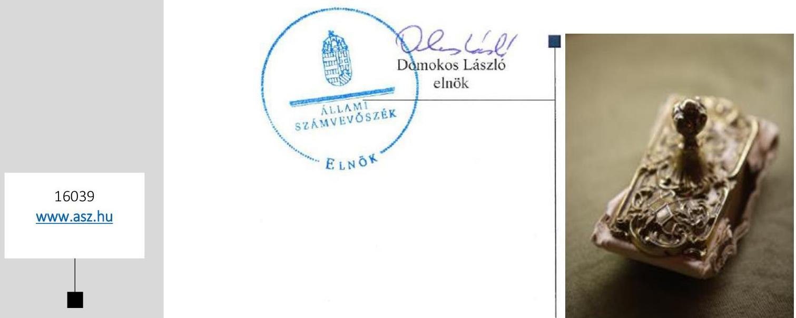
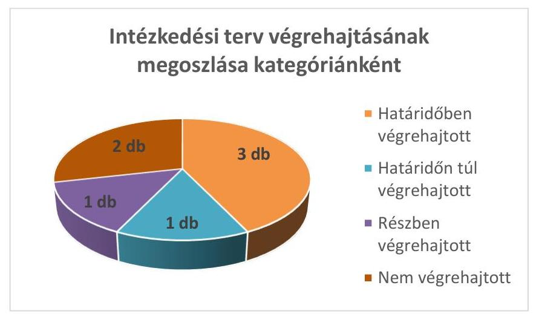
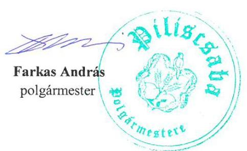
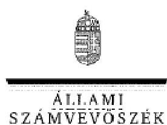
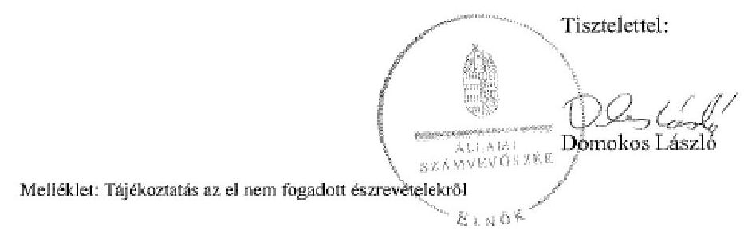

# Jelentés 

## Utóellenőrzések

Piliscsaba Város Önkormányzata vagyongazdálkodás
szabályszerúségének utóellenőrzése
2016.

---

# Jelenetés 

## Utóellenőrzések

Piliscsaba Város Önkormányzata vagyongazdálkodás
szabályszerüségének utóellenőrzése
2016. 03 hó 33 nap

---

# AZ ELLENŐRZÉST FELÜGYELTE: 

HOLMAN MAGDOLNA felügyeleti vezető

## AZ ELLENŐRZÉST VEZETTE ÉS A VÉGREHAJTÁSÁÉRT FELELŐS:

FÉSŰS NÓRA ellenőrzésvezető

## A PROGRAM ÖSSZEÁLLÍTÁSÁÉRT FELELŐS:

JANIK JÓZSEF LÁSZLÓ osztályvezető

## A TÉMÁHOZ KAPCSOLÓDÓ KORÁBBI SZÁMVEVŐSZÉKI JELENTÉSEK:

- címe: Jelentés az önkormányzati vagyongazdálkodás szabályszerűségi ellenőrzéséről - Piliscsaba
- sorszáma: 13106

Jelentéseink az Országgyúlés számítógépes hálózatán és az Interneten a www.asz.hu címen is olvashatóak.

IKTATÓSZÁM: V-0892-042/2016.
TÉMASZÁM: 1926
ELLENŐRZÉS-AZONOSÍTÓ SZÁM: V07170602

---

# TARTALOMJEGYZÉK 

■ ÖSSZEGZÉS ..... 5
■ AZ ELLENŐRZÉS CÉLJA ..... 6
■ AZ ELLENŐRZÉS TERÜLETE ..... 7
■ AZ ELLENŐRZÉS HÁTTERE, INDOKOLTSÁGA ..... 8
■ FÓKUSZKÉRDÉS ..... 9
■ ELLENŐRZÉS HATÓKÖRE ÉS MÓDSZEREI ..... 10
■ MEGÁLLAPÍTÁSOK ..... 12
■ MELLÉKLET ..... 15
I. SZ. MELLÉKLET: Az ÁSZ 13106 sz. jelentéséhez kapcsolódó intézkedési terv megvalósítása ..... 15
■ FÜGGELÉK: ÉSZREVÉTELEK ..... 17
■ RÖVIDÍTÉSEK JEGYZÉKE ..... 21

---

.

---

# ÖSSZEGZÉS 

Piliscsaba Város Önkormányzata vagyongazdálkodása szabályszerűségének 2007-2011. évekre vonatkozó ellenőrzéséről 2013 októberében jelent meg az Állami Számvevőszék jelentése. A jelentésben foglalt megállapításokhoz kapcsolódóan az Önkormányzat által összeállított intézkedési terv megvalósulását utóellenőrzés keretében értékeltük és megállapítottuk, hogy az intézkedési tervben foglaltakat az Önkormányzat nem valósította meg teljes körüen. A megtett intézkedések az ÁSZ által korábban feltárt hibák megszüntetése érdekében történtek, ugyanakkor a vagyonnyilvántartással kapcsolatos feladatok nem valósultak meg, így a nyilvántartással kapcsolatos korábbi hiányosságokat nem szüntették meg. Az intézkedési tervben foglalt feladatok végrehajtásáról a jogszabály szerinti nyilvántartást hiányosan vezették.

## Az ellenőrzés társadalmi indokoltsága

Az Állami Számvevőszék stratégiájában célul tűzte ki a számvevőszéki munka hasznosulásának javítását. Ezzel összhangban ellenőrzi, hogy az ellenőrzött szervezetek megvalósították-e a korábbi ellenőrzései által feltárt hibák, hiányosságok és szabálytalanságok megszüntetése céljából kialakított intézkedési terveikben foglaltakat. A rendszeres utóellenőrzések hozzájárulnak a szükséges intézkedések tényleges végrehajtáshoz, ezáltal a közpénzügyek rendezettségének javulásához.

## Főbb megállapítások, következtetések, javaslatok

Az intézkedési tervet az Önkormányzat az ÁSZ törvényben rögzített határidőn túl küldte meg az ÁSZ-nak. Az intézkedési terv feladatait teljes körűen nem valósították meg. A feladatok végrehajtásáról a jogszabály szerinti nyilvántartást hiányosan vezették.

---

# AZ ELLENŐRZÉS CÉLJA 

## Piliscsaba Város Önkormányzata -vagyongazdálkodás szabályszerűségének utóellenőrzése

Az ellenőrzés célja annak értékelése, hogy a számvevőszéki jelentésben ${ }^{1}$ foglalt intézkedést igénylő megállapításokkal és javaslatokkal összhangban készített intézkedési tervben meghatározott feladatokat az ellenőrzött szervezet végrehajtotta-e.

---

# AZ ELLENŐRZÉS TERÜLETE 

## Piliscsaba Város Önkormányzata

A 8053 fő* állandó lakosú Piliscsaba Pest megyében, Pilisvörösvári járásban fekszik, városi címet 2013-ban kapott. Az Önkormányzat² 2014 végén 9,8 Mrd Ft értékű vagyonnal rendelkezett, amelyből 9,3 Mrd Ft volt a nemzeti vagyonba tartozó befektetett eszközök állománya ${ }^{1}$.

A 2007-2011. közötti időszak tekintetében az Önkormányzat vagyongazdálkodásának szabályszerűségét ellenőrizte az ÁSZ³. A 2013 októberében megjelent ÁSZ jelentés szerint az ellenőrzés során hiányosságokat állapítottunk meg az Önkormányzat vagyongazdálkodási tevékenységének szabályozása, a vagyonnyilvántartás szabályszerűsége és a belső ellenőrzési funkciók tekintetében. Az ÁSZ jelentés a Jegyzőnek ${ }^{4}$ hat javaslatot fogalmazott meg.

Az Önkormányzat által összeállított és kiegészített intézkedési terv az ellenőrzés által feltárt hiányosságok kezelésére megfogalmazott intézkedést igénylő megállapításokkal és javaslatokkal összhangban volt és hét feladatot tartalmazott.

Az utóellenőrzés ${ }^{5}$ az ÁSZ jelentésben megfogalmazott intézkedést igénylő megállapításokra és javaslatokra készített intézkedési tervben foglalt feladatok megvalósításának ellenőrzésére, illetve értékelésére fókuszál.

[^0]
[^0]:    * Forrás: KSH, Magyarország Közigazgatási Helységnévkönyvének 2015. jan. 1-jei adatai
    ${ }^{1}$ Forrás: Magyar Államkincstár: Az Önkormányzat 2014. december 31-i könyvviteli mérleg szerinti adatai

---

# AZ ELLENŐRZÉS HÁTTERE, INDOKOLTSÁGA 

AZ ÁSZ TÖRVÉNY ${ }^{6}$ 33. § (1) bekezdése értelmében a számvevőszéki jelentések intézkedést igénylő megállapításaihoz és javaslataihoz kapcsolódóan az ellenőrzött szervezet vezetője intézkedési tervet köteles összeállítani, és az Állami Számvevőszék részére megküldeni. Az intézkedési tervben foglaltak megvalósítását - az ÁSZ törvény 33. § (7) bekezdésében foglaltak alapján - az Állami Számvevőszék utóellenőrzés keretében ellenőrizheti. Az intézkedések megvalósulásának értékelése során az Állami Számvevőszék figyelembe veszi az ellenőrzött szervezetek működési feltételeiben, valamint a jogszabályi előírásokban bekövetkezett változásokat.

AZ INTÉZKEDÉSI TERVEKBEN foglalt feladatok hiányos, illetve késedelmes végrehajtása, valamint megvalósításának elmaradása azt mutatja, hogy az ellenőrzések során feltárt hibák, hiányosságok és szabálytalanságok megszüntetése nem kapott kellő hangsúlyt. Ez a szabályszerű működés és a felelős vezetői magatartás vonatkozásában kockázatot hordoz. E kockázatok feltárásával az Állami Számvevőszék utóellenőrzési rendszere fokozza a fegyelmet, és igazolja, hogy a közpénzzel való szabályos gazdálkodás felelőssége elől nem lehet kitérni.

## AZ UTÓELLENŐRZÉS négy szinten hasznosulhat:

- A társadalom szintjén az utóellenőrzés jelzi, hogy a számvevőszéki ellenőrzés megállapításainak van következménye: a hiányosságok megszüntetésére az ellenőrzött szervezet által meghatározott intézkedések végrehajtását is számon kéri az ÁSZ.
- Az ellenőrzött terület szintjén az utóellenőrzés tájékoztatást nyújt a terület döntéshozóinak a hiányosságok kiküszöbölésének jó gyakorlatairól, ezzel lehetőséget biztosítva arra, hogy az ÁSZ ellenőrzési megállapításai, javaslatai a terület nem ellenőrzött szervezeteinek a működése során is hasznosuljanak.
- Az ellenőrzött szervezet szintjén az utóellenőrzés feltárja, hogy a szervezet az intézkedések végrehajtásával hasznosította-e a korábbi ellenőrzési jelentésben a hiányosságok megszüntetése, illetve a kockázatok kezelése érdekében megfogalmazott javaslatokat.
- Az ÁSZ szintjén az utóellenőrzés visszacsatolást ad az ellenőrzési jelentések hasznosulásáról, az intézkedések elmaradása vagy részleges megvalósulása a további ellenőrzésekhez kockázati jelzésként szolgál.

---

# FÓKUSZKÉRDÉS 

1. Az ellenőrzött szervezet az intézkedési tervben foglaltakat - az elöirt határidőben - végrehajtotta-e?

---

# ELLENŐRZÉS HATÓKÖRE ÉS MÓDSZEREI 

## Az ellenőrzés típusa

Szabályszerűségi ellenőrzés

## Az ellenőrzött időszak

Az ÁSZ jelentés közzétételének napjától (2013. október 15.) az utóellenőrzés megkezdésének napjáig (2015. június 19.) tartó időszak.

## Az ellenőrzés tárgya

Az Önkormányzat intézkedési tervében foglaltak végrehajtásának ellenőrzése.

## Az ellenőrzött szervezet

Piliscsaba Város Önkormányzata

## Az ellenőrzés jogalapja

Magyarország Alaptörvénye 43. cikk (1) bekezdése alapján az ÁSZ az Országgyűlés pénzügyi és gazdasági ellenőrző szerve. Az ÁSZ törvényben meghatározott feladatkörében ellenőrzi a központi költségvetés végrehajtását, az államháztartás gazdálkodását, az államháztartásból származó források felhasználását és a nemzeti vagyon kezelését.

Az ÁSZ törvény 1. § (3) bekezdése szerint az ÁSZ általános hatáskörrel végzi a közpénzekkel és az állami és önkormányzati vagyonnal való felelős gazdálkodás ellenőrzését.

Az ÁSZ törvény 33. § (7) bekezdése alapján az ÁSZ jelentésben foglalt megállapításokhoz kapcsolódóan összeállított intézkedési tervben foglaltak megvalósítását az ÁSZ utóellenőrzés keretében ellenőrizheti.

Az Áht. ${ }^{7}$ 61. § (2) bekezdése szerint az államháztartás külső ellenőrzésével kapcsolatos feladatokat az ÁSZ látja el.

## Az ellenőrzés módszerei

Az ellenőrzést az ellenőrzési program kérdései, az ellenőrzött időszakban hatályos jogszabályok, az ellenőrzés szakmai szabályok és módszertanok figyelembe vételével végeztük.

---

Az intézkedési tervben előírt feladatok végrehajtásának ellenőrzését értékelési kritériumok alapján végeztük. Az intézkedési tervekben foglalt feladatokat azok végrehajtása szempontjából az alábbiak szerint értékeltük:
$\longrightarrow$ „határidőben végrehajtott" a feladat, ha a teljesítés dokumentáltan, az intézkedési tervben előírt határidőben és tartalommal megtörtént;
$\longrightarrow$ „határidőn túl végrehajtott" a feladat, ha annak teljesítése az intézkedési tervben meghatározott módon, de az előírt határidőn túl történt meg;
$\longrightarrow$ „részben végrehajtott" a feladat, ha végrehajtása teljes körűen az intézkedési tervben előírt módon nem történt meg;
$\longrightarrow$ „nem végrehajtott" a feladat, ha a végrehajtás nem történt meg, vagy amennyiben a teljesítést nem dokumentálták;
$\longrightarrow$ „okafogyottá vált" a feladat, ha végrehajtására - meghatározott esemény bekövetkezése, továbbá külső körülmény, a működést érintő feltétel változása miatt - már nincs szükség, illetve lehetőség, és egyértelműen megállapítható, hogy az intézkedést szükségessé tevő körülmény a jövőben nem fordulhat elő;
$\longrightarrow$ „nem időszerű" az a feladat, amelynek ellenőrzési időszakon belüli végrehajtására azért nem került (kerülhetett) sor, mert az intézkedés alapjául szolgáló esemény nem következett be, de annak jövőbeni előfordulása lehetséges, a végrehajtása nem volt esedékes, vagy a végrehajtás határideje még nem járt le.
Az utóellenőrzésre az Önkormányzat elektronikus adatszolgáltatása alapján került sor, helyszínen ellenőrzést nem végeztünk. Az Önkormányzat által szolgáltatott adatok és dokumentumok valódiságát és teljes körűségét a Polgármester ${ }^{8}$, valamint a Jegyző teljességi és hitelességi nyilatkozata igazolta.

---

# MEGÁLLAPÍTÁSOK 

## 1. Az ellenőrzött szervezet az intézkedési tervben foglaltakat - az elöirt határidőben - végrehajtotta-e?

Összegző megállapítás

Az intézkedési tervben rögzített feladatok végrehajtása nem valósult meg teljes körüen. A feladatok végrehajtásáról a jogszabályban elöirt nyilvántartást hiányosan vezették.
1.1. számú megállapítás

Az intézkedési tervben rögzített feladatok végrehajtása nem valósult meg teljes körüen.

Az intézkedési tervben foglalt feladatok végrehajtásának értékelését a következő ábra foglalja össze:

Fonrás: $A 52$
HATÁRIDŐBEN VÉGREHAJTOTT feladatnak az alábbiakat értékeltük:

1. Az üzemeltetésre átadott eszközök leltározásának szabályozását az Áhsz. ${ }^{9}$ vonatkozó rendelkezésének megfelelően elkészítették.
2. Az Önkormányzat az ellenőrzött időszakban kötött hitelkeret szerződésben gondoskodott az Áht.-nak megfelelő ügyleti biztosíték kijelöléséről.
3. A belső ellenőrzésekről az Önkormányzat készített nyilvántartást.

HATÁRIDŐN TÚL VÉGREHAJTOTT minősítést kapott a következő feladat:
4. A Számv. tv. ${ }^{10}$-nek megfelelő számviteli politikát és a hozzá tartozó szabályzatokat teljes körűen csak az intézkedési tervben foglalt határidőn túl készítették el.

---

RÉSZBEN VÉGREHAJTOTT feladatként értékeltük a következőt:
5. Az intézkedési tervben hivatkozott belső ellenőrzéssel összefüggésben az Önkormányzat készített intézkedési tervet, annak végrehajtása azonban nem volt teljes körű.

NEM VÉGREHAJTOTT intézkedéseknek minősítettük a következőket: $\qquad$
6. Az ingatlanvagyon-kataszter földhivatali nyilvántartással való egyezősége érdekében megtett intézkedéseket az Önkormányzat dokumentumokkal nem tudta alátámasztani.
7. Az ingatlanvagyon-kataszter számviteli nyilvántartás adataival való egyezősége érdekében megtett intézkedéseket az Önkormányzat dokumentumokkal nem tudta alátámasztani.

Az intézkedési tervben előírt hét feladatot, az ÁSZ jelentés vonatkozó javaslatának címzettjét, a feladatok végrehajtásának határidejét, valamint a végrehajtás bemutatását és a teljesítés minősítését a melléklet tartalmazza.

# 1.2. számú megállapítás 

Az intézkedési tervben rögzített feladatok végrehajtásáról a jogszabályban meghatározott nyilvántartást hiányosan vezették.

Az Önkormányzatnál a Bkr. ${ }^{11}$ 14. § (1) bekezdésének és 47. § (2) bekezdésének megfelelően a külső ellenőrzések javaslatai alapján összeállított intézkedési tervek végrehajtásáról vezettek nyilvántartást. A nyilvántartás tartalmára vonatkozó Bkr. 47. § (2) bekezdésében foglalt előírás nem érvényesült teljes körűen, mert a dokumentum nem tartalmazta az ÁSZ jelentésben szereplő javaslatokat.

Az intézkedési terv végrehajtásáról beszámolási kötelezettséget nem írtak elő.

---

.

---

# MELLÉKLET

- I. SZ. MELLÉKLET: AZ ÁSZ 13106 SZ. JELENTÉSÉHEZ KAPCSOLÓDÓ INTÉZKEDÉSI TERV MEGVALÓSÍTÁSA

|  Sorszám | Intézkedési terv alapján elvégrendő feladat és felelős | Az ÁSZ 13106 sz. jelentése javaslatának címzettje | Az intézkedési terv szerinti határidő | Az intézkedés végrehajtása  |
| --- | --- | --- | --- | --- |
|   | 1. | 2. | 3. | 4.  |
|  Határidőben végrehajtott feladatok |  |  |  |   |
|  1. | Az üzemeltetésre átadott eszközök leltározásának az Áhsz. 37. § (4)-(5) bekezdésében előírtaknak megfelelő szabályozásának elkészítése.
Felelős: adó- és gazdasági osztályvezető | Jegyző | 2013. dec. 31. | A 2014. január 1. napjától hatályos leltározási és leltárkészítési szabályzatot a Jegyző 2013. december 31. napján hagyta jóvá. A szabályzat megfelel az Áhsz. 37.§ (4)-(5) bekezdésében az üzemeltetésre átadott eszközök leltározására vonatkozó előírásoknak.  |
|  2. | Az Áht. 84. § (4) bekezdés alapján a jövőben a hitelfedezetre jogszerű ügyleti biztosítékok kijelölése. Felelős: képviselő-testület, pénzügyi ellenőrzési bizottság | Jegyző | nincs | Az Önkormányzat a számlavezető bankjával 2014. szeptember 30-án megkötött hitelkeret szerződés során gondoskodott - az Áht. 84. § (4) bekezdésében előírtak alapján - a hitelfedezetre vonatkozó jogszerű ügyleti biztosíték kijelöléséről.  |
|  3. | A jövőben elvégzett belső ellenőrzésekről a Bkr. 50. § (1) bekezdésben előírtak szerint nyilvántartás vezetése.
Felelős: jegyző | Jegyző | azonnali és folyamatos | Az Önkormányzat a 2013., illetve a 2014. évekre vonatkozóan készített nyilvántartást a belső ellenőrzésekről.  |
|  Határidőn túl végrehajtott feladatok |  |  |  |   |
|  4. | A Számv. tv. 14. § (11) bekezdésének megfelelően a számviteli politika és a hozzá tartozó kötelező szabályzatok teljes körű elkészítése és aktualizálása. Felelős: adó- és gazdasági osztályvezető, igazgatási osztályvezető | Jegyző | 2014. máj. 1. | A számviteli politikát a Jegyző 2014. júl. 1-jén a 27/2014. (VII. 1.) jegyzői utasítással adta ki.
A számviteli politikához tartozóan 2013. dec. 31-én kiadták a 2014. január 1-től hatályos leltározási és leltárkészítési szabályzatot, 2014. jún. 18-án az értékelési szabályzatot és az önköltség-számítási szabályzatot. A pénzkezelési szabályzatot a Képviselő testület az ellenőrzött időszak előtt, 2012. jún. 5-én fogadta el.  |

---

|  Sorszám | Intézkedési terv alapján elvégzendő feladat és felelős | Az ÁSZ 13106 sz. jelentése javaslatának címzettje | Az intézkedési terv szerinti határidő | Az intézkedés végrehajtása  |
| --- | --- | --- | --- | --- |
|   | 1. | 2. | 3. | 4.  |
|  Részben végrehajtott feladat |  |  |  |   |
|  5. | A 8kr. 28. § c) pontjában előírtaknak megfelelően a jövőben a belső ellenőrzés által feltárt, a vagyongazdálkodás területét is érintő hiányosságok megszüntetésére készüljön intézkedési terv és az intézkedési tervek végrehajtása valósuljon meg.
Felelős: jegyző | Jegyző | azonnali és folyamatos | Nem végrehajtott feladat:
Az Önkormányzat nem hajtotta végre az elkészített intézkedési tervben foglalt feladatok mindegyikét: az intézkedési terv 1. pontját részben a 2. pontját pedig nem hajtotta végre.
Határidőben végrehajtott feladat:
Az Önkormányzat belső ellenőrzésének a „Vagyonkataszter vizsgálata" tárgyú, 3/2013 számú jelentése alapján intézkedési terv készült.  |
|  Nem végrehajtott feladatok |  |  |  |   |
|  6. | A jövőben dokumentumokkal igazoltan a 147/1992. (XI. 6.) Korm. rendelet 1. § (2) bekezdésében rögzítettéknek megfelelően biztosítani az ingatlanvagyon kataszter adatai egyezőségét a földhivatali ingatlan-nyilvántartás azonos tartalmú adataival.
Felelős: adó- és gazdasági osztályvezető | Jegyző | 2014. jan. 30. | Az Önkormányzat dokumentumokkal nem tudta igazolni, hogy intézkedett és biztosította az egyezőséget az ingatlanvagyon-kataszter adatai és a földhivatali ingatlan-nyilvántartás adatai között.  |
|  7. | A jövőben dokumentumokkal igazoltan a 147/1992. (XI. 6.) Korm. rendelet 1. § (3) bekezdésében foglaltakra figyelemmel biztosítani kell az egyezőséget az ingatlanvagyon kataszter adatai és a számviteli nyilvántartás adatai között.
Felelős: adó- és gazdasági osztályvezető | Jegyző | 2014. jan. 30. | Az Önkormányzat dokumentumokkal nem tudta igazolni, hogy intézkedett és biztosította az egyezőséget az ingatlanvagyon-kataszter adatai és a számviteli nyilvántartás adatai között.  |

---

# FÜGGELÉK: ÉSZREVÉTELEK 

A jelentéstervezetet a Számvevőszék 15 napos észrevételezésre megküldte az ellenőrzött szervezet vezetőjének az ÁSZ tv. 29. §̊ (1) bekezdése előírásának megfelelően.
Az elfogadott észrevételek alapján a Számvevőszék módosította a jelentést.
A függelék tartalmazza az ellenőrzött észrevételeit, illetve az el nem fogadott észrevételek elutasításának indoklását.

- Piliscsaba Város Önkormányzata Polgármesterének 439-2/2016. iktatószámú levele
- Tájékoztatás az el nem fogadott észrevételekről (V0892-038/2016.)

[^0]
[^0]:    ${ }^{3}$ 29. § (1) Az Állami Számvevőszék az ellenőrzési megállapításait megküldi az ellenőrzött szervezet vezetőjének vagy az általa megbízott személynek, és annak, akinek személyes felelősségét állapította meg.
    (2) Az ellenőrzött szervezet vezetője és a felelősként megjelölt személy az ellenőrzés megállapításaira tizenöt napon belül írásban észrevételt tehet.
    (3) Az Állami Számvevőszék az észrevételre a beérkezésétől számított harminc napon belül írásban válaszol. A figyelembe nem vett észrevételeket köteles a jelentésben feltüntetni, és megindokolni, hogy azokat miért nem fogadta el.

---

Piliscsaba Város
Polgármestere

Szám: 439-2/2016.
Hiv.sz.: V-0892-032/2015.

Domokos László úr részére
elnők
Állami Számvevőszék
Budapest

# Tisztelt Elnök Úr! 

Az Utóellenőrzések - Piliscsaba Város Önkormányzata - vagyongazdálkodás szabályszerűségének utóellenőrzése tárgyú számvevőségi jelentéstervezetre az alábbi észrevételt teszem:

Az utóellenőrzés során az Állami Számvevőszék munkatársai elsősorban vagyonkataszterünk készítésének dokumentáltságát kifogásolták. Munkatársaimmal az utóellenőrzési jegyzőkönyv áttanulmányozása után áttekintettük vagyonkataszterünk jelenlegi helyzetét és az alábbi megállapításokat fogalmaztuk meg.
1.) A vizsgálatot követően elfogadott ütemterv szerint a végrehajtásért felelős jegyző foglalkoztatása Önkormányzatunknál 2015. szeptemberében megszűnt.
2.) Vagyonkataszterünk kezelésére és az abból szolgáltatandó rendszeres adatszolgáltatások teljesítésére Önkormányzatunknak szerződése van egy gazdasági társasággal. Ezt a szerződést tartalmában és minden pontjában felül kell vizsgálnunk 2016. február hónapban, különös tekintettel a vállalkozó szerződés szerinti teljesítésére. Amennyiben szükséges, új szerződést kötünk, vagy a feladatot saját munkatárssal látjuk el.

Kérem Tisztelt Elnök Úr megértését és hozzájárulását ahhoz, hogy vagyonkataszterünket a fentiekben leírt módon 2016. június 30 -ig feleltessük meg mindenben a hatályos jogszabályoknak.

Piliscsaba, 2016. január 28.
Tisztelettel:

---

ELNOK

Ikt.szám: V-0892-038/2016.

# Farkas András úr 

polgármester
Piliscsaba Város Önkormányzata

## Piliscsaba

## Tisztelt Polgármester Úr!

Az Utóellenőrzés - Piliscsaba Város Önkormányzata vagyongazdálkodás szabályszerűségének utóellenőrzése címủ számvevőszéki jelentéstervezetre tett észrevételeit köszönettel megkaptam.

Az Állami Számvevőszék észrevételekre vonatkozó álláspontjáról a felügyeleti vezető által készített részletes tájékoztatást csatoltan megküldöm.

Tájékoztatom Polgármester urat, hogy a jelentésben - az Állami Számvevőszékről szóló 2011. évi LXVI. törvény 29. § (3) bekezdése alapján - az el nem fogadott észrevételeket szerepeltetjük az elutasítás indokának feltüntetésével együtt.

Budapest, 2016. O,2, hó .29 nap

Melléklet: Tájékoztatás az el nem fogadott észrevételekről

---

# Tájékoztatás az el nem fogadott észrevételekröl 

Az Utóellenőrzés - Pilisesaba Város Önkormányzata vagyongazdálkodás szabályszerűségének utóellenőrzése címủ számvevöszéki jelentéstervezetre a 439-2/2016. iktatószámú levelében tett észrevételeit áttekintettük, annak kezeléséről az alábbi tájékoztatást adom.
Örömmel vettük tájékoztatását, hogy a feltárt hiányosságok megszüntetése érdekében Polgármester úr lépéseket tesz. A jelentéstervezetre tett észrevételei a jelentéstervezet megállapításait nem kifogásolják, ahhoz további kiegészítő információt, tájékoztatást nyújtanak.

Budapest, 2016. 02. hó 29. nap

Holman Magdolna
felügyeleti vezetö

---

# RÖVIDÍTÉSEK JEGYZÉKE 

${ }^{1}$ számvevőszéki jelentés
${ }^{2}$ Önkormányzat
${ }^{3}$ ÁSZ
${ }^{4}$ Jegyző
${ }^{5}$ utóellenőrzés
${ }^{6}$ ÁSZ törvény
${ }^{7}$ Áht.
${ }^{8}$ Polgármester
${ }^{9}$ Áhsz.
${ }^{10}$ Számv. tv.
${ }^{11}$ Bkr.

Az ÁSZ 13106 számú, Jelentés: Az önkormányzati vagyongazdálkodás szabályszerűségi ellenőrzéséről - Piliscsaba című jelentése
Piliscsaba Város Önkormányzata
Állami Számvevőszék
Piliscsaba Város Polgármesteri Hivatalának jegyzője
Az ÁSZ 13106 számú jelentésében foglalt megállapításokhoz kapcsolódóan összeállított intézkedési tervben foglaltak megvalósításának ellenőrzése.
az Állami Számvevőszékről szóló 2011. évi LXVI. törvény
az államháztartásról szóló 2011. évi CXCV. törvény
Piliscsaba Város polgármestere
2013. december 31-ig: az államháztartás szervezetei beszámolási és könyvvezetési kötelezettségének sajátosságairól szóló 249/2000. (XII. 24.) Korm. rendelet
2014. január 1-től: az államháztartás számviteléről szóló 4/2013. (I. 11.) Korm. rendelet
a számvitelről szóló 2000. évi C. törvény
a költségvetési szervek belső kontrollrendszeréről és belső ellenőrzéséről szóló 370/2011. (XII. 31.) Korm. rendelet

---

# ÁLLAMI SZÁMVEVŐSZÉK 

1052 Budapest, Apáczai Csere János utca 10.
Levélcím: 1364 Budapest 4. Pf. 54
Telefon: +36 14849100 Telefax: +36 14849200
www.asz.hu