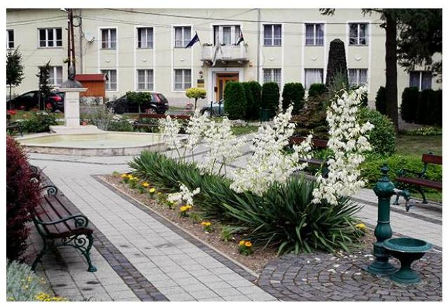
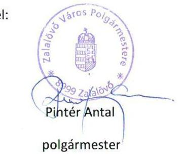
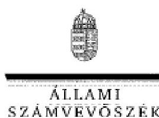

# Jelentés 

## Utóellenőrzések

Zalalövő Város Önkormányzata vagyongazdálkodás
szabályszerűségének utóellenőrzése 2016. 03. hó 16. nap

16040
www.asz.hu

---

# Jelentés 

## Utóellenőrzések

Zalalövő Város Önkormányzata vagyongazdálkodás
szabályszerűségének utóellenőrzése
2016. 03. hó 16. nap

---

# AZ ELLENŐRZÉST FELÜGYELTE: 

HOLMAN MAGDOLNA felügyeleti vezető

## AZ ELLENŐRZÉST VEZETTE ÉS A VÉGREHAJTÁSÁÉRT FELELŐS:

FÉSŰS NÓRA ellenőrzésvezető

## A PROGRAM ÖSSZEÁLLÍTÁSÁÉRT FELELŐS:

JANIK JÓZSEF LÁSZLÓ osztályvezető

## A TÉMÁHOZ KAPCSOLÓDÓ KORÁBBI SZÁMVEVŐSZÉKI JELENTÉSEK:

- címe: Jelentés az önkormányzati vagyongazdálkodás szabályszerűségi ellenőrzéséről - Zalalövő
- sorszáma: 13159

Jelentéseink az Országgyűlés számítógépes hálózatán és az Interneten a www.asz.hu címen is olvashatóak.

IKTATÓSZÁM: V-0896-048/2016.
TÉMASZÁM: 1930
ELLENŐRZÉS-AZONOSÍTÓ SZÁM: V07170605

---

# TARTALOMJEGYZÉK 

■ ÖSSZEGZÉS ..... 5
■ AZ ELLENŐRZÉS CÉLJA ..... 6
■ AZ ELLENŐRZÉS TERÜLETE ..... 7
■ AZ ELLENŐRZÉS HÁTTERE, INDOKOLTSÁGA ..... 8
■ FÓKUSZKÉRDÉS ..... 9
■ ELLENŐRZÉS HATÓKÖRE ÉS MÓDSZEREI ..... 10
■ MEGÁLLAPÍTÁSOK ..... 12
■ MELLÉKLET ..... 15
I. SZ. MELLÉKLET: Az ÁSZ 13159 sz. jelentéséhez kapcsolódó intézkedési terv megvalósítása ..... 15
■ FÜGGELÉK: ÉSZREVÉTELEK ..... 17
■ RÖVIDÍTÉSEK JEGYZÉKE ..... 22

---

.

---

# ÖSSZEGZÉS 

Zalalövő Város Önkormányzata vagyongazdálkodása szabályszerűségének 2007-2011. éveket érintő ellenőrzéséről 2013 decemberében jelent meg az Állami Számvevőszék jelentése. A jelentésben foglalt megállapításokhoz kapcsolódóan az Önkormányzat által összeállított intézkedési terv megvalósítását utóellenőrzés keretében értékeltük és megállapítottuk, hogy a Képviselő-testület által elfogadott intézkedési tervben foglaltakat az Önkormányzat nem hajtotta végre teljes körűen. A megtett lépések az ÁSZ által korábban feltárt hiányosságok megszüntetése érdekében történtek. Az intézkedési tervben foglalt feladatok végrehajtásáról a jogszabály szerinti nyilvántartást hiányosan vezették.

## Az ellenőrzés társadalmi indokoltsága

Az Állami Számvevőszék stratégiájában célul tűzte ki a számvevőszéki munka hasznosulásának javítását. Ezzel összhangban ellenőrzi, hogy az ellenőrzött szervezetek megvalósították-e a korábbi ellenőrzései által feltárt hibák, hiányosságok és szabálytalanságok megszüntetése céljából kialakított intézkedési terveikben foglaltakat. A rendszeres utóellenőrzések hozzájárulnak a szükséges intézkedések tényleges végrehajtásához, ezáltal a közpénzügyek rendezettségének javulásához.

## Főbb megállapítások, következtetések, javaslatok

A Képviselő-testület által elfogadott intézkedési tervet az Önkormányzat elkészítette, ugyanakkor az ÁSZ törvényben rögzített határidőn túl küldték meg az ÁSZ-nak. Az intézkedési terv feladatait teljes körűen nem hajtották végre, a feladatok végrehajtásáról a jogszabály szerinti nyilvántartást hiányosan vezették.

---

# AZ ELLENŐRZÉS CÉLJA 

## Zalalövő Város Önkormányzata - vagyongazdálkodás szabályszerűségének utóellenőrzése

Az ellenőrzés célja annak értékelése, hogy a számvevőszéki jelentésben ${ }^{1}$ foglalt intézkedést igénylő megállapításokkal és javaslatokkal összhangban készített intézkedési tervben meghatározott feladatokat az ellenőrzött szervezet végrehajtotta-e.

---

# AZ ELLENŐRZÉS TERÜLETE 

## Zalalövő Város Önkormányzata

Zalalövő város Zala megyében fekszik, a lakónépességének száma 3027 fő*. Az Önkormányzat² 2014 végén 1,74 Mrd Ft értékű vagyonnal rendelkezett, amelyből 1,63 Mrd Ft volt a nemzeti vagyonba tartozó befektetett eszközök állománya ${ }^{1}$.

A 2007-2011. közötti időszak tekintetében az Önkormányzat vagyongazdálkodásának szabályszerűségét ellenőrizte az ÁSZ³. A 2013 decemberében megjelent ÁSZ jelentés szerint az ellenőrzés során hiányosságokat állapítottunk meg az Önkormányzat vagyongazdálkodási tevékenységének szabályozása, a vagyongazdálkodási folyamatok szabályszerűsége és a belső ellenőrzési funkciók tekintetében. Az ÁSZ jelentés a Polgármesternek ${ }^{4}$ egy, a Jegyzőnek ${ }^{5}$ hat javaslatot fogalmazott meg.

Az Önkormányzat által összeállított intézkedési terv az ellenőrzés által feltárt hiányosságok kezelésére megfogalmazott intézkedést igénylő megállapításokkal és javaslatokkal összhangban volt és hat feladatot tartalmazott.

Az utóellenőrzés ${ }^{6}$ az ÁSZ jelentésben megfogalmazott intézkedést igénylő megállapításokra és javaslatokra készített intézkedési tervben foglalt feladatok megvalósításának ellenőrzésére, illetve értékelésére fókuszál.

[^0]
[^0]:    * Forrás: KSH, Magyarország Közigazgatási Helységnévkönyvének 2015. jan. 1-jei adatai
    ${ }^{1}$ Forrás: Magyar Államkincstár: Az Önkormányzat 2014. december 31-i könyvviteli mérleg szerinti adatai

---

# AZ ELLENŐRZÉS HÁTTERE, INDOKOLTSÁGA 

Az ÁSZ TÖRVÉNY ${ }^{7}$ 33. § (1) bekezdése értelmében a számvevőszéki jelentések intézkedést igénylő megállapításaihoz és javaslataihoz kapcsolódóan az ellenőrzött szervezet vezetője intézkedési tervet köteles összeállítani, és az Állami Számvevőszék részére megküldeni. Az intézkedési tervben foglaltak megvalósítását - az ÁSZ törvény 33. § (7) bekezdésében foglaltak alapján - az Állami Számvevőszék utóellenőrzés keretében ellenőrizheti. Az intézkedések megvalósulásának értékelése során az Állami Számvevőszék figyelembe veszi az ellenőrzött szervezetek működési feltételeiben, valamint a jogszabályi előírásokban bekövetkezett változásokat.

Az intézkedési tervekben foglalt feladatok hiányos, illetve késedelmes végrehajtása, valamint megvalósításának elmaradása azt mutatja, hogy az ellenőrzések során feltárt hibák, hiányosságok és szabálytalanságok megszüntetése nem kapott kellő hangsúlyt. Ez a szabályszerű működés és a felelős vezetői magatartás vonatkozásában kockázatot hordoz. E kockázatok feltárásával az Állami Számvevőszék utóellenőrzési rendszere fokozza a fegyelmet, és igazolja, hogy a közpénzzel való szabályos gazdálkodás felelőssége elől nem lehet kitérni.

## AZ UTÓELLENŐRZÉS négy szinten hasznosulhat:

- A társadalom szintjén az utóellenőrzés jelzi, hogy a számvevőszéki ellenőrzés megállapításainak van következménye: a hiányosságok megszüntetésére az ellenőrzött szervezet által meghatározott intézkedések végrehajtását is számon kéri az ÁSZ.
- Az ellenőrzött terület szintjén az utóellenőrzés tájékoztatást nyújt a terület döntéshozóinak a hiányosságok kiküszöbölésének jó gyakorlatairól, ezzel lehetőséget biztosítva arra, hogy az ÁSZ ellenőrzési megállapításai, javaslatai a terület nem ellenőrzött szervezeteinek a működése során is hasznosuljanak.
- Az ellenőrzött szervezet szintjén az utóellenőrzés feltárja, hogy a szervezet az intézkedések végrehajtásával hasznosította-e a korábbi ellenőrzési jelentésben a hiányosságok megszüntetése, illetve a kockázatok kezelése érdekében megfogalmazott javaslatokat.
- Az ÁSZ szintjén az utóellenőrzés visszacsatolást ad az ellenőrzési jelentések hasznosulásáról, az intézkedések elmaradása vagy részleges megvalósulása a további ellenőrzésekhez kockázati jelzésként szolgál.

---

# FÓKUSZKÉRDÉS 

1. Az ellenőrzött szervezet az intézkedési tervben foglaltakat - az előírt határidőben - végrehajtotta-e?

---

# ELLENŐRZÉS HATÓKÖRE ÉS MÓDSZEREI 

## Az ellenőrzés típusa

Szabályszerűségi ellenőrzés

## Az ellenőrzött időszak

Az ÁSZ jelentés közzétételének napjától (2013. december 5.) az utóellenőrzés megkezdésének napjáig (2015. június 19.) tartó időszak.

## Az ellenőrzés tárgya

Az Önkormányzat intézkedési tervében foglaltak végrehajtásának ellenőrzése

## Az ellenőrzött szervezet

Zalalövő Város Önkormányzata

## Az ellenőrzés jogalapja

Magyarország Alaptörvénye 43. cikk (1) bekezdése alapján az ÁSZ az Országgyűlés pénzügyi és gazdasági ellenőrző szerve. Az ÁSZ törvényben meghatározott feladatkörében ellenőrzi a központi költségvetés végrehajtását, az államháztartás gazdálkodását, az államháztartásból származó források felhasználását és a nemzeti vagyon kezelését.

Az ÁSZ törvény 1. § (3) bekezdése szerint az ÁSZ általános hatáskörrel végzi a közpénzekkel és az állami és önkormányzati vagyonnal való felelős gazdálkodás ellenőrzését.

Az ÁSZ törvény 33. § (7) bekezdése alapján az ÁSZ jelentésben foglalt megállapításokhoz kapcsolódóan összeállított intézkedési tervben foglaltak megvalósítását az ÁSZ utóellenőrzés keretében ellenőrizheti.

Az államháztartásról szóló 2011. évi CXCV. törvény 61. § (2) bekezdése szerint az államháztartás külső ellenőrzésével kapcsolatos feladatokat az ÁSZ látja el.

---

# Az ellenőrzés módszerei 

Az ellenőrzést az ellenőrzési program kérdései, az ellenőrzött időszakban hatályos jogszabályok, az ellenőrzés szakmai szabályok és módszertanok figyelembe vételével végeztük.

Az intézkedési tervben előírt feladatok végrehajtásának ellenőrzését értékelési kritériumok alapján végeztük. Az intézkedési tervekben foglalt feladatokat azok végrehajtása szempontjából az alábbiak szerint értékeltük:
"határidőben végrehajtott" a feladat, ha a teljesítés dokumentáltan, az intézkedési tervben előírt határidőben és tartalommal megtörtént;
"határidőn túl végrehajtott" a feladat, ha annak teljesítése az intézkedési tervben meghatározott módon, de az előírt határidőn túl történt meg;
"részben végrehajtott" a feladat, ha végrehajtása teljes körűen az intézkedési tervben előírt módon nem történt meg;
"nem végrehajtott" a feladat, ha a végrehajtás nem történt meg, vagy amennyiben a teljesítést nem dokumentálták;
"okafogyottá vált" a feladat, ha végrehajtására - meghatározott esemény bekövetkezése, továbbá külső körülmény, a működést érintő feltétel változása miatt - már nincs szükség, illetve lehetőség, és egyértelműen megállapítható, hogy az intézkedést szükségessé tevő körülmény a jövőben nem fordulhat elő;
"nem időszerű" az a feladat, amelynek ellenőrzési időszakon belüli végrehajtására azért nem került (kerülhetett) sor, mert az intézkedés alapjául szolgáló esemény nem következett be, de annak jövőbeni előfordulása lehetséges, a végrehajtása nem volt esedékes, vagy a végrehajtás határideje még nem járt le.
Az utóellenőrzésre az Önkormányzat elektronikus adatszolgáltatása alapján került sor, helyszínen ellenőrzést nem végeztünk. Az Önkormányzat által szolgáltatott adatok és dokumentumok valódiságát és teljes körűségét a Polgármester, valamint a Jegyző teljességi és hitelességi nyilatkozata igazolta.

---

# MEGÁLLAPÍTÁSOK 

## 1. Az ellenőrzött szervezet az intézkedési tervben foglaltakat - az előírt határidőben - végrehajtotta-e?

Összegző megállapítás

Az intézkedési tervben meghatározott feladatokat nem teljes körűen valósították meg, a feladatok végrehajtásáról a jogszabály szerinti nyilvántartást hiányosan vezették.
1.1. számú megállapítás

Az intézkedési tervben rögzített feladatok megvalósítása nem volt teljes körű.

Az intézkedési tervben foglalt feladatok végrehajtásának értékelését a következő ábra foglalja össze:

Intézkedési terv végrehajtásának megoszlása kategóriánként

- Határidőben végrehajtott
- Határidőn túl végrehajtott
- Nem végrehajtott
- Okafogyottá vált

Forrás: $A 52$
HATÁRIDŐBEN VÉGREHAJTOTT feladatnak az alábbiakat értékeltük:

1. Az Önkormányzat intézkedett a nemzetgazdasági szempontból kiemelt jelentőségű nemzeti vagyonnak minősített forgalomképtelen vagyonelemek kijelöléséről.
2. Elkészült az ÁSZ-ben ${ }^{8}$ előírt minimális tartalmi követelményeknek megfelelő vagyonkimutatás.

HATÁRIDŐN TÚL VÉGREHAJTOTT feladat volt:
3. Az Önkormányzat az intézkedési tervben meghatározott határidőn túl módosította az analitikus nyilvántartásokat, annak érdekében,

---

hogy ne tartalmazzanak olyan vagyonelemeket, amelyek nem az Önkormányzat tulajdonát képezik.

NEM VÉGREHAJTOTT feladat volt:
4. Az Önkormányzat nem biztosította, hogy az üzemeltetésre átadott eszközök mérleg szerinti értékének alátámasztásához az üzemeltetésre átadott eszközökről az üzemeltető által elvégzett leltárak rendelkezésre álljanak.
5. A vízmű telep önkormányzati tulajdoni hányadának földhivatali rendezését az Önkormányzat nem teljesítette.

OKAFOGYOTTÁ VÁLT feladattá vált:
6. Az éves összefoglaló belső ellenőrzési jelentések Képviselő-testület elé történő beterjesztésének kezdeményezésére vonatkozó intézkedés nem volt esedékes.

Az intézkedési tervben előírt hat feladatot, az ÁSZ jelentés vonatkozó javaslatának címzettjét, a feladatok végrehajtásának határidejét, valamint a végrehajtás bemutatását és a teljesítés minősítését a melléklet tartalmazza.
1.2. számú megállapítás

## Az Önkormányzat hiányosan vezetett nyilvántartást az intézkedési tervben foglalt feladatok végrehajtásáról.

Az Önkormányzat vezette a Bkr. ${ }^{9}$ 14. § (1) bekezdése szerinti nyilvántartást a külső ellenőrzések javaslatai alapján készült intézkedési tervek végrehajtásáról. A nyilvántartás tartalmára vonatkozó Bkr. 47. § (2) bekezdésében foglalt előírás nem érvényesült teljes körűen, mert a dokumentum nem tartalmazta az ÁSZ jelentésben szereplő javaslatokat.

Beszámolási kötelezettséget az Önkormányzat vagyongazdálkodásának szabályszerűségi ellenőrzése alapján készített intézkedési terv végrehajtásáról a Képviselő-testület nem írt elő.

---

.

---

# MELLÉKLET

- I. SZ. MELLÉKLET: AZ ÁSZ 13159 SZ. JELENTÉSÉHEZ KAPCSOLÓDÓ INTÉZKEDÉSI TERV MEGVALÓSÍTÁSA

|  Sorszám | Intézkedési terv alapján elvégzendő feladat és felelős | Az ÁSZ 13159 sz. jelentés javaslatának címzettje | Az intézkedési terv szerinti határidő | Az intézkedés végrehajtása  |
| --- | --- | --- | --- | --- |
|   | 1. | 2. | 3. | 4.  |
|  Határidőben végrehajtott feladatok |  |  |  |   |
|  1. | El kell készíteni és a Képviselő-testület elé kell terjeszteni a nemzetgazdasági szempontból kiemelt jelentőségű nemzeti vagyonnak minősülő forgalomképtelen vagyonelemek kijelöléséről szóló rendelet-tervezetet a nemzeti vagyonról szóló 2011. évi CXCVI. törvény 18. § (1) bekezdésében előírtak szerint.
Felelős: aljegyző, mezőgazdasági és ingatlan-nyilvántartási ügyintéző | Polgármester és Jegyző | 2014. febr. 28. | Az önkormányzat vagyonáról, a vagyongazdálkodás és vagyonhasznosítás szabályairól szóló 17/2005. (X. 27.) rendelet módosítását 2014. február 25-én terjesztette a Polgármester a Képviselő-testület
 elé, amely azt 2015. március 5-én fogadta el a 4/2014. (III. 5.) önkormányzati rendelettel. A módosított rendelet szerint „az önkormányzat nemzetgazdasági szempontból kiemelt jelentőségű nemzeti vagyonnak nem minősít vagyont”. Az előterjesztést hatásvizsgálat előzte meg.  |
|  2. | Az éves költségvetési beszámoló vagyonkimutatásában a képviselő-testületnek az Áhsz. 44/A. § (2)-(3) bekezdésében előírt minimális tartalmi követelményeknek megfelelően - az önkormányzat tárgyi eszközeit és a befektetett pénzügyi eszközcsoportok arab számmal jelzett tételeik szerinti tagolásban, az önkormányzat vagyonát törzsvagyon és törzsvagyonon kívüli egyéb vagyon bontásban, valamint a "0"-ra leírt eszközök állományát kell bemutatni.
Felelős: pénzügyi osztályvezető | Jegyző | 2014. ápr. 30., illetve folyamatos | A 2013. évi költségvetési beszámolót a Polgármester 2014. április 29-én terjesztette a Képviselő-testület elé, amely azt a 8/2014. (V. 15.) önkormányzati rendelettel fogadta el. A rendelet 18. melléklete tartalmazza az Áhsz. 44/A. § (2)-(3) bekezdésében előírt tartalmi követelményeknek megfelelő vagyonkimutatást.
A 2014. évi költségvetési beszámolót a Polgármester 2015. április 21-én terjesztette a Képviselő-testület elé, amely azt a 8/2015. (V. 15.) önkormányzati rendelettel fogadta el. A rendelet 17. mellékletében a vagyonkimutatás a vonatkozó hatályos jogszabálynak megfelel. A 2014. április 1-én hatályba lépett Vagyongazdálkodási és beruházási szabályzatban már a jogszabályváltozásnak megfelelő tagolásban szerepeltek a mérleg eszköz és forrás sorai.  |

---

|  5. | Intézkedési terv alapján elvégzendő feladat és felelős | Az ÁSZ
13159 sz.
jelentés
javaslatának
címzettje | Az intézkedési
terv szerinti ha-
táridő | Az intézkedés végrehajtása  |
| --- | --- | --- | --- | --- |
|   | 1. | 2. | 3. | 4.  |
|   | Határidőn túl végrehajtott feladat |  |  |   |
|  3. | A vízi közmű számviteli nyilvántartásának az ingatlanvagyon-kataszterrel való
egyezősége érdekében a 147/1992. (XI. 6.) Korm. rendelet10 1. § (3) bekezdésében és a 2. számú mellékletében foglalt előírásnak megfelelően az analitikus
nyilvántartásokat módosítani kell, hogy ne tartalmazzanak olyan vagyonelemeket, amelyek nem az önkormányzat tulajdonát képezik.
Felelős: pénzügyi ügyintéző, ingatlan-nyilvántartási ügyintéző | Jegyző | 2014. jún. 30. | Az Önkormányzat az analitikus nyilvántartásokat a vállalt határidőn túl,
2014. december 31-ig módosította a Képviselő-testület 2014. szeptember
15-ei 150/2014. (IX. 15.) számú határozatával összhangban. A módosított
nyilvántartás – az intézkedési tervben hivatkozott jogszabályi előírásoknak
megfelelően – nem tartalmaz olyan vagyonelemet, amely nem az Ön-
kormányzat tulajdonát képezi.  |
|   | Nem végrehajtott feladat |  |  |   |
|  4. | Intézkedni kell, hogy az üzemeltetésre átadott eszközök mérleg szerinti értékének alátámasztásához az Áhsz. 37. § (4) bekezdés előírásának megfelelően
az üzemeltetésre átadott eszközökről az üzemeltető által évente elvégzett és
hitelesített leltárak álljanak rendelkezésre.
Felelős: pénzügyi osztályvezető | Jegyző | 2013. dec. 31. | A 2013. évi beszámoló mérlegének alátámasztásához a Jegyző levélben
kérte az üzemeltetőktől az üzemeltetésre átadott eszközök hitelesített leltárát. A leltárakat nem küldte el minden üzemeltető az Önkormányzatnak,
az Önkormányzat további lépést nem tett, ezért nem volt biztosított, hogy
az üzemeltetésre átadott eszközök mérleg szerinti értékének alátámasztásához az üzemeltetésre átadott eszközökről az üzemeltető által elvégzett
leltárak rendelkezésre álljanak.  |
|  5. | A vízi közmű vagyon vagyonkataszteri nyilvántartása és földhivatali nyilvántartása egyezősége érdekében a 147/1992. (XI. 6.) Korm. rendelet 1. § (2) bekezdésében foglalt előírásnak megfelelően intézkedni kell az illetékes földhivatal
felé, hogy a vízmű telep esetében az önkormányzati tulajdon hányada megfelelően kerüljön rögzítésre.
Felelős: ingatlan-nyilvántartási ügyintéző | Jegyző | 2014. febr. 28. | Az Önkormányzat az ellenőrzött időszakban nem tett lépéseket az intézkedés megvalósítására.  |
|   | Okafogyottá vált feladat |  |  |   |
|  6. | Az éves összefoglaló ellenőrzési jelentéseknek – a zárszámadási jelentéstervezettel egyidejűleg – az Ötv.11 92. § (10) bekezdésében foglaltaknak és a
Bkr. 56. § (8) bekezdésének megfelelően a képviselő-testület elé történő be-
terjesztését kezdeményezni kell a polgármesternél.
Felelős: jegyző | Jegyző | 2014. április 31.,
illetve folyamatos | Az intézkedés okafogyottá vált, mert az Önkormányzati belső ellenőrzési
feladatok ellátása 2013. január 1-től nem társulás formájában történik,
ezért nem vonatkozik rá a Bkr. 56. § (8) bekezdésében részletezett, a belső
ellenőrzési feladatok társulás formájában történő ellátására vonatkozó
speciális szabálya.
Az Ötv vonatkozó rendelkezése 2013. január 1-től nem hatályos, azt Ma-
gyarország helyi önkormányzatairól szóló 2011. évi CLXXXIX. törvény már
nem tartalmazza, helyette a Bkr. rendelkezik róla.  |

*Forrás: ÁSZ*

---

# FÜGGELÉK: ÉSZREVÉTELEK 

A jelentéstervezetet a Számvevőszék 15 napos észrevételezésre megküldte az ellenőrzött szervezet vezetőjének az ÁSZ tv. 29. § (1) bekezdése előírásának megfelelően.
Az elfogadott észrevételek alapján a Számvevőszék módosította a jelentést.

A függelék tartalmazza az ellenőrzött észrevételeit, illetve az el nem fogadott észrevételek elutasításának indoklását.

- Zalalövő Város Önkormányzata Polgármesterének 486-2/2016. iktatószámú észrevétele
- Tájékoztatás az el nem fogadott észrevételekről (V-0869-043/2016)

#### Abstract

${ }^{1}$ 29. § (1) Az Állami Számvevőszék az ellenőrzési megállapításait megküldi az ellenőrzött szervezet vezetőjének vagy az általa megbízott személynek, és annak, akinek személyes felelősségét állapította meg. (2) Az ellenőrzött szervezet vezetője és a felelősként megjelölt személy az ellenőrzés megállapításaira tizenöt napon belül írásban észrevételt tehet. (3) Az Állami Számvevőszék az észrevételre a beérkezésétől számított harminc napon belül írásban válaszol. A figyelembe nem vett észrevételeket köteles a jelentésben feltüntetni, és megindokolni, hogy azokat miért nem fogadta el.

---

Zalalövő Város Polgármestere
8999 Zalalövő, Szabadság tér 1.

Ügyszám: 486-2/2016.
Ügyintéző: Gyarmati Lászlóné

Tárgy: Polgármesteri észrevétel

DOMOKOS LÁSZLÓ

# ELNÖK ÚR RÉSZÉRE 

## ÁLLAMI SZÁMVEVŐSZÉK

## BUDAPEST

APÁCZAI CSERE JÁNOS UTCA 10.

## 1052

Tisztelt Elnök Úr!

A V-0896 - 037/2015. iktatószámú „Utóellenőrzések - Zalalövő Város Önkormányzata vagyongazdálkodás szabályszerűségének utóellenőrzése” című számvevőszéki jelentéstervezetet köszönettel megkaptam.

A hivatkozott jogszabályi hely szerint biztosított észrevételi lehetőségemmel élve szeretnék néhány fontos, a gazdálkodásunk megítélését befolyásoló körülményt ismertetni Önnel. Talán munkatársai vélekedése is megerősíti azon állításomat, hogy a vizsgálati időszak egészében mind elődöm, mind én, mind pedig a hivatali apparátus dolgozói a legkészségesebb és őszintébb módon kívántuk segíteni munkájukat, akár a szabadidőnk terhére, hétvégénket is feláldozva. A technika adta lehetőségekkel, vagy személyesen is rendelkezésre álltunk, többi, nem kevés teendőnket hátrébb sorolva. Sajnálatos tény, hogy éppen a jogszabályi előírások maradéktalan betartása, az ellenőrzés javaslatainak hasznosulása érdekében elvégzendők naptári időszakában egy a közösségi tisztségek vonatkozásában igen mozgalmas esztendőt írtunk, melyre jó példa szerény személyem is, aki a korábbi polgármester lemondása miatt időközi választáson nyertem el tisztségemet, majd az országos helyhatósági választáson ismét bizalmat szavaztak nekem Zalalövő polgárai. Mind az időközi, mind pedig az országos választások rendkívüli terheket jelentettek hivatali dolgozóinknak, akik tevékeny részesei voltak a választások lebonyolításának, egyéb szerteágazó munkájuk mellett. Bizonyos vagyongazdálkodási elvégzendőkre talán magunk

---

szabtunk irreálisan rövid határidőt, főként akkor érzékelhető ez, amikor a több önkormányzatra kiható időszakbeli személyi változásokról beszélünk, polgármestereket, képviselőket, néhol jegyzőket is érintve a választások következtében. Így történhetett meg, hogy hosszú előkészítési tevékenységet követően a vízmű vagyonhoz tartozó vízmű telep telekkönyvi rendezése csak az általunk megjelölt határidőn túl teljesült. Ugyancsak késve tudtuk teljesíteni a csak más szervekkel közösen megoldandó feladatokat, akik sajnos nem voltak mindig készségesek és határidőket tisztelők és teljesítők. Levelezésünk ugyan bizonyítja igyekezetünket, de ugyanakkor eszköztelenek voltunk ezen kért közreműködés kikényszerítésére, amit időszakos jelentésünkben észrevételeztünk is. A közműszolgáltatásban bekövetkezett változások és azt megelőző előkészítési időszak is átfedésben voltak a teljesítésre szánt időintervallummal, így jóval nehezebb volt vagyonleltári elemekről kimutatást, főként koncesszióba adott eszközökről hitelesített formában beszerezni. Saját dolgozói apparátusunkban is voltak személyi változások, így az új dolgozóknak több idő kellett a teendők áttekintéséhez, elsajátításához és végrehajtásához. Összességében szeretném kinyilvánítani önkormányzatunk és önkormányzati hivatalunk azon elkötelezettségét, melyet a törvényességre törekedve a mindennapi munkánk során is próbálunk érvényre juttatni. Be kell látnom azonban, hogy az önkormányzati gazdálkodás irányítása során még nagyobb erőfeszítéseket kell tenni annak érdekében, hogy a vizsgálat során feltárt hiányosságok ne ismétlődjenek meg, így a belső hivatali kontroll és összhangban végzett munka eredményeként folyamatosan eleget tudjunk tenni jogszabályi kötelezettségeinknek.

A fent leírtakat csupán azért kívántam megosztani Önnel, mert a jelentéstervezet célratörő és néhol szigorúnak tűnő, nyers megállapításai talán túl kategorikusak ahhoz, hogy az árnyalati különbségeket a saját értékelésem, felelős köztisztségem tudatában ne éreztem volna fontosnak kifejezni, lelkiismeretem megnyugtatása érdekében is.

További munkájához sok sikert és jó egészséget kívánok!
Zalalövő, 2016. 01. 28.

---

ELNÖK

Ikt szám: V-0896-043/2016.

Pintér Antal úr
polgármester

Zalalövő Város Önkormányzata

Zalalövő

Tisztelt Polgármester Úr!

Az Utóellenőrzés - Zalalövő Város Önkormányzata vagyongazdálkodás szabályszerűségének utóellenőrzése című számvevőszéki jelentéstervezetre tett észrevételeit köszönettel megkaptam.

Az Állami Számvevőszék észrevételekre vonatkozó álláspontjáról a felügyeleti vezető által készített részletes tájékoztatást csatoltan megküldöm.

Tájékoztatom Polgármester urat, hogy a jelentésben - az Állami Számvevőszékről szóló 2011. évi LXVI. törvény 29. § (3) bekezdése alapján - az el nem fogadott észrevételeket szerepeltetjük az elutasítás indokának feltüntetésével együtt.

Budapest, 2016. 02. hó 29. nap

Melléklet: Tájékoztatás az el nem fogadott észrevételekről

Tisztelettel:

Domokos László

1362 BUDAPEST, APÁCZAI CSERE JÁNOS UTCA 10, 1364 Budapest 4. Pl. 54 telefon. 484 8890 fax. 484 9288

20

---

# Tájékoztatás az el nem fogadott észrevételekről 

Az Utóellenőrzés - Zalalövő Város Önkormányzata vagyongazdálkodás szabályszerűségének utóellenőrzése című számvevőszéki jelentéstervezetre a 486-2/2016. iktatószámú levelében tett észrevételeit áttekintettük, annak kezeléséről az alábbi tájékoztatást adom.
Örömmel vettük tájékoztatását, hogy a feltárt hiányosságok megszüntetése érdekében Polgármester úr lépéseket tesz. A jelentéstervezetre tett észrevételei a jelentéstervezet megállapításait nem kifogásolják, ahhoz további kiegészítő információt, tájékoztatást nyújtanak.

Budapest, 2016. 02. hó 24. nap

Holman Magdolna
felügyeleti vezető

---

# RÖVIDÍTÉSEK JEGYZÉKE 

${ }^{1}$ számvevőszéki jelentés
${ }^{2}$ Önkormányzat
${ }^{3}$ ÁSZ
${ }^{4}$ Polgármester
${ }^{5}$ Jegyző
${ }^{6}$ utóellenőrzés
${ }^{7}$ ÁSZ törvény
${ }^{8}$ Áhsz.
${ }^{9}$ Bkr.
${ }^{10}$ 147/1992. (XI. 6.) Korm. rendelet
${ }^{11}$ Ötv.

Az ÁSZ 13159 számú jelentése az önkormányzati vagyongazdálkodás szabályszerűségi ellenőrzéséről - Zalalövő
Zalalövő Város Önkormányzata
Állami Számvevőszék
Zalalövő Város Önkormányzatának polgármestere
Zalalövő Közös Önkormányzati Hivatal jegyzője
Az ÁSZ 13159 számú jelentésében foglalt megállapításokhoz kapcsolódóan összeállított intézkedési tervben foglaltak megvalósításának ellenőrzése.
az Állami Számvevőszékről szóló 2011. évi LXVI. törvény
2013. december 31-ig: az államháztartás szervezetei beszámolási és
könyvvezetési kötelezettségének sajátosságairól szóló 249/2000. (XII. 24.) Korm. rendelet
2014. január 1-től: az államháztartás számviteléről szóló 4/2013. (I. 11.) Korm. rendelet
a költségvetési szervek belső kontrollrendszeréről és belső ellenőrzéséről szóló 370/2011. (XII. 31.) Korm. rendelet
az önkormányzatok tulajdonában lévő ingatlanvagyon nyilvántartási és adatszolgáltatási rendjéről szóló 147/1992. (XI. 6.) Korm. rendelet
a helyi önkormányzatokról szóló 1990. évi LXV. törvény (Hatálytalan: 2014. október 12-től)

---

# ÁLLAMI SZÁMVEVŐSZÉK 

1052 Budapest, Apáczai Csere János utca 10.
Levélcím: 1364 Budapest 4. Pf. 54
Telefon: +36 1 484 9100 Telefax: +36 1 484 9200
www.asz.hu

